# 河南省蓄滞洪区运用预案  

河南省防汛抗旱指挥部2025 年 6 月  

# 目 录  

# 淮 河 流 域  

1 老王坡蓄滞洪区运用预案·   
2 杨庄蓄滞洪区运用预案·· 34   
3 蛟停湖蓄滞洪区运用预案··· 67   
4 泥河洼蓄滞洪区运用预案·· · 97  

# 海 河 流 域  

1 良相坡蓄滞洪区运用预案 128   
2 共渠西蓄滞洪区运用预案· · 159   
3 白寺坡蓄滞洪区运用预案· · 186   
4 长虹渠蓄滞洪区运用预案··· 213   
5 柳围坡蓄滞洪区运用预案 239   
6 小滩坡蓄滞洪区运用预案···· 264   
7 任固坡蓄滞洪区运用预案· 289   
8 广润坡蓄滞洪区运用预案··· ·· 314   
9 崔家桥蓄滞洪区运用预案 · 345  

# 良相坡蓄滞洪区运用预案  

# 1 总则  

# 1.1 编制依据  

良相坡蓄滞洪区运用预案编制依据有:《中华人民共和国防洪法》、《蓄滞洪区运用补偿暂行办法》、《蓄滞洪区运用预案编制导则》等。  

# 1.2 编制目的  

保证蓄滞洪区工程的正常运用,增强蓄滞洪区防洪应变能力,起到削减洪峰、蓄滞超量洪水的作用,保障防洪抗灾工作高效有序进行。  

# 1.3 编制原则  

以习近平总书记“两个坚持、三个转变”防灾减灾救灾新理念为指导,贯彻“以人民为中心”的发展思想,保护人民群众生命财产安全;坚持行政首长负责制,统一指挥、统一调度;坚持底线思维,强化风险意识,最大程度减轻灾害损失;注重蓄滞洪区运用预案的可操作性,保障蓄滞洪区及时有效运用。  

# 1.4 适用范围  

本预案适用于良相坡蓄滞洪区。  

# 2 蓄滞洪区概况  

# 2.1 自然地理  

2.1.1 地理位置、高程、地形地貌  

良相坡蓄滞洪区是河南省海河流域运用机率较高的一个蓄滞洪区,位于新乡市的卫辉和鹤壁市的淇县境内,南以卫河右堤为界,东靠西岗堤和淇河右堤,北倚淇县城关防洪堤,西接自然高地。它处于太行山洪积和黄河冲积平原的过渡地带,地势低洼,地面高程一般为 $65.5\mathrm{m}$ ,最低 $64.5\mathrm{m}$ ,最高 $67.0\mathrm{m}$ ,历史上就是一个自然坡洼。(以下高程系统除注明外,均为1985国家高程基准。)  

# 2.1.2 所在流域、水系  

良相坡蓄滞洪区属于海河流域漳卫河水系。卫河是漳卫河水系的一大支流,发源于山西省陵川县夺火镇,在河北省馆陶县徐万仓与漳河汇合后称漳卫河。南部、西部、东南部与黄河流域为邻,北靠漳河流域,东接马颊河流域,跨焦作、新乡、鹤壁、安阳、濮阳等市,在河南省的流域面积为 $12921\mathrm{km}^{2}$ ,约占全流域的$85\%$ ,是豫北地区重要的泄洪排涝河道。卫河北傍太行山脉,南为黄河冲积平原,地形总的趋势是西高东低。大沙河为卫河上游干流,卫河先后纳入左岸的淇河、汤河、安阳河等 10 余条梳齿状支流。1958 年为引黄修建的共产主义渠,自合河起傍卫河左岸至老观嘴汇入卫河。1962 年停止引黄后承担行洪,淇门以上卫河主要承担流域内排涝,淇门以下卫共洪涝合排。淇河发源于山西省陵川县棋子山,流经山西省的陵川县和河南省的辉县、林州、鹤壁市、淇县、浚县等县市,于浚县的刘庄入卫河,全长 $162\mathrm{km}$ ,流域面积 $2142\mathrm{km}^{2}$ 。  

# 2.2 社会经济情况  

# 2.2.1 城镇、村庄、人口  

良相坡蓄滞洪区涉及卫辉市、淇县 2 个县(市),6 个乡镇,61 个行政村,人口 8.36 万人。蓄滞洪区内包括卫辉市、淇县 2个县(市),6 个乡镇,28 个村庄,人口 4.52 万人。其中:卫辉市包括上乐村镇、顿坊店乡、城郊乡 3 个乡镇,19 个行政村,人口 2.78 万人;淇县包括北阳镇、西岗镇、朝歌街道办事处 3 个乡镇(街道办事处),9 个行政村,人口 1.80 万人。  

# 2.2.2 耕地面积、工农业生产总值  

蓄滞洪区内卫辉市耕地面积 5.17 万亩,农业总产值 14628 万元,工业生产总值 36345 万元,固定资产总值 2.46 亿元,年人均纯收入 6727 元;淇县耕地面积 5.6 万亩,农业总产值 18454 万元,工业生产总值 9302 万元,固定资产总值 1850 万元,年人均纯收入 7180 元。区内主要农作物有:小麦、玉米、花生等。  

# 2.2.3 重要设施  

蓄滞洪区内有畜牧企业、面粉厂、挂面厂、纸厂等多家企业。交通道路有京港澳高速公路、淇滑公路、淇石公路、淇良公路、庞太公路等干支线;桥梁主要有京港澳高速公路跨卫共特大桥等;输电线路有杨淮高压线路。  

# 2.3 滞洪特征指标  

# 2.3.1 在流域防洪中的作用  

良相坡蓄滞洪区处于淇河、共产主义渠交汇处,属太行山洪积和黄河冲积平原过渡地带、地势低洼,是一个历史上的自然蓄滞洪区,该蓄滞洪区主要洪水来自淇门以上淇河、共产主义渠,是卫河防洪体系重要组成部分,在防御卫河流域洪水中发挥重要作用。  

# 2.3.2 滞洪特征指标  

良相坡蓄滞洪区没有进洪控制工程,流域防洪规划中的设计蓄滞洪区水位为 $67.34\mathrm{m}$ ,设计蓄滞洪量0.74 亿 $\mathrm{m}^{3}$ ,淹没面积81.05$\mathrm{km}^{2}$ ,运用机率为 5 年一遇;现状蓄滞洪水位 $67.00\mathrm{m}$ ,水深$0.5\mathrm{m}{\sim}2.5\mathrm{m}$ 之间,蓄滞洪量 0.92 亿 $\mathrm{m}^{3}$ ,淹没面积 $74.52\mathrm{km}^{2}$ ,运用机率为 2\~3 年一遇。  

# 2.4 洪水风险概况  

见良相坡蓄滞洪区不同机遇洪水风险图。  

# 2.5 防洪工程  

# 2.5.1 蓄滞洪区围堤情况  

良相坡蓄滞洪区在卫辉市境内有防洪堤 2 条,共计 $39.2\mathrm{km}$ ,其中共产主义渠右堤下马营以上卫辉段 $14.2\mathrm{km}$ ,堤顶高程$70.1{\sim}71.9\mathrm{m}$ ,堤顶宽 $4{\sim}7\mathrm{m}$ ,内外坡比均为 1:2;卫河右堤卫辉段 $25\mathrm{km}$ ,堤顶高程 $67.2{\sim}69.7\mathrm{m}$ ,内坡坡比 1:1.25,外坡坡比 1:2,防洪标准 10 年一遇。淇县境内有防洪堤 2 条,共计 $25.89\mathrm{km}$ ,其中城关防洪堤长 $12\mathrm{km}$ ,西岗防洪堤长 $13.89\mathrm{km}$ ,堤顶高程$68.3{\sim}69.19\mathrm{m}$ 。  

# 2.5.2 进退洪设施情况  

良相坡蓄滞洪区进洪有淇河闫村分洪口和共产主义渠无堤段,均无控制工程,属于自然漫流。其中,淇河闫村分洪口,口门宽 $500\mathrm{m}$ ,堰顶高程 $67.75\mathrm{m}$ ,设计过流量 $620\mathrm{m}^{3}/\mathrm{s}$ ;共产主义渠口门为无堤段。  

滞洪区内退洪主要通过思德河、八米沟、沧河、香泉河及低洼地带向共渠自然退洪,其中思德河、八米沟退洪流量分别为$80\mathrm{m}^{3}/\mathrm{s}$ 和 $20\mathrm{m}^{3}/\mathrm{s}$ 。  

滞洪区内洪水通过共渠右堤西沿村分洪堰和卫河右堤宋村分洪堰分入柳围坡,其中上乐村镇西沿村分洪堰,口门宽 $400\mathrm{m}$ ,堰顶高程 $65.80\mathrm{m}$ ,堰上覆土与共渠右堤平,设计过流量 $1170\mathrm{m}^{3}/\mathrm{s}$ 。卫河宋村分洪堰,口门宽 $400\mathrm{m}$ ,堰顶高程 $65.30\mathrm{m}$ ,堰上覆土与卫河右堤平,设计过流量 $480\mathrm{m}^{3}/\mathrm{s}$ 。  

# 2.5.3 穿堤建筑物基本情况  

良相坡蓄滞洪区共有各类穿堤涵闸、涵洞 40 座。  

# 2.5.4 防洪工程存在问题  

1.防洪堤部分堤段堤身单薄,险工较多,防洪标准低;  
2.穿堤建筑物年久失修、损坏严重。  

# 2.6 安全设施  

# 2.6.1 安全设施现状  

良相坡蓄滞洪区卫辉市境内围村堤 9 条,长 $15.8\mathrm{km}$ ,堤顶高程 $68.50{\sim}69.00\mathrm{m}$ ,内外边坡坡比均为 1:2,防洪标准 10 年一遇,可保护人口 12767 人;淇县境内围村堤 9 条,长 $17.56\mathrm{km}$ ,堤顶高程 $68.50\mathrm{m}$ ,安全区面积 95.4 万 $\mathrm{m}^{2}$ ,可保护人口 17950 人,防洪标准 20 年一遇。  

# 2.6.2 转移安置设施现状  

良相坡蓄滞洪区内撤退路共计 20 条,总长 $113.06\mathrm{km}$ 。分别为支线撤退路 6 条,共长 $74.74\mathrm{km}$ ;村级撤退路 14 条,共长38.32km。  

# 2.6.3 预警通信系统情况  

蓄滞洪区内卫辉市有专用预警通讯设施车载对讲机 2 部,现已不能使用;淇县没有专用的预警通讯设施,县防办有 4 部对讲机可在洪区运用期间进行通讯联络,目前主要采用海事卫星电话和固定电话与滞洪区内的镇、村保持联系。  

# 2.6.4 安全设施存在问题  

1.蓄滞洪区内部分围村堤年久失修,无抽排水设施;  
2.蓄滞洪区内部分村级撤退道路标准低,质量差,损毁严重;  
3.缺少救生船只,专用通讯设备老化。  
2.7 历史运用和补偿情况  
2.7.1 运用情况  
1.1953 年运用时,最高滞洪水位 $66.79\mathrm{m}$ ,历时 $15{\sim}20$ 天;  
2.1955 年运用时,最高滞洪水位 $66.68\mathrm{m}$ ,历时 $15{\sim}20$ 天,淹  

没耕地 6.6 万亩,经济损失 1320 万元;  

3.1956 年运用时,最高滞洪水位 $67.50\mathrm{m}$ ,相应滞洪量 0.87亿 $\mathrm{m}^{3}$ ,历时 $15{\sim}20$ 天,淹没耕地 9 万亩,经济损失 1800 万元;  

4.1961 年运用时,最高滞洪水位 $66.93\mathrm{m}$ ,历时 $15{\sim}20$ 天;  

5.1963 年运用时,最高滞洪水位 $68.68\mathrm{m}$ ,相应滞洪量 1 亿$\mathrm{m}^{3}$ ,历时 $15{\sim}20$ 天,淹没耕地 10 万亩,经济损失 2000 万元;  

6.1970 年运用时,最高滞洪水位 $66.35\mathrm{m}$ ,相应滞洪水位 0.3亿 $\mathrm{m}^{3}$ ,历时 $15{\sim}20$ 天,淹没耕地 5.4 万亩,经济损失 1080 万元;  

7.1975 年运用时,最高滞洪水位 $67.24\mathrm{m}$ ,相应滞洪量 0.7 亿$\mathrm{m}^{3}$ ,历时 $15{\sim}20$ 天,淹没耕地 8.3 万亩,经济损失 1660 万元;  

8.1976 年运用时,最高滞洪水位 $66.88\mathrm{m}$ ,相应滞洪量 0.5 亿$\mathrm{m}^{3}$ ,历时 15-20 天,淹没耕地 7.2 万亩,经济损失 1440 万元;  

9.1982 年运用时,最高滞洪水位 $67.44\mathrm{m}$ ,相应滞洪量 0.85亿 $\mathrm{m}^{3}$ ,历时 $15{\sim}20$ 天,淹没耕地 8.9 万亩,经济损失 1780 万元;  

10.1996 年运用时,最高滞洪水位 $66.55\mathrm{m}$ ,相应滞洪量 0.60亿 $\mathrm{m}^{3}$ ,历时 14 天,淹没耕地 8.5 万亩,经济损失 2000 万元;  

11.2021 年 7 月 20 日,淇县、卫辉市遭受特大暴雨袭击,受此次强降雨影响,卫河、共产主义渠河道出现超保证水位洪水,共产主义渠黄土岗站实测最大洪峰流量 $1119\mathrm{m}^{3}/\mathrm{s}$ (7 月 24 日)。7月 22 日 11 时开始蓄滞洪水,历时 30 天,最高蓄滞洪水位 68.16m(良相村),最大蓄滞洪量 2.1 亿 $\mathrm{m}^{3}$ 。本次运用共涉及卫辉市、淇县 6 个乡镇 70 个行政村被淹,淹没耕地 13.39 万亩,人口 9.1万人,造成财产损失 128479 万元。  

# 2.7.2 补偿情况  

自 2000 年《蓄滞洪区运用补偿暂行办法》实施以来,该蓄滞洪区 2021 年首次启用,补偿损失 83803 万元。  

# 3 组织与保障  

# 3.1 指挥机构  

# 3.1.1 指挥机构组成及职责  

为确保良相坡蓄滞洪区的正常运用,卫辉市、淇县成立蓄滞洪区运用指挥部。指挥长由各县政府负责人担任。蓄滞洪区运用指挥部在县防汛抗旱指挥部的领导下,具体负责本县范围内蓄滞洪区运用时各项工作。其主要职责是:负责蓄滞洪区运用时的信息发布、人员转移安置、分洪实施、抢险救生、物资供应、运用补偿、灾后重建工作。  

# 3.1.2 指挥机构内设责任组及职责  

根据工作需要,蓄滞洪区在运用时宜设立信息发布组、转移安置组、分洪实施组、抢险救生组、通信保障组、物资供应组、后勤保障组,分工负责蓄滞洪区运用相关工作。各工作组职责如下:  

信息发布组:负责蓄滞洪区运用的预警、警报发布和宣传工作。  

转移安置组:负责蓄滞洪区内居民转移安置的组织和协调工作。  

分洪实施组:负责桂李进洪闸门和丁桥南、北泄洪闸的操作工作。  

抢险救生组:负责蓄滞洪区防洪工程和安全设施的巡查、防  

守、抢险及人员救生的组织工作。  

通讯保障组:负责蓄滞洪区运用的应急通讯工作。  

物资供应组:负责防汛物资的调拨和运输工作。  

后勤保障组:负责蓄滞洪区居民生活必需品的筹集和发放、社会治安、医疗卫生等组织、协调工作。  

各责任组的负责人及成员宜根据蓄滞洪区所在地县级人民政府有关部门的职责分工确定。  

# 3.2 抢险救生与物资保障  

# 3.2.1 抢险救生队伍  

由县蓄滞洪区运用指挥部负责组建县级防汛抢险救生队,并明确负责人及职责。在蓄滞洪区运用时,作为应急抢险队,遇有重大突发险情时,充实到抗洪一线,做好全县蓄滞洪区范围内的防汛抢险工作。  

# 3.2.2 物资保障  

防汛物资储备采取“群众集体筹措与国家储备相结合”的方式,各级要明确专人负责。  

群众集体筹措:由各乡镇负责,采取“就近筹划,登记造册估价,备而不集,用后付款”的办法,汛期未用的由物主自行处理。物资储备地点、种类、数量、运输方案及其负责人报县蓄滞洪区运用指挥部备案。  

政府储备:蓄滞洪区运用指挥部根据本县蓄滞洪区情况要有足够的防汛物资储备,每年要制定详细的储备计划,并负责按计划落实储备的种类、数量、地点及交通运输方式,有明确的负责人。  

# 3.3 生活保障  

生活保障的责任单位由蓄滞洪区所在地县级人民政府确定,责任单位应明确一名负责人为生活保障责任人。蓄滞洪区运用指挥部根据当地实际生活状况,制定出蓄滞洪区居民基本生活定额。  

1.临时住房安置:转移人员的临时住房由安置接收单位负责,本单位临时房屋及帐篷不足以安置时,可通过所在镇(街道办)政府协调,征用附近民房。  

2.食品、饮用水、衣被、燃料等生活必需品的筹集与发放:转移人员的食品、饮用水、衣被、燃料等生活必需品筹集与发放由转移村的包村单位负责,以上生活必需品不足时,由蓄滞洪区运用指挥部负责调配或协调解决。生活必需品的发放按照儿童、老人、伤残、病人、妇女优先的原则统筹发放。  

# 3.其它应急生活物资筹备途径  

指定储备:由各县防汛抗旱指挥部统一协调,储备一定数量的用于搭建安置灾民临时住房、燃料的各项救灾物资,保证随调随有。紧急情况下,确有困难,可向邻近县或上级请求支援。  

开展社会捐助活动:遭遇超标准洪水,造成重大损失时,县、镇(街道办)两级政府可发动群众开展集中性社会捐助活动。所募集款物,全部用于灾区群众生活安置。在紧急情况下,组织灾区发扬“一方有难、八方支援”的优良传统,广泛开展“无灾区支援灾区、轻灾区支援重灾区”的互助互济活动,以村(居)委会为单位筹集食品和饮用水,解决灾民的燃眉之急。  

# 3.4 治安与交通保障  

治安与交通保障的责任单位由蓄滞洪区所在地县级人民政府确定,责任单位应明确一名负责人为治安与交通保障责任人。同时宜按照运用的不同阶段,制定相应的治安交通保障措施,包括撤退转移交通保障、蓄滞洪区内和安置点的治安保障。蓄滞洪区运用时,要做好治安保卫防范工作,确保迁安人员生命财产安全和社会稳定,同时会同有关单位切实做好蓄滞洪区运用的撤退转移交通保障工作。  

# 3.5 医疗保障  

医疗保障的责任单位由蓄滞洪区所在地县级人民政府确定,责任单位应明确一名负责人为医疗保障责任人。同时宜明确医疗药品、设备筹集方式。蓄滞洪区运用后,按预定计划抽调医务人员组成医疗分队,分赴灾区负责灾民医疗救护及卫生防疫工作,应配备足量的常用药品和医疗器械,能进行紧急医疗救助,保障转移人员身体健康。同时宣传防疫卫生知识,防止疾病流行。灾后撤离人员返回原住地前,要对灾区村庄进行全面彻底的消毒处理,确保灾后无大疫。  

# 3.6 宣传保障  

宣传保障的责任单位由蓄滞洪区所在地县级人民政府确定,责任单位应明确一名负责人为宣传保障责任人。同时宜制定蓄滞洪区运用的宣传和信息发布方案。可利用电视、广播等宣传工具进行宣传,使区内群众充分了解蓄滞洪区淹没情况、报警手段、撤离路线、转移安置方案、生活保障措施等。蓄滞洪区运用后,及时通报蓄滞洪区滞洪情况,并向群众宣传生活卫生、安全及防疫等有关知识,确保群众的思想稳定和生命安全。  

# 4 预警与警报  

# 4.1 决策机构与程序  

启动流程:县防汛抗旱指挥部指挥长 $\longrightarrow$ 县蓄滞洪区运用指挥部指挥长 $\longrightarrow$ 乡镇防汛抗旱指挥部指挥长 $\longrightarrow$ 蓄滞洪区内村委主任。  

职责:负责及时传达上级命令,执行上级洪水调度指令,对指令执行情况及时进行反馈,做到上情下达、下情上报及时、准确无误。  

# 4.2 警报级别  

根据蓄滞洪区启用不同阶段,警报分为黄色预警、橙色预警和红色警报三级,分别代表运用准备、转移清场、蓄滞洪三个阶段。  

# 4.3 警报发布时机  

1.运用准备阶段:根据气象、水文部门的预测、预报,在预计需要启用蓄滞洪区时,县蓄滞洪区运用指挥部接到县防指发布的黄色预警指令后,及时向蓄滞洪区和接收撤离人员安置的乡镇发出黄色预警指令,有关乡镇 30 分钟内通知到需要撤离和接收安置的村组及居民,做好转移撤离和安置准备。  

2.转移清场阶段:县蓄滞洪区运用指挥部接到县防指发布的橙色预警指令后,立即向有关乡镇发布转移撤离命令,各乡镇按预定计划在省防指下达指定分洪时间前将人员撤离转移出去,并及时向县防汛抗旱指挥部汇报撤离情况。  

3.蓄滞洪阶段:县蓄滞洪区运用指挥部经排查,确认撤离完成后,立即向县防汛抗旱指挥部报告撤离结束,蓄滞洪区进入备用警戒状态。当决定启用蓄滞洪区时,县防汛抗旱指挥部按上级命令适时发布红色警报,红色警报期持续至具备返迁条件时为止。  

# 4.4 警报发布机构及方式  

预警、警报由各县防汛抗旱指挥部发布,由县防汛抗旱指挥部各成员单位传达预警、警报信息。主要传达方式有:高音喇叭、网络、电视、广播、电话、手机短信群发、鸣锣、鸣笛、专用信号车等。  

# 4.5 警报解除  

当蓄滞洪区险情解除并具备返迁条件时,蓄滞洪区运用指挥部要及时用警报器、电话、短信、广播、电视和巡回报警车等方式,发布警报解除信息。  

# 5 转移与安置  

# 5.1 安全避洪任务  

# 5.1.1 安全状况  

良相坡蓄滞洪区涉及卫辉市、淇县 2 个县(市),6 个乡镇,61 个村庄,人口 83615 人。  

# 5.1.2 避洪任务  

就地安置包括卫辉市、淇县 2 个县(市),4 个乡镇,18 个村庄,人口 26543 人。转移安置包括卫辉市、淇县 2 个县(市),—140—  

6 个乡镇,50 个村庄。其中:卫辉市包括城郊、顿坊店、上乐 3个乡镇,19 个村庄,人口 26254 人;淇县包括西岗、北阳、朝歌街道办事处 3 个乡镇(街道办事处),31 个村庄,人口 45874 人。  

# 5.2 就地安置  

# 5.2.1 就地安置工作负责人及其职责  

蓄滞洪区居民就地安置工作的负责人由蓄滞洪区所在地县级人民政府指定,就地安置所涉及乡镇的党政负责人为该乡镇负责人。各级负责人的职责是及时传达执行指令,负责、组织协调安置群众的日常生活。  

# 5.2.2 安置人口的数量、地点  

在安全区(保庄圩)、安全台(庄台)和避水楼(房)等就地安置人口的数量、地点详见附表。  

# 5.3 转移安置  

# 5.3.1 转移安置负责人及职责  

转移安置总负责人由蓄滞洪区所在地县级人民政府指定,转移安置涉及村组负责人为转移村组、接纳安置点负责人。职责是做好转移安置计划,明确转移路线,落实交通工具,并在蓄滞洪区运用指挥部备案,及时传达执行迁安指令,做好转移群众的思想动员工作,负责组织、协调迁安群众于最短时间撤离危险区,保障迁安群众安全撤离和妥善安置。  

# 5.3.2 转移村组的人口、主要财产  

当蓄滞洪区启用时,按计划转移人员和主要财产。  

# 5.3.3 逐村组落实安置地点  

安置点的选择,在保证安全的前提下,应以就近、同行政区域为原则,并考虑安置点的接纳条件。  

# 5.3.4 人员和物资分批转移的时机  

转移时先人员后物资,如果车辆允许情况下一起转移。转移时以村组为单位,依次逐步转移,做到有序进行,不能相互干扰,保证在有限时间内撤离转移安置到位,不能让一人一户掉队。  

# 5.3.5 撤退转移时的通讯联系方式  

撤退转移时利用卫星电话、有线电话、手机、短信、广播、电视等方式进行联络,利用铜锣、手摇报警器预警、报警。  

# 5.3.6 各村组的转移路线  

转移安置路线的确定应考虑转移道路通行能力、转移任务及运输条件等因素。  

# 5.3.7 各村组撤退转移的交通工具  

蓄滞洪区运用指挥部应根据居民就地安置与转移安置计划,明确各村组撤退转移的交通工具种类、数量和筹措方式,确定筹措责任单位和责任人。  

# 6 工程调度与运用  

# 6.1 调度方案  

# 6.1.1 启用条件  

(1)当淇河水位超过右岸闫村分洪口门堰顶高程 $67.75\mathrm{m}$ 时, 洪水自然漫溢入良相坡;  

(2)当共产主义渠黄土岗水文站水位超过 $70.15\mathrm{m}$ (报讯高  

程,原水位 $68.00\mathrm{m}$ 为黄海高程)时,刘庄桥以上共产主义渠左岸自然漫溢,洪水进入良相坡;  

(3)当沧河京广铁路桥下游洪水位超过 $76.20\mathrm{m}$ (85 基准)时,相应沧河南支蓄滞洪区边界水位 $68.15\mathrm{m}$ ,相应沧河北支蓄滞洪区边界水位 $67.34\mathrm{m}$ 时,启用良相坡滞洪区;  

(4)当思德河狐仙庙桥下游水位超过 65.50 米(85 基准)时,启用良相坡滞洪区。  

# 6.1.2 调度权限  

经会商,确定蓄滞洪区启用时,河南省防汛抗旱指挥部下达命令至新乡市、鹤壁市防汛抗旱指挥部,同时做好蓄滞洪区运用监督工作;新乡市、鹤壁市防汛抗旱指挥部将省防汛抗旱指挥部命令分别及时传达到卫辉市、淇县防汛抗旱指挥部,同时做好滞洪区运用监督、指导工作;卫辉市、淇县防汛抗旱指挥部负责预案的具体组织实施工作。同时,卫辉市、淇县蓄滞洪区运用指挥部按照预案组织好人员的转移安置等工作。  

# 6.2 工程运用  

进洪方式:  

(1)当淇河水位超过右岸闫村分洪口门堰顶高程 $67.75\mathrm{m}$ (原水位 $67.90\mathrm{m}$ 为黄海高程)时,洪水自然漫溢入良相坡;(2)当共产主义渠黄土岗水文站水位超过 $70.15\mathrm{m}$ (报讯高程,原水位 $68.00\mathrm{m}$ 为黄海高程)时,刘庄桥以上共产主义渠左岸自然漫溢,洪水进入良相坡;  

(3)当沧河京广铁路桥下游洪水位超过 $76.20\mathrm{m}$ (85 基准)时,相应沧河南支蓄滞洪区边界水位 $68.15\mathrm{m}$ ,相应沧河北支蓄滞洪区边界水位 $67.34\mathrm{m}$ 时,启用良相坡滞洪区;  

(4)当思德河狐仙庙桥下游水位超过 65.50 米(85 基准)时,启用良相坡滞洪区。  

退洪方式:  

1.由思德河、八米沟、沧河、香泉河及低洼地带向共渠自然退洪;2.当良相坡水位超 $67.34\mathrm{m}$ 时,扒开共渠右堤西沿村分洪堰(位于共渠右堤桩号 $17{+}000{-}17{+}400$ 段,口门宽 $400\mathrm{m}$ ,堰顶高程 $65.80\mathrm{m}$ ,设计过流量 $1170\mathrm{m}^{3}/\mathrm{s})$ )上土堤和卫河右堤宋村分洪堰(位于卫河右堤 $4{+}300{-}4{+}700$ 段,口门宽 $400\mathrm{m}$ ,堰顶高程 $65.30\mathrm{m}$ ,设计过流量 $480\mathrm{m}^{3}/\mathrm{s}.$ )上土堤向柳围坡分洪。  

# 6.3 工程防守和应急抢险  

6.3.1 防洪工程和安全设施的巡查防守要求及相应措施  

对堤防薄弱段等险工段需加强巡查,并指定好取土位置,备好部分块石、木桩备用;对穿堤涵洞、路口等重要部位,汛前备好土牛。对堤身的裂缝、漏洞、管涌、脱坡、堵口、坍塌、漫溢等险情根据技术操作规范和实际情况及时处理;当黄土岗水文站流量超过 $195\mathrm{m}^{3}/\mathrm{s}$ 时,要加大堤防低洼段的巡查(2016 年共产主义渠黄土岗水文站流量达 $195\mathrm{m}^{3}/\mathrm{s}$ 时,共产主义渠左岸卫辉市下马营村以下区段已进洪入良相坡蓄滞洪区)。  

6.3.2 针对工程险情隐患,落实抢险责任  

对于在巡查中发现的隐患,及时处理,不能处理的要及时上报。对每次发现的隐患要将处理情况记录在案。  

# 7 返迁与善后  

# 7.1 返迁  

# 7.1.1 居民人身安全保障  

蓄滞洪区运用后,受洪水淹没的桥梁、道路、房屋可能存在安全隐患,需要进行安全检查,以确保居民的人身安全。该项工作由蓄滞洪区运用指挥部明确责任单位及职责。  

# 7.1.2 居民卫生安全保障  

洪水淹没区域存在流行疾病传播的危险,需要对原居住地环境进行清理和消毒等卫生防疫,以确保居民的卫生安全。该项工作由蓄滞洪区运用指挥部明确责任单位及职责。  

# 7.1.3 其它安全隐患排查  

其它安全隐患排查包括公共设施隐患、水电等生命线工程隐患、水利工程设施隐患等排查。该项工作由蓄滞洪区运用指挥部明确责任单位及职责。  

# 7.1.4 返迁家园  

退洪后,县蓄滞洪区运用指挥部组织相关职能小组,按照撤离时的顺序、路线、交通工具组织撤离人员返迁家园。人员的返迁时间确定在洪水基本退出、道路可以通行、各种安全隐患排除后。  

# 7.2 善后  

# 7.2.1 运用补偿工作  

蓄滞洪区运用指挥部应按《蓄滞洪区运用补偿暂行办法》的要求,每年在规定时间内完成蓄滞洪区内居民财产登记工作,并明确运用补偿的责任单位及职责。  

# 7.2.2 水毁工程的修复  

蓄滞洪区运用后应及时核查汇总水毁工程情况、编报水毁工程修复计划。对于较小的水毁工程呈报地方政府积极组织力量进行修复;对于较大的水毁工程上报上级部门申请资金,待项目批复后按计划组织实施。  

# 8 附图附表  

8.1 附表  

1 良相坡蓄滞洪区基本情况表  
2 良相坡蓄滞洪区社会经济统计表  
3 良相坡蓄滞洪区水位\~面积\~容积表  
4 良相坡蓄滞洪区历年运用情况统计表  
良相坡蓄滞洪区堤防穿堤建筑物登记表  
6 6 良相坡蓄滞洪区撤退路情况表  
7 良相坡蓄滞洪区居民安全撤离及安置计划表  
8 良相坡蓄滞洪区居民财产登记及变更登记汇总表  

# 8.2 附图  

1 良相坡蓄滞洪区水位\~面积\~容积曲线图  
2 良相坡蓄滞洪区总布置图  
3 良相坡蓄滞洪区洪水风险示意图  

# 附表 1 良相坡蓄滞洪区基本情况表  

<html><body><table><tr><td colspan="2">蓄滞洪区名称</td><td>良相坡蓄滞洪区</td><td colspan="2">就地安置人口 (人)</td><td>26543</td></tr><tr><td colspan="2">兴建时间</td><td>1953年</td><td colspan="2">转移安置人口 (人)</td><td>72128</td></tr><tr><td colspan="2">所在河流</td><td>洪河、共产主义渠 新乡卫辉市</td><td colspan="2">通讯设施</td><td>电话</td></tr><tr><td colspan="2">所在市县</td><td>鹤壁市淇县 67.00</td><td colspan="2">报警设施 船只 (只)</td><td>电话、广播、铜锣</td></tr><tr><td colspan="2">设计蓄滞洪水位（m) 设计蓄滞洪量（亿m²）</td><td>0.92</td><td colspan="2">撤退</td><td>无</td></tr><tr><td colspan="2">蓄洪面积（km²)</td><td rowspan="5">道路 进洪 口门</td><td rowspan="5"></td><td>条数 长度（km)</td><td>20 113.06</td></tr><tr><td colspan="2">74.52 耕地 (万亩) 10.77</td><td>口门位置</td><td>闫村</td></tr><tr><td colspan="2">地面高程范围（m) 64.5~67.0</td><td>口门高程(m)</td><td>67.75</td></tr><tr><td colspan="2">运用机率 (年一遇) 2~3</td><td>口门宽度（m)</td><td>500</td></tr><tr><td colspan="2"></td><td></td><td></td></tr><tr><td rowspan="3">涉及区域</td><td>乡镇 (个) 6</td><td rowspan="3">退洪 口门</td><td>口门位置</td><td>西沿村、宋村 65.8（西沿村）</td></tr><tr><td>行政村 (个) 61</td><td>口门高程(m)</td><td>65.3（宋村）</td></tr><tr><td>人口 (万人) 8.36</td><td>口门宽度(m)</td><td>400（西沿村）、 400（宋村）</td></tr><tr><td rowspan="3">区内</td><td rowspan="2">人口 (万人)</td><td rowspan="3">4.58 区堤防</td><td>堤顶高程(m) 蓄滞洪</td><td>68.3~71.9</td></tr><tr><td>堤长(km)</td><td>65.09</td></tr><tr><td>28</td><td>堤顶宽(m) 4~7 防洪标准 (年一遇)</td><td>10~20</td></tr><tr><td colspan="7"></td></tr></table></body></html>

备注:就地安置人口包括安全区、避水楼、安全台和高地安置人口。  

附表 2 良相坡蓄滞洪区社会经济统计表  

<html><body><table><tr><td></td><td>序号乡镇(名称)</td><td>村庄 (个)</td><td>涉及人口 (人)</td><td>耕地面积 (万亩)</td></tr><tr><td></td><td>卫辉</td><td>25</td><td>30198</td><td>5.17</td></tr><tr><td>2</td><td>淇县</td><td>36</td><td>53417</td><td>5.6</td></tr><tr><td></td><td>合计</td><td>61</td><td>83615</td><td>10.77</td></tr><tr><td colspan="3">重要企业</td><td colspan="2">多家畜牧企业、面粉厂、挂面厂等</td></tr><tr><td colspan="3">重要道路</td><td colspan="2">京珠高速公路、淇滑线、淇石线、城小路、庞太公路</td></tr><tr><td colspan="3">重要桥梁</td><td colspan="2">京珠高速公路跨卫共大桥、解放桥、丰收桥、平板桥、介桥、 双石碑桥、石奶庙桥等</td></tr><tr><td colspan="3">农业总产值 (万元)</td><td colspan="2">14628（卫辉）、18454（淇县）</td></tr><tr><td colspan="3">工业总产值 (万元)</td><td colspan="2">36345（卫辉）、9302（淇县）</td></tr><tr><td colspan="2">固定资产总值 (万元)</td><td colspan="3">24650（卫辉）、1850（淇县）</td></tr><tr><td colspan="2">经济发展模式</td><td colspan="3">农业、工业、养殖业</td></tr><tr><td colspan="3">产业结构形式</td><td colspan="2">农、工、商</td></tr><tr><td></td><td colspan="2">人均年收入</td><td>6727元（卫辉）、7180元（淇县）</td></tr></table></body></html>  

附表 3 良相坡蓄滞洪区水位\~面积\~容积表  

<html><body><table><tr><td>序号</td><td>高程H (m)</td><td>面积A (km²)</td><td>容积V(亿 m3)</td></tr><tr><td>1</td><td>65.0</td><td>9.25</td><td>0.01</td></tr><tr><td>2</td><td>65.5</td><td>27.00</td><td>0.13</td></tr><tr><td>3</td><td>66.0</td><td>45.24</td><td>0.33</td></tr><tr><td>4</td><td>66.5</td><td>61.00</td><td>0.59</td></tr><tr><td>5</td><td>67.0</td><td>74.63</td><td>0.92</td></tr></table></body></html>  

附表 4 良相坡蓄滞洪区历年运用情况统计表  

<html><body><table><tr><td rowspan="2">年度</td><td rowspan="2">蓄滞洪 次数</td><td rowspan="2">最高 蓄滞 洪水位 (m)</td><td rowspan="2">相应 滞洪量 (亿m3)</td><td rowspan="2">蓄滞洪 历时 (小时)</td><td colspan="2">淹没情况</td></tr><tr><td>耕地 (亩)</td><td>财产损失 (万元)</td></tr><tr><td>1953年</td><td>1</td><td>66.79</td><td></td><td>480</td><td></td><td></td></tr><tr><td>1955年</td><td></td><td>66.68</td><td></td><td>480</td><td>66000</td><td>1320</td></tr><tr><td>1956年</td><td>1</td><td>67.50</td><td>0.87</td><td>480</td><td>90000</td><td>1800</td></tr><tr><td>1961年</td><td>1</td><td>66.93</td><td></td><td>480</td><td></td><td></td></tr><tr><td>1963年</td><td></td><td>68.68</td><td>1.00</td><td>480</td><td>100000</td><td>2000</td></tr><tr><td>1970年</td><td>1</td><td>66.35</td><td>0.30</td><td>480</td><td>54000</td><td>1080</td></tr><tr><td>1975年</td><td></td><td>67.24</td><td>0.70</td><td>480</td><td>83000</td><td>1660</td></tr><tr><td>1976年</td><td>1</td><td>66.88</td><td>0.50</td><td>480</td><td>72000</td><td>1440</td></tr><tr><td>1982年</td><td>1</td><td>67.44</td><td>0.85</td><td>480</td><td>89000</td><td>1780</td></tr><tr><td>1996年</td><td>1</td><td>66.55</td><td>0.60</td><td>336</td><td>85000</td><td>2000</td></tr><tr><td>2021年</td><td>1</td><td>68.16</td><td>2.1</td><td>720</td><td>133900</td><td>128479</td></tr></table></body></html>

备注:表格内填写“/”的表示无相关数据。  

附表 5 良相坡(卫辉市共渠)堤防穿堤建筑物登记表  

<html><body><table><tr><td>序号</td><td>名称</td><td>桩号</td><td>用途</td><td>尺寸（宽×高）m</td></tr><tr><td>1</td><td>黄土岗</td><td>90+917</td><td>灌溉</td><td>直径0.7</td></tr><tr><td>2</td><td>黄土岗</td><td>91+517</td><td>灌溉</td><td>直径0.4</td></tr><tr><td>3</td><td>孙坡</td><td>92+211</td><td>灌溉</td><td>直径0.6</td></tr><tr><td>4</td><td>吴坡</td><td>93+200</td><td>灌溉</td><td>直径0.4</td></tr><tr><td>5</td><td>邵庄</td><td>94+322</td><td>灌溉</td><td>直径0.4</td></tr><tr><td>6</td><td>邵庄</td><td>94+608</td><td>灌溉</td><td>直径0.4</td></tr><tr><td>7</td><td>上马营</td><td>96+068</td><td>灌溉</td><td>直径0.4</td></tr><tr><td>8</td><td>上马营</td><td>96+838</td><td>灌溉</td><td>0.8x0.8</td></tr><tr><td>6</td><td>官屯</td><td>97+742</td><td>灌溉</td><td>直径0.4</td></tr><tr><td>10</td><td>官屯</td><td>98+170</td><td>灌溉</td><td>直径0.3</td></tr><tr><td>11</td><td>闫屯</td><td>98+751</td><td>灌溉</td><td>直径0.38</td></tr><tr><td>12</td><td>闫屯</td><td>99+036</td><td>灌溉</td><td>直径0.38</td></tr><tr><td>13</td><td>闫屯</td><td>99+214</td><td>灌溉</td><td>0.75x0.8</td></tr><tr><td>14</td><td>闫屯</td><td>99+461</td><td>灌溉</td><td>直径0.4</td></tr><tr><td>15</td><td>闫屯</td><td>99+645</td><td>灌溉</td><td>0.3x0.3</td></tr><tr><td>16</td><td>闫屯</td><td>99+871</td><td>灌溉</td><td>直径0.4</td></tr><tr><td>17</td><td>闫屯倒虹吸</td><td>100+050</td><td>灌溉</td><td>0.8x0.9</td></tr><tr><td>18</td><td>牛厂</td><td>100+597</td><td>灌溉</td><td>0.5x0.4</td></tr><tr><td>19</td><td>牛厂</td><td>100+898</td><td>灌溉</td><td>直径0.37</td></tr></table></body></html>  

续附表 5 良相坡(淇县)堤防穿堤建筑物登记表  

<html><body><table><tr><td>编号</td><td>所在 防洪堤</td><td>穿堤建筑</td><td>位置 (桩号)</td><td>规格</td><td>结构</td></tr><tr><td>1</td><td rowspan="8">城关 防洪堤</td><td rowspan="8">涵管</td><td>2+695</td><td>Φ100cm</td><td>混凝土</td></tr><tr><td>2</td><td>3+886</td><td>Φ100cm</td><td>混凝土</td></tr><tr><td>3</td><td>5+216</td><td>Φ100cm</td><td>混凝土</td></tr><tr><td>4</td><td>5+290</td><td>Φ100cm</td><td>混凝土</td></tr><tr><td>5</td><td>5+705</td><td>Φ100cm</td><td>混凝土</td></tr><tr><td>6</td><td>6+372</td><td>Φ100cm</td><td>混凝土</td></tr><tr><td>7</td><td>6+495</td><td>Φ100cm</td><td>混凝土</td></tr><tr><td>8</td><td>0+400</td><td>150cm×150cm</td><td>砖砌</td></tr><tr><td>６</td><td rowspan="4">涵闸</td><td>1+574</td><td>150cm×150cm</td><td>砖砌</td></tr><tr><td>10</td><td>1+625</td><td>150cm×150cm</td><td>砖砌</td></tr><tr><td>11</td><td>2+917</td><td>150cmx150cmx2</td><td>砌石</td></tr><tr><td>12</td><td>4+978</td><td>150cmx150cmx2</td><td>砌石</td></tr><tr><td>13</td><td rowspan="8">西岗 防洪堤</td><td rowspan="8">涵管</td><td>0+100</td><td>Φ60cm</td><td>混凝土</td></tr><tr><td>14</td><td>0+120 1+745</td><td>Φ60cm</td><td>混凝土</td></tr><tr><td>15</td><td></td><td>Φ60cm</td><td>混凝土</td></tr><tr><td>16</td><td>2+685</td><td>Φ60cm</td><td>混凝土</td></tr><tr><td>17</td><td>8+720</td><td>Φ60cm</td><td>混凝土</td></tr><tr><td>18</td><td>0+450</td><td>Φ80cm</td><td>混凝土</td></tr><tr><td>19</td><td>2+265</td><td>Φ80cm</td><td>混凝土</td></tr><tr><td>20</td><td>9+070</td><td>Φ80cm</td><td>混凝土</td></tr><tr><td>21</td><td></td><td>9+921</td><td>Φ80cm</td><td>混凝土</td></tr></table></body></html>  

# 附表 6 良相坡蓄滞洪区撤退路情况表  

<html><body><table><tr><td>所在 县区</td><td>道路名称</td><td>标准</td><td>长度 (km)</td><td>路宽 (m)</td><td>起止地点</td><td>路面结构</td><td>安置地点</td></tr><tr><td rowspan="5">卫 辉 市</td><td>庞太公路</td><td>支线</td><td>8</td><td>4~6</td><td>闫屯～顿坊店</td><td>沥青路面</td><td>顿坊店乡</td></tr><tr><td>清吉路</td><td>支线</td><td>1.4</td><td>6</td><td>清水河～吉营</td><td>混凝土路面</td><td>吉营</td></tr><tr><td>共渠大堤</td><td>支线</td><td>15.44</td><td>6</td><td>下马营～城关镇</td><td>混凝土路面</td><td>城关镇</td></tr><tr><td>卫河大堤</td><td>支线</td><td>20</td><td>4~6</td><td>曲律～城郊乡</td><td>土路</td><td>城郊乡</td></tr><tr><td colspan="7">说明：区内有村级道路6条，总长6.82km，宽3.5～5m，为土路路面或混凝土路面。安置地点 在顿坊店乡、城郊乡、李源屯镇。</td></tr><tr><td rowspan="11">淇 县</td><td>淇石线</td><td>支线</td><td>15</td><td>6~10</td><td>淇县县城～石奶庙村</td><td>混凝土、 沥青路面</td><td>县城</td></tr><tr><td>城小路</td><td>支线</td><td>14.9</td><td>6~10</td><td>淇县县城～小岗村</td><td>混凝土、 沥青路面</td><td>北阳镇</td></tr><tr><td>枣东路</td><td>村级</td><td>6</td><td>4~6</td><td>枣园村～东裴屯村</td><td>混凝土路面</td><td>北阳镇</td></tr><tr><td>小闫路</td><td>村级</td><td>7</td><td>4~6</td><td>小河口～闫村</td><td>混凝土路面</td><td>县城</td></tr><tr><td>大李庄路</td><td>村级</td><td>2.5</td><td>4~6</td><td>大李庄闸～大李庄</td><td>混凝土路面</td><td>县城</td></tr><tr><td>董良路</td><td>村级</td><td>1.5</td><td>4~6</td><td>良相村～董庄村</td><td>沥青路面</td><td>北阳镇</td></tr><tr><td>石闫路</td><td>村级</td><td>3</td><td>4~6</td><td>石奶庙村～闫村</td><td>混凝土、 沥青路面</td><td>县城</td></tr><tr><td>骑黄路</td><td>村级</td><td>3.5</td><td>4~6</td><td>骑河黄庄村～黄堆村</td><td>沥青路面</td><td>北阳镇</td></tr><tr><td>水屯路</td><td>村级</td><td>3</td><td>4~6</td><td>水屯～107国道</td><td>土路</td><td>北阳镇</td></tr><tr><td>黄堆路</td><td>村级</td><td>5</td><td>4~6</td><td>黄堆至107 国道</td><td>沥青路面</td><td>北阳镇</td></tr></table></body></html>  

附表 7 良相坡蓄滞洪区居民安全撤离及安置计划表  

<html><body><table><tr><td colspan="4">计划撤离情况</td><td colspan="4">计划安置地点</td><td rowspan="2">备注 所在县名</td></tr><tr><td>所在县名</td><td>乡镇名称</td><td>行政村名</td><td>撤离人口 (Y)</td><td>安置地点</td><td>安置人口 (人)</td><td>乡镇名称</td></tr><tr><td rowspan="13">卫 辉 市</td><td rowspan="4">上乐村</td><td>小河口*</td><td>1072</td><td>彦村</td><td>1072</td><td rowspan="2">李元屯</td><td rowspan="9"></td></tr><tr><td>曲律*</td><td>1408</td><td>彦村</td><td>1408</td></tr><tr><td>皇甫*</td><td>1518</td><td>王堤</td><td>1518</td></tr><tr><td>南坡*</td><td>624</td><td>焦庄</td><td>624</td></tr><tr><td></td><td>西沿*</td><td>578</td><td>王村</td><td>578</td></tr><tr><td>小计</td><td>5</td><td>5200</td><td>5</td><td>5200</td></tr><tr><td rowspan="4">城郊</td><td>邵庄</td><td>1580</td><td>倪湾</td><td>1580</td></tr><tr><td>孙坡</td><td>869</td><td>河东社区</td><td>869</td><td rowspan="8">加*的村 围村堤, 卫 辉</td></tr><tr><td>王庄</td><td>437</td><td>河东社区</td><td>437</td></tr><tr><td>吴坡</td><td>588</td><td>倪湾</td><td>588</td></tr><tr><td>小计</td><td>4</td><td>3474</td><td>5</td><td>3474</td><td></td></tr><tr><td></td><td>黄土岗</td><td>2509</td><td>军屯</td><td>2509</td><td rowspan="7">顿坊店</td></tr><tr><td></td><td>前稻香* 后稻香</td><td>1814</td><td>郜村</td></tr><tr><td></td><td>2872</td><td>小双</td><td>2872</td></tr><tr><td></td><td>1525</td><td>西南庄</td><td>1525</td></tr><tr><td rowspan="5">顿坊店</td><td>阎屯*</td><td>1613</td><td>吉营</td><td></td></tr><tr><td>清水河</td><td>1864</td><td>后庄</td><td>1613 1864</td></tr><tr><td>黄庄</td><td></td><td>小双</td><td></td></tr><tr><td>牛厂 下马营*</td><td>556</td><td>顿坊店</td><td>556 2700</td></tr><tr><td>关屯</td><td>2700 1116</td><td>甘庄</td><td>1116</td></tr><tr><td>上马营</td><td>1011</td><td>甘庄</td><td>1011</td></tr><tr><td>小计</td><td></td><td>17580</td><td>10</td><td>17580</td><td></td><td></td></tr><tr><td>合计(卫辉)</td><td>10 19</td><td>26254</td><td>19</td><td>26254</td><td></td><td></td></tr><tr><td rowspan="6">淇县</td><td rowspan="6">北阳镇</td><td>东裴屯*</td><td>1277</td><td>北阳镇南阳小学</td><td>1277</td><td rowspan="7">北阳镇</td><td rowspan="7">标准内 洪水就 地避洪, 淇 遇超标 县 准洪水 按计划 迁安。</td></tr><tr><td>骑河黄庄</td><td>2059</td><td>北洋镇宋窑小学</td><td>2059</td></tr><tr><td>黄堆*</td><td>3139</td><td>北洋镇北阳小学</td><td>3139</td></tr><tr><td>水屯*</td><td>815</td><td>北洋镇西裴屯小学</td><td>815</td></tr><tr><td>良相*</td><td></td><td>北阳镇第一中学</td><td></td></tr><tr><td>小董庄（属良 相行政村）*</td><td>3661</td><td></td><td>3661</td></tr><tr><td>小计</td><td>6</td><td>10951</td><td>5</td><td>10951</td><td></td></tr></table></body></html>  

<html><body><table><tr><td colspan="5"></td><td colspan="4"></td></tr><tr><td colspan="5">计划撤离情况</td><td colspan="3">计划安置地点</td><td rowspan="2">备注</td></tr><tr><td>所在县名</td><td>乡镇名称</td><td>行政村名</td><td>撤离人口 (人)</td><td>安置地点</td><td>安置人口 (人)</td><td>乡镇名称</td><td>所在县名</td></tr><tr><td rowspan="15"></td><td rowspan="17"></td><td>臧口*</td><td></td><td rowspan="5"></td><td colspan="3"></td><td></td></tr><tr><td>新小河口 （属臧口行</td><td>1519</td><td>一中</td><td>1519</td><td></td><td></td></tr><tr><td>政村）*</td><td></td><td></td><td></td><td></td><td></td></tr><tr><td>康庄*</td><td>909</td><td></td><td>909</td><td></td><td></td></tr><tr><td>石奶奶庙*</td><td>2287</td><td>五中</td><td>2287</td><td></td><td></td></tr><tr><td>大李庄*</td><td>1697</td><td>工会</td><td>1697</td><td></td><td></td></tr><tr><td>秦街 枣园</td><td>1325</td><td>前进小学</td><td>1325</td><td></td><td></td></tr><tr><td>豆街</td><td>1212</td><td>职业中专</td><td>1212</td><td></td><td></td></tr><tr><td>宋街</td><td>1827</td><td>镇中</td><td>1827</td><td></td><td></td></tr><tr><td>原庄（人数含</td><td>1185</td><td>镇中</td><td>1185</td><td></td><td></td></tr><tr><td>小原庄) 西岗镇</td><td>1540</td><td>淇县文化路小学</td><td>1540</td><td>西岗镇</td><td></td><td>标准内 洪水就</td></tr><tr><td rowspan="10">淇县</td><td>霍街</td><td>919</td><td>前进小学</td><td>919</td><td></td><td></td><td>地避洪，</td></tr><tr><td>马湾</td><td>1051</td><td>职业中专</td><td>1051</td><td></td><td>淇县</td><td>遇超标 准洪水</td></tr><tr><td>皇王庙</td><td>1825</td><td>镇中</td><td>1825</td><td></td><td></td><td>按计划 迁安。</td></tr><tr><td>留店寺</td><td>866</td><td>前小</td><td>866</td><td></td><td></td><td></td></tr><tr><td>刘拐庄</td><td>1522</td><td>五中 实验学校南校区</td><td>1522</td><td></td><td></td><td></td></tr><tr><td>西岗</td><td>3901</td><td></td><td>3901</td><td></td><td></td><td></td></tr><tr><td>郝街</td><td>1167</td><td>五中</td><td>1167</td><td></td><td></td><td></td></tr><tr><td>坡李庄</td><td>674</td><td>淇县同济大道小学 党校</td><td>674</td><td></td><td></td><td></td></tr><tr><td>卧鸾 沙窝</td><td>1656 1917</td><td>一中</td><td>1656 1917</td><td></td><td></td><td></td></tr><tr><td>三角屯</td><td>1474</td><td>淇县红旗路小学</td><td>1474</td><td></td><td></td><td></td></tr><tr><td></td><td>包公庙</td><td>998</td><td>淇县淇园路小学</td><td>998</td><td></td><td></td></tr><tr><td rowspan="2">小计</td><td>坡原庄村</td><td>607</td><td>职业中专</td><td>607</td><td></td><td rowspan="2"></td></tr><tr><td>23</td><td>32078</td><td>23</td><td>32078</td><td></td></tr><tr><td rowspan="2">朝歌街 道办事处</td><td>后张进</td><td>1730</td><td>朝歌街道办事处</td><td>1730</td><td></td><td></td></tr><tr><td>前张进</td><td>1115</td><td>朝歌街道办事处</td><td>1115</td><td>朝歌街道 办事处</td><td></td><td></td></tr><tr><td>小计</td><td>2</td><td>2845</td><td>1</td><td>2845</td><td></td><td></td><td></td></tr><tr><td>合计 (淇县)</td><td>31</td><td>45874</td><td></td><td>45874</td><td></td><td></td><td></td></tr><tr><td>共计 (卫辉+淇县)</td><td>50</td><td>72128</td><td></td><td>72128</td><td></td><td></td><td></td></tr></table></body></html>  

附表 8 良相坡蓄滞洪区居民财产登记及变更登记汇总表  

<html><body><table><tr><td rowspan="2">单位 名称</td><td rowspan="2">户数 (户)</td><td rowspan="2">涉及人 口 (人)</td><td rowspan="2">承包土地 (万亩)</td><td rowspan="2">农作物 (万亩)</td><td colspan="3">专业养殖</td><td rowspan="2">经济林</td><td colspan="2">居民住房</td><td colspan="2">农业生产机械、 役畜</td><td>家庭主要耐 用消费品</td></tr><tr><td>家畜类 (头)</td><td>家禽类 （只)</td><td>水产类 (亩)</td><td>(亩) （间）</td><td>(m²)</td><td>农业生 产机械 （台）</td><td>役畜 (畜)</td><td>主要家用电 器 (台)</td></tr><tr><td>淇县</td><td>13007</td><td>53417</td><td>68113</td><td>65605</td><td>34768</td><td>376228</td><td>223</td><td>960</td><td>60581</td><td>1708672</td><td>10224</td><td>1</td><td>43271</td></tr><tr><td>卫辉市</td><td>7316</td><td>30198</td><td>49370.85</td><td>50276.61</td><td>12493</td><td>137670</td><td>177.44</td><td>2264.49</td><td>42333</td><td>1364667</td><td>4838</td><td>197</td><td>41925</td></tr><tr><td>合计</td><td>20323</td><td>83615</td><td>117483.85</td><td>115881.61</td><td>47261</td><td>513898</td><td>400.44</td><td>3224.49</td><td>102914</td><td>3073339</td><td>15062</td><td>198</td><td>85196</td></tr></table></body></html>  

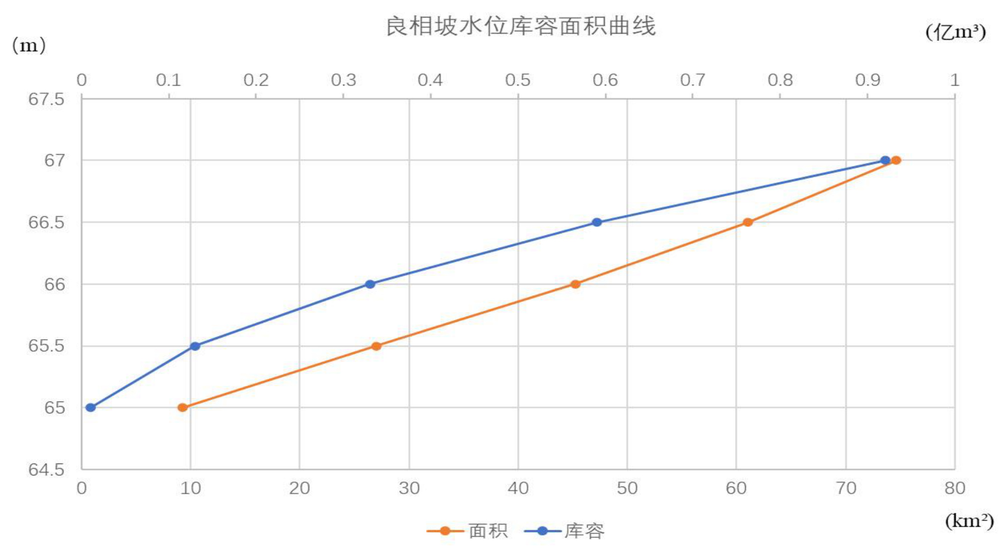  
附图 1 良相坡蓄滞洪区水位\~面积\~容积曲线图  

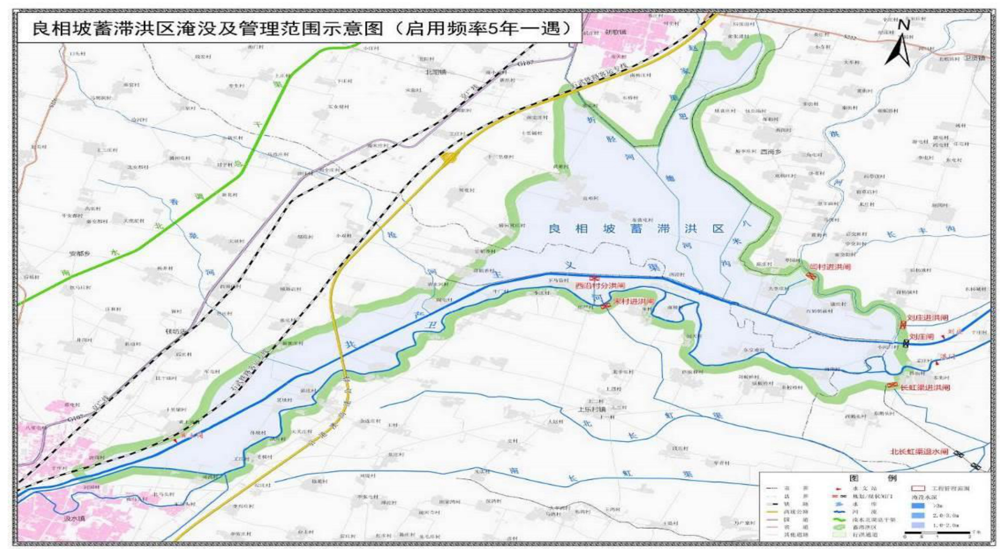  
附图 2 良相坡蓄滞洪区总布置图  

# 附图 3 良相坡蓄滞洪区洪水风险示意图  

河南省良相坡蓄滞洪区规划淇河和卫共50年一遇洪水淹没图  

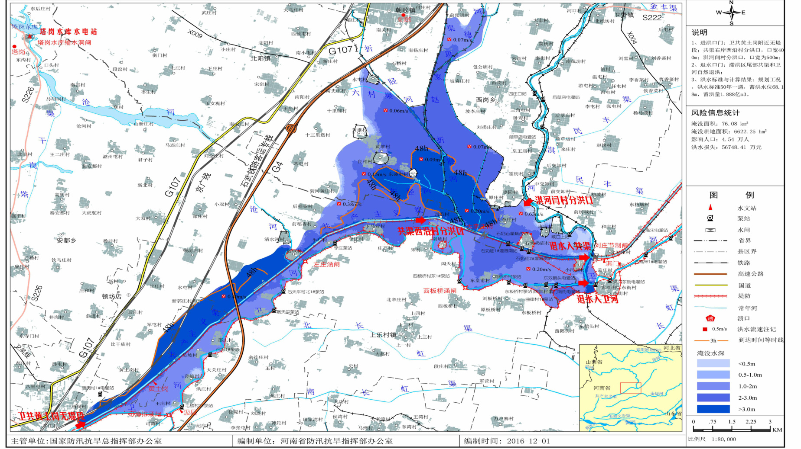  

# 共渠西蓄滞洪区运用预案  

# 1 总则  

# 1.1 编制依据  

共渠西蓄滞洪区运用预案编制依据有:《中华人民共和国防洪法》、《蓄滞洪区运用补偿暂行办法》、《蓄滞洪区运用预案编制导则》等。  

# 1.2 编制目的  

保证蓄滞洪区工程的正常运用,增强蓄滞洪区防洪应变能力,起到削减洪峰、蓄滞超量洪水的作用,保障防洪抗灾工作高效有序进行。  

# 1.3 编制原则  

以习近平总书记“两个坚持、三个转变”防灾减灾救灾新理念为指导,贯彻“以人民为中心”的发展思想,保护人民群众生命财产安全;坚持行政首长负责制,统一指挥、统一调度;坚持底线思维,强化风险意识,最大程度减轻灾害损失;注重蓄滞洪区运用预案的可操作性,保障蓄滞洪区及时有效运用。  

# 1.4 适用范围  

本预案适用于共渠西蓄滞洪区。  

# 2 蓄滞洪区概况  

# 2.1 自然地理特征  

2.1.1 地理位置、高程、地形地貌  

共渠西蓄滞洪区位于浚县共产主义渠淇河口以下左岸,由上、下两个互不相连的洼地组成,该蓄滞洪区全在浚县境内,上片范围西南起淇河左堤,东南靠共渠左堤,西北接自然高地;下片东部靠共渠,西部靠自然高地。上片为解决淇河洪水,下片为原白寺坡的一部分,1959 年开挖共渠后,将白寺坡蓄滞洪区分隔成东西两部分,在共渠以西的部分划归共渠西蓄滞洪区,即共渠西蓄滞洪区下片,用于分滞共渠洪水。由于在共渠西蓄滞洪区下片段共渠无左堤,目前下片实际已成了一个自然行滞洪的通道。区内地形西北高,东南低,上片地面高程为 61.90\~64.00m,下片地面高程为 $56.70{\sim}60.00\mathrm{m}.$ 。  

# 2.1.2 所在流域、水系  

共渠西蓄滞洪区属于海河流域漳卫河水系,淇河发源于山西省陵川县棋子山,流经山西省的陵川县和河南省的辉县、林州、鹤壁市、淇县、浚县等县市,于浚县的刘庄入卫河,全长 $162\mathrm{km}$ ,流域面积 $2142\mathrm{km}^{2}$ 。  

# 2.2 社会经济情况  

2.2.1 城镇、村庄、人口  

共渠西蓄滞洪区涉及浚县 6 个乡镇,58 个行政村,1.82 万户,  

7.48 万人。区内有 3 个乡镇,15 个行政村,2.73 万人。  

# 2.2.2 耕地面积、工农业生产总值  

共渠西蓄滞洪区内年均粮食总产量 11500 万公斤,农业生产总值 16100 万元,工业生产总值 73660 万元,人均收入 11950 元。  

# 2.2.3 重要设施  

该洪区内有省道大海线、省道 302、濮鹤高速;有共渠大碾桥、濮鹤高速共渠特大桥。  

# 2.3 蓄滞洪区特征指标  

# 2.3.1 在流域防洪中的作用  

共渠西蓄滞洪区上片用于分滞淇河洪水,下片原为白寺坡的一部分,1960 年共渠开挖后,将白寺坡蓄滞洪区分割为东西两部分,在共渠以西的部分划归为共渠西蓄滞洪区,即共渠西蓄滞洪区下片,用以分滞共渠洪水。  

# 2.3.2 滞洪特征指标  

流域防洪规划中的共渠西蓄滞洪区的设计蓄滞洪量 2.81 亿$\mathrm{m}^{3}$ ,淹没面积 $94.86\mathrm{km}^{2}$ ,运用机率为 5 年一遇;现状共渠西蓄滞洪区蓄滞洪水位上片为 $63.50\mathrm{m}$ 、下片为 $60.00\mathrm{m}$ ,总蓄洪量 0.6 亿$\mathrm{m}^{3}$ ,蓄滞洪区淹没面积 $56.5\mathrm{km}^{2}$ 。  

# 2.4 洪水风险概况  

见共渠西蓄滞洪区不同机遇洪水风险图。  

# 2.5 防洪工程情况  

# 2.5.1 防洪工程现状  

共渠西蓄滞洪区堤防共 3 条,总长 $34.1\mathrm{km}$ ,其中淇河左堤长 $3.5\mathrm{km}$ ,堤顶高程 $74.06{\sim}67.05\mathrm{m}$ ,顶宽 $5\mathrm{m}$ ;共渠左堤长 $9.4\mathrm{km}$ , 堤顶高程 $67.53{\sim}64.53\mathrm{m}$ ,顶宽 $5\mathrm{m}$ ,共渠右堤长 $21.2\mathrm{km}$ ,堤顶高 程 $63.80{\sim}61.00\mathrm{m}$ ,顶宽 $5{\sim}8\mathrm{m}$ 。  

# 2.5.2 进退洪设施情况  

共渠西蓄滞洪区在淇河左堤设有刘庄分洪堰分洪入共渠西蓄滞洪区上片,口宽 $400\mathrm{m}$ ,堰顶高程 $64.10\mathrm{m}$ ,堰上覆土与淇河左堤平,设计过流量 $1870\mathrm{m}^{3}/\mathrm{s}$ ;共渠左岸邢固以下基本为弃土并有豁口,行洪时自然漫溢。  

共渠西蓄滞洪区退洪方式为通过长丰沟入共渠。  

# 2.5.3 穿堤建筑物规模、位置等基本情况  

蓄滞洪区共渠左岸有 5 座穿堤涵闸,同山闸位于小河镇同山村,该闸消能防冲设施、启闭机、闸门毁坏、无管理房、闸房等;左洼闸现已拆除;白寺东南闸于白寺乡白寺村东南,该闸正在改建;许庄闸位于白寺乡东许庄村村东,2015 年已加固;码头西闸位于屯子镇码头村西,该闸消能防冲设施、启闭机、闸门毁坏、无管理房、闸房等。  

# 2.5.4 防洪工程存在的主要问题  

1.蓄滞洪区无分洪、退洪控制工程,大碾未开卡;  

2.蓄滞洪区内骨干排水沟除涝标准低、缺少生产桥,部分已  

有生产桥目前已成危桥。  

# 2.6 安全设施状况  

# 2.6.1 安全设施现状  

共渠西蓄滞洪区目前区内只有下片东许庄有一条围村堤,长$400\mathrm{m}$ ,可安排避洪人口 1585 人。  

# 2.6.2 转移安置设施状况  

蓄滞洪区内有 S305、S222、X004、新卫、赵交等 5 条省、县、乡级道路可作为撒退路使用。  

1.S305 公路:省道,经过区内的大碾、于村、裴村、尚村等村庄,路面宽 $12\mathrm{m}$ 。  

2.S222 公路:省道,经过区内的白寺、左洼、靳庄等村庄,路面宽 $12\mathrm{m}$ 。  

3.X004 公路:县级道路,从巨桥到新镇,途经巨桥、公堂、裴营、卫贤、陈香菜、曹香菜、李桥、码头、新镇等村庄,全长$22\mathrm{km}$ ,路面宽 $12\mathrm{m}$ ,沥青路面,由于大车超载碾压所致路面已严重损坏。  

4.新卫公路:乡级公路,从新镇到前枋城,途经新镇、码头、东郭村、西郭村、于庄、东枋城、后枋城、赵岗、张屯、冯屯、任屯、姚村、卫贤等村庄。全长 $10.6\mathrm{km}$ ,路面宽度 $7\mathrm{m}$ ,沥青路面,但毁坏严重,路面坑洼不平,每逢雨、雪泥泞不堪。  

5.赵交公路:乡级公路。从赵岗到前交卸,途经赵岗、来庄、后交卸、中交卸、前交卸等村庄。全长 $5.5\mathrm{km}$ ,路面宽 $5\mathrm{m}$ ,沥青路面,由于沥青面较薄,路面坑洼不平,严重损坏,雨、雪季节泥泞不堪,影响正常使用。  

# 2.6.3 预警通讯系统情况  

共渠西蓄滞洪区有无线电机站 1 个,无线对讲机 1 对。  

# 2.6.4 安全设施存在问题  

1.蓄滞洪区上片无围村堤、救生台、避水楼、庄台;  
2.蓄滞洪区下片东许庄围村堤内无排水设施;  
3.蓄滞洪区内撤退道路少,不能满足撤退需要;  
4.缺少救生船只和通讯预警设备。  

# 2.7 历史运用和补偿  

# 2.7.1 历史运用  

历次蓄滞洪区运用时间、运用方式、转移人口、最大进洪流量、蓄滞洪量、淹没面积、经济损失等。  

共渠西蓄滞洪区在 1961 年、1963 年、1969 年、1970 年、1971年、1972 年、1975 年、1976 年、1980 年、1982 年、1996 年、2000 年、2021 年、2023 年 14 次运用,其中 1963 年最高滞洪水位 $60.90\mathrm{m}$ ,相应滞洪量 0.96 亿 $\mathrm{m}^{3}$ ,淹没耕地 13.2 万亩,财产损失 8400 万元;1982 年最高滞洪水位 $60.27\mathrm{m}$ ,相应滞洪量 0.52 亿$\mathrm{m}^{3}$ ,淹没耕地 4.0 万亩,滞洪历时 15 天,财产损失 800 万元;1996年最高滞洪水位 $59.43\mathrm{m}$ ,相应滞洪量 0.21 亿 $\mathrm{m}^{3}$ ,淹没耕地 3.5万亩,滞洪历时 15 天。  

2021 年 7 月 21 日,浚县遭受特大暴雨袭击,受此次强降雨—164—  

影响,卫河、共产主义渠等河道均出现超保证水位洪水。7 月 22日 23 时,刘庄分洪口分洪,8 月 25 日基本完成退水,历时 35 天,最高蓄滞洪水位 $64.70\mathrm{m}$ (上片,刘庄)、60.08(下片,白寺村),最大蓄滞洪量 0.95 亿 $\mathrm{m}^{3}$ 。共渠西蓄滞洪区运用共涉及浚县 4 个乡镇,62 个行政村被淹,淹没耕地 9.72 万亩,人口 5.93 万人,造成财产损失 50642 万元。  

2023 年 7 月 28 日 8 时至 8 月 2 日 8 时,河南省海河流域普降暴雨、大暴雨,局部特大暴雨,对整个海河流域包括河南省豫北地区造成严重冲击。8 月 1 日 15 时,共产主义渠刘庄闸泄量达到 $255\mathrm{m}^{3}/\mathrm{s}$ ,共渠西蓄滞洪区下片区共产主义渠左岸无堤段自然漫溢,洪水进入蓄滞洪区。  

# 2.7.2 运用补偿实施情况  

自 2000 年《蓄滞洪区运用补偿暂行办法》实施以来,2021年首次运用,补偿损失 34641 万元,2023 年运用补偿损失 6493万元。  

# 3 组织与保障  

# 3.1 指挥机构  

# 3.1.1 指挥机构组成及职责  

为确保共渠西蓄滞洪区的正常运用,浚县成立蓄滞洪区运用指挥部。指挥长由各县政府负责人担任。蓄滞洪区运用指挥部在县防汛抗旱指挥部的领导下,具体负责本县范围内蓄滞洪区运用时各项工作。其主要职责是:负责蓄滞洪区运用时的信息发布、人员转移安置、分洪实施、抢险救生、物资供应、运用补偿、灾后重建工作。  

# 3.1.2 指挥机构内设责任组及职责  

根据工作需要,蓄滞洪区在运用时宜设立信息发布组、转移安置组、分洪实施组、抢险救生组、通信保障组、物资供应组、后勤保障组,分工负责蓄滞洪区运用相关工作。各工作组职责如下:  

信息发布组:负责蓄滞洪区运用的预警、警报发布和宣传工作。  

转移安置组:负责蓄滞洪区内居民转移安置的组织和协调工作。  

分洪实施组:负责桂李进洪闸门和丁桥南、北泄洪闸的操作工作。  

抢险救生组:负责蓄滞洪区防洪工程和安全设施的巡查、防守、抢险及人员救生的组织工作。  

通讯保障组:负责蓄滞洪区运用的应急通讯工作。  

物资供应组:负责防汛物资的调拨和运输工作。  

后勤保障组:负责蓄滞洪区居民生活必需品的筹集和发放、社会治安、医疗卫生等组织、协调工作。  

各责任组的负责人及成员宜根据蓄滞洪区所在地县级人民政府有关部门的职责分工确定。  

# 3.2 抢险救生与物资保障  

# 3.2.1 抢险救生队伍  

由县蓄滞洪区运用指挥部负责组建县级防汛抢险救生队,并明确负责人及职责。在蓄滞洪区运用时,作为应急抢险队,遇有  

重大突发险情时,充实到抗洪一线,做好全县蓄滞洪区范围内的防汛抢险工作。  

# 3.2.2 防汛物资储备  

按照“统一计划,分级负责,各有关部门密切配合,归口筹措”的原则。采取“群众集体筹措与国家储备相结合”的方式,专人负责。物料准备主要采取以下几种方法:  

1.就地取材,发动群众储备  

这类物料采取“就近筹划,登记造册估价,备而不集,用后付款”的办法,汛期未用的由物主自行处理。  

2.商务、供销、粮食、交通等部门储备  

筹备小组应按照储备计划,及时将物料质量数量、储备地点、运输车辆、监管人员等详细情况,登记造册,向县防汛抗旱指挥部(蓄滞洪区运用指挥部)报告。  

# 3.县防汛部门自备  

县防汛抗旱指挥部储备防汛物资的品种有麻袋、编织袋、铅丝、木桩、救生衣、土工布、块石等。数量防汛部门根据防汛需求自行储备。地点存放在县水利局仓库。县防汛抗旱指挥部储备防汛物资的调用必须有浚县防汛抗旱指挥部批准。  

# 3.3 生活保障  

生活保障的责任单位由蓄滞洪区所在地县级人民政府确定,责任单位应明确一名负责人为生活保障责任人。蓄滞洪区运用指挥部根据当地实际生活状况,制定出蓄滞洪区居民基本生活定额。  

1.临时住房安置:转移人员的临时住房由安置接收单位负责,本单位临时房屋及帐篷不足以安置时,可通过所在镇(街道办)政府协调,征用附近民房。  

2.食品、饮用水、衣被、燃料等生活必需品的筹集与发放:转移人员的食品、饮用水、衣被、燃料等生活必需品筹集与发放由转移村的包村单位负责,以上生活必需品不足时,由蓄滞洪区运用指挥部负责调配或协调解决。生活必需品的发放按照儿童、老人、伤残、病人、妇女优先的原则统筹发放。  

# 3.其它应急生活物资筹备途径  

指定储备:由各县防汛抗旱指挥部统一协调,储备一定数量的用于搭建安置灾民临时住房、燃料的各项救灾物资,保证随调随有。紧急情况下,确有困难,可向邻近县或上级请求支援。  

开展社会捐助活动:遭遇超标准洪水,造成重大损失时,县、镇(街道办)两级政府可发动群众开展集中性社会捐助活动。所募集款物,全部用于灾区群众生活安置。在紧急情况下,组织灾区发扬“一方有难、八方支援”的优良传统,广泛开展“无灾区支援灾区、轻灾区支援重灾区”的互助互济活动,以村(居)委会为单位筹集食品和饮用水,解决灾民的燃眉之急。  

# 3.4 治安与交通保障  

治安与交通保障的责任单位由蓄滞洪区所在地县级人民政府确定,责任单位应明确一名负责人为治安与交通保障责任人。同时宜按照运用的不同阶段,制定相应的治安交通保障措施,包括撤退转移交通保障、蓄滞洪区内和安置点的治安保障。蓄滞洪区运用时,要做好治安保卫防范工作,确保迁安人员生命财产安全和社会稳定,同时会同有关单位切实做好蓄滞洪区运用的撤退转移交通保障工作。  

# 3.5 医疗保障  

医疗保障的责任单位由蓄滞洪区所在地县级人民政府确定,责任单位应明确一名负责人为医疗保障责任人。同时宜明确医疗药品、设备筹集方式。蓄滞洪区运用后,按预定计划抽调医务人员组成医疗分队,分赴灾区负责灾民医疗救护及卫生防疫工作,应配备足量的常用药品和医疗器械,能进行紧急医疗救助,保障转移人员身体健康。同时宣传防疫卫生知识,防止疾病流行。灾后撤离人员返回原住地前,要对灾区村庄进行全面彻底的消毒处理,确保灾后无大疫。  

# 3.6 宣传保障  

宣传保障的责任单位由蓄滞洪区所在地县级人民政府确定,责任单位应明确一名负责人为宣传保障责任人。同时宜制定蓄滞洪区运用的宣传和信息发布方案。可利用电视、广播等宣传工具进行宣传,使区内群众充分了解蓄滞洪区淹没情况、报警手段、撤离路线、转移安置方案、生活保障措施等。蓄滞洪区运用后,及时通报蓄滞洪区滞洪情况,并向群众宣传生活卫生、安全及防疫等有关知识,确保群众的思想稳定和生命安全。  

# 4 预警与警报  

# 4.1 决策机构与程序  

警报发布人:县防汛抗旱指挥部(蓄滞洪区运用指挥部)指挥长 $\longrightarrow$ 乡镇防汛抗旱指挥部指挥长 $\longrightarrow$ 蓄滞洪区内村委会主任。  

职责:及时传达上级命令,执行上级洪水调度指令,组织成立抢险救生队伍,组织蓄滞洪区人员、财产的转移、撤离和安置,组织受灾群众恢复生产和灾后重建。  

结束信号的发布为转移撤离完成后,蓄滞洪区启用前 30 分钟,由县防汛抗旱指挥部宣布结束信号。行动内容为:乡镇防汛抗旱指挥部需将蓄滞洪区内有关转移撤离情况上报县防汛抗旱指挥部,县防汛抗旱指挥部确认行动结束。  

# 4.2 警报级别  

根据蓄滞洪区启用不同阶段,警报分为黄色预警、橙色预警和红色警报三级,分别代表运用准备、转移清场、蓄滞洪三个阶段。  

# 4.3 警报发布时机  

1.运用准备阶段:根据水文气象部门洪水预报,县防指适时发布黄色预警指令,县蓄滞洪区运用指挥部接到指令后,立即通知需要转移和接受撤离人员安置的乡镇,各有关乡镇在 30 分钟内通知各村组及居民,做好转移撤离准备。  

2.转移清场阶段:县蓄滞洪区运用指挥部接到县防指发布的橙色预警指令后,立即向有关乡镇发布转移撤离命令,各乡镇按预定计划在省防指下达指定分洪时间前将人员撤离转移出去,并及时向县防指汇报撤离情况。  

3.蓄滞洪阶段:县蓄滞洪区运用指挥部经排查,确认撤离完成后,立即向县防指报告撤离结束,蓄滞洪区进入备用警戒状态。当决定启用蓄滞洪区时,县防指按上级命令适时发布红色警报。红色警报期持续至具备返迁条件时为止。  

# 4.4 警报发布机构及方式  

当接到上级有关蓄滞洪区运用命令后,县防汛抗旱指挥部是预警、警报的发布机构。发布方式采用电话、无线通讯、广播及警笛等形式。  

# 4.5 警报解除  

当蓄滞洪区险情解除、并具备返迁条件时,蓄滞洪区运用指挥部要及时用警报器、电话、短信、广播、电视和巡回报警车等方式,发布警报解除信息。  

# 5 转移与安置  

# 5.1 安全避洪任务  

# 5.1.1 安全状况  

共渠西蓄滞洪区安全建设现状是:目前,区内只有下片东许庄有一条围村堤,长 $400\mathrm{m}$ 。  

# 5.1.2 避洪任务  

避洪任务主要包括:需要转移的乡(镇)、村庄、人口,洪区内就近转移的人口以及需要向区外转移的人口等。共渠西蓄滞洪区涉及 6 个乡镇,58 个行政村,1.82 万户,7.48 万人。其中受淹行政村 15 个,受淹人口 2.73 万人。蓄滞洪区内只有下片东许庄有围村堤,可安排就地避洪人口 1585 人。蓄滞洪区内需转移的有新镇镇和卫贤镇的 14 个村庄,人口 2.73 万人。  

# 5.2 就地安置  

# 5.2.1 就地安置工作负责人及其职责  

蓄滞洪区居民就地安置工作的负责人由蓄滞洪区所在地县级人民政府指定,就地安置所涉及乡镇的党政负责人为该乡镇负责人。各级负责人的职责是及时传达执行指令,负责、组织协调安置群众的日常生活。  

# 5.2.2 安置人口的数量、地点  

在安全区(保庄圩)、安全台(庄台)和避水楼(房)等安置地点要明确专人负责临时安置人员的人数、安全和日常生活等问题,详见附表。  

# 5.3 转移安置  

# 5.3.1 转移安置负责人及其职责  

转移安置总负责人由蓄滞洪区所在地县级人民政府指定,转移安置涉及村组负责人为转移村组、接纳安置点负责人。职责是做好转移安置计划,明确转移路线,落实交通工具,并在蓄滞洪区运用指挥部备案,及时传达执行迁安指令,做好转移群众的思想动员工作,负责组织、协调迁安群众于最短时间撤离危险区,保障迁安群众安全撤离和妥善安置。  

# 5.3.2 转移方案  

蓄滞洪区居民就地安置与转移安置计划见附表。  

# 5.3.3 逐村组落实安置地点  

安置点的选择,在保证安全的前提下,应以就近、同行政区域为原则,并考虑安置点的接纳条件。  

# 5.3.4 人员和物资分批转移时机  

转移时先人员后物资,如果车辆允许情况下一起转移。转移时以村组为单位,依次逐步转移,做到有序进行,不能相互干扰,保证在有限时间内撤离转移安置到位,不能让一人一户掉队。  

5.3.5 撤退转移时通讯联系方式。  

撤退转移时的通讯联系方式一般以电话、手机和无线电电台对讲机为主。  

# 5.3.6 各村组的转移路线。  

转移安置路线的确定应考虑转移道路通行能力、转移任务及运输条件等因素。  

# 5.3.7 各村组撤退转移的交通工具  

蓄滞洪区运用指挥部应根据居民就地安置与转移安置计划,明确各村组撤退转移的交通工具种类、数量和筹措方式,确定筹措责任单位和责任人。  

# 6 工程调度与运用  

# 6.1 调度方案  

# 6.1.1 启用条件  

(1)当共产主义渠刘庄站水位达到保证水位 $66.20\mathrm{m}$ 且继续 上涨或流量超过 $600\mathrm{m}^{3}/\mathrm{s}$ 时,视上游来水情况扒开淇河左堤刘庄  

分洪堰上土堤,分洪入共渠西(上片);  

(2)当共产主义渠刘庄站流量超过 $250\mathrm{m}^{3}/\mathrm{s}$ 或水位超过64.00m(水文站标高)时,其下游共产主义渠左岸自然漫溢,洪水进入共渠西(下片)。  

# 6.1.2 调度权限  

经会商,确定蓄滞洪区启用时,河南省防汛抗旱指挥部下达命令至鹤壁市防汛抗旱指挥部,同时做好蓄滞洪区运用监督工作;鹤壁市防汛抗旱指挥部将省防汛抗旱指挥部命令分别及时传达到浚县防汛抗旱指挥部,同时做好滞洪区运用监督、指导工作;浚县防汛抗旱指挥部负责预案的具体组织实施工作。同时,浚县蓄滞洪区运用指挥部按照预案组织好区内人员的转移安置等工作。  

# 6.2 工程运用  

进洪方式:  

当共产主义渠刘庄站水位达到保证水位 66.20m 且继续上涨或流量超过 $600\mathrm{m}^{3}/\mathrm{s}$ 时,视上游来水情况扒开淇河左堤刘庄分洪堰上土堤,分洪入共渠西(上片);当共产主义渠刘庄站流量超过$250\mathrm{m}^{3}/\mathrm{s}$ 或水位超过 $64.00\mathrm{m}$ (水文站标高)时,其下游共产主义渠左岸自然漫溢,洪水进入共渠西(下片)。  

退洪方式:  

共渠西蓄滞洪区洪水通过长丰沟退入共渠。  

共渠西蓄滞洪区的运用按省防汛抗旱指挥部指令进行。爆破警戒由浚县公安局、人武部担负爆破区的警戒和安全。  

# 6.3 工程防守与应急抢险  

# 6.3.1 防守要求  

为防止以上险情发生特制定以下措施:对险工险段组织人员24 小时轮流值班巡查,发现险情及时上报;对主要堤段派人巡堤查险昼夜值班,发现险情及时处理并上报。各类险情的抢护方法如下:渗漏脱坡:上堵下排,临水截流,背水导渗;漏洞:直接在迎水坡找到洞口堵塞,可用铁锅、棉被、秸料等封堵,上做防渗处理;找不到洞口,可在出水口做反滤井填砂石滤料等导渗;裂缝:主要采取回填、隔断、灌堵等方法。  

# 6.3.2 抢险人员组织落实和责任  

转移命令发布后,立即组织洪区居民快速有序撤离,撤离后及时组织人员排查,防止存在未撤离人员。共渠西蓄滞洪区滞洪后,救生队要驾驶船只,24 小时进行水面巡查,发现围困人员立即进行搜救,同时上报县防汛抗旱指挥部。  

# 7 返迁与善后  

# 7.1 返迁  

# 7.1.1 居民人身安全保障  

蓄滞洪区运用后,受洪水淹没的桥梁、道路、房屋可能存在安全隐患,需要进行安全检查,以确保居民的人身安全。该项工作由蓄滞洪区运用指挥部明确责任单位及职责。  

# 7.1.2 居民卫生安全保障  

洪水淹没区域存在流行疾病传播的危险,需要对原居住地环境进行清理和消毒等卫生防疫,以确保居民的卫生安全。该项工作由蓄滞洪区运用指挥部明确责任单位及职责。  

# 7.1.3 其它安全隐患排查  

其它安全隐患排查包括公共设施隐患、水电等生命线工程隐患、水利工程设施隐患等排查。该项工作由蓄滞洪区运用指挥部明确责任单位及职责。  

# 7.1.4 返迁家园  

退洪后,县蓄滞洪区运用指挥部组织相关职能小组,按照撤离时的顺序、路线、交通工具组织撤离人员返迁家园。人员的返迁时间确定在洪水基本退出、道路可以通行、各种安全隐患排除后。  

# 7.2 善后  

# 7.2.1 运用补偿工作  

蓄滞洪区运用指挥部应按《蓄滞洪区运用补偿暂行办法》的要求,每年在规定时间内完成蓄滞洪区内居民财产登记工作,并明确运用补偿的责任单位及职责。  

# 7.2.2 水毁工程的修复  

蓄滞洪区运用后应及时核查汇总水毁工程情况、编报水毁工程修复计划。对于较小的水毁工程呈报地方政府积极组织力量进行修复;对于较大的水毁工程上报上级部门申请资金,待项目批复后按计划组织实施。  

# 8 附图附表  

8.1 附表  

1 共渠西蓄滞洪区基本情况表  
2 共渠西蓄滞洪区社会经济统计表  
3 共渠西蓄滞洪区居民安全撤离及安置计划表  
4 共渠西蓄滞洪区居民财产登记及变更登记汇总表  
5 共渠西蓄滞洪区高程\~面积\~容积表  

8.2 附图  

1 共渠西蓄滞洪区水位\~库容\~面积曲线图  
2 共渠西蓄滞洪区总布置图  
3 共渠西蓄滞洪区洪水风险示意图  

# 附表 1 共渠西蓄滞洪区基本情况表  

<html><body><table><tr><td colspan="2">蓄滞洪区名称</td><td colspan="3">共渠西蓄滞洪区 就地安置人口 (人)</td><td>1585</td></tr><tr><td colspan="2">兴建时间</td><td>1960年</td><td colspan="2">转移安置人口 (人)</td><td>27270</td></tr><tr><td colspan="2">所在河流</td><td>淇河、共渠</td><td colspan="2">通讯设施</td><td>无线电台1部</td></tr><tr><td colspan="2">所在市县</td><td>浚县</td><td colspan="2">报警设施</td><td>电视、广播</td></tr><tr><td colspan="2">设计蓄滞洪水位(m)</td><td>上片63.5 下片60.0</td><td colspan="2">船只 (只)</td><td>无</td></tr><tr><td colspan="2">设计蓄滞洪量（亿m²)</td><td>0.6</td><td rowspan="2">撤退 道路</td><td>条数</td><td>5</td></tr><tr><td colspan="2">蓄洪面积（km²)</td><td>56.5</td><td>长度（km)</td><td>62.1</td></tr><tr><td colspan="2">耕地 (万亩) 地面高程范围(m)</td><td>9.63 上片61.90</td><td rowspan="2">进洪口门</td><td>口门位置</td><td>刘庄</td></tr><tr><td colspan="2">运用机率 (年一遇)</td><td>下片56.00 上片10年 下片1~2年</td><td>口门高程（m) 口门宽度（m)</td><td>64.10 400</td></tr><tr><td rowspan="5">涉及 区域 区内</td><td>乡镇 (个)</td><td>6</td><td rowspan="4">蓄滞洪 区堤防</td><td>堤顶高程(m)</td><td>61.0~73.70</td></tr><tr><td>行政村 (个)</td><td>58</td><td>堤长(km)</td><td>34.1</td></tr><tr><td>人口 (万人)</td><td>7.48</td><td>堤顶宽(m)</td><td>3~8</td></tr><tr><td rowspan="2">人口 (万人)</td><td>2.73</td><td rowspan="2">防洪标准 (年一遇)</td><td rowspan="2">10</td></tr><tr><td>行政村 (个) 15</td></tr><tr><td rowspan="2">安全区 (保庄圩)</td><td>安全区 （处)</td><td>1</td><td colspan="2">堤顶高程（m)</td><td>60.80</td></tr><tr><td>围堤长（km)</td><td>0.4</td><td colspan="2">安置人口 (人)</td><td>1585</td></tr></table></body></html>  

附表 2 共渠西蓄滞洪区社会经济统计表  

<html><body><table><tr><td>序号</td><td>城镇 (个)</td><td>村庄 (个)</td><td>人口 (人)</td><td>耕地面积 (亩)</td><td>粮食年产量 (kg)</td></tr><tr><td>1</td><td>6</td><td>58</td><td>74834</td><td>96306</td><td>1.15亿</td></tr><tr><td colspan="3">重要道路</td><td colspan="3">濮鹤高速</td></tr><tr><td colspan="3">重要桥梁</td><td colspan="3">濮鹤高速共渠特大桥、共渠大碾桥</td></tr><tr><td colspan="3">农业总产值 (万元)</td><td colspan="3">16100</td></tr><tr><td colspan="3">工业总产值 (万元)</td><td colspan="3">73660</td></tr><tr><td colspan="3">固定资产总值 (万元)</td><td colspan="3">10251</td></tr><tr><td colspan="3">经济发展模式</td><td colspan="3">养殖及小企业</td></tr><tr><td colspan="3">产业结构形式</td><td colspan="3">以种植业为主，小企业为辅</td></tr><tr><td colspan="3">人均收入(元)</td><td colspan="3">11950</td></tr></table></body></html>  

附表 3 共渠西行洪区居民安全撤离及安置计划表  

<html><body><table><tr><td colspan="4">计划撤离情况</td><td colspan="4">计划安置地点</td><td>备注</td></tr><tr><td rowspan="2">所在 县名</td><td>乡镇名称</td><td>行政村名</td><td>撤离人口 （人)</td><td>安置地点</td><td>安置人口 (人)</td><td>乡镇名称「所在县名</td><td></td><td></td></tr><tr><td colspan="2">杨马湖</td><td>2276</td><td>后屯</td><td>2276</td><td rowspan="6"></td><td></td><td></td></tr><tr><td rowspan="6">卫贤</td><td>前交卸</td><td>1224</td><td>李庄</td><td>1224</td><td rowspan="6">卫贤</td><td rowspan="6"></td></tr><tr><td>赵岗</td><td></td><td>3165</td><td>卫贤</td><td>3165</td></tr><tr><td>后交卸</td><td></td><td>878</td><td>裴营</td><td>878</td></tr><tr><td>中交卸</td><td></td><td>532</td><td>砖城</td><td>532</td></tr><tr><td rowspan="2">小计</td><td>5</td><td>8075</td><td>5</td><td>8075</td></tr><tr><td>北刘庄</td><td>1380 孟</td><td>庄</td><td>1380</td></tr><tr><td rowspan="9">浚县 新镇</td><td>后枋城</td><td></td><td>1375</td><td>西郭村</td><td></td><td rowspan="9">新镇</td><td rowspan="9">浚县</td></tr><tr><td></td><td></td><td></td><td></td><td>1375</td></tr><tr><td>前枋城</td><td>2252</td><td>码</td><td>头 2252</td><td></td></tr><tr><td>王马湖</td><td>1338</td><td>新</td><td>镇</td><td>1338</td></tr><tr><td>崔马湖</td><td>1922</td><td>新</td><td>镇</td><td>1922</td></tr><tr><td>李 桥</td><td>1537</td><td>新</td><td>镇 东郭村</td><td>1537 2140</td></tr><tr><td>和 庄 邢 固</td><td>2140</td><td>司</td><td>庄 3973</td><td></td></tr><tr><td>东枋城</td><td>3973 1693</td><td>码 头</td><td>1693</td><td></td></tr><tr><td></td><td></td><td></td><td></td><td></td></tr><tr><td>小计</td><td>9</td><td>17610</td><td>7</td><td>17610</td><td></td><td>下片</td></tr><tr><td>白寺乡</td><td>东许庄*</td><td>1585</td><td>就地</td><td>1585</td><td>白寺乡</td><td></td></tr><tr><td>合计</td><td>15</td><td>27270</td><td>12</td><td>27270</td><td>3</td><td>1</td></tr></table></body></html>  

附表 4 共渠西蓄滞洪区居民财产登记及变更登记汇总表  

<html><body><table><tr><td rowspan="2">单位 名称</td><td rowspan="2">户数 (户)</td><td rowspan="2">涉及 人口 (人)</td><td rowspan="2">承包土地 (亩)</td><td rowspan="2">农作物 (亩)</td><td colspan="3">专业养殖</td><td rowspan="2">经济林 (亩)</td><td colspan="2">居民住房</td><td colspan="2">农业生产机械役畜</td><td>家庭主要耐 用消费品</td></tr><tr><td>家畜类 (头)</td><td>家禽类 (只)</td><td>水产 (亩)</td><td>（间）</td><td>(m²)</td><td>农业生产 机械 (台)</td><td>役畜 (畜)</td><td>主要家用电 器 (台)</td></tr><tr><td>鹤壁市</td><td>18244</td><td>74834</td><td>106097.78</td><td>104828.26</td><td>123398</td><td>461633</td><td>1</td><td>1279.36</td><td>68170</td><td>1677502.23</td><td>8430</td><td>818</td><td>28793</td></tr><tr><td>合计</td><td>18244</td><td>74834</td><td>106097.78</td><td>104828.26</td><td>123398</td><td>461633</td><td></td><td>1279.36</td><td>68170</td><td>1677502.23</td><td>8430</td><td>818</td><td>28793</td></tr></table></body></html>

备注:表格内填写“/”的表示无此项内容。  

# 附表 5-1 共渠西蓄滞洪区高程 $\sim$ 面积\~容积表(上片)  

附表 5-2 共渠西蓄滞洪区高程\~面积\~容积表(下片)  

<html><body><table><tr><td>序号</td><td>高程(m)</td><td>面积 (km²)</td><td>容积 (亿m²)</td></tr><tr><td>1</td><td>62</td><td>13</td><td>0.03</td></tr><tr><td>2</td><td>62.5</td><td>21.5</td><td>0.12</td></tr><tr><td>3</td><td>63</td><td>27.5</td><td>0.24</td></tr><tr><td>4</td><td>63.5</td><td>29.22</td><td>0.35</td></tr><tr><td>5</td><td>64</td><td>30.94</td><td>0.46</td></tr></table></body></html>  

<html><body><table><tr><td>序号</td><td>高程(m)</td><td>面积(km²)</td><td>容积(亿m²)</td></tr><tr><td>1</td><td>57</td><td>8</td><td>0</td></tr><tr><td>2</td><td>57.5</td><td>11.5</td><td>0.03</td></tr><tr><td>3</td><td>58</td><td>15</td><td>0.06</td></tr><tr><td>4</td><td>58.5</td><td>18.1</td><td>0.11</td></tr><tr><td>5</td><td>59</td><td>21.2</td><td>0.16</td></tr><tr><td>6</td><td>59.5</td><td>24.6</td><td>0.2</td></tr><tr><td>7</td><td>60</td><td>28</td><td>0.24</td></tr></table></body></html>  

# 附图 1 共渠西蓄滞洪区水位\~库容\~面积曲线图  

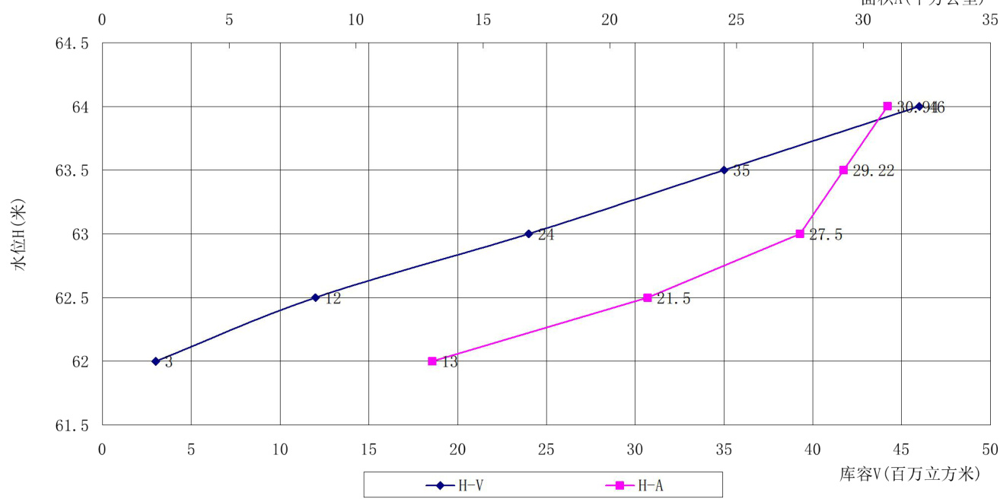  
共渠西滞洪区(上片)水位-库容、面积曲线  

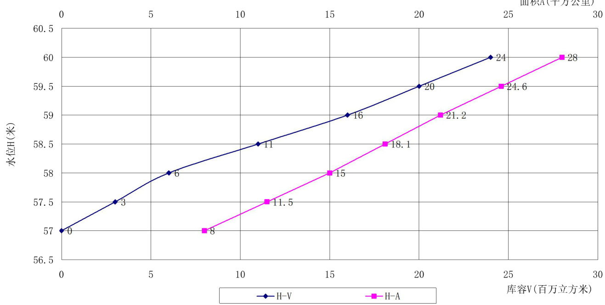  
共渠西滞洪区(下片)水位-库容、面积曲线  

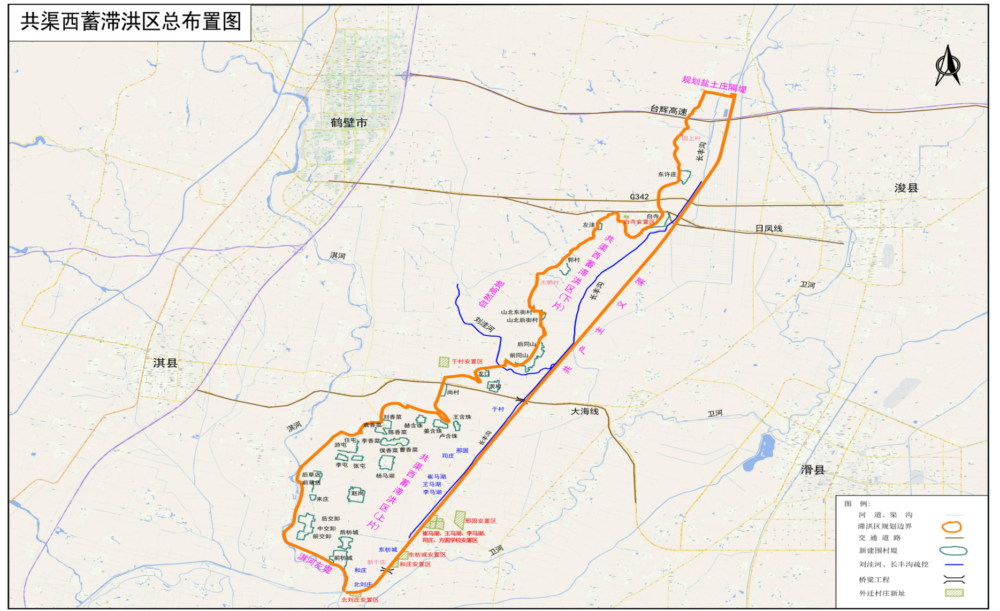  
附图 2 共渠西蓄滞洪区总布置图  

# 附图 3 共渠西蓄滞洪区洪水风险示意图  

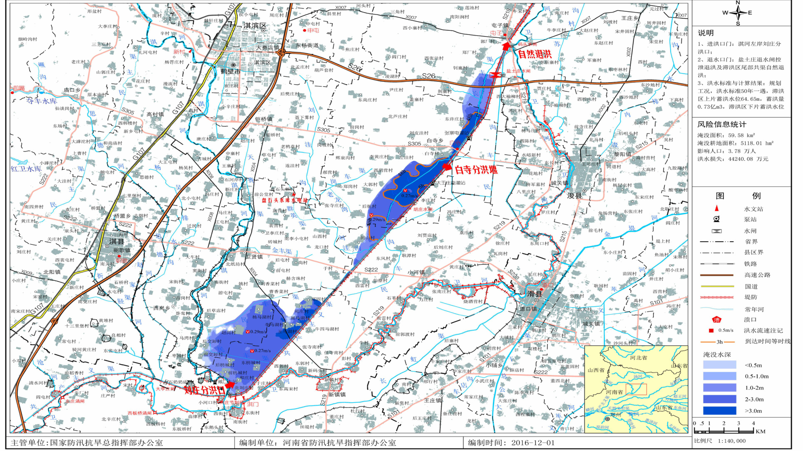  
河南省共渠西蓄滞洪区规划淇河和卫共50年一遇洪水淹没图  

# 白寺坡蓄滞洪区运用预案  

# 1 总则  

# 1.1 编制依据  

白寺坡蓄滞洪区运用预案编制依据有:《中华人民共和国防洪法》、《蓄滞洪区运用补偿暂行办法》、《蓄滞洪区运用预案编制导则》等。  

# 1.2 编制目的  

保证蓄滞洪区工程的正常运用,增强蓄滞洪区防洪应变能力,起到削减洪峰、蓄滞超量洪水的作用,保障防洪抗灾工作高效有序进行。  

# 1.3 编制原则  

以习近平总书记“两个坚持、三个转变”防灾减灾救灾新理念为指导,贯彻“以人民为中心”的发展思想,保护人民群众生命财产安全;坚持行政首长负责制,统一指挥、统一调度;坚持底线思维,强化风险意识,最大程度减轻灾害损失;注重蓄滞洪区运用预案的可操作性,保障蓄滞洪区及时有效运用。  

# 1.4 适用范围  

本预案仅适用白寺坡蓄滞洪区。  

# 2 蓄滞洪区概况  

# 2.1 自然地理  

2.1.1 地理位置、高程、地形地貌  

白寺坡蓄滞洪区位于卫河、共产主义渠与淇河汇合口下游,卫河与共产主义渠之间鹤壁市的浚县和安阳市的滑县境内。该洪区位于平原地区,地面高程在 $57.20\mathrm{m}{\sim}60.00\mathrm{m}$ 之间,东以卫河左堤和蓄滞洪区边界堤防—傅庄防洪堤为界,西以共产主义渠右堤为界,南部为自然高地。  

# 2.1.2 所在流域、水系  

白寺坡蓄滞洪区属于海河流域漳卫河水系,卫河是漳卫河水系的一大支流。卫河发源于山西省陵川县夺火镇,在河北省馆陶县徐万仓与漳河汇合后称漳卫河。南部、西部、东南部与黄河流域为邻,北靠漳河流域,东接马颊河流域,跨焦作、新乡、鹤壁、安阳、濮阳等市,在河南省的流域面积为 $12921\mathrm{km}^{2}$ ,约占全流域的 $85\%$ ,是豫北地区重要的泄洪排涝河道。  

卫河北傍太行山脉,南为黄河冲积平原,地形总的趋势是西高东低。大沙河为卫河上游干流,卫河先后纳入左岸的淇河、汤河、安阳河等 10 余条梳齿状支流。1958 年为引黄修建的共产主义渠,自合河起傍卫河左岸至老观嘴汇入卫河。1962 年停止引黄后承担行洪,淇门以上卫河主要承担流域内排涝,淇门以下卫共洪涝合排。  

# 2.2 社会经济  

2.2.1 城镇、村庄、人口  

白寺坡蓄滞洪区涉及浚县、滑县 2 个县,7 个乡镇,79 个村庄,2 个农场,总人口 8.48 万人。区内包括浚县、滑县 2 个县,5 个乡镇,51 个村庄,人口 64157 人。其中:浚县有小河、白寺、屯子等 4 个乡镇,46 个村庄,人口 48104 人;滑县有道口镇 1 个乡镇,5 个村庄,人口 11917 人。  

2.2.2 耕地面积、工农业生产总值等  

蓄滞洪区内浚县耕地面积 9.6 万亩,农业生产总值 15800 万元,工业生产总值 65340 万元,人均收入 11950 元;滑县耕地面积 0.5445 万亩,农业生产总值 1004.2 万元,工业生产总值 73780万元,固定资产总值 25000 万元,人均收入 14000 元。  

# 2.2.3 重要设施  

白寺坡蓄滞洪区内重要设施有濮鹤高速公路、省道永定线、大海线、浚大线及濮鹤高速跨共产主义渠特大桥。  

# 2.3 蓄滞洪特征指标  

# 2.3.1 在流域防洪中的作用  

白寺坡蓄滞洪区是海河流域防洪体系不可缺少的重要组成部分,该洪区控制着卫河流域淇门以上流域面积 $8525.2\mathrm{km}^{2}$ 。利用该洪区缓洪、滞洪,以减轻卫河下游河道洪水压力,有效控制卫河老观嘴及安阳河口下泄流量。  

# 2.3.2 蓄滞洪特征指标  

流域防洪规划中白寺坡蓄滞洪区的设计蓄滞洪区水位为$61.4\mathrm{m}$ ,设计蓄滞洪量 3.1 亿 $\mathrm{m}^{3}$ ,淹没面积 $129.06\mathrm{km}^{2}$ ,运用机率为 10 年一遇;现状蓄滞洪水位 $60.00\mathrm{m}$ ,水深 $2\sim3\mathrm{m}$ ,淹没面积$101.5\mathrm{km}^{2}$ ,设计蓄滞洪量 1.78 亿 $\mathrm{m}^{3}$ ,运用机率为 $3\sim10$ 年一遇。  

# 2.4 洪水风险概况  

见白寺坡蓄滞洪区不同机遇洪水风险图。  

# 2.5 防洪工程情况  

# 2.5.1 蓄滞洪区围堤情况  

白寺坡蓄滞洪区浚县境内防洪堤3条。其中:付庄堤长14.46km,堤顶高程 $60.74\sim61.28\mathrm{m}$ ,边坡坡比1:2.5;卫河左堤长 $16.1\mathrm{km}$ ,堤顶高程 $62.50\sim65.50\mathrm{m}$ ,边坡坡比 1:3;共渠右堤长 $22.1\mathrm{km}$ ,堤顶高程 $62.20\sim62.80\mathrm{m}$ ,边坡坡比 1:3。滑县境内防洪堤 1 条:卫河左堤长 $4.88\mathrm{km}$ ,堤顶高程 $63.89\sim64.39\mathrm{m}$ ,堤内边坡坡比 $1\colon~1.5\sim1\colon~2.5$ ,堤外边坡坡比 $1\colon2\sim1\colon2.5_{\circ}$ 。  

# 2.5.2 进退洪设施情况  

白寺坡蓄滞洪区进洪口为白寺坡分洪闸 $+$ 堰,其中白寺坡分洪闸共7孔,每孔净宽 $10\mathrm{m}$ ,闸底板高程 $57.0\mathrm{m}$ ,分洪流量 $900\mathrm{m}^{3}/\mathrm{s}$ ,分洪堰总宽 $110\mathrm{m}$ ,堰顶高程 $57.0\mathrm{m}$ ,堰上覆土,分洪流量 $700\mathrm{m}^{3}/\mathrm{s}$ 。  

退洪通过民丰沟盐土庄闸退水入卫河,盐土庄闸为 6 孔混凝土闸门,孔高 $3\mathrm{m}$ ,宽 $3\mathrm{m}$ ,设计流量 $60\mathrm{m}^{3}/\mathrm{s}$ 。  

# 2.5.3 穿堤建筑物基本情况  

浚县境内:卫河左岸涵闸 2 座,分别是曹湾闸、周口闸,现已堵死。共渠右岸涵闸 6 座:耿潭闸,位于桩号 $16{+}484$ 处,宽$1.8\mathrm{m}$ ,高 $2.4\mathrm{m}$ ,砌石结构;李庄闸,位于桩号 $21{+}139$ 处,宽 $1.0\mathrm{m}$ ,高 $1.5\mathrm{m}$ ,砌石结构;白寺闸,位于桩号 $24+733$ 处,宽 $1.6\mathrm{m}$ ,高$3.3\mathrm{m}$ ,砌石结构;农场闸,位于桩号 $26+766$ 处,宽 $2.0\mathrm{m}$ ,高 $2.2\mathrm{m}$ ,砌石结构;七股路闸,位于桩号 $29\mathrm{+}036$ 处,宽 $1.8\mathrm{m}$ ,高 $0.8\mathrm{m}$ ;码头闸,位于桩号 $33{+}313$ 处,宽 $2.0\mathrm{m}$ ,高 $2.6\mathrm{m}$ 。付庄堤涵管 6座,分别位于桩号 $0{+}685$ 、 $2+890$ 、5+980、7+915、9+185、13+980处;泵站 1 座,位于黎阳镇西长村村西,现已报废。滑县境内:卫河左岸涵洞 5 座:分别位于桩号 $30\substack{+334}$ 、30+554、 $31{+}335$ 、$31{+}746$ 、 $32\substack{+438}$ 。提灌站 1 座,卫河道口提灌站, $3{\times}465\mathrm{kW}$ ,现已报废。  

# 2.5.4 防洪工程存在问题  

1.民丰沟盐土庄闸年久失修,设备损坏严重,无法正常使用;2.付庄堤堤防洪标准低,遇较大洪水时难以保证浚县县城安全;3.蓄滞洪区内骨干排水沟—民丰沟尚未全线达标,另交通桥损坏严重,数量不足,难以满足滞洪时群众转移撤离的需要;4.蓄滞洪区内涵闸、泵站、提灌站,大多年久失修,损坏严重,无法正常使用;  

# 2.6 安全设施  

# 2.6.1 安全设施现状  

白寺坡蓄滞洪区浚县境内有围村堤 2 条,总长 1.296km,可安排 994 人避洪;救生台 10 座,面积 $12317\mathrm{m}^{2}$ ;避水房 6 座,避  

水楼 8 座,总面积 $8011\mathrm{m}^{2}$ ;2009 年新建撤退路 9 条,长 $27.64\mathrm{km}$ 。  
滑县境内有避水楼 $1600\mathrm{m}^{2}$ 。  

# 2.6.2 转移安置设施现状  

白寺坡蓄滞洪区撤退道路共有 30 条,总长 $64.45\mathrm{km}$ 。其中:支线撤退路 5 条,长 $35.85\mathrm{km}$ ,村级撤退路 25 条,共长 $28.6\mathrm{km}$ 。  

# 2.6.3 预警通信系统情况  

浚县有无线电基站 1 个,无线对讲机 2 部;  
滑县无专用通信预警系统。  

# 2.6.4 安全设施存在问题  

1.蓄滞洪区内围村堤、救生台、避水楼数量少且年久失修,损坏严重,围村堤内缺少抽排水设施,不能满足群众就地避洪需要;  

2.蓄滞洪区内撤退道路少,缺少救生船只和专用通信预警设备。  

# 2.7 历史运用和补偿情况  

# 2.7.1 运用情况  

白寺坡蓄滞洪区建于 1955 年,自建成以来分别于 1956 年和1963 年运用过 2 次。1956 年运用时,最高蓄滞洪水位 $61.20\mathrm{m}$ ,相应蓄滞洪量 3.80 亿 $\mathrm{m}^{3}$ ,滞洪历时 40 天,淹没耕地 29.0 万亩,受灾人口 4.3 万人,财产损失 8600 万元。1963 年运用时,最高蓄滞洪水位 $60.90\mathrm{m}$ ,相应蓄滞洪量 3.34 亿 $\mathrm{m}^{3}$ ,滞洪历时 25 天,淹没耕地 18.0 万亩,受灾人口 3.5 万人,财产损失 7000 万元。  

2021 年 7 月 21 日,浚县、滑县遭受特大暴雨袭击,受此次强降雨影响,卫河、共产主义渠等河道均出现超保证水位洪水。  

白寺坡蓄滞洪区 7 月 24 日 22 时开始蓄滞洪水,8 月 20 日基本完成退水,历时 27 天,最高蓄滞洪水位 $62.29\mathrm{m}$ (王湾),最大蓄滞洪量 2.25 亿 $\mathrm{m}^{3}$ 。白寺坡蓄滞洪区运用共涉及浚县、滑县的 7 个乡镇 96 个行政村(含农场、军农场)被淹,淹没耕地 17.22 万亩,人口 11.7 万人,造成财产损失 131393 万元。  

# 2.7.2 补偿情况  

自 2000 年《蓄滞洪区运用补偿暂行办法》实施以来,2021年首次运用,补偿损失 91548 万元。  

# 3 组织与保障  

# 3.1 指挥机构  

# 3.1.1 指挥机构组成及职责  

为确保白寺坡蓄滞洪区的正常运用,浚县、滑县成立蓄滞洪区运用指挥部。指挥长由各县政府负责人担任。蓄滞洪区运用指挥部在县防汛抗旱指挥部的领导下,具体负责本县范围内蓄滞洪区运用时各项工作。其主要职责是:负责蓄滞洪区运用时的信息发布、人员转移安置、分洪实施、抢险救生、物资供应、运用补偿、灾后重建工作。  

# 3.1.2 指挥机构内设责任组及职责  

根据工作需要,蓄滞洪区在运用时宜设立信息发布组、转移安置组、分洪实施组、抢险救生组、通信保障组、物资供应组、后勤保障组,分工负责蓄滞洪区运用相关工作。各工作组职责如下:  

信息发布组:负责蓄滞洪区运用的预警、警报发布和宣传工作。  

转移安置组:负责蓄滞洪区内居民转移安置的组织和协调工作。  

分洪实施组:负责桂李进洪闸门和丁桥南、北泄洪闸的操作工作。  

抢险救生组:负责蓄滞洪区防洪工程和安全设施的巡查、防守、抢险及人员救生的组织工作。  

通讯保障组:负责蓄滞洪区运用的应急通讯工作。  

物资供应组:负责防汛物资的调拨和运输工作。  

后勤保障组:负责蓄滞洪区居民生活必需品的筹集和发放、社会治安、医疗卫生等组织、协调工作。  

各责任组的负责人及成员宜根据蓄滞洪区所在地县级人民政府有关部门的职责分工确定。  

# 3.2 抢险救生与物资保障  

# 3.2.1 抢险救生  

由各县蓄滞洪区运用指挥部负责组建县级防汛抢险救生队,并明确负责人及职责。在蓄滞洪区运用时,作为应急抢险队,遇有重大突发险情时,充实到抗洪一线,做好全县蓄滞洪区范围内的防汛抢险工作。  

# 3.2.2 物资保障  

防汛物资储备采取“群众集体筹措与国家储备相结合”的方式,各级要明确专人负责。  

群众集体筹措:由各乡镇负责,采取“就近筹划,登记造册估价,备而不集,用后付款”的办法,汛期未用的由物主自行处理。  

物资储备地点、种类、数量、运输方案及其负责人报县蓄滞洪区 运用指挥部备案。  

政府储备:各县蓄滞洪区运用指挥部根据本县蓄滞洪区情况要有足够的防汛物资储备,每年要制定详细的储备计划,并负责按计划落实储备的种类、数量、地点及交通运输方式,有明确的负责人。  

# 3.3 生活保障  

生活保障的责任单位由蓄滞洪区所在地县级人民政府确定,责任单位应明确一名负责人为生活保障责任人。各县蓄滞洪区运用指挥部根据当地实际生活状况,制定出蓄滞洪区居民基本生活定额。  

1.临时住房安置:转移人员的临时住房由安置接收单位负责,本单位临时房屋及帐篷不足以安置时,可通过所在镇(街道办)政府协调,征用附近民房。  

2.食品、饮用水、衣被、燃料等生活必需品的筹集与发放:转移人员的食品、饮用水、衣被、燃料等生活必需品筹集与发放由转移村的包村单位负责,以上生活必需品不足时,由蓄滞洪区运用指挥部调配或协调解决。生活必需品的发放按照儿童、老人、伤残、病人、妇女优先的原则统筹发放。  

3.其它应急生活物资筹备途径:  

指定储备:由各县防汛抗旱指挥部统一协调,储备一定数量的用于搭建安置灾民临时住房、燃料的各项救灾物资,保证随调随有。紧急情况下,确有困难,可向邻近县或上级请求支援。  

开展社会捐助活动:遭遇超标准洪水,造成重大损失时,县、镇(街道办)两级政府可发动群众开展集中性社会捐助活动。所募集款物,全部用于灾区群众生活安置。在紧急情况下,组织灾区发扬“一方有难、八方支援”的优良传统,广泛开展“无灾区支援灾区、轻灾区支援重灾区”的互助互济活动,以村(居)委会为单位筹集食品和饮用水,解决灾民的燃眉之急。  

# 3.4 治安与交通保障  

治安与交通保障的责任单位由蓄滞洪区所在地县级人民政府确定,责任单位应明确一名负责人为治安与交通保障责任人。同时宜按照运用的不同阶段,制定相应的治安交通保障措施,包括撤退转移交通保障、蓄滞洪区内和安置点的治安保障。蓄滞洪区运用时,要做好治安保卫防范工作,确保迁安人员生命财产安全和社会稳定,同时会同有关单位切实做好蓄滞洪区运用的撤退转移交通保障工作。  

# 3.5 医疗保障  

医疗保障的责任单位由蓄滞洪区所在地县级人民政府确定,责任单位应明确一名负责人为医疗保障责任人。同时宜明确医疗药品、设备筹集方式。蓄滞洪区运用后,按预定计划抽调医务人员组成医疗分队,分赴灾区负责灾民医疗救护及卫生防疫工作,应配备足量的常用药品和医疗器械,能进行紧急医疗救助,保障转移人员身体健康。同时宣传防疫卫生知识,防止疾病流行。灾后撤离人员返回原住地前,要对灾区村庄进行全面彻底的消毒处理,确保灾后无大疫。  

# 3.6 宣传保障  

宣传保障的责任单位由蓄滞洪区所在地县级人民政府确定,责任单位应明确一名负责人为宣传保障责任人。同时宜制定蓄滞洪区运用的宣传和信息发布方案。可利用电视、广播等宣传工具进行宣传,使区内群众充分了解蓄滞洪区淹没情况、报警手段、撤离路线、转移安置方案、生活保障措施等。蓄滞洪区运用后,及时通报蓄滞洪区滞洪情况,并向群众宣传生活卫生、安全及防疫等有关知识,确保群众的思想稳定和生命安全。  

# 4 预警与警报  

# 4.1 决策机构与程序  

警报发布人:县防汛抗旱指挥部指挥长 $\rightarrow$ 县蓄滞洪区运用指挥部指挥长 $\longrightarrow$ 乡镇防汛抗旱指挥部指挥长 $\longrightarrow$ 蓄滞洪区内村委主任。  

职责:负责及时传达上级命令,执行上级洪水调度指令,对指令执行情况及时进行反馈,做到上情下达、下情上报,及时、准确无误。  

# 4.2 警报级别  

根据蓄滞洪区启用的不同阶段,警报分为黄色预警、橙色预警和红色警报三级,分别代表运用准备、转移清场、蓄滞洪三个阶段。  

# 4.3 警报发布时机  

1.运用准备阶段:当长虹渠蓄滞洪区或共渠西蓄滞洪区运用后,根据水文气象部门洪水预报及洪水在淇门的组合情况,县防指适时发布黄色预警指令,县蓄滞洪区运用指挥部接到指令后,立即通知需要转移和接受撤离人员安置的乡镇,各有关乡镇在 30分钟内通知各村组及居民,做好转移撤离准备。  

2.转移清场阶段:县蓄滞洪区运用指挥部接到县防指发布的橙色预警指令后,立即向有关乡镇发布转移撤离命令,各乡镇按预定计划在省防指下达指定分洪时间前将人员撤离转移出去,并及时向县防指汇报撤离情况。  

3.蓄滞洪阶段:县蓄滞洪区运用指挥部经排查,确认撤离完成后,立即向县防指报告撤离结束,蓄滞洪区进入备用警戒状态。当决定启用蓄滞洪区时,县防指按上级命令适时发布红色警报。红色警报期持续至具备返迁条件时为止。  

# 4.4 警报发布机构及方式  

预警、警报由各县防汛抗旱指挥部发布,由县防汛抗旱指挥部各成员单位传达预警、警报信息。其主要传达方式有:高音喇叭、网络、电视、广播、电话、手机短信群发、鸣锣、鸣笛、专用信号车等。  

# 4.5 警报解除  

当蓄滞洪区险情解除、并具备返迁条件时,蓄滞洪区运用指  

挥部要及时用警报器、电话、短信、广播、电视和巡回报警车等方式,发布警报解除信息。  

# 5 转移与安置  

# 5.1 安全避洪任务  

蓄滞洪区内包括浚县、滑县 2 个县,5 个乡镇,51 个村庄(含国营农场),人口 64157 人。仅浚县小河村、康庄、程庄有安全避洪设施,可就地安置,其余村庄均无安全避洪设施,需转移安置。就地安置包括浚县 3 个村庄,人口 4136 人。转移安置包括浚县、滑县 2 个县,人口 60021 人。其中:浚县包括小河、白寺、屯子 3 个乡镇,44 个村庄和国营农场,人口 48104 人;滑县包括道口镇 1 个乡镇,5 个村庄,人口 11917 人。  

# 5.2 就地安置  

# 5.2.1 就地安置工作负责人及其职责  

蓄滞洪区居民就地安置工作的负责人由蓄滞洪区所在地县级人民政府指定,就地安置所涉及乡镇的党政负责人为该乡镇负责人。各级负责人的职责是及时传达执行指令,负责、组织协调安置群众的日常生活。  

# 5.2.2 安置人口的数量、地点  

在安全区(保庄圩)、安全台(庄台)和避水楼(房)等就地安置人口的数量、地点详见附表。  

# 5.3 转移安置  

# 5.3.1 转移安置负责人及职责  

转移安置总负责人由蓄滞洪区所在地县级人民政府指定,转移安置涉及村组负责人为转移村组、接纳安置点负责人。职责是做好转移安置计划,明确转移路线,落实交通工具,并在蓄滞洪区运用指挥部备案,及时传达执行迁安指令,做好转移群众的思想动员工作,负责组织、协调迁安群众于最短时间撤离危险区,保障迁安群众安全撤离和妥善安置。  

# 5.3.2 转移村组的人口、主要财产  

当蓄滞洪区启用时,按计划转移人员和主要财产。  

# 5.3.3 逐村组落实安置地点  

安置点的选择,在保证安全的前提下,应以就近、同行政区域为原则,并考虑安置点的接纳条件。  

# 5.3.4 人员和物资分批转移的时机  

转移时先人员后物资,如果车辆允许情况下一起转移。转移时以村组为单位,依次逐步转移,做到有序进行,不能相互干扰,保证在有限时间内撤离转移安置到位,不能让一人一户掉队。  

# 5.3.5 撤退转移时的通讯联系方式  

蓄滞洪区内村委会主任 $\longleftrightarrow$ 镇长(街道办主任) $\longleftrightarrow$ 县防汛抗旱指挥部指挥长。利用卫星电话、有线电话、手机、短信、广播、电视等方式进行联络,利用铜锣、手摇报警器预警、报警。  

# 5.3.6 各村组的转移路线  

转移安置路线的确定应考虑转移道路通行能力、转移任务及运输条件等因素。  

# 5.3.7 各村组撤退转移的交通工具  

蓄滞洪区运用指挥部应根据居民就地安置与转移安置计划,明确各村组撤退转移的交通工具种类、数量和筹措方式,确定筹措责任单位和责任人。  

# 6 工程调度与运用  

# 6.1 调度方案  

# 6.1.1 启用条件  

当白寺坡分洪闸闸上水位超过 $61.10\mathrm{m}$ 或盐土庄节制闸下泄流量超过 $1500~\mathrm{m}^{3}/\mathrm{s}$ 时,逐渐开启白寺坡分洪闸(最大分洪流量$900\mathrm{m}^{3}/\mathrm{s},$ ),分洪入白寺坡蓄滞洪区;当白寺坡分洪闸全部开启后,若闸上水位仍继续上涨,分段开启白寺坡分洪堰加大分洪量。  

# 6.1.2 调度权限  

经会商,确定蓄滞洪区启用时,河南省防汛抗旱指挥部下达命令至鹤壁市、安阳市防汛抗旱指挥部,同时做好蓄滞洪区运用监督工作;鹤壁市、安阳市防汛抗旱指挥部将省防汛抗旱指挥部命令分别及时传达到浚县市、滑县防汛抗旱指挥部,同时做好滞洪区运用监督、指导工作;浚县市、滑县防汛抗旱指挥部负责预案的具体组织实施工作。同时,浚县市、滑县蓄滞洪区运用指挥部按照预案组织好区内人员的转移安置等工作。  

# 6.2 工程运用  

进洪方式:当白寺坡分洪闸闸上水位超过 61.10m 或盐土庄节制闸下泄流量超过 $1500\mathrm{m}^{3}/\mathrm{s}$ 时,逐渐开启白寺坡分洪闸(最大  

分洪流量 $900\mathrm{m}^{3}/\mathrm{s}^{\cdot}$ ),分洪入白寺坡蓄滞洪区;当白寺坡分洪闸全部开启后,若闸上水位仍继续上涨,分段开启白寺坡分洪堰加大分洪量。退洪方式:通过民丰沟盐土庄闸退水入卫河。  

# 6.3 工程防守和应急抢险  

县蓄滞洪区运用指挥部负责全县滞洪区防洪工程、安全设施抢险工作,对各种可能出现的工程险情制定切实可行的抢险方案。根据县、乡、村备案的抢险队,明确划分责任段、责任人,坚持 24 小时不间断巡查,发现险情及时上报、及时处理,同时各级物资供应部门要保证抢险物资的及时到位,确保防汛抢险的需要。遇有重大险情,要边抢险边上报,请求上级的支援,确保防汛工程的安全。  

# 7 返迁与善后  

# 7.1 返迁  

# 7.1.1 居民人身安全保障  

蓄滞洪区运用后,受洪水淹没的桥梁、道路、房屋可能存在安全隐患,需要进行安全检查,以确保居民的人身安全。该项工作由蓄滞洪区运用指挥部明确责任单位及职责。  

# 7.1.2 居民卫生安全保障  

洪水淹没区域存在流行疾病传播的危险,需要对原居住地环境进行清理和消毒等卫生防疫,以确保居民的卫生安全。该项工作由蓄滞洪区运用指挥部明确责任单位及职责。  

# 7.1.3 其它安全隐患排查  

其它安全隐患排查包括公共设施隐患、水电等生命线工程隐患、水利工程设施隐患等排查。该项工作由蓄滞洪区运用指挥部明确责任单位及职责。  

# 7.1.4 返迁家园  

退洪后,县蓄滞洪区运用指挥部组织相关职能小组,按照撤离时的顺序、路线、交通工具组织撤离人员返迁家园。人员的返迁时间确定在洪水基本退出、道路可以通行、各种安全隐患排除后。  

# 7.2 善后  

# 7.2.1 运用补偿工作  

蓄滞洪区运用指挥部应按《蓄滞洪区运用补偿暂行办法》的要求,每年在规定时间内完成蓄滞洪区内居民财产登记工作,并明确运用补偿的责任单位及职责。  

# 7.2.2 水毁工程的修复  

蓄滞洪区运用后应及时核查汇总水毁工程情况、编报水毁工程修复计划。对于较小的水毁工程呈报地方政府积极组织力量进行修复;对于较大的水毁工程上报上级部门申请资金,待项目批复后按计划组织实施。  

# 8 附图附表  

8.1 附表  

1 白寺坡蓄滞洪区基本情况表  

2 白寺坡蓄滞洪区社会经济统计表  

3 白寺坡蓄滞洪区水位\~面积\~容积表  

4 白寺坡蓄滞洪区历年运用情况统计表  
5 白寺坡蓄滞洪区居民安全撤离及安置计划表  
6 白寺坡蓄滞洪区居民财产登记及变更登记汇总表  

# 8.2 附图  

1 白寺坡蓄滞洪区水位\~面积\~容积曲线图  
2 白寺坡蓄滞洪区总布置图  
3 白寺坡蓄滞洪区洪水风险示意图  

# 附表 1 白寺坡蓄滞洪区基本情况表  

<html><body><table><tr><td colspan="2">蓄滞洪区名称</td><td>白寺坡</td><td colspan="2">就地安置人口 (人)</td><td>4136</td></tr><tr><td colspan="2">兴建时间</td><td>1955年</td><td colspan="2">转移安置人口（人)</td><td>60021</td></tr><tr><td colspan="2">所在河流</td><td>卫河</td><td colspan="2">通讯设施</td><td>无线电基站1个</td></tr><tr><td colspan="2">所在市县</td><td>鹤壁市浚县、 安阳市滑县</td><td colspan="2">报警设施</td><td>电话、广播、铜锣</td></tr><tr><td colspan="2">设计蓄滞洪水位（m)</td><td>60.00</td><td colspan="2">船只 (只)</td><td>无</td></tr><tr><td colspan="2">设计蓄滞洪量（亿m²)</td><td>1.78</td><td rowspan="2">撤退 道路</td><td>条数</td><td>30</td></tr><tr><td colspan="2">蓄洪面积（km²)</td><td>101.5</td><td>长度（km)</td><td>64.45</td></tr><tr><td colspan="2">耕地 (万亩)</td><td>10.1</td><td rowspan="3">分洪 闸</td><td>名称</td><td>白寺坡分洪闸</td></tr><tr><td colspan="2">地面高程范围 （m)</td><td>57.2~60.00</td><td>闸底高程(m)</td><td>57.0</td></tr><tr><td colspan="2">运用机率 (年一遇)</td><td>3~10</td><td>设计流量(m/s)</td><td>900</td></tr><tr><td rowspan="3">涉及 区域</td><td>乡镇 (个)</td><td>7</td><td rowspan="3">分洪堰</td><td>名称</td><td>白寺坡分洪堰</td></tr><tr><td>行政村、农场(个)</td><td>81</td><td>堰顶高程(m)</td><td>57.0</td></tr><tr><td>人口 (万人)</td><td>8.48</td><td>宽度(m)</td><td>110</td></tr><tr><td rowspan="2">区内</td><td>人口 (万人)</td><td>6.42</td><td rowspan="4">蓄滞洪 区堤防</td><td>堤顶高程(m)</td><td>60.74~65.50</td></tr><tr><td>行政村 (个)</td><td>51</td><td>堤长(km)</td><td>57.54</td></tr><tr><td rowspan="4">安全区 (保庄圩)</td><td>安全处 (个)</td><td>2</td><td>堤顶宽(m)</td><td>5~8</td></tr><tr><td>围堤长（km)</td><td>1.296</td><td>防洪标准 (年一遇)</td><td>10</td></tr><tr><td>堤顶高程（m)</td><td></td><td>座数 安全楼 （避水</td><td>15</td></tr><tr><td>安置人口 (人)</td><td>994</td><td>安全层面积（m²) 安置人口 (人)</td><td>9611 4136</td></tr></table></body></html>  

附表 2 白寺坡蓄滞洪区社会经济统计表  

<html><body><table><tr><td>序号</td><td>乡镇 (名称)</td><td>村庄、农 场(个)</td><td>人口(人)</td><td>耕地面积 (万亩)</td></tr><tr><td>1</td><td>浚县</td><td>76</td><td>77052</td><td>9.6</td></tr><tr><td>2</td><td>滑县</td><td>5</td><td>7775</td><td>0.54</td></tr><tr><td>合计</td><td></td><td>79</td><td>84827</td><td>10.1</td></tr><tr><td colspan="3">重要道路</td><td colspan="2">濮鹤高速、省道永定线、大海线、浚大线</td></tr><tr><td colspan="3">重要桥梁</td><td colspan="2">濮鹤高速跨共产主义渠特大桥</td></tr><tr><td colspan="3">农业总产值 (万元)</td><td colspan="2">15800</td></tr><tr><td colspan="3">工业总产值 (万元)</td><td colspan="2">65340</td></tr><tr><td colspan="3">经济发展模式</td><td colspan="2">养殖及小企业</td></tr><tr><td colspan="3">产业结构形式</td><td colspan="2">以种植业为主，小企业为辅</td></tr><tr><td colspan="3">人均年收入</td><td colspan="2">11950元（浚县）、14000元（滑县）</td></tr></table></body></html>  

附表 3 白寺坡蓄滞洪区水位\~面积\~容积表  

<html><body><table><tr><td>序号</td><td>高程H (m)</td><td>面积A(km²)</td><td>容积V（亿m²)</td></tr><tr><td>1</td><td>58.0</td><td>4.0</td><td></td></tr><tr><td>2</td><td>58.5</td><td>23.1</td><td>0.19</td></tr><tr><td>3</td><td>59.0</td><td>41.1</td><td>0.46</td></tr><tr><td>4</td><td>59.5</td><td>82.3</td><td>1.29</td></tr><tr><td>5</td><td>60.0</td><td>101.5</td><td>1.78</td></tr></table></body></html>  

附表 4 白寺坡蓄滞洪区历年运用情况统计表  

<html><body><table><tr><td rowspan="2">年度</td><td rowspan="2">蓄滞洪次数</td><td rowspan="2">最高蓄滞洪水位|相应蓄滞洪量 (m)</td><td rowspan="2">(亿m²)</td><td rowspan="2">量蓄滞洪历时 (小时)</td><td colspan="3">受灾情况</td></tr><tr><td>耕地 (亩)</td><td>人口 (Y)</td><td>财产损失 （万元）</td></tr><tr><td>1956年</td><td>1</td><td>61.20</td><td>3.80</td><td>960</td><td>290000</td><td>43000</td><td>8600</td></tr><tr><td>1963年</td><td>1</td><td>60.90</td><td>3.34</td><td>600</td><td>180000</td><td>35000</td><td>7000</td></tr><tr><td>2021年</td><td>1</td><td>62.29</td><td>2.25</td><td>648</td><td>172200</td><td>116800</td><td>131393</td></tr></table></body></html>  

附表 5 白寺坡滞洪区居民安全撤离及安置计划表  

<html><body><table><tr><td colspan="4">计划撤离情况</td><td colspan="4">计划安置地点</td><td rowspan="2">备注</td></tr><tr><td>所在县名</td><td>乡镇名称</td><td>行政村名</td><td>撤离人口 (人)</td><td>安置地点</td><td>安置人口 （人）</td><td>乡镇名称|所在县名</td><td></td></tr><tr><td rowspan="17">浚县</td><td></td><td>小河村</td><td>2359</td><td>就地</td><td>2359</td><td rowspan="12"></td><td></td><td></td></tr><tr><td>袁庄</td><td></td><td>1280</td><td>卫贤镇尚村</td><td>1280</td><td></td></tr><tr><td>瓦岗</td><td></td><td>2019</td><td>后公堂</td><td>2019</td></tr><tr><td>北张庄</td><td>910</td><td>黎阳镇后嘴头</td><td>910</td><td></td></tr><tr><td>后下滩</td><td>1147</td><td>卫贤镇曹香菜</td><td>1147</td><td></td></tr><tr><td>耿潭</td><td>1420</td><td>高营</td><td>1420</td><td rowspan="8">小河镇</td></tr><tr><td>张刘庄</td><td>894</td><td>卢含珠</td><td>894</td></tr><tr><td>任贾店</td><td>1344</td><td>山西</td><td>1344</td></tr><tr><td>西周口</td><td>833</td><td>黎阳镇大高村</td><td>833</td></tr><tr><td>聂渡</td><td>1227</td><td>卫贤镇北纸坊</td><td>1227</td></tr><tr><td>崔堡</td><td>2453</td><td>前公堂</td><td>2453</td></tr><tr><td>张贾店</td><td>1086</td><td>刘香菜</td><td>1086</td></tr></table></body></html>  

<html><body><table><tr><td colspan="4"></td><td colspan="4"></td><td rowspan="2">备注</td></tr><tr><td colspan="5">计划撤离情况</td><td colspan="3">计划安置地点</td></tr><tr><td>所在县名</td><td>乡镇名称</td><td>行政村名</td><td>撤离人口 (人)</td><td>安置地点</td><td>安置人口 (人)</td><td></td><td>乡镇名称|所在县名</td><td></td></tr><tr><td rowspan="10">浚县</td><td></td><td>包田庄</td><td>725</td><td>北纸坊</td><td>725</td><td></td><td></td></tr><tr><td></td><td>康庄</td><td>994</td><td>就地</td><td>994</td><td></td><td></td></tr><tr><td>刘固屯 前下滩</td><td></td><td>670</td><td>卫贤镇北纸坊</td><td>670</td><td></td><td></td></tr><tr><td>刘贾店</td><td>1399 648</td><td>侯香菜 陈香菜</td><td>1399</td><td></td><td></td><td></td></tr><tr><td>宗湾</td><td>847</td><td>李香菜</td><td>648 847</td><td></td><td></td><td></td></tr><tr><td>马庄</td><td>447</td><td>前屯</td><td>447</td><td></td><td></td><td></td></tr><tr><td>程庄</td><td>783</td><td>就地</td><td>783</td><td></td><td></td><td></td></tr><tr><td>柴湾</td><td>1169</td><td>黎阳镇南二郎庙</td><td>1169</td><td></td><td></td><td></td></tr><tr><td>东周口</td><td>893</td><td>大高村</td><td>893</td><td></td><td></td><td></td></tr><tr><td>徐庄</td><td>660</td><td>北二郎庙</td><td>660</td><td></td><td></td><td></td></tr><tr><td>后刘庄</td><td></td><td>454</td><td>卫贤镇王含珠</td><td>454</td><td></td><td></td></tr><tr><td>小河</td><td>前刘庄</td><td>700</td><td>赫含珠</td><td>700</td><td></td><td></td></tr><tr><td></td><td>侯刘庄</td><td>1111</td><td>姜含珠</td><td>1111</td><td></td><td></td></tr><tr><td></td><td>王庄</td><td>632</td><td>郭庄</td><td>632</td><td></td><td></td></tr><tr><td>韩贾店</td><td></td><td>330</td><td>前屯</td><td>330</td><td></td><td></td></tr><tr><td rowspan="9"></td><td>中周口</td><td>598</td><td>黎阳镇大高村</td><td>598</td><td></td><td></td><td></td></tr><tr><td>前冯庄</td><td>845</td><td>卫贤镇于村</td><td>845</td><td></td><td></td><td></td></tr><tr><td>后冯庄</td><td>791</td><td>于村</td><td>791</td><td></td><td></td><td></td></tr><tr><td>小雷村</td><td>949</td><td>谢庄</td><td>949</td><td></td><td rowspan="5">小河 浚县</td><td rowspan="5"></td></tr><tr><td>瓮城</td><td>2330</td><td>裴村</td><td>2330</td></tr><tr><td>东风</td><td>2680</td><td>姚村</td><td>2680</td></tr><tr><td>亮马台</td><td>921</td><td>龙口</td><td>921</td></tr><tr><td>曹湾</td><td>850</td><td>袁香菜</td><td>850</td></tr><tr><td>吴摆渡</td><td>820</td><td>刘堂</td><td>820</td><td></td><td></td></tr></table></body></html>  

<html><body><table><tr><td colspan="4">计划撤离情况</td><td colspan="4">计划安置地点</td><td rowspan="2">备注</td></tr><tr><td>所在县名</td><td>乡镇名称</td><td>行政村名</td><td>撤离人口 （人）</td><td>安置地点</td><td>安置人口 (人)</td><td></td><td>乡镇名称|所在县名</td></tr><tr><td rowspan="20">浚县</td><td>小计</td><td>37</td><td>40218</td><td>34</td><td>40218</td><td rowspan="11"></td><td></td><td rowspan="11"></td></tr><tr><td rowspan="4">白寺</td><td>大郭庄村</td><td>804</td><td>白寺一中</td><td>804</td><td rowspan="11">白寺</td></tr><tr><td>李庄村</td><td>353</td><td>白寺一中</td><td>353</td></tr><tr><td>大王庄村</td><td>648</td><td>教育中心</td><td>648</td></tr><tr><td>胡庄村</td><td>552</td><td>白寺小学</td><td>552</td></tr><tr><td>姜营村</td><td>1322</td><td>白寺村委</td><td>1322</td></tr><tr><td rowspan="2">小计</td><td>5</td><td>3679</td><td>5</td><td>3679</td></tr><tr><td>盐土庄</td><td>649</td><td>郭厂、董厂</td><td>649</td></tr><tr><td rowspan="2">屯子镇 小计</td><td>码头</td><td>2519</td><td>东小寨西小寨</td><td>2519</td></tr><tr><td>2</td><td>3168</td><td>2 3168</td><td></td></tr><tr><td rowspan="3">国营 农场</td><td>一分场</td><td>747</td><td>后同山</td><td>747</td><td rowspan="3">小河镇</td></tr><tr><td>五分场</td><td>292</td><td>后同山</td><td>292</td></tr><tr><td></td><td>1039</td><td>后同山</td><td>1039</td></tr><tr><td colspan="2">小计 合计 (浚县)</td><td>44</td><td>48104 39</td><td>48104</td><td></td><td rowspan="6"></td></tr><tr><td rowspan="5">滑县 道口镇</td><td></td><td></td><td>顺南</td><td>3524</td><td rowspan="5">道口镇</td><td rowspan="5">滑县</td></tr><tr><td>河西街 程文庄</td><td>3524 2176</td><td>顺北</td><td>2176</td></tr><tr><td>顺北新村</td><td>2590</td><td>顺北</td><td>2590</td></tr><tr><td>白庄</td><td>1762</td><td>五星</td><td>1762</td></tr><tr><td>军庄</td><td>1865</td><td>五星</td><td>1865</td></tr><tr><td colspan="2">滑县 (合计)</td><td>5</td><td>11917</td><td>11917</td><td></td></tr><tr><td colspan="2">共计 (浚县+滑县)</td><td>49</td><td>60021</td><td>42</td><td>60021</td><td></td></tr></table></body></html>  

附表 6 白寺坡蓄滞洪区居民财产登记及变更登记汇总表  

<html><body><table><tr><td rowspan="2">单位 名称</td><td rowspan="2">户数 (户)</td><td rowspan="2">涉及人 口 (人)</td><td rowspan="2">承包 土地 (亩)</td><td rowspan="2">农作物 (亩)</td><td colspan="2">专业养殖</td><td rowspan="2">经济林 （亩) 320526 262.06 150.00</td><td rowspan="2">居民住房</td><td colspan="2">农业生产机械、 役畜</td><td colspan="2">家庭主要耐用 消费品</td></tr><tr><td>家畜类 (头)</td><td>家禽类 （只）</td><td>（间） (m²)</td><td>农业生产 机械(台)</td><td>役畜 (畜)</td><td>主要家用电器 （台）</td></tr><tr><td>滑县</td><td>2539</td><td>7775</td><td>7021</td><td>7021</td><td>1720</td><td></td><td></td><td>65473</td><td>1779072</td><td>297556</td><td>1927</td><td>30233</td></tr><tr><td></td><td></td><td></td><td></td><td></td><td></td><td>23000</td><td></td><td>15200</td><td>310000</td><td>105</td><td>0</td><td>17000</td></tr><tr><td>合计</td><td>18705</td><td>84827</td><td>124954.52</td><td>127607.52</td><td>33496</td><td>343526</td><td>412</td><td>80673</td><td>2089072</td><td>297661</td><td>1927</td><td>47233</td></tr></table></body></html>  

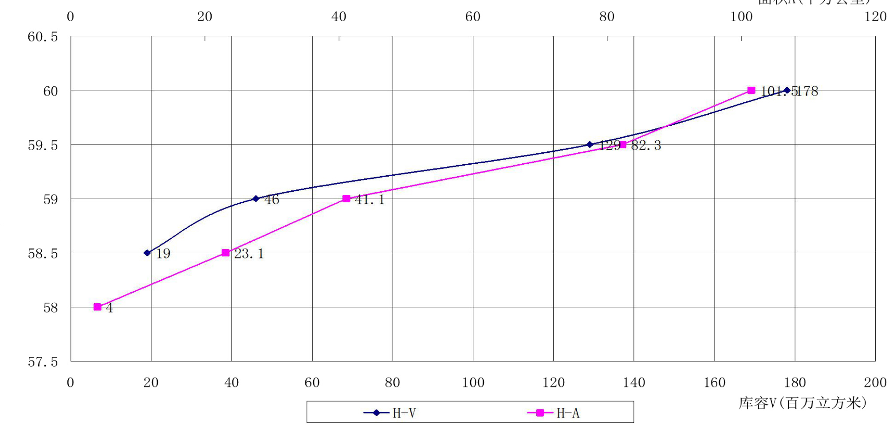  
附图 1 白寺坡蓄滞洪区水位\~面积\~容积曲线图  
白寺坡滞洪区水位-库容、面积曲线  

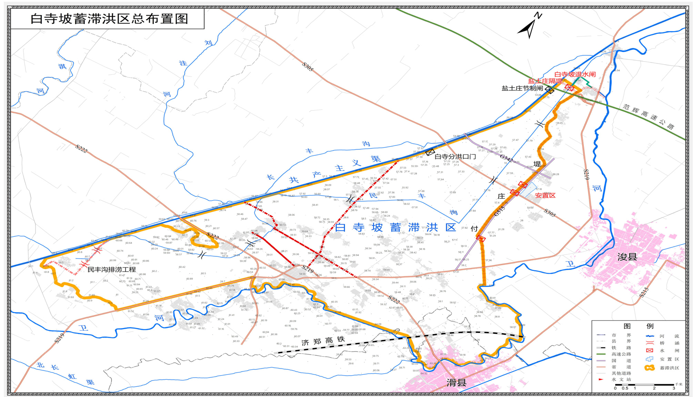  
附图 2 白寺坡蓄滞洪区总布置图  

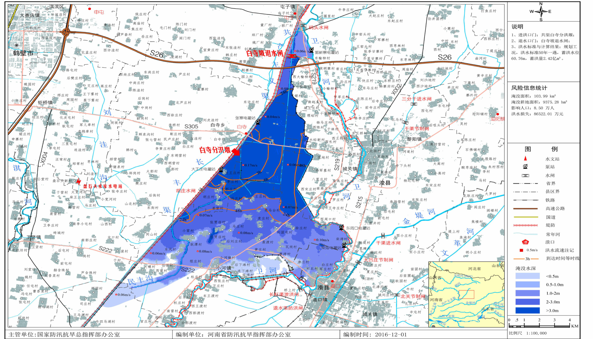  
附图 3 白寺坡蓄滞洪区洪水风险示意图河南省白寺坡蓄滞洪区规划淇河和卫共50年一遇洪水淹没图  

# 长虹渠蓄滞洪区运用预案  

# 1 总则  

# 1.1 编制依据  

长虹渠蓄滞洪区运用预案编制依据有:《中华人民共和国防洪法》、《蓄滞洪区运用补偿暂行办法》、《蓄滞洪区运用预案编制导则》等。  

# 1.2 编制目的  

保证蓄滞洪区工程的正常运用,增强蓄滞洪区防洪应变能力,起到削减洪峰、蓄滞超量洪水的作用,保障防洪抗灾工作高效有序进行。  

# 1.3 编制原则  

以习近平总书记“两个坚持、三个转变”防灾减灾救灾新理念为指导,贯彻“以人民为中心”的发展思想,保护人民群众生命财产安全;坚持行政首长负责制,统一指挥、统一调度;坚持底线思维,强化风险意识,最大程度减轻灾害损失;注重蓄滞洪区运用预案的可操作性,保障蓄滞洪区及时有效运用。  

# 1.4 适用范围  

本预案适用于长虹渠蓄滞洪区。  

# 2 蓄滞洪区概况  

# 2.1 自然地理  

2.1.1 地理位置、高程、地形地貌  

长虹渠蓄滞洪区位于卫河右岸的鹤壁市的浚县、安阳市的滑县境内,是太行山洪积和黄河冲积平原过渡的封闭洼地,历史上是自然滞洪蓄洪的坡洼。该洪区位于平原地区,地面高程$59.70\mathrm{m}{\sim}64.00\mathrm{m}$ ,南以古阳堤为界,北靠卫河右堤,东到滑县,西到申店隔堤,为狭长型,最窄处仅有 $2.5\mathrm{km}$ ,东西长约 $22\mathrm{km}$ 。  

# 2.1.2 所在流域、水系  

长虹渠蓄滞洪区属于海河流域漳卫河水系,卫河是漳卫河水系的一大支流。卫河发源于山西省陵川县夺火镇,在河北省馆陶县徐万仓与漳河汇合后称漳卫河。南部、西部、东南部与黄河流域为邻,北靠漳河流域,东接马颊河流域,跨焦作、新乡、鹤壁、安阳、濮阳等市,在河南省的流域面积为 $12921\mathrm{km}^{2}$ ,约占全流域的 $85\%$ ,是豫北地区重要的泄洪排涝河道。  

卫河北傍太行山脉,南为黄河冲积平原,地形总的趋势是西高东低。大沙河为卫河上游干流,卫河先后纳入左岸的淇河、汤河、安阳河等 10 余条梳齿状支流。1958 年为引黄修建的共产主义渠,自合河起傍卫河左岸至老观嘴汇入卫河。1962 年停止引黄后承担行洪,淇门以上卫河主要承担流域内排涝,淇门以下卫共洪涝合排。  

# 2.2 社会经济情况  

2.2.1 城镇、村庄、人口  

长虹渠蓄滞洪区涉及浚县、滑县 2 个县,4 个乡镇,62 个村庄,人口 8.88 万人。其中:浚县包括新镇、小河 2 个乡镇,人口4.35 万人;滑县包括王庄、小铺 2 个乡镇,人口 4.53 万人。区内包括浚县 2 个乡镇 24 个村庄,滑县 2 个乡镇 7 个村庄,人口 3.90万人。  

# 2.2.2 耕地面积、工农业生产总值等  

蓄滞洪区内浚县耕地面积 7.40 万亩,农业生产总值 18450 万元,工业生产总值 63042 万元,人均收入 11956 元左右;滑县耕地面积 3.57 万亩,农业生产总值 17319.9 万元,工业生产总值51985.8 万元,人均收入 12028 元。  

# 2.2.3 重要设施  

长虹渠蓄滞洪区内重要设施有省道永定线、卫浚公路、郑济高铁、杨淮高压线路等重要设施。  

# 2.3 滞洪特征指标  

# 2.3.1 在流域防洪中的作用  

长虹渠蓄滞洪区始建于 1954 年,在卫河防洪体系中具有重要作用,它承担着卫河河系防洪标准内的洪水蓄滞任务,在同良相坡、共渠西、白寺坡、柳围坡和共产主义渠联合运用的条件下,保障卫河下游地区防洪安全。  

# 2.3.2 滞洪特征指标  

流域防洪规划中长虹渠蓄滞洪区的设计蓄滞洪区水位为$62.49\mathrm{m}$ ,设计蓄滞洪量 1.19 亿 $\mathrm{m}^{3}$ ,淹没面积 $72.4\mathrm{km}^{2}$ ,运用机率为 20 年一遇;现状滞洪水位 $62.31\mathrm{m}$ ,水深 $0.5\mathrm{m}{\sim}3.0\mathrm{m}$ 之间,淹没面积 $87\mathrm{km}^{2}$ ,蓄洪量 1.04 亿 $\mathrm{m}^{3}$ 。  

# 2.4 洪水风险概况  

见长虹渠蓄滞洪区不同机遇洪水风险图。  

# 2.5 防洪工程情况  

# 2.5.1 蓄滞洪区围堤情况  

长虹渠蓄滞洪区围堤为卫河右堤、古阳堤和申店隔堤。卫河右堤长 $24.28\mathrm{km}$ ,现状堤顶高程大部分在 $63.30{\sim}70.10\mathrm{m};$ ;南部的古阳堤长 $27.82\mathrm{km}$ ,现状堤缺口颇多,高程在 $63.50{\sim}70.90\mathrm{m}$ ;西部申店隔堤,长 $4.4\mathrm{km}$ ,高程 $67.00\mathrm{m}$ 。  

# 2.5.2 进退洪设施情况  

小河口节制闸在淇共汇合口以下约 $300\mathrm{m}$ ,使共产主义渠淇门以上洪水主要经共渠下泄,以减轻卫河防洪压力,设计流量$700\mathrm{m}^{3}/\mathrm{s}$ ,5 孔,每孔净宽 $10.0\mathrm{m}$ ,底板高程为共产主义渠主河槽地面高程 $58.0\mathrm{m}$ 。闸顶高程为 $68.1\mathrm{m}$ 。闸室长 $18.0\mathrm{m}$ 。闸室上游侧设护坦,下游侧设消力池、海漫及防冲槽。汛前移交至卫河河务局管理。  

长虹渠蓄滞洪区进洪口为长虹渠分洪闸 $+$ 堰,其中长虹渠分洪闸共 6 孔,每孔净宽 $10\mathrm{m}$ ,闸底板高程 $62.20\mathrm{m}$ ,分洪流量 200$\mathrm{m}^{3}/\mathrm{s}$ ,分洪堰总宽 $230\mathrm{m}$ ,堰顶高程 $68.0\mathrm{m}$ ,堰上覆土,分洪流量—216—  

$700\mathrm{m}^{3}/\mathrm{s}$ 。。  

退洪设施为长虹渠退水闸,该闸底板高程为 $57.20\mathrm{m}$ ,与长虹渠河底高程一致,设计流量 $400\mathrm{m}^{3}/\mathrm{s}$ ,闸室共 5 孔,每孔净宽 $7.0\mathrm{m}$ ,闸室下游侧设有交通桥。  

# 2.5.3 穿堤建筑物基本情况  

长虹渠蓄滞洪区内共有穿堤建筑物 19 座。  

# 2.5.4 防洪工程存在问题  

1.洪区南部边界古阳堤堤身损坏严重,达不到蓄洪标准;  
2.蓄滞洪区主要排水渠—长虹渠淤积严重,退水闸流量偏小;  
3.道口西街深孔闸因淤积严重,闸门启闭机损坏,已无法启用。  

# 2.6 安全设施  

# 2.6.1 安全设施现状  

洪区内浚县有新镇、耿湾、淇门、西皮等 4 条围村堤,长$6722\mathrm{m}$ ;滑县有南村、牛庄 2 条围村堤,长 $7200\mathrm{m}$ 。  

# 2.6.2 转移安置设施现状  

长虹渠蓄滞洪区内有撤退道路 26 条,总长 $63.98\mathrm{km}$ ,其中浚县撤退道路 19 条,长 $48.1\mathrm{km}$ ;滑县撤退道路 7 条,长 $15.88\mathrm{km}$ 。  

# 2.6.3 预警通信系统情况  

蓄滞洪区内原配备通讯设备少且落后,特别是乡村之间缺乏 专用无线通讯预警设备,现有通讯设备由于运行时间较长,设备 老化,通讯质量较差,且无备用电源。  

# 2.6.4 安全设施存在问题  

1.蓄滞洪区安全避洪工程严重不足,除新镇、耿湾、淇门、西皮、南村、牛庄 6 座围村堤保存较为完整外,其余围村堤年久失修,损坏严重,已不能发挥作用;  

2.蓄滞洪区内围村堤内缺乏抽排水设施;  
3.蓄滞洪区内撤退抢险道路少,且部分损坏严重;  
4.缺少救生船只。  
2.7 历史运用和补偿情况  

# 2.7.1 运用情况  

长虹渠蓄滞洪区自 1954 年建成以来曾在 1954、1955、1956、1961、1963、1996、2021 年发生特大洪水时破堤进洪,破堤扒口和决口都集中在浚县的淇门、东高宋、烧酒营等地。  

1954 年 8 月 12 日,在东高宋北扒口 150 米,最高滞洪水位$61.54\mathrm{m}$ ,相应滞洪量 0.57 亿 $\mathrm{m}^{3}$ ,历时 20 天,淹没耕地 11 万亩,经济损失 2200 万元;  

1955 年 8 月 15 日,从淇门扒口分洪进长虹渠,最高滞洪水位 $63.11\mathrm{m}$ ,相应滞洪量 1.52 亿 $\mathrm{m}^{3}$ ,历时 13 天,淹没耕地 11 万亩,经济损失 2200 万元;  

1956 年 6 月 26 日,从淇门、东高宋扒口分洪进长虹渠,最大进洪流量 $1500\mathrm{m}^{3}/\mathrm{s}$ ,最高滞洪水位 $64.11\mathrm{m}$ ,相应滞洪量 3.30亿 $\mathrm{m}^{3}$ ,历时 48 天,淹没耕地 22.5 万亩,经济损失 4500 万元;  

1961 年 8 月 15 日,从东高宋扒口分洪进长虹渠,最大进洪流量 $200\mathrm{m}^{3}/\mathrm{s}$ ,最高滞洪水位 $61.32\mathrm{m}$ ,相应滞洪量 0.47 亿 $\mathrm{m}^{3}$ ,历时 28 天,淹没耕地 8.78 万亩,经济损失 1756 万元;  

1963 年 8 月 6 日,从淇门口门、东高宋口门扒口分洪进长虹渠,最大进洪流量 $2360\mathrm{m}^{3}/\mathrm{s}$ ,最高滞洪水位 63.26m,相应滞洪量2.53 亿 $\mathrm{m}^{3}$ ,历时 25 天,淹没耕地 22 万亩,经济损失 4400 万元;1996 年 8 月曹湾溢洪堰漫溢决口倒灌长虹渠蓄滞洪区下部,最高滞洪水位 $60.25\mathrm{m}$ ,相应滞洪量 0.05 亿 $\mathrm{m}^{3}$ ,历时 15 天,淹没耕地 5 万亩,其中绝收 2.48 万亩,经济损失 710 万元。  

2021 年 7 月 17 日以来,浚县、滑县遭受特大暴雨袭击,受此次强降雨影响,卫河、共产主义渠河道均出现超保证水位洪水。长虹渠蓄滞洪区于 7 月 23 日 2 时开始蓄滞洪水,历时 29 天,最高蓄滞洪水位 $63.34\mathrm{m}$ (牛寨村),最大蓄滞洪量 1.79 亿 $\mathrm{m}^{3}$ 。本次运用共涉及浚县、滑县的 4 个乡镇 60 个行政村被淹,淹没耕地10.11 万亩,人口 6.7 万人,造成财产损失 69534 万元。  

# 2.7.2 补偿情况  

自 2000 年《蓄滞洪区运用补偿暂行办法》实施以来,2021年首次运用,补偿损失 47610 万元。  

# 3 组织与保障  

# 3.1 指挥机构  

# 3.1.1 指挥机构组成及职责  

为确保长虹渠蓄滞洪区的正常运用,浚县、滑县成立蓄滞洪区运用指挥部。指挥长由各县政府负责人担任。蓄滞洪区运用指挥部在县防汛抗旱指挥部的领导下,具体负责本县范围内蓄滞洪  

区运用时各项工作。其主要职责是:负责蓄滞洪区运用时的信息发布、人员转移安置、分洪实施、抢险救生、物资供应、运用补偿、灾后重建工作。  

# 3.1.2 指挥机构内设责任组及职责  

根据工作需要,蓄滞洪区运用时宜设立信息发布组、转移安置组、分洪实施组、抢险救生组、通信保障组、物资供应组、后勤保障组,分工负责蓄滞洪区运用相关工作。各工作组职责如下:  

信息发布组:负责蓄滞洪区运用的预警、警报发布和宣传工作。  

转移安置组:负责蓄滞洪区内居民转移安置的组织和协调工作。  

分洪实施组:负责桂李进洪闸门和丁桥南、北泄洪闸的操作工作。  

抢险救生组:负责蓄滞洪区防洪工程和安全设施的巡查、防守、抢险及人员救生的组织工作。  

通讯保障组:负责蓄滞洪区运用的应急通讯工作。  

物资供应组:负责防汛物资的调拨和运输工作。  

后勤保障组:负责蓄滞洪区居民生活必需品的筹集和发放、社会治安、医疗卫生等组织、协调工作。  

各责任组的负责人及成员宜根据蓄滞洪区所在地县级人民政府有关部门的职责分工确定。  

# 3.2 抢险救生与物资保障  

# 3.2.1 抢险救生队伍  

由县蓄滞洪区运用指挥部负责组建县级防汛抢险救生队,并  

明确负责人及职责。在蓄滞洪区运用时,作为应急抢险队,遇有重大突发险情时,充实到抗洪一线,做好全县蓄滞洪区范围内的防汛抢险工作。  

# 3.2.2 物资保障  

防汛物资储备采取“群众集体筹措与国家储备相结合”的方式,各级要明确专人负责。  

群众集体筹措:由各乡镇负责,采取“就近筹划,登记造册估价,备而不集,用后付款”的办法,汛期未用的由物主自行处理。物资储备地点、种类、数量、运输方案及其负责人报县蓄滞洪区运用指挥部备案。  

政府储备:各县蓄滞洪区运用指挥部根据本县蓄滞洪区情况要有足够的防汛物资储备,每年要制定详细的储备计划,并负责按计划落实储备的种类、数量、地点及交通运输方式,有明确的负责人。  

# 3.3 生活保障  

生活保障的责任单位由蓄滞洪区所在地县级人民政府确定,责任单位应明确一名负责人为生活保障责任人。蓄滞洪区运用指挥部根据当地实际生活状况,制定出蓄滞洪区居民基本生活定额。  

转移人员的临时住房由安置接收单位负责,本单位临时房屋及帐篷不足以安置时,可通过所在镇(街道办)政府协调,征用附近民房。  

转移人员的食品、饮用水、衣被、燃料等生活必需品筹集与发放由转移村的包村单位负责,以上生活必需品不足时,由蓄滞洪区运用指挥部负责调配或协调解决。生活必需品的发放按照儿童、老人、伤残、病人、妇女优先的原则统筹发放。  

由各县防汛抗旱指挥部统一协调,储备一定数量的用于搭建安置灾民临时住房、燃料的各项救灾物资,保证随调随有。紧急情况下,确有困难,可向邻近县或上级请求支援。  

遭遇超标准洪水,造成重大损失时,县、镇(街道办)两级政府可发动群众开展集中性社会捐助活动。所募集款物,全部用于灾区群众生活安置。在紧急情况下,组织灾区发扬“一方有难、八方支援”的优良传统,广泛开展“无灾区支援灾区、轻灾区支援重灾区”的互助互济活动,以村(居)委会为单位筹集食品和饮用水,解决灾民的燃眉之急。  

# 3.4 治安与交通保障  

治安与交通保障的责任单位由蓄滞洪区所在地县级人民政府确定,责任单位应明确一名负责人为治安与交通保障责任人。同时宜按照运用的不同阶段,制定相应的治安交通保障措施,包括撤退转移交通保障、蓄滞洪区内和安置点的治安保障。蓄滞洪区运用时,要做好治安保卫防范工作,确保迁安人员生命财产安全和社会稳定,同时会同有关单位切实做好蓄滞洪区运用的撤退转移交通保障工作。  

# 3.5 医疗保障  

医疗保障的责任单位由蓄滞洪区所在地县级人民政府确定,责任单位应明确一名负责人为医疗保障责任人。同时宜明确医疗药品、设备筹集方式。蓄滞洪区运用后,按预定计划抽调医务人员组成医疗分队,分赴灾区负责灾民医疗救护及卫生防疫工作,应配备足量的常用药品和医疗器械,能进行紧急医疗救助,保障转移人员身体健康。同时宣传防疫卫生知识,防止疾病流行。灾后撤离人员返回原住地前,要对灾区村庄进行全面彻底的消毒处理,确保灾后无大疫。  

# 3.6 宣传保障  

宣传保障的责任单位由蓄滞洪区所在地县级人民政府确定,责任单位应明确一名负责人为宣传保障责任人。同时宜制定蓄滞洪区运用的宣传和信息发布方案。可利用电视、广播等宣传工具进行宣传,使区内群众充分了解蓄滞洪区淹没情况、报警手段、撤离路线、转移安置方案、生活保障措施等。蓄滞洪区运用后,及时通报蓄滞洪区滞洪情况,并向群众宣传生活卫生、安全及防疫等有关知识,确保群众的思想稳定和生命安全。  

# 4 预警与警报  

# 4.1 决策机构与程序  

预警发布人:县防汛抗旱指挥部指挥长 $\rightarrow$ 县蓄滞洪区运用指挥部指挥长 $\longrightarrow$ 乡镇防汛抗旱指挥部指挥长 $\longrightarrow$ 蓄滞洪区内村委主任。  

职责:负责及时传达上级命令,执行上级洪水调度指令,对指令执行情况及时进行反馈,做到上情下达、下情上报及时、准确无误。  

# 4.2 警报级别  

根据蓄滞洪区启用不同阶段,警报分为黄色预警、橙色预警和红色警报三级,分别代表运用准备、转移清场、蓄滞洪三个阶段。  

# 4.3 警报发布时机  

1、运用准备阶段:根据气象、水文部门的预测、预报,在预计需要启用蓄滞洪区时,及时向蓄滞洪区和接收撤离人员安置的乡镇发出黄色预警指令,有关乡镇 30 分钟内通知到需要撤离和接收安置的村组及居民,做好转移撤离和安置准备。  

2、转移清场阶段:县蓄滞洪区运用指挥部接到县防指发布的橙色预警指令后,立即向有关乡镇发布转移撤离命令,各乡镇按预定计划在省防指下达指定分洪时间前将人员撤离转移出去,并及时向县防指汇报撤离情况。  

3、蓄滞洪阶段:县蓄滞洪区运用指挥部经排查,确认撤离完成后,立即向县防指报告撤离结束,蓄滞洪区进入备用警戒状态。当决定启用蓄滞洪区时,县防指按上级命令适时发布红色警报,红色警报期持续至具备返迁条件时为止。  

# 4.4 警报发布机构及方式  

预警、警报由县防汛抗旱指挥部发布,由县防汛抗旱指挥部各成员单位传达预警、警报信息。主要传达方式有:高音喇叭、网络、电视、广播、电话、手机短信群发、鸣锣、鸣笛、专用信号车等。  

# 4.5 警报解除  

当蓄滞洪区险情解除、并具备返迁条件时,蓄滞洪区运用指挥部要及时用警报器、电话、短信、广播、电视和巡回报警车等方式,发布警报解除信息。  

# 5 转移与安置  

# 5.1 安全避洪任务  

# 5.1.1 安全状况  

长虹渠蓄滞洪区涉及浚县、滑县 2 个县,4 个乡镇,人口 8.88万人。仅浚县新镇、耿湾、淇门、西皮,滑县的南村、牛庄有较完整的围村堤,其余村庄均无任何安全避洪设施,需转移安置。  

# 5.1.2 避洪任务  

就地安置包括浚县 6 个村庄,人口 10523 人。  

转移安置包括浚县、滑县 2 个县(市),35 个村庄,人口 42505人。其中:浚县包括新镇、小河 2 个乡镇,26 个村庄,人口 32333人;滑县包括小铺、王庄 2 个乡镇,9 个村庄,人口 10172 人。  

# 5.2 就地安置  

# 5.2.1 就地安置工作负责人及其职责  

蓄滞洪区居民就地安置工作的负责人由蓄滞洪区所在地县级人民政府指定,就地安置所涉及乡镇的党政负责人为该乡镇负责人。各级负责人的职责是及时传达执行指令,负责、组织协调安置群众的日常生活。  

# 5.2.2 安置人口的数量、地点  

在安全区(保庄圩)、安全台(庄台)和避水楼(房)等就地安置人口的数量、地点详见附表。  

# 5.3 转移安置  

# 5.3.1 转移安置负责人及职责  

转移安置总负责人由蓄滞洪区所在地县级人民政府指定,转移安置涉及村组负责人为转移村组、接纳安置点负责人。职责是做好转移安置计划,明确转移路线,落实交通工具,并在蓄滞洪区运用指挥部备案,及时传达执行迁安指令,做好转移群众的思想动员工作,负责组织、协调迁安群众于最短时间撤离危险区,保障迁安群众安全撤离和妥善安置。  

# 5.3.2 转移村组的人口、主要财产  

当蓄滞洪区启用时,按计划转移人员和主要财产。  

# 5.3.3 逐村组落实安置地点  

安置点的选择,在保证安全的前提下,应以就近、同行政区域为原则,并考虑安置点的接纳条件。  

# 5.3.4 人员和物资分批转移的时机  

转移时先人员后物资,如果车辆允许情况下一起转移。转移时以村组为单位,依次逐步转移,做到有序进行,不能相互干扰,保证在有限时间内撤离转移安置到位,不能让一人一户掉队。  

# 5.3.5 撤退转移时的通讯联系方式  

撤退转移时可利用卫星电话、有线电话、手机、短信、广播、电视等方式进行联络,利用铜锣、手摇报警器预警、报警。  

# 5.3.6 各村组的转移路线  

转移安置路线的确定应考虑转移道路通行能力、转移任务及运输条件等因素。  

# 5.3.7 各村组撤退转移的交通工具  

蓄滞洪区运用指挥部应根据居民就地安置与转移安置计划,明确各村组撤退转移的交通工具种类、数量和筹措方式,确定筹措责任单位和责任人。  

# 6 工程调度与运用  

# 6.1 调度方案  

# 6.1.1 启用条件  

(1)当上游来水较大,小河口节制闸控泄后,若卫河淇门 站流量仍超过保证流量 $400\mathrm{m}^{3}/\mathrm{s}$ ,水位仍超过保证水位 $64.90\mathrm{m}$ , 逐渐开启长虹渠分洪闸和分洪堰(先闸后堰),保证卫河淇门站 水位不再上涨;  

(2)当白寺坡军农场水位超过 $60.0\mathrm{m}$ 且继续上涨时,开启小河口节制闸(最大下泄流量 $700\mathrm{m}^{3}/\mathrm{s}$ ),同时开启长虹渠分洪闸(最大下泄流量 $200\mathrm{m}^{3}/\mathrm{s}$ ),视水位上涨情况,相机扒开分洪堰加大分洪流量,保证卫河淇门站水位不超过保证水位 $64.90\mathrm{m}$ 。当长虹渠牛寨水位超过 $61.4\mathrm{m}$ 时,关闭小河口节制闸。  

# 6.1.2 调度权限  

长虹渠蓄滞洪区分洪闸启用和分洪堰扒口,需经省防汛抗旱指挥部批准。  

经会商,确定蓄滞洪区启用时,河南省防汛抗旱指挥部下达命令至鹤壁市、安阳市防汛抗旱指挥部,同时做好蓄滞洪区运用监督工作;鹤壁市、安阳市防汛抗旱指挥部将省防汛抗旱指挥部命令分别及时传达到浚县、滑县防汛抗旱指挥部,同时做好滞洪区运用监督、指导工作;浚县、滑县防汛抗旱指挥部负责预案的具体组织实施工作。同时,浚县、滑县蓄滞洪区运用指挥部按照预案组织好区内人员的转移安置等工作。  

# 6.2 工程运用  

进洪方式:当上游来水较大,小河口节制闸控泄后,若卫河淇门站流量仍超过保证流量 $400~\mathrm{m}3/\mathrm{s}$ ,水位仍超过保证水位$64.90\mathrm{m}$ ,逐渐开启长虹渠分洪闸和分洪堰(先闸后堰),保证卫河淇门站水位不再上涨;当白寺坡军农场水位超过 $60.0\mathrm{m}$ 且继续上涨时,开启小河口节制闸(最大下泄流量 $700\mathrm{m}3/\mathrm{s})$ ),同时开启长虹渠分洪闸(最大下泄流量 $200\mathrm{m}3/\mathrm{s},$ ),视水位上涨情况,相机扒开分洪堰加大分洪流量,保证卫河淇门站水位不超过保证水位$64.90\mathrm{m}$ 。当长虹渠牛寨水位超过 $61.4\mathrm{m}$ 时,关闭小河口节制闸。  

退洪方式:通过长虹渠退水闸相机退洪,当卫河来水介于$300{\sim}350\mathrm{m}^{3}/\mathrm{s}$ 时,长虹渠退水闸限泄 $50{\sim}100\mathrm{m}^{3}/\mathrm{s}$ ;当卫河来水介于 $50{\sim}300\mathrm{m}^{3}/\mathrm{s}$ 时,退水闸限泄 $100{\sim}350\mathrm{m}^{3}/\mathrm{s}$ ;当卫河来水介于$20{\sim}50\mathrm{m}^{3}/\mathrm{s}$ 时,退水闸最大限泄 $400\mathrm{m}^{3}/\mathrm{s}$ 。  

# 6.3 工程防守和应急抢险  

县蓄滞洪区运用指挥部负责全县蓄滞洪区防洪工程、安全设施抢险工作,对各种可能出现的工程险情制定切实可行的抢险方案。根据县、乡、村备案的抢险队,明确划分责任段、责任人,坚持 24 小时不间断巡查,发现险情及时上报、及时处理,同时各级物资供应部门要保证抢险物资的及时到位,确保防汛抢险的需要。遇有重大险情,要边抢险边上报,请求上级的支援,确保防洪工程的安全。  

# 7 返迁与善后  

# 7.1 返迁  

# 7.1.1 居民人身安全保障  

蓄滞洪区运用后,受洪水淹没的桥梁、道路、房屋可能存在安全隐患,需要进行安全检查,以确保居民的人身安全。该项工作由蓄滞洪区运用指挥部明确责任单位及职责。  

# 7.1.2 居民卫生安全保障  

洪水淹没区域存在流行疾病传播的危险,需要对原居住地环境进行清理和消毒等卫生防疫,以确保居民的卫生安全。该项工作由蓄滞洪区运用指挥部明确责任单位及职责。  

# 7.1.3 其它安全隐患排查  

其它安全隐患排查包括公共设施隐患、水电等生命线工程隐患、水利工程设施隐患等排查。该项工作由蓄滞洪区运用指挥部明确责任单位及职责。  

# 7.1.4 返迁家园  

退洪后,县蓄滞洪区运用指挥部组织相关职能小组,按照撤离时的顺序、路线、交通工具组织撤离人员返迁家园。人员的返  

迁时间确定在洪水基本退出、道路可以通行、各种安全隐患排除后。  

# 7.2 善后  

# 7.2.1 运用补偿工作  

蓄滞洪区运用指挥部应按《蓄滞洪区运用补偿暂行办法》的要求,每年在规定时间内完成蓄滞洪区内居民财产登记工作,并明确运用补偿的责任单位及职责。  

# 7.2.2 水毁工程的修复  

蓄滞洪区运用后应及时核查汇总水毁工程情况、编报水毁工程修复计划。对于较小的水毁工程呈报地方政府积极组织力量进行修复;对于较大的水毁工程上报上级部门申请资金,待项目批复后按计划组织实施。  

# 8 附图附表  

8.1 附表  

1 长虹渠蓄滞洪区基本情况表  
2 长虹渠蓄滞洪区社会经济统计表  
3 长虹渠蓄滞洪区高程\~面积\~容积表  
4 长虹渠蓄滞洪区历年运用情况统计表  
5 长虹渠蓄滞洪区居民安全撤离及安置计划表  
6 长虹渠蓄滞洪区居民财产登记及变更登记汇总表  

8.2 附图  

1 长虹渠蓄滞洪区水位\~面积\~容积曲线图  
2 长虹渠蓄滞洪区总布置图  
3 长虹渠蓄滞洪区洪水风险示意图  

# 附表 1 长虹渠蓄滞洪区基本情况表  

<html><body><table><tr><td colspan="3">蓄滞洪区名称</td><td>长虹渠蓄滞洪区</td><td colspan="2">就地安置人口 (人)</td><td>10523</td></tr><tr><td colspan="3">兴建时间</td><td>1954年</td><td colspan="2">转移安置人口 （人)</td><td>42505</td></tr><tr><td colspan="3">所在河流</td><td>卫河</td><td colspan="2">通讯设施</td><td>电话</td></tr><tr><td colspan="3">所在市县</td><td>鹤壁市浚县、</td><td colspan="2">报警设施</td><td>电话、广播、铜锣</td></tr><tr><td colspan="3">设计蓄滞洪水位（m)</td><td>62.31</td><td colspan="2">船只 (只)</td><td>无</td></tr><tr><td colspan="3">设计蓄滞洪量（亿m²)</td><td>1.04</td><td rowspan="2">撤退 道路</td><td>条数</td><td>26</td></tr><tr><td colspan="3">蓄洪面积（km²)</td><td>87</td><td>长度（km）</td><td>63.98</td></tr><tr><td colspan="3">耕地 (万亩)</td><td>10.97 60.1~65.0</td><td rowspan="2">退洪闸</td><td>名称</td><td>长虹渠退水闸</td></tr><tr><td colspan="2">地面高程范围（m) 运用机率 (年一遇)</td><td>3~5</td><td></td><td>退洪水位(m) 设计流量(m2/s)</td><td>相机退水</td></tr><tr><td rowspan="3">涉及 区域</td><td>乡镇 (个)</td><td></td><td rowspan="3">分洪 闸</td><td></td><td></td><td>400</td></tr><tr><td>行政村 (个)</td><td>4</td><td rowspan="2">闸底高程(m)</td><td>名称</td><td>长虹渠分洪闸</td></tr><tr><td>人口 (万人)</td><td>62 8.88</td><td></td><td>62.20</td></tr><tr><td>区内</td><td>人口（ （万人)</td><td>3.90</td><td></td><td rowspan="3"></td><td>设计流量(m?/s) 名称</td><td>200 长虹渠分洪堰</td></tr><tr><td rowspan="4">安全区 (保庄圩)</td><td>行政村 (个)</td><td>31</td><td>分洪堰</td><td>堰顶高程(m)</td><td>68.0</td></tr><tr><td>安全处 (个)</td><td>6</td><td rowspan="3"></td><td>宽度(m)</td><td>230</td></tr><tr><td>围堤长（km)</td><td>13.3</td><td>堤顶高程(m)</td><td>63.5~68.0</td></tr><tr><td>堤顶高程（m)</td><td>62.7~65.0</td><td>蓄滞洪 堤长(km)</td><td>56.5</td></tr><tr><td rowspan="3"></td><td rowspan="3">安置人口 (人)</td><td rowspan="3">10413</td><td rowspan="3">区堤防</td><td>堤顶宽(m)</td><td>3~8</td></tr><tr><td></td><td></td></tr><tr><td>防洪标准（年一</td><td>10</td></tr></table></body></html>  

附表 2 长虹渠蓄滞洪区社会经济统计表  

<html><body><table><tr><td>序号</td><td>乡镇 (名称)</td><td>村庄 (个)</td><td>涉及人口 (人)</td><td>耕地面积 (万亩)</td></tr><tr><td>1</td><td>浚县</td><td>35</td><td>43511</td><td>7.40</td></tr><tr><td>2</td><td>滑县</td><td>27</td><td>45247</td><td>3.57</td></tr><tr><td colspan="2">合计</td><td>62</td><td>88758</td><td>10.97</td></tr><tr><td colspan="3">重要企业</td><td colspan="2">新镇镇政府及其重要乡镇企业</td></tr><tr><td colspan="3">重要道路</td><td colspan="2">省道永定线、卫浚公路、庞太路、青年路</td></tr><tr><td colspan="3">重要桥梁</td><td colspan="2">卫河新镇大桥</td></tr><tr><td colspan="2">农业总产值 (万元)</td><td colspan="3">35769.9</td></tr><tr><td colspan="2">工业总产值 (万元)</td><td colspan="3">115027.8</td></tr><tr><td colspan="2">经济发展模式</td><td colspan="3">养殖、蔬菜、中小企业</td></tr><tr><td colspan="2">产业结构形式</td><td></td><td colspan="2">种植业为主，中小企业为辅</td></tr><tr><td colspan="2">人均收入</td><td></td><td colspan="2">11956元（浚县）、12028元（滑县）</td></tr></table></body></html>  

附表 3 长虹渠蓄滞洪区高程\~面积\~容积表  

<html><body><table><tr><td>序号</td><td>高程 (m)</td><td>面积 (km²)</td><td>容积(亿m3)</td></tr><tr><td>1</td><td>60.0</td><td>7.20</td><td>0.018</td></tr><tr><td>2</td><td>60.5</td><td>29.40</td><td>0.100</td></tr><tr><td>3</td><td>61.0</td><td>41.30</td><td>0.280</td></tr><tr><td>4</td><td>61.5</td><td>52.10</td><td>0.510</td></tr><tr><td>5</td><td>62.0</td><td>62.30</td><td>0.800</td></tr><tr><td>6</td><td>62.5</td><td>70.90</td><td>1.130</td></tr><tr><td>7</td><td>63.0</td><td>78.30</td><td>1.500</td></tr><tr><td>8</td><td>63.5</td><td>82.70</td><td>1.910</td></tr></table></body></html>  

附表 4 长虹渠蓄滞洪区历年运用情况统计表  

<html><body><table><tr><td rowspan="2">年度</td><td rowspan="2">数</td><td rowspan="2">蓄滞洪次|最高蓄滞洪水位 (m)</td><td rowspan="2">相应滞洪量 (亿m²)</td><td rowspan="2">蓄滞洪历时 (小时)</td><td colspan="2">受灾情况</td></tr><tr><td>耕地 (亩)</td><td>财产损失 （万元）</td></tr><tr><td>1954年</td><td>1</td><td>61.54</td><td>0.57</td><td>480</td><td>110000</td><td>2200</td></tr><tr><td>1955年</td><td>1</td><td>63.11</td><td>1.52</td><td>312</td><td>110000</td><td>2200</td></tr><tr><td>1956年</td><td>1</td><td>64.11</td><td>3.30</td><td>1152</td><td>225000</td><td>4500</td></tr><tr><td>1961年</td><td>1</td><td>61.32</td><td>0.47</td><td>672</td><td>87800</td><td>1756</td></tr><tr><td>1963年</td><td>1</td><td>63.26</td><td>2.53</td><td>600</td><td>220000</td><td>4400</td></tr><tr><td>1996年</td><td>1</td><td>60.25</td><td>0.05</td><td>360</td><td>50000</td><td>710</td></tr><tr><td>2021年</td><td>1</td><td>63.34</td><td>1.79</td><td>696</td><td>101100</td><td>69534</td></tr></table></body></html>

备注:表格内填写“/”的表示无相关数据。  

附表 5 长虹渠滞洪区居民安全撤离及安置计划表  

<html><body><table><tr><td colspan="4">计划撤离情况</td><td colspan="4">计划安置地点</td><td rowspan="3">备注</td></tr><tr><td>所在 县名</td><td>乡镇 名称</td><td>行政村名</td><td>撤离人口 (人)</td><td>安置地点</td><td>安置人口 (人)</td><td>乡镇名称</td><td>所在 县名</td></tr><tr><td rowspan="7">滑县</td><td rowspan="4">小铺</td><td>中寺</td><td>1645</td><td>大武庄</td><td>1645</td><td rowspan="5">小铺</td><td rowspan="7"></td></tr><tr><td>牛庄</td><td>1200</td><td>大武庄</td><td>1200</td></tr><tr><td>后寨</td><td>1470</td><td>新庄</td><td>1470</td></tr><tr><td>杨赵庄</td><td>650</td><td>申庄</td><td>650</td></tr><tr><td></td><td>申堤下</td><td>580 申堤上</td><td>580</td></tr><tr><td rowspan="2">小计</td><td>5</td><td>5545</td><td>4</td><td>5545</td><td rowspan="5">王庄</td><td rowspan="5">滑县</td></tr><tr><td>南村</td><td>640</td><td>新集</td><td>1120</td></tr><tr><td rowspan="2">王庄 王庄</td><td>丁堤口</td><td>1652</td><td>新丁堤口</td><td>1652</td></tr><tr><td>董堤下</td><td>450</td><td>董庄堤上</td><td>2107</td></tr><tr><td rowspan="2">滑县</td><td>什集 4</td><td>1885</td><td>新什集</td><td>1885</td></tr><tr><td>小计</td><td>4627</td><td>4</td><td>4627</td><td></td></tr><tr><td colspan="2">合计 (滑县)</td><td>9</td><td>10172</td><td>8</td><td>10172</td><td>2</td><td></td></tr></table></body></html>  

<html><body><table><tr><td colspan="4">计划撤离情况</td><td colspan="4">计划安置地点</td><td rowspan="2">备注</td><td rowspan="2"></td></tr><tr><td>所在 县名</td><td>乡镇 名称</td><td>行政村名</td><td>撤离人口 (人)</td><td>安置地点</td><td>安置人口 (人)</td><td>乡镇名称</td><td>所在 县名</td></tr><tr><td rowspan="12">浚县</td><td rowspan="12">新镇 小河</td><td>耿湾*</td><td>663</td><td>就地避洪</td><td>663</td><td rowspan="11"></td><td colspan="3"></td></tr><tr><td>西皮*</td><td>709</td><td>就地避洪</td><td>709</td><td rowspan="10"></td><td rowspan="10"></td></tr><tr><td>赵摆</td><td>1151</td><td>杜行</td><td>1151</td></tr><tr><td>东高宋</td><td>2060</td><td>董庄</td><td>2060</td></tr><tr><td>西高宋</td><td>1438</td><td>张堤</td><td>1438</td></tr><tr><td>淇门东*</td><td>1114</td><td>就地避洪</td><td>1114</td></tr><tr><td>淇门西*</td><td>1650</td><td>就地避洪</td><td>1650</td></tr><tr><td rowspan="3"></td><td>淇门南*</td><td>1279</td><td>就地避洪</td><td>1279</td></tr><tr><td>新镇村*</td><td>5108</td><td>就地避洪</td><td>5108</td></tr><tr><td>兰庄村</td><td>1558</td><td>马行</td><td>1558</td></tr><tr><td>小计</td><td>10</td><td>16730</td><td>16730</td><td></td></tr><tr><td rowspan="6"></td><td>申湾村</td><td>1185</td><td>4 黎阳办河道村</td><td>1185</td><td rowspan="6"></td></tr><tr><td>西张庄村</td><td>730</td><td>胚山办寺下头</td><td>730</td></tr><tr><td>东王渡村</td><td>1432</td><td>胚山办角场营</td><td>1432</td></tr><tr><td>前郭度村</td><td>1220</td><td>胚山办前毛村</td><td>1220</td></tr><tr><td>万庄村</td><td>1412</td><td>山办小高村</td><td>1412</td></tr><tr><td>西王渡村</td><td>1039</td><td>胚山办角场营</td><td>1039</td></tr><tr><td>西郭渡村</td><td></td><td>680 黎阳办后毛村</td><td></td><td rowspan="3"></td><td rowspan="7"></td></tr><tr><td rowspan="7"></td><td>饭店村</td><td>1460</td><td>胚山办杨堤</td><td>680 1460</td></tr><tr><td>东张庄村</td><td>613</td><td>山办寺下头</td><td>613</td><td rowspan="5">小河</td><td rowspan="5"></td></tr><tr><td>后郭渡村</td><td>1226</td><td>黎阳办后毛村</td><td>1226</td></tr><tr><td>牛寨村</td><td>968</td><td>胚山办东宋庄</td><td>968</td></tr><tr><td>纸坊村</td><td>1022</td><td>胚山办界牌</td><td>1022</td></tr><tr><td>烧九营村</td><td>1248</td><td>黎阳办前咀头</td><td>1248</td></tr><tr><td>梨园村</td><td>1368</td><td>胚山办西杨纪</td><td>1368</td></tr><tr><td></td><td>小计 合计 (浚县)</td><td>14</td><td>15603</td><td></td><td>15603</td><td></td><td rowspan="3"></td></tr><tr><td colspan="2"></td><td>26</td><td>32333</td><td></td><td>32333</td><td></td></tr><tr><td colspan="2">共计 (滑县+浚县)</td><td>35</td><td>42505</td><td></td><td>42505</td><td></td></tr></table></body></html>  

附表 6 长虹渠蓄滞洪区居民财产登记及变更登记汇总表  

<html><body><table><tr><td rowspan="2">单位 名称</td><td rowspan="2">户数 (户)</td><td rowspan="2">涉及 人口 (人)</td><td rowspan="2">承包 土地 (万亩)</td><td rowspan="2">农作物 (亩)</td><td colspan="3">专业养殖</td><td rowspan="3">经济林 (亩) 水产 (亩)</td><td colspan="2" rowspan="2">居民住房</td><td colspan="2">农业生产机械、役畜</td><td rowspan="2">家庭主要耐用 消费品</td></tr><tr><td rowspan="2">家畜类 家禽类 (头) （只）</td><td></td><td></td><td>农业生产 机械 (台)</td><td>役畜(畜)主要家用电器 (台)</td></tr><tr><td>浚县</td><td>10955</td><td>43511</td><td>73647.97 73371.70</td><td>23899</td><td>581187</td><td>0 263.65</td><td>（间） 53482</td><td>(m²) 1488043</td><td>8243</td><td>253</td><td>27161</td></tr><tr><td>滑县</td><td>13010</td><td>45247</td><td>34012.63</td><td>33515.63</td><td>5930</td><td>29040</td><td>40</td><td>569.75</td><td>8524</td><td>147900</td><td>1090</td><td></td><td>3722</td></tr><tr><td>合计</td><td>23965</td><td>88758</td><td>107660.60</td><td>106887.33</td><td>29829</td><td>610227</td><td>40</td><td>833</td><td>62006</td><td>1635943</td><td>9333</td><td>253</td><td>30883</td></tr></table></body></html>  

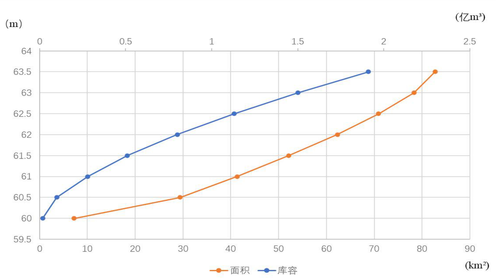  
附图 1 长虹渠蓄滞洪区水位\~面积\~容积曲线图  

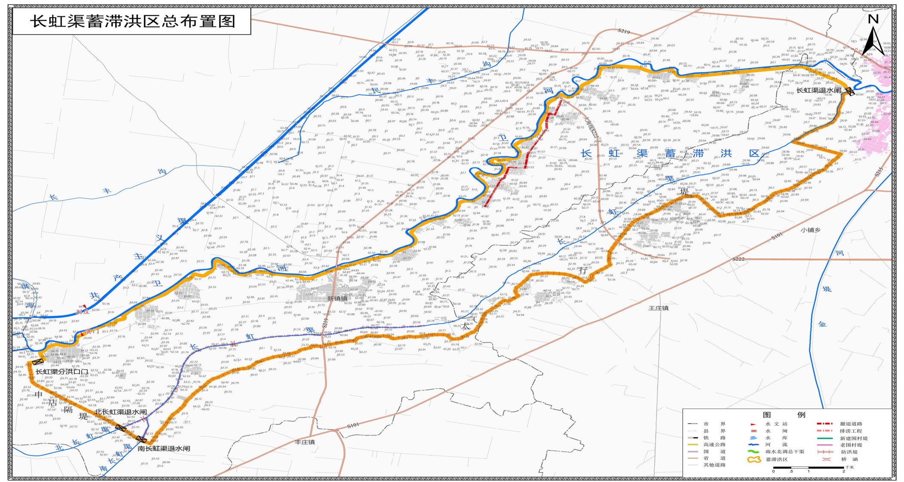  
附图 2 长虹渠蓄滞洪区总布置图  

# 附图 3 长虹渠蓄滞洪区洪水风险示意图  

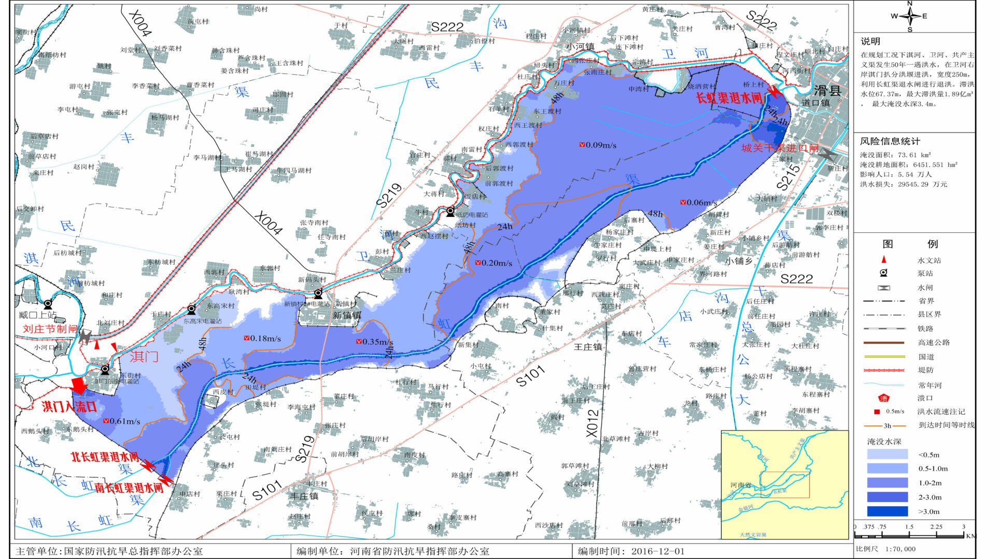  
河南省长虹渠蓄滞洪区规划淇河和卫共50年一遇洪水淹没图  

# 柳围坡蓄滞洪区运用预案  

# 1 总则  

# 1.1 编制依据  

柳围坡蓄滞洪区运用预案编制依据有:《中华人民共和国防洪法》、《蓄滞洪区运用补偿暂行办法》、《蓄滞洪区运用预案编制导则》等。  

# 1.2 编制目的  

保证蓄滞洪区工程的正常运用,增强蓄滞洪区防洪应变能力,起到削减洪峰、蓄滞超量洪水的作用,保障防洪抗灾工作高效有序进行。  

# 1.3 编制原则  

以习近平总书记“两个坚持、三个转变”防灾减灾救灾新理念为指导,贯彻“以人民为中心”的发展思想,保护人民群众生命财产安全;坚持行政首长负责制,统一指挥、统一调度;坚持底线思维,强化风险意识,最大程度减轻灾害损失;注重蓄滞洪区运用预案的可操作性,保障蓄滞洪区及时有效运用。  

# 1.4 适用范围  

本预案适用于柳围坡蓄滞洪区。  

# 2 蓄滞洪区概况  

# 2.1 自然地理  

2.1.1 地理位置、高程、地形地貌  

柳围坡蓄滞洪区位于卫河右岸的新乡市的卫辉市、鹤壁市的浚县境内,是太行山洪积和黄河冲积平原过渡的封闭洼地,历史上为自然滞洪坡洼。该蓄滞洪区位于平原地区,地形西高东低,地面高程在 $62.40\sim64.90\mathrm{m}$ 之间,地面自然坡降约 1/5000。南以古阳堤为界,北靠卫河右堤,东到申店隔堤,西到卫辉市城郊乡接自然高地,南北宽约 7km,东西长约 $10\mathrm{km}$ 。  

# 2.1.2 所在流域、水系  

柳围坡蓄滞洪区属于海河流域漳卫河水系,卫河是漳卫河水系的一大支流,发源于山西省陵川县夺火镇,在河北省馆陶县徐万仓与漳河汇合后称漳卫河。南部、西部、东南部与黄河流域为邻,北靠漳河流域,东接马颊河流域,跨焦作、新乡、鹤壁、安阳、濮阳等市,在河南省的流域面积为 $12921\mathrm{km}^{2}$ ,约占全流域的$85\%$ ,是豫北地区重要的泄洪排涝河道。  

# 2.2 社会经济情况  

# 2.2.1 城镇、村庄、人口  

柳围坡蓄滞洪区涉及卫辉市、浚县 2 个县市,5 个乡镇,51个村庄,2 个农场,人口 72721 人。区内包括卫辉市、浚县 2 个县市,4 个乡镇,29 个村庄和 2 个农场,人口 35507 人。其中:  

卫辉市包括上乐村镇、城郊乡、庞寨乡 3 个乡镇和五四、东风 2个农场,27 个村,人口 33282 人;浚县包括新镇镇,2 个村,人口 2225 人。  

# 2.2.2 耕地面积、工农业生产总值  

蓄滞洪区内卫辉市耕地面积 8.68 万亩,农作物以小麦、玉米为主,农业生产总值 45279 万元,工业生产总值 20918 万元,人均收入 7817 元;浚县耕地面积 0.558 万亩,人均收入 11956 元。  

# 2.2.3 重要设施  

柳围坡蓄滞洪区内重要设施有郑济高铁、107 国道、卫浚公路、庞太公路、青年路等重要交通道路;输电线路有杨淮高压线路。  

# 2.3 滞洪特征指标  

# 2.3.1 在流域防洪中的作用  

柳围坡蓄滞洪区处于淇河、共产主义渠交汇处,属太行山洪积和黄河冲积平原过渡的封闭洼地,历史上为自然滞洪坡洼,根据流域规划,当良相坡蓄滞洪区水位超过 $67.34\mathrm{m}$ 时,利用柳围坡蓄滞洪区分洪,降低共渠和卫河水位,保证共渠和卫河河道的安全。  

在卫河防洪体系中具有重要作用,它承担着卫河河系防洪标准内的洪水蓄滞任务,在同良相坡、长虹渠、共渠西、白寺坡和共产主义渠联合运用的条件下,保障卫河下游地区防洪安全。  

# 2.3.2 滞洪特征指标  

流域防洪规划中柳围坡蓄滞洪区的设计蓄滞洪区水位为  

$65.05\mathrm{m}$ ,设计蓄滞洪量 0.95 亿 $\mathrm{m}^{3}$ ,淹没面积 $78.5\mathrm{km}^{2}$ ,运用机率为 30 年一遇;现状滞洪水位是 $65.05\mathrm{m}$ ,水深 $0.5\mathrm{m}\sim2.75\mathrm{m}$ 之间,淹没面积 $75.2\mathrm{km}^{2}$ ,蓄洪量 0.95 亿 $\mathrm{m}^{3}$ 。  

# 2.4 洪水风险概况  

见柳围坡蓄滞洪区不同机遇洪水风险图。  

# 2.5 防洪工程情况  

# 2.5.1 蓄滞洪区围堤情况  

柳 围 坡 蓄 滞 洪 区 南 部 为 古 阳 堤 , 长 $16.9\mathrm{km}$ , 高 程$65.60{\sim}71.20\mathrm{m}$ ,北部边界为卫河右堤,长 $14.48\mathrm{km}$ ,高程$67.20{\sim}70.10\mathrm{m}$ ,东部边界为申店隔堤,长 $4.4\mathrm{km}$ ,高程 $67.00\mathrm{m}$ 。  

# 2.5.2 进退洪设施情况  

柳围坡蓄滞洪区进洪工程为共渠右堤西沿分洪堰和上乐村镇宋村分洪堰,退洪工程为南北长虹渠退水闸。  

上乐村镇西沿村分洪堰,位于共渠右堤桩号 $17{+}000{-}17{+}400$ 段,口门宽 $400\mathrm{m}$ ,堰顶高程 $65.80\mathrm{m}$ ,堰上覆土与共渠右堤平,设计过流量 $1170\mathrm{m}^{3}/\mathrm{s}$ ;上乐村镇宋村分洪堰,口门宽 $400\mathrm{m}$ ,堰顶高程 $65.30\mathrm{m}$ ,堰上覆土与卫河右堤平,设计过流流量 $480\mathrm{m}^{3}/\mathrm{s}$ 。  

南长虹渠退水闸为 4 孔,单孔净宽 $3.0\mathrm{m}$ ,为 $3\mathrm{m}\times3\mathrm{m}$ 平板直升式钢闸门,闸底高程 $58.5\mathrm{m}$ ,设计流量 $90\mathrm{m}^{3}/\mathrm{s}$ ;北长虹渠退水闸为 2 孔,单孔净宽 $3.0\mathrm{m}$ ,为 $3\mathrm{m}\times3\mathrm{m}$ 平板直升式钢闸门,闸底高程 $58.5\mathrm{m}$ ,设计流量 $60\mathrm{m}^{3}/\mathrm{s}$ 。  

# 2.5.3 穿堤建筑物基本情况  

柳围坡蓄滞洪区内共有穿堤建筑物 2 座,分别为:左庄涵闸和西板桥涵闸,均位于卫河右堤,为砌石结构。  

# 2.5.4 防洪工程存在问题  

蓄滞洪区南部边界古阳堤堤身损坏严重,达不到蓄洪标准。  

# 2.6 安全设施  

# 2.6.1 安全设施现状  

柳围坡蓄滞洪区无围村堤。  

# 2.6.2 转移安置设施现状  

柳围坡蓄滞洪区共有撤退道路 18 条,总长 $51.27\mathrm{km}$ 。  

# 2.6.3 预警通信系统情况  

蓄滞洪区内原配备通讯设备少且落后,特别是乡村之间缺乏 专用无线通讯预警设备,现有通讯设备由于运行时间较长,设备 老化,通讯质量较差,且无备用电源。  

# 2.6.4 安全设施存在问题  

1.撤退抢险道路少,且部分损坏严重,缺少救生船只;  
2.缺少专用通讯设施。  

# 2.7 历史运用和补偿情况  

# 2.7.1 运用情况  

1956 年卫河洪水造成右堤庄严村\~板桥段决口 8 处,洪水进入蓄滞洪区后,水位急剧上升,并突破申店隔堤进入长虹渠蓄滞洪区,区内最高水位 $66.85\mathrm{m}$ ,最大蓄量 1.05 亿 $\mathrm{m}^{3}$ ,滞洪历时达20 余天,淹没耕地 10.5 万亩,财产损失 2100 万元;  

1963 年 8 月 2 日 ${\sim}9$ 日,漳、卫河流域普降暴雨,山洪爆发,与西板桥东的邹庄处破卫河右堤分洪,低洼地带一片汪洋,8 月6 日洪区内最高水位达 $66.39\mathrm{m}$ ,最大蓄量 0.97 亿 $\mathrm{m}^{3}$ ,最大进洪流量 $2710\mathrm{m}^{3}/\mathrm{s}$ ,滞洪历时 20 天,淹没耕地 10 万亩,财产损失 2000万元。  

2021 年 7 月 20 日,卫辉市、浚县遭受特大暴雨袭击,受此次强降雨影响,卫河、共产主义渠等河道均出现超保证水位洪水。柳围坡蓄滞洪区于 7 月 23 日 12 时 30 分开始蓄滞洪水,历时 16天,最高蓄滞洪水位 $66.69\mathrm{m}$ (东关庄),最大蓄滞洪量 1.08 亿$\mathrm{m}^{3}$ 。本次运用共涉及卫辉市、浚县的 5 个乡镇,53 个行政村被淹,淹没耕地 10.47 万亩,人口 5.6 万人,造成财产损失 48118 万元。  

# 2.7.2 补偿情况  

自 2000 年《蓄滞洪区运用补偿暂行办法》实施以来,2021年首次运用,补偿损失 32632 万元。  

# 3 组织与保障  

# 3.1 指挥机构  

# 3.1.1 指挥机构组成及职责  

为确保柳围坡蓄滞洪区的正常运用,卫辉市、浚县成立蓄滞洪区运用指挥部。指挥长由各县政府负责人担任。蓄滞洪区运用指挥部在县防汛抗旱指挥部的领导下,具体负责本县范围内蓄滞洪区运用时各项工作。其主要职责是:负责蓄滞洪区运用时的信息发布、人员转移安置、分洪实施、抢险救生、物资供应、运用  

补偿、灾后重建工作。  

3.1.2 指挥机构内设责任组及职责  

根据工作需要,蓄滞洪区在运用时宜设立信息发布组、转移安置组、分洪实施组、抢险救生组、通信保障组、物资供应组、后勤保障组,分工负责蓄滞洪区运用相关工作。各工作组职责如下:  

信息发布组:负责蓄滞洪区运用的预警、警报发布和宣传工作。  

转移安置组:负责蓄滞洪区内居民转移安置的组织和协调工作。  

分洪实施组:负责桂李进洪闸门和丁桥南、北泄洪闸的操作工作。  

抢险救生组:负责蓄滞洪区防洪工程和安全设施的巡查、防守、抢险及人员救生的组织工作。  

通讯保障组:负责蓄滞洪区运用的应急通讯工作。  

物资供应组:负责防汛物资的调拨和运输工作。  

后勤保障组:负责蓄滞洪区居民生活必需品的筹集和发放、社会治安、医疗卫生等组织、协调工作。  

各责任组的负责人及成员宜根据蓄滞洪区所在地县级人民政府有关部门的职责分工确定。  

# 3.2 抢险救生与物资保障  

# 3.2.1 抢险救生队伍  

由各县蓄滞洪区运用指挥部负责组建县级防汛抢险救生队,并明确负责人及职责。在蓄滞洪区运用时,作为应急抢险队,遇有重大突发险情时,充实到抗洪一线,做好全县蓄滞洪区范围内  

的防汛抢险工作。  

# 3.2.2 物资保障  

防汛物资储备采取“群众集体筹措与国家储备相结合”的方式,各级要明确专人负责。  

群众集体筹措:由各乡镇负责,采取“就近筹划,登记造册估价,备而不集,用后付款”的办法,汛期未用的由物主自行处理。物资储备地点、种类、数量、运输方案及其负责人报县蓄滞洪区运用指挥部备案。  

政府储备:各县蓄滞洪区运用指挥部根据本县蓄滞洪区情况要有足够的防汛物资储备,每年要制定详细的储备计划,并负责按计划落实储备的种类、数量、地点及交通运输方式,有明确的负责人。  

# 3.3 生活保障  

生活保障的责任单位由蓄滞洪区所在地县级人民政府确定,责任单位应明确一名负责人为生活保障责任人。蓄滞洪区运用指挥部根据当地实际生活状况,制定出蓄滞洪区居民基本生活定额。  

1.临时住房安置:转移人员的临时住房由安置接收单位负责,本单位临时房屋及帐篷不足以安置时,可通过所在镇(街道办)政府协调,征用附近民房。  

2.食品、饮用水、衣被、燃料等生活必需品的筹集与发放:转移人员的食品、饮用水、衣被、燃料等生活必需品筹集与发放由转移村的包村单位负责,以上生活必需品不足时,由蓄滞洪区运用指挥部负责调配或协调解决。生活必需品的发放按照儿童、老人、伤残、病人、妇女优先的原则统筹发放。  

3.其它应急生活物资筹备途径  

指定储备:由各县防汛抗旱指挥部统一协调,储备一定数量的用于搭建安置灾民临时住房、燃料的各项救灾物资,保证随调随有。紧急情况下,确有困难,可向邻近县或上级请求支援。  

开展社会捐助活动:遭遇超标准洪水,造成重大损失时,县、镇(街道办)两级政府可发动群众开展集中性社会捐助活动。所募集款物,全部用于灾区群众生活安置。在紧急情况下,组织灾区发扬“一方有难、八方支援”的优良传统,广泛开展“无灾区支援灾区、轻灾区支援重灾区”的互助互济活动,以村(居)委会为单位筹集食品和饮用水,解决灾民的燃眉之急。  

# 3.4 治安与交通保障  

治安与交通保障的责任单位由蓄滞洪区所在地县级人民政府确定,责任单位应明确一名负责人为治安与交通保障责任人。同时宜按照运用的不同阶段,制定相应的治安交通保障措施,包括撤退转移交通保障、蓄滞洪区内和安置点的治安保障。蓄滞洪区运用时,要做好治安保卫防范工作,确保迁安人员生命财产安全和社会稳定,同时会同有关单位切实做好蓄滞洪区运用的撤退转移交通保障工作。  

# 3.5 医疗保障  

医疗保障的责任单位由蓄滞洪区所在地县级人民政府确定,责任单位应明确一名负责人为医疗保障责任人。同时宜明确医疗药品、设备筹集方式。蓄滞洪区运用后,按预定计划抽调医务人员组成医疗分队,分赴灾区负责灾民医疗救护及卫生防疫工作,应配备足量的常用药品和医疗器械,能进行紧急医疗救助,保障转移人员身体健康。同时宣传防疫卫生知识,防止疾病流行。灾后撤离人员返回原住地前,要对灾区村庄进行全面彻底的消毒处理,确保灾后无大疫。  

# 3.6 宣传保障  

宣传保障的责任单位由蓄滞洪区所在地县级人民政府确定,责任单位应明确一名负责人为宣传保障责任人。同时宜制定蓄滞洪区运用的宣传和信息发布方案。可利用电视、广播等宣传工具进行宣传,使区内群众充分了解蓄滞洪区淹没情况、报警手段、撤离路线、转移安置方案、生活保障措施等。蓄滞洪区运用后,及时通报蓄滞洪区滞洪情况,并向群众宣传生活卫生、安全及防疫等有关知识,确保群众的思想稳定和生命安全。  

# 4 预警与警报  

# 4.1 决策机构与程序  

警报发布人:县防汛抗旱指挥部指挥长 $\rightarrow$ 县蓄滞洪区运用指挥部指挥长 $\longrightarrow$ 乡镇防汛抗旱指挥部指挥长 $\longrightarrow$ 蓄滞洪区内村委主任。  

职责:负责及时传达上级命令,执行上级洪水调度指令,对指令执行情况及时进行反馈,做到上情下达、下情上报及时、准确无误。  

# 4.2 警报级别  

根据蓄滞洪区启用不同阶段,警报分为黄色预警、橙色预警和红色警报三级,分别代表运用准备、转移清场、蓄滞洪三个阶段。  

# 4.3 警报发布时机  

1.运用准备阶段:根据气象、水文部门的洪水预报和上级防汛抗旱指挥部门预测,在预计需要启用蓄滞洪区时,及时向蓄滞洪区和接收撤离人员安置的乡镇发出黄色预警指令,有关乡镇 30分钟内通知到需要撤离和接收安置的村组及居民,做好转移撤离和安置准备。  

2.转移清场阶段:县蓄滞洪区运用指挥部接到县防指发布的橙色预警指令后,立即向有关乡镇发布转移撤离命令,各乡镇按预定计划在省防指下达指定分洪时间前将人员撤离转移出去,并及时向县防指汇报撤离情况。  

3.蓄滞洪阶段:县蓄滞洪区运用指挥部经排查,确认撤离完成后,立即向县防指报告撤离结束,蓄滞洪区进入备用警戒状态。当决定启用蓄滞洪区时,县防指按上级命令适时发布红色警报,红色警报期持续至具备返迁条件时为止。  

# 4.4 警报发布机构及方式  

预警、警报由各县防汛抗旱指挥部发布,由各县防汛抗旱指挥部各成员单位传达预警、警报信息。其主要传达方式有:高音喇叭、网络、电视、广播、电话、手机短信群发、鸣锣、鸣笛、专用信号车等。  

# 4.5 警报解除  

预警、警报解除由各县防汛抗旱指挥部发布,由县防汛抗旱指挥部各成员单位传达预警、警报解除信息。主要传达方式有:网络、电视、广播、电话、手机短信群发等。  

# 5 转移与安置  

# 5.1 安全避洪任务  

# 5.1.1 安全状况  

柳围坡蓄滞洪区涉及卫辉市、浚县 2 个县(市),5 个乡镇,51 个村庄和 2 个农场,人口 72721 人。  

# 5.1.2 避洪任务  

转移安置包括卫辉市、浚县 2 个县(市),27 个村庄和 2 个农场,人口 37927 人。其中:卫辉市包括上乐、城郊、庞寨 3 个乡镇的 25 个村庄和 2 个农场,人口 35702 人;浚县包括新镇镇的 2 个村庄,人口 2225 人。  

# 5.2 就地安置  

5.2.1 就地安置工作负责人及其职责  

蓄滞洪区居民就地安置工作的负责人由蓄滞洪区所在地县级人民政府指定,就地安置所涉及乡镇的党政负责人为该乡镇负责人。各级负责人的职责是及时传达执行指令,负责、组织协调安置群众的日常生活。  

# 5.2.2 安置人口的数量、地点  

就地安置人口的数量、地点详见附表。  

# 5.3 转移安置  

# 5.3.1 转移安置负责人及职责  

转移安置总负责人由蓄滞洪区所在地县级人民政府指定,转移安置涉及村组负责人为转移村组、接纳安置点负责人。职责是做好转移安置计划,明确转移路线,落实交通工具,并在蓄滞洪区运用指挥部备案,及时传达执行迁安指令,做好转移群众的思想动员工作,负责组织、协调迁安群众于最短时间撤离危险区,保障迁安群众安全撤离和妥善安置。  

# 5.3.2 转移村组的人口、主要财产  

当蓄滞洪区启用时,按计划转移人员和主要财产。  

# 5.3.3 逐村组落实安置地点  

安置点的选择,在保证安全的前提下,应以就近、同行政区域为原则,并考虑安置点的接纳条件。  

# 5.3.4 人员和物资分批转移的时机  

转移时先人员后物资,如果车辆允许情况下一起转移。转移时以村组为单位,依次逐步转移,做到有序进行,不能相互干扰,保证在有限时间内撤离转移安置到位,不能让一人一户掉队。  

# 5.3.5 撤退转移时的通讯联系方式  

撤退转移时利用卫星电话、有线电话、手机、短信、广播、电视等方式进行联络,利用铜锣、手摇报警器预警、报警。  

# 5.3.6 各村组的转移路线  

转移路线的确定应考虑转移道路通行能力、转移任务及运输  

条件等因素。  

# 5.3.7 各村组撤退转移的交通工具  

蓄滞洪区运用指挥部应根据居民就地安置与转移安置计划,明确各村组撤退转移的交通工具种类、数量和筹措方式,确定筹措责任单位和责任人。  

# 6 工程调度与运用  

# 6.1 调度方案  

# 6.1.1 启用条件  

当良相坡城关防洪堤水位接近 $67.34\mathrm{m}$ (黄海高程),扒开共渠右堤西沿村分洪堰上土堤和卫河右堤宋村分洪堰上土堤向柳围坡分洪。  

# 6.1.2 调度权限  

经会商,确定蓄滞洪区启用时,河南省防汛抗旱指挥部下达命令至新乡市、鹤壁市防汛抗旱指挥部,同时做好蓄滞洪区运用监督工作;新乡市、鹤壁市防汛抗旱指挥部将省防汛抗旱指挥部命令分别及时传达到卫辉市、浚县防汛抗旱指挥部,同时做好滞洪区运用监督、指导工作;卫辉市、浚县防汛抗旱指挥部负责预案的具体组织实施工作。同时,卫辉市、浚县蓄滞洪区运用指挥部按照预案组织好区内人员的转移安置等工作。  

# 6.2 工程运用  

进洪方式:  

当良相坡城关防洪堤水位接近 $67.34\mathrm{m}$ (黄海高程),扒开共渠右堤西沿村分洪堰上土堤和卫河右堤宋村分洪堰上土堤向柳围坡分洪。  

上乐村镇西沿村分洪堰,位于共渠右堤桩号 $17{+}000{-}17{+}400$ 段,口门宽 $400\mathrm{m}$ ,堰顶高程 $65.80\mathrm{m}$ ,设计过流量 $1170\mathrm{m}^{3}/\mathrm{s}$ 。卫河宋村分洪堰,位于卫河右堤 $4{+}300{\sim}4{+}700$ 段,口门宽 $400\mathrm{m}$ ,堰顶高程 $65.30\mathrm{m}$ ,设计过流量 $480\mathrm{m}^{3}/\mathrm{s}$ 。  

退洪方式:通过南、北长虹渠退水闸退水。  

# 6.3 工程防守和应急抢险  

县蓄滞洪区运用指挥部负责全县蓄滞洪区防洪工程、安全设施抢险工作,对各种可能出现的工程险情制定切实可行的抢险方案。根据县、乡、村备案的抢险队,明确划分责任段、责任人,坚持 24 小时不间断巡查,发现险情及时上报、及时处理,同时各级物资供应部门要保证抢险物资的及时到位,确保防汛抢险的需要。遇有重大险情,要边抢险边上报,请求上级的支援,确保防洪工程的安全。  

# 7 返迁与善后  

# 7.1 返迁  

# 7.1.1 居民人身安全保障  

蓄滞洪区运用后,受洪水淹没的桥梁、道路、房屋可能存在安全隐患,需要进行安全检查,以确保居民的人身安全。该项工作由蓄滞洪区运用指挥部明确责任单位及职责。  

# 7.1.2 居民卫生安全保障  

洪水淹没区域存在流行疾病传播的危险,需要对原居住地环境进行清理和消毒等卫生防疫,以确保居民的卫生安全。该项工作由蓄滞洪区运用指挥部明确责任单位及职责。  

# 7.1.3 其它安全隐患排查  

其它安全隐患排查包括公共设施隐患、水电等生命线工程隐患、水利工程设施隐患等排查。该项工作由蓄滞洪区运用指挥部明确责任单位及职责。  

# 7.1.4 返迁家园  

退洪后,县蓄滞洪区运用指挥部组织相关职能小组,按照撤离时的顺序、路线、交通工具组织撤离人员返迁家园。人员的返迁时间确定在洪水基本退出、道路可以通行、各种安全隐患排除后。  

# 7.2 善后  

# 7.2.1 运用补偿工作  

蓄滞洪区运用指挥部应按《蓄滞洪区运用补偿暂行办法》的要求,每年在规定时间内完成蓄滞洪区内居民财产登记工作,并明确运用补偿的责任单位及职责。  

# 7.2.2 水毁工程的修复  

蓄滞洪区运用后应及时核查汇总水毁工程情况、编报水毁工程修复计划。对于较小的水毁工程呈报地方政府积极组织力量进行修复;对于较大的水毁工程上报上级部门申请资金,待项目批—254—  

复后按计划组织实施。  

# 8 附图附表  

8.1 附表  

1 柳围坡蓄滞洪区基本情况表  

2 柳围坡蓄滞洪区社会经济统计表  

3 柳围坡蓄滞洪区高程\~面积\~容积表  

4 柳围坡蓄滞洪区历年运用情况统计表  

5 柳围坡蓄滞洪区居民安全撤离及安置计划表  

6 柳围坡蓄滞洪区居民财产登记及变更登记汇总表  

8.2 附图  

1 柳围坡蓄滞洪区水位\~面积\~容积曲线图  
2 柳围坡蓄滞洪区总布置图  
3 柳围坡蓄滞洪区洪水风险示意图  

# 附表 1 柳围坡蓄滞洪区基本情况表  

<html><body><table><tr><td colspan="3">蓄滞洪区名称</td><td>柳围坡蓄滞洪区</td><td colspan="2">就地安置人口 (人)</td><td>0</td></tr><tr><td colspan="2">兴建时间</td><td>1954年</td><td colspan="2">转移安置人口 （人)</td><td>37927</td></tr><tr><td colspan="2">所在河流</td><td>卫河</td><td colspan="2">通讯设施</td><td>电话</td></tr><tr><td colspan="2">所在市县</td><td>新乡市卫辉、 鹤壁市浚县 65.05</td><td colspan="2">报警设施 船只 (只)</td><td>电话、广播、铜锣</td></tr><tr><td colspan="2">设计蓄滞洪水位（m) 设计蓄滞洪量（亿m²)</td><td>0.95</td><td colspan="2"></td><td>无</td></tr><tr><td colspan="2">蓄洪面积（km²)</td><td>75.2</td><td rowspan="2">撤退 道路</td><td>条数 长度（km)</td><td>18</td></tr><tr><td colspan="2"></td><td></td><td></td><td>51.27 南长虹渠退水闸、</td></tr><tr><td colspan="2">耕地 (万亩)</td><td>9.24</td><td rowspan="3">退洪闸</td><td>名称</td><td>北长虹渠退水闸</td></tr><tr><td colspan="2">地面高程范围(m)</td><td>62.3~64.9</td><td>闸底高程 (m)</td><td>58.5</td></tr><tr><td colspan="2">运用机率 (年一遇)</td><td>3~5</td><td>设计流量(m/s)</td><td>[90(南)、60(北)</td></tr><tr><td rowspan="3">涉及 区域</td><td>乡镇 (个)</td><td>5</td><td rowspan="3">进洪口 门</td><td>口门位置</td><td>西沿/宋村</td></tr><tr><td>行政村、农场(个)</td><td>53</td><td>口门高程(m)</td><td>65.8/65.30</td></tr><tr><td>人口 (万人)</td><td>7.27</td><td>口门宽度（m)</td><td>400/400</td></tr><tr><td rowspan="3">区内</td><td>人口 (万人)</td><td>3.55</td><td rowspan="3">蓄滞洪 区堤防</td><td>堤顶高程(m)</td><td>65.6~71.2</td></tr><tr><td></td><td></td><td>堤长(km) 堤顶宽(m)</td><td>35.78 3~8</td></tr><tr><td>行政村 (个)</td><td>29</td><td>防洪标准 (年一遇)</td><td>10</td></tr></table></body></html>  

附表 2 柳围坡蓄滞洪区社会经济统计表  

<html><body><table><tr><td></td><td>序号 乡镇 (名称)</td><td>村庄、农场 (个)</td><td>人口 (人)</td><td>耕地面积 (万亩)</td></tr><tr><td></td><td>浚县</td><td>2</td><td>2809</td><td>0.558</td></tr><tr><td>2</td><td>卫辉市</td><td>51</td><td>69912</td><td>8.68</td></tr><tr><td colspan="2">合计</td><td>53</td><td>72721</td><td>9.24</td></tr><tr><td colspan="3">重要企业</td><td colspan="2">新镇镇政府及其重要乡镇企业</td></tr><tr><td colspan="3">重要道路</td><td colspan="2">省道永定线、卫浚公路、庞太路、青年路</td></tr><tr><td colspan="3">重要桥梁</td><td colspan="2">卫河新镇大桥</td></tr><tr><td colspan="3">农业总产值 (万元)</td><td colspan="2">45279 ）（卫辉）</td></tr><tr><td colspan="2">工业总产值 (万元)</td><td></td><td colspan="2">20918（卫辉)</td></tr><tr><td colspan="2">固定资产总值 (万元)</td><td></td><td colspan="2">87605（卫辉)</td></tr><tr><td colspan="2">经济发展模式</td><td></td><td colspan="2">养殖、蔬菜、中小企业</td></tr><tr><td colspan="2">产业结构形式</td><td></td><td colspan="2">种植业为主，中小企业为辅</td></tr><tr><td colspan="2">人均收入</td><td></td><td colspan="2">7817元（卫辉）、11956元（浚县）</td></tr></table></body></html>  

# 附表 3 柳围坡蓄滞洪区高程\~面积\~容积表  

<html><body><table><tr><td>序号</td><td>高程H (m)</td><td>面积A(km²)</td><td>容积V(亿 m²)</td></tr><tr><td>1</td><td>63.0</td><td>5.10</td><td>0.010</td></tr><tr><td>2</td><td>63.5</td><td>18.70</td><td>0.070</td></tr><tr><td>3</td><td>64.0</td><td>38.10</td><td>0.210</td></tr><tr><td>4</td><td>64.5</td><td>58.60</td><td>0.450</td></tr><tr><td>5</td><td>65.0</td><td>80.70</td><td>0.790</td></tr><tr><td>6</td><td>65.5</td><td>98.30</td><td>1.240</td></tr></table></body></html>  

附表 4 柳围坡蓄滞洪区历年运用情况统计表  

<html><body><table><tr><td rowspan="2">年度</td><td rowspan="2">蓄滞洪 次数</td><td rowspan="2">最高蓄滞洪水位 (W)</td><td rowspan="2">相应滞洪量 (亿m²)</td><td colspan="2">受灾情况</td></tr><tr><td>耕地 (亩)</td><td>财产损失 （万元）</td></tr><tr><td>1956年</td><td>1</td><td>66.85</td><td>1.05</td><td>105000</td><td>2100</td></tr><tr><td>1963年</td><td>1</td><td>66.39</td><td>0.97</td><td>100000</td><td>2000</td></tr><tr><td>2021年</td><td>1</td><td>66.69</td><td>1.08</td><td>104700</td><td>48118</td></tr></table></body></html>  

附表 5 柳围坡滞洪区居民安全撤离及安置计划表  

<html><body><table><tr><td colspan="4">计划撤离情况</td><td colspan="4">计划安置地点</td><td rowspan="2">备注</td></tr><tr><td>所在 县名</td><td>乡镇名称</td><td>行政村名</td><td>撤离人口 (Y)</td><td>安置地点</td><td>安置人口 (Y)</td><td>乡镇名称</td><td>所在 县名</td></tr><tr><td></td><td></td><td>刘板桥</td><td>1017</td><td>东湾</td><td>1017</td><td>李源屯</td><td rowspan="9">卫辉市</td></tr><tr><td></td><td>东板桥 宋村</td><td>1840</td><td>李源屯</td><td>1840</td><td></td></tr><tr><td></td><td>红窑</td><td>2826</td><td>徐堤</td><td>2826</td><td>城郊</td></tr><tr><td></td><td>庄严寺</td><td>697 624</td><td>纪庄 董庄</td><td>697 624</td><td rowspan="5">上乐村</td></tr><tr><td></td><td>庄严</td><td>746</td><td>张庄</td><td>746</td></tr><tr><td></td><td>李庄</td><td>753</td><td>武庄</td><td>753</td></tr><tr><td></td><td>东关庄</td><td>890</td><td>后天平</td><td>890</td></tr><tr><td></td><td>西关庄</td><td>740</td><td>后天平</td><td>740</td></tr><tr><td></td><td>上乐一村</td><td>1732</td><td>李湾</td><td>1732</td><td rowspan="8">李源屯</td></tr><tr><td>上乐村</td><td>上乐二村</td><td>1760</td><td>田湾</td><td>1760</td></tr><tr><td></td><td>上乐三村</td><td>1090</td><td>马湾</td><td>1090</td></tr><tr><td></td><td>上乐四村</td><td>726</td><td>牌杨庄</td><td>726</td></tr><tr><td>卫辉市</td><td>北辛庄</td><td>2069</td><td>榆林庄</td><td>2069</td></tr><tr><td></td><td>军营</td><td>848</td><td>王湾</td><td>848</td></tr><tr><td></td><td>段庄</td><td>1378</td><td>侯湾</td><td>1378</td></tr><tr><td></td><td>琉璃堂</td><td>1771</td><td>台上</td><td>1771</td></tr><tr><td></td><td>赵村</td><td>1401</td><td>滤沱</td><td>1401</td><td rowspan="5">后河</td><td rowspan="8"></td></tr><tr><td></td><td></td><td>史村</td><td>1700</td><td>李劳庄</td><td>1700</td></tr><tr><td></td><td></td><td>樊店</td><td>967</td><td>李兴村</td><td>967</td></tr><tr><td></td><td>西板桥</td><td>2850</td><td>南屯</td><td>2850</td><td>李源屯</td></tr><tr><td rowspan="8"></td><td rowspan="2"></td><td>原板桥</td><td>1700</td><td>西寺元屯</td><td>1700</td><td rowspan="2"></td></tr><tr><td>万户寨</td><td>2195</td><td>纸坊</td><td>2195</td></tr><tr><td rowspan="2">庞寨</td><td>纸坊</td><td>101</td><td>纸坊</td><td>101</td><td rowspan="2">庞寨 李源屯</td></tr><tr><td>东风农场</td><td>1015</td><td>李源屯</td><td>1015</td></tr><tr><td rowspan="2">农林局 城郊</td><td></td><td>811</td><td>纸坊梨园</td><td>811</td><td>庞寨</td></tr><tr><td>五四农场</td><td></td><td>府君庙</td><td></td><td>城郊</td></tr><tr><td></td><td>东天平 27</td><td>1455 35702</td><td>24</td><td>1455 35702</td><td></td></tr><tr><td colspan="2">合计 (卫辉)</td><td>西双鹅头</td><td>941</td><td>淇门西</td><td>941</td><td rowspan="3">新镇</td><td rowspan="3">浚县</td></tr><tr><td rowspan="2">浚县</td><td rowspan="2">新镇</td><td>东双鹅头</td><td>1284</td><td>淇门南</td><td>1284</td></tr><tr><td>2</td><td>2225</td><td>2</td><td>2225</td></tr><tr><td colspan="2">共计 (卫辉+浚县)</td><td>29</td><td>37927</td><td>26</td><td>37927</td><td></td></tr></table></body></html>  

附表 6 柳围坡蓄滞洪区居民财产登记及变更登记汇总表  

<html><body><table><tr><td rowspan="2">单位 名称 卫辉市</td><td rowspan="2">户数 (户)</td><td rowspan="2">涉及 人口 (人)</td><td rowspan="2">承包 土地 (亩)</td><td rowspan="2">农作物 （亩)</td><td colspan="3">专业养殖</td><td rowspan="2">水产类 （亩) 287</td><td rowspan="2">居民住房</td><td colspan="2">农业生产机械、 役畜</td><td colspan="2">家庭主要耐用 消费品</td></tr><tr><td>家畜类 (头)</td><td>家禽类 (只)</td><td>经济林 (亩)</td><td>（间） (m²)</td><td></td><td>农业生产 机械 （台）</td><td>役畜 主要家用电器 (畜) （台）</td></tr><tr><td>浚县</td><td>667</td><td>2809</td><td>6496.93</td><td>6491.93</td><td>28</td><td>27473</td><td>153 0.00</td><td>5.00</td><td>74923 4271</td><td>2539894 134325</td><td>8867 1111</td><td>5 0</td><td>71042 2310</td></tr><tr><td></td><td></td><td></td><td></td><td>110431.81</td><td></td><td></td><td>153</td><td>292</td><td>79194</td><td>2674218</td><td>9978</td><td>5</td><td>73352</td></tr><tr><td>合计</td><td>16444</td><td>72721</td><td>108958.69</td><td></td><td>17875</td><td>924816</td><td></td><td></td><td></td><td></td><td></td><td></td><td></td></tr></table></body></html>  

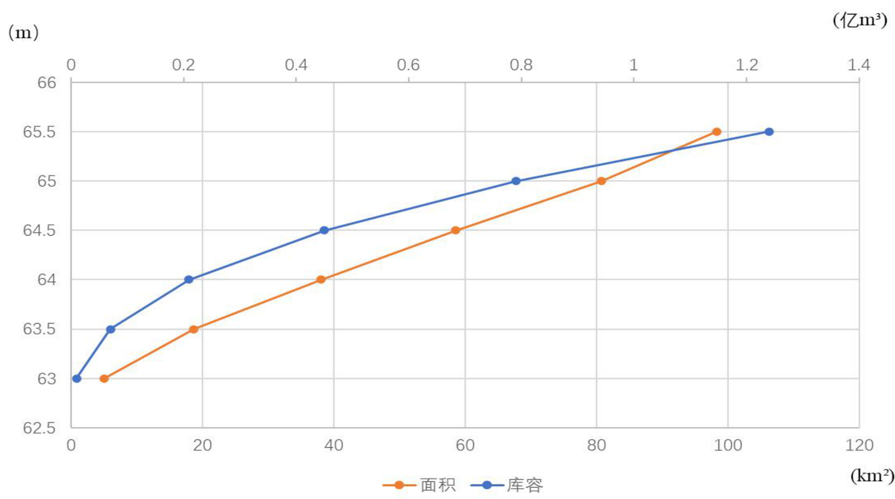  
附图 1 柳围坡蓄滞洪区水位\~面积\~容积曲线图  

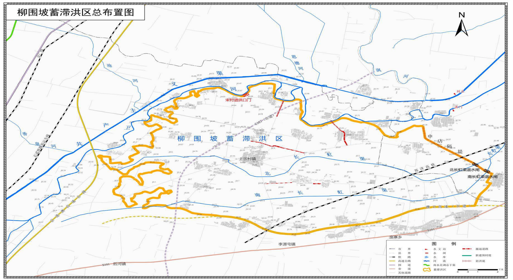  
附图 2 柳围坡蓄滞洪区总布置图  

河南省柳围坡蓄滞洪区规划淇河和卫共50年一遇洪水淹没图  

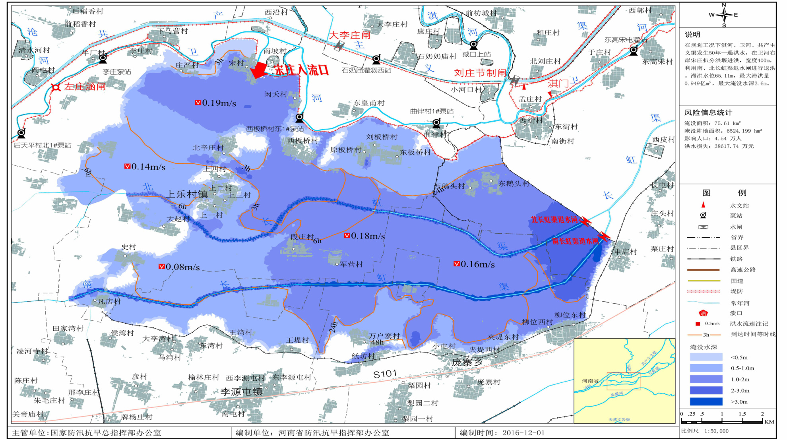  
附图 3 柳围坡蓄滞洪区洪水风险示意图  

# 小滩坡蓄滞洪区运用预案  

# 1 总则  

# 1.1 编制依据  

小滩坡蓄滞洪区运用预案编制依据有:《中华人民共和国防洪法》、《蓄滞洪区运用补偿暂行办法》、《蓄滞洪区运用预案编制导则》等。  

# 1.2 编制目的  

保证蓄滞洪区工程的正常运用,增强蓄滞洪区防洪应变能力,起到削减洪峰、蓄滞超量洪水的作用,保障防洪抗灾工作高效有序进行。  

# 1.3 编制原则  

以习近平总书记“两个坚持、三个转变”防灾减灾救灾新理念为指导,贯彻“以人民为中心”的发展思想,保护人民群众生命财产安全;坚持行政首长负责制,统一指挥、统一调度;坚持底线思维,强化风险意识,最大程度减轻灾害损失;注重蓄滞洪区运用预案的可操作性,保障蓄滞洪区及时有效运用。  

# 1.4 适用范围  

本预案适用于小滩坡蓄滞洪区。  

# 2 蓄滞洪区概况  

# 2.1 自然地理  

2.1.1 地理位置、高程、地形地貌  

小滩坡蓄滞洪区位于河南省鹤壁市的浚县、安阳市的内黄县境内卫河中游右岸,1955 年为弥补长虹渠和白寺坡等蓄滞洪区蓄洪能力不足而建。地面高程 $56.20\sim57.30\mathrm{m}$ ,蓄滞洪区为黄河冲积平原,呈南北向,地形总的趋势是南高北低,地面坡降 1/5200。  

# 2.1.2 所在流域、水系  

小滩坡蓄滞洪区属于海河流域漳卫河水系,卫河是漳卫河水系的一大支流,发源于山西省陵川县夺火镇,在河北省馆陶县徐万仓与漳河汇合后称漳卫河。南部、西部、东南部与黄河流域为邻,北靠漳河流域,东接马颊河流域,跨焦作、新乡、鹤壁、安阳、濮阳等市,在河南省的流域面积为 $12921\mathrm{km}^{2}$ ,约占全流域的$85\%$ ,是豫北地区重要的泄洪排涝河道。  

卫河北傍太行山脉,南为黄河冲积平原,地形总的趋势是西高东低。大沙河为卫河上游干流,卫河先后纳入左岸的淇河、汤河、安阳河等 10 余条梳齿状支流。1958 年为引黄修建的共产主义渠,自合河起傍卫河左岸至老观嘴汇入卫河。1962 年停止引黄后承担行洪,淇门以上卫河主要承担流域内排涝,淇门以下卫共洪涝合排。  

# 2.2 社会经济  

# 2.2.1 城镇、村庄、人口  

小滩坡蓄滞洪区涉及浚县、内黄县 2 个县,3 个乡镇,68 个村庄,人口 8.68 万人。区内包括浚县、内黄县 2 个县,3 个乡镇,42 个村庄,人口 63047 人。其中浚县包括王庄乡、善堂乡及黎阳办事处的 32 个村,人口 51035 人;内黄县包括二安乡的 10 个村庄,人口 12012 人。  

# 2.2.2 耕地面积、工农业生产总值  

浚县耕地面积 76176 亩,农业生产总值 17500 万元,工业生产总值 12320 万元,人均收入 12000 元;内黄县耕地面积 29085亩,农业生产总值 2955 万元,工业生产总值 12500 万元,人均收入 6335 元。  

# 2.2.3 重要设施  

蓄滞洪区内有二安乡翻砂铸造厂、橡胶塑料制品厂、淇雪淀粉厂、濮鹤高速、省道 S303、浚五线,濮鹤高速卫河大桥等重要设施。  

# 2.3 蓄滞洪区特征指标  

# 2.3.1 在流域防洪中的作用  

小滩坡蓄滞洪区是解决卫河超标准洪水时运用的蓄滞洪区,在有效控制卫河老观嘴以下河道超量洪水中,发挥着至关重要的作用,它是保护卫河中下游平原地区防洪安全必不可少的蓄洪工程,是卫河下游地区重要的防洪安全保障。  

# 2.3.2 滞洪特征指标  

流域防洪规划中小滩坡蓄滞洪区的设计蓄滞洪量 0.71 亿 $\mathrm{m}^{3}$ ,  

淹没面积 $93.19\mathrm{km}^{2}$ ;现状滞洪水位 $57.30\mathrm{m}$ ,水深 $0.5{\sim}4.0\mathrm{m}$ ,相应滞洪量 0.74 亿 $\mathrm{m}^{3}$ ,淹没面积 $95.4\mathrm{km}^{2}$ 。  

# 2.4 防洪工程  

# 2.4.1 蓄滞洪区围堤情况  

小滩坡蓄滞洪区围堤由卫河右堤(于村-浚内沟口)和东防洪堤两部分组成,卫河右堤长 $19.2\mathrm{km}$ ,堤顶高程 $59.15\mathrm{m}{\sim}60.80\mathrm{m}$ ,顶宽 $6\mathrm{m}{\sim}8\mathrm{m}$ ,该段在浚内沟入卫河处有 $800\mathrm{m}$ 无堤段;东防洪堤(自东沙地至浚内沟口)长 $24.6\mathrm{km}$ ,堤顶高程 $58.30\mathrm{m}{\sim}60.59\mathrm{m}$ ,堤顶宽 $1{\sim}4\mathrm{m}$ ,由于失修严重,加之人为破坏普遍,上段残缺不全,下段保存较好;该堤上有 9 座涵闸,大多已损坏。  

# 2.4.2 进退洪设施情况  

该洪区无进洪控制工程,对蓄滞洪区内的进洪量和水量不易调度和控制。圈里进洪口门宽 $140\mathrm{m}$ ,堤顶高程 $61.70\mathrm{m}$ ,按省防汛抗旱指挥部指令,采用人工扒口或爆破的方式进洪。  

退洪通过浚内沟排涝涵闸退入卫河。浚内沟排涝涵闸设计流量 $31.3\mathrm{m}^{3}/\mathrm{s}$ ,共 2 孔,每孔净宽 $3\mathrm{m}$ ,闸底板高程 $50.0\mathrm{m}$ 。  

# 2.4.3 穿堤建筑物情况  

该滞洪区内穿堤建筑物共计 9 座。其中:浚县境内有圈里闸,什村闸和了堤闸 3 座穿堤建筑物,圈里闸为砌石、板结构;什村闸和了堤闸现已报废,无法使用。  

内黄县境内有花固涵洞、刘庄涵洞、北徐涵洞、前安闸、后安前闸和后安后闸 6 座穿堤建筑物。其中花固涵洞设计流量为  

$3.5\mathrm{m}^{3}/\mathrm{s}$ ,为砖石结构;刘庄涵洞和北徐涵洞设计流量均为 $1\mathrm{m}^{3}/\mathrm{s}$ ,均为混凝土管。前安闸设计流量为 $3.5\mathrm{m}^{3}/\mathrm{s}$ ,为砌砖结构;后安前闸和后安后闸流量均为 $2\mathrm{m}^{3}/\mathrm{s}$ ,均为砌石结构。  

# 2.4.4 防洪工程存在问题  

1.蓄滞洪区无进洪控制工程;  

2.蓄滞洪区东防洪堤残缺不全,堤上涵闸大多数年久失修,损坏严重,已无法正常使用。  

3.现状蓄滞洪区只能利用浚内沟排涝涵闸退水,退水流量较小,不满足退洪需求,存在“分得进”、不能“排得出”的问题。  

# 2.5 安全设施  

# 2.5.1 安全设施现状  

蓄滞洪区内无围村堤、救生台、避水楼、庄台等安全避水设施。  

# 2.5.2 转移安置设施现状  

蓄滞洪区内无专用转移撤退道路,撤退转移主要利用现有乡村道路。乡村道路多数为土路,部分为砼、沥青路面,多数道路不能满足紧急转移需要。安置点由各安置村选择条件较好的民房安置,安置用房由乡村做好登记,安置前做好安全检查,切实保证转移群众安全。  

# 2.5.3 预警通信系统情况  

蓄滞洪区内无专用通信系统,洪水警报信息由电视、电话、手机、警车等传达。  

# 2.5.4 安全设施存在问题  

1.蓄滞洪区内撤退道路少,不能满足撤退需要,缺少救生船只和通讯预警设备;  

2.蓄滞洪区无围村堤、救生台、避水楼。  

# 2.6 历史运用和补偿  

# 2.6.1 历史运用情况  

小滩坡蓄滞洪区建于 1955 年,建成至今累计运用 3 次。  

1956 年小滩坡蓄滞洪区最高滞洪水位 $58.80\mathrm{m}$ ,相应蓄洪量 2.30 亿 $\mathrm{m}^{3}$ ,滞洪历时 25 天,淹地 12.6 万亩,经济损失 1223万元。  

1963 年小滩坡蓄滞洪区最大进洪流量 $1096\mathrm{m}^{3}/\mathrm{s}$ ,最高滞洪水位 $58.28\mathrm{m}$ ,相应蓄洪量 1.40 亿 $\mathrm{m}^{3}$ ,滞洪历时 15 天,淹地 12.0万亩,受灾人口 5.1 万人,经济损失 1936.9 万元。  

2021 年 7 月 21 日,浚县、内黄县遭受特大暴雨袭击,受此次强降雨影响,卫河、共产主义渠等河道均出现超保证水位洪水。小滩坡蓄滞洪区于 7 月 30 日 0 时开始蓄滞洪水,8 月 22 日基本完成退水,历时 23 天,最高蓄滞洪水位 $59.23\mathrm{m}$ (郭新寨),最大蓄滞洪量 1.08 亿 $\mathrm{m}^{3}$ 。本次运用涉及浚县、内黄县 4 个乡镇 80 个行政村被淹,淹没耕地 9.42 万亩,受灾人口 9.7 万人,造成财产损失 68747 万元。  

# 2.6.2 历史补偿情况  

自 2000 年《蓄滞洪区运用补偿暂行办法》实施以来,2021年首次运用,补偿损失 45555 万元。  

# 3 组织与保障  

# 3.1 指挥机构  

# 3.1.1 指挥机构组成及职责  

为确保小滩坡蓄滞洪区的正常运用,浚县、内黄县成立蓄滞洪区运用指挥部。指挥长由各县政府负责人担任。蓄滞洪区运用指挥部在县防汛抗旱指挥部的领导下,具体负责本县范围内蓄滞洪区运用时各项工作。其主要职责是:负责蓄滞洪区运用时的信息发布、人员转移安置、分洪实施、抢险救生、物资供应、运用补偿、灾后重建工作。  

# 3.1.2 指挥机构内设责任组及职责  

根据工作需要,蓄滞洪区在运用时宜设立信息发布组、转移安置组、分洪实施组、抢险救生组、通信保障组、物资供应组、后勤保障组,分工负责蓄滞洪区运用相关工作。各工作组职责如下:  

信息发布组:负责蓄滞洪区运用的预警、警报发布和宣传工作。  

转移安置组:负责蓄滞洪区内居民转移安置的组织和协调工作。  

分洪实施组:负责桂李进洪闸门和丁桥南、北泄洪闸的操作工作。  

抢险救生组:负责蓄滞洪区防洪工程和安全设施的巡查、防守、抢险及人员救生的组织工作。  

通信保障组:负责蓄滞洪区运用的应急通讯工作。  

物资供应组:负责防汛物资的调拨和运输工作。  

后勤保障组:负责蓄滞洪区居民生活必需品的筹集和发放、  

社会治安、医疗卫生等组织、协调工作。  

各责任组的负责人及成员宜根据蓄滞洪区所在地县级人民政府有关部门的职责分工确定。  

# 3.2 抢险救生与物资保障  

# 3.2.1 抢险救生队伍  

由县蓄滞洪区运用指挥部负责组建县级防汛抢险救生队,并明确负责人及职责。在蓄滞洪区运用时,作为应急抢险队,遇有重大突发险情时,充实到抗洪一线,做好全县蓄滞洪区范围内的防汛抢险工作。  

# 3.2.2 物资保障  

防汛物资储备采取“群众集体筹措与国家储备相结合”的方式,明确专人负责。群众集体筹措:由各乡镇负责,采取“就近筹划,登记造册估价,备而不集,用后付款”的办法,汛期未用的由物主自行处理。物资储备地点、种类、数量、运输方案及其负责人报县蓄滞洪区运用指挥部备案。政府储备:各县蓄滞洪区运用指挥部根据本县蓄滞洪区情况要有足够的防汛物资储备,每年要制定详细的储备计划,并负责按计划落实储备的种类、数量、地点及交通运输方式,有明确的负责人。  

# 3.3 生活保障  

生活保障的责任单位由蓄滞洪区所在地县级人民政府确定,责任单位应明确一名负责人为生活保障责任人。蓄滞洪区运用指挥部根据当地实际生活状况,制定出蓄滞洪区居民基本生活定额。  

转移人员的临时住房由安置接收单位负责,本单位临时房屋及帐篷不足以安置时,可通过所在镇(街道办)政府协调,征用附近民房。  

转移人员的食品、饮用水、衣被、燃料等生活必需品筹集与发放由转移村的包村单位负责,以上生活必需品不足时,由蓄滞洪区运用指挥部负责调配或协调解决。生活必需品的发放按照儿童、老人、伤残、病人、妇女优先的原则统筹发放。  

由各县防汛抗旱指挥部统一协调,储备一定数量的用于搭建安置灾民临时住房、燃料的各项救灾物资,保证随调随有。紧急情况下,确有困难,可向邻近县或上级请求支援。  

遭遇超标准洪水,造成重大损失时,县、镇(街道办)两级政府可发动群众开展集中性社会捐助活动。所募集款物,全部用于灾区群众生活安置。在紧急情况下,组织灾区发扬“一方有难、八方支援”的优良传统,广泛开展“无灾区支援灾区、轻灾区支援重灾区”的互助互济活动,以村(居)委会为单位筹集食品和饮用水,解决灾民的燃眉之急。  

# 3.4 治安与交通保障  

治安与交通保障的责任单位由蓄滞洪区所在地县级人民政府确定,责任单位应明确一名负责人为治安与交通保障责任人。同时宜按照运用的不同阶段,制定相应的治安交通保障措施,包括撤退转移交通保障、蓄滞洪区内和安置点的治安保障。蓄滞洪区运用时,要做好治安保卫防范工作,确保迁安人员生命财产安全和社会稳定,同时会同有关单位切实做好蓄滞洪区运用的撤退转移交通保障工作。  

# 3.5 医疗保障  

医疗保障的责任单位由蓄滞洪区所在地县级人民政府确定,责任单位应明确一名负责人为医疗保障责任人。同时宜明确医疗药品、设备筹集方式。蓄滞洪区运用后,按预定计划抽调医务人员组成医疗分队,分赴灾区负责灾民医疗救护及卫生防疫工作,应配备足量的常用药品和医疗器械,能进行紧急医疗救助,保障转移人员身体健康。同时宣传防疫卫生知识,防止疾病流行。灾后撤离人员返回原住地前,要对灾区村庄进行全面彻底的消毒处理,确保灾后无大疫。  

# 3.6 宣传保障  

宣传保障的责任单位由蓄滞洪区所在地县级人民政府确定,责任单位应明确一名负责人为宣传保障责任人。同时宜制定蓄滞洪区运用的宣传和信息发布方案。可利用电视、广播等宣传工具进行宣传,使区内群众充分了解蓄滞洪区淹没情况、报警手段、撤离路线、转移安置方案、生活保障措施等。蓄滞洪区运用后,及时通报蓄滞洪区滞洪情况,并向群众宣传生活卫生、安全及防疫等有关知识,确保群众的思想稳定和生命安全。  

# 4 预警与警报  

# 4.1 决策机构与程序  

小滩坡蓄滞洪区由省防汛抗旱指挥部统一调度,由市级防汛抗旱指挥部通知县防汛抗旱指挥部,县防汛抗旱指挥部通知涉及的有关乡(镇)防汛抗旱指挥部,乡(镇)防汛抗旱指挥部立即通知有关行政村村委会,村委会要立即通知到群众。有关乡(镇)和各行政村设专职警报发布人员,发布人要采取各种有效手段,以最快的速度将上级指令全面、准确地传达到位。  

警报发布人:县防汛抗旱指挥部指挥长 $\rightarrow$ 县蓄滞洪区运用指挥部指挥长 $\longrightarrow$ 乡镇防汛抗旱指挥部指挥长 $\longrightarrow$ 蓄滞洪区内村委主任。  

职责:负责及时传达上级命令,执行上级洪水调度指令,对指令执行情况及时进行反馈,做到上情下达、下情上报,及时、准确无误。  

# 4.2 警报级别  

根据蓄滞洪区启用不同阶段,警报分为黄色预警、橙色预警和红色警报三级,分别代表运用准备、转移清场、蓄滞洪三个阶段。  

# 4.3 警报发布时机  

1.运用准备阶段:小滩坡蓄滞洪区由省防指统一调度,当白寺坡蓄滞洪区运用后,根据水文气象部门洪水预报,县防汛抗旱指挥部接市防指做好运用准备通知后发布黄色预警指令。  

2.转移清场阶段:县防汛抗旱指挥部接市防指转移清场通知后,立即发布橙色预警,开始实施蓄滞洪区内居民转移、清场工作,并及时向上级防指汇报撤离情况。县防汛抗旱指挥部经排查,确认撤离完成后,立即向上级防指报告。  

3.蓄滞洪阶段:县防汛抗旱指挥部接市防指启用蓄滞洪区通 274—  

知后,立即发布红色警报,蓄滞洪区红色警报期持续至具备返迁条件时为止。  

# 4.4 警报发布机构及方式  

预警、警报由各县防汛抗旱指挥部发布,由县防汛抗旱指挥部各成员单位传达预警、警报信息。主要传达方式有:高音喇叭、网络、电视、广播、电话、手机短信群发、鸣锣、鸣笛、专用信号车等。  

# 4.5 警报解除  

当蓄滞洪区险情解除、并具备返迁条件时,蓄滞洪区运用指挥部要及时用警报器、电话、短信、广播、电视和巡回报警车等方式,发布警报解除信息。  

# 5 转移与安置  

# 5.1 安全避洪任务  

# 5.1.1 安全状况  

小滩坡蓄滞洪区区内包括浚县、内黄县 2 个县,3 个乡镇,42 个村庄,人口 63047 人。洪水时,除黎阳办事处东沙地村 3144人就地安置外,其余区内群众需向区外转移。  

# 5.1.2 避洪任务  

由于小滩坡蓄滞洪区内无安全避洪设施,区内人口需要转移安置。转移安置包括浚县、内黄县 2 个县,3 个乡镇,41 个村庄,人口 57052 人。其中:浚县包括王庄乡和善堂镇 2 个乡镇,31 个村庄,人口 45815 人;内黄县包括二安乡的 10 个村,人口 12012 人。  

# 5.2 就地安置  

蓄滞洪区居民就地安置工作的负责人由蓄滞洪区所在地县级人民政府指定,就地安置所涉及乡镇的党政负责人为该乡镇负责人。各级负责人的职责是及时传达执行指令,负责、组织协调安置群众的日常生活。小滩坡蓄滞洪区运用机率较少,同时又处于长虹渠等坡洼的下游,预见期较长。黎阳办事处东沙地村 3144人可就地安置。  

# 5.3 转移安置  

# 5.3.1 转移安置负责人及职责  

转移安置总负责人由蓄滞洪区所在地县级人民政府指定,转移安置涉及村组负责人为转移村组、接纳安置点负责人。职责是做好转移安置计划,明确转移路线,落实交通工具,并在蓄滞洪区运用指挥部备案,及时传达执行迁安指令,做好转移群众的思想动员工作,负责组织、协调迁安群众于最短时间撤离危险区,保障迁安群众安全撤离和妥善安置。  

# 5.3.2 转移村组的人口、主要财产  

当蓄滞洪区启用时,按计划转移人员和主要财产。  

# 5.3.3 逐村组落实安置地点  

安置点的选择,在保证安全的前提下,应以就近、同行政区域为原则,并考虑安置点的接纳条件。  

# 5.3.4 人员和物资分批转移的时机  

转移时先人员后物资,如果车辆允许情况下一起转移。转移  

时以村组为单位,依次逐步转移,做到有序进行,不能相互干扰,保证在有限时间内撤离转移安置到位,不能让一人一户掉队。  

# 5.3.5 撤退转移时的通讯联系方式  

撤退转移时利用卫星电话、有线电话、手机、短信、广播、电视等方式进行联络,利用铜锣、手摇报警器预警、报警。  

# 5.3.6 各村组的转移路线  

转移安置路线的确定应考虑转移道路通行能力、转移任务及运输条件等因素。  

# 5.3.7 各村组撤退转移的交通工具  

蓄滞洪区运用指挥部应根据居民就地安置与转移安置计划,明确各村组撤退转移的交通工具种类、数量和筹措方式,确定筹措责任单位和责任人。  

# 6 工程调度与运用  

# 6.1 调度方案  

# 6.1.1 启用条件  

当五陵水文站流量超过 $2000\mathrm{m}^{3}/\mathrm{s}^{(\$ (对应保证水位 $57.30\mathrm{m})$ )时,在浚县圈里(圈里分洪口门宽度 $140\mathrm{m}$ ,堤顶高程 $61.4\mathrm{m}$ ,口门中心坐标:北纬 $35^{\circ}45^{\prime}23^{\prime\prime}$ 、东经 $114^{\circ}30^{\prime}7^{\prime\prime})$ 破卫河右堤,泄洪入小滩坡蓄滞洪区。  

# 6.1.2 调度权限  

经会商,确定蓄滞洪区启用时,河南省防汛抗旱指挥部下达命令至鹤壁市、安阳市防汛抗旱指挥部,同时做好蓄滞洪区运用监督工作;鹤壁市、安阳市防汛抗旱指挥部将省防汛抗旱指挥部命令分别及时传达到浚县、内黄县防汛抗旱指挥部,同时做好滞洪区运用监督、指导工作;浚县、内黄县防汛抗旱指挥部负责预案的具体组织实施工作。同时,浚县、内黄县蓄滞洪区运用指挥部按照预案组织好区内人员的转移安置等工作。  

# 6.2 进洪、退洪方式  

进洪:  

当五陵水文站流量超过 $2000\mathrm{m}^{3}/\mathrm{s}^{(\$ (对应保证水位 $57.30\mathrm{m})$ 时,在浚县圈里(圈里分洪口门宽度 $140\mathrm{m}$ ,堤顶高程 $61.4\mathrm{m}$ ,口门中心坐标:北纬 $35^{\circ}45^{\prime}23^{\prime\prime}$ 、东经 $114^{\circ}30^{\prime}7^{\prime\prime})$ 破卫河右堤,泄洪入小滩坡蓄滞洪区。  

退洪:通过浚内沟退水闸入卫河。  

# 6.3 工程防守与应急抢险  

6.3.1 防洪工程和安全设施的巡查防守要求及相应措施  

县防汛抗旱指挥部负责全县蓄滞洪区防洪工程、安全设施抢险工作,对各种可能出现的工程险情制定切实可行的抢险方案。根据县、乡、村备案的抢险队,明确划分责任段、责任人,坚持24 小时不间断巡查,发现险情及时上报、及时处理,同时各级物资供应部门要保证抢险物资的及时到位,确保防汛抢险的需要。  

6.3.2 针对工程险情隐患,落实抢险责任  

遇有重大险情,要边抢险边上报,请求上级的支援,确保防洪工程的安全。县防汛抗旱指挥部组织抢险突击队,明确各突击队的防范范围,落实各突击队的抢险责任。  

# 7 返迁与善后  

# 7.1 返迁  

# 7.1.1 居民人身安全保障  

蓄滞洪区运用后,受洪水淹没的桥梁、道路、房屋可能存在安全隐患,需要进行安全检查,以确保居民的人身安全。该项工作由蓄滞洪区运用指挥部明确责任单位及职责。  

# 7.1.2 居民卫生安全保障  

洪水淹没区域存在流行疾病传播的危险,需要对原居住地环境进行清理和消毒等卫生防疫,以确保居民的卫生安全。该项工作由蓄滞洪区运用指挥部明确责任单位及职责。  

# 7.1.3 其它安全隐患排查  

其它安全隐患排查包括公共设施隐患、水电等生命线工程隐患、水利工程设施隐患等排查。该项工作由蓄滞洪区运用指挥部明确责任单位及职责。  

# 7.1.4 返迁家园  

退洪后,县蓄滞洪区运用指挥部组织相关职能小组,按照撤离时的顺序、路线、交通工具组织撤离人员返迁家园。人员的返迁时间确定在洪水基本退出、道路可以通行、各种安全隐患排除后。  

# 7.2 善后  

# 7.2.1 运用补偿工作  

蓄滞洪区运用指挥部应按《蓄滞洪区运用补偿暂行办法》的  

要求,每年在规定时间内完成蓄滞洪区内居民财产登记工作,并明确运用补偿的责任单位及职责。  

# 7.2.2 水毁工程的修复  

蓄滞洪区运用后应及时核查汇总水毁工程情况、编报水毁工程修复计划。对于较小的水毁工程呈报地方政府积极组织力量进行修复;对于较大的水毁工程上报上级部门申请资金,待项目批复后按计划组织实施。  

# 8 附图附表  

8.1 附表  

1 小滩坡蓄滞洪区基本情况表  

2 小滩坡蓄滞洪区社会经济统计表  

3 小滩坡蓄滞洪区高程\~面积\~容积表  

4 小滩坡蓄滞洪区历年运用情况统计表  

5 小滩坡蓄滞洪区居民安全撤离及安置计划表  

6 小滩坡蓄滞洪区居民财产登记及变更登记汇总表  

8.2 附图  

小滩坡蓄滞洪区水位\~库容\~面积曲线图  

2 小滩坡蓄滞洪区总布置图  

# 附表 1 小滩坡蓄滞洪区基本情况表  

<html><body><table><tr><td colspan="2">蓄滞洪区名称</td><td>小滩坡蓄滞洪区</td><td colspan="3">就地安置人口 (人)</td></tr><tr><td colspan="2">兴建时间</td><td>1955年</td><td colspan="2">转移安置人口 (人) 57052</td></tr><tr><td colspan="2">所在河流</td><td>卫河</td><td colspan="2">通讯设施 手机</td></tr><tr><td colspan="2">所在市县</td><td>鹤壁市浚县、 安阳市内黄县</td><td colspan="2">报警设施 电话、广播</td></tr><tr><td colspan="2">设计蓄滞洪水位（m)</td><td>57.30</td><td colspan="2">船只 (只) 无</td></tr><tr><td colspan="2">设计蓄滞洪量（亿m²）</td><td>0.74</td><td rowspan="2">条数 撤退 道路</td><td>40</td></tr><tr><td colspan="2">蓄洪面积（km²)</td><td>95.4</td><td>长度（km) 83.9</td></tr><tr><td colspan="2">耕地 (万亩)</td><td>10.5</td><td rowspan="2">退洪口门</td><td>口门位置 圈里</td></tr><tr><td colspan="2">地面高程范围（m)</td><td>56.2~57.3</td><td>口门高程（m) 61.70</td></tr><tr><td colspan="2">运用机率 (年一遇)</td><td>20</td><td colspan="2">口门宽度（m)</td></tr><tr><td rowspan="4">涉及 区域 区内</td><td>乡镇、办事处(个)</td><td>3</td><td rowspan="4">蓄滞洪区 堤防</td><td>堤顶高程（m) 58.87~60.8</td></tr><tr><td>行政村 (个)</td><td>68</td><td>堤长（km) 43.8</td></tr><tr><td>人口 (万人) 人口 (万人)</td><td>8.68</td><td>堤顶宽（m) 1~8</td></tr><tr><td>行政村 (个)</td><td>6.02 42</td><td>防洪标准 (年一遇) 10</td></tr></table></body></html>  

附表 2 小滩坡蓄滞洪区社会经济统计表  

<html><body><table><tr><td>序号</td><td>城镇 (个)</td><td>村庄 (个)</td><td>区内人口 (人)</td><td>耕地面积 (亩)</td></tr><tr><td>1</td><td>浚县</td><td>32</td><td>51035</td><td>76176</td></tr><tr><td>2</td><td>内黄</td><td>10</td><td>12012</td><td>29085</td></tr><tr><td>3</td><td>合计</td><td>42</td><td>63047</td><td>105261</td></tr><tr><td colspan="3">要企业</td><td colspan="2">淇雪淀粉厂、二安乡翻砂铸造厂、橡胶塑料制品厂，乡联中（学校)</td></tr><tr><td colspan="3">重要道路</td><td colspan="2">浚五线、濮鹤高速、濮鹤高速卫河大桥、省道胡鹤线</td></tr><tr><td colspan="3">重要桥梁</td><td colspan="2">浚内沟桥、齐村桥</td></tr><tr><td colspan="3">农业总产值 (万元)</td><td colspan="2">24055</td></tr><tr><td colspan="2">工业总产值 (万元)</td><td></td><td colspan="2">24820</td></tr><tr><td colspan="2">固定资产总值（万元）</td><td></td><td colspan="2">15052</td></tr><tr><td colspan="2">社会资产总值</td><td>（万元）</td><td colspan="2">18000</td></tr><tr><td colspan="2">经济发展模式</td><td></td><td colspan="2">养殖及中小企业</td></tr><tr><td colspan="2">产业结构形式</td><td></td><td colspan="2">以种植业为主，中小企业为辅</td></tr><tr><td colspan="2">人均收入</td><td></td><td colspan="2">1200元（浚县）、6355元（内黄）</td></tr></table></body></html>  

附表 3 小滩坡蓄滞洪区高程\~面积\~容积表  

<html><body><table><tr><td>序号</td><td>高程 (m)</td><td>面积 (km2)</td><td>容积 (亿 m3)</td></tr><tr><td>1</td><td>54.3</td><td>3.8</td><td>0.015</td></tr><tr><td>2</td><td>54.8</td><td>10</td><td>0.05</td></tr><tr><td>3</td><td>55.3</td><td>17.5</td><td>0.125</td></tr><tr><td>4</td><td>55.8</td><td>26</td><td>0.225</td></tr><tr><td>5</td><td>56.3</td><td>46</td><td>0.41</td></tr><tr><td>6</td><td>57.3</td><td>95.4</td><td>0.74</td></tr></table></body></html>  

附表 4 小滩坡蓄滞洪区历年运用情况统计表  

<html><body><table><tr><td rowspan="2">年度</td><td rowspan="2">蓄滞洪次数</td><td rowspan="2">最高蓄滞洪水位 (m)</td><td rowspan="2">相应滞洪量 (亿m3)</td><td rowspan="2">蓄滞洪历时 (小时)</td><td colspan="3">淹没情况</td></tr><tr><td>耕地 (亩)</td><td>人口 (人)</td><td>财产损失 （万元）</td></tr><tr><td>1956年</td><td>1</td><td>58.80</td><td>2.30</td><td>600</td><td>126000</td><td></td><td>1223</td></tr><tr><td>1963年</td><td>1</td><td>58.25</td><td>1.40</td><td>360</td><td>120000</td><td>51000</td><td>1936.9</td></tr><tr><td>2021年</td><td>1</td><td>59.23</td><td>1.08</td><td>552</td><td>94200</td><td>97000</td><td>68747</td></tr></table></body></html>  

附表 5 小滩坡滞洪区居民安全撤离及安置计划表  

<html><body><table><tr><td colspan="5">计划撤离情况</td><td colspan="2">计划安置地点</td><td rowspan="2">备注</td></tr><tr><td>所在 县名</td><td>乡镇名称</td><td>行政村名</td><td>撤离人口 (人)</td><td>安置地点</td><td>安置人口 (人)</td><td>乡镇名称 所在县名</td></tr><tr><td></td><td></td><td>圈里村</td><td>1583</td><td>黎阳镇东、西桥庄</td><td>1583</td><td rowspan="9"></td><td rowspan="9"></td></tr><tr><td></td><td>大赵村</td><td>刘井固村</td><td>1106 黎阳镇前寺庄</td><td>1106</td></tr><tr><td></td><td></td><td>981</td><td>黎阳镇后寺庄</td><td>981</td></tr><tr><td></td><td>小滩村 韩井固村</td><td>2290</td><td>黎阳镇马村</td><td>2290</td></tr><tr><td></td><td>东苏村</td><td>878</td><td>黎阳镇快庄、贾庄</td><td>878</td></tr><tr><td></td><td></td><td>923</td><td>黎阳镇韩寨府</td><td>923</td></tr><tr><td></td><td>申窑头村</td><td>996</td><td>黎阳镇东马庄</td><td>996</td></tr><tr><td></td><td>北苏村</td><td>1561</td><td>黎阳镇朱庄</td><td>1561</td></tr><tr><td>王庄乡</td><td>宋井固村</td><td>1305</td><td>黎阳镇甘草庄</td><td>1305</td></tr><tr><td rowspan="8">浚县</td><td>郭井固村</td><td>1089</td><td>黎阳镇孙庄</td><td>1089</td><td rowspan="8">王庄乡</td><td rowspan="8">浚县</td></tr><tr><td>南苏村</td><td>2202</td><td>善堂镇双庙</td><td></td></tr><tr><td>老观嘴村</td><td>2964</td><td>善堂镇迎阳铺</td><td>2202</td></tr><tr><td>牛李庄村</td><td>1483</td><td>黎阳镇常庄、西马庄</td><td>2964 1483</td></tr><tr><td>孙井固村</td><td>775</td><td>善堂镇吴村</td><td></td></tr><tr><td>宋堂村</td><td>1119</td><td>善堂镇寨外</td><td>775</td></tr><tr><td></td><td></td><td>善堂镇寨里</td><td>1119</td></tr><tr><td>刘坡村</td><td>1729</td><td></td><td>1729</td></tr><tr><td rowspan="6"></td><td>聂村村</td><td>1868</td><td>善堂镇迎阳铺</td><td>1868</td><td rowspan="6"></td><td rowspan="6"></td></tr><tr><td>苑庄村</td><td>3063</td><td>善堂镇迎阳铺</td><td>3063</td></tr><tr><td>军寨村</td><td>1891</td><td>善堂镇寨里</td><td>1891</td></tr><tr><td>周井固村</td><td>1151</td><td>善堂镇黄辛庄</td><td>1151</td></tr><tr><td>何井固村</td><td>2168</td><td>王庄乡周庙村</td><td>2168</td></tr><tr><td>孙石井村</td><td>2214</td><td>黎阳镇秦李庄</td><td>2214</td></tr><tr><td>浚县</td><td>王庄乡</td><td>东赵庄村</td><td>1009 王庄乡吴李甘寨</td><td>1009</td><td></td></tr></table></body></html>  

<html><body><table><tr><td colspan="4"></td><td colspan="4">计划安置地点</td><td rowspan="2">备注</td></tr><tr><td>所在 县名</td><td colspan="2">计划撤离情况 乡镇名称 行政村名</td><td>撤离人口 (人)</td><td>安置地点</td><td>安置人口 (人)</td><td>乡镇名称 所在县名</td><td></td></tr><tr><td></td><td rowspan="5"></td><td>李新寨村</td><td>1671</td><td>王庄乡东沙地</td><td>1671</td><td rowspan="2"></td><td rowspan="2"></td><td rowspan="2"></td></tr><tr><td>葛庄村</td><td>2472</td><td>王庄乡刘沙地</td><td>2472</td><td></td></tr><tr><td></td><td>郭新寨</td><td>33</td><td>王庄乡西沙地</td><td>33</td><td rowspan="2"></td><td rowspan="6"></td><td rowspan="6"></td></tr><tr><td>小计</td><td>26</td><td>40524</td><td>26</td><td>40524</td></tr><tr><td rowspan="5">善堂镇</td><td>打鱼庄</td><td>861</td><td>西善堂</td><td>861</td><td rowspan="5">善堂镇</td><td rowspan="5">浚县</td></tr><tr><td>西韩庄</td><td>628</td><td>齐小寨</td><td>628</td></tr><tr><td>程 庄</td><td>1344</td><td>西</td><td>1344</td></tr><tr><td>下 河</td><td>1523</td><td>杨良村</td><td>1523</td></tr><tr><td>军里庄</td><td>935</td><td>郭小寨</td><td>935</td></tr><tr><td>小计</td><td>5</td><td>5291</td><td>5</td><td>5291</td><td></td><td></td><td></td></tr><tr><td></td><td>浚县合计</td><td>31</td><td>45815</td><td>31</td><td>45185</td><td>2</td><td></td></tr><tr><td rowspan="9">内黄</td><td rowspan="9">二安乡</td><td>西化固</td><td>1688</td><td>沙河庄井村</td><td>1688</td><td rowspan="9">二安乡</td><td rowspan="9">内黄</td></tr><tr><td>韩铺</td><td>638</td><td>东西梨园</td><td>638</td><td rowspan="7"></td></tr><tr><td>李草坡</td><td>1060</td><td>刘晁小寨</td><td>1060</td></tr><tr><td>白庄</td><td>408</td><td>刘草坡</td><td>408</td></tr><tr><td>元营</td><td>857</td><td>大冯村</td><td>857</td></tr><tr><td>魏湾</td><td>2597</td><td>后安村</td><td>2597</td></tr><tr><td>码头</td><td>1334</td><td>大槐林</td><td>1334</td></tr><tr><td>铁芦胡</td><td>1124</td><td>孙小寨、小冯村</td><td>1124</td></tr><tr><td>胡庄</td><td>2036</td><td>前安村</td><td>2036</td></tr><tr><td rowspan="3">合计</td><td>徐庄</td><td>270</td><td>元卜</td><td>270</td><td></td><td rowspan="3"></td><td rowspan="3"></td></tr><tr><td>10</td><td></td><td>12012</td><td>12012</td><td>1</td></tr><tr><td>总计(浚县+内黄)</td><td>41</td><td>57052</td><td>42</td><td>57052</td></tr></table></body></html>  

附表 6 小滩坡蓄滞洪区居民财产登记及变更登记汇总表  

<html><body><table><tr><td rowspan="2">单位 名称</td><td rowspan="2">户数(户)</td><td rowspan="2">涉及 人口 (人)</td><td rowspan="2">承包土地 (亩)</td><td rowspan="2">农作物 (亩)</td><td colspan="3">专业养殖</td><td rowspan="2"></td><td rowspan="2">居民住房</td><td rowspan="2"></td><td colspan="2">农业生产机械、 役畜</td><td>家庭主要 耐用消费品</td></tr><tr><td rowspan="2">家畜类 (头)</td><td rowspan="2">家禽类 水产类 （只) (亩)</td><td rowspan="2">经济林 (亩)</td><td rowspan="2">（间）</td><td rowspan="2"></td><td rowspan="2"></td><td rowspan="2">农业生产</td><td rowspan="2">主要 家用电器 （台）</td></tr><tr><td></td><td></td><td></td><td></td><td></td><td>(m²)</td><td>机械 （台）</td><td></td><td>役畜 (畜)</td></tr><tr><td>浚县</td><td>14954</td><td>69287</td><td>90929.45</td><td>88350.95</td><td>36670</td><td>363147</td><td>4.5</td><td>313.48</td><td>86596</td><td></td><td>1710627</td><td>13186</td><td>1880</td><td>33427</td></tr><tr><td>内黄县</td><td>4158</td><td>17507</td><td>31213.74</td><td>28724.76</td><td>5690</td><td>73798</td><td>27</td><td>175.50</td><td>8813</td><td>283712</td><td></td><td>242</td><td>48</td><td>11653</td></tr><tr><td>合计</td><td>19112</td><td>86794</td><td>122143.19</td><td>117075.71</td><td>42360</td><td>436945</td><td>32</td><td>489</td><td>95409</td><td></td><td>1994339</td><td>13428</td><td>1928</td><td>45080</td></tr></table></body></html>  

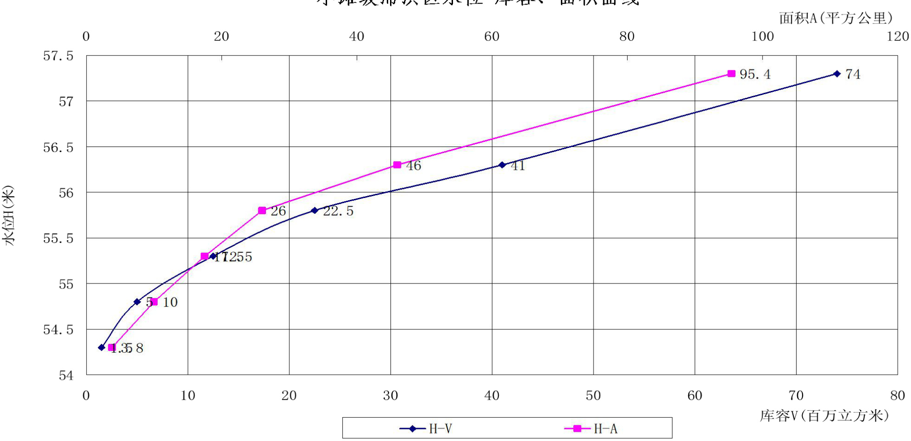  
附图 1 小滩坡蓄滞洪区水位\~库容\~面积曲线图  
小滩坡滞洪区水位-库容、面积曲线  

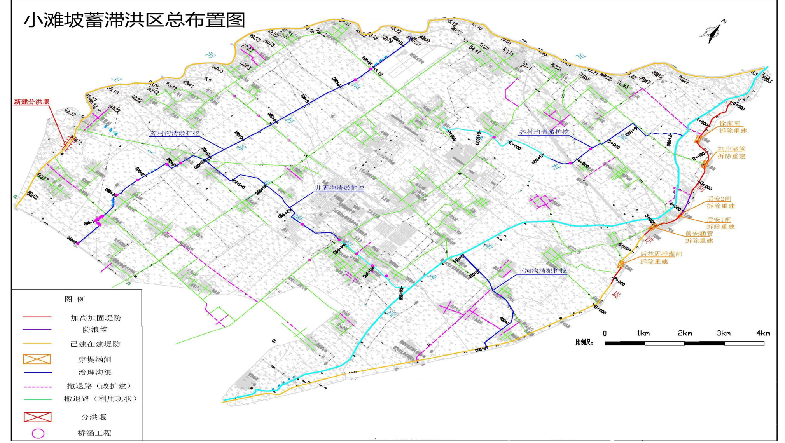  
附图 2 小滩坡蓄滞洪区总布置图  

# 任固坡蓄滞洪区运用预案  

# 1 总则  

# 1.1 编制依据  

任固坡蓄滞洪区运用预案编制依据有:《中华人民共和国防洪法》、《蓄滞洪区运用补偿暂行办法》、《蓄滞洪区运用预案编制导则》等。  

# 1.2 编制目的  

保证蓄滞洪区工程的正常运用,增强蓄滞洪区防洪应变能力,起到削减洪峰、蓄滞超量洪水的作用,保障防洪抗灾工作高效有序进行。  

# 1.3 编制原则  

以习近平总书记“两个坚持、三个转变”防灾减灾救灾新理念为指导,贯彻“以人民为中心”的发展思想,保护人民群众生命财产安全;坚持行政首长负责制,统一指挥、统一调度;坚持底线思维,强化风险意识,最大程度减轻灾害损失;注重蓄滞洪区运用预案的可操作性,保障蓄滞洪区及时有效运用。  

# 1.4 适用范围  

本预案适用于任固坡蓄滞洪区。  

# 2 蓄滞洪区概况  

# 2.1 自然地理  

2.1.1 地理位置、高程、地形地貌  

任固坡蓄滞洪区地处河南省安阳市汤阴、内黄两县境内,卫河中游左岸。以汤河右堤为界,东、南靠卫河左堤,西接自然高地,坡内地面高程在 $53.50{\sim}55.50\mathrm{m}$ 之间,地形是南高北低,西高东低,地势由西南向东北倾斜,地面自然坡降为 1/4000。  

# 2.1.2 所在流域、水系  

卫河是海河流域漳卫河的右支,发源于山西省陵川县,流经河南省、山东省、河北省境内,干流自新乡市合河镇至河北省徐万仓全长 $345\mathrm{km}$ ,流域面积为 $14900\mathrm{km}^{2}$ ,其中在安阳市境内长$64\mathrm{km}$ 。任固坡蓄滞洪区是削减卫河浚内沟口以下洪峰的蓄滞洪区。任固坡内有翟庄沟、红卫沟、赵王沟、八里沟、故城沟、杜故城沟 6 条排涝沟排入卫河。  

# 2.2 社会经济  

# 2.2.1 城镇、村庄、人口  

任固坡蓄滞洪区共涉及汤阴县的菜园、任固、瓦岗、五陵 4个乡(镇)和内黄县的高堤乡,共87 个行政村,总人口153627 人。区内有汤阴县菜园、任固、瓦岗、五陵 4 个乡(镇)和内黄县的高堤乡,共 57 个村,总人口 101314 人。  

# 2.2.2 耕地面积、工农业生产总值  

任固坡蓄滞洪区耕地面积为 19.99 万亩,农业生产总值39084.3 万元,工业生产总值 16657.56 万元,国内生产总值70772.16 万元,农民人均纯收入 3855 元。  

# 2.2.3 重要设施  

任固坡蓄滞洪区内有五陵园林厂、五陵砖厂、富康饲料公司、任固水带厂、大偏店棉纱厂、菜元东街碳素厂、北青村砖厂、南青村面粉厂等重要企业;区内有 302 省道、汤五公路、任五公路三条重要公路;区内的重要桥梁有故城沟桥、八里沟桥、赵王沟桥、翟庄桥等。  

# 2.3 蓄滞洪特征指标  

# 2.3.1 在流域防洪中的作用  

任固坡蓄滞洪区作为卫河坡洼的蓄滞洪区,按防洪规划遇超标准洪水时启用,在卫河防洪体系中具有重要作用,它是分担超额洪水,削减卫河浚内沟以下洪峰流量,降低河道堤防险情,减缓下游洪水压力的必不可少的蓄洪工程,是卫河下游地区重要的防洪安全保障。  

# 2.3.2 滞洪特征指标  

流域防洪规划中任固坡蓄滞洪区的设计蓄滞洪量 2.9 亿 $\mathrm{m}^{3}$ ,淹没面积 $167.83~\mathrm{km}^{2}$ ;现状最大淹没面积 $160\mathrm{km}^{2}$ ,设计滞洪水位$56.40\mathrm{m}$ ,设计滞洪量 1.91 亿 $\mathrm{m}^{3}$ 。  

# 2.4 洪水风险  

任固坡滞洪区运用机率为 $5\%$ 。当坡内高程为 $54.4\mathrm{m}$ 时,淹没面积为 $24.476\mathrm{km}^{2}$ ,容积为 0.06 亿 $\mathrm{m}^{3}$ ;当高程为 $54.9\mathrm{m}$ 时,淹没面积为 $48.952\mathrm{km}^{2}$ ,容积为 0.24 亿 $\mathrm{m}^{3}$ ;当高程为 $55.4\mathrm{m}$ 时,淹没面积为 $92.593\mathrm{km}^{2}$ ,容积为 0.59 亿 $\mathrm{m}^{3}$ ;当高程为 $55.9\mathrm{m}$ 时,淹没面积为 $136.234\mathrm{km}^{2}$ ,容积为 1.16 亿 $\mathrm{m}^{3}$ ;当高程为 $56.4\mathrm{m}$ 时,淹没面积为 $160\mathrm{km}^{2}$ ,容积为 1.91 亿 $\mathrm{m}^{3}$ 。  

# 2.5 防洪工程  

# 2.5.1 蓄滞洪区围堤情况  

任固坡蓄滞洪区外部边界为卫河左堤(北五陵\~西元村)、汤河右堤(北庄\~入卫处)两道堤防。卫河左堤和汤河右堤的堤顶高程除个别地段外,大部分达不到设计标准。  

# 2.5.2 进退洪设施情况  

任固坡蓄滞洪区无进洪工程,进洪采用临时扒口方式,进洪口在五陵镇北五陵东。排洪时主要依靠区内排水沟(红卫沟、故城沟等卫河涵闸入卫河),或扒卫河左堤入卫河,必要时实施抽排。  

# 2.5.3 穿堤建筑物情况  

任固坡蓄滞洪区泵站有瓦岗泵站、南小章泵站;主要涵闸有翟庄闸、五陵北门外闸、北五陵闸、红卫沟闸、赵王沟闸、八里沟闸、故城闸、杜故城闸等涵闸。  

# 2.5.4 防洪工程存在问题  

蓄滞洪区无进退洪控制工程,不能有效控制进出水量。  

# 2.6 安全设施  

# 2.6.1 安全设施现状  

任固坡蓄滞洪区没有安全区、安全台、避水楼、围村堤、救生船等避水救生工程和设施。上世纪 60 年代初,任固坡建有高$2.5\mathrm{m}$ ,长 $19.5\mathrm{km}$ 的围村堤,但是由于工程老化失修,加之缺乏管理,且雨水偏少,围村堤大部分已遭到严重破坏,已不起任何避水作用。  

# 2.6.2 转移安置设施现状  

任固坡蓄滞洪区内主要撤退道路有 7 条,总长 $138\mathrm{km}$ ,有省道 302,乡镇道路有汤五路、任五路、季五路、汤屯路、镇五路、辛西路。  

# 2.6.3 预警通信系统情况  

任固坡蓄滞洪区的预警通讯系统为电视、广播、有线电话、移动通信等,无专用的预警通讯设施。  

# 2.6.4 安全设施存在问题  

1.蓄滞洪区内无避水楼、安全台、船只等安全设施;  
2.蓄滞洪区内面积大、人口多,人员物资转移安置困难。  

# 2.7 历史运用和补偿  

# 2.7.1 运用情况  

任固坡蓄滞洪区曾于 1955、1956、1963 年三次运用。  

1955 年最高滞洪水位 $54.8\mathrm{m}$ ,累计滞洪量 0.8 亿 $\mathrm{m}^{3}$ ,滞洪历时 15 天;  

1956 年最高滞洪水位 $55.8\mathrm{m}$ ,累计滞洪量 1.0 亿 $\mathrm{m}^{3}$ ,滞洪历时 20 天,淹没耕地 11.59 万亩,受困人口 4.972 万人,财产损失  

1144.4 万元;  

1963 最高滞洪水位 $56.4\mathrm{m}$ ,累计滞洪量 2.4 亿 $\mathrm{m}^{3}$ ,滞洪历时25 天,淹没耕地 12.09 万亩,受灾人口 5.83 万人,死亡人口 123人,财产损失 2446.3 万元。  

# 2.7.2 补偿实施情况  

自 2000 年《蓄滞洪区运用补偿暂行办法》实施以来,该蓄滞洪区没有运用过。  

# 3 组织与保障  

# 3.1 指挥机构  

# 3.1.1 指挥机构及职责  

为确保任固坡蓄滞洪区的正常运用,汤阴县、内黄县成立蓄滞洪区运用指挥部。指挥长由各县政府负责人担任。蓄滞洪区运用指挥部在县防汛抗旱指挥部的领导下,具体负责本县范围内蓄滞洪区运用时各项工作。其主要职责是:负责蓄滞洪区运用时的信息发布、人员转移安置、分洪实施、抢险救生、物资供应、运用补偿、灾后重建工作。  

# 3.1.2 指挥机构内设责任组及职责  

根据工作需要,蓄滞洪区在运用时宜设立信息发布组、转移安置组、分洪实施组、抢险救生组、通信保障组、物资供应组、后勤保障组,分工负责蓄滞洪区运用相关工作。各工作组职责如下:  

信息发布组:负责蓄滞洪区运用的预警、警报发布和宣传工作。  

转移安置组:负责蓄滞洪区内居民转移安置的组织和协调工作。  

分洪实施组:负责桂李进洪闸门和丁桥南、北泄洪闸的操作工作。  

抢险救生组:负责蓄滞洪区防洪工程和安全设施的巡查、防守、抢险及人员救生的组织工作。  

通信保障组:负责蓄滞洪区运用的应急通讯工作。  

物资供应组:负责防汛物资的调拨和运输工作。  

后勤保障组:负责蓄滞洪区居民生活必需品的筹集和发放、社会治安、医疗卫生等组织、协调工作。  

各责任组的负责人及成员宜根据蓄滞洪区所在地县级人民政府有关部门的职责分工确定。  

# 3.2 抢险救生与物资保障  

# 3.2.1 抢险救生队伍  

由县蓄滞洪区运用指挥部负责组建县级防汛抢险救生队,并明确负责人及职责。在蓄滞洪区运用时,作为应急抢险队,遇有重大突发险情时,充实到抗洪一线,做好全县蓄滞洪区范围内的防汛抢险工作。  

# 3.2.2 物资保障  

防汛物资储备采取“群众集体筹措与国家储备相结合”的方式,明确专人负责。  

群众集体筹措:由各乡镇负责,采取“就近筹划,登记造册估价,备而不集,用后付款”的办法,汛期未用的由物主自行处理。物资储备地点、种类、数量、运输方案及其负责人报县防汛抗旱  

指挥部备案。  

政府储备:县防汛抗旱指挥部根据本县蓄滞洪区情况要有足够的防汛物资储备,每年要制定详细的储备计划,并负责按计划落实储备的种类、数量、地点及交通运输方式,有明确的负责人。  

# 3.3 生活保障  

生活保障的责任单位由蓄滞洪区所在地县级人民政府确定,责任单位应明确一名负责人为生活保障责任人。蓄滞洪区运用指挥部根据当地实际生活状况,制定出蓄滞洪区居民基本生活定额。  

1.临时住房安置:转移人员的临时住房由安置接收单位负责,本单位临时房屋及帐篷不足以安置时,可通过所在镇(街道办)政府协调,征用附近民房。  

2.食品、饮用水、衣被、燃料等生活必需品的筹集与发放:转移人员的食品、饮用水、衣被、燃料等生活必需品筹集与发放由转移村的包村单位负责,以上生活必需品不足时,由蓄滞洪区运用指挥部负责调配或协调解决。生活必需品的发放按照儿童、老人、伤残、病人、妇女优先的原则统筹发放。  

3.其它应急生活物资筹备途径  

指定储备:由各县防汛抗旱指挥部统一协调,储备一定数量的用于搭建安置灾民临时住房、燃料的各项救灾物资,保证随调随有。紧急情况下,确有困难,可向邻近县或上级请求支援。  

开展社会捐助活动:遭遇超标准洪水,造成重大损失时,县、—296—  

镇(街道办)两级政府可发动群众开展集中性社会捐助活动。所募集款物,全部用于灾区群众生活安置。在紧急情况下,组织灾区发扬“一方有难、八方支援”的优良传统,广泛开展“无灾区支援灾区、轻灾区支援重灾区”的互助互济活动,以村(居)委会为单位筹集食品和饮用水,解决灾民的燃眉之急。  

# 3.4 治安与交通保障  

治安与交通保障的责任单位由蓄滞洪区所在地县级人民政府确定,责任单位应明确一名负责人为治安与交通保障责任人。同时宜按照运用的不同阶段,制定相应的治安交通保障措施,包括撤退转移交通保障、蓄滞洪区内和安置点的治安保障。蓄滞洪区运用时,要做好治安保卫防范工作,确保迁安人员生命财产安全和社会稳定,同时会同有关单位切实做好蓄滞洪区运用的撤退转移交通保障工作。  

# 3.5 医疗保障  

医疗保障的责任单位由蓄滞洪区所在地县级人民政府确定,责任单位应明确一名负责人为医疗保障责任人。同时宜明确医疗药品、设备筹集方式。蓄滞洪区运用后,按预定计划抽调医务人员组成医疗分队,分赴灾区负责灾民医疗救护及卫生防疫工作,应配备足量的常用药品和医疗器械,能进行紧急医疗救助,保障转移人员身体健康。同时宣传防疫卫生知识,防止疾病流行。灾后撤离人员返回原住地前,要对灾区村庄进行全面彻底的消毒处理,确保灾后无大疫。  

# 3.6 宣传保障  

宣传保障的责任单位由蓄滞洪区所在地县级人民政府确定,责任单位应明确一名负责人为宣传保障责任人。同时宜制定蓄滞洪区运用的宣传和信息发布方案。可利用电视、广播等宣传工具进行宣传,使区内群众充分了解蓄滞洪区淹没情况、报警手段、撤离路线、转移安置方案、生活保障措施等。蓄滞洪区运用后,及时通报蓄滞洪区滞洪情况,并向群众宣传生活卫生、安全及防疫等有关知识,确保群众的思想稳定和生命安全。  

# 4 预警与警报  

# 4.1 决策机构与程序  

任固坡蓄滞洪区由省防汛抗旱指挥部统一调度,由市级防汛抗旱指挥部通知涉及的有关县防汛抗旱指挥部,县防汛抗旱指挥部通知涉及的有关乡(镇)防汛抗旱指挥部,乡(镇)防汛抗旱指挥部立即通知有关行政村村委会,村委会要立即通知到群众。有关乡(镇)和各行政村设专职警报发布人员,发布人要采取各种有效手段,以最快的速度将上级指令全面、准确地传达到位。  

警报发布人:县防汛抗旱指挥部指挥长 $\longrightarrow$ 县蓄滞洪区运用指挥部指挥长 $\longrightarrow$ 乡镇防汛抗旱指挥部指挥长 $\longrightarrow$ 蓄滞洪区内村委主任。  

职责:负责及时传达上级命令,执行上级洪水调度指令,对指令执行情况及时进行反馈,做到上情下达、下情上报及时、准确无误。  

# 4.2 警报级别  

根据蓄滞洪区启用不同阶段,警报分为黄色预警、橙色预警和红色警报三级,分别代表运用准备、转移清场、蓄滞洪三个阶段。  

# 4.3 警报发布时机  

1.运用准备阶段:根据气象、水文部门的预测、预报,在预计需要启用蓄滞洪区时,及时向蓄滞洪区和接收撤离人员安置的乡镇发出黄色预警指令,有关乡镇 30 分钟内通知到需要撤离和接收安置的村组及居民,做好转移撤离和安置准备。  

2.转移清场阶段:县防汛抗旱指挥部接市防指转移清场通知后,立即发布橙色预警,开始实施蓄滞洪区内居民转移、清场工作,并及时向上级防指汇报撤离情况。县防汛抗旱指挥部经排查,确认撤离完成后,立即向上级防指报告。  

3.蓄滞洪阶段:县防汛抗旱指挥部接市防指启用蓄滞洪区通知后,立即发布红色警报,蓄滞洪区红色警报期持续至具备返迁条件时为止。  

# 4.4 警报发布机构及方式  

预警、警报由各县防汛抗旱指挥部发布,由县防汛抗旱指挥部各成员单位传达预警、警报信息。主要传达方式有:高音喇叭、网络、电视、广播、电话、手机短信群发、鸣锣、鸣笛、专用信号车等。  

# 4.5 警报解除  

当蓄滞洪区险情解除、并具备返迁条件时,蓄滞洪区运用指挥部要及时用警报器、电话、短信、广播、电视和巡回报警车等  

方式,发布警报解除信息。  

# 5 转移与安置  

# 5.1 安全避洪任务  

# 5.1.1 安全状况  

任固坡蓄滞洪区内涉及汤阴县的菜园、任固、瓦岗、五陵 4个乡(镇)和内黄县的高堤乡,共 57 个村,总人口 101314 人。由于蓄滞洪区内无安全避洪设施,区内人口需转移安置。  

# 5.1.2 避洪任务  

需要转移的区内人口涉及汤阴县菜园、任固、瓦岗、五陵 4个乡(镇)和内黄县的高堤乡,共 57 个村,总人口 101314 人。汤阴县的菜园、任固、瓦岗、五陵 4 个乡(镇),共 56 个村,总人口 98598 人,先就近向附近高地分散转移,根据洪水情况再进行二次转移。内黄县高堤乡的南高堤 1 个村,人口 2726 人,全部向蓄滞洪区外转移。沿卫河左堤向东往对口村庄冉村撤离。转移的主要财产有大牲畜、机动车等。  

# 5.2 就地安置  

蓄滞洪区内无安全避洪设施,无法就地安置。  

# 5.3 转移安置  

# 5.3.1 转移安置负责人及职责  

转移安置总负责人由蓄滞洪区所在地县级人民政府指定,转移安置涉及村组负责人为转移村组、接纳安置点负责人。职责是做好转移安置计划,明确转移路线,落实交通工具,并在蓄滞洪  

区运用指挥部备案,及时传达执行迁安指令,做好转移群众的思想动员工作,负责组织、协调迁安群众于最短时间撤离危险区,保障迁安群众安全撤离和妥善安置。  

# 5.3.2 转移村组的人口、主要财产  

当蓄滞洪区启用时,按计划转移人员和主要财产。  

# 5.3.3 逐村组落实安置地点  

安置点的选择,在保证安全的前提下,应以就近、同行政区域为原则,并考虑安置点的接纳条件。  

# 5.3.4 人员和物资分批转移的时机  

转移时先人员后物资,如果车辆允许情况下一起转移。转移时以村组为单位,依次逐步转移,做到有序进行,不能相互干扰,保证在有限时间内撤离转移安置到位,不能让一人一户掉队。  

# 5.3.5 撤退转移时的通讯联系方式  

撤退转移时利用卫星电话、有线电话、手机、短信、广播、电视等方式进行联络,利用铜锣、手摇报警器预警、报警。  

# 5.3.6 各村组的转移路线  

转移安置路线的确定应考虑转移道路通行能力、转移任务及运输条件等因素。  

# 5.3.7 各村组撤退转移的交通工具  

蓄滞洪区运用指挥部应根据居民就地安置与转移安置计划,明确各村组撤退转移的交通工具种类、数量和筹措方式,确定筹措责任单位和责任人。  

# 6 工程调度与运用  

# 6.1 调度方案  

# 6.1.1 启用条件  

当卫河元村站流量超过 $2500\mathrm{m}^{3}/\mathrm{s}$ 或元村站流量未达到$2500\mathrm{m}^{3}/\mathrm{s}$ 但老观嘴至元村段堤防出现严重险情有决口风险时,扒开北五陵以下卫河左堤向任固坡分洪。  

# 6.1.2 调度权限  

经会商,确定蓄滞洪区启用时,河南省防汛抗旱指挥部下达命令至安阳市防汛抗旱指挥部,同时做好蓄滞洪区运用监督工作;安阳市防汛抗旱指挥部将省防汛抗旱指挥部命令分别及时传达到汤阴县、内黄县防汛抗旱指挥部,同时做好滞洪区运用监督、指导工作;汤阴县、内黄县防汛抗旱指挥部负责预案的具体组织实施工作。同时,汤阴县、内黄县蓄滞洪区运用指挥部按照预案组织好区内人员的转移安置等工作。  

# 6.2 工程运用  

进洪:当卫河元村站流量超过 $2500\mathrm{m}^{3}/\mathrm{s}$ 或元村站流量未达到$2500\mathrm{m}^{3}/\mathrm{s}$ 但老观嘴至元村段堤防出现严重险情有决口风险时,扒开北五陵以下卫河左堤向任固坡分洪。  

退洪:红卫沟、故城沟等卫河涵闸泄洪或扒卫河左堤入卫河,必要时实施抽排。  

# 6.3 工程防守与应急抢险  

# 6.3.1 工程防守  

县防汛抗旱指挥部负责各县蓄滞洪区防洪工程、安全设施抢险工作,对各种可能出现的工程险情制定切实可行的抢险方案。  

根据县、乡、村备案的抢险队,明确划分责任段、责任人,坚持 24 小时不间断巡查,发现险情及时上报、及时处理,同时各级物资供应部门要保证抢险物资的及时到位,确保防汛抢险的需要。遇有重大险情,要边抢险边上报,请求上级的支援,确保防洪工程的安全。  

1.对卫河堤防的老观咀段、南小章新堤段、瓦查村东顶冲段、五陵镇至铁路桥堤防薄弱段等险工段需加强监测,并指定好取土位置,备好部分块石、木桩备用;  

2.对涵洞、路口、穿堤洞等险工,汛前备好土牛,以备急用;  

3.对堤身的沉陷、管涌、滑坡、塌陷、河水流势要加强监测,发现问题要根据技术操作规范和实际情况及时处理,将险情处理在萌芽状态;  

4.当卫河流量达到 $500\mathrm{m}^{3}/\mathrm{s}$ 时,五陵水文站对监测的情况需 2小时上报县防指 1 次,重点险工险段需 1 小时上报县防指 1 次,特殊情况随时报告,抢险队伍上堤巡查;  

5.当卫河流量不超过 $1500\mathrm{m}^{3}/\mathrm{s}$ 时,加强卫河堤防的除险加固和看护,努力做好堤防不决口,涵洞运用灵活,不出问题,同时注意排坡内涝水,即在卫河洪水到来之前排坡内涝水,在洪水到来之前关闭卫河闸门,防止洪水倒灌使坡内形成水灾;  

6.当卫河流量超过 $1500\mathrm{m}^{3}/\mathrm{s}$ 时,从全局利益出发,待上级防  

指下达分洪命令时破堤分洪。  

6.3.2 针对工程险情隐患,落实抢险责任  

县防汛抗旱指挥部组织抢险突击队,明确各突击队的防范范围,落实各突击队的抢险责任。  

# 7 返迁与善后  

# 7.1 返迁  

# 7.1.1 居民人身安全保障  

蓄滞洪区运用后,受洪水淹没的桥梁、道路、房屋可能存在安全隐患,需要进行安全检查,以确保居民的人身安全。该项工作由蓄滞洪区运用指挥部明确责任单位及职责。  

# 7.1.2 居民卫生安全保障  

洪水淹没区域存在流行疾病传播的危险,需要对原居住地环境进行清理和消毒等卫生防疫,以确保居民的卫生安全。该项工作由蓄滞洪区运用指挥部明确责任单位及职责。  

# 7.1.3 其它安全隐患排查  

其它安全隐患排查包括公共设施隐患、水电等生命线工程隐患、水利工程设施隐患等排查。该项工作由蓄滞洪区运用指挥部明确责任单位及职责。  

# 7.1.4 返迁家园  

退洪后,县蓄滞洪区运用指挥部组织相关职能小组,按照撤离时的顺序、路线、交通工具组织撤离人员返迁家园。人员的返迁时间确定在洪水基本退出、道路可以通行、各种安全隐患排除后。  

# 7.2 善后  

# 7.2.1 运用补偿工作  

蓄滞洪区运用指挥部应按《蓄滞洪区运用补偿暂行办法》的要求,每年在规定时间内完成蓄滞洪区内居民财产登记工作,并明确运用补偿的责任单位及职责。  

# 7.2.2 水毁工程的修复  

蓄滞洪区运用后应及时核查汇总水毁工程情况、编报水毁工程修复计划。对于较小的水毁工程呈报地方政府积极组织力量进行修复;对于较大的水毁工程上报上级部门申请资金,待项目批复后按计划组织实施。  

# 8 附图附表  

8.1 附表  

1 任固坡蓄滞洪区基本情况表  

2 任固坡蓄滞洪区社会经济统计表  

3 任固坡蓄滞洪区历年运用情况统计表  

4 任固坡蓄滞洪区居民安全撤离及安置计划表  

5 任固坡蓄滞洪区居民财产登记及变更登记汇总表  

8.2 附图  

1 任固坡蓄滞洪区水位\~库容\~面积曲线图  

2 任固坡蓄滞洪区总布置图  

# 附表 1 任固坡蓄滞洪区基本情况表  

<html><body><table><tr><td colspan="3">蓄滞洪区名称</td><td>任固坡蓄滞洪区</td><td colspan="3">就地安置人口 (人)</td><td>0</td></tr><tr><td colspan="3">兴建时间</td><td>1956年</td><td colspan="3">转移安置人口 (人)</td><td>101314</td></tr><tr><td colspan="3">所在河流</td><td>卫河</td><td colspan="3">通讯设施</td><td>电话、手机</td></tr><tr><td colspan="3">所在市县</td><td>汤阴县、内黄县</td><td colspan="3">报警设施</td><td>电视、广播</td></tr><tr><td colspan="3">设计蓄滞洪水位（m)</td><td>56.4</td><td colspan="2">船只 (只)</td><td></td><td>无</td></tr><tr><td colspan="3">设计蓄滞洪量（亿m²)</td><td>1.91</td><td colspan="2">撤退 道路</td><td>条数</td><td>7</td></tr><tr><td colspan="3">蓄洪面积（km²)</td><td>160</td><td colspan="2"></td><td>长度（km)</td><td>138</td></tr><tr><td colspan="3">耕地 (万亩)</td><td>19.99</td><td rowspan="5">涉及 区域</td><td colspan="2">乡镇 (个)</td><td>5</td></tr><tr><td colspan="3">地面高程范围(m)</td><td>53.5~55.5</td><td colspan="2">行政村 (个)</td><td>87</td></tr><tr><td colspan="3">运用机率 (年一遇)</td><td>20</td><td colspan="2">人口 (万人)</td><td>15.36</td></tr><tr><td rowspan="4">安全区 (保庄圩)</td><td>安全区 (处)</td><td></td><td rowspan="4">区内</td><td colspan="2">人口 (万人)</td><td></td></tr><tr><td>围堤长（km)</td><td></td><td colspan="2"></td><td>10.13</td></tr><tr><td>堤顶高程（m)</td><td></td><td colspan="2">行政村 (个)</td><td>57</td></tr><tr><td>安置人口 (人)</td><td></td><td colspan="2"></td><td></td></tr></table></body></html>  

附表 2 任固坡蓄滞洪区社会经济统计表  

<html><body><table><tr><td></td><td></td><td></td><td>涉及</td><td>耕地 人口 面积</td><td>粮食年产量 (kg)</td><td>油年产量 (kg)</td><td>(kg)</td><td>棉年产量渔年产量 (kg)</td><td>林年产量 (m3)</td></tr><tr><td>序号 1</td><td>(名称) 任固</td><td>(个) 35</td><td>(人) 57416</td><td rowspan="6">(万亩) 19.20</td><td>40425000</td><td>2612000</td><td>659500</td><td>1600</td><td>18000</td></tr><tr><td>2</td><td>五陵</td><td>27</td><td>53375</td><td>20350000</td><td>900000</td><td>700000</td><td>6000</td><td>11000</td></tr><tr><td>3</td><td>菜园</td><td>17</td><td>27347</td><td>44393000</td><td>2299000</td><td>9407000</td><td>4064</td><td>1600</td></tr><tr><td>4</td><td>瓦岗</td><td>7</td><td>12763</td><td>8160000</td><td>910000</td><td>580000</td><td>1890</td><td>3370</td></tr><tr><td>5</td><td>高堤</td><td>1</td><td>2726 0.79</td><td>4610000</td><td>940000</td><td>5500</td><td>0</td><td>0</td></tr><tr><td>合计</td><td></td><td>87</td><td>153627 19.99</td><td>117938000</td><td>7661000</td><td>11352000</td><td>13554</td><td>33970</td></tr><tr><td colspan="3">重要企业</td><td colspan="7">五陵园林厂、五陵砖厂、富康饲料公司、任固水带厂、大偏店棉纱厂、菜元东街 碳素厂、北青村砖厂、南青村面粉厂、同旺饲料有限公司、鑫源节能材料厂、海</td></tr><tr><td colspan="3">重要道路</td><td colspan="7">江纸业有限公司等 伏五路、汤屯路、镇五路、302 省道、汤五公路、任五公路等</td></tr><tr><td colspan="3">重要桥梁</td><td colspan="7">旱塔河桥、镇抚寨桥、汤浚桥、故城沟桥、八里沟桥、赵王沟桥、翟庄桥等</td></tr><tr><td colspan="3">农业总产值 (万元)</td><td colspan="7">39084.3</td></tr><tr><td colspan="3">工业总产值 (万元)</td><td colspan="7">70772.16</td></tr><tr><td colspan="3">固定资产总值（万元）</td><td colspan="7">128877.36</td></tr><tr><td colspan="3">经济发展模式</td><td colspan="8">农业、工业</td></tr><tr><td colspan="3">产业结构形式</td><td colspan="8">农、工、商</td></tr><tr><td></td><td colspan="3">人均年收入 (元)</td><td colspan="6">3855（汤阴县）4750（内黄县）</td></tr></table></body></html>  

附表 3 任固坡蓄滞洪区历年运用情况统计表  

<html><body><table><tr><td rowspan="2">年度</td><td rowspan="2">蓄滞洪 次数</td><td rowspan="2">最高蓄滞洪水位 （大沽高程）（m)</td><td rowspan="2">相应蓄滞洪量 (亿m²)</td><td rowspan="2">蓄滞洪历时 (小时)</td><td colspan="3">受灾情况</td></tr><tr><td>耕地 (亩)</td><td>人口 (人)</td><td>财产损失 （万元）</td></tr><tr><td>1955年</td><td>1</td><td>56.0</td><td>0.8</td><td>360</td><td></td><td></td><td></td></tr><tr><td>1956年</td><td>1</td><td>57.0</td><td>1.0</td><td>480</td><td>11.59</td><td>4.9720</td><td>1144.4</td></tr><tr><td>1963年</td><td>1</td><td>57.6</td><td>2.4</td><td>600</td><td>12.09</td><td>5.8297</td><td>2446.3</td></tr></table></body></html>

备注:表格内填写“/”的表示无相关数据。  

附表 4 任固坡滞洪区居民安全撤离及安置计划表  

<html><body><table><tr><td colspan="4">计划撤离情况</td><td colspan="4">计划安置地点</td><td rowspan="2">备注</td></tr><tr><td></td><td>所在县名|乡镇名称</td><td>行政村名</td><td>撤离人口 （人）</td><td>安置地点</td><td>安置人口 （人)</td><td></td><td>乡镇名称|所在县名</td></tr><tr><td rowspan="9">汤阴县</td><td rowspan="9">任固乡</td><td>南庄</td><td>994</td><td>西尧会</td><td>994</td><td rowspan="9">五陵乡</td><td rowspan="9"></td></tr><tr><td>杜施济</td><td>1002</td><td>报马厂</td><td>1002</td></tr><tr><td>王辛庄</td><td>2258</td><td>后岗头</td><td>2258</td></tr><tr><td>李施济</td><td>680</td><td>李尧会</td><td>680</td></tr><tr><td>杜故城</td><td>1439</td><td>前岗头</td><td>1439</td></tr><tr><td>北故城</td><td>2051</td><td>东尧会</td><td>2051</td></tr><tr><td>后故城</td><td>1685</td><td>龙虎</td><td>1685</td></tr><tr><td>前故城</td><td>1465</td><td>北里于</td><td>1465</td></tr><tr><td>沟北村</td><td>1243</td><td>南里于</td><td>1243</td></tr><tr><td></td><td>沟南村</td><td>1670</td><td>大性村</td><td>1670</td><td></td></tr></table></body></html>  

<html><body><table><tr><td colspan="4">计划撤离情况</td><td colspan="3">计划安置地点</td><td rowspan="2">备注</td></tr><tr><td></td><td>所在县名|乡镇名称</td><td>行政村名</td><td>撤离人口 (人)</td><td>安置地点</td><td>安置人口 (人)</td><td>乡镇名称」所在县名</td></tr><tr><td>汤阴县</td><td></td><td>辛留</td><td>474</td><td>大性二队</td><td>474</td><td rowspan="9"></td></tr><tr><td></td><td>顾得</td><td>473</td><td>西柳圈村</td><td>473</td></tr><tr><td></td><td>姬施济</td><td>534</td><td>大性三队</td><td>534</td></tr><tr><td></td><td>王施济</td><td>922</td><td>何岳营</td><td>922</td></tr><tr><td></td><td>任固一街</td><td>1434</td><td>小村</td><td>1434</td></tr><tr><td></td><td>任固二街</td><td>1602</td><td>瓦岗</td><td>1602</td></tr><tr><td></td><td>任固三街</td><td>1376</td><td>苏村</td><td>1376</td></tr><tr><td>任固四街</td><td></td><td>1298</td><td>刘家屯</td><td>1298</td></tr><tr><td></td><td>任固五街</td><td>1208</td><td>北城村</td><td>1208</td></tr><tr><td rowspan="8">任固乡</td><td>任固六街</td><td>1196</td><td>辛庄</td><td>1196</td><td rowspan="8">伏道乡</td></tr><tr><td>白龙一街</td><td>1617</td><td>胡营</td><td>1617</td></tr><tr><td>白龙二街</td><td>1538</td><td>后路村</td><td>1538</td></tr><tr><td>白龙三街</td><td>1281</td><td>前路村</td><td>1281</td></tr><tr><td>苏湖村</td><td>1522</td><td>南韩村</td><td>1522</td></tr><tr><td>冯家巷</td><td>683</td><td>小来庄</td><td>683</td></tr><tr><td>梁儿寨</td><td>1612</td><td>南周流</td><td>1612</td></tr><tr><td>孟庄</td><td>2109</td><td>李营村</td><td>2109</td></tr><tr><td rowspan="9"></td><td>赵庄</td><td>3604</td><td>小屯村</td><td>3604</td><td rowspan="9"></td></tr><tr><td>岳南村</td><td>2459</td><td>白营</td><td>2459</td></tr><tr><td>岳北村</td><td>2346</td><td>大付庄</td><td>2346</td></tr><tr><td>公有</td><td>2195</td><td>瓦岗</td><td>2195</td></tr><tr><td>白家庄</td><td>1720</td><td>伏道</td><td>1720</td></tr><tr><td>商城</td><td>2171</td><td>瓦岗</td><td>2171</td></tr><tr><td>季家庄</td><td></td><td>伏道</td><td>593</td></tr><tr><td>北青冢</td><td>593 2209</td><td>咀上</td><td>2209</td></tr><tr><td>菜园乡 大坡</td><td>1328</td><td>全庄</td><td>1328</td></tr></table></body></html>  

<html><body><table><tr><td colspan="3">计划撤离情况</td><td colspan="4">计划安置地点</td><td rowspan="2">备注</td></tr><tr><td>所在县名」乡镇名称</td><td>行政村名</td><td>撤离人口 （人)</td><td>安置地点</td><td>安置人口 (人)</td><td></td><td>乡镇名称」所在县名</td></tr><tr><td rowspan="8">菜园乡</td><td>南青冢</td><td>1713</td><td>北店</td><td>1713</td><td rowspan="8"></td><td rowspan="8"></td><td rowspan="8"></td></tr><tr><td>小坡</td><td>1552</td><td>南店</td><td>1552</td></tr><tr><td>小偏店</td><td>1051</td><td>南陈王</td><td>1051</td></tr><tr><td>大偏店</td><td>1529</td><td>南陈王</td><td>1529</td></tr><tr><td>东岗头</td><td>1261</td><td>北陈王</td><td>1261</td></tr><tr><td>同庄</td><td>1906</td><td>西石得</td><td>1906</td></tr><tr><td>尚金寨</td><td>851</td><td>前弯张</td><td>851</td></tr><tr><td>镇抚寨</td><td>4256</td><td>南小章</td><td>4256</td></tr><tr><td rowspan="12">汤阴县 五陵乡 瓦岗乡</td><td>水塔河</td><td>5545</td><td>东小章、南 小章、翟庄</td><td>5545</td><td rowspan="8"></td><td rowspan="8"></td></tr><tr><td>旱塔河</td><td>2172</td><td>瓦杳</td><td>2172</td></tr><tr><td>北五陵</td><td>3654</td><td>夏庄村</td><td>3654</td></tr><tr><td>屯庄</td><td>3836</td><td>五里村</td><td>3836</td></tr><tr><td>小葛寨</td><td>1886</td><td>李五屯</td><td></td></tr><tr><td></td><td>910</td><td>东江蜜</td><td>1886</td></tr><tr><td>麻庭寨 阎庄</td><td></td><td></td><td>910</td></tr><tr><td></td><td>1196</td><td>司马</td><td>1196</td></tr><tr><td rowspan="6"></td><td>朱家营</td><td>1018</td><td>瓦杳</td><td>1018</td><td rowspan="6"></td><td rowspan="6"></td></tr><tr><td>组佐</td><td>3980</td><td>五陵镇</td><td>3980</td></tr><tr><td>小宋村</td><td>1540</td><td>幸庄</td><td>1540</td></tr><tr><td>大宋村</td><td>3962</td><td>五陵镇</td><td>3962</td></tr><tr><td>东柳圈</td><td>789</td><td>宁庄</td><td>789</td></tr><tr><td>合计 56</td><td>98598</td><td>51</td><td>98598</td></tr><tr><td rowspan="3">内黄县</td><td rowspan="3">高堤乡</td><td>南高堤</td><td>2726</td><td>冉村寨里、 冉村寨外</td><td>2726</td><td rowspan="3">冉村 4</td><td rowspan="3">内黄县 2</td></tr><tr><td>合计 1</td><td>2726</td><td>2</td><td>2726</td></tr><tr><td>总计(汤阴+内黄) 57</td><td>101324</td><td>53</td><td>101324</td></tr></table></body></html>  

附表 5 任固坡蓄滞洪区居民财产登记及变更登记汇总表  

<html><body><table><tr><td rowspan="3"></td><td rowspan="3">单位名称 户数(户)</td><td rowspan="3">涉及人口承包土地 （人）</td><td rowspan="3">农作物 (亩) (亩)</td><td colspan="4">专业养殖</td><td rowspan="3">经济林 (亩)</td><td colspan="2" rowspan="2">居民住房</td><td colspan="2">农业生产机械、役畜</td><td rowspan="2">家庭主要耐用 消费品</td></tr><tr><td rowspan="2">家畜类 (头)</td><td rowspan="2">家禽类 水产类 (只) (亩)</td><td rowspan="2"></td><td rowspan="2"></td><td rowspan="2">农业生产 机械 (台)</td><td rowspan="2">役畜 主要家用电器 (畜)</td></tr><tr><td></td><td>（间）</td><td>(m²)</td></tr><tr><td>安阳市</td><td>35470</td><td>153627</td><td>215769.09214311.99</td><td></td><td>54553</td><td>3749080</td><td>91 6198.3</td><td>314936</td><td>5854401</td><td>8422</td><td>971</td><td></td><td>188023</td></tr><tr><td>合计</td><td>35470</td><td>153627</td><td>215769.09214311.99</td><td></td><td>54553</td><td>3749080</td><td>91</td><td>6198.3</td><td>314936</td><td>5854401</td><td>8422</td><td>971</td><td>188023</td></tr></table></body></html>  

面积A (平方公里)  

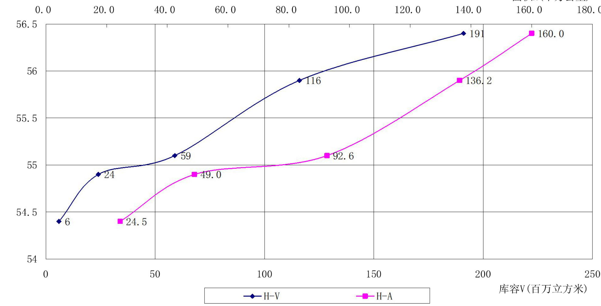  
附图 1 任固坡蓄滞洪区水位\~库容\~面积曲线图任固坡滞洪区水位-库容、面积曲线  

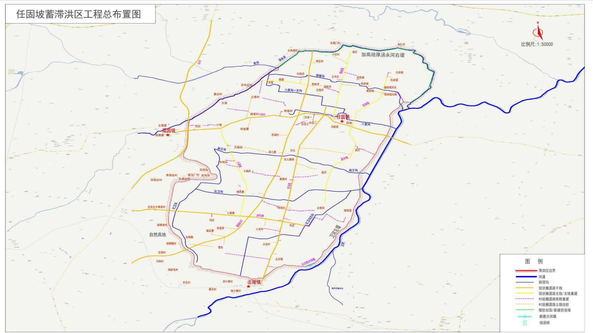  
附图 2 任固坡蓄滞洪区总布置图  

# 广润坡蓄滞洪区运用预案  

# 1 总则  

# 1.1 编制依据  

广润坡蓄滞洪区运用预案编制依据有:《中华人民共和国防洪法》、《蓄滞洪区运用补偿暂行办法》、《蓄滞洪区运用预案编制导则》等。  

# 1.2 编制目的  

保证蓄滞洪区工程的正常运用,增强蓄滞洪区防洪应变能力,起到削减洪峰、蓄滞超量洪水的作用,保障防洪抗灾工作高效有序进行。  

# 1.3 编制原则  

以习近平总书记“两个坚持、三个转变”防灾减灾救灾新理念为指导,贯彻“以人民为中心”的发展思想,保护人民群众生命财产安全;坚持行政首长负责制,统一指挥、统一调度;坚持底线思维,强化风险意识,最大程度减轻灾害损失;注重蓄滞洪区运用预案的可操作性,保障蓄滞洪区及时有效运用。  

# 1.4 适用范围  

本预案适用于广润坡蓄滞洪区。  

# 2 蓄滞洪区概况  

# 2.1 自然地理  

2.1.1 地理位置、高程、地形地貌  

广润坡蓄滞洪区位于卫河支流永河中下游左岸,双石桥至入卫河口之间。滞洪时分为一级、二级,涉及安阳市汤阴县、安阳县(示范区)、内黄县和文峰区 4 个县(区)。  

一级蓄滞洪区建于 1956 年,形状不规则,东南以汤河左堤为界,东防洪堤为其东边界,北部为自然高地,西部以西防洪堤、羑河堤及自然高地为界,淹没面积为 $55.1\mathrm{km}^{2}$ 。  

二级蓄滞洪区建于 1957 年,以安阳河右堤,一级蓄滞洪区东边界堤、汤河左堤及卫河左堤为界,淹没面积 $80.1\mathrm{km}^{2}$ 。  

蓄滞洪区形状上大下小,地面起伏不大,地势自西南向东北倾斜,坡底高程为 $52.40\mathrm{m}$ ,自然坡降为 $1/3500\sim1/5000$ 。  

# 2.1.2 所在流域、水系  

广润坡蓄滞洪区位于海河流域卫河水系汤永河中下游,主要涉及汤永河干流及其一级支流汤河、洪河及洪河支流羑河和茶店坡沟。  

汤永河发源于鹤壁市山城区鹿楼乡西扒厂,经鹤壁市山城区、淇滨区、安阳市汤阴县、安阳县、内黄县,在内黄县西元村入卫河,流域面积 $1323.5\mathrm{km}^{2}$ ,干流全长 $64\mathrm{km}$ 。汤永河双石桥以上建有两座中型水库:琵琶寺水库,流域面积 $30\mathrm{km}^{2}$ ,库容 2054万 $\mathrm{m}^{3}$ ;汤河水库,流域面积 $162\mathrm{km}^{2}$ ,库容 5615 万 $\mathrm{m}^{3}$ 。主要支流有牛村沟、淤泥河、汤河、洪河等,双石桥以下左岸为广润坡蓄滞洪区。  

洪河发源于安阳市龙安区马投涧乡郭家村的浅山丘陵地带,自西向东穿过开发区,至示范区高庄镇汪流屯村羑河汇入后,进入广润坡蓄滞洪区,而后流经中杨庄、万庄,自四伏厂汇入汤永河,全长 $42\mathrm{km}$ ,流域面积 $674.8\mathrm{km}^{2}$ ,洪河流域整体呈梯形,长约 $40\mathrm{km}$ ,宽约 $19\mathrm{km}$ ,地势自西向东倾斜。  

羑河发源于鹤壁市鹤壁集,流经鹤壁集、汤阴县、安阳市文峰区,过京广铁路后,经任村、黎官屯村进入广润坡蓄滞洪区,至城乡一体化示范区汪流屯出汇入洪河,长 $45\mathrm{km}$ ,流域面积188.4km²。  

茶店坡河为羑河支流,位于安阳市区东部及安阳县白壁镇、瓦店乡境内,承接市区铁路以东邱家沟、婴儿沟、聂村沟三沟排水,并沿途承接安阳县区域涝水,下游分别有瓦亭沟和殷家沟涝水汇入,河道流域面积 $153\mathrm{km}^{2}$ ,全长 $21.20\mathrm{km}$ 。  

# 2.2 社会经济  

# 2.2.1 城填、村庄、人口  

广润坡蓄滞洪区涉及汤阴县、安阳县(示范区)、内黄县、文峰区、4 个县(区)的 9 个乡(镇),共 92 个行政村,总人口16.38 万人。其中汤阴县涉及菜园镇、古贤镇 2 个乡(镇),23 个村,4.22 万人;安阳县(示范区)涉及白壁镇、瓦店乡、辛村镇、—316—  

高庄镇 4 个乡(镇),52 个村,9.22 万人;内黄县涉及豆公镇、东庄镇,16 个村,2.63 万人;文峰区涉及宝莲寺镇 1 个乡(镇),1 个村,0.31 万人。  

2.2.2 耕地面积、农业生产总值  

广润坡蓄滞洪区耕地面积21.28 万亩,农业生产总值42171.73万元,工业生产总值 20342.32 万元,固定资产总值 6600 万元。  

# 2.2.3 重要生命线工程及设施情况  

广润坡蓄滞洪区内有菜园东街碳素厂、古贤面粉厂、古贤纸箱厂、永达肉鸡饲养基地、华鑫肉联厂、豆公面粉厂和豆公线厂等重要企业;区内有重要公路省道 S301、S302、S303 线、安(阳)南(乐)高速公路等;区内的重要桥梁有汤河古贤桥、菜园镇桥等。  

# 2.3 蓄滞洪特征指标  

# 2.3.1 在流域防洪中的作用  

广润坡蓄滞洪区位于海河流域卫河水系汤河中下游,历史上是天然洼地,主要承滞汤河、洪河、茶店坡沟超标准洪水。  

# 2.3.2 滞洪特征指标  

流域防洪规划中广润坡蓄滞洪区的设计蓄滞洪量 3.22 亿 $\mathrm{m}^{3}$ ,淹没面积 $152.79\mathrm{km}^{2}$ ;现状广润坡蓄滞洪区分一级、二级,一级建于 1956 年,设计滞洪水位 $57.0\mathrm{m}$ ,滞洪量 0.73 亿 $\mathrm{m}^{3}$ ,淹没面积 $55.1\mathrm{km}^{2}$ ;二级建于 1957 年,设计滞洪水位 $56.0\mathrm{m}$ ,滞洪量 1.75亿 $\mathrm{m}^{3}$ ,淹没面积 $80.1\mathrm{km}^{2}$ 。  

# 2.4 洪水风险  

见广润坡蓄滞洪区不同机遇洪水风险图。  

# 2.5 防洪工程  

# 2.5.1 蓄滞洪区围堤情况  

现状广润坡蓄滞洪区范围内的隔堤及围堤包括:东防洪堤(隔堤)、西防洪堤、汤河左堤、安阳河右堤及卫河左堤。  

广润坡一级蓄滞洪区有东西两道围堤,总长 $19.75\mathrm{km}$ 。其中东防洪堤长 $8.85\mathrm{km}$ ,现状堤顶高程为 $57.94\mathrm{m}\sim58.48\mathrm{m}$ ,堤顶宽度 $4.0\mathrm{m}$ ,边坡1:1.5;西防洪堤长 $10.9\mathrm{km}$ ,现状堤顶高程为 $57.72\mathrm{m}\sim$ $58.74\mathrm{{m}}$ ,堤顶宽度 $3.0\mathrm{m}$ ,边坡 1:1.5,由于年久失修,管理薄弱,部分堤段遭受破坏,直接威胁到防洪安全。汤河左堤堤长 $25.6\mathrm{km}$ 现状堤顶高程为 $63.15\mathrm{m}\sim52.75\mathrm{m}$ ,堤顶宽度 $4.0\mathrm{m}$ ,边坡 1:2.5。安阳河右堤堤长 $21.1\mathrm{km}$ 现状堤顶高程为 $58.80\mathrm{m}\sim53.10\mathrm{m}$ ,堤顶宽度 $4.0\mathrm{m}$ ,边坡 1:2.5。  

广润坡二级蓄滞洪区东边界为卫河左堤,从内黄县汤河入卫河口的西元村\~安阳河入卫河口的范阳村,长 $9.6\mathrm{km}$ ,现状堤顶高程 $55.90{\sim}55.50\mathrm{m}$ ,堤顶宽度 $6.0\mathrm{m}$ ,边坡 1:2.3。  

# 2.5.2 进退洪设施情况  

当汤河双石桥水位超过 $61.40\mathrm{m}$ (85 基准)洪水通过汤河左堤溢流堰自然漫溢进入广润坡一级滞洪区;当汤河双石桥与洪河汪流屯、茶店河内黄至安阳快速通道桥 3 处河道来水量合计大于$300\mathrm{m}^{3}/\mathrm{s}$ ,且洪河汪流屯洪水位发生漫溢或茶店河内黄至安阳快速通道桥洪水位发生漫溢时,启用广润坡一级滞洪区。  

当广润坡一级滞洪区蓄水位达到 $57.02\mathrm{m}$ (85 基准)时,在王贵庄溢洪堰漫流入广润坡二级滞洪区,使洪水沿安阳河与汤河之间下泄,视卫河洪水情况,相机利用卫河田大晁闸退水入卫河,或用其它方式排泄(如抽排、破汤河左堤等)。  

# 2.5.3 防洪工程存在问题  

1.蓄滞洪区防洪工程严重缺乏;  
2.蓄滞洪区原有围村堤大部分遭破坏。  

# 2.6 安全设施  

# 2.6.1 安全设施现状  

广润坡蓄滞洪区围堤高程不足,防洪标准较低并有多处缺口,围堤防洪闸年久失修,滞洪区内无安全避水设施。区内撤退道路除省道 S302 线为Ⅱ级公路外,其余撤退道路等级较低,多为土路。  

# 2.6.2 预警通讯系统  

广润坡蓄滞洪区的预警通讯系统为电视、广播、有线电话、移动通信等。无专用的预警通讯设施。  

# 2.6.3 安全设施存在问题  

1.蓄滞洪区内无避水楼、安全台、船只等避水安全设施;  
2.蓄滞洪区面积大、人口多,人员物资转移安置极为困难。  
2.7 历史运用和补偿  
2.7.1 运用情况  

广润坡蓄滞洪区于 1956 年、1963 年、2021 年运用 3 次,2016年被动运用 1 次。  

1956 年最高滞洪水位 $58.30\mathrm{m}$ ,滞洪量 0.91 亿 $\mathrm{m}^{3}$ ,滞洪历时20 天,淹没耕地 11 万亩,财产损失 581.2 万元。  

1963 年最高滞洪水位 $58.60\mathrm{m}$ ,滞洪量 1.55 亿 $\mathrm{m}^{3}$ ,滞洪历时25 天,淹没耕地 13.5 万亩,财产损失 969.4 万元。  

2021 年 7 月 20 日,安阳市遭受特大暴雨袭击,受此次强降雨影响。广润坡蓄滞洪区于 7 月 21 日 19 时开始蓄滞洪水,历时4 天,最高蓄滞洪水位 $60.40\mathrm{m}$ (一级,北周流)、 $56.65\mathrm{m}$ (二级,大王寨),最大蓄滞洪量 0.94 亿 $\mathrm{m}^{3}$ 。本次运用共涉及汤阴县、安阳县、文峰区、内黄县四个县区的 9 个乡镇 77 个行政村被淹,淹没耕地 10.79 万亩,受灾人口 9.43 万人,造成财产损失 37643万元。  

# 2.7.2 补偿情况  

《蓄滞洪区运用补偿暂行办法》出台后,2021 年首次运用,补偿损失 25904 万元。  

# 3 组织与保障  

# 3.1 指挥机构  

# 3.1.1 指挥机构组成及职责  

为确保广润坡蓄滞洪区的正常运用,汤阴县、安阳县(示范区)、内黄县、文峰区成立蓄滞洪区运用指挥部。指挥长由各县(区)政府负责人担任。蓄滞洪区运用指挥部在县(区)防汛抗—320—  

旱指挥部的领导下,具体负责本辖区范围内蓄滞洪区运用时各项工作。其主要职责是:负责蓄滞洪区运用时的信息发布、人员转移安置、分洪实施、抢险救生、物资供应、运用补偿、灾后重建工作。  

# 3.1.2 指挥机构内设责任组及职责  

根据工作需要,蓄滞洪区在运用时宜设立信息发布组、转移安置组、分洪实施组、抢险救生组、通信保障组、物资供应组、后勤保障组,分工负责蓄滞洪区运用相关工作。各工作组职责如下:  

信息发布组:负责蓄滞洪区运用的预警、警报发布和宣传工作。  

转移安置组:负责蓄滞洪区内居民转移安置的组织和协调工作。  

分洪实施组:负责桂李进洪闸门和丁桥南、北泄洪闸的操作工作。  

抢险救生组:负责蓄滞洪区防洪工程和安全设施的巡查、防守、抢险及人员救生的组织工作。  

通信保障组:负责蓄滞洪区运用的应急通讯工作。  

物资供应组:负责防汛物资的调拨和运输工作。  

后勤保障组:负责蓄滞洪区居民生活必需品的筹集和发放、社会治安、医疗卫生等组织、协调工作。  

各责任组的负责人及成员宜根据蓄滞洪区所在地县级人民政府有关部门的职责分工确定。  

# 3.2 抢险救生与物资保障  

# 3.2.1 抢险救生队伍  

由县蓄滞洪区运用指挥部负责组建县级防汛抢险救生队,并明确负责人及职责。在蓄滞洪区运用时,作为应急抢险队,遇有重大突发险情时,充实到抗洪一线,做好全县蓄滞洪区范围内的防汛抢险工作。  

# 3.2.2 防汛物资准备  

防汛物资储备采取“群众集体筹措与国家储备相结合”的方式,明确专人负责。  

群众集体筹措:由各乡(镇)负责,采取“就近筹划,登记造册估价,备而不集,用后付款”的办法,汛期未用的由物主自行处理。物资储备地点、种类、数量、运输方案及其负责人报县(区)防汛抗旱指挥部备案。  

政府储备:县(区)防汛抗旱指挥部根据本县(区)蓄滞洪区情况要有足够的防汛物资储备,每年要制定详细的储备计划,并负责按计划落实储备的种类、数量、地点及交通运输方式,有明确的负责人。  

# 3.3 生活保障  

生活保障的责任单位由蓄滞洪区所在地县级人民政府确定,责任单位应明确一名负责人为生活保障责任人。蓄滞洪区运用指挥部根据当地实际生活状况,制定出蓄滞洪区居民基本生活定额。  

1.临时住房安置:转移人员的临时住房由安置接收单位负责,本单位临时房屋及帐篷不足以安置时,可通过所在镇(街道办)政府协调,征用附近民房。  

2.食品、饮用水、衣被、燃料等生活必需品的筹集与发放:转移人员的食品、饮用水、衣被、燃料等生活必需品筹集与发放由转移村的包村单位负责,以上生活必需品不足时,由蓄滞洪区运用指挥部负责调配或协调解决。生活必需品的发放按照儿童、老人、伤残、病人、妇女优先的原则统筹发放。  

# 3.其它应急生活物资筹备途径  

指定储备:由各县防汛抗旱指挥部统一协调,储备一定数量的用于搭建安置灾民临时住房、燃料的各项救灾物资,保证随调随有。紧急情况下,确有困难,可向邻近县或上级请求支援。  

开展社会捐助活动:遭遇超标准洪水,造成重大损失时,县、镇(街道办)两级政府可发动群众开展集中性社会捐助活动。所募集款物,全部用于灾区群众生活安置。在紧急情况下,组织灾区发扬“一方有难、八方支援”的优良传统,广泛开展“无灾区支援灾区、轻灾区支援重灾区”的互助互济活动,以村(居)委会为单位筹集食品和饮用水,解决灾民的燃眉之急。  

# 3.4 治安与交通保障  

治安与交通保障的责任单位由蓄滞洪区所在地县级人民政府确定,责任单位应明确一名负责人为治安与交通保障责任人。同时宜按照运用的不同阶段,制定相应的治安交通保障措施,包括撤退转移交通保障、蓄滞洪区内和安置点的治安保障。蓄滞洪区运用时,要做好治安保卫防范工作,确保迁安人员生命财产安全和社会稳定,同时会同有关单位切实做好蓄滞洪区运用的撤退  

转移交通保障工作。  

# 3.5 医疗保障  

医疗保障的责任单位由蓄滞洪区所在地县级人民政府确定,责任单位应明确一名负责人为医疗保障责任人。同时宜明确医疗药品、设备筹集方式。蓄滞洪区运用后,按预定计划抽调医务人员组成医疗分队,分赴灾区负责灾民医疗救护及卫生防疫工作,应配备足量的常用药品和医疗器械,能进行紧急医疗救助,保障转移人员身体健康。同时宣传防疫卫生知识,防止疾病流行。灾后撤离人员返回原住地前,要对灾区村庄进行全面彻底的消毒处理,确保灾后无大疫。  

# 3.6 宣传保障  

宣传保障的责任单位由蓄滞洪区所在地县级人民政府确定,责任单位应明确一名负责人为宣传保障责任人。同时宜制定蓄滞洪区运用的宣传和信息发布方案。可利用电视、广播等宣传工具进行宣传,使区内群众充分了解蓄滞洪区淹没情况、报警手段、撤离路线、转移安置方案、生活保障措施等。蓄滞洪区运用后,及时通报蓄滞洪区滞洪情况,并向群众宣传生活卫生、安全及防疫等有关知识,确保群众的思想稳定和生命安全。  

# 4 预警与警报  

# 4.1 决策机构与程序  

当汤河双石桥处水位达到 $62.00\mathrm{m}$ 时,根据气象、水文部门的洪水预报和省、市防指汛情会商意见,由省防汛抗旱指挥部统一调度,适时启用预案。由市级防汛抗旱指挥部通知涉及的有关县(区)防汛抗旱指挥部,县(区)防汛抗旱指挥部通知涉及的有关乡(镇)防汛抗旱指挥部,乡(镇)防汛抗旱指挥部立即通知有关行政村村委会,村委会要立即通知到群众。有关乡(镇)和各行政村要设专职警报发布人员,发布人要采取各种有效手段,以最快的速度将上级指令全面、准确地传达到位。  

# 4.2 警报级别  

根据蓄滞洪区启用不同阶段,警报分为黄色预警、橙色预警和红色警报三级,分别代表运用准备、转移清场、蓄滞洪三个阶段。  

# 4.3 警报发布时机  

1.运用准备阶段:县(区)防汛抗旱指挥部接市防指做好运用准备通知后发布黄色预警指令。  

2.转移清场阶段:县(区)防汛抗旱指挥部接市防指转移清场通知后,立即发布橙色预警,开始实施蓄滞洪区内居民转移、清场工作,并及时向上级防指汇报撤离情况。县(区)防汛抗旱指挥部经排查,确认撤离完成后,立即向上级防指报告。  

3.蓄滞洪阶段:县(区)防汛抗旱指挥部接市防指启用蓄滞洪区通知后,立即发布红色警报,蓄滞洪区红色警报期持续至具备返迁条件时为止。  

# 4.4 警报发布机构及方式  

预警、警报的发布由县(区)防汛抗旱指挥部根据市防汛抗旱指挥部的通知,向社会通过电视、电台、广播、报刊等方式发  

布各级预警、警报信息。  

# 4.5 警报解除  

当蓄滞洪区险情解除并具备返迁条件时,蓄滞洪区运用指挥部要及时用警报器、电话、短信、广播、电视和巡回报警车等方式,发布警报解除信息。  

# 5 转移与安置  

# 5.1 安全避洪任务  

广润坡蓄滞洪区区内包括汤阴县、安阳县、内黄县、文峰区4 个县(区)的 9 个乡(镇),92 个行政村,由于蓄滞洪区内无安全避洪设施,区内 15.55 万人需要转移安置。  

# 5.2 就地安置  

蓄滞洪区内无安全避洪设施,无法就地安置。  

# 5.3 转移安置  

# 5.3.1 转移安置负责人及职责  

转移安置总负责人由蓄滞洪区所在地县级人民政府指定,转移安置涉及村组负责人为转移村组、接纳安置点负责人。职责是做好转移安置计划,明确转移路线,落实交通工具,并在蓄滞洪区运用指挥部备案,及时传达执行迁安指令,做好转移群众的思想动员工作,负责组织、协调迁安群众于最短时间撤离危险区,保障迁安群众安全撤离和妥善安置。  

# 5.3.2 转移村组的人口、主要财产  

当蓄滞洪区启用时,按计划转移人员和主要财产。  

# 5.3.3 逐村组落实安置地点  

安置点的选择,在保证安全的前提下,应以就近、同行政区域为原则,并考虑安置点的接纳条件。  

# 5.3.4 人员和物资分批转移的时机  

转移时先人员后物资,如果车辆允许情况下一起转移。转移时以村组为单位,依次逐步转移,做到有序进行,不能相互干扰,保证在有限时间内撤离转移安置到位,不能让一人一户掉队。  

# 5.3.5 撤退转移时的通讯联系方式  

撤退转移时利用卫星电话、有线电话、手机、短信、广播、电视等方式进行联络,利用铜锣、手摇报警器预警、报警。  

# 5.3.6 各村组的转移路线  

转移安置路线的确定应考虑转移道路通行能力、转移任务及运输条件等因素。  

# 5.3.7 各村组撤退转移的交通工具  

蓄滞洪区运用指挥部应根据居民就地安置与转移安置计划,明确各村组撤退转移的交通工具种类、数量和筹措方式,确定筹措责任单位和责任人。  

# 6 工程调度与运用  

# 6.1 调度方案  

6.1.1 启用条件   
广润坡一级蓄滞洪区   
当满足下列条件之一时,启用广润坡一级蓄滞洪区:  

(1)当汤河双石桥处水位超过 $61.40\mathrm{m}$ (85 基准)时,通过汤河左堤溢流堰自然漫溢进入广润坡一级蓄滞洪区;  

(2)汤河、永通河双石桥与洪河汪流屯、茶店坡沟内黄至安阳快速通道桥 3 处河道来水流量合计大于 $300\mathrm{m}^{3}/\mathrm{s}$ ,且洪河汪流屯洪水位发生漫溢或茶店坡沟内黄至安阳快速通道桥洪水位发生漫溢时,分洪入广润坡一级蓄滞洪区。  

广润坡二级蓄滞洪区  

当广润坡一级蓄滞洪区蓄水位达到 $57.02\mathrm{m}$ (85 基准)时,在王贵庄溢洪堰漫流入广润坡二级蓄滞洪区。  

# 6.1.2 调度权限  

经会商,确定蓄滞洪区启用时,河南省防汛抗旱指挥部下达命令至安阳市防汛抗旱指挥部,同时做好蓄滞洪区运用监督工作;安阳市防汛抗旱指挥部将省防汛抗旱指挥部命令及时传达到汤阴县防汛抗旱指挥部,同时做好滞洪区运用监督、指导工作;汤阴县防汛抗旱指挥部负责预案的具体组织实施工作。同时,汤阴县蓄滞洪区运用指挥部按照预案组织好区内人员的转移安置等工作。  

6.2 工程运用  

6.2.1 进洪  

广润坡一级蓄滞洪区  

当满足下列条件之一时,启用广润坡一级蓄滞洪区:  

(1)当汤河双石桥处水位超过 $61.40\mathrm{m}$ (85 基准)时,通过汤河左堤溢流堰自然漫溢进入广润坡一级蓄滞洪区;  

(2)汤河、永通河双石桥与洪河汪流屯、茶店坡沟内黄至安阳快速通道桥 3 处河道来水流量合计大于 $300\mathrm{m}^{3}/\mathrm{s}$ ,且洪河汪流屯洪水位发生漫溢或茶店坡沟内黄至安阳快速通道桥洪水位发生漫溢时,分洪入广润坡一级蓄滞洪区。  

广润坡二级蓄滞洪区  

当广润坡一级滞洪区蓄水位达到 $57.02\mathrm{m}$ (85 基准)时,在王贵庄溢洪堰漫流入广润坡二级滞洪区。  

# 6.2.2 退洪  

退洪方式为无控制自然泄洪,视卫河洪水情况,相机利用田大晁闸退水入卫河,或用其它方式排泄,如抽排或破堤。  

# 6.3 工程防守与应急抢险  

县(区)防汛抗旱指挥部负责各县(区)蓄滞洪区防洪工程、安全设施抢险工作,对各种可能出现的工程险情制定切实可行的抢险方案。根据县、乡、村备案的抢险队,明确划分责任段、责任人,坚持 24 小时不间断巡查,发现险情及时上报、及时处理,同时各级物资供应部门要保证抢险物资的及时到位,确保防汛抢险的需要。遇有重大险情,要边抢险边上报,请求上级的支援,确保防洪工程的安全。  

1.对沟河的入口、穿堤洞、抽水站、堤身沉陷、管涌、滑坡、塌陷、河水流势水位、拦河闸等要加强监测,并指定好取土位置,备好部分块石、木桩备用。  

2.对涵洞、路口、穿堤洞等险工汛前备好土牛,以备急用。  

3.对堤身的沉陷、管涌、滑坡、塌陷、河水流势要加强监测,发现问题要根据技术操作规范和实际情况及时处理,将险情处理在萌芽状态。  

4.工程巡查防守实行区段、重点部位责任制,责任到人,蓄滞洪区运用期间坚持 24 小时不间断巡查,巡查除滞洪工程区段外还应包括区内已撤离区。巡查时要求时刻与乡(镇)防汛抗旱指挥部保持联系,及时处理出现的险情,遇较大险情时,一方面逐级向上报告,另一方面采取应急处理措施,确保工程安全。  

县(区)防汛抗旱指挥部组织抢险突击队,明确各突击队的防范范围,落实各突击队的抢险责任。  

# 7 返迁与善后  

# 7.1 返迁  

# 7.1.1 居民人身安全保障  

蓄滞洪区运用后,受洪水淹没的桥梁、道路、房屋可能存在安全隐患,需要进行安全检查,以确保居民的人身安全。该项工作由蓄滞洪区运用指挥部明确责任单位及职责。  

# 7.1.2 居民卫生安全保障  

洪水淹没区域存在流行疾病传播的危险,需要对原居住地环境进行清理和消毒等卫生防疫,以确保居民的卫生安全。该项工作由蓄滞洪区运用指挥部明确责任单位及职责。  

# 7.1.3 其它安全隐患排查  

其它安全隐患排查包括公共设施隐患、水电等生命线工程隐患、水利工程设施隐患等排查。该项工作由蓄滞洪区运用指挥部明确责任单位及职责。  

# 7.1.4 返迁家园  

退洪后,县蓄滞洪区运用指挥部组织相关职能小组,按照撤离时的顺序、路线、交通工具组织撤离人员返迁家园。人员的返迁时间确定在洪水基本退出、道路可以通行、各种安全隐患排除后。  

# 7.2 善后  

# 7.2.1 运用补偿工作  

蓄滞洪区运用指挥部应按《蓄滞洪区运用补偿暂行办法》的要求,每年在规定时间内完成蓄滞洪区内居民财产登记工作,并明确运用补偿的责任单位及职责。  

# 7.2.2 水毁工程的修复  

蓄滞洪区运用后应及时核查汇总水毁工程情况、编报水毁工程修复计划。对于较小的水毁工程呈报地方政府积极组织力量进行修复;对于较大的水毁工程上报上级部门申请资金,待项目批复后按计划组织实施。  

# 8 附图附表  

8.1 附表  

1 广润坡蓄滞洪区基本情况表  

2 广润坡蓄滞洪区社会经济统计表  

3 广润坡蓄滞洪区居民安全撤离及安置计划表  

4 广润坡蓄滞洪区居民财产登记及变更登记汇总表  
5 广润坡蓄滞洪区历年运用情况统计表  
8.2 附图  
1 广润坡蓄滞洪区水位\~面积\~容积曲线图  
2 广润坡蓄滞洪区总布置图  
3 广润坡蓄滞洪区洪水风险示意图  

# 附表 1-1 广润坡一级蓄滞洪区基本情况表  

<html><body><table><tr><td colspan="3">蓄滞洪区名称 一级蓄滞洪区</td><td colspan="2">就地安置人口 (人)</td><td>0</td></tr><tr><td colspan="2">兴建时间 1956年</td><td colspan="3">转移安置人口 (人)</td><td>60413</td></tr><tr><td colspan="2">所在河流 汤河</td><td colspan="3">通讯设施</td><td>电话、手机</td></tr><tr><td colspan="2">汤阴县、安阳县、 所在市县 文峰区</td><td colspan="3">报警设施</td><td>电视、广播</td></tr><tr><td colspan="2">设计蓄滞洪水位（m) 57.0</td><td colspan="3">船只 (只)</td><td>无</td></tr><tr><td colspan="2">设计蓄滞洪量（亿m²) 0.73</td><td rowspan="2">撤退 道路</td><td colspan="2">条数</td><td>46</td></tr><tr><td colspan="2">蓄洪面积（km²) 55.1</td><td rowspan="2"></td><td>长度（km)</td><td>106.6</td></tr><tr><td colspan="2">耕地 (万亩) 8.89</td><td>进洪</td><td>口门位置</td><td>双石桥、汪流屯、 南瓦店</td></tr><tr><td colspan="3">地面高程范围（m) 52.2~57.5</td><td rowspan="2">口门</td><td>口门高程（m)</td><td>61.84（双石桥，黄 海标高)</td></tr><tr><td colspan="2">运用机率 (年一遇)</td><td>5</td><td></td><td></td></tr><tr><td rowspan="3">涉及 区域</td><td>乡镇 (个) 4</td><td rowspan="3"></td><td rowspan="3">退洪 口门</td><td>口门位置</td><td>王贵庄</td></tr><tr><td>行政村 (个) 36</td><td>口门高程(m)</td><td>56.9</td></tr><tr><td>人口 (万人) 6.83</td><td>口门宽度(m)</td><td>280</td></tr><tr><td rowspan="3">区内</td><td colspan="2" rowspan="3">人口 (万人) 6.04</td><td rowspan="3">蓄滞洪 区堤防 36</td><td>堤顶高程(m)</td><td>52.75~58.74</td></tr><tr><td>堤长(km)</td><td>76.05</td></tr><tr><td>堤顶宽(m) 防洪标准 (年一遇)</td><td>3~8 20</td></tr></table></body></html>  

# 附表 1-2 广润坡二级蓄滞洪区基本情况表  

<html><body><table><tr><td colspan="2">蓄滞洪区名称</td><td>二级蓄滞洪区</td><td colspan="2">就地安置人口 （人)</td><td>0</td></tr><tr><td colspan="2">兴建时间</td><td>1957年</td><td colspan="2">转移安置人口(人)</td><td>95032</td></tr><tr><td colspan="2">所在河流</td><td>汤河</td><td colspan="2">通讯设施</td><td>电话、手机</td></tr><tr><td colspan="2">所在市县</td><td>内黄县、安阳县</td><td colspan="2">报警设施</td><td>电视、广播</td></tr><tr><td colspan="2">设计蓄滞洪水位(m)</td><td>56.0</td><td colspan="2">船只 (只)</td><td>无</td></tr><tr><td colspan="2">设计蓄滞洪量（亿m²)</td><td>1.75</td><td rowspan="2">进洪 口门</td><td>口门位置</td><td>王贵庄</td></tr><tr><td colspan="2">蓄洪面积（km²)</td><td>80.1</td><td>口门高程（m)</td><td>56.9</td></tr><tr><td colspan="2">耕地 (万亩)</td><td>12.3921</td><td></td><td>口门宽度（m)</td><td>280</td></tr><tr><td colspan="2">地面高程范围（m)</td><td>52.2~57.5</td><td rowspan="4">区内</td><td>人口 (万人)</td><td rowspan="4">9.50</td></tr><tr><td colspan="2">运用机率 (年一遇)</td><td>20</td><td></td></tr><tr><td rowspan="2">涉及区域</td><td>乡镇 (个)</td><td>4</td><td rowspan="2">行政村 (个)</td><td rowspan="2">56</td></tr><tr><td>行政村 (个) 人口 (万人)</td><td>56 9.55</td></tr></table></body></html>  

# 附表 2-1 广润坡一级蓄滞洪区社会经济统计表  

<html><body><table><tr><td>序号</td><td>乡镇 (名称)</td><td>村庄(个)</td><td>区内人口 (人)</td><td>耕地面积 (亩)</td></tr><tr><td>1</td><td>汤阴县古贤镇</td><td>10</td><td>20829</td><td>26209</td></tr><tr><td>2</td><td>汤阴县菜园镇</td><td>13</td><td>21378</td><td>30423</td></tr><tr><td>3</td><td>安阳县白壁镇</td><td>3</td><td>3855</td><td>3670</td></tr><tr><td>4</td><td>安阳县高庄镇</td><td>9</td><td>19183</td><td>23501</td></tr><tr><td>5</td><td>文峰区黎官屯</td><td>1</td><td>3100</td><td>4480</td></tr><tr><td></td><td>合计</td><td>36</td><td>68345</td><td>88283</td></tr><tr><td colspan="3">重要企业</td><td colspan="2">菜元东街碳素厂、古贤面粉厂、红旗渠面业、文峰面业、水厂、 日新不粘胶、印铁厂等</td></tr><tr><td colspan="3">重要道路</td><td colspan="2">302 省道、安濮南线、高辛线、辛黄线、四梁路、四伏厂路</td></tr><tr><td colspan="3">重要桥梁</td><td colspan="2">古贤桥、菜园桥、高城桥、四伏厂桥、黄门桥、北庄桥、万庄 桥、和仁桥等</td></tr><tr><td colspan="3">经济发展模式</td><td colspan="2">农业、工业</td></tr><tr><td colspan="3">产业结构形式</td><td colspan="2">农、工、商</td></tr><tr><td colspan="3">人均年收入（元）</td><td colspan="2">14728（汤阴县）、16661（安阳县）、19948（文峰区)</td></tr></table></body></html>  

附表 2-2 广润坡二级蓄滞洪区社会经济统计表  

<html><body><table><tr><td>序号</td><td>乡镇 (名称)</td><td>村庄 (个)</td><td>区内人口 (人)</td><td>耕地面积 (亩)</td></tr><tr><td></td><td>内黄县豆公镇、东 庄镇</td><td>16</td><td>32425</td><td>49420</td></tr><tr><td>2</td><td>安阳县瓦店乡</td><td>20</td><td>35843</td><td>41027</td></tr><tr><td>3</td><td>安阳县辛村镇</td><td>20</td><td>32851</td><td>33474</td></tr><tr><td>4</td><td>合计</td><td>56</td><td>95498</td><td>123921</td></tr><tr><td colspan="3">重要企业</td><td colspan="2">豆公镇面粉厂、豆公线厂</td></tr><tr><td colspan="3">重要道路</td><td colspan="2">内豆路、高辛线、辛黄线</td></tr><tr><td colspan="3">重要桥梁</td><td colspan="2">马固桥</td></tr><tr><td colspan="3">经济发展模式</td><td colspan="2">农业、工业</td></tr><tr><td colspan="3">产业结构形式</td><td colspan="2">农、工、商</td></tr><tr><td colspan="3">人均年收入 (元)</td><td colspan="2">12118（内黄县）、16661（安阳县）</td></tr></table></body></html>  

附表 3 广润坡滞洪区居民安全撤离及安置计划表  

<html><body><table><tr><td colspan="4">计划撤离情况</td><td colspan="4">计划安置地点</td></tr><tr><td></td><td>所在县名乡镇名称</td><td>行政村名</td><td>撤离人口 (人)</td><td>安置人口 安置地点 (人)</td><td>乡镇名称</td><td>所在县名</td><td>备注</td></tr><tr><td></td><td></td><td>大王寨</td><td>1314</td><td rowspan="6">就近高地坚固 15327 楼房</td><td rowspan="6"></td><td rowspan="6"></td><td rowspan="6"></td></tr><tr><td></td><td>瓦店集</td><td>3500</td></tr><tr><td></td><td>师良村</td><td>662</td></tr><tr><td></td><td>南瓦店</td><td>1540</td></tr><tr><td></td><td>西瓦店</td><td>947</td></tr><tr><td></td><td>大裴村</td><td>1787</td></tr><tr><td rowspan="11"></td><td rowspan="8">瓦店乡</td><td>万庄</td><td>616</td><td rowspan="5"></td><td rowspan="5">瓦店乡</td><td rowspan="5"></td><td rowspan="5"></td></tr><tr><td>四伏厂</td><td>2255</td></tr><tr><td></td><td></td></tr><tr><td>北高城</td><td>1085</td></tr><tr><td>南高城 王贵庄</td><td>1621</td></tr><tr><td>东曲店</td><td>3433 2630</td></tr><tr><td rowspan="12">安阳县</td><td></td><td>2560</td><td rowspan="8">师良村、 单家村</td><td rowspan="8">20516</td><td rowspan="8"></td></tr><tr><td>西曲店</td><td></td></tr><tr><td>南曲店</td><td>585</td></tr><tr><td>郎固</td><td>1521</td></tr><tr><td>宋梁桥</td><td>1162</td></tr><tr><td>东路村</td><td>1568</td></tr><tr><td>西路村</td><td>1800</td></tr><tr><td>后曲店</td><td>1568</td></tr><tr><td rowspan="6"></td><td rowspan="6"></td><td>大寒屯</td><td>3689</td><td rowspan="7">就地高房安置 25525 蔡太保转移</td><td rowspan="7">辛村镇</td><td rowspan="7"></td><td></td></tr><tr><td>东黄门</td><td>3041</td></tr><tr><td>西黄门</td><td>1247</td></tr><tr><td>北庄</td><td>2006 2209</td></tr><tr><td>东和仁</td><td>1413</td></tr><tr><td>西和仁 南和仁</td><td>746 或向张太保、</td></tr><tr><td rowspan="6"></td><td rowspan="3">辛村镇</td><td></td><td></td><td rowspan="3"></td><td rowspan="3"></td><td rowspan="3"></td></tr><tr><td>李伍级 谢伍级</td><td>455 1753</td></tr><tr><td>邓伍级</td><td>962</td></tr><tr><td></td><td></td><td></td><td></td><td></td></tr><tr><td></td><td>华伍级 郝伍级</td><td>716 2278</td><td></td><td></td><td></td></tr></table></body></html>  

<html><body><table><tr><td colspan="4">计划撤离情况</td><td colspan="4">计划安置地点</td><td rowspan="2">备注</td></tr><tr><td></td><td>所在县名乡镇名称</td><td>行政村名</td><td>撤离人口 (人)</td><td>安置地点</td><td>安置人口 (人)</td><td>乡镇名称</td><td>所在县名</td></tr><tr><td></td><td></td><td>东士子</td><td>2080 1390</td><td></td><td></td><td></td><td></td><td></td></tr><tr><td rowspan="13"></td><td></td><td>西士子</td><td></td><td rowspan="2"></td><td rowspan="4"></td><td rowspan="9"></td><td rowspan="9"></td></tr><tr><td>南辛村</td><td>3824 1405</td><td></td><td></td></tr><tr><td>武家门 辛村镇</td><td></td><td></td><td rowspan="4">张奇村 2002 王奇村</td><td rowspan="4">辛村镇</td></tr><tr><td></td><td>东贤孝</td><td>765</td></tr><tr><td></td><td>西贤孝</td><td>623</td></tr><tr><td></td><td>西南庄</td><td>2779</td></tr><tr><td rowspan="2"></td><td>南伏恩</td><td>2545</td><td rowspan="2">坚固楼房</td></tr><tr><td>西报德</td><td>1383</td><td>棉花研究所大 寒村</td></tr><tr><td rowspan="4">安阳县</td><td rowspan="2">白壁镇</td><td>东报德</td><td>2015</td><td rowspan="5"></td><td rowspan="5">高庄镇</td><td rowspan="5"></td><td rowspan="5"></td></tr><tr><td>西裴村</td><td>481</td></tr><tr><td rowspan="2"></td><td>西正寺村</td><td>1089</td></tr><tr><td>伯台村</td><td>1147</td></tr><tr><td rowspan="5"></td><td>东正寺村 后遵贵村</td><td>2092</td><td>蒋台中小学、 文兰市庄、高</td></tr><tr><td rowspan="5">高庄镇</td><td></td><td>1811</td><td rowspan="5">庄小学、东崇 固小学、东小 寒小学、胡官 屯小学等</td><td rowspan="5">19136</td><td rowspan="5"></td></tr><tr><td>蒋台村</td><td>2184</td></tr><tr><td>汪流屯村</td><td>3260</td></tr><tr><td>汪流屯</td><td>2930</td></tr><tr><td>遵贵屯村 前遵贵村</td><td>3301</td></tr><tr><td colspan="3">合计</td><td>1322</td><td>39</td><td>91709</td><td rowspan="6">4 古贤镇</td></tr><tr><td rowspan="10"></td><td rowspan="5"></td><td>52 南周流</td><td>91709</td><td>西隆化</td><td>2104</td><td rowspan="7"></td></tr><tr><td>支村</td><td>2104</td><td>枣园</td><td>3187</td></tr><tr><td>北韩庄</td><td>3187 976</td><td>北寺昌</td><td>976</td></tr><tr><td>东段村</td><td>1957</td><td>南寺昌</td><td>1957</td></tr><tr><td>西段村</td><td>1540</td><td>冯屯</td><td>1540</td></tr><tr><td rowspan="5">古贤镇</td><td></td><td></td><td>寺昌屯</td><td></td></tr><tr><td>李庄</td><td>841</td><td>龙虎</td><td>841 825</td></tr><tr><td>士昌屯 冢上</td><td>825</td><td>瓦子岗</td><td>2378</td></tr><tr><td>枣园</td><td>2378</td><td>东隆化</td><td>1308</td></tr><tr><td></td><td>1308</td><td>古贤</td><td></td></tr><tr><td rowspan="5"></td><td rowspan="5">菜园乡</td><td>北周流</td><td>3760</td><td>古贤屯</td><td>3760</td><td rowspan="5">菜园乡</td><td rowspan="5"></td></tr><tr><td>马营</td><td>898</td><td></td><td>898</td></tr><tr><td>西杨庄 中杨庄</td><td>926</td><td></td><td>926</td></tr><tr><td></td><td>807</td><td>前高汉</td><td>807</td></tr><tr><td>东杨庄</td><td>1128</td><td></td><td>1128</td></tr></table></body></html>  

<html><body><table><tr><td colspan="8">计划撤离情况 计划安置地点</td><td rowspan="2">备注</td></tr><tr><td></td><td>所在县名乡镇名称</td><td>行政村名</td><td>撤离人口 (人)</td><td>安置地点</td><td>安置人口 (人)</td><td>乡镇名称</td><td>所在县名</td></tr><tr><td rowspan="9">汤阴县</td><td rowspan="9">菜园乡</td><td>杨辛庄</td><td>1437</td><td>后高汉</td><td>1437</td><td></td><td></td><td></td></tr><tr><td>侯庄</td><td>1258</td><td>后黄埔</td><td>1258</td><td></td><td></td><td></td></tr><tr><td>葛庄</td><td>2825</td><td>广平厂</td><td>2825</td><td></td><td></td><td></td></tr><tr><td>北街</td><td>1755</td><td>王西河</td><td>1755</td><td></td><td></td><td></td></tr><tr><td>西街</td><td>1844</td><td>冯西河</td><td>1844</td><td></td><td></td><td></td></tr><tr><td>三八厂</td><td>1684</td><td>张西河</td><td>1684</td><td></td><td></td><td></td></tr><tr><td>石辛庄</td><td>1353</td><td>尚西河</td><td>1353</td><td></td><td></td><td></td></tr><tr><td>程岗</td><td>1766</td><td>杨尧会</td><td>1766</td><td></td><td></td><td></td></tr><tr><td>关司</td><td>781</td><td>广平厂</td><td>781</td><td></td><td></td><td></td></tr><tr><td>合计</td><td>23</td><td>37338</td><td>23</td><td>37338</td><td>2</td><td></td><td></td></tr><tr><td rowspan="14">内黄县</td><td rowspan="9"></td><td>豆公北街</td><td>1501</td><td rowspan="3">东庄四街渡店</td><td rowspan="9">5681</td><td rowspan="9">东庄镇</td><td rowspan="9">内黄县</td><td rowspan="9"></td></tr><tr><td>豆公东街</td><td>1131</td></tr><tr><td>豆公西街</td><td>1591</td></tr><tr><td>豆公南街 崔大晁</td><td>1458 1020</td><td rowspan="3">马固后村 4926</td><td rowspan="6"></td></tr><tr><td>关大显</td><td>989</td></tr><tr><td></td><td>811</td></tr><tr><td>田大晁 李大晁</td><td>2106</td></tr><tr><td>前神标</td><td>1881</td></tr><tr><td>后神标</td><td>大村中流河 1891</td></tr><tr><td rowspan="6"></td><td></td><td></td><td rowspan="2">王流河魏注河</td><td rowspan="2">3461</td><td rowspan="2"></td><td rowspan="2"></td></tr><tr><td>北元村</td><td>2011</td></tr><tr><td>北渡村</td><td>1450</td><td rowspan="2">汉晁岳村</td><td rowspan="2">4043</td><td rowspan="2"></td></tr><tr><td>显寺</td><td>2159</td></tr><tr><td>迁民屯 孙村</td><td>1884 1409</td><td rowspan="2">小晁台头 6</td><td>1409</td><td></td></tr><tr><td>15</td><td>23292</td><td>23292</td><td>1</td></tr><tr><td>文峰区 宝莲寺镇</td><td>合计 黎官屯</td><td>3109</td><td>向东汤阴方向</td><td>3109</td><td>宝莲寺镇</td><td>文峰区</td></tr><tr><td></td><td></td><td></td><td></td><td></td><td></td><td></td><td></td></tr><tr><td colspan="2">总计(安阳+汤阴+文 峰+内黄)</td><td>92</td><td>155448</td><td>69</td><td>155448</td><td>8</td><td></td></tr></table></body></html>  

附表 4 广润坡蓄滞洪区居民财产登记及变更登记汇总表  

<html><body><table><tr><td rowspan="2">单位 名称</td><td rowspan="2">户数(户)</td><td rowspan="2">涉及人口 (人)</td><td rowspan="2">承包土地 (亩)</td><td rowspan="2">农作物 (亩)</td><td colspan="3">专业养殖</td><td rowspan="2"></td><td rowspan="2">居民住房</td><td colspan="2">农业生产机械、 役畜</td><td rowspan="2">家庭主要耐用 消费品</td></tr><tr><td>家畜类 (头)</td><td>家禽类 水产类 （只) (亩)</td><td>经济林 (亩) （间）</td><td>(m²)</td><td>农业生产 机械 (台)</td></tr><tr><td>安阳市</td><td>39181</td><td>163843</td><td>201612.64</td><td>201558.50</td><td>43445</td><td>686353</td><td>150</td><td>10129.3 304249</td><td>7157563</td><td>17256</td><td>92</td><td>186046</td></tr><tr><td>合计</td><td>39181</td><td>163843</td><td>201612.64</td><td>201558.50</td><td>43445</td><td>686353 150</td><td>10129.3</td><td>304249</td><td>7157563</td><td>17256</td><td>92</td><td>186046</td></tr></table></body></html>  

附表 5 广润坡蓄滞洪区历年运用情况统计表  

<html><body><table><tr><td rowspan="2"></td><td rowspan="2">蓄滞洪 次数</td><td rowspan="2">最高蓄滞洪水位 相应蓄滞洪量 (m)</td><td rowspan="2">(亿m²)</td><td rowspan="2">蓄滞洪历时 (小时)</td><td colspan="3">受灾情况</td></tr><tr><td>耕地 (万亩)</td><td>人口 (万人)</td><td>财产损失 （万元）</td></tr><tr><td>1956年</td><td>1</td><td>57.6</td><td>0.91</td><td>480</td><td>11</td><td>2.5</td><td>581.2</td></tr><tr><td>1963年</td><td>1</td><td>58.6</td><td>1.55</td><td>600</td><td>13.5</td><td>3.0</td><td>969.4</td></tr><tr><td>2016年</td><td>1</td><td>56.25</td><td>0.34</td><td>960</td><td>8.2</td><td>62794</td><td>13992</td></tr><tr><td>2021年</td><td>1</td><td>60.40（一级） /56.65（二级）</td><td>0.94</td><td>816</td><td>107900</td><td>94300</td><td>37643</td></tr></table></body></html>  

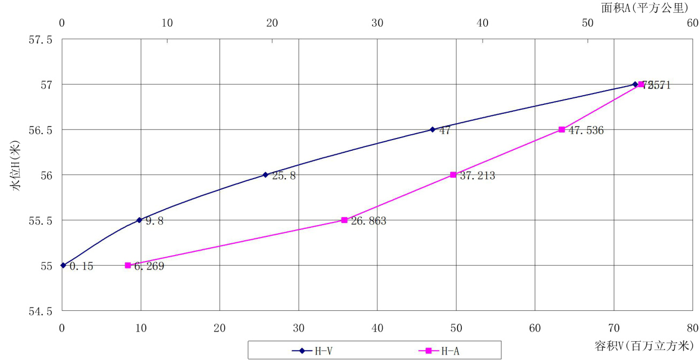  
附图 1 广润坡蓄滞洪区水位\~面积\~容积曲线图  

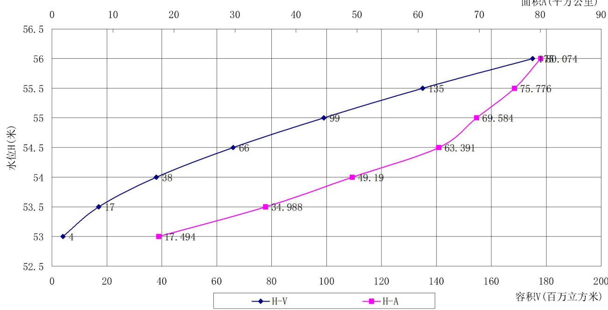  
广润坡滞洪区-级水位-面积-容积曲线图  
广润坡滞洪区二级水位-面积-容积曲线图  

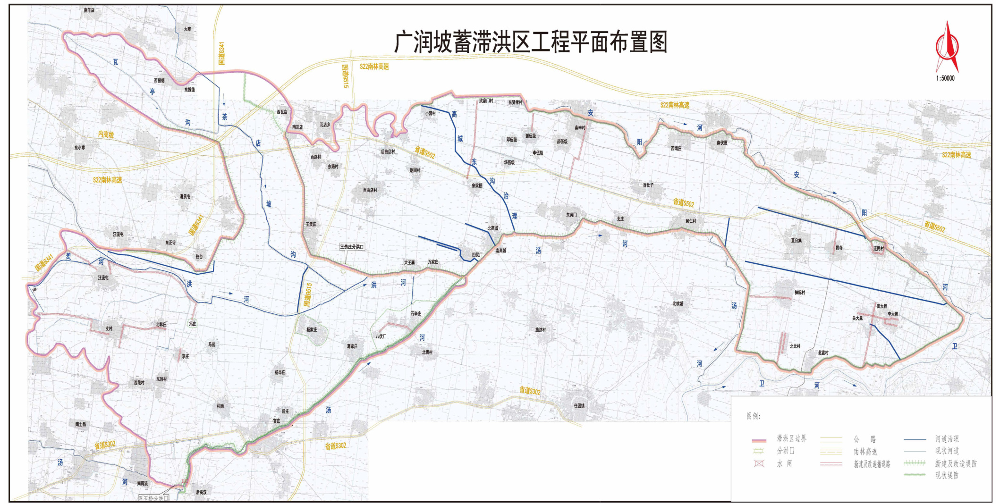  
附图 2 广润坡蓄滞洪区总布置图  

# 附图 3 广润坡蓄滞洪区洪水风险示意图  

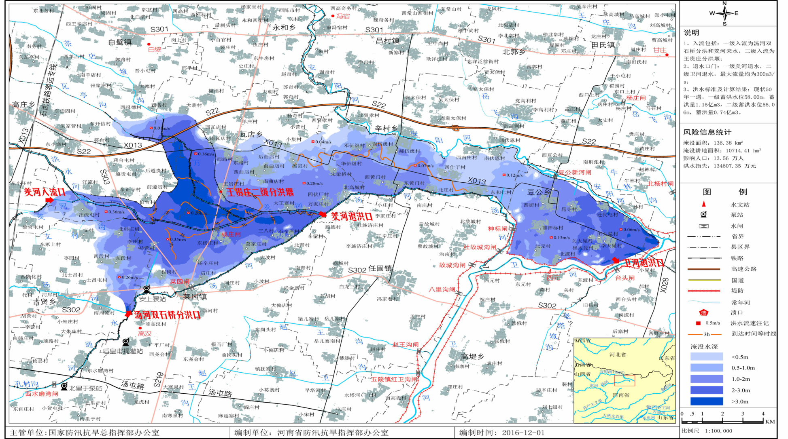  
河南省广润坡蓄滞洪区现状50年一遇洪水淹没图  

# 崔家桥蓄滞洪区运用预案  

# 1 总则  

# 1.1 编制依据  

崔家桥蓄滞洪区运用预案编制依据有:《中华人民共和国防洪法》、《蓄滞洪区运用补偿暂行办法》、《蓄滞洪区运用预案编制导则》等。  

# 1.2 编制目的  

保证蓄滞洪区工程的正常运用,增强蓄滞洪区防洪应变能力,起到削减洪峰、蓄滞超量洪水的作用,保障防洪抗灾工作高效有序进行。  

# 1.3 编制原则  

以习近平总书记“两个坚持、三个转变”防灾减灾救灾新理念为指导,贯彻“以人民为中心”的发展思想,保护人民群众生命财产安全;坚持行政首长负责制,统一指挥、统一调度;坚持底线思维,强化风险意识,最大程度减轻灾害损失;注重蓄滞洪区运用预案的可操作性,保障蓄滞洪区及时有效运用。  

# 1.4 适用范围  

本预案适用于崔家桥蓄滞洪区。  

# 2 蓄滞洪区概况  

# 2.1 自然地理  

2.1.1 地理位置、高程、地形地貌  

崔家桥蓄滞洪区为自然洼地,总趋势西高东低,自然坡降约1/3000。主要承担蓄滞洹河洪水和漳河分洪客水。是历史上形成的天然蓄滞洪区。区间位于洹河左岸,沿洹河以北崔家桥镇的洼地,西至韩陵山、东到永和镇北部铁炉村一带洼地。最高地面高程 $67.00\mathrm{m}$ ,最低地面高程 $61.40\mathrm{m}$ 。  

# 2.1.2 所在流域、水系  

崔家桥蓄滞洪区所在流域为洹河水系。洹河,又名安阳河,是安阳市境内的主要河流。洹河发源于太行山东麓林州市西北林虑山东坡的断层地带。诸支流汇合于陵阳村后沿林州盆地东缘流向东南,经水磨山、横水,缷甲平入安阳县境马家乡龙洞村、龙尾岗折向东北,经三仓、西善应村、小南海水库、小南海泉、东滩村、彰武水库、西高平村、东蒋村折向东流经南麻水村、土楼村、大正村入安阳市区,至杏花村北又进入安阳县境。经西于曹、崇义、柴村、杨家堂、西韩化村折向南流至谢奇村又折向东南经辛村、南伏恩村到内黄县入卫河。全长 $164\mathrm{km}$ ,在安阳县境内长$98\mathrm{km}$ ,占总长度的 $60\%$ 。总流域面积 $1920\mathrm{km}^{2}$ ,在安阳县境内为$695.8\mathrm{km}^{2}$ ,占总流域面积的 $36\%$ 。其中在安阳县境内的山区流域面积 $263\mathrm{km}^{2}$ ,丘陵区 $218\mathrm{km}^{2}$ ,平原区 $178\mathrm{km}^{2}$ ,低洼地 $36\mathrm{km}^{2}$ 。  

洹河在县境内有珍珠泉河、粉红江、金线河等季节性支流河道注入。洹河流量随年际和季节变化,年内夏秋流量大,冬春流量小,一般年份平均流量 $5{\sim}20\mathrm{m}^{3}/\mathrm{s}$ 。多年平均径流量为 3.37 亿$\mathrm{m}^{3}$ 。洹河河道中上游沟宽谷深,断面大,下游沟窄底浅、湾多、断面小,又有雨季洪水含沙淤积,河床逐年增高,致使河水渲泄不畅。加之卫河顶托,漳水分洪南泛,一遇大水容易漫溢决口。  

# 2.2 社会经济  

2.2.1 城镇、村庄、人口  

蓄滞洪区内有 3 个镇、66 个村庄、8.67 万人。其中,永和镇14 个村庄,1.35 万人;韩陵镇 8 个村庄,1.37 万人;崔家桥镇44 个村庄,5.95 万人。  

2.2.2 耕地面积、工农业生产总值等  

蓄滞洪区内的耕地面积 7.6 万亩,农业生产总值 35940 万元,工业生产总值 52000 万元,人均年收入 6700 元。  

蓄滞洪区内土地资源丰富,土壤肥沃,气候温和,适宜多种农作物生长,粮食作物以种植小麦、玉米、红薯为主,经济作物主要种植棉花、花生、芝麻等。工业近几年也发展较快,形成了食品、化工、医药、皮革、纺织等门类齐全的工业体系。区内交通十分发达,主要交通干线有石郑高铁、301 省道等,近几年,随着公路村村通工程的开展,乡与乡、村与村大都有沥青道路相连,形成了四通八达的公路交通网。  

# 2.2.3 重要设施  

蓄滞洪区内道路有北环路、崔柳路、崔白路、永柳路、崔西路、北环支线路、常白路、牛铁路、郭王路、西目村撤退路、王彦村撤退路等。  

# 2.3 蓄滞洪特征指标  

# 2.3.1 在流域防洪中的作用  

崔家桥蓄滞洪区是海河流域漳卫河综合防洪体系的重要组成部分,主要承担蓄滞洹河洪水和漳河分洪客水,是历史上形成的天然蓄滞洪区,对减轻卫河行洪压力及非控制决口造成的洪水灾害是十分必要的。  

# 2.3.2 蓄滞洪特征指标  

流域防洪规划中崔家桥蓄滞洪区的设计蓄滞洪区水位为$65.75\mathrm{m}$ ,设计蓄滞洪量 0.33 亿 $\mathrm{m}^{3}$ ,淹没面积 $74.54\mathrm{km}^{2}$ ;现状滞洪水位 $65.75\mathrm{m}$ (大沽高程),滞洪水深 $1.7{\sim}2.0\mathrm{m}$ ,滞洪量 0.61 亿$\mathrm{m}^{3}$ ,蓄滞洪面积 $74.54\mathrm{km}^{2}$ 。  

# 2.4 洪水风险  

见崔家桥蓄滞洪区不同机遇洪水风险图。  

# 2.5 防洪工程  

# 2.5.1 蓄滞洪区围堤情况  

目前,崔家桥蓄滞洪区南边界系安阳河左堤总长 $14.9\mathrm{km}$ ,其中仅曹马桥\~西柴村 $5.5\mathrm{km}$ 有堤,但高度不够,其他段均无堤;西部边界为自然高地,北、东部较低且无边界堤防,汛期洪水漫过边界行洪。  

# 2.5.2 进退洪设施情况  

崔家桥蓄滞洪区为自然进洪,通过安阳河左堤上的曹马分洪堰和郭盆分洪堰自然漫溢分洪入崔家桥。曹马分洪堰位于桩号$17{+}800{-}19{+}100$ ,堰顶高程 $68.04{\sim}67.54\mathrm{m}$ ,郭盆分洪堰位于桩号$23\substack{+300\sim23+800}$ ,堰顶高程 $65.08{\sim}64.91\mathrm{m}.$ 。  

退洪通过梨园沟退水闸和王家口退水闸排泄入安阳河。王家口退水闸位于安阳河河道桩号 $31{+}200$ 处安阳河左堤上,混凝土结构,平板闸门,闸孔净宽 $27\mathrm{m}$ (3 孔 $\times9\mathrm{m}$ ),底板高程 $61.5\mathrm{m}$ ,设计退水流量 $150\mathrm{m}^{3}/\mathrm{s}$ 。梨园沟退水闸位于安阳河河道桩号$24+136$ 处安阳河左堤上,混凝土结构,平板闸门,闸孔净宽 $15\mathrm{m}$ (3 孔 $\times5\mathrm{m}$ ),底板高程 $60.4\mathrm{m}$ ,设计退水流量 $72\mathrm{m}^{3}/\mathrm{s}$ 。  

# 2.5.3 防洪工程存在问题  

1.撤退路多为乡级公路,标准低、质量差、且缺乏维修,毁坏严重,组织群众撤离困难;2.区内排水沟淤积严重,排水不畅,蓄滞洪水后不能及时排除积水,影响秋季作物耕作。  

# 2.6 安全设施  

# 2.6.1 安全设施现状  

崔家桥蓄滞洪区为天然蓄滞洪区,无防洪避灾安全设施。  

# 2.6.2 转移安置设施现状  

撤退道路有:北环路 $16.13\mathrm{km}$ 、崔柳路 $16.13\mathrm{km}$ 、崔白路6.98km、永柳路 $9.75\mathrm{km}$ 、崔西路 $6.21\mathrm{km}$ 、北环支线路 $3.18\mathrm{km}$ 、常白路 $9.49\mathrm{km}$ 、牛铁路 $5.48\mathrm{km}$ 、郭王路 $4.54\mathrm{km}$ 、西目村撤退路$4.68\mathrm{km}$ 、王彦村撤退路 1.31km、五里屯 $0.72\mathrm{km}$ 、和邵庄 $3.12\mathrm{km}$ 、何营 $2.68\mathrm{km}$ 、田营 $0.64\mathrm{km}$ 、后油房 $0.6\mathrm{km}$ ,总长 $91.64\mathrm{km}$ 。  

崔家桥以东、以北、以西群众及韩陵镇一些村庄群众沿安阳市北外环路向韩陵山转移;崔家桥南部宋村一带杨辛庄、李辛庄、高村、曹马、前马村、后马村沿崔白路,就近转移到河南岸东柴村、南高村、邢济、辛安一带高地;永和镇河北岸 14 个村沿乡间道路转移到永和集方向。  

# 2.6.3 预警通信系统情况  

崔家桥蓄滞洪区的预警通讯系统为电视、广播、有线电话、移动通信等,无专用的预警通讯设施。  

# 2.6.4 安全设施存在问题  

蓄滞洪区内无防洪避灾安全设施。  

# 2.7 历史运用和补偿情况  

# 2.7.1 运用情况  

1956 年,蓄滞洪区从东于曹进洪,最高水位 $66.5\mathrm{m}$ ,滞蓄水量 9500 万 $\mathrm{m}^{3}$ ,淹没耕地 6.35 万亩,4 万人受灾,直接经济损失达 1834 万元。  

1963 年 8 月 1 日 $\sim9$ 日,全县平均降雨 $601.7\mathrm{mm}$ ,最大$750.4\mathrm{mm}$ ,郭家湾水文站流量 $1030\mathrm{m}^{3}/\mathrm{s}$ ,安阳河两岸 60 处,北岸于曹、芦家湾、逍遥均有决口,洪水由韩陵山南经东于曹、后马村、艾亭流入崔家桥蓄滞洪区,东曹马以下宋村南地决口 10 余处,洪水向北漫流,屯积于崔家桥蓄滞洪区。崔家桥最高洪水位达到 $66.0\mathrm{m}$ ,滞蓄水量 8000 多万 $\mathrm{m}^{3}$ 。淹没范围为蓄滞洪区全部,共计 65 个村,14091 户,人口 42275 人。  

1982 年,安阳河上游安阳县西部 10 个乡镇平均降雨688.8mm,郭家湾水文站水位 $76.42\mathrm{m}$ ,流量 $1700\mathrm{m}^{3}/\mathrm{s}$ ,两岸决口46 处,总长 $752\mathrm{m}$ 。洪水来势猛,流量大,水位高。东于曹、芦家湾、逍遥堤防决口洪水向东流入蓄滞洪区,东曹马、康宋村、苏宋村、南地决口洪水向北漫流,泄入崔家桥蓄滞洪区,最高洪水位约为 $65.8\mathrm{m}$ ,水深 $1.5\mathrm{m}$ 左右。调节洪水量为 6000 余万 $\mathrm{m}^{3}$ ,淹没村庄 47 个,淹地 5.5 万亩,人口 3.88 万人。  

1996 年8 月初受8 号台风影响,京广铁路以西普降特大暴雨,平均 $367\mathrm{mm}$ ,安阳河郭家湾洪峰流量 $758\mathrm{m}^{3}/\mathrm{s}$ ,崔家桥蓄滞洪区滞洪水位 $65.27\mathrm{m}$ ,最大蓄洪量 2000 万 $\mathrm{m}^{3},40$ 个村庄进水,30896人遭灾,最大水深达 $2.5\mathrm{m}$ 左右,倒塌房屋 22 间,冲毁日光温室3128 栋,造成 2.6 万亩秋作物绝收,1.3 万亩减产,161 家乡镇企业被淹,直接经济损失 6000 多万元。  

2016 年 7 月 19 日,安阳县遭受特大暴雨袭击,受此次强降雨影响,安阳河安阳水文站出现超保证水位洪水,洪峰流量达$1990\mathrm{m}^{3}/\mathrm{s}$ 。崔家桥蓄滞洪区于 7 月 19 日晚 22 时 25 分开始蓄滞洪水,最高蓄滞洪水位 $65.12\mathrm{m}$ ,最大蓄滞洪量 0.44 亿 $\mathrm{m}^{3}$ 。区内 3个乡镇 59 个行政村被淹,淹没耕地 5.5 万亩,人口 67651 人,造成财产损失 9000 万元。  

2021 年 7 月 21 日,安阳县遭受特大暴雨袭击,受此次强降雨影响,安阳河安阳水文站实测最大洪峰流量 $1890\mathrm{m}^{3}/\mathrm{s}$ (7 月 22日)。崔家桥蓄滞洪区于 7 月 22 日 0 时 30 分开始蓄滞洪水,最高蓄滞洪水位 67.6m(东曹马),最大蓄滞洪量 0.49 亿 $\mathrm{m}^{3}$ 。本次运用涉及区内 4 个乡镇 56 个行政村被淹,淹没耕地 5.53 万亩,受灾人口 5.8 万人,造成财产损失 19005 万元。  

# 2.7.2 补偿实施情况  

列入国家蓄滞洪区补偿名录后,2016 年首次运用,补偿损失(不含房屋)8007 万元;2021 年再次运用,补偿损失 12482 万元。  

# 3 组织与保障  

# 3.1 指挥机构  

# 3.1.1 指挥机构组成及职责  

为确保崔家桥蓄滞洪区的正常运用,安阳县成立蓄滞洪区运用指挥部。指挥长由各县政府负责人担任。蓄滞洪区运用指挥部在县防汛抗旱指挥部的领导下,具体负责本县范围内蓄滞洪区运用时各项工作。其主要职责是:负责蓄滞洪区运用时的信息发布、人员转移安置、分洪实施、抢险救生、物资供应、运用补偿、灾后重建工作。  

# 3.1.2 指挥机构内设责任组及职责  

根据工作需要,蓄滞洪区在运用时宜设立信息发布组、转移安置组、分洪实施组、抢险救生组、通信保障组、物资供应组、后勤保障组,分工负责蓄滞洪区运用相关工作。各工作组职责如下:  

信息发布组:负责蓄滞洪区运用的预警、警报发布和宣传工作。  

转移安置组:负责蓄滞洪区内居民转移安置的组织和协调工作。  

分洪实施组:负责桂李进洪闸门和丁桥南、北泄洪闸的操作工作。  

抢险救生组:负责蓄滞洪区防洪工程和安全设施的巡查、防守、抢险及人员救生的组织工作。  

通信保障组:负责蓄滞洪区运用的应急通讯工作。  

物资供应组:负责防汛物资的调拨和运输工作。  

后勤保障组:负责蓄滞洪区居民生活必需品的筹集和发放、社会治安、医疗卫生等组织、协调工作。  

各责任组的负责人及成员宜根据蓄滞洪区所在地县级人民政府有关部门的职责分工确定。  

# 3.2 抢险救生与物资保障  

# 3.2.1 抢险救生队伍  

由县蓄滞洪区运用指挥部负责组建县级防汛抢险救生队,并明确负责人及职责。在蓄滞洪区运用时,作为应急抢险队,遇有重大突发险情时,充实到抗洪一线,做好全县蓄滞洪区范围内的防汛抢险工作。  

# 3.2.2 物资保障  

防汛物资储备采取“群众集体筹措与国家储备相结合”的方式,明确专人负责。  

群众集体筹措:由各乡镇负责,采取“就近筹划,登记造册估价,备而不集,用后付款”的办法,汛期未用的由物主自行处理。  

政府储备:县防汛抗旱指挥部根据本县蓄滞洪区情况要有足够的防汛物资储备,每年要制定详细的储备计划,并负责按计划落实储备的种类、数量、地点及交通运输方式,有明确的负责人。  

崔家桥镇、永和镇、韩陵镇政府按县防指制定的储备定额存储防汛物资,编制并上报防汛物资储备情况报表。对物料名称、规格、数量、存货地点、联系人及电话进行详细登记和落实,以保证防汛抢险及时调用。县直商业、财贸、粮食、物资等部门,落实的木桩、麻袋、草袋、铅丝、钢管、防雨设备、粮食、汽油、柴油等主要防汛物资数量、规格、存放地点、负责人、联系电话等进行详细登记和落实,并上报县防汛抗旱指挥部办公室。  

# 3.3 生活保障  

生活保障的责任单位由蓄滞洪区所在地县级人民政府确定,责任单位应明确一名负责人为生活保障责任人。蓄滞洪区运用指挥部根据当地实际生活状况,制定出蓄滞洪区居民基本生活定额。  

1.临时住房安置:转移人员的临时住房由安置接收单位负责,本单位临时房屋及帐篷不足以安置时,可通过所在镇(街道办)政府协调,征用附近民房。  

2.食品、饮用水、衣被、燃料等生活必需品的筹集与发放:转移人员的食品、饮用水、衣被、燃料等生活必需品筹集与发放由转移村的包村单位负责,以上生活必需品不足时,由蓄滞洪区运用指挥部负责调配或协调解决。生活必需品的发放按照儿童、老人、伤残、病人、妇女优先的原则统筹发放。  

3.其它应急生活物资筹备途径  

指定储备:由各县防汛抗旱指挥部统一协调,储备一定数量的用于搭建安置灾民临时住房、燃料的各项救灾物资,保证随调随有。紧急情况下,确有困难,可向邻近县或上级请求支援。  

开展社会捐助活动:遭遇超标准洪水,造成重大损失时,县、镇(街道办)两级政府可发动群众开展集中性社会捐助活动。所募集款物,全部用于灾区群众生活安置。在紧急情况下,组织灾区发扬“一方有难、八方支援”的优良传统,广泛开展“无灾区支援灾区、轻灾区支援重灾区”的互助互济活动,以村(居)委会为单位筹集食品和饮用水,解决灾民的燃眉之急。  

# 3.4 治安与交通保障  

治安与交通保障的责任单位由蓄滞洪区所在地县级人民政府确定,责任单位应明确一名负责人为治安与交通保障责任人。同时宜按照运用的不同阶段,制定相应的治安交通保障措施,包括撤退转移交通保障、蓄滞洪区内和安置点的治安保障。蓄滞洪区运用时,要做好治安保卫防范工作,确保迁安人员生命财产安全和社会稳定,同时会同有关单位切实做好蓄滞洪区运用的撤退转移交通保障工作。  

# 3.5 医疗保障  

医疗保障的责任单位由蓄滞洪区所在地县级人民政府确定,责任单位应明确一名负责人为医疗保障责任人。同时宜明确医疗药品、设备筹集方式。蓄滞洪区运用后,按预定计划抽调医务人员组成医疗分队,分赴灾区负责灾民医疗救护及卫生防疫工作,应配备足量的常用药品和医疗器械,能进行紧急医疗救助,保障转移人员身体健康。同时宣传防疫卫生知识,防止疾病流行。灾后撤离人员返回原住地前,要对灾区村庄进行全面彻底的消毒处理,确保灾后无大疫。  

# 3.6 宣传保障  

宣传保障的责任单位由蓄滞洪区所在地县级人民政府确定,责任单位应明确一名负责人为宣传保障责任人。同时宜制定蓄滞洪区运用的宣传和信息发布方案。可利用电视、广播等宣传工具进行宣传,使区内群众充分了解蓄滞洪区淹没情况、报警手段、撤离路线、转移安置方案、生活保障措施等。蓄滞洪区运用后,及时通报蓄滞洪区滞洪情况,并向群众宣传生活卫生、安全及防疫等有关知识,确保群众的思想稳定和生命安全。  

# 4 预警与警报  

# 4.1 决策机构与程序  

崔家桥蓄滞洪区由省防汛抗旱指挥部统一调度,由安阳市防汛抗旱指挥部通知安阳县防汛抗旱指挥部,县防汛抗旱指挥部通知涉及的有关乡(镇)防汛抗旱指挥部,乡(镇)防汛抗旱指挥部立即通知有关行政村村委会,村委会要立即通知到群众。有关乡(镇)和各行政村设专职警报发布人员,发布人要采取各种有效手段,以最快的速度将上级指令全面、准确地传达到位。  

# 4.2 警报级别  

根据蓄滞洪区启用不同阶段,警报分为黄色预警、橙色预警和红色警报三级,分别代表运用准备、转移清场、蓄滞洪三个阶段。  

# 4.3 警报发布时机  

1.运用准备阶段:预测安阳水文站流量将要达到 $200\mathrm{m}^{3}/\mathrm{s}$ 且水位继续上涨时,县防汛抗旱指挥部接市防指做好运用准备通知后发布黄色预警指令。  

2.转移清场阶段:根据彰武、双泉、龙泉水库泄流、珠泉河遥测站流量和区间来水情况,预测安阳水文站流量将超过 $300\mathrm{m}^{3}/\mathrm{s}$ 时,安阳市防汛抗旱指挥部向省防汛抗旱指挥部提交启用崔家桥蓄滞洪区的报告,县防汛抗旱指挥部接市防指转移清场通知后,立即发布橙色预警,开始实施蓄滞洪区内居民转移、清场工作,并及时向上级防指汇报撤离情况。县防汛抗旱指挥部经排查,确认撤离完成后,立即向上级防指报告。  

3.蓄滞洪阶段:当安阳河洪水超过曹马分洪堰(堰顶高程$68.04{\sim}67.54\mathrm{m}$ )、郭盆分洪堰(堰顶高程 $65.08{\sim}64.91\mathrm{m})$ )堰顶时,自然漫溢进入崔家桥蓄滞洪区。县防汛抗旱指挥部立即发布红色警报,红色警报期持续至具备返迁条件时为止。  

# 4.4 警报发布机构及方式  

预警、警报由县防汛抗旱指挥部发布,由县防汛抗旱指挥部各成员单位传达预警、警报信息。主要传达方式有:高音喇叭、网络、电视、广播、电话、手机短信群发、鸣锣、鸣笛、专用信  

号车等。  

# 4.5 警报解除  

当蓄滞洪区险情解除、并具备返迁条件时,蓄滞洪区运用指挥部要及时用警报器、电话、短信、广播、电视和巡回报警车等方式,发布警报解除信息。  

# 5 转移与安置  

# 5.1 安全避洪任务  

该蓄滞洪区内有 3 个镇,66 个村庄,8.67 万人需向外转移。由于蓄滞洪区内安全避洪设施已年久失修,区内人口需要转移安置。  

# 5.2 就地安置  

蓄滞洪区内无安全避洪设施,无法就地安置。  

# 5.3 转移安置  

# 5.3.1 转移安置负责人及职责  

转移安置总负责人由蓄滞洪区所在地县级人民政府指定,转移安置涉及村组负责人为转移村组、接纳安置点负责人。职责是做好转移安置计划,明确转移路线,落实交通工具,并在蓄滞洪区运用指挥部备案,及时传达执行迁安指令,做好转移群众的思想动员工作,负责组织、协调迁安群众于最短时间撤离危险区,保障迁安群众安全撤离和妥善安置。  

# 5.3.2 转移村组的人口、主要财产  

当蓄滞洪区启用时,按计划转移人员和主要财产。  

# 5.3.3 逐村组落实安置地点  

安置点的选择,在保证安全的前提下,应以就近、同行政区域为原则,并考虑安置点的接纳条件。  

# 5.3.4 人员和物资分批转移的时机  

转移时先人员后物资,如果车辆允许情况下一起转移。转移时以村组为单位,依次逐步转移,做到有序进行,不能相互干扰,保证在有限时间内撤离转移安置到位,不能让一人一户掉队。  

# 5.3.5 撤退转移时的通讯联系方式  

撤退转移时利用卫星电话、有线电话、手机、短信、广播、电视等方式进行联络,利用铜锣、手摇报警器预警、报警。  

# 5.3.6 各村组的转移路线  

转移安置路线的确定应考虑转移道路通行能力、转移任务及运输条件等因素。  

# 5.3.7 各村组撤退转移的交通工具  

蓄滞洪区运用指挥部应根据居民就地安置与转移安置计划,明确各村组撤退转移的交通工具种类、数量和筹措方式,确定筹措责任单位和责任人。  

# 6 工程调度与运用  

# 6.1 调度方案  

# 6.1.1 启用条件  

当安阳站出现 $600\mathrm{m}^{3}/\mathrm{s}$ 以上的洪水时,或水位超过洪水通过曹马分洪堰(堰顶高程 $68.04\sim67.54\mathrm{m})$ )、郭盆分洪堰(堰顶高程$65.08\sim64.91\mathrm{m}$ )时,自然漫溢进入崔家桥蓄滞洪区。  

# 6.1.2 调度权限  

经会商,确定蓄滞洪区启用时,河南省防汛抗旱指挥部下达命令至安阳市市防汛抗旱指挥部,同时做好蓄滞洪区运用监督工作;安阳市防汛抗旱指挥部将省防汛抗旱指挥部命令分别及时传达到安阳县防汛抗旱指挥部,同时做好滞洪区运用监督、指导工作;安阳县防汛抗旱指挥部负责预案的具体组织实施工作。同时,安阳县蓄滞洪区运用指挥部按照预案组织好区内人员的转移安置等工作。  

# 6.2 工程运用  

进洪:当安阳站出现 $600\mathrm{m}^{3}/\mathrm{s}$ 以上的洪水时,或水位超过洪水通过曹马分洪堰(堰顶高程 $68.04\sim67.54\mathrm{m})$ )、郭盆分洪堰(堰顶高程 $65.08\sim64.91\mathrm{m}.$ )时,自然漫溢进入崔家桥蓄滞洪区。  

退洪:通过梨园沟退水闸和王家口退水闸排泄入安阳河。  

# 6.3 工程防守和应急抢险  

该蓄滞洪区无防洪工程。  

# 7 返迁与善后  

# 7.1 返迁  

# 7.1.1 居民人身安全保障  

蓄滞洪区运用后,受洪水淹没的桥梁、道路、房屋可能存在安全隐患,需要进行安全检查,以确保居民的人身安全。该项工作由蓄滞洪区运用指挥部明确责任单位及职责。  

# 7.1.2 居民卫生安全保障  

洪水淹没区域存在流行疾病传播的危险,需要对原居住地环境进行清理和消毒等卫生防疫,以确保居民的卫生安全。该项工作由蓄滞洪区运用指挥部明确责任单位及职责。  

# 7.1.3 其它安全隐患排查  

其它安全隐患排查包括公共设施隐患、水电等生命线工程隐患、水利工程设施隐患等排查。该项工作由蓄滞洪区运用指挥部明确责任单位及职责。  

# 7.1.4 返迁家园  

退洪后,县蓄滞洪区运用指挥部组织相关职能小组,按照撤离时的顺序、路线、交通工具组织撤离人员返迁家园。人员的返迁时间确定在洪水基本退出、道路可以通行、各种安全隐患排除后。  

# 7.2 善后  

# 7.2.1 运用补偿工作  

蓄滞洪区运用指挥部应按《蓄滞洪区运用补偿暂行办法》的要求,每年在规定时间内完成蓄滞洪区内居民财产登记工作,并明确运用补偿的责任单位及职责。  

# 7.2.2 水毁工程的修复  

蓄滞洪区运用后应及时核查汇总水毁工程情况、编报水毁工程修复计划。对于较小的水毁工程呈报地方政府积极组织力量进行修复;对于较大的水毁工程上报上级部门申请资金,待项目批复后按计划组织实施。  

# 8 附图附表  

8.1 附表  

1 崔家桥蓄滞洪区基本情况表  
2 崔家桥蓄滞洪区社会经济统计表  
3 崔家桥蓄滞洪区水位\~面积\~容积表  
4 崔家桥蓄滞洪区历年运用情况统计表  
5 崔家桥蓄滞洪区居民安全撤离及安置计划表  
6 崔家桥蓄滞洪区居民财产登记及变更登记汇总表  

8.2 附图  

1 崔家桥蓄滞洪区水位\~面积\~容积曲线图  
2 崔家桥蓄滞洪区总布置图  
3 崔家桥蓄滞洪区洪水风险示意图  

# 附表 1 崔家桥蓄滞洪区基本情况表  

<html><body><table><tr><td colspan="2">蓄滞洪区名称</td><td>崔家桥蓄滞洪区</td><td colspan="2">安全设施解决人口 (万人)</td><td>0</td></tr><tr><td colspan="2">兴建时间</td><td>天然洼地</td><td colspan="2">运用时需转移人口 (万人)</td><td>8.66</td></tr><tr><td colspan="2">所在河流</td><td>汇河</td><td colspan="2">通讯设施</td><td>电话、手机</td></tr><tr><td colspan="2">所在市县</td><td>安阳县</td><td colspan="2">报警设施</td><td>电视、广播</td></tr><tr><td colspan="2">设计蓄滞洪水位（m)</td><td>64.89</td><td colspan="2">船只 (只)</td><td>无</td></tr><tr><td colspan="2">设计蓄滞洪量（亿m²)</td><td>0.61</td><td rowspan="2">撤退 道路</td><td>条数</td><td>16</td></tr><tr><td colspan="2">淹没面积（km²)</td><td>74.54</td><td>长度（km)</td><td>91.64</td></tr><tr><td colspan="2">耕地 (万亩)</td><td>7.6</td><td rowspan="4">分洪口 门1</td><td>名称</td><td>曹马分洪堰</td></tr><tr><td colspan="2">地面高程范围(m)</td><td>61.40~67.00</td><td>堰顶高程（m)</td><td>67.54 ~68.04 （85黄海）</td></tr><tr><td colspan="2">运用机率 (年一遇)</td><td>5</td><td>设计泄量（m?/s)</td><td></td></tr><tr><td rowspan="3">涉及区域</td><td>乡镇 (个)</td><td>3</td><td rowspan="3">分洪口 门2</td><td>名称</td><td>1200</td></tr><tr><td>行政村 (个)</td><td>66</td><td></td><td>郭盆分洪堰</td></tr><tr><td>人口 (万人)</td><td>8.67</td><td rowspan="2">堰顶高程（m)</td><td rowspan="2">65.08～64.91 (85黄海）</td></tr><tr><td rowspan="2">区内</td><td>人口 (万人)</td><td>8.67</td><td>设计泄量（m?/s)</td></tr><tr><td>行政村 (个)</td><td>66</td><td rowspan="3">退洪闸 2</td><td>名称</td><td>500 王家口退水闸</td></tr><tr><td rowspan="2">退洪闸1</td><td>名称 闸底高程（m)</td><td>梨园沟退水闸 61.5</td><td>闸底高程（m)</td><td>60.4</td></tr><tr><td>设计泄量（m?/s)</td><td>72</td><td>设计泄量（m2/s)</td><td>72</td></tr></table></body></html>  

附表 2 崔家桥蓄滞洪区社会经济统计表  

<html><body><table><tr><td>序号</td><td>乡镇</td><td>村庄 (个)</td><td>人口 (人)</td><td>耕地面积 (亩)</td><td>粮食年产量 (kg)</td></tr><tr><td></td><td>永和乡</td><td>14</td><td>13504</td><td>13618</td><td>10363200</td></tr><tr><td>2</td><td>韩陵镇</td><td>8</td><td>13655</td><td>9045</td><td>4127400</td></tr><tr><td>3</td><td>崔家桥镇</td><td>44</td><td>59532</td><td>53429</td><td>44759000</td></tr><tr><td></td><td>合计</td><td>66</td><td>86691</td><td>76092</td><td>59249600</td></tr><tr><td colspan="3">重要企业</td><td colspan="3">隆昌汽车配件、蓝天涂料、天蕴泉、凯德涂料、天竺牧业、阳光万 宝养殖、碧海云天养殖、紫薯种植养殖生态园、富有牧业、荣盛牧 业、肉牛养殖、天龙养殖有限公司等近40余家企业</td></tr><tr><td colspan="3">重要道路</td><td colspan="3">北环路、崔柳路、永柳路、崔白路。</td></tr><tr><td colspan="3">农业总产值 (万元)</td><td colspan="3">35940</td></tr><tr><td colspan="3">工业总产值 (万元)</td><td colspan="3">52000</td></tr><tr><td colspan="3">固定资产总值（万元）</td><td colspan="3">250750 种植、养殖、加工</td></tr><tr><td colspan="3">经济发展模式</td><td colspan="3">农、林、牧、加工</td></tr><tr><td colspan="3">产业结构形式</td><td colspan="3">6700</td></tr><tr><td colspan="3">人均年收入 (元)</td><td colspan="3"></td></tr></table></body></html>  

# 附表 3 崔家桥蓄滞洪区水位\~面积\~容积表  

<html><body><table><tr><td>序号</td><td>高程H (m)</td><td>面积A（km²)</td><td>容积V（亿 m²)</td></tr><tr><td>1</td><td>63.0</td><td>1.37</td><td>0.004</td></tr><tr><td>2</td><td>63.5</td><td>3.15</td><td>0.015</td></tr><tr><td>3</td><td>64.0</td><td>8.96</td><td>0.045</td></tr><tr><td>4</td><td>64.5</td><td>24.54</td><td>0.129</td></tr><tr><td>5</td><td>65.0</td><td>36.87</td><td>0.283</td></tr><tr><td>6</td><td>65.5</td><td>45.41</td><td>0.488</td></tr><tr><td>7</td><td>66.0</td><td>51.77</td><td>0.731</td></tr><tr><td>8</td><td>66.5</td><td>55.51</td><td>1.000</td></tr><tr><td>9</td><td>67.0</td><td>58.58</td><td>1.285</td></tr></table></body></html>  

附表 4 崔家桥蓄滞洪区历年运用情况统计表  

<html><body><table><tr><td rowspan="2">年度</td><td rowspan="2">蓄滞洪次数</td><td rowspan="2">最高蓄滞洪 水位（m)</td><td rowspan="2">相应蓄滞洪量 (亿m3)</td><td rowspan="2">蓄滞洪历时 (小时)</td><td colspan="3">淹没情况</td></tr><tr><td>耕地 (万亩)</td><td>人口 (人)</td><td>财产损失 （万元）</td></tr><tr><td>1956年</td><td>1</td><td>66.5</td><td>0.95</td><td></td><td>6.35</td><td>40000</td><td>1834</td></tr><tr><td>1963年</td><td>1</td><td>66.00</td><td>0.8</td><td></td><td></td><td>42275</td><td></td></tr><tr><td>1982年</td><td>1</td><td>65.8</td><td>0.6</td><td>/</td><td>5.5</td><td>38800</td><td>/</td></tr><tr><td>1996年</td><td>1</td><td>65.27</td><td>0.4</td><td>72~160</td><td>4.5</td><td>30896</td><td>6000</td></tr><tr><td>2016年</td><td>1</td><td>65.12</td><td>0.44</td><td>/</td><td>5.5</td><td>67651</td><td>9000</td></tr><tr><td>2021年</td><td>1</td><td>67.60</td><td>0.49</td><td></td><td>5.53</td><td>58000</td><td>19005</td></tr></table></body></html>

备注:表格内填写“/”的表示无相关数据。  

附表 5 崔家桥滞洪区居民安全撤离及安置计划表  

<html><body><table><tr><td colspan="4">计划撤离情况</td><td colspan="4">计划安置地点</td><td rowspan="2">备注</td></tr><tr><td>所在县名</td><td>乡镇名称</td><td>行政村名</td><td>撤离人口 (人)</td><td>安置地点</td><td>安置人口 (人)</td><td></td><td>乡镇名称|所在县名</td></tr><tr><td rowspan="9">安阳县</td><td rowspan="9">韩陵镇</td><td>东于曹</td><td>1982</td><td rowspan="9">韩陵山</td><td>1982</td><td rowspan="9">韩陵镇</td><td rowspan="9"></td></tr><tr><td>前马村</td><td>2341</td><td>2341</td></tr><tr><td>后马村</td><td>1650</td><td>1650</td></tr><tr><td>东大佛</td><td>1863</td><td>1863</td></tr><tr><td>西大佛</td><td>2832</td><td>2832</td></tr><tr><td>前逍遥村</td><td>898</td><td>898</td></tr><tr><td>后逍遥村</td><td>1242</td><td>1242</td></tr><tr><td>卢湾村</td><td>1011</td><td>1011</td></tr><tr><td>后油房</td><td>1100</td><td>1100</td></tr><tr><td rowspan="2">永和镇</td><td>冯村</td><td>1500</td><td></td><td>1500</td><td rowspan="2"></td><td rowspan="2"></td></tr><tr><td>后荣村</td><td>1225</td><td></td><td>1225</td></tr></table></body></html>  

<html><body><table><tr><td colspan="4"></td><td colspan="4"></td><td rowspan="2">备注</td></tr><tr><td></td><td colspan="3">计划撤离情况 撤离人口</td><td>安置地点</td><td colspan="3">计划安置地点 安置人口</td></tr><tr><td rowspan="15">所在县名</td><td rowspan="17">乡镇名称</td><td></td><td>行政村名</td><td>(Y)</td><td></td><td>(Y)</td><td>乡镇名称</td><td>所在县名</td></tr><tr><td>后李村</td><td>820</td><td></td><td>820</td><td></td><td></td><td></td></tr><tr><td>何营村</td><td>1550</td><td></td><td>1550</td><td></td><td></td><td></td></tr><tr><td>西荣村</td><td>725</td><td></td><td>725</td><td></td><td></td><td></td></tr><tr><td>东荣村</td><td>1310 726</td><td></td><td>1310</td><td></td><td></td><td></td></tr><tr><td>陶村 栗村</td><td></td><td></td><td>726</td><td></td><td></td><td></td></tr><tr><td>永和镇 王小庄</td><td></td><td>669</td><td></td><td>669</td><td></td><td></td></tr><tr><td></td><td></td><td>892</td><td></td><td>892</td><td></td><td></td></tr><tr><td>田营</td><td></td><td>1648</td><td></td><td>1648</td><td></td><td></td></tr><tr><td>铁炉 王家口</td><td></td><td>1800 408</td><td></td><td>1800 408</td><td></td><td></td></tr><tr><td>朱小庄</td><td></td><td>395</td><td></td><td>395</td><td></td><td></td></tr><tr><td rowspan="14">安阳县 崔家桥镇</td><td colspan="2">郭宋村</td><td>1015</td><td></td><td>1015</td><td></td><td></td><td></td></tr><tr><td>苏宋村</td><td></td><td>1493</td><td></td><td>1493</td><td></td><td></td><td></td></tr><tr><td>宋村屯</td><td></td><td></td><td></td><td>2870</td><td></td><td></td><td></td></tr><tr><td></td><td></td><td>2870</td><td></td><td></td><td></td><td></td><td></td></tr><tr><td></td><td>西曹马</td><td>1611</td><td></td><td>1611</td><td></td><td></td><td></td></tr><tr><td></td><td>东曹马</td><td>4143</td><td></td><td>4143</td><td></td><td></td><td></td></tr><tr><td></td><td>胡庄</td><td>468</td><td></td><td>468</td><td></td><td></td><td></td></tr><tr><td></td><td>王彦</td><td>1028</td><td></td><td>1028</td><td></td><td></td><td></td></tr><tr><td></td><td>五里屯</td><td>636</td><td></td><td>636</td><td></td><td></td><td></td></tr><tr><td></td><td>程村</td><td>869</td><td></td><td>869</td><td></td><td></td><td></td></tr><tr><td>南街</td><td>北街</td><td>1494</td><td></td><td>1494</td><td></td><td></td><td></td></tr><tr><td rowspan="7"></td><td>双塔</td><td></td><td>1223 775</td><td></td><td>1223 775</td><td></td><td rowspan="6">安阳县</td><td rowspan="6"></td></tr><tr><td></td><td>东庄</td><td>545</td><td></td><td>545</td></tr><tr><td></td><td></td><td>793</td><td></td></tr><tr><td>崔家桥镇</td><td>沙堆</td><td></td><td>793 1430</td></tr><tr><td>中艾亭</td><td>1430</td><td>韩陵山</td><td>韩陵镇</td></tr><tr><td>薛庄</td><td></td><td>451</td><td>451</td></tr><tr><td>石艾亭 后艾亭</td><td></td><td>1968 1169</td><td>1968 1169</td></tr></table></body></html>  

<html><body><table><tr><td colspan="4">计划撤离情况</td><td colspan="3">计划安置地点</td><td rowspan="2">备注</td></tr><tr><td>所在县名 乡镇名称</td><td>行政村名</td><td>撤离人口 (Y)</td><td>安置地点</td><td>安置人口 (Y)</td><td></td><td>乡镇名称|所在县名</td></tr><tr><td rowspan="20">崔家桥镇 安阳县</td><td>康宋村</td><td>2271</td><td></td><td>2271</td><td></td><td></td><td></td></tr><tr><td>高村</td><td>3334</td><td></td><td>3334</td><td></td><td></td><td></td></tr><tr><td>和邵庄</td><td>301</td><td></td><td>301</td><td></td><td></td><td></td></tr><tr><td>李辛庄</td><td>2574</td><td></td><td>2574</td><td></td><td></td><td></td></tr><tr><td>杨辛庄</td><td>3419</td><td></td><td>3419</td><td></td><td></td><td></td></tr><tr><td>隆化</td><td>2724</td><td></td><td>2724</td><td></td><td></td><td></td></tr><tr><td>琚庄</td><td>1020</td><td></td><td>1020</td><td></td><td></td><td></td></tr><tr><td>申庄</td><td>1334</td><td></td><td>1334</td><td></td><td></td><td></td></tr><tr><td>郜庄</td><td>1576</td><td></td><td>1576</td><td></td><td></td><td></td></tr><tr><td>翟庄</td><td>595</td><td></td><td>595</td><td></td><td></td><td></td></tr><tr><td>冀庄</td><td>715</td><td></td><td>715</td><td></td><td></td><td></td></tr><tr><td>韩宋村</td><td>731</td><td></td><td>731</td><td></td><td></td><td></td></tr><tr><td>李宋村</td><td>595</td><td></td><td>595</td><td></td><td></td><td></td></tr><tr><td>段宋村</td><td>819</td><td></td><td>819</td><td></td><td></td><td></td></tr><tr><td>路宋村</td><td>843</td><td></td><td>843</td><td></td><td></td><td></td></tr><tr><td></td><td>郭家庙</td><td>1322</td><td>1322</td><td></td><td></td><td></td></tr><tr><td></td><td>赵马房</td><td>694</td><td>694</td><td></td><td></td><td></td></tr><tr><td></td><td>路马房</td><td>1109</td><td></td><td>1109</td><td></td><td></td></tr><tr><td></td><td>魏村</td><td>1579</td><td>1579</td><td></td><td></td><td></td></tr><tr><td>施庄</td><td>牛庄 1605</td><td></td><td></td><td>1605</td><td></td><td></td></tr><tr><td>沙岸</td><td>588</td><td></td><td>588</td><td></td><td></td><td></td></tr><tr><td></td><td>790</td><td></td><td>790</td><td></td><td></td><td></td></tr><tr><td>安阳屯</td><td>1110</td><td></td><td>1110</td><td></td><td></td><td></td></tr><tr><td>滩里</td><td>1278</td><td></td><td>1278</td><td></td><td></td><td></td></tr><tr><td>何村</td><td>675</td><td></td><td>675</td><td></td><td></td><td></td></tr><tr><td>常庄</td><td>413</td><td></td><td>413</td><td></td><td></td><td></td></tr><tr><td>合计</td><td>66</td><td>86582</td><td></td><td>86582</td><td></td><td></td><td></td></tr><tr><td>总计(安阳县)</td><td>66</td><td>86582</td><td></td><td>86582</td><td></td><td></td><td></td></tr></table></body></html>  

附表 6 崔家桥蓄滞洪区居民财产登记及变更登记汇总表  

<html><body><table><tr><td rowspan="2">单位 名称</td><td rowspan="2">户数 (户)</td><td rowspan="2">涉及 人口 (人)</td><td rowspan="2">承包土地 (亩)</td><td rowspan="2">农作物 (亩)</td><td colspan="3">专业养殖</td><td rowspan="2">经济林 (亩)</td><td colspan="2">居民住房</td><td colspan="2">农业生产机械、 役畜</td><td rowspan="2">家庭主要耐用 消费品</td></tr><tr><td>家畜类 (头)</td><td>家禽类 (只)</td><td>水产类 (亩)</td><td>(间)</td><td>(m²)</td><td>农业生产 机械 (台)</td></tr><tr><td>安阳县</td><td>20012</td><td>86691</td><td>83454</td><td>79724</td><td>9739</td><td>201034</td><td>0</td><td>2604</td><td>193568</td><td>5354766</td><td>5390</td><td>220</td><td>94096</td></tr><tr><td>合计</td><td>20012</td><td>86691</td><td>83454</td><td>79724</td><td>9739</td><td>201034</td><td>0</td><td>2604</td><td>193568</td><td>5354766</td><td>5390</td><td>220</td><td>94096</td></tr></table></body></html>  

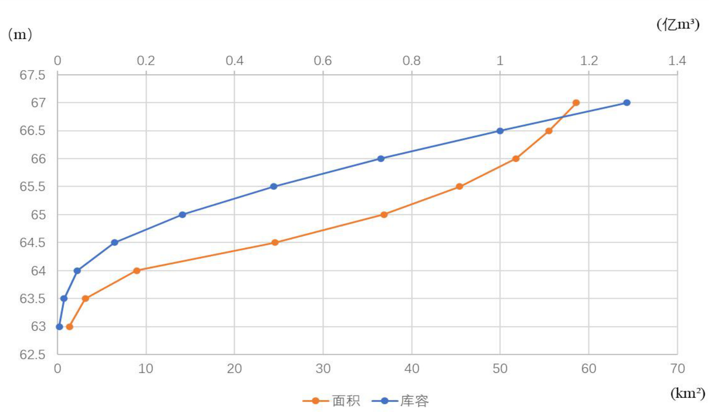  
附图 1 崔家桥蓄滞洪区水位\~面积\~容积曲线图  

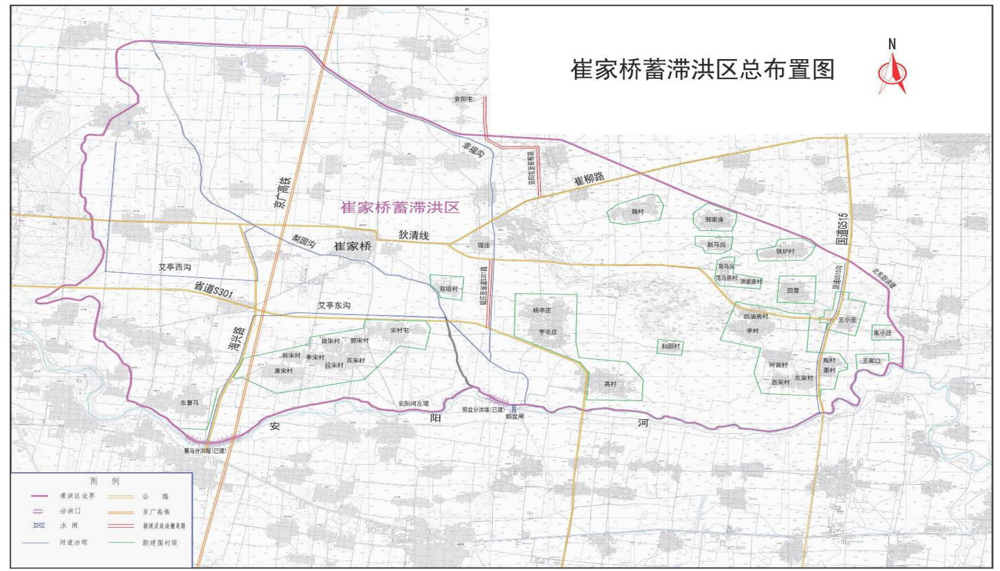  
附图 2 崔家桥蓄滞洪区总布置图  

# 附图 3 崔家桥蓄滞洪区洪水风险示意图  

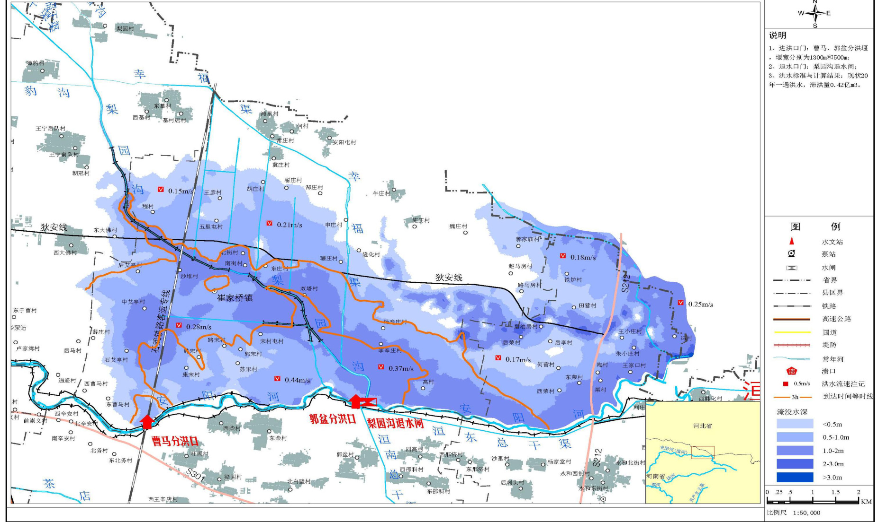  
河南省崔家桥蓄滞洪区现状20年一遇洪水淹没图  

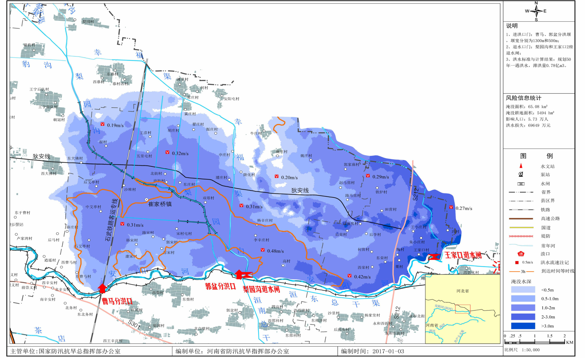  
河南省崔家桥蓄滞洪区规划50年一遇洪水淹没图  