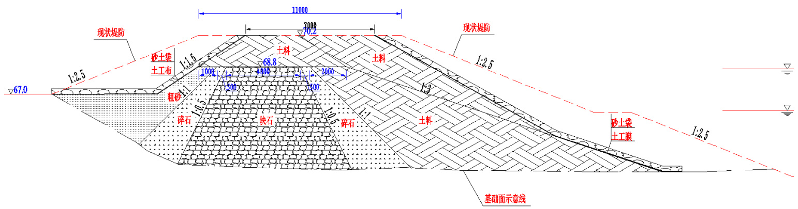

# 关于东孟姜女河左堤临时排水槽封堵措施  

# 一、目标。  

2021 年 7 月 27 日凌晨 3 点 ${\sim}28$ 日,为加速卫辉城区排泄涝水,在东孟姜女河左堤开挖 3 处排水槽。为保证东孟姜女河今年汛期度汛安全,需对排洪槽进行临时封堵,待汛期过后进行永久加固。  

# 二、解决措施。  

1、采取加快修筑翟阳线石庄至七里铺拦水堤,将上游来水阻挡在城区之外,利用四干二支排将水导入东孟。  

2、在东孟姜女河左堤打开泄洪通道,让城市积水直排入河。  

3、在城区周边增临时泵站,加强抽水排涝能力;同时利用好司湾泵站。  

# 三、开挖临时排水槽  

# (1)东孟姜女河排水槽开挖时机  

当东孟姜女河水位高于堤防外水位,导致河水将倒灌县城,不能 开挖临时排水槽。当东孟姜女河水位低于堤防外水位,可开挖临时排 水槽排泄城区涝水。  

# (2)临时排水槽位置选择  

临时排水槽需设置在排泄效果最好的堤防段,考虑县城被包裹在卫河堤防和东孟姜女河堤防之间,地势西高东低,北高南低,考虑东孟姜女河入卫河口为地势最低点,同时考虑“卫河近期遇上雨水天气时,堵口难易程度”,选择在东孟姜女河入卫河口上游约 $150\mathrm{m}{\sim}300\mathrm{m}$ 范围,东孟姜女河左堤开挖临时排水槽。  

# (3)临时排水槽开挖尺寸  

临时排水槽计划开挖 2 处,开口宽分别约为 $5\mathrm{m}$ 和 $28\mathrm{m}$ 。开挖方向从迎水坡开挖,开挖高程为河道水面高程 $+0.1\mathrm{m}$ 。  

# 四、临时排水槽封堵时间  

临时排水槽封堵应选择在堤内外水位基本接近齐平时候,或者根据天气预报本地区或上游地区有中雨或大雨时候,条件满足上述一个条件的时候,须在下雨之前,尽快封堵临时排水槽。  

# 五、临时排水槽封堵地点  

临时排水槽封堵地点:1 濮卫高速公路下游东孟左堤排水槽,2后东线公路桥下游东孟左堤排水槽,3,司湾泵站老卫河右堤。  

# 六、排水槽临时封堵措施分三步:合拢、闭气、加高  

# A 第一步合拢。  

将块石在水中填至本次洪水高程以上 $+0.2\mathrm{m}$ 。  

# B 第二步闭气。  

已合拢抢险块石堤防为中心加宽,以碎石抛投已抢险堵头两侧,然后再用堤防上开挖料抛投碎石外侧,碎石、土料均需抛填至水面高程以上高度 $\mathrm{h}$ ,高度 h 以“现场后续碾压设备不陷入土体,并且碾压过程不出现弹簧土“为原则现场确定。抛填土料时,抛投区流速应小于 $0.5\mathrm{m}/\mathrm{s}$ ,抛土块径不超过 $10{\sim}20\mathrm{cm}$ 。  

# C 第三步加高与现状堤防高程一致。  

防洪水位以上块石、碎石、粗砂和土料采用机械碾压压实,碾压机具的行走方向应平行于堤轴线,不宜垂直堤轴线方向碾压。  

若以履带式拖拉机或拖拉机,带碾滚作为压实机械时,则可采用进退错距法压实工艺,碾迹套压宽度宜大于 $10\mathrm{cm}$ 。若以铲运机、自卸汽车等作为压实机械时,可采用轮迹排压法工艺,轮迹套压宽度宜为 $3{\sim}5\mathrm{cm}$ 。对机械碾压不到的死角,建议以夯具进行夯实。若填土出现“弹簧土”、层间光面、层间中空、松土层或剪切破坏等现象,应根据具体情况及时处理,或挖除,或刨松后重新碾压。  

碎石、粗砂、土料的摊铺厚度一般按照 $35{\sim}45\mathrm{cm}$ 控制,碾压后土料的厚度应在 $30\mathrm{cm}$ 以内。碾压遍数根据现场碾压机械及碾压效果确定,一般不小于 5 遍。  

抢险堤防迎水面敷设土工膜,背水面铺设土工布,铺设均从堤防顶铺设至坡脚,土工膜和土工布铺设延伸至抢险堤防两端长度不小于8m。  

土工膜宜采用两布一膜或一布一膜。土工膜垂直于渠道中心线方向铺设,单幅长度不足,宜采用专用胶粘接。  

土工膜搭接宽度不小于 $1\mathrm{m}$ ,土工布搭接宽度不小于 $0.5\mathrm{m}$ ,顺水流方向上游压住下游。  

水面以上迎水面土工膜采用土袋压重固定(含土工膜铺设延伸段),宜在迎水面坡脚抛填砂土袋固定坡脚土工膜。背水面采用土工布采用砂袋压重固定。  

土工膜的压重固定应随土工膜的铺设循序完成,不应铺设完土工膜后再开展砂土袋压重施工。  

应注意施工安全,尤其是抢险堤防两侧坡肩土石料碾压时。  

应在下次下雨前完成施工。  

所需物资估算:抛石 $2147\mathrm{m}^{3}$ ,碎石 $1100\mathrm{m}^{3}$ ,土料 $2700\mathrm{m}^{3}$ ,土工 膜 $170~\mathrm{m}^{2}$ ,土工布 $400\mathrm{m}^{2}$ ,土袋 3.9 万个。  

  

# 六、今年汛期管理要求  

1、临时堤防在汛期河道行洪期间需要专人全程巡查。特别是雨天或上游有雨情时候,要求 24 小时专人值班巡查。2、专人查看上下游水情(水位、流量)数据。3、临时堤防附近需有抢险物资储备和人员筹备,以便随时抢险加固。  