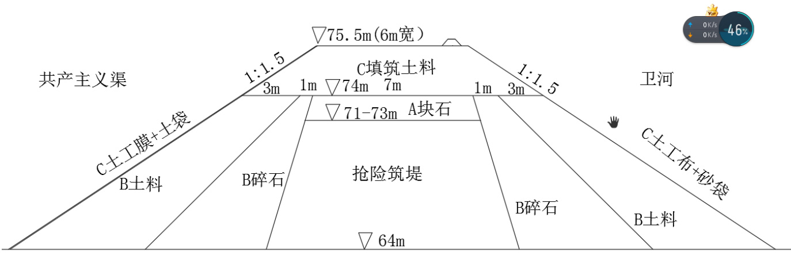

# 关于西曲里村缺口临时措施后续技术要求  

# 一、目的  

截止 2021 年 7 月 26 日上午,西曲里村缺口已经成功合拢。为保证共渠今年汛期度汛安全,需进一步对堵头进行临时加固措施是十分必要的。  

# 二、临时措施实施分三步走,加高、闭气、再加高  

A 第一阶段加高至 $74\mathrm{m}$ 。在已经抢险的堵头基础上,采用块石继续加高至高程 $74\mathrm{m}$ 。采用 $30~^{\sim}35$ 辆的块石用完为止。  

B 第二阶段闭气。水面以上 1m 为基准,以已合拢抢险堤防为中心加宽,首先以碎石抛投已抢险堵头两侧,然后再用堤防上开挖料抛投碎石外侧。  

# C 第三阶段再加高。继续 $1{+}1$ 方式( $75.5\substack{+1}$ )高程 76.5m。  

1、堤顶高程填至高程 75.5m,堤防宽度不小于 6m,水面以上边坡采用 1:1.5,与两边堤防衔接。3、水面以上 1m 采用共产主义渠堤防上面堆放土料填筑,采用履带式推土机碾压 5 遍。4、迎水面敷设土工膜,背水面铺设土工布,铺设从堤防顶铺设至坡脚,土工膜和土工布铺设与已有堤防与抢险堤防搭接长度不小于8m。土工膜和土工布搭接宽度不小于 1m,顺水流方向上游压住下游。土工膜采用两布一膜(土工膜、彩条布)。  

水面以上迎水面土工膜要采用土袋压住。背水面采用土工布采用砂袋压住。  

  

应在下次下雨前完成施工。  

# 四、估算工程量  

抛石 $945\mathrm{m}3$ ,碎石 $4560\mathrm{m}3$ ,土料 1.5 万 $\mathrm{m3}$ ,土工膜 $2000~\mathrm{m}2$ ,土 工布 $2000\mathrm{m}2$ ,土袋个,  

第一阶段,抛石工程量 $=90\mathrm{m}\times7\mathrm{m}\times1$ .5m=945m3  

第二阶段:碎 $\widehat{\sf z}=\left(\frac{1{\sf m}+7{\sf m}}{\sf m}\right)/2\times10\times57\times2\overline{{=}}4560\mathrm{m}{\it3}$ 土  

第三阶段:土料 $=$ ( $6\mathrm{m}{+}15\mathrm{m}$ ) $/2\times2.5\times120\times1.3$  

土袋 $=57\times22/0.2\substack{=6270}$ 个(利用解放军已经安装的土袋和砂袋即可)砂袋 $=57\times22/0.2\substack{=6270}$ 个(利用解放军已经安装的土袋和砂袋)  

土工布 $=57\times22\times1.33\substack{+10\times20\times1.33\substack{=2000\mathrm{m}2}}$ 土工膜 $=57\times22\times1.33+10\times20\times1.33\mathrm{=2000m2}$  

# 五、今年汛期管理要求  

1、临时堤防在汛期河道行洪期间需要专人全程巡查。特别是雨天或上游有雨情时候,要求 24 小时专人值班巡查。  

2、专人查看上下游水情(水位、流量)数据。  