# 卫辉 “21.7” 暴雨洪水分析报告  

# 河南省水文水资源局二〇二一年八月  

报告审定: 王鸿杰报告审核: 岳利军 陈  辉调查负责人:岳利军  

调查组成员:张春芳 李四海  王泽明  刘学勇  郭树贤报告编制人:岳利军  张春芳  李四海  王泽明 王婉婉  

# 目录  

# 卫辉市小河口以上卫河流域概况  

(一)地理位置(二)地形地貌 . 3(三)河道水系 3(四)洪涝灾害 . 5  

# 二、 卫辉防洪工程现状 6  

(一)水库工程 . 6  
(二)河道堤防 . 6  
(三)水闸枢纽 . 8  
(四)蓄滞洪区 8  
(五)水文站网 11  

# 三、 暴雨分析 . 2  

(一)暴雨特性 . 12  
(二)卫河淇门以上“21.7”暴雨概况 . 12  
(三)“21.7”暴雨特点. 14  
(四)“21.7"暴雨重现期分析 15  
(五)卫辉市“21.7”暴雨与“63.8”暴雨对比分析 . 17  

# 四、 卫辉洪水分析 . 9  

(一)洪水特性 . . 19  
(二)“21.7”洪水过程. . 19  
(三)卫辉段洪水组成分析 . 23  
(四)水库工程运用 24  
(五)滞洪区运用 . . 28  
(六)卫辉洪水频率分析 . 29  
(七) “21.7”洪水还原计算及重现期确定 . 32  
(八)与历史洪水对比分析 . . 35  

# 五、 卫辉城区内涝分析 38  

(一)卫辉市及城区地势特点 38  

(二)城区暴雨分析 . . 40  
(三)城市排涝分析 . . 42  
(四)城区河道水系内障碍物阻水分析 . . 43  
(五)共产主义渠右堤李士屯段应急围堰漫决洪水对卫辉城区内涝影响分析 ..... 44  
六、 结论和建议 . . 47  
(一)结论 . . 47  
(二)建议 . . 48  

# 一、卫辉市小河口以上卫河流域概况  

# (一)地理位置  

卫河是海河流域漳卫河系的主要支流,地跨山西、河南和河北三省,发源于山西省陵川县夺火镇南岭村,经博爱、焦作、修武、辉县、获嘉、新乡县、新乡市区、凤泉区、卫辉,至卫辉市的小河口村进入鹤壁市。卫辉市小河口以上卫河流域面积5799.2km²,其中合河水文站以上流域面积为 $4061\mathrm{km}^{2}$ ,合河水文站至卫辉小河口区间面积 1738.2km²。  

# (二)地形地貌  

卫辉市小河口以上流域的西北部为太行山区,西南部及南部为黄河流域,总体呈现南、西、北三面高而东部低。地貌分为山丘区、山前倾斜平原和黄河冲积平原,其中山丘区面积为$4949.20\mathrm{km}^{2}$ ,平原区面积为 850km²。  

# (三)河道水系  

卫河发源于太行山南麓山西省陵川县夺火镇南岭村,左岸支流如梳齿状平行汇入干流,主要有大沙河、纸坊沟河、峪河、石门河、黄水河、百泉河、十里河、香泉河、沧河等,右岸主要有蒋沟、大浉涝河、共产主义渠、西孟姜女河、东孟姜女河等。卫河左岸支流发源于山区,地形陡峻,源短流急,易于洪水汇集。卫河右岸支流源于平原地区,集水慢、汇流迟,易形成大面积内涝。卫河卫辉段两侧有良相坡、柳围坡蓄滞洪区。  

共产主义渠开挖于 1958 年,自武陟县秦厂起,在新乡县合河镇西北永康与大沙河交汇,至合河闸起傍卫河左岸行进,至安阳的老观嘴汇入卫河,全长192km。1962年停止引黄后用于行洪。卫辉市小河口以上至合河区间有民生渠、十里河、香泉河、沧河从左岸汇入共产主义渠,有西孟姜女河、人民胜利渠、东孟姜女河汇入卫河。柳围坡滞洪区内有长虹渠为骨干排涝河道。详见图1-1 卫辉市小河口以上至合河区间水系分布图  

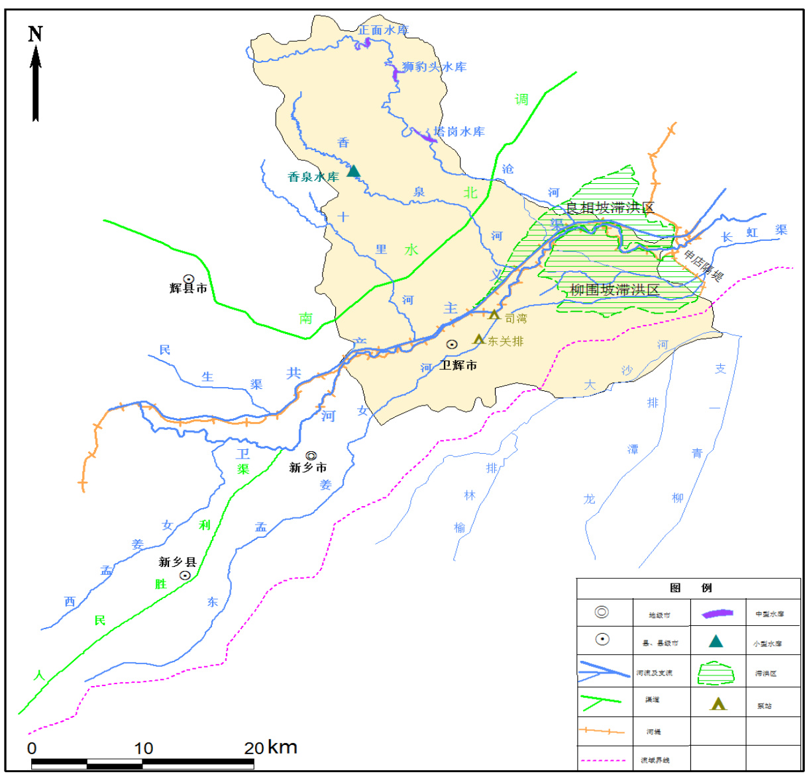  
图 1-1 卫辉市小河口以上至合河区间水系分布图  

# (四)洪涝灾害  

卫河发生较大的洪水为 1956、1963、1996 年洪水。  

1956 年 7 月 20 日,汲县拴马一带,遭遇强降水,6 小时降水量达 800mm,沧河塔岗洪水流量达 $2400\mathrm{m}^{3}/\mathrm{s},$ 。本次强降水导致塌房 431 间,死亡 6 人,伤 37 人,牲口、农具、树木等被洪水冲走不计其数,下游平原区 3 万亩秋苗被淹死。  

1956 年 7 月 28 日 ${\sim}8$ 月 4 日,卫河上游遭遇连续强降雨,形成一次特大洪水。卫河堤防多处漫决,两岸坡洼一片汪洋。新乡地区受灾面积 590.63 万亩,成灾面积达 490.94 万亩,死伤349 人,塌房 16 万间。  

1963 年 8 月,新乡地区卫河流域发生大洪水,共产主义渠合河站洪峰流量 $1350\mathrm{m}^{3}/\mathrm{s}$ 。新乡市区内除火车站、平原路西段等少数高岗地区外,全部被淹,市郊 37 个村庄被淹,围困村庄51 个,城乡交通断绝。  

1996 年 8 月 3 日起,新乡市及上游普降大暴雨,局部特大暴雨,产生大洪水。共产主义渠合河站洪峰流量 $1000\mathrm{m}^{3}/\mathrm{s}$ ,共产主义渠黄土岗站洪峰流量 $780\mathrm{m}^{3}/\mathrm{s}_{\circ}\quad\left\{\begin{array}{r l}\end{array}\right.$ 8 月 4 日 2 时良相坡开始自然分洪。新乡市共有 10 个县(市、区)129 个乡(镇)的 2127个村庄受灾,受灾人口 235 万,农作物受灾面积 342.5 万亩,绝收 164.7 万亩。  

表 1-1 较大洪水年份主要站洪峰流量和洪量统计表  

<html><body><table><tr><td rowspan="2">洪水场次</td><td rowspan="2">站名</td><td rowspan="2">时间 (月.日)</td><td rowspan="2">洪峰流量 (m² / s)</td><td colspan="2">洪量(亿㎡²)</td></tr><tr><td>3日</td><td>7日</td></tr><tr><td rowspan="3">“56. 8”</td><td>合河 (共)</td><td>8.04</td><td>1030</td><td>1.893</td><td>3.420</td></tr><tr><td>黄土岗</td><td>8.05</td><td>878</td><td>1.771</td><td>3.549</td></tr><tr><td>汲县</td><td>8.05</td><td>260</td><td>0.620</td><td>1.347</td></tr><tr><td rowspan="3">“63. 8”</td><td>合河 (共)</td><td>8.08</td><td>1350</td><td>/</td><td>/</td></tr><tr><td>黄土岗</td><td>8.09</td><td>1290</td><td>/</td><td>/</td></tr><tr><td>汲县</td><td>8.10</td><td>129</td><td>/</td><td>/</td></tr><tr><td rowspan="3">“96. 8"</td><td>合河 (共)</td><td>8.05</td><td>1000</td><td>1.849</td><td>2.937</td></tr><tr><td>黄土岗</td><td>8.07</td><td>560</td><td>1.084</td><td>2.241</td></tr><tr><td>汲县</td><td>8.05</td><td>115</td><td>0.195</td><td>0.335</td></tr></table></body></html>  

# 二、卫辉防洪工程现状  

# (一)水库工程  

卫辉市境内有 3 座中型水库,3 座小型水库。其中中型水库分别是正面水库、狮豹头水库、塔岗水库,均位于沧河上。正面水库按 50 年一遇洪水设计,1000 年一遇洪水校核,总库容 1537万 $\mathrm{m^{3}}$ ;狮豹头水库按50年一遇洪水设计,2000年一遇洪水校核,总库容 1947 万 m ;塔岗水库按 50 年一遇洪水设计,2000 年一遇洪水校核,总库容 1763.6 万 m ;香泉水库(小一型)按 50年一遇洪水设计,1000 年一遇洪水校核,总库容 546.08 万 m3。扁担沟水库(小二型)总库容 40.64 万立方米,下枣庄水库(小二型))总库容 24.28 万立方米。  

# (二)河道堤防  

# 1.卫河  

新乡市境内卫河干流起于新乡县合河节制闸,止于卫辉市小河口,长 72.35km,其中卫辉市境内长 41km,堤防长度 41km。堤防设  

计防洪标准为 20 年一遇,设计流量 $311\mathrm{m}^{3}/\mathrm{s}$ ,设计堤顶宽度 6m,设计边坡 1:3。107 国道桥\~司湾桥防洪水位为 $70.27\mathrm{m}{\sim}68.82\mathrm{m}$ ,司湾桥\~曲律桥防洪水位为 $68.82\mathrm{m}\sim65.00\mathrm{m}$ 。  

# 2.共产主义渠  

自武陟县秦厂起,在新乡县合河镇西北永康与大沙河交汇,至合河闸起傍卫河左岸行进,至安阳的老观嘴汇入卫河,全长192km,卫辉市境内长 $35\mathrm{km}$ ,堤防长 $26\mathrm{km}$ 。现状堤顶宽度 $6\mathrm{\sim}8\mathrm{m}$ ,防洪标准 20 年一遇,防洪流量 $1500~\mathrm{m^{3}/s}$ ,边坡 $1:2\sim1:2.5$ 。107国道\~下马营段规划防洪标准 50 年一遇,防洪流量 $2470~\mathrm{m}^{3}/\mathrm{s}$ ,设计堤顶宽度 6m,底宽 80m,边坡 1:3。  

# 3.香泉河  

香泉河发源于卫辉市石包头乡花园村,于甘庄东注入共产主义渠。河道全长 $29\mathrm{km}$ ,深山区 5.5km,总流域面积 $208.8\mathrm{km}^{2}$ 。香泉河香泉水库大坝至入共渠口段设计除涝标准为 5 年一遇,除涝流量$125.16\mathrm{m}^{3}/\mathrm{s}$ ,入共渠口至田湾排涝水位 65.36m\~151.72m。  

# 4.沧河  

沧河属山丘区河道,全长 70km,流域面积 $370\mathrm{km}^{2}$ ,河道纵坡$1/40\sim1/200$ ,设计防洪标准为10 年一遇,设计防洪流量为 $939\mathrm{m}^{3}/\mathrm{s}$ ,其中塔岗水库至三皇庄河段的防洪水位为 $149.39\mathrm{m}\sim110.39\mathrm{m}.$ 。  

# 5.东孟姜女河  

东孟姜女河起源于新乡县小河村,至卫辉市司湾村入卫河。东孟姜女河全长 51.8km,其中卫辉市境内河长 16.34km。卫辉市境内  

大任庄提灌站至入卫河口河段设计防洪标准 20 年一遇,设计防洪流量 $260{\sim}247\mathrm{m}^{3}/\mathrm{s}$ ,九孔桥\~司湾防洪水位为 $70.84\mathrm{m}{\sim}68.63\mathrm{m}$ 。  

# (三)水闸枢纽  

卫辉市城区主要排涝河道是老卫河,司湾泵站、东关排和北关排泵站是卫辉市规划的老城区主要防汛泵站,其中司湾泵站位于城郊乡司湾村,老卫河水通过司湾泵站排入卫河,排水功率为$4000\mathrm{m^{3}/h}$ 。  

# (四)蓄滞洪区  

卫辉市境内现有良相坡、柳围坡 2 处蓄滞洪区。  

# 1、良相坡滞洪区  

良相坡蓄滞洪区位于新乡市的卫辉和鹤壁市的淇县境内,南以卫河右堤为界,东靠西岗堤和淇河右堤,北倚淇县城关防洪堤,西接自然高地。蓄滞洪区涉及卫辉市、淇县 2 个县(市),6个乡镇,55 个行政村,人口 8.17 万人。其中卫辉市包括上乐村镇、顿坊店乡、城郊乡 3 个乡镇,19 个行政村,人口 2.78 万人。  

良相坡蓄滞洪区进洪有淇河闫村分洪口和共产主义渠无堤段,均无控制工程,属于自然漫流。设计蓄滞洪水位 $67.00\mathrm{m}$ (规划蓄滞洪水位 67.34m),水深 $0.5{\sim}2.5\mathrm{m}$ 之间,蓄滞洪量 0.92亿 ${\mathfrak{m}}^{3}$ ,淹没面积 $74.52\mathrm{km}^{2}$ ,运用机率为 $2\sim3$ 年一遇。淇河闫村分洪口,口门宽 $500\mathrm{m}$ ,堰顶高程 67.75m,设计过流量 $620\mathrm{m}^{3}/\mathrm{s}$ ;上乐村镇西沿村分洪堰,口门宽 $400\mathrm{m}$ ,堰顶高程 $65.80\mathrm{m}$ ,设计过流量 $1170\mathrm{m}^{3}/\mathrm{s},$ 。滞洪区内的退洪主要通过思德河、八米沟、沧河、香泉河及低洼地带向共渠自然退洪。 详见图 2-1 良相坡滞洪区示意图  

  
图 2-1 良相坡滞洪区示意图  

# 2、柳围坡滞洪区  

柳围坡蓄滞洪区位于卫河右岸的新乡市的卫辉市、鹤壁市的浚县境内,是太行山洪积和黄河冲积平原过渡的封闭洼地,历史上为自然滞洪坡洼。该蓄滞洪区位于平原地区,南以古阳堤为界,北靠卫河右堤,东到申店隔堤,西到卫辉市城郊乡接自然高地,南北宽约 7km,东西长约 $10\mathrm{km}$ ,地形西高东低,地面高程在62. $40{\sim}64.90\mathrm{m}$ 之间,地面自然坡降约 1/5000。设计滞洪水位为65.05m,水深 $0.5{\sim}2.75\mathrm{m}$ 之间,淹没面积 $75.2\mathrm{km}^{2}$ ,蓄洪量 0.95亿 $\mathrm{m}^{3}$ ,运用机率为 $3\sim5$ 年一遇。  

柳围坡蓄滞洪区进洪工程为共渠右堤西沿分洪堰和上乐村镇宋村分洪堰,退洪工程为南北长虹渠退水闸。上乐村镇西沿村分洪堰,口门宽 $400\mathrm{m}$ ,堰顶高程 65.80m,设计过流量 $1170\mathrm{m}^{3}/\mathrm{s},$ 。上乐村镇宋村分洪堰,口门宽 $400\mathrm{m}$ ,堰顶高程 $65.30\mathrm{m}$ ,设计过流流量 $480\mathrm{m}^{3}/\mathrm{s}$ 。南长虹渠退水闸设计流量 $90\mathrm{m}^{3}/\mathrm{s}$ 。北长虹渠退水闸设计流量 $60\mathrm{m}^{3}/\mathrm{s}$ 。  

柳围坡蓄滞洪区涉及卫辉市上乐村镇、城郊乡、庞寨乡 3个乡镇和五四、东风 2 个农场,27 个村,人口 33282 人。  

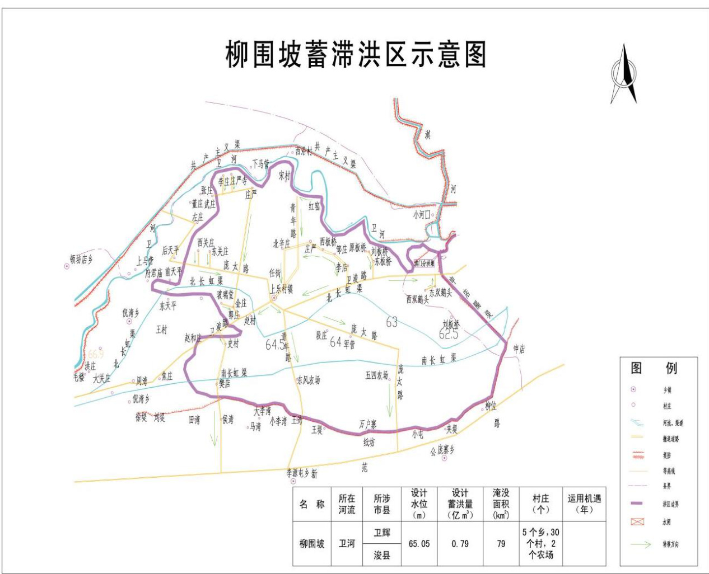  
图 2-2 柳围坡滞洪区示意图  

# (五)水文站网  

卫辉市小河口以上至合河区间,共有 49 处雨量站,4 处国家基本水文站, 7 处省级水文巡测站,2 处水位站。其中卫辉市境内有 26 处雨量站,2 处国家基本水文站, 4 处水文巡测站,2处水位站。卫辉市小河口以上至合河区间站网分布图详见图 2-3  

  
图 2-3 卫辉市小河口以上至合河区间站网分布图  

# 三、暴雨分析  

# (一)暴雨特性  

卫河流域属温带季风型大陆气候区,多年平均气温 $13.4^{\circ}\mathrm{C}$ ,多年平均降水量为 515mm,7、8 月份最为集中,占全年降水量的$46\%$ 。  

卫河流域山区地处太行山迎风坡,暴雨主要由天气系统与地形条件结合所致。夏季太平洋副热带高压加强北上,易在太行山区迎风坡形成大暴雨。暴雨频次多、量级大,暴雨中心多出现在上游的辉县及淇河的土圈、要街附近。暴雨历时一般 3 天左右,强度较大的暴雨常集中在 1 天甚至数小时内,历时较长的暴雨通常由两个或两个以上的天气系统组合而成。  

# (二)卫河淇门以上“21.7”暴雨概况  

7 月 11 日至 16 日,卫河流域发生了一次降水过程,鹤壁淇门水文站以上面平均降雨量达到 130.0mm,使流域前期土壤含水量接近饱和状态。  

7 月 17 日至 23 日,新一轮降雨过程中,卫河流域太行山前普降大到暴雨,局部特大暴雨,卫辉境内累计降雨量较大代表站点统计见表 3-1。雨量最大站点河南省新乡市卫辉市猴头脑站达$947.5\mathrm{mm}$ ,根据卫辉境内雨量站点分布,选取猴头脑等 8 处雨量站作为代表站,分析卫辉市“21.7”暴雨。  

7 月 18、19 日,卫河淇门以上流域面平均降雨量分别为76.2mm、 $55.8\mathrm{mm}$ ,均达到暴雨级别,20 日降雨量为 $154.0\mathrm{mm}$ ,达到大暴雨级别,21 日降雨量为 309.0mm,达到特大暴雨级别,  

22 日降雨逐渐减小,至 23 日 12 时降雨结束。此次降雨卫河流域面平均降雨量为 $496.0\mathrm{mm}$ ,淇门以上流域面平均降雨量为$650.3\mathrm{mm}$ ,淇门以上流域面平均降雨量逐日变化过程详见表 3-2和图 3-1。  

表 3-1 累计降雨量较大站点统计表  
单位:降雨量-mm  

<html><body><table><tr><td>序号</td><td>站名</td><td>河名</td><td>所属市县</td><td>累计降雨量</td><td>备注</td></tr><tr><td>1</td><td>猴头脑</td><td>卫河</td><td>新乡卫辉</td><td>947.5</td><td></td></tr><tr><td>2</td><td>西拴马</td><td>卫河</td><td>新乡卫辉</td><td>912.0</td><td></td></tr><tr><td>3</td><td>正面水库</td><td>沧河</td><td>新乡卫辉</td><td>892.0</td><td></td></tr><tr><td>4</td><td>狮豹头</td><td>沧河</td><td>新乡卫辉</td><td>868.5</td><td></td></tr><tr><td>5</td><td>张王屯</td><td>卫河</td><td>新乡卫辉</td><td>798.5</td><td></td></tr><tr><td>6</td><td>黄山</td><td>卫河</td><td>新乡卫辉</td><td>778.5</td><td></td></tr><tr><td>7</td><td>顿坊店</td><td>卫河</td><td>新乡卫辉</td><td>750.0</td><td></td></tr><tr><td>8</td><td>汲县</td><td>卫河</td><td>新乡卫辉</td><td>735.0</td><td></td></tr></table></body></html>  

表 3-2 卫河淇门水文站以上流域2021 年 7 月 11-23 日逐日平均降水量统计表  

<html><body><table><tr><td>日期</td><td>11</td><td>12</td><td>13</td><td>14</td><td>15</td><td>16</td><td>17</td><td>18</td><td>19</td><td>20</td><td>21</td><td>22</td><td>23</td></tr><tr><td>平均 雨量(mm)</td><td></td><td></td><td>118. 2|0. 1|0.43. 5</td><td></td><td>5.5</td><td></td><td></td><td></td><td></td><td>2. 3 19. 6|76. 2|55. 8 154</td><td></td><td>309 32. 43. 3</td><td></td></tr></table></body></html>  

  
图 3-1 卫河淇门水文站以上流域7 月 11 日至 7 月 23 日逐日面平均降水过程  

# (三)“21.7”暴雨特点  

1.降雨强度大  

7 月 17 日至 23 日,受副热带高压西伸加强、黄淮低涡生成以及切变线的共同影响,河南省卫辉市境内普降大暴雨,局部特大暴雨。累积最大点雨量位于新乡市卫辉市猴头脑雨量站达$947.5\mathrm{mm}$ 。猴头脑等雨量站 7 月 11 日至 7 月 23 日逐日雨量统计详见表 3-3。  

表 3-3 猴头脑等雨量站 7 月 17 日至 7 月 23 日逐日雨量表 单位 mm  

<html><body><table><tr><td>站名</td><td>县 (华)</td><td>17日</td><td>18日</td><td>19日</td><td>20日</td><td>21日</td><td>22日</td><td>23日</td></tr><tr><td>猴头脑</td><td>卫辉</td><td>34.0</td><td>72.5</td><td>42.5</td><td>180.0</td><td>553.0</td><td>59.5</td><td>6.0</td></tr><tr><td>西拴马</td><td>卫辉</td><td>42.5</td><td>90.5</td><td>42.( 0</td><td>158.( 0</td><td>536.0</td><td>42.0</td><td>1.0</td></tr><tr><td>正面水库</td><td>卫辉</td><td>38.0</td><td>93.5</td><td>38.5</td><td>132.( 0</td><td>540.5</td><td>45.0</td><td>4.5</td></tr><tr><td>狮豹头</td><td>卫辉</td><td>38.5</td><td>68.5</td><td>33. ( 0</td><td>124.5</td><td>552.5</td><td>46.5</td><td>5.0</td></tr><tr><td>张王屯</td><td>卫辉</td><td>16. 0</td><td>46.5</td><td>64.( 0</td><td>207.5</td><td>391.0</td><td>69.0</td><td>4.5</td></tr><tr><td>黄山</td><td>卫辉</td><td>19.0</td><td>44.0</td><td>56.0</td><td>142.5</td><td>464.5</td><td>45.5</td><td>7.0</td></tr><tr><td>顿坊店</td><td>卫辉</td><td>14.5</td><td>40.0</td><td>42.0</td><td>159.0</td><td>403.5</td><td>85.5</td><td>5.5</td></tr><tr><td>汲县</td><td>卫辉</td><td>11.0</td><td>46.5</td><td>74.5</td><td>248.5</td><td>288.0</td><td>50.0</td><td>16.5</td></tr></table></body></html>  

# 2.暴雨笼罩面积和降雨量大  

卫辉市地势西高东低。南北长约 $43\mathrm{km}$ ,东西宽约 $35\mathrm{km}$ ,总面积 $868\mathrm{km}^{2}$ ,山区、丘陵、平原面积分别为 $258,158,452\mathrm{km}^{2}$ 。采用算术平均法计算本次暴雨面雨量,山区、丘陵区域共有 8处雨量控制站,面平均降雨量 845.0mm;平原区域共有 10 处雨量控制站,面平均降雨量 $694.4\mathrm{mm}$ ;全市区域内面平均雨量761.4mm。  

# (四)“21.7”暴雨重现期分析  

卫辉市总面积 $868\mathrm{km}^{2}$ ,共设置雨量站 18 处,其中观测资料系列较长、代表性较好的有狮豹头、汲县站,选取的其他 6 处代表站需通过水文手册查算重现期。  

上述测站采用翻斗式自记雨量计观测降雨量,当累计降雨量达到 $0.5\mathrm{mm}$ 时,仪器自动记录一次。2021 年 7 月 11-23 日降雨过程中,各站仪器工作正常,观测资料完整可靠,仪器每 10 分  

钟自动报汛一次降雨量。  

根据选取的汲县代表站实测降雨资料进行频率分析计算,统计本次(7 月 17-23 日)降雨最大 24 小时、3 日、7 日降雨量,并查算相应频率曲线,确定其相应频率,计算成果见表 3-4。从表 3-4 可知,统计分析汲县雨量站最大 3 日、7 日雨量超过百年一遇,且超过有记录以来最大值。  

其他 7 处代表站重现期,根据水文学常用的同频率分析方法分析,参看表 3-3,其他 7 站的最大 1 日、3 日、7 日降水量均大于汲县代表站,可认为猴头脑、西栓马、正面水库、狮豹头、张王屯、黄山、顿坊店等雨量站最大 1 日降雨量重现期为 50 年左右,最大 3 日、7 日雨量超过百年一遇。  

查读水文手册,卫辉市境内最大 24 小时百年一遇雨量小于$400.0\mathrm{mm}$ ,最大 3 天雨量百年一遇雨量小于 $500.0\mathrm{mm}$ 。据表 3-3,所选代表站“21.7”暴雨最大 3 天雨量值均大于 $500.0\mathrm{mm}$ ,因此可认为卫辉市境内“21.7”暴雨超过百年一遇。  

综合以上“21.7”暴雨点面分析结果,可考虑确定卫辉市境内“21.7”暴雨超过百年一遇。  

表 3-4 卫辉市汲县代表站实测资料频率计算表  

<html><body><table><tr><td rowspan="2">站名</td><td rowspan="2">县 (市)</td><td rowspan="2">时段长度</td><td colspan="2">本次降雨</td><td rowspan="2">多年均值 (mm)</td><td rowspan="2">历史最大 值(mm)</td><td colspan="3">重现期 (年)</td></tr><tr><td>雨量 (mm)</td><td>重现期 (年)</td><td>100</td><td>50</td><td>10</td></tr><tr><td rowspan="3">汲县</td><td rowspan="3">卫辉</td><td>24小时</td><td>297.6</td><td>50</td><td>99.9</td><td>341.2</td><td>380</td><td>320</td><td>180</td></tr><tr><td>3日</td><td>611.0</td><td>200</td><td>117.9</td><td>480.5</td><td>560</td><td>440</td><td>245</td></tr><tr><td>7日</td><td>735.0</td><td>300</td><td>146.8</td><td>496.0</td><td>600</td><td>510</td><td>279</td></tr></table></body></html>  

(五)卫辉市“21.7”暴雨与“63.8”暴雨对比分析  

参考卫河流域“21.7”和“63.8”暴雨对比统计,详见表 3-5,暴雨分布情况,见图 3-2 和图 3-3。  

卫辉市“21.7”暴雨与历史上实测最大的“63.8”暴雨对比分析如下:  

# 1.“21.7”暴雨量更大  

对比图 2、图 3 可知,卫辉市“21.7”暴雨面平均降雨量处于$600\mathrm{mm}{\sim}800\mathrm{mm}$ 雨量等值线区间,“63.8”暴雨面平均降雨量处于$400\mathrm{mm}{\sim}500\mathrm{mm}$ 雨量等值线区间。  

# 2.“21.7”暴雨强度更大  

参考表 3-5,“21.7”暴雨自 7 月 17 日 8 时至 24 日 8 时,历时7天;“63.8"暴雨自8月1日8时至11日8时,历时10天;"21.7""暴雨历时更短,强度更大。  

# 3.暴雨笼罩面积  

参考表 3-5,对比图 2、图 3,可认为“21.7”暴雨和“63.8”暴雨均笼罩卫辉市全境范围。  

综合以上指标,可考虑认定卫辉市“21.7”暴雨量级高于历史上实测最大的“63.8”暴雨。  

表 3-5  卫河流域“21.7”与“63.8”暴雨对比统计表  

<html><body><table><tr><td>项目</td><td>“21.7”暴雨</td><td>“63.8”暴雨</td></tr><tr><td>降雨历时 (日)</td><td>7</td><td>10</td></tr><tr><td>平均降雨量（mm)</td><td>496</td><td>433</td></tr><tr><td>最大点雨量（mm)</td><td>1159</td><td>767</td></tr><tr><td>雨量>400mm笼罩面积（km²)</td><td>10150</td><td>11300</td></tr><tr><td>雨量>500毫米笼罩面积从（km²）</td><td>6458</td><td>5900</td></tr><tr><td>雨量>600毫米笼罩面积（km²）</td><td>5666</td><td>1943</td></tr></table></body></html>  

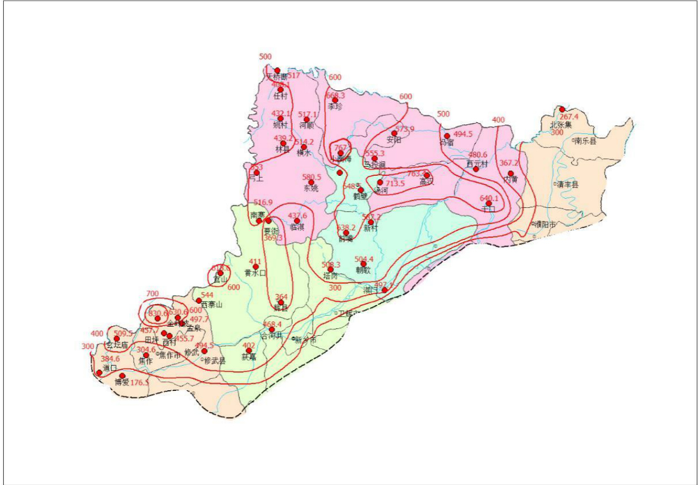  
图 3-2 卫河流域 1963 年 8 月 1 日至 10 日降雨等值线图  

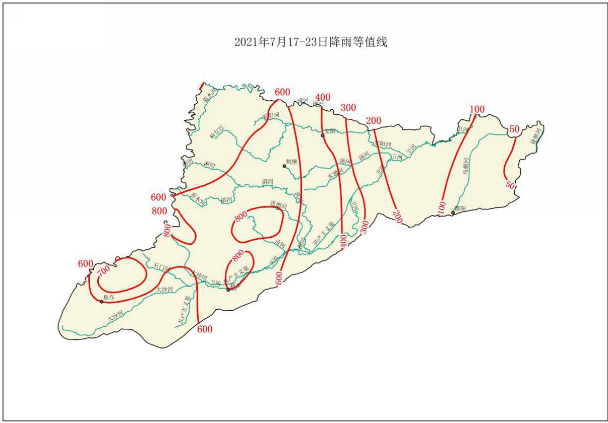  
图 3-3 卫河流域 2021 年 7 月 17 日至 23 日降雨等值线图  

# 四、卫辉洪水分析  

# (一)洪水特性  

卫河山区支流均处于太行山迎风坡,受暴雨特性及流域下垫面综合影响,洪水频次多、量级大,且源短流急,洪水迅猛,是卫河洪水的主要发源地。各支流洪水多为同一场暴雨所形成,因此支流洪水常常遭遇。卫河洪水主要来自淇门水文控制断面以上淇河或共产主义渠淇门(刘庄闸)以上山区的支流。  

卫辉段洪水主要来自合河以上,卫辉市境内汇入主要河流为沧河、东孟姜女河、香泉河等。  

# (二)“21.7”洪水过程  

7 月 11 日至 23 日,卫河流域先后遭受了两次强降雨过程。  

卫辉境内卫河、共渠均发生超保洪水,境内良相坡、柳围坡 2个蓄滞洪区启用。  

7 月 11 日至 12 日属于暴雨级别,暴雨中心位于卫河上游山区和卫河淇门至五陵区间。7 月 17 日至 23 日降雨属于罕见的超强暴雨,且降雨落区与第一次强降雨重叠,整个卫河流域都处于暴雨中心范围。暴雨导致山洪暴发,平原积水,水库水位急速上涨,迅速超过汛限水位,水库调蓄能力减小。  

共产主义渠在卫辉有重要控制断面黄土岗水文站。黄土岗水文站本次洪水于 7 月 20 日 8 时起涨,起涨流量 $16.9\mathrm{m}^{3}/\mathrm{s}$ ,水位67.38m,7月24日0时洪峰流量 $1140\mathrm{m}^{3}/\mathrm{s}$ ,洪峰水位 $73.67\mathrm{m}$ ,超保证水位(71.50m)2.17m。黄土岗水文站最大流量列该站1955年有资料记载以来的第 3 位(历史最大流量 $1290\mathrm{m}^{3}/\mathrm{s}$ ,1963 年8 月,最高水位因断面变化迁站影响,不作历史排位)。7 月 21日 22 时水位涨至 70.24m,超过警戒水位(70.00m),7 月 22日 8 时水位涨至 71.55m,超过保证水位(71.50m),7 月 29 日4时水位落至保证水位以下,8月2日12时水位落至警戒水位以下;水位超保证历时 212 小时,超警戒水位历时 254 小时。  

卫河在卫辉有重要水文控制断面汲县水文站。汲县水文站本次洪水于7 月20 日8 时起涨,起涨流量 $22.1\mathrm{m}^{3}/\mathrm{s}$ ,水位 $67.58\mathrm{m}$ ,7 月 24 日 8 时洪峰流量 $265~\mathrm{m}^{3}/\mathrm{s}$ ,超保证流量( $160\mathrm{m}^{3}/\mathrm{s})$ ),洪峰水位 72.76m,涨幅 5.18m,超保证水位(71.20m)1.56m。汲县水文站最大流量列该站 1954 年有资料以来第 1 位(历史最大流量 $260\mathrm{m}^{3}/\mathrm{s}$ ,1956 年 8 月;最高水位因断面变化迁站影响,不作历史排位)。7月20日18时20分水位涨至警戒水位(69.20m),22 日 23 时水位涨至保证水位(71.20m),7 月 26 日 19 时水位落至保证水位以下,8 月 1 日 20 时水位落至警戒水位以下;水位超保证历时 92 小时,超警戒水位历时 286 小时。  

黄土岗、汲县水文站最高洪水位和洪水特征值统计见表 4-1、主要洪水过程见图 $4^{-1}\mathrm{\sim4^{-2}}$ 。  

# 表 4-1 卫辉市 “21.7”洪水主要水文站特征值统计表  

单位:水位 $-\mathrm{m}$ ;流量 $-\mathrm{m}^{3}/\mathrm{s}$ ;水量-亿 $\mathrm{m}^{3}$  

<html><body><table><tr><td>河流</td><td>站名</td><td>项目</td><td>“21.7" 实测</td><td>出现（开始）时间</td><td>备注</td></tr><tr><td rowspan="4">共渠</td><td rowspan="4">黄土岗</td><td>Hm</td><td>73.67</td><td>2021/7/23 22:00</td><td>保证水位 71.50</td></tr><tr><td>Qm</td><td>1140</td><td>2021/7/23 20:00</td><td></td></tr><tr><td>W5d</td><td>3.21</td><td>2021/7/22 17:00</td><td></td></tr><tr><td>W15d</td><td>5.46</td><td>2021/7/21 8:00</td><td></td></tr><tr><td rowspan="4">卫河</td><td rowspan="4">汲县</td><td>Hm</td><td>72.76</td><td>2021/7/24 8:00</td><td>保证水位 71.20</td></tr><tr><td>Qm</td><td>265</td><td>2021/7/24 8:00</td><td></td></tr><tr><td>W5d</td><td>0.865</td><td>2021/7/22 23:00</td><td></td></tr><tr><td>W15d</td><td>1.53</td><td>2021/7/20 8:00</td><td></td></tr></table></body></html>  

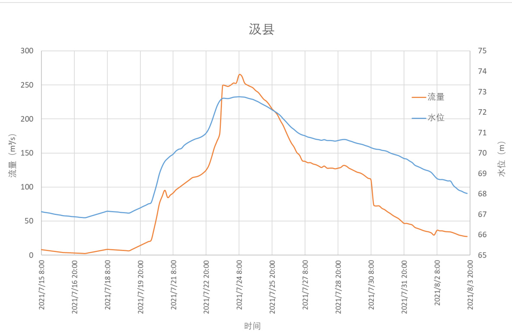  
图 4-1 汲县站“21.7”实测洪水过程线图  

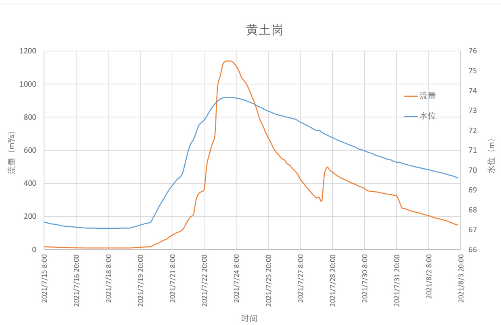  

# (三)卫辉段洪水组成分析  

卫辉市过境河流主要是共产主义渠和卫河。共产主义渠为上游洪水主要泄洪河道,其来水主要为上游合河水文站以上发源于太行山南麓的多条山区河流。卫河在卫辉境内主要为排涝河道。  

卫河(共渠)在卫辉市以下,进入历史上自然形成的坡洼地带,目前沿河道两岸利用原有坡洼建有 8 个滞洪区,卫辉境内有良相坡、柳围坡两个滞洪区,本次洪水两个滞洪区均启用。  

卫河(共渠)黄土岗、汲县至淇门、刘庄及淇河新村段主要河道控制断面过水量计算如下:  

1、共产主义渠黄土岗断面过水量计算,起讫时间为 7 月 20日 8 时至 8 月 8 日 8 时,过水量 5.71 亿 m3。  

2、卫河汲县断面过水量计算,起讫时间为 7 月 20 日 8 时至8 月 8 日 8 时,过水量 1.60 亿 $\mathrm{m^{3}}$ 。  

3、淇河新村断面过水量计算,起讫时间为 7 月 20 日 13 时至 8 月 8 日 13 时,过水量 1.63 亿 m3。  

4、共产主义渠刘庄断面过水量计算,起讫时间为 7 月 20日 18 时至 8 月 8 日 18 时,过水量 4.93 亿 m3。  

5、卫河淇门断面过水量计算,起讫时间为 7 月 20 日 18 时至 8 月 8 日 18 时,过水量 3.26 亿 m3。  

6、柳围坡分洪量 1.12 亿 m  

7、长虹渠分洪量 2.24 亿 m3。  

区间径流量为 4、5、6、7 项之和 11.55 亿 $\mathrm{m^{3}}$ 减去 1、2、3  

项之和 8.94 亿 $\mathrm{m}^{3}$ ,结果为 2.61 亿 m3。  

# (四)水库工程运用  

卫辉中型水库共 3 座,均在沧河上。沧河干流长度 47.5km,流域面积 $323\mathrm{km}^{2}$ ,其上游山丘区建有三座串联的中型水库,自上游而下游分别是正面、狮豹头、塔岗水库,控制流域面积分别为88.5km2、160km2、234km2。  

香泉河建有小型水库香泉水库。  

本次洪水前,三座中型水库蓄水位均较低,正面水库低于汛期限制水位 26.43m,狮豹头水库低于汛限水位 19.98m,塔岗水库低于汛限水位 6.62m。正面、狮豹头、塔岗最大拦蓄洪量分别为 11.51、12.17、8.71 百万 m ,三座水库最高水位分别超汛限水位 1.93m、4.86m、3.90m。  

正面、狮豹头、塔岗水库入库水量分别为 0.92、1.04、1.52亿 $\mathrm{m^{3}}$ 。三座水库最大拦蓄洪量共计 0.32 亿 $\mathrm{m^{3}}$ ,占塔岗水库入库水量的 $21\%$ ,具有一定的拦蓄作用。正面、狮豹头、塔岗水库最大入库流量分别为 $664\mathrm{{m}^{3}/\mathrm{{s}}}$ 、 $1405\mathrm{m}^{3}/\mathrm{s}$ 、 $1720\mathrm{m}^{3}/\mathrm{s}$ ,最大出库流量分别为 $678~\mathrm{m^{3}/s},~1240~\mathrm{m^{3}/s},~1730~\mathrm{m^{3}/s},$ ,说明在大洪水期间,溢洪道开始溢流后对洪水的削峰作用不明显。但应注意到狮豹头水库入库过程有明显的两个峰,第一个峰 $1405~\mathrm{m^{3}/s}$ 出现在 7 月21 日 22 时,水库自 21 日 21 时至 22 时,水位从 295m 猛涨至303.23m,涨幅达 8.23m,但由于处于水库进水早期,在水库溢洪道堰顶 302.5m 以下尚有较大库容,因此水库对第一个峰的削峰效果显著,相应出库流量仅为 $63~\mathrm{m^{3}/s}$ ,见图 $4^{-3\sim}4^{-5}$ 。  

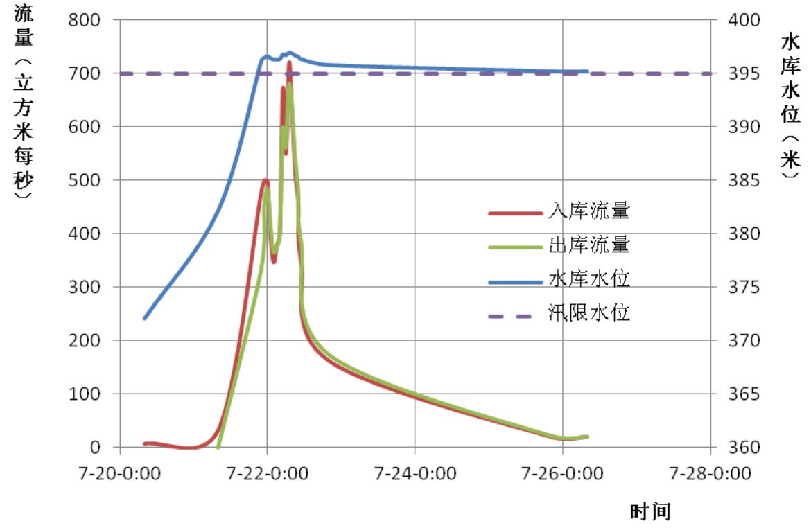  
图4-3 沧河正面水库调蓄过程线  

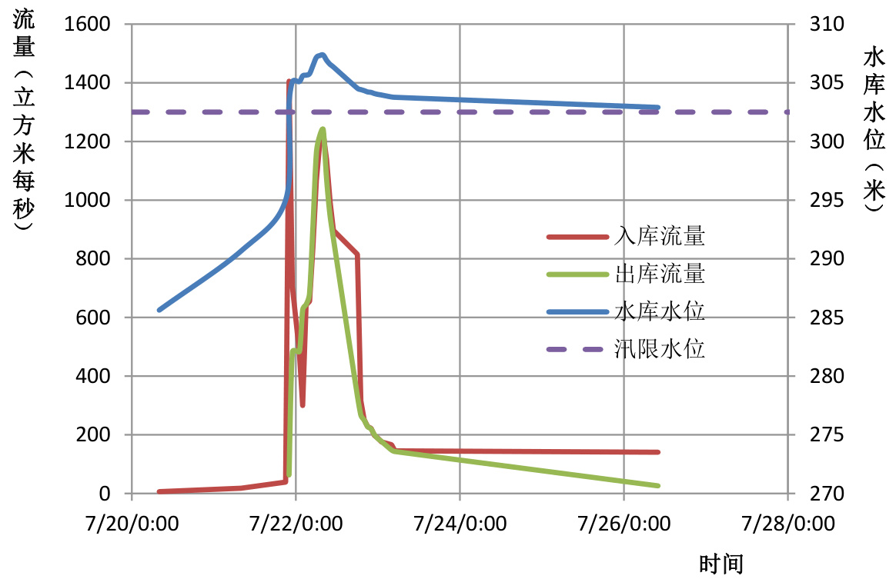  
图4-4 沧河狮豹头水库调蓄过程线  

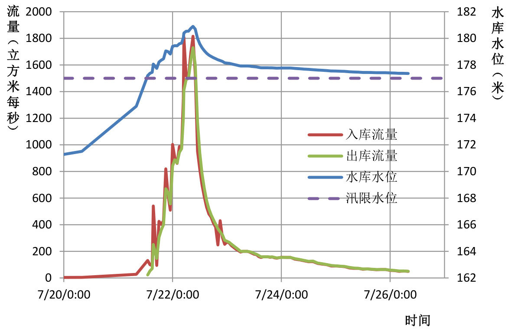  
图4-5 沧河塔岗水库调蓄过程线  

表 4-2 卫辉市主要中小型水库蓄水情况  

<html><body><table><tr><td rowspan="3">河流</td><td rowspan="3">库名</td><td colspan="3">雨前水库蓄水情况</td><td colspan="3">本次洪水期蓄</td></tr><tr><td rowspan="2">时间</td><td rowspan="2">水位(m)</td><td rowspan="2">相应蓄量 （百万m²)</td><td colspan="3">最大拦蓄洪水</td></tr><tr><td>时间</td><td>最高水位 (m)</td><td>相应蓄量 （百万 m²)</td></tr><tr><td>沧河</td><td>正面</td><td>2021/7/18 8:00</td><td>368.57</td><td>1.20</td><td>2021/7/22 7:00</td><td>396.93</td><td>12.71</td></tr><tr><td>沧河</td><td>狮豹头</td><td>2021/7/17 8:00</td><td>282.52</td><td>1.42</td><td>2021/7/22 8:00</td><td>307.36</td><td>13.59</td></tr><tr><td>沧河</td><td>塔岗</td><td>2021/7/17 8:00</td><td>170.38</td><td>4.76</td><td>2021/7/22 9:00</td><td>180.90</td><td>13.47</td></tr><tr><td>香泉 河</td><td>香泉</td><td>2021/7/17 8:00</td><td>262.76</td><td>1.35</td><td>2021/7/22 5:00</td><td>281.31</td><td>4.48</td></tr></table></body></html>  

表 4-3  

# 卫辉市主要中小型水库入库、出库特征值表  

<html><body><table><tr><td rowspan="2">河流</td><td rowspan="2">库名</td><td colspan="2">最大入库流量</td><td colspan="2">最大泄量</td><td rowspan="2">入库 水量 （亿 m²)</td></tr><tr><td>时间</td><td>最大入库 (m/s)</td><td>时间</td><td>最大泄量 （立 m*/s)</td></tr><tr><td>沧河</td><td>正面</td><td>2021/7/228:00</td><td>664</td><td>2021/7/22 7:00</td><td>678</td><td>0.92</td></tr></table></body></html>  

<html><body><table><tr><td>沧河</td><td>狮豹头</td><td>2021/7/21 22:00</td><td>1405</td><td>2021/7/228:00</td><td>1240</td><td>1.04</td></tr><tr><td>沧河</td><td>塔岗</td><td>2021/7/22 9:00</td><td>1720</td><td>2021/7/229:00</td><td>1730</td><td>1.52</td></tr><tr><td>香泉河</td><td>香泉</td><td>2021/7/22 5:00</td><td>328</td><td>2021/7/22 5:00</td><td>281</td><td>0.25</td></tr></table></body></html>  

# (五)滞洪区运用  

卫辉境内滞洪区包括良相坡、柳围坡两处,由于卫河(共渠)合河至淇门区间河道洪水全线超保证水位(流量), 7 月 22 日23 时共产主义渠左堤自然漫溢入良相坡滞洪区,7 月 23 日 12时河道扒口分洪入柳围坡滞洪区。良相坡滞洪区于 7 月 24 日 12时达到最高滞洪水位 67.00m(设计水位 67.00m),最大滞蓄洪量 0.92 亿 m3。柳围坡滞洪区于 7 月 26 日 12 时达到最高滞洪水位 65.35m(设计水位 65.05m),最大滞蓄洪量 0.98 亿 m3。详见下表 4-4、图 4-6。  

# 表 4-4 “21.7"洪水蓄滞洪区运用情况统计表  

<html><body><table><tr><td>序号</td><td>名称</td><td>设计水位 (m)</td><td>设计蓄洪 量(亿m²)</td><td>启用时间</td><td>最高水位 (m)</td><td>最大滞蓄 (亿m)</td><td>出现时间</td></tr><tr><td>1</td><td>良相坡</td><td>67</td><td>0.92</td><td>22日23时</td><td>67.00</td><td>0.92</td><td>7.24.12</td></tr><tr><td>3</td><td>柳围坡</td><td>65.05</td><td>0.95</td><td>23日12时</td><td>65.35</td><td>0.98</td><td>7.26.12</td></tr><tr><td>合计</td><td></td><td></td><td>1.87</td><td></td><td></td><td>1.90</td><td></td></tr></table></body></html>  

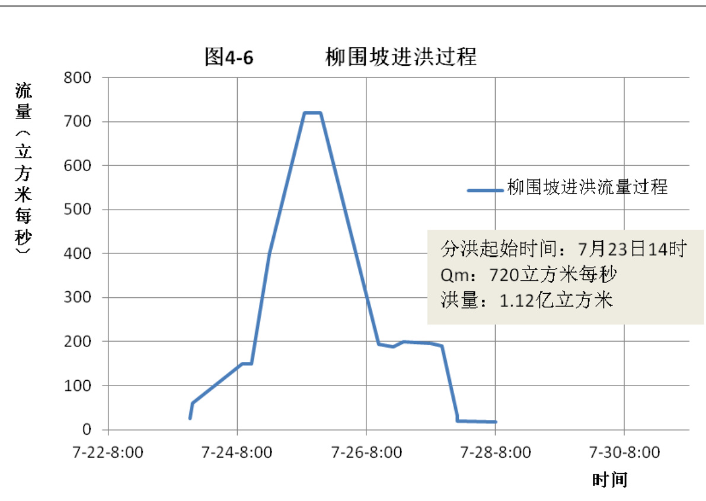  

# (六)卫辉洪水频率分析  

为应用卫河流域规划设计洪水中的分析成果,卫辉段洪水频率分析基于对整个卫河流域洪水频率分析的基础之上进行。  

1.主要水文站设计洪水频率成果  

1984 年漳卫河水系设计洪水复核工作中采用 $1953\sim1979$ 年共 27 年的峰、量连续系列。  

2008 年国务院批复的《海河流域防洪规划》中复核了卫河的合河、新村、盘石头\~新村区间、淇门、共产主义渠淇门、安阳、楚旺(元村集)7 个站和称钩湾的设计洪水。历史洪水采用“75.8”洪水后全国统一整编的洪水调查资料成果,洪水系列延长至 1991 年,并考虑了 1996 年大洪水影响。《海河流域防洪规划》推荐采用延长至1991年的长系列成果(考虑1996年大洪水),见表 4-5。  

2021 年 1 月编制的《卫河干流(淇门\~徐万仓)治理工程初步设计报告(报批稿)》中,将各站洪水系列延长至 2016 年,经过对比分析后,不同频率的设计洪水减小幅度均在 $10\%$ 以内。考虑到《海河流域防洪规划》已经国务院批复,为保持成果的稳定性并为工程安全留有一定余地,仍推荐采用防洪规划成果。  

表 4-5  卫河流域设计洪水(2008 年《海河流域防洪规划》)  
单位:流量 $-\mathrm{m}^{3}/\mathrm{s}$ ;洪量-亿 $\mathrm{m}^{3}$   

<html><body><table><tr><td rowspan="2">站名</td><td rowspan="2">项目</td><td colspan="3">特征值</td><td colspan="6">P(%)</td></tr><tr><td>均值</td><td>Cv</td><td>Cs/Cv</td><td>1</td><td>2</td><td>3.33</td><td>5</td><td>10</td><td>20</td></tr><tr><td rowspan="4">新村</td><td>Qm</td><td>810</td><td>1.8</td><td>2.5</td><td>7350</td><td>5620</td><td>4410</td><td>3510</td><td>2120</td><td>1010</td></tr><tr><td>Wsd</td><td>0.80</td><td>1.6</td><td>2.5</td><td>6.39</td><td>4.99</td><td>4.00</td><td>3.26</td><td>2.08</td><td>1.09</td></tr><tr><td>W15d</td><td>1.30</td><td>1.5</td><td>2.5</td><td>9.68</td><td>7.64</td><td>6.20</td><td>5.10</td><td>3.35</td><td>1.83</td></tr><tr><td>W30d</td><td>1.80</td><td>1.4</td><td>2.5</td><td>12.45</td><td>9.93</td><td>8.14</td><td>6.77</td><td>4.56</td><td>2.61</td></tr><tr><td rowspan="4">盘新区间</td><td>Qm</td><td>330</td><td>1.90</td><td>2.5</td><td>3170</td><td>2400</td><td>1870</td><td>1470</td><td>861</td><td>390</td></tr><tr><td>Wsd</td><td>0.13</td><td>1.55</td><td>2.5</td><td>1.00</td><td>0.79</td><td>0.64</td><td>0.52</td><td>0.34</td><td>0.18</td></tr><tr><td>W15d</td><td>0.21</td><td>1.50</td><td>2.5</td><td>1.56</td><td>1.23</td><td>1.00</td><td>0.82</td><td>0.54</td><td>0.30</td></tr><tr><td>W30d</td><td>0.27</td><td>1.42</td><td>2.5</td><td>1.90</td><td>1.51</td><td>1.23</td><td>1.02</td><td>0.69</td><td>0.39</td></tr><tr><td rowspan="3">淇门</td><td>Wsd</td><td>2.15</td><td>1.50</td><td>2.5</td><td>16.02</td><td>12.64</td><td>10.25</td><td>8.43</td><td>5.53</td><td>3.03</td></tr><tr><td>W15d</td><td>3.45</td><td>1.40</td><td>2.5</td><td>23.86</td><td>19.03</td><td>15.60</td><td>12.97</td><td>8.74</td><td>5.00</td></tr><tr><td>W30d</td><td>4.60</td><td>1.30</td><td>2.5</td><td>29.37</td><td>23.69</td><td>19.63</td><td>16.50</td><td>11.41</td><td>6.82</td></tr><tr><td rowspan="3">共产主义 渠淇门</td><td>Wsd</td><td>1.55</td><td>1.50</td><td>2.5</td><td>11.55</td><td>9.11</td><td>7.39</td><td>6.08</td><td>3.99</td><td>2.19</td></tr><tr><td>W15d</td><td>2.40</td><td>1.40</td><td>2.5</td><td>16.59</td><td>13.24</td><td>10.85</td><td>9.02</td><td>6.08</td><td>3.48</td></tr><tr><td>W30d</td><td>3.10</td><td>1.30</td><td>2.5</td><td>19.79</td><td>15.97</td><td>13.23</td><td>11.12</td><td>7.69</td><td>4.59</td></tr><tr><td rowspan="4">安阳</td><td>Qm</td><td>450</td><td>1.9</td><td>2.5</td><td>4320</td><td>3270</td><td>2540</td><td>2000</td><td>1170</td><td>532</td></tr><tr><td>Wsd</td><td>0.32</td><td>1.7</td><td>2.5</td><td>2.73</td><td>2.11</td><td>1.67</td><td>1.35</td><td>0.84</td><td>0.42</td></tr><tr><td>W15d</td><td>0.50</td><td>1.5</td><td>2.5</td><td>3.72</td><td>2.94</td><td>2.38</td><td>1.96</td><td>1.29</td><td>0.71</td></tr><tr><td>W30d</td><td>0.75</td><td>1.3</td><td>2.5</td><td>4.79</td><td>3.86</td><td>3.20</td><td>2.69</td><td>1.86</td><td>1.11</td></tr><tr><td rowspan="4">楚旺（元村 集)</td><td>Wsd</td><td>2.55</td><td>1.45</td><td>2.5</td><td>18.31</td><td>14.53</td><td>11.85</td><td>9.80</td><td>6.52</td><td>3.65</td></tr><tr><td>W15d</td><td>4.20</td><td>1.35</td><td>2.5</td><td>27.92</td><td>22.40</td><td>18.46</td><td>15.43</td><td>10.54</td><td>6.16</td></tr><tr><td></td><td></td><td></td><td></td><td></td><td></td><td></td><td></td><td></td><td></td></tr><tr><td>W30d</td><td>5.50</td><td>1.25</td><td>2.5</td><td>33.67</td><td>27.32</td><td>22.75</td><td>19.23</td><td>13.48</td><td>8.22</td></tr></table></body></html>  

# 2.平原坡洼涝水  

卫河流域平原区排涝属于洪涝合排,因此需要研究分析设计洪水条件下的涝水成果。1984 年漳卫河水系设计洪水复核成果和国务院批复的防洪规划成果在漳卫河水系设计洪水复核过程中均进行了涝水估算,分别计算了白寺坡、任固坡、小滩坡、柳围坡、长虹渠、共产主义渠以西行洪区及大名泛区设计涝水,计算方法为借用邻近山区站设计洪水三十天洪量与该站典型年(1963 年)的放大倍比将坡洼的典型年(1963 年)涝水量予以缩放,作为同频率条件下与山区洪水相应的涝水成果。各分区典型涝水过程线均借用已初步治理后的卫南平原汲县站 1963 年 8月份的实测过程。各坡洼分区 1963 年典型涝水量采用 1984 年复核报告数据,即“海河流域 1963 年 8 月洪水调查报告”中水利部水文局的调查成果。  

《卫河干流(淇门\~徐万仓)治理工程初步设计报告(报批稿)》中,仍沿用上述方法计算各坡洼分区涝水。由于初设阶段复核后各站设计洪水沿用已批复的防洪规划成果,因此相应涝水成果亦维持防洪规划阶段成果不变。  

各坡洼分区采用的放大倍数及设计涝水成果见表 $4^{-6\sim}4^{-7}$ 。  

表 4-6  平原坡洼典型年(1963 年)涝水量及放大倍数采用  

<html><body><table><tr><td>坡洼名称</td><td>采用面积 (km²)</td><td>1963 年典型水量 (亿m²)</td><td>放大倍数采用</td></tr><tr><td>白寺坡</td><td>512</td><td>1. 30</td><td>安、汤区间放大倍数</td></tr><tr><td>任固坡</td><td>228</td><td>0.57</td><td>安、汤区间放大倍数</td></tr><tr><td>小滩坡</td><td>222</td><td>0.52</td><td>安、汤区间放大倍数</td></tr><tr><td>共渠西</td><td>314</td><td>0. 80</td><td>安、汤区间放大倍数</td></tr><tr><td>柳围坡</td><td>210</td><td>0. 38</td><td>卫河淇门放大倍数</td></tr><tr><td>长虹渠</td><td>140</td><td>0.25</td><td>卫河淇门放大倍数</td></tr></table></body></html>  

# 平原坡洼设计涝水最大流量成果  

单位:流量 $-\mathrm{m}^{3}/\mathrm{s}$  

<html><body><table><tr><td rowspan="2">坡洼名称</td><td colspan="8">不同频率设计涝水最大流量</td></tr><tr><td>1%</td><td>2% </td><td>3.33%</td><td>5%</td><td>10%</td><td>20%</td><td>33. 33%</td></tr><tr><td>白寺坡</td><td>174.9</td><td>147.6</td><td>126.9</td><td>111.0</td><td>84.2</td><td>56.9</td><td>26.0</td></tr><tr><td>任固坡</td><td>76.7</td><td>64.7</td><td>55.7</td><td>48.7</td><td>36.9</td><td>25.0</td><td>11.4</td></tr><tr><td>小滩坡</td><td>70.0</td><td>59.1</td><td>50.8</td><td>44. 4</td><td>33.7</td><td>22.8</td><td>10.4</td></tr><tr><td>共产主义渠以 西行洪区</td><td>107.3</td><td>90.5</td><td>77.8</td><td>68.1</td><td>51.6</td><td>34.9</td><td>16.0</td></tr><tr><td>柳围坡</td><td>69.6</td><td>56.1</td><td>46.5</td><td>39.1</td><td>27.0</td><td>16.2</td><td>9.4</td></tr><tr><td>长虹渠</td><td>45.8</td><td>36.9</td><td>30.6</td><td>25.7</td><td>17.8</td><td>10.6</td><td>6.2</td></tr></table></body></html>  

# (七)“21.7”洪水还原计算及重现期确定  

沿用《海河流域防洪规划》等已审批报告中的洪水计算方法,结合水文站实测资料,考虑分蓄洪区分洪、上游水库拦蓄、堤防溃口等因素,分析合河、淇门、新村等水文站天然来水过程。  

# 1.蓄滞洪区运用概况  

卫河流域共布置 9 个蓄滞洪区,本次运用了除任固坡以外的  

8 个,设计滞洪水量约 9 亿 m3。  

根据水利部信息中心根据遥感影像统计的蓄滞洪面积(遥感数据源为高分三号、高分一号卫星),与实际调查资料对比分析后,良相坡、共渠西等自然漫溢蓄滞洪面积变化过程较为合理,可根据蓄滞洪面积推求每日蓄洪水量;其他扒口行洪的蓄滞洪区存在一定误差,本次分析中仅供参考,每日蓄洪水量结合以往相关工程经验确定。  

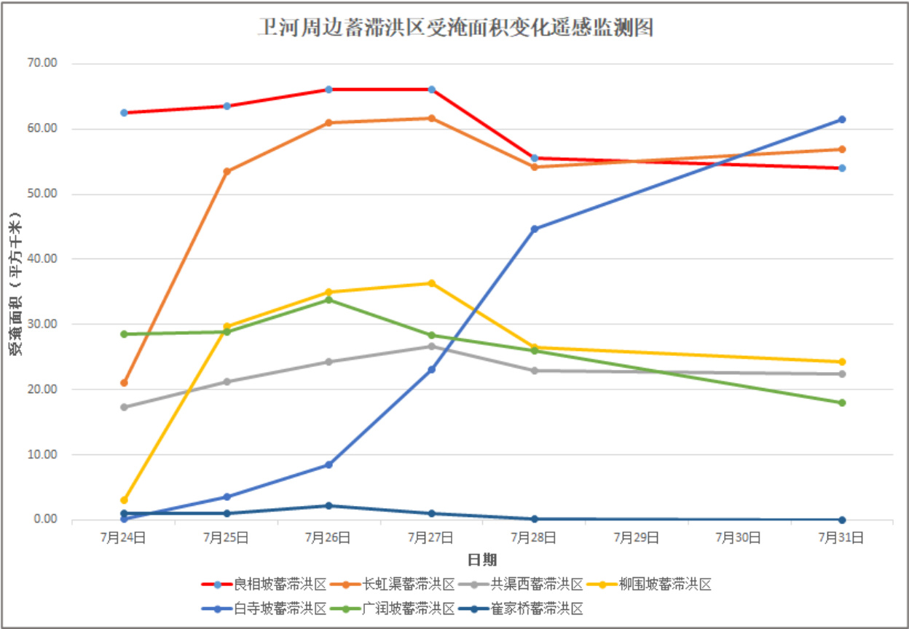  
图 4-7 卫河周边蓄滞洪区受淹面积变化遥感监测结果图  

# 2.上游水库调蓄影响  

本次洪水量级大,持续时间长,流域内中小水库相对削峰作用不显著,因此洪峰还原分析仅考虑淇河上游的盘石头水库。根据水库坝前水位和水位\~库容曲线,计算水库逐时调蓄水量,考  

虑传播时间,与坝址下游水文站错时相加,即可推求出控制站天然洪水过程。水量还原主要考虑 1963 年以后新建大中型水库影响。  

# 3.平原坡洼涝水  

根据《海河流域防洪规划》中卫河沿岸平原坡洼涝水设计成果,考虑到山丘区合河、新村、安阳 3 站天然设计洪水重现期在$20\sim30$ 年一遇之间,本次元村以上涝水计算取 20 年一遇涝水流量 $337\mathrm{m}^{3}/\mathrm{s}$ 。  

# 4.主要水文站天然洪水及重现期  

合河站上游水库调蓄能力不大,直接采用实测成果,最大洪峰流量 $\mathrm{Qm}$ 、最大 5d 洪量、最大 15d 洪量分别为 $1320\mathrm{m}^{3}/\mathrm{s}$ 、3.96亿 m3、5.69 亿 m3,重现期约 20 年一遇。  

新村站考虑上游盘石头水库调蓄影响还原后,天然最大洪峰流量 Qm、最大 5d 洪量、最大 15d 洪量分别为 $3690~\mathrm{m}^{3}/\mathrm{s}$ 、3.58亿 $\mathrm{m^{3}}$ 、4.21 亿 $\mathrm{m^{3}}$ ,重现期约 20 年一遇。  

淇门站考虑淇河上游盘石头水库调蓄,良相坡、共渠西、柳围坡、长虹渠蓄滞洪,卫河沿岸平原坡洼涝水等因素还原后,天然最大 5d 洪量、最大 15d 洪量分别为 9.23 亿 m3、11.94 亿 m3,重现期约 20 年一遇。  

表 4-8 主要水文站天然洪水特征值统计表  

<html><body><table><tr><td>水文站</td><td>项目</td><td>特征值</td><td>重现期</td></tr><tr><td rowspan="3">合河</td><td>Qm (m /s)</td><td>1320</td><td>10～20年一遇</td></tr><tr><td>W5d （亿m")</td><td>3. 96</td><td>20年一遇</td></tr><tr><td>Wi5d （亿m")</td><td>5. 69</td><td>20年一遇</td></tr><tr><td rowspan="2">淇门</td><td>Wsd （亿m")</td><td>10.44</td><td>20-30年一遇</td></tr><tr><td>Wi5d (亿m²)</td><td>13. 15</td><td>约20年一遇</td></tr><tr><td rowspan="3">新村</td><td>Qm (m /s)</td><td>3690</td><td>20年一遇</td></tr><tr><td>Wsd （亿m)</td><td>3. 58</td><td>20年一遇</td></tr><tr><td>Wi5d （亿m")</td><td>4. 21</td><td>10～20年一遇</td></tr></table></body></html>  

# 5.卫辉段洪水重现期  

根据以上分析结果,卫辉段上游合河水文站 5 天、15 天洪量重现期均为 20 年一遇,卫辉段下游淇门水文站 5 天最大洪量$20\sim30$ 年一遇,15 天洪量为 20 年一遇,按同频率原则,卫辉段洪水重现期约为 $20\sim30$ 年一遇。  

# (八)与历史洪水对比分析  

选择合河、新村、淇门共3 个水文站,将“21.7”洪水与“63.8”“56.8”“96.8”等历史大洪水对比分析。  

根据表 4-9 可以看出,与“63.8”相比,“21.7”合河最大5d 洪量洪水大于“63.8”,最大15d洪量与“63.8”相当;“21.7”淇门最大 5d、15d 洪量均小于“63.8”,新村站最大 5d 洪量与“63.8”相当,最大 15d 洪量小于“63.8”。  

与“56.8”相比,“21.7”卫河干流合河、淇门最大 5d 洪量均大于“56.8”,最大 15d 洪量小于“56.8”;支流新村站最大 5d 洪量、最大 15d 洪量小于“56.8”。  

与“96.8”相比,“21.7”各站最大 5d 洪量、最大 15d 洪  

量明显大于“96.8”  

表 4-9 卫河主要水文站典型年洪水特征值对比表  

<html><body><table><tr><td colspan="2">站名</td><td>1956年8月</td><td>1963年8月</td><td>1996年8月</td><td>2021年7月</td></tr><tr><td rowspan="3">合河</td><td>Qm (m²/s)</td><td>1280</td><td>1350</td><td>1000</td><td>1320</td></tr><tr><td>W5d （亿m）</td><td>3. 45</td><td>3.13</td><td>2.48</td><td>3.96</td></tr><tr><td>Wi5d （亿m²）</td><td>6.14</td><td>5.69</td><td>3. 90</td><td>5.69</td></tr><tr><td rowspan="2">淇门</td><td>W5d （亿m²）</td><td>10.32</td><td>11.09</td><td>3.13</td><td>10. 44</td></tr><tr><td>W15d( （亿m²）</td><td>16.10</td><td>18. 00</td><td>6. 64</td><td>13.15</td></tr><tr><td rowspan="3">新村</td><td>Qm (m/s)</td><td>3380</td><td>5590</td><td>2820</td><td>3690</td></tr><tr><td>Wsd （亿m²）</td><td>4. 84</td><td>3. 48</td><td>2. 23</td><td>3.58</td></tr><tr><td>Wi5d（亿m²）</td><td>7.48</td><td>5.48</td><td>2.81</td><td>4.21</td></tr></table></body></html>  

综合分析,“21.7”洪水合河最大 5d 洪量大于“63.8”,最大 15d 洪量与“63.8”相当,与“56.8”相比,最大 5d 洪量偏大,最大 15d 洪量偏小,明显大于“96.8”。从最大 5d 洪量来看,“21.7"洪水合河以上为有历史记录以来发生的最大洪水,洪水的集中度最高。  

考虑到卫辉以上洪水主要来自合河,区间沧河又是本次洪水的暴雨中心,因此卫辉段洪水是有历史记录以来发生的最大洪水。  

说明:63 年以后修建的合河以上中型水库包括群英、马鞍石、石门、宝泉 4 座,最大拦蓄洪量共计 0.35 亿方,淇门以上包括群英、马鞍石、石门、宝泉、石门(石门河)、狮豹头、塔岗、三交口、陈家院、石门(淇河支流)、夺丰共 11 座中型水库,最大拦蓄洪量共计 1.21 亿方,淇河盘石头水库以上包括三交口、陈家院、石门 3 座水库,最大拦蓄洪量共计 0.35 亿方。  

# 影响洪量已经加入表 4-9。  

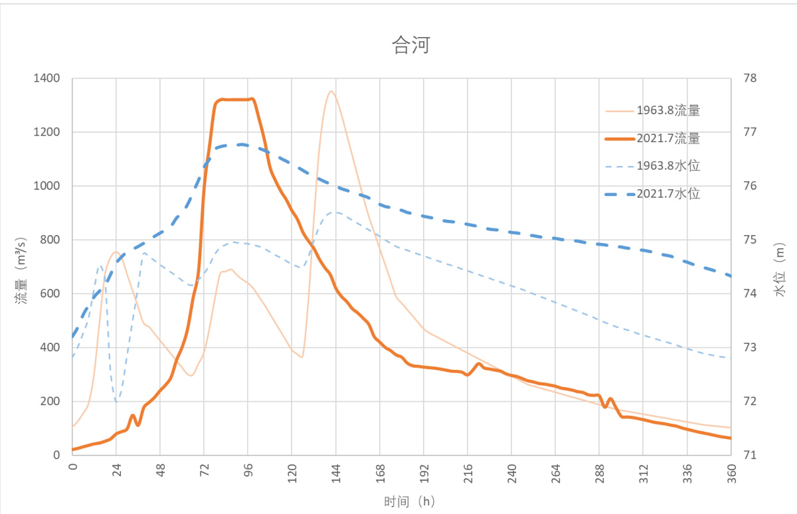  
图 4-8  合河站“63.8”、“21.7”实测洪水过程线对比图  

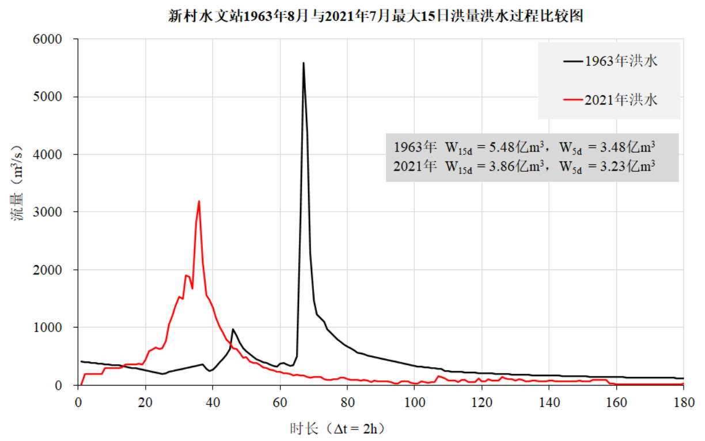  
图 4-9  新村站“63.8”、“21.7”天然洪水过程线对比图  

# 五、卫辉城区内涝分析  

# (一)卫辉市及城区地势特点  

1.卫辉市基本概况:卫辉市位于河南省北部,新乡市东北部。地处中原腹地,西依太行,南临黄河。地势西高东低,南北长约43 公里,东西宽约 35 公里,总面积 868 平方公里,山丘区、平原面积分别为 416、452 平方公里。辖 7 镇 6 乡、342 个行政村、10 个街道办事处,总人口 50 万。城市规划控制区面积 128 平方公里,规划区面积 45 平方公里,建成区面积 20 平方公里,市区人口 15 万人。详见图 5-1 卫辉市地势示意图、表 5-1 卫辉行政分区面积统计表  

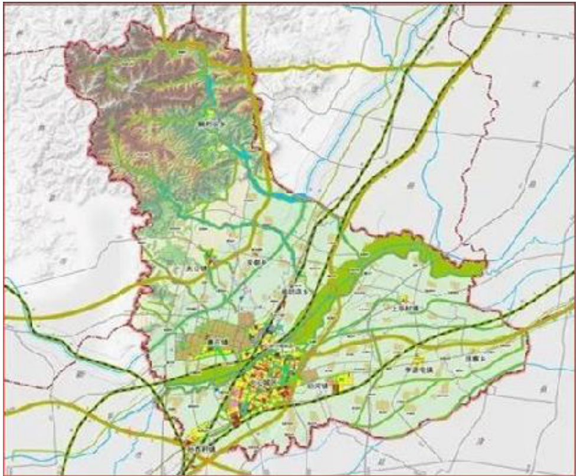  
图 5-1 卫辉市地势示意图  

# 表 5-1  卫辉市行政分区面积统计表  

<html><body><table><tr><td>行政</td><td>计算</td><td>海河流域</td><td>黄河流域</td></tr></table></body></html>  

<html><body><table><tr><td>分区</td><td>面积</td><td>漳卫河 山丘区</td><td>漳卫河 平原区</td><td>合计</td><td>金堤河天然文岩渠区</td><td>合计</td></tr><tr><td>卫辉市</td><td>868</td><td>416</td><td>416</td><td>832</td><td>36</td><td>36</td></tr></table></body></html>  

2.城区地形特点影响分析:卫辉城区西南为新乡到卫辉入口,其余地段由省道 S101、京港澳高速、新卫河右堤、东孟河护城堤包围,在外围形成一个入口,三面堤防护城地势特点。这样卫辉主城区就形成城区地势低洼,四周地势高于主城区库盆地势,又是卫河上游来水的集聚区,一旦出现暴雨洪水,容易积水。城内排水主要依靠泵站外排,一旦出现特大暴雨,泵站出现极易故障,造成城区涝水排不出去,形成长期内涝。因此,“21.7”暴雨导致城区内涝和卫辉特殊城区地势特点是内涝产生的主要原因。详见图 5-2 卫辉城区周围地形情况图  

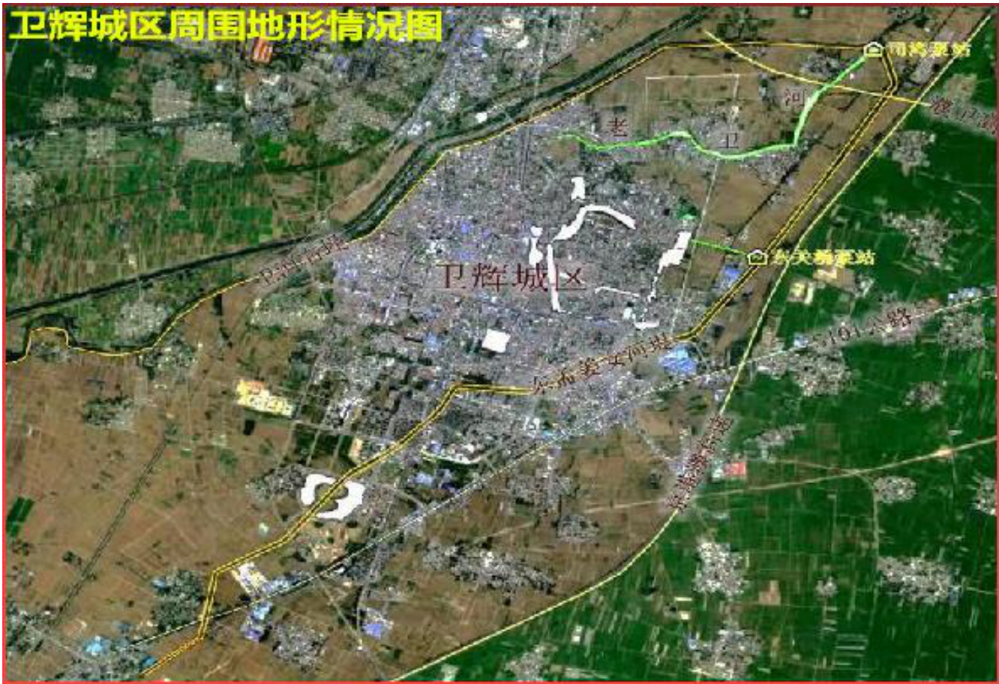  
图 5-2 卫辉城区周围地形情况图  

# (二)城区暴雨分析  

1.城区降雨综述:卫辉市区雨量监测站点选用汲县站作为城区降雨分析,该站采用翻斗式自记雨量计观测降雨量,当累计降雨量达到 $0.5\mathrm{mm}$ 时,仪器自动记录一次。2021 年 7 月 17-23日降雨过程中,仪器工作正常,观测资料完整可靠,仪器每 10分钟自动报汛一次降雨量。本次降雨受副热带高压西伸加强、黄淮低涡生成以及切变线的共同影响,区域普降大暴雨、特大暴雨。降雨从 7 月 17 日 8 时到 23 日 12 时结束,总降雨量 $735.0\mathrm{mm}$ ;月雨量总计 945.1mm;最大日雨量 7 月 21 日 $288.0\mathrm{mm}_{\circ}\quad$ 7 月 11日至 7 月 23 日逐日雨量统计详见表 5-2、7 月份月雨量详见雨量柱状图 5-2。  

# 表 5-2 卫辉市汲县雨量站 7 月 17 日至 7 月 23 日逐日雨量表 单位 $\mathbf{mm}$  

<html><body><table><tr><td>站名</td><td>县 (市)</td><td>17日</td><td>18日</td><td>19日</td><td>20日</td><td>21日</td><td>22日</td><td>23日</td><td>备注</td></tr><tr><td>汲县</td><td>卫辉</td><td>11</td><td>46.5</td><td>74.5</td><td>248.5</td><td>288</td><td>50</td><td>16.5</td><td></td></tr></table></body></html>  

1.暴雨对城区内涝影响分析:2021 年 7 月 17 日-23 日,卫辉出现了历史罕见极端特大暴雨过程。此次特大暴雨具有特大暴雨范围广、累积雨量大、持续时间长、降水强度大、强降水时段集中等特征。最大 24 小时 297.6mm,较多年均值偏多 $197.7\mathrm{mm}$ ,3 日降雨量较多年均值偏多 493.1mm,7 日降雨量较多年均值偏多 $588.2\mathrm{mm}$ 。因此,“21.7”暴雨也是直接导致卫辉城区内涝的直接原因。卫辉市汲县雨量站实测资料频率计算详见表 5-3。  

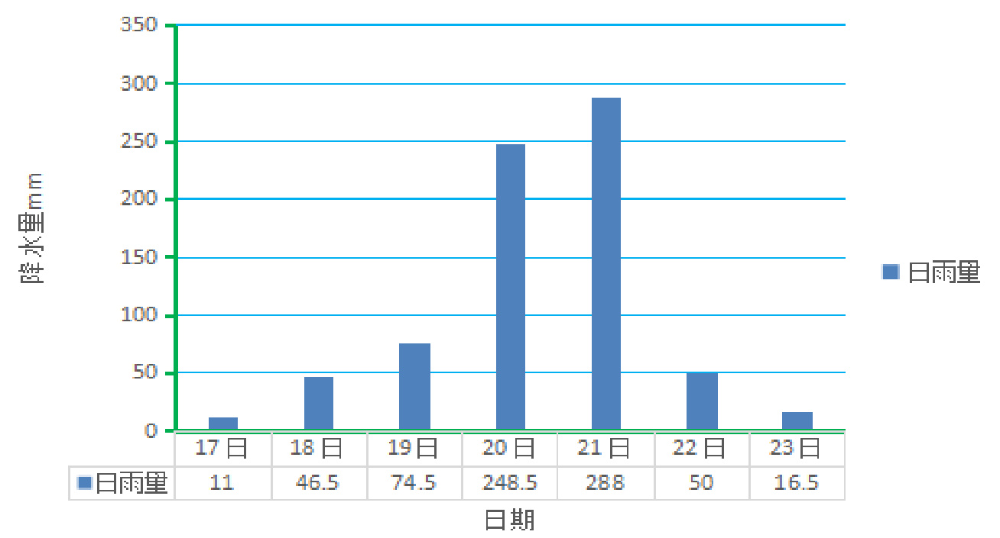  
图 5-3 卫辉市汲县雨量站 7 月份月雨量详见雨量柱状  
波县站2021年7月17日-23日降雨量图  

表 5-3 卫河流域卫辉汲县雨量站实测资料频率计算表  

<html><body><table><tr><td rowspan="2">站名</td><td rowspan="2"></td><td rowspan="2">时段长 度</td><td colspan="2">本次降雨</td><td rowspan="2">多年均值 历史最大 （mm）值（mm）</td><td rowspan="2"></td><td colspan="3">重现期 (年)</td></tr><tr><td>雨量 （mm）（年）</td><td>重现期</td><td></td><td>100</td><td>50 10</td></tr><tr><td>汲县</td><td>卫辉</td><td>24小时</td><td>297.6</td><td>50</td><td>99.9</td><td>341.2</td><td>380</td><td>320</td><td>180</td></tr></table></body></html>  

<html><body><table><tr><td rowspan="2"></td><td rowspan="2"></td><td>3日</td><td>611</td><td>200</td><td>117.9</td><td>480.5</td><td>560</td><td>440</td><td>245</td></tr><tr><td>7日</td><td>735</td><td>300</td><td>146.8</td><td>496.0</td><td>600</td><td>510</td><td>279</td></tr></table></body></html>  

# (三)城市排涝分析  

1.卫辉市城区排涝体系情况:卫辉城区排涝体系主要通过城区雨水管网和城区排涝河网汇水,由东孟姜女河和老卫河向下游排放,最后入卫河。老卫河和东孟姜女河都建有泵站一处,用于提水排涝。详见图 5-4 卫辉城区主要排涝河和泵站分布示意图  

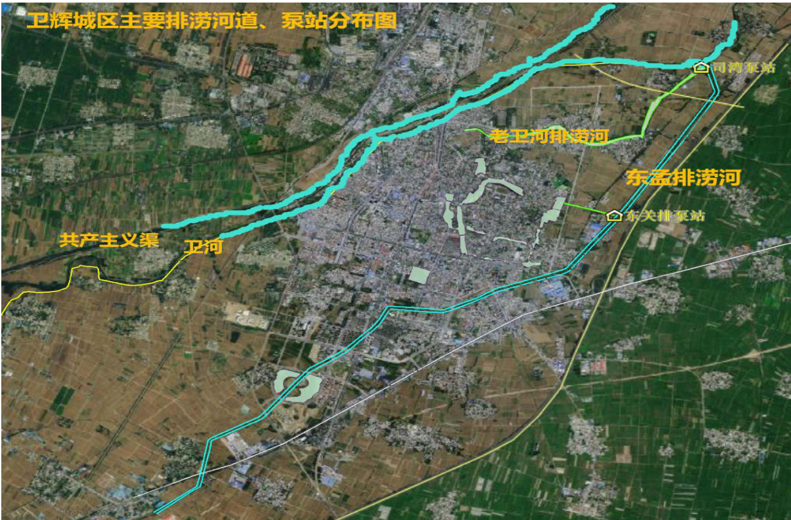  
图 5-4 卫辉城区主要排涝河道、泵站分布图  

2.城市排涝对卫辉城区形成内涝原因分析:(1)雨污管网堵塞,失去排水功能。13 条主干道污水管网 33.6km,雨污水井3555 座由于暴雨堵塞,导致整个排水系统不畅。(2)卫辉市东关排、北关排和老卫河长期垃圾淤积,致使防汛通道阻塞,无法发挥排水功能。(3)出城排涝泵站由于暴雨受淹,失去排水功  

效。  

# (四)城区河道水系内障碍物阻水分析  

1.由于历史原因,城区东关排、北关排和老城河等防汛通道被周边居民侵占严重,且垃圾淤积,树木众多,致使防汛通道梗阻,无法发挥排水功能。详见图 5-5 城区内排涝沟现状图  

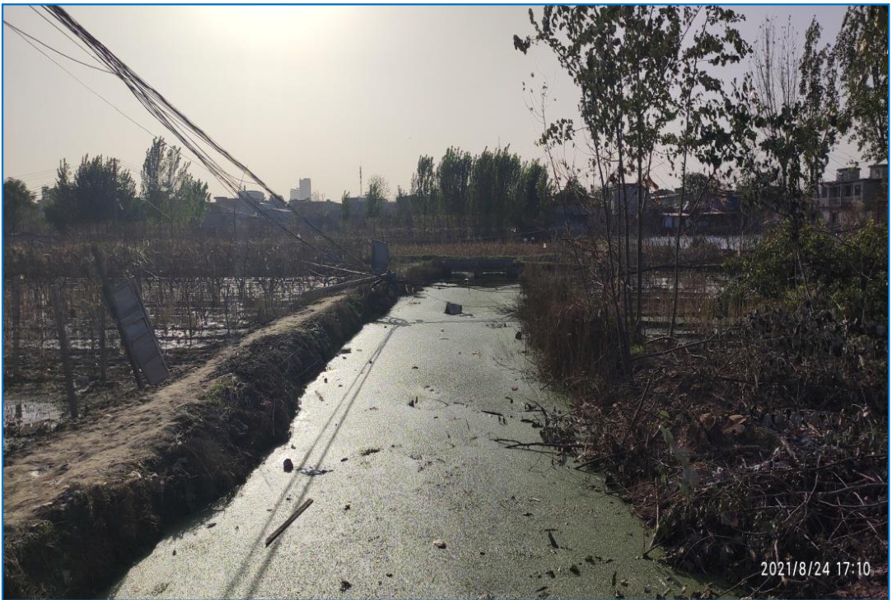  
图 5-5 城区内排涝沟现状图  

2.高速公路、高铁和乡村公路路基阻水或预留过水通道过水不足。另外在建工程横跨卫河堤和东孟河堤,且临建工程阻水使上游来水发生内涝,滞水下泄不畅通。详见图 5-6 在建工程现状图  

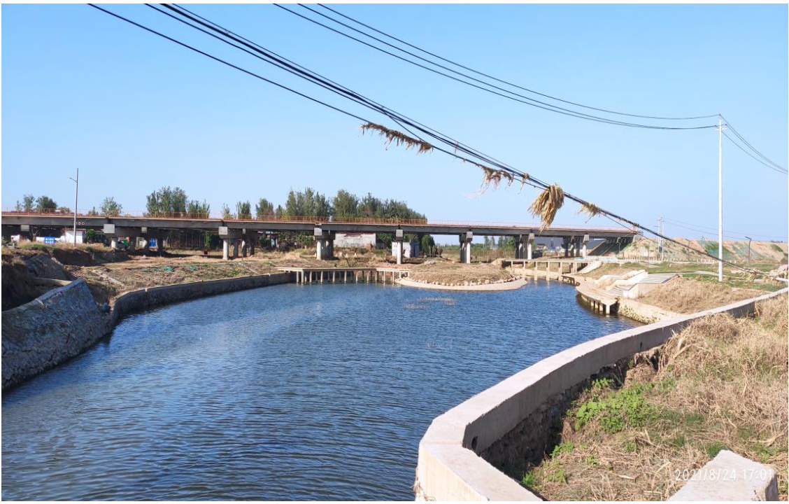  
图 5-6 在建工程现状图  

(五)共产主义渠右堤李士屯段应急围堰漫决洪水对卫辉城区内涝影响分析  

# 1、漫溢过程。  

7 月 17-23 日,新乡市普降大暴雨、特大暴雨,降雨量超历史极值。受强降雨影响,共产主义渠全线大流量、高水位运行。7 月 22 日 17 时 40 分,共产主义渠右堤李士屯段水位超过施工应急围堰堰顶(高程 $72.0\mathrm{m}$ )发生漫溢,最高水位达到 $72.6\mathrm{m}$ 。漫溢断面最大宽度 $73\mathrm{m}$ ,通过共产主义渠合河\~黄土岗洪水过程推算西曲里村溃口最大流量 $430\mathrm{m}^{3}/\mathrm{s}$ ,洪量 3458 万 $\mathrm{m}^{3}$ 。溃堤洪水进入卫河(卫河设计防洪流量为 $203\mathrm{m}^{3}/\mathrm{s})$ ,与卫河上游来水遭遇,超过卫河防洪能力,造成卫河部分堤段漫决,部分洪水沿107 国道南下,一部分进入东孟姜女河,一部分滞留附近洼地,一部分流过 107 国道向东进入卫辉市。漫堤洪水与涝水叠加,造成卫辉市区出现严重内涝灾害,结合卫星遥感影像图和现场查勘进行量算,卫辉市境内卫河右岸淹没范围 $44\mathrm{km}^{2}$ 。详见图 5-7 共产主义渠右堤李士屯段应急围堰漫决位置图。  

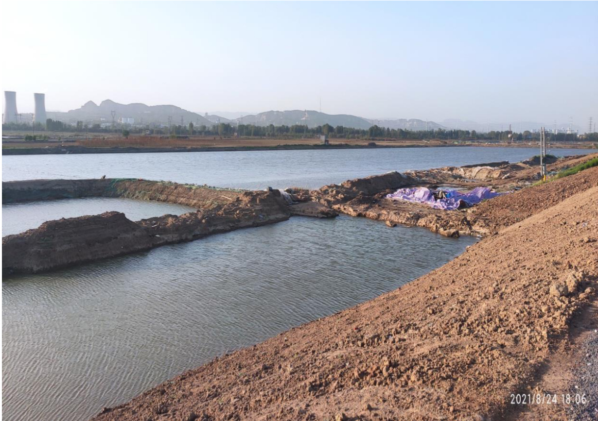  
图 5-7 共产主义渠右堤李士屯段应急围堰漫决位置图  

# 2、漫溢洪水估算  

由于共渠合河至卫辉黄土岗断面之间无较大支流汇入,因此对共渠合河实测洪水流量过程直接采用马斯京根河道连续演算至黄土岗断面,并与黄土岗实测流量过程进行比对,可以作为估算共渠李士屯段应急围堰漫决洪水的一个途径。取马法参数${\tt x}\mathrm{=}{-1}$ , $\mathrm{kk}{=}2$ , $_{\mathrm{n=8}}$ ,演算结果见图 5-8。漫决地点至黄土岗断面河长约 $10\mathrm{km}$ ,洪水传播时间按 5 小时计算,错开时间计算黄土岗断面洪量作为漫溢段洪量。计算结果:黄土岗演算洪量 333.75百万方,黄土岗实测洪量 299.18 百万方,差值 34.58 百万方,即漫溢洪量估算为 3458 万方。根据过程线变化趋势,最大漫溢流量估算为 430 立方米每秒。  

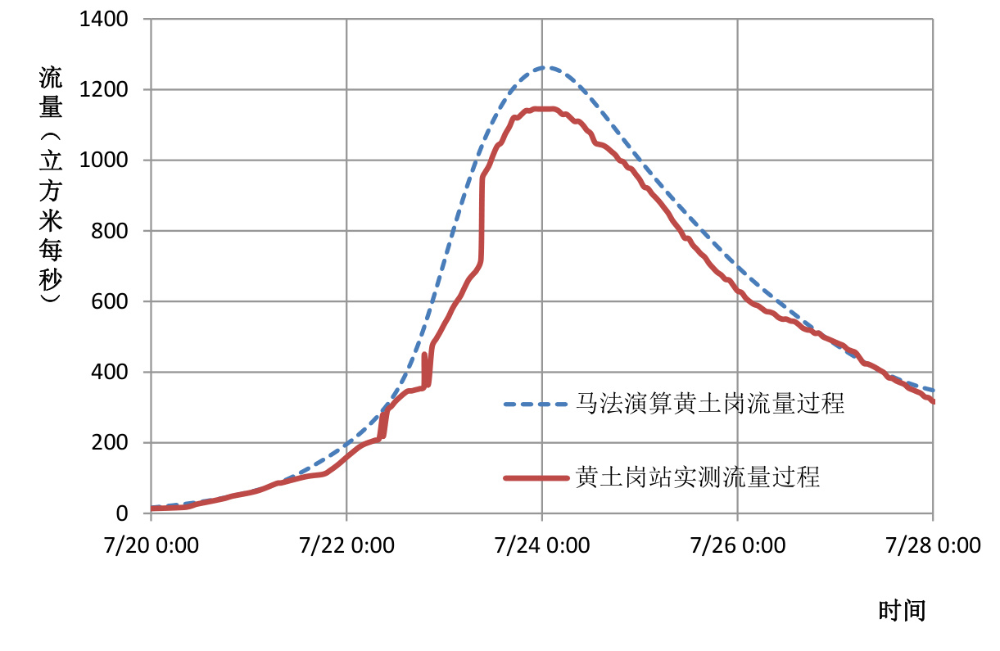  
图5-8 共渠黄土岗水文站流量过程  

2、漫溢洪水对卫辉涝区影响分析  

涝水净雨深估算:卫辉市卫河、东孟姜女河之间被淹区域( $\mathrm{(44km^{2}}$ )附近三个雨量站汲县、孙杏村、秦庄降雨量分别为702mm、787mm、 $822\mathrm{mm}$ ,均值 $770\mathrm{mm}$ 。该区最大降雨损失量可达 $150\sim200\mathrm{mm}$ ,按 $170\mathrm{mm}$ 计算,净雨深 $600\mathrm{mm}$ 。  

涝区总净雨深估算:根据现场调查,最深地点水深约 $2.7\mathrm{m}$ ,查水利地理信息图,该处高程 $66.8\mathrm{m}$ ,而该区一般地面高程为$68.7\mathrm{m}$ ,因此,估计该区平均水深约 $800\mathrm{mm}$ ,滞留水量 3520 万方。  

据此,可以粗略估计漫溢洪水进入涝区量折合净雨深为  

$200\mathrm{mm}$ (忽略涝区外对涝区的汇流),即 880 万方漫溢水量进入涝区,占涝区总滞留水量 3520 万方的 $23\%$ 。  

# 六、结论和建议  

# (一)结论  

1.暴雨量级高、强度大。卫辉市境内“21.7”暴雨的重现期超过百年一遇。卫河淇门水文站以上流域平均降水量达到$650.3\mathrm{mm}$ ,流域平均降雨量 7 月 18、19 日分别达到暴雨级别,20 日降雨量 $154\mathrm{mm}$ 达到大暴雨级别,21 日降雨量为 $309\mathrm{mm}$ 达到特大暴雨级别,淇门以上流域平均最大三日降水量为 $518.8\mathrm{mm}$ 累积最大点雨量达 $1159\mathrm{mm}$ (新乡市辉县市龙水梯雨量站),是卫河淇门以上流域有实测资料以来的最大暴雨。根据选取卫辉的7 个代表站实测降雨资料分析,有 5 处雨量站最大 3 日、7 日雨量超过百年一遇。通过与卫河历史上实测最大的“63.8”暴雨对比分析,认为卫辉“21.7”暴雨量级高于历史上实测的最大暴雨。  

2. 卫辉段洪水是有历史记录以来发生的最大洪水。总体上看, “21.7”洪水合河最大 5d 洪量大于“63.8”,最大 15d洪量与“63.8”相当,与“56.8”相比,最大 5d 洪量偏大,最大15d 洪量偏小,明显大于“96.8”。从最大5d洪量来看,“21.7”洪水合河以上为有历史记录以来发生的最大洪水,洪水的集中度最高。考虑到卫辉以上洪水主要来自合河,区间沧河又是本次洪水的暴雨中心,因此卫辉段洪水是有历史记录以来发生的最大洪水。  

3.卫辉段河道水位高水运行时间长。“21.7”洪水,卫河干支流水文站均超过警戒水位,合河、黄土岗、汲县超过保证水位$0.97{\sim}2.17\mathrm{m}$ ,其中淇门超保证水位 $1.93\mathrm{m}$ 。共渠合河、黄土岗及卫河汲县同等流量条件下 2021 年实测水位较历史水位均偏高,与 1996 年相比,共渠各站点高 $0.73{\cdot}1.65\mathrm{m}$ ,卫河各站点高$0.7{-}1.48\mathrm{m}$ ;与 1963 年相比,共渠各站点高 $1.3{-}2.56\mathrm{m}$ ,卫河各站点高 0.11-1.01m。  

4.卫辉城区内涝的形成原因具有多重性:(1)特殊的地形和城区地势特点决定了洪水滞留时间较长;(2)特大暴雨所致,超出城市防洪排涝能力;(3)卫辉城区排涝河防汛通道被周边居民侵占严重,且垃圾淤积,树木众多,致使防汛通道梗阻,无法发挥排水功能。排涝泵站失去作用,设备被水淹没损坏,设计排水能力不足;(4)高速公路、高铁路基阻水,乡村公路涵管预留过水排泄能力不足,堵塞严重;(5)共产主义渠右堤李士屯段应急围堰漫决洪水与涝水叠加,造成卫辉市区内涝滞水增加。  

# (二)建议  

1.加强对卫辉城区段河道清障和治理,落实汛期防洪责任,  

2.加强卫辉城区排涝设施建设,提高排洪过水能力。  

3.加强水情监测和水情信息共享,确保掌握洪水期河道水位动态,做好预测、预警工作。  

4.设置卫辉城区排涝河道入卫河处、排涝泵站处专用水文监测站点建设,增加关键点水位、流量监测,为城市排涝防洪提供  

技术支撑。  