# 河南省海河流域蓄滞洪区“21·7”洪水淹没范围调查分析报告  

# 河南省豫北水利勘测设计院有限公司2021 年 9 月  

# 编制单位:河南省豫北水利勘测设计院有限公司  

批    准:李罗刚  
审    定:张伏祥  
审    核:申增云  
项目负责:叶继业  
专业负责:杨志飞  付艳林 余华龙  
参加人员:赵培培 许长银 张可涛  高  申邓世顺 南玉贤 路兆庆 马国涛韩世杰 卫锦超 王俊章  张  勇栗  杰  

出版时间:2021 年 9 月  

目   录  
前言 ......  
第一章综合说明. 3  
1.1 蓄滞洪区基本情况. . 4  
1.2“21·7"洪水情况, 6  
1.3“21·7"洪水淹没总体情况 . 12  
第二章  良相坡蓄滞洪区 . . 17  
2.1滞洪区运用过程.. . 18  
2.2 淹没范围调查及情况分析. .... 18  
2.3 滞洪水位调查情况分析. .. 22  
2.4 滞洪水量核算.. .... 23  
2.5 滞洪区运用情况分析. .... 24  
第三章  柳围坡蓄滞洪区 . . 26  
3.1滞洪区运用过程.. ... 27  
3.2 淹没范围调查及情况分析. .... 27  
3.3 滞洪水位调查情况分析. .. 31  
3.4 滞洪水量核算. ... 32  
3.5 滞洪区运用情况分析. ...... 32  
第四章  长虹渠蓄滞洪区 .... 34  
4.1 滞洪区运用过程. .... 35  
4.2 淹没范围调查及情况分析 .. 35  
4.3 滞洪水位调查情况分析. .... 38  
4.4 滞洪水量核算. . 39  
4.5 滞洪区运用情况分析 ... 39  
第五章  白寺坡蓄滞洪区 . ... 41  
5.1滞洪区运用过程.. .... 42  
5.2 淹没范围调查及情况分析 . 42  
5.3 滞洪水位调查情况分析. .... 45  
5.4 滞洪水量核算. .. 46  
5.5 滞洪区运用情况分析 .. 46  
第六章  共渠西蓄滞洪区 . .... 48  
6.1 滞洪区运用过程.. .. 49  
6.2 淹没范围调查及情况分析. . 49  
6.3 滞洪水位调查情况分析 . 50  
6.4 滞洪水量核算 ... 51  
6.5滞洪区运用情况分析 51  
第七章  小滩坡蓄滞洪区 . 52  
7.1 滞洪区运用过程 53  
7.2 淹没范围调查及情况分析 53  
7.3 滞洪水位调查情况分析. .. 56  
7.4 滞洪水量核算 56  
7.5 滞洪区运用情况分析 . 57  
第八章  广润坡蓄滞洪区 58  
8.1滞洪区运用过程 . 59  
8.2 淹没范围调查及情况分析 .. 59  
8.3滞洪水位调查情况分析. .. 63  
8.4 滞洪水量核算. . 65  
8.5滞洪区运用情况分析 .. 65  
第九章  崔家桥蓄滞洪区 . 67  
9.1 滞洪区运用过程 . 68  
9.2 淹没范围调查及情况分析 . 69  
9.3 滞洪水位调查情况分析. . 71  
9.4 滞洪水量核算. .. 72  
9.5 滞洪区运用情况分析 . 72  

# 附件:  

1、 海河流域蓄滞洪区平面位置图  
2、 良相坡蓄滞洪区“21•7”洪水淹没范围调查测量图  
3、 柳围坡蓄滞洪区“21•7”洪水淹没范围调查测量图  
4、 共渠西蓄滞洪区“21•7”洪水淹没范围调查测量图  
5、 长虹渠蓄滞洪区“21•7”洪水淹没范围调查测量图  
6、 白寺坡蓄滞洪区“21•7”洪水淹没范围调查测量图  
7、 小滩坡蓄滞洪区“21•7”洪水淹没范围调查测量图  
8、 广润坡蓄滞洪区“21•7”洪水淹没范围调查测量图  
9、 崔家桥蓄滞洪区“21•7”洪水淹没范围调查测量图  

# 前言  

海河流域是我国政治、经济和文化中心,流域防洪至关重要。蓄滞洪区作为流域防洪减灾体系的重要组成部分,通过与河道、水库联合运用,削减洪峰、滞蓄超量洪水,实现洪水蓄泄兼筹,提高流域整体抗御洪水的能力。利用滞洪区缓洪、滞洪,是减轻下游河道洪水压力的有效举措。  

河南省漳卫河系卫河水系位于海河流域最上游,卫河坡洼蓄滞洪区属海河流域漳卫河综合防洪体系的重要组成部分,对减轻卫河洪水压力,提高漳卫河流域防洪标准,保证卫河下游的防洪安全,发挥着重要的作用。  

2021 年 7 月 17 日到 22 日,河南省出现了历史罕见的极端强降雨,强降雨的中心主要是位于郑州、鹤壁、新乡、安阳和平顶山,多条河流发生超警以上洪水,卫河、共产主义渠及其支流大沙河、洹河等河流均发生了超历史洪水。卫河新乡牧野大道段、浚县新镇彭村段都发生了决口的险情,这场洪水河南省卫河流域共启用了 8 个蓄滞洪区,造成了严重的洪灾损失。  

2021 年 8 月 12 日,河南省水利厅党组成员、副厅长任强组织召开蓄滞洪区运用补偿工作会议,就豫北地区启用的蓄滞洪区的淹没范围界定工作进行安排部署,要求水利厅水旱灾害防御处牵头,豫北水利工程管理局、省水文水资源局、河南省水利勘测设计研究有限公司、河南省水利勘测有限公司、河南省豫北水利勘测设计院有限公司等单位参加,成立蓄滞洪区运用补偿工作小组,对启用的 8 个蓄滞洪区淹没范围进行界定及核实。由防御处负责协调,各成员单位根据自己业务范围把相关技术成果汇总,实现信息共享,由豫北院分析界定。相关单位要协助豫北局,完成现场勘测复核工作,各成员单位要按照初步工作方案,加快推进实施,确保按时完  

成滞洪区超蓄洪水技术认定工作。  

河南省豫北水利勘测设计院有限公司按照省水利厅的工作安排,派遣勘测人员于 2021 年 7 月 23 日至 8 月 14 日,分别对崔家桥、广润坡、柳围坡、良相坡、长虹渠、白寺坡、共渠西、小滩坡共 8 个蓄滞洪区的洪水淹没情况进行了现场复核测量,并根据现场复核测量结果与河南省水文水资源局、河南省水利勘测设计研究有限公司、河南省水库勘测有限公司以及中水北方勘测设计研究有限责任公司等单位提供的相关资料进行了对比分析,于 2021 年 9 月完成了《河南省海河流域蓄滞洪区“21·7”洪水淹没范围调查分析报告》。  

# 第一章 综合说明  

编制:叶继业  

审核:申增云  

# 1.1 蓄滞洪区基本情况  

河南省卫河坡洼蓄滞洪区属海河流域漳卫河综合防洪体系的重要组成部分,现有蓄滞洪区 9 处,分布于卫河干流上 7 处,分别为良相坡、柳围坡、长虹渠、白寺坡、共渠西、小滩坡、任固坡;分布于卫河支流汤河 1 处广润坡、洹河 1 处崔家桥。9 处蓄滞洪区中,一般蓄滞洪区 7 处,分别为良相坡、柳围坡、白寺坡、共渠西、长虹渠、崔家桥和广润坡蓄滞洪区;蓄滞洪区保留区 2 处,分别为小滩坡和任固坡蓄滞洪区。  

河南省“21·7”洪水共启用卫河沿岸的良相坡、柳围坡、长虹渠、白寺坡、共渠西、小滩坡以及汤河广润坡、洹河崔家桥,共8 个蓄滞洪区滞蓄卫河、共产主义渠、沧河、淇河、汤河、洹河等河道的上游洪水,确保卫河下游的防洪安全。  

良相坡蓄滞洪区位于卫河坡洼蓄滞洪区的最上游,淇河以上共产主义渠两岸区域,蓄滞洪区东靠西岗堤、淇河右堤,南至卫河右堤,西北接自然高地,北倚淇县城关防洪堤。蓄滞洪区总面积 $81.52\mathrm{km}^{2}$ ,涉及淇县和卫辉市的 48 个行政村。良相坡蓄滞洪区担负着淇河、共产主义渠(卫河)洪水滞蓄任务。按照《河南省蓄滞洪区运用预案》(河南省防汛抗旱指挥部2020 年 9 月,以下简称《预案》),良相坡滞洪区设计滞洪水位为 $67.0\mathrm{m}$ ,淹没面积 $74.52\mathrm{km}^{2}$ ,滞洪量 0.92 亿 $\mathrm{m}^{3}$ ,运用机率为 2\~3 年一遇。  

柳围坡蓄滞洪区位于淇门以上的卫河右岸,蓄滞洪区东至申店隔堤,南以古阳堤为界,西至倪湾一带接自然高地,北靠卫河右堤。蓄滞洪区总面积 $78.97\mathrm{km}^{2}$ ,区内涉及卫辉市和浚县 27 个行政村。柳围坡蓄滞洪区担负着共产主义渠(卫河)洪水滞蓄任务。按照《预案》,柳围坡滞洪区设计滞洪水位为 $65.05\mathrm{m}$ ,淹没面积 $75.2\mathrm{km}^{2}$ ,滞洪量 0.95 亿 $\mathrm{m}^{3}$ 。  

长虹渠蓄滞洪区位于淇门以下的卫河右岸,蓄滞洪区东至滑县城关,南以古阳堤为界,北西至申店隔堤,靠卫河右堤。蓄滞洪区总面积 $86.56\mathrm{km}^{2}$ ,涉及浚县和滑县的 63 个村庄。长虹渠蓄滞洪区担负着淇河、共产主义渠(卫河)洪水滞蓄任务。按照《预案》,长虹渠蓄滞洪区设计滞洪水位为 $62.31\mathrm{m}$ ,淹没面积 $87\mathrm{km}^{2}$ ,滞洪量 1.04 亿 $\mathrm{m}^{3}$ 。  

白寺坡蓄滞洪区位于淇门以下卫河和共产主义渠之间的区域,蓄滞洪区东、北以卫河左堤、付庄堤为界,南至小河至卫贤公路,西、北倚共产主义渠右堤。蓄滞洪区总面积 $129.07\mathrm{km}^{2}$ ,涉及浚县和滑县的 82 个村庄,其中蓄滞洪区内部有 61 个村庄。白寺坡蓄滞洪区担负着共产主义渠(卫河)洪水滞蓄任务。按照《预案》,白寺坡蓄滞洪区设计滞洪水位为 $60.00\mathrm{m}$ ,淹没面积 $101.5\mathrm{km}^{2}$ ,滞洪量 1.78 亿 $\mathrm{m}^{3}$ 。  

共渠西蓄滞洪区位于淇河和共产主义渠交汇口下游共产主义渠的左岸。现状由上下两片组成,上片西南以淇河右堤为界,东南靠共产主义渠,西北接自然高地,下片东南靠共产主义渠左堤,西北接自然高地。现状蓄滞洪区上片主要为行洪区,下片主要滞蓄淇河、共产主义渠洪水。蓄滞洪区总面积 $94.86\mathrm{km}^{2}$ ,均位于浚县境内,涉及 70 个村庄。共渠西蓄滞洪区担负着淇河、共产主义渠(卫河)洪水滞蓄任务。按照《预案》,共渠西蓄滞洪区滞洪水位为 $63.50\mathrm{m}$ (上片区)、 $60.00\mathrm{m}$ (下片区),淹没面积 $65.75\mathrm{km}^{2}$ ,行滞洪总量 0.6 亿 $\mathrm{m}^{3}$ 。  

小滩坡蓄滞洪区位于卫河老关嘴以下的河道右岸,蓄滞洪区东以防洪堤为界,北、西靠卫河右堤,南部以浚县新寨、熬盐庄、井固庄一带自然高地为界。蓄滞洪区总面积 $93.19\mathrm{km}^{2}$ ,涉及内黄县、浚县共 41 个村庄。小滩坡蓄滞洪区担负着卫河洪水滞蓄任务。按照《预案》,小滩坡蓄滞洪区滞洪水位 $57.30\mathrm{m}$ ,淹没面积 $95.4\mathrm{km}^{2}$ ,滞洪量 0.74 亿 $\mathrm{m}^{3}$ 。  

广润坡蓄滞洪区位于卫河支流汤河、洹河之间区域,分为一、二两级蓄滞洪区运用,一级蓄滞洪区东部以东防洪堤为界,西部以西防洪堤为界,南部以汤河右堤为界,北部为自然高地;二级蓄滞洪区以西部的东防洪堤、北部的洹河右堤、南部的汤河左堤及东部的卫河左堤为界。蓄滞洪区总面积 $152.79\mathrm{km}^{2}$ ,涉及安阳县、汤阴县、内黄县 3 个县(区)的 103 个村庄。广润坡蓄滞洪区担负着汤河、羑河、茶店河等洪水滞蓄任务,确保汤河入卫河流量不超过 $300\mathrm{m}^{3}/\mathrm{s}$ 的控泄要求。按照《预案》,广润坡一级蓄滞洪区滞洪水位 57.00,淹没面积 $55.10\mathrm{km}^{2}$ ,滞洪量 0.73 亿 $\mathrm{m}^{3}$ ;二级蓄滞洪区滞洪水位 56.00,淹没面积 $80.10\mathrm{km}^{2}$ ,滞洪量 1.75 亿 $\mathrm{m}^{3}$ 。  

崔家桥蓄滞洪区位于卫河支流洹河中下游的河道左岸,蓄滞洪区北临幸福渠、西部位韩陵山自然高地,东至永和乡朱小庄附近,南至洹河左堤。蓄滞洪区总面积 $74.54\mathrm{km}^{2}$ ,均位于安阳县境内,涉及 61 个行政村。崔家桥蓄滞洪区担负着洹河洪水滞蓄任务,确保洹河入卫河流量不超过 $600\mathrm{m}^{3}/\mathrm{s}$ 的控泄要求。按照《预案》,崔家桥蓄滞洪区滞洪水位 $65.75\mathrm{m}$ ,淹没面积$74.54\mathrm{km}^{2}$ ,滞洪量 0.61 亿 $\mathrm{m}^{3}$ 。  

# 1.2 “21·7”洪水情况  

# 1.2.1 暴雨特征  

2021 年 7 月 17 日以来,河南省出现持续性强降水天气,多地出现暴雨、大暴雨,部分地区出现特大暴雨,降水主要集中在西部、北部和和中部地区。造成此次降水的原因主要为西太平洋副热带高压和大陆高压分别稳定维持在日本海和我国西北地区,阻挡了上游系统游动,导致西风带低值系统在华北、黄淮地区长时间维持。由于受到稳定的低涡切变影响,配合省内太行山、伏牛山特殊的地形对偏东风气流的强辐合抬升效应,使得降水中心主要分布在河南省西部、西北部沿山地区稳定少动,造成了长时间降水。  

根据河南省水文水资源统计资料,2021 年 7 月 18 日至 22 日期间,省内卫河流域日降雨量超过 $250\mathrm{mm}$ 的雨量站共 59 个,统计情况详见下表,其中,最大日雨量出现在 7 月 21 日的新村雨量站,为 $614.5\mathrm{mm}$ 。  

# 2021 年 7 月 18 日至 22 日降雨量统计表  

单位:个  

表 1.2-1  

<html><body><table><tr><td>日雨量（mm)</td><td>7月18日</td><td>7月19日</td><td>7月20日</td><td>7月21日</td><td>7月22日</td></tr><tr><td>≥500</td><td>0</td><td>0</td><td>0</td><td>15</td><td>0</td></tr><tr><td>500~250</td><td>0</td><td>0</td><td>0</td><td>44</td><td>0</td></tr><tr><td>250~100</td><td>54</td><td>0</td><td>54</td><td>61</td><td>0</td></tr><tr><td>100~50</td><td>67</td><td>8</td><td>67</td><td>67</td><td>9</td></tr></table></body></html>  

# 1.2.2 共产主义渠洪水情况  

根据 2021 年 7 月 20 日雨量统计情况,日降雨量在 $50{\sim}100\mathrm{mm}$ (暴雨)的雨量站有 67 个,在 $100–250\mathrm{mm}$ (大暴雨)的雨量站有 54 个。卫河、共渠流域内普降暴雨、大暴雨,致使河道水位、流量上涨幅度明显。  

# 1.2.2.1 共产主义渠上游洪水  

根据省水文水资源局提供的相关水文站的流量统计资料,良相坡蓄滞洪区上游共渠黄土岗站、下游共渠刘庄站 7 月 20 日\~25 日河道实测流量情况,详见表 1.2-2 和表 1.2-3;淇河新村站河道实测流量详见表 1.2-4。  

# 共产主义渠黄土岗水文站实测流量统计表  

表 1.2-2  

<html><body><table><tr><td>时间</td><td>流量(m?/s)</td><td>时间</td><td>流量(m?/s)</td></tr><tr><td>7/15 18:00</td><td>15.7</td><td>7/24 06:00</td><td>1119</td></tr><tr><td>7/17 08:30</td><td>11.3</td><td>7/24 16:00</td><td>1004</td></tr><tr><td>7/20 11:00</td><td>25.8</td><td>7/25 20:00</td><td>581</td></tr><tr><td>7/21 07:00</td><td>85.2</td><td>7/27 20:00</td><td>532</td></tr><tr><td>7/22 00:60</td><td>250</td><td>7/28 07:00</td><td>446</td></tr><tr><td>7/22 19:00</td><td>451</td><td>7/29 00:80</td><td>419</td></tr><tr><td>7/23 00:60</td><td>1058</td><td>7/30 00:80</td><td>370</td></tr><tr><td>7/23 17:00</td><td>1080</td><td>7/31 20:00</td><td>252</td></tr></table></body></html>  

共产主义渠刘庄实测水文站流量统计表  
表 1.2-3  

<html><body><table><tr><td>时间</td><td>水位(m)</td><td>流量(m?/s)</td><td>时间</td><td>水位(m)</td><td>流量(m?/s)</td></tr><tr><td>07/15 08:00</td><td>60.84</td><td>8.9</td><td>07/23 08:00</td><td>66.76</td><td>431</td></tr><tr><td>07/16 08:00</td><td>60.79</td><td>7.9</td><td>07/24 08:00</td><td>66.31</td><td>381</td></tr><tr><td>07/17 08:00</td><td>60.68</td><td>6</td><td>07/24 15:00</td><td>66.31</td><td>523</td></tr><tr><td>07/18 08:00</td><td>60.74</td><td>7</td><td>07/25 08:00</td><td>66.29</td><td>518</td></tr><tr><td>07/19 08:00</td><td>60.86</td><td>9.3</td><td>07/26 08:00</td><td>66.03</td><td>478</td></tr><tr><td>07/20 08:00</td><td>61.03</td><td>13.3</td><td>07/27 08:00</td><td>65.77</td><td>436</td></tr><tr><td>07/20 20:00</td><td>61.93</td><td>34.2</td><td>07/28 08:00</td><td>65.61</td><td>416</td></tr><tr><td>07/21 08:00</td><td>63.42</td><td>113</td><td>07/29 08:00</td><td>65.49</td><td>390</td></tr><tr><td>07/21 20:00</td><td>64.62</td><td>205</td><td>07/30 08:00</td><td>65.30</td><td>360</td></tr><tr><td>07/22 08:00</td><td>66.07</td><td>355</td><td>07/31 12:00</td><td>65.04</td><td>317</td></tr></table></body></html>  

根据实测资料,共产主义渠黄土岗站洪峰出现在 7 月 24 日 6:00,河道洪峰流量为 $1119\mathrm{m}^{3}/\mathrm{s}$ ;刘庄站洪峰出现在 7 月 24 日 15:00,河道洪峰流量为 $523\mathrm{m}^{3}/\mathrm{s}$ 。  

共产主义渠上游实测洪峰流量( $1119\mathrm{m}^{3}/\mathrm{s}.$ )小于规划 20 年一遇流量$1930\mathrm{m}^{3}/\mathrm{s}$ 。  

# 1.2.2.2 淇河洪水  

根据省水文水资源局提供的相关水文站的流量统计资料,淇河新村站河道实测流量详见表 1.2-4。  

淇河新村水文站实测站流量统计表  
表 1.2-4  

<html><body><table><tr><td>时间</td><td>水位 (m)</td><td>流量 (m3/s)</td><td>回金</td><td>水位 (m)</td><td>流量 (m3/s)</td></tr><tr><td>07/15 08:00</td><td>97.12</td><td>1.05</td><td>07/23 12:00</td><td>99.03</td><td>173</td></tr><tr><td>07/16 08:00</td><td>96.85</td><td>1.05</td><td>07/24 12:00</td><td>99.02</td><td>166</td></tr><tr><td>07/17 08:00</td><td>97.50</td><td>0.84</td><td>07/25 12:00</td><td>99.00</td><td>161</td></tr><tr><td>07/18 08:00</td><td>97.41</td><td>1.05</td><td>07/26 00:00</td><td>98.78</td><td>122</td></tr><tr><td>07/19 08:00</td><td>97.18</td><td>2.03</td><td>07/27 00:00</td><td>98.97</td><td>166</td></tr><tr><td>07/20 08:00</td><td>97.14</td><td>1.9</td><td>07/28 00:00</td><td>98.77</td><td>116</td></tr><tr><td>07/21 08:00</td><td>97.92</td><td>12</td><td>07/29 02:00</td><td>98.77</td><td>116</td></tr><tr><td>07/22 08:00</td><td>100.53</td><td>1080</td><td>07/30 00:00</td><td>98.42</td><td>55</td></tr></table></body></html>  

根据实测资料,淇河新村站洪峰出现在 7 月 22 日 8:00,河道洪峰流量为 $1080\mathrm{m}^{3}/\mathrm{s}$ ,基本达到淇河闫村(新村至良相坡闫村分洪堰河道长度约$35\mathrm{km}$ )20 年一遇设计流量 $1120\mathrm{m}^{3}/\mathrm{s}$ 。  

# 1.2.2.3 沧河洪水  

沧河是共产主义渠良相坡蓄滞洪区内部的较大支流,现状无水文站及相关流量监测数据,可利用沧河上游塔岗水库的泄量资料推算河道下泄进入蓄滞洪区内部的洪峰情况。塔岗水库位于沧河入共产主义渠上游约 $15\mathrm{km}$ 处,根据塔岗水库实测情况,水库溢洪道于 7 月 21 日 12:35 开始溢流,22日 9:00 泄流量达到最大值为 $1731.8\mathrm{m}^{3}/\mathrm{s}$ 。  

共渠上游支流沧河进入良相坡蓄滞洪区洪峰出现在7 月22 日上午9:00沧河塔岗水库下泄量最大为 $1731.8\mathrm{m}^{3}/\mathrm{s}$ ,塔岗水库至入共渠口河道长度约$15\mathrm{km}$ ;7 月 22 日 13:00 共渠黄土岗流量为 $284\mathrm{m}^{3}/\mathrm{s}$ 、18:00 流量为 $451\mathrm{m}^{3}/\mathrm{s}$ 、  

(黄土岗距沧河汇入口约 8km ),与沧河洪峰叠加后洪峰流量约$2000{\sim}2100\mathrm{m}^{3}/\mathrm{s}$ 。  

# 1.2.2.4 思德河洪水  

思德河是共产主义渠良相坡蓄滞洪区内部的较大支流,现状无水文站及相关流量监测数据,可利用思德河上游夺丰水库的泄量资料推算河道下泄进入蓄滞洪区内部的洪峰情况。夺丰水库位于思德河入良相坡滞洪区上游约 $22\mathrm{km}$ 处,根据夺丰水库实测情况,22 日泄流量达到最大值为约 $85\mathrm{m}^{3}/\mathrm{s}$ 。  

# 1.2.2.5 本次“21•7”洪水共产主义渠上游洪水标准  

按照《漳卫河系防洪规划报告》,发生超 3 年一遇洪水时,启用良相坡、共渠西蓄滞洪区与共产主义渠共同行洪;超 10 年一遇洪水时,启用白寺坡蓄滞洪区;超 20 年一遇洪水时,启用长虹渠蓄滞洪区;超 30 年一遇洪水时,启用柳围坡蓄滞洪区。各频率共渠、卫河下泄及各蓄滞洪区情况如下表。  

# 各频率调节计算成果表  

表 1.2-5  

<html><body><table><tr><td colspan="2">控制指标</td><td>5年一遇</td><td>10年一遇</td><td>20年一遇</td><td>30年一遇</td><td>50年一遇</td></tr><tr><td colspan="2">淇河来水（m3/s)</td><td>378</td><td>700</td><td>1400</td><td>1660</td><td>2400</td></tr><tr><td colspan="2">共渠来水（m3/s)</td><td>695</td><td>1270</td><td>1930</td><td>2350</td><td>2890</td></tr><tr><td colspan="2">卫河来水（m3/s)</td><td>54</td><td>90</td><td>130</td><td>154</td><td>186</td></tr><tr><td rowspan="2">淇河闫村</td><td>流量（m3/s)</td><td>300</td><td>530</td><td>1120</td><td>1300</td><td>1900</td></tr><tr><td>溢洪堰(m?/s)</td><td></td><td></td><td></td><td></td><td>280</td></tr><tr><td colspan="2">共西刘庄（m?/s)</td><td>110</td><td>670</td><td>1280</td><td>1650</td><td>1870</td></tr><tr><td colspan="2">共渠淇门下泄（m3/s)</td><td>660</td><td>770</td><td>920</td><td>1070</td><td>1200</td></tr><tr><td colspan="2">卫河淇门下泄（m3/s)</td><td>50</td><td>80</td><td>120</td><td>430</td><td>520</td></tr></table></body></html>  

综合分析,本次“21·7”洪水,共产主义渠上游洪水与沧河洪水叠加后,洪峰流量约 $2000{\sim}2100\mathrm{m}^{3}/\mathrm{s}$ ,大于 20 年一遇设计流量 $1930\mathrm{m}^{3}/\mathrm{s}$ ,达不到 30  

年一遇设计流量 $2350\mathrm{m}^{3}/\mathrm{s}$ 和 50 年一遇设计流量 $2890\mathrm{m}^{3}/\mathrm{s}$ ,洪水标准属超20 年一遇、不足 30 年一遇洪水标准。  

# 1.2.3 卫河洪水情况  

根据“21·7”洪水卫河、共渠沿岸各水文站实测流量分析,河道下泄流量 远小于规划下泄流量,各水文站实测流量详见下表。  

# “21·7”洪水卫河沿岸各水文站实测流量统计表  

单位: $\mathrm{m}^{3}/\mathrm{s}$  

表 1.2-6  

<html><body><table><tr><td>站点</td><td>7月21日</td><td>7月22日</td><td>7月23日</td><td>7月24日</td><td>7月25日</td><td>7月26日</td><td>9月27日</td><td>9月28日</td></tr><tr><td>卫河汲县站</td><td>63.3</td><td>118</td><td>245</td><td>268</td><td>253</td><td>200</td><td>132</td><td>112</td></tr><tr><td>卫河淇门站</td><td>233</td><td>386 (460)</td><td>330</td><td>362</td><td>344</td><td>286</td><td>256</td><td>237</td></tr><tr><td>卫河五陵站</td><td>322</td><td>490</td><td>575</td><td>609</td><td>596</td><td></td><td>649</td><td>694</td></tr></table></body></html>

注:1、括号内数据为实测洪峰流量,五陵站实测洪峰流量为 7 月 31 日的 $861\mathrm{m}^{3}/\mathrm{s}$ 。  

根据卫河淇门水文站实测流量,7 月 22 日 18:00 河道流量达到最大为$460\mathrm{m}^{3}/\mathrm{s}$ ,对应 22 日卫河上游汲县站实测流量为 $118\mathrm{m}^{3}/\mathrm{s}$ 。主要原因为,7月 22 日上午,良相坡蓄滞洪区启用,开始滞蓄共产主义渠、沧河上游洪水,而良相坡内部下马营以下共渠右堤尚未复堤、且淇河入共渠段也缺乏河道右堤,良相坡蓄滞洪区内部洪水经无堤段进入共渠、淇河后,沿淇河进入卫河,造成共渠洪水侵入卫河,增大了卫河的行洪流量。  

卫河最大洪峰流量达到 $460\mathrm{m}^{3}/\mathrm{s}$ ,已超过 50 年一遇洪水标准。  

# 1.2.4 洹河洪水情况  

根据洹河安阳站实测流量情况,7 月 22 日 12:30,河道达到最大行洪流量 $2040\mathrm{m}^{3}/\mathrm{s}$ ,已经超过设计 20 年一遇洪水流量 $1720\mathrm{m}^{3}/\mathrm{s}$ ,不足 50 年一遇设计洪水流量 $2300\mathrm{m}^{3}/\mathrm{s}$ 。安阳站实测流量情况如下表。  

# 洹河安阳水文站实测站流量统计表  

表 1.2-7  

<html><body><table><tr><td>时间</td><td>流量(m?/s)</td><td rowspan="4">时间 07/22 07/23 07/24</td><td>流量(m?/s)</td></tr><tr><td>07/17 16:00</td><td>8.36</td><td>12:30 2040</td></tr><tr><td>07/18 16:00</td><td>30.2</td><td>17:00 526</td></tr><tr><td>07/19 11:00</td><td>39.3</td><td>162</td></tr><tr><td>07/20 10:00</td><td>46.0</td><td>09:00 07/25 16:00 44.6</td></tr><tr><td>07/21 09:00</td><td>151.0</td><td>07/27 17:00 70.7</td></tr><tr><td>07/22 08:00</td><td>1040</td><td>10:00 27</td></tr></table></body></html>  

# 1.3 “21·7”洪水淹没总体情况  

根据本次“21·7”洪水调查分析,各蓄滞洪区淹没情况具体如下:  

# 1、良相坡蓄滞洪区  

本次实测良相坡蓄滞洪区淹没面积 $131.45\mathrm{km}^{2}$ ,大于现状防汛预案中淹没面积 $74.52\mathrm{km}^{2}$ ;实测良相村处滞洪水位为 $68.16\mathrm{m}$ 、城关堤处水位为$68.48\mathrm{m}$ ,均高于现状运用水位 $67.0\mathrm{m}$ ;核算滞洪量为 2.1 亿 $\mathrm{m}^{3}$ ,大于预案中的 0.92 亿 $\mathrm{m}^{3}$ 。  

良相坡蓄滞洪区的超淹原因主要有两部分:一是由于蓄滞洪区北部边界城关防洪堤、东部边界西岗防洪堤多年未进行治理,本次滞洪水量较大,蓄滞洪区内部滞洪水位普遍较高,造成的北部、东部漫堤超淹;二是本次沧河洪水较大,造成的西北部自然高地漫溢超淹。本次洪水淹没范围大,滞洪水位高,从而引起的蓄滞洪区滞洪水量较大。  

良相坡蓄滞洪区本次“21·7”洪水属于超淹、超蓄情况。  

# 2、柳围坡蓄滞洪区  

本次实测柳围坡蓄滞洪区淹没面积为 $87.08\mathrm{km}^{2}$ ,大于现状防汛预案中淹没面积 $75.2\mathrm{km}^{2}$ ;实测柳围坡蓄滞洪区最下游浚县双鹅头村水位为  

$65.73\mathrm{m}$ ,军营村处水位 $65.58\mathrm{m}$ ,均高于现状运用水位 $65.05\mathrm{m}$ ;核算滞洪量为 1.08 亿 $\mathrm{m}^{3}$ ,大于预案中的 0.95 亿 $\mathrm{m}^{3}$ 。  

柳围坡蓄滞洪区的超淹原因主要有两部分:一是由于宋村分洪堰分洪水位较高,造成的西北部自然高地漫溢超淹;二是由于蓄滞洪区南部边界古阳堤多年未进行治理,洪水从堤防缺口处局部漫溢超淹。本次洪水淹没范围大,滞洪水位高,从而引起的蓄滞洪区滞洪水量较大。  

柳围坡蓄滞洪区本次“21·7”洪水属于超淹、超蓄情况。  

# 3、长虹渠蓄滞洪区  

本次实测长虹渠蓄滞洪区淹没面积 $79.74\mathrm{km}^{2}$ ,小于现状防汛预案中淹没面积 $87.0\mathrm{km}^{2}$ ;实测长虹渠蓄滞洪区申店隔堤与古阳堤交叉处水位$64.20\mathrm{m}$ 、中寺村水位 $63.38\mathrm{m}$ ,牛寨水位 $63.34\mathrm{m}$ ,均高于现状运用水位$62.31\mathrm{m}$ ;核算滞洪量为 1.79 亿 $\mathrm{m}^{3}$ ,大于预案中的 1.04 亿 $\mathrm{m}^{3}$ 。  

长虹渠蓄滞洪区淹没面积小于预案中淹没面积,主要原因是蓄滞洪区南部太行堤附近的滑县中寺、后寨、申堤下、牛庄、杨庄、董堤下、南村等村庄处修建了围村堤,对村庄进行了保护,该部分面积约 $5.6\mathrm{km}^{2}$ ,围村堤保护范围内未进水。但由于蓄滞洪区南部边界太行堤多年未进行治理,洪水从堤防缺口处局部漫溢超淹;淇门、新镇镇围村堤也多年未进行治理,洪水漫溢造成村内部分淹没。本次长虹渠蓄滞洪区滞洪水位均高于现状运用水位 1m 以上,造成了蓄滞洪区滞洪水量较大。  

长虹渠蓄滞洪区本次“21·7”洪水属于超淹、超蓄情况。  

# 4、白寺坡蓄滞洪区  

本次实测白寺坡蓄滞洪区淹没面积 $140.84\mathrm{km}^{2}$ ,大于现状防汛预案中淹没面积 $101.5\mathrm{km}^{2}$ ;实测白寺坡蓄滞洪区小河镇处水位 $60.62\mathrm{m}$ 、袁庄 $60.63\mathrm{m}$ 、农场一分场水位 $60.57\mathrm{m}$ 、盐土庄 $60.01\mathrm{m}$ ,均高于现状运用水位 $60.0\mathrm{m}$ ;核算滞洪量为 2.19 亿 $\mathrm{m}^{3}$ ,大于预案中的 1.78 亿 $\mathrm{m}^{3}$ 。  

白寺坡蓄滞洪区超淹原因主要有以下两部分:一是蓄滞洪区南部边界外浚县彭村处卫河左堤决口,造成了蓄滞洪区南部超淹;二是由于蓄滞洪区北部由于盐土庄隔堤未建设,从而造成了盐土庄隔堤以外的码头村超淹。本次洪水淹没范围大,滞洪水位高,从而引起的蓄滞洪区滞洪水量较大。  

白寺坡蓄滞洪区本次“21·7”洪水属于超淹、超蓄情况。  

# 5、共渠西蓄滞洪区  

本次实测共渠西蓄滞洪区淹没面积 $68.68\mathrm{km}^{2}$ ,大于现状运用预案中的淹没面积 $56.5\mathrm{km}^{2}$ ;实测共渠西蓄滞洪区上片区刘庄处水位 $64.70\mathrm{m}$ 、李马湖(李桥)处水位 $63.59\mathrm{m}$ ,下片区白寺处 $60.08\mathrm{m}$ ,均高于现状运用预案滞洪水位 $63.50\mathrm{m}$ (上片区), $60.00\mathrm{m}$ (下片区);核算滞洪量为 0.95 亿 $\mathrm{m}^{3}$ ,大于预案中的 0.6 亿 $\mathrm{m}^{3}$ 。  

共渠西蓄滞洪区的超淹主要是由于本次洪水较大,滞洪水位较高,造成了蓄滞洪区西北部自然高地漫溢超淹,从而引起的蓄滞洪区滞洪水量较大。  

共渠西蓄滞洪区本次“21·7”洪水属于超淹、超蓄情况。  

# 6、小滩坡蓄滞洪区  

本次实测小滩坡蓄滞洪区淹没面积 $92.64\mathrm{km}^{2}$ ,小于现状运用预案中的淹没面积 $95.4\mathrm{km}^{2}$ ;实测小滩坡蓄滞洪区郭新寨村处水位为 $59.23\mathrm{m}$ 、小滩村处水位为 $57.59\mathrm{m}$ ,南苏村处水位为 $57.28\mathrm{m}$ ,均高于现状运用水位 $57.30\mathrm{m}$ ;核算滞洪量为 1.08 亿 $\mathrm{m}^{3}$ ,大于预案中的 0.74 亿 $\mathrm{m}^{3}$ 。  

小滩坡蓄滞洪区超淹主要有以下三部分原因:一是由于区内道路阻拦导致洪水无法顺利下泄,致使圈里分洪口分泄洪水无法顺利下泄,导致洪水位较高,淹没蓄滞洪区南部以外区域;二是由于蓄滞洪区滞洪水位较高,导致蓄滞洪区中部自然高地超淹;三是由于浚内沟入卫河口处卫河堤防未建设,导致浚内沟入卫河口处该部分耕地超淹。本次洪水淹没范围大,滞洪水位高,从而引起的蓄滞洪区滞洪水量较大。  

小滩坡蓄滞洪区本次“21·7”洪水属于超淹、超蓄情况。  

# 7、广润坡蓄滞洪区  

本次实测广润坡一级蓄滞洪区淹没面积 $69.95\mathrm{km}^{2}$ ,大于现状防汛预案中淹没面积 $55.1\mathrm{km}^{2}$ ;实测王贵庄处滞洪水位为 $57.50\mathrm{m}$ ,高于现状预案滞洪水位 $57.00\mathrm{m}$ ;核算滞洪量为 0.75 亿 $\mathrm{m}^{3}$ ,大于预案中的 0.73 亿 $\mathrm{m}^{3}$ 。本次实测广润坡二级蓄滞洪区淹没面积 $36.10\mathrm{km}^{2}$ ,小于现状防汛预案中淹没面积 $80.10\mathrm{km}^{2}$ ;李大晁滞洪水位为 $52.56\mathrm{m}$ ,低于现状预案滞洪水位 $56.00\mathrm{m}$ ;核算滞洪量为 0.189 亿 $\mathrm{m}^{3}$ ,小于预案中的 1.75 亿 $\mathrm{m}^{3}$ 。  

广润坡滞洪区超淹原因主要为两方面:一是滞洪区内西防洪堤不封闭,茶店坡沟内黄至安阳快速通道桥处和洪河汪流屯处河道漫溢出槽后通过西防洪堤堤防缺口向西回灌;二是滞洪区内洪河、羑河、茶店河漫溢,河道下游排水不畅,导致上游河道决口漫溢超淹。本次洪水,一级蓄滞洪区淹没范围大,滞洪水位高,从而引起的一级蓄滞洪区滞洪水量较大。  

广润坡一级蓄滞洪区本次“21·7”洪水属于超淹、超蓄情况;二级蓄滞洪 区本次“21·7”洪水不属于超淹、超蓄。  

# 8、崔家桥蓄滞洪区  

本次实测崔家桥蓄滞洪区淹没面积为 $65.11\mathrm{km}^{2}$ ,小于现状防汛预案中淹没面积 $74.54\mathrm{km}^{2}$ ;实测崔家桥镇处滞洪水位为 $65.48\mathrm{m}$ ,低于现状预案滞  

洪水位 65.75;核算滞洪量为 0.492 亿 $\mathrm{m}^{3}$ ,小于预案中的 0.61 亿 $\mathrm{m}^{3}$ 。  

崔家桥蓄滞洪区本次“21·7”洪水因东防洪堤未建,造成东部超淹至蓄滞洪区范围以外。但滞洪区滞洪水位、滞洪量均小于预案中的滞洪水位、滞洪量。  

崔家桥蓄滞洪区本次“21·7”洪水属于属于超淹情况。  

河南省海河流域蓄滞洪区 $21^{\bullet}7^{\mathfrak{s}}$ 洪水淹没情况汇总表  

<html><body><table><tr><td colspan="2" rowspan="2">蓄滞洪区 名称</td><td colspan="3">本次实测</td><td colspan="3">运用预案</td></tr><tr><td>滞洪水位 (m)</td><td>淹没面积 (km²)</td><td>滞洪量 (亿 m3)</td><td>滞洪水位 (m)</td><td>淹没面积 (km²)</td><td>滞洪量 (亿m3)</td></tr><tr><td colspan="2">良相坡蓄滞洪区</td><td>68.16(良相村)</td><td>131.45</td><td>2.1</td><td>67.00</td><td>74.52</td><td>0.92</td></tr><tr><td colspan="2">柳围坡蓄滞洪区</td><td>65.58(军营村)</td><td>87.08</td><td>1.08</td><td>65.05</td><td>75.2</td><td>0.95</td></tr><tr><td colspan="2">长虹渠蓄滞洪区</td><td>63.34(牛寨村)</td><td>79.74</td><td>1.79</td><td>62.31</td><td>87.0</td><td>1.04</td></tr><tr><td colspan="2">白寺坡蓄滞洪区</td><td>60.63(袁庄村)</td><td>140.84</td><td>2.19</td><td>60.00</td><td>101.5</td><td>1.78</td></tr><tr><td colspan="2">共渠西蓄滞洪区</td><td>64.7(刘庄)/ 60.08(白寺村)</td><td>68.68</td><td>0.95</td><td>63.5/60.0</td><td>56.5</td><td>0.6</td></tr><tr><td colspan="2">小滩坡蓄滞洪区</td><td>57.59(小滩村)</td><td>92.64</td><td>1.08</td><td>57.30</td><td>95.4</td><td>0.74</td></tr><tr><td rowspan="4">广润坡 蓄滞洪区</td><td>一级</td><td>57.5(王贵庄)</td><td>69.95</td><td>0.75</td><td>57.00</td><td>55.1</td><td>0.73</td></tr><tr><td>二级</td><td>52.56(李大晁)</td><td>36.1</td><td>0.19</td><td>56.00</td><td>80.1</td><td>1.75</td></tr><tr><td>合计</td><td></td><td>106.05</td><td>0.94</td><td></td><td>135.2</td><td>2.48</td></tr><tr><td>崔家桥蓄滞洪区</td><td>65.48(崔家桥镇)</td><td>65.11</td><td>0.49</td><td>65.75</td><td>74.54</td><td>0.61</td></tr><tr><td colspan="2">总计</td><td></td><td>771.59</td><td>10.62</td><td></td><td>699.86</td><td>9.12</td></tr></table></body></html>

说明:共渠西蓄滞洪区滞洪水位分为上片/下片两部分。  

# 第二章 良相坡蓄滞洪区  

编    制:叶继业审    核:申增云  

# 2.1 滞洪区运用过程  

# (1)良相坡蓄滞洪区启用情况  

根据本次调查结合与淇县、卫辉等水利部门座谈、现场调查等,良相坡蓄滞洪区的运用过程具体如下:  

2021 年 7 月 21 日晚 20:00 左右,沧河洪水自然漫溢进入良相坡蓄滞洪区;  

7 月 22 日 6:00 左右,共产主义渠无堤段自然分洪开始启用;  

7 月 22 日 11:00 左右淇河闫村分洪口启用,分泄淇河洪水进入良相坡蓄滞洪区,期间闫村分洪口门处最高水位 $68.13\mathrm{m}$ ;  

7 月 23 日约 14:00,启用柳围坡蓄滞洪区宋村分洪堰,良相坡蓄滞洪区内部洪水分泄进入柳围坡蓄滞洪区滞蓄;  

7 月 24 日滞洪区水位逐渐降低,开始退水;  

截止 8 月 20 日,良相坡蓄滞洪区已基本完成退水。  

# (2)滞洪区上游洪水进程情况  

良相坡蓄滞洪区上游,新乡市凤泉区共产主义渠决口洪水下泄情况如下:  

7 月 22 日,新乡市凤泉区李士屯村南共渠右堤决口,洪水跨过卫河在北至高铁、南至新濮公路(S101)之间的区域,向东北方向漫溢;  

7 月 26 日,洪水进入卫辉城区后下泄进入良相坡、柳围坡蓄滞洪区。  

# 2.2 淹没范围调查及情况分析  

# 2.2.1 蓄滞洪区淹没范围调查  

本次“21·7”洪水淹没范围,西至卫辉城区附近,南至卫河右堤与柳围坡蓄滞洪区相连,东至淇河左堤、西岗堤以东一带,向北过城关堤至淇县县城大海线、京港澳高速公路、云梦大道以南的区域,实测总淹没面积$131.45\mathrm{km}^{2}$ ,其中在滞洪区范围内面积 $81.52\mathrm{km}^{2}$ ,超出滞洪区边界范围面积$49.93\mathrm{km}^{2}$ ,超淹率为 $61.2\%$ 。超淹范围主要为两部分:  

(1)蓄滞洪区西北部,沧河入滞洪区沿岸两侧。该部分蓄滞洪区边界并无堤防,为自然高地,随着共产主义渠、沧河行洪流量的增大,致使良相坡蓄滞洪区滞洪水位升高导致淹没范围增大,该部分超淹面积为$16.79\mathrm{km}^{2}$ (其中卫辉市 $14.8\mathrm{km}^{2}$ ,淇县 $1.99\mathrm{km}^{2})$ )。  

(2)蓄滞洪区北部、东北部,洪水越过城关防洪堤至淇县县城南部,东北方向越过西岗防洪堤淹没西岗镇至省道 S222 附近,该部分超淹面积为$33.14\mathrm{km}^{2}$ (均位于淇县境内)。  

良相坡蓄滞洪区“21·7”洪水淹没范围调查情况详见下表。  

# 良相坡蓄滞洪区“21·7”调查与规划面积对比较  

表 2.2-1  

<html><body><table><tr><td>规划滞洪区面积 (km²)</td><td>实测淹没面积 (km²)</td><td>滞洪区内淹没面积 (km²)</td><td>超淹面积 (km²)</td><td>超淹率 (% )</td></tr><tr><td>81.52</td><td>131.45</td><td>81.52</td><td>49.93</td><td>61.2</td></tr></table></body></html>  

具体淹没范围见“良相坡蓄滞洪区“21·7”洪水淹没范围调查测量图”。  

# 2.2.2 蓄滞洪区范围外超淹情况及原因分析  

本次“21·7”洪水良相坡蓄滞洪区超淹区域主要位于蓄滞洪区的西北部、北部以及东部。  

蓄滞洪区北部、东部边界为城关防洪堤和西岗防洪堤,由于城关防洪 堤和西岗防洪堤多年未进行治理,现状堤防单薄、堤顶高程较低。“21·7”  

洪水中,城关防洪堤、西岗防洪堤均出现漫堤现象,西岗堤部分路口闸被冲毁,致使良相坡蓄滞洪区内部滞蓄洪水越过堤防,向北漫延至淇县县城、向东漫延至淇河,造成超蓄滞洪区范围外淹没。该部分超淹面积为$33.14\mathrm{km}^{2}$ ,均位于淇县境内。  

蓄滞洪区西北部为自然高地,“21·7"洪水由于受到沧河下泄洪水量较大的影响,导致西北部淹没范围超出原滞洪区规划范围,主要涉及卫辉市和淇县,实测超淹面积为为 $16.79\mathrm{km}^{2}$ ,其中卫辉市 $14.8\mathrm{km}^{2}$ ,淇县 $1.99\mathrm{km}^{2}$ 。  

# 2.2.3 淹没范围对比分析  

# 2.2.3.1 与现状防洪预案淹没面积对比  

按照《河南省蓄滞洪区运用预案》(河南省防汛抗旱指挥部 2020 年 9月),良相坡蓄滞洪区没有进洪控制工程,设计蓄滞洪水位 $67.00\mathrm{m}$ (规划蓄滞洪水位 $67.34\mathrm{m})$ ),水深 $0.5{\sim}2.5\mathrm{m}$ 之间,蓄滞洪量 0.92 亿 $\mathrm{m}^{3}$ ,淹没面积$74.52\mathrm{km}^{2}$ ,运用机率为 2\~3 年一遇。  

本次实测淹没面积为 $131.45\mathrm{km}^{2}$ ,扣除蓄滞洪区范围以外淹没面积$49.93\mathrm{km}^{2}$ 后,蓄滞洪区内部淹没面积为 $81.52\mathrm{km}^{2}$ (与规划蓄滞洪区总面积相同),均大于预案中的滞洪水位 $67.0\mathrm{m}$ 淹没面积 $74.52\mathrm{km}^{2}$ 。  

按照预案中的滞洪水位 $67.0\mathrm{m}$ ,在 1/10000 地形图中量算的淹没面积为$76.421\mathrm{km}^{2}$ ,与预案中的淹没面积 $74.52\mathrm{km}^{2}$ ,相差不多。而本次洪水中,实测良相坡蓄滞洪区内部洪水位,最高为 $70.70\mathrm{m}$ (黄土岗),最低为 $67.63\mathrm{m}$ (藏口),均高于预案中的 $67.0\mathrm{m}$ ,蓄滞洪区西北部自然高地淹没范围比预案中的范围扩大,致使淹没面积增加。  

蓄滞洪区以外淹没面积除西北部自然高地范围外,北部城关防洪堤、东部西岗防洪堤漫堤造成堤外大面积受淹,造成了本次洪水蓄滞洪区以外超淹 $49.93\mathrm{km}^{2}$ 。  

# 2.2.3.2 与遥感图像对比分析  

按照河南省水利勘测公司提供的卫星遥感图像,良相坡蓄滞洪区的淹没范围与我公司本次实测淹没范围面积相比,遥感图像面积略小。主要原因省勘测公司提供的遥感图像为 7 月 30 日成像,而我公司本次调查实测面积为现场调查了解的洪水淹没最大面积,因此比遥感图像范围略大。  

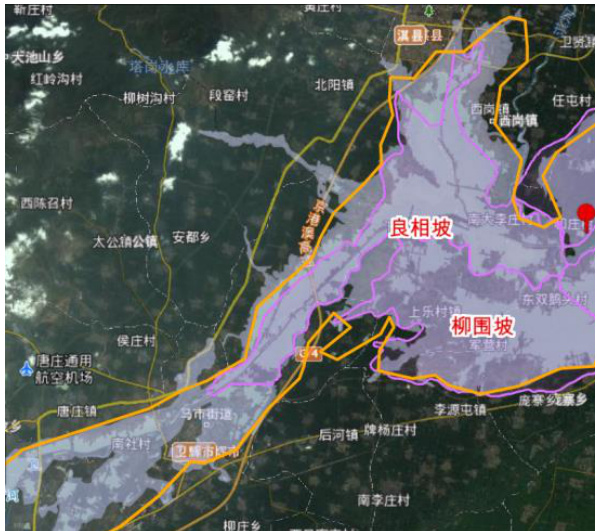  
卫星遥感图像淹没范围  

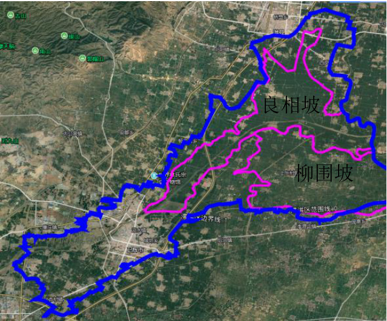  
本次实测淹没范围(调整前)  

良相坡蓄滞洪区共产主义渠以上至 G107 国道范围内的淹没面积,是由于共产主义渠上游决口引发的洪水淹没,与蓄滞洪区运用无关,其范围均位于新乡市卫辉市境内(含卫辉市市区),经与卫辉市水利局现场结合,该部分淹没面积不属于良相坡蓄滞洪区启用超淹,未计入本次良相坡蓄滞洪区超淹面积。  

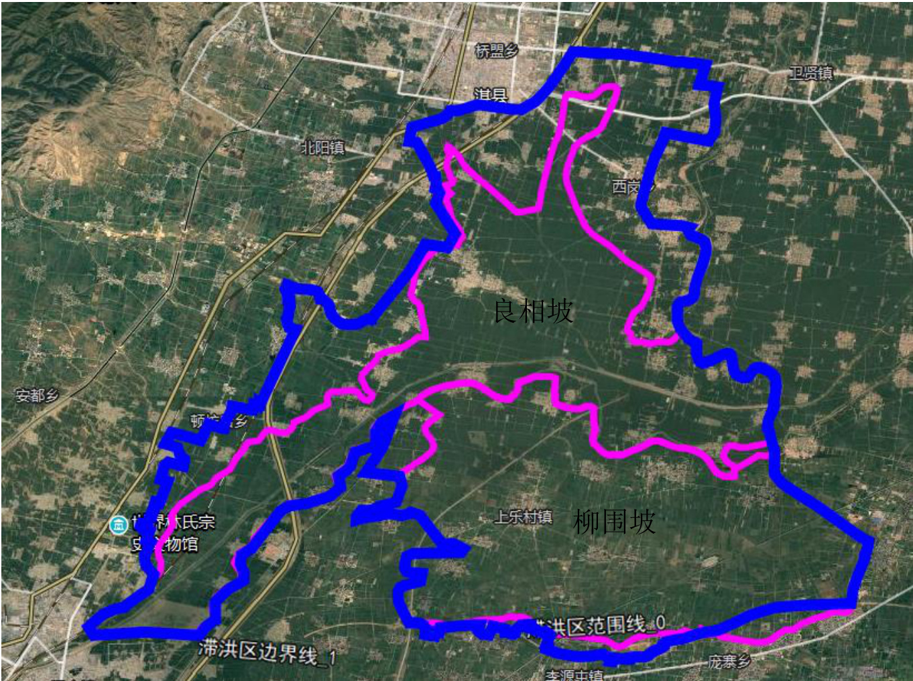  
本次实测淹没范围(调整后)  

# 2.3 滞洪水位调查情况分析  

# 2.3.1 实测水位情况  

本次“21·7”洪水,良相坡蓄滞洪区洪水主要来自共渠自然漫溢、沧河洪水自然漫溢和淇河洪水,根据本次实际调查测量,良相坡蓄滞洪区内部实测高程如下表。  

# 良相坡蓄滞洪区“21·7”洪水位调查情况统计表  

表 2.3-1  

<html><body><table><tr><td>位置</td><td>水位（m)</td><td>位置</td><td>水位（m)</td><td>位置</td><td>水位(m)</td></tr><tr><td>共渠比干大道桥东</td><td>69.05</td><td>军屯</td><td>70.54</td><td>吉营</td><td>69.67</td></tr><tr><td>黄土岗</td><td>70.71</td><td>上马营</td><td>70.01</td><td>牛场</td><td>68.52</td></tr><tr><td>王庄</td><td>69.64</td><td>关屯</td><td>69.26</td><td>前稻香</td><td>69.08</td></tr><tr><td>孙坡</td><td>68.24</td><td>水屯 (卫辉)</td><td>70.01</td><td>下马营</td><td>68.66</td></tr><tr><td>吴坡</td><td>69.09</td><td>闫屯</td><td>69.44</td><td>西沿村</td><td>68.03</td></tr><tr><td>邵庄</td><td>69.27</td><td>清水河</td><td>69.52</td><td>皇甫</td><td>67.80</td></tr><tr><td>曲律</td><td>68.17</td><td>水屯 (淇县)</td><td>68.10</td><td>良相村</td><td>68.16</td></tr><tr><td>小河口</td><td>68.24</td><td>史庄</td><td>68.48</td><td>黄堆村</td><td>68.1</td></tr><tr><td>骑河黄庄</td><td>68.19</td><td>大李庄</td><td>67.95</td><td>康庄</td><td>67.68</td></tr><tr><td>良相村南</td><td>67.59</td><td>石奶庙</td><td>67.79</td><td>藏口</td><td>67.63</td></tr></table></body></html>  

# 2.3.2 水位情况分析  

1、良相坡蓄滞洪区上游侧水位普遍较高  

本次“21·7”洪水沧河水量较大,同时受到蓄滞洪区上游新乡段共渠决口影响,致使良相坡蓄滞洪区内部上游侧黄土岗、军屯、闫屯等村庄水位较高,扩大了受淹面积。  

2、良相坡蓄滞洪区下游侧滞洪水位较高  

本次实测良相坡蓄滞洪区下游侧村庄滞洪水位均高于现状运行的$67.0\mathrm{m}$ 及规划的 $67.34\mathrm{m}$ ,滞洪水位较高。分析原因主要为河道(共产主义渠、卫河)尚未治理,下泄能力不足,致使良相坡蓄滞洪区滞洪量较大、水位较高。  

# 2.4 滞洪水量核算  

本次“21·7”洪水,蓄滞洪量计算在万分之一地形图上将淹没范围内根据调查的水位的特点、地面等高线等进行分区,先计算各个分区内的蓄滞洪  

量,最后汇总算出最大蓄滞洪量。各分区滞蓄水量计算情况如下表。  

# 良相坡蓄滞洪区“21·7”滞洪水量计算成果表  

表 2.4-1  
单位:万 $\mathrm{m}^{3}$   

<html><body><table><tr><td colspan="2">县区</td><td colspan="3">淹没水深</td><td rowspan="2">合计</td></tr><tr><td rowspan="2" colspan="2"></td><td>0~1m</td><td>1~2m</td><td>2~3m</td></tr><tr><td>卫辉市</td><td>542</td><td>2874</td><td>4595</td><td>8011</td></tr><tr><td rowspan="3">规划 范围内</td><td>淇县</td><td>171</td><td>922.5</td><td>5895</td><td>6988.5</td></tr><tr><td>合计</td><td>713</td><td>3796.5</td><td>10490</td><td>14999.5</td></tr><tr><td>卫辉市</td><td>370</td><td>666</td><td>740</td><td>1776</td></tr><tr><td rowspan="2">规划 范围外</td><td>淇县</td><td>777.5</td><td>2166</td><td>1285</td><td>4228.5</td></tr><tr><td>合计</td><td>1147.5</td><td>2832</td><td>2025</td><td>6004.5</td></tr><tr><td colspan="2">总计</td><td>1860.5</td><td>6628.5</td><td>12515</td><td>21004</td></tr></table></body></html>

经计算,良相坡蓄滞洪区最大滞洪量为 2.1 亿 $\mathrm{m}^{3}$ 。  

# 2.5 滞洪区运用情况分析  

按照《预案》,良相坡滞洪区设计滞洪水位为 $67.0\mathrm{m}$ ,淹没面积 $74.52\mathrm{km}^{2}$ ,滞洪量 0.92 亿 $\mathrm{m}^{3}$ 。  

本次实测良相坡蓄滞洪区淹没面积 $131.45\mathrm{km}^{2}$ ,大于现状防汛预案中淹没面积 $74.52\mathrm{km}^{2}$ ;实测良相村处滞洪水位为 $68.16\mathrm{m}$ 、城关堤处水位为$68.48\mathrm{m}$ ,均高于现状运用水位 $67.0\mathrm{m}$ ;核算滞洪量为 2.1 亿 $\mathrm{m}^{3}$ ,大于预案中的 0.92 亿 $\mathrm{m}^{3}$ 。  

良相坡蓄滞洪区的超淹原因主要有两部分:一是由于蓄滞洪区北部边界城关防洪堤、东部边界西岗防洪堤多年未进行治理,本次滞洪水量较大,蓄滞洪区内部滞洪水位普遍较高,造成的北部、东部漫堤超淹;二是本次沧河洪水较大,造成的西北部自然高地漫溢超淹。本次洪水淹没范围大,滞洪水位高,从而引起的蓄滞洪区滞洪水量较大。  

良相坡蓄滞洪区本次“21·7”洪水属于超淹、超蓄情况。  

# 第三章 柳围坡蓄滞洪区  

编 制:叶继业审    核:申增云  

# 3.1 滞洪区运用过程  

# (1)柳围坡蓄滞洪区启用情况  

2021 年 7 月 23 日约 12:30 开始启用,扒开卫河右堤宋村分洪堰(浆砌石堰上堆土),良相坡蓄滞洪区内部滞蓄洪水经宋村分洪堰漫溢进入柳围坡蓄滞洪区内部;  

7 月 25 日,柳围坡蓄滞洪区滞洪水位达到最高,下游双鹅头村处滞洪水位为 $65.73\mathrm{m}$ (规划滞洪水位 $65.05\mathrm{m})$ ),滞洪区东部边界申店隔堤部分堤防被洪水冲毁,致使柳围坡蓄滞洪区内部洪水下泄进入长虹渠蓄滞洪区内部;同时滞洪区内的洪水通过南长虹渠、北长虹渠退入下游长虹渠蓄滞洪区内部;  

7 月 29 日退洪明显;  

8 月 8 日退洪基本完成。  

# (2)滞洪区上游洪水进程情况  

柳围坡蓄滞洪区上游,新乡市凤泉区共产主义渠决口洪水下泄情况如下:  

7 月 22 日,新乡市凤泉区李士屯村南共渠右堤决口,洪水跨过卫河在北至高铁、南至新濮公路(S101)之间的区域,向东北方向漫溢;  

7 月 26 日,洪水进入卫辉城区后下泄进入良相坡、柳围坡蓄滞洪区。  

# 3.2 淹没范围调查及情况分析  

# 3.2.1 蓄滞洪区淹没范围调查  

本次“21·7”洪水淹没范围,西至柳围坡蓄滞洪区西边界、卫河右堤,南至古阳堤附近,东至申店隔堤与长虹渠蓄滞洪区相连,北至卫河右堤与良相坡蓄滞洪区相连,实测淹没面积 $87.08\mathrm{km}^{2}$ ,淹没范围在规划滞洪区边界范围内面积 $76.83\mathrm{km}^{2}$ ,超出滞洪区边界范围面积 $10.25\mathrm{km}^{2}$ ,超淹率为 $13\%$ ,超淹范围主要为三部分:  

(1)蓄滞洪区南部古阳堤以外的区域,由于古阳堤未治理,现状古阳堤残缺不全,洪水通过古阳堤缺口处淹没南部部分区域,该部分超淹面积为 $2.93\mathrm{km}^{2}$ (均位于卫辉境内)。  

(2)蓄滞洪区西北部,后天平村向北至卫辉之间的区域。该部分区域收到城区至上乐村镇道路影响,宋村分洪堰分泄入柳围坡蓄滞洪区洪水后,蓄滞洪区滞洪水位 $65.73\mathrm{m}$ (最下游双鹅头村处),该区域周边地面高程为$65.0\mathrm{m}{\sim}65.5\mathrm{m}$ 左右,且受到南部、西部主要交通道路的影响,存在一定的洪水淹没。该部分区域超淹面积为 $7.36\mathrm{km}^{2}$ (均位于卫辉境内)。  

柳围坡蓄滞洪区“21·7”洪水淹没范围调查情况详见下表。  

# 柳围坡蓄滞洪区“21·7”调查与规划淹没面积对比较  

表 3.2-1  

<html><body><table><tr><td>规划滞洪区面积 (km²)</td><td>实测淹没面积 (km²)</td><td>滞洪区内淹没面积 (km²)</td><td>超淹面积 (km²)</td><td>超淹率 (% )</td></tr><tr><td>78.97</td><td>87.08</td><td>76.83</td><td>10.25</td><td>13</td></tr></table></body></html>  

具体淹没范围见“柳围坡蓄滞洪区“21·7”洪水淹没范围调查测量图”。  

# 3.2.2 蓄滞洪区范围外超淹情况及原因分析  

本次“21·7”洪水柳围坡蓄滞洪区超淹区域主要位于蓄滞洪区的西北部及南部。  

蓄滞洪区西北部,后天平村向北至卫辉之间的区域。该部分区域收到城区至上乐村镇道路影响,宋村分洪堰分泄入柳围坡蓄滞洪区洪水后,蓄  

滞洪区滞洪水位 $65.73\mathrm{m}$ (最下游双鹅头村处),该区域周边地面高程为$65.0\mathrm{m}{\sim}65.5\mathrm{m}$ 左右,洪水淹没至该片区域,存在一定的洪水淹没。该部分区域超淹面积为 $7.36\mathrm{km}^{2}$ ,均位于卫辉境内。  

蓄滞洪区南部古阳堤以外的区域,由于古阳堤未治理,现状古阳堤残缺不全,洪水通过古阳堤缺口处淹没南部部分区域,该部分超淹面积为$2.93\mathrm{km}^{2}$ ,均位于卫辉境内。  

# 3.2.3 淹没范围对比分析  

# 3.2.3.1 与现状防洪预案淹没面积对比  

按照《预案》,柳围坡蓄滞洪区设计滞洪水位 $65.05\mathrm{m}$ ,水深 $0.5{\sim}2.75\mathrm{m}$ 之间,淹没面积 $75.2\mathrm{km}^{2}$ ,蓄洪量 0.95 亿 $\mathrm{m}^{3}$ ,运用机率为 $3\sim5$ 年一遇。  

本次实测淹没面积为 $87.08\mathrm{km}^{2}$ ,扣除蓄滞洪区范围以外淹没面积$10.25\mathrm{km}^{2}$ 后,蓄滞洪区内部淹没面积为 $76.83\mathrm{km}^{2}$ (小于规划蓄滞洪区总面积 $78.97\mathrm{km}^{2})$ ),均高于预案中的滞洪水位 $65.05\mathrm{m}$ 淹没面积 $75.2\mathrm{km}^{2}$ 。  

按照预案中的滞洪水位 $65.05\mathrm{m}$ ,在 1/10000 地形图中量算的淹没面积为 $77.75\mathrm{km}^{2}$ ,与预案中的淹没面积 $75.2\mathrm{km}^{2}$ ,相差不多。而本次洪水实测柳围坡蓄滞洪区内部洪水位分别为 $65.58\mathrm{m}$ (军营)、 $65.73\mathrm{m}$ (双鹅头),均高于预案中的 $65.05\mathrm{m}$ ,淹没范围比预案中的范围扩大,致使淹没面积增加。  

蓄滞洪区以外淹没面积除西北部受宋村分洪堰分洪影响外,南部古阳堤未治理,局部漫堤造成堤外大面积受淹,造成了本次洪水蓄滞洪区以外超淹 $10.25\mathrm{km}^{2}$ 。  

# 3.2.3.2 与遥感图像对比分析  

按照河南省水利勘测公司提供的卫星遥感图像,柳围坡蓄滞洪区的淹没范围与我公司本次实测淹没范围面积相比,遥感图像面积略小。主要原因省勘测公司提供的遥感图像为 7 月 30 日成像,而我公司本次调查实测面积为现场调查了解的洪水淹没最大面积,因此比遥感图像范围略大。  

  
卫星遥感图像淹没范围  

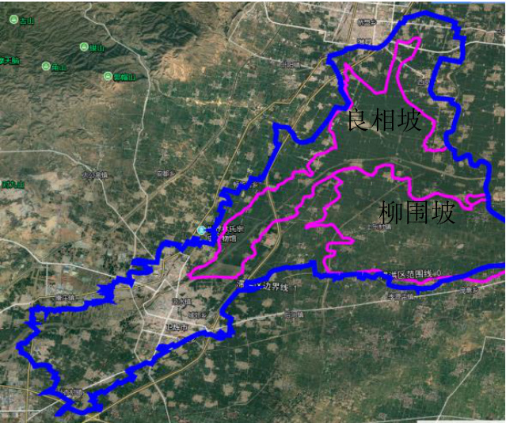  
本次实测淹没范围(调整前)  

柳围坡蓄滞洪区西部范围内的淹没面积,是由于共产主义渠上游决口引发的洪水淹没,与蓄滞洪区运用无关,其范围均位于新乡市卫辉市境内(含卫辉市区),经与卫辉市水利局现场结合,该部分淹没面积不属于柳围坡蓄滞洪区启用超淹,未计入本次柳围坡蓄滞洪区超淹面积。  

  
本次实测淹没范围(调整后)  

# 3.3 滞洪水位调查情况分析  

# 3.3.1 实测水位情况  

本次“21·7”洪水,柳围坡蓄滞洪区洪水主要来自良相坡蓄滞洪区内部滞蓄洪水,通过宋村分洪堰分洪进入柳围坡蓄滞洪区内部。根据本次实际调查测量,柳围坡蓄滞洪区内部实测高程如下表。  

柳围坡蓄滞洪区“21·7”洪水位调查情况统计表  
表 3.3-1  

<html><body><table><tr><td>位置</td><td>水位（m)</td><td>位置</td><td>水位 (m)</td><td></td><td>位置</td><td>水位 (m)</td></tr><tr><td>凡店</td><td>65.66</td><td>宋村</td><td>66.6</td><td></td><td>东关庄</td><td>66.69</td></tr><tr><td>史村</td><td>65.52</td><td>西板桥</td><td>66.41</td><td></td><td>武庄</td><td>66.23</td></tr><tr><td>赵村</td><td>65.52</td><td>刘板桥</td><td>66.57</td><td></td><td>李庄</td><td>66.27</td></tr><tr><td>琉璃堂</td><td>65.75</td><td>东板桥</td><td>66.62</td><td></td><td>庄严寺</td><td>66.08</td></tr><tr><td>上乐一村</td><td>65.75</td><td>段庄</td><td></td><td>65.65</td><td>庄严</td><td>66.01</td></tr><tr><td>上乐二村</td><td>65.55</td><td>军营</td><td></td><td>65.58</td><td>东夹堤</td><td>65.42</td></tr><tr><td>上乐三村</td><td>65.54</td><td>西夹堤</td><td>65.62</td><td></td><td>万户寨</td><td>65.62</td></tr><tr><td>上乐四村</td><td>65.95</td><td>西官庄</td><td>66.01</td><td></td><td>双鹅头</td><td>65.73</td></tr></table></body></html>  

# 3.3.2 水位情况分析  

1、分洪堰周边村庄水位普遍较高  

本次“21·7”洪水柳围坡蓄滞洪区通过宋村分洪堰启用,由于受到分洪水位的影响,致使分洪堰周边的宋村、西板桥、刘板桥等村庄水位较高,基本与实际相符。  

# 2、柳围坡蓄滞洪区滞洪水位较高  

本次实测柳围坡蓄滞洪区内部村庄滞洪水位均高于现状运行的$65.05\mathrm{m}$ ,滞洪水位较高。分析原因主要为河道(共产主义渠、卫河)尚未治理,下泄能力不足,致使良相坡蓄滞洪区超蓄后,洪水无法通过共渠下  

泄进入柳围坡蓄滞洪区,致使柳围坡蓄滞洪洪区内部滞洪水量较大。  

# 3.4 滞洪水量核算  

本次“21·7”洪水,蓄滞洪量计算在万分之一地形图上将淹没范围内根据调查的水位的特点、地面等高线等进行分区,先计算各个分区内的蓄滞洪量,最后汇总算出最大蓄滞洪量。各分区滞蓄水量计算情况如下表。  

单位:万 $\mathrm{m}^{3}$  

柳围坡蓄滞洪区“21·7”滞洪水量计算成果表  
表 3.4-1  

<html><body><table><tr><td rowspan="2" colspan="2">县区</td><td colspan="3">淹没水深</td><td rowspan="2">合计</td></tr><tr><td>0~1m</td><td>1~2m</td><td>2~3m</td></tr><tr><td rowspan="3">规划 范围内</td><td>卫辉市</td><td>1866.5</td><td>2175</td><td>4555</td><td>8596.5</td></tr><tr><td>浚县</td><td></td><td></td><td>1695</td><td>1695</td></tr><tr><td>合计</td><td>1866.5</td><td>2175</td><td>6250</td><td>10291.5</td></tr><tr><td>规划 范围外</td><td>卫辉市</td><td>512.5</td><td></td><td></td><td>512.5</td></tr><tr><td colspan="2">总计</td><td>2379</td><td>2175</td><td>6250</td><td>10804</td></tr></table></body></html>

经计算,柳围坡蓄滞洪区最大滞洪量为 1.08 亿 $\mathrm{m}^{3}$ 。  

# 3.5 滞洪区运用情况分析  

按照《预案》,柳围坡滞洪区设计滞洪水位 $65.05\mathrm{m}$ ,淹没面积 $75.2\mathrm{km}^{2}$ ,滞洪量 0.95 亿 $\mathrm{m}^{3}$ 。  

本次实测柳围坡蓄滞洪区淹没面积为 $87.08\mathrm{km}^{2}$ ,大于现状防汛预案中淹没面积 $75.2\mathrm{km}^{2}$ ;实测柳围坡蓄滞洪区最下游浚县双鹅头村水位为$65.73\mathrm{m}$ ,军营村处水位 $65.58\mathrm{m}$ ,均高于现状运用水位 $65.05\mathrm{m}$ ;核算滞洪量为 1.08 亿 $\mathrm{m}^{3}$ ,大于预案中的 0.95 亿 $\mathrm{m}^{3}$ 。  

柳围坡蓄滞洪区的超淹原因主要有两部分:一是由于宋村分洪堰分洪水位较高,造成的西北部自然高地漫溢超淹;二是由于蓄滞洪区南部边界古阳堤多年未进行治理,洪水从堤防缺口处局部漫溢超淹。本次洪水淹没范围大,滞洪水位高,从而引起的蓄滞洪区滞洪水量较大。  

柳围坡蓄滞洪区本次“21·7”洪水属于超淹、超蓄情况。  

# 第四章 长虹渠蓄滞洪区  

编    制:杨志飞审    核:申增云  

# 4.1 滞洪区运用过程  

根据本次调查结合与浚县、滑县水利部门座谈、现场调查等,白寺坡蓄滞洪区的运用过程具体如下:  

2021 年 7 月 23 日 2 时启用长虹渠蓄滞洪区,自淇门分洪口分洪,淇门分洪口长度 140 余米,致使洪水进入长虹渠蓄滞洪区;  

7 月 24 日,长虹渠蓄滞洪区达到最高洪水位 $63.33\mathrm{m}$ ;  

8 月 9 日零时 30 分,完成淇门分洪口封堵;  

8 月 21 日 19 时曹湾门分洪口封堵完成;  

截止 8 月 22 日,长虹渠蓄滞洪区已基本完成退水。  

# 4.2 淹没范围调查及情况分析  

# 4.2.1 蓄滞洪区淹没范围调查  

本次“21·7”洪水,淹没范围西界申店隔堤,南部太行堤,北靠卫河右堤,东抵滑县城关,实测淹没面积 $79.97\mathrm{km}^{2}$ ,淹没范围在规划滞洪区边界范围内面积 $78.58\mathrm{km}^{2}$ ,超出滞洪区边界范围面积 $2.52\mathrm{km}^{2}$ 。  

一部分为南部边界太行堤浚县段,涉及浚县长屯、田堤、杜行、马行等村庄,超淹原因为太行堤堤身存在豁口等,该部分超淹面积为 $1.40\mathrm{km}^{2}$ 。  

另一部分为淇门、新镇围村堤内进水,主要为围村堤多年未加固建设存在破损等,运用时村民临时加固,长期浸水后临时加固段渗水、漫溢等造成围村堤内进水。新镇围村堤进水范围,南堤洪水线内移 $300\mathrm{m}$ ,东围村堤内移 $160\mathrm{m}$ ,西围村堤内移 $130\mathrm{m}$ 区域内洪水淹没,该部分超淹面积为$0.89\mathrm{km}2$ ;淇门围村堤进水范围,淇门东街从南到北 $600\mathrm{m}$ ,从东到西 $130\mathrm{m}$ ,淇门南街从南到北 $170\mathrm{m}$ ,从东到西 $490\mathrm{m}$ 区域内洪水淹没,该部分超淹面积为 $0.23\mathrm{km}^{2}$ 。  

# 长虹渠蓄滞洪区“21·7”洪水淹没情况调查与规划淹没面积对比表  

表 4.2-1  

<html><body><table><tr><td>规划滞洪区面积 (km²)</td><td>实测淹没面积 (km²)</td><td>滞洪区内淹没面积 (km²)</td><td>超淹面积 (km²)</td><td>超淹率 (% )</td></tr><tr><td>86.56</td><td>79.97</td><td>78.58</td><td>2.52</td><td>2.87</td></tr></table></body></html>  

具体淹没范围见“长虹渠蓄滞洪区“21·7”洪水淹没调查测量图”。  

# 4.2.2 蓄滞洪区范围外超淹情况及原因分析  

本次“21·7”洪水长虹渠蓄滞洪区村庄无超淹现象,超淹面积为 $2.52\mathrm{km}^{2}$ 。  

超淹范围涉及浚县长屯、田堤、杜行、马行等村庄,超淹原因为太行堤堤身存在豁口等。  

另一部分超淹为淇门、新镇围村堤内进水,主要为围村堤多年未加固建设存在破损等,运用时村民临时加固,长期浸水后临时加固段渗水、漫溢等造成围村堤内进水。  

# 4.2.3 淹没范围对比分析  

# 4.2.3.1 与现状防洪预案淹没面积对比  

按照《预案》,长虹渠蓄滞洪区设计蓄滞洪水位 $62.31\mathrm{m}$ ,水深 $0.5{\sim}3.0\mathrm{m}$ 之间,蓄滞洪量 1.04 亿 $\mathrm{m}^{3}$ ,淹没面积 $87\mathrm{km}^{2}$ ,运用机率为 3\~5 年一遇。  

本次实测淹没面积为 $79.97\mathrm{km}^{2}$ ,扣除蓄滞洪区范围以外淹没面积$2.48\mathrm{km}^{2}$ 后,蓄滞洪区内部淹没面积为 $78.58\mathrm{km}^{2}$ ,均小于预案中的滞洪水位$62.31\mathrm{m}$ 淹没面积 $87.0\mathrm{km}^{2}$ 。  

按照预案中的滞洪水位 $62.31\mathrm{m}$ ,在 1/10000 地形图中量算的淹没面积为 $86.56\mathrm{km}^{2}$ ,与预案中的淹没面积 $87\mathrm{km}^{2}$ ,相差不多。而本次洪水中,实测长虹渠蓄滞洪区内部洪水位,最高为 $64.20\mathrm{m}(\$ (申店隔堤与谷阳堤交叉处),最低为 $63.30\mathrm{m}$ (长虹渠退水闸南),均高于预案中的 $62.31\mathrm{m}$ ,蓄滞洪区南部太行堤堤身存在豁口等造成洪水漫溢,致使蓄滞洪区南部淹没超洪区边界。  

蓄滞洪区以外淹没面积 $2.48\mathrm{km}^{2}$ ,主要为南部边界太行堤堤身存在豁口等,该部分超淹面积为 $1.40\mathrm{km}^{2}$ ;另一部为淇门、新镇围村堤内进水造成超淹,该部分超淹面积为 $1.12\mathrm{km}^{2}$ 。本次洪水蓄滞洪区以外超淹 $2.52\mathrm{km}^{2}$ 。  

# 4.2.3.2 与遥感图像对比分析  

按照河南省水利勘测公司提供的卫星遥感图像,长虹渠蓄滞洪区的淹没范围与我公司本次实测淹没范围面积相比,遥感图像面积与公司本次调查实测面积基本一致。  

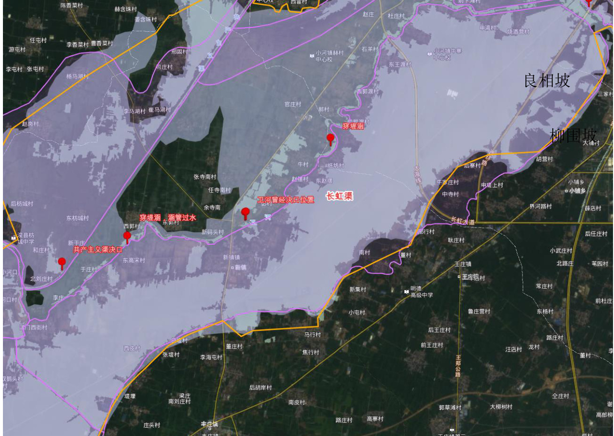  
卫星遥感图像淹没范围  

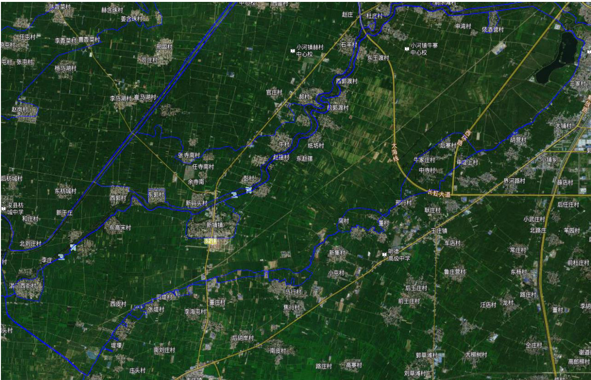  
本次实测淹没范围  

# 4.3 滞洪水位调查情况分析  

# 4.3.1 实测水位情况  

本次“21·7”洪水,长虹渠蓄滞洪区洪水主要为淇门分洪口分洪入蓄滞洪区,根据本次实际调查测量,长虹渠蓄滞洪区内部实测高程如下表。  

# 长虹渠蓄滞洪区“21·7”洪水位调查情况统计表  

表 4.3-1  

<html><body><table><tr><td>位置</td><td>水位 （m)</td><td>位置</td><td>水位（m)</td></tr><tr><td>申店隔堤与谷阳堤交叉处</td><td>64.20</td><td>牛寨</td><td>63.34</td></tr><tr><td>新镇镇</td><td>63.80</td><td>滑县西环</td><td>63.32</td></tr><tr><td>省道219</td><td>63.60</td><td>大铺</td><td>63.30</td></tr><tr><td>纸坊村</td><td>63.40</td><td>三家村</td><td>63.30</td></tr><tr><td>中寺村</td><td>63.38</td><td>长虹渠退水闸南</td><td>63.30</td></tr></table></body></html>  

# 4.3.2 水位情况分析  

本次实测长虹渠蓄滞洪区村庄滞洪水位均高于现状运行的 $62.31\mathrm{m}$ ,滞  

洪水位较高。分析原因主要为河道(卫河)尚未治理,下泄能力不足,致使长虹渠蓄滞洪区滞洪量较大、水位较高。  

# 4.4 滞洪水量核算  

本次“21·7”洪水,蓄滞洪量计算在万分之一地形图上将淹没范围内根据调查的水位的特点、地面等高线等进行分区,先计算各个分区内的蓄滞洪量,最后汇总算出最大蓄滞洪量。  

单位:万 $\mathrm{m}^{3}$  

长虹渠蓄滞洪区“21•7”滞洪水量计算成果表  
表 4.4-1  

<html><body><table><tr><td colspan="2">县区</td><td colspan="4">淹没水深</td><td rowspan="2">合计</td></tr><tr><td colspan="2" rowspan="2">浚县</td><td>0~1m</td><td>1~2m</td><td>2~3m</td><td>>3m</td></tr><tr><td>567.86</td><td>2484</td><td>1620</td><td>6495</td><td>11166.86</td></tr><tr><td rowspan="3">规划 范围内</td><td>滑县</td><td></td><td>276</td><td>1080</td><td>5254.79</td><td>6610.79</td></tr><tr><td>合计</td><td>567.86</td><td>2760</td><td>2700</td><td>11749.79</td><td>17777.65</td></tr><tr><td>浚县</td><td></td><td>140.3</td><td></td><td></td><td>154.33</td></tr><tr><td rowspan="3">规划 范围外</td><td>滑县</td><td></td><td></td><td></td><td></td><td></td></tr><tr><td>合计</td><td></td><td>140.3</td><td></td><td></td><td>154.33</td></tr><tr><td>总计</td><td></td><td></td><td></td><td></td><td>17931.98</td></tr></table></body></html>

经计算,长虹渠蓄滞洪区最大滞洪量为 1.79 亿 $\mathrm{m}^{3}$ 。  

# 4.5 滞洪区运用情况分析  

按照《预案》,长虹渠蓄滞洪区设计滞洪水位为 $62.31\mathrm{m}$ ,淹没面积$87.0\mathrm{km}^{2}$ ,滞洪量 1.04 亿 $\mathrm{m}^{3}$ 。  

本次实测长虹渠蓄滞洪区淹没面积 $79.74\mathrm{km}^{2}$ ,小于现状防汛预案中淹没面积 $87.0\mathrm{km}^{2}$ ;实测长虹渠蓄滞洪区申店隔堤与古阳堤交叉处水位$64.20\mathrm{m}$ 、中寺村水位 $63.38\mathrm{m}$ 、牛寨水位 $63.34\mathrm{m}$ ,均高于现状运用水位$62.31\mathrm{m}$ ;核算滞洪量为 1.79 亿 $\mathrm{m}^{3}$ ,大于预案中的 1.04 亿 $\mathrm{m}^{3}$ 。  

长虹渠蓄滞洪区淹没面积小于预案中淹没面积,主要原因是蓄滞洪区南部太行堤附近的滑县中寺、后寨、申堤下、牛庄、杨庄、董堤下、南村等村庄处修建了围村堤,对村庄进行了保护,该部分面积约 $5.6\mathrm{km}^{2}$ ,围村堤保护范围内未进水。但由于蓄滞洪区南部边界太行堤多年未进行治理,洪水从堤防缺口处局部漫溢超淹;淇门、新镇镇围村堤也多年未进行治理,洪水漫溢造成村内部分淹没。本次长虹渠蓄滞洪区滞洪水位均高于现状运用水位 $1\mathrm{m}$ 以上,造成了蓄滞洪区滞洪水量较大。  

长虹渠蓄滞洪区本次“21·7”洪水属于超淹、超蓄情况。  

# 第五章 白寺坡蓄滞洪区  

编    制:杨志飞审    核:申增云  

# 5.1 滞洪区运用过程  

根据本次调查结合与浚县水利部门座谈、现场调查等,白寺坡蓄滞洪区的运用过程具体如下:  

2021 年 7 月 23 日,白寺坡蓄滞洪区境内彭村段卫河堤决口,致使洪水进入白寺坡蓄滞洪区;  

7 月 24 日 22:00,启用白寺坡蓄滞洪区,自王湾分洪口分洪,王湾分洪口长度 260 余米;  

7 月 26 日凌晨 2:00,彭村决口段封堵完成;  

7 月 30 日,白寺坡蓄滞洪区达到最高洪水位 $60.58\mathrm{m}$ ;  

8 月 6 日下午 14:00,王湾分洪口完成封堵作业,洪区停止进洪,沿民丰排水沟经盐土庄闸退入卫河;  

截止 8 月 20 日,白寺坡蓄滞洪区已基本完成退水。  

# 5.2 淹没范围调查及情况分析  

# 5.2.1 蓄滞洪区淹没范围调查  

本次“21·7”洪水,淹没范围西界共渠右堤,南起淇河堤,东界卫河左堤、付庄堤至北老关嘴,实测淹没面积 $140.84\mathrm{km}^{2}$ ,淹没范围在规划滞洪区边界范围内面积 $128.87\mathrm{km}^{2}$ ;淹没面积在不考虑彭村决口淹没水位时,在规划洪区边界范围内面积 $117.34\mathrm{km}^{2}$ ,超出滞洪区规划边界范围面积 $11.96\mathrm{km}^{2}$ ,超出滞洪区正常启用淹没范围 $23.99\mathrm{km}^{2}$ (其中蓄滞洪区范围内 $12.03\mathrm{km}^{2}$ ,蓄滞洪区范围外 $11.96\mathrm{km}^{2}$ )超淹范围主要为两部分:  

(1)蓄滞洪区南侧卫河彭村段附近,涉及浚县新镇镇的西郭村、新码头、任寺南、彭村、候村、牛村、大将村、东郭村、牛四马湖、张寺南、官庄 11 个村庄,小河镇的郝村、南雷村、权庄、石羊村、伯僚村、西雷村6 个村庄,共计 19 个村庄。  

其中新镇镇的牛四马湖、张寺南、官庄 3 个村庄规划村庄及耕地均位于蓄滞洪区内,因彭村决口造成村庄及耕地淹没;新镇镇的任寺南、彭村、候村、牛村 4 个村庄规划淹没部分耕地,此次村庄及耕地均淹没;新镇镇的西郭村、新码头、东郭村 3 个村庄原规划均属于洪区外,本次耕地超淹;小河镇的郝村、权庄、石羊村、南雷村 4 个村庄规划村庄及耕地均位于蓄滞洪区内,此次村庄及耕地均淹没,小河镇伯僚、西雷村 2 个村庄位于蓄滞洪区内,村庄位于高地仅淹没耕地,此次村庄部分被淹没耕地;村庄及耕地的超淹,均因彭村处卫河决口造成,致使白寺坡内村庄淹没严重。该部分超淹面积为 $11.23\mathrm{km}^{2}$ 。  

(2)蓄滞洪区末端码头村处,因蓄滞洪区末端盐土庄隔堤未修建,末端东部边界以现状永定线为界,道路因洪水冲淘破损,洪水漫溢道路后将道路东部码头村庄淹没;该部分超淹面积为 $0.73\mathrm{km}^{2}$ 。  

白寺坡蓄滞洪区“21·7”调查与规划淹没面积对比表  
表 5.2-1  

<html><body><table><tr><td>规划滞洪区面积 (km²)</td><td>实测淹没面积 (km²)</td><td>滞洪区内淹没面积 (km²)</td><td>超淹面积 (km²)</td><td>超淹率 (% )</td></tr><tr><td>129.07</td><td>140.84</td><td>128.87</td><td>11.96</td><td>9.26</td></tr></table></body></html>  

具体淹没范围见“白寺坡蓄滞洪区“21·7”洪水淹没情况调查测量布图”。  

# 5.2.2 蓄滞洪区范围外超淹情况及原因分析  

白寺坡蓄滞洪区超淹原因主要有以下两部分:  

一是蓄滞洪区南部边界外浚县彭村处卫河左堤决口,造成了蓄滞洪区  

南部超淹 $23.99\mathrm{km}^{2}$ (其中蓄滞洪区范围内 $12.03\mathrm{km}^{2}$ ,蓄滞洪区范围外$11.96\mathrm{km}^{2})$ );  

二是由于蓄滞洪区北部由于盐土庄隔堤未建设,从而造成了盐土庄隔堤以外的码头村超淹,该部分淹没面积为 $0.73\mathrm{km}^{2}$ 。  

# 5.2.3 淹没范围对比分析  

# 5.2.3.1 与现状防洪预案淹没面积对比  

按照《预案》,白寺坡蓄滞洪区设计蓄滞洪水位 $60.00\mathrm{m}$ ,水深 $2{\sim}3\mathrm{m}$ 之间,蓄滞洪量 1.78 亿 $\mathrm{m}^{3}$ ,淹没面积 $101.5\mathrm{km}^{2}$ ,运用机率为 3\~10 年一遇。  

本次实测淹没面积为 $140.84\mathrm{km}^{2}$ ,大于预案中的滞洪水位 $60.00\mathrm{m}$ 淹没面积 $101.5\mathrm{km}^{2}$ 。  

按照预案中的滞洪水位 $60.00\mathrm{m}$ ,在 1/10000 地形图中量算的淹没面积为 $95.12\mathrm{km}^{2}$ ,小于预案中的淹没面积 $101.50\mathrm{km}^{2}$ ,相差不大。因此预案中的淹没面积应为水位达到 $60.00\mathrm{m}$ 时的淹没面积。而本次洪水中,实测白寺坡蓄滞洪区内部洪水位,最高为 $62.22\mathrm{m}$ (康庄),最低为 $60.01\mathrm{m}$ (盐土庄),均高于预案中的 $60.00\mathrm{m}$ ,蓄滞洪区西南部因彭村决口淹没范围比预案中的范围扩大,致使淹没面积增加。  

蓄滞洪区以外淹没面积彭村决口处造成蓄滞洪区南部大面积受淹,北部因盐土庄隔堤未修建末端盐土庄码头段洪水漫溢道路超淹没,本次洪水蓄滞洪区以外超淹 $11.96\mathrm{km}^{2}$ 。  

# 5.2.3.2 与遥感图像对比分析  

按照河南省水利勘测公司提供的卫星遥感图像,白寺坡蓄滞洪区的淹没范围与我公司本次实测淹没范围面积相比,淹没范围基本相同。  

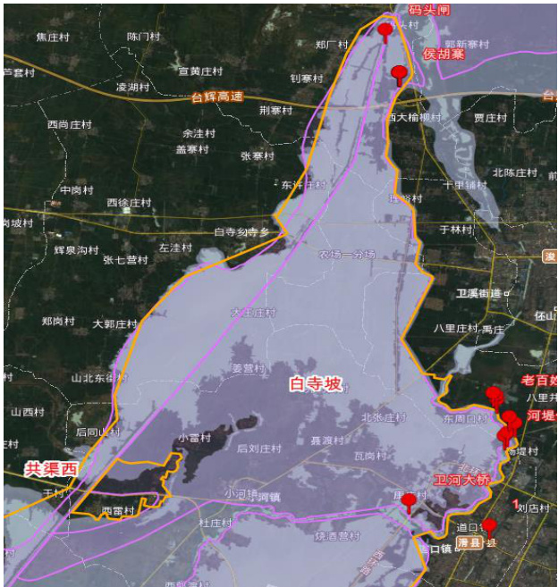  
卫星遥感图像淹没范围  

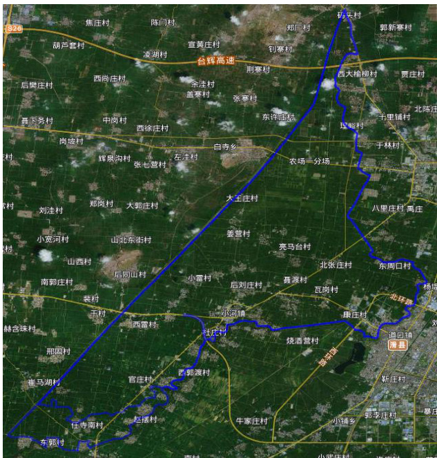  
本次实测淹没范围  

# 5.3 滞洪水位调查情况分析  

# 5.3.1 实测水位情况  

本次“21·7”洪水,长白寺坡蓄滞洪区洪水主要为淇门分洪口分洪入蓄滞洪区,根据本次实际调查测量,白寺坡蓄滞洪区内部实测高程如下表。  

# 白寺坡蓄滞洪区“21·7”洪水位调查情况统计表  

表 5.3-1  

<html><body><table><tr><td>位置</td><td>水位 (m)</td><td>位置 (彭村决口淹没区)</td><td>水位 (m)</td></tr><tr><td>杜庄</td><td>60.9</td><td>彭村</td><td>63.58</td></tr><tr><td>小河口镇</td><td>60.62</td><td>余寺南</td><td>63.33</td></tr><tr><td>耿潭村</td><td>60.52</td><td>候西村</td><td>62.86</td></tr><tr><td>刘贾店</td><td>60.47</td><td>焦寺南</td><td>62.73</td></tr><tr><td>袁庄</td><td>60.63</td><td>牛四马湖</td><td>61.55</td></tr><tr><td>亮马台</td><td>60.49</td><td>官庄村</td><td>61.93</td></tr><tr><td>西周口</td><td>60.64</td><td>权庄</td><td>62.15</td></tr><tr><td>大王庄</td><td>60.47</td><td>石羊</td><td>61.76</td></tr><tr><td>农场</td><td>60.48</td><td>栾庄</td><td>61.47</td></tr><tr><td>盐土庄</td><td>60.01</td><td>伯僚</td><td>61.62</td></tr></table></body></html>  

# 5.3.2 水位情况分析  

本次实测白寺坡蓄滞洪区村庄滞洪水位高于现状运行的 $60.00\mathrm{m}$ ,低于规划的 $61.4\mathrm{m}$ 。本次实测白寺坡蓄滞洪区南部村庄滞洪水位均高于现状运行的 $60.5\mathrm{m}$ 及规划的 $61.4\mathrm{m}$ ,滞洪水位较高。分析原因主要为卫河尚未治理,卫河堤薄弱导致河堤在彭村处决口,致使白寺坡蓄滞洪区滞洪量较大、水位较高。  

# 5.4 滞洪水量核算  

本次“21·7”洪水,蓄滞洪量计算在万分之一地形图上将淹没范围内根据调查的水位的特点、地面等高线等进行分区,先计算各个分区内的蓄滞洪量,最后汇总算出最大蓄滞洪量。  

白寺坡蓄滞洪区“21·7”滞洪水量计算成果表  
表 5.4-1  

<html><body><table><tr><td colspan="2" rowspan="2">县区</td><td colspan="4">淹没水深</td><td rowspan="2">合计</td></tr><tr><td>0~1m</td><td>1~2m</td><td>2~3m</td><td>>3m</td></tr><tr><td rowspan="3">规划 范围内</td><td>浚县</td><td>5096.88</td><td>2911.32</td><td>8418.00</td><td>3760.38</td><td>20186.58</td></tr><tr><td>滑县</td><td></td><td>579.86</td><td></td><td></td><td>579.86</td></tr><tr><td>合计</td><td>5096.88</td><td>3491.18</td><td>8418.00</td><td>3760.38</td><td>20766.44</td></tr><tr><td rowspan="3">规划 范围外</td><td>浚县</td><td></td><td>1150.38</td><td></td><td></td><td>1150.38</td></tr><tr><td>滑县</td><td></td><td></td><td></td><td></td><td></td></tr><tr><td>合计</td><td></td><td>1150.38</td><td></td><td></td><td>1150.38</td></tr><tr><td colspan="2">总计</td><td></td><td></td><td></td><td></td><td>21916.82</td></tr></table></body></html>

经计算,白寺坡蓄滞洪区最大滞洪量为 2.19 亿 $\mathrm{m}^{3}$ 。  

# 5.5 滞洪区运用情况分析  

按照《预案》,白寺坡蓄滞洪区设计滞洪水位为 $60.00\mathrm{m}$ ,淹没面积  

$101.5\mathrm{km}^{2}$ ,滞洪量 1.78 亿 $\mathrm{m}^{3}$ 。  

本次实测白寺坡蓄滞洪区淹没面积 $140.84\mathrm{km}^{2}$ ,大于现状防汛预案中淹没面积 $101.5\mathrm{km}^{2}$ ;实测白寺坡蓄滞洪区小河镇处水位 $60.62\mathrm{m}\cdot$ 、袁庄 $60.63\mathrm{m}$ 、农场一分场水位 $60.57\mathrm{m}$ 、盐土庄 $60.01\mathrm{m}$ ,均高于现状运用水位 $60.0\mathrm{m}$ ;核算滞洪量为 2.19 亿 $\mathrm{m}^{3}$ ,大于预案中的 1.78 亿 $\mathrm{m}^{3}$ 。  

白寺坡蓄滞洪区超淹原因主要有以下两部分:一是蓄滞洪区南部边界外浚县彭村处卫河左堤决口,造成了蓄滞洪区南部超淹;二是由于蓄滞洪区北部由于盐土庄隔堤未建设,从而造成了盐土庄隔堤以外的码头村超淹。本次洪水淹没范围大,滞洪水位高,从而引起的蓄滞洪区滞洪水量较大。  

白寺坡蓄滞洪区本次“21·7”洪水属于超淹、超蓄情况。  

# 第六章 共渠西蓄滞洪区  

编 制:余华龙审    核:申增云  

# 6.1 滞洪区运用过程  

根据本次调查结合与浚县水利部门座谈、现场调查等,共渠西蓄滞洪区的运用过程具体如下:  

7 月 21 日,共渠西蓄滞洪区下片共产主义渠左堤自然漫溢,洪水进入蓄滞洪区。  

7 月 22 日 23:00,刘庄分洪口分洪,蓄滞洪区正式启用。  

8 月 12 日下午 16:30 左右,共渠西刘庄分洪口完成封堵。  

# 6.2 淹没范围调查及情况分析  

# 6.2.1 蓄滞洪区淹没范围调查  

本次“21·7”洪水,淹没范围西南以淇河左堤为界,东南靠共产主义渠,西北接自然高地,测淹没面积 $68.674\mathrm{km}^{2}$ ,淹没范围在规划滞洪区边界范围内面积 $68.674\mathrm{km}^{2}$ 。共渠西蓄滞洪区无超淹。  

# 共渠西蓄滞洪区“21·7”洪水淹没情况调查与规划淹没面积对比较表 6.2-1  

<html><body><table><tr><td>规划淹没面积（km²）</td><td>在规划内面积（km²)</td><td>实测淹没面积（km²)</td><td>超淹面积（km²)</td></tr><tr><td>94.86</td><td>68.674</td><td>68.674</td><td>0</td></tr></table></body></html>  

具体淹没范围见“共渠西蓄滞洪区“21•7”洪水淹没范围调查测量图”。  

# 6.2.2 淹没范围对比分析  

# 6.2.2.1 与现状防洪预案淹没面积对比  

按照《预案》,共渠西蓄滞洪区滞洪水位为 $63.50\mathrm{m}$ (上片区), $60.00\mathrm{m}$ (下片区),行滞洪总量 0.6 亿 $\mathrm{m}^{3}$ ,淹没面积 $65.75\mathrm{km}^{2}$ 。  

本次实测共渠西蓄滞洪区淹没面积 $68.68\mathrm{km}^{2}$ ,大于运用预案中的  

65.75km2。  

本次洪水中,实测共渠西蓄滞洪区上片区刘庄处水位 $64.70\mathrm{m}$ 、李马湖(李桥)处水位 $63.59\mathrm{m}$ ,下片区白寺处 $60.08\mathrm{m}$ ,均高于相应的行滞洪水位,淹没范围比预案中的范围扩大,致使淹没面积增加。  

# 6.2.2.2 与遥感图像对比分析  

按照河南省水利勘测公司提供的卫星遥感图像,共渠西蓄滞洪区的淹没范围与我公司本次实测淹没范围面积相比,遥感图像面积略小。主要原因省勘测公司提供的遥感图像为 7 月 30 日成像,而我公司本次调查实测面积为现场调查了解的洪水淹没最大面积,因此比遥感图像范围略大。  

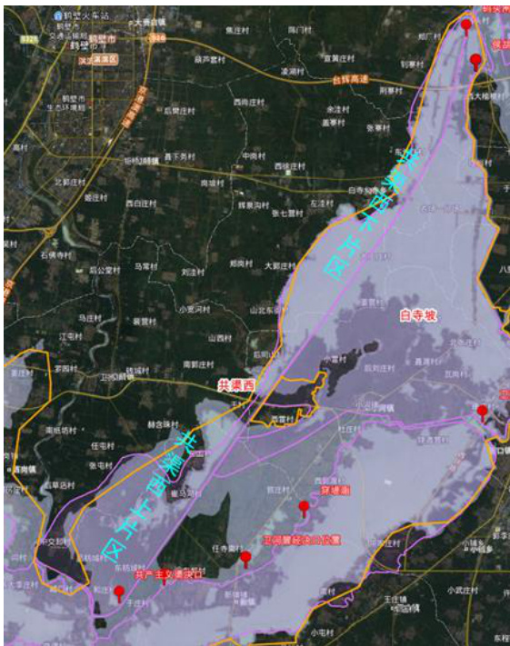  
卫星遥感图像淹没范围  

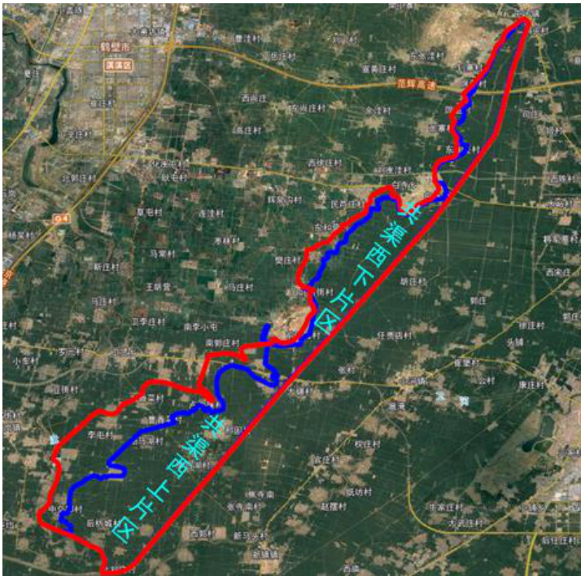  
本次实测淹没范围  

# 6.3 滞洪水位调查情况分析  

本次“21·7”洪水,共渠西蓄滞洪区洪水主要为共产主义渠自然漫溢和共渠洪水通过刘庄分洪堰漫溢进入,根据本次实际调查测量,共渠西蓄滞洪区内部实测高程如下表。  

# 共渠西蓄滞洪区“21·7”洪水位调查情况统计表  

表 6.3-1  

<html><body><table><tr><td>位置</td><td>刘庄</td><td>李马湖</td><td>邢固</td><td>于村</td><td>同山</td><td>白寺</td><td>东许庄</td><td>元上</td></tr><tr><td>水位 (m)</td><td>64.70</td><td>63.59</td><td>63.40</td><td>63.10</td><td>61.17</td><td>60.08</td><td>59.60</td><td>59.80</td></tr></table></body></html>  

# 6.4 滞洪水量核算  

本次“21·7”洪水,蓄滞洪量计算在万分之一地形图上将淹没范围内根据调查的水位的特点、地面等高线等进行分区,先计算各个分区内的蓄滞洪量,最后汇总算出最大蓄滞洪量。  

经计算,共渠西蓄滞洪区最大滞洪量约 0.95 亿 $\mathrm{m}^{3}$ 。  

# 6.5 滞洪区运用情况分析  

按照《预案》,共渠西蓄滞洪区滞洪水位为 $63.50\mathrm{m}$ (上片区), $60.00\mathrm{m}$ (下片区),淹没面积 $65.75\mathrm{km}^{2}$ ,行滞洪总量 0.6 亿 $\mathrm{m}^{3}$ 。  

本次实测共渠西蓄滞洪区淹没面积 $68.68\mathrm{km}^{2}$ ,大于现状运用预案中的淹没面积 $56.5\mathrm{km}^{2}$ ;实测共渠西蓄滞洪区上片区刘庄处水位 $64.70\mathrm{m}$ 、李马湖(李桥)处水位 $63.59\mathrm{m}$ ,下片区白寺处 $60.08\mathrm{m}$ ,均高于现状运用预案滞洪水位 $63.50\mathrm{m}$ (上片区), $60.00\mathrm{m}$ (下片区);核算滞洪量为 0.95 亿 $\mathrm{m}^{3}$ ,大于预案中的 0.6 亿 $\mathrm{m}^{3}$ 。  

共渠西蓄滞洪区的超淹主要是由于本次洪水较大,滞洪水位较高,造成了蓄滞洪区西北部自然高地漫溢超淹,从而引起的蓄滞洪区滞洪水量较大。  

共渠西蓄滞洪区本次“21·7”洪水属于超淹、超蓄情况。  

# 第七章 小滩坡蓄滞洪区  

编 制:余华龙审    核:申增云  

# 7.1 滞洪区运用过程  

根据本次调查结合与浚县、内黄县水利部门座谈、现场调查等,小滩坡蓄滞洪区的运用过程具体如下:  

2021 年 7 月 30 日 0:00,圈里分洪口启用分洪;  

8 月 6 日夜间 23:00,圈里分洪口门完成封堵。  

# 7.2 淹没范围调查及情况分析  

# 7.2.1 蓄滞洪区淹没范围调查  

本次“21·7”洪水,淹没范围西侧及北侧以卫河右堤为界,东北至卫河东防洪堤,东南至浚内沟沿岸,南至台辉高速。实测淹没面积 $93.27\mathrm{km}^{2}$ ,淹没范围在规划滞洪区边界范围内面积 $73.93\mathrm{km}^{2}$ ,超出滞洪区边界范围面积$19.34\mathrm{km}^{2}$ ,超淹率为 $26.2\%$ 。  

超淹范围主要共三处:第一处位于超淹区域位于申窑头村以南,台辉高速以北,王窑头村、张李甘寨、乔李甘寨村、西枣林村、东枣林村附近,该部分超淹面积 $9.12~\mathrm{km}^{2}$ ;第二处位于滞洪区中部自然高地西部,南胡村、北王庄村、王庄集、郭井固村附近,该部分超淹面积 $9.59\mathrm{km}^{2}$ ;第三处位于浚内沟入卫河口处,该部分超淹面积 $0.63\mathrm{km}^{2}$ 。  

小滩坡蓄滞洪区“21·7”调查与规划淹没面积对比较  
表 7.2-1  

<html><body><table><tr><td>规划 淹没面积 (km²)</td><td>在规划内 面积 (km²)</td><td>实测 淹没面积 (km²)</td><td>超淹 面积 (km²)</td><td>超淹率 (% )</td></tr><tr><td>85.25</td><td>73.93</td><td>93.27</td><td>19.34</td><td>26.2</td></tr></table></body></html>  

具体淹没范围见“小滩坡蓄滞洪区“21·7”洪水淹没范围调查测量图”。  

# 7.2.2 蓄滞洪区范围外超淹情况及原因分析  

本次“21·7”洪水,小滩坡超淹范围主要共三处:第一处位于超淹区域位于申窑头村以南,台辉高速以北,王窑头村、张李甘寨、乔李甘寨村、西枣林村、东枣林村附近,该部分超淹面积 $9.12\mathrm{km}^{2}$ ;  

第二处位于滞洪区中部自然高地西部,南胡村、北王庄村、王庄集、郭井固村附近,该部分超淹面积 $9.59\mathrm{km}^{2}$ 。此两处超淹原因为:小滩坡蓄滞洪区原规划圈里分洪口分洪后,滞洪区西侧洪水沿中部高地北侧及南侧进入滞洪区东侧,最后从浚内沟退水。  

第三处位于浚内沟入卫河口处,超淹面积 $0.63~\mathrm{km}^{2}$ 。超淹原因为此处滞洪区边界堤防——卫河右堤有 800 余米未修建,滞洪区退水沿浚内沟退入卫河导致超淹。  

前两处超淹原因主要为:本次“21·7”洪水圈里分洪口开始进洪后,受区内进洪通道内的 Y006、X002 等高路基道路和中鹤新城等建筑群影响,滞洪区西侧洪水无法顺利通过原规划进洪通道顺利进入滞洪区东侧,致使西部滞洪水位抬高,最终导致南侧自然高地及中部西侧自然高地区域超淹。第三处超淹原因主要为卫河右堤堤防不全导致的超淹。  

# 7.2.3 淹没范围对比分析  

# 7.2.3.1 与现状防洪预案淹没面积对比  

按照《预案》,小滩坡蓄滞洪区现状运用预案滞洪水位 $57.30\mathrm{m}$ ,滞洪量 0.74 亿 $\mathrm{m}^{3}$ ,淹没面积 $95.4\mathrm{km}^{2}$ 。  

本次实测小滩坡蓄滞洪区淹没面积 $93.27\mathrm{km}^{2}$ ,低于运用预案中的滞洪水位 $57.30\mathrm{m}$ 时的淹没面积 $95.4\ensuremath{\mathrm{km}^{2}}$ 。  

本次“21·7”洪水小滩坡圈里分洪口开始进洪后,受区内进洪通道内的Y006、X002 等高路基道路和中鹤新城等建筑群影响,滞洪区西侧洪水无法顺利通过原规划进洪通道顺利进入滞洪区东侧,致使西部滞洪水位抬高,最终导致南侧自然高地及中部西侧自然高地区域超淹,而滞洪区中心自然到底东侧地区滞洪水位均低于 $57.30\mathrm{m}$ ,部分原规划淹没区域未进水,故总淹没面积未达到防洪预案中的淹没面积。  

# 7.2.3.2 与遥感图像对比分析  

按照河南省水利勘测公司提供的卫星遥感图像,共渠西蓄滞洪区的淹没范围与我公司本次实测淹没范围面积相比,遥感图像面积略小。主要原因省勘测公司提供的遥感图像为 7 月 30 日成像,而我公司本次调查实测面积为现场调查了解的洪水淹没最大面积,因此比遥感图像范围略大。  

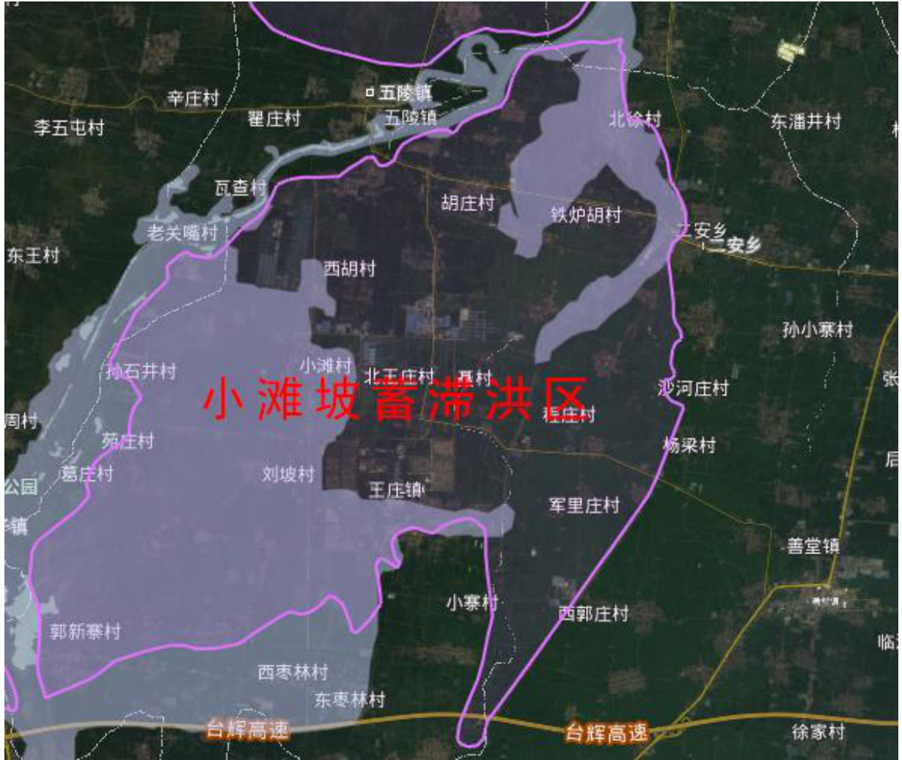  

# 卫星遥感图像淹没范围  

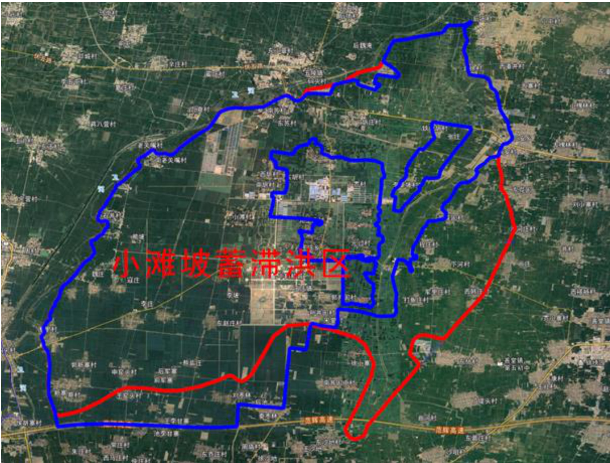  
本次实测淹没范围  

# 7.3 滞洪水位调查情况分析  

本次“21·7”洪水,小滩坡蓄滞洪区洪水主要是卫河洪水通过圈里分洪口进入,根据本次实际调查测量,小滩坡蓄滞洪区内部实测水位如下表。  

# 小滩坡蓄滞洪区“21·7”洪水位调查情况统计表  

表 7.3-1  

<html><body><table><tr><td>位置</td><td>圈里</td><td>郭新寨</td><td>张李 甘寨</td><td>小滩 村</td><td>宋井固</td><td>胡庄</td><td>魏湾 村东 1</td><td>魏湾 村东 2</td><td>浚内沟 入卫河口</td></tr><tr><td>水位 (m)</td><td>58.78</td><td>59.23</td><td>58.57</td><td>57.59</td><td>57.79</td><td>56.89</td><td>55.49</td><td>55.52</td><td>55.62</td></tr></table></body></html>  

# 7.4 滞洪水量核算  

本次“21·7”洪水,蓄滞洪量计算在万分之一地形图上将淹没范围内根据调查的水位的特点、地面等高线等进行分区,先计算各个分区内的蓄滞洪量,最后汇总算出最大蓄滞洪量。  

经计算,小滩坡蓄滞洪区最大滞洪量约为 1.08 亿 $\mathrm{m}^{3}$ 。  

# 7.5 滞洪区运用情况分析  

按照《预案》,小滩坡蓄滞洪区现状运用预案滞洪水位 $57.30\mathrm{m}$ ,滞洪量 0.74 亿 $\mathrm{m}^{3}$ ,淹没面积 $95.4\mathrm{km}^{2}$ 。  

本次实测小滩坡蓄滞洪区淹没面积 $92.64\mathrm{km}^{2}$ ,小于现状运用预案中的淹没面积 $95.4\mathrm{km}^{2}$ ;实测小滩坡蓄滞洪区郭新寨村处水位为 $59.23\mathrm{m}$ 、小滩村处水位为 $57.59\mathrm{m}$ ,南苏村处水位为 $57.28\mathrm{m}$ ,均高于现状运用水位 $57.30\mathrm{m}$ ;核算滞洪量为 1.08 亿 $\mathrm{m}^{3}$ ,大于预案中的 0.74 亿 $\mathrm{m}^{3}$ 。  

小滩坡蓄滞洪区超淹主要有以下三部分原因:一是由于区内道路阻拦导致洪水无法顺利下泄,致使圈里分洪口分泄洪水无法顺利下泄,导致洪水位较高,淹没蓄滞洪区南部以外区域;二是由于蓄滞洪区滞洪水位较高,导致蓄滞洪区中部自然高地超淹;三是由于浚内沟入卫河口处卫河堤防未建设,导致浚内沟入卫河口处该部分耕地超淹。本次洪水淹没范围大,滞洪水位高,从而引起的蓄滞洪区滞洪水量较大。  

小滩坡蓄滞洪区本次“21·7”洪水属于超淹、超蓄情况。  

# 第八章 广润坡蓄滞洪区  

编 制:付艳林审    核:申增云  

# 8.1 滞洪区运用过程  

根据本次调查结合与安阳县、汤阴县、内黄县等水利部门座谈、现场调查等,广润坡蓄滞洪区的运用过程具体如下:  

2021 年 7 月 21 日 19:00,茶店坡沟内黄至安阳快速通道桥处和洪河汪流屯处河道相继漫溢出槽,汤永河双石桥处水位持续上涨,超过 $61.84\mathrm{m}$ ,按照广润坡蓄滞洪区运用预案,双石桥分洪口门扒口分洪,广润坡蓄滞洪区启用;  

7 月 22 日 15:00,王贵庄分洪堰堰顶开始溢流,洪水漫溢入广润坡二级蓄滞洪区,广润坡二级蓄滞洪区启用;  

7 月 23 日 15:00,一级蓄滞洪区达到最高滞洪水位 $57.40\mathrm{m}$ ,之后一级蓄滞洪区水位开始下降;  

8 月 20 日,广润坡一级蓄滞洪区滞蓄洪水大部分退完,局部低洼地积水还在抽排;  

8 月 23 日,二级蓄滞洪区完成退水。  

# 8.2 淹没范围调查及情况分析  

# 8.2.1 蓄滞洪区淹没范围调查  

广润坡蓄滞洪区位于卫河支流汤河、洹河之间区域,为华北沉积型地层区,是自然洼地。广润坡分为一、二两级蓄滞洪区运用,一级蓄滞洪区东部以东防洪堤为界,西部以西防洪堤为界,南部以汤河右堤为界,北部为自然高地;二级蓄滞洪区以洹河右堤、东防洪堤、汤河左堤及卫河左堤为界。规划广润坡蓄滞洪区总面积 $152.79\mathrm{km}^{2}$ 。  

# 1、一级蓄滞洪区  

本次“21.7”洪水,广润坡一级蓄滞洪区淹没范围南起汤河左堤、西至光明路—南林高速—西防洪堤、北到大寒屯、东到东防洪堤,实测淹没面积$69.95\mathrm{km}^{2}$ ,淹没范围在规划滞洪区边界范围内面积 $62.79\mathrm{km}^{2}$ ,超出滞洪区边界范围面积 $7.16\mathrm{km}^{2}$ ,超淹率 $11.4\%$ 。  

# 2、二级蓄滞洪区  

本次“21.7”洪水,广润坡二级蓄滞洪区淹没范围全部位于滞洪区内,总淹没面积为 $36.10\mathrm{km}^{2}$ ,没有超淹部分,全部位于滞洪区内。淹没范围有以下两部分:  

第一部分南起洪河右堤—汤河左堤、西至东防洪堤、北到 S502、东到东黄门,实测淹没面积 $23.25\mathrm{km}^{2}$ ,这部分洪水来源为王贵庄分洪堰分洪过来的一级蓄滞洪区内洪水。  

第二部分是内黄县及安阳县东和仁部分,主要有豆公南干渠两侧、田大晁周边、晁寺村东部三处,淹没面积分别为 $5.24\mathrm{km}^{2}$ 、 $1.13\mathrm{km}^{2}$ 、 $6.48\mathrm{km}^{2}$ ,总淹没面积 $12.85\mathrm{km}^{2}$ ,这部分洪水主要来源为洹河右堤沿线豆公南干进水闸、晁寺退水闸、豆公南一支退水闸、李大晁退水闸及汤河左堤元村退水闸、后神标进水闸,因卫河水位顶托,洹河、汤河水位持续上涨,严重威胁河道堤防及上游安全,洹河豆公闸全开情况下闸上下游水位差达 $1\mathrm{m}$ ,滞洪区已按滞洪区运用预案完成群众转移,为保证上游河道整体防洪安全,减轻上游城区防洪压力,减少上游淹没损失,内黄县打开汤河、洹河广润坡一侧退水闸分洪,造成内黄县农田、村庄大面积淹没,损失严重,牺牲局部利益,保全大局。淹没范围情况见下表。  

# 广润坡蓄滞洪区淹没情况表  

表 8.2-1  
单位: $\mathrm{km}^{2}$   

<html><body><table><tr><td>分区</td><td>实际淹没面积</td><td>滞洪区内淹没面积</td><td>超淹面积</td></tr><tr><td>一级蓄滞洪区</td><td>69.95</td><td>62.79</td><td>7.16</td></tr><tr><td>二级蓄滞洪区</td><td>36.10</td><td>36.10</td><td>0</td></tr><tr><td>合计</td><td>106.05</td><td>98.89</td><td>7.16</td></tr></table></body></html>  

具体淹没范围见“广润坡蓄滞洪区“21·7”洪水淹没范围调查测量图”。  

# 8.2.2 蓄滞洪区范围外超淹情况及原因分析  

广润坡滞洪区超淹主要在一级蓄滞洪区汪流村一带,超淹原因主要为两方面:一方面是滞洪区内西防洪堤不封闭,茶店坡沟内黄至安阳快速通道桥处和洪河汪流屯处河道漫溢出槽后通过西防洪堤堤防缺口向西回灌;另一方面为滞洪区内洪河、羑河、茶店坡沟漫溢,河道下游排水不畅,导致上游河道决口漫溢,超淹面积 $7.16\mathrm{km}^{2}$ 。  

# 8.2.3 淹没范围对比分析  

# 8.2.3.1 与现状防洪预案淹没面积对比  

按照《预案》,广润坡一级蓄滞洪区,设计蓄滞洪水位 $57.00\mathrm{m}$ ,蓄滞洪量 0.73 亿 $\mathrm{m}^{3}$ ,淹没面积 $55.10\mathrm{km}^{2}$ ,运用机率为 5 年一遇;广润坡二级蓄滞洪区,设计蓄滞洪水位 $56.00\mathrm{m}$ ,蓄滞洪量 1.75 亿 $\mathrm{m}^{3}$ ,淹没面积 $80.10\mathrm{km}^{2}$ ,运用机率为 20 年一遇;  

本次实测一级蓄滞洪区淹没面积为 $69.95\mathrm{km}^{2}$ ,扣除蓄滞洪区范围以外淹没面积 $7.16\mathrm{km}^{2}$ 后,蓄滞洪区内部淹没面积为 $62.79\mathrm{km}^{2}$ ,大于预案中的淹没面积 $55.10\mathrm{km}^{2}$ 。二级蓄滞洪区淹没面积为 $36.10\mathrm{km}^{2}$ ,小于预案中的淹没面积 $80.10\mathrm{km}^{2}$ 。  

广润坡一级蓄滞洪区预案中淹没面积为相应滞洪水位 $57.00\mathrm{m}$ 时的淹没面积,本次洪水中,一级蓄滞洪区滞洪水位超出预案滞洪水位,洪水从王贵庄分洪堰溢流入二级蓄滞洪区,实测王贵庄分洪堰处实测最高水位$57.50\mathrm{m}$ ,高于预案中滞洪区水位 $57.00\mathrm{m}$ ,致使淹没面积比预案中的淹没面积增大。  

广润坡二级蓄滞洪区预案中的淹没面积为相应滞洪水位 $56.00\mathrm{m}$ 时的淹没面积,本次洪水中,广润坡二级蓄滞洪区因滞洪区内多条道路阻隔,洪水行进并未按预案运行,淹没范围比较分散,淹没水位也不同,西部因道路阻隔雍水,部分水位高于预案淹没水位 $56.00\mathrm{m}$ ,东部淹没水位均低于预案中的淹没水位,总体淹没面积小于预案中的淹没面积。  

# 8.2.3.2 与遥感图像对比分析  

按照河南省水利勘测公司提供的卫星遥感图像,广润坡蓄滞洪区的淹没范围与我公司本次实测淹没范围面积略小。  

主要原因省勘测公司提供的遥感图像为 7 月 30 日成像,而我公司本次调查实测面积为现场调查了解的洪水淹没最大面积,因此比遥感图像范围略大。  

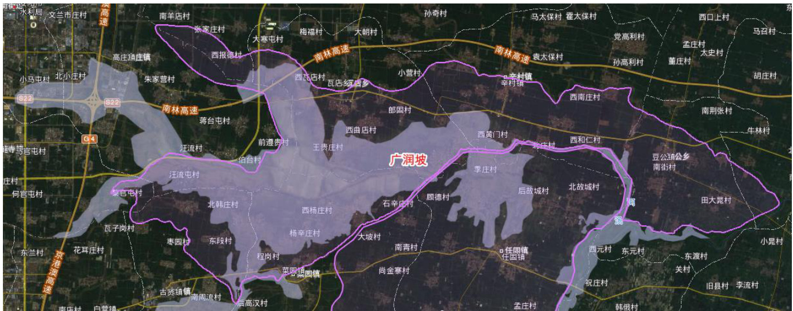  
卫星遥感图像淹没范围  

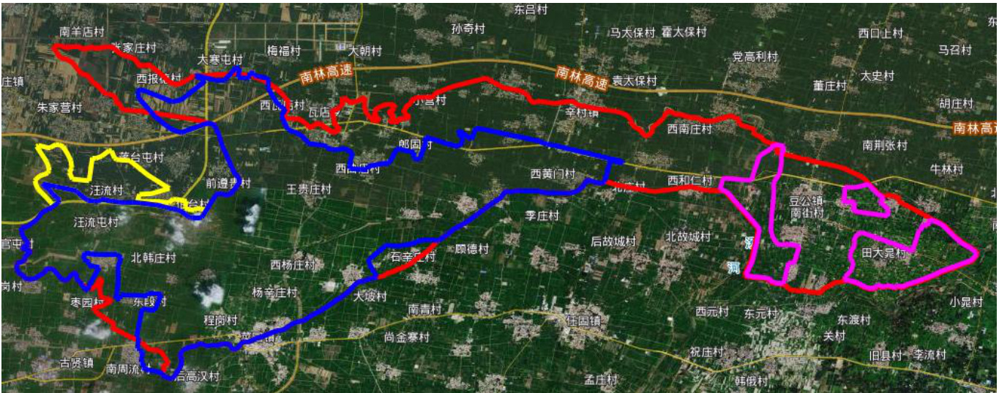  
本次实测淹没范围  

广润坡蓄滞洪区西部超淹主要是因为西防洪堤未封闭,滞洪区内滞蓄洪水回灌所致;东部内黄县部分与西部水面不连续主要原因是二级滞洪区内多条道路阻隔,行洪不畅,内黄县已完成人口转移,为保上游安阳河、汤河河道及上游城区安全,主动自河道防洪闸分洪所致。  

# 8.3 滞洪水位调查情况分析  

# 8.3.1 实测水位情况  

本次“21.7”洪水,广润坡一级蓄滞洪区洪水主要来源为两部分,一部分是蓄滞洪区内部河道洪河、羑河、茶店坡沟洪水漫溢入蓄滞洪区,另一部分为汤永河双石桥分洪口门分过来的汤河水。汤永河双石桥分洪口下游最高分洪水位 $63.09\mathrm{m}$ ,一级滞洪区最高滞洪水位 $57.4\mathrm{m}$ 。  

广润坡一级蓄滞洪区“21·7”洪水位调查情况统计表  
表 8.3-1  

<html><body><table><tr><td>位置</td><td>双石桥 分洪口</td><td>汪流屯</td><td>汪流村 南G341 涵洞</td><td>大裴村</td><td>西瓦店</td><td>菜园镇</td><td>杨辛庄</td><td>马营</td></tr><tr><td>水位 (m)</td><td>63.09</td><td>59.17</td><td>58.95</td><td>57.54</td><td>57.33</td><td>57.98</td><td>57.44</td><td>57.31</td></tr></table></body></html>  

# 2、二级蓄滞洪区  

本次“21.7”洪水,广润坡二级蓄滞洪区洪水主要来源为自王贵庄分洪堰溢流的一级蓄滞洪区部分水,王贵庄分洪堰最高分洪水位 $57.5\mathrm{m}$ ,二级滞洪区西侧东黄门处最高滞洪水位 $55.61\mathrm{m}$ ,东侧李大晁处最高滞洪水位52.56m。  

广润坡二级蓄滞洪区“21·7”洪水位调查情况统计表  
表 8.3-2  

<html><body><table><tr><td>位置</td><td>王贵庄 分洪堰</td><td>大王寨</td><td>四伏 厂村</td><td>东黄门</td><td>宋梁 桥村</td><td>郎固</td><td>东曲店</td><td>元村</td><td>李大晁</td><td>显寺</td></tr><tr><td>水位 (m)</td><td>57.5</td><td>56.65</td><td>56.65</td><td>55.61</td><td>55.5</td><td>55.89</td><td>56.06</td><td>53.70</td><td>52.56</td><td>53.35</td></tr></table></body></html>  

# 8.3.2 水位情况分析  

# 1、一级蓄滞洪区  

本次“21.7”洪水,广润坡一级蓄滞洪区首先茶店坡沟内黄至安阳快速通道桥处和洪河汪流屯处河道相继漫溢出槽,分别自北向南、自西向东南方向随地势向下游漫溢,双石桥分洪口扒口后,汤河水自南向北漫溢进入滞洪区,随着滞洪区内滞洪水位的不断上涨,滞洪区内洪河、羑河和茶店坡沟下游排泄不畅,导致漫溢处水位不断上涨,通过西防洪堤缺口向西回灌,加之上游河道决口,洪水出槽漫溢随地势汇入滞洪区。因此广润坡一级蓄滞洪区水位西部和南部水位较高主要是洪河漫溢及双石桥分洪后行洪入滞洪区,其他部位水位基本一致。  

# 2、二级蓄滞洪区  

本次“21.7”洪水,广润坡二级蓄滞洪区淹没范围较为分散,水位随淹没范围而变。自王贵庄分洪堰分洪过来的水,因王四路、曲高路及 S502 省道阻隔,向东分洪不畅,三条道路路基较高,洪水须先上涨漫过路面后才向下一个区域漫溢,最终自王贵庄溢流过来的洪水到东黄门村东部后不再向东漫溢;内黄县部分淹没主要因洹河、汤河分洪而致,水位基本呈北高南低,西高东低。  

# 8.4 滞洪水量核算  

本次“21·7”洪水,蓄滞洪量计算在万分之一地形图上将淹没范围内根据调查的水位的特点进行分区,先计算各个分区内的蓄滞洪量,最后汇总算出最大蓄滞洪量。  

经计算,广润坡一级蓄滞洪区最大滞洪量 7483 万 $\mathrm{m}^{3}$ ,广润坡二级蓄滞洪区最大滞洪量 1892 万 $\mathrm{m}^{3}$ 。  

# 8.5 滞洪区运用情况分析  

按照《预案》,广润坡一级蓄滞洪区淹没面积 $55.10\mathrm{km}^{2}$ ,滞洪水位 57.00,滞洪量0.73 亿 $\mathrm{m}^{3}$ ;广润坡二级蓄滞洪区淹没面积 $80.10\mathrm{km}^{2}$ ,滞洪水位56.00,滞洪量 1.75 亿 $\mathrm{m}^{3}$ 。  

本次实测广润坡一级蓄滞洪区淹没面积 $69.95\mathrm{km}^{2}$ ,大于现状防汛预案中淹没面积 $55.1\mathrm{km}^{2}$ ;实测王贵庄处滞洪水位为 $57.50\mathrm{m}$ ,高于现状预案滞洪水位 $57.00\mathrm{m}$ ;核算滞洪量为 0.75 亿 $\mathrm{m}^{3}$ ,大于预案中的 0.73 亿 $\mathrm{m}^{3}$ 。本次实测广润坡二级蓄滞洪区淹没面积 $36.10\mathrm{km}^{2}$ ,小于现状防汛预案中淹没面积 $80.10\mathrm{km}^{2}$ ;李大晁滞洪水位为 $52.56\mathrm{m}$ ,低于现状预案滞洪水位 $56.00\mathrm{m}$ ;核算滞洪量为 0.189 亿 $\mathrm{m}^{3}$ ,小于预案中的 1.75 亿 $\mathrm{m}^{3}$ 。  

广润坡滞洪区超淹原因主要为两方面:一是滞洪区内西防洪堤不封闭,茶店坡沟内黄至安阳快速通道桥处和洪河汪流屯处河道漫溢出槽后通过西防洪堤堤防缺口向西回灌;二是滞洪区内洪河、羑河、茶店河漫溢,河道下游排水不畅,导致上游河道决口漫溢。本次洪水,一级蓄滞洪区淹没范围大,滞洪水位高,从而引起的一级蓄滞洪区滞洪水量较大。  

广润坡一级蓄滞洪区本次“21·7”洪水属于超淹、超蓄情况;二级蓄滞洪 区本次“21·7”洪水不属于超淹、超蓄。  

# 第九章 崔家桥蓄滞洪区  

编 制:付艳林审    核:申增云  

# 9.1 滞洪区运用过程  

# (1)崔家桥蓄滞洪区启用情况  

根据本次调查结合与安阳县水利部门座谈、现场调查等,崔家桥蓄滞洪区的运用过程具体如下:  

2021 年 7 月 22 日 0:30,崔家桥蓄滞洪区郭盆分洪堰开始分洪,蓄滞洪区正式启用;  

7 月 22 日早 8:00,曹马分洪口开始分洪;  

7 月 22 晚,达到最高滞洪水位 $65.5\mathrm{m}$ ,之后滞洪区水位开始下降,进入退水阶段;  

7 月 25 日晚,退水基本完成。  

# (2)滞洪区上游洪水进程情况  

按照崔家桥蓄滞洪区调度预案,在郭盆闸未重建的情况下,当洹河洪水超过 $300\mathrm{m}^{3}/\mathrm{s}$ 时,洪水通过曹马分洪堰、郭盆分洪堰自然漫溢进入崔家桥蓄滞洪区。  

7 月 21 日 18:16,洹河安阳站实测流量 $276\mathrm{m}^{3}/\mathrm{s}$ ,加上下游区间涝水汇入,洹河市区段水量已接近 $300\mathrm{m}^{3}/\mathrm{s}$ 的崔家桥蓄滞洪区启用标准,安阳市防汛指挥部上报省水利厅,随时准备启用崔家桥蓄滞洪区。同时安阳市防汛指挥部充分利用彰武、小南海水库库容,通过控制水库泄量降低洹河洪量,但彰武水库下游洹河支流金线河、珠泉河、粉红江汇入水量也持续增大,导致洹河市区段水位持续上涨。  

7 月 21 日 20:05,洹河安阳站实测流量 $348\mathrm{m}^{3}/\mathrm{s}$ ,并持续上涨,安阳市防汛指挥部再次尝试通过于曹闸限泄 $300\mathrm{m}^{3}/\mathrm{s}$ ,利用河道槽蓄调峰、错峰,尽量降低崔家桥蓄滞洪区启用几率,减少淹没损失。于曹闸上游水位逼近警戒水位时为保证城区防洪安全,于曹闸开闸畅泄,7 月 22 日 0:30,崔家桥蓄滞洪区郭盆分洪堰开始分洪,崔家桥蓄滞洪区正式启用。  

# 9.2 淹没范围调查及情况分析  

# 9.2.1 蓄滞洪区淹没范围调查  

本次“21·7”洪水,淹没范围南起洹河左堤、西至朝冠村—东于曹、北到王宁—冀庄村、东到冯村一带,实测淹没面积 $65.11\mathrm{km}^{2}$ ,淹没范围在规划滞洪区边界范围内面积 $62.62\mathrm{km}^{2}$ ,超出滞洪区边界范围面积 $2.49\mathrm{km}^{2}$ ,超淹率 $3.82\%$ ,超淹范围位于规划东防洪堤东侧冯村一带。淹没情况见下表。  

# 崔家桥蓄滞洪区淹没情况表  

单位: $\mathrm{km}^{2}$  

表 9.2-1  

<html><body><table><tr><td>实际淹没面积</td><td>蓄滞洪区内淹没面积</td><td>超淹面积</td></tr><tr><td>65.11</td><td>62.62</td><td>2.49</td></tr></table></body></html>  

具体淹没范围见“崔家桥蓄滞洪区“21·7”洪水淹没范围调查测量图”。  

# 9.2.2 蓄滞洪区范围外超淹情况及原因分析  

本次崔家桥蓄滞洪区外超淹范围主要位于规划东防洪堤东侧冯村一带,该部分超淹面积为 $2.49\mathrm{km}^{2}$ 。超淹原因为规划北东防洪堤未建,滞蓄洪水由西向东自然漫溢。  

# 9.2.3 淹没范围对比分析  

# 9.2.3.1 与现状防洪预案淹没面积对比  

按照《预案》,崔家桥蓄滞洪区设计蓄滞洪水位 $65.75\mathrm{m}$ ,蓄滞洪量 0.61亿 $\mathrm{m}^{3}$ ,淹没面积 $74.54\mathrm{km}^{2}$ ,运用机率为 5 年一遇。  

本次实测淹没面积为 $65.11\mathrm{km}^{2}$ ,小于预案中的淹没面积 $74.54\mathrm{km}^{2}$ 。  

崔家桥蓄滞洪区预案中淹没面积为相应滞洪水位 $65.75\mathrm{m}$ 时的淹没面积,本次洪水中实测滞洪水位 $65.48\mathrm{m}$ ,低于预案中的滞洪水位 $65.75\mathrm{m}$ ,淹没面积小于预案中的淹没面积,但因东防洪堤未修建,滞洪区围堤不封闭,造成实际淹没面积小于预案淹没面积的情况下东部超淹。  

# 9.2.3.2 与遥感图像对比分析  

按照河南省水利勘测公司提供的卫星遥感图像,崔家桥蓄滞洪区的淹没范围与我公司本次实测淹没范围面积略小。  

主要原因省勘测公司提供的遥感图像为 7 月 30 日成像,而我公司本次调查实测面积为现场调查了解的洪水淹没最大面积,因此比遥感图像范围略大。东部超淹部分主要原因为东防洪堤未建,洪水自然漫溢所致。  

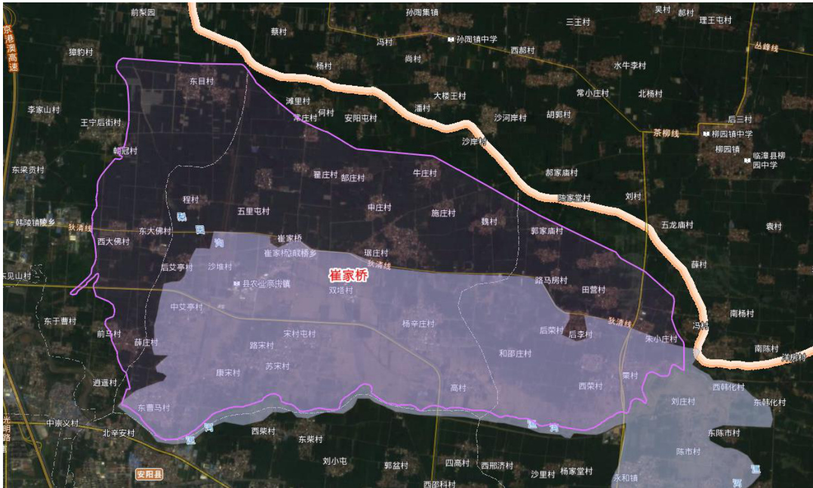  
卫星遥感图像淹没范围  

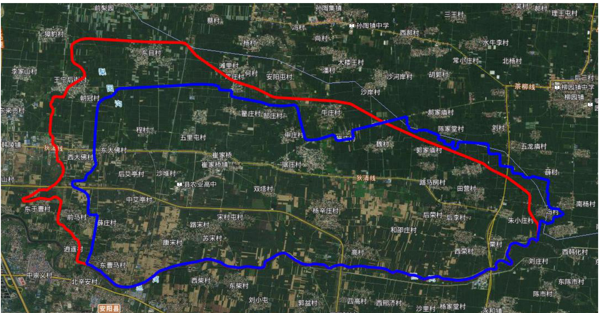  
本次实测淹没范围  

# 9.3 滞洪水位调查情况分析  

# 9.3.1 实测水位情况  

本次“21·7”洪水,崔家桥蓄滞洪区洪水主要来自洹河,通过于曹沟、曹马分洪堰和郭盆分洪堰分洪进入崔家桥蓄滞洪区。根据本次实际调查测量,崔家桥蓄滞洪区内部实测高程如下表。  

# 崔家桥蓄滞洪区“21·7”洪水位调查情况统计表  

表 9.3-1  

<html><body><table><tr><td>位置</td><td>曹马 分洪口</td><td>东曹马</td><td>薛庄</td><td>东大佛</td><td>崔家桥 镇政府</td><td>郭盆 分洪口</td><td>东荣村</td><td>王家口</td><td>冯村</td></tr><tr><td>水位 (m)</td><td>68.9</td><td>67.6</td><td>66.45</td><td>65.58</td><td>65.48</td><td>65.64</td><td>63.51</td><td>62.51</td><td>62.10</td></tr></table></body></html>  

# 9.3.2 水位情况分析  

本次“21·7”洪水,崔家桥蓄滞洪区洪水主要来自洹河,通过于曹沟、曹马分洪堰和郭盆分洪堰分洪进入崔家桥蓄滞洪区,崔家桥蓄滞洪区整体地势是西北高、东南低。通过于曹沟左岸漫溢过来的洪水因东西向于曹\~前马村及南北向曹马\~狄清线两条道路阻隔,向北漫溢至西大佛一带,导致西大佛一带水位明显高于蓄滞洪区内其他部位水位,为 $67.08\mathrm{m}$ 。从分洪堰和郭盆分洪堰分洪的洪水分洪后即向北、向东随地势漫溢,淹没范围内东部王家口、冯村地势最低,水位分别为 $62.51\mathrm{m}$ 和 $62.10\mathrm{m}$ 。  

# 9.4 滞洪水量核算  

本次“7·21”洪水,蓄滞洪量计算在万分之一地形图上将淹没范围内根据调查的水位的特点进行分区,先计算各个分区内的蓄滞洪量,最后汇总算出最大蓄滞洪量。  

经计算,崔家桥蓄滞洪区滞洪量为 4920 万 $\mathrm{m}^{3}$ 。  

# 9.5 滞洪区运用情况分析  

按照《预案》,崔家桥蓄滞洪区淹没面积 $74.54\mathrm{km}^{2}$ ,滞洪水位 $65.75\mathrm{m}$ ,滞洪量 0.61 亿 $\mathrm{m}^{3}$ 。  

本次实测崔家桥蓄滞洪区淹没面积为 $65.11\mathrm{km}^{2}$ ,小于现状防汛预案中淹没面积 $74.54\mathrm{km}^{2}$ ;实测崔家桥镇处滞洪水位为 $65.48\mathrm{m}$ ,低于现状预案滞洪水位 65.75;核算滞洪量为 0.492 亿 $\mathrm{m}^{3}$ ,小于预案中的 0.61 亿 $\mathrm{m}^{3}$ 。  

崔家桥蓄滞洪区本次“21·7”洪水因东防洪堤未建,造成东部超淹至蓄滞洪区范围以外。但滞洪区滞洪水位、滞洪量均小于预案中的滞洪水位、滞洪量。  

崔家桥蓄滞洪区本次“21·7”洪水属于属于超淹情况。  