# 4.1.2 卫共流域模型库  

# 4.1.2.1 水利专业模型  

# 4.1.2.1.1 洪水预报模型  

洪水预报模型是用于预测和评估洪水发生及其影响的一种工具,其主要目的是通过对降雨量、河道流量、气象条件等因素的综合分析,预测重要节点控制断面的洪峰流量(水位)、峰现时间、洪量(径流量)和洪水过程等洪水要素,从而为防洪应急调度提供科学依据。  

卫共流域的洪水预报模型对流域内的洪水调度决策的准确性和可靠性起到至关重要的作用,根据卫共流域特点及相关水库洪水预报经验,采用新安江、API 等多种水文模型进行产汇流计算,找出最适合卫共流域下垫面特点的产汇流模型,提升重点河道洪水预见期至 72 小时。  

构建洪水预报模型的基础和前提条件是划分准确的子流域范围,子流域划分越精细,往往洪水预报越准确,划分的各子流域均需构建单独的产汇流模型,所计算的洪水结果通过河道一维水动力学耦合演进或马斯京根法河道演进,可得到卫共流域干流各控制断面的水位流量过程。  

洪水预报模型实现卫共流域内重要节点断面的洪水预报,包含各断面的水位、流量、水量等预报要素,预报节点断面包括合河、刘庄、淇门、修武、黄土岗、五陵、新村、元村集、安阳等水文站,盐土庄闸、合河闸、小河口闸等拦河闸,盘石头水库、小南海水库、彰武水库等大中型水库以及南水北调总干渠河道交叉断面处。  

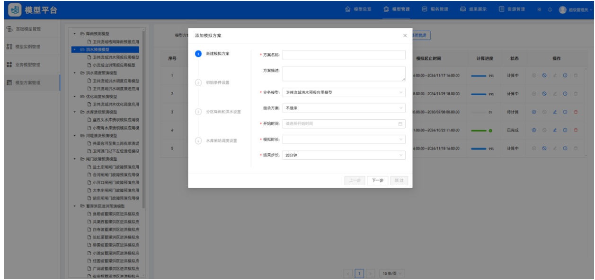  
图 4.1.2.1.1-1 洪水预报模型  

# 4.1.2.1.2 水库调度模型  

水库调度模型构建总体结构包括调度目标、约束条件、模型调度运用方式和与其他模型的关系。模型以入库来水预测、区间来水预测以及河道控制流量、水位为计算边界条件,通过非工程措施水库调度,为卫共流域防洪减灾,防洪调度决策提供决策支撑。  

卫共流域内有 2 座大型水库,16 座中型水库,共计 18 座。大中型水库在削峰拦蓄洪水以及防汛调度中起到重要作用,因此需要构建卫共流域盘石头水库、小南海水库、彰武水库、汤河水库、琵琶寺水库、宝泉水库等 18 座大中型水库的防洪调度模型。  

模型以入库来水预测、区间来水预测以及河道控制流量、水位为计算边界条件,通过非工程措施水库调度,为卫共流域防洪减灾,防洪调度决策提供决策支撑。  

综合考虑各水库在防洪调蓄中的重要性、库容、建模工作量、必要性等因素,调度模型以入库洪水预报、区间洪水预报以及下游河道实测水位为计算边界条件,以水库泄洪洞、溢洪道、泄洪闸等泄水建筑物为调度对象,通过科学运用流域内各水库的防洪库容,在保证水库、河道防洪安全前提下,尽量满足合河闸、盐土庄闸、小河口闸、四伏厂闸、郭盆闸、双石桥闸等重要节点的防洪要求,保证下游防护对象的防洪安全。  

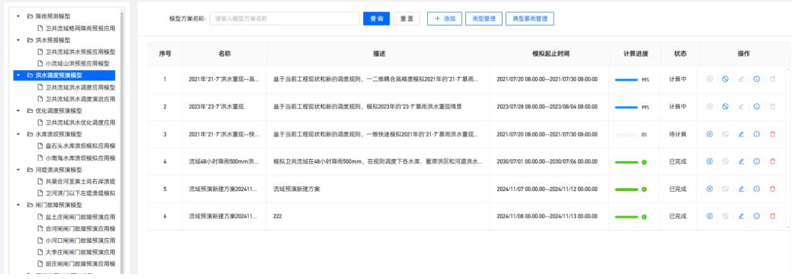  
图 4.1.2.1.2-1  水库调度模型  

# 4.1.2.1.3 河道一维水动力模型  

卫河作为暴雨洪水的最终出口通道,其过流能力的大小直接决定了流域内整体的防洪排涝能力,在发生超标准洪水时甚至因河道过流能力不足导致河道洪水漫溢,淹没河道周围的大片低洼区域。如果仅采用二维网格剖分来反映河道,由于网格受数量限制不能过小,从而使得以二维网格描绘的河道断面大小严重失真,以此为依据计算的河道行洪能力也是不准确的。  

通过补充勘测河道断面数据结合已治理段的河道断面数据,构建卫共干流及重要支流河道的一维水动力学模型,并通过与水库调度模型、洪水预报模型以及洪水演进二维模型的耦合,精准模拟从暴雨产生到产流到形成洪水的过程,得到河道各断面处准确可靠的水位、流量等洪水要素过程。一方面能真实反映河道的排水能力,实现河道一维与二维模型的交互,另一方面其计算结果作为蓄滞洪区入流条件,能够确保各蓄滞洪区分洪水位和流量过程的准确。  

河道一维水动力模型主要涵盖卫共流域 49 条重要干支流,与洪水预报模型和水库调度模型联合构成整个卫共流域的一维洪水演进模型,将洪水预报模型计算的子流域重要出口断面的径流量过程作为河道一维水动力模型的入流边界,将水库调度模型耦合入河道一维水动力模型中,用来进行水库调度规则的设置。  

考虑到重要支流洪水过程也是支流本身经过水库调度、河道闸站调度以后得到的结果,无法直接通过产汇流模型计算,因此,为准确模拟干支流洪水过程,有水库调度或闸站调度的重要支流也必须加入模型范围,最终考虑本次需要构建卫河、共产主义渠、大沙河 3 条干流以及淇河、思德河、安阳河、汤永河、峪河、石门河等 46 条重要支流,形成河网进行联合调度模拟,模型要素包括河道本身、河道上的节制闸、翻板闸、橡胶坝、桥墩阻水桥梁、防洪闸、退水闸等。  

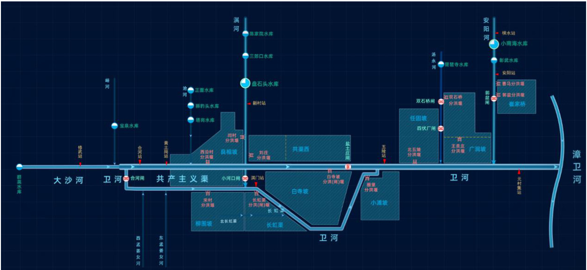  

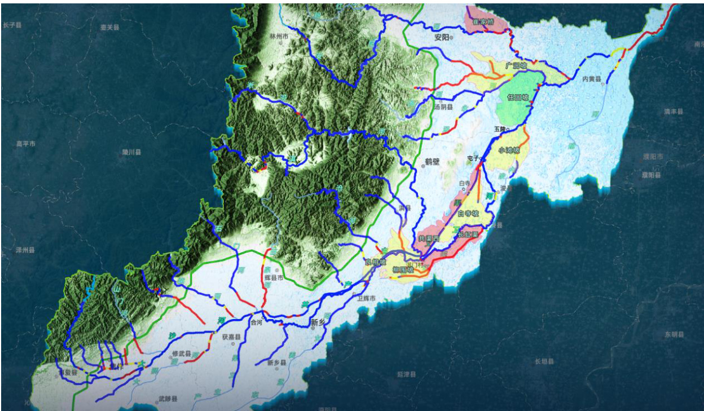  
图 4.1.2.1.3-1  河道一维水动力模型  

# 4.1.2.1.4 二维洪水淹没演进模型  

(1)蓄滞洪区二维淹没演进模型  

在《海河流域防洪规划》上蓄、中疏、下排,适当地滞"的防洪除涝体系中,河南省承担着拦蓄、分滞洪水的重要任务,由于河南省卫共流域流域防洪的特点,9 座蓄滞洪区启用频次高,为提高蓄滞洪区运用管理水平,精准模拟滞洪区蓄洪滞洪过程以及蓄滞洪区联合调度过程,获得蓄滞洪区启用时间、滞洪量、淹没面积、淹没水深、淹没历时等关键数据,需要构建卫共流域的良相坡、共渠西、白寺坡、长虹渠、柳围坡、崔家桥、广润坡、小滩坡、任固坡共 9 座蓄滞洪区二维洪水淹没演进模型。  

蓄滞洪区二维淹没演进模型的构建主要包括基础资料收集与整理、确定模型范围、控制线绘制、分区划分、网格剖分、地形高程插值、边界条件设置、构筑物设置、参数设置、模型计算以及模型参数率定与验证等步骤。  

(2)南水北调交叉河道二维洪水演进模型  

南水北调中线工程是实现我国水资源优化配置、促进经济社会可持续发展、保障和改善民生的重大战略性基础设施。中线总干渠沿线布置有上千座立体交叉建筑物,其中输水建筑物 159 座,包括输水渡槽 27 座、渠道倒虹吸 102 座、暗渠 17 座、隧洞 12 座、泵站 1 座;左岸排水建筑物 458 座,包括排水涵洞 56 座、排水渡槽 75 座、排水倒虹吸 327 座。交叉河道建筑物担负中线总干渠左岸洪水的行洪任务,输水建筑物承担着中线总干渠输水功能,对保障中线工程总干渠安全稳定运行具有重要意义。  

本次卫共流域范围内南水北调中线工程起点为沁河倒虹吸出口,终点为漳河倒虹吸进口,总长度为 $227\mathrm{km}$ ,其中渠道倒虹吸 32 座,暗渠 4 座,输水渡槽 2座,左排建筑物 66 座。本次选取大沙河、十里河、淤泥河以及王村河共 4 条与南水北调交叉的河流进行河道二维洪水淹没演进模型构建。  

  
图 4.1.2.1.3-1 河道二维淹没演进模型  

# 4.1.2.1.5 水库河道蓄滞洪区耦合模型  

根据卫共流域防洪预报调度的实际需求,需要将全流域河道一维水动力学模型、蓄滞洪区二维淹没演进模型、水库调度模型等进行耦合。通过河道一维水动力学模型和二维水动力学模型的耦合计算,一方面能真实反映河道的排水能力,实现河道与周围二维地面径流的交互,另一方面出流过程也可作为蓄滞洪区的入流边界条件使用,需建立耦合模型。  

水库河道蓄滞洪区耦合模型主要是基于洪水预报模型、河道一维水动力模型、二维洪水淹没演进模型、水库调度模型以及河道溃堤漫堤风险分析模型等,采用侧向连接和标准连接两种方式将以上几种模型进行紧耦合,构建卫共流域的一二维耦合计算模型。  

对于需要进行耦合计算的卫共干流及主要支流河道一维水动力模型、蓄滞洪区二维演进模型、水库调度模型,其耦合方式为标准连接与侧向连接。  

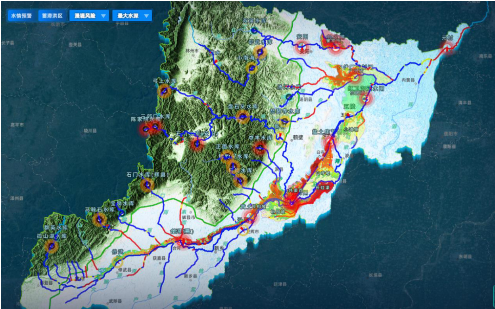  
图 4.1.2.1.5-1  水库河道蓄滞洪区耦合模型  

# 4.1.2.1.6 洪水预警模型  

通过构建水库、河道、蓄滞洪区等洪水预警模型,结合洪水预报模型、河道一维水力模型、水库调度模型、蓄滞洪区二维淹没演进模型、南水北调交叉河道洪水二维演进模型、水库河道蓄滞洪区耦合模型等预演模型模拟结果数据和实测洪水数据,对水库、河道、蓄滞洪区、堤防险工险段等进行风险预警,实时监测河道的洪水位、洪峰流量,蓄滞洪区进洪时间、进洪水位、进洪量以及南水北调交叉河道洪水实时信息。  

洪水预警对象包含 2 座大型水库、16 座中型水库,预警指标为是否超汛限水位、超设计水位、超校核水位;包含 49 条河流,预警指标为是否超警戒水位、超保证水位;包含 9 座蓄滞洪区,预警指标为是否启用及分红。  

  
图 4.1.2.1.6-1 洪水预警模型  

# 4.1.2.1.7 水库溃坝洪水风险分析模型  

大中型水库一旦溃坝将对下游带来极大损失,因此预演水库溃坝情景,分析溃坝洪水给下游带来的风险极为重要,溃坝预判及洪水风险分析模型包括盘石头水库、小南海水库 2 座大型水库。  

水库溃坝洪水风险分析模型的构建主要涵盖基础数据收集与整理、模型范围粗定、控制线绘制、分区划分、网格剖分、地形高程插值、边界条件设置、构筑物设置、参数设置以及模型计算与率定等方面。  

  
图 4.1.2.1.7-1  水库溃坝洪水风险分析模型  

# 4.1.2.1.8 河道漫堤及溃堤洪水风险分析模型  

河道漫堤及溃堤洪水风险分析模型主要有溃堤预判模型、风险分析模型和风险分析模型结果。功能主要是预判和分析河道堤坝可能发生溃堤的危险性,从而为防洪减灾工作提供科学依据。  

对于卫河、共产主义渠存在多处高填方堤防的河段,尤其是确定为险工险段的河段,选取重点险工险段、填方高、堤防存在安全隐患、一旦溃堤或漫堤对下游城镇存在较大淹没风险的典型区域构建二维漫堤或溃堤风险分析模型,因此本次初步对共产主义渠右堤和卫河左堤构建二维漫堤或溃堤风险分析模型。  

# 1)共产主义渠右堤  

河道范围为共产主义渠右堤从合河闸至黄土岗水文站,全长 $35.2\mathrm{km}$ ,该段河道右岸堤坊填方高,河南“21.7”洪水期间,共产主义渠右堤李士屯村发生过溃堤险情,且右岸有新乡市和卫辉市主城区,一旦发生溃堤或漫堤风险,将对下游城市造成巨大洪灾损失,因此该段纳入二维模型范围。  

# 2)卫河左堤  

河道范围为卫河左堤从淇门水文站至长虹渠退水闸,全长 $27.3\mathrm{km}$ ,该段河道左岸堤防填方较高,在河南发生“21.7”洪水时,卫河左岸堤防彭村段发生过决口险情,因此该段河道左堤存在漫堤或溃堤风险,并且左岸存在多个密集居民地,一旦发生溃堤或漫堤风险,将对下游居民地造成重大损失,因此该段纳入二维模型范围。  

  
图 4.1.2.1.8-1  河道漫堤及溃堤洪水风险分析模型  

# 4.1.2.1.9 闸门故障风险分析模型  

河道水闸或蓄滞洪区分洪闸在漫长的使用过程中,不可避免的会出现各种故障,为模拟河道拦河闸发生故障对河道行洪造成的影响以及由此带来的洪水淹没风险,需要构建闸门故障风险分析模型,选取本次河道一维模型添加的水工建筑物中的重要拦河闸为模型研究对象,模拟当这些拦河闸在洪水过程中无法开启或无法关闭时,所造成的洪水风险,包括漫堤及对河道两岸的淹没风险、河道壅水风险等。  

模型应用对象包括合河闸、大李庄闸、胡庄闸、小河口闸、盐土庄闸共 5 座水闸。  

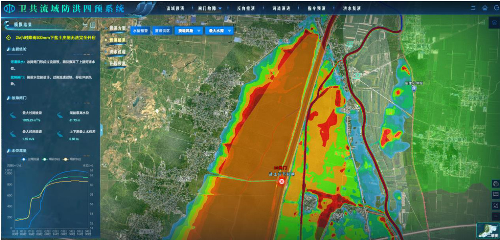  
图 4.1.2.1.9-1 闸门故障风险分析模型  

# 4.1.2.1.10 洪灾损失评估模型  

通过构建洪灾损失评估模型,评估实际发生的洪水淹没和模拟洪水淹没洪灾损失,其过程分为确定洪水影响指标、确定损失率、指标展布与叠加分析计算几部分。  

洪灾损失评估模型主要应用对象为洪水影响范围内区域。  

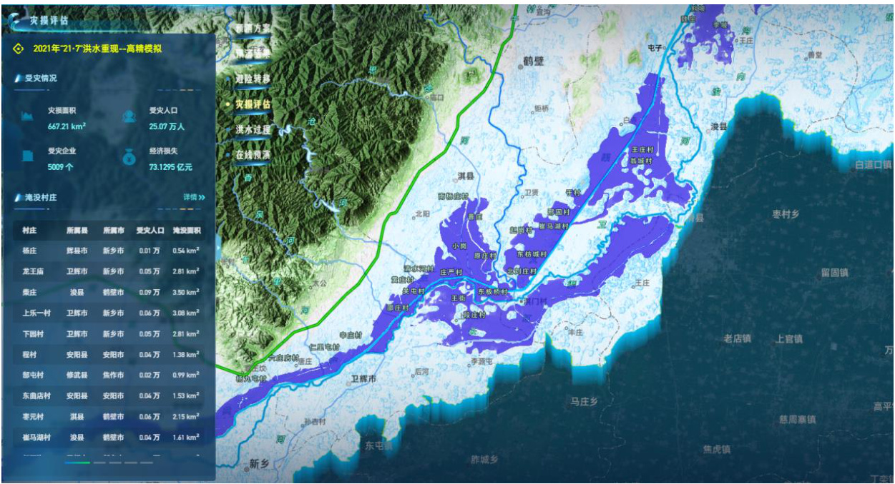  
图 4.1.2.1.10-1 洪灾损失评估析模型  

# 4.1.2.2 智能识别模型  

# 4.1.2.2.1 遥感智能分析  

接入省级数字孪生平台遥感智能分析模型,实现卫共流域遥感智能解译和智能识别。融合多源遥感影像数据,通过遥感解译和人工智能识别技术,实现基于多源遥感影像的地物分类、变化检测与目标识别,提取卫共流域内的水体生产建设项目等信息,动态监测变化,为实现“四预”监测预警提供支撑。  

  
图 4.1.2.2.2-1  接入遥感智能分析模型  

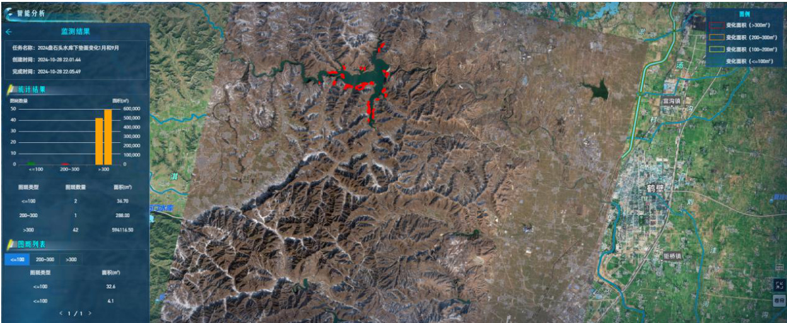  
图 4.1.2.2.2-2  接入视频智能分析模型  

# 4.1.2.2.2 视频智能分析  

接入省级数字孪生平台视频智能分析模型,实现卫共流域视频智能识别。  

构建基于人工智能技术的视频监控 AI 识别模型,利用已经建成的视频监控网络,通过对视频监控中出现的特定场景、行为进行自动提取、定位和分析,可以实现水域漂浮物检测、河岸工程车识别、堤岸损毁识别、采砂机械识别、水尺识别等功能,为水利工作提供技术和数据支持,与现有的工作业务流无缝对接,改进传统的人工巡查模式。  

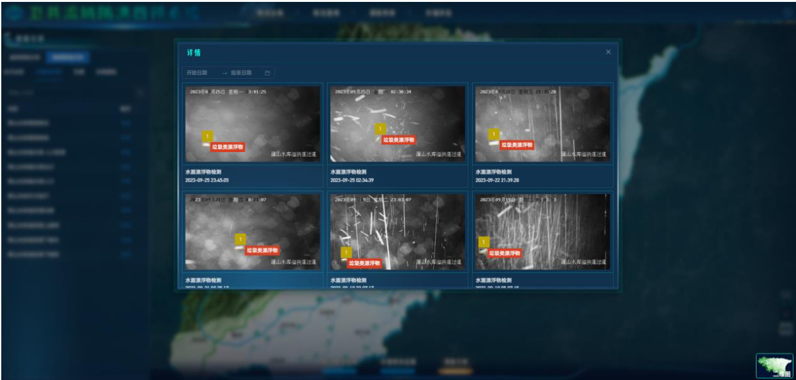  
图 4.1.2.2.2-1  接入视频智能分析模型  

# 4.1.2.3 模拟仿真引擎  

数据底板搭建完成后,要实现流域物理实体与虚拟实体的实时交互和深度融合,通过汇聚流域多源、多维、多时相、多专业连续监测数据,分类分段整理成时序数据,研究基于时序事件驱动的全空间、多过程、多情景实时动态展示技术  

和历史事件回放技术,支撑面向流域运维管理的动态仿真。本次利用省级水利数字孪生平台的模拟仿真引擎能力进行卫共流域相关场景的模拟仿真。  

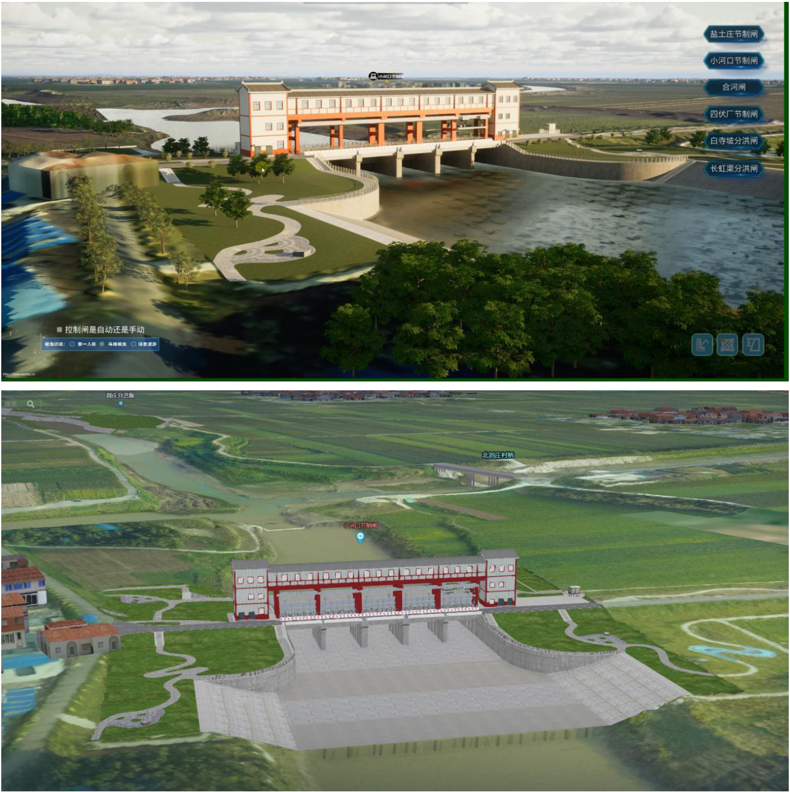  
图 4.1.2.3 -1 模拟仿真引擎支撑  

# 4.1.2.4 模型管理平台  

在省级数字孪生平台建设框架下,搭建卫共流域模型管理平台,实现对卫共流域模型的管理。  

模型管理平台基本功能包括模型的分类编码、模型信息的全局预览、模型原理的查看、模型参数的修改、模型方案的增删改查、模型方案的计算暂停和停止控制、模型方案结果的查询、模型服务接口的管理等。  

  
图 4.1.2.4 -1 模型管理平台 1  

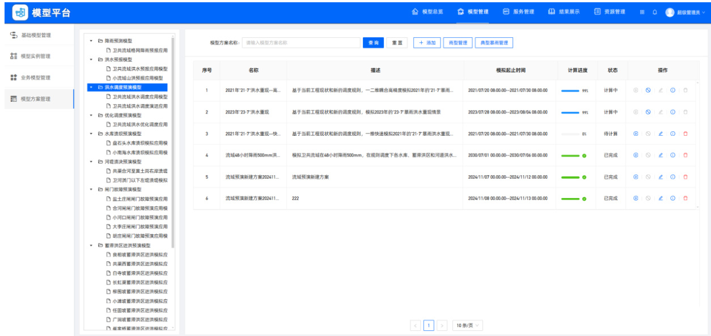  
图 4.1.2.4 -2  模型管理平台 2  

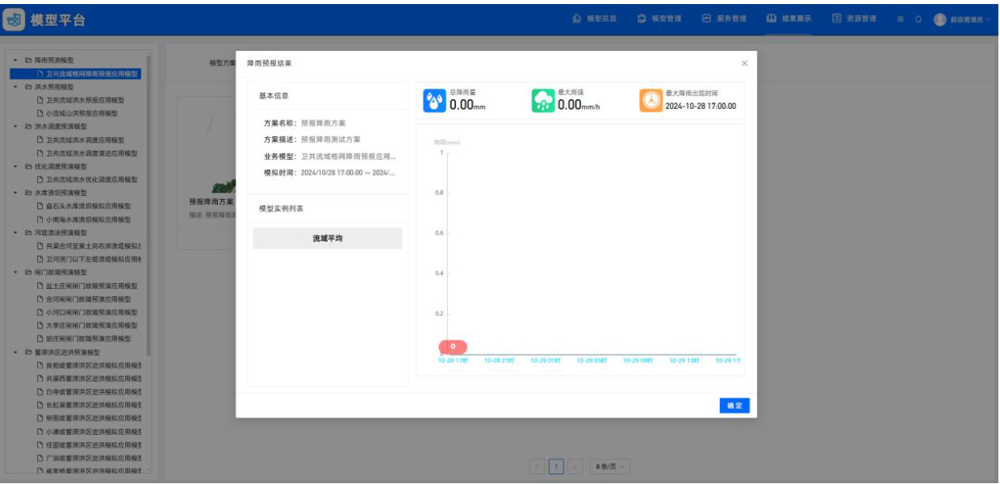  
图 4.1.2.4 -3 模型管理平台 3  