漳卫河“21·7”洪水灾后治理小滩坡蓄滞洪区建设  

# 初步设计报告  

(浚县)  

# 工程设计(综合甲级)证书:A112002614  

# 中水北方勘测设计研究有限责任公司二 O 二四年七月  

# 目  录  

第一章  综合说明 ···· ·· 1-1  
1.1 绪言 ··· ·· 1-1  
1.2 水文 ······ ··· 1-2  
1.3 工程地质 ···· ··· 1-4  
1.4 工程任务与规模 ··· 1-5  
1.5 工程布置与建筑物 ·· · · · · · 1-7  
1.6 机电及金属结构 ··· .1-10  
1.7 建设征地与移民安置 ··· .· 1-10  
1.8 施工组织设计 ···· ····· 1-11  
1.9 环境影响评价 ····· ..·1-12  
1.10 水土保持.··. ...·1-14  
1.11 劳动安全与工业卫生···· .· 1-14  
1.12 节能评价.·. ....1-14  
1.13 工程管理·. .·1-15  
1.14 工程信息化·· .·1-15  
1.15 投资估算... ...·1-15  
1.16 经济评价..·. ...·1-16  
第二章水文.. · · · · 2-1  
2.1 河流概况 ···· ·· 2-1  
2.2 气象 ······ ··· 2-2  
2.3 水文基本资料 ······ · · · · 2-3  
2.4 设计洪水 ··· · 2-4  
2.5 设计涝水 ···· · · · · 2-8  
2.6 水文自动测报系统 ··· ..2-13  
第三章  工程地质 ···· ··· 3-1  
第四章  工程任务和规模 ···· ·· 4-1  
4.1 基本情况 ···· ·· 4-1  
4.2 工程现状 ······ ·· 4-5  
4.3 存在问题与必要性 ··· ··· 4-9  
4.4 工程建设任务与标准 ..4-28  
4.5 洪水演进分析以及特征指标符合 ..4-30  
4.6 建设内容与规模 ···· ...4-39  
4.7 设计排涝水面线 ··· ..4-43  
第五章  工程布置及建筑物 ········ · · · · · · 5-1  
5.1 设计依据 ········ ··· 5-1  
5.2 工程等别与设计标准 ··· · · · · 5-4  
5.3 工程总布置 ···· · · · · 5-5  
5.4 沟渠清淤扩挖工程 ··· · · · · · 5-7  
5.5 分洪堰工程 ···· ..5-17  
5.6 桥涵工程 ······ ...5-32  
5.7 过路涵工程 ····· ...5-43  

# 5.8 撤退路工程 -46  

# 5.9 安全监测工程 · -49  

# 第六章  机电及金属结构 6-1  

# 第七章  施工组织设计  

7.1 施工条件 ·· 7-1  
7.2 料场选择 ··· 7-8  
7.3 施工导流 ·· 7-9  
7.4 主体工程施工 .7-10  
7.5 施工交通及施工布置 .7-12  
7.6 施工总进度 · ..7-17  

# 第八章  建设征地与移民安置  

8.1 概述 ···· ·· 8-1  
8.2 建设征地范围 ··· 8-2  
8.3 实物调查 ··· ·· 8-4  
8.4 农村移民安置 ·· 8-7  
8.5 农副业设施补偿 ·8-13  
8.6 土地复垦及耕地占补平衡 .8-14  
8.7 企(事)业单位处理 ·8-15  
8.8 专业项目处理 ··· ..8-15  
8.9 补偿标准及投资 · ..8-16  

# 第九章 环境保护设计·  

9.1 概述 ··· ·· 9-1  
9.2 水环境保护 ···· ··· 9-8  
9.3 大气环境保护措施 · 9-11  
9.4 声环境保护措施 ·· ·9-12  
9.5 固体废物处理措施 ·9-13  
9.6 生态环境保护措施 · 9-14  
9.7 人群健康保护措施 ·9-15  
9.8 环境管理与监测 ··· .9-16  
9.9 环境保护投资概算 .. 9-20  

# 第十章  水土保持设计 10-1  

10.1概述... ..10-1  
10.2 水土流失防治责任范围及措施布局 ..· 10-1  
10.3 弃渣场及其防护工程设计... ·10-5  
10.4 表土保护利用与土地整治工程设计 ·10-7  
10.5 植被恢复与建设工程设计. . 10-8  
10.6 临时防护与其他工程设计· 10-10  
10.7 水土保持工程施工组织设计 10-11  
10.8 水土保持监测与管理设计.. 10-13  
10.9 水土保持投资概算... · 10-18  

# 第十一章  劳动安全与工业卫生 11-1  

11.1 设计依据 ·· ·· 11-1  
11.2 劳动安全措施 · 11-8  
11.3 工业卫生措施 11-12  
11.4 安全卫生评价 11-13  
11.5 劳动安全投资· 11-14  

# 第十二章  节能评价 12-1  

12.1 设计依据..·. ..·12-1  
12.2 工程建设期能耗种类、数量分析及能耗指标 ..·12-2  
12.3运行期能耗分析.. .·12-3  
12.4 节能措施.. .·12-3  
12.5 分析建设期和运行期的能耗总量 ..12-4  
12.6节能效果综合评价..·. ....12-5  

# 第十三章  工程管理设计 13-1  

13.1 工程概况 ...13-1  
13.2 设计依据 ...13-1  
13.3 工程管理体制 ..13-1  
13.4 工程运行管理 ...·13-3  
13.5 工程管理范围和保护范围 ... 13-6  
13.6 管理设施与设备 ...13-7  

# 第十四章  工程信息化 4-1  

14.1 概述.... ·14-1  
14.2需求分析..·. ..14-5  
14.3 系统总体设计 ..14-8  
14.4 分项设计内容 · 14-10  
14.5信息共享... 14-17  
14.6 网络信息安全.. 14-17  
14.7 系统集成与运行维护 · 14-17  
14.8 工程量清单·· · 14-20  

# 第十五章  设计概算 15-1  

15.1 编制说明 .15-1  
15.2 工程概算表 ..15-5  

# 第十六章  经济评价 16-1  

16.1 概述.... ..· 16-1  
16.2费用估算... .·16-1  
16.3 经济效益分析及估算 ·16-3  
16.4国民经济评价· ..16-4  
16.5 敏感性分析. .· 16-7  
16.1 评价结论· .·16-7  

# 第一章 综合说明  

# 1.1 绪言  

# 1.1.1 地理位置  

小滩坡蓄滞洪区位于河南省鹤壁市的浚县、安阳市的内黄县境内卫河中游右岸,1955 年为弥补长虹渠和白寺坡等蓄滞洪区蓄洪能力不足而建。小滩坡东以防洪堤(二道防线)为界,北、西靠卫河右堤,南接自然高地。地面高程 $56.20\sim$ $57.30\mathrm{m}$ ,蓄滞洪区为黄河冲积平原,呈南北向,地形总的趋势是南高北低,地面坡降 1/5200。小滩坡蓄滞洪区设计滞洪水位 $57.30\mathrm{m}$ ,水深 $0.5{\sim}4.0\ensuremath{\mathrm{m}}$ ,相应滞洪量 0.74 亿 $\mathsf{m}^{3}$ ,淹没面积 $95.4\mathsf{k m}^{2}$ 。  

# 1.1.2 工程建设必要性  

# (1)蓄滞洪区建设是流域防洪体系建设形成的需要  

小滩坡蓄滞洪区是解决卫河超标准洪水时运用的蓄滞洪区,在有效控制卫河老观嘴以下河道超量洪水中,发挥着至关重要的作用,它是保护卫河中下游平原地区防洪安全必不可少的蓄洪工程,是卫河下游地区重要的防洪安全保障。只有合理、有效、灵活的运用小滩坡蓄滞洪区,才能有效防御漳卫河系大洪水,特别是防御超标准洪水,最大限度减少洪水灾害损失。为此,尽快进行小滩坡蓄滞洪区建设对保障流域经济社会健康发展有着不可替代的作用。  

# (2)蓄滞洪区建设是解决区内居民安全生产、生活的重要保障  

蓄滞洪区既是蓄滞洪水的场所,又是区内居民赖以生存发展的基地,小滩坡蓄滞洪区中耕地比重较大,几乎占蓄滞洪区面积的 $75\%$ 。小滩坡已启用多次,在“21.7”洪水中发挥着重要的防洪作用,为漳卫河系防洪减灾做出了巨大贡献。  

由于蓄滞洪的影响,蓄滞洪区内居民生产、生活极不安定,生产规模受制约,生活水平低于周边其他地区,区内居民为防洪大局作出了很大牺牲。通过工程建设,排涝工程通畅后,可以很大程度上减少蓄滞洪区启用过后的退水时间,减少居民损失。因此,搞好蓄滞洪区工程建设、安全建设,保障区内居民安全生产、生活,提高居民生活水平,以适应社会经济快速、健康的发展,是解决区内居民安全与发展的重要保障。  

# (3)蓄滞洪区建设是完善区内管理和及时有效、安全启用的必要条件  

蓄滞洪区建设滞后,蓄滞洪设施标准低,不能满足群众安全需要,会加剧蓄滞洪区使用的困难。同时蓄滞洪区堤防堤身断面未达到设计要求,堤身单薄,险  

情隐患多,蓄滞洪时难以保证围堤外地区安全。实施蓄滞洪区工程建设,使得蓄滞洪区的安全措施完备,缓和了人水矛盾,避免了蓄滞洪区运用时的众多隐患,大大降低了蓄滞洪区运用的社会成本。  

实施安全建设使得蓄滞洪区的安全措施完备,需要转移时能够做到有序、快捷,实现“动荡少、撤得出、保安全”。蓄滞洪区的综合管理制度健全,工作规范有序,保证群众在行蓄洪前安全撤退转移,提高速度,减少财产损失。  

# 1.2 水文  

# 1.2.1 气象  

小滩坡地处亚热带到暖温带的过渡地带,属暖温带大陆性季风气候区,日光充足,地热丰富,四季分明。夏秋季多偏南风,气温高,湿度大;冬春季多偏北风,干燥酷冷。选取邻近工程区的浚县气象站,进行了气象要素统计。  

根据浚县气象站 1963\~2021 年观测资料统计,多年平均降水量为 $594\mathrm{mm}$ ,其中汛期( $\mathtt{(6}{\sim}9$ 月)约占全年降水量的 $72.4\%$ ;多年平均蒸发量 1707mm(小型蒸发皿)。多年平均气温 $14.1^{\circ}\mathrm{C}$ ,极端最高气温 $41.9^{\circ}\mathrm{C}$ (1967 年 6 月 4 日、1972年 6 月 11 日、2002 年 7 月 15 日),极端最低气温- $18.4^{\circ}\mathrm{C}$ (1972 年 12 月 27日)。多年平均风速为 $2.69\mathsf{m}/\mathsf{s}$ ,历年最大风速 $19.3~\mathrm{m/s}$ ,日照时数 2075h。冬季河流一般不封冻,多年平均相对湿度 $66.9\%$ ,气温与相对湿度同步变化。  

# 1.2.2 洪水  

本次淇门水文站设计洪水成果继续推荐采用 1998 年防洪规划设计洪水成果。  

# 1.2.3 涝水  

(1)设计涝水  

小滩坡内主要排水渠道为浚内沟及苏村沟,根据滞洪区建设需求对各涝片及相应面积进行了划定、量算。根据各涝片排涝面积、平原排涝洪峰流量计算公式以及各参数,小滩坡内各排涝分区不同频率设计涝水洪峰流量成果见表 1.2-1。  

表 1.2-1 设计涝水成果表  

<html><body><table><tr><td rowspan="2">断面</td><td rowspan="2">面积F (km²)</td><td colspan="2">P=10%</td><td colspan="2">P=20%</td><td colspan="2">P=33.3%</td></tr><tr><td>R (mm）</td><td>设计洪峰 (m3/s)</td><td>R (uu)</td><td>设计洪峰 (m3/s)</td><td>R (mm)</td><td>设计洪峰 (m3/s)</td></tr><tr><td>下河沟</td><td>27.29</td><td>73.3</td><td>32.4</td><td>39.4</td><td>17.4</td><td>25.4</td><td>11.2</td></tr><tr><td>齐村沟</td><td>21.4</td><td>73.3</td><td>27.0</td><td>39.4</td><td>14.5</td><td>25.4</td><td>9.34</td></tr><tr><td>苏村沟</td><td>53.9</td><td>73.3</td><td>53.9</td><td>39.4</td><td>29.0</td><td>25.4</td><td>18.7</td></tr><tr><td>井固沟（后浚线 以东)</td><td>6.82</td><td>73.3</td><td>11.4</td><td>39.4</td><td>6.15</td><td>25.4</td><td>3.96</td></tr><tr><td>井固沟（后浚线 以西)</td><td>7.86</td><td>73.3</td><td>12.7</td><td>39.4</td><td>6.84</td><td>25.4</td><td>4.40</td></tr><tr><td>北徐闸</td><td>1.72</td><td>73.3</td><td>4.07</td><td>39.4</td><td>2.19</td><td>25.4</td><td>1.41</td></tr><tr><td>刘庄闸</td><td>1.15</td><td>73.3</td><td>3.01</td><td>39.4</td><td>1.62</td><td>25.4</td><td>1.04</td></tr><tr><td>后安1</td><td>0.76</td><td>73.3</td><td>2.21</td><td>39.4</td><td>1.19</td><td>25.4</td><td>0.764</td></tr><tr><td>后安2</td><td>0.32</td><td>73.3</td><td>1.15</td><td>39.4</td><td>0.621</td><td>25.4</td><td>0.399</td></tr><tr><td>前安</td><td>1</td><td>73.3</td><td>2.71</td><td>39.4</td><td>1.46</td><td>25.4</td><td>0.938</td></tr><tr><td>后花固</td><td>2.44</td><td>73.3</td><td>5.29</td><td>39.4</td><td>2.85</td><td>25.4</td><td>1.83</td></tr></table></body></html>  

# (2)设计施工期涝水  

采用《73 图集》中豫北平原地区排水模数公式计算小滩坡内各涝片 10\~5 月施工期设计涝水,计算得到小滩坡内各涝片施工期设计涝水成果,见表 1.2-2。  

表 1.2-2  设计施工期涝水成果表  

<html><body><table><tr><td rowspan="2">断面</td><td rowspan="2">面积F (km²)</td><td colspan="2">P=10%</td><td colspan="2">P=20%</td></tr><tr><td>R (mm)</td><td>设计洪峰 (m3/s)</td><td>R (mm）)</td><td>设计洪峰 (m3/s)</td></tr><tr><td>下河沟</td><td>27.29</td><td>16.2</td><td>7.2</td><td>9.1</td><td>4.0</td></tr><tr><td>齐村沟</td><td>21.4</td><td>16.2</td><td>6.0</td><td>9.1</td><td>3.3</td></tr><tr><td>苏村沟</td><td>53.9</td><td>16.2</td><td>11.9</td><td>9.1</td><td>6.7</td></tr><tr><td>井固沟（后浚线 以东)</td><td>6.82</td><td>16.2</td><td>2.5</td><td>9.1</td><td>1.41</td></tr><tr><td>井固沟（后浚线 以西)</td><td>7.86</td><td>16.2</td><td>2.8</td><td>9.1</td><td>1.57</td></tr><tr><td>东赵西排水沟</td><td>1.43</td><td>16.2</td><td>0.78</td><td>9.1</td><td>0.44</td></tr></table></body></html>  

<html><body><table><tr><td rowspan="2">断面</td><td rowspan="2">面积F (km²)</td><td colspan="2">P=10%</td><td colspan="2">P=20%</td></tr><tr><td>R (mm)</td><td>设计洪峰 (m3/s)</td><td>R (mm)</td><td>设计洪峰 (m3/s)</td></tr><tr><td>北徐闸</td><td>1.72</td><td>16.2</td><td>0.90</td><td>9.1</td><td>0.50</td></tr><tr><td>刘庄闸</td><td>1.15</td><td>16.2</td><td>0.67</td><td>9.1</td><td>0.37</td></tr><tr><td>后安1</td><td>0.76</td><td>16.2</td><td>0.49</td><td>9.1</td><td>0.27</td></tr><tr><td>后安2</td><td>0.32</td><td>16.2</td><td>0.26</td><td>9.1</td><td>0.143</td></tr><tr><td>前安</td><td>1</td><td>16.2</td><td>0.60</td><td>9.1</td><td>0.33</td></tr><tr><td>后花固</td><td>2.44</td><td>16.2</td><td>1.17</td><td>9.1</td><td>0.65</td></tr></table></body></html>  

# 1.2.4 水文自动测报系统  

本次小滩坡水文自动测报系统主要考虑新建分洪堰前水位站、分洪堰后水位站、浚内沟水位站及二安中桥水位站,共 4 处水位测站,建设内容主要包括水文基础设施建设及水位遥测系统建设。  

# 1.3 工程地质  

# 1.3.1 区域构造稳定性与地震动参数  

根据《中国地震动参数区划图》(GB18306-2015),工程区基本地震动峰值加速度为 $0.15\mathrm{g}$ ,相应基本烈度为Ⅶ度,基本地震动加速度反应谱特征周期为0.40s。区域构造稳定性较差。  

# 1.3.2 分洪堰  

分洪堰地层为人工填土及第四系全新统冲洪积相堆积物。地基主要岩性为轻粉质壤土、粉质黏土、粉细砂,渗漏问题及渗透变形问题不突出;现状堤高、堤身荷载作用下地基不会产生较大的沉降量;堤基土多以中等压缩性为主,虽存在岩性差异,但产生不均匀沉降的可能性不大。局部存在液化点。  

# 1.3.3 堤防  

堤基土属第四系全新统冲洪积相堆积物。岩性主要为粉质壤土(重、中、轻)、粉质黏土、粉质砂壤土、粉细砂。部分堤段存在渗漏及渗透稳定问题。现状堤高、堤身荷载作用下地基不会产生较大的沉降量,产生不均匀沉降的可能性不大。根据土体物质组成,堤基分为两段,桩号 $0{+}000{\sim}$ 桩号 $6{+}600$ 为多层结构(Ⅲ),由粘性土、粉细砂组成;桩号 $6{+}600{\sim}$ 桩号 $8{+}400$ 为双层结构(Ⅱ),属表层为粉细砂、下部为粘性土的双层结构亚类( $\prod{}_{3}.$ )。综合分析堤基工程地质条件为 B 类。  

堤身填筑土以轻、中粉质壤土为主,局部分布有粉细砂及粉质砂壤土;局部填筑质量差的堤身土体容易形成塌陷、裂缝等不良地质现象;行洪期局部可能出现散浸破坏等问题,从而造成险情。建议在综合分析的基础上,对填土密度低、堤身单薄的堤段,采取必要的工程处理措施。  

# 1.3.4 生产桥  

生产桥地基土层多属中等压缩性土,存在地震液化问题,上部荷载加大时存在地基不均匀沉降问题。施工应注意基坑边坡稳定性问题。  

# 1.3.5 沟渠清淤  

沟道主槽淤积物组成主要为建筑垃圾、轻粉质壤土、粉细砂,局部分布有粉质黏土层,施工开挖过程中应注意边坡稳定问题。  

# 1.3.6 过路涵  

过路涵地基岩性主要为粉质黏土、粉土、细砂等,多为中等压缩性土,可采用浅基础。存在地震液化问题。建筑物上部荷载加大时应注意不均匀沉降问题。  

# 1.3.7 天然建筑材料  

工程区清淤土料储量为23.66万 $\mathrm{m}^{3}$ ,满足设计用量需求。土料岩性以轻粉质壤土为主,质量基本满足规范要求。土料使用前需要做翻晒处理。工程区无骨料及天然块石料料场,可外购解决。  

# 1.4 工程任务与规模  

# 1.4.1 工程任务  

按照《全国蓄滞洪区建设与管理规划》《海河流域蓄滞洪区建设与管理规划》以及《漳卫河“21.7”洪水灾后治理实施方案》,小滩坡属于蓄滞洪区保留区,原则上宜采用撤离转移、临时安置为主的方式进行安置。  

本次小滩坡蓄滞洪区通过采取加高加固围堤、清淤扩挖渠道、新建分洪口门、治理穿堤建筑物及桥涵、完善撤退路等工程措施,达到既保障设计洪水的正常进、蓄、退,又保障行洪区居民生命与主要财产安全的建设目标;通过工程信息化手段,提高日常管理水平和应急反应能力。  

# 1.4.2 工程规模  

# 1.4.2.1 治理标准  

(1)蓄滞洪区启用标准  

小滩坡滞洪区为蓄滞洪区保留区,其运用标准为发生超 50 年一遇洪水时启用。  

# (2)排涝标准  

小滩坡蓄滞洪区内是豫北地区和河南省重要的高标准农田和商品粮基地,考虑到当前社会经济条件和加快退洪条件等因素,结合沟渠实际情况,小滩坡蓄滞洪区内排涝支渠均采用 3 年一遇排涝标准进行疏浚扩挖,穿堤涵闸按照 5 年一遇排涝标准建设。  

# 1.4.2.2 工程规模  

(1)沟渠清淤扩挖工程  

本次对 3 条沟排涝沟渠进行清淤扩挖,分别为苏村沟、下河沟及井固沟,治理总长度 19.6km,按照 3 年一遇排涝标准进行治理。  

# (2)新建分洪堰工程  

新建圈里分洪堰,位置位于圈里村南卫河右堤,设计规模 $1110\mathrm m^{3}/\mathsf s$ ,堰宽240m。  

# (3)桥涵工程  

本次治理的 3 条沟渠上现有很多生产桥及涵洞,因建设年代久远,生产桥及涵洞普遍存在混凝土碳化、主梁及盖梁开裂露筋、桥墩破损老化、桥面破损、栏杆老化脱落、涵洞淤堵等问题,需要对苏村沟河段内的苏村 02 生产桥、王窑头4 生产桥、王窑头 3 生产桥、王窑头 1 生产桥、苏村 07 生产桥、申窑头 2 生产桥、牛李村桥、牛李村 2 桥、苏村 15 生产桥,井固沟河段内的井固沟桥、井固桥、郭井固村西桥,下河沟河段内的下河村南桥共 13 座桥涵进行拆除重建。  

另外有 7 处沟道被土路截断,需要新建生产桥以满足河道过流需要。新建生产桥分别为苏村沟河段内的苏村 01 生产桥、王窑头 2 生产桥、苏村 04 生产桥、苏村 05 生产桥、苏村 14 生产桥,井固沟河段内的何井固桥、周井固桥。  

蓄滞洪区启用时,现状隔堤及浚五路阻水,本次设计新建过路涵 4 座,其中隔堤 3 座,浚五路 1 座。  

# (4)撤退路工程  

本次维修改建 15 条道路,总长度 $11891\mathrm{m}$ 。其中拆除重建水泥混凝土路面段道路长 $155\mathrm{m}$ ,加铺沥青混凝土路面段道路长 $11006\mathrm{m}$ ,新建道路段长 $730\mathrm{m}$ 。撤退路路面为水泥混凝土路面和沥青混凝土路面,路面结构为: $20\mathrm{cm}$ 厚的 C30 水泥混凝土面层或 $10\mathrm{cm}$ 厚的沥青混凝土面层,拆除重建和加铺段的路基路面宽度与现状道路保持一致,新建段道路宽度不小于 $6\mathrm{m}$ 。  

# 1.5 工程布置与建筑物  

# 1.5.1 工程等别与标准  

(1)根据《蓄滞洪区设计规范》规定,蓄滞洪区堤防工程的级别和设计洪水标准,应根据蓄滞洪区类别、堤防在防洪体系中的地位和各堤段的具体情况,按批准的流域防洪规划的要求分析确定;根据《海河流域防洪规划》,卫河防洪标准为 50 年一遇,通过卫河、共产主义渠及沿卫河蓄滞洪区联合运用实现,据此确定蓄滞洪区堤防工程设计洪水标准为 50 年一遇,相应堤防级别应为 2 级;根据水利部批复的《卫河干流(淇门\~徐万仓)治理工程初步设计报告》,卫河干流淇门\~徐万仓段防洪标准为 50 年一遇,共卫合流以下卫河干流左右岸堤防级别为 2 级,合流以上共产主义渠右堤、卫河左右岸堤防级别分别为 3 级。  

综合考虑以上因素,小滩坡滞洪区围堤与卫河堤防级别保持一致,其卫河右堤堤防为 2、3 级堤防,考虑其为保留蓄滞洪区,运用几率低,防洪堤级别采用3 级。  

# (2)分洪堰  

圈里分洪堰设计流量为 $1110\mathrm m^{3}/\mathsf s$ ,为大(2)型水闸,其主要建筑物级别为2 级,次要建筑物为 3 级。  

# (3)穿堤建筑物  

重建涵闸的设计标准与所在大堤标准一致,其防洪堤级别采用 3 级,穿堤建筑物级别也采用 3 级。  

# (4)撤退路  

根据调研,洪区内路网十分发达,原则不新建撤退道路,主要是对现有道路进行路面硬化和改建,道路设计参考四级公路标准。  

# 1.5.2 沟渠清淤扩挖工程  

本次对蓄滞洪区内的 4 条支沟(苏村沟、齐村沟、下河沟、井固沟)安排清淤扩挖,排涝干沟浚内沟已经治理,本次不再安排。  

# (1)苏村沟  

苏村沟现状全段排涝能力不足,两岸现状排涝水位高于设计水位,平均高$0.5\mathrm{m}$ 。对苏村沟桩号 $\mathtt{S C G0}\substack{+000\sim11+200}$ 进行全段清淤扩挖,沟渠扩挖长度$11.2\mathsf{k m}$ ,设计底宽 $6\mathsf{m}$ ,纵坡 1/3700,边坡 $1/2$ ,平均挖深 $0.5\mathrm{m}$ 。  

# (2)下河沟  

下河沟全段排涝能力不足,两岸现状排涝水位高于设计水位,平均高 $0.53\mathrm{m}$ 。对下河沟桩号 $\mathsf{X H G0}{+}000{-}3{+}600$ 进行清淤扩挖,沟渠扩挖长度 $3.6\mathsf{k m}$ ,设计底宽 $3\mathsf{m}$ ,纵坡 1/1550,边坡 1/2,平均挖深 $0.6\mathrm{m}$ 。  

# (3)井固沟  

井固沟上游段及部分中游段两岸现状排涝水位高于设计水位,平均高 $0.68\mathrm{m}$ ,下游段存在较大面积滩地,排涝断面宽,能够满足排涝要求。对井固沟桩号$\scriptstyle{\mathsf{J G G0}}\scriptstyle{\mathsf{+}}000\scriptstyle{\mathsf{-}}4\scriptstyle{+}800$ 进行清淤扩挖,沟渠扩挖长度 $4.8\mathsf{k m}$ ,设计底宽 4m,纵坡1/2000,边坡 1/2,平均挖深 $0.8\mathrm{m}$ 。  

# 1.5.3 堤防加高加固工程  

对不满足设计超高要求,且现状堤防欠高大于 $0.3\mathrm{m}$ 的堤段进行加高加固,对无堤段进行堤防新建,堤顶已有完好硬化路面的堤段建设防浪墙,加高加固堤防 范 围 : $\scriptstyle\mathsf{D}0\scriptstyle+000\scriptstyle\sim\mathsf{D}1+200$ 、 $\scriptstyle\mathsf{D}1+200\scriptstyle\mathsf{\sim}\mathsf{D}2+000$ 、 $\scriptstyle\mathsf{D}2+000\scriptstyle\mathsf{\sim}\mathsf{D}3+470$ 、$_{\mathsf{D}3+470\sim\mathsf{D}4+110}$ 、 $_{\mathsf{D}4+110\sim\mathsf{D}5+400}$ 、 $\scriptstyle\mathsf{D}6+600\scriptstyle\sim\mathsf{D}7+200$ ,合计总长度 6km,其中新建防浪墙 $0.64\mathsf{k m}$ ,土堤加高加固 $5.36\mathsf{k m}$ 。  

# 1.5.4 新建分洪堰工程  

根据《海河流域蓄滞洪区建设与管理规划》中关于小滩坡蓄滞洪区的规划内容,规划在圈里村南卫河右堤增设分洪控制堰。本次设计根据规划分洪控制堰位置,并结合“21•7”洪水实际情况,选取在卫河右堤桩号 $55{+}000$ 附近,圈里村南侧上游约 $300\mathsf{m}$ 处新建分洪控制堰,分洪堰设计规模 $1110\mathrm{m}^{3}/\mathsf{s}$ ,堰宽 $240\mathrm{m}$ 。  

# 1.5.5 穿堤建筑物工程  

小滩坡蓄滞洪区东防洪堤(二道防线)本次治理段堤防上现有穿堤建筑物共  

计 6 座,根据现场调查情况,并结合当地政府和水利主管单位意见,对 6 座涵闸进行拆除重建和维修加固,其中拆除重建 5 座,维修加固 1 座。闸门形式及尺寸见表 1.5-1。  

表 1.5-1 穿堤建筑物闸门形式及尺寸表  

<html><body><table><tr><td>序号</td><td>桩号</td><td>名称</td><td>修复方式</td><td>闸门形式</td><td>孔数及尺寸 (孔数×宽 x高)</td></tr><tr><td>1</td><td>1+500</td><td>徐家涵闸</td><td>拆除重建</td><td>平面拱形铸铁闸门</td><td>1x2.0x2.0</td></tr><tr><td>2</td><td>2+350</td><td>刘庄涵闸</td><td>拆除重建</td><td>平面拱形铸铁闸门</td><td>1x1.0x1.0</td></tr><tr><td>3</td><td>4+075</td><td>后安1#涵闸</td><td>维修加固</td><td>平面拱形铸铁闸门</td><td>1x1.2x1.7</td></tr><tr><td>4</td><td>4+400</td><td>后安2#涵闸</td><td>拆除重建</td><td>平面拱形铸铁闸门</td><td>1x1.0x1.0</td></tr><tr><td>5</td><td>6+500</td><td>后花固排灌闸</td><td>拆除重建</td><td>平面拱形铸铁闸门</td><td>1x1.5x1.5</td></tr><tr><td>6</td><td>5+050</td><td>前安排灌闸</td><td>拆除重建</td><td>平面拱形铸铁闸门</td><td>1x1.5x1.5</td></tr></table></body></html>  

# 1.5.6 桥涵工程  

本次治理工程河段现有生产桥及涵洞 13 座,因建设年代久远,生产桥及涵洞普遍存在混凝土碳化、主梁及盖梁开裂露筋、桥墩破损老化、桥面破损、栏杆老化脱落、涵洞淤堵等问题。现状河道清淤扩挖对部分桥梁基础会产生影响,需要对苏村沟河段内的苏村 02 生产桥、王窑头 4 生产桥、王窑头 3 生产桥、王窑头 1 生产桥、苏村 07 生产桥、申窑头 2 生产桥、牛李村桥、牛李村 2 桥、苏村15 生产桥,井固沟河段内的井固沟桥、井固桥、郭井固村西桥,下河沟河段内的下河村南桥进行拆除重建;另外有 7 处沟道被土路截断,需要新建生产桥以满足河道过流需要。新建生产桥分别为苏村沟河段内的苏村 01 生产桥、王窑头 2 生产桥、苏村 04 生产桥、苏村 05 生产桥、苏村 14 生产桥,井固沟河段内的何井固桥、周井固桥。  

# 1.5.7 撤退路工程  

本次维修改建 15 条道路,总长度 $11891\mathrm{m}$ 。其中拆除重建水泥混凝土路面段道路长 $155\mathrm{m}$ ,加铺沥青混凝土路面段道路长 $11006\mathrm{m}$ ,新建道路段长 $730\mathrm{m}$ 。撤退路路面为水泥混凝土路面和沥青混凝土路面,路面结构为: $20\mathrm{cm}$ 厚的 C30 水泥混凝土面层或 $10\mathrm{cm}$ 厚的沥青混凝土面层,拆除重建和加铺段的路基路面宽度与现状道路保持一致,新建段道路宽度不小于 $6\mathrm{m}$ 。  

# 1.6 机电及金属结构  

不涉及机电及金属结构。  

# 1.7 施工组织设计  

# 1.7.1 施工条件  

工程区地处海河流域平原区之冲积平原上,主要由黄河变迁、泛滥、冲积而成,地势平坦,地形总体南高北低并总体东倾,海拔高程 $55.0{\sim}57.3\mathrm{m}$ ,最低浚内沟口接卫河。区内分布一系列洼地,构成了明显的“岗、坡、洼”地貌形态。工程区属暖温带半湿润型季风气候。四季分明,光照充足,温差较大。春季多风少雨,夏季炎热湿润,秋季秋高气爽,冬季干燥寒冷。多年平均风速为 $2.8\mathrm{m}/\mathsf{s}$ ,历年最大风速为 $14\mathsf{m}/\mathsf{s}$ ,发生在 3 月份;多年平均气温 $13.4^{\circ}\mathrm{C}$ ,极端最高气温$42.8\mathrm{^\circC}$ ,极端最低气温- ${\cdot}21.3^{\circ}\mathrm{C}$ 。多年平均降水量 515mm,7、8 月份最为集中,占全年降水量的 $46\%$ ;多年平均蒸发量 $1527\mathrm{mm}$ 。  

工程对外交通较为便利。陆路交通中,工程区内公路四通八达。工程所需水泥由较近的大型免检水泥厂供应,钢筋、木材等材料由当地的物资部门供应。施工用水可直接从附近沟渠或卫河中抽取。靠近供电主线路的工程,施工用电可直接从系统电网中 $10\mathsf{k V}$ 线路 T 接。  

# 1.7.2 施工导流  

小滩坡蓄滞洪区浚县境内主要包括沟渠疏浚工程、分洪堰工程、桥梁工程、过路涵工程和撤退路工程等。  

沟渠疏浚工程、桥梁工程和过路涵工程不需要施工导流设计。撤退路主要对道路进行加宽及路面硬化,施工区域远离沟渠河道,无需要施工导流设计。  

分洪堰工程施工期间需对右岸堤防进行拆除,为保证堤防右岸人员和建筑物安全,同时满足分洪堰施工安全,分洪堰施工期间需进行施工导流设计。  

# 1.7.3 施工交通及施工总设置  

工程区内公路、铁路交通比较发达。大多数行政村实现了村村通道路的硬化,四通八达,本工程进场道路主要利用现有乡镇道路。场内交通主要为建筑物施工时的场内交通干道,其余部分利用已有的道路。施工临时道路采用 20cm 厚泥结碎石路面,道路宽度为 $6.5\mathsf{m}$ 。  

施工总布置共设 2 个施工区。各施工段分别布置 1 处生产区、1 处生活区。生产区主要包括仓库、钢木加工场和机械停放场等。  

本工程施工占地主要为弃渣场占地,生产、生活区占地,道路占地等。占地面积合计约 315 亩。  

# 1.7.4 施工总进度  

工程建设全过程可划分为工程筹建期、工程准备期、主体工程施工期和工程完建期四个施工时段,工程施工总工期为后三项工期之和。工程筹建期为 3 个月,工程施工总工期 24 个月,其中施工准备期 3 个月,主体施工期 19 个月,完建期 2 个月。主体工程进行沟渠疏浚工程、桥梁工程、过路涵工程和撤退路工程施工,自第一年 10 月至第三年 4 月底。  

# 1.8 建设征地与移民安置  

蓄滞洪区安全建设内容主要有防洪堤、排水渠、撤退路和分洪堰等内容,撤退路、排水渠原则尽量利用现状道路、沟渠进行建设,尽量减少永久用地。  

施工临时用地主要包括生产生活区用地、施工道路和弃土场等。  

工程永久用地总计 220.37 亩,其中耕地 135.34 亩,水域用地 31.86 亩,其他土地 1.18 亩,交通运输用地 19.8 亩,林地 20.39 亩,园地 3.32 亩,工矿用地 0.99 亩,商业用地 0.62 亩,住宅用地 6.52 亩,特殊用地 0.05 亩;临时用地总计 265.01 亩,其中耕地 108.34 亩,其他土地 156.67 亩。涉及各类房屋1824.59m2,零星树木 7925 棵,电力线路 $11.08\mathrm{km}$ ,通信线路 5.56km。  

# (2)移民安置  

基准年生产安置人口为 109 人,至规划水平年生产安置人口为 113 人。因工程建设造成的生产安置人口采取根据当地的实际情况,采用货币补偿安置方式,将永久用地土地补偿费按有关政策兑付给占地群众。  

工程涉及搬迁人口共 62 人,至规划设计水平年搬迁安置人口 62 人。安置方式分为分散安置和集中安置。  

(3)补偿投资  

工程征地移民补偿总投资 4020.66 万元。  

# 1.9 环境保护  

工程方案环境保护投资概算为432.85 万元,其中环境监测措施33.66 万元,仪器设备及安装 164.12 万元,环境保护临时措施 75.93 万元,独立费用 138.53万元,基本预备费 20.61 万元。  

# 1.10 水土保持  

本工程水土流失防治责任范围面积为 $76.21\:\mathsf{h m}^{2}$ ,其中永久占地 $58.54\mathrm{~hm}^{2}$ ,临时占地 $17.67\:\mathsf{h m}^{2}$ 。隶属于河南省鹤壁市。  

工程区划分为主体工程区、施工生产生活区、施工道路区、弃渣场区和专项设施迁(改)建区 5 个一级防治分区,其中主体工程区分为清淤扩挖工程区、建筑物工程区和撤退路工程区 3 个二级防治分区。各防治分区采取工程、植物和临时措施防治水土流失。  

本工程水土保持总投资为 310.28 万元,其中:工程措施 12.46 万元,植物措施 11.66 万元,施工临时工程 54.68 万元,独立费用 133.66 万元,基本预备费 6.37 万元,水土保持补偿费 91.45 万元。  

# 1.11 劳动安全与工业卫生  

# 1.11.1 危险与有害因素分析  

工程布置中主要危险因素有:火灾、爆炸、电气伤害、机械、坠落伤害、淹溺、噪声、振动危害、温度、湿度危害、采光与照明危害、粉尘、污染、腐蚀、电磁辐射伤害等。  

# 1.11.2 劳动安全措施  

工程施工工种繁多,流动性大,许多工种全年大部分时间处于露天、陡坡、立体交叉以及小面积多工种的作业。施工的不安全因素多,安全管理工作较复杂、重要。搞好安全管理,保证职工在施工生产中的安全与健康,保护设备、物质不受损失,是管理的首要职责。  

安全管理是为了安全施工。安全施工工作是施工生产活动中,职工的安全和健康、机械设备的安全使用以及物质的安全保护等工作。  

# 1.12 节能评价  

# 1.12.1 节能指标评价  

根据工程年内的能源消耗和经济产出量,计算的工程综合效果指标约为 0.04吨标准煤/万元生产总值,小于河南省万元生产总值能耗 0.65 吨标准煤的要求,因此,本工程对降低区域 GDP 能耗有积极的促进和拉动作用。  

# 1.12.2 节能措施评价  

本着合理利用能源、提高能源利用效率的原则,遵循节能设计规范,从设计理念、工程布置、设备选择、施工组织设计等方面已采用节能技术,符合国家、地方和行业节能设计的要求。选用了符合国家政策的节能机电设备和施工设备,合理安排了施工总进度,符合国家固定资产投资项目节能设计要求。  

# 1.13 工程管理  

小滩坡涉及鹤壁市的浚县、安阳市的内黄县,东以防洪堤为界,北、西靠卫河右堤,南接自然高地。其中,浚县已成立正科级事业单位浚县河道运行保障中心,工程实施后由保障中心负责浚县部分工程运行管理,业务上接受浚县水利局指导;内黄县部分由内黄县水利局下属二级单位大功灌区服务站,负责内黄县部分工程运行管理。  

本次小滩坡蓄滞洪区工程包括清淤疏浚排涝沟渠 4 条,总长度 $23.4\ensuremath{\mathrm{km}}$ ;加高加固堤防 $6.0\mathsf{k m}$ ;拆除重建穿堤建筑物 6 座;新建分洪堰 1 座;拆除重建桥涵26 座;改扩建撤退路 $10.08\ensuremath{\mathrm{km}}$ 。  

堤防工程管理范围包括堤身及防渗导渗工程;堤临、背水侧护堤地;穿堤、跨堤交叉建筑物;监测、交通、通信等附属工程设施;护岸工程;管理单位生产及生活区。  

# 1.14 工程信息化  

按照“需求牵引、应用至上、数字赋能、提升能力”的总要求,以“数字化、网络化、智能化”为主线,以“大数据、物联网、移动互联网等先进的物联网技术和前端纵深感知技术”为手段,立足于小滩坡蓄滞洪区工程管理需求,补充建设水位、视频监测站网,通过 4G 无线网络以及省水利厅已经专线,实现信息采集自动化、通信传输网络化;通过建设数据管理平台,实现数据管理规范化,提升资源和信息的有效利用和共享;通过业务应用系统开发,实现对突发性洪水或汛期洪水做出快速响应,并发出警示,辅助人员撤离和救援工作,最终实现蓄滞洪区的统筹管理。  

# 1.15 设计概算  

按 2024 年一季度价格水平计算,工程总投资 14386.35 万元。其中,工程部分投资 9622.56 万元,建设征地移民补偿投资 4020.66 万元,环境保护工程投资 432.85 万元,水土保持工程投资 310.28 万元。  

# 1.16 经济评价  

本工程总投资为 14386.35 万元,正常运行期工程年运行费为 95.96 万元,经济内部收益率为 $9.6\%$ ,经济净现值为 12903 万元,经济效益费用比为 1.51。从敏感性分析指标来看,投资、效益和年运行费在一定范围内变化时,项目的经济内部收益率均高于社会折现率 $8\%$ ,经济效益费用比均大于 1.0,工程具有较强的抗风险能力,有显著的经济效益和社会效益。  

# 第二章 水文  

审  查: 郝福良 汪学全  
校  核: 孙天青 朱思瑾  
编  制:  齐  桐  杨  松  朱思瑾石  宝  韩璞璞 陈  奡黄  茵  韩冬梅 孙田田  

# 目录  

第二章  水文2.1 河流概况 .2.2气象.. 22.3 水文基本资料 32.4 设计洪水2.4.1 暴雨洪水特性2.4.2 设计洪水 52.6 设计涝水 82.6.1 设计暴雨 82.6.2 设计涝水计算 92.6.3 施工期设计涝水. 102.7 水文自动测报系统 112.7.1 建设必要性. 112.7.2 站网布设 . 122.7.3 建设内容与投资. 13  

# 第二章 水文  

# 2.1 河流概况  

小滩坡蓄滞洪区位于共渠、卫河汇合后安阳市内黄县境内卫河中游干流右岸,1955 年为弥补长虹渠和白寺坡等蓄滞洪区蓄洪能力不足而建。蓄滞洪区为黄河冲积平原,地面高程 $56.20{\sim}57.30\mathsf{m}$ ,呈南北向,地形总的趋势是南高北低,地面坡降 1/5200,设计滞洪水位 $57.30\mathrm{m}$ ,水深 $0.5{\sim}4.0\ensuremath{\mathrm{m}}$ ,相应滞洪量 0.74 亿 $\mathsf{m}^{3}$ ,淹没面积 $95.4\mathsf{k m}^{2}$ 。卫河下游水位降低时,区内洪水主要利用区内北部苏村沟沟口苏村排涝涵闸以及南部浚内沟排涝涵闸自然泄入卫河;“21.7"洪水期间,按省防汛抗旱指挥部指令,采用人工扒口或爆破的方式进洪,对蓄滞洪区内的进洪量和水量不易调度和控制,圈里进洪口堤顶高程 $61.70\mathrm{m}$ 。小滩坡所在位置河流水系图见图 $2.1\cdot1{\sim}2.1\cdot2$ 所示。  

卫河是海河流域漳卫河水系的一大支流,发源于太行山南端、山西省陵川县夺火镇,在河北省馆陶县徐万仓(亦即秤钩湾)与漳河汇合后称卫运河。南临黄河,北依漳河,东接马颊河流域,跨焦作、新乡、鹤壁、安阳、濮阳等市,流域面积约 $14300\mathrm{km}^{2}$ ,在河南省的流域面积为 $12921\mathrm{km}^{2}$ ,约占全流域的 $90\%$ ,是豫北地区重要的泄洪排涝河道。  

卫河左岸支流均发源于太行山,丘陵过渡区甚短,支流呈梳齿状平行分布汇入卫河干流,有峪河、黄水河、淇河、汤河、安阳河等 10 余条支流,每条支流集水面积均不超过 $2100\mathsf{k m}^{2}$ 。卫河右岸为平原,只有几条排涝河道。1958 年为引黄修建的共产主义渠,自合河起傍卫河左岸至老观嘴汇入卫河。1962 年停止引黄后承担行洪,淇门以上卫河主要承担流域内排涝,淇门以下卫共洪涝合排。卫河干流中下游蜿蜒流经平原区,河道坡度平缓,沿河在河南省境内有合河洼地、良相坡、共西行洪区、柳围坡、长虹渠、白寺坡、小滩坡、任固坡等滞洪坡洼。遇较大洪水,河道宣泄不畅,则向两岸坡洼分洪滞蓄。  

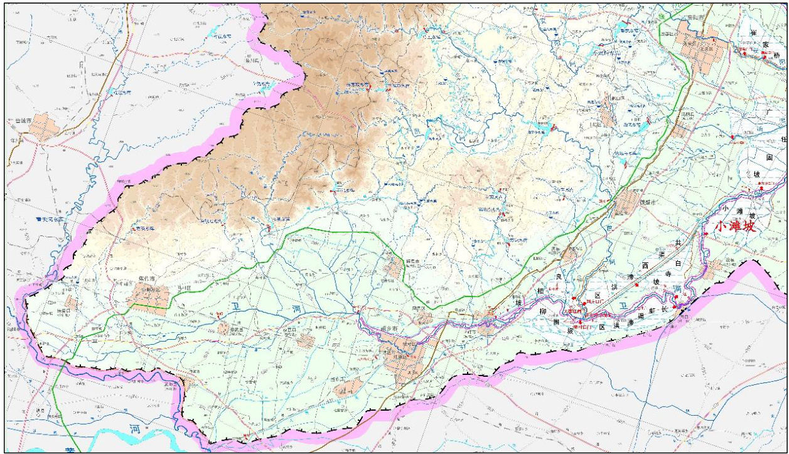  
图 2.1-1 小滩坡蓄滞洪区所在卫河流域河流水系图  

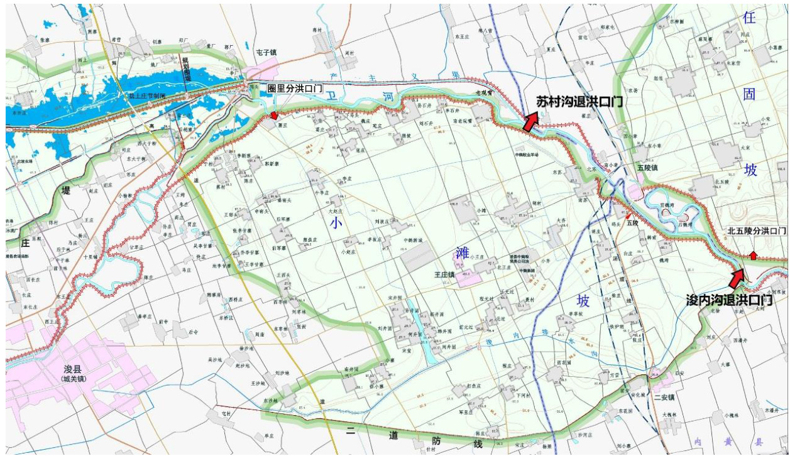  
图 2.1-2 小滩坡蓄滞洪区河流水系图  

# 2.2 气象  

小滩坡地处亚热带到暖温带的过渡地带,属暖温带大陆性季风气候区,日光充足,地热丰富,四季分明。夏秋季多偏南风,气温高,湿度大;冬春季多偏北风,干燥酷冷。选取邻近工程区的浚县气象站,进行了气象要素统计。  

根据浚县气象站 1963\~2021 年观测资料统计,多年平均降水量为 $594\mathrm{mm}$ ,其中汛期(6\~9 月)约占全年降水量的 $72.4\%$ ;多年平均蒸发量 1707mm(小型蒸发皿)。多年平均气温 $14.1\%$ ,极端最高气温 $41.9^{\circ}\mathrm{C}$ (1967 年 6 月 4 日、1972年 6 月 11 日、2002 年 7 月 15 日),极端最低气温- $18.4^{\circ}\mathrm{C}$ (1972 年 12 月 27日)。多年平均风速为 $2.69\mathsf{m}/\mathsf{s}$ ,历年最大风速 $19.3~\mathrm{m/s}$ ,日照时数 2075h。冬季河流一般不封冻,多年平均相对湿度 $66.9\%$ ,气温与相对湿度同步变化。浚县气象站主要气象要素月分配情况见表 2.2-1。  

表 2.2-1 浚县气象站气象要素特征表  

<html><body><table><tr><td>月份</td><td>1</td><td>2</td><td>3</td><td>4</td><td>5</td><td>6</td><td>7</td><td>8</td><td>9</td><td>10</td><td>11</td><td>12</td><td>年值</td></tr><tr><td>降水量 (mm）</td><td>4.28</td><td>7.58</td><td>16.0</td><td>32.3</td><td>47.4</td><td>66.8</td><td>159</td><td>134</td><td>69.8</td><td>33.0</td><td>18.7</td><td>4.75</td><td>594</td></tr><tr><td>平均气温 （℃)</td><td>-1.08</td><td>2.11</td><td>8.28</td><td>15.1</td><td>21.0</td><td>26.2</td><td>27.1</td><td>25.7</td><td>21.0</td><td>15.2</td><td>7.36</td><td>0.837</td><td>14.1</td></tr><tr><td>极端最高 气温 (℃)</td><td>17.6</td><td>27.2</td><td>31.1</td><td>35.6</td><td>39.3</td><td>41.9</td><td>41.9</td><td>38.4</td><td>37.4</td><td>34.4</td><td>27.4</td><td>22.3</td><td>41.9</td></tr><tr><td>极端最低 气温 （℃)</td><td>-17.5</td><td>-16.6</td><td>-9.20</td><td>-2.20</td><td>4.00</td><td>11.4</td><td>13.7</td><td>11.9</td><td>4.90</td><td>-1.40</td><td>-15.1</td><td>-18.4</td><td>-18.4</td></tr><tr><td>蒸发量 (mm）</td><td>46.2</td><td>69.9</td><td>135</td><td>195</td><td>244</td><td>287</td><td>194</td><td>160</td><td>134</td><td>119</td><td>72.7</td><td>48.8</td><td>1707</td></tr><tr><td>相对湿度%</td><td>61.0</td><td>60.0</td><td>59.4</td><td>62.1</td><td></td><td>60.5</td><td></td><td>81.3</td><td>75.4</td><td>69.5</td><td>68.7</td><td>64.4</td><td>66.9</td></tr><tr><td>日照时数 (h)</td><td>130</td><td>134</td><td>176</td><td>202</td><td>231</td><td></td><td>79</td><td>186</td><td></td><td>169</td><td></td><td>138</td><td>2075</td></tr><tr><td>平均风速 (m/s)</td><td>2.75</td><td>2.98</td><td>3.45</td><td>3.54</td><td>3.02</td><td>2.73</td><td></td><td>2.01</td><td>2.09</td><td>2.33</td><td>2.59</td><td>2.59</td><td>2.69</td></tr><tr><td>最大风速 (m/s)</td><td>13.3</td><td>12.8</td><td>15.0</td><td>14.8</td><td>13.2</td><td>19.3</td><td>11.9</td><td>17.9</td><td>10.5</td><td>12.5</td><td>13.7</td><td>12.9</td><td>19.3</td></tr></table></body></html>  

# 2.3 水文基本资料  

小滩坡以上卫河流域内设有修武、合河、新村、淇门、刘庄等水文站,邻近小滩坡的卫河干流上设有五陵水文站。  

淇门水文站位于卫河干流中游浚县新镇李庄村,东经 $114^{\circ}18^{\prime}$ ,北纬 $35^{\circ}30^{\prime}$ ;1933 年 11 月由前河南省第四水利局设立为水文站,1937 年停测;1951 年 7 月由安阳专署设为汛期水位站,同年 10 月由河南省水利局改为常年水位站;1952年 6 月改为水文站并下迁至李庄东南。淇门水文站为卫河控制站,流域面积$7671\mathsf{k m}^{2}$ ,属国家一类重要水文站、中央报汛站,观测项目:水位、流量、降水量、蒸发量、含沙量、水质、墒情,还承担淇门分洪口的测报任务。  

刘庄水文站位于共产主义渠中游浚县新镇镇北刘庄村,东经 $114^{\circ}17^{\prime}$ ,北纬$35^{\circ}30^{\prime}$ ,断面位于现刘庄闸下游,流域面积 $7671~\mathrm{km}^{2}$ ,属共产主义渠控制站,省级重要水文站,观测项目:水位、流量、含沙量、冰情。  

五陵水文站位于卫河干流中游汤阴县五陵镇五陵村,东经 $114^{\circ}35^{\prime}$ ,北纬$35^{\circ}51^{\prime}$ ,1962 年 5 月河南省安阳专署水利局设立老观嘴水位站,1963 年改为流量站,1983 年 1 月由老观嘴站下迁 $2.5\mathsf{k m}$ ,更名为五陵水文站。流域面积 9393$\upkappa\mho^{2}$ ,为卫河控制站,属国家一类重要水文站、中央报汛站,观测项目:水位、流量、降水量、水质、冰情、墒情。各水文站基本情况见表 2.3-1 所示。  

表 2.3-1  小滩坡以上卫河流域主要水文站观测资料年份表  

<html><body><table><tr><td>河流</td><td>测站</td><td>控制面积 (km²)</td><td>资料年份</td></tr><tr><td>大沙河</td><td>修武</td><td>1287</td><td>1956~2021</td></tr><tr><td>卫河</td><td>合河</td><td rowspan="2">4203</td><td rowspan="2">1934～1936、1953～2021</td></tr><tr><td>共产主义渠</td><td>合河</td></tr><tr><td>卫河</td><td>淇门</td><td rowspan="2">7671</td><td rowspan="2">1934～1936、1952～2021</td></tr><tr><td>共产主义渠</td><td>刘庄</td></tr><tr><td>卫河</td><td>五陵</td><td>9393</td><td>1963~2021</td></tr><tr><td>淇河</td><td>新村</td><td>2080</td><td>1922～1926、1952～2021</td></tr></table></body></html>

注:加“\*”的流域面积为山区面积。  

小滩坡范围内无雨量站,邻近的浚县设有浚县气象站,其观测的降雨资料可供设计使用。浚县气象站由鹤壁市气象局于 1963 年设立,地理位置 $114^{\circ}31$ ′E、${35^{\circ}39^{\prime}N}$ ,观测项目:降水量、蒸发量、气温、相对湿度、风向风速、日照时数、地温等。根据工程需要,本次还收集到《河南省水利工程水文计算常用图集》(以下简称《73图集》)及《河南省暴雨参数图集》(以下简称《05图集》)供设计使用。  

上述水文站、气象站均为国家基本站点,其测验均严格按照水文、气象测验规范进行,成果由河南省水文局及鹤壁市气象局整编存库,资料可靠性较好,可供设计使用。  

# 2.4 设计洪水  

# 2.4.1 暴雨洪水特性  

卫河流域山区地处太行山迎风坡,暴雨频次多、量级大,暴雨中心多出现在淇河上游的土圈、要街附近,多集中在 7、8 两月。实测最大 24h 雨量 $614.5\mathrm{mm}$ (“21.7”新村暴雨),最大三日雨量 820.8mm(2021 年 7 月 $19\sim21$ 日辉县市官山站)。流域内的暴雨不仅强度大而且持续时间也比较长,一般持续时间长达 3d,如“96.8”暴雨,主雨峰位于 3d 中部偏前;也有持续时间长达 7d 的情况,如“63.8”暴雨及“21.7”暴雨。  

卫河山区支流均处于太行山迎风坡,洪水频次多、量级大,且源短流急,洪水迅猛,是卫河洪水的主要发源地。各支流洪水多为同一场暴雨所形成,因此支流洪水常常遭遇,强降雨造成卫河出现严重汛情。2021 年 7 月 22 日发生“漳卫河 2021 年 1 号洪水”,卫河淇门至老观嘴、共渠发生超保证洪水,卫河下段、卫运河及漳卫新河全线上滩行洪,卫河流域启用了包括小滩坡在内的 8 个蓄滞洪区。  

# 2.4.2 设计洪水  

根据小滩坡调度运用情况,上游淇门水文站(卫河淇门 $^+$ 共渠刘庄)为小滩坡以上卫河流域控制站,本次将其作为本工程的水文参证站,计算淇门水文站设计洪水成果。  

1984 年《漳卫河设计洪水复核》时,采用 $1953\sim1979$ 年的 27 年连续洪量系列,对其中的中小水年直接利用卫河淇门站和共产主义渠刘庄站实测资料及上游水库蓄变量资料还原计算淇门站总洪量。对大水年由于坡洼运用,改变了洪水天然状态,改由上游分区相应时段洪量相加的计算方法。2008 年防洪规划阶段,将洪水系列延长到 1991 年,并考虑了 1996 年大洪水,复核成果为推荐采用成果。本次复核结合《海河流域防洪规划修编-设计洪水复核报告》,将淇门水文站洪水系列延长至 2021 年。  

先将卫河淇门站与共渠刘庄站逐日流量相加,得淇门站逐日实测流量系列;将石门水库、宝泉水库和盘石头水库的蓄变量作逐日还原,以各自的传播时间错开加与淇门站,对于卫河汲县站以上的涝水和引黄水量也予以扣除,如此得出淇门站以上(山区部分)天然逐日平均流量,据此统计各时段洪量。对于 2021 年出现的洪水,本次增加考虑了良相坡、共渠西、柳围坡、长虹渠蓄滞洪进行洪量还原。  

在 $2013{\sim}2021$ 年系列中, 2021 年为大水年,其余年份均为中小水年。2021年最大 5 日洪量为 9.23 亿 $\mathsf{m}^{3}$ ,相当于 20\~30 年一遇。采用矩法估算参数,P-III 型曲线进行适线,计算淇门站时段洪量设计成果,设计洪水计算成果见表 2.4-1,频率适线图见图 $2.4\AA-1\small{\sim}2.4\AA-3.$ 。  

表 2.4-1 淇门站设计洪水成果表 单位:亿 $\mathsf{m}^{3}$   

<html><body><table><tr><td rowspan="2">项目</td><td colspan="3">特征值</td><td rowspan="2">频率(%)</td><td colspan="5"></td></tr><tr><td>均值</td><td>Cv</td><td>Cs/Cv</td><td>1</td><td>2</td><td>5</td><td>10</td><td>20</td></tr><tr><td>W5天</td><td>1.60</td><td>2.00</td><td>2.5</td><td></td><td>16.23</td><td>12.16</td><td>7.27</td><td>4.14</td><td>1.79</td></tr><tr><td>W15天</td><td>2.70</td><td>1.65</td><td>2.5</td><td>22.30</td><td>17.32</td><td>11.19</td><td></td><td>7.05</td><td>3.61</td></tr><tr><td>W30天</td><td>3.55</td><td>1.55</td><td>2.5</td><td>27.40</td><td>21.51</td><td></td><td>14.20</td><td>9.19</td><td>4.92</td></tr></table></body></html>  

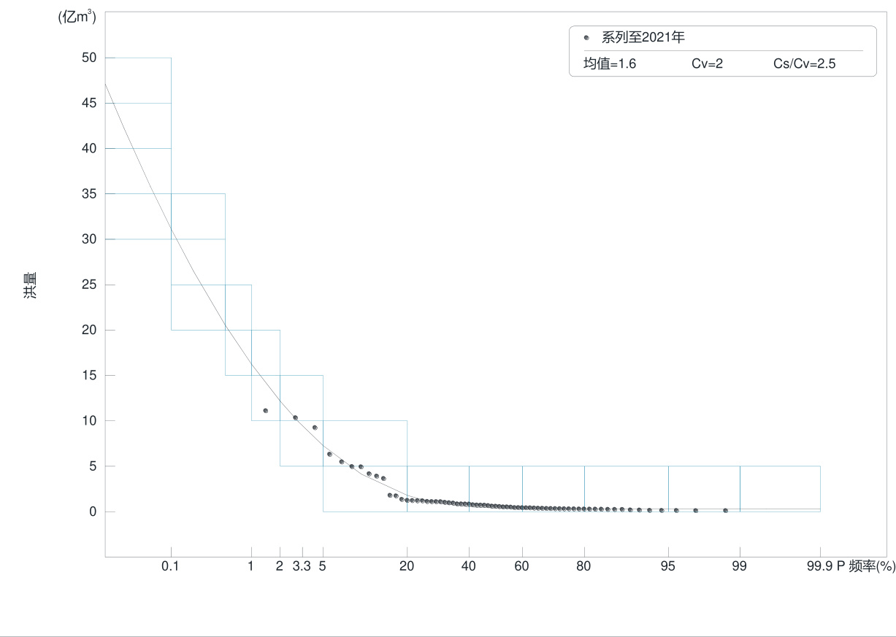  
图 2.4-1 淇门站年最大 5 日洪量频率曲线图  

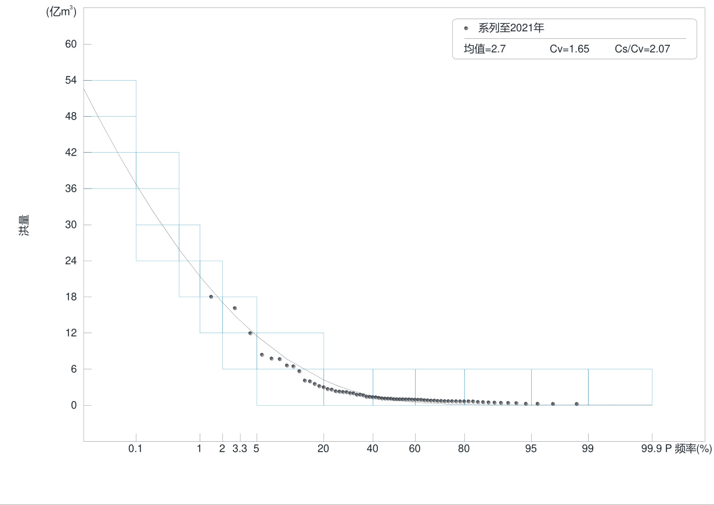  
图 2.4-2  淇门站年最大 15 日洪量频率曲线图  

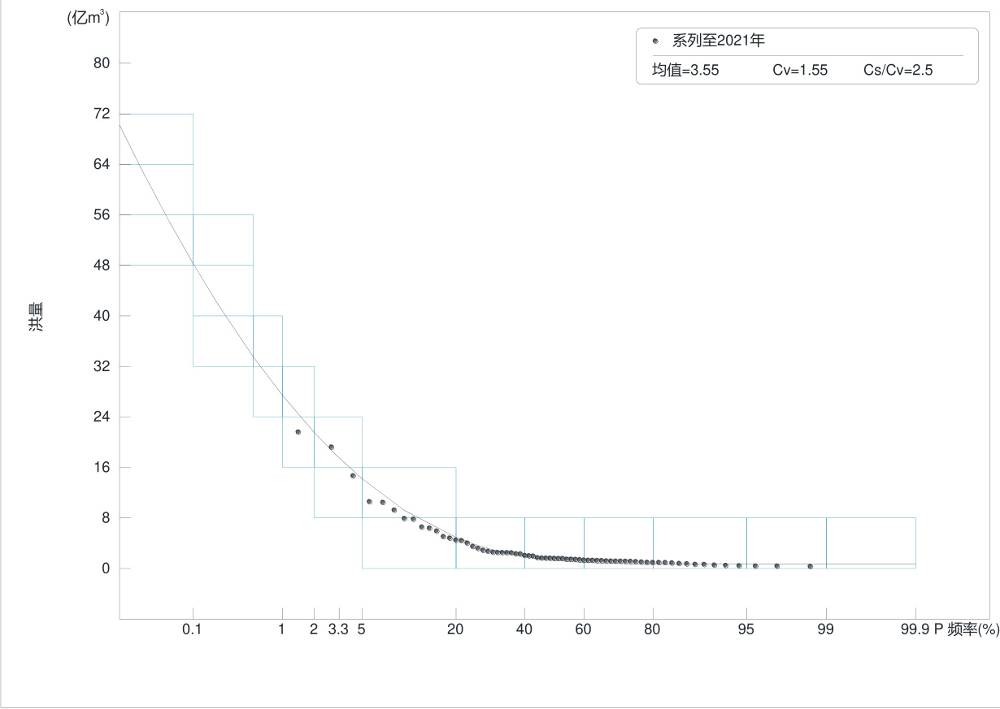  
图 2.4-3  淇门站年最大 30 日洪量频率曲线图  

将本次系列延长后的淇门站设计洪水成果,与 2008 年防洪规划阶段报告、2017 年水文成果修订设计洪水频率计算成果进行对比分析,见表 2.4-2。可以看出,在 2008 年防洪规划阶段洪水系列基础上各站系列延长了 30 年后,本次设计洪水频率计算成果与现行采用成果相比,基本都是均值减小、变差系数增大,从设计值分析,因为加入了的 30 年系列均值相对较小,因此系列延长后频率计算均值较原设计有所减小,而 Cv 值较原设计有所增加,故在稀遇频率设计值减小得少(甚至增大)、常遇频率设计值减小得多的情况,淇门水文站各时段洪量设计值均小于 2008 年防洪规划阶段设计值,减小幅度都在 $15\%$ 以内。  

综上所述,本次延长系列后淇门水文站洪水统计参数与 2008 年防洪规划阶段洪水成果相比产生变化是合理的,本次淇门水文站设计洪水成果继续推荐采用2008 年防洪规划阶段设计洪水成果,见表 2.4-2 所示。  

表 2.4-2 淇门站设计洪水成果比较表 单位:亿 $\mathsf{m}^{3}$   

<html><body><table><tr><td rowspan="2" colspan="2">项目</td><td colspan="3">特征值</td><td colspan="5">频率(%)</td></tr><tr><td>均值</td><td>Cv</td><td>Cs/Cv</td><td>1</td><td>2</td><td>5</td><td>10</td><td>20</td></tr><tr><td rowspan="3">A、1998 年防洪规 划-采用</td><td>W5天</td><td>2.15</td><td>1.50</td><td>2.50</td><td>16.02</td><td>12.64</td><td>8.43</td><td>5.53</td><td>3.03</td></tr><tr><td>W15天</td><td>3.45</td><td>1.40</td><td>2.50</td><td>23.86</td><td>19.03</td><td>12.97</td><td>8.74</td><td>5.00</td></tr><tr><td>W30天</td><td>4.60</td><td>1.30</td><td>2.50</td><td>29.37</td><td>23.69</td><td>16.50</td><td>11.41</td><td>6.82</td></tr><tr><td>B、海河</td><td>W5天</td><td>1.58</td><td>1.80</td><td>2.50</td><td>14.33</td><td>10.96</td><td>6.85</td><td>4.14</td><td>1.97</td></tr></table></body></html>  

<html><body><table><tr><td rowspan="2" colspan="2">项目</td><td colspan="3">特征值</td><td colspan="5">频率(%)</td></tr><tr><td>均值</td><td>Cv</td><td>Cs/Cv</td><td>1</td><td>2</td><td>5</td><td>10</td><td>20</td></tr><tr><td rowspan="2">流域水文 成果修订</td><td>W15天</td><td>2.50</td><td>1.70</td><td>2.50</td><td>21.32</td><td>16.48</td><td>10.53</td><td>6.54</td><td>3.27</td></tr><tr><td>W30天</td><td>3.30</td><td>1.55</td><td>2.50</td><td>25.47</td><td>20.00</td><td>13.20</td><td>8.54</td><td>4.58</td></tr><tr><td rowspan="3">C、本次</td><td>W5天</td><td>1.60</td><td>2.00</td><td>2.5</td><td>16.23</td><td>12.16</td><td>7.27</td><td>4.14</td><td>1.79</td></tr><tr><td>W15天</td><td>2.70</td><td>1.65</td><td>2.5</td><td>22.30</td><td>17.32</td><td>11.19</td><td>7.05</td><td>3.61</td></tr><tr><td>W30天</td><td>3.55</td><td>1.55</td><td>2.5</td><td>27.40</td><td>21.51</td><td>14.20</td><td>9.19</td><td>4.92</td></tr><tr><td rowspan="3">成果对比 (C-A) /A*100%</td><td>W5天</td><td></td><td></td><td></td><td>1.3%</td><td>-3.8%</td><td>-13.7%</td><td>-25.1%</td><td>-41.1%</td></tr><tr><td>W15天</td><td></td><td></td><td></td><td>-6.5%</td><td>-9.0%</td><td>-13.8%</td><td>-19.4%</td><td>-27.9%</td></tr><tr><td>W30天</td><td></td><td></td><td></td><td>-6.7%</td><td>-9.2%</td><td>-14.0%</td><td>-19.5%</td><td>-27.8%</td></tr></table></body></html>  

# 2.6 设计涝水  

# 2.6.1 设计暴雨  

根据《73 图集》及《河南省治涝规划》,考虑到小滩坡各排涝分区流域面积基本都在 $50\mathsf{k m}^{2}$ 以内,因此设计暴雨统计时段按 1d 考虑。  

可研阶段中,将浚县气象站作为小滩坡雨量参证站,统计浚县气象站$1963{\sim}2021$ 年历年最大 1d 暴雨系列,采用 P-Ⅲ型频率曲线进行适线,计算得到浚县气象站年最大 1d 设计暴雨,频率适线成果见图 2.6-1。  

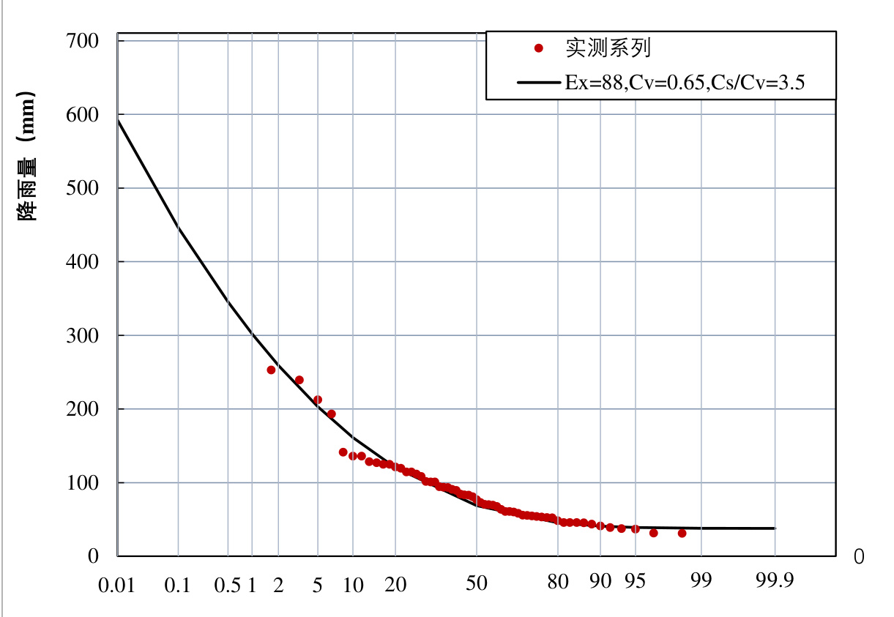  
图 2.6-1 浚县气象站年最大 1 日暴雨频率适线图  

根据《05 图集》中的河南省年最大 24 小时点雨量均值及 Cv 等值线图,小滩坡流域中心年最大 24h 降雨量均值约为 100mm,Cv 为 0.7,Cs/Cv 为 3.5,据此计算得到小滩坡年最大 24h 设计暴雨成果,成果见表 2.6-1。采用经验系数1.1,将浚县气象站统计的年最大 1 日暴雨均值折算为年最大 24h 最大暴雨均值,采用浚县气象站折算的不同频率年最大 24h 设计暴雨与《05 图集》的年最大 24h设计暴雨成果进行对比,见表 2.6-1。  

表 2.6-1 小滩坡年最大 1d 及 24h 设计暴雨成果 单位:mm  

<html><body><table><tr><td>项目</td><td>均值</td><td>Cv</td><td>Cs/Cv</td><td>5%</td><td>10%</td><td>20%</td><td>33.3%</td></tr><tr><td>最大1日暴雨 （浚县气象站）： 采用</td><td>88</td><td>0.65</td><td>3.5</td><td>203</td><td>161</td><td>120</td><td>90.8</td></tr><tr><td>最大24h暴雨 （浚县站折算）</td><td>96.8</td><td>0.65</td><td>3.5</td><td>223</td><td>177</td><td>132.1</td><td>99.9</td></tr><tr><td>最大24h暴雨 （图集)</td><td>100</td><td>0.7</td><td>3.5</td><td>241</td><td>188</td><td>136.9</td><td>101.3</td></tr><tr><td>相差比例</td><td></td><td></td><td></td><td>-7.3%</td><td>-5.7%</td><td>-3.5%</td><td>-1.4%</td></tr></table></body></html>  

根据以上对比,可看出利用气象站计算的年最大 24h 设计暴雨与《05 图集》的设计暴雨成果相近,不同频率之间设计暴雨相差在 $8\%$ 以内。考虑到采用浚县气象站计算得到的设计暴雨所依据的雨量资料系列更长(较《05 图集》延长了21 年系列),且站点位置位于工程区小滩坡内,雨量资料相对区域性的等值线图而言更有针对性、代表性,因此本次小滩坡内各涝片设计暴雨成果均采用以浚县气象站为参证站的设计暴雨成果,见表 2.6-1 所示。  

初步设计阶段中,考虑到 2022 年、2023 年小滩坡周边未发生大暴雨,因此设计暴雨仍维持可研阶段成果。  

# 2.6.2 设计涝水计算  

小滩坡内主要排水沟道为浚内沟及苏村沟,根据滞洪区建设需求对各涝片及相应面积进行了划定、量算。考虑工程区地处河南省平原区,本次采用《73 图集》中豫北平原地区排水模数公式计算小滩坡内浚县各涝片设计涝水。  

根据各涝片 1d 设计暴雨量,查《73 图集》中的平原区 $\mathsf{P}{+}\mathsf{P}{\mathsf{a}}{\sim}\mathsf{R}$ 相关图,进行设计净雨计算。Pa 为前期影响雨量,根据《73 图集》,“设计时采用频率 3\~5年一遇则 Pa 可采用 $45\mathrm{mm}$ ,当采用频率 $_{10\sim20}$ 年一遇则 Pa 可采用 55mm”,本次 $_{3\sim5}$ 年一遇 Pa 取 $45\mathrm{mm}$ ,10 年一遇 Pa 取 $55\mathsf{m m}$ ;本研究区域均位于平原区Ⅶ分区,因此将 $\mathsf{P}\boldsymbol{+}\mathsf{P}\boldsymbol{\mathsf{a}}$ 带入图集中平原区降雨径流关系 VII 线进行产流计算,计算得到设计净雨深。平原排涝模数法计算公式如下:  

# Qm=KRF0.75  

式中: $\mathsf{Q}_{\mathsf{m}}$ ——洪峰流量( $m^{3}/\mathsf{s},$ );R——设计净雨深(mm);F——流域面积( $\mathsf{k m}^{2})$ );K—峰量关系综合系数,根据1973年图集,“一般河道可根据流域具体情况,采用 $K_{-\scriptscriptstyle{\mathscr{X}}}=0.035{\sim}0.040^{,}$ ,本次结合小滩坡实际情况及周边相关工程设计报告,综合系数 K 取 0.037。  

根据浚县内各涝片排涝面积、平原排涝洪峰流量计算公式以及各参数,小滩坡浚县内各排涝分区不同频率设计涝水洪峰流量成果见表 2.6-2。  

# 表 2.6-2 小滩坡浚县各涝片设计涝水流量成果表  

<html><body><table><tr><td rowspan="2">断面</td><td rowspan="2">面积F (km²)</td><td colspan="2">P=10%</td><td colspan="2">P=20%</td><td colspan="2">P=33.3%</td></tr><tr><td>R (mm)</td><td>设计洪峰 (m3/s)</td><td>R(mm)</td><td>设计洪峰 (m3/s)</td><td>R(mm)</td><td>设计洪峰 (m3/s)</td></tr><tr><td>下河沟</td><td>27.29</td><td>73.3</td><td>32.4</td><td>39.4</td><td>17.4</td><td>25.4</td><td>11.2</td></tr><tr><td>苏村沟</td><td>53.9</td><td>73.3</td><td>53.9</td><td>39.4</td><td>29.0</td><td>25.4</td><td>18.7</td></tr><tr><td>井固沟 (后浚线以东)</td><td>6.82</td><td>73.3</td><td>11.4</td><td>39.4</td><td>6.15</td><td>25.4</td><td>3.96</td></tr><tr><td>井固沟 (后浚线以西)</td><td>7.86</td><td>73.3</td><td>12.7</td><td>39.4</td><td>6.84</td><td>25.4</td><td>4.40</td></tr></table></body></html>  

# 2.6.3 施工期设计涝水  

可研阶段中,根据施工组织设计要求,配合计算 $10\sim$ 翌年 5 月分期设计排涝流量。分期设计暴雨以浚县气象站为参证站,统计浚县气象站 $1963\sim2021$ 年$10\sim$ 翌年 5 月施工分期最大 1d 暴雨系列,采用 P-Ⅲ型频率曲线进行适线,求得浚县气象站施工分期设计暴雨成果,见表 2.6-3 所示,频率适线成果见图 2.6-2。  

表 2.6-3 浚县气象站 10\~5 月最大 1d 设计暴雨成果 单位:mm  

<html><body><table><tr><td>时段</td><td>均值</td><td>Cv</td><td>Cs/Cv</td><td>10%</td><td>20%</td></tr><tr><td>10~5月</td><td>36</td><td>0.5</td><td>2.5</td><td>60.1</td><td>49.1</td></tr></table></body></html>  

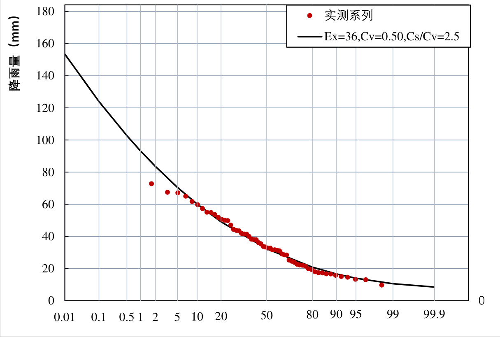  
图 2.6-2 浚县气象站 10\~5 月最大 1 日暴雨频率适线图  

采用《73 图集》中豫北平原地区排水模数公式计算小滩坡内各涝片 10\~5 月施工期设计涝水,计算方法及参数选取同 2.6.2 小节,计算得到小滩坡浚县内各涝片施工期设计涝水成果,见表 2.6-4。  

表 2.6-4 小滩坡浚县各涝片 10\~5 月设计涝水流量成果表  

<html><body><table><tr><td rowspan="2">断面</td><td rowspan="2">面积F (km²)</td><td colspan="2">P=10%</td><td colspan="2">P=20%</td></tr><tr><td>R (mm)</td><td>设计洪峰(m3/s)</td><td>R (mm)</td><td>设计洪峰（m?/s)</td></tr><tr><td>下河沟</td><td>27.29</td><td>16.2</td><td>7.2</td><td>9.1</td><td>4.0</td></tr><tr><td>苏村沟</td><td>53.9</td><td>16.2</td><td>11.9</td><td>9.1</td><td>6.7</td></tr><tr><td>井固沟 (后浚线以东)</td><td>6.82</td><td>16.2</td><td>2.5</td><td>9.1</td><td>1.41</td></tr><tr><td>井固沟 (后浚线以西)</td><td>7.86</td><td>16.2</td><td>2.8</td><td>9.1</td><td>1.57</td></tr></table></body></html>  

初步设计阶段中,考虑到 2022 年、2023 年施工期小滩坡周边未发生大暴雨,因此施工期设计暴雨及设计涝水仍维持可研阶段成果。  

# 2.7 水文自动测报系统  

# 2.7.1 建设必要性  

小滩坡所在的卫河上游是暴雨中心,且支流源短、流急,历史上以洪水来的快,来的猛著称,是防洪的重点区域。卫河上段尚未经治理,遇 $ 5\sim10$ 年一遇洪水就需要使用沿河坡洼,视洪水大小将分别启用良相坡、共产主义渠西、长虹渠、白寺坡,柳围坡,小滩坡,任固坡、广润坡等蓄滞洪区。小滩坡蓄滞洪区是解决卫河超标准洪水时运用的蓄滞洪区,在有效控制卫河老观嘴以下河道超量洪水中,发挥着至关重要的作用,它是保护卫河中下游平原地区防洪安全必不可少的蓄洪工程,是卫河下游地区重要的防洪安全保障。  

根据水利部办公厅印发的《水利工程配套水文设施建设技术指南》(办水文〔2023〕284 号)要求,小滩坡蓄滞洪区应配套建设水文设施,以能够反映蓄滞洪区水面曲线的转折变化为原则确定水位站布设数量,应布设不少于 1 处代表水位站,同时在进退洪闸、进退洪口门及重要安全设施处应布设水位站。  

目前小滩坡及邻近卫河干流河段尚未建立起水文自动测报系统,无法及时有效掌握以上卫河流域来水情况、为蓄滞洪区分洪调度运用提供必要的雨情、水情信息基础。因此小滩坡水文自动测报系统提供的水文信息对漳卫河流域的防汛调度工作非常重要。可以依托建成的卫河通信网工程,针对小滩坡建设一套完善的水文自动测报系统,将为小滩坡蓄滞洪区合理、有效、灵活运用,以及漳卫河流域的洪水预报、水资源合理调配及防汛调度自动化提供可靠的保障,在滞洪区启用后做到有序、快捷转移,实现“动荡少、撤得出、保安全”,更好地服务于小滩坡蓄滞洪区的分洪调度,最大限度减少洪水灾害损失。  

# 2.7.2 站网布设  

小滩坡以上卫河流域现状设有卫河淇门、共渠刘庄、淇河新村等控制性水文站,以及周边道口、白寺、五陵等雨量站,以上各水文站、雨量站实时水情数据可接入河南省水利厅水情调度中心,基本满足小滩坡对以上卫河流域水情信息的实时在线监测。  

对于小滩坡本身而言,其进洪分洪堰位于圈里处,退洪口门分别位于苏村沟及浚内沟入卫口,同时考虑到能在小滩坡内部对整个小滩坡进洪、退洪情势进行整体把控,因此需要在小滩坡进洪、退洪、浚内沟入小滩坡处及浚内沟二安中桥断面设立水位站,进行水位自动监测。  

为了进一步完善卫河水文监测站网,加强和优化水文监测能力,提高水文信息采集传输自动化、现代化水平,为卫河流域的经济发展和防洪减灾提供可靠的信息支撑,在《卫河干流(淇门\~徐万仓)治理工程初步设计报告》《数字漳卫河防洪保障能力提升工程》《海委卫河曲律、新镇桥等22处水位站建设设计》等项目中对卫河干流水位站网进行了规划建设,以加强重要防洪河段水位监测。其中在距苏村沟退洪闸上游 1.5km 处规划建设了老观嘴卫河水位站,在浚内沟退洪闸断面处规划建设了浚内沟入卫口水位站,以上新建的 2 座水位站建设内容主要包括雷达水位计、视频监控仪器、断面桩、防雷接地装置、水准点、北斗系统、  

GPRS 通讯系统、太阳能发电系统等,测站已由其他专项统一考虑建设,本次不再考虑以上两座水位站的建设投资。小滩坡蓄滞洪区水情自动测报系统测站基本情况见表 2.7-1,分布位置见图 2.7-1。  

表 2.7-1  小滩坡蓄滞洪区水情自动测报系统测站基本情况  

<html><body><table><tr><td>序号</td><td>站名</td><td>地址</td><td>东经（°）</td><td>北纬（°）</td><td>测站功能</td><td>建设性质</td></tr><tr><td>1</td><td>分洪堰前站</td><td>鹤壁浚县王庄镇圈里村</td><td>114.5058</td><td>35.7630</td><td>水位、视频</td><td>新建</td></tr><tr><td>2</td><td>分洪堰后站</td><td>鹤壁浚县王庄镇圈里村</td><td>114.5058</td><td>35.7630</td><td>水位、视频</td><td>新建</td></tr><tr><td>3</td><td>老观嘴卫河</td><td>鹤壁浚县老观嘴村</td><td>114.5362</td><td>35.8222</td><td>水位、视频</td><td>信息共享</td></tr><tr><td>4</td><td>浚内沟入卫口</td><td>安阳内黄县大刘村</td><td>114.6346</td><td>35.8715</td><td>水位、视频</td><td>信息共享</td></tr><tr><td>5</td><td>浚内沟站</td><td>鹤壁浚县刘沙地村</td><td>114.5976</td><td>35.7204</td><td>水位、视频</td><td>新建</td></tr><tr><td>6</td><td>二安中桥</td><td>安阳内黄县后安村</td><td>114.6512</td><td>35.8259</td><td>水位、视频</td><td>新建</td></tr></table></body></html>  

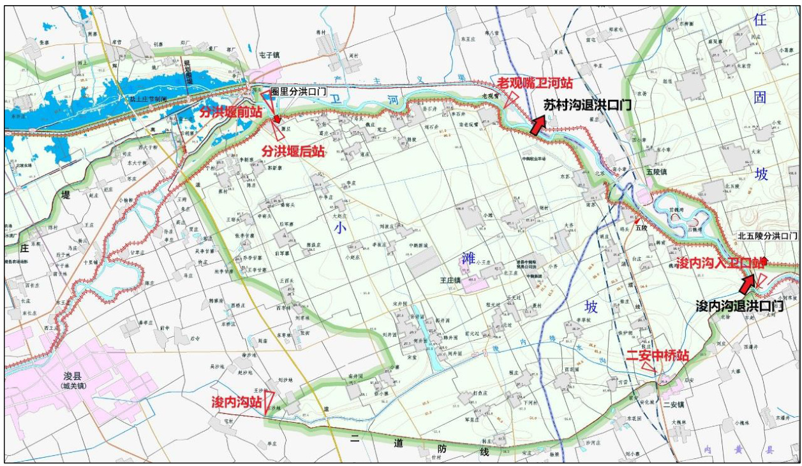  
图 2.7-1  小滩坡蓄滞洪区水文自动测报系统水位站分布图  

# 2.7.3 建设内容与投资  

本次小滩坡水文自动测报系统浚县建设内容主要考虑新建位于浚县境内的分洪堰前水位站、分洪堰后水位站及浚内沟水位站,共 3 处水位测站,建设内容主要包括水文基础设施建设及水位遥测系统建设,对两部分的建设方案和内容分别介绍如下:  

# (1)水文基础设施建设  

针对规划新建的分洪堰前水位站、分洪堰后水位站、浚内沟水位站,分别布  

设水尺断面(直立式水尺 3 组),共 18 根,设置基本水准点 3 个、校核水准点 6个、标志杆及断面桩各 6 根,修建观测道路 3 处,道路宽 1m,共 $150\mathsf{m}^{2}$ 。  

经测算,水文基础设施建设部分的投资合计为 14.52 万元。小滩坡(浚县部分)水文监测体基础设施投资概算见表 2.7-2。  

表 2.7-2  小滩坡水文监测体基础设施投资估算表  

<html><body><table><tr><td rowspan="2">序号</td><td rowspan="2">内容</td><td rowspan="2">单位</td><td rowspan="2">数量</td><td colspan="2">单价 (元)</td><td colspan="2">合价 (万元)</td></tr><tr><td>设备</td><td>安装</td><td>设备</td><td>安装</td></tr><tr><td>1</td><td>水准点设置</td><td>个</td><td>9</td><td>7000</td><td>700</td><td>6.3</td><td>0.63</td></tr><tr><td>2</td><td>直立式不锈钢水尺</td><td>根</td><td>18</td><td>1500</td><td>150</td><td>2.7</td><td>0.27</td></tr><tr><td>3</td><td>标志杆</td><td>根</td><td>6</td><td>1800</td><td>180</td><td>1.08</td><td>0.11</td></tr><tr><td>4</td><td>断面桩</td><td>根</td><td>6</td><td>1400</td><td>140</td><td>0.84</td><td>0.08</td></tr><tr><td>5</td><td>观测道路</td><td>平方米</td><td>150</td><td>150</td><td>15</td><td>2.25</td><td>0.23</td></tr><tr><td>6</td><td colspan="5">合计</td><td>13.2</td><td>1.32</td></tr></table></body></html>  

# (2)水位遥测系统建设  

在小滩坡分洪堰前、后及浚内沟入小滩坡处设雷达式自记水位计各一套,安装方式采用立杆,每套由信号采集装置(雷达水位计)、信号传输、处理系统(DTU/RTU、物联网卡等)、电源系统(蓄电池、太阳能板及充电保护器等)、基础设施(机箱、支架及基础、接地系统等)等组成。同时在规划新建的 3 处水位站,均配备智能水尺视频监控系统,满足水情视频观测需求,与自记水位计互为备用。本工程不单独建设中心站,新增水位测站水情信息接入河南省水利厅水文自动测报系统。  

漳卫南局现状已有在线运行的水文测报系统,小滩坡浚县境内新增的 3 处遥测水位站可利用移动 4G 信道,通过公网通信将遥测站水情数据信息经过通信基站转发至河南省水利厅中心站,再通过水利内部网实现共享共用。经前期查勘和实地调研,本次工程区周边沿线居民点较多,公网通信信号可满足遥测水位站数据传输要求。中心站现有系统可实现与遥测水位站之间的双向通信,但需要配套开发数据接收处理软件,以实现新建测站数据的接收和入库,同时遥测站的参数也可通过中心站进行远程修改。  

经测算,水位遥测系统建设总投资为 63.9 万元,其中设备价格合计 59.5 万元,安装费用合计 4.4 万元,相关设备数量及投资估算见表 2.7-3。  

综上所述,本次小滩坡蓄滞洪区(浚县部分)的水文遥测系统投资合计为78.4万元,其中水文基础设施建设部分投资合计为 14.52 万元,占比总投资的 $18.5\%$ ,水位遥测系统建设总投资为 63.9 万元,占总投资的 $81.5\%$ 。  

表 2.7-3  小滩坡(浚县部分)水位遥测系统建设投资估算表  

<html><body><table><tr><td rowspan="2">编号</td><td rowspan="2">工程或费用名称</td><td rowspan="2">单位</td><td rowspan="2">数量</td><td colspan="2">单价 (元)</td><td colspan="2">合计 (万元)</td></tr><tr><td>设备</td><td>安装</td><td>设备</td><td>安装</td></tr><tr><td></td><td>总计</td><td></td><td></td><td></td><td></td><td>59.5</td><td>4.4</td></tr><tr><td>二</td><td>水文遥测系统</td><td></td><td></td><td></td><td></td><td>52.03</td><td>4.4</td></tr><tr><td>1</td><td>雷达水位计（含机箱、RTU)</td><td>套</td><td>3</td><td>30000</td><td>3000</td><td>9.0</td><td>0.9</td></tr><tr><td>2</td><td>基础及支架</td><td>套</td><td>3</td><td>5000</td><td></td><td>1.5</td><td></td></tr><tr><td>3</td><td>智能水尺视频监控系统（内置 水尺识别算法)</td><td>套</td><td>3</td><td>80000</td><td>8000</td><td>24.0</td><td>2.4</td></tr><tr><td>4</td><td>太阳能供电系统</td><td>套</td><td>3</td><td>15000</td><td>1500</td><td>4.5</td><td>0.45</td></tr><tr><td>5</td><td>充电保护器</td><td>个</td><td>3</td><td>600</td><td></td><td>0.18</td><td></td></tr><tr><td>6</td><td>北斗卫星通信终端</td><td>台</td><td>3</td><td>20000</td><td>2000</td><td>6.0</td><td>0.6</td></tr><tr><td>7</td><td>4G通信 （按3年计列)</td><td>套</td><td>3</td><td>7200</td><td></td><td>2.16</td><td></td></tr><tr><td>8</td><td>打印机</td><td>台</td><td>1</td><td>4500</td><td></td><td>0.45</td><td></td></tr><tr><td>6</td><td>接地系统</td><td>套</td><td>3</td><td>800</td><td></td><td>0.24</td><td></td></tr><tr><td>10</td><td>水情基础软件</td><td>套</td><td>1</td><td>20000</td><td></td><td>2.0</td><td></td></tr><tr><td>11</td><td>水情应用软件</td><td>套</td><td>1</td><td>20000</td><td></td><td>2.0</td><td></td></tr><tr><td>二</td><td>综合运杂费用</td><td></td><td></td><td></td><td></td><td>2.46</td><td></td></tr><tr><td>三</td><td>河南省水利厅中心站接入系 统软件改造</td><td>项</td><td>1</td><td>50000</td><td></td><td>5.0</td><td></td></tr></table></body></html>  

# 第三章 工程地质  

审  查:张志恒校  核:白振宇编  制:吉婷婷  

# 目录  

第三章 工程地质.  

3.1 基本情况.3.1.1 蓄滞洪区概况.3.1.2 勘察概况.  
.2 区域地质3.2.1 自然地理 53.2.2 地形地貌 .. 63.2.3 地层岩性 63.2.4 地质构造与地震 . 63.2.5 水文地质 .3.2.6 物理地质现象 .3.2.7 标准冻深 ... 8  
3.3 沟渠清淤扩挖工程 ... 83.3.1 概述 ... 83.3.2 工程地质条件 . 83.3.3 工程地质评价. 9  
.4 加固堤防工程地质 .. 103.4.1 堤基工程地质 . 103.4.2 工程地质评价 . 113.4.3 堤身工程地质 . .12  
.5 分洪堰工程地质 . 133.5.1 基本地质条件 . 133.5.2 工程地质评价 . 14  
3.6 桥梁工程 . 163.6.1 基本地质条件 . 173.6.2 工程地质初步评价 .18  
.7 天然建筑材料 . 193.7.1 开挖料 . 19  

3.7.2 商品料 20  
3.8 结论及建议 20  

# 第三章 工程地质  

# 3.1 基本情况  

# 3.1.1 蓄滞洪区概况  

小滩坡蓄滞洪区属于海河流域漳卫河水系,卫河是漳卫河水系的一大支流,发源于山西省陵川县夺火镇,在河北省馆陶县徐万仓与漳河汇合后称漳卫河。南部、西部、东南部与黄河流域为邻,北靠漳河流域,东接马颊河流域,跨焦作、新乡、鹤壁、安阳、濮阳等市,在河南省的流域面积为 $12921\mathrm{km}^{2}$ ,约占全流域的 $85\%$ ,是豫北地区重要的行洪排涝河道。  

卫河北傍太行山脉,南为黄河冲积平原,地形总的趋势是西高东低。大沙河为卫河上游干流,卫河先后纳入左岸的淇河、汤河、安阳河等 10 余条梳齿状支流。1958 年为引黄修建的共产主义渠,自合河起傍卫河左岸至老观嘴汇入卫河,1962 年停止引黄后承担行洪任务。淇门以上卫河主要承担流域内排涝,淇门以下卫共洪涝合排。卫河蓄滞洪区包括良相坡、柳围坡、长虹渠、共产主义渠以西行洪区、白寺坡、小滩坡、任固坡、崔家桥、广润坡共 9 处,总面积 $944.2\ensuremath{\mathrm{km}}^{2}$ 。其中,良相坡、柳围坡、长虹渠、共产主义渠以西行洪区、白寺坡、崔家桥为一般滞洪区,小滩坡、任固坡为蓄滞洪区保留区。  

小滩坡蓄滞洪区位于河南省鹤壁市的浚县、安阳市的内黄县境内卫河中游右岸,1955 年为弥补长虹渠和白寺坡等蓄滞洪区蓄洪能力不足而建。小滩坡东以防洪堤(二道防线)为界,北、西靠卫河右堤,南接自然高地。地面高程 $56.20\sim$ $57.30\mathrm{m}$ ,蓄滞洪区为黄河冲积平原,呈南北向,地形总的趋势是南高北低,地面坡降 1/5200。小滩坡蓄滞洪区设计滞洪水位 $57.30\mathrm{m}$ ,水深 $0.5{\sim}4.0\ensuremath{\mathrm{m}}$ ,相应滞洪量 0.74 亿 $\mathsf{m}^{3}$ ,淹没面积 $95.4\mathsf{k m}^{2}$ 。其中内黄县的主要建设内容为提防加高加固工程,穿堤涵闸工程,沟渠清淤扩挖工程,桥涵工程。  

# 3.1.2 勘察概况  

# 3.1.2.1 勘察任务  

本阶段主要勘察任务为:  

1、复核区域及场地的构造稳定性与工程区的地震动参数。  

2、查明分洪堰场址地形地貌特征,重点为阶地、古河道等的分布和埋藏情况。查明场址地层岩性和岩土体物理力学性质,重点为软土、粉细砂等不良岩土体的分布和性质。查明地下水类型、分布、岩土体渗透性。进行主要建筑物部位岩土体物理力学性质试验。考虑地下水位年变幅,评价场址地基强度与变形、基坑开挖边坡稳定性、基坑涌水、渗透稳定、抗滑稳定、地震液化及环境水土腐蚀性等工程地质问题,确定地质参数,提出重要工程处理措施的地质建议。  

3、查明堤防工程沿线地形地貌、地基土体地层岩性与地质结构,重点是软土、砂层、腐殖土层等不良岩土层的分布、特性及其对工程的影响。基本查明堤线附近埋藏的古河道、古冲沟等的性状、位置、分布范围,分析其对堤基渗漏、稳定的影响。查明各类岩(土)体的物理力学性质。查明历史险情和隐患的类型、规模、危害程度和抢险处理措施及其效果,查明因 2021 年行洪需要而局部堤身被人工开挖段的分布位置。确定地质参数,进行工程地质综合分段评价,对堤基抗滑稳定、沉降变形、渗透稳定、抗冲刷能力等工程地质问题作出评价,提出相应处理措施的地质建议。  

4、查明沟渠清淤段淤积厚度和土层结构,确定疏浚土的级别,考虑地下水位年变幅,评价开挖边坡稳定性,分析评价是否可作为筑堤材料使用。5、查明桥涵等建筑物堤基的工程地质、水文地质条件,确定主要岩土层物理力学参数建议值,对存在的工程地质问题进行评价,提出工程处理措施建议。6、根据设计需用量,结合工程总体布置,优先考虑沟渠清淤扩挖料作为填筑土料的可利用性,结合沟渠勘察评价开挖料作填筑土料的可行性。调查商品石料和商品混凝土原材料的来源及质量。  

# 3.1.2.2 初设阶段勘察概况  

本阶段勘察工作采用了地质调查、测绘、实测地质剖面、钻探、山地、测试及土工试验等综合手段。在可行性研究阶段勘察的基础上,本阶段勘察工作量布置的主要原则为:  

1、堤防1)进行1:2000工程地质测绘。2)堤防勘探结合穿堤建筑物布置勘探点,间距宜 $500\mathrm{m}$ ,尽可能结合建筑物布置横剖面,横剖面间距2000m,横剖面上根据设计方案按 $30{\sim}40\mathrm{m}$ 间距布置勘探点。3)取地下水样进行水质分析和腐蚀性评价。4)每一工程地质单元及工程地质分段各主要岩土层取原状样进行室内物理力学试验,累计有效组数不少于12组。  

# 2、分洪堰(闸)  

1)进行1:500地质测绘,范围包括各建设场地,宽为工程边线外 $^{200\mathrm{m}}$ 。进  

行1:500实测地质剖面。  

2)沿分洪堰中心线布置主勘探线,上下游布置辅助勘探线,并在顺水流方向形成勘探剖面,主勘探线钻孔间距不宜大于 $50\mathrm{m}$ ,勘探深度宜进入建基面以下1.5倍堰高或闸底宽度,当存在软土、粉细砂等不良土层时应布置控制性钻孔予以揭穿。  

3)对分布有砂层的地段,进行标贯试验与注水试验,取地下水样进行水质分析和腐蚀性评价。  

4)分层取原状土样进行物理力学与渗透试验,每一主要土层室内试验累计有效组数不少于12组。  

# 3、桥涵  

1)进行1:500地质测绘,对需进行典型设计的桥涵安排1:500实测地质剖面。  

2)结合桥墩、桥台、涵洞布置勘探点,勘探深度应进入稳定持力层3m。  

3)试验组数和项次应结合堤防、沟渠疏浚一并考虑。  

# 4、天然建材  

1)结合沟渠勘察对清淤扩挖料进行填筑土料的勘察,安排取样和试验工作,评价开挖料储量与质量是否满足作为填筑料的要求。  

2)对本工程外购天然建筑材料的料源点进行调查,取适当的岩土样进行试验复核建材质量。  

本工程初步设计阶段现场勘察工作自2022年12月11日开始,2023年1月8日结束。勘察工作主要采用地质测绘、钻探及室内试验等综合手段进行。初步设计阶段完成工作量见表。  

表 3.1.2-1 勘察工作量表  

<html><body><table><tr><td rowspan="2">分区</td><td rowspan="2">分类</td><td rowspan="2">工作项目</td><td rowspan="2">单位</td><td>可研阶段</td><td>初设阶段</td></tr><tr><td>数量</td><td>数量</td></tr><tr><td>准备</td><td>编制 勘察</td><td>编制勘察大纲</td><td>项</td><td>1</td><td>1</td></tr><tr><td>区域</td><td>调查 分析</td><td>区域地质复核调查</td><td>项</td><td>1</td><td></td></tr><tr><td rowspan="7">加固 堤防 及涵 闸工 程</td><td rowspan="7">地质</td><td>地质测绘 (1:5000)</td><td>km2</td><td>8.5</td><td></td></tr><tr><td>地质测绘 (1:2000)</td><td>km2</td><td></td><td>2.49</td></tr><tr><td>地质测绘（1：500)</td><td>km2</td><td>0.1</td><td>0.24</td></tr><tr><td>地质测绘点</td><td>个</td><td></td><td>24</td></tr><tr><td>实测地质剖面 (1：500)</td><td>km</td><td></td><td>12</td></tr><tr><td>实测地质剖面 (1：200)</td><td>km</td><td>0.2</td><td>0.8</td></tr><tr><td>堤防钻孔</td><td>m/孔</td><td>60/4</td><td>165/12</td></tr><tr><td>勘探</td><td>穿堤涵闸</td><td>m/孔</td><td>280/16</td><td>260/13</td></tr></table></body></html>  

<html><body><table><tr><td rowspan="18">分区</td><td>分类</td><td rowspan="2">工作项目</td><td rowspan="2">单位</td><td>可研阶段</td><td>初设阶段</td></tr><tr><td></td><td>数量</td><td>数量</td></tr><tr><td rowspan="4">取样</td><td>标贯</td><td>段次</td><td>162</td><td>210</td></tr><tr><td>原状样</td><td>组</td><td>70</td><td>117</td></tr><tr><td>扰动土样</td><td>组</td><td>101</td><td>123</td></tr><tr><td>击实样</td><td>组</td><td>6</td><td>6</td></tr><tr><td rowspan="13"></td><td>水样</td><td>组</td><td>1</td><td>4</td></tr><tr><td>密度</td><td>组</td><td>68</td><td>76</td></tr><tr><td>天然含水率</td><td>组</td><td>68</td><td>76</td></tr><tr><td>比重</td><td>组</td><td>68</td><td>156</td></tr><tr><td>界限含水率</td><td>组</td><td>68</td><td>73</td></tr><tr><td>颗分</td><td>组</td><td>147</td><td>156</td></tr><tr><td>压缩 (饱和)</td><td>组</td><td>51</td><td>76</td></tr><tr><td>剪切 (饱固快)</td><td>组</td><td>51</td><td>63</td></tr><tr><td>三轴 (CU)</td><td>组</td><td></td><td>5</td></tr><tr><td>渗透</td><td>组</td><td>17</td><td>16</td></tr><tr><td>水质简分析</td><td>组</td><td>1</td><td>4</td></tr><tr><td>击实试验</td><td>组</td><td>6</td><td>3</td></tr><tr><td rowspan="14">桥涵 及疏 浚工 程</td><td rowspan="2">地质</td><td>地质测绘（1:5000)</td><td>km2</td><td>30.0</td><td></td></tr><tr><td>地质测绘 （1:500)</td><td>km2</td><td></td><td>1.0</td></tr><tr><td rowspan="2">勘探</td><td>实测地质剖面(1:200)</td><td>km/条</td><td>0.75</td><td>2.6/27</td></tr><tr><td>钻孔</td><td>m/孔</td><td>780/52</td><td>1750/61</td></tr><tr><td>原位</td><td>竖井</td><td>m/个</td><td>63/21</td><td>305.6/63</td></tr><tr><td rowspan="3">测试 取样</td><td>标贯</td><td>段次/孔</td><td>368</td><td>641</td></tr><tr><td>原状土样</td><td>组</td><td>286</td><td>401</td></tr><tr><td>扰动样</td><td>组</td><td>106</td><td>305</td></tr><tr><td rowspan="6">室内 试验</td><td>水样</td><td>组</td><td>2</td><td>5</td></tr><tr><td>天然含水率</td><td>组</td><td>216</td><td>197</td></tr><tr><td>密度</td><td>组</td><td>216</td><td>197</td></tr><tr><td>比重</td><td>组</td><td>216</td><td>516</td></tr><tr><td>界限含水量</td><td>组</td><td>216</td><td>191</td></tr><tr><td>颗粒分析</td><td>组</td><td>194</td><td>516</td></tr><tr><td>压缩 (天然状态)</td><td>组</td><td>118</td><td></td><td>197</td></tr><tr><td rowspan="5">取样 天然</td><td>剪切 (天然快剪)</td><td>组</td><td>130</td><td>175</td></tr><tr><td>水质简分析 击实样</td><td>组</td><td>2</td><td>5</td></tr><tr><td>土工 简分析</td><td>组</td><td>3</td><td>8</td></tr><tr><td>试验 全分析</td><td>组 组</td><td>3</td><td>8</td></tr><tr><td>岩石 人工骨料 试验</td><td>组</td><td></td><td>3</td></tr></table></body></html>  

# 3.1.2.3 执行技术标准  

工程地质勘察工作涉及多种手段和方法的综合运用,包括地质、坑探、岩土试验和测量等多个专业的相关标准。勘察工作执行国家、行业和地方技术标准主要包括(但不限于):  

《堤防工程地质勘察规程》(SL188-2005);  
《水闸与泵站工程地质勘察规范》(SL704-2015);  
《公路工程地质勘察规范》(JTG C20-2011);  
《水利水电工程地质勘察规范》(GB50487-2008);  
《岩土工程地质勘察规范》(GB 50021-2001)(2009 年版);  
《水利水电工程地质测绘规程》(SL299-2020);  
《土工试验方法标准》(GB/T 50123-2019);  
《水利水电工程天然建筑材料勘察规程》(SL251-2015);  
《中国地震动参数区划图》(GB 18306-2015);  
《水电工程区域构造稳定性勘察规程》(NB/T 35098-2017);  
《建筑抗震设计规范》(GB50011-2010)(2016 年);  
《堤防工程设计规范》(GB50286-2013);  
《公路桥涵地基基础设计规范》(JTGC3363-2019);  
《建筑桩基技术规范》(JGJ94-2008);  
《水利水电工程钻探规程》(SL293-2020);  
《水利水电工程注水试验规程》(SL 345-2007);  
《水利水电工程测量规范》(SL197-2013);  
《疏浚与吹填工程技术规范》(SL17-2014);  
《水利水电工程岩石试验规程》(SL264-2019);  
《水利水电工程制图标准勘测图》(SL73.3-2013);  
《水利工程建设标准强制性条文》(2020 年版)等。  

# 3.2 区域地质  

# 3.2.1 自然地理  

工程区位于东经 $114^{\circ}30^{\circ}{\sim}114^{\circ}40^{\circ}$ 、北纬 $35^{\circ}40^{\circ}{\sim}35^{\circ}55^{\circ}$ 之间。工程区属暖温带半湿润型季风气候。四季分明,光照充足,温差较大。春季多风少雨,夏季炎热湿润,秋季秋高气爽,冬季干燥寒冷。多年平均风速为 $2.8\mathrm{m}/\mathrm{s}$ ,历年最大风速为 $14\mathrm{m/s}$ ,发生在3月份;多年平均气温 $13.4^{\circ}\mathrm{C}$ ,极端最高气温 $42.8^{\circ}\mathrm{C}$ ,极端最低气温 $-21.3^{\circ}\mathrm{C}$ 。多年平均降水量 $515\mathrm{mm}$ ,7、8月份最为集中,占全年降水量的 $46\%$ ;多年平均蒸发量 $1527\mathrm{mm}$ 。  

# 3.2.2 地形地貌  

工程区地处海河流域平原区之冲积平原上,主要由黄河变迁、泛滥、冲积而成,地势平坦,地形总体南高北低并总体东倾,海拔高程 $55.0{\sim}57.3\mathrm{m}$ ,最低浚内沟口接卫河。区内分布一系列洼地,构成了明显的“岗、坡、洼”地貌形态。  

本区为古黄河影响最早地区,古黄河大徙、改道、决口、泛滥所产生的河床沉积、漫流沉积、静水沉积和歧流堆积,是形成本区地貌的主要原因。  

# 3.2.3 地层岩性  

工程区位于海河流域平原区南部,区内发育有巨厚的第四系松散堆积物,厚度可达数百米,其堆积物组成与厚度分述如下:  

(1)杨家寺组( $\mathrm{\DeltaQ_{4}y)}$ :为冲积、湖积壤土、淤泥、砂壤土互层,夹细砂层, 上部局部夹泥炭,底部局部见有火山碎屑岩,厚度 $5{\sim}15\mathrm{m}$ 。 (2)高湾组( $\mathrm{Q}_{4}\mathrm{g}$ ):为冲积、湖沼积泥质砂壤土与中细砂互层,夹泥炭, 厚度 $10{\sim}40\mathrm{m}$ 。 (3)岐口组( $\mathsf Q_{4\mathsf Q}$ ):为冲积、湖沼积壤土、砂壤土夹砂层,沿海一带为海 相层,厚度 $2{\sim}10\mathrm{m}$ 。  

# 3.2.4 地质构造与地震  

# 3.2.4.1 地质构造  

工程区位于华北平原沉降带的南部,为新生代的强烈拗陷区,主要包括临清凹陷、汤阴地堑、内黄隆起、东明凹陷及鲁西隆起。区内第三、第四系地层厚达数千米,基底构造以断裂为主,主要可分为以下两组:  

北北东向(属新华夏系):是华北断块内的主要构造形迹。本区域内大致等间距分布着三条规模最大的NE向构造带,即山西断陷带、太行东缘断裂带和沧东\~聊考断裂带,西侧有太行山山前断裂,自新生代以来一直在活动,形成隆起区与沉降带的分界线,延伸达数百公里;东侧为沧东断裂,其南端可至大名附近。  

北西向:新生代以来亦有活动,规模较北北东向为小,如涉县\~磁县\~大名断裂、焦作\~新乡\~商丘断裂带等。  

# 3.2.4.2 地震  

主要的历史强震有:1830年6月12日的磁县-彭城地震,震级为7.5级,震中烈度X度;1966年3月8日和22日的邢台地震,震级分别为6.8和7.2级,震中烈度X度;影响到本工程区的烈度均不大于Ⅶ度。地震可能产生的破坏形式主要是地裂缝、涌砂、河岸滑坡、桥梁变形等。  

从平原地震带内小震分布图像(《中国地震活动图像构造解释图》1:600万)看,小震密布的磁县、宁晋、天津段一线沿北北东向呈现矩形、地堑式矩形的几何特征,总体上连成一线而又彼此分隔,显示了新生代盆地所代表的构造空间是发震的基本单元,亦反映了基底断裂构造与地震之间的关系。  

# 3.2.4.3 区域构造稳定性及地震动参数  

根据《中国地震动参数区划图》(GB18306-2015),工程区基本地震动峰值加速度为 $0.15\mathrm{g}$ ,基本地震动加速度反应谱特征周期为0.40s。按照《中国地震动参数区划图》(GB18306-2015)表G.1,Ⅱ类场地地震动峰值加速度与地震烈度的对照表,工程区地震基本烈度为Ⅶ度。  

根据《水电工程区域构造稳定性勘察规程》(NB/T35098-2017),综合分析场地动峰值加速度及相应地震基本烈度、断裂活动性及地震活动情况,区域构造稳定性较差。  

# 3.2.5 水文地质  

由于流域平原区内堆积了巨厚的不同成因类型的第四系松散堆积物,且成因复杂,类型有洪积、冲积、海积、湖积堆积或它们的联合堆积作用形成的堆积物,致使松散堆积物在平面和剖面上的颗粒组成都非常复杂。其透水和含水性的差异亦很大,但均为孔隙含水层。在平原区中部和东部地区,浅部为孔隙潜水含水层,呈条带状埋藏于古河道地带;而河间地块则成为条带状的相对隔水带,即使含水,水量亦很小,且在南部地带多为咸水或苦水;接受大气降水补给,径流很弱,局部呈相对封闭状水体,以蒸发排泄为主。中、东部的深部则分布有孔隙承压含水层,由于埋深大,除接受上部含水层越流补给外,主要接受山前地带孔隙潜水的径流补给,径流相对较强烈,向渤海方向排泄。  

水化学类型较复杂,有重碳酸钠钙型水、重碳酸硫酸钠镁型水、重碳酸硫酸氯钙镁型水和重碳酸氯钠镁型水。  

# 3.2.6 物理地质现象  

工程区内均为耕地或人工建筑物,附近未见有塌陷、裂缝及动物洞穴等不良地质现象。  

# 3.2.7 标准冻深  

工程区夏季炎热,冬季寒冷,存在季节性冻土。根据《建筑地基基础设计规范》GB50007-2011之附录F季节性冻土标准冻深线图,工程区标准冻深小于 $60\mathrm{cm}$ 。  

# 3.3 沟渠清淤扩挖工程  

# 3.3.1 概述  

本次小滩坡蓄滞洪区建设工程对1条沟渠进行清淤扩挖,分别为苏村沟、齐村沟、下河沟及井固沟,治理总长度 $23.4\mathrm{km}$ 。  

本次主要安排对沟渠治理段临近村庄部分进行护砌。护砌形式选择植草砖护砌,护砌沟渠总长度 $10.6\mathrm{km}$ ,护砌顶高程为两岸地面高程。  

# 3.3.2 工程地质条件  

# (1)地形地貌  

工程区地处海河流域平原区之冲积平原上,主要由黄河变迁、泛滥、冲积而成,地势平坦,地形总体南高北低并总体东倾,海拔高程 $55.10{\sim}57.30\mathrm{m}$ ,最低浚内沟口接卫河。区内分布一系列洼地,构成了明显的“岗、坡、洼”地貌形态。  

苏村沟桩号 $\mathrm{K}4{+}800{-}\mathrm{K}11{+}389.196$ 段沟道顺直,沟道宽约 $15{\sim}20\mathrm{m}$ 。两岸地表坡度约 $45^{\circ}$ °,地面高程 $56.20{\sim}58.06\mathrm{m}$ ,与沟底相对高差约 $4.0\mathrm{m}$ 。桩号$\mathrm{K}0{+}000{-}\mathrm{K}4{+}800$ 段沟道蜿蜒曲折,沟道宽约 $10{\sim}15\mathrm{m}$ ,两岸地表坡度约 $40^{\circ}$ ,地面高程 $55.08{\sim}57.68\mathrm{m}$ ,与沟底相对高差约 $2.0\mathrm{m}$ 。其中桩号 $\mathrm{K}3{+}645{-}\mathrm{K}3{+}850$ 段沟道两侧沟道边坡已进行护坡处理。  

井固沟桩号 $\mathrm{K}0{+}000{-}\mathrm{K}3{+}350$ 段沟道较顺直,沟道宽度 $10{\sim}15\mathrm{m}$ 。两岸地表坡度约 $40^{\circ}$ °,地面高程 $55.33{\sim}57.05\mathrm{m}$ ,与沟底相对高差 $1.5{\sim}2.0\mathrm{m}$ 。桩号$\mathrm{K}3\substack{+350\mathrm{-}\mathrm{K}7+189.949}$ 段沟道较顺直,沟道宽度 $20{\sim}30\mathrm{m}$ ,两岸地表坡度约$50^{\circ}$ °,地面高程 $49.44{\sim}54.53\mathrm{m}$ ,与沟底相对高差 $2.0{\sim}3.0\mathrm{m}$ 。  

齐村沟段沟道较顺直,沟道宽度 $5{\sim}15\mathrm{m}$ ,桩号 $\mathrm{K}2\substack{+800-\mathrm{K}3+800}$ 段沟道宽$20{\sim}25\mathrm{m}$ 。两岸地表坡度约 $40^{\circ}$ ,地面高程 $52.55{\sim}58.03\mathrm{m}$ ,与沟底相对高差$1.0{\sim}4.0\mathrm{m}$ 。局部沟段内植物丛生,沟道较小,沟道底部与地表相对持平。  

下河沟段沟道较顺直,沟道宽度 $5{\sim}15\mathrm{m}$ ,两岸坡度 $30^{\circ}\sim45^{\circ}$ ,地面高程$55.26{\sim}58.39\mathrm{m}$ ,与沟底相对高差 $1.0{\sim}3.5\mathrm{m}$ 。  

(2)地层岩性  

勘探深度范围内,天然地层自上而下主要为第四系全新统冲洪积物( $(Q_{4}^{\mathrm{alp}}$ )。地基土层自上而下划分为两个小层,自上而下分述如下:  

第 $\textcircled{1}$ -1 层:该层以轻粉质壤土为主,黄褐色,干 $\sim$ 稍湿,松散 $\sim$ 稍密,局部夹粉质黏土薄层,土质不均一。该层钻孔揭露厚度 $1.1{\sim}4.5\mathrm{m}$ ,层顶高程$53.08{\sim}57.91\mathrm{m}$ 。  

第 $\textcircled{1}$ -2 层:该层以粉细砂为主,褐黄色,稍湿,松散\~稍密,局部夹粉质黏土及粉土薄层。该层钻孔揭露厚度 $2.3{\sim}5.1\mathrm{m}$ ,层顶高程 $51.40{\sim}53.81\mathrm{m}$ 。  

# (4)水文地质条件  

工程区内地下水类型为孔隙潜水,地下水水位埋深多大于 $15\mathrm{m}$ 。  

# 3.3.3 工程地质评价  

主槽部位设计采深内开挖岩性主要为轻粉质壤土、细砂,局部含生活垃圾或建筑垃圾。根据《疏浚与吹填工程技术规范》(SL17-2014),依据疏浚土的液化指数、贯入击数等指标,疏浚土分级主要为 6\~7 级。  

主槽两侧滩地开挖土体岩性主要为粉质壤土、粉质砂壤土,局部为粉质黏土、粉细砂。根据《疏浚与吹填工程技术规范》(SL17-2014),依据疏浚土的液化指数、贯入击数,主要为 4\~5 级,局部为 6 级。  

根据土工试验,并结合工程类比提出该段主要土体物理力学性质指标建议值见表 3.3.3-1。  

表 3.3.3-1 开挖土体物理力学性质指标建议值表  

<html><body><table><tr><td rowspan="3">岩性</td><td>密度</td><td colspan="2">抗剪强度 (自然快剪)</td><td>渗透系数</td></tr><tr><td>湿</td><td>C</td><td>Φ</td><td>K</td></tr><tr><td>g/cm3</td><td>kPa</td><td>。</td><td>cm/s</td></tr><tr><td>轻粉质壤土</td><td>1.91</td><td>10.7</td><td>23.1</td><td>1.5X 10-4</td></tr><tr><td>粉细砂</td><td>1.84</td><td>0</td><td>23~24</td><td>1.0X 10-4</td></tr></table></body></html>  

存在的主要工程地质问题是施工期的边坡稳定问题,施工期注意人员机械安全。临时边坡坡比建议值见表 3.3.3-2。  

表 3.3.3-2 主槽两侧临时边坡开挖坡比建议值表  

<html><body><table><tr><td rowspan="2">岩性</td><td colspan="2">水上边坡</td><td colspan="2">水下边坡</td></tr><tr><td>高度<5m</td><td>高度5~10m</td><td>高度<5m</td><td>高度5~10m</td></tr><tr><td>轻粉质壤土</td><td>1:1.25~1:1.50</td><td>1:1.50~1:1.75</td><td>1:1.50~1:1.75</td><td>1:1.75~1:2.00</td></tr><tr><td>粉细砂</td><td>1:1.75~1:2.00</td><td>1:2.0~1:2.50</td><td>1:2.0~1:2.50</td><td>1:2.5~1:3.0</td></tr></table></body></html>  

# 3.4 加固堤防工程地质  

# 3.4.1 堤基工程地质  

# 3.4.1.1 基本地质条件  

(1)地形地貌  

本堤段长 $8.43\mathrm{km}$ ,堤顶一般宽约 $3{\sim}5\mathrm{m}$ ,堤高一般不超过 $5\mathrm{m}$ ,基本无前后戗台,总体地势平坦,局部由于取土或堆土形成洼地或高地,堤顶高程$58.63{\sim}63.68\mathrm{m}$ 。堤内外地势较平坦,高程 $52.23{\sim}55.36\mathrm{m}$ ,桩号 $\mathrm{K}3{+}470{\sim}\mathrm{K}4{+}110$ 段、 $\mathrm{K}7{+}200{-}\mathrm{K}8{+}400$ 段,堤顶为硬化路面,且受居民建房影响,出现地势的小幅度起伏。  

# (2)地层岩性  

钻孔揭露深度范围内堤基土均为第四系全新统冲洪积层( $\mathrm{Q4^{alp}}$ ),主要岩性类型为粉质壤土(轻、中、重)、重粉质砂壤土、粉质黏土及粉细砂。  

第 $\textcircled{1}$ 层:该层以轻粉质壤土为主,黄褐色及褐色,稍湿,现状多呈坚硬状,局部硬塑或可塑,土质不均,局部分布粉质黏土夹层,层厚约为$1.1{\sim}7.0\mathrm{m}$ ,层顶高程为 $48.82{\sim}55.59\mathrm{m}$ 。  

第 $\textcircled{1}$ -2 层:该层以粉细砂、重粉质砂壤土为主,黄褐色,稍湿\~湿,稍密\~中密,砂质较均匀,层厚约为 $2.7{\sim}8.5\mathrm{m}$ ,层顶高程为 $50.53{\sim}54.31\mathrm{m}$ 。  

第 $\textcircled{2}$ -1 层:该层以粉质黏土为主,黄褐色 $\widetilde{.}$ 灰褐色,多呈硬塑状,局部坚硬或可塑状,土质较均匀,层厚约为 $2.0{\sim}8.0\mathrm{m}$ ,层顶高程为 $45.99{\sim}48.44\mathrm{m}$ 。  

第 $\textcircled{2}-2$ 层:该层以重粉质壤土为主,褐黄色 $\tilde{\cdot}$ 灰黄色,呈可塑 $\sim$ 硬塑状,局部坚硬,土质较均匀,层厚约为 $0.5{\sim}2.4\mathrm{m}$ ,层顶高程为 $44.42{\sim}47.86\mathrm{m}$ 。  

第 $\textcircled{2}-3$ 层:该层以粉细砂为主,黄褐色,稍湿\~湿,中密 $\widetilde{}$ 密实,砂质较均匀,层厚约为 $1.6{\sim}5.0\mathrm{m}$ ,层顶高程为 $40.53{\sim}43.46\mathrm{m}$ 。  

# 3.4.1.2 堤防堤基地质结构  

根据土体物质组成可将堤基分为两段,桩号 $0{+}000{\sim}$ 桩号 $6{+}600$ 由黏性土、粉细砂组成的复杂结构,为多层结构(Ⅲ);桩号 $6{+}600{\sim}$ 桩号 $8{+}400$ 表层为粉细砂、下部为粘性土,属双层结构亚类( $\prod{}_{3}.$ )。  

# 3.4.1.3 水文地质条件  

提防沿线地下水类型为孔隙潜水,勘探期间地下水水位埋深大于 $15\mathrm{m}$ 。堤基地层岩性主要为粉质壤土(轻、中、重)、重粉质砂壤土、粉质黏土及粉细  

砂。其中粉质黏土、重粉质壤土多呈极微\~微透水性,其它多呈弱 $\sim$ 中等透水性。  

# 3.4.2 工程地质评价  

# 3.4.2.1 地基强度与地基物理力学指标建议值  

堤基土岩性主要为轻粉质壤土、粉细砂、重粉质砂壤土、粉质黏土,堤基土多具中等压缩性,能满足上覆堤身荷载的要求。工程区耕植土层厚度$0.3{\sim}0.5\mathrm{m}$ ,局部分布有生活垃圾,堤防填筑土施工之前应注意进行清基。  

根据土工试验、原位测试成果,并结合工程类比提出堤基土体物理力学性质指标建议值见表 3.4.2-1。  

表 3.4.2-1  地基主要土体物理力学性质指标建议值表  

<html><body><table><tr><td rowspan="3">层号及岩性</td><td colspan="2">密度</td><td colspan="2">抗剪强度 (饱固快)</td><td rowspan="2">压缩模量 (饱和)</td><td rowspan="2">渗透系数</td><td rowspan="2">承载力 标准值</td></tr><tr><td>湿</td><td>干</td><td>C</td><td>Φ</td></tr><tr><td>g/cm3</td><td>g/cm3</td><td>KPa</td><td>。</td><td>Es1~2 MPa</td><td>K cm/s</td><td>fk kPa</td></tr><tr><td>①-1轻粉质壤土</td><td>1.83</td><td>1.49</td><td>12</td><td>29</td><td>12.5</td><td>5.7E-04</td><td>175</td></tr><tr><td>①-2重粉质</td><td>1.89</td><td>1.52</td><td>5</td><td>30</td><td>14</td><td>2.3E-03</td><td>170</td></tr><tr><td>砂壤土、粉细砂 ②-1粉质黏土</td><td>1.98</td><td>1.58</td><td>18</td><td>18</td><td>6</td><td>5.2E-05</td><td>170</td></tr><tr><td>②-2重粉质壤土</td><td>2.01</td><td>1.66</td><td>10</td><td>23</td><td>6.5</td><td>1.2E-05</td><td>230</td></tr><tr><td>②-3粉细砂</td><td>2.05</td><td>1.67</td><td>0</td><td>28</td><td></td><td>6.0E-03</td><td>240</td></tr></table></body></html>  

# 3.4.2.3 渗漏及渗透变形  

本堤段桩号 $0{+}000{\sim}$ 桩号 $3{+}840$ 段地基土层中的重粉质砂壤土及粉细砂层多呈中等透水性,且连续分布,运行期存在渗漏及渗透稳定问题,建议设计根据需要采取相应措施。  

根据试验成果,粉细砂渗透变形破坏类型多为过渡型,允许水力比降建议值为 $0.25{\sim}0.30$ ;粉质砂壤土渗透变形破坏类型多为流土型,允许水力比降建议值为 0.35\~0.40。  

# 3.4.2.4 不均匀沉降  

地基土体以粉质壤土(轻、中、重)、重粉质砂壤土及粉细砂为主,地基土层分布较稳定,多属中等压缩性。且堤身不高,荷载较小,且在堤身荷载作用下地基经多年沉降已基本稳定,产生明显沉降和不均匀沉降的可能性不大。  

# 3.4.2.5 地震液化判别  

依据《中国地震动峰值加速度区划图》(GB18306-2015),工程区地震动峰值加速度分别为 $0.15\mathrm{g}$ ,对应的地震基本烈度为Ⅶ度。依据《水利水电工程地质勘察规范》GB50487-2008 附录 P 进行初判,勘探深度 $15\mathrm{m}$ 范围内分布的饱和少黏性土中的黏粒含量小于 $17\%$ 时可判为可液化土,根据颗分试验成果可知,轻粉质壤土、重粉质砂壤土、粉细砂初判为易液化土层。按照标准贯入锤击数法进行复判,其复判成果可知提防工程区场地内仅局部存在液化点。  

# 3.4.2.6 堤基工程地质条件分类  

本次勘察范围加固堤防堤基土主要为粉质黏土、粉质壤土(轻、中、重)、粉质砂壤土、粉细砂,多具中等压缩性,堤基发生地震液化、渗透变形、不均匀沉降变形的可能性不大,存在地基渗漏及渗透稳定问题。本段堤基无历史记载险情发生。依据《堤防工程地质勘察规程》(SL188-2005)附录 E,综合分析堤基工程地质条件为 B 类。  

# 3.4.3 堤身工程地质  

# 3.4.3.1 堤身现状  

本段堤长约 $8.43\mathrm{km}$ ,堤顶高程 $58.63{\sim}63.68\mathrm{m}$ ,堤身均为人工填土,土体颗粒组成较杂,且分布无规律。因 2021 年行洪需要,局部堤身被人工开挖断开,长度约 $20\mathrm{m}$ 。  

# 3.4.3.2 堤身组成及土体物理力学性质  

该段堤身填筑土以轻粉质壤土及中粉质壤土为主。各土体主要地质特征分述如下:  

轻粉质壤土( $\mathrm{{.Q_{4}s},}$ ):褐黄色,稍湿,松散\~稍密,现状多呈坚硬状,土质多不均一,夹有黏土团块。多具中等压缩性,呈中等透水性。  

中粉质壤土( $Q4^{\mathrm{s}}.$ ):褐黄色,可塑,土质多不均一,夹有黏土团块。  

重粉质砂壤土( $\mathrm{{(Q4^{s})}}$ ):褐黄色,稍湿,松散 $\sim$ 稍密,土质多不均一,夹有黏土团块。  

# 3.4.3.3 堤身填筑质量评价  

本段填筑土以粉质壤土为主,本段堤身填筑土质量评价见表 3.4.3-1。  

# 表 3.4.3-1 堤身填筑质量评价表  

<html><body><table><tr><td></td><td>天然干密度</td><td>压实度</td><td>抽样压实度</td></tr></table></body></html>  

<html><body><table><tr><td>平均最 大击实 干密度</td><td>试样 数量</td><td>最小值</td><td>最大值</td><td>平均值</td><td></td><td>最小值 最大值</td><td>平均值</td><td><设计压实度 的试样数量</td><td>合格率</td></tr><tr><td>g/cm3</td><td>组</td><td>g/cm3</td><td>g/cm3</td><td>g/cm3</td><td></td><td></td><td></td><td>组</td><td>%</td></tr><tr><td>1.755</td><td>8</td><td>1.51</td><td>1.62</td><td>1.57</td><td>0.86</td><td>0.91</td><td>0.89</td><td>5</td><td>62.5</td></tr></table></body></html>  

由上表可知,试样平均天然干密度为 $1.57\mathrm{g}/\mathrm{cm}^{3}$ ,其平均压实度为 0.89,本段堤身土体的压实度合格率为 $62.5\%$ ,说明堤身整体填筑质量较差。  

# 3.4.3.4 堤身工程地质评价  

堤身填筑土主要为轻粉质壤土及中粉质壤土,局部分布重粉质砂壤土,多具中等压缩性。堤身可能存在的主要工程地质问题是局部渗漏、渗透变形破坏,且堤岸土体抗冲刷能力较差,从而引起边坡失稳。  

# 3.5 分洪堰工程地质  

# 3.5.1 基本地质条件  

# 3.5.1.1 地形地貌  

拟建分洪堰位于卫河右堤,紧邻圈里村南侧,李新寨村西北侧约 $200\mathrm{m}$ 。堤顶高程 $60.58{\sim}61.30\mathrm{m}$ ,堤顶宽度 $6{\sim}8\mathrm{m}$ ,堤两侧滩地地形平缓,高程$56.67{\sim}57.93\mathrm{m}$ 。  

# 3.5.1.2 地层岩性  

勘探深度 $20\mathrm{m}$ 范围内,拟建分洪堰地基为人工填土层及第四系全新统冲积层( $\mathrm{Q_{4}a l p}$ ),主要岩性类型有粉质壤土(轻、中、重)、黏土、粉质砂壤土及粉土质砂等。  

堤身填筑土( $\mathrm{Q}_{4}^{\mathrm{s}})$ ):该层以粉质壤土(中、重)为主,现状为卫河右堤,褐黄色,可塑,土质不均一,局部夹轻粉质壤土及粉质黏土薄层,该层厚度$3.20{\sim}6.90\mathrm{m}$ ,层顶高程 $60.31{\sim}60.54\mathrm{m}$ 。  

第 $\textcircled{1}$ -1 层( $\mathrm{{\cdotQ4^{alp}}}$ ):该层以轻粉质壤土为主,黄褐色 $\ulcorner$ 褐黄色,松散 $\sim$ 稍密,稍湿\~湿,土质较均匀,局部夹重粉质砂壤土及中粉质壤土薄层。该层厚度$2.9{\sim}5.1\mathrm{m}$ ,层顶高程 $53.44{\sim}57.13\mathrm{m}$ 。  

第 $\textcircled{1}-2$ 层( $\mathrm{\mathcal{Q}_{4}{}^{a l p}}$ ):该层以粉质壤土、粉质黏土为主,黄褐色,多呈可塑状,土质较均匀,局部可见姜石,分布连续,该层厚度 $1.4{\sim}3.7\mathrm{m}$ ,层顶高程$51.22{\sim}52.56\mathrm{m}$ 。  

第 $\textcircled{2}$ -1 层( $(Q4^{\mathrm{alp}}$ ):该层以粉质壤土为主,黄褐色,呈可塑状,局部呈硬塑状,土质较均匀,局部可见姜石,分布连续,该层厚度 $0.9{\sim}6.6\mathrm{m}$ ,层顶高程$47.21{\sim}50.34\mathrm{m}$ 。  

第 $\textcircled{2}-2$ 层( $\mathrm{|Q_{4}^{a l p}}$ ):该层以轻粉质壤土为主,黄褐色,中密\~密实,土质不均匀,可见姜石,分布不连续,该层厚度 $1.7{\sim}7.8\mathrm{m}$ ,层顶高程 $42.52{\sim}49.13\mathrm{m}$ 。  

第 $\textcircled{2}-3$ 层( $\mathrm{Q}_{4}{}^{\mathrm{alp}}$ ):该层以粉细砂为主,黄褐色,中密 $\sim$ 密实,砂质不均匀,偶见姜石,分布不连续,该层厚度 $1.5{\sim}5.5\mathrm{m}$ ,层顶高程 $45.22{\sim}45.94\mathrm{m}$ 。  

第 $\textcircled{2}$ -4 层( $\mathrm{|Q_{4}^{a l p}}$ ):该层以重粉质壤土为主,黄褐色,多呈可塑 $\widetilde{}$ 硬塑状,土质较均匀,局部夹粉质黏土薄层,偶见姜石,分布不连续,该层厚度约$1.5{\sim}5.2\mathrm{m}$ ,层顶高程 $42.14{\sim}45.84\mathrm{m}$ 。  

# 3.5.1.3 水文地质条件  

工程区内地下水类型为孔隙潜水,地下水主要接受大气降水和上游河水补给。地下水水位埋深 $6.9{\sim}7.6\mathrm{m}$ ,高程 $52.93{\sim}53.79\mathrm{m}$ 。根据《水利水电工程地质勘察规范》(GB50487-2008)判别,地下水对混凝土有硫酸盐型中等 $\sim$ 强腐蚀、对混凝土中钢筋具弱腐蚀,对钢结构具中等腐蚀。  

# 3.5.2 工程地质评价  

# 3.5.2.1 地基土体物理力学指标建议值  

根据初步设计方案,分洪堰底板建基面高程 $55.60{\sim}56.40\mathrm{m}$ ,设计底板座落于 $\textcircled{1}$ -1 轻粉质壤土,地基土体工程性状较好,地基承载力满足要求。根据土工试验、原位测试成果,考虑运行工况下土体性状的变化,依据《水利水电工程地质勘察规范》附录 E 提出地基土体物理力学性质参数建议值见表 3.5.2-1。  

表 3.5.2-1  地基主要土体物理力学性质指标建议值表  

<html><body><table><tr><td rowspan="3">层号及岩 性</td><td rowspan="2" colspan="2">密度</td><td colspan="4">抗剪强度</td><td rowspan="2" colspan="2">堰与地基 土之间抗</td><td>压缩 模量</td><td rowspan="2">渗透 系数</td><td rowspan="2">承 载 力 标 准</td></tr><tr><td colspan="2">自然快</td><td colspan="2">饱固快</td><td>剪强度</td><td>饱和</td></tr><tr><td>湿</td><td>干</td><td>C</td><td>Φ</td><td>C</td><td>Φ</td><td>C</td><td>Φ</td><td>Es1~2</td><td>K</td><td>值 fk</td></tr><tr><td>①-1</td><td>g/cm3</td><td>g/cm3</td><td>KPa</td><td>。</td><td>KPa</td><td>。</td><td>KPa</td><td></td><td>MPa</td><td>cm/s 5.5E-</td><td>kPa</td></tr><tr><td>轻粉质壤 土</td><td>1.94</td><td>1.56</td><td>16.6</td><td>30.3</td><td>10.8</td><td>26.14</td><td>2.16</td><td>23.5</td><td>14.8</td><td>04</td><td>100</td></tr><tr><td>①-2</td><td>1.89</td><td>1.45</td><td></td><td></td><td>36</td><td>16</td><td>7.2</td><td>14.4</td><td>5.9</td><td>6.5E-</td><td>115</td></tr></table></body></html>  

<html><body><table><tr><td>粉质黏土 粉质壤土</td><td></td><td></td><td></td><td></td><td></td><td></td><td></td><td></td><td></td><td>05</td><td></td></tr><tr><td>②-1 重粉质壤 土</td><td>2.03</td><td>1.67</td><td></td><td></td><td>10</td><td>24</td><td></td><td></td><td>5.8</td><td></td><td>140</td></tr><tr><td>②-2 轻粉质壤 土</td><td>2.07</td><td>1.79</td><td></td><td></td><td>17</td><td>26</td><td></td><td></td><td>12.0</td><td></td><td>160</td></tr><tr><td>②-3 粉细砂</td><td></td><td></td><td></td><td></td><td>0</td><td>28</td><td></td><td></td><td>5.0</td><td></td><td>200</td></tr><tr><td>②-4 重粉质壤 土</td><td>2.03</td><td>1.67</td><td></td><td></td><td>14</td><td>22</td><td></td><td></td><td>14.3</td><td></td><td>190</td></tr></table></body></html>  

# 3.5.2.2 渗漏及渗透变形  

分洪堰基础主要持力层为 $\textcircled{1}$ 轻粉质壤土,地层分布稳定,且有一定厚度,多呈中等透水性,为相对透水层,层厚 $2.9{\sim}5.1\mathrm{m}$ ,堰基存在渗漏及渗透稳定问题。  

轻粉质壤土平均黏粒含量 $11.6\%$ ,潜在的渗透变形式为流土型,渗透破坏允许比降建议值取 $0.35{\sim}0.45$ 。  

# 3.5.2.3 不均匀沉降  

地基土主要为轻粉质壤土、粉细砂、黏土等,多具中等压缩性土,拟建分洪堰现状为卫河右堤,在堤身荷载作用下地基经多年沉降已基本稳定。本次设计分洪堰局部加高,附加荷载较小,地基土体压缩模量相差不大,因而产生不均匀沉降的可能性不大。  

# 3.5.2.4 地震液化判别  

依据《中国地震动峰值加速度区划图》(GB18306-2015),工程区地震动峰值加速度为 $0.15\mathrm{g}$ ,对应的地震基本烈度为Ⅶ度。依据《水利水电工程地质勘察规范》GB50487-2008 附录 P 进行初判,勘探深度 $15\mathrm{m}$ 范围内分布的饱和少黏性土中的黏粒含量小于 $17\%$ 时可判为可液化土,依据颗分试验成果可知,轻粉质壤土、粉细砂初判为易液化土层。按照标准贯入锤击数法进行复判。复判结果表明,地基土 $\textcircled{1}$ 轻粉质壤土层及 $\textcircled{2}$ -3 粉细砂层为液化土层。建议采取适宜的工程措施。  

# 3.5.2.5 基坑开挖  

分洪堰开挖边坡附近岩性以 $\textcircled{1}$ 层轻粉质壤土为主,基坑开挖深度为$2.0{\sim}3.0\mathrm{m}$ ,基坑底高程约为 $52.00\mathrm{m}$ ,受到地下水影响,建议轻粉质壤土水上开挖边坡坡比为 1: $1.25{\sim}1$ :1.50,水下开挖边坡坡比为 1: $1.50{\sim}1$ :1.75。基坑开挖应注意采取降排水措施,施工期应做好边坡防护措施。  

# 3.5.2.6 下游防冲段工程地质评价  

根据初步设计方案,堰体下游为 $34.0\mathrm{m}$ 长格宾护底,后接 $26.0\mathrm{m}$ 长抛石防冲槽,槽深 $2.0\mathrm{m}$ 。下游护底及防冲槽位于 $\textcircled{1}$ -1 轻粉质壤土上,下游护底部位无需开挖基坑或开挖深度较小,防冲槽部位基坑深度小于 $2.0\mathrm{m}$ ,地基抗冲能力差,建议采取防护措施。  

# 3.6 桥梁工程  

现状河道清淤扩挖对部分桥梁基础会产生影响,需对沟渠上的生产桥进行拆除新建,其桥梁主要特征指标见表 3.6-1。  

表 3.6-1 桥梁主要特征指标表  

<html><body><table><tr><td>序号</td><td>生产桥名称</td><td>桥跨（m）× 孔数</td><td>行车道净 宽 (m)</td><td>桥面总宽 (W)</td><td>建设性质</td></tr><tr><td>1</td><td>苏村01生产桥</td><td>16 X1</td><td>5</td><td>9</td><td>新建</td></tr><tr><td>2</td><td>苏村02生产桥</td><td>20 X1</td><td>5</td><td>9</td><td>拆除重建</td></tr><tr><td>3</td><td>王窑头4生产桥</td><td>20 × 1</td><td>5</td><td>9</td><td>拆除重建</td></tr><tr><td>4</td><td>王窑头3生产桥</td><td>20× 1</td><td>5</td><td>9</td><td>拆除重建</td></tr><tr><td>5</td><td>王窑头 2生产桥</td><td>20 X 1</td><td>5</td><td>9</td><td>新建</td></tr><tr><td>6</td><td>王窑头1生产桥</td><td>20 X1</td><td>5</td><td>6</td><td>拆除重建</td></tr><tr><td>7</td><td>苏村07生产桥</td><td>16X1</td><td>5</td><td>9</td><td>拆除重建</td></tr><tr><td>8</td><td>申窑头2生产桥</td><td>20 × 1</td><td>5</td><td>9</td><td>拆除重建</td></tr><tr><td>9</td><td>牛李村生产桥</td><td>20 X 1</td><td>6.5</td><td>7.5</td><td>拆除重建</td></tr><tr><td>10</td><td>牛李村2生产桥</td><td>20 × 1</td><td>6.5</td><td>7.5</td><td>拆除重建</td></tr><tr><td>11</td><td>苏村14 生产桥</td><td>20 × 1</td><td>5</td><td>9</td><td>新建</td></tr><tr><td>12</td><td>苏村15生产桥</td><td>16×2</td><td>5</td><td>9</td><td>拆除重建</td></tr><tr><td>13</td><td>井固沟生产桥</td><td>13×2</td><td>18</td><td>19</td><td>拆除重建</td></tr><tr><td>14</td><td>井固生产桥</td><td>20 ×1</td><td>14</td><td>15</td><td>拆除重建</td></tr></table></body></html>  

<html><body><table><tr><td>序号</td><td>生产桥名称</td><td>桥跨（m）× 孔数</td><td>行车道净 宽（m)</td><td>桥面总宽 (W)</td><td>建设性质</td></tr><tr><td>15</td><td>大齐村沟生产桥</td><td>20X1</td><td>9.5</td><td>10.5</td><td>拆除重建</td></tr><tr><td>16</td><td>齐村沟生产桥</td><td>20×4</td><td>5.5</td><td>9</td><td>新建</td></tr><tr><td>17</td><td>下河村南生产桥</td><td>20 X 1</td><td>5</td><td>9</td><td>拆除重建</td></tr><tr><td>18</td><td>牛李庄村3生产桥</td><td>20×2</td><td>5.5</td><td>9</td><td>拆除重建</td></tr><tr><td>19</td><td>牛李庄村4 生产桥</td><td>20 X1</td><td>9.5</td><td>10.5</td><td>拆除重建</td></tr><tr><td>20</td><td>苏村沟11生产桥</td><td>20 ×4</td><td>5.5</td><td>9</td><td>拆除重建</td></tr><tr><td>21</td><td>苏村沟12 生产桥</td><td>20X1</td><td>9.5</td><td>10.5</td><td>拆除重建</td></tr><tr><td>22</td><td>苏村沟13 生产桥</td><td>20 ×4</td><td>5.5</td><td>9</td><td>拆除重建</td></tr></table></body></html>  

# 3.6.1 基本地质条件  

# 3.6.1.1 地形地貌  

桥址均位于河道清淤沟渠上,沟道宽约 $15{\sim}20\mathrm{m}$ 。两岸地表坡度约 $45^{\circ}$ ,地面高程 $56.20{\sim}58.06\mathrm{m}$ ,与沟底相对高差约 $4.0\mathrm{m}$ 。  

# 3.6.1.2 地层岩性  

勘探深度范围内,天然地层自上而下主要包括人工填土( $\mathrm{Q4^{s}}$ )及第四系全新统冲洪积物( $\mathrm{Q_{4}}^{\mathrm{alp}}$ )。地基土层自上而下划分为两个大层,六个小层,自上而下分述如下:  

第 $\textcircled{1}$ -1 层:该层以粉土为主,黄褐色,干 $\sim$ 稍湿,松散 $\therefore$ 稍密,局部夹粉质黏土薄层,土质不均一。该层钻孔揭露厚度 $1.1{\sim}9.0\mathrm{m}$ ,层顶高程$53.08{\sim}57.91\mathrm{m}$ 。  

第 $\textcircled{1}$ -2 层:该层以粉质黏土为主,褐黄色,稍湿,松散 $\sim$ 稍密,局部夹粉质黏土及粉土薄层。该层钻孔揭露厚度 $1.1{\sim}4.9\mathrm{m}$ ,层顶高程 $51.40{\sim}53.81\mathrm{m}$ 。  

第 $\textcircled{2}-1$ 层:该层以粉质黏土为主,褐黄色,可塑 $\displaystyle\sim$ 硬塑,土质不均一,局部夹粉土,可见锈斑。该层钻孔揭露厚度 $1.3{\sim}7.3\mathrm{m}$ ,层顶高程 $46.52{\sim}49.57\mathrm{m}$ 。  

第 $\textcircled{2}$ -2 层:该层以粉土为主,黄褐色,稍湿,稍密\~中密,可见锈斑,局部夹粉质黏土薄层,土质不均一。该层钻孔揭露厚度 $0.6{\sim}4.5\mathrm{m}$ ,层顶高程$42.77{\sim}49.41\mathrm{m}$ 。  

第 $\textcircled{2}$ -3 层:该层以粉细砂为主,褐黄色 $\sim$ 黄褐色,稍湿,中密 $\widetilde{}$ 密实,砂质较均一,局部夹粉土薄层。该层钻孔揭露厚度 $2.1{\sim}5.9\mathrm{m}$ ,层顶高程$42.68{\sim}47.66\mathrm{m}$ 。  

第 $\textcircled{2}$ -4 层:该层以粉质黏土为主,褐黄色 $\tilde{.}$ 黄褐色,稍湿,可塑,土质较,局部夹粉土薄层。  

# 3.6.1.3 水文地质条件  

工程区内地下水类型为孔隙潜水,地下水主要接受大气降水和上游河水补给,地下水水位埋深多大于 $15\mathrm{m}$ 。根据《水利水电工程地质勘察规范》(GB50487-2008)判别,地下水对混凝土有硫酸盐型中等\~强腐蚀、对混凝土中钢筋具弱腐蚀,对钢结构具中等腐蚀。  

# 3.6.2 工程地质初步评价  

# 3.6.2.1 基础型式选择及土体物理力学指标建议值  

桥址区地基岩性主要为粉质黏土、粉土、粉细砂等,多为中等压缩性土,设计桥基础采用深基础(灌注桩)型式, $\textcircled{2}$ -3 细砂中下部及 $\textcircled{2}$ -4 粉质黏土上部作为桩端持力层。根据土工试验及原位测试成果,依据《公路桥涵地基基础设计规范》(JTGC3363-2019),结合工程类比法,提出物理力学性质参数建议值见表 3.6.2-1。  

表 3.6.2-1  地基土物理力学性质指标建议值表  

<html><body><table><tr><td rowspan="3">层号及岩性</td><td rowspan="2">湿密度</td><td colspan="2">直剪 (天然状态)</td><td>压缩模量（天然状态）「</td><td>地基承载力特征值</td></tr><tr><td>C</td><td>Es1~2</td><td>Es1~2</td><td>fao</td></tr><tr><td>g/cm3</td><td>kPa</td><td>MPa</td><td>MPa</td><td>kPa</td></tr><tr><td>①-1粉土</td><td>1.91</td><td>10</td><td>23</td><td>10.2</td><td>170</td></tr><tr><td>①-2粉质黏土</td><td>1.92</td><td>13</td><td>7</td><td>10</td><td>260</td></tr><tr><td>②-1粉质黏土</td><td>1.98</td><td>27</td><td>10</td><td>7.0</td><td>350</td></tr><tr><td>②-2粉土</td><td>1.95</td><td>11</td><td>23</td><td>13</td><td>180</td></tr><tr><td>②-3粉细砂</td><td>1.98</td><td>0</td><td>30</td><td>11.6</td><td>300</td></tr><tr><td>②-4粉质黏土</td><td>1.96</td><td>41</td><td>16</td><td>9.4</td><td>380</td></tr></table></body></html>  

根据对各土层物性指标的成果分析,依据《建筑桩基技术规范》(JTG 94-2008),给出本场区各土层桩基参数(桩极限侧阻力标准值)如表 3.6.2-2,桩端土的承载力特征值见表 3.6.2-2。设计应结合试桩结果确定单桩承载力。  

表 3.6.2-2  泥浆护壁钻(冲)孔桩桥基参数建议值表  

<html><body><table><tr><td>层号</td><td>液性指数 IL</td><td>标准贯入击数 （击)</td><td>孔隙比e</td><td>桩侧摩阻力标准值 qik(kPa)</td></tr><tr><td>①-1粉土</td><td></td><td></td><td>0.792</td><td>53~59</td></tr><tr><td>①-2粉质黏 土</td><td>0.55</td><td></td><td></td><td>64~66</td></tr><tr><td>②-1粉质黏 土</td><td>0.25</td><td></td><td></td><td>80~84</td></tr><tr><td>②-2粉土</td><td></td><td></td><td>0.713</td><td>62~66</td></tr></table></body></html>  

<html><body><table><tr><td>②-3粉细砂</td><td></td><td>24~26</td><td></td><td>53~58</td></tr><tr><td>②-4粉质黏 土</td><td>-0.09</td><td></td><td></td><td>96~100</td></tr></table></body></html>  

# 3.6.2.2 地震液化  

按照《中国地震动参数区划图》(GB18306-2015)表 G.1 Ⅱ类场地地震动峰值加速度与地震烈度的对照表,工程区地震基本烈度为Ⅶ度。根据《公路工程地质勘察规范》(JTGC20-2011)第 7.11.7 条 2 款,当抗震设防烈度为Ⅶ度,粉土的粘粒含量百分率不小于 $10\%$ 时,可判为不液化。根据颗分试验成果,场地内 $\textcircled{1}$ -1 粉土和 $\textcircled{2}$ -3 粉细砂初判为液化土。按照标准贯入锤击数法进行复判,其复判成果可知工程区场地内局部存在液化点。  

# 3.6.2.3 地基不均匀沉降  

桥基土层多属低\~中等压缩性土,但由于地基土体局部土质不均匀,应注意由此可能产生的不均匀沉降问题。  

# 3.6.2.4 基坑开挖  

桥基附近地表以粉土及粉质黏土( $\mathrm{\mathcal{Q}_{4}^{a l p}}$ )为主,局部分布粉细砂透镜体。勘察期地下水位埋深多大于 $15\mathrm{m}$ ,局部地下水位埋深 $5.6{\sim}6.0\mathrm{m}$ 。  

桥基工程基坑开挖深度一般不大于 $3\mathrm{m}$ ,基坑边坡主要由粉质黏土、粉土组成,基坑开挖涉及地下水可能性较小。  

基坑临时边坡设计可按表 3.6.2-3 建议值选取边坡开挖坡比。  

表 3.6.3-3  基坑临时边坡开挖坡比建议值表  

<html><body><table><tr><td rowspan="2">岩性</td><td>水上边坡</td><td>水下边坡</td></tr><tr><td>高度<5m</td><td>高度<5m</td></tr><tr><td>粉质黏土</td><td>1:1.0~1:1.25</td><td>1:1.75~1:2.00</td></tr><tr><td>粉土</td><td>1:1.25~1:1.50</td><td>1:2.00~1:2.50</td></tr></table></body></html>  

# 3.7 天然建筑材料  

# 3.7.1 开挖料  

根据设计方案,本工程沟道疏浚工程清淤量为23.66万 $\mathrm{m}^{3}$ ,本次土料总需要量约为9.11万 $\mathrm{m}^{3}$ ,初步确定采用沟道清淤土作为填筑料。  

根据勘察成果可知,仅苏村沟可作为天然土料场使用。苏村沟道清淤土其储量基本满足要求,地下水位普遍埋深较深,多大于 $15\mathrm{m}$ 。根据地质测绘和钻探成果,苏村沟、井固村上游段土料岩性为(轻、重)粉质壤土、粉质黏土、粉质砂壤土,齐村沟、下村沟土料岩性为粉细砂,因此本次勘探试验成果以苏村沟为主。根据击实试验,埋深 $0.5{\sim}4.5\mathrm{m}$ 段混合料击实后的最大干密度为 $1.63\mathrm{g}/\mathrm{cm}^{3}$ ,最优含水率为 $14.2\%$ 。土料质量指标评价见表9.1-3。综合分析认为,设计采深内粉质砂壤土粘粒含量偏小,总体质量指标基本满足要求,但土料天然含水率偏大,需适当晾晒后使用。  

# 3.7.2 商品料  

# (1)骨料  

本工程需级配碎石料7.53万 $\mathrm{m}^{3}$ ,本次勘察期间,对骨料料源进行了调查。工程沿线石料场基本禁采、关闭,工程沿线市场上有零星骨料供应,供应量很少。  

工程区附近,新乡卫辉分布有商品石料、骨料场(人工),母岩主要为灰岩、灰质白云岩,本次勘察期间新乡卫辉太公泉万友石场、鑫山石场、蓝天环材等商品骨料场正在开采和销售,距离工程区浚县段约150公里。此外在勘察过程发现中,距离工程区约 $150\mathrm{km}$ 的白沙村白沙石料场正在进行开采,开采岩石为石灰岩。该料场与工程区之间有公路相通,交通较便利。  

料场范围内出露的地层为奥陶系灰岩夹少量白云质灰岩,该料场现有白沙石料厂,当地建筑用粗细骨料的主要来自于该料场,储量丰富,可满足工程需求。  

根据《水利水电工程天然建筑材料勘察规程》(SL251-2015)混凝土人工细骨料及人工粗骨料质量技术指标要求,碎石料场混凝土人工细骨料表观密度、堆积密度、针片状颗粒、含泥量、粒度模数、坚固性试验、碱活性等指标符合规范要求。  

# (2)石料  

本次勘察期间,对块石料料源进行了调查。工程沿线骨料、石料场基本禁采、关闭,工程沿线市场上有零星石料供应,供应量很少。  

浚县工程区最近的块石料,在新乡卫辉商品料(太行山石料粒径 $20{\sim}40\mathrm{cm})$ ),目前暂时没有禁采,距离工程区浚县段约150公里,商品料场储量动态变化,储量满足需要。此外,在勘察过程发现山西平顺县梯后村西山有灰岩块石料出售,距离工程区浚县段约150公里,料场与工程区之间有公路相通,交通较便利。  

料场范围内出露的地层为奥陶系灰岩,当地建筑用石料、粗细骨料的主要来自于该料场,储量丰富,可满足工程需求。  

根据块石试验判别指标可知,该石料场块石料指标除软化系数不满足外其他试验指标均符合块石料原岩质量技术指标。  

# 3.8 结论及建议  

(1)区域构造稳定性与地震动参数  

根据《中国地震动参数区划图》(GB18306-2015),工程区基本地震动峰值加速度为 $0.15\mathrm{g}$ ,相应基本烈度为Ⅶ度,基本地震动加速度反应谱特征周期为0.40s。区域构造稳定性较差。  

# (2)沟渠清淤  

沟道主槽淤积物组成主要为建筑垃圾、轻粉质壤土、粉细砂,局部分布有粉质黏土层,施工开挖过程中应注意边坡稳定问题。  

# (3)分洪堰  

分洪堰地层为人工填土及第四系全新统冲洪积相堆积物。地基主要岩性为轻粉质壤土、粉质黏土、粉细砂,渗漏问题及渗透变形问题不突出;现状堤高、堤身荷载作用下地基不会产生较大的沉降量;堤基土多以中等压缩性为主,虽存在岩性差异,但产生不均匀沉降的可能性不大。局部存在液化点。  

# (4)加固堤防  

堤基土属第四系全新统冲洪积相堆积物。岩性主要为粉质壤土(重、中、轻)、粉质黏土、粉质砂壤土、粉细砂。部分堤段存在渗漏及渗透稳定问题。现状堤高、堤身荷载作用下地基不会产生较大的沉降量,产生不均匀沉降的可能性不大。根据土体物质组成,堤基分为两段,桩号 $0{+}000{\sim}$ 桩号 $6{+}600$ 为多层结构(Ⅲ),由粘性土、粉细砂组成;桩号 $6{+}600{\sim}$ 桩号 $8{+}400$ 为双层结构(Ⅱ),属表层为粉细砂、下部为粘性土的双层结构亚类( $\prod{}_{3}.$ )。综合分析堤基工程地质条件为 B 类。  

堤身填筑土以轻、中粉质壤土为主,局部分布有粉细砂及粉质砂壤土;局部填筑质量差的堤身土体容易形成塌陷、裂缝等不良地质现象;行洪期局部可能出现散浸破坏等问题,从而造成险情。建议在综合分析的基础上,对填土密度低、堤身单薄的堤段,采取必要的工程处理措施。  

# (5)生产桥  

生产桥地基土层多属中等压缩性土,存在地震液化问题,上部荷载加大时存在地基不均匀沉降问题。施工应注意基坑边坡稳定性问题。  

# (6)过路涵  

过路涵地基岩性主要为粉质黏土、粉土、细砂等,多为中等压缩性土,可采用浅基础。存在地震液化问题。建筑物上部荷载加大时应注意不均匀沉降问题。  

# (7)天然建筑材料  

工程区清淤土料储量为 23.66 万 $\mathrm{m}^{3}$ ,满足设计用量需求。土料岩性以轻粉质壤土为主,质量基本满足规范要求。土料使用前需要做翻晒处理。工程区无骨料及天然块石料料场,可外购解决。  

# 第四章 工程任务和规模  

审  查:  衣秀勇校  核: 吴广昊  刘  皓编  制:  刘  皓  张志禄 冯鹏旭  

# 目录  

第四章 工程任务和规模.4.1 基本情况..4.1.1 蓄滞洪区概况.4.1.2 社会经济概况.4.1.3 历史运用情况.4.1.4 规划及治理安排.4.2 工程现状. 54.2.1防洪排涝工程. 54.2.2 安全工程. 64.2.3 其他工程.4.3 存在问题与必要性. 84.3.1 现状复核... 84.3.2 存在问题. 154.3.3 建设必要性. 191.4 工程建设任务与标准. 204.4.1 建设任务.. 204.4.2 治理范围. 204.4.3 治理目标. 204.4.4 治理标准.. 214.5 洪水演进分析以及特征指标复核. .224.5.1调度运用方式. 22  

4.5.2 模型构建. 22  
4.5.3 模型验证. 25  
4.5.4方案选取及成果分析. . 25  
4.6 建设内容与规模. 30  
4.6.1 分洪堰工程. 30  
4.6.2 沟渠清淤扩挖工程. 31  
4.6.5桥涵工程.. 31  
4.6.6 撤退路工程. 32  
4.7 设计排涝水面线. 32  
4.7.1 断面资料. 32  
4.7.2 河道糙率. 32  
4.7.3 计算方法. 32  
4.7.4 设计水面线. 32  

# 第四章 工程任务和规模  

# 4.1 基本情况  

# 4.1.1 蓄滞洪区概况  

小滩坡蓄滞洪区属于海河流域漳卫河水系,卫河是漳卫河水系的一大支流,发源于山西省陵川县夺火镇,在河北省馆陶县徐万仓与漳河汇合后称漳卫河。南部、西部、东南部与黄河流域为邻,北靠漳河流域,东接马颊河流域,跨焦作、新乡、鹤壁、安阳、濮阳等市,在河南省的流域面积为 $12921\mathrm{km}^{2}$ ,约占全流域的 $85\%$ ,是豫北地区重要的行洪排涝河道。  

卫河北傍太行山脉,南为黄河冲积平原,地形总的趋势是西高东低。大沙河为卫河上游干流,卫河先后纳入左岸的淇河、汤河、安阳河等 10 余条梳齿状支流。1958 年为引黄修建的共产主义渠,自合河起傍卫河左岸至老观嘴汇入卫河,1962 年停止引黄后承担行洪任务。淇门以上卫河主要承担流域内排涝,淇门以下卫共洪涝合排。卫河蓄滞洪区包括良相坡、柳围坡、长虹渠、共产主义渠以西行洪区、白寺坡、小滩坡、任固坡、崔家桥、广润坡共 9 处,总面积 $944.2\ensuremath{\mathrm{km}}^{2}$ 。其中,良相坡、柳围坡、长虹渠、共产主义渠以西行洪区、白寺坡、崔家桥为一般滞洪区,小滩坡、任固坡为蓄滞洪区保留区。  

小滩坡蓄滞洪区位于河南省鹤壁市的浚县、安阳市的内黄县境内卫河中游右岸,1955 年为弥补长虹渠和白寺坡等蓄滞洪区蓄洪能力不足而建。小滩坡东以防洪堤(二道防线)为界,北、西靠卫河右堤,南接自然高地。地面高程 $56.20\sim$ $57.30\mathrm{m}$ ,蓄滞洪区为黄河冲积平原,呈南北向,地形总的趋势是南高北低,地面坡降 1/5200。小滩坡蓄滞洪区设计滞洪水位 $57.30\mathrm{m}$ ,水深 $0.5{\sim}4.0\ensuremath{\mathrm{m}}$ ,相应滞洪量 0.74 亿 $\mathsf{m}^{3}$ ,淹没面积 $95.4\mathsf{k m}^{2}$ 。  

# 4.1.2 社会经济概况  

# (1)社会情况  

小滩坡蓄滞洪区涉及区内浚县、内黄县 2 个县,4 个乡镇(办事处),42 个村庄,人口 63047 人。其中浚县包括王庄乡、善堂乡及黎阳办事处的 32 个村,人口 51035 人。  

# (2)经济情况  

小滩坡蓄滞洪区范围内浚县耕地面积76176亩,农业生产总值17500万元,工业生产总值 12320 万元,人均收入 17107 元。  

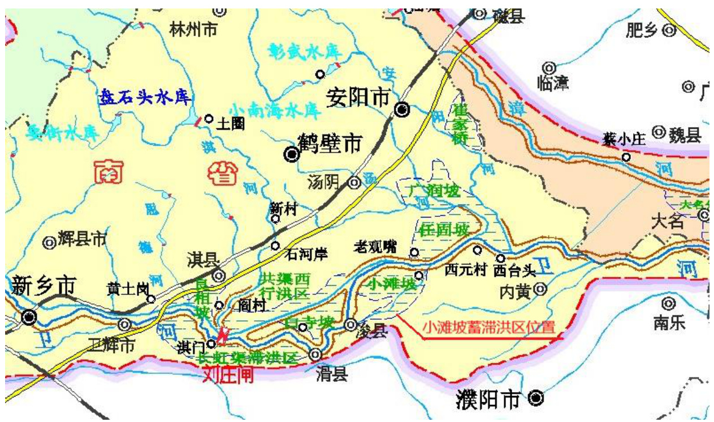  
图 4.1-1 小滩坡蓄滞洪区位置示意图  

(3)重要企业、设施  

蓄滞洪区内有橡胶塑料制品厂、淇雪淀粉厂、浚县中鹤新城投资有限公司等重要企业,濮鹤高速、S303 省道、浚五线、濮鹤高速卫河大桥等重要交通设施。  

# 4.1.3 历史运用情况  

小滩坡蓄滞洪区建于 1955 年,建成至今累计运用 3 次。  

1956 年小滩坡蓄滞洪区最高滞洪水位 $58.80\mathrm{m}$ ,相应蓄洪量 2.30 亿 $\mathsf{m}^{3}$ ,滞洪历时 25 天,淹地 12.6 万亩,经济损失 1223 万元。  

1963 年小滩坡蓄滞洪区最大进洪流量 $1096\mathrm{m}^{3}/\mathsf{s}$ ,最高滞洪水位 $58.28\mathrm{m}$ ,相应蓄洪量 1.40 亿 $\mathsf{m}^{3}$ ,滞洪历时 15 天,淹地 12.0 万亩,受灾人口 5.1 万人,经济损失 1936.9 万元。  

2021 年 7 月 21 日,浚县、内黄县遭受特大暴雨袭击,受此次强降雨影响,卫河、共产主义渠等河道均出现超保证水位洪水。小滩坡蓄滞洪区于 7 月 30 日0 时开始分洪,8 月 22 日基本完成退水,历时 23 天,最高蓄滞洪水位 59.23m(郭新寨),最大蓄滞洪量 1.08 亿 $\mathsf{m}^{3}$ 。本次运用涉及浚县、内黄县 4 个乡镇 80个行政村被淹,淹没耕地 9.42 万亩,受灾人口 9.7 万人,造成财产损失 68747万元。  

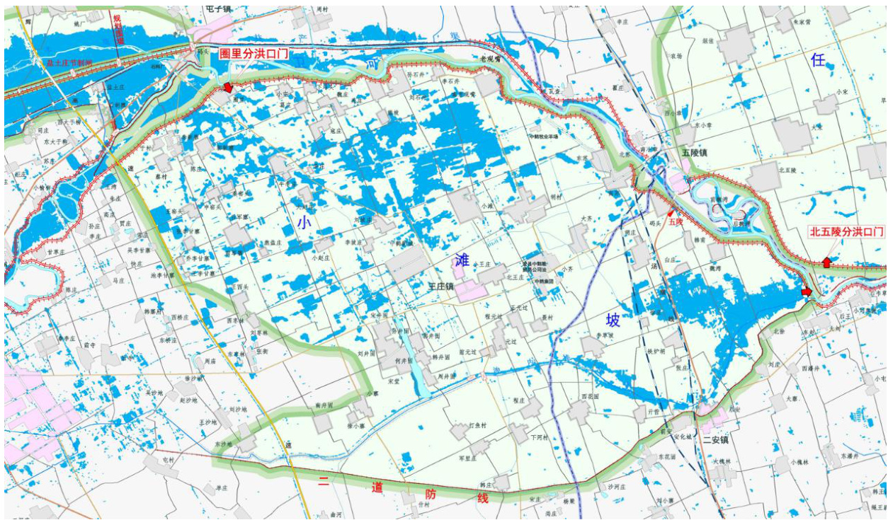  

# 4.1-2  “21.7”洪水期间小滩坡蓄滞洪区最大淹没范围示意图  

# 4.1.4 规划及治理安排  

# 4.1.4.1 运用规划  

(1)海河流域防洪规划  

根据《海河流域防洪规划》安排,当白寺坡中心农场水位达 $60.0\mathrm{m}$ ,老观嘴流量超过 $2000\mathrm{m}^{3}/\mathsf{s}$ 时,在圈里村南扒卫河右堤分洪入小滩坡。  

(2)河南省蓄滞洪区运用预案  

根据 2022 年批复的《河南省蓄滞洪区运用预案》,当白寺坡军农场水位超过 $60.00\mathrm{m}$ (黄海高程)且继续上涨,卫河老观嘴(五陵)流量超过 $1500\mathrm{m}^{3}/\mathsf{s}$ ;扒开卫河右岸圈里口门向小滩坡分洪。  

# 4.1.4.2 治理安排  

(1)《全国蓄滞洪区建设与管理规划》  

《全国蓄滞洪区建设与管理规划》于 2009 年 11 月 09 日由国务院批复,规划范围涉及长江、黄河、淮河、海河、松花江、珠江共计 94 处蓄滞洪区。  

其中对于小滩坡安排如下:工程建设方面,加高加固围堤 $36.3\mathrm{km}$ ,预留分洪口门 1 座;安全建设方面,对蓄滞洪区保留区、运用标准 50 年一遇以上的蓄滞洪区,原则上不再规划安全建设,研究推行洪水保险,确有需要的可适当修建部分撤退道路和配套桥梁,扩建撤退路 42km。  

(2)《海河流域蓄滞洪区建设与管理规划》  

《海河流域蓄滞洪区建设与管理规划》于 2012 年由水利部批复,规划范围涉及漳卫河系、子牙河系、大清河系、永定河系、北三河系共计 28 处蓄滞洪区。  

《海河流域蓄滞洪区建设与管理规划》规划主要内容包括:完善蓄滞洪区围堤工程体系。结合河道治理,对行洪、蓄滞洪水两用堤防进行完善;对滞洪区专用围堤进行建设与加固,确保围堤完整与滞洪功能的正常发挥。对规划分区运用的蓄滞洪区,建设分区隔堤,确保分级运用。根据各蓄滞洪区特点,采取闸、堰、裹头等不同结构形式,建设进、退洪口门工程。根据蓄滞洪区洪水风险状况,结合当地经济社会情况,因地制宜,采取区外安置、区内安置或临时避洪及撤退路转移等安全建设模式进行安全设施建设,切实保障蓄滞洪区居民生命财产安全。制定完善的蓄滞洪区社会管理法律法规体系,完善综合管理与专业管理相结合的管理体制和运行机制,明确管理机构,落实人员经费,建立蓄滞洪区工程和防洪安全设施运行维护长效机制,确保建得起、用得上、长受益。根据不同类型蓄滞洪区特点和洪水风险状况,研究适宜的经济发展模式,合理利用蓄滞洪区土地资源,提出引导、调整区内经济结构、产业结构和生产布局的相关政策与建议。  

其中涉及小滩坡蓄滞洪区的内容包含:工程建设方面,涉及进退洪控制工程、围堤工程、隔堤拆除工程;安全建设方面,涉及高村基安置及撤退路安置。  

表 4.1-1《海河流域蓄滞洪区建设与管理规划》小滩坡工程及安全建设内容  

<html><body><table><tr><td rowspan="3">名称</td><td colspan="4">进洪、退洪、防洪工程</td><td colspan="3">安全建设</td></tr><tr><td>进洪堰</td><td>退洪闸</td><td>防洪堤 加固</td><td>隔堤拆除</td><td>高村基安置</td><td>撤退路安置</td><td>撤退道路</td></tr><tr><td>（座）</td><td>（座）</td><td>(km)</td><td>(km)</td><td>人数 （万人）</td><td>人数 （万人）</td><td>(km)</td></tr><tr><td>小滩坡</td><td>1</td><td>1</td><td>27.8</td><td>8</td><td>2.87</td><td>2.19</td><td>42</td></tr></table></body></html>  

(3)《漳卫河“21.7”洪水灾后治理实施方案》  

“21.7”洪水过后,按照党中央、国务院关于做好灾后恢复重建的决策部署,在水利部、国家发展改革委指导下,海委会同河南、河北、山东三省,组织编制了《漳卫河“21.7”洪水灾后系统治理实施方案》。  

治理范围包括:卫河(含共产主义渠),漳河岳城水库至徐万仓段,漳卫新河,以及淇河(盘石头水库以下)、汤河(汤河水库以下)、安阳河(彰武水库以下)、大沙河(修武至合河)等中小河流。  

主要治理内容包含:水毁工程修复建设、病险水库除险加固、骨干防洪河道治理、蓄滞洪区建设(11 处)、中小河流治理、水文站网与监测体系建设、数字漳卫河防洪保障能力提升工程、河道清障等。其中涉及小滩坡蓄滞洪区治理内容包含:围堤、进退洪口门以及滞洪区内退洪沟渠等。  

# 4.2 工程现状  

# 4.2.1 防洪排涝工程  

(1)排涝沟渠(退洪工程)  

蓄滞洪区浚县境内骨干排涝沟渠(汇水面积大于 $10\mathsf{k m}^{2},$ )有 4 条,分别为浚内沟、苏村沟、下河沟以及井固沟。浚内沟为排水干沟,下河沟、井固沟为浚内沟支沟,苏村沟为蓄滞洪区西北侧的一条排涝支沟。  

# $\textcircled{1}$ 浚内沟  

浚内沟于 1952 年\~1953 年经浚县、内黄二县协商,在原井固潭渠基础上开挖扩建而成的一条平原排涝沟渠,是海河流域漳卫河水系卫河的支流,发源于浚县城关镇毛村坡,穿过浚县县城,至内黄县二安乡大刘口村入卫河,沟渠干流全长 $29.20\ensuremath{\mathrm{km}}$ ,流域面积 $206\mathsf{k m}^{2}$ ,其中小滩坡蓄滞洪区内长 19.36km。浚内沟由南向北贯穿浚县境内,从浚县县城中部通过,是浚县县城及东部地区的主要排涝河道。流域涉及鹤壁市浚县县城及城关镇、黎阳镇、王庄乡、善堂镇和安阳市内黄县二安乡等五个乡镇。浚内沟于 $2012{\sim}2017$ 年经过多次分段扩挖疏浚治理,排涝标准已达5 年一遇,设计排涝流量 $66.45\mathrm{m}^{3}/\mathsf{s}$ ,现状河底宽 $8{\sim}12\mathrm{m}$ ,深 $3.5\mathsf{m}$ ,沟渠为梯形断面,两侧边坡 $1{:}2.5{\sim}1{:}3$ ,纵坡 $1/3000{\sim}1/5000$ ,目前能够满足排涝要求。浚内沟是蓄滞洪区内的主要排水干渠,沿途有井固沟、下河沟、齐村沟等支沟汇入。  

$\textcircled{2}$ 苏村沟  

苏村沟位于蓄滞洪区西北部,平行于浚内沟,发源于浚县城北陈庄村,至内黄县二安乡苏村入卫河,区内沟渠长度 $11.4\mathsf{k m}$ ,汇水面积 $53.9\mathsf{k m}^{2}$ 。苏村沟为蓄滞洪区西北部的排涝渠道,现状沟渠全线基本贯通,河底高程 $51.44{\sim}56.06\mathsf{m}$ ,纵坡 1/3000,上游段平均河底宽 $1{\sim}4\ensuremath{\mathrm{m}}$ ,中游段平均河底宽 $3{\sim}4\ensuremath{\ m}$ ,下游段平均河底宽 $5{\sim}9\ensuremath{\mathrm{m}}$ 。  

$\textcircled{3}$ 下河沟  

下河沟为浚内沟中游右侧主要支沟,区内长度 $3.6\mathsf{k m}$ ,汇水面积 $27.29\mathsf{k m}^{2}$ 。  

下河沟发源于蓄滞洪区外,经东防洪堤(二道防线)的什村沟北支沟闸流入蓄滞洪区,区内主要承泄两侧西韩庄村、军里庄村、打渔庄村、下河村、程庄村等村庄及附近耕地的涝水,河底高程 $53.35{\sim}56.09\mathrm{m}$ ,现状纵坡 1/1700,平均河底宽$_{2\sim4\mathrm{{m}}}$ ,沟渠深 $_{2\sim3\ensuremath{\mathrm{m}}}$ 。  

$\textcircled{4}$ 井固沟  

井固沟为浚内沟中游左侧主要支沟,发源于王庄镇以西区域,流经王庄镇、井固村入浚内沟,区内长度 $7.2\mathsf{k m}$ ,汇水面积 $14.67\ensuremath{\mathrm{km}^{2}}$ 。井固沟主要承泄两侧王庄镇、东赵庄村、井固村等村庄及附近耕地的涝水,河底高程 $49.68{\sim}56.83\mathrm{m}$ ,现状纵坡 1/1750,上游平均河底宽 $1{\sim}2\ m$ ,中游河底宽 $5{\sim}20\ensuremath{\mathrm{m}}$ ,下游沟渠内存在大片滩地,地势低洼,宽度较大,最宽处达 $100\mathrm{m}$ 。  

$\textcircled{5}$ 沿沟渠桥涵  

为方便生产及交通通行,沟渠近村庄段存在的桥涵众多,由于建设年代早,管护不到位,生产桥及涵洞普遍存在混凝土碳化、主梁及盖梁开裂露筋、桥墩破损老化、桥面破损、栏杆老化脱落、涵洞淤堵等问题,阻碍渠道退洪。经现场调研,苏村沟苏村 02 生产桥、王窑头 4 生产桥、王窑头 3 生产桥、王窑头 1 生产桥、苏村 07 生产桥、申窑头 2 生产桥、牛李村桥、牛李村 2 桥、苏村 15 生产桥,井固沟河段内的井固沟桥、井固桥、郭井固村西桥,下河沟河段内的下河村南桥,共 13 座生产桥现状问题较突出。  

# (3)进退洪设施  

规划在卫河右堤上圈里村附近建设分洪控制堰,该堰尚未安排建设。“21.7”洪水期间,按省防汛抗旱指挥部指令,采用人工扒口的方式分洪。  

蓄滞洪区退洪设施已在《卫河干流(淇门\~徐万仓)治理工程》中设计,区内洪水主要通过苏村排涝涵闸以及浚内沟排涝涵闸泄入卫河。  

# 4.2.2 安全工程  

小滩坡蓄滞洪区撤退转移主要利用现有省道、县道以及乡村道路。主要撤退转移道路共40条,总长 $83.9\ensuremath{\mathrm{km}}$ ,其中:浚县境内有撤退道路36条,共长70.4km。  

撤退干线为“两横两纵”。“两横”为S303省道及X007善大线县道,S303省道位于蓄滞洪区北部,现状路况良好,能够连通北部沿线村庄顺利转移至二安乡,X007 善大线县道位于蓄滞洪区中南部,横跨卫河右堤至东防洪堤,现状路况良好,能够连通沿线村庄顺利转移至善堂镇;“两纵”为X002县道及X006县道,X002 县道北至北苏村,南至浚县县城,现状路况良好,能够连通沿线村庄顺利转移至浚县县城,X006 县道北至马头村,南至浚县县城,现状路况良好,能够连通沿线村庄顺利转移至浚县县城。乡村道路多已硬化为砼或沥青路面,还有部分道路在水毁修复工程中进行了翻修、重新铺设路面,基本能够满足紧急转移需要,仅有少量主要出村道路存在未硬化、狭窄及破损问题。  

蓄滞洪区内无围村堤、救生台、避水楼、庄台等安全避水设施。蓄滞洪区内无专用通信系统,洪水警报信息由电视、电话、手机、警车等传达。  

# 4.2.3 其他工程  

小滩坡蓄滞洪区规划中无分区运用安排,但现状存在一道隔堤。隔堤为东西向,起于苑庄附近的卫河右堤,终点至浚内沟左堤,全长 8km,是群众自行修建,隔堤顶高程约 $57.2{\sim}57.9\mathrm{m}$ ,将蓄滞洪区分为南北两部分,成为一项阻水工程,由于交通需求,现状隔堤堤顶已成为附近的主要通行道路之一。“21.7”洪水小滩坡启用时,在隔堤刘坡村位置扒口行洪。  

浚五路为乡级道路,南北贯穿蓄滞洪区,是附近的主要通行道路之一,建设标准较高,路面顶高程约 $58.4\mathrm{m}$ ,“21.7”洪水分洪退洪期间该道路阻水严重。  

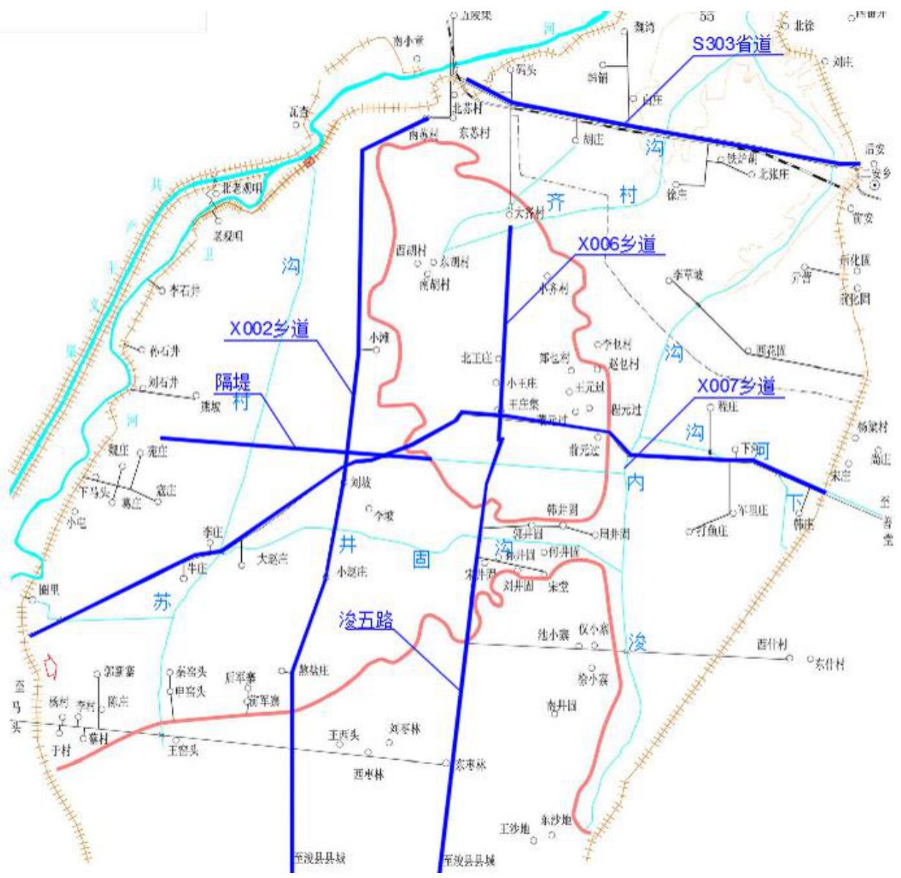  
图 4.2-1 蓄滞洪区主要撤退路位置示意图  

# 4.3 存在问题与必要性  

# 4.3.1 现状复核  

# 4.3.1.1 沟渠现状排涝能力  

苏村沟、齐村沟、下河沟及井固沟 3 条排涝沟渠承担着两岸村庄及农田的排涝任务,在蓄滞洪区运用期间亦承担着退洪任务,3条沟渠排涝标准为3年一遇。  

依据《灌溉与排水工程设计标准》,按照地面高程以下 0.3m 作为排涝水位复核沟渠现状排涝能力。规范中规定有杂草的排水渠道糙率取值应为$0.025{\sim}0.03$ ,3 条沟内杂草茂盛,本次复核糙率取值 0.03。  

# (1)苏村沟  

苏村沟为蓄滞洪区西北部的主要排涝渠道,总长度约 11.2km,现状地面高程 $55.02{\sim}58.09\mathrm{m}$ ,河底高程 $51.44\sim56.06\ensuremath{\mathrm{m}}$ ,河底纵坡 1/4000,上游段( $S C G0{+}000{-}4{+}800$ )平均河宽 $1{\sim}4\ensuremath{\mathrm{m}}$ ,中游段( $\scriptstyle\mathsf{S C G}5+000\small{\sim}8+200$ )平均河宽 $3{\sim}4\ensuremath{\ m}$ ,下游段( $\mathtt{S C G8}\substack{+400\sim}\mathtt{S C G}11\substack{+200}$ )平均河宽 $5{\sim}9\ensuremath{\mathrm{m}}$ ,3 年一遇设计排涝流量为 $4.6{\sim}18.7{\ m}^{3}/{\mathsf{s}}$ 。  

表 4.3-1 苏村沟现状情况表  

<html><body><table><tr><td>桩号</td><td>左岸高程(m)</td><td>右岸高程(m)</td><td>河底宽（m)</td><td>河底高程(m)</td><td>上口宽(m)</td></tr><tr><td>0+010</td><td>57.68</td><td>57.68</td><td>3.8</td><td>56.06</td><td>1.62</td></tr><tr><td>0+600</td><td>57.95</td><td>57.90</td><td>4.00</td><td>55.51</td><td>2.39</td></tr><tr><td>1+200</td><td>57.29</td><td>57.40</td><td>4.70</td><td>55.24</td><td>2.05</td></tr><tr><td>2+000</td><td>57.04</td><td>57.40</td><td>3.30</td><td>55.07</td><td>1.97</td></tr><tr><td>2+600</td><td>57.95</td><td>57.51</td><td>1.90</td><td>55.31</td><td>2.20</td></tr><tr><td>3+000</td><td>57.37</td><td>57.99</td><td>1.90</td><td>55.4</td><td>1.97</td></tr><tr><td>3+400</td><td>57.11</td><td>57.75</td><td>1.70</td><td>55.32</td><td>1.79</td></tr><tr><td>3+600</td><td>56.69</td><td>56.87</td><td>3.40</td><td>54.95</td><td>1.74</td></tr><tr><td>3+681</td><td>56.98</td><td>57.34</td><td>3.35</td><td>54.91</td><td>2.07</td></tr><tr><td>4+001</td><td>57.18</td><td>56.84</td><td>1.50</td><td>54.65</td><td>2.19</td></tr><tr><td>4+401</td><td>56.75</td><td>56.77</td><td>1.50</td><td>54.47</td><td>2.28</td></tr><tr><td>5+601</td><td>56.37</td><td>57.01</td><td>5.15</td><td>53.86</td><td>2.51</td></tr><tr><td>6+201</td><td>57.29</td><td>57.27</td><td>5.35</td><td>54.02</td><td>3.25</td></tr><tr><td>6+800</td><td>57.03</td><td>57.10</td><td>5.6</td><td>53.3</td><td>3.73</td></tr><tr><td>7+400</td><td>56.40</td><td>56.23</td><td>3.5</td><td>52.99</td><td>3.24</td></tr><tr><td>7+801</td><td>56.82</td><td>56.06</td><td>2</td><td>52.1</td><td>3.96</td></tr><tr><td>8+001</td><td>56.44</td><td>56.21</td><td>4.3</td><td>53.39</td><td>2.82</td></tr><tr><td>8+803</td><td>56.33</td><td>56.08</td><td>5</td><td>51.87</td><td>4.21</td></tr><tr><td>9+003</td><td>56.41</td><td>55.99</td><td>3.3</td><td>51.93</td><td>4.06</td></tr><tr><td>9+804</td><td>56.20</td><td>56.64</td><td>7</td><td>52.6</td><td>3.60</td></tr><tr><td>10+204</td><td>56.45</td><td>56.42</td><td>9</td><td>51.44</td><td>4.98</td></tr><tr><td>10+804</td><td>57.02</td><td>57.46</td><td>5.7</td><td>53.54</td><td>3.48</td></tr><tr><td>11+205</td><td>57.29</td><td>58.06</td><td>5.2</td><td>53.3</td><td>3.99</td></tr></table></body></html>  

表 4.3-2  苏村沟排涝能力复核表  

<html><body><table><tr><td>桩号</td><td>流量（m3/s)</td><td>现状水位(m)</td><td>设计水位(m)</td><td>现状排涝能力(m3/s)</td></tr><tr><td>0+010</td><td>4.6</td><td>57.49</td><td>57.18</td><td rowspan="11">2.5</td></tr><tr><td>0+600</td><td>4.6</td><td>57.49</td><td>57.40</td></tr><tr><td>1+200</td><td>4.6</td><td>57.47</td><td>56.79</td></tr><tr><td>2+000</td><td>4.6</td><td>57.46</td><td>56.54</td></tr><tr><td>2+600</td><td>4.6</td><td>57.45</td><td>57.01</td></tr><tr><td>3+000</td><td>9.3</td><td>57.39</td><td>56.87</td></tr><tr><td>3+400</td><td>9.3</td><td>57.24</td><td>56.61</td></tr><tr><td>3+600</td><td>9.3</td><td>57.24</td><td>56.19</td></tr><tr><td>3+681</td><td>9.3</td><td>57.23</td><td>56.48</td></tr><tr><td>4+001</td><td>9.3</td><td>57.16</td><td>56.34</td></tr><tr><td>4+401</td><td>9.3</td><td>56.85</td><td>56.25</td><td rowspan="7">6.5</td></tr><tr><td>5+601</td><td>9.3</td><td>56.51</td><td>55.87</td></tr><tr><td>6+201</td><td>14</td><td>56.43</td><td>56.77</td></tr><tr><td>6+800</td><td>14</td><td>56.35</td><td>56.53</td></tr><tr><td>7+400</td><td>14</td><td>56.31</td><td>55.73</td></tr><tr><td>7+801</td><td>14</td><td>56.27</td><td>55.56</td></tr><tr><td>8+001</td><td>14</td><td>56.24</td><td>55.71</td></tr><tr><td>8+803</td><td>18.7</td><td>56.23</td><td>55.58</td><td rowspan="7">9</td></tr><tr><td>9+003</td><td>18.7</td><td>56.21</td><td>55.49</td></tr><tr><td>9+804</td><td>18.7</td><td>56.09</td><td>55.70</td></tr><tr><td>10+204</td><td>18.7</td><td>56.07</td><td>55.92</td></tr><tr><td>10+804</td><td>18.7</td><td>56.00</td><td>56.52</td></tr><tr><td></td><td></td><td></td><td></td></tr><tr><td>11+205</td><td>18.7</td><td>55.9</td><td>56.79</td></tr></table></body></html>  

经复核,苏村沟现状排涝能力 $2.5{\sim}9\mathrm{m}^{3}/\mathsf{s}$ ,全段均不能满足排涝要求,两岸现状排涝水位高于设计水位,平均高 $0.5\mathrm{m}$ 。需对苏村沟桩号 $\mathtt{S C G0}\substack{+000}\substack{-11}\substack{+200}$ 进行清淤扩挖。  

# (2)下河沟  

下河沟长度约 $3.6\mathsf{k m}$ ,现状地面高程 $55.26{\sim}58.39\mathsf{m}$ ,河底高程  

$53.35{\sim}56.09\mathrm{m}$ ,纵坡 1/1700,平均河宽约 $_{2\sim4\mathrm{{m}}}$ ,沟渠深 $2\sim3\ensuremath{\mathrm{m}}$ ,3 年一遇设计排涝流量为 $7.25{\sim}11.2\mathsf{m}^{3}/\mathsf{s}$ 。  

<html><body><table><tr><td>桩号</td><td>左岸高程(m)</td><td>右岸高程(m)</td><td>河底宽(m)</td><td>河底高程(m)</td><td>沟渠深(m)</td></tr><tr><td>0+000</td><td>57.184</td><td>57.35</td><td>1.5</td><td>56.09</td><td>1.09</td></tr><tr><td>0+400</td><td>57.13</td><td>57.37</td><td>2.0</td><td>55.19</td><td>1.94</td></tr><tr><td>0+800</td><td>57.15</td><td>56.89</td><td>1.0</td><td>53.97</td><td>2.92</td></tr><tr><td>1+200</td><td>57.07</td><td>57.06</td><td>4.3</td><td>54.70</td><td>2.36</td></tr><tr><td>1+400</td><td>56.71</td><td>57.11</td><td>2.0</td><td>54.48</td><td>2.23</td></tr><tr><td>1+800</td><td>57.59</td><td>58.39</td><td>2.0</td><td>54.18</td><td>3.41</td></tr><tr><td>1+861</td><td>57.14</td><td>58.37</td><td>6.0</td><td>54.30</td><td>2.84</td></tr><tr><td>2+095</td><td>57.21</td><td>57.16</td><td>4.5</td><td>55.62</td><td>1.54</td></tr><tr><td>2+400</td><td>56.65</td><td>56.72</td><td>2.1</td><td>53.80</td><td>2.85</td></tr><tr><td>3+000</td><td>55.26</td><td>56.11</td><td>1.0</td><td>53.35</td><td>1.91</td></tr><tr><td>3+618</td><td>55.79</td><td>56.02</td><td>5.5</td><td>53.56</td><td>2.23</td></tr></table></body></html>  

表 4.3-3  下河沟现状  
表 4.3-4  下河沟排涝能力复核表  

<html><body><table><tr><td>桩号</td><td>流量(m3/s)</td><td>现状水位(m)</td><td>设计水位(m)</td><td>现状排涝能力(m?/s)</td></tr><tr><td>0+000</td><td>7.25</td><td>57.63</td><td>56.68</td><td rowspan="8">3~7</td></tr><tr><td>0+400</td><td>7.25</td><td>57.30</td><td>56.63</td></tr><tr><td>0+800</td><td>7.25</td><td>57.11</td><td>56.39</td></tr><tr><td>1+200</td><td>11.2</td><td>57.06</td><td>56.56</td></tr><tr><td>1+400</td><td>11.2</td><td>57.05</td><td>56.21</td></tr><tr><td>1+800</td><td>11.2</td><td>56.99</td><td>57.09</td></tr><tr><td>1+861</td><td>11.2</td><td>56.99</td><td>56.64</td></tr><tr><td>2+095</td><td>11.2</td><td>56.58</td><td>56.66</td></tr><tr><td>2+400</td><td>11.2</td><td>56.18</td><td>56.15</td></tr><tr><td>3+000</td><td>11.2</td><td>55.98</td><td>54.76</td></tr><tr><td>3+600</td><td>11.2</td><td>55.15</td><td>55.29</td></tr></table></body></html>  

经复核,下河沟现状排涝能力 $3{\sim}7\mathrm{m}^{3}/\mathsf{s}$ ,全段均不能满足排涝要求,两岸现状排涝水位高于设计水位,平均高 $0.53\mathrm{m}$ 。需对下河沟桩号 $\mathsf{X H G0}{+}000{-}3{+}600$  

进行清淤扩挖。  

# (3)井固沟  

井固沟长度约 $7.1\mathsf{k m}$ ,现状地面高程 $50.87{\sim}57.63\mathrm{m}$ ,河底高程$49.68{\sim}56.83\mathrm{m}$ ,纵坡 1/1750,上游段( $(\mathsf{J}\mathsf{G}\mathsf{G}0+000\sim1+800$ )平均河宽 $1{\sim}2\ m$ ,中游段( $\ J G G1+800{\sim}4+800$ )河宽 $5{\sim}20\ensuremath{\mathrm{m}}$ ,下游段( $\scriptstyle\mathcal{I}G G4+800\sim6+800$ )沟渠内存在大片滩地,地势低洼,宽度较大,最宽处达 $100\mathrm{m}$ ,两 3 年一遇设计排涝流量为 $4.4{\sim}8.36{\ m}^{3}/{\mathsf s}$ 。  

表 4.3-5  井固沟现状  

<html><body><table><tr><td>桩号</td><td>左岸高程(m)</td><td>右岸高程(m)</td><td>河底宽(m)</td><td>河底高程(m)</td><td>沟渠深(m)</td></tr><tr><td>0+000</td><td>57.50</td><td>56.68</td><td>2.9</td><td>55.56</td><td>1.11</td></tr><tr><td>0+595</td><td>56.60</td><td>56.69</td><td>0.9</td><td>54.93</td><td>1.76</td></tr><tr><td>1+195</td><td>56.86</td><td>56.83</td><td>2.9</td><td>55.70</td><td>1.13</td></tr><tr><td>1+795</td><td>57.01</td><td>56.94</td><td>2.0</td><td>55.27</td><td>1.67</td></tr><tr><td>2+395</td><td>56.85</td><td>56.95</td><td>3.8</td><td>55.10</td><td>1.85</td></tr><tr><td>2+795</td><td>56.30</td><td>55.59</td><td>8.4</td><td>54.38</td><td>1.21</td></tr><tr><td>2+995</td><td>55.50</td><td>56.40</td><td>3.8</td><td>53.99</td><td>2.41</td></tr><tr><td>3+359</td><td>56.50</td><td>56.72</td><td>19.2</td><td>54.09</td><td>2.63</td></tr><tr><td>3+795</td><td>56.43</td><td>56.03</td><td>15.0</td><td>52.92</td><td>3.11</td></tr><tr><td>4+195</td><td>56.16</td><td>54.36</td><td>3.3</td><td>53.06</td><td>1.30</td></tr><tr><td>4+795</td><td>56.60</td><td>57.05</td><td>7.7</td><td>54.39</td><td>2.66</td></tr><tr><td>5+395</td><td>55.49</td><td>56.90</td><td rowspan="3">高程较低, 大片耕地, 沟渠宽度大</td><td>51.24</td><td>5.66</td></tr><tr><td>5+995</td><td>55.50</td><td>55.33</td><td>51.47</td><td>3.86</td></tr><tr><td>6+595</td><td>57.00</td><td>56.36</td><td>51.73</td><td>4.63</td></tr><tr><td>7+167</td><td>55.24</td><td>55.55</td><td>6.0</td><td>53.02</td><td>2.53</td></tr></table></body></html>  

表 4.3-6  井固沟排涝能力复核表  

<html><body><table><tr><td>桩号</td><td>流速(m3/s)</td><td>现状水位(m)</td><td>设计水位(m)</td><td>现状排涝能力(m?/s)</td></tr><tr><td>0+000</td><td>4.4</td><td>57.32</td><td>56.18</td><td rowspan="4">0.8</td></tr><tr><td>0+595</td><td>4.4</td><td>57.3</td><td>56.10</td></tr><tr><td>1+195</td><td>4.4</td><td>57.26</td><td>56.33</td></tr><tr><td>1+795</td><td>4.4</td><td>56.82</td><td>56.44</td></tr></table></body></html>  

<html><body><table><tr><td>2+395</td><td>4.4</td><td>56.01</td><td>56.35</td><td rowspan="8">2.5</td></tr><tr><td>2+795</td><td>4.4</td><td>56.05</td><td>55.09</td></tr><tr><td>2+995</td><td>4.4</td><td>56.04</td><td>55.00</td></tr><tr><td>3+359</td><td>4.4</td><td>55.27</td><td>56.00</td></tr><tr><td>3+795</td><td>4.4</td><td>55.26</td><td>55.53</td></tr><tr><td>4+195</td><td>4.4</td><td>55.24</td><td>53.86</td></tr><tr><td>4+795</td><td>8.36</td><td>54.91</td><td>56.10</td></tr><tr><td>5+395</td><td>8.36</td><td>54.45</td><td>54.99</td></tr><tr><td>5+995</td><td>8.36</td><td>54.45</td><td>56.40</td></tr><tr><td>6+595</td><td>8.36</td><td>54.45</td><td>55.86</td></tr><tr><td>7+167</td><td>8.36</td><td>54.33</td><td>54.74</td></tr></table></body></html>  

经复核,井固沟现状排涝能力 $0.8{\sim}8.36{\ m}^{3}/{\mathsf s}$ ,上游段及部分中游段( $\scriptstyle\mathrm{JGG0+000-4+800})$ )两岸现状排涝水位高于设计水位,平均高 $0.68\mathsf{m}$ ,下游段存在较大面积滩地,能够满足排涝要求。需对井固沟桩号( $(\mathbf{J}{\mathsf{G}}{\mathsf{G}}0{+}000{-}4{+}800)$ )进行清淤扩挖。  

# 4.3.1.2 东防洪堤(二道防线)现状防洪能力  

东防洪堤(二道防线)浚县段位于浚县王庄镇和善堂镇境内,涉及二道防线7.73km,已在《鹤壁市浚县小滩坡蓄滞洪区水毁修复工程》中进行设计,目前正在施工。设计堤防等级 5 级,堤顶宽度 $4\mathrm{m}$ ,设计按单式梯形断面,迎、背水侧边坡均为1:2。堤顶高程按设计洪水位加堤顶超高确定,设计蓄滞洪水位 $57.3\mathrm{m}$ ,计算堤顶超高 $1.7\mathsf{m}$ ,设计堤顶高程 $59\mathrm{m}$ ,经复核,基本能够满足蓄滞洪区防洪要求。  

# 4.3.1.3 撤退路规模复核  

小滩坡蓄滞洪区内主要撤退道路共 40 条,总长 $83.9\ensuremath{\mathrm{km}}$ ,撤退干线 4 条,为 S303 省道、X007 善大线县道、X002 县道及 X006 县道。其中:浚县境内有撤退道路 36 条,共长 $70.4\mathsf{k m}$ 。依据《河南省蓄滞洪区运用预案》,蓄滞洪区内撤退方向共 4 个,分别为浚县黎阳镇、王庄乡台辉高速以南区域、善堂镇东防洪堤东部区域以及二安乡东防洪堤东部区域。蓄滞洪区西北部村庄主要通过 X002县道及主要出村道路转移至浚县黎阳镇,西南部村庄主要通过 X007、X006 县道及主要出村道路转移至王庄乡台辉高速以南区域,东部、中部村庄主要通过 X007县道转移至善堂镇东防洪堤以东区域,北部村庄主要通过 S303 省道及主要出村道路转移至二安乡东防洪堤以东区域。具体撤退、安置安排见下表。撤退转移路线示意图见附图 F950K-A1-H-10。  

表 4.3-7  小滩坡蓄滞洪区居民就地安置与转移安置计划  

<html><body><table><tr><td>序号</td><td>乡镇</td><td>村</td><td>总人口</td><td>转移方式</td><td>安置地点</td></tr><tr><td colspan="6">浚县</td></tr><tr><td>1</td><td rowspan="10"></td><td>北苏村</td><td>1561</td><td>车辆</td><td>黎阳镇东桥庄、西桥庄</td></tr><tr><td>2</td><td>南苏村</td><td>2202</td><td>车辆</td><td>黎阳镇前寺庄</td></tr><tr><td>3</td><td>东苏村</td><td>923</td><td>车辆</td><td>黎阳镇后寺庄</td></tr><tr><td>4</td><td>刘坡</td><td>1727</td><td>车辆</td><td>黎阳镇马村</td></tr><tr><td>5</td><td>牛李庄</td><td>1483</td><td>车辆</td><td>黎阳镇快庄、贾庄</td></tr><tr><td>9</td><td>东赵庄</td><td>1009</td><td>车辆</td><td>黎阳镇韩寨府</td></tr><tr><td>7</td><td>大赵庄</td><td>981</td><td>车辆</td><td>黎阳镇东马庄</td></tr><tr><td>8</td><td>申窑头</td><td>967</td><td>车辆</td><td>黎阳镇朱庄</td></tr><tr><td>9</td><td>郭新寨</td><td>1194</td><td>车辆</td><td>黎阳镇甘草庄</td></tr><tr><td>10</td><td>李新寨</td><td>2799</td><td>车辆</td><td>黎阳镇孙庄</td></tr><tr><td>11</td><td>聂村</td><td>1868</td><td>车辆</td><td>善堂镇双庙</td></tr><tr><td>12</td><td>宋堂</td><td>1106</td><td>车辆</td><td>善堂镇迎阳铺</td></tr><tr><td>13</td><td>王庄乡 军寨</td><td>1860</td><td>车辆</td><td>黎阳镇常庄、西马庄</td></tr><tr><td>14</td><td>刘井固</td><td>1106</td><td>车辆</td><td>善堂镇吴村</td></tr><tr><td>15</td><td>郭井固</td><td>1089</td><td>车辆</td><td>善堂镇寨外</td></tr><tr><td>16</td><td>韩井固</td><td>878</td><td>车辆</td><td>善堂镇寨里</td></tr><tr><td>17</td><td>宋井固</td><td>1305</td><td>车辆</td><td>善堂镇迎阳铺</td></tr><tr><td>18</td><td>孙井固</td><td>775</td><td>车辆</td><td>善堂镇迎阳铺</td></tr><tr><td>19</td><td>周井固</td><td>1151</td><td>车辆</td><td>善堂镇寨里</td></tr><tr><td>20</td><td>何井固</td><td>2145</td><td>车辆</td><td>善堂镇黄辛庄</td></tr><tr><td>21</td><td>孙石井</td><td>2210</td><td>车辆</td><td>王庄乡周庙村</td></tr><tr><td>22</td><td>小滩</td><td>2290</td><td>车辆</td><td>黎阳镇秦李庄</td></tr><tr><td>23</td><td>圈里</td><td>1521</td><td>车辆</td><td>王庄乡吴李甘寨</td></tr><tr><td>24</td><td>苑庄</td><td>3063</td><td>车辆</td><td>王庄乡东沙地</td></tr><tr><td>25</td><td>葛庄</td><td>2472</td><td>车辆</td><td>王庄乡刘沙地</td></tr></table></body></html>  

<html><body><table><tr><td>序号</td><td>乡镇</td><td>村</td><td>总人口</td><td>转移方式</td><td>安置地点</td></tr><tr><td>26</td><td></td><td>老观嘴</td><td>2964</td><td>车辆</td><td>王庄乡西沙地</td></tr><tr><td colspan="2">小计</td><td>26</td><td>42649</td><td></td><td></td></tr><tr><td>27</td><td rowspan="5">善堂镇</td><td>打鱼庄</td><td>845</td><td>车辆</td><td>西善堂</td></tr><tr><td>28</td><td>西韩庄</td><td>628</td><td>车辆</td><td>齐小寨</td></tr><tr><td>29</td><td>程庄</td><td>1348</td><td>车辆</td><td>西</td></tr><tr><td>30</td><td>下河</td><td>1497</td><td>车辆</td><td>杨良村</td></tr><tr><td>31</td><td>军里庄</td><td>924</td><td>车辆</td><td>郭小寨</td></tr><tr><td>32</td><td>黎阳办</td><td>东沙地</td><td>3144</td><td>就地</td><td>东沙地</td></tr><tr><td colspan="2">小计</td><td>9</td><td>8386</td><td></td><td></td></tr><tr><td>浚县合计</td><td></td><td>32</td><td>51035</td><td></td><td></td></tr></table></body></html>  

小滩坡蓄滞洪区内临时撤退转移人口共 63047 人,其中浚县 51035 人。人口密度 660 人 $/{\mathsf k m}^{2}$ ,按照《蓄滞洪区设计规范》规定,撤退路网密度应在$0.5{\sim}0.7\mathrm{km}/\mathrm{km}^{2}$ ,小滩坡蓄滞洪区内实际路网密度为 $0.87\mathrm{km}/\mathrm{km}^{2}$ ,能够满足撤退转移要求。  

# 4.3.2 存在问题  

# (1)缺乏进洪控制工程  

小滩坡蓄滞洪区内无进洪控制工程。由于没有控制工程,进洪全靠临时扒口,对坡洼的进洪流量和水量不易调度和控制,也很难把握分洪时机和有效控制险情。因此只有通过工程措施,才能实现坡洼有计划的控制运用,才能保证卫河干流河道的行洪安全。  

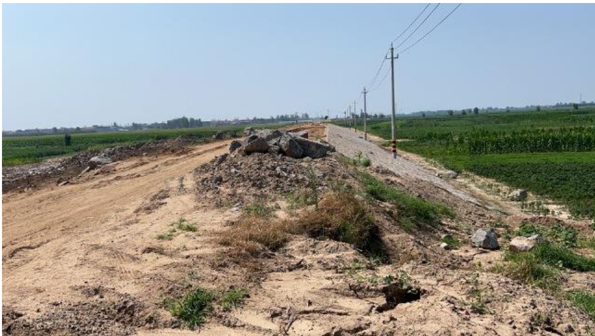  
图 4.3-1 “21.7”洪水期间临时扒口分洪位置  

# (2)排涝沟渠能力不足  

骨干排涝沟渠能力普遍不足,排涝设施经过几十年的运行,沟道逐年淤积抬高,杂草 树木丛生,排涝标准已不能达到原设计标准。小滩坡蓄滞洪区内众多排涝干沟、支沟、斗沟存在着沟渠不连续、被植被及农田作物堵塞以及人为破坏等问题,影响退洪。  

苏村沟为蓄滞洪区西北部的排涝沟渠,沟渠现状全线基本贯通,但由于平原地势平坦,渠道纵坡缓,加上渠道平时缺少管护,淤积严重,杂草丛生,河道规模明显不足。  

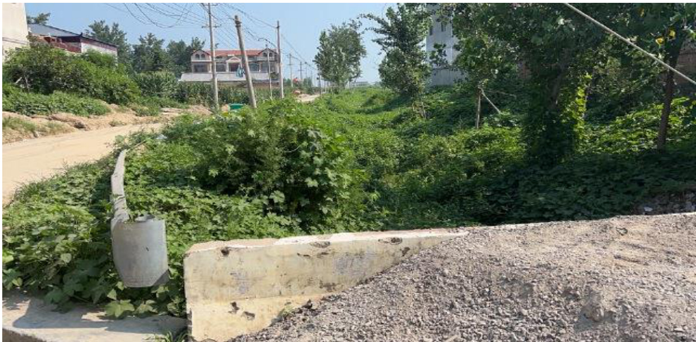  
图 4.3-2  苏村沟现状  

下河沟为浚内沟中下游右侧主要排涝支沟,下河沟发源于蓄滞洪区外,经东防洪堤(二道防线)的什村沟北支沟闸流入蓄滞洪区内,区内主要承泄两侧西韩庄村、军里庄村、打渔庄村、下河村、程庄村等村庄及附近耕地的涝水,沟渠两侧耕地密集,渠道杂草丛生,规模不足。  

井固沟为浚内沟中游左侧主要排涝支沟,主要承泄两侧王庄镇、东赵庄村、井固村等村庄及附近耕地的涝水。沟渠上游耕地密集,存在侵占沟渠的现象,渠道狭窄,中游流经王庄镇、井固村,沟渠两侧受房屋、道路限制,规模不足。  

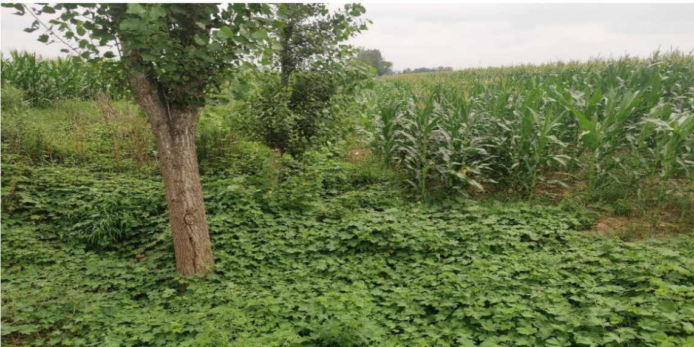  
图 4.3-3  井固沟现状  

沟渠流经村庄或耕地段存在较多跨沟渠的小桥涵,由于建设年代早、建设标准低、缺乏管理维护等原因,大多数桥涵存在规模不足、坍塌、堵塞等问题,成为沟渠局部卡口,退洪时形成制约。“21.7”洪水期间,由于蓄滞洪区内主要排涝沟渠堵塞严重、规模不足,干渠、支渠连通不畅等原因,导致退洪时间长,退洪困难,局部区域长时间受淹,给当地居民带来极大不便。  

# (3)局部撤退道路标准低  

蓄滞洪区内路网相对较为发达,村庄内部主干道、主要出村道路大都完成硬化,仅少部分为土路。灾后重建对多处损坏路面安排了恢复重建,高标准农田建设也对部分路段安排了建设。目前,仅个别道路路面存在破损、路况较差以及路面较窄错车困难等问题。  

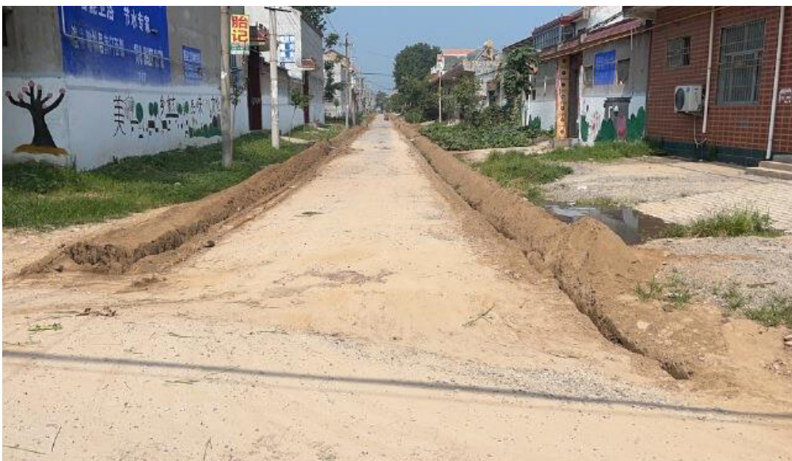  

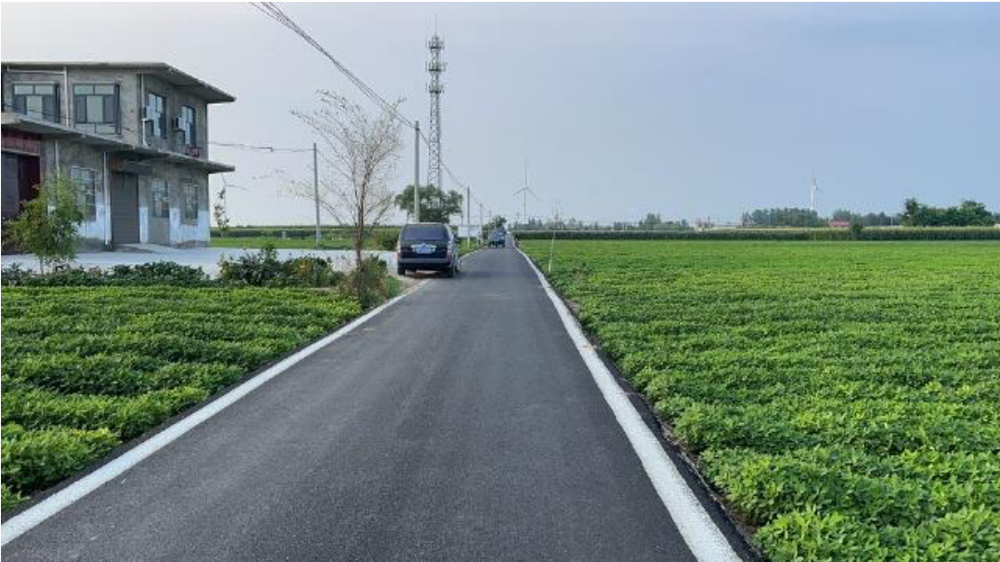  
4.3-10 出村主路未硬化  

  
4.3-11 出村主路狭窄  

# 4.3-12 出村主路破损  

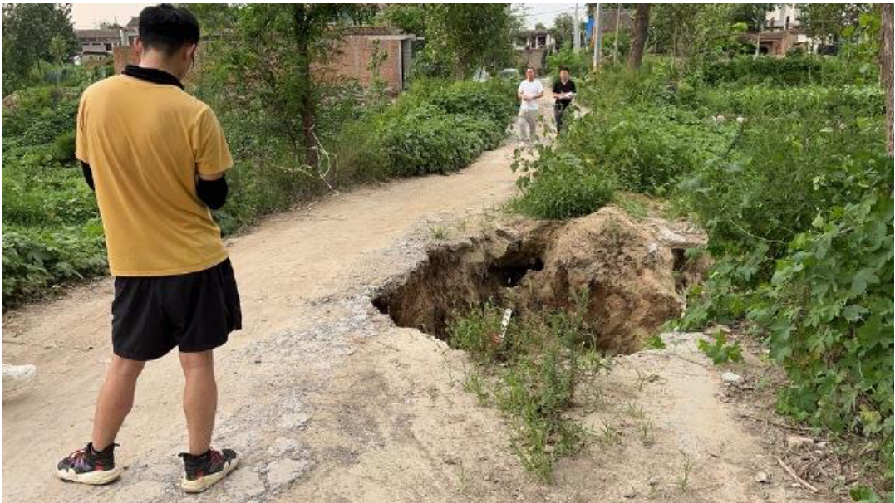  
图 4.3-13 局部道路坍塌  

# (6)隔堤、道路影响蓄滞洪区运用  

蓄滞洪区内隔堤、浚五路现状为附近村镇的交通主干道,建设标准较高,道路两侧缺少水系连通工程,在蓄滞洪区启用期间,造成部分地区水位过高,且影响退水,局部村庄受灾较为严重的现象。  

# 4.3.3 建设必要性  

# (1)蓄滞洪区建设是完善流域防洪体系的需要  

小滩坡蓄滞洪区是解决卫河超标准洪水时运用的蓄滞洪区,在有效蓄滞卫河老观嘴以下河道超量洪水中,发挥着至关重要的作用,它是保护卫河中下游平原地区防洪安全必不可少的蓄洪工程,是卫河下游地区重要的防洪安全保障。只有合理、有效、灵活的运用小滩坡蓄滞洪区,才能有效防御漳卫河系大洪水,特别是防御超标准洪水,最大限度减少洪水灾害损失。为此,尽快进行小滩坡蓄滞洪区建设对保障流域经济社会健康发展有着不可替代的作用。  

# (2)蓄滞洪区建设是解决区内居民安全生产、生活的重要保障  

蓄滞洪区既是蓄滞洪水的场所,又是区内居民赖以生存发展的基地,小滩坡蓄滞洪区中耕地比重较大,几乎占蓄滞洪区面积的 $75\%$ 。小滩坡已启用多次,在“21.7”洪水中发挥着重要的防洪作用,为漳卫河系防洪减灾做出了巨大贡献。  

由于蓄滞洪水的影响,蓄滞洪区内居民生产、生活极不安定,生产规模受制约,生活水平低于周边其他地区,区内居民为防洪大局作出了很大牺牲。通过工程建设,可以保障蓄滞洪区安全启用并减少启用的经济损失。因此,搞好蓄滞洪  

区工程建设、安全建设,保障区内居民安全生产、生活,提高居民生活水平,以适应社会经济快速、健康的发展,是解决区内居民安全与发展的重要保障。  

# (3)蓄滞洪区建设是完善区内管理和及时有效、安全启用的必要条件  

蓄滞洪区建设滞后,蓄滞洪设施标准低,不能满足群众安全需要,会加剧蓄滞洪区使用的困难。同时蓄滞洪区堤防堤身断面未达到设计要求,堤身单薄,险情隐患多,蓄滞洪时难以保证围堤外地区安全。实施蓄滞洪区工程建设,使得蓄滞洪区的安全措施完备,缓和了人水矛盾,避免了蓄滞洪区运用时大量众多隐患,大大降低了蓄滞洪区运用的社会成本。  

实施安全建设使得蓄滞洪区的安全措施完备,需要转移时能够做到有序、快捷,实现“动荡少、撤得出、保安全”。蓄滞洪区的综合管理制度健全,工作规范有序,保证群众在蓄洪前安全撤退转移,提高速度,减少财产损失。  

# 4.4 工程建设任务与标准  

# 4.4.1 建设任务  

按照《全国蓄滞洪区建设与管理规划》《海河流域蓄滞洪区建设与管理规划》以及《漳卫河“21.7”洪水灾后治理实施方案》,小滩坡属于蓄滞洪区保留区,原则上宜采用撤离转移、临时安置为主的方式进行安置。  

本次小滩坡蓄滞洪区通过采取清淤扩挖渠道、新建分洪口门、治理桥涵、完善撤退路等工程措施,达到既保障设计洪水的正常进、蓄、退,又保障行洪区居民生命与主要财产安全的建设目标;通过工程信息化手段,提高日常管理水平和应急反应能力。  

# 4.4.2 治理范围  

根据《海河流域蓄滞洪区建设与管理规划》,本工程治理范围为小滩坡蓄滞洪区浚县全域,治理范围包括进洪工程、退洪工程以及安全工程三类。进洪工程主要指蓄滞洪区分洪口门,退洪工程主要包含蓄滞洪区内的退水渠道,渠道中的桥涵等,安全工程主要包含撤退路以及信息化设施等。  

# 4.4.3 治理目标  

(1)通过治理蓄滞洪区内排涝设施、修建完善撤退路等工程,建立蓄滞洪区有效的安全生产和防汛撤退保障体系,使蓄滞洪区内居民居住安全、撤退方便,蓄滞洪区按计划运用时,群众生命安全有保障,减少财产损失。  

(2)通过完善蓄滞洪区通信预警系统,将蓄滞洪区通信预警系统纳入防汛  

指挥系统,从而使蓄滞洪区所在地有关的防汛指挥机构和国家防总之间直接实现通信联络。实现覆盖面广、信息准确、传递快捷的目的,可为蓄滞洪区内群众安全避洪、及时撤退赢得时间。  

(3)通过健全管理制度,使蓄滞洪区管理工作规范有序开展。  

# 4.4.4 治理标准  

# 4.4.4.1 工程建设标准  

(1)蓄滞洪区启用标准  

小滩坡蓄滞洪区为蓄滞洪区保留区,其运用标准为发生超 50 年一遇洪水时启用。  

# (2)排涝标准  

小滩坡蓄滞洪区是河南省重要的高标准农田和商品粮基地,考虑到当前社会经济条件和加快退洪条件等因素,结合沟渠实际情况,小滩坡蓄滞洪区内排涝支沟均采用 3 年一遇排涝标准进行疏浚扩挖。本次沟渠仅治理汇水面积大于 $10\mathsf{k m}^{2}$ 的骨干排涝沟渠。  

# 4.4.4.2 安全建设标准  

依据《蓄滞洪区设计规范》,蓄滞洪区的安全建设,应在蓄滞洪区类别和风险评价的基础上,结合区内地形、地质条件以及居民的意愿,采取居民外迁、就地避洪、临时转移等模式合理安排,并应符合下列规定:  

(1)重度风险区,宜采取居民外迁或就地避洪等方式进行永久安置。  
(2)中度风险区,宜采取就地避洪与临时转移相结合的方式进行安置。  
(3)轻度风险区,宜采用撤离转移、临时安置为主的方式进行安置。  
根据计算,对小滩坡蓄滞洪洪区按淹没水深划分风险程度。  

表 4.4-1 小滩坡蓄滞洪区风险程度计算表  

<html><body><table><tr><td rowspan="3">序号</td><td rowspan="3">蓄滞洪区</td><td rowspan="3">规划启用标准(年)</td><td colspan="3">风险区</td></tr><tr><td>轻度</td><td>中度</td><td>重度</td></tr><tr><td>(R≤0.5)</td><td>(0.5≤R<1.5)</td><td>(R≥1.5)</td></tr><tr><td>1</td><td>小滩坡</td><td>>50</td><td>H<2.5</td><td>2.5≤H<7.5</td><td>H≥7.5</td></tr></table></body></html>  

注: $R{=}10\times\Phi\times{}{\mathsf{H}}/{\mathsf{N}}$ , R 为风险度,H 为淹没水深, $\Phi$ 为淹没历时风险系数,N 为运用标准。  

经计算,小滩坡蓄滞洪区启用时,区内设计淹没水深为 $0{\sim}2\ m$ ,全域属于轻度风险区。对于轻度风险区,设计时考虑采用撤离转移、临时安置为主的方式进行安置。本次蓄滞洪区安全建设不考虑修建围村堤及避洪楼,主要以撤退道路及临时安置为主。  

根据现场调研,蓄滞洪区内路网十分发达,原则不新建撤退道路,主要是对现有道路进行重建和改建,道路设计参考四级公路标准。  

# 4.5 洪水演进分析以及特征指标复核  

# 4.5.1 调度运用方式  

按照防洪规划安排,漳卫河系防洪标准为 50 年一遇。卫河干流、共产主义渠设计防洪标准 50 年一遇,按盘石头水库控制运用,结合蓄滞洪区及河道治理,达到防洪标准共产主义渠建盐土庄节制闸,中游各蓄滞洪区修建固定的分、退洪控制工程,洪水经蓄滞洪区滞蓄后控制下泄。共产主义渠及其以西夹道地区行洪$3100\mathrm{m}^{3}/\mathsf{s}$ ,盐土庄节制闸最大下泄 $1600\mathrm{m}^{3}/\mathsf{s}$ ;卫河淇门至老观嘴行洪 $400\mathrm{m}^{3}/\mathsf{s}$ ,老观嘴流量控制不大于 $2000\mathrm{m}^{3}/\mathsf{s}$ 。老观嘴至安阳河口设计行洪流量 $2000\mathrm{m}^{3}/\mathsf{s}$ ,安阳河口至徐万仓设计行洪流量 $2500\mathrm{m}^{3}/\mathsf{s}$ 。  

小滩坡规划作为蓄滞洪保留区,是解决卫河超标准洪水时运用的蓄滞洪区,为有效控制卫河老观嘴以下河道超量洪水,发挥着至关重要的作用;是保护卫河中下游平原地区防洪安全必不可少的蓄洪工程,是卫河下游地区的防洪安全保障。在规划设计条件下,小滩坡运用调度方式为,当白寺坡中心农场水位达 $60.0\mathrm{m}$ ,老观嘴流量超过 $2000\mathrm{m}^{3}/\mathsf{s}$ 时,在圈里村南扒卫河右堤分洪入小滩坡。  

小滩坡现状控制运用按《漳卫河洪水调度方案》(国汛(2014)13号)执行。在卫河充分下泄情况下,当白寺坡军农场蓄水位超过 $60.0\mathrm{m}$ 且继续上涨,卫河老观嘴五陵水文站流量超过 $1500\mathrm{m}^{3}/\mathsf{s}$ 时,扒开卫河右岸圈里向小滩坡分洪。  

考虑到卫河干流(淇门\~徐万仓)治理工程正在建设过程中,配合上游良相坡、柳围坡、长虹渠、共渠西、白寺坡蓄滞洪区建设,卫河防洪标准将能达到设计 50 年一遇防洪标准。本次按照规划条件下,小滩坡运用方式进行洪水模拟分析。  

# 4.5.2 模型构建  

依据防洪规划确定的漳卫河系防洪布局,利用《卫河干流(淇门\~徐万仓)治理工程初步设计报告》中采用的洪水模型,按照工程建设完成情况下,各蓄滞洪区按照规划条件运用,模拟得到 100 年一遇超标准洪水情况下小滩坡分洪过程,对小滩坡进行洪水模拟,分析洪水演进情况,对蓄滞洪区建设方案提供参考依据。  

本次采用 MIKE FLOOD 数学模型进行洪水演进计算,模型为丹麦水力研究所(DHI)开发的用于河流、湖泊、海洋水动力、水质、泥沙等模拟分析的专业软件,可以灵活地将各类复杂的一维河网模型与二维浅水模型进行耦合。该模型曾经在丹麦、埃及、澳洲、泰国及中国香港、台湾等国家和地区得到成功应用。目前在国内诸多大型工程中得到广泛应用,如:长江口综合治理工程、南水北调工程、天津子牙新河口和独流碱河口防洪影响论证、杭州湾数值模拟、重庆市城市排污评价等。  

# 1、模型研究范围  

本次模拟采用二维计算模型,范围西、北以卫河右堤为界(含浚内沟口段$780\mathrm{m}$ 新建堤防),东以二道防线为界,向南本次主要以台辉高速为界,含西部台辉高速以南部分,总面积 $133.2\ensuremath{\mathrm{km}}^{2}$ ,如图 4.5-1 所示。  

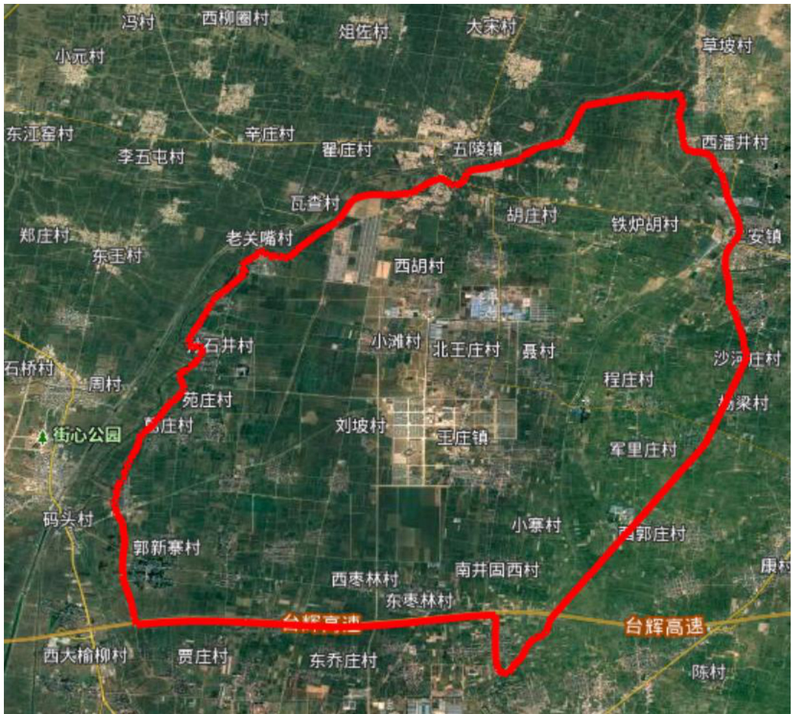  
图 4.5-1 模型研究范围  

# 2.模型基础资料  

本次采用 2022 年 9 月实测地形资料进行建模,地形图剖分为边长 $100\mathrm{m}$ 左右的三角形网格。  

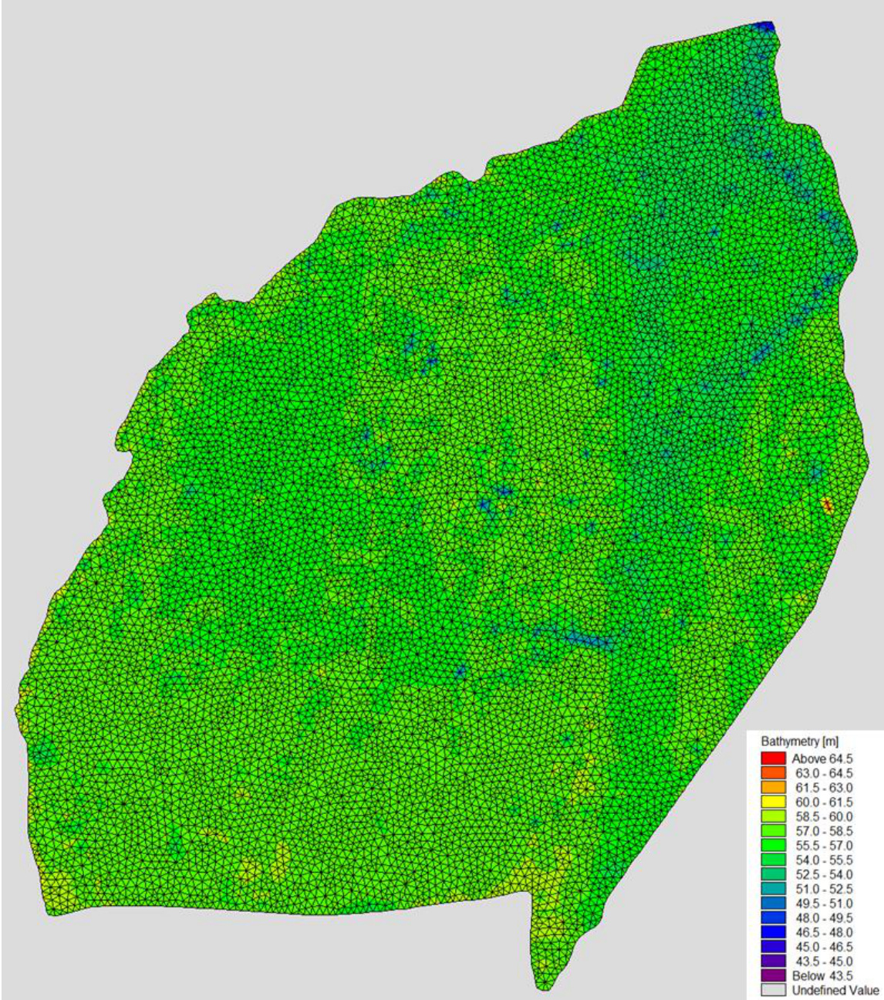  
图 4.5-2 网格及地形剖分  

# 3.糙率  

区内有村庄、田间作物等,根据各种地物特征选择不同的糙率,即堤、路、埝取值 0.045,果林取值 0.065,房屋取值 0.10,鱼塘取值 0.035,水田取值 0.04,滩地、河槽、渠底取值 0.035,台田、条田取值 0.065,草地取值 0.04,菜地取值 0.035 等。  

# 4.模型边界条件  

利用《卫河干流(淇门\~徐万仓)治理工程初步设计报告》中采用的洪水模型,得到小滩坡 100 年一遇洪水标准下的分洪过程,作为本次模拟的上边界入流边界条件,下边界采用浚内沟入卫河处水位过程。  

涝水作为点源汇入到坡洼中,涝水总量 0.4 亿 $\mathsf{m}^{3}$ 。  

# 4.5.3 模型验证  

以《海河流域漳卫河系防洪规划》确定的控制指标作为基础,采用本次实测地形,对模型重新复核验证,模拟最高滞洪水位与最大滞洪量与防洪规划成果对比见表 4.5-1。  

表 4.5-1 模型复核验证成果对比表  

<html><body><table><tr><td>特征指标</td><td>单位</td><td>防洪规划</td><td>本次复核</td></tr><tr><td>最大滞蓄水位</td><td>(w)</td><td>57.3</td><td>57.35</td></tr></table></body></html>  

由成果可知,在基础地形、控制运用等与防洪规划一致的情况下,经模拟计算,各蓄滞洪区最高滞洪水位和最大滞洪量指标与防洪规划时成果变化较小,最高滞洪水位相差均 $0.05\mathrm{m}$ 以内,成果差别在合理范围内,故此说明模型计算的成果是合理可靠的,可用于本次蓄滞洪区可研建设。  

# 4.5.4 方案选取及成果分析  

# 4.5.4.1 方案选取  

根据规划安排以及“21.7”洪水期间小滩坡运用暴露出的问题,本次拟对以下几种方案进行模拟:  

方案一:现状方案  

按照现状地形、地物条件,模拟 100 年一遇洪水标准下小滩坡洪水演进过程。  

# 方案二:拆除隔堤方案  

按照《海河流域蓄滞洪区建设与管理规划》,规划对小滩坡内群众擅自修建的王庄隔堤拆除,全长 8km。根据现场查勘,目前该隔堤已进行路面硬化,成为连接周边村庄与王庄镇的主要通道之一,现状路面高于两侧农田 $0.5{\sim}1.0\ensuremath{\mathrm{m}}$ 。“21.7”洪水期间,曾破口行洪。  

本次按照规划安排,模拟拆除该隔堤后洪水演进过程,分析隔堤对蓄滞洪区运用的影响。  

方案三:改造隔堤、浚五路方案  

鉴于王庄隔堤目前已发展成为村民出行较为重要交通线路,同时隔堤高度有限,本次考虑保留隔堤,按照本次设计方案在适当位置增设 4 处过水通道。  

方案四:无浚五路方案  

浚五路为浚县县城至王庄镇、五陵镇的主干道,其中王庄镇以南段路面高程在 $58{\sim}59\mathrm{m}$ 之间,平均高于西侧地面 1.5m 以上。“21.7”洪水期间,洪水未越过该段浚五路至东侧区域。  

为分析浚五路的影响,本次模拟无浚五路情况下洪水演进过程,并与方案一对比。  

# 4.5.4.2 结果分析  

经模拟计算,各方案蓄滞洪区特性指标成果见表 4.5-2。  

表 4.5-2 蓄滞洪区特性指标模拟成果表  

<html><body><table><tr><td>指标</td><td>单位</td><td>方案一</td><td>方案二</td><td>方案三</td><td>方案四</td></tr><tr><td>最大滞蓄水量</td><td>（亿m²）</td><td>1.36</td><td>1.35</td><td>1.35</td><td>1.35</td></tr><tr><td>淹没面积</td><td>(km2)</td><td>100</td><td>95</td><td>100</td><td>107</td></tr><tr><td>最大滞蓄水位</td><td>(W)</td><td>57.35</td><td>57.35</td><td>57.35</td><td>57.35</td></tr><tr><td>淹没历时</td><td></td><td>32天9小时</td><td>31天21小时</td><td>32天1小时</td><td>32天9小时</td></tr></table></body></html>  

(1)根据方案一计算结果,在现状条件下小滩坡最高滞洪水位为 $57.35\mathrm{m}$ ,最大淹没面积 $100\mathsf{k m}^{2}$ ,在圈里分洪口门分洪 32 天 9 小时后,洪水基本完全退去。  

演进过程中,洪水由浚县圈里口门进入蓄滞洪区后,在西南部地区(王庄隔堤以南、浚五路以东区域)滞蓄后,主要沿两个方向演进:一是向北越过王庄隔堤,二是在王庄镇南部井固村位置,向西往浚内沟方向后继续向北。洪水至蓄滞洪区北部瓦日铁路后,主要经几处铁路桥继续向北演进至内黄境内。  

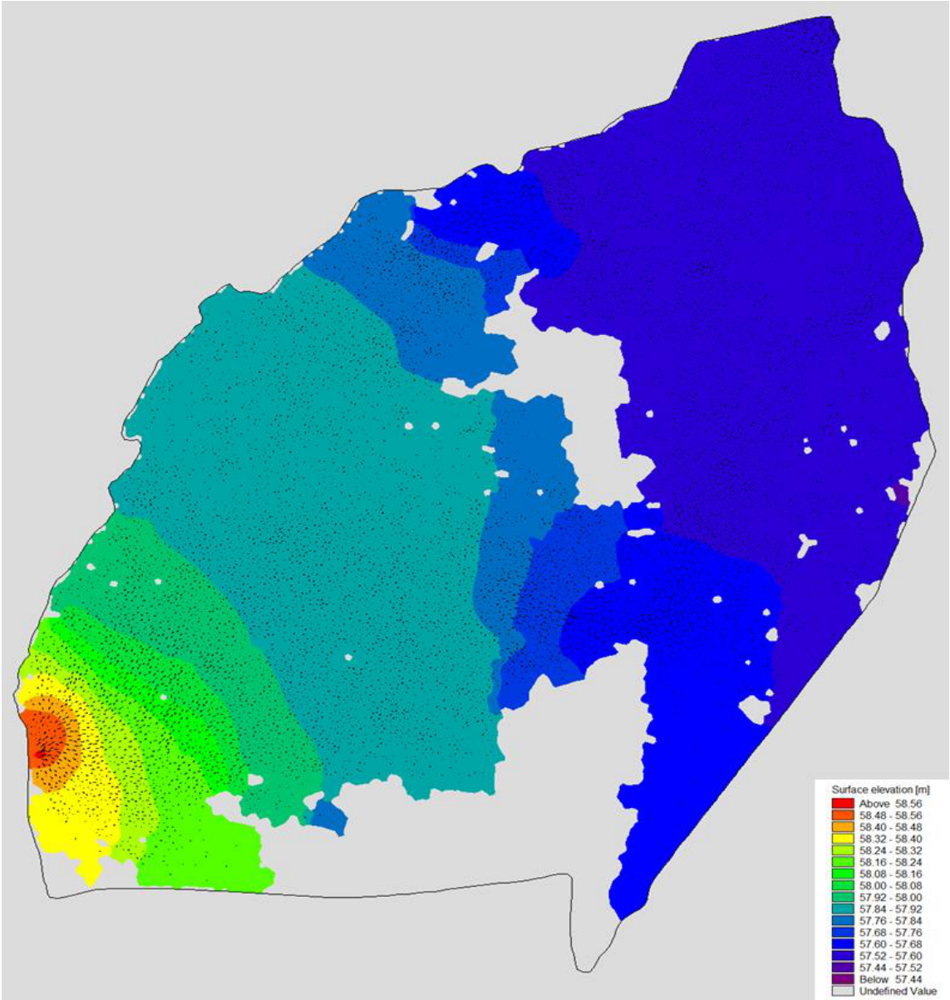  
图 4.5-3 方案一淹没范围示意图  

(2)根据方案二计算结果,拆除王庄隔堤后小滩坡最高滞洪水位为 $57.35\mathrm{m}$ ,最大淹没面积 $95k\mathsf{m}^{2}$ ,在圈里分洪口门分洪 31 天 21 小时后,洪水基本完全退去。  

与现状情况对比,拆除王庄隔堤后,对蓄滞洪区最高滞洪水位无影响,可减小淹没面积 $5\mathsf{k m}^{2}$ ,减少淹没历时 12 小时,对洪水演进整体影响不大。分析主要是由于现状隔堤高度有限,隔堤南侧水位在圈里口门分洪 24 小时后即可达到隔堤路面高程,对洪水整体演进影响有限。  

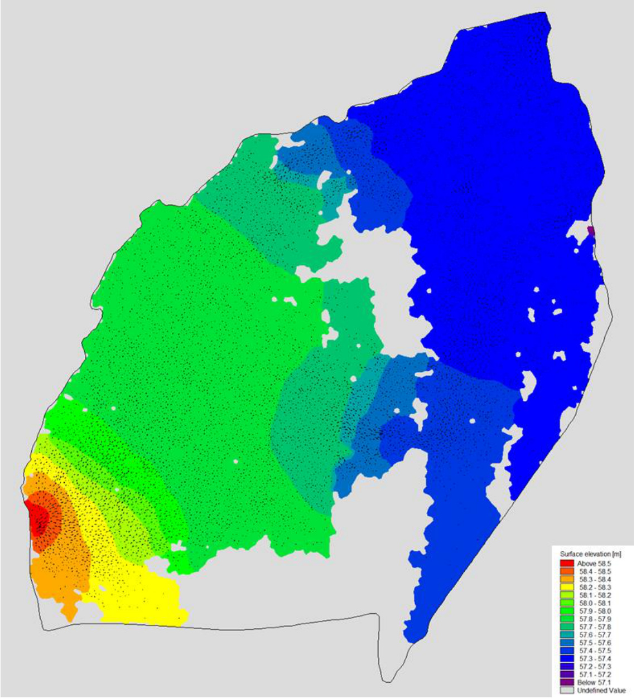  
图 4.5-4 方案二淹没范围示意图  

(3)根据方案三计算结果,按照本次方案对王庄隔堤改造后,小滩坡最高滞洪水位为 $57.35\mathrm{m}$ ,最大淹没面积 $100~{\upk\mathrm{m}}^{2}$ ,在圈里分洪口门分洪 32 天 1 小时后,洪水基本完全退去。  

通过与现状情况对比,对王庄隔堤改造后,小滩坡最高滞洪水位、淹没面积均未发生变化,可减少淹没历时 8 小时。  

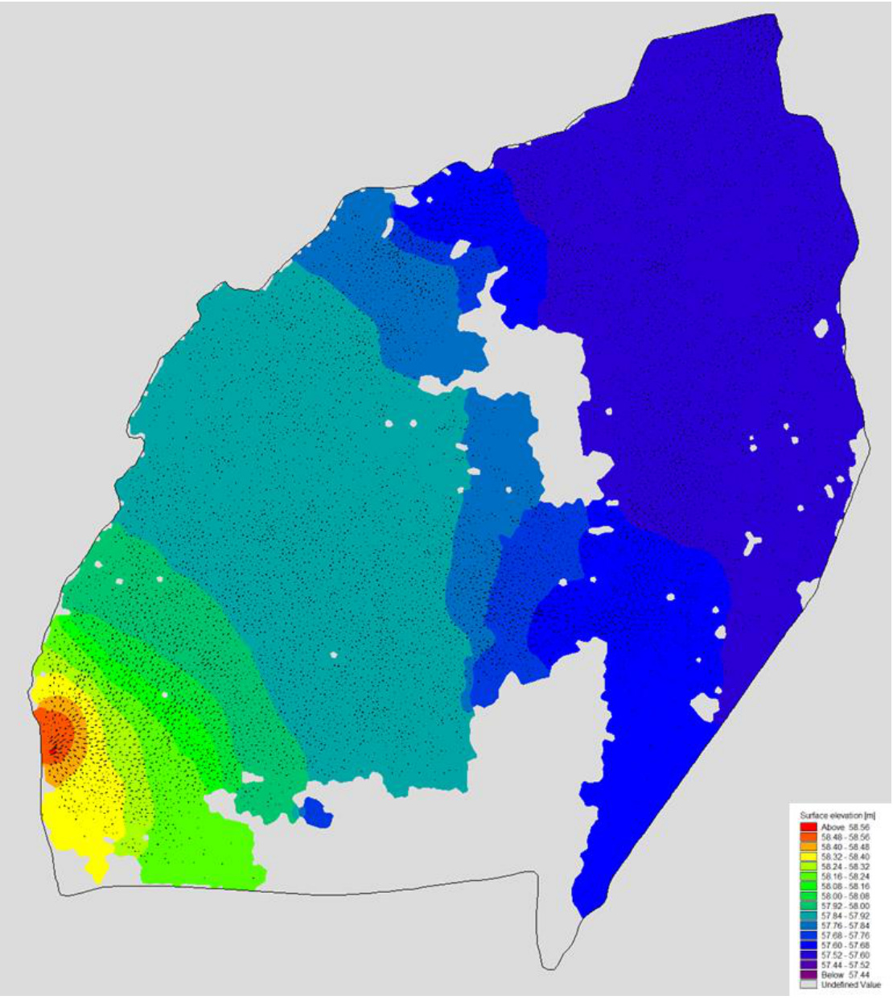  
图 4.5-5 方案三淹没范围示意图  

(4)根据方案四计算结果,在无浚五路阻水情况下,小滩坡最高滞洪水位为 $57.35\mathrm{m}$ ,最大淹没面积 $107\mathsf{k m}^{2}$ ,在圈里分洪口门分洪 32 天 9 小时后,洪水基本完全退去。  

通过与现状情况对比,在无浚五路阻水情况下,小滩坡最高滞洪水位基本无变化,淹没面积增加 $7\:\mathsf{k m}^{2}$ ,淹没历时也基本无变化。分析主要是由于浚五路西侧地势较高,即使没有浚五路水,洪水也难以越过自然高地,直接到达浚内沟。  

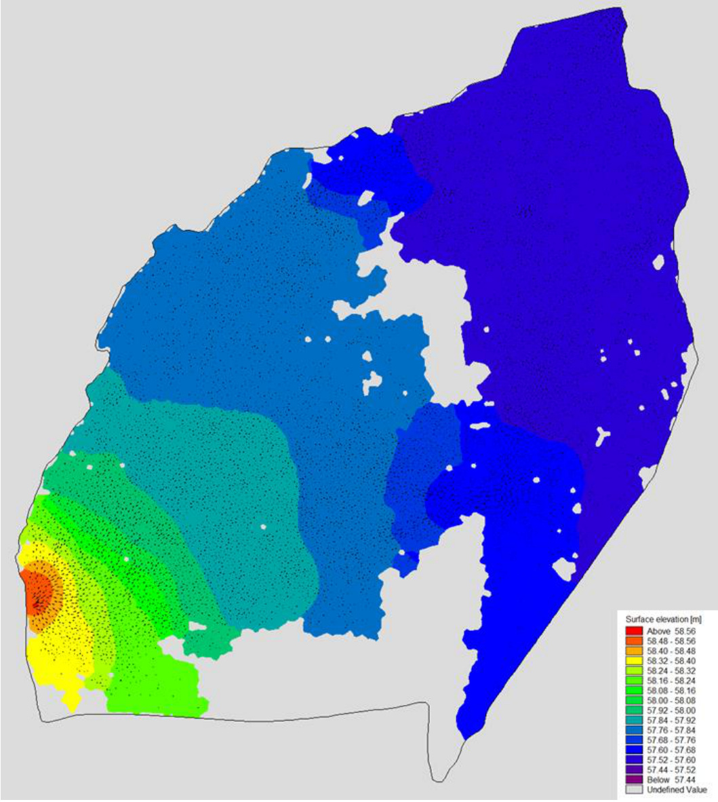  
图 4.5-5 方案四淹没范围示意图  

综上,根据 100 年一遇洪水演进结果,小滩坡内王庄隔堤、浚五路对于蓄滞洪区整体洪水演进影响较小,对于蓄滞洪区最高滞洪水位无影响,仅对淹没范围和淹没历时有影响,但影响作用有限。结合当地居民出行需求,本次工程建设保留王庄隔堤、浚五路作为通行道路,不会对蓄滞洪区运用造成较大影响,通过道路改造,增加过水通道,加快后期退水过程。  

# 4.6 建设内容与规模  

# 4.6.1 分洪堰工程  

为灵活控制洪水,科学合理利用小滩坡蓄滞洪区滞蓄关系,尽量减少坡洼淹没损失,需要修建蓄滞洪区的分洪建筑物。  

小滩坡圈里分洪堰设计启用标准为超 50 年一遇,蓄滞洪区为蓄滞洪区保留区,分洪位置位于圈里村南卫河右堤,当白寺坡军农场水位超过 $60.00\mathrm{m}$ (黄海高  

程)且继续上涨,卫河老观嘴(五陵)流量超过 $2000\mathrm{m}^{3}/\mathsf{s}$ 时,启用小滩坡蓄滞洪区,设计规模 $1110\mathrm m^{3}/\mathsf s$ ,堰宽 $240\mathrm{m}$ ,设计堰上水位 $59.87\mathrm{m}$ ,设计堰下水位$59.62\mathrm{m}$ 。  

# 4.6.2 沟渠清淤扩挖工程  

本次对 3 条沟排涝沟渠进行清淤扩挖,分别为苏村沟、下河沟及井固沟,治理总长度 $19.6\ensuremath{\mathrm{km}}$ ,按照 3 年一遇排涝标准进行治理。  

苏村沟区内长 11.2km,现状河底高程 $51.44\sim56.06\ensuremath{\mathrm{m}}$ ,沟渠底宽 ${\pmb{2}}{\sim}9\mathsf{m}$ ,平均底宽 $6\mathsf{m}$ 。经本次复核,苏村沟全段过流能力均不足,对苏村沟桩号$\mathtt{S C G0}\substack{+000\sim11+200}$ 进行清淤扩挖,沟渠扩挖长度 $11.2\mathsf{k m}$ ,设计排涝流量$4.6{\sim}18.7{\ m}^{3}/{\mathsf{s}}$ ,设计底宽 $6\mathsf{m}$ ,纵坡 1/3700,主槽边坡 1/2,平均挖深 $0.5\mathrm{m}$ 。  

下河沟区内长度 $3.6\mathsf{k m}$ ,现状河底高程 $53.35{\sim}56.09\mathrm{m}$ ,沟渠底宽 $1{\sim}6\mathsf{m}$ ,平均底宽 $4\mathsf{m}$ 。经本次复核,全段排涝能力不足,对下河沟桩号 $\mathsf{X H G0}{+}000{-}3{+}600$ 进行清淤扩挖,沟渠扩挖长度 $3.6\mathsf{k m}$ ,设计排涝流量 $7.25{\sim}11.2\mathsf{m}^{3}/\mathsf{s}$ ,设计底宽$3\mathsf{m}$ ,纵坡 1/1550,主槽边坡 1/2,平均挖深 $0.6\mathsf{m}$ 。  

井固沟区内长度 $7.1\mathsf{k m}$ ,现状河底高程 $51.24{\sim}55.56\mathsf{m}$ ,沟渠底宽 $2{\sim}19\ensuremath{\mathrm{m}}$ ,平均底宽 5m。经本次复核,上游段排涝能力不足,下游段排涝能力满足要求,对井固沟桩号 $\scriptstyle{\mathsf{J G G0}}\scriptstyle{\mathsf{+}}000\scriptstyle{\mathsf{-}}4+800$ 进行清淤扩挖,沟渠扩挖长度 $4.8\mathsf{k m}$ ,设计排涝流量 $4.4{\sim}8.36{\ m}^{3}/{\mathsf s}$ ,设计底宽 $4\mathrm{m}$ ,纵坡 1/2800,主槽边坡 1/2,平均挖深$0.7\mathsf{m}$ 。  

# 4.6.3 桥涵工程  

本次治理的 3 条沟渠上现有很多生产桥及涵洞,因建设年代久远,生产桥及涵洞普遍存在混凝土碳化、主梁及盖梁开裂露筋、桥墩破损老化、桥面破损、栏杆老化脱落、涵洞淤堵等问题,需要对苏村沟河段内的苏村 02 生产桥、王窑头4 生产桥、王窑头 3 生产桥、王窑头 1 生产桥、苏村 07 生产桥、申窑头 2 生产桥、牛李村桥、牛李村 2 桥、苏村 15 生产桥,井固沟河段内的井固沟桥、井固桥、郭井固村西桥,下河沟河段内的下河村南桥共 13 座桥涵进行拆除重建。  

另外有 7 处沟道被土路截断,需要新建生产桥以满足河道过流需要。新建生产桥分别为苏村沟河段内的苏村 01 生产桥、王窑头 2 生产桥、苏村 04 生产桥、苏村 05 生产桥、苏村 14 生产桥,井固沟河段内的何井固桥、周井固桥。  

蓄滞洪区启用时,现状隔堤及浚五路阻水,本次设计新建过路涵 4 座,其中隔堤 3 座,浚五路 1 座。  

# 4.6.4 撤退路工程  

本次维修改建 15 条道路,总长度 $11891\mathrm{m}$ 。其中拆除重建水泥混凝土路面段道路长 $155\mathrm{m}$ ,加铺沥青混凝土路面段道路长 $11006\mathrm{m}$ ,新建道路段长 $730\mathrm{m}$ 。撤退路路面为水泥混凝土路面和沥青混凝土路面,路面结构为: $20\mathrm{cm}$ 厚的 C30 水泥混凝土面层或 $10\mathrm{cm}$ 厚的沥青混凝土面层,拆除重建和加铺段的路基路面宽度与现状道路保持一致,新建段道路宽度不小于 $6\mathrm{m}$ 。  

# 4.7 设计排涝水面线  

# 4.7.1 断面资料  

采用的断面测量资料为 2022 年 7 月\~2022 年 9 月实测的小滩坡蓄滞洪区内沟渠断面资料,断面平均间距为 $_{200\mathrm{m}}$ 。  

# 4.7.2 河道糙率  

本次治理沟渠均为排涝沟渠,沟渠内生长杂草,依据《灌溉与排水工程设计标准》规范,有杂草的排水渠道糙率取值应为 $0.025{\sim}0.03$ ,考虑排涝沟渠实际管护条件差,且本次考虑河道生态,本次糙率取值 0.03。  

# 4.7.3 计算方法  

本次计算采用一维恒定非均匀流能量守恒方程进行天然水面线计算。  

# 4.7.4 设计水面线  

表 4.7-1 苏村沟设计水面线  

<html><body><table><tr><td>桩号</td><td>流量 (m3/s)</td><td>左岸高程 (m)</td><td>右岸高程 (m)</td><td>流速 (m/s)</td><td>设计水位 (m)</td></tr><tr><td>0+010</td><td>4.6</td><td>57.68</td><td>57.68</td><td>0.45</td><td>56.78</td></tr><tr><td>0+600</td><td>4.6</td><td>57.95</td><td>57.90</td><td>0.42</td><td>56.68</td></tr><tr><td>1+200</td><td>4.6</td><td>57.29</td><td>57.40</td><td>0.37</td><td>56.62</td></tr><tr><td>2+000</td><td>4.6</td><td>57.04</td><td>57.40</td><td>0.33</td><td>56.55</td></tr><tr><td>2+600</td><td>4.6</td><td>57.95</td><td>57.51</td><td>0.3</td><td>56.5.0</td></tr><tr><td>3+000</td><td>9.3</td><td>57.37</td><td>57.99</td><td>0.58</td><td>56.45</td></tr><tr><td>3+400</td><td>9.3</td><td>57.11</td><td>57.75</td><td>0.58</td><td>56.35</td></tr><tr><td>3+600</td><td>9.3</td><td>56.69</td><td>56.87</td><td>0.29</td><td>56.34</td></tr><tr><td>3+681</td><td>9.3</td><td>56.98</td><td>57.34</td><td>0.56</td><td>56.31</td></tr></table></body></html>  

<html><body><table><tr><td>桩号</td><td>流量 (m3/s)</td><td>左岸高程 (m)</td><td>右岸高程 (m)</td><td>流速 (m/s)</td><td>设计水位 (m)</td></tr><tr><td>4+001</td><td>9.3</td><td>57.18</td><td>56.84</td><td>0.55</td><td>56.26</td></tr><tr><td>4+401</td><td>9.3</td><td>56.75</td><td>56.77</td><td>0.54</td><td>56.18</td></tr><tr><td>5+601</td><td>9.3</td><td>56.37</td><td>57.01</td><td>0.46</td><td>56.00</td></tr><tr><td>6+201</td><td>14</td><td>57.29</td><td>57.27</td><td>0.71</td><td>55.86</td></tr><tr><td>6+800</td><td>14</td><td>57.03</td><td>57.10</td><td>0.62</td><td>55.71</td></tr><tr><td>7+400</td><td>14</td><td>56.40</td><td>56.23</td><td>0.43</td><td>55.60</td></tr><tr><td>7+801</td><td>14</td><td>56.82</td><td>56.06</td><td>0.53</td><td>55.51</td></tr><tr><td>8+001</td><td>14</td><td>56.44</td><td>56.21</td><td>0.67</td><td>55.47</td></tr><tr><td>8+803</td><td>18.7</td><td>56.33</td><td>56.08</td><td>0.53</td><td>55.40</td></tr><tr><td>9+003</td><td>18.7</td><td>56.41</td><td>55.99</td><td>0.62</td><td>55.37</td></tr><tr><td>9+804</td><td>18.7</td><td>56.20</td><td>56.64</td><td>0.68</td><td>55.18</td></tr><tr><td>10+204</td><td>18.7</td><td>56.45</td><td>56.42</td><td>0.34</td><td>55.15</td></tr><tr><td>10+804</td><td>18.7</td><td>57.02</td><td>57.46</td><td>0.73</td><td>55.02</td></tr><tr><td>11+205</td><td>18.7</td><td>57.29</td><td>58.06</td><td>0.73</td><td>54.91</td></tr></table></body></html>  

表 4.7-2  下河沟设计水面线  

<html><body><table><tr><td>桩号</td><td>流量 (m3/s)</td><td>左岸高程 (m)</td><td>右岸高程 (m)</td><td>流速 (m/s)</td><td>设计水位 (m)</td></tr><tr><td>0+000</td><td>7.25</td><td>57.18</td><td>57.35</td><td>0.75</td><td>56.86</td></tr><tr><td>0+400</td><td>7.25</td><td>57.13</td><td>57.37</td><td>0.7</td><td>56.67</td></tr><tr><td>0+800</td><td>7.25</td><td>57.15</td><td>56.89</td><td>0.55</td><td>56.53</td></tr><tr><td>1+200</td><td>11.2</td><td>57.07</td><td>57.06</td><td>0.77</td><td>56.32</td></tr><tr><td>1+400</td><td>11.2</td><td>56.71</td><td>57.11</td><td>0.9</td><td>56.19</td></tr><tr><td>1+800</td><td>11.2</td><td>57.59</td><td>58.39</td><td>0.92</td><td>55.90</td></tr><tr><td>2+095</td><td>11.2</td><td>57.21</td><td>57.16</td><td>0.62</td><td>55.74</td></tr><tr><td>2+400</td><td>11.2</td><td>56.65</td><td>56.72</td><td>0.95</td><td>55.50</td></tr><tr><td>3+000</td><td>11.2</td><td>55.26</td><td>56.11</td><td>0.98</td><td>55.15</td></tr><tr><td>3+600</td><td>11.2</td><td>55.79</td><td>56.02</td><td>0.21</td><td>54.84</td></tr></table></body></html>  

表 4.7-3  井固沟设计水面线  

<html><body><table><tr><td>桩号</td><td>流量 (m3/s)</td><td>左岸高程 (m)</td><td>右岸高程 (m)</td><td>流速 (m/s)</td><td>设计水位 (m)</td></tr><tr><td>0+000</td><td>4.4</td><td>57.50</td><td>56.68</td><td>0.63</td><td>56.36</td></tr><tr><td>0+595</td><td>4.4</td><td>56.60</td><td>56.69</td><td>0.63</td><td>56.15</td></tr><tr><td>1+195</td><td>4.4</td><td>56.86</td><td>56.83</td><td>0.63</td><td>55.92</td></tr><tr><td>1+795</td><td>4.4</td><td>57.01</td><td>56.94</td><td>0.64</td><td>55.66</td></tr><tr><td>2+395</td><td>4.4</td><td>56.85</td><td>56.95</td><td>0.65</td><td>55.33</td></tr><tr><td>2+995</td><td>4.4</td><td>55.50</td><td>56.40</td><td>0.61</td><td>55.12</td></tr><tr><td>3+359</td><td>4.4</td><td>56.50</td><td>56.72</td><td>0.65</td><td>55.04</td></tr><tr><td>3+795</td><td>4.4</td><td>56.43</td><td>56.03</td><td>0.39</td><td>54.76</td></tr><tr><td>4+195</td><td>4.4</td><td>56.16</td><td>55.36</td><td>0.15</td><td>54.74</td></tr><tr><td>4+795</td><td>8.36</td><td>56.60</td><td>57.05</td><td>0.34</td><td>54.70</td></tr><tr><td>5+395</td><td>8.36</td><td>55.49</td><td>56.90</td><td>0.64</td><td>54.51</td></tr><tr><td>5+995</td><td>8.36</td><td>55.50</td><td>55.33</td><td>0.14</td><td>54.45</td></tr><tr><td>6+595</td><td>8.36</td><td>57.00</td><td>56.36</td><td>0.07</td><td>54.45</td></tr><tr><td>7+167</td><td>8.36</td><td>55.24</td><td>55.55</td><td>0.11</td><td>54.45</td></tr></table></body></html>  

# 第五章 工程布置及建筑物  

审  定: 郑永良  

审  查: 陈宝中 衣秀勇 田玉梅郭春雷 孙正明  

校  核: 刘  皓  吴广昊  任  杰张  宁 田玉梅 郭春雷董丹丹  

编  制: 冯鹏旭 张志禄  刘  皓刘  晗  李云波 王瑞鹏陈  航  

# 目录  

第五章 工程布置及建筑物.  
.1 设计依据...5.1.1 设计依据文件.5.1.2 主要技术标准,5.1.3 设计基本资料.  
.2 工程等级与设计标准.5.2.1 洪涝水标准和建筑物级别5.2.2 结构设计标准和安全系数 5  
.3 工程总布置. 55.3.1 河道清淤扩挖工程. 55.3.2 分洪堰工程.. 65.3.3 桥涵工程. 65.3.4 撤退路工程. 6  
5.4 沟渠清淤扩挖工程.5.4.1 河道治理方案.5.4.2 河道清淤扩挖工程设计. 85.4.3 河道清淤扩挖工程量. 17  
5.5 分洪堰工程. 175.5.1 分洪堰轴线选择 175.5.2 建筑物型式比选 185.5.3 分洪堰布置 265.5.4 分洪堰设计计算 . .285.5.5 混凝土防硫酸盐侵蚀设计 .32  
5.5.6 桥涵工程. 32  

5.8.1 桥梁概述 32  
5.8.2 设计依据的主要技术规程、规范和标准 ..32  
5.8.3 设计参数及标准.. 33  
5.8.4 布置原则. 33  
5.8.5 桥梁设计 . 34  
5.8.6 桥梁结构设计 . 42  
5.7过路涵工程 43  
5.7.1 工程现状 43  
5.7.2 工程布置 43  
5.7.3 过路涵设计计算 43  
5.7.4主要工程量. 46  
5.8 撤退路工程.. 46  
5.9.1工程任务. 46  
5.9.2 设计依据. 47  
5.9.3 设计原则 . 47  
5.9.4 工程规模 . 48  
5.9 安全监测工程. 49  
5.9.1 监测设计依据. 49  
5.9.2 监测设计目的及原则. 49  
5.9.3 监测项目 . 49  
5.9.4监测布置. 49  
5.9.5 现场巡视检查.. 50  
5.9.6 安全监测自动化系统 .51  
5.9.7 观测方法 . 51  
5.12.8 主要监测仪器设备技术指标. ..51  
5.12.9施工期及初期运行期安全监测资料整理与分析..· ....53  
5.9.10主要工程量.. .54  

# 第五章 工程布置及建筑物  

# 5.1 设计依据  

5.1.1 设计依据文件  

(1)《海河流域综合规划修编》( $2012{\sim}2030)$ ;  
(2)《海河流域防洪规划》(2008);  
(3)《漳卫河“21•7”洪水灾后系统治理实施方案》(2022);  
(4)《全国蓄滞洪区建设与管理规划》(2009);  
(5)《海河流域蓄滞洪区建设与管理规划》(2012);  
(6)《河南省蓄滞洪区运用预案》(2022)。  

# 5.1.2 主要技术标准  

(1)《防洪标准》(GB50201-2014);  
(2)《水利水电工程等级及洪水标准》(SL252-2017);  
(3)《水利水电工程初步设计报告编制规程》(SL/T619-2021);  
(4)《堤防工程设计规范》(GB50286-2013);  
(5)《堤防工程管理设计规范》(SL/T171-2020)(6)《河道整治设计规范》(GB50407-2011);  
(7)《水利水电工程边坡设计规范》(SL386-2007);  
(8)《水工混凝土结构设计规范》(SL191-2008);  
(9)《水工挡土墙设计规范》(SL379-2007);  
(10)《生态格网结构技术规程》(CECS353:2013);  
(11)《水工柔性生态防护结构设计规范》(DB13/T2700-2018);  
(12)《水利水电工程土工合成材料应用技术规范》(SL/T225-98);  
(13)《水利水电工程安全监测设计规范》(SL725-2016);  
(14)《水利水电工程设计工程量计算规定》(SL328-2005);  
(15)《水工建筑物荷载设计规范》(SL744-2016);  

(16)《水工建筑物抗震设计标准》(GB51247-2018);  

(17)《建筑抗震设计规范》(GB 50011-2010)(18)《水工建筑物抗冰冻设计规范》(GB/T 50662-2011);  
(19)《建筑地基基础设计规范》(GB50007-2011);  
(20)《建筑地基处理技术规范》(JGJ79-2012);  
(21)《公路桥涵设计通用规范》(JTG D60-2015);  
(22)《公路钢筋混凝土及预应力混凝土桥涵设计规范》(JTG 3362-2018);  
(23)《公路桥涵地基与基础设计规范》(JTG 3363-2019);  
(24)《工程建设标准强制性条文》水利工程部分;  
(25)《工程建设标准强制性条文》城市建设部分;  
(26)《灌溉与排水工程设计规范》(GB50288-2018);  
(27)《疏浚与吹填工程技术规范》(SL17-2014);  
(28)《蓄滞洪区设计规范》(GB50773-2012);  
(29)《水利水电工程合理使用年限及耐久性设计规范》(SL654-2014);  
(30)《水利水电工程等级划分和洪水标准》(SL252-2017);  
(31)《中华人民共和国工程建设标准强制性条文》(水利工程部分);  
(32)《水闸设计规范》(SL265-2016)(33)其他相关的规程规范等。  

# 5.1.3 设计基本资料  

# 5.1.3.1 水文、气象等资料  

(1)气象  

小滩坡地处亚热带到暖温带的过渡地带,属暖温带大陆性季风气候区,日光充足,地热丰富,四季分明。夏秋季多偏南风,气温高,湿度大;冬春季多偏北风,干燥酷冷。选取邻近工程区的浚县气象站,进行了气象要素统计。  

根据浚县气象站 $1963{\sim}2021$ 年观测资料统计,多年平均降水量为 $594\mathrm{mm}$ ,其中汛期(6\~9 月)约占全年降水量的 $72.4\%$ ;多年平均蒸发量 $1707\mathrm{mm}$ (小型蒸发皿)。多年平均气温 $14.1^{\circ}\mathrm{C}$ ,极端最高气温 $41.9^{\circ}\mathrm{C}$ (1967 年 6 月 4 日、1972年 6 月 11 日、2002 年 7 月 15 日),极端最低气温- $18.4^{\circ}\mathrm{C}$ (1972 年 12 月 27日)。多年平均风速为 $2.69\mathsf{m}/\mathsf{s}$ ,历年最大风速 $19.3~\mathrm{m/s}$ ,日照时数 2075h。冬季河流一般不封冻,多年平均相对湿度 $66.9\%$ ,气温与相对湿度同步变化  

(2)洪水  

本次淇门水文站设计洪水成果继续推荐采用 1998 年防洪规划设计洪水成果。  

# (3)涝水  

小滩坡内主要排水沟道为浚内沟及苏村沟,根据滞洪区建设需求对各涝片及相应面积进行了划定、量算。考虑工程区地处河南省平原区,本次采用《73 图集》中豫北平原地区排水模数公式、各涝片排涝面积、平原排涝洪峰流量计算公式以及各参数计算小滩坡内各涝片设计涝水。  

# 5.1.3.2 测量资料  

本工程平面坐标系采用 2000 国家大地坐标系,高程基准采用 1985 国家高程基准。  

(1)河道带状地形图采用 2022 年 8 月\~9 月实测 1:5000 成果。  

(2)沟渠横断面资料采用 2022 年 8 月\~9 月实测成果,断面间距 $_{200\mathrm{m}}$ 。  

(3)分洪堰、桥涵工程 1:500 地形图采用 2022 年 8 月\~9 月实测成果。  

# 5.1.3.3 地质勘察资料  

(1)区域构造稳定性与地震动参数  

根据《中国地震动参数区划图》(GB18306-2015),工程区基本地震动峰值加速度为 0.15g,相应基本烈度为Ⅶ度,基本地震动加速度反应谱特征周期为0.40s。区域构造稳定性较差。  

# (2)分洪堰  

分洪堰地层为人工填土及第四系全新统冲洪积相堆积物。主要岩性为粉质壤土(重、中、轻)、粉质砂壤土、粉质粘土、碎石土、粉细砂为主。地基土中粉质砂壤土、粉细砂呈中等透水性,为相对透水层,可能存在渗漏问题;现状堤高、堤身荷载作用下地基不会产生较大的沉降量;地基土多以中等压缩性为主,虽存在岩性差异,但产生不均匀沉降的可能性较小。  

# (3)桥涵  

桥址区地基土层多属中等压缩性土,可能存在的主要工程地质问题为地基不均匀沉降、基坑边坡稳定及基坑渗水。如采用深基础,建议根据设计荷载选择合适的桩端持力层。  

# (4)沟道疏浚  

沟道疏浚段主要为第四系全新统冲洪积相的粉质壤土、粉质粘土层,局部夹粉质砂壤土等,施工开挖过程中应注意边坡稳定问题。  

# (5)天然建筑材料  

工程区清淤土料储量丰富,满足设计需求。土料岩性主要为粉土,土料使用前需要做翻晒处理。工程区无骨料及天然块石料料场,可外购解决。  

# 5.2 工程等级与设计标准  

# 5.2.1 洪涝水标准和建筑物级别  

# 5.2.1.1 防洪排涝标准  

(1)蓄滞洪区启用标准  

依据《海河流域防洪规划》,小滩坡蓄滞洪区为蓄滞洪区保留区,启用标准为超 50 年一遇,当白寺坡中心农场水位达 $60.0\mathrm{m}$ ,老观嘴流量超过 $2000\mathrm{m}^{3}/\mathsf{s}$ 时,在圈里村南扒卫河右堤分洪入小滩坡。  

# (2)排涝标准  

小滩坡蓄滞洪区内是河南省重要的高标准农田和商品粮基地,考虑到当前社会经济发展和加快退洪要求等因素,结合河道实际情况,小滩坡蓄滞洪区内排涝支沟均采用 3 年一遇排涝标准进行疏浚扩挖,穿堤建筑物按照 5 年一遇排涝标准建设。  

# 5.2.1.2 建筑物级别  

(1)新建水闸(堰)建筑物级别  

共卫合流以上共产主义渠和卫河堤防级别均为 3 级,共卫合流以下堤防级别为2级。根据《水闸设计规范》(SL265-2016)规定:“位于防洪(挡潮)堤上的水闸,其级别不得低于防洪(挡潮)堤的级别”,位于卫河右堤的圈里分洪堰为2级建筑物。  

根据《水利水电工程合理使用年限及耐久性设计规范》SL654-2014)规定,2 级建筑物主体结构合理使用年限均为 50 年。  

# (2)撤退路  

撤退道路干线主要利用区内现有的国道、省道和县道,现状路况一般较好,本次主要是撤退道路支线的建设。  

根据现场调研,蓄滞洪区内路网十分发达,原则不新建撤退道路,主要是对现有道路进行重建和改建,道路设计参考四级公路标准。  

# 5.2.2 结构设计标准和安全系数  

根据《水闸设计规范》(SL265-2016)、《水工挡土墙设计规范》(SL379-2007)等要求,水闸、翼墙等建筑物相关设计允许值见表 5.2-1\~表 5.2-2。  

表 5.2-1  闸室及翼墙基底应力最大值与最小值之比的允许值  

<html><body><table><tr><td rowspan="2">地基土质</td><td colspan="2">荷载组合</td></tr><tr><td>基本组合</td><td>特殊组合</td></tr><tr><td>中等坚实</td><td>2.00</td><td>2.50</td></tr></table></body></html>  

表 5.2-2 闸室及翼墙稳定安全系数允许值  

<html><body><table><tr><td rowspan="3" colspan="2">荷载组合</td><td rowspan="3"></td><td colspan="3">安全系数允许值</td></tr><tr><td colspan="2">抗滑</td><td>抗浮</td></tr><tr><td>2级</td><td>3级</td><td>4、5级</td></tr><tr><td colspan="2">基本组合</td><td>1.30</td><td>1.25</td><td>1.20</td><td>1.10</td></tr><tr><td rowspan="2">特殊组合</td><td>I</td><td>1.15</td><td>1.10</td><td>1.05</td><td rowspan="2">1.05</td></tr><tr><td>Ⅱ</td><td>1.05</td><td>1.05</td><td>1.00</td></tr></table></body></html>  

注:特殊组合Ⅰ适用于施工情况、检修情况和非常运用情况;特殊组合Ⅱ适用于地震情况。  

# 5.3 工程总布置  

# 5.3.1 河道清淤扩挖工程  

本次小滩坡蓄滞洪区建设工程对 3 条沟渠进行清淤扩挖,分别为苏村沟、下河沟及井固沟,治理总长度 $19.6\ensuremath{\mathrm{km}}$ 。  

苏村沟桩号 $\mathtt{S C G0}\substack{+000\sim11+200}$ 进行清淤扩挖,清淤扩挖长度 11.2km,设计底宽 6m,纵坡 1/3700,主槽边坡 1/2,平均挖深 $0.5\mathsf{m}$ 。扩挖中心线基本沿现  

状沟渠中心线布置。  

下河沟桩号 $\mathsf{X H G0}{+}000{-}3{+}600$ 进行清淤扩挖,清淤扩挖长度 $3.6\mathsf{k m}$ ,设计底宽 $3\mathsf{m}$ ,纵坡 1/1550,主槽边坡 1/2,平均挖深 $0.6\mathsf{m}$ 。扩挖中心线基本沿现状沟渠中心线布置。  

井固沟桩号 $\scriptstyle{\mathsf{J G G0}}\scriptstyle{\mathsf{+}}000\scriptstyle{\mathsf{-}}4\scriptstyle{\mathsf{+}}800$ 进行清淤扩挖,清淤扩挖长度 $4.8\mathsf{k m}$ ,设计底宽 $4\mathrm{m}$ ,纵坡 1/2800,主槽边坡 1/2,平均挖深 $0.7\mathsf{m}$ 。扩挖中心线基本沿现状沟渠中心线布置。  

# 5.3.2 分洪堰工程  

小滩坡分洪堰位于卫河右堤桩号 $55{+}000$ 附近的圈里村南侧上游约 $300\mathsf{m}$ 处。为混凝土宽顶堰,为日常生产、交通和避免低标准洪水下分洪考虑,在分洪堰混凝土底板上填筑均质土堤,堤顶高程 $61.87\mathrm{m}$ ,同两边堤防。堤顶宽度 $6.0\mathsf{m}$ ,上下游坡比均为 1:3,上游设置黏土斜墙。堰顶高程 $57.50\mathrm{m}$ ,分洪堰底板总长$44.50\mathrm{m}$ ,总宽 $240.00\mathrm{m}$ ,堰体上游设置 $10.0\mathrm{m}$ 的格宾护底,下游格宾石笼护底长 $35\mathrm{m}$ ,后接 $26.0\mathsf{m}$ 长抛石防冲槽,槽深 $5.0\mathsf{m}$ 。采用重力式混凝土挡墙对堰口进行防护。采用格宾护坡对分洪堰两侧堤坡进行防护,上游堤坡左右两侧防护长度均为 $110.0\mathrm{m}$ ;下游堤坡左右两侧防护长度均为 $50.0\mathsf{m}$ 。  

分洪堰采用人工分洪方式,分洪时,采用挖掘机挖除堰上覆堤分洪。  

# 5.3.3 桥涵工程  

本次治理工程河段现有生产桥及涵洞 13 座,因建设年代久远,生产桥及涵洞普遍存在混凝土碳化、主梁及盖梁开裂露筋、桥墩破损老化、桥面破损、栏杆老化脱落、涵洞淤堵等问题。现状河道清淤扩挖对部分桥梁基础会产生影响,需要对苏村沟河段内的苏村 02 生产桥、王窑头 4 生产桥、王窑头 3 生产桥、王窑头 1 生产桥、苏村 07 生产桥、申窑头 2 生产桥、牛李村桥、牛李村 2 桥、苏村15 生产桥,井固沟河段内的井固沟桥、井固桥、郭井固村西桥,下河沟河段内的下河村南桥进行拆除重建;另外有 7 处沟道被土路截断,需要新建生产桥以满足河道过流需要。新建生产桥分别为苏村沟河段内的苏村 01 生产桥、王窑头 2 生产桥、苏村 04 生产桥、苏村 05 生产桥、苏村 14 生产桥,井固沟河段内的何井固桥、周井固桥。  

# 5.3.4 撤退路工程  

本次维修改建 15 条道路,总长度 $11891\mathrm{m}$ 。其中拆除重建水泥混凝土路面段道路长 $155\mathrm{m}$ ,加铺沥青混凝土路面段道路长 $11006\mathrm{m}$ ,新建道路段长 $730\mathrm{m}$ 。撤  

退路路面为水泥混凝土路面和沥青混凝土路面,路面结构为: $20\mathrm{cm}$ 厚的 C30 水泥混凝土面层或 $10\mathrm{cm}$ 厚的沥青混凝土面层,拆除重建和加铺段的路基路面宽度与现状道路保持一致,新建段道路宽度不小于 $6\mathrm{m}$ 。  

# 5.4 沟渠清淤扩挖工程  

# 5.4.1 河道治理方案  

# (1)苏村沟  

本次治理按照地面以下 $0.3\mathrm{m}$ 作为设计排涝水位复核沟渠排涝能力。苏村沟为蓄滞洪区西北部的主要排涝渠,沟渠现状全线基本贯通,但由于骨干沟渠流量相对较大,平原地势平坦,渠道纵坡缓,加上渠道平时缺少管护,沟渠淤积严重,杂草丛生,因此河道规模明显不足。  

由河道现状排涝能力分析,苏村沟现状全段排涝能力不足,现状排涝水位高于设计水位,平均高 $0.5\mathrm{m}$ 。对苏村沟桩号 $\mathtt{S C G0}\substack{+000\sim11+200}$ 进行全段清淤扩挖,沟渠扩挖长度 $11.2\mathsf{k m}$ ,设计底宽 $6\mathsf{m}$ ,纵坡 1/3700,边坡 1/2,平均挖深$0.5\mathrm{m}$ 。  

# (2)下河沟  

本次治理按照地面以下 $0.3\mathrm{m}$ 作为设计排涝水位复核沟渠排涝能力。下河沟为浚内沟中下游主要排涝支沟,下河沟发源于蓄滞洪区外,经东防洪堤(二道防线)的什村沟北支沟闸流入蓄滞洪区内,区内主要承泄两侧西韩庄村、军里庄村、打渔庄村、下河村、程庄村等村庄及附近耕地的涝水,沟渠两侧为耕地,渠道杂草丛生,规模不足。  

由河道现状排涝能力分析,下河沟全段排涝能力不足,两岸现状排涝水位高于设计水位,平均高 $0.53\mathrm{m}$ 。对下河沟桩号 $\mathsf{X H G0}{+}000{-}3{+}600$ 进行清淤扩挖,沟渠扩挖长度 $3.6\mathsf{k m}$ ,设计底宽 $3\mathsf{m}$ ,纵坡 1/1550,边坡 $1/2$ ,平均挖深 $0.6m$ 。  

# (3)井固沟  

本次治理按照地面以下 $0.3\mathrm{m}$ 作为设计排涝水位复核沟渠排涝能力。井固沟为浚内沟中游主要排涝支沟,主要承泄两侧王庄镇、东赵庄村、井固村等村庄及附近耕地的涝水。沟渠上游两岸为耕地,存在侵占沟渠的现象,渠道狭窄,中游流经王庄镇、井固村,沟渠两侧受房屋、道路限制,规模不足,下游为洼地,河槽高程较低,两侧为滩地,滩地宽 $60{\sim}100\ensuremath{\mathrm{m}}$ ,两侧紧邻房屋及道路。  

由河道现状排涝能力分析,井固沟上游段及部分中游段两岸现状排涝水位高于设计水位,平均高 $0.68\mathrm{m}$ ,下游段存在较大面积滩地,排涝断面宽,能够满足排涝要求。对井固沟桩号 $\scriptstyle{\mathsf{J G G0}}\scriptstyle{\mathsf{+}}000\scriptstyle{\mathsf{-}}4\scriptstyle{+}800$ 进行清淤扩挖,沟渠扩挖长度 $4.8\mathsf{k m}$ ,设计底宽 $4\mathsf{m}$ ,纵坡 1/2800,边坡 1/2,平均挖深 $0.8\mathrm{m}$ 。  

通过本次清淤扩挖沟渠,苏村沟设计排涝能力为 $18.7\mathrm{m}^{3}/\mathsf{s}$ ,下河沟设计排涝能力为 $11.2\mathrm{m}^{3}/\mathsf{s}$ ,井固沟设计排涝能力为 $8.36\mathsf{m}^{3}/\mathsf{s}$ ,蓄滞洪区内骨干渠道总排涝、退洪能力能够达到 $47.6\mathsf{m}^{3}/\mathsf{s}$ 。  

# 5.4.2 河道清淤扩挖工程设计  

# 5.4.2.1 苏村沟清淤扩挖设计  

(1)清淤扩挖标准  

本次苏村沟治理设计清淤扩挖目的为提高沟渠排涝能力,满足 3 年一遇排涝标准并有利于退洪。通过沟渠扩挖疏浚应满足设计水位低于地面高程 $0.3\mathrm{m}$ 以上,全段现状排涝水位均高于设计排涝水位,平均高 $0.5\mathsf{m}$ ,排涝能力不能满足要求。排涝设计流量考虑从上游至下游随排涝面积逐步增加,即 $\mathsf{S C G0+000{\sim}}2{+}800$ 设计排涝流量 $4.6\mathsf{m}^{3}/\mathsf{s}$ ,圈里支沟汇入后 $\mathsf{S C G2{+}}800{-}5{+}600$ 设计排涝流量 $9.3\mathrm{m}^{3}/\mathsf{s}$ ,中鹤新城支沟汇入后 $\scriptstyle{\mathsf{S C G5+600-8+400}}$ 设计排涝流量 $14\mathrm{m}^{3}/\mathsf{s}$ ,下游孙石井、李石井支沟汇入后 $\mathsf{S C G}8+400{\sim}11{+}200$ 设计排涝流量 $18.7\mathrm{m}^{3}/\mathsf{s}$ 。  

# (2)清淤扩挖中心线  

为保持水流的自然流态,保证上下游水流平顺,沟渠扩挖基本沿现状中心线布设,局部一侧紧贴房屋或道路处,为减少对当地居民生产生活带来影响,适当向另一侧偏移。  

# (3)清淤扩挖设计指标  

苏村沟清淤扩挖段为全段河道,河道桩号 $\mathsf{S C G0}\mathbf{+}000\mathbf{-}11\mathbf{+}200$ ,扩挖长度11.2km,为减少填挖方量,设计河底纵坡在现状河底纵坡基础上,尽量与两岸地形坡度一致。苏村沟现状上游 9km 沟渠纵坡约 1/3000,下游 2km 出现倒坡情况,经比较,为保障上下游顺畅衔接,苏村沟整体设计河底纵坡取 1/3700。  

苏村沟上游 5km 现状平均深度 $1.8\mathrm{m}$ ,下游 6km 平均深度 $3.5\mathsf{m}$ ,现状上游$4.8\mathsf{k m}$ 河底宽 $1{\sim}4\ensuremath{\mathrm{m}}$ ,中游 $3.2\mathsf{k m}$ 河底宽 $3{\sim}4\ensuremath{\ m}$ ,下游桩号 $2.8\mathsf{k m}$ 河底宽 $5{\sim}9\ensuremath{\mathrm{m}}$ 。上游沟渠较浅,因此清淤主要集中在上游段。结合现状河底宽、设计流量及扩挖占地等因素计算水利最优断面,并在水利最优断面的基础上调整为实用断面。苏村沟平均清淤深度 $0.5\mathrm{m}$ ,并对全段渠道进行扩挖,设计河底宽度 6m,扩挖边坡  

# 1:2,设计沟渠深度 $2.7\mathsf{m}$ 。  

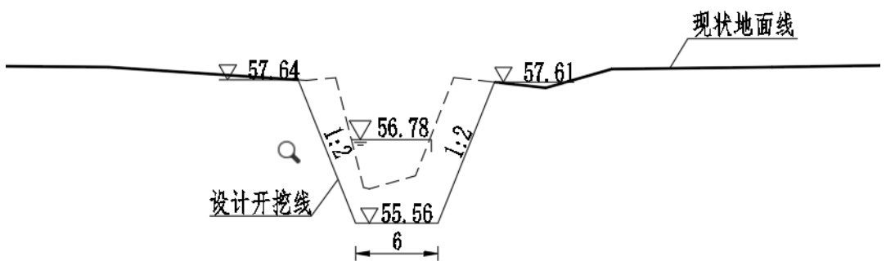  
图 5.4-1 苏村沟方案典型清淤断面示意图  

表 5.4-1 苏村沟清淤扩挖设计指标  

<html><body><table><tr><td>桩号</td><td>现状河底高程 (m)</td><td>设计河底高程 (W)</td><td>挖深 (W)</td><td>设计底宽 (W)</td><td>设计边坡</td></tr><tr><td>0+010</td><td>56.06</td><td>55.56</td><td>0.50</td><td rowspan="12">6</td></tr><tr><td>0+600</td><td>55.51</td><td>55.40</td><td>0.11</td></tr><tr><td>1+200</td><td>55.24</td><td>55.24</td><td></td></tr><tr><td>2+000</td><td>55.07</td><td>55.02</td><td></td></tr><tr><td>2+600</td><td>55.31</td><td>54.86</td><td>0.45</td></tr><tr><td>3+000</td><td>55.40</td><td>54.75</td><td>0.65</td></tr><tr><td>3+400</td><td>55.32</td><td>54.64</td><td>0.68</td></tr><tr><td>3+600</td><td>54.95</td><td>54.59</td><td>0.36</td></tr><tr><td>3+681</td><td>54.91</td><td>54.57</td><td>0.34</td></tr><tr><td>4+001</td><td>54.65</td><td>54.48</td><td>0.17</td></tr><tr><td>4+401</td><td>54.47</td><td>54.37</td><td>0.10</td></tr><tr><td>5+601</td><td>53.86</td><td>54.05</td><td>一</td></tr><tr><td>6+201</td><td>54.02</td><td>53.89</td><td>0.13</td></tr><tr><td>6+800</td><td>53.30</td><td>53.72</td><td>一</td></tr><tr><td>7+400</td><td>52.99</td><td>53.56</td><td>一</td></tr><tr><td>7+801</td><td>52.10</td><td>53.45</td><td>一</td></tr><tr><td>8+001</td><td>53.39</td><td>53.40</td><td>一</td></tr></table></body></html>  

<html><body><table><tr><td>桩号</td><td>现状河底高程 (m)</td><td>设计河底高程 (W)</td><td>挖深 (W)</td><td>设计底宽 (w)</td><td>设计边坡</td></tr><tr><td>8+803</td><td>51.87</td><td>53.18</td><td>一</td><td rowspan="6"></td><td rowspan="6"></td></tr><tr><td>9+003</td><td>51.93</td><td>53.13</td><td>一</td></tr><tr><td>9+804</td><td>52.60</td><td>52.91</td><td>一</td></tr><tr><td>10+204</td><td>51.44</td><td>52.80</td><td>一</td></tr><tr><td>10+804</td><td>53.54</td><td>52.64</td><td>0.90</td></tr><tr><td>11+205</td><td>53.30</td><td>52.53</td><td>0.77</td></tr></table></body></html>  

# 5.4.2.2 下河沟清淤扩挖设计  

(1)清淤扩挖标准  

本次下河沟治理设计清淤扩挖目的为提高沟渠排涝能力,满足 3 年一遇排涝标准并有利于退洪。通过沟渠扩挖疏浚应满足设计水位低于地面高程 $0.3\mathrm{m}$ 以上,全段现状排涝水位均高于设计排涝水位,平均高 $0.53\mathrm{m}$ ,排涝能力不能满足要求,通过沟渠扩挖疏浚应满足设计水位距离地面高程不低于 $0.3\mathrm{m}$ 的要求。排涝设计流量考虑从上游至下游随排涝面积逐步增加,即 $\mathsf{X H G0}{+}000{-}0{+}800$ 设计排涝流量 $7.25\mathsf{m}^{3}/\mathsf{s}$ ,西韩庄村涝水汇入后 $\mathsf{X H G0}{+}800{-}3{+}600$ 设计排涝流量 $11.2\mathrm{m}^{3}/\mathsf{s}$ 。  

# (2)清淤扩挖中心线  

为保持水流的自然流态,保证上下游水流平顺,沟渠扩挖基本沿现状中心线布设,局部一侧紧贴房屋或道路处,为减少对当地居民生产生活带来影响,适当向另一侧偏移。  

# (3)清淤扩挖设计指标  

下河沟区内全段排涝能力不足,对下河沟桩号 $\mathsf{X H G0}{+}000{-}3{+}600$ 进行清淤扩挖,沟渠扩挖长度 $3.6\mathsf{k m}$ 。为减少填挖方量,设计河底纵坡在现状河底纵坡基础上,尽量与两岸地形坡度一致。下河沟现状纵坡约 1/1700,为保障退洪及排涝顺畅,下河沟整体设计河底纵坡 1/1550。  

下河沟上下游深度分布较平均,沟渠平均深 $2.1\mathsf{m}$ ,现状河底宽度 $_{2\sim4\ensuremath{\mathrm{m}}}$ 。渠道整体规模不足,需要对全段 $3.6\mathsf{k m}$ 渠道清淤扩挖。结合现状河底宽、设计流量及扩挖占地等因素计算水利最优断面,并在水利最优断面的基础上调整为实用断面。下河沟平均清淤深度 $0.6m$ ,并对渠道进行扩挖,设计河底宽度 3m,扩挖边坡 1:2,设计沟渠深度 $2.6\mathsf{m}$ 。  

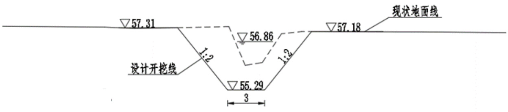  
图 5.4-2  下河沟方案典型清淤断面示意图  

表 5.4-2 下河沟清淤扩挖设计指标  

<html><body><table><tr><td>桩号</td><td>现状河底高程 (m)</td><td>设计河底高程 (W)</td><td>挖深 (W)</td><td>设计底宽 (W)</td><td>设计 边坡</td></tr><tr><td>0+000</td><td>56.09</td><td>56.09</td><td>0.80</td><td rowspan="12">3</td><td rowspan="8"></td></tr><tr><td>0+400</td><td>55.19</td><td>55.19</td><td>0.16</td></tr><tr><td>0+800</td><td>53.97</td><td>53.97</td><td>一</td></tr><tr><td>1+200</td><td>54.70</td><td>54.70</td><td>0.18</td></tr><tr><td>1+400</td><td>54.48</td><td>54.48</td><td>0.09</td></tr><tr><td>1+800</td><td>54.18</td><td>54.18</td><td>0.05</td></tr><tr><td>1+861</td><td>54.30</td><td>54.30</td><td>0.21</td></tr><tr><td>2+095</td><td>55.62</td><td>55.62</td><td>1.68</td></tr><tr><td>2+400</td><td>53.80</td><td>53.80</td><td>0.06</td></tr><tr><td>3+000</td><td>53.35</td><td>53.35</td><td>一</td></tr><tr><td>3+618</td><td>53.56</td><td>53.56</td><td>0.60</td></tr></table></body></html>  

# 5.4.2.3 井固沟清淤扩挖设计  

本次井固沟治理设计清淤扩挖目的为提高沟渠退洪能力,满足 3 年一遇排涝标准并有利于退洪。通过沟渠扩挖疏浚应满足设计水位低于地面高程 $0.3\mathrm{m}$ 以上,部分河段现状排涝水位高于设计排涝水位,平均高 $0.68\mathrm{m}$ ,排涝能力不能满足要求,通过沟渠扩挖疏浚应满足设计水位距离地面高程不低于 $0.3\mathrm{m}$ 的要求。排涝设计流量考虑从上游至下游随排涝面积逐步增加,即 $\scriptstyle{\mathsf{J G G0}}\scriptstyle{\mathsf{+}}000\scriptstyle{\mathsf{-}}4+600$ 设计排涝流量 $4.4\mathsf{m}^{3}/\mathsf{s}$ ,王庄镇镇区部分涝水汇入后 $\mathsf{J}\mathsf{G}\mathsf{G}4+600{\sim}7+100$ 设计排涝流量$8.36\mathsf{m}^{3}/\mathsf{s}$ 。  

# (2)清淤扩挖中心线  

为保持水流的自然流态,保证上下游水流平顺,沟渠扩挖基本沿现状中心线布设,局部一侧紧贴房屋或道路处,为减少对当地居民生产生活带来影响,适当向另一侧偏移。  

# (3)清淤扩挖设计指标  

井固沟上游段排涝能力不足,下游段排涝能力满足要求,对井固沟桩号$\scriptstyle{\mathsf{J G G0}}\scriptstyle{\mathsf{+}}000\scriptstyle{\mathsf{-}}4\scriptstyle{+}800$ 进行清淤扩挖,沟渠扩挖长度 $4.8\mathsf{k m}$ 。为减少填挖方量,设计河底纵坡在现状河底纵坡基础上,尽量与两岸地形坡度一致。井固沟现状纵坡约 1/1750,为保障退洪及排涝顺畅,井固沟整体设计河底纵坡 1/2800,清淤末断面与后一断面顺接。  

井固沟上游 $4.8\mathsf{k m}$ 深度分布较平均,沟渠平均深 $2.1\mathsf{m}$ ,下游 2.4km 河道底高程较低,沟渠平均深 $4.4\mathrm{m}$ ;上游 $1.8\mathsf{k m}$ 河宽 $1{\sim}2\ m$ ,中游 3km 河宽 $5{\sim}20\ensuremath{\mathrm{m}}$ ,下游桩号 $2.4\mathsf{k m}$ 沟渠两侧为宽滩地,且高程低洼,较上游低 $3\mathsf{m}$ ,滩地宽度较大,渠道宽 $60{\sim}100\ensuremath{\mathrm{m}}$ ,滩地两侧紧邻房屋及道路,排涝能力足够。上游渠道规模不足,需要对上游 $4.8\mathsf{k m}$ 渠道清淤扩挖。结合现状河底宽、设计流量及扩挖占地等因素计算水利最优断面,并在水利最优断面的基础上调整为实用断面。井固沟平均清淤深度 $0.7\mathsf{m}$ ,并对渠道进行扩挖,设计河底宽度 $4\mathsf{m}$ ,扩挖边坡 1:2,设计沟渠平均深度 $_{2\mathsf{m}}$ 。  

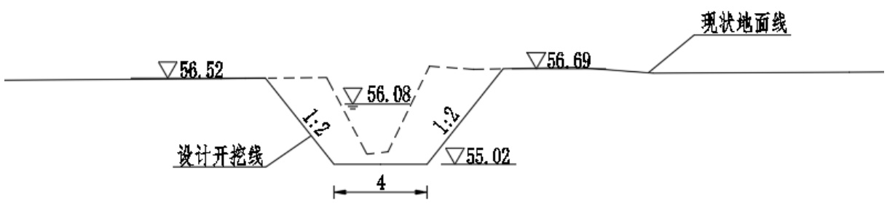  
图 5.4-3  井固沟方案典型清淤断面示意图  

表 5.4-3  井固沟清淤扩挖设计指标  

<html><body><table><tr><td>桩号</td><td>现状河底高程 (m)</td><td>设计河底高程 (W)</td><td>挖深 (W)</td><td>设计底宽 (w)</td><td>设计 边坡</td><td>备注</td></tr><tr><td>0+000</td><td>55.56</td><td>55.16</td><td>0.40</td><td rowspan="2">4</td><td rowspan="2">1:2</td><td rowspan="2">治理段</td></tr><tr><td>0+595</td><td>54.93</td><td>54.95</td><td></td></tr><tr><td>1+195</td><td>55.7</td><td>54.73</td><td>0.97</td><td></td><td></td><td></td></tr></table></body></html>  

<html><body><table><tr><td>桩号</td><td>现状河底高程 (m)</td><td>设计河底高程 (W)</td><td>挖深 (W)</td><td>设计底宽 (W)</td><td>设计 边坡</td><td>备注</td></tr><tr><td>1+795</td><td>55.27</td><td>54.52</td><td>0.75</td><td rowspan="10"></td><td rowspan="10"></td><td rowspan="10"></td></tr><tr><td>2+395</td><td>55.1</td><td>54.30</td><td>0.80</td></tr><tr><td>2+795</td><td>54.38</td><td>54.16</td><td>0.22</td></tr><tr><td>2+995</td><td>53.99</td><td>54.09</td><td>一</td></tr><tr><td>3+359</td><td>54.09</td><td>53.96</td><td>0.13</td></tr><tr><td>3+795</td><td>52.92</td><td>53.80</td><td>一</td></tr><tr><td>4+195</td><td>53.06</td><td>53.66</td><td>一</td></tr><tr><td>4+795</td><td>54.39</td><td>53.45</td><td>0.94</td></tr><tr><td>5+395</td><td>51.24</td><td></td><td></td><td></td><td rowspan="4">满足排涝 要求 ，本次 不治理</td></tr><tr><td>5+995</td><td>51.47</td><td></td><td></td><td></td></tr><tr><td>6+595</td><td>51.73</td><td></td><td></td><td></td></tr><tr><td>7+167</td><td>53.02</td><td></td><td></td><td></td></tr></table></body></html>  

# 5.4.2.4 清淤扩挖边坡稳定分析  

本次分别对苏村沟、下河沟和井固沟清淤扩挖段选取不利断面进行边坡稳定计算。  

对清淤边坡在施工期无水工况和河道行洪之后水位骤降 $1.0\mathsf{m}$ 工况下的抗滑稳定进行验算。采用瑞典圆弧滑动法进行计算,其计算公式为:  

施工期抗滑稳定计算(总应力法)  

$$
K=\frac{\sum(C_{u}b s e c\beta+W c o s\beta\times t g\phi_{u})}{\sum W s i n\beta}
$$  

水位骤降时迎水坡抗滑稳定计算(总应力法)  

$$
K=\frac{\sum[C_{c u}b s e c\beta+(W c o s\beta-u_{i}b s e c\beta)t g\phi_{c u}]}{\sum W s i n\beta}
$$  

式中:b─条块宽度 $(\mathsf{m})$ ;W─条块重力, $\mathsf{W{=}W_{1}{+}W_{2}{+}\rho_{w}Z b(k N)};$ ;W1─在堤外水位以上的条块重力 $(\mathsf{K N})$ ;W2─在堤外水位以下的条块重力 $(\mathsf{K N})$ ;  

ui─水位降落前堤身的孔隙压力(kPa); $\beta\mathrm{\hbar}$ ─条块的重力线与通过此条 块底面中点的半径之间的夹角(度);  

γw─水的重度( $\mathsf{k N}/\mathsf{m}^{3})$ );  
Cu,fu, $\boldsymbol{G}_{\mathrm{cu}}$ ,fcu,─土的抗剪强度指标(kPa,度)。  

根据工程地质勘察资料,沟道主槽淤积物组成主要为粉土,局部分布有粉质黏土层,呈可塑状,局部呈硬塑状,土质不均一。边坡开挖建议值为 1:2\~1:3,水下可适当放缓。  

(1)苏村沟清淤扩挖段  

本次选取主槽桩号 $\mathsf{S C G O}{+}010$ 断面作为典型断面,复核推荐扩挖方案主槽设计边坡稳定性。  

计算结果见图 $5.4{-}5{\sim}5.4{-}6$ 。  

$\textcircled{1}$ 施工期无水工况  

  
图 5.4-5 施工期无水工况下边坡稳定计算结果  

# 计算安全系数 $K{=}2.17$  

$\textcircled{2}$ 水位骤降 1.0m 工况  

  

# 图 5.4-6 水位骤降 $1.0\mathsf{m}$ 工况下边坡稳定计算结果  

# 计算安全系数 $K{=}1.48$  

由计算结果可知,抗滑稳定系数均大于 1.2,施工期无水工况和水位骤降1.0m 工况下,开挖后两侧边坡均是稳定的。  

(2)下河沟清淤扩挖段  

本次选取主槽桩号 $\mathsf{X H G}2\substack{+012}$ 断面作为典型断面,复核推荐扩挖方案主槽设计边坡稳定性。  

计算结果见图 $5.4{-}7{\sim}5.4{-}8$ 。  

$\textcircled{1}$ 施工期无水工况  

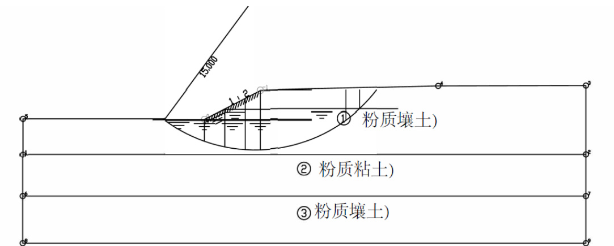  
图 5.4-7 施工期无水工况下边坡稳定计算结果  

# 计算安全系数 $K{=}3.36$  

$\textcircled{2}$ 水位骤降 1.0m 工况  

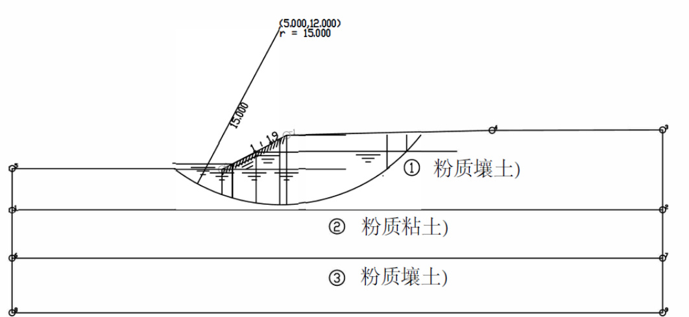  
图 5.4-8 水位骤降 $1.0\mathsf{m}$ 工况下边坡稳定计算结果计算安全系数 $K{=}2.48$  

由计算结果可知,抗滑稳定系数均大于 1.2,施工期无水工况和水位骤降1.0m 工况下,开挖后两侧边坡均是稳定的。  

(3)井固沟清淤扩挖段  

本次选取主槽桩号 $\mathsf{J}\mathsf{G}\mathsf{G}3\substack{+595}$ 断面作为典型断面,复核推荐扩挖方案主槽设计边坡稳定性。  

计算结果见图 $5.4\substack{-9}{\sim}5.4\substack{-10}$ 。  

$\textcircled{1}$ 施工期无水工况  

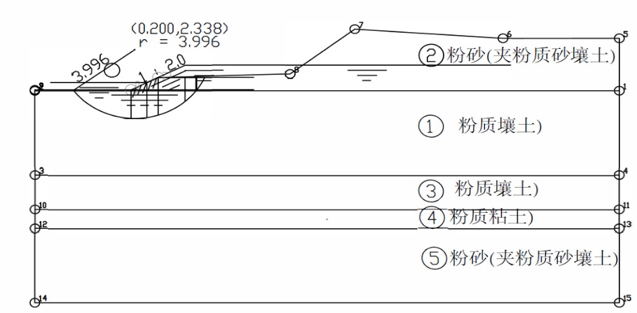  
图 5.4-9 施工期无水工况下边坡稳定计算结果  

# 计算安全系数 $K{=}4.40$  

$\textcircled{2}$ 水位骤降 1.0m 工况  

  
图 5.4-10 水位骤降 $1.0\mathsf{m}$ 工况下边坡稳定计算结果计算安全系数 $K{=}3.78$  

由计算结果可知,抗滑稳定系数均大于 1.2,施工期无水工况和水位骤降1.0m 工况下,开挖后两侧边坡均是稳定的。  

# 5.4.3 河道清淤扩挖工程量  

按照本次设计清淤扩挖河底宽度、设计河底高程及开挖边坡等设计指标,计算沟渠清淤扩挖工程量见表 5.4-6。  

表 5.4-6  沟渠清淤扩挖工程量表  

<html><body><table><tr><td></td><td>序号</td><td>项目</td><td>单位</td><td>工程量</td></tr><tr><td rowspan="4">一、沟渠 清淤扩挖工程</td><td>1</td><td>苏村沟清淤扩挖</td><td>m3</td><td>111140</td></tr><tr><td>2</td><td>下河沟清淤扩挖</td><td>m3</td><td>35395</td></tr><tr><td>3</td><td>井固沟清淤扩挖</td><td>m3</td><td>33503</td></tr><tr><td>合计</td><td></td><td>m3</td><td>180038</td></tr></table></body></html>  

# 5.5 分洪堰工程  

# 5.5.1 分洪堰轴线选择  

# 5.5.1.1 小滩坡分洪堰  

“21•7”洪水期间启用小滩坡滞洪区,在现状堤防部分破堤分洪,破堤宽度约为 $800\mathsf{m}$ 。根据《海河流域蓄滞洪区建设与管理规划》中关于小滩坡蓄滞洪区的规划内容,规划在圈里村南卫河右堤增设分洪控制堰,设计规模 $1110\mathrm m^{3}/\mathsf s$ ,堰宽 $1000\mathrm{m}$ 。  

本次设计根据规划分洪控制堰位置,并结合“21•7”洪水实际情况,圈里村南侧堰址堰前及堰下地形比较开阔、堰下没有村庄,便于分洪运用,选取在圈里村南侧卫河右堤布置分洪控制堰。  

小滩坡分洪堰位于卫河右堤桩号 $55{+}000$ 附近,圈里村南侧上游约 $300\mathsf{m}$ 处。为混凝土宽顶堰,为日常生产、交通和避免低标准洪水下分洪考虑,在分洪堰混凝土底板上填筑均质土堤,堤顶高程 $61.87\mathrm{m}$ ,同两边堤防。堤顶宽度 $6.0\mathsf{m}$ ,上下游坡比均为1:3。堰顶高程 $57.50\mathrm{m}$ ,分洪堰底板总长 $44.50\mathrm{m}$ ,总宽 $240.00\mathrm{m}$ 。堰体上游设置 $10.0\mathrm{m}$ 的格宾护底;其下游为 $35.0\mathsf{m}$ 长格宾护底,后接 $26.0\mathsf{m}$ 长抛石防冲槽,槽深 $5.0\mathsf{m}$ 。采用重力式混凝土挡墙对堰口进行防护。采用格宾护坡对分洪堰两侧堤坡进行防护,上游堤坡左右两侧防护长度均为 $110.0\mathrm{m}$ ;下游堤坡左右两侧防护长度均为 $50.0\mathrm{m}$ 。  

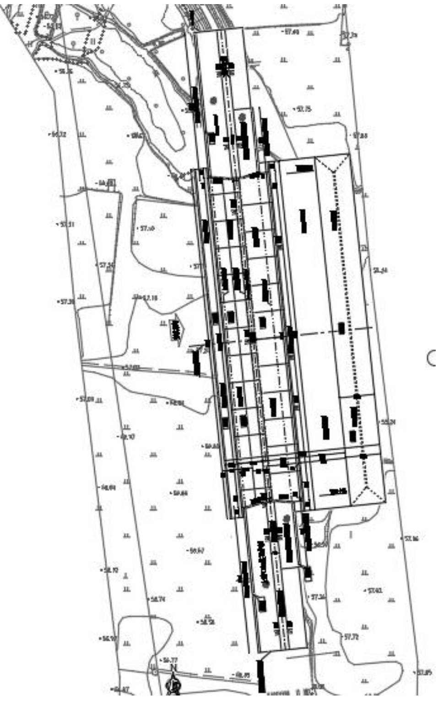  
图 5.5-1 分洪堰轴线示意图  

# 5.5.2 建筑物型式比选  

本阶段对新建分洪堰和新建分洪闸两种分洪建筑物型式进行比选。  

# 5.5.2.1 新建分洪堰  

新建小滩坡分洪堰,设计流量 $1110\mathrm m^{3}/\mathsf s$ 。分洪堰位于卫河右堤桩号 $55{+}000$ 附近,圈里村南侧上游约 $300\mathsf{m}$ 处。  

# (1)方案布置  

小滩坡分洪堰现状下游有 $_{200\mathrm{m}}$ 范围内有局部冲坑,冲坑底高程为 55.0,分洪堰上游及冲坑下游地面高程 $57.0{\sim}57.5$ 左右。本次结合现状地面高程,对堰顶高程分别为 58.5、57.5 两种方案进行对比分析。  

# 1)方案一:堰顶高程 $58.5\mathsf{m}$  

分洪堰设计堰顶高程 $58.5\mathsf{m}$ ,设计洪水位 59.87(堰上水深 1.37),经计算,设计堰宽 $450.0\mathrm{m}$ (取堰上下游水位差 $0.25\mathrm{m}$ ),分洪堰底板总长 $44.5\mathrm{m}$ 。堰体上游设置 $10.0\mathrm{m}$ 的格宾护底,下游格宾石笼护底长 $25\mathrm{m}$ ,后接 17.5m 长抛石防冲槽,槽深 $2.5\mathrm{m}$ 。采用重力式混凝土挡墙对堰口进行防护。采用格宾护坡对分洪堰两侧堤坡进行防护,上游堤坡左右两侧防护长度均为 $100.0\mathrm{m}$ ;下游堤坡左右两侧防护长度均为 $50.0\mathsf{m}$ 。  

# 2)方案二:堰顶高程 57.5m  

分洪堰设计堰顶高程 $57.5\mathsf{m}$ ,设计洪水位 59.87(堰上水深 2.37),经计算,设计堰宽 $240.0\mathrm{m}$ (取堰上下游水位差 $0.25\mathrm{m}$ ),分洪堰底板总长 $44.5\mathrm{m}$ 。堰体上游设置 $10.0\mathrm{m}$ 的格宾护底,下游格宾石笼护底长 $35\mathsf{m}$ ,后接 $26.0\mathsf{m}$ 长抛石防冲槽,槽深 $5.0\mathsf{m}$ 。采用重力式混凝土挡墙对堰口进行防护。采用格宾护坡对分洪堰两侧堤坡进行防护,上游堤坡左右两侧防护长度均为 $100.0\mathrm{m}$ ;下游堤坡左右两侧防护长度均为 $50.0\mathsf{m}$ 。  

# (2)分洪堰比选  

# 1)工程布置  

两方案轴线均布置在现状卫河大堤上,因方案底板高程不同导致分洪堰净宽不同,同时连接分洪堰的上下游护坡段长度有所不同。  

# 2)工程地质  

拟建分洪堰位置各方案位置相同,地质条件相同。分洪堰地基为人工填土层及第四系全新统冲积层( $\mathsf{Q}_{4}\mathsf{a l p}^{\cdot}$ ),其人工填土层主要岩性类型有粉质壤土、粉质黏土、粉质砂壤土及碎石土,冲洪积层主要岩性类型有粉质黏土、粉细砂。  

# 3)征地移民  

方案一堰宽约为方案二的 1.5 倍。经计算,方案一占地 $30240\mathrm{m}^{2}$ ,方案二占地 $25920\mathrm{m}^{2}$ ,总占地面积方案一较方案二多 $4320~\mathrm{m}^{2}$ 。  

# 4)工程投资  

表 5.6-1  主要工程量投资对比表  

<html><body><table><tr><td rowspan="2">项目</td><td rowspan="2">单位</td><td colspan="2">工程量</td></tr><tr><td>方案一</td><td>方案二</td></tr><tr><td>清基30cm</td><td>m3</td><td>19035</td><td>12636</td></tr><tr><td>土方开挖</td><td>m3</td><td>77406</td><td>61493</td></tr><tr><td>土方回填</td><td>m3</td><td>55329</td><td>35297</td></tr><tr><td>模板</td><td>m²</td><td>29117</td><td>17470</td></tr><tr><td>混凝土底板C30W4F150（二）</td><td>m3</td><td>16816</td><td>10089</td></tr><tr><td>混凝土挡墙C30W4F150（二）</td><td>m3</td><td>812</td><td>812</td></tr><tr><td>素混凝土垫层C20（一)</td><td>m3</td><td>3392</td><td>2054</td></tr><tr><td>钢筋</td><td>t</td><td>2452</td><td>1471</td></tr><tr><td>格宾石笼护坡（2*1*0.4m)</td><td>m3</td><td>2242</td><td>2242</td></tr><tr><td>格宾石笼护脚（2*1*1.5m)</td><td>m3</td><td>2802</td><td>1782</td></tr><tr><td>格宾石笼护底（2*1*0.5m)</td><td>m3</td><td>10152</td><td>7806</td></tr><tr><td>碎石垫层厚20cm</td><td>m3</td><td>5182</td><td>4243</td></tr><tr><td>土工布(300g/m2)</td><td>m2</td><td>32144</td><td>25463</td></tr><tr><td>抛石回填</td><td>m3</td><td>11526</td><td>18954</td></tr><tr><td>主要工程量投资</td><td>万元</td><td>4819</td><td>3370</td></tr></table></body></html>

注:本对比仅计算主要工程量  

经上述分析对比,分洪堰轴线位置相同,工程地质条件相同,工程施工难度基本相同,工程占地方案一较方案二多 $4320~\mathsf{m}^{2}$ ,方案二较方案一工程投资少1449 万元。综合考虑方案二占地及投资较小的情况,溢流堰方案推荐采用方案二,即堰顶高程 $57.5\mathsf{m}$ 方案。  

# 5.5.2.2 新建分洪闸  

新建小滩坡分洪闸,设计流量 $1110\mathrm m^{3}/\mathsf s$ 。分洪堰位于卫河右堤桩号 $55{+}000$ 附近,圈里村南侧上游约 $300\mathsf{m}$ 处。  

# (1)方案布置  

小滩坡分洪闸现状下游有 $_{200\mathrm{m}}$ 范围内有局部冲坑,冲坑底高程约为 55.0,分洪闸上游地面高程 $57.0{\sim}57.5$ 左右。本次结合现状地面高程,对闸底高程分别为 57.5、56.5 两种方案进行对比分析。  

# 1)方案一:闸底高程 57.5m  

小滩坡现状上游坡脚为 $57.0{\sim}57.5$ ,拟定闸底板高程为 57.50。分洪闸闸室结构为开敞式,底板为采用整体筏式底板,经水力学计算,闸前水深 $2.37\mathsf{m}$ ,闸室净宽为 $240\mathrm{m}$ 。闸底板厚度 $2.0\mathsf{m}$ 。闸室共 24 孔,每孔净宽 $10.0\mathrm{m}$ ,闸室共设12联,2孔一联,中墩厚 $1.5\mathrm{m}$ ,边墩厚 $1.5\mathrm{m}$ ,缝墩厚 $1.0\mathsf{m}$ ,闸室总宽度 $280.00\mathrm{m}$ 。闸室长 $15.0\mathrm{m}$ 。闸顶高程为 $61.87\mathrm{m}$ ,同两侧堤防。  

闸室上游设一段 ${}^{20\mathrm{m}}$ 长格宾石笼护坦和一段 $10.0\mathrm{m}$ 长混凝土铺盖。闸室下游侧设长 $10.0\mathrm{m}$ 、深 $1.5\mathrm{m}$ 的消力池,消力池池底高程为 $56.00\mathrm{m}$ ,消力池的后半段设排水孔,间排距为 $2.0\mathsf{m}$ 。消力池后接 $20.0\mathsf{m}$ 长混凝土海漫和 $20.0\mathsf{m}$ 长格宾石笼海漫,海漫末端设有 $26\mathrm{m}$ 长抛石防冲槽,与现状地形以 1:20 坡度顺接。闸室的上游翼墙采用扶臂式,墙高 $4.37\mathrm{m}$ ,由圆弧段和直线段组成。翼墙后采用素填土回填,回填土内铺筑单向土工格栅以减小水平土压力,土工格栅分层铺设,层间距 $0.5\mathsf{m}$ 。翼墙上上游 1:2.5 格宾护坡。  

在闸室下游侧设交通桥,考虑到施工期吊装上部设备、构件及运行管理交通的需要,按公路-Ⅱ级汽车荷载等级设计,采用预制空心板结构,桥总宽 $6.5\mathsf{m}$ (5m 车行道 $+1.5\mathrm{m}$ 人行道)。闸室上游侧布置人行便桥,桥面宽度 $1.50\mathrm{m}$ ,高程$61.87\mathrm{m}$ 。机架桥布置在闸室偏上游侧,桥面高程为 $66.87\mathrm{m}$ ,由 2 榀混凝土 T 形梁拼接而成,下部用排架柱支承在闸墩上。桥面上设启闭机房,启闭机房宽为$5.5\mathsf{m}$ ,启闭机房采用框架结构。  

工作闸门采用平面钢闸门,共 24 扇,闸门尺寸为 $10.0{\times}3.0{-}2.37\mathrm{m}$ (宽 $\times$ 高),采用 $2\times125{\tt k N}$ 固定卷扬启闭机启闭,一门一机。  

# 2)方案二:闸底高程 $56.5\mathsf{m}$  

相同水位过流条件下,闸室底板高程越低,闸室宽度越窄,相对越经济。小滩坡现状上游坡脚为 $57.0{\sim}57.5$ ,本工程通过对上游滩地局部下挖,拟定闸底板高程为 56.50。分洪闸闸室结构为开敞式,底板为采用整体筏式底板,经水力学计算,闸前水深 $3.37\mathsf{m}$ ,闸室净宽为 $180\mathrm{m}$ 。闸底板厚度 $2.0\mathsf{m}$ 。闸室共 18 孔,每孔净宽 $10.0\mathrm{m}$ ,闸室共设 9 联,2 孔一联,中墩厚 $1.5\mathrm{m}$ ,边墩厚 $1.5\mathrm{m}$ ,缝墩厚 $1.0\mathsf{m}$ ,闸室总宽度 $209.5\mathrm{m}$ 。闸室长 $15.0\mathrm{m}$ 。闸顶高程为 $61.87\mathrm{m}$ ,同两侧堤防。  

闸室上游设一段 $30\mathsf{m}$ 长格宾石笼护坦和一段 $10.0\mathrm{m}$ 长混凝土铺盖。闸室下游侧设长 $15.0\mathrm{m}$ 、深 $2.0\mathsf{m}$ 的消力池,消力池池底高程为 $54.50\mathrm{m}$ ,消力池的后半段设排水孔,间排距为 $2.0\mathsf{m}$ 。消力池后接 $20.0\mathsf{m}$ 长混凝土海漫和 $25.0\mathsf{m}$ 长格宾石笼海漫,海漫末端设有 41m 长抛石防冲槽,与现状地形以 1:20 坡度顺接。闸室的左侧上游翼墙采用扶臂式,由圆弧段和直线段组成。翼墙后采用素填土回填,回填土内铺筑单向土工格栅以减小水平土压力,土工格栅分层铺设,层间距$0.5\mathrm{m}$ 。翼墙上下游接 1:2.5 格宾护坡。  

在闸室下游侧设交通桥,考虑到施工期吊装上部设备、构件及运行管理交通的需要,按公路-Ⅱ级汽车荷载等级设计,采用预制空心板结构,桥总宽 $6.5\mathsf{m}$ (5m 车行道 $+1.5\mathrm{m}$ 人行道)。闸室上游侧布置人行便桥,桥面宽度 $1.50\mathrm{m}$ ,高程$61.87\mathrm{m}$ 。机架桥布置在闸室偏上游侧,桥面高程为 $66.87\mathrm{m}$ ,由 2 榀混凝土 T 形梁拼接而成,下部用排架柱支承在闸墩上。桥面上设启闭机房,启闭机房宽为$5.5\mathsf{m}$ ,启闭机房采用框架结构。  

工作闸门采用平面钢闸门,共 18 扇,闸门尺寸为 $10.0{\times}4.5–3.37\mathsf{m}$ (宽 $\times$ 高),采用 $2\times250\mathsf{k N}$ 固定卷扬启闭机启闭,一门一机。  

# (2)方案比选  

由前述所知,分洪闸方案在同等水位过流条件下,闸室底板高程越低,闸室宽度越窄,相对越经济。  

# 1)工程布置  

分洪闸方案一与方案二的闸轴线均布置在现状卫河右岸大堤上,因方案底板高程不同导致闸室净宽不同,同时连接闸底板的上下游反坡段长度有所不同。  

# 2)工程地质  

拟建分洪闸位置各方案位置相同,地质条件相同。  

分洪堰地基为人工填土层及第四系全新统冲积层( $\mathsf{Q}_{4}\mathsf{a l p}$ ),其人工填土层主要岩性类型有粉质壤土、粉质黏土、粉质砂壤土及碎石土,冲洪积层主要岩性类型有粉质黏土、粉细砂。  

# 3)金属结构  

由于闸室净宽不同,导致金属结构数量有所不同,随着闸室净宽减小,金属结构工程量减少。  

# 4)征地移民  

方案一占地 $40400\mathrm{m}^{2}$ ,方案二占地 $38720\mathrm{m}^{2}$ 。方案一虽然闸室宽度较宽,但由于方案二的上下游连接段反坡较方案一长度增加,两方案相比占地面积差别  

不大。  

# 5)运行管理  

方案一闸室为 24 孔,方案二闸室为 18 孔,方案一较方案二的运行管理费用有所增加,且在运行调度过程中管理较为困难。方案二分洪闸底板较现状地面降低,闸前开挖的反坡段尚存在淤积的问题,为保证分洪闸汛期正常使用,汛前需清理闸前的淤积物。  

# 6)工程投资  

采用分洪闸方案可控制分洪量,保证蓄滞洪区安全,分洪闸两方案主要受闸室宽度影响,投资差别明显,两方案主要工程量及投资对比详见表 5.5-2。  

表 5.5-2 主要工程量投资对比表  

<html><body><table><tr><td rowspan="2">项目</td><td rowspan="2">单位</td><td colspan="2">工程量</td></tr><tr><td>方案一</td><td>方案二</td></tr><tr><td>清基30cm</td><td>m3</td><td>15390</td><td>12960</td></tr><tr><td>土方开挖</td><td>m3</td><td>61220</td><td>48976</td></tr><tr><td>土方回填</td><td>m3</td><td>11379</td><td>10241</td></tr><tr><td>模板</td><td>m2</td><td>36850</td><td>28143</td></tr><tr><td>混凝土C30W4F150 ）（二)</td><td>m3</td><td>32730</td><td>24584</td></tr><tr><td>素混凝土垫层C20（一)</td><td>m3</td><td>2764</td><td>2045</td></tr><tr><td>钢筋</td><td>t</td><td>4910</td><td>3688</td></tr><tr><td>格宾石笼护脚（2*1*1.5m）</td><td>m3</td><td>3046</td><td>2467</td></tr><tr><td>格宾石笼护底（2*1*0.5m）</td><td>m3</td><td>18310</td><td>14545</td></tr><tr><td>碎石垫层厚20cm</td><td>m3</td><td>5724</td><td>4618</td></tr><tr><td>土工布(300g/m2)</td><td>m2</td><td>32249</td><td>26827</td></tr><tr><td>抛石回填</td><td>m3</td><td>28515</td><td>26328</td></tr><tr><td>交通桥</td><td>m2</td><td>1960 24</td><td>1470 18</td></tr><tr><td>金属结构工程</td><td>扇</td><td>闸门（10.0×3.0) 启闭机2*125kN</td><td>闸门（10.0×4.5) 启闭机2*250kN</td></tr><tr><td>电气设备</td><td>万元</td><td>800</td><td>750</td></tr></table></body></html>  

<html><body><table><tr><td rowspan="2">项目</td><td rowspan="2">单位</td><td colspan="2">工程量</td></tr><tr><td>方案一</td><td>方案二</td></tr><tr><td>启闭机房</td><td>m2</td><td>1540</td><td>1247</td></tr><tr><td>管理房</td><td>m2</td><td>300</td><td>300</td></tr><tr><td>主要工程量投资</td><td>万元</td><td>11607</td><td>9067</td></tr></table></body></html>

注:本对比仅计算主要工程量  

经上述分析对比,分洪闸轴线位置相同,工程地质条件相同,工程施工难度基本相同,工程占地方案二相对较少,运行管理相对容易,方案二投资最小。综合考虑方案二运行管理及投资较小的情况,分洪闸方案推荐采用方案二,即闸底高程 $56.5\mathsf{m}$ 方案。  

# 5.5.2.3 小滩坡分洪堰、闸型式比选  

(1)工程布置  

小滩坡分洪闸与分洪堰方案轴线基本一致,由于闸底顶高程较堰顶高程降低,分洪闸方案较分洪堰方案过流净宽减少,但为保证闸室底板与现状地面在高度方向平顺连接,闸前及闸后均需开挖一段长度不等的反坡,由此导致开挖量有所增加,并且分洪闸方案较分洪堰方案混凝土、钢筋等工程量差别较大。  

# (2)机电设备及安装  

分洪闸方案较分洪堰方案需增加闸门、启闭机等金属结构设备,相关电气控制设备也较分洪堰方案有所增加。  

# (3)征地移民  

分洪闸方案较分洪堰方案宽度方向窄约 $100\mathrm{m}$ ,但分洪闸方案闸前及闸后均需开挖一段长度不等的反坡,相应征地面积较分洪堰方案有所增加。  

# (4)后期调度运行  

分洪堰启用需通过挖开大堤,分洪后进行覆堤复原,运行调度不灵活;分洪闸较分洪堰方案调度更加灵活,分洪闸可控制分洪量,减少淹没时间、淹没范围以及滞洪区内群众转移、安置等影响,从而保证蓄滞洪区安全,减少滞洪区启用带来的社会效益损失,有利于维护滞洪区内社会稳定;但考虑分洪闸常年闭门挡水,仅在启用小滩坡蓄滞洪区时启门分洪,使用频率较小,调度运行灵活的优势不明显;由于分洪闸底板较现状地面降低,闸前开挖的反坡尚存在淤积的问题,为保证分洪闸汛期正常使用,汛前需清理闸前的淤积物。  

# (5)管理设施  

分洪闸需建设管理房用于日常管理养护,并需配备专人进行管理;分洪堰仅需进行日常的管理维护,无需新建管理房。  

# (6)水保  

新建分洪堰方案开挖料用于分洪堰覆堤回填,弃渣量较小;新建分洪闸方案堤防开挖土料需外弃,需要规划渣土场,水保投资增加相对较多。  

# (6)施工  

分洪堰和分洪闸方案施工条件基本相同,分洪闸较分洪堰施工难度较大,外购材料用量大,施工周期长。  

# (7)环保  

分洪闸较分洪堰方案混凝土等材料用量大,工程期间水污染、噪声污染、固体废弃物等相对增加,工期较长,环境监测次数相对增加。  

# (8)工程投资  

分洪堰方案工程量及工程投资较分洪闸方案优势明显,两方案主要工程量及投资对比详见表 5.5-3。  

表 5.5-3 投资对比表  

<html><body><table><tr><td rowspan="2">项目</td><td rowspan="2">单位</td><td colspan="2">工程量</td></tr><tr><td>分洪堰方案</td><td>分洪闸方案</td></tr><tr><td>清基30cm</td><td>m3</td><td>12636</td><td>12960</td></tr><tr><td>土方开挖</td><td>m3</td><td>61493</td><td>48976</td></tr><tr><td>土方回填</td><td>m3</td><td>35297</td><td>10241</td></tr><tr><td>模板</td><td>m2</td><td>17470</td><td>28143</td></tr><tr><td>混凝土底板C30W4F150 ）（二)</td><td>m3</td><td>10089</td><td>24584</td></tr><tr><td>混凝土挡墙C30W4F150 （二）</td><td>m3</td><td>812</td><td></td></tr><tr><td>素混凝土垫层C20（一)</td><td>m3</td><td>2054</td><td>2045</td></tr><tr><td>钢筋</td><td>t</td><td>1471</td><td>3688</td></tr><tr><td>格宾石笼护坡（2*1*0.4m)</td><td>m3</td><td>2242</td><td></td></tr></table></body></html>  

<html><body><table><tr><td>格宾石笼护脚（2*1*1.5m）</td><td>m3</td><td>1782</td><td>2467</td></tr><tr><td>格宾石笼护底（2*1*0.5m）</td><td>m3</td><td>7806</td><td>14545</td></tr><tr><td>碎石垫层厚20cm</td><td>m3</td><td>4243</td><td>4618</td></tr><tr><td>土工布(300g/m2)</td><td>m2</td><td>25463</td><td>26827</td></tr><tr><td>抛石回填</td><td>m3</td><td>18954</td><td>26328</td></tr><tr><td>交通桥</td><td>m2</td><td></td><td>1470</td></tr><tr><td>金属结构工程</td><td>扇</td><td></td><td>18 闸门（10.0×4.5) 启闭机2*250kN</td></tr><tr><td>电气设备</td><td>万元</td><td></td><td>750</td></tr><tr><td>启闭机房</td><td>m2</td><td></td><td>1247</td></tr><tr><td>管理房</td><td>m2</td><td></td><td>300</td></tr><tr><td>主要工程量投资</td><td>万元</td><td>3370</td><td>9067</td></tr></table></body></html>  

综上所述,工程布置方面分洪堰较分洪闸轴线较长,工程地质方便相同,分洪堰方案较分洪闸方案在工程投资方面优势明显;分洪闸方案较分洪堰方案需增加闸门、启闭机等金属结构设备,相关电气控制设备也较分洪堰方案有所增加;分洪闸较分洪堰方案调度更加灵活,可通过控制闸门开启孔数及开度,充分利用河道泄洪,可随时根据河道水情及工程变化情况,及时启闭闸门,控制分入滞洪区的水量,减少淹没时间以及滞洪区内群众转移、安置等影响;分洪闸需新建管理设施,日常管护成本相应增加;分洪闸较分洪堰施工难度较大,工期较长。本阶段考虑小滩坡蓄滞洪区启用频率低,且分洪闸需要日常管护等,推荐采用投资较低的分洪堰方案。  

# 5.5.3 分洪堰布置  

小滩坡分洪堰位于卫河右堤桩号 $55{+}000$ 附近的圈里村南侧上游约300m 处。为混凝土宽顶堰,为日常生产、交通和避免低标准洪水下分洪考虑,在分洪堰混凝土底板上填筑均质土堤,堤顶高程 $61.87\mathrm{m}$ ,同两边堤防。堤顶宽度 $6.0\mathsf{m}$ ,上下游坡比均为 1:3,上游设置黏土斜墙。堰顶高程 $57.50\mathrm{m}$ ,堰体上游设置 $10.0\mathrm{m}$ 的格宾护底,下游格宾石笼护底长 $35\mathrm{m}$ ,后接 $26.0\mathsf{m}$ 长抛石防冲槽,槽深 $5.0\mathsf{m}$ 。采用重力式混凝土挡墙对堰口进行防护。采用格宾护坡对分洪堰两侧堤坡进行防护,上游堤坡左右两侧防护长度均为 $110.0\mathrm{m}$ ;下游堤坡左右两侧防护长度均为$50.0\mathrm{m}$ 。分洪堰采用人工分洪方式,分洪时,采用挖掘机挖除堰上覆堤分洪。  

# 小滩坡分洪堰布置见图 F950K-A1-G1-01\~02,主要工程量见表 5.5-4。  

表 5.5-4 小滩坡分洪堰主要工程量  

<html><body><table><tr><td>编号</td><td>项目</td><td>单位</td><td>工程量</td><td>备注</td></tr><tr><td>一</td><td>闸（堰）工程</td><td></td><td></td><td></td></tr><tr><td>（一)</td><td>小滩坡分洪堰</td><td></td><td></td><td></td></tr><tr><td>1</td><td>土方工程</td><td></td><td></td><td></td></tr><tr><td>1.1</td><td>清基（30cm)</td><td>m3</td><td>12636</td><td></td></tr><tr><td>1.2</td><td>土方开挖</td><td>m3</td><td>61493</td><td></td></tr><tr><td>1.3</td><td>土方回填</td><td>m3</td><td>35297</td><td>压实度0.95</td></tr><tr><td>1.4</td><td>黏土防渗斜墙回填</td><td>m3</td><td>3327</td><td>压实度0.95</td></tr><tr><td>2</td><td>上游格宾石笼护底</td><td></td><td></td><td></td></tr><tr><td>2.1</td><td>格宾石笼护脚 (2*1*1.5m)</td><td>m3</td><td>866</td><td>50cm一层</td></tr><tr><td>2.2</td><td>格宾石笼护底 (2*1*0.5m)</td><td>m3</td><td>1123</td><td>50cm一层</td></tr><tr><td>2.3</td><td>碎石垫层厚20cm</td><td>m3</td><td>449</td><td></td></tr><tr><td>2.4</td><td>土工布(300g/m2)</td><td>m2</td><td>4493</td><td></td></tr><tr><td>3</td><td>溢流堰段</td><td></td><td></td><td></td></tr><tr><td>3.1</td><td>混凝土底板 C30W4F150（二)</td><td>m3</td><td>9342</td><td></td></tr><tr><td>3.2</td><td>混凝土挡墙 C30W4F150（二)</td><td>m3</td><td>812</td><td></td></tr><tr><td>3.3</td><td>素混凝土垫层 C20 (—)</td><td>m3</td><td>1905</td><td></td></tr><tr><td>3.4</td><td>钢筋</td><td>t</td><td>1362</td><td></td></tr><tr><td>4</td><td>下游格宾石笼护底</td><td></td><td></td><td></td></tr><tr><td>4.1</td><td>格宾石笼护脚 (2*1*1.5m)</td><td>m3</td><td>421</td><td>50cm一层</td></tr><tr><td>4.2</td><td>格宾石笼护底 (2*1*0.5m)</td><td>m3</td><td>6683</td><td>50cm一层</td></tr></table></body></html>  

<html><body><table><tr><td>编号</td><td>项目</td><td>单位</td><td>工程量</td><td>备注</td></tr><tr><td>4.3</td><td>碎石垫层厚20cm</td><td>m3</td><td>2673</td><td></td></tr><tr><td>4.4</td><td>土工布(300g/m2)</td><td>m2</td><td>13699</td><td></td></tr><tr><td>5</td><td>防冲槽段</td><td></td><td></td><td></td></tr><tr><td>5.1</td><td>抛石回填</td><td>m3</td><td>18954</td><td></td></tr><tr><td>5.1</td><td>抛石回填</td><td>m2</td><td>4212</td><td></td></tr><tr><td>9</td><td>其他</td><td></td><td></td><td></td></tr><tr><td>6.1</td><td>泥结碎石路面</td><td>m2</td><td>2981</td><td>厚15cm</td></tr><tr><td>6.2</td><td>格宾石笼护脚 (2*1*1.5m)</td><td>m3</td><td>518</td><td>50cm一层</td></tr><tr><td>6.3</td><td>格宾石笼护坡 (2*1*0.4m)</td><td>m3</td><td>2242</td><td></td></tr><tr><td>6.4</td><td>碎石垫层厚20cm</td><td>m3</td><td>1121</td><td></td></tr><tr><td>6.5</td><td>土工布(300g/m2)</td><td>m2</td><td>7271</td><td></td></tr></table></body></html>  

# 5.5.4 分洪堰设计计算  

# 5.5.4.1 过流能力计算  

对分洪堰设计水位下的过流能力进行复核。小滩坡分洪堰设计上下游水位差按 0.25m 考虑。  

(1)平底闸堰流计算公式  

根据《水闸设计规范》(SL265-2016)附录 A,对于平底堰,堰流时总净宽按下列公式进行计算:  

$$
B_{0}=\frac{Q}{\mu_{0}h_{s}\sqrt{2g(H_{0}-h_{s})}}
$$  

$$
\mu_{0}=0.877+\left(\frac{h_{s}}{H_{0}}-0.65\right)^{2}
$$  

式中  B0 -闸孔总净宽( $(m)$ ;Q -过闸流量 $(\mathsf{m}^{3}/\mathsf{s})$ );  

$\upmu0$ -淹没堰流的综合流量系数;  
H0 -计入行进流速水头的堰上水深(m);  
g -重力加速度,采用 9.81(m/s2);  
hs -由堰顶算起的下游水深(m)。  

(2)计算结果  

分洪堰泄流能力计算结果见表 5.5-5。  

表 5.5-5  分洪堰泄流能力计算成果表  

<html><body><table><tr><td rowspan="2">名称</td><td rowspan="2">功能</td><td rowspan="2">上游水位 (W)</td><td rowspan="2">下游水位 (W)</td><td rowspan="2">设计净宽 (w)</td><td colspan="2">流量（m3/s)</td></tr><tr><td>设计值</td><td>实际泄能</td></tr><tr><td>小滩坡分洪堰</td><td>分洪</td><td>59.87</td><td>59.62</td><td>240</td><td>1110</td><td>1200</td></tr></table></body></html>  

# (3)成果分析及结论  

由表 5.5-5 可知,分洪堰在设计上下游水位下,泄流能力大于设计值,说明分洪堰泄流能力满足设计要求。  

# 5.5.4.2 闸(堰)顶高程计算  

小滩坡分洪堰堰上填土高程与相连堤顶高程相同(河道 50 年一遇洪水位$+2.0\mathrm{m})$ ),两侧边墙的高度也同堤顶高程相同,因此不再进行闸(堰)顶高程计算。  

# 5.5.4.3 消能防冲计算  

# (1)计算公式  

消力池深度、消力池长度、海漫长度、河床冲刷深度计算采用《水闸设计规范》附录 B 及《水力计算手册》中的相关公式,计算公式如下:  

$\textcircled{1}$ 消力池深度计算  

消力池深度按下列公式进行计算:  

$$
d=\sigma_{0}{h_{c}}^{\prime\prime}-{h_{s}}^{\prime}-\Delta Z
$$  

$$
{h_{c}}^{\prime\prime}=\frac{h_{c}}{2}\left(\sqrt{1+\frac{8\alpha q^{2}}{g h_{c}^{3}}}-1\right)\left(\frac{b_{1}}{b_{2}}\right)^{0.25}
$$  

$$
h_{c}^{3}-T_{0}h_{c}^{2}+\frac{\alpha q^{2}}{2g\varphi^{2}}=0
$$  

$$
\Delta Z=\frac{\alpha q^{2}}{2g{\varphi^{2}{h_{s}}^{\prime}}^{2}}-\frac{\alpha q^{2}}{2g{h_{c}}^{\prime\prime}}
$$  

式中  d -消力池深度( $(m)$ );  

σ0-水跃淹没系数,采用 1.10;  
α-水流动能校正系数,采用 1.05;  
q -过闸单宽流量( $(m^{2}/\mathsf{s})$ ;  
b1-消力池首端宽度(m);  
b2-消力池末端宽度 $(\mathsf{m})$ ,取 $\mathtt{b}_{1}=\mathtt{b}_{2}$ ;  
T0-由消力池底板顶面算起的总势能 $(\mathsf{m})$ ;  
ΔZ -出池落差(m);  
hs′-出池河床水深(m)。  
hc″-跃后水深(m);  
hc-收缩水深(m);  
g -重力加速度,采用 $9.81(\mathsf{m}/\mathsf{s}^{2})$ ;  
$\boldsymbol{\Phi}$ -孔流流速系数,取 0.95。  

$\textcircled{2}$ 消力池长度计算消力池长度按下列公式进行计算:  

$$
\begin{array}{l}{{L_{s j}=L_{s}+\beta L_{j}}}\ {{{}}}\ {{L_{j}=6.9\bigg({h_{c}}^{\prime\prime}-h_{c}\bigg)}}\end{array}
$$  

式中  Lsj -消力池长度 $(\mathsf{m})$ ;  

Ls -消力池斜坡段水平投影长度(m);  
β-水跃长度校正系数,采用 0.8;  
Lj -水跃长度(m)。  

$\textcircled{3}$ 海漫长度计算  

当 $\sqrt{q_{s}\sqrt{\Delta H^{\prime}}}=1\sim9$ ,且消能扩散良好时,海漫长度按下列公式进行计算:  

$$
L_{p}=K_{s}\sqrt{q_{s}\sqrt{\Delta H^{\prime}}}
$$  

式中  Lp-海漫长度( $(\mathsf{m})$ ;  

qs-消力池末端单宽流量 $(\mathsf{m}^{2}/\mathsf{s})$ ;  
Ks -海漫长度计算系数,取 12。  
$\Delta\mathsf{H}^{\prime}$ -闸孔泄水时的上、下游水位差(m);  

$\textcircled{4}$ 河床冲刷深度计算  

海漫末端的河床冲刷深度按下列公式进行计算:  

$$
d_{m}=1.1\frac{q_{m}}{[\nu_{0}]}-h_{m}
$$  

式中 ${\mathsf{d}}_{\mathsf{m}}$ -海漫末端河床冲刷深度( $(\mathsf{m})$ );  

$\mathtt{q m}$ -海漫末端单宽流量( $(\mathsf{m}^{2}/\mathsf{s})$ );[v0] -河床土质允许不冲流速;hm-海漫末端河床水深(m)  

(2)计算结果  

根据上述公式分别进行消能、防冲计算,分洪堰计算结果见表 5.5-6。  

表 5.5-6 新建分洪堰消能防冲计算成果表  

<html><body><table><tr><td>闸（堰）名称</td><td>消力池深 (m)</td><td>消力池长 (m)</td><td>海漫长 （m)</td><td>冲坑深度 (m)</td></tr><tr><td>小滩坡分洪堰</td><td>1.488</td><td>6.299</td><td>32.38</td><td>4.79</td></tr></table></body></html>  

(3)结果分析及消能防冲设计  

消能防冲计算结果表明,小滩坡分洪堰需设置消力池,但考虑到若修建消力池,分洪堰分洪时堰上土堤破决将大量淤积于消力池中,消力池难以发挥其应有的功能,因此小滩坡分洪堰下游消能防冲设计采用设格宾海漫,海漫末端设抛石防冲槽形式。  

根据计算结果并综合分析对各闸(堰)消能防冲进行设计,闸(堰)消能防  

冲设施设计特征尺寸见表 5.5-7。  

表 5.5-7 新建闸(堰)消能防冲设施设计尺寸表  

<html><body><table><tr><td>名称</td><td>消力池深</td><td>消力池长（m)</td><td>海漫长 (m)</td><td>防冲槽深度</td></tr><tr><td>小滩坡分洪堰</td><td></td><td></td><td>35.0</td><td>5.0</td></tr></table></body></html>  

# 5.5.5 混凝土防硫酸盐侵蚀设计  

由分洪堰水文地质情况描述可知,分洪堰地下水对混凝土有硫酸盐型中等\~强腐蚀、对混凝土中的钢筋具弱腐蚀、对钢结构具中等腐蚀,对分洪堰进行防硫酸盐腐蚀设计。  

选用抗硫酸盐性能良好的水泥、提高混凝土自身的密实性,并掺入防腐阻锈剂以达到混凝土抗硫酸盐侵蚀的效果。  

# 5.5.6 桥涵工程  

# 5.8.1 桥梁概述  

本次治理工程河段现有生产桥及涵洞 18 座,因建设年代久远,生产桥及涵洞普遍存在混凝土碳化、主梁及盖梁开裂露筋、桥墩破损老化、桥面破损、栏杆老化脱落、涵洞淤堵等问题。现状河道清淤扩挖对部分桥梁基础会产生影响,需要对苏村沟河段内的苏村 02 生产桥、王窑头 4 生产桥、王窑头 3 生产桥、王窑头 1 生产桥、苏村 07 生产桥、申窑头 2 生产桥、牛李村 3 桥、牛李村桥、牛李村 4 桥、牛李村 2 桥、苏村 11 生产桥、苏村 12 生产桥、苏村 13 生产桥、苏村15 生产桥,井固沟河段内的井固沟桥、井固桥、郭井固村西桥,下河沟河段内的下河村南桥进行拆除重建;另外有 7 处沟道被土路截断,需要新建生产桥以满足河道过流需要。新建生产桥分别为苏村沟河段内的苏村 01 生产桥、王窑头 2 生产桥、苏村 04 生产桥、苏村 05 生产桥、苏村 14 生产桥,井固沟河段内的何井固桥、周井固桥。  

5.8.2 设计依据的主要技术规程、规范和标准  

(1)《公路桥涵设计通用规范》(JTG D60-2015);  
(2)《公路钢筋混凝土及预应力混凝土桥涵设计规范》(JTG 3362-2018);  
(3)《公路桥涵地基与基础设计规范》(JTG 3363-2019);  
(4)《公路桥梁抗震设计规范》(JTG/T 2231-01-2020);  
(5)《公路工程混凝土结构耐久性设计规范》(JTGT 3310-2019);  

(6)《公路桥梁盆式支座》(JT/T 391-2019);  

(7)其它现行规程、规范及标准。  

# 5.8.3 设计参数及标准  

桥面横坡:双向 $1.5\%$ ;  

设计荷载:根据《公路桥涵设计通用规范》(JTG D60-2015)第 4.3.1 条及  

4.3.6 条相关规定,交通桥设计荷载标准采用:公路-Ⅱ级;  

设计使用年限:50 年、30 年(苏村 01 生产桥、苏村 07 生产桥为小桥设计使用年限为 30 年,其余桥梁均为 50 年);  

设计安全等级:统一采用一级;  

设计洪水标准:治理河道 3 年一遇涝水标准(其中何井固桥、周井固桥按照漫水桥设计);  

根据《中国地震动参数区划图》(GB18306-2015),工程区基本地震动峰值加速度为 0.15g,基本地震动加速度反应谱特征周期为 0.40s。按照《中国地震动参数区划图》(GB18306-2015)表G.1ⅡI类场地地震动峰值加速度与地震烈度的对照表,工程区地震基本烈度为Ⅶ度。  

# 5.8.4 布置原则  

(1)根据主渠道两岸连接道路的位置和走向,结合现场查勘,对不能满足治理河道排涝设计及交通安全要求的交通桥拆除重建,根据渠道设计及桥梁规范综合确定桥位、桥面高程以及桥型、桥跨等。  

(2)保证当地道路畅通,方便两岸居民生产和生活;  

(3)遵循现行公路路线设计规范;  

(4)结合地形、地貌,经全面分析、综合比较,确定路线合理的走向;  

(5)充分考虑地质、水文、施工条件,选择合理桥型,以达到实用、安全和 节省投资的目的;  

(6)桥梁轴线尽可能与两侧道路对正平行,以减少桥梁新增占地,并使道路顺直;  

(7)为方便施工,桥梁布置应使新桩基尽量避开原桥桩基位置,  

(8)桥位处治理河道上口宽度小于 20m 时,为避免桥墩阻水和河槽局部冲  

刷,尽量采用一跨布置。  

(9)考虑生产桥主要为农用,桥面宽度应与两侧道路宽度相当,并不低于农桥标准设计。  

# 5.8.5 桥梁设计  

# 表 5.8.5-1 桥梁主要特征指标表  

<html><body><table><tr><td>序号</td><td>生产桥名称</td><td>桥跨（m) ×孔数</td><td>行车道 净宽(m)</td><td>桥面总宽 (Ⅲ)</td><td>桥梁类型</td><td>建设性质</td></tr><tr><td>1</td><td>苏村01生产桥</td><td>16X1</td><td>5</td><td>9</td><td>A类</td><td>新建</td></tr><tr><td>2</td><td>苏村02生产桥</td><td>20X1</td><td>5</td><td>9</td><td>B类</td><td>拆除重建</td></tr><tr><td>3</td><td>王窑头 4生产 桥</td><td>20X1</td><td>5</td><td>¥9</td><td>B类</td><td>拆除重建</td></tr><tr><td>4</td><td>王窑头3生产 桥</td><td>20X1</td><td>5</td><td>¥9</td><td>B类</td><td>拆除重建</td></tr><tr><td>5號</td><td>王窑头2 生产 桥</td><td>20 X 1</td><td>5號</td><td>¥9</td><td>B类</td><td>新建</td></tr><tr><td>9</td><td>苏村04 生产桥</td><td>20 ×1</td><td>5</td><td>9</td><td>B类</td><td>新建</td></tr><tr><td>7</td><td>苏村05生产桥</td><td>20×1</td><td>5</td><td>9</td><td>B类</td><td>新建</td></tr><tr><td>¥8</td><td>王窑头1生产 桥</td><td>20×1</td><td>5</td><td>¥9</td><td>B类</td><td>拆除重建</td></tr><tr><td>6</td><td>苏村07生产桥</td><td>16 X1</td><td>5</td><td>9</td><td>A类</td><td>拆除重建</td></tr><tr><td>10</td><td>申窑头2生产 桥</td><td>20X1</td><td>5號</td><td>¥9</td><td>B类</td><td>拆除重建</td></tr><tr><td>11</td><td>牛李村3生产桥</td><td>20X1</td><td>6.5</td><td>7.5</td><td>C类</td><td>拆除重建</td></tr><tr><td>11</td><td>牛李村生产桥</td><td>20X1</td><td>6.5</td><td>7.5</td><td>C类</td><td>拆除重建</td></tr><tr><td>11</td><td>牛李村4生产桥</td><td>20X1</td><td>6.5</td><td>7.5</td><td>C类</td><td>拆除重建</td></tr><tr><td>12</td><td>牛李村2生产桥</td><td>20×1</td><td>6.5</td><td>7.5</td><td>C类</td><td>拆除重建</td></tr><tr><td>13</td><td>苏村11生产桥</td><td>20X1</td><td>5</td><td>9</td><td>B类</td><td>拆除重建</td></tr><tr><td>13</td><td>苏村12生产桥</td><td>20X1</td><td>5</td><td>9</td><td>B类</td><td>拆除重建</td></tr><tr><td>13</td><td>苏村13生产桥</td><td>20X1</td><td>5</td><td>6</td><td>B类</td><td>拆除重建</td></tr><tr><td>13</td><td>苏村14生产桥</td><td>20X1</td><td>5</td><td>9</td><td>B类</td><td>新建</td></tr><tr><td>14</td><td>苏村15生产桥</td><td>16X2</td><td>5</td><td>9</td><td></td><td>拆除重建</td></tr><tr><td>15</td><td>井固沟生产桥</td><td>13X2</td><td>5</td><td>9</td><td></td><td>拆除重建</td></tr><tr><td>16</td><td>井固生产桥</td><td>20X1</td><td>14</td><td>15</td><td></td><td>拆除重建</td></tr><tr><td>17</td><td>郭井固生产桥</td><td>20X1</td><td>5</td><td>9</td><td>B类</td><td>拆除重建</td></tr><tr><td>18</td><td>何井固生产桥</td><td>10×8</td><td>5.5</td><td>9</td><td>D类</td><td>新建</td></tr><tr><td>19</td><td>周井固生产桥</td><td>10×4</td><td>5.5</td><td>9</td><td>D类</td><td>新建</td></tr><tr><td>20</td><td>下河村南生产 桥</td><td>20X1</td><td>5</td><td>9</td><td>B类</td><td>拆除重建</td></tr></table></body></html>  

# 5.8.5.1 A 类生产桥(跨长 16m、桥面 6m 宽)  

A 类桥梁以苏村 01 生产桥为典型设计。苏村 01 生产桥现状为土路截断河流,为满足排涝要求需新建一座生产桥。  

苏村01 生产桥总跨径为16m,采用单跨简支空心板梁桥设计,桥梁无纵坡。按照单车道设计,考虑与两岸道路连接,桥面总宽 6m,车道宽度采用 $5.0\mathsf{m}$ ,两侧分别设 $0.5\mathrm{m}$ 宽防撞护栏。为方便路面积水快速排除,交通桥在桥面上设置双向 $1.5\%$ 横坡,并在桥面两侧间隔 $3.0\mathsf{m}$ 设置泄水管将雨水排除。生产桥空心板梁下采用板式橡胶支座,单片梁每端设置两块。支座下设置 C40 支座垫石用做支座调平。桥台锥坡及上下游护坡均采用 M10 浆砌石护砌。  

根据《公路工程混凝土结构耐久性设计规范》(JTGT 3310-2019)5.3.2 条相关规定,为保证桥梁结构耐久性,生产桥上部结构采用预制 C40 预应力混凝土空心板梁,梁高为 $0.8\mathrm{m}$ 。空心板梁横向一跨共布置 4 片梁,吊装就位后在空心板梁之间现浇 C40 混凝土铰缝,空心板梁上现浇一层 15cm 厚 C40 整体化现浇层混凝土,使空心板梁形成整体,后在现浇层混凝土顶面涂刷 $1.5\mathrm{mm}$ 厚聚氨酯防水层,再铺设不小于 8cm 厚防水混凝土作为桥面铺装层。  

生产桥桥台采用桩接盖梁基础形式,桩径 1.0m,桩长约 20m。为避免桥台周围土体受到雨水冲刷影响桥台安全,河槽边坡采用 M10 浆砌石护砌,护砌范围上下游各 $10\mathrm{m}$ 。  

苏村 07 生产桥结构设计同苏村 01 生产桥,属于 A 类桥梁。  

# 5.8.5.2 B 类生产桥(桥跨 ${}^{20\mathrm{m}}$ 长、桥面 6m 宽)  

B 类桥梁以苏村 02 生产桥为典型设计。苏村 02 生产桥现状为过路涵洞,路面已开裂,两侧防撞墩断裂;路面下埋设一道 DN1400 混凝土涵管,涵洞进出口为砖砌侧墙,砖砌结构砂浆脱落、变形严重。设计为拆除重建。  

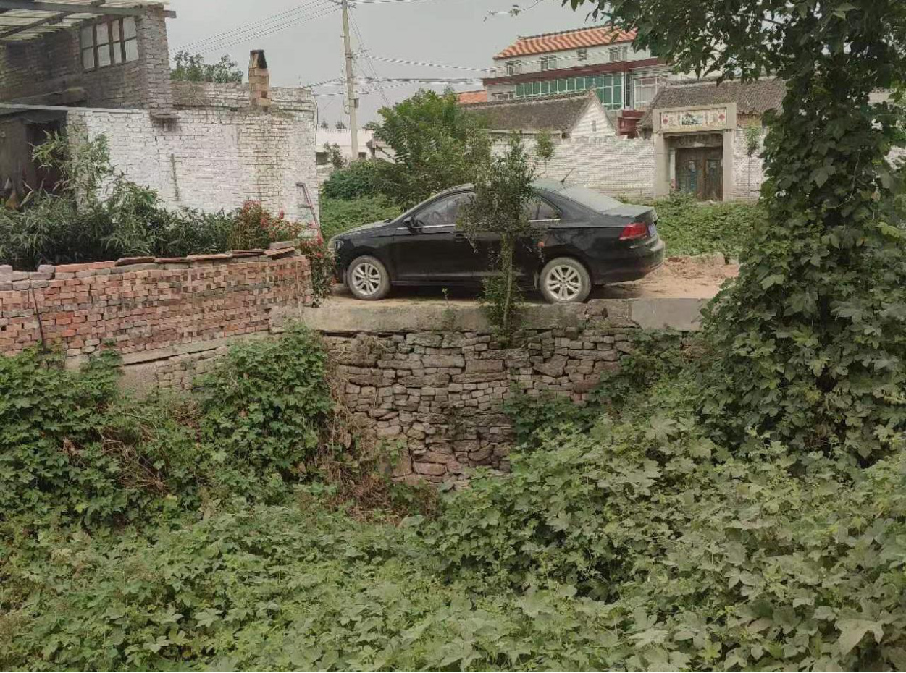  
图 5.8-1 苏村 02 生产桥现状  

生产桥总跨径为 ${}^{20\mathrm{m}}$ ,单跨简支空心板梁桥设计,桥梁无纵坡。按照单车道设计,考虑与两岸道路连接,桥面总宽 6m,车道宽度采用 $5.0\mathsf{m}$ ,两侧分别设0.5m 宽防撞护栏。为方便路面积水快速排除,交通桥在桥面上设置双向 $1.5\%$ 横坡,并在桥面两侧间隔 $3.0\mathsf{m}$ 设置泄水管将雨水排除。生产桥空心板梁下采用板式橡胶支座,单片梁每端设置两块。支座下设置 C40 支座垫石用做支座调平。桥台锥坡及上下游护坡均采用 M10 浆砌石护砌。  

根据《公路工程混凝土结构耐久性设计规范》(JTGT 3310-2019)5.3.2 条相关规定,为保证桥梁结构耐久性,生产桥上部结构采用预制 C40 预应力混凝土空心板梁,梁高为 $0.95\mathrm{m}$ 。空心板梁横向一跨共布置 4 片梁,吊装就位后在空心板梁之间现浇 C40 混凝土铰缝,空心板梁上现浇一层 15cm 厚 C40 混凝土,使空心板梁形成整体,后在现浇层混凝土顶面涂刷 1.5mm 厚聚氨酯防水层,再铺设 8\~11.8cm 厚防水混凝土作为桥面铺装层。  

生产桥桥台采用桩接盖梁基础形式,桩径 1.2m,桩长约 $20\mathrm{m}$ 。为避免桥台周围土体受到雨水冲刷影响桥台安全,河槽边坡采用 M10 浆砌石护砌,护砌范围上下游各 $10\mathrm{m}$ 。  

王窑头 4 生产桥、王窑头 3 生产桥、王窑头 2 生产桥、苏村 04 生产桥、苏村 05 生产桥、王窑头 1 生产桥、申窑头 2 生产桥、苏村 11 生产桥、苏村 12 生产桥、苏村 13 生产桥、苏村 14 生产桥、郭井固村西桥、下河村南桥结构设计同苏村 02 生产桥,按 B 类生产桥设计。  

# 5.8.5.3  C 类生产桥(20m 长、7.5m 宽)  

C 类桥梁以牛李村桥为典型设计。牛李村桥一侧块砌石桥墩,一侧混凝土桥墩,混凝土桥板;经询问知,此桥 2021 年 7 月冲毁了一个边跨,村里进行了临时维修,目前为危桥,设计拆除重建。  

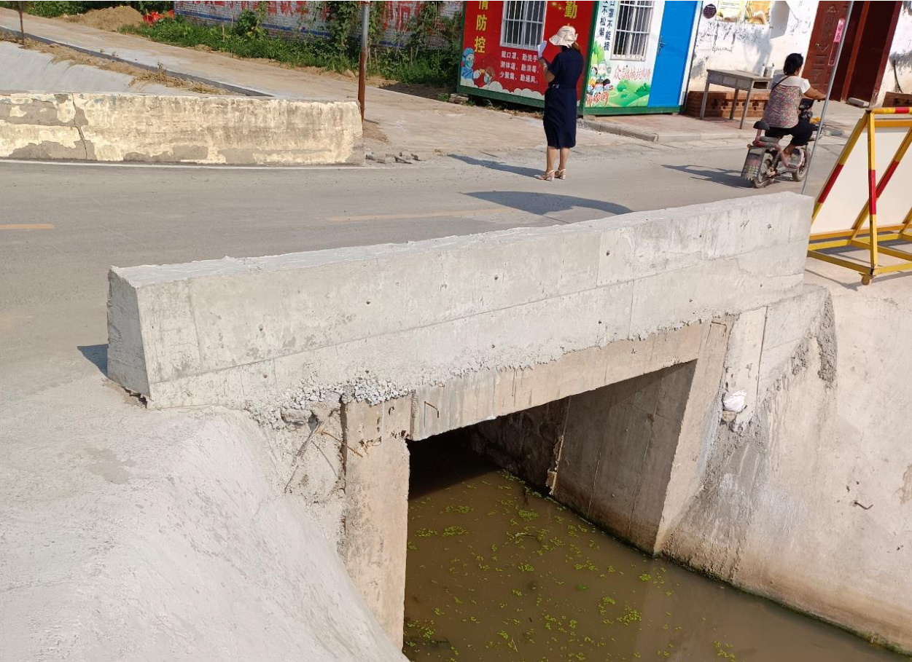  
图 5.8-2 牛李村桥现状  

生产桥总跨径为 ${}^{20\mathrm{m}}$ ,单跨简支空心板梁桥设计,桥梁无纵坡。按照双车道设计,考虑与两岸道路连接,桥面总宽 $7.5\mathsf{m}$ ,车道宽度采用 $6.5\mathsf{m}$ ,两侧分别设0.5m 宽防撞护栏。为方便路面积水快速排除,交通桥在桥面上设置双向 $1.5\%$ 横坡,并在桥面两侧间隔 $3.0\mathsf{m}$ 设置泄水管将雨水排除。生产桥空心板梁下采用板式橡胶支座,单片梁每端设置两块。支座下设置 C40 支座垫石用做支座调平。桥台锥坡及上下游护坡均采用 M10 浆砌石护砌。  

根据《公路工程混凝土结构耐久性设计规范》(JTGT 3310-2019)5.3.2 条相关规定,为保证桥梁结构耐久性,生产桥上部结构采用预制 C40 预应力混凝土空心板梁,梁高为 0.95m。空心板梁横向一跨共布置 6 片梁,吊装就位后在空心板梁之间现浇 C40 混凝土铰缝,空心板梁上现浇一层 15cm 厚 C40 防水混凝土,使空心板梁形成整体,后在现浇层混凝土顶面涂 $1.5\mathrm{mm}$ 厚聚氨酯防水层,再铺设 $8{\sim}12.9\mathrm{cm}$ 厚防水混凝土作为桥面铺装层。  

生产桥桥台采用桩接盖梁基础形式,桩径 $1.2\mathrm{m}$ ,桩长约 $^{22\mathrm{{m}}}$ 。为减小冲刷对基础影响,主河槽内采用 M10 浆砌石护砌,护砌范围上下游各 $10\mathrm{m}$ 。  

牛李村桥 2、牛李村桥 3、牛李村桥 4 结构设计同牛李村桥,按 C 类生产桥设计。  

# 5.8.5.4 苏村 15 生产桥(跨长 $2\times16\mathrm{m}$ 长、桥面 6m 宽)  

现状为三跨(护栏为砖砌结构,下部浆砌石风化,砂浆脱落,设计拆除重建。  

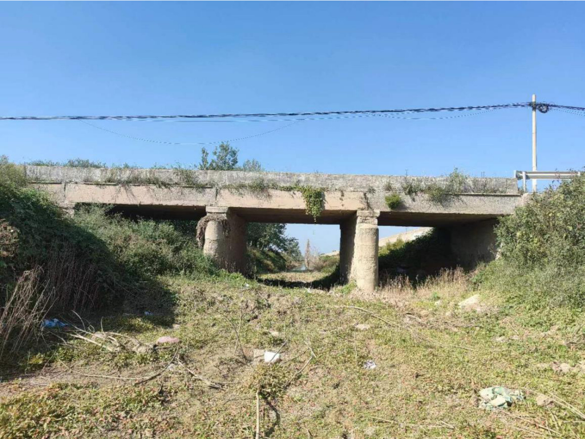  
图 5.8-3 苏村 15 生产桥现状  

生产桥总跨径为 $32\mathrm{m}$ ,跨经采用 $2^{\star}16\mathsf{m}$ 简支空心板梁桥结构,桥梁无纵坡。按照单车道设计,考虑与两岸道路连接,桥面总宽 $6.0\mathsf{m}$ ,车道宽度采用 $5.0\mathsf{m}$ ,两侧分别设 $0.5\mathrm{m}$ 宽防撞护栏。为方便路面积水快速排除,交通桥在桥面上设置双向 $1.5\%$ 横坡,并在桥面两侧间隔 $3.0\mathsf{m}$ 设置泄水管将雨水排除。生产桥空心板梁下采用板式橡胶支座,单片梁每端设置两块。支座下设置 C40 支座垫石用做支座调平。桥台锥坡及上下游护坡均采用 M10 浆砌石护砌。  

根据《公路工程混凝土结构耐久性设计规范》(JTGT 3310-2019)5.3.2 条相关规定,为保证桥梁结构耐久性,生产桥上部结构采用预制 C40 预应力混凝土空心板梁,梁高为 $0.8\mathrm{m}$ 。空心板梁横向一跨共布置 4 片梁,吊装就位后在空心板梁之间现浇 C40 混凝土铰缝,空心板梁上现浇一层 15cm 厚 C40 防水混凝土,使空心板梁形成整体,后在现浇层混凝土顶面涂 $1.5\mathrm{mm}$ 厚聚氨酯防水层,再铺设 $8{\sim}11.8\mathrm{cm}$ 厚防水混凝土作为桥面铺装层。  

生产桥桥墩采用桩柱结构,排架柱长 $2.0\mathsf{m}$ ,直径 $1.0\mathsf{m}$ ,灌注桩直径 $1.2\mathrm{m}$ ,桩长约 $^{22\mathrm{{m}}}$ 。桥台采用桩接盖梁基础形式,桩径 $1.2\mathrm{m}$ ,桩长约 ${}^{20\mathrm{m}}$ 。为减小冲刷对基础影响,主河槽内采用 M10 浆砌石护砌,护砌范围上下游各 $10\mathrm{m}$ 。  

# 5.8.5.5 井固沟桥(26m 长、6m 宽)  

原道路下部埋设 3 根 DN800 的涵管,2021 年 7 月洪水将涵管冲毁,现状已填土做临时道路,将沟道堵塞。设计拆除涵管,新建生产桥,以满足交通与河道过流需求。  

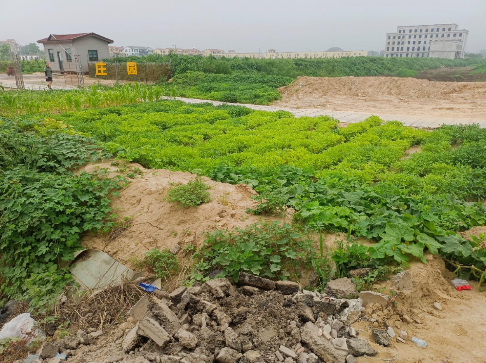  
图 5.8-4 井固沟桥现状  

生产桥总跨径为 $26\mathrm{m}$ ,跨经采用 $2^{\star}13\mathsf{m}$ 简支空心板梁桥结构,桥梁无纵坡。考虑与两岸道路连接,桥面总宽 $6.0\mathsf{m}$ ,车道宽度采用 $5.0\mathsf{m}$ ,两侧分别设 $0.5\mathrm{m}$ 宽防撞护栏。为方便路面积水快速排除,交通桥在桥面上设置双向 $1.5\%$ 横坡,并在桥面两侧间隔 $3.0\mathsf{m}$ 设置泄水管将雨水排除。生产桥空心板梁下采用板式橡胶支座,单片梁每端设置两块。支座下设置 C40 支座垫石用做支座调平。桥台锥坡及上下游护坡均采用 M10 浆砌石护砌。  

根据《公路工程混凝土结构耐久性设计规范》(JTGT 3310-2019)5.3.2 条相关规定,为保证桥梁结构耐久性,生产桥上部结构采用预制 C40 预应力混凝土空心板梁,梁高为 $0.7\mathsf{m}$ 。空心板梁横向一跨共布置 4 片梁,吊装就位后在空心板梁之间现浇 C40 混凝土铰缝,空心板梁上现浇一层 15cm 厚 C40 防水混凝土,使空心板梁形成整体,后在现浇层混凝土顶面涂 $1.5\mathrm{mm}$ 厚聚氨酯防水层,再铺设 8cm 厚防水混凝土作为桥面铺装层。  

生产桥桥墩采用桩柱结构,共四排桩柱,排架柱长 $2.0\mathsf{m}$ ,直径 $0.8\mathrm{m}$ ,灌注桩直径 $1.0\mathsf{m}$ ,桩长约 $^{22\mathrm{{m}}}$ 。桥台采用桩接盖梁基础形式,桩径 $1.0\mathsf{m}$ ,桩长约$20\mathrm{m}$ 。为减小冲刷对基础影响,主河槽内采用 M10 浆砌石护砌,护砌范围上下游各 $10\mathrm{m}$ 。  

# 5.8.5.6 井固桥(20m 长、13m 宽)  

现状为三孔砌石结构,现状结构完好;桥两侧为砖砌防护结构,局部已坍塌;桥栏杆为砖砌结构,局部已坍塌;桥下淤积严重,设计拆除重建。  

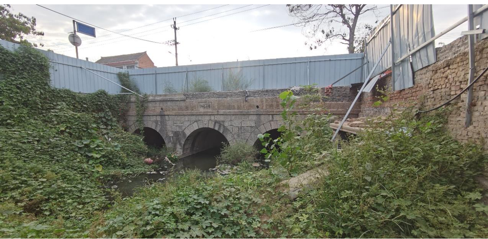  
图 5.8-5 井固桥现状  

生产桥总跨径为 ${}^{20\mathrm{m}}$ ,单跨简支空心板梁桥设计,桥梁无纵坡。考虑与两岸道路连接,桥面总宽 $13.0\mathrm{m}$ ,车道宽度采用 $12.0\mathrm{m}$ ,两侧分别设 $0.5\mathrm{m}$ 宽防撞护栏。为方便路面积水快速排除,交通桥在桥面上设置双向 $1.5\%$ 横坡,并在桥面两侧间隔 $3.0\mathsf{m}$ 设置泄水管将雨水排除。生产桥空心板梁下采用板式橡胶支座,单片梁每端设置两块。支座下设置 C40 支座垫石用做支座调平。桥台锥坡及上下游护坡均采用 M10 浆砌石护砌。  

根据《公路工程混凝土结构耐久性设计规范》(JTGT 3310-2019)5.3.2 条相关规定,为保证桥梁结构耐久性,生产桥上部结构采用预制 C40 预应力混凝土空心板梁,梁高为 $0.95\mathrm{m}$ 。空心板梁横向一跨共布置 12 片梁,吊装就位后在空心板梁之间现浇 C40 混凝土铰缝,空心板梁上现浇一层 15cm 厚 C40 防水混凝土,使空心板梁形成整体,后在现浇层混凝土顶面涂 1.5mm 厚聚氨酯防水层,再铺设 8cm 厚沥青混凝土作为桥面铺装层。  

生产桥桥台采用桩接盖梁基础形式,共四排桩,桩径 1.2m,桩长约 ${}^{20\mathrm{m}}$ 。为减小冲刷对基础影响,主河槽内采用 M10 浆砌石护砌,护砌范围上下游各 $10\mathrm{m}$ 。  

# 5.8.5.7 D 类生产桥(80m 长、6m 宽)  

D 类桥梁以何井固桥为典型设计。何井固桥位置现状为漫水路,洪水时,无法作为撤退道路疏散。设计新建生产桥,以满足交通与河道过流需求。  

生产桥总跨径为 $80\mathsf{m}$ ,跨经采用 $8^{\star}10\mathsf{m}$ 简支空心板梁桥结构,桥梁无纵坡。按照单车道设计,考虑与两岸道路连接,桥面总宽 $6.0\mathsf{m}$ ,车道宽度采用 $5.5\mathsf{m}$ ,两侧分别设 $0.25\mathrm{m}$ 宽护栏。为方便路面积水快速排除,交通桥在桥面上设置双向$1.5\%$ 横坡。生产桥空心板梁下采用板式橡胶支座,单片梁每端设置两块。支座下设置 C40 支座垫石用做支座调平。桥台锥坡及上下游护坡均采用 M10 浆砌石护砌。  

根据《公路工程混凝土结构耐久性设计规范》(JTGT 3310-2019)5.3.2 条相关规定,为保证桥梁结构耐久性,生产桥上部结构采用预制 C40 钢筋混凝土空心板梁,梁高为 $0.5\mathsf{m}$ 。空心板梁横向一跨共布置 6 片梁,吊装就位后在空心板梁之间现浇C40 混凝土铰缝,空心板梁上现浇一层15cm 厚C40 防水混凝土,使空心板梁形成整体,后在现浇层混凝土顶面涂 $1.5\mathrm{mm}$ 厚聚氨酯防水层,再铺设 $8{\sim}11.8\mathrm{cm}$ 厚防水混凝土作为桥面铺装层。  

生产桥桥墩采用桩柱结构,共两排桩柱,排架柱长 $2.0\mathsf{m}$ ,直径 $0.8\mathrm{m}$ ,灌注桩直径 $1.0\mathsf{m}$ ,桩长约 $25\mathrm{m}$ 。桥台采用桩接盖梁基础形式,桩径 $1.0\mathsf{m}$ ,桩长约$20\mathrm{m}$ 。为减小冲刷对基础影响,主河槽内采用 M10 浆砌石护砌,护砌范围上下游各 $10\mathrm{m}$ 。  

周井固桥结构设计参考何井固桥,按 D 类生产桥设计。其中周井固桥总跨径为 $40\mathrm{m}$ ,跨经采用 $4^{\star}10\mathsf{m}$ 简支空心板梁桥结构。  

# 5.8.6 桥梁结构设计  

生产桥桥汽车荷载等级均按公路—Ⅱ级进行结构设计。交通桥的上部结构参照交通部通用图集设计,并结合桥梁博士 V4.3 计算程序进行 A 类预应力混凝土构件的承载能力极限状态计算以及正常使用极限状态计算,下部结构采用混凝土灌注桩基础进行设计。  

# a)荷载组合  

按承载能力极限状态设计时荷载组合。  

基本组合:  

$\textcircled{1}$ 组合 1:自重 $^+$ 收缩徐变 $^+$ 预应力 $^+$ 汽车荷载 $^+$ 人群荷载;  

$\textcircled{2}$ 组合 2:自重 $^+$ 收缩徐变 $^+$ 预应力 $^+$ 汽车荷载 $^+$ 人群荷载 $^+$ 温度影响力;  

$\textcircled{3}$ 组合 3:自重 $^+$ 收缩徐变 $^+$ 预应力 $^+$ 汽车荷载 $^+$ 人群荷载 $^+$ 温度影响力 $^+$ 汽车制动力(基础验算);  

$\textcircled{4}$ 组合 4:自重 $^+$ 收缩徐变 $^+$ 预应力 $^+$ 施工荷载(施工组合)  

地震组合:自重 $^+$ 收缩徐变 $^+$ 预应力 $^+$ 地震作用按正常使用极限状态设计时荷载组合  

$\textcircled{1}$ 组合Ⅰ:自重 $^+$ 收缩徐变 $^+$ 预应力 $^+$ 汽车荷载 $^+$ 人群荷载 $^+$ 温度影响力(频   
遇组合); $\textcircled{2}$ 组合Ⅱ:自重 $^+$ 收缩徐变 $^+$ 预应力 $^+$ 汽车荷载 $^+$ 人群荷载 $^+$ 温度影响力(准   
永久组合); $\textcircled{3}$ 组合Ⅲ:自重 $^+$ 收缩徐变 $^+$ 预应力 $^+$ 汽车荷载 $^+$ 人群荷载 $^+$ 温度影响力(标   
准效应组合); $\textcircled{4}$ 组合Ⅳ:自重 $^+$ 收缩徐变 $^+$ 预应力 $^+$ 汽车荷载 $^+$ 人群荷载 $^+$ 温度影响力 $^+$ 冰压   
力(基础验算); $\textcircled{5}$ 组合Ⅴ:自重 收缩徐变 预应力 施工荷载(施工组合)。  

$^+$ $^+$ $^+$  

# b)下部结构计算  

钻孔灌注桩的承载力容许值:  

$$
[R_{a}]=\frac{1}{2}u\sum_{i=1}^{n}q_{i k}l_{i}+A_{P}q_{r}
$$  

$$
q_{r}=m_{0}\lambda[[f_{a0}]+k_{2}\gamma_{_2}\big(h-3\big)]
$$  

式中:  

[Ra]—单桩轴向受压承载力容许值(kN),桩身自重与置换土重的差值作为荷载考虑;μ—桩身周长(m);$\mathrm{A}_{\mathrm{p}}$ —桩端截面面积(m2);n—土的层数;li—承台底面或局部冲刷线以下各土层的厚度 $(\mathsf{m})$ ,扩孔部分不计;qik—与li对应的各土层与桩侧的摩阻力标准值(kPa);$\mathrm{\bfq_{\mathrm{r}}}$ —修正后的桩端土 i 特征值(kPa);$\mathrm{f}_{\mathbf{a}0}$ —桩端土的承载力特征值(kPa);$\mathrm{k}_{2}-$ 承载力特征值的深度修正系数;$\mathrm{m}_{0}$ — 清底系数。  

# 5.7 过路涵工程  

# 5.7.1 工程现状  

蓄滞洪区内部现状道路高程相对较高,存在阻水问题,规划在道路低洼位置埋设过路涵 4 座。  

# 5.7.2 工程布置  

过路涵设计 2 根 DN600 钢筋混凝土管,设计采用柔性接口承插口型标准Ⅲ级管,长 $12\mathrm{m}$ ,管道底部设置 $120^{\circ}$ 角混凝土基础,管道两端设置 $2.0\mathrm{m}$ 高混凝土挡墙。进出口设置混凝土八字墙和混凝土底板,用以导流和防止水流冲刷。  

# 5.7.3 过路涵设计计算  

(1)设计荷载:公路‖级。  

(2)根据《给水排水工程埋地预制混凝土圆形管管道结构设计规程》(CECS143-2002)5.2.2,对钢筋混凝土管进行强度计算。  

1)结构自重,荷载分项系数为 1.2取钢筋混凝土重力密度 $25\mathrm{kN}/\mathrm{m}^{3}$ 。  

$$
\mathrm{G}_{0}{=}^{\ensuremath{\delta_{1}}}\mathrm{A}\gamma
$$  

式中:1— 荷载分项系数,取 1.2; γ 混凝土容重,取 25( ${\mathrm{kN}}/{\mathrm{m}}^{3})$ ); 管道截面面积; A  

2)管内水重取钢筋混凝土重力密度 $25\mathrm{kN}/\mathrm{m}^{3}$ 。  

$$
\mathrm{\DeltaG}_{\mathrm{w}}=\delta_{^1}\mathrm{\DeltaA}\gamma
$$  

式中: $\delta_{1}$ — 荷载分项系数,取 1.27; γ 水容重,取 10( ${\mathrm{kN}}/{\mathrm{m}}^{3})$ ); 管道内截面面积; A  

3)竖向土压力 竖向土压力:钢筋混凝管  

$$
\boldsymbol{G}_{s}=\boldsymbol{K}_{s}\gamma_{s}\boldsymbol{H}_{s}\mathrm{\Pi}_{\mathrm{(kN/m^{2})}}
$$  

式中: $K_{s}$ 竖向土压力系数; $\gamma_{s}$ 回填土容重( ${\mathrm{kN}}/{\mathrm{m}}^{3})$ ); $H_{s}$ 顶板上埋土的深度(m);  

侧向水平土压力:  

式中: $\mathrm{K}_{0}$ — 主动土压力系数;  

 回填土容重( $\ensuremath{\mathrm{kN}}/\ensuremath{\mathrm{m}}^{3},$ ) ;$H$ 填土表面至计算截面的高度( $\mathrm{~m~})$ );  

# 4)由车载产生的土压力,荷载分项系数为 1.4  

由车载产生的竖向土压力按车轮按其着地面积的边缘向下作 300 角分布。当几个车轮的压力扩散线相重叠时,扩散面积以最外边的扩散线为准。根据车辆荷载分布以及一般涵洞的规模及洞顶的填土厚度,位于堤下的涵洞,一般最不利的车辆荷载多是一个汽车的后轴中立单独作用于洞顶之上。  

  
  
图 5.7-1 汽车后轴轮压分布图(单位: $\mathsf{m}$ )  

$$
q_{\star\mathbf{k}}=\frac{\mu_{\sf d}n Q_{\mathrm{w}i,\frac{1}{\epsilon}}}{(a_{i}+1.4H)\big(n b_{i}+\displaystyle\sum_{j=1}^{n-1}d_{\mathrm{b}j}+1.4H\big)}
$$  

式中:qvk— 轮压传递到管顶处的竖向压力标准值( $\mathrm{kN}/\mathrm{m}^{2})$ );Qvi,k— 车辆的第 i 个车轮承担的单个轮压标准值(kN);ai— i 个车轮的着地分布长度(m);bi— i 个车轮的着地分布宽度(m);H— 自车行地面至管顶的深度(m);μD— 动力系数;  

# 5)计算结果  

根据计算,混凝土管管顶集中线性荷载为 $9.27\mathrm{kN}/\mathrm{m}$ 。根据《混凝土和钢筋混凝土排水管》(GB/T 11836-2009),DN600‖级钢筋混凝土管的破坏荷载为$60\mathrm{kN/m}$ ,本工程计算集中线性荷载为 $9.27\mathrm{kN}/\mathrm{m}$ ,小于混凝土管的破坏荷载,满足设计要求。  

# 5.7.4 主要工程量  

过路涵主要工程量汇总见表 5.7-1。  

表 5.7-1 过路涵主要工程量汇总表  

<html><body><table><tr><td>编号</td><td>项目</td><td>单位</td><td>工程量</td><td>备注</td></tr><tr><td>一</td><td>过路涵工程</td><td></td><td></td><td></td></tr><tr><td>1</td><td>土方工程</td><td></td><td></td><td></td></tr><tr><td>1.2</td><td>土方开挖</td><td>m3</td><td>156</td><td></td></tr><tr><td>1.3</td><td>土方回填</td><td>m3</td><td>149</td><td>压实度0.95</td></tr><tr><td>2</td><td>管涵段</td><td></td><td></td><td></td></tr><tr><td>2.1</td><td>DN600钢筋混凝土管</td><td>m</td><td>104</td><td></td></tr><tr><td>2.2</td><td>混凝土基础C30W4F150（二)</td><td>m3</td><td>37</td><td></td></tr><tr><td>2.3</td><td>混凝土挡墙C30W4F150（二)</td><td>m3</td><td>42</td><td></td></tr><tr><td>2.4</td><td>混凝土底板C30W4F150（二）</td><td>m3</td><td>46</td><td></td></tr><tr><td>2.5</td><td>素混凝土垫层C20（一)</td><td>m</td><td>10</td><td></td></tr><tr><td>2.6</td><td>沥青路面 30mm细粒式</td><td>m²</td><td>381</td><td></td></tr><tr><td>2.7</td><td>沥青路面40mm中粒式</td><td>m²</td><td>381</td><td></td></tr><tr><td>2.8</td><td>透层油</td><td>m²</td><td>381</td><td></td></tr><tr><td>2.9</td><td>水泥稳定碎石</td><td>m3</td><td>115</td><td></td></tr></table></body></html>  

# 5.8 撤退路工程  

# 5.9.1 工程任务  

撤退路工程是安全建设的一部分,在滞洪区内建设撤退路,当滞洪区正常启用时,区内居民可通过撤退路快速到达主干路,从而达到转移避险的目的,生命财产能够得到一定程度的保障。目前本区内村庄居民多,居民不能完全实现就地避险,建设必要的避险设施是保障区内居民生命财产安全的重要保障措施。2022 年 12 月,在可研报告基础上,对撤退措施进行了重新分析,根据现场实地查勘,绝大部分撤退路为村庄内的已硬化道路,大部分为水泥混凝土路面,可研阶段划定的新建道路大部分均已由当地实施完成,路面宽度能够满足车辆双向通行的需求。仅有少部分的撤退路存在路面极差以及道路宽度不满足错车的需求,为进一步提升撤退效率,并结合内黄县当地有关部门对道路改造的需求,对区域内的部分撤退道路进行拆除重建、新铺路面改造和新建。  

# 5.9.2 设计依据  

根据《公路工程技术标准》(JTG B01-2014)、《小交通量农村公路工程技术标准》(JTG 2111-2019),双车道四级公路年平均日设计交通量宜为 2000 量小客车以下;单车道四级公路年平局日设计交通量宜在 400 量小客车以下,本次建设的撤退路参照四级公路的相关要求进行设计。撤退路的设计时速采用$15\mathrm{km/h}$ ,路面使用年限为 10 年。主要参照规范标准如下:  

(1)《蓄滞洪区设计规范》(GB50773-2012);  
(2)《公路工程技术标准》(JTG B01-2014);  
(3)《小交通量农村公路工程技术标准》(JTG 2111-2019);  
(4)《乡村道路工程技术规范》(GB/T 51224-2017);  
(5)《城镇道路路面设计规范》(CJJ 169-2011);  
(6)《公路桥涵设计通用规范》(JTG D60-2015);  

# 5.9.3 设计原则  

(1)结合现有对外道路并根据需安置的人口数量和村庄分布情况进行撤退路的布设;根据平战结合的布置原则,尽量在现有农村路网的基础上拟定撤退道路路线布置,不再新增道路;撤退路建设不新增永久征地,拟定的道路满足修建要求;  

(2)撤退路路线具有合理的撤退方向,可使村庄居民快速转移至主干路,达到滞洪前转移避险的目的;  

(3)根据利用道路的路面情况,确定对具备转移避险功能的破损道路、土路进行治理;  

(4)根据《农村公路中长期发展纲要》(2021.2)中实施基础路网延伸完善工程,加强通村公路和村内道路连接的要求,修建部分村内道路,完善村庄路网,便于撤退转移。  

# 5.9.4 工程规模  

本次维修改建 15 条道路,总长度 $11891\mathrm{m}$ 。其中拆除重建水泥混凝土路面段道路长 $155\mathrm{m}$ ,加铺沥青混凝土路面段道路长 $11006\mathrm{m}$ ,新建道路段长 $730\mathrm{m}$ 。撤退路路面为水泥混凝土路面和沥青混凝土路面,路面结构为: $20\mathrm{cm}$ 厚的 C30水泥混凝土面层或 $10\mathrm{cm}$ 厚的沥青混凝土面层,拆除重建和加铺段的路基路面宽度与现状道路保持一致,新建段道路宽度不小于 6m。  

具体道路情况见表 5.9-1。  

表 5.9-1 撤退道路统计表  

<html><body><table><tr><td>序 号</td><td>村庄</td><td>位置</td><td>沥青罩面 (Ⅲ)</td><td>拆除重建 ()</td><td>新建 ()</td></tr><tr><td>1</td><td>刘坡</td><td>村内主干道</td><td>587</td><td></td><td></td></tr><tr><td>2</td><td>宋堂村</td><td>村内主干道</td><td>650</td><td></td><td></td></tr><tr><td>3</td><td>小寨</td><td>村内主干道</td><td>520</td><td></td><td></td></tr><tr><td>4</td><td>东枣林</td><td>村内主干道</td><td>440</td><td></td><td></td></tr><tr><td>5</td><td rowspan="2">郭井固</td><td>村西主干道</td><td>455</td><td>65</td><td></td></tr><tr><td>9</td><td>村委会向南主干道</td><td></td><td>90</td><td></td></tr><tr><td>7</td><td>南井固</td><td>村内主干道</td><td>319</td><td></td><td></td></tr><tr><td>8</td><td>西韩庄</td><td>至 X007 出村主干道</td><td>644</td><td></td><td></td></tr><tr><td>6</td><td>军里庄</td><td>至 X007 出村主干道</td><td>1230</td><td></td><td></td></tr><tr><td>10</td><td>孙石井村</td><td>村内主干道</td><td>748</td><td></td><td></td></tr><tr><td>11</td><td>北苏村</td><td>村东南主干道</td><td></td><td></td><td>730</td></tr><tr><td>12</td><td>南湖村</td><td>至小李线主干道</td><td>162</td><td></td><td></td></tr><tr><td>13</td><td>军寨村</td><td>至 X002 主干道</td><td>3160</td><td></td><td></td></tr><tr><td>14</td><td>圈里村</td><td>村内主干道</td><td>912</td><td></td><td></td></tr><tr><td>15</td><td>李新寨村</td><td>村内主干道</td><td>1179</td><td></td><td></td></tr><tr><td></td><td>合计</td><td></td><td>11006</td><td>155</td><td>730</td></tr></table></body></html>  

# 5.9 安全监测工程  

# 5.9.1 监测设计依据  

(1)《堤防工程安全监测技术规程》SL/T794-2020;  
(2)《水利水电工程安全监测设计规范》SL725-2016;  
(3)《国家一、二等水准测量规范》GB/T 12897-2006。  

# 5.9.2 监测设计目的及原则  

根据工程规模和特点,通过对堤防及穿堤建筑物在施工期及运行期进行监测,对建筑物的稳定性、安全性作出评价,达到监控工程安全的目的,同时指导工程施工并反馈设计。  

监测布置原则为:  

(1)在能较全面反映建筑物实际工作状况的前提上,监测项目具有针对性,突出重点;(2)仪器精密可靠、长期稳定性好,在满足观测精度的前提下,观测方便、直观,并易于埋设和维护;(3)人工监测与自动化监测相结合,仪器监测与人工巡视检查相结合;(4)施工期与运行期能连续进行观测,及时了解并掌握建筑物在施工期及运行期的工作状况。  

# 5.9.3 监测项目  

本工程涉及的主要建筑物为分洪堰,建筑物级别为 2 级。对分洪堰进行安全监测布置,监测项目包括垂直位移监测、渗透压力监测和水位监测。此外,东防洪堤(二道防线)鹤壁市浚县段 7.73km 已在《鹤壁市浚县小滩坡蓄滞洪区水毁修复工程》中进行设计并施工,为保障东防洪堤(二道防线)整体运行安全,本工程对东防洪堤(二道防线)鹤壁市浚县段 7.73km 补充安全监测设计,增加堤防垂直位移监测。除以上监测项目外,施工期和运行期还应进行人工巡视检查。  

# 5.9.4 监测布置  

(1)堤防  

堤防监测主要是对东防洪堤(二道防线)鹤壁市浚县段 7.73km 补充安全监测设计,增加堤防垂直位移监测。  

对靠近人口密集处及地质条件较差、填方量较大的堤段进行重点监测,每隔500m 左右布置 1 个监测断面,其他堤段每隔 1km 左右布置 1 个监测断面。在每个监测断面堤顶两侧分别布置 1 个垂直位移测点,监测堤防沉降变形。在背水侧附近稳定的原状基础上,每隔 2km 布置 1 个垂直位移工作基点。  

# (2)分洪堰  

小滩坡分洪堰为混凝土宽顶堰,堤顶同两边堤防,建筑物级别为 2 级。分洪堰采用人工分洪方式,分洪时,采用挖掘机挖除堰上覆堤分洪。监测项目包括垂直位移监测、渗透压力监测和水位监测。  

# 1)垂直位移监测  

在分洪堰左右侧边墙、翼墙顶部分缝两侧分别布置一定数量的沉降标点,在下游背水侧每块底板分别布置 1 个沉降标点,监测不同结构的垂直位移和不均匀沉降情况。在分洪堰两侧堤防分别布置 1 个监测断面,在每个监测断面堤顶上下游侧分别布置 1 个垂直位移测点,对堤防沉降变形进行监测。在分洪堰附近稳定的原状基础上布置 3 个垂直位移基准点。  

# 2)渗透压力监测  

渗透压力监测包括基础渗透压力监测和绕渗监测。  

基础渗透压力监测布置 1 个监测断面,沿水流方向在分洪堰底板下共埋设 4支渗压计,监测基础渗透压力。  

在分洪堰与两侧堤防结合处分别布置 1 个监测断面,在每个监测断面堤顶上下游侧分别布置 1 根测压管,在下游堤坡布置 1 根测压管,测压管管底位于分洪堰基础以下 1m 左右,监测绕渗情况。此外,在每根测压管中分别安装 1 支渗压计以实现自动化监测。  

# 3)水位监测  

在分洪堰左右两侧边墙的上游和下游分别布置 1 副水尺监测水位,水尺安装在便于观测的位置。此外,在其中一侧边墙上、下游位置分别布置 1 支通气型渗压计以实现自动化监测。  

# 5.9.5 现场巡视检查  

除用监测仪器进行监测外,施工期及运行期还必须进行人工巡视检查。堤防巡视检查内容包括裂缝、滑坡、塌陷、隆起、渗透变形、防护破坏等情况,重点检查堤防与穿堤建筑物结合部位;分洪堰主要针对混凝土结构是否存在表面裂缝、变形、破损以及结构缝有无张开、错动等现象;检查监测设施是否完好、标识是否清晰。巡视检查过程中主要依靠目视、手摸、耳听、鼻嗅等直观方法,可辅以锤、钎、量尺、放大镜、望远镜、照相摄像设备等工(器)具,也可利用视频监视系统辅助现场检查。  

# 5.9.6 安全监测自动化系统  

在与分洪堰衔接的堤防背水侧布置 1 个现场监测站,现场监测站采用一体化监测站的型式,包括无线数据采集仪、太阳能电池板、蓄电池、保护箱、防雷保护设施等。监测仪器电缆就近引至现场监测站,接入无线数据采集仪进行现场监测数据的自动采集、信号转换和输出。现场监测站采用太阳能进行供电,设防雷保护设施,通过无线网络进行通信。  

本工程接入安全监测自动化系统的仪器很少,不设监测管理站和专门的工控机、服务器,管理单位使用已有设备安装相应的数据采集软件,对接入安全监测自动化系统的仪器进行远程采集、存储与管理,并能够将监测数据共享或传输给漳卫南局中心监测站。  

# 5.9.7 观测方法  

施工期渗压计电缆就近引至监测站集线箱,使用便携式读数仪进行人工观测,定期使用电测水位计进行比测;在具备自动化安装条件后将仪器电缆接入无线数据采集仪进行自动化观测。垂直位移测点使用电子水准仪按照二等水准测量要求施测,工作基点按照一等水准测量要求校测。  

在工程运行初期,应定期对接入自动化系统中的所有仪器进行人工观测,并将人工观测数据与自动化系统中的数据进行比对。  

# 5.12.8 主要监测仪器设备技术指标  

本工程所选仪器设备应达到或不低于以下技术指标,内观仪器能监测温度,并且具有一定的耐水压力。  

# (1)电子水准仪  

用于测量建筑物上各测点的垂直位移。其主要参数为:每 km 往返高差标准差优于 $\pm0.5\mathrm{mm}$ ,配一对 2m 铟钢条码尺,包括尺垫、三脚架等配件。  

# (2)沉降标点  

不锈钢材质,包括标芯和保护盒。  

(3)渗压计  

采用振弦式传感器,主要技术指标为:精度 $0.5\%\mathsf{F}.\mathsf{S}$ ,测量范围 $0{\sim}70{\mathrm{kPa}}$ ,耐水压力不小于仪器量程。  

(4)通气型渗压计  

采用通气型振弦式渗压计,主要技术指标为:精度 $0.5\%\mathsf{F}.\mathsf{S}$ ,测量范围 $0\sim$ 70kPa,耐水压力不小于仪器量程。  

# (5)测压管  

采用 $\Phi50\mathrm{mm}$ 的 ABS 管,花管段 $1.0\mathrm{m}{\sim}2.0\mathrm{m}$ ,孔径 $\Phi4\mathrm{\sim}6\mathrm{mm}$ ,开孔率$20\%$ ,钻孔直径 $\Phi110\mathrm{mm}$ ,管口设保护装置。  

# (6)振弦式读数仪  

振弦式读数仪为人工测读仪表,频率分辨力: $0.1\mathsf{H z}$ ,温度分辨力: $0.1^{\circ}\mathrm{C}$ 。 激励范围 $400mathsf{H z}\sim6000\mathsf{H z}$ ,温度范围- $.10^{\circ}C\sim+50^{\circ}C$ 。  

# (7)电测水位计  

测量范围不小于 $10\mathsf{m}$ ,分辨率 $\pm1\mathsf{m m}$ ,工作温度- $.10^{\circ}\mathrm{C}\sim60^{\circ}\mathrm{C}$ ;用于测量测压管内的水位。仪器由内置导线的钢带尺、探头、声光指示电路及平尺卷轴等组成。  

# (8)水尺  

为不锈钢水尺,宽度不小于 20cm。  

(9)四芯屏蔽监测电缆  

所用电缆应为耐酸、耐碱、防水、质地柔软的专用四芯屏蔽电缆,其承受水压为 1.0MPa 时,绝缘电阻应 $\geq100\mathsf{M}\Omega/\mathrm{km}$ 。电缆芯线在 $100\mathrm{m}$ 内应无接头,其具体指标如下:  

1)芯线面积 $\geq0.35\mathrm{m}\mathrm{m}^{2}$ ;   
2)芯线材料:铜芯镀锡,带高密度聚乙烯绝缘;   
3)屏蔽材料:铝锡箔或高密铜网;   
4)护套材料:挤压聚氯乙烯;   
5)护套厚度: $\geq1.60\mathrm{mm}$ ;  

6)工作温度: $-20^{\circ}C\sim60^{\circ}C$ 。  

(10)无线数据采集仪  

低功耗数据采集设备,分别能够接入各现场监测站的振弦式传感器。配置GPRS 通讯模块实现基于移动网络的远程数据采集,配置用于供电的太阳能电池板、蓄电池,配有防雷模块。并具备防水、防潮湿的功能。  

# 5.12.9 施工期及初期运行期安全监测资料整理与分析  

(1)监测仪器设备安装埋设完毕后,应及时记录初始读数;将监测仪器设备的考证资料、各种原始数据和有关文字、图表(包括影像、图片)等资料,综合整理成安全监测成果,汇编成册。  

(2)在每次观测后立即进行原始数据记录的检验和分析、监测物理量的计(换)算及过程线图绘制、异常值的判别等工作。如遇天气、施工等原因造成监测数据突变时,应加以说明;若判定监测数据不在限差以内或含有粗差,应立即重测;若判定监测数据含有较大的系统误差时,应分析原因,并设法减少或消除其影响。资料整理与分析过程中发现异常情况,应立即查找原因,并及时上报。  

(3)按规范要求进行监测资料的整编工作。监测资料整编主要包括以下内容:  

1)工程基本资料。  

2)工程建筑物安全监测设计和安全监测措施计划等有关文件。  

3)仪器型号、规格、技术参数、工作原理和使用说明、检验率定等仪器资料,测点布置和仪器埋设的原始记录等考证材料,仪器维护记录等。  

4)日常监测和巡检的原始记录、报表和报告,包括特征值汇总表、每个测点监测数据过程线、监测成果分析资料、物理量计算成果及各种图表等。  

(4)所有监测资料建立数据库,输入计算机备份保存并刊印成册。  

(5)施工期日常报表如月报、年报应对监测资料进行初步分析,对工程安全进行初步评价。  

(6)在竣工验收、安全鉴定、建筑物出现异常或险情状态时,应对监测资料进行系统分析,提供监测资料分析评价报告,对建筑物当前的工作状态做出评估。  

# 5.9.10 主要工程量  

本工程监测仪器设备工程量参见表 5.9-1。  

表 5.9-1 安全监测主要工程量表  

<html><body><table><tr><td>序号</td><td>项目名称 单位</td><td>数量</td><td>备注</td></tr><tr><td>1</td><td>监测仪器设备</td><td></td><td></td></tr><tr><td>1.1</td><td>沉降标点 个</td><td>55</td><td>含保护盖</td></tr><tr><td>1.2</td><td>水尺 组</td><td>4</td><td></td></tr><tr><td>1.3</td><td>电子水准仪 台</td><td>1</td><td>含三脚架</td></tr><tr><td>1.4</td><td>铟钢尺 对</td><td>1</td><td>2m，含尺垫</td></tr><tr><td>1.5</td><td>测压管 m</td><td>40</td><td></td></tr><tr><td>1.6</td><td>渗压计 支</td><td>10</td><td></td></tr><tr><td>1.7</td><td>通气型渗压计 支</td><td>2</td><td></td></tr><tr><td>1.8</td><td>监测电缆 m</td><td>1000</td><td></td></tr><tr><td>1.9</td><td>电缆保护钢管 m</td><td>500</td><td>DN25~DN50</td></tr><tr><td>2</td><td>自动化系统</td><td></td><td></td></tr><tr><td>2.1</td><td>无线数据采集仪 台</td><td>1</td><td>12 通道，含采集软 件</td></tr><tr><td>2.2</td><td>太阳能供电系统 套</td><td>1</td><td>太阳能电池板、内置 电池</td></tr><tr><td>2.3</td><td>一体化安装支架 套</td><td>1</td><td>含防雷接地装置、围 栏</td></tr><tr><td>2.4</td><td>保护箱 个</td><td>1</td><td></td></tr><tr><td>3</td><td>土建工程</td><td></td><td></td></tr><tr><td>3.1</td><td>垂直位移观测墩 座</td><td>24</td><td></td></tr><tr><td>3.2</td><td>垂直位移工作基点墩</td><td>座 9</td><td></td></tr><tr><td>3.3</td><td>垂直位移基准点墩</td><td>组 1</td><td></td></tr><tr><td>3.4</td><td>测压管钻孔及回填</td><td>m 40</td><td></td></tr><tr><td>3.5</td><td>测压管管口保护</td><td>套 4</td><td></td></tr></table></body></html>  

<html><body><table><tr><td>序号</td><td>项目名称</td><td>单位</td><td>数量</td><td>备注</td></tr><tr><td>4</td><td>施工期观测及巡视检查</td><td>项</td><td>1</td><td></td></tr><tr><td>5</td><td>资料整编及分析</td><td>项</td><td>1</td><td></td></tr></table></body></html>  