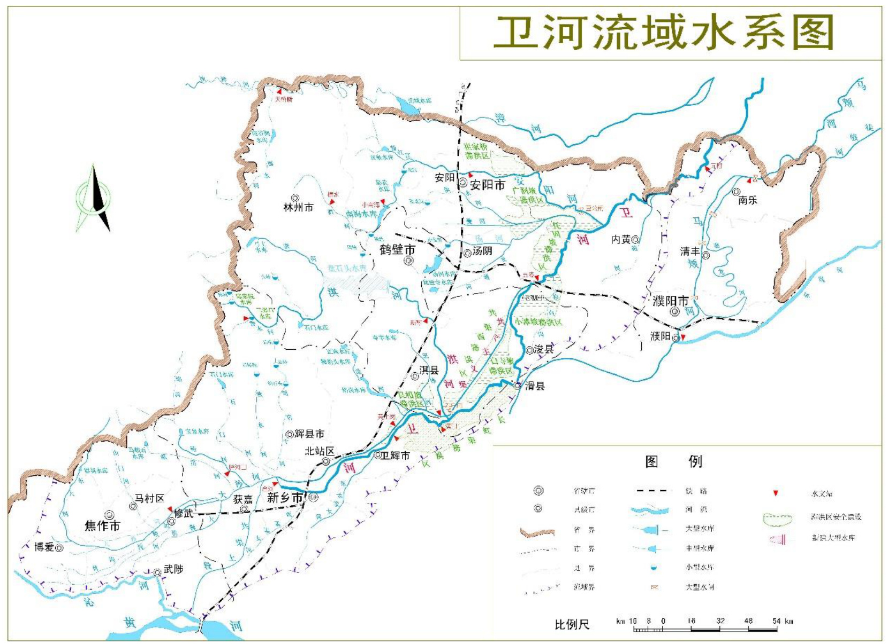
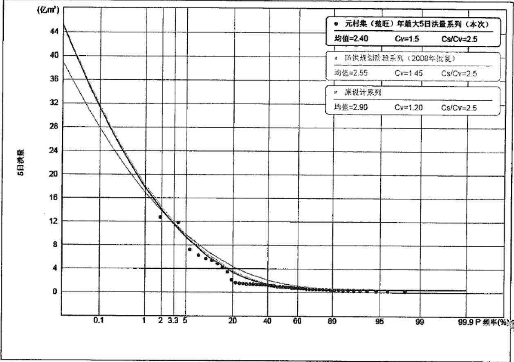
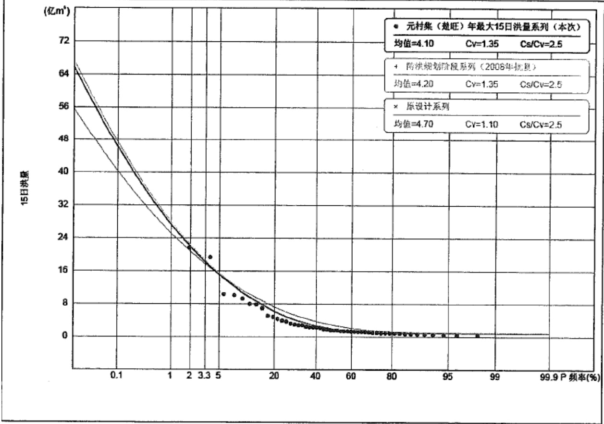
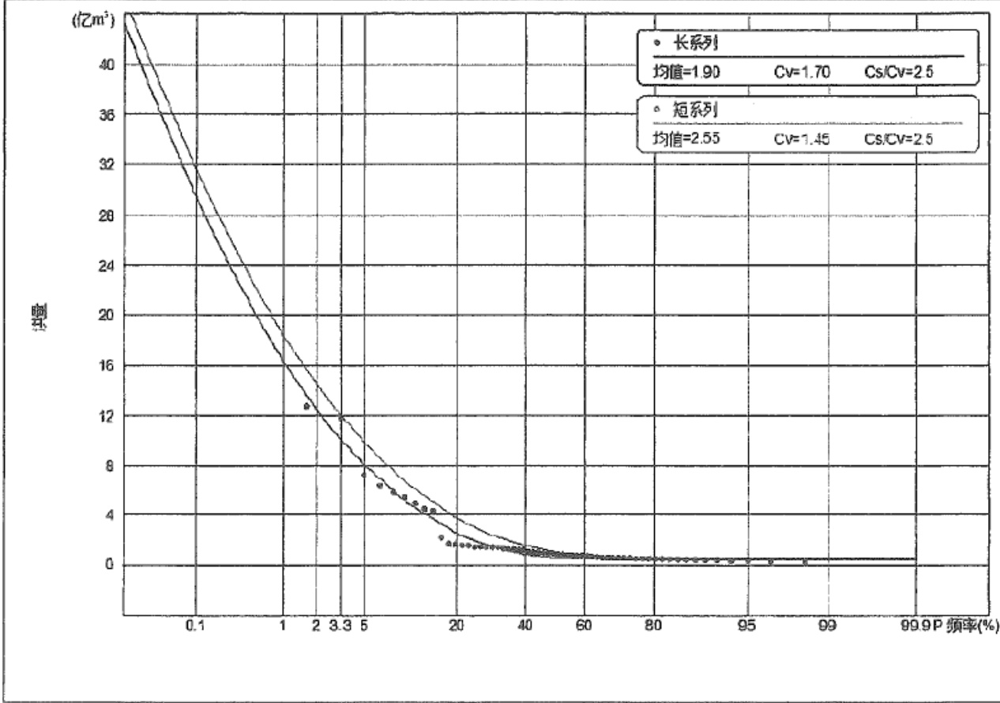
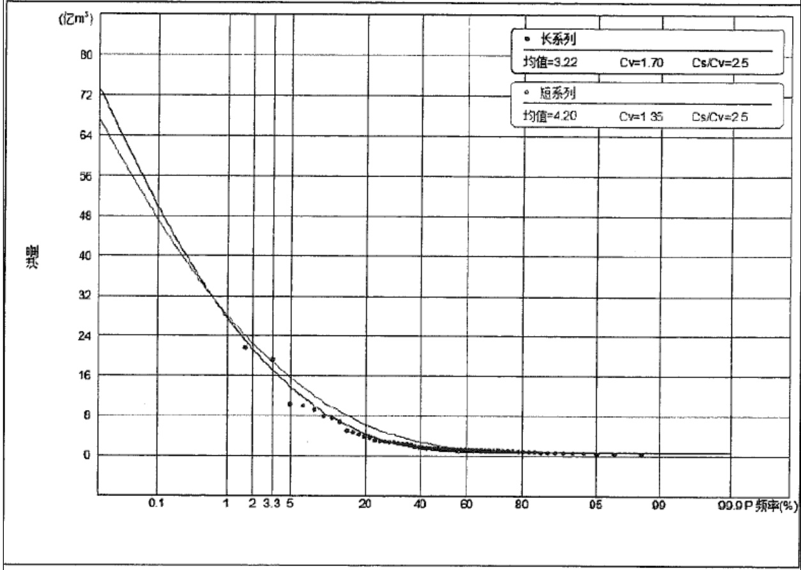
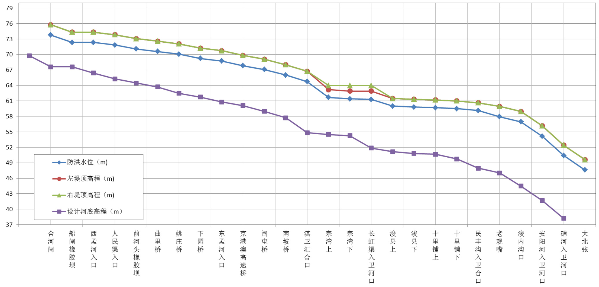
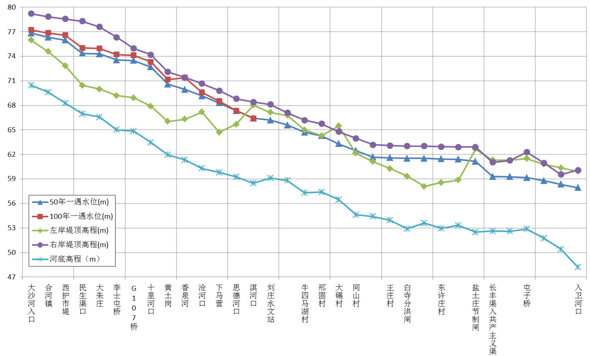
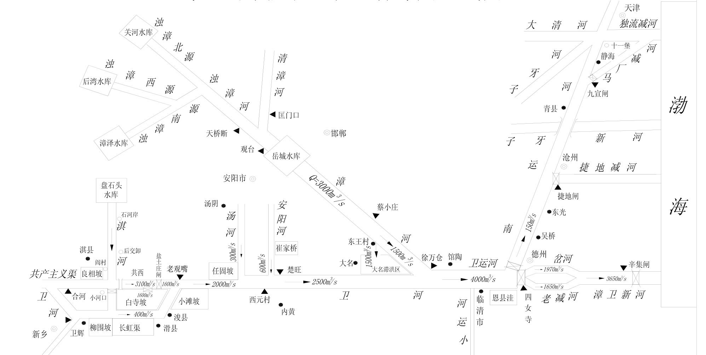

# 河南省卫河、共产主义渠(淇门以上)防洪除涝治理方案  

# 河南省水利勘测设计研究有限公司二〇一八年九月  

# 河南省卫河、共产主义渠(淇门以上)  

# 防洪除涝治理方案  

设计证号:设证水利甲级 A141005162ISO9001 质量体系认证证书:05214Q20074R1MISO14001 环境管理体系认证证书:05214E20030R1MOHSAS18001 职业健康安全管理体系认证证书 05214S20030R1M  

# 河南省水利勘测设计研究有限公司二〇一八年九月  

批 准:赵廷华  
核 定:陆  海  
审 查:张明恩  
校 核:王彩玲 刘洪飞  
编 写:刘洪飞 刘香君 孙大为 刘文静  张洁祥胡媛媛 谢夏玲 侯文林 许帅辉  
参加人员:张明恩 刘洪飞 孙大为 刘香君 刘文静张洁祥 胡媛媛 谢夏玲  胡  越 侯文林许帅辉  买巨喆 陈秋红  丁  宇  

# 目  录  

前言  
1 基本情况 6  
1.1 流域概况 6  
1.2 气象水文 . 9  
1.3 洪涝灾害 . . 9  
1.4 土壤植被 . . 11  
1.5 社会经济 . 11  
1.6 交通 . 14  
2 工程现状及存在问题 .15  
2.1 河道工程现状. 15  
2.2 河道规划及治理情况 . 35  
2.3 河道现状行洪排涝能力复核 . ... 36  
2.4 存在问题 . 43  
3设计洪水. .45  
3.1 水文基本资料. .... 45  
3.2 设计洪水 . ... 46  
3.3 河道泥沙 . .. 65  
4 总体方案 ...8  
4.1 指导思想、依据及原则 .. 68  
4.2 规划范围、内容和水平年 .. . 70  
4.3 治理标准及规模. . 71  
4.4 总体方案及布局... . 86  
5 防洪除涝治理方案 .92  
5.1 淇门以上 .. 92  
5.2 淇门以下 .. 114  
6 建设管理与要求, ... 153  
6.1 工程建设管理. . 153  
6.2 工程管理 . 153  
7 投资匡算与实施建议 158  
7.1 淇门以上投资. . 158  
7.2 淇门以下投资. . 161  
8 环境影响评价 162  
8.1 评价依据及环境保护目标 . . 162  
8.2 环境现状调查与评价. . 163  
8.3 环境影响分析与评价. . 164  
8.4 环境保护对策措施. . 167  
8.5 评价结论及建议. . 168  
9 实施效果评价与保障措施. . 169  
9.1 防洪效果评价. . 169  
9.2 环境效果评价. . 169  
9.3 社会效益评价. . 169  
9.4 综合效果评价. . 169  
9.5 保障措施 . 169  

# 10 结论与建议  

# 前  言  

卫河为黄河北岸隋唐大运河的永济渠,是海河流域南部漳卫河水系上游两支中的南支,源于太行山南麓,先后纳左岸的淇河、汤河、安阳河等十余条梳齿状支流,在河南大北张出境后于河北徐万仓与漳河交汇。卫河自河合镇起筑有堤防,干流全长$394\mathrm{km}$ ,流域面积 $14970\mathrm{km}^{2}$ 。1958 年为引黄而修建的共产主义渠,1962 年因停止引黄后用于承担卫河洪水。卫河两侧有良相坡、白寺坡、柳围坡、长虹渠、小滩坡、任固坡等坡洼和共产主义渠以西行滞洪区,为区域重要防洪排涝骨干河道。  

卫河干流在河南省境内全长 $286.5\mathrm{km}$ ,全部属于平原河道,呈半悬式河床,河道断面宽浅,两岸地形平坦,地表土质多为砂壤土和砂质土,河道险工多,槽小坡缓,每逢暴雨,极易造成洪涝灾害。据调查统计建国 60 年来,发生导致重大灾害损失的洪水 11 次,平均 6 年一次,累计受害村庄 1550 个,受灾人口 150 万人,倒塌房屋450 万间,伤亡人口 560 人,牲口死伤 3.75 万头,冲毁耕地 123.1 万亩。因此,卫河的安危事关沿岸几个县(市)工、农业的发展及社会安定。  

1978 年对浚内沟口以下河道按照排涝流量 $700{\sim}1000\mathrm{m}^{3}/\mathrm{s}$ 、行洪流量 $2000\sim$ $2500\mathrm{m}^{3}/\mathrm{s}$ 、堤防超高 $1.5\mathrm{m}$ 的规模进行了扩大治理。1982 年对卫河西孟姜女河入卫河口至老观嘴段进行了清淤疏浚,其中淇门至老观嘴段河道清淤规模为设计排涝标准 3年一遇,设计排涝流量 $130{\sim}150\mathrm{m}^{3}/\mathrm{s}$ 。1985 年河南省对老观嘴至浚内沟段河道进行了清淤。自此以后多年来,卫河、共产主义渠多年未进行统一规划治理,部分河段仅由于洪涝灾害所迫,进行断续的应急度汛清淤、复堤,但工程建设标准低,施工质量参差不齐。  

随着社会经济的发展和大运河文化带建设的全面启动,河南省卫河、共产主义渠现状堤防标准已经不能满足当前设计标准的要求。自 80 年代治理后经过三十余年的运用,河道主槽局部淤积、堤防超高不足、局部残缺不全,险工段增多,穿堤及拦河建筑物年久失修,滩地高杆作物和林木密布,违章建筑物众多,导致河道行洪与排涝能力降低,严重影响河道的防洪安全和行洪能力,河道的整体排涝能力不足 3 年一遇除涝流量的 $35\%$ ,局部虽经多次疏浚治理,但由于治理缺乏系统性,问题得不到解决,严重制约两岸社会经济可持续发展。  

$2011\sim2013$ 年,为落实“国务院办公厅转发水利部关于加强海河流域近期防洪建设若干意见的通知”精神,水利部海河水利委员会委托中水北方勘测设计研究有限公司和河南省新乡市中原水利设计研究院编制了《卫河干流(淇门\~徐万仓)治理工程可行性研究报告》,但由于工程占地、工程投资等因素影响,工程计划今年年底批复实施。但是淇门以上防洪除涝仍面临较大问题。  

随着中华民族复兴进入关键时期,习近平总书记站在传承中华文明、增强文化自信、提升中国文化影响的战略高度,做出了大运河文化带建设的重要指示和批示,要求把大运河保护好、传承好、利用好,再现千年运河神韵。河南省省委、省政府对此高度重视,省领导多次到现场进行调研,要求尽快先解决卫河、共产主义渠水灾害问题,为将来全流域生态系统治理打下坚实基础。因此,为使卫河、共产主义渠两岸群众远离洪水威胁,需要在充分了解卫河、共产主义渠特性的基础上,结合河道现状和新的防洪形势,统筹考虑上下游、左右岸之间的关系,系统解决河道防洪除涝问题。  

由于淇门以下卫河、共产主义渠水利部海河水利委员会委托中水北方勘测设计研究有限公司编制完成了可行性研究报告,海河漳卫河管理局负责实施,工程全部由国家出资,计划年底批复实施。因此,本次重点研究淇门以上河段防洪除涝问题,淇门以下直接采用其成果,并对上下游水位和工程系统进行充分衔接。  

受河南省水利厅委托,河南省水利勘测设计研究有限公司(以下简称“我公司”)承担了《河南省卫河、共产主义渠(淇门以上)防洪除涝治理方案》编制工作。项目组接到任务后,对卫河、共产主义渠淇门以上河道现状进行了现场查勘,搜集有关资料,在前期工作的基础上,结合河道实际情况和当前新的防洪形式,对规划范围、规划方案以及工程措施进行了分析研究,按照“尊重历史、修旧纳新”的原则选定工程项目内容,估算工程量和投资,编制完成了《河南省卫河、共产主义渠(淇门以上)防洪除涝治理方案》及相关图册。  

本报告高程系统除特别注明外,均采用 1985 国家高程基准。高程换算关系为:1985 国家高程 $\mathord{\left[\begin{array}{l}{-56}\end{array}\right]}$ 黄海- $.0.07\mathrm{m}$ 。  

本次河道桩号为大断面行洪桩号。  

本次规划的范围、目标及主要内容简述如下:  

(1)治理范围  

本次治理范围括河南境内卫河和共产主义渠。淇门以下河南段工程委托中水北方勘测设计研究有限公司编制了《卫河干流(淇门\~徐万仓)治理工程可行性研究报告》,已经报水利部批复。计划于 2018 年下半年实施,工程内容由国家投资建设。  

本次淇门以上卫河治理范围为新乡市合河闸至淇门,全长 $60.2\mathrm{km}$ 涉及新乡市、鹤壁市浚县,治理长度分别为 $58.1\mathrm{km}$ 、 $2.1\mathrm{km}$ ;共产主义渠治理范围为武陟秦厂至淇门,全长 $82.954\mathrm{km}$ ,其中武陟治理长度 $22.954\mathrm{km}$ ,新乡段治理长度 $60\mathrm{km}$ 。  

(2)治理目标  

坚持人与自然和谐共生的理念,因地制宜,提出防治洪涝灾害和洪水资源化的对策措施,完善卫河、共产主义渠防洪体系,使河道防洪能力得到增强,使其所涉及的主要城镇、基础设施、基本农田等防洪保护对象的防洪标准与社会发展相适应,使两岸人民生命财产和经济社会发展的防洪安全保障问题得到初步解决,为建设“安全之河、生态之河、文化之河、旅游之河、智慧之河”五大卫河打下坚实基础,从而促进区域社会经济快速协调发展。  

(3)治理标准  

根据《防洪标准》GB50201—2014、《水利水电工程等级划分及洪水标准》SL252-2017 和《堤防工程设计规范》GB50286—2013,依据《海河流域防洪规划》,并按照沿线防护城乡的重要性,分段确定防洪标准、堤防工程和建筑物级别。  

1)秦厂渠首至合河汇入大沙河口共产主义渠至合河汇入口防洪标准达 20 年一遇,除涝标准达 3 年一遇。  

# 2)合河至淇门  

合河至淇门,共产主义渠与卫河结合整体达到 20 年一遇洪水标准,新乡等重要城市段达 100 年一遇防洪标准,卫辉县城段达到 50 年一遇,新乡凤泉区及其他非城区段达到 20 年一遇;整体除涝标准达到 3 年一遇;卫河防洪标准城区段达 100 年一遇及其他段达 20 年一遇,除涝标准达 3 年一遇,新乡市和卫辉城区段除涝标准达 10年一遇。  

3)淇门至豫冀省界(大张北大广高速下游 $500\mathrm{m}$ )  

淇门至豫冀省界,通过滞洪区运用,卫河和共产主义渠整体达到 50 年一遇防洪标准;共产主义渠排涝标准按 20 年一遇麦涝流量,卫河按 3 年一遇除涝标准,城区段达到 10 年一遇除涝标准。  

共产主义渠河合汇入口以上堤防级别为 4 级,新乡市区段合河汇入口( $0{+}000)$ )至 G107 桥( $26\substack{+126}$ )右堤堤防级别为 1 级,辉县城区段 G107 桥( $26\substack{+126}$ )至下马营 $(51{+}100)$ 堤防级别为 2 级,下马营 $(51{+}100)$ 至淇门 $(60\substack{+000})$ 及凤泉区段为 4 级,淇门至老观嘴入卫河口处堤防级别为 3 级。  

卫河合河汇入口至淇门堤防级别为 4 级,淇门至老观嘴共卫合流处堤防级别为 3级,老观嘴以下堤防级别为 2 级。  

# (4)总体方案  

为了减少占地,原则上不退堤,并结合各河段实际情况,采用方案比较确定河道疏浚和堤防加高加固方案。卫河、共产主义渠现状河道蜿蜒曲折,为保持河流的自然形态,保证上下游水流平顺,河道清淤基本按照现状主槽中心线布设,局部主河槽紧邻险工段处,为保证堤身安全,尽量向另一侧偏移。  

同时,结合河南省流域生态建设,为了滞蓄洪水,改善河道水质,在支流汇入口、中水退水口及新乡合河易涝区,按照因地制宜、统筹兼顾、技术领先的原则,合理设置滞蓄生态湿地,有效支撑卫河生态系统建设。  

(5)规划工程任务、内容和工程量  

工程任务:保障人民群众生命财产安全,最大限度减少洪涝灾害损失,改善人民群众生产、生活条件,维护社会稳定;保持河道生态自然状态,保持行洪通道畅通;落实建设和管理责任,确保工程质量和安全,加强工程运行管理,充分发挥工程效益。  

工程内容包括淇门以上和淇门以下两段。  

# 1)淇门以上河段  

本次共治理河道 $143.154\mathrm{km}$ ,其中卫河治理长度 $60.2\mathrm{km}$ (行洪大断面统计长度),共产主义渠治理长度 $82.954\mathrm{km}$ 。工程主要建设内容包括河道疏浚、新建及加固堤防、防汛道路、越堤路口改造以及阻水路堤改造及穿堤建筑物、桥梁等建筑物工程。其中河道疏浚 $143.15\mathrm{km}$ ,新建堤防 $0.78\mathrm{km}$ ,加固堤防 $86.64\mathrm{km}$ ,堤基灌浆防渗 $7.1\mathrm{km}$ ,阻水路堤及路口治理改造共 17 处,顶道防汛道路硬化 $256.3\mathrm{km}$ ,建筑物 115 座(桥梁 16 座,穿堤建筑物 86 座,水文站改造 3 处,新建管理房 10 处)。  

主要工程量:土方开挖 2511.04 万 $\mathrm{m}^{3}$ ,土方填筑 692.53 万 $\mathrm{m}^{3}$ ,浆砌石 0.56 万$\mathrm{m}^{3}$ ,混凝土 1.09 万 $\mathrm{m}^{3}$ ,雷诺护垫 11.82 万 $\mathrm{m}^{3}$ ,永久占地亩 2832.54 亩,临时占地10243.59 亩。  

# 2)淇门以下河段  

本次共治理河道 226.846km,其中卫河治理长度 $154\mathrm{km}$ (行洪大断面统计长度),共产主义渠治理长度 72.846km。工程主要建设内容包括河道疏浚、新建及加固堤防、围村埝、防汛道路、越堤路口改造以及阻水路堤改造及水闸、桥梁、分洪堰、挡水箱涵等建筑物工程。其中河道疏浚 $60.64\mathrm{km}$ ,新建堤防 $0.78\mathrm{km}$ ,加固堤防 $90.68\mathrm{km}$ ,围村埝 $2.73\mathrm{km}$ ,堤基灌浆防渗 $8.2\mathrm{km}$ ,顶道防汛道路硬化 $205.19\mathrm{km}$ ,建筑物 344 座(桥梁 6 座,水闸 14 座,分洪堰 2 座、挡水箱涵 2 座、穿堤建筑物 320 座)。  

主要工程量:土方开挖 656.56 万 $\mathrm{m}^{3}$ ,土方填筑 420.87 万 $\mathrm{m}^{3}$ ,浆砌石 24.02 万$\mathrm{m}^{3}$ ,混凝土 13.5 万 $\mathrm{m}^{3}$ ,雷诺护垫 5.18 万 $\mathrm{m}^{3}$ ,永久占地亩 980.89 亩,临时占地 4512.43亩。  

(6)工程投资及实施安排  

本次淇门以上卫河、共产主义渠防洪除涝治理估算总投资为 171900.96 万元,本着轻重缓急、统筹兼顾的原则,逐年安排本项目的建设。计划 2018 年底完成前期工作,2019 年开工建设,2021 年工程建成,建设期 3 年。  

根据《卫河干流(淇门\~徐万仓)治理工程可行性研究报告》,淇门以下河南段卫河共产主义渠(淇门\~大北张大广高速下游 $500\mathrm{m}.$ )河道治理工程总投资 108606 万元,全部由国家投资,计划 2018 年年底批复实施。  

# (7)结论与建议  

1)项目实施后,具有良好的环境效益、生态效益、防洪效益、经济效益以及社会效益。  

2)淇门以上河段成立专门组织领导机构,负责地方资金筹措,及早立项,保证工程按时开工;淇门以下河段全部由国家出资,海河漳卫河管理局负责实施,建议河南省配合。  

3)河道治理工程投资大,任务重,属于大中型投资项目,规划一经批准,就要逐步加以实施,不得随意变更。  

4)河道的治理要以保障人民的生命财产的安全为目的,并从水资源、水生态、水环境、水文化、水景观等方面系统治理。在治理方式上可采取多种形式的治理措施,大胆运用新技术、新材料,避免出现浆砌石、混凝土等单一的护砌方式。  

5)河道沿岸城镇的河道景观和环境美化建设,需结合当地生态环境建设,由城建、水利、环境、绿化部门做进一步的研究。  

# 1 基本情况  

# 1.1 流域概况  

# 1.1.1 自然地理及地形地貌  

卫河流域位于河南省北部,海河流域最南部,南临黄河,北依漳河,跨山西、河南、河北、山东四省,其中卫河干流河南省内全长 $286.50\mathrm{km}$ ,流域面积 $14970\mathrm{km}^{2}$ ,涉及河南省 5 个市 20 个县市。  

卫河流域地势自西南向东北倾斜,京广铁路以西基本上是山区,山丘区面积约占流域面积的 $45\%$ 。西部太行山区高程在 $300{\sim}1800\mathrm{m}$ ,许多山峰在 $1500\mathrm{m}$ 以上,山地东和南麓地势骤降,山前洪积平原以下紧接黄河冲积平原,地面高程在 $70{\sim}40\mathrm{m}$ 。太行山向平原地区过渡的丘陵地带甚短。卫河以南河道地势由西向东逐渐平缓,地面比降约 $1/500{\sim}1/1000$ ,为山前倾斜平原坡水区,河道以排面上涝水为主,防洪标准很低,大水时漫地行洪。卫河以北为山前带状丘陵区,地形走势西高东低,上游山区地形陡峻,各山水河流源短流急,如梳齿状平行汇入卫河干流。  

卫河流域处于山前冲洪积倾斜平原和黄河冲积平原的交界地带,地层主要为第四系全新统、上更新统、中更新统及上第三系地层。主要岩性为中重粉质壤土、轻粉质壤土、砂壤土及中细砂。  

# 1.1.2 河流水系  

(1)卫河  

卫河是海河流域的一大支流,其北邻漳河,西北靠太行山,西南临丹河、沁河、黄河,东南与柳青河、金堤河接壤,呈西南—东北走向。上源为大沙河,历史上统称卫河,发源于山西省陵川县夺火镇南岭,流经山西、河南、河北、山东四省,至濮阳市南乐县大张北出河南省,并于河北省馆陶县徐万仓与漳河汇流后,称卫运河(亦称漳卫河),全长 $394\mathrm{km}$ ,流域面积 $14970\mathrm{km}^{2}$ ,其中在河南省境流经焦作、新乡、鹤壁、安阳、濮阳等 5 市,全长 $286.50\mathrm{km}$ ,流域面积 $14970\mathrm{km}^{2}$ 。  

卫河在引黄灌溉渠道共产主义渠 1962 年停止引黄后成为排涝河道。该渠在合河与大沙河汇合,沿卫河左岸行,截卫河左岸支流沧河,思德河、淇河等后下行至浚县老观嘴,复注入卫河。卫河左岸十余条山水支流呈梳齿状平行分布汇入干流,较大的支流有峪河、沧河、淇河、汤河、安阳河等;右岸平原主要排水河道有东、西孟姜女河、大狮涝河、长虹渠、浚内沟、硝河等。  

(2)共产主义渠  

共产主义渠是在水利部统一规划指导下,于 1958 年 1 月由冀、鲁、豫三省协作开挖的一条大型引黄渠道,它最初的主要作用是担负下游城市和航运供水以及发展300 万亩农田灌溉。共产主义渠起武陟秦厂,至合河镇西与卫河相交,再沿卫河左岸至老观嘴入卫河,全长 $155.8\mathrm{km}$ (合河至老观嘴 $103\mathrm{km}$ )。流域面积 $2901\mathrm{km}^{2}$ 。河流平均比降 1/7300。共产主义渠渠首闸设计引水流量 $280\mathrm{m}^{3}/\mathrm{s}$ ,曾引水至河北省、山东省。1962 年停止引黄灌溉后,共产主义渠用于排泄西部涝水及北部山洪,至此,合河镇以上的洪水不再经卫河进入新乡市区,由共产主义渠承泄,形成洪涝分排格局。卫河新乡市区段,仅承担南岸镜高涝河、西孟姜女河、东孟姜女河、人民胜利渠和市区的排水任务。  

(3)淇河  

淇河是卫河最大支流,发源于山西省陵川县,经辉县、林州、鹤壁、淇县,在浚县小河口汇入卫河,河长 $162\mathrm{km}$ ,流域面积 $2142\mathrm{km}^{2}$ 。  

# (4)汤河  

汤河发源于鹤壁市孙圣沟,经汤阴、安阳,于内黄县西元村汇入卫河,河长 $73\mathrm{km}$ ,流域面积 $1287\mathrm{km}^{2}$ 。  

# (5)安阳河  

安阳河发源于林州市的黄花寺,西接太行山麓,南接淇、汤两河,北接漳河,东西横贯林州市、安阳县,全长约 $164\mathrm{km}$ ,流域面积 $1953\mathrm{km}^{2}$ 。  

# (6)蓄滞洪区  

流域西部太行山地形陡峭,支流众多,洪水峰高量大,山前缓冲地带短,进入平原后,因卫河河槽狭窄,蜿蜒曲折,比降平缓,排洪能力很低,洪水排泄不及,故在沿河两岸形成很多坡洼地,自然滞蓄洪水,主要有良相坡、共产主义渠西、白寺披、长虹渠、小滩坡、任固坡等蓄滞洪区。  

河南省卫河流域河流水系图见图 1.1.2-1。  

  
图1.1.2-1 河南省卫河流域水系图  

# 1.2 气象水文  

# 1.2.1 气候特征  

卫河、共产主义渠流域地处华北平原的南部,属季风型大陆性气候。冬季受北方冷气团控制,干冷少雨;夏季受太平洋副热带高压影响,西南及东南方向暖湿气流加强输送,降雨集中,盛行偏南风。  

流域内最大风速 $18\mathrm{m/s}$ ,年平均气温 $14\mathrm{{}^{\circ}C}$ ,绝对最高温度 $41.7^{\circ}\mathrm{C}$ ,最低温度- $\cdot14.7^{\circ}\mathrm{C}$ ,全年无霜期为 201d。流域内多年平均降雨量为 $600{\sim}800\mathrm{mm}$ ,年内分配不均匀,多集中在 7、8 月份,约占全年降雨量的 $80\%$ 。降水量年际变化较大,丰水的 1963 年,区域降水量均在 $1000\mathrm{mm}$ 以上,最多可达 $1400\mathrm{mm}$ ;枯水的 1965 年,区域降水量较小,仅在 $309.6\mathrm{mm}{\sim}487.0\mathrm{mm}$ 之间,丰枯年相差可达 2.5 倍以上。  

# 1.2.2 暴雨特征  

卫河流域山区地处太行山迎风坡,暴雨主要由天气系统与地形条件结合所致。夏季太平洋副热带高压加强北上,易在太行山区迎风坡形成大暴雨,多集中在 7、8 两月。暴雨频次多、量级大,暴雨中心多出现在淇河上游的林州土圈、辉县关山附近。暴雨历时一般 3 天左右,强度较大的暴雨常集中在 1 天甚至数小时内。实测最大一日雨量 $440\mathrm{mm}$ (土圈 1996 年 8 月 4 日),调查最大 24 小时雨量 $556\mathrm{mm}$ (林县 1963 年8 月 8 日),最大三日雨量 $693\mathrm{mm}$ (关山 1982 年 8 月 $1\sim3$ 日)。  

# 1.2.3 洪水特性  

卫河山区支流均处于太行山迎风坡,受暴雨特性及流域下垫面综合影响,洪水频次多、量级大,且源短流急,洪水迅猛,是卫河洪水的主要发源地。其主要支流淇河是卫河洪水的主要来源之一,其他小支流也可产生 $1000\mathrm{m}^{3}/\mathrm{s}$ 以上的洪峰流量。各支流洪水多为同一场暴雨所形成,山区支流洪水迅速汇集入干流,因此干支流洪水常常遭遇。卫河洪水主要来自淇门以上,卫河洪水主要来自淇门以上,淇门以上洪水主要来自淇河或共产主义渠淇门以上山区的支流。  

# 1.3 洪涝灾害  

卫河流域历史上曾发生过多次洪水,每次洪水都给沿河的城镇和村庄造成很大的经济损失,中华人民共和国成立以来,卫河发生较大洪水年份有 1953、1955、1956、  

1963、1970、1971、1975、1976、1982、1996、2016 等 11 次,其中给卫河流域造成严重灾害的洪水年份有 1956、1963、1982 及 1996 年。  

根据 2004 年编制的《漳卫河系防洪规划报告》以及建国以来的统计资料,1949\~1980 年卫河历年涝灾面积详见 1.3-1。由图可知卫河流域 32 年遭受水灾面积的情况,多年平均受水灾面积 123.1 万亩,其具体受灾面积的多寡,分配年代是:五十年代平均受水灾面积 163.1 万亩,以 1956 年受水灾面积为最大,达到 619.2 万亩;六十年代平均受水灾面积 136.9 万亩,以 1963 年受水灾面积为最大,达到 582 万亩;七十年代平均受水灾面积 85.9 万亩,以 1976 年受水灾面积为最大,达到 198.2 万亩。  

1956 年 7 月末至 8 月初,豫北地区普降大雨,其中平原地带雨量约 $150\mathrm{mm}$ ,太行山东侧暴雨集中,雨量 $250{\sim}570\mathrm{mm}$ 。合河站洪峰达 $1281\mathrm{m}^{3}/\mathrm{s}$ ,洪量主要集中在淇门以上,本次洪水造成新乡、内黄两城市被包围,京广铁路、新焦铁路被冲毁。  

1963年8月上旬,豫北地区出现特大暴雨,大部分地区的降雨量达 $400{-}600\mathrm{mm}$ ,暴雨中心区达 $700\mathrm{mm}$ 以上,卫河上段大沙河及中段主要支流淇河、安阳河洪水同一天暴派各河道洪水普遍漫溢。当时漳河水亦大,为了缓解天津市的洪水成胁,减轻下游地区的灾情,漳河在南岸吴家庄、三宗庙、二分庄等处口向南分洪,泄入安阳河下游。卫河上在柳卫坡,良相坡,长虹渠,白寺坡分洪、滞满后,又扒开小滩坡、二道防线、任固坡、广润披等处。在这次洪水中,安阳,新乡两地区河道决口,漫溢 1064处,安阳地区扒口 104 处,京广铁路两侧及铁路以东广大平原区一片汪洋;京广铁路被冲;新乡、安阳市被淹,城内水深 $0.2\mathrm{-}0.5\mathrm{m}$ ,工厂被停工。  

1982 年 7 月末,太行山区连日出现暴雨和特大暴雨,主要集中在淇河上游和安阳河上游,淇河新村以上平均降雨 $467\mathrm{mm}$ ,安阳河安阳站以上平均降雨 $473\mathrm{mm}$ 。安阳站最大洪峰流量 $2060\mathrm{m}^{3}/\mathrm{s}$ ,是建国以来最大的洪水。安阳市京广铁路桥中断行车18 小时,市区受淹,部分工厂停工。辉县石门水库浮体闸被冲毁,流域内小型二类水库垮坝两座。流域内受灾面积 248.87 万亩,倒塌房屋 90 余万间,死亡近百人,伤亡牲畜 1141 头。  

1996 年 8 月上句,我省京广铁路以西山区受 8 号台风的影响,普降大到暴雨,三日暴雨超过 $300\mathrm{mm}$ 的面积 $4000\mathrm{km}^{2}$ ,共产主义渠合河最大洪峰流量 $1000\mathrm{m}^{3}/\mathrm{s}$ ,淇河洪流量达 $2680\mathrm{m}^{3}/\mathrm{s}$ ,老观嘴以上卫河、共产主义渠及安阳河下段均发生超过河道防洪标准的洪水。共产主义渠合河以上 $5{\sim}7\mathrm{km}$ 河段决口 3 处,迫使良相坡、白寺坡、广润坡及崔家桥滞洪区进洪,7 个进水滞洪区过水面积 23.65 万亩,其中有 18.61 万亩农作物绝收,上百个村庄进水,受灾人口达 10 万人。  

  
图 1.3-1卫河历年水灾面积统计  

# 1.4 土壤植被  

卫河流域内山丘地区以粘质砾土为主,部分地区兼有壤土及砂壤土。太行山山区多为灰若,裂隙溶洞发育,地下水很深,坡度陡,土层薄。上游深山区有一定林木覆盖,浅山区、丘陵区土层较厚,植被很差,耕垦指数高,水土流失比较严重,水源很缺,是历史上严重缺水地区。卫河左岸是山前洪积沖积平原,部分地区为砂壤土外,其他均为砾质土为主。卫河右岸为黄河冲积平原,以砂壤土为主,在黄河故道所经之处与黄河决口处多为砂土,并分布有砂丘和分散的粘质土。卫河堤基土质主要为粉质壤土,分布粉土、粉砂夹层或透镜体;堤身填筑土以粉质壤土为主,其次为粉质砂壤土及少量粉质粘土。堤身土密实度普遍较低,土质不均匀。  

# 1.5 社会经济  

卫河、共产主义渠流经焦作、新乡、鹤壁、安阳、濮阳五市的 11 个县(市)和新乡市 4 区,沿途河道保护区范围内 2017 年总人ロ 810.5 万人,总耕地 928 万亩。2017 年全区国民生产总值 2842 亿元,其中一产增加值 402.3 亿元,二产增加值 1496.7亿元,三产增加值 943.0 亿元,三次产业结构为 14.2:52.7:33.2。保护区各县(市)2017年社会经济资料及国民生产总值见表 1.5-1,分左、右岸社会经济情况见表 1.5-2。  

豫北卫河流域是河南重要的农副产品产区之一,有“豫北粮仓”的美誉,流域内作物以小麦、棉花、玉米为主,并种有谷子、花生等。小麦、玉米、棉花等产量居河南前列,是中国粮棉主产区、国家优质小麦生产基地和河南省牧生产加工基地。本流域主要工业有煤炭、电力、钢铁、石油、纺织、建材、化工等,焦作、鹤壁是重要的煤炭和煤电化工基地;濮阳市是重要的石油和天然气开采基地安阳是重要的铁矿石开采基地:新乡非金属矿产丰富,探明的水泥用灰若储量在全省排列第五位,泥炭、重品石储量在全省排列第一,水泥配料粘土储量在全省排列第二。以丰富的农副产品资源和矿产资源为依托,豫北地区形成了以纺织、轻工、食品、医药、煤炭石油、电力、治金、化工、建材、机械、电子等门类较为齐全的工业体系。  

表 1.5-1  2017年河南省卫河流域各县(市)社会经济资料统计表  

<html><body><table><tr><td rowspan="3">地级市</td><td rowspan="3">县（市）、区</td><td>人口</td><td>面积</td><td>耕地面积</td><td>生产总值</td><td>第一产业</td><td>第二产业</td><td>第三产业</td><td>固定资产投资</td></tr><tr><td>（万人）</td><td>（平方公里）</td><td>(万亩)</td><td>（亿元）</td><td>（亿元）</td><td>（亿元）</td><td>（亿元）</td><td>（亿元）</td></tr><tr><td>74</td><td>805</td><td></td><td>331.4</td><td></td><td></td><td></td><td></td></tr><tr><td rowspan="4">焦作市 新乡市</td><td>武陟县 新乡市区（包括红旗区、卫滨区、凤泉区、牧野区)</td><td>114.5</td><td>432</td><td>86 22.12</td><td></td><td>19.6</td><td>197.2</td><td>114.6</td><td>403.3</td></tr><tr><td>新乡县</td><td>35</td><td></td><td></td><td>518.5</td><td>49.3</td><td>254.1</td><td>215.2</td><td>401.3</td></tr><tr><td></td><td></td><td>393</td><td>37.46 60.76</td><td>210.0</td><td>20.0</td><td>102.9</td><td>87.2</td><td>122.0</td></tr><tr><td>卫辉市 获嘉县</td><td>50 43</td><td>868 473</td><td>62.65</td><td>114.0 110.3</td><td>10.8 10.5</td><td>55.9</td><td>47.3 40.9</td><td>99.0</td></tr><tr><td rowspan="4">鹤壁市</td><td>淇县</td><td>26.9</td><td>567</td><td>35.96</td><td>245.5</td><td>20.9</td><td>58.9</td><td>37.8</td><td>101.0</td></tr><tr><td>浚县</td><td>71</td><td>966</td><td>93.09</td><td>204.4</td><td>30.7</td><td>186.8 116.5</td><td>57.2</td><td>213.1</td></tr><tr><td></td><td>134.5</td><td>1814</td><td>205.21</td><td>248.4</td><td>67.7</td><td>91.9</td><td>88.7</td><td>169.8</td></tr><tr><td>滑县 内黄县</td><td>85.2</td><td>1161</td><td></td><td>215.8</td><td></td><td></td><td></td><td>173.8</td></tr><tr><td rowspan="3">安阳市 濮阳市</td><td>汤阴县</td><td>50</td><td></td><td>109.94</td><td></td><td>58.3</td><td>88.5</td><td>69.1</td><td>145.0</td></tr><tr><td>清丰县</td><td>72</td><td>646 834</td><td>68.74 88.37</td><td>205.0 249.9</td><td>38.0 43.2</td><td>101.0 141.5</td><td>66.0 65.2</td><td>151.4</td></tr><tr><td></td><td>54.3</td><td>623</td><td>57.54</td><td>188.9</td><td>33.5</td><td>101.6</td><td>53.8</td><td>312.0</td></tr><tr><td>合计</td><td>南乐县 12</td><td>810.5</td><td>9582</td><td>928</td><td>2842.0</td><td>402.3</td><td>1496.7</td><td>943.0</td><td>214.0 2505.7</td></tr></table></body></html>  

表 1.5-2  2017年河南省卫河左右两岸社会经济资料统计表  

<html><body><table><tr><td rowspan="2">流域</td><td rowspan="2">岸别</td><td>保护区人口</td><td>保护区面积</td><td>保护区耕地面积</td><td>生产总值</td><td>第一产业</td><td>第二产业</td><td>第三产业</td><td>固定资产投资</td></tr><tr><td>（万人）</td><td>(平方公里）</td><td>（万亩）</td><td>（亿元）</td><td>（亿元）</td><td>（亿元）</td><td>（亿元）</td><td>（亿元）</td></tr><tr><td>卫河</td><td>左 右</td><td>116.1</td><td>1500</td><td>163</td><td>405.6</td><td>59.0</td><td>142.6</td><td>169.7</td><td>235.1</td></tr></table></body></html>  

# 1.6 交通  

卫河、共产主义渠流域内交通发达,新乡、焦作为郑州半小时经济主要城市。京广铁路、京广高铁贯穿南北,向南可达广州、深圳,向北可达天津、北京。新荷、新太铁路穿越本区,有新多站、安阳站、焦作北站、月山站四个国家一等客、货运站,以及京港高铁上的安阳东站、新乡东站、鹤壁东站等车站。区域内公路呈网状分布,106 国道、107 国道、207 国道、京港澳高速、大广高速、二广高速、范辉高速、济东高速、南林高速纵横交错,省道无以计数。随着豫北地区机场的建设,郑济高铁、郑太高铁的开通,卫河流域的经济将迎来新的发展机遇。  

# 2 工程现状及存在问题  

# 2.1 河道工程现状  

# 2.1.1 河道现状  

# 2.1.1.1 卫河干流河道现状工程  

卫河是海河流域的一大支流。其上源大沙河,历史上统称卫河,发源于山西省陵川县夺火镇南岭,流经山西、河南、河北、山东四省,于河北省馆陶县徐万仓与漳河汇流后,称卫运河(亦称漳卫河),全长 $394\mathrm{km}$ ,流域面积 $14970\mathrm{km}^{2}$ 。其中河南省境内长 $214.2\mathrm{km}$ ,流域面积 $14580\mathrm{km}^{2}$ ,跨焦作、新乡、鹤壁、安阳、濮阳等市,是豫北地区重要的泄洪排涝河道。  

卫河流域呈西南东北向,北傍太行山脉,南为黄河冲积平原,地形总的趋势是西高东低,南高北低。京广铁路以西基本上是山区,山区面积约占流域面积的$60\%$ 。左岸的山区支流均发源于太行山东麓,如梳齿状平行汇入干流,较大支流有峪河、石门河、沧河、淇河、汤河、安阳河等。右岸全为平原,主要支流有东、西孟姜女河、长虹渠、杏园沟、硝河、志节沟等。  

卫河合河以上称大沙河,1958 年为引黄灌溉修建了共产主义渠(以下简称共产主义渠),在合河穿断卫河,沿卫河左岸向下至老观嘴入卫河,承纳左岸山区来水,大沙河不再直接入卫河,而改入共产主义渠。  

1957 年在新乡县合河村北修建节制闸,开始洪涝分家。1958 年又开挖了共产主义渠,从此卫河左岸诸支流均汇入共产主义渠。至此,卫河自合河节制闸起源,到河北省馆陶县徐万仓长 $274\mathrm{km}$ 。在卫辉市小河口村与淇河汇流后并进入鹤壁市浚县境内。实行洪涝分流后,卫河不再承担泄洪任务,主要排泄合河以下两岸内涝、引黄退水和城市污水。  

合河闸至大北张卫河干流河道全长约 $214.2\mathrm{km}$ ,左堤长 $217.75\mathrm{km}$ ,右堤长$220.58\mathrm{km}$ 。其中:  

# (1)淇门以上  

合河闸至淇门段河道长 $72.35\mathrm{km}$ ,河道主槽长 $69.87\mathrm{km}$ ,河道比降 $1/5101\sim$ 1/6924。河道河底高程 $69.77\mathrm{m}{\sim}57.73\mathrm{m}$ ,主槽河底宽约 $10\mathrm{m}{\sim}20.2\mathrm{m}$ ,河道上口宽约$100{\sim}1100\mathrm{m}$ 。  

卫河在西曲里以上,两岸均有堤防;西曲里以下,左堤向东与共产主义渠右堤相连,形成一堤隔两河的局面,直至卫辉市区以下,仍是分、合互现。  

# (2)淇门以下  

1)淇门至老观嘴段河道  

淇门至老观嘴段河道长 $64.59\mathrm{km}$ ,河道主槽长 $69.87\mathrm{km}$ 。淇门至宗湾段河道现状深泓点高程 $58.40\mathrm{m}{\sim}54.53\mathrm{m}$ ,河底宽约 $4\mathrm{m}{\sim}15\mathrm{m}$ ,河道上口宽约 $90\mathrm{m}{\sim}380\mathrm{m}$ ;宗湾至老观嘴段河道深泓点高程 $54.53\mathrm{m}{\sim}47.29\mathrm{m}$ ,主槽河底宽约 $3\mathrm{m}{\sim}8\mathrm{m}$ ,河道上口宽约 $100\mathrm{m}{\sim}1100\mathrm{m}$ ,其中浚县县城段主河道上口宽约 $70\mathrm{m}{\sim}80\mathrm{m}$ 。  

卫河淇门至老观嘴段河道左岸堤防长 $66.44\mathrm{km}$ ,堤顶高程 $68.13\mathrm{m}{\sim}58.68\mathrm{m}$ ,堤顶宽约 6m 左右,局部堤段宽达 $12\mathrm{m}$ ,最窄处 $4\mathrm{m}$ ,堤防高度约 $3\mathrm{m}{\sim}5.5\mathrm{m}$ ;右岸堤防长 $68.16\mathrm{km}$ ,堤顶高程 $67.64\mathrm{m}{\sim}60\mathrm{m}$ ,堤顶宽约 $6\mathrm{m}{\sim}9\mathrm{m}$ ,局部堤段宽达 $18\mathrm{m}$ ,最窄处 $4\mathrm{m}$ ,堤防高度约 $3\mathrm{m}{\sim}4.5\mathrm{m}$ 。  

2)老观嘴至大北张段河道  

老观嘴至大北张段河道长约 $78.16\mathrm{km}$ ,河道主槽长 $86.87\mathrm{km}$ 。该段河道现状主槽河底高程 $48.57\mathrm{m}{\sim}39.17\mathrm{m}$ ,子槽平均底高程 $46.23\mathrm{m}{\sim}36.69\mathrm{m}$ ,深泓点高程$45.63\mathrm{m}{\sim}36.69\mathrm{m}$ ,主槽底宽 $44\mathrm{m}{\sim}33\mathrm{m}$ ,子槽宽约 $19\mathrm{m}{\sim}5\mathrm{m}$ 。河槽深泓点下切约$0.36\mathrm{m}{\sim}1.1\mathrm{m}$ ,河道上口宽约 $400\mathrm{m}{\sim}1200\mathrm{m}$ ,部分河段上口宽约 $1500\mathrm{m}$ 。  

老观嘴至大北张段河道,堤顶高程 $60.28\mathrm{m}{\sim}46.37\mathrm{m}$ ,堤顶宽约 $6\mathrm{m}{\sim}8\mathrm{m}$ ,部分堤段宽达 $22\mathrm{m}$ ,堤身高约 $2.5\mathrm{m}{\sim}5.0\mathrm{m}$ ;右岸堤防堤顶高程 $60.08\mathrm{m}{\sim}46.07\mathrm{m}$ ,堤顶宽约 $7\mathrm{m}{\sim}9\mathrm{m}$ ,部分堤段窄至 $5.5\mathrm{m}$ ,宽达 $13\mathrm{m}$ ,堤身高约 $2\mathrm{m}{\sim}4.5\mathrm{m}$ 。其中浚内沟口至大北张段堤防曾于 1978 年按超高 $1.5\mathrm{m}$ 进行过治理。  

卫河干流河南段河道现状指标见表 2.1.1-1。  

表2.1.1-1 卫河干流河南段河道现状指标   

<html><body><table><tr><td rowspan="2">河道桩号</td><td rowspan="2">地点</td><td colspan="2">河道现状指标</td><td colspan="2">现状堤外地面高程</td><td colspan="4">现状堤防指标</td></tr><tr><td>河底高程</td><td>河底宽</td><td>左堤外地面高程</td><td>右堤外地面高程</td><td>堤顶宽度 左堤</td><td>右堤</td><td>堤顶高程 左堤</td><td>右堤</td></tr><tr><td colspan="10">淇门以上</td></tr><tr><td>0+000</td><td>合河闸</td><td>69.95</td><td>11.57</td><td>74.30</td><td>74.30</td><td>11.11</td><td></td><td>75.94</td><td>74.30</td></tr><tr><td>11+655</td><td>西孟河入口</td><td>67.91</td><td>20.12</td><td>72.91</td><td>73.96</td><td>5.65</td><td>5.53</td><td>74.41</td><td>74.74</td></tr><tr><td>17+918</td><td>人民渠入口</td><td>67.43</td><td>20.53</td><td>72.53</td><td>73.72</td><td>5.47</td><td>4.89</td><td>73.72</td><td>73.72</td></tr><tr><td>23+800</td><td>前河头橡胶坝</td><td>65.87</td><td>11.91</td><td>72.65</td><td>70.36</td><td>7.79</td><td>8.62</td><td>73.01</td><td>72.57</td></tr><tr><td>27+779</td><td>曲里桥</td><td>65.35</td><td>7.98</td><td>71.70</td><td>69.58</td><td>5.69</td><td>4.92</td><td>72.99</td><td>72.72</td></tr><tr><td>33+181</td><td>姚庄桥</td><td>64.15</td><td>10.06</td><td>68.02</td><td>69.49</td><td></td><td>5.35</td><td></td><td>71.85</td></tr><tr><td>41+628</td><td>下园桥</td><td>72.23</td><td>10.94</td><td>68.27</td><td>68.95</td><td></td><td>6.65</td><td></td><td>71.47</td></tr><tr><td>46+750</td><td>东孟河入口</td><td>61.24</td><td>13.00</td><td>64.89</td><td>67.92</td><td></td><td>6.22</td><td></td><td>70.20</td></tr><tr><td>57+350</td><td>闫屯桥</td><td>60.24</td><td>10.89</td><td></td><td>65.56</td><td></td><td>5.89</td><td></td><td>69.73</td></tr><tr><td>72+350</td><td>淇卫汇合口</td><td>57.76</td><td>11.42</td><td></td><td>63.53</td><td></td><td>5.79</td><td></td><td>67.48</td></tr><tr><td colspan="10">淇门以下</td></tr><tr><td>72+640</td><td>淇门</td><td>57.26</td><td>5</td><td></td><td></td><td></td><td></td><td>68.07</td><td>68.11</td></tr><tr><td>95+350</td><td>宗湾</td><td>54.72</td><td>3</td><td></td><td></td><td>6.4 6.2</td><td>7.8 9.9</td><td>64.45</td><td>64.36</td></tr><tr><td>99+130</td><td>长虹渠退水入卫河口</td><td>54.21</td><td>4</td><td></td><td></td><td>5.1</td><td>7.2</td><td>63.41</td><td>63.52</td></tr><tr><td>114+300</td><td>浚县</td><td>52.41</td><td>4</td><td></td><td></td><td>6.4</td><td>7.8</td><td>60.96</td><td>61.98</td></tr><tr><td>126+520</td><td>民丰沟退水入卫河口</td><td>49.59</td><td>4</td><td></td><td></td><td>9</td><td>6.3</td><td>58.68</td><td>61.47</td></tr><tr><td>136+040</td><td>老观嘴</td><td>47.29</td><td>6</td><td></td><td></td><td>12.4</td><td>9</td><td>60.28</td><td>60.08</td></tr><tr><td>144+970</td><td>峻内沟口</td><td>48.57 (46.23)</td><td>44 (19)</td><td></td><td></td><td>22.1</td><td></td><td>58.9</td><td>54.31</td></tr><tr><td>169+180</td><td>安阳河入卫河口</td><td>44.19 (41.6</td><td>41 (18)</td><td></td><td></td><td>11.5</td><td>6.8</td><td>54.94</td><td>55.47</td></tr><tr><td>190+770</td><td>硝河入卫河口下游</td><td>41.82 (40.01</td><td>38 (25)</td><td></td><td></td><td>6.1</td><td>9.3</td><td>52.65</td><td>52.39</td></tr><tr><td>214+200</td><td>大北张</td><td>39.17 (36.71)</td><td>38 (28)</td><td></td><td></td><td>6.5</td><td>13.2</td><td>48.72</td><td>48.93</td></tr></table></body></html>  

# 2.1.1.2 共产主义渠河道现状工程  

共产主义渠是在水利部统一规划指导下,于 1958 年 1 月由冀、鲁、豫三省协作开挖的一条大型引黄渠道,它的主要作用是担负下游城市和航运供水以及发展300 万亩农田灌溉。共产主义渠起自武陟县秦厂村,经武陟、获嘉二县,在新乡县合河镇交卫河后,再沿卫河左岸经新乡县、新乡市区、卫辉市、淇县,至淇门与淇河平流交叉,并通过刘庄节制闸,到浚县老观嘴入卫河,全长 $155.8\mathrm{km}$ 。1962年停止引黄后,共产主义渠不再承担灌溉输水任务,成为卫河上游(豫北地区)的泄洪排水骨干河道。  

(1)共产主义渠入大沙河口至淇门(淇门以上)  

共产主义渠干流(大沙河入口,桩号 $0{+}000$ )以下,没有左堤,只有右堤(也称南堤),它是抵御北部山洪、确保共产主义渠南岸包括新乡市区不受洪水侵袭的唯一屏障。西曲里(共产主义渠 $24\substack{+000})$ 以下至卫辉下马营(共产主义渠 $51{+}000)$ ,卫河与共产主义渠共用一堤,形成“一堤隔两河”的局面。下马营以下共产主义渠甚至无右堤。闫屯(沧河入口, $47\substack{+500}$ )以下,共产主义渠左岸仅有部分断断续续的生产堤。  

# (2)淇门(刘庄闸)至老观嘴(淇门以下)  

共产主义渠淇门(刘庄闸)至老观嘴段长 $44.2\mathrm{km}$ ,该段河道自开挖至今,未进行过全面治理。共产主义渠淇门(刘庄闸)以下现状河道深泓点高程 $59.12{\sim}48.2\mathrm{m}$ ,河道上口宽 $80{\sim}100\mathrm{m}$ ,基本为单式断面。  

左堤只到同山,同山至老观嘴段为弃土,老观嘴以下接卫河左堤,左堤(包括不连续弃土形成的堤防)堤顶高程 $68.01{\sim}58.08\mathrm{m}$ ,堤顶宽窄不一,个别段宽达$39\mathrm{m}$ 。右堤较完整,由当年开挖时的弃土堆成,仅牛四马湖至邢固段堤身单薄,堤顶高程 $67.77{\sim}57.73\mathrm{m}$ ,堤顶宽度多为 $5{\sim}7\mathrm{m}$ ,局部段宽达 $59\mathrm{m}$ ,堤高 $3{\sim}4.5\mathrm{m}$ 。  

共产主义渠河道基本情况见表 2.1.1-2。  

表2.1.1-2  共产主义渠现状河道基本情况见表  

<html><body><table><tr><td rowspan="3">河道桩号</td><td rowspan="3">地点</td><td colspan="2">河道现状指标</td><td colspan="2">现状堤外地面高程</td><td colspan="4">现状堤防指标</td></tr><tr><td rowspan="2">河底高程</td><td rowspan="2">河底宽 面高程</td><td rowspan="2">左堤外地</td><td rowspan="2">右堤外地</td><td colspan="2">堤顶宽度</td><td colspan="2">堤顶高程</td></tr><tr><td>面高程 左堤</td><td>右堤</td><td>左堤</td><td>右堤</td></tr><tr><td>淇门以上</td></tr><tr><td></td><td>秦厂</td><td>83.96</td><td></td><td></td><td></td><td></td><td></td><td></td><td></td></tr><tr><td>549 618</td><td>屯街排入口</td><td>78.86</td><td>15.55</td><td></td><td></td><td></td><td></td><td></td><td></td></tr><tr><td>583</td><td>小呈排</td><td>75.18</td><td>17.44.</td><td></td><td></td><td></td><td></td><td></td><td></td></tr><tr><td>0+000</td><td>大沙河入口</td><td>70.85</td><td>13.4</td><td></td><td>76.81</td><td></td><td>5.77</td><td></td><td>78.11</td></tr><tr><td>3+500</td><td>合河镇</td><td>70.61</td><td>32.29</td><td></td><td>74.18</td><td></td><td>6.59</td><td></td><td>77.94</td></tr><tr><td>17+665</td><td>大朱庄</td><td>66.77</td><td>34.43</td><td></td><td>70.61</td><td></td><td>6.63</td><td></td><td>75.7</td></tr><tr><td>26+120</td><td>G107桥</td><td>65.17</td><td>30.95</td><td></td><td>69.35</td><td></td><td>9.27</td><td></td><td>74.46</td></tr><tr><td>31+820</td><td>十里河口</td><td>64.32</td><td>47.74</td><td></td><td>67.56</td><td></td><td>7.31</td><td></td><td>72.78</td></tr><tr><td>39+370</td><td>黄土岗</td><td>63.57</td><td>49.34</td><td></td><td>65.28</td><td></td><td>8.83</td><td></td><td>71.48</td></tr><tr><td>42+430</td><td>香泉河</td><td>63.27</td><td>47.46</td><td></td><td>66.3</td><td></td><td>5.66</td><td></td><td>71.37</td></tr><tr><td>47+600</td><td>沧河口</td><td>61.96</td><td>43.71</td><td></td><td>65.83</td><td></td><td>5.73</td><td></td><td>70.46</td></tr><tr><td>51+000</td><td>下马营</td><td>61.41</td><td>20.81</td><td></td><td></td><td></td><td></td><td></td><td></td></tr><tr><td>54+800</td><td>思德河口</td><td>60.43</td><td>42.39</td><td></td><td></td><td></td><td></td><td></td><td></td></tr><tr><td>60+000</td><td>淇河口</td><td>57.11</td><td>18.67</td><td></td><td></td><td></td><td></td><td></td><td></td></tr><tr><td>淇门以下</td><td colspan="8"></td></tr><tr><td>60+000</td><td>淇共交汇口(刘庄闸上)</td><td>58.82</td><td>9.2</td><td>64.26</td><td>63.9</td><td>8.2</td><td>32.2</td><td>68.01</td><td>67.77</td></tr><tr><td>60+580</td><td>刘庄水文站</td><td>59.12</td><td>45.4</td><td>64.44</td><td>64</td><td>5.8</td><td>4.8</td><td>67.13</td><td>67.05</td></tr><tr><td>67+500</td><td>牛四马湖村</td><td>57.31</td><td>40.6</td><td>61.03</td><td>61.2</td><td>3.6</td><td>5.1</td><td>64.98</td><td>64.74</td></tr><tr><td>69+620</td><td>邢固村</td><td>57.4</td><td>44.7</td><td>60.82</td><td>60</td><td>37.6</td><td>8.8</td><td>64.3</td><td>63.4</td></tr><tr><td>73+010</td><td>大碾村</td><td>56.46</td><td>18.8</td><td>61.87</td><td>63.3</td><td>34.2</td><td>59.7</td><td>65.48</td><td>65.66</td></tr></table></body></html>  

续表2.1.1-2  共产主义渠现状河道基本情况见表  

<html><body><table><tr><td rowspan="2">河道桩号</td><td rowspan="2">地点</td><td colspan="2">河道现状指标</td><td colspan="2">现状堤外地面高程</td><td colspan="4">现状堤防指标</td></tr><tr><td>河底高程</td><td>河底宽</td><td>左堤外地</td><td>右堤外地</td><td>堤顶宽度</td><td></td><td>堤顶高程</td><td></td></tr><tr><td></td><td></td><td></td><td></td><td>面高程</td><td>面高程</td><td>左堤</td><td>右堤</td><td>左堤</td><td>右堤</td></tr><tr><td>75+570</td><td>同山村</td><td>54.62</td><td>24.4</td><td>59.35</td><td>58.6</td><td>30.8</td><td>5.6</td><td>61.29</td><td>62.41</td></tr><tr><td>78+560</td><td></td><td>54.42</td><td>31.9</td><td>58.39</td><td>57.6</td><td>29.8</td><td>6.2</td><td>59.39</td><td>61.97</td></tr><tr><td>82+110</td><td>王庄村</td><td>53.94</td><td>40.2</td><td>57.52</td><td>58.4</td><td>14.3</td><td>4.8</td><td>60.27</td><td>62.15</td></tr><tr><td>84+580</td><td>白寺村</td><td>52.9</td><td>32.7</td><td>57.35</td><td>57.2</td><td>23.1</td><td>13.1</td><td>59.35</td><td>61.84</td></tr><tr><td>84+840 87+540</td><td>东许庄村</td><td>53.6 52.95</td><td>35.4 36.2</td><td>57.58 57.62</td><td>57.1</td><td>6</td><td>8.4</td><td>58.08</td><td>60.63</td></tr><tr><td>89+030</td><td></td><td>53.33</td><td>30.3</td><td>57.51</td><td>57 57.5</td><td>39.4 28.6</td><td>10.1 4.3</td><td>58.56 59.36</td><td>60.92 62.58</td></tr><tr><td>92+050</td><td>拟建盐土庄节制闸</td><td>52.5</td><td>42.7</td><td>57.35</td><td>57.5</td><td>11.4</td><td>7.8</td><td>59.43</td><td></td></tr><tr><td>93+540</td><td>长丰渠入共产主义渠口</td><td></td><td></td><td></td><td></td><td></td><td></td><td></td><td>62.44</td></tr><tr><td>93+740</td><td></td><td>52.63 52.61</td><td>47.8 31</td><td>56.89 57</td><td>57.1 57.4</td><td>19.8 14.7</td><td>5.9 3.9</td><td>56.89 60.53</td><td>61.04</td></tr><tr><td>94+690</td><td>屯子桥</td><td>52.88</td><td>44.5</td><td></td><td>59.15(村</td><td></td><td></td><td></td><td>61.37</td></tr><tr><td>98+980</td><td></td><td></td><td></td><td>58</td><td>庄)</td><td>15</td><td>7</td><td>60.41</td><td>62.27</td></tr><tr><td>100+490</td><td></td><td>51.42 50.43</td><td>18.1 4.5</td><td>57.5 57.3</td><td>57.35 57.2</td><td>2.9 4.7</td><td>3 6.2</td><td>60.28 60.36</td><td>59.61</td></tr><tr><td>104+200</td><td>入卫河口</td><td>48.2</td><td>6</td><td>57</td><td>56.3</td><td>8.2</td><td>6</td><td>60.4</td><td>57.73 60.1</td></tr></table></body></html>  

# 2.1.1.3 堤顶硬化路面工程  

卫河左堤现状有长约 $3.74\mathrm{km}$ 的硬化路面,分别位于 $80{+}550{-}80{+}790$ 、$203\substack{+610\sim}204\substack{+710}$ 、 $205{+}110{\sim}205{+}510$ 、 $209\substack{+510\sim}210\substack{+510}$ 处;现状有长约 $1.28\mathrm{km}$ 为沥青混凝土路面,分别位于 $101+530{\sim}102+030,117+250{\sim}118+030$ 处;左堤其余路面均为土路面。卫河左堤现有硬化路面宽约 $4\mathrm{m}$ 。  

卫河右堤现状有长约 $9.72\mathrm{km}$ 的硬化路面,分别位于 $73+250{\sim}75{+}150$ 、$82\substack{+700-82+920}.$ 、95+750\~98+450、118+600\~122+450、 $205{+}603{\sim}206{+}650$ 处;右堤其余路面均为土路面。卫河右堤现有硬化路面宽均约 $4\mathrm{m}$ 。  

卫河现状路面情况统计见表 2.1.1-3。  

共产主义渠堤顶路面均为土路面。  

表2.1.1-3  卫河左右堤现状堤顶路面情况表  

<html><body><table><tr><td colspan="2">左堤</td><td colspan="2">右堤</td></tr><tr><td>堤防桩号</td><td>路面型式</td><td>堤防桩号</td><td>路面型式</td></tr><tr><td>淇门以上</td><td></td><td>淇门以上</td><td></td></tr><tr><td>0+000~72+350</td><td>土路面</td><td>0+000~72+350</td><td>土路面</td></tr><tr><td>淇门以下</td><td></td><td>淇门以下</td><td></td></tr><tr><td>72+350~80+550</td><td>土路面</td><td>72+350~73+250</td><td>土路面</td></tr><tr><td>80+550~80+790</td><td>硬化路面</td><td>73+250~75+150</td><td>硬化路面</td></tr><tr><td>80+790~101+530</td><td>土路面</td><td>75+150~82+700</td><td>土路面</td></tr><tr><td>101+530~102+030</td><td>混凝土路面</td><td>82+700~82+920</td><td>硬化路面</td></tr><tr><td>102+030~117+250</td><td>土路面</td><td>82+920~95+750</td><td>土路面</td></tr><tr><td>117+250~118+030</td><td>混凝土路面</td><td>95+750~98+450</td><td>硬化路面</td></tr><tr><td>118+030~203+610</td><td>土路面</td><td>98+450~118+600</td><td>土路面</td></tr><tr><td>203+610~204+710</td><td>硬化路面</td><td>118+600~122+450</td><td>硬化路面</td></tr><tr><td>204+710~205+110</td><td>土路面</td><td>122+450~205+603</td><td>土路面</td></tr><tr><td>205+110~205+510</td><td>硬化路面</td><td>205+603~206+650</td><td>硬化路面</td></tr><tr><td>205+510~209+510</td><td>土路面</td><td>206+650~214+200</td><td>土路面</td></tr><tr><td>209+510~210+510</td><td>硬化路面</td><td></td><td></td></tr><tr><td>210+510~214+200</td><td>土路面</td><td></td><td></td></tr></table></body></html>  

# 2.1.2 险工工程  

卫河干流迂回蜿蜒,槽小坡缓,两岸均有堤防,属于蜿蜒曲折型的半地下河。一般上口宽 60\~100 米,槽深 4\~7 米,比降 $1/5734{\sim}1/10000$ ,河道设计行洪水深 $10\mathrm{m}$ 左右,设计行洪下的最大流速 $1.42\mathrm{m}/\mathrm{s}$ ,加之堤身、堤基多为粉质砂壤土,土质较差,行洪时极易对河道及堤防冲刷,在弯道的顶端形成深槽,在河道环流的作用下影响弯道稳定,形成险工,影响河道防洪安全。河道虽经局部裁弯治理,但河道主槽仍蜿蜒曲折,贴近堤身,形成险工 146 处,其中左岸 65 处,右岸 81 处,险工统计见表 2.1.2-1、表 2.1.2-2。由于近年来管理不善,坍陷、滑动、冲失现象较为严重,汛期两岸极易形成洪涝灾害。  

卫河干流河道险工大致可以分为两种形式,一种形式为“滩地险工”,该类险工处于弯道,迎流顶冲,滩地不断受到淘刷,滩地是河道行洪的第一道防线,滩存则堤固,滩失则堤险。另一种形式为“堤防险工”,该类险工堤防位于弯道凹岸,洪水上滩后,座弯迎流,直接淘刷堤防的坡脚和坡面,造成大堤坍塌,威胁大堤安全。  

表2.1.2-1 卫河干流河南段河道左岸险工现状统计表  单位:m  

<html><body><table><tr><td>序号</td><td>险工名称</td><td>起点桩号</td><td>长度</td><td>序号</td><td>险工名称</td><td>起点桩号</td><td>长度</td></tr><tr><td></td><td>淇门以上</td><td></td><td></td><td>33</td><td>王湾</td><td>99+550</td><td>300</td></tr><tr><td>1</td><td>市区护坡</td><td>16+970</td><td>3920</td><td>34</td><td>河西</td><td>101+250</td><td>400</td></tr><tr><td>2</td><td>市区护坡</td><td>16+970</td><td>100</td><td>35</td><td>白庄</td><td>102+900</td><td>210</td></tr><tr><td>3</td><td>市区护坡</td><td>17+810</td><td>1350</td><td>36</td><td>军庄</td><td>103+570</td><td>670</td></tr><tr><td>4</td><td>市区护坡</td><td>17+810</td><td>840</td><td>37</td><td>柴湾 (上)</td><td>104+750</td><td>350</td></tr><tr><td>5</td><td>市区直墙河槽</td><td>23+850</td><td>12250</td><td>38</td><td>柴湾</td><td>106+450</td><td>250</td></tr><tr><td>6</td><td>济东高速护坡</td><td>25+703</td><td>65</td><td>39</td><td>柴湾 (下)</td><td>107+200</td><td>300</td></tr><tr><td>7</td><td>西曲里护坡</td><td>28+922</td><td>276</td><td>40</td><td>东周口</td><td>108+050</td><td>150</td></tr><tr><td>8</td><td>下园桥护坡</td><td>41+744</td><td>112</td><td>41</td><td>中周口</td><td>108+800</td><td>120</td></tr><tr><td></td><td>淇门以下</td><td></td><td></td><td>42</td><td>西周口</td><td>109+650</td><td>370</td></tr><tr><td>6</td><td>刘庄闸</td><td>72+350</td><td>110</td><td>43</td><td>傅庄</td><td>110+450</td><td>300</td></tr><tr><td>10</td><td>孟庄</td><td>73+000</td><td>600</td><td>44</td><td>晏庄</td><td>110+950</td><td>400</td></tr><tr><td>11</td><td>小李庄</td><td>74+030</td><td>220</td><td>45</td><td>高庄 (上)</td><td>111+650</td><td>150</td></tr><tr><td>12</td><td>于庄</td><td>74+650</td><td>230</td><td>46</td><td>高庄</td><td>112+250</td><td>300</td></tr><tr><td>13</td><td>西郭 (上)</td><td>76+840</td><td>150</td><td>47</td><td>禹庄</td><td>113+850</td><td>200</td></tr><tr><td>14</td><td>西郭村 (下)</td><td>77+500</td><td>170</td><td>48</td><td>杨庄</td><td>114+550</td><td>400</td></tr><tr><td>15</td><td>东郭村</td><td>78+800</td><td>200</td><td>49</td><td>西王桥险工</td><td>118+070</td><td>380</td></tr><tr><td>16</td><td>彭村</td><td>82+410</td><td>100</td><td>50</td><td>十里铺村东险工</td><td>120+650</td><td>50</td></tr><tr><td>17</td><td>侯村</td><td>83+200</td><td>600</td><td>51</td><td>十里铺险工</td><td>121+450</td><td>200</td></tr><tr><td>18</td><td>赵村</td><td>83+800</td><td>160</td><td>52</td><td>小榆柳险工 (上)</td><td>121+850</td><td>200</td></tr><tr><td>19</td><td>郝村 (上)</td><td>86+310</td><td>310</td><td>53</td><td>小榆柳险工 (下)</td><td>122+350</td><td>350</td></tr><tr><td>20</td><td>郝村 (下)</td><td>87+250</td><td>300</td><td>54</td><td>大榆柳险工</td><td>124+250</td><td>230</td></tr><tr><td>21</td><td>雷村 (上)</td><td>87+550</td><td>500</td><td>55</td><td>卫共交汇处</td><td>137+890</td><td>200</td></tr><tr><td>22</td><td>雷村</td><td>88+470</td><td>560</td><td>56</td><td>瓦查险工</td><td>138+670</td><td>400</td></tr><tr><td>23</td><td>权庄</td><td>88+900</td><td>200</td><td>57</td><td>南小章险工</td><td>141+850</td><td>350</td></tr><tr><td>24</td><td>石羊</td><td>90+400</td><td>300</td><td>58</td><td>五陵镇防洪墙</td><td>142+650</td><td>800</td></tr><tr><td>25</td><td>王湾 (上)</td><td>91+100</td><td>300</td><td>59</td><td>五陵镇防洪墙</td><td>143+450</td><td>1000</td></tr><tr><td>26</td><td>杜庄</td><td>91+400</td><td>270</td><td>60</td><td>北五陵险工</td><td>147+450</td><td>100</td></tr><tr><td>27</td><td>墙头 (上)</td><td>91+950</td><td>500</td><td>61</td><td>北渡村</td><td>165+450</td><td>100</td></tr><tr><td>28</td><td>婦头</td><td>93+000</td><td>300</td><td>62</td><td>军寨险工</td><td>189+150</td><td>950</td></tr><tr><td>29</td><td>小河</td><td>93+550</td><td>250</td><td>63</td><td>军寨下</td><td>191+650</td><td>240</td></tr><tr><td>30</td><td>下滩 (上)</td><td>94+400</td><td>200</td><td>64</td><td>梁村</td><td>208+150</td><td>400</td></tr><tr><td>31</td><td>下滩 (下)</td><td>94+800</td><td>400</td><td>65</td><td>翟村铺</td><td>212+950</td><td>230</td></tr><tr><td>32</td><td>康庄</td><td>98+800</td><td>150</td><td></td><td></td><td></td><td></td></tr></table></body></html>

注:起始桩号为上游侧桩号。  

表2.1.2-2 卫河干流河南段河道右岸险工现状统计表  单位:m  

<html><body><table><tr><td>序号</td><td>险工名称</td><td>起点桩号</td><td>长度</td><td>序号</td><td>险工名称</td><td>起点桩号</td><td>长度</td></tr><tr><td></td><td>淇门以上</td><td></td><td></td><td>41</td><td>范店险工</td><td>88+640</td><td>400</td></tr><tr><td>1</td><td>市区护坡</td><td>15+395</td><td>3795</td><td>42</td><td>郭渡险工 (上)</td><td>89+550</td><td>340</td></tr><tr><td>2</td><td>市区护坡</td><td>15+520</td><td>225</td><td>43</td><td>郭渡险工</td><td>90+500</td><td>515</td></tr><tr><td>3</td><td>市区护坡</td><td>15+620</td><td>1350</td><td>44</td><td>西王渡上险工</td><td>91+550</td><td>400</td></tr><tr><td>4</td><td>市区护坡</td><td>15+620</td><td>840</td><td>45</td><td>西王渡险工 （下)</td><td>92+450</td><td>210</td></tr><tr><td>5</td><td>市区直墙河槽</td><td>23+850</td><td>12250</td><td>46</td><td>卢庄险工 (上)</td><td>93+250</td><td>200</td></tr><tr><td>9</td><td>济东高速护坡</td><td>25+742</td><td>72</td><td>47</td><td>万庄险工</td><td>93+540</td><td>330</td></tr><tr><td>7</td><td>高铁至李良屯桥护坡</td><td>39+612</td><td>386</td><td>48</td><td>万庄险工 (下)</td><td>94+450</td><td>200</td></tr><tr><td>8</td><td>黑木桥景观坡</td><td>41+668</td><td>43</td><td>49</td><td>西张庄险工 (上)</td><td>94+750</td><td>150</td></tr><tr><td>6</td><td>下园桥护坡</td><td>41+793</td><td>330</td><td>50</td><td>梨园险工</td><td>96+350</td><td>150</td></tr><tr><td>10</td><td>北阁门桥护坡</td><td>42+520</td><td>162</td><td>51</td><td>申湾险工</td><td>96+750</td><td>170</td></tr><tr><td>11</td><td>北阁门护坡</td><td>42+542</td><td>24</td><td>52</td><td>滑县寨墙险工</td><td>102+450</td><td>2750</td></tr><tr><td>12</td><td>老卫河提排站护坡</td><td>46+668</td><td>52</td><td>53</td><td>化肥厂险工</td><td>106+060</td><td>350</td></tr><tr><td>13</td><td>毛楼护坡</td><td>47+472</td><td>171</td><td>54</td><td>大吕庄险工</td><td>106+950</td><td>490</td></tr><tr><td>14</td><td>毛楼桥护坡</td><td>47+692</td><td>88</td><td>55</td><td>薛村险工</td><td>107+750</td><td>500</td></tr><tr><td>15</td><td>焦庄护坡</td><td>49+275</td><td>113</td><td>56</td><td>杨堤险工</td><td>109+070</td><td>350</td></tr><tr><td>16</td><td>焦庄护坡</td><td>49+329</td><td>55</td><td>57</td><td>八里井险工</td><td>109+600</td><td>220</td></tr><tr><td>17</td><td>倪湾护坡</td><td>51+130</td><td>135</td><td>58</td><td>郭庄险工</td><td>110+050</td><td>370</td></tr><tr><td>18</td><td>府君庙护坡</td><td>53+305</td><td>198</td><td>59</td><td>郭庄险工 (下)</td><td>110+810</td><td>450</td></tr><tr><td>19</td><td>府君庙护坡</td><td>53+911</td><td>230</td><td>60</td><td>苑刘庄险工</td><td>112+050</td><td>500</td></tr><tr><td>20</td><td>前天平护坡</td><td>54+442</td><td>341</td><td>61</td><td>王寺庄险工</td><td>113+500</td><td>250</td></tr><tr><td>21</td><td>后天平护坡</td><td>54+442</td><td>212</td><td>62</td><td>罗庄险工</td><td>114+950</td><td>450</td></tr><tr><td>22</td><td>后天平护坡</td><td>55+309</td><td>133</td><td>63</td><td>东王桥险工</td><td>120+050</td><td>200</td></tr><tr><td>23</td><td>左庄闸外护坡</td><td>56+610</td><td>25</td><td>64</td><td>东王桥东险工</td><td>120+750</td><td>500</td></tr><tr><td>24</td><td>左庄闸护坡</td><td>56+623</td><td>52</td><td>65</td><td>孙庄险工</td><td>124+950</td><td>1000</td></tr><tr><td>25</td><td>李庄护坡</td><td>58+828</td><td></td><td></td><td>北王湾险工</td><td>125+770</td><td>300</td></tr><tr><td></td><td>庄严寺护坡</td><td></td><td>171</td><td>66</td><td>圈里险工</td><td>130+100</td><td></td></tr><tr><td>26 27</td><td>庄严寺护坡</td><td>60+340 61+489</td><td>89 142</td><td>67</td><td>刘石井险工</td><td>134+250</td><td>230 350</td></tr><tr><td></td><td></td><td></td><td></td><td>68</td><td></td><td></td><td></td></tr><tr><td>28</td><td>庄严寺护坡 原板桥护坡</td><td>62+142 67+478</td><td>176 165</td><td>69</td><td>南老观嘴险工 老观嘴险工</td><td>138+450</td><td>300</td></tr><tr><td>29</td><td></td><td></td><td></td><td>70</td><td></td><td>139+150</td><td>250</td></tr><tr><td></td><td>淇门以下</td><td></td><td></td><td>71</td><td>苏村险工</td><td>140+550</td><td>270</td></tr></table></body></html>  

续表2.1.2-2 卫河干流河南段河道右岸险工现状统计表  单位:m  

<html><body><table><tr><td>序号</td><td>险工名称</td><td>起点桩号</td><td>长度</td><td>序号</td><td>险工名称</td><td>起点桩号</td><td>长度</td></tr><tr><td>30</td><td>淇门险工</td><td>73+670</td><td>690</td><td>72</td><td>魏湾</td><td>146+100</td><td>700</td></tr><tr><td>31</td><td>淇门北险工</td><td>74+580</td><td>400</td><td>73</td><td>大刘</td><td>149+750</td><td>500</td></tr><tr><td>32</td><td>西高宋险工</td><td>75+800</td><td>215</td><td>74</td><td>草坡</td><td>151+350</td><td>600</td></tr><tr><td>33</td><td>耿湾西险工</td><td>79+350</td><td>600</td><td>75</td><td>郑庄</td><td>155+300</td><td>350</td></tr><tr><td>34</td><td>耿湾险工 （下)</td><td>80+160</td><td>300</td><td>76</td><td>旧县</td><td>169+050</td><td>650</td></tr><tr><td>35</td><td>新镇险工</td><td>81+400</td><td>500</td><td>77</td><td>马固</td><td>171+900</td><td>240</td></tr><tr><td>36</td><td>新镇西险工</td><td>81+650</td><td>290</td><td>78</td><td>范羊</td><td>174+250</td><td>300</td></tr><tr><td>37</td><td>兰庄险工</td><td>84+250</td><td>280</td><td>79</td><td>北羊坞</td><td>181+000</td><td>200</td></tr><tr><td>38</td><td>兰庄北险工</td><td>84+950</td><td>390</td><td>80</td><td>善仪阁</td><td>188+850</td><td>600</td></tr><tr><td>39</td><td>纸坊险工 (上)</td><td>86+550</td><td>430</td><td>81</td><td>留固</td><td>193+100</td><td>350</td></tr><tr><td>40</td><td>纸坊险工 (下)</td><td>87+420</td><td>560</td><td></td><td></td><td></td><td></td></tr></table></body></html>

注:起始桩号为上游侧桩号。  

# 2.1.3 建筑物工程现状  

# 2.1.3.1 水库工程  

卫河流域有大中型水库共 18 座,其中大型水库 2 座,有淇河上盘石头水库和安阳河上小南海水库;中型水库 16 座,有安阳河彰武水库、安阳河双泉水库、淇河弓上水库、汤河汤河水库、汤河琵琶寺水库、淇河石门水库(林州市)、思德河夺丰水库、淇河陈家院水库、石门河石门水库(辉县市)、沧河正面水库、沧河狮豹头水库、沧河塔岗水库、群英河群英水库、纸房河马鞍石水库、淇河三郊口水库、峪河宝泉水库。大中型水库详细指标表见表 2.1.3-1。  

表2.1.3-1卫河流域大中型水库指标表  

<html><body><table><tr><td>序号</td><td>名称</td><td>规模</td><td>所在河流</td><td>所在县市</td><td>主坝类型</td><td>总库容（亿m²）</td><td>汛限水位（m）</td><td>防洪库容（亿m²）</td><td>设计标准 (年)</td></tr><tr><td>1</td><td>盘石头水库</td><td>大</td><td>淇河</td><td>淇滨区</td><td>混凝土面板堆石坝</td><td>6.08</td><td>248</td><td>5.32</td><td>100</td></tr><tr><td>2</td><td>小南海水库</td><td>大</td><td>安阳河</td><td>安阳县</td><td>黏土斜墙堆石坝</td><td>1.075</td><td>160</td><td>0.907</td><td>100</td></tr><tr><td>3</td><td>彰武水库</td><td>中</td><td>安阳河</td><td>安阳县</td><td>均质土坝</td><td>0.783</td><td>127</td><td>0.501</td><td>50</td></tr><tr><td>4</td><td>双泉水库</td><td>中</td><td>安阳河</td><td>安阳县</td><td>均质土坝</td><td>0.1819</td><td>214</td><td>0.1124</td><td>50</td></tr><tr><td>5</td><td>弓上水库</td><td>中</td><td>淇河</td><td>林州市</td><td>黏土心墙堆石坝</td><td>0.3191</td><td>498</td><td>0.302</td><td>100</td></tr><tr><td>6</td><td>汤河水库</td><td>中</td><td>汤河</td><td>汤阴县</td><td>均质土坝</td><td>0.6181</td><td>114.2</td><td>0.402</td><td>100</td></tr><tr><td>7</td><td>琵琶寺水库</td><td>中</td><td>汤河</td><td>汤阴县</td><td>均质土坝</td><td>0.2054</td><td>120</td><td>0.0227</td><td>100</td></tr><tr><td>8</td><td>石门水库 (林州市)</td><td>中</td><td>淇河</td><td>林州市</td><td>浆砌石坝</td><td>0.1112</td><td></td><td></td><td>50</td></tr><tr><td>6</td><td>夺丰水库</td><td>中</td><td>思德河</td><td>淇县</td><td>浆砌石坝</td><td>0.1132</td><td>193.5</td><td>0.0412</td><td>100</td></tr><tr><td>10</td><td>陈家院水库</td><td>中</td><td>淇河</td><td>辉县市</td><td>重力墙堆石坝</td><td>0.137</td><td>788.4</td><td>0.0264</td><td>50</td></tr><tr><td>11</td><td>石门水库 (辉县市)</td><td>中</td><td>石门河</td><td>辉县市</td><td>浆砌石重力坝</td><td>0.2773</td><td>303.2</td><td>0.0287</td><td>50</td></tr><tr><td>12</td><td>正面水库</td><td>中</td><td>沧河</td><td>卫辉市</td><td>浆砌石重力坝</td><td>0.1537</td><td>395</td><td>0.0402</td><td>50</td></tr><tr><td>13</td><td>狮豹头水库</td><td>中</td><td>沧河</td><td>卫辉市</td><td>砌石斜墙堆石坝</td><td>0.1947</td><td>302.5</td><td>0.0937</td><td>50</td></tr><tr><td>14</td><td>塔岗水库</td><td>中</td><td>沧河</td><td>卫辉市</td><td>浆砌石堆石坝</td><td>0.1764</td><td>177</td><td>0.08096</td><td>50</td></tr><tr><td>15</td><td>群英水库</td><td>中</td><td>大沙河</td><td>修武县</td><td>浆砌石溢流拱坝</td><td>0.01652</td><td>477</td><td>0.0366</td><td>50</td></tr><tr><td>16</td><td>马鞍石水库</td><td>中</td><td>纸房河</td><td>修武县</td><td>浆砌石重力拱坝</td><td>0.1057</td><td></td><td>0.042</td><td>50</td></tr><tr><td>17</td><td>三郊口水库</td><td>中</td><td>淇河</td><td>辉县市</td><td>浆砌石重力坝</td><td>0.307</td><td>640</td><td>0.1045</td><td>50</td></tr><tr><td>18</td><td>宝泉水库</td><td>中</td><td>峪河</td><td>辉县市</td><td>浆砌石重力坝</td><td>0.685</td><td>257.5</td><td>0.1486</td><td>100</td></tr></table></body></html>  

# 2.1.3.2 涵闸  

(1)卫河涵闸  

卫河上现有重要闸坝 5 座:合河闸,西孟姜女河入河口拦污闸,饮马口拦污闸,西高村橡胶坝,卫河 1 号橡胶坝。全部位于新乡市。  

卫河干流(合河至大北张)长 $214.2\mathrm{km}$ 的河道两岸,分布有 452 座涵闸、涵管(洞)等穿堤建筑物,其中穿堤涵闸 73 座,穿堤涵管(洞)379 座。淇门以上有涵闸涵管 51 座,淇门以下有涵闸涵管 401 座。  

1)合河节制闸(新乡市)  

合河节制闸(又称合河防洪闸),位于新乡县合河村北,在卫河防洪南堤上,系卫河干流的起点。该闸的主要功能是拦截卫河上游洪水不再入卫,实现卫河和共产主义渠洪涝分流,对新乡市区安全度汛发挥重要作用。  

合河节制闸始建于 1957 年 9 月,共 5 孔,总跨径 $15\mathrm{m}$ ,其中中孔净跨 $5\mathrm{m}$ ,4个边孔每孔 $2.5\mathrm{m}$ ,中孔为过船闸孔,无胸墙,闸门为木质整体梁板结构,最大过闸流量 $100\mathrm{m}^{3}/\mathrm{s}_{\circ}2015$ 年对闸进行除险加固,对原砌石闸墩进行钢筋混凝土锚筋加固,重建上游铺盖、闸房、交通桥和下游海漫,更换闸门为钢制闸门,更换启闭设备,更新电气设备和管理设施。加固后共 5 孔,总净宽 $12.5\mathrm{m}$ ,其中中孔净宽$4.5\mathrm{m}$ ,4 个边控每孔 $2\mathrm{m}$ ,最大过闸流量 $100\mathrm{m}^{3}/\mathrm{s}$ 。  

建成后每年汛期闭闸,使山洪顺行洪区东泄,腾空卫河排泄内涝,对新乡市区安全度汛发挥重要作用。每逢大汛过后,打开合河节制闸,引水冲污,把死水变活水,改善市区的生态环境。  

2)西孟姜女河入卫河口拦污节制闸(新乡市)  

西孟姜女河入卫河口拦污节制闸位于卫河西孟姜女河入口下游 $230\mathrm{m}$ 处。节制闸于 1994 年 3 月开工兴建,1995 年 11 月竣工,主要用于上拦卫河上游污水,下蓄卫河市区段清水,在汛期开闸泄洪。该闸为 4 孔钢筋混凝土开敞式节制闸,属Ⅲ等 3 级水工建筑物,每孔净宽 $5\mathrm{m}$ ,闸墩宽 $1\mathrm{m}$ ,闸总宽 $23\mathrm{m}$ ,闸墩高 $3.5\mathrm{m}$ ,闸底板 $1\mathrm{m}$ 厚钢筋混凝土整体浇筑,闸室为钢筋混凝土框架结构,设检修层和操作层,闸门为 $3.5\mathrm{m}\times5\mathrm{m}$ 双向受力钢闸门,配 $2\times8$ 吨双吊点卷扬式启闭机。下游设 $4.5\mathrm{m}$ 宽交通工作桥。节制闸全长 $84\mathrm{m}$ ,设计流量 $310\mathrm{m}^{3}/\mathrm{s}$ ,能充分满足卫河泄洪要求。  

# 3)卫河饮马口拦污节制闸(新乡市)  

卫河饮马口拦污节制闸位于人民胜利渠入卫河口上游 $100\mathrm{m}$ 处,  

1994 年 3 月开工兴建,1995 年 11 月竣工,主要用于节制上游清水,使卫河市区段保持清洁水体,同时阻止闸下游浑水倒流淤积卫河,在不影响卫河防洪、排涝的前提下,达到蓄清、排浑美化环境的作用。该闸为 5 孔钢筋混凝土开敞式节制闸,属Ⅲ等 3 级水工建筑物,闸室为钢筋混凝土整体结构,闸底板为 $1\mathrm{m}$ 厚钢筋混凝土现场浇筑,闸墩宽 $1\mathrm{m}$ ,高 $3.5\mathrm{m}$ ,闸总宽 $29\mathrm{m}$ ,设计过闸流量为 $310\mathrm{m}^{3}/\mathrm{s}$ ,能充分满足卫河泄洪要求。闸门为 $3.5\times5\mathrm{m}$ 宽双向受力钢闸门,配以 $2\times8$ 吨双吊点卷扬式启闭机,下游段设宽 $4.5\mathrm{m}$ 工作桥。  

4)西高村橡胶坝(新乡市)  

西高村橡胶坝位于新乡市西高村西孟姜女河入卫口,建于 2005 年 9 月,坝长$20\mathrm{m}$ ,坝顶高程 $72.90\mathrm{m}$ ,河底高程 $67.60\mathrm{m}$ ,正常蓄水位 $72.90\mathrm{m}$ ,相应蓄水量 300万 $\mathrm{m}^{3}$ ,坝顶安全过水高度 $1\mathrm{m}$ ,坍坝最大流量 $100\mathrm{m}^{3}/\mathrm{s}$ 。  

5)卫河 1 号橡胶坝(新乡市)  

卫河 1 号橡胶坝位于新乡市牧村,建于 2004 年 10 月,坝长 $35\mathrm{m}$ ,坝顶高程$69.89\mathrm{m}$ ,河底高程 $65.89\mathrm{m}$ ,正常蓄水位 $69.89\mathrm{m}$ ,相应蓄水量 100 万 $\mathrm{m}^{3}$ ,坝顶安全过水高度 $1\mathrm{m}$ ,坍坝最大流量 $150\mathrm{m}^{3}/\mathrm{s}$ 。  

(2)共产主义渠涵闸  

共产主义渠现有渠首进水闸(武陟境内)、大李庄闸、刘庄闸和胡庄闸四座拦河节制闸。  

共产主义渠堤防共分布有 134 座涵闸、涵管等穿堤建筑物,其中穿堤涵闸 25座,穿堤涵管(洞)109 座。淇门以上有涵闸涵管 38 座,淇门以下有涵闸涵管 96座。  

1)渠首进水闸(武陟境内)  

共产主义渠渠首进水闸建在黄河秦厂水文站下游、人民胜利渠渠首闸上游$500\mathrm{m}$ 处的黄河大堤上,1957 年 11 月开工,1958 年 6 月竣工。此闸为开敞式引水闸,设计引水流量 $280\mathrm{m}^{3}/\mathrm{s}$ ,分为六孔,每孔净宽均为 $5\mathrm{m}$ 。钢结构弧形闸门,底板为钢筋砼结构,墩墙为浆砌块石结构。闸下水流分为3 股,东边孔引水流量 $50\mathrm{m}^{3}/\mathrm{s}$ ,沿黄河大堤东行注入原延封灌区干渠(东干渠);西边孔引水流量 $30\mathrm{m}^{3}/\mathrm{s}$ ,注入武嘉灌区干渠(西干渠);中间 4 孔引水流量 $200\mathrm{m}^{3}/\mathrm{s}$ 入共产主义渠。1962 年共产主义渠(包括原延封灌区和武嘉灌区)停止引水后,当年秋季共产主义渠上的 3 座跌水被拆除(武陟 2 座、获嘉 1 座)。自此,共产主义渠成为卫河水系的最大排洪除涝河道。  

1965年根据有关文件精神,将共产主义渠渠首闸委托河南省河务局接管。1979年兴建新的武嘉灌区,利用该闸东孔(老原延封引水闸门)引水 $25\mathrm{m}^{3}/\mathrm{s}$ ,建立新的渠系;西孔引水 $5\mathrm{m}^{3}/\mathrm{s}$ ,建立秦厂提灌站;共计引水 $30\mathrm{m}^{3}/\mathrm{s}$ ,灌溉武陟、获嘉、修武三县 36 万亩耕地,中间四孔封堵至今。  

2)大李庄闸(淇县内):位于淇县境内大李庄西南部,系 1993 年淇县为解决当地灌溉而兴建的拦河蓄水节制闸。全闸共 7 孔,孔高 $10.5\mathrm{m}$ ,单孔净宽 $4\mathrm{m}$ ,墩宽 $0.8\mathrm{m}$ 。闸底板设计高程 $60.00\mathrm{m}$ ,设计排涝流量 $8\mathrm{m}^{3}/\mathrm{s},5$ 年一遇排涝水位 $63.20\mathrm{m}$ ,设计蓄水位 $63.20\mathrm{m}$ ,校核蓄水位 $64.00\mathrm{m}$ 。该闸于 2012 年进行了除险加固,李庄节制闸虽然在淇县境内,但其上、下游均在新乡市境内,其过水能力不能满足上段共产主义渠治理后的泄流要求,阻水严重,建议有关部门进行改扩建。  

3)刘庄闸(浚县内):位于共产主义渠与淇河交汇处下游约 $200\mathrm{m}$ 处,原是引黄输水节制闸。该闸建于 1960 年,1963 年大水时被冲毁,1964 年改建。刘庄闸设计流量 $400\mathrm{m}^{3}/\mathrm{s}$ ,共 9 孔,其中 6 孔 $5{\times}3.5\mathrm{m}$ ,2 孔 $2.7{\times}3.5{\mathrm m}$ ,1 孔 $2.6{\times}3.5\mathrm{m}$ ,闸底板高程为 $60.0\mathrm{m}$ 。  

4)胡庄闸(浚县内):位于共产主义渠浚县胡庄西,始建于 1979 年,共 20孔,每孔净宽 $3\mathrm{m}$ ,采用挂钩吊装式钢筋混凝土闸门。后因年久失修,闸门尽废,失去原有蓄水功能。为引淇河水蓄灌补源,浚县于 2006 年 3 月对该闸进行维修加固,新修消力池、闸前铺盖、截水墙、闸房、管理房等,安装木制闸门及手电两用启闭设备 16 台。  

穿堤建筑物主要承担两岸排涝和灌溉任务,主要结构形式为单孔或多孔圆管涵、箱涵;圆管涵为管径在 $0.5^{\sim}1.0\mathrm{m}$ 之间的混凝土管;箱涵尺寸 $0.3\mathrm{x}0.3^{\sim}4\mathrm{x}5\mathrm{m}$ 不等,为浆砌石、钢筋混凝土、砖砌结构等;穿堤涵闸闸门有预制混凝土门、木闸门等,穿堤涵管(洞)没有闸门和启闭设备或原有闸门和启闭设备已丢失。  

这些建筑物大多始建于上个世纪六七十年代,建设标准低,施工质量差,缺少必要的维护管理,再加上已运行多年,老化失修,因此各穿堤建筑物均出现不同程度的损坏,既降低了灌溉和排涝能力,又严重影响着河道行洪和堤防的安全。特别是“96.8”洪水期间,许多穿堤建筑物发生险情,给防洪抢险造成极大困难。  

# 2.1.3.3 桥梁  

卫河干流河道上共有 121 座桥梁,其中有 62 座交通桥、2 座铁路桥、57 座生产桥。其中淇门以上河道共有桥梁 51 座,交通桥 31 座,生产桥 18 座,铁路桥 2座。  

共产主义渠上共有 70 座桥梁,其中有 29 座交通桥、2 座铁路桥、39 座生产桥。其中,淇门以上共有桥梁 46 座,交通桥 19 座,生产桥 25 座,铁路桥 2 座。  

这些桥梁大部分是上世纪六、七十年代建造,已经使用了 $30\sim40$ 年,下部结构以砌石墩、砖墩、排架桩为主,上部结构为梁板式和板式、拱、T 形梁结构,由于建设年代早、标准底,超标准、超期使用、洪涝水冲刷、年久失修等原因,桥梁损坏较为严重。  

# 2.1.4 滞洪区建设现状  

蓄滞洪区作为流域防洪减灾体系的重要组成部分,通过与河道、水库联合运用,削减洪峰、滞蓄超量洪水,实现洪水蓄泄兼筹,提高流域整体抗御洪水的能力。利用滞洪区缓洪、滞洪,是减轻下游河道洪水压力的有效举措。河南省漳卫河系卫河坡洼蓄滞洪区属海河流域漳卫河综合防洪体系的重要组成部分,为减轻卫河洪水压力,提高漳卫河流域防洪标准,发挥了重要作用。  

卫河坡洼总共良相坡、长虹渠、柳围坡、白寺坡、共渠西行洪区、小滩坡、任固坡、广润坡和崔家桥 9 个滞洪区,其中 7 个一般蓄滞洪区,2 个保留区。目前已经部分实施的有良相坡、柳围坡、崔家桥,其他蓄滞洪区前期工作都已完成,初步设计都已批复,等国家下达资金。  

(1)良相坡蓄滞洪区  

良相坡蓄滞洪区是河南省海河流域运用最为频繁的一个滞洪区,位于新乡市的卫辉市和鹤壁市的淇县境内,历史上就是一个自然坡洼。良相坡滞洪区兴建时间是 1953 年,现状运用情况下,设计滞洪水位 $67.00\mathrm{m}$ ,滞洪量 0.92 亿 $\mathrm{m}^{3}$ ,淹没面积 74.60 平方公里。涉及卫辉市、淇县 2 个县(市)的 6 个乡镇,区内 28 个村庄,8.95 万人。  

启用条件: $\textcircled{1}$ 当淇河水位超过阎村分洪口门堰顶高程 $67.90\mathrm{m}$ 时,洪水自然漫溢进入良相坡; $\textcircled{2}$ 当共渠水位超过左岸弃土豁口高程时,洪水向良相坡蓄滞洪区自然漫溢。进洪方式采用自然进洪。  

# (2)长虹渠蓄滞洪区  

长虹渠蓄滞洪区属于海河流域漳卫南运河水系,始建于 1954 年,位于卫河右岸淇门以下,地处河南省鹤壁市浚县、滑县境内。现状运用情况下,滞洪水位 $62.31\mathrm{m}$ ,滞洪容积为 0.88 亿 $\mathrm{m}^{3}$ ,淹没面积 $95.51\mathrm{km}^{2}$ 。长虹渠蓄滞洪区涉及浚县和滑县 2 个县,5 个乡镇,区内 33 个村庄。人口 4.57 万人,耕地 9.33 万亩。  

启用条件:预报小李庄水位超过 $66.1\mathrm{m}$ ,淇门以下卫共总泄量超过 $1000\mathrm{m}^{3}/\mathrm{s}$ 时,视淇门洪水组合情况采取不同措施。若淇河来水量大时,在淇河左岸枋城扒口,分洪入共渠西行洪区上部。若共渠来水大时,或枋城分洪后淇门水位仍继续上涨,在淇门扒口,分洪入长虹渠滞洪区。当长虹渠牛寨水位超过 $63.30\mathrm{m}$ 时,扒开曹湾溢洪堰堵坝和对岸王湾口门,使洪水穿越卫河进入白寺坡滞洪区。  

进洪方式采用爆破分洪。爆破位置位于淇门,口门宽 $380\mathrm{m}$ ,为浆砌石溢流堰,堰顶有堵坝,坝顶高程 $67.4\mathrm{m}$ ,设计流量 $1500\mathrm{m}^{3}/\mathrm{s}$ 。  

# (3)柳围坡蓄滞洪区  

柳围坡滞洪区位于卫河右岸的卫辉、浚县境内。现状运用情况下,滞洪水位65.05 米,滞洪容积为 0.95 亿立方米,淹没面积 75.2 平方公里。柳围坡滞洪区内有卫辉市和浚县2个县市5个乡镇的27个行政村,2个农场。区内人口3.19万人,耕地面积 8.23 万亩。  

(4)共渠西蓄滞洪区  

共渠西蓄滞洪区属于海河流域的漳卫南运河水系,位于浚县共渠刘庄闸下左岸。现状运用情况下:设计蓄滞洪水位上片 $63.50\mathrm{m}$ ,下片 $60.00\mathrm{m}$ ,总蓄洪量 0.6亿 $\mathrm{m}^{3}$ ,淹没面积 $56.5\mathrm{km}^{2}$ 。共渠西蓄滞洪区涉及浚县新镇、卫贤、小河、白寺、屯子 5 个乡镇,54 个行政村,区内 15 个村庄,人口 2.56 万人,耕地 7.16 万亩。  

启用条件:预报卫河小李庄水位超过 $66.10\mathrm{m}$ ,淇门以下卫河、共产主义渠总泄量超过 $1000\mathrm{m}^{3}/\mathrm{s}$ 时,视淇门洪水组合情况,若淇河(新村站)来水大时:当淇河新村超过 $2000\mathrm{m}^{3}/\mathrm{s}$ ,达到 20 年一遇(流量 $3510\mathrm{m}^{3}/\mathrm{s}.$ )时,京广铁路桥以下河段将发生决口,此时在淇河左堤枋城破堤分洪入共渠西滞洪区上片,利用共渠主槽及共渠滩地行洪。枋城分洪后,若淇门水位继续上涨,破邢固附近共渠左右堤使共渠西洪水穿越共渠进入白寺坡。  

进洪方式:上片采用人工爆破扒口(枋城分洪口)的进洪方式。下片由于共渠在该段无堤,长度约 $3\mathrm{km}$ ,洪水自然漫溢共渠西蓄滞洪区。  

# (5)白寺坡蓄滞洪区  

白寺坡蓄滞洪区属于海河流域的漳卫南运河水系,位于卫河、共产主义渠与淇河汇合口下游,卫河与共产主义渠之间浚县和滑县境内。白寺坡蓄滞洪区现状运用条件下设计蓄滞洪水位 $60.00\mathrm{m}$ ,设计蓄滞洪量1.78亿 $\mathrm{m}^{3}$ ,淹没面积 $101.5\mathrm{km}^{2}$ ;白寺坡蓄滞洪区涉及浚县、滑县 2 个县,6 个乡镇,区内 51 个村庄,人口 5.15 万人,耕地 11.84 万亩。  

启用条件:长虹渠蓄滞洪区滞洪后,牛寨水位超过 $63.30\mathrm{m}$ ,破曹湾溢洪堰堵坝和对岸王湾口门,使洪水穿越卫河进入白寺坡蓄滞洪区;枋城分洪后,若淇门水位仍继续上涨,破邢固附近共渠左、右堤,使共渠西部分洪水穿越共渠进入白寺坡。  

进洪方式:曹湾溢洪堰宽 $700\mathrm{m}$ ,采用爆破分洪。每隔 $100\mathrm{m}$ 破一口门,宽为$20\mathrm{m}$ 。王湾口门宽 $370\mathrm{m}$ ,堰顶高程 $59.80\mathrm{m}$ ,无控制工程,采用爆破分洪。  

(6)小滩坡蓄滞洪区  

小滩坡蓄滞洪区属于海河流域的漳卫南运河水系,位于卫河中游右岸,鹤壁市的浚县和安阳市的内黄县境内,1955 年为弥补上游长虹渠、白寺坡等蓄滞洪区蓄洪能力不足而建。设计蓄滞洪水位 $57.30\mathrm{m}$ ,相应蓄滞洪量 0.74 亿 $\mathrm{m}^{3}$ ,淹没面积$95.4\mathrm{km}^{2}$ 。小滩坡蓄滞洪区涉及浚县、内黄县 2 个县,3 个乡镇,区内 43 个村庄,人口 5.57 万人,耕地面积 8.92 万亩。  

启用条件:在卫河充分下泄的情况下,当白寺坡军农声蓄水位超过 $60.00\mathrm{m}$ ,五陵水文站流量超过 $1500\mathrm{m}^{3}/\mathrm{s}$ 时,相机在浚县圈里破卫河右堤,泄洪入小滩坡。  

进洪方式:进洪口门位于圈里南,口门宽 $140\mathrm{m}$ ,无控制工程,采用爆破分洪,小滩坡进洪后,相机在内黄县白庄南炸开汤濮铁路路基,爆破宽度 $50{\sim}100\mathrm{m}$ 。  

(7)任固坡蓄滞洪区  

任固坡蓄滞洪区属于海河流域漳卫河水系的卫河坡洼,位于河南省安阳市汤阴县、内黄县境内,卫河左岸。任固坡滞洪区建于 1956 年,最大淹没面积 $160\mathrm{km}^{2}$ ,设计滞洪水位 $56.4\mathrm{m}$ ,相应滞洪量 1.91 亿 $\mathrm{m}^{3}$ 。任固坡蓄滞洪区涉及汤阴县菜园、任固、瓦岗、五陵 4 个乡镇和内黄县的高堤乡,区内共 59 个村,总人口 9.34 万人。耕地面积 15.52 万亩。  

启用条件:当卫河浚内沟口以上来水大于 $2000\mathrm{m}^{3}/\mathrm{s}$ 时,接省防汛指挥部通知后,在汤阴县北五陵东扒卫河左堤向任固坡分洪。  

进洪方式:任固坡蓄滞洪区采用破堤扒口进洪方式。  

(8)广润坡蓄滞洪区  

广润坡蓄滞洪区位于海河流域卫河水系汤河中下游,历史上是天然洼地,主要承滞汤河、永通河、羑河超标准洪水。广润坡滞洪区分两级滞洪,蓄滞洪区总面积为 $152.79\mathrm{km}^{2}$ 。其中一级蓄滞洪区建于 1956 年,蓄滞洪面积 $71.82\mathrm{km}^{2}$ ,设计滞洪水位 $57.00\mathrm{m}$ ,相应滞洪量 0.73 亿 $\mathrm{m}^{3}$ ;二级蓄滞洪区建于 1957 年,蓄滞洪面积 $80.97\mathrm{km}^{2}$ ,设计滞洪水位 $56.00\mathrm{m}$ ,相应滞洪量 1.75 亿 $\mathrm{m}^{3}$ 。由于安阳区划调整,文峰区高庄乡现划为安阳新区管辖,因此,广润坡滞洪区由原来涉及的 4 个县区(汤阴县、安阳县、内黄县、文峰区)变更为涉及 5 个县区,即汤阴县、安阳县、内黄县、安阳新区、文峰区。区内 79 个村庄,人口 10.96 万人,耕地 15.69 万亩。  

启用条件:当汤河双石桥来水超过 $300\mathrm{m}^{3}/\mathrm{s}$ ,水位超过 $63.00\mathrm{m}$ 时,上游来水量继续增大,在双石桥破汤河河左堤分洪入广润坡一级蓄滞洪区。当广润坡一级蓄滞洪区蓄水位达到 $57.00\mathrm{m}$ 时,在王贵庄溢洪堰漫流入广润坡二级蓄滞洪区。  

进洪方式:广润坡蓄滞洪区采用破堤扒口进洪方式。  

(9)崔家桥蓄滞洪区  

崔家桥蓄滞洪区地处海河流域的卫河水系安阳河下游安阳县境内,是历史形成的天然滞洪区,主要承滞安阳河和漳河分洪客水。设计滞洪水位 $65.75\mathrm{m}$ ,蓄洪量 0.61 亿 $\mathrm{m}^{3}$ ,淹没面积 $74.54\mathrm{km}^{2}$ 。崔家桥蓄滞洪区涉及崔家桥、永和、韩陵 3 个乡镇,区内 61 个村,人口 13.98 万人,耕地面积 7.33 万亩。  

启用条件:当安阳河洪水超过 $300\mathrm{m}^{3}/\mathrm{s}$ 时,洪水开始自然漫溢进入崔家桥蓄滞洪区。  

进洪方式:自然进洪。汛期洪水漫过边界行洪。  

卫河基本情况表详见表 2.1.4-1\~2。  

表2.1.4-1 卫河滞洪区基本情况表  

<html><body><table><tr><td>序 号</td><td>名称</td><td>所在县市</td><td>分洪口位置</td><td>滞洪水位 (m)</td><td>滞洪容量 （亿m3）</td><td>面积 (km²)</td></tr><tr><td>1</td><td>柳围坡滞洪区</td><td>卫辉、浚县</td><td></td><td>65.05</td><td>0.95</td><td>75.2</td></tr><tr><td>2</td><td>良相坡滞洪区</td><td>卫辉、淇县</td><td>阎村分洪口</td><td>67</td><td>0.92</td><td>74.6</td></tr><tr><td>3</td><td>共渠西滞洪区</td><td>浚县</td><td>枋城分洪口</td><td>60</td><td>0.6</td><td>56.5</td></tr><tr><td>4</td><td>长虹渠滞洪区</td><td>浚县、滑县</td><td>洪门分洪口</td><td>62.31</td><td>0.88</td><td>95.51</td></tr><tr><td>5</td><td>白寺坡滞洪区</td><td>浚县、滑县</td><td>曹湾溢洪堰</td><td>60</td><td>1.78</td><td>101.5</td></tr><tr><td>6</td><td>小滩坡滞洪区</td><td>浚县、内黄县</td><td>圈里南</td><td>57.3</td><td>0.74</td><td>95.4</td></tr><tr><td>7</td><td>任固坡滞洪区</td><td>汤阴县、内黄县</td><td>汤阴北五陵东扒堤</td><td>56.4</td><td>1.91</td><td>160</td></tr><tr><td>8</td><td>广润坡蓄滞洪区</td><td>汤阴、内黄、安阳县、 文峰区</td><td>双石桥、王贵庄</td><td></td><td></td><td></td></tr><tr><td>9</td><td>崔家桥蓄滞洪区</td><td>安阳县</td><td>自然漫溢</td><td>57 65.75</td><td>0.73 0.61</td><td>71.82 74.54</td></tr></table></body></html>  

表2.1.4-2 蓄滞洪区现状基本情况表  

<html><body><table><tr><td rowspan="2">滞洪区 名称</td><td colspan="9">社会经济情况</td><td colspan="4">安全建设情况</td></tr><tr><td>容积 （亿m²）</td><td>面积 (km²）</td><td>人口 （万人）</td><td>耕地面积 （万hm²）</td><td>GDP （亿元）</td><td>工业产值 （亿元）</td><td>农业产值 （亿元）</td><td>固定资产 （亿元）</td><td>人均GDP （元）</td><td>撤退路 (km）</td><td>安全 房、楼 （万m²）</td><td>庄基 （万m 2）</td><td>已安置 人口 （万人)</td></tr><tr><td>恩县洼</td><td>7.20</td><td>325.00</td><td>13.94</td><td>2.31</td><td>25.980</td><td>17.38</td><td>5.34</td><td>57.57</td><td>18640.2</td><td>85</td><td></td><td>82</td><td>3</td></tr><tr><td>大名滞洪区</td><td>2.61</td><td>371.00</td><td>27.33</td><td>3.13</td><td>14.743</td><td>3.78</td><td>4.19</td><td>40.62</td><td>5393.8</td><td>43</td><td>0.57</td><td>78</td><td>10.82</td></tr><tr><td>白寺坡</td><td>3.10</td><td>129.06</td><td>7.52</td><td>0.96</td><td>3.144</td><td>3.33</td><td>2.95</td><td>1.83</td><td>4182.8</td><td>19</td><td></td><td>68</td><td>2.14</td></tr><tr><td>长虹渠</td><td>1.19</td><td>72.40</td><td>4.57</td><td>0.62</td><td>1.010</td><td>3.19</td><td>2.55</td><td>0.07</td><td>2208.3</td><td>8</td><td></td><td>28</td><td>0.75</td></tr><tr><td>柳围坡</td><td>0.95</td><td>78.50</td><td>3.04</td><td>0.55</td><td>0.899</td><td>2.13</td><td>1.70</td><td>0.93</td><td>2956.0</td><td>17</td><td></td><td>72</td><td>1.23</td></tr><tr><td>共产主义渠 西</td><td>2.81</td><td>94.86</td><td>5.42</td><td>0.72</td><td>1.081</td><td>1.29</td><td>1.13</td><td>0.13</td><td>1993.4</td><td>13</td><td></td><td>54</td><td>1.37</td></tr><tr><td>良相坡</td><td>0.74</td><td>81.05</td><td>3.41</td><td>0.58</td><td>1.464</td><td>3.02</td><td>1.37</td><td>0.68</td><td>4297.1</td><td>15</td><td></td><td>9</td><td>0.08</td></tr><tr><td>任固坡</td><td>2.90</td><td>167.83</td><td>9.56</td><td>1.14</td><td>3.078</td><td>7.80</td><td>3.07</td><td>0.64</td><td>3218.3</td><td>9</td><td></td><td>318</td><td>4.62</td></tr><tr><td>小滩坡</td><td>0.71</td><td>93.19</td><td>5.32</td><td>0.63</td><td>1.634</td><td>1.95</td><td>1.76</td><td>0.16</td><td>3072.0</td><td>15</td><td></td><td>281</td><td>4.04</td></tr><tr><td>崔家桥</td><td>0.33</td><td>74.54</td><td>6.87</td><td>0.49</td><td>2.170</td><td></td><td>0.32</td><td>0.24</td><td>3156.5</td><td>7</td><td></td><td>140</td><td>5.12</td></tr></table></body></html>  

# 2.2 河道规划及治理情况  

漳卫河系是海河流域七大水系之一,流经晋、冀、豫、鲁、津四省一市,其防洪工程对马颊河以北广大平原地区防洪安全起着举足轻重的控制作用。自 1963年大洪水后,按照“上蓄、中疏、下排、适当地滞”的治理方针,构筑了“分流入海、分区防守”的工程格局,初步形成了防洪除涝骨干工程体系,有效地减少了沿河两岸的洪涝灾害,保障并促进了两岸的经济发展。但河南省卫河干流老观嘴以上段及沿卫各蓄滞洪区尚未治理,河系中已建的防洪工程多数未经大洪水考验。河系内防洪工程老化,防洪标准降低。  

1978 年对浚内沟口以下河道按照排涝流量 $700{\sim}1000\mathrm{m}^{3}/\mathrm{s}$ 、行洪流量 $700\sim$ $1000\mathrm{m}^{3}/\mathrm{s}$ 、堤防超高 $1.5\mathrm{m}$ 的规模进行了扩大治理。1982 年对卫河西孟姜女河入卫河口至老观嘴段进行了清淤疏浚,其中淇门至老观嘴段河道清淤规模为设计排涝标准 3 年一遇,设计排涝流量 $130{\sim}150\mathrm{m}^{3}/\mathrm{s},$ 。1985 年河南省对老观嘴至浚内沟段河道进行了清淤。自此以后多年来,卫河、共产主义渠一直未进行统一规划治理,部分河段仅由于洪涝灾害所迫,进行断续的应急度汛清淤、复堤,但工程建设标准低,施工质量参差不齐。  

1998 年 10 月,结合长江“98 洪水”经验,水利部下发了《防洪规划任务书》要求各流域委组织修订流域防洪规划,水利部海河水利委员会(以下简称海委)根据该任务书的精神,组织水利部天津水利水电勘测设计研究院(以下简称天津院)编制了《海河流域防洪规划》和《漳卫河系防洪规划》。  

2001 年,为加快河南省卫河流域治理步伐,河南省水利厅组织河南省水利勘测设计院,在海委编制的海河流域防洪规划报告的基础上,编制完成了《河南省卫河流域防洪规划简要报告》。  

2012 年 11 月,新乡市中原水利设计研究院编制完成了《河南省新乡市共产主义渠获嘉县络纣桥\~新乡县西大沙河入口段河道治理工程初步设计》和《河南省新乡市共产主义渠获嘉县屯街排入口\~络纣桥段河道治理工程初步设计》,治理范围分别为:新乡县西大沙河入口至获嘉县络纣桥(桩号 $0{+}000{\sim}{-}10{+}329.$ )河段,长度为 $10.329\mathrm{km}$ ;获嘉县络纣桥( $\not{R}-10\not{p}+329$ )到屯街排入口( $-28{+}646$ )河段,长$18.317\mathrm{km}$ 。防洪治理标准为 20 年一遇,设计防洪流量 $258.7\mathrm{m}^{3}/\mathrm{s}$ ;河道排涝标准达到 3 年一遇,设计排涝流量 $116.5\mathrm{m}^{3}/\mathrm{s}$ ;堤防级别为 4 级。  

2013 年,为落实“国务院办公厅转发水利部关于加强海河流域近期防洪建设若干意见的通知”精神,水利部海河水利委员会和新乡市分别委托中水北方勘测设计研究有限公司和河南省新乡市中原水利设计研究院编制了《卫河干流(淇门\~徐万仓)治理工程可行性研究报告》、《卫河干流(合河\~淇门)治理工程可行性研究报告》,但由于工程占地、工程投资等因素影响,工程一直未实施。  

2014 年豫北水利勘测设计研究院编制完成了《河南省漳卫河系卫河坡洼(良相坡、柳围坡)蓄滞洪区 2014 年度工程(卫辉市部分)》,对共产主义渠下马营至淇门段的堤防进行了加固。  

2015 年新乡市中原水利设计研究院在《卫河干流(淇门\~徐万仓)治理工程可行性研究报告》的基础上,将共产主义渠设计底宽 $80\mathrm{m}$ 调整为 $50\mathrm{m}$ ,去掉卫河治理工程内容,编制完成了《卫河干流(合河\~淇门)治理工程(共产主义渠右堤治理)可行性研究报告》,投资约 3.5 亿元,工程也未实施。  

2016 年,依据《卫河干流(合河\~淇门)治理工程(共产主义渠右堤治理)可行性研究报告》,再次将共产主义渠底宽调整为 $80\mathrm{m}$ 、缩短治理范围的基础上,编制《卫河干流(合河\~G107)治理工程可行性研究报告》,工程投资约 3.3 亿元。工程一直未实施。  

2018 年 4 月新乡市中原水利设计研究院为了提高卫河除涝标准,编制完成了《新乡市卫河治理工程(清淤复堤)实施方案》,治理范围为:合河闸 $\sim$ 西孟入卫口(桩号 $0{+}000{\sim}11{+}650;$ )、前河头橡胶坝\~淇卫汇合口(桩号 $23\substack{+800\sim72+350)}$ ),总长 $60.20\mathrm{km}$ 。治理内容为清淤复堤,工程投资 1.7 亿元。治理标准:除涝 3 年一遇,除涝流量 $24{\sim}130\mathrm{m}^{3}/\mathrm{s}$ ,防洪 20 年一遇,行洪流量 $72\{\sim400\mathrm{m}^{3}/\mathrm{s}$ 。堤防工程级别 4 级,主要建筑物级别 4 级。次要建筑物及临时工程级别 5 级。该工程正在实施。  

2018 年 5 月,为了落实新乡凤泉湖防洪影响处理措施,河南省水利勘测设计研究院编制完成了《新乡市凤泉湖引黄调蓄及配套工程共产主义渠$(15{+}675{\sim}26{+}126)$ 疏挖复堤实施方案》,对共产主义渠局部进行了疏挖复堤,治理段共产主义渠防洪标准为:100 年一遇,起点为和平大桥上游渐变段(桩号 $15{+}675)$ ),终点为 G107 国道桥(桩号 $26\substack{+126})$ ),全长 10.451km。该工程正在实施。  

# 2.3 河道现状行洪排涝能力复核  

依据在 2011 年测量断面基础上最新复核的现状河道断面资料,采用天然河道恒定非均匀流水面线计算方法从下游向上游分别对河南省卫河、共产主义渠现状河道水面线计算,复核河南段河道现状行洪与排涝能力。  

# 2.3.1 基本资料  

# 2.3.1.1 河道设计流量  

现状河道行洪排涝能力采用设计流量进行复核,各河段复核流量如下:  

(1)卫河干流河道  

合河至淇门 20 年一遇河道行洪流量 $72{\sim}400\mathrm{m}^{3}/\mathrm{s},3$ 年一遇排涝流量为 24\~130$\mathrm{m}^{3}/\mathrm{s}$ ;卫河干流淇门至老观嘴段 50 年一遇河道行洪流量  

$400\mathrm{m}^{3}/\mathrm{s}$ ,3 年一遇排涝流量为 $130{\sim}150\mathrm{~m~}^{3}/\mathrm{s}$ ;老观嘴至安阳河入卫河口河道 50年一遇行洪流量为 $2000\mathrm{m}^{3}/\mathrm{s}$ ,3 年一遇排涝流量为 $700\mathrm{m}^{3}/\mathrm{s}$ ;安阳河入卫河口至大张北(豫冀省界)河道 50 年一遇行洪流量为 $2500\mathrm{m}^{3}/\mathrm{s}$ ,3 年一遇排涝流量为 1000$\mathrm{m}^{3}/\mathrm{s}$ 。  

(2)共产主义渠  

共产主义渠大沙河入口至淇门 3 年一遇排涝流量 $310\mathrm{m}^{3}/\mathrm{s}$ ,100 年一遇河道设计遇行洪流量为 $3130\mathrm{m}^{3}/\mathrm{s}$ ;淇门至盐土庄 20 年一遇麦涝流量 $250\mathrm{m}^{3}/\mathrm{s}$ ,50 年一遇行洪流量流量 $3100\mathrm{m}^{3}/\mathrm{s}$ ;盐土庄老观嘴段 20 年一遇麦涝流量 $250\mathrm{m}^{3}$ /s;50 年一遇行洪流量 $1600\mathrm{m}^{3}/\mathrm{s}$ 。  

# 2.3.1.2 起始推算水位  

卫河淇门以下采用《卫河干流(淇门\~徐万仓)治理工程可行性研究报告》中的水位成果,淇门以上起推水位与《卫河干流(淇门\~徐万仓)治理工程可行性研究报告》中淇门处的水位相连接。  

共产主义渠良相坡滞洪区与淇县县城仅一堤之隔,为保淇县县城安全,城关防洪堤附近水位控制在 $67.34\mathrm{m}$ ,超过此水位向滞洪区分洪。因此,共产主义渠入卫河口老观嘴起始水位采用卫河该位置处现状行洪、排涝水位,思德河口以上水面线推算以西沿村分水堰附近的思德河口控制水位 $67.34\mathrm{m}$ 作为起推水位。  

# 2.3.1.3 河道现状糙率  

根据以往成果,结合各河段现状河道滩地植被覆盖情况选取糙率。河道现状行洪排涝能力复核采用的糙率见表 2.3.1-1.  

表2.3.1-1 河道现状糙率取值表  

<html><body><table><tr><td>河道名称</td><td>河段</td><td>河道大断面桩号</td><td>主槽糙率</td><td>滩地糙率</td></tr><tr><td rowspan="5">卫河</td><td colspan="4">淇门以上</td></tr><tr><td>合河闸～淇门</td><td>0+000～72+350</td><td>0.0225</td><td>0.03</td></tr><tr><td colspan="4">淇门以下</td></tr><tr><td>淇门～王庄</td><td>72+350~184+970</td><td>0.027</td><td>0.06</td></tr><tr><td>王庄～大北张</td><td>184+970~214+200</td><td>0.023</td><td>0.06</td></tr><tr><td rowspan="5">共产主义渠</td><td colspan="4">淇门以上</td></tr><tr><td>大沙河～刘庄</td><td>-51+600～0+000</td><td>0.0225</td><td>0.04</td></tr><tr><td>大沙河入口～刘庄</td><td>0+000～60+000</td><td>0.0225</td><td>0.04</td></tr><tr><td colspan="4">淇门以下</td></tr><tr><td>刘庄～老观嘴</td><td>60+000～104+200</td><td>0.0225</td><td>0.035</td></tr></table></body></html>  

# 2.3.2 卫河河道现状行洪和排涝能力复核成果  

# (1)淇门以上  

淇门以上合河(桩号 $0{+}000$ )至淇门(桩号 $72+350~.$ )段,现状河道平均淤积$0.4\mathrm{m}$ ,排涝水位雍高 $0.27{\sim}1.52\mathrm{m}$ ,排涝能力 $18{\sim}82\mathrm{m}^{3}/\mathrm{s}$ 与 3 年一遇设计流量$(24{\sim}130\mathrm{m}^{3}/\mathrm{s})$ )相比最大降低了 $36.9\%$ ,排涝能力有所消减。  

# (2)淇门以下  

1)卫河淇门(桩号 $72+350$ )至十里铺(桩号 $118{+}110\$ )段:河道有所淤积,排涝水位雍高 $0.64{\sim}1.42\mathrm{m}$ ,排涝能力降低了 $65.3\%$ 。  

2)十里铺(桩号 $118{+}110\$ )至老观嘴(桩号 $136{+}040$ )段:  

河道河道中弘线下切,两侧淤积,主槽总过水断面比原设计断面相比变化不大,排涝水位雍高 $0.3{\sim}0.32\mathrm{m}$ ,排涝能力 $120\mathrm{m}^{3}/\mathrm{s}$ ,与 3 年一遇设计流量 $150\mathrm{m}^{3}/\mathrm{s}$ 相比降低了 $20\%$ 。  

3)老观嘴(桩号 $136{+}040)$ )至豫冀省界大北张(桩号 $214{+}200;$ )段:  

河道主槽中间冲刷两侧淤积,排涝水位雍高 $0.3\sim1.1\mathrm{m}$ ,排涝能力$560{\sim}900\mathrm{m}^{3}/\mathrm{s}$ ,与原设计 3 年一遇设计流量( $(700{\sim}1000\mathrm{m}^{3}/\mathrm{s})$ 相比最大降低了 $20\%$ 。  

卫河干流河道现状排涝能力成果见表 2.3.2-1。  

<html><body><table><tr><td colspan="2">表2.3.2-1</td><td colspan="6">卫河干流河道现状排涝能力计算成果表</td></tr><tr><td rowspan="2">桩号</td><td rowspan="2">位置</td><td colspan="6">除涝</td></tr><tr><td>设计排 涝流量 (m² /s)</td><td>设计排 涝水位 (m)</td><td>现状排 涝水位 (m)</td><td>差值</td><td>河道现状 排涝流量 (m² /s)</td><td>河道现状排 涝能力</td></tr><tr><td colspan="7"></td><td rowspan="3"></td></tr><tr><td>一、淇门以上</td><td></td><td></td><td></td><td></td><td></td><td></td></tr><tr><td colspan="7">0+000 合河闸</td></tr><tr><td></td><td></td><td>24</td><td>72.77</td><td>72.85</td><td>0.08</td><td rowspan="4">18</td><td rowspan="2">75.00%</td></tr><tr><td>11+650</td><td>船闸橡胶坝</td><td></td><td>70.7</td><td>71.22</td><td>0.52</td></tr><tr><td></td><td></td><td>24</td><td></td><td></td><td></td></tr><tr><td>11+655</td><td>西孟河入口</td><td></td><td>70.7</td><td>71.22</td><td>0.52</td></tr><tr><td></td><td>人民渠入口</td><td>65</td><td>69.92</td><td></td><td></td></tr><tr><td>17+918</td><td></td><td>68</td><td></td><td>70.37</td><td>0.45</td></tr><tr><td>23+800</td><td>前河头橡胶坝</td><td></td><td>68.89</td><td>71.14</td><td>2.25</td></tr><tr><td></td><td></td><td>68</td><td></td><td></td><td></td></tr><tr><td>27+779</td><td>曲里桥</td><td></td><td>68.19</td><td>69.54</td><td>1.35</td></tr><tr><td></td><td>姚庄桥</td><td>68</td><td>67.49</td><td>69.54</td><td>2.05</td></tr><tr><td>33+181</td><td></td><td>68</td><td></td><td></td><td></td></tr><tr><td>41+628</td><td>下园桥</td><td>69</td><td>66.39</td><td>68.47</td><td>2.08</td></tr><tr><td>46+750</td><td>东孟河入口</td><td>69</td><td>65.73</td><td>65.84</td><td>45 0.11</td></tr><tr><td>52+700</td><td>京港澳高速桥</td><td></td><td>64.86</td><td>65.68</td><td>48 0.82</td></tr><tr><td></td><td></td><td>69</td><td>64.19</td><td>64.76</td><td>52 0.57</td></tr><tr><td>57+350</td><td>闫屯桥</td><td>130</td><td></td><td></td><td></td></tr><tr><td>64+377</td><td>南坡桥</td><td></td><td>63.16</td><td>64.28</td><td>1.12</td></tr><tr><td></td><td></td><td>130</td><td>62</td><td>63.9</td><td></td></tr><tr><td>72+350</td><td>淇卫汇合口</td><td></td><td></td><td></td><td>1.90</td></tr><tr><td colspan="8">二、淇门以下</td></tr><tr><td>95+350</td><td>宗湾上</td><td rowspan="6"></td><td>58.99</td><td>60.41</td><td>1.42</td><td rowspan="5">82</td><td rowspan="5">63.08% 46.10%</td></tr><tr><td>97+810</td><td>宗湾下</td><td>130 58.64</td><td>60.03</td><td>1.39</td></tr><tr><td>99+130</td><td>长虹渠入卫河口</td><td>58.44</td><td>59.84</td><td>1.40</td></tr><tr><td>114+300</td><td>浚县上</td><td>56.94</td><td>57.51</td><td>0.57</td></tr><tr><td></td><td>浚县下</td><td>56.69</td><td>57.31</td><td>0.62</td></tr><tr><td>115+830</td><td></td><td>56.48</td><td>57.01</td><td>0.53</td></tr><tr><td>118+110</td><td>十里铺上</td><td>150</td><td>56.27</td><td>56.67</td><td>0.40</td><td rowspan="4">130 86.70%</td></tr><tr><td>119+570 126+520</td><td>十里铺下 民丰沟入卫合口</td><td>55.38</td><td>55.7</td><td></td><td>0.32</td></tr><tr><td>136+040</td><td>老观嘴</td><td></td><td>54.4</td><td>54.7</td><td>0.30</td></tr><tr><td>144+970</td><td>浚内沟口</td><td>53.46</td><td>54.56</td><td></td><td>1.10</td></tr><tr><td></td><td></td><td>700</td><td>50.75</td><td>51.16</td><td>0.41</td><td rowspan="4">560</td><td rowspan="4">80.00% 90%</td></tr><tr><td>169+180</td><td>安阳河入卫河口</td><td></td><td></td><td></td><td></td></tr><tr><td>190+770</td><td>硝河入卫河口</td><td></td><td>47.43</td><td>48.04</td><td>0.61</td></tr><tr><td>214+200</td><td>大北张</td><td>1000</td><td>44.58</td><td>44.66</td><td>0.08</td></tr></table></body></html>  

(2)卫河河道现状行洪能力  

经过复核,卫河合河至大北张(豫冀省界)全长 $214.2\mathrm{km}$ (大断面桩号长度),现状河道堤防超高基本满足防洪标准要求的长 $98.8\mathrm{km}$ ,占总长度的 $46\%$ ,超高不满足防洪标准要求的长 $115.4\mathrm{km}$ ,其中淇门以上差值 $0.1{\sim}0.2\mathrm{m}$ ,淇门以下差值$0{\sim}0.5\mathrm{m}$ 。  

# 1)淇门以上  

经过复核,淇门以上合河(桩号 $0{+}000$ )至淇门(桩号 $72+350$ )段卫河干流河道淇门以上长约 $32.2\mathrm{km}$ 河道堤防基本满足 20 年一遇防洪标准,占总长度的$44.5\%$ ,剩余长约 $40.2\mathrm{km}$ 段河道 20 年一遇洪水不漫堤,但超高不满足 20 年一遇洪水 $2\mathrm{m}$ 超高的要求,差值约 $0.1{\sim}0.2\mathrm{m}$ 。  

# 2)淇门以下  

淇门(桩号 $72+350~.$ )至大北张(桩号 $214{+}200)$ )  

淇门以下 $71+450\sim26+060,33+570\sim41+310,64+590\sim73+520,108+830\sim133+080$ 共计 $66.6\mathrm{km}$ 河道堤防超高基本大于 $1.5\mathrm{m}$ ,其余段长 $76.15\mathrm{km}$ 河道堤防超高不满足$1.5\mathrm{m}$ 超高要求,堤防超高为 $1.0{\sim}1.5\mathrm{m}$ 。  

# 2.3.3 共产主义渠现状行洪和排涝能力复核成果  

根据 1997 年、最新实测复核断面资料,采用现状率定糙率分析:  

# (1)淇门以上  

1)秦厂渠首(桩号- $.51{+}600$ )至大沙河入口(桩号 $0{+}000$ )段:  

现状河道淤积严重,两岸堤防残缺不全,排涝能力 $60{\sim}180\mathrm{m}^{3}/\mathrm{s}$ 与 3 年一遇设计流量( $20{\sim}365\mathrm{m}^{3}/\mathrm{s})$ )相比最大降低了 $50\%$ ,排涝能力大幅消减。  

现状两岸基本无堤防,几乎无防洪能力。  

2)大沙河入口(桩号 $0{+}000$ )至淇河口(桩号 $60\substack{+000}$ )段:  

现状河道淤积严重,排涝水位雍高 $0.42\{\sim2.15\mathrm{m}$ ,排涝能力 60\~203$\mathrm{m}^{3}/\mathrm{s}$ 与 3 年一遇设计流量( $311{\sim}365\mathrm{m}^{3}/\mathrm{s})$ )相比最大降低了 $82.09\%$ ,排涝能力大幅消减。  

现状右堤防洪标准整体不足 20 年一遇,凤泉区段无堤防保护,现状右堤顶高程基本与 50 年一遇洪水位持平,超高严重不足,差值 $0.5\mathrm{m}{\sim}1.5\mathrm{m}$ 。  

# (2)淇门以下  

淇门以下淇河口(桩号 $60\substack{+000}$ )至老观嘴(桩号 $104{+}200$ )段,现状河道有所淤积,白寺村以上河道淤积高度平均在 $1.0\mathrm{m}$ 左右,白寺村以下河道淤积高度在  

$1.0{\sim}2.5\mathrm{m}$ 之间。遇 20 年一遇麦涝流量 $250\mathrm{m}^{3}/\mathrm{s}$ 时左侧堤埝在白寺村附近已基本与水位齐平,超高仅有 $0.05\mathrm{m}$ ,在同山村以上、马头村以下堤防超高均大于 $2.0\mathrm{m}$ ,同山村至马头村段河道左堤埝超高在 $1.0\mathrm{m}$ 左右,此时右堤超高均大于 $2.0\mathrm{m}$ 。  

在洪水不漫共产主义渠左堤埝的情况下,过流流量基本达到 $250\mathrm{m}^{3}/\mathrm{s}$ ,与原设计流量 $400\mathrm{m}^{3}/\mathrm{s}$ ,相比,过流能力为原设计的 $62.5\%$ ,降低了 $37.5\%$ 。  

共产主义渠干流河道现状排涝能力成果见表 2.3.3-1。  

表2.3.3-1 共产主义渠干流河道现状排涝能力计算成果表  

<html><body><table><tr><td>桩号</td><td>位置</td><td>3年一遇流量</td><td>设计排涝水</td><td>河道现状排</td><td>现状排</td><td>差值</td><td>河道现状</td></tr><tr><td colspan="6"></td><td></td><td></td></tr><tr><td>一、淇门以上</td><td></td><td></td><td></td><td></td><td>73.85</td><td></td><td></td></tr><tr><td>0+000</td><td>大沙河入口</td><td></td><td>73.43</td><td></td><td></td><td>0.42</td><td></td></tr><tr><td></td><td></td><td>311</td><td></td><td>62</td><td></td><td></td><td>19.94%</td></tr><tr><td>3+500</td><td>合河镇</td><td></td><td>72.65</td><td></td><td>73.61</td><td>0.96</td><td></td></tr><tr><td></td><td></td><td>320</td><td></td><td>142</td><td></td><td></td><td>44.38%</td></tr><tr><td>9+246</td><td>西护市堤</td><td></td><td>71.30</td><td></td><td>72.13</td><td>0.83</td><td></td></tr><tr><td></td><td></td><td>320</td><td></td><td>122</td><td></td><td></td><td>38.13%</td></tr><tr><td>15+670</td><td>民生渠口</td><td></td><td>69.79</td><td></td><td>70.48</td><td>0.69</td><td>38.13%</td></tr><tr><td></td><td></td><td>320</td><td></td><td>122</td><td>69.97</td><td></td><td></td></tr><tr><td>17+665</td><td>大朱庄</td><td>324</td><td>69.39</td><td></td><td></td><td>0.58</td><td>37.65%</td></tr><tr><td>25+356</td><td>李士屯桥</td><td></td><td>67.85</td><td>122</td><td>68.79</td><td>0.94</td><td></td></tr><tr><td></td><td></td><td>324</td><td></td><td>122</td><td></td><td></td><td>37.65%</td></tr><tr><td>26+120</td><td>G107桥</td><td></td><td>67.70</td><td></td><td>68.67</td><td>0.97</td><td></td></tr><tr><td></td><td></td><td>324</td><td></td><td>125</td><td></td><td></td><td>38.58%</td></tr><tr><td>31+820</td><td>十里河口</td><td></td><td>66.73</td><td></td><td>67.22</td><td>0.49</td><td></td></tr><tr><td></td><td></td><td>335</td><td></td><td>60</td><td></td><td></td><td>17.91%</td></tr><tr><td>39+370</td><td>黄土岗</td><td></td><td>65.22</td><td></td><td>65.67</td><td>0.45</td><td></td></tr><tr><td></td><td></td><td>335</td><td></td><td>77</td><td></td><td></td><td>22.99%</td></tr><tr><td>42+430</td><td>香泉河</td><td></td><td>64.61</td><td></td><td>65.97</td><td>1.36</td><td></td></tr><tr><td></td><td></td><td>335</td><td></td><td>150</td><td></td><td></td><td>44.78%</td></tr><tr><td>47+600</td><td>沧河口</td><td></td><td>63.96</td><td></td><td>65.46</td><td>1.50</td><td></td></tr><tr><td></td><td></td><td>349</td><td></td><td>108</td><td></td><td></td><td>30.95%</td></tr><tr><td>51+000</td><td>下马营</td><td></td><td>63.46</td><td></td><td>65.61</td><td>2.15</td><td></td></tr><tr><td></td><td></td><td>349</td><td></td><td>203</td><td></td><td></td><td>58.17%</td></tr><tr><td>54+800</td><td>思德河口</td><td></td><td>63.19</td><td></td><td>64.43</td><td>1.24</td><td></td></tr><tr><td></td><td></td><td>365</td><td></td><td>196</td><td></td><td></td><td>53.70%</td></tr><tr><td>60+000</td><td>淇河口</td><td>250(麦涝流量）</td><td>63.19</td><td>250（麦涝流</td><td>63.19</td><td>0.00</td><td>100.00%</td></tr><tr><td colspan="2">二、淇门以下</td></tr><tr><td>60+580</td><td>刘庄水文站</td><td>63.06</td><td></td><td>62.47</td><td>63.03</td><td>-0.03</td><td rowspan="15"></td><td></td></tr><tr><td>63+100</td><td></td><td></td><td>62.47</td><td>61.56</td><td>0.00 0.00</td><td></td></tr><tr><td>67+500</td><td>牛四马湖村</td><td>61.56</td><td></td><td></td><td></td><td></td></tr><tr><td>69+620</td><td>邢固村</td><td>61.09</td><td></td><td>61.09 59.83</td><td>0.00 0.00</td><td></td></tr><tr><td>73+010</td><td>大碾村</td><td>59.83</td><td></td><td></td><td></td><td></td></tr><tr><td>75+570</td><td>同山村</td><td>59.28</td><td></td><td>59.32 58.85</td><td>0.04</td><td></td></tr><tr><td>79+080</td><td></td><td>58.86</td><td></td><td></td><td>-0.01</td><td></td></tr><tr><td>82+110</td><td>王庄村</td><td>58.43</td><td></td><td>58.42</td><td>-0.01</td><td></td></tr><tr><td>84+400</td><td>白寺分洪闸</td><td>58.05</td><td>250（麦涝流</td><td>58.04</td><td>-0.01</td><td></td></tr><tr><td>84+840</td><td></td><td>250（麦涝流量） 57.98</td><td>量)</td><td>58.03</td><td>0.05</td><td>100.00%</td></tr><tr><td>87+540</td><td>东许庄村</td><td>57.56</td><td></td><td>57.54</td><td>-0.02</td><td></td></tr><tr><td>89+030</td><td></td><td>57.35</td><td></td><td>57.30</td><td>-0.05</td><td></td></tr><tr><td>92+050</td><td>盐土庄节制闸</td><td>56.92</td><td></td><td>56.89</td><td>-0.03</td><td></td></tr><tr><td>93+540</td><td>长丰渠入共产</td><td>56.72</td><td></td><td>56.69</td><td>-0.03</td><td></td></tr><tr><td>93+740</td><td></td><td>56.70</td><td></td><td>56.67</td><td>-0.03</td><td></td></tr><tr><td>94+690</td><td>屯子桥</td><td>56.55</td><td></td><td>56.51</td><td>-0.04</td><td></td></tr><tr><td>98+220</td><td></td><td></td><td>55.69</td><td>55.63</td><td></td><td>-0.06</td></tr><tr><td>102+000</td><td></td><td></td><td>54.67</td><td>54.49</td><td>-0.18</td><td></td></tr><tr><td>104+200</td><td>入卫河口</td><td></td><td>54.40</td><td>53.75</td><td></td><td>-0.65</td></tr></table></body></html>  

# 2.4 存在问题  

(1)行洪与排涝能力不足  

卫河和共产主义渠主槽局部存在不同程度的淤积,局部堤防超高不足、不连续,滩地高杆作物和林木密集,河道糙率加大,导致河道行洪能与排涝能力有不同程度的下降。根据河道现状行洪与排涝能力复核,卫河淇门以上河道行洪能力最大下降,排涝能力最大下降。共产主义渠行洪能力仅为设计的;卫河淇门以下河道行洪能力最大下降 $60\%$ ,排涝能力最大下降 $53.8\%$ 。共产主义渠行洪能力仅为设计的 $62.5\%$ 。  

(2)河道堤防险工险段多  

卫河河道蜿蜒曲折,两岸堤防历史上就地挖土逐渐填筑而成,土质无筛选,以沙居多,且碾压不实,经过多年运用,自然剥蚀,堤身高度不足,部分堤身超高不足 $1.5\mathrm{m}$ ,与卫河干流 2 级堤防超高标准 $2\mathrm{m}$ 不相称。共产主义渠下马营桩号$52{+}000$ 至淇门( $60\substack{+000})$ )右岸无堤防,其他段堤防均为当年开挖时的弃土堆成,堤身质量差,断面宽窄不一,高地不平,局部渗漏出险。经过统计,卫河、共产主义渠堤防险工多达 146 处,护险工程经过多年运用已经老化损坏严重。经过洪水淘刷滩脚,使滩坡坍塌,护坡冲毁,导致部分已经脱险的险工,重新出险,部分险工段随着水流淘刷上移下错。其他险工也存在普遍遭到不同程度的毁坏现象,严重危及堤防安全。  

(3)部分河段和沟口无堤防,洪水易倒灌卫河浚内沟口处约 $780\mathrm{m}$ 无右堤,超过卫河平滩流量 $800\mathrm{m}^{3}/\mathrm{s}$ ,将倒灌小滩坡。  

(4)穿堤建筑物老化失修隐患多  

根据统计,卫河、共产主义渠现有穿堤涵闸 170 座,其中卫河堤防上 119 座,共产主义渠上有 51 座。现有穿堤涵(管)洞 539 座,其中卫河堤防上 456 座,共产主义渠上 83 座。这些建筑物大多是六、七十年代乡村自建自管,设计标准偏低,大部分为混凝土预制管,还存在建筑物洞身短,长度不够,分封无止水,闸门简陋,且年久失修,损坏严重,存在安全隐患。  

(5)大部分桥梁年代久、标准低  

卫河、共产主义渠现有桥梁 191 座。现有桥梁大多建于六七十年代,绝大多数为当地群众根据生产需要自筹资金建成,桥梁标准低、年代久、基础浅、长度短、桥面窄,年久失修,普遍存在设计荷载标准低、路面和栏杆损坏严重及超期使用的问题。同时,将来随着主槽清淤扩宽,还存在桥梁偏短的问题。  

(6)管理设施老化,防汛手段落后  

卫河、共产主义渠管理设施老化,信息化程度低,影响工程正常管理,不能适应河道正常管理的需要。堤顶路况差,晴天一身土,雨天一身泥,特别是雨天,道路泥泞,通行困难,影响日常管理和防汛抢险工作。河道上水文站的测报及管理设施都是建站时建造的,房屋年久失修,设备陈旧落后,影响正常的水文测报工作。同时,卫河、共产主义渠汛情监测及防洪安全管理自动化、信息化程度低,信息采集和传输基础薄弱,信息存储和管理手段落后,与现代化防汛管理差距较大。  

# 3 设计洪水  

# 3.1 水文基本资料  

# 3.1.1 水文站  

自 20 世纪 50 年代以来,卫河流域内先后设立了卫河合河、汲县、淇门、老观嘴、五陵、元村集等水文站,以及共产主义渠上的合河、黄土岗、刘庄水文站进行流量观测;设立了土圈、西元村水位站进行水位观测。  

由于资料条件限制,本次将主要采用至 2003 年的水文系列,各水文站基本情况及资料年限见表 3.1.1-1。水文站位置详见图 1.1.2-1 卫河流域水系图。  

表3.1.1-1 卫河流域主要水文站基本情况表  

<html><body><table><tr><td>河流</td><td>测站</td><td>控制流域面积（km²）</td><td>资料年份</td></tr><tr><td>卫河</td><td>合河</td><td>4203</td><td>1934~1936、1953~2003</td></tr><tr><td>共产主义渠</td><td>合河</td><td>4203</td><td>1934~1936、1953~2003</td></tr><tr><td>卫河</td><td>淇门</td><td>7671*</td><td>1934~1936、1952~2003</td></tr><tr><td>共产主义渠</td><td>刘庄</td><td>7671*</td><td>1934~1936、1952~2003</td></tr><tr><td>卫河</td><td>元村集</td><td>9800*</td><td>1950~2005</td></tr><tr><td>石门河</td><td>石门水库</td><td>132</td><td>1975~2003</td></tr><tr><td>浙河</td><td>弓上水库</td><td>605</td><td>1960~2003</td></tr><tr><td>安阳河</td><td>小南海水库</td><td>850</td><td>1960~2003</td></tr></table></body></html>

备注:加“\*”流域面积为山区面积。  

# 3.1.2 基本资料  

上述水文站,均为国家基本水文站,观测资料可靠,经对收集的各站实测水文资料对比分析,无明显的不合理现象。各站水文资料按照国家水文规范进行测验和整编,并经省水文局组织审查,现已编入各年度水文资料年鉴,符合国家标准及精度要求。  

本次设计洪水计算中涉及到的水文数据主要来源于上述水文站等,观测精度较高,实测资料已进行过复核,资料均满足设计要求。另外,在计算中采用的资料来源还有: $\textcircled{1}$ 现行国家有关政策、法规、规程及规范; $\textcircled{2}$ 航拍万分之一地形图;$\textcircled{3}$ 河南省水资源编撰委员会 2007 年编著出版的《河南省水资源》; $\textcircled{4}$ 1973 年出版《河南省水利工程水文计算常用图》简称73图集); $\textcircled{5}$ 河南省水利勘测设计院1984年编制出版的《河南省中小流域设计暴雨洪水图集》(简称84图集); $\textcircled{6}$ 河南省水文水资源局 2005 年编制出版的《河南省暴雨参数图集》(简称 05 图集); $\textcircled{7}$ 年国务院批复的《海河流域防洪规划》 $\textcircled{8}$ 已经审批的《漳卫河系防洪规划报告》、《卫河干流(合河\~淇门)治理工程可行性研究报告》、《卫河干流(淇门\~徐万仓)治理工程可行性研究报告》、《卫河干流(淇门\~徐万仓)治理工程可行性研究报告》、《河南省卫河流域设计洪水计算报告》、《河南省卫河流域防洪除涝补充规划报告》、《卫河平原支流除涝规划》等相关研究成果。  

# 3.2 设计洪水  

本次治理段设计洪水分为三个部分。第一,共产主义渠上段设计洪水,其范围为共产主义渠源头武陟县秦厂到新乡市合河(简称为共产主义渠上段),共产主义渠上段作为共产主义渠的一条支流考虑;第二,卫河干流合河\~淇门段设计洪水,包括卫河干流和共产主义渠合河到淇门段设计洪水。第三,卫河干流淇门\~大张北段(豫冀省界)设计洪水,包括卫河干流淇门到大张北段(豫冀省界)设计洪水和共产主义渠淇门到老观嘴段设计洪水。其中第一部分共产主义渠上段设计洪水和第二部分卫河干流合河\~淇门段设计洪水在以往设计洪水成果的基础进行复核计算;第三部分卫河干流淇门\~大张北(豫冀省界)设计洪水直接采用 2018 年通过审查的《卫河干流(淇门\~徐万仓)治理工程可行研究报告》中设计洪水成果。  

# 3.2.1 共产主义渠上段设计洪水  

由于共产主义渠上段属于卫河流域平原区,目前没有代表当地的实际径流可用作规划设计的实测水文资料。1983 年 7 月、1985 年 4 月、1986 年 9 月河南省水利勘测设计院分别编制的《河南省卫河流域设计洪水计算报告》、《卫河平原支流除涝规划》和《河南省卫河流域防洪除涝补充规划报告》中,卫河平原干流均是用雨量资料间接求得洪水过程的,卫河平原支流是采用《河南省水利工程水文计算常用图(1973 年水文图集)》(简称“73 图集”)计算的(共产主义渠上段作为共产主义渠的一条支流考虑)。故本次共产主义渠上段设计洪水,分别采用用“73图集”和“05 图集”进行计算,并对两种方法计算结果对比分析后合理选取设计洪水成果。  

# 3.2.1.1 设计面雨量  

共产主义渠上段流域面积 $522.8\mathrm{km}^{2}$ ,在 $1000\mathrm{km}^{2}$ 以下,可用点雨量作为面雨量。采用“73 图集”,在流域中心处查三日雨量均值 $\mathrm{Ex}{=}110\mathrm{mm}$ 及 $\mathrm{Cv}{=}0.55$ 值,取$\mathrm{Cs}{=}3.5\mathrm{Cv}$ ,查皮—Ⅲ型曲线模比系数 Kp 值,计算共产主义渠上段设计面雨量。同  

样,利用 $^{\leftarrow}05$ 图集”,在流域中心处查三日雨量均值 $\mathrm{Ex}{=}110\mathrm{mm}$ 及 $\mathrm{Cv}{=}0.58$ 值,取$\mathrm{Cs}{=}3.5\mathrm{Cv}$ ,查 P-Ⅲ型曲线模比系数 Kp 值,计算共产主义渠上段设计面雨量。  

表3.2.1-1  共产主义渠上段设计暴雨成果表(“73图集”成果)  

<html><body><table><tr><td>面雨量均值Ex（mm）</td><td>Cv</td><td>Cs/Cv</td><td>重现期 (a)</td><td>模比系数 Kp</td><td>设计面雨量P（mm）</td></tr><tr><td rowspan="4">110</td><td rowspan="4">0.55</td><td rowspan="4">3.5</td><td>20</td><td>2.10</td><td>231.0</td></tr><tr><td>10</td><td>1.72</td><td>189.2</td></tr><tr><td>5</td><td>1.34</td><td>147.4</td></tr><tr><td>3</td><td>1.12</td><td>123.2</td></tr></table></body></html>  

表3.2.1-2  共产主义渠上段设计暴雨成果表(“05图集”成果)  

<html><body><table><tr><td>面雨量均值Ex（mm）</td><td>Cv</td><td>Cs/Cv</td><td>重现期 (a)</td><td>模比系数 Kp</td><td>设计面雨量P（mm）</td></tr><tr><td rowspan="4">110</td><td rowspan="4">0.58</td><td rowspan="4">3.5</td><td>20</td><td>2.16</td><td>237.6</td></tr><tr><td>10</td><td>1.75</td><td>192.5</td></tr><tr><td>5</td><td>1.35</td><td>148.5</td></tr><tr><td>3</td><td>1.11</td><td>122.1</td></tr></table></body></html>  

# 3.2.1.2 设计前期影响雨量  

设计前期影响雨量 Pa 值,在 $_{3\sim5}$ 年一遇暴雨时,采用 $45\mathrm{mm}$ ; $10\sim20$ 年一遇暴雨时,采用 $55\mathrm{mm}$ 。  

# 3.2.1.3 暴雨径流关系  

共产主义渠上段的暴雨径流关系在“73 图集”平原区第Ⅶ线查取。  

表3.2.1-3 卫河流域 $\mathsf{P}{+}\mathsf{P}{\mathsf{a}}{\sim}\mathsf{R}$ 关系线表(单位:mm)   

<html><body><table><tr><td>P+Pa</td><td>100</td><td>150</td><td>200</td><td>250</td><td>300</td><td>350</td><td>400</td><td>450</td><td>500</td><td>Imax</td><td>K</td></tr><tr><td>R</td><td>11</td><td>32</td><td>61</td><td>98</td><td>139</td><td>183</td><td>228</td><td>276</td><td>322</td><td>100</td><td>0.9</td></tr></table></body></html>  

# 3.2.1.4 排水模数公式及流量折减系数  

式中: $\mathrm{{Q}}_{\mathrm{{m}}}.$ ——洪水流量( $\mathrm{m}^{3}/\mathrm{s})$ );  
R——净雨深( $\mathrm{mm})$ ;  
F— 流域面积( $\mathrm{km}^{2}~,$ );  

M——排水模数 $(\mathrm{m}^{3}/\mathrm{s}/\mathrm{km}^{2})$ ;  

K——综合系数,采用“73 图集”分析成果 $\mathrm{K}{=}0.026$ 。同时,流域面积小于 $50\mathrm{km}$ ²时,按 $50\mathrm{km}^{2}$ 排水模数计算。  

平原洪水流量按有缓排面积考虑,将流量折减后作为设计流量值,折减系数见表 3.2.1-4。  

表3.2.1-4 流量折减系数表  

<html><body><table><tr><td rowspan="2">河道除 涝标准</td><td colspan="4">折减系数</td></tr><tr><td>P=33.3%</td><td>P=20%</td><td>P=10%</td><td>P=5%</td></tr><tr><td>3年一遇</td><td>1.0</td><td>0.9</td><td>0.8</td><td>0.7</td></tr></table></body></html>  

# 3.2.1.5 设计净雨量计算成果  

“73 图集”和 $^{66}05$ 图集”计算得到的设计净雨量计算成果分别见表 3.2.1-5及表 3.2.1-6。  

表3.2.1-5  共产主义渠上段设计净雨计算成果表(“73图集”)  

<html><body><table><tr><td>面雨量均 值EX (mm)</td><td>C</td><td>Cs/Cv</td><td>重现期 (a)</td><td>模比系 数 Kp</td><td>设计面雨 量P(mm)</td><td>前期影响Pa (mm)</td><td>P+Pa(mm)</td><td>净雨量R (mm)</td></tr><tr><td rowspan="2">110</td><td rowspan="2">0.55</td><td rowspan="2">3.5</td><td>20</td><td>2.10</td><td>231.0</td><td>55</td><td>286.0</td><td>127.5</td></tr><tr><td>10</td><td>1.72</td><td>189.2</td><td>55</td><td>244.2</td><td>94.0</td></tr><tr><td rowspan="2"></td><td rowspan="2"></td><td rowspan="2"></td><td>5</td><td>1.34</td><td>147.4</td><td>45</td><td>192.4</td><td>56.0</td></tr><tr><td>3</td><td>1.12</td><td>123.2</td><td>45</td><td>168.2</td><td>41.5</td></tr></table></body></html>  

表3.2.1-6  共产主义渠上段设计净雨计算成果表(“05图集”)  

<html><body><table><tr><td>面雨量均 值EX (mm)</td><td>C</td><td>Cs/Cv</td><td>重现期 (a)</td><td>模比系 数 Kp</td><td>设计面雨 量P(mm)</td><td>前期影响Pa (mm)</td><td>P+Pa(mm)</td><td>净雨量R (mm)</td></tr><tr><td rowspan="4">110</td><td rowspan="4">0.58</td><td rowspan="4">3.5</td><td>20</td><td>2.16</td><td>237.6</td><td>55</td><td>292.6</td><td>130.0</td></tr><tr><td>10</td><td>1.75</td><td>192.5</td><td>55</td><td>247.5</td><td>96.5</td></tr><tr><td>5</td><td>1.35</td><td>148.5</td><td>45</td><td>193.5</td><td>56.8</td></tr><tr><td>3</td><td>1.11</td><td>122.1</td><td>45</td><td>167.1</td><td>41.0</td></tr></table></body></html>  

# 3.2.1.6 河道流量设计成果  

流域面积主要参考 1985 年 4 月河南省水利勘测设计研究有限公司编制的《卫河平原支流除涝规划》,并根据现有万分之一和五万分之一地形图加以核对。“73  

图集”和“05 图集”计算得到的各频率设计流量计算成果分别见表 3.2.1-7 和表3.2.1-8。  

表3.2.1-7  共产主义渠上段各频率设计流量计算成果表(“73图集”)  

<html><body><table><tr><td rowspan="2">位置</td><td rowspan="2">流域面积(km²)</td><td colspan="4">河道设计流量(m²/s)</td></tr><tr><td>20</td><td>10</td><td>5</td><td>3</td></tr><tr><td>武获县界</td><td>285.8</td><td>161</td><td>136</td><td>91.1</td><td>75</td></tr><tr><td>屯街排入口</td><td>285.8</td><td>161</td><td>136</td><td>91.1</td><td>75</td></tr><tr><td>小呈排</td><td>379.6</td><td>200</td><td>168</td><td>113</td><td>92.8</td></tr><tr><td>斜排</td><td>447.2</td><td>226</td><td>190</td><td>127</td><td>105</td></tr><tr><td>入大沙河口</td><td>522.8</td><td>254</td><td>214</td><td>143</td><td>118</td></tr></table></body></html>  

表3.2.1-8  共产主义渠上段各频率设计流量计算成果表(“05图集”)  

<html><body><table><tr><td rowspan="2">位置</td><td rowspan="2">流域面积(km²)</td><td colspan="4">河道设计流量(m²/s)</td></tr><tr><td>20</td><td>10</td><td>5</td><td>3</td></tr><tr><td>武获县界</td><td>285.8</td><td>165</td><td>140</td><td>92.4</td><td>74.1</td></tr><tr><td>屯街排入口</td><td>285.8</td><td>165</td><td>140</td><td>92.4</td><td>74.1</td></tr><tr><td>小呈排</td><td>379.6</td><td>204</td><td>173</td><td>114</td><td>91.7</td></tr><tr><td>斜排</td><td>447.2</td><td>230</td><td>195</td><td>129</td><td>104</td></tr><tr><td>入大沙河口</td><td>522.8</td><td>259</td><td>220</td><td>145</td><td>117</td></tr></table></body></html>  

# 3.2.1.7 计算成果合理性分析及选用  

以大沙河入口断面为代表,对水文计算成果进行比较。详见表 3.2.1-9。  

表3.2.1-9  各频率流量成果比较表  

<html><body><table><tr><td rowspan="2">依据</td><td rowspan="2">断面位置</td><td colspan="4">重现期 (a)</td></tr><tr><td>3</td><td>5</td><td>10</td><td>20</td></tr><tr><td>“73图集”</td><td>大沙河入口</td><td>118</td><td>143.3</td><td>213.8</td><td>253.7</td></tr><tr><td>“05图集”</td><td>大沙河入口</td><td>116.5</td><td>145.3</td><td>219.5</td><td>258.7</td></tr><tr><td colspan="2">“05图集”比“73图集”</td><td>小1.27%</td><td>大1.40%</td><td>大2.67%</td><td>大 1.97%</td></tr></table></body></html>  

根据上表,分析可知:  

(1)、总的来说,“73 图集”与 $^{66}05$ 图集”计算结果相差不大,最大的 10 年一遇流量差别也不超过 $3\%$ 。  

(2)、除 3 年一遇数据外, $^{66}05$ 图集”的流量计算成果均比“73 图集”略大。两者降雨量均值 Ex 相同,故这是由于“05 图集”的 Cv 值略大所致。  

由于“05 图集”是最新的降雨资料图集,比较“73 图集”而言,资料序列更长,更具有代表性。因此本次采用“05 图集”推算的流量成果。其具体成果见表3.2.1-10。  

表3.2.1-10  共产主义渠上段各频率设计流量计算成果表(“05图集”)  

<html><body><table><tr><td rowspan="2">位置</td><td rowspan="2">流域面积(km²)</td><td colspan="4">河道设计流量(m²/s)</td></tr><tr><td>20</td><td>10</td><td>5</td><td>3</td></tr><tr><td>武获县界</td><td>285.8</td><td>165</td><td>140</td><td>92.4</td><td>74.1</td></tr><tr><td>屯街排入口</td><td>285.8</td><td>165</td><td>140</td><td>92.4</td><td>74.1</td></tr><tr><td>小呈排</td><td>379.6</td><td>204</td><td>173</td><td>114</td><td>91.7</td></tr><tr><td>斜排</td><td>447.2</td><td>230</td><td>195</td><td>129</td><td>104</td></tr><tr><td>入大沙河口</td><td>522.8</td><td>259</td><td>220</td><td>145</td><td>117</td></tr></table></body></html>  

# 3.2.2 卫河干流(合河\~淇门段)设计洪水  

卫河干流(合河\~淇门)包括卫河和共产主义渠,二者一南一北基本并行,于新乡市的中部自西向东纵贯全境。按照“洪涝分排”原则,共产主义渠主要承泄西、北部山区洪水和北岸涝水,卫河主要负责排除其南岸涝水。对卫河和共产主义渠水文条件分别进行分析。  

# 3.2.2.1 卫河干流设计洪水  

(1)计算依据  

合河\~淇门段卫河平原区现有三个水文测流断面:卫河合河水文测流断面和卫河汲县(现卫辉市)水文测流断面(原在黄土岗,1989 年迁至黑木桥)及西孟姜女河八里营水文测流断面。合河水文测流断面、汲县水文测流断面水量与峰量受合河防洪节制闸控制,开闸放水卫河则有水,闭闸不放水则无水或水少;浚县水文测流断面和西孟姜女河八里营水文测流断面,又受人民胜利渠引黄退水的影响,故实测资料不能代表卫河河道真实的洪水过程。所以在以往的洪水分析计算中都不采用实测资料,如 1983 年 7 月、1986 年 9 月河南省水利勘测设计院分别编制的《河南省卫河流域设计洪水计算报告》、《河南省卫河流域防洪除涝补充规划报告》。卫河平原干流是用雨量资料间接求得洪水过程的,卫河平原支流是采用《河南省水利工程水文计算常用图》  

(1973 年)的计算成果。  

2004 年 3 月中水北方勘测设计研究有限责任公司编制完成了《漳卫河系防洪规划报告》,规划的共产主义渠思德河口以下、卫河淇门以下及良相坡等行滞洪区,是合河\~淇门段共产主义渠、卫河洪涝水的唯一出路。故本次卫河干流合河\~淇门段设计洪水以上述部院、省院三个流域规划为计算依据。  

(2)设计面雨量  

根据《河南省卫河流域设计洪水计算报告》和《河南省卫河流域防洪除涝补充规划报告》的要求,卫河干流设计面雨量采用《河南省卫河流域设计洪水计算报告》中“卫河流域各分区雨量频率计算成果表”卫辉以上分区成果。卫辉以上卫河平原流域面积 $815\mathrm{km}^{2}$ ,卫辉至淇门区间流域面积 $29\mathrm{km}^{2}$ ,合计 $844\mathrm{km}^{2}$ 。卫河干流卫辉以上分区面雨量频率计算成果见表 3.2.2-1。  

表3.2.2-1 卫河干流卫辉以上分区面雨量频率计算成果表  

<html><body><table><tr><td rowspan="2">历时 (d)</td><td rowspan="2">资料 年份 （年)</td><td rowspan="2">均值 EX</td><td rowspan="2">离差 系数 Cv</td><td rowspan="2">Cs/Cv</td><td colspan="6">设计面雨量 (mm)</td></tr><tr><td>1%</td><td>2%</td><td>5%</td><td>10%</td><td>20%</td><td>33.3%</td></tr><tr><td>1</td><td rowspan="3">1951～1979 年共29年</td><td>70</td><td>0.5</td><td>3.5</td><td>191</td><td>169</td><td>139</td><td>116</td><td>92</td><td>76</td></tr><tr><td>3</td><td>100</td><td>0.55</td><td>3.5</td><td>296</td><td>258</td><td>210</td><td>172</td><td>134</td><td>108</td></tr><tr><td>5</td><td>120</td><td>0.55</td><td>3.5</td><td>354</td><td>309</td><td>251</td><td>206</td><td>160</td><td>129</td></tr></table></body></html>  

(2)暴雨径流关系  

卫河流域平原地区的暴雨径流关系采用 1973 年水文图集平原第Ⅶ线。详见表3.2.2-2。  

表3.2.2-2  卫河流域 $\mathsf{P}{+}\mathsf{P}{\mathsf{a}}{\sim}\mathsf{R}$ 关系线表(单位:mm)   

<html><body><table><tr><td>P+Pa</td><td>100</td><td>150</td><td>200</td><td>250</td><td>300</td><td>350</td><td>400</td><td>450</td><td>500</td><td>Imax</td><td>K</td></tr><tr><td>R</td><td>11</td><td>32</td><td>61</td><td>98</td><td>139</td><td>183</td><td>228</td><td>276</td><td>322</td><td>100</td><td>0.9</td></tr></table></body></html>  

(3)设计前期影响雨量  

设计前期影响雨量,设计 $\mathrm{P_{a}}$ 值在 $_{3\sim5}$ 年一遇暴雨时,采用 $45\mathrm{mm}$ ;  

$10\sim50$ 年一遇暴雨时,采用 $55\mathrm{mm}$ ;100 年一遇暴雨时,采用 $70\mathrm{mm}$ (1986年省院《补充规划报告》)。  

(4)排水模数公式与流量折减系数  

参考 1986 年 9 月河南省水利勘测设计院编制的《河南省卫河流域防洪除涝工程补充规划报告》所采用的经验公式与流量折减系数进行计算。  

式中:Qm—洪水流量( $(\mathrm{m}^{3}/\mathrm{s})$ );  

R—净雨深( $\mathrm{mm})$ );  

F—流域面积( $\mathrm{km}^{2}.$ );  

M—排水模数( $\mathrm{(m^{3}/k m^{2})}$ );  

K—综合系数,采用 1973 年水文图集分析成果 $\mathrm{K}{=}0.026$ 。  

流域面积小于 $50\mathrm{km}^{2}$ 时,按 $50\mathrm{km}^{2}$ 排水模数计算。  

平原洪水流量按有缓排面积考虑,将流量折减后作为设计流量值,折减系数见表 3.2.2-3。  

表3.2.2-3 流量折减系数表  

<html><body><table><tr><td rowspan="2">河道 除涝标准</td><td colspan="5">折减系数</td></tr><tr><td>P=33.3 %</td><td>P=20%</td><td>P=10%</td><td>P=5%</td><td>P=2%</td></tr><tr><td>三年</td><td>1</td><td>0.9</td><td>0.8</td><td>0.7</td><td>0.6</td></tr></table></body></html>  

(5)洪水过程  

卫河干流 1963 年暴雨雨峰在后,成单峰型,洪峰高,洪量大,为建国以来实测资料的最大值,具有一定的代表性,因此采用 1963 年实测洪水过程作为典型,放大得设计洪水过程线。  

(6)设计净雨量计算成果卫河干流设计净雨量计算成果见表 3.2.2-4。  

表3.2.2-4  卫河干流设计净雨量计算成果表  

<html><body><table><tr><td>控制 地点</td><td>流域面积 F (km²)</td><td>面雨量 均值EX (mm）</td><td>Cv</td><td>Cs/Cv</td><td>重现期 (a)</td><td>设计面 雨量P (mm)</td><td>前期影响 Pa (mm)</td><td>P+Pa (mm)</td><td>净雨量 R (mm)</td></tr><tr><td rowspan="4">卫淇汇合口</td><td rowspan="4">844.4</td><td rowspan="4">100</td><td rowspan="4">0.55</td><td rowspan="4">3.5</td><td>50</td><td>258</td><td>55</td><td>313</td><td>150</td></tr><tr><td>20</td><td>210 55</td><td>265</td><td></td><td>110</td></tr><tr><td>10</td><td>172</td><td>55</td><td>227</td><td>81</td></tr><tr><td>5</td><td>134</td><td>45</td><td>179</td><td>48</td></tr><tr><td></td><td></td><td></td><td></td><td>3</td><td>108</td><td></td><td>45</td><td>153</td><td>33</td></tr></table></body></html>  

(7)河道流量计算成果  

按 1986 年 9 月《河南省卫河流域防洪除涝工程补充规划报告》中所述方法、公式和参数计算河道流量,结果见表 3.2.2-5。  

《漳卫河系防洪规划报告》中述及:“淇门至老观嘴段卫河河道按三年除涝标准清淤疏浚主槽,除涝流量为 $130{\sim}150\mathrm{m}^{3}/\mathrm{s}{\cdots}$ 。两岸堤防堤顶高程均按卫河设计行洪流量 $400\mathrm{m}^{3}/\mathrm{s}$ 时的洪水位加 $2\mathrm{m}$ 超高控制,堤顶宽度盐土庄以上 $6\mathrm{m}$ ,以下$8\mathrm{m}$ ,内外边坡 1:3。”  

表3.2.2-5 卫河干流流量设计成果表  

<html><body><table><tr><td rowspan="2">位置</td><td rowspan="2">流域面 积F (km²)</td><td colspan="5">河道流量（m2/s)</td></tr><tr><td>50</td><td>20</td><td>10</td><td>5</td><td>3</td></tr><tr><td>镜高涝河</td><td>73.9</td><td>58.98</td><td>50.46</td><td>42.47</td><td>28.31</td><td>21.63</td></tr><tr><td>西孟入卫口</td><td>85.1</td><td>65.56</td><td>56.09</td><td>47.21</td><td>31.47</td><td>24.04</td></tr><tr><td>人民入卫口</td><td>317.8</td><td>176.13</td><td>150.69</td><td>126.81</td><td>84.54</td><td>64.58</td></tr><tr><td>曲里</td><td>341.1</td><td>185.73</td><td>158.90</td><td>133.72</td><td>89.15</td><td>68.10</td></tr><tr><td>东孟入卫口</td><td>346.1</td><td>187.77</td><td>160.64</td><td>135.19</td><td>90.13</td><td>68.85</td></tr><tr><td>淇卫汇合口</td><td>844.4</td><td>366.54</td><td>313.60</td><td>263.91</td><td>175.94</td><td>134.40</td></tr></table></body></html>

说明:1、支、斗排处流域面积不包括该支、斗排流域面积;2、本次设计人民胜利渠流域面积 $102.4\mathrm{km}^{2}$ 恢复排入卫河。  

若依据上述报告中淇河入口处卫河的设计流量,卫河干流淇门以上按上游各河口流域面积与淇河口卫河流域面积比值的 0.75 次方,推算上游各控制断面流量,计算结果见表 3.2.2-6。  

表3.2.2-6  依据《漳卫河系防洪规划报告》推算卫河干流设计流量  

<html><body><table><tr><td>位置</td><td>流域面积F (km²)</td><td>流域面积比 （F/F）0.75</td><td>三年一遇 除涝流量Q涝 (m/s)</td><td>防洪流量Q洪 (m/s)</td></tr><tr><td>镜高涝河</td><td>73.9</td><td>0.16</td><td>20.92</td><td>64.36</td></tr><tr><td>西孟入卫口</td><td>85.1</td><td>0.18</td><td>23.25</td><td>71.55</td></tr><tr><td>人民入卫口</td><td>317.8</td><td>0.48</td><td>62.47</td><td>192.20</td></tr><tr><td>曲里</td><td>341.1</td><td>0.51</td><td>65.87</td><td>202.68</td></tr><tr><td>东孟入卫口</td><td>346.1</td><td>0.51</td><td>66.59</td><td>204.90</td></tr><tr><td>淇卫汇合口</td><td>844.4</td><td>1.00</td><td>130</td><td>400</td></tr></table></body></html>

说明:1、支、斗排处流域面积不包括该支、斗排流域面积;2、本次设计人民胜利渠流域面积 $102.4\mathrm{km}^{2}$ 恢复排入卫河。  

表 3.2.2-6 与表 3.2.2-5 相比,卫河干流除涝流量非常接近;防洪流量则比表3.2.2-5 中 20 年一遇标准有较大提高。  

为了与流域规划相衔接,卫河干流的设计流量建议采用表 3.2.2-6 的数据。  

# 3.2.2.2 共产主义渠设计洪水  

对共产主义渠,水文有两种计算方法。一是分别计算出各支流的汇流量,然后汇总出共产主义渠各段的流量。二是用水文比拟法计算共产主义渠各段的流量。由于共产主义渠流域既有平原部分,也有山区部分,山区部分又往往有大大小小的控制性工程,且还原不易,故而第一种方法很难实现。因此,本次采用水文比拟法进行计算。  

水文比拟法是将气候与自然条件一致的参证站的资料,移植到设计流域使用的方法。本次计算选取合河水文站作为参证站,计算设计断面的流量。合河水文站控制的共产主义渠流域正好符合整个共产主义渠流域的特征。计算公式:  

$$
\mathbf{Q}_{i\ j}=\mathbf{Q}_{\ncong}\times\left({\frac{\mathbf{F}_{i\ j}}{\mathbf{F}_{\ncong}}}\right)^{\mathbf{n}}
$$  

式中: $\mathrm{Q}_{\mathrm{i}\mathrm{\Omega}}$ ——设计断面流量, $\mathrm{m}^{3}/\mathrm{s}$  

Q参——参证站实测流量,m³/s;F设 ——设计断面控制流域面积,km²;F参 —— 参证站断面控制流域面积, $\mathrm{km}^{2}$ ;n——指数。已知合河水文站控制流域面积积 $5529.3\mathrm{km}^{2}$ ;50 年一遇合河站流量 $2470\mathrm{m}^{3}/\mathrm{s}$ ,淇河口流量 $2890\mathrm{m}^{3}/\mathrm{s}$ 。由此率定$\mathtt{n=}0.573$ 。计算结果见表 3.2.2-7。  

表3.2.2-7  共产主义渠各重现期流量计算结果 $(m^{3}/\mathsf{s})$   

<html><body><table><tr><td rowspan="2">序号</td><td rowspan="2">位置</td><td rowspan="2">流域面 积（km ²）</td><td colspan="6">重现期 (a)</td></tr><tr><td>3</td><td>5</td><td>10</td><td>20</td><td>50</td><td>100</td></tr><tr><td>1</td><td>大沙河口</td><td>4203.4</td><td>311</td><td>592</td><td>1080</td><td>1650</td><td>2470</td><td>3130</td></tr><tr><td>2</td><td>合河水文站</td><td>4203.4</td><td>311</td><td>592</td><td>1080</td><td>1650</td><td>2470</td><td>3130</td></tr><tr><td>3</td><td>大朱庄</td><td>4429.6</td><td>320</td><td>610</td><td>1113</td><td>1700</td><td>2545</td><td>3225</td></tr><tr><td>4</td><td>十里河口</td><td>4513.4</td><td>324</td><td>617</td><td>1125</td><td>1719</td><td>2573</td><td>3260</td></tr><tr><td>5</td><td>沧河口</td><td>4804.5</td><td>335</td><td>639</td><td>1166</td><td>1781</td><td>2667</td><td>3379</td></tr><tr><td>6</td><td>思德河口</td><td>5127.5</td><td>349</td><td>663</td><td>1210</td><td>1849</td><td>2768</td><td>3507</td></tr><tr><td>7</td><td>淇河口</td><td>5529.3</td><td>365</td><td>693</td><td>1264</td><td>1931</td><td>2890</td><td>3662</td></tr></table></body></html>  

另外,通过分析合河水文站和黄土岗水文站 1958 年 $\sim1990$ 年 33 年洪水资料知,洪峰均值合河站比黄土岗站大 $28.5\%$ ,五日洪量大 $11.4\%$ ,十五日洪量大 $9.4\%$ ,三十日洪量大 $10.5\%$ ;合河站实测洪峰大于 $500\mathrm{m}^{3}/\mathrm{s}$ 的有七次,均大于黄土岗站,1958 年大 $16\%$ ,1961 年大 $65.1\%$ ,1963 年大 $4.8\%$ ,1970 年大 $35.7\%$ ,1976 年大$24.2\%$ ,1982 年大 $52.8\%$ 。故而得出结论,在大多数情况下洪峰和洪量沿程是减小的。  

为了安全起见,从合河到淇河入口以上,全程均采用合河水文站的分析数据:100 年一遇为 $3130\mathrm{m}^{3}/\mathrm{s}$ ,50 年一遇为 $2470\mathrm{m}^{3}/\mathrm{s}$ ,20 年一遇为 $1650\mathrm{m}^{3}/\mathrm{s}$ ,10 年一遇为 $1080\mathrm{m}^{3}/\mathrm{s}$ ,3 年一遇排涝流量 $310\mathrm{m}^{3}/\mathrm{s}$ 。具体见表 3.2.2-7。  

《漳卫河系防洪规划报告》确定的良相坡各频率的滞蓄水位为:5 年一遇$64.59\mathrm{m},10$ 年一遇 $66.11\mathrm{m},20$ 年一遇 $66.92\mathrm{m},30$ 年一遇 $67.34\mathrm{m},50$ 年一遇 $67.34\mathrm{m}$ 。百年一遇水位亦采用良相坡的最高控制水位 $67.34\mathrm{m}$ 。  

表3.2.2-7  共产主义渠(合河\~淇门段)各重现期流量计算结果 $(\mathfrak{m}^{3}/\mathfrak{s})$   

<html><body><table><tr><td rowspan="2">序号</td><td rowspan="2">位置</td><td rowspan="2">流域面积 (km²)</td><td colspan="6">重现期 (a)</td></tr><tr><td>3</td><td>5</td><td>10</td><td>20</td><td>50</td><td>100</td></tr><tr><td>1</td><td>共产主义渠合 河~淇门段</td><td>5529.3</td><td>310</td><td>592</td><td>1080</td><td>1650</td><td>2470</td><td>3130</td></tr></table></body></html>  

# 3.2.3 卫河干流(淇门\~大张北段)设计洪水  

卫河干流淇门\~大张北段(豫冀省界)设计洪水,包括卫河干流淇门到大张北段(豫冀省界)设计洪水和共产主义渠淇门到老观嘴段设计洪水。该部分设计洪水直接采用 2018 年通过审查的《卫河干流(淇门\~徐万仓)治理工程可行研究报告》中设计洪水成果。  

(1)历次设计洪水成果  

1984 年海卫河流域设计洪水复核工作中采用 1953-1979 年共 27 年的峰、量连续系列,对上游有刊印资料的石门、弓上和小南海水库蓄水进行还原。  

2008 年国务院批复的《海河流域防洪规划》中复核了卫河的合河、新村、盘石头 $\sim$ 新村区间、澳门、共产主义渠祺门、安阳、楚旺〈元村集)7 个站和称钩湾的设计洪水。历史洪水采用"75.8"洪水后全国统一整编的洪水调查资料成果,洪水系列延长至1991年,并考虑了1996 年大洪水影响。《海河流域防洪规划》推荐采用延长至 1991 年的长系列成果〈考虑 1996 年大洪水),见表 3.2.3-1。  

《海河流域防洪规划》中,卫河楚旺以上洪水地区组成为:考虑淇门以上来水为主,采用淇门、楚旺同频率,安汤区间相应这一较为危险的组合情况。淇门以上又分为如下两种组合方式: $\textcircled{1}$ 新村与淇门同频率,共产主义渠淇门相应。 $\textcircled{2}$ 共产主义渠澳门与淇门同频率,新村以上相应。新村以上组合考虑到淇河上游已有弓上水库,且将要修建盘石头水库(现己建成),盘石头以上洪水可通过这些水库调蓄滞洪,因此只考虑盘石头水库\~新村区间与新村站同频率,盘石头水库以上相应的组合情况。两种组合情况下的设计洪水采用成果见表 3.2.3-2。  

表3.2.3-1  卫河流域设计洪水(2008年《海河流域防洪规划》)  
洪峰: $m^{3}/s$ ;洪量:亿 ${\mathfrak{m}}^{3}$   

<html><body><table><tr><td rowspan="2">站名</td><td rowspan="2">项目</td><td colspan="3">特征值</td><td colspan="6">P (%)</td></tr><tr><td>均值</td><td>Cv</td><td>Cs/Cv</td><td></td><td>2</td><td>3.33</td><td>5</td><td>10</td><td>20</td></tr><tr><td rowspan="4">新村</td><td>Qm</td><td>810</td><td>1.8</td><td>2.5</td><td>7350</td><td>5620</td><td>4410</td><td>3510</td><td>2120</td><td>1010</td></tr><tr><td>Wsd</td><td>0.80</td><td>1.6</td><td>2.5</td><td>6.39</td><td>4.99</td><td>4.00</td><td>3.26</td><td>2.08</td><td>1.09</td></tr><tr><td>W15d</td><td>1.30</td><td>1.5</td><td>2.5</td><td>9.68</td><td>7.64</td><td>6.20</td><td>5.10</td><td>3.35</td><td>1.83</td></tr><tr><td>W30d</td><td>1.80</td><td>1.4</td><td>2.5</td><td>12.45</td><td>9.93</td><td>8.14</td><td>6.77</td><td>4.56</td><td>2.61</td></tr><tr><td rowspan="4">盘新区间</td><td>Qm</td><td>330</td><td>1.90</td><td>2.5</td><td>3170</td><td>2400</td><td>1870</td><td>1470</td><td>861</td><td>390</td></tr><tr><td>Wsd</td><td>0.13</td><td>1.55</td><td>2.5</td><td>1.00</td><td>0.79</td><td>0.64</td><td>0.52</td><td>0.34</td><td>0.18</td></tr><tr><td>W15d</td><td>0.21</td><td>1.50</td><td>2.5</td><td>1.56</td><td>1.23</td><td>1.00</td><td>0.82</td><td>0.54</td><td>0.30</td></tr><tr><td>W30d</td><td>0.27</td><td>1.42</td><td>2.5</td><td>1.90</td><td>1.51</td><td>1.23</td><td>1.02</td><td>0.69</td><td>0.39</td></tr><tr><td rowspan="3">淇门</td><td>Wsd</td><td>2.15</td><td>1.50</td><td>2.5</td><td>16.02</td><td>12.64</td><td>10.25</td><td>8.43</td><td>5.53</td><td>3.03</td></tr><tr><td>W15d</td><td>3.45</td><td>1.40</td><td>2.5</td><td>23.86</td><td>19.03</td><td>15.60</td><td>12.97</td><td>8.74</td><td>5.00</td></tr><tr><td>W30d</td><td>4.60</td><td>1.30</td><td>2.5</td><td>29.37</td><td>23.69</td><td>19.63</td><td>16.50</td><td>11.41</td><td>6.82</td></tr><tr><td rowspan="3">共产主义 渠淇门</td><td>Wsd</td><td>1.55</td><td>1.50</td><td>2.5</td><td>11.55</td><td>9.11</td><td>7.39</td><td>6.08</td><td>3.99</td><td>2.19</td></tr><tr><td>W15d</td><td>2.40</td><td>1.40</td><td>2.5</td><td>16.59</td><td>13.24</td><td>10.85</td><td>9.02</td><td>6.08</td><td>3.48</td></tr><tr><td>W30d</td><td>3.10</td><td>1.30</td><td>2.5</td><td>19.79</td><td>15.97</td><td>13.23</td><td>11.12</td><td>7.69</td><td>4.59</td></tr><tr><td rowspan="4">安阳</td><td>Qm</td><td>450</td><td>1.9</td><td>2.5</td><td>4320</td><td>3270</td><td>2540</td><td>2000</td><td>1170</td><td>532</td></tr><tr><td>Wsd</td><td>0.32</td><td>1.7</td><td>2.5</td><td>2.73</td><td>2.11</td><td>1.67</td><td>1.35</td><td>0.84</td><td>0.42</td></tr><tr><td>W15d</td><td>0.50</td><td>1.5</td><td>2.5</td><td>3.72</td><td>2.94</td><td>2.38</td><td>1.96</td><td>1.29</td><td>0.71</td></tr><tr><td>W30d</td><td>0.75</td><td>1.3</td><td>2.5</td><td>4.79</td><td>3.86</td><td>3.20</td><td>2.69</td><td>1.86</td><td>1.11</td></tr><tr><td rowspan="3">楚旺</td><td>Wsd</td><td>2.55</td><td>1.45</td><td>2.5</td><td>18.31</td><td>14.53</td><td>11.85</td><td>9.80</td><td>6.52</td><td>3.65</td></tr><tr><td>W15d</td><td>4.20</td><td>1.35</td><td>2.5</td><td>27.92</td><td>22.40</td><td>18.46</td><td>15.43</td><td>10.54</td><td>6.16</td></tr><tr><td>W30d</td><td>5.50</td><td>1.25</td><td>2.5</td><td>33.67</td><td>27.32</td><td>22.75</td><td>19.23</td><td>13.48</td><td>8.22</td></tr></table></body></html>  

# 表3.2.3-2  卫河楚旺站以上洪水频率组合表(2008年《海河流域防洪规划》)  

单位:亿m³  

<html><body><table><tr><td>项目</td><td colspan="2">P(%)</td><td>1</td><td>2</td><td>3.33</td><td>5 10</td><td></td><td>20</td></tr><tr><td rowspan="11">W5d</td><td colspan="2">楚旺</td><td>18.31</td><td>14.53</td><td>11.85</td><td>9.8</td><td>6.52</td><td>3.65</td></tr><tr><td colspan="2">淇门</td><td>16.02</td><td>12.64</td><td>10.25</td><td>8.43</td><td>5.53</td><td>3.03</td></tr><tr><td>淇门、共产主义渠 淇门</td><td>共产主义渠淇门</td><td>11.55</td><td>9.11</td><td>7.39</td><td>6.08</td><td>3.99</td><td>2.19</td></tr><tr><td>同频率,新村相应</td><td>新村</td><td>4.47</td><td>3.53</td><td>2.86</td><td>2.35</td><td>1.54</td><td>0.84</td></tr><tr><td rowspan="2"></td><td>盘新 (与新村同频)</td><td>0.71</td><td>0.56</td><td>0.46</td><td>0.38</td><td>0.25</td><td>0.14</td></tr><tr><td>盘石以上相应</td><td>3.76</td><td>2.97</td><td>2.4</td><td>1.97</td><td>1.29</td><td>0.7</td></tr><tr><td>淇新同频率, 共产主义渠淇门</td><td>新村</td><td>6.39</td><td>4.99</td><td>4</td><td>3.26</td><td>2.08</td><td>1.09</td></tr><tr><td>相应</td><td>盘新 (与新村同频)</td><td>I</td><td>0.79</td><td>0.64</td><td>0.52</td><td>0.34</td><td>0.18</td></tr><tr><td></td><td>盘石以上相应</td><td>5.39</td><td>4.2</td><td>3.36</td><td>2.74</td><td>1.74</td><td>0.91</td></tr><tr><td></td><td>共产主义渠淇门</td><td>9.63</td><td>7.65</td><td>6.25</td><td>5.17</td><td>3.45</td><td>1.94</td></tr><tr><td colspan="3">安汤区间</td><td>2.29</td><td>1.89 1.6</td><td>1.37</td><td>0.99</td><td>0.62</td></tr><tr><td rowspan="12">W15d</td><td colspan="2">楚旺</td><td>27.92</td><td>22.4</td><td>18.46</td><td>15.43</td><td>10.54</td><td>6.16</td></tr><tr><td colspan="2">淇门 淇门、共产主义渠</td><td>23.86</td><td>19.03</td><td>15.6</td><td>12.97</td><td>8.74</td><td>5</td></tr><tr><td>淇门</td><td>共产主义渠淇门</td><td>16.59</td><td>13.24</td><td>10.85</td><td>9.02</td><td>6.08</td><td>3.48</td></tr><tr><td>同频率,新村相应</td><td>新村</td><td>7.27</td><td>5.79</td><td>4.75</td><td>3.95</td><td>2.66</td><td>1.52</td></tr><tr><td></td><td>盘新 (与新村同频)</td><td>1.17</td><td>0.93</td><td>0.76</td><td>0.64</td><td>0.43</td><td>0.25</td></tr><tr><td></td><td>盘石以上相应</td><td>6.1</td><td>4.86</td><td>3.99</td><td>3.31</td><td>2.23</td><td>1.27</td></tr><tr><td>淇新同频率，</td><td>新村</td><td>9.68</td><td>7.64</td><td>6.2</td><td>5.1</td><td>3.35</td><td>1.83</td></tr><tr><td>共产主义渠淇门</td><td>盘新 （与新村同频)</td><td>1.56</td><td>1.23</td><td>1</td><td>0.82</td><td>0.54</td><td>0.3</td></tr><tr><td></td><td>盘石以上相应</td><td>8.12</td><td>6.41</td><td>5.2</td><td>4.28</td><td>2.81</td><td>1.53</td></tr><tr><td></td><td>共产主义渠淇门</td><td>14.18</td><td>11.39</td><td>9.4</td><td>7.87</td><td>5.39</td><td>3.17</td></tr><tr><td colspan="2">安汤区间</td><td>4.06</td><td>3.37</td><td>2.86</td><td>2.46</td><td>1.8</td><td>1.16</td></tr><tr><td colspan="3">楚旺</td><td>33.67</td><td>27.32</td><td>22.75 19.23</td><td>13.48</td><td>8.22</td></tr><tr><td rowspan="12">相应 W30d</td><td>淇门</td><td></td><td>29.37 23.69</td><td>19.63</td><td>16.5</td><td>11.41</td><td>6.82</td></tr><tr><td rowspan="4">淇门、共产主义渠 淇门同频率,新村</td><td>共产主义渠淇门</td><td>19.79</td><td>15.97</td><td>13.23</td><td>11.12</td><td>7.69</td><td>4.59</td></tr><tr><td>新村</td><td>9.58</td><td>7.72</td><td>6.4</td><td>5.38</td><td>3.72</td><td>2.23</td></tr><tr><td>盘新 (与新村同频)</td><td>1.46</td><td>1.19</td><td>0.96</td><td>0.81</td><td>0.56</td><td>0.33</td></tr><tr><td>盘石以上相应</td><td>8.12</td><td>6.53</td><td>5.44</td><td>4.57</td><td>3.16</td><td>1.9</td></tr><tr><td>淇新同频率, 新村</td><td></td><td>12.45 9.93</td><td>8.14</td><td>6.77</td><td>4.56</td><td></td><td>2.61</td></tr><tr><td>共产主义渠淇门 相应</td><td>盘新 (与新村同频)</td><td>1.9</td><td>1.51</td><td>1.23</td><td>1.02</td><td>0.69</td><td>0.39</td></tr><tr><td></td><td>盘石以上相应</td><td>10.55</td><td>8.42</td><td>6.91</td><td>5.75</td><td>3.87</td><td>2.22</td></tr><tr><td></td><td>共产主义渠淇门</td><td>16.92</td><td>13.76</td><td>11.49</td><td>9.73</td><td>6.85</td><td>4.21</td></tr><tr><td>安汤区间</td><td></td><td>4.3</td><td>3.63</td><td>3.12</td><td>2.73</td><td>2.07</td><td>1.4</td></tr></table></body></html>  

盘新区间、盘石头水库以上采用的典型过程线采用新村“63.8”实测洪水过程,共产主义渠淇门典型过程线采用黄土岗“63.8”实测洪水过程,安汤区间典型过程线采用安阳“63.8”实测洪水过程。  

(2)本次设计洪水复核  

本次在卫河治理河段选取元村集(楚旺)水文站作为代表站进行了设计洪水复核,以说明防洪规划之后卫河流域洪水的变化趋势。  

2008 年《海河流域防洪规划》中元村集(楚旺)水文站设计洪水计算依据系列为1954-1991 年,并考虑 1996 年大洪水。本次将洪水系列延长到 2003 年进行设计洪水复核。  

元村集(楚旺〉水文站设计洪水复核成果及比较见表 3.2.3-3,频率曲线见图3.2.3-1\~3.2.3-3。  

从表 3.2.3-3 可以看出,与 2008 年批复的海河流域防洪规划成果相比,本次元村集(楚旺)水文站洪水成果有所减小,频率 $1\%{\sim}5\%$ 设计洪水减小幅度均在 $5\%$ 以内。洪水减少的主要原因是本次延长的 $1992{\sim}2003$ 年系列偏枯。  

从卫河合河、汲县、淇门、新村、元村集(楚旺)等站,共产主义渠合河、黄土岗、刘庄站资料来看,1992 年 ${\sim}2003$ 年系列流量偏枯。依据元村集(楚旺)设计洪水复核成果判断,延长洪水系列后卫河流域各主要控制断面设计洪水会有所减小,但由于延长年份不长,减小幅度不大。  

综上所述,防洪规划设计洪水成果已经国务院批复,为保持成果的稳定性并为工程安全留有一定余地,本阶段卫河流域河道治理沿用防洪规划设计洪水成果,见表 3.2.3-1\~表 3.2.3-2。  

单位:亿m³  

表3.2.3-3  元村集(楚旺)站设计洪水成果及比较表  

<html><body><table><tr><td rowspan="2">站 名</td><td rowspan="2">阶段</td><td rowspan="2">洪水 要素</td><td colspan="3">统计参数</td><td colspan="3">不同频率设计值</td><td rowspan="2">备注</td></tr><tr><td>均值</td><td>Cv</td><td>Cs/Cv</td><td>1%</td><td>2%</td><td>5%</td></tr><tr><td rowspan="6">淇 门</td><td rowspan="3">①原设计</td><td>Wsd</td><td>2.50</td><td>1.30</td><td>2.5</td><td>16.00</td><td>12.90</td><td>9.00</td><td rowspan="3"></td></tr><tr><td>W15d</td><td>066</td><td>1.20</td><td>2.5</td><td>22.90</td><td>18.60</td><td>13.30</td></tr><tr><td>W'30d</td><td>5.20</td><td>1.10</td><td>2.5</td><td>28.80</td><td>22.90</td><td>16.70</td></tr><tr><td rowspan="3">②防洪规划 (2008)</td><td>Wsd</td><td>2.15</td><td>1.50</td><td>2.5</td><td>16.02</td><td>12.64</td><td>8.43</td><td rowspan="3">采用 成果</td></tr><tr><td>W15d</td><td>3.45</td><td>1.40</td><td>2.5</td><td></td><td>19.03</td><td>12.97</td></tr><tr><td>W3d</td><td>4.60</td><td>1.30</td><td>2.5</td><td></td><td>23.69</td><td>16.50</td></tr><tr><td rowspan="3">(②-①)/① (%)</td><td></td><td>Wsd</td><td>-14</td><td></td><td>0</td><td>-2</td><td>-6</td><td rowspan="3"></td></tr><tr><td rowspan="2"></td><td>W154</td><td>-12</td><td></td><td>4</td><td>2</td><td>2</td></tr><tr><td>W3od</td><td>-12</td><td></td><td></td><td>6</td><td>3 -1</td></tr><tr><td rowspan="6">共 渠 门</td><td rowspan="3">①原设计</td><td>W5d</td><td>1.70</td><td>1.45</td><td>2.5</td><td>12.19</td><td>9.69</td><td>6.51</td><td rowspan="3"></td></tr><tr><td>W154</td><td>2.80</td><td>1.35</td><td>2.5</td><td>18.59</td><td>14.95</td><td>10.30</td></tr><tr><td>W30d</td><td>3.60</td><td>1.25</td><td>2.5</td><td></td><td>17.90</td><td>12.60</td></tr><tr><td rowspan="3">②防洪规划 (2008)</td><td>PM</td><td>1.55</td><td>1.50</td><td>2.5</td><td>11.55</td><td>9.11</td><td>6.08</td><td rowspan="3">采用 成果</td></tr><tr><td>Wi5d</td><td>2.40</td><td>1.40</td><td>2.5</td><td>16.59</td><td>13.24</td><td>9.02</td></tr><tr><td>W30d</td><td>3.10</td><td>1.30</td><td>2.5</td><td>19.79</td><td>15.97</td><td>11.12</td></tr><tr><td rowspan="3">(②-D)①</td><td></td><td>PSM</td><td>9</td><td></td><td>-5</td><td></td><td>6 -7</td><td rowspan="3"></td></tr><tr><td rowspan="2">(%)</td><td>W15d</td><td>-14</td><td></td><td></td><td>-11</td><td>-11 -12</td></tr><tr><td>W30d</td><td>-14</td><td></td><td></td><td>-10</td><td>-11 -12</td></tr><tr><td rowspan="10">元 村 集</td><td rowspan="3">①原设计</td><td>W5d</td><td>2.90</td><td>1.20</td><td>2.5</td><td>17.00</td><td>13.90</td><td>9.86</td><td rowspan="3"></td></tr><tr><td>W15d</td><td>4.70</td><td>1.10</td><td>2.5</td><td>25.20</td><td>20.70</td><td>15.10</td></tr><tr><td>W3od</td><td>6.30</td><td>1.00</td><td>2.5</td><td>30.60</td><td>25.40</td><td>19.00</td></tr><tr><td rowspan="3">②防洪规划 (2008)</td><td>Wsd</td><td>2.55</td><td>1.45</td><td></td><td>18.31</td><td>14.53</td><td>9.80</td><td rowspan="3">采用 成果</td></tr><tr><td>W154</td><td>4.20</td><td>1.35</td><td>2.50</td><td>27.92</td><td>22.40</td><td>15.43</td></tr><tr><td>W3od</td><td>5.50</td><td>1.25</td><td>2.50</td><td></td><td>27.32</td><td>19.23</td></tr><tr><td rowspan="3"></td><td>Wsd</td><td>2.40</td><td>1.50</td><td>2.50</td><td>17.88</td><td>14.11</td><td>9.41</td><td rowspan="3"></td></tr><tr><td>W15d</td><td>4.10</td><td>1.35</td><td>2.50</td><td>27.26</td><td>21.87</td><td>15.07</td></tr><tr><td>W3d</td><td>5.20</td><td>1.30</td><td>2.50</td><td>33.20</td><td></td><td>18.65</td></tr><tr><td rowspan="3">(③-②)② (%)</td><td>Wsd</td><td>-5.9</td><td></td><td></td><td>-2.3</td><td>-2.9</td><td>4.0</td><td rowspan="3"></td></tr><tr><td>W15d</td><td>-2.4</td><td></td><td></td><td>-2.4</td><td>-2.4</td><td>-2.3</td></tr><tr><td>Wsod</td><td>-5.5</td><td></td><td></td><td>-1.4</td><td>-2.0</td><td>3.0</td></tr></table></body></html>  

  
图3.2.3-1  元村集(楚旺)年最大5日洪量频率曲线(1953-2003)  

  
图3.2.3-2  元村集(楚旺)年最大15日洪量频率曲线(1953-2003)  

  
图3.2.3-3  元村集(楚旺)年最大30日洪量频率曲线(1953-2003)  

(3)海河流域水文设计洪水成果修订中有关卫河设计洪水及推荐采用成果2008 年《海河流域防洪规划》中卫河设计洪水复核,洪水系列至 1991 年;“海河流域水文设计成果修订”项目对卫河流域合河、新村、盘石头水库、盘石头\~新村区间、淇门、共渠淇门、安阳、元村集,共计 8 个主要控制站和区间进行设计洪水复核,洪水系列至 2012 年。  

本工程卫河治理河段选取元村集(楚旺)水文站作为代表站进行设计洪水对比复核,以说明防洪规划之后卫河流域洪水的变化趋势。2008 年《海河流域防洪规划》中元村集(楚旺)水文站设计洪水计算依据系列为 $1954{\sim}1991$ 年,并考虑了 1996 年大洪水。“海河流域水文设计成果修订“将洪水系列延长到 2012 年进行设计洪水复核。元村集(楚旺)水文站设计洪水复核成果及比较见表 3.2.3-4,频率曲线见图 $3.2.3–4{\sim}3.2.3–6$ 。从表 3.2.3-4 可以看出,与 2008 年批复的海河流域防洪规划成果相比,元村集(楚旺)水文站洪水成果有所减小,频率 $1\%{\sim}2\%$ 设计洪水减小幅度均在 $15\%$ 以内。洪水减少的主要原因是本次延长的1992\~2012 年系列偏枯。  

从卫河合河、淇门、新村、元村集(楚旺)等站资料来看, $1992{\sim}2012$ 年系列流量偏枯。“海河流域水文设计成果修订”项目洪水系列延长 21 年后,频率计算成果与原设计成果相比,各站基本都是均值减小、变差系数增大。两次成果对比分析,盘石头水库校核和设计洪水减小幅度小于 $10\%$ ,安阳、新村 50 年一遇设计洪水喊少幅度也小于 $10\%$ 。合河、淇门、共渠淇门、元村集设计洪水计算时没有远年历史洪水资料,主要控制时段的频率设计洪水减少幅度在 $15\%$ 以内。“海河流域水文设计成果修订”项目与 2008 年《海河流域防洪规划》设计洪水对比综合分析后,卫河流域设计洪水推荐维持防洪规划设计洪水成果。  

综上所述,为保持成果的稳定性并为工程安全留有一定余地,防洪规划设计洪水成果已经国务院批复,本阶段卫河流域河道治理沿用防洪规划设计洪水成果,见表表 3.2.3-1 和表 3.2.3-2。  

表3.2.3-4  元村集(楚旺)站设计洪水成果及比较表  

<html><body><table><tr><td>设计 阶段</td><td>项目</td><td>均值</td><td>Cv</td><td>Cs/Cv</td><td>1%</td><td>2%</td></tr><tr><td rowspan="3">海河流域防洪 规划成果</td><td>Wsa(亿 m)</td><td>2.55</td><td>1.45</td><td>2.5</td><td>18.31</td><td>14.53</td></tr><tr><td>W1sa(亿 m3)</td><td>4.2</td><td>1.35</td><td>2.5</td><td>27.92</td><td>22.4</td></tr><tr><td>W30a(亿 m)</td><td>5.5</td><td>1.25</td><td>2.5</td><td>33.67</td><td>27.32</td></tr><tr><td rowspan="3">本次 复核</td><td>Wsa(亿 m23)</td><td>1.9</td><td>1.7</td><td>2.5</td><td>16.28</td><td>12.55</td></tr><tr><td>Wisa(亿 m²)</td><td>3.22</td><td>1.7</td><td>2.5</td><td>27.55</td><td>21.25</td></tr><tr><td>W30a(亿 m)</td><td>4.32</td><td>1.5</td><td>2.5</td><td>32.21</td><td>25.42</td></tr><tr><td rowspan="3">成果对比相对 比值（%）</td><td>Wsd</td><td>-25%</td><td></td><td></td><td>-11%</td><td>-14%</td></tr><tr><td>W15d</td><td>-23%</td><td></td><td></td><td>-1%</td><td>-5%</td></tr><tr><td>W30d</td><td>-21%</td><td></td><td></td><td>-4%</td><td>-7%</td></tr></table></body></html>  

表3.2.3-5  淇门站设计洪水成果及比较表  

<html><body><table><tr><td>设计 阶段</td><td>项目</td><td>均值</td><td>Cv</td><td>Cs/Cv</td><td>1%</td><td>2%</td></tr><tr><td rowspan="3">海河流域防洪 规划成果</td><td>Wsa(亿m)</td><td>2.15</td><td>1.5</td><td>2.5</td><td>16.02</td><td>12.64</td></tr><tr><td>Wisa(亿 m3)</td><td>3.45</td><td>1.4</td><td>2.5</td><td>23.86</td><td>19.03</td></tr><tr><td>W30d(亿 m)</td><td>4.6</td><td>1.3</td><td>2.5</td><td>29.37</td><td>23.69</td></tr><tr><td rowspan="3">本次复核</td><td>Wsa(亿m3)</td><td>1.58</td><td>1.8</td><td>2.5</td><td>14.33</td><td>10.96</td></tr><tr><td>Wisa(亿m²)</td><td>2.5</td><td>1.7</td><td>2.5</td><td>21.32</td><td>16.48</td></tr><tr><td>W30d(亿 m²)</td><td>3.3</td><td>1.55</td><td>2.5</td><td>25.47</td><td>20</td></tr><tr><td rowspan="3">成果对比相对 比值（%)</td><td>Wsd</td><td>-27%</td><td></td><td></td><td>~11%</td><td>-13%</td></tr><tr><td>W15d</td><td>-28%</td><td></td><td></td><td>-11%</td><td>-13%</td></tr><tr><td>W30d</td><td>-28%</td><td></td><td></td><td>-13%</td><td>-16%</td></tr></table></body></html>  

表3.2.3-6  共渠淇门站设计洪水成果及比较表  

<html><body><table><tr><td>设计 阶段</td><td>项目</td><td>均值</td><td>Cv</td><td>Cs/Cv</td><td>1%</td><td>2%</td></tr><tr><td rowspan="3">海河流域防洪 规划成果</td><td>Wsa(亿m)</td><td>1.55</td><td>1.5</td><td>2.5</td><td>11.55</td><td>9.11</td></tr><tr><td>Wisa(亿m²)</td><td>2.4</td><td>1.4</td><td>2.5</td><td>16.59</td><td>13.24</td></tr><tr><td>Wgoa(亿 m)</td><td>3.1</td><td>1.3</td><td>2.5</td><td>19.79</td><td>15.97</td></tr><tr><td rowspan="3">本次 复核</td><td>Wsa(亿m)</td><td>1.15</td><td>1.8</td><td>2.5</td><td>10.43</td><td>7.98</td></tr><tr><td>Wisa(亿m)</td><td>1.65</td><td>1.6</td><td>2.5</td><td>14.79</td><td>11.33</td></tr><tr><td>Wgoa(亿m)</td><td>2.13</td><td>1.35</td><td>2.5</td><td>17.02</td><td>13.29</td></tr><tr><td rowspan="3">成果对比相对 比值（%）</td><td>Wsa</td><td>-26%</td><td></td><td></td><td>-10%</td><td>-12%</td></tr><tr><td>W15d</td><td>-31%</td><td></td><td></td><td>-11%</td><td>-14%</td></tr><tr><td>W30d</td><td>-31%</td><td></td><td></td><td>-14%</td><td>-17%</td></tr></table></body></html>  

  
图3.2.3-4  元村集站年最大5日洪量频率曲线  

  
图3.2.3-5  元村集站年最大15日洪量频率曲线  

  
图3.2.3-6  元村集站年最大30日洪量频率曲线  

# 3.2.4 排涝模数  

由于共产主义渠上段最大24 小时均值及Cv 值与卫河合河以下区域相差太大,因此排涝模数计算分为共产主义渠上段与卫河合河以下段进行计算。  

(1)设计暴雨与设计净雨深  

从“05 图集”分别查共产主义渠上段与卫河合河以下段流域中心年最大 24h点雨量均值及 Cv 值,采用 $\mathrm{Cs}{=}3.5\mathrm{Cv}$ 。  

(2)涵洞(管)排涝模数的计算。  

排水涵洞按 3 年或 5 年一遇最大一日暴雨一天半排完计算,其规划流量按小面积排模公式计算。公式如下:  

$$
{\tt M}{=}{\tt R}/({\tt T}\times86.4)
$$  

式中:M——涵洞排水模数, $\mathrm{m}^{3}/\mathrm{s}/\mathrm{km}^{2}$ ;  

R——净雨深, $\mathrm{mm}$ 。按设计频率(3 或 5 年一遇)暴雨 $^+$ 前期降雨影响雨量( $(45\mathrm{mm})$ ),查降雨 $\sim$ 径流关系,得净雨深;  

T——天数,采用 $1.0\mathrm{d}$ 。  

排涝模数的计算结果见表 3.2.4-1。  

表3.2.4-1 排涝模数计算表  

<html><body><table><tr><td rowspan="2">河段</td><td rowspan="2">项目</td><td rowspan="2">单位</td><td colspan="2">重现期(a)</td></tr><tr><td>3</td><td>5</td></tr><tr><td>共产主义渠上段</td><td rowspan="2">排涝模数M</td><td rowspan="2">(m3/s.km2)</td><td>0.359</td><td>0.521</td></tr><tr><td>卫河合河以下段</td><td>0.787</td><td>1.019</td></tr></table></body></html>  

根据以上计算所得的涵洞排涝模数,并按涵洞控制的排水面积,即可确定涵洞的排水流量。  

# 3.3 河道泥沙  

# 3.3.1 共产主义渠上段河道泥沙  

本流域为黄、沁河冲积平原,地势平缓,支沟相继从左右侧汇入,洪水汇流时间相对较长。该区土质大部为砂土\~砂性壤土,流域内植被较好,多为人工耕种的庄稼以及河道两岸的成林树木。暴雨多集中在夏秋季,平时汇入的一般为引黄灌溉的退水。故该流域进入排水河道的泥沙主要来源于引黄灌溉退水和降水坡面侵蚀,还有少量风蚀。  

流域内属武嘉灌区范围,灌溉面积约 24 万亩,年均引水量为 6000 万 $\mathrm{m}^{3}$ ,引进泥沙总量约为 7 万 t。根据自上世纪 90 年代以来对获嘉县排水河系清淤工程量的分析,引进泥沙约 $20\%$ 沉入引黄干支渠,约 $10\%$ 输入田间, $60\%$ 沉入排水支斗渠,尚有约 $10\%$ 排入共产主义渠(上段)干河,则共产主义渠(上段)干河每年承纳泥沙量为 0.7 万 t。该流域土壤侵蚀区侵蚀模数小于 $200\mathrm{t}/\mathrm{km}^{2}\cdot\mathrm{~a~}$ ,按 $200\mathrm{t/km}$ $\mathrm{~\ensuremath~{~2~}~}\cdot\mathrm{~a~}$ 计算,土壤侵蚀量约为 10.46 万 t。按约 $40\%$ 沉入到干排,泥沙容重 $1.36\mathrm{t}/\mathrm{m}^{3}$ 计,每年河道淤积量约为 3.08 万 $\mathrm{m}^{3}$ 。  

# 3.3.2 卫河干流(合河\~淇门段)河道泥沙  

本流域左侧为太行山区和山前倾斜平原区,右侧为黄河冲、洪积平原。支流相继从左、右两侧汇入。山丘区雨季多山洪,洪水汇流时间短,坡陡流急。流域内植被较为发育。流域内上中游岩石多土质少,岩性多为中寒武纪的石灰岩及下寒武纪的页岩灰岩互层,岩性较完整,冲蚀性不大。河流进入山前丘陵和平原区后,地势逐渐趋于平缓,该区土质大部为重粉质壤土,流域内植被较好。  

查阅《河南省水利工程水文计算常用图》(1973 年版),该区段山丘区水土流失侵蚀模数为 $200{\sim}500\mathrm{m}^{3}/\mathrm{km}^{2}{\cdot}\mathrm{a}$ ,卫河以南平原区侵蚀模数小于 $200\mathrm{m}^{3}/\mathrm{km}^{2}\cdot\mathbf{a}.$ 。近20 年来各地建设了大量水土保持工程,防治水土流失,但同时农民耕作、人为开垦、采石、挖沙取土及各种工程的实施等活动也同样影响着当地的水土流失。流域内现状的水土流失侵蚀模数估计:山丘区约为 $200{\sim}300\mathrm{m}^{3}/\mathrm{km}^{2}{\cdot}\mathrm{a}$ ,平原区约为$80{\sim}100\mathrm{m}^{3}/\mathrm{km}^{2}{\cdot}\mathrm{a}$ 。淇门以上流域内年水土流失侵蚀量:卫河为 7.6 万 $\mathrm{m}^{3}$ ,共产主义渠为 160 万 $\mathrm{m}^{3}$ 。  

根据对历次卫河、共产主义渠系清淤工程量的分析,泥沙约 $30\%$ 沉入上游支沟,约 $35\%$ 输入下游共产主义渠,尚有约 $35\%$ 淤积于本段河道,则本段共产主义渠干流每年淤积泥沙量为 56 万 $\mathrm{m}^{3}$ ,本段卫河干流每年淤积泥沙量为 7.6 万 $\mathrm{m}^{3}$ 。由于共产主义渠属季节性河道,平时主要是上游生活、工业废水及地下水,因此沉入共产主义渠干流的泥沙主要淤积于主河槽。  

# 3.3.3 卫河干流(淇门\~大张北段)河道泥沙  

本段依据卫河元村集水文站 1956\~2000 年悬移质泥沙观测数据统计,多年平均含沙量为 $1.71\mathrm{kg}/\mathrm{m}^{3}$ ,多年平均输沙量为 293.7 万 t。 $1980{\sim}2000$ 年系列与$1956{\sim}1979$ 年系列相比,多年平均含沙量和输沙量明显减少,这些变化与早年引黄  

济卫工程引入含沙量大的黄河水有关,亦与水库建设、近年来水量偏少和水土保持生态建设有关。  

# 4 总体方案  

# 4.1 指导思想、依据及原则  

# 4.1.1 指导思想  

以习近平新时代中国特色社会主义思想和《水法》、《防洪法》为指导,深入贯彻落实习近平习总书记关于大运河文化带建设的重要批示等重要思想,以两岸经济社会发展对防洪排涝的新要求为出发点,积极践行“节水优先、空间均衡、系统治理、两手发力”的新时期水利工作方针,按照“生态防洪、智慧防洪、和谐水利”的规划理念,全面完善河南省卫河、共产主义渠防洪排涝体系,因地制宜,因害设防,因势利导,除害兴利,从根本上解决河南省卫河干流洪涝灾害问题,合理开发利用水土资源,确保两岸人民的防洪安全,为实现打造“安全之河、生态之河、文化之河、旅游之河、智慧之河”五大卫河提供坚实的水安全保障,使区域经济步入可持续发展之路,实现人与自然的和谐共融,为子孙后代留下生存发展的资源和空间。  

# 4.1.2 治理原则  

本次规划遵循以下几个原则:  

(1)贯彻“全面规划,统筹协调,标本兼治,综合治理”的原则  

坚持人与自然和谐共生,既有效防御洪水,又安排好洪水出路,统筹处理好河道治理与两岸经济发展发展、河流生态环境保护、水资源开发利用、河道管理的关系,协调好近期与长远的关系,工程与非工程措施并举,做出全面规划,完善防洪工程体系。  

(2)坚持“统一规划,统一实施,确保重点,兼顾一般”的原则  

充分考虑洪涝规律和上下游、城乡间、左右岸的关系以及经济社会发展对防洪的要求,采取因地制宜的治理措施,按轻重缓急要求,分期分段开展治理,分期、分批综合治理,逐步实施。  

(3)坚持“因地制宜,注重实效”的原则  

根据流域经济社会发展实际和卫河、共产主义渠防洪存在的突出问题,制定切实可行的治理目标。从涉及区域的防洪实际出发,找准需要治理河流的重点河段、关键环节与薄弱部位,采取经济、适用、有效的措施,优先解决最突出的问题,讲求治理效果,尽可能节约投资。  

(4)遵循“明确事权,分级负责”的原则  

明确地方各级政府的管理责任,切实加强河流管理和对河流自然和生态环境功能的维护。  

(5)遵循“国家有关法律、法规及批准的有关规划”的原则  

规划拟定目标、防洪工程布局方案要与经济社会发展规划、国土规划、城镇规划、环境保护规划以及土地利用规划等相协调。  

规划目标:进一步提高卫河防洪标准,显著增强社会经济可持续发展的防洪安全保障。治理后城区段防洪标准达到 50 年一遇,其他段防洪标准 20 年一遇,全段除涝标准达到 3 年一遇。  

# 4.1.3 依据  

本次规划依据如下:  

(1)《中华人民共和国水法》;(2)《中华人民共和国防洪法》;(3)《中华人民共和国水土保持法》;(4)《中华人民共和国环境保护法》;(5)《工程建设标准强制性条文》(水利工程部分)2016 版;(6)《防洪标准》GB50201-2014;(7)《水利水电工程等级划分及洪水标准》SL252-2017;(8)《堤防工程设计规范》GB50286-2013;(9)《水闸设计规范》SL265-2016。(10)《海河流域防洪规划》;(11)《漳卫河系防洪规划》;(12)《河南省卫河流域防洪规划简要报告》(13)《河南省新乡市共产主义渠获嘉县络纣桥\~新乡县西大沙河入口段河道  
治理工程初步设计》;(14)《河南省新乡市共产主义渠获嘉县屯街排入口\~络纣桥段河道治理工程  
初步设计》;(15)《卫河干流(淇门\~徐万仓)治理工程可行性研究报告》;(16)《卫河干流(合河\~淇门)治理工程可行性研究报告》;(17)《卫河干流(合河\~淇门)治理工程(共产主义渠右堤治理)可行性研  
究报告》;(18)《卫河干流(合河\~G107)治理工程可行性研究报告》;(19)《新乡市凤泉湖引黄调蓄及配套工程共产主义渠 $(15{+}675{\sim}26{+}126)$ 疏挖复  
堤实施方案》;(20)《新乡市凤泉湖引黄调蓄及配套一期工程可行性研究报告》;(21)《新乡市卫源湖引黄调蓄可行性研究报告》。  

# 4.1.4 治理目标  

通过卫河、共产主义渠治理,使河道防洪能力得到增强,其所涉及的主要城镇、基础设施、基本农田等防洪保护对象的防洪标准有较大提高,使河南省卫河流域内人民生命财产和社会经济发展的防洪安全保障问题得到基本解决。  

# 4.2 规划范围、内容和水平年  

# 4.2.1 治理范围  

本次治理范围括河南境内卫河和共产主义渠。淇门以下河南段工程委托中水北方勘测设计研究有限公司编制了《卫河干流(淇门\~徐万仓)治理工程可行性研究报告》,已经报水利部批复。计划于 2018 年下半年实施,工程内容由国家投资建设。  

本次淇门以上卫河治理范围为新乡市合河闸至淇门,全长 $60.2\mathrm{km}$ 涉及新乡市、鹤壁市浚县,治理长度分别为 $58.1\mathrm{km},2.1\mathrm{km}$ ;共产主义渠治理范围为武陟秦厂至淇门,全长 $82.954\mathrm{km}$ ,其中武陟治理长度 $22.954\mathrm{km}$ ,新乡段治理长度 $60\mathrm{km}$ 。  

说明:表中河道长度为卫河主槽长度,报告中水面线推算成果中桩号为大断面行洪桩号。  

# 4.2.2 规划水平年  

本次规划现状基准年为 2017 年,规划水平年为 2030 年。  

# 4.2.3 治理任务及内容  

工程任务:保障人民群众生命财产安全,最大限度减少洪涝灾害损失,改善人民群众生产、生活条件,维护社会稳定;保持河道生态自然状态,保持行洪通道畅通;落实建设和管理责任,确保工程质量和安全,加强工程运行管理,充分发挥工程效益。  

工程内容:本次共治理河道 $370\mathrm{km}$ ,其中卫河治理长度 $214.2\mathrm{km}$ ,共渠治理长度 $155.8\mathrm{km}$ 。工程主要建设内容包括河道疏浚、新建及堤防加固、围村埝、防汛道路、越堤路口改造以及阻水路堤改造及水闸、桥梁、分洪堰、挡水箱涵等建筑物工程。其中河道疏浚 $206.0\mathrm{km}$ ,新建堤防 $57.1\mathrm{km}$ ,堤防加固 $175.52\mathrm{km}$ ,围村埝 $2.73\mathrm{km}$ ,堤基灌浆防渗 $15.3\mathrm{km}$ ,阻水路堤及路口治理改造共 387 处,顶道防汛道路硬化$217.74\mathrm{km}$ ,建筑物 459 座(桥梁 21 座,水闸 14 座,分洪堰 2 座、挡水箱涵 2 座、穿堤建筑物 407 座,水文站改造 3 处,新建管理房 10 处)。  

主要工程量:完成以上工程内容,共土方开挖 3167.6 万 $\mathrm{m}^{3}$ ,土方填筑 1113.4万 $\mathrm{m}^{3}$ ,浆砌石 24.58 万 $\mathrm{m}^{3}$ ,混凝土 13.5 万 $\mathrm{m}^{3}$ ,雷诺护垫 17 万 $\mathrm{m}^{3}$ ,移民永久占地亩 4021 亩,临时占地 14756 亩。  

# 4.3 治理标准及规模  

# 4.3.1 设计标准  

(1)防洪标准  

根据《防洪标准》GB50201—2014、《水利水电工程等级划分及洪水标准》SL252-2017 和《堤防工程设计规范》GB50286—2013,依据《海河流域防洪规划》,并按照沿线防护城乡的重要性,分段确定防洪标准、堤防工程和建筑物级别。  

# 1)淇门以上  

$\textcircled{1}$ 共产主义渠秦厂渠首至合河汇入大沙河口  
共产主义渠渠首至合河汇入口防洪标准达 20 年一遇,除涝标准达 3 年一遇。$\textcircled{2}$ 合河至淇门  

合河至淇门段,共产主义渠与卫河结合整体达到 20 年一遇洪水标准,新乡等重要城市段达 100 年一遇防洪标准,卫辉县城段达到 50 年一遇,新乡凤泉区及其他非城区段达到 20 年一遇;整体除涝标准达到 3 年一遇;卫河防洪标准达 20 年一遇,除涝标准达 3 年一遇,新乡市和卫辉城区段除涝标准达 10 年一遇。  

# 2)淇门以下  

淇门至豫冀省界(大北张大广高速下游 $500\mathrm{m}$ )段通过滞洪区运用,卫河和共产主义渠整体达到 50 年一遇防洪标准;共产主义渠排涝标准按 20 年一遇麦涝流量,卫河按 3 年一遇除涝标准,城区段达到 10 年一遇除涝标准。  

具体防洪排涝标准见表 4.3.1-1。  

(2)堤防及建筑物级别  

堤防级别依据工程的防洪标准确定,按照各段防洪标准,依据规范要求及《海河流域防洪规划》、《海河流域综合规划》的安排,确定卫河和共产主义渠河道堤防及建筑物级别。  

共产主义渠河合汇入口以上堤防级别为4 级,新乡市区段合河汇入口( $(0{+}000)$ )至 G107 桥( $26{+}126$ )右堤堤防级别为 1 级,辉县城区段 G107 桥( $26\substack{+126}$ )至下马营 $(51{+}100)$ 堤防级别为2 级,下马营 $(51{+}100)$ 至淇门 $(60\substack{+000})$ 及凤泉区段为4 级,淇门至老观嘴入卫河口处堤防级别为 3 级。  

卫河合河汇入口至淇门堤防级别为 2 级,淇门至老观嘴共卫合流处堤防级别为 3 级,老观嘴以下堤防级别为 2 级。  

新建水闸(堰)及穿堤建筑物工程级别与所在堤防级别相同。  

表4.3.1-1 卫河、共产主义渠防洪排涝标准及堤防标准成果表  

<html><body><table><tr><td rowspan="3">河道 名称</td><td rowspan="3">河段</td><td colspan="2">防洪</td><td colspan="2">除涝</td><td colspan="3">堤防标准</td></tr><tr><td>防洪标准</td><td>防洪流量</td><td>除涝标准</td><td>除涝流量</td><td>级别</td><td>堤顶宽</td><td>超高</td></tr><tr><td>渠首（-51+600）至合河汇入口（0+000） 20年一遇</td><td>(m² /s) 173~259</td><td>3年一遇</td><td>(m² /s) 74～117</td><td>4级</td><td>度(m) 6</td><td>(m) 1.5</td></tr><tr><td rowspan="9">共产 主义 渠</td><td>合河汇入口（0+000）至G107桥（26+126)</td><td>100年一遇</td><td>3130</td><td>3年一遇</td><td>310</td><td>1级</td><td>8</td><td>2</td></tr><tr><td>（新乡市区段）右堤 G107桥（26+126）至下马营(51+100）（辉</td><td></td><td></td><td></td><td></td><td></td><td></td><td></td></tr><tr><td>县城区段）右堤</td><td>50年一遇</td><td>2740</td><td>3年一遇</td><td>310</td><td>2级</td><td>6</td><td>2</td></tr><tr><td>下马营(51+100)至淇门(60+000) 淇门(60+000)至盐土庄(92+050)</td><td>20年一遇 50年一遇</td><td>1650 3100</td><td>3年一遇 20年一遇麦涝</td><td>311</td><td>4级 3级</td><td>6 6</td><td>1.5</td></tr><tr><td>盐土庄(92+050)至老观嘴(104+200)</td><td>50年一遇</td><td>1600</td><td>20年一遇麦涝</td><td>250 250</td><td>2级</td><td>6</td><td>2 2</td></tr><tr><td>合河汇入口至G107桥（新乡市区段)</td><td>100年一遇</td><td>72~400</td><td>3年一遇</td><td>24～130</td><td>2级</td><td>6</td><td></td></tr><tr><td>G107桥至下马营（辉县城区段）</td><td>50年一遇</td><td>72～400</td><td>3年一遇</td><td>24～130</td><td>2级</td><td>6</td><td>2</td></tr><tr><td>下马营至淇门</td><td>20年一遇</td><td>72～400</td><td>3年一遇</td><td>24～130</td><td>2级</td><td>6</td><td>2 2</td></tr><tr><td>淇门（72+350）至老观嘴 （136+040)</td><td>50年一遇</td><td>400</td><td>3年一遇</td><td>130~150</td><td>3级</td><td>6</td><td>1.5</td></tr><tr><td>卫河 老观嘴（136+040）至安阳河口（169+180)</td><td></td><td>50年一遇</td><td>2000</td><td>3年一遇</td><td>700</td><td>2级</td><td>6 2</td><td></td></tr><tr><td></td><td>安阳河口（169+180）至豫冀省界（214+200）</td><td>50年一遇</td><td>2500</td><td>3年一遇</td><td>1000</td><td>2级</td><td>6</td><td>2</td></tr></table></body></html>  

# 4.3.2 设计流量、水位  

(1)卫河设计流量及水位  

# 1)设计流量  

根据卫河干流设计洪水计算成果,确定各河段不同频率设计流量。各控制点设计流量采用值见表3.2.2-5。  

# 2)水位  

根据卫河流域总体规划,依据各条一级支沟汇入干流的除涝要求水位高程、沿干流地面坡降的变幅情况以及控制除涝水位高程一般在地面以下 $0.1{\sim}0.3\mathrm{m}$ 为原则,遇拦河闸预留 $0.2\mathrm{m}$ 水头损失,其余建筑物不考虑水头损失;分河段初步确定河道的设计比降,推求各支沟处的除涝水位高程,其成果以是否满足大多数支沟的排涝要求水位为原则,通过反复调整修改后,最终确定分河段河道设计比降;卫河淇门以下采用《卫河干流(淇门\~徐万仓)治理工程可行性研究报告》中的水位成果,淇门以上起推水位与《卫河干流(淇门\~徐万仓)治理工程可行性研究报告》中淇门处的水位相连接。  

水面线计算采用《水力计算手册》河道恒定流水面曲线公式计算,其原理为能量守恒方程,从下游往上游逐段推算。  

$$
Z_{1}+\frac{a_{1}v_{1}^{2}}{2g}=Z_{2}+\frac{a_{2}v_{2}^{2}}{2g}+h_{f}+h_{j}
$$  

式中: $Z_{1}$ 、 $Z_{2}$ —上游断面和下游断面的水面高程;$2.5$ 、 $2.5$ —上游断面和下游断面的流速水头;v—断面平均流速;a1、a2—动能修正系数;hf,hj—此河段水流的沿程水头损失和局部水头损失。  

根据各治理段设计断面成果推算工程后的水面线,计算成果见表 4.3.2-1。  

表 4.3.2-1 卫河干流设计流量、水位成果表  

<html><body><table><tr><td>位置</td><td rowspan="8">桩号</td><td rowspan="8">设计</td><td>设计</td><td>设计河</td><td rowspan="8"></td><td rowspan="8"></td><td rowspan="8"></td><td colspan="2"></td><td>20年</td><td>20年</td><td>50年</td><td></td><td></td><td rowspan="2">堤顶宽</td><td rowspan="2">边坡</td><td rowspan="2">堤顶 内外</td></tr><tr><td>排涝</td><td></td><td>设计底宽 (m)</td><td></td><td>一遇</td><td>一遇</td><td>50年一</td></tr><tr><td>排涝 流量 水位</td><td>底高程</td><td>设计比降</td><td>主槽边坡</td><td>糙率 流量</td><td>一遇 水位</td><td>流量</td><td>遇水位</td><td>左堤 右堤</td></tr><tr><td>(m3 / s)</td><td>(m）</td><td></td><td></td><td>(m3</td><td>(m)</td><td>(m3 (u)</td><td>顶高</td><td>顶高</td><td></td></tr><tr><td>(Ⅲ)</td><td></td><td></td><td></td><td>/s)</td><td></td><td>/s)</td><td></td><td></td><td></td></tr><tr><td></td><td></td><td></td><td></td><td></td><td></td><td></td><td></td><td></td><td></td></tr><tr><td></td><td></td><td></td><td></td><td></td><td></td></tr></table></body></html>  

<html><body><table><tr><td></td><td></td><td>(m3 / s)</td><td>(m)</td><td>（m）</td><td></td><td>坡</td><td></td><td>(m /s)</td><td>(m)</td><td>/s)</td><td>(m)</td><td></td><td>苋</td><td></td><td>边坡</td></tr><tr><td>二、淇门以上</td><td colspan="5"></td><td></td><td colspan="3"></td><td></td><td></td><td></td><td></td><td></td><td></td></tr><tr><td>合河闸</td><td>0+000</td><td>24</td><td>72.77</td><td>69.77 1/5371</td><td>10</td><td>1:3</td><td></td><td>72</td><td>73.77</td><td></td><td></td><td>75.77</td><td>75.77</td><td>5</td><td>1:3</td></tr><tr><td>船闸橡胶坝</td><td>11+650</td><td>24</td><td>70.7</td><td>67.6 1/5371</td><td>10</td><td>1:3</td><td></td><td>72</td><td>72.34</td><td></td><td>74.34</td><td>74.34</td><td>5</td><td>1:3</td><td></td></tr><tr><td>西孟河入口</td><td>11+655</td><td>65</td><td>70.7</td><td>67.6 1/5308</td><td>20.2</td><td>1:3</td><td></td><td>193</td><td>72.34</td><td></td><td>74.34</td><td>74.34</td><td>5</td><td></td><td>1:3</td></tr><tr><td>人民渠入口</td><td>17+918</td><td>68</td><td>69.92</td><td>66.42 1/5115</td><td></td><td rowspan="6"></td><td>1:3</td><td></td><td>203</td><td>71.84</td><td></td><td>73.84</td><td>73.84</td><td>5</td><td>1:3</td></tr><tr><td>前河头橡胶坝</td><td>23+800</td><td>68</td><td>68.89</td><td>65.27 1/5101</td><td></td><td>1:3</td><td>0.0225</td><td>203</td><td>71.09</td><td></td><td>73.09</td><td>73.09</td><td>5</td><td>1:3</td></tr><tr><td>曲里桥</td><td>27+779</td><td>68</td><td>68.19</td><td>64.49 1/6838</td><td>11</td><td>1:3</td><td></td><td>203</td><td>70.58</td><td>72.58</td><td>72.58</td><td></td><td>5</td><td>1:3</td></tr><tr><td>姚庄桥</td><td>33+181</td><td>68</td><td>67.49</td><td>63.7 1/6924</td><td></td><td>1:3</td><td></td><td>203</td><td>70.06</td><td>72.06</td><td>72.06</td><td></td><td>5</td><td>1:3</td></tr><tr><td>下园桥</td><td>41+628</td><td>69</td><td>66.39</td><td>62.48 1/6829</td><td></td><td>1:3</td><td></td><td>206</td><td>69.24</td><td>71.24</td><td>71.24</td><td>5</td><td></td><td>1:3</td></tr><tr><td>东孟河入口</td><td>46+750</td><td>69</td><td>65.73</td><td>61.73 1/6398</td><td></td><td>1:3</td><td></td><td>206</td><td>68.75</td><td></td><td>70.75</td><td>70.75</td><td>6</td><td>1:3</td></tr><tr><td>京港澳高速桥</td><td>52+700</td><td>69</td><td>64.86</td><td>60.8 1/6370</td><td>19</td><td>1:3</td><td></td><td>206</td><td>67.82</td><td></td><td>69.82</td><td>69.82</td><td>6</td><td>1:3</td><td></td></tr><tr><td>闫屯桥</td><td>57+350</td><td>130</td><td>64.19</td><td>60.07 1/6447</td><td>19</td><td>1:3</td><td>0.0225</td><td>400</td><td>67.09</td><td></td><td>69.09</td><td>69.09</td><td>6</td><td></td><td>1:3</td></tr><tr><td>南坡桥</td><td>64+377</td><td>130</td><td>63.16</td><td>58.98 1/6378</td><td>19</td><td>1:3</td><td>0.0225</td><td>400</td><td>66</td><td></td><td>68</td><td>68</td><td>6</td><td></td><td>1:3</td></tr></table></body></html>  

续表 4.3.2-1  卫河干流设计流量、水位成果表  

<html><body><table><tr><td>位置</td><td rowspan="8"></td><td rowspan="8"></td><td>设计</td><td>设计</td><td>设计河</td><td></td><td></td><td></td><td>20年</td><td>20年</td><td>50年</td><td></td><td></td><td></td><td></td><td></td><td></td></tr><tr><td>排涝</td><td>排涝</td><td>底高程</td><td>设计比降 设计底宽 (m)</td><td></td><td>糙率</td><td>一遇 流量</td><td>一遇</td><td>一遇 流量</td><td>50年一</td><td>左堤</td><td>右堤</td><td></td><td></td><td>堤顶</td></tr><tr><td>桩号</td><td>流量</td><td>水位</td><td>(m)</td><td></td><td>主槽边坡</td><td></td><td></td><td>水位</td><td></td><td>遇水位</td><td>顶高</td><td>顶高</td><td>堤顶宽</td><td>内外</td></tr><tr><td></td><td>(S /zu)</td><td>(u)</td><td></td><td></td><td></td><td></td><td>(m3 /s)</td><td>(Ⅲ)</td><td>(m3</td><td>(u)</td><td></td><td></td><td></td><td>边坡</td></tr><tr><td></td><td></td><td></td><td></td><td></td><td></td><td></td><td></td><td>/s)</td><td></td><td></td><td></td><td></td><td></td><td></td></tr><tr><td></td><td></td><td></td><td></td><td></td><td></td><td></td><td></td><td></td><td></td><td></td><td></td><td></td><td></td></tr><tr><td></td><td></td><td></td><td></td><td></td><td></td><td></td><td></td><td></td><td></td><td></td><td></td><td></td><td></td></tr><tr><td></td><td></td><td></td><td></td><td></td><td></td><td></td><td></td><td></td><td></td><td></td><td></td><td></td><td></td></tr></table></body></html>  

二、淇门以下  

<html><body><table><tr><td>淇卫汇合口</td><td>72+350</td><td></td><td>62</td><td>57.73</td><td></td><td></td><td>0.0225</td><td>400</td><td>64.75</td><td></td><td></td><td>-—</td><td>66.75</td><td>66.75</td><td>6</td><td>1:3</td></tr><tr><td>宗湾上</td><td>95+350</td><td rowspan="3">130</td><td>58.99</td><td>54.82</td><td>1/8230</td><td rowspan="3">17</td><td>1:3</td><td colspan="7" rowspan="6"></td><td>61.69</td><td>63.19</td><td>63.99</td><td></td><td></td></tr><tr><td>宗湾下</td><td>97+810</td><td>58.64</td><td>54.49</td><td>1/7427</td><td>1:3</td><td></td><td>61.39</td><td>62.90</td><td>63.99</td><td>6</td><td>1:3</td></tr><tr><td>长虹渠入卫河口</td><td>99+130</td><td>58.44</td><td>54.25</td><td>1/7665</td><td>1:3</td><td></td><td>61.29</td><td>62.90</td><td>63.99</td><td>6</td><td>1:3</td></tr><tr><td rowspan="2">浚县上</td><td rowspan="2">114+300</td><td rowspan="2"></td><td></td><td></td><td rowspan="2">1/7893</td><td rowspan="2">1:3</td><td></td><td colspan="7"></td><td rowspan="2">6</td><td rowspan="2"></td><td rowspan="2">1:3</td></tr><tr><td>56.94</td><td>51.84</td><td></td><td>0.027</td><td>59.98</td><td></td><td>61.48</td><td>61.48</td></tr><tr><td>浚县下</td><td>115+830</td><td rowspan="4">150</td><td>56.69</td><td>51.37 51.16</td><td>1/7336</td><td rowspan="4"></td><td>1:3</td><td></td><td></td><td></td><td>400</td><td>59.80</td><td>61.30</td><td>61.30</td><td>6</td><td>1:3</td></tr><tr><td></td><td></td><td></td><td></td><td></td><td>10</td><td>1:3</td><td></td><td></td><td></td><td></td><td></td><td>6</td><td>1:3</td></tr><tr><td>士里铺上</td><td>118+110</td><td>56.48</td><td>50.82</td><td></td><td></td><td></td><td></td><td></td><td>59.69 61.19</td><td>61.19</td><td></td><td>6</td><td>1:3</td></tr><tr><td>士里铺下</td><td>119+570</td><td>56.27</td><td>50.64</td><td>1/8128</td><td>1:3</td><td></td><td></td><td>59.51</td><td>61.01</td><td>61.01</td><td></td><td></td></tr><tr><td></td><td></td><td></td><td></td><td></td><td>1/8035</td><td></td><td>1:3</td><td></td><td></td><td></td><td></td><td></td><td></td><td>6</td><td>1:3</td></tr><tr><td>民丰沟入卫合口</td><td>126+520</td><td></td><td>55.38</td><td>49.72</td><td></td><td>10</td><td></td><td></td><td></td><td></td><td></td><td>59.14 60.64</td><td>60.64</td><td>6</td><td></td><td></td></tr><tr><td></td><td></td><td></td><td></td><td>49.36</td><td>1/7817</td><td></td><td>1:3 0.027</td><td></td><td></td><td></td><td>57.92</td><td></td><td></td><td></td><td></td><td>1:3</td></tr><tr><td>老观嘴</td><td>136+040</td><td>700</td><td>54.4</td><td>47.96</td><td></td><td rowspan="2"></td><td>1:3</td><td></td><td rowspan="4"></td><td rowspan="4"></td><td></td><td>59.92</td><td>59.92</td><td>8</td><td rowspan="2">1:3</td><td></td></tr><tr><td>浚内沟口</td><td>144+970</td><td>53.46</td><td>47.03</td><td>1/9815</td><td>60</td><td></td><td>2000</td><td>56.96</td><td>58.96</td><td>58.96</td><td></td><td></td></tr><tr><td></td><td></td><td></td><td></td><td></td><td></td><td>1:3</td><td>0.027</td><td></td><td></td><td></td><td></td><td></td><td>8</td><td>1:3</td></tr><tr><td>安阳河入卫河口</td><td>169+180</td><td>1000</td><td>50.75</td><td>44.47</td><td></td><td></td><td></td><td></td><td></td><td>2500</td><td></td><td>54.14 56.14</td><td>56.14</td><td></td><td></td><td></td></tr><tr><td></td><td></td><td></td><td></td><td></td><td>1/8184</td><td>80</td><td>1:3 0.023</td><td></td><td></td><td></td><td></td><td></td><td></td><td></td><td>8</td><td>1:3</td></tr></table></body></html>  

续表 4.3.2-1  卫河干流设计流量、水位成果表  

<html><body><table><tr><td>位置</td><td>桩号</td><td>设计 排涝 流量 (m² / s)</td><td>设计 排涝 水位 (u)</td><td>设计河 底高程 (m)</td><td>设计比降</td><td>设计底宽（m)</td><td>主 槽 糙率 边城 坡</td><td>20年 一遇 流量 (m3</td><td>20年 一遇 水位</td><td>50年 一遇 流量 (m3</td><td>50年一 遇水位 (Ⅲ)</td><td>左堤 顶高</td><td>右堤 顶高</td><td>堤顶 宽</td><td></td><td>堤顶 内外 边坡</td></tr><tr><td>硝河入卫河口</td><td>190+770</td><td></td><td>47.43</td><td></td><td>41.65</td><td></td><td></td><td></td><td>/s)</td><td>(u)</td><td>/s)</td><td>50.41</td><td>52.41</td><td>52.41</td><td></td><td></td></tr><tr><td></td><td></td><td></td><td></td><td></td><td>1/7272</td><td></td><td>1:3</td><td></td><td></td><td></td><td></td><td></td><td></td><td></td><td>8</td><td>1:3</td></tr><tr><td>大北张</td><td>214+200</td><td></td><td>44.58</td><td>38.21</td><td></td><td></td><td>1:3</td><td></td><td></td><td></td><td></td><td>47.62</td><td>49.62</td><td>49.62</td><td>8</td><td>1:3</td></tr></table></body></html>  

  
图4.3.2-1卫河水面线示意图  

(2)共产主义渠设计流量及水位  

# 1)设计流量  

根据共产主义渠干流设计洪水计算成果,确定各河段不同频率设计流量。各控制点设计流量采用值见表3.2.1-10。  

# 2)水位  

根据共产主义渠流域总体规划,共产主义渠入卫河口老观嘴起始水位采用卫河该位置处现状行洪、排涝水位,思德河口以上水面线推算以西沿村分水堰附近的思德河口控制水位 $67.34\mathrm{m}$ 作为起推水位,遇拦河闸预留 $0.2\mathrm{m}$ 水头损失,其余建筑物不考虑水头损失。  

水面线计算采用《水力计算手册》河道恒定流水面曲线公式计算,其原理为能量守恒方程,从下游往上游逐段推算。  

$$
Z_{1}+\frac{a_{1}v_{1}^{2}}{2g}=Z_{2}+\frac{a_{2}v_{2}^{2}}{2g}+h_{f}+h_{j}
$$  

式中: $Z_{1}$ 、 $Z_{2}$ —上游断面和下游断面的水面高程;$2.5$ 、 $2.5$ —上游断面和下游断面的流速水头;v—断面平均流速;a1、a2—动能修正系数;hf,hj—此河段水流的沿程水头损失和局部水头损失。  
根据各治理段设计断面成果推算工程后的水面线,计算成果见表 4.3.2-2。  

表 4.3.2-2  共产主义渠干流设计水位成果表  

<html><body><table><tr><td>区 桩号 域</td><td></td><td>位置</td><td>3年一 遇流量 （麦涝 流量) (m / s)</td><td>设计 排涝 水位 (m)</td><td>河底 高程 (m)</td><td>设计比 降</td><td>设计 底宽 (m)</td><td>主槽 边坡</td><td>糙率</td><td>50年 一遇流 量 (m* / s)</td><td>50年一遇 水位(m)</td><td>100年 一遇流 量 (m / s)</td><td>100 年一 遇水 位(m)</td><td>左岸 堤顶 高程 (m)</td><td>右岸 堤顶 高程 (目)</td><td>顶 宽 度 (m )</td><td>堤防 内外 边坡</td></tr><tr><td colspan="16">一、淇门以上</td><td colspan="10"></td></tr><tr><td rowspan="8">新 乡 县</td><td>0+000</td><td>大沙河</td><td></td><td>73.43</td><td>70.45</td><td></td><td></td><td></td><td>0.0225</td><td></td><td>76.83</td><td></td><td></td><td>77.23</td><td></td><td>79.23</td><td></td><td>1:3.0</td></tr><tr><td></td><td></td><td>311</td><td></td><td></td><td>1/4250</td><td>80</td><td>1:2.5</td><td></td><td></td><td></td><td></td><td></td><td></td><td></td><td>8</td></tr><tr><td>3+500</td><td>合河镇</td><td></td><td>72.65</td><td>69.62</td><td></td><td></td><td></td><td>0.022</td><td></td><td>76.32</td><td>76.8</td><td></td><td>78.85</td></tr><tr><td></td><td></td><td>320</td><td></td><td></td><td>1/4250</td><td>80</td><td>1:2.5</td><td></td><td></td><td></td><td></td></tr><tr><td>9+246</td><td>西护市</td><td>320</td><td>71.30</td><td>68.27</td><td></td><td></td><td>0.0225</td><td>75.97</td><td>76.58</td></tr><tr><td>12+000</td><td></td><td></td><td>70.65 67.72</td><td>1/4250</td><td>80</td><td>1:2.5 0.0225</td><td>75.28</td></tr><tr><td></td><td></td><td>320</td><td>1/4500</td><td>80</td><td>1:2.5</td><td></td><td>76.58 3130</td></tr><tr><td rowspan="8">新</td><td>15+670</td><td>民生渠</td><td></td><td>69.79</td><td>66.98</td><td></td><td></td><td>0.0225</td><td>2470</td><td>74.36</td><td>75.04</td><td>持现 78.29 状高</td></tr><tr><td>17+665</td><td></td><td>320</td><td>66.57</td><td>1/4500</td><td>80</td><td>1:2.5</td><td>0.0225</td><td>74.28</td><td>74.97</td></tr><tr><td>乡</td><td>大朱庄</td><td>69.39</td><td></td><td>1/5000</td><td>200</td><td>1:2.5</td><td></td></tr><tr><td>市 25+356</td><td>324</td><td>67.85</td><td>65.02</td><td></td><td></td><td>0.0225</td><td>73.54</td></tr><tr><td></td><td>李士屯</td><td></td><td>1/5000</td><td>200</td><td>1:2.5</td><td></td><td>74.21 76.32</td></tr><tr><td></td><td>324</td><td></td><td></td><td></td><td></td><td></td><td></td></tr><tr><td>26+120</td><td>G107桥</td><td>67.70</td><td>64.85</td><td></td><td></td><td></td><td>0.0225</td></tr><tr><td></td><td>324</td><td></td><td></td><td>1/5000</td><td></td><td>80</td><td>1:2.5</td><td></td><td>73.47</td></tr></table></body></html>  

续表 4.3.2-2  共产主义渠干流设计水位成果表  

<html><body><table><tr><td>区 桩号 域</td><td></td><td>位置</td><td>3年一 遇流量 （麦涝 流量) (m / s)</td><td>设计 排涝 水位 (m)</td><td>河底 高程 (m)</td><td>设计比 降</td><td>设计 底宽 (目)</td><td>主槽 边坡</td><td>糙率</td><td>50年 一遇流 量 (m / s)</td><td>50年一遇 水位(m)</td><td>100年 一遇流 量 (m / s)</td><td>100 年一 遇水 位(m)</td><td>左岸 堤顶 高程 (m)</td><td>右岸 堤顶 高程 (m)</td><td>堤 顶 堤防 宽 内外 度 边坡 (m</td></tr><tr><td rowspan="8">卫</td><td>31+820</td><td>十里河口</td><td></td><td>66.73</td><td>63.46</td><td></td><td></td><td></td><td>0.0225</td><td></td><td>72.7</td><td></td><td>73.32</td><td></td><td>） 74.2</td><td></td></tr><tr><td></td><td></td><td>335</td><td></td><td></td><td>1/5000</td><td>80</td><td>1:2.5</td><td></td><td></td><td></td><td></td><td></td><td></td><td>6</td><td>1:3.0</td></tr><tr><td>39+370</td><td>黄土岗</td><td></td><td>65.22</td><td>61.95</td><td></td><td></td><td></td><td>0.0225</td><td>70.59</td><td></td><td>71.16</td><td></td><td>72.09</td><td></td><td></td></tr><tr><td></td><td></td><td>335</td><td></td><td></td><td>1/5000</td><td>80</td><td>1:2.5</td><td></td><td></td><td></td><td>71.4</td><td>左岸</td><td>71.43</td><td>6</td><td>1:3.0</td></tr><tr><td>42+430</td><td>香泉河</td><td></td><td>64.61</td><td>61.34</td><td></td><td></td><td></td><td>0.0225</td><td></td><td>69.93</td><td></td><td>无堤</td><td></td><td>6</td><td></td></tr><tr><td></td><td></td><td>335</td><td></td><td></td><td>1/5000</td><td>80</td><td>1:2.5</td><td>0.0225</td><td>2470</td><td></td><td></td><td>防,维 69.59</td><td>70.66</td><td></td><td>1:3.0</td></tr><tr><td>47+600</td><td>沧河口</td><td>349</td><td>63.96</td><td>60.3</td><td>1/6800</td><td>80</td><td>1:2.5</td><td></td><td></td><td>69. 16 3130</td><td></td><td>持现 状高</td><td></td><td>6</td><td></td></tr><tr><td>51+000</td><td>下马营</td><td></td><td>63.46</td><td>59.8</td><td></td><td></td><td></td><td>0.0225</td><td></td><td>68.3</td><td></td><td>68.53 程</td><td></td><td>69.8</td><td>1:3.0</td></tr><tr><td></td><td></td><td></td><td>349</td><td></td><td></td><td>1/6800</td><td>80</td><td>1:2.5</td><td></td><td></td><td></td><td></td><td></td><td></td><td></td><td>1:3.0</td></tr><tr><td></td><td>54+800</td><td>思德河</td><td></td><td>63.19</td><td>59.24</td><td></td><td></td><td></td><td>0.0225</td><td></td><td>67.34</td><td></td><td>67.34</td><td>69. 22</td><td></td><td></td></tr><tr><td></td><td></td><td></td><td>365</td><td></td><td></td><td>1/6800</td><td>80</td><td>1:2.5</td><td></td><td></td><td></td><td></td><td>66.42</td><td></td><td></td><td>1:3.0</td></tr><tr><td>60+000</td><td></td><td>淇河口</td><td>250 （麦涝</td><td>63.19</td><td>58.48</td><td></td><td></td><td></td><td>0.0225</td><td></td><td>66.42</td><td></td><td></td><td>68.42</td><td></td><td></td></tr><tr><td></td><td></td><td></td><td>流量)</td><td></td><td></td><td>1/4000</td><td>9.2</td><td>1:2.5</td><td>3100</td><td></td><td></td><td></td><td></td><td></td><td>6</td><td>1:3.0</td></tr></table></body></html>  

续表 4.3.2-2  共产主义渠干流设计水位成果表  

<html><body><table><tr><td>区 域</td><td>桩号</td><td>位置</td><td>3年一 遇流量 （麦涝 流量) (m* / s)</td><td>设计 排涝 水位 (m)</td><td>河底 高程 (m)</td><td>设计比 降</td><td>设计 底宽 (目)</td><td>主槽 糙率 边坡</td><td>50年 一遇流 量 (m* / s)</td><td>50年一遇 水位(m)</td><td>100年 一遇流 量 (m² / s)</td><td>100 年一 遇水 位(m)</td><td>左岸 堤顶 高程 (m)</td><td>右岸 堤顶 高程 (m)</td><td>顶 宽 度 (m )</td><td>堤防 内外 边坡</td></tr><tr><td>二、淇门以下</td><td colspan="16"></td><td colspan="7">65.76</td></tr><tr><td rowspan="8">浚</td><td>60+580</td><td>刘庄水 文站</td><td>250（麦 涝流</td><td>63.06</td><td>59.12</td><td></td><td></td><td colspan="2">0.0225</td><td></td><td colspan="3">66.2</td><td>68.1</td><td></td><td colspan="3">6 1:3.0</td></tr><tr><td></td><td></td><td>量)</td><td></td><td></td><td>1/4000</td><td>45.4</td><td colspan="2">1:2.5</td><td></td><td></td><td rowspan="11">程</td><td rowspan="15">左岸 无堤 防,维 持现 状高</td><td colspan="3" rowspan="19">66.2</td></tr><tr><td>63+100</td><td></td><td></td><td>62.47</td><td>58.8</td><td></td><td></td><td colspan="2">0.0225</td><td>65.59</td><td>67.09</td><td></td></tr><tr><td></td><td></td><td></td><td></td><td></td><td>1/4000</td><td>35.2 1:2.5</td><td colspan="2"></td><td></td><td></td><td>6 1:3.0</td></tr><tr><td>67+500</td><td></td><td>牛四马 湖村</td><td>61.56</td><td>57.31</td><td></td><td colspan="2">0.0225</td><td>64.7</td><td></td><td colspan="2"></td></tr><tr><td>县</td><td>69+620</td><td>邢固村</td><td>61.09</td><td>57.4</td><td>1/4000 40.6</td><td colspan="2">1:2.5 0.0225</td><td>3100 64.26</td><td></td><td colspan="2">6 1:3.0</td></tr><tr><td></td><td></td><td></td><td></td><td></td><td>1/4000 44.7</td><td colspan="2">1:2.5</td><td></td><td></td><td colspan="2">6 1:3.0</td></tr><tr><td></td><td>73+010</td><td>大碾村</td><td>59.83</td><td>56.46</td><td></td><td colspan="2">0.0225</td><td>63.29</td><td></td><td colspan="2">64.79</td><td></td></tr><tr><td></td><td></td><td></td><td></td><td></td><td>1/4000</td><td colspan="2">18.8 1:2.5</td><td></td><td></td><td rowspan="6"></td><td>6</td><td>1:3.0</td></tr><tr><td>75+570</td><td></td><td>同山村</td><td>59.28</td><td>54.62</td><td></td><td colspan="2">0.0225</td><td>62.46</td><td>63.96</td><td></td></tr><tr><td></td><td></td><td></td><td></td><td></td><td>1/4000 24.4</td><td colspan="2">1:2.5</td><td>61.68</td><td>6 1:3.0</td></tr><tr><td>79+080</td><td></td><td></td><td>58.86</td><td>54.42</td><td></td><td colspan="2">0.0225</td><td>63.18</td><td></td></tr><tr><td></td><td></td><td></td><td></td><td></td><td>1/5000 34.3</td><td colspan="2">1:2.5</td><td></td><td>6 1:3.0</td></tr><tr><td>82+110</td><td></td><td>王庄村</td><td>58.43</td><td>53.94</td><td></td><td colspan="2"></td><td>61.59</td><td></td><td>63.09</td><td></td></tr></table></body></html>  

续表 4.3.2-2  共产主义渠干流设计水位成果表  

<html><body><table><tr><td>区 域</td><td>桩号</td><td>位置</td><td>3年一 遇流量 （麦涝 流量) (m / s)</td><td>设计 排涝 水位 (m)</td><td>河底 高程 (m)</td><td></td><td>设计比 降</td><td>设计 主槽 底宽 边坡 (目)</td><td>糙率</td><td>50年 一遇流 量 (m² / s)</td><td>50年一遇 水位(m)</td><td>100年 一遇流 量 (m / s)</td><td>100 年一 遇水 位(m)</td><td>左岸 堤顶 高程 (目)</td><td>右岸 堤顶 高程 (m)</td><td>堤 顶 宽 度 (m</td><td>堤防 内外 边坡</td></tr><tr><td></td><td></td><td></td><td>白寺分</td><td></td><td></td><td></td><td>1/5000</td><td>40.2 1:2.5</td><td></td><td></td><td></td><td></td><td></td><td></td><td>1.5</td><td>） 6</td><td>1:3.0</td></tr><tr><td rowspan="5"></td><td>84+400</td><td>洪闸</td><td rowspan="8">250</td><td rowspan="8"></td><td>58.05</td><td>52.9</td><td>1/5000</td><td>32.7</td><td>1:2.5</td><td>0.0225</td><td>61.52</td><td></td><td rowspan="10"></td><td rowspan="10">左岸 无堤 持现 状高 程</td><td rowspan="10"></td><td rowspan="10">63.02 63.01</td><td rowspan="10"></td><td rowspan="10">6</td><td rowspan="10">1:3.0</td></tr><tr><td>84+840</td><td></td><td></td><td>57.98</td><td>53.6</td><td></td><td>0.0225</td><td>61.51</td></tr><tr><td>87+540</td><td></td><td>东许庄</td><td></td><td>1/5000 52.95</td><td>35.4 1:2.5</td><td></td><td>防,维</td><td></td><td>6 1:3.0</td></tr><tr><td></td><td></td><td>村</td><td>57.56</td><td></td><td></td><td>0.0225 3130</td><td></td><td>62.94</td><td></td></tr><tr><td>89+030</td><td></td><td></td><td>57.35</td><td>53.33</td><td>1/5000 36.2</td><td>1:2.5 0.0225</td><td></td><td></td><td>6 1:3.0</td></tr><tr><td>浚 县</td><td></td><td></td><td>（麦涝</td><td></td><td></td><td>1/5000</td><td>30.3</td><td>1:2.5</td><td></td><td></td><td>62.9</td><td>6</td><td></td></tr><tr><td></td><td>92+050</td><td>盐土庄</td><td>流量)</td><td>56.92</td><td>52.5</td><td></td><td></td><td>0.0225</td><td></td><td>61.14/59. 45</td><td></td><td>62.64</td><td>62.9</td><td></td><td>1:3.0</td></tr><tr><td rowspan="4"></td><td></td><td>节制闸</td><td></td><td></td><td></td><td>1/5000</td><td>42.7</td><td>1:2.5</td><td rowspan="3"></td><td></td><td></td><td></td><td></td><td></td><td>6 1:3.0</td><td></td></tr><tr><td></td><td>长丰渠</td><td></td><td></td><td></td><td></td><td></td><td></td><td rowspan="2">1600</td><td>59.3</td><td></td><td></td><td></td><td></td></tr><tr><td>93+540</td><td>入共产 主义渠 口</td><td></td><td>56.72</td><td>52.63</td><td></td><td></td><td>0.0225</td><td></td><td>61.3</td><td>61.04</td><td></td><td></td></tr><tr><td></td><td></td><td></td><td></td><td></td><td></td><td>1/7000</td><td>47.8 1:2.5</td><td></td><td></td><td></td><td></td><td></td><td>6</td><td>1:3.0</td></tr></table></body></html>  

续表 4.3.2-2  共产主义渠干流设计水位成果表  

<html><body><table><tr><td>区 域</td><td>桩号</td><td>位置</td><td>3年一 遇流量 （麦涝 流量) (m / s)</td><td>设计 排涝 水位 (m)</td><td>河底 高程 (m)</td><td>设计比 降</td><td>设计 底宽 (m)</td><td>主槽 边坡</td><td>糙率</td><td>50年 一遇流 量 (m / s)</td><td>50年一遇 水位(m)</td><td>100年 一遇流 量 (m / s)</td><td>100 年一 遇水 位(m)</td><td>左岸 堤顶 高程 (m)</td><td>右岸 堤顶 高程 (目)</td><td>堤 顶 宽 度 (m ）</td><td>堤防 内外 边坡</td></tr><tr><td rowspan="8">浚 县</td><td>93+740</td><td></td><td></td><td>56.70</td><td>52.61</td><td></td><td></td><td></td><td>0.0225</td><td></td><td>59.28</td><td colspan="2"></td><td>61.28</td><td>61.25</td><td></td></tr><tr><td></td><td></td><td></td><td></td><td></td><td>1/7000</td><td>31</td><td>1:2.5</td><td></td><td></td><td></td><td colspan="2"></td><td></td><td>6</td><td>1:3.0</td></tr><tr><td>94+690</td><td>屯子桥</td><td></td><td>56.55</td><td>52.88</td><td></td><td></td><td></td><td>0.0225</td><td>59.15</td><td></td><td colspan="2"></td><td>61.5</td><td>62.27 6</td><td></td></tr><tr><td></td><td></td><td></td><td></td><td></td><td>1/7000</td><td>44.5</td><td>1:2.5</td><td>0.0225</td><td></td><td>58.79</td><td colspan="2"></td><td>60.79</td><td></td><td>1:3.0</td></tr><tr><td>98+220</td><td></td><td>250</td><td>55.69</td><td>51.74</td><td>1/7000</td><td>26.2</td><td>1:2.5</td><td></td><td rowspan="4"></td><td></td><td colspan="2"></td><td></td><td>60.95</td><td></td></tr><tr><td>102+000</td><td></td><td>（麦涝</td><td>54.67</td><td>50.4</td><td></td><td></td><td>0.0225</td><td>250 （麦涝</td><td>58.35</td><td></td><td>60.35</td><td>59.54</td><td>6</td><td>1:3.0</td></tr><tr><td></td><td>入卫河</td><td>流量)</td><td></td><td></td><td>1/7000</td><td>54.2</td><td>1:2.5</td><td>流量)</td><td></td><td></td><td></td><td></td><td>6</td><td>1:3.0</td></tr><tr><td>104+200</td><td>口</td><td>54.40</td><td>48.2</td><td></td><td></td><td></td><td>0.0225</td><td></td><td>57.92</td><td colspan="2"></td><td>59.92 60.08</td><td>6</td><td></td></tr><tr><td></td><td></td><td></td><td></td><td></td><td></td><td>1/7000</td><td>31</td><td>1:2.5</td><td></td><td></td><td></td><td colspan="2"></td><td></td><td></td><td></td><td>1:3.0</td></tr></table></body></html>  

  
图4.3.2-2共产主义渠水面线示意图  

# 4.4 总体方案及布局  

# 4.4.1 漳卫河系洪水总体安排  

根据 2008 年国务院批复的《海河流域防洪规划》,漳卫河防洪标准为 50 年一遇,其中卫河规划范围为淇门以下。卫河洪水由盐土庄节制闸、小河口节制闸等控制工程控制分洪、各蓄滞洪区调蓄后控制下泄。老观嘴控制泄量 $2000\mathrm{m}^{3}/\mathrm{s}$ 。其中卫河河道下泄 $400\mathrm{m}^{3}/\mathrm{s}$ ,共产主义渠及其西行洪区由盐土庄节制闸控制,下泄$1600\mathrm{m}^{3}/\mathrm{s}$ 。老观嘴至安阳河口行洪流量 $2000\mathrm{m}^{3}/\mathrm{s}$ ,安阳河口至徐万仓行洪流量$2500\mathrm{m}^{3}/\mathrm{s}$ 。按此运用,卫河达到 50 年一遇洪水标准。具体运用如下:  

盐土庄节制闸设计流量为 $1600\mathrm{m}^{3}/\mathrm{s}$ 。为保证卫河老观嘴不超 $2000\mathrm{m}^{3}/\mathrm{s}$ 、楚旺不超 $2500\mathrm{m}^{3}/\mathrm{s}$ ,其下泄流量视下游汤河、安阳河来水情况而定,发生五十年一遇洪水时控泄 $1480\mathrm{m}^{3}/\mathrm{s}$ 。  

当盐土庄节制闸下泄流量超过 $1500\mathrm{m}^{3}/\mathrm{s}$ 时,打开白寺进洪闸,启用白寺坡。白寺坡退水视共产主义渠、卫河泄量而定,最大泄流 $700\mathrm{m}^{3}/\mathrm{s}$ 。  

长虹渠进洪主要由小河口闸控制,小河口闸设计流量 $700\mathrm{m}^{3}/\mathrm{s}$ 。一般中小洪水时,小河口闸关闭,洪水主要经共产主义渠下泄或经白寺坡滞蓄后下泄。当白寺坡水位超过 $60.5\mathrm{m}$ 时,打开小河口节制闸和长虹渠分洪口门,启用长虹渠滞洪。为控制长虹渠的蓄水量,长虹渠水位达 $61.4\mathrm{m}$ 时,关闭小河口闸。长虹渠退水根据卫河流量相机退入卫河,并保证卫河淇门至老观嘴流量限制在 $400\mathrm{m}^{3}/\mathrm{s}$ 。  

柳围坡和良相坡隔卫河相对,为保证淇县县城的安全,良相坡水位接近 $67.34\mathrm{m}$ 时,扒开共产主义渠右堤西沿村口门、卫河右堤宋村口门,向柳围坡分洪。长虹渠开始退水后,柳围坡逐渐退水,经长虹渠退入卫河,最大退水流量 $150\mathrm{m}^{3}/\mathrm{s}$ 。  

安阳河入卫限泄 $600\mathrm{m}^{3}/\mathrm{s}$ ,当安阳河上游来水大于 $600\mathrm{m}^{3}/\mathrm{s}$ 时,崔家桥滞洪区启用滞洪。  

  
漳卫河系防洪工程总体布局直线图  

# 4.4.2 总体方案  

为了减少占地,原则上不退堤,并结合各河段实际情况,采用方案比较确定河道疏浚和堤防加高加固方案。卫河、共产主义渠现状河道蜿蜒曲折,为保持河流的自然形态,保证上下游水流平顺,河道清淤基本按照现状主槽中心线布设,局部主河槽紧邻险工段处,为保证堤身安全,尽量向另一侧偏移。  

同时,结合河南省流域生态建设,为了滞蓄洪水,改善河道水质,在支流汇入口、中水退水口及新乡合河易涝区,按照因地制宜、统筹兼顾、技术领先的原则,合理设置滞蓄生态湿地,有效支撑卫河生态系统建设。  

# 4.4.2.1 共产主义渠总体治理方案及布局  

# (1)淇门以上河段  

1)秦厂渠首( $-51{+}600$ )至屯街排入口武陟获嘉交界( $-28\substack{+646}$ )段:  

现状河道淤积,多年未系统治理,规划对主河槽按 3 年一遇除涝进行清淤疏浚,对堤防按 20 年一遇防洪标准进行加固。  

2)屯街排入口武陟获嘉交界( $-28+646$ )至大沙河汇入口( $\mathrm{0+000}$ )段:  

2012 年,利用中小河流项目按 3 年除涝、20 年防洪标准进行了治理,现状存在主槽淤积问题。规划按原设计标准对主槽进行清淤疏浚。  

3)和平大桥(桩号 $15{+}675\$ )至终点为 G107 国道桥(桩号 $26\mathrm{+}126\$ )凤泉区段  

按照新乡市凤泉湖工程建设防洪影响处理措施要求,对此段河道主槽按 $200\mathrm{m}$ 底宽进行疏挖,右堤按 100 年一遇洪水加超高 $2\mathrm{m}$ 进行加固,同时为了保障凤泉区防洪安全,采取建设围埝等相应的防护措施。  

4)淇门以上其他段大沙河入口( $0{+}000,$ )至和平大桥( $15{+}675\$ )及 G107 国道( $26\substack{+126}$ )至淇门( $60\substack{+000}$ )  

此段共产主义渠 50 年代按 $80\mathrm{m}$ 底宽进行疏挖,运行多年,淤积严重,现状底宽 $13{\sim}80\mathrm{m}$ 之间。本次考虑两岸防洪除涝、河道生态景观及经济等因素,选择两种方案进行比选:  

方案 1(简称生态底宽方案):按照尊重历史的原则,考虑生态景观要求,按原 $80\mathrm{m}$ 底宽疏浚,大沙河入口至和平大桥按此主槽推算 100 年一遇洪水位加超高$2\mathrm{m}$ 、G107 国道至淇门按此主槽推算 50 年一遇洪水位加超高 $2\mathrm{m}$ 加固堤防。  

方案 2(简称纯除涝底宽方案):按照仅满足 3 年一遇除涝要求,按 $50\mathrm{m}$ 底宽进行疏挖,大河河入口至和平大桥按此主槽推算100年一遇洪水位加超高 $2\mathrm{m}.\mathrm{G}107$ 国道至淇门按此主槽推算 50 年一遇洪水位加超高 $2\mathrm{m}$ 加固堤防。  

方案 1 河道疏挖 1450 万 $\mathrm{m}^{3}$ ,堤防需加高 $0.5{\sim}1.5\mathrm{m}$ ,土方填筑 287 万 $\mathrm{m}^{3}$ ,工程占地 1780 亩,工程投资 4.5 亿元,此方案生态景观效果较好;方案 2 河道疏挖1000 万 $\mathrm{m}^{3}$ ,堤防需加高 $0.59{\sim}1.59\mathrm{m}$ ,土方填筑 327 万 $\mathrm{m}^{3}$ ,工程占地 1820 亩,工程投资 3.75 亿元。  

方案 1 按 $80\mathrm{m}$ 底宽进行清淤,虽然投资较大,但从恢复河道生态景观及尊重历史的角度考虑,此方案生态景观效果好,符合生态治理理念,因此,本次推荐采用方案 1 进行治理,即按原 $80\mathrm{m}$ 底宽疏浚,并按规划标准洪水位加超高加固堤防。  

# (2)淇门以下河段  

淇门至老观嘴入卫河口段  

依据卫河流域防洪规划总体规划,中水北方水利勘测设计研究有限公司编制的《卫河干流(淇门\~徐万仓)治理工程可行性研究报告》,结合河道现状过流能力,选择对此段共产主义渠进行清淤疏浚与加高堤防相结合和单纯加高堤防两个方案进行比选确定。  

方案 1:清淤疏浚与加高堤防相结合方案河底按 $10{\sim}26\mathrm{m}$ 进行清淤,堤防按 $1.5\mathrm{m}$ 超高、顶宽 $6\mathrm{m}$ 进行加高。  

方案 2:单纯加高堤防方案  

维持现状河床断面,仅按堤防 $1.5\mathrm{m}$ 超高、顶宽 $6\mathrm{m}$ 进行加高。  

方案比选:  

$\textcircled{1}$ 从排涝影响方面考虑:按方案 1 进行治理,当发生 20 年一遇麦涝流量$250\mathrm{m}^{3}/\mathrm{s}$ ,排涝水位均能控制在共西地面以下 $0.2{\sim}0.5\mathrm{m}$ ,清淤量约 265 万 $\mathrm{m}^{3}$ 。按方案 2 进行治理,大部分河段 20 年一遇麦涝水位均低于地面以下,但有部分段高出共西地面 $0.5{\sim}1\mathrm{m}$ ,影响耕地面积 3.2 万亩。  

$\textcircled{2}$ 从行洪影响角度考虑:方案 2 与方案 1,全河段行洪水位雍高 $12\mathrm{cm}$ ,最大雍高 $19\mathrm{cm}(11.6\mathrm{km})$ 。  

$\textcircled{3}$ 对坡洼滞洪区的影响角度考虑:方案 2 由于行洪水位提高,分别将良相坡、柳围坡、长虹渠、白寺坡、共西行洪区的最高滞洪水位分别提高了 2、9、5、4、6cm,雍高值均小于 $10\mathrm{cm}$ ,增加的淹没历时在 $7\sim20$ 小时不等,但均小于 1 天。  

$\textcircled{4}$ 从工程投资和工程占地影响分析:方案 2 不清淤河道增加筑堤土方 2.5 万$\mathrm{m}^{3}$ ,增加堤防占压地 6 亩,堤防工程投资增加约 95 万 $\mathrm{m}^{3}$ ,但相应减少因受挖河影响需改建的跨河桥梁 16 座、拦河闸 1 座、橡胶坝 1 座的投资,同时节省清淤工程投资 5000 万元。  

综上所述,不清淤方案投资较省,并且雍水高度较小,增加的淹没影响范围较小,历时较短。因此,推荐采用单纯加高堤防方案,并对入卫河口老观嘴以上$5\mathrm{km}$ 淤积严重的河道进行局部清淤疏浚。  

# 4.4.2.2 卫河总体治理方案及布局  

1)卫河整体方案:由于卫河在共产主义渠汇入口老观嘴以上主要承担排涝任务,以下河道同时担负防洪和排涝任务。因此,规划对卫河全段采取扩挖河槽与加高两岸堤防相结合的方案,尽量恢复原设计行洪与排涝能力。  

2)浚县县城城区河段:卫河在浚县城区段为双子槽,分左、右两个河槽,左侧河槽为主要行洪断面,右侧河槽紧邻县城老城区,河道深约 $2\mathrm{m}$ ,河底高程高于左侧紧邻县城段约 $3\mathrm{m}$ 。并且右侧河槽的右堤局部堤身矮小,上游民房墙体兼防洪堤,下游为省级文物古城墙,现状过流能力约 $20\mathrm{m}^{3}/\mathrm{s}$ 。经过分析,采用两个主槽行洪比一个河槽行洪投资会有一些减少 300 万元,但两侧均需要建设高达 $5\mathrm{m}$ 的防洪堤与防洪墙,洪水穿城而过。从大运河文化带和古城开发角度考虑,两主槽同时行洪方案对古城景观效果和防洪安全影响较大。因此,采用仅利用左侧河道行洪方案。  

# 4.4.3 总体布局  

(1)共产主义渠防洪除涝工程总体布局  

# 1)淇门以上河段  

对秦厂渠首至屯街排入口武陟获嘉交界段 $22.95\mathrm{km}$ 河道主河槽按 3 年一遇除涝进行清淤疏浚,20 年一遇防洪标准进行堤防加高加固。  

对屯街排入口武陟获嘉交界至合河汇入口段 $28.65\mathrm{km}$ 已经治理段河道按原设计标准对主槽进行清淤疏浚。  

对和平大桥至终点为 G107 国道桥段按照新乡市凤泉湖工程建设防洪影响处理措施要求,对此段河道主槽按 $200\mathrm{m}$ 底宽进行疏挖,右堤按 100 年一遇洪水加超高 $2\mathrm{m}$ 进行加固,同时为了保障凤泉区防洪安全,按 20 年一遇防洪标准新建左岸堤防。  

对大沙河入口至和平大桥及 G107 国道至淇门段,从恢复河道生态景观及尊重历史的原则,原 $80\mathrm{m}$ 底宽疏浚,并按照 50 年洪水位加超高 $2\mathrm{m}$ 加固堤防。  

# 2)淇门以下河段  

对淇门至老观嘴入卫河口段按 50 年一遇洪水标准(盐土庄节制闸以上共产主义渠及以西行洪区共同承泄 $3100\mathrm{m}^{3}/\mathrm{s}$ ,盐土庄节制闸以下 $1600~\mathrm{m}^{3}/\mathrm{s}.$ )加高堤防,对入卫河口老观嘴以上 $5\mathrm{km}$ 淤积严重的河道进行局部清淤疏浚。对现有过流能力仅有 $600\mathrm{m}^{3}/\mathrm{s}$ 并阻碍行洪的的刘庄闸拆除,改建为桥,同时在卫河与共产主义渠之间的淇河上新建小河口节制闸,确保洪水从共产主义渠下泄;为控制共产主义渠盐土庄以下泄洪水,按 $1600\mathrm{m}^{3}/\mathrm{s}$ 新建盐土庄节制闸。  

(2)卫河防洪除涝工程总体布局  

对卫河全段采取 3 年一遇除涝标准扩挖河槽,对合河汇入口至淇门段按 20 年一遇洪水加高加固堤防,对淇门至豫冀省界(大北张大广高速桥下 $500\mathrm{m}$ )按 50年一遇加固堤防,尽量恢复原设计行洪与排涝能力。  

# 5 防洪除涝治理方案  

# 5.1 淇门以上  

# 5.1.1 堤防新建、加固工程  

本次共新建、加固堤防及 $150.06\mathrm{km}$ 。其中包括新建堤防 $56.32\mathrm{km}$ ,堤防加高培厚 $86.64\mathrm{km}$ ,堤防防渗 $7.1\mathrm{km}$ 。  

卫河现状堤防大部分为土堤,局部堤段为土堤加防浪墙、浆砌石或浆砌石加砌砖的直立防洪墙的型式。本次堤防加高设计主要采用土堤结构型式,对于堤外紧邻村庄、堤内滩地较窄或无滩地堤段,为减少占地与移民拆迁,局部采用修筑防浪墙或在堤脚修筑挡土墙、墙上填土加堤型式,堤顶宽度 $6\mathrm{m}$ ,内外边坡 1:3。  

共产主义渠堤防现状均为土堤,本次治理采用土堤型式,堤顶宽度 $6\mathrm{m}$ ,内外边坡 1:2.5。  

# 5.1.1.1 新建堤防及围埝  

本次共新建堤防 $56.32\mathrm{km}$ 。  

(1)共产主义渠和平大桥(桩号 $15{+}675\$ )至 G107 国道桥(桩号 $26\substack{+126})$ )凤泉区段  

按照新乡市凤泉湖工程建设防洪影响处理措施要求,为了保障凤泉区防洪安全,新建围埝,长度 $10.45\mathrm{km}$ 。对此段河道主槽按 $200\mathrm{m}$ 底宽进行疏挖,右堤按 100年一遇洪水加超高 $2\mathrm{m}$ 进行加固。  

(2)共产主义渠秦厂至屯街排入口( $-51+600\sim-28+646$ )段  

此段新建左堤长 $22.954\mathrm{km}$ ,堤顶高程按20 年一遇洪水位线加 $1.5\mathrm{m}$ 超高确定,顶宽 $3\mathrm{m}$ ,内外边坡 1:2.5。  

(3)共产主义渠秦厂至屯街排入口( $-51+600\sim-28+646$ )段此段新建右堤长 $22.954\mathrm{km}$ ,顶宽 $5\mathrm{m}$ ,内外边坡 1:2.5。  

# 5.1.1.2 堤防加高培厚  

对堤防设计超高为 $1.5\mathrm{m}$ 的堤段,若现状堤防的超高小于 $1.5\mathrm{m}$ ,按设计超高$1.5\mathrm{m}$ 、堤顶宽度 6m 进行加高治理;对堤防设计超髙为 $2.0\mathrm{m}$ 的堤段,若现状堤防的超高小于 $2.0\mathrm{m}$ ,按设计超高 $2.0\mathrm{m}$ 、堤顶宽度 6m 进行加髙治理。  

本段内堤防堤顶高程满足设计要求,但对卫河和共产主义渠堤段堤防堤顶宽度小于等于 $5.5\mathrm{m}$ 的堤段进行培厚治理。  

堤防加高培厚原则向外侧布设,对堤外距村庄较近、堤内滩地较宽处可局部向内侧加堤;对堤外紧邻村庄、堤内滩地较窄或基本无滩地段,若超高不足采用加高防浪墙或堤脚修筑挡土墙、墙上填土筑堤型式。  

(1)卫河堤防加高培厚设计  

卫河左堤需加高培厚治理总长 $8.282\mathrm{km}$ ,卫河左堤堤防加高培厚范围表见表 5.1.1-1。  

表5.1.1-1 卫河左堤堤防加高培厚范围统计表  

<html><body><table><tr><td>所在县市</td><td>桩号</td><td>加土堤(m)</td><td>加高培厚范围</td></tr><tr><td rowspan="6">新乡县</td><td>0+000~0+305</td><td>305</td><td>加高0.3~0.8m</td></tr><tr><td>0+854~1+556</td><td>702</td><td>加高0.3~0.8m</td></tr><tr><td>1+726~5+231</td><td>3505</td><td>加高0.3~0.8m</td></tr><tr><td>6+900~7+200</td><td>300</td><td>加高0.3~0.8m</td></tr><tr><td>7+450~8+200</td><td>750</td><td>加高0.3~0.8m</td></tr><tr><td>8+700~9+000</td><td>300</td><td>加高0.3~0.8m</td></tr><tr><td rowspan="2">新乡市</td><td>11+330~11+500</td><td>170</td><td>加高0.3~0.8m</td></tr><tr><td>24+150~26+700</td><td>2550</td><td>加高0.3~0.8m</td></tr><tr><td></td><td>合计</td><td>8282</td><td></td></tr></table></body></html>  

卫河右堤需加高培厚治理总长 $25.69\mathrm{km}$ 。其中右堤 $2{+}850\widetilde{~}30{+}070$ 段堤防堤顶高程为河道设计堤顶高程和长虹渠设计围堤顶高程的外包线。卫河右堤堤防加高培厚范围表见表 5.1.1-2。  

表5.1.1-2  卫河右堤堤防加高培厚范围统计表  

<html><body><table><tr><td>所在县市</td><td>桩号</td><td>加土堤 (m)</td><td>加高培厚范围</td></tr><tr><td rowspan="3">新乡县</td><td>0+000~0+100</td><td>100</td><td>加高0.3~0.8m</td></tr><tr><td>0+582~0+622</td><td>40</td><td>加高0.3~0.8m</td></tr><tr><td>0+760~3+800</td><td>3040</td><td>加高0.3~0.8m</td></tr><tr><td rowspan="3">新乡市</td><td>24+520~26+000</td><td>1480</td><td>加高 0.3~0.8m</td></tr><tr><td>26+700~27+000</td><td>300</td><td>加高 0.3~0.8m</td></tr><tr><td>29+150~30+250</td><td>1100</td><td>加高0.3~0.8m</td></tr><tr><td rowspan="7">卫辉</td><td>31+050~31+670</td><td>620</td><td>加高 0.3~0.8m</td></tr><tr><td>30+150~39+050</td><td>8900</td><td>加高 0.3~0.8m</td></tr><tr><td>39+700~40+450</td><td>750</td><td>加高 0.3~0.8m</td></tr><tr><td>41+350~41+610</td><td>260</td><td>加高 0.3~0.8m</td></tr><tr><td>42+350~43+050</td><td>700</td><td>加高 0.3~0.8m</td></tr><tr><td>44+330~44+990</td><td>660</td><td>加高 0.3~0.8m</td></tr><tr><td>45+150~46+050</td><td>900</td><td>加高（ 0.3~0.8m</td></tr><tr><td rowspan="2">卫辉</td><td>46+550~51+100</td><td>4550</td><td>加高0.3~0.8m</td></tr><tr><td>52+650~52+840</td><td>190</td><td>加高0.3~0.8m</td></tr><tr><td>浚县</td><td>70+150~72+350</td><td>2100</td><td>加高0.3~0.8m</td></tr><tr><td></td><td>合计</td><td>25690</td><td></td></tr></table></body></html>  

(2)共产主义渠堤防加高培厚工程  

共产主义渠需加高治理总长 $52.67\mathrm{km}$ ,其中:  

右堤加高治理范围为 $0{+}000{-}15{+}675$ 段堤防,治理长 $16.35\mathrm{km}$ ,按照堤防超高$2\mathrm{m}$ 、堤顶宽 $8.0\mathrm{m}$ 进行加高治理,内外边坡 1:3。  

右堤加高治理范围为 $15{+}675{\sim}26{+}126$ 段堤防,治理长 $10.45\mathrm{km}$ ,按照堤防超高 $2\mathrm{m}$ 、堤顶宽 $6.0\mathrm{m}$ 进行加高治理,内外边坡 1:3。  

右堤加高治理范围为 $26{+}126{\sim}52{+}000$ 段堤防,治理长 $25.87\mathrm{km}$ ,按照堤防超高 $2\mathrm{m}$ 、堤顶宽 $6.0\mathrm{m}$ 进行加高治理,内外边坡 1:3。  

其他堤防维持现状。共产主义渠堤防加高培厚范围见表 5.1.1-3。  

表5.1.1-3  共产主义渠堤防加高培厚范围表  

<html><body><table><tr><td>所在县 市</td><td>堤防</td><td>治理范围</td><td>长度 (km)</td><td>治理措施</td><td>备注</td></tr><tr><td>新乡县</td><td rowspan="2">右堤</td><td>0+000~15+675</td><td>16.35</td><td>加高0.5~1.5m</td><td></td></tr><tr><td>新乡市</td><td>15+675~26+126</td><td>10.45</td><td>加高0.5~1.5m</td><td>100年一遇</td></tr><tr><td>卫辉</td><td rowspan="2">合计</td><td>26+126~52+000</td><td>25.87</td><td>加高0.5~1.5m</td><td></td></tr><tr><td></td><td></td><td>52.67</td><td></td><td></td></tr></table></body></html>  

# 5.1.1.3 堤防加固  

共产主义渠堤防填土主要为中、重粉质壤土,局部夹杂轻粉质壤土或砂壤土,中、重粉质壤土抗冲刷能力和防渗性均较好,但轻粉质壤土和砂壤土抗冲刷能力和防渗性差,共产主义渠右堤( $(12+598{\sim}16+619{\sim}34+252{\sim}36+126{\cdot}47+082{\sim}48+294{\cdot}$ )共计 $7.1\mathrm{km}$ ,由于压实度的不均一性,导致堤身可见到一系列小孔洞和小裂隙,需做防渗处理。共产主义渠堤防防渗处理工程见表 5.1.1-4。  

表5.1.1-4 共产主义渠堤防防渗处理工程  

<html><body><table><tr><td>粧号</td><td>所在县市</td><td>长度 (m)</td><td>处理方式</td><td>水泥搅拌桩成墙面积 (m²)</td></tr><tr><td>共产主义渠右堤</td><td></td><td></td><td></td><td></td></tr><tr><td>12+598~16+619</td><td>新乡市区</td><td>4021</td><td>水泥搅拌桩防渗墙</td><td>34178</td></tr><tr><td>34+252~36+126</td><td>卫辉市</td><td>1874</td><td>水泥搅拌桩防渗墙</td><td>11244</td></tr><tr><td>47+082~48+294</td><td>卫辉市</td><td>1212</td><td>水泥搅拌桩防渗墙</td><td>9090</td></tr><tr><td>小计</td><td></td><td>7107</td><td></td><td>54512</td></tr></table></body></html>  

设计采用多头小直径搅拌桩成墙,水泥掺入比 $13\%$ ;成墙位置距内堤肩$2.5{\sim}3.0\mathrm{m}$ 处;防渗墙的设计厚度为 $161\mathrm{mm}$ ;防渗墙由现状堤顶至粉细砂以下 $0.5\mathrm{m}$ ,深度约 $2.6{\sim}6.0\mathrm{m}$ 。水泥搅拌桩防渗墙成墙面积 5.45 万 $\mathrm{m}^{2}$ 。  

# 5.1.2 河槽疏浚工程  

# 5.1.2.1 卫河主槽疏浚  

本次治理对卫河干流河道进行清淤疏浚,基本沿现状河槽中心线布置,局部紧邻险工险段处向河岸滩地较宽方向适当调整,并与卫河平顺连接,河道清淤长度 $60.2\mathrm{km}$ ,其中卫河合河闸至西孟河入口长度 $11.65\mathrm{km}$ ,卫河前河头橡胶坝至东孟河入口长度 $22.95\mathrm{km}$ ,卫河东孟河入口至淇卫汇合口长度 $25.6\mathrm{km}$ 。  

(1)清淤扩挖流量标准  

本次治理河道主槽设计清淤扩挖标准为恢复排涝能力,即卫河合河闸至西孟河入口 $24~\mathrm{m}^{3}/\mathrm{s}$ ,卫河前河头橡胶坝至东孟河入口 $68~\mathrm{m}^{3}/\mathrm{s}$ ,卫河东孟河入口至淇卫汇合口 $69{\sim}130~\mathrm{m}^{3}/\mathrm{s}$ 。  

(2)卫河主槽扩挖工程设计卫河河道主槽清淤边坡为 1:3,清淤河底宽度为:  

1)合河闸至西孟河入口( $\scriptstyle(0+000\sim11+655)$ )规划断面为梯形断面,河底宽 $10\mathrm{m}$ ;2)河前河头橡胶坝至东孟河入口( $23\substack{+800\sim}46\substack{+750}$ )规划断面为梯形断面,河底宽 $11\mathrm{m}$ ;3)卫河东孟河入口至淇卫汇合口( $46+750{\sim}72+350.$ )规划断面为梯形断面,河底宽 $19\mathrm{m}$ ;  

# 5.1.3 共产主义渠主槽疏浚  

本次治理对共产主义渠进行清淤疏浚,基本沿现状河槽中心线布置,局部紧邻险工险段处向河岸滩地较宽方向适当调整,并与共渠平顺连接,河道清淤长度$82.954\mathrm{km}$ 。  

共产主义渠秦厂至屯街排入口( $(-51+600{\sim}{-}28{+}646)$ 河槽规划断面为梯形断面,长 $22.954\mathrm{km}$ ,河底宽 $16\mathrm{m}$ ,边坡 1:2.5。  

共产主义渠大沙河入口至民生渠入口( $(0\substack{+000-15+675})$ )规划断面为梯形断面,长 $15.675\mathrm{km}$ ,河底宽 $80\mathrm{m}$ ,边坡 1: 2.5。  

和平大桥(桩号 $15{+}675$ )至终点为 G107 国道桥(桩号 $26\mathrm{+}126\$ )凤泉区段,长 $10.451\mathrm{km}$ ,按照新乡市凤泉湖工程建设防洪影响处理措施要求,此段河道主槽按 $200\mathrm{m}$ 底宽进行疏挖,边坡 1: 2.5。  

G107 桥至淇河口( $26+126{\sim}60\substack{+}000;$ )规划断面为梯形断面,长 $33.874\mathrm{km}$ ,河底宽 $80\mathrm{m}$ ,边坡 1: 2.5。其余河段主槽断面维持现状。  

# 5.1.4 险工处理工程  

# 5.1.4.1 卫河险工处理  

卫河河道主槽弯曲,险工多。本次规划依据险工现状情况,结合河道冲淤发展趋势分析成果,拟对 12 处险工进行治理,其中左岸治理 1 处,处理长度 $0.5\mathrm{km}$ ,右岸治理 11 处,处理长度 $3.35\mathrm{km}$ 。其余险工,由于险工所在滩地较宽、高程较高,洪水冲刷滩坡后由于距离堤防较远,或洪水上滩后流速减小,对堤防冲刷影响较小,本次治理暂维持现状。卫河险工处理见表 5.1.4-1\~2。  

结合险工现状情况,本次治理的险工主要位于河槽、低滩地上的险工,采用雷诺护垫生态护坡;对局部破损的险工结合现有防护工程,采用浆砌石防护方案;对基础悬吊的险工采用抛石护脚方案。  

设计雷诺护垫护坡厚 $0.3\mathrm{m}$ ,边坡 1: 3,坡脚水平防护宽 $3.0\mathrm{m}$ ,雷诺护垫下铺设土工布一层。  

表5.1.4-1 卫河左岸险工规划处理表  

<html><body><table><tr><td>序 号</td><td>所在县 市</td><td>险工名称</td><td>岸 别</td><td>起始桩号</td><td>险工长 度</td><td>治理长 度</td><td>治理措施</td></tr><tr><td>1</td><td>卫辉</td><td>下马营围村堤</td><td>左</td><td>60+050</td><td>500</td><td>500</td><td>拆除重新防护</td></tr><tr><td></td><td></td><td>小计</td><td></td><td></td><td>500</td><td>500</td><td></td></tr></table></body></html>  

表5.1.4-2 卫河右岸险工规划处理表  

<html><body><table><tr><td>序 号</td><td>所在县 市</td><td>险工名称</td><td>岸 别</td><td>起始桩 号</td><td>险工长 度</td><td>治理长 度</td><td>治理措施</td></tr><tr><td>1</td><td>新乡市</td><td>曲里</td><td>右</td><td>27+650</td><td>1000</td><td>1000</td><td>拆除重新防护</td></tr><tr><td>2</td><td>新乡市</td><td>娘娘庙</td><td>右</td><td>34+450</td><td>200</td><td>200</td><td>拆除重新防护</td></tr><tr><td>3</td><td>新乡市</td><td>西臧庄西</td><td>右</td><td>35+450</td><td>300</td><td>300</td><td>拆除重新防护</td></tr><tr><td>4</td><td>新乡市</td><td>西臧庄东</td><td>右</td><td>36+650</td><td>150</td><td>150</td><td>拆除重新防护</td></tr><tr><td>5</td><td>新乡市</td><td>王奎屯西</td><td>右</td><td>37+250</td><td>350</td><td>350</td><td>拆除重新防护</td></tr><tr><td>6</td><td>新乡市</td><td>王奎屯</td><td>右</td><td>37+750</td><td>200</td><td>200</td><td>拆除重新防护</td></tr><tr><td>7</td><td>卫辉</td><td>王庄险岸</td><td>右</td><td>46+550</td><td>200</td><td>200</td><td>拆除重新防护</td></tr><tr><td>8</td><td>卫辉</td><td>府君庙</td><td>右</td><td>53+450</td><td>150</td><td>150</td><td>拆除重新防护</td></tr><tr><td>6</td><td>卫辉</td><td>船流庄左庄</td><td>右</td><td>56+050</td><td>400</td><td>400</td><td>拆除重新防护</td></tr><tr><td>10</td><td>卫辉</td><td>庄严寺</td><td>右</td><td>60+750</td><td>200</td><td>200</td><td>拆除重新防护</td></tr><tr><td>11</td><td>卫辉</td><td>庄严寺</td><td>右</td><td>61+150</td><td>200</td><td>200</td><td>拆除重新防护</td></tr><tr><td colspan="3">小计</td><td></td><td></td><td>3350</td><td>3350</td><td></td></tr></table></body></html>  

# 5.1.4.2 共产主义渠险工处理  

由于本次共产主义渠堤防上、下游边坡按 1:3 进行培厚加固,堤防稳定性大大提高。针对卫河堤防的地质条件,堤身填土为素填土,多为就近取土,其岩性与附近地表土层相似,土质主要为中、重粉质壤土组成,局部夹有粉质粘土及砂壤土。由于土质松散,抗冲刷能力差,行洪水位较高时,受水流冲刷,可能造成河岸坍塌,危及堤防安全。因此,拟在堤身培厚困难段、滩地狭窄、主流紧临大堤段、大堤凹弯、洪流淘刷段,以及支流入口直接冲击大堤段,增设护坡、护岸。拟对 7 处险工进行治理,全在右岸,处理长度 $33.287\mathrm{km}$ 。共产主义渠险工处理见表 5.1.4-3。  

针对共产主义渠通过新乡市城市规划区的特点,险工护砌方案采用雷诺护垫生态护坡。设计雷诺护垫护坡厚 $0.3\mathrm{m}$ ,边坡 1: 3,坡脚水平防护宽 $3.0\mathrm{m}$ ,雷诺护垫下铺设土工布一层。  

表5.1.4-3  共产主义渠右岸险工规划处理表  

<html><body><table><tr><td>序号</td><td>所在县市</td><td>险工名称</td><td>岸 别</td><td>起始桩号</td><td>险工长度</td><td>治理长度</td><td>治理措施</td></tr><tr><td>1</td><td>新乡县</td><td>潘屯堤防险工</td><td>右</td><td>3+072</td><td>2910</td><td>2910</td><td>雷诺护垫护坡</td></tr><tr><td>2</td><td>新乡县</td><td>小里裁湾处堤防险工</td><td>右</td><td>7+800</td><td>200</td><td>200</td><td>雷诺护垫护坡</td></tr><tr><td>3</td><td>新乡县</td><td>小里裁湾段护砌</td><td>右</td><td>8+290</td><td>350</td><td>350</td><td>雷诺护垫护坡</td></tr><tr><td>4</td><td>新乡县</td><td>西护市堤至栗屯桥护坡</td><td>右</td><td>9+246</td><td>2890</td><td>2890</td><td>雷诺护垫护坡</td></tr><tr><td>5</td><td>新乡县</td><td>栗屯桥~107桥</td><td>右</td><td>11+135</td><td>15040</td><td>15040</td><td>雷诺护垫护坡</td></tr><tr><td>6</td><td>卫辉</td><td>北阁门堤防险工</td><td>右</td><td>35+876</td><td>600</td><td>600</td><td>雷诺护垫护坡</td></tr><tr><td>7</td><td>卫辉</td><td>孙坡~下马营险工</td><td>右</td><td>39+317</td><td>11297</td><td>11297</td><td>雷诺护垫护坡</td></tr><tr><td colspan="3">小计</td><td></td><td></td><td>33287</td><td>33287</td><td></td></tr></table></body></html>  

# 5.1.5 阻水路堤及越堤路口改造工程  

共产主义渠上的桥梁,在洪水时大部分为漫水桥,路堤也低于共产主义渠右大堤。为便于洪水期的管理,减少防洪隐患,原在大堤上开豁口的路口,均改建为双斜爬坡道路口。  

规划共渠路口治理改造共 17 处,阻水路堤改造 12 处。布置成果见表 5.1.5-1、5.1.5-2。  

表5.1.5-1(合河\~淇门)共产主义渠路口工程规划表  

<html><body><table><tr><td>序号</td><td>桩号</td><td>工程名称</td><td>岸别</td><td>工程型式</td><td>大堤顶净宽(m)</td><td>堤高(m)</td><td>斜坡道宽度(m)</td><td>坡道长度(m)</td></tr><tr><td>1</td><td>1+520</td><td>范岭路口</td><td>右</td><td>斜坡道</td><td>10.0</td><td>5.5</td><td>4.5</td><td>2×55</td></tr><tr><td>2</td><td>3+072</td><td>合河路口</td><td>右</td><td>斜坡道</td><td>10.0</td><td>5.0</td><td>4.5</td><td>2×50</td></tr><tr><td>3</td><td>4+010</td><td>潘屯路口</td><td>右</td><td>斜坡道</td><td>10.0</td><td>4.5</td><td>4.5</td><td>2x45</td></tr><tr><td>4</td><td>7+100</td><td>大里路口</td><td>右</td><td>斜坡道</td><td>10.0</td><td>4.5</td><td>4.5</td><td>2x45</td></tr><tr><td>5</td><td>11+135</td><td>栗屯路口</td><td>右</td><td>斜坡道</td><td>10.0</td><td>2.5</td><td>4.5</td><td>2×25</td></tr><tr><td>6</td><td>17+665</td><td>大朱庄路口</td><td>右</td><td>斜坡道</td><td>10.0</td><td>5.0</td><td>4.5</td><td>2×50</td></tr><tr><td>7</td><td>20+505</td><td>西黑堆路口</td><td>右</td><td>斜坡道</td><td>10.0</td><td>5.0</td><td>4.5</td><td>2×50</td></tr><tr><td>8</td><td>25+356</td><td>李士屯路口</td><td>右</td><td>斜坡道</td><td>10.0</td><td>4.5</td><td>4.5</td><td>2x45</td></tr><tr><td>6</td><td>37+934</td><td>姚庄路口</td><td>右</td><td>斜坡道</td><td>10.0</td><td>4.5</td><td>4.5</td><td>2x45</td></tr><tr><td>10</td><td>31+290</td><td>南社路口</td><td>右</td><td>斜坡道</td><td>10.0</td><td>4.5</td><td>4.5</td><td>2x45</td></tr><tr><td>11</td><td>39+380</td><td>黄土岗路口</td><td>右</td><td>斜坡道</td><td>10.0</td><td>6.5</td><td>4.5</td><td>2×50</td></tr><tr><td>12</td><td>39+844</td><td>吴坡路口</td><td>右</td><td>斜坡道</td><td>10.0</td><td>5.5</td><td>4.5</td><td>2×50</td></tr><tr><td>13</td><td>42+905</td><td>邵庄路口</td><td>右</td><td>斜坡道</td><td>10.0</td><td>6.0</td><td>4.5</td><td>2×50</td></tr><tr><td>14</td><td>44+813</td><td>上马营路口</td><td>右</td><td>斜坡道</td><td>10.0</td><td>7.0</td><td>4.5</td><td>2×45</td></tr><tr><td>15</td><td>45+550</td><td>官屯路口</td><td>右</td><td>斜坡道</td><td>10.0</td><td>7.0</td><td>4.5</td><td>2×50</td></tr><tr><td>16</td><td>53+750</td><td>西沿路口</td><td>右</td><td>斜坡道</td><td>10.0</td><td>7.0</td><td>4.5</td><td>2×50</td></tr><tr><td>17</td><td>59+840</td><td>小河口路口</td><td>右</td><td>斜坡道</td><td>10.0</td><td>5.5</td><td>4.5</td><td>2×50</td></tr></table></body></html>  

表5.1.5-8(合河\~淇门)共产主义渠阻水路堤改造工程规划表  

<html><body><table><tr><td rowspan="2">序 号</td><td rowspan="2">桩号</td><td rowspan="2">名称</td><td rowspan="2">路堤 长度 (m)</td><td rowspan="2">路堤高 度(m)</td><td rowspan="2">路堤宽 度(m)</td><td colspan="4">增建路堤引桥</td><td rowspan="2">建设内容</td></tr><tr><td>孔数</td><td>跨度（m)</td><td>桥面净宽（m)</td><td>设计荷载</td></tr><tr><td>1</td><td>11+135</td><td>栗屯桥</td><td>80</td><td>3.0</td><td>8.0</td><td>2.0</td><td>8.0</td><td>8.0</td><td>公路一Ⅱ级</td><td>路堤加孔，建2x8.0m桥涵</td></tr><tr><td>2</td><td>17+665</td><td>大朱庄桥</td><td>70</td><td>2.0</td><td>5.0</td><td>2.0</td><td>10.0</td><td>5.0</td><td>公路一ⅡI级</td><td>路堤加孔，建2x8.0m桥涵</td></tr><tr><td>3</td><td>20+505</td><td>西黑堆新桥</td><td>70</td><td>2.5</td><td>12.0</td><td>2.0</td><td>8.0</td><td>12.0</td><td>公路一Ⅱ级</td><td>塞孔疏通，路堤加孔，建2x8.0m桥涵</td></tr><tr><td>4</td><td>22+647</td><td>辛曲桥</td><td>90</td><td>2.0</td><td>4.5</td><td>2.0</td><td>8.0</td><td>4.5</td><td>公路一Ⅱ级</td><td>路堤加孔，建2x8.0m桥涵</td></tr><tr><td>5</td><td>27+934</td><td>姚庄桥</td><td>40</td><td>2.5</td><td>7.0</td><td>1.0</td><td>8.0</td><td>7.0</td><td>公路一Ⅱ级</td><td>路堤加孔，建1x8.0m桥涵</td></tr><tr><td>9</td><td>33+032</td><td>翟阳线</td><td>140</td><td>3.0</td><td>12.0</td><td>6.0</td><td>8.0</td><td>12.0</td><td>公路一ⅡI级</td><td>路堤加孔，建6x8.0m桥涵</td></tr><tr><td>7</td><td>35+876</td><td>北阁门路堤</td><td>140</td><td>3.0</td><td>12.0</td><td>6.0</td><td>8.0</td><td>12.0</td><td>公路一Ⅱ级</td><td>路堤加孔，建18x8.0m桥涵</td></tr><tr><td>8</td><td>39+844</td><td>吴坡桥</td><td>30</td><td>2.0</td><td>5.0</td><td>1.0</td><td>8.0</td><td>5.0</td><td>公路一Ⅱ级</td><td>路堤加孔，建1x8.0m桥涵</td></tr><tr><td>6</td><td>42+905</td><td>邵庄桥</td><td>50</td><td>2.0</td><td>4.5</td><td>2.0</td><td>8.0</td><td>5.0</td><td>公路一Ⅱ级</td><td>路堤加孔，建2x8.0m桥涵</td></tr><tr><td>10</td><td>45+550</td><td>官屯桥</td><td>30</td><td>3.0</td><td>4.5</td><td>1.0</td><td>8.0</td><td>5.0</td><td>公路一Ⅱ级</td><td>路堤加孔，建1x8.0m桥涵</td></tr><tr><td>11</td><td>48+917</td><td>牛厂桥</td><td>20</td><td>4.0</td><td>5.0</td><td>1.0</td><td>8.0</td><td>5.0</td><td>公路一Ⅱ级</td><td>路堤加孔，建1x8.0m桥涵</td></tr><tr><td>12</td><td>53+750</td><td>西沿</td><td>30</td><td>2.5</td><td>5.0</td><td>1.0</td><td>8.0</td><td>5.0</td><td>公路一ⅡⅡ级</td><td>路堤加孔，建1x8.0m桥涵</td></tr></table></body></html>  

# 5.1.6 防汛道路工程  

(1)卫河堤顶防汛道路  

淇门以上卫河堤防总长度约 $72.35\mathrm{km}$ 。堤顶路面己经硬化长度很少,其余全部为土路。为了满足堤防管理及防汛抢险需要,全部釆用沥青混凝土铺设。  

卫河堤顶防汛道路布设情况见表 $5.1.6{\-}{\sim}5.16{\-}{\sim}2.$ 。  

表5.1.6-1 卫河左堤堤顶防汛道路布设情况表  

<html><body><table><tr><td>所在县市</td><td>堤防粧号</td><td>路面型式</td><td>长度 (km)</td><td>备注</td></tr><tr><td>新乡</td><td>0+000~70+250</td><td>新铺设沥青混凝土路面</td><td>70.25</td><td></td></tr><tr><td rowspan="2">浚县</td><td>70+250~72+350</td><td>新铺设沥青混凝土路面</td><td>2.1</td><td>刘庄~淇门</td></tr><tr><td colspan="2">合计</td><td>72.35</td><td></td></tr></table></body></html>  

表5.1.6-2  卫河右堤堤顶防汛道路布设情况表  

<html><body><table><tr><td>所在县市</td><td>堤防桩号</td><td>路面型式</td><td>长度 (km)</td><td>备注</td></tr><tr><td>新乡</td><td>0+000~70+250</td><td>新铺设沥青混凝土路面</td><td>70.25</td><td></td></tr><tr><td>浚县</td><td>70+250~72+350</td><td>新铺设沥青混凝土路面</td><td>2.1</td><td></td></tr><tr><td></td><td colspan="2">合计</td><td>73.35</td><td></td></tr></table></body></html>  

(2)共产主义渠堤顶防汛道路  

共产主义渠的堤防总长约 $111.6\mathrm{km}$ ,本次结合防汛需要共硬化防汛道路长$45.74\mathrm{km}$ 。  

共产主义渠堤顶防汛道路布设情况见表 5.1.6-3。  

表5.1.6-3  共产主义渠堤顶防汛道路布设情况表  

<html><body><table><tr><td>所在县市</td><td>堤防岸别</td><td>堤防桩号</td><td>路面型式</td><td>长度(km)</td></tr><tr><td>武陟</td><td>右岸</td><td>-51+600~-28+646</td><td>新铺设沥青混凝土路面</td><td>22.9</td></tr><tr><td>新乡县</td><td>右岸</td><td>0+000~12+000</td><td>新铺设沥青混凝土路面</td><td>12</td></tr><tr><td>新乡市</td><td>右岸</td><td>12+000~22+840</td><td>新铺设沥青混凝土路面</td><td>10.84</td></tr><tr><td>合计</td><td></td><td></td><td></td><td>45.74</td></tr></table></body></html>  

沥青混凝土路面,堤防沿岸位于城区段和交叉路口附近采用沥青混凝土路面,路面宽度为老观嘴以上为 $4.5\mathrm{m}$ ,底基层采用 $20\mathrm{cm}$ 的石灰稳定土,基层采用 $15\mathrm{cm}$ 的水泥稳定碎石,面层采用 $2.5\mathrm{cm}$ 细粒式沥青混凝土(AC-13 型)加 $3\mathrm{cm}$ 粗粒式沥青混凝土(AC-16 型),之间设 $0.5\mathrm{cm}$ 的沥青石屑下封层。  

泥结石路面,堤防沿岸非城区段采用泥结石路面,路面宽度老观嘴以上卫河和共产主义渠 路面宽度为 $4.5\mathrm{m}$ 、老观嘴以下卫河路面宽度为 $5.5\mathrm{m}$ ,底基层采用$20\mathrm{cm}$ 的石灰稳定土,基层采用 $15\mathrm{cm}$ 的水泥稳定碎石,面层釆用 $15\mathrm{cm}$ 泥结石。  

路口布设钢筋混凝土障碍桩,以防大型车辆通行。  

# 5.1.7 穿堤建筑物工程  

# 5.1.7.1 穿堤建筑物概况  

本次卫河治理河道长 $60.2\mathrm{km}$ ,共产主义渠长 $82.954\mathrm{km}$ ,河道除宣泄上游洪水外,还承担两岸部分排涝和灌溉的任务。目前, 两岸人民为了排涝和引水灌溉陆续修建了五百多座涵闸、涵管等穿堤建筑物。这些建筑物大多始建于上个世纪六七十年代,建设标准低,施工质量差,缺少必要的维护管理,再加上已运行多年,老化失修,因此各穿堤建筑物均出现不同程度的损坏,既降低了灌溉和排涝能力,又严重影响着河道行洪和堤防的安全。特别是“96.8”洪水期间,许多穿堤建筑物发生险情,给防洪抢险造成极大困难。  

卫河干流(合河至大北张)长 $214.2\mathrm{km}$ 的河道两岸,分布有 452 座涵闸、涵管(洞)等穿堤建筑物,其中穿堤涵闸 73 座,穿堤涵管(洞)379 座。淇门以上有涵闸涵管 51 座,淇门以下有涵闸涵管 401 座。  

共产主义渠堤防共分布有 134 座涵闸、涵管等穿堤建筑物,其中穿堤涵闸 25座,穿堤涵管(洞)109 座。淇门以上有涵闸涵管 38 座,淇门以下有涵闸涵管 96座。  

# 5.1.7.2 工程存在主要问题  

经历了三、四十年的运用,大部分穿堤建筑物有不同程度的损坏,存在安全隐患和不能正常使用等问题,主要表现在:  

# 1、设计标准低  

多数涵闸和涵管设计标准偏低;穿堤埋涵结构单薄,浆砌石或混凝土强度低、质量差;大部分涵管为砌砖结构,出现塌陷、裂缝、错位;混凝土管涵接头没有止水或止水结构过于简单,有不同程度的渗水现象;进出口护砌短,抗冲能力低; 闸门损坏。  

# 2、施工质量差  

大部分涵闸、涵管(洞)是两岸村民自力更生修建的,施工质量无法保证,导致浆砌石、混凝土、砌砖体及土方填筑都不同程度地存在缺陷。部分穿堤建筑物洞身短,渗径不足,在此处形成险工。  

# 3、建筑物损坏  

穿堤建筑物工程各部位存在不同程度的损坏::涵管接头错位,洞内墙体开裂、脱落,漏水严重;进出口挡墙和引渠护砌断裂、坍塌,局部块石松动或冲毁;闸  

室和机架桥混凝土碳化、剥蚀露筋甚至倒塌;木闸门腐烂,混凝土闸门剥蚀,钢闸门锈蚀,止水老化;部分启闭机锈蚀无法启闭,有的启闭机甚至已丢失。  

# 4、淤积严重  

由于缺少维护,穿堤建筑物的引渠及部分洞身淤积严重,使其失去了引排能力。为保证堤防及河道行洪安全,满足两岸人民工农业、养殖业用水需求,针对涵闸现状,急需对存在问题的涵闸进行重建、加固或拆除封堵。  

# 5.1.7.3 穿堤建筑物规划布置情况  

堤防是防洪工程的生命线,而穿堤建筑物是堤防中较薄弱的部位,其挡水的可靠性及自身的稳定、结构的安全直接关系到堤防的安危,关系到两岸人民群众生命财产的安全,以及经济发展和生活水平的提高。为了消除堤防隐患,保障河道的行洪安全,根据各穿堤建筑物存在问题的不同程度,采取了拆除重建、维修加固和拆除封堵等工程措施。  

结合地方提供的闸涵统计资料,在现场査勘和充分尊重地方意见的基础上,对卫河及共产主义渠穿堤建筑物中存在问题的 86 座进行治理,其中卫河有 50 座,共产主义渠有 36 座,其余维持现状。  

卫河 50 座穿堤建筑物中需拆除重建的涵闸 4 座;需维修加固的涵闸有 22 座、涵管(洞)24 座。  

共产主义渠 36 座穿堤建筑物中需维修加固的涵闸有 6 座、涵管(洞)20 座。需拆除封堵的涵闸 4 座、涵管(洞)6 座。  

穿堤建筑物治理统计见表 $5.1.7\substack{-1\sim5.1.7-2.}$ 。  

5.1.7-1 卫河及共产主义渠穿堤涵闸治理统计表  

<html><body><table><tr><td>河道名称</td><td>治理措施</td><td>岸别</td><td>数量</td><td>合计</td></tr><tr><td rowspan="4">卫河</td><td rowspan="2">拆除重建 (座)</td><td>左堤</td><td></td><td rowspan="2">4</td></tr><tr><td>右堤</td><td>4</td></tr><tr><td rowspan="2">维修加固 (座)</td><td>左堤</td><td>5</td><td rowspan="2">22</td></tr><tr><td>右堤</td><td>17</td></tr><tr><td rowspan="4">共产主义渠</td><td rowspan="2">维修加固 (座)</td><td>左堤</td><td></td><td rowspan="2">6</td></tr><tr><td>右堤</td><td>6</td></tr><tr><td rowspan="2">拆除封堵(座)</td><td>左堤</td><td></td><td rowspan="2">4</td></tr><tr><td>右堤</td><td></td></tr><tr><td colspan="3">合计</td><td>4 34</td><td>36</td></tr></table></body></html>  

5.1.7-2卫河及共产主义渠穿塌涵管(洞)治理统计表  

<html><body><table><tr><td>河道名称</td><td>治理措施</td><td>岸别</td><td>数量</td><td>合计</td></tr><tr><td rowspan="2">卫河</td><td rowspan="2">维修加固（座）</td><td>左堤</td><td>8</td><td rowspan="2">24</td></tr><tr><td>右堤</td><td>16</td></tr><tr><td rowspan="4">共产主义渠</td><td rowspan="2">维修加固 (座)</td><td>左堤</td><td></td><td rowspan="2">20</td></tr><tr><td>右堤</td><td>20</td></tr><tr><td rowspan="2">拆除封堵(座)</td><td>左堤</td><td></td></tr><tr><td>右堤 6</td><td></td></tr><tr><td colspan="2">合计</td><td>50</td><td>50</td></tr></table></body></html>  

# (1)拆除重建工程  

对于涵闸、涵管(洞)严重损坏、洞身漏水等将危及堤防安全,又确系灌溉或排涝必须的工程,予以拆除重建。  

由于各涵闸、涵管(洞)作用不同,相邻涵闸服务对象也不相同,如果合并会破坏涵闸原有功能,排水、灌溉等需求得不到满足,也可能会带来一系列社会问题,操作起来比较困难,因此相邻涵闸合并的问题本阶段暂不作考虑。  

本次拆除重建涵闸、涵管(洞)的设计原则为:拆除现有建筑物,在原址按原设计规模(设计流量、底板高程等)进行重建;根据各建筑物的地基条件、堤防加髙加宽后的断面尺寸做相应调整;优化原涵闸孔数的同时保证其原有设计功能。  

根据《堤防工程设计规范》(GB50286-2013)中有关规定,重建涵闸的设计标准与卫河及共产主义渠的堤防标准一致,即穿堤建筑物按 $2\sim3$ 级建筑物进行设计。  

为了方便施工,利于日后工程维护和设备维修,对洞径接近的建筑物做适当调整,统一设计标准。  

本次治理拆除重建涵闸 4 座,都位于卫河右岸堤防上。  

卫河及共产主义渠拆除重建穿堤水闸工程现状及处理措施见表 5.1.7-3。  

5.1.7-3卫河拆除重建穿堤涵闸统计表  

<html><body><table><tr><td>序 号</td><td>名称</td><td>桩号</td><td>岸 别</td><td>孔口尺寸</td><td>类型</td><td>现状及存在问题</td><td>处理措 施</td><td>所属县 域</td></tr><tr><td>1</td><td>新乡市区排水 涵</td><td>8+150</td><td>左</td><td>0.8x1.2</td><td>砼砖涵</td><td>损坏严重，难以通过维修恢 复功用。</td><td>拆除重 建</td><td>新乡县</td></tr><tr><td>2</td><td>卫辉市区1排 水涵</td><td>41+720</td><td>右</td><td>1.4x2.0</td><td>砌石拱</td><td>损坏严重，难以通过维修恢 复功用。</td><td>拆除重 建</td><td>卫辉市</td></tr><tr><td>3</td><td>卫辉市区2排 水涵</td><td>44+650</td><td>右</td><td>1.5x2.2</td><td>砌石拱</td><td>损坏严重，难以通过维修恢 复功用。</td><td>拆除重 建</td><td>卫辉市</td></tr><tr><td>4</td><td>毛楼村排水涵</td><td>58+130</td><td>右</td><td>1.8x1.95</td><td>砼砌石</td><td>损坏严重，难以通过维修恢 复功用。</td><td>拆除重 建</td><td>卫辉市</td></tr></table></body></html>  

# (2)维修加固工程  

维修加固穿堤建筑物的设计原则为:维修完善现有涵闸或涵管(洞),恢复原涵闸、涵管(洞)的设计功能。  

各涵闸、涵管目前存在的问题是下游涵洞过短、下游挡墙过低,因此本次维修加固主要是接长涵洞、处理洞身存在的隐患;重建下游挡墙及护坡护底;对浆砌石挡土墙、护坡、护底损坏的部位进行翻修;改造闸室,维修或新建启闭机房。  

针对各涵闸、涵管(洞)存在的问题,分别进行维修加固,主要内容有:  

1)拆除已损坏或位于行洪水位以下的排架、机架桥,并予以更新。  

2)对洞身开裂、渗漏的:将洞身清淤后,对洞身外壁进行接触灌浆;浆砌石结构的洞身裂缝采用挂网喷混凝土;对混凝土洞身裂缝采用环氧砂浆进行修补;管间开裂者将缝间清理干净后用 GB 止水条封堵,并用砂浆勾缝。  

3)堤防加高加宽后,对涵管(洞)洞身短的按原规模接长涵管(洞),做好进、出水口护砌。  

4)对浆砌石挡土墙、护坡、护底损坏的将进行翻修;护砌范围不足的将加大保护范围,防止水流冲刷破坏,以确保堤防的安全。  

5)对临河一侧无闸室、或闸室已损坏、或无启闭设备的,为保证洪水期的行洪安全,在临河侧均设置闸室,配备闸门和启闭设备。  

6)对现有涵闸闸门和启闭机损坏或丢失的将更换闸门和启闭机。  

由于现状闸室闸门类型多,孔口尺寸不规范,维修维护不方便。故本次维修加固,涵闸统一采用铸铁闸门,孔口采用与原尺寸相近的定型尺寸,对闸室相应部位进行改造。  

本次治理维修加固穿堤水闸 28 座,其中位于卫河左岸堤防上 5 座、右岸堤防上 17 座,位于共产主义渠右岸堤防上 6 座;维修加固穿堤涵管(洞)44 座,其中位于卫河左岸堤防上 8 座、右岸堤防上 16 座,位于共产主义渠右岸堤防上 20 座。  

卫河及共产主义渠需要维修加固的穿堤建筑物工程现状及处理措施见表5.1.7-4\~5.1.7-7。  

表5.1.7-4 卫河加固治理穿堤水闸现状情况统计表  

<html><body><table><tr><td>序号</td><td>名称</td><td>桩号</td><td>岸别</td><td>类型</td><td>宽x高 (m)</td><td>现状及存在问题</td><td>处理措施</td><td>所属县域</td></tr><tr><td>一</td><td>桃园排水涵闸</td><td>1+890</td><td>右</td><td>砖混</td><td>0.3×1.5</td><td>排水闸涵、基本完好</td><td>砌体洞身混凝土盖板延长</td><td>新乡县</td></tr><tr><td>2</td><td>贾桥村排水涵闸</td><td>3+400</td><td>右</td><td>砖混</td><td>0.5×1.6</td><td>排水涵闸、基本完好</td><td>砌体洞身混凝土盖板延长</td><td>新乡县</td></tr><tr><td>3</td><td>大里村1排水涵闸</td><td>4+200</td><td>右</td><td>砖混</td><td>0.5×2</td><td>排水涵闸、进出口毁坏</td><td>维修进出口，洞身混凝土盖板延长</td><td>新乡县</td></tr><tr><td>4</td><td>大里村2排水涵闸</td><td>5+350</td><td>左</td><td>砖混</td><td>1.2x1.5</td><td>排水涵闸、基本完好</td><td>砌体洞身混凝土盖板延长</td><td>新乡县</td></tr><tr><td>5</td><td>尚湾村排水涵闸</td><td>8+690</td><td>左</td><td>砖拱涵</td><td>1.0x1.0</td><td>小里排水涵闸、进出口毁坏</td><td>维修进出口，洞身混凝土盖板延长</td><td>新乡市</td></tr><tr><td>9</td><td>东高村排水涵洞</td><td>13+800</td><td>左</td><td>砌石</td><td>0.5×2</td><td>排水涵闸、基本完好</td><td>砌体洞身混凝土盖板延长</td><td>新乡市</td></tr><tr><td>7</td><td>新乡市区1排水涵闸</td><td>13+850</td><td>右</td><td>砌石</td><td>1x2</td><td>排水涵洞、基本完好</td><td>砌体洞身混凝土盖板延长</td><td>新乡市</td></tr><tr><td>8</td><td>新乡市区2排水涵闸</td><td>16+650</td><td>左</td><td>砌石</td><td>1x1.5</td><td>排水涵闸、基本完好</td><td>砌体洞身混凝土盖板延长</td><td>新乡市</td></tr><tr><td>6</td><td>前河头村排水涵闸</td><td>23+900</td><td>左</td><td>砖涵</td><td>1.2x1.5</td><td>前辛庄涵闸、进口毁坏严重</td><td>维修进出口， 洞身混凝土盖板延长</td><td>新乡市</td></tr><tr><td>10</td><td>后辛庄村排水涵洞</td><td>26+990</td><td>右</td><td>砖拱涵</td><td>0.8x1.0</td><td></td><td>维修进出口，洞身混凝土盖板延长</td><td>新乡市</td></tr><tr><td>11</td><td>东曲里涵闸</td><td>28+850</td><td>右</td><td>石盖板</td><td>1.09x1.8</td><td>东曲里涵闸、闸门坏</td><td>配备闸门启闭机， 延长砌体洞身</td><td>新乡市</td></tr><tr><td>12</td><td>汲城二队涵闸</td><td>31+018</td><td>右</td><td>石盖板</td><td>0.5x0.68</td><td>汲城二队涵闸、无闸门</td><td>配备闸门启闭机， 延长砌体洞身</td><td>卫辉市</td></tr><tr><td>13</td><td>汲城1涵闸</td><td>33+585</td><td>右</td><td>石拱涵</td><td>1.2x0.6</td><td>汲城涵闸、钢闸板坏、进出口毁坏</td><td>配备闸门启闭机，延长砌体洞身，维修进出 口</td><td>卫辉市</td></tr><tr><td>14</td><td>汲城2涵闸</td><td>33+594</td><td>右</td><td>砖拱涵</td><td>2.0x1.2</td><td>汲城涵闸、木闸板烂</td><td>配备闸门启闭机， 延长砌体洞身</td><td>卫辉市</td></tr><tr><td>15</td><td>娘娘庙后街涵闸</td><td>34+899</td><td>右</td><td>石拱涵</td><td>0.6x0.65</td><td>娘娘庙后街涵闸、叠梁烂坏</td><td>配备闸门启闭机， 延长砌体洞身</td><td>卫辉市</td></tr><tr><td>16</td><td>娘娘庙前街涵闸</td><td>34+951</td><td>右</td><td>石拱涵</td><td>1x1.9</td><td>娘娘庙前街涵闸、叠梁烂坏</td><td>配备闸门启闭机， 延长砌体洞身</td><td>卫辉市</td></tr><tr><td>17</td><td>段先屯涵闸</td><td>35+101</td><td>右</td><td>石拱涵</td><td>1.2×1.0</td><td>段先屯涵闸、闸门丢失</td><td>配备闸门启闭机， 延长砌体洞身</td><td>卫辉市</td></tr><tr><td>18</td><td>段先屯涵闸</td><td>35+951</td><td>右</td><td>石拱涵</td><td>1.33×0.9</td><td>段先屯涵闸、 闸门丢失</td><td>配备闸门启闭机， 延长砌体洞身</td><td>卫辉市</td></tr><tr><td>19</td><td>西艾庄涵闸</td><td>37+432</td><td>右</td><td>砖拱涵</td><td>1.34x0.8</td><td>西艾庄涵闸、 闸门坏</td><td>配备闸门启闭机， 延长砌体洞身</td><td>卫辉市</td></tr><tr><td>20</td><td>杨大屯涵闸</td><td>37+568</td><td>右</td><td>砖拱涵</td><td>2.0x1.08</td><td>杨大屯涵闸、闸门丢失</td><td>配备闸门启闭机， 延长砌体洞身</td><td>卫辉市</td></tr><tr><td>21</td><td>王奎屯涵闸</td><td>37+996</td><td>右</td><td>砌石拱</td><td>0.67x0.6</td><td>王奎屯涵闸、闸门坏</td><td>配备闸门启闭机， 延长砌体洞身</td><td>卫辉市</td></tr><tr><td>22</td><td>司湾涵闸</td><td>46+800</td><td>右</td><td>砌石拱</td><td>2.0x2.0</td><td>司湾涵闸、基本完好</td><td>砌体洞身混凝土盖板延长</td><td>卫辉市</td></tr></table></body></html>  

表5.1.7-5 共产主义渠加固治理穿堤水闸现状情况统计表  

<html><body><table><tr><td>序号</td><td>名称</td><td>桩号</td><td>岸别</td><td>类型</td><td>宽×高 (m)</td><td>现状及存在问题</td><td>处理措施</td><td>所属县域</td></tr><tr><td>1</td><td>栗屯涵闸</td><td>10+175</td><td>右</td><td>砖拱</td><td>1.5×1.5</td><td>完好</td><td>配泵抽排</td><td>新乡县</td></tr><tr><td>2</td><td>大朱庄涵闸</td><td>17+575</td><td>右</td><td>砖砌</td><td>1.5×1.5</td><td>完好</td><td>配泵抽排</td><td>新乡市</td></tr><tr><td>3</td><td>西曲里涵闸</td><td>22+847</td><td>右</td><td>砖砌</td><td>1.5x1.5</td><td>完好</td><td>配泵抽排</td><td>新乡市</td></tr><tr><td>4</td><td>闫屯涵闸</td><td>48+250</td><td>右</td><td></td><td>0.3x0.3</td><td>损坏</td><td>设闸门，长度加长</td><td>卫辉市</td></tr><tr><td>5</td><td>牛厂涵闸</td><td>49+039</td><td>右</td><td></td><td>0.5x0.4</td><td>损坏</td><td>设闸门，长度加长</td><td>卫辉市</td></tr><tr><td>6</td><td>西黑堆涵闸</td><td>50+595</td><td>右</td><td>砖砌</td><td>1.5×1.5</td><td>完好</td><td>配泵抽排</td><td>卫辉市</td></tr></table></body></html>  

表5.1.7-6 卫河加固治理穿堤水涵管(洞)现状情况统计表  

<html><body><table><tr><td>序号</td><td>名称</td><td>桩号</td><td>岸 别</td><td>尺寸</td><td>结构</td><td>现状及存在问题</td><td>治理措施</td><td>所属县域</td></tr><tr><td>1</td><td>安庄村排水涵洞</td><td>2+150</td><td>右</td><td>D=0.3</td><td>砼涵管</td><td>排水涵管、基本完好</td><td>洞身涵管延长</td><td>新乡县</td></tr><tr><td>2</td><td>贾桥村排水涵洞</td><td>3+350</td><td>右</td><td>D=1.5</td><td>砼涵管</td><td>排水涵管、基本完好</td><td>洞身涵管延长</td><td>新乡县</td></tr><tr><td>3</td><td>大里村排水涵洞</td><td>5+150</td><td>右</td><td>D=0.2</td><td>砼涵管</td><td>排水涵管、基本完好</td><td>洞身涵管延长</td><td>新乡县</td></tr><tr><td>4</td><td>尚湾村1排水涵洞</td><td>6+250</td><td>右</td><td>0.8×1.2</td><td>砖混</td><td>排水涵洞、进出口毁坏</td><td>维修进出口，洞身混凝土盖板延长</td><td>新乡县</td></tr><tr><td>5</td><td>尚湾村2排水涵洞</td><td>6+700</td><td>右</td><td>D=2</td><td>砼涵管</td><td>排水涵洞带桥、基本完好</td><td>洞身涵管延长</td><td>新乡县</td></tr><tr><td>6</td><td>尚湾村3排水涵洞</td><td>6+830</td><td>左</td><td>D=0.1</td><td>砼涵管</td><td>排水涵管、基本完好</td><td>洞身涵管延长</td><td>新乡县</td></tr><tr><td>7</td><td>高湾村1排水涵洞</td><td>9+650</td><td>左</td><td>0.8×2.0</td><td>砌石拱</td><td>高湾村排水涵洞、进出口毁坏</td><td>维修进出口，洞身混凝土盖板延长</td><td>新乡市</td></tr><tr><td>8</td><td>高湾村2排水涵洞</td><td>10+250</td><td>右</td><td>1.5*2.0</td><td>石盖板</td><td>排水涵洞带桥、基本完好</td><td>砌体洞身混凝土盖板延长</td><td>新乡市</td></tr><tr><td>9</td><td>高湾村3排水涵洞</td><td>11+220</td><td>左</td><td>0.5×1.2</td><td>石盖板</td><td>排水涵洞、基本完好</td><td>砌体洞身混凝土盖板延长</td><td>新乡市</td></tr><tr><td>10</td><td>牛村排水涵洞</td><td>11+840</td><td>右</td><td>1.1×1.5</td><td>砖拱涵</td><td>西高村排水涵洞、进口处毁坏</td><td>维修进出口，洞身混凝土盖板延长</td><td>新乡市</td></tr><tr><td>11</td><td>东高村排水涵洞</td><td>13+130</td><td>左</td><td>1.5×1.5</td><td>砖涵</td><td>排水涵洞、基本完好</td><td>砌体洞身混凝土盖板延长</td><td>新乡市</td></tr><tr><td>12</td><td>新乡市区1排水涵洞</td><td>13+850</td><td>右</td><td>1*2</td><td>砌石</td><td>排水涵洞、基本完好</td><td>砌体洞身混凝土盖板延长</td><td>新乡市</td></tr><tr><td>13</td><td>新乡市区2排水涵洞</td><td>15+350</td><td>左</td><td>D=0.8</td><td>砼涵管</td><td>排水涵管、基本完好</td><td>洞身涵管延长</td><td>新乡市</td></tr><tr><td>14</td><td>新乡市区3排水涵洞</td><td>19+150</td><td>右</td><td>0.8×1.0</td><td>砌石</td><td>排水涵洞、基本完好</td><td>砌体洞身混凝土盖板延长</td><td>新乡市</td></tr><tr><td>15</td><td>新乡市区4排水涵洞</td><td>20+050</td><td>右</td><td>0.3*2.5</td><td>砌石</td><td>排水涵洞、基本完好</td><td>砌体洞身混凝土盖板延长</td><td>新乡市</td></tr><tr><td>16</td><td>东牧村排水涵洞</td><td>20+350</td><td>左</td><td>0.3*0.3</td><td>砖涵</td><td>排水涵洞、基本完好</td><td>砌体洞身混凝土盖板延长</td><td>新乡市</td></tr><tr><td>17</td><td>师大市场北排水涵洞</td><td>20+450</td><td>右</td><td>D=2.1</td><td>砼涵管</td><td>排水涵管、基本完好</td><td>洞身涵管延长</td><td>新乡市</td></tr><tr><td>18</td><td>师大市场南排水涵洞</td><td>20+650</td><td>左</td><td>0.5*0.5</td><td>砖涵</td><td>排水涵洞、基本完好</td><td>砌体洞身混凝土盖板延长</td><td>新乡市</td></tr><tr><td>19</td><td>西牧村排水涵洞</td><td>20+950</td><td>左</td><td>D=0.3</td><td>砼涵管</td><td>排水涵管、基本完好</td><td>洞身涵管延长</td><td>新乡市</td></tr><tr><td>20</td><td>河师大排水涵洞</td><td>21+550</td><td>右</td><td>1.5*2.0</td><td>砌石</td><td>排水涵洞、基本完好</td><td>砌体洞身混凝土盖板延长</td><td>新乡市</td></tr><tr><td>21</td><td>丰乐里村排水涵洞</td><td>22+242</td><td>右</td><td>0.7*1.0</td><td>砌石</td><td>排水涵洞、基本完好</td><td>砌体洞身混凝土盖板延长</td><td>新乡市</td></tr><tr><td>22</td><td>前河头村排水涵洞</td><td>24+600</td><td>右</td><td>D=0.8</td><td>砼涵管</td><td>丰乐里涵洞、基本完好</td><td>洞身涵管延长</td><td>新乡市</td></tr><tr><td>23</td><td>后辛庄村1排水涵洞</td><td>26+000</td><td>右</td><td>0.8×1.0</td><td>砖拱涵</td><td>前河头涵洞、进出口部分毁坏</td><td>维修进出口，洞身混凝土盖板延长</td><td>新乡市</td></tr><tr><td>24</td><td>后辛庄村2排水涵洞</td><td>26+350</td><td>右</td><td>1.5x1.5</td><td>砖涵</td><td>后河头涵洞、进出口部分毁坏</td><td>维修进出口，洞身混凝土盖板延长</td><td>新乡市</td></tr></table></body></html>  

表5.1.7-7 共产主义渠加固治理穿堤建筑物情况统计表  

<html><body><table><tr><td>序号</td><td>名称</td><td>桩号</td><td>岸别</td><td>尺寸</td><td>结构</td><td>现状及存在问题</td><td>治理措施</td><td>所属县域</td></tr><tr><td>1</td><td>涵洞</td><td>6+131</td><td>右</td><td>1-1.1×2</td><td>砖石</td><td>损坏</td><td>维修</td><td>新乡县</td></tr><tr><td>2</td><td>大里涵洞</td><td>7+110</td><td>右</td><td>0.5×0.5</td><td>砖砌</td><td>完好</td><td>配泵抽排</td><td>新乡县</td></tr><tr><td>3</td><td>窑场排水管</td><td>8+156</td><td>右</td><td>Φ0.6</td><td>砼</td><td>损坏</td><td>维修，设闸门</td><td>新乡县</td></tr><tr><td>4</td><td>张辛庄涵洞</td><td>22+002</td><td>右</td><td>1.6×1.6</td><td>砖砌</td><td>完好</td><td>配泵抽排</td><td>新乡市</td></tr><tr><td>5</td><td>黄土岗涵管</td><td>39+447</td><td>右</td><td>Φ0.7</td><td></td><td>损坏</td><td>设闸门，长度加长</td><td>卫辉市</td></tr><tr><td>6</td><td>黄土岗涵管</td><td>39+507</td><td>右</td><td>Φ0.4</td><td></td><td>损坏</td><td>设闸门，长度加长</td><td>卫辉市</td></tr><tr><td>7</td><td>吴坡涵管</td><td>41+634</td><td>右</td><td>Φ0.4</td><td></td><td>损坏</td><td>设闸门， ，长度加长</td><td>卫辉市</td></tr><tr><td>8</td><td>邵庄涵管</td><td>42+791</td><td>右</td><td>Φ0.4</td><td></td><td>损坏</td><td>设闸门，长度加长</td><td>卫辉市</td></tr><tr><td>6</td><td>邵庄涵管</td><td>43+076</td><td>右</td><td>Φ0.4</td><td></td><td>损坏</td><td>设闸门，长度加长</td><td>卫辉市</td></tr><tr><td>10</td><td>上马营涵管</td><td>44+481</td><td>右</td><td>Φ0.4</td><td></td><td>损坏</td><td>设闸门，长度加长</td><td>卫辉市</td></tr><tr><td>11</td><td>上马营涵管</td><td>45+251</td><td>右</td><td>0.8x0.8</td><td></td><td>损坏</td><td>设闸门，长度加长</td><td>卫辉市</td></tr><tr><td>12</td><td>官屯涵管</td><td>46+190</td><td>右</td><td>Φ0.4</td><td></td><td>损坏</td><td>设闸门，长度加长</td><td>卫辉市</td></tr><tr><td>13</td><td>官屯涵管</td><td>46+620</td><td>右</td><td>Φ0.3</td><td></td><td>损坏</td><td>设闸门，长度加长</td><td>卫辉市</td></tr><tr><td>14</td><td>闫屯涵管</td><td>47+149</td><td>右</td><td>Φ0.4</td><td></td><td>损坏</td><td>设闸门，长度加长</td><td>卫辉市</td></tr><tr><td>15</td><td>闫屯涵管</td><td>47+434</td><td>右</td><td>Φ0.4</td><td></td><td>损坏</td><td>设闸门，长度加长</td><td>卫辉市</td></tr><tr><td>16</td><td>闫屯涵管</td><td>47+859</td><td>右</td><td>0.75×0.8</td><td></td><td>损坏</td><td>设闸门，长度加长</td><td>卫辉市</td></tr><tr><td>17</td><td>闫屯涵管</td><td>48+106</td><td>右</td><td>Φ0.4</td><td></td><td>损坏</td><td>设闸门，长度加长</td><td>卫辉市</td></tr><tr><td>18</td><td>闫屯涵管</td><td>48+313</td><td>右</td><td>Φ0.4</td><td></td><td>损坏</td><td>设闸门， ，长度加长</td><td>卫辉市</td></tr><tr><td>19</td><td>闫屯涵管</td><td>48+492</td><td>右</td><td>Φ0.4</td><td></td><td>损坏</td><td>设闸门，长度加长</td><td>卫辉市</td></tr><tr><td>20</td><td>牛厂涵管</td><td>49+340</td><td>右</td><td>Φ0.4</td><td></td><td>损坏</td><td>设闸门，长度加长</td><td>卫辉市</td></tr></table></body></html>  

# (3)拆除封堵工程  

部分穿堤建筑物修建时间早,损坏严重,根据灌排系统的调整,已废弃多年, 成为工程隐患,严重威胁着大堤的安全,经征得地方同意,对已废弃的穿堤涵闸、 涵管将予以封堵,具体处理措施如下:  

1)拆除进水口护坡、护底、挡墙、排架和启闭设备,并予以清理。  

2)拆除出水口护坡、护底及两侧挡墙,并予以清理。  

3)分别在涵管进水口、出水口浇筑混凝土墙,废弃涵洞内充填粘土和粘土浆。  

4)按堤防加固原则对废弃涵洞上下游堤坡进行加固。  

本次治理需拆除封堵穿堤水闸 4 座,需拆除封堵穿堤涵管(洞)6 座,都在共渠右岸上。  

卫河及共产主义渠拆除封堵穿堤建筑物工程现状及处理措施见表 5.1.7-8、5.1.7-9。  

5.1.7-8 卫河及共产主义渠穿堤涵闸封堵统计表  

<html><body><table><tr><td rowspan="2">序 号</td><td rowspan="2">名称</td><td rowspan="2">桩号</td><td rowspan="2">市县</td><td rowspan="4">河系</td><td rowspan="4">岸</td><td rowspan="4">类型</td><td colspan="3">建设标准</td><td rowspan="3">运用情 况</td></tr><tr><td>孔</td><td>宽X高</td><td>设计</td></tr><tr><td rowspan="2"></td><td rowspan="2">别</td><td rowspan="2">数</td><td>(u)</td><td>流量</td><td></td></tr><tr><td></td><td></td><td>(m3/s)</td><td></td></tr><tr><td>2</td><td>涵闸</td><td>4+492</td><td>新乡县</td><td>共产主义渠</td><td>右</td><td></td><td></td><td></td><td></td><td>废弃</td></tr><tr><td>3</td><td>黄岗涵闸</td><td>13+321</td><td>新乡市</td><td>共产主义渠</td><td>右</td><td>砖砌</td><td></td><td>1.2×1.4</td><td></td><td>废弃</td><td rowspan="3">封 堵</td></tr><tr><td>4</td><td>姚庄涵闸</td><td>28+650</td><td>卫辉市</td><td>共产主义渠</td><td></td><td>石拱</td><td>2</td><td>0.15x0.</td><td>已堵死</td></tr><tr><td>5</td><td>下马营涵闸</td><td>51+134</td><td>卫辉市</td><td>共产主义渠</td><td>右</td><td></td><td></td><td></td><td></td><td>已堵死</td></tr></table></body></html>  

# 5.1.7-9共产主义渠穿堤涵管封堵统计表  

<html><body><table><tr><td>序 号</td><td>市县</td><td>建筑物名称</td><td>河系</td><td>岸别</td><td>桩号</td><td>基础结构型式</td><td>孔径</td><td>存在问题</td><td>处理措施</td></tr><tr><td>1</td><td>新乡市</td><td>黄岗排水管</td><td>共产主义渠</td><td>右</td><td>12+971</td><td>铁管</td><td>Φ0.3</td><td>废弃</td><td rowspan="5">封堵</td></tr><tr><td>2</td><td>新乡市</td><td>白小屯排水管</td><td>共产主义渠</td><td>右</td><td>17+115</td><td>铁管</td><td>Φ0.3</td><td>废弃</td></tr><tr><td>3</td><td>卫辉市</td><td>黑木桥涵管</td><td>共产主义渠</td><td>右</td><td>34+987</td><td></td><td>Φ0.4</td><td>废弃</td></tr><tr><td>4</td><td>卫辉市</td><td>河园涵管</td><td>共产主义渠</td><td>右</td><td>35+047</td><td></td><td>Φ0.4</td><td>废弃</td></tr><tr><td>5</td><td>卫辉市</td><td>河园涵管</td><td>共产主义渠</td><td>右</td><td>37+016</td><td></td><td>Φ0.7</td><td>废弃</td></tr><tr><td>6</td><td>卫辉市</td><td>孙坡涵管</td><td>共产主义渠</td><td>右</td><td>39+715</td><td></td><td>Φ0.6</td><td>损坏</td><td></td></tr></table></body></html>  

# 5.1.8 桥梁工程  

# 5.1.8.1 概况  

(1)卫河上桥梁  

卫河干流河道上现状共有 51 座桥梁。这些桥梁大部分是上世纪六、七十年代建造,已经使用了 $30\sim40$ 年,下部结构以砌石墩、砖墩、排架桩为主,上部结构为梁板式和板式、拱、T 形梁结构,由于建设年代早、标准底、超标准、超期使用、洪涝水冲刷、年久失修等原因,桥梁损坏较为严重。  

(2)共产主义渠上桥梁  

共产主义渠上现状共有 46 座桥梁。现有桥梁普遍存在超期使用、设计荷载标准低、路面和栏杆损坏严重以及行洪时路堤阻水等问题。由于共产主义渠合河\~淇门段渠道清淤扩挖,许多桥梁长度不够,需要拆除重建。  

# 5.1.8.2 桥梁规划布置情况  

本次需要拆除重建的16 座桥梁大多数为八、九十年代左右村民自建,标准低,质量差,阻水严重,且存在安全隐患,本次结合河道清淤扩挖治理,对原桥进行拆除重建。规划的重建桥梁表见 $5.1.8–1{\sim}5.1.8–2.$ 。  

5.1.8-1 卫河拆除重建桥梁表  

<html><body><table><tr><td rowspan="2">序 号</td><td rowspan="2">县别</td><td rowspan="2">名称</td><td rowspan="2">主槽桩号</td><td rowspan="2">荷载标准</td><td>排涝水位</td><td>桥梁长度</td><td>桥面宽</td></tr><tr><td>(m)</td><td>(m)</td><td>度 (m)</td></tr><tr><td>1</td><td>卫辉市</td><td>汲城桥</td><td>30+653</td><td>公路ⅡI级</td><td>70.3</td><td>56</td><td>7</td></tr><tr><td>2</td><td>卫辉市</td><td>娘娘庙桥</td><td>34+366</td><td>公路ⅡI级</td><td>69.94</td><td>56</td><td>7</td></tr></table></body></html>  

5.1.8-2 共产主义渠拆除重建桥梁表  

<html><body><table><tr><td rowspan="2">序号</td><td rowspan="2">县别</td><td rowspan="2"></td><td rowspan="2">名称</td><td rowspan="2">建设性质</td><td rowspan="2"></td><td colspan="3">结构形式</td><td colspan="5">设计参数 (米)</td></tr><tr><td>上部</td><td>下部</td><td>孔数</td><td>跨径</td><td>桥长</td><td>桥面宽</td><td>渠底高程</td><td>设计洪水位</td></tr><tr><td></td><td></td><td></td><td></td><td></td><td></td><td></td><td>灌注桩</td><td></td><td></td><td></td><td></td><td></td><td></td></tr><tr><td>1 2</td><td>新乡 新乡</td><td>1+520 4+010</td><td>范岭桥 潘屯桥</td><td>重建 重建</td><td>公路一ⅡI级 公路一ⅡI级</td><td>矩形板 矩形板</td><td>灌注桩</td><td>8 8</td><td>13 13</td><td>104 104</td><td>5 5</td><td>70.09 69.5</td><td>73.07 71.53</td></tr><tr><td>3</td><td>新乡</td><td>7+100</td><td>大里桥</td><td>重建</td><td>公路一IⅡ级</td><td>矩形板</td><td>灌注桩</td><td>8</td><td>13</td><td>104</td><td>5</td><td>68.77</td><td>71.8</td></tr><tr><td>4</td><td>新乡</td><td>17+665</td><td>大朱庄桥</td><td>重建</td><td>公路一IⅡI级</td><td>矩形板</td><td>灌注桩</td><td>8</td><td>13</td><td>104</td><td>5</td><td>66.29</td><td>69.39</td></tr><tr><td>5</td><td>新乡</td><td>22+647</td><td>辛曲桥</td><td>维修</td><td></td><td>拱桥</td><td>砼墩</td><td>5</td><td>16</td><td>80</td><td>5.5</td><td>65.33</td><td>68.43</td></tr><tr><td>6</td><td>卫辉</td><td>27+917</td><td>姚庄桥 (老桥)</td><td>拆除</td><td></td><td>石拱桥</td><td></td><td>5</td><td>15</td><td>75</td><td>5.5</td><td>64.24</td><td>67.34</td></tr><tr><td>7</td><td>卫辉</td><td>39+844</td><td>吴坡桥</td><td>重建</td><td>公路一ⅡI级</td><td>矩形板</td><td>灌注桩</td><td>8</td><td>13</td><td>104</td><td>5</td><td>61.86</td><td>65.13</td></tr><tr><td>8</td><td>卫辉</td><td>42+905</td><td>邵庄桥</td><td>重建</td><td>公路一IⅡ级</td><td>矩形板</td><td>灌注桩</td><td>8</td><td>13</td><td>104</td><td>5</td><td>61.24</td><td>64.51</td></tr><tr><td>9</td><td>卫辉</td><td>44+813</td><td>上马营桥</td><td>重建</td><td>公路一IⅡ级</td><td>矩形板</td><td>灌注桩</td><td>8</td><td>13</td><td>104</td><td>5</td><td>60.86</td><td>64.13</td></tr><tr><td>10</td><td>卫辉</td><td>45+550</td><td>官屯桥</td><td>重建</td><td>公路一ⅡI级</td><td>矩形板</td><td>灌注桩</td><td>8</td><td>13</td><td>104</td><td>5</td><td>60.71</td><td>63.98</td></tr><tr><td>11</td><td>卫辉</td><td>48+917</td><td>牛厂村桥</td><td>维修</td><td></td><td>T型梁</td><td>灌注桩</td><td>8</td><td>10</td><td>80</td><td>5</td><td>60.11</td><td>63.77</td></tr><tr><td>12</td><td>卫辉</td><td>51+364</td><td>下马营桥</td><td>重建</td><td>公路一IⅡ级</td><td>矩形板</td><td>灌注桩</td><td>8</td><td>13</td><td>104</td><td>5</td><td>59.75</td><td>63.41</td></tr><tr><td>13</td><td>卫辉</td><td>53+750</td><td>西沿桥</td><td>重建</td><td>公路一IⅡ级</td><td>矩形板</td><td>灌注桩</td><td>8</td><td>13</td><td>104</td><td>5</td><td>59.39</td><td>63.05</td></tr><tr><td>14</td><td>卫辉</td><td>59+840</td><td>小河口桥</td><td>新建</td><td>公路一IⅡ级</td><td>矩形板</td><td>灌注桩</td><td>8</td><td>13</td><td>104</td><td>5</td><td>58.5</td><td>62.16</td></tr></table></body></html>  

# 5.1.9 水文站改造工程  

本次规划对合河、汲县、黄土岗 3 处水文站进行改造。  

# 5.1.10 滞蓄湿地建设  

为了滞蓄洪水,改善河道水质,在卫河共产主义渠支流汇入口、中水退水口及新乡合河易涝区,按照因地制宜、统筹兼顾、技术领先的原则,合理设置滞蓄生态湿地,有效支撑卫河生态系统建设。  

# 5.1.11 阻水建制物清障治理  

(1)河道与河口行洪、排涝障碍情况调查  

通过调查掌握河道的淤积现状及河道管理范围内的非法占地情况可知,河道存在的主要阻水现象主要包括以下几个方面:  

1)部分河段被建筑垃圾、生活垃圾充填;  

2)河道行洪滩地甚至主槽被乱占现象严重,垦种、私搭、乱建鱼塘等违章阻 水工程较多;  

3)河道行洪断面内芦苇、树木阻碍行洪。  

(2)清障原则  

1)认真贯彻执行《中华人民共和国水法》、《中华人民共和国城市防洪法》、《河南省水利工程管理条例》,对阻水建筑物进行清除;  

2)对影响河道行洪、排水的违章建筑、垦种、鱼塘、垃圾等按照“谁设障、谁清理”的原则进行限期清理;  

3)对未按照防洪标准设计,阻水严重的建筑物,由原建设单位按照防洪要求限期改建或拆除;  

4)逾期不予清除的,由市防汛指挥部组织有关部门强行拆除;对于损坏水利工程或防碍执行公务的责任人和单位,按照国家、省、市有关法律,分别给予赔偿和罚款等处罚,情节严重的给予刑事处罚。  

# (3)清障措施  

1)根据河道障碍物分布情况,因地制宜的进行清障整治工作,宜与河道综合整治相结合,力求一举两得。  

2)河道管理部门应全面实施河长制,定期巡查河道,及时摸排阻水障碍物情况,发现一处,限期整改一处。  

3)根据因地制宜、因势利导的原则,定期对河道进行清淤疏浚,保障河道行洪安全。  

4)大力推行河长制,对现行行洪通畅的河道应加强维护,并依法保障水利工程的有效安全运行。  

(4)清障方案  

# 1)阻水建筑物  

对河道上阻水建筑物进行拆除。  

# 2)垃圾清理  

建筑垃圾可运至弃土场,生活垃圾不能运至弃土场,以免对弃土场造成新的环境污染,应运至垃圾处理厂进行处理。  

# 3)农业占地  

部分河道两岸滩地被农民种植上大豆、玉米等经济作物,侵占了河道的行洪区域。两岸滩地鱼塘处理措施是:在满足河道行洪的前提下,结合实际地形地貌,运用生态治河的理念,将部分鱼塘改造成小湿地,形成局部小气候和微态循环系统。  

# 4)水生植物清理  

对河道中芦苇等较为高大的水生植物,在满足防洪的情况下,作适当清除,保留一部分。至于对行洪影响较小的低矮植物,不仅可以增加岸坡稳定性,而且可以净化水质。这类低矮植物结合生态治河的概念,应尽量予以保留。  

# 5.1.12 工程占地  

工程征地范围涉及:武陟,新乡市的新乡县、新乡市区(卫滨区、牧野区、凤泉区)、卫辉市。工程永久占地面积 2832.54 亩,临时用地 10243.59 亩,拆迁各类房屋 $87131\mathrm{m}^{2}$ ;涉及拆迁人口 2984 人,砍伐各类零星林木 67.41 万棵。  

表5.1.12-1工程永久、临时用地分地类汇总表  

<html><body><table><tr><td colspan="2">行政区域</td><td>永久占地 （亩)</td><td>临时占地(亩）</td><td>搬迁移民 （人）</td><td>拆迁各类 房屋（m²）</td><td>砍伐各类零星 林木 (万棵)</td></tr><tr><td>焦作市</td><td>武陟</td><td>1035</td><td>689.66</td><td></td><td></td><td>16.17</td></tr><tr><td rowspan="3">新乡市</td><td>新乡县</td><td>198.42</td><td>1594.40</td><td>115</td><td>13070</td><td>9.048</td></tr><tr><td>新乡市区</td><td>676.27</td><td>3865.07</td><td>144</td><td>24687</td><td>10.556</td></tr><tr><td>卫辉市</td><td>922.85</td><td>4094.46</td><td>2725</td><td>49374</td><td>25.636</td></tr><tr><td colspan="2">合计</td><td>2832.54</td><td>10243.59</td><td>2984</td><td>87131</td><td>67.41</td></tr></table></body></html>  

工程建设用地补偿投资估算以调查的实物为依据,按照国家有关法律和法规进行编制。  

征迁安置补偿投资价格水平年与主体工程一致,采用 2018 年 6 月价格水平。  

土地补偿补助费采用河南省人民政府《关于调整河南省征地区片综合地价标准的通知》(豫政(2016)48号)标准;社保费采用《关于公布各地征地区片综合地价社会保障费用标准的通知》(豫劳社办(2008)72号)标准。土地补偿安置费采用各市(县)平均标准,社保费采用各市(县)外标准,详见表 5.1.12-2。  

表5.1.12-2永久用地补偿单价汇总表  

<html><body><table><tr><td>序号</td><td>市</td><td>县区</td><td>片区价 (元/亩)</td><td>社保费 (元/亩)</td></tr><tr><td>1</td><td>焦作</td><td>武陟</td><td>53000</td><td>4290</td></tr><tr><td>2</td><td rowspan="3">新乡</td><td>新乡县</td><td>52000</td><td>4950</td></tr><tr><td>3</td><td>新乡市区</td><td>100000</td><td>8800</td></tr><tr><td>4</td><td>卫辉市</td><td>40000</td><td>4220</td></tr></table></body></html>  

其他费用按农村部分的 $14.2\%$ 计列,预备费按 $20\%$ 计列。耕地占用税除新乡市区标准为每平方米 31 元外,其余各地均采用县及县级市标准每平方米 22 元计列。耕地开垦费按 13 元 $/\mathbf{m}^{2}$ 收取。  

表5.1.12-3 补偿投资汇总表 单位:万元  

<html><body><table><tr><td>序 号</td><td>项目</td><td>新乡市区</td><td>新乡县</td><td>卫辉市</td><td>投资</td><td>比例</td></tr><tr><td>1</td><td>农村部分补 偿费</td><td>15222.73</td><td>4870.52</td><td>19812.81</td><td>39906.06</td><td>65.83%</td></tr><tr><td>2</td><td>其他费用</td><td>2240.79</td><td>716.94</td><td>2916.45</td><td>5874.18</td><td>9.69%</td></tr><tr><td>3</td><td>预备费</td><td>3492.70</td><td>1117.49</td><td>4545.85</td><td>9156.04</td><td>15.10%</td></tr><tr><td>4</td><td>有关税费</td><td>2578.94</td><td>561.22</td><td>2542.87</td><td>5683.03</td><td>9.37%</td></tr><tr><td>5</td><td>静态总投资</td><td>23535.17</td><td>7266.17</td><td>29817.97</td><td>60619.31</td><td>100%</td></tr></table></body></html>  

# 5.2 淇门以下  

淇门以下河南段工程委托中水北方勘测设计研究有限公司编制了《卫河干流(淇门\~徐万仓)治理工程可行性研究报告》,已经报水利部批复。计划于 2018 年下半年实施,工程内容由国家投资建设。  

# 5.2.1 堤防新建、加固及围村埝工程  

本次共新建、加固堤防及围村埝 $102.39\mathrm{km}$ 。其中包括新建堤防 $0.78\mathrm{km}$ ,堤防加高培厚 $90.68\mathrm{km}$ ,堤防防渗 $8.2\mathrm{km}$ ,新建围村埝 $2.73\mathrm{km}$ 。  

卫河现状堤防大部分为土堤,局部堤段为土堤加防浪墙、浆砌石或浆砌石加砌砖的直立防洪墙的型式。本次堤防加高设计主要采用土堤结构型式,对于堤外紧邻村庄、堤内滩地较窄或无滩地堤段,为减少占地与移民拆迁,局部采用修筑防浪墙或在堤脚修筑挡土墙、墙上填土加堤型式,堤顶宽度 $6{\sim}8\mathrm{m}$ ,内外边坡 1:3。  

共产主义渠堤防现状均为土堤,本次治理采用土堤型式,堤顶宽度 $6{\sim}8\mathrm{m}$ ,内外边坡 1:2.5。  

# 5.2.1.1 新建堤防  

本次共新建堤防 $0.78\mathrm{km}$ 。  

在卫河右堤在浚内沟口段,此段现状有 $0.78\mathrm{km}$ 无堤,为防止卫河设计标准及其以下频率的洪水倒灌小滩坡,本次治理对此无堤段新筑堤防,长度 $0.78\mathrm{km}$ 。堤防设计按 50 年一遇标准,堤顶宽 $8\mathrm{m}$ 、堤防超 $2.0\mathrm{m}$ 、设计边坡 1:3。  

# 5.2.1.2 堤防加高培厚  

(1)卫河堤防加高培厚设计  

卫河左堤需加高培厚治理总长 $24.19\mathrm{km}$ ,其中需加高治理长 $19.69\mathrm{km}$ ,需培厚治理长 $4.5\mathrm{km}$ 。其中左堤 $72\substack{+350}^{\sim}110\substack{+140}$ 段堤防堤顶高程为河道设计堤顶高程和白寺坡设计围堤顶高程的外包线。卫河左堤堤防加高培厚范围表见表 5.2.1-1。  

表5.2.1-1 卫河左堤堤防加高培厚范围统计表  

<html><body><table><tr><td>所在县市</td><td>桩号</td><td>加土堤（m)</td><td>加墙 (m)</td><td>培厚 (m)</td><td>加高培厚范围</td></tr><tr><td rowspan="4">浚 县</td><td>81+830~82+350</td><td></td><td></td><td>520</td><td>加宽0.7m</td></tr><tr><td>85+970~86+700</td><td></td><td></td><td>730</td><td>加宽0.6~0.9m</td></tr><tr><td>87+380~87+580</td><td></td><td></td><td>200</td><td>加高0.5m</td></tr><tr><td>94+940~95+240</td><td></td><td></td><td>300</td><td>加宽1.2m</td></tr><tr><td rowspan="8">浚县</td><td>114+930~115+450</td><td>520</td><td></td><td></td><td>加高0.3m</td></tr><tr><td>115+690~116+510</td><td></td><td>820</td><td></td><td>加高0.6m</td></tr><tr><td>117+880~118+010</td><td>130</td><td></td><td></td><td>加高0.5m</td></tr><tr><td>118+010~118+860</td><td></td><td>850</td><td></td><td>加高0.6m</td></tr><tr><td>120+700~121+110</td><td></td><td>410</td><td></td><td>加高0.2m</td></tr><tr><td>121+110~122+250</td><td>1140</td><td></td><td></td><td>加高0.2~0.7m</td></tr><tr><td>122+250~123+110</td><td></td><td>860</td><td></td><td>加高0.6m</td></tr><tr><td>123+110~123+240</td><td>130</td><td></td><td></td><td>加高0.9m</td></tr><tr><td>浚县</td><td>123+960~125+630</td><td>1670</td><td></td><td></td><td>加高0.8m</td></tr><tr><td rowspan="6">汤阴</td><td>128+310~128+960</td><td></td><td>610</td><td></td><td>加高0.9m</td></tr><tr><td>138+600~139+060</td><td></td><td></td><td>460</td><td>加宽1.8~2.1m</td></tr><tr><td>141+690~142+480</td><td></td><td></td><td>790</td><td>加宽1.6m</td></tr><tr><td>148+240~149+740</td><td></td><td></td><td>1500</td><td>加宽1.5m</td></tr><tr><td>157+260~157+720</td><td>460</td><td></td><td></td><td>加高0.8m</td></tr><tr><td>159+180~159+520</td><td>340</td><td></td><td></td><td>加高0.6m</td></tr><tr><td rowspan="8"></td><td>161+520~162+120</td><td>600</td><td></td><td></td><td>加高0.7m</td></tr><tr><td>164+950~165+440</td><td>490</td><td></td><td></td><td>加高0.7m</td></tr><tr><td>166+450~166+770</td><td>320</td><td></td><td></td><td>加高0.6m</td></tr><tr><td>171+810~172+600</td><td>790</td><td></td><td></td><td>加高1.2m</td></tr><tr><td>173+000~173+500</td><td>500</td><td></td><td></td><td>加高1.0m</td></tr><tr><td>174+400~176+990</td><td>2590</td><td></td><td></td><td>加高0.5~1.0m</td></tr><tr><td>178+510~178+940</td><td>430</td><td></td><td></td><td>加高0.5~0.9m</td></tr><tr><td>180+140~181+230</td><td>1090</td><td></td><td></td><td>加高0.5~0.6m</td></tr><tr><td rowspan="5">内黄 南乐</td><td>185+890~186+500</td><td>610</td><td></td><td></td><td>加高0.6m</td></tr><tr><td>210+640~211+180</td><td>540</td><td></td><td></td><td>加高0.6m</td></tr><tr><td>212+710~213+200</td><td>490</td><td></td><td></td><td>加高0.8m</td></tr><tr><td>213+200~214+000</td><td></td><td>800</td><td></td><td>加高0.7~0.8m</td></tr><tr><td>214+000~216+500</td><td>2500</td><td></td><td></td><td>加高0.6~1.0m</td></tr><tr><td></td><td>合计</td><td>15340</td><td>4350</td><td>4500</td><td>24190</td></tr></table></body></html>  

卫河右堤需加高培厚治理总长 $30.1\mathrm{km}$ ,其中需加高治理长 $24.24\mathrm{km}$ ,需培厚治理长 $5.86\mathrm{km}$ 。其卫河右堤堤防加高培厚范围表见表 5.2.1-2。  

表5.2.1-2  卫河右堤堤防加高培厚范围统计表  

<html><body><table><tr><td>所在县市</td><td>桩号</td><td>加土堤 (m)</td><td>加墙 (m)</td><td>培厚 (m)</td><td>加高培厚范围</td></tr><tr><td rowspan="5">浚县</td><td>83+500~84+950</td><td></td><td></td><td>1450</td><td>加宽1.0~1.5m</td></tr><tr><td>89+980~90+370</td><td></td><td></td><td>390</td><td>加宽0.6~1.2m</td></tr><tr><td>91+340~91+820</td><td></td><td></td><td>480</td><td>加宽0.8m</td></tr><tr><td>95+420~95+770</td><td></td><td></td><td>350</td><td>加宽0.6m</td></tr><tr><td>98+700~99+030</td><td></td><td></td><td>330</td><td>加宽0.6~0.8m</td></tr><tr><td>滑县</td><td>99+860~101+520</td><td>1660</td><td></td><td></td><td>加高0.2~1.2m</td></tr><tr><td rowspan="11">浚县</td><td>102+390~102+660</td><td></td><td>270</td><td></td><td>加高0.2~0.8m</td></tr><tr><td>118+060~118+280</td><td></td><td>220</td><td></td><td>加高0.2m</td></tr><tr><td>118+600~118+960</td><td></td><td>360</td><td></td><td>加高0.3m</td></tr><tr><td>122+400~122+650</td><td></td><td></td><td>250</td><td>加宽0.5m</td></tr><tr><td>124+410~125+070</td><td></td><td>660</td><td></td><td>加高0.5m</td></tr><tr><td>125+070~125+890</td><td>820</td><td></td><td></td><td>加高0.2~0.8m</td></tr><tr><td>125+890~126+170</td><td></td><td>280</td><td></td><td>加高0.3~0.5m</td></tr><tr><td>126+170~127+160</td><td>990</td><td></td><td></td><td>加高0.1-0.2m</td></tr><tr><td>128+600~129+020</td><td>420</td><td></td><td></td><td>加高0.5m</td></tr><tr><td>130+290~130+460</td><td></td><td>170</td><td></td><td>加高0.1m</td></tr><tr><td>130+460~133+260</td><td>2800</td><td></td><td></td><td>加高0.5m</td></tr><tr><td>137+850~139+530</td><td>1680</td><td></td><td></td><td>加高0.5m</td></tr><tr><td></td><td>139+770~140+430</td><td></td><td></td><td>660</td><td>加宽2.5m</td></tr><tr><td>浚县</td><td>142+710~143+880</td><td></td><td></td><td>1170</td><td>加宽1.8~4.0m</td></tr><tr><td rowspan="11">内黄 内黄</td><td>148+720~150+730</td><td>1230</td><td></td><td></td><td>加高0.8m</td></tr><tr><td>154+850~155+320</td><td>470</td><td></td><td></td><td>加高0.6~0.8m</td></tr><tr><td>155+940~157+260</td><td>1320</td><td></td><td></td><td>加高0.5~0.6m</td></tr><tr><td>159+240~159+770</td><td>530</td><td></td><td></td><td>加高0.5m</td></tr><tr><td>163+610~163+820</td><td>210</td><td></td><td></td><td>加高0.5m</td></tr><tr><td>164+780~165+310</td><td>530</td><td></td><td></td><td>加高0.5~0.8m</td></tr><tr><td>166+350~166+880</td><td>530</td><td></td><td></td><td>加高0.5m</td></tr><tr><td>173+150~173+560</td><td>410</td><td></td><td></td><td>加高0.5~0.6m</td></tr><tr><td>176+800~178+480</td><td>1680</td><td></td><td></td><td>加高0.6~0.8in</td></tr><tr><td>183+530~184+120</td><td>590</td><td></td><td></td><td>加高0.5~0.6m</td></tr><tr><td>184+710~184+920</td><td></td><td>210</td><td></td><td>加高0.6m</td></tr><tr><td>清丰</td><td>192+010~192+790</td><td></td><td></td><td>780</td><td>加宽1.2~2.7m</td></tr><tr><td rowspan="4">南乐</td><td>209+260~209+710</td><td>450</td><td></td><td></td><td>加高0.6m</td></tr><tr><td>211+140~211+800</td><td>660</td><td></td><td></td><td>加高0.5~0.7m</td></tr><tr><td>213+270~213+760</td><td>490</td><td></td><td></td><td>加高0.7m</td></tr><tr><td>215+280~219+880</td><td>4600</td><td></td><td></td><td>加高0.6~1.0m</td></tr><tr><td></td><td>合计</td><td>22070</td><td>2170</td><td>5860</td><td>30100</td></tr></table></body></html>  

(2)共产主义渠堤防加高培厚工程  

共产主义渠需加高治理总长 $34.69\mathrm{km}$ 。共产主义渠堤防加高培厚范围见表5.2.1-3。  

表5.2.1-3  共产主义渠堤防加高培厚范围表  

<html><body><table><tr><td>所在县 市</td><td>堤防</td><td>治理范围</td><td>长度 (km)</td><td>治理措施</td><td>备注</td></tr><tr><td>淇县</td><td>左堤</td><td>92+050~94+690</td><td>2.64</td><td>加高1.5~3.5m</td><td>92+050以上左堤维持现状，94+690以下 段左堤基本满足设计断面要求</td></tr><tr><td>淇县</td><td></td><td>60+000~92+050</td><td>32.05</td><td>加高1.2~3.1m</td><td>92+050以下右堤维持现状</td></tr><tr><td></td><td>合计</td><td></td><td>34.69</td><td></td><td></td></tr></table></body></html>  

# 5.2.1.3 堤防加固  

(1)新堤穿老河段堤防加戗工程  

卫河在 1978 年扩大治理时对部分河道实施了裁弯取直工程,由于工程实施时未对河槽淤泥进行清除处理,裁弯处新建堤防直接坐落在淤泥层面上。由于老河槽的存在,在“96.8”洪水期间堤身出现渗水现象,堤防存在安全隐患。为保证堤防安全,本次治理对 $1.7\mathrm{km}$ 长新堤穿老河堤段进行加前戗治理。卫河堤防加戗范围表见表 5.2.1-4。  

表5.2.1-4 卫河堤防加戗范围表  

<html><body><table><tr><td>序 号</td><td>所在 县市</td><td>位置</td><td>岸 别</td><td>起止粧号</td><td>长度 (m)</td><td>存在问 题</td><td>处 理 措 施</td><td>老河槽 底高程 (U)</td><td>河道设 计水位 (m)</td><td>战台填 筑高程 (m)</td></tr><tr><td>1</td><td>浚县</td><td>浚县么村</td><td>左</td><td>96+700-96+800</td><td>100</td><td rowspan="6">堤前为 老河槽， 堤基没 有处理， "96.8"* 出现渗</td><td>58.4</td><td></td><td>61.64</td><td>62.14</td></tr><tr><td>2</td><td>浚县</td><td>浚县王湾</td><td>左</td><td>99+280-99+810</td><td>530</td><td></td><td>58</td><td>61.32</td><td>61.82</td></tr><tr><td>4</td><td>浚县</td><td>浚县新镇</td><td>右</td><td>82+080-82+280</td><td>200</td><td>加 筑</td><td>59.5</td><td>63.66</td><td>64.16</td></tr><tr><td>6</td><td>浚县</td><td>浚县申湾</td><td>右</td><td>97+600-97+850</td><td>250</td><td></td><td>57</td><td>61.69</td><td>62.19</td></tr><tr><td>7</td><td>浚县</td><td>浚县烧酒营</td><td>右</td><td>98+350-98+450</td><td>100</td><td>前 战</td><td>59</td><td>61.64</td><td>62.14</td></tr><tr><td>8</td><td>浚县</td><td>浚县陈庄</td><td>右</td><td>121+610-121+760</td><td>150</td><td></td><td>56</td><td>59.61</td><td>60,11</td></tr><tr><td>6</td><td>浚县</td><td>浚县甘草庄</td><td>右</td><td>122+620-122+720</td><td>100</td><td>水情况</td><td>57.5</td><td>59.51</td><td></td><td>60.01</td></tr><tr><td>10</td><td>内黄</td><td>内黄王庄</td><td>左</td><td>184+820-185+090</td><td>270</td><td></td><td>48.5</td><td></td><td>52.05</td><td>52.55</td></tr><tr><td colspan="4">合计</td><td></td><td>1700</td><td></td><td></td><td></td><td></td><td></td><td></td></tr></table></body></html>  

(2)堤防防渗工程  

卫 河 左 堤 $72+350{\sim}73{+}350$ 、 $74+750{\sim}75{+}950$ 、 $110{+}950{\sim}111{+}950$ 、$210{+}950{-}211{+}950$ 段堤防长 $4.2\mathrm{km}$ ,卫河右堤 $76+950\sim77+950,159+950\sim160+950,$ 、$205\substack{+450{\sim}207+450}$ 段堤防长 $4.00\mathrm{km}$ ,在堤身下部及堤基处均有不同厚度的粉细砂,透水性强。在设计水位以下的堤身部位存在粉细砂层的堤段,考虑到土质结构疏松,堤身土体在长时间浸水状态下,可能出现塌坡、散浸、渗透变形等问题,从而造成险情,对上述堤防进行防渗处理。防渗墙设计指标见表 5.2.1-5。  

表5.2.1-5 卫河堤防防渗处理工程  

<html><body><table><tr><td>粧号</td><td>所在县市</td><td>长度 (m)</td><td>处理方式</td><td>水泥搅拌桩成墙面积(m²)</td></tr><tr><td>卫河左堤</td><td></td><td></td><td></td><td></td></tr><tr><td>72+350~73+350</td><td>浚县</td><td>1000</td><td>水泥搅拌桩防渗墙</td><td>5500</td></tr><tr><td>74+750~75+950</td><td>浚县</td><td>1200</td><td>水泥搅拌桩防渗墙</td><td>7200</td></tr><tr><td>110+950~111+950</td><td>浚县</td><td>1000</td><td>水泥搅拌桩防渗墙</td><td>4500</td></tr><tr><td>210+950~211+950</td><td>南乐</td><td>1000</td><td>水泥搅拌桩防渗墙</td><td>3500</td></tr><tr><td>小计</td><td></td><td>4200</td><td></td><td>20700</td></tr><tr><td>卫河右堤</td><td></td><td></td><td></td><td></td></tr><tr><td>76+950~77+950</td><td>浚县</td><td>1000</td><td>水泥搅拌桩防渗墙</td><td>5600</td></tr><tr><td>159+950~160+950</td><td>内黄</td><td>1000</td><td>水泥搅拌桩防渗墙</td><td>2600</td></tr><tr><td>205+450~207+450</td><td>南乐</td><td>2000</td><td>水泥搅拌桩防渗墙</td><td>8000</td></tr><tr><td>小计</td><td></td><td>4000</td><td></td><td>16200</td></tr></table></body></html>  

设计采用多头小直径搅拌桩成墙,水泥掺入比 $13\%$ ;成墙位置距内堤肩$2.5{\sim}3.0\mathrm{m}$ 处;防渗墙的设计厚度为 $161\mathrm{mm}$ ;防渗墙由现状堤顶至粉细砂以下 $0.5\mathrm{m}$ ,深度约 $2.6{\sim}6.0\mathrm{m}$ 。  

水泥搅拌桩防渗墙成墙面积 3.69 万 $\mathrm{m}^{2}$ 。  

# 5.2.1.4 马头村围村埝  

在共产主义渠盐土庄节制闸修建后共产主义渠的洪水和卫河洪水合流后由共卫河道共同下泄,在盐土庄节制闸下游约 $2.64\mathrm{km}$ 共卫夹道间有个马头村,当共卫发生洪水时该村将直接迎流顶冲,村民的生命安全受到严重威胁,本次治理拟对该村修建围村埝,其中位于卫河主槽侧结合卫河左堤修建防浪墙,位于共产主义渠主槽侧结合共产主义渠右堤加高堤防,位于上下游(南北侧)侧新筑围村堤埝,围村埝总长 $2.73\mathrm{km}$ ;该位置河道设计水位 $59.15\mathrm{m}$ ,地面高程 $57.6\mathrm{m}$ ,围村埝设计超高取值 $1.5\mathrm{m}$ 。其中:  

马头村在东侧紧邻卫河主河槽左堤,该位置结合卫河左堤修建防浪墙,设计墙顶高程 $60.65\mathrm{m}$ ,墙顶宽 $0.5\mathrm{m}$ ,墙高约 $1.0{\sim}1.5\mathrm{m}$ 。防浪墙长约 $625\mathrm{m}$ 。  

西侧近邻共产主义渠右堤,该段结合共产主义渠右堤进行加高,加高堤防长$430\mathrm{m}$ ;南北侧新筑堤埝,长约 $1.675\mathrm{km}$ ,堤埝高 $3.0\mathrm{m}$ 。堤埝设计堤顶高程 $60.65\mathrm{m}$ ,堤顶宽为 $3\mathrm{m}$ ,堤防边坡 1: 3。  

# 5.2.2 河槽疏浚工程  

# 5.2.2.1 卫河主槽疏浚  

本次治理对卫河干流河道进行清淤疏浚,基本沿现状河槽中心线布置,局部紧邻险工险段处向河岸滩地较宽方向适当调整,并与卫河平顺连接,河道主槽清  

淤长度 $60.64\mathrm{km}$ ,其中淇门至十里铺裁湾下口段河道主槽清淤长度 $51.53\mathrm{km}$ ,老观 嘴至浚内沟口段河道主槽清淤长度 $9.11\mathrm{km}$ 。  

# 5.2.3 险工处理工程  

# 5.2.3.1 卫河险工处理  

卫河河道主槽弯曲,险工多。本次规划依据险工现状情况,结合河道冲淤发展趋势分析成果,拟对57 处险工进行治理,其中左岸治理29 处,处理长度 $6.04\mathrm{km}$ ,右岸治理 28 处,处理长度 $8.09\mathrm{km}$ 。其余险工,由于险工所在滩地较宽、高程较高,洪水冲刷滩坡后由于距离堤防较远,或洪水上滩后流速减小,对堤防冲刷影响较小,本次治理暂维持现状。卫河险工处理见表 $5.3.1{-}1{\sim}2$ 。  

结合险工现状情况,本次治理的险工主要位于河槽、低滩地上的险工,采用雷诺护垫生态护坡;对局部破损的险工结合现有防护工程,采用浆砌石防护方案;对基础悬吊的险工采用抛石护脚方案。  

设计雷诺护垫护坡厚 $0.3\mathrm{m}$ ,边坡 1: 3,坡脚水平防护宽 $3.0\mathrm{m}$ ,雷诺护垫下铺设土工布一层。  

表5.2.3-1 卫河左岸险工规划处理表  

<html><body><table><tr><td></td><td></td><td></td><td>岸</td><td></td><td>险工长</td><td>治理长</td><td></td></tr><tr><td>序 号</td><td>所在县 市</td><td>险工名称</td><td>别</td><td>起始桩号</td><td>度</td><td>度</td><td>治理措施</td></tr><tr><td>1</td><td>浚县</td><td>杜庄险工</td><td>左</td><td>91+400</td><td>270</td><td>270</td><td>对主槽及堤防边坡进行防护</td></tr><tr><td>2</td><td>内黄</td><td>北渡村险工</td><td>左</td><td>165+450</td><td>200</td><td>200</td><td>局部塌坑进行防护</td></tr><tr><td>3</td><td>浚县</td><td>雷村险工上)</td><td>左</td><td>87+550</td><td>500</td><td>500</td><td>拆除重新防护</td></tr><tr><td>4</td><td>浚县</td><td>权庄险工</td><td>左</td><td>88+900</td><td>200</td><td>200</td><td>拆除重新防护</td></tr><tr><td>5</td><td>浚县</td><td>小河险工</td><td>左</td><td>93+550</td><td>250</td><td>250</td><td>拆除重新防护</td></tr><tr><td>6</td><td>浚县</td><td>柴湾险工下</td><td>左</td><td>107+200</td><td>300</td><td>300</td><td>拆除重新防护</td></tr><tr><td>7</td><td>浚县</td><td>郝村险工上</td><td>左</td><td>87+310</td><td>310</td><td>100</td><td>自排灌站向下游接长护砌 100m</td></tr><tr><td>8</td><td>浚县</td><td>康庄险工</td><td>左</td><td>98+800</td><td>300</td><td>150</td><td>向下游延长150m</td></tr><tr><td>9</td><td>浚县</td><td>中周口险工</td><td>左</td><td>108+800</td><td>170</td><td>120</td><td>向上游接长120m</td></tr><tr><td>10</td><td>浚县</td><td>西王桥险工</td><td>左</td><td>118+070</td><td>380</td><td>200</td><td>向上游接长200</td></tr><tr><td>11</td><td>汤阴</td><td>瓦查险工</td><td>左</td><td>138+670</td><td>400</td><td>200</td><td>向上游接长200m</td></tr><tr><td>12</td><td>浚县</td><td>孟庄险工</td><td>左</td><td>72+100</td><td>600</td><td>100</td><td rowspan="4">局部加固，抛石护脚</td></tr><tr><td>13</td><td>滑县</td><td>白庄险工</td><td>左</td><td>102+950</td><td>210</td><td>150</td></tr><tr><td>14</td><td>浚县</td><td>十里铺险工</td><td>左</td><td>121+450</td><td>300</td><td>200</td></tr><tr><td>15</td><td>汤阴</td><td>五陵镇险工</td><td>左</td><td>142+650</td><td>800</td><td>100</td></tr><tr><td>16</td><td>浚县</td><td>侯村险工</td><td>左</td><td>83+200</td><td>600</td><td>300</td><td rowspan="9">局部顶冲处抛石护基</td></tr><tr><td>17</td><td>浚县</td><td>郝村险工下</td><td>左</td><td>87+250</td><td>300</td><td>200</td></tr><tr><td>18</td><td>浚县</td><td>雷村险工</td><td>左</td><td>88+470</td><td>560</td><td>300</td></tr><tr><td>19</td><td>浚县</td><td>石羊险工</td><td>左</td><td>90+400</td><td>500</td><td>300</td></tr><tr><td>20</td><td>浚县</td><td>婦头险工上</td><td>左</td><td>91+950</td><td>300</td><td>200</td></tr><tr><td>21</td><td>浚县</td><td>婦头险工</td><td>左</td><td>93+000</td><td>500</td><td>300</td></tr><tr><td>22</td><td>浚县</td><td>夏滩险工上</td><td>左</td><td>94+400</td><td>300</td><td>200</td></tr><tr><td>23</td><td>浚县</td><td>夏滩险工下</td><td>左</td><td>94+800</td><td>400</td><td>200</td></tr><tr><td>24</td><td>滑县</td><td>河西险工</td><td>左</td><td>101+250</td><td>400</td><td>200</td></tr><tr><td>25</td><td>浚县</td><td>柴湾险工</td><td>左</td><td>106+450</td><td>250</td><td>150</td></tr><tr><td>26</td><td>浚县</td><td>东周口险工</td><td>左</td><td>108+050</td><td>200</td><td>150</td></tr><tr><td>27</td><td>浚县</td><td>晏庄险工</td><td>左</td><td>110+950</td><td>400</td><td>150</td></tr><tr><td>28</td><td>浚县</td><td>小榆柳险工下</td><td>左</td><td>122+350</td><td>350</td><td>250</td></tr><tr><td>29</td><td>浚县</td><td>大榆柳险工</td><td>左</td><td>124+250</td><td>230</td><td>100</td></tr><tr><td></td><td></td><td>小计</td><td></td><td></td><td>10480</td><td>6040</td></tr></table></body></html>  

# 表5.2.3-2 卫河右岸险工规划处理表  

河南省卫河、共产主义渠(淇门以上)防洪除涝治理方案  

<html><body><table><tr><td>序</td><td>所在县</td><td>险工名称</td><td>岸</td><td>起始桩</td><td>险工长</td><td>治理长</td><td>治理措施</td></tr><tr><td>号</td><td>市 浚县</td><td>西王渡险工上</td><td>别 右</td><td>号 91+550</td><td>度 400</td><td>度 400</td><td>对河道主槽及堤防边 坡进行防护</td></tr><tr><td>1</td><td>浚县</td><td>卢庄险工</td><td>右</td><td>94+750</td><td>150</td><td>150</td><td>对主槽边坡进行防护</td></tr><tr><td>2 3</td><td>浚县</td><td>王寺庄险工</td><td>右</td><td>113+500</td><td>250</td><td>250</td><td></td></tr><tr><td>4</td><td>浚县</td><td>兰庄北险工</td><td>右</td><td>84+950</td><td>390</td><td>390</td><td>拆除重新防护</td></tr><tr><td>5</td><td>滑县</td><td>薛村险工</td><td>右</td><td>107+750</td><td>500</td><td>500</td><td>拆除重新防护</td></tr><tr><td>9</td><td></td><td>兰庄险工</td><td>右</td><td>84+250</td><td>280</td><td>200</td><td>向上下游分别接长防护100m</td></tr><tr><td>7</td><td>浚县 浚县</td><td>郭渡险工</td><td>右</td><td>90+500</td><td>515</td><td>100</td><td>向下游接长防护100m</td></tr><tr><td>8</td><td>浚县</td><td>圆里险工</td><td>右</td><td>130+100</td><td>280</td><td>280</td><td>加固下游破损段150m，并向上游</td></tr><tr><td>6</td><td>内黄</td><td>范羊险工</td><td>右</td><td>174+250</td><td>300</td><td>300</td><td>接长130m; 向下游防护300m</td></tr><tr><td>10</td><td>浚县</td><td>耿湾险工(下）</td><td>右</td><td>80+160</td><td>300</td><td>200</td><td rowspan="9">局部加固，抛石护脚</td></tr><tr><td>11</td><td>浚县</td><td>梨园险工</td><td>右</td><td>96+350</td><td>150</td><td>100</td></tr><tr><td>12</td><td>浚县</td><td>申湾险工</td><td>右</td><td>96+750</td><td>170</td><td>50</td></tr><tr><td>13</td><td>滑县</td><td>滑县寨墙险</td><td>右</td><td>102+450</td><td>2750</td><td>1500</td></tr><tr><td>14</td><td>滑县</td><td>大吕庄险工</td><td>右</td><td>106+950</td><td>490</td><td>300</td></tr><tr><td>15</td><td>浚县</td><td>郭庄险工</td><td>右</td><td>110+050</td><td>370</td><td>250</td></tr><tr><td></td><td>浚县</td><td>东王桥险工</td><td>右</td><td>120+050</td><td>300</td><td>200</td></tr><tr><td>16</td><td>内黄</td><td>旧县险工</td><td>右</td><td>169+050</td><td>650</td><td>300</td></tr><tr><td>17</td><td></td><td>新镇西险工</td><td>右</td><td>81+650</td><td>290</td><td>200</td></tr><tr><td>18 19</td><td>浚县 浚县</td><td>范店险工</td><td>右</td><td>88+640</td><td>500</td><td>400</td></tr><tr><td>20</td><td>浚县</td><td>杨堤险工</td><td>右</td><td>109+070</td><td>350</td><td>100</td></tr><tr><td>21</td><td>浚县</td><td>八里井险工</td><td>右</td><td>109+600</td><td>220</td><td>200</td></tr><tr><td>22</td><td>浚县</td><td>郭庄险工下</td><td>右</td><td>110+810</td><td>450</td><td>50</td></tr><tr><td>23</td><td>浚县</td><td>苑刘庄险工</td><td>右</td><td>112+050</td><td>500</td><td>200</td></tr><tr><td>24</td><td>浚县</td><td>东王桥东险</td><td>右</td><td>120+750</td><td>500</td><td>400</td></tr><tr><td>25</td><td></td><td>刘石井险工</td><td>右</td><td></td><td>350</td><td>250</td></tr><tr><td>26</td><td>浚县</td><td></td><td></td><td>134+250 140+550</td><td>370</td><td>270</td></tr><tr><td></td><td>浚县</td><td>苏村险工</td><td>右</td><td></td><td></td><td></td></tr><tr><td>27</td><td>内黄</td><td>郑庄险工</td><td>右</td><td>155+300</td><td>500</td><td>350</td></tr><tr><td>28</td><td>内黄</td><td>马固险工</td><td>右</td><td>171+900</td><td>250</td><td>200</td></tr><tr><td colspan="3">小计</td><td></td><td></td><td>12525</td><td>8090</td></tr></table></body></html>  

# 5.2.4 防汛道路工程  

(1)卫河堤顶防汛道路  

本段治理设计卫河左堤新铺设沥青混凝土路面长 $23.32\mathrm{km}$ ,新铺设泥结石路面长 $44.86\mathrm{km}$ 。  

设计卫河右堤新铺设沥青混凝土路面长 $5\mathrm{km}$ ,新铺设泥结石路面长 $84.81\mathrm{km}$ 。  
卫河堤顶防汛道路布设情况见表 $5.2.4\ –1\sim5.2.4–2.$ 。  

# 表5.2.4-1 卫河左堤堤顶防汛道路布设情况表  

河南省卫河、共产主义渠(淇门以上)防洪除涝治理方案  

<html><body><table><tr><td>所在县市</td><td>堤防粧号</td><td>路面型式</td><td>长度 (km)</td><td>备注</td></tr><tr><td rowspan="3">浚县</td><td>73+450~80+550</td><td>新铺设泥结石路面</td><td>7.1</td><td rowspan="3">乡村</td></tr><tr><td>80+550~80+790</td><td>维持现状硬化路面</td><td>0.24</td></tr><tr><td>80+790~100+180</td><td>土路面</td><td>19.39</td></tr><tr><td rowspan="3">滑县</td><td>100+180~101+530</td><td>新铺设沥青混凝土路面</td><td>1.35</td><td rowspan="6">县城城区 (滑县、浚县)</td></tr><tr><td>101+530~102+030</td><td>维持现状硬化路面</td><td>0.5</td></tr><tr><td>102+030~105+050</td><td>新铺设沥青混凝土路面</td><td>3.02</td></tr><tr><td>浚县</td><td>105+050~117+250</td><td>新铺设沥青混凝土路面</td><td>12.2</td></tr><tr><td rowspan="2">浚县</td><td>117+250~117+880</td><td>维持现状硬化路面</td><td>0.63</td></tr><tr><td>117+880~118+030</td><td>新铺设沥青混凝土路面</td><td>0.15</td></tr><tr><td rowspan="3">汤阴</td><td>118+030~138+950</td><td>土路面</td><td>20.92</td><td>乡村</td></tr><tr><td>138+950~145+550</td><td>新铺设沥青混凝土路面</td><td>6.6</td><td>乡镇(老观嘴、五陵)</td></tr><tr><td>145+550~159+750</td><td>新铺设泥结石路面</td><td>14.2</td><td rowspan="11">乡村</td></tr><tr><td rowspan="2">内黄</td><td>159+750~184+450</td><td>土路面</td><td>24.7</td></tr><tr><td>184+450~203+610</td><td>新铺设泥结石路面</td><td>19.16</td></tr><tr><td rowspan="6">南乐</td><td>203+610~204+710</td><td>维持现状硬化路面</td><td>1.1</td></tr><tr><td>204+710~205+110</td><td>新铺设泥结石路面</td><td>0.4</td></tr><tr><td>205+110~205+510</td><td>维持泥结石路面</td><td>0.4</td></tr><tr><td>205+510~209+510</td><td>新铺设泥结石路面</td><td>4</td></tr><tr><td>209+510~210+510</td><td>维持现状硬化路面</td><td>1</td></tr><tr><td>210+510~216+850</td><td>土路面</td><td>6.34</td></tr><tr><td></td><td colspan="2">合计</td><td>143.4</td><td></td></tr></table></body></html>  

# 表5.2.4-2  卫河右堤堤顶防汛道路布设情况表  

河南省卫河、共产主义渠(淇门以上)防洪除涝治理方案  

<html><body><table><tr><td>所在县市</td><td>堤防桩号</td><td>路面型式</td><td>长度 (km)</td><td>备注</td></tr><tr><td rowspan="4">浚县</td><td>73+250~75+150</td><td>维持现状硬化路面</td><td>1.9</td><td rowspan="9"></td></tr><tr><td>75+150~82+700</td><td>土路面</td><td>7.55</td></tr><tr><td>82+700~95+900</td><td>新铺设泥结石路面</td><td>13.2</td></tr><tr><td>95+900~98+450</td><td>维持现状硬化路面</td><td>2.55</td></tr><tr><td>滑县</td><td>98+450~120+600</td><td>新铺设泥结石路面</td><td>22.15</td></tr><tr><td rowspan="3">浚县</td><td>120+600~122+400</td><td>维持现状硬化路面</td><td>1.8</td></tr><tr><td>122+400~122+450</td><td>新铺设泥结石路面</td><td>0.05</td></tr><tr><td>122+450~144+263</td><td>新铺设泥结石路面</td><td>21.813</td></tr><tr><td rowspan="6">内黄</td><td>144+263~160+450</td><td>土路面</td><td>16.19</td><td></td></tr><tr><td>160+450~167+590</td><td>新铺设泥结石路面</td><td>7.14</td><td>旧县、马固险工段</td></tr><tr><td>167+590~172+590</td><td>新铺设沥青混凝土路面</td><td>5</td><td></td></tr><tr><td>172+590~185+250</td><td>新铺设泥结石路面</td><td>12.66</td><td rowspan="6">乡村</td></tr><tr><td>185+250~205+603</td><td>土路面</td><td>20.35</td></tr><tr><td>205+603~206+030</td><td>维持现状硬化路面</td><td>0.427</td></tr><tr><td rowspan="3"></td><td>206+030~206+650</td><td>新铺设泥结石路面</td><td>0.62</td></tr><tr><td>206+650~212+500</td><td>土路面</td><td>5.85</td></tr><tr><td>212+500~219+675</td><td>新铺设泥结石路面</td><td>7.18</td></tr><tr><td>南乐</td><td colspan="2">合计</td><td>146.43</td><td></td></tr></table></body></html>  

(2)共产主义渠堤顶防汛道路  

本次结合防汛需要共硬化防汛道路长 $47.2\mathrm{km}$ 。其中共产主义渠右堤$60\substack{+000\sim92+050}$ 段长 $35.05\mathrm{km}$ ;左堤 $92\substack{+050-104+200}$ 段长 $12.15\mathrm{km}$ 。左堤$92\substack{+050\sim94+690}$ 段长约 $2.64\mathrm{km}$ 采用沥青混凝土路面,其余段采用泥结石路面。$62\div050$ 以下右堤和 $92\substack{+050}$ 以上的左堤均维持现状。  

共产主义渠堤顶防汛道路布设情况见表 5.2.4-3。  

表5.2.4-3  共产主义渠堤顶防汛道路布设情况表  

<html><body><table><tr><td>所在县市</td><td>堤防 岸别</td><td>堤防桩号</td><td>路面型式</td><td>长度(m)</td><td>备注</td></tr><tr><td rowspan="4">浚县</td><td rowspan="4">左岸</td><td>60+000~92+050</td><td>维持现状</td><td>32.05</td><td>乡村</td></tr><tr><td>92+050~94+690</td><td>新铺设沥青混凝土路面</td><td>2.64</td><td>盐土庄节制闸~屯子桥</td></tr><tr><td>94+690~104+200</td><td>新铺设泥结石路面</td><td>9.51</td><td>乡村</td></tr><tr><td>合计</td><td></td><td>44.2</td><td></td></tr><tr><td rowspan="3">浚县</td><td rowspan="3">右岸</td><td>60+000~62+050</td><td>新铺设泥结石路面</td><td>32.05</td><td>乡村</td></tr><tr><td>62+050~104+200</td><td>维持现状</td><td>12.15</td><td>乡村</td></tr><tr><td>合计</td><td></td><td>41.2</td><td></td></tr></table></body></html>  

# 5.2.5 新建水闸  

本次治理新建盐土庄节制闸、小河口节制闸、王桥节制闸、王庄枢纽闸站、浚县挡水箱涵(2 座)、民丰沟排涝闸(2 座)、共渠上游武陟段排涝闸(6 座)以及位于治理河道堤防上的卫河坡洼控制性分洪与退水工程(白寺坡、长虹渠 2 座分洪堰,长虹渠、浚内沟排涝涵闸),共 4 座河道节制闸、1 座坡洼退水闸、2 座坡洼分洪堰、9 座排涝涵闸和 2 座挡水箱涵。  

新建水闸特性表见表 5.2.5-1。  

表5.2.5-1卫河及共产主义渠新建水闸特性表  

<html><body><table><tr><td>序号</td><td>建筑物名称</td><td>所在河道</td><td>设计流量 (m² /s)</td><td>闸址桩号</td><td>孔数</td><td>每孔径 宽(m)</td><td>功能</td></tr><tr><td>1</td><td>盐土庄节制闸</td><td>共渠</td><td>1600</td><td>92+050</td><td>8</td><td>11</td><td>控泄</td></tr><tr><td>2</td><td>小河口节制闸</td><td>淇共汇合口下游</td><td>700</td><td>71+750</td><td>6</td><td>8</td><td>控泄</td></tr><tr><td>3</td><td>长虹渠分洪堰</td><td>卫河</td><td>900</td><td>73+480</td><td></td><td></td><td>分洪</td></tr><tr><td>4</td><td>白寺坡分洪堰</td><td>共渠</td><td>1600</td><td>84+400</td><td></td><td></td><td>分洪</td></tr><tr><td>5</td><td>长虹渠退水闸</td><td>卫河</td><td>400</td><td>101+400</td><td>8</td><td>7</td><td>退水</td></tr><tr><td>6</td><td>浚内沟排涝涵闸</td><td>卫河</td><td>57.06</td><td></td><td>2</td><td>3</td><td>排泄涝水</td></tr><tr><td>7</td><td>浚县箱涵（上下 口涵)</td><td>卫河</td><td>20</td><td>114+300</td><td></td><td></td><td>挡洪/引水</td></tr><tr><td>8</td><td>民丰沟排涝闸</td><td>民丰沟</td><td>47.7</td><td></td><td></td><td></td><td>排泄涝水</td></tr></table></body></html>  

# 5.2.6 穿堤建筑物工程  

堤防是防洪工程的生命线,而穿堤建筑物是堤防中较薄弱的部位,其挡水的可靠性及自身的稳定、结构的安全直接关系到堤防的安危,关系到两岸人民群众生命财产的安全,以及经济发展和生活水平的提高。为了消除堤防隐患,保障河道的行洪安全,根据各穿堤建筑物存在问题的不同程度,采取了拆除重建、维修加固和拆除封堵等工程措施。  

结合地方提供的闸涵统计资料,在现场査勘和充分尊重地方意见的基础上,对卫河及共产主义渠两岸存在问题的 320 座进行治理。其中卫河有 279 座,共产主义渠有 41 座,其余维持现状。  

卫河 279 座穿堤建筑物中需拆除重建的涵闸 5 座、涵管(洞)3 座;需维修加固的涵闸有 47 座、涵管(洞)203 座;需拆除封堵的涵闸 1 座、涵管(洞)20 座。  

共产主义渠 41 座穿堤建筑物中需维修加固的涵闸有 6 座、涵管(洞)35 座。穿堤建筑物治理统计见表 $5.2.6{\cdot}1{\sim}5.2.6{\cdot}2.$ 。  

表5.2.6-1 卫河及共产主义渠穿堤涵闸治理统计表  

<html><body><table><tr><td>河道名称</td><td>治理措施</td><td>岸别</td><td>数量</td><td>合计</td></tr><tr><td rowspan="6">卫河</td><td rowspan="2">拆除重建 (座)</td><td>左堤</td><td>2</td><td rowspan="2">5</td></tr><tr><td>右堤</td><td>3</td></tr><tr><td rowspan="2">维修加固 (座)</td><td>左堤</td><td>26</td><td rowspan="2">47</td></tr><tr><td>右堤</td><td>21</td></tr><tr><td rowspan="2">拆除封堵 (座)</td><td>左堤</td><td>1</td><td rowspan="2">1</td></tr><tr><td>右堤</td><td></td></tr><tr><td rowspan="2">共产主义渠</td><td rowspan="2">维修加固 (座)</td><td>左堤</td><td></td><td rowspan="2">6</td></tr><tr><td>右堤</td><td></td></tr><tr><td colspan="3">合计</td><td>6 59</td><td>59</td></tr></table></body></html>  

表5.2.6-2卫河及共产主义渠穿塌涵管(洞)治理统计表  

<html><body><table><tr><td>河道名称</td><td>治理措施</td><td>岸别</td><td>数量</td><td>合计</td></tr><tr><td rowspan="6">卫河</td><td rowspan="2">拆除重建(座)</td><td>左堤</td><td>2</td><td rowspan="2">3</td></tr><tr><td>右堤</td><td>1</td></tr><tr><td rowspan="2">维修加固 (座)</td><td>左堤</td><td>90</td><td rowspan="2">203</td></tr><tr><td>右堤</td><td>113</td></tr><tr><td rowspan="2">拆除封堵(座)</td><td>左堤</td><td>16</td><td rowspan="2">20</td></tr><tr><td>右堤</td><td></td></tr><tr><td rowspan="2">共产主义渠</td><td rowspan="2">维修加固 （座）</td><td>左堤</td><td>4</td><td rowspan="2">35</td></tr><tr><td>右堤</td><td></td></tr><tr><td colspan="2">合计</td><td></td><td>35 261</td><td>261</td></tr></table></body></html>  

表5.2.6-3卫河拆除重建穿堤涵闸统计表  

<html><body><table><tr><td>序号 名称</td><td></td><td></td><td>岸别</td><td>孔口尺寸</td><td>类型</td><td>现状及存在问题</td><td>处理措施</td><td>所属县域</td></tr><tr><td>1</td><td>道口西街排灌闸</td><td>101+530</td><td>右</td><td>2x2.3</td><td>砌石</td><td>损坏严重，难以通过维修恢复功用。</td><td>拆除重建</td><td>滑县</td></tr><tr><td>2</td><td>嘴头排涝涵闸</td><td>153+695</td><td>右</td><td>1.6x1.6</td><td>浆砌石</td><td>结构老化、破损严重，闸门、启闭机缺失</td><td>拆除重建</td><td>内黄</td></tr><tr><td>3</td><td>东渡村排涝涵闸</td><td>168+550</td><td>右</td><td>1.5x1.5</td><td>浆砌石</td><td>结构老化、破损严重，闸门、启闭机缺失</td><td>拆除重建</td><td>内黄</td></tr><tr><td>4</td><td>北五陵排涝涵闸</td><td>146+505</td><td>左</td><td>L7xl.8</td><td>浆砌石</td><td>年久失修，结构破损严重；规模小，涝水难以排出。</td><td>拆除重建</td><td>汤阴</td></tr><tr><td>5</td><td>鱼场排涝涵闸</td><td>185+210</td><td>左</td><td>1.3x1.4</td><td>浆砌石</td><td>结构老化、闸门破损、启闭设备缺失，难以通过维修恢复功用。</td><td>拆除重建</td><td>内黄</td></tr></table></body></html>  

表5.2.6-4卫河拆除重建穿堤涵管(洞)统计表  

<html><body><table><tr><td>序号</td><td>名称</td><td>桩号</td><td>岸别</td><td>孔口尺寸</td><td>结构</td><td>存在问题</td><td>处理措施</td><td></td><td></td><td></td><td>所属县域</td></tr><tr><td>1</td><td>于庄</td><td>3+700</td><td>左</td><td>0.5x0.6</td><td>砖拱</td><td>砖砌体损坏，洞底部分损坏</td><td></td><td>拆除重建，改为Φ0.6钢筋混凝土涵管，新建进出口八字墙、出口设拍门</td><td></td><td></td><td>浚县</td></tr><tr><td>2</td><td>杜庄</td><td>21+010</td><td>左</td><td>0.5x0.6</td><td>砖拱</td><td>砖拱已老化，洞身、洞底已坏</td><td></td><td>拆除重建，改为Φ0.6钢筋混凝土涵管，新建进出口八字墙、出口设拍门</td><td></td><td></td><td>浚县</td></tr><tr><td>3</td><td>贸易货站</td><td>33+600</td><td>右</td><td>Φ0.8</td><td>砌砖拱</td><td>洞身塌陷</td><td></td><td>拆除重建，改为Φ0.8钢筋混凝土涵管，新建进出口八字墙、出口设拍门</td><td></td><td></td><td>滑县</td></tr></table></body></html>  

表5.2.6-5 卫河加固治理穿堤水闸情况统计表  

<html><body><table><tr><td>序 号</td><td>名称</td><td>桩号</td><td>岸 别</td><td>类型</td><td></td><td>宽x高 (m) 现状及存在问题</td><td></td><td>处理措施</td><td>所属 县域</td></tr><tr><td>1</td><td>同山排 涝涵闸</td><td>86+650</td><td>左</td><td>浆砌石</td><td></td><td>4-2.0x2.0</td><td>消能防冲设施损坏，闸门、启闭机损坏，启闭机房破旧</td><td>修复消能防冲设施、更换启闭机、闸 门，启闭机房修，建管理房</td><td>浚县</td></tr><tr><td>2</td><td>曹湾闸</td><td>98+150</td><td>左</td><td>砼管</td><td></td><td>Φ1.2</td><td>启闭机房破旧，消能防冲设施损坏，闸门启闭机缺失</td><td>接长、维修加固出口消能防冲等</td><td>浚县</td></tr><tr><td>3</td><td>左洼闸</td><td>104+950</td><td>左</td><td>砖砌</td><td></td><td>1-1.5×2.0</td><td>消能防冲设施损坏，闸门启闭机损坏</td><td>修复消能防冲设施、更换启闭机、闸 门，启闭机房修，建管理房</td><td>滑县</td></tr><tr><td>4</td><td>码头西 闸</td><td>105+650</td><td>左</td><td></td><td>浆砌石</td><td>1-1.5x2.0</td><td>消能防冲设施损坏，闸门启闭机损坏</td><td>修复消能防冲设施、更换启闭机、闸 门、建管理房、闸房等</td><td>滑县</td></tr><tr><td>5</td><td>周口闸</td><td>109+150</td><td>左</td><td></td><td>浆砌石</td><td>1-2x3</td><td>消能防冲设施损坏，闸门启闭机损坏，已堵死</td><td>接长、维修加固出口消能防</td><td>浚县</td></tr><tr><td>6</td><td>大于柳 闸</td><td>124+150</td><td>左</td><td></td><td>浆砌石</td><td>1-1.5×2.0</td><td>消能防冲设施损坏</td><td>修复消能防冲设施、更换启闭机、闸 门、建管理房、闸房等</td><td>浚县</td></tr><tr><td>7</td><td>翟庄排 涝涵闸</td><td>140+740</td><td>左</td><td>浆砌石</td><td></td><td>2-2x3</td><td>出口翼墙破损严重：混凝土闸门、启闭机房破损严重：洞身 短，上下游护坡陡；消能防冲结构破坏严重</td><td>接长、维修加固出口消能防</td><td>浚县</td></tr><tr><td>8</td><td>五四街 排涝闸</td><td>143+720</td><td></td><td>左</td><td>浆砌石</td><td>1-0.8x0.8</td><td>堤顶设有防浪墙，洞身出口破损，出口翼墙破坏</td><td>出口结构拆除重建 维修加固浆砌石闸室，增设门槽埋件，</td><td>浚县</td></tr><tr><td>9</td><td>五陵东 门闸</td><td>144+020</td><td>左</td><td></td><td>浆砌石</td><td>1-4x2.0</td><td>现孔口宽度较大，无上部结构，仅有浆砌石闸室和门槽，封 堵困难</td><td>闸室顶部铺设桥梁沟通交通，配置叠 梁门</td><td>浚县</td></tr><tr><td>10</td><td>五陵东 北门闸</td><td>144+340</td><td>左</td><td>浆砌石</td><td></td><td>1-4×3.0</td><td>现孔口宽度较大，无上部结构，仅有浆砌石阐室和门槽，封 堵困难</td><td>维修加固浆碗石闸室，增设门槽埋件， 闸室顶部铺设桥梁沟通交通，配置叠 梁门</td><td>汤阴</td></tr></table></body></html>  

续表5.2.6-5 卫河加固治理穿堤水闸情况统计表  

<html><body><table><tr><td>序 号</td><td>名称</td><td>桩号</td><td>岸 别</td><td>类型</td><td>宽x高 (m)</td><td>现状及存在问题</td><td>处理措施</td><td>所属 县域</td></tr><tr><td>11</td><td>五陵排 涝涵闸</td><td>144+670</td><td>左</td><td>浆砌石</td><td>1-2.3×2.3</td><td>启闭机房破旧，门窗缺失；启闭设备不能正常运行，闸门破 损严重</td><td>启闭机房修缙，配置闸门及启闭机</td><td>汤阴</td></tr><tr><td>12</td><td>红卫沟 排涝闸</td><td>155+230</td><td>左</td><td>浆砌石</td><td>4-2.8×2.4</td><td>进口浆砌石八字墙破损，洞身短，部分浆砌石勾缝剥落，无 启闭机，混凝土闸门破损</td><td>根据复堤设计考虑洞身加长，修复破 坏结构，启闭机房修。配置闸门及 启闭机</td><td>汤阴</td></tr><tr><td>13</td><td>赵王沟 闸</td><td>156+500</td><td>左</td><td>浆砌石</td><td>3-2.8×3</td><td>进出口损坏，启闭设备破损</td><td>维修加固</td><td>汤阴</td></tr><tr><td>14</td><td>八里沟 闸</td><td>160+460</td><td>左</td><td>浆砌石</td><td>3-2.6x3.0</td><td>进出口损坏，启闭设备破损</td><td>维修加固</td><td>汤阴</td></tr><tr><td>15</td><td>北故城 排涝闸</td><td>162+400</td><td>左</td><td>浆砌石</td><td>2-2.5x5.0</td><td>进口浆砌石八字墙破损，洞身短，部分浆砌石勾缝剥落无启 闭机，混凝土闸门破损</td><td>根据复堤设计考虑洞身加长，修复破 坏结构，启闭机房修。配置闸门及 启闭机</td><td>汤阴</td></tr><tr><td>16</td><td>田大晁 排涝闸</td><td>170+410</td><td>左</td><td>浆砌石</td><td>1-2.5x3.0</td><td>结构老化、闸门破损、启闭设备缺失，出口启闭机房破损</td><td>修启闭机房，修复破坏结构，配置 闸门及启闭机</td><td>内黄</td></tr><tr><td>17</td><td>南杨村 排涝闸</td><td>174+680</td><td>左</td><td>浆砌石</td><td>2-2.0×2.5</td><td>结构老化、闸门破损、启闭设备陈旧，出口启闭机房破损</td><td>修启闭机房，修复破坏结构，配置 闸门及启闭机</td><td>内黄</td></tr><tr><td>18</td><td>桑庄闸</td><td>177+400</td><td>左</td><td>浆砌石</td><td>2-2.0x2.5</td><td>结构老化、闸门破损、启闭设备缺失，出口启闭机房破损</td><td>修启闭机房，修复破坏结构，配置 闸门及启闭机</td><td>内黄</td></tr><tr><td>19</td><td>宰庄排 涝涵闸</td><td>178+170</td><td>左</td><td>浆砌石</td><td>2-2.0x2.5</td><td>进口侧启闭机排架破损严重，闸门、启闭机缺失：出口闸门、 启闭机缺失，启闭机房破损</td><td>修启闭机房，修复破坏结构，配置 闸门及启闭机</td><td>内黄</td></tr><tr><td>20</td><td>麒麟排 涝涵闸</td><td>180+015</td><td>左</td><td>浆砌石</td><td>1-1.5x1.5</td><td>进口侧启闭机排架破损严重，闸门、启闭机缺失；出口闸门、 启闭机缺失，启闭机房破损</td><td>修启闭机房，修复破坏 结构，配置 闸门、启闭机</td><td>内黄</td></tr><tr><td>21</td><td>南洞排 涝涵闸</td><td>182+440</td><td>左</td><td>浆砌石</td><td>3-3.0x4.0</td><td>进口侧启闭机排架破损严重，闸门、启闭机缺失；出口闸门、 启闭机缺失，启闭机房破损</td><td>修启闭机房，修复破坏结构，面置 闸门、启闭机</td><td>内黄</td></tr><tr><td>22</td><td>王庄排 涝闸</td><td>184+150</td><td>左</td><td>浆砌石</td><td>4-3.0x4.0</td><td>启闭机房破损严重，涵洞顶路面破坏严重，栏奸缺失，闸门 破损、启闭设备陈旧</td><td>修启闭机房，修复破坏结构，配置 闸门及启闭机</td><td>内黄</td></tr></table></body></html>  

续表5.2.6-5 卫河加固治理穿堤水闸情况统计表  

<html><body><table><tr><td>序 号</td><td>名称</td><td>桩号</td><td>岸 别</td><td>类型</td><td>宽x高 (m)</td><td>现状及存在问题</td><td>处理措施</td><td>所属 县域</td></tr><tr><td>23</td><td>宋庄排 涝闸</td><td>207+250</td><td>左</td><td>浆砌石</td><td>1-1.6x1.2</td><td>启闭设备丢失、混凝土闸门破坏、护坡损坏</td><td>配置闸门、启闭机，修复护坡</td><td>南乐</td></tr><tr><td>24</td><td>邵庄涵 闸</td><td>212+300</td><td>左</td><td>砌石</td><td>4-3.0x2.6</td><td>启闭设备毁坏、护坡脱落</td><td>保留、整修</td><td>南乐</td></tr><tr><td>25</td><td>袁庄涵 闸</td><td>215+700</td><td>左</td><td>浆砌石</td><td>1-1.6x1.2</td><td>启闭设备丢失、护坡脱落</td><td>保留、整修</td><td>南乐</td></tr><tr><td>26</td><td>西崇町 涵闸</td><td>216+800</td><td>左</td><td>砼</td><td>1-2.0x2.0</td><td>启闭设备丢失、淤塞</td><td>保留、整修</td><td>南乐</td></tr><tr><td>27</td><td>烧酒营 排涝涵 闸</td><td>98+250</td><td>右</td><td>砼管</td><td>Φ0.8</td><td>启闭机房破旧，消能防冲设施损坏，闸门启闭机缺失</td><td>出口结构及启闭机房拆除重建，配置 闸门启闭机</td><td>浚县</td></tr><tr><td>28</td><td>道口西 街深孔</td><td>101+520</td><td>右</td><td>砌石</td><td>1-3x3</td><td>结构局部损坏，淤堵严重</td><td>破坏结构维修，清除淤积</td><td>滑县</td></tr><tr><td>29</td><td>毛村闸</td><td>110+050</td><td>右</td><td>浆砌石</td><td>1-1.5x2</td><td>消能防冲设施损坏，闸门启闭机缺失</td><td>出口结构及启闭机房拆除重建，配置 闸门启闭机</td><td>浚县</td></tr><tr><td>30</td><td>菜园闸</td><td>117+250</td><td>右</td><td>浆砌石</td><td>1-2×1.5</td><td>消能防冲设施损坏</td><td>修复消能防冲设施等</td><td>浚县</td></tr><tr><td>31</td><td>北关闸</td><td>119+350</td><td>右</td><td>浆砌石</td><td>1-1.1x1.3</td><td>消能防冲设施损坏</td><td>修复消能防冲设施等</td><td>浚县</td></tr><tr><td>32</td><td>西关闸 十里铺</td><td>118+550</td><td>右</td><td>浆砌石</td><td>1-1.1x1.3</td><td>消能防冲设施损坏</td><td>修复消能防冲设施等</td><td>浚县</td></tr><tr><td>33</td><td>排涝闸</td><td>122+950</td><td>右</td><td>浆砌石</td><td>Φ1.0</td><td>出口浆砌石翼墙破损，出口涵管裂缝，消能防冲设施损坏，闸 门启闭机损坏</td><td>出口结构及启闭机房拆除重建，配置 闸门启闭机</td><td>浚县</td></tr><tr><td>34</td><td>圈里排 涝涵闸</td><td>130+650</td><td>右</td><td>浆砌石</td><td>1-1.5x1.5</td><td>出口消能防冲设施损坏，翼墙破坏严重</td><td>修复出口翼墙及消能防冲设施，等更 换启闭机、闸门</td><td>浚县</td></tr><tr><td>35</td><td>苏村排 涝涵闸</td><td>140+550</td><td>右</td><td>浆砌石</td><td>3-3.0x2.5</td><td>出口消能防冲设施损坏，启闭机房破旧，门窗缺失，闸门启 闭机损坏</td><td>修复消能防冲设施、更换启闭机、闸 门，修启闭机房</td><td>浚县</td></tr><tr><td>36</td><td>码头排 涝涵闸</td><td>144+785</td><td>右</td><td>浆砌石</td><td>1-1.2x1.6</td><td>结构老化、破损严重，闸门、启闭机缺失</td><td>修复破坏结构，配置闸门及启闭机</td><td>汤阴</td></tr></table></body></html>  

续表5.2.6-5 卫河加固治理穿堤水闸情况统计表  

<html><body><table><tr><td>序 号</td><td>名称</td><td>桩号</td><td>岸 别</td><td>类型</td><td>宽x高 (m)</td><td>现状及存在问题</td><td>处理措施</td><td></td><td>所属县域</td></tr><tr><td>37</td><td>大刘排 涝涵闸</td><td>149+830</td><td>右</td><td>浆砌石</td><td></td><td>1-1x2.5</td><td>结构老化、破损严重，闸门、启闭机缺失</td><td>修复破坏结构，配置闸门及启闭机</td><td>汤阴</td></tr><tr><td>38</td><td>草坡排 涝涵闸 西元村</td><td>151+443</td><td>右</td><td></td><td>浆砌石</td><td>1-1×2.5</td><td>结构老化、破损严重，闸门、启闭机缺失</td><td>修复破坏结构，配置闸门及启闭机</td><td>汤阴</td></tr><tr><td>39</td><td>排游涵 闸</td><td>164+170</td><td></td><td>右</td><td>浆砌石</td><td>1-1.5×1.6</td><td>结构老化、破损严重，闸门、启闭机缺失</td><td>修复破坏结构，配置闸门及启闭机</td><td>汤阴</td></tr><tr><td>40</td><td>排涝涵 闸</td><td>170+600</td><td></td><td>右</td><td>浆砌石</td><td>3-2.5×2.5</td><td>结构老化、破损严重，闸门、启闭机缺失</td><td>修启闭机房，修复破坏结构，配 置闸门及启闭机</td><td>汤阴</td></tr><tr><td>41</td><td>杏园排 涝涵闸</td><td>183+350</td><td></td><td>右</td><td>浆砌石</td><td>3-3.0x4.0</td><td>结构老化、破损严重，闸门、启闭机缺失，出口启闭机房破 损</td><td>修启闭机房，修复破坏结构，配 置闸门及启闭机</td><td>汤阴</td></tr><tr><td>42</td><td>硝河排 涝涵闸</td><td>195+600</td><td></td><td>右 砼</td><td></td><td>8-2.0×2.5</td><td>距离卫河主河槽约500m,落差约7m,下游滩地冲切严重，启闭 机房破旧，桥面栏杆缺失。原手电两用杆启闭机缺失，混 凝土闸门破旧，漏水严重</td><td>拟增加浆砌石跌水、护坡防护；修 启闭机房及桥面，破损结构补 强；配置钢闸门及启闭机</td><td>清丰</td></tr><tr><td>43</td><td>志节排 涝涵闸</td><td>198+210</td><td></td><td>右 砼</td><td></td><td>6-1.8×2.4</td><td>距离卫河主河槽约500m,落差约8m,下游滩地冲切严重，启闭 机房破旧，桥面栏杆缺失。原手电两用杆启闭机缺失，混 凝土闸门破旧，漏水严重</td><td>拟增加浆砌石跌水、护坡防护；修 启闭机房及桥 面，破损结构补 强；配置钢闸门及启闭机</td><td>清丰</td></tr><tr><td>44</td><td>涨汪涵 排涝闸</td><td>201+450</td><td></td><td>右</td><td>砖拱</td><td>1-2×1.5</td><td>启闭设备缺失</td><td>配置启闭设备</td><td>南乐</td></tr><tr><td>45</td><td>百尺涵 闸</td><td>203+350</td><td></td><td>右 砖拱</td><td></td><td>1-1.6×1.2</td><td>启闭设备丢失</td><td>配置启闭设备</td><td>南乐</td></tr><tr><td>46</td><td>元村涵 闸</td><td>205+370</td><td></td><td>右 砌石</td><td></td><td>1-1.5×2</td><td>启闭设备丢失</td><td>配置启闭设备</td><td>南乐</td></tr><tr><td>47</td><td>什固涵 闸</td><td>208+415</td><td>右</td><td>砼</td><td></td><td>1.5x1.3</td><td>启闭设备丢失</td><td>配置启闭设备</td><td>南乐</td></tr></table></body></html>  

表5.2.6-6 共产主义渠加固治理穿堤水闸情况统计表  

<html><body><table><tr><td>序 号</td><td>名称</td><td>桩号</td><td>岸 别</td><td>类型</td><td>宽×高 (m)</td><td>现状及存在问题</td><td>处理措施</td><td>所属 县域</td></tr><tr><td>1</td><td>耿潭灌溉 排水涵闸</td><td>76+900</td><td>右</td><td>浆砌石</td><td>2-1.8×2.4</td><td>消能防冲设施损坏，闸门、启闭机损坏，启闭机房破旧</td><td>修复消能防冲设施、更换启闭机、闸门，启 闭机房修，建管理房</td><td>浚县</td></tr><tr><td>2</td><td>李庄灌溉 排水闸</td><td>81+600</td><td>右</td><td>浆砌石</td><td>1-1.0x1.5</td><td>出口启闭机房与堤身间不均匀沉降严重,启闭机房墙体 裂缝，出口消能防冲设施破坏，闸门锈蚀破损严重，无 启闭机</td><td>修复消能防冲设施、出口及启闭机房拆除重 建，更换启闭机、闸门，启闭机房修，建 管理房</td><td>浚县</td></tr><tr><td>3</td><td>白寺闸</td><td>85+400</td><td>右</td><td>浆砌石</td><td>2-1.6x2.0</td><td>消能防冲设施损坏</td><td>修复消能防冲设施等</td><td>浚县</td></tr><tr><td>4</td><td>农场闸</td><td>86+700</td><td>右</td><td>浆砌石</td><td>2-2×2.2</td><td>消能防冲设施损坏，闸门启闭机损坏</td><td>修复消能防冲设施、更换启闭机、闸门，建 管理房</td><td>浚县</td></tr><tr><td>5</td><td>农场排涝 涵闸</td><td>89+200</td><td>右</td><td>浆砌石</td><td>1.5x1.8</td><td>消能防冲设施损坏，闸门启闭机损坏</td><td>建管理房、闸房等</td><td>浚县</td></tr><tr><td>6</td><td>长丰渠 退 水排涝涵 闸</td><td>93+550</td><td>右</td><td>浆砌石</td><td>7-2×2.6</td><td>消能防冲设施损坏，闸门启闭机损坏</td><td>修复消能防冲设施、更换启闭机、闸门，启 闭机房修，建管理房</td><td>浚县</td></tr></table></body></html>  

表5.2.6-7 卫河加固治理穿堤水涵管(洞)现状情况统计表  

<html><body><table><tr><td>序号</td><td>名称</td><td>桩号</td><td>岸别</td><td>尺寸</td><td>结构</td><td>现状及存在问题</td><td>治理措施</td><td>所属县域</td></tr><tr><td></td><td>李庄1</td><td>72+460</td><td>左</td><td>0.5x0,6</td><td>砖拱</td><td>上下游连接段损坏严重</td><td>改建进出口八字墙、进口设拍门</td><td>浚县</td></tr><tr><td>2</td><td>李庄2</td><td>73+350</td><td>左</td><td>0.5x0.6</td><td>砖石板</td><td>上下游连接段损坏严重</td><td>改建进出口八字墙、进口设拍门</td><td>浚县</td></tr><tr><td>3</td><td>西郭</td><td>76+150</td><td>左</td><td>0.5x0.6</td><td>石砌</td><td>涧身短，进出口挡墙破损，无闸门 汛期 封堵困难</td><td>接长并新建进出口八字墙、进口设拍门</td><td>浚县</td></tr><tr><td>4</td><td>东郭村</td><td>78+400</td><td>左</td><td>0.5x0.6</td><td>砌石</td><td>洞身短，进出口挡墙破损，无闸门 汛期 封堵困难</td><td>接长并新建进出口八字墙、进口设拍门</td><td>浚县</td></tr><tr><td>5</td><td>码头</td><td>79+650</td><td>左</td><td>0.5x0.6</td><td>石砌</td><td>进出口挡墙破损，无闸门</td><td>改建进出口八字墙、进口设拍门</td><td>浚县</td></tr><tr><td>6</td><td>码头东</td><td>82+550</td><td>左</td><td>0.5x0.6</td><td>砖砌</td><td>下游连接段损坏严重。</td><td>改建出口八字墙、进口设拍门</td><td>浚县</td></tr><tr><td>7</td><td>彭村</td><td>185+850</td><td>左</td><td>0.5x0.6</td><td>砖砌</td><td>洞身短，下游连接段已损坏。</td><td>接长并改建进出口八字墙、进口设拍门</td><td>浚县</td></tr><tr><td>8</td><td>候村</td><td>83+730</td><td>左</td><td>0.5x0.6</td><td>石砌</td><td>洞身短，进出口挡墙破损，无闸门 汛期 封堵困难</td><td>接长并新建进出口八字墙、进口设拍门</td><td>浚县</td></tr><tr><td>9</td><td>牛村</td><td>84+950</td><td>左</td><td>0.5x0.6</td><td>砖砌砼板</td><td>上下游连接段损坏严重。</td><td>接长并改建进出口八字墙、进口设拍门</td><td>浚县</td></tr><tr><td>10</td><td>蒋村</td><td>86+150</td><td>左</td><td>0.5x0.6</td><td>砌石</td><td>洞身短，进出口挡墙破损，无阐门 汛期 封堵困难</td><td>接长并新建进出口八字墙、进口设拍门</td><td>浚县</td></tr><tr><td>11</td><td>郝村</td><td>86+600</td><td>左</td><td>0.5x0.6</td><td>砖拱</td><td>下游连接段毁坏严重，</td><td>改建出口八字墙、进口设拍门</td><td>浚县</td></tr><tr><td>12</td><td>西雷村</td><td>87+730</td><td>左</td><td>Φ0.6</td><td>砼管</td><td>洞身短，进出口挡墙破损，无闸门 汛期 封堵困难</td><td>接长并新建进出口八字墙、进口设拍门</td><td>浚县</td></tr><tr><td>13</td><td>权庄</td><td>89+260</td><td>左</td><td>Φ0.6</td><td>砼管</td><td>进出口挡墙破损，无闸门，汛期封 堵难</td><td>进出口八字墙改建、进口设拍门</td><td>浚县</td></tr></table></body></html>  

续表5.2.6-7 卫河加固治理穿堤水涵管(洞)现状情况统计表  

<html><body><table><tr><td>序号</td><td>名称</td><td>桩号</td><td>岸别</td><td>尺寸</td><td>结构</td><td>现状及存在问题</td><td>治理措施</td><td>所属县域</td></tr><tr><td>14</td><td>石羊1</td><td>90+150</td><td>左</td><td>0.5x0.6</td><td>砖拱</td><td>下游连接段毁坏严重。</td><td>拆除重建,改为Φ0.6钢筋混凝土涵管,新建进出口八宇墙、 进口设拍门</td><td>浚县</td></tr><tr><td>15</td><td>石羊2</td><td>91+200</td><td>左</td><td>0.5x0.6</td><td>砖拱</td><td>上下游连接段已坏，下游冲刷严重。</td><td>拆除重建,改为Φ0.6钢筋混凝土涵管，新建进出口八 字墙、 进口设拍门</td><td>浚县</td></tr><tr><td>16</td><td>王湾</td><td>92+150</td><td>左</td><td>0,5x0.6</td><td>砖拱</td><td>上下游连接段已坏，下游冲刷严重。</td><td>拆除重建,改为Φ0.6钢筋混凝土涵管，新建进出口八字墙、 进口设拍门</td><td>浚县</td></tr><tr><td>17</td><td>帚头</td><td>93+250</td><td>左</td><td>0.5x0.6</td><td>石板</td><td>进出口挡墙破损，无闸门，汛期封 堵难</td><td>改建进出口八字墙、进口设拍门</td><td>浚县</td></tr><tr><td>18</td><td>小河站</td><td>93+800</td><td>左</td><td>0.5x0.6</td><td>砖拱</td><td>进出口挡墙破损，无闸门，汛期封 堵难</td><td>改建进出口八字墙、进口设拍门</td><td>浚县</td></tr><tr><td>19</td><td>宗湾1</td><td>95+250</td><td>左</td><td>Φ0.6</td><td>砼管</td><td>洞身短，进出口挡墙破损，无闸门 汛期 封堵困难</td><td>接长并新建进出口八字墙、进口设拍门</td><td>浚县</td></tr><tr><td>20</td><td>宗湾2</td><td>97+550</td><td>左</td><td>Φ0.6</td><td>砼管</td><td>洞身短，进出口挡墙破损，无闸门 汛期 封堵困难</td><td>接长并新建进出口八字墙、进口设拍门</td><td>浚县</td></tr><tr><td>21</td><td>曹湾</td><td>98+050</td><td>左</td><td>Φ0.6</td><td>砼管</td><td>进出口挡墙破损，无闸门，汛期封 堵难</td><td>改建进出口八字墙、进口设拍门</td><td>浚县</td></tr><tr><td>22</td><td>王湾</td><td>98+850</td><td>左</td><td>0.5x0.6</td><td>砖砌</td><td>上下游连接段已毁坏。</td><td>改建进出口八字墙、进口设拍门</td><td>浚县</td></tr><tr><td>23</td><td>程文庄 顺北新</td><td>101+790</td><td>左</td><td>0.3x0.5</td><td>砌砖</td><td>进出口结构损坏</td><td>改建进出口八字墙、进口设拍门</td><td>滑县</td></tr><tr><td>24</td><td>村</td><td>102+010</td><td>左</td><td>0.4x0.6</td><td>砌砖</td><td>进出口结构损坏</td><td>改建进出口八字墙、进口设拍门</td><td>滑县</td></tr><tr><td>25</td><td>白庄 军庄</td><td>102+790</td><td>左</td><td>0.3x0.3</td><td>砌砖</td><td>进出口结构损坏</td><td>改建进出口八字墙、进口设拍门</td><td>滑县</td></tr><tr><td>26</td><td></td><td>103+890</td><td>左</td><td>0.3x0.3</td><td>砌砖</td><td>洞身短，进口坍塌。 进出口挡墙破损，无闸门汛期封堵</td><td>接长并新建进出口八字墙、进口设拍门</td><td>滑县</td></tr><tr><td>27</td><td>柴湾1</td><td>105+150</td><td>左</td><td>0.5x0.6</td><td>砼板</td><td>难</td><td>改建进出口八字墙、进口设拍门</td><td>浚县</td></tr><tr><td>28</td><td>柴湾2</td><td>106+470</td><td>左</td><td>0.3x0.6</td><td>砖拱</td><td>洞身短，洞身单薄。</td><td>改建进出口八字墙、进口设拍门</td><td>浚县</td></tr></table></body></html>  

续表5.2.6-7 卫河加固治理穿堤水涵管(洞)现状情况统计表  

<html><body><table><tr><td>序号</td><td>名称</td><td>桩号</td><td>岸别</td><td>尺寸</td><td>结构</td><td>现状及存在问题</td><td>治理措施</td><td>所属县域</td></tr><tr><td>29</td><td>东周口</td><td>107+830</td><td>左</td><td>0.5x0.6</td><td>砖砌</td><td>进出口挡墙破损，无闸门汛期封堵 难</td><td>结合堤防加固接长洞身并改建进出口八字墙、进口设拍门</td><td>浚县</td></tr><tr><td>30</td><td>中周口</td><td>108+850</td><td>左</td><td>0.5x0.6</td><td>砌石 砼</td><td>进出口挡墙破损，无闸门汛期封堵 难</td><td>结合堤防加固接长洞身并改建进出口八字墙、进口设拍门</td><td>浚县</td></tr><tr><td>31</td><td>西周口</td><td>109+470</td><td>左</td><td>0.5x0.6</td><td>石拱</td><td>洞身短，进出口挡墙破损，无闸门 汛期 封堵困难</td><td>结合堤防加固接长洞身并改建进出口八字墙、进口设拍门</td><td>浚县</td></tr><tr><td>32</td><td>晏庄</td><td>111+750</td><td>左</td><td>0.5x0.6</td><td>砖拱</td><td>洞身短，进出口挡墙破损，无闸门 汛期封堵困难</td><td>接长并新建进出口八字墙、进口设拍门</td><td>浚县</td></tr><tr><td>33</td><td>西宋庄</td><td>112+370</td><td>左</td><td>0.5x0.6</td><td>砌石、 板</td><td>洞身短，进出口挡墙破损，无闸门 汛期 封堵困难</td><td>接长并新建进出口八字墙、进口设拍门</td><td>浚县</td></tr><tr><td>34</td><td>秦于庄</td><td>113+950</td><td>左</td><td>0.5x0.6</td><td>石砌</td><td>洞身短，进出口挡墙破损，无闸门 汛期封堵困难</td><td>接长并新建进出口八字墙、进口设拍门</td><td>浚县</td></tr><tr><td>35</td><td>杨庄1</td><td>114+400</td><td>左</td><td>0.5x0.6</td><td>石拱</td><td>洞身短，进出口挡墙破损，无闸门 汛期封堵困难</td><td>接长并新建进出口八字墙、进口设拍门</td><td>浚县</td></tr><tr><td>36</td><td>杨庄2</td><td>114+950</td><td>左</td><td>0.5x0.6</td><td>石麵</td><td>进出口挡墙破损，无闸门汛期封堵 难</td><td>结合堤防加固接长洞身并改建进出口八字墙、进口设拍门</td><td>浚县</td></tr><tr><td>37</td><td>杨庄3</td><td>115+480</td><td>左</td><td>0.3x0.6</td><td>砼板</td><td>进出口挡墙破损，无闸门汛期封堵 难</td><td>改建进出口八字墙、进口设拍门</td><td>浚县</td></tr><tr><td>38</td><td>桥西1</td><td>115+850</td><td>左</td><td>0.5x0.6</td><td>砼板</td><td>进出口挡墙破损，无闸门汛期封堵 难</td><td>改建进出口八字墙、进口设拍门</td><td>浚县</td></tr><tr><td>39</td><td>桥西2</td><td>116+650</td><td>左</td><td>0.5x0.6</td><td>石砌</td><td>进出口挡墙破损，无闸门汛期封堵 难</td><td>改建进出口八字墙、进口设拍门</td><td>浚县</td></tr><tr><td>40</td><td>西王桥</td><td>118+950</td><td>左</td><td>0.5x0.6</td><td>石砌</td><td>洞身短，进出口挡墙破损，无闸门 汛期封堵困难</td><td>接长并新建进出口八字墙、进口设拍门</td><td>浚县</td></tr></table></body></html>  

续表5.2.6-7 卫河加固治理穿堤水涵管(洞)现状情况统计表  

<html><body><table><tr><td>序号</td><td>名称</td><td>桩号</td><td>岸别</td><td>尺寸</td><td>结构</td><td>现状及存在问题</td><td>治理措施</td><td>所属县域</td></tr><tr><td>41</td><td>小榆柳1</td><td>121+550</td><td>左</td><td>0.5x0.6</td><td>石砌</td><td>洞身短，进出口挡墙破损，无闸门 汛期封堵困难</td><td>结合堤防加固接长洞身并改建进出口八字墙、进口设拍门</td><td>浚县</td></tr><tr><td>42</td><td>小榆柳2</td><td>121+950</td><td>左</td><td>0.5x0.6</td><td>石砌</td><td>进出口挡墙破损，无闸门汛期封堵 难</td><td>结合堤防加固接长洞身并改建进出口八字墙、进口设拍门</td><td>浚县</td></tr><tr><td>43</td><td>瓦岗</td><td>139+150</td><td>左</td><td>3x2</td><td>浆砌 石</td><td>洞身短，进出口挡墙破损，无闸门 汛期封堵困难</td><td>接长并新建进出口八字墙、进口设拍门</td><td>汤阴</td></tr><tr><td>44</td><td>瓦查</td><td>139+570</td><td>左</td><td>0.3x0.5</td><td>砌砖</td><td>洞身短，砖体质量差</td><td>接长并新建进出口八字墙、进口设拍门</td><td>汤阴</td></tr><tr><td>45</td><td>南小章1</td><td>140+440</td><td>左</td><td>Φ0.9</td><td>砌砖 拱</td><td>洞身短，砖拱质量差</td><td>接长并新建进出口八字墙、进口设拍门</td><td>汤阴</td></tr><tr><td>46</td><td>南小章2</td><td>141+440</td><td>左</td><td>Φ0.5</td><td>砌砖 拱</td><td>洞身短，砖拱体破损，进出口坍塌</td><td>接长并新建进出口八字墙、进口设拍门</td><td>汤阴</td></tr><tr><td>47</td><td>五陵镇</td><td>142+350</td><td>左</td><td>3x2.5</td><td>浆砌 石</td><td>进出口挡墙破损，无闸门汛期封堵 难</td><td>结合堤防加固接长洞身并改建进出口八字墙、进口设拍门</td><td>汤阴</td></tr><tr><td>48</td><td>草坡1</td><td>150+610</td><td>左</td><td>Φ0.5</td><td>砼管</td><td>进出口挡墙破损，无闸门汛期封堵 难</td><td>改建进出口八字墙、进口设拍门</td><td>内黄</td></tr><tr><td>49</td><td>草坡2</td><td>151+430</td><td>左</td><td>Φ0.5</td><td>砼管</td><td>进出口挡墙破损，无闸门汛期封堵 难</td><td>改建进出口八字墙、进口设拍门</td><td>内黄</td></tr><tr><td>50</td><td>南高堤1</td><td>152+270</td><td>左</td><td>Φ1.0</td><td>砌砖</td><td>洞身短，砖体质量差，出口坍塌</td><td>接长并新建进出口八字墙、进口设拍门</td><td>内黄</td></tr><tr><td>51</td><td>南高堤2 南高堤3</td><td>152+930</td><td>左</td><td>0.5x0.5</td><td>砌砖 砌砖</td><td>洞身短，砖体质量差，出口坍塌</td><td>接长井新建进出口八字墙、进口设拍门</td><td>内黄</td></tr><tr><td>52</td><td></td><td>154+160</td><td>左</td><td>0.5x0.7</td><td>拱 砌砖</td><td>洞身短，洞体结构破坏，出口坍塌</td><td>接长并新建进出口八字墙、进口设拍门</td><td>内黄</td></tr><tr><td>53</td><td>任固沟</td><td>161+540</td><td>左</td><td>0.8x1.2</td><td>拱</td><td>洞身短，洞体结构破坏，出口坍塌</td><td>结合堤防加固接长洞身并改建进出口八字墙、进口设拍门</td><td>汤阴</td></tr><tr><td>54</td><td>杜故城</td><td>163+740</td><td>左</td><td>0.5x0.7</td><td>砖拱</td><td>进出口坍塌，洞内底板己损坏</td><td>改建进出口八字墙、进口设拍门</td><td>汤阴</td></tr></table></body></html>  

续表5.2.6-7 卫河加固治理穿堤水涵管(洞)现状情况统计表  

<html><body><table><tr><td>序号</td><td>名称</td><td>桩号</td><td>岸别</td><td>尺寸</td><td>结构</td><td>现状及存在问题</td><td>治理措施</td><td></td><td>所属县域</td></tr><tr><td>55</td><td>北元村1</td><td>164+730</td><td>左</td><td>Φ0.5</td><td></td><td>砼管 汛期封堵困难</td><td>洞身短，进出口挡墙破损，无闸门</td><td>结合堤防加固接长洞身并改建进出口八字墙、进口设拍门</td><td>内黄</td></tr><tr><td>56</td><td>北元村2</td><td>165+440</td><td>左</td><td></td><td>Φ0.5</td><td>砼管 汛期封堵困难</td><td>洞身短，进出口挡墙破损，无闸门</td><td>结合堤防加固接长洞身并改建进出口八字墙、进口设拍门</td><td>内黄</td></tr><tr><td>57</td><td>北元村3</td><td>166+090</td><td>左</td><td></td><td>Φ0.5</td><td>砼管 汛期 封堵困难</td><td>洞身短，进出口挡墙破损，无闸门</td><td>接长并新建进出口八字墙、进口设拍门</td><td>内黄</td></tr><tr><td>58</td><td>北渡村1</td><td>166+450</td><td>左</td><td></td><td>1x0.5</td><td>砌砖 拱 破损</td><td>洞身短，洞内底板已损坏，进出口</td><td>结合堤防加固接长洞身并改建进出口八字墙、进口设拍门</td><td>内黄</td></tr><tr><td>59</td><td>北渡村2</td><td>167+150</td><td>左</td><td></td><td>Φ0.5</td><td>砼管</td><td>洞身短，进出口挡墙破损，无闸门 汛期 封堵困难</td><td>接长并新建进出口八字墙、进口设拍门</td><td>内黄</td></tr><tr><td>60</td><td>北渡村3</td><td>168+230</td><td>左</td><td></td><td>Φ0.5</td><td>砼管</td><td>洞身短，进出口挡墙破损，无闸门 汛期封堵困难</td><td>接长并新建进出口八字墙、进口设拍门</td><td>内黄</td></tr><tr><td>61</td><td>北渡村4</td><td>169+150</td><td>左</td><td></td><td>Φ0.5</td><td>砼管 汛期封堵困难</td><td>洞身短，进出口挡墙破损，无闸门</td><td>接长并新建进出口八字墙、进口设拍门</td><td>内黄</td></tr><tr><td>62</td><td>北渡村5</td><td>169+920</td><td>左</td><td></td><td>Φ0.5</td><td>砼管 困难</td><td>进出口挡墙破损，无闸门汛期封堵</td><td>改建进出口八宇墙、进口设拍门</td><td>内黄</td></tr><tr><td>63</td><td>崔大晁</td><td>#VALUE!</td><td>左</td><td></td><td>Φ0.5</td><td>砼管</td><td>洞身短，进出口挡墙破损，无闸门 汛期 封堵困难</td><td>接长并新建进出口八字墙、进口设拍门</td><td>内黄</td></tr><tr><td>64</td><td>李大晁</td><td>172+430</td><td>左</td><td>Φ0.5</td><td></td><td>砼管 汛期封堵困难</td><td>洞身短，进出口挡墙破损，无闸门</td><td>结合堤防加固接长洞身并改建进出口八字墙、进口设拍门</td><td>内黄</td></tr><tr><td>65</td><td>南扬庄1</td><td>175+010</td><td>左</td><td>1x1</td><td>拱</td><td>砌砖 破损</td><td>洞身短，洞内底板已损坏，进出口</td><td>结合堤防加固接长洞身并改建进出口八字墙、进口设拍门</td><td>内黄</td></tr><tr><td>66</td><td>南扬庄2</td><td>175+650</td><td>左</td><td>Φ0.6</td><td></td><td>砼管 汛期封堵困难</td><td>洞身短，进出口挡墙破损，无闸门</td><td>结合堤防加固接长洞身并改建进出口八字墙、进口设拍门</td><td>内黄</td></tr></table></body></html>  

续表5.2.6-7 卫河加固治理穿堤水涵管(洞)现状情况统计表  

<html><body><table><tr><td>序号</td><td>名称</td><td>桩号</td><td>岸别</td><td>尺寸</td><td>结构</td><td>现状及存在问题</td><td>治理措施</td><td></td><td>所属县域</td></tr><tr><td>67</td><td>桑庄1</td><td>176+110</td><td>左</td><td>0.6x0.8</td><td>砌砖 拱</td><td>破损</td><td>洞身短，洞内底板已损坏，进出口</td><td>结合堤防加固接长洞身并改建进出口八字墙、进口设拍门</td><td>内黄</td></tr><tr><td>68</td><td>桑庄2</td><td>176+500</td><td>左</td><td>Φ1.0</td><td>拱</td><td>砌砖 破损</td><td>洞身短，洞内底板已损坏，进出口</td><td>结合堤防加固接长洞身并改建进出口八字墙、进口设拍门</td><td>内黄</td></tr><tr><td>69</td><td>宰庄1</td><td>177+810</td><td>左</td><td>1.5x2</td><td>拱</td><td>砌砖 破损</td><td>洞身短，洞内底板已损坏，进出口</td><td>接长并新建进出口八字墙、进口设拍门</td><td>内黄</td></tr><tr><td>70</td><td>宰庄2</td><td>178+540</td><td>左</td><td></td><td>0.6x0.6</td><td>砖拱 破损</td><td>洞身短，洞内底板已损坏，进出口</td><td>结合堤防加固接长洞身并改建进出口八字墙、进口设拍门</td><td>内黄</td></tr><tr><td>71</td><td>麒麟杨 水站</td><td>179+760</td><td>左</td><td>Φ0.8</td><td></td><td>砼管 难</td><td>进出口挡墙破损，无闸门汛期封堵</td><td>接长并新建进出口八字墙、进口设拍门</td><td>内黄</td></tr><tr><td>72</td><td>西坞</td><td>181+960</td><td>左</td><td></td><td>0.8x1.0 拱</td><td>砌砖 破损</td><td>洞身短，洞内底板己损坏，进出口</td><td>接长并新建进出口八字墙、进口设拍门</td><td>内黄</td></tr><tr><td>73</td><td>南洞扬 水站</td><td>182+500</td><td>左</td><td>Φ0.8</td><td></td><td>砼管 难</td><td>进出口挡墙破损，无闸门汛期封堵</td><td>接长并新建进出口八字墙、进口设拍门</td><td>内黄</td></tr><tr><td>74</td><td>王庄1</td><td>184+050</td><td>左</td><td></td><td>0.5x0.8</td><td>砌砖 拱</td><td>洞身短，洞内底板已损坏</td><td>接长并新建进出口八字墙、进口设拍门</td><td>内黄</td></tr><tr><td>75</td><td>王庄2</td><td>184+520</td><td>左</td><td>Φ0.8</td><td></td><td>砼管</td><td>洞身短，进出口挡墙破损，无闸门 汛期封堵困难</td><td>结合堤防加固接长洞身并改建进出口八字墙、进口设拍门</td><td>内黄</td></tr><tr><td>76</td><td>王庄3</td><td>186+000</td><td>左</td><td>Φ1.0</td><td></td><td>砼管 难</td><td>进出口挡墙破损，无闸门汛期封堵</td><td>结合堤防加固接长洞身并改建进出口八字墙、进口设拍门</td><td>内黄</td></tr><tr><td>77</td><td>王庄4</td><td>186+440</td><td>左</td><td></td><td>Φ0.5</td><td>砼管 难</td><td>进出口挡墙破损，无闸门汛期封堵</td><td>结合堤防加固接长洞身并改建进出口八字墙、进口设拍门</td><td>内黄</td></tr><tr><td>78</td><td>北蔡1</td><td>186+730</td><td>左</td><td></td><td>Φ0.5</td><td>砼管 难</td><td>进出口挡墙破损，无闸门汛期封堵</td><td>改建进出口八字墙、进口设拍门</td><td>内黄</td></tr><tr><td>79</td><td>北蔡2</td><td>187+170</td><td>左</td><td></td><td>Φ0.5</td><td>砼管 难</td><td>进出口挡墙破损，无闸门汛期封堵</td><td>改建进出口八字墙、进口设拍门</td><td>内黄</td></tr></table></body></html>  

续表5.2.6-7 卫河加固治理穿堤水涵管(洞)现状情况统计表  

<html><body><table><tr><td>序号</td><td>名称</td><td>桩号</td><td>岸别</td><td>尺寸</td><td>结构</td><td>现状及存在问题</td><td>治理措施</td><td>所属县域</td></tr><tr><td>80</td><td>南蔡</td><td>187+550</td><td>左</td><td>0.5x0.7</td><td>砌砖 拱</td><td>洞身短，洞内底板已损坏</td><td>接长并新建进出口八字墙、进口设拍门</td><td>内黄</td></tr><tr><td>81</td><td>千佛</td><td>203+600</td><td>左</td><td>3x2</td><td>砖拱</td><td>进出口挡墙破损，无闸门汛期封堵 难</td><td>改建进出口八字墙、进口设拍门</td><td>南乐</td></tr><tr><td>82</td><td>东郭</td><td>205+950</td><td>左</td><td>1.2x2.0</td><td>砌石</td><td>进出口挡墙破损，无闸门汛期封堵 难</td><td>结合堤防加固接长洞身并改建进出口八字墙、进口设拍门</td><td>南乐</td></tr><tr><td>83</td><td>梁村1</td><td>208+900</td><td>左</td><td>Φ0.8</td><td>砼管</td><td>进出口挡墙破损，无阐门汛期封堵 难</td><td>改建进出口八字墙、进口设拍门</td><td>南乐</td></tr><tr><td>84</td><td>梁村2</td><td>209+500</td><td>左</td><td>Φ0.7</td><td>砼管</td><td>进出口挡墙破损，无闸门汛期封堵 难</td><td>改建进出口八字墙、进口设拍门</td><td>南乐</td></tr><tr><td>85</td><td>邵庄1</td><td>211+330</td><td>左</td><td>2x2</td><td>马蹄 形砼</td><td>洞身短，进出口挡墙破损，无闸门 汛期封堵困难</td><td>接长并新建进出口八字墙、进口设拍门</td><td>南乐</td></tr><tr><td>86</td><td>邵庄2</td><td>211+480</td><td>左</td><td>Φ0.7</td><td>砼管</td><td>洞身短，进出口挡墙破损，无闸门 汛期封堵困难</td><td>接长并新建进出口八字墙、进口设拍门</td><td>南乐</td></tr><tr><td>87</td><td>后翟1</td><td>213+400</td><td>左</td><td>3x2</td><td>砖拱</td><td>涧身短，进出口挡墙破损，无闸门 汛期封堵困难</td><td>结合堤防加固接长洞身并改建进出口八字墙、进口设拍门</td><td>南乐</td></tr><tr><td>88</td><td>后翟2</td><td>215+200</td><td>左</td><td>Φ0.7</td><td>砼管</td><td>洞身短，进出口挡墙破损，无闸门 汛期封堵困难</td><td>结合堤防加固接长洞身并改建进出口八字墙、进口设拍门</td><td>南乐</td></tr><tr><td>89</td><td>孙村</td><td>216+300</td><td>左</td><td>3x2</td><td>砖拱</td><td>进出口挡墙破损，无闸门汛期封堵 困难</td><td>结合堤防加固接长洞身并改建进出口八字墙、进口设拍门</td><td>南乐</td></tr><tr><td>90</td><td>西崇町</td><td>218+150</td><td>左</td><td>Φ0.7</td><td>砼管</td><td>洞身短，进出口挡墙破损，无闸门 汛期封堵困难</td><td>结合堤防加固接长洞身并改建进出口八字墙、进口设拍门</td><td>南乐</td></tr><tr><td>91</td><td>西双头</td><td>71+950</td><td>右</td><td>05x0.6</td><td>砖拱</td><td>洞身短，洞内底板及进出口已损坏 进出口挡墙破损，无闸门，汛期封</td><td>接长并新建进出口八宇墙、进口设拍门</td><td>浚县</td></tr><tr><td>92</td><td>东双头</td><td>72+950</td><td>右</td><td>05x0.6</td><td>砖拱</td><td>堵难</td><td>改建进出口八字墙、进口设拍门</td><td>浚县</td></tr><tr><td>93</td><td>西街</td><td>74+050</td><td>右</td><td>05x0.6</td><td>砖拱</td><td>上下游连接段已坏，砖拱质量差， 洞身短</td><td>改建进出口八字墙、进口设拍门</td><td>浚县</td></tr></table></body></html>  

续表5.2.6-7 卫河加固治理穿堤水涵管(洞)现状情况统计表  

<html><body><table><tr><td>序号</td><td>名称</td><td>桩号</td><td>岸别</td><td>尺寸</td><td>结构</td><td>现状及存在问题</td><td>治理措施</td><td>所属县域</td></tr><tr><td>94</td><td>东街</td><td>74+650</td><td>右</td><td>0.5x0.6</td><td>砖拱</td><td>进出口结构损坏</td><td>改建进出口八字墙、进口设拍门</td><td>浚县</td></tr><tr><td>95</td><td>西高宋1</td><td>76+050</td><td>右</td><td>Φ0.6</td><td>砼管</td><td>进出口挡墙破损，无闸门，汛期封 堵难</td><td>改建进出口八字墙、进口设拍门</td><td>浚县</td></tr><tr><td>96</td><td>西高宋2</td><td>77+450</td><td>右</td><td>Φ0.6</td><td>砼管</td><td>进出口挡墙破损，无闸门，汛期封 堵难</td><td>改建进出口八字墙、进口设拍门</td><td>浚县</td></tr><tr><td>97</td><td>东高宋1</td><td>78+250</td><td>右</td><td>0.5x0.7</td><td>砖拱</td><td>洞身短，上下游护坡破损</td><td>接长并新建进出口八字墙、进口设拍门</td><td>浚县</td></tr><tr><td>98</td><td>东高宋2</td><td>78+750</td><td>右</td><td>0.5x0.7</td><td>砌砖</td><td>洞身短，上下游护坡破损</td><td>接长并新建进出口八字墙、进口设拍门</td><td>浚县</td></tr><tr><td>99</td><td>耿湾村1</td><td>79+440</td><td>右</td><td>0.5x0.7</td><td>砖石 板</td><td>洞身短，上下游护坡破损</td><td>接长并新建进出口八字墙、进口设拍门</td><td>浚县</td></tr><tr><td>100</td><td>耿湾村2</td><td>80+250</td><td>右</td><td>Φ0.6</td><td>砼管</td><td>涧身短，进出口挡墙破损，无闸门 汛期封堵困难</td><td>接长并新建进出口八字墙、进口设拍门</td><td>浚县</td></tr><tr><td>101</td><td>耿湾村3</td><td>81+050</td><td>右</td><td>05x0.7</td><td>砖石 板</td><td>洞身短，上下游护坡破损</td><td>接长并新建进出口八字墙、进口设拍门</td><td>浚县</td></tr><tr><td>102</td><td>新镇村</td><td>82+100</td><td>右</td><td>Φ0.6</td><td>砼管</td><td>进出口挡墙破损，无闸门汛期封堵 难</td><td>改建进出口八字墙、进口设拍门</td><td>浚县</td></tr><tr><td>103</td><td>码头</td><td>82+550</td><td>右</td><td>0.5x0.6</td><td>石板</td><td>洞身短，进出口挡墙破损，无闸门 汛期封堵困难</td><td>改建进出口八字墙、进口设拍门</td><td>浚县</td></tr><tr><td>104</td><td>兰庄1</td><td>83+650</td><td>右</td><td>0.5x0.6</td><td>石板</td><td>洞身短，进出口挡墙破损，无闸门 汛期封堵困难</td><td>结合堤防加固接长洞身并改建进出口八字墙、进口设拍门</td><td>浚县</td></tr><tr><td>105</td><td>兰庄2</td><td>84+750</td><td>右</td><td>0.5x0.6</td><td>石板</td><td>洞身短，进出口挡墙破损，无闸门 汛期封堵困难</td><td>结合堤防加固接长洞身并改建进出口八字墙、进口设拍门</td><td>浚县</td></tr><tr><td>106</td><td>赵摆村</td><td>85+850</td><td>右</td><td>0.5x0.7</td><td>砖拱</td><td>洞身短，上下游护坡破损</td><td>接长并新建进出口八字墙、进口设拍门</td><td>浚县</td></tr><tr><td>107</td><td>侯庄</td><td>86+750</td><td>右</td><td>0.5x0.7</td><td>砖拱</td><td>洞身短，上下游护坡破损 进出口挡墙破损，无闸门汛期封堵</td><td>接长并新建进出口八字墙、进口设拍门</td><td>浚县</td></tr><tr><td>108</td><td>纸坊</td><td>87+460</td><td>右</td><td>0.5x0.6</td><td>石板</td><td>难</td><td>改建进出口八字墙、进口设拍门</td><td>浚县</td></tr></table></body></html>  

续表5.2.6-7 卫河加固治理穿堤水涵管(洞)现状情况统计表  

<html><body><table><tr><td>序号</td><td>名称</td><td>桩号</td><td>岸别</td><td>尺寸</td><td>结构</td><td>现状及存在问题</td><td>治理措施</td><td>所属县域</td></tr><tr><td>109</td><td>范店1</td><td>88+250</td><td>右</td><td>0.5x0.6</td><td>石板</td><td>洞身短，进出口挡墙破损，无闸门 汛期封堵困难</td><td>接长并新建进出口八字墙、进口设拍门</td><td>浚县</td></tr><tr><td>110</td><td>范店2</td><td>89+150</td><td>右</td><td>0.5x0.7</td><td>石板</td><td>进出口挡墙破损，无闸门汛期封堵 难</td><td>改建进出口八字墙、进口设拍门</td><td>浚县</td></tr><tr><td>111</td><td>前郭渡 村</td><td>89+250</td><td>右</td><td>0.5x0.7</td><td>砖砼 板</td><td>洞身短，没有上下游护坡</td><td>接长并新建进出口八字墙、进口设拍门</td><td>浚县</td></tr><tr><td>112</td><td>后郭渡1</td><td>90+750</td><td>右</td><td>0.5x0.6</td><td>石拱</td><td>洞身短，进出口挡墙破损，无闸门 汛期封堵困难</td><td>接长并新建进出口八字墙、进口设拍门</td><td>浚县</td></tr><tr><td>113</td><td>后郭渡2</td><td>91+650</td><td>右</td><td>0.5x0.7</td><td>砖拱</td><td>洞身短，没有上下游护坡</td><td>结合堤防加固接长洞身并改建进出口八字墙、进口设拍门</td><td>浚县</td></tr><tr><td>114</td><td>西王渡1</td><td>91+950</td><td>右</td><td>0.5x0.6</td><td>砖拱</td><td>洞身短，进出口挡墙破损，无闸门 汛期封堵困难</td><td>接长并新建进出口八字墙、进口设拍门</td><td>浚县</td></tr><tr><td>115</td><td>西王渡3</td><td>92+900</td><td>右</td><td>0.5x0.6</td><td>砖石 板</td><td>洞身短，进出口挡墙破损，无闸门 汛期封堵困难</td><td>接长并新建进出口八字墙、进口设拍门</td><td>浚县</td></tr><tr><td>116</td><td>万庄村</td><td>94+050</td><td>右</td><td>0.5x0.6</td><td>石板</td><td>进出口挡墙破损，无闸门汛期封堵 难</td><td>改建进出口八字墙、进口设拍门</td><td>浚县</td></tr><tr><td>117</td><td>西张庄1</td><td>94+950</td><td>右</td><td>0.5x0.8</td><td>砖砼 板</td><td>洞身短，没有上下游护坡。</td><td>接长并新建进出口八字墙、进口设拍门</td><td>浚县</td></tr><tr><td>118</td><td>西张庄2</td><td>95+520</td><td>右</td><td>0.5x0.6</td><td>石拱</td><td>进出口挡墙破损，无闸门汛期封堵 难</td><td>结合堤防加固接长涧身并改建进出口八字墙、进口设拍门</td><td>浚县</td></tr><tr><td>119</td><td>东张庄</td><td>95+800</td><td>右</td><td>0.5x0.6</td><td>石砌</td><td>进出口挡墙破损，无闸门汛期封堵 难</td><td>改建进出口八字墙、进口设拍门</td><td>浚县</td></tr><tr><td>120</td><td>梨园村1</td><td>96+350</td><td>右</td><td>0.5x0.8</td><td>砖拱</td><td>洞身短，没有上下游护坡。</td><td>接长并新建进出口八字墙、进口设拍门</td><td>浚县</td></tr><tr><td>121</td><td>梨园村2</td><td>97+050</td><td>右</td><td>Φ0.6</td><td>砼管</td><td>洞身短，进出口挡墙破损，无闸门 汛期 封堵困难</td><td>接长并新建进出口八字墙、进口设拍门</td><td>浚县</td></tr></table></body></html>  

续表5.2.6-7 卫河加固治理穿堤水涵管(洞)现状情况统计表  

<html><body><table><tr><td>序号</td><td>名称</td><td>桩号</td><td></td><td>岸别 尺寸</td><td></td><td>结构 现状及存在问题</td><td>治理措施</td><td></td><td>所属县域</td></tr><tr><td>122</td><td>申湾村</td><td>97+250</td><td>右</td><td></td><td>0.5x0.6</td><td>砼管 难</td><td>进出口挡墙破损，无闸门汛期封堵</td><td>改建进出口八字墙、进口设拍门</td><td>浚县</td></tr><tr><td>123</td><td>宗湾村</td><td>97+850</td><td></td><td>右</td><td>0.5x0.6</td><td>石砌</td><td>进出口挡墙破损，无闸门汛期封堵 难</td><td>改建进出口八字墙、进口设拍门</td><td>浚县</td></tr><tr><td>124</td><td>下滩村</td><td>98+050</td><td></td><td>右</td><td>0.5x0.6</td><td>砖石</td><td>进出口挡墙破损，无闸门汛期封堵 难</td><td>改建进出口八字墙、进口设拍门</td><td>浚县</td></tr><tr><td>125</td><td>曹湾</td><td>99+550</td><td></td><td>右</td><td>0.5x0.8</td><td>砖拱</td><td>洞身短，上下游护坡破损</td><td>接长并新建进出口八字墙、进口设拍门</td><td>浚县</td></tr><tr><td>126</td><td>八里井 村</td><td>110+150</td><td></td><td>右</td><td>0.5x0.6</td><td>砖拱</td><td>进出口挡墙破损，无闸门汛期封堵 难</td><td>改建进出口八字墙、进口设拍门</td><td>浚县</td></tr><tr><td>127</td><td>苑刘庄 村</td><td>112+150</td><td></td><td>右</td><td>0.5x0.6</td><td>石板</td><td>进出口挡墙破损，无闸门汛期封堵 难</td><td>改建进出口八字墙、进口设拍门</td><td>浚县</td></tr><tr><td>128</td><td>罗庄村</td><td></td><td>113+750</td><td>右</td><td>0.5x0.6</td><td>砖拱</td><td>进出口挡墙破损，无闸门汛期封堵 难</td><td>改建进出口八字墙、进口设拍门</td><td>浚县</td></tr><tr><td>129</td><td>顺河街</td><td></td><td>115+490</td><td>右</td><td>Φ0.6</td><td>砼管</td><td>进出口挡墙破损，无闸门汛期封堵 难</td><td>改建进出口八字墙、进口设拍门</td><td>浚县</td></tr><tr><td>130</td><td>菜园街</td><td>116+550</td><td></td><td>右</td><td>0.5x0.6</td><td>砌石 拱</td><td>进出口挡墙破损，无闸门汛期封堵 难</td><td>改建进出口八字墙、进口设拍门</td><td>浚县</td></tr><tr><td>131</td><td>顺河街</td><td></td><td>119+250</td><td>右</td><td>0.5x0.6</td><td>石拱</td><td>进出口挡墙破损，无闸门汛期封堵 难</td><td>改建进出口八字墙、进口设拍门</td><td>浚县</td></tr><tr><td>132</td><td>北街</td><td></td><td>120+250</td><td>右</td><td>0.5x0.6</td><td>石板</td><td>洞身短，进出口挡墙破损，无闸门 汛期封堵困难</td><td>接长并新建进出口八字墙、进口设拍门</td><td>浚县</td></tr><tr><td>133</td><td>东王桥</td><td></td><td>121+150</td><td>右</td><td>0.5x0.6</td><td>石板</td><td>洞身短，进出口挡墙破损，无闸门 汛期封堵困难</td><td>接长并新建进出口八字墙、进口设拍门</td><td>浚县</td></tr><tr><td>134</td><td>王湾</td><td></td><td>125+800</td><td>右</td><td>0.5x0.6</td><td>石板</td><td>洞身短，进出口档墙破损，无闸门 汛期封堵困难</td><td>接长并新建进出口八字墙、进口设拍门</td><td>浚县</td></tr><tr><td>135</td><td>新寨</td><td>127+800</td><td></td><td>右</td><td>0.5x0.6</td><td>片石 拱</td><td>洞身短，进出口挡墙破损，无闸门 汛期封堵困难</td><td>接长并新建进出口八字墙、进口设拍门</td><td>浚县</td></tr></table></body></html>  

续表5.2.6-7 卫河加固治理穿堤水涵管(洞)现状情况统计表  

<html><body><table><tr><td>序号</td><td>名称</td><td>桩号</td><td>岸别</td><td>尺寸</td><td>结构</td><td>现状及存在问题</td><td>治理措施</td><td>所属县域</td></tr><tr><td>136</td><td>圈里南</td><td>130+150</td><td>右</td><td>0.5x0.6</td><td>砌石 板</td><td>进出口挡墙破损，无闸门汛期封堵 难</td><td>改建出口八字墙、进口设拍门</td><td>浚县</td></tr><tr><td>137</td><td>葛庄1</td><td>130+480</td><td>右</td><td>0.5x0.6</td><td>石拱</td><td>洞身短，进出口挡墙破损，无闸门 汛期 封堵困难</td><td>结合堤防加固接长洞身并改建进出口八字墙、进口设拍门</td><td>浚县</td></tr><tr><td>138</td><td>葛庄2</td><td>131+850</td><td>右</td><td>Φ0.6</td><td>砼管</td><td>洞身短，进出口挡墙破损，无闸门 汛期 封堵困难</td><td>结合堤防加固接长洞身并改建进出口八字墙、进口设拍门</td><td>浚县</td></tr><tr><td>139</td><td>葛庄3</td><td>133+200</td><td>右</td><td>Φ0.6</td><td>砼管</td><td>洞身短，进出口挡墙破损，无闸门 汛期 封堵困难</td><td>结合堤防加固接长洞身并改建进出口八字墙、进口设拍门</td><td>浚县</td></tr><tr><td>140</td><td>刘石井1</td><td>133+650</td><td>右</td><td>Φ0.6</td><td>砼管</td><td>进出口挡墙破损，无闸门汛期封堵 难</td><td>改建进出口八字墙、进口设拍门</td><td>浚县</td></tr><tr><td>141</td><td>刘石井2</td><td>134+540</td><td>右</td><td>0.5x0.6</td><td>砌石</td><td>进出口挡墙破损，无阐门汛期封堵 难</td><td>改建进出口八字墙、进口设拍门</td><td>浚县</td></tr><tr><td>142</td><td>孙石井1</td><td>135+150</td><td>右</td><td>0.5x0.6</td><td>砌石</td><td>进出a挡墙破损，无闸门汛期封堵 难</td><td>改建进出口八字墙、进口设拍门</td><td>浚县</td></tr><tr><td>143</td><td>孙石井2</td><td>135+850</td><td>右</td><td>0.5x0.6</td><td>砌石</td><td>洞身短，进出口挡墙破损，无闸门 汛期封堵困难</td><td>接长并新建进出口八字墙、进口设拍门</td><td>浚县</td></tr><tr><td>144</td><td>李石井1</td><td>136+450</td><td>右</td><td>Φ0.6</td><td>砼管</td><td>洞身短，进出口挡墙破损，无闸门 汛期 封堵困难</td><td>接长并新建进出口八字墙、进口设拍门</td><td>浚县</td></tr><tr><td>145</td><td>李石并2</td><td>137+050</td><td>右</td><td>0.5x0.6</td><td>石砌</td><td>润身短，进出口挡墙破损，无闸门 汛期 封堵困难</td><td>接长并新建进出口八字墙、进口设拍门</td><td>浚县</td></tr><tr><td>146</td><td>南老观 咀1</td><td>137+500</td><td>右</td><td>Φ0.6</td><td>砼管</td><td>洞身短，进出口挡墙破损，无闸门 汛期 封堵困难</td><td>接长并新建进出口八字墙、进口设拍门</td><td>浚县</td></tr><tr><td>147</td><td>南老观 咀2</td><td>139+480</td><td>右</td><td>0.5x0.6</td><td>石拱</td><td>进出口挡墙破损，无闸门汛期封堵 难</td><td>改建进出口八字墙、进口设拍门</td><td>浚县</td></tr><tr><td>148</td><td>南苏</td><td>140+460</td><td>右</td><td>Φ0.6</td><td>砼管</td><td>进出口挡墙破损，无闸门汛期封堵 难</td><td>改建进出口八字墙、进口设拍门</td><td>浚县</td></tr></table></body></html>  

续表5.2.6-7 卫河加固治理穿堤水涵管(洞)现状情况统计表  

<html><body><table><tr><td>序号</td><td>名称</td><td>桩号</td><td>岸别</td><td>尺寸</td><td>结构</td><td>现状及存在问题</td><td>治理措施</td><td></td><td>所属县域</td></tr><tr><td>149</td><td>魏湾1</td><td>147+250</td><td>右</td><td>Φ0.6</td><td></td><td>砼管</td><td>涧身短，进出口挡墙破损，无闸门 汛期 封堵困难</td><td>接长并新建进出口八字墙、进口设拍门</td><td>汤阴</td></tr><tr><td>150</td><td>魏湾2</td><td>148+260</td><td>右</td><td>Φ0.6</td><td></td><td>砼管</td><td>洞身短，进出口挡墙破损，无闸门 汛期封堵困难</td><td>接长并新建进出口八字墙进口设拍门</td><td>汤阴</td></tr><tr><td>151</td><td>草坡涵 管</td><td>151+740</td><td>右</td><td>Φ0.6</td><td></td><td>砼管</td><td>洞身短，进出口挡墙破损，无闸门 汛期封堵困难</td><td>接长并新建进出口八字墙、进口设拍门</td><td>汤阴</td></tr><tr><td>152</td><td>咀头1</td><td>152+580</td><td>右</td><td>Φ0.8</td><td></td><td>砼管</td><td>洞身短，进出口挡墙破损，无闸门 汛期封堵困难</td><td>接长并新建进出口八字墙、进口设拍门</td><td>汤阴</td></tr><tr><td>153</td><td>咀头2</td><td>153+320</td><td>右</td><td>Φ0.5</td><td></td><td>砼管</td><td>洞身短，进出口挡墙破损，无闸门 汛期封堵困难</td><td>接长并新建进出口八字墙、进口设拍门</td><td>汤阴</td></tr><tr><td>154</td><td>咀头3</td><td>154+100</td><td>右</td><td>Φ0.6</td><td></td><td>砼管</td><td>洞身短，进出口挡墙破损，无闸门 汛期封堵困难</td><td>接长并新建进出口八字墙、进口设拍门</td><td>汤阴</td></tr><tr><td>155</td><td>郑庄1</td><td>154+430</td><td>右</td><td>Φ0.8</td><td></td><td>砼管</td><td>洞身短，进出口挡墙破损，无闸门 汛期封堵困难</td><td>接长并新建进出口八字墙、进口设拍门</td><td>汤阴</td></tr><tr><td>156</td><td>郑庄2</td><td>155+230</td><td>右</td><td>Φ0.5</td><td></td><td>砼管</td><td>洞身短，进出口挡墙破损，无闸门 汛期封堵困难</td><td>结合堤防加固接长洞身并改建进出口八字墙、进口设拍门</td><td>汤阴</td></tr><tr><td>157</td><td>南寨</td><td>156+960</td><td>右</td><td>Φ0.6</td><td></td><td>砼管 困难</td><td>进出口挡墙破损，无闸门汛期封堵</td><td>结合堤防加固接长洞身并改建进出口八字墙、进口设拍门</td><td>汤阴</td></tr><tr><td>158</td><td>北寨1</td><td>157+630</td><td>右</td><td>Φ0.5</td><td></td><td>砼管 困难</td><td>进出口挡墙破损，无闸门汛期封堵</td><td>改建进出口八字墙、进口设拍门</td><td>汤阴</td></tr><tr><td>159</td><td>北寨2</td><td>158+480</td><td>右</td><td>Φ0.8</td><td></td><td>砼管 困难</td><td>进出口挡墙破损，无闸门汛期封堵</td><td>改建进出口八字墙、进口设拍门</td><td>汤阴</td></tr><tr><td>160</td><td>北寨3</td><td>159+320</td><td>右</td><td>Φ0.6</td><td></td><td>砼管 困难</td><td>进出口挡墙破损，无闸门汛期封堵</td><td>结合堤防加固接长洞身并改建进出口八字墙、进口设拍门</td><td>汤阴</td></tr><tr><td>161</td><td>祝庄1</td><td>161+470</td><td>右</td><td>Φ0.5</td><td></td><td>砼管 困难</td><td>进出口挡墙破损，无闸门汛期封堵</td><td>结合堤防加固接长洞身并改建进出口八字墙、进口设拍门</td><td>汤阴</td></tr></table></body></html>  

续表5.2.6-7 卫河加固治理穿堤水涵管(洞)现状情况统计表  

<html><body><table><tr><td>序号</td><td>名称</td><td>桩号</td><td>岸别</td><td>尺寸</td><td>结构</td><td>现状及存在问题</td><td>治理措施</td><td>所属县域</td></tr><tr><td>162</td><td>祝庄2</td><td>161+950</td><td>右</td><td>Φ0.6</td><td>砼管</td><td>进出口挡墙破损，无闸门汛期封堵困 难</td><td>结合堤防加固接长洞身并改建进出口八字墙、进口设拍 门</td><td>汤阴</td></tr><tr><td>163</td><td>西元1</td><td>162+330</td><td>右</td><td>Φ0.5</td><td>砼管</td><td>进出口挡墙破损，无闸门汛期封堵困 难</td><td>改建进出口八字墙、进口设拍门</td><td>汤阴</td></tr><tr><td>164</td><td>西元2</td><td>164+270</td><td>右</td><td>Φ0.6</td><td>砼管</td><td>洞身短，进出口挡墙破损，无闸门汛 期封堵困难</td><td>接长并新建进出口八字墙、进口设拍门</td><td>汤阴</td></tr><tr><td>165</td><td>王营1</td><td>165+230</td><td>右</td><td>Φ0.5</td><td>砼管</td><td>洞身短，进出口挡墙破损，无闸门汛 期封堵困难</td><td>结合堤防加固接长洞身并改建进出口八字墙、进口设拍门</td><td>汤阴</td></tr><tr><td>166</td><td>王营2</td><td>165+760</td><td>右</td><td>Φ0.5</td><td>砼管</td><td>洞身短，进出口挡墙破损，无闸门汛 期封堵困难</td><td>接长并新建进出口八字墙、进口设拍门</td><td>汤阴</td></tr><tr><td>167</td><td>渡村1</td><td>167+240</td><td>右</td><td>Φ0.4</td><td>砼管</td><td>洞身短，进出口挡墙破损，无闸门汛 期封堵困难</td><td>接长并新建进出口八字墙、进口设拍门</td><td>汤阴</td></tr><tr><td>168</td><td>渡村2</td><td>167+820</td><td>右</td><td>Φ0.6</td><td>砼管</td><td>洞身短，进出口挡墙破损，无闸门汛 期封堵困难</td><td>接长并新建进出口八字墙、进口设拍门</td><td>汤阴</td></tr><tr><td>169</td><td>渡村3</td><td>168+480</td><td>右</td><td>Φ0.4</td><td>砼管</td><td>进出口挡墙破损，无闸门汛期封堵困 难</td><td>改建进出口八字墙、进口设拍门</td><td>汤阴</td></tr><tr><td>170</td><td>旧县1</td><td>168+900</td><td>右</td><td>Φ0.4</td><td>砼管</td><td>进出口挡墙破损，无闸门汛期封堵困 难</td><td>改建进出口八字墙、进口设拍门</td><td>汤阴</td></tr><tr><td>171</td><td>旧县2</td><td>169+690</td><td>右</td><td>Φ0.5</td><td>砼管</td><td>进出口挡墙破损，无闸门汛期封堵困 难</td><td>改建进出口八字墙、进口设拍门</td><td>汤阴</td></tr><tr><td>172</td><td>合头</td><td>170+380</td><td>右</td><td>Φ0.5</td><td>砼管</td><td>进出口挡墙破损，无闸门汛期封堵难</td><td>改建进出口八字墙、进口设拍门</td><td>汤阴</td></tr><tr><td>173</td><td>马固1</td><td>172+420</td><td>右</td><td>Φ0.5</td><td>砼管</td><td>进出口挡破损，无闸门汛期封堵难</td><td>改建进出口八字墙、进口设拍门</td><td>汤阴</td></tr><tr><td>174</td><td>马固2</td><td>173+150</td><td>右</td><td>1.0x1.2</td><td>砖砌</td><td>洞身短，出口坍塌</td><td>结合堤防加固接长洞身并改建进出口八字墙、进口设拍门</td><td>汤阴</td></tr><tr><td>175</td><td>范阳1</td><td>174+010</td><td>右</td><td>Φ0.6</td><td>砼管</td><td>进出口挡墙破损，无闸门汛期封堵难</td><td>改建进出口八字墙、进口设拍门</td><td>汤阴</td></tr><tr><td>176</td><td>范阳2</td><td>174+690</td><td>右</td><td>Φ0.5</td><td>砼管</td><td>进出口挡墙破损，无闸门汛期封堵难</td><td>改建进出口八字墙、进口设拍门</td><td>汤阴</td></tr></table></body></html>  

续表5.2.6-7 卫河加固治理穿堤水涵管(洞)现状情况统计表  

<html><body><table><tr><td>序号</td><td>名称</td><td>桩号</td><td>岸别</td><td>尺寸</td><td>结构</td><td>现状及存在问题</td><td>治理措施</td><td>所属县域</td></tr><tr><td>177</td><td>范阳3</td><td>175+120</td><td>右</td><td>1.5x1.5</td><td>砌石</td><td>洞身短，进出口挡墙破损，无闸门汛 期封堵困难</td><td>接长并新建进出口八字墙、进口设拍门</td><td>汤阴</td></tr><tr><td>178</td><td>西沈村1</td><td>175+920</td><td>右</td><td>Φ0.8</td><td>砼管</td><td>洞身短，进出口挡墙破损，无闸门汛 期封堵困难</td><td>接长并新建进出口八字墙、进口设拍门</td><td>汤阴</td></tr><tr><td>179</td><td>西沈村2</td><td>177+390</td><td>右</td><td>0.4x0.6</td><td>砌砖</td><td>洞身短，出口砖体损坏，没有上下游 护坡</td><td>结合堤防加固接长洞身并改建进出口八字墙、进口设拍门</td><td>汤阴</td></tr><tr><td>180</td><td>石盘村</td><td>178+310</td><td>右</td><td>Φ0.5</td><td>砼管</td><td>进出口挡墙破损，无闸门汛期封堵难</td><td>结合堤防加固接长洞身并改建进出口八字墙、进口设拍 门</td><td>汤阴</td></tr><tr><td>181</td><td>西石盘</td><td>179+200</td><td>右</td><td>1.4x1.5</td><td>砌砖</td><td>洞身短，出口砖体损坏，没有上下游 护坡</td><td>接长并新建进出口八字墙、进口设拍门</td><td>汤阴</td></tr><tr><td>182</td><td>南羊坞</td><td>179+670</td><td>右</td><td>Φ0.5</td><td>砼管</td><td>进出口挡墙破损，无闸门汛期封堵难</td><td>改建进出口八字墙、进口设拍门</td><td>汤阴</td></tr><tr><td>183</td><td>北羊坞</td><td>180+940</td><td>右</td><td>Φ0.5</td><td>砼管</td><td>进出口挡墙破损，无闸门汛期封堵难</td><td>改建进出口八字墙、进口设拍门</td><td>汤阴</td></tr><tr><td>184</td><td>杏园</td><td>181+520</td><td>右</td><td>Φ0.5</td><td>砼管</td><td>进出口挡墙破损，无闸门汛期封堵难</td><td>改建进出口八字墙、进口设拍门</td><td>汤阴</td></tr><tr><td>185</td><td>田达</td><td>184+620</td><td>右</td><td>Φ0.6</td><td>砼管</td><td>进出口挡墙破损，无闸门汛期封堵难 洞身短，出口砖体损坏，没有上下游</td><td>改建进出口八字墙、进口设拍门</td><td>汤阴</td></tr><tr><td>186</td><td>王庄</td><td>185+210</td><td>右</td><td>0.6x0.6</td><td>砌砖</td><td>护坡</td><td>接长并新建进出口八字墙、进口设拍门</td><td>汤阴</td></tr><tr><td>187</td><td>张固</td><td>185+970</td><td>右</td><td>0.7x1.0</td><td>砌砖</td><td>洞身短，出口砖体损坏，没有上下游 护坡</td><td>接长并新建进出口八字墙、进口设拍门</td><td>汤阴</td></tr><tr><td>188</td><td>蔡村</td><td>187+750</td><td>右</td><td>Φ0.6</td><td>砼管</td><td>进出口挡墙破损，无闸门汛期封堵难</td><td>改建进出口八字墙、进口设拍门</td><td>汤阴</td></tr><tr><td>189 190</td><td>善仪阁1 滩上1</td><td>189+000</td><td>右</td><td>1.0x1.5</td><td>砌石</td><td>进出口挡墙破损，无闸门汛期封堵难</td><td>改建进出口八字墙、进口设拍门</td><td>汤阴</td></tr><tr><td></td><td></td><td>191+250</td><td>右</td><td>Φ0.6</td><td>砖砌</td><td>洞身短，出口坍塌</td><td>接长并新建进出口八字墙、进口设拍门</td><td>清丰</td></tr><tr><td>191</td><td>滩上2</td><td>192+450</td><td>右</td><td>Φ0.5</td><td>砖砌</td><td>洞身短，出口坍塌</td><td>结合堤防加固接长洞身并改建进出口八字墙、进口设拍门</td><td>清丰</td></tr><tr><td>192</td><td>留固1</td><td>193+300</td><td>右</td><td>1.0x1.2</td><td>砖砌</td><td>洞身短，出口坍塌</td><td>结合堤防加固接长洞身并改建进出口八字墙、进口设拍门</td><td>清丰</td></tr></table></body></html>  

续表5.2.6-7 卫河加固治理穿堤水涵管(洞)现状情况统计表  

<html><body><table><tr><td>序号</td><td>名称</td><td>桩号</td><td>岸别</td><td>尺寸</td><td>结构</td><td>现状及存在问题</td><td>治理措施</td><td>所属县域</td></tr><tr><td>193</td><td>留固2</td><td>193+550</td><td>右</td><td>Φ0.6</td><td>砖砌</td><td>洞身短，出口坍塌</td><td>结合堤防加固接长洞身并改建进出口八字墙、进口设拍门</td><td>清丰</td></tr><tr><td>194</td><td>苏堤</td><td>196+100</td><td>右</td><td>Φ0.6</td><td>砖砌</td><td>洞身短，出口坍塌</td><td>接长并新建进出口八字墙、进口设拍门</td><td>清丰</td></tr><tr><td>195</td><td>潮旺1</td><td>199+040</td><td>右</td><td>1.2x1.5</td><td>砖砌</td><td>洞身短，出口坍塌</td><td>接长并新建进出口八字墙、进口设拍门</td><td>清丰</td></tr><tr><td>196</td><td>潮旺2</td><td>199+450</td><td>右</td><td>1.0x1.3</td><td>砖砌</td><td>洞身短，出口坍塌</td><td>接长并新建进出口八字墙、进口设拍门</td><td>清丰</td></tr><tr><td>197</td><td>涨汪</td><td>200+460</td><td>右</td><td>3x2</td><td>砖拱</td><td>进出口挡墙破损，无闸门汛期封堵困 难</td><td>结合堤防加固接长洞身并改建进出口八字墙、进口设拍门</td><td>南乐</td></tr><tr><td>198</td><td>元村</td><td>205+900</td><td>右</td><td>Φ1.2</td><td>砼管</td><td>洞身短，进出口挡墙破损，无闸门汛 期封堵困难</td><td>接长并新建进出口八字墙、进口设拍门</td><td>南乐</td></tr><tr><td>199</td><td>南渠头</td><td>214+450</td><td>右</td><td>Φ0.7</td><td>砼管</td><td>进出口挡墙破损，无闸门汛期封堵困 难</td><td>改建进出口八字墙、进口设拍门</td><td>南乐</td></tr><tr><td>200</td><td>北渠头1</td><td>216+250</td><td>右</td><td>Φ0.7</td><td>砼管</td><td>洞身短，进出口挡墙破损，无闸门汛 期封堵困难</td><td>结合堤防加固接长洞身并改建进出口八字墙、进口设拍门</td><td>南乐</td></tr><tr><td>201</td><td>北渠头2</td><td>217+130</td><td>右</td><td>Φ0.7</td><td>砼管</td><td>洞身短，进出口挡墙破损，无闸门汛 期封堵困难</td><td>结合堤防加固接长洞身并改建进出口八字墙、进口设拍门</td><td>南乐</td></tr><tr><td>202</td><td>小翟村</td><td>218+110</td><td>右</td><td>Φ0.7</td><td>砼管</td><td>涧身短，进出口挡墙破损，无闸门汛 期封堵困难</td><td>结合堤防加固接长洞身并改建进出口八字墙、进口设拍门</td><td>南乐</td></tr><tr><td>203</td><td>小北涨</td><td>218+750</td><td>右</td><td>Φ0.7</td><td>砼管</td><td>洞身短，进出口挡墙破损，无闸门汛 期封堵困难</td><td>结合堤防加固接长洞身并改建进出口八字墙、进口设拍门</td><td>南乐</td></tr></table></body></html>  

表5.2.6-8 共产主义渠加固治理穿堤建筑物情况统计表  

<html><body><table><tr><td>序号</td><td>名称</td><td>桩号</td><td>岸别</td><td>尺寸</td><td>结构</td><td>现状及存在问题</td><td>治理措施</td><td>所属县 域</td></tr><tr><td>1</td><td>刘庄</td><td>60+230</td><td>右</td><td>0.5x0.60</td><td>硫盖板</td><td>进出口八字墙破损，闸门丢失</td><td>结合堤防加高加固接长并新建进出口八字墙、出口设拍门</td><td>浚县</td></tr><tr><td>2</td><td>于庄</td><td>62+300</td><td>右</td><td>0.5x0.6</td><td>砖砌</td><td>洞身短，上下游没有出口防护</td><td>结合堤防加高加固接长并新建进出口八字墙、出口设拍门</td><td>浚县</td></tr><tr><td>3</td><td>西郭村1</td><td>63+490</td><td>右</td><td>Φ0.6</td><td>砼管</td><td>洞身短，进出口八字墙破损，闸门丢失</td><td>结合堤防加高加固接长并新建进出口八字墙、出口设拍门</td><td>浚县</td></tr><tr><td>4</td><td>西郭村2</td><td>64+590</td><td>右</td><td>Φ0.6</td><td>砼管</td><td>进出口八字墙破损，闸门丢失</td><td>结合堤防加高加固接长并新建进出口八字墙、出口设拍门</td><td>浚县</td></tr><tr><td>5</td><td>西郭村3</td><td>65+540</td><td>右</td><td>Φ0.6</td><td>砼管</td><td>进出口八字墙破损，闸门丢失</td><td>结合堤防加高加固接长并新建进出口八字墙、出口设拍门</td><td>浚县</td></tr><tr><td>6</td><td>邢固</td><td>66+120</td><td>右</td><td>Φ0.6</td><td>砼管</td><td>进出口八字墙破损，闸门丢失</td><td>结合堤防加高加固接长并新建进出口八字墙、出口设拍门</td><td>浚县</td></tr><tr><td>7</td><td>张寿南1</td><td>66+570</td><td>右</td><td>Φ0.6</td><td>砼管</td><td>进出口八字墙破损，闸门丢失</td><td>结合堤防加高加固接长并新建进出口八字墙、出口设拍门</td><td>浚县</td></tr><tr><td>8</td><td>张寿南2</td><td>67+120</td><td>右</td><td>Φ0.6</td><td>砼管</td><td>进出口八字墙破损，闸门丢失</td><td>结合堤防加高加固接长并新建进出口八字墙、出a设拍门</td><td>浚县</td></tr><tr><td>9</td><td>马湖1</td><td>67+840</td><td>右</td><td>0.5x0.6</td><td>砖石</td><td>洞身短，进出口八字墙破损，闸门丢失</td><td>结合堤防加高加固接长并新建进出口八字墙、出口设拍门</td><td>浚县</td></tr><tr><td>10</td><td>马湖2</td><td>68+540</td><td>右</td><td>Φ0.6</td><td>砼管</td><td>洞身短，进出口八字墙破损，闸门丢失</td><td>结合堤防加高加固接长并新建进出口八字墙、出口设拍门</td><td>浚县</td></tr><tr><td>11</td><td>邢固 1</td><td>69+570</td><td>右</td><td>0.5x0.60</td><td>砖石</td><td>洞身短，进出口八字墙破损，闸门丢失</td><td>结合堤防加高加固接长并新建进出口八字墙、出口设拍门</td><td>浚县</td></tr><tr><td>12</td><td>邢固2</td><td>71 1+430</td><td>右</td><td>Φ0.6</td><td>砼管</td><td>洞身短，进出口八字墙破损，闸门丢失</td><td>结合堤防加高加固接长并新建进出口八字墙、出口设拍门</td><td>浚县</td></tr><tr><td>13</td><td>余村</td><td>72+060</td><td>右</td><td>Φ0.6</td><td>砼管</td><td>洞身短，进出口八字墙破损，闸门丢失</td><td>结合堤防加高加固接长并新建进出口八字墙、出口设拍门</td><td>浚县</td></tr><tr><td>14</td><td>大碾1</td><td>73+020</td><td>右</td><td>Φ0.6</td><td>砼管</td><td>洞身短，进出口八字墙破损，闸门丢失</td><td>结合堤防加高加固接长并新建进出口八字墙、出口设拍门</td><td>浚县</td></tr><tr><td>15</td><td>大碾2</td><td>73+970</td><td>右</td><td>Φ0.6</td><td>砼管</td><td>洞身短，进出口八字墙破损，闸门丢失</td><td>结合堤防加高加固接长并新建进出口八字墙、出口设拍门</td><td>浚县</td></tr><tr><td>16</td><td>佰了</td><td>74+740</td><td>右</td><td>0.5x0.60</td><td>石板</td><td>洞身短，进出口八字墙破损，闸门丢失</td><td>结合堤防加高加固接长并新建进出口八字墙、出口设拍门</td><td>浚县</td></tr></table></body></html>  

续表5.2.6-8 共产主义渠加固治理穿堤建筑物情况统计表  

<html><body><table><tr><td>序号</td><td>名称</td><td>桩号</td><td>岸别</td><td>尺寸</td><td>结构</td><td>现状及存在问题</td><td>治理措施</td><td>所属县 域</td></tr><tr><td>17</td><td>耿潭1</td><td>75+680</td><td>右</td><td>0.5x0.60</td><td>砼板</td><td>洞身短，进出口八字墙破损，闸门丢失</td><td>结合堤防加高加固接长并新建进出口八字墙、出口设拍门</td><td>浚县</td></tr><tr><td>18</td><td>耿潭2</td><td>76+020</td><td>右</td><td>0.5x0.60</td><td>石砌</td><td>洞身短，进出口八字墙破损，闸门丢失</td><td>结合堤防加高加固接长并新建进出口八字墙、出口设拍门</td><td>浚县</td></tr><tr><td>19</td><td>张贾店</td><td>76+900</td><td>右</td><td>Φ0.6</td><td>砼管</td><td>洞身短，进出口八字墙破损，闸门丢失</td><td>结合堤防加高加固接长并新建进出口八字墙、出口设拍门</td><td>浚县</td></tr><tr><td>20</td><td>姜营</td><td>78+590</td><td>右</td><td>0.5x0.60</td><td>石板</td><td>洞身短，进出口八字墙破损，闸门丢失</td><td>结合堤防加高加固接长并新建进出口八字墙、出口设拍门</td><td>浚县</td></tr><tr><td>21</td><td>胡庄</td><td>80+020</td><td>右</td><td>0.5x0.60</td><td>石板</td><td>进出口八字墙破损，闸门丢失</td><td>结合堤防加高加固接长并新建进出口八字墙、出口设拍门</td><td>浚县</td></tr><tr><td>22</td><td>李庄</td><td>81+150</td><td>右</td><td>0.5x0.60</td><td>石</td><td>洞身短，进出口八字墙破损，闸门丢失</td><td>结合堤防加高加固接长并新建进出口八字墙、出口设拍门</td><td>浚县</td></tr><tr><td>23</td><td>王庄村</td><td>82+080</td><td>右</td><td>0.5x0.8</td><td>砖拱</td><td>洞身短，上下游没有出口防护。</td><td>结合堤防加高加固接长并新建进出口八字墙、出口设拍门</td><td>浚县</td></tr><tr><td>24</td><td>军家场1</td><td>82+940</td><td>右</td><td>0.5x0.60</td><td>石板</td><td>洞身短，进出口八字墙破损，闸门丢失</td><td>结合堤防加高加固接长并新建进出口八字墙、出口设拍门</td><td>浚县</td></tr><tr><td>25</td><td>白寺1</td><td>84+710</td><td>右</td><td>Φ0.6</td><td>砼管</td><td>洞身短，进出口八字墙破损，闸门丢失</td><td>结合堤防加高加固接长并新建进出口八字墙、出口设拍门</td><td>浚县</td></tr><tr><td>26</td><td>白寺2</td><td>85+770</td><td>右</td><td>Φ0.6</td><td>砼管</td><td>进出口八字墙破损，闸门丢失</td><td>结合堤防加高加固接长并新建进出口八字墙、出口设拍门</td><td>浚县</td></tr><tr><td>27</td><td>白寺3</td><td>86+580</td><td>右</td><td>0.5x0.60</td><td>石板</td><td>进出口八字墙破损，闸门丢失</td><td>结合堤防加高加固接长并新建进出口八字墙、出口设拍门</td><td>浚县</td></tr><tr><td>28</td><td>军家场2</td><td>86+880</td><td>右</td><td>0.5x0.60</td><td>石砌</td><td>进出口八字墙破损，闸门丢失</td><td>结合堤防加高加固接长并新建进出口八字墙、出口设拍门</td><td>浚县</td></tr><tr><td>29</td><td>姬庄1</td><td>88+530</td><td>右</td><td>0.5x0.60</td><td>石板</td><td>进出口八字墙破损，闸门丢失</td><td>结合堤防加高加固接长并新建进出口八字墙、出口设拍门</td><td>浚县</td></tr><tr><td>30</td><td>姬庄2</td><td>88+860</td><td>右</td><td>Φ0.6</td><td>砼管</td><td>洞身短，进出口八字墙破损，闸门丢失</td><td>结合堤防加高加固接长并新建进出口八字墙、出口设拍门</td><td>浚县</td></tr></table></body></html>  

续表5.2.6-8 共产主义渠加固治理穿堤建筑物情况统计表  

<html><body><table><tr><td>序号</td><td>名称</td><td>桩号</td><td>岸别</td><td>尺寸</td><td>结构</td><td>现状及存在问题</td><td>治理措施</td><td></td><td>所属县域</td></tr><tr><td>31</td><td>苏村</td><td>89+100</td><td>右</td><td>Φ0.6</td><td>砼管</td><td></td><td>洞身短，进出口八字墙破损，闸门丢失</td><td>结合堤防加高加固接长并新建进出口八字墙、出口设拍门</td><td>浚县</td></tr><tr><td>32</td><td>七股路1</td><td>89+320</td><td>右</td><td>Φ0.6</td><td>砼管</td><td></td><td>洞身短，进出口八字墙破损，闸门丢失</td><td>结合堤防加高加固接长并新建进出口八字墙、出口设拍门</td><td>浚县</td></tr><tr><td>33</td><td>七股路2</td><td>90+530</td><td>右</td><td>Φ0.6</td><td>砼管</td><td>进出口八字墙破损，闸门丢失</td><td></td><td>结合堤防加高加固接长并新建进出口八字墙、出口设拍门</td><td>浚县</td></tr><tr><td>34</td><td>榆柳村</td><td>91+380</td><td>右</td><td>Φ0.6</td><td>砼管</td><td></td><td>进出口八字墙破损，闸门丢失</td><td>结合堤防加高加固接长并新建进出口八字墙、出口设拍门</td><td>浚县</td></tr><tr><td>35</td><td>盐土庄</td><td>91+840</td><td>右</td><td>Φ0.6</td><td>砼管</td><td></td><td>进出口八字墙破损，闸门丢失</td><td>结合堤防加高加固接长并新建进出口八字墙、出口设拍门</td><td>浚县</td></tr></table></body></html>  

5.2.6-9 卫河及共产主义渠穿堤涵闸封堵统计表  

<html><body><table><tr><td>序 号</td><td>名称</td><td>桩号</td><td>市县</td><td>河系</td><td>岸别</td><td>类型</td><td>建设标准</td><td colspan="2"></td><td>运用情况</td><td rowspan="2">处理 措施</td></tr><tr><td></td><td></td><td>188+350</td><td>内黄</td><td></td><td></td><td></td><td>孔数</td><td>宽X高(m)</td><td>设计流量(m3/s)</td><td></td></tr><tr><td></td><td>东风渠首引水闸</td><td></td><td></td><td>卫河</td><td>左</td><td>钢砼</td><td>7</td><td>2.0x2.5</td><td>60</td><td>废弃</td><td>封堵</td></tr></table></body></html>  

表5.2.6-10 卫河及共产主义渠穿堤涵闸封堵统计表  

<html><body><table><tr><td>序号</td><td>市县</td><td>建筑物名称</td><td>河系</td><td>岸别</td><td>桩号</td><td>基础结构型 式</td><td>孔径</td><td>存在问题</td><td>处理措施</td></tr><tr><td>1</td><td>汤阴</td><td>任固孟庄涵管</td><td>卫河</td><td>左</td><td>158+480</td><td>砼管</td><td>Φ0.4</td><td>废弃</td><td rowspan="14"></td></tr><tr><td>2</td><td>南乐</td><td>大郭村涵管</td><td>卫河</td><td>左</td><td>204+350</td><td>砼结构</td><td>Φ0.7</td><td>堵塞</td></tr><tr><td>3</td><td>南乐</td><td>宋庄涵管</td><td>卫河</td><td>左</td><td>207+550</td><td>砼结构</td><td>Φ0.7</td><td>堵塞</td></tr><tr><td>4</td><td>南乐</td><td>梁村涵管</td><td>卫河</td><td>左</td><td>209+200</td><td>砼结构</td><td>Φ0.7</td><td>废弃</td></tr><tr><td>5</td><td>南乐</td><td>梁村涵管</td><td>卫河</td><td>左</td><td>209+400</td><td>砼结构</td><td>Φ0.7</td><td>废弃</td></tr><tr><td>9</td><td>南乐</td><td>梁村涵管</td><td>卫河</td><td>左</td><td>209+950</td><td>砼结构</td><td>Φ0.7</td><td>废弃</td></tr><tr><td>7</td><td>南乐</td><td>邵庄涵管</td><td>卫河</td><td>左</td><td>210+900</td><td>砼结构</td><td>Φ0.5</td><td>废弃</td></tr><tr><td>8</td><td>南乐</td><td>后翟涵管</td><td>卫河</td><td>左</td><td>213+100</td><td>轮结构</td><td>Φ0.7</td><td>废弃</td></tr><tr><td>9</td><td>南乐</td><td>孙村涵管</td><td>卫河</td><td>左</td><td>215+930</td><td>砼结构</td><td>Φ0.7</td><td>废弃</td></tr><tr><td>10</td><td>南乐</td><td>西崇町涵管</td><td>卫河</td><td>左</td><td>216+850</td><td>砼结构</td><td>Φ0.7</td><td>废弃</td></tr><tr><td>11</td><td>南乐</td><td>元村涵管</td><td>卫河</td><td>右</td><td>206+890</td><td>砼结构</td><td>Φ0.7</td><td>废弃</td><td rowspan="8">封堵</td></tr><tr><td>12</td><td>南乐</td><td>吴家拐涵管</td><td>卫河</td><td>右</td><td>216+227</td><td>砼结构</td><td>Φ0.5</td><td>淤塞</td></tr><tr><td>13</td><td>南乐</td><td>小翟村涵管</td><td>卫河</td><td>右</td><td>217+620</td><td>砼结构</td><td>Φ0.7</td><td>淤塞</td></tr><tr><td>14</td><td>南乐</td><td>大北涨涵管</td><td>卫河</td><td>右</td><td>219+675</td><td>砼结构</td><td>Φ0.7</td><td>淤塞</td></tr><tr><td>15</td><td>汤阴</td><td>任固赵庄涵管</td><td>卫河</td><td>左</td><td>156+010</td><td>砖拱</td><td>03x0.8</td><td>废弃</td></tr><tr><td>16</td><td>汤阴</td><td>任固电灌站</td><td>卫河</td><td>左</td><td>159+790</td><td>砌石拱</td><td>2.7x1.3</td><td></td></tr><tr><td>17</td><td>汤阴</td><td>任固三街涵管</td><td>卫河</td><td>左</td><td>160+090</td><td>砼管</td><td>Φ0.8</td><td>淤塞</td></tr><tr><td>18</td><td>汤阴</td><td>任固一街涵管</td><td>卫河</td><td>左</td><td>160+600</td><td>砌砖拱</td><td>0.5x0.4</td><td>废弃</td></tr><tr><td>19</td><td>汤阴</td><td>任固沟北涵管1</td><td>卫河</td><td>左</td><td>163+150</td><td>砼管</td><td>Φ0.8</td><td>废弃</td></tr><tr><td>20</td><td>汤阴</td><td>任固沟北涵管2</td><td>卫河</td><td>左</td><td>163+650</td><td>砌砖拱</td><td>0.5x0.5</td><td>废弃</td><td></td></tr></table></body></html>  

# 5.2.7 桥梁工程  

(1)新建桥梁  

共产主义渠现有刘庄闸,设计流量为 $400\mathrm{m}^{3}/\mathrm{s}$ ,阻碍行洪,防洪规划安排将其改建为桥梁,以满足行洪与防汛交通要求。  

新建的刘庄桥在原刘庄闸上游约 $60\mathrm{m}$ 的位置。  

桥址附近的共产主义渠河槽宽约 $28.0\mathrm{m}$ ,现状渠底高程约 $58.2{\sim}60.49\mathrm{m}$ ,两岸堤顶高程 $67.5{\sim}67.9\mathrm{m}$ 。治理后右堤设计堤顶高程 $68.03\mathrm{m}$ ,主槽清淤边坡及堤防设计内外边坡均为 1:3。全桥长约 $104.5\mathrm{m}$ 。  

# (2)拆除重建桥梁  

淇门以下卫河和共产主义渠上跨越河道主槽的生产桥、漫水桥及吊桥等共 41座,本次仅对受河道主槽清淤扩挖工程影响的 5 座桥梁进行拆除重建  

本工程需要改建的 5 座桥梁均为七、八十年代村民自建,标准低,质量差; 阻水严重,且存在安全隐患,本次结合河道清淤扩挖治理:对原桥进行拆除重建。  

规划的重建桥梁表见 5.2.7-1  

表5.2.7-1 卫河拆除重建桥梁表  

<html><body><table><tr><td>序 号</td><td>县别</td><td>名称</td><td>主槽桩号</td><td>荷载标准</td><td>排涝水位</td><td>桥梁长度</td><td>桥面宽度</td></tr><tr><td>1</td><td>浚县</td><td>牛村生产桥 (索道桥，桥面已拆</td><td>85+150</td><td>公路一Ⅱ级</td><td>(m) 60.43</td><td>(m) 20x3=60</td><td>(m) 7.0</td></tr><tr><td>2</td><td>浚县</td><td>除) 西王渡生产桥</td><td>91+550</td><td>公路—IⅡI级</td><td>59.67</td><td>20x3=60</td><td>7.0</td></tr><tr><td>3</td><td>浚县</td><td>（简易人行桥） 柴湾生产桥</td><td>107+940</td><td>公路一ⅡI级</td><td>57.71</td><td>20x4=80</td><td>7.0</td></tr><tr><td>4</td><td>汤阴</td><td>(索道桥) 魏湾生产桥</td><td>148+010</td><td>公路一ⅡI级</td><td>53.7</td><td>16x2+20x5=132</td><td>7.0</td></tr><tr><td>5</td><td>内黄</td><td>大刘村生产桥</td><td>150+430</td><td rowspan="2"></td><td>53.46</td><td>20x6=120</td><td></td></tr><tr><td></td><td></td><td></td><td></td><td></td><td></td><td>7.0</td></tr></table></body></html>  

# 6 建设管理与要求  

# 6.1 工程建设管理  

河南省卫河、共产主义渠防洪除涝工程,是全面落实习近平关于大运河文化带和河南省省委、省政府提出的设施“四水同治”战略工程,是关注民生、顺应民意、造福民众的工程。因此所有项目建设必须落实项目法人制、项目招标制、项目监理制和项目质量监督制。  

建议采用“小管理、大承包”的模式,卫河、共产主义渠淇门以上由新乡市卫河共产主义管理处、武陟水利局作为业主代表、淇门以下由漳卫南运河管理局负责组建工程建设管理局作为业主代表,负责组织实施工程建设,具体落实各涉及县市业主在工程建设管理中的权利、义务和责任,实行建设监理制和招标承包制等相关制度,保障工程的建设质量、工期和投资控制,保证工程的顺利实施。  

项目招标由项目法人负责组织或委托招标代理机构进行,评标由招标人依法组建的评标委员会负责,有关行政监督、监察部门依照各自职责分工,依法对招标活动实施监督、监察,以保证招标活动的公开、公正、公平。  

工程施工拟实行监理制,监理队伍由项目法人组织的公开招标活动选定。  

河南省工程质量监测监督站对工程质量负有政府监督职责。  

# 6.2 工程管理  

# 6.2.1 工程管理现状  

卫河是隋唐大运河,历史上是航运、防洪、除涝、供水的重要河道。明、清时代,卫河就卫河就设有专职管理机构,1929 年河南省在新乡设丹河、卫河管理局。1954 年河南省成立豫北三专(新乡、安阳、濮阳)卫河防汛联合指挥部,自此豫北三专署都相继成立卫河专管机构。1994 年,淇门以下统一归漳卫南运河管理局,二级由市级河务局管理,三级由县级河务局管理;淇门以上仍有新乡市卫河、共产主义渠管理处(副县级单位,简称“卫共处”)管理,属新乡市水利局主管,下设 5 个管理段,即新乡市共产主义渠管理段、新乡市卫河管理段、合河卫共管理段、获嘉县马营桥管理段和卫辉市河道处,其中前 3 个段为“卫共处”直属段,后 2 个段为业务指导段。  

由管理现状可知,淇门以上基本由河南新乡市统一管理,管理体制比较统一。但淇门以下,由于管理权限在漳卫南运河管理局,具体管理措施落实上存在难度,仅能对河道上工程建设管理,不可能对干流河道进行全面的管理,所以有关河道淤积的问题、滩地违章建筑物问题、河道水质污染和泥沙监测问题等很难开展管理监督工作。  

# 6.2.2 管理任务及目标  

根据国务院 1988 年 6 月 10 日发布的《中华人民共和国河道管理条例》和 1992年8月15日河南省人民政府令第37号《河南省(河道管理条例)实施办法》(以下简称《办法》),本次卫河、共产主义渠治理规划以防洪除涝为主,相应的管理任务主要是:在工程管理的范围内加强河道、堤防、建筑物及各类专项设施的管理,维护各项工程的完整性,确保工程安全运行,充分发挥河道防洪、除涝工程的排水能力和河流水资源的综合效益。保障人民生命财产安全,开展绿化等综合经营,不断提高管理水平。  

工程管理目标是:标准以内洪水,不垮坝、不决堤,建筑物正常运行;遇超标准洪水时有应急措施,把灾害减少到最低限度。  

# 6.2.3 工程管理范围  

为确保工程的安全正常运行,根据河南省卫河、共产主义渠河道的自然条件和沿河土地利用情况等确定工程管理范围,作为工程建设和管理运用的依据。  

工程管理范围为两岸堤防之间的水域、滩地(包括可耕地)、两岸堤防及护堤地。根据《堤防工程设计规范》(GB50286-2013),1 级堤防护堤地为临河堤脚外$3\mathrm{m}$ ,背河堤脚外 $20\mathrm{m}$ ;2 级和 3 级堤防护堤地为临河堤脚外 $3\mathrm{m}$ ,背河堤脚外 $10\mathrm{m}$ ;4 级堤防护堤地为临河堤脚外 $3\mathrm{m}$ ,背河堤脚外 $5\mathrm{m}$ 。  

涵闸以建筑物轮廓线外扩 $10\mathrm{m}$ 作为管理范围(与堤防占地重合部分不计),桥梁引道以引道外坡脚外扩 $1\mathrm{m}$ 作为管理范围(与堤防占地重合部分不计)。  

在河道管理范围内,禁止损坏堤防、护岸、涵闸穿越堤防的水工建筑物和防汛设施、水文监测设施、河岸地质监测设施、通讯照明设施等;禁止在堤防内修建围堤、阻水渠道等,禁止在堤防内种植高杆作物;还包括堤身、两堤之间的河道及内、外护堤地;管理单位生产、生活区的用地、房屋及各项设施等。  

建筑物管理包括桥梁、涵闸等建筑物工程的管理维护,使其保持良好的工况,以提高抗御自然灾害的能力。  

# 6.2.4 工程保护范围  

根据《堤防工程设计规范》(GB50286-2013),除河道两堤之间外,堤防背水侧紧邻护堤地边界线以外,应再划定一定的区域作为堤防工程保护范围,在此范围内禁止挖洞、建窑、打井、爆破、取土、葬坟、建房等危害工程安全的活动。卫河、共产主义渠堤防保护范围取堤背水侧护堤地边缘(无护堤地的自堤脚计)以外 1 级堤防 $200\mathrm{m},2$ 级和 3 级 $100\mathrm{m},4$ 级 $50\mathrm{m}$ 及迎水侧两堤之间的区域均为保护范围。  

依据《水闸工程管理设计规范》SL170-96,在闸、坝工程管理范围以外划定一定的宽度,作为涵闸工程的保护范围,在此范围内禁止挖洞、建窑、打井、爆破等危害工程安全的活动。结合卫河、共产主义渠具体情况,其保护范围为工程管理范围以外,建议工程轮廓线上下游各 $50\mathrm{m}$ 、两侧各 $20\mathrm{m}$ ,作为保护范围。  

# 6.2.5 管理机构设置及管理体制  

管理机构基本仍按原管理机构进行管理。淇门以下统一归漳卫南运河管理局,二级由市级河务局管理,三级由县级河务局管理,建议成立地方管理机构与漳卫南运河管理局一起协调配合管理;淇门以上新乡段仍有新乡市卫河、共产主义渠管理处管理,焦作段由武陟水利局管理。  

参照水利部、财政部共同制定的《水利工程管理单位定岗标准(试点)》和《水利工程维修养护定额标准(试点)》,按照“因事设岗、以岗定责、以工作量定员”的原则,应该补充设置盐土庄闸管理所,由漳卫河管理局负责;补充设置浚县箱涵、民丰沟排涝闸、白寺坡分洪堰等管理所,由堤防河南省相关地市水务部分负责。在人员配置上力求精简,提倡合理兼职、合理设置职能机构及管理岗位,尽量减少机构层次,控制非生产人员。河道专业管理机构在人员配置上应按堤防工程等级标准配备生产人员和管理人员,生产人员根据工程管理范围、权限、任务来配备,勤杂人员可按实际需要配备。  

管理设施是实现工程管理的基础,包括观测、通信、动力、照明、交通、消防、维修辅助设施等。防洪工程建成后,由于经常受到外界因素的影响,工程状况始终在变化,那么这些工程的工作情况是否正常,必须通过及时的巡查、观测,才能掌握其动态。  

观测设施:为确保防洪工程及附属建筑物的安全运行,加强工程观测是非常必要的。根据《堤防工程管理设计规范》(SL171-96)规定,工程应设置的观测项目主要包括:水位观测、堤防及护岸基础淘刷、水流形态及河势变化、堤身及护岸表面观测。根据以上观测项目,结合河道大小及治理工程特性合理配备控制测量仪器、水位观测设备等。  

交通设施:为方便工程日常管理与防汛抢险,管理单位应配套必要的交通工具,如越野车、工具车等。  

通信设施:规划采用有线与无线两种方式并用,构建畅通、可靠的通信网络。有线通信利用现有邮电网。为确保堤防工程管理的通讯联络,在管理站设防汛专用电话,配备无线电台等通讯设备。结合工程管理办公需要,合理配备计算机、传真机等。  

监测设施:在各污水、废水排放口及河道重要控制断面设置监测点进行水质监测。  

其它管理设施:包括堤防里程碑、界碑与护堤地界标、标志牌、宣传牌等。  

专业管理单位生产、生活区的建设,应本着有利于管理、方便生活、经济适用的原则。  

搞好防洪工程管理,不仅需要一支专业管理队伍,而且需要广大群众积极参与和配合,要建立专业管理与群众管理相结合的管理体制。沿河乡(镇)、城市街道、村居民委员会可根据河道管理任务的大小,建立群众性的河道管理组织,协助河道管理单位做好河道管理工作。  

规划阶段观测、通信、动力、照明、交通、消防、标示标牌、管理单位生产、生活区等管理设施按照每公里 10 万元计列,合计 3700 万元(不含自动测报系统)。  

# 6.2.6 智慧管理系统建设  

(1)基础地理信息修编。基础地理信息修编的主要任务是:基本控制测量、低空数码摄影、像片控制测量、空三加密、立体采集、数据编辑、调绘及 GPS RTK碎部测量。工程数据外业调查收集的主要内容是:卫河、共产主义渠河道基本情况、河道主要支流汇流情况调查、河道主要防洪闸坝情况调查、河道上跨河桥梁调查、河道滞洪区及分洪口门调查、河道主要水文站调查、河道主要险工段调查、其他资料调查。  

(2)通过卫河“一张图”建设,形成卫河管理核心数据库,主要建设内容有:数据资源建设、地理信息服务建设、三维实景模型建设、工程 BIM 模型建设、“一张图”功能建设。  

(3)在“一张图”上叠加防汛支持系统,实时监管系统,为防汛决策提供辅助技术支持,提高预警及减灾能力。主要建设内容有:防汛信息服务、防汛信息管理、防汛实施监管、防汛决策支持、防汛日常管理。  

(4)系统支撑环境建设包括服务器 3 台和 GIS 软件 1 套。规划阶段智慧管理系统按 3000 万元计列。  

# 7 投资匡算与实施建议  

# 7.1 淇门以上投资  

# 7.1.1 工程量  

本次淇门以上卫河、共产主义渠规划涉及武陟县、新乡市、卫辉市、新乡县、浚县等 5 个市县。本工程主要工程项目有:河道治理长度 $143.154\mathrm{km}$ ,需新建、重建、维修各类建筑物共 115 座。该项工程共需完成主体工程量详见表 7.1.1-1。  

表7.1.1-1 主体工程工程量汇总表  

<html><body><table><tr><td>编号</td><td>项目名称</td><td>土方开挖 (万m3)</td><td>土方回填 (万m²)</td><td>混凝土 (万m3)</td><td>浆砌石 (万m3)</td><td>雷诺护垫 （万m²）</td><td>钢筋 (t)</td></tr><tr><td>(1)</td><td>(2)</td><td>(3)</td><td>(4)</td><td>(5)</td><td>(9)</td><td>(7)</td><td>(8)</td></tr><tr><td></td><td>总计</td><td>2511.04</td><td>692.53</td><td>1.09</td><td>0.56</td><td>11.82</td><td>1170.00</td></tr><tr><td>1</td><td>武陟</td><td>121.04</td><td>72.86</td><td>1.09</td><td>0.56</td><td></td><td>1170.00</td></tr><tr><td>2</td><td>新乡县</td><td>405.15</td><td>134.23</td><td></td><td></td><td>5.16</td><td></td></tr><tr><td>3</td><td>新乡市</td><td>513.71</td><td>144.64</td><td></td><td></td><td>0.93</td><td></td></tr><tr><td>4</td><td>卫辉</td><td>1471.14</td><td>340.80</td><td></td><td></td><td>5.73</td><td></td></tr></table></body></html>  

# 7.1.2 投资匡算  

# 7.1.2.1 施工因素  

土方工程:开挖采用 $1\mathrm{m}^{3}$ 挖掘机挖配合 8t 自卸汽车运输,开挖的可利用料,开挖后 $80\%$ 直接运至填筑面进行压实。 $20\%$ 运至基坑外堆放待回填,机械压实。  

混凝土工程:混凝土工程施工时,依次按基础垫层 $\twoheadrightarrow$ 底板 $\twoheadrightarrow$ 闸墩(洞身) $\twoheadrightarrow$ 上部结构 $\twoheadrightarrow$ 上、下游段的顺序进行浇筑。各建筑物混凝土施工,以平层铺筑法入仓铺料,采用 $0.8\mathrm m^{3}$ 拌和机集中拌和,用 1t 机动翻斗车平均运 $500\mathrm{m}$ ,垂直运输用履带式起重机,吊罐经泻槽入仓。  

# 7.1.2.2 编制原则和依据  

(1)估算编制价格水平年为 2018 年 6 月份。(2)水利部办公厅关于印发《水利工程营业税改征增值税计价依据调整办法》  
的通知(3)水利部水总(2014)429 号文颁发的《水利工程设计概(估)算编制规  
定》;(4)水利部水总(2002)116 号文颁发的《水利建筑工程概算定额》;(5)水利部水总(2002)116 号文颁发的《水利工程施工机械台时费定额》;  

(6)水利部水总(2005)389 号文颁发的《水利工程概预算补充定额》;  

# 7.1.2.3 匡算指标  

估算单价编制:根据相应定额进行分析计算,并分摊计入机电金结(按 $5\%$ )、临时工程(按 $7\%$ )、独立费用( $18\%$ )、预备费( $15\%$ )等。  

匡算指标:河道工程按工程量乘单价计算;桥梁 4000 元 $/\mathrm{m}^{2}$ ;穿堤涵闸拆除重建 35 万元/座;穿堤涵管维修加固 15 万元/座;穿堤涵闸 84.2 万元/座。  

# 7.1.3 工程匡算表  

表7.1.3-1 工程匡算表  

<html><body><table><tr><td>编号</td><td>项目或费用名称</td><td>单位</td><td>数量</td><td>单价 (元)</td><td>合价 (万元)</td></tr><tr><td>(1)</td><td>(2)</td><td>(3)</td><td>(4)</td><td>(5)</td><td>(9)</td></tr><tr><td></td><td>工程投资</td><td></td><td></td><td></td><td>171900.96</td></tr><tr><td>一</td><td>主体工程</td><td></td><td></td><td></td><td>104581.65</td></tr><tr><td>（一）</td><td>武陟</td><td></td><td></td><td></td><td>8707.18</td></tr><tr><td>1</td><td>河道工程</td><td></td><td></td><td></td><td>6247.18</td></tr><tr><td>(1)</td><td>土方开挖</td><td>m3</td><td>1144909.332</td><td>20</td><td>2289.82</td></tr><tr><td>(2)</td><td>土方回填</td><td>m3</td><td>663350.664</td><td>25.17</td><td>1669.65</td></tr><tr><td>(3)</td><td>浆砌石砌筑</td><td>m3</td><td></td><td>550</td><td></td></tr><tr><td>(4)</td><td>雷诺护垫（厚30cm）</td><td>m3</td><td></td><td>500</td><td></td></tr><tr><td>(5)</td><td>沥青路面（厚20cm)</td><td>m2</td><td>123660</td><td>185</td><td>2287.71</td></tr><tr><td>(9)</td><td>泥结碎石路面（厚20cm）</td><td>m2</td><td></td><td>142</td><td></td></tr><tr><td>(7)</td><td>无纺土工布（400g/m2)</td><td>m²</td><td></td><td>21</td><td></td></tr><tr><td>(8)</td><td>水泥搅拌桩</td><td>m2</td><td>0</td><td>145</td><td></td></tr><tr><td>2</td><td>建筑物</td><td></td><td></td><td></td><td>2460.00</td></tr><tr><td>(1)</td><td>桥梁</td><td>m2</td><td></td><td></td><td></td></tr><tr><td>(2)</td><td>新建排涝闸</td><td>座</td><td>6</td><td>4100000</td><td>2460.00</td></tr><tr><td>（二）</td><td>新乡市</td><td></td><td></td><td></td><td>20569</td></tr><tr><td>1</td><td>河道工程</td><td></td><td></td><td></td><td>18428.58</td></tr><tr><td>(1)</td><td>土方开挖</td><td>m3</td><td>5137058.388</td><td>20</td><td>10274.12</td></tr><tr><td>(2)</td><td>土方回填</td><td>m3</td><td>1446410.304</td><td>25.17</td><td>3640.61</td></tr><tr><td>(3)</td><td>浆砌石砌筑</td><td>m3</td><td>0</td><td>550</td><td>0.00</td></tr><tr><td>(4)</td><td>雷诺护垫（厚30cm）</td><td>m3</td><td>9284.4</td><td>500</td><td>464.22</td></tr><tr><td>(5)</td><td>沥青路面（厚20cm)</td><td>m²</td><td>183240</td><td>185</td><td>3389.94</td></tr><tr><td>(9)</td><td>泥结碎石路面（厚20cm）</td><td>m2</td><td>0</td><td>142</td><td>0.00</td></tr><tr><td>(7)</td><td>无纺土工布（400g/m2)</td><td>m2</td><td>30948</td><td>21</td><td>64.99</td></tr><tr><td>(8)</td><td>水泥搅拌桩</td><td>m2</td><td>41013.6</td><td>145</td><td>594.70</td></tr><tr><td>2</td><td>建筑物</td><td></td><td></td><td></td><td>2140.80</td></tr><tr><td>(1)</td><td>桥梁</td><td>m²</td><td>2520</td><td>4000</td><td>1008.00</td></tr><tr><td>(2)</td><td>新建水闸</td><td>座</td><td></td><td></td><td></td></tr><tr><td>(3)</td><td>穿堤涵管（洞）拆除重建</td><td>座</td><td></td><td></td><td></td></tr><tr><td></td><td></td><td></td><td></td><td></td><td></td></tr></table></body></html>  

续表7.1.3-1 工程匡算表  

<html><body><table><tr><td>编号</td><td>项目或费用名称</td><td>单位</td><td>数量</td><td>单价 (元)</td><td>合价 (万元)</td></tr><tr><td>(4)</td><td>穿堤涵管（洞）维修加固</td><td>座</td><td>21</td><td>150000</td><td>315.00</td></tr><tr><td>(5)</td><td>穿堤涵闸 (重建或维修)</td><td>座</td><td>6</td><td>842000</td><td>757.80</td></tr><tr><td>(9)</td><td>阻水路口改造</td><td>处</td><td>6</td><td>100000</td><td>60.00</td></tr><tr><td>（三）</td><td>卫辉市</td><td></td><td></td><td></td><td>56204</td></tr><tr><td>1</td><td>河道工程</td><td></td><td></td><td></td><td>50830.95</td></tr><tr><td>(1)</td><td>土方开挖</td><td>m3</td><td>14711350.86</td><td>20</td><td>29422.70</td></tr><tr><td>(2)</td><td>土方回填</td><td>m3</td><td>3407995.712</td><td>25.17</td><td>8577.93</td></tr><tr><td>(3)</td><td>浆砌石砌筑</td><td>m3</td><td>0</td><td>550</td><td>0.00</td></tr><tr><td>(4)</td><td>雷诺护垫（厚30cm)</td><td>m3</td><td>57254.544</td><td>500</td><td>2862.73</td></tr><tr><td>(5)</td><td>沥青路面（厚20cm）</td><td>m²</td><td>498000</td><td>185</td><td>9213.00</td></tr><tr><td>(6)</td><td>泥结碎石路面（厚20cm）</td><td>m²</td><td>0</td><td>142</td><td>0.00</td></tr><tr><td>(7)</td><td>无纺土工布（400g/m2)</td><td>m²</td><td>190848.48</td><td>21</td><td>400.78</td></tr><tr><td>(8) 2</td><td>水泥搅拌桩 建筑物</td><td>m2</td><td>24400.8</td><td>145</td><td>353.81</td></tr><tr><td>(1)</td><td>桥梁</td><td>m2</td><td>5236.5</td><td>4000</td><td>5373.40</td></tr><tr><td>(2)</td><td>新建水闸</td><td>座</td><td></td><td></td><td>2094.60</td></tr><tr><td>(3)</td><td>水文站</td><td>处</td><td>2</td><td>8000000</td><td>1600.00</td></tr><tr><td>(4)</td><td>穿堤涵管（洞）拆除重建</td><td>座</td><td></td><td>350000</td><td>0.00</td></tr><tr><td>(5)</td><td>穿堤涵管（洞）维修加固</td><td>座</td><td>22</td><td>150000</td><td>330.00</td></tr><tr><td>(9)</td><td>穿堤涵闸 (重建或维修）</td><td>座</td><td>14</td><td>842000</td><td>1178.80</td></tr><tr><td>(7)</td><td>阻水路口改造</td><td>处</td><td>17</td><td>100000</td><td>170.00</td></tr><tr><td>（四）</td><td>新乡县</td><td></td><td></td><td></td><td>18467.47</td></tr><tr><td>1</td><td>河道工程</td><td></td><td></td><td></td><td>17752.27</td></tr><tr><td>(1)</td><td>土方开挖</td><td>m3</td><td>4051452.216</td><td>20</td><td>8102.90</td></tr><tr><td>(2)</td><td>土方回填</td><td>m3</td><td>1342305.264</td><td>25.17</td><td>3378.58</td></tr><tr><td>(3)</td><td>浆砌石砌筑</td><td>m3</td><td>0</td><td>550</td><td>0.00</td></tr><tr><td>(4)</td><td>雷诺护垫（厚30cm）</td><td>m3</td><td>51592.68</td><td>500</td><td>2579.63</td></tr><tr><td>(5)</td><td>沥青路面（厚20cm）</td><td>m²</td><td>180000</td><td>185</td><td>3330.00</td></tr><tr><td>(6)</td><td>泥结碎石路面（厚20cm）</td><td>m²</td><td>0</td><td>142</td><td>0.00</td></tr><tr><td>(7)</td><td>无纺土工布（400g/m2）</td><td>m2</td><td>171975.6</td><td>21</td><td>361.15</td></tr><tr><td>(8)</td><td>水泥搅拌桩</td><td>m2</td><td></td><td>145</td><td>0.00</td></tr><tr><td>2</td><td>建筑物</td><td></td><td></td><td></td><td>715.20</td></tr><tr><td>(1) (2)</td><td>桥梁 新建水闸</td><td>m2 座</td><td></td><td></td><td></td></tr><tr><td>(3)</td><td>穿堤涵管 （洞）拆除重建</td><td>座</td><td></td><td></td><td>0.00</td></tr><tr><td>(4)</td><td>穿堤涵管（洞）维修加固</td><td>座</td><td>10</td><td>350000 150000</td><td>150.00</td></tr><tr><td>(5)</td><td>穿堤涵闸 (重建或维修)</td><td>座</td><td>9</td><td></td><td>505.20</td></tr><tr><td>(9)</td><td></td><td></td><td></td><td>842000</td><td></td></tr><tr><td></td><td>阻水路口改造</td><td>处</td><td>6</td><td>100000</td><td>60.00</td></tr><tr><td>（五）</td><td>浚县</td><td></td><td></td><td></td><td>633.27</td></tr><tr><td>1</td><td>河道工程</td><td></td><td></td><td></td><td>633.27</td></tr><tr><td>(1)</td><td>土方开挖</td><td>m3</td><td>94462.87</td><td>20</td><td>188.93</td></tr><tr><td>(2)</td><td>土方回填</td><td>m3</td><td>83927.4</td><td>25.17</td><td>211.25</td></tr></table></body></html>  

续表7.1.3-1 工程匡算表  

<html><body><table><tr><td>编号</td><td>项目或费用名称</td><td>单位</td><td>数量</td><td>单价 (元)</td><td>合价 (万元)</td></tr><tr><td>(3)</td><td>浆砌石砌筑</td><td>m3</td><td></td><td>550</td><td>0.00</td></tr><tr><td>(4)</td><td>雷诺护垫（厚30cm）</td><td>m3</td><td></td><td>500</td><td>0.00</td></tr><tr><td>(5)</td><td>沥青路面（厚20cm）</td><td>m2</td><td>12600</td><td>185</td><td>233.10</td></tr><tr><td>(9)</td><td>泥结碎石路面（厚20cm）</td><td>m2</td><td></td><td>142</td><td>0.00</td></tr><tr><td>(7)</td><td>无纺土工布（400g/m2）</td><td>m2</td><td></td><td>21</td><td>0.00</td></tr><tr><td>(8)</td><td>水泥搅拌桩</td><td>m²</td><td></td><td>145</td><td>0.00</td></tr><tr><td>二</td><td>管理设施及智慧系统建设</td><td></td><td></td><td></td><td>6700.00</td></tr><tr><td>三</td><td>移民占地部分</td><td></td><td></td><td></td><td>60619.31</td></tr></table></body></html>  

# 7.1.4 实施建议  

本工程为河道整治,属于线性工程,永久用地对每村每户的影响不大,且占压房屋量少,不发生异地安置,因此搬迁安置人口均为直接占房人口,涉及的拆迁户非常分散,各村涉及户数较少,均不超过 100 人,规划采取分散安置方式。本工程的兴建对生态和环境不会带来重大不利影响。  

卫河、共产主义渠防洪除涝治理估算总投资为 171900.96 万元,本着轻重缓急、统筹兼顾的原则,逐年安排本规划项目的建设。计划 2018 年底完成前期工作,2019年开工建设,2021 年工程建成,建设期 3 年。  

# 7.2 淇门以下投资  

淇门以下河南段工程委托中水北方勘测设计研究有限公司编制了《卫河干流(淇门\~徐万仓)治理工程可行性研究报告》,已经报水利部批复。计划于 2018 年下半年实施,工程内容由国家投资建设。本阶段成果均采用此报告成果。  

河南段卫河淇门以下干流河道长 $143\mathrm{km}$ ,共产主义渠长约 $44\mathrm{km}$ 。治理项目主要包括河道清淤、堤防加高加固、险工除险加固、穿堤建筑物加固、河道及坡洼控制性工程设计、修建堤防道路等,施工总工期 4 年。本次治理工程永久占地 980.89亩,临时占地 4512.43 亩。  

工程总投资 108606 万元。其中工程部分投资 87884 元,建设征地移民补偿投资 17784 万元,环境保护工程投资 1514 万 元,水土保持工程投资 1424 万元。  

# 8 环境影响评价  

# 8.1 评价依据及环境保护目标  

# 8.1.1 环境影响评价依据  

# 8.1.1.1 法律法规及部门规章  

(1)《中华人民共和国环境保护法》(2015 年 1 月修订);(2)《中华人民共和国环境影响评价法》(2003 年 9 月 1 日)(3)《中华人民共和国水污染防治法》(2008 年 6 月 1 日);(4)《中华人民共和国大气污染防治法》(2016 年 1 月 1 日);(5)《中华人民共和国固体废物污染环境防治法》(2013 年 6 月 29 日);(6)《中华人民工程国水土保持法》(2011 年 3 月 1 日);(7)《关于做好新形势下水利工程建设前期环境保护工作的通知》(水总环移【2016】956 号文)。  

# 8.1.1.2 技术规范和技术标准  

(1)《环境影响评价技术导则—水利水电工程》(HJ/T88-2003);  
(3)《江河流域规划环境影响评价规范》(SL45-2006);  
(4)《地表水环境质量标准》(GB3838-2002);  
(5)《环境空气质量标准》(GB3095-2012);  
(6)《污水综合排放标准》(GB8978-1996);  
(7)《大气污染物综合排放标准》(GB16297-1996);  
(8)《声环境质量标准》(GB3096-2008);  
(9)《土壤环境质量标准》(GB15618-1995);  
(10)《建筑施工场界环境噪声排放标准》(GB12523-2011)。  

# 8.1.1.3 技术文件  

(1)主体工程设计文件;  
(2)其它相关技术文件。  

# 8.1.2 评价范围  

根据工程建设影响的范围以及建设项目的级别,确定本工程环境影响主要评价范围为河道工程区及主体工程施工区。  

# 8.1.3 环境保护目标  

# (1)水环境  

1)地表水  

控制施工河段及河道沿线水污染,废污水排放按《污水综合排放标准》(GB8978-1996)执行,排入Ⅲ类水域(划定的保护区和游泳区除外)的执行一级标准,排入Ⅳ、Ⅴ类水域的执行二级标准。  

# 2)地下水  

地下水执行《地下水质量标准》(GB/T14848-93)Ⅲ类标准。  

(2)声环境  

声环境保护目标主要为施工区附近噪声敏感区。施工区附近声环境农村地区执行《声环境质量标准》(GB3096-2008)1 类标准,居住、商业、工业混杂区执行 2类标准,施工场界噪声执行《建筑施工场界环境噪声排放标准》(GB12523-2011)。  

# (3)大气环境  

在施工期采取适当的环境保护措施,保护各施工段环境空气质量,使之满足《环境空气质量标准》(GB3095-1996)二级标准。  

# (4)生态环境  

使工程建设前后生态环境有所改善或保持原有状态。  

# (5)人群健康  

重视施工区环境卫生,保护施工人员健康,加强施工人员的防疫、检疫,防止各类传染病流行,保护施工人员和居民身体健康。  

# (6)土地资源  

工程建设需要永久和临时占用部分土地,为保护和合理利用土地,要按照国家土地管理政策和当地土地利用规划进行评价,合理利用土地资源,切实保护耕地。  

# (7)环境敏感点  

项目区部分区域涉及黄泛平原风沙省级水土流失重点预防区和太行山省级水土流失重点治理区,水土流失防治标准采用建设类项目一级防治标准。  

# 8.2 环境现状调查与评价  

# 8.2.1 区域环境现状  

工程区属暖温带半湿润大陆性季风气候,植被分布属人工种植落叶阔叶林,动物资源以耕作区的动物为主要特征,动物区为干旱平原型,水生生物以江河平原鱼类为主体。卫生防疫系统比较健全,卫生防疫人员结构以中初级职称为主,区内交通便捷,公路、铁路运输交织成网,四通八达。根据《2017 年河南省环境质量年报》,区域环境质量现状如下:  

(1)水环境:  

1)地表水:卫河和共产主义渠水质级别均为重度污染,主要污染因子为化学需氧量、氨氮和总磷。2)地下水:项目区涉及市县其中新乡市、鹤壁市地下水水质级别为良好,安阳市和濮阳市地下水级别为较差。  

# (2)大气环境:  

濮阳市环境空气质量为轻度污染,新乡市、鹤壁市和安阳市环境空气质量为中度污染。主要污染物为 $\mathrm{PM}^{2}.5$ (细颗粒物)和 PM10(可吸入颗粒物)浓度。  

# (3)声环境:  

项目区涉及各县市区声环境质量级别较好。  

# 8.2.2 环境现状评价  

随着区域内城市经济的快速发展,城市人口的快速增长,城市需水量也迅速增加,灌区范围内地表水资源可利用量受当地地形条件所限,水资源的开发利用超过了水资源的承载能力和环境的承载能力。工业废水和城市生活污水排放量逐年增加,而水环境保护措施,特别是污水处理设施严重滞后于污水排放量的增长,许多未经处理的或处理后不达标的污水、直接或间接排入河道,导致河道的水体、地下水均受到不同程度的污染,水污染是区域内水环境面临的主要问题。  

另外,区域内工业生产产生的废气、噪声、有害粉尘,生活垃圾及其他固体废弃物,也严重影响着周边的环境质量。  

# 8.3  环境影响分析与评价  

# 8.3.1 水环境影响预测分析与评价  

施工期对地表水环境的影响主要是施工人员生活污水及机械清洗废水的排放对地表水的影响。生活污水污染物主要是悬浮物、COD 和氨氮等,施工车辆、机械的洗刷废水,成分以泥沙为主,兼有少量废弃润滑油和机油等,这些废水如果  

不经过处理就排放,会造成水环境污染,因此,在施工过程中,需采取措施,经处理达标后方可排放。  

另外,施工中的部分生活污水,机械清洗废水等可能会渗入地下水,局部对浅层地下水水质产生污染,但通过采取集中处理后,下渗对地下水水质不会产生明显影响。  

# 8.3.2 大气及声环境影响预测分析与评价  

(1)大气环境影响  

在施工过程中,大量机械设备,车辆排放的尾气会造成施工区空气质量下降,在风力作用下,容易对周边空气造成影响;施工机械、车辆在行驶作业过程中会产生大量粉尘,同时因该工程有大量的土方开挖,开挖过程及运输过程也会产生大量粉尘,会影响周边空气质量,施工时需要采取一定的防护措施,尽量避免大风天气施工,将施工对空气质量的影响缩小到有限的范围内。  

(2)声环境影响  

施工过程中机械车辆运行、混凝土拌和等都会产生较大噪声,但各种机械对$50\mathrm{m}$ 处的施工边界的噪声影响基本都在《建筑施工场界环境噪声排放标准》(GB12523—2011)规定的昼夜噪声限值内,施工区离居民点普遍较远,噪声影响不大;对个别离居民点较近的机械在施工时可以考虑选择适当的操作时间,避免夜间等敏感时段施工,以减少对周边居民的影响。  

# 8.3.3 生态环境影响分析  

(1)陆生生态影响分析  

本工程永久占地 4021.21 亩,临时占地 14756.02 亩,共计 18777.23 亩。工程永久占地影响的主要土地利用类型为耕地。工程的永久占地会破坏地表植被,导致生物量损失,使自然生态系统的生产能力受到影响。  

临时用地主要为施工临时用地。根据工程施工组织设计,临时用地在工程结束后,将采取各种恢复措施,恢复土地的原有利用类型。对占地范围内的自然植被、农作物的影响是暂时性的,因此不会对整个区域的生态完整性造成大的影响。  

工程区陆生动物以家畜家禽为主,野生动物数量很少,没有濒危珍稀动物。农家饲养动物以农户家庭圈养为主,少数食草动物在田边、村头、河畔小范围、短时间牧养。  

工程布置以线型为主要特征,河道工程在原河道上扩挖,对动物影响不大,会造成动物的栖息和活动场所的片段化,迫使原栖息在这一带的动物迁往其他环境适宜的地区,但不会导致任何物种的消失。在施工结束后,施工区可以通过落实土地平整、生态恢复等措施,使施工区基本恢复原貌,因此,施工活动不会对野生动物物种产生影响,其种群数量也不会发生明显变化。  

# (2)水生生态影响分析  

施工期间,施工营地生活污水、生活垃圾、施工机械机修及运转时跑冒滴漏产生的含油废水的排放必然会对水质产生一定污染,破坏水生环境,将使一些河段的水生生物的种类组成和数量在一段时间内受到影响,但由于本区域水生生物在附近其他地区相似的环境中亦有分布,并非是本地区的特有物种,由于其生物的普生性及种类的相似性,且工程建成后,由于生存环境的好转,会利于水生生物的生存,故施工期对水生生物的不利影响是短暂的,将随工程建成而日趋好转。  

# 8.3.4 环境敏感区影响预测与评价  

项目区新乡段、濮阳段均涉及黄泛平原风沙省级水土流失重点预防区;鹤壁段、安阳段涉及太行山省级水土流失重点治理区;工程建设对项目区的土壤和植被造成扰动和破坏,并会造成一定程度的水土流失,但通过提高水土流失防治标准,通过采取水土流失防治措施,可以预防和减少大量的水土流失发生,也可有效治理新增水土流失,并逐步改善项目区生态环境。  

# 8.3.5 对社会经济影响预测与评价  

项目建成后,将提升沿线城镇的防洪排涝能力,降低城市洪灾风险,减少洪涝灾害造成城市财富的损失,为城市经济的发展提供良好的自然环境。同时工程的建设,将带动当地建材、餐饮等第三产业的发展,增加就业机会,使当地群众受益,有利于农村社会的稳定和谐发展。  

# 8.3.6 综合评价  

综上所述,本工程建设对环境的影响贯穿整个工程的建设期和运行期,建设期的环境影响主要是施工影响,其影响是短暂的,并且通过一定的环保措施、科学管理是可以减免的。本项目的建设可加大河道泄洪能力,提升沿线城镇的防洪排涝能力,改善沿线地区农业生态环境和社会环境。对项目区的社会经济、自然环境、生态环境都会产生有利影响。因此,本项目对环境的有利影响是主要的、长期的,不利影响是短暂的、可以控制的,从环境保护角度分析是可行的。  

# 8.4 环境保护对策措施  

# 8.4.1 水环境保护措施  

加强施工期水环境保护,对施工期的碱性废水、含油废水及生活污水采用沉淀池、隔油池及化粪池处理处理达标后方可外排或回用;对项目区域可能存在的面源污染进行控制,减少污染源;加强管理,保障河道的水环境。  

# 8.4.2 生态环境保护措施  

施工期生态保护措施主要是生态影响的消减措施。加强生态保护宣传教育,消减施工对当地陆生动植物影响,合理安排施工机械的运行方式,减少对动物的惊扰。对于堤防附近植被,在不影响整体生态治理要求的前堤下,能保留的尽量保留,减少对现状植被的破坏。  

# 8.4.3 声环境保护措施  

施工单位必须选用符合国家有关标准的施工机具,尽量选用低噪声设备和工艺,并加强设备的维修和保养。施工车辆经过附近居民点时,尽量减少鸣笛,且合理安排运输时间,尽量避免车辆噪声影响附近居民。在项目区影响范围内有集中村镇居民区的施工段,需采取限时施工作业,并采取利用移动式或临时声屏障等防噪声措施。  

# 8.4.4 大气污染防治措施  

施工中应严格按照《关于印发河南省大气污染防治攻坚战 7 个实施方案的通知》(豫政办【2016】117 号)、《河南省水利厅关于印发河南省水利系统施工场地扬尘污染防治行动方案的通知》(豫水建【2016】53号文)及《河南省水利厅关于印发河南省水利系统施工场地扬尘污染防治工作实施细则的通知》(豫水建【2016】54 号文)的要求,做好大气环境保护工作。  

在施工过程做到“六个百分之百”,即:场地周边百分之百围挡、物料堆放百分之百覆盖、出入车辆百分之百冲洗、施工现场地面百分之百硬化、拆迁场地百分之百湿法作业、渣土车辆百分之百密闭运输。  

# 8.4.5 其他防护措施  

对工程施工期间会产生的大量的固体废气物,包括生活垃圾、建筑垃圾和生产废料等统一集中堆放、回收及合理处置。  

施工期间做好对施工人员的卫生防疫、施工生活区与施工作业区的卫生防疫工作,并做好生活饮用水保护和食品卫生管理与监督等工作。  

# 8.4.6 环境监测  

根据施工期和运行期时段对水质、大气、噪声及人群健康进行监测,使其定期监测工程建设所排放的污染物是否符合国家及地方规定的排放标准,了解工程影响区生态环境变化等,为工程环境保护措施的实施提供依据。  

# 8.5 评价结论及建议  

# 8.5.1 结论  

本项目的建设可加大河道泄洪能力,提升沿线城镇的防洪排涝能力,改善沿线地区农业生态环境和社会环境。项目为非污染水利工程,本身不产生污染,实施过程中基本不存在污染转移,也不增加水污染程度。虽然存在占用耕地、增加水土流失、引起噪声污染、环境空气污染、使环境暂时恶化等问题,但只要认真制定和落实相应的环境保护措施,不利影响均可削减至最低。  

综合考虑各方面因素,本工程对环境的有利影响大于不利影响,只要有关单位认真落实各项环保措施,从环境保护角度分析,本项目建设可行。  

# 8.5.2 建议  

本工程在开发建设的同时保护生态环境和水环境是十分必要的。应以预防为主为指导方针,在主体工程规划设计中,充分考虑工程开发建设对自然环境的影响和破坏。  

# 9 实施效果评价与保障措施  

# 9.1 防洪效果评价  

卫河、共产主义渠两岸保护面积 $9582\mathrm{km}^{2}$ ,保护人口 810.5 万人,保护耕地928 万亩,保护范围内 GDP 总值 2842 万元。本次通过堤防新建及加固工程、河槽疏浚工程、排水涵闸工程、桥梁工程和防汛道路等,可基本实现标准量级涝水不出槽、洪水不出险,提高干流防洪除涝能力,形成较完整的防洪屏障,当发生不超过规划标准量级洪水时可使其保护内多座城镇、数万亩农田、几十万人口免受洪灾之苦,多年平均可减免洪灾损失约 2 亿元,防洪效果是非常显著的。  

# 9.2 环境效果评价  

本规划实施后,洪涝水的安全有序下泄,河道泄洪能力大大增加,流速增大,从而增大了水体的挟沙能力和对污染水体的稀释自净能力,减少泥沙淤积,改善水质,给两岸群众提供良好的生存条件,为群众身心健康,减少疾病的发生提供了良好的生活环境,同时还可极大地改善河道两岸及其周边地区的生态环境。  

# 9.3 社会效益评价  

河道治理工程属社会公益性质,项目实施后,可有效地改善两岸工农业生产条件,减轻沿岸城镇、农村、国家、集体和个人的财产和农田洪涝灾害损失,加快河南省三区一群和乡村振兴建设步伐,有利于社会的稳定、和谐发展,并使区域生态环境得到较好改善。  

# 9.4 综合效果评价  

综上所述,本次规划防洪除涝效益、生态环境效果显著,经济效益较好,平均每年可以减免洪灾损失、涝灾损失数亿元。该规划在经济上合理,技术上可行,符合国家和地方的投资承受能力,具有一定得可操作性。因此,该规划在总体上切实可行。  

# 9.5 保障措施  

河南省卫河、共产主义渠防洪除涝治理是一项涉及多行业、多学科的系统工程,必须加强河道治理工作的组织领导,不断完善建设监督、监测机制,建立健全技术、经济、法规、政策、管理等方面的保障措施。  

# (1)制度保障  

制定严格的安全管理责任制,如值班责任制、检查维修责任制、资料管理制责任制等,分级管理,落实到责任人,加强管理机构和人员的责任心。  

# (2)资金保障  

管理人员的工作经费、工程日常管理维护费用等,纳入财政预算,按期拨付,专款专用,提高管理人员的积极性。  

# (3)监管保证  

省、市、县各级水行政主管部门加强监管和监督职能,严格落实奖惩制度,随时检查、督促、指导工程建设与运行管理。  

# (4)运行管理机制保证  

依照国家《河道管理条例》,积极研究创新,建立科学规范具有可操作的河道管理、运行、维护机制,发挥防洪工程的长期效益。河道防洪工程属社会公益性项目,工程投资主要有国家财政承担。本着“谁投资、谁受益”原则,积极鼓励企业投资,受益区公民筹资投劳,努力形成全社会关注,多渠道、多元化的河道治理投入机制,加快河道防洪工程建设、管理进程。  

# 10 结论与建议  

(1)项目实施后,具有良好的环境效益、生态效益、防洪效益、经济效益以及社会效益。(2)淇门以上河段成立专门组织领导机构,负责地方资金筹措,及早立项,保证工程按时开工;淇门以下河段全部由国家出资,海河漳卫河管理局负责实施,建议河南省配合。(3)河道治理工程投资大,任务重,属于大中型投资项目,规划一经批准,就要逐步加以实施,不得随意变更。(4)河道的治理要以保障人民的生命财产的安全为目的,并从水资源、水生态、水环境、水文化、水景观等方面系统治理。在治理方式上可采取多种形式的治理措施,大胆运用新技术、新材料,避免出现浆砌石、混凝土等单一的护砌方式。(5)河道沿岸城镇的河道景观和环境美化建设,需结合当地生态环境建设,由城建、水利、环境、绿化部门做进一步的研究。  