# 卫辉市塔岗水库扩容工程  

# 规模及总体布局专题报告  

(送审稿)  

# 声  明  

本成果仅限于合同指定的项目和范围使用。未经我公司或知识产权拥有者书面授权,任何单位或个人不得抄袭、摘编、翻印(录)、传播或他用。对于侵权行为,我公司将保留追究其法律责任的权利。  

工程设计综合资质甲级 证书编号:A112002614  

# 中水北方勘测设计研究有限责任公司  

<html><body><table><tr><td>A</td><td>F1190K-A1</td><td>2025-04</td></tr><tr><td>版本号</td><td>档案号</td><td>日期</td></tr></table></body></html>  

# 第一章 综合说明  

# 1.1 工程概况  

# 1.1.1 工程地理位置  

塔岗水库处于海河流域卫河水系沧河上,是一座以灌溉为主,结合供水、发电综合利用的 III 等中型水库。本次塔岗水库扩容工程开发任务为:以防洪、灌溉为主,结合卫辉市南水北调受水区备用供水,兼顾发电。坝址位于河南省卫辉市西北部太行山区狮豹头乡塔岗村东北 200m(沧河的出山口处),坝址距离河南省会郑州市约 102km,距离卫辉市约 22km,塔岗水库坝址位于 S226省道旁,现有进场道路直接连接 S226 省道,交通运输条件便利。塔岗水库工程位置见图 1.1-1。  

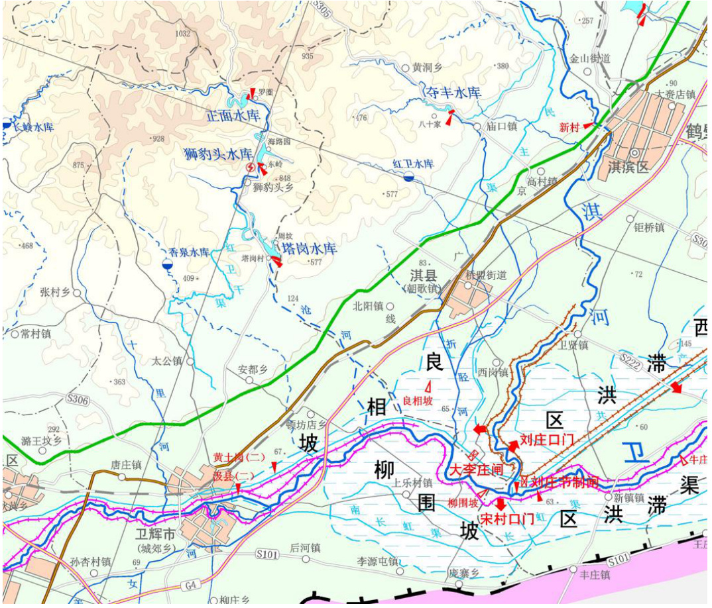  
图 1.1-1  塔岗水库工程位置图  

# 1.1.2 水库建设过程、安全鉴定及除险加固情况  

现状塔岗水库原设计总库容 1786 万 $\mathsf{m}^{3}$ ,兴利库容 954 万 $\mathsf{m}^{3}$ ,设计洪水标准 50 年一遇,校核洪水标准 2000 年一遇。最大坝高 $41\mathsf{m}$ ,防浪墙高 $1.2\mathrm{m}$ (现状 $1.0\mathsf{m}$ )。主要控制建筑物包括主挡水坝、左右副坝、溢洪道、输水洞、坝后电站几部分。  

塔岗水库 1958 年 4 月 6 日开工,在边测量、边备料、边设计、边施工的原则下,7 月 19 日基本完成主坝、左副坝、溢洪道三项主要工程,8 月初开始蓄水。1974 年对主坝输水洞进行改造;“75.8”洪水后对主坝进行加高,坝项高程由原来的 182m 加高至 $185\mathrm{m}$ ,并在主坝右侧山脊缺口处建成右副坝;1981年建成坝后电站;1982 年修建了溢洪道工作桥;1983 年对副坝进行复坝加固。1991 年\~1993 年对左副坝坝基进行除险治漏;1998 年坝后电站开始并网发电。  

2007 年 5 月,河南省水利厅专家组评审并通过了《大坝安全鉴定报告书》,鉴定结论为三类坝。2008 年 1 月 18 日,水利部大坝安全管理中心以坝函[2008]290 号《关于双泉等六座水库三类坝安全鉴定成果的核查意见》,对塔岗水库安全鉴定结果进行了认定,同意三类坝鉴定结论。  

2009\~2011 年,对塔岗水库开始进行除险加固工程。左副坝上游坝坡干砌石贴坡、坝顶路面、防浪墙整修、基础高压喷射防渗墙等;右副坝上有坝坡干砌石贴坡、防浪墙整修、帷幕灌浆等;溢洪道工作桥重建、溢洪道帷幕灌浆及溢洪道扩宽加固工程;主坝坝背坡堆石碾压培厚加固、坝前深勾缝防渗、坝基帷幕灌浆;更新机电设备、完善管理设施。  

2022 年 7 月,卫辉市水利局组织对塔岗水库进行了安全鉴定,《大坝安全鉴定报告书》(2022)大坝安全类别评定为二类坝。  

# 1.1.3 工程概况  

塔岗水库位于沧河流域,为已建中型水库,坝址以上流域面积 $234\mathsf{k m}^{2}$ ,河长 $43.88\ensuremath{\mathrm{km}}$ ,河道平均比降 $9.84\text{\textperthousand}$ 。坝址处多年平均径流量 2925 万 $\mathsf{m}^{3}$ 。  

塔岗水库扩容工程实施后,塔岗水库为Ⅲ等中型工程,水库工程任务为以防洪、灌溉为主,结合卫辉市南水北调受水区备用供水,兼顾发电。水库扩容后,水库死水位 $160\mathrm{m}$ ,死库容 72 万 $\mathsf{m}^{3}$ ,考虑为卫辉市提供应急备用库容636 万 $\mathsf{m}^{3}$ ,水库正常运行最低水位 $174.51\ensuremath{\mathrm{m}}$ ,水库兴利库容 954 万 $\mathsf{m}^{3}$ ,考虑检修备用库容 1060 万 $\mathsf{m}^{3}$ 与兴利、应急备用库容结合,水库正常蓄水位 $184\mathrm{m}$ ,汛限水位 $184\mathrm{m}$ ,水库 50 年一遇防洪库容 5001 万 $\mathsf{m}^{3}$ ,防洪高水位 $207.51\ensuremath{\mathrm{m}}$ 。水库设计洪水标准 100 年一遇,设计洪水位 $207.51\ensuremath{\mathrm{m}}$ ,校核洪水标准 2000 年一遇,校核洪水位 $207.94\mathrm{m}$ ,水库总库容 6787 万 $\mathsf{m}^{3}$ 。  

在现状塔岗水库坝址基础上进行扩容改造,总体布局维持现状水库的工程布局不变,本次扩容的主要建设内容:拆除原挡水建筑物,新建混合坝,包括碾压混凝土重力坝(含泄水、引水建筑物)和左岸黏土心墙堆石坝,坝后电站等建筑物。  

挡水建筑物为混合坝,左岸布置黏土心墙堆石坝段,主河床及右岸为碾压式混凝土重力坝坝段,坝顶全长 $1034.40\ensuremath{\mathrm{m}}$ ,坝顶高程 $209.00\mathrm{m}$ 。混凝土重力坝坝顶长度为 $621.8\mathrm{m}$ ,最大坝高 $68.0\mathrm{m}$ ;左副坝原址拆除新建为黏土心墙堆石坝,坝顶长度为 $412.60\mathrm{m}$ ,最大坝高 $38.0\mathsf{m}$ ;泄水建筑物共布设 3 个泄洪表孔和 2 个泄洪底孔,泄洪表孔每孔净宽为 $12.0\mathrm{m}$ ,共 3 孔,采用 WES 实用堰型,堰顶高程 $192.0\mathrm{m}$ ,底孔坝段设置 2 孔,泄洪底孔孔口尺寸为 $2.5{\times}3.0m$ (宽×高),进口底板高程为 $156.0\mathrm{m}$ 。引水建筑物布置为坝式进水口 $^+$ 坝内埋管的型式,进口底板高程为 $156.0\mathrm{m}$ ,引水压力主管内径 $1.2\mathrm{m}$ 。坝后式电站总装机容量为 0.6MW,装机 3 台。  

工程施工总工期 42 个月。本工程静态总投资 286969.40 万元,其中工程部分投资 182751.72 万元,建设征地移民补偿投资 99675.58 万元,环境保护工程投资 2489.86 万元,水土保持工程投资 2052.24 万元。  

# 1.2 水文  

# 1.2.1 流域概况  

塔岗水库位于沧河流域,为已建中型水库,坝址以上流域面积 $234\mathsf{k m}^{2}$ ,河长 43.88km,河道平均比降 $9.84\text{\textperthousand}$ 。  

沧河属海河流域卫河支流,发源于辉县市拍石头乡北部的玉水池村,临近林州、辉县、卫辉三市边界的交界处,向东流约 20km 是卫辉市的正面水库大坝,继续向南偏东约 7km 是狮豹头(也称石包头)水库大坝,再向南约 13km是塔岗水库大坝,也是沧河的出山口。沧河出山之后进入平原,向南 10km 相继穿过南水北调中线总干渠、G107 国道、京广铁路和京珠高速公路,最后汇入共产主义渠。  

为了充分利用沧河水利资源,减轻洪水威胁,从 20 世纪 50 年代后期开始对沧河进行梯级开发,先后于 1958 年、1967 年、1973 年建成了塔岗、狮豹头(也称石包头)、正面三座中型水库,均在卫辉市境内。各流域特征值见表1.2-1。  

表 1.2-1  各区间流域特征值  

<html><body><table><tr><td>位置</td><td>流域面积F（km²)</td><td>流域主河长L（km)</td><td>干流平均坡降J</td></tr><tr><td>正面水库</td><td>88.5</td><td>18.15</td><td>0.01857</td></tr><tr><td>正、狮区间</td><td>71.5</td><td>17.35</td><td>0.01726</td></tr><tr><td>狮豹头水库</td><td>160.0</td><td>31.49</td><td>0.01010</td></tr><tr><td>狮、塔区间</td><td>74.0</td><td>18.32</td><td>0.01356</td></tr><tr><td>塔岗水库</td><td>234.0</td><td>43.88</td><td>0.00984</td></tr></table></body></html>  

# 1.2.2 气象  

塔岗水库坝址以上流域属暖温带大陆性季风气候,季节分明,干湿悬殊较大。冬春两季雨水稀少,风多干冷,蒸发量大;夏秋两季水汽充沛,雨量集中,降水量占全年的 $70\%$ 左右。根据卫辉市气象站 1961-2022 年气象资料统计,降水量年际变化大,多年平均降水量 $587\mathrm{mm}$ ,最大年降水量(2021 年)达$1433\mathrm{mm}$ ,最小年降水量 176mm(1997 年);多年平均水面蒸发量 1081mm;多年平均气温 $14.3^{\mathrm{\circ}}\mathrm{C}$ ,最高气温 $42.5^{\circ}\mathrm{C}$ ,最低气温- $18.4^{\mathrm{o}}\mathrm{C}$ ;平均风速$2.39\mathrm{m}/\mathsf{s}$ ,最大风速 $18.7\mathrm{m}/\mathsf{s}$ ;冰冻期 12 月 ${\sim}2$ 月,无霜期 4 月 ${\sim}10$ 月。  

# 1.2.3 径流  

沧河流域没有水文观测站点,故没有实测流量资料。查“第三次全国水资源调查评价成果”中“河南省平均年径流深图”,各水库坝址流域年均径流深取值见表 1.2-2,根据流域面积计算得多年平均径流量。  

各区间径流量采用两水库坝址相减计算。根据新村水文站历年径流分配成果计算得各断面历年径流成果,采用 P-Ⅲ频率适线计算各断面设计径流,根据新村水文站历年天然月径流分配成果计算得各断面多年平均逐月径流成。  

# 表 1.2-2 各流域径流成果  

<html><body><table><tr><td>位置</td><td>流域面积（km²)</td><td>多年平均径流深 (mm)</td><td>多年平均径流量（万 m²)</td></tr><tr><td>正面水库</td><td>88.5</td><td>130</td><td>1151</td></tr><tr><td>正、狮区间</td><td>71.5</td><td>125</td><td>894</td></tr><tr><td>狮豹头水库</td><td>160</td><td>128</td><td>2044</td></tr><tr><td>狮、塔区间</td><td>74.0</td><td>119</td><td>881</td></tr><tr><td>塔岗水库</td><td>234.0</td><td>125</td><td>2925</td></tr></table></body></html>  

# 1.2.4 洪水  

本流域内洪水由暴雨形成,其变化受暴雨和地形等因素影响,洪水的时空分布与暴雨一致,暴雨时空分布对本流域峰型影响较大,易形成峰高量大的洪峰。受暴雨特性及流域下垫面综合影响,洪水频次多、量级大,且源短流急,洪水迅猛。暴雨历时一般 3 天左右,强度较大的暴雨常集中在 1 天甚至数小时内。洪水多发生在 ${\tt6}\sim\mathfrak{g}$ 月份,年最大洪峰一般出现在 7 月初至 8 月中旬。  

由于塔岗水库以上流域无实测流量资料,本次设计中采用暴雨法推求设计洪水。首先根据各雨量站实测降雨资料计算各水库及区间流域内设计暴雨值;再根据《河南省中小流域设计暴雨洪水图集(1984 年版)》(以下简称《84图集》)中推理公式法推求设计洪水;再经合理性分析确定最终采用设计洪峰后,推求洪水过程线,进行洪水地区组成计算。  

# (1)设计暴雨  

根据塔岗水库流域内东拴马、狮豹头及塔岗雨量站实测资料插补延长后计算各区域最大 1h、6h、24h 设计暴雨。与《河南省卫辉市塔岗水库除险加固工程初步设计报告》(以下简称《塔岗初设 08》)设计暴雨成果对比,综合分析后从安全角度考虑推荐采用本次计算的设计暴雨成果。成果见表 1.2-3。  

表 1.2-3  各流域短历时设计暴雨对比表  

<html><body><table><tr><td rowspan="2">位置</td><td rowspan="2">类型</td><td rowspan="2">点面折 减</td><td rowspan="2">时</td><td colspan="3">参数</td><td colspan="6">各频率 （%）设计暴雨 (ww)</td></tr><tr><td>段 Ex</td><td>Cv</td><td>CsCv</td><td>0.05</td><td>0.5</td><td>1</td><td>2</td><td>5</td><td>10</td></tr><tr><td rowspan="6">正面水库</td><td rowspan="3">本次计 算</td><td>1</td><td>1h</td><td>37.0</td><td>0.570</td><td>3.5</td><td>176</td><td>128</td><td>113</td><td>98.4</td><td>79.1</td><td>64.5</td></tr><tr><td>1</td><td>6h</td><td>80.0</td><td>0.710</td><td>4.0</td><td>527</td><td>357</td><td>307</td><td>257</td><td>194</td><td>148</td></tr><tr><td>1</td><td>24h</td><td>130</td><td>0.900</td><td>3.5</td><td>1104</td><td>722</td><td>610</td><td>502</td><td>364</td><td>265</td></tr><tr><td rowspan="3">原成果</td><td>0.853</td><td>1h</td><td>43.5</td><td>0.553</td><td>3.5</td><td>170</td><td>124</td><td>110</td><td>96.5</td><td>78.0</td><td>63.9</td></tr><tr><td>0.875</td><td>6h</td><td>86.5</td><td>0.670</td><td>3.5</td><td>438</td><td>306</td><td>267</td><td>228</td><td>178</td><td>140</td></tr><tr><td>0.895</td><td>24h</td><td>135</td><td>0.720</td><td>3.5</td><td>765</td><td>527</td><td>456</td><td>386</td><td>296</td><td>229</td></tr><tr><td rowspan="6">正狮区间</td><td rowspan="3">本次计 算</td><td>1</td><td>1h</td><td>33.0</td><td>0.580</td><td>2.5</td><td>142</td><td>107</td><td>96.2</td><td>85.2</td><td>70.2</td><td>58.6</td></tr><tr><td>1</td><td>6h</td><td>70.0</td><td>0.650</td><td>3.0</td><td>367</td><td>264</td><td>233</td><td>202</td><td>161</td><td>129</td></tr><tr><td>1</td><td>24h</td><td>115</td><td>0.900</td><td>3.5</td><td>976</td><td>639</td><td>540</td><td>444</td><td>322</td><td>235</td></tr><tr><td rowspan="2">原成果</td><td>0.885</td><td>1h</td><td>45.0</td><td>0.545</td><td>3.5</td><td>180</td><td>132</td><td>117</td><td>102</td><td>83.0</td><td>68.3</td></tr><tr><td>0.910</td><td>6h</td><td>84.0</td><td>0.650</td><td>3.5</td><td>426</td><td>300</td><td>262</td><td>225</td><td>176</td><td>140</td></tr><tr><td rowspan="2"></td><td>0.930</td><td>24h</td><td>132</td><td>0.680</td><td>3.5</td><td>723</td><td>504</td><td></td><td>439 375</td><td>291</td><td>228</td></tr><tr><td></td><td>1h</td><td>34.0</td><td>0.500</td><td>3.5</td><td></td><td></td><td></td><td></td><td></td><td></td></tr><tr><td rowspan="5">狮豹头水 库</td><td rowspan="2">本次计 算</td><td>1</td><td></td><td></td><td></td><td></td><td>139</td><td>104</td><td>93.0</td><td>82.1</td><td>67.6</td><td>56.5</td></tr><tr><td>1</td><td>6h</td><td>75.0</td><td>0.680</td><td>4.0</td><td>468</td><td>320</td><td>276</td><td>233</td><td>178</td><td>137</td></tr><tr><td rowspan="2">原成果</td><td>1</td><td>24h</td><td>115</td><td>1.00</td><td>3.5</td><td>1128</td><td>719</td><td>601</td><td>486</td><td>342</td><td>241</td></tr><tr><td>0.802</td><td>1h</td><td>44.0</td><td>0.551</td><td>3.5</td><td>161</td><td>118</td><td>105</td><td>91.5</td><td>74.0</td><td>60.7</td></tr><tr><td></td><td>0.817</td><td>6h</td><td>85.5</td><td>0.660</td><td>3.5</td><td>396</td><td>278</td><td>243</td><td>208</td><td>162</td><td>129</td></tr></table></body></html>  

<html><body><table><tr><td></td><td></td><td>0.843</td><td>24h</td><td>134</td><td>0.710</td><td>3.5</td><td>702</td><td>485</td><td>421</td><td>357</td><td>274</td><td>213</td></tr><tr><td rowspan="7">狮塔区间</td><td rowspan="3">本次计 算</td><td>1</td><td>1h</td><td>31.0</td><td>0.490</td><td>3.0</td><td>118</td><td>90.0</td><td>81.3</td><td>72.5</td><td>60.6</td><td>51.3</td></tr><tr><td>1</td><td>6h</td><td>70.0</td><td>0.650</td><td>3.5</td><td>390</td><td>275</td><td>240</td><td>206</td><td>161</td><td>128</td></tr><tr><td>1</td><td>24h</td><td>110</td><td>1.00</td><td>3.5</td><td>1079</td><td>688</td><td>575</td><td>465</td><td>327</td><td>231</td></tr><tr><td rowspan="2">原成果</td><td>0.883</td><td>1h</td><td>45.0</td><td>0.542</td><td>3.5</td><td>178</td><td>131</td><td>116</td><td>102</td><td>82.6</td><td>68.0</td></tr><tr><td>0.900</td><td>6h</td><td>82.0</td><td>0.650</td><td>3.5</td><td>411</td><td>290</td><td>253</td><td>217</td><td>170</td><td>135</td></tr><tr><td rowspan="2">本次计</td><td>0.922</td><td>24h</td><td>125</td><td>0.660</td><td>3.5</td><td>654</td><td>459</td><td>401</td><td>343</td><td>268</td><td>212</td></tr><tr><td>1</td><td>1h</td><td>33.0</td><td>0.480</td><td>3.5</td><td>129</td><td>97.2</td><td>87.4</td><td>77.5</td><td>64.2</td><td>54.0</td></tr><tr><td rowspan="6">塔岗水库</td><td rowspan="3">算</td><td>1</td><td>6h</td><td>72.0</td><td>0.720</td><td>4.0</td><td>483</td><td>326</td><td>280</td><td>234</td><td>176</td><td>134</td></tr><tr><td>1</td><td>24h</td><td>110</td><td>1.00</td><td>3.5</td><td>1079</td><td>688</td><td>575</td><td>465</td><td>327</td><td>231</td></tr><tr><td>0.765</td><td>1h</td><td>45.0</td><td>0.548</td><td>3.5</td><td>157</td><td>114</td><td>102</td><td>88.9</td><td>72.0</td><td>59.1</td></tr><tr><td rowspan="2">原成果</td><td>0.785</td><td>6h</td><td>85.0</td><td>0.650</td><td>3.5</td><td>372</td><td>262</td><td>229</td><td>196</td><td>154</td><td></td></tr><tr><td>0.815</td><td>24h</td><td>132</td><td>0.680</td><td>3.5</td><td>634</td><td>442</td><td>385</td><td>328</td><td>255</td><td>122 200</td></tr></table></body></html>  

# (2)暴雨时程分配  

本次拟根据狮豹头和塔岗雨量站 1963 年 8 月“63.8”洪水的暴雨过程计算各流域 3 日设计暴雨过程。其中,最大 24h 设计暴雨时程根据《84 图集》推荐的暴雨洪水计算方法分配,见图 3.5-13。其余 48h 设计暴雨量为各频率最大 3 日设计暴雨减去最大 24h 设计暴雨值,时程分配采用狮豹头和塔岗雨量站“63.8”洪水实测暴雨过程进行雨量同倍比缩放计算。  

# (3)设计洪水  

汇流计算采用推理公式法计算洪峰流量,根据各流域最大 3 日设计暴雨过程,采用蓄满产流模型计算各流域设计洪水过程,并统计各流域设计洪水时段洪量。  

将各流域设计洪水成果与《塔岗初设 08》已有成果对比,本次计算采用的设计暴雨较原设计值增大,综合考虑资料系列长短及工程安全性,推荐设计洪水统一采用本次计算成果。各流域洪峰洪量成果见表 1.2-4。  

表 1.2-4  各流域设计洪峰成果对比表  

<html><body><table><tr><td rowspan="2">位置</td><td rowspan="2">类型</td><td rowspan="2">项目</td><td colspan="6">各频率（%）设计值</td></tr><tr><td>0.05</td><td>0.33</td><td>1</td><td>2</td><td>5</td><td>10</td></tr><tr><td rowspan="5">正面水库</td><td rowspan="3">本次计算</td><td>洪峰流量（m3/s)</td><td>3686</td><td>2695</td><td>2145</td><td>1835</td><td>1382</td><td>1014</td></tr><tr><td>最大24h洪量（万 m²）</td><td>7211</td><td>4988</td><td>3710</td><td>2929</td><td>1927</td><td>1244</td></tr><tr><td>最大3日洪量（万 m²)</td><td>8895</td><td>6074</td><td>4466</td><td>3490</td><td>2258</td><td>1420</td></tr><tr><td rowspan="2">《塔岗初设08》</td><td>洪峰流量(m/s)</td><td>3560</td><td></td><td></td><td>1645</td><td></td><td></td></tr><tr><td>最大24h洪量（万 m²）</td><td>6151</td><td></td><td></td><td>2673</td><td></td><td>1266</td></tr><tr><td>正狮区间</td><td>本次计算</td><td>洪峰流量（m3/s)</td><td>2242</td><td>1670</td><td>1324</td><td>1107</td><td>849</td><td>655</td></tr></table></body></html>  

<html><body><table><tr><td rowspan="5"></td><td rowspan="2"></td><td>最大24h洪量（万 m²）</td><td>5022</td><td>3445</td><td>2537</td><td>1983</td><td>1272</td><td>786</td></tr><tr><td>最大3日洪量（万 m²)</td><td>6370</td><td>4252</td><td>3051</td><td>2335</td><td>1439</td><td>848</td></tr><tr><td rowspan="2">《塔岗初设08》</td><td>洪峰流量（m/s)</td><td>3147</td><td></td><td></td><td>1457</td><td></td><td></td></tr><tr><td>最大 24h 洪量（万 m²）</td><td>4662</td><td></td><td></td><td>2059</td><td></td><td>1015</td></tr><tr><td rowspan="4">狮豹头水库</td><td rowspan="3">本次计算</td><td>洪峰流量(m3/s)</td><td>4340</td><td>3150</td><td>2455</td><td>2149</td><td>1621</td><td>1223</td></tr><tr><td>最大24h洪量（万m²）</td><td>11246</td><td>7718</td><td>5688</td><td>4457</td><td>2868</td><td>1862</td></tr><tr><td>最大3日洪量（万m²)</td><td>16174</td><td>10878</td><td>7866</td><td>6051</td><td>3765</td><td>2341</td></tr><tr><td rowspan="2">《塔岗初设08》</td><td>洪峰流量(m/s)</td><td>5095</td><td></td><td></td><td>2277</td><td></td><td></td></tr><tr><td>最大24h洪量（万 m²）</td><td>10144</td><td></td><td></td><td>4336</td><td></td><td>2080</td></tr><tr><td rowspan="5">狮塔区间</td><td rowspan="3">本次计算</td><td>洪峰流量(m3/s)</td><td>2006</td><td>1497</td><td>1213</td><td>1023</td><td>789</td><td>611</td></tr><tr><td>最大24h洪量（万 m²）</td><td>4944</td><td>3381</td><td>2481</td><td>1932</td><td>1229</td><td>789</td></tr><tr><td>最大3 日洪量 （万m²)</td><td>6441</td><td>4297</td><td>3082</td><td>2353</td><td>1442</td><td>876</td></tr><tr><td rowspan="2">《塔岗初设08》</td><td>洪峰流量（m/s)</td><td>3063</td><td></td><td></td><td>1407</td><td></td><td></td></tr><tr><td>最大24h洪量（万m²）</td><td>4336</td><td></td><td></td><td>1931</td><td></td><td>962</td></tr><tr><td rowspan="5">塔岗水库</td><td rowspan="4">本次计算</td><td>洪峰流量(m3/s)</td><td>6151</td><td>4335</td><td>3541</td><td>2916</td><td>2171</td><td></td><td>1586</td></tr><tr><td>最大 24h 洪量 （万m²）</td><td>16226</td><td>11043</td><td>8099</td><td>6296</td><td>4031</td><td></td><td>2636</td></tr><tr><td>最大3日洪量（万m²)</td><td>20468</td><td>13665</td><td>9801</td><td>7493</td><td></td><td>4625</td><td>2894</td></tr><tr><td>洪峰流量(m?/s)</td><td>6464</td><td></td><td></td><td>2846</td><td></td><td></td><td></td></tr><tr><td rowspan="2">《塔岗初设08》</td><td>最大24h洪量（万m²）</td><td>13221</td><td></td><td></td><td>5803</td><td></td><td></td><td></td></tr><tr><td></td><td></td><td></td><td></td><td></td><td></td><td></td><td>2761</td></tr></table></body></html>  

# (4)洪水地区组成  

塔岗水库上游存在正面水库和狮豹头水库两座中型水库,将塔岗以上流域分为正面水库、正狮区间、狮豹头水库、狮塔区间及塔岗水库 5 个区域,采用同频率洪水组成法计算洪水地区组成。各流域洪水组成成果见图 1.2-1。  

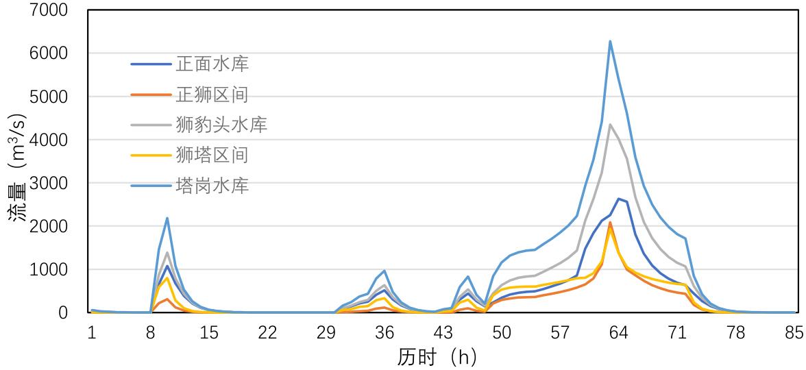  
图 1.2-1  各流域洪水组成成果图(同频率法 $0.05\%$ )  

# 1.2.5 泥沙  

塔岗水库控制流域面积 $234\mathsf{k m}^{2}$ ,上游有正面水库和狮豹头水库,狮豹头水库控制流域面积 $160\mathsf{k m}^{2}$ ,区间面积 $74\mathsf{k m}^{2}$ 。正面水库和狮豹头水库实际运行未排沙,故塔岗水库仅有区间面积泥沙入库。  

所在流域内无实测泥沙资料,查算 1984 年《河南省地表水资源》附图,水库控制流域内悬移质多年平均年输沙模数约 $200{\sim}500\mathrm{t}/\mathrm{km}^{2}$ 。综合考虑上游植被覆盖情况,本次计算悬移质多年平均年输沙模数取 $200\mathsf{t}/\mathsf{k m}^{2}$ 。悬移质泥沙容重取 $1.3\mathrm{t}/\mathrm{m}^{3}$ ,推移质容重取 $1.5\mathrm{t}/\mathsf{m}^{3}$ ;推悬比取 $20\%$ 。  

综上,计算得年均悬移质入库沙量为 1.48 万 t,折合 1.14 万 $\mathsf{m}^{3}$ ;年均推移质入库沙量为 0.30t,折合 0.20 万 $\mathsf{m}^{3}$ ;故年均入库沙量为 1.78 万 t,折合1.34 万 $\mathsf{m}^{3}$ 。  

# 1.3 工程地质  

# 1.3.1 区域地质  

本区地处太行山东南麓与华北平原西缘的接壤地带,主要出露寒武系、奥陶系、第三系和第四系地层,中生代地层缺失,前寒武系地层出露较少,有小面积的岩浆岩发育。地质构造比较复杂,构造形迹以断裂为主,褶曲不很发育,各类断裂力学性质复杂。  

工程区位于一级构造单元中朝准台地(Ⅰ)之二级构造单元山西台隆(Ⅰ1)之三级构造单元太行山拱断束(Ⅰ11)。根据《中国地震动参数区划图》(GB18306-2015),工程区Ⅱ类场地 50 年超越概率 $10\%$ 的地震动峰值加速度为 0.20g,相应地震烈度为Ⅷ度区;地震反应谱特征周期为 0.40s。  

工程场区发育有活动性断裂—汤西断裂,距塔岗水库约 4km。初步分析本区区域构造稳定性较差。依据《水电工程区域构造稳定性勘察规程》(NB/T35098-2017)的分级标准,区域构造稳定性较差。  

# 1.3.2 水库区工程地质  

塔岗水库位于沧河的出山口处,属低山地貌类型,地势起伏大,库区段河谷呈不对称的宽“U”型河谷。分布地层主要为太古界(Arog)变质岩,寒武系下统馒头组(∈1m)沉积岩和第四系松散覆盖层(Q)。水库区未发现有大规模的断裂构造发育,地层为单斜构造,中高角度裂隙较发育。  

地形封闭性好,基本不存在邻谷渗漏的问题。库底为片麻岩,库水淹没线以下库岸为灰岩夹泥岩、砂岩等,岩溶不发育,岩体整体渗透性不强,初步分析认为水库区发生永久渗漏的可能性不大。库岸基本为产状较缓的硬质岩的岩石边坡,库岸边坡整体稳定较好。水库库周无大面积地形平缓地带,对邻近正常蓄水位的民房产生浸没问题,主要表性为生态环境恶化。库尾原沧河河道内为人造耕地会发生浸没问题,浸没面积大约为 $0.009\mathrm{km}^{2}$ 。库区无活动性断裂穿过,水库发生诱发地震的可能性不大。  

# 1.3.3 坝址区工程地质  

(1)下坝址  

坝址区河谷开阔,基岩以太古界(Arog)角闪片麻岩为主,右坝肩中上部分布更长斑岩(K2L)、白云质灰岩(∈1z)。右岸阶地处覆盖层较厚。基岩为单斜构造,主要构造形迹为节理。  

下坝址河谷开阔,覆盖层厚度不一,适宜混合坝型。覆盖层可满足当地材料坝的建议要求,具有强透水性和渗透变形问题,需要采取防渗措施。弱风化片麻岩可满足混凝土重力坝建基要求,坝基发生深层滑动可能性不大;浅表层岩体具有一定的渗透性,需要采取防渗措施。  

左坝肩单薄山脊存在渗漏问题,右坝肩存在绕坝渗漏问题,需要采取防渗措施。左坝肩单薄山脊靠上游侧边坡稳定不良。右坝肩工程边坡为顺向坡,边坡整体稳定性不良。  

(3)坝址初步比选  

两个坝址地形地质条件各有优劣,均具备建坝的地形地质条件。  

原坝址  

坝址区属低山地貌类型,河谷开阔,呈宽“U”型河谷。坝址区河谷宽约670m。地层主要有太古界(Arog)角闪片麻岩、二长片麻岩,燕山晚期闪长玢岩(K1T)和第四系松散覆盖层(Q)。坝址区地质构造形迹主要为节理裂隙,且以高角度裂隙为主。  

坝址区河谷开阔,覆盖层厚度差异性大,采用混合坝型适宜性更好。其中左侧古河道段覆盖层深厚,不适宜混凝土重力坝的建设条件,当地材料坝坝型适宜性更好。  

左副坝段坝基为低液限黏土( $\mathsf{Q}_{2}\mathsf{a l p}$ ),具有中等压缩性,渗透性为弱透水性。该层土体可作为当地材料坝坝基。原溢洪道和主坝段可选择弱风化\~微新片麻岩作为混凝土重力坝坝基,基本不存在坝基深层抗滑问题。左坝肩可选择弱风化的白云石灰岩和闪长玢岩作为混凝土重力坝坝基,基岩层面较缓,可能存在沿层面滑动问题,可以采取固结灌浆处理措施。  

左副坝的砾岩( ${\mathsf{Q}}_{1}{\mathsf{p}}|$ )、原溢洪道左端与左副坝衔接段、右副坝及右坝肩的侵入接触带存在中等\~强透水性,需要加强防渗措施。其余坝段浅表层基岩具有一定渗透性,可是适当设防。左坝肩不存在绕坝渗漏问题,右坝肩存在绕坝渗漏问题。两坝肩山体自然边坡和工程边坡整体稳定较好。  

电站场区覆盖层厚度不大,可选择片麻岩作为地基。基坑开挖过程存在边坡稳定问题和基坑排水问题。尤其右侧倾向河道侧边坡为顺向坡,稳定性不良,需要加强支护。  

上下游围堰可选在覆盖层作为地基,覆盖层具有强透水性,建议结合堰体整体采取防渗措施。防渗范围进入基岩一定深度即可。  

导流明渠地基和边坡绝大部分均位于覆盖层中,仅出口段底板为强风化基岩。覆盖层和强风化基岩具有强透水性和抗冲刷能力差,需要采取防护措施。明渠开挖存在边坡稳定问题,需要采取防护措施。  

# 1.3.4 天然建筑材料  

工程周边天然砂砾料匮乏。库区左岸阶地布置为土料场,土料作为一般防渗料粘粒含量满足规程技术要求;塑性指数基本满足规程指标要求,试验指标略低于要求;渗透性满足规程指标要求;有机质含量略高于规程指标要求;水溶盐含量满足规程指标要求;含水率高于规程指标要求,施工时需要采取晾晒措施。有用层储量为 $40.00\times10^{4}m^{3}$ ,无用层体积为 $6.12\times10^{4}\mathrm{m}^{3}$ 。土料场距坝址区运输距离约 $2.0{\sim}2.5\mathrm{km}$ ,开采运输条件良好。  

石料场布置在库尾李沿沟桥附近沧河右岸的山体上。作为砌石料和混凝土人工骨料料源,白云岩、鲕状白云岩软化系数基本满足技术指标质量要求,白云质灰岩基本不满足要求,薄层状白云岩不满足要求。考虑到饱和抗压强度较高,该料场可以作为堆石料、砌石料和混凝土人工骨料料源。  

料场有用层储量约为 $495.75\times10^{4}\mathrm{m}^{3}$ ,无用层体积为 $3.98\times10^{4}\mathsf{m}^{3}$ ,剥采比约 1:124。开采范围还可向外围扩展,储量丰富。料场后边坡整体稳定性好,开挖形成高边坡,需要采取放坡或防护措施。石料场开采运输条件良好。  

# 1.4 工程任务和规模  

# 1.4.1 工程建设必要性和任务  

# 1.4.1.1 工程建设必要性  

(1)是应对极端天气,提高防洪调度水平的需要  

全球气候变暖背景下,我国极端天气气候事件多发频发,高温、暴雨、洪涝、干旱等自然灾害易发高发。2021 年 7 月、2023 年 7 月海河流域均发生了较大洪水,对防洪基础设施的要求也越来越高。塔岗水库现状泄洪设施为开敞式溢洪道,无闸门控制,无法对洪水进行调度,水库自身调度灵活性较差。塔岗水库扩容后,改造溢洪道并增设泄洪闸,增加防洪库容,在保障下游防洪安全的同时,可以有效提高水库整体调洪能力,增强水库调度的灵活性。  

# (2)是完善区域防洪格局的需要  

卫河流域淇门以上流域面积 $8525.2\mathrm{km}^{2}$ ,其中山区面积占 $76\%$ 。洪水总量约占卫河总量的 $85\%$ ,卫河干流淇门至老观嘴规划行洪能力 $2000\mathrm{m}^{3}/\mathsf{s}$ ,其中卫河淇门至老观嘴行洪 $400\mathrm{m}^{3}/\mathsf{s}$ ,共产主义渠淇门至老观嘴行洪 $1600\mathrm{m}^{3}/\mathsf{s}$ ;老观嘴至安阳河口河道行洪 $2000\mathrm{m}^{3}/\mathsf{s}$ ,安阳河口至徐万仓河道行洪 $2500\mathrm{m}^{3}/\mathsf{s}$ 。以上洪水安排均基于流域内良相坡等蓄滞洪区运用条件。  

良相坡位于淇河下游右侧,塔岗水库所在沧河也同时汇入良相坡。当淇河右岸阎村口门水位超过 $67.90\mathrm{m}$ 时,阎村口门自然漫溢,洪水进入良相坡;当共产主义渠黄土岗水文站水位超过 $68.00\mathrm{m}$ 时,刘庄闸以上共产主义渠左岸自然漫溢,洪水进入良相坡。当沧河京广铁路桥下游洪水位超过 76.20m 或思德河狐仙庙桥下游水位超过 $65.50\mathrm{m}$ 时,洪水进入良相坡。  

“21·7”洪水给流域内人民群众财产造成了巨大损失,漳卫河系受灾较为严重,蓄滞洪区最大滞蓄水量 8.73 亿 $\mathsf{m}^{3}$ ,淹没面积 $384\mathsf{k m}^{2}$ ,河南卫辉市等 13个城镇受淹,大量基础设施损毁,农作物大面积受灾,受灾人口约 423 万人,转移人口约 82 万人,直接经济损失约 551 亿元。  

蓄滞洪区的安排是迫于现状流域防洪布局不完善的无奈之举。随着蓄滞洪区内人民对美好生活的向往越来越迫切,蓄滞洪区的启用安排应得到充分的重视。按照“上蓄、中疏、下排、有效治洪”的原则,随着塔岗水库扩容工程的实施,遇 5 年一遇洪水时,塔岗水库可拦蓄洪量 1190 万 $\mathsf{m}^{3}$ ,遇 20 年一遇洪水时,塔岗水库可拦蓄洪量 3331 万 $\mathsf{m}^{3}$ ,遇 50 年一遇洪水时,塔岗水库可拦蓄洪量 5001 万 $\mathsf{m}^{3}$ ,可以有效降低良相坡启用后的淹没损失,对于完善流域防洪  

布局具有重要作用。  

# (3)是提高卫辉市防洪安全水平的需要  

卫辉市地理位置特殊,卫辉市塔岗水库下游涉及 5 个乡镇,人口 7 万人,耕地面积 15 万亩。同时建有南水北调中线总干渠、京广铁路、京港澳高速等重要设施,对于卫辉市乃至南水北调总干渠受水区等经济社会发展十分重要,沧河发生较大洪水不仅对卫辉市沧河下游境内造成重大影响,还有可能影响重要设施的安全运行。  

塔岗水库防洪能力工程实施后,可将下游沧河河道防洪能力由现状的不足10 年一遇提高到 20 年一遇,水库扩容对于提高卫辉市防洪安全水平,促进经济社会高质量发展具有重要意义。  

# (4)是提高区域供水安全保障的需要  

随着卫辉市地下水压采的实施,卫辉市城乡生活及工业水大部分将依靠南水北调中线外调水源满足用水需求源。然而随着用水需求不断增加,供水范围也在进一步扩大,且由于水质好,卫辉市对中线水源的依赖程度越来越高。南水北调中线总干渠渠线在河南境内穿越四大流域,11 座省辖市、7 座县级市、25 座县城。渠道总长 731km,建筑物 282 座,一旦发生紧急事故或需要进行检修时,事故渠段下游的供水将无法保障,同时,南水北调中线存在冰期输水减量运行、汛期输水受洪水威胁等不利因素,存在一定的供水风险隐患。另一方面,由于南水北调中线通过总干渠向受水区直供水,不具备调蓄水库和总干渠之间相互调配的条件,在南水北调来水不足的情况下,没有足够的调蓄能力满足下游城市的用水需求,同样可能引起供水保障程度的降低。  

考虑南水北调中线可能存在的供水风险隐患,结合塔岗水库防洪能力提升工程,为塔岗水库增设一定的备用库容,在南水北调中线检修、事故或者调蓄能力不足时,塔岗水库启用备用库容以满足供水缺口,对于提高卫辉市的供水安全保障水平是十分必要的。  

塔岗水库按照预留考虑中线检修及应急停水两种工况,与兴利库容结合,预留备用库容。考虑 90 天应急备用,压缩用水需求,预留备用库容 636 万 $\mathsf{m}^{3}$ ,考虑 90 天检修备用,需预留库容 1060 万 $\mathsf{m}^{3}$ ,考虑应急与检修以及兴利库容的结合,塔岗水库用于备用及灌溉的总库容为 1690 万 $\mathsf{m}^{3}$ ,可以满足备用等用水需求。考虑到沧河径流的时空分布严重不均,备用库容的设置可以有效利用沧河雨洪资源,实现本地水资源的高效利用。  

# 1.4.1.2 工程任务  

根据必要性分析,本次对结合塔岗水库防洪能力提升,对塔岗水库进行扩容,通过增加备用库容,为卫辉市南水北调中线受水区提供备用水源,通过增加防洪库容,提高下游沧河两岸防洪标准,降低良相坡滞洪区启用频率及启用后的淹没损失,提升区域防洪能力,并为整个漳卫河系优化防洪工程布局、提高防洪安全保障水平创造条件。塔岗水库扩容后,工程任务为“以防洪、灌溉为主,结合卫辉市南水北调受水区备用供水,兼顾发电。”  

# 1.4.2 设计水平年和设计保证率  

根据资料情况及水文资料分析,本工程现状水平年取 2023 年,结合《海河流域防洪规划(修编)》总体要求,根据经济社会发展要求以及塔岗水库扩容工程工期安排,与国民经济发展计划一致,设计水平年取 2035 年。  

根据《灌溉与排水工程设计标准》GB50288,对于干旱或水资源紧缺地区的地面灌溉,如果作物种类以旱作为主时,灌溉设计保证率取值范围$50\%{\sim}75\%$ 。  

沧河水库现状灌区沧河灌区面积 11.2 万亩(其中香河水库灌区 1.2 万亩),位于河南省豫北地区,区域和亩均水资源量均低于全国平均水平。且按国际公认的人均 $500\mathsf{m}^{3}$ 为严重缺水边缘标准,本区域属于严重缺水地区。根据《水利水电工程等级划分及洪水标准》(SL252-2017)属于中型灌区。根据现状调查和涉及县市农业发展规划,未来灌区内仍然以种植小麦、玉米等旱作作物为主。综合考虑以上因素,参照《灌溉与排水工程设计标准》及临近灌区,沧河灌区农业灌溉设计保证率为 $75\%$ 。  

# 1.4.3 防洪  

# (1)防洪保护对象和防洪标准  

塔岗水库主要防洪保护对象为坝址下游沧河两岸的村镇和耕地,同时可减轻下游良相坡等蓄滞洪区的进洪量和启用几率,对南水北调中线、京广铁路、京港澳高速公路、高速铁路等一系列重要区域和基础设施的防洪有积极作用。  

塔岗水库下游沧河两岸共涉及卫辉市 5 个乡镇,人口 7 万人,耕地面积 15万亩。根据《防洪标准》的要求,结合水库经济合理性论证,本次沧河两岸防洪标准采用 20 年一遇。  

(2)防洪控制断面及安全泄量  

卫河淇门以上流域面积为 $8525\mathsf{k m}^{2}$ ,塔岗水库控制流域面积仅占淇门断面的 $2.7\%$ ,沧河经过治理后,大部分河段过流能力达到约 10 年一遇,但沧河入自京港澳高铁后基本进入平原区,河道束窄严重,过流能力有限。本阶段初拟塔岗水库防洪控制断面在汇入共渠前断面,沧河南北支分支后,两支合计现状过流能力仅有 $200\mathrm{m}^{3}/\mathsf{s}$ 。因此,本次防洪控制断面安全泄量暂按 $200\mathrm{m}^{3}/\mathsf{s}$ 。  

# (3)防洪布局方案分析  

考虑到沧河流域总面积较小,且山区与平原区处于同一雨区,从工程安全角度出发,本次设计按照山区洪水与平原涝水同频率遭遇的情况进行考虑。考虑留有安全裕度,塔岗水库满足下游自身防洪保护对象的调度原则初拟为:5年一遇控泄 $150\mathrm{m}^{3}$ /s,10 年一遇控泄 $120\mathrm{m}^{3}/\mathsf{s}$ ,20 年一遇控泄 $100\mathrm{m}^{3}/\mathsf{s}$ 。根据《卫河淇门以上区域防洪布局专题研究》,塔岗水库从控泄 $150\mathrm{m}^{3}/\mathsf{s}$ 调整为控泄 $80\mathsf{m}^{3}/\mathsf{s}$ ,5 年一遇防洪库容由 886 万 $\mathsf{m}^{3}$ 调整为 1131 万 $\mathsf{m}^{3}$ 。在水库满足自身防洪需求方案的基础上,通过优化塔岗水库 5 年一遇调度运行方式可以保障在发生 638、217 典型 5 年一遇洪水时,良相坡(沧河汇口以上)蓄滞洪区的启用标准从 3 年一遇提高到 5 年一遇,因此,推荐塔岗水库调度运行方式为5 年控泄 $80\mathsf{m}^{3}/\mathsf{s},10$ 年控泄 $120\mathrm{m}^{3}/\mathsf{s}$ ,20 年控泄 $100\mathrm{m}^{3}/\mathsf{s}$ 。水库防洪调度采用固定泄量法。  

结合下游防洪及流域层面防洪需求分析,共拟定 2 个防洪库容方案:  

方案 1:塔岗水库的防洪任务考虑 5 年一遇小洪水减少良相坡启用频率及20 年一遇防洪标准内的沧河两岸保护对象,超过 20 年一遇洪水,水库不控泄。  

方案 2:塔岗水库的防洪任务为考虑 5 年一遇小洪水减少良相坡启用频率及 20 年一遇防洪标准内的沧河两岸保护对象基础上,兼顾流域河系层面防洪需求,下游沧河两岸保护对象防洪标准为 20 年一遇,坝址发生 $_{20\sim50}$ 年一遇洪水时,水库按照一定的调度原则控泄至最大防洪库容约 5000 万 $\mathsf{m}^{3}$ ,超过相应防洪高水位后,水库敞泄。。  

2 个方案的地质条件基本相当,工程永久淹没损失一致,方案 2 增加了临时淹没损失,工程投资有所增加,但同步考虑思德河扩建夺丰水库,再使良相坡蓄滞洪区启用标准可基本从 3 年一遇提高到 5 年一遇的基础上,进一步减少50 年一遇洪水各蓄滞洪区的淹没损失。从优化流域层面防洪布局角度,推荐塔岗水库防洪库容扩容至 5000 万 $\mathsf{m}^{3}$ 的方案。  

# (4)防洪效果  

在 63.8 典型设计洪水条件下,沧河发生 5 年一遇设计洪水时,塔岗水库滞洪后,至 G107 以下,沧河两岸淹没面积约 $2.5{\mathrm{km}}^{2}$ ,平均淹没水深约 $0.49\mathsf{m}$ ,淹没对象主要包括顿坊乡店小双村、清水河村,淹没耕地约 3000 亩,涉及人口约 1000 人,其中清水河村大部分位于良相坡内;沧河发生 10 年一遇设计洪水时,沧河两岸淹没面积约 $14.57\ensuremath{\mathrm{km}^{2}}$ ,平均淹没水深约 $1.24\mathrm{m}$ ,淹没范围进一步扩大至顿坊店乡、黄庄村、水屯村,淹没耕地 2 万亩,涉及人口约 4000 人;20 年一遇设计洪水时,沧河两岸淹没面积约 $17.9\mathsf{k m}^{2}$ ,平均淹没水深约 $1.75\mathrm{m}$ ,淹没耕地约 4 万亩,人口约 1 万人;50 年一遇设计洪水时,沧河两岸淹没面积约 $18.96\mathsf{k m}^{2}$ ,平均淹没水深约 $1.97\mathrm{m}$ 。  

塔岗水库扩容后,发生 5 年及 10 年一遇设计洪水时,沧河两岸均不发生漫溢;由于共渠顶托及漫溢,20 年一遇设计洪水时,沧河两岸良相坡淹没面积约 $6.59\mathsf{k m}^{2}$ ,平均淹没水深约 $1.2\mathrm{m}$ ;50 年一遇设计洪水时,沧河两岸淹没面积约 $9.77\mathsf{k m}^{2}$ ,平均淹没水深约 $1.2\mathrm{m}$ 。  

# 1.4.4 供水  

塔岗、正面、狮豹头 3 座水库联合供水,总兴利库容达到约 3100 万 $\mathsf{m}^{3}$ ,根据 1956-2016 年长系列径流资料,塔岗多年平均年径流量为 2570 万 $\mathsf{m}^{3}$ ,整体库容系数达到了 1.2,基本再无增加常规兴利库容的需要。同时,由于径流衰减,现有工程体系下,经长系列调算,塔岗水库现有兴利库容充足,长系列年份中,仅有部分年份可蓄至正常蓄水位,进一步提高正常蓄水位对供水的影响几乎没有。考虑到沧河来水年际变化,从充分利用雨洪资源的角度出发,塔岗水库维持现有兴利库容 954 万 $\mathsf{m}^{3}$ 。  

卫辉市为中线供水区,目前由于中线无合适的末端调蓄工程,一旦发生问题,将对供水造成巨大影响。本次考虑为卫辉中线供水区提供 3 个月备用供水能力,备用库容 656 万 $\mathsf{m}^{3}$ 。  

# 1.4.5 建设规模  

塔岗水库 50 年泥沙淤积高程为 $156.34\mathrm{m}$ ,考虑进水口布置要求,死水位初拟为 $160\mathrm{m}$ ,相应库容为 72 万 $\mathsf{m}^{3}$ ;结合水库兴利任务复核情况,塔岗水库兴利库容基本维持现有兴利库容不变,为 952 万 $\mathsf{m}^{3}$ ,考虑 90 天应急备用库容636 万 $\mathsf{m}^{3}$ ,考虑 90 天检修备用库容 1060 万 $\mathsf{m}^{3}$ ,考虑应急备用、兴利以及检修备用相结合(以兴利库容与应急备用库容之和、检修备用库容两者取大值作为推荐的塔岗水库兴利库容),水库所需兴利库容对应正常蓄水位为 $184\mathrm{m}$ ;按照防洪需求分析,考虑最大可能降低良相坡启用后的淹没损失,塔岗水库 20年一遇防洪库容 3331 万 $\mathsf{m}^{3}$ ,相应防洪高水位为 $201.32\mathrm{m}$ ,50 年一遇防洪库容 5001 万 $\mathsf{m}^{3}$ ,相应防洪高水位 $207.51\ensuremath{\mathrm{m}}$ 。  

# 1.5 节水评价  

# 1.5.1 节水评价范围  

塔岗水库工程任务以防洪、灌溉为主,结合卫辉市南水北调受水区备用供水,兼顾发电。灌溉范围为沧河灌区,设计灌溉面积 5 万亩;经复核,由于塔岗水库无增加供水能力,不新增村镇供水任务,仅作为卫辉市备用水源,备用供水范围为卫辉市。  

按照水利部印发的《水利建设项目节水评价编制规程》(SL/T 834—2014)要求,节水评价范围应包括水资源开发利用建设项目的供水区域,必要时宜结合工程的规划范围适当扩大节水评价范围。确定本工程节水评价范围为卫辉市。  

# 1.5.2 现状供用水节水水平评价  

从用水端来看,现状年 2023 年沧河灌区塔岗片区用水量 1236 万 $\mathsf{m}^{3}$ 。塔岗灌区农田实灌亩均用水量为 $247\mathrm{m}^{3}/$ 亩。研究范围沧河灌区农田灌溉亩均用水量高于全省和新乡市平均值。  

根据取水许可证(许可证号:C410781S2021-0061),灌区可用水库水量1800 万 $\mathsf{m}^{3}$ ,其中塔岗水库取水指标 700 万 $\mathsf{m}^{3}$ 。地下水取水许可 1860 万 $\mathsf{m}^{3}$ ,其中塔岗灌片地下水可取水量 920.9 万 $\mathsf{m}^{3}$ 。现状年沧河灌区塔岗片区供水量1078 万 $\mathsf{m}^{3}$ ,其中水库供水量 658 万 $\mathsf{m}^{3}$ ,地下水供水量 420 万 $\mathsf{m}^{3}$ ,水库供水量和地下水供水量均低于取水许可中可取水量。  

# 1.5.3 农业节水潜力分析  

沧河灌区塔岗水库灌溉范围设计水平年灌溉面积 5 万亩,多年平均亩均净用量为 $178\mathrm{m}^{3}/$ 亩,沧河灌区内塔岗干渠片区已于 2023 年进行了衬砌或更换塑料管道,灌溉水利用系数已达到 0.72,农业基本无节水潜力。  

# 1.5.4 节水目标与指标  

根据《河南省“十四五”水安全保障和水生态环境保护规划》,全省用水总量控制在 292.47 亿 $\mathsf{m}^{3}$ 以内,农田灌溉水有效利用系数提高到 0.630,水资源配臵工程体系更加完善,新增供水能力 17.0 亿 $\mathsf{m}^{3}$ ,省辖市基本建成应急备用水源,农村自来水普及率达到 $93\%$ ,耕地灌溉面积达到 8100 万亩。  

农田灌溉水有效利用系数要按照灌区面积(大中小型)和灌溉方式(井灌、喷微、滴灌)的不同,符合 GB/T 50363《节水灌溉工程技术标准》、水利部印发的灌溉定额标准、河南省灌溉定额标准要求。  

现状年沧河灌区塔岗片区已实施节水改造,现状灌溉水利用系数已达到0.72,已达到相关规划及规范提出的要求,节水指标具有较好的可达性。  

# 1.5.5 水资源配置方案节水符合性分析  

目前沧河灌区塔岗片区现状灌溉水源为塔岗水库和地下水,根据取水许可,塔岗水库取水指标 700 万 $\mathsf{m}^{3}$ ,地下水可供水量 920.9 万 $\mathsf{m}^{3}$ 。根据供需分析设计水平年 2035 年,塔岗水库多年平均出库供水量为 574 万 $\mathsf{m}^{3}$ ,地下水供水量515 万 $\mathsf{m}^{3}$ ,现状供水水源水量能够满足该片区用水需求。因此设计水平年沧河灌区塔岗水库片区供水水源仍为塔岗水库和地下水。  

配置成果符合“以水定城、以水定地、以水定人、以水定产”的要求,塔岗水库受水区水资源配置方案充分考虑现有水利工程及在建、规划水利工程。设计水平年已充分考虑了现有水源的利用,体现了节水的要求,水资源配置方案合理。  

# 1.5.6 节水措施方案及节水效果评价  

要从用水环节、供水环节、节水引导机制三方面制定节水方案,加强节水监督考核管理的作用,同时建立合理的水价管理体系,多措并举,为节水提供保障。  

沧河灌区内塔岗干渠片区已于 2023 年实施了沧河灌区续建配套与节水改造,灌溉水利用系数已达到 0.72。  

# 1.6 工程布置和建筑物  

# 1.6.1 工程等别和标准  

# 1.6.1.1 工程等别  

本工程的主要任务是提高塔岗水库的防洪能力。提升后工程总库容 0.68 亿$\mathsf{m}^{3}$ ,确定塔岗水库工程等别为Ⅲ等,工程规模为中型。  

# 1.6.1.2 建筑物级别  

塔岗水库工程主要建设内容:拆除原挡水建筑物,新建混合坝,包括碾压混凝土重力坝(含泄水、引水建筑物)和左岸黏土心墙堆石坝,坝后电站等建筑物。  

根据《水利水电工程等级划分及洪水标准》(SL252-2017)的规定,确定水库工程的主要建筑物挡水建筑物、泄水建筑物、引水建筑物、消能防冲建筑物等级为 3 级。水电站发电厂房装机容量为 0.6MW,小于 10MW,其主要建筑物级别为 5 级。  

主要建筑物级别见表 1.6-1。  

表 1.6-1  主要建筑物级别  

<html><body><table><tr><td>序号</td><td>建筑物名称</td><td>建筑物级别</td><td>备注</td></tr><tr><td>1</td><td>挡水建筑物</td><td>3</td><td rowspan="3">SL252-2017</td></tr><tr><td>2</td><td>泄水建筑物</td><td>3</td></tr><tr><td>3</td><td>引水建筑物</td><td>3</td></tr><tr><td>4</td><td>黏土心墙堆石坝</td><td>3</td><td rowspan="2">SL252-2017</td></tr><tr><td>5</td><td>电站厂房及开关站</td><td>5</td></tr></table></body></html>  

依据《水利水电工程边坡设计规范》(SL386-2007)的规定,确定水库大坝两岸坝肩永久边坡级别为 3 级,电站永久边坡级别为 5 级。  

# 1.6.1.3 洪水标准  

塔岗水库为Ⅲ等中型工程,拦河坝建筑物级别为 3 级,依据《防洪标准》(G 塔岗水库为Ⅲ等中型工程,拦河坝建筑物级别为 3 级,依据《防洪标准》(GB50201-2014)和《水利水电工程等级划分及洪水标准》(SL252-2017)表 5.2.1 的规定。  

本次扩建增容工程主要任务为提高塔岗水库的防洪能力,洪水标准按照同级别上限选取;挡水坝段是由碾压混凝土重力坝和黏土心墙堆石坝组成的混合坝,根据《水利水电工程等级划分及洪水标准》(SL252-2017)表 5.2.3 的规定,采用土石坝和混凝土坝混合坝型时,其洪水标准取土石坝的洪水标准。综上,提升后塔岗水库设计洪水标准为 100 年一遇,校核洪水标准为 2000 年一遇。  

主要建筑物洪水标准见表 1.6-2。  

表 1.6-2 水库工程主要建筑物洪水标准选用表  

<html><body><table><tr><td rowspan="2">坝型</td><td rowspan="2">建筑物名称</td><td rowspan="2">建筑物级别</td><td>设计</td><td>校核</td></tr><tr><td>洪水重现期 (年)</td><td>洪水重现期 (年)</td></tr><tr><td rowspan="3">混凝土重力坝</td><td>大坝</td><td>3</td><td>100</td><td>2000</td></tr><tr><td>电站厂房</td><td>5</td><td>20</td><td>50</td></tr><tr><td>消能防冲设施</td><td>3</td><td>30</td><td></td></tr><tr><td>黏土心墙堆石坝</td><td>大坝</td><td>3</td><td>100</td><td>2000</td></tr></table></body></html>  

# 1.6.1.4 地震烈度  

根据《中国地震动峰值加速度区划图》(GB18306-2015),本工程区基本地震动峰值加速度(50 年超越概率 $10\%$ )为 $0.29$ ,相应地震基本烈度为Ⅷ度。工程设计地震烈度采用Ⅷ度。  

# 1.6.1.5 工程合理使用年限  

塔岗水库工程等别为 III 等,确定本工程的合理使用年限为 50 年。各水工建筑物的合理使用年限见表 1.6-3。  

表 1.6-3  建筑物的合理使用年限  

<html><body><table><tr><td>建筑物名称</td><td>建筑物级别</td><td>使用年限 (年)</td></tr><tr><td>挡水建筑物</td><td>3</td><td>50</td></tr><tr><td>引水建筑物</td><td>3</td><td>50</td></tr><tr><td>泄水建筑物</td><td>3</td><td>50</td></tr><tr><td>消能防冲建筑物</td><td>3</td><td>50</td></tr><tr><td>发电建筑物</td><td>5</td><td>30</td></tr></table></body></html>  

# 1.6.2 坝址比选  

(1)建坝河段选择  

塔岗水库扩建增容工程的工程任务“以防洪、灌溉为主,结合卫辉市南水北调受水区备用供水,兼顾发电。”根据规模研究初拟原址重建加高或移址建坝,适宜建坝河段影响如下 1)建坝位置越靠近下游出山口,越能控制更多的集水面积,原坝址基本位于沧河出山口位置,原坝址上游 500 米处为沧河两条一较大支流汇合处,坝址选择汇合处以下能够最大程度控制区域洪水。2)塔岗水库上游至狮豹头水库河段沿河分布大小村镇,其中狮豹头乡为较大型场镇,应避免建设征地及移民搬迁对狮豹头乡影响,土地征收范围线不包括狮豹头乡。  

3)原坝址下游 200m 为沧河出山口位置,下游地形逐渐开阔,河道变宽,地势相应平缓,且地形存在缺口,无法形成封闭库区。通过现场实地踏勘,根据坝址区地形地貌条件,本阶段结合河段的河流走势、地形地质条件、库容条件以及移民和淹没影响等,在上述河段拟定了原坝址和下两个坝址进行比选。  

原坝址:位于沧河两股支流的交汇处。坝址区属丘陵地貌类型,河流两岸为低山,坝址区河谷宽约 $670\mathrm{m}$ 。主河道地面高程约 $150\mathrm{m}$ 。两岸山体不对称,右坝头为缓丘,地面高程 $175{\sim}190\mathrm{m}$ ;S227 省道从右坝头穿过。左坝肩地面高程 $185{\sim}325\mathrm{m}$ ,地形陡峻。  

下坝址:初步坝址位于原坝址下游 $_{200\mathrm{m}}$ 河谷收窄处,位于沧河两股河流的交汇处。下坝址下游地形逐渐开阔,河道变宽,地势相应平缓,且地形存在缺口,无法形成封闭库区。  

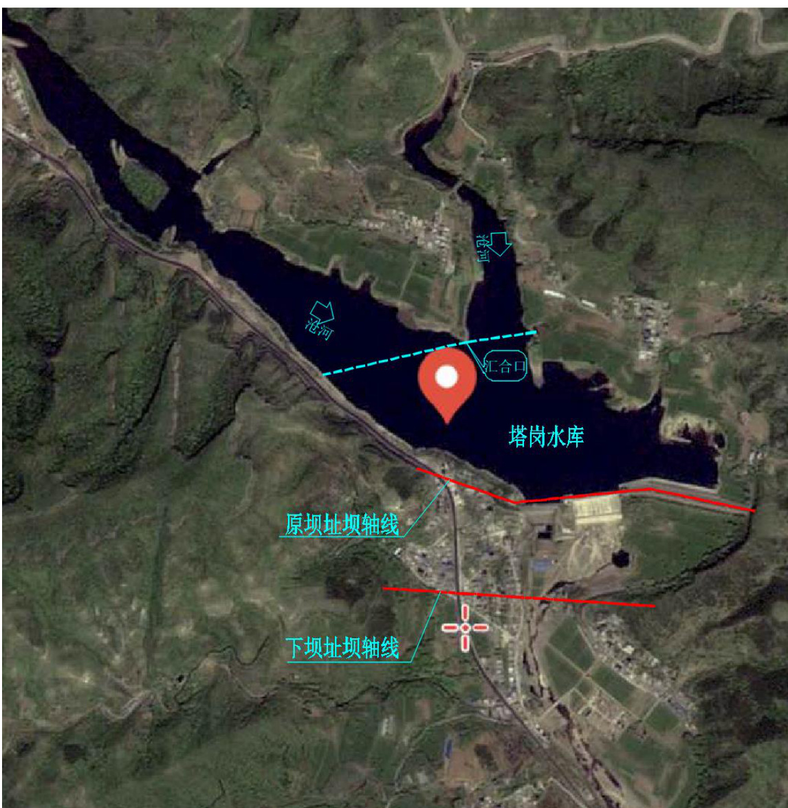  
图 1.6.2-1 塔岗水库建坝河段选择  

(2)不同坝址工程布置  

# 1)原坝址工程布置  

工程布置方案为拆除原主要挡水建筑物,原坝址新建混合坝。包括碾压混凝土重力坝(含泄水、引水建筑物)和左岸黏土心墙堆石坝,坝后电站等建筑物。  

坝顶全长 $1034.40\mathrm{m}$ ,坝顶高程 $209.00\mathrm{m}$ ,坝顶上游设防浪墙,防浪墙顶高程 $210.20\mathrm{m}$ ,上游侧设置 $1.2\mathrm{m}$ 高石材。坝轴线控制坐标 A (左坝肩 :504300.1785,3939854.7797)、B(右坝肩:503292.5076,3939982.4432)。从左至右分别为左副坝黏土心墙堆石坝段( $0\substack{+000.00\substack{-0+412.60}}$ )、河床非溢流坝段( $0{+}412.60{-}0{+}580.60\$ )、表孔坝段( $\scriptstyle0+580.60\sim0+640.60$ )、底孔坝段( $\phantom{0}{0+640.60-0+661.60}$ )、引水坝段( $0+661.60{\sim}0+68260)$ )、右岸非溢流坝段( $\scriptstyle0+682.60\sim1+034.40)$ )。  

# (1)挡水建筑物  

挡水建筑物为混合坝,左岸新建黏土心墙堆石坝段,主河床及右岸为原址新建混凝土重力坝坝段。  

碾压混凝土重力坝坝顶长度为 $621.80\mathrm{m}$ 。从左至右共分为 30 个坝段(编号 1#\~30#坝段),其中挡水坝段布置于 1#\~8#、14#\~30#坝段。坝顶高程$209.00\mathrm{m}$ ,坝顶长 $519.80\mathrm{m}$ ,建基面高程 $141.00\mathrm{m}$ ,最大坝高 $68.0\mathrm{m}$ ;上游侧高程 $150.0\mathrm{m}$ 以上为铅直面(坝轴线桩号 $0{\pm}000.00$ )、以下为 1:0.2 的斜坡面,下游侧高程 $197.00\mathrm{m}$ 以上为铅直面、以下为 1:0.75 的斜坡面;坝顶总宽度$9.0\mathsf{m}$ ;重力坝段基础进行固结灌浆,并在上游侧设帷幕灌浆,以减小扬压力和渗流量。  

左岸为黏土心墙堆石坝,坝顶长度为 $412.60\mathrm{m}$ 。最大坝高 $38.00\mathrm{m}$ ,黏土心墙堆石坝上游坝坡坡比 1:2.25,上游坝坡 189.00m 高程设置平行于坝轴线的马道,宽 $2.0\mathsf{m}$ 。下游坝坡坡比 1:2.0,坡脚处设排水棱体。下游设置“之”字上坝道路,自 177.00m 高程延伸至坝顶刺墙衔接段拐角处,道路宽 $8.0\mathsf{m}$ ,坡率 $\scriptstyle{\mathrm{i=6}}\%$ 。在距坝轴线上游 $5.0\mathsf{m}$ 处新建塑性混凝土防渗墙,墙宽 $0.6\mathsf{m}$ ,距原防渗墙 $15.00\mathrm{m}$ 。  

黏土心墙堆石坝与重力坝段采用混凝土刺墙进行连接,刺墙为重力式挡墙,沿坝轴线方向顶部长 $92\mathrm{m}$ ,沿坝轴线方向上游坡比为 1:0.25,下游坡比 1::05,垂直坝轴线墙面坡比 1:0.3。右岸上下游坡面与重力坝段衔接处采用锥面裹头型式顺接,坝后设置压重平台,坡脚处填筑至 177.00 高程排水棱体顶部,往下游按照 $2\%$ 坡比进行放坡。。  

# (2)泄水建筑物  

泄水建筑物共布设 3 个泄洪表孔和 2 个泄洪底孔。其中表孔坝段布置在9#\~11#坝段,长 $60.0\mathsf{m}$ ,共 3 孔。泄洪表孔每孔净宽为 $12.0\mathrm{m}$ ,边墩 $4.0\mathsf{m}$ ,为开敞式溢流孔口,采用 WES 实用堰型,堰顶高程 $192.0\mathrm{m}$ ,闸墩顶高程$209.00\mathrm{m}$ 。底孔坝段布置在 12#坝段,长 21 米,共设置 2 孔,泄洪底孔孔口尺寸为 $2.50{\times}3.00\mathsf{m}$ (宽 $\times$ 高),进口底板高程为 $156.00\mathrm{m}$ ,出口设置弧形工作闸门,采用液压启闭机启闭。表孔、底孔下游消能工均采用底流消能形式。  

泄洪底孔、表孔均采用底流消能方式。为避免水流紊乱,表孔、底孔消力池采用中隔墙隔开分别消能。表孔、底孔消力池池底高程均为 $140.0\mathrm{m}$ ,池深均为 $8.0\mathsf{m}$ ,池长均为 $110.0\mathrm{m}$ ,底板厚度为 $4.0\mathsf{m}$ 。表孔消力池净宽 $56\mathrm{m}$ ,底孔消力池净宽 $17\mathsf{m}$ 。尾坎顶高程均为 $148.0\mathrm{m}$ ,尾坎顶宽 $3.0\mathsf{m}$ 。坝址下游河覆盖层较厚,抗冲刷能力差,考虑到工程下泄流量较大,水流出消力池后仍存在紊动,流速尚未恢复到天然河道流速分布。为提高河床的抗冲刷能力,参考同类工程,消力池后接长度 $30.0\mathsf{m}$ 、厚度 $2.0\mathsf m$ 钢筋混凝土防冲海漫护坦,海漫后接 $30\mathsf{m}$ 抛石防冲槽,与下游河道顺接。  

为提高建基岩体整体性,溢流表孔与泄洪排沙底孔消力池底板进行固结灌浆,固结灌浆孔孔深 $6.0\mathsf{m}$ ,间排距 $3.0\mathsf{m}$ ,梅花形布置;消力池全底板设置锚筋,锚筋直径 $\Phi28$ ,入岩 $8.0\mathsf{m}$ ,间排距 $2.0\mathsf{m}$ ,梅花形布置。  

# (3)引水建筑物  

引水建筑物布置为坝式进水口 $^+$ 坝内埋管的型式,位于大坝 13#坝段。首部拦污栅槽净宽 2m。进水口渐变段长 2m,由 $1.2\mathrm{m}\times1.2\mathrm{m}$ 的方形孔口渐变为直径为 1.2m 的圆形孔口,其后接直径为 $1.2\mathrm{m}$ 的压力钢管。坝内设引水压力主管1 根,内径 $1.2\mathrm{m}$ ,压力钢管出坝后连接坝外引水管系统。  

电站为坝后式电站,厂区布置在大坝下游右岸坝脚处,厂区室外的地坪高程为 $157.0\mathrm{m}$ 。布置有主厂房、安装场、副厂房、下游尾水池、生态放水管、进场路等建筑物。总装机容量为 0.6MW,装机 3 台。  

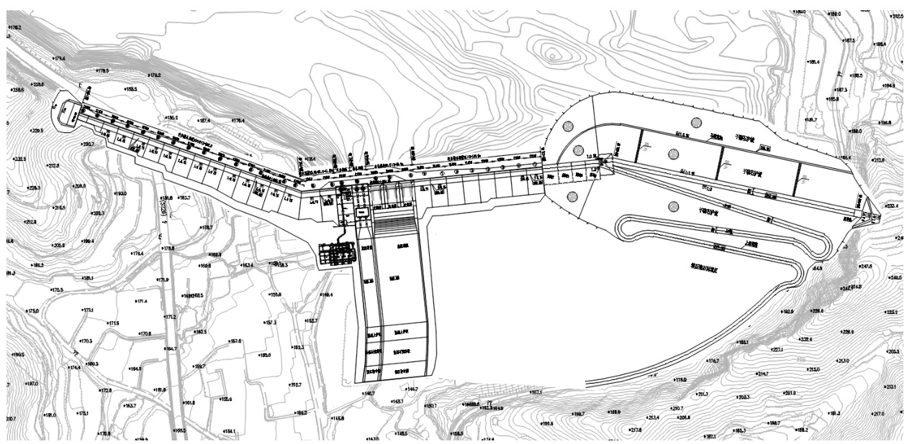  
图 1.6.2-2 塔岗水库原坝址平面布置图  

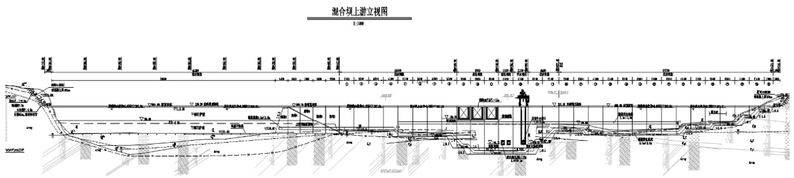  
图 1.6.2-3    塔岗水库混合坝立视图(原坝址)  

2)下坝址工程布置  

根据地形地质条件,推荐坝型为碾压混凝土重力坝,坝轴线为折线,坝顶全长 813m,坝顶高程 $205.00\mathrm{m}$ 。从左至右共分为 39 个坝段(编号 1#\~39#坝段),其中挡水坝段布置于 1#\~14#、20#\~39#坝段。坝顶高程 $205.00\mathsf{m}$ ,宽$9.0\mathsf{m}$ ,建基面高程 $139.00\mathrm{m}$ ,最大坝高 $66.00\mathrm{m}$ ,坝体下游坡比 1:0.75,起坡点高程 201.5;上游面 $147\mathrm{m}$ 高程以上为铅直面,147.0m 高程以下坡度为1:0.2,下游侧高程 $193.0\mathrm{m}$ 以上为铅直面、以下为 1:0.75 的斜坡面;坝顶上游设防浪墙,防浪墙顶高程 $210.20\mathrm{m}$ ,下游侧设置 $1.2\mathrm{m}$ 高石材。重力坝段基础进行固结灌浆,并在上游侧设帷幕灌浆,以减小扬压力和渗流量。  

泄水建筑物共布设 3 个泄洪表孔和 2 个泄洪底孔。其中表孔坝段布置在17#\~19#坝段,长 $60.0\mathrm{m}$ ,共 3 孔。泄洪表孔每孔净宽为 $12.0\mathrm{m}$ ,边墩 $4.0\mathsf{m}$ ,为开敞式溢流孔口,采用 WES 实用堰型,堰顶高程 $188.0\mathrm{m}$ ,闸墩顶高程$205.00\mathrm{m}$ 。底孔坝段布置在 16#坝段,长 21 米,共设置 2 孔,泄洪底孔孔口尺寸为 $2.50\times3.00\mathsf{m}$ (宽 $\times$ 高),进口底板高程为 $154.00\mathrm{m}$ ,出口设置弧形工作闸门,采用液压启闭机启闭。底孔、表孔均采用底流消能形式。  

泄洪底孔、表孔均采用底流消能方式。为避免水流紊乱,表孔、底孔消力池采用中隔墙隔开分别消能。表孔、底孔消力池池底高程均为 $136.0\mathrm{m}$ ,池深均为 $8.0\mathsf{m}$ ,池长均为 $110.0\mathrm{m}$ ,底板厚度为 $4.0\mathsf{m}$ 。表孔消力池净宽 $56\mathrm{m}$ ,底孔消力池净宽 $17\mathsf{m}$ 。尾坎顶高程均为 $144.0\mathrm{m}$ ,尾坎顶宽 $3.0\mathsf{m}$ 。坝址下游河覆盖层较厚,抗冲刷能力差,考虑到工程下泄流量较大,水流出消力池后仍存在紊动,流速尚未恢复到天然河道流速分布。为提高河床的抗冲刷能力,参考同类工程,消力池后接长度 $30.0\mathsf{m}$ 、厚度 $2.0\mathsf m$ 钢筋混凝土防冲海漫护坦,海漫后接 $30\mathsf{m}$ 抛石防冲槽,与下游河道顺接。  

为提高建基岩体整体性,溢流表孔与泄洪排沙底孔消力池底板进行固结灌浆,固结灌浆孔孔深 $6.0\mathsf{m}$ ,间排距 $3.0\mathsf{m}$ ,梅花形布置;消力池全底板设置锚筋,锚筋直径 $\Phi28$ ,入岩 $8.0\mathsf{m}$ ,间排距 $2.0\mathsf{m}$ ,梅花形布置。  

引水建筑物为坝式进水口及坝内引水压力钢管,位于大坝 15#坝段,长 21米。进水流道宽度为 $2.0\mathsf{m}$ ,进水口为平底喇叭口型,孔口尺寸 $1.2\times2.0\mathrm{m}$ ;进水口顶设操作平台,高程 $205.00\mathsf{m}$ 。检修门后的渐变段长 $2.0\mathsf{m}$ ,由 $1.2\times2.0\mathrm{m}$ 的方孔渐变为内径 $01.2\mathrm{m}$ 的圆孔,渐变段后接内径 $01.2\mathrm{m}$ 的压力钢管,钢管出坝体后经岔管接入电站内。  

电站为坝后式电站,厂区布置在大坝下游右岸坝脚处,总装机容量为0.6MW,装机 3 台。布置有主厂房、安装场、副厂房、下游尾水池、生态放水管、进场路等建筑物。  

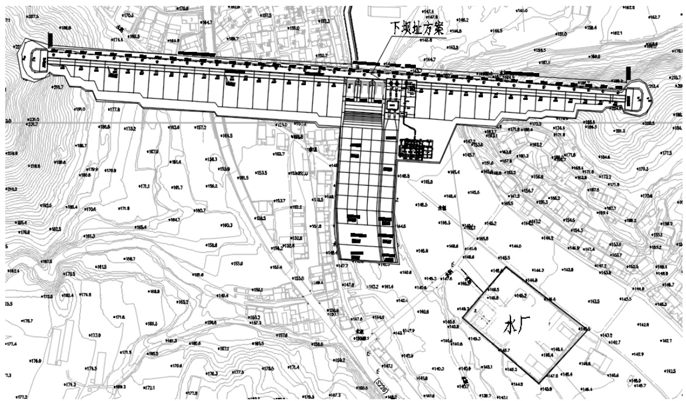  
图 1.6.2-4 塔岗水库重力坝平面布置图(下坝址)  

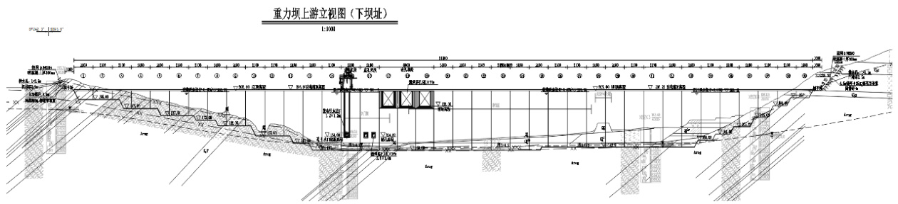  
图 1.6.2-5  塔岗水库重力坝立视图(下坝址)  

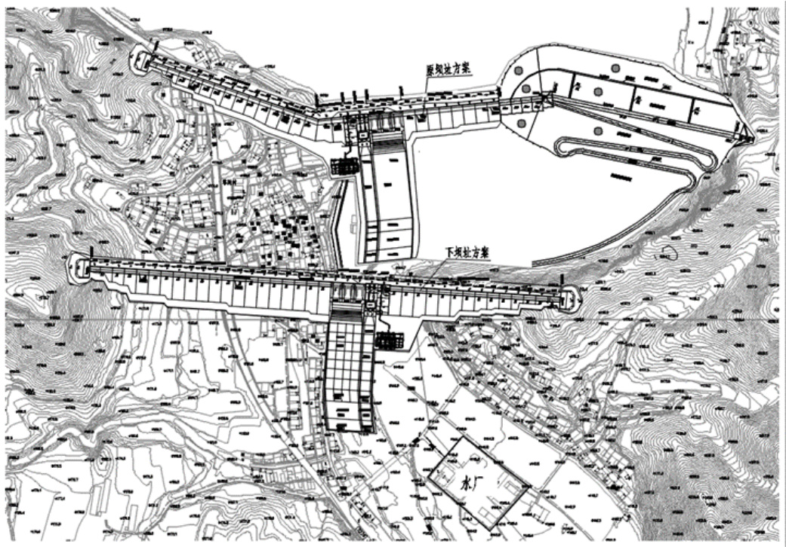  
图 1.6.2-6    塔岗水库原坝址、下坝址布置图  

# (4)坝址比选  

表 1.6.2-1  原坝址和下坝址建坝条件对比简表  

<html><body><table><tr><td>项目</td><td>原坝址</td><td>下坝址</td><td>比较结果</td></tr><tr><td>地形地 质条件</td><td>原坝址位于塔岗村北的沧河上，坝 址区属低山地貌类型，河谷开阔， 呈宽"U"型河谷。主要地层：覆盖层 较薄，角闪片麻岩、二长片麻岩 （Arog），白云质灰岩、粉砂岩 （∈亿），闪长岩（KT）和第四 系松散覆盖层（Q）</td><td>下坝址位于原坝址下游约 0.2km处，坝址区丘陵河谷地 貌，河谷开阔，呈宽“U”型 河谷。主要地层岩性为太古界 （Arog）角闪片麻岩、更长斑 岩（K2L）、白云质灰岩（∈ iz）第四系松散覆盖层（Q)</td><td>地质条件 均不制约 水库建设</td></tr></table></body></html>  

<html><body><table><tr><td>项目</td><td>原坝址</td><td>下坝址</td><td>比较结果</td></tr><tr><td>建筑材 料</td><td>库区左岸发育的阶地上分布有低液 限黏土，可作为防渗料和填筑料使 用，可作为本工程土料场。 库尾的李沿沟村北分布有寒武系张 夏组的块状灰岩，岩石坚硬，岩溶 不发育，岩体完整，储量丰富，可 满足块石料、堆石料和混凝土骨料 使用要求；该料场紧邻S227省道， 开采运输条件良好。 主要建筑物为混合坝，左岸布置黏</td><td>李沿沟村北分布有寒武系张夏 组的块状灰岩，岩石坚硬，岩 溶不发育，岩体完整，储量丰 富，可满足块石料、堆石料和 混凝土骨料使用要求；该料场 紧邻S227省道，开采运输条 件良好。 主要建筑物为重力坝，坝顶全 长²813m， 坝顶高程</td><td>均不制约 水库建设</td></tr><tr><td>建筑物 布置</td><td>土心墙堆石坝段，主河床及右岸为 原址新建混凝土重力坝坝段。坝顶 全长1034.4m，坝顶高程 209.00m，最大坝高68.0m，坝顶 宽9m。原坝址方案建筑工程投资 11.47万元。</td><td>205.0m，最大坝高66.0m, 坝顶宽9m。大坝左岸坝体布 置在单薄山脊上，可能存在渗 漏问题。下坝址的消能设施距 离下游侧水厂较近，可能会影 响水厂安全，增加水库管理难 度。下坝址方案建筑投资 12.55万元。 （1）淹没范围涉及生态保护</td><td>原坝址优</td></tr><tr><td>环境保 护</td><td>（1）淹没范围涉及生态保护红线。 履行占用生态保护红线手续；(2) 淹没范围涉及塔岗水库饮用水源 一 级保护区和二级保护区。征求生态 环境部门同意。</td><td>红线。履行占用生态保护红线 手续；（2）淹没范围涉及塔 岗水库饮用水源一级保护区和 二级保护区。征求生态环境部 门同意。</td><td>整体相差 不大 原坝址、</td></tr><tr><td>施工条 件</td><td>坝址位于S226省道旁，对外交通便 利，外来建材均自卫辉市采购。其 中，原坝址下游附近S226 省道左右 两侧地形平坦，施工布置条件较 好。</td><td>坝址位于S226省道旁，对外 交通便利，外来建材均自卫辉 市采购。其中，下坝址附近 S226省道左右两侧地形平 坦，施工布置条件较好。</td><td>下坝址方 案施工条 件基本一 致，均不 制约水库 建设。</td></tr><tr><td>建设征 地与移 民安置</td><td>（1）征收土地面积约3581.45亩， 人口1326人；（2）基本农田情 况：占压基本农田面积995.7532 亩；（3）移民占地投资为9.97亿 元。</td><td>（1）征收土地面积约 3215.50亩，人口1783人; （2）基本农田情况：占压基 本农田面积397.45亩；（3) 移民占地投资为9.52亿元。</td><td>原坝址较 优</td></tr><tr><td>工程投 资</td><td>28.69亿元</td><td>29.58亿元</td><td>原坝址优</td></tr></table></body></html>  

综合比较原坝址、下两个坝址的地形地质条件、工程布置、施工条件、建设征地与移民安置影响、环境因素和工程总投资等方面因素,选择原坝址方案。  

# 1.6.3 坝型选择  

# 1.6.3.1 原坝体加高分析  

(1)河床及右岸坝型选择  

本次对主坝改造可采用拆除下游堆石体,保留浆砌条石、代水泥砼砌块石结构,后侧加高为碾压混凝土重力坝和拆除原坝体新建碾压混凝土重力坝两种方案选择。  

上述两个方案均可满足大坝挡水需求,方案一保留部分原坝体,为满足坝体防渗及坝基排水结构布置要求,代水泥砼砌块石结构布置与碾压混凝土中,廊道布置于原坝体前侧。本次加高近 $30\mathsf{m}$ ,增加原坝高 3/4 高度,新、老坝体共同承担增加的水压力、坝基扬压力等,新、老坝体材料力学特性一般存在明显差异,结合面往往为弱面,大坝在自重、水压力、温度变化等作用下,结合面存在应力集中问题,新老坝体混凝土结合质量难以保证。同时,本次推荐坝型为碾压式混凝土重力坝,具有施工简单、施工进度快,水泥用量少,温控措施少,可使用大型通用机械等优点,可有效缩短工期, 代水泥砼砌块石结构导致河床坝段无法大面积碾压施工,影响施工周期。方案二拆除旧坝体后新建坝体,无新老混凝土结合存在的软弱面结合、应力问题等,同时,不需要考虑原砌块石存在对碾压施工影响,因此虽然方案二工程量及投资高于方案一,考虑结构可靠性,本阶段推荐方案二拆除原坝体新建碾压式重力坝。  

# (2)左岸坝型选择  

左副坝坝基下部为古河道,坝基为松散覆盖层,存在有强透水性的卵石和含泥碎石层,且卵石层较厚,若选择混凝土重力坝,应清除低液限粘土及卵石和含泥碎石层,基础置于弱风化中下部岩体。若选择当地材料坝,应清除松散覆盖层即可。  

左岸原坝体为均质粘土坝,根据原始设计资料,该坝体压实度达不到设计要求,初期沉陷变形严重,现仍未稳定。针对以上问题,本次推荐拆除重建方案,对原均质坝进行全部拆除新建,采用黏土心墙堆石坝作为代表坝型。  

# (3)右副坝坝体加高分析  

右副坝填土极不均匀,为低液限黏土夹块石、碎石以及碎砖块等,根据设计干密度划分填土质量,压实度只有 $0.70\sim0.83$ ,且筑坝时未进行碾压,填筑质量很差,未达到规范要求设计值,压实度不小于 0.96。原坝体高度 5m,拆  

除坝体工程量不大,且该处基岩面出露较高,清除坝体后,开挖 $5{\sim}10\mathrm{m}$ 即可满足重力坝建基面要求,综上,本方案对原斜墙坝进行全部拆除新建重力坝。  

# 1.6.3.2 坝型选择  

从地形地质条件方面,该坝址不宜修建混凝土拱坝,从料源分布及施工条件、防渗体连接等方面均质土坝、粘土心墙坝、沥青混凝土心墙坝、混凝土面板堆石坝有限制因素,从施工工期、温控等方面砌石重力坝、混凝土重力坝有限制因素,本阶段暂不参与比较。本阶段选择碾压混凝土重力坝和黏土心墙堆石坝选。  

(1)碾压混凝土重力坝方案  

碾压混凝土重力坝方案主要建筑物包括拦河坝、泄水建筑物、生态取水建筑物。  

工程主要由拦河坝、泄水建筑物、生态取水建筑物组成。拦河坝采用碾压混凝土重力坝,由 $1\#\sim50\#$ 坝段组成,坝顶高程 $209.00\mathrm{m}$ ,最低建基面高程$141.00\mathrm{m}$ ,最大坝高 $68.0\mathrm{m}$ ,坝顶宽 $10\mathrm{m}$ ,坝顶全长 $1034.4\mathrm{m}$ 。1#\~28#坝段为左岸挡水坝段,总长 $60\mathrm{m}$ ;34#\~50#坝段为右岸挡水坝段,总长 $92\mathrm{m}$ ;29#坝段为取水坝段,长 $^{21\mathsf{m}}$ ;30#坝段为泄洪底孔坝段,长 21m;31#\~33#坝段为溢流表孔坝段,总长 $60\mathrm{m}$ ,共设 3 个溢流表孔,表孔和底孔坝段后接消力池、海漫、抛石防冲槽。  

# (2)粘土心墙堆石坝方案  

枢纽建筑物主要由黏土心墙堆石坝、泄水坝段、引水坝段、电站等组成。  

左、右岸为黏土心墙堆石坝,坝顶长度为 $926.70\mathrm{m}$ 。最大坝高 $38.00\mathrm{m}$ ,坝顶宽度 9m,坝顶上游侧设钢筋混凝土防浪墙。黏土心墙堆石坝上游坝坡坡比 1:2.25,上游坝坡 189.00m 高程设置平行于坝轴线的马道,宽 $2.0\mathsf{m}$ 。下游坝坡坡比 1:2.0,坡脚处设排水棱体。下游设置“之”字上坝道路,自177.00m 高程延伸至坝顶刺墙衔接段拐角处,道路宽 $8.0\mathsf{m}$ ,坡率 $\scriptstyle{\mathrm{i=6}}\%$ 。在距坝轴线上游 $5.0\mathsf{m}$ 处新建塑性混凝土防渗墙,墙宽 $0.6\mathrm{m}$ ,距原防渗墙 $15.00\mathrm{m}$ 。  

# (3)坝型选择  

碾压混凝土重力坝、粘土心墙堆石坝、混合坝三种坝型分别从地形地质条件、坝型特点和枢纽布置、建筑材料、施工组织设计、工程占地、环境影响、水土保持、运行管理、主体工程量及投资等方面进行综合比较。  

# 1)地形地质条件  

坝址区河谷开阔,覆盖层厚度差异性大,采用混合坝型适宜性更好。其中左侧古河道段覆盖层深厚,不适宜混凝土重力坝的建设条件,当地材料坝坝型适宜性更好。  

# 2)坝型特点和建筑物布置  

碾压混凝土重力坝坝体结构简单,可灵活布置泄洪建筑物,水力学条件较好,可利用坝身泄洪,适合于本工程的直河道大流量。主坝、溢洪道坝段基岩几乎出露,右副坝弱风化线以上覆盖层较浅,修建重力坝的开挖量和混凝土填筑量较少,同时重力坝具有结构安全稳定的特点。左副坝为古河道段,覆盖层深厚,黏土层 $7.7{\sim}17.7\mathrm{m}$ ,修建重力坝开挖量需挖除黏土层至弱风化下限,开挖量和混凝土填筑量均比较多。  

黏土心墙堆石坝可充分利用开挖料,坝体结构简单;防渗体系位于坝体中间。坝体较缓,坝体填筑工程量较大。土石坝坝身无法泄水,需通过设置溢洪道或泄水坝段泄洪。本工程为防洪水库,具有泄量大,运行调度复杂的特点,同时受地形地貌、原坝体的限制,本工程坝轴线较长,下游河道居中且相对较窄,溢洪道布置在两岸距离下游河道比较远,山体开挖量大,不具备设置岸边式溢洪道或溢洪洞的条件;修建黏土心墙堆石坝需要黏土料 43 万 $\mathsf{m}^{3}$ ,堆石料167 万 $\mathsf{m}^{3}$ ,根据初步地勘成果,堆石料料源充足,黏土料较为紧张。  

综合比较,本阶段结合地形地质、料源情况、防洪调度运行、工程安全等特点,将两种坝型优点结合,修筑混合坝:左岸为黏土心墙堆石坝,主坝及右坝为碾压式重力坝。  

# 3)建筑材料  

碾压混凝土重力坝和黏土心墙堆石坝方案所需混凝土骨料均从石料场开采;黏土心墙堆石坝堆石料利用料场和原主坝拆除堆石料,石料场料源丰富,开采运输条件良好;黏土可利用土料场及原左副坝填筑料,目前查明土料场可充分满足左副坝黏土心墙量需求。  

# 5)施工  

施工导流:因坝型比选主槽处均为重力坝,且大坝等级相同,故导流标准及导流方式均相同,导流标准均为 10 年一遇,导流方式均采用分期导流。  

料场选择:三种方案的建筑材料来源相同,黏土心墙堆石坝堆石料方案可利用一部分开挖料,从土石方平衡角度较优。  

施工方法:粘土心墙堆石坝及重力坝对混凝土浇筑和土石填筑能力的要求均在机械的合理范围内,因此,方案比选在主体工程施工上基本相当,不存在坝型选择的限制性因素。  

施工总布置及运输:三种方案施工总布置格局基本相同,施工临时占地范围基本相同,全重力坝方案混凝土拌和系统规模其他坝型的混凝土系统规模。全重力坝方案较土石坝方案建筑物较集中,综合土石方开挖利用平衡方面,土石坝可充分开挖石料,但开挖料不可作为混凝土骨料,重力坝弃渣量大于土石坝方案和组合坝方案。施工总布置及交通运输,开挖料利用方面对坝型选择有一定影响,土石坝方案较优。  

施工进度:施工总工期均为 42 个月,其中施工准备期 4 个月,主体工程施工期 35 个月,完建期 3 个月。工期对坝型选择影响不大。  

综上所述,施工组织设计角度比较,比选坝型各有优劣,综合分析,全混凝土重力坝弃渣较多,开挖料基本不能利用,渣料外运对投资影响较大;土石坝方案对开挖料利用较多,能有效减少弃渣。综合评判,混合坝和土石坝均优于重力坝方案。  

# 6)工程占地  

从人口、占地等方面比较,碾压混凝土重力坝方案占地面积、搬迁人口等方面最少;粘土心墙堆石坝中右坝填筑对塔岗村影响较大,占地面积和搬迁人口均明显增加。组合坝占地面积比重力坝方案多,搬迁人口方面与重力坝相差不大。  

因此,碾压混凝土重力坝优于组合坝优于黏土心墙堆石坝。  

# 7)环境影响  

环境因素:两种方案淹没范围均涉及生态保护红线,履行占用生态保护红线手续。  

水源保护区:两种方案淹没范围涉及塔岗水库饮用水源一级保护区和二级保护区。均涉及水源保护地,都征求生态环境部门同意。  

综上:两个坝址在环境因素和水源保护地方面整体相差不大。  

# 8)水土保持  

从水土保持角度分析,碾压混凝土重力坝布置紧凑,占地面积较小,防治责任范围较小,产生的水土流失影响较小。  

# 9)运行管理  

碾压混凝土重力坝方案建筑物布置紧凑,运行、检修与维护方便;运行、检修与维护相对困难,粘土心墙堆石坝方案坝体后期维护工作量相对较大。  

# 10)工程安全  

碾压混凝土重力坝采用表孔泄洪,泄洪建筑物布置简单,可靠度高,安全裕度大。  

# 11)主体工程量及工程投资  

碾压混凝土重力坝方案、黏土心墙堆石坝、两种方案的主体工程量及工程投资对比见表 1.6.3-1。  

表 1.6.3-1 两种方案主体工程量及工程投资对比表  

<html><body><table><tr><td>枢纽建筑物主要工程量</td><td>碾压混凝土重力坝 （含泄洪、取水建 筑物)</td><td>黏土心墙堆石坝 （含泄洪、取水建 筑物)</td><td>混合坝 （含泄洪、取水 建筑物)</td></tr><tr><td>土方开挖（万m²)</td><td>91.4</td><td>20.9</td><td>41.9</td></tr><tr><td>石方开挖（万m²)</td><td>39.5</td><td>40.9</td><td>28.5</td></tr><tr><td>开挖料回填（万 m²)</td><td>75</td><td>77</td><td>75</td></tr><tr><td>堆石填筑（万m²)</td><td></td><td>167</td><td>112.7</td></tr><tr><td>垫层过渡料（万m²)</td><td></td><td>13.6</td><td>7.4</td></tr><tr><td>反滤料(万m²)</td><td></td><td>13.6</td><td>7.4</td></tr><tr><td>黏土(万m²)</td><td></td><td>43</td><td>23.6</td></tr><tr><td>碾压混凝土（万m²)</td><td>91.4</td><td>16.1</td><td>43.7</td></tr><tr><td>其他混凝土(万m²)</td><td>46.9</td><td>30.1</td><td>33.1</td></tr><tr><td>钢筋 (t)</td><td>17690</td><td>16380</td><td>17169</td></tr><tr><td>帷幕灌浆（m)</td><td>109633</td><td>59886</td><td>78085</td></tr><tr><td>固结灌浆(m)</td><td>78568</td><td>25161</td><td>50888</td></tr><tr><td>工程投资</td><td>碾压混凝土重力坝</td><td>黏土心墙堆石坝</td><td>混合坝</td></tr><tr><td>建筑工程部分投资（万 元)</td><td>111395</td><td>97334</td><td>103707</td></tr></table></body></html>  

碾压混凝土重力坝和粘土心墙堆石坝两种坝型方案,技术上均可行,各有优缺点,混合坝可兼顾两种坝型优点。碾压混凝土重力坝段可利用坝身表孔与底孔泄洪,泄洪建筑物布置简单,抵御超标准洪水能力强,满足工程泄水建筑泄量大,运行调度规则复杂的要求,同时避免了左副坝覆盖层深厚,利用粘土心墙坝建基条件相对简单的特点,避免大规模开挖。因此,本阶段选择混合坝作为推荐坝型。  

# 1.6.4 工程总布置  

塔岗水库防洪能力提升后水库正常蓄水位 $187\mathrm{m}$ ,极限运行死水位 $160\mathrm{m}$ ,防洪高水位 212.11m。水库设计洪水标准 100 年一遇,设计水位 $212.57\mathrm{m}$ ;校核洪水标准 2000 年一遇,校核水位 $212.75\mathrm{m}$ ,总库容 8320 万 $\mathsf{m}^{3}$ ,防洪库容6013 万 $\mathsf{m}^{3}$ 。  

原坝址工程布置:拆除原挡水建筑物,新建混合坝,包括碾压混凝土重力坝(含泄水、引水建筑物)和左岸黏土心墙堆石坝,坝后电站等建筑物。本工程为混合坝,坝顶全长 $1048.7\mathrm{m}$ ,坝顶高程 $214.80\mathrm{m}$ ,坝顶上游设防浪墙,防浪墙顶高程 $216.00\mathrm{m}$ ,下游侧设置 $1.2\mathrm{m}$ 高石材。  

混凝土重力坝坝顶长度为 628.70m。从左至右共分为 30 个坝段(编号1#\~30#坝段),其中挡水坝段布置于 1#\~8#、14#\~30#坝段。坝顶高程$214.80\mathrm{m}$ ,坝顶长 $526.7\mathrm{m}$ ,建基面高程 $134.00\mathrm{m}$ ,最大坝高 $80.8\mathsf{m}$ ;上游侧高程 $150.0\mathrm{m}$ 以上为铅直面(坝轴线桩号 $0{\pm}000.00$ )、以下为 1:0.2 的斜坡面,下游侧高程 $204.8\mathrm{m}$ 以上为铅直面、以下为 1:0.75 的斜坡面;顶部上游侧悬挑1.5m 长牛腿,坝顶总宽度 $9.0\mathsf{m}$ ;重力坝段基础进行固结灌浆,并在上游侧设帷幕灌浆,以减小扬压力和渗流量。  

左岸为黏土心墙堆石坝,坝顶长度为 $420.0\mathrm{m}$ 。最大坝高 $43.80\mathrm{m}$ ,黏土心墙堆石坝上游坝坡坡比 1:2.25,上游坝坡 $189.00\mathrm{m}$ 高程设置平行于坝轴线的马道,宽 $2.0\mathsf{m}$ 。下游 186.10m 高程以上坝坡坡比 1:2.0,186.10m 以下坝坡采用1:1.6 的坡比与坡脚处排水棱体衔接。下游设置“之”字上坝道路,自 $174.00\mathrm{m}$ 高程延伸至坝顶刺墙衔接段拐角处,道路宽 $8.0\mathsf{m}$ ,坡率 $\scriptstyle{\mathrm{i=7}}\%$ 。在距坝轴线上游$5.0\mathsf{m}$ 处新建塑性混凝土防渗墙,墙宽 $0.6\mathsf{m}$ ,距原防渗墙 $15.00\mathrm{m}$ 。  

黏土心墙堆石坝与重力坝段采用混凝土刺墙进行连接,刺墙为重力式挡墙,沿坝轴线方向顶部长 $80\mathsf{m}$ ,沿坝轴线方向坡度为 1:0.5,垂直坝轴线墙面坡比 1:0.1。右岸上下游坡面与重力坝段衔接处采用翼墙过渡,翼墙为半重力式挡墙,墙顶宽度 $2.0\mathsf{m}$ ,背坡坡比分别为 1:0.3 和 1:1,上下游翼墙分别以 115m 和$127\mathrm{m}$ 半径从坝顶向坡脚处扩散。  

泄水建筑物共布设 3 个泄洪表孔和 2 个泄洪底孔。其中表孔坝段布置在9#\~11#坝段,长 $60.0\mathsf{m}$ ,共 3 孔。泄洪表孔每孔净宽为 $12.0\mathrm{m}$ ,边墩 $4.0\mathsf{m}$ ,为开敞式溢流孔口,采用 WES 实用堰型,堰顶高程 $196.0\mathrm{m}$ ,闸墩顶高程$214.80\mathrm{m}$ 。底孔坝段布置在 12#坝段,长 21 米,共设置 2 孔,泄洪底孔孔口尺寸为 $2.50{\times}3.00\mathsf{m}$ (宽 $\times$ 高),进口底板高程为 $156.00\mathrm{m}$ ,出口设置弧形工作闸门,采用液压启闭机启闭。表孔、底孔下游消能工均采用底流消能形式。  

引水建筑物布置为坝式进水口 $^+$ 坝内埋管的型式,位于大坝 13#坝段。首部拦污栅槽净宽 2m。进水口渐变段长 2m,由 $1.2\mathrm{m}\times1.2\mathrm{m}$ 的方形孔口渐变为直径为 1.2m 的圆形孔口,其后接直径为 $1.2\mathrm{m}$ 的压力钢管。坝内设引水压力主管1 根,内径 $1.2\mathrm{m}$ ,压力钢管出坝后连接坝外引水管系统。  

电站为坝后式电站,厂区布置在大坝下游右岸坝脚处,厂区室外的地坪高程为 $157.0\mathrm{m}$ 。布置有主厂房、安装场、副厂房、下游尾水池、生态放水管、进场路等建筑物。总装机容量为 0.6MW,装机 3 台。  

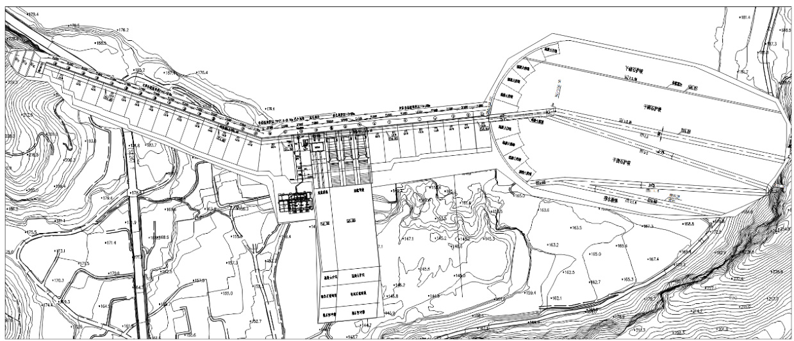  
图 1.6.3-1   塔岗水库混合坝平面布置图(原坝址)  

# 1.6.5 建筑环境与景观  

建筑设计充分考虑当地自然环境和社会环境,体现当地的发展水平,地域风貌、文化特色和历史轨迹。尊重功能,尽量体现建筑物的结构美、整体美、简洁美。各单体建筑应体现各自功能特征,内容与形式相统一,艺术与技术相结合。整体布局与环境统一考虑,建筑风格协调统一,因地制宜,经济美观。  

景观设计主导思想应以简洁、大方、美化环境、体现建筑设计风格为基本原则,达到景观与建筑特色协调统一、相辅相成,使建筑物与建筑景观可以完美地融入到周边自然环境之中。厂区内除建(构)筑物及道路、广场占地外,所有空地均充分绿化,以营造一个优美的景观环境和舒适的场景记忆。  

植物配置应尽量选取本地产的适生树种和乡土树种,做到宜树则树、宜草则草、疏密适当、高低错落,形成一定的层次感。  

# 1.6.6 安全监测  

本工程主要工程建筑物,包括挡水建筑物(含混凝土重力坝、粘土心墙堆石坝)、泄水建筑物(含消能建筑物)、引水建筑物、电站厂房及开关站及边坡工程等建筑物。其中大坝的级别为 3 级,电站厂房建筑物的级别为 5 级。根据建筑物等级、规模、结构型式以及地形、地质条件等因素,各监测建筑物分别设置以下监测项目:  

(1)变形监测网:水平位移监测网、垂直位移监测网;  
(2)环境量监测:上下游水位监测、坝前水温监测和气象监测;  
(3)挡水建筑物:变形监测、渗流监测;  
(4)泄水建筑物:变形监测、渗流监测;  
(5)边坡工程:表面变形监测、锚固应力监测;  
(6)巡视检查:除进行上述仪器监测项目外还需要进行人工巡视检查。  

# 1.7 机电及金属结构  

# 1.7.1 水力机械  

电站装机容量为 600kW,装机 3 台,单机容量为 200kW。电站水轮机额定水头为 $30.2\mathrm{m}$ ,采用一管三机引水方式,在每台机组蜗壳前设置 DN500 的进水液控蝶阀。电站配置了必要的辅助生产设施,包括桥式起重机、技术供水系统、排水系统、气系统等。  

# 1.7.2 电气一次  

电站的发电机变压器接线采用扩大单元接线方式,电站设置 1 台 $35/0.4\mathsf{k V}$ 主变,35kV 采用线路变压器组接线。电站厂用电系统设置 1 个工作电源,取自电站机组的扩大单元;设一回备用电源,就近引自附近 10kV 电网;另再设一台 100kW 柴油发电机组作为应急电源。  

大坝区域初拟采用 1 回 10kV 架空输电线路供电,电源引自附近的变电站,一回引自电站 400V 母线。同时设置 1 台柴油发电机作为备用电源。  

# 1.7.3 电气二次及通信  

根据水库的实际运行情况,本着安全适用、技术先进、经济合理的原则,按“无人值班 (少人值守)”运行方式进行设计。拟采用计算机监控系统进行监视和控制,以实现对水库的控制、测量、信息管理等。监控系统采用分层分布式结构。在水库管理中心设置远程控制级,在水库大坝处设置现地控制级两级控制,实现对闸门的现地/远方远程控制与监视。继电保护系统的设计应符合相关标准和规范要求,采用多机型微机保护装置,涵盖发电机、主变压器、厂用变压器、输电线路等多个方面。  

# 1.7.4 金属结构  

根据本工程水工建筑物布置,金属结构设备主要分布于泄洪表孔、泄洪底孔、发电引水口和电站尾水出口等部位。金属结构设备主要包括各建筑物的闸建筑物的闸门、拦污栅及启闭设备等。  

# 1.7.5 采暖通风与空气调节  

暖通设计依据国家现行规范要求,在满足使用人员及设备使用条件的前提下,做到能源节约、安全适用、技术先进、使用方便、经济合理。  

# 1.7.6 消防  

本工程消防设计遵照我国基本建设的政策和“预防为主,防消结合”的方针,确保重点、兼顾一般、便于管理、经济适用的原则。设计中采用“一防、二断、三灭、四排”的综合消防技术措施。  

# 1.8 施工组织设计  

# 1.8.1 施工条件  

塔岗水库位于新乡市所属县级市卫辉市塔岗村附近,坝址距离河南省会郑州市约 102km,距离卫辉市约 22km,塔岗水库坝址位于 S226 省道旁,现有进场道路直接连接 S226 省道,路宽约 3m,水泥路面,施工前需扩建该进场道路,满足施工进场和交通需求。本工程为改扩建工程,坝址下游 S226 省道左右两侧地形平坦,距离坝址约 $0.5\mathsf{k m}$ ,施工布置条件较好。工程施工所需主要外来建筑材料可从卫辉市建材市场采购。  

# 1.8.2 料场的选择  

塔岗水库为水库枢纽工程,主要施工项为碾压混凝土重力坝和黏土心墙坝施工。本工程黏土料工程量约 23.65 万 $\mathsf{m}^{3}$ ,折合约 27.83 万 $\mathsf{m}^{3}$ 。混凝土工程量约 83.90 万 $\mathsf{m}^{3}$ ,需要混凝土骨料约 67.12 万 $\mathsf{m}^{3}$ (成品方)。本工程块石料工程量约 125.52 万 $\mathsf{m}^{3}$ (压实方),其中堆石工程量约 112.71 万 $\mathsf{m}^{3}$ (压实方),排水棱体工程量约 8.18 万 $\mathsf{m}^{3}$ (压实方),砌石抛石工程量约 4.63 万 $\mathsf{m}$ ³(压实方),折合约 95.82 万 $\mathsf{m}^{3}$ (自然方)。砂石料工程量约 17.91 万 $\mathsf{m}^{3}$ (压实方),其中砂石混合垫层料工程量约 3.16 万 $\mathsf{m}^{3}$ (压实方)、反滤料工程量 7.42 万 $\mathsf{m}^{3}$ (压实方)、过渡料工程量约 7.33 万 $\mathsf{m}^{3}$ (压实方),折合约13.85 万 $\mathsf{m}^{3}$ (成品方)。  

根据工程量并考虑转存、运输等过程中的损耗及扩大系数,黏土料设计需要量约 39.78 万 $\mathsf{m}^{3}$ 。根据地质资料,库内土料场质量、储量均满足规程和设计要求,本工程所需黏土料从库区内土料场采购。  

根据工程量并考虑转存、运输等过程中的损耗及扩大系数,混凝土骨料设计需要量约 92.75 万 $\mathsf{m}^{3}$ 。石料场原岩质量、储量均满足规程和设计要求,其中泥灰岩的饱和抗压强度不满足要求,实际使用中剔除此部分工程量,检测合格后使用,本工程所需混凝土骨料从上游石料场采购,于砂石加工系统破碎到使用规格后使用。  

根据工程量并考虑转存、运输等过程中的损耗及扩大系数,块石料设计需要量为 141.42 万 $\mathsf{m}^{3}$ 。本工程所需混凝土骨料从上游石料场开采。  

根据工程量并考虑转存、运输等过程中的损耗及扩大系数,砂石料设计需要量约 23.43 万 $\mathsf{m}^{3}$ ,本工程所砂砾石料均从上游石料场采购,于砂石加工系统破碎到使用规格后使用。  

# 1.8.3 施工导截流  

导流建筑物确定为 5 级建筑物,导流标准采用 10 年一遇洪水,综合考虑工程投资和规模,围堰导流时段采用枯水期(10 月\~次年 5 月)导流时段,对应 10 年一遇洪水洪峰流量 $42\mathrm{m}^{3}/\mathsf{s}$ 。塔岗水库改扩建工程考虑采用分期导流的导流方式,一期导流时段为第一年 10 月初\~第二年 12 月底,二期导流时段为第三年 1 月初\~第 4 年 5 月底。其中,一期拆除左岸阶地上的土石坝并开挖导流明渠,在一期围堰的保护下枯水期施工右岸重力坝段,第二年汛期来临前拆除上下游围堰,利用原河床及明渠泄流,汛期结束后重新填筑一期上下游围堰;二期导流利用坝体挡水,枯水期利用已建成的重力坝底孔泄流,枯水期时段加高重力坝段和左岸土石坝段,第三年汛期利用重力坝预留缺口泄流,第四年汛前工程完工,完成导流。  

# 1.8.4 主体工程施工  

本工程为拆除新建工程,主坝原为代水泥砌石重力墙干砌堆石坝,右副坝原为黏土斜墙坝,拆除后新建碾压式混凝土重力坝,左副坝拆除新建为黏土心墙堆石坝。土建施工内容主要包括原坝体堆石拆除、原溢洪道等建筑物拆除、土方开挖、石方开挖、基础处理、常态混凝土浇筑和碾压混凝土施工、堆石料填筑、黏土心墙施工、金属结构和机电设备安装等。主体工程施工采用常规施工方法即可。  

# 1.8.5 施工交通及总布置  

现坝址左右岸现有宽度 $3.0\mathsf{m}$ 左右的上坝路,该道路与 S226 省道相接,连接长度约 1.0km,整修、扩宽后,该道路可作为本工程施工期主要对外交通道路。工程区场内交通主要是连接各个施工生产生活营地至施工工作面、石料场、土料场及弃渣场的道路。新建交通道路总长约 $10k\mathrm{m}$ 。  

工程区坝址下游河道两侧有宽阔平台地,但村庄密集,施工生产区生活区选址需避开村镇。塔岗村南侧,S226 省道西侧分布有阶地,可用于布置施工生产区,,施工生产区及生活区紧邻 S226 省道,总占地约 $85000\mathrm{m}^{2}$ 。  

根据工程土石方平衡计算,工程共产生剩余料 88.42 万 $\mathsf{m}^{3}$ (自然方,下同),其中土方 10.71 万 $\mathsf{m}^{3}$ ,石方 71.88 万 $\mathsf{m}^{3}$ ,建筑拆除料 5.83 万 $\mathsf{m}^{3}$ ,土方及石方共 82.60 万 $\mathsf{m}^{3}$ 均可作为坝后压坡体消纳,弃渣均为建筑拆除料,相应松方为 8.92 万 $\mathsf{m}^{3}$ ,由于工程区周边永久弃渣场选址困难,因此工程所产生的弃渣均采用社会消纳的方式解决。  

考虑料场、弃渣场、临时料堆场及临时道路等占地,施工总占地面积约32.06 万 $\mathsf{m}^{2}$ ,约 480.9 亩。  

# 1.8.6 施工总进度  

结合工程所在地区施工条件和主体工程量,初步确定施工总工期 42 个月,其中施工准备期 4 个月,主体工程施工期 35 个月,完建期 3 个月。  

初步分析,重力坝段及左岸土石坝段施工控制总工期。工程施工关键路线如下:工程开工 $\twoheadrightarrow$ 施工准备 $\twoheadrightarrow$ 导流明渠土石方开挖 $\twoheadrightarrow$ 一期围堰填筑及高喷墙施工 $\twoheadrightarrow$ 原坝体拆除 $\twoheadrightarrow$ 坝基石方开挖 $\twoheadrightarrow$ 固结灌浆 $\twoheadrightarrow$ 帷幕灌浆 $\twoheadrightarrow$ 坝基混凝土浇筑 $\twoheadrightarrow$ 围堰二次填筑 $\twoheadrightarrow$ 左岸非砌石坝段土石方开挖 $\twoheadrightarrow$ 左岸土石坝段填筑 $\twoheadrightarrow$ 坝体右岸混凝土浇筑至顶 $\twoheadrightarrow$ 金属结构及闸门安装调试 $\twoheadrightarrow$ 重力坝顶部防浪墙 $\twoheadrightarrow$ 尾工 $\twoheadrightarrow$ 完工。  

# 1.9 建设征地与移民安置  

# 1.9.1 实物成果  

工程建设征地范围涉及卫辉市狮豹头乡 5 个行政村。主要实物成果为:工程建设征地总面积 3581.45 亩,按用地性质划分,永久用地 3110.55 亩,临时用地 470.90 亩;按功能分区划分,水库淹没影响区 2383.28 亩,枢纽工程建设区 1198.17 亩。涉及搬迁人口 1326 人,房屋面积 8.62 万 $\mathsf{m}^{2}$ ;占压零星树木 2.18 万棵,坟墓 529 座;影响交通工程 17.99km,电力工程 18.96km,通信线路 16.91km,灌溉渠道 3.09km。工程涉及占压基本农田 995.32 亩。上述实物成果主要依据现场查勘和地形图测算成果,具体工程建设征地影响实物量需完成实物全面调查后确定。  

# 1.9.2 农村移民安置规划  

# 1.9.2.1 安置任务  

经计算,基准年生产安置人口 1048 人,推算至规划设计水平年生产安置人口 1058 人。基准年搬迁安置人口为 1326 人,至规划设计水平年搬迁安置人口 1336 人。  

# 1.9.2.2 安置规划  

(1)生产安置规划  

结合本工程实际,工程建设征地涉及征收耕地面积 1119.04 亩,占各村原有耕地总面积比例大,影响程度 $4.01\%{\sim}99.82\%$ 。工程建设征地后,对涉及行政村原有的生产体系影响大,征地前人均耕地面积 $0.60{\sim}1.08$ 亩,征收后人均耕地面积 $0.00{\sim}0.68$ 亩,人均耕地面积大幅降低。在初步征求移民意愿和地方政府意见的基础上,本阶段移民生产安置规划初步采取农业安置和一次性补偿安置相结合的方式。  

# (2)搬迁安置规划  

规划水平年涉及搬迁安置人口 1336 人,在初步征求移民意愿和地方政府意见的基础上,本阶段搬迁安置拟采取分散安置和货币补偿的安置方案。  

# 1.9.3 土地复垦及耕地占补平衡  

# 1.9.3.1 土地复垦  

本工程临时用地共 470.90 亩,其中耕园地面积 292.08 亩。临时占用林草  

地恢复的工程措施和植物措施已纳入水土保持设计中,本规划只对临时占用的耕园地进行复垦。  

# 1.9.3.2 耕地占补平衡  

根据《国务院关于修改<大中型水利水电工程建设征地补偿和移民安置条例 $>$ 的决定》(国务院令第 679 号),大中型水利水电工程建设占用耕地的,应当执行占补平衡的规定。  

保护耕地是我国的一项基本国策。耕地占补平衡的范围包括水利水电工程征收的 $^{25^{\circ}}$ 以下的耕地,新开发的耕地和土地整理新增耕地。 $^{25^{\circ}}$ 以上的坡耕地,不作为需要补充耕地的范围。没有条件开垦耕地的,按照《中华人民共和国土地管理法》的有关规定,由用地单位按照“占多少,垦多少”的原则,依据国家和河南省人民政府的有关规定缴纳耕地开垦费。  

本工程建设征收耕地面积 1144.64 亩,需补充耕地面积为 1144.64 亩。经初步对接被征地县级行政区域内无法实现耕地占补平衡,根据《河南省实施<中华人民共和国土地管理法>办法》的相关规定,采取市场化跨区域调剂的方式补充耕地指标。  

# 1.9.4 补偿投资匡算  

卫辉市塔岗水库扩容工程建设征地移民总补偿投资为 99675.58 万元,其中农村部分补偿费 31732.83 万元,专项设施复建补偿费 33179.80 万元,库底清理 200 万元,其他费用 7027.84 万元,基本预备费 11110.11 万元,有关税费 16425.00 万元。  

# 1.10 环境影响评价  

工程涉及占用生态保护红线和塔岗水库饮用水水源保护区,工程的建设会对生态环境造成一定程度的影响,在采取相应的环境保护措施后,工程建设对水环境、环境空气、声环境、生态环境等的各种不利影响将得到有效减免。在进一步优化工程布置、石料场避让塔岗水库饮用水水源保护区的前提下,工程方案无明显环境制约性。在取得生态保护红线和饮用水源保护区主管部门同意下,工程方案从环境保护角度是可行的。  

# 1.11 水土保持  

工程位于河南省卫辉市,根据《全国水土保持区划(试行)》,项目区位于北方土石山区(北方山地丘陵区)-太行山山地丘陵区-太行山东部山地丘陵水源涵养保土区。根据《全国水土保持规划(2015-2030 年)》,项目区不涉及国家级水土流失重点防治区;根据《河南省水土保持规划(2016-2030年)》,项目区所在的卫辉市属太行山省级水土流失重点治理区。  

项目区土壤侵蚀以轻度水力侵蚀为主,原地貌侵蚀模数背景值为 $200\mathrm{t}/(\mathrm{km}^{2}$ •a),土壤容许流失量为 $200\mathrm{t}/(\mathrm{km}^{2}\bullet a)$ 。  

工程水土流失防治责任范围 $238.78~\mathsf{h m}2$ ,根据本工程的施工特点和水土流失的特性可将防治责任范围划分为枢纽工程区、水库淹没区、料场区、交通道路区、临时转存场区和施工生产生活区等 6 个一级防治分区;交通道路区划分为施工临时道路和永久道路 2 个二级分区。  

水土流失防治标准执行北方土石山区水土流失防治一级标准。水土保持措施结合各区特点,布设工程措施、植物措施及临时措施综合防护,减少水土流失。  

工程水土保持总投资 2052.24 万元。  

# 1.12 劳动安全与工业卫生  

根据危害因素和枢纽布置对防火、防爆、防电气伤害、防机械伤害、防坠落伤害、防洪、防淹等有关劳动安全的项目进行了设计。对防噪音、防振动、防尘、防污、防腐蚀、防毒、防电磁辐射、温度和湿度的控制、采光与照明等项目进行了设计。并在设计、施工、运行中充分落实国家有关的安全法律、法规和标准、规范及本报告提出的安全对策措施。  

本工程的主要危险、有害因素在技术上能得到有效控制,工程风险能够控制在可承受的范围。  

# 1.13 节能评价  

本工程设计遵循节能设计理念,从工程布置、建筑物设计、机电设备选用、施工组织设计等多个方面遵循国家、地方和行业关于节能设计的政策方针、法规和标准,节能措施比较科学、有效,符合国家、地方和行业的节能设计要求。在“节能措施”篇章里对各方面节能设计进行了较详细的说明,在技术上是可行的。  

# 1.14 工程管理  

# 1.14.1 工程管理体制  

塔岗水库的工程任务是以防洪、灌溉为主,结合卫辉市南水北调受水区备用供水,兼顾发电。根据国务院体改办《水利工程管理体制改革实施意见》有关规定,本工程承担防洪、灌溉、备用供水及发电任务,既有公益性、又有经营性,为准公益性项目,塔岗水库的管理单位为准公益性水管单位,考虑到本工程防洪任务占比较高,管理单位定性为事业单位。  

塔岗水库由塔岗水库管理所负责统一管理,业务上受卫辉市水利局指导。参照水利部、财政部《水利工程管理单位定岗标准》(水办〔2004〕307 号),塔岗水库管理人员共计 27 人。  

# 1.14.2 工程运行管理  

为了保证工程安全和平稳的运行,需要对各类建筑物进行日常维护及监测。塔岗水库工程主要建筑物包括碾压混凝土重力坝和泄洪建筑物。  

根据本工程实际情况,水库工程建设完成后,其年运行费由材料费、燃料及动力费、修理费、职工薪酬、管理费及其他费用组成。经计算,其年运行费为 2266 万元。  

本工程为准公益类项目,无财务收入,年运行费的增量运行费用将由市财政部门核增核减后,予以拨付。建议运管单位进一步落实年运行费的资金来源,确定政府财政补贴方案,以保障工程的良性运行,维持项目的财务可持续性。  

# 1.14.3 工程管理范围和保护范围  

工程管理范围包括工程区和生产区。  

1)枢纽工程上游:从坝脚线向上 $100\mathrm{m}$ ;  
下游:从坝脚线向下 $150\mathrm{m}$ ;  
坝端:坝肩两端外延 $100\mathrm{m}$ ;  
消力池:向下 $100\mathrm{m}$ ;  
其它建筑物以外轮廓线外延 $30\mathrm{m}$ 。  

# 2)生产区管理范围  

生产区包括:工程管理中心、办公室、防汛调度室、值班室、仓库、车库及油库等,其占地面积按 3 倍的房屋建筑面积计算。  

工程保护范围为工程管理范围边界线上游外延 $_{200\mathrm{m}}$ ,下游外延 $_{200\mathrm{m}}$ ,两侧外延 $100\mathsf{m}$ 。  

工程管理范围内的土地与工程占地同时征用,并办理确权手续。工程保护范围内的土地不征用,但需根据工程管理的要求和有关法规制订保护范围的管理办法,任何单位或个人都不得随意修建固定设施。  

# 1.14.4 工程管理设施及设备  

塔岗水库设置办公室、防汛调度室、值班室、值班宿舍、仓库、车库及油库。根据塔岗水库人员编制,办公用房按人均 $15\mathrm{m}^{2}$ 计,生产、生活用房按人均 $35~\mathsf{m}^{2}$ 计,办公及管理用房面积为 $1350~\mathrm{m}^{2}$ 。  

设置道路交通标志,为满足正常运行管理需要,配备工具车 1 辆、小型客车 1 辆、中型客车 1 辆、防汛专用车 1 辆、机动船 1 艘。  

# 1.15 工程信息化  

本工程通过建设塔岗水库工程,实现数据采集、传输、存储、应用决策及信息服务等功能,实现对整个工程主要机电设备的远程监视和控制。建设内容包括监测与感知体系、通信网络系统、集中监控系统、存储和计算资源、业务应用系统、以及配套的运行实体环境等。  

# 1.16 投资估算  

本工程静态总投资 286969.40 万元,其中工程部分投资 182751.72 万元,建设征地移民补偿投资 99675.58 万元,环境保护工程投资 2489.86 万元,水土保持工程投资 2052.24 万元。  

# 1.17 经济评价  

工程费用包括固定资产投资、年运行费和流动资金共三个部分。  

塔岗水库工程固定资产投资为 286969 万元,其中移民 99676 万元。国民经济评价分析中固定资产投资 168564 万元。国民经济评价年运行费为 2040 万元,流动资金为 204 万元。  

国民经济评价指标为:经济内部收益率为 $6.39\%$ ,大于社会折现率 $6\%$ ,经济净现值为 12092 万元,大于 0,经济效益费用比为 1.07,大于 1,说明本工程在经济上是可行的。国民经济评价的敏感性分析在投资增加 $10\%$ 和效益减少 $10\%$ 等不利方案中,经济内部收益率小于 $6\%$ ,本工程抗风险能力较差,对投资及收益均较为敏感,在工程建设运行过程中,需严格控制工程投资,并确保工程效益的发挥。  

塔岗水库建设后,每年新增年运行费 2266 万元,本工程为准公益类项目,本工程无财务收入,年运行费的增量运行费用将由市财政部门核增核减后,予以拨付。建议运管单位进一步落实年运行费的资金来源,确定政府财政补贴方案,以保障工程的良性运行,维持项目的财务可持续性。  

由于本工程为公益性项目,工程建成后,可减轻下游良相坡等蓄滞洪区的进洪量和启用几率,对南水北调中线、京广铁路、京港澳高速公路、高速铁路等一系列重要区域和基础设施的防洪有积极作用。建议尽早立项批准建设。  

# 1.18 社会稳定风险分析  

# 1.18.1 合法性  

本项目符合国家产业政策和区域国民经济和社会发展规划及《加快完善海河流域防洪体系实施方案》《海河流域防洪规划(修编)》《新乡市水利基础设施灾后恢复重建专项规划》等相关行业规划,环境影响、建设征地及移民安置以及决策程序符合国家法律法规和政策规定。  

因此,本项目是合法的。  

# 1.18.2 合理性  

本次对结合塔岗水库防洪能力提升,对塔岗水库进行扩容,通过增加备用库容,为卫辉市南水北调中线受水区提供备用水源,通过增加防洪库容,提高下游沧河两岸防洪标准,降低良相坡滞洪区启用频率及启用后的淹没损失,提升区域防洪能力,并为整个漳卫河系优化防洪工程布局、提高防洪安全保障水平创造条件。因此,对塔岗水库进行扩容防洪效益十分显著,工程建设是十分必要和迫切的。本工程是合理的。  

# 1.18.3 可行性  

本工程与河南省及新乡市市经济社会发展水平相适应,通过国民经济评价等,对该工程进行了经济效益综合评价,亦在经济上是可行的;通过对当地经济社会影响分析,得出对当地的有利影响大于不利影响。  

# 1.18.4 可控性  

该项目初始风险等级判断为低风险,在进一步制定、落实风险防范和化解措施后,可以确保本工程预期风险等级仍为低风险。  

# 1.18.5 本项目风险等级  

本工程初始风险等级判断为低风险,在进一步制定、落实风险防范和化解措施后,本工程预期风险等级仍为低风险,满足合法性、合理性、可行性和可控性的要求。  

# 1.19 工程特性表  

表 1.19-1   塔岗水库扩容工程特性表  

<html><body><table><tr><td>序号及名称</td><td>单位</td><td>数量</td><td>备注</td></tr><tr><td>一、水文</td><td></td><td></td><td></td></tr><tr><td>1.坝址以上流域面积</td><td>km2</td><td>234</td><td></td></tr><tr><td>2.利用的水文系列年限</td><td>年</td><td>61</td><td>1956-2016</td></tr><tr><td>3.坝址多年平均年径流量</td><td>万m3</td><td>2925</td><td></td></tr><tr><td>4.坝址代表性流量</td><td></td><td></td><td></td></tr><tr><td>坝址多年平均流量</td><td>m3/s</td><td>0.93</td><td></td></tr><tr><td>坝址设计洪水标准</td><td>P (%)</td><td>1</td><td>100年一遇</td></tr><tr><td>坝址设计洪水洪峰流量</td><td>m3/s</td><td>3541</td><td></td></tr><tr><td>坝址校核洪水标准</td><td>P (%)</td><td>0.05</td><td>2000年一遇</td></tr><tr><td>坝址校核洪水洪峰流量</td><td>m3/s</td><td>6151</td><td></td></tr><tr><td>5.泥沙</td><td></td><td></td><td></td></tr><tr><td>多年平均入库沙量</td><td>万t</td><td>1.78</td><td></td></tr><tr><td>多年平均悬移质年输沙量</td><td>万t</td><td>1.48</td><td></td></tr><tr><td>多年平均推移质年输沙量</td><td>万t</td><td>0.30</td><td></td></tr><tr><td>二、工程规模</td><td></td><td></td><td></td></tr><tr><td>1.水库水位</td><td></td><td></td><td></td></tr><tr><td>校核洪水位（P=0.05%)</td><td>m</td><td>207.94</td><td></td></tr><tr><td>设计洪水位（P=1%)</td><td>m</td><td>207.51</td><td></td></tr><tr><td>防洪高水位（P=2%)</td><td>m</td><td>207.51</td><td></td></tr><tr><td>防洪高水位（P=5%)</td><td>m</td><td>201.32</td><td></td></tr><tr><td>正常蓄水位</td><td>m</td><td>184</td><td></td></tr></table></body></html>  

<html><body><table><tr><td>序号及名称</td><td>单位</td><td>数量</td><td>备注</td></tr><tr><td>汛限水位</td><td>m</td><td>184</td><td></td></tr><tr><td>正常运行死水位</td><td>m</td><td>174.51</td><td></td></tr><tr><td>极限运行死水位</td><td>m</td><td>160</td><td></td></tr><tr><td>水库运行50 年坝前淤沙高程</td><td>m</td><td>156.34</td><td></td></tr><tr><td>2.水库库容</td><td></td><td></td><td></td></tr><tr><td>总库容 (校核洪水位以下库容)</td><td>万m3</td><td>6787</td><td></td></tr><tr><td>防洪库容</td><td>万m3</td><td>5001</td><td></td></tr><tr><td>兴利库容</td><td>万m3</td><td>954</td><td></td></tr><tr><td>备用库容</td><td>万m3</td><td>636</td><td></td></tr><tr><td>死库容</td><td>万m3</td><td>72</td><td></td></tr><tr><td>3.下泄流量</td><td></td><td></td><td></td></tr><tr><td>校核洪水最大泄量（P=0.05%)</td><td>m3/s</td><td>5053</td><td></td></tr><tr><td>设计洪水最大泄量（P=1%)</td><td>m3/s</td><td>2904</td><td></td></tr><tr><td>4.生态流量</td><td>m3/s</td><td>非汛期 0.09/汛期 0.28</td><td></td></tr><tr><td>三、淹没损失及工程永久占地</td><td></td><td></td><td></td></tr><tr><td>1.建设征地总面积</td><td>亩</td><td>3581.45</td><td></td></tr><tr><td>永久征地</td><td>亩</td><td>3110.55</td><td></td></tr><tr><td>其中:耕园地</td><td>亩</td><td>1156.70</td><td></td></tr><tr><td>临时用地</td><td>亩</td><td>470.90</td><td></td></tr><tr><td>2.搬迁安置人口</td><td>人</td><td>1336</td><td>水平年</td></tr><tr><td>3.生产安置人口</td><td>人</td><td>1058</td><td>水平年</td></tr><tr><td>4.各类房屋</td><td>m2</td><td>86190</td><td></td></tr><tr><td>5.专业项目</td><td></td><td></td><td></td></tr><tr><td>交通道路</td><td>km</td><td>17.99</td><td></td></tr><tr><td>通信线路</td><td>km</td><td>16.91</td><td></td></tr><tr><td>电力线路</td><td>km</td><td>18.96</td><td></td></tr><tr><td>四、主要建筑物</td><td></td><td></td><td></td></tr><tr><td>1.大坝</td><td></td><td></td><td></td></tr><tr><td>型式</td><td></td><td>混合坝</td><td></td></tr><tr><td>地基特性</td><td></td><td></td><td></td></tr><tr><td>地震基本烈度</td><td>度</td><td>VII</td><td></td></tr><tr><td>设防烈度</td><td>度</td><td>VII</td><td></td></tr></table></body></html>  

<html><body><table><tr><td>序号及名称</td><td>单位</td><td>数量</td><td>备注</td></tr><tr><td>坝顶高程</td><td>m</td><td>209.00</td><td></td></tr><tr><td>最大坝高</td><td>m</td><td>68.00</td><td></td></tr><tr><td>坝顶长度</td><td>m</td><td>1034.40</td><td></td></tr><tr><td>2.表孔</td><td></td><td></td><td></td></tr><tr><td>溢洪道型式</td><td></td><td>WES实用 堰</td><td></td></tr><tr><td>堰顶高程</td><td>m</td><td>192.00</td><td></td></tr><tr><td>孔数×单孔净宽</td><td>孔xm</td><td>3×12</td><td></td></tr><tr><td>消能方式</td><td></td><td>底流消能</td><td></td></tr><tr><td>工作闸门型式</td><td></td><td>弧形闸门</td><td></td></tr><tr><td>工作闸门启闭机型式</td><td></td><td>液压启闭 机</td><td></td></tr><tr><td>检修闸门</td><td></td><td>不设置</td><td></td></tr><tr><td>3.泄洪放空洞</td><td></td><td></td><td></td></tr><tr><td>进口底板高程</td><td>m</td><td>156.00</td><td></td></tr><tr><td>孔数</td><td>孔</td><td>2</td><td></td></tr><tr><td>进口孔口尺寸（宽x高)</td><td>mxm</td><td>2.5x3.5</td><td></td></tr><tr><td>出口孔口尺寸（宽×高)</td><td>mxm</td><td>2.5x3.0</td><td></td></tr><tr><td>工作闸门型式</td><td></td><td>弧形闸门</td><td></td></tr><tr><td>工作闸门启闭机型式</td><td></td><td>液压启闭 机</td><td></td></tr><tr><td>事故闸门型式</td><td></td><td>平板闸门</td><td></td></tr><tr><td>事故闸门启闭机型式</td><td></td><td>坝顶门机</td><td></td></tr><tr><td>4.引水取水孔</td><td></td><td></td><td></td></tr><tr><td>进口底板高程</td><td>m</td><td>156.00</td><td></td></tr><tr><td>孔数</td><td>孔</td><td>1</td><td></td></tr><tr><td>孔口尺寸（宽×高)</td><td>mxm</td><td>1.2×1.2</td><td></td></tr><tr><td>设计引水流量</td><td>m3/s</td><td>3.60</td><td></td></tr><tr><td>检修闸门型式</td><td></td><td>平板闸门</td><td></td></tr><tr><td>检修闸门启闭机型式</td><td></td><td>坝顶门机</td><td></td></tr><tr><td>6.电站</td><td></td><td></td><td></td></tr><tr><td>装机容量</td><td>MW</td><td>0.6</td><td>3台机组</td></tr><tr><td>机组型式</td><td>/</td><td></td><td></td></tr><tr><td>安装高程</td><td>m</td><td>146.00</td><td></td></tr><tr><td>五、施工</td><td></td><td></td><td></td></tr></table></body></html>  

<html><body><table><tr><td>序号及名称</td><td>单位</td><td>数量 备注</td></tr><tr><td>1.主体工程数量</td><td></td><td></td></tr><tr><td>土方明挖</td><td>万m3</td><td>19.0</td></tr><tr><td>石方明挖</td><td>万m3</td><td>28.5</td></tr><tr><td>石方洞挖</td><td>万m3</td><td>0.8</td></tr><tr><td>原建筑拆除</td><td>万m3</td><td>21.0</td></tr><tr><td>堆石填筑</td><td>万m3</td><td>112.7</td></tr><tr><td>粘土心墙</td><td>万m3</td><td>23.6</td></tr><tr><td>垫层及过渡料填筑</td><td>万m3</td><td>14.8</td></tr><tr><td>石渣回填</td><td>万m3</td><td>77.0</td></tr><tr><td>混凝土浇筑</td><td>万m3</td><td>84.8</td></tr><tr><td>钢筋制安</td><td>万t</td><td>1.7</td></tr><tr><td>2.施工导流</td><td></td><td></td></tr><tr><td>导流方式 导流标准</td><td></td><td>分期导流 枯水期 （10月～ 次年5 月）10年 一遇洪水</td></tr><tr><td>洪峰流量 3.施工期限</td><td>m3/s</td><td>42</td></tr><tr><td>准备工期</td><td>月</td><td></td></tr><tr><td></td><td></td><td>4</td></tr><tr><td>主体工程施工期</td><td>月</td><td>35</td></tr><tr><td>完建期</td><td>月</td><td>3</td></tr><tr><td>总工期</td><td>月</td><td>42</td></tr><tr><td>六、工程投资及经济性</td><td></td><td></td></tr><tr><td>1.总投资</td><td>万元</td><td>286969.40</td></tr><tr><td>水库工程投资</td><td>万元</td><td>182751.72</td></tr><tr><td>建设征地移民补偿投资</td><td>万元</td><td>99675.58</td></tr><tr><td>环境保护工程投资</td><td>万元</td><td>2489.86</td></tr><tr><td>水土保持工程投资</td><td>万元</td><td>2052.24</td></tr><tr><td>2.经济性</td><td></td><td></td></tr><tr><td>经济内部收益率</td><td>% </td><td>6.39</td></tr></table></body></html>  

# 第二章  水文  

审 定: 郑永良  
审 查: 汪学全  
校 核: 黄    茵       齐    桐  
编 写: 毕铭佐  

# 目录  

第二章 水文  
.1 流域概况  
2.1.1 流域情况  
2.1.2 现状水利工程 .  
2.2 气象 .3  
.3 水文基本资料 . .5  
2.3.1 水文资料 . . 5  
2.3.2 水文资料可靠性 . 5  
.4 径流 . .6  
2.4.1 径流特性 . . 6  
2.4.2 水文站径流. . 6  
2.4.3 坝址断面径流 . . 8  
.5 洪水 .... ... 10  
2.5.1 历史洪水 ... 11  
2.5.2 设计暴雨 .. .... 11  
2.5.3 设计洪水 . .. 20  
2.5.4 合理性分析. ... 36  
2.5.5 洪水地区组成 . ... 37  
2.5.6 施工期洪水. . 38  
2.6 涝水 .. 39  
.7 水位流量关系 . .. 40  
2.8 泥沙 .. 41  
2.9 水面蒸发与蒸发增损, ... 42  
2.9.1 水面蒸发 .. 42  
2.9.2 蒸发增损 ..... ... 42  
.10 水文自动测报系统 . ... 43  
2.10.1 建设的必要性 .. 43  
2.10.2 站网布设 . .. 44  
2.10.3 水雨情测报系统设计 . 45  
2.10.4 工程量及费用 . . 46  

# 第二章 水文  

# 2.1 流域概况  

# 2.1.1 流域情况  

塔岗水库位于沧河流域,为已建中型水库,坝址以上流域面积 $234\mathsf{k m}^{2}$ ,河长 $43.88\ensuremath{\mathrm{km}}$ ,河道平均比降 $9.84\text{\textperthousand}$ 。现状塔岗水库原设计总库容 1786 万 $\mathsf{m}^{3}$ ,兴利库容 954 万 $\mathsf{m}^{3}$ ,设计洪水标准 50 年一遇,校核洪水标准 2000 年一遇。  

沧河属海河流域卫河支流,发源于辉县市拍石头乡北部的玉水池村,临近林州、辉县、卫辉三市边界的交界处,向东流约 $20k m$ 是卫辉市的正面水库大坝,继续向南偏东约 7km 是狮豹头(也称石包头)水库大坝,再向南约 13km是塔岗水库大坝,也是沧河的出山口。沧河出山之后进入平原,向南 10km 相继穿过南水北调中线总干渠、G107 国道、京广铁路和京珠高速公路,最后汇入共产主义渠。  

沧河全长 70km,流域面积 371km2,其中山区面积 272km2,占全流域面积的 $73\%$ 。流域形状像横着的桑叶,没有较大支流,十余条支沟相继从左右侧汇入。流域属太行山区,植被覆盖差,沟豁纵横,地形陡峭,岗峦叠嶂,河道纵坡 $1/40{\sim}1/200.$ 。  

# 2.1.2 现状水利工程  

为了充分利用沧河水利资源,减轻洪水威胁,从 20 世纪 50 年代后期开始对沧河进行梯级开发,先后于 1958 年、1967 年、1973 年建成了塔岗、狮豹头(也称石包头)、正面三座中型水库,均在卫辉市境内。  

正面水库是一座以防洪、灌溉为主,结合供水、发电综合利用的中型水库,坝型为浆砌石重力坝。正面水库坝址以上控制流域面积 $88.5\mathsf{k m}^{2}$ ;现状总库容1537 万 $\mathsf{m}^{3}$ ,兴利库容 1135 万 $\mathsf{m}^{3}$ ,死库容 10 万 $\mathsf{m}^{3}$ ,设计洪水标准 50 年一遇,校核洪水标准 1000 年一遇。  

狮豹头水库是一座以防洪为主,结合灌溉、发电、城镇供水综合利用的中型水库,坝型为砼面板浆砌干砌堆石混合坝。狮豹头水库坝址以上控制流域面积 $160\mathsf{k m}^{2}$ ,现状总库容 1947.4 万 $\mathsf{m}^{3}$ ,设计洪水标准 50 年一遇,校核洪水标准 2000 年一遇。  

水库兴建后兴利除害作用显著,尤其近些年,水库已经成为下游村镇及卫辉市区工农业生产用水及居民生活用水的主要水源地。卫辉市位于河南省北部,新乡市东北部。地处中原腹地,西依太行,南临黄河,地势西高东低。  

根据 2008 年《河南省卫辉市塔岗水库除险加固工程初步设计报告》(以下简称《塔岗初设 08》)及本次测量综合确定,各流域面积均采用原设计值,其余特征值见表 2.1-1,河流水系图见图 2.1-1,塔岗水库流域在沧河上的位置见图 2.1-2。  

表 2.1-1  各区间流域特征值  

<html><body><table><tr><td>位置</td><td>流域面积F（km2)</td><td>流域主河长L（km)</td><td>干流平均坡降J</td></tr><tr><td>正面水库</td><td>88.5</td><td>18.15</td><td>0.01857</td></tr><tr><td>正、狮区间</td><td>71.5</td><td>17.35</td><td>0.01726</td></tr><tr><td>狮豹头水库</td><td>160.0</td><td>31.49</td><td>0.01010</td></tr><tr><td>狮、塔区间</td><td>74.0</td><td>18.32</td><td>0.01356</td></tr><tr><td>塔岗水库</td><td>234.0</td><td>43.88</td><td>0.00984</td></tr></table></body></html>  

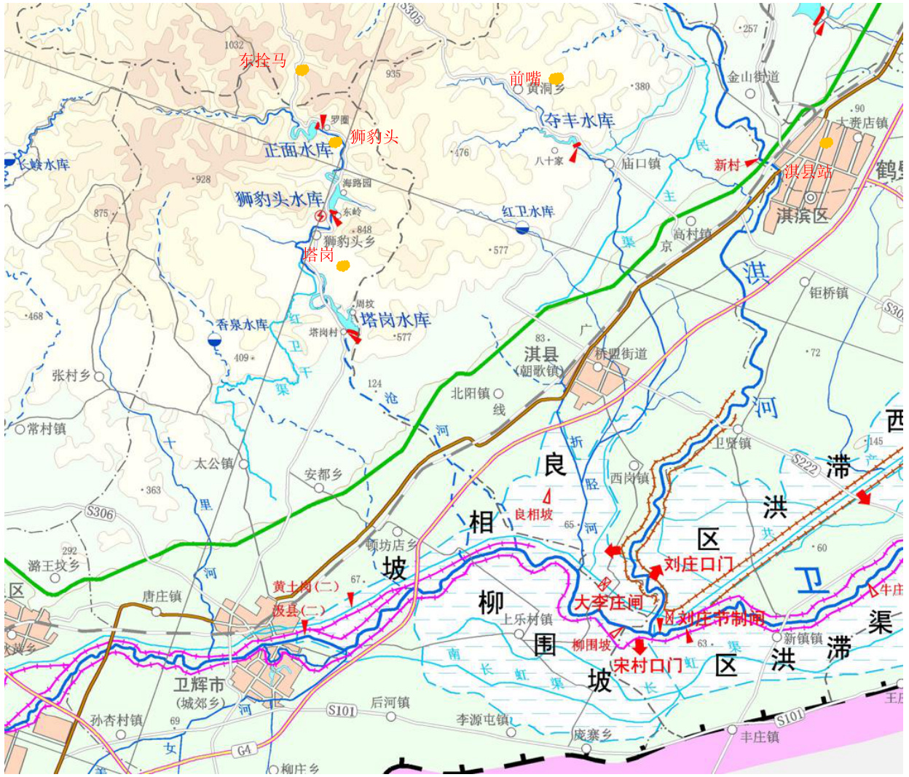  
图 2.1-1  沧河河流水系图  

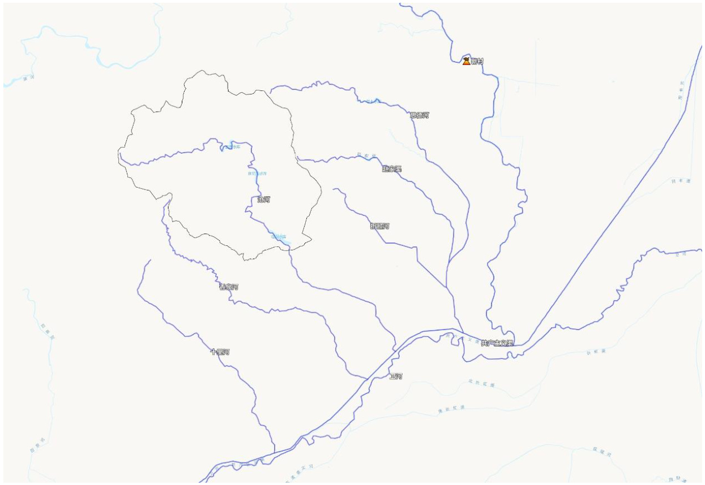  
图 2.1-2  塔岗水库位置  

# 2.2 气象  

塔岗水库坝址以上流域属暖温带大陆性季风气候,季节分明,干湿悬殊较大。冬春两季雨水稀少,风多干冷,蒸发量大;夏秋两季水汽充沛,雨量集中,降水量占全年的 $70\%$ 左右。根据卫辉市气象站 1961-2022 年气象资料统计,降水量年际变化大,多年平均降水量 $587\mathrm{mm}$ ,最大年降水量(2021 年)达$1433\mathrm{mm}$ ,最小年降水量 176mm(1997 年);多年平均水面蒸发量 $1081\mathrm{mm}$ ;多年平均气温 $14.3\%$ ,最高气温 $42.5^{\circ}\mathrm{C}$ ,最低气温- $18.4^{\circ}\mathrm{C}$ ;平均风速$2.39\mathrm{m}/\mathsf{s}$ ,最大风速 $18.7\mathrm{m}/\mathsf{s}$ ;冰冻期 12 月 ${\sim}2$ 月,无霜期 4 月 ${\sim}10$ 月。  

表 2.2-1  卫辉市气象数据统计  

<html><body><table><tr><td>项目</td><td>1月</td><td>2月</td><td>3月</td><td>4月</td><td>5月</td><td>6月</td><td>7月</td><td>8月</td><td>9月</td><td>10月</td><td>11月</td><td>12月</td><td>年</td></tr><tr><td>降水量（mm)</td><td>3.69</td><td>8.60</td><td>14.5</td><td>30.6</td><td>41.6</td><td>68.4</td><td>176</td><td>125</td><td>65.2</td><td>30.5</td><td>18.6</td><td>4.71</td><td>587</td></tr><tr><td>水面蒸发量 (mm)</td><td>36</td><td>50</td><td>88</td><td>109</td><td>131</td><td>165</td><td>116</td><td>117</td><td>98</td><td>77</td><td>57</td><td>36</td><td>1081</td></tr><tr><td>平均气温 (℃)</td><td>-0.5</td><td>2.6</td><td>8.6</td><td>15.3</td><td>21.1</td><td>26.2</td><td>27.2</td><td>26.0</td><td>21.2</td><td>15.2</td><td>7.6</td><td>1.3</td><td>14.3</td></tr><tr><td>极端最高气温 (°℃)</td><td>18.5</td><td>27.6</td><td>31.4</td><td>34.7</td><td>40.0</td><td>42.5</td><td>42.0</td><td>38.5</td><td>37.5</td><td>34.2</td><td>27.4</td><td>23.4</td><td>42.5</td></tr><tr><td>极端最低气温 (℃)</td><td>-16.6</td><td>-15.0</td><td>-8.1</td><td>-2.2</td><td>4.9</td><td>9.9</td><td>16.3</td><td>12.2</td><td>3.5</td><td>-3.4</td><td>-12.5</td><td>-18.4</td><td>-18.4</td></tr><tr><td>平均风速 (m/s)</td><td>2.44</td><td>2.68</td><td>2.96</td><td>2.96</td><td>2.60</td><td>2.43</td><td>2.10</td><td>1.96</td><td>1.89</td><td>2.02</td><td>2.32</td><td>2.35</td><td>2.39</td></tr><tr><td>最大风速 (m/s)</td><td>15.0</td><td>18.7</td><td>16.0</td><td>16.7</td><td>15.9</td><td>17.0</td><td>13.0</td><td>18.0</td><td>12.0</td><td>14.0</td><td>14.0</td><td>16.0</td><td>18.70</td></tr><tr><td>最大风速风向</td><td>NNE</td><td>NNE</td><td>NNE</td><td>NNE</td><td>NE</td><td>W</td><td>WNW</td><td>NNE</td><td>NNE</td><td>NNE</td><td>NE</td><td>NE</td><td>NNE</td></tr><tr><td>日照时数 ((h)</td><td>143</td><td>146</td><td>184</td><td>208</td><td>238</td><td>223</td><td>189</td><td>199</td><td>175</td><td>172</td><td>149</td><td>150</td><td>2177</td></tr><tr><td>相对湿度（%)</td><td>59.8</td><td>59.6</td><td>59.9</td><td>63.4</td><td>63.9</td><td>61.8</td><td>78.2</td><td>79.7</td><td>75.6</td><td>71.2</td><td>69.1</td><td>63.1</td><td>67.1</td></tr></table></body></html>  

# 2.3 水文基本资料  

# 2.3.1 水文资料  

塔岗水库所在沧河流域无水文测站,邻近淇河干流上设有新村水文站(见图 2.1-1)。  

新村水文站建于 1952 年 6 月,控制流域面积 $2118\mathsf{k m}^{2}$ 。测验任务包括水位、流量及泥沙。测验河段顺直,长约 $450\mathrm{m}$ ,上下游均有弯道,中低水时水流靠左岸,高水时右岸有漫滩,偏向左岸,上游 $300\mathsf{m}$ 有朱小河自右岸汇入。结合工程位置和水文站资料情况,本次采用新村水文站作为水文计算的设计参证站。新村站为国家设立的基本控制水文站,基本能反映流域及周边的水文情势。  

本次收集到新村站 1956-2016 年(2004、2005、2010 年缺失)逐日实测径流系列资料以及“第三次全国水资源调查评价成果”新村水文站 1956-2016 年逐月天然径流量系列资料。  

本次收集到塔岗水库流域内东拴马、狮豹头、塔岗雨量站(见图 2.1-1)1957-2021 年(部分年缺失)短历时(2h、6h、24h)及逐日降水量资料,淇县气象站 1961-2021 年逐日降雨资料以及前嘴雨量站 1978-2021 年部分年份短历时(1h、2h)降雨资料,各站位置见图 2.1-1,资料年限情况见表 2.3-1。  

表 2.3-1  雨量站资料年限统计表  

<html><body><table><tr><td>雨量站</td><td>逐日降雨资料年限</td><td>短历时降雨资料年限</td></tr><tr><td>东拴马</td><td>1965-2004、2006-2009、 2011-2014、2016、2019</td><td>1965、1968-1989、1991、2006-2009、2011- 2014、2016、2019</td></tr><tr><td>狮豹头</td><td>1957-1958、1960、1962- 1965、1962-2021</td><td>1957-1958、1960、1962--2009、2011-2014、 2016、2019、2021</td></tr><tr><td>塔岗</td><td>1960-2021</td><td>1960-1967、1970-2009、2011-2014、2016、 2019、2021</td></tr><tr><td>淇县</td><td>1965-2021</td><td></td></tr><tr><td>前嘴</td><td></td><td>1978-1981、1984-1985、1987-1989、1991、 2006-2009、2011-2014、2016、2019</td></tr></table></body></html>  

# 2.3.2 水文资料可靠性  

本次收集到新村水文站为国家基本站,隶属于河南省水文水资源勘测局,  

其水文测验均严格按照水文测验规范进行,成果由水文水资源勘测局整编存库,资料可靠性较好,可供设计使用。  

# 2.4 径流  

# 2.4.1 径流特性  

沧河流域的径流主要由降雨形成。径流的年内丰枯变化较大,主要是受降水量大小所支配,夏季水量较丰,冬季径流较小。6\~9 月为丰水期,尤以 7\~8月份最多,径流主要集中于丰水期,10 月\~次年 5 月为枯水期,枯水期径流量少。  

# 2.4.2 水文站径流  

(1)一致性分析  

本次收集的新村站径流资料为三调评价后的天然径流量,因此本次不用再次进行还原计算,且认为经三调还原后的天然成果数据一致性较好。  

# (2)代表性分析  

绘制新村水文站 $1956{\sim}2016$ 年年径流量过程线见图 2.4-1,年径流量差积曲线见图 2.4-2。从图中可以看出,新村水文站年径流丰枯交替出现,包括了$1956{\sim}1964$ 年丰水时段、 $1964\sim1974$ 年的平水时段以及 $1983\sim1995$ 年的枯水时段,因此认为新村水文站 $1956{\sim}2016$ 年径流系列代表性好。  

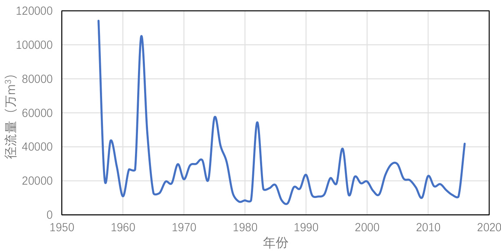  
图 2.4-1  新村站年径流过程线  

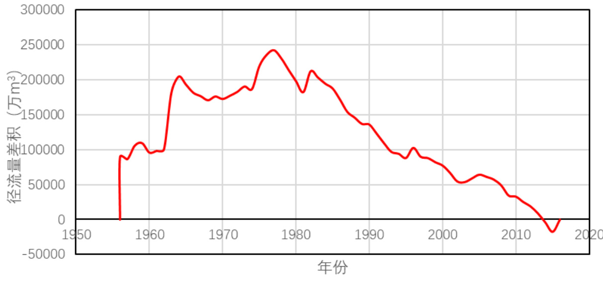  
图 2.4-2  新村站年径流差积曲线  

(3)新村站径流  

新村水文站 1956\~2016 年多年平均天然径流量 2.44 亿 $\mathsf{m}^{3}$ ,折合径流深115mm。径流量年际变化较大,最大年径流量为 11.4 亿 $\mathsf{m}^{3}$ (1956 年),最小年径流量为 0.678 亿 $\mathsf{m}^{3}$ (1987 年)。新村站多年平均逐月径流量见图 2.4-3,可见径流量年内分配主要集中在 ${7\mathrm{-}9}$ 月份,最枯月为 2 月(0.09 亿 $\mathsf{m}^{3}$ ),最丰月为 8 月(0.61 亿 $\mathsf{m}^{3}$ )。  

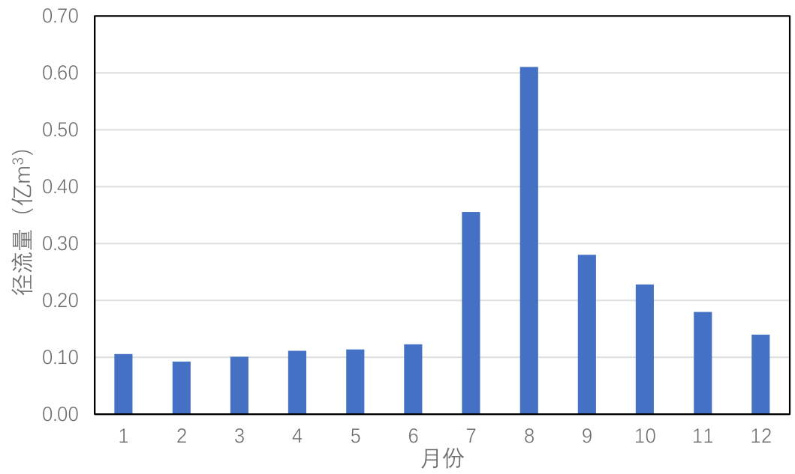  
图 2.4-3  新村站多年平均逐月径流量  

# 2.4.3 坝址断面径流  

沧河流域没有水文观测站点,故没有实测流量资料。查“第三次全国水资源调查评价成果”中“河南省平均年径流深图”及河南省 $1956{\sim}2000$ 年径流深等值线图,综合考虑后各水库坝址流域年均径流深取值见表 2.4-1,根据流域面积计算得多年平均径流量。  

各区间径流量采用两水库坝址相减计算。各区间径流成果见表 2.4-1。在多年平均径流量确定的基础上,根据新村水文站历年径流分配成果计算得各断面历年径流成果,采用 P-Ⅲ频率适线计算各断面设计径流,适线图见表 2.4-4 至表 2.4-8,成果见表 2.4-2。根据新村水文站历年天然月径流分配成果计算得各断面多年平均逐月径流成果,见表 2.4-3。  

表 2.4-1 各流域径流成果  

<html><body><table><tr><td>位置</td><td>流域面积 （km2)</td><td>多年平均径流深 （mm)</td><td>多年平均径流量（万m²)</td></tr><tr><td>正面水库</td><td>88.5</td><td>130</td><td>1151</td></tr><tr><td>正、狮区间</td><td>71.5</td><td>125</td><td>894</td></tr><tr><td>狮豹头水库</td><td>160</td><td>128</td><td>2044</td></tr><tr><td>狮、塔区间</td><td>74.0</td><td>119</td><td>881</td></tr><tr><td>塔岗水库</td><td>234.0</td><td>125</td><td>2925</td></tr></table></body></html>  

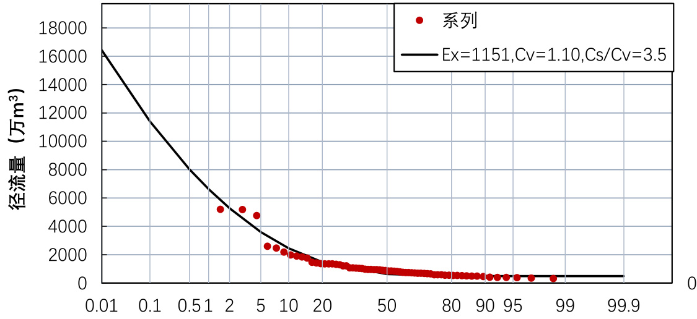  
图 2.4-4  正面水库频率适线图  

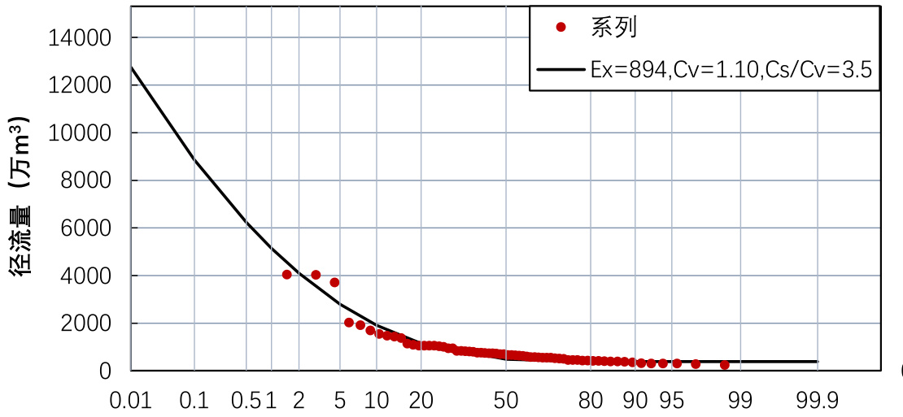  
图 2.4-5  正狮区间频率适线图  

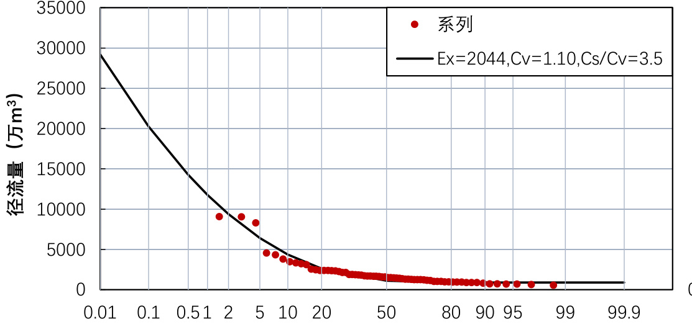  
图 2.4-6  狮豹头水库频率适线图  

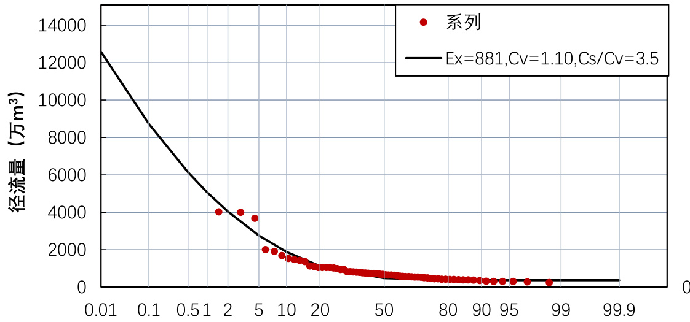  
图 2.4-7  狮塔区间水库频率适线图  

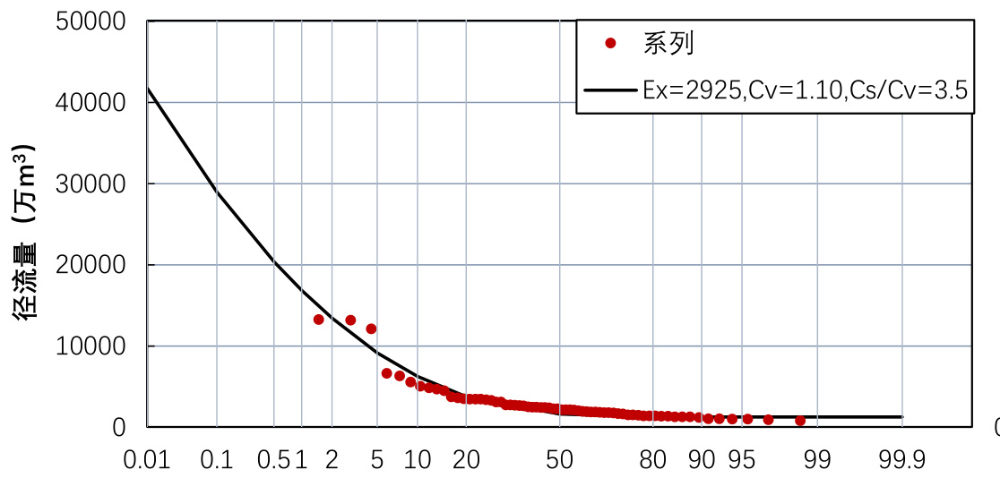  
图 2.4-8  塔岗水库频率适线图  

表 2.4-2   各流域设计径流成果  

<html><body><table><tr><td rowspan="2">位置</td><td colspan="3">参数</td><td colspan="4">各频率设计径流量（万m²)</td></tr><tr><td>Ex</td><td>Cv</td><td>Cs/Cv</td><td>10%</td><td>20%</td><td>50%</td><td>75%</td></tr><tr><td>正面水库</td><td>1151</td><td>1.10</td><td>3.5</td><td>2454</td><td>1473</td><td>627</td><td>503</td></tr><tr><td>正狮区间</td><td>894</td><td>1.10</td><td>3.5</td><td>1906</td><td>1144</td><td>487</td><td>390</td></tr><tr><td>狮豹头水库</td><td>2044</td><td>1.10</td><td>3.5</td><td>4360</td><td>2617</td><td>1113</td><td>893</td></tr><tr><td>狮塔区间</td><td>881</td><td>1.10</td><td>3.5</td><td>1879</td><td>1127</td><td>480</td><td>385</td></tr><tr><td>塔岗水库</td><td>2925</td><td>1.10</td><td>3.5</td><td>6239</td><td>3744</td><td>1593</td><td>1278</td></tr></table></body></html>  

表 2.4-3   各流域逐月径流成果  

<html><body><table><tr><td rowspan="2">位置</td><td colspan="11">多年平均逐月径流量（万m²)</td></tr><tr><td>1月 2月</td><td></td><td>3月</td><td>4月</td><td>5月</td><td>6月</td><td>7月</td><td>8月</td><td>9月</td><td>10月</td><td>11月</td><td>12月</td><td>全年</td></tr><tr><td>正面水库</td><td>48.1</td><td></td><td>42.745.048.849.855.1</td><td></td><td></td><td></td><td>192</td><td>277</td><td>130</td><td>109</td><td>85.5</td><td>67.3</td><td>1151</td></tr><tr><td>正、狮区间</td><td></td><td></td><td>37.433.235.037.938.7</td><td></td><td></td><td>42.8</td><td>149</td><td>215</td><td>101</td><td>84.8</td><td>66.4</td><td>52.2</td><td>894</td></tr><tr><td>狮豹头水库</td><td></td><td></td><td>85.575.980.086.7</td><td></td><td></td><td>88.598.0</td><td>341</td><td>492</td><td>232</td><td>194</td><td>152</td><td>120</td><td>2044</td></tr><tr><td>狮、塔区间</td><td></td><td></td><td>36.832.734.537.438.1</td><td></td><td></td><td>42.2</td><td>147</td><td>212</td><td>100</td><td>83.5</td><td>65.5</td><td>51.5</td><td>881</td></tr><tr><td>塔岗水库</td><td>122</td><td>109</td><td>114</td><td>124</td><td>127</td><td>140</td><td>487</td><td>704</td><td>332</td><td>277</td><td>217</td><td>171</td><td>2925</td></tr></table></body></html>  

# 2.5 洪水  

本流域内洪水由暴雨形成,其变化受暴雨和地形等因素影响,洪水的时空分布与暴雨一致,暴雨时空分布对本流域峰型影响较大,易形成峰高量大的洪峰。受暴雨特性及流域下垫面综合影响,洪水频次多、量级大,且源短流急,洪水迅猛。暴雨历时一般 3 天左右,强度较大的暴雨常集中在 1 天甚至数小时内。洪水多发生在 ${\tt6}\sim\mathfrak{g}$ 月份,年最大洪峰一般出现在 7 月初至 8 月中旬。  

由于塔岗水库以上流域无实测流量资料,本次设计中采用暴雨法推求设计洪水。首先根据各雨量站实测降雨资料计算各水库及区间流域内设计暴雨值;再根据《河南省中小流域设计暴雨洪水图集(1984 年版)》(以下简称《84图集》)中推理公式法推求设计洪水;再经合理性分析确定最终采用设计洪峰后,推求洪水过程线,进行洪水地区组成计算。  

# 2.5.1 历史洪水  

经查阅历史资料,沧河历史上多次爆发洪水造成严重洪灾。1956 年 7 月21 日降雨 $300\mathrm{mm}$ ,塔岗村测得洪峰流量 $2400\mathrm{m}^{3}/\mathsf{s}$ ,历时 20 分钟,塔岗村半个村庄被冲毁,上游山丘区塌房 431 间,死伤 37 人,毁梯田 3000 余亩。牲畜、家具被冲走不计其数。  

1963 年 8 月 3 日突降大雨,8 月 3 日到 9 日降雨量为 $778\mathrm{mm}$ ,占全年降雨量的 $60\%$ 。查 1963 年水文年鉴,塔岗水库年最高水位 $179.84\mathrm{m}$ (大沽高程)。1970 年 7 月、1982 年 7 月、1996 年 8 月、2016 年 7 月等年份均有不同程度洪灾。  

2021 年 7 月 $17\sim23$ 日,卫辉市普降大到暴雨,平均降雨量 $687\mathrm{mm}$ 。根据狮豹头站及塔岗站实测降雨资料,塔岗水库 2021 年最大 24 小时面降雨量达$525\mathrm{mm}$ 。根据塔岗水库管理局记录,2021 年塔岗水库于 7 月 22 日 9 时达到最高水位 $180.94\mathrm{m}$ (85 高程)。依据正面水库、狮豹头水库和塔岗水库有关观测资料推算,塔岗水库坝址以上流域该场次洪水的最大 24h 洪量约 0.89 亿 $\mathsf{m}^{3}$ ,最大 3 日洪量约 1.2 亿 $\mathsf{m}^{3}$ 。  

# 2.5.2 设计暴雨  

(1)最大 1 日及 3 日设计暴雨  

本次需计算 5 处水库及区间流域设计洪水,各流域采用参证雨量站见表2.5-1。各流域逐日面雨量采用各自参证雨量站算数平均值,其中正面水库和正狮区间参政雨量站为单站,鉴于两流域面积不大,出于工程安全考虑,本次设计暴雨不进行点面折减计算。  

# 表 2.5-1   各流域参证雨量站  

<html><body><table><tr><td>位置</td><td>参证站</td></tr><tr><td>正面水库</td><td>东拴马雨量站</td></tr><tr><td>正狮区间</td><td>狮豹头雨量站</td></tr><tr><td>狮豹头水库</td><td>东拴马、狮豹头雨量站</td></tr><tr><td>狮塔区间</td><td>狮豹头、塔岗雨量站</td></tr><tr><td>塔岗水库</td><td>东拴马、狮豹头、塔岗雨量站</td></tr></table></body></html>  

统计各流域最大 1 日及最大 3 日降水量。将东拴马站与狮豹头站、狮豹头站与塔岗站 1957-2021 年同期降雨资料建立相关关系,见图 2.5-1 至图 2.5-4。由图可见,各站年最大 1 日与最大 3 日降雨相关关系较好,可以进行插补延长,计算得到各雨量站 1957\~2021 年最大 1 日与最大 3 日降水量系列。  

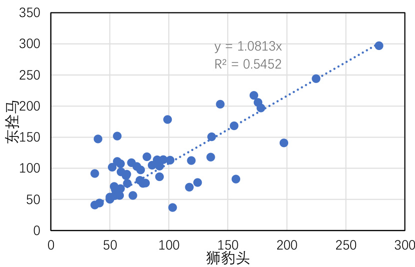  
图 2.5-1  东拴马站与狮豹头站年最大 1 日降水量相关图  

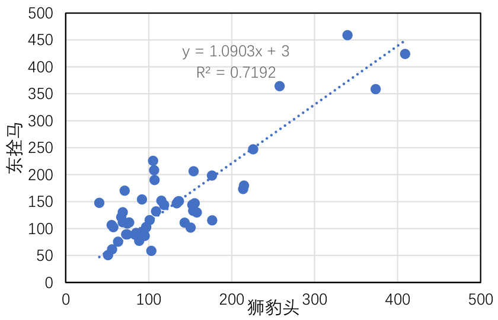  
图 2.5-2  东拴马站与狮豹头站年最大 3 日降水量相关图  

  
图 2.5-3  塔岗站与狮豹头站年最大 1 日降水量相关图  

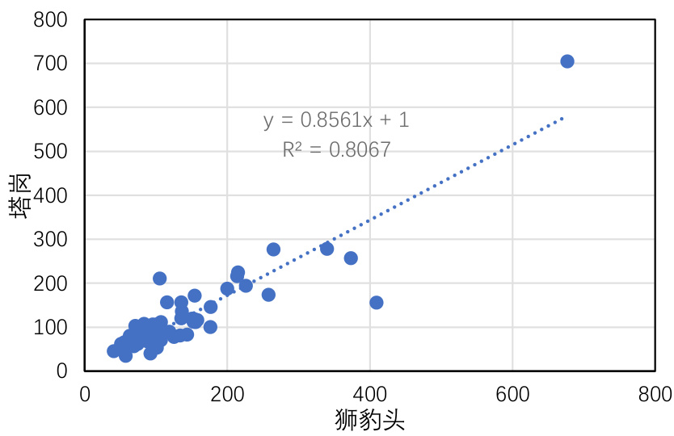  
图 2.5-4  塔岗站与狮豹头站年最大 3 日降水量相关图  

将各流域最大 3 日面雨量采用 P-Ⅲ频率曲线进行适线,适线图见图 2.5-5至图 2.5-9,设计成果见表 2.5-2。  

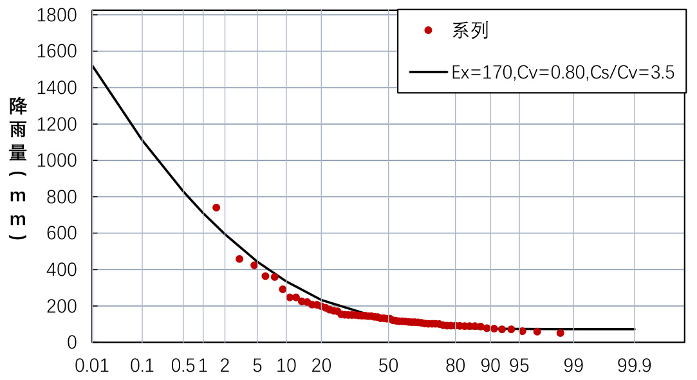  
图 2.5-5  正面水库(东拴马站)最大 3 日暴雨频率适线图  

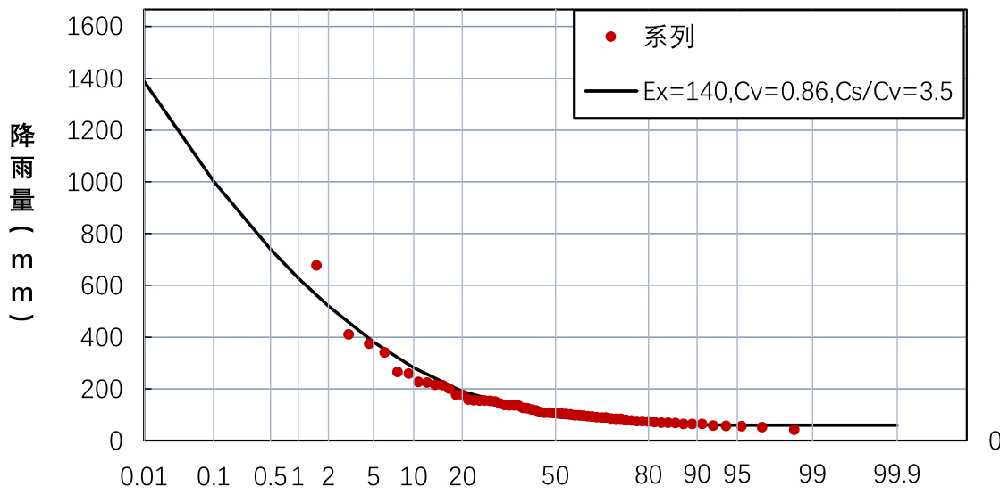  
图 2.5-6  正狮区间(狮豹头站)最大 3 日暴雨频率适线图  

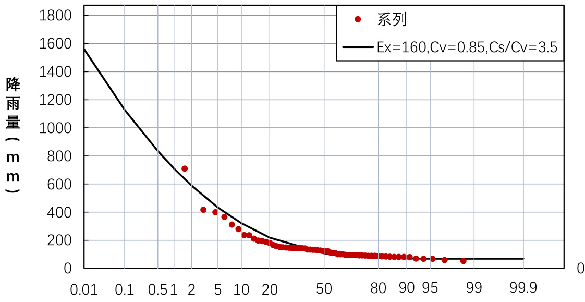  
图 2.5-7  狮豹头水库(东拴马站&狮豹头站)最大 3 日暴雨频率适线图  

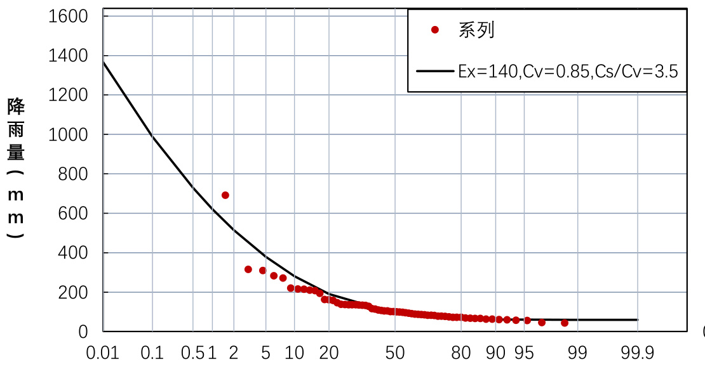  
图 2.5-8  狮塔区间(狮豹头站&塔岗站)最大 3 日暴雨频率适线图  

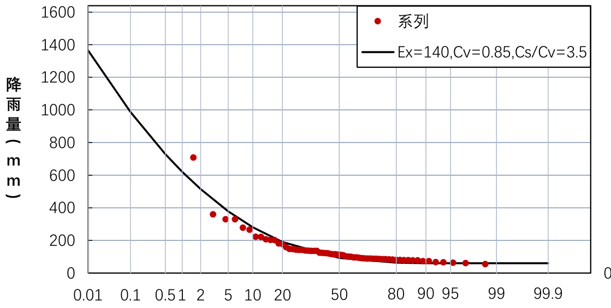  
图 2.5-9  塔岗水库(东拴马站&狮豹头站&塔岗站)最大 3 日暴雨频率适线图  

表 2.5-2  各流域最大 3 日设计暴雨成果  

<html><body><table><tr><td rowspan="2">位置</td><td colspan="3">统计参数</td><td colspan="6">各频率（%）设计暴雨 （mm）</td></tr><tr><td>Ex</td><td>Cv</td><td>CsCv</td><td>0.05</td><td>0.33</td><td>1</td><td>2</td><td>5</td><td>10</td></tr><tr><td>正面水库</td><td>170</td><td>0.80</td><td>3.5</td><td>1233</td><td>902</td><td>710</td><td>594</td><td>443</td><td>335</td></tr><tr><td>正狮区间</td><td>140</td><td>0.86</td><td>3.5</td><td>1118</td><td>807</td><td>628</td><td>520</td><td>381</td><td>282</td></tr><tr><td>狮豹头水库</td><td>160</td><td>0.85</td><td>3.5</td><td>1258</td><td>910</td><td>710</td><td>588</td><td>433</td><td>321</td></tr><tr><td>狮塔区间</td><td>140</td><td>0.85</td><td>3.5</td><td>1101</td><td>796</td><td>621</td><td>515</td><td>378</td><td>281</td></tr><tr><td>塔岗水库</td><td>140</td><td>0.85</td><td>3.5</td><td>1101</td><td>796</td><td>621</td><td>515</td><td>378</td><td>281</td></tr></table></body></html>  

# (2)短历时设计暴雨  

统计各流域最大 2h、6h、24h 降水量。各站短历时降雨缺测年份根据本站同期最大 1 日降水量建立相关关系进行插补延长(见图 2.5-10 至图 2.5-12)。根据《84 图集》计算方法,设计洪水计算需采用最大 1h 设计暴雨,东拴马、狮豹头、塔岗雨量站均无最大 1h 暴雨资料,采用临近流域前嘴雨量站最大 1h与最大 2h 降雨相关关系(见图 2.5-13),根据各雨量站最大 2h 降水量进行转换。  

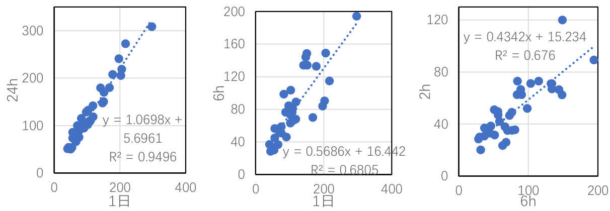  
图 2.5-10  东拴马站短历时降水量相关图  

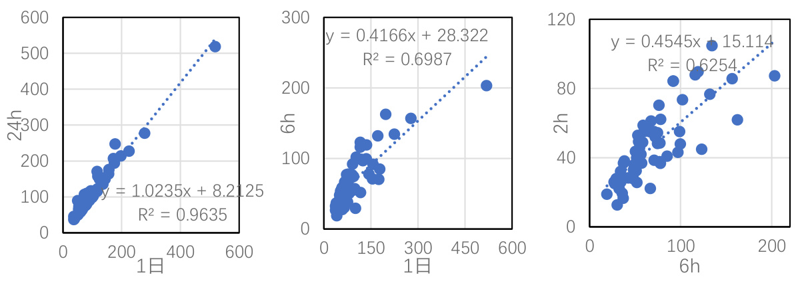  
图 2.5-11  狮豹头站短历时降水量相关图  

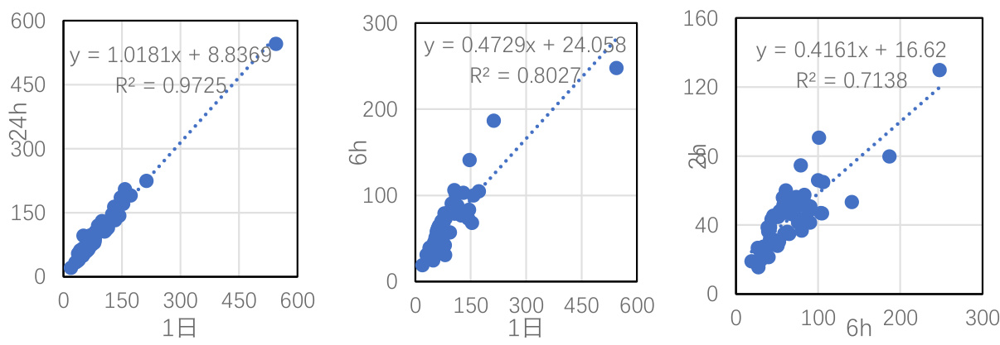  
图 2.5-12  塔岗站短历时降水量相关图  

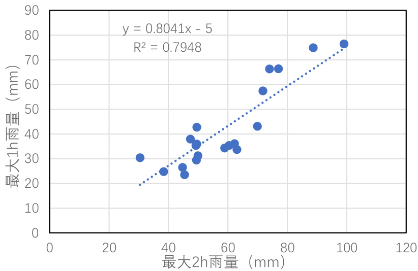  
图 2.5-13  前嘴站最大 1h 与最大 2h 降水量相关关系  

将各流域插补延长后的短历时面雨量采用 P-Ⅲ频率曲线进行适线(以塔岗水库流域为例,见图 2.5-14 至图 2.5-16),并将成果与《塔岗初设 08》原成果(暴雨参数采用《84 图集》)进行对比,见表 2.5-3。  

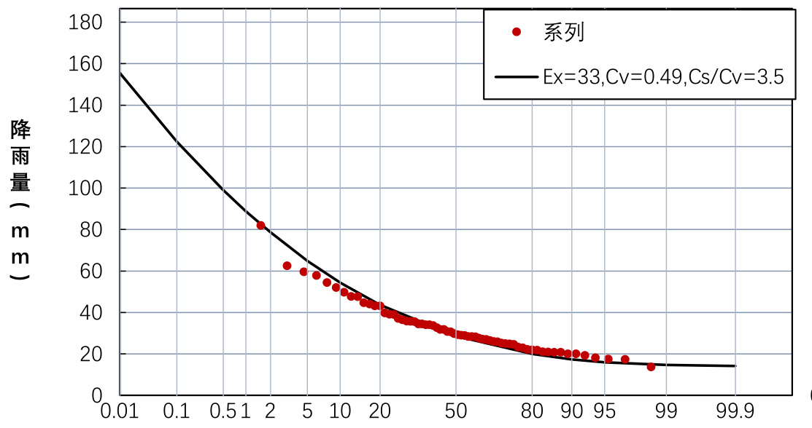  
图 2.5-14  塔岗水库(东拴马站&狮豹头站&塔岗站)最大 1h 暴雨频率适线图  

  
图 2.5-15  塔岗水库(东拴马站&狮豹头站&塔岗站)最大 6h 暴雨频率适线图  

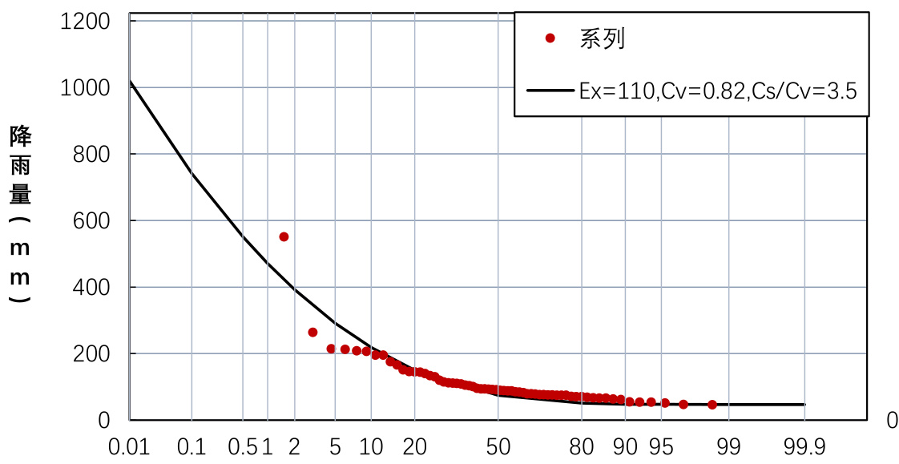  
图 2.5-16  塔岗水库(东拴马站&狮豹头站&塔岗站)最大 24h 暴雨频率适线图  

表 2.5-3  各流域短历时设计暴雨成果对比表  

<html><body><table><tr><td rowspan="2">位置</td><td rowspan="2">类型</td><td rowspan="2">点面折减</td><td rowspan="2">时段</td><td colspan="3">参数</td><td colspan="5">各频率 （%） 设计暴雨 (ww)</td></tr><tr><td>Ex</td><td>Cv</td><td>CsCv</td><td>0.05 0.33</td><td>1</td><td>2</td><td>5</td><td>10</td></tr><tr><td rowspan="6">正面水库</td><td rowspan="3">本次计算</td><td>1</td><td>1h</td><td>37.0</td><td>0.570</td><td>3.50</td><td>176</td><td>136</td><td>113 98.4</td><td>79.1</td><td>64.5</td></tr><tr><td>1</td><td>6h</td><td>80.0</td><td>0.750</td><td>3.50</td><td>534</td><td>395</td><td>314 265</td><td>201</td><td>154</td></tr><tr><td>1</td><td>24h</td><td>130</td><td>0.800</td><td>3.50</td><td>943</td><td>689 543</td><td>454</td><td>339</td><td>256</td></tr><tr><td rowspan="3">原成果</td><td>0.853</td><td>1h</td><td>43.5 0.553</td><td>3.50</td><td>170</td><td>133</td><td>110</td><td>96.5</td><td>78.0</td><td>63.9</td></tr><tr><td>0.875</td><td>6h</td><td>86.5</td><td>0.670</td><td>3.50</td><td>438 330</td><td>267</td><td>228</td><td>178</td><td>140</td></tr><tr><td>0.895</td><td>24h</td><td>135 0.720</td><td>3.50</td><td>765</td><td>570</td><td>456</td><td>386</td><td>296</td><td>229</td></tr><tr><td rowspan="6">正狮区间</td><td rowspan="3">本次计算</td><td>1</td><td>1h</td><td>33.0</td><td>0.530</td><td>3.50</td><td>144</td><td>113</td><td>94.7 83.1</td><td>67.7</td><td>56.0</td></tr><tr><td>1</td><td>6h</td><td>70.0</td><td>0.600</td><td>3.50</td><td>354</td><td>272</td><td>224 194</td><td>154</td><td>124</td></tr><tr><td>1</td><td>24h</td><td>115</td><td>0.800</td><td>3.50</td><td>834</td><td>610</td><td>481 401</td><td>300</td><td>226</td></tr><tr><td rowspan="3">原成果</td><td>0.885</td><td>1h</td><td>45.0 0.545</td><td>3.50</td><td>180</td><td>140</td><td>117</td><td>102</td><td>83.0</td><td>68.3</td></tr><tr><td>0.910</td><td>6h</td><td>84.0</td><td>0.650</td><td>3.50</td><td>426 323</td><td>262</td><td>225</td><td>176</td><td>140</td></tr><tr><td>0.930</td><td>24h</td><td>132</td><td>0.680 3.50</td><td>723</td><td>544</td><td>439</td><td>375</td><td>291</td><td>228</td></tr><tr><td rowspan="6">狮豹头水库</td><td rowspan="3">本次计算</td><td>1</td><td>1h</td><td>34.0</td><td>0.500</td><td>3.50</td><td>139</td><td>110 93.0</td><td>82.1</td><td>67.6</td><td>56.5</td></tr><tr><td>1</td><td>6h</td><td>75.0</td><td>0.650</td><td>3.50</td><td>418</td><td>317 257</td><td>221</td><td>173</td><td>137</td></tr><tr><td>1</td><td>24h</td><td>115</td><td>0.800</td><td>3.50</td><td>834</td><td>610 481</td><td>401</td><td>300</td><td>226</td></tr><tr><td rowspan="3">原成果</td><td>0.802</td><td>1h</td><td>44.0</td><td>0.551</td><td>3.50 161</td><td>126</td><td>105</td><td>91.5</td><td>74.0</td><td>60.7</td></tr><tr><td>0.817</td><td>6h</td><td>85.5</td><td>0.660</td><td>3.50</td><td>396</td><td>300 243</td><td>208</td><td>162</td><td>129</td></tr><tr><td>0.843</td><td>24h</td><td>134 0.710</td><td>3.50</td><td>702</td><td>524</td><td>421</td><td>357</td><td>274</td><td>213</td></tr><tr><td rowspan="8">狮塔区间</td><td rowspan="3">本次计算</td><td>1</td><td>1h</td><td>31.0</td><td>0.490</td><td>3.50 124</td><td>98.7</td><td>83.4</td><td>73.8</td><td>61.0</td><td>51.1</td></tr><tr><td>1</td><td></td><td>70.0</td><td>0.650</td><td>3.50 390</td><td>295</td><td>240</td><td>206</td><td>161</td><td>128</td></tr><tr><td></td><td>6h</td><td></td><td></td><td></td><td></td><td>460</td><td>384</td><td>287</td><td>216</td></tr><tr><td rowspan="3">原成果</td><td>1</td><td>24h 1h</td><td>110 45.0</td><td>0.800 0.542</td><td>3.50 3.50</td><td>798 178</td><td>583 139</td><td>102</td><td></td><td></td></tr><tr><td>0.883 0.900</td><td>6h</td><td>82.0</td><td>0.650</td><td>3.50</td><td>411 311</td><td>116 253</td><td>217</td><td>82.6 170</td><td>68.0 135</td></tr><tr><td>0.922</td><td>24h</td><td>125 0.660</td><td>3.50</td><td>654</td><td>494</td><td>401</td><td>343</td><td>268</td><td>212</td></tr><tr><td rowspan="3">本次计算</td><td>1</td><td></td><td>33.0</td><td>0.490</td><td>3.50 132</td><td>105</td><td>88.8</td><td>78.6</td><td>64.9</td><td>54.4</td></tr><tr><td></td><td>1h</td><td>72.0</td><td></td><td></td><td></td><td></td><td></td><td></td><td></td></tr><tr><td>1 1</td><td>6h</td><td></td><td>0.720</td><td>3.50</td><td>456 339</td><td>272</td><td>230</td><td>176</td><td>137</td></tr><tr><td rowspan="4">塔岗水库 原成果</td><td></td><td>24h</td><td>110</td><td>0.820</td><td>3.50</td><td>824</td><td>600</td><td>471</td><td>392</td><td>291</td><td>218</td></tr><tr><td>0.765</td><td>1h</td><td>45.0</td><td>0.548</td><td>3.50</td><td>157</td><td>122</td><td>102</td><td>88.9</td><td>72.0</td><td>59.1</td></tr><tr><td></td><td>0.785 6h</td><td>85.0</td><td>0.650</td><td>3.50</td><td>372</td><td>282</td><td>229</td><td>196</td><td>154</td><td>122</td></tr><tr><td></td><td>0.815</td><td>24h 132</td><td>0.680</td><td>3.50</td><td>634</td><td>476</td><td>385</td><td>328</td><td>255</td><td>200</td></tr></table></body></html>  

由表 2.5-3 可以看出,本次计算最大 24h 设计暴雨除在 10 一遇重现期下较《塔岗初设 08》设计值相差不大,其余均增大较多。主要是因为本次采用雨量站实测暴雨资料计算,年份为 1957-2021 年,资料系列更长。且由于 2021 年发生了有观测数据以来最大暴雨,塔岗面雨量最大 24h 雨量达 $548.7\mathrm{mm}$ ,明显大于排第二位的 $244.4\mathrm{mm}$ (1970 年),而《塔岗初设 08》采用的设计暴雨是依据《84 图集》查算得到,并未包含近年来的大暴雨,因此本次设计暴雨成果较以往明显增大。本次计算的最大 1h 和最大 6h 设计暴雨相较《塔岗初设 08》设计值除正面水库相差不大外其余均略小,主要是因为《84 图集》对于雨型分配十分保守,降水更加集中。综合分析认为,从总洪量安全角度考虑推荐采用本次计算的设计暴雨成果。  

# (3)暴雨时程分配  

本次拟根据狮豹头和塔岗雨量站 1963 年 8 月“63.8”洪水的暴雨过程计算各流域 3 日设计暴雨过程。其中,最大 24h 设计暴雨时程根据《84 图集》推荐的暴雨洪水计算方法分配,见图 2.5-13。其余 48h 设计暴雨量为各频率最大 3 日设计暴雨减去最大 24h 设计暴雨值,时程分配采用狮豹头和塔岗雨量站“63.8”洪水实测暴雨过程进行雨量同倍比缩放计算。  

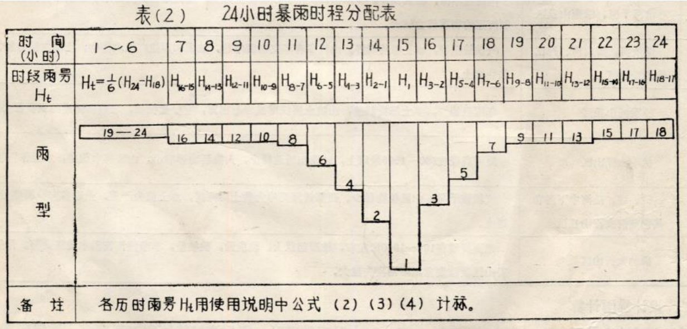  
图 2.5-17 《84 图集》24h 设计暴雨时程分配示意图  

# 2.5.3 设计洪水  

根据《84 图集》,流域面积在 $200\mathsf{k m}^{2}$ 及以下的流域可采用推理公式法进行计算。本次各水库及区间流域除塔岗水库流域面积 $234\mathsf{k m}^{2}$ 略大于要求外,其余均小于 $200\mathsf{k m}^{2}$ 。考虑塔岗水库以往报告均采用推理公式法,以及本次各水库区间计算方法与成果的一致性,汇流计算均采用推理公式法计算洪峰流量,计算公式如下:  

$$
Q_{m}=0.278\psi\frac{S}{\tau^{n}}F
$$  

$$
\psi=1-\frac{\mu}{S}\tau^{n}
$$  

$$
\tau=0.278\frac{L}{m J^{1/3}Q^{1/4}}
$$  

式中: 𝑄𝑚 ——设计洪峰流量( $m^{3}/\mathsf{s}$ );$\psi$ 洪峰径流系数;洪峰汇流历时(h);$F$ 流域面积(km2);干流长度(km);𝐿的平均坡度;𝑆— 最大 1h 雨量平均强度(mm/h);$\mu$ 平均入渗率(mm/h);𝑚— 汇流参数。  

根据《84 图集》,卫辉市位于豫北地区,上式中平均入渗强度为$5{\sim}8\mathrm{mm/h}$ ,本次计算中考虑到 1963 年、2021 年主雨过程来临前期均已经有一定的余量,土壤比较湿润,平均入渗取 5mm/h,汇流参数 m 值可用《84 图集》中 $\mathsf{\Theta}^{\sim}\mathsf{m}$ 相关图查得。  

根据各流域最大 3 日设计暴雨过程,采用蓄满产流模型计算各流域设计洪水过程,并统计各流域设计洪水时段洪量。将各流域设计洪水成果与《塔岗初设 08》已有成果对比,见表 2.5-4。  

表 2.5-4  各流域设计洪水成果对比表  

<html><body><table><tr><td rowspan="2">位置</td><td rowspan="2">类型</td><td rowspan="2">项目</td><td colspan="6">各频率（%） 设计值</td></tr><tr><td>0.05</td><td>0.33</td><td>1</td><td>2</td><td>5</td><td>10</td></tr><tr><td rowspan="5">正面水库</td><td rowspan="3">本次计算</td><td>洪峰流量(m/s)</td><td>3686</td><td>2695</td><td>2145</td><td>1835</td><td>1382</td><td>1014</td></tr><tr><td>最大24h 洪量（万m²）</td><td>7211</td><td>4988</td><td>3710</td><td>2929</td><td>1927</td><td>1244</td></tr><tr><td>最大3日洪量（万 m²)</td><td>8895</td><td>6074</td><td>4466</td><td>3490</td><td>2258</td><td>1420</td></tr><tr><td rowspan="2">《塔岗初设08》</td><td>洪峰流量(m?/s)</td><td>3560</td><td></td><td></td><td>1645</td><td></td><td></td></tr><tr><td>最大 24h 洪量（万 m²）</td><td>6151</td><td></td><td></td><td>2673</td><td></td><td>1266</td></tr><tr><td rowspan="5">正狮区间</td><td rowspan="2">本次计算</td><td>洪峰流量(m3/s)</td><td>2242</td><td>1670</td><td>1324</td><td>1107</td><td>849</td><td>655</td></tr><tr><td>最大24h 洪量（万m²）</td><td>5022</td><td>3445</td><td>2537</td><td>1983</td><td>1272</td><td>786</td></tr><tr><td></td><td>最大3日洪量（万 m²)</td><td>6370</td><td>4252</td><td>3051</td><td>2335</td><td>1439</td><td>848</td></tr><tr><td rowspan="2">《塔岗初设08》</td><td>洪峰流量(m3/s)</td><td>3147</td><td></td><td></td><td>1457</td><td></td><td></td></tr><tr><td>最大24h 洪量（万m²）</td><td>4662</td><td></td><td></td><td>2059</td><td></td><td>1015</td></tr><tr><td rowspan="5">狮豹头水库</td><td rowspan="3">本次计算</td><td>洪峰流量(m?/s)</td><td>4340</td><td>3150</td><td>2455</td><td>2149</td><td>1621</td><td>1223</td></tr><tr><td>最大 24h 洪量（万 m²）</td><td>11246</td><td>7718</td><td>5688</td><td>4457</td><td>2868</td><td>1862</td></tr><tr><td>最大3日洪量（万 m²)</td><td>16174</td><td>10878</td><td>7866</td><td>6051</td><td>3765</td><td>2341</td></tr><tr><td rowspan="2">《塔岗初设08》</td><td>洪峰流量(m"/s)</td><td>5095</td><td></td><td></td><td>2277</td><td></td><td></td></tr><tr><td>最大24h 洪量（万m²）</td><td>10144</td><td></td><td></td><td>4336</td><td></td><td>2080</td></tr><tr><td rowspan="5">狮塔区间</td><td rowspan="3">本次计算</td><td>洪峰流量（m/s)</td><td>2006</td><td>1497</td><td>1213</td><td>1023</td><td>789</td><td>611</td></tr><tr><td>最大24h洪量（万 m²）</td><td>4944</td><td>3381</td><td>2481</td><td>1932</td><td>1229</td><td>789</td></tr><tr><td>最大3日洪量（万 m²)</td><td>6441</td><td>4297</td><td>3082</td><td>2353</td><td>1442</td><td>876</td></tr><tr><td rowspan="2">《塔岗初设08》</td><td>洪峰流量(m?/s)</td><td>3063</td><td></td><td></td><td>1407</td><td></td><td></td></tr><tr><td>最大 24h 洪量（万 m²）</td><td>4336</td><td></td><td></td><td>1931</td><td></td><td>962</td></tr><tr><td rowspan="5">塔岗水库</td><td rowspan="3">本次计算</td><td>洪峰流量(m"/s)</td><td>6151</td><td>4335</td><td>3541</td><td>2916</td><td>2171</td><td>1586</td></tr><tr><td>最大 24h 洪量 （万m²）</td><td>16226</td><td>11043</td><td>8099</td><td>6296</td><td>4031</td><td>2636</td></tr><tr><td>最大3 日洪量 （万m²)</td><td>20468</td><td>13665</td><td>9801</td><td>7493</td><td>4625</td><td>2894</td></tr><tr><td rowspan="2">《塔岗初设08》</td><td>洪峰流量(m?/s)</td><td>6464</td><td></td><td></td><td>2846</td><td></td><td></td></tr><tr><td>最大24h洪量（万m²）</td><td>13221</td><td></td><td></td><td>5803</td><td></td><td>2761</td></tr></table></body></html>  

由表 2.5-3 可以看出,本次计算的塔岗水库设计洪水洪峰流量与《塔岗初设 08》设计值相差不大,最大 24h 洪量明显增加。主要原因为本次计算最大24h 设计暴雨增大,1h、6h 设计暴雨与《塔岗初设 08》成果相差不大。考虑到本次计算采用的是实测雨量资料,系列到最近年份,相较查图法更能反映本流域的实际降雨情况,且出于工程安全考虑,推荐采用本次计算的洪水成果。各流域洪水过程成果见表 2.5-5 至表 2.5-9,洪水过程图(以 $0.05\%$ 频率为例)见图 2.5-18。  

表 2.5-5  正面水库设计洪水过程表  

<html><body><table><tr><td rowspan="2">历时（h)</td><td colspan="6">各频率（%）设计洪峰流量（m/s)</td></tr><tr><td>0.05</td><td>0.33</td><td>1</td><td>2</td><td>5</td><td>10</td></tr><tr><td>1</td><td>10.3</td><td>6.75</td><td>3.14</td><td>2.77</td><td>2.60</td><td>2.31</td></tr><tr><td>2</td><td>4.82</td><td>3.09</td><td>1.32</td><td>1.20</td><td>1.18</td><td>1.11</td></tr><tr><td>3</td><td>2.34</td><td>1.46</td><td>0.577</td><td>0.540</td><td>0.544</td><td>0.534</td></tr><tr><td>4</td><td>1.15</td><td>0.707</td><td>0.262</td><td>0.251</td><td>0.256</td><td>0.259</td></tr><tr><td>5</td><td>0.571</td><td>0.347</td><td>0.123</td><td>0.119</td><td>0.122</td><td>0.126</td></tr><tr><td>9</td><td>0.284</td><td>0.171</td><td>0.059</td><td>0.058</td><td>0.059</td><td>0.061</td></tr><tr><td>7</td><td>0.142</td><td>0.085</td><td>0.029</td><td>0.028</td><td>0.029</td><td>0.030</td></tr><tr><td>8</td><td>0.071</td><td>0.042</td><td>0.014</td><td>0.014</td><td>0.014</td><td>0.015</td></tr><tr><td>9</td><td>799</td><td>515</td><td>371</td><td>293</td><td>186</td><td>111</td></tr><tr><td>10</td><td>1000</td><td>676</td><td>498</td><td>396</td><td>259</td><td>161</td></tr><tr><td>11</td><td>252</td><td>209</td><td>169</td><td>137</td><td>101</td><td>71.9</td></tr><tr><td>12</td><td>66.9</td><td>67.1</td><td>59.1</td><td>49.1</td><td>40.0</td><td>32.3</td></tr><tr><td>13</td><td>19.5</td><td>22.5</td><td>21.4</td><td>18.3</td><td>16.3</td><td>14.6</td></tr><tr><td>14</td><td>6.44</td><td>8.03</td><td>8.10</td><td>7.11</td><td>6.81</td><td>6.69</td></tr><tr><td>15</td><td>2.44</td><td>3.07</td><td>3.21</td><td>2.91</td><td>2.93</td><td>3.08</td></tr><tr><td>16</td><td>1.03</td><td>1.26</td><td>1.34</td><td>1.24</td><td>1.29</td><td>1.43</td></tr><tr><td>17</td><td>0.472</td><td>0.547</td><td>0.584</td><td>0.554</td><td>0.586</td><td>0.668</td></tr><tr><td>18</td><td>0.226</td><td>0.250</td><td>0.265</td><td>0.255</td><td>0.271</td><td>0.315</td></tr><tr><td>19</td><td>0.110</td><td>0.118</td><td>0.124</td><td>0.121</td><td>0.128</td><td>0.149</td></tr><tr><td>20</td><td>0.055</td><td>0.057</td><td>0.059</td><td>0.058</td><td>0.061</td><td>0.071</td></tr><tr><td>21</td><td>0.027</td><td>0.028</td><td>0.029</td><td>0.028</td><td>0.030</td><td>0.034</td></tr><tr><td>22</td><td>0.014</td><td>0.014</td><td>0.014</td><td>0.014</td><td>0.014</td><td>0.017</td></tr><tr><td>23</td><td>0.007</td><td>0.007</td><td>0.007</td><td>0.007</td><td>0.007</td><td>0.008</td></tr><tr><td>24</td><td>0.003</td><td>0.003</td><td>0.003</td><td>0.003</td><td>0.003</td><td>0.004</td></tr><tr><td>25</td><td>0.002</td><td>0.002</td><td>0.002</td><td>0.002</td><td>0.002</td><td>0.002</td></tr><tr><td>26</td><td>0.001</td><td>0.001</td><td>0.001</td><td>0.001</td><td>0.001</td><td>0.001</td></tr><tr><td>27</td><td>0.000</td><td>0.000</td><td>0.000</td><td>0.000</td><td>0.000</td><td>0.000</td></tr><tr><td>28</td><td>0.000</td><td>0.000</td><td>0.000</td><td>0.000</td><td>0.000</td><td>0.000</td></tr><tr><td>29</td><td>0.000</td><td>0.000</td><td>0.000</td><td>0.000</td><td>0.000</td><td>0.000</td></tr><tr><td>30</td><td>0.000</td><td>0.000</td><td>0.000</td><td>0.000</td><td>0.000</td><td>0.000</td></tr><tr><td>31</td><td>69.2</td><td>25.9</td><td>7.37</td><td>0.000</td><td>0.000</td><td>0.000</td></tr><tr><td>32</td><td>95.3</td><td>38.8</td><td>11.1</td><td>0.000</td><td>0.000</td><td>0.000</td></tr><tr><td>33</td><td>159</td><td>76.3</td><td>32.7</td><td>12.6</td><td>0.000</td><td>0.000</td></tr></table></body></html>  

<html><body><table><tr><td rowspan="2">历时 (h)</td><td colspan="6">各频率（%）设计洪峰流量（m3/s)</td></tr><tr><td>0.05</td><td>0.33</td><td>1</td><td>2</td><td>5</td><td>10</td></tr><tr><td>34</td><td>176</td><td>90.9</td><td>43.5</td><td>18.9</td><td>0.000</td><td>0.000</td></tr><tr><td>35</td><td>361</td><td>219</td><td>138</td><td>90.3</td><td>36.2</td><td>12.3</td></tr><tr><td>36</td><td>406</td><td>257</td><td>171</td><td>118</td><td>54.3</td><td>18.4</td></tr><tr><td>37</td><td>115</td><td>90.2</td><td>66.5</td><td>48.7</td><td>27.2</td><td>9.19</td></tr><tr><td>38</td><td>36.9</td><td>33.8</td><td>27.2</td><td>21.0</td><td>13.6</td><td>4.60</td></tr><tr><td>39</td><td>13.5</td><td>13.6</td><td>11.7</td><td>9.45</td><td>6.79</td><td>2.30</td></tr><tr><td>40</td><td>5.59</td><td>5.84</td><td>5.23</td><td>4.38</td><td>3.40</td><td>1.15</td></tr><tr><td>41</td><td>2.52</td><td>2.64</td><td>2.42</td><td>2.08</td><td>1.70</td><td>0.574</td></tr><tr><td>42</td><td>1.19</td><td>1.24</td><td>1.15</td><td>1.00</td><td>0.849</td><td>0.287</td></tr><tr><td>43</td><td>24.2</td><td>1.36</td><td>0.553</td><td>0.490</td><td>0.425</td><td>0.144</td></tr><tr><td>44</td><td>35.8</td><td>1.43</td><td>0.270</td><td>0.241</td><td>0.212</td><td>0.072</td></tr><tr><td>45</td><td>299</td><td>166</td><td>106</td><td>72.4</td><td>31.6</td><td>8.74</td></tr><tr><td>46</td><td>369</td><td>223</td><td>148</td><td>103</td><td>47.9</td><td>13.5</td></tr><tr><td>47</td><td>104</td><td>76.9</td><td>57.2</td><td>43.1</td><td>24.0</td><td>6.76</td></tr><tr><td>48</td><td>33.2</td><td>28.3</td><td>23.3</td><td>18.8</td><td>12.0</td><td>3.38</td></tr><tr><td>49</td><td>228</td><td>127</td><td>75.8</td><td>45.6</td><td>16.1</td><td>1.69</td></tr><tr><td>50</td><td>281</td><td>163</td><td>98.0</td><td>59.6</td><td>18.2</td><td>0.845</td></tr><tr><td>51</td><td>298</td><td>176</td><td>108</td><td>66.7</td><td>19.2</td><td>0.422</td></tr><tr><td>52</td><td>304</td><td>182</td><td>112</td><td>70.4</td><td>19.7</td><td>0.211</td></tr><tr><td>53</td><td>306</td><td>184</td><td>114</td><td>72.2</td><td>20.0</td><td>0.106</td></tr><tr><td>54</td><td>307</td><td>185</td><td>115</td><td>73.1</td><td>20.1</td><td>0.053</td></tr><tr><td>55</td><td>371</td><td>228</td><td>148</td><td>100</td><td>34.7</td><td>1.83</td></tr><tr><td>56</td><td>419</td><td>263</td><td>176</td><td>123</td><td>49.8</td><td>8.52</td></tr><tr><td>57</td><td>473</td><td>302</td><td>206</td><td>149</td><td>68.7</td><td>19.3</td></tr><tr><td>58</td><td>541</td><td>351</td><td>244</td><td>181</td><td>94.0</td><td>34.5</td></tr><tr><td>59</td><td>636</td><td>419</td><td>297</td><td>225</td><td>128</td><td>56.4</td></tr><tr><td>60</td><td>1125</td><td>738</td><td>530</td><td>411</td><td>253</td><td>137</td></tr><tr><td>61</td><td>1443</td><td>975</td><td>716</td><td>567</td><td>368</td><td>221</td></tr><tr><td>62</td><td>2017</td><td>1403</td><td>1062</td><td>864</td><td>594</td><td>390</td></tr><tr><td>63</td><td>3686</td><td>2695</td><td>2145</td><td>1835</td><td>1382</td><td>1014</td></tr><tr><td>64</td><td>2226</td><td>1674</td><td>1333</td><td>1111</td><td>836</td><td>634</td></tr><tr><td>65</td><td>1587</td><td>1166</td><td>908</td><td>736</td><td>536</td><td>401</td></tr><tr><td>66</td><td>937</td><td>694</td><td>537</td><td>427</td><td>303</td><td>224</td></tr><tr><td>67</td><td>687</td><td>490</td><td>369</td><td>285</td><td>190</td><td>131</td></tr><tr><td>68</td><td>562</td><td>386</td><td>281</td><td>212</td><td>130</td><td>79.8</td></tr></table></body></html>  

表 2.5-6  正狮区间设计洪水过程表  

<html><body><table><tr><td rowspan="2">历时 (h)</td><td colspan="6">各频率（%）设计洪峰流量（m3/s)</td></tr><tr><td>0.05</td><td>0.33</td><td>1</td><td>2</td><td>5</td><td>10</td></tr><tr><td>69</td><td>484</td><td>323</td><td>228</td><td>168</td><td>94.2</td><td>48.8</td></tr><tr><td>70</td><td>429</td><td>279</td><td>192</td><td>138</td><td>72.5</td><td>28.0</td></tr><tr><td>71</td><td>385</td><td>246</td><td>166</td><td>115</td><td>56.6</td><td>13.6</td></tr><tr><td>72</td><td>362</td><td>228</td><td>151</td><td>103</td><td>46.4</td><td>6.66</td></tr><tr><td>73</td><td>105</td><td>82.1</td><td>61.4</td><td>46.2</td><td>23.1</td><td>3.27</td></tr><tr><td>74</td><td>34.6</td><td>31.7</td><td>26.3</td><td>21.4</td><td>11.5</td><td>1.61</td></tr><tr><td>75</td><td>13.1</td><td>13.1</td><td>11.7</td><td>10.2</td><td>5.72</td><td>0.791</td></tr><tr><td>76</td><td>5.52</td><td>5.75</td><td>5.41</td><td>4.92</td><td>2.86</td><td>0.391</td></tr><tr><td>77</td><td>2.52</td><td>2.64</td><td>2.56</td><td>2.40</td><td>1.43</td><td>0.193</td></tr><tr><td>78</td><td>1.20</td><td>1.25</td><td>1.23</td><td>1.18</td><td>0.712</td><td>0.096</td></tr><tr><td>79</td><td>0.588</td><td>0.605</td><td>0.603</td><td>0.587</td><td>0.356</td><td>0.048</td></tr><tr><td>80</td><td>0.291</td><td>0.296</td><td>0.297</td><td>0.291</td><td>0.178</td><td>0.024</td></tr><tr><td>81</td><td>0.145</td><td>0.146</td><td>0.147</td><td>0.145</td><td>0.089</td><td>0.012</td></tr><tr><td>82</td><td>0.072</td><td>0.073</td><td>0.073</td><td>0.072</td><td>0.044</td><td>0.006</td></tr><tr><td>83</td><td>0.036</td><td>0.036</td><td>0.036</td><td>0.036</td><td>0.022</td><td>0.003</td></tr><tr><td>84</td><td>0.018</td><td>0.018</td><td>0.018</td><td>0.018</td><td>0.011</td><td>0.001</td></tr><tr><td>85</td><td>0.009</td><td>0.009</td><td>0.009</td><td>0.009</td><td>0.006</td><td>0.001</td></tr></table></body></html>  

<html><body><table><tr><td rowspan="2">历时 (h)</td><td colspan="6">各频率（%）设计洪峰流量（m"/s)</td></tr><tr><td>0.05</td><td>0.33</td><td>1</td><td>2</td><td>5</td><td>10</td></tr><tr><td>1</td><td>7.47</td><td>3.33</td><td>3.00</td><td>3.07</td><td>2.47</td><td>1.73</td></tr><tr><td>2</td><td>3.47</td><td>1.42</td><td>1.28</td><td>1.36</td><td>1.15</td><td>0.850</td></tr><tr><td>3</td><td>1.66</td><td>0.629</td><td>0.563</td><td>0.612</td><td>0.541</td><td>0.417</td></tr><tr><td>4</td><td>0.808</td><td>0.288</td><td>0.253</td><td>0.279</td><td>0.256</td><td>0.205</td></tr><tr><td>5</td><td>0.398</td><td>0.135</td><td>0.116</td><td>0.129</td><td>0.122</td><td>0.101</td></tr><tr><td>9</td><td>0.197</td><td>0.065</td><td>0.054</td><td>0.060</td><td>0.058</td><td>0.050</td></tr><tr><td>7</td><td>0.098</td><td>0.031</td><td>0.026</td><td>0.028</td><td>0.028</td><td>0.025</td></tr><tr><td>8</td><td>0.049</td><td>0.015</td><td>0.012</td><td>0.014</td><td>0.014</td><td>0.012</td></tr><tr><td>9</td><td>587</td><td>363</td><td>241</td><td>171</td><td>94.0</td><td>44.1</td></tr><tr><td>10</td><td>765</td><td>489</td><td>334</td><td>243</td><td>136</td><td>65.7</td></tr><tr><td>11</td><td>232</td><td>168</td><td>128</td><td>101</td><td>61.2</td><td>31.8</td></tr><tr><td>12</td><td>72.0</td><td>58.9</td><td>49.8</td><td>42.4</td><td>27.6</td><td>15.4</td></tr><tr><td>13</td><td>23.2</td><td>21.3</td><td>19.7</td><td>18.0</td><td>12.5</td><td>7.49</td></tr><tr><td>14</td><td>7.92</td><td>7.93</td><td>7.95</td><td>7.71</td><td>5.73</td><td>3.65</td></tr></table></body></html>  

<html><body><table><tr><td rowspan="2">历时 (h)</td><td colspan="5">各频率（%）设计洪峰流量（m"/s)</td><td></td></tr><tr><td>0.05</td><td>0.33</td><td>1</td><td>2</td><td>5</td><td>10</td></tr><tr><td>15</td><td>2.89</td><td>3.08</td><td>3.28</td><td>3.35</td><td>2.64</td><td>1.78</td></tr><tr><td>16</td><td>1.13</td><td>1.25</td><td>1.39</td><td>1.47</td><td>1.22</td><td>0.870</td></tr><tr><td>17</td><td>0.475</td><td>0.531</td><td>0.601</td><td>0.657</td><td>0.571</td><td>0.426</td></tr><tr><td>18</td><td>0.211</td><td>0.234</td><td>0.267</td><td>0.297</td><td>0.269</td><td>0.209</td></tr><tr><td>19</td><td>0.098</td><td>0.107</td><td>0.121</td><td>0.136</td><td>0.127</td><td>0.103</td></tr><tr><td>20</td><td>0.047</td><td>0.050</td><td>0.056</td><td>0.063</td><td>0.060</td><td>0.051</td></tr><tr><td>21</td><td>0.023</td><td>0.024</td><td>0.026</td><td>0.029</td><td>0.029</td><td>0.025</td></tr><tr><td>22</td><td>0.011</td><td>0.012</td><td>0.013</td><td>0.014</td><td>0.014</td><td>0.012</td></tr><tr><td>23</td><td>0.006</td><td>0.006</td><td>0.006</td><td>0.007</td><td>0.007</td><td>0.006</td></tr><tr><td>24</td><td>0.003</td><td>0.003</td><td>0.003</td><td>0.003</td><td>0.003</td><td>0.003</td></tr><tr><td>25</td><td>0.001</td><td>0.001</td><td>0.001</td><td>0.002</td><td>0.002</td><td>0.001</td></tr><tr><td>26</td><td>0.001</td><td>0.001</td><td>0.001</td><td>0.001</td><td>0.001</td><td>0.001</td></tr><tr><td>27</td><td>0.000</td><td>0.000</td><td>0.000</td><td>0.000</td><td>0.000</td><td>0.000</td></tr><tr><td>28</td><td>0.000</td><td>0.000</td><td>0.000</td><td>0.000</td><td>0.000</td><td>0.000</td></tr><tr><td>29</td><td>0.000</td><td>0.000</td><td>0.000</td><td>0.000</td><td>0.000</td><td>0.000</td></tr><tr><td>30</td><td>0.000</td><td>0.000</td><td>0.000</td><td>0.000</td><td>0.000</td><td>0.000</td></tr><tr><td>31</td><td>51.0</td><td>15.9</td><td>0.000</td><td>0.000</td><td>0.000</td><td>0.000</td></tr><tr><td>32</td><td>72.0</td><td>23.8</td><td>0.000</td><td>0.000</td><td>0.000</td><td>0.000</td></tr><tr><td>33</td><td>120</td><td>48.3</td><td>13.6</td><td>0.991</td><td>0.000</td><td>0.000</td></tr><tr><td>34</td><td>135</td><td>59.4</td><td>20.4</td><td>1.49</td><td>0.000</td><td>0.000</td></tr><tr><td>35</td><td>273</td><td>151</td><td>81.0</td><td>42.6</td><td>11.8</td><td>0.000</td></tr><tr><td>36</td><td>313</td><td>182</td><td>106</td><td>61.9</td><td>17.7</td><td>0.000</td></tr><tr><td>37</td><td>103</td><td>69.7</td><td>45.3</td><td>29.2</td><td>8.83</td><td>0.000</td></tr><tr><td>38</td><td>36.1</td><td>27.8</td><td>19.9</td><td>13.9</td><td>4.41</td><td>0.000</td></tr><tr><td>39</td><td>13.6</td><td>11.6</td><td>8.95</td><td>6.69</td><td>2.21</td><td>0.000</td></tr><tr><td>40</td><td>5.48</td><td>5.03</td><td>4.11</td><td>3.23</td><td>1.10</td><td>0.000</td></tr><tr><td>41</td><td>2.36</td><td>2.27</td><td>1.92</td><td>1.57</td><td>0.552</td><td>0.000</td></tr><tr><td>42</td><td>1.07</td><td>1.05</td><td>0.911</td><td>0.770</td><td>0.276</td><td>0.000</td></tr><tr><td>43</td><td>18.1</td><td>0.499</td><td>0.438</td><td>0.378</td><td>0.138</td><td>0.000</td></tr><tr><td>44</td><td>26.6</td><td>0.241</td><td>0.212</td><td>0.186</td><td>0.069</td><td>0.000</td></tr><tr><td>45</td><td>220</td><td>114</td><td>64.0</td><td>36.7</td><td>8.85</td><td>0.000</td></tr><tr><td>46</td><td>282</td><td>157</td><td>92.2</td><td>55.0</td><td>13.6</td><td>0.000</td></tr><tr><td>47</td><td>92.6</td><td>59.3</td><td>39.7</td><td>26.4</td><td>6.80</td><td>0.000</td></tr><tr><td>48</td><td>32.3</td><td>23.3</td><td>17.5</td><td>12.8</td><td>3.40</td><td>0.000</td></tr><tr><td>49</td><td>249</td><td>142</td><td>85.1</td><td>52.8</td><td>16.2</td><td>0.000</td></tr></table></body></html>  

<html><body><table><tr><td rowspan="2">历时 (h)</td><td colspan="5">(S/u)</td><td rowspan="2">10</td></tr><tr><td>0.05</td><td>0.33</td><td>1</td><td>2</td><td>5</td></tr><tr><td>50</td><td>316</td><td>185</td><td>113</td><td>71.2</td><td>22.5</td><td>0.000</td></tr><tr><td>51</td><td>338</td><td>201</td><td>125</td><td>79.7</td><td>25.7</td><td>0.000</td></tr><tr><td>52</td><td>346</td><td>208</td><td>130</td><td>83.7</td><td>27.3</td><td>0.000</td></tr><tr><td>53</td><td>349</td><td>210</td><td>132</td><td>85.6</td><td>28.1</td><td>0.000</td></tr><tr><td>54</td><td>350</td><td>211</td><td>133</td><td>86.6</td><td>28.5</td><td>0.000</td></tr><tr><td>55</td><td>389</td><td>240</td><td>155</td><td>104</td><td>39.5</td><td>2.21</td></tr><tr><td>56</td><td>420</td><td>263</td><td>174</td><td>120</td><td>50.7</td><td>7.56</td></tr><tr><td>57</td><td>453</td><td>288</td><td>194</td><td>137</td><td>64.2</td><td>15.6</td></tr><tr><td>58</td><td>493</td><td>319</td><td>219</td><td>158</td><td>80.9</td><td>26.6</td></tr><tr><td>59</td><td>545</td><td>359</td><td>252</td><td>186</td><td>103</td><td>42.0</td></tr><tr><td>60</td><td>522</td><td>360</td><td>265</td><td>205</td><td>128</td><td>69.4</td></tr><tr><td>61</td><td>627</td><td>442</td><td>332</td><td>264</td><td>178</td><td>113</td></tr><tr><td>62</td><td>955</td><td>687</td><td>529</td><td>430</td><td>308</td><td>217</td></tr><tr><td>63</td><td>2242</td><td>1670</td><td>1324</td><td>1107</td><td>849</td><td>655</td></tr><tr><td>64</td><td>1228</td><td>946</td><td>778</td><td>670</td><td>520</td><td>405</td></tr><tr><td>65</td><td>767</td><td>586</td><td>483</td><td>419</td><td>321</td><td>246</td></tr><tr><td>66</td><td>651</td><td>467</td><td>364</td><td>302</td><td>214</td><td>149</td></tr><tr><td>67</td><td>569</td><td>391</td><td>292</td><td>233</td><td>151</td><td>93.4</td></tr><tr><td>68</td><td>510</td><td>341</td><td>245</td><td>188</td><td>112</td><td>59.7</td></tr><tr><td>69</td><td>466</td><td>305</td><td>213</td><td>159</td><td>86.9</td><td>37.9</td></tr><tr><td>70</td><td>432</td><td>277</td><td>190</td><td>137</td><td>69.2</td><td>22.7</td></tr><tr><td>71</td><td>405</td><td>255</td><td>171</td><td>120</td><td>56.5</td><td>11.6</td></tr><tr><td>72</td><td>389</td><td>243</td><td>160</td><td>110</td><td>48.5</td><td>5.71</td></tr><tr><td>73</td><td>125</td><td>89.8</td><td>66.5</td><td>50.0</td><td>24.1</td><td>2.82</td></tr><tr><td>74</td><td>42.7</td><td>34.6</td><td>28.3</td><td>22.9</td><td>12.0</td><td>1.39</td></tr><tr><td>75</td><td>15.5</td><td>13.9</td><td>12.3</td><td>10.6</td><td>5.96</td><td>0.689</td></tr><tr><td>76</td><td>6.07</td><td>5.84</td><td>5.52</td><td>4.99</td><td>2.97</td><td>0.341</td></tr><tr><td>77</td><td>2.54</td><td>2.56</td><td>2.52</td><td>2.36</td><td>1.48</td><td>0.169</td></tr><tr><td>78</td><td>1.13</td><td>1.16</td><td>1.17</td><td>1.13</td><td>0.738</td><td>0.084</td></tr><tr><td>79</td><td>0.523</td><td>0.540</td><td>0.553</td><td>0.544</td><td>0.368</td><td>0.042</td></tr><tr><td>80</td><td>0.249</td><td>0.257</td><td>0.265</td><td>0.264</td><td>0.184</td><td>0.021</td></tr><tr><td>81</td><td>0.121</td><td>0.124</td><td>0.128</td><td>0.129</td><td>0.092</td><td>0.010</td></tr><tr><td>82</td><td>0.060</td><td>0.061</td><td>0.062</td><td>0.063</td><td>0.046</td><td>0.005</td></tr><tr><td>83</td><td>0.030</td><td>0.030</td><td>0.031</td><td>0.031</td><td>0.023</td><td>0.003</td></tr><tr><td>84</td><td>0.015</td><td>0.015</td><td>0.015</td><td>0.015</td><td>0.011</td><td>0.001</td></tr></table></body></html>  

<html><body><table><tr><td rowspan="2">历时 f (h)</td><td colspan="6">各频率（%）设计洪峰流量（m?/s)</td></tr><tr><td>0.05</td><td>0.33</td><td>1</td><td>2</td><td>5</td><td>10</td></tr><tr><td>85</td><td>0.007</td><td>0.007</td><td>0.007</td><td>0.008</td><td>0.006</td><td>0.001</td></tr></table></body></html>  

# 表 2.5-7  狮豹头水库设计洪水过程表  

<html><body><table><tr><td rowspan="2">历时（h)</td><td colspan="6">各频率（%）设计洪峰流量（m?%/s)</td></tr><tr><td>0.05</td><td>0.33</td><td>1</td><td>2</td><td>5</td><td>10</td></tr><tr><td>1</td><td>55.9</td><td>41.7</td><td>31.3</td><td>20.4</td><td>11.8</td><td>3.53</td></tr><tr><td>2</td><td>26.6</td><td>21.3</td><td>17.1</td><td>10.9</td><td>6.47</td><td>1.80</td></tr><tr><td>3</td><td>12.7</td><td>10.9</td><td>9.38</td><td>5.83</td><td>3.56</td><td>0.925</td></tr><tr><td>4</td><td>6.05</td><td>5.60</td><td>5.14</td><td>3.12</td><td>1.96</td><td>0.476</td></tr><tr><td>5</td><td>2.89</td><td>2.87</td><td>2.82</td><td>1.67</td><td>1.09</td><td>0.246</td></tr><tr><td>9</td><td>1.38</td><td>1.47</td><td>1.55</td><td>0.893</td><td>0.602</td><td>0.128</td></tr><tr><td>7</td><td>0.661</td><td>0.753</td><td>0.851</td><td>0.478</td><td>0.334</td><td>0.067</td></tr><tr><td>8</td><td>0.317</td><td>0.386</td><td>0.468</td><td>0.256</td><td>0.186</td><td>0.035</td></tr><tr><td>9</td><td>1561</td><td>976</td><td>671</td><td>542</td><td>341</td><td>208</td></tr><tr><td>10</td><td>2295</td><td>1481</td><td>1040</td><td>834</td><td>530</td><td>327</td></tr><tr><td>11</td><td>1091</td><td>762</td><td>570</td><td>446</td><td>294</td><td>185</td></tr><tr><td>12</td><td>529</td><td>392</td><td>312</td><td>239</td><td>163</td><td>105</td></tr><tr><td>13</td><td>248</td><td>202</td><td>171</td><td>128</td><td>90.6</td><td>60.1</td></tr><tr><td>14</td><td>117</td><td>104</td><td>93.9</td><td>68.7</td><td>50.5</td><td>34.6</td></tr><tr><td>15</td><td>54.8</td><td>53.4</td><td>51.6</td><td>36.8</td><td>28.2</td><td>20.0</td></tr><tr><td>16</td><td>25.8</td><td>27.5</td><td>28.3</td><td>19.8</td><td>15.7</td><td>11.6</td></tr><tr><td>17</td><td>12.1</td><td>14.1</td><td>15.6</td><td>10.6</td><td>8.81</td><td>6.73</td></tr><tr><td>18</td><td>5.70</td><td>7.28</td><td>8.57</td><td>5.70</td><td>4.94</td><td>3.93</td></tr><tr><td>19</td><td>2.69</td><td>3.74</td><td>4.71</td><td>3.06</td><td>2.77</td><td>2.30</td></tr><tr><td>20</td><td>1.27</td><td>1.93</td><td>2.59</td><td>1.64</td><td>1.56</td><td>1.35</td></tr><tr><td>21</td><td>0.597</td><td>0.992</td><td>1.43</td><td>0.884</td><td>0.874</td><td>0.792</td></tr><tr><td>22</td><td>0.282</td><td>0.511</td><td>0.787</td><td>0.476</td><td>0.492</td><td>0.466</td></tr><tr><td>23</td><td>0.133</td><td>0.263</td><td>0.433</td><td>0.256</td><td>0.277</td><td>0.275</td></tr><tr><td>24</td><td>0.063</td><td>0.135</td><td>0.239</td><td>0.138</td><td>0.156</td><td>0.162</td></tr><tr><td>25</td><td>0.030</td><td>0.070</td><td>0.132</td><td>0.074</td><td>0.088</td><td>0.096</td></tr><tr><td>26</td><td>0.014</td><td>0.036</td><td>0.073</td><td>0.040</td><td>0.050</td><td>0.057</td></tr><tr><td>27</td><td>0.007</td><td>0.018</td><td>0.040</td><td>0.021</td><td>0.028</td><td>0.034</td></tr><tr><td>28</td><td>0.003</td><td>0.010</td><td>0.022</td><td>0.012</td><td>0.016</td><td>0.020</td></tr><tr><td>29</td><td>18.5</td><td>0.005</td><td>0.012</td><td>0.006</td><td>0.009</td><td>0.012</td></tr><tr><td>30</td><td>27.7</td><td>0.003</td><td>0.007</td><td>0.003</td><td>0.005</td><td>0.007</td></tr></table></body></html>  

<html><body><table><tr><td rowspan="2">历时 (h)</td><td colspan="5">(S/u)</td><td></td></tr><tr><td>0.05</td><td>0.33</td><td>1</td><td>2</td><td>5</td><td>10</td></tr><tr><td>31</td><td>227</td><td>111</td><td>59.5</td><td>27.8</td><td>0.003</td><td>0.004</td></tr><tr><td>32</td><td>322</td><td>167</td><td>89.2</td><td>41.7</td><td>0.002</td><td>0.002</td></tr><tr><td>33</td><td>464</td><td>257</td><td>149</td><td>88.5</td><td>16.0</td><td>0.001</td></tr><tr><td>34</td><td>531</td><td>304</td><td>180</td><td>112</td><td>24.0</td><td>0.001</td></tr><tr><td>35</td><td>894</td><td>541</td><td>348</td><td>250</td><td>119</td><td>49.2</td></tr><tr><td>36</td><td>1064</td><td>663</td><td>440</td><td>324</td><td>170</td><td>73.7</td></tr><tr><td>37</td><td>500</td><td>340</td><td>236</td><td>170</td><td>89.0</td><td>36.9</td></tr><tr><td>38</td><td>235</td><td>174</td><td>127</td><td>89.1</td><td>46.9</td><td>18.4</td></tr><tr><td>39</td><td>111</td><td>89.2</td><td>68.6</td><td>46.8</td><td>24.8</td><td>9.22</td></tr><tr><td>40</td><td>52.2</td><td>45.7</td><td>37.0</td><td>24.6</td><td>13.2</td><td>4.61</td></tr><tr><td>41</td><td>24.6</td><td>23.5</td><td>20.0</td><td>13.0</td><td>7.01</td><td>2.30</td></tr><tr><td>42</td><td>11.6</td><td>12.0</td><td>10.9</td><td>6.86</td><td>3.75</td><td>1.15</td></tr><tr><td>43</td><td>122</td><td>54.0</td><td>16.3</td><td>3.62</td><td>2.01</td><td>0.576</td></tr><tr><td>44</td><td>176</td><td>74.9</td><td>18.8</td><td>1.92</td><td>1.09</td><td>0.288</td></tr><tr><td>45</td><td>691</td><td>400</td><td>247</td><td>181</td><td>98.4</td><td>41.6</td></tr><tr><td>46</td><td>936</td><td>570</td><td>373</td><td>276</td><td>150</td><td>63.2</td></tr><tr><td>47</td><td>441</td><td>292</td><td>201</td><td>145</td><td>78.5</td><td>31.6</td></tr><tr><td>48</td><td>207</td><td>150</td><td>108</td><td>76.4</td><td>41.1</td><td>15.8</td></tr><tr><td>49</td><td>416</td><td>250</td><td>159</td><td>103</td><td>30.5</td><td>7.90</td></tr><tr><td>50</td><td>515</td><td>300</td><td>185</td><td>115</td><td>24.7</td><td>3.95</td></tr><tr><td>51</td><td>562</td><td>326</td><td>198</td><td>120</td><td>21.6</td><td>1.97</td></tr><tr><td>52</td><td>584</td><td>339</td><td>204</td><td>123</td><td>19.8</td><td>0.987</td></tr><tr><td>53</td><td>595</td><td>346</td><td>207</td><td>124</td><td>18.9</td><td>0.494</td></tr><tr><td>54</td><td>600</td><td>349</td><td>209</td><td>125</td><td>18.4</td><td>0.247</td></tr><tr><td>55</td><td>673</td><td>398</td><td>244</td><td>155</td><td>41.7</td><td>0.123</td></tr><tr><td>56</td><td>744</td><td>448</td><td>282</td><td>186</td><td>65.9</td><td>0.062</td></tr><tr><td>57</td><td>824</td><td>505</td><td>325</td><td>223</td><td>93.8</td><td>9.99</td></tr><tr><td>58</td><td>920</td><td>575</td><td>379</td><td>268</td><td>127</td><td>30.7</td></tr><tr><td>59</td><td>1048</td><td>667</td><td>450</td><td>329</td><td>170</td><td>63.4</td></tr><tr><td>60</td><td>1417</td><td>929</td><td>653</td><td>507</td><td>304</td><td>168</td></tr><tr><td>61</td><td>1790</td><td>1207</td><td>874</td><td>701</td><td>453</td><td>282</td></tr><tr><td>62</td><td>2465</td><td>1710</td><td>1276</td><td>1059</td><td>731</td><td>496</td></tr><tr><td>63</td><td>4340</td><td>3150</td><td>2455</td><td>2149</td><td>1621</td><td>1223</td></tr><tr><td>64</td><td>3329</td><td>2478</td><td>1967</td><td>1675</td><td>1265</td><td>957</td></tr><tr><td>65</td><td>2565</td><td>1923</td><td>1537</td><td>1275</td><td>954</td><td>715</td></tr></table></body></html>  

表 2.5-8  狮塔区间设计洪水过程表  

<html><body><table><tr><td rowspan="2">历时 (h)</td><td colspan="6">各频率（%）设计洪峰流量（m/s)</td></tr><tr><td>0.05</td><td>0.33</td><td>1</td><td>2</td><td>5</td><td>10</td></tr><tr><td>66</td><td>1869</td><td>1399</td><td>1118</td><td>897</td><td>655</td><td>476</td></tr><tr><td>67</td><td>1445</td><td>1061</td><td>836</td><td>648</td><td>453</td><td>307</td></tr><tr><td>68</td><td>1178</td><td>840</td><td>645</td><td>484</td><td>318</td><td>190</td></tr><tr><td>69</td><td>1001</td><td>690</td><td>514</td><td>373</td><td>224</td><td>110</td></tr><tr><td>70</td><td>878</td><td>586</td><td>421</td><td>296</td><td>157</td><td>62.0</td></tr><tr><td>71</td><td>787</td><td>510</td><td>354</td><td>240</td><td>110</td><td>35.1</td></tr><tr><td>72</td><td>730</td><td>461</td><td>309</td><td>204</td><td>79.4</td><td>20.0</td></tr><tr><td>73</td><td>345</td><td>235</td><td>164</td><td>105</td><td>41.0</td><td>11.4</td></tr><tr><td>74</td><td>163</td><td>120</td><td>87.1</td><td>53.9</td><td>21.2</td><td>6.58</td></tr><tr><td>75</td><td>77.1</td><td>61.5</td><td>46.4</td><td>27.8</td><td>11.0</td><td>3.80</td></tr><tr><td>76</td><td>36.5</td><td>31.5</td><td>24.7</td><td>14.3</td><td>5.73</td><td>2.20</td></tr><tr><td>77</td><td>17.3</td><td>16.1</td><td>13.2</td><td>7.41</td><td>2.99</td><td>1.28</td></tr><tr><td>78</td><td>8.20</td><td>8.23</td><td>7.09</td><td>3.84</td><td>1.57</td><td>0.749</td></tr><tr><td>79</td><td>3.89</td><td>4.21</td><td>3.81</td><td>1.99</td><td>0.826</td><td>0.438</td></tr><tr><td>80</td><td>1.85</td><td>2.15</td><td>2.05</td><td>1.03</td><td>0.436</td><td>0.257</td></tr><tr><td>81</td><td>0.879</td><td>1.10</td><td>1.11</td><td>0.536</td><td>0.232</td><td>0.151</td></tr><tr><td>82</td><td>0.419</td><td>0.564</td><td>0.597</td><td>0.279</td><td>0.123</td><td>0.089</td></tr><tr><td>83</td><td>0.199</td><td>0.289</td><td>0.323</td><td>0.146</td><td>0.066</td><td>0.052</td></tr><tr><td>84</td><td>0.095</td><td>0.148</td><td>0.175</td><td>0.076</td><td>0.035</td><td>0.031</td></tr><tr><td>85</td><td>0.045</td><td>0.076</td><td>0.095</td><td>0.040</td><td>0.019</td><td>0.018</td></tr><tr><td></td><td></td><td></td><td></td><td></td><td></td><td></td></tr></table></body></html>  

<html><body><table><tr><td rowspan="2">历时 (h)</td><td colspan="6">各频率（%）设计洪峰流量（m%/s)</td></tr><tr><td>0.05</td><td>0.33</td><td>1</td><td>2</td><td>5</td><td>10</td></tr><tr><td>1</td><td>12.8</td><td>8.73</td><td>4.93</td><td>4.62</td><td>3.21</td><td>1.73</td></tr><tr><td>2</td><td>5.59</td><td>3.88</td><td>2.14</td><td>2.10</td><td>1.53</td><td>0.858</td></tr><tr><td>3</td><td>2.52</td><td>1.76</td><td>0.938</td><td>0.956</td><td>0.728</td><td>0.426</td></tr><tr><td>4</td><td>1.16</td><td>0.806</td><td>0.415</td><td>0.438</td><td>0.348</td><td>0.212</td></tr><tr><td>5</td><td>0.548</td><td>0.375</td><td>0.186</td><td>0.202</td><td>0.167</td><td>0.105</td></tr><tr><td>9</td><td>0.263</td><td>0.177</td><td>0.084</td><td>0.093</td><td>0.080</td><td>0.052</td></tr><tr><td>7</td><td>0.127</td><td>0.084</td><td>0.038</td><td>0.043</td><td>0.038</td><td>0.026</td></tr><tr><td>8</td><td>0.062</td><td>0.040</td><td>0.018</td><td>0.020</td><td>0.019</td><td>0.013</td></tr><tr><td>9</td><td>606</td><td>378</td><td>263</td><td>193</td><td>113</td><td>60.6</td></tr><tr><td>10</td><td>821</td><td>530</td><td>374</td><td>279</td><td>166</td><td>90.6</td></tr><tr><td>11</td><td>290</td><td>210</td><td>156</td><td>124</td><td>77.9</td><td>44.4</td></tr></table></body></html>  

<html><body><table><tr><td rowspan="2">历时 (h)</td><td colspan="5">(m/s)</td><td></td></tr><tr><td>0.05</td><td>0.33</td><td>1</td><td>2</td><td>5</td><td>10</td></tr><tr><td>12</td><td>104</td><td>84.2</td><td>65.6</td><td>55.0</td><td>36.5</td><td>21.8</td></tr><tr><td>13</td><td>37.6</td><td>33.9</td><td>27.8</td><td>24.6</td><td>17.2</td><td>10.7</td></tr><tr><td>14</td><td>13.9</td><td>13.8</td><td>11.8</td><td>11.0</td><td>8.08</td><td>5.25</td></tr><tr><td>15</td><td>5.23</td><td>5.67</td><td>5.08</td><td>4.96</td><td>3.81</td><td>2.58</td></tr><tr><td>16</td><td>2.03</td><td>2.36</td><td>2.20</td><td>2.24</td><td>1.80</td><td>1.27</td></tr><tr><td>17</td><td>0.811</td><td>0.996</td><td>0.962</td><td>1.02</td><td>0.853</td><td>0.622</td></tr><tr><td>18</td><td>0.336</td><td>0.426</td><td>0.425</td><td>0.465</td><td>0.405</td><td>0.306</td></tr><tr><td>19</td><td>0.144</td><td>0.186</td><td>0.190</td><td>0.213</td><td>0.193</td><td>0.150</td></tr><tr><td>20</td><td>0.064</td><td>0.082</td><td>0.085</td><td>0.098</td><td>0.092</td><td>0.074</td></tr><tr><td>21</td><td>0.029</td><td>0.037</td><td>0.039</td><td>0.046</td><td>0.044</td><td>0.036</td></tr><tr><td>22</td><td>0.013</td><td>0.017</td><td>0.018</td><td>0.021</td><td>0.021</td><td>0.018</td></tr><tr><td>23</td><td>0.006</td><td>0.008</td><td>0.008</td><td>0.010</td><td>0.010</td><td>0.009</td></tr><tr><td>24</td><td>0.003</td><td>0.004</td><td>0.004</td><td>0.005</td><td>0.005</td><td>0.004</td></tr><tr><td>25</td><td>0.002</td><td>0.002</td><td>0.002</td><td>0.002</td><td>0.002</td><td>0.002</td></tr><tr><td>26</td><td>0.001</td><td>0.001</td><td>0.001</td><td>0.001</td><td>0.001</td><td>0.001</td></tr><tr><td>27</td><td>0.000</td><td>0.000</td><td>0.000</td><td>0.001</td><td>0.001</td><td>0.001</td></tr><tr><td>28</td><td>0.000</td><td>0.000</td><td>0.000</td><td>0.000</td><td>0.000</td><td>0.000</td></tr><tr><td>29</td><td>0.000</td><td>0.000</td><td>0.000</td><td>0.000</td><td>0.000</td><td>0.000</td></tr><tr><td>30</td><td>0.000</td><td>0.000</td><td>0.000</td><td>0.000</td><td>0.000</td><td>0.000</td></tr><tr><td>31</td><td>59.6</td><td>21.8</td><td>4.16</td><td>0.000</td><td>0.000</td><td>0.000</td></tr><tr><td>32</td><td>85.0</td><td>32.7</td><td>6.23</td><td>0.000</td><td>0.000</td><td>0.000</td></tr><tr><td>33</td><td>135</td><td>61.9</td><td>23.3</td><td>6.48</td><td>0.000</td><td>0.000</td></tr><tr><td>34</td><td>154</td><td>74.9</td><td>31.8</td><td>9.72</td><td>0.000</td><td>0.000</td></tr><tr><td>35</td><td>296</td><td>169</td><td>99.0</td><td>58.4</td><td>20.3</td><td>0.000</td></tr><tr><td>36</td><td>345</td><td>206</td><td>128</td><td>81.2</td><td>30.5</td><td>0.000</td></tr><tr><td>37</td><td>128</td><td>86.6</td><td>57.0</td><td>38.4</td><td>15.2</td><td>0.000</td></tr><tr><td>38</td><td>49.0</td><td>36.9</td><td>25.7</td><td>18.2</td><td>7.62</td><td>0.000</td></tr><tr><td>39</td><td>19.2</td><td>16.0</td><td>11.7</td><td>8.71</td><td>3.81</td><td>0.000</td></tr><tr><td>40</td><td>7.81</td><td>7.04</td><td>5.40</td><td>4.18</td><td>1.91</td><td>0.000</td></tr><tr><td>41</td><td>3.28</td><td>3.15</td><td>2.51</td><td>2.01</td><td>0.953</td><td>0.000</td></tr><tr><td>42</td><td>1.43</td><td>1.43</td><td>1.18</td><td>0.973</td><td>0.476</td><td>0.000</td></tr><tr><td>43</td><td>23.5</td><td>1.41</td><td>0.558</td><td>0.472</td><td>0.238</td><td>0.000</td></tr><tr><td>44</td><td>34.5</td><td>1.43</td><td>0.267</td><td>0.230</td><td>0.119</td><td>0.000</td></tr><tr><td>45</td><td>236</td><td>125</td><td>76.1</td><td>48.0</td><td>16.9</td><td>0.000</td></tr><tr><td>46</td><td>309</td><td>177</td><td>111</td><td>71.5</td><td>25.8</td><td>0.000</td></tr></table></body></html>  

<html><body><table><tr><td rowspan="2">历时 (h)</td><td colspan="5"></td><td rowspan="2"></td></tr><tr><td>0.05</td><td>0.33</td><td>1</td><td>2</td><td>5</td></tr><tr><td>47</td><td>115</td><td>74.0</td><td>49.3</td><td>34.0</td><td>12.9</td><td>10 0.000</td></tr><tr><td>48</td><td>44.0</td><td>31.3</td><td>22.2</td><td>16.3</td><td>6.44</td><td>0.000</td></tr><tr><td>49</td><td>188</td><td>105</td><td>61.1</td><td>36.2</td><td>7.14</td><td>0.000</td></tr><tr><td>50</td><td>241</td><td>136</td><td>79.2</td><td>46.3</td><td>7.48</td><td>0.000</td></tr><tr><td>51</td><td>261</td><td>150</td><td>87.8</td><td>51.4</td><td>7.66</td><td>0.000</td></tr><tr><td>52</td><td>269</td><td>155</td><td>91.8</td><td>54.0</td><td>7.75</td><td>0.000</td></tr><tr><td>53</td><td>272</td><td>158</td><td>93.8</td><td>55.3</td><td>7.79</td><td>0.000</td></tr><tr><td>54</td><td>274</td><td>159</td><td>94.7</td><td>56.0</td><td>7.81</td><td>0.000</td></tr><tr><td>55</td><td>313</td><td>186</td><td>115</td><td>72.2</td><td>18.4</td><td>0.000</td></tr><tr><td>56</td><td>346</td><td>211</td><td>134</td><td>87.8</td><td>29.2</td><td>0.000</td></tr><tr><td>57</td><td>382</td><td>237</td><td>155</td><td>105</td><td>41.6</td><td>4.07</td></tr><tr><td>58</td><td>427</td><td>270</td><td>181</td><td>127</td><td>57.6</td><td>13.1</td></tr><tr><td>59</td><td>486</td><td>313</td><td>216</td><td>156</td><td>79.6</td><td>27.5</td></tr><tr><td>60</td><td>676</td><td>451</td><td>326</td><td>247</td><td>150</td><td>81.3</td></tr><tr><td>61</td><td>845</td><td>580</td><td>432</td><td>338</td><td>222</td><td>138</td></tr><tr><td>62</td><td>1155</td><td>818</td><td>629</td><td>508</td><td>357</td><td>246</td></tr><tr><td>63</td><td>2006</td><td>1497</td><td>1213</td><td>1023</td><td>789</td><td>611</td></tr><tr><td>64</td><td>1393</td><td>1052</td><td>846</td><td>719</td><td>548</td><td>420</td></tr><tr><td>65</td><td>1033</td><td>769</td><td>608</td><td>512</td><td>381</td><td>283</td></tr><tr><td>66</td><td>724</td><td>527</td><td>405</td><td>336</td><td>237</td><td>165</td></tr><tr><td>67</td><td>565</td><td>396</td><td>294</td><td>235</td><td>154</td><td>95.8</td></tr><tr><td>68</td><td>472</td><td>319</td><td>228</td><td>176</td><td>104</td><td>54.2</td></tr><tr><td>69</td><td>413</td><td>270</td><td>187</td><td>138</td><td>73.6</td><td>27.9</td></tr><tr><td>70</td><td>370</td><td>236</td><td>158</td><td>112</td><td>53.0</td><td>13.7</td></tr><tr><td>71</td><td>338</td><td>210</td><td>137</td><td>93.1</td><td>38.2</td><td>6.73</td></tr><tr><td>72</td><td>319</td><td>195</td><td>124</td><td>81.7</td><td>28.9</td><td>3.31</td></tr><tr><td>73</td><td>119</td><td>82.5</td><td>56.1</td><td>39.5</td><td>14.4</td><td>1.63</td></tr><tr><td>74</td><td>46.0</td><td>35.4</td><td>25.7</td><td>19.2</td><td>7.14</td><td>0.803</td></tr><tr><td>75</td><td>18.3</td><td>15.5</td><td>11.9</td><td>9.33</td><td>3.56</td><td>0.395</td></tr><tr><td>76</td><td>7.49</td><td>6.86</td><td>5.55</td><td>4.56</td><td>1.77</td><td>0.195</td></tr><tr><td>77</td><td>3.18</td><td>3.09</td><td>2.62</td><td>2.23</td><td>0.881</td><td>0.096</td></tr><tr><td>78</td><td>1.40</td><td>1.41</td><td>1.24</td><td>1.09</td><td>0.439</td><td>0.047</td></tr><tr><td>79</td><td>0.631</td><td>0.657</td><td>0.596</td><td>0.539</td><td>0.219</td><td>0.023</td></tr><tr><td>80</td><td>0.292</td><td>0.309</td><td>0.287</td><td>0.265</td><td>0.109</td><td>0.012</td></tr><tr><td>81</td><td>0.138</td><td>0.147</td><td>0.139</td><td>0.131</td><td>0.054</td><td>0.006</td></tr></table></body></html>  

表 2.5-9  塔岗水库设计洪水过程表  

<html><body><table><tr><td rowspan="2">历时 (h)</td><td colspan="6">各频率（%）设计洪峰流量（m%s)</td></tr><tr><td>0.05</td><td>0.33</td><td>1</td><td>2</td><td>5</td><td>10</td></tr><tr><td>82</td><td>0.066</td><td>0.070</td><td>0.068</td><td>0.065</td><td>0.027</td><td>0.003</td></tr><tr><td>83</td><td>0.032</td><td>0.034</td><td>0.033</td><td>0.032</td><td>0.014</td><td>0.001</td></tr><tr><td>84</td><td>0.016</td><td>0.017</td><td>0.016</td><td>0.016</td><td>0.007</td><td>0.001</td></tr><tr><td>85</td><td>0.008</td><td>0.008</td><td>0.008</td><td>0.008</td><td>0.003</td><td>0.000</td></tr></table></body></html>  

<html><body><table><tr><td rowspan="2">历时 (h)</td><td colspan="6">各频率（%）设计洪峰流量（m%s)</td></tr><tr><td>0.05</td><td>0.33</td><td>1</td><td>2</td><td>5</td><td>10</td></tr><tr><td>1</td><td>100</td><td>84.4</td><td>48.9</td><td>41.2</td><td>23.3</td><td>7.50</td></tr><tr><td>2</td><td>49.7</td><td>46.7</td><td>27.0</td><td>23.7</td><td>13.6</td><td>4.17</td></tr><tr><td>3</td><td>24.7</td><td>25.8</td><td>14.9</td><td>13.6</td><td>8.05</td><td>2.36</td></tr><tr><td>4</td><td>12.2</td><td>14.3</td><td>8.27</td><td>7.87</td><td>4.77</td><td>1.35</td></tr><tr><td>5</td><td>6.08</td><td>7.96</td><td>4.58</td><td>4.55</td><td>2.84</td><td>0.788</td></tr><tr><td>9</td><td>3.02</td><td>4.43</td><td>2.54</td><td>2.64</td><td>1.70</td><td>0.466</td></tr><tr><td>7</td><td>1.50</td><td>2.47</td><td>1.41</td><td>1.53</td><td>1.02</td><td>0.280</td></tr><tr><td>8</td><td>0.744</td><td>1.37</td><td>0.781</td><td>0.886</td><td>0.610</td><td>0.170</td></tr><tr><td>9</td><td>1353</td><td>803</td><td>590</td><td>436</td><td>267</td><td>155</td></tr><tr><td>10</td><td>2027</td><td>1251</td><td>916</td><td>683</td><td>419</td><td>242</td></tr><tr><td>11</td><td>1005</td><td>695</td><td>502</td><td>387</td><td>239</td><td>135</td></tr><tr><td>12</td><td>498</td><td>387</td><td>276</td><td>220</td><td>137</td><td>76.3</td></tr><tr><td>13</td><td>247</td><td>216</td><td>152</td><td>125</td><td>79.7</td><td>43.8</td></tr><tr><td>14</td><td>122</td><td>120</td><td>83.7</td><td>71.7</td><td>46.5</td><td>25.6</td></tr><tr><td>15</td><td>60.7</td><td>67.1</td><td>46.1</td><td>41.1</td><td>27.3</td><td>15.1</td></tr><tr><td>16</td><td>30.1</td><td>37.5</td><td>25.5</td><td>23.6</td><td>16.1</td><td>9.09</td></tr><tr><td>17</td><td>14.9</td><td>21.0</td><td>14.1</td><td>13.6</td><td>9.53</td><td>5.52</td></tr><tr><td>18</td><td>7.39</td><td>11.8</td><td>7.79</td><td>7.86</td><td>5.67</td><td>3.39</td></tr><tr><td>19</td><td>3.67</td><td>6.58</td><td>4.31</td><td>4.54</td><td>3.39</td><td>2.10</td></tr><tr><td>20</td><td>1.82</td><td>3.69</td><td>2.39</td><td>2.63</td><td>2.03</td><td>1.31</td></tr><tr><td>21</td><td>0.901</td><td>2.07</td><td>1.33</td><td>1.52</td><td>1.22</td><td>0.822</td></tr><tr><td>22</td><td>0.447</td><td>1.16</td><td>0.735</td><td>0.885</td><td>0.732</td><td>0.519</td></tr><tr><td>23</td><td>0.221</td><td>0.651</td><td>0.408</td><td>0.514</td><td>0.441</td><td>0.329</td></tr><tr><td>24</td><td>0.110</td><td>0.366</td><td>0.227</td><td>0.299</td><td>0.266</td><td>0.209</td></tr><tr><td>25</td><td>0.054</td><td>0.205</td><td>0.126</td><td>0.174</td><td>0.161</td><td>0.133</td></tr><tr><td>26</td><td>0.027</td><td>0.115</td><td>0.070</td><td>0.101</td><td>0.097</td><td>0.085</td></tr><tr><td>27</td><td>0.013</td><td>0.065</td><td>0.039</td><td>0.059</td><td>0.059</td><td>0.054</td></tr></table></body></html>  

<html><body><table><tr><td rowspan="2">历时 (h)</td><td colspan="5">各频率（%）设计洪峰流量（m3/s)</td><td></td></tr><tr><td>0.05</td><td>0.33</td><td>1</td><td>2</td><td>5</td><td>10</td></tr><tr><td>28</td><td>0.007</td><td>0.036</td><td>0.022</td><td>0.034</td><td>0.036</td><td>0.035</td></tr><tr><td>29</td><td>0.003</td><td>0.020</td><td>0.012</td><td>0.020</td><td>0.022</td><td>0.022</td></tr><tr><td>30</td><td>0.002</td><td>0.012</td><td>0.007</td><td>0.012</td><td>0.013</td><td>0.014</td></tr><tr><td>31</td><td>139</td><td>50.8</td><td>0.877</td><td>0.007</td><td>0.008</td><td>0.009</td></tr><tr><td>32</td><td>208</td><td>76.2</td><td>1.31</td><td>0.004</td><td>0.005</td><td>0.006</td></tr><tr><td>33</td><td>329</td><td>148</td><td>48.5</td><td>9.12</td><td>0.003</td><td>0.004</td></tr><tr><td>34</td><td>390</td><td>185</td><td>72.1</td><td>13.7</td><td>0.002</td><td>0.002</td></tr><tr><td>35</td><td>719</td><td>388</td><td>232</td><td>140</td><td>53.8</td><td>0.002</td></tr><tr><td>36</td><td>882</td><td>501</td><td>318</td><td>206</td><td>80.7</td><td>0.001</td></tr><tr><td>37</td><td>438</td><td>270</td><td>168</td><td>108</td><td>40.4</td><td>0.001</td></tr><tr><td>38</td><td>217</td><td>146</td><td>88.9</td><td>56.8</td><td>20.2</td><td>0.000</td></tr><tr><td>39</td><td>108</td><td>79.5</td><td>47.2</td><td>30.0</td><td>10.1</td><td>0.000</td></tr><tr><td>40</td><td>53.6</td><td>43.3</td><td>25.1</td><td>16.0</td><td>5.04</td><td>0.000</td></tr><tr><td>41</td><td>26.6</td><td>23.6</td><td>13.4</td><td>8.54</td><td>2.52</td><td>0.000</td></tr><tr><td>42</td><td>13.2</td><td>12.9</td><td>7.20</td><td>4.59</td><td>1.26</td><td>0.000</td></tr><tr><td>43</td><td>58.2</td><td>7.10</td><td>3.87</td><td>2.49</td><td>0.631</td><td>0.000</td></tr><tr><td>44</td><td>80.8</td><td>3.91</td><td>2.08</td><td>1.35</td><td>0.315</td><td>0.000</td></tr><tr><td>45</td><td>532</td><td>276</td><td>181</td><td>122</td><td>43.5</td><td>0.000</td></tr><tr><td>46</td><td>760</td><td>425</td><td>278</td><td>186</td><td>66.5</td><td>0.000</td></tr><tr><td>47</td><td>377</td><td>230</td><td>146</td><td>96.1</td><td>33.2</td><td>0.000</td></tr><tr><td>48</td><td>187</td><td>125</td><td>77.5</td><td>50.0</td><td>16.6</td><td>0.000</td></tr><tr><td>49</td><td>450</td><td>255</td><td>152</td><td>85.8</td><td>8.31</td><td>0.000</td></tr><tr><td>50</td><td>580</td><td>323</td><td>189</td><td>103</td><td>4.15</td><td>0.000</td></tr><tr><td>51</td><td>645</td><td>359</td><td>207</td><td>112</td><td>2.08</td><td>0.000</td></tr><tr><td>52</td><td>677</td><td>378</td><td>216</td><td>116</td><td>1.04</td><td>0.000</td></tr><tr><td>53</td><td>693</td><td>388</td><td>221</td><td>118</td><td>0.519</td><td>0.000</td></tr><tr><td>54</td><td>701</td><td>394</td><td>223</td><td>119</td><td>0.260</td><td>0.000</td></tr><tr><td>55</td><td>802</td><td>457</td><td>272</td><td>163</td><td>26.2</td><td>0.000</td></tr><tr><td>56</td><td>903</td><td>525</td><td>324</td><td>205</td><td>56.5</td><td>0.000</td></tr><tr><td>57</td><td>1017</td><td>604</td><td>386</td><td>253</td><td>93.9</td><td>0.000</td></tr><tr><td>58</td><td>1159</td><td>702</td><td>463</td><td>314</td><td>142</td><td>21.8</td></tr><tr><td>59</td><td>1348</td><td>833</td><td>566</td><td>396</td><td>200</td><td>64.1</td></tr><tr><td>60</td><td>2271</td><td>1410</td><td>1012</td><td>741</td><td>431</td><td>228</td></tr><tr><td>61</td><td>2995</td><td>1920</td><td>1417</td><td>1071</td><td>667</td><td>393</td></tr><tr><td>62</td><td>3982</td><td>2651</td><td>2029</td><td>1586</td><td>1059</td><td>682</td></tr></table></body></html>  

<html><body><table><tr><td rowspan="2">历时 (h)</td><td colspan="6">各频率（%）设计洪峰流量（m3/s)</td></tr><tr><td>0.05</td><td>0.33</td><td>1</td><td>2</td><td>5</td><td>10</td></tr><tr><td>63</td><td>6151</td><td>4335</td><td>3541</td><td>2916</td><td>2171</td><td>1586</td></tr><tr><td>64</td><td>5144</td><td>3726</td><td>2964</td><td>2455</td><td>1810</td><td>1323</td></tr><tr><td>65</td><td>4265</td><td>3118</td><td>2416</td><td>1998</td><td>1448</td><td>1049</td></tr><tr><td>66</td><td>2967</td><td>2244</td><td>1697</td><td>1411</td><td>1011</td><td>722</td></tr><tr><td>67</td><td>2179</td><td>1660</td><td>1221</td><td>1011</td><td>704</td><td>476</td></tr><tr><td>68</td><td>1689</td><td>1268</td><td>906</td><td>738</td><td>486</td><td>299</td></tr><tr><td>69</td><td>1373</td><td>1001</td><td>693</td><td>549</td><td>330</td><td>182</td></tr><tr><td>70</td><td>1159</td><td>814</td><td>546</td><td>417</td><td>220</td><td>112</td></tr><tr><td>71</td><td>1007</td><td>680</td><td>441</td><td>322</td><td>141</td><td>69.6</td></tr><tr><td>72</td><td>912</td><td>593</td><td>373</td><td>257</td><td>89.9</td><td>43.5</td></tr><tr><td>73</td><td>453</td><td>322</td><td>197</td><td>135</td><td>49.5</td><td>27.4</td></tr><tr><td>74</td><td>225</td><td>175</td><td>104</td><td>71.2</td><td>27.5</td><td>17.3</td></tr><tr><td>75</td><td>112</td><td>95.4</td><td>55.3</td><td>37.8</td><td>15.5</td><td>11.0</td></tr><tr><td>76</td><td>55.4</td><td>52.2</td><td>29.4</td><td>20.2</td><td>8.76</td><td>6.98</td></tr><tr><td>77</td><td>27.5</td><td>28.6</td><td>15.7</td><td>10.8</td><td>5.00</td><td>4.45</td></tr><tr><td>78</td><td>13.6</td><td>15.7</td><td>8.42</td><td>5.85</td><td>2.88</td><td>2.85</td></tr><tr><td>79</td><td>6.78</td><td>8.67</td><td>4.52</td><td>3.18</td><td>1.67</td><td>1.82</td></tr><tr><td>80</td><td>3.36</td><td>4.79</td><td>2.43</td><td>1.74</td><td>0.976</td><td>1.17</td></tr><tr><td>81</td><td>1.67</td><td>2.65</td><td>1.31</td><td>0.955</td><td>0.573</td><td>0.748</td></tr><tr><td>82</td><td>0.829</td><td>1.47</td><td>0.711</td><td>0.528</td><td>0.339</td><td>0.480</td></tr><tr><td>83</td><td>0.412</td><td>0.814</td><td>0.385</td><td>0.294</td><td>0.201</td><td>0.308</td></tr><tr><td>84</td><td>0.204</td><td>0.453</td><td>0.210</td><td>0.164</td><td>0.120</td><td>0.198</td></tr><tr><td>85</td><td>0.101</td><td>0.252</td><td>0.114</td><td>0.092</td><td>0.071</td><td>0.127</td></tr></table></body></html>  

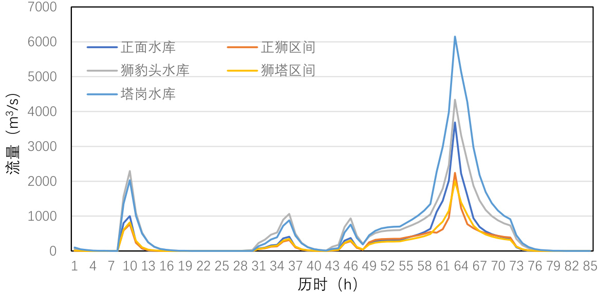  
图 2.5-18  各流域设计洪水过程图( $0.05\%$ )  

# 2.5.4 合理性分析  

本次设计洪水计算采用插补延长后 1957\~2021 年共 65 年的暴雨资料,资料系列较长且包含 1963、1971、2021 年等大水年,资料代表性好。且相较于《塔岗初设 08》采用查图法确定短历时设计暴雨,本次计算采用实测资料计算短历时设计暴雨更符合实际情况。  

选取《焦作市城市防洪规划》(2025 年 5 月批复)各水库设计洪水成果与本次计算的设计洪水成果(见表 2.5-10)绘制设计洪水地区综合分布图(以 50年一遇设计标准为例),见图 2.5-19。从图 2.5-19 可以看出,各水库成果洪峰流量\~面积双对数图基本呈带状分布,洪峰面积相关关系较好。  

综上,说明本次各取水断面设计洪水成果符合洪水地区分布规律,因此认为本次计算成果基本合理。  

表 2.5-10  各水库设计洪峰流量表  

<html><body><table><tr><td>水库名称</td><td>集水面积 (km2)</td><td>2%设计洪峰流量（m3/s）</td></tr><tr><td>正面水库</td><td>89</td><td>1835</td></tr><tr><td>正狮区间</td><td>72</td><td>1107</td></tr><tr><td>狮豹头水库</td><td>160</td><td>2149</td></tr><tr><td>狮塔区间</td><td>74</td><td>1023</td></tr><tr><td>塔岗水库</td><td>234</td><td>2916</td></tr><tr><td>桥沟水库</td><td>298</td><td>2850</td></tr><tr><td>圆融水库</td><td>25</td><td>483</td></tr><tr><td>龙寺水库</td><td>21</td><td>377</td></tr><tr><td>六股涧水库</td><td>118</td><td>1970</td></tr><tr><td>白马门河水库</td><td>24</td><td>551</td></tr></table></body></html>  

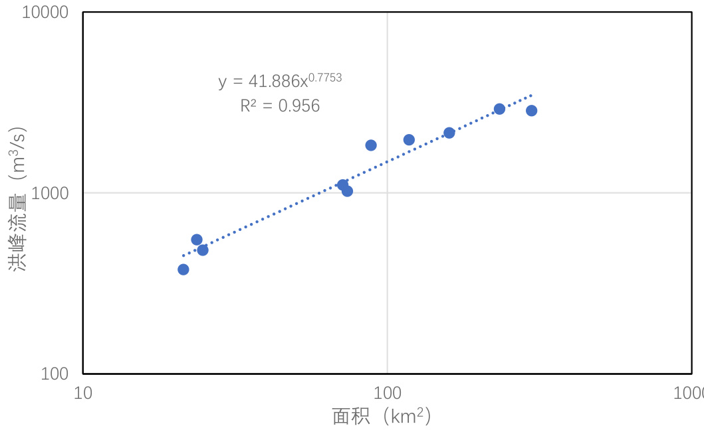  
图 2.5-19  各流域洪峰流量\~面积双对数图( $(2\%$ )  

# 2.5.5 洪水地区组成  

塔岗水库上游有已建的正面水库和狮豹头水库两座中型水库,将塔岗以上流域分为正面水库、正狮区间、狮塔区间 3 个区域,控制断面包括正面水库、狮豹头水库、塔岗水库 3 个坝址,采用同频率洪水组成法计算。步骤如下:  

$\textcircled{1}$ 狮豹头水库以上洪水组成:采用狮豹头水库与正狮区间同频,正面水库相应的不利组合方式,即正面水库洪水过程为狮豹头水库设计洪水过程减正狮区间设计洪水过程。  

$\textcircled{2}$ 塔岗水库以上洪水组成:采用塔岗水库与狮塔区间同频、狮豹头水库相应的不利组合方式,即塔岗水库和狮塔区间直接采用相应频率设计洪水过程,狮豹头水库洪水过程为塔岗水库洪水过程减狮塔区间洪水过程。狮豹头水库以上的洪水组成参照上述不利组合的比例进行分配。  

各流域洪水组成成果(以 $0.05\%$ 频率为例)见图 2.5-20。  

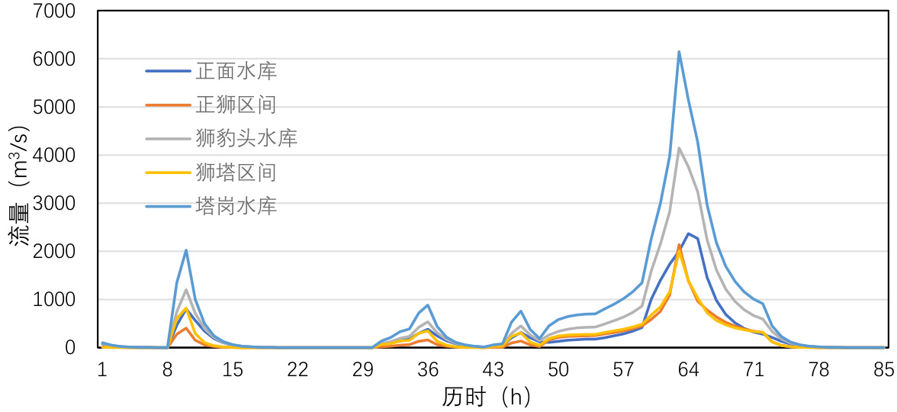  
图 2.5-20  各流域同频率法洪水组成成果图( $0.05\%$ )  

# 2.5.6 施工期洪水  

塔岗水库施工期同样采用暴雨法推求设计洪水。根据流域暴雨洪水特性,非汛期为 10 月至次年 5 月,计算 10\~5 月设计洪水。  

统计东拴马、狮豹头及塔岗雨量站平均历年各时期最大 1 日降水量。考虑到产汇流参数相比汛期要小,本次直接采用最大 1 日降水量作为最大 24h 降水量。采用本次计算的施工期最大 24h 设计暴雨与实测全年最大 24h 设计暴雨的比值缩放得塔岗水库流域施工期最大 1h 和最大 6h 设计暴雨,成果见表 2.5-11和表 2.5-12。采用推理公式法计算设计洪水,成果见表 2.5-13。  

表 2.5-11  塔岗水库 10\~5 月设计暴雨成果表  

<html><body><table><tr><td rowspan="2">项目</td><td rowspan="2">历时</td><td colspan="3">参数</td><td colspan="5">各频率设计暴雨 (mm)</td></tr><tr><td>Ex</td><td>Cv</td><td>Cs/Cv</td><td>1%</td><td>2%</td><td>5%</td><td>10%</td><td>20%</td></tr><tr><td rowspan="3">实测计算</td><td>1h</td><td></td><td></td><td></td><td>15.8</td><td>15.0</td><td>14.0</td><td>13.2</td><td>12.4</td></tr><tr><td>6h</td><td></td><td></td><td></td><td>48.5</td><td>44.0</td><td>38.0</td><td>33.2</td><td>28.1</td></tr><tr><td>24h</td><td>31</td><td>0.53</td><td>2.5</td><td>84.0</td><td>75.0</td><td>62.7</td><td>53.0</td><td>42.8</td></tr><tr><td rowspan="3">实测全年</td><td>1h</td><td>33</td><td>0.49</td><td>3.5</td><td>88.8</td><td>78.6</td><td>64.9</td><td>54.4</td><td>43.6</td></tr><tr><td>6h</td><td>72</td><td>0.72</td><td>3.5</td><td>272</td><td>230</td><td>176</td><td>137</td><td>98.7</td></tr><tr><td>24h</td><td>110</td><td>0.82</td><td>3.5</td><td>471</td><td>392</td><td>291</td><td>218</td><td>150</td></tr></table></body></html>  

表 2.5-12  塔岗水库施工期设计洪水成果表  

<html><body><table><tr><td rowspan="2">项目</td><td colspan="5">各频率设计洪水成果</td></tr><tr><td>1%</td><td>2%</td><td>5%</td><td>10%</td><td>20%</td></tr><tr><td>洪峰 （m3/s)</td><td>213</td><td>189</td><td>121</td><td>84</td><td>60.4</td></tr></table></body></html>  

# 2.6 涝水  

水库出山口至卫辉防洪断面区间涝水,采用豫北平原地区排水模数公式计算。区间最大 3 日设计暴雨,采用接近沧河下游平原区的淇县气象站实测最大3 日暴雨进行 P-Ⅲ频率适线计算,频率设计暴雨成果见表 2.6-1。  

表 2.6-1  沧河下游平原区最大 3 日设计暴雨成果表  

<html><body><table><tr><td colspan="3">参数</td><td colspan="3">各频率设计暴雨（mm)</td></tr><tr><td>均值</td><td>Cv</td><td>CsCv</td><td>5%</td><td>10%</td><td>20%</td></tr><tr><td>120</td><td>0.73</td><td>4.5</td><td>294</td><td>219</td><td>152</td></tr></table></body></html>  

经 1:5 万实测地形图测量,水库出山口至卫辉防洪断面区间流域面积为$99.2\mathsf{k m}^{2}$ ,根据最大 3 日面雨量经点面折减后,查《河南省水利工程水文计算常用图集(73 图集)》(以下简称《73 图集》)中的平原区 $\mathsf{P}{+}\mathsf{P}{\mathsf{a}}{\sim}\mathsf{R}$ 相关图,本研究区域均位于平原区Ⅶ分区,最大初损值 $100\mathrm{mm}$ ,Pa 为前期影响雨量,5 年一遇取 $45\mathrm{mm}$ , $_{10\sim20}$ 年一遇取 $55\mathrm{mm}$ 。平原排涝模数法计算公式如下:  

$$
\mathsf{Q}_{\mathsf{m}}{=}\mathsf{K R F}^{0.75}\mathsf{G}
$$  

式中: $\mathsf{Q}_{\mathsf{m}}.$ — 洪峰流量( $\mathsf{m}^{3}/\mathsf{s}.$ );R——设计净雨深(mm);F 流域面积(km2);K— 峰量关系综合系数,根据同区域相关设计报告,本次计算取0.026;α— 洪峰流量折算系数,“α”分不同标准采用:3\~5 年一遇暴雨取值 1.0;10 年一遇取 0.9;20 年一遇取 0.8;大于等于 50 年一遇取 0.7。  

设计涝水成果见表 2.6-2。  

表 2.6-2  沧河下游平原区流域设计涝水成果表  

<html><body><table><tr><td rowspan="2">项目</td><td colspan="3">各频率</td></tr><tr><td>5%</td><td>10%</td><td>20%</td></tr><tr><td>设计洪峰 （m3/s)</td><td>94</td><td>71</td><td>42</td></tr></table></body></html>  

# 2.7 水位流量关系  

根据设计需求,需计算塔岗水库坝下 $60\mathrm{m}$ 处断面天然水位流量关系。根据实测河道横断面数据,相应高程系统为 1985 高程基准,从工程断面下游2.86km 处作起始断面,采用推水面线方法计算单断面水位流量关系。  

根据河道及两岸地形、植被分布情况,主槽与滩地糙率分别取 0.055 和0.035。采用水面线法计算工程断面水位流量关系时,以工程断面最下游实测断面各频率流量对应的水位为起推水位,依据天然河道一维恒定非均匀流水面线的计算方法,分别向上推求计算河段范围内各频率不同流量级的河道水面线,据此点绘各取水断面不同频率的水位、流量点,作为工程断面水位流量关系曲线。塔岗水库坝下 $60\mathrm{m}$ 处断面水位流量关系见表 2.7-1 和图 2.7-1。  

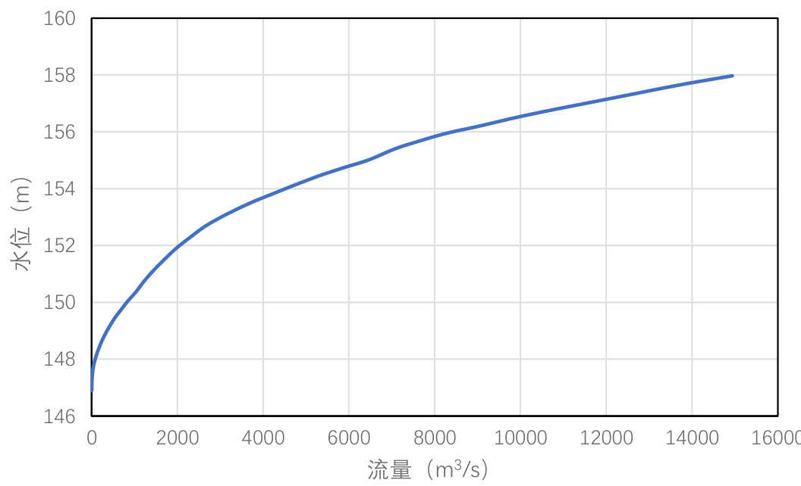  
图 2.7-1  塔岗水库坝下断面水位流量关系图  

# 表 2.7-1  塔岗水库坝下断面水位流量关系  

<html><body><table><tr><td>流量（m3/s)</td><td>水位（m)</td><td>流量（m3/s)</td><td>水位（m)</td><td>流量（m3/s)</td><td>水位 (W)</td></tr><tr><td>1.03</td><td>146.90</td><td>1225</td><td>150.75</td><td>5895</td><td>154.75</td></tr><tr><td>3.98</td><td>147.18</td><td>1445</td><td>151.13</td><td>6455</td><td>155.01</td></tr><tr><td>9.00</td><td>147.36</td><td>1699</td><td>151.52</td><td>7072</td><td>155.29</td></tr><tr><td>24.8</td><td>147.61</td><td>1977</td><td>151.91</td><td>7544</td><td>155.63</td></tr><tr><td>56.1</td><td>147.87</td><td>2285</td><td>152.28</td><td>8240</td><td>155.93</td></tr><tr><td>112</td><td>148.16</td><td>2617</td><td>152.65</td><td>9027</td><td>156.20</td></tr><tr><td>197</td><td>148.51</td><td>2971</td><td>152.96</td><td>9897</td><td>156.50</td></tr><tr><td>299</td><td>148.84</td><td>3343</td><td>153.25</td><td>10742</td><td>156.77</td></tr><tr><td>417</td><td>149.16</td><td>3741</td><td>153.53</td><td>11401</td><td>156.96</td></tr><tr><td>549</td><td>149.48</td><td>4161</td><td>153.78</td><td>12517</td><td>157.29</td></tr><tr><td>677</td><td>149.73</td><td>4601</td><td>154.05</td><td>13698</td><td>157.64</td></tr><tr><td>836</td><td>150.04</td><td>5049</td><td>154.31</td><td>14939</td><td>157.97</td></tr><tr><td>1024</td><td>150.36</td><td>5384</td><td>154.49</td><td></td><td></td></tr></table></body></html>  

# 2.8 泥沙  

塔岗水库控制流域面积 $234\mathsf{k m}^{2}$ ,上游有正面水库和狮豹头水库,狮豹头水库控制流域面积 $160\mathsf{k m}^{2}$ ,区间面积 $74\mathsf{k m}^{2}$ 。正面水库和狮豹头水库实际运行未排沙,故塔岗水库仅有区间面积泥沙入库。  

工程所在流域内无实测泥沙资料,查算 1984 年《河南省地表水资源》附图,水库控制流域内悬移质多年平均年输沙模数约 $200{\sim}500\mathrm{t}/\mathrm{km}^{2}$ 。根据 2024年实测地形、库容曲线资料与 1979 年 6 月新乡地区水利局刊印的《新乡地区水库图集》塔岗水库水位、面积、库容关系比较,46 年间正常蓄水位以下淤积量为 55.5 万 $\mathsf{m}^{3}$ ,年淤积量约 1.2 万 $\mathsf{m}^{3}$ ,按照推悬比 $20\%$ 反推悬移质输沙模数在 $175{\sim}250\mathrm{t}/\mathrm{km}^{2}.$ 。  

综合考虑上游植被覆盖情况及邻近群英水库 $1971\sim2011$ 年运行 40 年淤积情况,本次计算悬移质多年平均年输沙模数取 $200\mathrm{t}/\mathrm{km}^{2}$ 。悬移质泥沙容重取$1.3\mathrm{t}/\mathsf{m}^{3}$ ,推移质容重取 $1.5\mathrm{t}/\mathsf{m}^{3}$ ;推悬比取 $20\%$ 。  

计算得塔岗水库年均悬移质入库沙量为 1.48 万 t,折合 1.14 万 $\mathsf{m}^{3}$ ;年均推移质入库沙量为 0.30 万 t,折合 0.20 万 $\mathsf{m}^{3}$ ;故年均入库沙量为 1.78 万 t,折合 1.34 万 $\mathsf{m}^{3}$ 。  

# 2.9 水面蒸发与蒸发增损  

# 2.9.1 水面蒸发  

水面蒸发量系列根据卫辉气象站的实测蒸发量资料分析,该站具有1961\~2022 年逐日蒸发量实测资料。根据卫辉气象站历年统计资料,多年平均水面蒸发量为 1792mm(20cm 蒸发皿),根据《水利水电工程水文计算规范》(SL/T 278-2020)以及工程所在位置,20cm 蒸发皿与 E601 转换系数约为0.66,E601 的观测值与 $20\mathsf{m}^{2}$ 大型蒸发池的转换系数见表 2.9-1。由此推求得到卫辉气象站多年平均水面蒸发量为 $1081\mathrm{mm}$ 。本次塔岗水库水面蒸发量可直接移用卫辉气象站的水面蒸发量,见表 2.9-1。  

# 2.9.2 蒸发增损  

水库建设后,库区原有的陆面蒸发变成了水面蒸发,水面蒸发大于陆面蒸发,故在进行水库径流调节计算时,存在着水库蒸发增损问题。水库蒸发增损为水库水面蒸发与库区陆面蒸发之差。  

根据流域水量平衡方程,陆面蒸发为多年平均降水量与多年平均径流深之差。首先根据雨量站资料,塔岗水库多年平均降水量取 621mm,塔岗水库多年平均径流深取 $125\mathrm{mm}$ ,则其多年平均陆面蒸发为 $496\mathrm{mm}$ ,多年平均蒸发增损量为 $585\mathrm{mm}$ 。塔岗水库多年平均各月蒸发增损量,见表 2.9-1。  

# 表 2.9-1  蒸发成果表  

<html><body><table><tr><td>月 份</td><td>观测蒸发量 (ww)</td><td>20cm至E601 转换系数</td><td>E601至20m2 转换系数</td><td>计算蒸发量 (ww)</td><td>塔岗水库蒸发增损 量（mm)</td></tr><tr><td>1</td><td>59</td><td>0.66</td><td>0.93</td><td>36</td><td>20</td></tr><tr><td>2</td><td>81</td><td>0.66</td><td>0.93</td><td>50</td><td>27</td></tr><tr><td>3</td><td>144</td><td>0.66</td><td>0.93</td><td>88</td><td>48</td></tr><tr><td>4</td><td>196</td><td>0.66</td><td>0.84</td><td>109</td><td>69</td></tr><tr><td>5</td><td>238</td><td>0.66</td><td>0.84</td><td>131</td><td>71</td></tr><tr><td>9</td><td>283</td><td>0.66</td><td>0.88</td><td>165</td><td>89</td></tr><tr><td>7</td><td>202</td><td>0.66</td><td>0.87</td><td>116</td><td>63</td></tr><tr><td>8</td><td>182</td><td>0.66</td><td>0.97</td><td>117</td><td>63</td></tr><tr><td>9</td><td>146</td><td>0.66</td><td>1.02</td><td>98</td><td>53</td></tr><tr><td>10</td><td>123</td><td>0.66</td><td>0.96</td><td>77</td><td>42</td></tr><tr><td>11</td><td>82</td><td>0.66</td><td>1.06</td><td>57</td><td>31</td></tr><tr><td>12</td><td>57</td><td>0.66</td><td>0.93</td><td>36</td><td>19</td></tr><tr><td>年</td><td>1792</td><td>/</td><td>/</td><td>1081</td><td>585</td></tr></table></body></html>  

# 2.10 水文自动测报系统  

# 2.10.1 建设的必要性  

塔岗水库是一座以防洪、灌溉为主,结合供水,兼顾发电等综合利用的Ⅲ等中型水库,防洪是其重点任务。水库流域内暴雨强度大,河道比降大,降水汇水时间短,洪水具有来势凶猛、暴涨暴落的特点,给工程施工期和运行期的防洪度汛带来的巨大风险与挑战。  

水文自动测报系统的建设,可以提高信息(包括流域雨情信息、流域水情信息等)采集、传输的时效性和自动化水平,可有效防御施工期的洪水风险,保障人员财产安全,并为开展洪水预报方案编制和洪水调度奠定技术资料基础,保障运行期的度汛安全。为防洪及水资源的优化配置和合理利用,需要水源工程实时蓄水量及来水状况等水情信息。  

因此,为实现水库防洪及水资源优化配置提供了基础,为水库水资源科学调度和安全防洪度汛创造条件,建设塔岗水库水文自动测报系统是十分必要的。  

# 2.10.2 站网布设  

塔岗水库流域内现有雨量站 3 个,无水文测站。依据《水文自动测报系统技术规范》(GB/T41368-2022)以及《水文站网规划技术导则》(SL/T 34-2023)要求,塔岗水库流域面积 $234\mathsf{k m}^{2}$ ,上游有正面水库及狮豹头水库两座水库,水库位于暴雨洪水集中的山区,最少降水量站应建个数为 17 个。根据水库流域地形地貌特点及任务需求,拟再布设 14 个雨量站,3 个坝上水位站、3 个坝下水文站及 1 个中心站。  

各水库均建设坝下水文站,主要观测项目包括降水、水位、流量、泥沙,为无人值守、自动观测的巡测水文站。水位采用雷达水位计观测,采用双垂线V-ADCP 在线测流系统进行流量测验。  

各雨量站均为自报方式,通讯方式采用 4G 物联网卡为主信道,北斗卫星为备用信道运行,所采集信息应采取“一采两发”或“一采多发”方式,信息送往中心站,由中心站转送至水库工程调度管理中心等。  

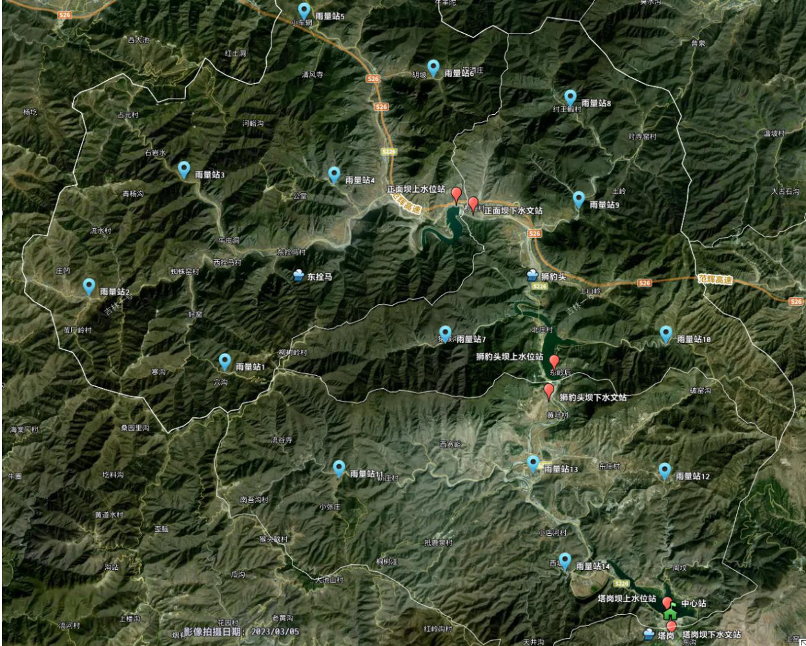  
图 2.10-1   水文自动测报系统站点位置  

# 2.10.3 水雨情测报系统设计  

以水雨情遥测网络为基础,整合遥测的雨情、水情信息资源,以更加形象、直观、更加开放的形式显示水库工程流域相关水雨情信息,并提供相关信息的查询、分析、统计和预警等功能,为工程、防汛管理工作提供实时、准确的水雨情信息服务。  

具体实现功能主要有:  

(1)水文自动测报系统数据接入(2)水信息查询  

结合电子地图,实时定位、标注水位站监测的水位信息;  

绘制自定义时段各水位站的水位过程线,包括实时水位、警戒水位、保证水位等信息,配以图表进行数据展示。  

# (3)雨情信息查询  

结合电子地图,实时定位、标注各雨量站的是雨量监测信息;  

绘制自定义时段各站点的降水量柱状图,包括时段量、日雨量等信息,配以图表进行数据展示。  

(4)降雨等值线面分析  

绘制水库工程流域范围的降雨等值线、等值面;  
能够进行设置等值线面的间隔等信息;  
能够制作、输出等值线面专题图。  

(5)水雨情报警能够对每个水位、雨量监测点的预警值进行分析并设置;雨量超限后,采用多重方式进行雨量报警;水位超限后,采用多重方式进行水位报警。  

# 2.10.4 工程量及费用  

水文自动测报系统、水量调度管理与视频监测系统均为水库信息系统组成部分。水文自动测报系统作为其子系统,设备及安装费见表 2.10-1。  

经估算,共需约 322.79 万元(不含中心站建筑工程费、设备费及预警预报系统费用)。  

表 2.10-1   水文自动测报系统费用概算表  

<html><body><table><tr><td rowspan="2">编 号</td><td rowspan="2">工程或费用名称</td><td rowspan="2">单 位</td><td rowspan="2">数 量</td><td colspan="2">单价 (元)</td><td colspan="2">合计 (万元)</td></tr><tr><td>设备费</td><td>安装费</td><td>设备费</td><td>安装 费</td></tr><tr><td>1</td><td>建筑及安装工程</td><td></td><td></td><td></td><td></td><td></td><td>36.67</td></tr><tr><td></td><td>基本水准点</td><td>个</td><td>3</td><td></td><td>3500.00</td><td></td><td>1.05</td></tr><tr><td></td><td>校核水准点</td><td>个</td><td>9</td><td></td><td>4000.00</td><td></td><td>2.40</td></tr><tr><td></td><td>断面桩</td><td>个</td><td>6</td><td></td><td>2000.00</td><td></td><td>1.20</td></tr><tr><td></td><td>断面界桩</td><td>个</td><td>9</td><td></td><td>2000.00</td><td></td><td>1.20</td></tr><tr><td></td><td>断面标志</td><td>个</td><td>9</td><td></td><td>2000.00</td><td></td><td>1.20</td></tr><tr><td></td><td>基线桩</td><td>个</td><td>9</td><td></td><td>1200.00</td><td></td><td>0.72</td></tr><tr><td></td><td>测站保护标志</td><td>个</td><td>9</td><td></td><td>1500.00</td><td></td><td>0.90</td></tr></table></body></html>  

<html><body><table><tr><td rowspan="2">编 号</td><td rowspan="2">工程或费用名称</td><td rowspan="2">单 位</td><td rowspan="2">数 量</td><td colspan="2">单价 (元)</td><td colspan="2">合计 (万元)</td></tr><tr><td>设备费</td><td>安装费</td><td>设备费</td><td>安装 费</td></tr><tr><td></td><td>观测道路</td><td>m</td><td>200</td><td></td><td>800.00</td><td></td><td>16.00</td></tr><tr><td></td><td>测验断面规整</td><td>次</td><td>3</td><td></td><td>40000.00</td><td></td><td>12.00</td></tr><tr><td>2</td><td>观测设备</td><td></td><td></td><td></td><td></td><td>248.80</td><td>37.32</td></tr><tr><td></td><td>直立式水尺</td><td>根</td><td>30</td><td>500.00</td><td>75.00</td><td>1.50</td><td>0.23</td></tr><tr><td></td><td>雷达水位计全套</td><td>台</td><td>9</td><td>60000.00</td><td>9000.00</td><td>36.00</td><td>5.40</td></tr><tr><td></td><td>翻斗式雨量计</td><td>组</td><td>17</td><td>20000.00</td><td>3000.00</td><td>34.00</td><td>5.10</td></tr><tr><td></td><td>双垂线V-ADCP在线测流 系统</td><td>座</td><td>3</td><td>500000.00</td><td>75000.00</td><td>150.00</td><td>22.50</td></tr><tr><td></td><td>横式采样器及烘干机</td><td>台</td><td>3</td><td>50000.00</td><td>7500.00</td><td>15.00</td><td>2.25</td></tr><tr><td></td><td>视频监控设备</td><td>个</td><td>6</td><td>1000 000 0.00</td><td>1500. 0.00</td><td>6.00</td><td>0 0.90</td></tr><tr><td></td><td>北斗卫星通信终端</td><td>台</td><td>7</td><td>9000.00</td><td>1350.00</td><td>6.30</td><td>0.95</td></tr><tr><td colspan="6">合计</td><td>248.80</td><td>73.99</td></tr></table></body></html>  

# 第四章 工程任务和规模  

审  定: 郑永良  
审  查: 王以圣  
校  核: 李春玲 张忠广  
编  写: 张忠广  华  悦  徐健秋  

# 目  录  

第四章  工程任务和规模  

# 4.1 工程建设的必要性和任务  

4.1.1 项目区概况.  
4.1.2 项目建设依据 3  
4.1.3 区域经济社会发展规划. 3  
4.1.4 经济社会发展需求. 5  
4.1.5 工程建设的必要性 7  
4.1.6 工程任务 9  

# 4.2 设计水平年和设计保证率  

4.2.1 设计水平年. 9  
4.2.2 设计保证率. 9  

# 4.3 防洪 10  

4.3.1 暴雨洪水特性 10  
4.3.2 历史洪灾情况 10  
4.3.3 防洪体系现状 11  
4.3.4 防洪保护范围和保护对象、防洪标准 28  
4.3.5 设计洪水及地区组成 28  
4.3.6 防洪工程布局论证. 29  
4.3.7 防洪控制断面及安全泄量 31  
4.3.8 防洪库容论证 34  

# 4.4 兴利 43  

4.4.1 区域水资源开发利用现状 43  
4.4.2 水库现状及设计兴利任务 51  
4.4.3 灌区需水复核 . 51  
4.4.4 灌区供需分析 54  
4.4.5 塔岗水库兴利库容复核. . 58  

# 4.5 应急备用 59  

4.5.1应急备用需求分析, 59  
4.5.2 应急备用供水范围 60  
4.5.3 应急备用需水量. . 60  
4.6 工程总体布局. . 62  
4.7 工程规模 . 64  
4.7.1 径流调节计算 64  
4.7.2 特征水位 . 73  
4.7.3 水库泥沙淤积分析. . 73  
4.7.4 洪水调节计算 77  
4.7.5 回水计算 . 80  
4.8 水库调度运用 93  
4.8.1 防洪调度 93  
4.8.2 生态调度 93  
4.8.3 供水调度 . 93  
4.9 推荐方案工程特性表 93  

#  

# 第四章 工程任务和规模  

# 4.1 工程建设的必要性和任务  

# 4.1.1 项目区概况  

# 4.1.1.1 行政区划  

卫辉市位于东经 $113\textdegree1$ '至 $114^{\circ}19^{\prime}$ ,北纬 $35^{\circ}19^{\prime}$ 至 $35^{\circ}42^{\prime}$ 之间。辖 13 个乡镇、341 个行政村、15 个居委会,总人口 54.3 万人,总面积 $868\mathsf{k m}^{2}$ 。地势西高东低,南北长约 $43k\mathrm{m}$ ,东西宽约 $35\mathsf{k m}$ ,山区、丘陵、平原分别占总面积的$29.7\%$ 、 $18.2\%$ 、 $52.1\%$ 。城市规划控制区面积 $128\mathsf{k m}^{2}$ ,规划区面积 $45k\mathrm{m}^{2}$ ,建成区面积 $20\mathsf{K m}^{2}$ ,市区人口 15 万人,城镇化率居新乡八县(市、区)之首。  

良相坡蓄滞洪区内包括卫辉市、淇县 2 个县(市),6 个乡镇,28 个村庄,其中:卫辉市包括上乐村、顿坊店、城郊 3 个乡镇,19 个村庄,淇县包括北阳、西岗、朝歌 3 个乡镇(街道办),9 个村庄。2022 年人口 4 万人,耕地 9 万亩,地区生产总值 6.8 亿元。  

# 4.1.1.2 社会经济概况  

卫辉区位优越,交通发达。素有“南通十省,北拱神京”之称,是新乡市地缘最近的卫星城,到新乡市 15 分钟车程,距省会郑州 $80k\mathrm{m}$ ,到新郑国际机场 50分钟车程。石武高铁、京广铁路、京港澳高速、菏宝高速、濮卫高速、107 国道、省道林桐线、新濮公路、卫柿公路穿境而过,郑济高铁设立卫辉南站,鹤辉高速在狮豹头乡罗圈村设立出入口,安新高速拟在我市设立两个出入口,贯通市乡村的三级交通公路网络基本形成。  

卫辉坚定不移贯彻新发展理念,全面推进县域经济高质量发展。“十三五”时期,地区生产总值年均增长 $7.1\%$ ;一般公共预算收入由 8.69 亿元增长到 12.39亿元,年均增长 $9.3\%$ ;全社会固定资产投资年均增长 $16.1\%$ ;社会消费品零售总额年均增长 $8.2\%$ 。2022 年,卫辉市地区生产总值完成 208.58 亿元,同比增长 $7.4\%$ 。 其中第一产业增加值 31.59 亿元,同比增长 $5.8\%$ ;第二产业增加值77.38 亿元,同比增长 $11.0\%$ ;第三产业增加值 99.61 亿元,同比增长 $5.2\%$ 。 三次产业结构比 15.1:37.1:47.8。  

# 4.1.1.3 自然地理概况  

# (1)地形地貌  

卫辉市位于东经 $113^{\circ}51^{\prime}{\sim}114^{\circ}19^{\prime},$ 、北纬 $35^{\circ}19^{\prime}{\sim}35^{\circ}42^{\prime}$ 之间,西依太行山脉,南临黄河,北接安阳,东邻滑县,距省会郑州约 80 公里,是新乡市地缘最近的卫星城。卫辉市地势西高东低,地貌类型多样,分山区、丘陵、平原三部分,面积分别占全市的 $29.7\%$ (258km2)、 $18.3\%$ ( $158~\mathsf{k m}^{2}$ )和 $52\%$ ( $452~{\mathsf{k m}}^{2}$ )。西部山区以低山为主,最高峰海拔约 $1000\mathrm{m}$ ;中部为丘陵过渡带;东部为黄河冲积平原,土地肥沃。  

# (2)气象特征  

项目区域属暖温带大陆性季风气候,季节分明,干湿悬殊较大。冬春两季雨水稀少,风多干冷,蒸发量大;夏秋两季水汽充沛,雨量集中,降水量占全年的$70\%$ 左右。根据卫辉县气象站 1961-2022 年气象资料统计,降水量年际变化大,多年平均降水量 $587\mathrm{mm}$ ,最大年降水量(2021 年)达 $1433\mathrm{mm}$ ,最小年降水量 176mm(1997 年);多年平均蒸发量 $1096\mathrm{mm}$ ;多年平均气温 $14.3^{\circ}\mathrm{C}$ ,最高气温 $42.5^{\circ}\mathrm{C}$ ,最低气温- $18.4^{\circ}\mathrm{C}$ ;平均风速 $2.39\mathsf{m}/\mathsf{s}$ ,最大风速 $18.7\mathrm{m}/\mathsf{s}$ ;冰冻期 12 月 ${\sim}2$ 月,无霜期 4 月 $\sim10$ 月。  

# (3)资源概况  

已探明水泥灰岩储量 5.3 亿吨、煤储量 2.7 亿吨、白云岩储量 1 亿吨。有四条大中型河流和四座中小型水库。全市水面面积 5900 亩,其中市区估量的护城河、人工湖水面面积近 800 亩,局豫北之首,素有“北方水城”之美称。“西气东输”、“南水北调”工程可为卫辉市经济社会发展提供充足的燃气和水源。  

# (4)河流水系  

境内有卫河、孟姜女河、大沙河及共产主义渠四条大中型河流,其中卫河为海河水系重要支流。南水北调中线干渠穿境而过,为区域调水提供保障。  

塔岗水库位于沧河流域,为已建中型水库,坝址以上流域面积 $234\mathsf{k m}^{2}$ ,河长 $43.88\ensuremath{\mathrm{km}}$ ,河道平均比降 $9.84\text{\textperthousand}$ 。  

沧河属海河流域卫河支流,发源于辉县市拍石头乡北部的玉水池村,临近林州、辉县、卫辉三市边界的交界处。向东流 ${}^{20\mathsf{k m}}$ 是卫辉市的正面水库大坝,继续向南偏东 7km 是狮豹头(也称石包头)水库大坝,再向南 13km 是塔岗水库大坝,也是沧河的出山口。之后进入平原,向南 $10k\mathrm{m}$ 相继穿过南水北调中线总干渠、G107 国道、京广铁路和京珠高速公路,最后汇入共产主义渠。  

# 4.1.2 项目建设依据  

# 4.1.2.1 《加快完善海河流域防洪体系实施方案》  

2024 年 8 月 30 日,李强主持召开国务院常务会议,审议通过《加快完善海河流域防洪体系实施方案》。会议指出,海河流域地理位置重要,人口密集,加快完善防洪体系意义重大。要坚持系统观念,准确把握流域河系特点及洪水特征,把优化重要保护对象防洪布局和加强防洪工程建设结合起来,切实提升整体防洪能力。要加快重点工程建设,统筹用好预算内投资、国债资金等,严格把关确保工程质量。实施方案提出“在卫河太行山迎风坡新建合河、桥沟、六股涧等水库,实施盘石头、塔岗、夺丰等水库挖潜扩容。”  

# 4.1.2.2 《海河流域防洪规划(修编)》  

2024 年 12 月 5 日,海河流域防洪规划修编成果专家审查会在北京召开,专家组对海河流域防洪规划修编成果给予肯定,一致同意通过审查。专家认为,本次规划修编深入研判海河流域防洪减灾面临的形势和挑战,系统谋划新一轮流域防洪治理,着力构建流域防洪减灾新格局,规划方案总体合理可行,具有战略性、前瞻性、系统性和创新性。专家建议,从规划指标、防洪工程体系、应急监测能力、实施安排等方面,进一步完善规划修编成果。规划明确提出对塔岗水库进行扩建增容。  

# 4.1.2.3 《新乡市水利基础设施灾后恢复重建专项规划》  

2021 年 8 月 13 日,新乡市市委办公室、市政府办公室印发《新乡市加快灾后恢复重建总体工作方案》(以下简称《工作方案》),根据《工作方案》新乡市编制了《新乡市水利基础设施灾后恢复重建专项规划》以下简称《专项规划》),《专项规划》明确了新乡市水利基础设施灾后恢复重建的总体思路和治理目标、主要建设内容等主要工作安排,《专项规划》病险水库除险加固中明确提出“正面水库、狮豹头水库、塔岗水库进行除险加固以及增设泄洪控制工程”。  

# 4.1.3 区域经济社会发展规划  

# 4.1.3.1 卫辉市国土空间规划  

规划提出坚定落实黄河流域生态保护和高质量发展战略,全面落实省委“两个确保”“十大战略”部署要求,围绕新乡市“两地三区一枢纽”战略目标,统筹协调市域生态、农业、城镇三类空间,优化卫辉市域国土空间开发保护格局,有效提  

升国土空间治理能力。  

提出构建“两城 一地 三区”发展定位。  

两城:全国知名文化旅游城市、豫北生态宜居山水城市。  

一地:豫北绿色低碳循环产业基地。  

三区:新乡都市区市县高质量一体化发展示范区、新乡市北部综合交通物流枢纽核心区、新乡市能源产业发展引领区。  

规划提出,以南水北调水、水库水为主要供水水源,构建城乡一体、覆盖全域的供水系统。重点推进河南省西霞院水利枢纽及灌区工程新乡市卫辉段等国家重点水利项目。推进南水北调防洪影响处理应急工程、配套基础设施等南水北调水利项目。完善防洪排涝体系,中心城区按 50 年一遇防洪标准设防,排涝标准达到 20 年一遇。  

# 4.1.3.2 新乡市国土空间规划  

以城市南向发展为主攻方向,打造郑新一体化先导区,加强中心城区和外围组团的空间联系,构建“一轴两翼一组团”的城镇空间格局。“一轴”指新乡市中心城区至平原示范区的郑新一体化发展主轴;“两翼”指以辉县市、获嘉县和卫辉市、延津县为两翼的郑新一体化产业示范带;“一组团”指长垣市、封丘县一体化城镇组团。  

重点开展卫辉市良相坡、柳围坡蓄滞洪区建设,进一步完善卫河、共产主义渠的防洪能力、防洪体系,发挥工程的综合防洪作用。  

全市统筹,完善城乡一体化供水系统。以南水北调水和黄河水作为主要供水水源,以地下水和水库等作为应急备用水源,构建城乡一体、覆盖全域的供水体系,实现城乡“同源、同网、同质”供水,保障应急水源,建设节水型社会。  

结合“中原农谷”建设方案和高标准农田建设布局,推进河南省西霞院水利枢纽及灌区工程、南水北调塔岗调蓄工程。推进塔岗水库改扩建。  

洪涝风险控制线划定情况:卫河、共产主义渠洪涝灾害风险范围 $81.50\mathrm{km}^{2}。$ 。,主要涉及凤泉区、牧野区、新乡县和卫辉市;良相坡蓄滞洪区 $37.74~\mathrm{km}^{2}\circ$ 。,主要涉及卫辉市城郊乡、顿坊店乡和上乐村镇;柳围坡蓄滞洪区 $72.73~\mathrm{km}^{2}.$ 。,主要涉及卫辉市城郊乡、李源屯镇、庞寨乡和上乐村镇。  

# 4.1.4 经济社会发展需求  

# 4.1.4.1 防洪需求  

卫河流域山区地处太行山迎风坡,暴雨频次多、量级大,且源短流急,洪水迅猛,是卫河洪水的主要发源地。由于暴雨时空分布的不均匀性,洪水主要来自上游山丘区,一旦产生大暴雨形成峰高量大的洪水,进入平原区地势陡然变缓,容易形成洪涝灾害。  

建国以来,卫河流域形成了以蓄滞洪区、河道及水库为主的防洪工程体系,通过科学调度水库,适时启用蓄滞洪区,基本可防御 50 年一遇洪水。卫河总流域面积 $16578\mathrm{km}^{2}$ ,其中蓄滞洪区面积 $916.52\mathrm{km}^{2}$ ,占比达 $5.5\%$ 。各蓄滞洪区启用标准在 $\mathtt{3}{\sim}50$ 年一遇之间,其中良相坡、共渠西启用标准仅 3 年一遇。在蓄滞洪区这张“底牌”作用下,卫河流域抵挡了 1956 年、1963 年、1982 年、1996年、2021 年、2023 年等多场洪水,为保护下游京津冀平原重要经济区防洪做出了突出贡献。然而,尽管洪水量级不大,却给沿河以及蓄滞洪区内的城镇和村庄造成较大的经济损失,严重制约了区域的经济社会高质量发展。如 2021 年“21.7”洪灾,合河站洪峰流量 $1420\mathsf{m}3/\mathsf{s}$ ( $^{20\sim30}$ 年一遇之间),卫河流域启用了崔家桥、广润坡、共渠西、良相坡、柳围坡、长虹渠、白寺坡、小滩坡等 8 个蓄滞洪区,最大滞蓄水量 8.73 亿 $\mathsf{m}^{3}$ ,淹没面积 $384\mathsf{k m}^{2}$ ,河南卫辉市等 13 个城镇受淹,大量基础设施损毁,农作物大面积受灾,受灾人口约 423 万人,转移人口约 82万人,直接经济损失约 551 亿元。其中,共渠与左岸行洪区共同行洪,行洪水面宽达 5km,行洪区内大块镇、耿黄镇等 12 个乡镇约 18.5 万人受灾,约 10 万亩耕地受淹,各类企业共损失产值约 47 亿元;2023 年,卫河流域再次发生洪水,洪水量级仅 5 年一遇,启用了共渠西蓄滞洪区,对蓄滞洪区内经济社会发展又一次造成较大影响。流域防洪工程格局与经济社会高质量发展的要求极不匹配,与河南省“四高四争先”的要求差距较大,严重制约该区域实现社会主义现代化的步伐。  

沧河下游有南水北调中线总干渠、京广铁路和 107 国道以及京港澳高速公路、高速铁路等重要设施和卫辉市 5 个乡镇。“21.7”洪水造成沧河河道堤防、建筑物损毁严重,为保障南水北调中线总干渠、京广铁路、京港澳高速等国家重要基础设施、卫辉市安都、顿坊店等乡镇防洪安全,亟需提升沧河防洪能力。  

沧河流域由于建水库后多年未下泄大流量洪水,故从小双村以下河床均已开垦种植,滩地种有成行的大树,现场只能大致看出河道形状。多年来河道未确定边界,卫辉市沧河管理处亦无强制执法权,导致管理困难。下游河道内挖砂、取土、开采河卵石制砂及围河造田情况严重,屡禁不止。导致河床变化很大,大部分河床被侵占。据现场勘查,下游大部分河段河床严重萎缩,不能满足泄洪、排涝需要。  

塔岗水库下游沿线穿越有南水北调总干渠、107 国道和京广铁路、京广高铁和京港澳高速等国家重要基础设施,这些设施对防洪的要求也越来越高。南水北调中线工程,由于河道采砂、21 年洪水冲刷等,中线穿越沧河的倒虹吸顶板目前高于河底高程,倒虹吸防洪能力直接关系到南水北调中线的运行安全,南水北调等重要基础设施同样有防洪能力提升的需要。  

# 4.1.4.2 供水需求  

卫辉市为南水北调中线受水区。南水北调中线工程是有效缓解京津华北地区水资源短缺,实现水资源优化配置,促进经济社会可持续发展,保障和改善民生的重大战略性基础设施。一期工程自 2014 年 12 月通水以来,对于缓解京津华北地区水资源供需矛盾、改善受水区水生态环境发挥了重要作用。由于南水北调中线工程为总干渠单线输水,遇到突发事件时难保证全线供水,而河南省部分受水区水厂以南水北调水位单一水源,一旦停水,将造成水厂停水的严重局面,影响巨大。提升中线工程检修和突发事故下应急供水能力,对于保障京津华北地区城市供水安全,维护受水区经济社会稳定是十分重要和迫切的。  

南水北调中线一期工程总干渠输水建筑物在设计时考虑了不停水分孔(槽)检修的条件。明渠为单线输水,大型检修需要停水。一旦实施停水检修,检修渠段及其以下总干渠均面临停水,影响范围广。为避免停水检修给受水区用水造成较大影响,一方面需要充分发挥当地已有调蓄工程的作用,另一方面需要适当兴建在线调蓄工程,减少停水影响范围,减轻当地调蓄工程不足的压力。  

设计水平年卫辉市城乡生活工业用水等均由城市供水管网统一供给,管网水源均为外调水,水源单一。按照《城市供水水源规划导则》(SL627-2014),“单一水源供水的城市应提出应急备用水源规划方案”,“应急备用水源的备用供水量一般不小于城市居民生活需水量的 $60\%\sim70\%$ ,输水方式要能满足短时间内启用要求”。  

《南水北调中线在线调蓄工程方案》综合中线规划设计阶段的水资源配置方案、受水区现状供用水情况、配套工程实施程度,结合 2019 年 6 月调研收集的受水区水厂、当地水源条件等有关情况,梳理受水区当地水资源条件,分析了当地水源的应急供水保障能力。提出卫辉新建 1 座受水水厂,设计日供水能力共12 万 t/d,一期工程多年平均口门分配水量 4300 万 $\mathsf{m}^{3}$ ,与非受水水厂卫辉四水厂(设计日供水能力共 3 万 t/d)管网连通,利用现状塔岗水库实现应急备用。  

# 4.1.5 工程建设的必要性  

# 4.1.5.1 是应对极端天气,提高防洪调度水平的需要  

全球气候变暖背景下,我国极端天气气候事件多发频发,高温、暴雨、洪涝、干旱等自然灾害易发高发。2021 年 7 月、2023 年 7 月海河流域均发生了较大洪水,对防洪基础设施的要求也越来越高。塔岗水库现状泄洪设施为开敞式溢洪道,无闸门控制,无法对洪水进行调度,水库自身调度灵活性较差。塔岗水库扩容后,改造溢洪道并增设泄洪闸,增加防洪库容,在保障下游防洪安全的同时,可以有效提高水库整体调洪能力,增强水库调度的灵活性。  

# 4.1.5.2 是完善区域防洪格局的需要  

卫河流域淇门以上流域面积 $8525.2\mathrm{km}^{2}$ ,其中山区面积占 $76\%$ 。洪水总量约占卫河总量的 $85\%$ ,卫河干流淇门至老观嘴规划行洪能力 $2000\mathrm{m}^{3}/\mathsf{s}$ ,其中卫河淇门至老观嘴行洪 $400\mathrm{m}^{3}/\mathsf{s}$ ,共产主义渠淇门至老观嘴行洪 $1600\mathrm{m}^{3}/\mathsf{s}$ ;老观嘴至安阳河口河道行洪 $2000\mathrm{m}^{3}/\mathsf{s}$ ,安阳河口至徐万仓河道行洪 $2500\mathrm{m}^{3}/\mathsf{s}$ 。以上洪水安排均基于流域内良相坡等蓄滞洪区运用条件。  

良相坡位于淇河下游右侧,塔岗水库所在沧河也同时汇入良相坡。当淇河右岸阎村口门水位超过 $67.90\mathrm{m}$ 时,阎村口门自然漫溢,洪水进入良相坡;当共产主义渠黄土岗水文站水位超过 $68.00\mathrm{m}$ 时,刘庄闸以上共产主义渠左岸自然漫溢,洪水进入良相坡。当沧河京广铁路桥下游洪水位超过 $76.20\mathrm{m}$ 或思德河狐仙庙桥下游水位超过 65.50m 时,洪水进入良相坡。  

“21·7”洪水给流域内人民群众财产造成了巨大损失,漳卫河系受灾较为严重,蓄滞洪区最大滞蓄水量 8.73 亿 $\mathsf{m}^{3}$ ,淹没面积 $384\mathsf{k m}^{2}$ ,河南卫辉市等 13个城镇受淹,大量基础设施损毁,农作物大面积受灾,受灾人口约 423 万人,转移人口约 82 万人,直接经济损失约 551 亿元。  

蓄滞洪区的安排是迫于现状流域防洪布局不完善的无奈之举。随着蓄滞洪区内人民对美好生活的向往越来越迫切,蓄滞洪区的启用安排应得到充分的重视。按照“上蓄、中疏、下排、有效治洪”的原则,随着塔岗水库防洪能力提升工程的实施,遇 20 年一遇洪水时,塔岗水库可拦蓄洪量 3331 万 $\mathsf{m}^{3}$ ,遇 50 年一遇洪水时,塔岗水库可拦蓄洪量 5001 万 $\mathsf{m}^{3}$ ,可以有效降低良相坡启用后的淹没损失,对于完善流域防洪布局具有重要作用。  

# 4.1.5.3 是提高卫辉市防洪安全水平的需要  

卫辉市地理位置特殊,卫辉市塔岗水库下游涉及 5 个乡镇,人口 7 万人,耕地面积 15 万亩。同时建有南水北调中线总干渠、京广铁路、京港澳高速等重要设施,对于卫辉市乃至南水北调总干渠受水区等经济社会发展十分重要,沧河发生较大洪水不仅对卫辉市沧河下游境内造成重大影响,还有可能影响重要设施的安全运行。  

在 63.8 典型设计洪水条件下,沧河发生 5 年一遇设计洪水时,塔岗水库滞洪后,至 G107 以下,沧河两岸淹没面积约 $2.5{\mathrm{km}}^{2}$ ,平均淹没水深约 $0.49\mathsf{m}$ ,淹没对象主要包括顿坊乡店小双村、清水河村,淹没耕地约 3000 亩,涉及人口约 1000 人,其中清水河村大部分位于良相坡内;沧河发生 10 年一遇设计洪水时,沧河两岸淹没面积约 $14.57\mathrm{km}^{2}$ ,平均淹没水深约 $1.24\mathrm{m}$ ,淹没范围进一步扩大至顿坊店乡、黄庄村、水屯村,淹没耕地 2 万亩,涉及人口约 4000 人;20年一遇设计洪水时,沧河两岸淹没面积约 $17.9\mathsf{k m}^{2}$ ,平均淹没水深约 1.75m,淹没耕地约 4 万亩,人口约 1 万人。  

塔岗水库防洪能力工程实施后,可将下游沧河河道防洪能力由现状的不足10 年一遇提高到 20 年一遇,水库扩容对于提高卫辉市防洪安全水平,促进经济社会高质量发展具有重要意义。  

# 4.1.5.4 是提高区域供水安全保障水平的需要  

随着卫辉市地下水压采的实施,卫辉市城乡生活及工业水大部分将依靠南水北调中线外调水源满足用水需求源。然而目前随着用水需求不断增加,供水范围也在进一步扩大,且由于水质好,卫辉市对中线水源的依赖程度越来越高。南水北调中线总干渠渠线在河南境内穿越四大流域,11 座省辖市、7 座县级市、25座县城。渠道总长 731km,建筑物 282 座,一旦发生紧急事故或需要进行检修时,事故渠段下游的供水将无法保障,同时,南水北调中线存在冰期输水减量运行、汛期输水受洪水威胁等不利因素,存在一定的供水风险隐患。另一方面,由于南水北调中线通过总干渠向受水区直供水,不具备调蓄水库和总干渠之间相互调配的条件,在南水北调来水不足的情况下,没有足够的调蓄能力满足下游城市的用水需求,同样可能引起供水保障程度的降低。  

考虑南水北调中线可能存在的供水风险隐患,结合塔岗水库防洪能力提升工程,为塔岗水库增设一定的备用库容,在南水北调中线检修、事故或者调蓄能力不足时,塔岗水库启用备用库容以满足供水缺口,对于提高卫辉市的供水安全保障水平是十分必要的。  

塔岗水库按照预留考虑中线检修及应急停水两种工况,与兴利库容结合,预留备用库容。考虑 90 天应急备用,压缩用水需求,预留备用库容 636 万 $\mathsf{m}^{3}$ ,考虑 90 天检修备用,需预留库容 1060 万 $\mathsf{m}^{3}$ ,考虑应急与检修以及兴利库容的结合,塔岗水库用于备用及灌溉的总库容为 1690 万 $\mathsf{m}^{3}$ ,可以满足备用等用水需求。考虑到沧河径流的时空分布严重不均,备用库容的设置可以有效利用沧河雨洪资源,实现本地水资源的高效利用。  

# 4.1.6 工程任务  

根据必要性分析,本次对结合塔岗水库防洪能力提升,对塔岗水库进行扩容,通过增加备用库容,为卫辉市南水北调中线受水区提供备用水源,通过增加防洪库容,提高下游沧河两岸防洪标准,降低良相坡滞洪区启用频率及启用后的淹没损失,提升区域防洪能力,并为整个漳卫河系优化防洪工程布局、提高防洪安全保障水平创造条件。塔岗水库扩建增容后,工程任务为“以防洪、灌溉为主,结合卫辉市南水北调受水区备用供水,兼顾发电。”  

# 4.2 设计水平年和设计保证率  

# 4.2.1 设计水平年  

根据资料情况及水文资料分析,本工程现状水平年取 2023 年,结合《海河流域防洪规划(修编)》总体要求,根据经济社会发展要求以及塔岗水库扩容工程工期安排,与国民经济发展计划一致,设计水平年取 2035 年。  

# 4.2.2 设计保证率  

根据《灌溉与排水工程设计标准》GB50288 中表 3.2.2,对于干旱或水资源紧缺地区的地面灌溉,如果作物种类以旱作为主时,灌溉设计保证率取值范围$50\%\sim75\%$ ,作物经济效益较低或灌区规模较大的地区,宜选用较小值。  

沧河水库现状灌区沧河灌区面积 11.2 万亩(其中香河水库灌区 1.2 万亩),位于河南省豫北地区,区域和亩均水资源量均低于全国平均水平。且按国际公认的人均 $500\mathsf{m}^{3}$ 为严重缺水边缘标准,本区域属于严重缺水地区。根据《水利水电工程等级划分及洪水标准》(SL252-2017)属于中型灌区。根据现状调查和涉及县市农业发展规划,未来灌区内仍然以种植小麦、玉米等旱作作物为主,综合考虑以上因素,参照《灌溉与排水工程设计标准》及临近灌区,沧河灌区农业灌溉设计保证率为 $75\%$ 。  

# 4.3 防洪  

# 4.3.1 暴雨洪水特性  

本流域内洪水由暴雨形成,其变化受暴雨和地形等因素影响,洪水的时空分布与暴雨一致,暴雨时空分布对本流域峰型影响较大,易形成峰高量大的洪峰。受暴雨特性及流域下垫面综合影响,洪水频次多、量级大,且源短流急,洪水迅猛。暴雨历时一般 3 天左右,强度较大的暴雨常集中在 1 天甚至数小时内。洪水多发生在 ${\tt6}\sim\mathfrak{g}$ 月份,年最大洪峰一般出现在 7 月初至 8 月中旬。  

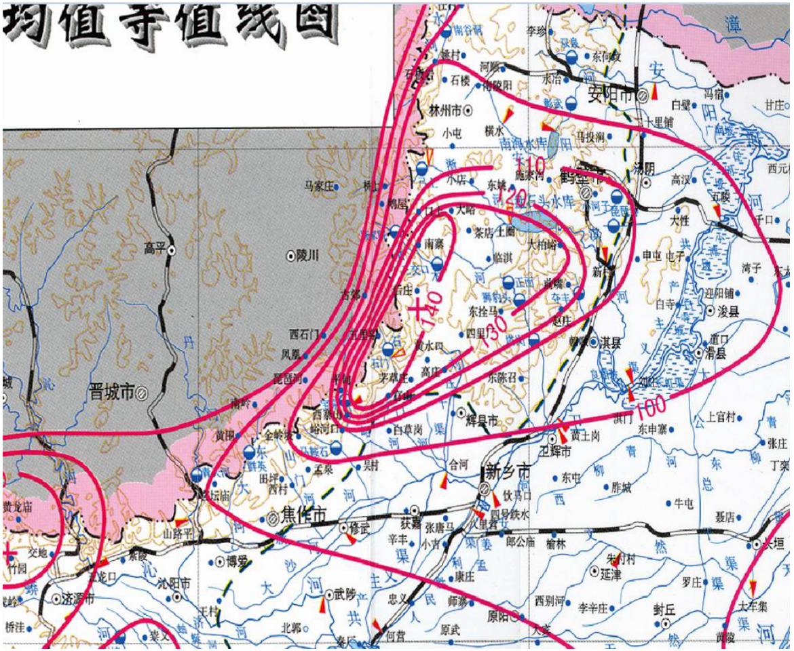  
图 4.3-1 沧河附近降雨等值线图  

# 4.3.2 历史洪灾情况  

1956 年 7 月 21 日降雨 $300\mathrm{mm}$ ,塔岗站测得洪峰流量 $2400\mathrm{m}^{3}/\mathsf{s}$ ,历时 20分钟,塔岗村半个村庄被冲毁,上游山丘区塌房 431 间,死伤 37 人,毁梯田 3000余亩。牲畜、家具被冲走不计其数。  

1970 年 7 月 27 至 31 日,卫辉市西北部山区连降大雨、暴雨,香泉河、十里河、沧河、卫河水位急剧上涨。顿坊店、上乐村、唐庄、城郊等公社的 62 个大队被洪水围困,塌房 2734 间,损坏粮食 17.5 万公斤,浸坏其它物品数万件,死 4 人,淹秋苗 17.5 万亩,其中绝收 15 万亩。  

1982 年 7 月末至 8 月初,豫北普降大雨。8 月 5 日,沧河 3 座水库溢洪。塔岗水库最大溢洪量达 $217\mathrm{m}^{3}/\mathsf{s}$ ,副坝发生横向裂缝。共产主义渠黄土岗测水站测得最高水位为 $70.51\mathsf{m}$ ,最大流量 $536\mathrm{m}^{3}/\mathsf{s}$ 。汲县动员 5 万人上堤防守。  

2021 年 7 月 17 日至 23 日,河南省遭遇历史罕见特大暴雨。降雨过程 17日至 18 日主要发生在豫北(焦作、新乡、鹤壁、安阳);19 日至 20 日暴雨中心南移至郑州,发生长历时特大暴雨;21 日至 22 日暴雨中心再次北移,23 日逐渐减弱结束。过程累计面雨量鹤壁最大 $589\mathrm{mm}$ 、郑州次之 $534\mathrm{mm}$ 、新乡第三$512\mathrm{mm}$ ;受暴雨影响,共产主义渠和卫河新乡、鹤壁段多处发生决口。新乡卫辉市城区受淹长达 7 天。塔岗水库下泄 $1800\mathrm{m}^{3}/\mathsf{s}$ ,导致淇县段常屯、骑河黄庄村庄进水深度达到 $1.5\mathrm{m}$ 。卫辉市等 13 个城镇受淹,转移人口约 82 万人,直接经济损失约 551 亿元。沧河洪水作为良相坡的洪水来源之一,由于河道过流能力以及上游水库防洪作用有限,“21.7”洪水期间,沧河大量洪水经上游水库调蓄后依然漫溢至良相坡,造成各类经济损失 208.67 亿元。  

2023 年 7 月卫辉市在遭遇了区域性大暴雨,北部山区特大暴雨,全市平均降水量 194.8mm,最大降水量为 $636.0\mathrm{mm}$ ,由于强降雨和上游洪水集中下泄的影响,卫辉市河渠迎来二次洪峰,共产主义渠出现洪水漫堤,涌入卫河,致使卫河水位抬升;卫辉市山区三座中型水库水位连日上涨,达到自然溢洪的程度。卫辉市紧急转移安置群众 7103 人。农作物受灾面积 2970 公顷,成灾面积 2276公顷,绝收面积 1061 公顷。  

# 4.3.3 防洪体系现状  

# 4.3.3.1 卫河流域防洪体系  

漳卫河主要由漳河、卫河(含共产主义渠)、卫运河、漳卫新河、南运河组成,流域面积 $37943~\mathrm{km}^{2}$ ,其中山区占 $68\%$ 、平原占 $32\%$ 。  

卫河流域山区地处太行山迎风坡,暴雨频次多、量级大,暴雨中心多出现在淇河上游的土圈、要街附近,多集中在 7、8 两月。暴雨历时一般 3 天左右,强度较大的暴雨常集中在 1 天甚至数小时内,历时较长的暴雨通常由两个或两个以上的天气系统组合而成。受暴雨特性及河系下垫面综合影响,卫河山区支流均处于太行山迎风坡,洪水频次多、量级大,且源短流急,洪水迅猛,是卫河洪水的主要发源地。各支流洪水多为同一场暴雨所形成,因此支流洪水常常遭遇。由于暴雨时空分布的不均匀性,洪水主要来自上游山丘区,一旦产生大暴雨形成峰高量大的洪水,进入平原区地势陡然变缓,容易形成洪涝灾害。山丘区内由于比降较陡,洪水过程尖瘦,持续时间短,一般为 1-3 天。平原区由于河道比降较缓,河槽下泄能力小,洪水积滞难下,洪水过程呈矮胖型,持续时间长达 $_{3\sim5}$ 天。由于暴雨年际变幅大且不均衡,本地区中小洪水时有发生并具有连续性,特枯年份往往造成河道断流,所以该地区易发生涝灾与旱灾。  

漳卫河已基本建成由水库、河道堤防、蓄滞洪区组成的防洪工程体系。其中,卫河(含共产主义渠)淇门以下、卫运河、南运河已达到设计行洪能力;漳卫河共有蓄滞洪区 11 处,总滞洪容积 28.5 亿 $\mathsf{m}^{3}$ ;现有大中型水库 37 座,其中大型水库 6 座;现有 20 余座水闸枢纽,其中防洪控制性水闸枢纽有盐土庄节制闸、小河口节制闸、西郑庄分洪闸、四女寺枢纽、捷地闸等 7 处。通过科学调度水库,适时启用蓄滞洪区,基本可防御 50 年一遇洪水。  

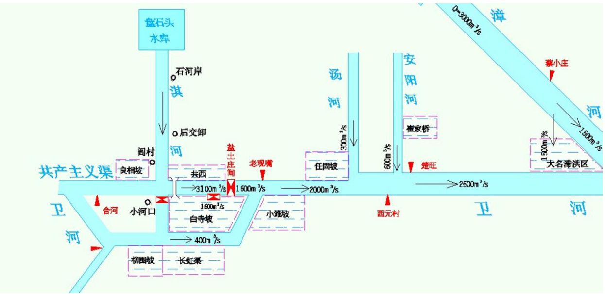  
图 4.3-2 卫河流域防洪体系布局示意图  

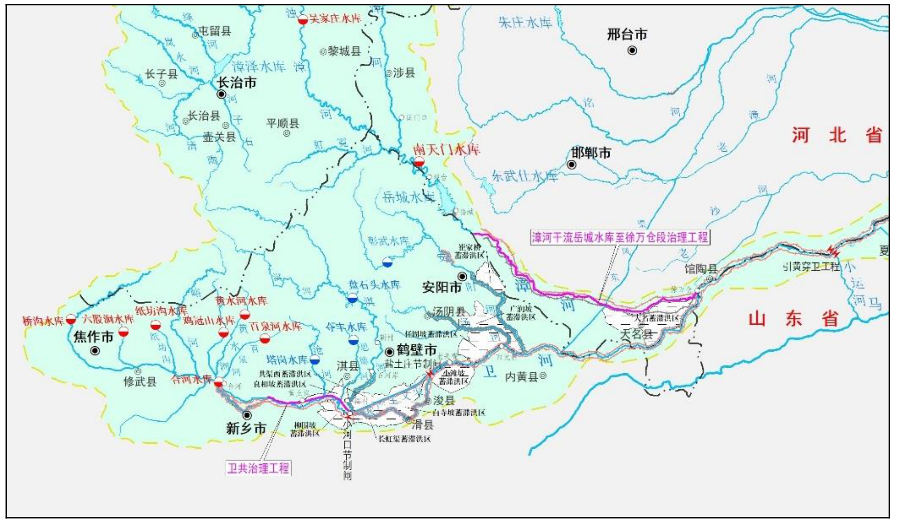  
图 4.3-3 漳卫河系防洪体系图  

# 4.3.3.2 防洪工程现状  

截至目前,卫河流域支流上游已建成盘石头、小南海、彰武等 18 座大中型水库;开辟整治良相坡、柳围坡、共渠西、白寺坡、长虹渠、小滩坡、任固坡、广润坡、崔家桥共 9 处蓄滞洪区;下游卫河、卫运河等已达标治理。  

# 1)水库  

卫河流域共建有 18 座大中型水库,160 余座小型水库,总库容约 12 亿 $\mathsf{m}^{3}$ ,其中大型水库 2 座,分别为盘石头水库和小南海水库。  

$\textcircled{1}$ 盘石头水库  

盘石头水库位于鹤壁市西南约 15km 盘石头村附近的淇河干流上,控制流域面积 $1915{\mathrm{km}}^{2}$ ,工程任务以防洪、工业及城市生活供水为主,兼顾农田灌溉、结合发电、养殖等综合利用。水库总库容 6.08 亿 $\mathsf{m}^{3}$ ,防洪库容 2.76 亿 $\mathsf{m}^{3}$ 。设计防洪标准 100 年一遇,校核防洪标准 2000 年一遇。设计洪水位 $270.7\mathrm{m}$ ,校核洪水位 $275\mathrm{m}$ 。枢纽工程由大坝、泄洪洞、溢洪道、输水洞及电站等建筑物组成。大坝为混凝土面板堆石坝,坝顶长 $606\mathrm{m}$ ,最大坝高 $102.2\mathrm{m}$ 。目前工程运行良好。  

盘石头水库控制运用分三级,5 年一遇洪水控泄 $100m^{3}/{\mathsf s}$ , $ 5{\sim}10$ 年一遇洪水控泄 $400\mathsf{m}^{3}/\mathsf{s}$ , $10\sim50$ 年一遇洪水控泄 $800\mathrm{m}^{3}/\mathsf{s}$ ,50 年以上不控泄。  

$\textcircled{2}$ 小南海水库  

小南海水库位于安阳市城区西南 $35\mathsf{k m}$ 处安阳县张二庄村东、后驼村南安阳河干流上,控制流域面积 $850\mathsf{k m}^{2}$ ,工程任务以防洪为主。水库总库容 1.08 亿$\mathsf{m}^{3}$ ,防洪库容 0.24 亿 $\mathsf{m}^{3}$ 。设计防洪标准 100 年一遇,校核防洪标准 2000 年一遇。设计洪水位 $179.88\mathrm{m}$ (黄海高程,本节同),校核洪水位 $187.8\mathrm{m}$ 。枢纽工程由大坝、溢洪道、输水洞等建筑物组成。大坝为粘土斜墙堆石坝,坝顶长$394.5\mathrm{m}$ ,最大坝高 $54\mathrm{m}$ 。  

水库按五级运用,即水位低于 $168.35\mathrm{m}$ 时,水库控泄 $60\mathsf{m}^{3}/\mathsf{s}$ ;水位超过$168.35\mathrm{m}$ 但低于 $175.82\mathrm{m}$ 时,水库控泄 $1035\mathsf{m}^{3}/\mathsf{s}$ ;水位超过 $175.82\mathrm{m}$ 但低于$179.00\mathrm{m}$ 时,水库控泄 $1250\mathrm{m}^{3}/\mathsf{s}$ ;水位超过 $179.00\mathrm{m}$ 但低于 $187.00\mathrm{m}$ 时,水库控泄 $5170\mathsf{m}^{3}/\mathsf{s}$ ;水位超过 $187.00\mathrm{m}$ 时,水库敞泄。  

此外,卫河流域已建成群英、石门、弓上、要街、彰武等 17 座中型水库。  

表 4.3-1 卫河流域中型水库统计表  

<html><body><table><tr><td>序 号</td><td>水库名称</td><td>所在河流</td><td>控制流域面 积（km2)</td><td>工程 规模</td><td>总库容 (亿m3)</td><td>防洪(调洪) 库容（亿 m3)</td></tr><tr><td>1</td><td>彰武</td><td>安阳河</td><td>970</td><td>中型</td><td>0.78</td><td>0.47</td></tr><tr><td>2</td><td>双泉</td><td>安阳河支流粉红 江</td><td>180</td><td>中型</td><td>0.18</td><td>0.10</td></tr><tr><td>3</td><td>弓上</td><td>淇河支流浙淇河</td><td>605</td><td>中型</td><td>0.32</td><td>0.16</td></tr><tr><td>4</td><td>汤河</td><td>汤永河支流汤河</td><td>162</td><td>中型</td><td>0.56</td><td>0.34</td></tr><tr><td>5</td><td>琵琶寺</td><td>汤永河支流永通 河</td><td>30</td><td>中型</td><td>0.21</td><td>0.09</td></tr><tr><td>6</td><td>石门（林州 市)</td><td>淇河</td><td>43</td><td>中型</td><td>0.11</td><td>0.10</td></tr><tr><td>7</td><td>夺丰</td><td>思德河</td><td>57.7</td><td>中型</td><td>0.11</td><td>0.01</td></tr><tr><td>8</td><td>陈家院</td><td>淇河支流香磨河</td><td>117</td><td>中型</td><td>0.14</td><td>0.01</td></tr><tr><td>9</td><td>三郊口</td><td>淇河支流北道河</td><td>215</td><td>中型</td><td>0.31</td><td>0.03</td></tr><tr><td>10</td><td>石门（辉县 市)</td><td>石门河</td><td>132</td><td>中型</td><td>0.28</td><td>0.02</td></tr><tr><td>11</td><td>正面</td><td>沧河</td><td>88.5</td><td>中型</td><td>0.15</td><td>0.02</td></tr><tr><td>12</td><td>狮豹头</td><td>沧河</td><td>160</td><td>中型</td><td>0.19</td><td>0.05</td></tr><tr><td>13</td><td>塔岗</td><td>沧河</td><td>234</td><td>中型</td><td>0.18</td><td>0.05</td></tr><tr><td>14</td><td>群英</td><td>大沙河</td><td>165</td><td>中型</td><td>0.17</td><td>0.07</td></tr><tr><td>15</td><td>马鞍石</td><td>纸房沟</td><td>90</td><td>中型</td><td>0.11</td><td>0.03</td></tr><tr><td>16</td><td>宝泉</td><td>峪河</td><td>538.4</td><td>中型</td><td>0.68</td><td>0.04</td></tr><tr><td colspan="4">合计</td><td></td><td>4.48</td><td>1.59</td></tr><tr><td colspan="6"></td><td></td></tr></table></body></html>  

# 2)河道  

$\textcircled{1}$ 卫河  

卫河干流合河至徐万仓段河道长 254.35km,其中合河\~淇门段河道长72.35km,淇门\~徐万仓段卫河长 182km。  

卫河干流合河 $\sim$ 淇门段只用于排涝不行洪,承担镜高涝河、西孟姜女河、人民胜利渠、东孟姜女河和市区的排水任务。卫河河道主槽均为梯形断面,边坡均为 1:3.0,合河闸 $\sim$ 西孟姜女河入口段河底宽 $10\mathrm{m}$ ,西孟姜女河入口 $\sim$ 前河头橡胶坝段河底宽 $20.20\mathrm{m}$ ,前河头橡胶坝 $\sim$ 东孟姜女河入口段河底宽 11m,东孟姜女河入口\~淇门段河底宽 $19\mathsf{m}$ ,河底高程 $58.98\sim69.77\mathrm{m}$ ,比降为 $1/6924\sim1/5101$ 。河道两侧均建有堤防,堤防级别为 2 级,堤防高程超过 20 年一遇水位 2m,为  

$68{\sim}75.77\ensuremath{\mathrm{m}}$ ,堤顶宽 $5{\sim}6\ensuremath{\mathrm{m}}$ ,内外边坡均为 1:3.0。  

卫河干流淇门\~徐万仓段洪涝合排,2021年2月,水利部以“水许可决(2021)9 号”对卫河干流(淇门\~徐万仓)治理工程初步设计进行了批复,对卫河淇门\~徐万仓段进行系统治理,包括扩挖河槽与加高两岸堤防,工程已于 2021 年 6 月开工建设,目前已完成验收。卫河干流淇门 $\sim$ 十里铺下口段河道主槽为梯形断面,边坡均为 1:3.0,河底宽 $10\sim60\ensuremath{\mathrm{m}}$ ,河底高程 $50.64\sim58.48\mathrm{m}$ ,河道比降$1/8230{\sim}1/5266$ ;十里铺下口 $\sim$ 老关嘴段河道主槽为梯形,河底宽约 $6\mathsf{m}$ ,河底高程 $49.42{\sim}50.60\mathrm{m}$ ,河道比降 1/4800;老关嘴 $\sim$ 浚内沟段河道主槽为梯形断面,边 坡 均 为 1:3.0 , 河 底 宽 20m , 河 底 高 程 $45.21\sim46.98\mathrm{m}$ ,河道比降$1/8230{\sim}1/5266$ ;浚内沟\~徐万仓段河道主槽为梯形,河底宽约 $5{\sim}19\ensuremath{\mathrm{m}}$ ,河道高程 $30.61\sim45.12\mathrm{m}$ ,河道比降 1/7400。河道两侧均建有堤防,均为土堤,迎水侧边坡为 1:3.0,背水侧边坡为 1:2.5,淇门 $\sim$ 老关嘴段堤防级别为 3 级,堤顶宽$5\mathsf{m}$ ,左堤堤顶高程 $68.89{\sim}60.08\mathrm{m}$ ,右堤堤顶高程 $60.4{\sim}68\mathrm{m}$ ;老关嘴 $\sim$ 徐万仓段堤防级别为 2 级,堤顶宽 $6\mathsf{m}$ ,左堤堤顶高程 $68.89{\sim}60.08\mathrm{m}$ ,右堤堤顶高程$60.4{\sim}68\mathsf{m}$ 。  

$\textcircled{2}$ 共产主义渠  

共产主义渠河道全长 104.53km,其中合河 $\sim$ 淇门段河道长 60.33km,淇门以下河道长 $44.2\mathsf{k m}$ 。  

共渠于 1958 年为引黄灌溉修建,1962 年停止引黄后,淇门以上共渠与卫河实行洪涝分流,合河镇以上的洪水不再进入新乡市区,西部和北部山区洪水经纸坊沟、峪河、石门河、黄水河和百泉河等河道全部汇入共渠下泄。共渠合河\~淇门段河道主槽为梯形断面,边坡为 1:2.5,主槽底高程在 $58.85{\sim}68.83\mathrm{m}$ 之间,河道纵坡为 $1/6800{\sim}1/4000$ ,合河 $\sim$ 和平大桥段河底宽 $80\mathsf{m}$ ,和平大桥 $\sim\ G107$ 国道桥段河底宽 $^{200\mathrm{m}}$ ,G107 国道桥\~淇河口段河底宽 $80\mathsf{m}$ 。共渠合河 $\sim$ 淇门段无左堤,只有右堤,堤防内外侧边坡均为 1:3.0,合河 $\sim\ G107$ 国道桥段堤防级别为1 级,堤顶高程超过 100 年一遇洪水位 $_{2\mathsf{m}}$ ,为 $74.97\sim79.23\mathrm{m}$ ,堤顶宽度为$8{\sim}50\mathrm{m}$ ;G107 国道桥至下马营段堤防级别为 2 级,堤顶高程超过 50 年一遇洪水位 $_{2\mathsf{m}}$ ,为 $69.8{\sim}74.20\mathsf{m}$ ,堤顶宽度为 $6\mathsf{m}$ ;下马营 $\sim$ 淇门段堤防级别为 4 级,堤顶高程超过 50 年一遇洪水位 $_{2\mathsf{m}}$ ,为 $68.42{\sim}69.80\mathsf{m}$ ,堤顶宽度为 $6\mathsf{m}$ 。  

共渠淇门 $\sim$ 老观嘴段已安排在卫河干流(淇门 $\sim$ 徐万仓)治理工程中进行系统治理,工程已于 2023 年完工。共渠淇门 $\sim$ 老关嘴段主槽底高程 $47.45{\sim}58.35\mathsf{m}$ ,河道上口宽 $80{\sim}100\ m$ ,河底宽 $10{\sim}50\ m$ ,河道纵坡为 1/4000,基本为单式断面。共渠淇门\~盐土庄节制闸段建有右堤,堤防级别为 3 级,堤顶宽 5m,堤顶高程为 $62.70\mathsf{m}{\sim}67.83\mathsf{m}$ ;盐土庄节制闸 $\sim$ 老关嘴段建有左堤,堤防级别为 2 级,堤顶宽 $5\mathsf{m}$ ,堤顶高程为 $60.12{\sim}61.94\ensuremath{\mathrm{m}}$ 。堤防均为土堤,迎水侧边坡为 1:3.0,背水侧边坡为 1:2.5。  

$\textcircled{3}$ 淇河  

淇河属山区性河流,河源短,水流急,新村至淇门段河道长约 $39.05{\mathrm{km}}$ ,现状河底高程自 88.73 降至 58.35,河道比降 $1/1240\sim1/7730\sim1/5940$ 。河道宽度自上而下由宽变窄,滩地从有到无,主槽宽 $100{\sim}40\ensuremath{\mathsf{m}}$ ,堤距 $450\sim100\ensuremath{\ m}$ ,上游最宽接近 $800\mathsf{m}$ 。淇河左岸堤防连续,堤高 $1.8\mathrm{m}{\sim}6.1\mathrm{m}$ ,堤顶高程$68.07\mathsf{m}{\sim}79.20\mathsf{m}$ , 右 岸 堤 防 不 连 续 , 堤 高 $1.2\mathsf{m}{\sim}6.5\mathsf{m}$ , 堤 顶 高 程$67.81\mathrm{m}{\sim}77.47\mathrm{m}$ ,阎村分洪口以下右岸无堤。两岸共有险工险段 26 处,穿堤涵闸 50 座。  

# 3)蓄滞洪区  

卫河蓄滞洪区采用 2008 年防洪规划设计指标见表 4.3-2。  

表 4.3-2  卫河坡洼原设计指标表  

<html><body><table><tr><td>蓄滞洪区 名称</td><td>设计滞洪水位 (m)</td><td>容积 (eW Zy)</td><td>面积 (km2)</td><td>启用标准</td><td>运用标准</td></tr><tr><td>良相坡</td><td>67.34</td><td>1.42</td><td>81.05</td><td>>3</td><td>50</td></tr><tr><td>柳围坡</td><td>65.05</td><td>0.95</td><td>78.50</td><td>>10</td><td>50</td></tr><tr><td>长虹渠</td><td>62.49</td><td>1.19</td><td>72.40</td><td>>20</td><td>50</td></tr><tr><td>白寺坡</td><td>61.40</td><td>3.10</td><td>129.06</td><td>>10</td><td>50</td></tr><tr><td>共渠西</td><td></td><td>2.81</td><td>94.86</td><td><3</td><td>50</td></tr><tr><td>小滩坡</td><td>58.00</td><td>0.71</td><td>93.19</td><td>>50</td><td></td></tr><tr><td>任固坡</td><td>56.50</td><td>2.90</td><td>167.83</td><td>>50</td><td></td></tr><tr><td>广润坡</td><td></td><td>3.22</td><td>152.79</td><td>1区>3,2 区>20</td><td>20(1 区)</td></tr><tr><td>崔家桥</td><td>65.75（大沽)</td><td>0.33</td><td>74.54</td><td>5</td><td>20</td></tr></table></body></html>  

$\textcircled{1}$ 良相坡  

良相坡蓄滞洪区建于 1953 年,位于新乡市的卫辉市和鹤壁市的淇县境内,处在太行山洪积和黄河冲积平原的过渡区,地面高程一般 $65.50\mathrm{m}$ ,最低 $64.50\mathrm{m}$ 。南以卫河右堤为界,东靠西岗堤、淇河右堤,北倚淇县城关防洪堤,西北接自然高地,担负着淇河、共渠及左岸支流沧河、思德河洪水滞蓄任务,历史上就是一个自然滞洪区。设计滞洪水位 $67.34\mathrm{m}$ ,容积 1.42 亿 $\mathsf{m}^{3}$ ,面积 $81.05\mathsf{k m}^{2}$ 。良相坡调度运用方式为当淇河右岸阎村分洪堰上水位超过 $67.75\mathrm{m}$ 时,洪水自然漫溢入良相坡;当共产主义渠黄土岗站水位超过 $68.00\mathrm{m}$ 时,共产主义渠左岸自然漫溢,洪水进入良相坡;当沧河京广铁路桥下游洪水位超过 $76.20\mathrm{m}$ 或思德河狐仙庙桥下游水位超过 $65.50\mathrm{m}$ 时,洪水进入良相坡。  

良相坡围堤包括淇河右堤、西岗堤、淇县城关防洪堤、卫河右堤(黄土岗\~淇门)三部分。其中淇河右堤长 5km,西岗堤长 $13.89\ensuremath{\mathrm{km}}$ ,城关防洪堤长 12km,卫河右堤长 25km。淇河右岸阎村分洪口建有固定分洪堰,宽 $500\mathrm{m}$ ,设计流量$620\mathsf{m}^{3}/\mathsf{s}$ ,用于向良相坡分泄淇河洪水;共渠右堤西沿村段建有固定分洪堰,宽$400\mathrm{m}$ ,设计流量 $1170\mathrm{m}^{3}/\mathsf{s}$ 。  

良相坡蓄滞洪区内包括卫辉市、淇县 2 个县(市),6 个乡镇,28 个行政村。截至 2020 年,良相坡内人口 4.5 万人,耕地 10.8 万亩,国内生产总值 6.8 亿元。  

$\textcircled{2}$ 柳围坡  

柳围坡滞洪区位于卫河右岸的卫辉、浚县境内,是太行山洪积和黄河冲积平原过渡的封闭洼地,历史上为自然滞洪坡洼,其范围南以古阳堤为界,北靠卫河右堤,西至倪湾一带的自然高地,东至申店隔堤。柳围坡地形西高东低,地面高程在 $64.90\sim62.40\mathsf{m}$ 之间,地面自然坡降约 1/5000。柳围坡设计滞洪水位$65.05\mathrm{m}$ ,面积 $78.5\mathsf{k m}^{2}$ ,容积 0.95 亿 $\mathsf{m}^{3}$ 。柳围坡调度运用方式为当良相坡城关墙水位接近 $67.34\mathrm{m}$ 时,扒开共产主义渠右堤西沿村分洪堰、卫河右堤宋村分洪堰,向柳围坡分洪。  

围堤工程包括卫河右堤、申店隔堤和古阳堤,其中卫河右堤长 14.48km,申店隔堤长 $4.4\mathsf{k m}$ ,古阳堤长 $16.9k m$ 。宋村附近卫河右堤上建有宋村分洪堰,堰宽 $400\mathrm{m}$ ,堰顶高程 $65.30\mathrm{m}$ ,设计流量 $480\mathrm{m}^{3}/\mathsf{s}$ 。  

柳围坡蓄滞洪区内包括卫辉市、浚县 2 个县市,4 个乡镇,29 个村庄和 2个农场。截至 2020 年,柳围坡内人口 3.6 万人,耕地 9.24 万亩,国内生产总值5.0 亿元。  

$\textcircled{3}$ 长虹渠  

长虹渠蓄滞洪区始建于 1954 年,位于卫河右岸淇门以下,地处河南省鹤壁市浚县、安阳市滑县境内,其范围南以太行堤为界,北靠卫河右堤,东抵滑县城关,西至申店隔堤,是太行山洪积和黄河冲积平原过渡的封闭洼地,历史上为自然滞洪坡洼。地势西高东低,最高处在淇门分洪口,地面高程 $64.00\mathrm{m}$ ,最低处在滑县大铺北,地面高程 $59.70\mathrm{m}$ 。地形由东南向东北方向倾斜,地面坡降以新镇为界,以上 1/3300,以下约 1/6000。长虹渠设计滞洪水位为 $62.49\mathrm{m}$ ,容积1.19 亿 $\mathsf{m}^{3}$ ,面积 $72.4\mathsf{k m}^{2}$ 。长虹渠调度运用方式为当刘庄分洪堰启用后,卫河淇门站水位仍达到 $64.77\mathrm{m}$ 或流量达到 $400\mathsf{m}^{3}/\mathsf{s}$ 且继续上涨时,逐渐开启长虹渠分洪闸和分洪堰,保证卫河淇门站水位不再上涨。  

围堤工程包括申店隔堤、卫河右堤和太行堤,其中申店隔堤长 $4.4\mathsf{k m}$ ,卫河右堤长 24.28km,太行堤长 27.82km。长虹渠分洪口门为闸堰组合型式,分洪闸设计分洪流量 $200\mathsf{m}^{3}/\mathsf{s}$ ;分洪堰为混凝土宽顶堰,堰底高程 $62.7\mathsf{m}$ 。长虹渠退水闸设计流量 $400\mathsf{m}^{3}/\mathsf{s}$ 。  

长虹渠蓄滞洪区内包括浚县、滑县 4 个乡镇、31 个行政村。截至 2020 年,长虹渠内人口 3.9 万人,耕地 11.0 万亩,国内生产总值 19.0 亿元。  

$\textcircled{4}$ 白寺坡  

白寺坡蓄滞洪区位于卫河与共产主义渠之间鹤壁市的浚县和安阳市的滑县境内。该洪区位于太行山前冲积扇和黄河冲积区的过渡带,是一个自然低洼区,东以卫河左堤和付庄防洪堤为界,西以共渠右堤为界,南部为自然高地,地势由西南向东北倾斜,地面高程为 $57.20{\sim}60.00\mathsf{m}$ 。白寺坡设计滞洪水位 $61.40\mathrm{m}$ ,容积 3.10 亿 $\mathsf{m}^{3}$ ,面积 $129.06\mathsf{k m}^{2}$ 。白寺坡调度运用方式为当白寺坡分洪闸闸上水位达到 61.10m 或盐土庄节制闸下泄流量大于 $1500\mathrm{m}^{3}/\mathsf{s}$ 且继续上涨时,逐渐开启白寺坡分洪闸分洪入白寺坡,最大分洪流量 $900\mathsf{m}^{3}/\mathsf{s}$ ;当白寺坡分洪闸全部开启后,若闸上水位继续上涨,扒开白寺坡分洪堰。  

围堤工程包括卫河左堤、付庄堤和共渠右堤,其中卫河左堤长 20.98km,付庄堤长 $14.46\ensuremath{\mathrm{km}}$ ,共渠右堤长 $22.1\mathsf{k m}$ 。白寺坡分洪口门为闸堰组合型式,分洪闸设计分洪流量 $900\mathsf{m}^{3}/\mathsf{s}$ ;分洪堰为混凝土宽顶堰,堰顶高程 $57\mathsf{m}$ 。通过民丰沟上的白寺坡退水闸退水入卫河,设计流量 $150\mathrm{m}^{3}/5$ 。  

白寺坡蓄滞洪区内包括浚县、滑县 2 个县,5 个乡镇,51 个村庄。截至 2020年,白寺坡内人口 5.5 万人,耕地 10.1 万亩,国内生产总值 35.6 亿元。  

$\textcircled{5}$ 共渠西  

共渠西蓄滞洪区位于浚县境内,上片范围西南起淇河左堤,东南靠共渠,西北接自然高地;下片东南靠共渠,西北靠自然高地。区内地形西北高,东南低,上片地面高程为 $61.90{\sim}64.00\mathrm{m}$ ,下片地面高程为 $56.70{\sim}60.00\mathsf{m}$ 。容积 2.81 亿$\mathsf{m}^{3}$ ,面积 $94.86\mathsf{k m}^{2}$ 。共渠西调度运用方式为当共产主义渠刘庄站流量超过$250\mathrm{m}^{3}/\mathsf{s}$ 或水位超过 $63.00\mathrm{m}$ 时,共产主义渠左岸自然漫溢,洪水进入共渠西;当卫河淇门站水位达到保证水位 64.77m 或流量达到 $400\mathsf{m}^{3}/\mathsf{s}$ 且继续上涨时,扒开淇河左堤刘庄分洪堰分洪入共渠西。  

围堤工程包括淇河左堤、共渠左右堤,其中淇河左堤长 $3.5{\mathrm{km}}$ ,共渠右堤长$32.04\mathrm{km}$ ,共渠左堤长 12.07km。淇河左堤建有刘庄分洪堰,设计流量 $1870\mathrm{m}^{3}/\mathsf{s}$ 。  

共渠西蓄滞洪区内包括浚县 3 个乡镇,15 个行政村。截至 2020 年,共渠西蓄滞洪区内人口 7.3 万人,耕地 9.6 万亩,国内生产总值 9.8 亿元。  

$\textcircled{6}$ 小滩坡  

小滩坡蓄滞洪区位于卫河中游右岸,鹤壁市的浚县和安阳市的内黄县境内,1955 年为弥补上游长虹渠、白寺坡等蓄滞洪区蓄洪能力不足而建。小滩坡蓄滞洪区东以防洪堤为界,北、西靠卫河右堤,南界自然高地,区内地势西南高,东北低,地面高程一般为 $55.00{\sim}57.30\mathsf{m}$ 。设计滞洪水位为 $58\mathrm{m}$ ,容积 0.71 亿$\mathsf{m}^{3}$ ,面积 $93.19\ensuremath{\mathrm{km}}^{2}$ 。小滩坡调度运用方式为当白寺坡中坡农场水位超过 61.4m且继续上涨,卫河五陵站流量超过 $2000\mathsf{m}^{3}/\mathsf{s}$ 时,扒开卫河右岸圈里口门向小滩坡分洪,保证元村集站流量不超过 $2500\mathsf{m}^{3}/\mathsf{s}$ 。  

围堤工程包括卫河右堤、东防洪堤,其中卫河右堤长 $19.2\mathsf{k m}$ ,东防洪堤长$24.6\ensuremath{\mathrm{km}}$ 。浚内沟退水闸(涵闸)设计流量 $66.45\mathsf{m}^{3}/\mathsf{s}$ 。现状无进洪控制工程,运用时靠临时扒口。  

小滩坡蓄滞洪区内包括浚县、内黄县 2 个县,4 个乡镇(办事处),42 个村庄。截至 2020 年,小滩坡蓄滞洪区内共有人口 6.3 万人,耕地 10.5 万亩,国内生产总值 30.3 亿元。  

$\textcircled{7}$ 任固坡  

任固坡滞洪区兴建于 1956 年,位于河南省安阳市汤阴县、内黄县境内,紧邻卫河左岸汤河入卫处。任固坡蓄滞洪区东南以卫河左堤北五陵至西元村为界,北靠汤河左堤北庄至入卫处,西接自然高地。地形南高北低,西高东低,坡底高程 54m 左右。任固坡设计滞洪水位 $56.50\mathrm{m}$ ,容积 2.90 亿 $\mathsf{m}^{3}$ ,面积 $167.83\mathsf{k m}^{2}$ 。任固坡调度运用方式为当卫河元村集站流量超过 $2500\mathsf{m}^{3}/\mathsf{s}$ ,扒开北五陵以下卫  

河左堤向任固坡分洪。  

围堤工程包括卫河左堤和汤河右堤,其中卫河左堤长 18.78km,汤河右堤长$20.0\mathsf{k m}$ 。现状无进洪控制工程,运用时靠临时扒口。  

任固坡蓄滞洪区内包括汤阴县、内黄县 2 个县,5 个乡镇,87 个行政村。截至 2020 年,任固坡蓄滞洪区内人口 10.2 万人,耕地 20.0 万亩,国内生产总值 14.4 亿元。  

$\textcircled{8}$ 广润坡  

广润坡蓄滞洪区位于海河流域卫河水系汤河中下游,历史上是天然洼地滞洪区。北接自然高地和安阳河右堤,东界安阳河右堤,南靠汤河左堤和卫河左堤,西以西防洪堤和自然高地为界。以东防洪堤和洪河左堤为界分为两区,以西为Ⅰ区,以东为Ⅱ区。地势总体上自西南向东北倾斜,自然坡降 $1/3500{\sim}1/5000.$ 。面积 $152.79\mathrm{km}^{2}$ ,容积 3.22 亿 $\mathsf{m}^{3}$ 。广润坡调度运用方式为当汤河双石桥分洪堰上水位超过 $61.40\mathrm{m}$ 时,双石桥分洪堰自然漫溢入一级蓄滞洪区;当汤河双石桥、洪河汪流屯、茶店坡沟快速通道桥 3 处河道来水流量合计大于 $300\mathsf{m}^{3}/\mathsf{s}$ ,且洪河汪流屯或茶店坡沟快速通道桥发生漫溢时,启用一级蓄滞洪区;当王贵庄分洪堰上水位超过 $57.02\mathrm{m}$ 时,王贵庄分洪堰自然漫溢入二级蓄滞洪区。控制汤河入卫流量不超过 $300\mathrm{m}^{3}/\mathsf{s}$ 。  

围堤工程包括安阳河右堤、汤河左右堤、卫河左堤、西防洪堤和东防洪堤,其中安阳河右堤长 $20.09\ensuremath{\mathrm{km}}$ ,汤河左堤长 12.77km,汤河右堤长 12.51km,卫河左堤长 $9.6\mathsf{k m}$ ,西防洪堤长 11.06km,东防洪堤长 11.36km。双石桥分洪堰长$270\mathrm{m}$ ,堰顶高程 $61.40\mathrm{m}$ ,王贵庄溢流堰长 270m,堰顶高程为 $57.02\mathrm{m}$ 。  

广润坡蓄滞洪区内包括汤阴县、安阳县(示范区)、内黄县、文峰区、4 个县(区)的 9 个乡(镇),共 94 个行政村。截至 2020 年,广润坡蓄滞洪区内人口 16.5 万人,耕地 21.2 万亩,国内生产总值 23.1 亿元。  

$\textcircled{9}$ 崔家桥  

崔家桥蓄滞洪区位于安阳市下游 20km 处安阳河左岸,北临幸福渠,西至自然高地,东濒漳河故道,是一个自然洼地。地面总体趋势西高东低,最低地面高程东部永和乡王家口村附近 $61.4\mathrm{m}$ ,最高地面高程西部韩陵山附近 $67\mathsf{m}$ ,自然坡降约为 1/3000。设计滞洪水位 $65.75\mathrm{m}$ (大沽高程),滞洪容积 0.33 亿 $\mathsf{m}^{3}$ ,面积 $74.54\ensuremath{\mathrm{km}^{2}}$ 。崔家桥调度运用方式为当安阳河安阳站流量超过 $600\mathsf{m}^{3}/\mathsf{s}$ 时,曹马分洪堰和郭盆分洪堰自然漫溢,洪水进入崔家桥蓄滞洪区。郭盆节制闸控制安阳河入卫流量不超过 $600\mathsf{m}^{3}/\mathsf{s}$ 。  

围堤工程包括安阳河右堤,长 $7.73\mathrm{km}$ 。曹马分洪堰设计流量 $1200\mathrm{m}^{3}/\mathsf{s}$ ,堰顶高程 $68.04\sim67.54\mathrm{m}$ ;郭盆分洪堰设计流量 $500\mathsf{m}^{3}/\mathsf{s}$ , 堰 顶 高 程$65.08{\sim}64.91\mathrm{m}$ 。王家口退水闸设计退水流量 $150\mathrm{m}^{3}/5$ ,梨园沟退水闸设计退水流量 $72\mathrm{m}^{3}/\mathsf{s}$ 。  

崔家桥蓄滞洪区内有安阳县 3 个镇、65 个行政村。截至 2020 年,崔家桥蓄滞洪区内人口 8.7 万人,耕地 8.0 万亩,国内生产总值 12.5 亿元。  

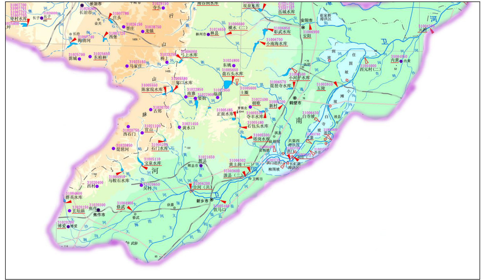  
图 4.3-4  卫河流域主要工程位置示意图  

# 4.3.3.3 标准洪水安排  

漳卫河系防洪标准为 50 年一遇。河系 15 天总洪量 36.7 亿 $\mathsf{m}^{3}$ ,控制性水库最大拦蓄量 9.72 亿 $\mathsf{m}^{3}$ ,蓄滞洪区最大滞蓄量 17.05 亿 $\mathsf{m}^{3}$ 。  

卫河洪水主要源于左岸山区支流,小南海、彰武水库控制安阳河山区洪水,当安阳河发生 20 年一遇设计洪水时,两库联合运用并经崔家桥滞洪区自然滞蓄后,下游河道泄量不超过 $600\mathsf{m}^{3}/\mathsf{s}$ ;汤河洪水经广润坡滞蓄后下游河道泄量不超过 $300\mathsf{m}^{3}/\mathsf{s}$ 。  

淇河扩建盘石头水库,100 年一遇洪水时控泄 $100\mathrm{m}^{3}/\mathsf{s}$ , $10\sim100$ 年一遇洪水时控泄 $200\mathsf{m}^{3}/\mathsf{s}$ 。石河岸以下河道设计防洪标准 20 年一遇,20 年一遇洪水时新村下泄流量 $1280\mathrm{m}^{3}/\mathsf{s}$ 。设计标准时洪水由阎村分洪口分洪入良相坡,阎村以下设计行洪流量 $1000\mathrm{m}^{3}/\mathsf{s}$ 。  

卫河洪水通过上游水库拦蓄,经中游蓄滞洪区滞蓄后控制下泄,老观嘴控制泄量 $2000\mathsf{m}^{3}/\mathsf{s}$ 。其中卫河河道下泄流量 $400\mathsf{m}^{3}/\mathsf{s}$ ,共产主义渠及共渠西蓄滞洪区由盐土庄节制闸控制下泄流量 $1600\mathrm{m}^{3}/\mathsf{s}$ 。共卫合流后,沿途纳汤河、安阳河,安阳河口至徐万仓段河道规划行洪流量 $2500\mathsf{m}^{3}/\mathsf{s}$ 。汤河、安阳河来水较小时,盐土庄节制闸可适当加大泄量。  

漳、卫两河至徐万仓汇合后由卫运河承泄,规划行洪流量 $4000\mathrm{m}^{3}/\mathsf{s}$ ,至四女寺枢纽,由漳卫新河承泄 $3650\mathsf{m}^{3}/\mathsf{s}$ ,南运河承泄 $150\mathrm{m}^{3}/\mathsf{s}$ ,经捷地减河入海。上游来水超过 $3800\mathrm{m}^{3}/\mathsf{s}$ ,由漳卫新河强迫行洪,若发生险情,向恩县洼分洪。  

流域发生 3 年一遇洪水即启用良相坡及共渠西蓄滞洪区,发生超 10 年一遇洪水即启用白寺坡、柳围坡蓄滞洪区,发生超 20 年一遇即启用长虹渠蓄滞洪区,发生 30 年一遇洪水启用大名泛区蓄滞洪区,发生 $30\sim50$ 年一遇洪水启用恩县洼蓄滞洪区。盘石头等水库扩建增容后,可提高卫河坡洼启用标准,减轻滞洪压力。  

# 4.3.3.4 超标准洪水安排  

超标准洪水应力保漳河左堤、卫运河左堤安全。遇 100 年一遇洪水时,岳城水库最大泄量 $7740\mathrm{m}^{3}/\mathsf{s}$ ,过京广铁路桥后由河道强迫行洪,超量洪水在二分庄、三宗庙向右岸扒口分洪,分洪水量约 4.5 亿 $\mathsf{m}^{3}$ ,至升斗铺,加大向大名泛区蓄滞洪区分洪。  

卫河实测最大洪水发生在 1963 年,接近 50 年一遇。遇 100 年一遇洪水时,坡洼适当超蓄,河道强迫行洪,当卫河老观嘴流量超过 $2000\mathsf{m}^{3}/\mathsf{s}$ 时,扒开卫河右岸圈里口门向小滩坡分洪,当元村集站流量超 $2500\mathsf{m}^{3}/\mathsf{s}$ 时,扒开北五陵以下卫河左堤分洪入任固坡。  

# 4.3.3.5 沧河流域防洪体系  

沧河属海河流域卫河支流,发源于林州市石崖水和辉县市横岭村,在卫辉市狮豹头乡西拴马村汇合,经龙卧岩、正面、狮豹头、塔岗到安都乡口头村出山潜入地下,下游复出地表,在顿坊店乡境内分别流入共产主义渠。从西拴马村向东16km 为卫辉市正面水库大坝,从此拐向南 7km 是卫辉市狮豹头水库大坝,继续向南 13km 是卫辉市塔岗水库大坝,也是沧河出山口处,向下进入山前丘陵区后,继续蜿蜒向东南 10km 相继穿越南水北调中线总干渠、107 国道、京广铁路和京珠高速公路后汇入共产主义渠。  

沧河全长 53km,流域面积 $370\mathsf{k m}^{2}$ ,其中山区面积 $234\mathsf{k m}^{2}$ ,占全流域面积的 $63\%$ 。有较大支沟五条。山丘区河道纵坡 1/40-1/110,坡陡流急。从西拴马村至山口(口头村)河床宽度变化较小,坡度较大,至口头村急转弯向东南,在转弯处冲刷边坡、河床形成积水深潭。沧河出山口后蜿蜒向东南,河道宽度由$60–400\mathsf{m}$ 逐渐变窄,坡度亦变小。  

塔岗水库下游入共产主义渠口段,由于地势低洼,加之受共产主义渠水顶托,排水不畅,经常出现涝灾。为了充分利用沧河水资源,减轻洪水威胁,从 20 世纪 50 年代后期开始对沧河进行梯级水库综合开发,先后于 1958 年、1967 年、1973 年建成了塔岗、狮豹头、正面三座中型水库,控制山洪灾害的发生频率和灾害损失的严重性。  

(1)防洪工程现状  

沧河属海河流域卫河支流,发源于林州市石崖水和辉县市横岭村,在卫辉市狮豹头乡西拴马村汇合,经龙卧岩、正面、狮豹头、塔岗到安都乡口头村出山潜入地下,下游复出地表,在顿坊店乡境内分别流入共产主义渠。从西拴马村向东16km 为卫辉市正面水库大坝,从此拐向南 7km 是卫辉市狮豹头水库大坝,继续向南 13km 是卫辉市塔岗水库大坝,也是沧河出山口处,向下进入山前丘陵区后,继续蜿蜒向东南 10km 相继穿越南水北调中线总干渠、107 国道、京广铁路和京港澳高速公路后汇入共产主义渠。  

沧河有较大支沟五条。在山丘区河道纵坡 1/40-1/110,坡陡流急。从西拴马 村至山口(口头村)河床宽度变化较小,坡度较大,至口头村急转弯向东南,在 转弯处冲刷边坡、河床形成积水深潭。沧河出山口后蜿蜒向东南,河道宽度由 60-400m 逐渐变窄,坡度亦变小。  

目前沧河上已建工程主要包括正面水库、狮豹头水库、塔岗水库及部分堤防工程。  

# 1)正面水库  

正面水库在狮豹头水库上游 7km 处,根据正面水库除险加固报告,正面水库是一座灌溉、供水、发电的综合利用的中型水库,原设计总库容 1537 万 $\mathsf{m}^{3}$ ,兴利库容 1135 万 $\mathsf{m}^{3}$ 。正面水库控制流域面积 $88.5\mathsf{k m}^{2}$ ,下游狮豹头水库控制流域面积 $160k m^{2}$ ,正面\~狮豹头水库区间洪水较大。正面水库主要建筑物有挡水坝段、溢流坝段、输水洞和电站,总体布局为:左、右岸布置挡水坝段,中部布置溢流坝段,大坝总长 $316.0\mathrm{m}$ ,其中左岸挡水坝段总长 $73\mathrm{m}$ ,右岸挡水坝段总长 $123\mathrm{m}$ 。大坝坝顶高程 $400.8\mathrm{m}$ ,最大坝高 $52.8\mathrm{m}$ ,为浆砌石重力墙堆石坝。溢流堰采用实用堰型,堰顶设交通桥,桥面净宽 $2.7\mathsf{m}$ 。输水洞设 3 级,一级洞位于溢流坝段下部,二级、三级洞分别位于右岸和左岸挡水坝段下部(二级、三级洞现状已封堵),均为钢筋混凝土结构。电站位于大坝下游侧一级洞出口处,装有 3 台卧式发电机,装机容量 450kW。水库现状溢流坝为无闸控制的开敞型溢流通道,对洪水无调节控制能力。  

# 2)狮豹头水库  

狮豹头水库是一座灌溉、发电、城镇供水综合利用的Ⅲ等中型水库,现状主要以灌溉、城镇供水为主运行。控制流域面积 $160k m^{2}$ ,原设计总库容 1860 万$\mathsf{m}^{3}$ ,兴利库容 1010 万 $\mathsf{m}^{3}$ ,最大坝高 $50.7\mathrm{m}$ ,防浪墙高 $1.0\mathsf{m}$ ,坝顶长 $150\mathrm{m}$ 。  

# 3)塔岗水库  

现状塔岗水库是一座灌溉、供水、发电综合利用的Ⅲ等中型水库,控制流域面积 $234\mathsf{k m}^{2}$ ,原设计总库容 1786 万 $\mathsf{m}^{3}$ ,兴利库容 954 万 $\mathsf{m}^{3}$ ,最大坝高 $41\mathsf{m}$ ,防浪墙高 $1.2\ m$ (现状 $1.0\ m$ )。主要控制建筑物包括主挡水坝、左右副坝、溢洪道、输水洞、坝后电站几部分。  

2008 年,塔岗水库实施了除险加固,主要把现状溢洪道顶部高程 177.20m改造至原设计高程 $177.00\mathrm{m}$ ,溢洪道向左扩宽 $6.7\mathsf{m}$ ,从而增加了自身泄洪能力,满足自身工程防洪标准要求。  

# 4)沧河河道堤防建设状况  

根据《卫辉市“23.7”沧河灾后治理工程初步设计报告》,沧河治理的河段从卫辉市塔岗水库溢洪道下游至沧河南支入共渠段,桩号从 $0{+}100{\sim}17{+}250$ ,主要工程措施为河道整治、拓宽主河槽、防洪墙工程、护坡工程等,综合考虑河道现状及防护对象的重要性等因素,综合确定即塔岗水库大坝( $0{+}100$ ) $\sim$ 口头( $1+700$ )防洪标准维持 10 年一遇不变,设计防洪流量为 $939\mathsf{m}^{3}/\mathsf{s}$ (实际过流能力达到 20 年一遇);口头( $1+700$ )\~清水河村( $15{+}550$ )防洪标准提高至20 年一遇,20 年一遇设计防洪流量 $1842\mathrm{m}^{3}/5$ ;清水河村以下进入良相坡蓄滞洪区,清水河村( $15{+}550$ )\~入共渠口( $17+250$ )按照原河道标准进行治理。经沟通,实际上,口头村\~清水河村河段中,沧河在南水北调中线以下河段两岸基本均划定为基本农田,主槽难以扩宽,且受共渠顶托,河道过流能力也不会因为河道拓宽增加太多,因此,实际实施过程中,该河段基本按照现状河道简单疏浚进行处理,本次复核后该河段过流能力仅为 $200\mathsf{m}^{3}/\mathsf{s}$ ,分支后,南支为 $180\mathrm{m}^{3}/5$ ,北支仅有 $20\mathsf{m}^{3}/\mathsf{s}$ 。  

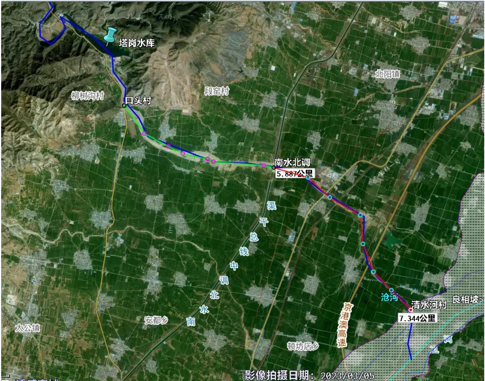  
图 4.3-5 沧河规划河道治理情况  

# 4.3.4 防洪保护范围和保护对象、防洪标准  

塔岗水库扩容后将提高塔岗水库以下沧河两岸的防洪安全保障水平。沧河流域面积为 $370\mathsf{k m}^{2}$ ,不足汇入卫河后的流域面积的 $5\%$ ,因此对汇合口以下,尤其是良相坡以下的范围防洪效果十分有限,因此,水库防洪保护范围初拟为塔岗水库坝址以下沧河两岸流域范围及下游良相坡滞洪区。  

塔岗水库下游沧河两岸共涉及 5 个乡镇,人口 7 万人,耕地面积 15 万亩。根据《防洪标准》(GB50201)要求,防洪标准为 $10{\sim}20$ 年一遇,本次综合考虑,沧河两岸防洪保护对象的防洪标准采用 20 年一遇。  

根据海河流域防洪规划修编成果,漳卫河系整体防洪标准为 50 年一遇。良相坡启用标准不足 5 年一遇、运用标准为 50 年一遇。  

塔岗水库主要防洪保护对象为坝址下游沧河两岸的村镇和耕地,同时可减轻下游良相坡等蓄滞洪区的进洪量和发生以沧河为主洪水时提高良相坡启用标准,对南水北调中线、京广铁路、京港澳高速铁路及高速公路等一系列重要区域和基础设施的防洪有积极作用。  

# 4.3.5 设计洪水及地区组成  

塔岗水库设计洪水考虑正面、狮豹头水库的调蓄作用,塔岗水库以上洪水地区组成推荐不利工况,具体见水文章节。沧河防洪控制断面以上分为平原区和山区,防洪控制断面以上设计洪水地区组成,坝址以上按与控制断面同频处理。  

塔岗水库下游保护对象的防洪断面位于沧河下游平原区,平原面积占比较大,河道过流能力有限。当山区洪水进入平原后,往往呈现漫滩行洪状态,洪涝水顶托和滞蓄现象显著,导致防洪断面的洪峰流量和洪量难以通过间接方法精确计算,由于沧河流域缺乏水文观测资料,无法采用统计学方法准确获取防洪断面的设计洪水数据。考虑到沧河流域总面积较小,且山区与平原区处于同一雨区,从工程安全角度出发,本次设计按照山区洪水与平原涝水同频率遭遇的情况考虑各频率塔岗最大允许控泄流量。基于上述条件,本次设计重点分析 5 年、10 年、20 年一遇的洪涝水遭遇问题。采用靠近沧河下游平原区的淇县气象站为参证站,计算最大 3 日设计暴雨成果。  

表 4.3-3  沧河下游平原区流域设计涝水成果表  

<html><body><table><tr><td rowspan="2">项目</td><td colspan="3">各频率</td></tr><tr><td>5%</td><td>10%</td><td>20%</td></tr><tr><td>设计洪峰(m3/s)</td><td>86</td><td>70</td><td>42</td></tr><tr><td>最大 24h 洪量（万 m²)</td><td>627</td><td>457</td><td>261</td></tr></table></body></html>  

# 4.3.6 防洪工程布局论证  

# 4.3.6.1 塔岗水库在流域层面的功能定位研究  

卫河河流水系较分散,淇门以上支流汇入较多,洪水源短流急,汇流时间快,共渠淇门以上防洪控制性工程防洪能力不足,山区洪水无法得到有效控制,且良相坡等蓄滞洪区启用标准低,运用频繁,制约区域社会经济发展。良相坡等蓄滞洪区的启用标准的调整与优化与上游区域洪水地区组成和防洪布局有直接关系。  

根据河南省水利厅有关安排,中水北方公司开展了《卫河淇门以上区域防洪布局专题研究》(以下简称《专题研究》)工作,专题研究分析了卫河流域淇门以上区域洪水地区组成,搭建了四女寺闸以上流域水动力数字模型,开展了上游新建合河水库、扩建塔岗及夺丰水库等调整运行调度运行方式对改善区域蓄滞洪区运用标准低等情况的效果分析,提出了推荐的各水库防洪调度运行方式。  

2025 年 4 月 27 日,河南省水利厅在郑州组织召开会议,对《专题研究》进行了专题讨论,纪要提出,《专题》提出的主要成果可作为合河、盘石头、塔岗、夺丰等水库防洪规模和调度运用方式研究的基础。  

《专题》分别对塔岗水库基础方案、塔岗水库优化调度方案进行了分析。  

(1)水库基础方案(满足自身保护对象)  

塔岗水库基础方案是指塔岗水库的工程任务仅解决沧河两岸耕地及村镇的防洪问题,并分析对良相坡在沧河河段启用频率的影响效果。  

塔岗水库下游沧河两岸 20 年淹没范围涉及人口约 1 万人、耕地 4 万亩,按照有关规范,防洪标准为 $10{\sim}20$ 年一遇,为尽量预留防洪库容保障防洪安全,初拟防洪标准 20 年一遇。  

塔岗水库下游防洪保护对象控制断面安全泄量为 $200\mathsf{m}^{3}/\mathsf{s}$ ,按照以上原则,考虑留有安全裕度,塔岗水库满足下游自身防洪保护对象的调度原则初拟为:5年一遇控泄 $150\mathrm{m}^{3}/\mathsf{s}$ ,10 年一遇控泄 $120\mathsf{m}^{3}/\mathsf{s}$ ,20 年一遇控泄 $100m^{3}/s$ 。由于洪水主要来自于塔岗水库以上,且涝区洪峰流量持续时间长,水库调度采用固定泄量法。  

# (2)优化方案  

《专题》根据淇门以上洪水 217 和 638 两场典型的不同洪水地区组成分析,根据不同典型洪水组成沧河塔岗水库坝址以下未控区间洪峰流量,《专题》研究提出了塔岗在维持基础方案 10 年、20 年调度原则不变的基础上,提出了 5 年一遇控泄流量分别调整为 $20\mathsf{m}^{3}/\mathsf{s},\mathsf{50m}^{3}/\mathsf{s},\mathsf{80m}^{3}/\mathsf{s}$ 共 3 个方案。根据分析,3 个方案均能满足各典型洪水组成下,良相坡在沧河流域不出槽(不漫溢),即保障沧河不触发良相坡启用的条件。考虑到投资代价,专题推荐塔岗水库控泄流量由$150\mathrm{m}^{3}/\mathsf{s}$ 调整为 $80\mathsf{m}^{3}/\mathsf{s}$ 的方案。  

塔岗水库从控泄 $150\mathrm{m}^{3}/\mathsf{s}$ 调整为控泄 $80\mathsf{m}^{3}/\mathsf{s}$ ,5 年一遇防洪库容由 886 万$\mathsf{m}^{3}$ 调整为 1131 万 $\mathsf{m}^{3}$ 。在水库满足自身防洪需求方案的基础上,通过优化塔岗水库 5 年一遇调度运行方式可以保障在发生 638、217 典型 5 年一遇洪水时,良相坡(沧河汇口以上)蓄滞洪区的启用标准从 3 年一遇提高到 5 年一遇,因此,推荐塔岗水库调度运行方式为 5 年控泄 $80\mathsf{m}^{3}/\mathsf{s}$ ,10 年控泄 $120\mathsf{m}^{3}/\mathsf{s}$ ,20 年控泄$100\mathsf{m}^{3}/\mathsf{s}$ 。  

# 4.3.6.2 进一步增加防洪控制断面安全泄量对水库规模的影响  

本次考虑到沧河 G107 以下河道两岸基本全部为基本农田,同时建堤会造成下游防洪压力,增加安全泄量的方式主要通过疏浚及扩挖河道实现,但由于占据基本农田的制约较大,在沧河河道治理时也未能实施,所以暂未考虑安全泄量的提升。  

本次初步考虑将安全泄量提升至 $300\mathsf{m}^{3}/\mathsf{s}$ ,分析对塔岗水库规模的影响。  

沧河防洪控制断面安全泄量提升至 $300\mathsf{m}^{3}/\mathsf{s}$ 后,对应塔岗水库的控泄流量分别为调整为 5 年控泄 $80\mathsf{m}^{3}/\mathsf{s}$ ,10 年控泄 $220\mathsf{m}^{3}/\mathsf{s}$ ,20 年控泄 $200\mathsf{m}^{3}/\mathsf{s}$ ,对应20 年一遇防洪库容为 3018 万 $\mathsf{m}^{3}$ ,较 $200\mathsf{m}^{3}/\mathsf{s}$ 安全泄量减少约 300 万 $\mathsf{m}^{3}$ 。对应水库校核水位由 $207.94\mathrm{m}$ 降低至约 $207.1\ensuremath{\mathrm{m}}$ ,水库工程减少投资约 1 亿元。但沧河由 $200\mathsf{m}^{3}/\mathsf{s}$ 扩挖至 $300\mathsf{m}^{3}/\mathsf{s}$ ,增加投资约 1.8 亿元,其中工程部分 0.4 亿元,征地投资约 1.4 亿元。  

# 4.3-4  提高河道安全泄量布局方案比选  

<html><body><table><tr><td></td><td>维持现状河道方案</td><td>河道扩挖+筑堤方案</td></tr><tr><td>安全泄量</td><td>200m3 /s</td><td>300m3 /s</td></tr><tr><td>调度运行方式</td><td>5年一遇控泄80m²/s，10年一遇 控泄120m²/s，20 年一遇控泄 100m3 /s</td><td>5年一遇控泄80m²/s，10年一遇控 泄220m²/s，20年一遇控泄200m²/s</td></tr><tr><td>防洪库容（20 年一遇)</td><td>3331</td><td>3018</td></tr><tr><td>校核水位</td><td>207.94m</td><td>207.1m</td></tr><tr><td>工程布局</td><td>仅对塔岗水库进行扩容</td><td>塔岗水库扩容+河道治理（治理长度 约6km)</td></tr><tr><td>投资</td><td>28.7亿元（水库）</td><td>27.6亿元+1.8亿元（河道治理投资）</td></tr><tr><td>投资差</td><td></td><td>0.7亿元</td></tr></table></body></html>  

除投资代价外,由于沧河下游两岸基本全部为基本农田,工程实施难度大,本阶段暂推荐维持河道现状过流能力的布局方案。  

# 4.3.7 防洪控制断面及安全泄量  

# 4.3.7.1 现状河道过流能力  

(1)基本资料选取河道横断面采用卫辉市沧河下游段灾后重建工程施工后断面。  

(2)水面线计算方法  

采用天然河道一维恒定非均匀流计算方法,建立一维河道水力学模型,进行河道水面线计算。  

# (3)糙率确定  

塔岗水库下游沧河正在进行治理,包括堤防整修、防洪墙等。根据《卫辉市沧河下游段灾后重建工程初步设计报告》,确定主槽糙率为 0.0275,滩地糙率为  

# 0.06。  

(4)计算下边界  

下边界采用沧河入良相坡蓄滞洪区处的水位流量关系,试算不同流量下的河段沿程水位。  

# (5)现状河道过流能力  

沧河南水北调中线渠道以上河道断面较宽,行洪能力较大。南水北调中线渠道以下河段过流能力逐步缩小。经复核,塔岗水库至南水北调中线河段长约$7.8\mathsf{k m}$ ,过流能力大于 $1800\mathrm{m}^{3}/5$ ,南水北调中线渠道至 G107(桩号 $3{+}000$ 以上)河长 $2.5\mathsf{k m}$ ,过流能力大于 $1400\mathrm{m}^{3}/\mathsf{s}$ ,G107 以下河段长约 6km,河道断面较小,经水力学模型计算,以洪水不出槽为原则,现状行洪能力约为 $200\mathrm{m}^{3}/\mathsf{s}$ ,水面线计算结果见表 4.3-5。  

表 4.3-5 沧河南水北调中线\~良相坡现状行洪能力情况统计表  

<html><body><table><tr><td>桩号</td><td>断面位置</td><td>河底高 程(m)</td><td>左滩地高 程(m)</td><td>右堤高 程(m)</td><td>水位(m)</td><td>左岸超 高(m)</td><td>右岸超 高(m)</td><td>过流能 力m3/s)</td></tr><tr><td>0</td><td>南水北调</td><td>94.35</td><td>102.02</td><td>97.29</td><td>95.26</td><td>6.76</td><td>2.03</td><td rowspan="3">>1400</td></tr><tr><td>1000</td><td></td><td>85.26</td><td>92.85</td><td>94.40</td><td>82.73</td><td>10.12</td><td>11.67</td></tr><tr><td>2000</td><td></td><td>79.86</td><td>91.04</td><td>89.72</td><td>82. .04</td><td>9.00</td><td>7.68</td></tr><tr><td>3000</td><td>G107</td><td>76.93</td><td>82.08</td><td>83.50</td><td>77.97</td><td>4.11</td><td>5.53</td><td rowspan="6">200</td></tr><tr><td>4000</td><td></td><td>72.17</td><td>73.70</td><td>81.26</td><td>73.61</td><td>0.09</td><td>7.65</td></tr><tr><td>5000</td><td></td><td>70.18</td><td>73.54</td><td>73.64</td><td>72.37</td><td>1.17</td><td>1.27</td></tr><tr><td>6000</td><td></td><td>68.27</td><td>70.58</td><td>74.24</td><td>70.34</td><td>0.24</td><td>3.90</td></tr><tr><td>7000</td><td>入良相坡 处</td><td>65.79</td><td>70.16</td><td>71.77</td><td>70.15</td><td>0.00</td><td>1.61</td></tr></table></body></html>  

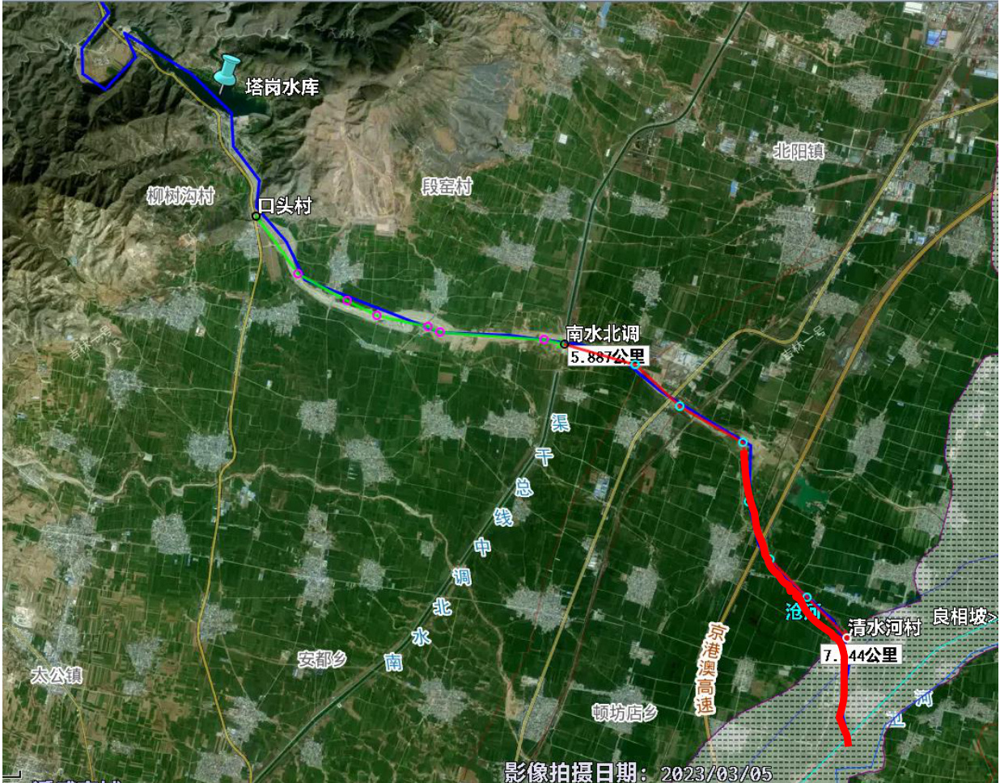  
图 4.3-6 沧河规划河道治理情况  

# 4.3.7.2 防洪控制断面拟定  

塔岗水库扩建增容,主要是保护下游沧河两岸的村镇和耕地,防洪控制断面拟定为沧河入良相坡蓄滞洪区处。  

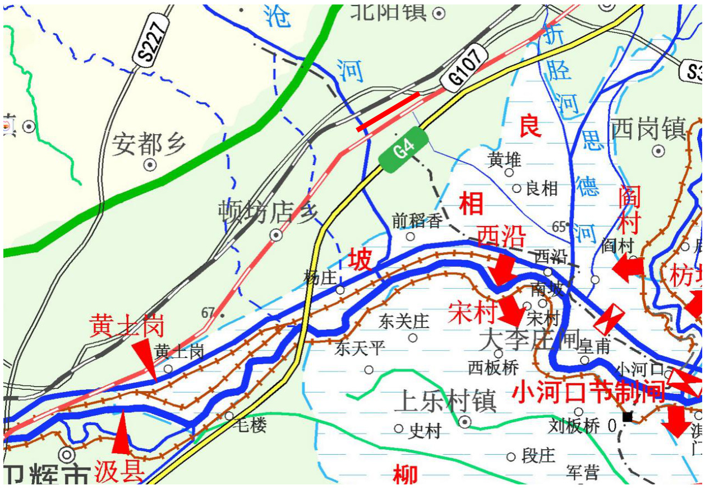  
图 4.3-7 防洪控制断面  

结合防洪工程布局论证情况,防洪控制断面安全泄量取 $200\mathsf{m}^{3}/\mathsf{s}$ 。  

# 4.3.8 防洪库容论证  

# 4.3.8.1 防洪库容方案拟定  

塔岗水库所在漳卫河系防洪标准整体为 50 年一遇,尽管在现状工程体系下,流域整体达到防洪标准,但由于历史原因,防洪标准达标的工程体系安排是不得不依赖多个蓄滞洪区分洪实现,考虑到卫河水系分散,洪水遭遇复杂,在塔岗水库满足基本防洪需求的前提下,本次研究塔岗进一步增加防洪库容,对流域整体防洪体系优化提升的效果。各方案汛限水位均为 $184\mathrm{m}$ 。  

方案 1:塔岗水库的防洪任务考虑 5 年一遇小洪水提高良相坡启用标准及20 年一遇防洪标准内的沧河两岸保护对象,超过 20 年一遇洪水,水库不控泄。  

方案 2:塔岗水库的防洪任务为考虑 5 年一遇小洪水提高良相坡启用标准及20 年一遇防洪标准内的沧河两岸保护对象基础上,兼顾流域河系层面防洪需求,下游沧河两岸保护对象防洪标准为 20 年一遇,坝址发生 $_{20\sim50}$ 年一遇洪水时,水库按照一定的调度原则控泄至最大防洪库容约 5000 万 $\mathsf{m}^{3}$ ,超过相应防洪高水位后,水库敞泄。  

(1)方案 1 概况  

该方案塔岗水库 20 年一遇以上洪水敞泄。对应 5 年一遇洪水位 191.2m,10 年一遇洪水位 $195.65\mathrm{m}$ ,20 年一遇洪水位 $201.32\mathrm{m}$ ,设计洪水位 $201.32\mathrm{m}$ ,校核洪水位 $201.95\mathrm{m}$ 。  

本方案工程 264161 万元,其中工程部分投资 160497 万元,建设征地移民补偿投资 99676 万元,环境保护工程投资 2247 万元,水土保持工程投资 1765万元。  

表 4.3-6 方案 1 塔岗水库规模指标  

<html><body><table><tr><td>频率</td><td>水位</td><td>防洪库容（万m3）</td><td>对应原始库容（万 m3)</td></tr><tr><td>5年一遇</td><td>191.20</td><td>1131</td><td>2792</td></tr><tr><td>10年一遇</td><td>195.65</td><td>2019</td><td>3681</td></tr><tr><td>20年一遇</td><td>201.32</td><td>3331</td><td>4992</td></tr><tr><td>50年一遇</td><td>201.32</td><td></td><td>4992</td></tr><tr><td>100年一遇</td><td>201.32</td><td></td><td>4992</td></tr><tr><td>2000年一遇</td><td>201.95</td><td></td><td>5148</td></tr></table></body></html>  

# (2)方案 2 概况  

该方案塔岗水库 50 年一遇以上洪水敞泄。对应 5 年一遇洪水位 191.2m,10 年一遇洪水位 $195.65\mathrm{m}$ ,20 年一遇洪水位 201.32,设计洪水位 $207.51\ensuremath{\mathrm{m}}$ ,校核洪水位 $207.94\mathrm{m}$ 。  

本方案工程 286969 万元,其中工程部分投资 182752 万元,建设征地移民补偿投资 99676 万元,环境保护工程投资 2490 万元,水土保持工程投资 2052万元。  

表 4.3-7 方案 2 塔岗水库规模指标  

<html><body><table><tr><td>频率</td><td>水位</td><td>防洪库容（万m²）</td><td>对应原始库容（万 m3)</td></tr><tr><td>5年一遇</td><td>191.20</td><td>1131</td><td>2792</td></tr><tr><td>10年一遇</td><td>195.65</td><td>2019</td><td>3681</td></tr><tr><td>20年一遇</td><td>201.32</td><td>3331</td><td>4992</td></tr><tr><td>50年一遇</td><td>207.51</td><td>5001</td><td>6662</td></tr><tr><td>100年一遇</td><td>207.51</td><td></td><td>6662</td></tr><tr><td>2000年一遇</td><td>207.94</td><td></td><td>6787</td></tr></table></body></html>  

# 4.3.8.2 各方案防洪效果分析  

由于卫河流域内发生的洪水有限,本次主要以 63.8 和 21.7 两场洪水为典型,分析不同频率洪水,塔岗水库不扩建、塔岗水库控泄至 20 年一遇、塔岗水库控泄至 50 年一遇 3 种情景的淹没变化情况。  

# (1)情景 1:塔岗水库不扩建  

在 63.8 典型设计洪水条件下,沧河发生 5 年一遇设计洪水时,塔岗水库滞洪后,至 G107 以下,沧河两岸淹没面积约 $2.5{\mathrm{km}}^{2}$ ,平均淹没水深约 $0.49\mathsf{m}$ ,淹没对象主要包括顿坊乡店小双村、清水河村,淹没耕地约 3000 亩,涉及人口约 1000 人,其中清水河村大部分位于良相坡内;沧河发生 10 年一遇设计洪水时,沧河两岸淹没面积约 $14.57\mathrm{km}^{2}$ ,平均淹没水深约 $1.24\mathrm{m}$ ,淹没范围进一步扩大至顿坊店乡、黄庄村、水屯村,淹没耕地 3 万亩,涉及人口约 6000 人;20年一遇设计洪水时,沧河两岸淹没面积约 $17.9\mathsf{k m}^{2}$ ,平均淹没水深约 $1.75\mathrm{m}$ ,淹没耕地约 4 万亩,人口约 1 万人;50 年一遇设计洪水时,沧河两岸淹没面积约$18.96\mathsf{k m}^{2}$ ,平均淹没水深约 $1.97\mathrm{m}$ 。  

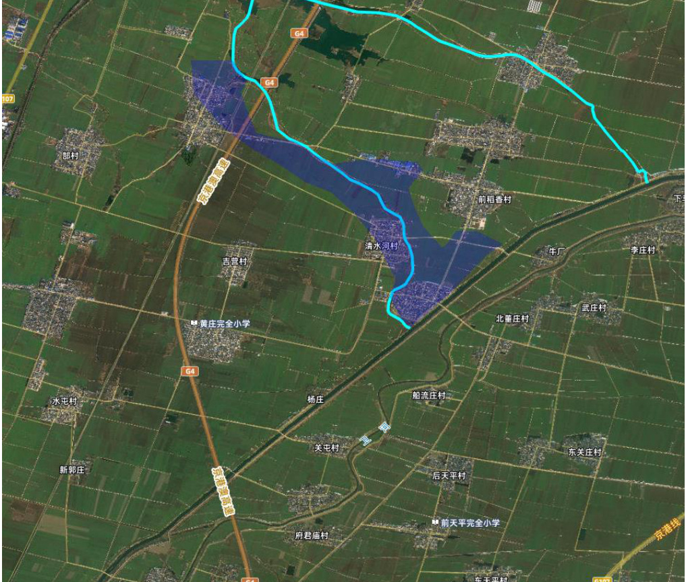  
图 4.3-8  5 年一遇淹没图(638 典型 $+$ 塔岗不扩建)  

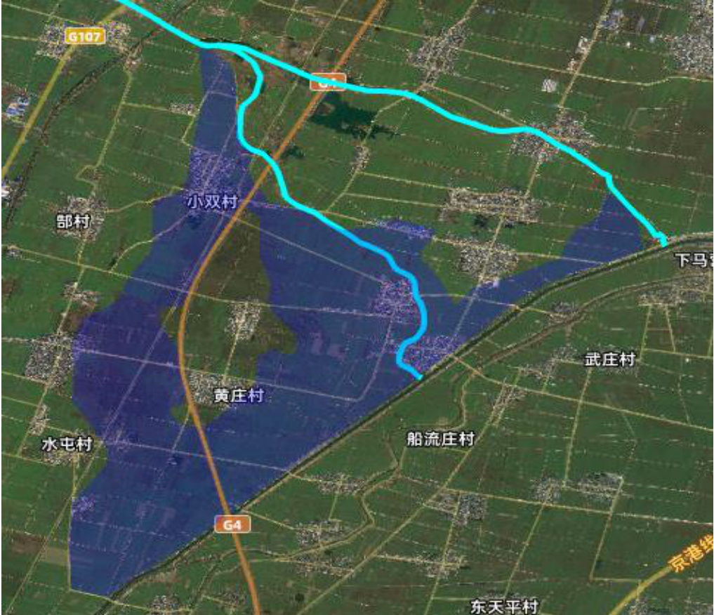  
图 4.3-9 10 年一遇淹没图(638 典型 $^+$ 塔岗不扩建)  

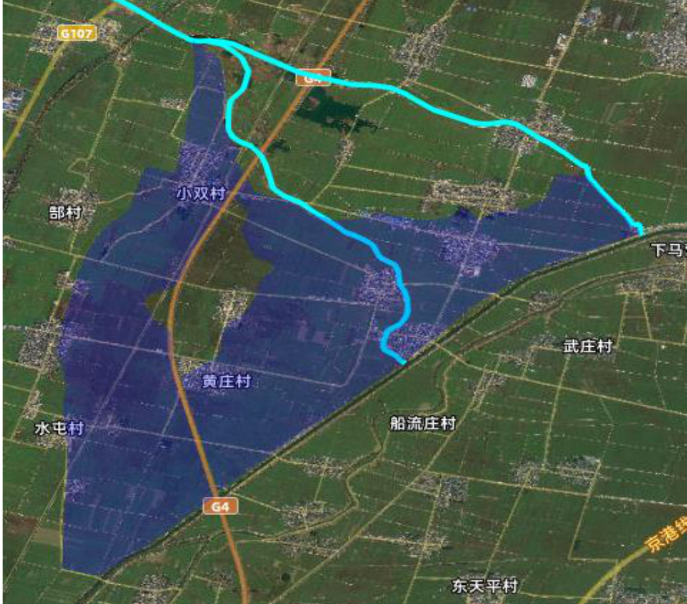  
图 4.3-10 20 年一遇淹没图(638 典型 $^+$ 塔岗不扩建)  

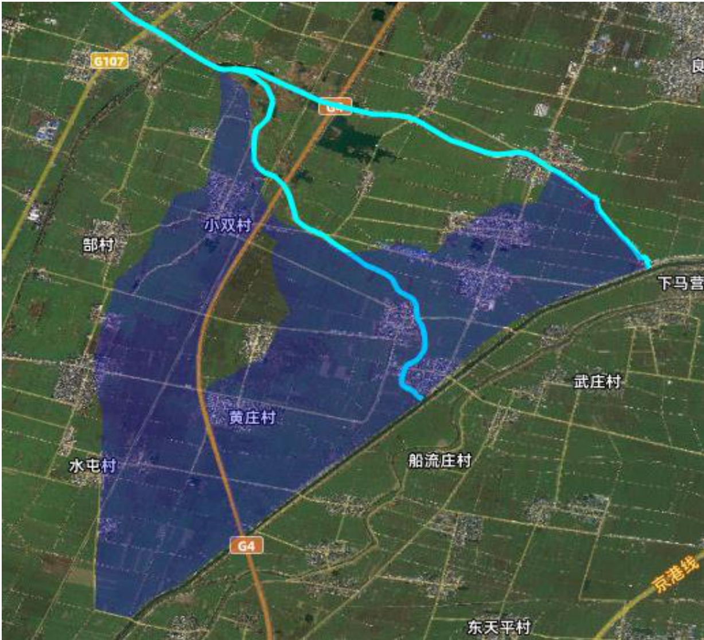  
图 4.3-11 50 年一遇淹没图(638 典型 $^+$ 塔岗不扩建)  

(2)方案一规模防洪效果分析(20 年以上敞泄)  

在 63.8 典型设计洪水条件下,塔岗水库扩建后,遇 5 年一遇及 10 年一遇设计洪水时,沧河两岸不发生漫溢,良相坡不再启用;20 年一遇设计洪水时,受共渠顶托影响,沧河依然发生漫溢,沧河两岸良相坡淹没面积约 $6.93\mathrm{km}^{2}$ ,平均淹没水深约 1.2m;50 年一遇设计洪水时,沧河两岸淹没面积约 $15.2\mathsf{k m}^{2}$ ,平均淹没水深约 $1.23\mathsf{m}$ 。  

方案一较塔岗水库不扩建方案,5 年一遇和 10 年一遇洪水分别减少沧河两岸淹没面积约 $2.5{\mathrm{km}}^{2}$ 和 $14.57\mathrm{km}^{2}$ ;20 年一遇洪水减少淹没面积 $10.97\mathrm{km}^{2}$ ,平均淹没水深减少约 $0.55\mathrm{m}$ ;50 年一遇洪水减少淹没面积 $3.76\mathsf{k m}^{2}$ ,平均淹没水深减少约 $0.74\mathrm{m}$ 。  

方案一有效的减少了沧河两岸的淹没损失,若考虑思德河扩建夺丰水库的条件下,良相坡蓄滞洪区启用标准可基本从 3 年一遇提高到 5 年一遇。  

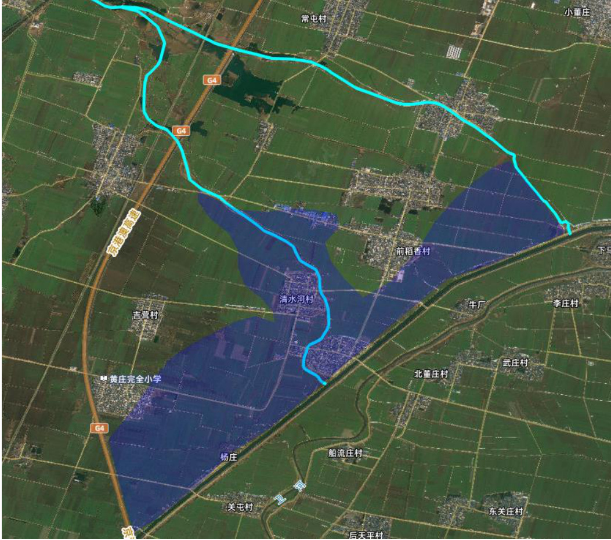  
图 4.3-12  20 年一遇淹没图(638 典型 $+$ 塔岗控泄至 20 年)  

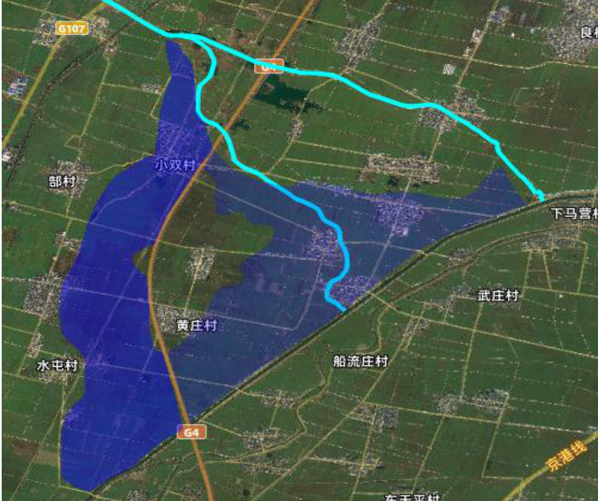  
图 4.3-13 50 年一遇淹没图(638 典型 $+$ 塔岗控泄至 20 年)  

# (3)方案二规模防洪效果分析(50 年以上敞泄)  

在 63.8 典型设计洪水条件下,塔岗水库扩建增容后,发生 5 年及 10 年一遇设计洪水时,沧河两岸均不发生漫溢;由于共渠顶托及漫溢,20 年一遇设计洪水时,沧河两岸良相坡淹没面积约 $6.59\mathsf{k m}^{2}$ ,平均淹没水深约 1.2m;50 年一遇设计洪水时,沧河两岸淹没面积约 $9.77\mathsf{k m}^{2}$ ,平均淹没水深约 1.2m。  

方案一较方案二,5 年一遇和 10 年一遇洪水均能有效拦蓄洪水,沧河两岸不发生漫溢;20 年一遇洪水减少淹没面积 $0.34\mathsf{k m}^{2}$ ;50 年一遇洪水减少淹没面积 $5.43{\mathrm{km}}^{2}$ ,平均淹没水深减少约 $0.03\mathsf{m}$ 。  

方案二在方案一的基础上,增强了对 50 年一遇洪水的拦蓄,有效的减少了沧河两岸的淹没损失。两方案对中小洪水的调控能力基本相同,若考虑思德河扩建夺丰水库的条件下,良相坡蓄滞洪区启用标准可基本从 3 年一遇提高到 5 年一遇。  

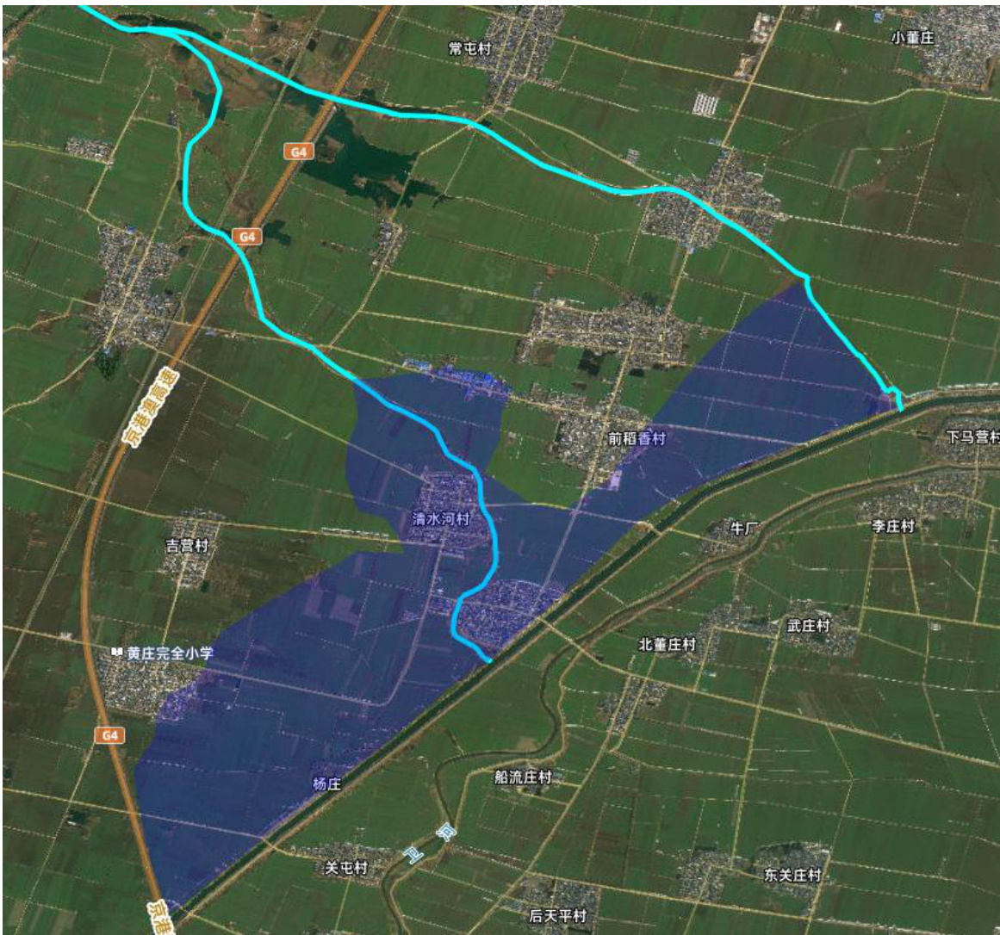  
图 4.3-14 20 年一遇淹没图(638 典型 $+$ 塔岗控泄至 50 年)  

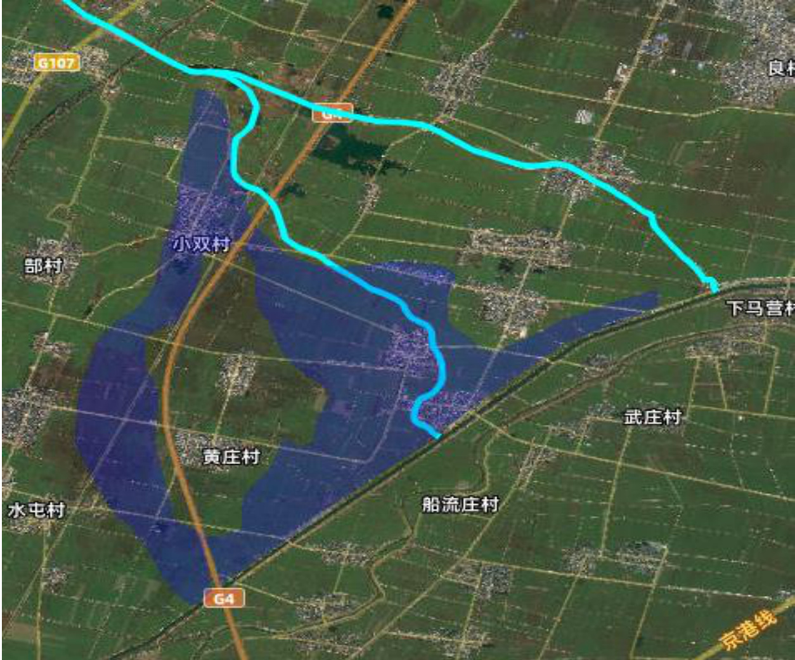  
图 4.3-15 50 年一遇淹没图((638 典型 $^+$ 塔岗控泄至 50 年)  

对于 217 典型,暴雨主要产生于卫共以北地区,塔岗是主要的洪水产流区,塔岗水库坝址超频严重,在该典型下,塔岗水库扩建控泄至 20 年和 50 年两种规模情形,在 10 年一遇下依然造成良相坡的启用。  

塔岗水库扩建增容不同典型洪水、不同规模情形淹没统计见表 $4.3–5{\sim}6\$  

表 4.3-8 1963 典型年设计洪水塔岗水库扩建增容不同情形淹没统计表  

<html><body><table><tr><td rowspan="2">方案</td><td colspan="2">5年一遇</td><td colspan="2">10年一遇</td><td colspan="2">20年一遇</td><td colspan="2">50年一遇</td></tr><tr><td>淹没面积（km²）</td><td>平均淹没水深 (W)</td><td>淹没面积(km²)</td><td>平均淹没水深 (W)</td><td>淹没面积 (km²)</td><td>淹没水深（m）</td><td>淹没面积(km²)</td><td>淹没水深（m）</td></tr><tr><td>天然</td><td>2.5</td><td>0.49</td><td>14.57</td><td>1.24</td><td>17.9</td><td>1.75</td><td>18.96</td><td>1.97</td></tr><tr><td>20年 泄</td><td>0</td><td>0</td><td>0</td><td>0</td><td>6.93</td><td>1.2</td><td>15.2</td><td>1.23</td></tr><tr><td>50年 控泄</td><td>0</td><td>0</td><td>0</td><td>0</td><td>6.59</td><td>1.2</td><td>9.77</td><td>1.2</td></tr></table></body></html>  

表 4.3-9 2021 典型年设计洪水塔岗水库扩建增容不同情形淹没统计表  

<html><body><table><tr><td rowspan="2">方案</td><td colspan="2">5年一遇</td><td colspan="2">10年一遇</td><td colspan="2">20年一遇</td></tr><tr><td>淹没面积（km²）</td><td>平均淹没水深 (W)</td><td>淹没面积（km²）</td><td>平均淹没水深（m）</td><td>淹没面积（km²）</td><td>平均淹没水深（m）</td></tr><tr><td>天然</td><td>12.43</td><td>1.6</td><td>16.72</td><td>1.74</td><td>18.55</td><td>2.34</td></tr><tr><td>20年 泄</td><td>0</td><td>0</td><td>15.98</td><td>1.33</td><td>18.44</td><td>1.41</td></tr><tr><td>50年控 泄</td><td>0</td><td>0</td><td>12.58</td><td>1.30</td><td>18.42</td><td>1.41</td></tr></table></body></html>  

# 4.3.8.3 推荐防洪库容方案  

考虑到卫河流域洪水地区组成复杂以及良相坡频繁启用的现状,本次考虑充分预留安全裕度以应对如 217 等洪水可能造成的影响,因此,推荐塔岗水库扩建增容的防洪库容规模 5000 万 $\mathsf{m}^{3}$ ,以期为后期区域调整各蓄滞洪区防洪调度、提升蓄滞洪区启用标准、优化流域防洪布局创造条件。  

# 4.4 兴利  

# 4.4.1 区域水资源开发利用现状  

# 4.4.1.1 水资源量  

# (1)降水量  

卫辉市年雨量分配不均,降水量年际变化大,多年平均降水量 $587\mathrm{mm}$ ,最大年降水量(2021 年)达 $1433\mathrm{mm}$ ,最小年降水量 176mm(1997 年)。夏秋两季水汽充沛,雨量集中,降水量占全年的 $70\%$ 左右。多年平均降水量 $587\mathrm{mm}$ ,全年降水量分配以夏季为最多,近 5 年平均夏季降水 $282.2\mathrm{mm}$ ,占全年降水量的 $62.25\%$ ,夏季又以 7 月份降水量为最多,平均 $184.5\mathrm{mm}$ ,占年降水量的$40.70\%$ 。秋季降水量 $72.45\mathrm{mm}$ 。春季降水量 $75.8\mathrm{mm}$ 。冬季是全年降水量最少的季节,仅 $22.9\mathrm{mm}$ ,占年降水量的 $5.05\%$ 。  

# (2)水资源量  

根据《卫辉水资源综合规划报告》,卫辉市多年平均水资源总量 16746 万$\mathsf{m}^{3}$ ,多年平均地表水资源量 10372 万 $\mathsf{m}^{3}$ ,多年平均地下水资源量 13613.84 万$\mathsf{m}^{3}$ 。供水范围内多年平均水资源总量 6208 万 $\mathsf{m}^{3}$ ,多年平均地表水资源量 3526万 $\mathsf{m}^{3}$ ,多年平均地下水资源量 6262 万 $\mathsf{m}^{3}$ 。卫辉市行政分区水资源量见下表。  

表 4.4-1 卫辉市行政分区水资源量成果表  

<html><body><table><tr><td>乡镇</td><td>计算面积 (km2)</td><td>地表水资源量 （万m²)</td><td>地下水资源量 （万m²）</td><td>重复计算量 （万m²）</td><td>水资源总量 （万m²）</td></tr><tr><td>汲水镇</td><td>18.93</td><td>148.03</td><td>288.60</td><td>137.43</td><td>299.20</td></tr><tr><td>太公镇</td><td>77.04</td><td>941.43</td><td>1767.58</td><td>1150.75</td><td>1558.26</td></tr><tr><td>孙杏村镇</td><td>32.89</td><td>257.16</td><td>500.12</td><td>237.47</td><td>519.81</td></tr><tr><td>后河镇</td><td>42.94</td><td>335.79</td><td>581.59</td><td>312.17</td><td>605.21</td></tr><tr><td>李源屯镇</td><td>66.82</td><td>522.53</td><td>1016.71</td><td>483.11</td><td>1056.13</td></tr><tr><td>唐庄镇</td><td>77.47</td><td>547.71</td><td>1197.60</td><td>563.48</td><td>1181.83</td></tr><tr><td>上乐村镇</td><td>63.89</td><td>513.04</td><td>988.61</td><td>464.48</td><td>1037.70</td></tr><tr><td>狮豹头乡</td><td>206.77</td><td>4375.25</td><td>2551.25</td><td>1312.70</td><td>5613.80</td></tr><tr><td>安都乡</td><td>80.50</td><td>1007.06</td><td>1836.08</td><td>1185.80</td><td>1657.34</td></tr></table></body></html>  

<html><body><table><tr><td>顿坊店乡</td><td>55.73</td><td>660.96</td><td>883.61</td><td>404.46</td><td>1140.11</td></tr><tr><td>柳庄乡</td><td>37.58</td><td>293.88</td><td>573.31</td><td>273.21</td><td>593.98</td></tr><tr><td>庞寨乡</td><td>46.76</td><td>366.60</td><td>641.47</td><td>339.95</td><td>668.12</td></tr><tr><td>城郊乡</td><td>51.54</td><td>403.04</td><td>787.31</td><td>375.73</td><td>814.62</td></tr><tr><td>卫辉市</td><td>858.86</td><td>10372.48</td><td>13613.84</td><td>7240.74</td><td>16746.11</td></tr><tr><td>供水范围</td><td>328.70</td><td>3525.53</td><td>6263.19</td><td>3581.22</td><td>6208.03</td></tr></table></body></html>  

# (3)水资源可利用量  

扣除地表水资源可利用量与地下水可开采量两者之间的重复计算量后,全市水资源可利用量为 11256 万 $\mathsf{m}^{3}$ ,其中地表水资源可利用量 5468 万 $\mathsf{m}^{3}$ ,地下水可开采量 8595 万 $\mathsf{m}^{3}$ ,重复计算量 2807 万 $\mathsf{m}^{3}$ ,全市水资源可利用率平均为$67.22\%$ 。供水范围水资源可利用量为3995 万 $\mathsf{m}^{3}$ ,其中地表水资源可利用量1399万 $\mathsf{m}^{3}$ ,地下水可开采量 3901 万 $\mathsf{m}^{3}$ ,重复计算量 1305 万 $\mathsf{m}^{3}$ ,供水范围水资源可利用率平均为 $64.36\%$ 。  

表 4.4-2  卫辉市行政分区水资源量可利用量成果表  

<html><body><table><tr><td>乡镇</td><td>计算 面积 (km²)</td><td>水资源 总量 （万m3)</td><td>地表水资源 可利用量 （万m3)</td><td>地下水可 开采量 （万m3)</td><td>重复 计算量 （万m3)</td><td>用量 （万m3)</td><td>水资源可利水资源可利 用率 (%)</td></tr><tr><td>汲水镇</td><td>18.93</td><td>299.20</td><td>41.67</td><td>190.48</td><td>87.96</td><td>144.19</td><td>48.19</td></tr><tr><td>太公镇</td><td>77.04</td><td>1558.26</td><td>498.18</td><td>936.17</td><td>218.57</td><td>1215.78</td><td>78.02</td></tr><tr><td>孙杏村镇</td><td>32.89</td><td>519.81</td><td>72.37</td><td>330.48</td><td>147.23</td><td>255.62</td><td>49.18</td></tr><tr><td>后河镇</td><td>42.94</td><td>605.21</td><td>94.53</td><td>385.48</td><td>202.91</td><td>287.10</td><td>47.44</td></tr><tr><td>李源屯镇</td><td>66.82</td><td>1056.13</td><td>121.15</td><td>721.86</td><td>294.70</td><td>548.31</td><td>51.92</td></tr><tr><td>唐庄镇</td><td>77.47</td><td>1181.83</td><td>101.41</td><td>774.23</td><td>371.89</td><td>503.75</td><td>42.62</td></tr><tr><td>上乐村镇</td><td>63.89</td><td>1037.17</td><td>144.30</td><td>642.64</td><td>292.62</td><td>494.32</td><td>47.66</td></tr><tr><td>狮豹头乡</td><td>206.77</td><td>5613.80</td><td>3457.27</td><td>1479.73</td><td></td><td>4937.00</td><td>87.94</td></tr><tr><td>安都乡</td><td>80.50</td><td>1657.34</td><td>403.87</td><td>1136.52</td><td>272.36</td><td>1268.03</td><td>76.51</td></tr><tr><td>顿坊店乡</td><td>55.73</td><td>1140.11</td><td>278.81</td><td>626.92</td><td>250.77</td><td>654.96</td><td>57.45</td></tr><tr><td>柳庄乡</td><td>37.58</td><td>593.98</td><td>83.18</td><td>378.38</td><td>180.32</td><td>281.24</td><td>47.35</td></tr><tr><td>庞寨乡</td><td>46.76</td><td>668.12</td><td>97.97</td><td>423.37</td><td>217.56</td><td>303.78</td><td>45.47</td></tr><tr><td>城郊乡</td><td>51.54</td><td>814.62</td><td>73.42</td><td>558.99</td><td>270.52</td><td>361.89</td><td>44.42</td></tr><tr><td>卫辉市</td><td>858.86</td><td>16745.58</td><td>5468.13</td><td>8585.25</td><td>2807.41</td><td>11255.97</td><td>67.22</td></tr><tr><td>供水范围</td><td>328.70</td><td>6207.50</td><td>1398.58</td><td>3901.24</td><td>1304.84</td><td>3994.98</td><td>64.36</td></tr></table></body></html>  

# 4.4.1.2 供水工程  

(1)卫辉市  

根据《卫辉市农村供水高质量发展规划》,截至 2023 年底,全市有农村集中供水工程 116 处、农村供水规模 2.17 万 $\mathsf{m}^{3}/\mathsf{d}$ 、农村供水人口 34.55 万人。农村分散供水工程 18900 处、涉及 33 个村,农村供水人口 2.35 万人。全市农村自来水普及率 $93.63\%$ ,城乡供水一体化工程覆盖农村人口比例 $68.62\%$ 。  

卫辉市主要供水工程有地表水供水工程和地下水供水工程。地表水供水工程分为蓄水工程、引水工程、提水工程和调水工程。蓄水工程包括水库和塘坝,卫辉市已建立中型、小(1)型水库共计 4 座,小(2)型水库 2 座,塘坝 90 处;提水工程包括利用扬水泵站从河道、湖泊等地表水体提水的工程,引水工程包括河道、湖泊等地表水体自流引水的工程(不包括从蓄水、提水工程中引水的工程),共有引水工程 78 处;跨流域调水工程共有 2 处,分别为卫辉市东三干渠引黄水和南水北调工程引水。地下水供水工程是指利用地下水的水井工程,截止到 2014年年底卫辉市共有机电井 8568 眼。  

1)蓄水工程$\textcircled{1}$ 中小型水库  

卫辉市现状有中小型水库 6 座,主要位于沧河和香泉河上,均在本工程供水范围内。总设计库容为 5858 万 $\mathsf{m}^{3}$ ,兴利库容为 3523 万 $\mathsf{m}^{3}$ 。其中 3 座中型水库位于狮豹头乡,1 座小(1)型水库位于太公镇,2 座小(2)型水库位于安都乡。各水库情况见表 4.4-3。  

表 4.4-3  卫辉市水库情况统计表  

<html><body><table><tr><td rowspan="2">序号</td><td rowspan="2">水库名称</td><td rowspan="2">所在乡镇</td><td rowspan="2">所在河流</td><td rowspan="2">控制面积 (km2)</td><td colspan="2">库容 (万m²)</td></tr><tr><td>总库容</td><td>兴利库容</td></tr><tr><td>1</td><td>塔岗水库</td><td>狮豹头乡</td><td>沧河</td><td>234</td><td>1763</td><td>954</td></tr><tr><td>2</td><td>狮豹头水库</td><td>狮豹头乡</td><td>沧河</td><td>160</td><td>1947</td><td>1010</td></tr><tr><td>3</td><td>正面水库</td><td>狮豹头乡</td><td>沧河</td><td>88.5</td><td>1537</td><td>1135</td></tr><tr><td>4</td><td>香泉水库</td><td>太公镇</td><td>香泉河</td><td>37.8</td><td>546</td><td>388</td></tr><tr><td>5</td><td>扁担沟水库</td><td>安都乡</td><td>沧河支流</td><td>2</td><td>40.64</td><td>22.01</td></tr><tr><td>9</td><td>下枣庄水库</td><td>安都乡</td><td>沧河支流</td><td>3.89</td><td>24.28</td><td>13.85</td></tr></table></body></html>  

$\textcircled{2}$ 塘坝  

2014 年卫辉市共有塘坝 90 处,主要分布于狮豹头乡、太公镇和安都乡,用于解决农业灌溉和人畜吃水问题,总供水能力 19.91 万 $\mathsf{m}^{3}$ 。  

2)引水工程和提水工程  

$\textcircled{1}$ 提水工程  

卫辉市现有提水工程 13 处,分别位于城郊乡(4 处)、柳庄乡(1 处)、上  

# 乐村镇(6 处)和孙杏村镇(2 处)。  

$\textcircled{2}$ 引水工程  

引水工程主要为人民胜利渠东三干渠引用黄河水,主要涉及柳庄乡、后河镇、李源屯镇、庞寨乡。  

# 3)地下水供水工程  

地下水水源供水在卫辉市的供水中占有重要地位,约占总供水量的 $60\%$ 左右。2014 年卫辉市有机电井 8653 眼(其中农业灌溉机井 8568 眼、农村安全饮水机井 85 眼),农业灌溉年设计供水能力为 13151 万 $\mathsf{m}^{3}$ 。本工程供水范围内有机电井 2899 眼(其中农业灌溉机井 2845 眼、农村安全饮水机井 54 眼)。  

表 4.4-4  卫辉市各乡镇机电井数  

<html><body><table><tr><td>乡镇</td><td>农村安全饮水工程机井数</td><td>农业灌溉机井数</td></tr><tr><td>汲水镇</td><td>0</td><td>192</td></tr><tr><td>太公镇</td><td>3</td><td>185</td></tr><tr><td>孙杏村镇</td><td>12</td><td>803</td></tr><tr><td>后河镇</td><td>2</td><td>892</td></tr><tr><td>李源屯镇</td><td>3</td><td>1083</td></tr><tr><td>唐庄镇</td><td>13</td><td>346</td></tr><tr><td>上乐村镇</td><td>18</td><td>1045</td></tr><tr><td>狮豹头乡</td><td>0</td><td>4</td></tr><tr><td>安都乡</td><td>8</td><td>366</td></tr><tr><td>顿坊店乡</td><td>11</td><td>715</td></tr><tr><td>柳庄乡</td><td>0</td><td>897</td></tr><tr><td>庞寨乡</td><td>1</td><td>1434</td></tr><tr><td>城郊乡</td><td>14</td><td>534</td></tr><tr><td>其他</td><td></td><td>72</td></tr><tr><td>卫辉市</td><td>85</td><td>8568</td></tr><tr><td>供水范围</td><td>54</td><td>2845</td></tr></table></body></html>  

# 4)南水北调工程  

卫辉市南水北调水取水地点在南水北调中线 33 号口门,设计年引水量 2213万 $\mathsf{m}^{3}$ ,2023 年实际引水量 2365.2 万 $\mathsf{m}^{3}$ ,南水北调水指标消纳率 $106.88\%$ 。南水北调水水质、水量稳定,是天一水厂的水源。目前,南水北调水覆盖农村供水人口 25.32 万人。  

# (2)本工程灌溉范围  

沧河灌区位于卫辉市西北部太行山的浅山及山前丘陵区,始建于二十世纪五十年代中,大规模建设于六、七十年代。沧河灌区为中型灌区,总耕地面积 14.5万亩,设计灌溉面积 11.2 万亩,水源为沧河和香泉河上的三座中型水库和一座小(一)型水库以及地下水,水库取水许可量见下表。塔岗水库干支渠位置见下图。  

表 4.4-5  水库取水许可量统计表  

<html><body><table><tr><td>水库</td><td>正面水库</td><td>狮豹头水库</td><td>塔岗水库</td><td>香泉水库</td><td>合计</td></tr><tr><td>取水指标</td><td>300</td><td>650</td><td>700</td><td>150</td><td>1800</td></tr></table></body></html>  

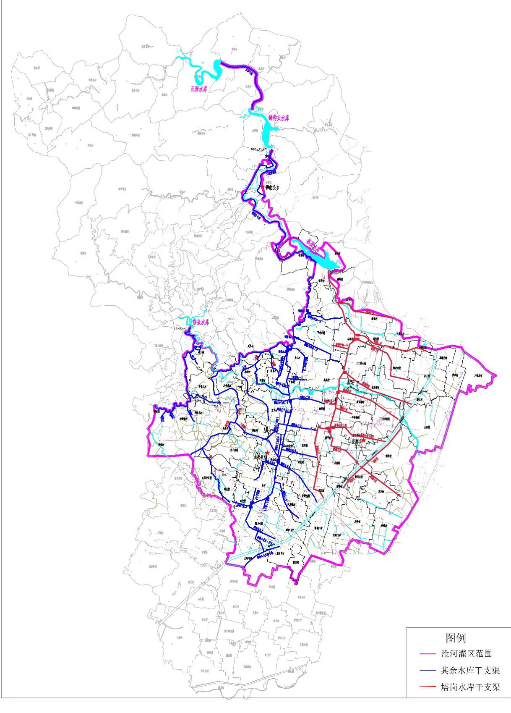  
图 4.4-1 沧河灌区塔岗水库干支渠位置  

现状沧河灌区范围内有 398 眼灌溉机井,分布于各村,井深 $80{\sim}150\mathrm{m}$ ,出水量 $20{\sim}30\mathsf{m}^{3}/\mathsf{s}$ 。采用水泵提水接软管至田间进行灌溉。灌溉机井灌溉期年可提水量 1532.30 万 $\mathsf{m}^{3}$ ,地下水取水许可 1860 万 $\mathsf{m}^{3}$ 。  

# 4.4.1.3 供用水量  

# (1)供水量  

根据《2023 年新乡市水资源公报》,卫辉市 2023 年总供水量 8911 万 $\mathsf{m}^{3}$ ,其中地表水源供水量 3407 万 $\mathsf{m}^{3}$ (蓄水工程供水量 566 万 $\mathsf{m}^{3}$ ,引水工程供水量9 万 $\mathsf{m}^{3}$ ,提水工程供水量 1 万 $\mathsf{m}^{3}$ ,跨流域调水供水量 2830 万 $\mathsf{m}^{3}$ ),地下水源供水量 5132 万 $\mathsf{m}^{3}$ (浅层地下水供水量 5 万 $\mathsf{m}^{3}$ ,深层地下水供水量 5126 万 $\mathsf{m}^{3}$ ),污水处理回用 373 万 $\mathsf{m}^{3}$ 。  

沧河灌区允许年最大取水库水量 1800 万 $\mathsf{m}^{3/}$ 年(其中正面水库 300 万 $\mathsf{m}^{3/}$ 年,狮豹头水库 650 万 $\mathsf{m}^{3/}$ 年,塔岗水库 700 万 $\mathsf{m}^{3}/$ 年,香泉水库 150 万 $\mathsf{m}^{3/}$ 年),地下水取水许可 1860 万 $\mathsf{m}^{3/}$ 年。  

# (2)用水量  

根据《2023 年新乡市水资源公报》,卫辉市 2023 年用水总量 8911 万 $\mathsf{m}^{3}$ ,其中农业用水量 5911 万 $\mathsf{m}^{3}$ ,工业用水量 1029 万 $\mathsf{m}^{3}$ ,生活用水量 1598 万 $\mathsf{m}^{3}$ ,人工生态环境补水量 373 万 $\mathsf{m}^{3}$ 。  

# (3)用水水平  

新乡市 2023 年人均用水量 $277.2\mathsf{m}^{3}$ ,万元工业增加值用水量 $13.9\mathsf{m}^{3}/$ 万元。卫辉市 2023 年人均用水量 $195.4\mathsf{m}^{3}$ ,万元工业增加值用水量 $13.3\mathrm{m}^{3}/$ 万元。  

根据《河南省卫辉市沧河灌区续建配套与节水改造项目》,根据已改造面积及未改造面积等数据推算灌区内现状骨干渠系水利用系数为 0.68,灌区续建配套工程实施后,地表水渠系水利用系数由 0.68 提高至 0.72。根据《河南省十四五水安全保障和水生态环境保护规划》,2025 年农田灌溉水有效利用系数达到0.63。根据《新乡市十四五水安全保障和水生态环境保护规划》,2025 年农田灌溉水有效利用系数达到 0.58。沧河灌区灌溉水利用系数已达到相关规划要求。  

# 4.4.1.5 水质评价  

现状供水水源包括南水北调水、水库水、地下水、山泉水(河水)等四种形式。  

# (1)南水北调水  

南水北调水经天一水厂消毒处理后,向卫辉市南部城乡区域供水,供水水质  

良好。目前,南水北调水覆盖卫辉市农村供水人口 25.32 万人。  

# (2)水库  

卫辉市用作水源的水库主要有塔岗水库、狮豹头水库、正面水库。  

# 1)塔岗水库  

位于狮豹头乡塔岗村,为中型水库,总库容 1763 万 $\mathsf{m}^{3}$ ,有效库容 954 万$\mathsf{m}^{3}$ 。塔岗水库目前是第四水厂的水源,尚处于建设阶段,未实现供水。  

根据水质检验报告,塔岗水库水质良好,各项指标均达到《生活饮用水水源水质标准》(CJ3020-93)二级标准和《生活饮用水卫生标准》(GB5749-2006)中规定的饮用水水质要求。  

# 2)狮豹头水库  

位于狮豹头乡黄叶村,为中型水库,总库容 1947 万 $\mathsf{m}^{3}$ ,有效库容 1010 万$\mathsf{m}^{3}$ 。狮豹头水库目前是黄叶、龙卧、砂掌等村庄的水源,覆盖农村人口 904 人。  

根据水质检验报告,狮豹头水库水质良好,各项指标均达到《生活饮用水水源水质标准》(CJ3020-93)二级标准和《生活饮用水卫生标准》(GB5749-2006)中规定的饮用水水质要求。  

# 3)正面水库  

位于狮豹头乡罗圈村,为中型水库,总库容 1537 万 $\mathsf{m}^{3}$ ,有效库容 1135 万$\mathsf{m}^{3}$ 。正面水库是南寨沟、罗圈村等村庄的饮用水水源,覆盖农村人口 364 人。  

根据水质检验报告,正面水库水质良好,各项指标均达到《生活饮用水水源水质标准》(CJ3020-93)二级标准和《生活饮用水卫生标准》(GB5749-2006)中规定的饮用水水质要求。  

# (3)地下水  

现状农村供水采用的地下水主要为中深层地下水,水质良好,水源稳定。深层地下水经机井抽取至地面后,经消毒器消毒,通过给水压力罐加压或水柜、水窖重力自流至用户。  

以地下水为水源的地区主要包括太公镇、孙杏村镇、上乐村镇、狮豹头乡、安都乡、顿坊店乡、城郊乡等,覆盖农村人口 9.23 万人。  

# (4)山泉水/河水  

主要位于狮豹头乡的山区,山泉水、雨水汇集至小型坑塘或河流,成为周边村庄水源,如南水坡水源点、红岭沟取水点等。  

山泉水、河水作为饮用水水源不稳定,遇枯水期水位低、水量少,遇山洪则易造成水质浑浊、输水管线易被冲毁的情况。  

# 4.4.2 水库现状及设计兴利任务  

根据《河南省卫辉市塔岗水库除险加固工程初步设计报告》,塔岗水库控制灌溉面积 5 万亩,实际灌溉面积 3.8 万亩,自 1959 年春开始农业灌溉,48 年来灌区农作物产量逐年增加,为增加山区及山前丘陵区农民收入、提高群众生活质量发挥了巨大作用。据统计,未建水库前,山区粮食平均亩产仅 $55{\upmu\uptheta}$ ,水库蓄水开灌后,粮食亩均产粮逐年增加到 400kg,为山区及山前丘陵区农民脱贫致富打下了坚实的基础。  

根据《河南省卫辉市沧河灌区续建配套与节水改造项目可研报告》,卫辉市是河南省粮食主产区之一,沧河灌区设计灌溉面积 11.2 万亩,占全市灌溉面积的 $23.5\%$ 。沧河灌区在近几年已经进行了大规模的节水配套改造,改造面积 8.6万亩,其中塔岗水库片区的明渠改管道工程已经实施完毕。灌区内水源分为地表水和地下水,地表水来源主要为沧河上的 3 座水库及香河上的香河水库,2015年 10 月 9 日,卫辉市政府召开市政府第二十四次常务会议,以会议纪要〔201522 号第六项“关于建设沧河灌区节水改造灌溉项目的有关事宜”决定:鉴于我市南水北调水厂于今年 5 月 4 日向城区实现应急供水,塔岗水库被调整为备用水源地,沧河灌区有了灌溉水源保障。  

因此本次塔岗水库灌溉范围为沧河灌区塔岗水库灌溉范围(均位于安都乡),设计灌溉范围 5 万亩。  

# 4.4.3 灌区需水复核  

# 4.4.3.1 种植结构  

(1)现状种植结构  

卫辉市是中国小麦商品粮基地、中原地区最大的禽蛋生产基地和林果蔬菜基地。灌区控制灌溉范围为高标准农田规划区,区内土壤肥沃气候条件好。根据《河南省卫辉市沧河灌区续建配套与节水改造项目可研报告》,沧河灌区 $2015{\sim}2022$  

年已建高标准农田面积 5.9 万亩。目前,灌区主要以旱作物(小麦、玉米)种植为主,以冬小麦为冬季作物,玉米代表晚秋作物,经济作物有花生等。 $2018{\sim}2020$ 年,平均复种指数为 1.8。沧河灌区现状作物种植结构见下表。  

# 表 4.4-6  现状年沧河灌区各种作物种植比例  

<html><body><table><tr><td>作物名称</td><td>小麦</td><td>玉米</td><td>花生</td></tr><tr><td>种植比例</td><td>90%</td><td>80%</td><td>10%</td></tr></table></body></html>  

# (2)设计水平年种植结构  

《卫辉市国民经济和社会发展第十四个五年规划和 2035 年远景目标纲要》提出要稳固粮食生产能力,扛稳粮食安全重任,坚持藏粮于地、藏粮于技,实施“科技兴粮”和“人才兴粮”,推动粮食产业创新发展、转型升级和提质增效。严守耕地保护红线,坚决防止耕地“非粮化”,切实稳定粮食生产,牢牢守住国家粮食安全的生命线。“十四五”期间,确保全市优质强筋小麦种植面积达到 7.5 万亩以上,优质花生达到 5 万亩。根据沧河灌区现状情况及相关规划对灌区提出的要求,设计水平年沧河灌区维持现状种植结构。  

# 4.4.3.2 灌溉制度  

根据《卫辉市沧河灌区续建配套与节水改造项目可行性研究报告》,现状年沧河灌区作物的灌水次数和灌水定额分别为:小麦灌水次数为 3 次、玉米 2 次、花生 2 次,每天的灌水时间 24 小时,灌溉定额为:小麦灌水定额为 $140\mathrm{m}^{3/}$ 亩、玉米灌水定额为 $95\mathsf{m}^{3/}$ 亩、花生灌水定额为 $60\mathsf{m}^{3/}$ 亩现状灌水次数偏多,但灌溉定额偏大。沧河灌区现状年灌溉制度见表 4.4-7。  

表 4.4-7 现状年沧河灌区灌溉制度  

<html><body><table><tr><td></td><td>作物名称种植比例</td><td>灌水定额 (m/亩）</td><td>灌水定额 (m3/亩)</td><td>灌水次数</td><td colspan="2">灌水日期</td><td>灌水天数</td><td>灌水率 (m3/s·万亩）</td></tr><tr><td rowspan="3">小麦</td><td rowspan="3">90%</td><td>45</td><td rowspan="3">140</td><td>1.00</td><td>11.11</td><td>11.22</td><td>12.00</td><td>0.420</td></tr><tr><td>45</td><td>2.00</td><td>3.11</td><td>3.22</td><td>12.00</td><td>0.420</td></tr><tr><td>50</td><td>3.00</td><td>4.11</td><td>4.22</td><td>12.00</td><td>0.460</td></tr><tr><td rowspan="2">玉米</td><td rowspan="2">80%</td><td>40</td><td rowspan="2">85</td><td>1.00</td><td>6.01</td><td>6.10</td><td>10.00</td><td>0.440</td></tr><tr><td>45</td><td>2.00</td><td>8.21</td><td>8.30</td><td>10.00</td><td>0.500</td></tr><tr><td rowspan="2">花生</td><td rowspan="2">10%</td><td>30</td><td rowspan="2">60</td><td>1.00</td><td>5.28</td><td>5.30</td><td>3.00</td><td>0.420</td></tr><tr><td>30</td><td>2.00</td><td>8.11</td><td>8.13</td><td>3.00</td><td>0.420</td></tr></table></body></html>  

根据沧河灌区群众的灌溉习惯、灌溉用水量,并结合《河南省用水定额(DB41T 958-2020)》,拟定灌水次数分别为:小麦灌水次数为 3 次、玉米 2 次、花生 2 次,每天的灌水时间 24 小时。设计保证率 $\mathtt{P}{=}50\%$ 的作物的灌溉定额为:  

小麦灌水定额为 $125\mathsf{m}^{3}/$ 亩、玉米灌水定额为 $98\mathrm{m}^{3}/$ 亩、花生灌水定额为 $80\mathsf{m}^{3}/$ 亩;设计保证率 $\scriptstyle\mathsf{P}=75\%$ 的作物的灌溉定额为:小麦灌水定额为 $155\mathrm{m}^{3}/$ 亩、玉米灌水定额为 $127\mathsf{m}^{3}/$ 亩、花生灌水定额为 $105\mathrm{m}^{3}/$ 亩。灌溉制度符合当地实际灌溉习惯,沧河灌区设计水平年灌溉制度见表 4.4-8。  

表 4.4-8  设计水平年灌溉制度沧河灌区灌溉制度( $\scriptstyle\mathsf{P}=75\%$ )  

<html><body><table><tr><td>作物名称种植比例</td><td></td><td>灌水定额 (m/亩)</td><td>灌水定额 (m/亩）</td><td>灌水次数</td><td colspan="2">灌水日期</td><td>灌水天数</td><td>灌水率 (m3/s·万亩）</td></tr><tr><td rowspan="3">小麦</td><td rowspan="3">90%</td><td>50</td><td rowspan="3">155</td><td>1.00</td><td>11.11</td><td>11.22</td><td>12.00</td><td>0.432</td></tr><tr><td>50</td><td>2.00</td><td>3.11</td><td>3.22</td><td>12.00</td><td>0.432</td></tr><tr><td>55</td><td>3.00</td><td>4.11</td><td>4.22</td><td>12.00</td><td>0.481</td></tr><tr><td rowspan="2">玉米</td><td rowspan="2">80%</td><td>60</td><td rowspan="2">127</td><td>1.00</td><td>6.01</td><td>6.10</td><td>10.00</td><td>0.553</td></tr><tr><td>67</td><td>2.00</td><td>8.21</td><td>8.30</td><td>10.00</td><td>0.623</td></tr><tr><td rowspan="2">花生</td><td rowspan="2">10%</td><td>53</td><td rowspan="2">105</td><td>1.00</td><td>5.28</td><td>5.30</td><td>3.00</td><td>0.203</td></tr><tr><td>53</td><td>2.00</td><td>8.11</td><td>8.13</td><td>3.00</td><td>0.203</td></tr></table></body></html>  

# 4.4.3.3 灌溉需水量  

根据设计水平年灌区作物种植面积、灌溉定额及灌溉水利用系数计算灌区需水量。按照以水定地、节水优先的原则,沧河灌区塔岗水库灌溉范围设计水平年灌溉面积 5 万亩,多年平均亩均净用量为 $178\mathrm{m}^{3}/$ 亩,沧河灌区内塔岗干渠片区已进行了衬砌或更换塑料管道,已改造完成片区灌溉水利用系数为 0.72,综合灌溉毛定额为 $247\mathsf{m}^{3}/$ 亩。设计水平年灌区多年平均需水量为 1236 万 $\mathsf{m}^{3}$ ,见表4.4-9。  

表 4.4-9  2035 年灌溉需水量表 单位:万 $\mathsf{m}^{3}$   

<html><body><table><tr><td rowspan="2">月份</td><td colspan="3">农业灌溉净需水</td><td colspan="3">农业灌溉毛需水</td></tr><tr><td>多年平均</td><td>P=50%</td><td>P=75%</td><td>多年平均</td><td>P=50%</td><td>P=75%</td></tr><tr><td>1</td><td>0</td><td>0</td><td>0</td><td>0</td><td>0</td><td>0</td></tr><tr><td>2</td><td>0</td><td>0</td><td>0</td><td>0</td><td>0</td><td>0</td></tr><tr><td>3</td><td>194</td><td>194</td><td>194</td><td>270</td><td>270</td><td>270</td></tr><tr><td>4</td><td>175</td><td>127</td><td>253</td><td>243</td><td>176</td><td>352</td></tr><tr><td>5</td><td>24</td><td>36</td><td>0</td><td>33</td><td>49</td><td>0</td></tr><tr><td>9</td><td>195</td><td>226</td><td>226</td><td>270</td><td>314</td><td>314</td></tr><tr><td>7</td><td>0</td><td>0</td><td>0</td><td>0</td><td>0</td><td>0</td></tr><tr><td>8</td><td>169</td><td>115</td><td>127</td><td>235</td><td>160</td><td>176</td></tr><tr><td>9</td><td>0</td><td>0</td><td>0</td><td>0</td><td>0</td><td>0</td></tr><tr><td>10</td><td>0</td><td>0</td><td>0</td><td>0</td><td>0</td><td>0</td></tr><tr><td>11</td><td>132</td><td>180</td><td>180</td><td>184</td><td>250</td><td>250</td></tr><tr><td>12</td><td>0</td><td>0</td><td>0</td><td>0</td><td>0</td><td>0</td></tr><tr><td>合计</td><td>890</td><td>878</td><td>981</td><td>1236</td><td>1220</td><td>1363</td></tr></table></body></html>  

# 4.4.4 灌区供需分析  

# 4.4.4.1 可供水量  

根据《河南省卫辉市沧河灌区续建配套与节水改造项目可研报告》,沧河灌区内水源分为地表水和地下水,地表水来源主要为沧河上的 3 座水库及香河上的香河水库,根据取水许可证(许可证号:C410781S2021-0061),灌区可用水库水量 1800 万 $\mathsf{m}^{3}$ ,其中塔岗水库取水指标 700 万 $\mathsf{m}^{3}$ 。现状灌区范围内有 398 眼灌溉机井,分布于各村,井深 $80{\sim}150\mathrm{m}$ ,出水量 $20{\sim}30\mathsf{m}^{3}/\mathsf{s}$ ,采用水泵提水接软管至田间进行灌溉,灌溉机井灌溉期年可提水量 1532.3 万 $\mathsf{m}^{3}$ 。根据取水许可,地下水可供水量 1860 万 $\mathsf{m}^{3}$ ,其中塔岗水库灌溉范围内地下水可供水量 920.9万 $\mathsf{m}^{3}$ 。塔岗水库灌溉范围内地下水取水许可统计见下表。  

表 4.4-10  塔岗水库灌溉范围内地下水取水许可统计表  

<html><body><table><tr><td>取水权人名称</td><td>取水许可证有效期</td><td>取水许可证编号</td><td>地下水可取水量 (万m3)</td></tr><tr><td>安都乡大谷驼村民委员会</td><td>2025-01-16</td><td>D410781G2022-0027</td><td>58.4</td></tr><tr><td>安都乡潞洲屯村民委员会</td><td>2025-01-16</td><td>D410781G2022-0063</td><td>60</td></tr><tr><td>安都乡秦安都村民委员会</td><td>2025-01-16</td><td>D410781G2022-0043</td><td>29.2</td></tr><tr><td>安都乡高安都村民委员会</td><td>2025-04-15</td><td>D410781G2022-0156</td><td>32.1</td></tr><tr><td>安都乡北安都村民委员会</td><td>2025-04-15</td><td>D410781G2022-0146</td><td>59</td></tr><tr><td>安都乡沧河村民委员会</td><td>2025-04-15</td><td>D410781G2022-0157</td><td>13.2</td></tr><tr><td>安都乡康庄村民委员会</td><td>2025-01-14</td><td>D410781G2022-0015</td><td>56.8</td></tr><tr><td>安都乡施平村民委员会</td><td>2025-04-18</td><td>D410781G2022-0145</td><td>49</td></tr><tr><td>安都乡山新庄村民委员会</td><td>2025-01-16</td><td>D410781G2022-0061</td><td>60</td></tr><tr><td>安都乡新庄村民委员会</td><td>2025-01-16</td><td>D410781G2022-0060</td><td>60</td></tr><tr><td>安都乡前杨村村民委员会</td><td>2025-01-16</td><td>D410781G2022-0033</td><td>29.7</td></tr><tr><td>安都乡三皇庄村民委员会</td><td>2025-01-16</td><td>D410781G2022-0065</td><td>60</td></tr><tr><td>安都乡庄和村民委员会</td><td>2025-01-16</td><td>D410781G2022-0035</td><td>60</td></tr><tr><td>安都乡秦窑村民委员会</td><td>2025-01-16</td><td>D410781G2022-0051</td><td>55.7</td></tr><tr><td>安都乡后杨村村民委员会</td><td>2025-01-16</td><td>D410781G2022-0034</td><td>60</td></tr><tr><td>安都乡杨井村民委员会</td><td>2025-01-16</td><td>D410781G2022-0042</td><td>117.8</td></tr><tr><td>安都乡饮马庄村民委员会</td><td>2025-01-16</td><td>D410781G2022-0041</td><td>60</td></tr><tr><td>合计</td><td></td><td></td><td>920.9</td></tr></table></body></html>  

# 4.4.4.2 供水原则  

根据本工程供水区基准年 2020 年及设计水平年 2035 年需水预测成果和供水工程基本资料,在不考虑扩建塔岗水库、还原应下放生态流量的情况下,进行其他已建、在建工程的可供水量计算。  

(1)河道生态用水优先原则。水库和引、提水工程首先满足生态基流要求  

(丰水期按多年平均流量的 $30\%$ ,枯水期按多年平均流量的 $10\%$ ),再满足农业灌溉等经济社会用水要求。  

(2)供水优先生活、三产然后农业的原则。  
(3)设计水平年供水优先使用地表水。  

# 4.4.4.3 供需分析  

根据塔岗水库工程受水区需水量和供水量预测成果,进行水资源供需分析计算。塔岗水库工程受水区基准年生产生活供需分析见表 $4.4-11\sim13$ ,设计水平年生产生活供需分析见表 $4.4\AA-14\sim16$ 。  

基准年受水区多年平均灌溉需水量为 1236 万 $\mathsf{m}^{3}$ ,塔岗水库供水量 658 万$\mathsf{m}^{3}$ ,地下水供水量 420 万 $\mathsf{m}^{3}$ ,灌溉缺水 159 万 $\mathsf{m}^{3}$ 。基准年受水区 $\mathtt{P}{=}50\%$ 年份需水量为 1220 万 $\mathsf{m}^{3}$ ,塔岗水库供水量 711 万 $\mathsf{m}^{3}$ ,地下水供水量 508 万 $\mathsf{m}^{3}$ ,灌溉缺水 0 万 $\mathsf{m}^{3}$ 。基准年受水区 $\scriptstyle\mathsf{P}=75\%$ 年份需水量为 1363 万 $\mathsf{m}^{3}$ ,塔岗水库供水量 978 万 $\mathsf{m}^{3}$ ,地下水供水量 385 万 $\mathsf{m}^{3}$ 。  

表 4.4-11 基准年多年平均供需平衡成果 万 $\mathsf{m}^{3}$   

<html><body><table><tr><td rowspan="2">月份</td><td rowspan="2">需水量</td><td colspan="2">供水量</td><td rowspan="2">缺水量</td></tr><tr><td>塔岗水库</td><td>地下水</td></tr><tr><td>1</td><td>0</td><td>0</td><td>0</td><td>0</td></tr><tr><td>2</td><td>0</td><td>0</td><td>0</td><td>0</td></tr><tr><td>3</td><td>270</td><td>174</td><td>69</td><td>27</td></tr><tr><td>4</td><td>243</td><td>91</td><td>113</td><td>40</td></tr><tr><td>5</td><td>33</td><td>21</td><td>8</td><td>5</td></tr><tr><td>9</td><td>270</td><td>98</td><td>141</td><td>31</td></tr><tr><td>7</td><td>0</td><td>0</td><td>0</td><td>0</td></tr><tr><td>8</td><td>235</td><td>146</td><td>49</td><td>40</td></tr><tr><td>9</td><td>0</td><td>0</td><td>0</td><td>0</td></tr><tr><td>10</td><td>0</td><td>0</td><td>0</td><td>0</td></tr><tr><td>11</td><td>184</td><td>128</td><td>39</td><td>16</td></tr><tr><td>12</td><td>0</td><td>0</td><td>0</td><td>0</td></tr><tr><td>全年</td><td>1236</td><td>658</td><td>420</td><td>159</td></tr></table></body></html>  

表 4.4-12  基准年 $\mathtt{P}{=}50\%$ 供需平衡成果 万 $\mathsf{m}^{3}$   

<html><body><table><tr><td rowspan="2">月份</td><td rowspan="2">需水量</td><td colspan="2">供水量</td><td rowspan="2">缺水量</td></tr><tr><td>塔岗水库</td><td>地下水</td></tr><tr><td>1</td><td>0</td><td>0</td><td>0</td><td>0</td></tr><tr><td>2</td><td>0</td><td>0</td><td>0</td><td>0</td></tr><tr><td>3</td><td>270</td><td>190</td><td>80</td><td>0</td></tr><tr><td>4</td><td>176</td><td>58</td><td>118</td><td>0</td></tr><tr><td>5</td><td>49</td><td>49</td><td>0</td><td>0</td></tr><tr><td>6</td><td>314</td><td>4</td><td>310</td><td>0</td></tr><tr><td>7</td><td>0</td><td>0</td><td>0</td><td>0</td></tr><tr><td>8</td><td>160</td><td>160</td><td>0</td><td>0</td></tr><tr><td>9</td><td>0</td><td>0</td><td>0</td><td>0</td></tr><tr><td>10</td><td>0</td><td>0</td><td>0</td><td>0</td></tr><tr><td>11</td><td>250</td><td>250</td><td>0</td><td>0</td></tr><tr><td>12</td><td>0</td><td>0</td><td>0</td><td>0</td></tr><tr><td>全年</td><td>1220</td><td>711</td><td>508</td><td>0</td></tr></table></body></html>  

表 4.4-13  基准年 $\scriptstyle\mathsf{P}=75\%$ 供需平衡成果 万 $\mathsf{m}^{3}$   

<html><body><table><tr><td rowspan="2">月份</td><td rowspan="2">需水量</td><td colspan="2">供水量</td><td rowspan="2">缺水量</td></tr><tr><td>塔岗水库</td><td>地下水</td></tr><tr><td>1</td><td>0</td><td>0</td><td>0</td><td>0</td></tr><tr><td>2</td><td>0</td><td>0</td><td>0</td><td>0</td></tr><tr><td>3</td><td>270</td><td>270</td><td>0</td><td>0</td></tr><tr><td>4</td><td>352</td><td>352</td><td>0</td><td>0</td></tr><tr><td>5</td><td>0</td><td>0</td><td>0</td><td>0</td></tr><tr><td>9</td><td>314</td><td>209</td><td>105</td><td>0</td></tr><tr><td>7</td><td>0</td><td>0</td><td>0</td><td>0</td></tr><tr><td>8</td><td>176</td><td>82</td><td>94</td><td>0</td></tr><tr><td>9</td><td>0</td><td>0</td><td>0</td><td>0</td></tr><tr><td>10</td><td>0</td><td>0</td><td>0</td><td>0</td></tr><tr><td>11</td><td>250</td><td>65</td><td>185</td><td>0</td></tr><tr><td>12</td><td>0</td><td>0</td><td>0</td><td>0</td></tr><tr><td>全年</td><td>1363</td><td>978</td><td>385</td><td>0</td></tr></table></body></html>  

设计水平年受水区多年平均灌溉需水量为 1236 万 $\mathsf{m}^{3}$ ,塔岗水库供水量 574万 $\mathsf{m}^{3}$ ,地下水供水量 515 万 $\mathsf{m}^{3}$ ,灌溉缺水 147 万 $\mathsf{m}^{3}$ 。设计水平年受水区 $\mathtt{P}{=}50\%$ 年份需水量为 1220 万 $\mathsf{m}^{3}$ ,塔岗水库供水量 629 万 $\mathsf{m}^{3}$ ,地下水供水量 591 万$\mathsf{m}^{3}$ ,灌溉缺水 0 万 $\mathsf{m}^{3}$ 。设计水平年受水区 $\scriptstyle\mathsf{P}=75\%$ 年份需水量为 1363 万 $\mathsf{m}^{3}$ ,塔岗水库供水量 888 万 $\mathsf{m}^{3}$ ,地下水供水量 475 万 $\mathsf{m}^{3}$ 。  

# 表 4.4-14  设计水平年多年平均供需平衡成果 万 $\mathsf{m}^{3}$  

表 4.4-15  设计水平年 $\mathtt{P}{=}50\%$ 供需平衡成果 万 $\mathsf{m}^{3}$   

<html><body><table><tr><td rowspan="2">月份</td><td rowspan="2">需水量</td><td colspan="2">供水量</td><td rowspan="2">缺水量</td></tr><tr><td>塔岗水库</td><td>地下水</td></tr><tr><td>1</td><td>0</td><td>0</td><td>0</td><td>0</td></tr><tr><td>2</td><td>0</td><td>0</td><td>0</td><td>0</td></tr><tr><td>3</td><td>270</td><td>149</td><td>95</td><td>25</td></tr><tr><td>4</td><td>243</td><td>76</td><td>129</td><td>38</td></tr><tr><td>5</td><td>33</td><td>17</td><td>13</td><td>4</td></tr><tr><td>9</td><td>270</td><td>81</td><td>163</td><td>26</td></tr><tr><td>7</td><td>0</td><td>0</td><td>0</td><td>0</td></tr><tr><td>8</td><td>235</td><td>134</td><td>64</td><td>38</td></tr><tr><td>9</td><td>0</td><td>0</td><td>0</td><td>0</td></tr><tr><td>10</td><td>0</td><td>0</td><td>0</td><td>0</td></tr><tr><td>11</td><td>184</td><td>117</td><td>51</td><td>16</td></tr><tr><td>12</td><td>0</td><td>0</td><td>0</td><td>0</td></tr><tr><td>全年</td><td>1236</td><td>574</td><td>515</td><td>147</td></tr></table></body></html>  

表 4.4-16  设计水平年 $\scriptstyle\mathsf{P}=75\%$ 供需平衡成果 万 $\mathsf{m}^{3}$   

<html><body><table><tr><td rowspan="2">月份</td><td rowspan="2">需水量</td><td colspan="2">供水量</td><td rowspan="2">缺水量</td></tr><tr><td>塔岗水库</td><td>地下水</td></tr><tr><td>1</td><td>0</td><td>0</td><td>0</td><td>0</td></tr><tr><td>2</td><td>0</td><td>0</td><td>0</td><td>0</td></tr><tr><td>3</td><td>270</td><td>129</td><td>141</td><td>0</td></tr><tr><td>4</td><td>176</td><td>48</td><td>128</td><td>0</td></tr><tr><td>5</td><td>49</td><td>42</td><td>7</td><td>0</td></tr><tr><td>9</td><td>314</td><td>0</td><td>314</td><td>0</td></tr><tr><td>7</td><td>0</td><td>0</td><td>0</td><td>0</td></tr><tr><td>8</td><td>160</td><td>160</td><td>0</td><td>0</td></tr><tr><td>9</td><td>0</td><td>0</td><td>0</td><td>0</td></tr><tr><td>10</td><td>0</td><td>0</td><td>0</td><td>0</td></tr><tr><td>11</td><td>250</td><td>250</td><td>0</td><td>0</td></tr><tr><td>12</td><td>0</td><td>0</td><td>0</td><td>0</td></tr><tr><td>全年</td><td>1220</td><td>629</td><td>591</td><td>0</td></tr></table></body></html>  

<html><body><table><tr><td rowspan="2">月份</td><td rowspan="2">需水量</td><td colspan="2">供水量</td><td rowspan="2">缺水量</td></tr><tr><td>塔岗水库</td><td>地下水</td></tr><tr><td>1</td><td>0</td><td>0</td><td>0</td><td>0</td></tr><tr><td>2</td><td>0</td><td>0</td><td>0</td><td>0</td></tr><tr><td>3</td><td>270</td><td>270</td><td>0</td><td>0</td></tr><tr><td>4</td><td>352</td><td>352</td><td>0</td><td>0</td></tr><tr><td>5</td><td>0</td><td>0</td><td>0</td><td>0</td></tr><tr><td>6</td><td>314</td><td>169</td><td>146</td><td>0</td></tr><tr><td>7</td><td>0</td><td>0</td><td>0</td><td>0</td></tr><tr><td>8</td><td>176</td><td>61</td><td>115</td><td>0</td></tr></table></body></html>  

<html><body><table><tr><td rowspan="2">月份</td><td rowspan="2">需水量</td><td colspan="2">供水量</td><td rowspan="2">缺水量</td></tr><tr><td>塔岗水库</td><td>地下水</td></tr><tr><td>9</td><td>0</td><td>0</td><td>0</td><td>0</td></tr><tr><td>10</td><td>0</td><td>0</td><td>0</td><td>0</td></tr><tr><td>11</td><td>250</td><td>36</td><td>214</td><td>0</td></tr><tr><td>12</td><td>0</td><td>0</td><td>0</td><td>0</td></tr><tr><td>全年</td><td>1363</td><td>888</td><td>475</td><td>0</td></tr></table></body></html>  

# 4.4.5 塔岗水库兴利库容复核  

# (1)长系列调节计算与水库实际运行水位对比  

根据收集到的“塔岗 2000 年至 2024 年进出库数量”,与本次调节计算中塔岗水库入库和供水过程进行对比,其中供水量采用“塔岗 2000 至 2024 进出库数量”中 $2000{\sim}2005$ 年城市供水量 920 万 $\mathsf{m}^{3}$ ,按不下放生态流量考虑。  

根据收集到的“ 塔岗水库水位记录表” 、“ 塔岗水库蓄水量调查表(1980-2001)”和“各水库水情统计表”,统计 1973 年 1 月 $\sim_{2023}$ 年 12 月塔岗水库逐月实测水位,与本次调节计算成果对比,对比结果见下图。由图可知,按不下放生态流量考虑,本次调节计算成果水位变化趋势与实测成果接近,但水位存在一定差异,2006 年 4 月 $\mathord{\sim}2010$ 年 6 月计算水位偏高,2010 年 6 月 $\mathord{\sim}2016$ 年 3 月计算水位偏低。  

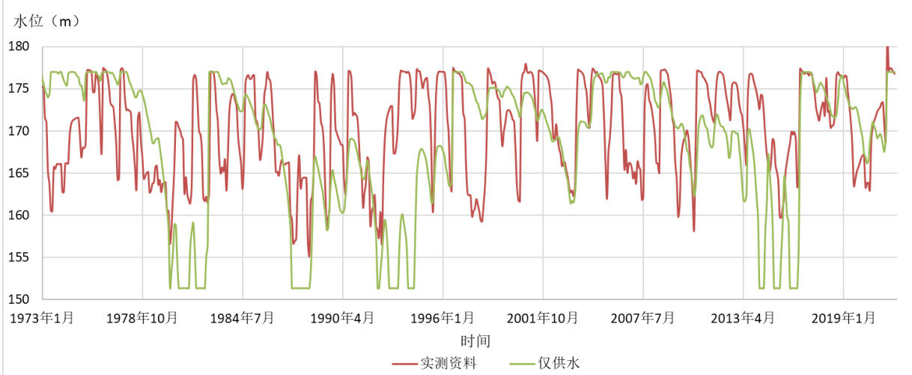  
图 4.4-2  塔岗水库按不下放生态考虑长系列调算结果与水库实际运行水位对比(2)按水库下放生态情况长系列调节计算成果  

经复核,按塔岗水库原设计水位(死水位 $151.4\mathrm{m}$ ,正常蓄水位 177m),兴利库容仅用于灌溉,设计灌溉面积 5 万亩,灌溉保证率 $74.6\%$ ,汛期( $6\sim9$ 月)生态流量按多年平均流量的 $30\%$ 下放,非汛期( $,10\sim5$ 月)按多年平均流量的 $10\%$ 下放。塔岗水库长系列调算后月末水位见下图,由图可知,由于塔岗水库入库径流存在长时间的连续枯水时段,根据环境要求,在下放生态流量的条件下,水库存在连续多年难以蓄至正常蓄水位的情况,水库无增加兴利库容条件。若按村镇生活需水预测成果增加村镇供水任务,破坏深度较高,且难以达到供水设计保证率 $95\%$ 的要求。  

  
图 4.4-3  塔岗水库长系列调算后月末兴利库容  

综上分析,塔岗水库维持原兴利库容规模可以满足原设计灌溉用水要求。  

# 4.5 应急备用  

# 4.5.1 应急备用需求分析  

南水北调中线工程是有效缓解京津华北地区水资源短缺,实现水资源优化配置,促进经济社会可持续发展,保障和改善民生的重大战略性基础设施。一期工程自 2014 年 12 月通水以来,对于缓解京津华北地区水资源供需矛盾、改善受水区水生态环境发挥了重要作用。由于南水北调中线工程为总干渠单线输水,遇到突发事件时难保证全线供水,而河南省部分受水区水厂以南水北调水位单一水源,一旦停水,将造成水厂停水的严重局面,影响巨大。提升中线工程检修和突发事故下应急供水能力,对于保障京津华北地区城市供水安全,维护受水区经济社会稳定是十分重要和迫切的。  

南水北调中线一期工程总干渠输水建筑物在设计时考虑了不停水分孔(槽)检修的条件。明渠为单线输水,大型检修需要停水。一旦实施停水检修,检修渠段及其以下总干渠均面临停水,影响范围广。为避免停水检修给受水区用水造成较大影响,一方面需要充分发挥当地已有调蓄工程的作用,另一方面需要适当兴建在线调蓄工程,减少停水影响范围,减轻当地调蓄工程不足的压力。  

设计水平年卫辉市城乡生活工业用水等均由城市供水管网统一供给,管网水源均为外调水,水源单一。按照《城市供水水源规划导则》(SL627-2014),“单一水源供水的城市应提出应急备用水源规划方案”,“应急备用水源的备用供水量一般不小于城市居民生活需水量的 $60\%\sim70\%$ ,输水方式要能满足短时间内启用要求”。  

《南水北调中线在线调蓄工程方案》综合中线规划设计阶段的水资源配置方案、受水区现状供用水情况、配套工程实施程度,结合 2019 年 6 月调研收集的受水区水厂、当地水源条件等有关情况,梳理受水区当地水资源条件,分析了当地水源的应急供水保障能力。提出卫辉新建 1 座受水水厂,设计日供水能力共12 万 t/d,一期工程多年平均口门分配水量 4300 万 $\mathsf{m}^{3}$ ,与非受水水厂卫辉四水厂(设计日供水能力共 3 万 t/d)管网连通,利用现状塔岗水库实现应急备用。  

# 4.5.2 应急备用供水范围  

根据《卫辉市农村供水高质量发展规划》,考虑到设计水平年卫辉市已经基本建成城乡一体化供水工程,城镇、农村全部采用一套系统供水,因此,按照卫辉市城乡供水总用水量(不含河道外生态需水)考虑。  

# 4.5.3 应急备用需水量  

# 4.5.3.1 备用时间  

(1)检修应急供水  

根据《南水北调中线在线调蓄方案》,南水北调中线停水检修时长为渠段开始退水、完成检修项目检测、施工、最后渠道充水至实现正常输水所需的时间,由退水时间、检修项目施工时间、渠道充水时间决定。  

# 1)退水时间  

根据分析,全线停水检修方式退水时间为 38 天,其中漳河南渠段渠道设计水深 $8.0{\sim}7.0\mathsf{m}$ ,退水时间为 $27\sim24$ 天,漳河北渠段渠道设计水深 $6.0{\sim}3.8\mathsf{m}$ ,退水时间为 $_{20\sim15}$ 天。分段检修方式退水时间为 $15\sim27$ 天。  

# 2)检修项目施工时间  

检修项目施工时间包括施工准备期、施工期。  

施工准备期工作内容包括:对检修渠段内渠道及输水建筑物水下部位的外观检查、专项检测及金属结构检查,确定检修项目及施工方案,招标等,施工准备期需 20 天。  

施工期工作内容包括土建项目和金属结构项目的施工、清理场地、完工验收等,控制性工期为土建项目中的衬砌混凝土施工,考虑施工中不确定因素,施工工期至少需要 30 天,加上施工现场质量检测验收时间(暂按 7 天计),合计至少需要 37 天。  

# 3)渠道充水时间  

检修项目验收合格后,需要对检修渠段进行冲洗。根据总干渠通水实践经验,洗渠水量约为该渠段水量的 $20\%$ ,洗渠水通过渠段内退水闸退入河道。充水时间按检修渠段内渠道水位每天上升 $0.5\mathrm{m}$ 控制,全线停水检修方式渠道充水时间约 15 天,分渠段停水检修方式充水所需时间约 $^{8\sim15}$ 天。  

综上所述,全线停水检修方式总干渠停水检修时长约 110 天,分渠段停水检修方式总干渠停水检修时长约 $80\sim99$ 天。  

# (2)突发事故应急供水  

总干渠突发事件主要包括水质污染、渠道及建筑物结构破坏、设备故障和社会安全等 4 类。总干渠突发事件中断供水存在事件地点和恢复供水时间不确定性,各类突发事件的处理一般可分为退水、事故处理和渠道充水三项工作内容,相应时间见下表。  

表 5.4-1  各类突发事件处理的应急时间 天  

<html><body><table><tr><td>突发事件类型</td><td>退水时间</td><td>处理时间</td><td>渠道充水时间</td><td>总时间</td></tr><tr><td>水质污染事件</td><td>15~38</td><td>15~37</td><td>8~15</td><td>38~90</td></tr><tr><td>结构破坏事件</td><td>15~38</td><td>30~60</td><td>8~15</td><td>53~112</td></tr><tr><td>设备故障事件</td><td></td><td>10~15</td><td></td><td>10~15</td></tr><tr><td>社会安全事件</td><td>10~15</td><td>10~15</td><td>8~15</td><td>28~45</td></tr></table></body></html>  

《南水北调中线在线调蓄方案》中,在线调蓄工程在总干渠停水检修或因突发事件中断供水时的应急供水时间均按 90 天计算。本次塔岗水库应急及检修备用时间考虑与《南水北调中线在线调蓄方案》一致,为 90 天。  

# 4.5.3.2 备用水量  

南水北调中线一期工程多年平均卫辉市口门分配水量 4300 万 $\mathsf{m}^{3}$ ,按照卫辉市城乡供水总用水量(不含河道外生态需水)的 90 天检修备用水量正常供水考虑,则检修备用水量为 1060 万 $\mathsf{m}^{3}$ 。考虑应急工况需水压缩 $40\%$ ,计算 90 天应急备用水量取 636 万 $\mathsf{m}^{3}$ 。  

# 4.6 工程总体布局  

塔岗水库位于河南省卫辉市境内沧河出山口附近。塔岗水库扩建增容工程实施后,塔岗水库为Ⅲ等中型工程,水库工程任务为以防洪、灌溉为主,结合卫辉市南水北调受水区备用供水,兼顾发电。水库扩建增容后,水库死水位 $160\mathrm{m}$ ,死库容 72 万 $\mathsf{m}^{3}$ ,考虑为卫辉市提供应急备用库容 636 万 $\mathsf{m}3$ ,水库正常运行最低水位 $174.51\ensuremath{\mathrm{m}}$ ,水库兴利库容 954 万 $\mathsf{m}^{3}$ ,考虑检修备用库容 1060 万 $\mathsf{m}^{3}$ 与兴利、应急备用库容结合,水库正常蓄水位 $184\mathrm{m}$ ,汛限水位 $184\mathrm{m}$ ,水库 50 年一遇防洪库容 5001 万 $\mathsf{m}^{3}$ ,防洪高水位 $207.51\ensuremath{\mathrm{m}}$ 。水库设计洪水标准 100 年一遇,设计洪水位 $207.51\ensuremath{\mathrm{m}}$ ,校核洪水标准 2000 年一遇,校核洪水位 $207.94\mathrm{m}$ ,水库总库容 6787 万 $\mathsf{m}^{3}$ 。  

塔岗水库的工程任务是以防洪、灌溉为主,结合卫辉市南水北调受水区备用供水,兼顾发电。塔岗水库主要防洪保护对象为坝址下游沧河两岸的村镇和耕地,同时可减轻下游良相坡等蓄滞洪区的进洪量和发生以沧河为主洪水时的启用几率,对南水北调中线、京广铁路、京港澳高速铁路及高速公路等一系列重要区域和基础设施的防洪有积极作用。水库扩建增容后,可将沧河两岸村镇及耕地防洪标准提高至 20 年一遇,当沧河与共渠洪水不遭遇时,可将良相坡沧河启用标准提高至 20 年一遇,有效降低良向坡的启用几率及启用后的淹没损失。  

塔岗水库扩建增容的总体布局在现状塔岗水库坝址基础上进行防洪能力提升改造,总体布局维持现状水库的工程布局不变,本次扩建增容的主要建设内容:为拆除原主要挡水建筑物,原坝址新建混合坝。包括碾压混凝土重力坝(含泄水、引水建筑物)和左岸黏土心墙堆石坝,坝后电站等建筑物。  

坝顶全长 $1034.40\mathrm{m}$ ,坝顶高程 $209.00\mathrm{m}$ ,坝顶上游设防浪墙,防浪墙顶高程 $210.20\mathrm{m}$ ,上游侧设置 $1.2\ m$ 高石材。坝轴线控制坐标A(左坝肩:504300.1785,3939854.7797)、B(右坝肩:503292.5076,3939982.4432)。从左至右分别为左副坝黏土心墙堆石坝段( $0\substack{+000.00\sim0+412.60})$ )、河床非溢流坝段( $0+420.00{\sim}0{+}588.00~\$ )、表孔坝段 $(~0{+}588.00{\sim}0{+}648.00~)$ )、底孔坝段( $0\substack{+648.00\sim0+669.00)}$ )、引水坝段( $0+669.00{\sim}0{+}690.00;$ )、右岸非溢流坝段( $(0{+}690{.}00{\sim}1{+}034{.}40)$ 。  

# (1)挡水建筑物  

挡水建筑物为混合坝,左岸新建黏土心墙堆石坝段,主河床及右岸为原址新  

建混凝土重力坝坝段。  

混凝土重力坝坝顶长度为 $621.80\mathrm{m}$ 。从左至右共分为 30 个坝段(编号1#\~30#坝段),其中挡水坝段布置于 1#\~8#、14# $\sim30\#$ 坝段。坝顶高程 $209.00\mathrm{m}$ ,坝顶长 $519.80\mathrm{m}$ ,建基面高程 $141.00\ensuremath{\mathrm{m}}$ ,最大坝高 $68.0\mathrm{m}$ ;上游侧高程 $150.0\mathrm{m}$ 以上为铅直面(坝轴线桩号 $0{\pm}000.00\cdot$ )、以下为 1:0.2 的斜坡面,下游侧高程$197.00\mathrm{m}$ 以上为铅直面、以下为 1:0.75 的斜坡面;坝顶总宽度 $9.0\mathsf{m}$ ;重力坝段基础进行固结灌浆,并在上游侧设帷幕灌浆,以减小扬压力和渗流量。  

左岸为黏土心墙堆石坝,坝顶长度为 $412.60\mathrm{m}$ 。最大坝高 $38.00\mathrm{m}$ ,黏土心墙堆石坝上游坝坡坡比 1:2.25,上游坝坡 $189.00\mathrm{m}$ 高程设置平行于坝轴线的马道,宽 $2.0\mathsf{m}$ 。下游坝坡坡比 1:2.0,坡脚处设排水棱体。下游设置“之”字上坝道路,自 $177.00\mathrm{m}$ 高程延伸至坝顶刺墙衔接段拐角处,道路宽 $8.0\mathsf{m}$ ,坡率 $\scriptstyle{\mathrm{i=6\%}}$ 。在距坝轴线上游 5.0m 处新建塑性混凝土防渗墙,墙宽 $0.6\mathrm{m}$ ,距原防渗墙$15.00\mathrm{m}$ 。  

黏土心墙堆石坝与重力坝段采用混凝土刺墙进行连接,刺墙为重力式挡墙,沿坝轴线方向顶部长 $92\mathrm{m}$ ,沿坝轴线方向上游坡比为 1:0.25,下游坡比 1::05,垂直坝轴线墙面坡比 1:0.3。右岸上下游坡面与重力坝段衔接处采用锥面裹头型式顺接,坝后设置压重平台,坡脚处填筑至 177.00 高程排水棱体顶部,往下游按照 $2\%$ 坡比进行放坡。  

# (2)泄水建筑物  

泄水建筑物共布设 3 个泄洪表孔和 2 个泄洪底孔。其中表孔坝段布置在9#\~11#坝段,长 $60.0\mathrm{m}$ ,共 3 孔。泄洪表孔每孔净宽为 $12.0\ m$ ,边墩 $4.0\mathsf{m}$ ,为开敞式溢流孔口,采用 WES 实用堰型,堰顶高程 $192.0\mathrm{m}$ ,闸墩顶高程 $209.00\mathrm{m}$ 。底孔坝段布置在12#坝段,长21m,共设置2孔,泄洪底孔孔口尺寸为 $2.50{\times}3.00\mathsf{m}$ (宽×高),进口底板高程为 $156.00\mathrm{m}$ ,出口设置弧形工作闸门,采用液压启闭机启闭。表孔、底孔下游消能工均采用底流消能形式。  

泄洪底孔、表孔均采用底流消能方式。为避免水流紊乱,表孔、底孔消力池采用中隔墙隔开,分别消能。表孔、底孔消力池池底高程均为 $140.0\mathrm{m}$ ,池深均为 $8.0\mathsf{m}$ ,池长均为 $110.0\mathrm{m}$ ,底板厚度为 $4.0\mathsf{m}$ 。表孔消力池净宽 $56\mathrm{m}$ ,底孔消力池净宽 $17\mathrm{m}$ 。尾坎顶高程均为 $148.0\mathrm{m}$ ,尾坎顶宽 $3.0\mathsf{m}$ 。坝址下游河覆盖层较厚,抗冲刷能力差,考虑到工程下泄流量较大,水流出消力池后仍存在紊动,流速尚未恢复到天然河道流速分布。为提高河床的抗冲刷能力,参考同类工程,消力池后接长度 $30.0\mathsf{m}$ 、厚度 $2.0\mathsf{m}$ 钢筋混凝土防冲海漫护坦,海漫后接 30m抛石防冲槽,与下游河道顺接。  

为提高建基岩体整体性,溢流表孔与泄洪排沙底孔消力池底板进行固结灌浆,固结灌浆孔孔深 $6.0\mathsf{m}$ ,间排距 $3.0\mathsf{m}$ ,梅花形布置;消力池全底板设置锚筋,锚筋直径 $\Phi28$ ,入岩 $8.0\mathsf{m}$ ,间排距 $2.0\mathsf{m}$ ,梅花形布置。  

# (3)引水建筑物  

引水建筑物布置为坝式进水口 $^+$ 坝内埋管的型式,位于大坝 13#坝段。首部拦污栅槽净宽 $_{2\mathsf{m}}$ 。进水口渐变段长 $_{2\mathsf{m}}$ ,由 $1.2\mathrm{m}\times1.2\mathrm{m}$ 的方形孔口渐变为直径为 $1.2\mathrm{m}$ 的圆形孔口,其后接直径为 $1.2\mathrm{m}$ 的压力钢管。坝内设引水压力主管 1根,内径 $1.2\ m$ ,压力钢管出坝后连接坝外引水管系统。  

电站为坝后式电站,厂区布置在大坝下游右岸坝脚处,厂区室外的地坪高程为 $157.0\mathrm{m}$ 。布置有主厂房、安装场、副厂房、下游尾水池、生态放水管、进场路等建筑物。总装机容量为 0.6MW,装机 3 台。  

# 4.7 工程规模  

# 4.7.1 径流调节计算  

# 4.7.1.1 基本资料  

# 1)径流资料  

本阶段径流系列为 1956 年 $\mathord{\sim}2023$ 年共 68 年系列,塔岗水库坝址多年平均天然径流量为 2925 万 $\mathsf{m}^{3}$ 。塔岗水库坝址上游耗水主要为农业灌溉用水,多年平均耗水量 1201 万 $\mathsf{m}^{3}$ ,扣除上游耗水后坝址多年平均入库径流为 1724 万 $\mathsf{m}^{3}$ 。  

根据地区水文特性,每年丰水期为 ${\tt6}\small{\sim}9$ 月,枯水期为 10 月\~次年 5 月。塔岗水库坝址多年平均入库径流过程见表 4.7-1。  

表 4.7-1  
塔岗水库径流月过程表 单位:万 $\mathsf{m}^{3}$   

<html><body><table><tr><td>月份</td><td>1</td><td>2</td><td>3</td><td>4</td><td>5</td><td>9</td><td>7</td><td>8</td><td>9</td><td>10</td><td>11</td><td>12</td><td>多年平均</td></tr><tr><td>径流量</td><td>78</td><td>67</td><td>52</td><td>56</td><td>61</td><td>91</td><td>279</td><td>446</td><td>226</td><td>169</td><td>93</td><td>107</td><td>1724</td></tr></table></body></html>  

# 2)库容曲线  

本阶段塔岗水库原始库容曲线采用 1:10000 地形图量算,径流调节计算采用水库淤积 20 年库容。水库水位\~面积 $\sim$ 库容曲线见表 4.7-2。  

表 4.7-2 塔岗水库水位 $\sim$ 面积 $\sim$ 库容曲线表  

<html><body><table><tr><td>高程（m)</td><td>库面积（万m²)</td><td>库容（万m²)</td><td>高程（m)</td><td>库面积（万m²)</td><td>库容（万m²)</td></tr><tr><td>150.00</td><td>0</td><td>0.00</td><td>193.00</td><td>197</td><td>3134.30</td></tr><tr><td>151.00</td><td>0</td><td>0.00</td><td>194.00</td><td>204</td><td>3334.60</td></tr><tr><td>152.00</td><td>0</td><td>0.30</td><td>195.00</td><td>209</td><td>3542.30</td></tr><tr><td>153.00</td><td>1</td><td>1.00</td><td>196.00</td><td>216</td><td>3755.20</td></tr><tr><td>154.00</td><td>4</td><td>2.70</td><td>197.00</td><td>221</td><td>3975.10</td></tr><tr><td>155.00</td><td>9</td><td>7.30</td><td>198.00</td><td>228</td><td>4199.90</td></tr><tr><td>156.00</td><td>9</td><td>13.90</td><td>199.00</td><td>233</td><td>4431.40</td></tr><tr><td>157.00</td><td>11</td><td>23.60</td><td>200.00</td><td>240</td><td>4667.70</td></tr><tr><td>158.00</td><td>15</td><td>36.60</td><td>201.00</td><td>245</td><td>4911.70</td></tr><tr><td>159.00</td><td>18</td><td>52.90</td><td>202.00</td><td>253</td><td>5161.00</td></tr><tr><td>160.00</td><td>20</td><td>72.00</td><td>203.00</td><td>258</td><td>5418.10</td></tr><tr><td>161.00</td><td>23</td><td>94.00</td><td>204.00</td><td>266</td><td>5680.70</td></tr><tr><td>162.00</td><td>26</td><td>118.80</td><td>205.00</td><td>272</td><td>5951.20</td></tr><tr><td>163.00</td><td>29</td><td>146.60</td><td>206.00</td><td>281</td><td>6227.30</td></tr><tr><td>164.00</td><td>31</td><td>177.00</td><td>207.00</td><td>287</td><td>6512.90</td></tr><tr><td>165.00</td><td>34</td><td>210.00</td><td>208.00</td><td>297</td><td>6805.00</td></tr><tr><td>166.00</td><td>38</td><td>245.90</td><td>209.00</td><td>305</td><td>7107.90</td></tr><tr><td>167.00</td><td>40</td><td>284.90</td><td>210.00</td><td>317</td><td>7418.30</td></tr><tr><td>168.00</td><td>45</td><td>327.00</td><td>211.00</td><td>323</td><td>7739.70</td></tr><tr><td>169.00</td><td>49</td><td>374.10</td><td>212.00</td><td>330</td><td>8067.00</td></tr><tr><td>170.00</td><td>53</td><td>425.10</td><td>213.00</td><td>337</td><td>8402.50</td></tr><tr><td>171.00</td><td>57</td><td>479.80</td><td>214.00</td><td>345</td><td>8744.10</td></tr><tr><td>172.00</td><td>62</td><td>539.10</td><td>215.00</td><td>352</td><td>9094.80</td></tr><tr><td>173.00</td><td>66</td><td>603.30</td><td>216.00</td><td>360</td><td>9452.10</td></tr><tr><td>174.00</td><td>70</td><td>671.60</td><td>217.00</td><td>367</td><td>9817.80</td></tr><tr><td>175.00</td><td>73</td><td>743.40</td><td>218.00</td><td>377</td><td>10190.40</td></tr><tr><td>176.00</td><td>78</td><td>818.10</td><td>219.00</td><td>383</td><td>10572.60</td></tr><tr><td>177.00</td><td>82</td><td>898.50</td><td>220.00</td><td>393</td><td>10961.50</td></tr><tr><td>178.00</td><td>88</td><td>983.00</td><td>221.00</td><td>401</td><td>11360.80</td></tr><tr><td>179.00</td><td>94</td><td>1074.50</td><td>222.00</td><td>411</td><td>11768.00</td></tr><tr><td>180.00</td><td>107</td><td>1173.20</td><td>223.00</td><td>419</td><td>12185.50</td></tr><tr><td>181.00</td><td>114</td><td>1284.40</td><td>224.00</td><td>430</td><td>12611.60</td></tr><tr><td>182.00</td><td>123</td><td>1402.20</td><td>225.00</td><td>439</td><td>13048.60</td></tr><tr><td>183.00</td><td>128</td><td>1528.50</td><td>226.00</td><td>450</td><td>13494.00</td></tr><tr><td>184.00</td><td>135</td><td>1659.70</td><td>227.00</td><td>459</td><td>13951.00</td></tr><tr><td>185.00</td><td>140</td><td>1798.10</td><td>228.00</td><td>470</td><td>14416.60</td></tr><tr><td>186.00</td><td>147</td><td>1940.50</td><td>229.00</td><td>478</td><td>14893.70</td></tr><tr><td>187.00</td><td>151</td><td>2090.40</td><td>230.00</td><td>490</td><td>15379.20</td></tr><tr><td>188.00</td><td>160</td><td>2245.20</td><td>231.00</td><td>500</td><td>15877.10</td></tr></table></body></html>  

<html><body><table><tr><td>高程（m)</td><td>库面积（万m²)</td><td>库容（万m²)</td><td>高程（m)</td><td>库面积（万m²)</td><td>库容（万m²)</td></tr><tr><td>189.00</td><td>165</td><td>2408.20</td><td>232.00</td><td>512</td><td>16384.60</td></tr><tr><td>190.00</td><td>175</td><td>2576.20</td><td>233.00</td><td>521</td><td>16904.10</td></tr><tr><td>191.00</td><td>180</td><td>2754.60</td><td>234.00</td><td>534</td><td>17433.30</td></tr><tr><td>192.00</td><td>192</td><td>2939.00</td><td></td><td></td><td></td></tr></table></body></html>  

# (3)蒸发渗漏损失  

水库蒸发损失按月平均库面面积乘以相应月份的蒸发增损量计算,蒸发增损量为水面蒸发与陆面蒸发的差值,年蒸发增损量为 $585\mathrm{mm}$ ,年蒸发增损过程见表 4.7-3。调节计算过程中蒸发损失按月平均库面面积乘以相应月的蒸发增损量计算。  

渗漏损失根据库区地质条件按水库月均蓄水量的 $1\%$ 计算。  

单位:mm  

表 4.7-3  塔岗水库蒸发增损表  

<html><body><table><tr><td>月份</td><td>1</td><td>2</td><td>3</td><td>4</td><td>5</td><td>9</td><td>7</td><td>8</td><td>9</td><td>10</td><td>11</td><td>12</td><td>年合计</td></tr><tr><td>蒸发增损</td><td>19.7</td><td>26.9</td><td>47.7</td><td>59.0</td><td>71.1</td><td>89.3</td><td>62.7</td><td>63.3</td><td>53.2</td><td>41.8</td><td>33.1</td><td>19.3</td><td>585.2</td></tr></table></body></html>  

# (4)生态基流  

塔岗水库坝址断面生态基流采用 Tennant 法和 $90\%$ 最枯月平均流量分别计算,按照两种计算方法取外包线(最大值)的原则, $10\sim$ 翌年 5 月按坝址断面多年平均流量的 $10\%$ 下泄, ${\tt6}\small{\sim}9$ 月按多年平均流量的 $30\%$ 下泄。  

# (5)电站厂址水位流量关系  

电站厂址尾水位 $\sim$ 流量关系根据厂址实测断面资料,通过水面线推求。电站厂址尾水位 $\sim$ 流量关系曲线见表 4.7-4。  

表 4.7-4  电站厂址水位流量关系曲线 单位:mm  

<html><body><table><tr><td>流量（m/s)</td><td>尾水位（m)</td><td>流量（m3/s)</td><td>尾水位（m)</td></tr><tr><td>0.0</td><td>145.0</td><td>2970.5</td><td>153.0</td></tr><tr><td>1.0</td><td>146.9</td><td>3343.2</td><td>153.2</td></tr><tr><td>4.0</td><td>147.2</td><td>3741.5</td><td>153.5</td></tr><tr><td>9.0</td><td>147.4</td><td>4161.5</td><td>153.8</td></tr><tr><td>24.8</td><td>147.6</td><td>4600.9</td><td>154.0</td></tr><tr><td>56.1</td><td>147.9</td><td>5048.9</td><td>154.3</td></tr><tr><td>112.2</td><td>148.2</td><td>5384.2</td><td>154.5</td></tr><tr><td>196.6</td><td>148.5</td><td>5894.9</td><td>154.7</td></tr><tr><td>298.9</td><td>148.8</td><td>6455.1</td><td>155.0</td></tr><tr><td>417.5</td><td>149.2</td><td>7072.3</td><td>155.3</td></tr></table></body></html>  

<html><body><table><tr><td>流量（m3/s)</td><td>尾水位（m)</td><td>流量（m3/s)</td><td>尾水位（m)</td></tr><tr><td>549.3</td><td>149.5</td><td>7543.7</td><td>155.6</td></tr><tr><td>677.4</td><td>149.7</td><td>8239.8</td><td>155.9</td></tr><tr><td>836.3</td><td>150.0</td><td>9027.0</td><td>156.2</td></tr><tr><td>1023.6</td><td>150.4</td><td>9897.3</td><td>156.5</td></tr><tr><td>1224.7</td><td>150.8</td><td>10742.3</td><td>156.8</td></tr><tr><td>1445.2</td><td>151.1</td><td>11400.7</td><td>157.0</td></tr><tr><td>1698.9</td><td>151.5</td><td>12516.8</td><td>157.3</td></tr><tr><td>1977.4</td><td>151.9</td><td>13698.0</td><td>157.6</td></tr><tr><td>2285.0</td><td>152.3</td><td>14939.4</td><td>158.0</td></tr><tr><td>2616.6</td><td>152.6</td><td></td><td></td></tr></table></body></html>  

# (6)电站流道水头损失  

电站水头损失包括流道沿程水头损失、弯道及进水口局部水头损失,根据电站引水建筑物尺寸和布置形式,通过水力学计算得出不同发电流量对应的水头损失曲线。电站不同发电流量对应的水头损失曲线见表 4.7-5。  

表 4.7-5 电站水头损失曲线 单位:mm  

<html><body><table><tr><td>流量（m3/s)</td><td>水头损失(m)</td><td>流量（m3/s)</td><td>水头损失（m)</td></tr><tr><td>0.00</td><td>0.00</td><td>1.95</td><td>2.22</td></tr><tr><td>0.75</td><td>2.52</td><td>2.55</td><td>2.48</td></tr><tr><td>1.35</td><td>2.35</td><td>3.15</td><td>2.93</td></tr></table></body></html>  

# (7)综合出力系数  

塔岗电站利用水库下泄的生态基流和汛期弃水发电,由于电站装机容量较小,本次计算电站综合出力系数暂取 8.3。  

# 4.7.1.2 计算原则和方法  

(1)计算原则  

塔岗水库扩建工程是以防洪、灌溉为主,结合卫辉市南水北调受水区备用供水,兼顾发电。在保证防洪安全和供水安全的前提下,贯彻“生态优先”理念,发电服从防洪、供水和生态的需要。水库径流调节方式如下:  

1)防洪调度原则:根据水文分析,沧河流域的汛期为 ${\tt6}\small\sim9$ 月,流域大洪水与特大洪水主要发生在 $5\sim7$ 月,以 7 月最为集中。防洪是塔岗水库的首要任务,为满足防洪要求,4 月初至 7 月底一般控制库水位不超过汛期限制水位 $184\mathrm{m}$ ,在此期间,水库服从沧河流域整体防洪调度。  

2)供水调度原则:本工程农业灌溉保证率为 $75\%$ ,当遇到保证率以外的枯水时段,减少灌溉供水量,供水破坏深度不大于 $40\%$ 。水库首先通过电站机组按最小生态流量要求向水库下游河道下放生态用水。水库下放生态流量后,根据需求向沧河灌区供水。当水库蓄水至正常蓄水位时,生态水量、灌溉水量及灌溉后的富余水量均通过电站机组发电后向下游河道下放。  

# (2)计算方法  

调节计算采用时历法,以月为时段进行计算,径流系列为 1956 年 1 月 $\mathord{\sim}2023$ 年 12 月共 68 年。  

# 4.7.1.3 计算成果  

根据上述基本资料及计算原则,计算设计水平年 2035 年塔岗水库扩建后的工程规模。  

根据调节计算结果,满足灌溉要求的调节库容为 952 万 $\mathsf{m}^{3}$ ,对应正常蓄水位为 $184\mathrm{m}$ 。则塔岗水库扩建后正常蓄水位为 $184\mathrm{m}$ ,正常运行最低水位为$174.51\ensuremath{\mathrm{m}}$ ,死水位为 $160\mathrm{m}$ ,正常蓄水位对应库容为 1660 万 $\mathsf{m}^{3}$ ,死库容为 72万 $\mathsf{m}^{3}$ ,调节库容为 952 万 $\mathsf{m}^{3}$ 。本工程多年平均供水量为 574 万 $\mathsf{m}^{3}$ 。  

塔岗现状布置有一坝后电站,装机容量为 0.6MW,本次塔岗水库扩建后,将原电站按原规模重建,在满足防洪要求的前提下,利用灌溉水量、生态基流和弃水发电。经计算,塔岗电站多年平均发电量为 90.9 万 kW·h,装机年利用小时数为 1515h。塔岗水库工程调节计算成果详见表 4.7-6,逐年调节计算过程见表4.7-7。  

表 4.7-6  塔岗水库工程调节计算成果  

<html><body><table><tr><td colspan="2">项目</td><td>单位</td><td>指标</td></tr><tr><td rowspan="7">塔岗水库规模</td><td>正常蓄水位</td><td>m</td><td>184</td></tr><tr><td>死水位</td><td>m</td><td>174.51</td></tr><tr><td>极限运行死水位</td><td>m</td><td>160</td></tr><tr><td>正常蓄水位对应原始库容</td><td>万m3</td><td>1660</td></tr><tr><td>极限运行死水位对应库容</td><td>万m3</td><td>72</td></tr><tr><td>备用库容</td><td>万m3</td><td>636</td></tr><tr><td>兴利库容</td><td>万m3</td><td>952</td></tr><tr><td rowspan="3">塔岗灌区多年 平均供水量</td><td>水库供水量</td><td>万m3</td><td>574</td></tr><tr><td>地下水供水量</td><td>万m3</td><td>515</td></tr><tr><td>总供水量</td><td>万m3</td><td>1089</td></tr><tr><td rowspan="2">电站特征指标</td><td>装机容量</td><td>MW</td><td>0.6</td></tr><tr><td>多年平均发电量</td><td>万kWh</td><td>90.9</td></tr></table></body></html>  

<html><body><table><tr><td colspan="2">项目</td><td>单位</td><td>指标</td></tr><tr><td rowspan="4"></td><td>装机年利用小时数</td><td>h</td><td>1515</td></tr><tr><td>最大水头</td><td>m</td><td>37.15</td></tr><tr><td>最小水头</td><td>m</td><td>26.78</td></tr><tr><td>加权平均水头</td><td>m</td><td>30.20</td></tr></table></body></html>  

表 4.7-7  塔岗水库逐年调节计算过程  

<html><body><table><tr><td rowspan="2">年</td><td rowspan="2">设计入库 水量 （万m²)</td><td rowspan="2">生态水量 (万m3)</td><td rowspan="2">蒸发损失 (万m²)</td><td rowspan="2">渗漏损失 (万m²)</td><td rowspan="2">灌溉需水量 (万m²)</td><td colspan="3">供水量（万m²)</td><td rowspan="2">水量盈亏 (万m3)</td><td rowspan="2">弃水量 (万m²)</td><td rowspan="2">年最高水位 (W)</td><td rowspan="2">年最低水库 (W)</td></tr><tr><td>地下水供水 量</td><td>水库供水量</td><td>合计</td></tr><tr><td>1956</td><td>10565</td><td>489</td><td>63</td><td>155</td><td>1236</td><td>0</td><td>1236</td><td>1236</td><td>8623</td><td>8152</td><td>184.00</td><td>176.17</td></tr><tr><td>1957</td><td>1333</td><td>488</td><td>58</td><td>131</td><td>1506</td><td>245</td><td>1262</td><td>1506</td><td>-850</td><td>315</td><td>184.00</td><td>174.51</td></tr><tr><td>1958</td><td>3050</td><td>488</td><td>50</td><td>122</td><td>1189</td><td>469</td><td>721</td><td>1189</td><td>1201</td><td>750</td><td>184.00</td><td>174.51</td></tr><tr><td>1959</td><td>1833</td><td>488</td><td>66</td><td>158</td><td>1236</td><td>0</td><td>1236</td><td>1236</td><td>-115</td><td>254</td><td>184.00</td><td>178.13</td></tr><tr><td>1960</td><td>770</td><td>489</td><td>51</td><td>110</td><td>937</td><td>268</td><td>669</td><td>937</td><td>-816</td><td>0</td><td>181.42</td><td>174.51</td></tr><tr><td>1961</td><td>1299</td><td>476</td><td>43</td><td>94</td><td>1322</td><td>524</td><td>269</td><td>793</td><td>-107</td><td>0</td><td>179.86</td><td>174.51</td></tr><tr><td>1962</td><td>1392</td><td>485</td><td>47</td><td>107</td><td>1162</td><td>449</td><td>713</td><td>1162</td><td>-409</td><td>0</td><td>180.30</td><td>174.51</td></tr><tr><td>1963</td><td>10800</td><td>488</td><td>72</td><td>177</td><td>1079</td><td>0</td><td>1079</td><td>1079</td><td>8984</td><td>8540</td><td>184.00</td><td>180.77</td></tr><tr><td>1964</td><td>3924</td><td>489</td><td>76</td><td>189</td><td>1380</td><td>0</td><td>1380</td><td>1380</td><td>1790</td><td>1790</td><td>184.00</td><td>181.84</td></tr><tr><td>1965</td><td>938</td><td>488</td><td>60</td><td>134</td><td>1396</td><td>374</td><td>1022</td><td>1396</td><td>-1140</td><td>174</td><td>184.00</td><td>174.51</td></tr><tr><td>1966</td><td>800</td><td>488</td><td>42</td><td>85</td><td>1322</td><td>613</td><td>180</td><td>793</td><td>-608</td><td>0</td><td>175.06</td><td>174.51</td></tr><tr><td>1967</td><td>1046</td><td>488</td><td>42</td><td>87</td><td>1236</td><td>818</td><td>418</td><td>1236</td><td>-807</td><td>0</td><td>176.29</td><td>174.51</td></tr><tr><td>1968</td><td>1011</td><td>489</td><td>42</td><td>87</td><td>1396</td><td>458</td><td>379</td><td>838</td><td>-446</td><td>0</td><td>175.77</td><td>174.51</td></tr><tr><td>1969</td><td>1412</td><td>476</td><td>44</td><td>96</td><td>1220</td><td>591</td><td>629</td><td>1220</td><td>-424</td><td>0</td><td>178.86</td><td>174.51</td></tr><tr><td>1970</td><td>1090</td><td>480</td><td>44</td><td>94</td><td>1506</td><td>811</td><td>696</td><td>1506</td><td>-1035</td><td>0</td><td>177.99</td><td>174.51</td></tr><tr><td>1971</td><td>1393</td><td>488</td><td>44</td><td>95</td><td>1236</td><td>665</td><td>571</td><td>1236</td><td>-469</td><td>0</td><td>178.55</td><td>174.51</td></tr><tr><td>1972</td><td>1489</td><td>464</td><td>46</td><td>107</td><td>1113</td><td>619</td><td>494</td><td>1113</td><td>-241</td><td>0</td><td>181.08</td><td>174.51</td></tr><tr><td>1973</td><td>2095</td><td>488</td><td>54</td><td>131</td><td>1396</td><td>151</td><td>1245</td><td>1396</td><td>27</td><td>0</td><td>183.75</td><td>174.51</td></tr><tr><td>1974</td><td>1226</td><td>488</td><td>60</td><td>134</td><td>1347</td><td>84</td><td>1263</td><td>1347</td><td>-803</td><td>0</td><td>184.00</td><td>174.51</td></tr><tr><td>1975</td><td>4612</td><td>451</td><td>51</td><td>125</td><td>1396</td><td>671</td><td>726</td><td>1396</td><td>2589</td><td>2385</td><td>184.00</td><td>174.51</td></tr><tr><td>1976</td><td>3241</td><td>489</td><td>71</td><td>177</td><td>1236</td><td>0</td><td>1236</td><td>1236</td><td>1268</td><td>1434</td><td>184.00</td><td>177.75</td></tr><tr><td>1977</td><td>2042</td><td>488</td><td>63</td><td>156</td><td>1363</td><td>0</td><td>1363</td><td>1363</td><td>-28</td><td>0</td><td>183.93</td><td>175.13</td></tr><tr><td>1978</td><td>798</td><td>488</td><td>52</td><td>115</td><td>1363</td><td>475</td><td>888</td><td>1363</td><td>-1221</td><td>0</td><td>182.51</td><td>174.51</td></tr><tr><td>1979</td><td>616</td><td>487</td><td>42</td><td>84</td><td>1236</td><td>710</td><td>31</td><td>742</td><td>-738</td><td>0</td><td>174.76</td><td>174.51</td></tr><tr><td>1980</td><td>643</td><td>489</td><td>42</td><td>84</td><td>1082</td><td>604</td><td>45</td><td>649</td><td>-621</td><td>0</td><td>174.54</td><td>174.51</td></tr><tr><td>1981</td><td>649</td><td>488</td><td>42</td><td>85</td><td>1412</td><td>796</td><td>51</td><td>847</td><td>-813</td><td>0</td><td>174.71</td><td>174.51</td></tr></table></body></html>  

<html><body><table><tr><td rowspan="2">年</td><td rowspan="2">设计入库 水量 (万m3)</td><td rowspan="2">生态水量 (万m²)</td><td rowspan="2">蒸发损失 (万m²)</td><td rowspan="2">渗漏损失 （万m²)</td><td rowspan="2">灌溉需水量 (万m3)</td><td colspan="3">供水量（万m3)</td><td rowspan="2">水量盈亏 (万m3)</td><td rowspan="2">弃水量 (万m3)</td><td rowspan="2">年最高水位 (W)</td><td rowspan="2">年最低水库 (W)</td></tr><tr><td>地下水供水 量</td><td>水库供水量</td><td>合计</td></tr><tr><td>1982</td><td>3590</td><td>488</td><td>50</td><td>120</td><td>1365</td><td>775</td><td>590</td><td>1365</td><td>1567</td><td>1417</td><td>184.00</td><td>174.51</td></tr><tr><td>1983</td><td>1035</td><td>488</td><td>60</td><td>134</td><td>1396</td><td>290</td><td>1106</td><td>1396</td><td>-1043</td><td>179</td><td>184.00</td><td>174.51</td></tr><tr><td>1984</td><td>905</td><td>489</td><td>42</td><td>87</td><td>779</td><td>616</td><td>164</td><td>779</td><td>-493</td><td>0</td><td>176.27</td><td>174.51</td></tr><tr><td>1985</td><td>963</td><td>476</td><td>43</td><td>92</td><td>1363</td><td>902</td><td>460</td><td>1363</td><td>-1011</td><td>0</td><td>177.30</td><td>174.51</td></tr><tr><td>1986</td><td>633</td><td>467</td><td>42</td><td>85</td><td>1572</td><td>858</td><td>85</td><td>943</td><td>-905</td><td>0</td><td>175.22</td><td>174.51</td></tr><tr><td>1987</td><td>560</td><td>458</td><td>42</td><td>84</td><td>1082</td><td>622</td><td>27</td><td>649</td><td>-673</td><td>0</td><td>174.75</td><td>174.51</td></tr><tr><td>1988</td><td>925</td><td>489</td><td>43</td><td>90</td><td>1363</td><td>562</td><td>256</td><td>818</td><td>-514</td><td>0</td><td>176.82</td><td>174.51</td></tr><tr><td>1989</td><td>894</td><td>488</td><td>43</td><td>88</td><td>1239</td><td>921</td><td>317</td><td>1238</td><td>-964</td><td>0</td><td>175.77</td><td>174.51</td></tr><tr><td>1990</td><td>1192</td><td>488</td><td>43</td><td>90</td><td>937</td><td>537</td><td>399</td><td>937</td><td>-366</td><td>0</td><td>177.02</td><td>174.51</td></tr><tr><td>1991</td><td>751</td><td>488</td><td>43</td><td>91</td><td>1029</td><td>705</td><td>324</td><td>1029</td><td>-900</td><td>0</td><td>177.32</td><td>174.51</td></tr><tr><td>1992</td><td>726</td><td>489</td><td>42</td><td>85</td><td>1556</td><td>810</td><td>124</td><td>934</td><td>-824</td><td>0</td><td>175.13</td><td>174.51</td></tr><tr><td>1993</td><td>771</td><td>488</td><td>42</td><td>86</td><td>1146</td><td>598</td><td>89</td><td>688</td><td>-532</td><td>0</td><td>175.63</td><td>174.51</td></tr><tr><td>1994</td><td>1121</td><td>488</td><td>43</td><td>92</td><td>986</td><td>607</td><td>379</td><td>986</td><td>-489</td><td>0</td><td>177.12</td><td>174.51</td></tr><tr><td>1995</td><td>1005</td><td>488</td><td>44</td><td>93</td><td>1079</td><td>532</td><td>546</td><td>1079</td><td>669-</td><td>0</td><td>177.46</td><td>174.51</td></tr><tr><td>1996</td><td>1855</td><td>489</td><td>48</td><td>114</td><td>1079</td><td>545</td><td>534</td><td>1079</td><td>125</td><td>0</td><td>183.20</td><td>174.51</td></tr><tr><td>1997</td><td>900</td><td>488</td><td>58</td><td>128</td><td>1146</td><td>218</td><td>928</td><td>1146</td><td>-920</td><td>0</td><td>183.72</td><td>174.51</td></tr><tr><td>1998</td><td>1152</td><td>488</td><td>43</td><td>93</td><td>1095</td><td>657</td><td>438</td><td>1095</td><td>-567</td><td>0</td><td>177.86</td><td>174.51</td></tr><tr><td>1999</td><td>1009</td><td>488</td><td>43</td><td>91</td><td>1236</td><td>755</td><td>481</td><td>1236</td><td>-848</td><td>0</td><td>177.21</td><td>174.51</td></tr><tr><td>2000</td><td>1036</td><td>469</td><td>43</td><td>90</td><td>1115</td><td>860</td><td>255</td><td>1115</td><td>-681</td><td>0</td><td>177.16</td><td>174.51</td></tr><tr><td>2001</td><td>821</td><td>450</td><td>44</td><td>94</td><td>1322</td><td>443</td><td>350</td><td>793</td><td>-561</td><td>0</td><td>177.92</td><td>174.51</td></tr><tr><td>2002</td><td>772</td><td>488</td><td>43</td><td>88</td><td>1572</td><td>691</td><td>252</td><td>943</td><td>-790</td><td>0</td><td>176.33</td><td>174.51</td></tr><tr><td>2003</td><td>1188</td><td>488</td><td>43</td><td>93</td><td>829</td><td>736</td><td>93</td><td>829</td><td>-264</td><td>0</td><td>180.18</td><td>174.51</td></tr><tr><td>2004</td><td>1455</td><td>489</td><td>49</td><td>111</td><td>1189</td><td>96</td><td>1093</td><td>1189</td><td>-384</td><td>0</td><td>180.91</td><td>174.51</td></tr><tr><td>2005</td><td>1864</td><td>488</td><td>48</td><td>106</td><td>1363</td><td>419</td><td>944</td><td>1363</td><td>-140</td><td>0</td><td>180.90</td><td>174.51</td></tr><tr><td>2006</td><td>1448</td><td>488</td><td>60</td><td>133</td><td>1236</td><td>46</td><td>1190</td><td>1236</td><td>-469</td><td>11</td><td>184.00</td><td>174.51</td></tr><tr><td></td><td>1077</td><td>488</td><td>43</td><td>88</td><td>1236</td><td>770</td><td>466</td><td>1236</td><td>-778</td><td>0</td><td>176.45</td><td>174.51</td></tr><tr><td>2007 2008</td><td>910</td><td>471</td><td>42</td><td>87</td><td>1236</td><td>897</td><td>339</td><td>1236</td><td>-927</td><td>0</td><td>175.73</td><td>174.51</td></tr></table></body></html>  

<html><body><table><tr><td rowspan="2">年</td><td rowspan="2">设计入库 水量 （万m²)</td><td rowspan="2">生态水量 (万m²)</td><td rowspan="2">蒸发损失 (万m²)</td><td rowspan="2">渗漏损失 (万m²)</td><td rowspan="2">灌溉需水量 (万m²)</td><td colspan="3">供水量（万m²)</td><td rowspan="2">水量盈亏 (万m3)</td><td rowspan="2">弃水量 (万m²)</td><td rowspan="2">年最高水位 (W)</td><td rowspan="2">年最低水库 (W)</td></tr><tr><td>地下水供水 量</td><td>水库供水量</td><td>合计</td></tr><tr><td>2009</td><td>693</td><td>480</td><td>42</td><td>86</td><td>937</td><td>896</td><td>40</td><td>937</td><td>-851</td><td>0</td><td>175.45</td><td>174.51</td></tr><tr><td>2010</td><td>1142</td><td>454</td><td>43</td><td>92</td><td>1236</td><td>745</td><td>491</td><td>1236</td><td>-683</td><td>0</td><td>177.86</td><td>174.51</td></tr><tr><td>2011</td><td>944</td><td>486</td><td>43</td><td>92</td><td>1113</td><td>813</td><td>300</td><td>1113</td><td>-790</td><td>0</td><td>176.78</td><td>174.51</td></tr><tr><td>2012</td><td>947</td><td>425</td><td>43</td><td>91</td><td>1396</td><td>866</td><td>530</td><td>1396</td><td>-1008</td><td>0</td><td>177.72</td><td>174.51</td></tr><tr><td>2013</td><td>766</td><td>351</td><td>44</td><td>91</td><td>1523</td><td>564</td><td>350</td><td>914</td><td>-634</td><td>0</td><td>178.06</td><td>174.51</td></tr><tr><td>2014</td><td>637</td><td>312</td><td>42</td><td>88</td><td>1236</td><td>495</td><td>246</td><td>742</td><td>-547</td><td>0</td><td>176.92</td><td>174.51</td></tr><tr><td>2015</td><td>624</td><td>330</td><td>42</td><td>85</td><td>937</td><td>738</td><td>198</td><td>937</td><td>-769</td><td>0</td><td>175.01</td><td>174.51</td></tr><tr><td>2016</td><td>2185</td><td>489</td><td>52</td><td>126</td><td>853</td><td>555</td><td>298</td><td>853</td><td>665</td><td>315</td><td>184.00</td><td>174.51</td></tr><tr><td>2017</td><td>1026</td><td>452</td><td>67</td><td>153</td><td>903</td><td>0</td><td>903</td><td>903</td><td>-549</td><td>225</td><td>184.00</td><td>176.52</td></tr><tr><td>2018</td><td>1284</td><td>488</td><td>44</td><td>99</td><td>810</td><td>583</td><td>227</td><td>810</td><td>-157</td><td>0</td><td>181.27</td><td>174.51</td></tr><tr><td>2019</td><td>652</td><td>478</td><td>52</td><td>113</td><td>1063</td><td>440</td><td>622</td><td>1063</td><td>-1054</td><td>0</td><td>181.14</td><td>174.51</td></tr><tr><td>2020</td><td>906</td><td>471</td><td>43</td><td>94</td><td>986</td><td>539</td><td>52</td><td>592</td><td>-294</td><td>0</td><td>177.76</td><td>174.51</td></tr><tr><td>2021</td><td>10933</td><td>488</td><td>57</td><td>144</td><td>1060</td><td>143</td><td>917</td><td>1060</td><td>9184</td><td>8640</td><td>184.00</td><td>174.51</td></tr><tr><td>2022</td><td>1182</td><td>424</td><td>60</td><td>136</td><td>1236</td><td>54</td><td>1182</td><td>1236</td><td>-674</td><td>268</td><td>184.00</td><td>174.51</td></tr><tr><td>2023</td><td>2585</td><td>487</td><td>52</td><td>126</td><td>1396</td><td>735</td><td>661</td><td>1396</td><td>524</td><td>423</td><td>184.00</td><td>174.51</td></tr></table></body></html>  

# 4.7.2 特征水位  

# 4.7.2.1 死水位  

由于上游正面水库和狮豹头水库实际运行未排沙,塔岗水库仅有区间面积泥沙入库。年均悬移质入库沙量为 1.48 万 t,折合 1.14 万 $\mathsf{m}^{3}$ ;年均推移质入库沙量为0.30 万 t,折合 0.20 万 $\mathsf{m}^{3}$ ;故年均入库沙量为 1.78 万 t,折合 1.34 万 $\mathsf{m}^{3}$ 。50 年坝址总输沙量约为 44 万 $\mathsf{m}^{3}$ ,坝前淤积高程为 $155.4\mathrm{m}$ 。综合考虑取水口布置及淹没水深要求,并考虑一定的安全裕度,初拟水库极限运行死水位为 $160\mathrm{m}$ ,对应原始死库容为 72 万 $\mathsf{m}^{3}$ 。  

# 4.7.2.2 正常运行最低水位  

塔岗水库建成后需承担卫辉市南水北调中线停水期间的应急及检修备用供水,考虑到检修和应急工况连续发生的可能性较低,本次塔岗扩容考虑预留应急库容,备用库容考虑与应急库容及兴利库容结合,根据应急备用需求分析,南水北调中线一期工程多年平均卫辉市口门分配水量 4300 万 $\mathsf{m}^{3}$ ,按照卫辉市城乡供水总用水量(不含河道外生态需水)的 90 天检修备用水量正常供水考虑,则检修备用水量为1060 万 $\mathsf{m}^{3}$ 。考虑应急工况需水压缩 $40\%$ ,计算 90 天应急备用水量取 636 万 $\mathsf{m}^{3}$ 。在死水位以上叠加应急库容 636 万 $\mathsf{m}^{3}$ ,得到水库正常运行最低水位为 $174.51\ensuremath{\mathrm{m}}$ 。  

# 4.7.2.3 正常蓄水位  

结合水库兴利任务复核情况,塔岗水库兴利库容基本维持现有兴利库容不变,为 952 万 $\mathsf{m}^{3}$ ,考虑 90 天应急备用库容 636 万 $\mathsf{m}^{3}$ ,考虑 90 天检修备用库容 1060万 $\mathsf{m}^{3}$ ,以兴利库容与应急备用库容之和、检修备用库容两者取大值作为推荐的兴利库容,对应正常蓄水位为 $184\mathrm{m}$ 。  

# 4.7.2.4 汛限水位及防洪高水位  

沧河水资源年际变化大,为充分利用水资源,本阶段暂不考虑防洪与兴利的结合,水库汛限水位与正常蓄水位一致,暂取 $184\mathrm{m}$ ,根据防洪库容综合比选,塔岗水库 20 年一遇标准防洪库容为 3331 万 $\mathsf{m}^{3}$ ,相应防洪高水位为 201.32m,50 年一遇标准防洪库容为 5001 万 $\mathsf{m}^{3}$ ,相应防洪高水位为 $207.51\ensuremath{\mathrm{m}}$ 。  

# 4.7.3 水库泥沙淤积分析  

# (1)入库泥沙  

塔岗水库控制流域面积 $234\mathsf{k m}^{2}$ ,上游有正面水库和狮豹头水库,狮豹头水库控制流域面积 $160k m^{2}$ ,区间面积 $74\mathsf{K m}^{2}$ 。正面水库和狮豹头水库实际运行未排沙,  

故塔岗水库仅有区间面积泥沙入库。  

工程所在流域内无实测泥沙资料,查算 1984 年《河南省地表水资源》附图,水库控制流域内悬移质多年平均年输沙模数约 $200{\sim}500\mathrm{t}/\mathrm{km}^{2}$ 。根据 2024 年实测地形、库容曲线资料与 1979 年 6 月新乡地区水利局刊印的《新乡地区水库图集》塔岗水库水位、面积、库容关系比较,46 年间正常蓄水位以下淤积量为 55.5 万 $\mathsf{m}^{3}$ ,年淤积量约 1.2 万 $\mathsf{m}^{3}$ ,按照推悬比 $20\%$ 反推悬移质输沙模数在 $175{\sim}250\mathrm{t}/\mathrm{km}^{2}$ 。  

综合考虑上游植被覆盖情况及邻近群英水库 $1971\sim2011$ 年运行 40 年淤积情况,本次计算悬移质多年平均年输沙模数取 $200\mathrm{t}/\mathrm{km}^{2}$ 。悬移质泥沙容重取 $1.3\mathrm{t}/\mathsf{m}^{3}$ ,推移质容重取 $1.5\mathrm{t}/\mathsf{m}^{3}$ ;推悬比取 $20\%$ 。  

计算得塔岗水库年均悬移质入库沙量为 1.48 万 t,折合 1.14 万 $\mathsf{m}^{3}$ ;年均推移质入库沙量为 0.30 万 t,折合 0.20 万 $\mathsf{m}^{3}$ ;故年均入库沙量为 1.78 万 t,折合 1.34万 $\mathsf{m}^{3}$ 。  

# (2)泥沙淤积量  

塔岗水库正常蓄水位和汛限水位均为 $184\mathrm{m}$ ,对应库容为 1662 万 $\mathsf{m}^{3}$ ,水库库沙比为 1221,属于泥沙问题不严重型水库工程。根据坝址处洪水计算成果,坝址处 2 年一遇洪水过程期间主峰段平均流量约为 $160\mathrm{m}^{3}/5$ ,利用清华大学水库壅水排沙比曲线(II 号线),可知本水库自初始至运行 50 年间悬移质排沙比在 $26\%\sim30\%$ 。由于推移质颗粒较粗,按不出库考虑。经综合分析计算,水库运行 20 年泥沙淤积量为 20.7 万 $\mathsf{m}^{3}$ ,运行 30 年泥沙淤积量为 30.9 万 $\mathsf{m}^{3}$ ,运行 50 年泥沙淤积量为 50.9万 $\mathsf{m}^{3}$ 。  

(3)泥沙淤积形态  

$$
\alpha=\frac{V}{W_{s}J_{0}}
$$  

式中: 水库总库容,单位为 $\mathsf{m}^{3}$ ; $W_{5}$ ——多年平均入库沙量,单位为 $\mathsf{m}^{3}$ ;$J_{\beta}$ ——库区原始河道比降(以万分率计)。  

塔岗水库正常蓄水位 $184\mathrm{m}$ ,正常蓄水位对应库容约为 1662 万 $\mathsf{m}^{3}$ ,水库库区段原始河道纵比降为 $8.4\text{\textperthousand}$ ,带入公式计算得到水库淤积形态判别指数 $\mathtt{a}{=}14.8$ ,$\tt a>2.2$ ,即水库库区泥沙淤积形态为三角洲淤积。  

# (4)泥沙淤积参数  

采用《泥沙设计手册》的经验估算法对三角洲顶坡与前坡比降进行计算,三角洲淤积的前坡比降一般为原始河道比降的 $1.6\sim1.9$ 倍,或为顶坡比降的 $4\sim7$ 倍。  

考虑到塔岗水库库容较大,水流扰动较小且库区原始河道比降陡缓适中,故综合考虑取前坡比降为原始河道比降的 1.9 倍,即 $16\text{\textperthousand}$ ;顶坡比降取为前坡比降的 1/5 倍,即 $3\text{\textperthousand}$ 。  

依据入库泥沙运移基本规律,入库泥沙中部分悬移质泥沙参与形成坝前淤积体。从库区地形来看,水库库区原始河道整体比降陡缓适中,且比降沿程分布较一致,由库尾向坝前方向的原始河道比降变化不大,且水库库水位较高,颗粒较粗的泥沙易落淤在库尾部分,随着水库运行年限的增加,淤积体逐步从库尾向坝前推移,形成较为明显的三角洲淤积体,而一部分特别细的冲泻质泥沙颗粒一般随水流运动至坝前静水段才能沉积下来。综合考虑库区地形特征、泥沙基本特性及水库泥沙淤积基本规律,本水库坝前泥沙淤积量按总淤积量 $30\%$ 左右考虑。  

# (5)淤积库容曲线  

依据选定的泥沙淤积参数及库区资料,采用平衡比降法进行水库泥沙淤积计算,得到塔岗水库运行 20 年、30 年、50 年泥沙淤积成果,坝前淤积高程见表 4.7-5,淤积纵剖面见图 $4.7\AA-1\sim4.7\AA-2$ ,泥沙淤积库容曲线见表 4.7-6。  

<html><body><table><tr><td colspan="4">表4.7-5 塔岗水库坝前淤积高程</td></tr><tr><td>高程</td><td>20年</td><td>30年</td><td>单位：m 50年</td></tr><tr><td>150.00</td><td>154.88</td><td>155.36</td><td>156.34</td></tr></table></body></html>  

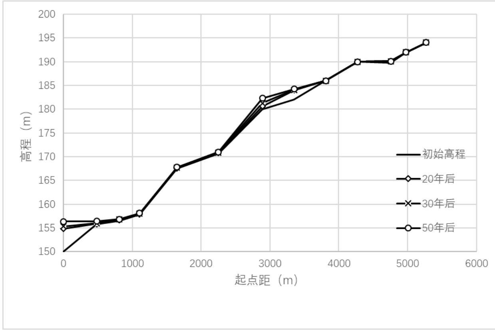  
图 4.7-1 塔岗水库淤积纵剖面(干流)  

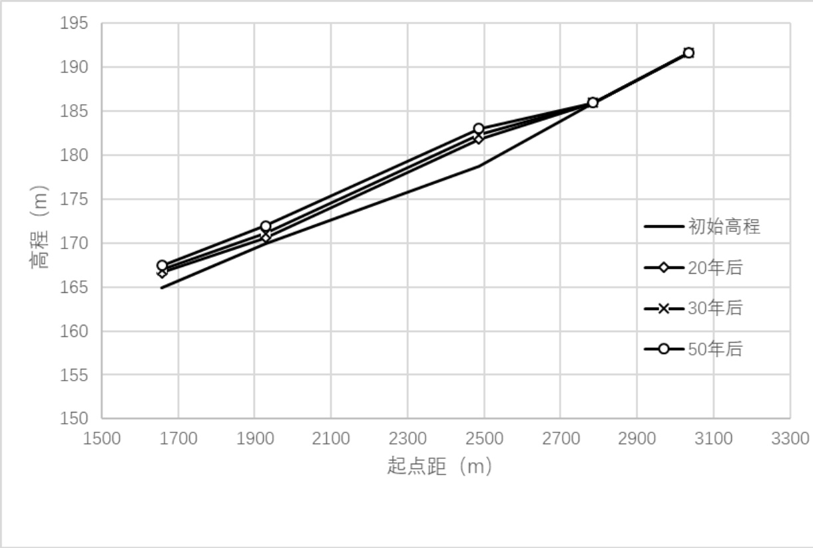  
图 4.7-2  塔岗水库淤积纵剖面(支流)  

表 4.7-6  塔岗水库淤积后库容曲线  

<html><body><table><tr><td rowspan="2">水位（m)</td><td colspan="4">库容（万m²)</td></tr><tr><td>天然</td><td>20年后</td><td>30年后</td><td>50年后</td></tr><tr><td>150</td><td>0</td><td>0</td><td>0</td><td>0</td></tr><tr><td>151</td><td>0.044</td><td>0</td><td>0</td><td>0</td></tr><tr><td>152</td><td>0.282</td><td>0</td><td>0</td><td>0</td></tr><tr><td>153</td><td>1.01</td><td>0</td><td>0</td><td>0</td></tr><tr><td>154</td><td>2.66</td><td>0</td><td>0</td><td>0</td></tr><tr><td>155</td><td>7.29</td><td>0.9</td><td>0</td><td>0</td></tr><tr><td>156</td><td>13.9</td><td>7.5</td><td>4.5</td><td>0</td></tr><tr><td>157</td><td>23.6</td><td>17</td><td>14</td><td>8.2</td></tr><tr><td>158</td><td>36.6</td><td>30</td><td>27</td><td>21</td></tr><tr><td>159</td><td>52.9</td><td>46</td><td>43</td><td>37</td></tr><tr><td>160</td><td>72.0</td><td>65</td><td>62</td><td>56</td></tr><tr><td>161</td><td>94.0</td><td>87</td><td>84</td><td>78</td></tr><tr><td>162</td><td>119</td><td>112</td><td>109</td><td>103</td></tr><tr><td>163</td><td>147</td><td>140</td><td>136</td><td>130</td></tr><tr><td>164</td><td>177</td><td>170</td><td>167</td><td>161</td></tr><tr><td>165</td><td>210</td><td>203</td><td>200</td><td>193</td></tr><tr><td>166</td><td>246</td><td>239</td><td>235</td><td>229</td></tr><tr><td>167</td><td>285</td><td>278</td><td>274</td><td>268</td></tr><tr><td>168</td><td>327</td><td>320</td><td>316</td><td>310</td></tr><tr><td>169</td><td>374</td><td>367</td><td>363</td><td>357</td></tr><tr><td>170</td><td>425</td><td>418</td><td>414</td><td>408</td></tr></table></body></html>  

<html><body><table><tr><td rowspan="2">水位(m)</td><td colspan="4">库容（万m²)</td></tr><tr><td>天然</td><td>20年后</td><td>30年后</td><td>50年后</td></tr><tr><td>171</td><td>480</td><td>473</td><td>469</td><td>462</td></tr><tr><td>172</td><td>539</td><td>532</td><td>528</td><td>520</td></tr><tr><td>173</td><td>603</td><td>596</td><td>592</td><td>584</td></tr><tr><td>174</td><td>672</td><td>664</td><td>660</td><td>652</td></tr><tr><td>175</td><td>743</td><td>736</td><td>732</td><td>724</td></tr><tr><td>176</td><td>818</td><td>811</td><td>807</td><td>798</td></tr><tr><td>177</td><td>898</td><td>891</td><td>887</td><td>879</td></tr><tr><td>178</td><td>983</td><td>976</td><td>971</td><td>963</td></tr><tr><td>179</td><td>1075</td><td>1067</td><td>1063</td><td>1054</td></tr><tr><td>180</td><td>1173</td><td>1166</td><td>1161</td><td>1153</td></tr><tr><td>181</td><td>1284</td><td>1271</td><td>1264</td><td>1256</td></tr><tr><td>182</td><td>1402</td><td>1387</td><td>1377</td><td>1363</td></tr><tr><td>183</td><td>1529</td><td>1510</td><td>1500</td><td>1482</td></tr><tr><td>184</td><td>1660</td><td>1640</td><td>1629</td><td>1609</td></tr><tr><td>185</td><td>1798</td><td>1777</td><td>1767</td><td>1747</td></tr><tr><td>186</td><td>1940</td><td>1920</td><td>1910</td><td>1890</td></tr><tr><td>187</td><td>2090</td><td>2070</td><td>2060</td><td>2040</td></tr><tr><td>188</td><td>2245</td><td>2225</td><td>2214</td><td>2194</td></tr><tr><td>189</td><td>2408</td><td>2388</td><td>2377</td><td>2357</td></tr><tr><td>190</td><td>2576</td><td>2556</td><td>2545</td><td>2525</td></tr></table></body></html>  

# 4.7.4 洪水调节计算  

(1)计算依据  

1)水库设计洪水标准  

塔岗水库总库容 6787 万 $\mathsf{m}^{3}$ ,根据《防洪标准》(GB50201-2014),本工程等别为 III 等,工程规模为中型。设计洪水标准为 $\%$ (100 年一遇),校核洪水标准为 $\mathsf{P}{=}0.05\%$ (2000 年一遇)。  

# 2)起调水位  

洪水调节计算的起调水位为汛期限制水位 $184\mathrm{m}$ 。  

# 3)设计洪水过程线  

塔岗水库坝址 5 年一遇洪峰流量为 $722\mathrm{m}^{3}/\mathsf{s}$ ,10 年一遇洪峰流量为 $1189\mathrm{m}^{3}/\mathsf{s}$ ,20 年一遇洪峰流量为 $1687\mathsf{m}^{3}/\mathsf{s}$ ,50 年一遇洪峰流量为 $2357\mathsf{m}^{3}/\mathsf{s}$ ,100 年一遇洪峰流量为 ${2904\mathrm{m}^{3}}/{\mathsf{s}}$ ,2000 年一遇洪峰流量为 $5330\mathrm{m}^{3}/\mathsf{s}$ 。塔岗水库设计入库洪水过程线见图 4.7-2。  

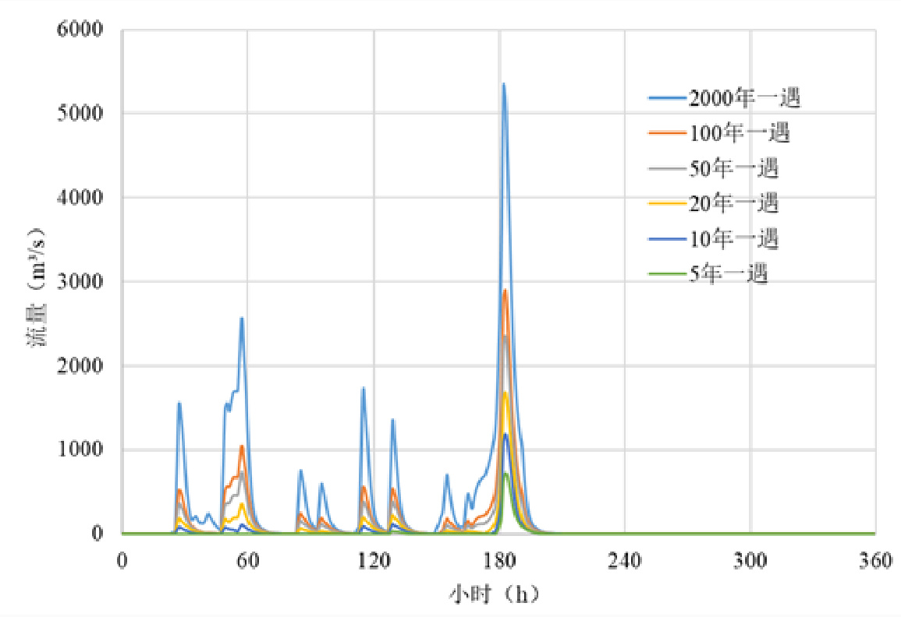  
图 4.7-2  塔岗水库入库洪水过程线  

# 4)库容曲线  

调洪计算采用淤积 50 年库容曲线,见表 4.7-6。  

# 5)泄流曲线  

塔岗水库共设 2 个泄洪底孔,采用短有压坝身泄水孔型式,进口设置一道事故检修闸门,孔口尺寸为 $2.5{\times}3.5{\mathrm m}$ (宽 $\times$ 高),出口设置弧形工作闸门,孔口尺寸为$3.5{\times}4.0m$ (宽 $\times$ 高),进口底板高程 $156.00\mathsf{m}\circ3$ 个溢流表孔,表孔单孔净宽 $12.0\mathrm{m}$ ,总净宽 $36.0\mathsf{m}$ ,堰顶高程 $192.0\mathrm{m}$ ,采用WES 溢流坝面,堰上安装弧形工作闸门。塔岗水库泄洪建筑物泄流曲线见表 4.7-7。  

表 4.7-7 塔岗水库工程泄流曲线  

<html><body><table><tr><td rowspan="2">水位 （m)</td><td colspan="3">泄流能力（m/s)</td></tr><tr><td>底孔</td><td>表孔</td><td>合计</td></tr><tr><td>156</td><td>0</td><td></td><td>0</td></tr><tr><td>157</td><td>7</td><td></td><td>7</td></tr><tr><td>158</td><td>22</td><td></td><td>22</td></tr><tr><td>159</td><td>42</td><td></td><td>42</td></tr><tr><td>184</td><td>299</td><td></td><td>299</td></tr><tr><td>185</td><td>305</td><td></td><td>305</td></tr><tr><td>186</td><td>310</td><td></td><td>310</td></tr><tr><td>187</td><td>316</td><td></td><td>316</td></tr></table></body></html>  

<html><body><table><tr><td rowspan="2">水位(m)</td><td colspan="3">泄流能力(m3/s)</td></tr><tr><td>底孔</td><td>表孔</td><td>合计</td></tr><tr><td>188</td><td>321</td><td></td><td>321</td></tr><tr><td>189</td><td>326</td><td></td><td>326</td></tr><tr><td>190</td><td>331</td><td></td><td>331</td></tr><tr><td>191</td><td>337</td><td></td><td>337</td></tr><tr><td>192</td><td>342</td><td>0</td><td>342</td></tr><tr><td>193</td><td>346</td><td>56</td><td>402</td></tr><tr><td>194</td><td>351</td><td>161</td><td>513</td></tr><tr><td>195</td><td>356</td><td>304</td><td>660</td></tr><tr><td>196</td><td>361</td><td>481</td><td>842</td></tr><tr><td>197</td><td>365</td><td>689</td><td>1055</td></tr><tr><td>198</td><td>370</td><td>929</td><td>1299</td></tr><tr><td>199</td><td>375</td><td>1199</td><td>1573</td></tr><tr><td>200</td><td>379</td><td>1495</td><td>1874</td></tr><tr><td>201</td><td>384</td><td>1818</td><td>2201</td></tr><tr><td>202</td><td>388</td><td>2167</td><td>2555</td></tr><tr><td>203</td><td>392</td><td>2537</td><td>2929</td></tr><tr><td>204</td><td>397</td><td>2927</td><td>3323</td></tr><tr><td>205</td><td>401</td><td>3337</td><td>3737</td></tr><tr><td>206</td><td>405</td><td>3766</td><td>4171</td></tr><tr><td>207</td><td>409</td><td>4213</td><td>4622</td></tr><tr><td>208</td><td>413</td><td>4669</td><td>5082</td></tr><tr><td>209</td><td>417</td><td>5135</td><td>5552</td></tr><tr><td>210</td><td>421</td><td>5618</td><td>6039</td></tr><tr><td>211</td><td>425</td><td>6097</td><td>6523</td></tr><tr><td>212</td><td>429</td><td>6585</td><td>7014</td></tr><tr><td>213</td><td>433</td><td>7085</td><td>7518</td></tr><tr><td>214</td><td>437</td><td>7597</td><td>8034</td></tr><tr><td>215</td><td>441</td><td>8121</td><td>8562</td></tr></table></body></html>  

(2)计算方案  

根据淹没赔偿标准和水库设计要求,本次对 $\scriptstyle\mathsf{P}=20\%$ 、 $\scriptstyle\mathsf{P}=5\%$ 、 $\%$ 、 $\scriptstyle\mathsf{P}=2\%$ 、$\%$ 、 $\mathsf{P}{=}0.05\%$ 六个洪水频率进行调洪计算。  

(3)调洪计算原则及方法  

# 1)计算原则  

塔岗水库汛限水位为 $184\mathrm{m}$ ,当水库水位低于 191.20m 时,入库流量小于  

$80\mathsf{m}^{3}/\mathsf{s}$ ,按照来水下泄,入库流量大于 $80\mathsf{m}^{3}/\mathsf{s}$ ,按照 $80\mathsf{m}^{3}/\mathsf{s}$ 下泄;水库水位超过191. $.20\mathsf{m}$ 、低于 $195.65\mathrm{m}$ 时,按照 $120\mathsf{m}^{3}/\mathsf{s}$ 下泄;水库水位超过 $195.65\mathrm{m}$ 、低于$201.32\mathrm{m}$ 时,按照 $100m^{3}/{\mathsf s}$ 下泄;水库水位超过 $201.32\mathrm{m}$ 、低于 207.51m 时,按照 $520\mathsf{m}^{3}/\mathsf{s}$ 下泄;水位超过 $207.51\ensuremath{\mathrm{m}}$ 时,水库敞泄。  

# 2)计算方法  

调洪计算原理是根据水量平衡,时段入库水量减时段出库水量等于时段水库蓄水变化量。采用静库容调洪,利用列表试算法进行洪水调节计算。  

# (4)计算成果  

根据上述所确定的原则及方法进行了洪水调节计算。塔岗水库 5 年一遇洪水坝前最高水位为 191.20m;10 年一遇洪水坝前最高水位为 $195.65\mathrm{m}$ ;20 年一遇洪水坝前最高水位为 201.32m;50 年一遇洪水坝前最高水位为 $207.51\ensuremath{\mathrm{m}}$ ;100 年一遇(设计标准)洪水坝前最高水位为 $207.51\ensuremath{\mathrm{m}}$ ;2000 年一遇(校核标准)洪水坝前最高水位为 $207.94\mathrm{m}$ 。  

表 4.7-8 塔岗水库洪水调节计算成果  

<html><body><table><tr><td>洪水频率</td><td>入库洪峰流量 (m3/s)</td><td>最大下泄流量 (m3/s)</td><td>坝前最高 水位（m)</td><td>原始库容 (eW)</td></tr><tr><td>P=20%</td><td>722</td><td>80</td><td>191.20</td><td>2792</td></tr><tr><td>P=10%</td><td>1189</td><td>120</td><td>195.65</td><td>3681</td></tr><tr><td>P=5%</td><td>1687</td><td>120</td><td>201.32</td><td>4992</td></tr><tr><td>P=2%</td><td>2357</td><td>520</td><td>207.51</td><td>6662</td></tr><tr><td>P=1%（设计洪水)</td><td>2904</td><td>2904</td><td>207.51</td><td>6662</td></tr><tr><td>P=0.05%（校核洪水）</td><td>5330</td><td>5053</td><td>207.94</td><td>6787</td></tr></table></body></html>  

# 4.7.5 回水计算  

为了确定水库回水末端,分析水库建设对坝址以上两岸居民、农田等的影响,为水库淹没处理提供淹没范围等基础资料,需要计算塔岗水库工程库区天然河道水面线和水库回水曲线。  

# (1)基本资料  

# 1)河道资料  

库区在坝址以上沿沧河干流共布置了 34 个断面,在 3 条支流上共布置了 29 个断面,断面位置见图 4.7-3。水库回水水面线计算采用淤积 20 年河道淤积断面,天然水面线计算采用天然河道断面数据。  

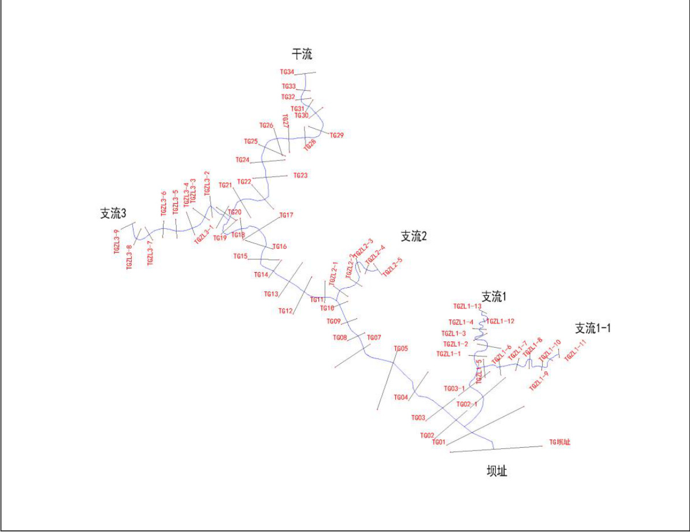  
图 4.7-3  塔岗水库库区断面位置示意图  

# 2)河段糙率  

根据现场调查塔岗水库坝址所处河段河道组成情况,河床主要由砾石或卵石组成,两岸分布有杂草、杂树,库区河道无糙率实测资料,参考《水力计算手册》中天然河道糙率表,综合确定水位流量关系计算中河道综合糙率 n 值取值为 0.05。库区河道淤积后河底床面组成细化,糙率有所降低,干流淤积断面糙率采用 $0.035\sim$ 0.05,未淤积断面糙率采用 0.05;支流淤积断面糙率采用 0.045,未淤积断面糙率采用 0.05。  

# 3)计算选用流量  

各频率洪水回水计算流量采用相应的洪峰流量,正常运行情况取多年平均流量,根据水文篇章,各干、支流计算流量详见表 4.7-10。  

表 4.7-10 回水计算流量表  

<html><body><table><tr><td rowspan="2">序号</td><td rowspan="2">断面</td><td colspan="5">各频率（%）设计洪峰流量（m3/s)</td></tr><tr><td>多年平均</td><td>P=1%</td><td>P=2%</td><td>P=5%</td><td>P=20%</td></tr><tr><td>1</td><td>支流3汇入前干流</td><td>0.67</td><td>2686</td><td>2259</td><td>1704</td><td>877</td></tr><tr><td>2</td><td>支流3入河口</td><td>0.10</td><td>512</td><td>446</td><td>345</td><td>195</td></tr><tr><td>3</td><td>支流2汇入前干流</td><td>0.79</td><td>3130</td><td>2632</td><td>1985</td><td>1021</td></tr><tr><td>4</td><td>支流2入河口</td><td>0.03</td><td>171</td><td>149</td><td>115</td><td>65.7</td></tr></table></body></html>  

<html><body><table><tr><td rowspan="2">序号</td><td rowspan="2">断面</td><td colspan="5">各频率（%）设计洪峰流量（m3/s)</td></tr><tr><td>多年平均</td><td>P=1%</td><td>P=2%</td><td>P=5%</td><td>P=20%</td></tr><tr><td>5</td><td>支流2汇入前干流</td><td>0.86</td><td>3396</td><td>2842</td><td>2086</td><td>1025</td></tr><tr><td>9</td><td>支流1分叉口1</td><td>0.03</td><td>162</td><td>142</td><td>110</td><td>62.8</td></tr><tr><td>7</td><td>支流1分叉口2</td><td>0.01</td><td>105</td><td>87.9</td><td>71.5</td><td>41.1</td></tr><tr><td>8</td><td>支流1入河口</td><td>0.04</td><td>264</td><td>232</td><td>179</td><td>102.7</td></tr><tr><td>9</td><td>坝址</td><td>0.93</td><td>3541</td><td>2916</td><td>2171</td><td>1030</td></tr></table></body></html>  

# 4)计算起始水位  

天然情况根据塔岗水库坝址的水位流量关系,由计算流量在水位流量关系曲线上查得相应水位为河道起始水位。  

水库水面线推算的起始水位采用相应的坝前最高水位,即:正常运行情况下的起始水位采用正常蓄水位;对于 $\%$ , $\scriptstyle\mathsf{P}=2\%$ , $\scriptstyle\mathsf{P}=5\%$ , $\scriptstyle\mathsf{P}=20\%$ 频率洪水情况起始水位采用相应方案调洪成果中的最高洪水位。水库回水水面线推算的起始水位见表 4.7-11。  

表 4.7-11 方案起始水位表  

<html><body><table><tr><td>计算方案</td><td>多年平均</td><td>P=1%</td><td>P=2%</td><td>P=5%</td><td>P=20%</td></tr><tr><td>天然水位（m)</td><td>146.89</td><td>153.39</td><td>152.91</td><td>152.14</td><td>150.37</td></tr><tr><td>回水水位（m)</td><td>187</td><td>212.57</td><td>212.11</td><td>204.90</td><td>193.73</td></tr></table></body></html>  

# (2)计算方案  

根据《水利水电工程建设征地移民安置规划设计规范》(SL290-2009),确定库区淹没范围的设计洪水标准如下:  

1)林地、草地,未利用地:正常运行情况;  
2)耕地和园地:5 年一遇洪水( $\scriptstyle\mathsf{P}=20\%$ );  
3)居民点:20 年一遇洪水( $\mathtt{P}{=}5\%$ );  
4)省道:50 年一遇洪水( $P=2\%$ );  
5)国家级文物:100 年一遇洪水( $\pounds=1\%,$ )。  
(3)计算方法  

天然河道水面线和库区回水水面线的计算,采用恒定非均匀流方法,用伯努力方程自下而上逐段河道计算,计算公式为:  

$$
z_{\mathrm{{\scriptscriptstyleE}}}=z_{\mathrm{{\scriptscriptstyleF}}}+\frac{\alpha_{\mathrm{{\scriptscriptstyleF}}}\nu_{\mathrm{{\scriptscriptstyleF}}}^{2}}{2g}{-}\frac{\alpha_{\mathrm{{\scriptscriptstyleE}}}\nu_{\mathrm{{\scriptscriptstyleE}}}^{2}}{2g}{+}h_{{+}}+h_{j}
$$  

式中:z 上,v 上——分别为河段上游断面的水位和流速;z 下,v 下——分别为河段下游断面的水位和流速;α 上,α 下——分别为上下游断面动能修正系数,取 α 上 $\boldsymbol{\underline{{\underline{{\mathbf{\Pi}}}\mathbf{\delta\mathbf{a}}}}}$ 下 $=1.0$ ;hf,hj——分别为河段两断面间沿程水头损失和局部水头损失,局部水头损失考虑断面扩大的影响,计算公式为: $\mathsf{h j}=\left(\mathsf{v}$ 上- $\mathbf{\nabla}\cdot\mathbf{V}$ 下)2/2g,参数同上。  

# (4)回水计算成果  

塔岗水库工程正常蓄水位 $184\mathrm{m}$ ,各干、支流天然水面线、回水水面线计算成果见表 $4.7{-}12{\sim}16$ 。回水成果图见图 $4.7{-}4{\sim}8$ 。  

100 年一遇水库干流回水末端位于断面 TG11,距坝址 3.94km 处,水库回水末端水位为 $209.17\mathrm{m}$ ;50 年一遇水库干流回水末端位于断面 TG12,距坝址 4.30km处,水库回水末端水位为 $210.20\mathrm{m}$ ;20 年一遇水库干流回水末端位于断面 TG10,距坝址 3.65km 处,水库回水末端水位为 $203.60\mathrm{m}$ ;5 年一遇水库干流回水末端位于断面 TG05-9,距坝址 2.77km 处,水库回水末端水位为 $193.09\mathrm{m}$ ;正常运行情况下,水库干流回水末端位于断面 TG05-7,距坝址 2.65km 处,水库回水末端水位为 $184.50\mathrm{m}$ 。  

100 年一遇、50 年一遇水库支流 1 回水末端均位于断面 TGZL1-4.2,距起始断面 2.97km 处,水库回水末端水位分别为 207.74m、207.58m;20 年一遇水库支流 1 回水末端位于断面 TGZL1-3.7,距起始断面 2.83km 处,水库回水末端水位为201.38m;5 年一遇水库支流 1 回水末端位于断面 TGZL1-2.7,距起始断面 2.55km处,水库回水末端水位为 $191.37\mathrm{m}$ ;正常运行情况下,水库支流 1 回水末端位于断面 TGZL1-1.9,距起始断面 $2.34\mathsf{k m}$ 处,水库回水末端水位为 $185.56\mathrm{m}$ 。  

100 年一遇、50 年一遇水库支流 1-1 回水末端均位于断面 TGZL1-7.8,距起始断面 2.76km 处,水库回水末端水位分别为 208.01m、 $207.84\mathrm{m}$ ;20 年一遇水库支流 1-1 回水末端位于断面 TGZL1-7.3,距起始断面 2.62km 处,水库回水末端水位为 201.82m;5 年一遇水库支流 1-1 回水末端位于断面 TGZL1-6.1,距起始断面2.27km 处,水库回水末端水位为 191.22m;正常运行情况下,水库支流 1-1 回水末端位于断面 TGZL1-6,距起始断面 2.24km 处,水库回水末端水位为 $188.85\mathrm{m}$ 。  

# 4.8 水库调度运用  

# 4.8.1 防洪调度  

塔岗水库汛限水位为 $184\mathrm{m}$ ,当水库水位低于 191.20m 时,入库流量小于$80\mathsf{m}^{3}/\mathsf{s}$ ,按照来水下泄,入库流量大于 $80\mathsf{m}^{3}/\mathsf{s}$ ,按照 $80\mathsf{m}^{3}/\mathsf{s}$ 下泄;水库水位超过191.20m、低于 $195.65\mathrm{m}$ 时,按照 $120\mathsf{m}^{3}/\mathsf{s}$ 下泄;水库水位超过 $195.65\mathrm{m}$ 、低于$201.32\mathrm{m}$ 时,按照 $100m^{3}/{\mathsf s}$ 下泄;水库水位超过 $201.32\mathrm{m}$ 、低于 207.51m 时,按照 $520\mathsf{m}^{3}/\mathsf{s}$ 下泄;水位超过 $207.51\ensuremath{\mathrm{m}}$ 时,水库敞泄。  

# 4.8.2 生态调度  

生态流量下放原则:非汛期(10 月\~次年 5 月)下放多年平均流量的 $10\%$ ( $(0.09\mathfrak{m}^{3}/\mathsf{s})$ );在汛期(6 月 ${\sim}9$ 月)按多年平均流量的 $30\%$ ( $(0.28\mathsf{m}^{3}/\mathsf{s})$ )。若天然来水不满足生态要求,则按天然来水下泄。  

# 4.8.3 供水调度  

水库在死水位和正常蓄水位之间运行,首先满足河道生态基流,其次满足供水、发电。当遭遇设计枯水年及其以外年份,供水量可适当减少,但水库水位不得低于正常运行最低水位 $174.51\ensuremath{\mathrm{m}}$ ;当水位高于正常蓄水位 $184\mathrm{m}$ 时,产生弃水。  

# 4.9 推荐方案工程特性表  

塔岗水库工程规模指标表详见表 4.9-1。  

表 4.9-1 塔岗水库工程规模指标表  

<html><body><table><tr><td colspan="2">项目</td><td>单位</td><td>指标</td></tr><tr><td rowspan="9">特征 水位</td><td>死水位</td><td>m</td><td>160.00</td></tr><tr><td>正常运行最低水位</td><td>m</td><td>174.51</td></tr><tr><td>正常蓄水位</td><td>m</td><td>184</td></tr><tr><td>汛限水位</td><td>m</td><td>184</td></tr><tr><td>5 年一遇洪水位（P=20%)</td><td>m</td><td>191.20</td></tr><tr><td>10 年一遇洪水位（P=10%)</td><td>m</td><td>195.65</td></tr><tr><td>20 年一遇洪水位（P=5%)</td><td>m</td><td>201.32</td></tr><tr><td>防洪高水位（P=2%)</td><td>m</td><td>207.51</td></tr><tr><td>设计洪水位（P=1%)</td><td>m</td><td>207.51</td></tr></table></body></html>  

<html><body><table><tr><td colspan="2">项目</td><td>单位</td><td>指标</td></tr><tr><td></td><td>校核洪水位（P=0.05%)</td><td>m</td><td>207.94</td></tr><tr><td rowspan="4">特征 库容</td><td>总库容</td><td>万m3</td><td>6787</td></tr><tr><td>防洪库容</td><td>万m3</td><td>5001</td></tr><tr><td>正常蓄水位相应原始库容</td><td>万m3</td><td>1662</td></tr><tr><td>死库容</td><td>万m3</td><td>72</td></tr><tr><td>出库供水量</td><td>灌溉供水量</td><td>万m3</td><td>574</td></tr></table></body></html>  

# 第五章 节水评价  

审  查: 王以圣校  核: 张忠广编  写: 华  悦  

# 目 录  

第五章  节水评价  

5.1 项目概况. 1  
5.1.1 建设项目基本情况  
5.1.2 节水评价范围 1  
5.2 现状供用水节水水平评价. 1  
5.2.1 现状用水量与用水水平评价 1  
5.2.2 现状供水量与供水水平评价 2  
5.3 农业节水潜力分析 . . 2  
5.4节水目标与指标 2  
5.4.1 相关规划提出的主要节水目标 2  
5.4.2 节水指标 . 3  
5.5 水资源配置方案节水符合性分析 3  
5.5.1 需水预测成果节水符合性分析 3  
5.5.2 可供水量预测成果节水符合性分析 4  
5.5.3 水资源配置方案节水符合性分析. 4  
5.7 节水措施方案及节水效果评价 5  
5.7.1 节水措施方案 . 5  
5.7.2 节水效果评价 7  
5.8 主要结论及建议 7  
5.8.1 主要结论 7  
5.8.2 建议 8  

# 第五章 节水评价  

# 5.1 项目概况  

# 5.1.1 建设项目基本情况  

塔岗水库位于沧河出山口处,坝址坐落于狮豹头乡塔岗村附近。塔岗水库工程任务以防洪、灌溉为主,结合卫辉市南水北调受水区备用供水,兼顾发电。水库总库容6787万 $\mathsf{m}^{3}$ ,汛限水位 $184\mathrm{m}$ ,防洪高水位 $207.51\ensuremath{\mathrm{m}}$ ,正常蓄水位 $184\mathrm{m}$ ,正常运行最低水位水位 $174.51\ensuremath{\mathrm{m}}$ ,死水位 $160\mathrm{m}$ ,死库容 72 万 $\mathsf{m}^{3}$ ,备用库容636 万 $\mathsf{m}^{3}$ ,防洪库容 5001 万 $\mathsf{m}^{3}$ ,兴利库容 952 万 $\mathsf{m}^{3}$ 。  

塔岗水库主要防洪保护对象为坝址下游沧河两岸的村镇和耕地,同时可减轻下游良相坡等蓄滞洪区的进洪量和启用几率,对南水北调中线、京广铁路、京港澳高速公路、高速铁路等一系列重要区域和基础设施的防洪有积极作用。水库多年平均供水量 574 万 $\mathsf{m}^{3}$ ,装机容量 0.6MW,多年平均发电量 90.9 万 $k W\cdot\mathsf{h}$ 。  

# 5.1.2 节水评价范围  

塔岗水库工程任务以防洪、灌溉为主,结合卫辉市南水北调受水区备用供水,兼顾发电。灌溉范围为沧河灌区,设计灌溉面积 5 万亩;经复核,由于塔岗水库无增加供水能力,不新增村镇供水任务,仅作为卫辉市备用水源,备用供水范围为卫辉市。  

按照水利部印发的《水利建设项目节水评价编制规程》(SL/T 834—2014)要求,节水评价范围应包括水资源开发利用建设项目的供水区域,必要时宜结合工程的规划范围适当扩大节水评价范围。确定本工程节水评价范围为卫辉市。  

# 5.2 现状供用水节水水平评价  

# 5.2.1 现状用水量与用水水平评价  

根据《2023 年河南省水资源公报》,农田灌溉亩均用水量 $151\mathsf{m}^{3}$ ,新乡市2023 年农田灌溉亩均用水量 $179\mathsf{m}^{3}$ 。  

根据《2023 年新乡市水资源公报》,卫辉市 2023 年用水总量 8911 万 $\mathsf{m}^{3}$ ,其中农业用水量 5911 万 $\mathsf{m}^{3}$ ,生活用水量 1598 万 $\mathsf{m}^{3}$  

现状年 2023 年沧河灌区塔岗片区用水量 1236 万 $\mathsf{m}^{3}$ 。塔岗灌区农田实灌亩均用水量为 $247\mathrm{m}^{3}/$ 亩。研究范围沧河灌区农田灌溉亩均用水量高于全省和新乡市平均值。  

# 5.2.2 现状供水量与供水水平评价  

卫辉市主要供水工程有地表水供水工程和地下水供水工程。本次水资源现状调查以相关普查数据为基础,调查统计评价范围内以上两类供水工程的数量,以反映供水设施的现状情况。  

据统计,沧河灌区位于卫辉市西北部太行山的浅山及山前丘陵区,始建于二十世纪五十年代中,大规模建设于六、七十年代。沧河灌区为中型灌区,总耕地面积 14.5 万亩,设计灌溉面积 11.2 万亩,水源为沧河和香泉河上的三座中型水库和一座小(一)型水库以及地下水。现状沧河灌区范围内有 398 眼灌溉机井,分布于各村,井深 $80{\sim}150\mathrm{m}$ ,出水量 $20{\sim}30\mathsf{m}^{3}/\mathsf{s}$ 。采用水泵提水接软管至田间进行灌溉。灌溉机井灌溉期年可提水量 1532.30 万 $\mathsf{m}^{3}$ ,地下水取水许可 1860万 $\mathsf{m}^{3}$ ,其中塔岗灌片地下水可取水量 920.9 万 $\mathsf{m}^{3}$ 。  

现状年沧河灌区塔岗片区供水量 1078 万 $\mathsf{m}^{3}$ ,其中水库供水量 658 万 $\mathsf{m}^{3}$ ,地下水供水量 40 万 $\mathsf{m}^{3}$ ,水库供水量和地下水供水量均低于取水许可中可取水量。  

# 5.3 农业节水潜力分析  

现状沧河灌区塔岗片区农田实灌亩均用水量为 $247\mathrm{m}^{3}/$ 亩(毛灌溉亩均用水),据设计水平年灌区作物种植面积、灌溉定额及灌溉水利用系数计算灌区需水量。按照以水定地、节水优先的原则,沧河灌区塔岗水库灌溉范围设计水平年灌溉面积5 万亩,多年平均亩均净用量为 $178\mathrm{m}^{3}/$ 亩,沧河灌区内塔岗干渠片区已于2023年进行了衬砌或更换塑料管道,灌溉水利用系数已达到 0.72,农业基本无节水潜力。  

# 5.4 节水目标与指标  

# 5.4.1 相关规划提出的主要节水目标  

根据《全国水资源综合规划》,到 2030 年,全国用水总量力争控制在 7000亿 $\mathsf{m}^{3}$ 以内;万元国内生产总值、万元工业增加值用水量分别降低到 $70\mathsf{m}^{3},40\mathsf{m}^{3}$ ;农田灌溉水有效利用系数提高到 0.6。  

根据水利部 2014 年编制完成的《全国现代灌溉发展规划(2012\~2020 年)》,基准年,全国灌溉面积 10.02 亿亩左右,其中农田有效灌溉面积 9.22 亿亩左右,节水灌溉工程面积3.71 亿亩,节水灌溉率为 $37\%$ ,农田灌溉水利用系数为0.51;到 2030 年,全国灌溉面积达到 11.40 亿亩左右,其中农田有效灌溉面积达到10.30 亿亩左右,节水灌溉工程面积达到 8.5 亿亩左右,节水灌溉率达到 $74\%$ 左右,农田灌溉水利用系数提高到 0.6 以上。  

根据国家发改委 2021 年发布的《节水型社会建设“十四五”规划》,到 2025年全国用水总量控制在 6400 亿 $\mathsf{m}^{3}$ 以内,非常规水源利用量显著提升;农田灌溉水有效利用系数提高到 0.58 以上,城市公共管网漏损率降低至 $9\%$ 以下。  

根据《河南省“十四五”水安全保障和水生态环境保护规划》,全省用水总量控制在 292.47 亿 $\mathsf{m}^{3}$ 以内,农田灌溉水有效利用系数提高到 0.630,水资源配臵工程体系更加完善,新增供水能力17.0 亿 $\mathsf{m}^{3}$ ,省辖市基本建成应急备用水源,农村自来水普及率达到 $93\%$ ,耕地灌溉面积达到 8100 万亩。  

# 5.4.2 节水指标  

农田灌溉水有效利用系数要按照灌区面积(大中小型)和灌溉方式(井灌、喷微、滴灌)的不同,符合 GB/T 50363《节水灌溉工程技术标准》、水利部印发的灌溉定额标准、河南省灌溉定额标准要求。  

现状年沧河灌区塔岗片区已实施节水改造,现状灌溉水利用系数已达到0.72,已达到相关规划及规范提出的要求,节水指标具有较好的可达性。  

# 5.5 水资源配置方案节水符合性分析  

# 5.5.1 需水预测成果节水符合性分析  

# 5.5.1.1 需水量  

经分析预测,设计水平年 2035 年塔岗水库灌溉范围多年平均毛需水量为1236 万 $\mathsf{m}^{3}$ , $50\%$ 年毛需水量为 1220 万 $\mathsf{m}^{3}$ , $75\%$ 年毛需水量为 1363 万 $\mathsf{m}^{3}$ 。  

# 5.5.1.2 需水预测成果节水符合性分析  

(4)农业用水合理性分析  

1)主要作物灌溉定额合理性分析  

根据沧河灌区现状灌溉制度并参考相关规划,结合《河南省农业与农村生活用水定额》(DB41T 958-2020),确定了主要作物灌溉制度。综合分析,本次灌溉制度设计采用的计算方法、基本资料符合规范要求,是合理的。  

灌溉定额与《河南省农业与农村生活用水定额》(DB41T958-2020)中的成果相符合,也是合理的。  

# 2)灌溉节水性分析  

根据《灌溉与排水工程设计标准》(GB50288-2018),灌溉面积介于1万亩和 30 万亩之间的灌区,渠系水利用系数不低于 0.6。考虑当地沧河灌区塔岗片区已于 2023 年实施节水改造,综合灌溉水利用系数已达到 0.72,近期再改造可能性不大,因此设计水平年灌溉系数仍采用 0.72。符合相应技术规范与标准,是合理的。  

# 5.5.2 可供水量预测成果节水符合性分析  

根据《河南省卫辉市沧河灌区续建配套与节水改造项目可研报告》,沧河灌区内水源分为地表水和地下水,地表水来源主要为沧河上的 3 座水库及香河上的香河水库。根据取水许可证(许可证号:C410781S2021-0061),灌区可用水库水量 1800 万 $\mathsf{m}^{3}$ ,其中塔岗水库取水指标 700 万 $\mathsf{m}^{3}$ 。现状灌区范围内有 398眼灌溉机井,分布于各村,井深 $80{\sim}150\mathrm{m}$ ,出水量 $20{\sim}30\mathsf{m}^{3}/\mathsf{s}$ ,采用水泵提水接软管至田间进行灌溉,灌溉机井灌溉期年可提水量 1532.3 万 $\mathsf{m}^{3}$ 。根据取水许可,地下水可供水量1860 万 $\mathsf{m}^{3}$ ,其中塔岗水库灌溉范围内地下水可供水量920.9万 $\mathsf{m}^{3}$ 。  

塔岗水库水资源的开发利用应当以维持河流健康要求的生态环境需水为基础,在保障河道内生态用水的前提下进行,计算工程的可供水量。塔岗水库的生态基流取值为:水库丰水期(6 月\~9 月)按坝址多年平均流量的 $30\%$ 下放生态流量,枯水期(10 月\~5 月)下放生态流量为址多年平均流量的 $10\%$ 和 $\scriptstyle\mathsf{P}=\mathtt{g}_{0}\%$ 最枯月流量两者中较大值。生态水量取值符合《河湖生态环境需水计算规范》(SLZ712-2014)要求。  

塔岗水库在计算工程可供水量时,优先保证下游生态基流的下泄,在此基础上,沧河灌区塔岗片区灌溉供水保证率能达到 $75\%$ ,多年平均总供水量为 574万 $\mathsf{m}^{3}$ ,水库可供水量计算方法和成果是合理的。塔岗水库断面水资源开发利用率 $55.39\%$ ,水资源开发利用率在合理的范围之内。  

塔岗水库基本满足取水许可要求,是合理的。  

# 5.5.3 水资源配置方案节水符合性分析  

# 5.5.3.1 水资源配置方案  

设计水平年 2035 年,塔岗水库多年平均出库供水量为 574 万 $\mathsf{m}^{3}$ ,地下水供水量 515 万 $\mathsf{m}^{3}$ ,供沧河灌区塔岗片区用水。水资源配置方案详见表 5.5-6。  

表 5.5-6  塔岗水库受水区水资源配置方案 单位:万 $\mathsf{m}^{3}$   

<html><body><table><tr><td rowspan="2">月份</td><td rowspan="2">需水量</td><td colspan="2">供水量</td><td rowspan="2">缺水量</td></tr><tr><td>塔岗水库</td><td>地下水</td></tr><tr><td>1</td><td>0</td><td>0</td><td>0</td><td>0</td></tr><tr><td>2</td><td>0</td><td>0</td><td>0</td><td>0</td></tr><tr><td>3</td><td>270</td><td>149</td><td>95</td><td>25</td></tr><tr><td>4</td><td>243</td><td>76</td><td>129</td><td>38</td></tr><tr><td>5</td><td>33</td><td>17</td><td>13</td><td>4</td></tr><tr><td>9</td><td>270</td><td>81</td><td>163</td><td>26</td></tr><tr><td>7</td><td>0</td><td>0</td><td>0</td><td>0</td></tr><tr><td>8</td><td>235</td><td>134</td><td>64</td><td>38</td></tr><tr><td>9</td><td>0</td><td>0</td><td>0</td><td>0</td></tr><tr><td>10</td><td>0</td><td>0</td><td>0</td><td>0</td></tr><tr><td>11</td><td>184</td><td>117</td><td>51</td><td>16</td></tr><tr><td>12</td><td>0</td><td>0</td><td>0</td><td>0</td></tr><tr><td>全年</td><td>1236</td><td>574</td><td>515</td><td>147</td></tr></table></body></html>  

# 5.5.3.2 水资源配置方案节水评价  

目前沧河灌区塔岗片区现状灌溉水源为塔岗水库和地下水,根据取水许可,塔岗水库取水指标 700 万 $\mathsf{m}^{3}$ ,地下水可供水量 920.9 万 $\mathsf{m}^{3}$ 。根据供需分析设计水平年 2035 年,现状供水水源水量能够满足该片区用水需求。因此设计水平年沧河灌区塔岗水库片区供水水源仍为塔岗水库和地下水。  

配置成果符合“以水定城、以水定地、以水定人、以水定产”的要求,塔岗水库受水区水资源配置方案充分考虑现有水利工程及在建、规划水利工程。设计水平年已充分考虑了现有水源的利用,体现了节水的要求,水资源配置方案合理。  

# 5.7 节水措施方案及节水效果评价  

# 5.7.1 节水措施方案  

# 5.7.1.1 工程措施  

(1)加大节水工程建设投资,更新改造城市供水管网,重点对一些年久老化、管内结垢和绣瘤已影响水质水压的管道,以及灰铸铁管、无内衬金属管、低压区管道,进行有计划有步骤的改造更换,减少渗漏,提高城镇供水效率,适当节水。  

(2)实行强制性节水用水措施与标准,完善国家鼓励类和淘汰类工业用水工艺、技术和设备目录。鼓励企业依靠科技进步,积极研发先进适用节水技术。大力推广高效用水工艺、高效冷却工艺、高效洗涤工艺、高效循环用水、污(废)  

水再生利用、高盐水资源化利用等节水工艺和技术,提高工业用水节水水平。  

(3)推广节水器具的使用,淘汰公共建筑中不符合节水标准的水嘴、便器水箱等生活用水器具。(4)加强城镇污水收集处理体系建设,新建污水处理厂,提高污水收集处理能力,加强中水回用。利用中水满足城镇绿地和道路浇洒用水需求,充分发挥再生水利用潜力。  

# 5.7.1.1 非工程措施  

(1)鼓励居民家庭选用节水器具,引导居民淘汰现有不符合节水标准的生活用水器具。加强服务业节水。合理限制高耗水服务业用水。大力推进节水型城市建设。制定节水型城市建设实施方案,加大规划调控指导力度,落实各部门目标、责任和任务期限。健全节水法规制度体系、推进实施节水统计等城市节水工作制度和措施,建立城市节水的数字化管理平台和社会参与机制。  

(2)按照推进供给侧结构性改革、化解过剩产能的总体部署,促进产业转型升级。严格实行用水定额管理,合理分配工业企业及项目的用水定额。  

(3)提高管理水平,优化水资源配置。完善取水许可证制度、水资源论证、调整水价、征收水资源费,贯彻水资源有偿使用、最严格水资源管理“三条红线”管理指标体系等措施,以推动节水工作的开展。  

加强各级节水管理机构和队伍建设,健全节水管理和服务体系。制定实施节水管理人员培训计划,全面提升节水管理队伍能力和素质。  

强化用水定额管理,建立用水单位重点监控体系,强化用水监控管理。新建、扩建和改建项目应制定节水措施方案与建设项目取水许可一并报批,保证节水设施与主体工程同时设计、同时施工、同时投入使用,并强化监督管理。  

(4)健全法律法规体系。全面贯彻实施《中华人民共和国水法》、《中华人民共和国水污染防治法》《建设项目水资源论证管理办法》《取水许可管理办法》《水功能区管理办法》等有关法规和办法,尽快制定和健全水资源论证和取水许可制度、水资源有偿使用制度、用水总量控制与定额管理等规章制度,建立完善现有的地方性法规,形成适应水利可持续发展的法规体系。此外,仍需加强水政监察规范化建设,强化水政执法队伍建设,提高执法人员素质,建立一支高效、公正、廉洁的水政执法队伍;进行水政执法能力和执法保障的基础建设,健全水政执法网络,提高水利执法水平,促进水利事业有序发展。  

(5)完善公共参与机制  

系统完善节水宣传、教育机制,提高公众节水意识,掌握日常节水技能,将节水渗透在日常生产、生活中。制定相应的激励措施,提高公众节水积极性。建立公开透明的公众参与机制,提升公众参与能力,保证公众有效参与各项节水工作的管理和监督,促进节水的社会化。结合实际情况,出台相应的公众参与机制建设方案。  

# (6)加强宣传教育,倡导节水文化  

节水型社会建设涉及全社会的多个行业和部门,关系到千家万户,要紧紧围绕节水型社会建设目标任务,持之以恒地开展多种形式的节水宣传活动,大力宣传节约用水的方针、政策、法规和科学知识,使广大公民认识节水是解决缺水问题最根本、最有效的措施,也是经济社会可持续发展的必然要求。继续开展“世界水日”、“中国水周”和“全国城市节水宣传周”等宣传活动,充分利用广播、电视、报刊、互联网等各种媒体,广泛宣传节水的重要性和必要性,使全民节水、惜水、保护水的意识普遍提高。努力培育广大群众的参与热情,促进全社会共同参与,在全社会营造“节水光荣,浪费可耻”的节水文化,为节水型社会建设营造良好的社会氛围,推动全社会积极参与节水型社会的建设。  

# (7)水价管理  

根据《关于卫辉市试行农业水价的通知》(卫发改(2025)14号)卫辉市农业灌溉水价实行分类、分档计价机制,并结合井灌区与渠灌区的差异制定具体标准。井灌区粮食作物水价 $0.2{\sim}0.4$ 元 $/\mathsf{m}^{3}$ ,渠灌区粮食作物水价 $0.14{\sim}0.28$ 元 $/\mathsf{m}^{3}$ 。  

水价管理配套措施:  

1)节水激励。通过价格杠杆引导农户减少超量用水,推广节水技术。2)水源置换与压采。结合地下水压采政策,优先使用公共供水替代自备井,降低对地下水的依赖。3)政策衔接。与农业水价综合改革结合,推动末级渠系维护和水权交易试点,提升用水效率。  

# 5.7.2 节水效果评价  

沧河灌区内塔岗干渠片区已于2023 年实施了沧河灌区续建配套与节水改造,灌溉水利用系数已达到 0.72。  

# 5.8 主要结论及建议  

# 5.8.1 主要结论  

(1)节水现状及节水潜力  

沧河灌区内塔岗干渠片区已于 2023 年进行了衬砌或更换塑料管道,灌溉水利用系数已达到 0.72,农业基本无节水潜力。  

(2)水资源配置方案节水符合性  

1)本次设计水平年 2035 年城镇生活用水定额、农业灌溉用水定额等指标符合河南省地方定额标准和相关规范要求。需水预测成果符合节水要求。  

2)可供水量预测成果节水符合性,分别从塔岗水库、地下水等方面进行了分析,可供水量预测充分考虑了河道内、外经济社会和生态发展需要,水源结构和水量符合最严格水资源管理制度要求。  

3)塔岗水库供水区水资源配置方案充分考虑了当地已建水源工程的挖潜,考虑了常规水源与备用水源的安排,满足水资源管理“三条红线”要求,体现了节水的要求。  

# 5.8.2 建议  

(1)控制好区域生活、生产用水总量,严格执行水资源管理“三条红线”;  

(2)积极推进供水管网的建设和节水改造,降低漏损率;  

(3)鼓励开发与使用新型节水技术,积极推广节水器具使用;  

(4)加强节水相关法律法规建设,加强节水宣传;  

(5)探索研究水价制度改革,完善水价调整机制。  

# 第六章 工程布置及建筑物  

# 审 定: 王永生  

审 查:郭西方 李新媛 赵立旺 张金洲 干 炜肖 璐 孙 想  

校 核:李晓超 赵 琳 王 明 赵海超 崔梦一李龙龙 林 晨 段志强  

编 写:金 月 董 康 赵 琳 陈 帅 文晓磊吴文辉 赵立鑫 高 茁 王秀丽 马建辉  

# 目 录  

第六章 工程布置及建筑物.  
6.1 设计依据.  
6.1.1 设计基本资料. 1  
6.1.2 设计依据的主要技术标准. . 15  
6.2 工程等级和标准. ..16  
6.2.1 工程等别和标准.. . 16  
6.2.2 建筑物级别.. . 17  
6.2.3 洪水标准. . 18  
6.2.4 地震烈度. . 18  
6.2.5 现行技术标准的主要设计允许值. . 18  
6.2.6 工程合理使用年限及耐久性. . 20  
6.3 坝址选择.. ..21  
6.3.1 选址原则. . 21  
6.3.2.建坝河段选择. . 22  
6.3.3 原坝址方案.. 24  
6.3.4 下坝址方案.. . 27  
6.3.6 坝址比选. . 29  
6.4 坝型选择. ..36  
6.4.1 原坝体加高可行性分析.. 36  
6.4.2 水库枢纽坝型选择. 46  
6.5 工程总布置.. ..59  
6.5.1 工程布置原则. .... 59  
6.5.2 工程总体布置. .... 59  
6.6 混合坝挡水建筑物设计.. ....61  
6.6.1 重力坝设计.. . 61  
6.6.2 黏土心墙堆石坝设计. . 75  
6.7 泄水建筑物.. .....85  
6.7.1 防洪调度运行方式. . 86  

6.7.2 泄流规模. . 86  
6.7.3 泄洪表孔结构型式. .. 87  
6.7.4 泄洪底孔结构型式. .. 87  
6.7.5 水力学计算... . 88  
6.7.6 消能建筑物设计. . 93  
6.8 引水建筑物. ..99  
6.8.1 建筑物布置及体形. . 99  
6.8.2 设计计算. . 100  
6.9 电站厂房工程. . 101  
6.10 边坡工程. . 101  
6.10.1 工程边坡地形地质条件. ... 102  
6.10.2 边坡开挖. .. 102  
6.10.3 边坡支护. . 102  
6.11 建筑环境和景观. ...103  
6.11.1 建筑设计.. . 103  
6.11.2 结构设计.. ... 106  
6.11.3 建筑给排水设计. .. 109  
6.11.4 建筑电气设计.. . 112  
6.12 工程安全监测.. ....116  
6.12.1 监测目的及原则. .. 116  
6.12.2 设计依据. .. 117  
6.12.3 监测建筑物及监测项目. . 117  
6.12.4 监测布置.. . 118  
6.12.5 监测站.. ....122  
6.12.6 安全监测自动化系统.. ..123  
6.13 主要工程量. . 123  

#  

# 第六章 工程布置及建筑物  

# 6.1 设计依据  

# 6.1.1 设计基本资料  

# 6.1.1.1 现状塔岗水库工程概况  

塔岗水库坝址位于河南省卫辉市西北部太行山区狮豹头乡塔岗村东北 200m(沧河的出山口处),属海河流域卫河水系沧河梯级开发下游,是一座灌溉、供水、发电综合利用Ⅲ等中型水库,控制流域面积 $234\mathsf{k m}^{2}$ ,原设计总库容1786 万 $\mathsf{m}^{3}$ ,兴利库容 954 万 $\mathsf{m}^{3}$ 。主要控制建筑物包括主挡水坝、左右副坝、溢洪道、输水洞、坝后电站几部分。  

塔岗水库上游 $13\ k\mathsf{m}$ 是狮豹头(石包头)水库,上游 $20~\mathsf{k m}$ 是正面水库,三座中型水库联合运用。塔岗水库大坝下游 $8\ k m$ 是南水北调中线总干渠,10km 是京广铁路和 107 国道以及京港澳高速公路, $20~\mathsf{k m}$ 是卫辉市区。塔岗水库承担着下游上乐村镇、安都乡等七个乡镇 20 万人及南水北调中线总干渠、京广铁路、京港澳高速等国家重要设施的防洪保安任务,位置十分重要。2005 年6 月 7 日,该水库被国家防汛抗旱总指挥部公布为全国防洪重点中型水库。  

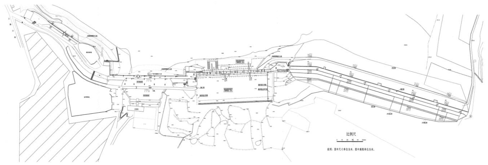  
图 6.1.1-1 塔岗水库大坝平面布置图  

主坝为代水泥砌石重力墙干砌堆石坝,坝顶高程 $185\mathrm{m}$ ,坝顶长 $157.7\mathrm{m}$ 最大坝高 41m,坝顶宽 $5.6\mathsf{m}$ 。上游坝坡坡比 1:0.25,下游坝坡坡度 1:1.4,在下游高程 172.79m 处留一级马道,马道宽 $4.0\mathsf{m}$ ,马道以上为干砌石贴坡,以下为碾压堆石贴坡。  

左副坝位于溢洪道左侧,为均质土坝,最大坝高 15.1m,坝顶高程186.1m,坝顶长 376m、宽 $6.2\mathrm{m}$ 。坝顶上游侧防浪墙高 $0.9\mathsf{m}$ ,下游侧设 C25砼排水沟。上游坝坡采用厚度 $0.3\mathrm{m}$ 干砌石护坡,在高程 $180.21\mathrm{m}$ 处设宽  

3.75m 平台,平台以上坝坡坡比为 1:2.75,以下坝坡坡比为 1:3。下游坝坡坡比为 1:2.25,采用草皮护坡,在高程 179.50m 处设 $2.20\mathsf{m}$ 平台,在 182.50m 处设$0.6m$ 宽平台。下游坝坡设置有纵横向排水沟。2009 年除险加固工程对左副坝坝基采用塑性防渗墙处理。  

右副坝位于主坝西侧,坝型为黏土斜墙坝,最大坝高 $5.6\mathsf{m}$ ,坝顶长 $70\mathrm{m}$ 、宽 $4.6\mathsf{m}$ ,上游坝坡坡比为 1:2.0,采用干砌石护坡,护坡厚度 $0.4\mathsf{m}$ 。下游坝坡撒草籽,形成自然草皮护坡,无排水沟及排水体。右副坝采用帷幕灌浆进行防渗处理。  

溢洪道位于主坝左侧(介于主坝与左副坝之间),系在基岩上直接开挖的开敞式折线型实用堰,堰顶高程 $177.00\mathrm{m}$ ,堰顶宽 $4.0\mathsf{m}$ ,采用挑流消能方式。堰顶设有交通桥一座,桥面高程 $185.00\mathrm{m}$ ,与主坝坝顶平。  

输水建筑物包括主坝输水洞和导流洞、左副坝灌溉涵洞、右副坝涵洞。  

主坝输水洞用于灌溉发电,位于主坝右岸,进口底部高程 $151.39\mathrm{m}$ ,出口高程 150.6m.下接主坝坝后电站。输水洞设计加大流量 $3.47\mathrm{m}^{3}/\mathsf{s}($ (灌溉流量),洞身原为浆砌石明流方拱结构,现在明流洞内安装一道压力钢管,钢管内径$1.2\mathrm{m}$ ,出口安装一蝶阀。进口闸门在坝顶设启闭机房,出后处设闸阀房。  

主坝导流洞位于主坝输水洞下方偏左,进口高程约为 $149.2\mathrm{m}$ ,出口高程$148.45\mathrm{m}$ ,为砌石拱洞,出口处洞宽 $0.6\mathrm{m}$ ,直墙 $1.0\mathsf{m}$ ,拱高 $0.3\mathrm{m}$ 。进口设$0.8{\times}0.8\mathrm{m}$ 钢闸门,配套一台 5t 螺杆式启闭机。  

左副坝灌溉涵洞位于左副坝坝肩处,为浆砌石拱顶小涵洞,进口底高程$179.5\mathrm{m}$ ,洞宽 $0.7\mathsf{m}$ .洞高 $0.85\mathsf{m}$ (含 $0.25\mathrm{m}$ 的拱高)。该洞从水库上游的灌溉渠道引水向副坝下游供灌溉用,洞身进访洪口设 $1.2\times1.2\mathrm{m}$ 铸铁闸门。  

右副坝涵洞位于右副坝西侧,为浆砌石结构,进口底高程 $177.6\mathrm{m}$ ,已废弃不用,已进行封堵处理。  

电站位于输水洞出口,装机容量 $3{\times}200{\mathrm{kw}}.$ 。  

2008 年,塔岗水库实施了除险加固,主要把现状溢洪道顶部高程 177.20m改造至原设计高程 $177.00\mathrm{m}$ ,溢洪道向左扩宽 $6.7\mathsf{m}$ ,从而增加了自身泄洪能力,满足自身工程防洪标准要求。  

塔岗水库于 2022 年再次进行了安全鉴定,编制的《大坝安全鉴定报告书》(2022)结论为:水库主坝及左右副坝坝基未见明显渗漏迹象,坝基处理质量合格。大坝现状渗流、稳定复核计算安全系数均能满足规范要求,大坝坝体未发生渗流破坏影响边坡稳定;溢洪道、工作桥、下游消能防冲设施基本完好;输水洞运行正常;坝后电站运行正常。  

大坝防渗和反滤排水设施完善;溢洪道、输水洞与大坝之间无异常渗流现象。大坝坝顶宽度、抗滑稳定满足规范要求。但上游重力墙在校核工况下,墙背堆石压力按静止土压力计算,坝基出现拉应力,大坝抗震设防烈度符合规范要求;大坝抗震稳定性和结构强度均满足规范要求。  

溢洪道泄流能力、岸顶高程均能满足规范要求,挑流消能满足消能防冲要求,现状溢洪道结构基本完好,强度满足设计要求。  

主坝输水洞、导流洞、左副坝灌溉涵洞三座输水洞结构完好,运行正常,右副坝涵洞封堵后未见渗水,主坝输水洞进口检修闸门已超期服役。  

# 6.1.1.2 工程任务  

根据必要性分析,本次对结合塔岗水库防洪能力提升,对塔岗水库进行扩容,通过增加备用库容,为卫辉市南水北调中线受水区提供备用水源,通过增加防洪库容,提高下游沧河两岸防洪标准,降低良相坡滞洪区启用频率及启用后的淹没损失,提升区域防洪能力,并为整个漳卫河系优化防洪工程布局、提高防洪安全保障水平创造条件。  

塔岗水库扩建增容后,工程任务为“以防洪、灌溉为主,结合卫辉市南水北调受水区备用供水,兼顾发电。”  

# 6.1.1.3 总体布局  

塔岗水库扩建增容的总体布局在现状塔岗水库坝址基础上进行防洪能力提升改造,总体布局维持现状水库的工程布局不变,本次扩建增容的主要建设内容:为拆除原主要挡水建筑物,原坝址新建混合坝。包括碾压混凝土重力坝(含泄水、引水建筑物)和左岸黏土心墙堆石坝,坝后电站等建筑物。  

# 6.1.1.4 水文、气象资料  

# (1)气象  

该区域属暖温带大陆性季风气候,季节分明。冬春两季雨水稀少,风多干冷,蒸发量大;夏秋两季水汽充沛,雨量集中,降水量占全年的 $70\%$ 左右。根据卫辉市气象站 1961-2022 年气象资料统计,降水量年际变化大,多年平均降水量 $587\mathrm{mm}$ ,最大年降水量(2021 年)达 $1433\mathrm{mm}$ ,最小年降水量 176mm  

(1997 年);多年平均蒸发量 $1081\mathrm{mm}$ ;多年平均气温 $14.3^{\circ}\mathrm{C}$ ,最高气温$42.5^{\circ}\mathrm{C}$ ,最低气温- $18.4^{\circ}\mathrm{C}$ ;平均风速 $2.39\mathsf{m}/\mathsf{s}$ ,最大风速 $18.7\mathrm{m}/\mathsf{s}$ ;冰冻期 12月 ${\sim}2$ 月,无霜期 4 月 ${\sim}10$ 月。  

# (2)泥沙  

塔岗水库控制流域面积 $234\mathsf{k m}^{2}$ ,上游有正面水库和狮豹头水库,狮豹头水库控制流域面积 $160\mathsf{k m}^{2}$ ,区间面积 $74\mathsf{k m}^{2}$ 。正面水库和狮豹头水库实际运行未排沙,故塔岗水库仅有区间面积泥沙入库。  

所在流域内无实测泥沙资料,查算 1984 年《河南省地表水资源》附图,水库控制流域内悬移质多年平均年输沙模数约 $200{\sim}500\mathrm{t}/\mathrm{km}^{2}$ 。综合考虑上游植被覆盖情况,本次计算悬移质多年平均年输沙模数取 $200\mathrm{t}/\mathrm{km}^{2}$ 。悬移质泥沙容重取 $1.3\mathrm{t}/\mathrm{m}^{3}$ ,推移质容重取 $1.5\mathrm{t}/\mathsf{m}^{3}$ ;推悬比取 $20\%$ 。  

综上,计算得年均悬移质入库沙量为 1.48 万 t,折合 1.14 万 $\mathsf{m}^{3}$ ;年均推移质入库沙量为 0.30t,折合 0.20 万 $\mathsf{m}^{3}$ ;故年均入库沙量为 1.78 万 t,折合1.34 万 $\mathsf{m}^{3}$ 。  

# (3)洪水  

表 6.1.1-1 坝址设计洪水成果表  

<html><body><table><tr><td rowspan="2">位置</td><td rowspan="2">类型</td><td rowspan="2">项目</td><td colspan="6">各频率（%）设计值</td></tr><tr><td>0.05</td><td>0.33</td><td>1</td><td>2</td><td>5</td><td>10</td></tr><tr><td rowspan="4">塔岗水库</td><td rowspan="3">本次计算</td><td>洪峰流量 (m/s)</td><td>6151</td><td>4335</td><td>3541</td><td>2916</td><td>2171</td><td>1586</td></tr><tr><td>最大24h 洪量（万 m²)</td><td>16226</td><td>11043</td><td>8099</td><td>6296</td><td>4031</td><td>2636</td></tr><tr><td>最大3日 洪量（万 m²)</td><td>20468</td><td>13665</td><td>9801</td><td>7493</td><td>4625</td><td>2894</td></tr><tr><td rowspan="2">《塔岗初设08》</td><td>洪峰流量 (m/s) 最大24h</td><td>6464</td><td></td><td></td><td>2846</td><td></td><td></td></tr><tr><td>洪量（万 m²)</td><td>13221</td><td></td><td></td><td>5803</td><td></td><td>2761</td></tr></table></body></html>  

# 6.1.1.5 水位流量关系  

水位流量关系计算成果见表 6.1.1-2 及图 6.1.1-2。  

表 6.1.1-2 坝址设计洪水成果表  

<html><body><table><tr><td>流量（m/s)</td><td>水位（m)</td><td>流量（m/s)</td><td>水位（m)</td><td>流量（m/s)</td><td>水位（m)</td></tr><tr><td>1.03</td><td>146.90</td><td>1225</td><td>150.75</td><td>5895</td><td>154.75</td></tr><tr><td>3.98</td><td>147.18</td><td>1445</td><td>151.13</td><td>6455</td><td>155.01</td></tr><tr><td>9.00</td><td>147.36</td><td>1699</td><td>151.52</td><td>7072</td><td>155.29</td></tr><tr><td>24.8</td><td>147.61</td><td>1977</td><td>151.91</td><td>7544</td><td>155.63</td></tr><tr><td>56.1</td><td>147.87</td><td>2285</td><td>152.28</td><td>8240</td><td>155.93</td></tr><tr><td>112</td><td>148.16</td><td>2617</td><td>152.65</td><td>9027</td><td>156.20</td></tr><tr><td>197</td><td>148.51</td><td>2971</td><td>152.96</td><td>9897</td><td>156.50</td></tr><tr><td>299</td><td>148.84</td><td>3343</td><td>153.25</td><td>10742</td><td>156.77</td></tr><tr><td>417</td><td>149.16</td><td>3741</td><td>153.53</td><td>11401</td><td>156.96</td></tr><tr><td>549</td><td>149.48</td><td>4161</td><td>153.78</td><td>12517</td><td>157.29</td></tr><tr><td>677</td><td>149.73</td><td>4601</td><td>154.05</td><td>13698</td><td>157.64</td></tr><tr><td>836</td><td>150.04</td><td>5049</td><td>154.31</td><td>14939</td><td>157.97</td></tr><tr><td>1024</td><td>150.36</td><td>5384</td><td>154.49</td><td></td><td></td></tr></table></body></html>  

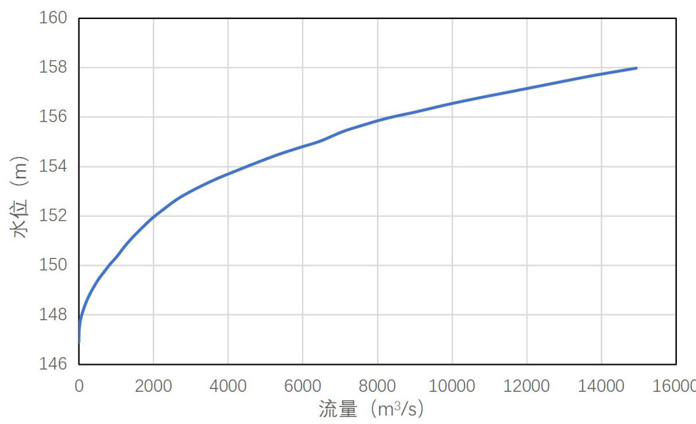  
图 6.1.1-2 塔岗水库坝下断面水位流量关系图  

# 6.1.1.6 规划指标  

坝址处主要规划指标见下表。  

表 6.1.1-4 塔岗水库主要规划指标表  

<html><body><table><tr><td>项目</td><td>单位</td><td>原坝址</td></tr><tr><td>坝址以上流域面积</td><td>km2</td><td>234</td></tr><tr><td>河道长度（km)</td><td>km</td><td>43.88</td></tr><tr><td>多年平均径流量</td><td>万m²</td><td>1178</td></tr><tr><td>多年平均流量</td><td>m/s</td><td>0.37</td></tr><tr><td>灌溉面积</td><td>万亩</td><td>5</td></tr><tr><td>校核洪水位</td><td>m</td><td>207.94</td></tr><tr><td>设计洪水位</td><td>m</td><td>207.51</td></tr><tr><td>正常蓄水位</td><td>m</td><td>184.00</td></tr><tr><td>防洪高水位(P=2%)</td><td>m</td><td>207.51</td></tr><tr><td>防洪高水位(P=5%)</td><td>m</td><td>207.32</td></tr><tr><td>汛限水位</td><td>m</td><td>184.00</td></tr><tr><td>极限运行死水位</td><td>m</td><td>160.00</td></tr><tr><td>死水位</td><td>m</td><td>174.51</td></tr><tr><td>50 年淤沙高程</td><td>m</td><td>155.40</td></tr><tr><td>总库容</td><td>万m²</td><td>6787</td></tr><tr><td>正常蓄水位对应库容</td><td>万m²</td><td>1660</td></tr><tr><td>极限运行死水位对应库容</td><td>万m²</td><td>72</td></tr><tr><td>备用库容</td><td>万m²</td><td>636</td></tr><tr><td>兴利库容</td><td>万m²</td><td>952</td></tr><tr><td>洪峰流量( P=1%)</td><td>m*/s</td><td>2904</td></tr><tr><td>洪峰流量(P=0.05%)</td><td>m*/s</td><td>5330</td></tr><tr><td>下泄流量( P=1%)</td><td>m-/s</td><td>2904</td></tr><tr><td>下泄流量(P=0.05%)</td><td>m3/s</td><td>5053</td></tr><tr><td>下泄生态流量</td><td>m3/s</td><td>0.28</td></tr><tr><td>设计供水灌溉流量</td><td>m-/s</td><td>3.47</td></tr><tr><td>电站装机容量（3台机组）</td><td>MW</td><td>0.6</td></tr></table></body></html>  

# 6.1.1.7 工程地质参数  

(1)地形地貌  

原坝址区属低山河谷地貌类型,河谷开阔,呈宽“U”型河谷。主河槽紧邻右岸,宽约 $65\mathsf{m}$ ,地面高程 $147{\sim}150\mathrm{m}$ 。在原坝溢洪道位置发育 1 小山体,溢洪道在山体中开挖而成的,溢流面高程 $164{\sim}176\mathrm{m}$ ;溢洪道出口无消力池,现状为基岩,地面高程 $145{\sim}162\mathrm{m}$ ,基岩表面受水流冲刷形成冲沟,且表面起伏较大。在左岸均质土坝坝后为阶地,地面较缓,地面高程 $162{\sim}169\mathrm{m}$ ,现状为耕地。左坝肩地面高程 $185{\sim}300\mathrm{m}$ ,坝肩边坡为近直立的陡壁。右岸主河槽至坝肩段为斜坡,地面高程 $171{\sim}187\mathrm{m}$ ,地势较平缓,现状为塔岗村。右坝肩地面高程 $187{\sim}258\mathrm{m}$ ,坡面坡角大致为 $24^{\circ}$ ,属斜坡类型。靠近水库侧为 S227 省道的路缘边坡,开挖近直立的陡壁。  

原坝址区地层岩性主要有太古界变质岩(Arog),寒武系下统朱砂洞组沉积岩( $\langle\in\L_{1}\mathbf{2}\rangle$ ),燕山晚期侵入体(K2T、K2L)以及第四系松散覆盖层。坝址区地质构造作用不强,未发现有断裂构造;基岩产状整体上较为稳定,为单斜构造;主要构造行迹为节理裂隙。  

# (2)坝址区开挖边坡  

坝址区边坡建议开挖坡比见下表。  

表 6.1.1-5 坝址区岩土体边坡开挖建议值  

<html><body><table><tr><td>岩性</td><td>永久边坡</td><td>临时边坡</td></tr><tr><td>素填土</td><td>1:2.0~1:3.0</td><td>1:1.3~1:2.0</td></tr><tr><td>淤泥质砾石</td><td>1:2.25~1:2.5</td><td>1:2.0~1:2.25</td></tr><tr><td>砂卵砾石</td><td>1:1.5~1:2.0</td><td>1:1.25~1:1.5</td></tr><tr><td>低液限黏土</td><td>1:0.5~1:0.75</td><td>1:0.3~1:0.5</td></tr><tr><td>低液限黏土</td><td>1:1.5~1:2.0</td><td>1:1.0~1:1.50</td></tr><tr><td>强风化片麻岩</td><td>1:0.75~1:1.0</td><td></td></tr><tr><td>弱风化片麻岩</td><td>1:0.5~1:0.75</td><td></td></tr><tr><td>微新片麻岩</td><td>1:0.3~1:0.5</td><td></td></tr><tr><td>强风化白云质灰岩</td><td>1:0.75~1:1.0</td><td></td></tr><tr><td>弱风化白云质灰岩</td><td>1:0.5~1:0.75</td><td></td></tr><tr><td>微新白云质灰岩</td><td>1:0.3~1:0.5</td><td></td></tr></table></body></html>  

<html><body><table><tr><td>微新粉砂岩</td><td>1:0.3~1:0.5</td><td></td></tr><tr><td>强风化闪长岩</td><td>1:0.75~1:1.0</td><td></td></tr><tr><td>弱风化闪长岩</td><td>1:0.5~1:0.75</td><td></td></tr><tr><td>微新闪长岩</td><td>1:0.3~1:0.5</td><td></td></tr></table></body></html>  

# (3)坝址区岩土物理力学参数  

坝址区坝址区断层带、岩体结构面抗剪断强度指标及坝基岩体物理力学指标建议值分别见下表。  

表 6.1.1-6 坝址区断层带、岩体结构面抗剪断强度指标建议值  

<html><body><table><tr><td rowspan="3">岩性</td><td rowspan="3">类别/类型</td><td colspan="3">抗剪强度</td></tr><tr><td>f</td><td>C'</td><td></td></tr><tr><td></td><td>MPa</td><td></td></tr><tr><td rowspan="5">结构面</td><td>无填充</td><td>0.55~0.60</td><td>0.10~0.15</td><td>0.45~0.50</td></tr><tr><td>泥夹岩屑</td><td>0.25~0.30</td><td>0.02~0.03</td><td>0.22~0.25</td></tr><tr><td>岩屑夹泥</td><td>0.35~0.40</td><td>0.05~0.07</td><td>0.28~0.31</td></tr><tr><td>岩块岩屑</td><td>0.45~0.50</td><td>0.08~0.09</td><td>0.35~0.40</td></tr><tr><td>层面</td><td>0.55~0.60</td><td>0.15~0.20</td><td>0.40~0.45</td></tr></table></body></html>  

表 6.1.1-7 坝基岩体物理力学指标建议值  

<html><body><table><tr><td rowspan="3">岩性</td><td rowspan="3">地层 代号</td><td rowspan="3">天然 密度</td><td rowspan="3">承载力</td><td rowspan="2">压缩 模量</td><td colspan="2">抗剪强度</td><td rowspan="2">基础与岩土 摩擦系数f</td><td rowspan="3">渗透系数</td><td rowspan="3">不冲刷 流速</td><td rowspan="3">允许水力比降</td><td rowspan="3">永久边坡</td><td rowspan="2">临时边坡</td></tr><tr><td>凝聚力c</td><td>摩擦角Φ</td></tr><tr><td></td><td></td><td>。</td><td></td><td></td><td>Js</td><td></td><td></td></tr><tr><td>素填土</td><td>Q4s</td><td>g/cm3 1.96</td><td>kPa 110~130</td><td>MPa 5</td><td>kPa 3.5~4.0</td><td>20~23</td><td>0.25~0.30</td><td>cm/s 2.5×10-4</td><td>m/s 0.7~0.8</td><td>1.0~1.5</td><td>1:2.0~1:3.0</td><td>1:1.3~1:2.0</td></tr><tr><td>淤泥质砾石</td><td>Q4N</td><td>1.60</td><td>70~80</td><td>3~4</td><td>0</td><td>20~22</td><td>0.20~0.22</td><td>1.5×10-3</td><td>0.6~0.7</td><td>0.22~0.25</td><td>1:2.25~1:2.5</td><td>1:2.0~1:2.25</td></tr><tr><td></td><td>Q4alp</td><td>2.00</td><td>300~350</td><td>30~33</td><td>0</td><td>33~35</td><td>0.50~0.55</td><td>1x10-1</td><td>1.0~1.5</td><td>0.12~0.15</td><td>1:1.5~1:2.0</td><td>1:1.25~1:1.5</td></tr><tr><td>砂卵砾石 低液限黏土</td><td>Q3alp</td><td>1.58</td><td>70~80</td><td>1.0~1.5</td><td>2~3</td><td>15~16</td><td>0.10~0.15</td><td>5.0×10-4</td><td></td><td>0.5~0.6</td><td>1:0.5~1:0.75</td><td>1:0.3~1:0.5</td></tr><tr><td>低液限黏土</td><td>Q2alp</td><td>1.93</td><td>150~180</td><td>4</td><td>3.5~4.0</td><td>26~28</td><td>0.25~0.30</td><td>2.5×10-5</td><td>0.7~0.8</td><td>1.0~1.5</td><td>1:1.5~1:2.0</td><td>1:1.0~1:1.50</td></tr><tr><td>强风化片麻岩</td><td></td><td>2.55</td><td>500~600</td><td></td><td></td><td></td><td></td><td></td><td></td><td></td><td>1:0.75~1:1.0</td><td></td></tr><tr><td>弱风化片麻岩</td><td>Arog</td><td>2.60</td><td>800~1000</td><td></td><td></td><td></td><td></td><td></td><td></td><td></td><td>1:0.5~1:0.75</td><td></td></tr><tr><td>微新片麻岩</td><td></td><td>2.70</td><td>2000~3000</td><td></td><td></td><td></td><td></td><td></td><td></td><td></td><td>1:0.3~1:0.5</td><td></td></tr><tr><td>强风化白云质灰岩</td><td></td><td>2.50</td><td>500~550</td><td></td><td></td><td></td><td></td><td></td><td></td><td></td><td>1:0.75~1:1.0</td><td></td></tr><tr><td>弱风化白云质灰岩</td><td></td><td>2.55</td><td>900~1000</td><td></td><td></td><td></td><td></td><td></td><td></td><td></td><td>1:0.5~1:0.75</td><td></td></tr><tr><td>微新白云质灰岩</td><td>E1z</td><td>2.75</td><td>1800~2200</td><td></td><td></td><td></td><td></td><td></td><td></td><td></td><td>1:0.3~1:0.5</td><td></td></tr><tr><td>微新粉砂岩</td><td></td><td>2.65</td><td>1500~2000</td><td></td><td></td><td></td><td></td><td></td><td></td><td></td><td>1:0.3~1:0.5</td><td></td></tr><tr><td>强风化闪长岩</td><td></td><td>2.50</td><td>450~500</td><td></td><td></td><td></td><td></td><td></td><td></td><td></td><td>1:0.75~1:1.0</td><td></td></tr><tr><td>弱风化闪长岩</td><td>K1T</td><td>2.59</td><td>1000~1200</td><td></td><td></td><td></td><td></td><td></td><td></td><td></td><td>1:0.5~1:0.75</td><td></td></tr><tr><td>微新闪长岩</td><td></td><td>2.68</td><td>2000~3000</td><td></td><td></td><td></td><td></td><td></td><td></td><td></td><td>1:0.3~1:0.5</td><td></td></tr></table></body></html>  

素填土( $\cdot{\mathsf{Q}}_{4}{\mathsf{s}}$ )抗剪强度指标为自然快剪;低液限黏土( $\mathsf{Q}_{3}\mathsf{a l p}$ )和( $\mathbf{\hat{Q}}_{2}\mathbf{a}\mathbf{\mathsf{p}}$ )抗剪强度为饱和固结快剪。  

续表 6.1.1-7 坝址区岩土体物理力学指标建议值  

<html><body><table><tr><td rowspan="2">岩性</td><td rowspan="2">类别</td><td rowspan="2">天然密度</td><td rowspan="2">变形模量</td><td rowspan="2">泊松比</td><td colspan="3">岩体抗剪强度</td><td colspan="3">岩/混凝土抗剪强度</td></tr><tr><td>f</td><td>C'</td><td>→</td><td>f</td><td>C'</td><td>→</td></tr><tr><td></td><td></td><td>g/cm3</td><td>E0/GPa</td><td>μ</td><td></td><td>MPa</td><td></td><td></td><td>MPa</td><td></td></tr><tr><td>强风化岩体 弱风化片麻岩</td><td>Cv Civ</td><td>2.50~2.55 2.55~2.60</td><td>0.3~0.5 0.8~1.2</td><td>0.35~0.40 0.30~0.35</td><td>0.20~0.25</td><td>0.02~0.05</td><td>0.20~0.25</td><td>0.25~0.30</td><td>0.05~0.10 0.30~0.35</td><td>0.25~0.30</td></tr><tr><td>弱风化白云质灰</td><td></td><td></td><td></td><td></td><td>0.30~0.35</td><td>0.25~0.30</td><td>0.35~0.40</td><td>0.35~0.40</td><td></td><td>0.40~0.45</td></tr><tr><td>岩、闪长岩</td><td>"</td><td>2.55~2.60</td><td>1.5~2.0</td><td>0.25~0.30</td><td>0.55~0.60</td><td>0.55~0.60</td><td>0.50~0.55</td><td>0.55~0.60</td><td>0.50~0.55</td><td>0.45~0.50</td></tr><tr><td>微新粉砂岩 微新闪长岩</td><td>Bm1 B</td><td>2.65 2.68</td><td>4.0~5.0</td><td>0.28~0.33 0.20~0.25</td><td>0.90~0.95</td><td>1.05~1.10</td><td>0.55~0.60</td><td>0.85~0.90</td><td>1.00~1.05</td><td>0.50~0.55</td></tr><tr><td>微新片麻岩、白</td><td></td><td></td><td>6.0~8.0</td><td></td><td>0.95~1.00</td><td>1.10~1.15</td><td>0.60~0.65</td><td>0.90~0.95</td><td>1.05~1.00</td><td>0.55~0.60</td></tr><tr><td>云质灰岩</td><td>Am1</td><td>2.70~2.75</td><td>9.0~11.0</td><td>0.20~0.25</td><td>1.05~1.10</td><td>1.25~1.30</td><td>0.60~0.65</td><td>1.00~1.05</td><td>0.95~1.00</td><td>0.55~0.60</td></tr></table></body></html>  

# 6.1.1.8 料场基本情况  

(1)土料场  

1)土料质量及评价  

土料场土按三角坐标定名主要为粉质黏土和重粉质壤土,局部含砂粒或砾石,为中壤土或粉土质砾。土体粘粒均值为 $26.3\%$ ;粉粒含量均值为 $59.4\%$ ;砂粒含量均值为 $8.7\%$ ,砾石含量均值为 $5.5\%$ 。  

土料作为一般防渗料质量评价见表 6.1.1-8。  

表 6.1.1-8 一般填筑料质量评价  

<html><body><table><tr><td>序 号</td><td>项目</td><td>评价指标</td><td>试验指标</td><td>评价</td></tr><tr><td>1</td><td>黏粒含量</td><td>15%~40%</td><td>16.9%~38.6%/26.3%</td><td>满足</td></tr><tr><td>2</td><td>塑性指数</td><td>10~20</td><td>7.3~16.1/11.0</td><td>基本 满足</td></tr><tr><td>3</td><td>渗透系数(击实 后)</td><td>≤1×10-5cm/s</td><td>5.41X 10-8~4.31X10-6/1.11 X 10-6</td><td>满足</td></tr><tr><td>4</td><td>有机质含量(按 质量计)</td><td>≤2%</td><td>0.9%~6.4%/2.8%</td><td>略高</td></tr><tr><td>5</td><td>水溶盐含量</td><td>%></td><td>0.4%~0.9%/0.6%</td><td>满足</td></tr><tr><td>6</td><td>天然含水率</td><td>与最优含水率的允许偏 差为±3%</td><td>20.4%~29.6%/24.7%</td><td>偏高</td></tr></table></body></html>  

土料作为一般防渗料粘粒含量满足规程技术要求;塑性指数基本满足规程指标要求,试验指标略低于要求;渗透性满足规程指标要求;有机质含量略高于规程指标要求;水溶盐含量满足规程指标要求;含水率高于规程指标要求,施工时需要采取晾晒措施。  

有用层储量为 $40.00\times10^{4}m^{3}$ ,无用层体积为 $6.12\times10^{4}\mathrm{m}^{3}$ 。土料场距坝址区运输距离约 $2.0{\sim}2.5\mathrm{km}$ ,开采运输条件良好。  

土料场距坝址区运输距离约 $2.0{\sim}2.5\mathrm{km}$ ,有硬化路相连,交通条件较便利。  

(2)石料场  

# 1)料场地质条件  

石料场位于水库上游小店河村南东方向约 $700\mathrm{m}$ ,距坝址区直线距离约$3.5\mathsf{k m}$ ,运距约 $5.6\mathsf{k m}$ ,至坝址有硬化路或柏油路(S226 省道)相通。料场为正地形,紧邻 S226 省道,地下水不丰富,且易于向沧河排泄,不会对开采造成影响。  

依据《水利水电工程天然建筑材料勘察规程》SL251-2015 中砌石料原岩质量技术指标和混凝土人工骨料原岩质量技术指标分别进行质量评价。  

$\textcircled{1}$ 砌石料原岩质量评价  

砌石料原岩质量评价成果见表。白云岩和鲕状白云岩软化系数基本满足规范要求,白云质灰岩软化系数基本不满足质量要求,薄层状白云岩软化系数不满足质量要求;其余指标均满足砌石料原岩质量技术指标要求。  

表 6.1.1-9 砌石料原岩质量评价  

<html><body><table><tr><td rowspan="2">序 号</td><td rowspan="2">项目</td><td rowspan="2">指标</td><td colspan="3">白云岩</td><td colspan="3">状白云岩</td></tr><tr><td>范围值</td><td>平均值</td><td>质量 评价</td><td>范围值</td><td>平均值</td><td>质量 评价</td></tr><tr><td>1</td><td>饱和抗压 强度</td><td>>30MPa</td><td>150.1~192.8</td><td>172.6</td><td>满足</td><td>96.1~176.5</td><td>143</td><td>满足</td></tr><tr><td>2</td><td>软化系数</td><td>>0.75</td><td>0.73~0.96</td><td>0.88</td><td>基本 满足</td><td>0.72~0.98</td><td>0.87</td><td>基本 满足</td></tr><tr><td>3</td><td>吸水率</td><td><10%</td><td>0.16~0.36</td><td>0.27</td><td>满足</td><td>0.12~0.30</td><td>0.20</td><td>满足</td></tr><tr><td>4</td><td>冻融损失率 （质量）</td><td><1%</td><td>0</td><td>0</td><td>满足</td><td>0</td><td>0</td><td>满足</td></tr><tr><td>5</td><td>干密度</td><td>>2.4g/cm3</td><td>2.81~2.83</td><td>2.82</td><td>满足</td><td>2.75~2.84</td><td>2.82</td><td>满足</td></tr><tr><td>6</td><td>硫酸盐及硫 化物含量 （换算成 SO3)</td><td><1%</td><td>0.01</td><td>0.01</td><td>满足</td><td>0.01</td><td>0.01</td><td>满足</td></tr></table></body></html>

说明:平均值和范围值均达到标准要求为“满足”;平均值达到但范围值没达到标准要求为“基本满足”;平均值没达到但范围值部分达到标准要求为“基本不满足”;平均值和范围值均没有达到标准要求为“不满足”。下同。  

续表 6.1.1-9 砌石料原岩质量评价  

<html><body><table><tr><td rowspan="2">序 号</td><td rowspan="2">项目</td><td rowspan="2">指标</td><td colspan="3">白云质灰岩</td><td colspan="2">薄层状白云岩</td></tr><tr><td>范围值</td><td>平均值</td><td>质量 评价</td><td>数值</td><td>质量 评价</td></tr><tr><td>1</td><td>饱和抗压强度</td><td>>30MPa</td><td>132.5~209.6</td><td>158.5</td><td>满足</td><td>118</td><td>满足</td></tr><tr><td>2</td><td>软化系数</td><td>>0.75</td><td>0.61~0.85</td><td>0.75</td><td>基本满 足</td><td>0.65</td><td>基本不满 足</td></tr><tr><td>3</td><td>吸水率</td><td><10%</td><td>0.06~0.28</td><td>0.13</td><td>满足</td><td>1.38</td><td>满足</td></tr><tr><td>4</td><td>冻融损失率</td><td><1%</td><td>0</td><td>0</td><td>满足</td><td>0</td><td>满足</td></tr></table></body></html>  

<html><body><table><tr><td></td><td>（质量）</td><td></td><td></td><td></td><td></td><td></td><td></td></tr><tr><td>5</td><td>干密度</td><td>>2.4g/cm3</td><td>2.73~2.80</td><td>2.75</td><td>满足</td><td>2.7</td><td>满足</td></tr><tr><td>6</td><td>硫酸盐及硫化物 含量（换算成 SO3)</td><td><1%</td><td>0.01~0.05</td><td>0.03</td><td>满足</td><td>0.01</td><td>满足</td></tr></table></body></html>  

$\textcircled{2}$ 堆石料质量评价堆石料原岩质量评价成果见表。  

表 6.1.1-10 堆石料原岩质量评价  

<html><body><table><tr><td rowspan="2">序号</td><td rowspan="2">项目</td><td rowspan="2">指标</td><td colspan="3">白云岩</td><td colspan="3">状白云岩</td></tr><tr><td>范围值</td><td>平均值</td><td>质量 评价</td><td>范围值</td><td>平均值</td><td>质量 评价</td></tr><tr><td>1</td><td>饱和抗压 强度</td><td>>30MPa</td><td>150.1~192.8</td><td>172.6</td><td>满足</td><td>96.1~176.5</td><td>143</td><td>满足</td></tr><tr><td>2</td><td>软化系数</td><td>>0.75</td><td>0.73~0.96</td><td>0.88</td><td>基本 满足</td><td>0.72~0.98</td><td>0.87</td><td>基本 满足</td></tr><tr><td>3</td><td>冻融损失率 (质量)</td><td><1%</td><td>0</td><td>0</td><td>满足</td><td>0</td><td>0</td><td>满足</td></tr><tr><td>4</td><td>干密度</td><td>>2.4g/cm3</td><td>2.81~2.83</td><td>2.82</td><td>满足</td><td>2.75~2.84</td><td>2.82</td><td>满足</td></tr></table></body></html>  

续表 6.1.1-9 砌石料原岩质量评价  

<html><body><table><tr><td rowspan="2">序 号</td><td rowspan="2">项目</td><td rowspan="2">指标</td><td colspan="3">白云质灰岩</td><td colspan="2">薄层状白云岩</td></tr><tr><td>范围值</td><td>平均值</td><td>质量 评价</td><td>数值</td><td>质量 评价</td></tr><tr><td>1</td><td>饱和抗压强度</td><td>>30MPa</td><td>132.5~209.6</td><td>158.5</td><td>满足</td><td>118</td><td>满足</td></tr><tr><td>2</td><td>软化系数</td><td>>0.75</td><td>0.61~0.85</td><td>0.75</td><td>基本满 足</td><td>0.65</td><td>基本不满足</td></tr><tr><td>3</td><td>冻融损失率 （质量）</td><td><1%</td><td>0</td><td>0</td><td>满足</td><td>0</td><td>满足</td></tr><tr><td>4</td><td>干密度</td><td>>2.4g/cm3</td><td>2.73~2.80</td><td>2.75</td><td>满足</td><td>2.7</td><td>满足</td></tr></table></body></html>  

石料场内白云岩、鲕状白云岩、白云质灰岩和薄层白云岩的饱和单轴抗压强度、冻融损失率和干密度等指标均满足规范要求。软化系数值偏低,尤其是薄层状白云岩,可用于次堆石区。  

$\textcircled{3}$ 混凝土人工骨料原岩质量评价  

混凝土人工骨料原岩质量评价见表。白云岩和鲕状白云岩软化系数基本满足规范要求,白云质灰岩软化系数基本不满足质量要求,薄层状白云岩软乎系数不满足质量要求;其余指标均满足混凝土人工骨料原岩质量技术指标要求。  

表 6.1.1-11 混凝土人工骨料原岩质量评价  

<html><body><table><tr><td rowspan="2">序 号</td><td rowspan="2">项目</td><td rowspan="2">指标</td><td colspan="3">白云岩</td><td colspan="3">状白云岩</td></tr><tr><td>范围值</td><td>平均值</td><td>质量 评价</td><td>范围值</td><td>平均值</td><td>质量 评价</td></tr><tr><td>1</td><td>饱和抗压 强度</td><td>>40MPa</td><td>150.1~192.8172.6</td><td></td><td>满足</td><td>96.1~176.5</td><td>143</td><td>满足</td></tr><tr><td>2</td><td>软化系数</td><td>>0.75</td><td>0.73~0.96</td><td>0.88</td><td>基本 满足</td><td>0.72~0.98</td><td>0.87</td><td>基本 满足</td></tr><tr><td>3</td><td>干密度</td><td>>2.4g/cm3</td><td>2.81~2.83</td><td>2.82</td><td>满足</td><td>2.75~2.84</td><td>2.82</td><td>满足</td></tr><tr><td>4</td><td>冻融损失率 （质量）</td><td><1%</td><td>0</td><td>0</td><td>满足</td><td>0</td><td>0</td><td>满足</td></tr><tr><td>5</td><td>碱活性</td><td>不具有潜在 危害性反应</td><td></td><td></td><td></td><td></td><td></td><td></td></tr><tr><td>6</td><td>硫酸盐及硫化 物含量（换算 成SO3)</td><td><1%</td><td>0.01</td><td>0.01</td><td>满足</td><td>0.01</td><td>0.01</td><td>满足</td></tr></table></body></html>  

续表 6.1.1-11 混凝土人工骨料原岩质量评价  

<html><body><table><tr><td rowspan="2">序号</td><td rowspan="2">项目</td><td rowspan="2">指标</td><td colspan="3">白云质灰岩</td><td colspan="2">薄层状白云岩</td></tr><tr><td>范围值</td><td>平均值</td><td>质量 评价</td><td>数值</td><td>质量 评价</td></tr><tr><td>1</td><td>饱和抗压强度</td><td>>40MPa</td><td>132.5~209.6</td><td>158.5</td><td>满足</td><td>118</td><td>满足</td></tr><tr><td>2</td><td>软化系数</td><td>>0.75</td><td>0.61~0.85</td><td>0.75</td><td>基本不 满足</td><td>0.65</td><td>不满足</td></tr><tr><td>3</td><td>干密度</td><td>>2.4g/cm3</td><td>2.73~2.80</td><td>2.75</td><td>满足</td><td>2.7</td><td>满足</td></tr><tr><td>4</td><td>冻融损失率 （质量）</td><td><1%</td><td>0</td><td>0</td><td>满足</td><td>0</td><td>满足</td></tr><tr><td>5</td><td>碱活性</td><td>不具有潜 在危害性 反应</td><td></td><td></td><td></td><td></td><td></td></tr><tr><td>6</td><td>硫酸盐及硫化物含 量（换算成SO3）</td><td><1%</td><td>0.01~0.05</td><td>0.03</td><td>满足</td><td>0.01</td><td>满足</td></tr></table></body></html>  

作为砌石料和混凝土人工骨料料源,白云岩、鲕状白云岩软化系数基本满足技术指标质量要求,白云质灰岩基本不满足要求,薄层状白云岩不满足要求。考虑到饱和抗压强度较高,该料场可以作为堆石料、砌石料和混凝土人工骨料料源。  

料场有用层储量约为 $495.75\times10^{4}\mathrm{m}^{3}$ ,无用层体积为 $3.98\times10^{4}\mathsf{m}^{3}$ ,剥采比约 1:124。开采范围还可向外围扩展,储量丰富。料场后边坡整体稳定性好,开挖形成高边坡,需要采取放坡或防护措施。  

# (3)商品料  

卫辉市的太公镇有多家商品料源,基岩为奥陶系马家沟组( $\mathsf{O}_{2}\mathsf{m}$ )的灰岩,是做为混凝土骨料的良好石材。到塔岗水库坝址区的运距大约为 17km。  

狮豹头乡的南寺村附近的卫辉市南寺白云岩矿基岩为寒武系上统三山子组( $(\in_{3}\mathsf{s}$ )的中厚\~厚层状白云岩,岩石质量整体良好,基本可满足工程要求。到坝址区运距约 $4.7\mathsf{k m}$ ,交通条件便利。  

# 6.1.2 设计依据的主要技术标准  

(1) 《水利水电工程等级划分及洪水标准》(SL 252-2017);  
(2) 《水利工程建设标准强制性条文》(2020 年版);  
(3) 《碾压式土石坝设计规范》(SL 274-2020);  
(4) 《土石坝沥青混凝土面板和心墙设计规范》 (SL501-2010)(5) 《混凝土面板堆石坝挤压边墙技术规范》 (DL/T5297-2013);  
(6) 《水工建筑物水泥灌浆施工技术规范》(SL/T 62-2020);  
(7) 《溢洪道设计规范》(SL 253-2018);  
(8) 《混凝土重力坝设计规范》(SL 319-2018);  
(9) 《碾压混凝土坝设计规范》(SL 314-2018);  
(10) 《溢洪道设计规范》(SL 253-2018);  
(11) 《水电站厂房设计规范》(SL266—2014);  
(12) 《水利水电工程进水口设计规范》 (SL285-2020);  
(13) 《水利水电工程钢闸门设计规范》(SL74-2019);  
(14)《水电站压力钢管设计规范》(SL/T 281—2020);  

(15)《水工隧洞设计规范》(SL279-2016);(16)《水利水电工程边坡设计规范》(SL386-2007);(17) 《水工挡土墙设计规范》(SL379-2007);(18)《水利水电工程锚喷支护技术规范》(SL377-2007);(19) 《水工混凝土结构设计规范》(SL191-2008);(20) 《水利水电工程合理使用年限及耐久性设计规范》(SL654-2014);《水工建筑物抗冲磨防空蚀混凝土技术规范》(DL/T5207-2021);(22) 《水工建筑物荷载设计规范》(SL744-2016);(23)《水工建筑物抗震设计标准》(GB51247-2018);《水利水电工程锚喷支护技术规范》(SL377—2007);(25)《城镇供水长距离输水管(渠)道工程技术规程》(CECS 193:2005);(26)《水利水电工程设计工程量计算规定》(SL328-2005);(27)《土工合成材料应用技术规范》(GB/T50290-2014);《混凝土坝安全监测技术规范》(SL601-2013);(29)《水利水电工程安全监测设计规范》(SL725-2016);(30)国家现行的其他规范、规程及河南省的有关规定等。  

# 6.2 工程等级和标准  

塔岗水库扩建增容后,工程任务为“以防洪、灌溉为主,结合卫辉市南水北调受水区备用供水,兼顾发电。  

主要建设内容:拆除原挡水建筑物,新建混合坝,包括碾压混凝土重力坝(含泄水、引水建筑物)和左岸黏土心墙堆石坝,坝后电站等建筑物。  

# 6.2.1 工程等别和标准  

提升后工程总库容 0.68 亿 $\mathsf{m}^{3}$ ,根据《水利水电工程等级划分及洪水标准》(SL252—2017)第 3.0.2 条规定,对综合利用的水利水电工程,其工程等别应按各综合利用项目中最高等别确定,确定塔岗水库工程等别为Ⅲ等,工程规模为中型。  

# 表 6.2.1-1 各项目分等指标  

<html><body><table><tr><td colspan="2">项目</td><td>数值</td><td>工程等别</td><td>工程规模</td></tr><tr><td>水库</td><td>水库总库容（108m²）</td><td>0.68</td><td>Ⅲ</td><td>中型</td></tr><tr><td rowspan="2">防洪</td><td>保护人口 (万人)</td><td>8</td><td rowspan="2">IV</td><td rowspan="2">小（1）型</td></tr><tr><td>保护农田面积（104亩）</td><td>12.6</td></tr><tr><td>电站</td><td>装机容量（MW)</td><td>0.6</td><td>Λ</td><td>小(2)型</td></tr><tr><td>灌溉</td><td>灌溉面积 （104亩)</td><td>5</td><td>IV</td><td>小（1）型</td></tr></table></body></html>  

# 6.2.2 建筑物级别  

# 6.2.2.1 建筑物级别  

塔岗水库工程主要由挡水、泄水、引水、消能防冲、坝后电站等建筑物组成。根据不同建筑物在本工程中所起的作用及其本身规模,确定其建筑物级别。  

根据《水利水电工程等级划分及洪水标准》(SL252-2017)的规定,按照工程等别为Ⅲ等工程,确定水库工程的主要建筑物:挡水混合坝、泄水建筑物、引水建筑物等级为 3 级。水电站发电厂房装机容量为 0.6MW,小于 10MW,其主要建筑物级别为 5 级。确定主要建筑物为 3 级,次要建筑物为 4 级,电站 5级。  

表 6.2.2-1 主要建筑物级别  

<html><body><table><tr><td>序号</td><td>建筑物名称</td><td>建筑物级别</td><td>备注</td></tr><tr><td>1</td><td>挡水建筑物</td><td>3</td><td rowspan="3">SL252-2017</td></tr><tr><td>2</td><td>泄水建筑物</td><td>3</td></tr><tr><td>3</td><td>引水建筑物</td><td>3</td></tr><tr><td>4</td><td>黏土心墙堆石坝</td><td>3</td><td rowspan="2">SL252-2017</td></tr><tr><td>5</td><td>电站厂房及开关站</td><td>5</td></tr></table></body></html>  

# 6.2.2.2 永久边坡级别  

依据《水利水电工程边坡设计规范》(SL386-2007)的规定,边坡的级别应根据相关水工建筑物级别及边坡与水工建筑物的相互关系,并对边坡破坏造成的影响确定。本工程大坝坝肩永久边坡均属于对水工建筑物危害程度严重,因此边坡级别与相应建筑物同级,确定水库大坝两岸坝肩永久边坡级别为 3 级,电站永久边坡级别为 5 级。  

# 6.2.3 洪水标准  

塔岗水库为Ⅲ等中型工程,拦河坝建筑物级别为 3 级,依据《防洪标准》(GB50201-2014)和《水利水电工程等级划分及洪水标准》(SL252-2017)表 5.2.1 的规定,山区、丘陵区Ⅲ等永久性 3 级水工建筑物设计洪水标准为$100–50$ 年一遇,土石坝校核洪水标准为 $2000{\sim}1000$ 年一遇,混凝土坝校核洪水标准为 $1000{\sim}500$ 年一遇。  

塔岗水库上游有正面、石包头两座中型水库,下游保护着上乐村镇、安都乡等乡镇 20 万人及南水北调中线总干渠、京广铁路、京珠高速等重要设施,位置十分重要,未提升前,原塔岗水库大坝设计洪水标准取 50 年一遇、校核洪水标准取 2000 年一遇。  

挡水坝段是由碾压混凝土重力坝和黏土心墙堆石坝组成的混合坝,根据《水利水电工程等级划分及洪水标准》(SL252-2017)表 5.2.3 的规定,采用土石坝和混凝土坝混合坝型时,其洪水标准取土石坝的洪水标准;本次扩建增容工程主要任务为提高塔岗水库的防洪能力,洪水标准按照同级别上限选取。综上,提升后塔岗水库设计洪水标准为 100 年一遇,校核洪水标准为 2000 年一遇。  

主要建筑物洪水标准见表 6.2.3-1。  

表 6.2.3-1 水库工程主要建筑物洪水标准选用表  

<html><body><table><tr><td rowspan="2">坝型</td><td rowspan="2">建筑物名称</td><td rowspan="2">建筑物级别</td><td>设计</td><td>校核</td></tr><tr><td>洪水重现期 (年)</td><td>洪水重现期 (年)</td></tr><tr><td rowspan="3">混凝土重力坝</td><td>大坝</td><td>3</td><td>100</td><td>2000</td></tr><tr><td>电站厂房</td><td>5</td><td>20</td><td>50</td></tr><tr><td>消能防冲设施</td><td>3</td><td>30</td><td></td></tr><tr><td>黏土心墙堆石坝</td><td>大坝</td><td>3</td><td>100</td><td>2000</td></tr></table></body></html>  

# 6.2.4 地震烈度  

根据《中国地震动峰值加速度区划图》(GB18306-2015),本工程区基本地震动峰值加速度(50 年超越概率 $10\%$ )为 $0.29$ ,相应地震基本烈度为Ⅷ度。工程设计地震烈度采用Ⅷ度。  

# 6.2.5 现行技术标准的主要设计允许值  

(1)安全加(超)高  

根据《混凝土重力坝设计规范》(SL319-2018),3 级大坝正常蓄水位情况安全加高为 $0.4\mathsf{m}$ ,校核洪水位安全加高为 $0.3\mathrm{m}$ 。  

根据《碾压式土石坝设计规范》(SL274-2020)的规定,3 级大坝正常运用条件安全加高为 $0.7\mathsf{m}$ ,非常运用条件安全加高为 $0.4\mathsf{m}$ 。  

(2)重力坝抗滑稳定安全系数  

根据《混凝土重力坝设计规范》(SL319-2018),重力坝级别为 3 级,按抗剪断强度公式计算的坝基面抗滑稳定安全系数 K’值不应小于下表规定的数值。  

表 6.2.5-1 抗滑稳定安全系数  

<html><body><table><tr><td colspan="2">荷载组合</td><td>抗剪断强度公式计算[K]</td></tr><tr><td rowspan="2">基本组合</td><td>正常蓄水位工况</td><td rowspan="2">3.0</td></tr><tr><td>设计洪水位工况</td></tr><tr><td>特殊组合 (1)</td><td>校核洪水位工况</td><td></td></tr><tr><td>特殊组合 （2)</td><td>地震工况</td><td></td></tr></table></body></html>  

(3)坝基面坝踵、坝趾的垂直应力  

运用期:在各种荷载组合下(地震荷载除外),坝踵垂直应力不应出现拉应力,坝趾垂直应力不应大于坝体混凝土容许压应力,并不大于基岩容许承载力;在地震工况下,坝址垂直应力不应大于坝体混凝土动态容许压应力,并不应大于基岩容许承载力。  

施工期:坝趾垂直拉应力不大于 0.1MPa。  

# (4)坝体应力  

运用期:坝体上游面的垂直应力不出现拉应力(计扬压力);坝体最大主压应力不应大于混凝土的容许压应力值;在地震工况下,坝体应力不应大于混凝土动态容许应力。  

施工期:坝体任何截面上的主压应力不应大于混凝土的容许压应力;在坝体的下游面,主拉应力不大于 0.2MPa。  

(5)土石坝坝坡抗滑稳定最小安全系数  

根据《碾压式土石坝设计规范》SL274-2020,采用计及条块间作用力的计算方法时,坝坡抗滑稳定的安全系数应不小于表 6.2.5-2 规定的数值。  

表 6.2.5-2 坝坡抗滑稳定最小安全系数  

<html><body><table><tr><td>运用条件</td><td>计算工况</td><td>抗滑稳定安全系数</td></tr><tr><td rowspan="2">正常运用条件</td><td>（1）设计洪水位</td><td rowspan="2">1.30</td></tr><tr><td>（2）水库水位正常降落</td></tr><tr><td>非常运用条件】</td><td>（1）施工完建无水 （2）水库水位非常降落 （3）校核洪水位</td><td>1.20</td></tr><tr><td>非常运用条件ⅡI</td><td>枯水位+地震</td><td>1.15</td></tr></table></body></html>  

# (6)消力池底板抗浮稳定  

6.2.5-3 消力池抗浮稳定安全系数  

<html><body><table><tr><td>工况</td><td>抗浮稳定安全系数[Kf</td></tr><tr><td>基本组合1：设计/常遇洪水</td><td>1.0~1.2</td></tr><tr><td>特殊组合1：校核洪水</td><td>1.0~1.2</td></tr><tr><td>特殊组合2：排水检修</td><td>1.0~1.2</td></tr><tr><td>特殊组合3：排水失效</td><td>1.0~1.2</td></tr></table></body></html>  

# 6.2.6 工程合理使用年限及耐久性  

# 6.2.6.1 工程合理使用年限  

水利水电工程合理使用年限,应根据工程类别和等别按《水利水电工程合理使用年限及耐久性设计规范》(SL654-2014)中表 3.0.2 确定,对综合利用的水利水电工程,当按各综合利用项目确定的合理使用年限不同时,其合理使用年限按其中最高的年限确定。塔岗水库工程等别为 III 等,确定本工程的合理使用年限为 50 年。  

# 6.2.6.2 建筑物合理使用年限  

根据《水利水电工程合理使用年限及耐久性设计规范》(SL654-2014)的规定,水利水电工程各类永久性水工建筑物的合理使用年限,应根据其所在工程的建筑物类别和级别按表 3.0.3 确定,且不应超过工程的合理使用年限。当永久性水工建筑物的级别提高或降低时,其合理使用年限不变。各水工建筑物的合理使用年限见表 6.2.5-1。  

表 6.2.5-1 建筑物的合理使用年限  

<html><body><table><tr><td>建筑物名称</td><td>建筑物级别</td><td>使用年限 (年)</td></tr><tr><td>挡水建筑物</td><td>3</td><td>50</td></tr></table></body></html>  

<html><body><table><tr><td>引水建筑物</td><td>3</td><td>50</td></tr><tr><td>泄水建筑物</td><td>3</td><td>50</td></tr><tr><td>消能防冲建筑物</td><td>3</td><td>50</td></tr><tr><td>发电建筑物</td><td>5</td><td>30</td></tr></table></body></html>  

# 6.2.6.3 耐久性设计要求  

水工建筑物设计需满足《水利水电工程合理使用年限及耐久性设计规范》(SL654-2014)规定的耐久性设计要求。水工建筑物材料应根据其所处的环境条件和合理使用年限确定。在满足稳定、强度、变形、渗流等要求外,还应符合耐久性要求。  

水工建筑物位于防洪高水位以上及死水位以下部位的环境类别为二类,局部水位变化区的环境类别为三类。各类环境耐久性设计要求见下表。  

表 6.2.6-1 各类环境耐久性设计要求  

<html><body><table><tr><td colspan="2">环境类别</td><td>二</td><td>三</td></tr><tr><td colspan="2">钢筋混凝土结构构件最大裂缝宽度限值（mm）</td><td>0.30</td><td>0.25</td></tr><tr><td colspan="2">配筋混凝土最低强度等级</td><td>C25</td><td>C25</td></tr><tr><td colspan="2">基础混凝土最低强度等级</td><td>C15</td><td>C15</td></tr><tr><td colspan="2">过流面混凝土最低强度等级</td><td>C30</td><td>C30</td></tr><tr><td rowspan="3">混凝土保 护层最小 厚度 (mm)</td><td>板、墙</td><td>25</td><td>30</td></tr><tr><td>梁、柱、墩</td><td>35</td><td>45</td></tr><tr><td>截面厚度不小于2.5m 的底板及墩墙</td><td>40</td><td>50</td></tr></table></body></html>  

# 6.3 坝址选择  

# 6.3.1 选址原则  

本工程坝址选择主要遵循以下原则:  

(1)坝址比选采用等防洪效益比选原则,即所选择的比选坝址可达到相同 防洪效益。  

(2)在满足水库开发任务的前提下,坝址选择应充分考虑地形地质条件的影响;  

(3)尽量减小水库淹没征地与移民,不淹没大型场镇;  

(4)坝址区便于施工布置和运行管理,尽量节省工程投资。  

# 6.3.2.建坝河段选择  

沧河属海河流域卫河支流,发源于辉县市拍石头乡北部的玉水池村,临近林州、辉县、卫辉三市边界的交界处。沧河全长 70km,流域面积 $484.4\ensuremath{\mathrm{km}}^{2}$ ,流域形状像横着的桑叶,没有较大支流,十余条支沟相继从左右侧汇入,流域属太行山区,植被覆盖差,沟豁纵横,地形陡峭,岗峦叠嶂。  

为了充分利用沧河水利资源,减轻洪水威胁,从 20 世纪 50 年代后期开始对沧河进行梯级开发,先后建成了塔岗、狮豹头(也称石包头)、正面三座中型水库。从上游依次分别为正面水库、狮豹头(也称石包头)水库、塔岗水库大坝,也是沧河的出山口之后进入平原,向南 10km 相继穿过南水北调中线总干渠、G107 国道、京广铁路和京珠高速公路,最后汇入共产主义渠。  

  
图 6.3.1-1 沧河河流水系图  

塔岗水库作为海河流域沧河支流的梯级的末端,位于沧河的出山口处,库区段地质属低山地貌类型,地势起伏大;区段内河谷呈不对称的宽“U”型河谷,现状河谷地面高程 $150\sim180\mathrm{m}$ ;右岸地形陡峻,地面高程 $190\sim408\mathrm{m}$ 。左岸靠近水库侧地面高程 $175\sim190\mathrm{m}$ ,为斜坡类型;其外侧山体地面高程 $190\sim$ $500\mathrm{m}$ ,地形陡峻。  

塔岗水库扩建增容后,工程任务为“以防洪、灌溉为主,结合卫辉市南水北调受水区备用供水,兼顾发电。”根据规模研究初拟原址重建加高或移址建坝,适宜建坝河段影响如下:1)建坝位置越靠近下游出山口,越能控制更多的集水面积,原坝址基本位于沧河出山口位置,原坝址上游 500 米处为沧河两条一较大支流汇合处,坝址选择汇合处以下能够最大程度控制区域洪水。2)塔岗水库上游至狮豹头水库河段沿河分布大小村镇,其中狮豹头乡为较大型场镇,应避免建设征地及移民搬迁对狮豹头乡影响,土地征收范围线不包括狮豹头乡。3)原坝址下游 200m 为沧河出山口位置,下游地形逐渐开阔,河道变宽,地势相应平缓,且地形存在缺口,无法形成封闭库区。  

综上分析,确定适宜建坝河段为原坝址上游 $0.5\mathsf{k m}$ ,下游 0.2km。  

通过现场实地踏勘,根据坝址区地形地貌条件,本阶段结合河段的河流走势、地形地质条件、库容条件以及移民和淹没影响等,在上述河段拟定了原坝址、下两个坝址进行比选。  

原坝址:位于沧河两股支流的交汇处。坝址区属丘陵地貌类型,河流两岸为低山,坝址区河谷宽约 $670\mathrm{m}$ 。主河道地面高程约 150m。两岸山体不对称,右坝头为缓丘,地面高程 $175{\sim}190\mathrm{m}$ ;S227 省道从右坝头穿过。左坝肩地面高程 $185{\sim}325\mathrm{m}$ ,地形陡峻。  

下坝址:初步坝址位于原坝址下游 $_{200\mathrm{m}}$ 河谷收窄处,位于沧河两股河流的交汇处。下坝址下游地形逐渐开阔,河道变宽,地势相应平缓,且地形存在缺口,无法形成封闭库区。  

坝址区属丘陵地貌类型,坝址区河谷开阔,为不对称的宽“U”型谷,现代河床宽约 $102\mathrm{m}$ ,地面高程 $143.0{\sim}143.7\mathrm{m}$ 。左岸为走向近 NE 向单薄山脊,地面高程 $162\sim250\mathrm{m}$ ;山脊北侧边坡为峭壁,南侧边坡为陡坡类型。河床右侧为阶地,地面高程 $152\sim172\mathrm{m}$ ,地形较缓,现状为塔岗村。右坝肩山体地形完整,地面高程 $180{\sim}250\mathrm{m}$ 。  

本阶段选取原坝址和下坝址,通过地形地质勘察成果,结合工程规模、工程总布置、施工条件及施工总布置、建设征地与移民安置、场内外交通、库岸及滑坡体整治等因素,进行坝址选择,在技术经济综合比较基础上确定推荐坝址。  

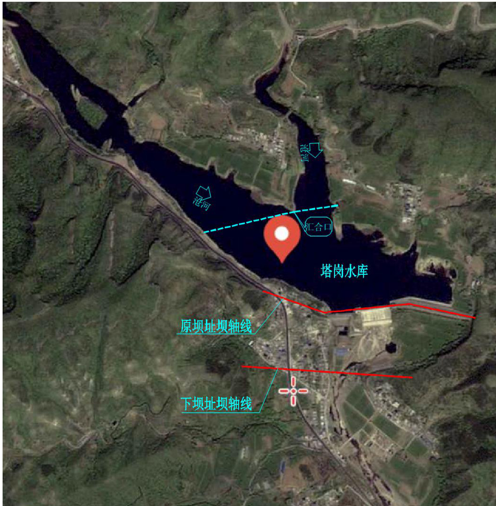  
图 6.3.2-1 塔岗水库建坝河段选择  

# 6.3.3 原坝址方案  

# 6.3.3.1 地形地质条件  

原坝址地形地质条件及初步评价见“3.4.2 原坝址区工程地质”。  

# 6.3.3.2 枢纽布置  

工程布置方案为拆除原主要挡水建筑物,原坝址新建混合坝。包括碾压混凝土重力坝(含泄水、引水建筑物)和左岸黏土心墙堆石坝,坝后电站等建筑物。  

坝顶全长 $1034.40\mathrm{m}$ ,坝顶高程 $209.00\mathrm{m}$ ,坝顶上游设防浪墙,防浪墙顶高程 $210.20\mathrm{m}$ ,上游侧设置 $1.2\mathrm{m}$ 高石材。坝轴线控制坐标 A (左坝肩 :504300.1785 , 3939854.7797 ) 、 B ( 右 坝 肩 :503292.5076 ,3939982.4432 ) 。 从 左 至 右 分 别 为 左 副 坝 黏 土 心 墙 堆 石 坝 段( $0{+}000.00{-}0{+}412.60\$ )、河床非溢流坝段( $0{+}412.60{-}0{+}580.60$ )、表孔坝段( $0+580.60{\sim}0+640.60~;$ )、底孔坝段( $0{+}640.60{\sim}0{+}661.60;$ )、引水坝段( $0+661.60{\sim}0+68260)$ )、右岸非溢流坝段( $(0{+}682.60{-}1{+}034.40)$ )。  

# (1)挡水建筑物  

挡水建筑物为混合坝,左岸新建黏土心墙堆石坝段,主河床及右岸为原址新建混凝土重力坝坝段。  

碾压混凝土重力坝坝顶长度为 $621.80\mathrm{m}$ 。从左至右共分为 30 个坝段(编号 1#\~30#坝段),其中挡水坝段布置于 1#\~8#、14#\~30#坝段。坝顶高程$209.00\mathrm{m}$ ,坝顶长 $519.80\mathrm{m}$ ,建基面高程 $141.00\mathrm{m}$ ,最大坝高 $68.0\mathrm{m}$ ;上游侧高程 $150.0\mathrm{m}$ 以上为铅直面(坝轴线桩号 $0{\pm}000.00\$ )、以下为 1:0.2 的斜坡面,下游侧高程 $197.00\mathrm{m}$ 以上为铅直面、以下为 1:0.75 的斜坡面;坝顶总宽度$9.0\mathsf{m}$ ;重力坝段基础进行固结灌浆,并在上游侧设帷幕灌浆,以减小扬压力和渗流量。  

左岸为黏土心墙堆石坝,坝顶长度为 $412.60\mathrm{m}$ 。最大坝高 $38.00\mathrm{m}$ ,黏土心墙堆石坝上游坝坡坡比 1:2.25,上游坝坡 $189.00\mathrm{m}$ 高程设置平行于坝轴线的马道,宽 $2.0\mathsf{m}$ 。下游坝坡坡比 1:2.0,坡脚处设排水棱体。下游设置“之”字上坝道路,自 $177.00\mathrm{m}$ 高程延伸至坝顶刺墙衔接段拐角处,道路宽 $8.0\mathsf{m}$ ,坡率 $\scriptstyle{\mathrm{i=6}}\%$ 。在距坝轴线上游 $5.0\mathsf{m}$ 处新建塑性混凝土防渗墙,墙宽 $0.6m$ ,距原防渗墙 $15.00\mathrm{m}$ 。  

黏土心墙堆石坝与重力坝段采用混凝土刺墙进行连接,刺墙为重力式挡墙,沿坝轴线方向顶部长 $92\mathrm{m}$ ,沿坝轴线方向上游坡比为 1:0.25,下游坡比 1::05,垂直坝轴线墙面坡比 1:0.3。右岸上下游坡面与重力坝段衔接处采用锥面裹头型式顺接,坝后设置压重平台,坡脚处填筑至 177.00 高程排水棱体顶部,往下游按照 $2\%$ 坡比进行放坡。。  

# (2)泄水建筑物  

泄水建筑物共布设 3 个泄洪表孔和 2 个泄洪底孔。其中表孔坝段布置在9#\~11#坝段,长 $60.0\mathrm{m}$ ,共 3 孔。泄洪表孔每孔净宽为 $12.0\mathrm{m}$ ,边墩 $4.0\mathsf{m}$ ,为开敞式溢流孔口,采用 WES 实用堰型,堰顶高程 $192.0\mathrm{m}$ ,闸墩顶高程$209.00\mathrm{m}$ 。底孔坝段布置在 12#坝段,长 21 米,共设置 2 孔,泄洪底孔孔口尺寸为 $2.50{\times}3.00\mathsf{m}$ (宽 $\times$ 高),进口底板高程为 $156.00\mathrm{m}$ ,出口设置弧形工作闸门,采用液压启闭机启闭。表孔、底孔下游消能工均采用底流消能形式。  

泄洪底孔、表孔均采用底流消能方式。为避免水流紊乱,表孔、底孔消力池采用中隔墙隔开分别消能。表孔、底孔消力池池底高程均为 $140.0\mathrm{m}$ ,池深均为 $8.0\mathsf{m}$ ,池长均为 $110.0\mathrm{m}$ ,底板厚度为 $4.0\mathsf{m}$ 。表孔消力池净宽 $56\mathrm{m}$ ,底孔消力池净宽 $17\mathrm{m}$ 。尾坎顶高程均为 $148.0\mathrm{m}$ ,尾坎顶宽 $3.0\mathsf{m}$ 。坝址下游河覆盖层较厚,抗冲刷能力差,考虑到工程下泄流量较大,水流出消力池后仍存在紊动,流速尚未恢复到天然河道流速分布。为提高河床的抗冲刷能力,参考同类工程,消力池后接长度 $30.0\mathsf{m}$ 、厚度 $2.0\mathsf{m}$ 钢筋混凝土防冲海漫护坦,海漫后接 $30\mathsf{m}$ 抛石防冲槽,与下游河道顺接。  

为提高建基岩体整体性,溢流表孔与泄洪底孔消力池底板进行固结灌浆, 固结灌浆孔孔深 $6.0\mathsf{m}$ ,间排距 $3.0\mathsf{m}$ ,梅花形布置;消力池全底板设置锚筋, 锚筋直径 $\Phi28$ ,入岩 $8.0\mathsf{m}$ ,间排距 $2.0\mathsf{m}$ ,梅花形布置。  

# (3)引水建筑物  

引水建筑物布置为坝式进水口 $^+$ 坝内埋管的型式,位于大坝 13#坝段。首部拦污栅槽净宽 2m。进水口渐变段长 $_{2\mathsf{m}}$ ,由 $1.2\mathrm{m}\times1.2\mathrm{m}$ 的方形孔口渐变为直径为 $1.2\mathrm{m}$ 的圆形孔口,其后接直径为 $1.2\mathrm{m}$ 的压力钢管。坝内设引水压力主管1 根,内径 $1.2\mathrm{m}$ ,压力钢管出坝后连接坝外引水管系统。  

电站为坝后式电站,厂区布置在大坝下游右岸坝脚处,厂区室外的地坪高程为 $157.0\mathrm{m}$ 。布置有主厂房、安装场、副厂房、下游尾水池、生态放水管、进场路等建筑物。总装机容量为 0.6MW,装机 3 台。  

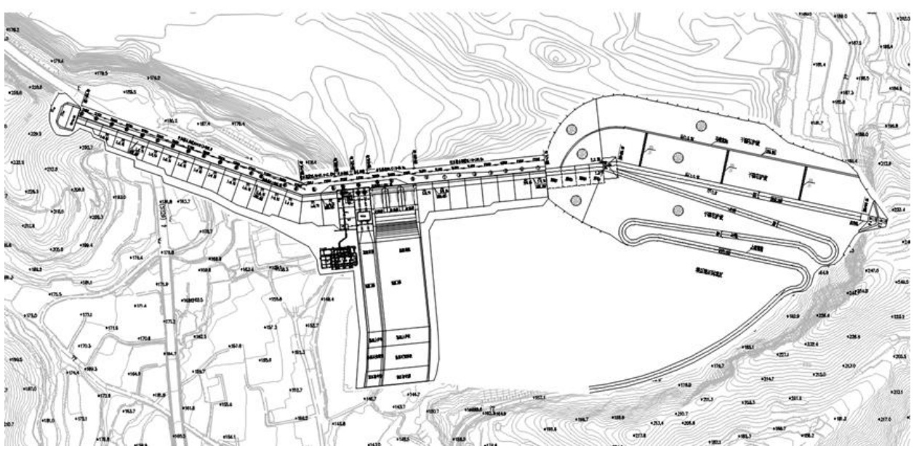  
图 6.3.3-1 塔岗水库混合坝平面布置图(原坝址)  

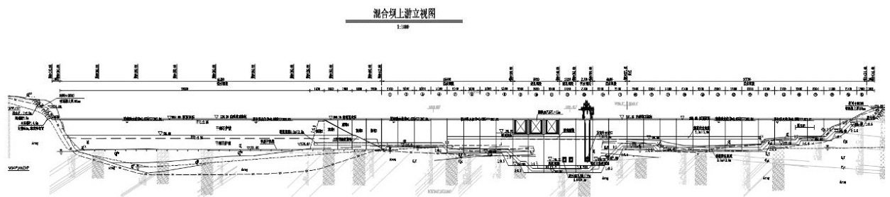  
图 6.3.3-2 塔岗水库混合坝立视图(原坝址)  

# 6.3.4 下坝址方案  

# 6.3.4.1 地形地质条件  

下坝址地形地质条件及初步评价见“3.4.1 下坝址工程地质”。  

# 6.3.4.2 枢纽布置  

根据地形地质条件,推荐坝型为碾压混凝土重力坝,坝轴线为折线,坝顶全长 $813\mathsf{m}$ ,坝顶高程 $205.00\mathrm{m}$ 。从左至右共分为 39 个坝段(编号 1#\~39#坝段),其中挡水坝段布置于 1#\~14#、20#\~39#坝段。坝顶高程 $205.00\mathrm{m}$ ,宽$9.0\mathsf{m}$ ,建基面高程 $139.00\mathrm{m}$ ,最大坝高 $66.00\mathrm{m}$ ,坝体下游坡比 1:0.75,起坡点高程 201.5;上游面 $147\mathrm{m}$ 高程以上为铅直面, $147.0\mathrm{m}$ 高程以下坡度为1:0.2,下游侧高程 $193.0\mathrm{m}$ 以上为铅直面、以下为 1:0.75 的斜坡面;坝顶上游设防浪墙,防浪墙顶高程 $210.20\mathrm{m}$ ,下游侧设置 $1.2\mathrm{m}$ 高石材。重力坝段基础进行固结灌浆,并在上游侧设帷幕灌浆,以减小扬压力和渗流量。  

泄水建筑物共布设 3 个泄洪表孔和 2 个泄洪底孔。其中表孔坝段布置在17#\~19#坝段,长 $60.0\mathrm{m}$ ,共 3 孔。泄洪表孔每孔净宽为 $12.0\mathrm{m}$ ,边墩 $4.0\mathsf{m}$ ,为开敞式溢流孔口,采用 WES 实用堰型,堰顶高程 $188.0\mathrm{m}$ ,闸墩顶高程$205.00\mathrm{m}$ 。底孔坝段布置在 16#坝段,长 21 米,共设置 2 孔,泄洪底孔孔口尺寸为 $2.50\times3.00\mathrm{m}$ (宽 $\times$ 高),进口底板高程为 $154.00\mathrm{m}$ ,出口设置弧形工作闸门,采用液压启闭机启闭。底孔、表孔均采用底流消能形式。  

泄洪底孔、表孔均采用底流消能方式。为避免水流紊乱,表孔、底孔消力池采用中隔墙隔开分别消能。表孔、底孔消力池池底高程均为 $136.0\mathrm{m}$ ,池深均为 $8.0\mathsf{m}$ ,池长均为 $110.0\mathrm{m}$ ,底板厚度为 $4.0\mathsf{m}$ 。表孔消力池净宽 $56\mathrm{m}$ ,底孔消力池净宽 $17\mathrm{m}$ 。尾坎顶高程均为 $144.0\mathrm{m}$ ,尾坎顶宽 $3.0\mathsf{m}$ 。坝址下游河覆盖层较厚,抗冲刷能力差,考虑到工程下泄流量较大,水流出消力池后仍存在紊动,流速尚未恢复到天然河道流速分布。为提高河床的抗冲刷能力,参考同类工程,消力池后接长度 $30.0\mathsf{m}$ 、厚度 $2.0\mathsf{m}$ 钢筋混凝土防冲海漫护坦,海漫后接 $30\mathsf{m}$ 抛石防冲槽,与下游河道顺接。  

为提高建基岩体整体性,溢流表孔与泄洪底孔消力池底板进行固结灌浆, 固结灌浆孔孔深 $6.0\mathsf{m}$ ,间排距 $3.0\mathsf{m}$ ,梅花形布置;消力池全底板设置锚筋, 锚筋直径 $\Phi28$ ,入岩 $8.0\mathsf{m}$ ,间排距 $2.0\mathsf{m}$ ,梅花形布置。  

引水建筑物为坝式进水口及坝内引水压力钢管,位于大坝 15#坝段,长 21米。进水流道宽度为 $2.0\mathsf{m}$ ,进水口为平底喇叭口型,孔口尺寸 $1.2\times2.0\mathrm{m}$ ;进水口顶设操作平台,高程 $205.00\mathsf{m}$ 。检修门后的渐变段长 $2.0\mathsf{m}$ ,由 $1.2\times2.0\mathrm{m}$ 的方孔渐变为内径 $01.2\ m$ 的圆孔,渐变段后接内径 $01.2\ m$ 的压力钢管,钢管出坝体后经岔管接入电站内。  

电站为坝后式电站,厂区布置在大坝下游右岸坝脚处,总装机容量为0.6MW,装机 3 台。布置有主厂房、安装场、副厂房、下游尾水池、生态放水管、进场路等建筑物。  

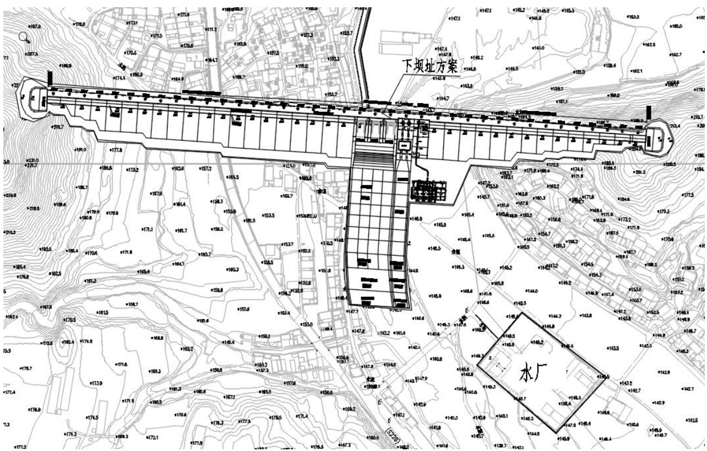  
图 6.3.4-1 塔岗水库混合坝平面布置图(下坝址)  

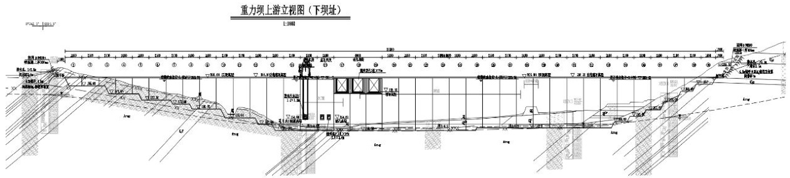  
图 6.3.4-2 塔岗水库混合坝立视图(下坝址)  

# 6.3.6 坝址比选  

# 6.3.6.1 地形地质条件比较  

根据目前掌握的地质资料,对两个坝址进行初步比选,详见表 6.3.6-1。  

# 表 6.3.6-1 坝址初步比选  

<html><body><table><tr><td colspan="2">坝址及比选 地质条件</td><td>原坝址</td><td>下坝址</td><td>比选结果</td></tr><tr><td colspan="2">区域</td><td colspan="3">原坝址和下坝址相距300m，同属一个构造单元，区域 地质背景相同。基本地震地震动峰值加速度0.20g，相 应地震基本烈度为VⅢ度，区域构造稳定性较差</td></tr><tr><td colspan="2">库区</td><td colspan="2">两个方案的库区范围大部分重叠，地质条件和主要工程 地质问题基本相似</td><td>相似</td></tr><tr><td rowspan="4">坝址 区地 质条 件</td><td>地形条 件</td><td>河谷开阔，正常蓄水位处 河谷宽度约922m。现状主 河槽宽约65m，左岸阶地 处宽度约340m，现状为耕 地；两坝肩地形完整</td><td>河谷开阔，正常蓄水位处 河谷宽度约636m。现状主 河槽宽约77m，右岸阶地 宽度约357m，现状为村 庄；右坝肩山体完整，左 坝肩山地单薄</td><td>各有优劣</td></tr><tr><td>地层岩 性</td><td>岩性复杂，基岩有片麻岩 （Arog）、闪长岩 （K1T）、粉砂岩和白云 质灰岩（∈1z）；覆盖层 有砾岩（Q1pl）、 低液限黏土（Q2alp）、马 兰黄土（Q3alp）以及人工 填土（Q4s)</td><td>岩性较复杂，基岩有片麻 岩（Arog）、闪长岩 （K1T）；覆盖层有 低液限黏土（Q2alp）、碎 石混合土（Q3alp）以及人 工填土（Q4s)</td><td>下坝址地 层岩性相 对简单， 占优</td></tr><tr><td>地质构 造</td><td>为单斜构造，主要构造形 迹为节理；沉积岩层面平 缓</td><td>为单斜构造，主要构造形 迹为节理 左坝肩强风化带厚约</td><td>下坝址占 优</td></tr><tr><td>岩体风 化</td><td>左副坝位置覆盖层厚 13.0~44.5m，强风化带厚 0~5.7m，弱风化带 2~23.5m；原溢洪道位置 覆盖层厚0.3~3.5m，强风 化带0~6.5m，弱风化带厚 5.1~9.2m。主坝段无覆盖 层和强弱风化带；右副覆 盖层厚0.7~2.7m，强风化 带厚0.8~2.5m，弱风化带 厚3.6~8.1m不等</td><td>2.5m，弱风化带厚约 17.1m；主河槽覆盖层厚约 4.7m，强风化带厚1.2m， 弱风化带厚约0.6m；右岸 阶地覆盖层厚度约 15.8m，基岩无强风化带， 弱风化带约5.1m；右坝肩 山体零星分布残积土，基 岩无强风化带，弱风化带 厚约7.9m</td><td>各有优劣</td></tr><tr><td>不良地 质体</td><td>无不良地质体</td><td>左岸小规模崩塌；单薄山 脊下游冲沟发育多期次泥 石流</td><td>原坝址占 优</td></tr></table></body></html>  

<html><body><table><tr><td colspan="2">坝址及比选 地质条件</td><td>原坝址</td><td>下坝址</td><td>比选结果</td></tr><tr><td></td><td>特殊土</td><td>左副坝下游阶地表层分布 湿陷性黄土</td><td>无特殊土</td><td>下坝址占 优</td></tr><tr><td rowspan="4">坝址 区主 要工 程地 质问</td><td>场地稳 定性</td><td>基本稳定</td><td>左岸小规模崩塌，易于治 理</td><td>相似</td></tr><tr><td>坝基渗 漏</td><td>左副坝坝基砾岩 (Q1pl) 和右副坝侵入接触带存在 渗漏问题</td><td>右岸阶地碎石混合土存在 渗漏问题</td><td>下坝址占 优</td></tr><tr><td>绕坝渗 漏问题</td><td>左坝肩不存在绕坝渗漏问 题，右坝肩存在绕坝渗漏 问题</td><td>左岸单薄山脊存在绕坝渗 漏问题；右坝肩山体存在 绕坝渗漏问题</td><td>原坝址占 优</td></tr><tr><td>坝基深 层抗滑 问题</td><td>坝基分布层面近水平的沉 积岩，对混凝土重力坝来 说可能存在深层抗滑问题</td><td>坝基主要为片麻岩 （Arog），未发现发育缓 角度结构面；坝基存在深 层抗滑的可能性不大</td><td>下坝址占 优</td></tr><tr><td></td><td>坝肩工 程边坡 稳定性</td><td>两坝肩工程边坡稳定性好</td><td>左坝肩单薄山脊上游侧边 坡稳定性不良；右坝肩边 坡为顺向坡，片麻理倾角 小于工程边坡坡角，稳定 性不良</td><td>原坝址占 优</td></tr><tr><td colspan="2">天然建筑材料</td><td colspan="3">两坝址相距较近，其石料场均来源库尾李沿沟村附近; 土料均来源水库右岸阶地</td><td>相同</td></tr></table></body></html>  

经综合比较,原坝址和下坝址地质条件较为相似、各有优劣,均不存在制约建坝的地形地质条件。设计经过综合比选,推荐原坝址。  

# 6.3.6.2 工程布置比较  

(1)工程布置  

1)原坝址  

原坝址河谷开阔,呈宽“U”型河谷,河谷宽约 670m。主河道地面高程约$150\mathrm{m}$ 。右坝头为缓丘,地面高程 $175{\sim}190\mathrm{m}$ ;S227 省道从右坝头穿过。左坝肩地面高程 $185{\sim}325\mathrm{m}$ ,地形陡峻。  

主要建筑物为混合坝,左岸为黏土心墙堆石坝段,主河床及右岸为碾压式混凝土重力坝坝段。坝顶全长 $1034.4\mathrm{m}$ ,坝顶高程 $209.00\mathrm{m}$ ,坝顶上游设防浪墙,防浪墙顶高程 $210.20\mathrm{m}$ ,下游侧设置 1.2m 高石材。  

重力坝坝段为原主坝、右副坝、溢洪道拆除后原址新建。坝顶全长 $621.8\mathrm{m}$ ,坝顶高程 $209.00\mathrm{m}$ ,最低建基面高程 $141.00\mathrm{m}$ ,最大坝高 $68.0\mathrm{m}$ ,坝顶宽 $9\mathsf{m}$ 。  

其中挡水坝段总长 $519.80\mathrm{m}$ ,发电引水坝段总长 21m,泄洪表孔坝段总长 $60\mathrm{m}$ ,共设 3 个泄洪表孔,泄洪底孔坝段长 $^{21\mathrm{m}}$ ,共设 2 个泄洪底孔。底孔、表孔均采用底流消能形式。  

左岸新建为粘土心墙堆石坝,坝顶长 $412.60\mathrm{m}$ ,坝顶高程 209.00m,防浪墙顶高程 $210.20\mathrm{m}$ ,坝顶宽度为 $9.0\mathsf{m}$ ,最大坝高 $38.00\mathrm{m}$ ,上游坝坡坡比1:2.25,下游坝坡坡比 1:2.0,坡脚处与排水棱体衔接。在距坝轴线上游 $5.0\mathsf{m}$ 处新建塑性混凝土防渗墙,墙宽 $0.6m$ ,距原防渗墙 $15.00\mathrm{m}$ 。  

# 2)下坝址  

下坝址坝址区河谷开阔,为不对称的宽“U”型谷,现代河床较窄,宽约$102\mathrm{m}$ 。左岸为走向近 NE 向单薄山脊,山脊北侧边坡为峭壁,南侧边坡为陡坡类型。河床右侧为阶地,地面高程 $152{\sim}172\mathrm{m}$ ,地形较缓,现状为塔岗村。  

推荐坝型为碾压混凝土重力坝,坝顶全长 $813.00\mathrm{m}$ 。坝顶高程 $205.00\mathrm{m}$ ,坝顶上游设防浪墙,防浪墙顶高程 $206.20\mathrm{m}$ ,下游侧设置 $1.2\mathrm{m}$ 高石材。最低建基面高程 $139.00\mathrm{m}$ ,最大坝高 $66.0\mathsf{m}$ ,坝顶宽 9m。其中挡水坝段总长$711.0\mathrm{m}$ ,发电引水坝段总长 $^{21\mathsf{m}}$ ,泄洪坝段总长 $81.0\mathrm{m}$ ,其中引水坝段、泄洪底孔坝段布置于主河床左侧中,表孔坝段布置于主河床右侧及右岸阶地。  

# 4)对比  

受河谷形态与地形影响,原坝址河谷最为开阔,宽约 670m,原坝址可充分利用现状地形结构,表孔坝段布置在主坝坝段,减少开挖;原主河床及右侧河段,覆盖层较薄,清除覆盖层,基岩可满足混凝土重力坝建基要求。  

下坝址河床最窄,河床卵砾石和右岸阶地的低液限黏土层为散体结构,不满足混凝土重力坝的建基要求,需要全部挖除至微风化的角闪片麻岩;大坝左岸坝体布置在单薄山脊上,卸荷裂隙发育,渗透性较强,存在渗漏问题,需要采取防渗处理措施。下坝址的消能设施距离下游侧水厂较近,水库泄洪时泄流量较大,流速较高,冲刷下游河床,虽然消能方案增加下游护坦,仍可能会影响水厂安全,且水厂在其管理范围内,增加水库管理难度。  

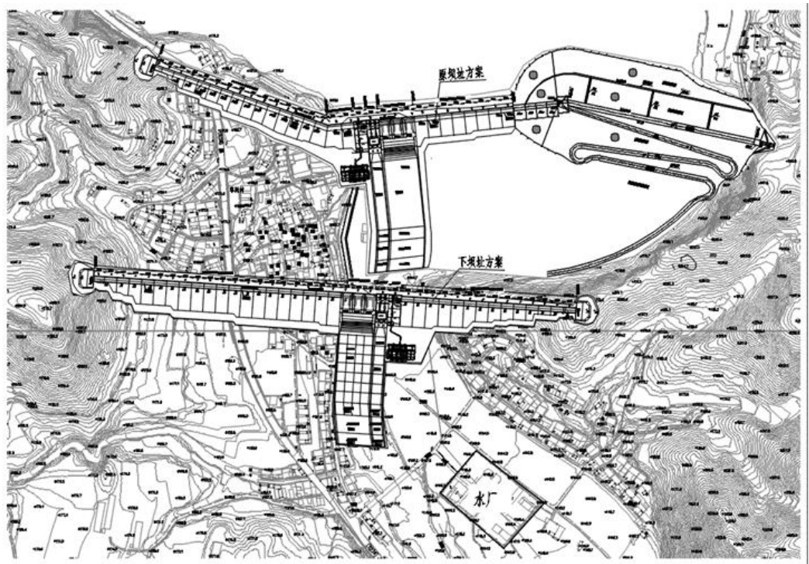  
图 6.3.6-1 塔岗水库原坝址、下坝址布置图  

从工程布置来看,原坝址优于下坝址。  

# (2)工程量及投资比较  

表 6.3.6-2 原坝址和下坝址主要工程量表  

<html><body><table><tr><td>部位</td><td>项目</td><td>单 位</td><td>推荐坝址主要 工程量</td><td>下坝址主要 工程量</td></tr><tr><td></td><td>土方明挖</td><td>m3</td><td>107127</td><td>468973</td></tr><tr><td>石方明挖</td><td></td><td>m3</td><td>284926</td><td>388936</td></tr><tr><td></td><td>卵石明挖</td><td>m3</td><td>82665</td><td>47142</td></tr><tr><td></td><td>石方洞挖</td><td>m3</td><td>7776</td><td>15552</td></tr><tr><td rowspan="7">主坝及右副坝 重建重力坝</td><td>渣石回填</td><td>m3</td><td>370000</td><td>29022</td></tr><tr><td>坝基常态混凝土（三级配 C20F50W6）1m厚</td><td>m3</td><td>28122</td><td>37469</td></tr><tr><td>坝体常态混凝土（三级配 C25F150W6)</td><td>m3</td><td>95025</td><td>94229</td></tr><tr><td>消能设施常态混凝土（三级配 C25F200W6)</td><td>m3</td><td>68926</td><td>66280</td></tr><tr><td>变态混凝土C20F200W6</td><td>m3</td><td>51236</td><td>81056</td></tr><tr><td>富胶凝碾压混凝土C25F150W6 碾压混凝土（三级配</td><td>m3</td><td>55987</td><td>91028</td></tr><tr><td>C15F50W4)</td><td>m3</td><td>436807</td><td>768788</td></tr><tr><td></td><td>抗冲磨混凝土C40F200W6</td><td>m3</td><td>16627</td><td>15823</td></tr><tr><td></td><td>喷混凝土</td><td>m3</td><td>2492</td><td>3638</td></tr><tr><td>平衬砌</td><td></td><td>m3</td><td>2592</td><td>5184</td></tr></table></body></html>  

<html><body><table><tr><td rowspan="7">堆石坝</td><td>钢筋</td><td>t</td><td>14083</td><td>15568</td></tr><tr><td>惟幕灌浆</td><td>m</td><td>65205</td><td>86442</td></tr><tr><td>惟幕灌浆钻孔</td><td>m</td><td>78118</td><td>103651</td></tr><tr><td>固结灌浆</td><td>m</td><td>50888</td><td>35570</td></tr><tr><td>固结灌浆钻孔</td><td>m</td><td>66154</td><td>46785</td></tr><tr><td>回填灌浆</td><td>m2</td><td>5865</td><td>11730</td></tr><tr><td>接触灌浆</td><td>m2</td><td>13247</td><td>17222</td></tr><tr><td></td><td>排水孔</td><td>m</td><td>15430</td><td>20098</td></tr><tr><td>电站厂房</td><td>主副厂房面积</td><td>m2</td><td>1010</td><td>1010</td></tr><tr><td rowspan="10">左副坝加高 为粘土心墙</td><td>灰岩堆石料</td><td>m3</td><td>1127105</td><td>0</td></tr><tr><td>黏土心墙</td><td>m3</td><td>236525</td><td>0</td></tr><tr><td>反滤料</td><td>m3</td><td>74209</td><td>0</td></tr><tr><td>过渡料</td><td>m3</td><td>73302</td><td>0</td></tr><tr><td>防浪墙</td><td>m3</td><td>1179</td><td>0</td></tr><tr><td>坝顶道路</td><td>m3</td><td>1495</td><td>0</td></tr><tr><td>排水棱体</td><td>m3</td><td>81793</td><td>0</td></tr><tr><td>渣石回填</td><td>m3</td><td>400000</td><td>0</td></tr><tr><td>干砌石护坡</td><td>m3</td><td>31542</td><td>0</td></tr><tr><td>护坡碎石垫层</td><td>m3</td><td>15777</td><td>0</td></tr><tr><td>护坡中粗砂垫层</td><td>m3</td><td>15777</td><td></td><td>0</td></tr><tr><td>刺墙</td><td>m3</td><td></td><td>61741</td><td>0</td></tr><tr><td>钢筋 钻孔深度</td><td></td><td>t</td><td>3087</td><td>0</td></tr><tr><td>帷幕灌浆</td><td></td><td>m</td><td>12880</td><td>0</td></tr><tr><td>灌浆深度 塑性混凝土 C25W6F300,防渗墙厚0.6m</td><td></td><td>m m²</td><td>8050</td><td>0</td></tr></table></body></html>  

原坝址、下坝址方案主要建筑物工程量见表 6.3.6-2。原坝址方案建筑工程投资 114745 万元,下坝址方案建筑工程投资 125521 万元。从工程投资来看,原坝址优于下坝址。  

综上:原坝址工程布置优于下坝址;原坝址建筑工程投资略优于下坝址方案,综合考虑,工程布置推荐原坝址。  

# 6.3.6.3 施工条件比较  

两个坝址的交通条件、主要建筑材料供应条件及施工供水、供电、通讯基本相同,两个坝址相距不远,均位于 S226 省道旁,对外交通便利,外来建材均自卫辉市采购。原坝址及下坝址附近 S226 省道左右两侧地形平坦,施工布置条件较好。且两个坝址相距不远,施工条件基本一致,两个坝址施工条件均不制约水库建设。  

综上:原坝址、下坝址方案施工条件基本一致,均不制约水库建设。  

# 6.3.6.4 建设征地与移民安置比较  

原坝址征收土地面积约 3581.45 亩,人口 1326 人,移民占地投资为 9.97亿元,涉及占压基本农田面积 995.32 亩。  

下坝址征收土地面积约 3215.50 亩,人口 1783 人,移民占地投资为 9.52亿元,下坝址涉及占压基本农田面积 397.45 亩。  

原坝址、下坝址均不涉及占用国家国家级公益林。  

从投资角度分析,下坝址投资略优于原坝址;从搬迁角度分析,原坝址搬迁人口少于下坝址,优于下坝址;  

综上:原坝址方案优于下坝址方案。  

# 6.3.6.5 环境影响比较  

环境因素:原坝址和下坝址均在塔岗水库附近,其中原坝址、下坝址淹没范围均涉及生态保护红线,履行占用生态保护红线手续。  

水源保护区:原坝址和下坝址的淹没范围涉及塔岗水库饮用水源一级保护区和二级保护区。两座水库均涉及水源保护地,都征求生态环境部门同意。  

综上:两个坝址在环境因素和水源保护地方面整体相差不大。  

# 6.3.6.6 工程投资比较  

工程投资:原坝址新建工程投资 28.69 亿元。下坝址工程投资 29.58 亿元。原坝址方案投资优于下坝址。  

表 6.3.2-1 原坝址和下两个坝址投资对比表(单位:万元)  

<html><body><table><tr><td>项目</td><td>原坝址</td><td>下坝址</td></tr><tr><td>工程部分投资</td><td>182751.72</td><td>195783.12</td></tr><tr><td>第一部分 建筑工程</td><td>114745</td><td>125521</td></tr><tr><td>第二部分机电设备及安装工程</td><td>1409.22</td><td>1409.22</td></tr><tr><td>第三部分金属结构设备及安装工程</td><td>3241.58</td><td>3241.58</td></tr><tr><td>第四部分 施工临时工程</td><td>19759.46</td><td>19759.46</td></tr><tr><td>第五部分独立费用</td><td>24015.92</td><td>26271.32</td></tr><tr><td>一至五部分投资合计</td><td>163171.18</td><td>176202.58</td></tr><tr><td>基本预备费</td><td>19580.54</td><td>19580.54</td></tr></table></body></html>  

<html><body><table><tr><td>静态投资</td><td>182751.72</td><td>195783.11</td></tr><tr><td>建设征地移民补偿投资</td><td>99675.58</td><td>95200</td></tr><tr><td>环境保护工程投资静态投资</td><td>2489.86</td><td>2667.41</td></tr><tr><td>水土保持工程投资静态投资</td><td>2052.24</td><td>2198.58</td></tr><tr><td>总投资</td><td>286969.4</td><td>295849.1</td></tr></table></body></html>  

表 6.3.2-2 原坝址、下两个坝址建坝条件对比简表  

<html><body><table><tr><td>项目</td><td>原坝址</td><td>下坝址</td><td>比较结果</td></tr><tr><td>地形 地质 条件</td><td>原坝址位于塔岗村北的沧河上，坝 址区属低山地貌类型，河谷开阔， 呈宽"U"型河谷。主要地层：覆盖层 较薄，角闪片麻岩、二长片麻岩 （Arog），白云质灰岩、粉砂岩 （∈z），闪长岩（KiT）和第 四系松散覆盖层（Q)</td><td>下坝址位于原坝址下游约 0.2km处，坝址区丘陵河谷 地貌，河谷开阔，呈宽“U” 型河谷。主要地层岩性为太 古界（Arog）角闪片麻岩、 更长斑岩（KL）、白云质灰 岩（∈z）第四系松散覆盖层 (Q)</td><td>地质条件 均不制约 水库建设</td></tr><tr><td>建筑 材料</td><td>库区左岸发育的阶地上分布有低液 限黏土，可作为防渗料和填筑料使 用，可作为本工程土料场。 库尾的李沿沟村北分布有寒武系张 夏组的块状灰岩，岩石坚硬，岩溶 不发育，岩体完整，储量丰富，可 满足块石料、堆石料和混凝土骨料 使用要求；该料场紧邻S227省 道，开采运输条件良好。</td><td>李沿沟村北分布有寒武系张 夏组的块状灰岩，岩石坚 硬，岩溶不发育，岩体完 整，储量丰富，可满足块石 料、堆石料和混凝土骨料使 用要求；该料场紧邻S227省 道，开采运输条件良好。</td><td>均不制约 水库建设</td></tr><tr><td>建筑 物布 置</td><td>主要建筑物为混合坝，左岸布置黏 土心墙堆石坝段，主河床及右岸为 原址新建混凝土重力坝坝段。坝顶 全长1034.4m，坝顶高程 209.00m，最大坝高68.0m，坝顶 宽 9m。原坝址方案建筑工程投资 11.47万元。</td><td>主要建筑物为重力坝，坝顶 全长813m，坝顶高程 205.0m，最大坝高66.0m， 坝顶宽9m。大坝左岸坝体布 置在单薄山脊上，可能存在 渗漏问题。 下坝址方案建筑投资12.55 万元。</td><td>原坝址优</td></tr><tr><td>环境 保护</td><td>（1）淹没范围涉及生态保护红 线。履行占用生态保护红线手续； （2）淹没范围涉及塔岗水库饮用 水源一级保护区和二级保护区。征 求生态环境部门同意。</td><td>（1）淹没范围涉及生态保护 红线。履行占用生态保护红 线手续；（2）淹没范围涉及 塔岗水库饮用水源一级保护 区和二级保护区。征求生态 环境部门同意。</td><td>整体相差 不大</td></tr></table></body></html>  

<html><body><table><tr><td>项目</td><td>原坝址</td><td>下坝址</td><td>比较结果</td></tr><tr><td>施工 条件</td><td>坝址位于S226省道旁，对外交通 便利，外来建材均自卫辉市采购。 其中，原坝址下游附近S226省道 左右两侧地形平坦，施工布置条件 较好。</td><td>坝址位于 S226 省道旁，对外 交通便利，外来建材均自卫 辉市采购。其中，下坝址附 近S226省道左右两侧地形平 坦，施工布置条件较好。</td><td>原坝址、 下坝址方 案施工条 件基本一 致，均不 制约水库 建设。</td></tr><tr><td>建设 征地 与移 民安 置</td><td>（1）征收土地面积约3581.45 亩，人口1326人；（2）基本农田 情况：占压基本农田面积 995.7532亩；（3）移民占地投资 为9.97亿元。</td><td>（1）征收土地面积约 3215.50亩，人口1783人； （2）基本农田情况：占压基 本农田面积397.45亩； （3）移民占地投资为9.52 亿元。</td><td>原坝址较 优</td></tr><tr><td>工程 投资</td><td>28.69亿元</td><td>29.58亿元</td><td>原坝址优</td></tr></table></body></html>  

综合比较原坝址、下两个坝址的地形地质条件、工程布置、施工条件、建设征地与移民安置影响、环境因素和工程总投资等方面因素,选择原坝址方案。  

# 6.4 坝型选择  

# 6.4.1 原坝体加高可行性分析  

# 6.4.1.1 原坝体质量分析  

根据 2009 年除险加报告、2022 年《大坝安全鉴定报告书》、结合地质勘查对原坝体工程质量评价分析如下:  

(1)主坝坝体质量初步评价  

主坝为代水泥砌石重力墙干砌堆石坝,坝顶高程 $185\mathrm{m}$ ,坝顶长 157.7m.最大坝高 $41\mathsf{m}$ ,坝顶宽 $5.6\mathsf{m}$ 。上游坝坡坡比 1:0.25,下游坝坡坡度 1:1.4,在下游高程 $172.79\mathrm{m}$ 处留一级马道,马道宽 $4.0\mathsf{m}$ ,马道以上为干砌石贴坡,以下为碾压堆石贴坡。  

塔岗水库主坝为浆砌堆石坝,坝基为角闪片麻岩。目前主坝已运行近 50 年,由于修建水库时条件所限,坝体浆砌体部分为代水泥砌条石,所谓“代水泥”,是由红土、白灰烧制而成。浆砌体坝后堆石为人工抛石堆成,质量不好控制,存在安全隐患。块石为加工的规则的灰岩,强度较高,块石整体质量较好。  

2009 年水库除险加固工程对主坝进行加固,加固后坝型仍为浆砌石独立体干砌堆石混合坝。坝顶宽度为 $5.6\mathsf{m}$ ,坝顶高程维持现状 $185.0\mathrm{m}$ , 防浪墙顶部高程由现在的 $186.00\mathrm{m}$ 加高至 $186.20\mathrm{m}$ ,最大设计坝高仍为 $41\mathsf{m}$ ,设计防浪墙高由现在的 $1.0\mathsf{m}$ 加高到 $1.2\mathrm{m}$ 。下游碾压堆石贴坡坡度 1:1.4,并留一级马道,马道宽 $4.0\mathsf{m}$ 。 碾压堆石贴坡采用干切块石镶面。防浪墙加高部分采用C20,每隔 ${}^{20\mathrm{m}}$ 设一道变形缝。坝体防渗形式采用坝体自身防渗,上游面采用M20 高强水泥砂浆对原浆砌条石防渗体勾深缝,并对坝体进行补强灌浆孔距$1.0\mathsf{m}$ 。补强灌浆及坝体加固施工质量均达到设计要求。  

现状主坝坝型为代水泥砌石重力墙干砌堆石坝。坝顶下游侧为坝体横剖面分三部分:上游独立体为代水泥砌块石的重力墙(由浆砌条石、代水泥砼砌块石、代水泥砌料石三种材料组成),中部为干砌石过渡层,下游为堆石体。  

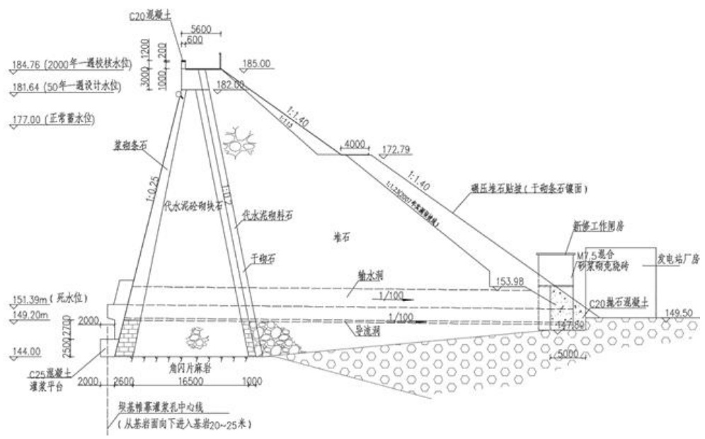  
图 6.4.1-1 主坝横断面图  

# (2)左副坝坝体质量初步评价  

原左副坝位于主坝东侧,坝型为均质粘土坝,现状坝顶宽 $6.4\textrm{m}$ ,坝顶高程 $186.00\mathrm{m}$ ,坝基高程 $171.00\mathrm{m}$ ,最大设计坝高 $15.0\mathrm{m}$ ,坝顶砌 $1.0\mathrm{m}$ 的防浪墙。上游面坝坡为 1:3,采用 $0.4\mathrm{~m~}$ 厚的干砌石护坡,下游面坝坡为 1:2.25,采用草籽护坡。  

坝基为左岸台地,地层岩性上部主要为低液限粘土,下部为卵石和含泥碎石层。坝体填土天然干密度 $\mathrm{~\boldmath~\rho~d~}$ 范围值 $1.41{\sim}1.56{\mathrm{g}}/{\mathsf{c m}}^{3}$ ,根据击实试验结果,最大干密度为 $1.72{\sim}1.799/{\mathsf{c m}}^{3}$ ,平均值 $1.76\mathsf{g}/\mathsf{c m}^{3}$ 。按设计干密度划分填土质量,填土合格率为 0,填筑质量很差。  

2009 年除险加固工程对左副坝坝基采用高喷防渗墙处理。新建高喷墙孔距和摆角均和原高喷墙相同,和原高喷墙密贴契合,形成整体,进一步封闭原高喷墙渗漏孔隙,提高整体渗效果,解决左副坝基础渗漏的问题。坝体填土未达到设计干密度的问题未解决。  

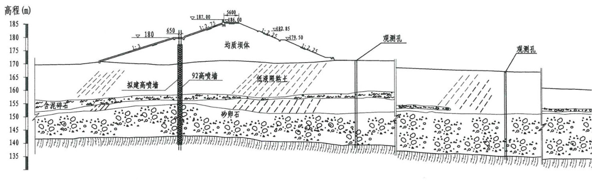  
图 6.4.1-2 左副坝横断面图  

(3)右副坝坝体质量初步评价  

右副坝位于主坝西侧,坝型为粘土斜墙坝,最大坝高 $5.6\mathsf{m}$ ,坝顶长 $70\mathrm{m}$ 、宽 $4.6\mathsf{m}$ ,采用泥结碎石路面,净宽 $4.0\mathsf{m}$ 。坝顶坝顶高程 $185.60\mathrm{m}$ ,上游侧防浪墙高 $1.0\mathsf{m}$ ,下游侧无路缘石。上游坝坡采用干砌石护坡,护坡厚度 $0.4\mathsf{m}$ ,坝坡坡比为 1:2.0。下游坝坡撒草籽,形成自然草皮护坡无排水沟及排水体。右副坝采用帷幕灌浆进行防渗处理。  

该处基岩面出露较高,土坝直接坐落于基岩上。本次勘探查明,右副坝填土极不均匀,为低液限黏土夹块石、碎石以及碎砖块等。坝体填土天然干密度ρd 范围值 $1.24{\sim}1.46{\:}9/{\mathsf{c m}}^{3}$ ,根据设计干密度划分填土质量,压实度只有$0.70\sim0.83$ ,填筑质量很差。由于右副坝土质极不均匀,且筑坝时未进行碾压,其质量甚差。  

2009 年除险加固工程在上游面新做粘土斜墙,斜墙上部宽 $1.0\mathsf{m}$ , 下部宽$2.0\mathsf{m}$ ,加固后最大坝高 $5.6\mathsf{m}$ ,坝顶长 $70\mathrm{m}$ 、宽 $4.6\mathsf{m}$ ,采用 C25 砼路面,净宽 $4.0\mathsf{m}$ 。  

原右副坝为 3 级建筑物,根据《碾压式土石坝设计》规范中 4.2.3:“ 黏性土的压实度应符合下列要求:3 级中坝、低坝及 3 级以下中坝压实度不应低于 $96\%$ ,地震设计烈度为证度、Ⅸ度的坝,应在上述规定基础上相应提高。”综上,原右副坝黏性土压实度低于 0.96,不满足筑坝质量要求。  

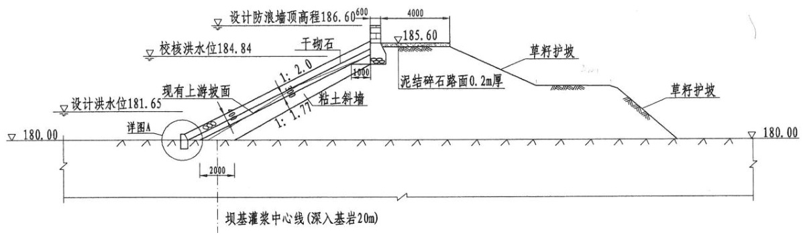  
图 6.4.1-3 右副坝横断面图  

根据坝址比选结果,初步拟定本次提升工程的推荐坝线为原坝址。本次塔岗防洪能力提升改造工程,原主、副坝坝高不满足挡水要求,因此,需要对主、副坝等建筑物进行改造。  

# 6.4.1.2 原坝体加高分析  

(1)主坝坝体加高分析  

由于坝体组成材料较多,受修建水库时条件限制,代水泥结构质量较差。坝后堆石为人工抛石堆成,因此原坝体部分结构质量较差,且不能保证加高后坝体质量;原坝体代水泥结构和干砌石建筑在角闪片麻岩岩基上,堆石体建筑在砂卵石河床上,砂卵石其承载力和变形能力较差,不满足重力坝建坝基础,需进行灌浆处理;本次加高后坝顶加高近 $30\mathrm{m}$ ,增加原坝高 3/4 高度,新、老坝体共同承担增加的水压力、坝基扬压力等,新、老坝体材料力学特性一般存在明显差异,结合面往往为弱面,大坝在自重、水压力、温度变化等作用下,结合面存在应力集中问题。综上采用加高培厚方式对原主坝整体包进混凝土重力坝内加高方式加高后坝体质量难以保证。本次对主坝改造可采用拆除下游堆石体,保留浆砌条石、代水泥砼砌块石结构,后侧加高为碾压混凝土重力坝和拆除新建主坝两种方案选择。  

方案一:拆除下游堆石体,保留代水泥砼砌块石结构,坝体后侧加高为碾压混凝土重力坝  

混凝土重力坝坝顶长度为 $628.70\mathrm{m}$ 。从左至右共分为 30 个坝段(编号1#\~30#坝段),其中挡水坝段布置于 1#\~7#、13#\~30#坝段。坝顶高程$214.80\mathrm{m}$ ,坝顶长 $526.7\mathrm{m}$ ,建基面高程 $134.00\mathrm{m}$ ,最大坝高 $80.8\mathsf{m}$ ;上游侧高为铅直面(坝轴线桩号 $0{\pm}000.00\$ ),下游侧高程 $204.8\mathrm{m}$ 以上为铅直面、以下为 1:0.75 的斜坡面;顶部上游侧悬挑 $1.5\mathrm{m}$ 长牛腿,坝顶总宽度 $9.0\mathsf{m}$ ;重力坝段基础进行固结灌浆,并在上游侧设帷幕灌浆,以减小扬压力和渗流量。  

10#\~12#坝段为溢流表孔坝段,长 $60\mathrm{m}$ ,共设 3 个泄洪表孔;6#坝段为泄洪底孔坝段,长 21m;5#坝段为引水坝段,长 21m,电站为坝后式电站,厂区布置在大坝下游河床左岸坝脚处,厂区室外的地坪高程为 $157.0\mathrm{m}$ 。总装机容量为0.6MW,装机 3 台。  

  
图 6.4.1-4 保留代水泥砼砌块石结构,后侧加高方案平面布置图  

本方案在拆除原坝体下游堆石体基础上进行加高设计,坝体横断面见图6.4.1-4。  

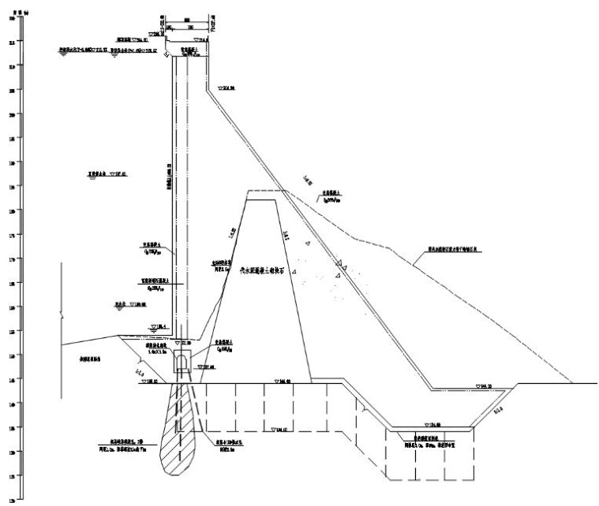  
图 6.4.1-5 保留代水泥砼砌块石结构,后侧加高方案横断面图  

方案二:拆除原坝体新建碾压混凝土重力坝  

混凝土重力坝坝顶长度为 628.70m。从左至右共分为 30 个坝段(编号1#\~30#坝段),其中挡水坝段布置于 1#\~8#、14#\~30#坝段。坝顶高程$214.80\mathrm{m}$ ,坝顶长 $526.7\mathrm{m}$ ,建基面高程 $134.00\mathrm{m}$ ,最大坝高 $80.8\mathsf{m}$ ;上游侧高程 $150.0\mathrm{m}$ 以上为铅直面(坝轴线桩号 $0{\pm}000.00\$ )、以下为 1:0.2 的斜坡面,下游侧高程 $204.8\mathrm{m}$ 以上为铅直面、以下为 1:0.75 的斜坡面;顶部上游侧悬挑$1.5\mathrm{m}$ 长牛腿,坝顶总宽度 $9.0\mathsf{m}$ ;重力坝段基础进行固结灌浆,并在上游侧设帷幕灌浆,以减小扬压力和渗流量。泄水建筑物共布设 3 个泄洪表孔和 2 个泄洪底孔。其中表孔坝段布置在 9#\~11#坝段,长 $60.0\mathrm{m}$ ,共 3 孔。泄洪表孔每孔净宽为 $12.0\mathrm{m}$ ,边墩 $4.0\mathsf{m}$ ,为开敞式溢流孔口,采用 WES 实用堰型,堰顶高程 $196.0\mathrm{m}$ ,闸墩顶高程 $214.80\mathrm{m}$ 。底孔坝段布置在 12#坝段,长 21 米,共设置 2 孔,泄洪底孔孔口尺寸为 $2.50{\times}3.00\mathsf{m}$ (宽 $\times$ 高),进口底板高程为$156.00\mathrm{m}$ ,出口设置弧形工作闸门,采用液压启闭机启闭。表孔、底孔下游消能工均采用底流消能形式。13#坝段为引水坝段,长 $^{21\mathsf{m}}$ ,电站为坝后式电站,厂区布置在大坝下游右岸坝脚处,厂区室外的地坪高程为 $157.0\mathrm{m}$ 。总装机容量为 0.6MW,装机 3 台。  

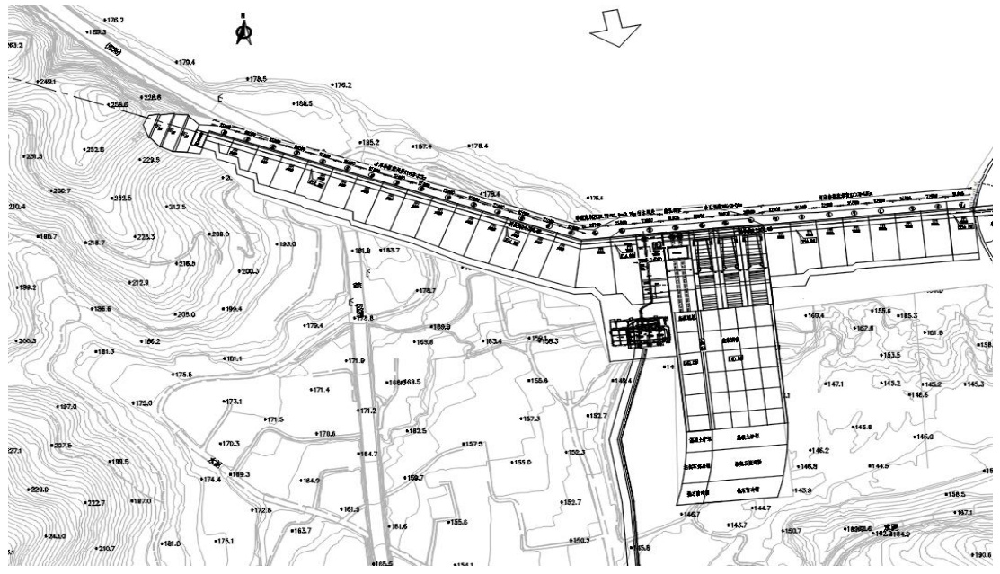  
图 6.4.1-6 拆除原坝体新建碾压混凝土重力坝方案平面布置图  

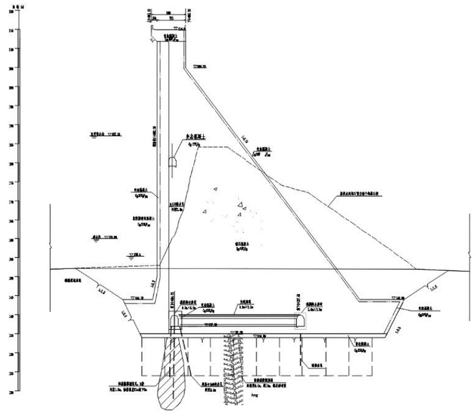  
图 6.4.1-47 保新建碾压混凝土重力坝方案横断面图  

两方案主要工程量对比表见下表:  

表 6.4.1-1 加高方案和重建方案主要工程量对比表  

<html><body><table><tr><td>序 号</td><td>项目</td><td>单位</td><td>重建方案</td><td>加高方案</td><td>重建-加高</td></tr><tr><td>1</td><td>土方明挖</td><td>m3</td><td>107127</td><td>79137</td><td>27990</td></tr><tr><td>2</td><td>石方明挖</td><td>m3</td><td>284926</td><td>219616</td><td>65310</td></tr><tr><td>3</td><td>卵石明挖</td><td>m3</td><td>82665</td><td>80218</td><td>2447</td></tr><tr><td>4</td><td>拆除水泥混凝土砌块石</td><td>m3</td><td>45090</td><td>-2923</td><td>48013</td></tr><tr><td>6</td><td>拆除溢洪道C30钢筋 混凝土</td><td>m3</td><td>6806</td><td>-1021</td><td>7827</td></tr><tr><td>7</td><td>坝基常态混凝土（三级 配C20F50W6）1m厚</td><td>m3</td><td>28122</td><td>21522</td><td>6600</td></tr><tr><td>8</td><td>坝体常态混凝土（三级 配C25F150W6)</td><td>m3</td><td>95025</td><td>92774</td><td>2251</td></tr><tr><td>9</td><td>消能设施常态混凝土 （三级配 C25F200W6)</td><td>m3</td><td>68926</td><td>67768</td><td>1158</td></tr><tr><td>10</td><td>变态混凝土 C20F200W6</td><td>m3</td><td>51236</td><td>49736</td><td>1500</td></tr><tr><td>11</td><td>富胶凝碾压混凝土 C25F150W6</td><td>m3</td><td>55987</td><td>39487</td><td>16500</td></tr><tr><td>12</td><td>碾压混凝土（三级配</td><td>m3</td><td>436807</td><td>268907</td><td>167900</td></tr></table></body></html>  

<html><body><table><tr><td></td><td>C15F50W4)</td><td></td><td></td><td></td><td></td></tr><tr><td>13</td><td>抗冲磨混凝土 C40F200W6</td><td>m3</td><td>16627</td><td>16164</td><td>463</td></tr><tr><td>14</td><td>钢筋</td><td>t</td><td>14580</td><td>14195</td><td>385</td></tr><tr><td>15</td><td>主要工程量投资</td><td>（万 元）</td><td>49801</td><td>43344</td><td>6457</td></tr></table></body></html>  

上述两个方案均可满足大坝挡水需求,方案一保留部分原坝体,为满足坝体防渗及坝基排水结构布置要求,代水泥砼砌块石结构布置与碾压混凝土中,廊道布置于原坝体前侧。本次加高近 $30\mathrm{m}$ ,增加原坝高 3/4 高度,新、老坝体共同承担增加的水压力、坝基扬压力等,新、老坝体材料力学特性一般存在明显差异,结合面往往为弱面,大坝在自重、水压力、温度变化等作用下,结合面存在应力集中问题,新老坝体混凝土结合质量难以保证。同时,本次推荐坝型为碾压式混凝土重力坝,具有施工简单、施工进度快,水泥用量少,温控措施少,可使用大型通用机械等优点,可有效缩短工期, 代水泥砼砌块石结构导致河床坝段无法大面积碾压施工,影响施工周期。方案二拆除旧坝体后新建坝体,无新老混凝土结合存在的软弱面结合、应力问题等,同时,不需要考虑原砌块石存在对碾压施工影响,因此虽然方案二工程量及投资高于方案一,考虑结构可靠性,本阶段推荐方案二拆除原坝体新建碾压式重力坝。  

# (2)左副坝坝体加高分析  

左副坝原坝体为均质粘土坝,根据原始设计资料,该坝体填土未达到设计干密度的问题未解决。左幅坝坝体初期沉陷变形严重,现仍未稳定。针对以上问题,本方案对原均质土坝清表后加高为黏土心墙堆石坝和全部拆除原均质土坝新建黏土心墙堆石坝两种方案选择。  

# 1)原均质土坝加高方案  

左坝原坝体为均质黏土坝,本方案在原坝体基础上进行加高设计,坝型采用黏土心墙堆石坝作为代表坝型,见图 6.4.2-1。  

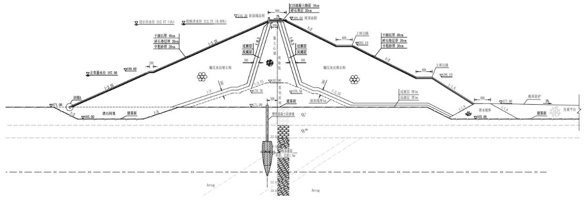  
图 6.4.2-1 原均质土坝加高方案典型断面图  

原均质坝坝顶高程 $186.00\mathrm{m}$ ,上游 $180.21\mathrm{m}$ 高程以上坡比 1:2.75,以下坡比为 1:3,下游坝坡坡比均为 1:2.25。本方案坝体填筑前需对原坝体表面及上下游施工作业区进行清表处理。清表厚度 $1\mathrm{m}$ ,其中干砌石护坡厚 $40\mathrm{cm}$ 、碎石垫层$15\mathrm{cm}$ 、中粗砂垫层 $15\mathrm{cm}$ 、坝体黏土料 $30\mathrm{cm}$ ,坝顶清理至 $183.90\mathrm{m}$ 高程。  

加高后左岸黏土心墙堆石坝顶轴线长 $412.60\mathrm{m}$ ,坝顶高程 $209.00\mathrm{m}$ ,防浪墙顶高程 $210.20\mathrm{m}$ ,坝顶宽度为 $9.0\mathrm{m}$ ,最大坝高 $38.0\mathrm{m}$ ,上游坝坡坡比 1:2.25,上游坝坡 $189.00\mathrm{m}$ 高程设置平行于坝轴线的马道,马道宽 $2.0\mathrm{m}$ 。下游坝坡坡比1:2.0,坡脚处设排水棱体。下游设置“之”字上坝道路,自 $177.00\mathrm{m}$ 高程延伸至坝顶刺墙衔接段拐角处,道路宽 $8.0\mathrm{m}$ ,坡率 $\scriptstyle{\mathrm{i}=6\%}$ ,下游坝坡坡脚设盖重平台。  

原均质坝加高方案建基面以上利用黏土心墙进行防渗,心墙位于坝轴线偏上游侧,顶部位于 $208.00\mathrm{m}$ 高程,宽 $3\mathrm{m}$ ,与上游侧防浪墙底部结构闭合。心墙上下游两侧坡比 1:0.3,底部与原均质坝衔接,共同构成建基面上部防渗体。在距坝轴线上游 $5.0\mathrm{m}$ 处新建塑性混凝土防渗墙,墙宽 $0.6\mathrm{m}$ ,深入基岩 1m,距原防渗墙 $15.00\mathrm{m}$ 。  

# 2)拆除重建方案  

原均质坝坝顶高程 $186.00\mathrm{m}$ ,上游 180.21m 高程以上坡比 1:2.75,以下坡比为 1:3,下游坝坡坡比均为 1:2.25。本方案坝体填筑前需对原均质坝进行拆除,清除地基浅层覆盖层,见图 6.4.2-2。  

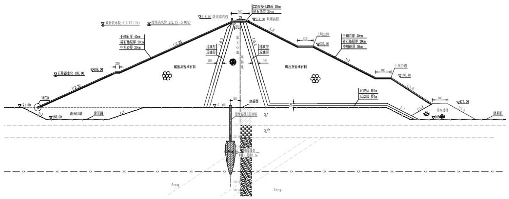  
图 6.4.2-2 拆除重建方案典型断面图  

左岸为黏土心墙堆石坝,坝顶长度为 $412.60\mathrm{m}$ 。最大坝高 $38.00\mathrm{m}$ ,黏土心墙堆石坝上游坝坡坡比 1:2.25,上游坝坡 $189.00\mathrm{m}$ 高程设置平行于坝轴线的马道,宽 $2.0\mathsf{m}$ 。下游坝坡坡比 1:2.0,坡脚处设排水棱体。下游设置“之”字上坝道路,自 $177.00\mathrm{m}$ 高程延伸至坝顶刺墙衔接段拐角处,道路宽 $8.0\mathsf{m}$ ,坡率 $\scriptstyle{\mathrm{i=6}}\%$ 。在距坝轴线上游 $5.0\mathsf{m}$ 处新建塑性混凝土防渗墙,墙宽 $0.6m$ ,距原防渗墙 $15.00\mathrm{m}$ 。  

上、下游坝坡均游采用干砌石护砌、建基面以上采用黏土心墙进行防渗,建基面以下采用防渗墙和帷幕灌浆进行防渗处理。坝体从上游向下游依次为干砌石护坡、碾压灰岩堆石区、过渡层、反滤层、黏土心墙、过滤层、反滤层、碾压灰岩堆区、干砌石护坡。下游坝面设“之”字上坝道路,坡脚处设置排水棱体。两方案主要工程量对比表见下表。  

表 6.4.1-2 加高方案和重建方案主要工程量对比表  

<html><body><table><tr><td>建筑物</td><td>项目</td><td>单位</td><td>加高方案</td><td>重建方案</td></tr><tr><td rowspan="3">原坝体清表/拆除</td><td>均质坝及护坡</td><td>m</td><td>35890</td><td>288831</td></tr><tr><td>坝顶路面</td><td>m3</td><td>4973</td><td>4973</td></tr><tr><td>防浪墙</td><td>m3</td><td>932</td><td>932</td></tr><tr><td rowspan="10">新增建筑物</td><td>灰岩堆石料</td><td>m3</td><td>1299917</td><td>1510185</td></tr><tr><td>黏土心墙</td><td>m</td><td>162288</td><td>284592</td></tr><tr><td>反滤料</td><td>m</td><td>103892</td><td>85192.8</td></tr><tr><td>过渡料</td><td>m3</td><td>104765</td><td>84557.8</td></tr><tr><td>防浪墙</td><td>m3</td><td>1092</td><td>1092</td></tr><tr><td>坝顶道路</td><td>m3</td><td>1384</td><td>1384</td></tr><tr><td>排水棱体</td><td>m</td><td>60527</td><td>60527</td></tr><tr><td>渣石回填</td><td>m</td><td>120420</td><td>120420</td></tr><tr><td>干砌石护坡</td><td>m</td><td>36059</td><td>36059</td></tr><tr><td>护坡碎石垫层</td><td>m</td><td>18076</td><td>18076</td></tr><tr><td></td><td>护坡中粗砂垫层</td><td>3m</td><td>18009</td><td>18009</td></tr></table></body></html>  

左岸原坝体为均质粘土坝,根据原始设计资料,该坝体压实度达不到设计要求,初期沉陷变形严重,现仍未稳定。针对以上问题,本次推荐拆除重建方案,对原均质坝进行全部拆除新建,采用黏土心墙堆石坝作为代表坝型。  

# (3)右副坝坝体加高分析  

右副坝填土极不均匀,为低液限黏土夹块石、碎石以及碎砖块等,根据设计干密度划分填土质量,压实度只有 $0.70\sim0.83$ ,且筑坝时未进行碾压,填筑质量很差,未达到规范要求设计值,压实度不小于 0.96。原坝体高度 5m,拆除坝体工程量不大,且该处基岩面出露较高,清除坝体后,开挖 $5{\sim}10\ensuremath{\mathrm{m}}$ 即可满足重力坝建基面要求,综上,本方案对原斜墙坝进行全部拆除新建。  

# 6.4.2 水库枢纽坝型选择  

# 6.4.2.1 坝型分析  

拦河坝一般包括拱坝、重力坝和当地材料坝三种基本坝型。坝型比选一般主要考虑地形地质条件、天然建筑材料、枢纽布置及工程投资等因素。  

# (1)地形地质条件  

坝址区河谷开阔,覆盖层厚度差异性大。其中左侧古河道段覆盖层深厚,不适宜混凝土重力坝的建设条件,当地材料坝坝型适宜性更好。  

左副坝段坝基为低液限黏土( $\mathsf Q_{2}\mathsf{a l p}$ ),具有中等压缩性,渗透性为弱透水性。该层土体可作为当地材料坝坝基。原溢洪道和主坝段可选择弱风化\~微新片麻岩作为混凝土重力坝坝基,基本不存在坝基深层抗滑问题。右坝肩可选择弱风化的白云石灰岩和闪长玢岩作为混凝土重力坝坝基,基岩层面较缓,可能存在沿层面滑动问题,可以采取固结灌浆处理措施。  

左副坝的砾岩( $\mathsf{Q}_{1}\mathsf{p}!$ )、原溢洪道左端与左副坝衔接段、右副坝及右坝肩的侵入接触带存在中等\~强透水性,需要加强防渗措施。其余坝段浅表层基岩具有一定渗透性,可是适当设防。左坝肩不存在绕坝渗漏问题,右坝肩存在绕坝渗漏问题。两坝肩山体自然边坡和工程边坡整体稳定较好。  

电站场区覆盖层厚度不大,可选择片麻岩作为地基。基坑开挖过程存在边坡稳定问题和基坑排水问题。尤其右侧倾向河道侧边坡为顺向坡,稳定性不良,需要加强支护。  

# (2)料场情况  

# 1)土料  

土料作为一般防渗料粘粒含量满足规程技术要求;塑性指数基本满足规程指标要求,试验指标略低于要求;渗透性满足规程指标要求;有机质含量略高于规程指标要求;水溶盐含量满足规程指标要求;含水率高于规程指标要求,施工时需要采取晾晒措施。有用层储量为 $40.00\times10^{4}m^{3}$ ,无用层体积为 6.12$\times10^{4}\mathrm{m}^{3}$ 。土料场距坝址区运输距离约 $2.0{\sim}2.5\mathrm{km}$ ,开采运输条件良好。  

# 2)石料  

作为砌石料和混凝土人工骨料料源,白云岩、鲕状白云岩软化系数基本满足技术指标质量要求,白云质灰岩基本不满足要求,薄层状白云岩不满足要求。考虑到饱和抗压强度较高,该料场可以作为堆石料、砌石料和混凝土人工骨料料源。  

料场有用层储量约为 $495.75\times10^{4}\mathrm{m}^{3}$ ,无用层体积为 $3.98\times10^{4}\mathsf{m}^{3}$ ,剥采比约 1:124。开采范围还可向外围扩展,储量丰富。料场后边坡整体稳定性好,开挖形成高边坡,需要采取放坡或防护措施。石料场开采运输条件良好。  

# 3)商品料  

卫辉市的太公镇有多家商品料源,基岩为奥陶系马家沟组(O2m)的灰岩,是做为混凝土骨料的良好石材。到塔岗水库坝址区的运距大约为 17km。  

狮豹头乡的南寺村附近的卫辉市南寺白云岩矿基岩为寒武系上统三山子组( $(\in_{3}\mathsf{s}$ )的中厚\~厚层状白云岩,岩石质量整体良好,基本可满足工程要求。到坝址区运距约 $4.7\mathsf{k m}$ ,交通条件便利。  

# (3)枢纽布置要求  

本水库工程等别为Ⅲ等,工程规模为中型。防洪库容 5001 万 $\mathsf{m}^{3}$ ,塔岗水库扩建增容后,工程任务为“以防洪、灌溉为主,结合卫辉市南水北调受水区备用供水,兼顾发电。”枢纽主要建筑物有拦河坝、泄水建筑物、取水建筑物、电站等。  

# (4)坝型分析  

根据坝址处地形地质条件、天然建筑材料、枢纽布置等条件,对拱坝、重力坝及当地材料坝坝型等基本坝型分析如下:  

# (1)拱坝  

拱坝是空间壳体结构,作用在坝上的荷载主要通过拱梁的作用传递至两岸山体,依靠坝体混凝土的强度和两岸坝肩岩体的支撑,保证拱坝的稳定和安全,故要求坝址河谷形态好,地形地质条件要求高,坝基坝肩覆盖层薄,基岩完整且强度高。  

推荐坝址河谷呈不对称“U”形谷,河谷开阔,正常蓄水位 184m 高程河谷宽度约 $922\mathrm{m}$ ,考虑基础开挖,拱坝坝高约 66.0,跨高比约 14.0,无拱作用,从地形条件看,不适宜建拱坝,不将拱坝坝型作为坝型方案进行比选。  

# (2)重力坝  

混凝土重力坝是被广泛采用的坝型,相对于拱坝对基础要求不高,结构简单;具有安全可靠、耐久性好,抗震、超载、超泄能力强,泄水建筑物、电站进水口、生态放水孔等均可布置在坝体上,布置协调紧凑,便于集中运行、维护、管理,工程安全可靠性高,同时具备节约原材料、简化施工等优点,且适合于直河道大流量坝身泄洪。且本工程洪峰流量大,泄洪建筑物可以布置在坝体上,不用另外修建泄洪建筑物。  

# 1)砌石重力坝  

砌石坝可充分利用当地材料,工程量较大,砌石坝机械化施工程度低,砌筑速度慢,效率低,工期长,质量控制较难,不利于早日投产和尽早发挥效益,故不选用砌石坝。  

# 2)常态混凝土重力坝和碾压混凝土坝  

重力坝可采用常态混凝土坝和碾压混凝土坝两种坝型,均可机械化施工。  

常态混凝土重力坝的水泥用量多,水化热大,温控措施费用高,适用于坝长较短、坝体孔口多、体形变化大等工程,大坝内部 C15 混凝土单价约为529.24 元。  

碾压混凝土重力坝具有施工简单、施工进度快,水泥用量少,温控措施少,可使用大型通用机械等优点,可有效缩短工期,坝越长,坝体孔口越少,优势越明显,大坝内部碾压 C15 混凝土单价约为 383.61 元,低于常态混凝土。碾压混凝土重力坝优于常态混凝土重力坝。  

# 3)自密实混凝土堆石坝  

自密实混凝土堆石坝是一种新坝型,是在坝体堆石体空隙内灌注高自密实半流态混凝土,形成完整、密实、具有设计强度的坝体混凝土,坝体基本断面呈梯形,具有坝体断面大、坝体应力低、横缝间距大、可快速施工等特点。混凝土和水泥用量少,可有效降低水化热、减少坝体裂缝,降低工程造价,但工程应用经验少。上游坝面仍需采用防渗层,一般适用坝高小于 $70\mathrm{m}$ 。《胶结颗粒料筑坝技术导则》SL678—2014 规定,坝高超过 70m 时,应进行专题论证。  

本阶段重力坝方案坝顶长 1km,坝高 $68.0\mathrm{m}$ ,坝体孔口较少,坝址区大部分坝基无覆盖层,基岩裸露且性能较好,结合料场情况及且本工程洪峰流量大,如选择碾压混凝土重力坝方案,泄洪建筑物可以布置在坝体上,不用另外修建泄洪建筑物。因此,本阶段推荐坝型为碾压混凝土重力坝。  

# (3)当地材料坝  

从坝址地质条件看,由于当地材料坝对坝址地质条件要求低,河床覆盖层厚度不大的部位,可全部挖除;厚度较大部位,挖除浅表层松散层( $(1{\sim}3\ m)$ ,并经压实后作为坝基,不同风化岩体均可作为坝基,该坝址宜修建当地材料坝。  

各种当地材料坝型分析如下:  

# 1)均质坝及粘土心墙坝  

原左副坝为黏性土均质坝,土体主要来源于坝前左岸阶地位置,其成因为第四系中更新统冲洪积(Q2alp)的低液限黏土,土体颗粒组成黏粒含量$27.2\%$ ,粉粒含量 $62.2\%$ ,砂粒含量 $8.7\%$ ,砾石含量 $1.8\%$ 。黏粒含量 $27.2\%$ ,塑性指数 $13.5{\sim}16.7$ ,均满足《水利水电工程天然建筑材勘察规程》(SL251-2015)对一般填筑土质量技术指标的要求,压实度不满足 3 级建筑物要求,因此可以通过处理作为黏性土料。水库蓄水后基本淹没了左岸的阶地,回水线至阶地后缘,经地勘调查取样,该处土体主要为粉质黏土和重粉质壤土,局部含砂粒或砾石,为中壤土或粉土质砾,作为一般防渗料粘粒含量满足规程技术要求;塑性指数、渗透性、水溶盐基本满足规程指标要求,试验指标略低于要求;有机质含量略高于规程指标要求;含水率高于规程指标要求,施工时需要采取晾晒措施。  

原左副坝拆除土料约 31 万 $\mathsf{m}^{3}$ ,土料场总储量为 $39.82\times10^{4}\mathrm{m}^{3}$ ,从土料质量、储量上看可满足粘土心墙坝筑坝条件;均质坝土方填筑量较大,储量不满足要求,因为本阶段推荐黏土心墙坝作为比较坝型。  

# 2)混凝土面板堆石坝  

工程坝址区左岸下部为古河道,坝基为松散覆盖层,存在有强透水性的卵石和含泥碎石层,可通过面板、趾板、防渗墙及止水的联合防渗体系在此基础  

上建坝技术上是可行的。原左副坝最大坝高 $15\mathrm{m}$ ,左岸卵石层较厚,混凝土趾板开挖深度大;混凝土面板与重力坝防渗结构连接困难,可靠性低。  

# 3)沥青混凝土心墙堆石坝  

该坝型对坝基基础和筑坝材料的要求与混凝土面板堆石坝基本相同,但沥青材料需要外购,工程上常用新疆克拉玛依油田或辽河油田欢喜岭的优质水工沥青材料,沥青混凝土成本相对较高;沥青骨料采用灰岩或白云岩等碱性骨料。沥青混凝土心墙堆石坝具有可充分利用当地材料、防渗性能好、适应变形能力更强、抗震性能好的优点,由于沥青防渗体位于坝体中部,检修及维修不方便,上游坝面经水润滑后,坝坡较缓,工程量较大,下游堆石干燥区对坝料要求同面板堆石坝。根据工程经验,沥青心墙堆石坝工程投资一般较粘土心墙堆石坝多,且碱性骨料距坝址较远。  

该坝址从地形地质条件、建筑材料、施工条件来看,不宜修建拱坝、砌石坝、均质坝,适合修建碾压混凝土重力坝和当地材料坝,故选用粘土心墙堆石坝作为当地材料坝的代表坝型参与本工程的坝型比选。因此本阶段对碾压混凝土重力坝、粘土心墙堆石坝、混合坝等三种坝型进行比选。  

# 6.4.2.2 坝型方案  

(1)碾压混凝土重力坝方案  

碾压混凝土重力坝方案主要建筑物包括拦河坝、泄水建筑物、引水建筑物和电站。  

# 1)挡水坝段  

碾压混凝土重力坝坝顶长度为 $1034.40\mathrm{m}$ 。从左至右共分为 50 个坝段(编号 1#\~50#坝段),其中挡水坝段布置于 1#\~28#、34#\~50#坝段。坝顶高程$209.00\mathrm{m}$ ,坝顶长 $932.40\mathrm{m}$ ,建基面高程 $141.00\mathrm{m}$ ,最大坝高 $68.0\mathrm{m}$ ;上游侧高程 $150.0\mathrm{m}$ 以上为铅直面(坝轴线桩号 $0{\pm}000.00\$ )、以下为 1:0.2 的斜坡面,下游侧高程 $197.00\mathrm{m}$ 以上为铅直面、以下为 1:0.75 的斜坡面;坝顶总宽度$9.0\mathsf{m}$ ;重力坝段基础进行固结灌浆,并在上游侧设帷幕灌浆,以减小扬压力和渗流量。  

# 2)泄水建筑物  

泄水建筑物共布设 3 个泄洪表孔和 2 个泄洪底孔。其中表孔坝段布置在9#\~11#坝段,长 $60.0\mathrm{m}$ ,共 3 孔。泄洪表孔每孔净宽为 $12.0\mathrm{m}$ ,边墩 $4.0\mathsf{m}$ ,为开敞式溢流孔口,采用 WES 实用堰型,堰顶高程 $192.0\mathrm{m}$ ,闸墩顶高程$209.00\mathrm{m}$ 。底孔坝段布置在 12#坝段,长 21 米,共设置 2 孔,泄洪底孔孔口尺寸为 $2.50{\times}3.00\mathsf{m}$ (宽 $\times$ 高),进口底板高程为 $156.00\mathrm{m}$ ,出口设置弧形工作闸门,采用液压启闭机启闭。表孔、底孔下游消能工均采用底流消能形式。  

泄洪底孔、表孔均采用底流消能方式。为避免水流紊乱,表孔、底孔消力池采用中隔墙隔开分别消能。表孔、底孔消力池池底高程均为 $140.0\mathrm{m}$ ,池深均为 $8.0\mathsf{m}$ ,池长均为 $110.0\mathrm{m}$ ,底板厚度为 $4.0\mathsf{m}$ 。表孔消力池净宽 $56\mathrm{m}$ ,底孔消力池净宽 $17\mathrm{m}$ 。尾坎顶高程均为 $148.0\mathrm{m}$ ,尾坎顶宽 $3.0\mathsf{m}$ 。坝址下游河覆盖层较厚,抗冲刷能力差,考虑到工程下泄流量较大,水流出消力池后仍存在紊动,流速尚未恢复到天然河道流速分布。为提高河床的抗冲刷能力,参考同类工程,消力池后接长度 $30.0\mathsf{m}$ 、厚度 $2.0\mathsf{m}$ 钢筋混凝土防冲海漫护坦,海漫后接 $30\mathsf{m}$ 抛石防冲槽,与下游河道顺接。  

为提高建基岩体整体性,溢流表孔与泄洪底孔消力池底板进行固结灌浆, 固结灌浆孔孔深 $6.0\mathsf{m}$ ,间排距 $3.0\mathsf{m}$ ,梅花形布置;消力池全底板设置锚筋, 锚筋直径 $\Phi28$ ,入岩 $8.0\mathsf{m}$ ,间排距 $2.0\mathsf{m}$ ,梅花形布置。  

# 3)引水建筑物  

引水建筑物布置为坝式进水口 $^+$ 坝内埋管的型式,位于大坝 13#坝段。首部拦污栅槽净宽 $_{2\mathsf{m}}$ 。进水口渐变段长 $_{2\mathsf{m}}$ ,由 $1.2\mathrm{m}\times1.2\mathrm{m}$ 的方形孔口渐变为直径为 $1.2\mathrm{m}$ 的圆形孔口,其后接直径为 $1.2\mathrm{m}$ 的压力钢管。坝内设引水压力主管1 根,内径 $1.2\mathrm{m}$ ,压力钢管出坝后连接坝外引水管系统。  

电站为坝后式电站,厂区布置在大坝下游右岸坝脚处,厂区室外的地坪高程为 $157.0\mathrm{m}$ 。布置有主厂房、安装场、副厂房、下游尾水池、生态放水管、进场路等建筑物。总装机容量为 0.6MW,装机 3 台。  

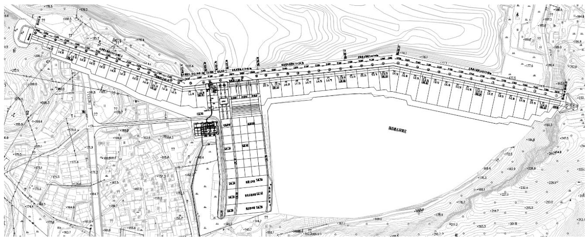  

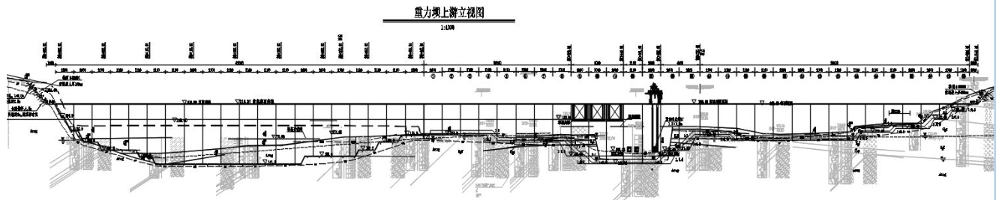  
图 6.4.2-1 塔岗水库重力坝上游立视图(原坝址)  

# (2)粘土心墙堆石坝坝方案  

枢纽建筑物主要由黏土心墙堆石坝、泄水坝段、引水坝段、电站等组成。  

# 1)挡水建筑物  

左、右岸为黏土心墙堆石坝,坝顶长度为 $926.70\mathrm{m}$ 。最大坝高 $38.00\mathrm{m}$ ,黏土心墙堆石坝上游坝坡坡比 1:2.25,上游坝坡 $189.00\mathrm{m}$ 高程设置平行于坝轴线的马道,宽 $2.0\mathsf{m}$ 。下游坝坡坡比 1:2.0,坡脚处设排水棱体。下游设置“之”字上坝道路,自 $177.00\mathrm{m}$ 高程延伸至坝顶刺墙衔接段拐角处,道路宽 $8.0\mathsf{m}$ ,坡率 $\scriptstyle{\mathrm{i=6}}\%$ 。在距坝轴线上游 $5.0\mathsf{m}$ 处新建塑性混凝土防渗墙,墙宽 $0.6\mathsf{m}$ ,距原防渗墙 $15.00\mathrm{m}$ 。  

左、右岸黏土心墙堆石坝与重力坝段采用混凝土刺墙进行连接,刺墙为重力式挡墙,沿坝轴线方向顶部长均为 $92\mathrm{m}$ ,沿坝轴线方向上游坡比为 1:0.25,下游坡比 1::05,垂直坝轴线墙面坡比 1:0.3。上下游坡面与泄水坝段衔接处采用锥面裹头型式顺接,坝后设置压重平台,坡脚处填筑至 177.00 高程排水棱体顶部,往下游按照 $2\%$ 坡比进行放坡。  

# 2)泄水建筑物  

泄水建筑物共布设 3 个泄洪表孔和 2 个泄洪底孔。其中表孔坝段布置在9#\~11#坝段,长 $60.0\mathrm{m}$ ,共 3 孔。泄洪表孔每孔净宽为 $12.0\mathrm{m}$ ,边墩 $4.0\mathsf{m}$ ,为开敞式溢流孔口,采用 WES 实用堰型,堰顶高程 $192.0\mathrm{m}$ ,闸墩顶高程$209.00\mathrm{m}$ 。底孔坝段布置在 12#坝段,长 21 米,共设置 2 孔,泄洪底孔孔口尺寸为 $2.50{\times}3.00\mathsf{m}$ (宽 $\times$ 高),进口底板高程为 $156.00\mathrm{m}$ ,出口设置弧形工作闸门,采用液压启闭机启闭。表孔、底孔下游消能工均采用底流消能形式。  

泄洪底孔、表孔均采用底流消能方式。为避免水流紊乱,表孔、底孔消力池采用中隔墙隔开分别消能。表孔、底孔消力池池底高程均为 $140.0\mathrm{m}$ ,池深均为 $8.0\mathsf{m}$ ,池长均为 $110.0\mathrm{m}$ ,底板厚度为 $4.0\mathsf{m}$ 。表孔消力池净宽 $56\mathrm{m}$ ,底孔消力池净宽 $17\mathrm{m}$ 。尾坎顶高程均为 $148.0\mathrm{m}$ ,尾坎顶宽 $3.0\mathsf{m}$ 。坝址下游河覆盖层较厚,抗冲刷能力差,考虑到工程下泄流量较大,水流出消力池后仍存在紊动,流速尚未恢复到天然河道流速分布。为提高河床的抗冲刷能力,参考同类工程,消力池后接长度 $30.0\mathsf{m}$ 、厚度 $2.0\mathsf{m}$ 钢筋混凝土防冲海漫护坦,海漫后接 $30\mathsf{m}$ 抛石防冲槽,与下游河道顺接。  

为提高建基岩体整体性,溢流表孔与泄洪底孔消力池底板进行固结灌浆, 固结灌浆孔孔深 $6.0\mathsf{m}$ ,间排距 $3.0\mathsf{m}$ ,梅花形布置;消力池全底板设置锚筋, 锚筋直径 $\Phi28$ ,入岩 $8.0\mathsf{m}$ ,间排距 $2.0\mathsf{m}$ ,梅花形布置。  

# 3)引水建筑物  

引水建筑物布置为坝式进水口 $^+$ 坝内埋管的型式,位于大坝 13#坝段。首部拦污栅槽净宽 2m。进水口渐变段长 $_{2\mathsf{m}}$ ,由 $1.2\mathrm{m}\times1.2\mathrm{m}$ 的方形孔口渐变为直径为 $1.2\mathrm{m}$ 的圆形孔口,其后接直径为 $1.2\mathrm{m}$ 的压力钢管。坝内设引水压力主管1 根,内径 $1.2\mathrm{m}$ ,压力钢管出坝后连接坝外引水管系统。  

电站为坝后式电站,厂区布置在大坝下游右岸坝脚处,厂区室外的地坪高程为 $157.0\mathrm{m}$ 。布置有主厂房、安装场、副厂房、下游尾水池、生态放水管、进场路等建筑物。总装机容量为 0.6MW,装机 3 台。  

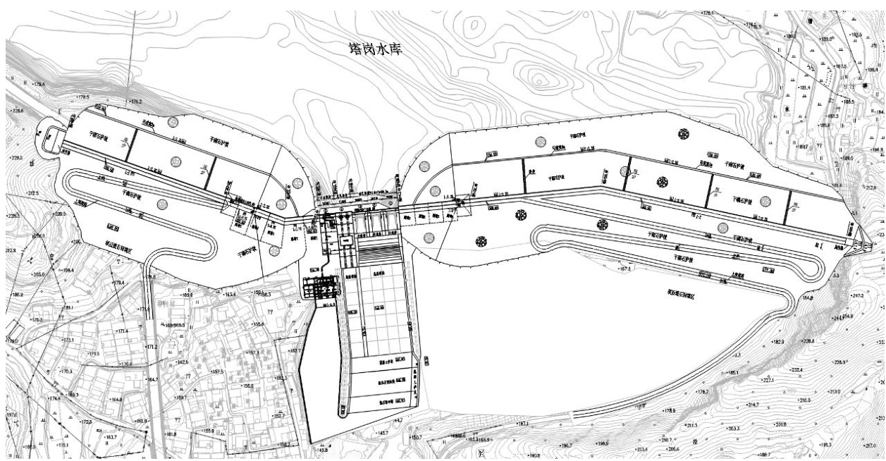  
图 6.4.2-2 塔岗水库黏土心墙堆石坝平面布置图(原坝址)  

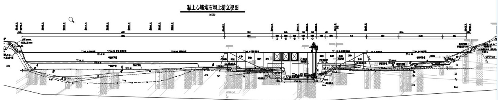  
图 6.4.2-3 塔岗水库黏土心墙堆石坝上游立视图(原坝址)  

# (3)混合坝  

挡水建筑物为混合坝,左岸新建黏土心墙堆石坝段,主河床及右岸为原址新建混凝土重力坝坝段。  

碾压混凝土重力坝坝顶长度为 $621.80\mathrm{m}$ 。从左至右共分为 30 个坝段(编号 1#\~30#坝段),其中挡水坝段布置于 1#\~8#、14#\~30#坝段。坝顶高程$209.00\mathrm{m}$ ,坝顶长 $519.80\mathrm{m}$ ,建基面高程 $141.00\mathrm{m}$ ,最大坝高 $68.0\mathrm{m}$ ;上游侧高程 $150.0\mathrm{m}$ 以上为铅直面(坝轴线桩号 $0{\pm}000.00\$ )、以下为 1:0.2 的斜坡面,下游侧高程 $197.00\mathrm{m}$ 以上为铅直面、以下为 1:0.75 的斜坡面;坝顶总宽度$9.0\mathsf{m}$ ;重力坝段基础进行固结灌浆,并在上游侧设帷幕灌浆,以减小扬压力和渗流量。  

左岸为黏土心墙堆石坝,坝顶长度为 $412.60\mathrm{m}$ 。最大坝高 $38.00\mathrm{m}$ ,黏土心墙堆石坝上游坝坡坡比 1:2.25,上游坝坡 $189.00\mathrm{m}$ 高程设置平行于坝轴线的马道,宽 $2.0\mathsf{m}$ 。下游坝坡坡比 1:2.0,坡脚处设排水棱体。下游设置“之”字上坝道路,自 $177.00\mathrm{m}$ 高程延伸至坝顶刺墙衔接段拐角处,道路宽 $8.0\mathsf{m}$ ,坡率 $\scriptstyle{\mathrm{i=6}}\%$ 。在距坝轴线上游 $5.0\mathsf{m}$ 处新建塑性混凝土防渗墙,墙宽 $0.6m$ ,距原防渗墙 $15.00\mathrm{m}$ 。  

黏土心墙堆石坝与重力坝段采用混凝土刺墙进行连接,刺墙为重力式挡墙,沿坝轴线方向顶部长 $92\mathrm{m}$ ,沿坝轴线方向上游坡比为 1:0.25,下游坡比 1::05,垂直坝轴线墙面坡比 1:0.3。右岸上下游坡面与重力坝段衔接处采用锥面裹头型式顺接,坝后设置压重平台,坡脚处填筑至 177.00 高程排水棱体顶部,往下游按照 $2\%$ 坡比进行放坡。。  

泄水建筑物共布设 3 个泄洪表孔和 2 个泄洪底孔。其中表孔坝段布置在9#\~11#坝段,长 $60.0\mathrm{m}$ ,共 3 孔。泄洪表孔每孔净宽为 $12.0\mathrm{m}$ ,边墩 $4.0\mathsf{m}$ ,为开敞式溢流孔口,采用 WES 实用堰型,堰顶高程 $192.0\mathrm{m}$ ,闸墩顶高程$209.00\mathrm{m}$ 。底孔坝段布置在 12#坝段,长 21 米,共设置 2 孔,泄洪底孔孔口尺寸为 $2.50{\times}3.00\mathsf{m}$ (宽×高),进口底板高程为 $156.00\mathrm{m}$ ,出口设置弧形工作闸门,采用液压启闭机启闭。表孔、底孔下游消能工均采用底流消能形式。  

泄洪底孔、表孔均采用底流消能方式。为避免水流紊乱,表孔、底孔消力池采用中隔墙隔开分别消能。表孔、底孔消力池池底高程均为 $140.0\mathrm{m}$ ,池深均为 $8.0\mathsf{m}$ ,池长均为 $110.0\mathrm{m}$ ,底板厚度为 $4.0\mathsf{m}$ 。表孔消力池净宽 $56\mathrm{m}$ ,底孔消力池净宽 $17\mathrm{m}$ 。尾坎顶高程均为 $148.0\mathrm{m}$ ,尾坎顶宽 $3.0\mathsf{m}$ 。坝址下游河覆盖层较厚,抗冲刷能力差,考虑到工程下泄流量较大,水流出消力池后仍存在紊动,流速尚未恢复到天然河道流速分布。为提高河床的抗冲刷能力,参考同类工程,消力池后接长度 $30.0\mathsf{m}$ 、厚度 $2.0\mathsf{m}$ 钢筋混凝土防冲海漫护坦,海漫后接 $30\mathsf{m}$ 抛石防冲槽,与下游河道顺接。  

为提高建基岩体整体性,溢流表孔与泄洪底孔消力池底板进行固结灌浆, 固结灌浆孔孔深 $6.0\mathsf{m}$ ,间排距 $3.0\mathsf{m}$ ,梅花形布置;消力池全底板设置锚筋, 锚筋直径 $\Phi28$ ,入岩 $8.0\mathsf{m}$ ,间排距 $2.0\mathsf{m}$ ,梅花形布置。  

引水建筑物布置为坝式进水口 $^+$ 坝内埋管的型式,位于大坝 13#坝段。首部拦污栅槽净宽 2m。进水口渐变段长 $_{2\mathsf{m}}$ ,由 $1.2\mathrm{m}\times1.2\mathrm{m}$ 的方形孔口渐变为直径为 $1.2\mathrm{m}$ 的圆形孔口,其后接直径为 $1.2\mathrm{m}$ 的压力钢管。坝内设引水压力主管1 根,内径 $1.2\mathrm{m}$ ,压力钢管出坝后连接坝外引水管系统。  

电站为坝后式电站,厂区布置在大坝下游右岸坝脚处,厂区室外的地坪高程为 $157.0\mathrm{m}$ 。布置有主厂房、安装场、副厂房、下游尾水池、生态放水管、进场路等建筑物。总装机容量为 0.6MW,装机 3 台。  

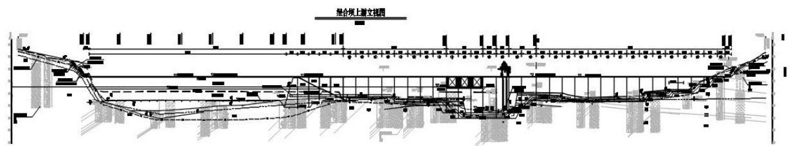  
图 6.4.2-4 塔岗水库混合坝上游立视图(原坝址)  

# 6.4.2.3 方案比选  

碾压混凝土重力坝、粘土心墙堆石坝、混合坝三种坝型分别从地形地质条件、坝型特点和枢纽布置、建筑材料、施工组织设计、工程占地、环境影响、水土保持、运行管理、主体工程量及投资等方面进行综合比较。  

# (1)地形地质条件  

坝址区河谷开阔,覆盖层厚度差异性大,采用混合坝型适宜性更好。其中左侧古河道段覆盖层深厚,不适宜混凝土重力坝的建设条件,当地材料坝坝型  

适宜性更好。  

左副坝段坝基为低液限黏土( $\mathsf Q_{2}\mathsf{a l p}$ ),具有中等压缩性,渗透性为弱透水性。该层土体可作为当地材料坝坝基。原溢洪道和主坝段可选择弱风化\~微新片麻岩作为混凝土重力坝坝基,基本不存在坝基深层抗滑问题。原右坝肩可选择弱风化的白云石灰岩和闪长玢岩作为混凝土重力坝坝基,基岩层面较缓,可能存在沿层面滑动问题,可以采取固结灌浆处理措施。  

# (2)坝型特点和建筑物布置  

碾压混凝土重力坝坝体结构简单,可灵活布置泄洪建筑物,水力学条件较好,可利用坝身泄洪,适合于本工程的直河道大流量。主坝、溢洪道坝段基岩几乎出露,右副坝弱风化线以上覆盖层较浅,修建重力坝的开挖量和混凝土填筑量较少,同时重力坝具有结构安全稳定的特点。左副坝为古河道段,覆盖层深厚,黏土层 $7.7{\sim}17.7\mathrm{m}$ ,修建重力坝开挖量需挖除黏土层至弱风化下限,开挖量和混凝土填筑量均比较多。  

黏土心墙堆石坝可充分利用开挖料,坝体结构简单;防渗体系位于坝体中间。坝体较缓,坝体填筑工程量较大。土石坝坝身无法泄水,需通过设置溢洪道或泄水坝段泄洪。本工程为防洪水库,具有泄量大,运行调度复杂的特点,同时受地形地貌、原坝体的限制,本工程坝轴线较长,下游河道居中且相对较窄,溢洪道布置在两岸距离下游河道比较远,山体开挖量大,不具备设置岸边式溢洪道或溢洪洞的条件;修建黏土心墙堆石坝需要黏土料 43 万 $\mathsf{m}^{3}$ ,堆石料167 万 $\mathsf{m}^{3}$ ,根据初步地勘成果,堆石料料源充足,黏土料较为紧张。  

综合比较,本阶段结合地形地质、料源情况、防洪调度运行、工程安全等特点,将两种坝型优点结合,修筑混合坝:左岸为黏土心墙堆石坝,主坝及右坝为碾压式重力坝。  

# (3)建筑材料  

碾压混凝土重力坝和黏土心墙堆石坝方案所需混凝土骨料均从石料场开采;黏土心墙堆石坝堆石料利用料场和原主坝拆除堆石料,石料场料源丰富,开采运输条件良好;黏土可利用土料场及原左副坝填筑料,目前查明土料场可充分满足左副坝黏土心墙量需求。  

# (4)施工  

施工导流:因坝型比选主槽处均为重力坝,且大坝等级相同,故导流标准及导流方式均相同,导流标准均为 10 年一遇,导流方式均采用分期导流。  

料场选择:三种方案的建筑材料来源相同,黏土心墙堆石坝堆石料方案可利用一部分开挖料,从土石方平衡角度较优。  

施工方法:粘土心墙堆石坝及重力坝对混凝土浇筑和土石填筑能力的要求均在机械的合理范围内,因此,方案比选在主体工程施工上基本相当,不存在坝型选择的限制性因素。  

施工总布置及运输:三种方案施工总布置格局基本相同,施工临时占地范围基本相同,全重力坝方案混凝土拌和系统规模其他坝型的混凝土系统规模。全重力坝方案较土石坝方案建筑物较集中,综合土石方开挖利用平衡方面,土石坝可充分开挖石料,但开挖料不可作为混凝土骨料,重力坝弃渣量大于土石坝方案和组合坝方案。施工总布置及交通运输,开挖料利用方面对坝型选择有一定影响,土石坝方案较优。  

施工进度:施工总工期均为 42 个月,其中施工准备期 4 个月,主体工程施工期 35 个月,完建期 3 个月。工期对坝型选择影响不大。  

综上所述,施工组织设计角度比较,比选坝型各有优劣,综合分析,全混凝土重力坝弃渣较多,开挖料基本不能利用,渣料外运对投资影响较大;土石坝方案对开挖料利用较多,能有效减少弃渣。综合评判,混合坝和土石坝均优于重力坝方案。  

# (5)工程占地  

从人口、占地等方面比较,碾压混凝土重力坝方案占地面积、搬迁人口等方面最少;粘土心墙堆石坝中右坝填筑对塔岗村影响较大,占地面积和搬迁人口均明显增加。组合坝占地面积比重力坝方案多,搬迁人口方面与重力坝相差不大。  

因此,碾压混凝土重力坝优于组合坝优于黏土心墙堆石坝。  

(6)环境影响  

环境因素:三种方案淹没范围均涉及生态保护红线,履行占用生态保护红线手续。  

水源保护区:三种方案淹没范围涉及塔岗水库饮用水源一级保护区和二级保护区。均涉及水源保护地,都征求生态环境部门同意。  

综上:三个方案在环境因素和水源保护地方面整体相差不大。  

# (7)水土保持  

从水土保持角度分析,碾压混凝土重力坝布置紧凑,占地面积较小,防治责任范围较小,产生的水土流失影响较小。优于组合坝和黏土心墙堆石坝。  

# (8)运行管理  

碾压混凝土重力坝方案建筑物布置紧凑,运行、检修与维护方便;运行、检修与维护相对困难,粘土心墙堆石坝方案坝体后期维护工作量相对较大;组合坝具有两种坝型优点,本阶段推荐组合坝。  

(10)主体工程量及工程投资  

碾压混凝土重力坝方案、黏土心墙堆石坝、两种方案的主体工程量及工程投资对比见表 5.4.1.6-2。  

表 5.4.1.6-2 两种方案主体工程量及工程投资对比表  

<html><body><table><tr><td>枢纽建筑物主要工程量</td><td>碾压混凝土重力坝 （含泄洪、取水建 筑物)</td><td>黏土心墙堆石坝 （含泄洪、取水建 筑物)</td><td>混合坝 （含泄洪、取水 建筑物)</td></tr><tr><td>土方开挖（万m²)</td><td>91.4</td><td>20.9</td><td>41.9</td></tr><tr><td>石方开挖（万m²)</td><td>39.5</td><td>40.9</td><td>28.5</td></tr><tr><td>开挖料回填（万m²)</td><td>75</td><td>77</td><td>75</td></tr><tr><td>堆石填筑(万m²)</td><td></td><td>167</td><td>112.7</td></tr><tr><td>垫层过渡料（万m²)</td><td></td><td>13.6</td><td>7.4</td></tr><tr><td>反滤料(万m²)</td><td></td><td>13.6</td><td>7.4</td></tr><tr><td>黏土(万m²)</td><td></td><td>43</td><td>23.6</td></tr><tr><td>碾压混凝土（万m²)</td><td>91.4</td><td>16.1</td><td>43.7</td></tr><tr><td>其他混凝土（万m²)</td><td>46.9</td><td>30.1</td><td>33.1</td></tr><tr><td>钢筋 (t)</td><td>17690</td><td>16380</td><td>17169</td></tr><tr><td>帷幕灌浆 (W）</td><td>109633</td><td>59886</td><td>78085</td></tr><tr><td>固结灌浆（m)</td><td>78568</td><td>25161</td><td>50888</td></tr><tr><td>工程投资</td><td>碾压混凝土重力坝</td><td>黏土心墙堆石坝</td><td>混合坝</td></tr><tr><td>建筑工程部分投资（万 元)</td><td>111395</td><td>97334</td><td>103707</td></tr></table></body></html>  

碾压混凝土重力坝和粘土心墙堆石坝两种坝型方案,技术上均可行,各有优缺点,混合坝可兼顾两种坝型优点。碾压混凝土重力坝段可利用坝身表孔与底孔泄洪,泄洪建筑物布置简单,抵御超标准洪水能力强,满足工程泄水建筑泄量大,运行调度规则复杂的要求,同时避免了左副坝覆盖层深厚,利用粘土心墙坝建基条件相对简单的特点,避免大规模开挖。因此,本阶段选择混合坝作为推荐坝型。  

# 6.5 工程总布置  

# 6.5.1 工程布置原则  

枢纽布置原则如下:  

(1)应能满足水库蓄水、供水、灌溉、发电、泄洪等任务和功能要求,布置尽量紧凑。(2)泄水建筑物的布置应结合枢纽的总体要求;泄流能力满足在不同水位条件下渲泄相应要求的下泄流量;应调度运行灵活、安全可靠;消能建筑物设计应能保证泄洪安全。(3)为工程运行安全,对当地材料坝,水库应设置放空检修设施。(4)必须充分依据地形、地质、河势等自然条件,优选各主要水工建筑物包括大坝、溢洪道、进水口等布置和结构型式。(5)枢纽各建筑物的布置应相互协调、互不干扰、运行安全、管理方便。(6)在总体布置及坝型选择上,尽量选用工程量较少、投资较省、技术可行、施工方便、且能快速施工的方案。  

# 6.5.2 工程总体布置  

塔岗水库防洪能力提升后水库正常蓄水位 $184\mathrm{m}$ ,死水位 $160\mathrm{m}$ ,防洪高水位 $207.51\ensuremath{\mathrm{m}}$ 。水库设计洪水标准 100 年一遇,设计水位 $207.51\ensuremath{\mathrm{m}}$ ;校核洪水标准 2000 年一遇,校核水位 $207.94\mathrm{m}$ ,总库容 6787 万 $\mathsf{m}^{3}$ ,防洪库容 5001 万$\mathsf{m}^{3}$ 。  

工程布置方案为拆除原主要挡水建筑物,原坝址新建混合坝。包括碾压混凝土重力坝(含泄水、引水建筑物)和左岸黏土心墙堆石坝,坝后电站等建筑物。  

坝顶全长 $1034.40\mathrm{m}$ ,坝顶高程 $209.00\mathrm{m}$ ,坝顶上游设防浪墙,防浪墙顶高程 $210.20\mathrm{m}$ ,上游侧设置 $1.2\mathrm{m}$ 高石材。坝轴线控制坐标 A (左坝肩 :504300.1785 , 3939854.7797 ) 、 B ( 右 坝 肩 :503292.5076 ,3939982.4432 ) 。 从 左 至 右 分 别 为 左 副 坝 黏 土 心 墙 堆 石 坝 段( $0{+}000.00{-}0{+}412.60\$ )、河床非溢流坝段( $0\substack{+412.60\sim0+580.60}$ )、表孔坝段( $0+580.60{\sim}0+640.60$ )、底孔坝段( $0{+}640{.}60{-}0{+}661{.}60$ )、引水坝段( $0\substack{+661.60\sim0+68260)}$ )、右岸非溢流坝段( $(0{+}682.60{-}1{+}034.40)$ )。  

# (1)挡水建筑物  

挡水建筑物为混合坝,左岸新建黏土心墙堆石坝段,主河床及右岸为原址新建混凝土重力坝坝段。  

碾压混凝土重力坝坝顶长度为 $621.80\mathrm{m}$ 。从左至右共分为 30 个坝段(编号 1#\~30#坝段),其中挡水坝段布置于 1#\~8#、14#\~30#坝段。坝顶高程$209.00\mathrm{m}$ ,坝顶长 $519.80\mathrm{m}$ ,建基面高程 $141.00\mathrm{m}$ ,最大坝高 $68.0\mathrm{m}$ ;上游侧高程 $150.0\mathrm{m}$ 以上为铅直面(坝轴线桩号 $0{\pm}000.00\rangle$ )、以下为 1:0.2 的斜坡面,下游侧高程 197.00m 以上为铅直面、以下为 1:0.75 的斜坡面;坝顶总宽度$9.0\mathsf{m}$ ;重力坝段基础进行固结灌浆,并在上游侧设帷幕灌浆,以减小扬压力和渗流量。  

左岸为黏土心墙堆石坝,坝顶长度为 $412.60\mathrm{m}$ 。最大坝高 $38.00\mathrm{m}$ ,黏土心墙堆石坝上游坝坡坡比 1:2.25,上游坝坡 $189.00\mathrm{m}$ 高程设置平行于坝轴线的马道,宽 $2.0\mathsf{m}$ 。下游坝坡坡比 1:2.0,坡脚处设排水棱体。下游设置“之”字上坝道路,自 $177.00\mathrm{m}$ 高程延伸至坝顶刺墙衔接段拐角处,道路宽 $8.0\mathsf{m}$ ,坡率 $\scriptstyle{\mathrm{i=6}}\%$ 。在距坝轴线上游 $5.0\mathsf{m}$ 处新建塑性混凝土防渗墙,墙宽 $0.6m$ ,距原防渗墙 $15.00\mathrm{m}$ 。  

黏土心墙堆石坝与重力坝段采用混凝土刺墙进行连接,刺墙为重力式挡墙,沿坝轴线方向顶部长 $92\mathrm{m}$ ,沿坝轴线方向上游坡比为 1:0.25,下游坡比 1::05,垂直坝轴线墙面坡比 1:0.3。右岸上下游坡面与重力坝段衔接处采用锥面裹头型式顺接,坝后设置压重平台,坡脚处填筑至 177.00 高程排水棱体顶部,往下游按照 $2\%$ 坡比进行放坡。  

# (2)泄水建筑物  

泄水建筑物共布设 3 个泄洪表孔和 2 个泄洪底孔。其中表孔坝段布置在9#\~11#坝段,长 $60.0\mathrm{m}$ ,共 3 孔。泄洪表孔每孔净宽为 $12.0\mathrm{m}$ ,边墩 $4.0\mathsf{m}$ ,为开敞式溢流孔口,采用 WES 实用堰型,堰顶高程 $192.0\mathrm{m}$ ,闸墩顶高程$209.00\mathrm{m}$ 。底孔坝段布置在 12#坝段,长 21 米,共设置 2 孔,泄洪底孔孔口尺寸为 $2.50{\times}3.00\mathsf{m}$ (宽 $\times$ 高),进口底板高程为 $156.00\mathrm{m}$ ,出口设置弧形工作闸门,采用液压启闭机启闭。表孔、底孔下游消能工均采用底流消能形式。  

泄洪底孔、表孔均采用底流消能方式。为避免水流紊乱,表孔、底孔消力池采用中隔墙隔开分别消能。表孔、底孔消力池池底高程均为 $140.0\mathrm{m}$ ,池深均为 $8.0\mathsf{m}$ ,池长均为 $110.0\mathrm{m}$ ,底板厚度为 $4.0\mathsf{m}$ 。表孔消力池净宽 $56\mathrm{m}$ ,底孔消力池净宽 $17\mathrm{m}$ 。尾坎顶高程均为 $148.0\mathrm{m}$ ,尾坎顶宽 $3.0\mathsf{m}$ 。坝址下游河覆盖层较厚,抗冲刷能力差,考虑到工程下泄流量较大,水流出消力池后仍存在紊动,流速尚未恢复到天然河道流速分布。为提高河床的抗冲刷能力,参考同类工程,消力池后接长度 $30.0\mathsf{m}$ 、厚度 $2.0\mathsf{m}$ 钢筋混凝土防冲海漫护坦,海漫后接 $30\mathsf{m}$ 抛石防冲槽,与下游河道顺接。  

为提高建基岩体整体性,溢流表孔与泄洪底孔消力池底板进行固结灌浆, 固结灌浆孔孔深 $6.0\mathsf{m}$ ,间排距 $3.0\mathsf{m}$ ,梅花形布置;消力池全底板设置锚筋, 锚筋直径 $\Phi28$ ,入岩 $8.0\mathsf{m}$ ,间排距 $2.0\mathsf{m}$ ,梅花形布置。  

# (3)引水建筑物  

引水建筑物布置为坝式进水口 $^+$ 坝内埋管的型式,位于大坝 13#坝段。首部拦污栅槽净宽 $_{2\mathsf{m}}$ 。进水口渐变段长 $_{2\mathsf{m}}$ ,由 $1.2\mathrm{m}\times1.2\mathrm{m}$ 的方形孔口渐变为直径为 $1.2\mathrm{m}$ 的圆形孔口,其后接直径为 $1.2\mathrm{m}$ 的压力钢管。坝内设引水压力主管1 根,内径 $1.2\mathrm{m}$ ,压力钢管出坝后连接坝外引水管系统。  

电站为坝后式电站,厂区布置在大坝下游右岸坝脚处,厂区室外的地坪高程为 $157.0\mathrm{m}$ 。布置有主厂房、安装场、副厂房、下游尾水池、生态放水管、进场路等建筑物。总装机容量为 0.6MW,装机 3 台。  

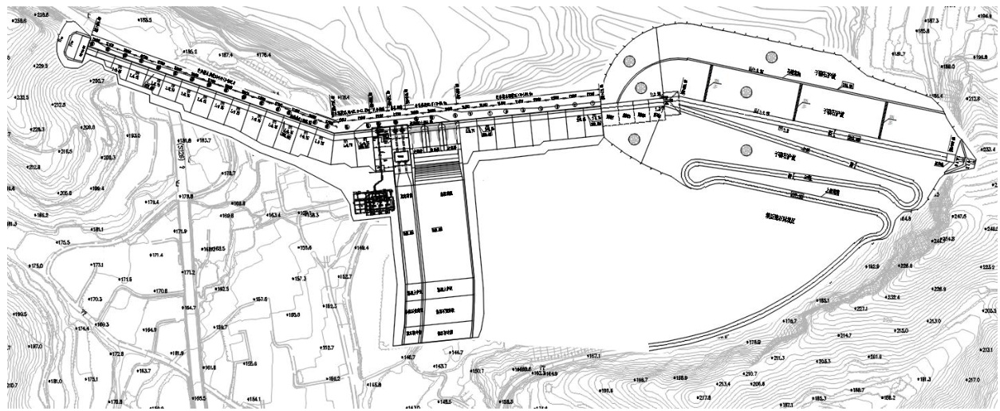  
图 6.3.2-1 塔岗水库混合坝平面布置图(原坝址)  

# 6.6 混合坝挡水建筑物设计  

# 6.6.1 重力坝设计  

大坝采用碾压混凝土重力坝坝型,由 $1\#\sim30\#$ 坝段组成,大坝总长621.80m,建基面高程 $141.00\mathrm{m}$ ,坝顶高程 $209.00\mathrm{m}$ ,最大坝高 $68.00\mathrm{m}$ 。  

1#\~8#为河床挡水坝段,总长 168.00m;9#\~11#坝段为溢流表孔坝段,长$60.00\mathrm{m}$ ; 12#坝段为泄洪底孔坝段,长 21m; 13#坝段为引水坝段,长 21m;14#\~30#坝段为右岸挡水坝段,总长 $330.80\mathrm{m}$ 。  

# 6.6.1.1 坝顶高程  

根据《混凝土重力坝设计规范》(SL319-2018)规定,坝顶高程应高于水库最高静水位,坝顶上游防浪墙顶 高程应高于波浪顶高程,其与正常蓄水位或校核洪水位的高差,可由下式计算,应选择两者中防浪墙顶高程的高者作为最低高程。  

$$
\Delta h{=}h_{1\%}{+}h_{2}{+}h_{\tt c}
$$  

式中:Δh——防浪墙顶至正常蓄水位或校核洪水位的高差,m;  
h1%——波高,m;  
hz— 波浪中心线至正常或校核水位的高差,m;  
hc——安全超高,m,按表 6.6.2-1 采用;  

表 6.6.1-1 混凝土重力坝安全加高 hc(单位:m)  

<html><body><table><tr><td rowspan="3">相应水位</td><td>坝的级别</td></tr><tr><td>3级</td></tr><tr><td>0.4</td></tr><tr><td>正常蓄水位 校核洪水位</td><td>0.3</td></tr></table></body></html>  

本工程正常蓄水位 $184.00\mathrm{m}$ ,设计洪水位 $207.51\ensuremath{\mathrm{m}}$ ,校核洪水位 $207.94\mathrm{m}$ ,从工程安全考虑,正常蓄水位工况采用设计洪水位复核坝顶高程。  

本次水库坝顶高程计算的波浪要素采用鹤地公式计算。  

(1)波高及波长计算  

$$
\frac{g h_{2\%}}{\nu_{0}^{2}}=0.00625\nu_{0}^{1/6}\Bigg(\frac{g D}{\nu_{0}^{2}}\Bigg)^{1/3}
$$  

$$
\frac{g L_{m}}{\nu_{0}^{2}}=0.0386\left(\frac{g D}{\nu_{0}^{2}}\right)^{1/2}
$$  

式中: $h_{2\%}$ —累计频率为 $2\%$ 的波高, $\mathsf{m}$ ;  
$L_{m}$ —平均波长, $\mathsf{m}$ ;—计算风速,m/s;  
$D$ —风区长度;  
$g$ —重力加速度, $9.81\mathsf{m}^{2}/\mathsf{s}$ 。  

根据水文气象资料,根据《水工建筑物荷载设计规范》(SL744-2016)12.1.3 条,确定设计洪水位情况下的计算风速取重现期为 50 年的年最大风速,即 $\mathsf{v}_{0}\mathsf{=}19.5\mathsf{m}/\mathsf{s}$ ,校核洪水位情况下的计算风速取多年平均年最大风速,即$\mathsf{v}_{0}\mathsf{=}13.0\mathsf{m/s}$ 。  

(2)波浪中心线至计算水位的高差计算波浪中心线至计算水位的高差 $\mathsf{h}_{\boldsymbol{z}}$ 可按下列公式计算:  

$$
h_{\it z\mathrm{~}}=\frac{\pi h_{\it1\%}^{\mathrm{~}^{2}}}{L_{m}}c t h\frac{2\pi H}{L_{m}}
$$  

式中: $h_{z}$ —波浪中心线至计算水位的高度, $\mathsf{m}$ ;  
$h_{1\%}$ —累积频率为 $1\%$ 的波高, $\mathsf{m}$ ;  
$H$ —挡水建筑物迎水面前的水深, $\mathsf{m}$ 。  
重力坝顶高程计算成果见表 6.6.2-2。  

6.6.1-2 坝顶高程计算结果表(单位:m)   

<html><body><table><tr><td>计算工况 项目</td><td>正常蓄水位</td><td>设计洪水位</td><td>校核洪水位</td></tr><tr><td>水位（m)</td><td>184.00</td><td>207.51</td><td>207.94</td></tr><tr><td>计算风速（m/s)</td><td>19.5</td><td>19.5</td><td>13.0</td></tr><tr><td>风区长度 (W)</td><td>780</td><td>1003</td><td>1012</td></tr><tr><td>波高 h1%（m)</td><td>1.16</td><td>0.83</td><td>0.69</td></tr><tr><td>波浪中心线至计算水位的高 度hz(m)</td><td>0.64</td><td>0.29</td><td>0.3</td></tr><tr><td>安全加高hc（m)</td><td>0.4</td><td>0.4</td><td>0.3</td></tr><tr><td>防浪墙顶至计算水位的高差 △h (m)</td><td>2.21</td><td>1.52</td><td>1.29</td></tr><tr><td>计算防浪墙顶高程 (m)</td><td>186.21</td><td>209.03</td><td>209.23</td></tr></table></body></html>  

<html><body><table><tr><td>计算坝顶高程（m)</td><td>185.01</td><td>207.83</td><td>208.03</td></tr></table></body></html>  

塔岗水库正常蓄水位 $184.00\mathrm{m}$ ,设计洪水位 $207.51\ensuremath{\mathrm{m}}$ ,校核洪水位$207.94\mathrm{m}$ ,坝顶防浪墙顶高程计算成果见上表。计算成果表明,防浪墙顶高程计算值为 $209.23\mathrm{m}$ ,防浪墙墙身高度一般取 $1.2\mathrm{m}$ ,同时坝顶高程不应低于水库最高静水位 $207.95\mathrm{m}$ 。因此,从满足挡水和超高考虑,坝顶高程取 $208.03\mathrm{m}$ 可满足《混凝土重力坝设计规范》(SL319-2018)要求。  

表孔坝段考虑交通桥、工作桥、弧门支铰位置等,坝顶高程需高出弧门$0.8\mathrm{m}$ , 综合考虑挡水和弧门要求,坝顶高程取 $209.00\mathrm{m}$ ,防浪墙顶高程$210.20\mathrm{m}$ 。  

# 6.6.1.2 坝顶基本断面尺寸确定  

碾压混凝土重力坝段坝体断面设计,主要依据《混凝土重力坝设计规范》(SL319-2018)的有关规定,结合坝基抗滑稳定及应力计算结果,优选合乎要求、体型简单、施工方便的断面。重力坝基本断面一般呈三角形,顶点在水库最高静水位附近。坝体上游面可为铅直面、斜面或折面,上游坝坡宜采用$1{:}0.2{\sim}1{:}0$ ;下游坝坡一般为 $1{:}0.8{\sim}1{:}0.6$ 。非溢流坝坝段的坝顶宽度应根据剖面设计要求确定,并不宜小于 $4.0\mathsf{m}$ 。  

本工程初拟坝体基本体型为:基本三角形顶点高程 $209.00\mathrm{m}$ ,坝段上游面的折坡点高程为 $150.00\mathrm{m}$ ,折坡点高程以上为铅直面,折坡点以下坝面坡度1:0.2,下游坝面 $197.00\mathrm{m}$ 高程以上为铅直面,以下坡度 1:0.75。坝体建基面开挖最低高程为 $141.0\mathrm{m}$ ,最大坝高 $68.00\mathrm{m}$ ,坝顶长 $621.80\mathrm{m}$ 。挡水坝段坝顶宽度取 $9.0\mathsf{m}$ 。表孔溢流与底孔泄洪坝段坝顶宽度综合考虑闸门槽的布置、弧门启闭、坝顶交通等要求确定。  

# 6.6.1.3 坝顶构造  

大坝采用碾压混凝土重力坝坝型,由 $1\sim30\#$ 坝段组成,坝轴线长$621.80\mathrm{m}$ ,建基面高程 $141.00\mathrm{m}$ ,坝顶高程 $209.00\mathrm{m}$ ,最大坝高 $68.0\mathrm{m}$ 。从左岸至右岸依次由 $\mathord{1}\sim30\$ #坝段组成:1#\~8#、14#\~30#坝段为非溢流坝段,坝顶总宽度 $9.0\mathsf{m}$ , $9\sim1$ 1#为泄洪表孔坝段,考虑交通桥、工作桥、弧门支铰位置等情况,坝顶宽度 $34.0\mathsf{m}$ ;12#为泄流底孔坝段,考虑交通桥、弧门支铰位置等,坝顶宽度 $15.0\mathrm{m}$ ;13#坝段为引水发电坝段(兼电梯井),坝顶宽$15.0\mathrm{m}$ 。  

坝顶交通可通行,在左、右岸非溢流坝段部分由坝顶通过,其余坝段在大坝上游侧设坝顶交通桥连接左右岸坝顶交通。  

坝顶上、下游侧设置防护钢石材,高 $1.2\mathrm{m}$ ,下游侧每 $30\mathrm{m}$ 设置一盏路灯。  

# 6.6.1.4 坝体材料分区  

根据卫辉气象站 1961\~2022 年资料统计,坝址区多年平均气温 $14.3^{\circ}\mathrm{C}$ ,最低月(一月)平均气温- $.0.5^{\circ}\mathsf{C}$ ,属温和地区。根据地质资料、气象资料及混凝土耐久性要求,在分析各坝段工作条件、应力等设计成果及构造要求的基础上,根据规范规定,坝体混凝土应满足强度、抗渗、抗侵蚀、抗冲刷、低热等性能方面的要求,对坝体混凝土进行分区,同时力求混凝土坝材料分区简单明了,方便施工。  

根据《碾压混凝土坝设计规范》(SL314-2018)、《混凝土重力坝设计规范》(SL319-2018)和《水利水电工程合理使用年限及耐久性设计规范》(SL654-2014)的规定,结合周边已建同类型工程,水工建筑物混凝土根据不同部位,抗冻设计等级取 $\mathsf{F}50\sim\mathsf{F}150$ 。  

根据本工程特点,坝基铺设 $1.0\mathsf{m}$ 厚的常态混凝土(三级配 $\mathsf{C}_{28}20\mathsf{W}_{6}\mathsf{F}_{50})$ )垫层进行平整,再进行碾压混凝土的浇筑。大坝内部采用三级配碾压混凝土$(\mathsf{C}_{90}15\mathsf{W}_{4}\mathsf{F}_{50})$ );上游坝面采用 $0.8\mathrm{m}$ 厚变态混凝土和 $2.2\mathrm{m}$ 厚(最小厚度)二级配富胶凝碾压混凝土( $\mathrm{C}_{90}25\mathsf{W}_{6}\mathsf{F}_{150})$ ;坝基斜坡部位、坝内小孔洞及廊道周围均采用 $0.5\mathrm{m}$ 厚二级配变态混凝土( $\mathrm{C}_{90}15\mathsf{W}_{4}\mathsf{F}_{50})$ );坝顶上部采用常态混凝土(二级配 $\mathsf{C}_{282}5\mathsf{W}_{6}\mathsf{F}_{150})$ );表孔闸墩、底孔闸墩等采用常态混凝土(三级配$\mathsf{C}_{28}30\mathsf{W}_{6}\mathsf{F}_{150})$ ;过渡层采用常态混凝土(三级配 $\mathsf{C}_{28}30\mathsf{W}_{6}\mathsf{F}_{150})$ ;过流高速区采用二级配抗冲磨混凝土( $\mathsf{C}_{90}40\mathsf{W}_{6}\mathsf{F}_{150})$ ;跨孔洞交通桥、板等结构采用一级C30 混凝土。大坝不同部位混凝土分区详见下表 6.6.1-3。  

表 6.6.1-3 坝体混凝土标号分区表  

<html><body><table><tr><td>部位</td><td>混凝土类别</td><td>设计标号</td><td>混凝土级配</td></tr><tr><td>垫层</td><td>常态混凝土</td><td>C2820W6F50</td><td>三级配</td></tr><tr><td>大坝内部</td><td>碾压混凝土</td><td>C9015W4F50</td><td>三级配</td></tr><tr><td>上下游坝面等无法碾压部位</td><td>变态混凝土</td><td>C9025W6F150</td><td>二级配</td></tr><tr><td>坝基斜坡及廊道周围等无法碾 压部位</td><td>变态混凝土</td><td>C9015W6F50</td><td>二级配</td></tr><tr><td>防渗层 坝顶</td><td>富胶凝碾压混凝土 常态混凝土</td><td>C9025W6F150 C2825W6F150</td><td>二级配 二级配</td></tr></table></body></html>  

<html><body><table><tr><td>闸墩</td><td>常态混凝土</td><td>C2830W6F150</td><td>三级配</td></tr><tr><td>过渡层</td><td>常态混凝土</td><td>C2830W6F150</td><td>三级配</td></tr><tr><td>结构混凝土</td><td>预制/常态混凝土</td><td>C2830W6F150</td><td>一级配</td></tr><tr><td>过流表面抗冲磨混凝土</td><td>常态混凝土</td><td>C2840W6F150</td><td>二级配</td></tr></table></body></html>  

# 6.6.1.5 坝基稳定及应力分析  

塔岗水库位于卫辉市的沧河出山口处。库区为塔岗村至李沿沟村之间的沧河段。坝址区属低山河谷地貌类型,河谷开阔,呈宽“U”型河谷。主河槽段基岩完整强度高、岩体完整,覆盖层厚度较薄;基岩为硬质岩,岩体结构完整。结构面以中高角度为主,未发现发育有缓角度的软弱夹层,基本不存在坝基深层抗滑问题。因此,不进行深层抗滑稳定计算。  

(1)计算工况及荷载组合  

坝体抗滑稳定及应力计算的荷载组合分为基本组合和特殊组合。根据地质勘察成果,塔岗水库坝址区抗震设防烈度为 VIII 度,设计地震动峰值加速度为$0.209$ ,按《水工建筑物抗震设计标准》(GB 51247-2018),需对地震工况进行复核计算。故确定大坝抗滑稳定及坝基应力的计算工况及荷载组合见下表。  

表 6.6.1-4 计算工况及荷载组合表  

<html><body><table><tr><td rowspan="2">荷载 组合</td><td rowspan="2">主要工况</td><td colspan="8">荷载</td><td rowspan="2">备注</td></tr><tr><td>自重</td><td>静水 扬压 压力 力</td><td>淤沙 压力</td><td>浪压 力</td><td>冰 压 力</td><td>动水 压力</td><td>地 震 荷 载</td><td></td></tr><tr><td rowspan="3">基本 组合</td><td>正常蓄水位工况</td><td></td><td></td><td>√</td><td></td><td></td><td></td><td></td><td></td><td>上游水位184.00m 下游水位152.90m</td></tr><tr><td>设计洪水位工况</td><td></td><td>?</td><td></td><td></td><td>2</td><td></td><td></td><td></td><td>上游水位207.51m 下游水位152.90m</td></tr><tr><td>冰冻工况</td><td></td><td></td><td>2</td><td></td><td>2</td><td></td><td></td><td></td><td>上游水位184.00m 下游水位152.90m</td></tr><tr><td rowspan="3">特殊 组合</td><td>校核洪水位工况</td><td></td><td>2</td><td></td><td></td><td></td><td></td><td></td><td></td><td>上游水位207.94m 下游水位154.31m</td></tr><tr><td>地震工况</td><td>√</td><td></td><td>√</td><td>√</td><td></td><td></td><td></td><td></td><td>上游水位184.00m 下游水位152.90m</td></tr><tr><td>完建工况</td><td></td><td></td><td></td><td></td><td></td><td></td><td></td><td></td><td>荷载仅计坝体自 重，不考虑上下游 水位。</td></tr></table></body></html>  

# (3)计算断面选择  

碾压混凝土重力坝由 1#\~30#坝段组成,建基面座落在弱风化\~微新片麻岩。根据大坝布置及建基面地质条件,分别选取挡水坝段典型段面、表孔坝段  

典型段面计算坝体建基面抗滑稳定及应力计算。  

# (4)计算参数  

根据坝址区岩土体物理力学参数建议值,开挖建基面情况,各坝段坝基岩体允许承载力、抗剪断参数采用值见下表:  

表 6.6.1-5 坝址地层岩体物理力学指标计算采用值  

<html><body><table><tr><td rowspan="3">部位</td><td colspan="2">混凝土与基岩指标（抗剪 断)</td><td rowspan="2">混凝土与基岩指标（抗 剪)</td><td rowspan="2">允许承载力</td></tr><tr><td>f</td><td>C'</td></tr><tr><td></td><td>MPa</td><td>f</td><td>MPa</td></tr><tr><td>挡水坝段</td><td>1.00</td><td>0.95</td><td>0.55</td><td>2.00</td></tr><tr><td>表孔坝段</td><td>1.00</td><td>0.95</td><td>0.55</td><td>2.00</td></tr></table></body></html>  

# (5)计算公式  

大坝建基面稳定计算采用抗剪断强度公式和抗剪强度公式计算坝基面抗滑稳定安全系数:  

$\textcircled{1}$ 抗剪断强度的计算公式:  

$$
K^{'}=\frac{f^{'}\sum W+c^{'}A}{\sum P}
$$  

式中: $K^{'}$ —按抗剪断强度计算的抗滑稳定安全系数;  

$f$ '—坝体混凝土与坝基接触面的抗剪断摩擦系数;  
$c$ —坝体混凝土与坝基接触面的抗剪断凝聚力,kPa;  
A —坝基接触面截面积, ;  
W —作用于坝体上全部荷载(包括扬压力)对滑动平面的法向分值,kN;  
P—作用于坝体上全部荷载对滑动平面的切向分值,kN。  

$\textcircled{2}$ 抗剪断强度的计算公式:  

$$
K={\frac{f\sum W}{\sum P}}
$$  

式中:K—按抗剪强度计算的抗滑稳定安全系数;  

f—坝体混凝土与坝基接触面的抗剪摩擦系数;  

W —作用于坝体上全部荷载(包括扬压力)对滑动平面的法向分值,kN;  
P—作用于坝体上全部荷载对滑动平面的切向分值,kN。  

$\textcircled{3}$ 大坝坝基截面垂直应力采用采用材料力学法计算:  

$$
\sigma_{\mathrm{{y}}}={\frac{\sum W}{A}}\pm{\frac{\sum M\cdot x}{J}}
$$  

式中: $\sigma_{y}$ —坝基截面垂直应力,kPa;  

W —作用于坝段或 $1\mathsf{m}$ 坝长上全部荷载在坝基截面上法向力的总和,kN;  

M—作用于坝段或 1m 坝长上全部荷载对坝基截面形心轴的力矩总和,kN·m;A —坝段或 1m 坝长的坝基截面积, $\mathsf{m}^{2}$ ;$x$ —坝基截面上计算点到形心轴的距离, $\mathsf{m}$ ;J —坝段或 1m 坝长的坝基截面对形心轴的惯性矩, $\mathsf{m}^{4}$ 。  

(6)计算荷载 $\textcircled{1}$ 坝体自重  

计入坝体、闸墩、导墙等重量,扣除孔口等大孔洞重量。混凝土重度取$24\mathsf{k N}/\mathsf{m}^{3}$ 。  

$\textcircled{2}$ 静水压力  

$$
P_{\mathrm{{\scriptscriptstylew}}}=\gamma_{\mathrm{{\scriptscriptstylew}}}H
$$  

式中: $P_{w}$ —计算点处的静水压强, $\mathsf{k N}/\mathsf{m}^{2}$ ;  
$H$ —计算点处的作用水头, $\mathsf{m}$ ,按计算水位与计算点之间的高差确定;  
$\gamma_{_{w}}$ —水的重度, $\mathsf{k N}/\mathsf{m}^{3}$ ,采用 $9.81\mathsf{k N}/\mathsf{m}^{3}$ 。  

$\textcircled{3}$ 扬压力  

根据《水工建筑物荷载设计规范》(SL744-2016),岩基上混凝土坝坝底面的扬压力分布图形可按下列情况确定,α取值参见《水工建筑物荷载设计规范》(SL744-2016)表 6.2.1。  

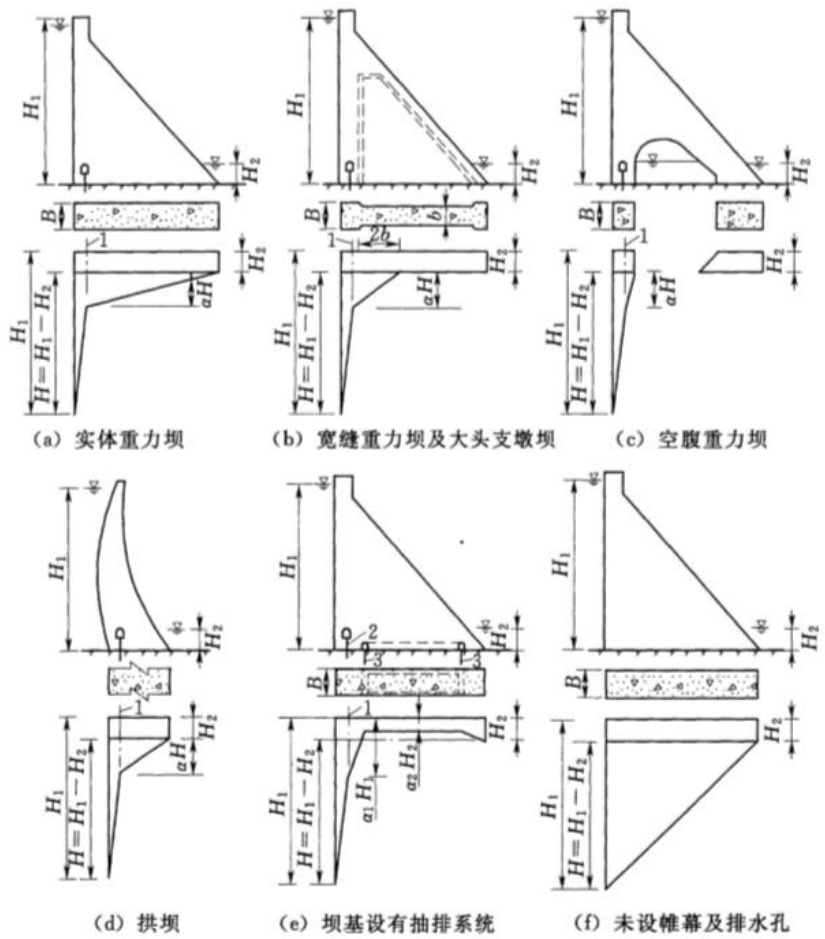  
1-排水孔中心线;2-主排水孔;3-副排水孔; $H_{1}$ 一上游作用水头;$H_{2}$ 一下游作用水头;B-沿坝轴线计算宽度;b一宽缝处坝体宽度;a一渗透压力强度系数;a1一扬压力强度系数;α2一残余扬压力强度系数  

$\textcircled{4}$ 淤沙压力  

$$
\begin{array}{r}{P_{s k}=\frac{1}{2}\gamma_{s b}h_{s}^{2}t g^{2}(45^{\circ}-\frac{\varphi_{s}}{2})}\end{array}
$$  

式中: $\gamma_{s b}$ —淤沙浮重度;取 $9k N/m^{3}$ ;  

$h_{s}$ —坝前淤沙深度(m);  

$\varphi_{s}$ —淤沙的内摩擦角。  

$\textcircled{5}$ 浪压力  

计算风速基本组合取 $19.5\mathrm{m/s}$ ,特殊组合取 $13.0\mathrm{m/s}$ ,吹程 $1600\mathrm{m}$ ,波浪要素按莆田公式计算。  

$\textcircled{6}$ 动水压力  

溢流面反弧段动水压力采用以下公式计算:  

$$
\begin{array}{r l}{P_{\mathrm{xr}}=q\rho_{\mathrm{w}}v(\mathrm{cos}\varphi_{2}-\mathrm{cos}\varphi_{1})}\ {P_{\mathrm{yr}}=q\rho_{\mathrm{w}}v(\mathrm{sin}\varphi_{2}+\mathrm{sin}\varphi_{1})}\end{array}
$$  

式中: $P_{\mathrm{{xr}}}$ —单位宽度上离心力合力的水平分力;  
—单位宽度上离心力合力的垂直分力;  
q—相应设计工况下反弧段上的单宽流量, $\mathsf{m}^{3}/\mathsf{\Omega}(\mathsf{s}\cdot\mathsf{m})$ ;  
v—反弧段最低点处的断面平均流速,m/s。  

$\textcircled{7}$ 地震力  

根据《水工建筑物抗震设计规范》(SL203-97),本工程坝高小于 $70\mathrm{m}$ 、地震烈度小于 8 度,可使用拟静力法进行计算,根据规范 4.1 条,本工程只考虑水平方向的地震作用。将计算断面从上到下划分为九部分,首先计算得各部分的动态分布系数αi,再根据拟静力法地震惯性力及地震动水压力计算公式进行计算,地震惯性力计算公式如下:  

$$
\mathsf{F}{\mathsf{i}}{=}\mathsf{a}_{\mathsf{h}}{\mathsf{x}}\xi{\mathsf{x}}{\mathsf{a}}_{\mathsf{i}}{\mathsf{x}}{\mathsf{G}}{\mathsf{i}}/{\mathsf{g}}
$$  

式中:  

Fi—为作用在质点 i 的水平向地震惯性力;  

ξ—为地震效应折减系数,取 0.25;  

Gi—为质点 i 的重力,KN;  

ah—为地震加速度,本工程取 $0.29$ ;  

αi 为动态分布系数,计算公式如下:  

$$
\alpha_{i}=1.4\frac{1+4(h_{i}/H)^{4}}{1+4\displaystyle\sum_{i=1}^{n}\frac{G_{\xi_{i}}}{G_{\xi}}(h_{j}/H)^{4}}
$$  

式中:  

n—为坝体质点总数;  

H—为坝高;  

hi、hj—为质点 i、j 的高度,m;  

地震动水压力计算公式如下:  

$$
F_{0}=0.65a_{h}\xi\rho_{w}H_{0}^{2}
$$  

式中:  

F0—为单位宽度总地震动水压力,作用点在水面以下 $0.54\mathsf{H}_{0}$ ;  

H0—为汛限水位的水深,m;  

(7)计算成果  

大坝沿建基面的抗滑稳定和坝基截面垂直应力成果见下表:  

表 6.6.1-6 大坝建基面抗滑稳定安全系数及坝基应力成果表  

<html><body><table><tr><td rowspan="2">部 位</td><td rowspan="2">计算工况</td><td colspan="2">抗剪断强度</td><td colspan="2">抗剪强度</td><td colspan="3">坝基截面垂直应力 (kPa)</td></tr><tr><td>K'</td><td>[K'] </td><td>K</td><td>[K] </td><td>9" y</td><td></td><td>[]</td></tr><tr><td rowspan="6">挡 水 坝 段</td><td>正常蓄水位 工况</td><td>10.72</td><td>3.00</td><td>2.77</td><td>1.05</td><td>1294.73</td><td>382.68</td><td>838.70</td></tr><tr><td>设计洪水位 工况</td><td>4.46</td><td>3.00</td><td>1.16</td><td>1.05</td><td>638.63</td><td>1072.68</td><td>855.65</td></tr><tr><td>冰冻工况</td><td>10.44</td><td>3.00</td><td>2.69</td><td>1.05</td><td>1273.42</td><td>403.99</td><td>838.70</td></tr><tr><td>校核洪水位 工况</td><td>4.43</td><td>2.50</td><td>1.15</td><td>1.00</td><td>617.36</td><td>1088.10</td><td>852.73</td></tr><tr><td>地震工况</td><td>5.04</td><td>2.30</td><td>1.30</td><td>1.00</td><td>792.98</td><td>884.42</td><td>838.70</td></tr><tr><td>完建工况</td><td></td><td></td><td></td><td></td><td>1437.37</td><td>279.68</td><td>858.52</td></tr><tr><td rowspan="7">表 孔 坝 段</td><td>正常蓄水位 工况</td><td>11.68</td><td>3.00</td><td>2.65</td><td>1.05</td><td>993.24</td><td>338.90</td><td>666.1</td></tr><tr><td>设计洪水位 工况</td><td>5.13</td><td>3.00</td><td>1.15</td><td>1.05</td><td>520.08</td><td>788.14</td><td>654.1</td></tr><tr><td>冰冻工况</td><td>11.40</td><td>3.00</td><td>2.58</td><td>1.05</td><td>981.01</td><td>351.14</td><td>666.1</td></tr><tr><td>校核洪水位 工况</td><td>5.09</td><td>2.50</td><td>1.14</td><td>1.00</td><td>500.95</td><td>796.78</td><td>648.9</td></tr><tr><td>地震工况</td><td>8.77</td><td>2.30</td><td>1.99</td><td>1.00</td><td>896.85</td><td>435.30</td><td>666.1</td></tr><tr><td>完建工况</td><td></td><td></td><td></td><td></td><td>1403.14</td><td>296.20</td><td>849.7</td></tr><tr><td></td><td></td><td></td><td></td><td></td><td></td><td></td><td></td></tr></table></body></html>  

由计算结果可知,各工况下,各计算坝段建基面抗滑稳定安全系数满足规范要求。在各种工况下,坝趾和坝踵均不产生拉应力,压应力值亦小于基岩和混凝土的容许压应力,满足规范要求。  

# 6.6.1.6 坝基处理  

根据坝基工程地质初步评价:原塔岗水库主坝坝体上游建于基岩上,下游建于砂卵石上。岩石坚硬,强度较高,岩体性较好,砂卵石其承载力和变形能力较基岩要差。本次拆除新建混凝土重力坝,建议挖除覆盖层,选择基岩做为重力坝坝基,对相对破碎的坝基部分进行固结灌浆。坝基基岩受构造影响,裂隙较发育,透水性较强,导致坝基存在渗漏问题,建议对主坝坝基进行帷幕灌浆处理。  

原右副坝位于主坝西侧,坝处覆盖层厚度不大,基岩面出露较高,基岩为灰岩和闪长玢岩,均为硬质岩,完整性较好,弱风化基岩可作为混凝土重力坝坝基。浅表层岩体透水性较强,需采取防渗措施。  

原溢洪道基岩受构造影响,裂隙较发育;破碎带导致该区段基岩存在渗漏问题,部分地段节理裂隙发育,存在渗漏问题,需采取防渗处理措施。  

1)基础开挖  

初步拟定清除主坝及右副坝浅层覆盖层及主坝下游侧砂卵石层。  

# 2)基础防渗  

基于地质钻孔压水试验成果分析,总体以 5Lu 为防渗标准,深至 5Lu 线以下 5m。  

根据坝址处工程地质及拦河坝布置情况,坝基防渗帷幕布置在坝体上游灌浆及主排水廊道内,河床平均深度 $50.0\mathsf{m}$ 。左右岸地形较陡,采用在坝顶开挖平硐进行钻孔灌浆,平硐断面形式为城门洞型,尺寸为 $3.0{\times}3.5{\mathrm{m}}$ ,两岸平均深度 $150\mathrm{m}$ 。  

坝体段帷幕设计为双排,在坝基灌浆及主排水廊道内进行,帷幕孔方向与岩层倾向交角 $30\sim40^{\circ}$ ,帷幕排距孔距 $1.5\mathrm{m}$ ,防渗帷幕深度在 5Lu 线以下 5m作为防渗低界。  

# 3)基础排水  

在帷幕灌浆及主排水灌浆廊道下游侧设置向下游倾斜主排水孔一排,以降低坝基渗透压力。主排水孔孔距 $3.0\mathsf{m}$ ,孔深取帷幕深度 $0.5{\sim}0.6$ 倍。  

# 4)基础固结灌浆  

为提高坝基基岩的弹性模量,改善基岩的抗渗性能,增强基岩的整体性和  

抗滑稳定性。在整个重力坝基面范围内进行固结灌浆。初步拟定固结灌浆孔间、排距 3m,深度 $10\mathrm{m}$ 。  

# 6.6.1.7 混凝土温度控制及防裂措施  

# (1)基础资料  

碾压混凝土坝采用高掺和料,低水泥用量的混凝土配合比,水化热温升比常态混凝土大幅减小;但碾压混凝土铺筑面积大,上升速度快,施工期层面散热小,绝大部分水化热留在坝内,温度应力较大。塔岗水库坝址以上流域属暖温带大陆性季风气候,季节分明,干湿悬殊较大。多年平均气温 $14.3\%$ ,最高气温 $42.5^{\circ}\mathrm{C}$ ,最低气温- $18.4^{\circ}\mathrm{C}$ ;冰冻期 12 月 ${\sim}2$ 月,无霜期 4 月 ${\sim}10$ 月。  

根据焦作气象站 1961\~2022 年资料统计,多年平均气温 $15.6\mathrm{^\circC}$ ,年日照时数 2139 小时,多年平均相对湿度 $60.5\%$ 。坝址区主要气象要素特征值见表6.6.1-7。  

表 6.6.1-7 坝址区主要气象要素特征值  

<html><body><table><tr><td>项目</td><td>1月</td><td>2月</td><td>3月</td><td>4月</td><td>5月</td><td>6月</td><td>7月</td></tr><tr><td>平均气温 (°℃)</td><td>-0.5</td><td>2.6</td><td>8.6</td><td>15.3</td><td>21.1</td><td>26.2</td><td>27.2</td></tr><tr><td>极端最高气温 (°℃)</td><td>18.5</td><td>27.6</td><td>31.4</td><td>34.7</td><td>40.0</td><td>42.5</td><td>42.0</td></tr><tr><td>极端最低气温 (D。)</td><td>-16.6</td><td>-15.0</td><td>-8.1</td><td>-2.2</td><td>4.9</td><td>9.9</td><td>16.3</td></tr><tr><td>日照时数 (h)</td><td>143</td><td>146</td><td>184</td><td>208</td><td>238</td><td>223</td><td>189</td></tr><tr><td>相对湿度 (%)</td><td>59.8</td><td>59.6</td><td>59.9</td><td>63.4</td><td>63.9</td><td>61.8</td><td>78.2</td></tr><tr><td>项目</td><td>8月</td><td>9月</td><td>10月</td><td>11月</td><td>12月</td><td>年</td><td></td></tr><tr><td>平均气温 (°℃)</td><td>26.0</td><td>21.2</td><td>15.2</td><td>7.6</td><td>1.3</td><td>14.3</td><td></td></tr><tr><td>极端最高气温 (O。)</td><td>38.5</td><td>37.5</td><td>34.2</td><td>27.4</td><td>23.4</td><td>42.5</td><td></td></tr><tr><td>极端最低气温 (O。)</td><td>12.2</td><td>3.5</td><td>-3.4</td><td>-12.5</td><td>-18.4</td><td>-18.4</td><td></td></tr><tr><td>日照时数 (h)</td><td>199</td><td>175</td><td>172</td><td>149</td><td>150</td><td>2177</td><td></td></tr><tr><td>相对湿度(%)</td><td>79.7</td><td>75.6</td><td>71.2</td><td>69.1</td><td>63.1</td><td>67.1</td><td></td></tr></table></body></html>  

# (2)温度控制标准  

# 1)基础允许温差  

基础温差系指建基面 0.4L(L 为浇筑块长边尺寸)高度范围的基础约束区内混凝土的最高温度和该部位稳定温度之差。  

扩建后塔岗水库工程最大坝高 $68.0\mathrm{m}$ ,坝体分缝长度为 $20{\sim}21\ensuremath{\mathrm{m}}$ ,浇筑块长边长度为 $9.00{\sim}54.00\mathrm{m}$ 。按规范 SL319—2018《混凝土重力坝设计规范》要求基础允许温差采用表 5.6.8-2 规定的数值。  

表 5.6.8-2 SL319-2018 建议的基础约束区容许温差 (单位: $^{\circ}C$ )  

<html><body><table><tr><td rowspan="2">距基岩面高度 (W)H</td><td colspan="5">浇筑长边长度L</td></tr><tr><td>17m 以下</td><td>17~20m</td><td>20~30m</td><td>30~40m</td><td>40m至通仓长 块</td></tr><tr><td>0~0.2L</td><td>26~25</td><td>25~22</td><td>22~19</td><td>19~16</td><td>16~14</td></tr><tr><td>0.2~0.4L</td><td>28~27</td><td>27~25</td><td>25~22</td><td>22~19</td><td>19~17</td></tr></table></body></html>  

# 2)上、下层温差控制标准  

在老混凝土上浇筑上层混凝土时,上下层的允许温差宜为 $15{\sim}20^{\circ}\mathrm{C}$ 。  

# 3)内外温差  

混凝土裂缝绝大多是表面裂缝,加强表面保护至关重要。气温骤降是引起混凝土表面裂缝的最不利因素之一。低温季节内外温差过大或者混凝土表面温度梯度过大,也是引起混凝土表面裂缝的原因之一,因此应特别注意气温骤降期以及低温季节混凝土表面养护。混凝土内外温差一般控制在 $18{\sim}20^{\circ}\mathrm{C}$ 。  

(3)主要温控措施  

1)优化混凝土配合比设计,在保证混凝土设计指标的前提下,增加掺合料掺量;高温季节施工,采用高效缓凝减水剂,延长混凝土初凝时间;  

2)应采取措施,降低骨料温度,如:控制混凝土骨料的含水率小于 $6\%$ ,对成品料仓设置凉棚,成品料仓堆料高度要求不低于 8m,尽可能使骨料温度不受日气温变化的影响;出料皮带及骨料罐要设置凉棚防雨防晒等。  

3)在混凝土生产过程中采取骨料预冷或者加冷却水拌合混凝土的措施,控制出机口温度。  

4)运输设备的辐射防护对降低运输途中的温度回升有重要作用,并且投入不大,可以大力实施,减少运输过程中混凝土温度回升。在汽车顶部设活动防晒、防雨篷布及保温设施,溜管上部设置防晒保温设施等。  

5)在温度较高的月份尽可能利用早、晚或者夜间气温较低的时段进行混凝土浇筑,尽量避免在白天高温时段浇筑混凝土;另外,碾压混凝土采用快速施工可以使层间混凝土达到良好的层面结合效果,同时又可以减少混凝土层面与外界的接触时间,从而减少外界与碾压混凝土的热量交换,更好地控制混凝土的浇筑温度,所以要求施工过程中快速入仓、快速平仓、快速碾压,碾压混凝土从加水拌和到碾压完成在 2 小时以内,并且碾压完后的混凝土面立即覆盖保温材料,直到摊铺上层混凝土。  

6)混凝土需要采取仓面表面流水措施,并要求在混凝土完成初凝后立即进行。  

7)为减少太阳照射时的温度倒灌,应采取在仓面上喷雾的措施,用河水和高压风形成低温雾气,以改变仓内小环境,反射阳光,降低仓内气温,增加仓内湿度,从而保证碾压混凝土的预冷效果、利于层面间良好结合。  

8)埋设导热系数大于 $1.06\mathrm{{J/m}\cdot h\cdot^{\circ}C}$ 高强聚乙烯塑料管进行混凝土冷却,蛇形布置冷却水管,布置间距初拟为水平向 $1.5\mathrm{m}$ ,垂直向 $1.5\mathrm{m}$ ,布置范围为整个基础约束区,以及岸坡为陡坡的坝段。  

9)由于碾压混凝土大坝是大仓面薄层摊铺快速施工,碾压混凝土有水化热低,水化速度慢的特点,在夏季浇筑过程中,基本谈不上坝层面的散热作用,都是外界温度倒灌入碾压混凝土中,为减少太阳辐射造成混凝土温升过快,在碾压完毕之后,应及时覆盖保温材料,保护标准为等效热交换系数 $\upbeta\leqslant$ $9.06\times\mathsf{J}/\mathsf{m}2\cdot\mathsf{h}\cdot\mathsf{\Omega}^{\circ}\mathrm{C}$ ;对于上下游等长期暴露面、体型结构复杂和体型不利的部位应全年挂贴上述标准的保温材料。  

10)混凝土浇筑过程中,浇筑块应均匀上升,相邻块的高差不宜大于 $12\mathrm{m}$ ;加强混凝土拌和、运输、浇捣过程中的质量控制,严格按照控制混凝土的强度合格率和离差系数。施工期应及时了解雨情和气温情况,严格遵守有关停工的规定。  

# 6.6.2 黏土心墙堆石坝设计  

左岸原坝体为均质粘土坝,根据原始设计资料,该坝体压实度达不到设计要求,初期沉陷变形严重,现仍未稳定。针对以上问题,本方案对原均质坝进  

行全部拆除新建,采用黏土心墙堆石坝作为代表坝型。  

# 6.6.2.1 坝顶高程计算  

水库正常蓄水位为 $184.00\mathrm{m}$ ,根据调洪计算结果,设计洪水位为 207.51m,校核洪水位为 $207.94\mathrm{m}$ 。  

按《碾压式土石坝设计规范》(SL274-2020)相关规定设计。坝顶高程根据各种运行情况的水库静水位加上相应超高后的最大值确定。坝顶超高 y 按下式计算:  

式中:  

A——安全加高(m);大坝为 3 级建筑物,按《碾压式土石坝设计规范》(SL274-2020)的规定,正常运用情况安全加高 $0.70\mathrm{m}$ ,非常运用情况取$0.5\mathrm{m}$ ;地震涌浪 $0.5\mathrm{m}$ ,震陷 $0.6\mathrm{m}$ ( $1.2\%$ 坝高)。  

最大风雍水面高度(m);  

R——最大波浪在坝坡上爬高(m)。  

根据水文气象资料,根据《水工建筑物荷载设计规范》(SL744-2016)12.1.3 条,确定设计洪水位情况下的计算风速取重现期为 50 年的年最大风速,即 $\mathsf{v}_{0}\mathsf{=}19.5\mathsf{m}/\mathsf{s}$ ,校核洪水位情况下的计算风速取多年平均年最大风速,即$\mathsf{v}_{0}\mathsf{=}13.0\mathsf{m}/\mathsf{s},$ 。  

坝顶高程等于水库静水位与坝顶超高之和,坝顶高程按以下四种运用条件计算,取其最大值:  

$\textcircled{1}$ 正常蓄水位 $^+$ 正常运用情况的坝顶超高;  
$\textcircled{2}$ 设计洪水位 $^+$ 正常运用情况的坝顶超高;  
$\textcircled{3}$ 校核洪水位 $^+$ 非常运用情况的坝顶超高;  
$\textcircled{4}$ 正常蓄水位 $^+$ 非常运用条件的坝顶超高,计入地震安全加高。  

表 6.6.2-1 坝顶高程计算成果表  

<html><body><table><tr><td>计算工况</td><td>水库水 位</td><td>计算风 速</td><td>风区长 度</td><td>e (m)</td><td>R (w)</td><td>A (m)</td><td>计算坝 顶高程</td><td>防浪墙 顶高程</td></tr><tr><td>①</td><td>184.00</td><td>19.5</td><td>780</td><td>0.001</td><td>1.176</td><td>0.7</td><td>184.84</td><td>186.04</td></tr></table></body></html>  

<html><body><table><tr><td>②</td><td>207.51</td><td>19.5</td><td>1003</td><td>0.001</td><td>0.965</td><td>0.7</td><td>208.28</td><td>209.48</td></tr><tr><td>③</td><td>207.94</td><td>13.0</td><td>1012</td><td>0.001</td><td>0.692</td><td>0.5</td><td>208.02</td><td>209.22</td></tr><tr><td>④</td><td>184.00</td><td>13.0</td><td>780</td><td>0.001</td><td>0.691</td><td>1.2</td><td>184.77</td><td>185.97</td></tr></table></body></html>  

由上表可知,设计洪水位为控制工况,坝顶计算高程为 $208.28\mathrm{m}$ ,防浪墙高度为 $1.2\mathrm{m}$ ,计算防浪墙顶高程为 $209.48\mathrm{m}$ 。根据《碾压式土石坝设计规范》(SL274-2020)第 5.3.5 条规定,土石坝顶部高程不应低于非常运用条件下的静水位,同时考虑与右岸重力坝段衔接,并结合防浪墙的布置,确定坝顶高程为 $209.00\mathrm{m}$ ,防浪墙顶高程为 $210.20\mathrm{m}$ 。  

根据工程经验,竣工后坝顶预留沉降超高按照坝高的 $1\%$ 考虑,由河床坝顶向两坝肩逐渐递减至零。根据工程类比,坝顶最大预留沉降取 $380\mathrm{mm}$ 。  

# 6.6.2.2 坝体结构布置  

左岸黏土心墙堆石坝顶长 $412.60\mathrm{m}$ ,坝顶高程 $209.00\mathrm{m}$ ,防浪墙顶高程$210.20\mathrm{m}$ ,坝顶宽度为 $9.0\mathsf{m}$ ,最大坝高 $38.00\mathrm{m}$ ,上游坝坡坡比 1:2.25,上游坝坡 $189.00\mathrm{m}$ 高程设置平行于坝轴线的马道,马道宽 $2.0\mathsf{m}$ 。下游坝坡坡比1:2.0,坡脚处设排水棱体。下游利用副坝左边岸坡出道路作为上坝道路,坝上设置“之”字上坝道路与其连接,道路宽 $8\mathsf{m}$ ,坡率 $\scriptstyle{\mathrm{i=6}}\%$ ,自 $177.00\mathrm{m}$ 高程延伸至坝顶刺墙衔接段拐角处。  

上、下游坝坡均游采用干砌石护砌、建基面以上采用黏土心墙进行防渗,建基面以下采用防渗墙和帷幕灌浆进行防渗处理。坝体从上游向下游依次为上游干砌石护坡、碾压灰岩堆石区、过渡层、反滤层、黏土心墙、过滤层、反滤层、碾压灰岩堆区、下游干砌石护坡。下游坝面设一条“之”字上坝道路,坡脚处设置排水棱体。  

(1)原均质黏土坝拆除  

原均质坝坝顶高程 186.00m,上游 180.21m 高程以上坡比 1:2.75,以下坡比为 1:3,下游坝坡坡比均为 1:2.25。本方案坝体填筑前需对原均质坝进行拆除,清除地基浅层覆盖层。  

# (2)干砌石护坡  

新建黏土心墙堆石坝上、下游护坡采用干砌石护砌,干砌石厚度 40cm,下设 20cm 厚碎石垫层和 20cm 厚中粗砂垫层。  

(3)碾压灰岩堆石区  

根据前期地质勘察成果,石料场内白云岩、鲕状白云岩、白云质灰岩和薄层白云岩的质量和储量满足筑坝要求,原主坝坝体堆石也可作为堆石料上坝。  

# (4)反滤过渡层  

新建黏土心墙堆石坝在心墙和堆石区区间设置一道反滤层和一道过渡层,保证坝体防渗安全,反滤、过渡层总宽度 $3.0\mathsf{m}$ ,反滤层紧贴黏土心墙料铺设。  

# (5)黏土心墙  

黏土心墙位于坝轴线偏向上游侧,顶部与防浪墙紧密衔接,顶部高程$208.00\mathrm{m}$ ,宽 $3.0\mathsf{m}$ ,向下按照 1.0.3 坡比延伸至建基面。  

# (6)坝顶道路及防浪墙  

新增黏土心墙堆石坝坝顶路面宽 $9.0\mathsf{m}$ ,与右岸溢洪道保持一致,便于衔接及车辆行人通行,路面采用 C25 混凝土浇筑,浇筑厚度 18cm,下设 20cm 厚碎石垫层。路面坡率 $2\%$ ,在下游侧设排水管将路面积水排入下游坝坡排水沟。路面与上游坝坡衔接处设置 L 型混凝土防浪墙,防浪墙高 $2.8\mathrm{m}$ ,其中路面以上高 $1.2\mathrm{m}$ ,宽 $2.0\mathsf{m}$ ,墙厚 $60\mathtt{c m}$ 。  

# 6.6.2.3 渗流稳定计算  

(1)计算断面:渗流分析选择典型断面进行计算,结合地勘成果,选取坝体典型横断面,利用网格自动剖分功能对坝体的典型断面进行三角形单元网格划分。由于左岸地形相对平缓,坝高相对较低。以河床断面桩号坝 $0{+}215.50$ 作为计算断面,压重平台填筑对坝坡稳定有利,计算时未考虑压重平台填筑的影响。见下图 6.6.2.3-1-6.6.2.3-2。  

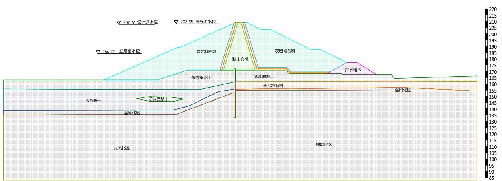  
图 6.6.2.3-1 计算断面材料分区图  

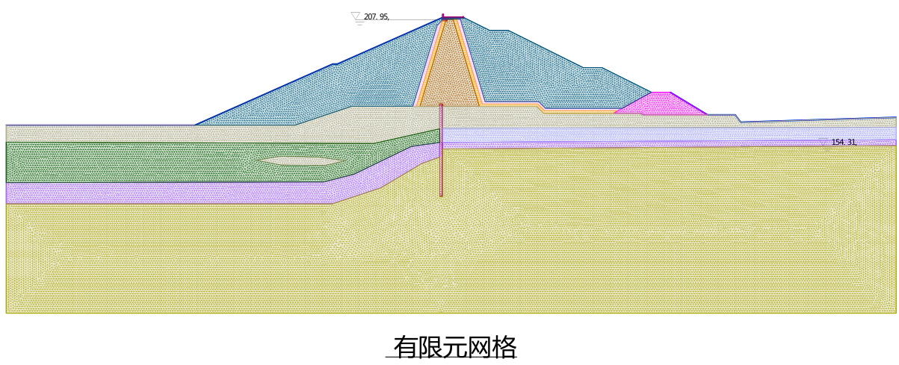  
图 6.6.2.3-2 有限元网格  

(2)计算工况:  

根据《碾压式土石坝设计规范》(SL274—2020),并结合水库运用调度原则,渗流计算包括以下水位组合:  

工况一:正常蓄水位 $184.00\mathrm{m}$ ,下游水位 147.50m;  
工况二:上游设计洪水位 207.51m 与下游相应水位 152.90m;  
工况三:上游校核洪水位 207.94m 与下游相应水位 154.31m;  
工况四:上游校核洪水位 $207.94\mathrm{m}$ 降至死水位 160.00m;  
工况五:上游正常蓄水位 $184.00\mathrm{m}$ 降至死水位 160.00m;  

(3)计算方法及计算参数  

根据塔岗水库大坝运行管理及工程实际情况,采用有限元法针对大坝坝体典型断面的实际情况进行渗流分析。  

渗流的有限元方法是依据非饱和土理论,根据基本的渗流理论—达西定律等,采用有限元方法分析多种边界条件、多种材料的土体渗流情况。本次计算采用《AutoBank7.7 版》渗流分析计算。  

渗流稳定计算采用的坝体、坝基渗透系数根据本次勘察成果结合《水利水电工程地质勘察规范》(GB50487-2008),并参考类似工程经验值确定。本次坝体、坝基采用值如下表 6.6.2.3-1 所示:  

表 6.6.2.3-1 塔岗水库土石坝渗流分析计算参数采用值  

<html><body><table><tr><td>材料名</td><td>Kx(m/s)</td><td>Ky(m/s)</td></tr></table></body></html>  

<html><body><table><tr><td>中水北方勘测设计研究有限责任公司</td><td>6-79 2025年4月</td></tr></table></body></html>  

<html><body><table><tr><td>混凝土防渗墙</td><td>1e-09</td><td>1e-09</td></tr><tr><td>防渗帷幕</td><td>1e-07</td><td>1e-07</td></tr><tr><td>心墙</td><td>2e-08</td><td>2e-08</td></tr><tr><td>堆石料</td><td>5e-04</td><td>5e-04</td></tr><tr><td>反滤料</td><td>4e-05</td><td>4e-05</td></tr><tr><td>排水棱体</td><td>0.001</td><td>0.001</td></tr><tr><td>低液限黏土</td><td>2.5e-07</td><td>2.5e-07</td></tr><tr><td>砾岩</td><td>1.5e-05</td><td>1.5e-05</td></tr><tr><td>砂卵砾石</td><td>1e-03</td><td>1e-03</td></tr><tr><td>强风化</td><td>2.4e-06</td><td>2.4e-06</td></tr><tr><td>弱非风化</td><td>3.6e-07</td><td>3.6e-07</td></tr><tr><td>过渡料</td><td>1.7e-04</td><td>1.7e-04</td></tr></table></body></html>  

(4)计算成果 $\textcircled{1}$ 浸润线计算  

按有关渗流理论相关公式、拟定的边界条件进行土坝稳定渗流分析,在以上各种工况下的渗流浸润线如下图:  

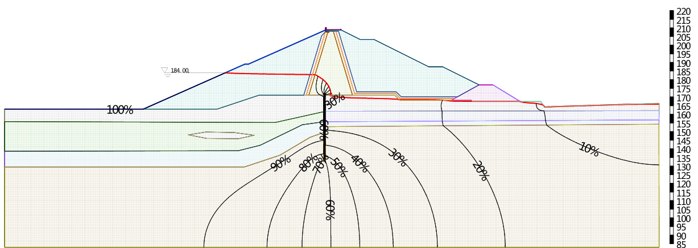  
渗流0,H184(m,水头(m等值线  

# 工况一 正常蓄水位 $184.00\mathrm{m}$ 渗流浸润线  

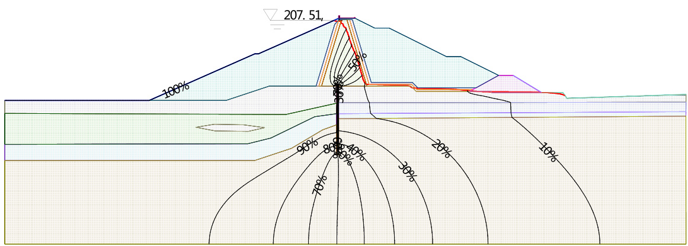  
工况二 设计洪水位 $207.51\ensuremath{\mathrm{m}}$ 渗流浸润线  

渗流0,H=207.51(m,水头(m等值线  

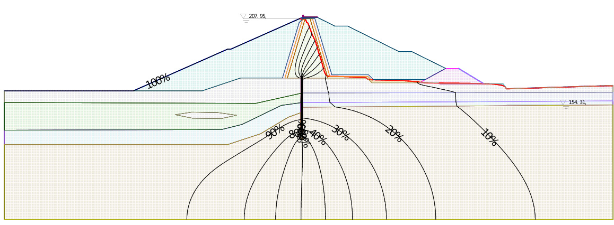  
工况三 校核洪水位 $207.94\mathrm{m}$ 渗流浸润线  

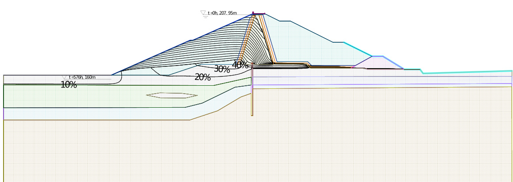  
渗流0,H=207.95(m,水头(m等值线  

渗流0.H=207.95(m,水力坡降等值线 渗流20,Tine=576(h),H=160(m,水头(m等值线  

工况四 校核洪水位 $207.94\mathrm{m}$ 降落渗流浸润线  

渗流0,H207.95(m,水力坡降等值线 渗流20, Ti ne=288(h),H=160(m),水头(m)等值线  

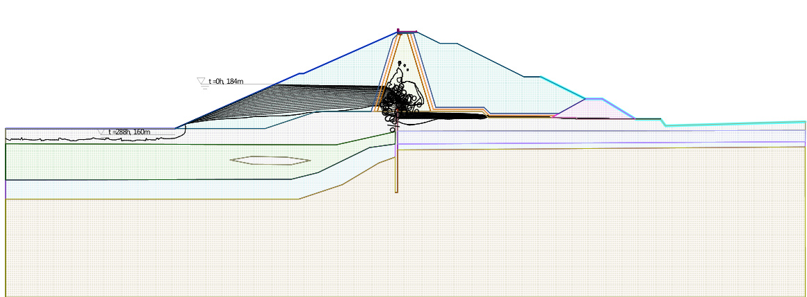  
图 6.6.2.3-3 各工况下渗流浸润线  

# 工况五 正常蓄水位 $184.00\mathrm{m}$ 降落渗流浸润线  

$\textcircled{2}$ 渗流分析安全判别标准(a)渗流量控制  

按水库允许日渗流量不超过库容的某一标准来复核防渗效果,水库允许日渗流量根据水库的类型、重要性、库容大小等由设计确定,塔岗水库总库容6787 万 $\mathsf{m}^{3}$ ,属中型水库。参考《土石坝沥青混凝土面板和心墙设计规范》(SL501-2010)日渗流量要求,对大中型水库可取总库容的 $1/2000{\sim}1/5000.$ 。  

根据前期地勘成果,砂卵砾石层( $\mathsf{Q}_{4}\mathsf{a l p}$ )和碎石混合土( $\mathsf{Q}_{3}\mathsf{p l}$ )具有强透水性,低液限黏土( $\mathsf Q_{2}\mathsf{a l p}$ )具有弱透水性。强风化岩体通常具有强透水性。弱风化岩体以弱透水性为主,少量以中等透水性;微新岩体以微透水性为主,各土层允许水力坡降 Js 见表 6.6.2.3-2。  

表 6.6.2.3-2 塔岗水库各土层允许水力坡降  

<html><body><table><tr><td>岩性</td><td>素填土 (Q4s)</td><td>淤泥质砾石 (Q4~)</td><td>砂卵砾石 (Q4alp)</td><td>低液限黏土 (Q3alp )</td><td>低液限黏土 (Q2alp )</td></tr><tr><td>允许水力坡降Js</td><td>1.0~1.5</td><td>0.22~0.25</td><td>0.12~0.15</td><td>0.5~0.6</td><td>1.0~1.5</td></tr></table></body></html>

$\textcircled{3}$ 渗流量及渗透出逸比降计算各工况渗流量计算见下表 6.6.2.3-3  

表 6.6.2.3-3 塔岗水库左副坝单宽渗流量计算成果表  

<html><body><table><tr><td>桩号</td><td>工况</td><td>水位</td><td>单宽渗流量(m3/d/m)</td></tr><tr><td rowspan="3">坝0+215.50</td><td>工况一</td><td>H=184.0(m)</td><td>0.370643</td></tr><tr><td>工况二</td><td>H=207.51(m)</td><td>0.941494</td></tr><tr><td>工况三</td><td>H=207.95(m)</td><td>0.959529</td></tr></table></body></html>  

从 表 6.6.2.3-3 可 得 , 校 核 洪 水 位 下 对 应 单 宽 渗 流 量 最 大 , 为$0.959529\mathsf{m}^{3}/\mathsf{d}/\mathsf{m}$ ,塔岗水库左幅坝轴线全长 $412.60\mathrm{m}$ ,计算渗流量为$395.90\mathrm{m}^{3}/\mathrm{d}$ 。  

主坝在以上各工况渗透比降计算成果如下图所示,成果表 6.6.2.3-4 如下表所示。  

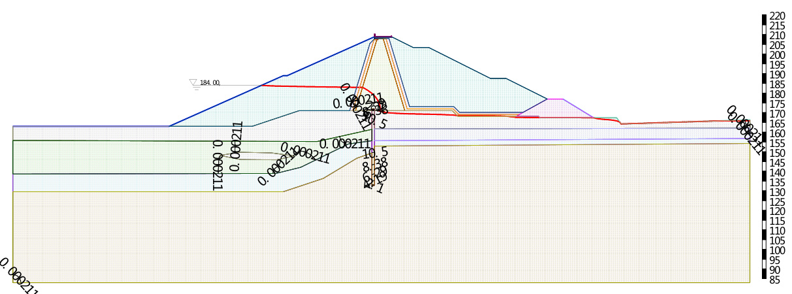  
工况一 正常蓄水位 184.00m 水力坡降等值线图  

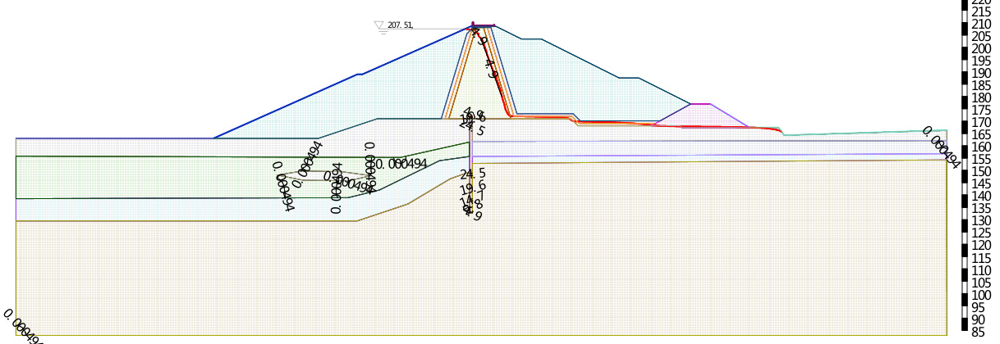  
工况二 设计洪水位 $207.51\ensuremath{\mathrm{m}}$ 水力坡降等值线图  
渗流0.H=184(m,水力坡降等值线   
渗流0,H207.51(m,水力坡降等值线  

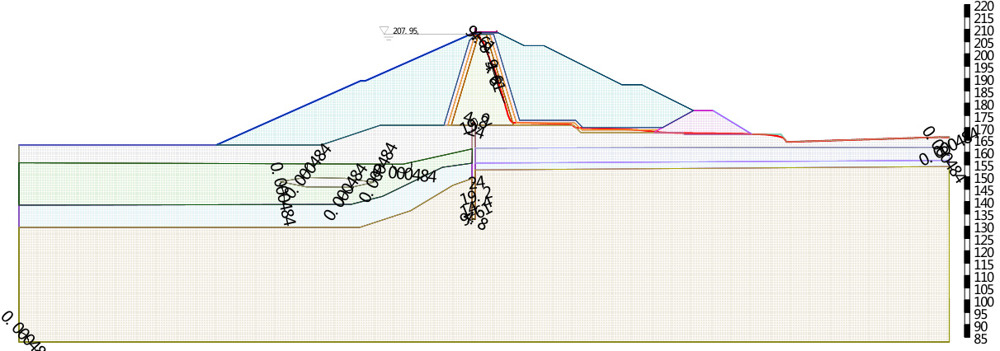  
工况三 校核洪水位 207.94m 水力坡降等值线图  
渗流0,H207.95(m,水力坡降等值线  

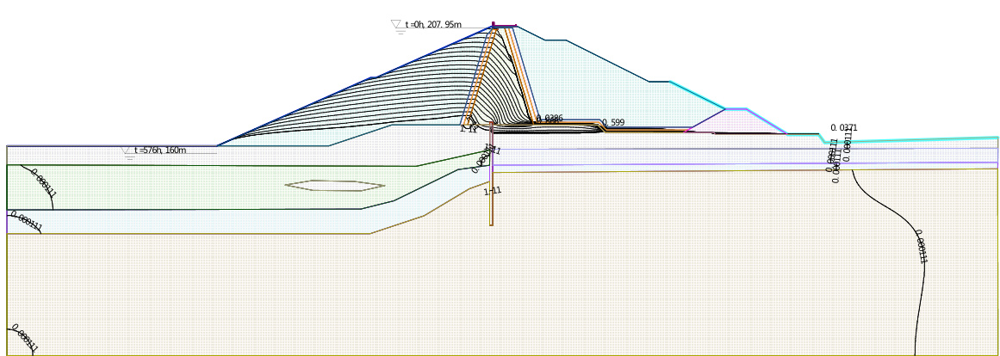  
工况四 库水位降落水力坡降等值线图(207.94m\~160.00m)  

渗流0,H=207.95(m,水力坡降等值线 渗流20,Tine=576(h),H=160(mj,水力坡降等值线  

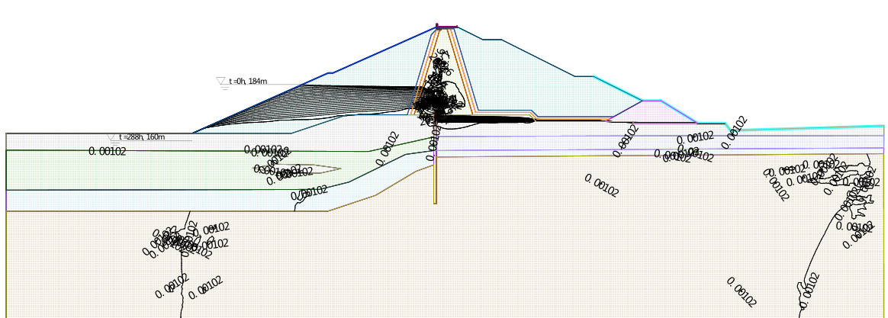  
图 6.6.2.3-4 计算水力坡降等值线图  
渗流0,H207.95(m,水力坡降等值线 渗流20,Tine=288(h),H=160(m,水力坡降等值线  

# 工况五 库水位降落水力坡降等值线图(184.00m\~160.00m)  

# 表 6.6.2.3-5 各工况渗透比降计算成果表  

<html><body><table><tr><td rowspan="2">工况</td><td rowspan="2">工况</td><td rowspan="2">水位 (m)</td><td colspan="2">坝基渗透比降</td><td colspan="2">坝坡出逸比降</td></tr><tr><td>计算值</td><td>允许值</td><td>计算值</td><td>允许值</td></tr></table></body></html>  

<html><body><table><tr><td rowspan="2">工况</td><td rowspan="2">工况</td><td rowspan="2">水位 (m)</td><td colspan="2">坝基渗透比降</td><td colspan="2">坝坡出逸比降</td></tr><tr><td>计算值</td><td>允许值</td><td>计算值</td><td>允许值</td></tr><tr><td rowspan="5">坝0+215.50</td><td>工况一</td><td>H=184.00</td><td>0.0148</td><td>1.0~1.5</td><td>1.06</td><td>1.0~1.5</td></tr><tr><td>工况二</td><td>H=207.51</td><td>0.0482</td><td>1.0~1.5</td><td>1.33</td><td>1.0~1.5</td></tr><tr><td>工况三</td><td>H=207.95</td><td>0.0482</td><td>1.0~1.5</td><td>1.33</td><td>1.0~1.5</td></tr><tr><td>工况四</td><td>H=207.95~160.00</td><td>0.02</td><td>1.0~1.5</td><td>1.12</td><td>1.0~1.5</td></tr><tr><td>工况五</td><td>H=184.00~160.00</td><td>0.02</td><td>1.0~1.5</td><td>0.593</td><td>1.0~1.5</td></tr></table></body></html>  

由以上计算结果可知,各工况下主坝坝基及坝坡出逸点比降均小于允许比降,渗透比降满足要求。  

# 6.6.2.4 刺墙连接段  

黏土心墙坝与右岸重力坝采用混凝土刺墙进行连接,刺墙段全长 $92.00\mathrm{m}$ ,共分为 5 个刺墙段,其中 1#\~4#刺墙为重力式挡墙,断面与右岸重力坝段体型保持一致。5#刺墙段长 18m,上游坡比为 1:0.25,下游坡比 1:0.5,垂直坝轴线墙面坡比 1:0.3。右岸上下游坡面与重力坝段衔接处采用锥面裹头型式顺接。  

# 6.6.2.5 塑性防渗墙  

在距离坝轴线上游 5m 处新建塑性混凝土防渗墙,防渗墙轴线全长$412.60\mathrm{m}$ ,防渗墙需深入基岩以下 5m。  

# 6.6.2.6 帷幕灌浆  

左岸坝基下部为古河道,坝基地层岩性上部主要为低液限黏土,下部为具有强透水性的卵石和含泥碎石层,坝基存在渗漏问题,需要采取帷幕灌浆处理措施。与重力坝帷幕相连接,以保证帷幕灌浆的整体性、连续性。本次新增帷幕灌浆作业平台布置于塑性混凝土防渗墙轴线上,帷幕灌浆孔单排布置,孔距$1.5\mathrm{m}$ ,伸入 5Lu 线以下 5m。坝肩防渗根据两坝肩岩石的透水率及坝肩坝体高度,左右岸延伸至相对隔水层处,防渗设计标准按伸入弱风化岩 5m 控制。  

# 6.7 泄水建筑物  

考虑布置紧凑、顺应河势、水流归槽,泄水建筑物在主河床部位采用溢流表孔、泄洪底孔相结合方式布置。泄水建筑物共布设 3 个泄洪表孔和 2 个泄洪底孔。其中表孔坝段布置在 9#\~11#坝段,长 $60.0\mathrm{m}$ ,共 3 孔。泄洪表孔每孔净宽为 $12.0\mathrm{m}$ ,边墩 $4.0\mathsf{m}$ ,为开敞式溢流孔口,采用 WES 实用堰型,堰顶高程 $192.0\mathrm{m}$ ,闸墩顶高程 $209.00\mathrm{m}$ 。底孔坝段布置在 12#坝段,长 21 米,共设置 2 孔,泄洪底孔孔口尺寸为 $2.50{\times}3.00\mathsf{m}$ (宽 $\times$ 高),底高程 156.00m。  

# 6.7.1 防洪调度运行方式  

塔岗水库防洪调度运行方式如下:  

(1)水库常年在汛限水位 $184.0\mathrm{m}$ 运行;  

(2)当水库水位低于 5 年一遇水位( $.191.20\mathrm{m}$ )时,开启泄洪底孔闸门,入库流量小于 $80\mathsf{m}^{3}/\mathsf{s}$ ,按照来水下泄;入库流量大于 $80\mathsf{m}^{3}/\mathsf{s}$ ,泄洪底孔按照$80\mathsf{m}^{3}/\mathsf{s}$ 下泄;  

(3)当水库水位超过 5 年一遇水位(191.20m)、低于 10 年一遇水位( $:195.65\mathrm{m}$ )时,按照 $120\mathsf{m}^{3}/\mathsf{s}$ 下泄;  

(4)当水库水位超过 10 年一遇水位(195.65m)、低于 20 年一遇水位(201.32m)时,按照 $100\mathrm{m}^{3}/\mathsf{s}$ 下泄;  

(5)当水库水位超过 20 年一遇水位( $201.32\mathrm{m}$ )、低于 50 年一遇水位(207.51m),入库流量开始减小时,按照 $520\mathsf{m}^{3}/\mathsf{s}$ 控泄水位回到汛限水位$184.0\mathrm{m}$ ;  

(6)当水库水位达到 50 年一遇防洪高水位( $207.51\mathsf{m}$ ),继续利用泄洪底孔和逐步开启表孔闸门,控制下泄流量不得大于入库流量;  

(7)当水库水位达到并超过 50 年一遇防洪高水位(207.51m)时,此时所有泄洪设施闸门已全部开启,水库按照泄洪建筑物泄流能力下泄,直至库水位下降至汛限水位 $184.0\mathrm{m}$ 。  

# 6.7.2 泄流规模  

(1)泄洪底孔泄量及泄流规模的确定  

根据调度运行方式,汛限水位 $184.0\mathrm{m}$ 时,底孔具备下泄 $80m^{3}/5$ 的能力。经过泄流能力计算,底孔共布置 2 孔,单孔尺寸 $2.5\mathsf{m}^{\times}3.0\mathsf{m}$ (宽 $\times$ 高)。水位$184.0\mathrm{m}$ ,下泄流量为 $299.3\mathrm{{m}}^{3}/\mathsf{s}$ 。  

# (2)溢流表孔泄量及泄流规模的确定  

根据调度运行方式,当塔岗水库水位达到 50 年一遇防洪高水位 207.51m时,泄洪底孔全部敞泄,并逐步开启溢洪表孔闸门,由泄洪底孔及溢流表孔共同承担工程设计及校核洪水下泄任务。50 年及以下洪水均有底孔独立承担。在表孔泄流规模选择上,需要考虑的因素主要有: $\textcircled{1}$ 尽量使校核洪水位与设计洪水位高差减少,降低挡水建筑物顶部高程; $\textcircled{2}$ 控制泄流的单宽流量,减少消能防冲建筑物的投资。  

根据以上原则,拟定几种溢流表孔规模进行比选,最终选定溢流表孔规模为:堰顶高程 $192.0\mathrm{m}$ ,单孔净宽 $12.0\mathrm{m}$ ,共 3 孔。  

经调洪计算,设计洪水位 $207.51\ensuremath{\mathrm{m}}$ ,校核洪水位是 $207.94\mathrm{m}$ ,相应泄量为$2904\mathrm{m}^{3}/\mathsf{s}$ 、 $5053\mathrm{m}^{3}/\mathsf{s}$ 。校核洪水位 $207.94\mathrm{m}$ ,塔岗水库按照泄流能力敞泄时,底孔承担泄量 $413.2\mathrm{m}^{3}/\mathsf{s}$ ,表孔承担泄量 $4639.8\mathrm{m}^{3}/\mathsf{s}$ ;底孔消能单宽流量$24\mathrm{m}^{3}/\mathsf{s}$ ,表孔单宽消能流量 $83m^{3}/5$ 。  

# 6.7.3 泄洪表孔结构型式  

表孔采用开敞式溢流孔,堰顶高程 $192.0\mathrm{m}$ 。堰顶上游堰头曲线采用椭圆曲线,上游堰面铅直,堰顶下游堰面采用 WES 幂曲线,曲线方程为 $y=0.06x^{1.85}$ 。下游坝面坡度为 1:0.75,抛物线段后接 1:3.0 的切线段,切线段后接半径$35.0\mathsf{m}$ 的反弧段,反弧段末端与消力池底板相接,消力池底板高程 $140.0\mathrm{m}$ 。  

9#\~11#溢流表孔坝段坝顶高程 $209.00\mathrm{m}$ ,每个坝段设置 1 个表孔,坝段长$20.0\mathsf{m}$ ,表孔单孔净宽 $12.0\mathrm{m}$ ,闸墩厚度 $4.0\mathsf{m}$ ,闸墩顺水流向长 $34.0\mathsf{m}$ ,以适应坝顶交通及弧门支铰布置。  

表孔设置弧形工作闸门,采用液压启闭机控制,启闭机室及油泵站共布置2 座,一座布置在 8#坝段下游,控制 9#坝段工作闸门,另一座布置在 12#坝段,控制 10#\~11#坝段工作闸门。由于水库常年在汛限水位 184.00m 运行,低于溢流表孔堰顶高程,具备检修条件,不再设置检修闸门。每孔闸墩下游设置“T”型桥,桥面宽 $2.0\mathsf{m}$ ,桥上布置电缆沟及液压管路沟,下游侧末端设净跨为 12.0m的交通桥,桥面宽 $6.0\mathsf{m}$ 。  

# 6.7.4 泄洪底孔结构型式  

12#泄洪底孔坝段坝顶高程 $209.00\mathrm{m}$ ,坝段长 $21.0\mathsf{m}$ ,设置 2 个底孔,底孔采用短有压坝身泄水孔型式,进口底板高程 $156.00\mathrm{m}$ ,进口设置一道事故检修闸门,孔口尺寸为 $2.5{\times}3.5{\mathrm m}$ (宽 $\times$ 高)。出口设置弧形工作闸门,孔口尺寸为 $2.5{\times}3.0m$ (宽 $\times$ 高)。底孔进口事故检修闸门采用坝顶门机控制,出口弧形工作闸门采用液压启闭机控制。  

底孔进口顶部采用椭圆曲线,曲线方程为 $\scriptstyle{\mathbf{x}^{2}}/{6.6^{2}+\mathbf{y}^{2}}/{2.2^{2}=1}$ ,侧面同样采用椭圆曲线,曲线方程为 $\scriptstyle{\mathsf{x}}^{2}/1.5^{2}+{\mathsf{y}}^{2}/0.5^{2}=1$ ,孔口下缘采用半径为 $1.5\mathrm{m}$ 的圆弧曲线,其后设置一道平板事故检修闸门,为消除孔内负压,闸门槽后孔顶接长  

$6.0\mathsf{m}$ 的有压斜坡段,斜坡段坡度 1:5.0,压坡段末端设弧形工作闸门。弧门后的明流段曲线采用抛物线,抛物线方程为 $y=0.0049\times^{2}$ ,抛物线段后接 1:3.0的切线段,切线段后接半径 $25.0\mathsf{m}$ 的反弧段,反弧段末端与消力池底板相接,消力池底板高程 $140.0\mathrm{m}$ 。  

根据水利水电工程《钢闸门设计规范》SL74-2013 规定,通气孔面积可按照经验公式 B.0.1-1 和 B.0.1-2 计算确定:  

$$
\mathsf{A}_{\mathsf{a}}{\geqslant}\mathsf{Q}_{\mathsf{a}}/\mathsf{N}_{\mathsf{a}}]
$$  

$$
\mathsf{Q}_{\mathsf{a}}{=}0.09{\times}\mathsf{V}_{\mathsf{w}}{\times}\mathsf{A}
$$  

式中:  

Aa——通气孔的断面面积, $\mathsf{m}^{2}$ ;  
Qa——通气孔的充分通气量, $\mathsf{m}^{3}/\mathsf{s}$ ;  
Va——闸门的允许风速, $\mathsf{m}/\mathsf{s}$ ,采用 $40\mathsf{m}/\mathsf{s}$ ,对小型闸门可采用 $50\mathsf{m}/\mathsf{s}$ ;  
Vw——闸门孔口的水流速度, $\mathsf{m}/\mathsf{s}$ ;  
A——闸门后管道面积, $\mathsf{m}^{2}$ ;  

底孔检修闸门计算通气孔面积为 $0.45\mathsf{m}^{2}$ ,实际采用通气孔直径 $0.80\mathsf{m}$ ,通气面积 $0.50\mathsf{m}^{2}$ 。  

# 6.7.5 水力学计算  

# 6.7.5.1 溢流表孔泄流能力计算  

(1)堰面曲线  

表孔单孔净宽 $12.0\mathrm{m}$ ,共设 3 孔,孔口堰顶高程 $192.00\mathrm{m}$ ,堰顶下游堰面采用 WES 幂曲线,堰面曲线方程为:  

$$
{\mathsf{x}}^{\mathsf{n}}{\mathsf{=}}{\mathsf{k}}{\mathsf{H}}{\mathsf{d}}^{\mathsf{n}-1}{\mathsf{y}}
$$  

$\mathsf{H}_{\mathsf{d}}$ 为堰面曲线定型设计水头, $\mathsf{H}_{\mathsf{d}}=\mathsf{\Gamma}(0.75{\sim}0.95\$ ) $\mathsf{H}_{\mathsf{m a x}}{=}11.96{\sim}15.14\mathsf{m}$ ,取$14.0\mathrm{m}$ ;  

系数 $\mathsf{n}{=}1.850$ , $\mathsf{k}{=}2.0$ 。堰面曲线方程计算公式: $16.7y=x^{1.850}$ 则堰面曲线方程: $y=0.06\times^{1.850}$  

堰顶上游堰前采用椭圆曲线,曲线方程为 $\scriptstyle x^{2}/3.75^{2}+y^{2}/2.25^{2}=1$ ,上游堰面铅直。  

(2)泄流能力计算  

根据《混凝土重力坝设计规范》(SL319—2018)附录 A.3 开敞式溢流堰泄流能力计算公式计算。  

$$
Q=C m\varepsilon\sigma_{\mathrm{s}}B\sqrt{2g}H\mathrm{w}^{3/2}
$$  

式中:  

Q 泄流量, $\mathsf{m}^{3}/\mathsf{s}$ ;   
B 溢流堰过水断面净宽, $\mathsf{m}$ ;   
Hw ——计入行近流速的堰上总水头,m;   
m 流量系数;   
ε 侧收缩系数;   
σs 淹没系数,视泄流的淹没程度而定,不淹没时 $\upsigma_{\mathsf{s}}=1.0$ ;   
C 上游面坡度影响修正系数,当上游面为铅直面时,C 取 1.0  

(3)溢流表孔泄流能力计算结果经计算,溢流表孔泄流能力成果见表 6.7.5-1。  

表 6.7.5-1 溢流表孔泄流能力表  

<html><body><table><tr><td>上游水位（m)</td><td>192.0</td><td>193.0</td><td>194.0</td><td>195.0</td><td>196.0</td><td>197.0</td><td>198.0</td></tr><tr><td>泄量(m?/s)</td><td>0.0</td><td>55.5</td><td>161.3</td><td>304.4</td><td>480.9</td><td>689.3</td><td>928.7</td></tr><tr><td>上游水位（m)</td><td>199.0</td><td>200.0</td><td>201.0</td><td>202.0</td><td>203.0</td><td>204.0</td><td>205.0</td></tr><tr><td>泄量 (m/s)</td><td>1198.7</td><td>1494.7</td><td>1817.9</td><td>2166.7</td><td>2537.1</td><td>2926.6</td><td>3336.5</td></tr><tr><td>上游水位 (m)</td><td>206.0</td><td>207.0</td><td>208.0</td><td>209.0</td><td>210.0</td><td>211.0</td><td>212.0</td></tr><tr><td>泄量 (m3/s)</td><td>3766.4</td><td>4212.8</td><td>4668.6</td><td>5134.6</td><td>5617.7</td><td>6097.4</td><td>6585.0</td></tr></table></body></html>  

水位\~泄流能力曲线见下图:  

# 图 6.7.5-1 溢洪表孔水位\~泄流能力关系曲线  

# 6.7.5.2 泄洪底孔泄流能力计算  

泄洪底孔布置 2 孔,底孔底板高程为 $156.00\mathrm{m}$ ,进口段采用喇叭口型式,其后设置事故门,孔口尺寸为 $2.5{\times}3.5{\mathrm m}$ (宽 $\times$ 高),采用 1:5.0 的压坡段与弧形闸门连接,弧形门工作尺寸为 $2.5{\times}3.0m$ (宽 $\times$ 高)。  

泄洪底孔为短有压坝体泄水孔型式,根据《混凝土重力坝设计规范》  

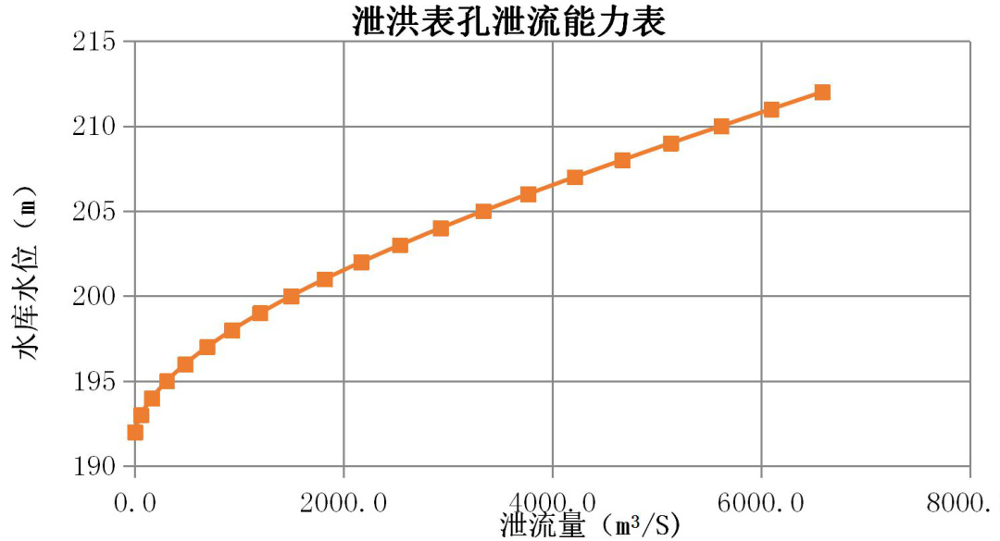  

SL319—2018 附录 A.3 公式计算:  

$$
Q=\mu A_{k}\sqrt{2g H_{_w}}
$$  

式中:  

Q 泄流量, $\mathsf{m}^{3}/\mathsf{s}$ ;  

$\mathsf{A}_{\mathsf{K}}$ 出口处的面积, $\mathsf{m}^{2}$ ;  

$\mathsf{H}_{\mathsf{W}}$ ——上下游水位差, $\mathsf{m}$ ;  

μ ——孔口流量系数,对短有压深孔,可取 $0.83{\sim}0.93$ 之间,本工程μ采用0.88 计算。  

经计算,泄洪底孔泄流能力见表 6.7.5-2。  

表 6.7.5-2 泄洪底孔泄流能力表  

<html><body><table><tr><td>上游水位（m）</td><td>156.0</td><td>157.0</td><td>158.0</td><td>159.0</td><td>184.0</td><td>1875.0</td><td>186.0</td><td>187.0</td></tr></table></body></html>  

<html><body><table><tr><td>泄量(m3/s)</td><td>0.0</td><td>7.0</td><td>21.9</td><td>42.3</td><td>299.3</td><td>304.9</td><td>310.4</td><td>315.8</td></tr><tr><td>上游水位（m)</td><td>189.0</td><td>191.0</td><td>192.0</td><td>193.0</td><td>194.0</td><td>195.0</td><td>196.0</td><td>197.0</td></tr><tr><td>泄量(m3/s)</td><td>326.3</td><td>331.5</td><td>336.5</td><td>341.5</td><td>346.4</td><td>351.3</td><td>356.1</td><td>360.8</td></tr><tr><td>上游水位（m)</td><td>198.0</td><td>199.0</td><td>200.0</td><td>201.0</td><td>202.0</td><td>203.0</td><td>204.0</td><td>205.0</td></tr><tr><td>泄量(m?/s)</td><td>370.0</td><td>374.6</td><td>379.1</td><td>383.5</td><td>387.9</td><td>392.2</td><td>396.5</td><td>400.7</td></tr><tr><td>上游水位 (W)</td><td>206.0</td><td>207.0</td><td>208.0</td><td>209.0</td><td>210.0</td><td>211.0</td><td>212.0</td><td></td></tr><tr><td>泄量(m/s)</td><td>404.9</td><td>409.1</td><td>413.2</td><td>417.3</td><td>421.3</td><td>425.3</td><td>429.3</td><td></td></tr></table></body></html>  

水位\~泄流能力曲线见下图:  

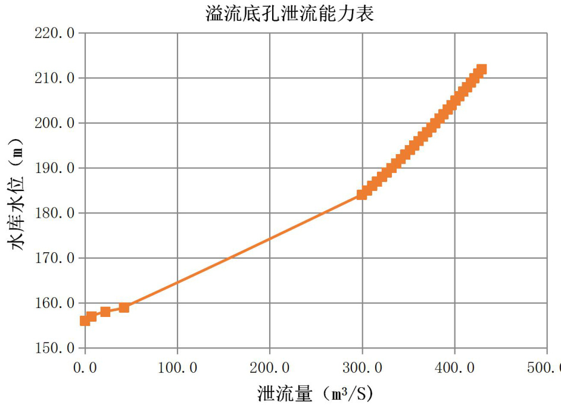  
图 6.7.5-2 泄洪底孔水位 $\tilde{}$ 泄流能力关系曲线  

# 6.7.5.3 泄水建筑物联合泄流能力  

本工程采用泄洪底孔和泄洪表孔联合泄洪,根据泄洪底孔和泄洪表孔泄流能力计算成果,泄水建筑物的泄流能力见表 6.7.5-3:  

表 6.7.3-3 泄水建筑物联合泄流能力表  

<html><body><table><tr><td rowspan="2">水库水位 (W)</td><td colspan="3">泄流量（m3/s)</td></tr><tr><td>泄洪表孔</td><td>泄洪底孔</td><td>溢流表孔+泄洪底孔</td></tr><tr><td>156.0</td><td>0.0</td><td>0.0</td><td>0.0</td></tr><tr><td>157.0</td><td>0.0</td><td>7.0</td><td>7.0</td></tr><tr><td>158.0</td><td>0.0</td><td>21.9</td><td>21.9</td></tr><tr><td>159.0</td><td>0.0</td><td>42.3</td><td>42.3</td></tr><tr><td>184.0</td><td>0.0</td><td>299.3</td><td>299.3</td></tr></table></body></html>  

<html><body><table><tr><td></td><td></td><td></td><td></td></tr><tr><td>185.0</td><td>0.0</td><td>304.9</td><td>304.9</td></tr><tr><td>186.0</td><td>0.0</td><td>310.4</td><td>310.4</td></tr><tr><td>187.0</td><td>0.0</td><td>315.8</td><td>315.8</td></tr><tr><td>188.0 189.0</td><td>0.0</td><td>321.1</td><td>321.1</td></tr><tr><td>190.0</td><td>0.0</td><td>326.3</td><td>326.3</td></tr><tr><td>191.0</td><td>0.0</td><td>331.5</td><td>331.5</td></tr><tr><td>192.0</td><td>0.0</td><td>336.5</td><td>336.5</td></tr><tr><td>193.0</td><td>0.0</td><td>341.5</td><td>341.5</td></tr><tr><td>194.0</td><td>55.5</td><td>346.4</td><td>401.9</td></tr><tr><td>195.0</td><td>161.3 304.4</td><td>351.3 356.1</td><td>512.6</td></tr><tr><td>196.0</td><td>480.9</td><td>360.8</td><td>660.4</td></tr><tr><td>197.0</td><td>689.3</td><td>365.4</td><td>841.7</td></tr><tr><td>198.0</td><td>928.7</td><td>370.0</td><td>1054.7</td></tr><tr><td>199.0</td><td></td><td></td><td>1298.7</td></tr><tr><td>200.0</td><td>1198.7 1494.7</td><td>374.6</td><td>1573.3</td></tr><tr><td>201.0</td><td></td><td>379.1</td><td>1873.8</td></tr><tr><td>202.0</td><td>1817.9 2166.7</td><td>383.5</td><td>2201.4</td></tr><tr><td>203.0</td><td></td><td>387.9</td><td>2554.6</td></tr><tr><td>204.0</td><td>2537.1</td><td>392.2</td><td>2929.3</td></tr><tr><td>205.0</td><td>2926.6</td><td>396.5</td><td>3323.1</td></tr><tr><td>206.0</td><td>3336.5</td><td>400.7</td><td>3737.2</td></tr><tr><td>207.0</td><td>3766.4</td><td>404.9</td><td>4171.3</td></tr><tr><td>208.0</td><td>4212.8</td><td>409.1</td><td>4621.9</td></tr><tr><td>209.0</td><td>4668.6</td><td>413.2</td><td>5081.8</td></tr><tr><td></td><td>5134.6</td><td>417.3</td><td>5551.8</td></tr><tr><td>210.0</td><td>5617.7</td><td>421.3</td><td>6039.0</td></tr><tr><td>211.0</td><td>6097.4</td><td>425.3</td><td>6522.7</td></tr><tr><td>212.0</td><td>6585.0</td><td>429.3</td><td>7014.3</td></tr></table></body></html>  

水位\~泄流能力曲线见下图:  

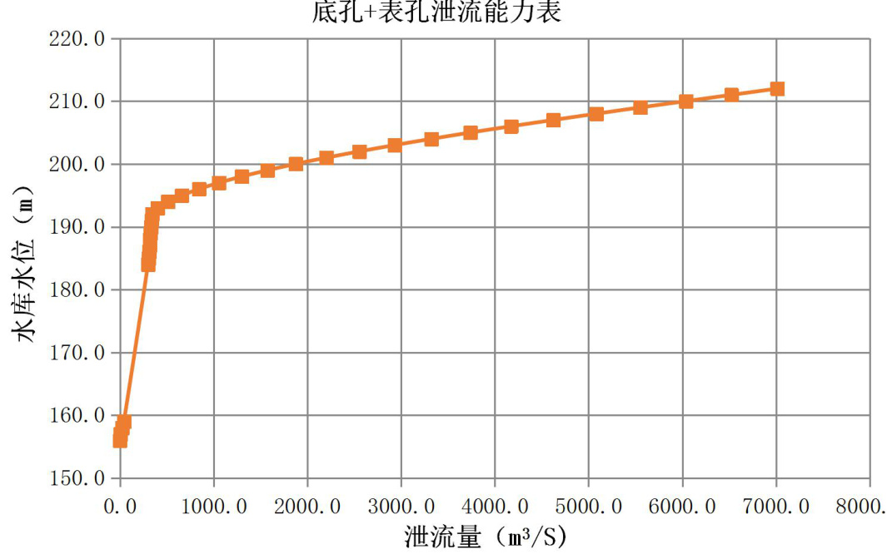  
  
图 6.7.5-3 泄洪底孔与表孔联合泄洪水位 $\sim$ 泄流能力关系曲线  

由表 6.7.3-3 可知,2000 年一遇校核洪水位为 $207.94\mathrm{m}$ 时,表孔泄洪能力为 $4668~\mathsf{m}^{3}/\mathsf{s}$ ,底孔泄流能力为 $413\mathrm{m}^{3}/\mathsf{s}$ ,总泄流能力为 $5081\mathrm{m}^{3}/{\mathsf{s}}$ ,大于校核洪水位时下泄泄量 $5053\mathrm{m}^{3}/\mathsf{s}$ ;正常蓄水位 $184.0\mathrm{m}$ 时,底孔泄流能力为$299.3\mathrm{{m}}^{3}/\mathsf{s}$ ,满足调洪要求的 $80m^{3}/5$ 下泄流量要求。  

# 6.7.6 消能建筑物设计  

根据《水利水电工程等级划分及洪水标准》(SL252-2017)规定,本工程消能防冲建筑物级别为 3 级,设计洪水标准为 30 年一遇。  

# 6.7.6.1 底流消能防冲计算  

(1)计算公式  

根据《溢洪道设计规范》(SL253-2018),等宽矩形断面消力池水平底板上自由水跃共轭水深按下式计算:  

$$
h_{2}=\frac{h_{1}}{2}\Big(\sqrt{1+8{F r}_{1}^{2}}-1\Big)
$$  

$$
F r_{1}{=}\nu_{1}/\sqrt{g h_{1}}
$$  

式中:  

Fr1 —收缩断面弗劳德数;  

$h_{\scriptscriptstyle1}$ —收缩断面水深,m;  

$\nu_{1}$ —收缩断面流速, $\mathsf{m}/\mathsf{s}$ 。  

收缩断面水深按《水力计算手册》(第二版)中公式计算:  

$$
E_{0}=h_{1}+\frac{q^{2}}{2g\varphi^{2}h_{1}^{2}}
$$  

式中:  

$E_{0}$ —以河床为基准面的泄水建筑物上游总水头, $\mathsf{m}$ ;  

$q$ —收缩断面单宽流量,m³/(s.m);  

$\varphi$ —流速系数,表孔泄流取 0.95,底孔泄流取 0.90。  

根据《溢洪道设计规范》(SL253-2018),等宽矩形断面下挖式消力池池深按下式计算:  

$$
d{=}{\sigma h_{_{2}}{-}h_{_{t}}{-}\Delta Z}
$$  

$$
\Delta Z=\frac{Q^{2}}{2g b^{2}}(\frac{1}{\varphi^{2}h_{t}^{2}}-\frac{1}{\sigma^{2}h_{2}^{2}})
$$  

式中: $d$ —池深, $\mathsf{m}$ ;   
σ—水跃淹没系数,取 $_{\odot}{=}1.05$ ;   
$h_{2}$ —池中发生临界水跃时的跃后水深, $\mathsf{m}$ ;   
ht —消力池出口下游水深,m;   
Z—消力池尾部出口水面跌落,m;   
Q —流量,m³/s;   
$b\mathrm{.}$ —消力池宽。  

根据《混凝土重力坝设计规范》(SL319-2018),收缩断面的弗劳德数Fr $\ge4.5$ ,且不设辅助消能设施时,消力池长度按下式计算:  

$$
L=6(h_{2}-h_{1})
$$  

式中:L—消力池长度,m;  

表孔、底孔消力池被中隔墩分隔开,分别计算表孔、底孔消力池的池深和  

池长。  

# (2)泄洪底孔消能计算  

泄洪底孔消能防冲设计洪水标准为 30 年一遇。根据塔岗水库调度运行方式,分别对汛限水位、30 年一遇消能防冲设计洪水、100 年一遇设计洪水和 2000年一遇校核洪水泄洪底孔底流消能进行计算,综合确定消力池结构。底孔底流消能计算成果见表 6.7.6-1。  

表 6.7.6-1 泄洪底孔底流消能计算表  

<html><body><table><tr><td>计算工况</td><td>泄量 (m/s)</td><td>收缩断面水 深hc(m)</td><td>跃后水深 hc"(m)</td><td>池深 (W)</td><td>消力池长度 (W)</td></tr><tr><td>P=20%控泄 (191.2m)</td><td>80</td><td>0.18</td><td>5.2</td><td>2.1</td><td>30.1</td></tr><tr><td>P=10%控泄 (195.65m)</td><td>120</td><td>0.23</td><td>6.3</td><td>2.1</td><td>36.42</td></tr><tr><td>P=5%控泄 (201.32m)</td><td>100</td><td>0.19</td><td>6.1</td><td>2.1</td><td>35.5</td></tr><tr><td>P=3.3%控泄 (204.70m)</td><td>400</td><td>0.69</td><td>12.2</td><td>6.9</td><td>68.9</td></tr><tr><td>P=1%控泄 (207.51m)</td><td>411</td><td>0.70</td><td>12.3</td><td>8.0</td><td>69.4</td></tr><tr><td>P=0.05%泄 (207.94m)</td><td>413</td><td>0.71</td><td>12.3</td><td>8.0</td><td>69.5</td></tr></table></body></html>

(3)泄洪表孔消能计算  

溢流表孔消能防冲设计洪水标准为 30 年一遇,据塔岗水库调度运行方式,当水库水位小于 50 年一遇防洪高水位(207.51m),泄流底孔下泄能力均满足防洪调度下控泄要求。当洪水位为 100 年一遇水位( $207.51\mathsf{m})$ ),水库最大下泄 $2904\mathrm{m}^{3}/\mathsf{s}$ ,其中底孔泄量为 $411\mathrm{m}^{3}/\mathsf{s}$ ,表孔泄量为 $2493~\mathsf{m}^{3}/\mathsf{s}$ ,当洪水位为2000 年一遇水位( $207.94\mathrm{m}$ ),水库最大下泄 $5053\mathrm{m}^{3}/\mathsf{s}$ ,其中底孔泄量为$413\mathrm{m}^{3}/\mathsf{s}$ ,表孔泄量为 $4640\mathrm{m}^{3}/\mathsf{s}$ 。分别对 100 年一遇设计洪水和 2000 年一遇校核洪水泄洪表孔的底流消能进行计算,综合确定消力池结构,消能计算成果见表 6.7.6-1。  

表 6.7.6-2 泄洪表孔底流消能计算表  

<html><body><table><tr><td>计算工况</td><td>泄量 (m/s)</td><td>收缩断面水 深hc (m)</td><td>跃后水深 hc"(m)</td><td>池深 (m)</td><td>消力池长度 (m)</td></tr></table></body></html>  

<html><body><table><tr><td>P=1%控泄 (207.51m)</td><td>2493</td><td>1.3</td><td>17.1</td><td>7.48</td><td>94.8</td></tr><tr><td>P=0.05%泄 (207.94m)</td><td>4640</td><td>2.6</td><td>22.3</td><td>7.81</td><td>118.2</td></tr></table></body></html>  

综合表 6.7.6-1、6.7.6-2 消力池消能计算结果,泄洪底孔消力池与泄洪表孔消力池最大池长分别为 $69.5\mathrm{m}$ 、 $118.2\mathrm{m}$ ,最大池深为 $8.0\mathsf{m}$ 。底孔与表孔消力池基础高程均需开挖至同一高程,因此表孔消力池池深与底孔消力池一致,池深取 $10.0\mathrm{m}$ 。泄洪底孔消力池池长取 $70.0\mathsf{m}$ ,消力池下游末端桩号为$140.0\mathrm{m}$ ;溢流表孔消力池池长取 $120.0\mathrm{m}$ ,消力池下游末端桩号为 $190.0\mathrm{m}$ 。  

# 6.7.6.2 底流消能消力池布置  

泄洪底孔消力池桩号为坝下 $0+070.00\sim$ 坝下 $0{+}140.00$ ,消力池段长度为$70.0\mathrm{m}$ ,宽度为 $17.0\mathrm{m}$ ,左岸为墙顶高程 $156.0\mathrm{m}$ 的衡重式挡墙,另一侧为中隔墙,与溢流表孔消力池分开,中隔墙墙顶高程 $156.0\mathrm{m}$ ,顶部宽度 $4.0\mathsf{m}$ 。垂直水流方向分缝长度为 $16.0\mathrm{m}$ ,底板厚度为 $4.0\mathsf{m}$ 。  

泄洪表孔消力池桩号为坝下 $0+070.00\sim$ 坝下 $0{+}190.00$ ,消力池段长度为$120.0\mathrm{m}$ ,宽度为 $56.0\mathsf{m}$ ,右岸为墙顶高程 $156.0\mathrm{m}$ 的衡重式挡墙,另一侧为中隔墙。底板顺水流方向分缝长度为 $16.00\mathrm{m}$ ,垂直水流向分缝长度为 $14.00\mathrm{m}$ ,底板厚度为 $4.0\mathsf{m}$ 。  

泄洪底孔、溢流表孔消力池池深均为 $8.0\mathsf{m}$ ,底板顶高程 $140.0\mathrm{m}$ ,尾坎顶 高程为 $148.0\mathrm{m}$ ,尾坎顶宽 $3.0\mathsf{m}$ 。  

坝址下游河覆盖层较厚,抗冲刷能力差,考虑到工程下泄流量较大,水流出消力池后仍存在紊动,流速尚未恢复到天然河道流速分布。为提高河床的抗冲刷能力,参考同类工程,消力池后接长度 $30.0\mathsf{m}$ 、厚度 2.0m 钢筋混凝土防冲海漫护坦,海漫后接 $30\mathrm{m}$ 抛石防冲槽,与下游河道顺接。  

为提高建基岩体整体性,溢流表孔与泄洪底孔消力池底板进行固结灌浆, 固结灌浆孔孔深 $6.0\mathsf{m}$ ,间排距 $3.0\mathsf{m}$ ,梅花形布置;消力池全底板设置锚筋, 锚筋直径 $\Phi28$ ,入岩 $8.0\mathsf{m}$ ,间排距 $2.0\mathsf{m}$ ,梅花形布置。  

# 6.7.6.3 消力池底板抗浮稳定计算  

泄洪表孔及泄洪底孔消能建筑物设计洪水标准为 30 年一遇,消力池底板厚度 $4.0\mathsf{m}$ ,溢流表孔消力池最小分块为 $14\mathsf{m}\times16\mathsf{m}$ (垂直流向 $\times$ 顺流向),泄洪底孔消力池最小分块为 $17\mathsf{m}\times16\mathsf{m}$ (垂直流向 $\times$ 顺流向),分别计算表孔及  

底孔的消力池底板抗浮稳定。  

(1)计算公式  

消力池抗浮稳定按《溢洪道设计规范》SL253-2018 附录 B.1.2 公式计算:  

T=S-L/3-30d  

式中:  

Fs— 抗浮稳定安全系数;底板自重,kN;底板顶面上的时均压力,kN;采用锚固措施时,地基的有效自重,kN;底板顶面上的脉动压力,kN;底板底面上的扬压力,kN;岩石浮容重, ${\mathsf{k N}}/{\mathsf{m}}^{3}$ ;  
T— 锚固地基有效深度, $\mathsf{m}$ ;  
A n 根锚筋底板的计算面积, $\mathsf{m}^{2}$ ;  
S 锚筋锚入地基深度, $\mathsf{m}$ ;锚筋间距,m;锚筋直径,m;  

(2)荷载组合及计算工况  

泄洪表孔及泄洪底孔消能建筑物设计洪水标准为 30 年一遇。但溢流表孔在30 年一遇洪水工况下不承担泄洪任务,因此选取泄 100 年一遇洪水工况作为基本组合计算工况。  

溢流表孔及泄洪底孔消力池底板荷载组合及计算工况见表 6.7.6-3、6.7.6-4。  

表 6.7.6-3 溢流表孔消力池底板抗浮稳定计算荷载及组合  

<html><body><table><tr><td>荷载</td><td>计算工况</td><td>上游水</td><td>下游水</td><td>荷载</td></tr></table></body></html>  

表 6.7.6-4 泄洪底孔消力池底板抗浮稳定计算荷载及组合  

<html><body><table><tr><td>组合</td><td></td><td>位 (m)</td><td>位 (w)</td><td>自重</td><td>时均 压力</td><td>脉动 压力</td><td>扬压 力</td><td>地基有 效重量</td></tr><tr><td>基本 组合</td><td>泄 100 年一遇洪 水</td><td>207.51</td><td>152.90</td><td></td><td></td><td></td><td></td><td></td></tr><tr><td rowspan="3">特殊 组合</td><td>泄 2000 年一遇校 核洪水</td><td>207.94</td><td>154.31</td><td></td><td></td><td></td><td></td><td></td></tr><tr><td>检修工况</td><td></td><td>148.10</td><td></td><td></td><td></td><td></td><td></td></tr><tr><td>泄 100年一遇洪 水+排水失效</td><td>207.51</td><td>152.90</td><td></td><td></td><td></td><td></td><td></td></tr></table></body></html>  

<html><body><table><tr><td rowspan="2">荷载 组合</td><td rowspan="2">计算工况</td><td rowspan="2">上游水 位 (m)</td><td rowspan="2">下游水 位 (w)</td><td colspan="5">荷载</td></tr><tr><td>自重</td><td>时均 压力</td><td>脉动 压力</td><td>扬压 力</td><td>地基有 效重量</td></tr><tr><td>基本 组合</td><td>泄 30年一遇洪水</td><td>207.51</td><td>152.90</td><td></td><td></td><td></td><td></td><td></td></tr><tr><td rowspan="3">特殊 组合</td><td>泄 2000 年一遇校 核洪水</td><td>207.94</td><td>154.31</td><td></td><td></td><td></td><td></td><td></td></tr><tr><td>检修工况</td><td></td><td>148.10</td><td></td><td></td><td></td><td></td><td></td></tr><tr><td>泄30年一遇洪水 +排水失效</td><td>207.51</td><td>152.90</td><td></td><td></td><td></td><td></td><td></td></tr></table></body></html>  

# (3)计算成果  

消力池底板抗浮稳定计算成果见表 6.7.6-5、6.7.6-6。  

表 6.7.6-5 溢流表孔消力池底板抗浮稳定计算成果  

<html><body><table><tr><td rowspan="2">荷载组合</td><td rowspan="2">设计工况</td><td colspan="3">抗浮稳定安全系数</td></tr><tr><td>未设锚筋</td><td>设锚筋</td><td>规范允许值</td></tr><tr><td>基本组合</td><td>泄100年一遇洪水</td><td>0.66</td><td>1.25</td><td>1.0~1.2</td></tr><tr><td rowspan="3">特殊组合</td><td>泄1000年一遇校核洪水</td><td>0.68</td><td>1.25</td><td>1.0~1.2</td></tr><tr><td>检修工况</td><td>0.75</td><td>1.60</td><td>1.0~1.2</td></tr><tr><td>泄100年一遇洪水+排水失效</td><td>0.60</td><td>1.13</td><td>1.0~1.2</td></tr></table></body></html>  

表 6.7.6-6 泄洪底孔消力池底板抗浮稳定计算成果  

<html><body><table><tr><td rowspan="2">荷载组合</td><td rowspan="2">设计工况</td><td colspan="3">抗浮稳定安全系数</td></tr><tr><td>未设锚筋</td><td>设锚筋</td><td>规范允许值</td></tr></table></body></html>  

<html><body><table><tr><td>基本组合</td><td>泄30 年一遇洪水</td><td>0.83</td><td>1.63</td><td>1.0~1.2</td></tr><tr><td rowspan="3">特殊组合</td><td>泄 2000 年一遇校核洪水</td><td>0.70</td><td>1.28</td><td>1.0~1.2</td></tr><tr><td>检修工况</td><td>0.75</td><td>1.60</td><td>1.0~1.2</td></tr><tr><td>泄 30年一遇洪水+排水失效</td><td>0.75</td><td>1.47</td><td>1.0~1.2</td></tr></table></body></html>  

根据计算结果,消力池底板需要设置直径 $\Phi28$ 、间排距 $2.0\mathsf{m}$ 、入岩长度$8.0\mathsf{m}$ 的锚筋进行加固。加设锚筋后,各工况均满足规范允许值,底板抗浮满足要求。  

# 6.8 引水建筑物  

本工程引水主要用于下游灌溉、供水及生态流量下放,一般情况下,灌溉及供水流量主要经发电机组下放至下游河道及相应渠道,生态流量为避免机组检修影响,本阶段按不经过机组设计。灌溉及供水设计引用流量为 $3.47\mathrm{m}^{3}/\mathsf{s}$ (其中 $1.95\mathrm{m}^{3}/\mathsf{s}$ 经机组下放),生态流量为 $0.28~\mathsf{m}^{3}/\mathsf{s}$ (汛期) ${\sim}0.09\mathrm{m}^{3}/\mathsf{s}$ (非汛期),因此,引水建筑物设计引用总流量为 $3.75\mathrm{m}^{3}/\mathsf{s}$ 。  

# 6.8.1 建筑物布置及体形  

结合坝型及枢纽布局,引水建筑物布置为坝式进水口 $^+$ 坝内埋管的型式,布置于主坝右岸 13#坝段(以下称引水坝段),坝段长度 $21\mathsf{m}$ 。引水坝段建基面高程为 $141.0\mathrm{m}$ ,顶高程同坝顶高程 $209.00\mathrm{m}$ ,坝段高度 $68.0\mathrm{m}$ ;坝段上下游均采用折坡面,上游侧高程 $150.0\mathrm{m}$ 以上为铅直面(坝轴线桩号 $0{\pm}000.00\$ )、以下为 1:0.2 的斜坡面,下游侧高程 $191.00\mathrm{m}$ 以上为铅直面、以下为 1:0.75 的斜坡面;引水坝段坝顶宽度设 $13.5\mathrm{m}$ ,顶部上游侧悬挑 $1.5\mathrm{m}$ 长牛腿,因此顶部总宽度 $15.0\mathrm{m}$ ;坝段底部宽度 $53.10\mathrm{m}$ 。考虑竖向交通,于引水坝段左侧部分布置一道交通井,井内布置电梯及楼梯,顶部井筒下游侧桩号为坝下$0{+}016.20\mathrm{m}$ 。  

引水坝段布置坝式进水口及坝内引水压力钢管。本工程极限运行死水位$160.0\mathrm{m}$ ,50 年淤沙高程 $155.4\mathrm{m}$ ,设计进水口底高程 $156.0\mathrm{m}$ 。引水坝段自上游至下游依次布置拦污栅槽、喇叭口进口段、事故检修门槽、渐变段、压力钢管。根据设计引用流量,初步按 $3{\sim}4\ m/\mathsf{s}$ 经济流速估算,采用引水管管径 $1.2\mathrm{m}$ ,进水口设计尺寸为宽 $\times$ 高 $=1.2\mathsf{m}\times1.2\mathsf{m}$ ,进口喇叭段顶部及两侧均采用 1/4 椭圆线以平顺水流,首部拦污栅槽净宽 $_{2\mathsf{m}}$ 。进水口渐变段长 $_{2\mathsf{m}}$ ,由 $1.2\mathrm{m}\times1.2\mathrm{m}$ 的方形孔口渐变为直径为 $1.2\mathrm{m}$ 的圆形孔口,其后接直径为 $1.2\mathrm{m}$ 的压力钢管。坝内设引水压力主管 1 根,内径 $1.2\mathrm{m}$ ,分别由上平段、上弯段、斜直段、下弯段及下平段组成,上平段中心高程 $156.6\mathrm{m}$ 、下平段中心高程 $146.0\mathrm{m}$ ,两弯段转弯半径 $2.5\mathrm{m}$ ,转弯角度 $53^{\circ}$ 。压力钢管出坝后连接坝外引水管系统。  

根据工程用水需求,坝外引水管系统采用主管分岔为支管的型式,主管管径 $1.2\mathrm{m}$ ,与坝内压力钢管衔接,经岔管分别引出 1 根直径 $0.9\mathsf{m}$ 的支管用于下放灌溉水、3 根直径 $0.6\mathsf{m}$ 的支管接入 3 台机组、1 根直径 $0.4\mathsf{m}$ 的支管用于下放生态流量。  

6.8.2 设计计算(1)进水口淹没深度计算  

1)防止产生贯通式漏斗旋涡的最小淹没深度按如下公式计算:  

$$
S=C V d^{1/2}
$$  

式中:  

C-经验系数: $\mathsf{C}{=}0.55{\sim}0.73$ ;  

d-闸门孔口高度;  

v-闸门断面的流速。  

淹没深度按最低取水水位(极限运行死水位) $160.0\mathrm{m}$ 、最大引用流量$3.75\mathrm{m}^{3}/\mathsf{s}$ 的工况进行计算,计算得防止产生贯通式漏斗旋涡的最小淹没深度为$2.55\mathrm{m}$ 。  

2)保证进口压力流的最小淹没深度按如下公式计算:  

$$
S=K[\Delta h_{1}+\Delta h_{2}+\Delta h_{3}+\Delta h_{4}+\Delta h_{5}+\frac{V_{5}^{2}}{2g}]
$$  

式中:  

K-安全系数,应不小于 1.5,本阶段取 2;  

S-最小淹没深度,不小于 2m;  

淹没深度按最低取水水位(极限运行死水位) $160.0\mathrm{m}$ 、最大引用流量$3.6\mathsf{m}^{3}/\mathsf{s}$ 的工况进行计算,计算得保证进口压力流的最小淹没深度为 $2.74\mathrm{m}$ 。  

经计算,进水口最小淹没深度 S 取为 $2.74\mathrm{m}$ ,进水口底板高程取为$156.00\mathrm{m}$ (高于水库 50 年淤沙高程 $155.4\mathrm{m}$ ),实际淹没水深 $2.8\mathsf{m}$ ,满足淹没要求。  

# 6.9 电站厂房工程  

电站工程为原塔岗水库坝后式电站原规模重建,电站总装机功率为 0.6MW。  

电站厂房布置在大坝坝脚下游侧约 $20\mathrm{m}$ 河道内,河床高程约 $147\mathrm{m}$ ,厂坪高程 $157.0\mathrm{m}$ 。主要由引水岔管系统、主厂房、副厂房等组成。  

根据工程用水及发电需求,灌溉及供水设计引用流量为 $3.47\mathrm{m}^{3}/\mathsf{s}$ (其中$1.95\mathrm{m}^{3}/\mathsf{s}$ 经机组下放),生态流量为 $0.28\mathrm{m}^{3}/\mathsf{s}$ (汛期) ${\sim}0.08\mathsf{m}^{3}/\mathsf{s}$ (非汛期),因此设计引用总流量为 $3.75\mathrm{m}^{3}/\mathsf{s}$ 。引水岔管系统采用主管分岔为支管的型式,主管管径 $1.2\mathrm{m}$ ,与坝内压力钢管衔接,经岔管分别引出 1 根直径 $0.9\mathsf{m}$ 的支管用于下放灌溉水、3 根直径 $0.6m$ 的支管接入 3 台机组、1 根直径 $0.4\mathsf{m}$ 的支管用于下放生态流量,进水管中心线高程为 $145.34\mathrm{m}$ 。  

主厂房分为主机间段和安装间段,安装间与主机间呈“一”字形布置。主厂房采用单层布置形式,布置有 3 台发电机组,每台机组装机功率为 0.2MW,总装机功率为 0.6MW。机组安装高程 $146.0\mathrm{m}$ ,机组间距为 $8.0\mathsf{m}$ ,厂房进水侧考虑进水阀布置。  

厂房从安装间侧起,依次布置生态放水管、灌溉供水管、3#、2#、1#机组。主厂房主机间长度 $33.5\mathsf{m}$ ,安装间长度 $12.5\mathrm{m}$ ,总长度 $46.0\mathrm{m}$ ,主厂房宽$14.0\mathrm{m}$ 。机组上游侧布置调速器、机间布置机旁盘、电气设备,下游侧布置油、水、气管路。水轮发电机层右侧布置空压机室、空调机房、渗漏排水泵房、油处理设备间。  

室外地坪高程 157.0m,考虑 $0.3\mathrm{m}$ 安全加高,安装间层高程取 $157.3\mathrm{m}$ 。主厂房下部结构为现浇钢筋混凝土墩墙式结构,上部结构为现浇框架结构。安装间与机组段之间设一条永久变形缝。  

钢筋混凝土尾水管底高程 $143.3\mathrm{m}$ ,宽 $2.0\mathsf{m}$ ,孔口高 $1.5\mathrm{m}$ 。尾水管下游接1:4.0 倒坡。考虑电站尾水出管后扩散顺畅,不对尾水渠进行分隔。  

副厂房为地上二层框架结构,位于主厂房上游侧,与主厂房平行布置,副厂房长 $46.0\mathrm{m}$ ,宽 $8.4\mathsf{m}$ ,自下而上,分两层布置,首层高程 $157.3\mathrm{m}$ 。布置有变压器室、高低压盘柜室、通风机房、中控室、继保室、监控室等机电设备房间,既便于电站运行人员工作也能保障各种电缆敷设的畅通。  

# 6.10 边坡工程  

工程边坡的稳定与否,无论在施工期还是运行期,都将直接影响工程的建设及运行安全,须采取合理的治理措施。水库枢纽涉及的边坡主要包括:坝基开挖形成的临时和永久边坡、两岸坝肩开挖形成的永久边坡、消力池两岸开挖形成的永久边坡。  

边坡治理设计基本原则:工程开挖与坡面防护,应力求简单易行,在确保安全的情况下,降低工程投资。根据边坡位置、地形、地质条件和枢纽施工条件,对主要建筑物永久开挖边坡,以系统锚杆加挂网喷混凝土浅层边坡防护为主。结合地形在边坡合适部位设置截、排水沟。  

依据《水利水电工程边坡设计规范》(SL386-2007)的规定,边坡的级别应根据相关水工建筑物级别及边坡与水工建筑物的相互关系,并对边坡破坏造成的影响确定。本工程大坝坝肩永久边坡均属于对水工建筑物危害程度严重,因此边坡级别与相应建筑物同级,确定水库大坝两岸坝肩永久边坡级别为 3 级。  

# 6.10.1 工程边坡地形地质条件  

坝址位于六股涧村下游约 $940\mathrm{m}$ ,位于山门河出山口位置,上游为山间盆地,下游为山前倾斜平原。河床地面高程 $192\sim195\mathrm{m}$ ,河谷地段较狭窄顺直,总体走向约 SE150°。两岸均为低山,山顶标高 $370\sim420\mathrm{m}$ 。右岸被开挖为陡壁,左岸边坡坡度 $35^{\circ}\sim45^{\circ}$ 。两岸植被茂密,多为灌木。  

坝址出露地层主要是寒武系上统-奥陶系下统三山子组( $\mathbf{\Psi}(\in\mathsf{O}\mathsf{s}.$ )、奥陶系中上统马家沟组( $\mathtt{O}2–3\mathsf{m}$ )及第四系地层。岸坡大部分基岩裸露。  

# 6.10.2 边坡开挖  

根据不同岩层,依据边坡地质情况和工程经验进行边坡开挖设计,坝区边坡基本按照地质专业建议开挖坡比值进行开挖。低液限粘土、卵石混合土等覆盖层按 $1{:}1.5{\sim}1{:}1.2.0$ 开挖,单级边坡原则上不超过 $15\mathrm{m}$ ,并设置 2m 宽马道,以便于施工。岩质边坡按 $1{:}0.3{\sim}1{:}0.75$ 开挖,每 $10{\sim}15\mathrm{m}$ 设置一级马道,马道宽 $_{2\mathsf{m}}$ 。  

# 6.10.3 边坡支护  

岩质边坡采用挂网喷混凝土及锚杆支护,表面挂 $\Phi^{8/\oplus200\mathrm{mm}}$ 钢筋网,喷10cm 厚混凝土,并设置 $\Phi25$ , $L{=}4.5\mathrm{m}$ 系统锚杆,间排距 $3.0\mathsf{m}$ ,梅花形布置。岩质边坡设置间排距 $3.0\mathsf{m}$ 的排水孔,孔径 $75\mathrm{mm}$ ,仰角 $5^{\circ}$ ,深入岩体 $3.0\mathsf{m}$ 。土质边坡采用混凝土框格梁 $^+$ 草皮护坡支护,框格梁梁间距为 $3.0\mathsf{m}$ ,梁截面尺寸为 $0.3{\times}0.3\mathrm{m}$ ,节点处设 $\Phi25$ , $\mathsf{L}{=}6.0\mathsf{m}$ 锚筋深入岩体,框格梁间采用草皮护坡。  

对高边坡工程采取在坡顶设置截水沟、坡面设置排水孔的排水措施。其中,坡顶截水沟沿坡顶开挖边线布置,混凝土浇筑,过流断面尺寸为 $40\times40\mathrm{cm}$ ;边坡坡面设置排水孔,间、排距 $2.5\mathsf{m}$ ,孔内埋设 $\Phi100\mathsf{m m P V C}$ 排水管,单根管长 $2.5\mathrm{m}$ 。  

# 6.11 建筑环境和景观  

# 6.11.1 建筑设计  

(1)建筑设计范围  

本工程建筑设计范围包括电站厂区主副厂房、管理区建筑物、水工附属建筑物。管理区建筑物设置管理用房、深井泵房和仓库,水工附属建筑物包含底孔启闭机房、表孔启闭机房等建筑物。  

(2)设计依据  

《民用建筑设计统一标准》(GB 50352-2019);  

《建筑设计防火规范(2018 年版)》(GB 50016-2014)(以下简称《建规》);《水利工程设计防火规范》(GB 50987-2014);《建筑内部装修设计防火规范》(GB 50222-2017);《水利工程建设标准强制性条文)》(2020 年版);《宿舍、旅馆建筑项目规范》(GB 55025-2022);《保温装饰板外墙外保温工程技术导则》(RISN-TG028-2017);《民用建筑通用规范》(GB 55031-2022);《建筑防火通用规范》(GB 55037-2022)(以下简称《通规》);《办公建筑设计标准》(JGJ/T 67-2019);《建筑与市政工程防水通用规范》(GB 55030-2022);《建筑节能与可再生能源利用通用规范》(GB 55015-2021)。  

(3)设计原则  

充分考虑当地自然环境和社会环境,体现当地的发展水平,地域风貌、文化特色和历史轨迹。  

尊重功能,尽量体现建筑物的结构美、整体美、简洁美。各单体建筑应体现各自功能特征,内容与形式相统一,艺术与技术相结合。  

整体布局与环境统一考虑,建筑风格协调统一,因地制宜,经济美观。  

# (4)建筑物设计  

# 1)电站厂区  

本工程电站厂区设置有主副厂房、生活给水泵房。主副厂房为地面式厂房,总建筑面积为 $650~\mathrm{m}^{2}$ ,结构形式为钢筋混凝框架结构,填充墙采用 200 厚蒸压加气混凝土砌块墙,厂房耐火等级地上部分为二级(地下耐火等级为一级),火灾危险性类别为丁类,设计工作年限为 50 年,屋面防水等级为一级,防水工作年限为 20 年,外墙防水等级为一级,地下工程防水等级为一级。生活给水泵房建筑面积为 $50~\mathrm{m}^{2}$ ,结构形式为钢筋混凝框架结构,填充墙采用 200 厚蒸压加气混凝土砌块墙,耐火等级为二级,火灾危险性类别为戊类,设计工作年限为 50 年,屋面防水等级为一级,防水工作年限为 20 年,外墙防水等级为一级。  

# 2)管理区  

# $\textcircled{1}$ 管理区规模  

本工程管理及运行人员编制共为 27 人。  

办公用房按《水库工程管理设计规范》(SL 106-2017)要求,办公、会议等公共设施,按 $15\mathrm{m}^{2}/$ 人计算,计 $405~\mathrm{m}^{2}$ 。生活、生产用房人均综合指标按$35~\mathrm{m}^{2}/.$ 人计算,计 $945~\mathrm{m}^{2}$ 。此外,根据水库控制管理需要,设置调度中心 150${\mathfrak{m}}^{2}$ (其中集中控制室 $50~\mathrm{m}^{2}$ ,机房 $50~\mathrm{m}^{2}$ ,辅助用房 $50~\mathrm{m}^{2}$ ),深井泵房 ${70\mathrm{~m}^{2}}$ ,仓库 $^{200~\mathrm{m}^{2}}$ 。  

具体面积指标见表 6.11.1-1。  

表 6.11.1-1 管理区建筑面积表  

<html><body><table><tr><td>序号</td><td>名称</td><td>面积 (m²)</td><td>层数</td><td>层高</td><td>备注</td><td>编制人 数</td></tr><tr><td>1</td><td>管理用房</td><td>1500</td><td>3F</td><td>3.6m</td><td>含调度中心150 m²</td><td rowspan="3">27人</td></tr><tr><td>2</td><td>深井泵房</td><td>70</td><td>1F</td><td>4.2m</td><td></td></tr><tr><td>3</td><td>仓库</td><td>200</td><td>1F</td><td>4.8m</td><td></td></tr></table></body></html>  

$\textcircled{2}$ 总平面布置  

本工程管理区位于水库附近,管理区总平面设计时对建筑布局、道路、竖向等进行综合性的设计,合理布置管理用房和深井泵房及仓库,场地设置消防车道,尽端式车道设置不小于 $15\mathsf{m}\times15\mathsf{m}$ 回车场地。建筑物耐火等级均为二级,管理用房为公共建筑,深井泵房和仓库均按生产性工业建筑考虑,各建筑物间距不小于 $10\mathrm{m}$ ,不足 10m 时需设置防火墙及防火门窗等防火措施,保证各建筑物布局满足消防、天然采光、日照等要求。  

# $\textcircled{3}$ 建筑物单体设计  

管理用房:建筑面积约为 $1500~\mathrm{m}^{2}$ ,地上 3 层,层高 $3.6\mathsf{m}$ ,布置有办公室、值班室、会议室、集中控制室、厨房、餐厅、卫生间等房间。建筑物耐火等级为二级,设计工作年限为 50 年;建筑防水等级为一级。  

深井泵房:建筑面积约为 ${70\mathrm{~m}^{2}}$ ,地上 1 层,层高 $4.2\mathrm{m}$ ,建筑物耐火等级为二级,火灾危险性类别为戊类,设计工作年限为 50 年;建筑防水等级为一级。  

仓库:建筑面积约为 $^{200~\mathrm{m}^{2}}$ ,地上 1 层,层高 $4.8\mathsf{m}$ ,建筑物耐火等级为二级,火灾危险性类别为丙类,设计工作年限为 50 年;建筑防水等级为一级。  

# 3)水工附属建筑物  

设置 1 个底孔启闭机房,建筑面积为 $160~\mathrm{m}^{2}$ ;设置 2 个表孔启闭机房,建筑面积均为 ${80}~\mathrm{m}^{2}$ 。启闭机房均为单层框架结构,坐落于水工建筑物上。建筑物耐火等级均为二级,火灾危险性类别均为戊类,设计工作年限为 50 年;建筑防水等级均为一级。  

各建筑面积指标统计见表 6.11.1-2。  

表 6.11.1-2 水库建筑物面积表  

<html><body><table><tr><td>序号</td><td>名称</td><td>面积（m²)</td><td>备注</td></tr><tr><td>1</td><td>底孔闭机房</td><td>160</td><td></td></tr><tr><td>2</td><td>表孔闭机房</td><td>80</td><td>2个</td></tr></table></body></html>  

# (5)建筑物防水设计  

本工程建设地点在河南省卫辉市  

本工程的工程防水类别为: 地下工程甲类,屋面工程甲类,外墙工程甲类,室内工程甲类,室内工程涉及的房间为:卫生间、厨房。  

本项目的工程防水使用环境类别为:地下工程Ⅰ类,屋面工程 II 类,外墙工程 II 类,室内工程 II 类涉及的房间为卫生间、厨房。  

本项目的工程防水等级为:地下工程一级,屋面工程一级,外墙工程一级,卫生间、厨房为室内工程一级。  

本工程的防水设计工作年限:地下工程防水设计工作年限不低于工程结构设计工作年限;屋面工程防水设计工作年限不应低于 20 年;室内工程防水设计工作年限不应低于 25 年。  

# (6)外装修设计  

在设计中,将各建筑物作为周边环境的主体,考虑周边环境和当地文化,采用真石漆或防水涂料外墙面,屋顶部分采用平屋面。融入当地元素,使之与整个环境协调一致,相互映衬,并融入当地文化元素,使建筑物跟当地人文景观相呼应。  

(7)内装修设计  

# 1)装修标准  

建筑物整体采用一般装修标准。  

# 2)典型部位装修  

门:一般外门采用断桥铝合金钢化玻璃门或钢质保温门,一般内门采用成品木门。有防火要求的部位,根据房间使用功能采用相应防火等级的钢质防火门。  

窗:采用断桥铝合金中空玻璃窗。  

地面:办公室、宿舍、厨房等采用防滑玻化砖地面,集中控制室采用防静电地板地面,工业厂房地面采用水泥基自流平地面。  

内墙面:采用无机涂料内墙面。  

顶棚:门厅、会议室、接待室采用造型石膏板整体式吊顶,办公室采用铝合金轻钢龙骨矿棉板吊顶,其他部位采用涂料顶棚。  

卫生间、厨房:采用防滑地砖地面、面砖内墙面、铝合金方形板吊顶。卫 生间采用成品卫浴隔断,洁具采用高质量中档成品。  

# 6.11.2 结构设计  

(1)设计范围  

本工程结构专业设计范围包括电站厂区副厂房,管理区管理用房、深井泵房、仓库等建筑物,以及启闭机房等水工附属建筑物。  

(2)设计依据  

《工程结构通用规范》(GB 55001-2021);  
《建筑与市政工程抗震通用规范》(GB 55002-2021);  
《建筑与市政地基基础通用规范》(GB 55003-2021);  
《钢结构通用规范》(GB 55006-2021);  
《砌体结构通用规范》(GB 55007-2021);  
《混凝土结构通用规范》(GB 55008-2021);  
《工程测量通用规范》(GB 55018-2021);  
《建筑与市政工程防水通用规范》(GB 55030-2022);  
《建筑结构可靠性设计统一标准》(GB 50068-2018);  
《工程结构可靠性设计统一标准》(GB 50153-2008);  
《建筑工程抗震设防分类标准》(GB 50223-2008);  
《建筑结构荷载规范》(GB 50009-2012);  
《建筑抗震设计标准》(2024 年版)(GB 50011-2010);  
《混凝土结构设计标准》(2024 年版)(GB 50010-2010);  
《砌体结构设计规范》(GB 50003-2011);  
《建筑地基基础设计规范》(GB 50007-2011);  
《建筑地基处理技术规范》(JGJ 79-2012);  
《工业建筑防腐蚀设计标准》(GB/T 50046-2018);  
《建筑工程抗浮技术标准》(JGJ 476-2019)。  
(3)自然条件  

1)基本风压: $\mathrm{{\omega}}\omega_{0}{=}0.40\mathrm{{kN/m^{2}}}$ ( $\mathtt{R}{=}50$ 年),地面粗糙度类别为 B 类,风荷载体型系数和风压高度变化系数按《建筑结构荷载规范》采用。  

# 2)基本雪压: $0.30\mathsf{k N}/\mathsf{m}^{2}$ ( $\mathtt{R}{=}50$ 年)。  

3)根据《建筑抗震设计标准》(2024 年版)(GB 50011-2010),河南省新乡市卫辉市抗震设防烈度为Ⅷ度,地震动峰值加速度为 $0.209$ ,设计地震分组为第二组。  

(4)设防类别  

1)建筑结构的安全等级为二级,设计工作年限为 50 年。  

2)抗震设防类别为丙类(标准设防类)。  

3)地基基础设计等级为丙级。  

4)建筑物地下部分及基础混凝土结构的环境类别为二 b 类,地上外露构件环境类别为二 a 类,建筑物地上部分混凝土结构的环境类别为一类。  

# (5)材料选用  

1)混凝土:基础垫层:C20、建筑物:C30  

2)钢筋及钢材:钢筋:HRB400 级、HRB300 级;钢构件:Q235•B 和Q345•B。  

3)砌体填充墙:  

建筑物室内地坪以下:MU20(抗冻等级 F35)烧结页岩实心砖、Mb10 水泥砂浆。  

建筑物室内地坪以上:A5 加气混凝土砌块、M5 混合砂浆。  

4)防腐措施:  

各部位的防腐措施应待下阶段水土腐蚀性确定后再做复核。  

(6)单体结构设计  

本工程结构专业设计范围包含电站副厂房一栋,管理区管理用房一栋,仓库一栋,深井泵房一座以及水工配套启闭机房。  

本工程电站副厂房为地上一层建筑物,拟采用现浇钢筋混凝土框架结构,现浇钢筋混凝土屋面板。副厂房局部坐落于水工回填土上,基础形式拟采用现浇钢筋混凝土筏板基础,基底以下拟采用换填垫层法做地基处理。  

本工程管理区管理用房为地上三层建筑物,拟采用现浇钢筋混凝土框架结构,现浇钢筋混凝土楼(屋)面板。管理用房拟采用浅基础,基础持力层应为原状土层,待下阶段管理区部位详勘提供后再做复核。  

管理区仓库为地上一层建筑物,拟采用现浇钢筋混凝土框架结构,现浇钢筋混凝土屋面板。管理区仓库拟采用浅基础,基础持力层应为原状土层,待下阶段管理区部位详勘提供后再做复核。  

管理区深井泵房为地上一层建筑物,拟采用现浇钢筋混凝土框架结构,现浇钢筋混凝土屋面板。基础拟采用浅基础,基础持力层应为原状土层,待下阶段管理区部位详勘提供后再做复核。  

本工程启闭机房均为地上一层建筑物,拟采用现浇钢筋混凝土框架结构,现浇钢筋混凝土屋面板。启闭机房柱子拟采用柱插筋的形式生根于下部水工混凝土结构上。  

# 6.11.3 建筑给排水设计  

(1)设计依据  
1)《室外给水设计标准》(GB 50013-2018);  
2)《室外排水设计标准》(GB 50014-2021);《建筑给水排水与节水通用规范》(GB 55020-2021);  
4)《建筑给水排水设计标准》(GB 50015-2019);  
5)《建筑节能与可再生能源利用通用规范》(GB 55015-2021)。(2)电站给排水设计  
1)生活给水系统设计  
$\textcircled{1}$ 水源  
电站生活给水及消防给水系统水源均为前池水。  
$\textcircled{2}$ 生活给水系统  

#  

在前池内设两台潜水泵,一用一备,管道进水口设置不锈钢格栅,经水泵加压后再经管道过滤器过滤后分两路供水,一路直接提供消防水池补水;一路经成套生活给水处理设备处理达标后,供应生活给水,处理后的水质符合国家标准《生活饮用水卫生标准》(GB 5749-2022)的要求。  

生活用水定额按 150L/(人·d)计,按 5 人计算用水人数,高日生活用水量为 $0.75m^{3}$ 。给水管网漏失水量和未预见水量按最高日用水量的 $10\%$ 计,则电站日设计用水量为 $0.825\mathrm{m}^{3}$ 。  

# $\textcircled{3}$ 管材  

生活给水泵房内给水管道采用衬塑钢管,丝接;其他室内给水管道采用PPR 管,热熔连接;室外给水管道采用 PE 给水管,热熔连接。  

# 2)排水系统设计  

$\textcircled{1}$ 排水量高日排水按高日生活用水量的 $90\%$ 计,高日生活排水量为 $0.7425\mathrm{m}^{3}$ 。  

# $\textcircled{2}$ 排水系统  

采用污废合流、雨污分流排水系统,室外雨水由水工专业找坡排放;生活污水汇集后排至室外污水管网。  

地下室污废水经潜水泵加压后提升排至室外。  

生活污废水经室外污水检查井汇集后排至室外化粪池及成套污水处理设备,经处理满足《城市污水再生利用 城市杂用水水质》(GB/T 18920-2020)要求后浇洒绿地。  

# $\textcircled{3}$ 管材  

室内排水管道采用 UPVC 排水管,粘接;污水泵压力排水管采用内外壁热浸镀锌钢管及管件,丝接或沟槽连接(管径大于 DN50 的沟槽连接,小于等于DN50 的螺纹连接),管道公称压力为 1.0MPa;室外排水管道采用高密度双壁波纹排水管,橡胶接口连接。  

(3)管理区给排水设计  

# 1)生活给水系统设计  

$\textcircled{1}$ 水源  

管理区生活给水及消防给水系统水源均为井水。  

# $\textcircled{2}$ 生活给水系统  

在管理区内打一口井,水井出水量不小于 $10m^{3}/h$ ,井水经井用潜水泵提升后经成套生活给水处理设备处理达标后,供应管理区内生活给水,处理后的水质符合国家标准《生活饮用水卫生标准》(GB 5749-2022)的要求。  

生活用水定额按 150L/(人·d)计,按 27 人计算用水人数,高日生活用水量为 $4.05\mathrm{m}^{3}$ 。给水管网漏失水量和未预见水量按最高日用水量的 $10\%$ 计,则管理区日设计用水量为 $4.455\mathrm{m}^{3}$ 。  

# $\textcircled{3}$ 管材  

深井泵房及生活给水泵房内给水管道采用衬塑钢管,丝接;其他室内给水管道采用 PPR 管,热熔连接;室外给水管道采用 PE 给水管,热熔连接。  

1)排水系统设计  

$\textcircled{1}$ 排水量  

高日排水按高日生活用水量的 $90\%$ 计,高日生活排水量为 $4.01\mathrm{m}^{3}$ 。  

# $\textcircled{2}$ 排水系统  

采用污废合流、雨污分流排水系统,室外雨水由建筑专业找坡排放;生活污水汇集后排至室外污水管网,餐厨废水经简易隔油处理设备处理后排放。  

地下室污废水经潜水泵加压后提升排至室外。  

生活污废水经室外污水检查井汇集后排至室外化粪池及成套污水处理设备,经处理满足《城市污水再生利用 城市杂用水水质》(GB/T 18920-2020)要求后浇洒绿地。  

# $\textcircled{3}$ 管材  

室内排水管道采用 UPVC 排水管,粘接;污水泵压力排水管采用内外壁热浸镀锌钢管及管件,丝接或沟槽连接(管径大于 DN50 的沟槽连接,小于等于DN50 的螺纹连接),管道公称压力为 1.0MPa;室外排水管道采用高密度双壁波纹排水管,橡胶接口连接。  

# (4)主要设备材料表  

表 6.11.3-1 电站给排水系统主要设备材料表  

<html><body><table><tr><td>序号</td><td>名称</td><td>规格</td><td>单位</td><td>数量</td><td>备注</td></tr><tr><td></td><td>成套给水 处理设备</td><td>包括原水水箱、过滤设备、清水箱、恒压变频 供水泵组及消毒设备等，需后期根据前池水质 确定相应的水处理工艺，以达到《生活饮用水 卫生标准》（GB5749-2022）的水质要求， Q=2m3/d，N=10kW</td><td>套</td><td>1</td><td>设于生活给 水泵房内</td></tr><tr><td>2</td><td>潜水泵</td><td>Q=15m3/h，H=30m，N=3kW</td><td>台</td><td>2</td><td>一用一备， 含控制柜, 设于前池内</td></tr><tr><td>3</td><td>玻璃钢化 粪池</td><td>有效容积2m3</td><td>座</td><td>1</td><td></td></tr><tr><td>4</td><td>成套污水 处理设备</td><td>日处理水量2t/d，功率10kW</td><td>套</td><td>1</td><td>设于室外</td></tr></table></body></html>  

表 6.11.3-2 管理区给排水系统主要设备材料表  

<html><body><table><tr><td>序号</td><td>名称</td><td>规格</td><td>单位</td><td>数量</td><td>备注</td></tr><tr><td>1</td><td>井</td><td>井深暂按80m，井径0.3m</td><td>座</td><td>1</td><td></td></tr><tr><td>2</td><td>井用潜水 泵</td><td>出地面扬程35m，Q=10m3/h，N=7.5kW</td><td>台</td><td>1</td><td></td></tr><tr><td>3</td><td>成套给水 处理设备</td><td>包括原水水箱、过滤设备、清水箱、恒压变频 供水泵组及消毒设备等，需后期根据井水水质 确定相应的水处理工艺，以达到《生活饮用水 卫生标准》（GB5749-2022）的水质要求， Q=8m3/d，N=10kW</td><td>套</td><td>1</td><td>设于生活给 水泵房内</td></tr><tr><td>4</td><td>玻璃钢化 粪池</td><td>有效容积4m3</td><td>座</td><td>1</td><td></td></tr><tr><td>5</td><td>成套污水 处理设备</td><td>日处理水量6t/d，功率10kW</td><td>套</td><td>1</td><td>设于室外</td></tr></table></body></html>  

6.11.4 建筑电气设计(1)设计依据  

1)《民用建筑电气设计标准》(GB 51348-2019);  

2)《供配电系统设计规范》(GB 50052-2009);  

3)《低压配电设计规范》(GB 50054-2011);  

4)《通用用电设备配电设计规范》(GB 50055-2011);  
5)《民用建筑设计统一标准》(GB 50352-2019);  
6)《建筑设计防火规范》(GB 50016-2014(2018 年版));  
7)《建筑照明设计标准》(GB/T 50034-2024);  
8)《消防应急照明和疏散指示系统技术标准》(GB 51309-2018);  
9)《综合布线系统工程设计规范》(GB 50311-2016);  
10)《建筑机电工程抗震设计规范》(GB 50981-2014);  
11)《建筑物电子信息系统防雷技术规范》(GB 50343-2012);  
12)《电力工程电缆设计标准》(GB 50217-2018);  
13)《建筑电气工程施工质量验收规范》(GB 50303-2015);  
14)《建筑物防雷设计规范》(GB 50057-2010);  
15)《建筑机电工程抗震设计规范》(GB 50981-2014);  
16)《建筑电气与智能化通用规范》(GB 55024-2022);  
17)《建筑节能与可再生能源利用通用规范》(GB 55015-2021);  
18)《建筑防火通用规范》(GB 55037-2022);  
19)《建筑与市政工程抗震通用规范》(GB 55002-2021);  
20)《消防设施通用规范》(GB 55036-2022);  
21)《建筑环境通用规范》(GB 55016-2021);  
22)《安全防范工程通用规范》(GB 55029-2022);  
23)《安全防范工程技术标准》(GB 50348-2018);  
(2)设计范围  
1)管理区的变配电系统、照明系统、防雷接地系统、通讯系统与安防  

室外工程包括室外照明系统、室外安防系统、室外电缆敷设。  

2)管理区调度中心内的电气设计(照明、一般插座、空调除外)详见电气二次章节。  

# (3)供配电设计  

管理区内消防水泵房用电负荷为消防二级负荷,负荷容量约为 35kW,调度中心用电负荷为非消防二级负荷,负荷容量约为 30kW,其他用电负荷均为三级负荷,负荷容量约为 226.5kW,由市政 10kV 电网引来一路 10kV 电源,在院区内设置的一座 10kV 箱变作为主电源。在院区内设置一台室外静音型低压柴油发电机作为备用电源。  

管理区的主要用电设施包括:照明、插座、空调采暖、信息化设施等办公生活用电等,负荷统计见下表。  

表 6.11.4-1 管理区主要建筑物用电负荷统计表  

<html><body><table><tr><td>单体名称</td><td>建筑面积 （m²）</td><td>负荷 密度 (W/ m²）</td><td>计算负 荷 (kW)</td><td>功率因数 (cOsp)</td><td>无功负荷 (kVar)</td><td>视在功率 (kVA)</td><td>负荷 等级</td></tr><tr><td>管理用房</td><td>1500</td><td>100</td><td>150</td><td>0.8</td><td>112.5</td><td></td><td>三级</td></tr><tr><td>仓库</td><td>200</td><td>20</td><td>4</td><td>0.8</td><td>3</td><td></td><td>三级</td></tr><tr><td>调度中心 （电二)</td><td></td><td></td><td>30</td><td>0.8</td><td>22.5</td><td></td><td>二级</td></tr><tr><td>成套污水处 理设备</td><td></td><td></td><td>10</td><td>0.8</td><td>7.5</td><td></td><td>三级</td></tr><tr><td>深井泵房</td><td>70</td><td></td><td>15</td><td>0.8</td><td>11.25</td><td></td><td>三级</td></tr><tr><td>井用潜水泵</td><td></td><td></td><td>7.5</td><td>0.8</td><td>5.6</td><td></td><td>三级</td></tr><tr><td>室外照明</td><td></td><td></td><td>10</td><td>0.9</td><td>4.8</td><td></td><td>三级</td></tr><tr><td>一体化消防 给水泵站</td><td></td><td></td><td>35</td><td>0.8</td><td>26.25</td><td></td><td>二级 （消 防)</td></tr><tr><td>合计1</td><td></td><td></td><td>226.5</td><td></td><td>167.15</td><td></td><td>不含 消防 泵房</td></tr><tr><td>同时系数</td><td>0.85/0.9</td><td></td><td>192.5</td><td></td><td>150.4</td><td></td><td></td></tr><tr><td>无功补偿</td><td></td><td></td><td></td><td></td><td>-75</td><td></td><td></td></tr><tr><td>合计2</td><td></td><td></td><td>192.5</td><td></td><td>75.4</td><td>206.7</td><td>补偿 后</td></tr></table></body></html>  

考虑适当预留,变压器长期运行负荷率不宜超过 $85\%$ ,因此中心管理站的箱式变电站容量选择为 $250\mathsf{k V}\mathsf{A}$ ,变压器负载率为 $82.7\%$ 。  

管理区另设置一台柴油发电机作为备用电源,以保证 10kV 外引电源失去的情况下中心管理站内消防设备(35kW)和非消防重要设备(30kW)的供电,按消防设备和非消防重要设备不同时使用设计。本项目单台最大水泵功率22kW,按星三角启泵设计,根据《工业与民用建筑供配电设计手册》式(2.6.9)(2.6.10)(2.6.11),分别按稳定负荷,按最大的单台电动机或成组电动机启动的需要,按启动电动机时母线容许电压降三个方面计算发电机容量,综合考虑用电设备启动倍数、启动功率因数及母线允许电压降等计算条件,选择柴油发电机组容量选择为 80kW。  

管理区采用 TN-C-S 低压配电系统,室外供电电缆埋地敷设,引至各单体建筑内。低压侧电源电压:380/220V。各建筑物内设总进线柜,建筑单体内采用放射式和树干式相结合的供电方式。消防用电设备采用专用的供电回路,当建筑内的生产、生活用电被切断时,应仍能保证消防用电。非消防负荷的配电线路设过载长延时和短路瞬时脱扣,消防负荷的配电线路设过载报警(不跳闸)和短路瞬时脱扣,插座配电回路、室外照明配电回路以及安装高度在 2.5 米以下的室内灯具配电回路均设置漏电保护开关,确保设备及人身安全。  

# (4)照明设计  

照明灯具的光源选用 LED 光源的节能灯具,各功能房间照度及功率密度严格按《建筑照明设计标准》(GB/T 50034-2023)以及《建筑节能与可再生能源利用通用规范》(GB 55015-2021)的要求设计,调度中心设计照度为500Lx,办公室、会议室设计照度值为 300Lx,设备用房设计照度值为 100Lx,灯具采用分区分组的控制方式,满足电气节能要求。  

进户供电干线电缆采用 ZR-YJV22 型阻燃交联聚乙烯绝缘聚氯乙烯护套(铜芯)铠装电力电缆。其余户内干线电缆采用 ZR-YJV 型阻燃交联聚乙烯绝缘聚氯乙烯护套(铜芯)电力电缆。  

室内一般照明、插座采用 ZR-BV 型阻燃导线,穿 PC 管沿墙、楼板内暗敷,由顶板接线盒至吊顶灯具一段线路穿钢质波纹管。  

应急照明的设计说明见消防章节。  

管理区的室外照明灯具采用庭院灯,灯杆高 4.5 米,灯具为 70W、LED 光源,道路照明设计照度为 10Lx。室外照明控制箱设于值班室内,各出线回路均设漏电保护开关,供电电缆穿 PE 保护管埋地敷设,过硬化路面处穿 RC 管。  

(5)防雷、接地系统设计  

本工程在符合防雷标准的各单体屋顶设接闪网或利用金属屋面保护,利用结构柱内钢筋或钢结构柱做引下线,利用基础内钢筋做自然接地体。  

各单体建筑物采用 TN-C-S 接地系统,采用联合接地方式,在建筑物电源进线处设重复接地装置,接地电阻要求不大于 1 欧姆,实测不满足要求时,增设人工接地极。  

本工程采用总等电位联结,进出建筑物的各种金属管道均做等电位联结,建筑物电源进线处及弱电系统引入端均安装浪涌保护器(一级试验 SPD,冲击电流不小于 $12.5\mathsf{k A}$ ,电压保护水平不大于 $2.5\mathsf{k V}$ ),防闪电感应和闪电电涌侵入。室外庭院灯采用 TN-S 接地系统,接地电阻小于 4 欧姆,实测不满足要求时,增设人工接地体。  

# (6)安防系统设计  

本工程安全防范系统主要包括视频安防监控系统和门禁系统。在公区走道、门厅及入口室外处安装监控摄像机,其中室内采用半球式摄像机(PoE 型),吸顶/嵌入吊顶安装,室外采用室外防雨型枪机(PoE 型),下皮距地 2.5 米壁装。安防监控平台设于值班室。监控摄像机采用六类非屏蔽双绞线布线,穿PC20 管沿楼板或墙面暗敷,最大敷设长度不超过 90 米。在中控室设置门禁系统。  

# (7)弱电设计  

本项目采用光纤到户通信系统,由市政通信网引来光纤至弱电箱,在各个功能房间预留电话、网络双孔信息插座,弱电箱至双孔信息插座采用 2 根UTP6 穿 PC20 保护管沿着地板现浇层及墙内暗敷。网络、电话双孔信息插座均为暗装,底距地 $0.3\mathrm{m}$ 。  

# 6.12 工程安全监测  

# 6.12.1 监测目的及原则  

根据工程规模和特点,安全监测设计通过布置监测设备采集建筑物变形、渗流、环境量等效应量在各阶段变化过程的监测数据,并进行及时分析处理,对建筑物的稳定性、安全性做出评价,达到监控工程安全的目的。监测布置原则为:  

(1)应能全面反映水工建筑物的工作状况,仪器布置要目的明确,重点突出。监测设施应尽量集中,便于资料分析。  

(2)监测仪器设备应精确可靠,稳定耐久。在满足观测精度的前提下,力求观测方便、直观。  

(3)在监测断面选择及测点布置上,既要考虑分布的均匀性,又必须重点考虑有特点的结构部位及地质构造。重要部位布设多种监测设施,以便相互验证,便于资料分析。  

(4)施工期与运行期连续监测,及时了解并掌握大坝在施工期、初期蓄水及运行期的工作状态。  

(5)以自动监测为主,人工监测为辅,自动监测与人工监测相结合。在施工期阶段,整体监测系统形成之前以人工观测为主,在运行期阶段,以自动化监测为主;仪器监测与人工巡视检查相结合,在进行仪器监测的同时进行人工巡视检查。  

# 6.12.2 设计依据  

本工程监测设计遵循的主要规程规范包括:  

(1) 《混凝土坝安全监测技术规范》SL601-2013;  
(2)《土石坝安全监测技术规范》SLT551-2024;  
(3)《水利水电工程安全监测设计规范》SL725-2016;  
(4)《国家一、二等水准测量规范》GB/T12897-2006;  
(5)《国家三角测量规范》GB/T17942-2000;  
(6)《大坝安全自动监测系统设备基本技术条件》SL268-2001。  

# 6.12.3 监测建筑物及监测项目  

本工程主要工程建筑物,包括挡水建筑物(含混凝土重力坝、粘土心墙堆石坝)、泄水建筑物(含消能建筑物)、引水建筑物、电站厂房及开关站及边坡工程等建筑物。其中大坝的级别为 3 级,电站厂房建筑物的级别为 5 级。根据建筑物等级、规模、结构型式以及地形、地质条件等因素,各监测建筑物分别设置以下监测项目:  

(1)变形监测网:水平位移监测网、垂直位移监测网;  
(2)环境量监测:上下游水位监测、坝前水温监测和气象监测;  
(3)挡水建筑物:变形监测、渗流监测;(4)泄水建筑物:变形监测、渗流监测;  
(5)边坡工程:表面变形监测、锚固应力监测;  
(6)巡视检查:除进行上述仪器监测项目外还需要进行人工巡视检查。  

# 6.12.4 监测布置  

# 6.12.4.1 变形监测网  

变形监测网包括水平位移监测网和垂直位移监测网。建立变形监测网的目的在于为各建筑物、边坡等监测部位的表面位移监测提供基准,并检验和校核工作基点的稳定性。  

# 1)水平位移监测网  

根据坝区地形地况和枢纽各建筑物布置情况,考虑到精度要求,水平位移监测网主要设置边角网,等级为一等。在大坝上下游两侧山体通视条件较好区域布置 6\~8 个基点组成边角网。水平位移监测网的坐标系统和大坝施工控制网的一致,每个基点分别安装 1 个强制对中基座。基点位置可根据现场地形地质情况进行调整,基点间及基点与测点间应保持通视。  

# 2)垂直位移监测网  

垂直位移监测网设置水准基点、水准工作基点和其他水准网点。垂直位移监测网组成观测闭合环,按照一等精密水准进行施测。高程系统和大坝施工控制网的一致,起算数据按国家一等网的精度要求施测。  

# 6.12.4.2 环境量监测  

环境量监测项目包括坝体上下游水位监测、坝前水温监测和气象监测。  

# (1)水位  

在大坝上、下游水流相对平稳且便于观测的位置分别布置 1 根不锈钢水尺监测上、下游水位,水尺附近设置 1 支通气型渗压计实现自动化监测。  

# (2)坝前水温  

坝体温度监测断面靠近上游坝面位置的温度计在水库蓄水后可监测坝前水温。上游坝面位置的温度计在水位变动区域可适当加密。  

# (3)气象  

在上坝路旁开阔区域内设 1 个小型气象监测站,主要监测降雨量、气温、  

湿度等项目,温湿度监测传感器布置在百叶箱内。  

# 6.12.4.3 挡水建筑物  

(1)碾压混凝土重力坝  

本工程碾压混凝土重力坝为 3 级建筑物,最大坝高 $68.00\mathrm{m}$ ,包括挡水坝段、泄水坝段、引水建筑物。导流洞封堵体运行过程中也作为挡水建筑物,建筑物物级别与大坝相同。  

在大坝的引水坝段、溢流坝段、挡水坝段分别设置横向监测断面,共设$_{4\sim5}$ 个横向监测断面。在导流洞封堵体布置 1\~2 个监测断面。  

# 1)变形监测  

变形监测项目包括水平位移监测、垂直位移监测、基岩变形监测。  

# 1、水平位移  

坝体水平位移采用引张线法、边角交会法相结合的方法进行监测,坝基水平位移采用倒垂方法进行线进行监测。几种方法相互补充、校验,人工观测与自动观测相结合,表面变形与内部变形观测相结合。  

在坝顶布置 1 条引张线,每个坝段布置 1 个测点,用于自动监测坝顶水平位移,在引张线两端分别布置 1 条倒垂线,作为引张线的基点。在每个坝段坝顶布置 1 个水平位移测点,测点形式为混凝土墩,采用边角交会法进行人工观测,利用水平位移监测网点作为工作基点。  

在各监测断面坝段分别布置 1 组正倒垂线组,用于监测典型坝段坝体和坝基水平位移。  

在基础排水廊道每个坝段布置 1 条倒垂线,监测坝基水平位移。  

# 2、垂直位移  

坝体垂直位移采用双金属标法、静力水准法、几何水准法相结合的方法进行监测;坝基垂直位移采用几何水准法进行监测。  

在坝顶每个坝段布置 1 个水准点和 1 个静力水准点,分别用于人工和自动观测坝基垂直位移,在混凝土坝两端坝肩分别布置 1 套双金属标,作为坝顶垂直位移的基准点。  

在监测断面坝段分别布置一套双金属标,用于监测典型坝段坝体和坝基垂直位移,并作为坝基廊道水准点和静力水准点的基准。  

在坝基帷幕灌浆廊道每个坝段布置 1 个水准点,用于观测坝基垂直位移,采用坝基帷幕灌浆廊道布设的双金属标作为坝基垂直位移的基准点。  

接缝与裂缝开合度  

$\textcircled{1}$ 接缝开合度  

在重力坝与心墙坝结合部位放置一定数量的位错计,监测结合部位不均匀沉降。  

$\textcircled{2}$ 裂缝开合度  

在每个横向监测断面防渗混凝土与常态混凝土诱导缝处分 2 个高程布置各布置 1 支裂缝计,用于监测坝体不同性质混凝土间裂缝情况。  

# 2)渗流监测  

渗流监测包括坝基扬压力监测和渗流量监测。  

# 1、坝基扬压力  

坝基扬压力监测采用纵向和横向监测断面结合布置,采用渗压计和测压管结合进行监测。  

在纵向监测断面每个坝段上游排水幕线上布置 1 个测点,在基础灌浆排水廊道钻孔安装测压管,管口安装压力表,每根测压管内分别布置 1 支渗压计,实现自动化监测。在每个横向监测断面灌浆帷幕前布置 1 个测点,上游排水幕线上布置 1 个测点,并与纵向扬压力共用,其余沿水流方向坝基处布置 2\~3 个测点。  

# 2、渗流量  

根据坝体、坝基排水设施的布置和渗漏水的流向,在坝基廊道的排水沟内布设量水堰,分区进行坝体和坝基渗漏量观测,共设置 6 个量水堰。量水堰配置量水堰水位计,实现渗流量监测自动化。  

# (2)粘土心墙堆石坝  

粘土心墙坝段布置 $_{3\sim4}$ 个横向监测断面,根据坝基防渗型式的不同进行布置;在帷幕后平行于坝轴线方向设一个纵向渗流监测断面。  

# 1)表面变形监测  

表面水平位移监测采用视准线法进行监测。在坝顶下游侧布置 1 条视准线,与重力坝坝顶位移测点位置相同。视准线上每隔 $50{\sim}100\mathrm{m}$ 布置 1 个测点,测点位置设混凝土观测墩,墩顶安装强制对中基座,采用高精度全站仪进行观测。在视准线左岸设 1 条倒垂线,与重力坝左端倒垂线一起,作为坝顶视准线的校核基准点。在视准线中间测点兼做水平位移工作基点,分段测量以提高观测精度。  

表面垂直位移采用沉降标点监测,水平位移测点观测墩同时布置垂直位移测点,在坝顶上游侧及上下游马道分别布置垂直位移测点,监测坝体表面垂直位移,测点结合横向监测断面进行布置。上游马道测点在水位淹没后暂时停止观测。  

# 2)渗流监测  

该坝段渗流监测包括坝体渗流监测、坝基渗流监测、渗流量监测。其中坝体与坝基渗流皆采用渗压计进行监测。  

$\textcircled{1}$ 坝体渗流监测  

在各横向监测断面选取 2\~3 个监测层面,每个监测层在心墙内部分别布置$_{3\sim4}$ 个测点,其中在心墙上、下游靠近反滤料位置布置 1 个测点,监测心墙部位的孔隙水压力和浸润线,各监测层中测点竖直方向尽量形成观测铅直线。在下游反滤层及坝体较低位置布置测点,监测反滤效果及坝体浸润线变化。  

$\textcircled{2}$ 坝基渗流监测  

在各横向监测断面建基面基础内布置 $_{3\sim4}$ 个测点,其中 1 个测点位于坝基防渗墙或帷幕上游侧;纵向监测断面设在坝基帷幕后,间隔 $30\sim50\mathrm{m}$ 左右布置 1 个测点;在防渗墙或帷幕后基础深层设 1 个观测层,每层布置 $_{3\sim4}$ 个测点;全面监测坝基渗流变化情况。  

$\textcircled{3}$ 渗流量监测结合坝体渗漏排水设计,布置量水堰等监测设备。  

# 6.12.4.4 泄水建筑物  

(1)消力池安全监测$\textcircled{1}$ 基础扬压力监测在消力池底板下沿水流方向布置 2\~3 支渗压计,监测消力池底板扬压力。$\textcircled{2}$ 底板应力监测  

在消力池底板下沿水流方向分别选取 2\~3 根锚杆布置锚杆应力计,监测锚杆应力,由锚杆应力变化了解受泄流影响产生的对结构不利的情况,锚杆应力计与消力池底板下的测缝计结合布置。  

# 6.12.4.5 边坡工程  

根据边坡开挖及支护情况在永久边坡布置一定数量的表面变形测点及位移计,在设有锚杆(锚索)位置选取部分锚杆(锚索)进行应力监测。  

# 6.12.4.6 巡视检查  

除上述布置监测仪器设备进行监测外,从施工期到运行期,对大坝及其附属建筑物,均应定期进行巡视检查。收集施工现场及工程蓄水过程中与结构安全有关的信息。监测资料分析应密切结合现场情况和巡视检查的资料进行。巡视检查主要包含以下内容:  

(1)坝体:坝顶及防浪墙有无裂缝、错动等现象;相邻坝段之间有无错动;  
止水设施、排水设施是否完好;上下游坝面有无裂缝、错动、冻融破坏、坍塌、  
水浸、管涌及渗水等;(2)坝基和坝区:岩体有无挤压、错动、松动和鼓出等情况;坝体与基岩  
结合位置有无错动、开裂、渗水等情况;两岸坝肩有无滑坡、溶蚀、裂缝及绕  
渗等情况。(3)廊道渗漏水量和水质颜色有无明显变化,廊道内表面有无裂缝或混凝  
土脱落、渗流异物等现象;(4)表孔、底孔边墙、溢流面等部位是否有裂缝、渗水、气蚀、冲蚀发生;  
水流流态及对岸边冲刷情况等。(5)边坡:地下水露头及绕坝渗流情况;岸坡有无冲刷、塌陷、裂缝及滑  
移迹象等。(6)监测设施完好情况。  

# 6.12.5 监测站  

本工程安全监测自动化系统采用分布式网络结构,系统由监测站及中心监测站组成。初拟监测站布置在坝基廊道内和厂房副厂房,中心监测站位于永久办公营地。各监测站、监测中心站之间采用通信光缆进行通信。  

# 6.12.6 安全监测自动化系统  

监测站内设置数据采集测控单元(MCU),监测仪器电缆就近引至监测站,接入 MCU 进行现场监测数据的自动采集、信号转换和输出。中心监测站内设置工控机、服务器等相关设备,负责数据采集、存储、管理与分析。监测站采用永久电源供电,进入监测站的电源线及引接的通信线均应采取防雷保护措施。  

监测自动化系统软件应符合本工程特点以及管理要求,软件功能主要包括工程管理、数据管理与分析、监测文档资料管理、图形及报表制作、远程数据浏览及下载等功能。  

# 6.13 主要工程量  

# 表 6.11-1 主要工程量表  

<html><body><table><tr><td>部位</td><td>项目</td><td>单位</td><td>工程量</td></tr><tr><td rowspan="11">碾压混凝土重 力坝</td><td>土方明挖</td><td>m3</td><td>389531</td></tr><tr><td>石方明挖</td><td>m3</td><td>1161147</td></tr><tr><td>卵石明挖</td><td>m3</td><td>159374</td></tr><tr><td>石方洞挖</td><td>m3</td><td>15600</td></tr><tr><td>土石方回填</td><td>m3</td><td>34934</td></tr><tr><td>坝基常态混凝土（三级配C20F50W6）1m厚</td><td>m3</td><td>60153</td></tr><tr><td>坝体常态混凝土（三级配C25F150W6）</td><td>m3</td><td>151790</td></tr><tr><td>消能设施常态混凝土（三级配C25F200W6）</td><td>m3</td><td>65434</td></tr><tr><td>变态混凝土C20F200W6</td><td>m3</td><td>120216</td></tr><tr><td>富胶凝碾压混凝土C25F150W6</td><td>m3</td><td>151946</td></tr><tr><td>碾压混凝土（三级配C15F50W4）</td><td>m3</td><td>1377285</td></tr><tr><td>抗冲磨混凝土C40F200W6</td><td>m3</td><td>26150</td></tr><tr><td>混凝土挡墙C25F150W6</td><td>m3</td><td>29250</td></tr><tr><td>预制混凝土Cg30F100W4（一级配）</td><td>m3</td><td>650</td></tr><tr><td>素混凝土 C20</td><td>m3</td><td>245</td></tr><tr><td>毛石混凝土回填</td><td>m3</td><td>1632</td></tr><tr><td>格宾石笼</td><td>m3</td><td></td></tr><tr><td>海漫抛石</td><td>m3</td><td>10137</td></tr><tr><td>喷混凝土</td><td></td><td>4878</td></tr><tr><td>平衬砌</td><td>m3</td><td>6481</td></tr><tr><td>钢筋</td><td>m3</td><td>3120</td></tr><tr><td>钢材</td><td>m3</td><td>23639</td></tr><tr><td>压力钢管</td><td>m3</td><td>47</td></tr><tr><td>加劲环</td><td>m3</td><td>59</td></tr><tr><td></td><td>t</td><td>1</td></tr><tr><td>消力池锚杆直径2810m长</td><td>根</td><td>4505</td></tr><tr><td>挡墙边坡锚杆直径 253m长</td><td>根</td><td>1357</td></tr></table></body></html>  

<html><body><table><tr><td rowspan="11"></td><td>坝顶边坡锚杆直径255m长</td><td>根</td><td>650</td></tr><tr><td>帷幕灌浆</td><td>m</td><td>106600</td></tr><tr><td>惟幕灌浆钻孔</td><td>m</td><td>143351.0</td></tr><tr><td>固结灌浆</td><td>m</td><td>101704.2</td></tr><tr><td>固结灌浆钻孔</td><td>m</td><td>143351</td></tr><tr><td>回填灌浆</td><td>m2</td><td>7800</td></tr><tr><td>接触灌浆</td><td>m2</td><td>14975</td></tr><tr><td>排水孔</td><td>m</td><td>27021</td></tr><tr><td>电站厂房 主副厂房面积</td><td>m2</td><td>644</td></tr><tr><td rowspan="3">原左坝体拆除</td><td>均质坝及护坡</td><td>m3</td><td>332156</td></tr><tr><td>坝顶路面</td><td>m3</td><td>5719</td></tr><tr><td>防浪墙</td><td>m3</td><td>1072</td></tr><tr><td rowspan="5">主坝拆除</td><td>拆除堆石体</td><td>m3</td><td>167900</td></tr><tr><td>拆除水泥混凝土砌块石</td><td>m3</td><td>48013</td></tr><tr><td>拆除溢洪道C30钢筋混凝土</td><td>m3</td><td>7827</td></tr><tr><td>坝顶路面</td><td>m3</td><td>7353</td></tr><tr><td>防浪墙</td><td>m3</td><td>1480</td></tr><tr><td rowspan="20">粘土心墙堆石 坝</td><td>灰岩堆石料</td><td>m3</td><td>1127105</td></tr><tr><td>黏土心墙</td><td>m3</td><td>236525</td></tr><tr><td>反滤料</td><td>m3</td><td></td></tr><tr><td>过渡料</td><td>m3</td><td>74209</td></tr><tr><td>防浪墙</td><td>m3</td><td>73302 1179</td></tr><tr><td>坝顶道路</td><td>m3</td><td>1495</td></tr><tr><td>排水棱体</td><td>m3</td><td>81793</td></tr><tr><td>渣石回填</td><td></td><td></td></tr><tr><td>干砌石护坡</td><td>m3</td><td>400000</td></tr><tr><td>护坡碎石垫层</td><td>m3</td><td>31542</td></tr><tr><td>护坡中粗砂垫层</td><td>m3</td><td>15777</td></tr><tr><td>刺墙</td><td>m3</td><td>15777</td></tr><tr><td></td><td>m3</td><td>61741</td></tr><tr><td>钢筋 模板</td><td>t</td><td>3087</td></tr><tr><td></td><td>m2</td><td>62921</td></tr><tr><td>钻孔深度</td><td>m</td><td>12880</td></tr><tr><td>灌浆深度</td><td>m</td><td>8050</td></tr><tr><td>C25W6F300,防渗墙厚0.6m（有效阻水面积）</td><td>m2</td><td>9526</td></tr></table></body></html>  