# 河南省淇县夺丰水库扩容工程规模及总体布局专题报告  

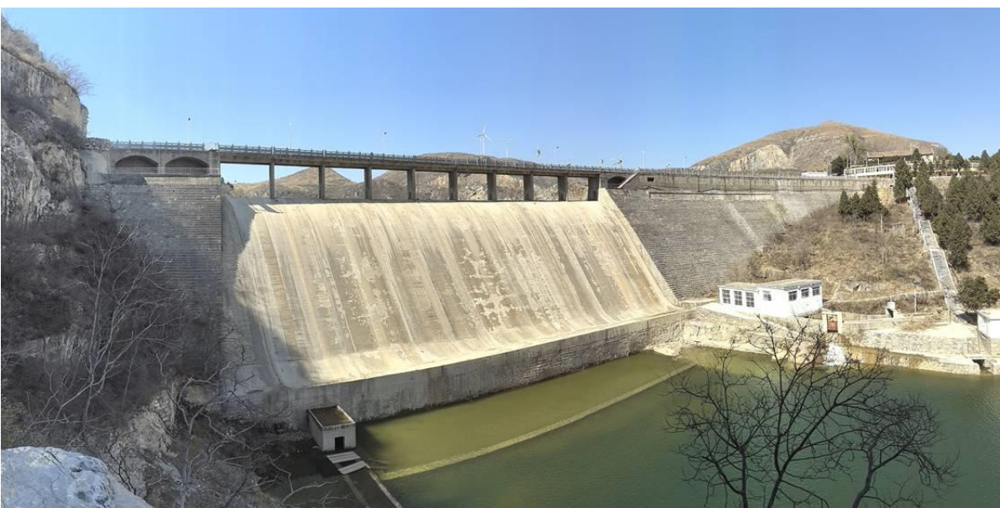  

# 声  明  

本成果仅限于合同指定的项目和范围使用。未经我公司或知识产权拥有者书面授权,任何单位或个人不得抄袭、摘编、翻印(录)、传播或他用。对于侵权行为,我公司将保留追究其法律责任的权利。  

# 综合甲级  

工程设计综合资质甲级  证书编号:A112002614  

  

2010302519  

<html><body><table><tr><td>A1</td><td>F1183N-A1</td><td>2025-05</td></tr><tr><td>版本号</td><td>档案号</td><td>日期</td></tr></table></body></html>  

# 目  录  

第一章 综合说明..  
1.1 绪言...  
1.2 工程建设必要性和任务. 3  
1.3 水文.... .6  
1.4 工程地质. .11  
1.5 建设规模.. .12  
1.6 工程布置及建筑物.. ...19  
1.7 机电及金属结构. .23  
1.8 施工组织设计. .25  
1.9 建设征地与移民安置. ..27  
1.10 环境影响评价. .28  
1.11 水土保持.. ..28  
1.12 工程信息化. ..29  
1.13 投资估算.. ...29  
1.14 工程特性表.. ..29  
第二章 项目建设必要性和任务.. .33  
2.1 区域概况.. ..33  
2.2 夺丰水库及灌区工程概况. ...36  
2.3 项目建设依据.. ..39  
2.4 夺丰水库扩容的必要性. ...43  
2.5 工程任务. ...50  
第三章 水文....... ..52  
3.1 流域概况. .52  
3.2 气象... ..56  
3.3 水文基本资料. ...8  
3.4 径流...... ...58  
3.5 洪水....... ..63  
3.6 排涝模数及流量. .73  
3.7 洪涝水地区组成. ..75  
3.8 水位流量关系.. ...82  
3.9 泥沙. ..83  
3.10 水面蒸发与蒸发增损. ...83  
3.11 水文自动测报系统.. .84  
第四章 工程地质. .88  
4.1 勘察概述.. ..88  
4.2 区域地质与地震. ...90  
4.3 库区工程地质.. ..103  
4.4 已建大坝现状及质量评价... ..114.  
4.5 坝址区工程地质.. ...117  
4.6 天然建筑材料... ..134  
4.7 结论..... ..137  
五章 建设规模... ..140  
5.1 设计水平年和设计保证率. ..140  
5.2 防洪分析.... ..140  
5.3 兴利分析.......  
5.4 应急备用分析... ..182  
5.4 工程总体布局及主要建设内容. ...187  
5.5 水库工程规模.. ..187  
5.6 水库工程规模特性指标.. .228  
六章 工程布置及建筑物... ..229  
6.1 设计依据......... .229  
6.2 工程等级和标准...... .250  
6.3 坝址选择..... ...257  
6.4 主要建筑物型式选择...  
6.5 工程总布置... ..314  
6.6 主要建筑物设计.. ...318  
6.7 交通工程设计.... ..358  
6.8 工程安全监测.. ...360  
6.9 建筑环境.. ..365  
6.10 土建主要工程量. ..375  
6.11 附件(2020 年大坝安全鉴定报告书) ...380  
七章 机电及金属结构.. ..385  
7.1 水力机械... ..385  
7.2 电气一次..... ...385  
7.3 电气二次及通讯 ...38  
7.4 金属结构... ..392  
7.5 暖通空调........ ...393  
7.6 消防设计.......... .395  
八章 施工组织设计. ..400  
8.1 施工条件... .400  

# 第一章 综合说明  

# 1.1 绪言  

# 1.1.1 原设计工程概况  

夺丰水库位于鹤壁市淇县庙口镇庙口村西,是海河流域卫河支流思德河上游一座中型水库,水库坝址以上控制流域面积 $57.7\mathrm{km}^{2}$ 。水库是一座以灌溉、供水为主,结合养殖等多种经营的中型水库。水库设计洪水标准为 100 年一遇,校核洪水标准为 1000 年一遇,总库容为 1132 万 $\mathrm{m}^{3}$ 。水库并未设置专用的防洪库容,只起一定的滞洪作用。  

夺丰水库的主要建筑物由大坝、输水洞等部分组成。该水库属于中型水库,工程等别为Ⅲ等,主要建筑物为 3 级,次要建筑物为 4 级。大坝平面上呈拱形的浆砌石重力坝,大坝挡水坝段坝顶高程为 $200.2\mathrm{m}$ ,最大坝高 $41.2\mathrm{m}$ ,顶宽 $5.1\mathrm{m}$ ,桥面净宽 $3.5\mathrm{m}$ 。溢流坝段堰顶高程 $193.35\mathrm{m}$ ,最大坝高 $34.35\mathrm{m}$ ,大坝坝顶全长$193.7\mathrm{m}$ ,其中溢流坝段长 $72\mathrm{m}$ ,左挡水坝段长 $103.7\mathrm{m}$ ,右挡水坝段长 $18\mathrm{m}$ 。夺丰水库原建有四级输水洞。现一级、三级、四级输水洞已封堵。  

夺丰水库于 1959 年动工兴建,1972 年水库基本建成。2006 年进行了全面除险加固。  

# 1.1.2 水库建设过程、安全鉴定及除险加固情况  

夺丰水库于 1959 年动工兴建,1960 年停工,1966 年开工需建,1972 年初步建成。由于大坝砌筑质量差,渗漏严重。在运行过程中,1974\~1976 年在上游做了钢筋混凝土防渗面板;1977\~1978 年对坝体进行补强灌浆;1983 年对左岸坝段基础进行了帷幕灌浆;1986 年在溢流坝坝后斜向坝基打了 13 个排水孔,以降低坝基扬压力;1988 年在溢流坝右端及右岸挡水坝部位进行接触与防渗灌浆;1989\~1990 年对大坝进行加高加固,结合大坝加高修建了坝顶工作桥,对溢流坝面岸克—奥Ⅳ型曲线进行坝顶部修改衬砌等。2003 年河南水利厅召开夺丰水库大坝安全鉴定会议,鉴定结果:夺丰水库坝体采用白灰砂浆砌筑,质量存在严重隐患。大坝结构先天不足,无排水廊道;在校核水位状况下大坝抗滑稳定安全系数小于 1,不符合规范要求。大坝结构安全性为 C 级。坝基渗漏严重,渗流安全性为 C 级,一级输水洞淤积停用,闸门、启闭设备陈旧、损坏。大坝监测、管理设施不完善。2006\~2007 年夺丰水库除险加固主要包括:大坝上游混凝土防渗面板进行防渗处理,坝体补强及坝基帷幕灌浆,溢流坝面维修,一级洞封堵、拆除水库下游挡水坝并修建南干渠渡槽、二级洞更换闸阀及启闭机,工程观测设计及管理设施建设等。  

2020 年 12 月 30 日由洛阳水利勘测设计有限责任公司对夺丰水库进行安全鉴定。结果如下:夺丰水库大坝工程质量评价为合格;大坝运行管理综合评价为较规范;防洪标准满足规范要求;大坝左右坝肩存在渗漏现象,大坝结构安全、抗震稳定满足规范要求;金属结构运行正常,基本满足规范要求。综合评定,夺丰水库为“二类坝”。  

# 1.1.3 本次扩容工程概况  

本次扩容工程维持原兴利任务不变,调节库容为 759 万 $\mathrm{m}^{3}$ ,新增事故应急备用库容 700 万 $\mathrm{m}^{3}$ ,新设防洪库容 800 万 $\mathrm{m}^{3}$ ,水库总库容由原 1132 万 $\mathrm{m}^{3}$ 增加至 2409 万 $\mathrm{m}^{3}$ 。  

(1)防洪  

夺丰水库扩容后,水库设置 800 万 $\mathrm{m}^{3}$ 防洪库容,通过分级控泄,保障良相坡蓄滞洪区内思德河段 5 年一遇洪水不出槽;使淇县城区上、下游村镇河段防洪标准由不足 5 年一遇,提高至 10 年一遇,今后结合下游河道整治可提高到 20 年一遇;使淇县城区河段防洪标准由 5\~10 年一遇提高至 50 年一遇。  

(2)灌溉  

夺丰水库扩容后,调节库容由现状 531 万 $\mathrm{m}^{3}$ 增加至 759 万 $\mathrm{m}^{3}$ ,与原设计工况调节库容基本相当。通过增加 228 万 $\mathrm{m}^{3}$ 调节库容,使夺丰水库灌区 5 万亩农田灌溉保证率由现状的 $60\%$ 提高至 $75\%$ ,水库向夺丰水库灌区多年平均灌溉供水 415 万 $\mathrm{m}^{3}$ 。  

# (3)供水  

夺丰水库扩容后,向夺丰水库灌区范围内村镇生活多年平均供水62 万 $\mathsf{m}^{3}$ 。  

(4)淇县南水北调受水区备用  

夺丰水库扩容后,水库单独设置 700 万 $\mathrm{m}^{3}$ 的事故应急备用库容,并结合 440万 $\mathrm{m}^{3}$ 灌溉调节库容作为检修应急备用库容,保证南水北调总干渠发生突发事故  

或正常检修时,满足淇县南水北调受水区 90 天事故应急供水和 90 天检修应急供水。  

主要建设内容为大坝加高 $17.8\mathrm{m}$ ,采用外包常态混凝土方式对原浆砌石重力坝进行加高陪厚,坝顶高程由原设计 $200.2\mathrm{m}$ 加高至 $218.0\mathrm{m}$ ,改造溢流坝段并增设控制闸门、新建副坝、新建导流兼泄洪放空洞、新建控制阀室等。  

# 1.2 工程建设必要性和任务  

# 1.2.1 工程建设的必要性  

(1)夺丰水库扩容是保障淇县城区及上下游村镇防洪安全的需要  

淇县位于河南省北部,卫河北岸,2022 年淇县全县总人口 26.3 万人,其中淇县城区人口 15.7 万人,预计到 2035 年全县总人口增长至 38.58 万人,淇县城区人口增长至 26.58 万人。根据《防洪标准》(GB50201-2014),淇县城区防洪标准应为 50 年一遇。  

思德河淇县城区上游段为庙口镇镇区所在地,此外该河段河道两侧还分布有庙口镇、黄洞乡、高村镇的部分村庄和农田,2022 年该地区有常住人口 2.1 万人,农田 14 万亩。根据《防洪标准》(GB50201-2014),思德河淇县城区上游段防洪标准应为 10 年一遇。  

思德河淇县城区下游段为西岗镇镇区所在地,此外该河段河道两侧还分布有西岗镇、朝歌街道、桥盟街道和高村镇的部分村庄和农田,2022 年该地区有常住人口 2.6 万人,农田 4.3 万亩。根据《防洪标准》(GB50201-2014),思德河淇县城区下游段防洪标准应为 10 年一遇。  

经过历次整治,思德河夺丰水库至入良相坡蓄滞洪区段已经治理完成,但未达到相应的防洪标准,淇县城区河段治理后现状河道过流能力仅为 5\~10 年一遇,未达到 50 年一遇防洪标准;淇县城区上、下游村镇河段治理后现状河道过流能力不足 5 年一遇,达不到 10 年一遇防洪标准。  

夺丰水库水库位于淇县城区上游约 $10\mathrm{km}$ 处,水库原设计未设置专门的防洪库容,只起到一定的滞洪作用,防洪作用有限。夺丰水库扩容后,设置 800 万$\mathrm{m}^{3}$ 防洪库容,通过水库蓄洪蓄峰作用,可使淇县城区防洪标准提高至 50 年一遇;可使淇县城区上、下游村镇河段防洪标准提高至 10 年一遇,今后结合下游河道整治可提高到 20 年一遇。夺丰水库扩容后,可彻底解决思德河淇县城区及城区上下游村镇河段的防洪问题,工程建设是必要的。  

(2)夺丰水库扩容是落实上位规划,保障卫河流域防洪安全的需要  

卫河流域淇门以上流域面积 $8525.2\mathrm{km}^{2}$ ,其中山区面积占 $76\%$ 。一般洪水总量约占卫河总量的 $85\%$ ,卫河干流淇门至老观嘴规划行洪能力 $2000\mathrm{m}^{3}/\mathrm{s}$ ,其中卫河淇门至老观嘴行洪 $400\mathrm{m}^{3}/\mathrm{s}$ ,共产主义渠淇门至老观嘴行洪 $1600\mathrm{m}^{3}/\mathrm{s}$ ;老观嘴至安阳河口河道行洪 $2000\mathrm{m}^{3}/\mathrm{s}$ ,安阳河口至徐万仓河道行洪 $2500\mathrm{m}^{3}/\mathrm{s}$ 。  

由于现状河道淤积等情况,导致河道的行洪与排涝能力有不同程度的下降。卫河沿线良相坡围堤及进、退洪控制工程不完善,缺乏控制工程,致使进、退水量无法控制,采用“一坡倒一坡”的自然倒洪方式,造成了“一水多淹”、“小水大淹”的被动局面,加大了蓄滞洪区的淹没损失。  

随着经济社会的快速发展,对海河流域蓄滞洪区进行系统治理已迫在眉睫。按照新时代治水方针,统筹水灾害、水环境等诸多水问题,结合《海河流域综合规划》、《海河流域防洪规划》、《河南省特大洪涝灾害灾后恢复重建总体规划》、《漳卫河系“21.7”洪水灾后治理实施方案》《河南省十四五规划和 2035 年远景目标》、《河南省四水同治规划》、《河南省卫河共产主义渠流域防洪除涝系统治理方案》等上位规划,通过对蓄滞洪区进行系统治理,进一步抵抗极端气候,保障河南省人民生命财产安全,对于加强整个河南省防洪体系甚至是海河流域防洪体系尤为重要。  

因此,夺丰水库扩容,通过水库拦蓄思德河上游洪水,减少入良相坡洪量,完善流域防洪体系,保障区域防洪、排涝安全是必要的。  

(3)是改善夺丰水库灌区灌溉条件,保障国家粮食安全的需要  

夺丰水库原设计主要工程任务是向下游夺丰水库灌区提供灌溉用水,水库原设计死水位 $163.0\mathrm{m}$ ,死库容 16 万 $\mathrm{m}^{3}$ ,正常蓄水位 $193.7\mathrm{m}$ ,正常蓄水位对应库容 732 万 $\mathrm{m}^{3}$ ,调节库容为 716 万 $\mathrm{m}^{3}$ ,设计灌溉面积 5.0 万亩。夺丰水库始建于20 世纪 70 年代,经过 50 多年的运行,水库淤积严重,经复核,现状 $163.0\mathrm{m}$ 以下库容已经全部淤满, $193.7\mathrm{m}$ 以下库容仅剩余 546 万 $\mathrm{m}^{3}$ ,较原设计库容减少约$25\%$ 。夺丰水库现状情况下,夺丰水库灌区现状灌溉保证率仅为 $60\%$ 左右。  

本次设计根据泥沙淤积、工程布置、兴利任务需求,将水库死水位抬高$170.5\mathrm{m}$ ,正常运行最低水位为 $197.5\mathrm{m}$ ,正常蓄水位抬高至 $208\mathrm{m}$ ,调节库容增加至 759 万 $\mathrm{m}^{3}$ ,与地下水联合调度,可使夺丰水库灌区 5 万亩农田灌溉保证率提高至 $75\%$ 。  

河南省是国家粮食生产的重要地区和商品粮生产基地,夺丰水库扩容后可大大改善夺丰水库灌区水源基础设施条件,增强灌区抵御自然灾害的能力,大幅提高粮食产能,为保障国家粮食生产安全做出贡献。  

(4)是提高淇县城区及城乡供水一体化地区供水安全保障的需要  

随着淇县地下水压采的实施,淇县城区及城区周边城乡供水一体化地区生活及工业水大部分将依靠南水北调中线外调水源满足用水需求源。然而目前随着用水需求不断增加,供水范围也在进一步扩大,且由于水质好,淇县城区对中线水源的依赖程度越来越高。南水北调中线总干渠渠线在河南境内穿越四大流域,11座省辖市、7 座县级市、25 座县城。渠道总长 $731\mathrm{km}$ ,建筑物 282 座,一旦发生紧急事故或需要进行检修时,事故渠段下游的供水将无法保障,同时,南水北调中线存在冰期输水减量运行、汛期输水受洪水威胁等不利因素,存在一定的供水风险隐患。另一方面,由于南水北调中线通过总干渠向受水区直供水,不具备调蓄水库和总干渠之间相互调配的条件,在南水北调来水不足的情况下,没有足够的调蓄能力满足下游城市的用水需求,同样可能引起供水保障程度的降低。  

考虑南水北调中线可能存在的供水风险隐患,结合夺丰水库防洪能力提升,为夺丰水库增设一定的备用库容,在南水北调中线检修、事故或者调蓄能力不足时,夺丰水库启用备用库容以满足供水缺口,对于提高淇县城区及城区周边城乡供水一体化地区的供水安全保障水平是十分必要的。  

夺丰水库扩容后,水库单独设置 700 万 $\mathrm{m}^{3}$ 的事故应急备用库容,并结合 440万 $\mathrm{m}^{3}$ 灌溉调节库容作为检修应急备用库容,保证南水北调总干渠发生突发事故或正常检修时,满足淇县城乡供水一体化范围内 90 天事故应急供水和 90 天检修应急供水。考虑到思德河径流的时空分布严重不均,备用库容的设置可以有效利用思德河雨洪资源,实现本地水资源的高效利用。  

# 1.2.2 工程任务  

夺丰水库原设计是一座以灌溉、供水、防洪为主,结合养殖等多种经营的中型水库。水库原设计并未设置专用的防洪库容,水库只起一定的滞洪作用。  

夺丰水库扩容后,工程任务以防洪、灌溉、供水为主,并为淇县南水北调受水区提供备用水源。  

# 1.3 水文  

# 1.3.1 流域概况  

夺丰水库位于鹤壁市淇县庙口镇庙口村西,是海河流域卫河支流思德河上游一座已建中型水库,水库坝址以上控制流域面积 $57.7\mathrm{km}^{2}$ ,干流长 $13.75\mathrm{km}$ ,干流比降 $20.9\text{\textperthousand}$ 。  

思德河发源于黄洞乡臭水沟村,向东在庙口镇区东南折向南,流经高村镇、桥盟乡、西岗乡,在北阳乡小岗村东南汇入共产主义渠,河道全长 $42.5\mathrm{km}$ ,流域面积 $402\mathrm{km}^{2}$ ,主要支流有赵家渠、折胫河、杨吴沟等,于京广铁路以东汇入。  

淇县地势西北高、东南低,西和西北为山区,东和东南为平原和泊洼,北、东、南三面环水,所有内河均向东南汇集。西部山区海拔高程多在 $100\mathrm{m}$ 至 $1000\mathrm{m}$ ,最高1019m。东部平泊地区高程在百米以下,最低海拔 $63.8\mathsf{m}$ ,高低差距955.2m。地面坡度分平坦、缓坡、斜坡、陡坡、急坡、险坡、峭坡等七种,均因地形的变化而变化。  

# 1.3.2 气象  

项目区属暖温带大陆性气候,四季分明,春季偏旱多风,夏季炎热降雨集中,秋季凉爽季节短,冬季寒冷少雨雪,冬季偏北风,夏季偏南风。根据淇县气象站1965-2022 年气象资料统计,多年平均降水量为 $616\mathrm{mm}$ ,最大年降水量为 $1796\mathrm{mm}$ (2021 年),最小年降雨量为 $268\mathrm{mm}(1997$ 年)。多年平均水面蒸发量 $1256\mathrm{mm}$ ,多年平均气温 $14.4^{\circ}\mathrm{C}$ ,极端最高气温 $42.5^{\circ}\mathrm{C}$ ,极端最低气温- $\cdot18^{\circ}\mathrm{C}$ 。由于自然条件影响,降水量从西北至东南呈递减趋势,使西部山区形成一个小暴雨区。降水量年内分配极不均匀,夏季 7-9 月份降水量占全年的 $63.3\%$ 以上,7、8 两月占全年降水量的 $51.7\%$ 。容易形成夏汛秋涝,冬春干旱少雨雪,极易造成水旱灾害。  

# 1.3.3 径流  

思德河流域的径流主要由降雨形成。径流的年内丰枯变化较大,主要是受降雨量大小所支配,夏季水量较丰,冬季径流较小。6\~9 月为丰水期,尤以 7\~8 月份最多,径流主要集中于丰水期,10 月\~次年 5 月为枯水期,枯水期径流量少。  

根据插补延长后夺丰水库 1956-2023 年入库流量系列,采用 P-Ⅲ频率适线法计算设计径流,成果见表 1.3-1。根据新村水文站月径流分配成果计算得夺丰水库坝址以上断面多年平均逐月径流成果,见表 1.3-2。  

表 1.3-1  夺丰水库设计径流成果表  

<html><body><table><tr><td rowspan="2">均值</td><td rowspan="2">Cv</td><td rowspan="2">Cs/Cv</td><td colspan="4">各频率设计径流量（万 m3）</td></tr><tr><td>25%</td><td>50%</td><td>75%</td><td>90%</td></tr><tr><td>825</td><td>1.00</td><td>2.5</td><td>1066</td><td>528</td><td>271</td><td>189</td></tr></table></body></html>  

表 1.3-2  夺丰水库逐月径流成果表  

<html><body><table><tr><td>月份</td><td>1月</td><td>2月</td><td>3月</td><td>4月</td><td>5月</td><td>6月</td><td rowspan="2">年径流量（万 m²）</td></tr><tr><td>径流量（万m3)</td><td>13.0</td><td>13.6</td><td>12.5</td><td>14.8</td><td>24.1</td><td>79.1</td></tr><tr><td>月份</td><td>7月</td><td>8月</td><td>9月</td><td>10月</td><td>11月</td><td>12月</td><td rowspan="2">825</td></tr><tr><td>径流量（万m²)</td><td>211</td><td>202</td><td>106</td><td>71.7</td><td>52.0</td><td>26.8</td></tr></table></body></html>  

# 1.3.4 洪水  

流域内洪水由暴雨形成,其变化受暴雨和地形等因素影响,洪水的时空分布与暴雨一致,暴雨时空分布对本流域峰型影响较大,暴雨易形成峰高量大的洪峰,洪水多发生在 $6{\sim}9$ 月份,年最大洪峰一般出现在 7 月初至 8 月中旬。  

夺丰水库以上流域无实测流量资料,本次设计中采用暴雨法推求设计洪水。首先根据雨量站实测降雨资料计算流域内设计暴雨值;再根据《河南省中小流域设计暴雨洪水图集(1984 年版)》(以下简称《84 图集》)中推理公式法推求设计洪水;再经合理性分析确定最终采用设计洪峰后,推求洪水过程线。  

(1)设计暴雨  

夺丰水库流域逐日面雨量采用前嘴雨量站降雨资料计算。鉴于夺丰水库流域面积较小,且前嘴雨量站位于接近出山口的位置,降雨量较山区偏小,本次不进行点面折减计算,直接采用前嘴雨量站点雨量作为夺丰水库流域面雨量。  

将插补延长后的前嘴站短历时雨量采用 P-Ⅲ频率曲线进行适线,将夺丰水库短历时设计暴雨成果与 2003 年《河南省淇县夺丰水库除险加固工程初步设计报告》(以下简称《夺丰初设 03》)成果以及 2005 年河南省暴雨图集(以下简称《05 图集》)查图成果对比,见表 1.3-3。  

表 1.3-3  夺丰水库流域短历时设计暴雨成果对比表  

<html><body><table><tr><td rowspan="2">类型</td><td rowspan="2">时段</td><td rowspan="2">点面折 减</td><td colspan="3">参数</td><td rowspan="2">各频率（%）设计暴雨（mm)</td><td colspan="6"></td></tr><tr><td>Ex</td><td>Cv</td><td>Cs/Cv</td><td>0.1</td><td>0.5</td><td>1</td><td>2</td><td>5</td><td>10</td></tr><tr><td rowspan="3">《夺丰初设03》</td><td>1h</td><td>0.930</td><td>45</td><td>0.55</td><td>3.5</td><td>176</td><td>139</td><td>124</td><td>108</td><td></td><td>87.7</td><td>72.0</td></tr><tr><td>6h</td><td>0.955</td><td>86</td><td>0.55</td><td>3.5</td><td>345</td><td>274</td><td>243</td><td></td><td>213</td><td>172</td><td>141</td></tr><tr><td>24h</td><td>0.970</td><td>124</td><td>0.65</td><td>3.5</td><td>610</td><td>472</td><td>413</td><td></td><td>354</td><td>277</td><td>220</td></tr><tr><td rowspan="3">《05图集》查图值</td><td>1h</td><td>0.930</td><td>46</td><td>0.54</td><td>3.5</td><td>176</td><td>140</td><td>125</td><td>109</td><td></td><td>88.7</td><td>73.1</td></tr><tr><td>6h</td><td>0.955</td><td>83</td><td>0.65</td><td>3.5</td><td>402</td><td>311</td><td>272</td><td></td><td>233</td><td>183</td><td>145</td></tr><tr><td>24h</td><td>0.970</td><td>127</td><td>0.65</td><td>3.5</td><td>625</td><td>483</td><td>423</td><td></td><td>363</td><td>284</td><td>225</td></tr><tr><td rowspan="3">本次计算值(推荐)</td><td>1h</td><td>1</td><td>38</td><td>0.62</td><td>3.5</td><td>182</td><td>142</td><td>125</td><td></td><td>108</td><td>85.2</td><td>68.3</td></tr><tr><td>6h</td><td>1</td><td>85</td><td>0.58</td><td>3.5</td><td>378</td><td>298</td><td>263</td><td></td><td>229</td><td>183</td><td>149</td></tr><tr><td>24h</td><td>1</td><td>132</td><td>0.72</td><td>3.5</td><td>757</td><td>575</td><td>498</td><td></td><td>422</td><td>323</td><td>251</td></tr></table></body></html>  

由表 1.3-3 可以看出,本次计算最大 1h 和 6h 设计暴雨三种方法结果相差不大。最大 24h 设计暴雨较《夺丰初设 03》以及《05 图集》设计值均偏大。主要是因为《夺丰初设 03》报告计算设计暴雨时采用的是《84 图集》等值线图查图法,与《05 图集》一样资料系列较短。本次采用雨量站实测暴雨资料计算,年份为 1965-2022 年,资料系列更长。由于 2021 年发生了有观测数据以来最大暴雨,最大 24h 雨量达 $438.2\mathrm{mm}$ ,明显大于排第二位的 $293.2\mathrm{mm}$ (2000 年),而《夺丰初设 03》采用的设计暴雨是依据《84 图集》查算得到,并未包含近年来的大暴雨,因此本次设计暴雨成果较以往明显增大。综合分析认为,从安全角度考虑推荐采用本次计算的设计暴雨成果。  

(2)暴雨时程分配  

前嘴雨量站 1963 年 8 月“63.8”洪水 3 日实测暴雨为 $309.6\mathrm{mm}$ ,相当于 10 年一遇;且暴雨较为集中,对工程较为不利。本次根据前嘴雨量站 1963 年 8 月“63.8”洪水同期暴雨过程计算夺丰水库坝址 3 日设计暴雨过程。其中,最大 24h 设计暴雨时程根据《84 图集》推荐的暴雨洪水计算方法分配,见图 2.5-5。其余 48h 设计暴雨量为各频率最大 3 日设计暴雨减去最大 24h 设计暴雨值,时程分配采用前嘴雨量站“63.8”实测暴雨过程进行雨量同倍比缩放计算。  

(3)设计洪水  

根据各流域最大 3 日设计暴雨过程,采用产汇流模型计算各流域设计洪水过程,并统计各流域设计洪水时段洪量。将夺丰水库流域洪峰洪量成果与《夺丰初设 03》已有成果对比,见表 1.3-4。  

表 1.3-4  夺丰水库设计洪水成果表  

<html><body><table><tr><td rowspan="2">项目</td><td rowspan="2">项目</td><td colspan="6">各频率设计值</td></tr><tr><td>0.10%</td><td>0.50%</td><td>1%</td><td>2%</td><td>5%</td><td>10%</td></tr><tr><td rowspan="2">《夺丰 初设03》</td><td>洪峰流量 (m3/s)</td><td>2543</td><td></td><td>1659</td><td></td><td></td><td></td></tr><tr><td>最大 24h 洪 量（万m3)</td><td>2833</td><td></td><td>1695</td><td></td><td></td><td></td></tr><tr><td rowspan="3">本次计 算（推 荐)</td><td>洪峰流量 (m3/s)</td><td>2547</td><td>1924</td><td>1601</td><td>1341</td><td>1001</td><td>757</td></tr><tr><td>最大 24h 洪 量（万m3)</td><td>3628</td><td>2596</td><td>2156</td><td>1723</td><td>1163</td><td>780</td></tr><tr><td>最大3日洪 量（万m3)</td><td>4358</td><td>3010</td><td>2446</td><td>1917</td><td>1272</td><td>833</td></tr></table></body></html>  

由表 1.3-4 可以看出,本次计算的 $0.1\%$ 与 $1\%$ 频率下设计洪峰成果与《夺丰初设 03》相差不大,最大 24h 洪量增大较多。主要原因为本次计算采用的设计暴雨较原设计值增大,综合考虑资料系列长短及工程安全性,推荐设计洪水统一采用本次计算成果。  

# 1.3.5 泥沙  

夺丰水库控制流域面积 $57.7\mathrm{km}^{2}$ ,本次计算中悬移质多年平均年输沙模数取$200\mathrm{t/km}^{2}$ 。悬移质泥沙容重取 $1.3\mathrm{t}/\mathrm{m}^{3}$ ,推移质容重取 $1.5\mathrm{t}/\mathrm{m}^{3}$ ;推悬比取 $20\%$ 。  

计算得年均悬移质入库沙量为 1.15 万 t,折合 0.89 万 $\mathrm{m}^{3}$ ;年均推移质入库沙量为 0.23 万 t,折合 0.15 万 $\mathrm{m}^{3}$ ;故年均入库沙量为 1.38 万 t,折合 1.04 万 $\mathrm{m}^{3}$ 。  

# 1.4 工程地质  

(1)区域地质  

工程区位于一级构造单元中朝准台地(Ⅰ)之二级构造单元山西台隆 $(\mathrm{~I~}_{1}.$ )之三级构造单元太行山拱断束( ${\bigl\mathrm{~I~}}_{1}{\bigr.}^{1}$ )。根据《中国地震动参数区划图》(GB18306-2015),工程区Ⅱ类场地 50 年超越概率 $10\%$ 的地震动峰值加速度为$0.20\mathrm{g}$ ,地震反应谱特征周期为 0.40s,相应基本地震烈度为Ⅷ度区。  

近场区发育活动性断裂(汤西断裂),近场区外围有 1 次 M6.5 级地震的历史记录,工程区基本地震烈地为Ⅷ度,水库工程区区域构造稳定性较差。  

(2)水库区工程地质  

河谷岩溶水动力条件类型为补给型。库底不存在渗漏问题,左岸山体浑厚,近坝段地质条件复杂,古岩溶发育但其连通性差,基本不存在渗漏问题;右岸八十家以下段存在邻谷渗漏问题。库岸边坡以块状结构的坚硬岩为主的岩质边坡,整体稳定性好,水库扩容后基本不存在大规模的岸坡失稳问题。水库发生水库诱发地震的可能性不大。  

(3)原大坝质量评价  

大坝砌石体的原岩为鲕状灰岩,新鲜,完整,没有明显的裂隙发育,整体质量良好。制备砂浆时填充有大量的石灰,水泥的含量不高;掺加石灰的砂浆作为浆砌石坝胶凝材料是不满足现行规范要求的,且砂浆填筑不饱满,砂浆与块石间粘结强度较低;整体上原浆砌石坝质量不良。  

# (4)坝址区工程地质  

坝址区河谷呈不对称的“V”型河谷,低山溶蚀峡谷地貌类型;层岩性主要有寒武系(∈)、奥陶系(O)和第四系(Q)地层;坝址区覆盖层厚度较小,大部分地段基岩裸露。右岸及主河槽处的鲕状灰岩( $\in_{2}\mathbf{Z}.$ )岩层整体倾向东的单斜构造,岩溶弱发育。左岸的白云质灰岩( $\mathrm{O}_{1}\mathrm{y}$ )受 3 条断裂发育影响,地质条件复杂,岩溶强发育,属古岩溶,岩溶连通性不强,为孤立的岩溶形态。  

# (5)天然建筑材料  

库内石料场原岩为鲕状灰岩,岩溶弱发育,以微新岩体为主,岩体质量好,其储量和质量均能满足工程要求,开采运输条件良好。水库下游侧有二道沟场区和田沟场区两个商品料源,原岩岩性以寒武系和奥陶系灰岩为主。该公司可生产各级配粗细骨料和块石料,基本可满足工程使用。  

# 1.5 建设规模  

# 1.5.1 设计水平年和设计保证率  

(1)设计水平年  

现状基准年为 2022 年,根据经济社会发展要求,结合夺丰水库扩容工程工期安排,与国民经济发展计划一致,设计水平年选定为 2035 年。  

# (2)设计保证率  

村镇生活供水设计保证率取 $95\%$ ,夺丰水库灌区农业灌溉设计保证率取 $75\%$ 。  

# 1.5.2 防洪分析  

(1)思德河暴雨洪水特性  

暴雨成因主要决定于天气系统,地理位置和地形的影响也很大。本流域大暴雨天气系统在 $700\mathrm{mb}$ 高空主要由台风倒槽、东西向切变线和南北向切变线,地面系统主要是冷锋和辐合线,暴雨水汽来源则是西南和东南洋面。思德河流域处在太行山迎风坡,偏东暖湿气流受太行山的阻挡和抬升影响,往往在山前地带产生暴雨,是暴雨多发地区。暴雨发生时间以 7、8 月份居多。  

流域内洪水由暴雨形成,其变化受暴雨和地形等因素影响,洪水的时空分布与暴雨一致,暴雨时空分布对本流域峰型影响较大,暴雨易形成峰高量大的洪峰,洪水多发生在 6\~9 月份,年最大洪峰一般出现在 7 月初至 8 月中旬。  

# (2)流域防洪现状  

经过历次整治,思德河夺丰水库至入良相坡蓄滞洪区段已经治理完成,但未达到相应的防洪标准,淇县城区河段治理后现状河道过流能力仅为 5\~10 年一遇,未达到 50 年一遇防洪标准;淇县城区上、下游村镇河段治理后现状河道过流能力不足 5 年一遇,达不到 10 年一遇防洪标准。良相坡蓄滞洪区段,目前尚未治理,现状局部过流能力仅为 $80\mathrm{m}^{3}/\mathrm{s}$ ,过流能力不足 3 年一遇。  

(3)防洪保护对象和防洪标准  

夺丰水库防洪保护对象为坝址下游淇县城区和城区上、下游村镇,其中淇县城区防洪标准为 50 年一遇,淇县城区上、下游村镇防洪标准为 10 年一遇。良相坡蓄滞洪区河段按照 5 年一遇不出槽控制。  

(4)防洪总体布局  

《河南省防洪规划》中提出的防洪布局安排:夺丰水库扩容后,可减小 50年一遇洪水下泄流量,通过下游堤防加固等措施将淇县防洪标准提升到 50 年;同时控制思德河 5 年一遇洪水下泄,结合其他工程措施减小下游滞洪区启用几率和进洪量。  

(5)河道过流控制断面及安全泄量  

建立思德河夺丰水库坝址至赵家渠汇入口下游 $1.4\mathrm{km}$ 位置河道一维水动力学模型,通过现场查勘并结合水面线推算,淇县城区上游村镇河段、淇县城区河段、淇县城区下游村镇河段、良相坡蓄滞洪区河段 4 个河段分别选取范辉高速北、六盘山路桥、杨吴排水沟口上游、赵家渠汇入口上游 4 个河道过流控制断面,各断面安全泄量分别为 $205\mathrm{m}^{3}/\mathrm{s}$ 、 $650\mathrm{m}^{3}/\mathrm{s}$ 、 $377\mathrm{m}^{3}$ /s、 $174\mathrm{m}^{3}/\mathrm{s}$ 。  

(6)防洪库容确定  

根据 10 年一遇以下洪水控泄 $60\mathrm m^{3}$ /s,50 年一遇洪水控泄 $380\mathrm{m}^{3}/\mathrm{s}$ ,从汛限水位 $206.0\mathrm{m}$ 开始进行洪水调节计算,得到夺丰水库发生 10 年一遇洪水所需防洪库容为 541 万 $\mathrm{m}^{3}$ ,对应 10 年一遇防洪高水位为 $211.43\mathrm{m}$ ;发生 50 年一遇洪水时所需防洪库容为 800 万 $\mathrm{m}^{3}$ ,对应 50 年一遇防洪高水位为 $213.61\mathrm{m}$ 。  

# (7)防洪调度原则  

根据确定的夺丰水库分级控泄流量以及 10 年、50 年一遇洪水所需的防洪库容,并考虑与坝址以下洪水的错峰,夺丰水库防洪调度原则设定如下:当入库流量小于 $60\mathrm{m}^{3}/\mathrm{s}$ 时,水库按来流下泄;当入库流量大于 $60\mathrm{m}^{3}/\mathrm{s}$ 时,水库按 $60\mathrm{m}^{3}/\mathrm{s}$ 固定泄量下泄直到水库达到10 年一遇防洪高水位 $211.43\mathrm{m}$ (防洪库容541 万 $\mathrm{m}^{3}.$ );水库水位高于 10 年一遇防洪高水位时,当入库流量小于控泄流量 $380\mathrm{m}^{3}/\mathrm{s}$ 时,水库按入库流量和相应水位最大泄流能力小者下泄,当入库流量大于控泄流量$380\mathrm{m}^{3}/\mathrm{s}$ 时按控泄流量下泄,直到达到 50 年一遇防洪高水位 $213.61\mathrm{m}$ (防洪库容800 万 $\mathrm{m}^{3}$ );当水库水位未达到 50 年一遇防洪高水位 $213.61\mathrm{m}$ ,且入库流量和坝址下游思德河涝水开始减小,此时可以调节闸门开度,按泄流能力、入库最大流量、河道承泄能力三者的最小值下泄,水库水位下降直至汛限水位;当水库水位超过 50 年一遇防洪高水位 $213.61\mathrm{m}$ 时,按水库泄流能力敞泄;退水时当水库水位在 50 年一遇防洪高水位 $213.61\mathrm{m}$ 以下时,如果坝址下游洪水仍未减小,洪水暂时滞留在水库中。  

(8)防洪效果分析  

夺丰水库工程设置 800 万 $\mathrm{m}^{3}$ 的防洪库容,按照拟定的分级控泄原则进行防洪调度,当思德河发生 5 年一遇洪水时,通过夺丰水库的蓄洪削峰作用可使赵家渠汇入口上游断面洪峰流量由 $634\mathrm{m}^{3}/\mathrm{s}$ 降低至 $170\mathrm{m}^{3}/\mathrm{s}$ ,使思德河良相坡蓄滞洪区河段防洪能力提高至 5 年一遇;当思德河发生 10 年一遇洪水时,通过夺丰水库的蓄洪削峰作用可使范辉高速北断面洪峰流量由 $893\mathrm{m}^{3}/\mathrm{s}$ 降低至 $196\mathrm{m}^{3}/\mathrm{s}$ ,使杨吴排水沟口上游断面洪峰流量由 $928\mathrm{m}^{3}/\mathrm{s}$ 降低至 $231\mathrm{m}^{3}/\mathrm{s}$ ,使淇县城区上、下游村镇河段防洪能力提高至 10 年一遇;当思德河发生 50 年一遇洪水时,通过夺丰水库的蓄洪削峰作用可使六盘山路桥断面洪峰流量由 $1611\mathrm{m}^{3}/\mathrm{s}$ 降低至 $650\mathrm{m}^{3}$ /s,使淇县城区河段防洪能力提高至 50 年一遇。  

(9)对南水北调总干渠交叉口断面影响分析  

夺丰水库扩容后,不同频率洪水推算至南水北调总干渠与思德河思德河交叉口位置的洪峰流量,均小于夺丰水库扩容前交叉断面相应频率设计洪峰流量。因此,夺丰水库扩容后,不会对南水北调总干渠造成影响。  

(10)淇县城区上、下游村镇河段防洪标准提高至 20 年一遇可行性分析  

根据拟定的防洪调度方式,20年一遇洪水时,夺丰水库最大下泄流量为 $380\mathrm{m}$ $^3/\mathrm{s}$ ,考虑区间洪水峰值叠加后,淇县城区上游村镇河段卡口处 20 年一遇洪峰为$559\mathrm{m}^{3}/\mathrm{s}$ ,略高于《鹤壁市淇县思德河夺丰水库至南水北调段河道治理工程初步设计报告》中该断面设计过流能力 $542\mathrm{m}^{3}/\mathrm{s}$ ,两者仅相差 $17\mathrm{m}^{3}/\mathrm{s}$ ,基本相当;考虑区间洪水峰值叠加后,淇县城区下游村镇河段卡口处20 年一遇洪峰为 $605\mathrm{m}^{3}/\mathrm{s}$ ,小于《淇县思德河及赵家渠灾后重建及修复工程初步设计报告》中该断面设计过流能力 $675\mathrm{m}^{3}/\mathrm{s}$ 。因此,淇县城区上、下游村镇河段,如果排除基本农田限制,通过与夺丰水库联合调度,基本可使相应河段防洪标准提高至 20 年一遇。  

# 1.5.3 兴利分析  

(1)夺丰水库灌溉、供水范围  

夺丰水库原设计灌溉范围为夺丰水库灌区,设计灌溉面积为 5 万亩;供水范围为灌区范围内部分村镇,共涉及庙口、大滹沱、上曹、东场、仙谈岗、葛箭、老庄、三王庄、北史、原本庙、山郭庄等 11 个行政村。本次设计,夺丰水库灌溉、供水范围与原设计保持一致。  

(2)夺丰水库灌区灌溉需水  

夺丰水库灌区灌溉面积为 5.0 万亩,现状种植作物主要以种植小麦、玉米为主,小麦和玉米的种植比例为 $70\%$ ,花生种植比例为 $30\%$ 。本次参考相关规划及当地种植习惯,拟定设计水平年种植结构保持不变。  

本次设计以日为计算单位,根据淇县气象站 1956 年\~2023 年逐日气象资料,采用国际粮农组织(FAO)推荐的彭曼-蒙蒂斯(Penman-Monteith)方法计算灌溉净需水量。  

夺丰水库灌区于 2022 年完成续建配套节水改造,根据《鹤壁市淇县夺丰水库灌区续建配套与节水改造项目实施方案》中成果,地表灌溉部分,灌区渠系水利用系数取为 0.72,田间灌溉水利用系数取为 0.9,灌溉水有效利用系数达到 0.65。  

夺丰水库灌区优先使用地表水灌溉,地表水不足时再由地下水补充灌溉。考虑到地下水灌溉渠系较短,地下水灌溉时,灌溉水有效利用系数取 0.80。  

灌溉水有效利用系数已经处于较高水平,2035 年灌溉水有效利用系数暂按不变考虑。  

根据灌区的灌溉面积、作物组成及灌溉定额,进行历年逐日灌溉用水量计算,即可得出灌区历年逐日净用水过程,考虑灌溉水利用系数后即可求得灌溉毛需水量。由于现状年和设计水平年夺丰水库灌区种植结构、灌溉水有效利用系数均相同,因此两水平年灌溉需水量也相同。夺丰灌区灌溉面积 5 万亩,经计算,2022年和 2035 年灌区灌溉多年平均净需水量为 803 万 $\mathrm{m}^{3}$ 。  

(3)村镇生活需水  

夺丰供水范围为夺丰水库灌区范围内部分村庄,共涉及庙口、大滹沱、上曹、东场、仙谈岗、葛箭、老庄、三王庄、北史、原本庙、山郭庄等 11 个行政村,现状总人口为 1.77 万人,大小牲畜 1.48 万只。根据现状用水水平调查,现状年村镇居民生活人均日用水量为 $77\mathrm{~L~}$ (人·d),大牲畜头均日用水量为 40L/(头•d),小牲畜头均日用水量为 15L/(头•d)。经计算, 现状年村镇生活需水量为 62 万 $\mathrm{m}^{3}$ 。  

根据近年来人口流动规律,农村人口呈逐年流出趋势,因此未来夺丰水库灌溉范围内用水人口将会减少;随着社会经济的发展和人民生活水平的提高,村镇居民生活人均日用水量将呈增加趋势。综合考虑上述两方面,2035 年,夺丰水库灌区范围内村镇生活需水量按与现状年相同预测。  

(4)灌区水资源供需分析$\textcircled{1}$ 地下水可开采量  

根据《鹤壁市水资源调查评价报告》(河南省地矿局第二地质环境调查院,2017,以下简称《水资源报告》),鹤壁市全市浅层地下水类型区共划分三级十区。淇县夺丰水库以下位于山前倾斜平原区 $\operatorname{II}2$ 区,分区面积 $92.6\mathrm{km}^{2}$ ,计算面积 $83.3\mathrm{km}^{2}$ ;地下水补给量 3100 万 $\mathrm{m}^{3}$ ,模数 33.5 万 $\mathrm{m}^{3}/\mathrm{km}^{2}$ ;地下水资源量(减去多年平均井灌回归补给量 27 万 $\mathrm{m}^{3}$ )3073 万 $\mathrm{m}^{3}$ ,模数 33.2 万 $\mathrm{m}^{3}/\mathrm{km}^{2}$ ,可开采系数 0.75。  

夺丰灌区设计灌溉面积 5 万亩( $33.35\mathrm{km}^{2}$ ),地下水可开采模数 25.13 万$\mathrm{m}^{3}/\mathrm{km}^{2}$ ,则多年平均可开采量 838 万 $\mathrm{m}^{3}$ 。  

$\textcircled{2}$ 供需分析原则  

夺丰水库灌区供水水源为夺丰水库和地下水,供水原则为:夺丰水库灌区内村镇生活用水全部由水库满足,灌溉用水优先由水库满足,不足部分由地下水补充。  

夺丰水库坝址径流中1991\~1997 年为连续枯水段,年径流量为163 万 $\mathrm{m}^{3}\sim312$ 万 $\mathrm{m}^{3}$ ,扣除生态流量和蒸发渗漏损失后几乎无径流可蓄,需夺丰水库单独预留210 万 $\mathrm{m}^{3}$ 供水库容,相应水位为 $201\mathrm{m}$ 。因此,夺丰水库调度方式为:当水位处于 $201\mathrm{m}\mathrm{\sim}$ 正常蓄水位 $208\mathrm{m}$ 之间时,夺丰水库同时满足村镇生活用水和 5 万亩灌溉用水;当水位处于正常运行最低水位 $197.5\mathrm{m}{\sim}201\mathrm{m}$ 之间时,夺丰水库仅满足村镇生活用水,灌溉由地下水满足。常规年份,地下水开采量不超过多年平均可开采量 838 万 $\mathrm{m}^{3}$ ;枯水年份,地下水允许适量超采,超采量按不超过多年平均可开采量的 $25\%$ 控制;地下水年超采率控制在 $10\%$ 以内。  

$\textcircled{3}$ 灌区水资源供需分析成果  

根据上述供需分析原则,进行灌区水资源供需分析计算。经计算 2035 年,推至夺丰水库坝址断面,夺丰水库灌区范围多年平均需水量为 1298 万 $\mathrm{m}^{3}$ ,其中村镇生活需水量 62 万 $\mathrm{m}^{3}$ ,农业灌溉需水量 1236 万 $\mathrm{m}^{3}$ 。村镇生活 62 万 $\mathrm{m}^{3}$ 需水全部由夺丰水库供给,水库多年平均供水量 62 万 $\mathrm{m}^{3}$ ,缺水 0 万 $\mathrm{m}^{3}$ 。农业灌溉1236 万 $\mathrm{m}^{3}$ 需水由夺丰水库和地下水联合共给,夺丰水库多年平均供水量 414 万$\mathrm{m}^{3}$ ,转换至夺丰水库坝址断面地下水多年平均供水量 783 万 $\mathrm{m}^{3}$ ,多年平均缺水量 38 万 $\mathrm{m}^{3}$ 。  

# 1.5.4 应急备用分析  

《南水北调中线调蓄工程体系布局与规模专题报告》中提出:南水北调总干渠突发事故期间,根据CJJT282-2019《城市供水应急和备用水源工程技术标准》,按居民生活用水压减 $30\%$ ,工业用水压减 $50\%$ ,城镇生态环境压减 $80\%$ 计算考虑。参照淇县近 5 年现状用水结构,当南水北调总干渠突发事故时,日平均用水量可压减至 $60\%$ 。南水北调中线一期工程多年平均淇县口门分配水量 4600 万$\mathrm{m}^{3}$ ,按事故应急备用 90 天,则事故应急备用库容约 700 万 $\mathrm{m}^{3}$ 。  

当发生检修应急备用时,南水北调中线一期工程多年平均淇县口门分配水量4600 万 $\mathrm{m}^{3}$ ,按检修应急备用 90 天,检修期间按正常水量供水,则检修应急备用库容约 1140 万 $\mathrm{m}^{3}$ 。  

本次设计夺丰水库灌溉、供水调节库容为759 万 $\mathrm{m}^{3}$ ,扣除供水保证水位 $201\mathrm{m}$ 以下调节库容,剩余供水、灌溉共用调节库容约 550 万 $\mathrm{m}^{3}$ 。由于突发事故具有不可预知性,因此,夺丰水库单独预留 700 万 $\mathrm{m}^{3}$ 事故应急备用库容。1140 万$\mathrm{m}^{3}$ 的检修备用库容,除了结合 700 万 $\mathrm{m}^{3}$ 事故应急备用库容外,考虑到南水北调检修具有周期性和提前预知性,因此还可结合 440 万 $\mathrm{m}^{3}$ 灌溉调节库容。当南水北调总干渠需要检修时,夺丰水库灌溉水量提前预留在水库内,用于检修期供水使用,由此造成的灌溉损失由政府部门补偿。  

# 1.5.5 工程总体布局及主要建设内容  

(1)工程总体布局  

夺丰水库扩建增容工程主要对原浆砌石重力坝进行加高扩建,坝体加高$17.8\mathrm{m}$ ,采用外包式对坝体进行加高培厚,建筑材料为常态混凝土。设计加高方案大坝共分 19 个坝段,自左至右分别布置左岸挡水坝段、取水坝段、溢流表孔坝段、门库坝段、右岸挡水坝段。大坝坝顶高程 $218.0\mathrm{m}$ ,坝顶全长 $342.0\mathrm{m}$ ,最大坝高 $59\mathrm{m}$ 。左岸挡水坝段为 1#\~13#坝段,13 个坝段共长 $234\mathrm{m}$ ;右岸挡水坝段为 $18\#{\sim}19\#$ 坝段,2 个坝段共长 $36\mathrm{m}$ ,17#坝段为门库坝段,坝段长 $18\mathrm{m}$ 。  

泄水建筑物布置于主河床中间位置,为 15#\~16#坝段,布置 3 个开敞式溢流表孔,利用弧形闸门控制泄流,单个坝段长 $18\mathrm{m}$ 。单表孔宽度 $7.0\mathrm{m}$ ,边墩厚 $2.5\mathrm{m}$ ,堰顶高程 $207.0\mathrm{m}$ ,堰上安装弧形工作闸门。消能方式为挑流消能。  

引水建筑物优先利用原坝上取水洞,取水洞布置于 14#坝段,由坝式进水口、坝内主埋管和坝后控制阀室等组成,坝体埋管内径 $1.0\mathrm{m}$ 。生态流量通过坝后阀室控制下泄。  

副坝位于夺丰水库左岸现状坝址上游约 $350\mathrm{m}$ 垭口处,大坝为新建常态混凝土重力坝,坝顶高程 $217.0\mathrm{m}$ ,建基面高程 $210.0\mathrm{m}$ ,最大坝高为 $7.0\mathrm{m}$ ,坝顶全长$18.2\mathrm{m}$ ,共设一个坝段,坝基顺水流向最大长度为 $5.6\mathrm{m}$ 。  

(2)主要建设内容  

扩建后的夺丰水库枢纽主要建筑物包括主坝拦河坝、取水建筑物、生态放水设施、副坝等。主坝拦河坝为混凝土重力坝,采用外包式加高方案。主坝拦河坝加高 $17.8\mathrm{m}$ ,加高材料采用常态混凝土,加高的拦河坝共分 19 个坝段,自左至右分别布置左岸挡水坝段、取水坝段、溢流表孔坝段、右岸挡水坝段,大坝坝顶高程 $218.0\mathrm{m}$ ,坝顶全长 $342.0\mathrm{m}$ ,最大坝高 $59\mathrm{m}$ 。副坝为新建混凝土重力坝,共1 个坝段,坝顶高程 $217.0\mathrm{m}$ ,坝顶全长 $18.2\mathrm{m}$ ,最大坝高 $7.0\mathrm{m}$ 。  

# 1.5.6 水库工程规模  

夺丰水库坝址以上流域面积 $57.7\mathrm{km}^{2}$ ,多年平均径流量 824 万 $\mathrm{m}^{3}$ ,水库死水位 $170.5\mathrm{m}$ ,对应淤积 20 年库容为 9 万 $\mathrm{m}^{3}$ ,正常运行最低水位 $197.5\mathrm{m}$ ,对应淤积 20 年库容为 709 万 $\mathrm{m}^{3}$ ,备用库容 700 万 $\mathrm{m}^{3}$ ;水库正常蓄水位 $208.0\mathrm{m}$ ,正常蓄水位对原始库容 1480 万 $\mathrm{m}^{3}$ ,原始调节库容 759 万 $\mathrm{m}^{3}$ ;水库限水位 $206.0\mathrm{m}$ ,  

50 年一遇防洪高水位 $213.61\mathrm{m}$ ,防洪库容 800 万 $\mathrm{m}^{3}$ ;水库设计洪水位 $213.81\mathrm{m}$ ,校核洪水位 $215.95\mathrm{m}$ ,总库容 2409 万 $\mathrm{m}^{3}$ 。  

# 1.6 工程布置及建筑物  

# 1.6.1 工程等别和标准  

# 1.6.1.1 工程等别  

根据《水利水电工程等级划分及洪水标准》(SL252-2017)规定,扩容后夺丰水库总库容为 2409 万 $\mathrm{m}^{3}$ ,处于 $0.1{\sim}1.0$ 亿 $\mathrm{m}^{3}.$ 之间,工程等别为Ⅲ等;保护人口为 19.95 万,处于 5\~20 万之间,工程级别为 IV 等;年引水量为 443.0 万 $\mathrm{m}^{3}$ ,小于 3000 万 $\mathrm{m}^{3}$ ,工程等别为 $\mathrm{v}$ 等;灌溉面积为 5.0 万亩,处于 5\~50 万亩之间,工程等别为Ⅲ等。各项目的分等指标如下表所示。  

表 1.6.1-1  各项目分等指标  

<html><body><table><tr><td colspan="2">项目</td><td>数值</td><td>工程等别</td><td>工程规模</td></tr><tr><td>水源工程</td><td>水库总库容（104m3）</td><td>2409</td><td>III</td><td>中型</td></tr><tr><td>防洪</td><td>保护人口 (万人)</td><td>19.95</td><td>IV</td><td>小（1）型</td></tr><tr><td>供水</td><td>年引水量（104m3)</td><td>443</td><td>V</td><td>小（2）型</td></tr><tr><td>灌溉</td><td>灌溉面积 (万亩)</td><td>5</td><td>III</td><td>中型</td></tr></table></body></html>  

根据 SL252—2017 第 3.0.2 条规定,对综合利用的水利水电工程,其工程等别应按其中最高等别确定,因此,确定扩容后夺丰水库工程维持原有规模,工程等别为Ⅲ等,工程规模为中型。  

# 1.6.1.2 建筑物级别  

按照规范 SL252—2017 第 4.2.1 条规定,Ⅲ等工程永久性水工建筑物主要建筑物级别为 3 级,次要建筑物级别为 4 级。确定水库工程的挡水、泄水、取水建筑物(包括消能防冲建筑物)级别为 3 级。建筑物级别如下表所示。  

表 1.6.1-2  主要建筑物级别  

<html><body><table><tr><td>建筑物名称</td><td>建筑物级别</td><td>备注</td></tr><tr><td>拦河坝 （包括挡水坝段、泄水坝段和 取水坝段)</td><td>3</td><td>SL252-2017第4.2.1条、4.2.2条</td></tr><tr><td>导流兼泄洪放空洞</td><td>3</td><td>SL252-2017第4.2.1条、4.2.2条</td></tr></table></body></html>  

<html><body><table><tr><td>建筑物名称</td><td>建筑物级别</td><td>备注</td></tr><tr><td>（包括取水口等）</td><td></td><td></td></tr><tr><td>下游消能防冲建筑物</td><td>3</td><td>SL252-2017第4.2.1条、第4.2.2条</td></tr><tr><td>坝身输水洞</td><td>3</td><td>SL252-2017第4.2.1条、第4.2.2条</td></tr><tr><td>下游控制阀室</td><td>3</td><td>SL252-2017第4.2.1条、第4.2.2条</td></tr><tr><td>副坝</td><td>3</td><td>SL252-2017第4.2.1条、第4.2.2条</td></tr></table></body></html>  

# 1.6.1.3 洪水标准  

依据《水利水电工程等级划分及洪水标准》(SL252-2017)规定并考虑夺丰水库原建筑物洪水标准,在满足现行规范要求的同时考虑不降低原有建筑物洪水标准的前提下,此次水库扩容工程维持原有建筑物洪水标准。确定拦河坝(含挡水坝段、泄水坝段、取水坝段等)、下游消能建筑物、坝身输水洞、下游控制阀室及副坝等建筑物设计洪水标准为 100 年一遇,校核洪水标准为 1000 年一遇。  

主要建筑物洪水标准见下表。  

表 1.6.1-3  主要建筑物洪水标准  

<html><body><table><tr><td>建筑物名称</td><td>级别</td><td>设计洪水 重现期 (年)</td><td>校核洪水 重现期 (年)</td><td>备注</td></tr><tr><td>拦河坝 （常态混凝土重力坝）</td><td>3</td><td>100</td><td>1000</td><td>SL252-2017第5.2.1条</td></tr><tr><td>导流兼泄洪放空洞 （包括取水口等）</td><td>3</td><td>100</td><td>1000</td><td>SL252-2017第5.2.1条</td></tr><tr><td>下游消能防冲建筑物</td><td>3</td><td>30</td><td></td><td>SL252-2017第5.2.6条</td></tr><tr><td>坝身输水洞</td><td>3</td><td>100</td><td>1000</td><td>SL252-2017第5.2.1条</td></tr><tr><td>下游控制阀室</td><td>3</td><td>100</td><td>1000</td><td>SL252-2017第5.2.1条</td></tr><tr><td>副坝</td><td>3</td><td>100</td><td>1000</td><td>SL252-2017第5.2.1条</td></tr></table></body></html>  

# 1.6.1.4 地震设防标准  

根据《中国地震动参数区划图》(GB18306-2015),工程区Ⅱ类场地 50 年超越概率 $10\%$ 的地震动峰值加速度为 $0.20\mathrm{g}$ ,相应于地震基本烈度为Ⅷ度,地震反应谱特征周期为 0.40s,设计烈度为Ⅷ度,工程区域构造稳定性分级属稳定性好。  

按照《水工建筑物抗震设计规范》(SL203-97)的相关规定,工程抗震设防类别为丙类,采用场地基本烈度作为建筑物的设计烈度,即本工程地震设计烈度为Ⅷ度。  

# 1.6.2 坝址选择  

本工程在原大坝基础上进行加高扩建,综合考虑工程任务、防洪保护对象、环境影响、库区移民淹没以及现状坝址地形地质条件等影响因素,确定现状水库坝址为推荐坝址。本次扩容工程在现状大坝基础上加高 $17.80\mathrm{m}$ ,采用外包式混凝土加高方式。  

# 1.6.3 坝型选择  

(1)原坝体质量及安全评价  

2020 年 12 月 30 日由洛阳水利勘测设计有限责任公司对夺丰水库进行安全鉴定。根据《河南省淇县夺丰水库大坝安全评价报告》及地质勘查对原坝体工程质量评价分析如下:  

1)水库大坝未见变形、坍塌等现象,输水洞满足引水要求,交通桥满足交通要求。根据现场抽检工程外观质量及混凝土强度基本满足设计要求。大坝工程质量评价为合格。  

2)夺丰水库属中型水库,工程属 III 等工程。水库设计洪水标准采用 100年一遇,校核洪水标准采用 1000 年一遇。水库防洪标准符合《防洪标准》(GB50201-2014)规定,水库泄洪建筑物的泄洪能力满足安全泄洪的要求,大坝坝顶高程满足规范要求。综合评定夺丰水库防洪安全性为“A”级。  

3)水库 2006 年除险加固后,大坝左右坝肩出现渗漏现象,但目前大坝整体运行情况正常,不严重影响大坝安全。根据《水库大坝安全评价导则》渗流安全的综合评价,确定大坝渗流安全等级为“B”级。  

4)在不同工况情况下,大坝坝体典型断面的坝基抗滑稳定安全系数满足规范要求;输水洞结构稳定,各部位的高程、尺寸、强度均满足规范要求,结构稳定,大坝左右坝肩存在渗漏现象。根据《水库大坝安全评价导则》(SL258-2017),夺丰水库大坝结构安全综合评定为“B”级。  

5)夺丰水库自建成以来,为水库下游防洪及灌溉发挥了巨大的作用,有专门的管理机构及管理设施,大坝安装有监测设施,能够满足运行监测。根据《水库大坝安全评价导则》(SL258-2017),夺丰水库大坝运行管理综合评价为较规范。  

6)夺丰水库工程的抗震设防烈度符合规范要求,大坝的抗震稳定性与结构强度满足规范要求。大坝抗震安全性综合评定为“A”级。  

7)综合评定夺丰水库为“二类坝”。  

(2)原坝体加高分析  

夺丰水库大坝是一座平面呈拱形的浆砌石重力坝,大坝主体采用水泥砂浆和块石砌筑而成。大坝未见变形、坍塌等现象,输水洞满足引水要求,交通桥满足交通要求。工程外观质量及混凝土强度基本满足设计要求,坝体不存在严重质量问题,从坝体自身分析,具备加高的可行性。  

(3)坝型选择  

坝址区附近两岸无天然垭口,若修建当地材料坝,无适宜地形布置溢洪道,同时难以协调布置大坝、泄水建筑物布置,修建溢洪道需对两岸山体进行大开挖,因此,从地形条件看,原坝址不宜修建当地材料坝。  

原坝址区河谷呈不对称的“V”型河谷,低山溶蚀峡谷地貌类型;右岸及河床坝段无强风化带发育,弱风化带不连续分布,下伏主要为微风化岩体,不适合修建拱坝,适合修建重力坝。  

# 1.6.4 工程总布置  

夺丰水库原设计是一座以灌溉、供水、防洪为主,结合养殖等多种经营的中型水库。水库原设计并未设置专用的防洪库容,只起一定的滞洪作用。原设计大坝是一座平面上呈拱形的浆砌石重力坝,大坝挡水坝段坝顶高程为 $200.2\mathrm{m}$ ,最大坝高 $41.2\mathrm{m}$ ,顶宽 $5.1\mathrm{m}$ ,桥面净宽 $3.5\mathrm{m}$ 。溢流坝段堰顶高程 $193.35\mathrm{m}$ ,最大坝高 $34.35\mathrm{m}$ ,大坝坝顶全长 $193.7\mathrm{m}$ ,其中溢流坝段长 $72\mathrm{m}$ ,左岸挡水坝段长$103.7\mathrm{m}$ ,右岸挡水坝段长 $18\mathrm{m}$ 。  

夺丰水库扩容工程主要对原浆砌石重力坝进行加高扩建,坝体加高 $17.8\mathrm{m}$ ,采用外包式对坝体进行加高培厚,建筑材料为常态混凝土。设计加高方案大坝共分 19 个坝段,自左至右分别布置左岸挡水坝段、取水坝段、溢流表孔坝段、门库坝段、右岸挡水坝段。大坝坝顶高程 $218.0\mathrm{m}$ ,坝顶全长 $342.0\mathrm{m}$ ,最大坝高 $59.0\mathrm{m}$ 。自左岸至右岸分 19 个坝段。溢流坝段布置在 15#、16#坝段,长 $36.0\mathrm{m}$ 。  

挡水坝段布置在溢流表孔坝段两侧,其中左岸挡水坝段共分 13 个坝段,坝段长度 $234.0\mathrm{m}$ ;右岸挡水坝段共分2 个坝段,坝段长度 $36.0\mathrm{m}$ ,坝顶高程为 $218.0\mathrm{m}$ ,宽 $10.0\mathrm{m}$ ,坝高约为 $59.0\mathrm{m}$ 。坝顶上游侧设防浪墙,墙顶高程 $219.2\mathrm{m}$ 。  

溢流表孔位于 15#、16#坝段,每孔净宽为 $7.0\mathrm{m}$ ,共 3 孔,边墩厚度 $2.5\mathrm{m}$ ,中墩厚度 $3.0\mathrm{m}$ ,单个坝段长 $18.0\mathrm{m}$ 。表孔为开敞式溢流孔口,采用 WES 实用堰型,堰顶高程 $207.0\mathrm{m}$ ,上游堰面倒悬,堰面曲线上游为 1/4 椭圆弧曲线,下游为幂曲线 $+.$ 直线段,直线段坡比 1:0.75,末端接反弧段,反弧半径为 $15.0\mathrm{m}$ 。堰上设置弧形工作闸门,由坝顶启闭机房内的液压启闭机启闭,工作门上游设检修闸门。下游消能工采用挑流消能形式。大坝下游布置护坦,护坦长 $42.5\mathrm{m}$ ,宽 $36.0\mathrm{m}$ ,厚 $3.0\mathrm{m}$ ,每隔 $20{\sim}25\mathrm{m}$ 设置一道沉降缝,护坦顶高程 $163.0\mathrm{m}$ ,下游与河床平顺连接。  

取水坝段位于 14#坝段,由进水口段、渐变段、坝内埋管段组成。进口段为平底喇叭口型,上游沿坝坡固定拦污栅,进口底板高程为 $168.0\mathrm{m}$ 。坝内埋管段穿过 $14^{\#}$ 坝段,坝内引水钢管内径 $\Phi1000\mathrm{mm}$ ,长度 $48.0\mathrm{m}$ ,管道水平布置,管道水平段中心线高程 $168.5\mathrm{m}$ ,管壁厚 $6\mathrm{mm}$ ,管道出坝体后通过分水阀室连接下游主管与支管,主管内径 $\Phi1000\mathrm{mm}$ ,通过电动球阀控制下游城镇生活和灌区灌溉用水,设计流量为 $2.29\mathrm{m}^{3}/\mathrm{s}$ ,支管内径 $\Phi300\mathrm{mm}$ ,通过电动球阀控制下游河道生态流量下泄,设计流量为 $0.02{\sim}0.07\mathrm{m}^{3}/\mathrm{s}$ 。  

副坝位于现状坝址左岸上游约 $350\mathrm{m}$ 的垭口处,为新建常态混凝土重力坝,坝顶高程 $217.0\mathrm{m}$ ,建基面高程 $210.0\mathrm{m}$ ,最大坝高为 $7.0\mathrm{m}$ ,坝顶全长 $18.2\mathrm{m}$ ,共设一个坝段。  

# 1.7 机电及金属结构  

# 1.7.1 水力机械  

根据工程需要,设置必要的取水阀以及引水阀,并配套相应的附属设备。  

# 1.7.2 电气一次  

本工程采用单回 $10\mathrm{kV}$ 线路供电,在坝区设置箱变一座,10kV 高压侧采用线路-变压器单元接线,箱变低压侧采用单母线接线。同时设置一台室外柴油发电机作为备用电源。  

# 1.7.3 电气二次及通讯  

根据夺丰水库的调控要求和工程实际需要,确定设置水库计算机监控系统,提高水库自动化水平,水库监控系统分两级控制:水库控制级及现地控制级,监控系统网络采用工业以太网连接。  

本工程设置一套视频监控系统进行图象监控,运行人员可以通过监视器屏幕直接观察到水库范围各主要设备的运行状态和工作环境,进行现场作业的指挥,重要操作的录象,并兼有安全保卫功能。  

# 1.7.4 金属结构  

根据本工程水工建筑物布置,金属结构设备主要分布于泄洪表孔、导流泄洪放洞洞和引水取水口等部位。金属结构设备主要包括各建筑物的闸门、拦污栅及启闭设备等。  

# 1.7.5 暖通空调  

本工程设计范围为管理区的管理用房、警卫室、消防及生活水泵房的供暖、通风及空调系统设计。办公室、值班室、会议室、中控室、C 级数据机房、餐厅、警卫室等办公生活房间采用可开启门窗自然通风。上述房间设置分体式热泵空调机,夏季制冷兼顾冬季供暖使用。消防及生活水泵房设置密闭式可调温型电暖气供暖,泵房设置送风竖井。  

# 1.7.6 消防设计  

本工程消防设计遵照我国基本建设的政策和“预防为主,防消结合”的方针,确保重点、兼顾一般、便利管理、经济适用的原则。设计中采用“一防、二断、三灭、四排”的综合消防技术措施。  

工程远离城镇,消防设施的配置以消防自救为主,外援为辅。在工程总体布置中消防车道、防火间距、安全出口均满足规范要求。  

设计选用的消防设备均安全可靠、使用方便、技术先进、经济合理,并满足本工程中的特殊要求。所选用的产品均为经国家有关产品质量监督检测部门检验合格的产品。  

本工程消防总体设计采用综合消防技术措施,消防系统的功能均从防火、监测、报警、控制、灭火、排烟、救生等七个方面进行完善的设计,力争做到防患于未“燃”。一旦发生火灾能确保在短时间内予以扑灭,使火灾损失减少到最低程度。  

管理区内包含管理用房、仓库、警卫室及消防给水泵房。管理区内各建筑物单体均为单多层民用建筑或工业建筑,建筑物耐火等级为二级,各民用建筑物单体之间间距不小于 6m,工业建筑与民用建筑之间间距不小于 $10\mathrm{m}$ 。防火间距满足《建规》及《通规》的相关规定,管理用房前设置前广场,满足消防车回车要求。  

# 1.8 施工组织设计  

# 1.8.1 施工条件  

夺丰水库位于鹤壁市淇县境内,距淇县县城约 16km,距鹤壁市约 $15\mathrm{km}$ ,距离河南省会郑州市约 $155\mathrm{km}$ 。水库工程区附近有 G107、G342、S305、S222 高等级国、省道路,国道、省道与工程区均有县道、乡道及村道连接,对外交通条件便利,建材及机械设备运输进场较方便。  

施工所需主要物资有:水泥、钢材、木材、油料、火工材料、工程设备等。工程所需物资大部分由淇县调进,根据货源情况,上述外来物资主要通过公路运抵工地。  

工程施工所需的回填料利用满足回填要求的开挖料。工程区附近的一家商品料场,本工程填筑所需的块石料及混凝土骨料考虑外购成品石料及成品骨料。  

施工生产采用河道取水、高位水池自流供水的方式为用水量较大的用水点提供施工、生产用水。生活用水可以采用附近村镇取水、水罐汽车拉水的方式解决。  

工程区现有供电网络较发达,施工供电可直接从主线路上“T”接,或者结合永久运行管理,提前架设专用电源,施工期可直接利用。  

# 1.8.2 料场选择与开采  

本工程土石回填料采用开挖料,混凝土骨料和块石料通过外购商品料解决,商品料场距离工程区约 $5.5{\sim}9.1\mathrm{km}$ 。  

# 1.8.3 施工导截流  

本工程等别为Ⅲ等中型水库,大坝级别为 3 级建筑物。按照《水利水电工程施工组织设计规范》(SL303-2017)规定,保护 3 级建筑物的导流建筑物为 5级,采用土石围堰时对应的洪水标准为 $5{\sim}10$ 年一遇。因本工程为水库中修建围堰,因此本工程导流标准采用上限 10 年一遇。导流方式为隧洞导流、上下游围堰挡水。  

泄洪洞为城门洞型隧洞尺寸为 $4.0{\times}4.50\mathrm{m}$ ,顶拱圆心角 $120^{\circ}$ ,进口高程$170.00\mathrm{m}$ ,出口高程 $166.00\mathrm{m}$ ,泄洪洞洞身段长 $300\mathrm{m}$ ,隧洞设计纵坡 $1.33\%$ 。  

泄洪洞进口围堰采用土石围堰,堰顶高程确定为 $182.50\mathrm{m}$ ,轴线长 $168\mathrm{m}$ ,堰顶宽度 $6\mathrm{m}$ ,最大高度 $12.5\mathrm{m}$ ,迎水面边坡和背水面边坡均为 1:2,迎水面采用抛石防护。围堰采用高压旋喷灌浆防渗,深入基岩 $0.5\mathrm{m}$ ,最大深度 $22.5\mathrm{m}$ 。  

大坝上游围堰采用土石围堰,堰顶高程确定为 $178.00\mathrm{m}$ ,轴线长 $135\mathrm{m}$ ,堰顶宽度 $6\mathrm{m}$ ,最大高度 $11.0\mathrm{m}$ ,迎水面边坡和背水面边坡均为 1:2,迎水面采用抛石防护。围堰采用高压旋喷灌浆防渗,深入基岩 $0.5\mathrm{m}$ ,最大深度 $18.0\mathrm{m}$ 。  

大坝下游围堰利用现状水垫塘的挡水坎,顶部高程满足需要。  

# 1.8.4 主体工程施工  

夺丰水库扩容工程施工主要内容包括土方开挖、石方开挖、开挖料回填、混凝土浇筑、边坡喷混凝土防护、固结灌浆、帷幕灌浆、金属结构和机电设备安装等,按常规施工方法施工。  

# 1.8.5 施工交通及施工总布置  

夺丰水库位于鹤壁市淇县境内,距淇县县城约 16km,距鹤壁市约 15km,距离河南省会郑州市约 155km。水库工程区附近有 G107、G342、S305、S222高等级国、省道路,国道、省道与工程区均有县道、乡道及村道连接,对外交通条件便利,建材及机械设备运输进场较方便。工程区修建或改扩建临时施工道路总长约 8.69km。  

夺丰水库扩建工程共设置一个施工区,区内布置有混凝土生产系统、仓库、钢木加工厂、施工供水系统、施工供水系统、机械停放厂及办公营地、生活区等。  

均布置于坝体左岸阶地。经多方调查及协调,本阶段确定弃渣场一处,位于左岸上游,线路距离约 4km,弃渣场容量约 26 万 $\mathrm{m}^{3}$ ,主要解决开挖料及围堰弃渣。  

施工主要生产、生活区及弃渣场等施工占地面积约 17.73 万 $\mathrm{m}^{2}$ ,合 265.99亩。  

# 1.8.6 施工总进度  

结合工程所在地区施工条件和主体工程量,初步确定施工总工期 36 个月,其中施工准备期 5 个月,主体工程施工期 32 个月(与施工准备期交叉 2 个月),完建期 1 个月。  

施工关键线路:工程开工 $\rightarrow$ 施工准备(3 个月) $\rightarrow$ 泄洪洞开挖(4 个月) $\rightarrow$ 泄洪洞衬砌(4 个月,同期进行闸室施工) $\rightarrow$ 进口引渠及出口(1 个月) $\rightarrow$ 汛期 停工(3 个月) $\rightarrow$ 截流 $\rightarrow$ 围堰填筑(1 个月) $\rightarrow$ 基坑开挖(2 个月) $\rightarrow$ 基础处理 (2 个月) $\rightarrow$ 坝体浇筑至高程 $190.00\mathrm{m}$ (4 个月) $\rightarrow$ 汛期停工(3 个月) $\rightarrow$ 坝体浇 筑至至顶(6 个月) $\rightarrow$ 泄洪洞封堵(2 个月) $\rightarrow$ 尾工(1 个月) $\rightarrow$ 完工。  

# 1.9 建设征地与移民安置  

# 1.9.1 实物成果  

夺丰水库扩容工程涉及1个县,2个乡镇,3个村,建设征地总面积为1913.40亩。永久征收土地 1647.41 亩,其中耕地 287.17 亩(其中永久基本农田 192.74亩),林地 297.92 亩(其中公益林 145.67 亩),工矿仓储用地 96.37 亩,住宅用地 118.61 亩,公共管理与公共服务用地 44.78 亩,交通运输用地 47.96 亩,水域及水利设施用地 732.15;临时征用土地 265.99 亩,其中林地 40.06 亩,工矿仓储用地 169.91 亩,交通运输用地 12.29 亩,水域及水利设施用地 27.65 亩,其他草地 16.08 亩。  

征地影响人口约 202 户 804 人,各类房屋 $46642\mathrm{m}^{2}$ ,影响零星树木 6071 株,坟墓 45 座,文教卫设施 2 家,企(事)业单位 1 家;影响二级公路 $2.6\mathrm{km}$ ,农村道路 $2.7\mathrm{km}$ ,10KV 输电线路 $3.6\mathrm{km}$ ,通信设施 $4.1\mathrm{km}$ ,管道设施 $3.8\mathrm{km}$ ,文物古迹 3 处。  

# 1.9.2 农村移民安置规划  

经初步分析确定,至规划设计水平年(2028 年)生产安置人口为 282 人,生产安置暂取出村乡内农业安置及一次货币补偿相结合的安置方式;搬迁安置人口为 818 人,拟采取就近后靠分散安置和一次性补偿相结合的方式。  

# 1.9.3 补偿投资匡算  

经初步分析确定,夺丰水库扩容工程建设征地与移民安置补偿投资为36459.95 万元,其中,农村部分 12579.01 万元,企(事)业单位 1026.67 万元,专项设施 10785.60 万元,库底清理 200.00 万元,其他费用 2364.55 万元,预备费 3579.46 万元,有关税费 5924.67 万元。  

# 1.10 环境影响评价  

夺丰水库扩容工程符合国家及河南省相关政策及法律法规要求,工程实施后,可充分发挥工程防洪效益。工程建设对促进淇县经济社会发展,建设小康社会,保障区域用水安全及社会稳定具有重要作用,同时工程能够改善区域陆生生态系统,改善区域小气候。工程占地、施工将对项目区生态环境产生一定影响,因水库工程为非污染类生态项目,施工期较短,对生态影响是暂时的,工程结束后对周围生态景观几乎无影响。在充分考虑水源河流及水库坝下河段的生态需水量,充分避让其他环境敏感区,尽量减少在河南省淇县黄洞省级森林公园和太行山水土保持生态保护红线的施工占地的前提下,能够最大程度减少工程建设的不利影响。总的来说,工程建设方案从环境保护角度是可行的。  

夺丰水库扩容工程环境保护投资共分为五项,即环境保护措施、环境监测措施、环境保护仪器设备及安装、环境保护临时措施、环境保护独立费用,环境保护总投资为 1903.00 万元。  

# 1.11 水土保持  

根据《全国水土保持区划(试行)》,项目区位于北方土石山区(北方山地丘陵区)-太行山山地丘陵区-太行山东部山地丘陵水源涵养保土区。根据《全国水土保持规划(2015-2030 年)》,项目区不涉及国家级水土流失重点防治区;根据《河南省水土保持规划(2016-2030 年)》,项目区所在的淇县属太行山省级水土流失重点治理区。通过执行北方土石山区一级防治标准,提高水土流失防治指标值,提高弃渣场拦挡、截排水工程级别和防洪标准,优化施工工艺,可有效控制水土流失影响,满足水土保持要求,工程建设可行。  

本工程水土流失防治责任范围面积为 $131.35\mathrm{hm}^{2}$ (含水库淹没区面积),均隶属于鹤壁市淇县。  

根据工程的施工特点和水土流失的特性可将工程区划分为大坝工程区、水库淹没区、弃渣场区、施工生产生活区、交通道路区、专项设施复建区、工程永久办公生活区等 7 个一级防治分区,其中交通道路区分为永久道路和临时道路 2个二级分区。水土保持措施结合各区特点,布设工程措施、植物措施及临时措施综合防护,减少水土流失。本工程水土保持总投资为 2148.69 万元。  

# 1.12 工程信息化  

按照“需求牵引、应用至上、数字赋能、提升能力”的总要求,结合本次夺丰水库扩容后新增防洪任务,以及夺丰水库原设计的以灌溉、供水、防洪为主,结合养殖等多种经营的水库工程任务。提高淇县城区和城区下游河段防洪标准,减少良相坡启用几率,保障卫河流域防洪安全。以先进的物联网技术和前端纵深感知技术为手段,紧扣夺丰水库工程任务和管理重点,建设数字孪生水库工程,搭建以数据底板、模型库、知识库为核心的数字孪生平台,借助历史数据、实时数据、算法模型及各类引擎,开展工程精细建模,实现数据管理规范化、预警预报模型化;通过开发以防洪智能调度、工程安全智能分析预警、工程运行安全管理等为核心的业务系统,着眼态势感知、精细建模、仿真预演、智能诊断、及时预警等目标,赋能防洪、兴利等核心业务,全面提升夺丰水库工程管理“四预”能力,提升工程决策管理科学化、精准化水平,保障工程安全、高效、经济运行。  

# 1.13 投资估算  

本工程静态总投资 95271.43 万元,其中工程部分投资 54759.79 万元,建设征地移民补偿投资 36459.95 万元,环境保护工程投资 1903.00 万元,水土保持工程投资 2148.69 万元。  

# 1.14 工程特性表  

夺丰水库扩容工程特性资料见表 1.14-1。  

表 1.14-1 工程特性表  

<html><body><table><tr><td>序号</td><td>名称</td><td>单位</td><td>数量</td><td>备注</td></tr><tr><td>二</td><td>水文</td><td></td><td></td><td></td></tr><tr><td>1</td><td>流域面积</td><td></td><td></td><td></td></tr><tr><td></td><td>思德河全流域</td><td>km2</td><td>402</td><td></td></tr><tr><td></td><td>坝址以上</td><td>km2</td><td>57.7</td><td></td></tr><tr><td>2</td><td>利用水文系列年限</td><td>年</td><td>36</td><td>水库径流资料</td></tr><tr><td>3</td><td>多年平均年径流量</td><td></td><td></td><td></td></tr><tr><td></td><td>坝址多年平均年径流量</td><td>万m3</td><td>825</td><td></td></tr><tr><td>4</td><td>坝址代表性流量</td><td></td><td></td><td></td></tr><tr><td></td><td>坝址多年平均流量</td><td>m3/s</td><td>0.26</td><td></td></tr><tr><td></td><td>坝址设计洪水标准</td><td>P (%)</td><td>1</td><td></td></tr><tr><td></td><td>坝址设计洪水相应洪峰流量</td><td>m3/s</td><td>1601</td><td></td></tr><tr><td></td><td>坝址校核洪水标准</td><td>P (%)</td><td>0.1</td><td></td></tr><tr><td></td><td>坝址校核洪水相应洪峰流量</td><td>m3/s</td><td>2547</td><td></td></tr><tr><td>6</td><td>洪量</td><td></td><td></td><td></td></tr><tr><td></td><td>坝址设计洪水洪量 （24h) (P=1%)</td><td>万m3</td><td>2156</td><td></td></tr><tr><td></td><td>坝址校核洪水洪量（24h） (P=0.1% )</td><td>万m3</td><td>3628</td><td></td></tr><tr><td></td><td>坝址设计洪水洪量 （24h) (P=10%)</td><td>万m3</td><td>780</td><td></td></tr><tr><td></td><td>坝址校核洪水洪量 （24h) (P=2%)</td><td>万m3</td><td>1723</td><td></td></tr><tr><td>7</td><td>水库泥沙</td><td></td><td></td><td></td></tr><tr><td></td><td>多年平均入库沙量</td><td>万t</td><td>1.38</td><td></td></tr><tr><td></td><td>多年平均悬移质年输沙量</td><td>万t</td><td>1.15</td><td></td></tr><tr><td></td><td>多年平均推移质年输沙量</td><td>万t</td><td>0.23</td><td></td></tr><tr><td>二</td><td>水库</td><td></td><td></td><td></td></tr><tr><td>1</td><td>水位</td><td></td><td></td><td></td></tr><tr><td></td><td>校核洪水位（P=0.1%）</td><td>m</td><td>215.95</td><td></td></tr><tr><td></td><td>设计洪水位（P=1%)</td><td>m</td><td>213.81</td><td></td></tr><tr><td></td><td>水库 50年一遇防洪高水位</td><td>m</td><td>213.61</td><td></td></tr><tr><td></td><td>水库正常蓄水位</td><td>m</td><td>208.0</td><td></td></tr><tr><td></td><td>水库汛期限制水位</td><td>m</td><td>206.0</td><td></td></tr><tr><td></td><td>死水位</td><td>m</td><td>170.5</td><td></td></tr><tr><td></td><td>正常运行最低水位</td><td>m</td><td>197.5</td><td></td></tr><tr><td></td><td>水库运行50年坝前淤沙高程</td><td>m</td><td>170.27</td><td></td></tr><tr><td>2</td><td>库容</td><td></td><td></td><td></td></tr><tr><td></td><td>总库容 (校核水位以下库容)</td><td>万m3</td><td>2409</td><td></td></tr><tr><td></td><td>正常蓄水位以下库容 防洪库容（防洪高水位至汛期限制水位）</td><td>万m3</td><td>1480</td><td></td></tr><tr><td></td><td>事故应急备用库容（正常运行最低水位</td><td>万m3</td><td>800</td><td></td></tr><tr><td></td><td>至死水位)</td><td>万m3</td><td>700</td><td></td></tr><tr><td></td><td>调节库容（正常蓄水位至正常运行最低 水位)</td><td>万m3</td><td>759</td><td></td></tr></table></body></html>  

<html><body><table><tr><td>序号</td><td>名称</td><td>单位</td><td>数量</td><td>备注</td></tr><tr><td></td><td>正常运行最低水位以下库容</td><td></td><td>721</td><td></td></tr><tr><td></td><td>死库容</td><td>万m3</td><td>14</td><td></td></tr><tr><td></td><td>库容系数</td><td>%</td><td>0.92</td><td></td></tr><tr><td></td><td>调节特性</td><td></td><td>多年调节</td><td></td></tr><tr><td>3</td><td colspan="2">下泄流量</td><td></td><td>3</td></tr><tr><td></td><td>P=1% 大坝泄量</td><td>m3/s</td><td>1077</td><td></td></tr><tr><td></td><td>P=0.1%</td><td>大坝泄量</td><td>m3/s</td><td>1535</td></tr><tr><td>4</td><td>正常蓄水位时水库面积</td><td>km2</td><td>0.85</td><td></td></tr><tr><td>5</td><td>生态流量</td><td></td><td></td><td></td></tr><tr><td></td><td>水库汛期生态流量</td><td>m3/s</td><td>0.08</td><td></td></tr><tr><td></td><td>水库非汛期生态流量</td><td>m3/s</td><td>0.03</td><td></td></tr><tr><td>三</td><td>工程效益指标</td><td></td><td></td><td></td></tr><tr><td>1</td><td>多年平均供水量</td><td></td><td></td><td></td></tr><tr><td></td><td>多年平均总供水量</td><td>万m3</td><td>477</td><td></td></tr><tr><td></td><td>多年平均生态下放水量</td><td>万m3</td><td>115</td><td></td></tr><tr><td>2</td><td>防洪效益</td><td></td><td></td><td></td></tr><tr><td></td><td>淇县城区上下游村镇防洪标准提高至</td><td></td><td>10</td><td></td></tr><tr><td></td><td>淇县城区防洪标准提高至</td><td></td><td>50</td><td></td></tr><tr><td></td><td>良相坡蓄滞洪区</td><td></td><td>5年洪水不出槽</td><td></td></tr><tr><td>四</td><td>淹没损失及工程占地</td><td></td><td></td><td></td></tr><tr><td>1</td><td>人口</td><td>人</td><td>804</td><td></td></tr><tr><td></td><td>水库淹没迁移人口（P=5%）</td><td>人</td><td>804</td><td></td></tr><tr><td>2</td><td>房屋面积</td><td>m2</td><td>46642</td><td></td></tr><tr><td></td><td>水库淹没房屋面积</td><td>m2</td><td>46642</td><td></td></tr><tr><td>3</td><td>临时征地</td><td>亩</td><td>265.99</td><td></td></tr><tr><td>4</td><td>永久征地</td><td>亩</td><td>1647.41</td><td></td></tr><tr><td>4.1</td><td>永久征收耕园地</td><td>亩</td><td>287.17</td><td></td></tr><tr><td>4.2</td><td>永久征收林地</td><td>亩</td><td>297.92</td><td></td></tr><tr><td>五</td><td>主要建筑物</td><td></td><td></td><td></td></tr><tr><td>1</td><td>挡水建筑物</td><td></td><td>常态混凝土重力坝</td><td></td></tr><tr><td></td><td>型式 地基特性</td><td></td><td colspan="2">状灰岩</td></tr><tr><td></td><td rowspan="2">地震基本烈度/设防烈度</td><td>度</td><td>VI</td><td></td></tr><tr><td>坝顶高程</td><td>m</td><td>218.00</td><td></td></tr><tr><td></td><td>最大坝高</td><td>m</td><td>59.00</td><td></td></tr><tr><td></td><td>坝顶长度</td><td></td><td>342.00</td><td></td></tr><tr><td></td><td></td><td></td><td></td><td></td></tr><tr><td></td><td>坝顶宽度</td><td></td><td>10.0</td><td></td></tr><tr><td></td><td>下游坝坡坡比</td><td></td><td>0.8</td><td></td></tr><tr><td>2</td><td colspan="2">泄水建筑物</td><td></td><td></td></tr><tr><td></td><td colspan="2">堰型</td><td>WES实用堰</td><td></td></tr></table></body></html>  

<html><body><table><tr><td></td><td></td><td></td><td></td><td></td></tr><tr><td>序号</td><td>名称</td><td>单位</td><td>数量</td><td>备注</td></tr><tr><td></td><td>堰顶高程</td><td>m</td><td>207.00</td><td></td></tr><tr><td></td><td>闸孔孔数/宽度</td><td>孔-m</td><td>3-7</td><td></td></tr><tr><td></td><td>消能方式</td><td></td><td>挑流消能</td><td></td></tr><tr><td></td><td>工作闸门型式</td><td></td><td>弧形闸门</td><td></td></tr><tr><td></td><td>闸门数量-参数（宽×高-设计水头)</td><td>扇 -mxm-m</td><td>3-7*7.5-7</td><td></td></tr><tr><td></td><td>工作闸门启闭机型式</td><td></td><td colspan="2">液压启闭机</td></tr><tr><td></td><td>检修闸门型式</td><td></td><td colspan="2">平板闸门</td></tr><tr><td></td><td>检修闸门数量-参数（宽×高-设计水头）</td><td>扇 -m×m-m</td><td>1-7*1.5-1.1</td><td></td></tr><tr><td>六</td><td>施工</td><td></td><td></td><td></td></tr><tr><td></td><td>导流方式</td><td></td><td colspan="2">隧洞导流</td></tr><tr><td></td><td>导流设计洪水标准</td><td>P (%)</td><td>10</td><td>10月~次年6月</td></tr><tr><td></td><td>导流洪水流量</td><td>m3/s</td><td>200</td><td></td></tr><tr><td></td><td>导流洞断面型式</td><td>m</td><td>4×4.5</td><td>城门洞型</td></tr><tr><td></td><td>拦洪度汛标准</td><td></td><td>20</td><td>原坝体</td></tr><tr><td>3</td><td>工期</td><td></td><td></td><td></td></tr><tr><td></td><td>施工总工期</td><td>月</td><td>36</td><td></td></tr><tr><td>七</td><td>投资</td><td></td><td></td><td></td></tr><tr><td>1</td><td>工程总投资</td><td>万元</td><td>95271.43</td><td></td></tr><tr><td>1.1</td><td>其中：工程部分投资</td><td>万元</td><td>54759.79</td><td></td></tr><tr><td></td><td>建筑工程投资</td><td>万元</td><td>32559.66</td><td></td></tr><tr><td>1.2</td><td>建设征地移民补偿投资</td><td>万元</td><td>36459.95</td><td></td></tr><tr><td>1.3</td><td>环境保护工程投资</td><td>万元</td><td>1903.00</td><td></td></tr><tr><td>1.4</td><td>水土保持工程投资</td><td>万元</td><td>2148.69</td><td></td></tr></table></body></html>  

# 第二章 项目建设必要性和任务  

# 2.1 区域概况  

# 2.1.1 自然地理  

淇县位于河南省北部,西依太行与林州市连山,东临淇河与浚县共水,北与鹤壁市毗邻,南与卫辉市接壤,在北纬 $35^{\circ}30^{\prime}05^{\prime\prime}$ 至 $35^{\circ}48^{\prime}26^{\prime\prime}$ 和东经 $113^{\circ}59^{\prime}23^{\prime\prime}$ 至 $114^{\circ}17^{\prime}54^{\prime\prime}$ 之间。北距首都北京 500 公里,南至省会郑州 120 公里,处于安阳、濮阳、新乡、焦作、开封、郑州等中原城市群的中心位置。全境东西宽 28 公里,南北长 38 公里,总面积 $567.43\mathrm{km}^{2}$ 。京广铁路、京港澳高速公路、京港高铁、107 国道纵贯全境南北,国家西气东输工程、南水北调工程西傍城区而过。  

流经鹤壁市的主要河流淇河,是淇县与浚县的界河,属海河流域漳卫河水系,是卫河上游最大的一条支流。淇河流域地理位置为东经 $113^{\circ}19^{\prime}{\sim}114^{\circ}17^{\prime}$ ,北纬$35^{\circ}36^{\prime}{\sim}36^{\circ}15^{\prime}$ 之间,处于山西高原东部的边缘山地向华北平原的过渡地带。淇河发源于山西省陵川县棋子山方脑岭,流经陵川县、卫辉市、林州市、鹤壁市淇滨区、淇县、浚县,到浚县新镇镇淇村以西的新小河口流入卫河。  

淇县西部为山地,最高点为三脑峰,海拔 $1019\mathrm{m}$ 。淇县山区面积占三分之二。其中淇河平原平均坡降 1/7000 左右,海拔 $63.8{\sim}95\mathrm{m}$ ;境内淇河横跨山区、丘陵、平原三种地貌,盘石头水库至天然太极图河段为山区,天然太极图至淇滨区刘庄坝河段为丘陵,淇滨区刘庄坝至京港澳高速公路大桥河段未丘陵向平原过渡区,京港澳高速公路至新镇镇小河口河段为平原区河道,河道上陡下缓,坡降逐渐变小,上游山区段 1/100\~1/200,丘陵段 $1/600{\sim}1/700$ ,平原河段 1/2000。  

# 2.1.2 社会经济概况  

淇县辖 4 个街道、4 个镇、1 个乡,为朝歌街道、桥盟街道、卫都街道、灵山街道、高村镇、北阳镇、西岗镇、庙口镇、黄洞乡。2022 年末全县常住人口26.3 万人,其中城镇常住人口 15.7 万人,乡村常住人口万 10.6 人;常住人口城镇化率为 $59.4\%$ ,比上年末提高 0.50 个百分点。  

# 2.1.3 水文气象  

淇县地处北温带,境内有明显的季节性变化。夏至最长日照 14 小时 35 分。冬至最短 9 小时 44 分,春分秋分为 12 小时。  

境内全年日平均气温 $13.9^{\circ}\mathrm{C}$ 。最暖年 $14.7^{\circ}\mathrm{C}$ ,最冷年 $13.0^{\circ}\mathrm{C}$ 。月平均气温以 7 月份最高为 $26.9^{\circ}\mathrm{C}$ ,元月份最低为 $0.9^{\circ}\mathrm{C}$ 。春季平均气温 $14.2^{\circ}\mathrm{C}$ ,夏季平均气温 $26.2^{\circ}\mathrm{C}$ ,秋季平均气温 $14.3^{\circ}\mathrm{C}$ ,冬季平均气温 $0.5\mathrm{^\circC}$ 。  

淇县多年平均地面温度为 $16.7^{\circ}\mathrm{C},6$ 月最高平均 $32.1^{\circ}\mathrm{C},1$ 月最冷平均- $\cdot0.8^{\circ}\mathrm{C}$ 。  

淇县全年平均无霜期为 209 天,最长 233 天(1965 年),最短 177 天(1981年)。平均初霜日在 10 月 27 日,最早在 10 月 9 日(1981 年),最晚在 11 月 17日(1965 年)。平均终霜日在 4 月 3 日,最早在 3 月 23 日(1977 年),最晚在 4 月24 日(1988 年、1990 年)。  

淇县年平均降水量(包括雨、雪、雹) $605.2\mathrm{mm}$ 。1963 年最多达 $1164\mathrm{mm}$ ,1965 年最少,仅 $360.6\mathrm{mm}$ 。  

淇县地处太行山脉和连绵的浚县火龙岗之间,形成一南北走向的狭长风道,是全省大风较多的县分之一。风向多南北,风力多为 4.5 级。  

# 2.1.4 河流水系  

淇县属海河流域。全县主要河流有 15 条,总长 $222.9\mathrm{km}$ 。其中界河 4 条,总长 $56.7\mathrm{km}$ ,内河 11 条,总长 $166.2\mathrm{km}$ ,泊洼地区另有排水沟 773 条,总长$195\mathrm{km}$ 。界河以淇河最大,内河以折胫河、思德河最大。  

淇县山丘区较多,沟河两岸也有泉水溢出。据水利局调查,全县共有活水泉77 处。常年流水泉 48 处,季节泉 29 处。  

淇河属海河流域漳卫河水系,是卫河上游漳卫南水系最大的一条支流。淇河发源于山西省陵川县棋子山方脑岭,流经陵川县、辉县、林州、鹤壁市淇滨区、淇县、浚县,到浚县新镇淇门村以西的新小河口注入卫河。干流全长约 $165\mathrm{km}$ ,流域面积 $2142\mathrm{km}^{2}$ , $92\%$ 属山区。淇河在盘石头水库入鹤壁市,境内河长约 $83\mathrm{km}$ ,流域面积 $288\mathrm{km}^{2}$ 。  

思德河是淇县流域面积最大的河,发源于太行山东麓淇县黄洞乡胡泉沟,在黄洞乡前嘴村入夺丰水库,出水库后向东穿过南水北调中线干渠、京广铁路、  

G107 国道进入平原地区,穿良相坡滞洪区后,在淇县西岗镇大李庄村汇入共产主义渠,干流全长 $41.5\mathrm{km}$ ,流域面积 $402\mathrm{km}^{2}$ 。  

折胫河是淇县内陆河。发源于泉头村太和泉(亦称肥泉),流经桥盟乡、朝歌镇、北阳镇、西岗乡四个乡镇,人入卫河,全长 $19.8\mathrm{km}$ ,流域面积 $100\mathrm{km}^{2}$ 。该河古入淇河,后经西沿村入卫河。新中国建立后,将思德河、赵家渠下游扩宽,使之于东石桥东南汇入折胫河下游。  

# 2.1.5 水利工程  

供水工程按照供水水源分为地表水源和地下水源供水工程,地表水源供水工程主要有蓄水工程、引水工程、提水工程和调水工程;地下水源工程主要指机电井。  

# (1)蓄水工程  

淇县境内建有大小蓄水工程 177 座,其中中型水库 1 座,小型水库 11 座,塘堰坝 165 座。蓄水工程总库容 1822 万 $\mathrm{m}^{3}$ ,设计可供水量 1049 万 $\mathrm{m}^{3}$ ,实际供水能力 955 万 $\mathrm{m}^{3}$ ,多年平均供水量 855 万 $\mathrm{m}^{3}$ 。  

表 2.1-1 淇县蓄水工程统计表  

<html><body><table><tr><td>行政分区</td><td>类别</td><td>座数 （座）</td><td>总库容 (万m3)</td><td>设计供水 能力 (万m²)</td><td>实际供水 能力 (万m)</td><td>多年平均 供水量 (万m3)</td></tr><tr><td rowspan="4">淇县</td><td>中型水库</td><td>1</td><td>1132</td><td>720</td><td>655</td><td>630</td></tr><tr><td>小型水库</td><td>11</td><td>400</td><td>262</td><td>248</td><td>220</td></tr><tr><td>塘堰坝</td><td>165</td><td>290</td><td>67</td><td>52</td><td>35</td></tr><tr><td>合计</td><td>177</td><td>1822</td><td>1049</td><td>955</td><td>885</td></tr></table></body></html>  

# (2)引水工程  

引水工程是指从河道、湖泊等地地表水体自流引水的工程,不包括从蓄水、提水工程中的引水工程。淇县已建成的引水工程为民主渠,设计引水能力 $7.1\mathrm{m}^{3}/\mathrm{s}$ ,实际引水能力为 $5.2\mathrm{m}^{3}/\mathrm{s}$ ,多年平均引水量为 529 万 $\mathrm{m}^{3}$ 。  

# (3)提水工程  

提水工程指利用扬水泵站从河道、湖泊等地表水体提水的工程不包括从蓄水、引水工程中的提水工程。淇县年取水量 100 万 $\mathrm{m}^{3}$ 以上的提水工程有 1 处,为古石潭泵站,装机容量 $8000\mathrm{kW}$ ,设计提水规模 $160~\mathrm{m}^{3}$ ,实际提水能力 140 万  

$\mathrm{m}^{3}$ ,多年平均提水量 122 万 $\mathrm{m}^{3}$ 。年取水量 100 万 $\mathrm{m}^{3}$ 以上的提水工程有 23 处,装机容量 $11400~\mathrm{kW}$ ,设计提水规模 232 万 $\mathrm{m}^{3}$ ,实际提水能力 218 万 $\mathrm{m}^{3}$ ,多年平均提水量 218 万 $\mathrm{m}^{3}$ 。  

# (4)调水工程  

淇县南水北调供水配套工程市域内共设置分水口门1 座,为34 号分水口门,位于鹤壁市淇县卫都街道办事处袁庄村北,向淇县城北水厂、铁西水厂供水。淇县南水北调中线一起工程口门水量指标为 4600 万 $\mathrm{m}^{3}$ 。  

# (5)机电井  

根据调查,淇县灌溉机电井总数 4888 眼,其中:配套机电井 4800 眼,装机容量 $36\mathrm{kW}$ ,设计供水能力 7544 万 $\mathrm{m}^{3}$ ,实际供水能力 5945 万 $\mathrm{m}^{3}$ ,多年平均供水量 5440 万 $\mathrm{m}^{3}$ 。  

# 2.2 夺丰水库及灌区工程概况  

# 2.2.1 夺丰水库原设计工程概况  

夺丰水库位于淇县城西北 $20\mathrm{km}$ ,庙口镇庙口村西 $2.5\mathrm{km}$ 处的思德河上,地处太行山余脉山区,坝址以上涉及黄洞乡 18 个自然村,约 1.4 万人。该水库 1959年兴建,1972 年建成,控制流域面积 $57.7\mathrm{km}^{2}$ ,干流长 $14.3\mathrm{km}$ ,上游河道比降$19\text{\textperthousand}$ 。夺丰水库原设计是一座灌溉、供水、养殖等综合运用的中型水利枢纽工程。水库灌溉范围为夺丰水库灌区,设计灌溉面积为 5 万亩,供水范围为灌区范围内村镇生活。水库原设计死水位 $163\mathrm{m}$ ,死库容 16 万 $\mathrm{m}^{3}$ ;正常蓄水位 $193.7\mathrm{m}$ ,正常蓄水位对应库容 732 万 $\mathrm{m}^{3}$ ,调节库容 716 万 $\mathrm{m}^{3}$ ;水库按 100 年一遇洪水设计,设计水位 $197.85\mathrm{m}$ ,相应库容 1017 万 $\mathrm{m}^{3}$ ;校核标准为 1000 年一遇洪水,校核水位 $199.44\mathrm{m}$ ,相应库容 1132 万 $\mathrm{m}^{3}$ 。  

# 2.2.2 夺丰水库灌区原设计工程概况  

夺丰水库灌区为自流灌溉的中型灌区,灌区始建于 1959 年,1972 年建成并投入运行,至今已有三十余年的历史,共涉及庙口镇、高村镇、灵山办事处等三个乡镇(办事处);共涉及庙口镇、高村镇、灵山办事处等三个乡镇(办事处)的庙口、大滹沱、上曹、东场、北史庄、仙谈岗、原本庙、葛箭、老庄、山郭庄、三王庄、北大李庄、马圪垱、王洞、形盆、和尚庙、刘河、韩楼、万古、礼河屯、小滹沱等 21 个行政村,灌区共 3 条干渠,分别为南干渠、北干渠和中干渠。设计灌溉面积 5 万亩,其中北干渠灌溉面积 1.92 万亩,干渠长 $6.46\mathrm{km}$ ,主要支渠7 条;南干渠灌溉面积 1.78 万亩,干渠长 $8.16\mathrm{km}$ ,主要支渠 10 条;中干渠灌溉面积 1.3 万亩,干渠长 $2.1\mathrm{km}$ ,主要支渠 5 条。夺丰水库灌区现状水源为夺丰水库和地下水。  

经过三十多年的运行,夺丰灌区主要存在如下问题: $\textcircled{1}$ 部分干渠已损坏,闸门及启闭机丢失,渠道进水受限,旱季无法满足灌溉需求。 $\textcircled{2}$ 支渠多为土渠,无衬砌,渠道内淤积严重,树木杂草丛生;部分渠段边坡坍塌,局部出现堵塞现象,另有部分浆砌石渠道已经完全破坏,已经无法满足过水要求。 $\textcircled{3}$ 灌区管理所内未有现代化管理设施,管理信息化落后。  

2021 年、2022 年两个年度对夺丰灌区渠道进行了续建配套节水改造,通过两次续建配套节水改造,恢复灌溉面积 1.5 万亩,改善灌溉面积 3.5 万亩,使夺丰水库灌区恢复原有灌溉功能,地表水灌溉水有效利用系数提高至 0.65。  

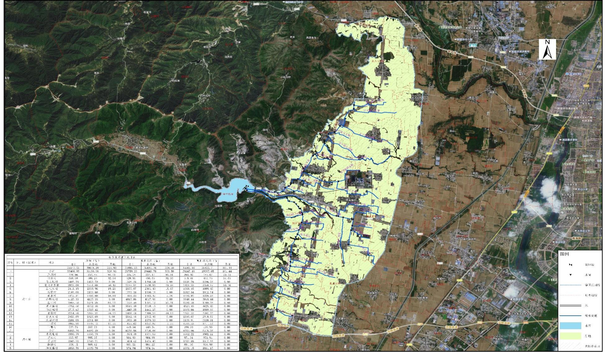  
图 2.2-1  夺丰水库灌区总体布局图  

# 2.3 项目建设依据  

# (1)《加快完善海河流域防洪体系实施方案》  

2024 年 8 月 30 日,李强主持召开国务院常务会议,审议通过《加快完善海河流域防洪体系实施方案》。会议指出,海河流域地理位置重要,人口密集,加快完善防洪体系意义重大。要坚持系统观念,准确把握流域河系特点及洪水特征,把优化重要保护对象防洪布局和加强防洪工程建设结合起来,切实提升整体防洪能力。要加快重点工程建设,统筹用好预算内投资、国债资金,严格把关确保工程质量。  

《加快完善海河流域防洪体系实施方案》中提出,要建设水库和洪水控制性工程 20 项,其中大中型水库扩容工程 7 项,包括野沟门水库、盘石头水库、桃林口水库、王快水库、塔岗水库、夺丰水库、石河水库。  

# (2)《河南省漳卫河流域综合治理方案》  

根据流域内水库最新安全鉴定结果,目前海河流域河南省境内暂无大中型水库需要除险加固。在以后规划实施过程中,应与各地市相关水利部门保持紧密合作,根据区域内水库安全鉴定情况,对病险水库清单做出动态调整,以便做好除险加固工程规划安排。  

《河南省漳卫河流域综合治理方案》提出:“本次规划对盘石头水库、塔岗水库、小南海水库、彰武水库、双泉水库、汤河水库、夺丰水库、白龙庙水库、鸡冠山水库、红卫水库、龙泉水库进行扩容,扩容后,规划总库容 14.98 亿 $\mathrm{m}^{3}$ 。对三郊口水库、陈家院水库、群英水库、石门水库、琵琶寺水库进行溢流堰改造并建闸。……本次规划夺丰水库扩容后总库容 1800 万 $\mathrm{m}^{3}$ ,防洪库容 650 万 $\mathrm{m}^{3}$ ,匡算总投资为 5.1 亿元。规划工程实施后,可拦蓄上游山区 50 年一遇洪水,为下游削峰错峰,坝址处 50 年一遇洪水进一步削峰 $24\%$ ,经调算,入河口处坝址以上洪水进一步削峰 $14\%$ ,控制思德河下泄流量,将思德河渠淇县城区段提升至50 年一遇。”  

# (3)《河南省防洪规划》  

为深入贯彻习近平总书记关于城市内涝治理和防汛救灾工作重要指示精神,落实《国务院办公厅关于加强城市内涝治理的实施意见》(国办发[2021]11号),对标对表国内先进地区和国家最新要求,聚焦“7.20”特大暴雨灾害中暴露的问题短板,加快推进城市排水防涝设施和应急管理能力建设,全面提升全省城市防洪排涝能力,特编制此规划。  

《河南省防洪规划》提出:夺丰水库规划扩容后总库容 0.18 亿 $\mathrm{m}^{3}$ ,其中防洪库容 0.07 亿 $\mathrm{m}^{3}$ 。夺丰水库扩容后,可减小 50 年一遇洪水下泄流量,通过下游堤防加固等措施将淇县防洪标准提升到 50 年;同时控制思德河 5 年一遇洪水下泄,结合其他工程措施减小下游滞洪区启用几率和进洪量。  

# (4)《河南郑州等地特大暴雨洪涝灾害灾后恢复重建总体规划》  

2021 年 7 月中下旬,河南郑州等地持续遭遇历史罕见的极端强降雨天气,引发特大洪涝灾害,造成重大损失。为有力有序有效做好灾后恢复重建工作,依据国家有关法律法规和政策文件,在开展灾害损失评估、地质灾害调查评价、风险隐患排查、建筑物受损程度鉴定等工作的基础上,经过专家论证、广泛征求意见,制定本规划,规划期为 2021—2024 年。该规划是由河南省人民政府、国家发展改革委提出,2022 年 1 月 29 日国务院以国函[2022]11 号批复原则同意该规划,要求认真组织实施。  

规划中提出:推进卫河(共产主义渠)流域系统治理,编制完成卫河灾后重建实施方案,实施卫河(共产主义渠)干流和主要支流堤防加固、河道疏浚,推进围村堤、避洪楼等蓄滞洪区安全建设,完善进退洪设施和区内排水体系;开展合河水利枢纽、流域内中型水库泄洪控制设施建设前期工作。  

# (5)《漳卫河“21.7”洪水灾后治理实施方案》  

2021 年 7 月 17—22 日,受低涡和低空急流共同影响,流域太行山前普降大到暴雨,局部特大暴雨。2021 年 7 月,海河流域出现入汛以来最强降雨过程,漳卫河出现了 1963 年以来的最强降雨过程,河南新乡、安阳、鹤壁等多地发生严重洪涝灾害,按照党中央、国务院关于做好灾后恢复重建的决策部署,在水利部、国家发展改革委指导下,海委会同河南、河北、山东三省,组织编制了《漳卫河“21•7”洪水灾后治理实施方案》(以下简称《方案》),对完善漳卫河流域防洪体系作出总体安排,明确了总体目标、建设任务和主要建设内容,并提出了具体实施安排、保障措施,细化了具体项目,作为统筹安排和有序推进漳卫河系洪水灾后系统治理的基本依据。  

根据漳卫河流域特点,统筹上下游、干支流、左右岸,按照“上蓄、中疏、下排、适当地滞”防洪格局和 50 年一遇防洪标准,对漳卫河流域进行达标建设。上蓄,充分利用流域内上游水库工程进行调蓄,对现有存在安全隐患的水库进行除险加固或完善蓄泄洪设施,提升上游洪水拦蓄能力。中疏,对漳河、卫河、共产主义渠、漳卫新河等主要行洪河道开展清淤疏浚、堤防加高培厚,提高中游行洪能力。下排,对漳卫新河四女寺至辛集段及河口进行治理,疏浚排洪入海通道,下泄流量由 3500 立方米/秒提升到 3650 立方米/秒,缩短中游河道高水位运行时间。适当地滞,加快推进良相坡、柳围坡等 11 处蓄滞洪区工程与安全建设,恢复蓄滞洪区滞蓄能力,实现洪水“分得进、蓄得住、退得出”。通过水库、河道堤防、蓄滞洪区联合运用,使漳卫河流域整体达到 50 年一遇防洪标准。  

# (6)《河南省“十四五”水安全保障和水生态环境保护规划》  

河南省人民政府于 2021 年以《河南省人民政府关于印发河南省“十四五”水安全保障和水生态环境保护规划的通知》(豫政【2021】42 号)印发了《河南省“十四五”水安全保障和水生态环境保护规划》。  

规划中提出:贯彻“两个坚持、三个转变”的防灾减灾新理念,按照“补短板、除隐患”的思路,坚持防治结合、以防为主,加快推进洪水控制工程建设、主要支流及中小河流治理、蓄滞洪区建设、重点平原洼地治理、病险水库除险加固、山洪灾害防治、城市防洪能力建设,提升综合防灾减灾能力,保障防洪安全。  

进一步控制山丘区洪水,加快推进对提高流域、区域洪水调控能力有重要作用的控制性枢纽工程建设,进一步完善流域防洪减灾体系。  

# (7)《鹤壁市“十四五”水安全保障规划》  

《鹤壁市“十四五”水安全保障规划》提出,到 2025 年建成与经济社会发展和生态文明建设要求相适应、与鹤壁市现代化进程相协调的水旱灾害防御、水资源节约集约利用与优化配置、水生态保护与修复、涉水事务监管四大体系,加强水利基础设施建设,提升水安全保障能力。到 2025 年,鹤壁市域卫河、共产主义渠淇门以上河段防洪标准达到 20 年一遇,淇门以下河段防洪标准达到 50 年一遇;金堤河、思德河、折胫河、沬水河防洪标准达到 20 年一遇,刘洼河下游未治理段除涝标准达 5 年一遇。对南水北调交叉建筑物上下游河道进行安全隐患排查并治理;进行鹤壁市海绵城市建设提质提标。实施良相坡、长虹渠、白寺坡、共渠西 4 个蓄滞洪区工程建设和安全建设并进行调度运用方案调整。大中型水库安全达标率 $100\%$ ,中型水闸安全达标率 $95\%$ 。基本建成高效的决策支持系统,全面提高防洪安全保障能力。  

# (8)《淇县“十四五”水安全保障规划》  

《淇县“十四五”水安全保障规划》提出,到 2025 年建成与经济社会发展和生态文明建设要求相适应、与淇县现代化进程相协调的水旱灾害防御、水资源节约集约利用与优化配置、水生态保护与修复、涉水事务监管四大体系,加强水利基础设施建设,提升水安全保障能力。到 2025 年,按照“上蓄、中疏、下排、适当地滞”的工程布局,对淇县有重要防洪影响的 5 条河道未达标河段工程治理,规划防洪标准为 $\mathbf{20}\sim\mathbf{50}$ 年一遇;对蓄滞洪区进行工程及安全建设,提高滞洪安全及区内居民洪水安全系数;对城区防洪进行达标建设,基本达到国家规定的城区防洪标准。对南水北调交叉建筑物上下游河道进行安全隐患排查并治理;实施良相坡蓄滞洪区工程建设和安全建设并进行调度运用方案调整。中型水库安全达标率 $100\%$ ,中型水闸安全达标率 $100\%$ 。基本建成高效的决策支持系统,全面提高防洪安全保障能力。  

# (9)《淇县国土空间总体规划(2021\~2035 年)》  

规划确定思德河、沬水河和折胫河河道中心城区段采用 50 年一遇洪水设计,20 年一遇排涝标准治理,护城河河道采用 10 年一遇的排涝标准治理;河流沿线乡镇政府驻地防洪标准是 10-20 年一遇,排涝标准达到 5 年一遇以上;良相坡蓄滞洪区在淇县境内防洪标准是 50 年一遇,排涝标准为 20 年一遇以上。  

规划提出构建由水体、堤防岸线、滨水绿地共同组成的集防洪、生态、景观、休闲功能于一体的蓝网系统。开展对思德河、沬水河、护城河等主要河流及沿线空间的生态修复和功能修补,全面提升城市防洪排涝能力,打造安全生态、功能复合、环境宜人的环城蓝链魅力带,形成水绕城转、城依水建的中心城区蓝绿空间开放骨架,满足市民休闲、娱乐、观赏、体验、生态防护等多种需求。  

# 2.4 夺丰水库扩容的必要性  

# 2.4.1 夺丰水库扩容是保障思德河乃至卫河流域防洪安全的需要  

(1)思德河防洪工程现状  

思德河为淇河以西排泄山洪与坡水的主要河道,属季节性河流。京广铁路以西为山丘区,坡陡流急,河槽宽深,河槽宽约 $30{\sim}150\mathrm{m}$ ,深 $3{\sim}4\mathrm{m}$ ,京广铁路以东常遇洪水不出槽,河床为若石与卵石。过京广铁路后入平原地区,穿良相坡滞洪区中间而过,河床多为粘土或粉质粘土,有泥沙沉积。  

思德河上游有1959年兴建,1972年建成的夺丰水库,控制流域面积 $57.7\mathrm{km}^{2}$ ,干流长 $14.3\mathrm{km}$ ,河道比降 $19\text{\textperthousand}$ 。水库按100 年一遇洪水设计,设计水位 $197.85\mathrm{m}$ ,相应库容 1017 万 $\mathrm{m}^{3}$ ;校核标准为 1000 年一遇洪水,校核水位 $199.44\mathrm{m}$ ,相应库容 1132 万 $\mathrm{m}^{3}$ ,最大下泄流量 $1829\mathrm{m}^{3}/\mathrm{s}$ 。大坝为浆砌石坝体,最大坝高 $41.2\mathrm{m}$ 。  

思德河现状河道系洪水下泄冲刷而成,上游为山区,河道穿行于山谷,河底比降陡,下泄流速快,河槽宽深,洪水行洪于槽内,河道在思德河村南穿京广铁路后进入平原地区。夺丰水库建成后,洪水下泄流量得到控制,下游河道在水库建成后按 3 年一遇防洪标准进行治理,治理后河道断面呈梯形,河道顺直,右岸建有堤防。  

2012 年思德河高村镇段(南水北调思德河渠道倒虹吸至京珠高速)开始实施治理,治理标准为 10 年一遇,主要内容为有河道疏浚工程:淇县思德河高村镇段桩号 $20{+}000{-}15{+}000$ 全段按底宽 $30\mathrm{m}$ 进行疏浚开挖,治理河道长度 $5\mathrm{km}$ ;堤防填筑工程:两岸 $15{+}000{-}17{+}900$ 段填筑堤防,堤防长度共计 $5.8\mathrm{km}$ ,左岸堤顶铺设 $3.5\mathrm{m}$ 宽防汛道路,长 $2.9\mathrm{km}$ ;岸坡护砌工程:对桩号 $19\substack{+900-19+600}$ 之间及桩号 $18{+}400$ 以下河道左右岸进行护砌,采用 $12\mathrm{cm}$ 厚的正六边形土块,边长为 $25\mathrm{cm}$ ,护砌长度 $7.4\mathrm{km}$ ;涵闸工程:新建穿堤涵闸 11 座,分别是 107 国道跨河桥穿堤涵闸、淇源路桥穿堤涵闸、经四路桥穿堤涵闸、鹤淇大道穿堤涵闸、经二路桥穿堤涵闸、经一路桥穿堤涵闸、东环路穿堤涵闸。  

2017 年思德河盟桥乡段(京港澳高速公路西侧窦街桥南 $600\mathrm{m}$ )开始实施治理,治理标准为5 年一遇,主要内容有河道清淤疏浚 $5\mathrm{km}$ ,两岸岸坡护砌长 $10.0\mathrm{km}$ ,村庄段两岸恢复重建堤防 $0.7\mathrm{km}$ ,恢复重建村庄排水涵 5 座。  

2021 年,对思德河夺丰水库至南水北调段河道进行治理,治理长度 $8.45\mathrm{km}$ ,治理标准为 10 年一遇防洪。工程建设内容有:河道疏浚 $8.45\mathrm{km}$ ;混凝土空心棱块生态护坡 $1.73\mathrm{km}$ ,拆除重建生产桥 2 座,拆除重建浸水桥 4 座,拆除简易涵管桥 1 座,新建防汛道路 $5.85\mathrm{km}$ 。  

2021 年 7 月 29 日大暴雨过后,拟对思德河未治理河段进行治理,其中思德河 G107 公路桥至 G4 高速段按照 50 年一遇防洪标准进行治理, G4 高速至良相坡滞洪区段按照 10 年一遇防洪标准进行治理,思德河良相坡滞洪区段按照 5 年一遇排涝标准治理。  

# (2) “21.7”洪水情况  

2021 年 7 月 17 日 ${\sim}23$ 日,鹤壁经历了历史罕见的持续强降雨过程,淇县最大24 小时雨量超过 $430\mathrm{mm}$ ,本次强降雨水量超过淇县历史有数据记载最高水平。淇县内河、山洪沟均爆发洪水。淇县降雨过程中承受来水最大达 $4900\mathrm{m}^{3}/\mathrm{s}$ ,共产主义渠、卫河 23 日前合计每秒最大下泄流量不足 $900\mathrm{m}^{3}/\mathrm{s}$ , $4000\mathrm{m}^{3}/\mathrm{s}$ 的洪水无法下泄,洪水在淇县良相坡滞留、行洪。  

淇县西部山区山洪爆发、多处道路塌方;城区思德河、赵家渠水位暴涨,思德河局部河段洪水漫堤严重,桥梁冲毁,部分地区发生内涝;东南部淇河、卫河、共产主义渠全部超过警戒水位。受灾人口约 17.2 万人,直接警戒损失达 47.5 亿元,特别是淇县作为养殖大县,畜禽大量受灾死亡,损失严重。  

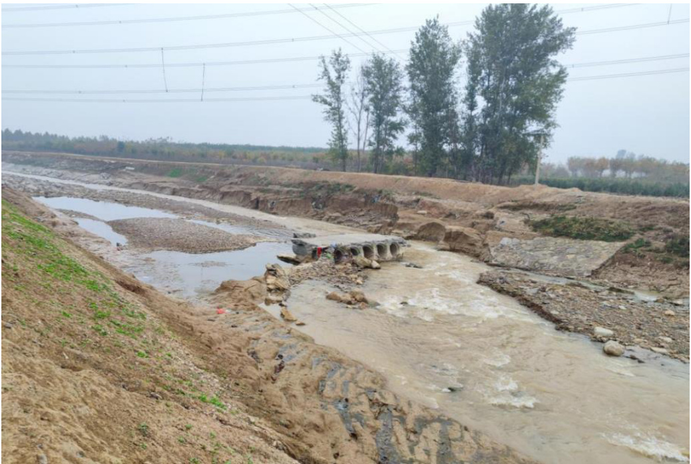  
图 2.4-1 思德河漫水桥被冲毁  

  
图 2.4-2  思德河大洪水过后河道淤积严重  

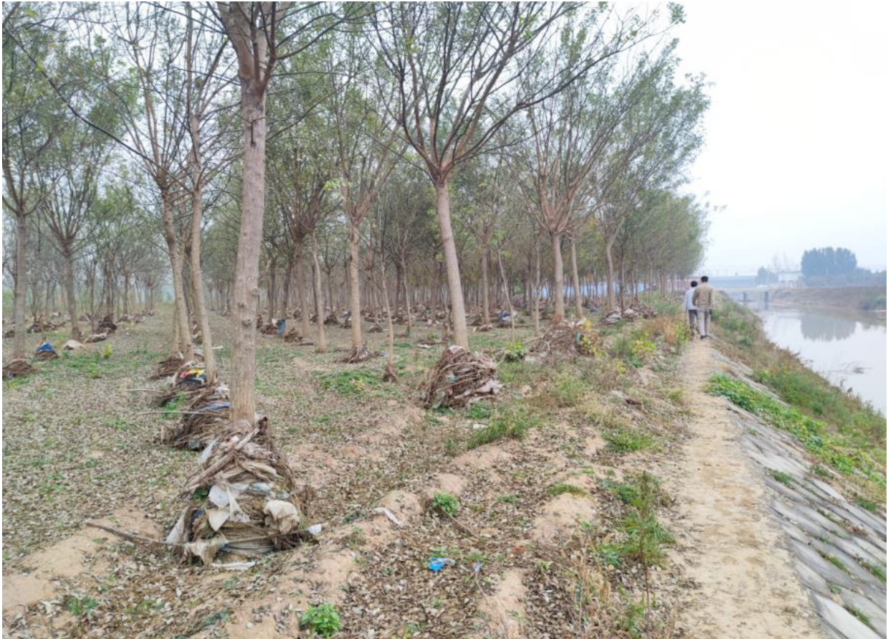  
图 2.4-3 思德河河道洪水漫堤痕迹  

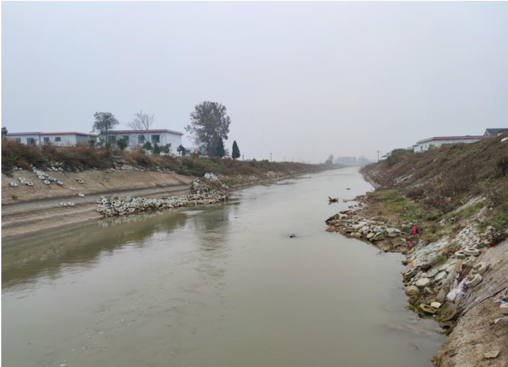  
图 2.4-4  思德河护坡冲毁严重  

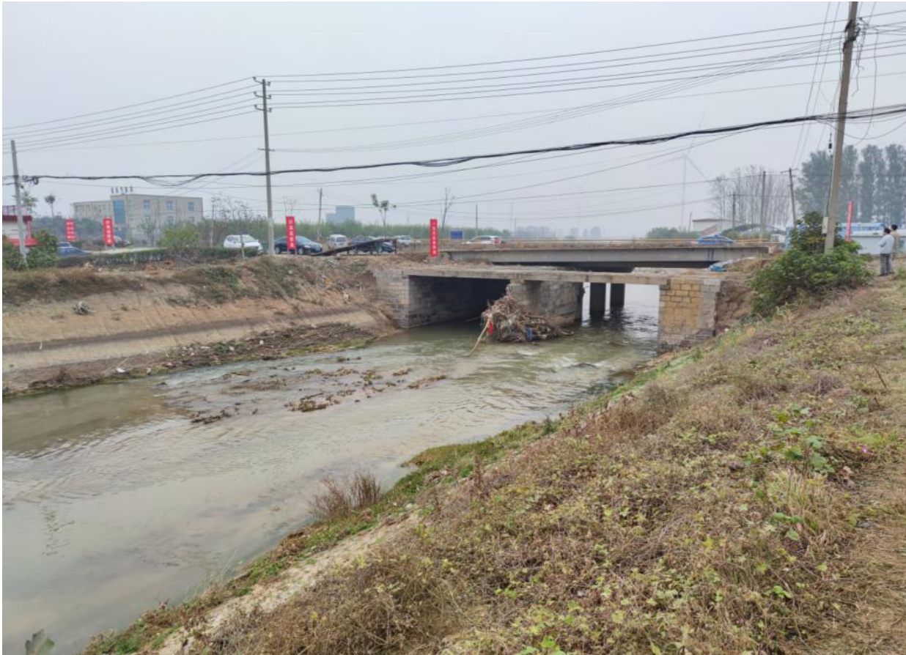  
图 2.4-5  思德河老桥阻水严重  

(3)思德河现状防洪存在问题$\textcircled{1}$ 河道缺乏统一治理,泄洪能力差  

经过历次整治,思德河夺丰水库至入良相坡蓄滞洪区段已经治理完成,但未达到相应的防洪标准,淇县城区河段治理后现状河道过流能力仅为约 10 年一遇,未达到 50 年一遇防洪标准;淇县城区上、下游村镇河段治理后现状河道过流能力不足 5 年一遇,达不到 10 年一遇防洪标准。良相坡蓄滞洪区段,由于资金短缺等问题,目前尚未治理完成,现状局部过流能力仅为 $80\mathrm{m}^{3}/\mathrm{s}$ ,防洪标准不足 3年一遇,河槽淤积严重,防洪除涝标准低。河道两岸多为农田和村庄,汛期遇到中雨或大雨,引河道排洪不畅,往往造成河道两岸农田淹没,道路中断,严重影响了两岸工农业生产和人民群众的正常生活秩序。  

$\textcircled{2}$ 现状跨河桥梁阻水严重  

现有跨河桥梁多为生产桥,设计标准低、规模小,宽度和高度不能满足行洪要求,加上年久失修,部分桥梁已损毁严重。由于桥梁阻水,排水不畅,致使主河槽逐渐淤塞、水位壅高。随着河道两岸经济的迅速发展,现有桥梁已不能满足河道防洪要求以及当地群众生产、生活的需要。沿河排水涵闸不配套,各排水沟入河口缺少必要的穿堤排水涵闸,汛期河水易倒灌。  

$\textcircled{3}$ 管理设施不配套  

思德河没有专门的管理机构,工程重建轻管的思想还没有完全转变,不能对洪水进行事先预报与统一调度,不能对河道中乱倒垃圾、乱扒乱堵以及乱建现象进行有效地管理。管理设施不配套,使流域内不健全的防洪、除涝体系效益更难以发挥。  

(4)夺丰水库扩容的必要性  

$\textcircled{1}$ 夺丰水库扩容是保障淇县城区及上下游村镇防洪安全的需要  

淇县位于河南省北部,卫河北岸,2022 年淇县全县总人口 26.3 万人,其中淇县城区人口 15.7 万人,预计到 2035 年全县总人口增长至 38.58 万人,淇县城区人口增长至 26.58 万人。根据《防洪标准》(GB50201-2014),淇县城区防洪标准应为 50 年一遇。  

思德河淇县城区上游段为庙口镇镇区所在地,此外该河段河道两侧还分布有庙口镇、黄洞乡、高村镇的部分村庄和农田,2022 年该地区有常住人口 2.1 万人,农田 14 万亩。根据《防洪标准》(GB50201-2014),思德河淇县城区上游段防洪标准应为 10 年一遇。  

思德河淇县城区下游段为西岗镇镇区所在地,此外该河段河道两侧还分布有西岗镇、朝歌街道、桥盟街道和高村镇的部分村庄和农田,2022 年该地区有常住人口 2.6 万人,农田 4.3 万亩。根据《防洪标准》(GB50201-2014),思德河淇县城区下游段防洪标准应为 10 年一遇。  

经过历次整治,思德河夺丰水库至入良相坡蓄滞洪区段已经治理完成,但未达到相应的防洪标准,淇县城区河段治理后现状河道过流能力仅为 5\~10 年一遇,未达到 50 年一遇防洪标准;淇县城区上、下游村镇河段治理后现状河道过流能力不足 5 年一遇,达不到 10 年一遇防洪标准。  

夺丰水库水库位于淇县城区上游约 10km 处,水库原设计未设置专门的防洪库容,只起到一定的滞洪作用,防洪作用有限。夺丰水库扩容后,设置 800 万$\mathrm{m}^{3}$ 防洪库容,通过水库蓄洪蓄峰作用,可使淇县城区防洪标准提高至 50 年一遇;可使淇县城区上、下游村镇河段防洪标准提高至 10 年一遇,今后结合下游河道整治可提高到 20 年一遇。夺丰水库扩容后,可彻底解决思德河淇县城区及城区上下游村镇河段的防洪问题,工程建设是必要的。  

$\textcircled{2}$ 夺丰水库扩容是落实上位规划,保障卫河流域防洪安全的需要  

卫河流域淇门以上流域面积 $8525.2\mathrm{km}^{2}$ ,其中山区面积占 $76\%$ 。一般洪水总量约占卫河总量的 $85\%$ ,卫河干流淇门至老观嘴规划行洪能力 $2000\mathrm{m}^{3}/\mathrm{s}$ ,其中卫河淇门至老观嘴行洪 $400\mathrm{m}^{3}/\mathrm{s}$ ,共产主义渠淇门至老观嘴行洪 $1600\mathrm{m}^{3}/\mathrm{s}$ ;老观嘴至安阳河口河道行洪 $2000\mathrm{m}^{3}/\mathrm{s}$ ,安阳河口至徐万仓河道行洪 $2500\mathrm{m}^{3}/\mathrm{s}$ 。  

由于现状河道淤积等情况,导致河道的行洪与排涝能力有不同程度的下降。卫河沿线良相坡围堤及进、退洪控制工程不完善,缺乏控制工程,致使进、退水量无法控制,采用“一坡倒一坡”的自然倒洪方式,造成了“一水多淹”、“小水大淹”的被动局面,加大了蓄滞洪区的淹没损失。  

随着经济社会的快速发展,对海河流域蓄滞洪区进行系统治理已迫在眉睫。按照新时代治水方针,统筹水灾害、水环境等诸多水问题,结合《海河流域综合规划》、《海河流域防洪规划》、《河南省特大洪涝灾害灾后恢复重建总体规划》、《漳卫河系“21.7”洪水灾后治理实施方案》《河南省十四五规划和 2035 年远景目标》、《河南省四水同治规划》、《河南省卫河共产主义渠流域防洪除涝系统治理方案》等上位规划,通过对蓄滞洪区进行系统治理,进一步抵抗极端气候,保障河南省人民生命财产安全,对于加强整个河南省防洪体系甚至是海河流域防洪体系尤为重要。  

因此,夺丰水库扩容,通过水库拦蓄思德河上游洪水,减少入良相坡洪量,完善流域防洪体系,保障区域防洪、排涝安全是必要的。  

# 2.4.2 夺丰水库扩容是改善夺丰水库灌区灌溉条件,保障国家粮食安全的需要  

确保粮食安全一直是国家发展粮食生产的根本政策。党的二十大再次强调:加大粮食生产政策支持力度,确保口粮绝对安全、谷物基本自给。全方位夯实粮食安全根基,牢牢守住十八亿亩耕地红线。稳住农业基本盘、守好“三农”基础是应变局、开新局的“压舱石”。 2024 年中央一号文件明确:全力抓好粮食生产,实施新一轮千亿斤粮食产能提升行动,确保全国粮食产量保持 1.3 万亿斤以上。推进重点水源、灌区建设和现代化改造,实施水库除险加固和中小型水库建设等工程。  

夺丰水库原设计主要工程任务是向下游夺丰水库灌区提供灌溉用水,水库原设计死水位 $163.0\mathrm{m}$ ,死库容 16 万 $\mathrm{m}^{3}$ ,正常蓄水位 $193.7\mathrm{m}$ ,正常蓄水位对应库容 732 万 $\mathrm{m}^{3}$ ,调节库容为 716 万 $\mathrm{m}^{3}$ ,设计灌溉面积 5.0 万亩。夺丰水库始建于20 世纪 70 年代,经过 50 多年的运行,水库淤积严重,经复核,现状 $163.0\mathrm{m}$ 以下库容已经全部淤满, $193.7\mathrm{m}$ 以下库容仅剩余 546 万 $\mathrm{m}^{3}$ ,较原设计库容减少约$25\%$ 。夺丰水库现状情况下,夺丰水库灌区现状灌溉保证率仅为 $60\%$ 左右。  

本次设计根据泥沙淤积、工程布置、兴利任务需求,将水库死水位抬高至$170.5\mathrm{m}$ ,正常运行最低水位为 $197.5\mathrm{m}$ ,正常蓄水位抬高至 $208\mathrm{m}$ ,调节库容增加至 759 万 $\mathrm{m}^{3}$ ,与地下水联合调度,可使夺丰水库灌区 5 万亩农田灌溉保证率提高至 $75\%$ 。  

河南省是国家粮食生产的重要地区和商品粮生产基地,夺丰水库扩容后可大大改善夺丰水库灌区水源基础设施条件,增强灌区抵御自然灾害的能力,大幅提高粮食产能,为保障国家粮食生产安全做出贡献。  

# 2.4.3 夺丰水库扩容是提高淇县城区及城乡供水一体化地区供水安全保障的需要  

随着淇县地下水压采的实施,淇县城区及城区周边城乡供水一体化地区生活及工业水大部分将依靠南水北调中线外调水源满足用水需求源。然而目前随着用水需求不断增加,供水范围也在进一步扩大,且由于水质好,淇县城区对中线水源的依赖程度越来越高。南水北调中线总干渠渠线在河南境内穿越四大流域,11座省辖市、7 座县级市、25 座县城。渠道总长 $731\mathrm{km}$ ,建筑物 282 座,一旦发生紧急事故或需要进行检修时,事故渠段下游的供水将无法保障,同时,南水北调中线存在冰期输水减量运行、汛期输水受洪水威胁等不利因素,存在一定的供水风险隐患。另一方面,由于南水北调中线通过总干渠向受水区直供水,不具备调蓄水库和总干渠之间相互调配的条件,在南水北调来水不足的情况下,没有足够的调蓄能力满足下游城市的用水需求,同样可能引起供水保障程度的降低。  

考虑南水北调中线可能存在的供水风险隐患,结合夺丰水库防洪能力提升,为夺丰水库增设一定的备用库容,在南水北调中线检修、事故或者调蓄能力不足时,夺丰水库启用备用库容以满足供水缺口,对于提高淇县城区及城区周边城乡供水一体化地区的供水安全保障水平是十分必要的。  

夺丰水库扩容后,水库单独设置 700 万 $\mathrm{m}^{3}$ 的事故应急备用库容,并结合 440万 $\mathrm{m}^{3}$ 灌溉调节库容作为检修应急备用库容,保证南水北调总干渠发生突发事故或正常检修时,满足淇县城乡供水一体化范围内 90 天事故应急供水和 90 天检修应急供水。考虑到思德河径流的时空分布严重不均,备用库容的设置可以有效利用思德河雨洪资源,实现本地水资源的高效利用。  

# 2.5 工程任务  

夺丰水库原设计是一座以灌溉、供水、防洪为主,结合养殖等多种经营的中型水库。水库原设计并未设置专用的防洪库容,水库只起一定的滞洪作用。  

夺丰水库扩容后,工程任务以防洪、灌溉、供水为主,并为淇县南水北调受水区提供备用水源。  

# (1)防洪  

夺丰水库扩容后,水库设置 800 万 $\mathrm{m}^{3}$ 防洪库容,通过分级控泄,保障良相坡蓄滞洪区内思德河段 5 年一遇洪水不出槽;使淇县城区上、下游村镇河段防洪标准由不足 5 年一遇,提高至 10 年一遇,今后结合下游河道整治可提高到 20 年一遇;使淇县城区河段防洪标准由 5\~10 年一遇提高至 50 年一遇。  

(2)灌溉  

夺丰水库扩容后,调节库容由现状 531 万 $\mathrm{m}^{3}$ 增加至 759 万 $\mathrm{m}^{3}$ ,与原设计工况调节库容基本相当。通过增加 228 万 $\mathrm{m}^{3}$ 调节库容,使夺丰水库灌区 5 万亩农田灌溉保证率由现状的 $60\%$ 提高至 $75\%$ ,水库向夺丰水库灌区多年平均灌溉供水 415 万 $\mathrm{m}^{3}$ 。  

(3)供水  

夺丰水库扩容后,向夺丰水库灌区范围内村镇生活多年平均供水62 万 $\mathsf{m}^{3}$ 。  

(4)淇县南水北调受水区备用  

夺丰水库扩容后,水库单独设置 700 万 $\mathrm{m}^{3}$ 的事故应急备用库容,并结合 440万 $\mathrm{m}^{3}$ 灌溉调节库容作为检修应急备用库容,保证南水北调总干渠发生突发事故或正常检修时,满足淇县南水北调受水区 90 天事故应急供水和 90 天检修应急供水。  

# 第三章 水文  

# 3.1 流域概况  

# 3.1.1 流域概况  

(1)流域概况  

夺丰水库位于鹤壁市淇县庙口镇庙口村西,是海河流域卫河支流思德河上游一座已建中型水库,水库坝址以上控制流域面积 $57.7\mathrm{km}^{2}$ ,干流长 $13.75\mathrm{km}$ ,干流比降 $20.9\text{\textperthousand}$ 。  

思德河发源于黄洞乡臭水沟村,向东在庙口镇区东南折向南,流经高村镇、桥盟乡、西岗乡,在北阳乡小岗村东南汇入共产主义渠,河道全长 $42.5\mathrm{km}$ ,流域面积 $402\mathrm{km}^{2}$ ,主要支流有赵家渠、折胫河、杨吴沟等,于京广铁路以东汇入。  

思德河为淇河以西排泄山洪与坡水的主要河道之一,属季节性河流。思德河夺丰水库坝址以上属于太行山区,流域内多裸露岩石,很少部分有较薄植被,区域内山高坡陡,水库下游出山进入平原。夺丰水库以下河道全长 $29.74\mathrm{km}$ ,其中夺丰水库至京广铁路以西山丘区干流长度为 $10.54\mathrm{km}$ ,平均坡降 $8.0\text{\textperthousand}$ ,属宽浅式漫滩型河床,坡陡流急,河槽宽深,河槽宽 $10{\sim}150\mathrm{m}$ ,河槽深 $2.2{\sim}4\mathrm{m}$ ,常遇洪水不出槽,河床多为卵石土;京广铁路以东平原区干流长度为 $19.20\mathrm{km}$ ,平均比降为 $1.8\text{\textperthousand}$ ,属窄深式河床,坡降平缓,并有较多支流汇入,下游穿越良相坡滞洪区入共产主义渠,河床多为粘土或粉质粘土。  

思德河流域内地形比较复杂,西部山区地处太行山东麓低山丘陵地带,地面高程在 $170{\sim}1019\mathrm{m}$ 。山前为冲积平原,地面高程在 $78{\sim}170\mathrm{m}$ 。下与卫河沿岸淤积的泊洼相连,地面高程在 $63{\sim}78\mathrm{m}$ 。淇县地势西北高、东南低,西和西北为山区,东和东南为平原和泊洼,北、东、南三面环水,所有内河均向东南汇集。淇县西部山区海拔高程多在 $100\mathrm{m}$ 至 $1000\mathrm{m}$ ,与林县、卫辉交界处的三县最高处高程为 $1019\mathrm{m}$ ,最低处高程为 $63\mathrm{m}$ ,相对高程差为 $956\mathrm{m}$ 。地面比降较大,一般在$1/170{\sim}1/500{\sim}1/4000$ 西北倾向东南。地面坡度分平坦、缓坡、斜坡、陡坡、急坡、险坡、峭坡等七种,均因地形的变化而变化。  

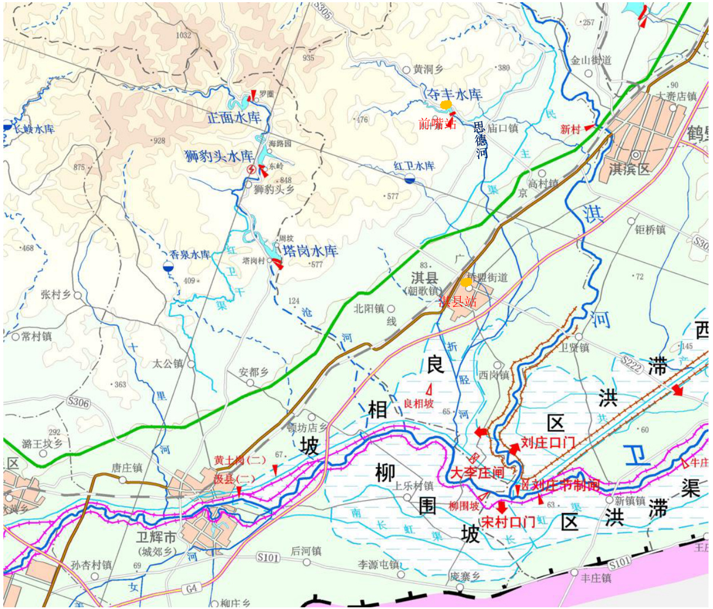  
图 3.1-1 思德河河流水系图  

# 流域水系图  

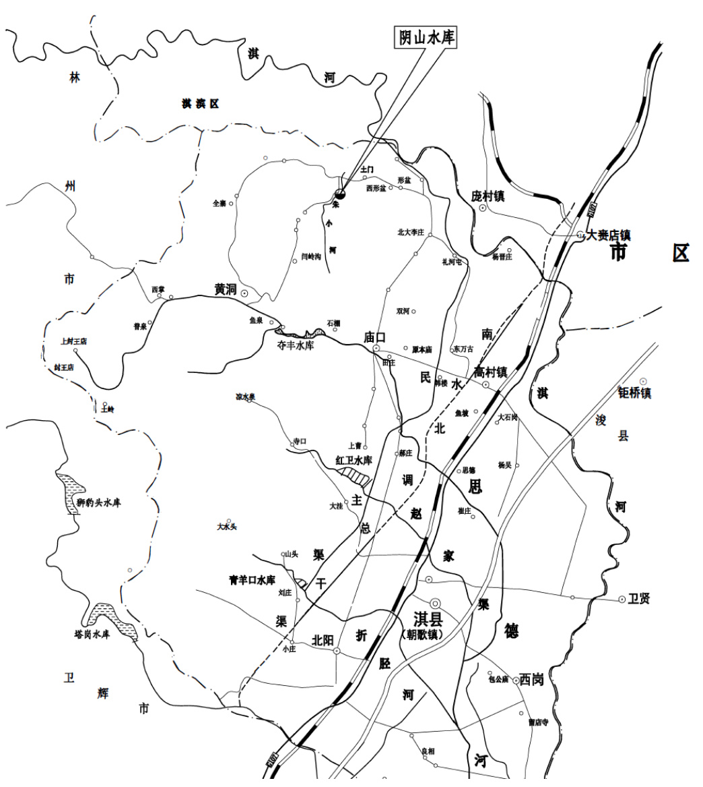  
图 3.1-2  淇县河流水系图  

(2)河流水系  

淇县境内思德河主要支流有赵家渠和折胫河。思德河属海河流域卫河水系,是卫河的一条支流,发源于太行山东麓淇县胡泉沟。思德河在淇县黄洞镇前咀村入夺丰水库,出水库后向东过庙口,在思德堡西南穿过京广铁路进入平原地区,在东石桥东与赵家渠交汇,在黄堆村东与折胫河汇合,向南穿良相坡蓄滞洪区后,在淇县西岗镇大李庄村汇入共产主义渠。  

赵家渠发源于淇县西部山区桥盟街道小春花村,主要支流有小岗沟。赵家渠上游有红卫水库蓄洪,水库以上主河道长 $9.35\mathrm{km}$ ,控制流域面积 $30\mathrm{km}^{2}$ ;赵家渠经红卫水库后向东南流经灵山街道办事处、卫都街道办事处、桥盟街道办事处、淇县县城新区、朝歌街道办事处,穿越京广铁路、南水北调总干渠、107 国道、京港澳高速在石桥村东汇入思德河,干流全长约 $24\mathrm{km}$ ,控制流域面积 $60\mathrm{km}^{2}$ 。流域呈树叶状,西高东低,上游为山丘区,高程在 $760\widetilde{\sim}80\mathrm{m}$ ,地表大部分为裸露的石灰岩,地表植被较差,水土流失严重。下游为平原区,高程在 $90{\sim}65\mathrm{m}$ 之间。  

折胫河为思德河下游一条支流,发源于太行山东麓、淇县西部山区大水头、地谷岭一带,自西北向东南流经黄庄,于淇县火车站南穿过京广铁路进入平原地区,向南在水屯村东折向东南,在黄堆村东与思德河汇合,干流全长约 $17\mathrm{km}$ ,控制流域面积 $108.7\mathrm{km}^{2}$ 。流域内地势西北高东南低,上游为山丘区,高程在 $718\sim$ $75\mathrm{m}$ ,地表大部分为裸露的石灰岩,地表植被较差,水土流失严重。下游为平原区,高程在 $75\mathrm{\sim}65\mathrm{m}$ 之间。  

# 3.1.2 良相坡蓄滞洪区  

根据河南省防汛抗旱指挥部2020 年9月颁布的《河南省蓄滞洪区运用方案》,良相坡蓄滞洪区是河南省海河流域运用机率较高的一个蓄滞洪区,位于新乡市的卫辉和鹤壁市的淇县境内,南以卫河右堤为界,东靠西岗堤和淇河右堤,北倚淇县城关防洪堤,西接自然高地。它处于太行山洪积和黄河冲积平原的过渡地带,地势低洼,地面高程一般为 $65.5\mathrm{m}$ ,最低 $64.5\mathrm{m}$ ,最高 $67.0\mathrm{m}$ ,历史上就是一个自然坡洼。1958 年修建共产主义渠后,把良相坡分为共渠左岸和共渠右岸两部分。良相坡蓄滞洪区没有进洪控制工程,根据河南省蓄滞洪区运用预案中提出的规模指标,现状良相坡的设计蓄滞洪水位为 $67.00\mathrm{m}$ ,水深 $0.5\mathrm{m}{\sim}2.5\mathrm{m}$ 之间,蓄滞洪量 0.92 亿 $\mathrm{m}^{3}$ ,淹没面积 $74.52\mathrm{km}^{2}$ ,运用机率为 2\~3 年一遇。根据海河流域防洪规划修编,规划实施后的良相坡蓄滞洪区的蓄滞洪水位为 $67.34\mathrm{m}$ ,蓄滞洪量 1.42 亿 $\mathrm{m}^{3}$ ,淹没面积 $81.05\mathrm{km}^{2}$ 。  

# 3.1.3 现状工程  

(1)上游水库  

小寨水库位鹤壁市淇县黄洞乡小寨村西南约 $150\mathrm{m}$ 处。属海河流域卫河水系,思德河上游,控制流域面积 $2.7\mathrm{km}^{2}$ ,上游干流长度 $2.37\mathrm{km}$ ,干流比降 0.038。水库现状总库容 13.7 万 $\mathrm{m}^{3}$ ,兴利库容 5.6 万 $\mathrm{m}^{3}$ 。是一座以灌溉、防洪为主,兼顾水产养殖综合利用的小(2)型水库。水库下游保护人口 2800 余人,设计灌溉面积 0.15 万亩,水库地理位置重要。  

普泉水库位于鹤壁市淇县黄洞乡普泉村北约 $1\mathrm{km}$ 处。水库坝址在海河流域卫河水系,思德河支流折胫河上游,水库控制流域面积 $3.2\mathrm{km}^{2}$ ,干流长度 $2.42\mathrm{km}$ ,河道平均比降 0.037,现状水库库容 15.01 万 $\mathrm{m}^{3}$ 。水库下游有 4 个村庄,2000 多人口,1500 余亩耕地,水库设计灌溉面积 1500 余亩。是一座以灌溉、防洪为主,兼顾水产养殖综合利用的小(2)型水库。  

(2)南水北调中线工程总干渠  

南水北调中线工程总干渠与思德河在淇县刘河村相交,交叉点处总干渠起点桩号 $\mathrm{N}164{+}910$ ,交叉段总干渠设计流量 $390\mathrm{m}^{3}/\mathrm{s}$ ,加大流量 $450\mathrm{m}^{3}/\mathrm{s}$ ,进口渠底高程 $88.912\mathrm{m}$ ,河底高程 $84.5\mathrm{m}$ ,渠底高出河底 $4.412\mathrm{m}$ ,根据总干渠总体设计,交叉建筑物型式为涵洞式渡槽。根据《南水北调中线工程总干渠思德河交叉断面设计洪水报告》,总干渠交叉点处设计洪水成果见表 3.1-1。  

表 3.1-1  总干渠交叉点处设计洪水成果  

<html><body><table><tr><td rowspan="2">项 目</td><td colspan="6">频 率</td></tr><tr><td>0.33%</td><td>1%</td><td>2%</td><td>5%</td><td>10%</td><td>20%</td></tr><tr><td>洪峰流量（m²/s)</td><td>2140</td><td>1710</td><td>1440</td><td>1070</td><td>784</td><td>527</td></tr><tr><td>最大24h 洪量（万 m²）</td><td>3375</td><td>2670</td><td>2238</td><td>1580</td><td>1087</td><td>647</td></tr><tr><td>洪水位</td><td>91.34</td><td>90.78</td><td>90.39</td><td>89.78</td><td>89.26</td><td>88.71</td></tr></table></body></html>  

# 3.2 气象  

项目区属暖温带大陆性气候,四季分明,春季偏旱多风,夏季炎热降水集中,秋季凉爽季节短,冬季寒冷少雨雪,冬季偏北风,夏季偏南风。根据淇县气象站1965-2022 年气象资料统计,多年平均降水量为 $616\mathrm{mm}$ ,最大年降水量为 $1796\mathrm{mm}$ (2021 年),最小年降水量为 $268\mathrm{mm}(1997$ 年)。多年平均水面蒸发量 $1256\mathrm{mm}$ ,多年平均气温 $14.4^{\circ}\mathrm{C}$ ,极端最高气温 $42.5^{\circ}\mathrm{C}$ ,极端最低气温- $\mathrm{18^{\circ}C}$ ,多年平均最大风速 $12.8\mathrm{m/s}$ ,历年最大风速 $17.7\mathrm{m}/\mathrm{s}$ 。由于自然条件影响,降水量从西北至东南呈递减趋势,使西部山区形成一个小暴雨区。降水量年内分配极不均匀,夏季7-9 月份降水量占全年的 $63.3\%$ 以上,7、8 两月占全年降水量的 $51.7\%$ 。容易形成夏汛秋涝,冬春干旱少雨雪,极易造成水旱灾害。  

表 3.2-1 淇县气象数据统计  

<html><body><table><tr><td>项目</td><td>1月</td><td>2月</td><td>3月</td><td>4月</td><td>5月</td><td>6月</td><td>7月</td><td>8月</td><td>9月</td><td>10月</td><td>11月</td><td>12月</td><td>年</td></tr><tr><td>降水量（mm)</td><td>3.89</td><td>8.91</td><td>15.0</td><td>30.7</td><td>44.9</td><td>69.4</td><td>188</td><td>130</td><td>71.3</td><td>30.0</td><td>18.5</td><td>4.57</td><td>616</td></tr><tr><td>水面蒸发量（mm）</td><td>42</td><td>57</td><td>101</td><td>124</td><td>150</td><td>191</td><td>132</td><td>128</td><td>116</td><td>86</td><td>72</td><td>44</td><td>1256</td></tr><tr><td>平均气温（°℃)</td><td>-0.590</td><td>2.62</td><td>8.59</td><td>15.4</td><td>21.3</td><td>26.4</td><td>27.2</td><td>25.9</td><td>21.3</td><td>15.5</td><td>7.68</td><td>1.16</td><td>14.4</td></tr><tr><td>极端最高气温 (0.)</td><td>18.8</td><td>27.5</td><td>29.7</td><td>35.4</td><td>38.8</td><td>42.5</td><td>41.5</td><td>38.1</td><td>37.9</td><td>35.2</td><td>27.5</td><td>23.5</td><td>42.5</td></tr><tr><td>极端最低气温 (℃)</td><td>-17.4</td><td>-14.6</td><td>-8.30</td><td>-2.00</td><td>3.10</td><td>10.3</td><td>13.0</td><td>12.7</td><td>3.50</td><td>-3.40</td><td>-14.5</td><td>-18.0</td><td>-18.0</td></tr><tr><td>平均风速(m/s)</td><td>2.67</td><td>2.90</td><td>3.30</td><td>3.37</td><td>3.00</td><td>2.82</td><td>2.34</td><td>2.13</td><td>2.13</td><td>2.32</td><td>2.52</td><td>2.51</td><td>2.67</td></tr><tr><td>平均最大风速（m/s）</td><td>9.29</td><td>10.2</td><td>11.3</td><td>11.7</td><td>9.69</td><td>10.3</td><td>8.91</td><td>8.89</td><td>8.30</td><td>9.00</td><td>9.03</td><td>8.88</td><td>12.8</td></tr><tr><td>最大风速(m/s)</td><td>12.2</td><td>15.3</td><td>17.1</td><td>17.1</td><td>13.4</td><td>17.7</td><td>13.5</td><td>15.1</td><td>11.5</td><td>13.8</td><td>13.2</td><td>11.5</td><td>17.7</td></tr><tr><td>最大风速相应风向</td><td>NE</td><td>N</td><td>N</td><td>N</td><td>WNW</td><td>N</td><td>N</td><td>N</td><td>N</td><td>N</td><td>N</td><td>N</td><td>N</td></tr><tr><td>日照时数（h)</td><td>136</td><td>139</td><td>177</td><td>206</td><td>238</td><td>222</td><td>185</td><td>195</td><td>175</td><td>175</td><td>150</td><td>146</td><td>2144</td></tr><tr><td>相对湿度（%）</td><td>59.1</td><td>58.5</td><td>58.2</td><td>61.0</td><td>61.7</td><td>58.5</td><td>77.0</td><td>79.2</td><td>72.7</td><td>67.0</td><td>66.0</td><td>61.9</td><td>65.1</td></tr></table></body></html>  

# 3.3 水文基本资料  

(1)径流资料  

夺丰水库为已建水库,所在的思德河上没有流量观测资料,水库现有坝前水位观测(人工水尺)等有关水文观测设施。本次收集到夺丰水库建库以来 1988年 ${\sim}2023\$ 年有关观测资料推算的历年逐月入库流量系列资料。  

(2)逐日降雨资料  

夺丰水库流域内有前嘴雨量站,下游淇县县城有淇县气象站,临近流域汤阴气象站有较长系列降水资料。本次收集到淇县气象站 1965-2022 年共 58 年逐日降水量资料、汤阴气象站 1957-2023 年共 67 年逐日降水资料以及前嘴雨量站1956-2023 年共 46 年(1957-1961、1966-1967、1990、1992-2005 年缺失)逐日降水资料。  

(3)短历时暴雨资料  

本次收集到前嘴雨量站 1962-2023 年(部分年缺失)短历时(1h、2h、6h、24h)暴雨资料。  

# 3.4 径流  

# 3.4.1 径流特性  

思德河流域的径流主要由降水形成。径流的年内丰枯变化较大,主要是受降水量大小所支配,夏季水量较丰,冬季径流较小。6\~9 月为丰水期,尤以 7\~8 月份最多,径流主要集中于丰水期,10 月\~次年 5 月为枯水期,枯水期径流量少。  

# 3.4.2 径流系列分析  

(1)一致性分析  

夺丰水库以上有普泉水库、小寨水库两座小型水库,主要以灌溉和防洪为主,夺丰水库以上主要径流还原计算仅涉及到农业灌溉耗损水量。根据《鹤壁市淇县普泉水库除险加固工程初步设计报告》和《鹤壁市淇县小寨水库除险加固工程初步设计报告》,两水库流域面积分别为 $3.2\mathrm{km}^{2}$ 和 $2.7\mathrm{km}^{2}$ ,水库库容分别为 15.01万 $\mathrm{m}^{3}$ 和 13.7 万 $\mathrm{m}^{3}$ ,其中小寨水库兴利库容 5.6 万 $\mathrm{m}^{3}$ 。两水库面积占比小,取用开发利用少,可认为夺丰水库实测径流量系列一致性较好,可以直接作为天然系列使用。本次直接采用夺丰水库实测数据。  

(2)降水系列插补延长  

考虑到汤阴气象站资料系列较长,采用汤阴气象站对前嘴年降水量进行插补延长。绘制前嘴雨量站年降水量与汤阴气象站年降水量 1962-2023 年同期相关关系,见图 3.4-1。可见相关关系较好,插补延长后,前嘴雨量站年降水系列见表3.4-1。  

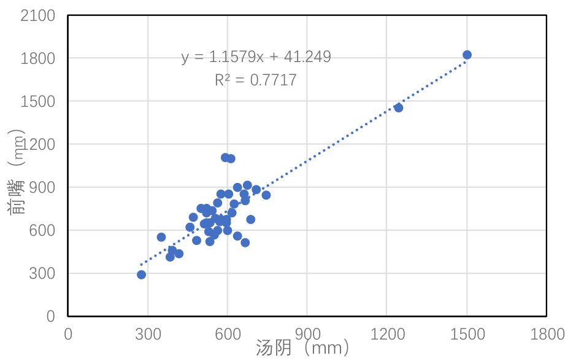  
图 3.4-1 前嘴雨量站与汤阴气象站年降水量相关关系图  

表 3.4-1 前嘴雨量站历年年降水量  

<html><body><table><tr><td>时间</td><td>降水量（mm)</td><td>时间</td><td>降水量（mm)</td><td>时间</td><td>降水量（mm)</td><td>时间</td><td>降水量（mm)</td></tr><tr><td>1956</td><td>1467</td><td>1973</td><td>786</td><td>1990</td><td>821</td><td>2007</td><td>717</td></tr><tr><td>1957</td><td>562</td><td>1974</td><td>755</td><td>1991</td><td>519</td><td>2008</td><td>804</td></tr><tr><td>1958</td><td>1004</td><td>1975</td><td>785</td><td>1992</td><td>613</td><td>2009</td><td>677</td></tr><tr><td>1959</td><td>774</td><td>1976</td><td>847</td><td>1993</td><td>822</td><td>2010</td><td>849</td></tr><tr><td>1960</td><td>502</td><td>1977</td><td>854</td><td>1994</td><td>757</td><td>2011</td><td>718</td></tr><tr><td>1961</td><td>889</td><td>1978</td><td>461</td><td>1995</td><td>646</td><td>2012</td><td>529</td></tr><tr><td>1962</td><td>648</td><td>1979</td><td>751</td><td>1996</td><td>751</td><td>2013</td><td>622</td></tr><tr><td>1963</td><td>1454</td><td>1980</td><td>595</td><td>1997</td><td>427</td><td>2014</td><td>513</td></tr><tr><td>1964</td><td>885</td><td>1981</td><td>554</td><td>1998</td><td>905</td><td>2015</td><td>641</td></tr><tr><td>1965</td><td>290</td><td>1982</td><td>896</td><td>1999</td><td>627</td><td>2016</td><td>846</td></tr><tr><td>1966</td><td>566</td><td>1983</td><td>656</td><td>2000</td><td>767</td><td>2017</td><td>647</td></tr><tr><td>1967</td><td>833</td><td>1984</td><td>670</td><td>2001</td><td>547</td><td>2018</td><td>599</td></tr><tr><td>1968</td><td>562</td><td>1985</td><td>647</td><td>2002</td><td>415</td><td>2019</td><td>433</td></tr><tr><td>1969</td><td>1108</td><td>1986</td><td>413</td><td>2003</td><td>787</td><td>2020</td><td>590</td></tr></table></body></html>  

<html><body><table><tr><td>时间</td><td>降水量（mm)</td><td>时间</td><td>降水量（mm)</td><td>时间</td><td>降水量（mm)</td><td>时间</td><td>降水量（mm)</td></tr><tr><td>1970</td><td>736</td><td>1987</td><td>689</td><td>2004</td><td>777</td><td>2021</td><td>1822</td></tr><tr><td>1971</td><td>1099</td><td>1988</td><td>673</td><td>2005</td><td>843</td><td>2022</td><td>498</td></tr><tr><td>1972</td><td>910</td><td>1989</td><td>561</td><td>2006</td><td>681</td><td>2023</td><td>1491</td></tr></table></body></html>  

# (3)径流系列插补延长  

绘制前嘴雨量站年降水量与夺丰水库入库流量 1988-2021 年同期相关关系,见图 3.4-2。可见相关关系较好,以此插补延长得到夺丰水库 1956-2023 年入库流量系列。  

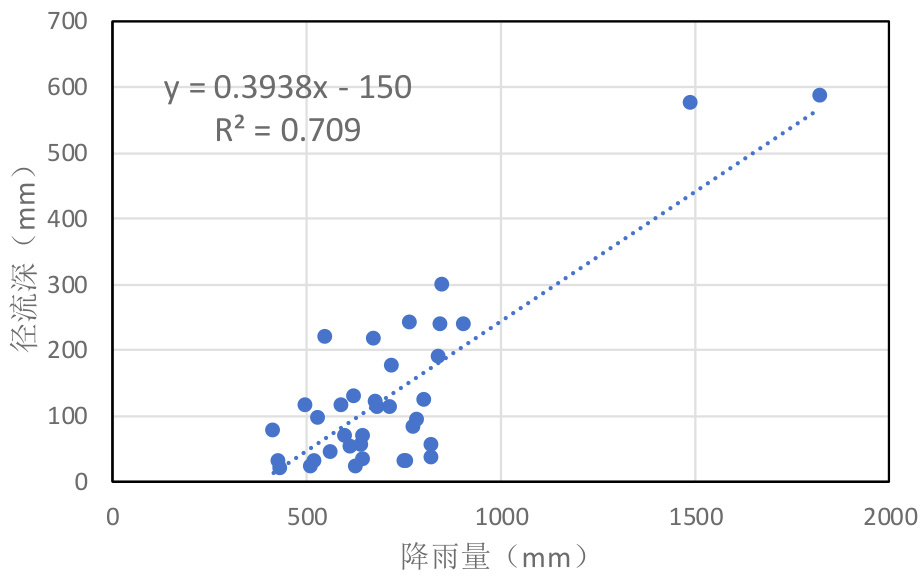  
图 3.4-2  前嘴雨量站与夺丰水库入库流量相关关系图  

(4)代表性分析  

绘制夺丰水库 1956-2023 年年入库径流量过程线见图 3.4-3,年径流量差积曲线见图 3.4-4。从图中可以看出,夺丰水库入库年径流丰枯交替出现,包括了1956-1963、1969-1977 年和 2016-2023 年丰水时段、1997-2016 年的平水时段以及 1988-1996 年的枯水时段,因此认为夺丰水库 1956-2023 年径流系列代表性好。  

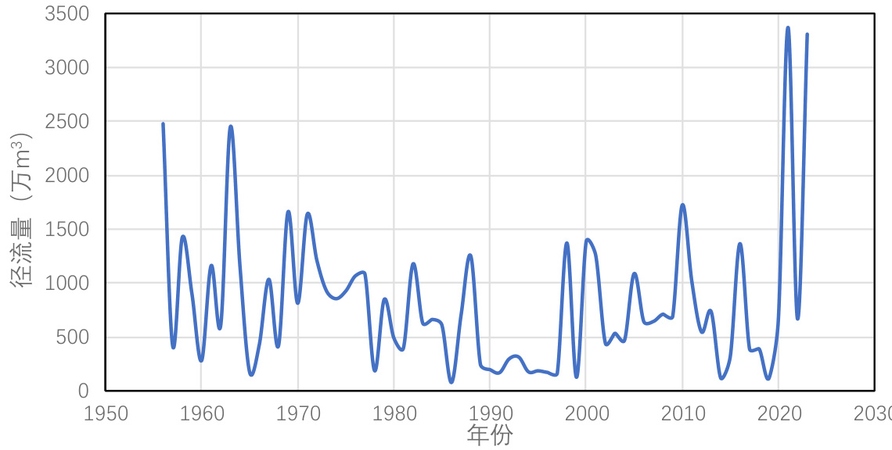  
图 3.4-3  夺丰水库年径流过程线  

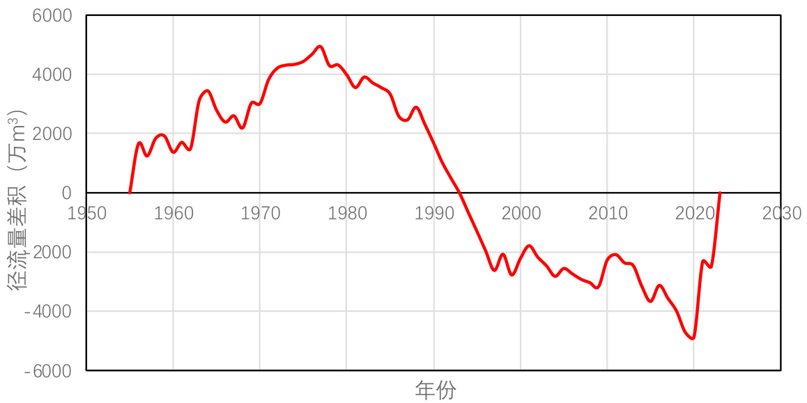  
图 3.4-4  夺丰水库年径流差积曲线  

# 3.4.3 坝址断面径流  

根据夺丰水库 1956-2023 年入库流量系列,采用 P-Ⅲ频率适线法计算设计径流,适线图见图 3.4-5,成果见表 3.4-2。根据夺丰水库实测月径流分配成果计算得夺丰水库坝址以上断面多年平均逐月径流成果,插补延长年份采用年径流量相近年份年内分配,见表 3.4-3。  

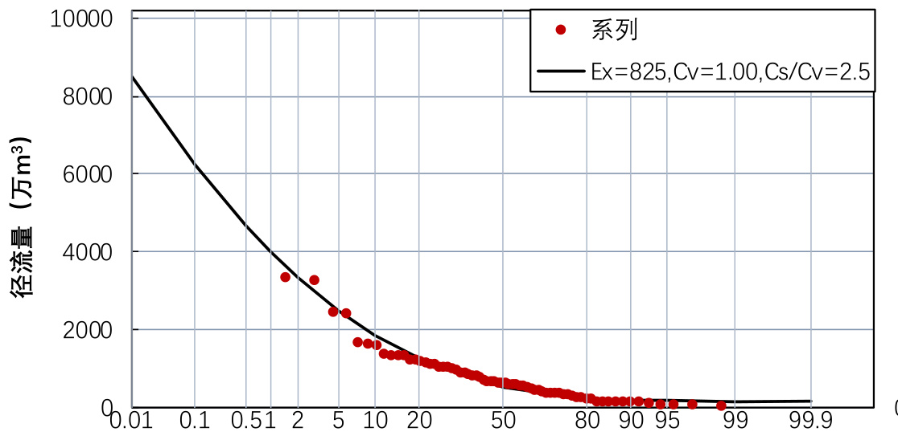  
图 3.4-5 夺丰水库设计径流适线图  

表 3.4-2 夺丰水库设计径流成果表  

<html><body><table><tr><td rowspan="2">均值</td><td rowspan="2">Cv</td><td rowspan="2">Cs/Cv</td><td colspan="4">各频率设计径流量（万 m²)</td></tr><tr><td>25%</td><td>50%</td><td>75%</td><td>90%</td></tr><tr><td>825</td><td>1.00</td><td>2.5</td><td>1066</td><td>528</td><td>271</td><td>189</td></tr></table></body></html>  

表 3.4-3 夺丰水库逐月径流成果表  

<html><body><table><tr><td>月份</td><td>1月</td><td>2月</td><td>3月</td><td>4月</td><td>5月</td><td>6月</td><td rowspan="2">年径流量（万 m²）</td></tr><tr><td>径流量（万 m²)</td><td>13.0</td><td>13.6</td><td>12.5</td><td>14.8</td><td>24.1</td><td>79.1</td></tr><tr><td>月份</td><td>7月</td><td>8月</td><td>9月</td><td>10月</td><td>11月</td><td>12月</td><td rowspan="2">825</td></tr><tr><td>径流量（万m²)</td><td>211</td><td>202</td><td>106</td><td>71.7</td><td>52.0</td><td>26.8</td></tr></table></body></html>  

# 3.4.4 径流合理性分析  

前嘴站多年平均降雨量 $744\mathrm{mm}$ ,夺丰水库多年平均径流深 $143\mathrm{mm}$ ,径流系数 0.19,符合河南省山区径流规律。查《全国第三次水资源调查》(1956\~2016)多年平均径流深等值线图,夺丰水库流域多年平均径流深分别为 $120\mathrm{mm}$ 。本次计算多年平均径流深 $143\mathrm{mm}$ ,其中 1956\~2016 年多年平均径流深为 $134\mathrm{mm}$ ,与查图值相差不大,考虑到夺丰水库属于山区,径流深略偏大较为合理,因此认为本次径流成果合理。  

# 3.5 洪水  

思德河流域大暴雨天气系统在 $700\mathrm{mb}$ 高空主要由台风倒槽、东西向切变线和南北向切变线,地面系统主要是冷锋和辐合线,暴雨水汽来源则是西南和东南洋面。思德河流域处在太行山迎风坡,偏东暖湿气流受太行山的阻挡和抬升影响,往往在山前地带产生暴雨,是暴雨多发地区。暴雨发生时间以 7、8 月份居多。  

流域内洪水由暴雨形成,其变化受暴雨和地形等因素影响,洪水的时空分布与暴雨一致,暴雨时空分布对本流域峰型影响较大,暴雨易形成峰高量大的洪峰,洪水多发生在 $6{\sim}9$ 月份,年最大洪峰一般出现在 7 月初至 8 月中旬。  

夺丰水库以上流域无实测流量资料,本次设计中采用暴雨法推求设计洪水。首先根据雨量站实测降水资料和最新暴雨图集分别计算流域内设计暴雨值,综合比较后提出推荐采用的设计暴雨成果;然后根据《河南省中小流域设计暴雨洪水图集(1984 年版)》(以下简称《84 图集》)中推理公式法推求设计洪水;最后经合理性分析确定最终采用设计洪水成果。  

# 3.5.1 历史洪水  

根据《中国历史大洪水调查资料汇编》,思德河流域洪水调查位置为思德河出山口下游平原区,流域面积 $94.5\mathrm{km}^{2}$ 。调查到的洪水年份有 1956 年、1917 年和 1955 年,洪峰流量分别为 $519\mathrm{m}^{3}/\mathrm{s}$ 、 $388\mathrm{m}^{3}/\mathrm{s}$ 、 $99.5\mathrm{m}^{3}/\mathrm{s}$ 。  

根据《南水北调中线工程总干渠思德河交叉断面设计洪水报告》,1995 年 5月,河南省院在思德河与南水北调总赶去交叉断面附近(流域面 $93.5\mathrm{km}^{2}$ )进行了历史洪水调查,调查到 1956 年大洪水洪水位为 $90.05\mathrm{m}$ ,采用比降法推算的洪峰流量为 $929\mathrm{m}^{3}/\mathrm{s}$ 。  

2021 年 7 月 17 日到 7 月 23 日,淇县发生历史罕见的持续性强暴雨过程,全县平均暴雨量 $715\mathrm{mm}$ ,最大暴雨站点高村镇思德站 $852\mathrm{mm}$ ,均为淇县有气象记录以来历史极值,最大暴雨雨强 $96\mathrm{{mm}/h}$ 。根据水库人员观测,夺丰水库暴雨期间水位迅速上升,超过警戒水位2 米多,达到195.8 米,最大下泄流量达 $603\mathrm{m}^{3}/\mathrm{s}$ 。  

2023 年 7 月 28 日至 8 月 5 日,受台风“杜苏芮”影响,淇县普降大暴雨、特大暴雨,平均暴雨量 $422.2\mathrm{mm}$ ,最大暴雨量老庄 $841\mathrm{mm}$ ,最大小时雨强夺丰水库 $102.6\mathrm{mm}$ ,均为全省最大。根据水库人员观测,夺丰水库最大下泄流量$115\mathrm{m}3/\mathrm{s}$ 。良相坡蓄滞洪区实际运用,最大滞洪 1300 多万 $\mathrm{m}^{3}$ 。  

# 3.5.2 设计暴雨  

夺丰水库流域逐日面雨量采用前嘴雨量站暴雨资料计算。鉴于夺丰水库流域面积较小,且前嘴雨量站位于接近出山口的位置,降水量较山区偏小,本次不进行点面折减计算,直接采用前嘴雨量站点雨量作为夺丰水库流域面雨量。  

(1)最大 1 日及 3 日设计暴雨  

将前嘴雨量站最大1 日与最大3 日雨量资料根据淇县气象站暴雨资料相关关系进行插补延长。二者 1965、1968\~1989、1991、2006\~2021 年同期暴雨量相关关系见图 3.5-1 和图 3.5-2。由图可见,两站年最大 1 日与最大 3 日暴雨相关关系较好,可以进行插补延长,计算得到前嘴雨量站 1962\~2023 年最大 1 日与最大 3日暴雨量系列。  

  
图 3.5-1  前嘴雨量站与淇县气象站最大 1 日暴雨相关关系图  

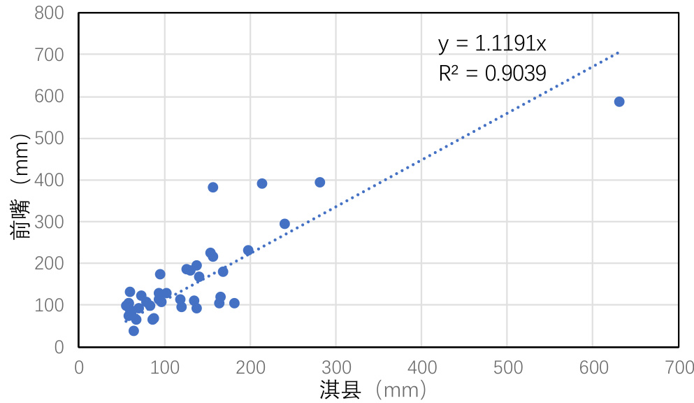  
图 3.5-2  前嘴雨量站与淇县气象站最大 3 日暴雨相关关系图  

将插补延长后的前嘴雨量站最大 3 日雨量采用 P-Ⅲ频率曲线进行适线,适线图见图 3.5-3,成果见表 3.5-1。  

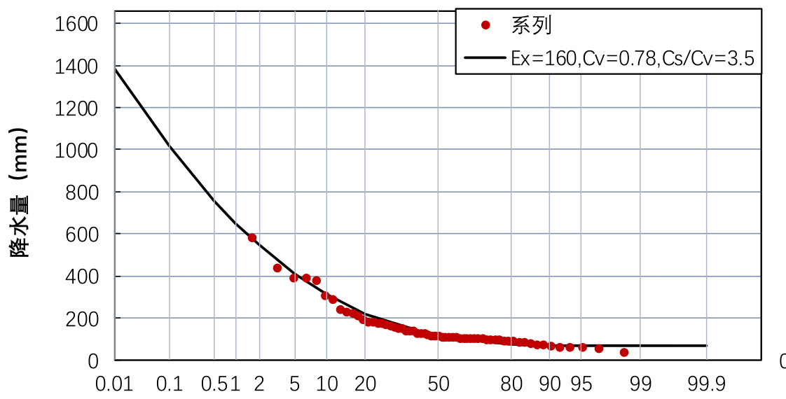  
图 3.5-3  夺丰水库最大 3 日暴雨频率适线图  

表 3.5-1  夺丰水库最大 3 日设计暴雨  

<html><body><table><tr><td rowspan="2">类型</td><td colspan="3">统计参数</td><td rowspan="2">各频率设计暴雨 j（mm）</td><td colspan="6"></td></tr><tr><td>均值</td><td>Cv</td><td>Cs/Cv</td><td>0.10%</td><td>0.50%</td><td>1%</td><td>2%</td><td>5%</td><td>10%</td></tr><tr><td>最大3日</td><td>160</td><td>0.78</td><td>3.5</td><td>1012</td><td>759</td><td></td><td>652</td><td>547</td><td>411</td><td>312</td></tr></table></body></html>  

(2)短历时设计暴雨  

统计前嘴雨量站最大 1h、2h、6h、24h 降水量。短历时降雨缺测年份根据本站同期最大 1 日降水量建立相关关系进行插补延长,得到前嘴雨量站 1962\~2023年短历时降雨系列。相关关系见图 3.5-4。  

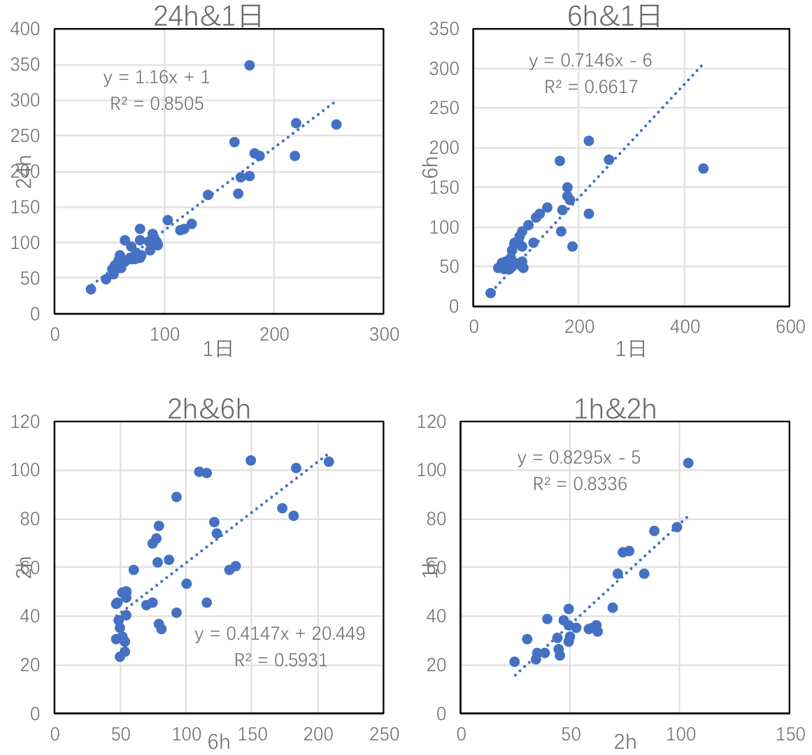  
图 3.5-4 前嘴站短历时降水量相关图 横纵坐标单位  

将插补延长后的短历时雨量采用 P-Ⅲ频率曲线进行适线,见图 3.5-5 至图3.5-7,成果见表 3.5-2。  

将夺丰水库短历时设计暴雨成果与 2003 年《河南省淇县夺丰水库除险加固工程初步设计报告》(以下简称《夺丰初设 03》)成果以及 2005 年河南省暴雨图集(以下简称《05 图集》)查图成果对比,见表 3.5-2。  

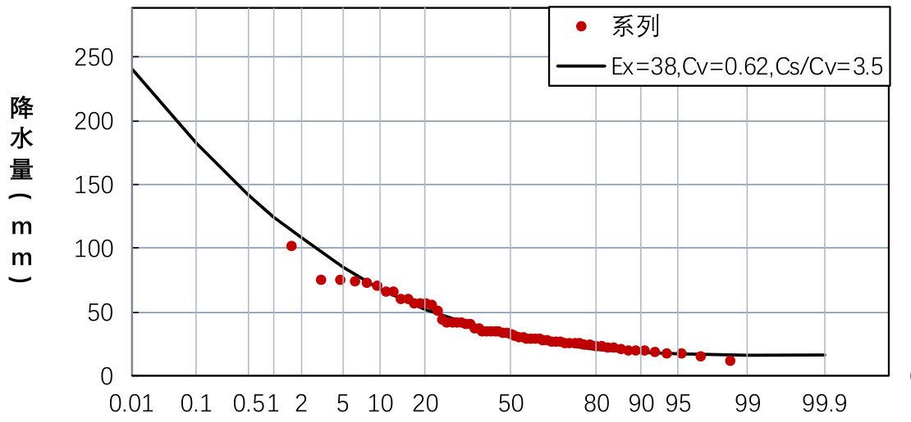  
图 3.5-5  前嘴站最大 1h 暴雨频率适线图  

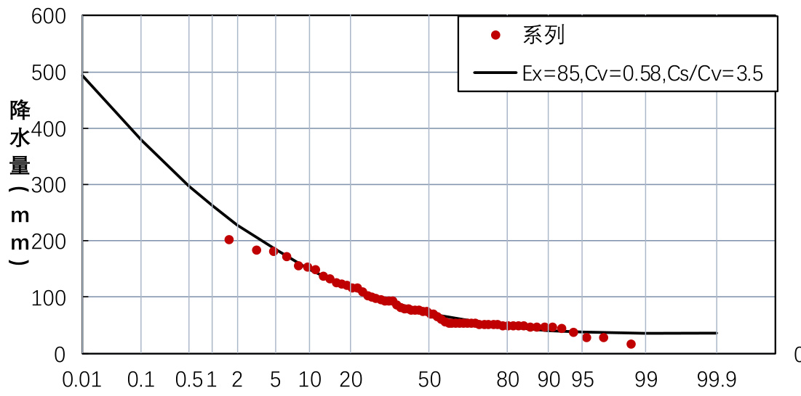  
图 3.5-6  前嘴站最大 6h 暴雨频率适线图  

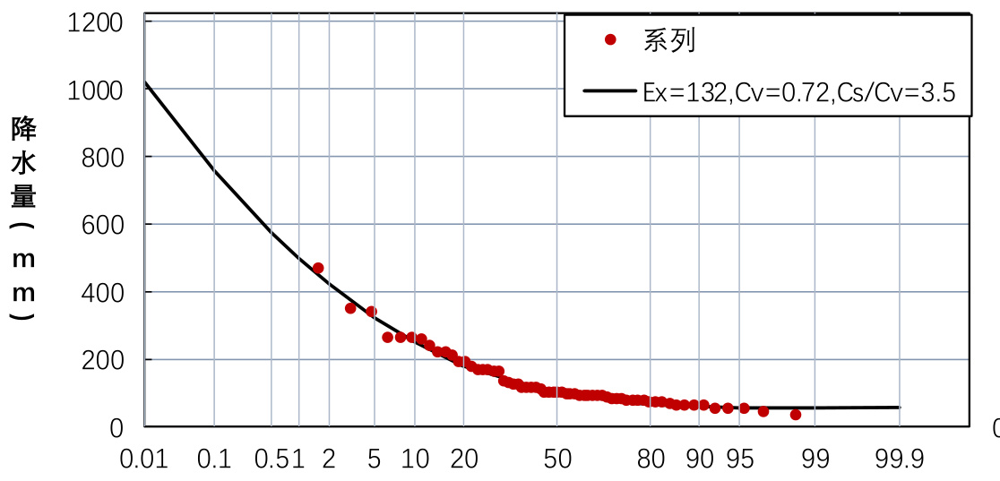  
图 3.5-7 前嘴站最大 24h 暴雨频率适线图  

表 3.5-2  夺丰水库流域短历时设计面暴雨成果对比表  

<html><body><table><tr><td rowspan="2">类型</td><td rowspan="2">时 段</td><td rowspan="2">点面折 减系数</td><td colspan="3">参数</td><td colspan="8">各频率 （%） 设计面暴雨 (mm）</td></tr><tr><td>Ex</td><td>Cv</td><td>Cs/Cv</td><td>0.10%</td><td>0.33%</td><td>0.50%</td><td>1%</td><td>2%</td><td>5%</td><td>10%</td><td>20%</td></tr><tr><td rowspan="3">《夺丰初设 03》</td><td>1h</td><td>0.93</td><td>45</td><td>0.55</td><td>3.5</td><td>176</td><td>149</td><td>139</td><td>124</td><td>108</td><td>87.7</td><td>72.0</td><td>56.2</td></tr><tr><td>6h</td><td>0.955</td><td>86</td><td>0.55</td><td>3.5</td><td>345</td><td>292</td><td>274</td><td>243</td><td>213</td><td>172</td><td>41</td><td>110</td></tr><tr><td>24h</td><td>0.97</td><td>124</td><td>0.65</td><td>3.5</td><td>610</td><td>508</td><td>472</td><td>413</td><td>3</td><td></td><td>220</td><td>64</td></tr><tr><td rowspan="3">《05图集》查 图值</td><td>1h</td><td>0.93</td><td>46</td><td>0.54</td><td>3.5</td><td>176</td><td>149</td><td>140</td><td>125</td><td>I 109</td><td>88.7</td><td>3</td><td>57.3</td></tr><tr><td>6h</td><td>0.955</td><td>83</td><td>0.65</td><td>3.5</td><td>402</td><td>335</td><td>311</td><td>272</td><td>233</td><td>183</td><td>145</td><td>108</td></tr><tr><td>24h</td><td>0.97</td><td>127</td><td>0.65</td><td>3.5</td><td>625</td><td>520</td><td>483</td><td>423</td><td>363</td><td>284</td><td>225</td><td>168</td></tr><tr><td rowspan="3">本次计算值 (推荐)</td><td>1h</td><td>/</td><td>38</td><td>0.62</td><td>3.5</td><td>182</td><td>153</td><td>142</td><td>125</td><td>108</td><td>85.2</td><td>68.3</td><td>51.7</td></tr><tr><td>6h</td><td>/</td><td>85</td><td>0.58</td><td>3.5</td><td>378</td><td>319</td><td>298</td><td>263</td><td>229</td><td>183</td><td>149</td><td>115</td></tr><tr><td>24h</td><td>/</td><td>132</td><td>0.72</td><td>3.5</td><td>757</td><td>622</td><td>575</td><td>498</td><td>422</td><td>323</td><td>251</td><td>181</td></tr></table></body></html>  

备注:《夺丰初设 03》与《05 图集》查图值设计参数为查图法点雨量参数,按点面折减系数计算后为设计面暴雨量;本次计算未进行点面折减。  

由表 3.5-2 可以看出,本次计算最大 1h 和 6h 设计暴雨三种方法结果相差不大。最大 24h 设计暴雨较《夺丰初设 03》以及《05 图集》设计值均偏大。主要是因为《夺丰初设 03》报告计算设计暴雨时采用的是《84 图集》等值线图查图法,与《05 图集》一样资料系列较短。本次采用雨量站实测暴雨资料计算,年份为 1965-2022 年,资料系列更长。由于 2021 年发生了有观测数据以来最大暴雨,最大 24h 雨量达 $438.2\mathrm{mm}$ ,明显大于排第二位的 $293.2\mathrm{mm}$ (2000 年),而《夺丰初设 03》采用的设计暴雨是依据《84 图集》查算得到,并未包含近年来的大暴雨,因此本次设计暴雨成果较以往明显增大。综合分析认为,从安全角度考虑推荐采用本次计算的设计暴雨成果。  

(3)暴雨时程分配  

前嘴雨量站 1963 年 8 月“63.8”洪水 3 日实测暴雨为 $309.6\mathrm{mm}$ ,相当于 10年一遇;且暴雨较为集中,对工程较为不利。本次根据前嘴雨量站 1963 年 8 月“63.8”洪水同期暴雨过程计算夺丰水库坝址 3 日设计暴雨过程。其中,最大 24h设计暴雨时程根据《84 图集》推荐的暴雨洪水计算方法分配,见图 3.5-6。其余48h 设计暴雨量为各频率最大 3 日设计暴雨减去最大 24h 设计暴雨值,时程分配采用前嘴雨量站“63.8”实测暴雨过程进行雨量同倍比缩放计算。  

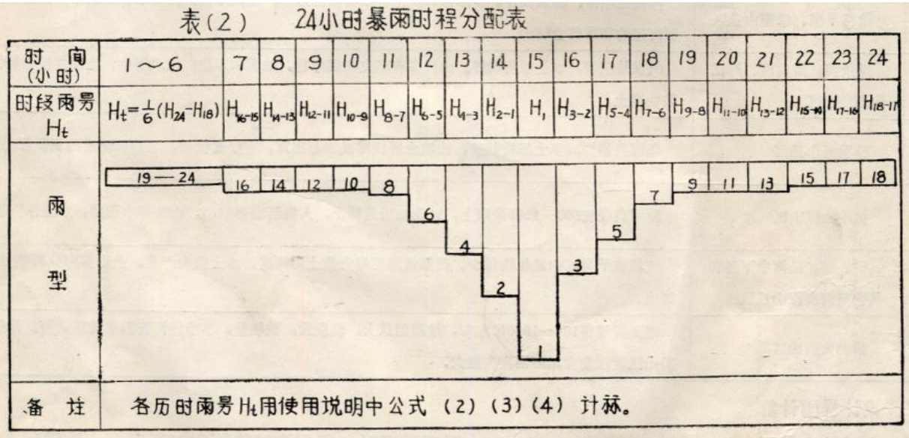  
图 3.5-6 《84 图集》24h 设计暴雨时程分配示意图  

# 3.5.3 设计洪水  

汇流计算采用推理公式法计算洪峰流量,计算公式如下:  

$$
Q_{m}=0.278\psi\frac{S}{\tau^{n}}F
$$  

$$
\psi=1-\frac{\mu}{S}\tau^{n}
$$  

$$
\tau=0.278\frac{L}{m J^{1/3}Q^{1/4}}
$$  

式中: $Q_{m}$ — 设计洪峰流量( $(\mathrm{m}^{3}/\mathrm{s})$ );  

$\psi$ 洪峰径流系数;  
$\tau\cdot$ 洪峰汇流历时(h);  
$F$ — 流域面积( $\mathrm{km}^{2}.$ );  
$L$ 干流长度(km);  
𝐿的平均坡度;  
𝑆— 最大 1h 雨量平均强度( $\mathrm{mm/h)}$ );  
$\mu$ — 平均入渗率( $\mathrm{mm/h)}$ );  
𝑚— 汇流参数。  

根据《84 年图集》,设计流域思德河流域位于豫北太行山Ⅵ区,平均入渗率为 $5{\sim}8\mathrm{mm/h}$ ,本次计算中考虑到 1963 年、2021 年等大水年主雨过程来临前期均已经有一定的前期雨量,土壤比较湿润,并考虑安全因素,平均入渗率取 $5\mathrm{{mm}/h}$ ;在逐小时设计暴雨过程基础上,按平均入渗率 $5\mathrm{{mm}/h}$ 扣除后(不足 $5\mathrm{{mm}/h}$ 全部扣除)得到逐小时设计净雨过程,统计本次计算得到的不同频率 24h 净雨深,与《84 图集》中山丘区次降雨径流关系 $\mathrm{P+Pa{\sim}R}$ (Ⅵ)线查算得到的净雨深基本一致。汇流参数 $\mathrm{m}$ 值可用《84 图集》中 $\uptheta{\sim}\mathrm{m}$ 相关图查得。  

根据各流域最大 3 日设计暴雨过程,采用线性水库洪水汇流模型,计算坝址各频率设计洪水过程线。该汇流模型为采用净雨过程以及洪水洪峰流量计算的水量平衡模型,由各频率设计洪峰流量及逐小时净雨过程推求坝址设计洪水过程线。统计各流域设计洪水时段洪量,将夺丰水库流域洪峰洪量成果与《夺丰初设 03》已有成果对比,见表 3.5-3。  

表 3.5-3  夺丰水库设计洪水成果表  

<html><body><table><tr><td rowspan="2">项目</td><td rowspan="2">项目</td><td colspan="8">各频率设计值</td></tr><tr><td>0.10%</td><td>0.33%</td><td>0.50%</td><td>1%</td><td>2%</td><td>5%</td><td>10%</td><td>20%</td></tr><tr><td rowspan="2">《夺丰初设 03》</td><td>洪峰流量（m3/s)</td><td>2543</td><td></td><td></td><td>1659</td><td></td><td></td><td></td><td></td></tr><tr><td>最大24h洪量（万m3）</td><td>2833</td><td></td><td></td><td>1695</td><td></td><td></td><td></td><td></td></tr><tr><td rowspan="3">本次计算 (推荐)</td><td>洪峰流量（m3/s)</td><td>2547</td><td>2066</td><td>1924</td><td>1601</td><td>1341</td><td>1001</td><td>757</td><td>524</td></tr><tr><td>最大24h洪量（万m3）</td><td>3628</td><td>2862</td><td>2596</td><td>2156</td><td>1723</td><td>1163</td><td>780</td><td>497</td></tr><tr><td>最大3日洪量（万m3)</td><td>4358</td><td>3354</td><td>3010</td><td>2446</td><td>1917</td><td>1272</td><td>833</td><td>507</td></tr></table></body></html>  

由表 3.5-3 可以看出,本次计算的 $0.1\%$ 与 $1\%$ 频率下设计洪峰成果与《夺丰初设 03》相差不大,最大 24h 洪量增大较多。主要原因为本次计算采用的设计暴雨较原设计值增大,综合考虑资料系列长短及工程安全性,推荐设计洪水统一采用本次计算成果。夺丰水库洪水过程成果见表 3.5-4。  

表 3.5-4  夺丰水库设计洪水过程表  

<html><body><table><tr><td rowspan="2">历时 (h)</td><td colspan="8">各频率设计洪水过程（m3/s）</td></tr><tr><td>0.10%</td><td>0.33%</td><td>0.50%</td><td>1%</td><td>2%</td><td>5%</td><td>10%</td><td>20%</td></tr><tr><td>1</td><td>0.299</td><td>0.174</td><td>0.127</td><td>0.049</td><td>0.018</td><td>0.018</td><td>0.018</td><td>0.005</td></tr><tr><td>2</td><td>0.150</td><td>0.087</td><td>0.063</td><td>0.025</td><td>0.009</td><td>0.009</td><td>0.009</td><td>0.003</td></tr><tr><td>3</td><td>0.075</td><td>0.044</td><td>0.032</td><td>0.012</td><td>0.004</td><td>0.004</td><td>0.004</td><td>0.001</td></tr><tr><td>4</td><td>0.037</td><td>0.022</td><td>0.016</td><td>0.006</td><td>0.002</td><td>0.002</td><td>0.002</td><td>0.001</td></tr><tr><td>5</td><td>46.7</td><td>21.1</td><td>15.6</td><td>6.50</td><td>0.001</td><td>0.001</td><td>0.001</td><td>0.000</td></tr><tr><td>6</td><td>66.4</td><td>33.7</td><td>25.2</td><td>11.3</td><td>0.001</td><td>0.001</td><td>0.001</td><td>0.000</td></tr><tr><td>7</td><td>33.9</td><td>17.6</td><td>12.6</td><td>5.65</td><td>0.000</td><td>0.000</td><td>0.000</td><td>0.000</td></tr><tr><td>8</td><td>26.9</td><td>9.51</td><td>6.30</td><td>2.82</td><td>0.000</td><td>0.000</td><td>0.000</td><td>0.000</td></tr><tr><td>6</td><td>13.2</td><td>4.76</td><td>3.15</td><td>1.41</td><td>0.000</td><td>0.000</td><td>0.000</td><td>0.000</td></tr><tr><td>10</td><td>6.58</td><td>2.38</td><td>1.57</td><td>0.706</td><td>0.000</td><td>0.000</td><td>0.000</td><td>0.000</td></tr><tr><td>11</td><td>3.28</td><td>1.19</td><td>0.787</td><td>0.353</td><td>0.000</td><td>0.000</td><td>0.000</td><td>0.000</td></tr></table></body></html>  

<html><body><table><tr><td rowspan="2">历时 (h)</td><td colspan="8">各频率设计洪水过程（m3/s）</td></tr><tr><td>0.10%</td><td>0.33%</td><td>0.50%</td><td>1%</td><td>2%</td><td>5%</td><td>10%</td><td>20%</td></tr><tr><td>12</td><td>1.64</td><td>0.594</td><td>0.394</td><td>0.177</td><td>0.000</td><td>0.000</td><td>0.000</td><td>0.000</td></tr><tr><td>13</td><td>0.820</td><td>0.297</td><td>0.197</td><td>0.088</td><td>0.000</td><td>0.000</td><td>0.000</td><td>0.000</td></tr><tr><td>14</td><td>0.410</td><td>0.149</td><td>0.098</td><td>0.044</td><td>0.000</td><td>0.000</td><td>0.000</td><td>0.000</td></tr><tr><td>15</td><td>456</td><td>332</td><td>294</td><td>219</td><td>159</td><td>86.8</td><td>40.5</td><td>7.13</td></tr><tr><td>16</td><td>536</td><td>401</td><td>357</td><td>279</td><td>207</td><td>119</td><td>58.8</td><td>11.1</td></tr><tr><td>17</td><td>129</td><td>99.5</td><td>86.4</td><td>77.2</td><td>61.4</td><td>42.7</td><td>25.6</td><td>5.54</td></tr><tr><td>18</td><td>76.0</td><td>48.0</td><td>38.6</td><td>28.5</td><td>20.0</td><td>16.4</td><td>11.6</td><td>2.77</td></tr><tr><td>19</td><td>27.1</td><td>20.3</td><td>16.1</td><td>10.8</td><td>7.29</td><td>6.70</td><td>5.36</td><td>1.38</td></tr><tr><td>20</td><td>11.9</td><td>9.51</td><td>7.47</td><td>4.59</td><td>2.96</td><td>2.91</td><td>2.54</td><td>0.692</td></tr><tr><td>21</td><td>5.73</td><td>4.64</td><td>3.64</td><td>2.11</td><td>1.32</td><td>1.31</td><td>1.22</td><td>0.346</td></tr><tr><td>22</td><td>2.83</td><td>2.30</td><td>1.80</td><td>1.01</td><td>0.621</td><td>0.609</td><td>0.596</td><td>0.173</td></tr><tr><td>23</td><td>1.41</td><td>1.15</td><td>0.897</td><td>0.498</td><td>0.299</td><td>0.293</td><td>0.293</td><td>0.087</td></tr><tr><td>24</td><td>0.705</td><td>0.573</td><td>0.448</td><td>0.247</td><td>0.146</td><td>0.144</td><td>0.144</td><td>0.043</td></tr><tr><td>25</td><td>0.352</td><td>0.286</td><td>0.224</td><td>0.123</td><td>0.072</td><td>0.072</td><td>0.071</td><td>0.022</td></tr><tr><td>26</td><td>0.176</td><td>0.143</td><td>0.112</td><td>0.061</td><td>0.036</td><td>0.036</td><td>0.035</td><td>0.011</td></tr><tr><td>27</td><td>0.088</td><td>0.072</td><td>0.056</td><td>0.031</td><td>0.018</td><td>0.018</td><td>0.018</td><td>0.005</td></tr><tr><td>28</td><td>0.044</td><td>0.036</td><td>0.028</td><td>0.015</td><td>0.009</td><td>0.009</td><td>0.009</td><td>0.003</td></tr><tr><td>29</td><td>0.022</td><td>0.018</td><td>0.014</td><td>0.008</td><td>0.004</td><td>0.004</td><td>0.004</td><td>0.001</td></tr><tr><td>30</td><td>0.011</td><td>0.009</td><td>0.007</td><td>0.004</td><td>0.002</td><td>0.002</td><td>0.002</td><td>0.001</td></tr><tr><td>31</td><td>0.006</td><td>0.004</td><td>0.003</td><td>0.002</td><td>0.001</td><td>0.001</td><td>0.001</td><td>0.000</td></tr><tr><td>32</td><td>0.003</td><td>0.002</td><td>0.002</td><td>0.001</td><td>0.001</td><td>0.001</td><td>0.001</td><td>0.000</td></tr><tr><td>33</td><td>29.0</td><td>13.0</td><td>8.14</td><td>0.288</td><td>0.000</td><td>0.000</td><td>0.000</td><td>0.000</td></tr><tr><td>34</td><td>41.8</td><td>19.4</td><td>12.2</td><td>0.432</td><td>0.000</td><td>0.000</td><td>0.000</td><td>0.000</td></tr><tr><td>35</td><td>91.9</td><td>49.1</td><td>34.5</td><td>16.0</td><td>5.17</td><td>0.000</td><td>0.000</td><td>0.000</td></tr><tr><td>36</td><td>106</td><td>62.3</td><td>47.3</td><td>25.4</td><td>9.02</td><td>0.000</td><td>0.000</td><td>0.000</td></tr><tr><td>37</td><td>69.2</td><td>41.3</td><td>32.8</td><td>16.1</td><td>4.51</td><td>0.000</td><td>0.000</td><td>0.000</td></tr><tr><td>38</td><td>68.8</td><td>38.5</td><td>29.7</td><td>13.0</td><td>2.25</td><td>0.000</td><td>0.000</td><td>0.000</td></tr><tr><td>39</td><td>26.8</td><td>19.0</td><td>14.7</td><td>6.49</td><td>1.13</td><td>0.000</td><td>0.000</td><td>0.000</td></tr><tr><td>40</td><td>12.3</td><td>9.48</td><td>7.36</td><td>3.25</td><td>0.564</td><td>0.000</td><td>0.000</td><td>0.000</td></tr><tr><td>41</td><td>5.98</td><td>4.73</td><td>3.68</td><td>1.62</td><td>0.282</td><td>0.000</td><td>0.000</td><td>0.000</td></tr><tr><td>42</td><td>2.97</td><td>2.36</td><td>1.84</td><td>0.812</td><td>0.141</td><td>0.000</td><td>0.000</td><td>0.000</td></tr><tr><td>43</td><td>1.48</td><td>1.18</td><td>0.919</td><td>0.406</td><td>0.070</td><td>0.000</td><td>0.000</td><td>0.000</td></tr><tr><td>44</td><td>0.740</td><td>0.591</td><td>0.459</td><td>0.203</td><td>0.035</td><td>0.000</td><td>0.000</td><td>0.000</td></tr><tr><td>45</td><td>0.370</td><td>0.296</td><td>0.230</td><td>0.101</td><td>0.018</td><td>0.000</td><td>0.000</td><td>0.000</td></tr><tr><td>46</td><td>0.185</td><td>0.148</td><td>0.115</td><td>0.051</td><td>0.009</td><td>0.000</td><td>0.000</td><td>0.000</td></tr><tr><td>47</td><td>0.092</td><td>0.074</td><td>0.057</td><td>0.025</td><td>0.004</td><td>0.000</td><td>0.000</td><td>0.000</td></tr><tr><td>48</td><td>0.046</td><td>0.037</td><td>0.029</td><td>0.013</td><td>0.002</td><td>0.000</td><td>0.000</td><td>0.000</td></tr><tr><td>49</td><td>146</td><td>95.8</td><td>80.0</td><td>52.3</td><td>28.7</td><td>7.80</td><td>0.000</td><td>0.000</td></tr><tr><td>50</td><td>176</td><td>120</td><td>102</td><td>70.8</td><td>41.8</td><td>11.7</td><td>0.000</td><td>0.000</td></tr><tr><td>51</td><td>184</td><td>129</td><td>110</td><td>78.3</td><td>48.1</td><td>13.7</td><td>0.000</td><td>0.000</td></tr><tr><td>52</td><td>188</td><td>132</td><td>113</td><td>81.6</td><td>51.2</td><td>14.6</td><td>0.000</td><td>0.000</td></tr></table></body></html>  

<html><body><table><tr><td rowspan="2">历时（h)</td><td colspan="8">各频率设计洪水过程（m3/s）</td></tr><tr><td>0.10%</td><td>0.33%</td><td>0.50%</td><td>1%</td><td>2%</td><td>5%</td><td>10%</td><td>20%</td></tr><tr><td>53</td><td>189</td><td>134</td><td>115</td><td>83.2</td><td>52.7</td><td>15.1</td><td>0.000</td><td>0.000</td></tr><tr><td>54</td><td>190</td><td>134</td><td>115</td><td>84.0</td><td>53.5</td><td>15.4</td><td>0.000</td><td>0.000</td></tr><tr><td>55</td><td>228</td><td>164</td><td>143</td><td>107</td><td>72.1</td><td>24.7</td><td>1.12</td><td>0.000</td></tr><tr><td>56</td><td>253</td><td>185</td><td>162</td><td>123</td><td>86.4</td><td>34.3</td><td>5.41</td><td>0.000</td></tr><tr><td>57</td><td>280</td><td>208</td><td>184</td><td>142</td><td>102</td><td>46.9</td><td>12.3</td><td>0.000</td></tr><tr><td>58</td><td>316</td><td>237</td><td>211</td><td>165</td><td>122</td><td>63.5</td><td>22.0</td><td>0.000</td></tr><tr><td>59</td><td>364</td><td>277</td><td>248</td><td>197</td><td>149</td><td>85.2</td><td>36.1</td><td>3.18</td></tr><tr><td>60</td><td>355</td><td>287</td><td>263</td><td>221</td><td>180</td><td>124</td><td>78.0</td><td>35.1</td></tr><tr><td>61</td><td>468</td><td>382</td><td>353</td><td>299</td><td>249</td><td>181</td><td>129</td><td>75.4</td></tr><tr><td>62</td><td>814</td><td>666</td><td>618</td><td>523</td><td>440</td><td>329</td><td>246</td><td>163</td></tr><tr><td>63</td><td>2547</td><td>2066</td><td>1920</td><td>1601</td><td>1342</td><td>1001</td><td>757</td><td>524</td></tr><tr><td>64</td><td>897</td><td>785</td><td>728</td><td>685</td><td>601</td><td>486</td><td>390</td><td>288</td></tr><tr><td>65</td><td>480</td><td>415</td><td>383</td><td>363</td><td>320</td><td>263</td><td>213</td><td>160</td></tr><tr><td>66</td><td>417</td><td>332</td><td>300</td><td>261</td><td>214</td><td>156</td><td>113</td><td>74.1</td></tr><tr><td>67</td><td>355</td><td>275</td><td>246</td><td>205</td><td>160</td><td>105</td><td>65.6</td><td>32.0</td></tr><tr><td>68</td><td>310</td><td>236</td><td>209</td><td>170</td><td>128</td><td>75.9</td><td>41.7</td><td>14.1</td></tr><tr><td>69</td><td>276</td><td>207</td><td>183</td><td>145</td><td>106</td><td>57.4</td><td>26.7</td><td>6.30</td></tr><tr><td>70</td><td>250</td><td>185</td><td>162</td><td>126</td><td>90.2</td><td>46.2</td><td>15.8</td><td>2.87</td></tr><tr><td>71</td><td>228</td><td>167</td><td>145</td><td>112</td><td>77.5</td><td>37.5</td><td>7.79</td><td>1.33</td></tr><tr><td>72</td><td>218</td><td>158</td><td>137</td><td>104</td><td>70.6</td><td>31.7</td><td>3.85</td><td>0.622</td></tr><tr><td>73</td><td>48.8</td><td>43.4</td><td>39.7</td><td>36.8</td><td>29.7</td><td>15.8</td><td>1.91</td><td>0.295</td></tr><tr><td>74</td><td>15.6</td><td>15.4</td><td>15.0</td><td>14.8</td><td>13.5</td><td>7.88</td><td>0.949</td><td>0.142</td></tr><tr><td>75</td><td>6.69</td><td>6.61</td><td>6.54</td><td>6.50</td><td>6.38</td><td>3.93</td><td>0.473</td><td>0.068</td></tr><tr><td>76</td><td>3.16</td><td>3.11</td><td>3.10</td><td>3.09</td><td>3.08</td><td>1.97</td><td>0.236</td><td>0.033</td></tr><tr><td>77</td><td>1.54</td><td>1.52</td><td>1.53</td><td>1.52</td><td>1.51</td><td>0.982</td><td>0.118</td><td>0.016</td></tr><tr><td>78</td><td>0.760</td><td>0.755</td><td>0.757</td><td>0.754</td><td>0.753</td><td>0.491</td><td>0.059</td><td>0.008</td></tr><tr><td>79</td><td>0.378</td><td>0.376</td><td>0.377</td><td>0.376</td><td>0.376</td><td>0.246</td><td>0.029</td><td>0.004</td></tr><tr><td>80</td><td>0.188</td><td>0.188</td><td>0.188</td><td>0.188</td><td>0.188</td><td>0.123</td><td>0.015</td><td>0.002</td></tr><tr><td>81</td><td>0.094</td><td>0.094</td><td>0.094</td><td>0.094</td><td>0.094</td><td>0.061</td><td>0.007</td><td>0.001</td></tr><tr><td>82</td><td>0.047</td><td>0.047</td><td>0.047</td><td>0.047</td><td>0.047</td><td>0.031</td><td>0.004</td><td>0</td></tr><tr><td>83</td><td>0.023</td><td>0.023</td><td>0.023</td><td>0.023</td><td>0.023</td><td>0.015</td><td>0.002</td><td>0</td></tr><tr><td>84</td><td>0.012</td><td>0.012</td><td>0.012</td><td>0.012</td><td>0.012</td><td>0.008</td><td>0.001</td><td>0</td></tr><tr><td>85</td><td>0.006</td><td>0.006</td><td>0.006</td><td>0.006</td><td>0.006</td><td>0.004</td><td>0.000</td><td>0</td></tr><tr><td>86</td><td>0.003</td><td>0.003</td><td>0.003</td><td>0.003</td><td>0.003</td><td>0</td><td>0</td><td>0</td></tr><tr><td>87</td><td>0.001</td><td>0.001</td><td>0.001</td><td>0.001</td><td>0.001</td><td>0</td><td>0</td><td>0</td></tr><tr><td>88</td><td>0</td><td>0.001</td><td>0</td><td>0</td><td>0</td><td>0</td><td>0</td><td>0</td></tr><tr><td>89</td><td>0</td><td>0</td><td>0</td><td>0</td><td>0</td><td>0</td><td>0</td><td>0</td></tr><tr><td>90</td><td>0</td><td>0</td><td>0</td><td>0</td><td>0</td><td>0</td><td>0</td><td>0</td></tr></table></body></html>  

# 3.5.4 非汛期洪水  

夺丰水库施工期同样采用暴雨法推求设计洪水。根据流域暴雨洪水特性,非汛期为 10 月至次年 5 月。统计前嘴雨量站历年非汛期最大 1 日暴雨量。考虑到非汛期产汇流参数相比汛期要小,本次直接采用最大 1 日暴雨量作为最大 24h暴雨量。采用本次计算的非汛期最大 24h 设计暴雨与实测全年最大 24h 设计暴雨的比值缩放得夺丰水库流域非汛期最大 1h 和最大6h 设计暴雨,成果见表3.5-5。  

表 3.5-5  夺丰水库非汛期设计暴雨成果表  

<html><body><table><tr><td rowspan="2">项目</td><td rowspan="2">历时</td><td colspan="3">参数</td><td colspan="3">各频率设计暴雨（mm）</td></tr><tr><td>均值</td><td>Cv</td><td>Cs/Cv</td><td>5%</td><td>10%</td><td>20%</td></tr><tr><td rowspan="3">实测计算</td><td>1h</td><td></td><td></td><td></td><td>24.8</td><td>20.7</td><td>16.4</td></tr><tr><td>6h</td><td></td><td></td><td></td><td>53.4</td><td>45.1</td><td>36.5</td></tr><tr><td>24h</td><td>41</td><td>0.65</td><td>3.0</td><td>94.1</td><td>75.8</td><td>57.5</td></tr><tr><td rowspan="3">查图全年</td><td>1h</td><td>38</td><td>0.62</td><td>3.5</td><td>85.2</td><td>68.3</td><td>51.7</td></tr><tr><td>6h</td><td>85</td><td>0.58</td><td>3.5</td><td>183</td><td>149</td><td>115</td></tr><tr><td>24h</td><td>132</td><td>0.72</td><td>3.5</td><td>323</td><td>251</td><td>181</td></tr></table></body></html>  

采用推理公式法计算夺丰水库非汛期设计洪水,成果见表 3.5-6。  

# 表 3.5-6  夺丰水库非汛期设计洪水成果表  

<html><body><table><tr><td>各频率</td><td>5%</td><td>10%</td><td>20%</td></tr><tr><td>洪峰（m3/s)</td><td>221</td><td>154</td><td>94</td></tr></table></body></html>  

# 3.6 排涝模数及流量  

平原区设计涝水采用豫北平原地区排水模数公式计算。思德河出山口至平原区之间存在少量山区向平原过度的丘陵区,根据地面坡度、河床比降情况分析该段河道具有平原坡水区特性,故本次统一纳入平原区考虑,在选取涝水计算参数时为安全起见取上限值。  

# 3.6.1 设计暴雨  

设计暴雨采用思德河下游平原区的淇县气象站实测最大 1 日暴雨进行 P-Ⅲ频率适线计算,频率适线图见图 3.6-1,设计暴雨成果见表 3.6-1。  

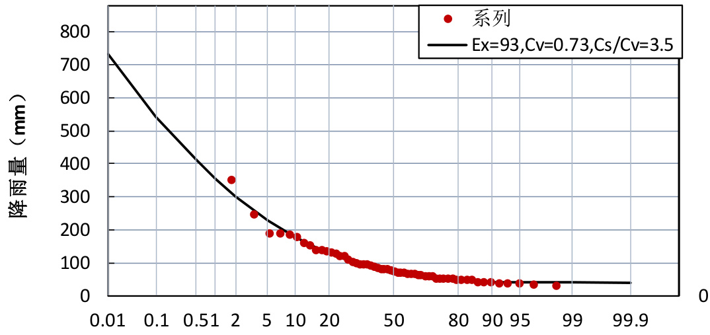  
图 3.6-1  思德河下游平原区最大 1 日设计暴雨频率适线图  

表 3.6-1  思德河下游平原区最大 1 日设计暴雨成果表  

<html><body><table><tr><td colspan="3">参数</td><td colspan="6">各频率设计暴雨（mm)</td></tr><tr><td>均值</td><td>Cv</td><td>CsCv</td><td>0.33%</td><td>1%</td><td>2%</td><td>5%</td><td>10%</td><td>20%</td></tr><tr><td>93</td><td>0.73</td><td>3.5</td><td>445</td><td>356</td><td>301</td><td>230</td><td>177</td><td>127</td></tr></table></body></html>  

# 3.6.2 设计涝水  

经 1:50000 地形图测量,本次需求计算的各断面区间面积见表 3.6-2。根据《84 图集》中短历时暴雨时面深关系图(Ⅵ区)查算暴雨点面折减系数。设计暴雨经点面折减后,查《河南省水利工程水文计算常用图集(73 图集)》(以下简称《73 图集》)中的平原区 $\mathrm{P+Pa{\sim}R}$ 相关图计算设计净雨。本研究区域均位于《73 图集》平原分区中Ⅶ分区, $\mathrm{Pa}$ 为前期影响雨量,5 年一遇取 $45\mathrm{mm}$ ,10\~20年一遇取 $55\mathrm{mm}$ ,100 年一遇取 $65\mathrm{mm}$ ,300 年一遇取 $70\mathrm{mm}$ 。设计净雨成果见表3.6-2。  

表 3.6-2  思德河下游平原区各区间最大 1 日设计净雨成果表  

<html><body><table><tr><td rowspan="2">区间</td><td rowspan="2">面积（km²)</td><td colspan="6">各频率净雨量（mm)</td></tr><tr><td>0.33%</td><td>1%</td><td>2%</td><td>5%</td><td>10%</td><td>20%</td></tr><tr><td>水库至范辉高速北区间</td><td>33.7</td><td>332</td><td>247</td><td>194</td><td>127</td><td>85.4</td><td>44.2</td></tr><tr><td>水库至南水北调总干渠区间</td><td>35.8</td><td>332</td><td>247</td><td>194</td><td>127</td><td>85.4</td><td>44.2</td></tr><tr><td>水库至G107区间（入城区）</td><td>41.4</td><td>332</td><td>247</td><td>194</td><td>127</td><td>85.4</td><td>44.2</td></tr><tr><td>水库至六盘山路桥区间</td><td>55.9</td><td>322</td><td>240</td><td>187</td><td>122</td><td>82.3</td><td>42.3</td></tr><tr><td>水库至G4区间（出城区)</td><td>73.8</td><td>302</td><td>224</td><td>174</td><td>113</td><td>75.8</td><td>38.3</td></tr><tr><td>水库至杨吴排水沟口上游区间</td><td>95.8</td><td>287</td><td>211</td><td>163</td><td>105</td><td>70.9</td><td>35.3</td></tr><tr><td>水库至良相坡入口区间</td><td>97.3</td><td>286</td><td>211</td><td>163</td><td>105</td><td>70.6</td><td>35.1</td></tr><tr><td>水库至赵家渠汇入口上游区间</td><td>106</td><td>283</td><td>208</td><td>161</td><td>104</td><td>69.6</td><td>34.5</td></tr></table></body></html>  

平原排涝模数法计算公式如下:  

式中:Qm— 洪峰流量( $\mathrm{m}3/\mathrm{s}$ );  

R— 设计净雨深( $\mathrm{mm}$ );  

F— 流域面积(km2);  

K——峰量关系综合系数,手册推荐范围为 0.035\~0.04,出于安全考虑本次选取 0.04;α——洪峰流量折算系数,“α”分不同标准采用:3\~5 年一遇暴雨取值 1.0;10 年一遇取 0.9;20 年一遇取 0.8;大于等于 50 年一遇取 0.7。  

各区域设计涝水成果见表 3.6-3。  

表 3.6-3  思德河下游平原区各区间设计涝水洪峰成果表  

<html><body><table><tr><td rowspan="2">断面</td><td rowspan="2">面积（km²)</td><td colspan="6">各频率洪峰流量（m3/s)</td></tr><tr><td>0.33%</td><td>1%</td><td>2%</td><td>5%</td><td>10%</td><td>20%</td></tr><tr><td>水库至范辉高速北区间</td><td>33.7</td><td>130</td><td>96.9</td><td>75.9</td><td>56.6</td><td>43.0</td><td>24.7</td></tr><tr><td>水库至南水北调总干渠区间</td><td>35.8</td><td>136</td><td>124</td><td>101</td><td>79.4</td><td>74.0</td><td>59.3</td></tr><tr><td>水库至G107区间（入城区）</td><td>41.4</td><td>152</td><td>138</td><td>113</td><td>88.6</td><td>82.6</td><td>66.1</td></tr><tr><td>水库至六盘山路桥区间</td><td>55.9</td><td>185</td><td>168</td><td>137</td><td>107</td><td>99.8</td><td>79.8</td></tr><tr><td>水库至G4区间（出城区）</td><td>73.8</td><td>213</td><td>194</td><td>158</td><td>123</td><td>113</td><td>90.7</td></tr><tr><td>水库至杨吴排水沟口上游区间</td><td>95.8</td><td>246</td><td>223</td><td>181</td><td>140</td><td>130</td><td>103</td></tr><tr><td>水库至良相坡入口区间</td><td>97.3</td><td>248</td><td>225</td><td>183</td><td>141</td><td>131</td><td>104</td></tr><tr><td>水库至赵家渠汇入口上游区间</td><td>106</td><td>262</td><td>238</td><td>193</td><td>149</td><td>138</td><td>110</td></tr></table></body></html>  

# 3.7 洪涝水地区组成  

# 3.7.1 夺丰水库洪水与平原区涝水地区组成  

思德河流域山区和平原同处于一个雨区,山区洪水源短流急,平原涝水治理标准较低,涝水排除时间拉长,山区洪水和平原涝水遭遇概率高。该区域的平原、山区暴雨同步性强,从 1963 年、2021 年最大 1 日暴雨、3 日暴雨的发生日期来看完全重叠;1963 年前嘴(山区)、淇县(平原)最大 1 日都发生在 8 月 8 日,3 日最大都在 6-8 日;2021 年前嘴(山区)、淇县(平原)最大 1 日都发生在 7月 21 日,最大 3 日都 7 月 20-22 日。综合考虑,本次计算山区洪水、平原涝水按同频率遭遇考虑,得到下游防洪断面的设计洪水成果。  

水库下泄洪水过程,叠加平原区同频率涝水后,得到各防洪断面的洪水组合成果见表 3.7-1。  

表 3.7-1 思德河夺丰水库以下主要控制断面组合洪水 单位: $\mathbf{m}^{3}/\mathbf{s}$   

<html><body><table><tr><td rowspan="2">断面</td><td rowspan="2">面积 (km²)</td><td colspan="6">各频率洪峰流量（m3/s)</td></tr><tr><td>0.33%</td><td>1%</td><td>2%</td><td>5%</td><td>10%</td><td>20%</td></tr><tr><td>夺丰水库下泄</td><td>57.7</td><td>1109</td><td>1077</td><td>380</td><td>380</td><td>60</td><td>60</td></tr><tr><td>白寺沟洪水</td><td>4.90</td><td>252</td><td>196</td><td>162</td><td>122</td><td>92.9</td><td>64.1</td></tr><tr><td>水库至范辉高速北区间</td><td>33.7</td><td>130</td><td>96.9</td><td>75.9</td><td>56.6</td><td>43.0</td><td>24.7</td></tr><tr><td>范辉高速合计</td><td>96.3</td><td>1491</td><td>1370</td><td>618</td><td>558</td><td>196</td><td>149</td></tr><tr><td>水库至南水北调总干渠区间</td><td>35.8</td><td>136</td><td>101</td><td>79.4</td><td>59.3</td><td>45.0</td><td>25.9</td></tr><tr><td>总干渠合计</td><td>98.4</td><td>1497</td><td>1375</td><td>621</td><td>561</td><td>198</td><td>150</td></tr><tr><td>水库至G107区间（入城区）</td><td>41.4</td><td></td><td></td><td>88.6</td><td>66.1</td><td>50.2</td><td>28.8</td></tr><tr><td>G107合计</td><td>104</td><td></td><td></td><td>630</td><td>568</td><td>203</td><td>153</td></tr><tr><td>水库至六盘山路桥区间</td><td>55.9</td><td></td><td></td><td>107</td><td>79.8</td><td>60.6</td><td>34.6</td></tr><tr><td>六盘山路合计</td><td>119</td><td></td><td></td><td>649</td><td>582</td><td>213</td><td>159</td></tr><tr><td>水库至G4区间（出城区）</td><td>73.8</td><td></td><td></td><td>123</td><td>90.7</td><td>68.7</td><td>38.6</td></tr><tr><td>G4区间合计</td><td>136</td><td></td><td></td><td>664</td><td>592</td><td>222</td><td>163</td></tr><tr><td>水库至杨吴排水沟口上游区间</td><td>95.8</td><td></td><td></td><td>140</td><td>103</td><td>78.2</td><td>43.2</td></tr><tr><td>杨吴排水沟合计</td><td>158</td><td></td><td></td><td>682</td><td>605</td><td>231</td><td>167</td></tr><tr><td>水库至良相坡入口区间</td><td>97.3</td><td></td><td></td><td>141</td><td>104</td><td>78.7</td><td>43.5</td></tr><tr><td>良相坡合计</td><td>160</td><td></td><td></td><td>683</td><td>606</td><td>232</td><td>168</td></tr><tr><td>水库至赵家渠汇入口上游区间</td><td>106</td><td></td><td></td><td>149</td><td>110</td><td>83.0</td><td>45.7</td></tr><tr><td>赵家渠汇入口上游合计</td><td>169</td><td></td><td></td><td>169</td><td>612</td><td>236</td><td>170</td></tr></table></body></html>

备注:思德河南水北调中线总干渠位置100 年一遇设计洪峰为 $1710\mathrm{m}^{3}/\mathrm{s}$ ,300 年一遇设计洪峰为 $2140\mathrm{m}^{3}/\mathrm{s}$ 。  

# 3.7.2 卫河淇门以上洪水地区组成  

(1)控制站基本情况  

解放前,卫河干流有合河、淇门两站,支流淇河有大赉店站,安阳河有安阳站等,但缺测年份多,资料不完整。解放后, $1952\sim1953$ 年恢复了合河、新村和淇门站,1950 年增设了楚旺(元村集)站等。卫河流域主要水文测站位置及资料年份见表 3.7-2。  

表 3.7-2  卫河流域主要水文站观测资料年份表  

<html><body><table><tr><td>河流</td><td>测站</td><td>控制面积 (km2)</td><td>资料年份</td></tr><tr><td>卫 河</td><td>合河</td><td rowspan="2">4203</td><td rowspan="2">1934～1936、1953～1991</td></tr><tr><td>共产主义渠</td><td>合河</td></tr><tr><td>卫 河</td><td>淇门</td><td rowspan="2">7671*</td><td rowspan="2">1934～1936、1952～1991</td></tr><tr><td>共产主义渠</td><td>刘庄</td></tr><tr><td>卫 河</td><td>楚旺(元村集)</td><td>9800*</td><td>1950~1991</td></tr><tr><td>淇 河</td><td>新村 (大赉店)</td><td>2080</td><td>1922～1926、1952～1991</td></tr><tr><td>淇 河</td><td>土圈(刁公岩)</td><td>1797</td><td>1954~1967</td></tr><tr><td>安阳河</td><td>安阳</td><td>1500</td><td>1923～1926、1933、1934、1953～1991</td></tr><tr><td>石门河</td><td>石门水库</td><td>132</td><td>1975~1991</td></tr><tr><td>浙 河</td><td>弓上水库</td><td>605</td><td>1960~1991</td></tr><tr><td>安阳河</td><td>小南海水库</td><td>850</td><td>1960~1991</td></tr></table></body></html>

注:加“\*”的流域面积为山区面积。  

本次共选择 45 个雨量站,均匀分布在淇门以上合河地区、共北地区及淇河地区共三大片区内,基本可代表每个计算分区内计算河流流域平均降水量。其中,合河以上地区采用南岭、黄围、玄坛庙(汉高城)、博爱、焦作、西村、修武、金岭坡、吴村、古郊、西石门、琵琶河、平甸、西寨山、宝泉、峪河口、获嘉、官山、白草岗、石门、黄水口、高庄、四里厂、辉县、合河、忠义共 26 个雨量站代表面平均暴雨;共北地区采用东陈召、辉县、狮豹头、塔岗、前嘴、赵庄、朝歌共 7 个雨量站代表面平均暴雨。  

(2)控制站设计洪水  

淇门以上主要控制站包括合河水文站、共渠淇门水文站(虚拟断面)、新村水文站及淇门水文站。依据《海河流域防洪规划(2025-2035 年)》(以下简称《防洪规划》)报告成果,对卫河流域各主要控制站的设计洪水成果进行了复核,系列延长至 2021 年,最终推荐维持 2008 年批复的防洪规划设计洪水成果不变。本次地区组成采用的各主要控制站设计洪水成果见表 3.7-3。  

表 3.7-3 淇门以上控制断面设计洪水 洪峰: $\mathbf{m}^{3}/\mathbf{s}$ ,洪量:亿 $\mathbf{m}^{3}$   

<html><body><table><tr><td rowspan="2">水文站</td><td rowspan="2">项目</td><td colspan="3">特征值</td><td colspan="5">频率(%)</td></tr><tr><td>均值</td><td>Cv</td><td>Cs/Cv</td><td>1</td><td>2</td><td>5</td><td>10</td><td>20</td></tr><tr><td rowspan="4">合河站</td><td>Qm</td><td>420</td><td>1.5</td><td>2.5</td><td>3130</td><td>2470</td><td>1650</td><td>1080</td><td>592</td></tr><tr><td>W5天</td><td>0.87</td><td>1.4</td><td>2.5</td><td>6.02</td><td>4.8</td><td>3.27</td><td>2.2</td><td>1.26</td></tr><tr><td>W15天</td><td>1.45</td><td>1.3</td><td>2.5</td><td>9.26</td><td>7.47</td><td>5.2</td><td>3.6</td><td>2.15</td></tr><tr><td>W30天</td><td>1.92</td><td>1.2</td><td>2.5</td><td>11.25</td><td>9.18</td><td>6.54</td><td>4.64</td><td>2.89</td></tr><tr><td rowspan="3">共渠淇 门站</td><td>W5天</td><td>1.36</td><td>1.5</td><td>2.5</td><td>10.13</td><td>8.00</td><td>5.33</td><td>3.5</td><td>1.92</td></tr><tr><td>W15天</td><td>2.18</td><td>1.35</td><td>2.5</td><td>14.49</td><td>11.63</td><td>8.01</td><td>5.47</td><td>3.2</td></tr><tr><td>W30天</td><td>2.8</td><td>1.24</td><td>2.5</td><td>16.99</td><td>13.8</td><td>9.74</td><td>6.84</td><td>4.19</td></tr><tr><td rowspan="4">新村站</td><td>Qm</td><td>810</td><td>1.8</td><td>2.5</td><td>7350</td><td>5620</td><td>3510</td><td>2120</td><td>1010</td></tr><tr><td>W5天</td><td>0.8</td><td>1.6</td><td>2.5</td><td>6.39</td><td>4.99</td><td>3.26</td><td>2.08</td><td>1.09</td></tr><tr><td>W15天</td><td>1.3</td><td>1.5</td><td>2.5</td><td>9.68</td><td>7.64</td><td>5.1</td><td>3.35</td><td>1.83</td></tr><tr><td>W30天</td><td>1.8</td><td>1.4</td><td>2.5</td><td>12.45</td><td>9.93</td><td>6.77</td><td>4.56</td><td>2.61</td></tr><tr><td rowspan="3">淇门站</td><td>W5天</td><td>2.15</td><td>1.5</td><td>2.5</td><td>16.02</td><td>12.64</td><td>8.43</td><td>5.53</td><td>3.03</td></tr><tr><td>W15天</td><td>3.45</td><td>1.4</td><td>2.5</td><td>23.86</td><td>19.03</td><td>12.97</td><td>8.74</td><td>5.01</td></tr><tr><td>W30天</td><td>4.6</td><td>1.3</td><td>2.5</td><td>29.37</td><td>23.69</td><td>16.5</td><td>11.41</td><td>6.82</td></tr></table></body></html>

(3)淇门以上地区洪水组成  

为研究卫河淇门以上拟建的合河水库、塔岗水库、夺丰水库等水库对提高下游良相坡蓄滞洪区、共渠西蓄滞洪区等蓄滞洪区启用标准的防洪作用,取淇门水文站断面为防洪控制断面,采用同频率与典型年组合分析法对防洪断面进行洪水地区组成分析计算。  

# 1)组合方式  

根据《防洪规划》,卫河元村集以上洪水地区组成方式为:元村集站只考虑淇门以上来水为主,采用淇门、元村集同频率,安汤区间相应这一较为危险的组合情况;对于淇门以上,又分为两种组合方式,即(1)新村与淇门同频率,共渠淇门相应,(2)共渠淇门与淇门同频率,新村以上相应;新村以上组合只考虑盘石头\~新村区间与新村站同频率,盘石头水库以上相应的组合情况。  

根据《防洪规划》中卫河淇门以上洪水安排情况,本次淇门以上洪水地区组成方式确定为:共渠淇门与淇门同频率,新村以上相应;新村以上组合方式为盘新区间与新村站同频率,盘石头水库以上相应。对于共渠淇门以上,又区分两种组合方式,分别为合河与共渠淇门同频率,共北相应;共北与共渠淇门同频率,合河相应。对于合河、共北、淇河三大片区内部各计算分区的洪水过程,分别按照典型年组成比例进行分配。  

# 2)控制断面组合成果  

淇门以上卫河流域发生较大洪水年份有 1956 年、1963 年、1976 年、1996年、2021 年等,其中 1963 年洪水作为河系实测最大洪水,洪水量极大、历时长,重现期接近 50 年一遇,也是卫河流域系统治理的典型年;2021 年是实测第三大洪水,也是近年来发生的最大洪水,约为 20\~30 年一遇。经综合分析,1963 年及 2021 年两场典型洪水量级大、代表性好,因此选取 1963 年、2021 年共两场典型洪水过程作为典型,计算两典型年合河、共北、淇河三大片区内部各计算分区典型洪涝水过程,进行设计洪水地区组成分析。  

根据本次确定的淇门以上洪水地区组成方式,得到不同组合情况下的设计洪水采用成果。综合考虑淇门以上洪水特点、主峰段历时等因素,地区洪水组成分析以 5 日洪量控制。淇门以上设计洪水地区组成见表 3.7-4。  

表 3.7-4 卫河淇门以上设计洪水地区组成 单位:亿 $\mathbf{m}^{3}$   

<html><body><table><tr><td>项目</td><td colspan="2">P (%)</td><td>1</td><td>2</td><td>5</td><td>10</td><td>20</td></tr><tr><td rowspan="8">W5d</td><td colspan="2">淇门</td><td>16.0</td><td>12.6</td><td>8.43</td><td>5.53</td><td>3.03</td></tr><tr><td colspan="2">共渠淇门同频</td><td>10.1</td><td>8.00</td><td>5.33</td><td>3.50</td><td>1.92</td></tr><tr><td rowspan="2">共渠淇门、合河同频 率，共北相应</td><td>合河</td><td>6.02</td><td>4.80</td><td>3.27</td><td>2.20</td><td>1.262</td></tr><tr><td>共北</td><td>4.11</td><td>3.20</td><td>2.06</td><td>1.30</td><td>0.656</td></tr><tr><td rowspan="2">共渠淇门、共北同频 率，合河相应</td><td>共北</td><td>4.21</td><td>3.26</td><td>2.09</td><td>1.31</td><td>0.660</td></tr><tr><td>合河</td><td>5.92</td><td>4.74</td><td>3.24</td><td>2.19</td><td>1.258</td></tr><tr><td rowspan="2">新村相应</td><td>新村 盘新（与新</td><td>5.88</td><td>4.65</td><td>3.10</td><td>2.03</td><td>1.08</td></tr><tr><td>村同频) 盘石头水库 以上相应</td><td>0.924 4.96</td><td>0.733 3.91</td><td>0.494 2.60</td><td>0.329 1.70</td><td>0.179 0.901</td></tr></table></body></html>  

# 3)计算分区  

根据卫河淇门以上河流水系、地形地貌、下垫面及水库节点分布位置等因素,将防洪控制断面以上流域划分为 69 个计算分区,其中合河水文站以上 55 个,共北 12 个,淇河 2 个;按地貌类型分,山区(城区山区)34 个计算分区,农区平原(城区平原)35 个计算分区。  

4)典型洪涝水过程计算$\textcircled{1}$ 山区典型洪水计算  

对于淇河以外的 32 个山区(城区山区)计算分区,采用推理公式法计算典型洪水过程洪峰流量,计算公式见 3.5.3 节。  

$\textcircled{2}$ 平原区典型涝水计算  

对于 35 个农区平原(城区平原)计算分区,采用豫北平原地区排水模数公式计算典型涝水过程洪峰流量,根据 24h 面雨量查 1973 年图集中的平原区$\mathrm{P+Pa{\sim}R}$ 相关图,计算 24h 净雨量。  

$\textcircled{3}$ 淇河以上典型洪水过程  

对于淇河以上两片山区计算分区,其中盘石头水库以上 1963 年典型洪水过程根据土圈水文站实测洪水过程计算,2021 年典型洪水过程根据水库下泄及蓄变量资料还原得到;盘新区间典型洪水过程根据新村水文站与盘石头水库以上典型洪水过程,考虑传播时间相减得到。  

5)淇门以上洪水组成及特点分析  

分别计算卫河淇门以上 1963 年、2021 年各计算分区典型洪涝水过程,并将各计算分区洪涝水过程带入水动力模型演算至淇门断面,以淇门典型年实际洪量为控制进行模型参数率定。结合防洪体系及防洪要求,前述淇门以上洪水地区组成方式,采用 5 日洪量同倍比方法分别放大合河、共北、淇河三大片区同频(相应)下各计算分区典型洪涝水过程。放大后得到的淇门以上各片区洪水要素统计成果见表 3.7-5\~3.7-6。  

表 3.7-5  卫河淇门以上各分区 30 日洪量特点统计(合河相应、共北同频、1963 年典型年)  

<html><body><table><tr><td rowspan="2">区域</td><td rowspan="2">计算分区</td><td rowspan="2"></td><td rowspan="2">面积</td><td colspan="3">P=2%（淇门5日洪量控制）</td><td colspan="3">P=5%（淇门5日洪量控制）</td><td colspan="3">P=20%（淇门5日洪量控制）</td></tr><tr><td>30日洪量</td><td>30日径流深</td><td>重现期</td><td>30日洪量</td><td>30日径流深</td><td>重现期</td><td>30日洪量</td><td>30日径流深</td><td>重现期</td></tr><tr><td rowspan="3">合河</td><td>地貌类型</td><td>数量</td><td>km2</td><td>亿m3</td><td>mm</td><td>年</td><td>亿m3</td><td>mm</td><td>年</td><td>亿m3</td><td>mm</td><td>年</td></tr><tr><td>山区</td><td>26</td><td>1697</td><td>4.24</td><td>250</td><td></td><td>2.90</td><td>171</td><td></td><td>1.13</td><td>66.4</td><td></td></tr><tr><td>平原</td><td>29</td><td>2506</td><td>5.75</td><td>230</td><td>60</td><td>3.94</td><td>157</td><td>20</td><td>1.53</td><td>61.0</td><td>5</td></tr><tr><td rowspan="3">共北</td><td>合计</td><td>55</td><td>4203</td><td>9.99</td><td>238</td><td></td><td>6.84</td><td>163</td><td></td><td>2.66</td><td>63.2</td><td></td></tr><tr><td>山区</td><td>7</td><td>607</td><td>2.84</td><td>468</td><td></td><td>1.82</td><td>300</td><td></td><td>0.57</td><td>94.7</td><td></td></tr><tr><td>平原</td><td>5</td><td>510</td><td>2.28</td><td>448</td><td>60</td><td>1.47</td><td>287</td><td>20</td><td>0.46</td><td>90.6</td><td>3</td></tr><tr><td></td><td>合计</td><td>12</td><td>1117</td><td>5.12</td><td>459</td><td></td><td>3.29</td><td>294</td><td></td><td>1.04</td><td>92.8</td><td></td></tr><tr><td>淇河 淇门以上</td><td>山区</td><td>1</td><td>2080</td><td>9.16</td><td>441</td><td>40</td><td>6.11</td><td>294</td><td>15</td><td>2.12</td><td>102</td><td>4 4</td></tr></table></body></html>  

表 3.7-6  卫河淇门以上各分区 30 日洪量特点统计(合河相应、共北同频、2021 年典型年)  

<html><body><table><tr><td rowspan="2">区域</td><td rowspan="2" colspan="2">计算分区</td><td rowspan="2">面积</td><td colspan="3">P=2%（淇门5日洪量控制)</td><td colspan="3">P=5%（淇门5日洪量控制）</td><td colspan="3">P=20%（淇门5日洪量控制）</td></tr><tr><td>30日洪量</td><td>30日径流深</td><td></td><td>重现期 30日洪量</td><td>30日径流深</td><td>重现期</td><td>30日洪量</td><td>30日径流深</td><td>重现期</td></tr><tr><td rowspan="3">合河</td><td>地貌类型</td><td>数量</td><td>km2</td><td>亿m3</td><td>mm</td><td>年</td><td>亿m3</td><td>mm</td><td>年</td><td>亿m3</td><td>mm</td><td>年</td></tr><tr><td>山区</td><td>26</td><td>1697</td><td>5.44</td><td>320</td><td>40</td><td rowspan="2"></td><td>3.72 219</td><td>15</td><td rowspan="2">1.44</td><td>85.1</td><td rowspan="2">4</td></tr><tr><td>平原</td><td>29</td><td>2506</td><td>3.22</td><td>129</td><td>2.21</td><td>88.0</td><td>0.86</td><td>34.2</td></tr><tr><td rowspan="3">共北</td><td>合计</td><td>55</td><td>4203</td><td>8.66</td><td>206</td><td></td><td>5.93</td><td>141</td><td></td><td>2.30</td><td>54.7</td><td></td></tr><tr><td>山区</td><td>7</td><td>607</td><td>3.73</td><td>614</td><td rowspan="2">100</td><td>2.39</td><td>394</td><td rowspan="2">25</td><td>0.75</td><td>124</td><td rowspan="2">3</td></tr><tr><td>平原</td><td>5</td><td>510</td><td>2.05</td><td>401</td><td>1.31</td><td>258</td><td>0.41</td><td>81.2</td></tr><tr><td></td><td>合计</td><td>12</td><td>1117</td><td>5.77</td><td>517</td><td></td><td>3.70</td><td>332</td><td></td><td>1.17</td><td>105</td><td></td></tr><tr><td>淇河</td><td>山区</td><td>1</td><td>2080</td><td>6.21</td><td>298</td><td>20</td><td>4.14</td><td>199</td><td>10</td><td>1.44</td><td>69.3</td><td>3</td></tr><tr><td>淇门以上</td><td>总计</td><td>68</td><td>7400</td><td>20.6</td><td>279</td><td>33</td><td>13.8</td><td>186</td><td>13</td><td>4.91</td><td>66.4</td><td>接近4年</td></tr></table></body></html>  

共北同频的情况下,不同典型年组合下思德河流域的洪水重现期呈现不同的特点;1963 年典型条件下,思德河流域的洪水重现期略低于共北的重现期,而2021 年典型的条件下,思德河流域的洪水重现期明显高于共北的重现期,统计成果见表 3.7-7。  

表 3.7-7 思德河流域组合洪水统计(合河相应、共北同频)  

<html><body><table><tr><td rowspan="3">典型年及重现期</td><td colspan="3">夺丰以上</td><td colspan="2">夺丰以下</td></tr><tr><td>洪峰</td><td>3日洪量</td><td>重现期</td><td>洪峰</td><td>3日洪量</td></tr><tr><td>m3/s</td><td>亿m3</td><td>年</td><td>m3/s</td><td>亿m3</td></tr><tr><td>5年(1963年典型)</td><td>230</td><td>0.04</td><td>4</td><td>365</td><td>0.17</td></tr><tr><td>5年(2021年典型)</td><td>171</td><td>0.05</td><td>5</td><td>213</td><td>0.17</td></tr><tr><td>10 年(1963 年典型)</td><td>457</td><td>0.077</td><td>9</td><td>722</td><td>0.34</td></tr><tr><td>10 年(2021年典型)</td><td>339</td><td>0.11</td><td>15</td><td>422</td><td>0.34</td></tr><tr><td>20 年(1963年典型)</td><td>732</td><td>0.12</td><td>18</td><td>1156</td><td>0.55</td></tr><tr><td>20 年(2021年典型)</td><td>543</td><td>0.17</td><td>37</td><td>675</td><td>0.55</td></tr></table></body></html>  

# 3.8 水位流量关系  

根据设计需求,需计算夺丰水库坝下 $50\mathrm{m}$ 断面天然水位流量关系,根据实测河道横断面数据,相应高程系统为 1985 高程基准,采用曼宁公式法计算单断面水位流量关系。公式如下:  

$$
\mathscr{Q}=A C\sqrt{R J}
$$  

$$
C=\frac{1}{n}R^{\frac{1}{6}}
$$  

式中:A—过水面积,R—水力半径,C—谢才系数, $\boldsymbol{\mathrm n}$ —综合糙率,J—水面比降。  

根据河道及两岸地形、植被分布情况,主槽与滩地糙率统一取 0.04,水面比降根据计算断面及上下游一定范围内实测时水位与河床高程分析取 0.0095。夺丰水库坝下断面水位流量关系见表 3.8-1。  

表 3.8-1  夺丰水库坝下断面水位流量关系  

<html><body><table><tr><td>Q (m3/s)</td><td>H (m)</td><td>Q (m3/s)</td><td>H (m)</td></tr><tr><td>0</td><td>164.000</td><td>1033</td><td>167.400</td></tr><tr><td>9.43</td><td>164.200</td><td>1137</td><td>167.600</td></tr><tr><td>29.9</td><td>164.400</td><td>1245</td><td>167.800</td></tr><tr><td>58.7</td><td>164.600</td><td>1357</td><td>168.000</td></tr><tr><td>95</td><td>164.800</td><td>1478</td><td>168.200</td></tr><tr><td>137</td><td>165.000</td><td>1603</td><td>168.400</td></tr></table></body></html>  

<html><body><table><tr><td>Q (m3/s)</td><td>H (m)</td><td>Q (m3/s)</td><td>H (m)</td></tr><tr><td>186</td><td>165.200</td><td>1732</td><td>168.600</td></tr><tr><td>240</td><td>165.400</td><td>1865</td><td>168.800</td></tr><tr><td>300</td><td>165.600</td><td>2002</td><td>169.000</td></tr><tr><td>365</td><td>165.800</td><td>2144</td><td>169.200</td></tr><tr><td>434</td><td>166.000</td><td>2290</td><td>169.400</td></tr><tr><td>506</td><td>166.200</td><td>2439</td><td>169.600</td></tr><tr><td>583</td><td>166.400</td><td>2593</td><td>169.800</td></tr><tr><td>664</td><td>166.600</td><td>2751</td><td>170.000</td></tr><tr><td>750</td><td>166.800</td><td>2910</td><td>170.200</td></tr><tr><td>840</td><td>167.000</td><td>3074</td><td>170.400</td></tr><tr><td>934</td><td>167.200</td><td>3241</td><td>170.600</td></tr></table></body></html>  

# 3.9 泥沙  

夺丰水库控制流域面积 $57.7\mathrm{km}^{2}$ ,所在流域内无实测泥沙资料,查算 1984年《河南省地表水资源》附图,水库控制流域内悬移质多年平均年输沙模数约$200{\sim}500\mathrm{t}/\mathrm{km}^{2}$ 。《鹤壁市淇县思德河夺丰水库至南水北调段河道治理工程初步设计报告》同样根据《河南省地表水资源》附图,悬移质输沙模数取值 $200\mathrm{t}/\mathrm{km}^{2}$ 。综合考虑工程安全、上游植被覆盖情况及附近工程泥沙成果,本次计算中悬移质多年平均年输沙模数取 $200\mathrm{t/km}^{2}$ 。悬移质泥沙容重取 $1.3\mathrm{t}/\mathrm{m}^{3}$ ,推移质容重取$1.5\mathrm{t}/\mathrm{m}^{3}$ ;推悬比取 $20\%$ 。  

综上,计算得年均悬移质入库沙量为 1.15 万 t,折合 0.89 万 $\mathrm{m}^{3}$ ;年均推移质入库沙量为 0.23 万 t,折合 0.15 万 $\mathrm{m}^{3}$ ;故年均入库沙量为 1.38 万 t,折合 1.04万 $\mathrm{m}^{3}$ 。  

# 3.10 水面蒸发与蒸发增损  

# 3.10.1 水面蒸发  

水面蒸发量系列根据淇县气象站的实测蒸发量资料分析,该站具有长系列逐日蒸发量实测资料。根据淇县气象站历年统计资料,多年平均蒸发量为 $2073\mathrm{mm}$ ( $20\mathrm{cm}$ 蒸发皿),根据《水利水电工程水文计算规范》(SL/T 278-2020),以及工程所在位置, $20\mathrm{cm}$ 蒸发Ⅲ与 E601转换系数约为0.66,E601的观测值与 $20\mathrm{m}^{2}$ 大型蒸发池的转换系数见表 3.9-1。由此推求得到淇县多年平均水面蒸发量为  

$1256\mathrm{mm}$ 。本次夺丰水库水面蒸发量可直接移用淇县气象站的水面蒸发量,见表3.10-1。  

# 3.10.2 蒸发增损  

水库建设后,库区原有的陆面蒸发变成了水面蒸发,水面蒸发大于陆面蒸发,故在进行水库径流调节计算时,存在着水库蒸发增损问题。水库蒸发增损为水库水面蒸发与库区陆面蒸发之差。  

根据流域水量平衡方程,陆面蒸发为多年平均降水量与多年平均径流深之差。首先根据前嘴雨量站资料,夺丰水库多年平均降水量取 $744\mathrm{mm}$ ,夺丰水库多年平均径流深 $143\mathrm{mm}$ ,则其多年平均陆面蒸发为 $601\mathrm{mm}$ ,多年平均蒸发增损量为$655\mathrm{mm}$ 。夺丰水库多年平均各月蒸发增损量,见表 3.10-1。  

表 3.10-1 蒸发成果表  

<html><body><table><tr><td>月 份</td><td>观测蒸发量 (mm）</td><td>20cm至E601转 换系数</td><td>E601 至 20m2 转换系数</td><td>计算蒸发量 (mm)</td><td>夺丰水库蒸发增损 量（mm）</td></tr><tr><td>1</td><td>68.8</td><td>0.66</td><td>0.930</td><td>42.5</td><td>22.1</td></tr><tr><td>2</td><td>93.3</td><td>0.66</td><td>0.930</td><td>57.3</td><td>29.9</td></tr><tr><td>3</td><td>166</td><td>0.66</td><td>0.930</td><td>101</td><td>52.9</td></tr><tr><td>4</td><td>222</td><td>0.66</td><td>0.840</td><td>124</td><td>64.4</td></tr><tr><td>5</td><td>271</td><td>0.66</td><td>0.840</td><td>150</td><td>78.1</td></tr><tr><td>6</td><td>327</td><td>0.66</td><td>0.880</td><td>191</td><td>99.4</td></tr><tr><td>7</td><td>229</td><td>0.66</td><td>0.870</td><td>132</td><td>68.9</td></tr><tr><td>8</td><td>198</td><td>0.66</td><td>0.970</td><td>128</td><td>66.6</td></tr><tr><td>9</td><td>171</td><td>0.66</td><td>1.02</td><td>116</td><td>60.5</td></tr><tr><td>10</td><td>153</td><td>0.66</td><td>0.960</td><td>98.2</td><td>51.2</td></tr><tr><td>11</td><td>103</td><td>0.66</td><td>1.06</td><td>72.2</td><td>37.7</td></tr><tr><td>12</td><td>70.2</td><td>0.66</td><td>0.930</td><td>44.1</td><td>23.0</td></tr><tr><td>年</td><td>2073</td><td>/</td><td>/</td><td>1256</td><td>655</td></tr></table></body></html>  

# 3.11 水文自动测报系统  

# 3.11.1 建设的必要性  

夺丰水库是一座以防洪灌溉供水为主,结合养殖等多种经营的中型水库,防洪是其重点任务。水库流域内暴雨强度大,河道比降大,暴雨汇水时间短,洪水具有来势凶猛、暴涨暴落的特点,给工程施工期和运行期的防洪度汛带来的巨大风险与挑战。  

水文自动测报系统的建设,可以提高信息(包括流域雨情信息、流域水情信息等)采集、传输的时效性和自动化水平,可有效防御施工期的洪水风险,保障人员财产安全,并为开展洪水预报方案编制和洪水调度奠定技术资料基础,保障运行期的度汛安全。为防洪及水资源的优化配置和合理利用,需要水源工程实时蓄水量及来水状况等水情信息。  

因此,为实现水库防洪及水资源优化配置提供了基础,为水库水资源科学调度和安全防洪度汛创造条件,建设夺丰水库水文自动测报系统是十分必要的。  

# 3.11.2 站网布设  

夺丰水库流域内现有雨量站 1 个;水位监测设施仅有几个人工水尺;出库流量监测设施仅为引水取水口处一带闸管道,管道水表年久失修,监测精度不足。依据《水文自动测报系统技术规范》(GB/T41368-2022)以及《水文站网规划技术导则》(SL/T 34-2023)要求,夺丰水库流域面积 $57.7\mathrm{km}^{2}$ ,水库位于暴雨洪水集中的山区,最少雨量站应建个数为 7 个。根据水库流域地形地貌特点及任务需求,拟再布设 6 个雨量站,1 个坝上水位站、1 个坝下水文站及 1 个中心站。  

夺丰水库坝下水文站主要观测项目包括降水、水位、流量、泥沙,为无人值守、自动观测的巡测水文站。水位采用雷达水位计观测,采用双垂线 V-ADCP在线测流系统进行流量测验。  

各雨量站均为自报方式,通讯方式采用 4G 物联网卡为主信道,北斗卫星为备用信道运行,所采集信息应采取“一采两发”或“一采多发”方式,信息送往中心站,由中心站转送至水库工程调度管理中心等。  

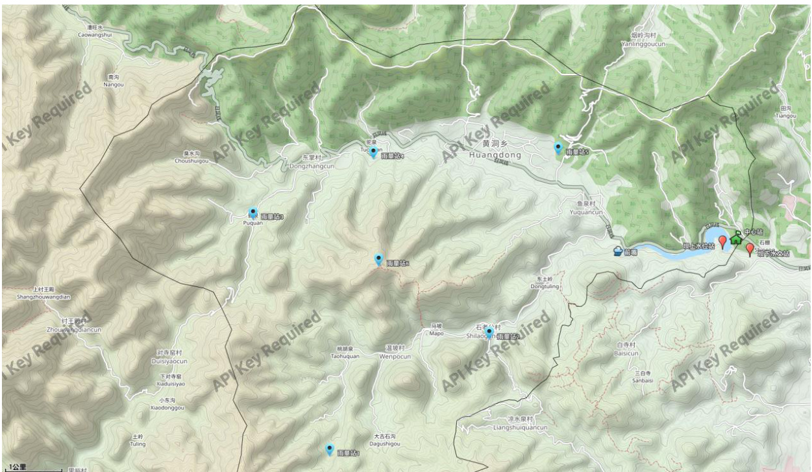  
图 3.11-1  水文自动测报系统站点位置  

# 3.11.3 工程量及费用  

水文自动测报系统、水量调度管理与视频监测系统均为水库信息系统组成部分。水文自动测报系统作为其子系统,设备及安装费见表 3.11-1。  

经估算,建设水文自动测报系统共需 112.42 万元(不含中心站建筑工程费、设备费及预警预报系统费用)。  

表 3.11-1  水文自动测报系统费用概算表  

<html><body><table><tr><td rowspan="2">编 号</td><td rowspan="2">工程或费用名称</td><td rowspan="2">单 位</td><td rowspan="2">数 量</td><td colspan="2">单价(元)</td><td colspan="2">合计 (万元)</td></tr><tr><td>设备费</td><td>安装费</td><td>设备费</td><td>安装费</td></tr><tr><td>1</td><td>土建部分</td><td></td><td></td><td></td><td></td><td></td><td>13.29</td></tr><tr><td></td><td>基本水准点</td><td>个</td><td>1</td><td></td><td>3500.00</td><td></td><td>0.35</td></tr><tr><td></td><td>校核水准点</td><td>个</td><td>2</td><td></td><td>4000.00</td><td></td><td>0.80</td></tr><tr><td></td><td>断面桩</td><td>个</td><td>2</td><td></td><td>2000.00</td><td></td><td>0.40</td></tr><tr><td></td><td>断面界桩</td><td>个</td><td>2</td><td></td><td>2000.00</td><td></td><td>0.40</td></tr><tr><td></td><td>断面标志</td><td>个</td><td>2</td><td></td><td>2000.00</td><td></td><td>0.40</td></tr><tr><td></td><td>基线桩</td><td>个</td><td>2</td><td></td><td>1200.00</td><td></td><td>0.24</td></tr><tr><td></td><td>测站保护标志</td><td>个</td><td>2</td><td></td><td>1500.00</td><td></td><td>0.30</td></tr><tr><td></td><td>观测道路</td><td>m</td><td>80</td><td></td><td>800.00</td><td></td><td>6.40</td></tr><tr><td></td><td>测验断面规整</td><td>次</td><td>1</td><td></td><td>40000.00</td><td></td><td>4.00</td></tr><tr><td>2</td><td>设备及安装工程</td><td></td><td></td><td></td><td></td><td>86.20</td><td>12.93</td></tr><tr><td></td><td>直立式水尺</td><td>根</td><td>10</td><td>500.00</td><td>75.00</td><td>0.50</td><td>0.08</td></tr></table></body></html>  

<html><body><table><tr><td></td><td>雷达水位计全套</td><td>台</td><td>2</td><td>60000.00</td><td>9000.00</td><td>12.00</td><td>1.80</td></tr><tr><td></td><td>翻斗式雨量计</td><td>组</td><td>7</td><td>20000.00</td><td>3000.00</td><td>14.00</td><td>2.10</td></tr><tr><td></td><td>双垂线V-ADCP在线测流 系统</td><td>座</td><td>1</td><td>500000.00</td><td>75000.00</td><td>50.00</td><td>7.50</td></tr><tr><td></td><td>横式采样器及烘干机</td><td>台</td><td>1</td><td>50000.00</td><td>7500.00</td><td>5.00</td><td>0.75</td></tr><tr><td></td><td>视频监控设备</td><td>个</td><td>2</td><td>10000.00</td><td>1500.00</td><td>2.00</td><td>0.30</td></tr><tr><td></td><td>北斗卫星通信终端</td><td>台</td><td>3</td><td>9000.00</td><td>1350.00</td><td>2.70</td><td>0.41</td></tr><tr><td colspan="5">合计</td><td></td><td>86.20</td><td>26.22</td></tr></table></body></html>  

# 第四章 工程地质  

# 4.1 勘察概述  

# 4.1.1 勘察任务  

根据要求本次勘察按可行性研究设计阶段深度对拟建工程布置勘察工作,本阶段勘察任务和目的有:  

(1)复核工程区地震动参数,评价区域构造稳定性;(2)根据地质调查,结合收集到的勘察、设计、运行、观测、试验等有关  
资料,分析库区运行中有关工程地质条件、问题及其动态变化情况,评价水库扩  
容后库区渗漏、岸坡稳定等工程地质问题;(3)初步查明坝址区工程地质条件、水文地质条件,调查原坝体填筑质量,  
评价大坝加高的可行性;初步查明大坝加高的可能存在的主要工程地质问题,提  
供坝基岩土体物理力学参数建议值;(4)查明水库清淤区的土体类型、分布、储量及其物理性质、环境化学性  
质,提供设计和施工所需的分类、处理的土体工程特性;(5)对工程所需天然建筑材料进行详察(外购天然建材进行调查)。  

# 4.1.2 本阶段主要完成的勘察工作量  

本阶段勘察外业工作自 2024 年 3 月 17 日始,至 2024 年 5 月 11 日结束,勘察方法有地质测绘、钻探、山地、物探和室内试验等综合手段,本阶段共完成的工作量统计见表 4.1-1。  

表 4.1-1 完成勘察工作量统计  

<html><body><table><tr><td>序号</td><td>部位</td><td colspan="2">工作项目</td><td>单位</td><td>工作量</td><td>备注</td></tr><tr><td rowspan="3">1</td><td rowspan="3">准备 工作</td><td colspan="2">资料搜集与分析</td><td>项</td><td>1</td><td></td></tr><tr><td colspan="2">技术方案策划与大纲编制</td><td>项</td><td>1</td><td></td></tr><tr><td colspan="2">外业所需物资设备、资料准备</td><td>项</td><td>1</td><td></td></tr><tr><td rowspan="2">2</td><td rowspan="2">区域</td><td colspan="2">区域地质资料收集、复核 (1:200000)</td><td>km2</td><td>5148</td><td></td></tr><tr><td colspan="2">水文地质资料收集、复核 (1:200000)</td><td>km2</td><td>5148</td><td></td></tr><tr><td>3</td><td>水库</td><td>地质</td><td>1:10000地质测绘</td><td>km2</td><td>15.8</td><td></td></tr></table></body></html>  

<html><body><table><tr><td>序号</td><td>部位</td><td>工作项目</td><td></td><td>单位</td><td>工作量</td><td>备注</td></tr><tr><td></td><td rowspan="9">区</td><td rowspan="5"></td><td>1:10000岩溶水文地质 调查</td><td>km2</td><td>16.5</td><td></td></tr><tr><td></td><td>1:2000地质测绘</td><td>km2</td><td>0.3</td><td></td></tr><tr><td></td><td>1:1000实测剖面</td><td>km2</td><td>0.5</td><td></td></tr><tr><td>钻探 山地</td><td>钻孔</td><td>m/个</td><td>45.6/10</td><td></td></tr><tr><td rowspan="8">取样</td><td rowspan="8">测量</td><td>竖井</td><td>m/个</td><td>37.7/13</td><td></td></tr><tr><td>勘探点复测</td><td>点</td><td>23</td><td></td></tr><tr><td>土的扰动样</td><td>组</td><td>10</td><td></td></tr><tr><td>淤泥样</td><td>组</td><td>10</td><td></td></tr><tr><td>淤泥中水样</td><td>组</td><td>3</td><td></td></tr><tr><td>室内土工试验</td><td>组</td><td>10</td><td>颗分、物性、液塑限</td></tr><tr><td>淤泥水质环境化学分</td><td>组</td><td>3</td><td>pH、溶解氧、高锰酸 盐指数、化学需氧 量、五日生化需氧</td></tr><tr><td>淤泥环境化学分析</td><td>组</td><td>10</td><td>氮</td><td>量、氨氮、总磷、总 有机质、总磷、铬、 镉、砷、铅、铜、镍、 锌、汞、全氮、石油</td></tr><tr><td rowspan="11">4</td><td rowspan="8">坝址 区</td><td rowspan="4">地质</td><td>1:2000地质测绘</td><td>km2</td><td>0.8</td><td>烃</td></tr><tr><td>1:1000实测剖面</td><td>km</td><td>1.5</td><td></td></tr><tr><td>钻孔</td><td>m/个</td><td>579.5/12</td><td></td></tr><tr><td>钻探 压水试验</td><td>段/孔</td><td>88/12</td><td></td></tr><tr><td></td><td></td><td></td><td></td><td></td></tr><tr><td>山地</td><td>长观孔</td><td>孔 m/个</td><td>3</td><td></td></tr><tr><td rowspan="5">取样</td><td>竖井 测量</td><td></td><td>33.3/17</td><td></td></tr><tr><td>勘探点复测</td><td>点</td><td>31</td><td></td></tr><tr><td>岩样 坝体样</td><td>组</td><td>13 8</td><td></td></tr><tr><td>水样</td><td>组 组</td><td>3</td><td></td></tr><tr><td>瞬变电磁法</td><td>m/排</td><td></td><td></td></tr><tr><td rowspan="6"></td><td rowspan="5">物探</td><td>高密度电法</td><td>列</td><td>640/2</td><td></td></tr><tr><td>地震映像法</td><td>m/点 m/点</td><td>725/141 208/208</td><td>2条测线</td></tr><tr><td>单孔声波法</td><td>m/孔</td><td>246.0/6</td><td></td></tr><tr><td>钻孔全景数字成像</td><td>m/孔</td><td>279.8/6</td><td></td></tr><tr><td>物性</td><td>组</td><td></td><td></td></tr><tr><td rowspan="2">岩石 试验</td><td>抗压强度 (干/饱和)</td><td>组</td><td>13 13</td><td></td></tr><tr><td>弹性模量 (干/饱和)</td><td></td><td>组</td><td>13</td><td></td></tr></table></body></html>  

<html><body><table><tr><td>序号</td><td>部位</td><td colspan="2">工作项目</td><td>单位</td><td>工作量</td><td>备注</td></tr><tr><td rowspan="10"></td><td rowspan="10"></td><td rowspan="2"></td><td>变形模量 (干/饱和)</td><td>组</td><td>13</td><td></td></tr><tr><td>泊松比 (干/饱和)</td><td>组</td><td>13</td><td></td></tr><tr><td rowspan="7">坝体 样试</td><td>物性</td><td>组</td><td>8</td><td></td></tr><tr><td>抗压强度 (干/饱和)</td><td>组</td><td>8</td><td></td></tr><tr><td>弹性模量 (干/饱和)</td><td>组</td><td>7</td><td></td></tr><tr><td>变形模量 (干/饱和)</td><td>组</td><td>7</td><td></td></tr><tr><td>泊松比 (干/饱和)</td><td>组</td><td>7</td><td></td></tr><tr><td>直剪试验</td><td>组</td><td>3</td><td></td></tr><tr><td colspan="2">水质简分析</td><td>3</td><td></td></tr><tr><td rowspan="17">天然 建筑</td><td rowspan="5">钻探</td><td rowspan="5">地质</td><td>料场普查</td><td>项</td><td>1</td><td></td></tr><tr><td>商品料场调查</td><td>项</td><td>1</td><td>收集试验报告</td></tr><tr><td>1:2000地质测绘</td><td>km2</td><td>0.11</td><td rowspan="3">库内石料场</td></tr><tr><td>1:1000实测剖面</td><td>km</td><td>1.7</td></tr><tr><td>钻孔</td><td>m/个</td><td>300/6</td></tr><tr><td rowspan="2">测量</td><td>勘探点复测</td><td></td><td>点 6</td><td></td></tr><tr><td rowspan="2">取样</td><td>扰动样</td><td>组</td><td>4</td><td>粘性土</td></tr><tr><td>岩样 物性</td><td></td><td>8</td><td></td></tr><tr><td rowspan="8">材料 试验</td><td rowspan="8"></td><td></td><td>组 组</td><td>8</td><td rowspan="8">库内石料场</td></tr><tr><td>抗压强度 (干/饱和)</td><td>组</td><td>8</td></tr><tr><td>弹性模量 (干/饱和)</td><td>组</td><td>8</td></tr><tr><td>变形模量 (干/饱和)</td><td>组</td><td>8</td></tr><tr><td>泊松比 (干/饱和)</td><td>组</td><td>8</td></tr><tr><td>硫酸盐含量试验</td><td>组</td><td>3</td></tr><tr><td>碱活性试验</td><td>组</td><td>3</td></tr><tr><td>冻融试验</td><td>组</td><td>3</td></tr><tr><td>颗分、界限含水率</td><td></td><td></td><td>粘性土</td></tr><tr><td>6</td><td colspan="3" rowspan="2"></td><td>组 项</td><td>4</td><td></td></tr><tr><td colspan="3">勘察资料整理、参加评审会</td><td>1</td><td></td></tr></table></body></html>  

外业勘察期间得到了淇县水务局和夺丰水库管理处的大力支持,在此表示衷心感谢!  

# 4.2 区域地质与地震  

# 4.2.1 区域地质  

# 4.2.1.1 地形地貌  

本区地处太行山东南麓与华北平原西缘的接壤地带,总地势西高东低。大致在京广铁路以西属溶蚀、剥蚀的低山丘陵区,地面高程 $200{\sim}750\mathrm{m}$ ,最高山峰(纣王殿北) $935\mathrm{m}$ ,丘陵区地面高程为 $100{\sim}200\mathrm{m}$ 。一般相对高差 $50{\sim}350\mathrm{m}$ ,最高达 $500{\sim}600\mathrm{m}$ 。由于沟谷切割剧烈及各种不同岩性的差异,在山区多形成台阶式地形外貌,一些悬崖峭壁高达 $50\sim200$ 余米;植被不甚发育,基岩裸露。京广铁路以东为华北平原,其中卫河西侧为山前倾斜平原,地面高程 $65{\sim}120\mathrm{m}$ ;卫河以东为黄河冲积平原,地形平缓,地面高程 $50{\sim}70\mathrm{m}$ 。  

# 4.2.1.2 地层岩性  

(1)沉积岩、变质岩  

本区主要出露寒武系、奥陶系、古近系、新近系和第四系地层,中生代地层缺失,前寒武系地层出露较少,详见表 4.2-1。  

表 4.2-1 区域地层简表  

<html><body><table><tr><td colspan="5">地层单位</td><td rowspan="2">地层</td><td>厚度 (m)</td><td></td><td rowspan="2">岩性描述</td></tr><tr><td></td><td>界系</td><td colspan="2">统</td><td>组</td><td>代号</td><td></td></tr><tr><td rowspan="6">新 生 界</td><td rowspan="7">第 四 系</td><td colspan="2">全 新</td><td>上</td><td></td><td>Q42</td><td>0~5</td><td>冲积砂、砂砾石层，洪积砂砾石，风积细砂 土，淤积粉土，粉质黏土</td></tr><tr><td colspan="2">统</td><td>下</td><td></td><td></td><td>1~5</td><td>灰褐色粉土质重~中~轻粉土、粉质黏土，其 中夹中~细砂层</td></tr><tr><td colspan="2">上更新统</td><td></td><td></td><td>Q3</td><td>>5</td><td>灰白、灰黄色黄土状粉土质粉质黏土、粉土， 局部夹砂砾石基及钙质结核，下部含大量粘 土碎块</td></tr><tr><td colspan="2">中更新统</td><td></td><td></td><td>Q2</td><td>6.2</td><td>上部红黄色粉土质粉质黏土，具水平层理, 下部砖红色粘土，具网状节理，常含下伏地 层碎块</td></tr><tr><td colspan="2">下更新统</td><td>庞村组</td><td></td><td>Q1</td><td>5</td><td>杂色冰砾石层，上部为红粘土砾石层</td></tr><tr><td colspan="2" rowspan="2">新 近 系</td><td colspan="2">上新统</td><td>N2p</td><td>14~24</td><td>浅褐、褐黑色层复成份中基性火山角砾岩 灰白色钙质泥质砂岩、钙质砂质泥岩、砂岩、</td></tr><tr><td colspan="2">中新统</td><td>鹤壁组</td><td>N2h</td><td>78 202~</td><td>泥岩夹砾岩 浅黄、棕黄、浅棕色泥岩、泥质粉砂岩、粉</td></tr><tr><td rowspan="2">古 近</td><td colspan="2"></td><td></td><td>N1</td><td>337</td><td>砂质泥岩，下部夹砂岩和砾岩 上部棕黄、黄绿、調錄、紫红色泥岩、粉砂 质泥岩，泥质粉砂岩砂岩、泥质砂岩夹砂质</td></tr><tr><td colspan="2">系</td><td></td><td>E</td><td>141~ 730</td><td>泥岩，局部为含砾砂岩。下部浅棕黄、暗紫、 杂色砂质泥岩、泥质砂岩、细砂岩、砂岩和 砾岩</td></tr><tr><td rowspan="3">古 生</td><td rowspan="3">叠 系</td><td colspan="2"></td><td>石千峰组</td><td>P2sh</td><td>682.8</td><td>紫红、暗紫色泥岩，砂质泥岩和细砂岩</td></tr><tr><td colspan="2">上统</td><td>上石盒子 组</td><td>P2s</td><td>417.8</td><td>东紫色紫斑状泥岩，砂质泥岩及灰绿色砂岩</td></tr><tr><td colspan="2">下统</td><td>下石盒子</td><td>P1x</td><td>90~</td><td>紫斑状泥岩，砂质泥岩，灰白、灰绿色砂岩</td></tr></table></body></html>  

<html><body><table><tr><td colspan="3">地层单位</td><td>地层</td><td>厚度</td><td rowspan="2">岩性描述</td></tr><tr><td>系</td><td>统</td><td>组</td><td>代号</td><td>(m)</td></tr><tr><td rowspan="2"></td><td rowspan="2"></td><td>组</td><td></td><td>104 79~</td><td rowspan="2"></td></tr><tr><td>山西组</td><td>Pis</td><td>灰、深灰色砂岩、砂质页岩、页岩和煤层 155</td></tr><tr><td rowspan="2">石 炭 系</td><td>上统</td><td>太原组</td><td>C3t</td><td>120~ 140</td><td>灰白、灰黑色中~细粒砂岩、砂质页岩、页 岩和煤层及海相灰岩组成数个旋回</td></tr><tr><td>中统</td><td>本溪组</td><td>C2d</td><td>18~ 40</td><td>浅灰、紫红、灰色铝土页岩、石英砂岩、砂 质页岩、页岩；上部夹1~2层透镜状灰岩, 底部透镜状或层状铁矿层</td></tr><tr><td rowspan="4">奥 陶 系</td><td rowspan="4">中统 下统</td><td>峰峰组</td><td>O2f</td><td>112~ 162</td><td>底部灰黄色泥质白云岩，下部角砾状灰岩、 灰岩、花斑状白云质灰岩，上部青灰色纯灰 岩</td></tr><tr><td>上马家沟 组</td><td>O2s</td><td>304~ 322</td><td>下部角砾状灰岩、角砾状白云质灰岩、泥质 灰岩夹泥质白云岩和白云岩。上部灰岩、花 斑状白云质灰岩夹白云岩</td></tr><tr><td>下马家沟 组</td><td>O2X</td><td>105~ 125</td><td>下部浅黄、灰色钙质页岩、泥灰岩夹薄层白 云岩，上部灰、深灰色角砾状灰岩、白云质 灰岩和灰岩</td></tr><tr><td></td><td>01</td><td>76~ 176</td><td>下部灰、灰黑色巨厚层含燧石团块白云岩; 上部灰白、灰黑色中厚层含燧石条带白云岩</td></tr><tr><td rowspan="5">寒 武 系</td><td rowspan="4">上统</td><td>凤山组</td><td>∈3f</td><td>102</td><td>或白云岩 灰黑色中厚层细晶白云岩</td></tr><tr><td>长山组</td><td>E3C</td><td>38.7</td><td>灰、灰黑色中薄层条带状疙瘩状白云质灰 岩、花斑状灰岩、含藻白云质灰岩，上部灰 黄、灰黑色白云岩、泥质白云岩</td></tr><tr><td>山组</td><td>E3g</td><td>26.8</td><td>灰、灰黑色状灰岩、泥质条带灰岩、白云 质灰岩，上部灰色薄层白云岩、泥质白云岩</td></tr><tr><td rowspan="2">中统</td><td>张夏组 E2Z</td><td>150~ 210</td><td>灰、青灰色中厚层条带状状灰色、状白 云质灰岩、状白云岩夹花斑状、状白云 质灰岩、含藻状白云质灰岩，下部夹薄层 页岩</td></tr><tr><td>徐庄组 E 2X</td><td>91.2</td><td>灰绿、灰、暗紫色砂质页岩、钙质页岩与灰 岩、状灰岩互层，下部夹薄层含海绿石石 英砂岩、泥质粉砂岩。</td></tr><tr><td rowspan="2"></td><td>下统</td><td>毛庄组 E 2m</td><td>26.1</td><td>紫红色页岩、上部页岩、灰岩互层 下部紫红、灰黄、黄绿色粉砂质泥岩、泥灰 岩、白云岩，中、上部泥质条带灰岩、泥灰</td></tr><tr><td></td><td>馒头组 E im</td><td>68.7</td><td>岩和页岩 下部灰黄、浅紫红色石英岩状砂岩，含砾石</td></tr><tr><td>震 旦 系</td><td></td><td></td><td>0~ Z 35.5</td><td>定)</td><td>英岩状砂岩，底部具底砾岩：上部浅黄色含 砂白云岩、白云岩、灰岩、钙质砂岩（不稳</td></tr></table></body></html>  

<html><body><table><tr><td colspan="3">地层单位</td><td rowspan="2">地层</td><td rowspan="2">代号</td><td rowspan="2">厚度 (W)</td><td rowspan="2">岩性描述</td></tr><tr><td>界</td><td>系</td><td>统</td><td>组</td></tr><tr><td>太古界</td><td></td><td></td><td></td><td>Ar</td><td>>1476</td><td>黑云斜长片麻岩、混合质黑云二长片麻岩、</td><td>斜长角闪片岩及少量浅粒岩</td></tr></table></body></html>  

(2)岩浆岩  

本区域内岩浆岩不太发育,元古代只有一些伟晶岩;燕山期为中酸性侵入岩;喜山期为基性、超基性的喷出岩和侵入岩。  

1)元古代伟晶岩( $(\uprho_{2})$  

本区南部坡庄至上、下窑及塔岗至黄山一带的太古代地层中,常可见到伟晶岩脉,宽 $0.1{\sim}1\mathrm{m}$ ,长可达数十米,大多走向 NW,沿片麻理侵入。伟晶岩浅肉红色,具不等粒花岗结构、伟晶结构、交代结构和蠕英结构,块状构造和定向构造。主要矿物成分有钾长石( $30\%\sim60\%$ )、长石( $10\%\sim50\%$ )、石英( $15\%\sim$ $25\%$ );次要矿物有黑云母、白云母、磁铁矿,均不超过 $1\%\sim2\%$ ,或更少;微量矿物有磷灰石、锆石、榍石、白钛石等。  

伟晶岩呈脉状侵入太古界片麻岩和片岩之中,侵入作用多使片麻岩形成混合岩化现象。在震旦系和古生代地层中未见伟晶岩侵入。  

# 2)燕山晚期侵入岩  

主要有正长闪长玢岩、正长闪长岩、闪长玢岩、黑云闪长玢岩、花岗闪长玢岩和花岗斑岩,呈岩株、岩床或岩脉侵入寒武系和奧陶系地层中,按侵入关系可分两次。北部分布在白象井、郭家窑和岭头村一带,南部分布在赵庄、红山岭、西北寺至黄山一带。  

正长闪长岩:灰绿色,半自形粒状结构,块状构造。主要矿物有更长石( $65\%\sim$ $70\%$ ),钾长石( $5\%\sim20\%$ ),角闪石( $15\%$ ),少量方解石。  

闪长玢岩和正长闪长玢岩:灰白色\~灰绿色,斑状结构,基质半自形粒状结构,块状构造。斑晶有斜长石(小于 $15\%$ )、角闪石( $(0\%\sim15\%$ )、钾长石( $0\%\sim$ $5\%$ )。基质:斜长石( $60\%\sim90\%$ ),钾长石( $0\%\sim15\%$ ),角闪石、石英、黑云母、方解石都有少量出现。  

3)喜山期基性、超基性岩  

本区的喜山期侵入和喷发的基性、超基性岩有金伯利岩、苦橄玢岩和橄榄玄武岩。其分布受新华夏构造体系的控制,形成了由西到东排列的 NNE 方向的二个带。岩体规模均不大,呈似层状、管状、岩墙等形状零星出露。  

# 4.2.1.3 水文地质  

大气降水渗入为区域地下水的主要补给来源,而本区属半干旱大陆性气候,蒸发作用强烈,降水量较小且集中。东部地势平坦,对地下水的补给有利,西部地势起伏,沟谷水系发育,对地下水的补给较为不利,但有利于地下水的径流和排泄。本区地下水可划分为第四系孔隙水、碳酸盐岩类裂隙岩溶水、碎屑岩类裂隙孔隙水和基岩(岩浆岩、变质岩)裂隙水。  

# 1)第四系孔隙水  

第四系孔隙水广泛分布于东部缓倾斜平原、山前倾斜平原,其赋存条件受构造及地貌条件的控制,富水性则决定于含水层的岩性、厚度和埋藏分件以及接受补给条件。富水性中等\~极丰富。  

该类型地下水主要赋存第四系冲洪积的砂卵砾石层的孔隙中,主要接受大气降水补给、基岩水的侧向补给、灌溉回渗等方式,其排泄方式主要为蒸发人工抽排等。  

# 2)碳酸盐岩类裂隙岩溶水  

该类型地下水分布于汤西断裂\~芳兰断裂以西的低山、丘陵区。赋水地层主要为寒武系、奥陶系和石炭系的碳酸盐,岩溶发育程度弱\~强。地下水主要赋存于岩溶管道或裂隙中,以接受大气降水补给为主,富水程度主要受岩溶发育程度和连通性控制;地下水主要以地下径流方式向下游方向排泄或以泉水方式溢出地表。  

# 3)碎屑岩类裂隙孔隙水  

区内碎屑岩类的裂隙孔隙水系指新近系含水岩组而言,新近系广泛分布于丘陵、岗地、汤阴地堑及测区东北部,其富水性主要与所处的地貌位置、岩性、含水层的充填状况及构造有关。  

# 4)基岩(岩浆岩、变质岩)裂隙水  

该类型地下水主要分布在低山区的南部和北部,主要有太古界黑云斜长片麻岩、混合黑云二长片麻岩、斜长角闪片岩和少量浅粒岩,其次为燕山晚期的侵入岩体,许家沟东侧有喜山期橄榄玄武岩侵入体。  

岩浆岩侵入体原生裂隙发育,浅部风化裂隙发育,太古界片麻岩中风化裂隙较为发育,由于历次构造运动的影响,发育有不均匀的节理裂隙,形成基岩构造裂隙和风化裂隙地下水,在地形切割至地下水面时有泉溢出,形成侵蚀下降泉。本区基岩裂隙水主要受大气降水的补给,水量小,季节性变化较显著。  

# 4.2.1.4 物理地质现象  

本区物理地震现象主要有岩溶,其次为崩塌、塌陷和滑坡等。  

(1)岩溶  

本区下古生界碳酸盐岩含水岩类,厚达千米,分布面积约 $700\mathrm{km}^{2}$ 。岩溶发育特征与整个华北地区相似,属典型的北方岩溶系统。  

# 1)岩溶形态  

裸露型岩溶以构造溶蚀裂隙和大型水平溶洞为特征。这些溶洞的长度可达数十至数百米,高数十厘米至数米,大多位于山坡及侵蚀河谷两岸的陡岸峭壁,干涸无水,地表局部形成“石芽”和“小石林”地貌景观。  

埋藏型岩溶分布于鹤壁及庙口煤矿一带,以奥陶系中统灰岩、灰质白云岩为主,埋藏于石炭系、二叠系地层之下。以溶蚀裂隙为主,溶孔和小溶洞次之,其中也有少量较大的溶洞,发育在断裂带、节理密集带及地下水排泄区。  

# 2)岩溶发育特征  

本区岩溶发育特征主要受地层岩性、地质构造和水动力特征等因素控制。  

$\textcircled{1}$ 岩溶发育特征受地层岩性控制  

碳酸盐岩的化学成分,结构和空间类型,在一定程度上控制了岩石后期的选择性溶蚀作用。区内寒武、奥陶系是一套较复杂的碳酸盐沉积物,各含水层组的化学成分、结构不同,使溶蚀作用的强弱及其溶蚀性具有明显的差异。碳酸盐岩与非碳酸盐岩的组合类型是区域岩溶发育的另一重要因素,碳酸盐岩类中的碎屑岩夹层对岩溶的发育起着不可忽视的控制作用。  

$\textcircled{2}$ 岩溶发育特征受地质构造控制  

由于层间裂隙的控水作用,使地下水沿裂隙径流,岩溶发育强烈。这主要是奥陶系灰岩中裂隙启开性好,而下部泥灰岩中裂隙闭合,使地下水沿着奥陶系灰岩中的裂隙径流,形成大型溶洞。  

区域性构造节理,断层对岩溶发育程度和形态起着控制作用,表现为沿节理和断层的走向岩溶最为发育。构造部位比非构造部位岩溶发育程度高。  

3)岩溶发育特征受水动力特征控制  

地下水的径流作用,有利于碳酸盐岩的溶蚀,本区岩溶发育的水动力特征主要表现在:  

$\textcircled{1}$ 阻水断层的旁侧影响带多为强径流带,本区 NNE 和 NW 向断层,多为高角度的压扭性断层,断层两盘节理发育,岩石破碎,地下水径流强烈,岩溶发育。  

$\textcircled{2}$ 岩溶发育带与地下水积极交替带相吻合,鹤壁矿区埋藏型岩溶有以下特征,高程 $50\mathrm{m}$ 以上,岩溶不发育,并多被石炭系、第三系地层充填或成陷落柱,溶洞率只有 $0.1\%$ ,在高程 $50\sim-250\mathrm{m}$ ,由于处在地下水积极交替径流带,岩溶较发育,岩溶率 $0.43\%{\sim}0.9\%$ 。在- $-250\mathrm{m}$ 高程以下,由于埋深大,交替作用减弱。  

# 3)岩溶发育史  

本区岩溶主要分三个发育时期,由于这三个时期具有不同的古气候、古地理条件,所形成了不同的岩溶特征:  

$\textcircled{1}$ 古生代岩溶期,该期岩溶发育在奥陶系中统沉积之后,石炭系中统沉积以前,由于宜昌升起运动,地表岩溶主要是溶沟、石芽组成的溶蚀原型。在奥陶系中统与中石炭统假整合面的露头上,可观察到一些古岩溶遗迹,当时的地下岩溶也很发育,以溶洞为主,后来由崩塌堆积物将洞穴充填。  

$\textcircled{2}$ 第三纪岩溶期,经过燕山运动,岩层遭受褶曲和断裂,使碳酸盐岩裸露地表。在第三纪温湿的气候条件下,造成了岩溶发育的有利条件,但是由于地壳运动的间歇性,岩溶发育也呈现阶段性。  

$\textcircled{3}$ 第四纪岩溶期,早更新世岩溶亚期:出露高程 $240{\sim}270\mathrm{m}$ ,与Ⅲ级阶地对应,此期岩溶主要发育在淇河、洹河以及山间谷地中,规模小,洞长一般小于$10\mathrm{m}$ ,主要分布在当时地下水径流、排泄区,Ⅲ级阶地堆积物为下更新统砾岩和泥砾层。中、晚更新世岩溶亚期:出露标高 $180{\sim}210\mathrm{m}$ ,和Ⅱ级阶地(高程 $190\sim$ $215\mathrm{m}$ )相对应,分布部位与早更新世岩溶一致,以小型溶洞和溶蚀裂隙为主。  

全新世岩溶亚期:主要分布在现代侵蚀基准面以下,其特点是地表岩溶不发育,主要是地下岩溶,且以溶蚀裂隙为主,这些岩溶与地下水文网的关系密切。  

(2)其它物理地质现象  

地面塌陷 16 处,主要分布在鹤山区和山城区煤炭矿区及村庄;滑坡 3 处,主要分布于山城区和淇县的乡村公路两侧;崩塌 23 处,主要分布于浚县石灰岩矿区、淇滨区及淇县西部山区。  

# 4.2.2 区域构造与地震  

# 4.2.2.1 区域大地构造背景  

工程区位于一级构造单元中朝准台地(Ⅰ)之二级构造单元山西台隆 $(\mathrm{~I~}_{1}$ )之三级构造单元太行山拱断束( ${\bigl\mathrm{~I~}}_{1}{\bigr.}^{1}$ )。  

太行山拱断束 $(\mathrm{I}_{1}^{1}$ )位于汤西断裂以西、焦作-商丘深断裂以北的太行山区。基底为太古界深变质岩系,盖层为中元古的陆源碎屑岩、寒武系\~奥陶系的浅海相碳酸岩夹泥质岩系、石炭系\~二叠系的含煤岩系,以寒武系\~奥陶系分布最广。本区构造线近 SN 向,整体为宽缓的大型复式背斜。区内断裂发育,可划分为近SN 向,EW 向,NNE 向和 NE 向四组。  

# 4.2.2.2 区域地质构造特征  

本区构造部位处于新华夏系华北坳陷之西部和太行山隆起的东南边缘,南邻秦岭东西复杂构造带,西与晋东南山字型东翼反射弧相接,地质构造比较复杂。经历了长期、多次的构造运动,尤以燕山\~喜山期表现最为强烈。构造形迹以断裂为主,褶曲很不发育。西部基岩区除太古代地层外,岩层产状平缓,倾角多在$5^{\circ}\sim10^{\circ}$ ,总的向 NE 和 N 倾斜,基本组成略具波状起伏的单斜构造。各类断裂力学性质复杂,一般具有多次活动的特点。  

# (1)褶皱  

本区褶皱不发育,岩层产状平缓,倾角多在 $5^{\circ}{\sim}10^{\circ}$ 左右,总体向 NE 或 SW倾斜,基本上组成一系列略具波状起伏的轴面向东倾斜的宽缓背斜构造。褶皱轴向总体为 $\mathrm{NE}5^{\circ}{\sim}15^{\circ}$ ,微向 N 倾伏。因断裂破坏,褶皱变得支离破碎。  

区内断裂较发育,按其特征和空间展布规律,划分为 EW 向构造(包括 NWW向构造和近 EW 向构造)、NNE 向构造、SN 向构造和 NEE 向构造四组。各组断层纵横交错。NNE 向构造和 EW 向构造(NWW 向和近 EW 向构造)构成断裂格架,其它断裂组则是在这总格局内由于边界条件不同派生。断层性质大断层几乎全为正断层,较小断层既有正断层也有逆断层。断层组合有地堑式、地垒式、阶梯式和叠瓦式等。区内主要断裂发育情况详见表 4.2-2。  

表 4.2-2 区内主要断裂一览表  

<html><body><table><tr><td>构造 体系</td><td>编号</td><td>断层 名称</td><td>断层产状</td><td>主要特征</td></tr><tr><td rowspan="2">NNE 向</td><td>F315乡-桃胡</td><td>黄洞 泉断裂</td><td>NE20°~3 5%/SE Z 65°~85°</td><td>长约7km，宽约1~2m。沿断层形成断层角砾岩、碎裂 岩，充填方解石脉。影像图上线状构造明显，地貌上多 形成沟谷、丫脖、断层谷、断层崖等负地形。该断裂总 体上表现为逆断层特征，该断裂截切错断NWW向断裂， 具多期活动；为逆断层</td></tr><tr><td>F293</td><td>西恶 鱼沟-庙 口-横岭 沟断裂</td><td>0%/SE 67°~80°</td><td>全长约16km，断裂切割、错断NWW向和北东向断裂。 在断裂西侧可见一系列次级断层（F291、F292、F301、 NE10°~3F468等）呈平行斜列展布；断距可达100m以上。沿断 裂发育5~10m宽的破碎带，破碎带内糜棱岩化强烈，劈 理、片理及构造透镜体发育，构造透镜体呈定向排列， 长轴多与断裂平行，以压为主兼具扭性的特点。局部出 现宽度较大的张性角砾岩带，反映断层曾经历过张性活</td></tr><tr><td rowspan="4">EW 向</td><td></td><td>西行 F280盆-水浴290%NE 村断层</td><td>NW270° 60°~70°</td><td>动 全长大于10km，沿走向和倾向均呈舒缓波状。垂直断 距在10~100m不等，断层破碎带宽约数米至50余米不 等，断层角砾岩、碎裂岩及断层泥、劈理发育，劈理多 表现为与断层平行排列；为正断层</td></tr><tr><td></td><td>天井 F268洼-碾上 村断层</td><td>SW265°~ NW <75~82°</td><td>全长约10km，断层破碎带宽约3~5m，最大宽度可达 10m，其内发育平行断层的挤压透镜体、劈理、叶理， 280%S、N充填方解石脉和重晶石脉、断层角砾岩、碎裂岩、断层 泥等；为正断层 呈向北凸出的弧形弯曲。由二组近于平行或斜交的断层</td></tr><tr><td></td><td>F306曹旺水 断层</td><td></td><td>组成（F169、F306、F335、F157、F170）；全长大于16km, 形成宽约5m的破碎带，挤压劈理和断层角砾岩发育， 具断层镜面；在黄洞北构成新生代黄洞断陷盆地的北边 界，形成宽约2~10m的破碎带，断层角砾岩、碎裂岩及 庙口-NW280°～断层泥发育，充填方解石脉，断层垂直断距可达200余 「290%SW米；断层西段曹旺水东公路边，断层破碎带宽度达50m, <60°~80°主断层面向南陡倾，北盘（下盘）形成高十余米至数十 米的断层崖，南盘发育近于平行或斜交的正断层、逆断 层，岩层片理化强烈，层理不显，呈现强烈挤压状态， 破碎带中尚发育有张性断层、张性裂隙及张性角砾岩叠 加；多期活动明显，断层发生过挤压、水平反扭和张性</td></tr></table></body></html>  

<html><body><table><tr><td>构造 体系</td><td>编号</td><td>断层</td><td>断层产状</td><td>主要特征</td></tr><tr><td rowspan="2">EW 向</td><td></td><td>名称 鱼泉- F309东掌断 裂</td><td>NZ 70°~80°</td><td>黄洞以南呈向南凸出的弧形弯曲，全长大于10km；沿 断层形成宽约5m的破碎带，断层角砾岩、碎裂岩、断 层泥、断层镜面及擦痕发育，并构成狭长的地堑；，断 层面附近岩石强烈破碎，挤压透镜体、圆化及压扁的构 SW265°～造角砾岩发育，伴生平行的小褶曲及密集的节理。局部 NW280%平行或斜交的次级断层显示南倾，倾角56°，属逆断层， 断层压性特征明显。后期断层活动，叠加张性断层角砾 岩、碎裂岩等，并构成黄洞新生代断陷盆地的南边界， 黄洞南一带垂直断距可达100~300m，与庙口-曹旺水断 层（F306）断层构成地堑。该断层被后期北北东向断层</td></tr><tr><td></td><td>上山 F318岭-天桥 岭断裂64~80°</td><td>NW280°~ 290/SW</td><td>切割、错断，多期活动明显，断层发生过挤压、水平反 扭和张性三期主要活动 舒缓波状断续延伸，断层全长大于14km。发育平行排 列的次级断层，构成地垒。沿断裂带形成宽约1~10m的 破碎带，断层角砾岩、碎裂岩、断层泥及挤压劈理发育， 具断层镜面和擦痕，局部形成构造透镜体，充填方解石 脉、重晶石脉等，断层垂直断距可达50~200余米，局部 形成高十余米至数十米的断层崖；。该断层被后期NINE 向和NE向断层切割、错断，多期活动明显，断层发生</td></tr><tr><td rowspan="2">NE向</td><td>F316</td><td>石老 公断裂</td><td>70°~80°</td><td>过挤压、水平反扭和张性三期主要活动 全长约6km，呈舒缓波状延伸。断层面主体向北西陡倾， 局部向南东陡倾；断层破碎带可达25余米，破碎带中断 NE50°~6层角砾岩、碎裂岩、断层泥及挤压劈理、小构造透镜体 0°NW之等发育，断层多期活动明显，早期以压性为主，以发育 脐压劈理、构造透镜体等为特征，具逆冲性质，晚期叠 加张性断层角砾岩，具正断层特征，垂直断距可达100m 以上；沿断面附近有苦橄岩体侵入</td></tr><tr><td>F146</td><td>汤西 断裂</td><td>NE30S EZ67°</td><td>总长约80km，切割太古宙~新近纪地层，影响宽度 2~3km，破碎带宽达40m，岩石破碎，强烈片理化，伴 生NNW与NEE两组扭裂面；沿断裂断续分布有晚侏罗 株）；西盘抬升，东盘下落，为高角度正断层，垂向落 差达千余米。大致沿太行山与华北平原边界分布，构成 华北凹陷汤阴断陷的西界，并成为丘陵与平原分界线。 为活动性断裂</td></tr></table></body></html>  

# 4.2.2.3 新构造运动  

本区新构造运动非常活跃,主要表现形式为差异运动,断裂运动,褶曲构造,火山喷发及地震等。  

(1)差异运动  

晚第三纪以来,差异运动表现在以汤西大断裂为界,西部山区强烈上升,形成侵蚀\~剥蚀中低山山岳地形,东部平原强烈下降,形成宽阔的冲积平原地形。  

(2)活动性断裂  

# 1)汤西断裂  

断裂西侧为古生代地层,断裂东侧为第四纪地层,第四纪地层( $10{\sim}30\mathrm{m}$ 厚)之下尚有巨厚的( $350{\sim}850\mathrm{m}$ )新近系地层,老地层和不同时代的新地层接触。西盘持续上升,东盘持续下降。从淇河向南断距逐渐増大,东盘下降的幅度也逐渐增大,断距约大于 $1000\mathrm{m}$ 。从地貌上看,断层西侧为中低山山岳地形,断层东侧为堆积平原地形。该断裂地处本工程近场区,在夺丰水库下游侧约 $3\mathrm{km}$ 位置大角度穿越思德河。  

# 2)汤东断裂  

在汤阴东南断裂西侧的基岩等深线为 $1200\mathrm{m}$ ,东侧的远 $10\mathrm{m}$ 孔基岩埋深为$258\mathrm{m}$ ,相差 $942\mathrm{m}$ 。在浚县淇门附近断层两侧基岩等深线有明显差异,断层西侧基岩等深线为 $3000\mathrm{m}$ ,东侧为 $800\mathrm{m}$ 。以上说明该断层西盘下降,东盘上升,新近系地层被断开,断距达 $258{\sim}2200\mathrm{m}$ ,活动相当强烈。该断裂距水库距离超过$25\mathrm{km}$ 。  

# 3)李源屯至浚县断裂带  

为一组密集断裂,地表形成走向 $\scriptstyle\mathrm{NE}\sim\mathrm{SW}$ 向的凹地,其北西侧为中更新统红色\~砖红色粘土,南东侧为全新统粉土、粉质黏土,说明此断裂带北西侧上升,南东侧下降,而且全新世仍在下降。在新镇一带,断裂带东西两侧的基岩等深距相差 $200\mathrm{m}$ 。该断裂距水库距离超过 $25\mathrm{km}$ 。  

(3)褶曲构造  

此类构造不发育,在庞村东、杨小屯、西冲沟中见到鹤壁组( $\mathrm{N}_{2}\mathrm{h}$ )砾岩及钙质泥岩形成了平缓小褶曲。庞村组( $\mathrm{N}_{2}\mathfrak{p}$ )中小褶曲较多。在卫辉市庞寨、滑县白道口、上官村一带,见第四系上更新统隆起。  

# (4)火山运动  

本区新构造时期以来,有多次火山喷发。喷出岩有苦橄玢岩及橄榄玄武岩等。主要分布在淇河河口一带。火山喷发及岩浆侵入活动形成的各种岩石,为同期同源的产物,主要受 NNE 向构造控制,分带现象比较明显。  

# 4.2.2.4 地震  

本区地震频繁,从 1068 年至今,共发生三级以上地震 38 次,最大震级为6.5 级(卫辉市东北)。三级以上地震的发震率约为 24 年/次。地震带、地震烈度带主要受 NE 向及 NNE 向构造的控制。详见图 4.2-1。  

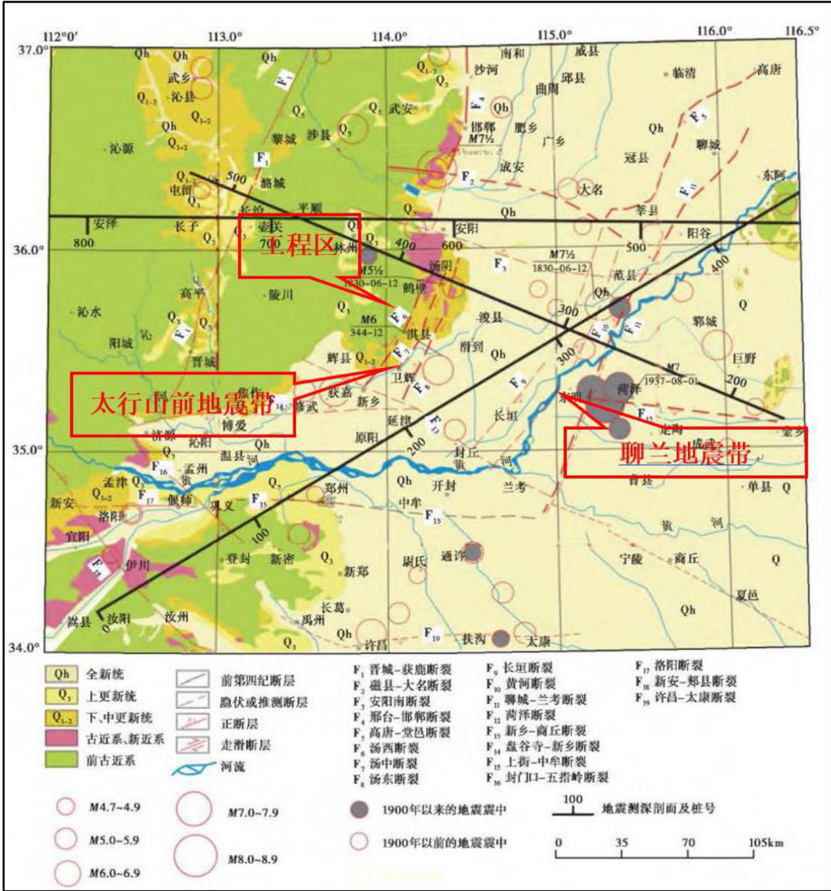  
图 4.2-1  地震震中分布图  

近几年来,鹤壁市所处的冀鲁豫交界地区地震活动逐年增强,区内 3.0 级以上地震异常强烈。仅 2005 年 ${\sim}2007$ 年的两年时间内,本地区就发生 3.0 级以上地震 10 次,其中,2006 年 4 月 9 日在鹤壁地区发生的 4.7 级地震是自 1983 年山东菏泽 5.9 级地震以来所发生的最大地震。另外,2004 年 3 月 22 日鹤壁市还发生了 1 次 2.5 级地震。  

工程区位于太行山前地震带上,该地震带即为安阳-汤阴-新乡一带,是我国重要的地震带之一;沿该断裂带曾经发生过邢台大地震,1737 年的新乡 5 级地震,1814 年汤阴-浚县间的 5 级地震,1967 年淇县庙口附近的 4 级地震,1978年 6 月新乡的 4.5 级地震。汤西断裂位于水库下游 $3\mathrm{km}$ ,据区域资料,汤西断裂上新世时期活动强烈,第四纪以来也曾发生过多期活动,最新一期活动发生在晚更新世晚期至全新世早期。据有关资料认为,汤西断裂存在发生 6 级左右地震的构造条件。综合判定近场区内存在发生破坏性地震的构造条件,对工程场地的影响主要来自近场地震。  

# 4.2.2.5 地震动参数  

根据《中国地震动参数区划图》(GB18306-2015),工程区Ⅱ类场地 50 年超越概率 $10\%$ 的地震动峰值加速度为 $0.20\mathrm{g}$ ,地震反应谱特征周期为 0.40s,详见图 4.2-2;相应基本地震烈度为Ⅷ度。  

  
图 4.2-2  地震动参数区划图  

a.地震动峰值加速区划图 b.反应谱特征周期区划图  

# 4.2.2.6 区域构造稳定性  

本工程的近场区发育活动性断裂(汤西断裂),近场区外围有 1 次 M6.5 级地震的历史记录,工程区基本地震烈地为Ⅷ度,依据《水电工程区域构造稳定性勘察规程》(NB/T 35098-2017)的分级标准,水库工程区区域构造稳定性较差。  

# 4.3 库区工程地质  

# 4.3.1 工程地质条件  

# 4.3.1.1 地形地貌  

夺丰水库位于庙口镇的石棚村至黄洞乡前嘴村之间的思德河河段上,库尾右侧有较大的支流汇入。库区段河流近东西向展布,近坝段呈“S”型弯曲。水库区地处太行山东南缘,为思德河出山口河段,属溶蚀、剥蚀的低山峡谷地貌类型。该段河谷呈“U”型河谷,两岸地形陡峻,多呈近直立的悬崖,正常蓄水位河谷宽度一般为 $100{\sim}200\mathrm{m}$ 。库底地面高程 $166.2{\sim}195.0\mathrm{m}$ ,右岸地面分水岭地面高程$270\sim295\mathrm{m}$ ,左岸地面分水岭地面高程 $220\sim565\mathrm{m}$ 。左岸大致沿高程 $207\mathrm{m}$ 修建公路(G342)连通黄洞乡。库区两岸零星发育有小面积的 3 级阶地,其中 1 级和 2 级阶地被库水淹没。  

# 4.3.1.2 地层岩性  

根据区域地质资料和库区地质测绘成果,水库库区及周边地层主要有寒武系中上统、奥陶系和第四系覆盖层,由老至新分述如下:  

(1)寒武系中上统( $\in_{2\sim3}$ )  

根据其岩性和分布规律可分为中统的张夏组 $(\in_{2}\mathbf{z})$ ),上统的崮山组 $(\in_{3}\mathrm{g})$ )、炒米店组( $\in{}_{3}\mathrm{c}$ )和三山子组( $\in_{3}\mathbf{s}.$ )。其中张夏组( $\in{}_{2}\mathbf{Z}$ )与水库工程关系最大。  

1)中统张夏组( $\in{}_{2}\mathbf{Z}$ ),岩性以一套碳酸盐岩为特征,底部以灰白色薄板状灰岩(千层饼灰岩)的出现作为张夏组的开始,顶部以叠层石灰岩为标志;岩性以厚层 $\sim$ 巨厚层状鲕状灰岩为主,局部夹藻屑灰岩,厚度 $192.3\small{\sim}259.2\mathrm{m}$ 。与下伏下统馒头组( $\in\L_{1}\mathrm{m}$ )和上覆的崮山组( $\in{\mathfrak{g}}$ )均呈整合接触。该层在水库区大致分布在高程 $200\mathrm{m}$ 以下,连续分布,主要构成库盆的主要岩体。  

2)上统崮山组( $\in\L_{3}\mathrm{g}$ ),以灰白色厚层状鲕状灰岩为主,底部夹灰白色条带状灰岩、竹叶状灰岩及灰黄色泥灰岩。该层层厚一般为数米,且不稳定。在两岸山体大致分布在高程 $200\mathrm{m}$ 以上;与下伏张夏组 $(\in_{2}\mathbf{Z},$ )和上覆的炒米店组(∈3c)均呈整合接触。  

3)上统炒米店组( $\underline{{\sf\Pi}}\in\mathfrak{_{3}}\mathfrak{c}.$ ),岩性为浅灰白色、青灰色厚层条带状微晶灰岩夹叠层石灰岩、砂屑灰岩、灰色厚层状鲕粒泥粒灰岩及竹叶状灰岩,向上岩石逐渐白云石化。呈狭长呈带状出露于崮山组与三山子组之间。  

4)上统三山子组( $\in_{3}\mathbf{S}.$ ),岩性以一套厚度巨大的白云岩为特征,横向稳定。下部为灰黄色条带状白云岩与灰褐色(含叠层石)砂屑白云岩互层;中部为灰色\~灰黄色中薄层\~厚层的中\~细晶白云岩夹叠层石白云岩及竹叶状白云岩;为浅灰色\~灰褐色中厚层\~巨厚层中\~粗晶白云岩,含硅质团块及条带的中\~粗晶白云岩。局部夹叠层石白云岩、竹叶状白云岩及白云质角砾岩。主要表现为颜色较浅,以中\~粗晶结构为主,呈厚\~巨厚层状构造,并在不同层位含较多硅质团块和白色方解石团块,中上部的中\~粗晶白云岩中古溶洞发育。  

(2)奥陶系(O)  

可分为下统冶里组 $({\mathrm{O}}_{1}{\mathrm{y}})$ )、亮甲山组 $(\mathrm{O}_{1}1)$ )和中上统的马家沟组( $\bf{\Psi}(0}_{2\sim3}\bf{m},$ )。  

1)下统冶里组( $\mathrm{(O_{1}y}$ ),下部为灰红色、灰黄色中薄层状硅质条带细晶白云岩,底部有厚 $20\mathrm{cm}$ 的灰褐色蜂窝状硅质层(燧石层),层状构造;中部为浅灰红色厚层花斑状细晶白云岩与灰白色纹层状中细晶白云岩互层;上部为灰黄色细晶白云岩与硅质条带细晶白云岩互层。  

2)下统亮甲山组( ${\mathrm{O}}_{1}{\mathrm{I}}$ ),中下部为灰黄色、灰红色纹层状细晶白云岩、灰质白云岩夹竹叶状白云岩,上部为灰红色细晶白云岩夹灰白色灰质白云岩。底部以厚约 $30{\sim}80\mathrm{cm}$ 的砖红色蜂窝状钙质泥岩,作为与亮甲山组的分界的标志。亮甲山组与下伏地层冶里组为整合接触关系,底部为厚度不足 $1\mathrm{m}$ 的灰黄色粘土岩,与上覆地层马家沟组为平行不整合接触关系  

3)中上统的马家沟组( $\bf{\Psi}.0_{2\sim3}\mathrm{m}.$ ),岩性以灰岩和白云岩互层夹角砾状灰岩为特征。由下至上岩性依次为:底部为浅黄色薄层状白云岩、浅黄色含泥含砂白云质页岩;灰、灰黑色巨厚层含燧石团块白云岩;灰白色、灰黑色中厚层含燧石条带白云岩或白云岩;浅黄色、灰色钙质页岩、泥灰岩夹薄层白云岩;灰、深灰色角砾状灰岩、白云质灰岩和灰岩。  

(3)第四系(Q)  

根据成因可细分为上更新统冲洪积( $\mathrm{Q}_{3}^{\mathrm{alp}}$ ),全新统冲洪积( $\mathrm{Q}_{4}\mathrm{alp}$ )、坡残积( $\mathrm{Q}_{4}^{\mathrm{eld}}$ )、崩积( $\mathbf{Q}_{4}^{\mathrm{col}}$ )、湖积( $\mathbf{Q}_{4}^{\mathrm{~h~}}$ )和人工堆积( $\mathrm{Q}_{4}^{\mathrm{s}})$ 。  

1)上更新统冲洪积( $\mathrm{Q}_{3}^{\mathrm{alp}}$ )  

上部为褐黄色低液限黏土,硬塑,层厚一般在 $3\mathrm{\sim}5\mathrm{m}$ ;下部为砂卵砾石层,混杂有一定量的粘性土,局部夹少量的孤石,层厚一般 $2{\sim}3\mathrm{m}$ ,密实、轻微胶结。该层主要分布在河道两岸的 3 级阶地上,面积不大、零星分布。  

2)全新统冲洪积( $\mathrm{Q_{4}}^{\mathrm{alp}}$ )  

岩性以卵砾石层为主,砂的含量普遍不高;粒径一般为 $5{\sim}30\mathrm{cm}$ ,磨圆,岩性主要为碳酸盐岩类;稍密\~中密。在主河槽内层厚一般为 $1\sim2\mathrm{m}$ ,在黄洞乡断陷盆地内厚度一般超过 $10\mathrm{m}$ 。  

# 3)全新统坡残积( $\mathrm{Q}_{4}^{\mathrm{eld}}$ )  

高液限黏土,紫红色,坚硬,上部微含砾石;底部含灰岩碎石、块石;主要在右岸山顶不连续分布,层厚一般为 $1\sim5\mathrm{m}$ 不等。  

含土碎石,色杂,以深灰色为主,松散\~稍密;碎石块径 $5{\sim}20\mathrm{cm}$ ,呈棱角状;原岩为碳酸盐岩类;碎石含量一般超过 $70\%\sim80\%$ 。主要分布山坡地形相对较缓的地带,层厚一般不超过 $5\mathrm{m}$ 。  

4)全新统崩积( $\mathrm{Q}_{4}\mathrm{col}\:^{.}$ )  

碎石、块石,以灰色系为主,原岩为碳酸盐岩类;结构松散,层厚一般小于$2\mathrm{m}$ ,主要分布在陡壁的坡脚处。  

# 5)全新统湖积( $\mathbf{Q}_{4}^{\mathrm{~h~}}$ )  

岩性主要为淤泥或含砾石淤泥,以深灰色为主,饱和、流塑;有机质含量高,主要分布在水库库底,层厚 $2{\sim}4.5\mathrm{m}$ 。  

6)全新统人工堆积( $\mathrm{Q}_{4}\mathrm{^s}$ )  

主要是库区周边的修建的建筑物或构筑物,以及人工开山采石形成的碎石堆,和矿山修复形成的坡地等;层厚不均一、差异性大。  

# 4.3.1.3 地质构造  

库区基岩基本呈倾向 NE 或 SE 的单斜构造,岩层倾角一般在 $5^{\circ}{\sim}15^{\circ}$ ,在断层带附近的基岩产状有所差异。其主要构造形迹为断层和节理裂隙。  

(1)断层  

根据地质测绘成果,库区周边发育多条断裂,均为高角度的正断层、非活动性断裂;断裂发育位置详见水库区综合地质图,断裂发育特征详见表 4.3-1。  

# 4.3-1 水库区周边断裂汇总表  

<html><body><table><tr><td>断层名称 及编号</td><td>断层产状</td><td>断层性状</td><td>断层与水库位 置关系</td></tr><tr><td>庙口-曹旺水 断层（F306)</td><td>NW276°~308%/ SWZ76°~81°</td><td>为水库区周边规模最大的断裂，宏观的 描述详见区域地质构造章节；断层宽约 5m，断面平直粗糙；带内物质以碎裂岩、 构造角砾岩为主，夹杂大量灰白色和黄 色的泥质；有动力变质的迹象；沿该断 层未见岩溶发育；为正断层</td><td>该断裂展布于 水库北侧山体 中，与水库最 近距离约 100m</td></tr><tr><td>石老公断裂 (F316)</td><td>NE46°~60%NW 80°~85°</td><td>带宽3~4m，断层带内物质为碎裂岩, 粘土夹碎石，局部呈糜棱岩，有动力变 质迹象，胶结较紧密；上盘为灰岩，夹 灰黄色条带薄层灰岩，产状NE40%NW <15；下盘为浅肉红色砂屑灰岩，产状 NW350%SWZ17°；岩断裂带没发现岩 溶发育的现象；为正断层</td><td>该断层在前嘴 村附近（库尾） 横穿水库区</td></tr><tr><td>f1 断裂</td><td>NW332NE 80°</td><td>带宽3~4m，带内物质以碎裂岩为主, 块径3~40cm,强度低，呈灰黄色的土状， 夹大量灰岩块，挤压紧密，为扭性断裂， 有动力变质迹象；为奥陶系和寒武系、 奥陶系下统冶里组和上统马家沟组的分 界断裂；沿断裂未见有溶蚀现象发育； 为正断层</td><td>该断裂在坝下 斜穿思德河； 在库区左岸展 布，与水库最 小距离约60m</td></tr><tr><td>前嘴夺丰断裂 （f2）</td><td>NW310NE 80°</td><td>带宽约3m;带内物质为碎裂岩夹土黄色 断层泥，局部见原岩岩块，下盘为E2z 的状灰岩；下盘为Oiy灰质白云岩; 岩断层带未见有溶蚀现象；该断裂为寒 武系地层和奥陶系地层的分解断裂；为 正断层，断距约300m</td><td>该断裂在左岸 挡水坝段处顺 河向贯穿水库 区；造成水库 渗漏</td></tr><tr><td>f3 断裂</td><td>NW290°/NE ≤88</td><td>带宽约1.0m,带内构造角砾岩、断层泥、 原岩透镜体，上盘为浅肉红色白云质灰 岩，厚层状，轻微溶蚀；下盘为灰白色</td><td>在水库管理处 南侧展布，贯 穿水库区</td></tr></table></body></html>  

<html><body><table><tr><td>断层名称 及编号</td><td>断层产状</td><td>断层性状</td><td>断层与水库位 置关系</td></tr><tr><td></td><td></td><td>白云质灰岩</td><td></td></tr><tr><td>f4断裂</td><td>NW340°/SW 85°</td><td>宽 10~15cm，带内物质为断层泥夹构造 角砾岩，强度低，上盘厚层師粒灰岩； 下盘中厚层状灰岩，岩体破碎；沿断 面轻微溶蚀，为正断层</td><td>发育在石料侧 库岸山体，规 模较小，延伸 较短</td></tr></table></body></html>  

(2)节理裂隙  

根据地质测绘成果对库坝区地表节理裂隙进行统计,库坝区基岩共发育 4组裂隙,第 $\textcircled{1}$ 组产状 $\mathrm{NW}275^{\circ}\sim280^{\circ}$ $/\mathrm{SW}\angle85^{\circ}\sim89^{\circ}$ ;第 $\textcircled{2}$ 组产状 $\mathrm{NE10}^{\circ}\sim$ $15^{\circ}\mathrm{/NW}\angle72^{\circ}\sim80^{\circ}$ ;第 $\textcircled{3}$ 组产状 $\mathrm{NW275^{\circ}}\sim280^{\circ}/\mathrm{NE}\angle88^{\circ}\sim90^{\circ}$ ;第 $\textcircled{4}$ 组 $\mathrm{NE8^{\circ}}\sim10^{\circ}/\mathrm{SE}\angle88^{\circ}\sim89^{\circ}$ 。  

区内基岩节理裂隙以高角度裂隙为主,几乎没有中\~缓角度的裂隙发育。整体上看可归纳为走向近 SN 向和近 EW 向高角度的节理,仅仅是倾向上有所差异(高角度裂隙倾向量测有一定的误差)。这两类裂隙呈共轭形式出现,为剪性裂隙,延伸大于 $10\mathrm{m}$ ;大部分裂隙被溶蚀,形成宽大的溶蚀裂隙,部分由红黏土填充。  

# 4.3.1.4 水文地质  

库区及周边地下水按赋存空间可分为孔隙潜水和岩溶水。  

(1)孔隙潜水  

该类型地下水主要赋存于河道两侧以及支流沟道内的覆盖层孔隙中,主要接受大气降水补给,丰水期接受岩溶水补给,主河槽内孔隙潜水和库水水力联系密切。排泄方式以地下径流方式补给河水。水量不丰沛,受季节性影响大。  

# (2)岩溶水  

库周的寒武系鲕状灰岩、灰岩和奥陶系的白云质灰岩岩溶中等发育,其形式为溶蚀裂隙和小型溶洞。岩溶水主要赋存于这些溶蚀空间内,库水位以上溶蚀空间基本干枯;库水位以下溶蚀空间基本被库水充填,故岩溶水与库水水力联系密切。库区周边基岩裸露,大量溶蚀裂隙发育,接受大气降水快速入渗补给岩溶水;以泉水的形式排泄补给库水。  

# 4.3.1.5 岩溶  

(1)水文地质单元  

根据区域水文地质成果,工程区位于相对独立的岩溶水文地质单元—庙口泉域,西侧以盘石头背斜、北侧以西形盆-水峪断裂、南侧以上山岭-天桥岭、东侧以汤西断裂为界的一个近似独立的非全排型岩溶地下水水文地质单元。  

该水文地质单元面积 $350\mathrm{km}^{2}$ 。岩溶水主要靠大气降水直接或间接补给,盘石头背斜轴以东的地下水逐渐汇集于庙口强径流带上,地下水有西、南向东基东北方向径流,汇集于山前隐伏的寒武系中统和奥陶系中统的岩溶含水岩组中,受汤西断裂的阻隔,形成地下水强富集带,并在许家沟泉群排泄出地表入淇河。  

# (2)岩溶发育特征  

库区周边的岩溶属于中国北方型岩溶,其特点是地表岩溶不甚发育,鲜见岩溶竖井、落水洞等岩溶形态,多为岩溶泉、干谷、溶沟和溶槽等岩溶地质现象。地下岩溶以溶蚀裂隙为主,溶洞并不多见且以中小型为主,未见地下暗河等强岩溶现象。  

根据区域地质资料、地质测绘以及坝址区钻孔揭露的情况,库区岩溶发育有以下主要特征:奥陶系中统厚层灰岩为强岩溶化层组,以溶洞和溶蚀裂隙为主,可见高度为 $1\sim2\mathrm{m}$ 的中小型溶洞;奥陶系中统的白云质灰岩的岩溶形态以溶孔、溶穴、小溶洞及蜂窝状溶蚀现象为主。奥陶系下统和寒武系上统的白云岩及不纯的碳酸盐岩类多为弱岩溶化。寒武系中统的张夏组厚层鲕状灰岩岩溶发育程度中等,部分地段强岩溶化;岩溶发育极不均匀,地表浅部多沿高角裂隙发育成溶蚀裂隙,部分有红黏土填充。  

(3)岩溶发育规律  

岩溶发育受地层岩性、地质构造、水动力条件、新构造运动等诸多因素的综合影响和制约,其中最主要的是地层岩性和地质构造这两个控制性因素。不同岩性(不同成分、结构以及层厚)的碳酸盐岩中,岩溶发育具有明显的差异性。地质构造可决定岩溶水的流动趋向,控制岩溶发育的延伸方向。新构造运动造成地壳阶段性抬升,表现出水平岩溶的多层的特征。  

# 1)岩性对岩溶发育的影响  

可溶的碳酸盐岩是岩溶发育的基础。水库区周边的鲕状灰岩( $\in{}_{2}\mathbf{Z}$ ),白云质灰岩( $\mathrm{^{\prime}O_{1}y}$ )和白云岩( $\in{}_{3}\mathrm{s}$ )为质地较纯的碳酸盐岩,是具备岩溶发育的物质基础。在该套地层中岩溶发育程度相对较高,岩溶形态有中小型溶洞、溶蚀裂隙和溶孔等。竹叶状灰岩和薄层泥灰岩( $\in\L_{3}\mathrm{g}$ )、砾状灰岩( $\mathrm{O}_{2-3}\mathrm{m},$ )质地不纯,明显表现为岩溶不发育或轻微发育。  

2)岩溶层组类型对岩溶发育的控制  

鲕状灰岩( $\in{}_{2}\mathbf{Z}$ ),白云质灰岩( $\mathrm{\Delta}.0_{15}$ )和白云岩( $\in_{3}\mathrm{s}.$ )为纯碳酸盐岩类的均匀碳酸岩组,呈中厚\~巨厚层状构造,表现为岩溶发育程度相对较高。薄层状灰岩( $\in{}_{3}\mathrm{c}$ )灰岩程度同样较高、质地较纯,为薄层状构造,岩溶发育程度相对较低,表现为溶蚀裂隙和溶痕。说明工程区岩溶层组类型对岩溶发育有控制性作用。  

# 3)地质构造对岩溶发育的影响  

工程的岩溶形态受断裂的影响不明显,仅鱼泉大泉是受断裂控制,岩溶水丰富而稳定。周边的断裂庙口-曹旺水(F306)、石老公断裂(F316)以及坝址区附近 F1 断裂、前嘴-夺丰断裂(F2)和 F3 断裂均未发现有强烈的溶蚀现象。其余岩溶泉多受溶蚀裂隙控制,泉周边并无大规模断裂构造发育,泉水水量不丰富、流量不稳定;而在降雨期间及降雨后一段时间内,有众多的岩溶泉显露出来,故其多为季节性岩溶泉。  

溶蚀发育方向受高角度裂隙控制明显。调查到溶洞走向基本为NNE和NWW两个方向,和本区基岩的裂隙发育规律基本一直。工程区及周边没有发现有溶蚀洼地的发育,仅见 2 处的岩溶竖井;高角度的溶蚀裂隙为本区岩溶水的补给源。岩溶水入渗后,向下径流,逐渐溶蚀结构面从而形成宽大溶蚀裂隙;在当时的侵蚀基准面高程附近沿层面排泄,形成水平向溶洞。  

4)水动力条件对岩溶发育的影响  

本区属北方岩溶系统,其水动力条件不像南方那么强烈,故其岩溶发育程度较云南、广西、贵州等地的岩溶要弱,本区未见地下暗河等强岩溶现象。第三纪岩溶期的群英洞和跃进洞等表现的岩溶发育程度较高,形成 $1\sim5\mathrm{m}$ 高的溶洞,且发育众多支洞、洞深长、彼此相连、错综复杂,说明第三纪时期本区水动力条件较强,水循环迅速。  

第四纪以来本区降雨较少,水循环不强;该期岩溶发育程度明显偏低,岩溶形态以溶蚀裂隙和中小型溶洞为主,溶洞高度不高一般为 $1\sim2\mathrm{m}$ ,洞深短、一般不超过 $10\mathrm{m}$ ,且溶洞多孤立,只有仙人梯洞群的各溶洞间相衔接。  

# 5)新构造运动对岩溶发育的影响  

新构造运动对库区岩溶发育影响很大,阶地的形成往往与地壳运动的相对稳定期一致,并与岩溶地貌(水平岩溶管道系统)、阶地(台地)的发育对应。  

# 4.3.1.6 物理地质现象  

水库区及周边基岩均为硬质岩,基岩大面积裸露,覆盖层零星分布且层厚不大;库区基周边未见滑坡、泥石流等物理地质现象。左岸山体有多处关停的采石场,开采的后缘形成高陡坡,存在崩塌的风险;采石场离水库区较远,对水库区基本没有影响;遗留的碎石堆已实施了矿山治理工程,水土保持效果较好,发生泥石流的可能性不大。在库岸陡壁处偶见小规模的掉块或崩塌的现象。  

# 4.3.2 主要工程地质问题及初步评价  

# 4.3.2.1 水库渗漏问题  

本工程的任务是防洪,没有供水等其它要求(维持现状蓄水水位即可)。因此,对该水库加高后的渗漏勘察没有按照相应勘察规范的精度要求去做。主要根据现场调查及坝址附近的钻孔资料进行分析。  

(1)库底渗漏问题  

水库区段河谷为所在小流域的最低侵蚀基准面,库尾和两岸的岩溶水补充河水,故河谷岩溶水动力条件类型为补给型。库底不存在渗漏问题,水库已经正常运行多年,也能说明这个问题。  

# (2)左岸渗漏问题  

水库两岸地形上封闭性好,无低矮的垭口等负地形;在水库左岸公路延伸入库岸处的垭口主要是人工开凿的(以下称公路垭口处),勘察期间地下水位为$179.2\mathrm{m}$ ,低于水库正常蓄水位。  

# 1)左岸公路垭口处至库尾段  

该段山体高耸浑厚,无低矮邻谷发育;在修建水库前,武公祠溶洞内有岩溶水渗出补充河水(现状淹没在库水位以下),可判断左岸存在高于水库水位的地下分水岭,故该段不存在渗漏问题。  

2)左岸公路垭口处至水库大坝段  

该段工程地质和水文地质条件复杂,3 条高角度正断裂发育,奥陶系地层岩溶强发育且岩溶空间孤立、不连通;地下水分布很不稳定、地下水位差异性很大。除钻孔 ZK02 和 ZK07 外,其余钻孔勘探深度范围内未见地下水。勘探期间为枯水期,邻谷内未见径流;坝下河道左岸及邻谷与思德河汇合口附近,均未见有地下水出露,说明该段不存在邻谷渗漏问题。虽然有两个钻孔中地下水位低于水库正常蓄水位,邻谷和下游河段未见地下水出露,说明渗径很长,该段造成水库的渗漏量不影响水库正常运行。  

(3)右岸渗漏问题  
1)右岸山体八十家至库尾段  
该段山体浑厚,无低矮邻谷发育,不存在邻谷渗漏问题。  

# 2)右岸八十家至大坝段  

夺丰水库右岸存在低邻谷渗漏问题:右岸山体基岩发育高角度的溶蚀裂隙以及岩溶管道形成渗漏通道,属混合型渗漏型式。当夺丰水库水位高于白寺沟沟底高程后就会发生渗漏现象。其渗漏点不止勘察发现的两处,部分渗漏点位于覆盖层下,估算右岸邻谷渗漏量大约为 $0.29\mathrm{m}^{3}/\mathrm{s}$ 。通过白寺沟末端的河水流量估算,夺丰水库水位在 $193.0\mathrm{m}$ 处右岸邻谷渗漏量约 $0.15{\sim}0.20\mathrm{m}^{3}/\mathrm{s}$ ,  

# 4.3.2.2 库岸稳定问题  

水库库岸边坡主要为岩质边坡,仅在武公祠处为土质边坡范围相对较大。该段土质岸坡地层为第四系上更新统冲洪积( $\mathrm{Q}_{3}^{\mathrm{alp}}$ )的黏土,呈坚硬状态,水库运行期间该段土质岸坡整体稳定,未发现有滑坡的迹象。其余零星段土质岸坡范围较小,水库已经运行多年,未发现有塌滑迹象。  

水库左坝肩至库区公路段岸坡呈峻坡类型,现状边坡整体稳定。该段边坡基岩为奥陶系下统冶里组( $\mathrm{\Delta}$ )的白云质灰岩,受f2 断裂的影响,岩层产状不稳定,大致为 $\mathrm{NE}0^{\circ}{\sim}30^{\circ}/\mathrm{SE}\angle15^{\circ}{\sim}48^{\circ}$ ;该段岸坡为逆向坡或斜向坡,边坡整体稳定性好。f2 断裂与库岸相交段呈负地形,已经采取了浆砌石护岸的方式处理并作为公路路基,基本不存在失稳问题。  

其余岩质岸坡段基岩为寒武系中统张夏组( $\in{}_{2}\mathbf{Z}$ )鲕状灰岩,岩石强度高,为坚硬岩;厚层\~巨厚层状构造,岩层近水平,为层状边坡;发育走向近南北和近东西两条高角度裂隙,两组裂隙基本呈现一组与岸坡近垂直和另一组与岸坡近平行的特征,对边坡稳定影响不大。故岩质边坡整体稳定性好。  

总之,水库已经运行多年,库岸再造已经完整。库岸边坡整体稳定性好,水库扩容后基本不存在大规模的岸坡失稳问题。  

# 4.3.2.3 水库浸没问题  

水库已经运行多年,本次水库扩容工程主要是增加防洪库容,不改变水库正常蓄水位,不会新增水库浸没问题。  

# 4.3.2.4 水库淤积问题  

水库为山区水库,两岸大部分为岩质边坡,少量为土质边坡,边坡整体稳定好,水库库岸再造问题不突出。水库区范围内碎屑物质并不丰富,但是近年来库内人为改造的现象较为突出,随着水土流失造成水库存在一定的淤积问题。  

# 4.3.2.5 水库诱发地震问题  

水库区库盆基岩为鲕状灰岩,两岸在正常蓄水位以下均淹没有溶洞,溶洞规模不大,且洞顶的基岩为厚层\~巨厚层状的坚硬岩,岩层产状平缓,溶洞整体稳定性好;故水库库水的升降不会引起岩溶塌陷而诱发岩溶型地震。  

库区范围内未发现有活动性断裂发育,近场区的活动性断裂——汤西断裂,在水库下游方向相距水库约 $3\mathrm{km}$ ;库盆基岩为鲕状灰岩,库底无深层岩溶发育,微新岩体整体渗透性微弱,水库蓄水后改变深层岩体的水文地质条件的可能性不大;再者水库水位雍高有限,其水压力远小于基岩的抗压强度。故分析认为水库发生水库诱发地震的可能性不大。水库已经运行了多年,未发现有地震动异常现象。  

# 4.3.3 水库淤积情况  

# 4.3.3.1 场区地质条件及淤积体量估算  

根据水下地形图,水库区内并无大面积的平缓地段,仅坝前位置有小面积的平缓地段。根据钻孔揭露,在地形较平缓的地段覆盖层相对较厚,如 KZK01 揭露淤泥层厚约 $4.5\mathrm{m}$ ,坝前位置钻孔 ZK9 揭露的覆盖层厚度为 $6.3\mathrm{m}$ 。在其余地形有一定坡度的地段钻孔揭露的覆盖厚一般不超 $3\mathrm{m}$ ,大多数在 $1\mathrm{m}$ 左右。  

根据钻孔揭露情况看,库内覆盖层主要有三层:第 $\textcircled{1}$ 层为新近淤积的淤泥层$(Q_{4}{}^{1})$ ,灰褐色,饱和,软塑\~流塑,具有腥臭味,有植物腐烂的痕迹。该层层厚 $1.0{\sim}4.5\mathrm{m}$ ,在库底表层连续分布,主河槽处相对较厚,两岸处相对较薄;第 $\textcircled{2}$ 层为碎石( $\mathrm{Q4^{s}}$ ),可能为当初修建水库残留的,主要分布在坝前位置,层厚 $1.4{\sim}3.3\mathrm{m}$ ,碎石原岩为鲕状灰岩;第 $\textcircled{3}$ 层为全新统冲洪积( $(Q_{4}^{\mathrm{alp}}$ )黏土质砾,褐色,稍密,砾石含量 $40\%\sim50\%$ ,粒径 $2{\sim}40\mathrm{mm}$ ,母岩以灰岩为主,次圆状,砂约占 $20\%$ ,细粒土约占 $30\%$ 、粘粒为主;该层层厚 $0.6{\sim}1.0\mathrm{m}$ ,主要在剖面 4和剖面 5 处小面积分布。  

通过平行断面法估算淤泥层体量约 75.5 万 $\mathrm{m}^{3}$ ,平均厚度法估算的淤泥层体量约 74.9 万 $\mathrm{m}^{3}$ ;两种估算方式算的体量相差不大,故偏安全的角度考虑,取库区内淤泥层体量约为 75.5 万 $\mathrm{m}^{3}$ 。  

# 4.3.3.2 淤泥物性试验  

根据试验成果,淤泥层含水率为 $25.5\%\sim76.8\%$ ,平均值为 $51\%$ ;土粒比重$2.51{\sim}2.71$ ,平均值为 2.65;液限含水率为 $33.7\%\sim41.0\%$ ,平均值为 $37.5\%$ ;塑限含水率为 $16.2\%{\sim}24.9\%$ ,平均值为 $21.8\%$ ;塑性指数为 $13.7\sim17.5$ ,平均值为15.8;液性指数 $0.5{\sim}3.5$ ,平均值为 1.9;土粒以粉粒含量为主,约占 $69.1\%$ ,黏粒含量约占 $23.7\%$ ,局部段淤泥层中含少量的砂砾石。  

# 4.3.3.3 环境化学试验  

根据试验成果,淤泥层中的地下水 $\mathrm{pH}$ 值为 $7.9\sim9$ ,为弱碱性水;化学需氧量(COD)为 $6{\sim}10\mathrm{mg/L}$ ,五日生化需氧量(BOD)为 $0.1{\sim}1.5\mathrm{mg/L}$ ,总氮(TN)为 $0.25\substack{\sim1.52\mathrm{mg/L}}$ ,总磷(TP)为 $0.04\substack{\sim}0.15\mathrm{mg/L}$ ,氨氮指标( $\mathrm{NH_{4}}$ )为 $3.96\sim$ $4.50\mathrm{mg/L}$ 。  

淤泥层中有机质含量 $9.8{\sim}34.2{\mathrm{g}}/{\mathrm{kg}}$ ,平均值 $22.5\mathrm{g/kg}$ ;全磷含量 $0.34\sim$ $0.67\mathrm{g/kg}$ ,平均值 $0.4\mathrm{g/kg}$ ;全氮含量 $912{\sim}2380\mathrm{mg/kg}$ ,平均值 $1697\mathrm{{mg/kg}}$ ;总砷含量 $8.4{\sim}17.3\mathrm{mg/kg}$ ,平均值 $12.0\mathrm{mg/kg}$ ;总汞含量 $0.02{\sim}0.37\mathrm{mg/kg}$ ,平均值$0.2\mathrm{mg/kg}$ ;铜含量 $13.6{\sim}28.8\mathrm{mg/kg}.$ ,平均值 $19.4\mathrm{mg/kg}$ ;锌含量 $34.8{\sim}102\mathrm{mg/kg}$ ,平均值 $73.5\mathrm{mg/kg}$ ;铅含量 $34.4{\sim}96.7\mathrm{mg/kg}$ ,平均值 $63.8\mathrm{mg/kg}$ ;镉含量 $0.12\sim$ $0.34\mathrm{mg/kg}$ ,平均值 $0.2\mathrm{mg/kg}$ ;铬含量 $46{\sim}75\mathrm{mg/kg}$ ,平均值 $58.8\mathrm{mg/kg}$ ;镍含量$30.3{\sim}51.9\mathrm{mg/kg}$ ,平均值 $40.5\mathrm{mg/kg}$ ;石油烃含量 $11{\sim}28\mathrm{mg/kg}$ ,平均值 $18.8\mathrm{mg/kg}.$ 。  

# 4.3.3.4 淤积物地质评价  

(1)疏浚土类别划分  

淤泥层以粉粒含量为主,约占 $69.1\%$ ,黏粒含量约占 $23.7\%$ ,局部段淤泥层中含少量的砂砾石。根据《水利水电工程施工组织设计规范》(SL303-2017)的划分标准,该淤泥层岩土开挖分级为Ⅱ级土。根据《疏浚与吹填土工程技术规范》(SL 17-2014)的标准,该淤泥层疏浚土分级为 1 级土,适宜绞吸式疏浚方式。  

(2)重金属污染分析评价  

重金属污染评价采用《土壤环境质量农用地土壤污染风险管控标准(试行)》(GB15618-2018)中农用地土壤污染风险筛选值进行评价。经过与规范要求的风险筛选值和风险管制值对比,库内的淤泥的重金属含量均低于风险管制值,重金属含量均低于风险筛选值,说明淤泥不存在重金属污染问题。  

(3)淤泥处置评价  

污泥处置评价采用《农用污泥污染物控制标准》(GB4284-2018)进行评价。经过对比分析,夺丰水库内淤泥产物类别为 A 级,可以使用于耕地、园林和牧草地等用途。  

# 4.4 已建大坝现状及质量评价  

# 4.4.1 坝体抽检现状  

# 4.4.1.1 大坝表观现状  

大坝砌石体的原岩为鲕状灰岩,块石料尺寸一般为 $60\times36\times30\mathrm{cm}$ ,目测块石呈青黑色,新鲜,完整,没有明显的裂隙发育,整体质量良好。砂浆整体质量不良,碳化现象明显,砂砾石外露;细骨料为天然砂砾石,磨圆好。  

溢流堰处桥墩底部出现混凝土面脱落、钢筋外露的现象。除此之外,大坝从外观上观测没有发现破损、裂缝等现象。  

# 4.4.1.2 钻孔取芯  

通过钻孔揭露情况看:坝体内部的块石不规则,部分为碎石;块石(碎石)间填充石灰砂浆,填充厚度不均,一般在 $1\sim5\mathrm{cm}$ ;砂浆整体呈灰白色,以石灰为主,水泥的含量不高。目测浆体具有大孔隙,粘聚力较低,手捏易碎且有掉灰的迹象。砂浆与块石的粘聚的情况非常不均,部分粘聚的稍为紧密,也有粘聚的很差、扰动易断开的迹象,砂浆的整体质量不良;也有块石间砂浆没有填充饱满情况,主要表现为大坝修建后坝体存在漏水的情况,以及钻探时漏水、经常出现孔壁掉块卡钻的现象和声波测试过程中孔内无法注满水等情况。  

# 4.4.1.3 声波测试  

本阶段在坝体上布置了 2 个钻孔,在钻孔中对坝体进行声波测试。波速值为$1760{\sim}6100\mathrm{m/s}$ ,均值为 $4536\mathrm{m}/\mathrm{s}$ 。从波速测试成果上看,波速值变化频繁,忽高忽低,表现出坝体填筑均匀性差,强度差异性明显。  

# 4.4.1.4 砂浆物理力学性质  

根据试验成果,砂浆颗粒密度为 $2.69\mathrm{g}/\mathrm{cm}^{3}$ ;天然密度为 $1.96{\sim}2.16{\mathrm{g}}/{\mathrm{cm}}^{3}$ ,平均值为 $2.04\mathrm{g}/\mathrm{cm}^{3}$ ;干密度为 $1.77{\sim}2.04\mathrm{g}/\mathrm{cm}^{3}$ ,平均值为 $1.89{\mathrm{g}}/{\mathrm{cm}}^{3}$ ;孔隙率为$24.08\%\sim34.09\%$ ,平均值为 $29.92\%$ ;饱和单轴抗压强度为 $2.55{\sim}6.02\mathrm{MPa}$ ,平均值为 3.82MPa,强度低,属极软岩范畴;软化系数为 $0.23{\sim}0.62$ ,平均值为 0.43,属软化岩范畴。  

在块石和砂浆混合试样中,物性指标和强度随块石含量的增加而增高的规律很明显,孔隙率随着块石含量的增加而降低;说明以块石为主砂浆砌石重力坝坝体的质量受控于块石的质量。  

# 4.4.2 坝体质量初步评价  

# 4.4.2.1 砂浆质量评价  

据了解,修建该砌石坝时水泥匮乏,制备砂浆时填充有大量的石灰,水泥的 含量不高。通过本次的勘察揭露看,砂浆整体呈灰白色,粘聚强度不高,手摸后  

存在掉灰的现象,说明砂浆的胶凝材料强度偏低。其次,砂样和块石的粘结强度也不高,存在扰动易沿交界面断开的现象。  

试验测得砂浆孔隙率约 $30\%$ ,说明砂浆自身密实程度不高。砂浆的强度仅有3.8MPa,强度极低。砂浆的软化系数仅为 0.43,说明其水理性质差,不能长时间浸泡水,否则强度会慢慢衰减。  

根据现行的水利行业规范《浆砌石坝设计规范》(SL25-2006)第 3.1.3 条的关于胶粘材料的要求:砌石体的胶凝材料主要有水泥砂浆或一、二级配混凝土。所以,本项目掺加石灰的砂浆作为浆砌石坝胶凝材料是不满足现行规范要求的。  

鉴于现状坝体材料及坝体强度的均一性差异,建议本次扩容大坝加高工程对原坝体拆除重建或采取加固处理措施。  

# 4.4.2.2 块石质量评价  

砌石料为寒武系中统张夏组的鲕状灰岩,岩石坚硬,抗风化能力强。推测是从本次勘察选择的石料场处开采的,块石无明显的节理裂隙,整体质量良好。坝体表面采用的块石均为人工凿刻的条石,形状规则,均为长方体。通过钻孔揭露,坝体内部的块石形状不规则,尺寸也不均一,部分可能为碎石。  

# 4.4.2.3 填筑质量评价  

大坝修建初期蓄水后,坝体存在严重的渗漏问题,后在引水面修建了防渗面板,基本解决了坝体渗漏问题。在本次勘察过程中,观测岩芯表面可见局部砂浆填充不饱满,通过钻孔录像观察这种现象尤为明显。其次钻进过程中出现漏水以及声波测试时钻孔难以灌满水的现象,也说明坝体中存在有均有连通性的孔隙或缝隙。在钻进过程孔壁经常发生掉块现象,说明坝体中填充不密实,碎石没有被完全粘结。  

在后期的除险加固工程中对坝体进行了灌浆处理措施。从本次的 2 个钻孔揭露看,坝体中未发现有明显的浆液充填的迹象,初步分析认为灌浆效果不良。  

# 4.4.2.4 坝体物理力学参数建议值  

该浆砌石坝体为人为加工的产物,不属于地质体范畴;其材料和构造具有不均一性,其次坝体在水平方向和垂直方向均形成错缝,其受力的边界条件非常复杂,很难给出坝体准确的物理力学参数建议值。根据波速测试成果和砂浆、砂浆  

与岩石结合体的物理力学性质试验成果,类比岩体给出坝体物理力学参数建议值,见表 4.4-1。  

表 4.4-1 坝体物理力学参数建议值  

<html><body><table><tr><td rowspan="2">天然 密度</td><td rowspan="2">饱和抗 压强度</td><td rowspan="2">弹性 模量</td><td rowspan="2">变形 模量</td><td colspan="2">抗剪断</td><td>抗剪</td></tr><tr><td>f'</td><td>C'</td><td>f</td></tr><tr><td>(g/cm3)</td><td>(MPa)</td><td>(GPa)</td><td>(GPa)</td><td></td><td>(MPa)</td><td></td></tr><tr><td>2.45~2.50</td><td>40~35</td><td>13~15</td><td>7~9</td><td>0.75~0.85</td><td>0.75~0.85</td><td>0.60~0.65</td></tr></table></body></html>  

# 4.4.3 坝基质量初步评价  

河床坝段坝基基岩为寒武系中统张夏组 ${\bf\Psi}(\in_{2}{\bf z})$ )鲕状灰岩,鲕状结构,厚层\~巨厚层状构造,岩石强度高,为坚硬岩。根据钻孔揭露,坝基清基工作量良好,坝基直接坐落在微风化\~新鲜的基岩上。坝基岩体零星发育有随机的小溶洞(仅ZK8、ZK12 和 ZK14 揭露到),根据区域岩溶规律和钻孔揭露情况看,溶洞规模较小;埋藏最浅的溶洞上部岩层厚度大于 $10\mathrm{m}$ ,其上部岩层为厚层\~巨厚层状构造的坚硬岩,岩体完整性好,故溶洞对坝基岩体质量影响不大。坝基岩体质量良好,基本满足工程正常运行的需要。  

# 4.5 坝址区工程地质  

# 4.5.1 工程地质条件  

# 4.5.1.1 地形地貌  

坝址区河谷呈不对称的“V”型河谷,低山溶蚀峡谷地貌类型;河底宽约 $61\mathrm{m}$ ,正常蓄水位处河谷宽约 $153\mathrm{m}$ 。坝前河床地面高程 $166.2{\sim}166.4\mathrm{m}$ ,坝后河床地面高程 $160.0{\sim}163.7\mathrm{m}$ 。右岸地面高程 $160.0{\sim}280\mathrm{m}$ ,其中高程 $228\mathrm{m}$ 以下地形近直立,为悬坡类型;高程 $228\mathrm{m}$ 以上地形相对较缓,为斜坡类型。左岸地面高程 $163\sim$ $220\mathrm{m}$ ,地形坡度约 $23\%$ ,为斜坡类型。  

# 4.5.1.2 地层岩性  

根据地质测绘和钻孔揭露,坝址区地层岩性主要有寒武系 $(\in)$ )、奥陶系(O)和第四系(Q)地层,由老至新分述如下:  

# (1)寒武系(∈)  

1)寒武系中统张夏组( $\mathbf{\Psi},\in_{2}\mathbf{z}$ ),岩性为鲕状灰岩,灰黑色为主,鲕粒结构,厚层\~巨厚层状构造。该层分布在主河槽及右岸山体,层厚超过百米。右岸山体位置该层下伏于寒武系上统崮山组( $\mathbf{\Delta},\in_{3}\mathbf{g}$ ),为整合接触;左岸坡脚附近与奥陶系地层呈断层接触。  

2)寒武系上统崮山组( $\in_{3\mathrm{g}}$ ),岩性以鲕状灰岩为主,底部有竹叶状灰岩和泥灰岩薄层,是标志层。鲕状灰岩,灰黑色为主,鲕粒结构,厚层\~巨厚层状构造;竹叶状灰岩,青灰色,粒状结构,中厚层状构造;泥灰岩,灰黄色,微晶结构,薄层状构造。该层主要分布右岸上上覆于张夏组( $\in_{2}\mathbf{Z}.$ ),下伏于炒米店组( $\in{}_{3}\mathrm{c}$ ),均为整合接触;层厚约 $20\mathrm{m}$ 。  

3)寒武系上统炒米店组( $\in\L_{3}\mathrm{c}.$ ),岩性为薄层灰岩,青灰色,微晶结构,薄层状构造。主要分布右岸山顶位置,上覆于崮山组( $\mathrm{~\boldmath~\xi~}\in\L_{3}\mathrm{{g}}$ ),为整合接触。  

(2)奥陶系(O)  

1)下统冶里组( $\mathrm{(O_{1}y}$ ),岩性为白云质灰岩,浅灰色,细晶结构,中厚\~厚层状构造。主要呈条带状分布在再右岸至水库管理处一带,南东侧与张夏组(∈2z)呈断层接触,西北侧与中上统马家沟组( $\mathrm{O}_{2-3}\mathrm{m}.$ )呈断层接触。该层层厚超过百米。  

2)中上统马家沟组( $\mathrm{O}_{2-3}\mathrm{m}$ ),岩性为微晶灰岩、砾状灰岩,青黑色;微晶灰岩,微晶结构,厚层状构造;砾状灰岩,粒状结构,厚层状构造。主要呈条带状分布在管理处北侧一带,东南侧与冶里组( $\mathrm{O}_{1}\mathrm{y}$ )呈断层接触,西北侧与张夏组( $\in{}_{2}\mathbf{Z}$ )呈断层接触。  

(3)第四系(Q)  

根据其成因可分为上更新统冲洪积( $\mathrm{Q}_{3}^{\mathrm{alp}}$ ),全新统冲洪积( $\mathrm{Q}_{4}\mathrm{alp}$ )、湖积$(Q_{4}{}^{1})$ )、坡残积( $\mathrm{Q}_{4}^{\mathrm{eld}}$ )和人工堆积( $\mathrm{|Q_{4}s)}$ :  

1)上更新统冲洪积( $\mathrm{Q}_{3}^{\mathrm{alp}}$ ),卵砾石,土黄色为主,密实,轻微胶结,卵砾石磨圆好,粒径 $5{\sim}20\mathrm{cm}$ ,岩性为灰岩类。层厚不一,一般不超过 $3\mathrm{m}$ ,主要零星分布在右岸山体表层。  

2)全新统冲洪积( $\mathrm{Q_{4}}^{\mathrm{alp}}$ ),卵砾石,色杂,稍密,卵砾石粒径 $3{\sim}20\mathrm{cm}$ ,磨圆差,以亚圆状为主,岩性为灰岩类,层厚一般不超过 $2\mathrm{m}$ ,主要分布在现代主河槽内。  

3)全新统湖积( $[Q_{4}{}^{1}]$ ),淤泥质土,深灰色,饱和、流塑,层厚一般在 $4\sim$ $5\mathrm{m}$ ,主要分布在坝前库区内。  

4)坡残积( $\mathbf{\Lambda}(\mathbf{Q}_{4}^{\mathrm{eld}}$ ),含土碎石或含碎石低液限黏土,以棕黄色为主,稍密,碎石含量不均一,一般为 $20\%\sim50\%$ ;层厚一般不超过 $3\mathrm{m}$ ,主要分布在右岸山坡地形相对平缓的地段。  

5)人工堆积( $(Q_{4}^{\mathrm{~s~}})$ ),主要是指人工修建的建筑物和构筑物,以及人工扰动过的碎石或土体等。  

# 4.5.1.3 地质构造  

坝址区右岸及主河槽处的鲕状灰岩( $\in_{2}\mathbf{Z}.$ )岩层整体倾向 E 的单斜构造,岩层倾角在 $10^{\circ}$ 左右。左岸的白云质灰岩( $\mathrm{O}_{1}\mathrm{y}$ )受断层影响,岩层产状不稳定,产状大致为 ${\mathrm{NE}}0^{\circ}{\sim}30^{\circ}/{\mathrm{SE}}\angle15^{\circ}{\sim}48^{\circ},$ 。坝址区地质构造形迹主要为断裂和节理裂隙。  

(1)断层  

坝址区及周边主要发育 3 条断层,其位置详见坝址区地质图。  

断层 f1:产状 $\mathrm{NW}310^{\circ}/\mathrm{NE}\angle80^{\circ}$ ,为张性正断层,带宽约 $8\mathrm{m}$ ,带内物质主要为碎裂岩,块径 $3{\sim}40\mathrm{cm}$ 不等,岩块强度低,夹杂一定量的灰黄色土质,有动力变质的迹象;不同的出露点带内物质有所差异,部分带内物质为构造角砾岩夹深灰色断层泥。该断层展布在管理处及后侧山脊处,斜穿坝下河道,为 $\mathrm{O}_{1}\mathrm{y}$ 和 $\mathrm{O}_{2-3}\mathrm{m}$ 地层的分界线。该断裂带内未见有溶蚀的迹象。  

断层 f2:产状 $\mathrm{NW}325^{\circ}/\mathrm{NE}\angle73^{\circ}$ ,为张性正断层,带宽约 $3\mathrm{m}$ ;带内物质为碎裂岩夹黄层土质,局部可见原岩透镜体。该断层为地层 $\in{}_{2}\mathbf{Z}$ 和 $\mathrm{O}_{1}\mathrm{y}$ 的分界线,其中下盘为 $\in{}_{2}\mathbf{Z}$ 的鲕状灰岩,岩层产状为 $\mathrm{NE}10^{\circ}/\mathrm{SE}\angle5^{\circ}$ ;上盘为 $\mathrm{O}_{1}\mathrm{y}$ 的白云质灰岩,该层产状不稳定。该断裂放水洞处与大坝大角度相交,具有较强透水性,造成放水洞处坝基有渗漏的现象。  

断层 f3,产状 $\mathrm{NW}290^{\circ}/\mathrm{NE}\angle88^{\circ}{\sim}90^{\circ}$ ,张性正断层,下盘剥蚀,断层带宽度不详;带内物质为构造角砾岩和断层泥,上盘为浅肉红色白云质灰岩,可见轻微溶蚀的迹象。该断层在管理处南侧与大坝呈中等角度相交。  

# (2)节理裂隙  

右岸及主河槽分布鲕状灰岩( $\in{}_{2}\mathbf{Z}$ ),其节理裂隙发育规律性好,主要发育2 组裂隙,大致产状为 NNE 和 NWW 向,角度近直立;根据裂隙与河岸的关系,基本可分为一组近似垂直河岸,另一组基本为顺河向。地表观察到的部分高角度裂隙有溶蚀的迹象。  

左岸地层为白云质灰岩( ${\mathrm{.O}}_{1}{\mathrm{y}}$ ),受 3 条断裂的影响,裂隙发育程度高且规 律性较差,随机裂隙较为发育:  

裂隙 L1 最为发育,产状为 $\mathrm{NW330^{\circ}{\sim}N E27^{\circ}/N W{\sim}S W\mathrm{\sim}{G^{\circ}}{\sim}13^{\circ}}$ ,平均产状为 $\mathrm{NW}355^{\circ}/\mathrm{SW}\angle10^{\circ}$ ;该组裂隙以微张为主,局部有岩屑不连续充填,部分裂隙面见有溶蚀现象。  

L2 为层面裂隙,受断层的影响,岩层产状变化较大。根据统计层面裂隙产状为 $\mathrm{NW}327^{\circ}{\sim}353^{\circ}/\mathrm{NE}\angle26^{\circ}{\sim}43^{\circ}$ ,平均产状为 $\mathrm{NW}340^{\circ}/\mathrm{NE}\angle35^{\circ}$ ;该组裂隙微张\~宽张,局部可见溶蚀,并有泥质填充。  

裂隙 L3 产状为 $\mathrm{NE}70^{\circ}/\mathrm{SE}\angle50{\sim}61^{\circ}$ ,宽张,轻微溶蚀,泥质不连续填充。  

# 4.5.1.4 水文地质  

(1)地下水类型坝址区地下水根据埋藏条件可分为岩溶溶隙潜水和岩溶管道承压水两个类型:  

# 1)岩溶溶隙潜水  

该类型地下水主要赋存于裸露型岩溶的溶蚀裂隙中,接受水库库水和大气降水补给;以地下径流方式向下游排泄。其水量主要受水库库水位影响,高水位时溶隙潜水水量较丰富,低水位时水量相对贫乏。  

# 2)岩溶管道承压水  

坝后消力池中钻孔 ZK14 在孔深 $12.5{\sim}13.5\mathrm{m}$ 揭露到小溶洞,溶洞内发育承压水;观测承压水水位 $165.0\mathrm{m}$ ,流量 $120\mathrm{L/min}$ 。推测该承压水是库水补给,沿岩溶管道向下游排泄。该溶洞洞径约 $1.0\mathrm{m}$ ,发育高程 $146.5{\sim}147.5\mathrm{m}$ ,属全新世岩溶亚期。  

(2)岩土体渗透性  

坝址区揭露到覆盖层主要有:坝前淤积层层厚 $1.4{\sim}3.0\mathrm{m}$ ,根据地质类比, 淤泥层一般具有微透水性;坝前和消力池内人工堆积的碎石层,层厚 $1.2{\sim}3.3\mathrm{m}$ , 根据地质类比,碎石层一般具有极强透水性。  

根据压水试验成果,鲕状灰岩( $\in_{2}\mathbf{Z}.$ )整体渗透性较弱,以弱透水性为主;岩体中发育有岩溶管道和溶蚀裂隙,且具有不均一性,如 ZK14 揭露的溶洞处存在承压水,管道连通性好,具有极强透水性;ZK08 揭露到的管道连通性相对较弱,该段岩体具有中等透水性。  

白云质灰岩( $\mathrm{O}_{1}\mathrm{y}$ )岩溶发育强烈,岩溶形态有溶洞、溶蚀裂隙和溶孔富集带等,在强岩溶段岩体具有极强透水性;在溶蚀不发育或弱发育的试段透水性以弱透水性为主,局部可能由于溶蚀裂隙的发育而具有中等透水性。  

角砾状灰岩、灰岩( $\mathrm{O}_{2-3}\mathrm{m}$ )岩溶发育强烈,且具有不均一性。在岩溶强发育的试段,岩体具有极强透水性;岩溶发育弱或不发育段以弱透水性为主,局部为中等透水性。  

粉砂质泥岩( $\in\L_{1}\mathrm{m}$ )为非可溶岩,透水性为弱透水;F306 和 f1 断裂均为高角度张性断层,带内物质为碎裂岩夹断层泥,表现为以断层泥为主的试段具有弱透水性,以碎裂岩为主的试段具有极强透水性。  

(3)环境水腐蚀性  

根据《水利水电工程地质勘察规范》GB50487-2008(2022 年版)附录 L 的评价标准,坝址区环境水对普通混凝土无腐蚀性,对钢筋混凝土结构中的钢筋无腐蚀性,对钢结构具有弱腐蚀性。  

# 4.5.1.5 物理地质现象  

坝址区未见滑坡、崩塌和泥石流等物理地质现象;坝址区主要物理地质现象为岩溶和岩体风化。  

(1)岩溶  

# 1)坝址区岩溶发育特征  

坝址区基岩为鲕状灰岩( $\in{}_{2}\mathbf{Z}$ )和白云质灰岩( $\mathrm{O}_{1}\mathrm{y}$ ),地表并无强岩溶现象,溶蚀主要以溶蚀裂隙为主。区域内岩溶发育不均匀,多以小溶洞、溶槽、溶蚀裂隙等形式发育。  

鲕状灰岩( $\in{}_{2}\mathbf{Z}$ )岩溶直线率为 $4.7\%$ ,岩溶发育程度为中等;坝址区岩溶发育特征主要为溶蚀裂隙,填充有泥膜,零星、随机的溶蚀管道发育。属全新世岩溶亚期的岩溶范畴。  

白云质灰岩( ${\mathrm{.O}}_{1}{\mathrm{y}}$ )岩溶直线率为 $26.0\%$ ,岩溶发育程度为强;坝址区岩溶发育特征为溶洞、溶蚀裂隙以及溶孔密集带。其中溶洞洞径 $1.2{\sim}4.5\mathrm{m}$ ,黏土夹碎石不连续填充,勘探深度范围内未揭穿强溶蚀带。推测白云质灰岩( $\mathrm{\Delta}.\mathrm{O}_{1}\mathrm{y}$ )区岩溶发生在断裂 F306、f1、f2 等高角度正断层形成之前,属古岩溶的范畴。  

砾状灰岩、灰岩( $\mathrm{O}_{2-3}\mathrm{m}$ )岩溶直线率为 $43.1\%$ ,岩溶发育程度为强,岩溶发育特征主要为溶蚀裂隙,并有泥质填充。推测与白云质灰岩 $(\mathrm{O}_{1}\mathrm{y})$ )岩溶一样,属古岩溶范畴。  

# 2)坝址区岩溶发育规律  

坝址区发育 3 个断裂。根据现场勘察情况看,断层带附近岩溶并不发育,仅可见少量轻微溶蚀的迹象,说明岩溶发育期与断层构造发育期不一致。  

岩溶明显受岩性控制,奥陶系地层的白云质灰岩岩溶为古岩溶,岩溶发育程度为强发育;寒武系地层的鲕状灰岩岩溶发育程度相对较低,为中等发育。  

(2)岩体风化、卸荷  

坝址区基岩风化按均匀风化考虑,且以物理风化为主。坝基岩体风化受岩性和构造作用控制。其中鲕状灰岩受构造作用较弱、风化程度较低,无强风化带发育;在河床位置上弱风化带 $0.8{\sim}2.7\mathrm{m}$ ,在右岸位置弱风化带厚约 $1.1\mathrm{m}$ 。白云质灰岩风化程度相对较高,强风化带厚为 $0{\sim}2.0\mathrm{m}$ ,弱风化带厚 $1.2{\sim}1.8\mathrm{m}$ 。砾状灰岩受 f1 断裂影响,岩体风化程度最高,强风化带厚约 $3\mathrm{m}$ ,弱风化带厚约 $38\mathrm{m}$ ,勘察深度范围内未揭穿弱风化带。  

坝址区右岸地形陡峻,在修建大坝时局部有人为开凿的迹象,岩体为巨厚层状鲕状灰岩,岩层产状近水平;结构面发育程度不高,卸荷裂隙不发育,岩体卸荷迹象不明显。左岸地形相对较缓,为斜坡类型;基岩为白云质灰岩,为中厚\~厚层状构造,岩体呈中等角度的单斜构造;岩体表层有溶蚀裂隙发育,卸荷作用不强,推测左岸岩体卸荷深度一般不超过 $3\mathrm{m}$ 。  

# 4.5.1.6 岩体物理力学性质  

(1)岩体物理力学试验  

取有代表性的岩芯样进行物理力学试验,试验成果按岩性和风化状态分别进行统计,成果如下:  

微新的鲕状灰岩颗粒密度 $2.73{\sim}2.75\mathrm{g}/\mathrm{cm}^{3}$ ,平均值为 $2.74\mathrm{g}/\mathrm{cm}^{3}$ ;天然密度$2.72{\sim}2.74{\mathrm{g}}/{\mathrm{cm}}^{3}$ ,平均值为 $2.73\mathrm{g}/\mathrm{cm}^{3}$ ;单轴饱和抗压强度 $59.8{\sim}123.7\mathrm{MPa}$ ,平均值 $80.7\mathrm{MPa}$ ,小值平均值为 $64.9\mathrm{MPa}$ ,属坚硬岩;软化系数 $0.74\widetilde{\sim}0.95$ ,平均值为 0.82,属非软化岩石。  

弱风化的白云质灰岩颗粒密度 $2.74{\sim}2.76\mathrm{g}/\mathrm{cm}^{3}$ ,平均值为 $2.75\mathrm{g}/\mathrm{cm}^{3}$ ;天然密度 $2.57{\sim}2.62\mathrm{g}/\mathrm{cm}^{3}$ ,平均值为 $2.59\mathrm{g}/\mathrm{cm}^{3}$ ;单轴饱和抗压强度 $36.5{\sim}44.3\mathrm{MPa}.$ ,平均值 $40.4\mathrm{MPa}$ ,属中硬岩;软化系数 0.72,属软化岩石。  

微新的白云质灰岩颗粒密度 $2.77{\sim}2.81\mathrm{g}/\mathrm{cm}^{3}$ ,平均值为 $2.80\mathrm{g}/\mathrm{cm}^{3}$ ;天然密度 $2.67{\sim}2.75\mathrm{g}/\mathrm{cm}^{3}$ ,平均值为 $2.72{\mathrm{g}}/{\mathrm{cm}}^{3}$ ;单轴饱和抗压强度 $38.4{\sim}83.5\mathrm{MPa}$ ,平均值 $55.8\mathrm{MPa}$ ,小值平均值为 46MPa,属中硬岩;软化系数 $0.60{\sim}0.97$ ,平均值为 0.76,属非软化岩石,但软化系数试验值差异性较大。  

(2)岩体地球物理性质对声波按岩性进行统计,成果如下:  

微新白云质灰岩声波速度、动弹性模量、完整性系数范围值和平均值分别为:2800\~5800m/s、 $4840\mathrm{m/s}$ ; $13.94\{\sim80.15\mathrm{GP}\Bar{c}$ 、53.26GPa; $0.23\sim1$ 、0.71,整体属较完整岩体。  

微新鲕状灰岩声波速度、动弹性模量、完整性系数范围值和平均值分别为:$3280{\sim}6250\mathrm{m/s}$ 、 $6020\mathrm{m/s}$ ; $20.64{\sim}94.73\mathrm{GPa}$ 、87.74GPa; $0.28\sim1$ 、0.93,整体属完整岩体。  

浆砌石声波速度范围值和平均值分别为 $1760{\sim}5950\mathrm{m/s}$ 、 $4520\mathrm{m}/\mathrm{s}$ 。溶洞声波速度范围值和平均值分别为 $1710{\sim}4900\mathrm{m/s}$ 、 $2810\mathrm{m/s}$ 。  

# 4.5.1.7 岩体结构类型  

(1)岩体结构面分级  

根据《水利水电工程地质测绘规程》(SL/T 299-2020)对结构面的划分标准,坝址区附近的断裂 F306 为Ⅱ级结构面,坝址区的 f1、f2 和 f3 断裂为Ⅱ级结构面,带内物质均为碎裂岩、构造角砾岩夹断层泥,属柔性结构面。  

岩体中的宽大裂隙并有溶蚀现象,局部有黏土、碎石填充不连续填充,宽度一般超过 $10\mathrm{cm}$ ,属Ⅲ级结构面;属柔性结构面。  

岩体中的宽大裂隙和具有开度的层面裂隙,发生轻微溶蚀,多无填充的结构面,结构面宽度小于 $10\mathrm{cm}$ ,属Ⅳ级结构面,属硬性结构面。  

岩体中层面裂隙和密闭裂隙,基本没有溶蚀的现象,为Ⅴ级结构面,属硬性结构面。  

# (2)岩体结构类型划分  

根据《水利水电工程地质勘察规范》GB50487-2008(2022 年版)对岩体结构类型的划分标准,并结合地质类比,坝基岩体结构类型划分如下:  

微新的鲕状灰岩,厚层\~巨厚层状构造,结构面面发育程度不高,岩体结构完整,其岩体结构类型为巨厚层状结构。弱风化的鲕状灰岩,结构面发育程度相对较高,类比判断为镶嵌结构。  

微新的白云质灰岩呈中厚\~厚层状构造,受断裂影响,节理裂隙发育,岩体结构较完整,其岩体结构类型为于中厚层状结构。弱风化的白云质灰岩为镶嵌结构,强风化白云质灰岩为散体结构。  

砾状灰岩受断裂 f2 影响较大,岩体风化程度较高,弱风化带岩体风裂隙发育,多有泥质填充,为碎裂结构;强风化砾状灰岩为散体结构。  

高角度正断层 F306、f1、f2 和 f3,带内物质以碎裂岩、构造角砾岩夹断层泥为主,结构较松散,其岩体结构类型为散体结构。  

(3)岩体质量  

# 1)岩石强度特征  

微新的鲕状灰岩单轴饱和抗压强度 $59.8{\sim}123.7\mathrm{MPa}$ ,平均值 80.7MPa,属坚硬岩;弱风化鲕状灰岩层厚较薄,未能取样试验,类比判断其强度属于坚硬岩范畴。  

弱风化的白云质灰岩单轴饱和抗压强度 $36.5{\sim}44.3\mathrm{MPa}$ ,平均值 40.4MPa,属中硬岩;微新的白云质灰岩单轴饱和抗压强度 $38.4{\sim}83.5\mathrm{MPa}$ ,平均值 55.8MPa,属中硬岩。  

# 2)岩体完整性  

微新鲕状灰岩完整系数为 0.93,岩体完整性为完整;微新的白云质灰岩完整性系数为 0.71,岩体完整性属较完整。在其余风化状态下未能测得完整性系数,根据岩芯揭露情况,定性判断其完整性如下:弱风化鲕状灰岩岩体完整性为较破碎;弱风化白云质灰岩和砾状灰岩的岩体完整性为较破碎,强风化白云质灰岩和砾状灰岩岩体完整性为破碎。  

3)岩石质量指标 RQD 值  

根据统计成果分析,弱风化砾状灰岩 RQD 值集中在 $25\%\sim75\%$ ,岩石质量以差\~较差为主,小部分为极差。弱风化白云质灰岩 RQD 值大部分小于 $25\%$ ,岩石质量以极差为主,部分为差。微新白云质灰岩 RQD 值集中在 $50\%\sim90\%$ ,岩石质量以较差\~较好为主,局部为好或差。弱风化鲕状灰岩RQD 值均小于 $75\%$ ,岩石质量极差\~较差。微新鲕状灰岩绝大部分大于 $75\%$ ,岩石质量为较好\~好。  

# 4)岩体基本质量分级  

根据岩体 BQ 值定量以及性状上的定性判定,对坝基岩体进行质量分级,详见表 4.5-1。  

表 4.5-1 坝基岩体质量分级  

<html><body><table><tr><td>岩性及风化状态</td><td>强度</td><td>完整性</td><td>BQ值</td><td>质量分级</td></tr><tr><td>强风化砾状灰岩</td><td>较软岩</td><td>极破碎</td><td></td><td>V</td></tr><tr><td>弱风化砾状灰岩</td><td>较软岩</td><td>较破碎</td><td></td><td>IV</td></tr><tr><td>强风化白云质灰岩</td><td>较软岩</td><td>极破碎</td><td></td><td>V</td></tr><tr><td>弱风化白云质灰岩</td><td>中硬岩</td><td>较破碎</td><td></td><td>IV</td></tr><tr><td>微新白云质灰岩</td><td>55.8MPa</td><td>0.71</td><td>444.9</td><td>IⅢI</td></tr><tr><td>弱风化状灰岩</td><td>坚硬岩</td><td>较破碎</td><td></td><td>III</td></tr><tr><td>微新状灰岩</td><td>80.7MPa</td><td>0.93</td><td>574.6</td><td>I</td></tr><tr><td>断层</td><td></td><td></td><td></td><td>V</td></tr></table></body></html>  

(4)坝基岩体工程地质分类  

根据《水利水电工程地质勘察规范》(GB50487–2008)附录 V 及前述的分析成果,考虑坝基岩性、强度、岩体结构类型、岩体完整性特征等因素,以岩石饱和单轴抗压强度、岩体纵波速度、完整性系数、RQD 值等定量指标,建立了坝基岩体工程地质分类标准,详见表 4.5-2。  

表 4.5-2  坝基岩体工程质量分类  

<html><body><table><tr><td rowspan="2">岩 体类 别</td><td rowspan="2">主要岩 性及风 化特征</td><td rowspan="2">岩体特征</td><td rowspan="2">工程地质评价</td><td colspan="4">岩体主要特征指标</td></tr><tr><td>岩体强 度特征</td><td>RQD 值</td><td>纵波速 度Vp (m/s)</td><td>完整性 系数 Kv</td></tr><tr><td>AⅡI</td><td>微新 状灰岩</td><td>岩体呈巨厚层状、 厚层状构造，结构</td><td>岩体完整，强度 高，抗滑、抗变</td><td>Rb> 80MPa</td><td>> 75%</td><td>>5000</td><td>>0.90</td></tr></table></body></html>  

<html><body><table><tr><td rowspan="2">岩 体 类 别</td><td rowspan="2">主要岩 性及风 化特征</td><td rowspan="2">岩体特征</td><td rowspan="2">工程地质评价</td><td colspan="4">岩体主要特征指标</td></tr><tr><td>岩体强 RQD 度特征</td><td>值</td><td>纵波速 度Vp (m/s)</td><td>完整性 系数 Kv</td></tr><tr><td></td><td></td><td>面不发育～轻度发 育，多闭合，岩体 力学特性各方向的 差异性不强</td><td>形性能较强，专 门性地基处理工 程量不大，属良 好的混凝土坝基 础</td><td></td><td></td><td></td><td></td></tr><tr><td>A1II2</td><td>弱风化 状灰 岩</td><td>岩体呈次块状或中 厚层状结构，结构 面中等发育，多闭 合，岩块间嵌合力 较好，贯穿性结构 面不多</td><td>岩体完整性为较 破碎,局部破碎, 抗滑、抗变形性 能受结构面和岩 石强度控制</td><td>Rb> 60MPa</td><td>50%</td><td></td><td></td></tr><tr><td>B11</td><td>微新白 云质灰 岩</td><td>岩体厚层~中厚层 状结构，结构面中 等发育，软弱结构 面局部分布，不成 为控制性结构面， 不存在影响坝基或 坝肩稳定的大型楔 形体</td><td>岩体较完整，有 一定强度,抗滑、 抗变形性能一定 程度受结构面和 岩石强度控制</td><td>Rb> 50MPa</td><td>50%</td><td>>4000</td><td>0.71</td></tr><tr><td>BIv</td><td>弱风化 白云质 灰岩、</td><td>岩体呈碎裂状或薄 层状，层间结合较 差，存在不利于坝 基（肩）稳定的软 弱结构面、较大楔 形体或棱体 岩体呈碎裂状，层</td><td>岩体完整性差, 抗滑、抗变形性 能明显受结构面 控制，能否作为 高混凝土坝地 基，视处理难度 和效果而定 岩体完整性差,</td><td>Rb> 30MPa</td><td>25%</td><td></td><td></td></tr><tr><td>CIv</td><td>弱风化 砾状灰 岩；强溶 蚀白云 质灰岩 强风化</td><td>间结合较差，存在 不利于坝基 (肩) 稳定的软弱结构 面、较大楔形体或 棱体 岩体呈散体结构,</td><td>抗滑、抗变形性 能明显受结构面 控制，能否作为 高混凝土坝地 基，视处理难度 和效果而定</td><td>较软岩</td><td>25%</td><td></td><td></td></tr><tr><td>Cv</td><td>白云质 灰岩、砾 状灰岩， 断层</td><td>由岩块夹泥或泥包 岩块组成，具有散 体连续介质特征。 多为构造破碎带</td><td>岩体破碎，不能 作为混凝土坝地 基</td><td>软岩</td><td>25%</td><td></td><td></td></tr></table></body></html>  

综上所述,坝址区微新鲕状灰岩岩石坚硬、岩体完整,工程地质条件良好,为 AⅡ类岩体;弱风化鲕状灰岩岩石坚硬,岩体完整性为较破碎,为 $\mathbf{A}_{\mathbf{III}2}$ 类岩体;微新白云质灰岩属中硬岩,岩体完整性为较完整,为 $\mathrm{B}_{\mathrm{III}1}$ 类岩体;弱风化白云质灰岩属中硬岩,岩体完整性为较破碎,为 $\mathrm{B_{IV}}$ 类岩体;弱风化粒状灰岩为较软岩,岩体完整性为较破碎,为 CⅣ类岩体;强风化白云质灰岩和砾状灰岩、断层破碎带,岩块强度低,岩体破碎,为散体结构,为 CⅤ类岩体。  

(5)岩土体物理力学参数建议值  

综合分析试验、物探测试成果,以及建筑物对地基的要求等各种因素,结合《水利水电工程地质勘察规范(2022 年版)》(GB50487-2008)取值原则以及工程类比,提出坝基、边坡各岩(土)体物理力学指标建议值,详见表 4.5-3。  

# 4.5.2 工程地质评价  

(1)坝基岩体的选择  

# 1)右岸及河床坝段  

该段覆盖层厚 $1.1{\sim}6.3\mathrm{m}$ ,为淤泥和人工堆积的块石、碎石;其结构松散,工程性质不良,不满足重力坝建基要求,应全部挖除。右岸及河床坝段无强风化带发育,弱风化带不连续分布,下伏主要为微风化岩体,岩体质量为 $\mathrm{A}_{\mathrm{II}}$ 和 AⅢ2类岩体,其中 AⅡ类岩体工程地质条件良好,可直接作为重力坝坝基; $\mathbf{A}_{\mathrm{III}2}$ 类岩体层厚 $0{\sim}2.7\mathrm{m}$ ,完整性为较破碎,经过固结灌浆处理可作为重力坝坝基。  

# 2)左岸坝段  

左岸坝段工程地质条件复杂,其中f2 断裂至f1 断裂基岩为白云质灰岩 $(\mathrm{O}_{1}\mathrm{y})$ ),f1 断裂至左坝肩基岩为砾状灰岩( $\mathrm{O}_{2-3}\mathrm{m}$ )。  

该段覆盖层不连续分布,层厚 $0\sim3\mathrm{m}$ ,其结构松散,工程性质不良,不满足重力坝建基要求,需要全部挖除。强风化带基岩不连续分布,层厚 $0{\sim}3.0\mathrm{m}$ ,岩体类别为 $\mathrm{Cv}$ 类,不满足建基要求,建议全部挖除。  

弱风化带层厚 $1.2{\sim}38\mathrm{m}$ ,连续分布,但层厚差异较大。弱风化的白云质灰岩为 $\mathrm{B_{IV}}$ 类岩体,弱风化的砾状灰岩为 CⅣ类岩体,是建坝不良地基。考虑到左岸边坡坝段坝高度较矮,尤其现状管理区以北坝段,坝高整体上低于 $10\mathrm{m}$ ,可考虑选择 $\mathrm{B_{IV}}$ 、 $\mathrm{C_{IV}}$ 类岩体作为坝基,并进行固结灌浆处理。  

# 3)断层破碎带  

坝址区分别有 f1、f2 和 f3 等 3 条断裂大角度与大坝相交;受勘察精度限制,坝基可能发育有规模相对较小的构造未能揭露到。断裂构造结构松散,为 CⅤ类岩体,不满足建基要求,建议采取刻槽、换填混凝土等适宜的处理措施。  

# 4)溶蚀破碎带  

白云质灰岩中发育溶蚀破碎带,形态有溶蚀裂隙和溶蚀孔隙,降低了岩体基本质量,建议采取固结灌浆处理措施。  

岩体中揭露到规模不大的溶洞,埋藏较深,上覆岩体和洞径比一般超过 10,对坝基基岩质量影响不大。  

# (2)坝基抗滑稳定  

根据地质测绘和钻孔揭露成果,坝基岩体未发现软弱结构面发育,河床段坝基为鲕状灰岩( $\in{}_{2}\mathbf{Z}$ ),为厚层\~巨厚层状构造;其层面为刚性结构面,间距大于 $0.5\mathrm{m}$ ,岩层平缓,微倾向下游,可视为滑动面;岩体中发育近垂直的顺河向结构面,间距大于 $1\mathrm{m}$ ,延伸较长,局部轻微溶蚀,可视为切割面;坝下消力池约 $4\mathrm{m}$ ,可视为临空面;分析认为坝基存在沿层面、顺河向结构面和消力池组合滑动的边界条件,建议设计进行抗滑验算,结构面参数详见表 4.5-2。  

(3)坝基及绕坝渗漏  

# 1)坝基渗漏  

河床段基岩中发育小溶洞,与库水连通,形成承压水,测得流量大约为120L/min。正因为能形成承压水,说明其排泄通道受阻,在上覆盖层没有被破坏的情况下,该通道可能不会造成渗漏问题。  

左岸边坡坝段基岩岩溶强烈发育,岩体具有强透水性,钻孔揭露地下水位低于水库正常蓄水位,故存在严重的渗漏问题。其渗漏型是为溶蚀管道、溶蚀裂隙组成混合型渗漏。左岸边坡上 f2 断裂为高角度正断层,存在渗漏问题。在历次水库除险加固工程中均对其采取防渗措施,效果不良;勘察期间 f2 断裂处依然可见渗漏现象,渗漏量大致为 $30{\sim}50\mathrm{L/min}.$ 。  

# 2)绕坝渗漏  

右坝肩基岩为巨厚层状鲕状灰岩,岩溶不发育。从坝肩钻孔揭露到岩体渗透性为弱透水,且地下水位高于水库正常蓄水位;结合绕坝估算和现场测绘成果,有地下水沿顺河向裂隙渗漏,不会发生渗透稳定问题;综合判断右坝肩渗漏问题不突出。左坝肩基岩为白云质灰岩( $\mathrm{O}_{1}\mathrm{y}$ )岩溶强发育,但岩溶通道相对孤立,地下水和库水水力联系不密切;坝后河道左岸未见有地下水渗漏的迹象,考虑到地下水位低于水库正常蓄水位,结合估算成果,综合判定左坝肩存在绕坝渗漏问题,渗漏量大约为 $22.7\mathrm{m}^{3}/\mathrm{s}$ 。  

(4)坝基渗透变形  

坝基高角度正断裂 f1、f2、f3 具有强透水性,带内物质为碎裂岩、构造角砾岩夹断层泥等,为散体结构,可能存在渗透变形问题;建议采取防渗措施。  

# (5)坝肩边坡稳定  

# 1)右坝肩边坡  

右坝肩边坡地面高程 $164\sim230\mathrm{m}$ ,工程边坡高度超过 $70\mathrm{m}$ ,属高边坡范畴;现状边坡陡峻,局部近直立,属悬坡类型;在当初修建水库时,有人为加工的现象,属工程边坡。边坡大致 $206\mathrm{m}$ 高程以上,边坡基岩为寒武系上统崮山组(∈$_{3\mathrm{g}})$ )鲕状灰岩,底部为竹叶状灰岩和泥灰岩薄层,与下伏的鲕状灰岩呈整合接触。在高程 $206\mathrm{m}$ 以下基岩为鲕状灰岩( $\in{}_{2}\mathbf{Z}$ )。鲕状灰岩呈厚层\~巨厚层状构造,岩层产状 $\mathrm{NE40^{\circ}/S E}\_7^{\circ}$ ,边坡属水平层状边坡。岩体中发育 2 组裂隙,一组近似垂直边坡,一组近平行边坡,均为高角度裂隙。  

边坡为水平层状边坡,岩体为坚硬岩,完整性好,故对边坡整体稳定性有利。裂隙 $\textcircled{2}$ 与边坡走向近垂直,对边坡稳定影响不大;裂隙 $\textcircled{3}$ 与边坡走向小角度相交,裂隙倾角近直立,对边坡稳定影响不大。裂隙 $\textcircled{2}$ 、裂隙 $\textcircled{3}$ 分别与层面裂隙的交线近水平,对边坡稳定影响不大;裂隙 $\textcircled{2}$ 与裂隙 $\textcircled{3}$ 的交线近直立,对边坡稳定影响不大。故右坝肩工程边坡整体稳定好,工程运行多年未发现出现失稳破坏的现象。  

# 2)左坝肩边坡  

左坝肩边坡处地面高程 $210{\sim}220\mathrm{m}$ ,属低矮边坡;地形平缓,属缓坡类型;边坡岩体强风化、弱风化砾状灰岩( $\mathrm{O}_{2-3}\mathrm{m}$ ),岩体完整性差,为碎裂\~散体结构。由于边坡高度不高,且地形平缓,故自然边坡整体稳定较好。其工程边坡开挖高度不会超过 $10\mathrm{m}$ ,按坡率法进行放坡,其整体稳定好。  

(6)坝后河道冲刷问题  

主河槽紧贴右岸,基岩为微新鲕状灰岩,呈厚层\~巨厚层状构造;岩石强度高,属坚硬岩;岩体高角度裂隙轻微发育,岩体完整性好;岩体中无软弱夹层;故岩体抗冲刷能力强,不易形成冲坑;水库已经运行过年,消力池内覆盖层厚度约 $1.2\mathrm{m}$ ,说明水库泄水冲刷能力不强。综合分析认为,主河道岩体抗冲刷能力强,不易形成冲坑。  

右岸为高陡的岩质边坡,岩体为微新鲕状灰岩,岩石坚硬,其软化系数为0.82,抗雾化能力强。左岸边坡为斜坡,距主河槽相对较远,受泄水雾化作用有限。  

# 4.6 天然建筑材料  

# 4.6.1 土料  

在水库右岸山地处分布第四系全新统残积( $\mathbf{\chi}(\mathbf{Q}_{4}^{\mathrm{eld}}$ )粘性土,分布厚度一般在$2\mathrm{m}$ 左右。现状为林地,有公路通向坝址区,交通条件较为便利。  

根据试验成果,该处的土料天然含水率均值为 $23.5\%$ ,土粒比重为 2.70,液限含水率为 $41.1\%$ ,塑限含水率为 $21.8\%$ ,塑性指数为 19.4,粉粒含量 $61.0\%$ ,黏粒含量 $27.7\%$ 。岩性为黏土,微含砾石,可满足填筑料和防渗料的技术要求;估计储量约 5 万 $\mathrm{m}^{3}$ ,开采运输条件良好。  

# 4.6.2 库区石料场  

# 4.6.2.1 料场概况  

库区石料场位于库区右岸,为一凸出的山脊,距离坝址约 $120\mathrm{m}$ ,交通便利。料场山体地形起伏较大,地势整体南高北低,地面高程为 $168\sim230\mathrm{m}$ ,相对高差约 $62\mathrm{m}$ 。裸露基岩基本呈弱风化状。料场表部植被发育,多为林木,南侧山腰为盘山小路。  

料场表层零星分布有第四系全新统坡残积( $\mathbf{\nabla}.\mathbf{Q}_{4}^{\mathrm{eld}}$ )含砾低液限粘土和人工堆积 $\left(Q_{4}^{\mathrm{~s~}}\right)$ 碎块石,残坡积物厚度一般为 $0.2{\sim}0.5\mathrm{m}$ ,人工堆积物厚度 $0.5{\sim}1.5\mathrm{m}$ ,下伏基岩为寒武系中统张夏组( $\in{}_{2}\mathbf{Z}$ )鲕状灰岩,厚\~巨厚层状构造。  

地层产状变化较大,南侧产状 $\mathrm{NW315^{\circ}/N E}\_14^{\circ}$ ,北侧产状 $\mathrm{NE}30^{\circ}/\mathrm{SE}\angle3^{\circ}\sim$ $5^{\circ}$ 。构造以节理裂隙为主,主要发育两组裂隙:L1 产状 $\mathrm{NW}272^{\circ}{\sim}290^{\circ}/\mathrm{NE}(\mathrm{SW})$ $\angle75^{\circ}{\sim}82^{\circ}$ ,面平直较粗糙,微张\~张开,泥质、岩屑充填;L2 产状 $\mathrm{NE}2^{\circ}{\sim}32^{\circ}/\mathrm{SE}$ $\angle65^{\circ}{\sim}88^{\circ}$ ,面平直较粗糙,微张\~张开,泥质、岩屑充填。  

表部偶见发育有溶隙、溶沟,粘土充填,未见溶洞;钻孔揭露岩溶直线率为$1.4\%\sim7.5\%$ ,属岩溶弱发育等级。料场地下水以裂隙水或岩溶水的形式存在,埋深一般 $15{\sim}37\mathrm{m}$ ,地下水与水库库水水力联系密切。  

# 4.7.2.2 储量计算  

料场表部覆盖层及溶蚀裂隙填充物作为剥离层应予以剥离;料场弱风化及以下灰岩岩体可作为有用层,有用层储量计算上限以顶板扣除 $0.5\mathrm{m}$ 为界。根据勘  

探成果,料场灰岩岩溶直线率很低,岩溶裂隙无泥质充填,对石料质量影响较小,且实际开采中,这部分石料难以剥离,所以储量计算时不考虑岩溶影响。  

料场面积约 $0.023\mathrm{km}^{2}$ ,勘察范围内储量计算采用平行断面法,以平均厚度法校核。结合料场附近河床高程,确定开挖底高程为 $166\mathrm{m}$ 。目前按坡比 1:0.2分级开挖,每 $10\mathrm{m}$ 布设一级马道,马道宽 $2\mathrm{m}$ 。  

经计算,无用层体积为 $2.11\times10^{4}\mathrm{m}^{3}$ (表层剥离层),有用层储量为 $86.68\times10^{4}\mathrm{m}^{3}$ ,其中水上储量 $34.34\times10^{4}\mathrm{m}^{3}$ ,水下储量 $52.34\times10^{4}\mathrm{m}^{3}$ 。剥采比约为 1:50。勘探储量大于设计需要量的 1.5 倍,储量满足设计要求。  

# 4.7.2.3 质量评价  

根据岩石试验结果,微新岩块颗粒密度平均值为 $2.74\mathrm{g}/\mathrm{cm}^{3}$ 、干密度平均值为 $2.72\mathrm{g}/\mathrm{cm}^{3}$ ,饱和抗压强度平均值为 $93.6\mathrm{MPa}$ ,为坚硬岩;软化系数平均值为0.91,为非软化岩石;饱和吸水率平均值 $0.19\%$ 。料场区岩石冻融质量损失率为$0\%$ ,冻融系数为 0.93。硫酸盐及硫化物含量为 $0.03\%{\sim}0.05\%$ ,平均值为 $0.04\%$ 。  

岩石碱活性试验成果表明:当试件浸泡 84d 时膨胀率小于 $0.1\%$ ,骨料无碱活性危害反应,可作为混凝土骨料,料场岩石为非碱活性骨料。  

根据《水利水电工程天然建筑材料勘察规程》(SL251-2015)中混凝土人工骨料原岩及砌石料、堆石料质量技术指标对本料场料源进行相关评价,结果见表4.6-1、表 4.6-2 和表 4.6-3。  

表 4.6-1  混凝土人工骨料原岩质量评价表  

<html><body><table><tr><td rowspan="2">序号</td><td rowspan="2">项目</td><td rowspan="2">指标</td><td>试验平均值</td><td rowspan="2">质量评价</td></tr><tr><td>微新</td></tr><tr><td>1</td><td>饱和抗压强度</td><td>>40MPa</td><td>93.2MPa</td><td>满足要求</td></tr><tr><td>2</td><td>软化系数</td><td>>0.75</td><td>0.91</td><td>满足要求</td></tr><tr><td>3</td><td>干密度</td><td>>2.4g/cm3</td><td>2.72 g/cm3</td><td>满足要求</td></tr><tr><td>4</td><td>冻融损失率 (质量)</td><td><1%</td><td>0</td><td>满足要求</td></tr><tr><td>5</td><td>碱活性</td><td>不具有潜在 危害性反应</td><td>不具有潜在 危害性反应</td><td>满足要求</td></tr><tr><td>6</td><td>硫酸盐及硫化物含量 （换算成S03）</td><td><1%</td><td>0.03%~0.05%</td><td>满足要求</td></tr></table></body></html>  

表 4.6-2 砌石料原岩质量评价表  

<html><body><table><tr><td rowspan="2">序号</td><td rowspan="2">项目</td><td rowspan="2">指标</td><td>试验平均值</td><td rowspan="2">质量评价</td></tr><tr><td>微新</td></tr><tr><td>1</td><td>饱和抗压强度</td><td>>30MPa</td><td>93.2MPa</td><td>满足要求</td></tr><tr><td>2</td><td>软化系数</td><td>>0.75</td><td>0.91</td><td>满足要求</td></tr><tr><td>3</td><td>吸水率</td><td><10%</td><td>0.19%</td><td>满足要求</td></tr><tr><td>4</td><td>冻融损失率 (质量)</td><td><1%</td><td>0</td><td>满足要求</td></tr><tr><td>5</td><td>干密度</td><td>>2.4 g/cm3</td><td>2.72 g/cm3</td><td>满足要求</td></tr><tr><td>6</td><td>硫酸盐及硫化物含量 （换算成S03）</td><td><1%</td><td>0.03%~0.05%</td><td>满足要求</td></tr></table></body></html>  

表 4.6-3  堆石料原岩质量评价  

<html><body><table><tr><td rowspan="2">序号</td><td rowspan="2">项目</td><td rowspan="2">指标</td><td>试验平均值</td><td rowspan="2">质量评价</td></tr><tr><td>微新</td></tr><tr><td>1</td><td>饱和抗压强度</td><td>>30MPa</td><td>93.2MPa</td><td>满足要求</td></tr><tr><td>2</td><td>软化系数</td><td>>0.75</td><td>0.91</td><td>满足要求</td></tr><tr><td>3</td><td>冻融损失率 (质量)</td><td><1%</td><td>0</td><td>满足要求</td></tr><tr><td>4</td><td>干密度</td><td>>2.4g/cm3</td><td>2.72g/cm3</td><td>满足要求</td></tr></table></body></html>  

根据岩石质量分析评价,料场的微新鲕状灰岩满足混凝土人工骨料原岩质量要求,满足砌石料质量要求和堆石料要求。弱风化鲕状灰岩层层厚相对较薄,未能取样试验,弱风化岩石相对微新岩石主要是在完整性上有所降低,强度降低有限,为坚硬岩,判断基本满足混凝土人工骨料使用要求,不满足砌石料原岩要求,满足堆石料原岩质量要求。  

# 4.7.2.4 料场综合评价  

本料场距坝址区近,交通极为便利,且料场开挖后能增加一部分库容。料场开挖不受生态红线限制,开采后的作业面将淹没在水库水面以下,对环境影响较小。  

料场剥离层体积较小,岩溶弱发育,以微新岩体为主,岩体质量好,剥采比约为 1:50。料场场地为岸边场地,属正地形;其次随着水库施工腾空库容,料场区地下水位也会随之降低,地下水对料场开采影响不大;整体上该料场开采运输条件好。  

鉴于料场开采后边坡高度较大,建议在开挖过程中应分级开挖,建议开挖坡比 1:0.2,每 $10\mathrm{m}$ 增设马道。  

# 4.6.3 商品料  

根据现场调查结果,恒源矿业公司为场区附近仅有的一家商品料场。该公司目前有两个场区,分别是二道沟场区和田沟场区。二道沟场区距坝址直线距离$4.2\mathrm{km}$ ,交通距离 $9.1\mathrm{km}$ ;田沟场区距坝址直线距离 $1.4\mathrm{km}$ ,交通距离 $5.5\mathrm{km}$ ;具有等级公路与工程区相连通,交通便利。  

两处料场的料源就近开采,岩性以寒武系和奥陶系灰岩为主。该公司可生产各级配粗细骨料和块石料,日产 6 万吨,年产能可达 1500 万吨。若本工程采用该商品料,需要按水利行业标准复核其质量。  

# 4.7 结论  

(1)区域地质  

工程区位于一级构造单元中超准台地(Ⅰ)之二级构造单元山西台隆(Ⅰ1)之三级构造单元太行山拱断束( ${\mathrm{I}}_{1}{}^{1}$ )。根据《中国地震动参数区划图》(GB18306-2015),工程区Ⅱ类场地 50 年超越概率 $10\%$ 的地震动峰值加速度为$0.20\mathrm{g}$ ,地震反应谱特征周期为 0.40s,相应基本地震烈度为Ⅷ度区。近场区发育活动性断裂(汤西断裂),近场区外围有 1 次 M6.5 级地震的历史记录,工程区基本地震烈地为Ⅷ度,水库工程区区域构造稳定性较差。  

(2)水库区工程地质  

# 1)渗漏问题  

库盆河谷岩溶水动力条件类型为补给型,库底不存在渗漏问题。左岸山体浑厚,不存在渗漏问题;右岸存在低邻谷渗漏问题,渗透类型为岩溶管道、溶蚀裂隙的混合型渗漏;夺丰水库水位在 $193.0\mathrm{m}$ 处右岸邻谷渗漏量约 $0.15{\sim}0.20\mathrm{m}^{3}/\mathrm{s}$ 。鉴于水库扩容以防洪为目的,存在一定的渗漏不影响工程正常运行。  

# 2)库岸稳定问题  

水库库岸边坡以岩质边坡为主,很少量的土质边坡。水库已经运行多年,库岸再造已经完整。库岸边坡整体稳定性好,水库扩容后基本不存在大规模的岸坡失稳问题。  

# 3)浸没问题  

水库已经运行多年,本次水库扩容工程主要是增加防洪库容,不改变水库正常蓄水位,不会新增水库浸没问题。  

# 4)淤积问题  

水库淤积问题并不突出;经估算水库淤积物体积大约为 75.5 万 $\mathrm{m}^{3}$ 。岩性为粉质黏土,岩土开挖分级为Ⅱ级土,疏浚土分级为 1 级土。淤泥不存在重金属污染问题,可以使用于耕地、园林和牧草地等用途。  

# 5)水库诱发地震问题  

水库库水的升降不会引起岩溶塌陷而诱发岩溶型地震。库区范围内为发现有活动性断裂发育,水库蓄水后改变深层岩体的水文地质条件的可能性不大;蓄水后的水压力远小于基岩的抗压强度。故分析认为水库发生水库诱发地震的可能性不大。  

(3)坝址区工程地质  

右岸及河床坝段坝基岩体质量为 $\mathbf{A}_{\mathrm{II}}$ 和 $\mathbf{A}_{\mathrm{III}2}$ 类岩体, $\mathrm{A}_{\mathrm{II}}$ 类岩体是良好坝基岩体, $\mathbf{A}_{\mathrm{III}2}$ 类岩体采取固结灌浆处理可作为重力坝坝基。左岸边坡坝段坝基为弱风化砾状灰岩和白云质灰岩,为 $\mathrm{B_{IV}}$ 或 CⅣ类岩体,需要采取固结灌浆措施。断层破碎带为 CⅤ类岩体,不满足建基要求,建议采取刻槽换填混凝土的处理措施。溶蚀破碎带建议采取固结灌浆处理措施。  

河床坝段存在发生沿层面滑动的边界条件,建议设计进行抗滑验算。基岩段坝基不存在渗透变形问题,断层破碎带可能存在渗透变形问题。  

河床坝段和左岸边坡坝段坝基均存在严重的渗漏问题,左坝肩存在绕坝渗漏问题;在勘察期间水库基本在正常蓄水位运行,说明在枯水期的来水量大于渗漏量,水库的渗漏量对水库正常运行影响不大。  

右坝肩工程边坡为高陡的岩质边坡,属水平层状边坡类型,整体稳定性好。左坝肩自然边坡为低矮的缓坡,整体稳定性好;工程边坡高度不大,按坡率法放坡即可。  

坝后主河槽基岩抗冲刷能力强,不易形成冲坑。右岸基岩软化系数高,抗泄水雾化能力强;左岸边坡距主河槽相对较远,受泄水雾化作用有限。  

(4)已建大坝现状及质量  

大坝填筑砂浆为石灰砂浆,其整体质量不良,不满足规范要求;坝体填筑不密实,存在孔洞和局部碎石、块石未被砂浆胶结的现象;后期坝体灌浆质量一般;坝体块石整体质量好。鉴于砂浆质量不良、填筑不密实等原因,建议拆除重建,或采取加固措施。坝基岩体为微新的鲕状灰岩,岩体质量良好,满足已建大坝的要求。  

(5)天然建筑材料  

工程区周边天然砂砾匮乏。右岸山顶分布有粘性土,满足填筑料和防渗料使用要求,可作为围堰填筑用料。  

库内石料场储量丰富,质量满足人工骨料、砌石料和堆石料使用要求,开采运输条件良好。  

庙口镇附近的恒源矿业两个场区可供应各种级配骨料和块石料,原岩为寒武系和奥陶系灰岩类,初步认为除含泥量稍高外,其它指标基本满足工程要求;若计划采用商品料,需要进一步复核其试验指标。  

# 第五章 建设规模  

# 5.1 设计水平年和设计保证率  

(1)设计水平年  

现状基准年为 2022 年,根据经济社会发展要求,结合夺丰水库扩容工程工期安排,与国民经济发展计划一致,设计水平年选定为 2035 年。  

(2)设计保证率$\textcircled{1}$ 供水保证率  

根据《村镇供水工程技术规范》(SL310-2019),地表水水源的设计枯水流量的年保证率,严重缺水地区不低于 $90\%$ ,其他地区不低于 $95\%$ ;根据《水利工程水利计算规范》(SL104-2015),城乡供水工程设计保证率应采用历时保证率,并根据供水对象所属行业、区域的有关规定确定,取值范围可为$95\%\sim97\%$ 。本次综合确定村镇生活供水设计保证率为 $95\%$ 。  

$\textcircled{2}$ 灌溉保证率  

根据《灌溉与排水工程设计标准》,对于干旱或水资源紧缺地区的地面灌溉,如果作物种类以旱作为主时,灌溉设计保证率取值范围 $50\%\sim75\%$ 。  

本工程位于河南省豫北地区,区域和亩均水资源量均低于全国平均水平。且按国际公认的人均 $500\mathsf{m}^{3}$ 为严重缺水边缘标准,本区域属于严重缺水地区。根据《水利水电工程等级划分及洪水标准》(SL252-2017)属于中型灌区。根据现状调查和涉及县农业发展规划,考虑区域水土资源条件等,未来灌区内仍然以种植小麦、玉米等旱作作物为主。综合考虑以上因素,参照《灌溉与排水工程设计标准》及临近灌区,夺丰水库灌区农业灌溉设计保证率为 $75\%$ 。  

# 5.2 防洪分析  

# 5.2.1 思德河暴雨洪水特性  

# 5.2.1.1 暴雨特性  

暴雨成因主要决定于天气系统,地理位置和地形的影响也很大。本流域大暴雨天气系统在 $700\mathrm{mb}$ 高空主要由台风倒槽、东西向切变线和南北向切变线,地  

面系统主要是冷锋和辐合线,暴雨水汽来源则是西南和东南洋面。思德河流域处在太行山迎风坡,偏东暖湿气流受太行山的阻挡和抬升影响,往往在山前地带产生暴雨,是暴雨多发地区。暴雨发生时间以 7、8 月份居多。  

# 5.2.1.2 洪水特性  

流域内洪水由暴雨形成,其变化受暴雨和地形等因素影响,洪水的时空分布与暴雨一致,暴雨时空分布对本流域峰型影响较大,暴雨易形成峰高量大的洪峰,洪水多发生在 6\~9 月份,年最大洪峰一般出现在 7 月初至 8 月中旬。  

洪涝灾害的成因是思德河及其主要支流等沟道的排水标准低,每遇洪水,河道水位平槽运行,支流沟道受干流水位顶托,甚至发生倒灌,面上排水系统不完善,沟道断面小,不能及时排出积水。  

# 5.2.2 流域防洪现状  

思德河属海河流域卫河水系,是卫河的一条支流,发源于太行山东麓淇县湖泉沟。思德河在淇县黄洞镇前咀村入夺丰水库,出水库后向东过庙口,在思德堡西穿过京广铁路进入平原地区,在东石桥东与赵家渠交汇,在黄堆村东与折胫河汇合,向南穿良相坡滞洪区后,在淇县西岗镇大李庄汇入工程主义渠。干流全长$41.5\mathrm{km}$ ,流域面积 $402\mathrm{km}^{2}$ 。  

思德河现状河道系洪水下泄冲刷而成,上游为山区,河道穿行于山谷,河底比降陡,下泄流速快,河槽宽深,洪水行洪于槽内,河道在思德河村南穿京广铁路后进入平原地区。2012 年思德河高村镇段(南水北调思德河渠道倒虹吸至京珠高速)开始实施治理,治理标准为 10 年一遇,主要内容为有河道疏浚工程:淇县思德河高村镇段桩号 $20{+}000{-}15{+}000$ 全段按底宽 $30\mathrm{m}$ 进行疏浚开挖,治理河道长度 $5\mathrm{km}$ ;堤防填筑工程:两岸 $15{+}000{-}17{+}900$ 段填筑堤防,堤防长度共计 $5.8\mathrm{km}$ ,左岸堤顶铺设 $3.5\mathrm{m}$ 宽防汛道路,长 $2.9\mathrm{km}$ ;岸坡护砌工程:对桩号$19\substack{+900-19+600}$ 之间及桩号 $18{+}400$ 以下河道左右岸进行护砌,采用 $12\mathrm{cm}$ 厚的正六边形土块,边长为 $25\mathrm{cm}$ ,护砌长度 $7.4\mathrm{km}$ ;涵闸工程:新建穿堤涵闸 11 座,分别是 107 国道跨河桥穿堤涵闸、淇源路桥穿堤涵闸、经四路桥穿堤涵闸、鹤淇大道穿堤涵闸、经二路桥穿堤涵闸、经一路桥穿堤涵闸、东环路穿堤涵闸。  

2017 年思德河盟桥乡段(京港澳高速公路西侧窦街桥南 $600\mathrm{m}$ )开始实施治理,治理标准为5 年一遇,主要内容有河道清淤疏浚 $5\mathrm{km}$ ,两岸岸坡护砌长 $10.0\mathrm{km}$ ,村庄段两岸恢复重建堤防 $0.7\mathrm{km}$ ,恢复重建村庄排水涵 5 座。  

2021 年,对思德河夺丰水库至南水北调段河道进行治理,治理长度 $8.45\mathrm{km}$ ,治理标准为 10 年一遇防洪。工程建设内容有:河道疏浚 $8.45\mathrm{km}$ ;混凝土空心棱块生态护坡 $1.73\mathrm{km}$ ,拆除重建生产桥 2 座,拆除重建浸水桥 4 座,拆除简易涵管桥 1 座,新建防汛道路 $5.85\mathrm{km}$ 。  

2021 年 7 月 29 日大暴雨过后,拟对思德河未治理河段进行治理,其中思德河 G107 公路桥至 G4 高速段按照 50 年一遇防洪标准进行治理, G4 高速至良相坡滞洪区段按照 10 年一遇防洪标准进行治理,思德河良相坡滞洪区段按照 5 年一遇排涝标准治理。  

经过历次整治,思德河夺丰水库至入良相坡蓄滞洪区段已经治理完成,但未达到相应的防洪标准,淇县城区河段治理后现状河道局部过流能力仅为 5 年一遇,未达到 50 年一遇防洪标准;淇县城区上、下游村镇河段治理后现状河道过流能力不足 5 年一遇,达不到 10 年一遇防洪标准。良相坡蓄滞洪区段,目前尚未治理完成,现状局部过流能力仅为 $80\mathrm{m}^{3}/\mathrm{s}$ ,现状过流能力不足 3 年一遇。  

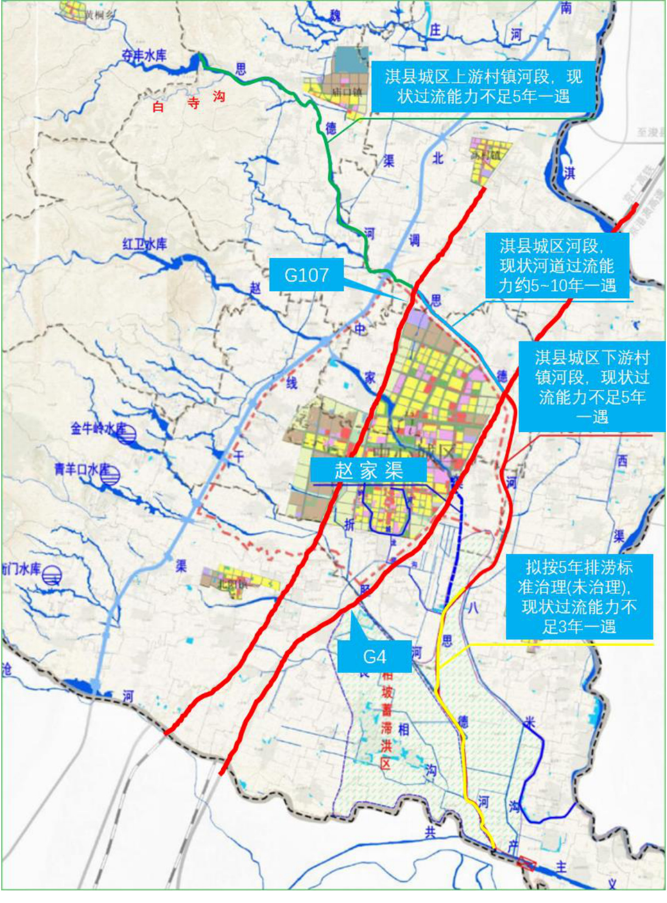  
图 5.2-1 思德河各段防洪排涝现状  

# 5.2.3 防洪保护对象和防洪标准  

思德河夺丰水库坝址至 G107 之间为淇县城区上游村镇河段,庙口镇镇区位于该河段内,此外该河段还分布有庙口镇、黄洞乡、高村镇的部分村庄和农田,2022 年该地区有常住人口 2.1 万人,农田 14 万亩。根据《防洪标准》(GB50201-2014),思德河淇县城区上游村镇河段防洪标准应为 10 年一遇。目前,该河段现状过流能力不足 5 年一遇,不满足 10 年一遇防洪标准要求。  

G107 至 G4 之间为淇县城区河段,《河南省漳卫河流域综合治理方案》、《河南省防洪规划》提出,淇县城区防洪标准为 50 年一遇。2022 年淇县全县总人口 26.16 万人,其中淇县城区人口 15.25 万人,预计到 2035 年全县总人口增长至38.58万人,淇县城区人口增长至26.58万人,根据《防洪标准》(GB50201-2014),淇县城区防洪标准应为50 年一遇。目前,该河段现状过流能力仅为5\~10 年一遇,不满足 50 年一遇防洪标准要求。  

思德河 G4 至入良相坡前为淇县城区下游村镇河段,西岗镇镇区位于该河段内,此外该河段还分布有西岗镇、朝歌街道、桥盟街道和高村镇的部分村庄和农田,2022 年该地区有常住人口 2.6 万人,农田 4.3 万亩。根据《防洪标准》(GB50201-2014),思德河淇县城区下游村镇河段防洪标准应为 10 年一遇。目前,该河段现状过流能力不足 5 年一遇,不满足 10 年一遇防洪标准要求。  

良相坡蓄滞洪区位于新乡市的卫辉和鹤壁市的淇县境内,南以卫河右堤为界,东靠西岗堤和淇河右堤,北倚淇县城关防洪堤,西接自然高地。它处于太行山洪积和黄河冲积平原的过渡地带,地势低洼,地面高程一般为 $65.5\mathrm{m}$ ,最低 $64.5\mathrm{m}$ ,最高 $67.0\mathrm{m}$ ,历史上就是一个自然坡洼,1958 年修建共产主义渠后,把良相坡分为共渠左岸和共渠右岸两部分。良相坡蓄滞洪区内包括卫辉市、淇县 2 个县(市),6 个乡镇,30 个村庄,人口 4.62 万人。其中:卫辉市包括上乐村镇、顿坊店乡、城郊乡等 3 个乡镇,22 个行政村,人口 3.03 万人;淇县包括北阳镇、西岗镇、朝歌街道办事处等 3 个乡镇(街道办事处),8 个行政村,人口 1.59 万人。良相坡蓄滞洪区没有进洪控制工程,根据河南省蓄滞洪区运用预案中提出的规模指标,现状良相坡的设计蓄滞洪水位为 $67.34\mathrm{m}$ ,水深 $0.5\mathrm{m}{\sim}2.5\mathrm{m}$ 之间,蓄滞洪量 0.92亿 $\mathrm{m}^{3}$ ,淹没面积 $74.52\mathrm{km}^{2}$ ,运用机率为 2\~3 年一遇。根据现状防洪要求,良相坡蓄滞洪区启动标准需提高至 5 年一遇。  

综上分析,夺丰水库防洪保护对象为坝址下游淇县城区和城区上、下游村镇,其中淇县城区防洪标准为 50 年一遇,淇县城区上、下游村镇防洪标准为 10 年一遇。良相坡蓄滞洪区河段按照 5 年一遇不出槽控制。  

# 5.2.4 防洪总体布局  

《河南省防洪规划》中提出的防洪布局安排:夺丰水库扩容后,可减小 50年一遇洪水下泄流量,通过下游堤防加固等措施将淇县防洪标准提升到 50 年;同时控制思德河 5 年一遇洪水下泄,结合其他工程措施减小下游滞洪区启用几率和进洪量。  

# 5.2.5 防洪控制断面及安全泄量  

# 5.2.5.1 防洪控制断面选择  

(1)淇县城区上游村镇河段防洪控制断面选择  

淇县城区上游村镇河段上游起点为夺丰水库坝址,下游终点为 G107,河段总长度 $10.4\mathrm{km}$ ,该河段共分两次治理。2012 年,对南水北调思德河倒虹吸至 G107进行了治理,主要内容为河道疏浚工程,该河段长 $1.0\mathrm{km}$ ,全段按底宽 $30\mathrm{m}$ 进行疏浚开挖。根据利水工程咨询有限公司 2020 年编制的《鹤壁市淇县思德河夺丰水库至南水北调段河道治理工程初步设计报告》成果,夺丰水库至南水北调段河道长 $9.4\mathrm{km}$ ,河道设计底宽为 $15\mathrm{m}$ ,设计边坡坡比为 1:2。  

河道治理过程中,由于部分河段设计河道开挖边线占用基本农田,导致该河段实际开挖宽度未达到设计宽度。根据原设计河道开挖边线嵌套基本农田图斑,淇县城区上游村镇河段中,共有 $1.90\mathrm{km}$ 长河段设计河道开挖边线占用基本农田,其中夺丰水库坝址至南水北调倒虹吸段 $1.63\mathrm{km}$ ,南水北调倒虹吸至 G107 段0.27km。  

经现场查勘并结合河道水面线计算,淇县城区上游村镇河段防洪最薄弱环节位于范辉高速北位置处,该位置处于思德河由东南流向转向东北流向的拐角处,河道断面束窄,且左右两岸均为基本农田,无拓宽条件,因此选取范辉高速北断面作为防洪控制断面。  

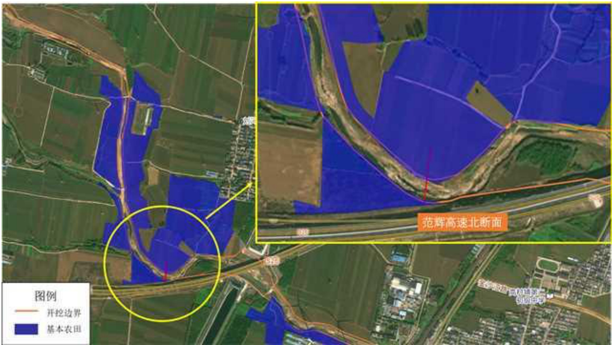  
图 5.2-2  范辉高速北断面位置示意图  

(2)淇县城区河段防洪控制断面选择  

思德河淇县城区河段上游起点为G107,下游终点为G4,河段总长度 $4.2\mathrm{km}$ ,该河段在 2012 年思德河高村镇段(南水北调思德河渠道倒虹吸至京珠高速)治理工程中按照 10 年一遇防洪标准疏浚主河槽,底宽 $20\mathrm{m}$ ,河道护坡采用 C20 混凝土预制六棱块,护脚防冲齿墙采用 M7.5 浆砌石; “21.7”洪水期间,洪水漫堤,两岸受损严重,河槽淤积深度约 $0.6\mathrm{m}{\sim}1.0\mathrm{m}$ ,天然河道底宽 $15{\sim}20\mathrm{m}$ ,原治理工程实施的 C20 混凝土预制六棱块护坡大部分冲毁淤积于河槽,河底分布有原治理工程实施的浆砌石护脚。 “21.7”洪水后,对该河段重新治理,根据黄河勘测规划设计研究院有限公司 2022 年编制的《淇县思德河及赵家渠灾后重建及修复工程初步设计报告》成果,设计横断面采用复式断面,设计子槽宽度为$20\mathrm{m}$ ,子槽边坡 1:3.0,子槽深 $1.5\mathrm{m}$ ,滩面宽 $3\mathrm{m}$ ,主河槽边坡 1:6;主河槽边坡以上为滩地和堤防,根据设计开挖断面清理河底淤泥及损毁的护坡、护脚材料。  

淇县城区河段河道治理不存在基本农田限制,主要问题是部分河段受桥梁孔口尺寸限制,导致河道过流能力小。淇县城区河段共分布有 107 国道桥、六盘山路桥、鹤淇大道桥、泰山路桥和京港澳高速桥等 5 座桥,其中孔口尺寸最小桥梁为六盘山路桥,该桥梁设三孔过流,每孔宽 $8.5\mathrm{m}$ ,高 $5.0\mathrm{m}$ 。“21.7”洪水时,由于六盘山路桥孔口尺寸小,导致桥梁位置发生了阻水漫溢。经现场查勘并结合河道水面线计算成果,选取六盘山路桥断面作为防洪控制断面。  

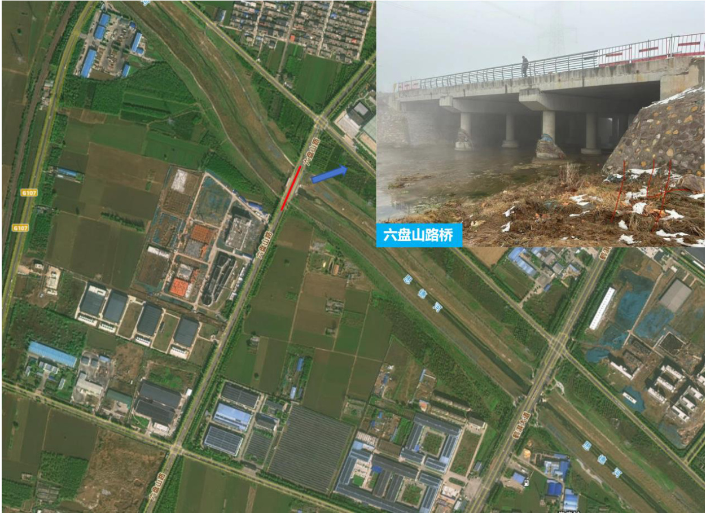  
图 5.2-3  六盘山路桥断面位置示意图  

(3)淇县城区下游村镇河段防洪控制断面选择  

淇县城区下游村镇河段上游起点为 G4,下游终点为良相坡蓄滞洪区入口,河段总长度 $3.6\mathrm{km}$ 。该河段在思德河桥盟乡治理工程中采用 5 年一遇防洪标准进行河道清淤疏浚,设计底宽 $20\mathrm{m}$ ,护坡采用 C20 混凝土预制六棱块,坡脚设置C20 素混凝土基础。“21.7”洪水以后,河槽淤积深度达 $0.7{\sim}1.2\mathrm{m}$ ,天然河道底宽 $13{\sim}28\mathrm{m}$ ,原治理工程实施的 C20 混凝土预制六棱块护坡大部分冲毁淤积于河槽,河底分布有原治理工程实施的 C20 素混凝土护脚。“21.7”洪水后,对该河段重新治理,根据黄河勘测规划设计研究院有限公司 2022 年编制的《淇县思德河及赵家渠灾后重建及修复工程初步设计报告》成果,关东庄村、余庄村附近$0.5\mathrm{km}$ 河段河道设计为矩形断面,河底宽度为 $26\mathrm{m}$ ,两岸采用钢筋混凝土悬臂式挡土墙防护;其余河段河道设计为梯形断面,设计河道底宽 $30\mathrm{m}$ ,迎水边坡1:2.5,根据设计开挖断面清理河底淤泥及损毁的护坡、护脚材料。  

“21.7”洪水后,对该河段重新治理,根据黄河勘测规划设计研究院有限公司 2022 年编制的《淇县思德河及赵家渠灾后重建及修复工程初步设计报告》成果,设计横断面采用复式断面,设计子槽宽度为 $20\mathrm{m}$ ,子槽边坡 1:3.0,子槽深 $1.5\mathrm{m}$ ,滩面宽 $3\mathrm{m}$ ,主河槽边坡 1:6;主河槽边坡以上为滩地和堤防,根据设计开挖断面清理河底淤泥及损毁的护坡、护脚材料。  

河道治理过程中,淇县城区下游村镇河段河道两岸大部分受到基本农田限制,导致该河段实际开挖宽度未达到设计宽度。经现场查勘并结合河道水面线计算,淇县城区下游村镇河段防洪最薄弱环节位于杨吴排水沟口上游约 $170\mathrm{m}$ 位置处,该位置河底宽仅 $15\mathrm{m}$ ,左右岸堤顶间距约 $65\mathrm{m}$ ,且左右岸堤外紧邻基本农田,无拓宽条件。因此,选取杨吴排水沟口上游断面作为防洪控制断面。  

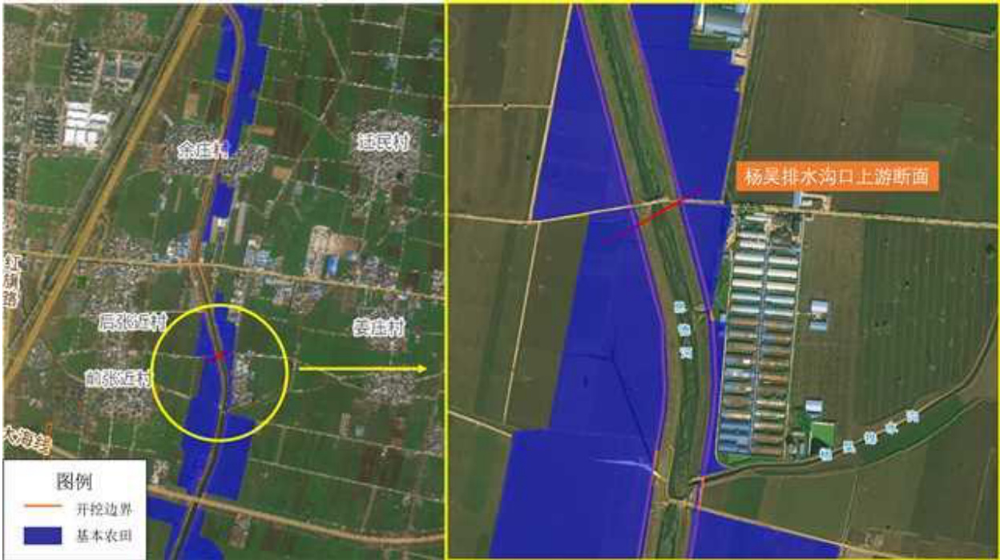  
图 5.2-4  杨吴排水沟口上游断面位置示意图  

(4)良相坡蓄滞洪区河段控制断面选择  

良相坡蓄滞洪区河段上游起点为蓄滞洪区入口,下游终点为共产主义渠,河段总长度 $11.3\mathrm{km}$ ,多年来未进行系统的治理,现状河道两岸堤防低于滞洪区运用水位,“ $21.7^{\mathfrak{N}}$ 洪水期间,良相坡蓄滞洪区启用,该河段全线漫堤,根据现场调查及勘探结果,受洪水冲刷影响,河槽内防浪林倾斜歪倒,阻碍河道行洪,造成河底淤积,现状河槽淤积深度约 $0.5{\sim}0.8\mathrm{m}$ ,现状天然河道底宽 $13{\sim}17\mathrm{m}$ 。  

思德河在良相坡蓄滞洪区内汇入支流赵家渠、折胫河及其他支沟洪水,洪水地区组成较复杂,本次控制断面选在赵家渠汇入之前河段,该段河道长约 $3.5\mathrm{km}$ 。经现场查勘并结合河道水面线计算,该河段过流最薄弱环节位于赵家渠汇入口上游约 $300\mathrm{m}$ 处,因此选取赵家渠汇入口上游断面作为防洪控制断面。  

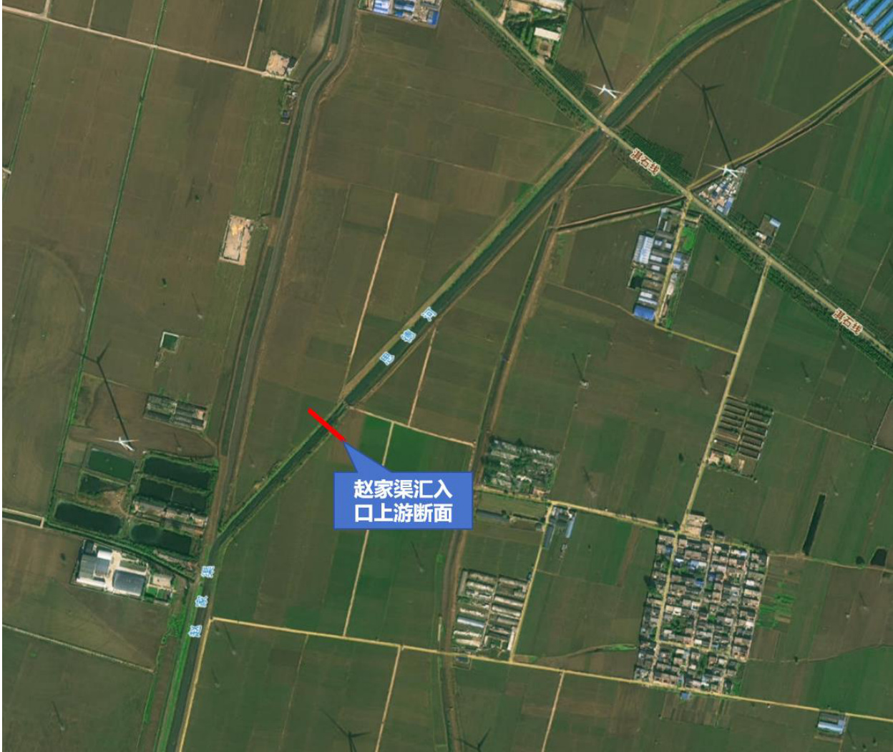  
图 5.2-5  赵家渠汇入口上游断面位置示意图  

# 5.2.5.2 河道安全流量  

(1)计算方法  

为了较准确的计算思德河河道过流能力,采用 hec-ras 软件中的一维恒定非均匀渐变流计算模块对思德河夺丰水库坝址至赵家渠汇入口下游 $1.4\mathrm{km}$ 河道水面线进行计算。水面线计算从一个断面向下一个断面通过能量方程进行迭代计算,即逐步试算法。能量方程如下:  

$$
\begin{array}{r}{Z_{2}+Y_{2}+\frac{\alpha_{2}V_{2}^{2}}{2g}=Z_{1}+Y_{1}+\frac{\alpha_{1}V_{1}^{2}}{2g}}\end{array}
$$  

式中: $Z_{1}Z_{2}$ —分别指下断面和上断面主槽底高程(m);  

$Y_{1}Y_{2}$ —下断面和上断面水深(m);  
$V_{1}V_{2}$ —断面平均流速(m/s);  
$a_{1}a_{2}$ —流速修正系数;g—重力加速度;  
he—能量水头损失。  

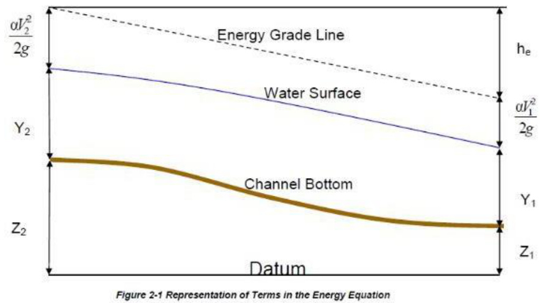  
图 5.2-6  能量方程计算示意图  

两断面之间的能量水头损失包括摩擦阻力损失和收缩(扩张)损失,能量损失计算方程如下:  

$$
h_{s}=L\bar{S_{f}}+\mathbb{C}\left|\frac{a_{2}V_{2}^{2}}{2g}-\frac{a_{1}V_{1}^{2}}{2g}\right|
$$  

式中:L —断面间距(m);𝑆 —两断面间摩擦阻力坡度;C—扩张或收缩损失系数。B.堰流计算堰坝位置水位采用以下公式计  

$$
Q=\sigma_{s}\sigma_{c}m n\sqrt{2g}{H_{0}^{3}}^{/}{}^{2}
$$  

式中: $\mathrm{Q}$ —流量( $\mathrm{m}^{3}/\mathrm{s})$ );  
$\sigma_{s}$ —淹没系数,根据上、下游水位确定;  
$\sigma_{c}$ —侧收缩系数;  
m—流量系数;  
nb—n 为孔数、b 为每孔净宽,nb 为总宽度;  
$H_{0}$ —包括行近流速水头的堰前水头,即 $\begin{array}{r}{H_{0}=H+\frac{V_{0}^{2}}{2g}\circ}\end{array}$  

# C.孔流计算  

孔流计算公式如下:  

$$
Q=\sigma_{s}\mu b\sqrt{2g H_{0}}
$$  

式中: $\mu$ —流量系数;   
$\sigma_{s}$ —淹没系数。  

(2)河道概化  

根据河道现有的地形、水文等资料,现状河道断面的概化采用实测地形。将思德河夺丰水库坝址至赵家渠汇入口下游 $1.4\mathrm{km}$ 河段概化为 1 条河道,根据支流汇入情况,共划分为 4 个河段。根据河长及河道断面变化趋势共选取了 67 个实测断面,将堰坝、桥梁概化为阻水建筑物,本河段共有主要阻水桥梁 23 座。  

表 5.2-1  思德河夺丰水库坝址至入工程主义渠段分段情况表  

<html><body><table><tr><td>序号</td><td>分段点</td><td>距离溪沿水库坝址里程（km）</td></tr><tr><td>1</td><td>夺丰水库坝址</td><td>0</td></tr><tr><td>2</td><td>G107</td><td>10.4</td></tr><tr><td>3</td><td>G4</td><td>14.6</td></tr><tr><td>4</td><td>入良相坡</td><td>18.2</td></tr><tr><td>5</td><td>赵家渠汇入口下游1.4km</td><td>22.8</td></tr></table></body></html>  

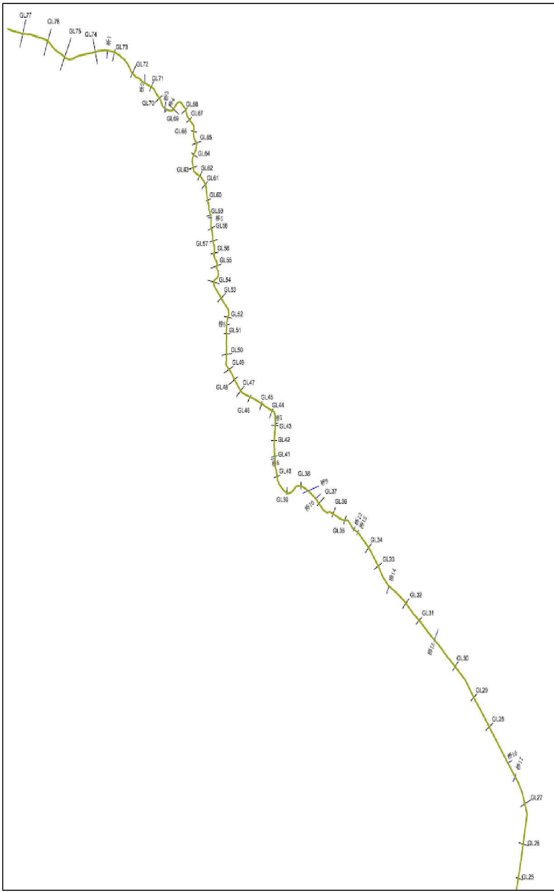  
图 5.2-7  思德河夺丰水库坝址至赵家渠汇入口下游 1.4k 河段断面位置示意图  

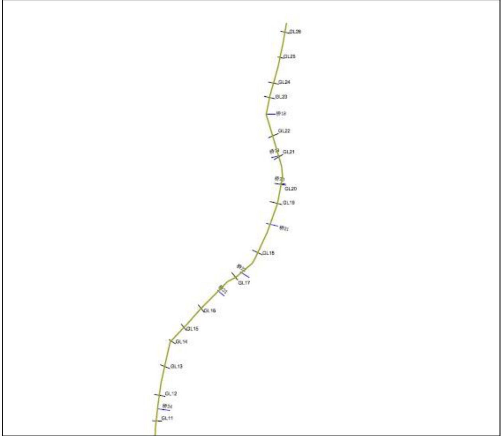  
续图 5.2-7  思德河夺丰水库坝址至赵家渠汇入口下游 1.4k河段断面位置示意图  

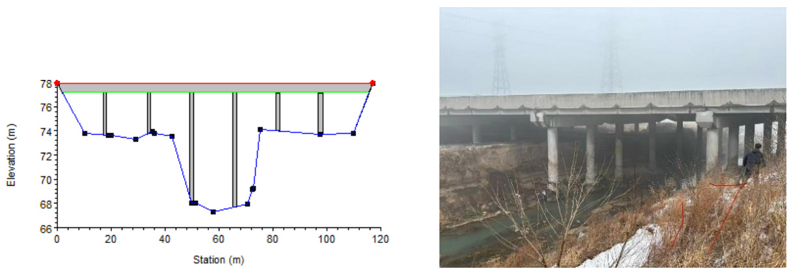  
图 5.2-8  hec 模型中京港澳高速桥概化图  

(3)参数选取  

考虑主槽和边滩糙率是影响河道行洪能力的重要因素,河道糙率系数根据河床质组成情况查表,并结合现场洪痕调查结果反推糙率值,综合取值范围为$\scriptstyle{\mathrm{n}=0.022\sim0.025}$ 。根据河道上、下游横断面变化趋势选取收缩或扩张损失系数。  

(4)边界条件  

模型计算上边界为流量资料,夺丰水库坝址下游约 $600\mathrm{m}$ 处汇入白寺沟洪水,出山区后汇入区间涝水,思德河不同河段区间不同频率洪涝水峰值见表 5.2-2,洪涝水叠加后不同断面不同频率洪水洪峰流量见表 5.2-3。  

表 5.2-2  思德河不同河段区间不同频率洪涝水峰值统计表  单位: $\mathbf{m}^{3}/\mathbf{s}$   

<html><body><table><tr><td rowspan="2">河段区间</td><td colspan="4">各频率（%）</td></tr><tr><td>2</td><td>5</td><td>10</td><td>20</td></tr><tr><td>夺丰水库坝址以上 (洪水)</td><td>1342</td><td>1001</td><td>757</td><td>524</td></tr><tr><td>白寺沟口以上 (洪水)</td><td>162</td><td>122</td><td>93</td><td>64</td></tr><tr><td>夺丰水库坝址~G107 （涝水)</td><td>89</td><td>66</td><td>50</td><td>29</td></tr><tr><td>夺丰水库坝址~G4 （涝水)</td><td>123</td><td>91</td><td>69</td><td>39</td></tr><tr><td>夺丰水库坝址~赵家渠汇入口 (涝水)</td><td>149</td><td>110</td><td>83</td><td>46</td></tr></table></body></html>  

表 5.2-3  洪涝叠加后思德河不同断面不同频率洪水洪峰流量表  单位: $\mathbf{m}^{3}/\mathbf{s}$   

<html><body><table><tr><td rowspan="2">断面名称</td><td colspan="4">各频率（%)</td></tr><tr><td>2</td><td>5</td><td>10</td><td>20</td></tr><tr><td>夺丰水库坝址</td><td>1342</td><td>1001</td><td>757</td><td>524</td></tr><tr><td>G107</td><td>1592</td><td>1188</td><td>900</td><td>617</td></tr><tr><td>G4</td><td>1626</td><td>1213</td><td>919</td><td>626</td></tr><tr><td>赵家渠汇入口上游</td><td>1652</td><td>1232</td><td>933</td><td>634</td></tr></table></body></html>  

模型计算下边界为水位流量关系,本次水面线计算从赵家渠汇入后下游$1.4\mathrm{km}$ 处断面起推,该断面水位流量关系见表 5.2-3,断面形态见图 5.2-9。  

表 5.2-3  赵家渠汇入口下游 $\mathbf{1.4km}$ 处断面水位流量关系  

<html><body><table><tr><td>水位 (m)</td><td>流量 (m² /s)</td><td>水位 (m)</td><td>流量 (m3 /s)</td></tr><tr><td>62.3</td><td>0</td><td>65.3</td><td>39</td></tr><tr><td>62.8</td><td>1</td><td>65.8</td><td>52</td></tr><tr><td>63.3</td><td>5</td><td>66.3</td><td>67</td></tr><tr><td>63.8</td><td>11</td><td>66.8</td><td>85</td></tr><tr><td>64.3</td><td>18</td><td>67.4</td><td>112</td></tr><tr><td>64.8</td><td>28</td><td></td><td></td></tr></table></body></html>  

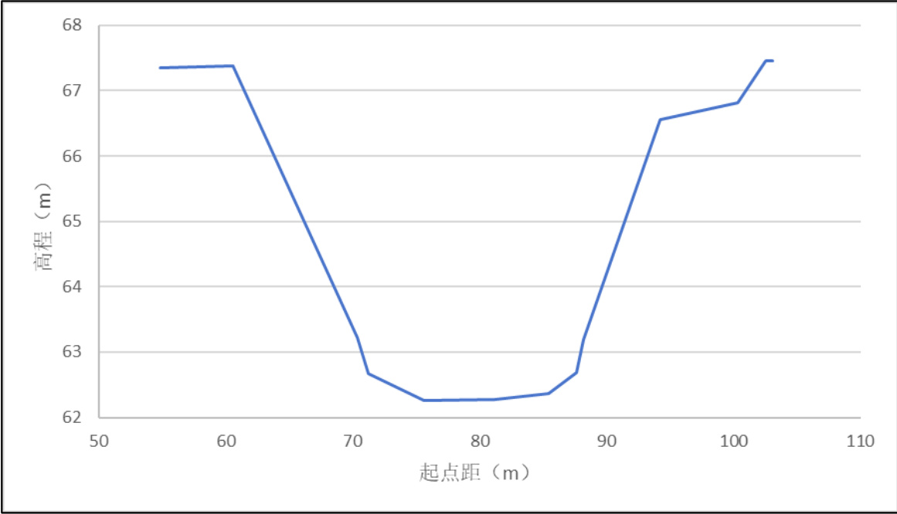  
图 5.2-9  赵家渠汇入口下游 $\mathbf{1.4km}$ 处断面  

(5)各控制断面过流能力计算  

利用构建的水利计算模型,计算得到夺丰水库坝址至赵家渠汇入口下游$1.4\mathrm{km}$ 河段不同频率洪水位成果。  

范辉高速北断面  

范辉高速北断面位于淇县城区上游村镇河段,该河段左右两岸均无堤防,只建有部分护岸工程,因此河道过流能力不考虑安全超高。范辉高速北断面左岸护岸高程 $90.55\mathrm{m}$ ,右岸护岸高程 $91.89\mathrm{m}$ ,过流高程为 $90.55\mathrm{m}$ ,相应过流能力为$205\mathrm{{m}^{3}/\mathsf{s}}$ ,不足 5 年一遇。  

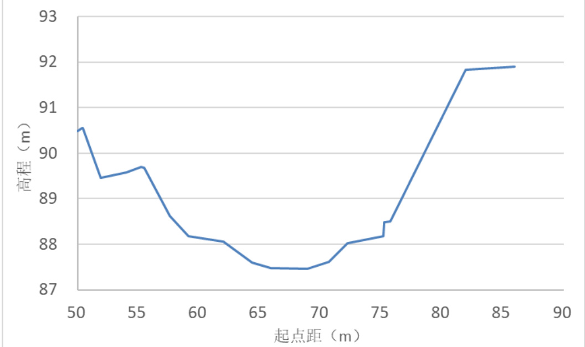  
图 5.2-10 范辉高速北断面图  

$\textcircled{1}$ 六盘山路桥断面  

六盘山路桥位于淇县城区河段,该桥梁设三孔过流,每孔宽 $8.5\mathrm{m}$ ,高 $5.0\mathrm{m}$ ,桥面底板高程 $79.8\mathrm{m}$ 。“21.7”洪水时,由于六盘山路桥孔口尺寸小,导致桥梁位置发生了阻水漫溢。经水面线计算,该断面过流能力仅为 $650\mathrm{m}^{3}/\mathrm{s}$ ,约为 5 年一遇。  

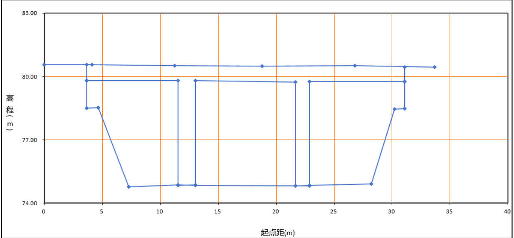  
图 5.2-11  六盘山路桥断面图  

$\textcircled{2}$ 杨吴排水沟口上游断面  

杨吴排水沟口上游断面位于淇县城区下游村镇河段,现状该河段仅局部建有4 级堤防,大部分为河段为护岸工程,河道过流能力不考虑安全超高。杨吴排水沟口上游断面左岸顶部高程 $70.12\mathrm{m}$ ,右岸顶部高程 $70.70\mathrm{m}$ ,过流高程为 $70.12\mathrm{m}$ ,相应过流能力为 $377\mathrm{m}^{3}/\mathrm{s}$ ,不足 5 年一遇。  

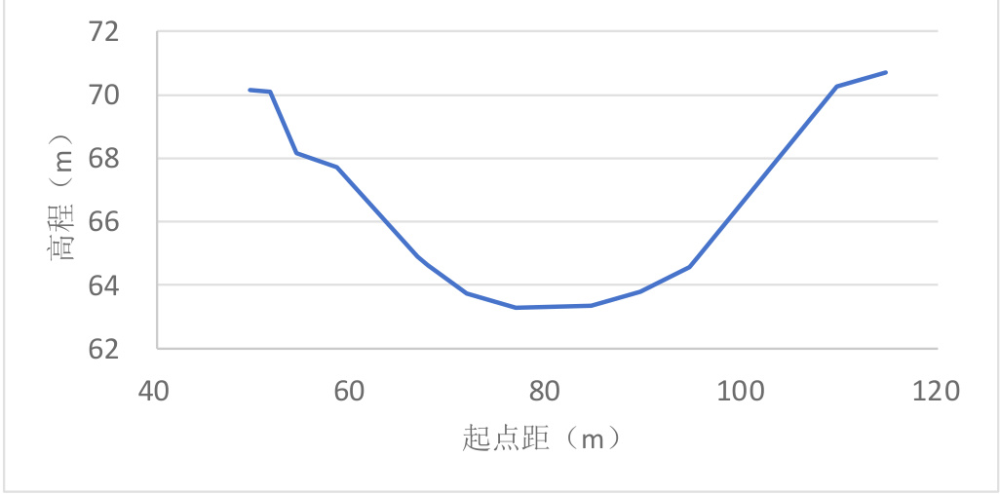  
图 5.2-12  杨吴排水沟口上游断面图  

$\textcircled{3}$ 赵家渠汇入口上游断面  

赵家渠汇入口上游断面位于良相坡蓄滞洪区范围内,该河段左右两岸均无堤防,只建有部分护岸工程,因此河道过流能力不考虑安全超高。赵家渠汇入口上游断面左岸护岸高程 $68.34\mathrm{m}$ ,右岸护岸高程 $66.20\mathrm{m}$ ,过流高程为 $66.20\mathrm{m}$ ,相应过流能力为 $80\mathrm{m}^{3}/\mathrm{s}$ ,不足 3 年一遇。思德河良相坡蓄滞洪区段预计 2025 年年底治理完成,因此赵家渠汇入口上游断面过流能力采用治理后的设计值。根据《淇县思德河及赵家渠灾后重建及修复工程初步设计报告》,赵家渠汇入口上游断面治理后河道过流能力为 $174\mathrm{m}^{3}/\mathrm{s}$ 。  

  
图 5.2-13  赵家渠汇入口上游断面图  

表 5.2-4  各防洪控制断面过流能力计算汇总表  

<html><body><table><tr><td rowspan="2">断面名称</td><td rowspan="2">左岸堤顶 (护岸)高程 (m)</td><td rowspan="2">右岸堤顶 (护岸)高程 (W)</td><td rowspan="2">断面过 流高程 (w)</td><td rowspan="2">断面过流 能力 (m/s)</td><td colspan="3">频率水位（m)</td></tr><tr><td>20%</td><td>10%</td><td>2%</td></tr><tr><td>赵家渠汇入口 上游</td><td>68.34</td><td>66.20</td><td>66.20</td><td>174 (设计值)</td><td>71.26</td><td>72.88</td><td>76.11</td></tr><tr><td>杨吴排水沟口 上游</td><td>70.12</td><td>70.70</td><td>70.12</td><td>377</td><td>71.83</td><td>73.49</td><td>76.82</td></tr><tr><td>六盘山路桥</td><td>78.9 (桥底板高)</td><td>78.9 (桥底板高)</td><td>78.9</td><td>650</td><td>79.01</td><td>81.17</td><td>81.72</td></tr><tr><td>范辉高速北</td><td>90.55</td><td>91.89</td><td>90.55</td><td>205</td><td>92.06</td><td>92.79</td><td>94.29</td></tr></table></body></html>  

表 5.2-5  夺丰水库坝址至赵家渠汇入口下游 $\mathbf{1.4km}$ 河段不同频率洪水位成果表  

<html><body><table><tr><td rowspan="2">序号</td><td rowspan="2">里程（m)</td><td rowspan="2">河底高程（m)</td><td colspan="2">洪水位（m)</td><td colspan="2">堤顶（护岸）高程（m)</td><td rowspan="2">设计防洪标准</td><td rowspan="2">备注</td></tr><tr><td>20%</td><td>10% 2%</td><td>左岸</td><td>右岸</td></tr><tr><td>1</td><td>0</td><td>62.26</td><td>70.22</td><td></td><td>67.35</td><td>67.45</td><td>5</td><td>赵家渠汇入口下游1.4km断面</td></tr><tr><td>2</td><td>445</td><td>62.24</td><td>70.38</td><td></td><td>67.12</td><td>68.31</td><td>5</td><td></td></tr><tr><td>3</td><td>949</td><td>62.12</td><td>70.62</td><td></td><td>67.21</td><td>68.69</td><td>5</td><td></td></tr><tr><td>4</td><td>1408</td><td>62.12</td><td>70.92</td><td></td><td>67.41</td><td>69.32</td><td>5</td><td></td></tr><tr><td>5</td><td>1729</td><td>62.6</td><td>71.26</td><td></td><td>68.34</td><td>66.20</td><td>5</td><td>赵家渠汇入口上游断面</td></tr><tr><td>6</td><td>2171</td><td>62.91</td><td></td><td>72.96</td><td>67.28</td><td>66.66</td><td>10</td><td></td></tr><tr><td>7</td><td>2977</td><td>63.04</td><td></td><td>72.89</td><td>69.42</td><td>67.35</td><td>10</td><td></td></tr><tr><td>8</td><td>3560</td><td>63.23</td><td></td><td>73.20</td><td>69.45</td><td>69.21</td><td>10</td><td></td></tr><tr><td>6</td><td>4476</td><td>63.31</td><td></td><td>73.34</td><td>69.73</td><td>69.62</td><td>10</td><td></td></tr><tr><td>10</td><td>4809</td><td>63.69</td><td></td><td>73.37</td><td>69.77</td><td>69.66</td><td>10</td><td></td></tr><tr><td>11</td><td>5294</td><td>63.29</td><td></td><td>73.49</td><td>70.12</td><td>70.70</td><td>10</td><td>杨吴排水沟口上游断面</td></tr><tr><td>12</td><td>5671</td><td>63.89</td><td></td><td>73.56</td><td>70.41</td><td>70.63</td><td>10</td><td></td></tr><tr><td>13</td><td>6356</td><td>65.09</td><td></td><td>73.71</td><td>71.23</td><td>70.86</td><td>10</td><td></td></tr><tr><td>14</td><td>6615</td><td>65</td><td></td><td>73.77</td><td>71.00</td><td>70.77</td><td>10</td><td></td></tr><tr><td>15</td><td>7072</td><td>65.95</td><td></td><td>73.59</td><td>72.42</td><td>72.47</td><td>10</td><td></td></tr><tr><td>16</td><td>7515</td><td>66.35</td><td>74.62</td><td></td><td>72.32</td><td>72.55</td><td>10</td><td></td></tr><tr><td>17</td><td>8037</td><td>66.92</td><td>74.79</td><td></td><td>73.04</td><td>73.73</td><td>10</td><td></td></tr><tr><td>18</td><td>9196</td><td>69.57</td><td></td><td>78.72</td><td>76.07</td><td>76.01</td><td>50</td><td></td></tr><tr><td>19</td><td>9655</td><td>70.57</td><td></td><td>78.90</td><td>76.76</td><td>76.79</td><td>50</td><td></td></tr><tr><td>20</td><td>10162</td><td>70.58</td><td></td><td>79.11</td><td>77.63</td><td>77.55</td><td>50</td><td></td></tr></table></body></html>  

<html><body><table><tr><td>序号</td><td>里程（m)</td><td>河底高程（m)</td><td>洪水位（m)</td><td></td><td>堤顶（护岸）高程（m)</td><td></td><td>设计防洪标准</td><td>备注</td></tr><tr><td></td><td></td><td></td><td>20%</td><td>10% 2%</td><td>左岸</td><td>右岸</td><td></td><td></td></tr><tr><td>21</td><td>11013 11328</td><td>71.74 72.66</td><td></td><td>81.04 81.16</td><td>79.30 80.04</td><td>79.29 81.88</td><td>50 50</td><td></td></tr><tr><td>22</td><td></td><td></td><td></td><td></td><td>78.9</td><td>78.9</td><td></td><td>六盘山路桥断面</td></tr><tr><td>六盘山路桥</td><td>11514</td><td>74.51</td><td></td><td>81.72</td><td>(桥底板高程)</td><td>(桥底板高程)</td><td>50</td><td></td></tr><tr><td>23</td><td>12011</td><td>75.05</td><td></td><td>82.71</td><td>82.92</td><td>82.94</td><td>50</td><td></td></tr><tr><td>24</td><td>12294</td><td>76</td><td></td><td>82.94</td><td>84.29</td><td>85.63</td><td>50</td><td></td></tr><tr><td>25 26</td><td>12849</td><td>81.13</td><td></td><td>86.06</td><td>85.66</td><td>86.59</td><td>10</td><td></td></tr><tr><td>27</td><td>13068 13362</td><td>82.45 83.82</td><td></td><td>87.92</td><td>88.35</td><td>87.00</td><td>10 10</td><td></td></tr><tr><td>28</td><td>13746</td><td>86.5</td><td></td><td>88.99 91.27</td><td>89.65</td><td>89.63 91.31</td><td>10</td><td></td></tr><tr><td>29</td><td>14019</td><td>87.47</td><td></td><td>92.79</td><td>89.62 90.55</td><td>91.89</td><td>10</td><td>范辉高速北断面</td></tr><tr><td>30</td><td>14299</td><td>88.46</td><td></td><td>94.34</td><td>91.85</td><td>94.15</td><td>10</td><td></td></tr><tr><td>31</td><td>14560</td><td>89.75</td><td></td><td>95.80</td><td>92.75</td><td>93.09</td><td>10</td><td></td></tr><tr><td>32</td><td>14767</td><td>90.69</td><td></td><td>95.75</td><td>93.41</td><td>95.11</td><td>10</td><td></td></tr><tr><td>33</td><td>14956</td><td>90.97</td><td></td><td>96.49</td><td>94.15</td><td>96.50</td><td>10</td><td></td></tr><tr><td>34</td><td>15166</td><td>91.99</td><td></td><td>97.60</td><td>95.40</td><td>97.24</td><td>10</td><td></td></tr><tr><td>35</td><td>15370</td><td>93.34</td><td></td><td>99.75</td><td>97.16</td><td>99.32</td><td>10</td><td></td></tr><tr><td>36</td><td>15582</td><td>94.56</td><td></td><td>100.83</td><td>97.14</td><td>100.39</td><td>10</td><td></td></tr><tr><td>37</td><td>15764</td><td>95.87</td><td></td><td>101.79</td><td>99.21</td><td>99.33</td><td>10</td><td></td></tr><tr><td>38</td><td>15942</td><td>96.56</td><td></td><td>101.59</td><td>98.81</td><td>101.81</td><td>10</td><td></td></tr><tr><td>39</td><td>16103</td><td>97.94</td><td></td><td>102.09</td><td>103.59</td><td>108.65</td><td>10</td><td></td></tr><tr><td>40</td><td>16311</td><td>100.13</td><td></td><td>103.82</td><td>104.87</td><td>111.22</td><td>10</td><td></td></tr></table></body></html>  

<html><body><table><tr><td rowspan="2">序号</td><td rowspan="2">里程（m)</td><td rowspan="2">河底高程（m)</td><td colspan="3">洪水位（m)</td><td colspan="2">堤顶（护岸）高程（m)</td><td rowspan="2">设计防洪标准</td><td rowspan="2">备注</td></tr><tr><td>20%</td><td>10%</td><td>2%</td><td>左岸</td><td>右岸</td></tr><tr><td>41</td><td>16575</td><td>101.6</td><td></td><td>106.30</td><td></td><td>108.12</td><td>109.10</td><td>10</td><td></td></tr><tr><td>42</td><td>16787</td><td>103.13</td><td></td><td>108.03</td><td></td><td>113.54</td><td>114.10</td><td>10</td><td></td></tr><tr><td>43</td><td>17080</td><td>105.62</td><td></td><td>109.91</td><td></td><td>116.75</td><td>116.57</td><td>10</td><td></td></tr><tr><td>44</td><td>17326</td><td>106.67</td><td></td><td>111.33</td><td></td><td>117.00</td><td>119.17</td><td>10</td><td></td></tr><tr><td>45</td><td>17579</td><td>109.96</td><td></td><td>113.75</td><td></td><td>120.17</td><td>118.33</td><td>10</td><td></td></tr><tr><td>46</td><td>17751</td><td>113.18</td><td></td><td>117.47</td><td></td><td>120.83</td><td>119.57</td><td>10</td><td></td></tr><tr><td>47</td><td>17911</td><td>113.88</td><td></td><td>119.64</td><td></td><td>121.88</td><td>122.61</td><td>10</td><td></td></tr><tr><td>48</td><td>18075</td><td>115.14</td><td></td><td>120.67</td><td></td><td>123.22</td><td>123.26</td><td>10</td><td></td></tr><tr><td>49</td><td>18247</td><td>117.25</td><td></td><td>122.37</td><td></td><td>124.09</td><td>124.45</td><td>10</td><td></td></tr><tr><td>50</td><td>18444</td><td>118.41</td><td></td><td>123.43</td><td></td><td>125.68</td><td>125.33</td><td>10</td><td></td></tr><tr><td>51</td><td>18648</td><td>119.59</td><td></td><td>124.70</td><td></td><td>129.31</td><td>128.14</td><td>10</td><td></td></tr><tr><td>52</td><td>18794</td><td>120.03</td><td></td><td>125.12</td><td></td><td>130.35</td><td>129.54</td><td>10</td><td></td></tr><tr><td>53</td><td>18961</td><td>121.57</td><td></td><td>126.73</td><td></td><td>130.98</td><td>132.86</td><td>10</td><td></td></tr><tr><td>54</td><td>19133</td><td>123.16</td><td></td><td>127.99</td><td></td><td>131.92</td><td>129.47</td><td>10</td><td></td></tr><tr><td>55</td><td>19291</td><td>124.22</td><td></td><td>128.53</td><td></td><td>135.36</td><td>136.08</td><td>10</td><td></td></tr><tr><td>56</td><td>19455</td><td>122.3</td><td></td><td>130.30</td><td></td><td>135.12</td><td>135.97</td><td>10</td><td></td></tr><tr><td>57</td><td>19633</td><td>126.77</td><td></td><td>132.19</td><td></td><td>131.09</td><td>136.94</td><td>10</td><td></td></tr><tr><td>58</td><td>19775</td><td>127.5</td><td></td><td>132.25</td><td></td><td>137.11</td><td>135.70</td><td>10</td><td></td></tr><tr><td>59</td><td>20066</td><td>129.46</td><td></td><td>134.37</td><td></td><td>133.88</td><td>138.28</td><td>10</td><td></td></tr><tr><td>60</td><td>20393</td><td>133.15</td><td></td><td>138.37</td><td></td><td>138.61</td><td>139.83</td><td>10</td><td></td></tr><tr><td>61</td><td>20596</td><td>135.13</td><td></td><td>139.42</td><td></td><td>142.55</td><td>143.55</td><td>10</td><td></td></tr><tr><td>62</td><td>20968</td><td>138.62</td><td></td><td>142.48</td><td></td><td>150.44</td><td>152.42</td><td>10</td><td></td></tr></table></body></html>  

<html><body><table><tr><td rowspan="2">序号</td><td rowspan="2">里程（m）</td><td rowspan="2">河底高程（m）</td><td colspan="3">洪水位（m)</td><td rowspan="2">堤顶（护岸）高程（m)</td><td rowspan="2">设计防洪标准 右岸</td><td rowspan="2">备注</td><td rowspan="2"></td></tr><tr><td>20%</td><td>10%</td><td>2% 左岸</td></tr><tr><td>63</td><td>21388</td><td>142.18</td><td></td><td>146.34</td><td></td><td>151.69</td><td>152.89</td><td>10</td><td></td></tr><tr><td>64</td><td>21720</td><td>144.37</td><td></td><td>149.03</td><td></td><td>163.23</td><td>165.85</td><td>10</td><td></td></tr><tr><td>65</td><td>22265</td><td>148.94</td><td></td><td>153.37</td><td></td><td>171.56</td><td>179.38</td><td>10</td><td></td></tr><tr><td>66</td><td>22620</td><td>151.2</td><td></td><td>156.19</td><td></td><td>173.81</td><td>183.71</td><td>10</td><td></td></tr><tr><td>67</td><td>23064</td><td>157.4</td><td></td><td>161.10</td><td></td><td>199.37</td><td>210.83</td><td>10</td><td>夺丰坝址</td></tr></table></body></html>  

# 5.2.6 防洪库容确定  

5.2.6.1 夺丰水库允许最大下泄流量确定 (1)淇县城区上游村镇河段  

淇县城区上游村镇段防洪标准为 10 年一遇,防洪控制断面为范辉高速北断面,夺丰水库坝址距离该断面约 $8.9\mathrm{km}$ 。防洪控制断面以上洪水组合:夺丰水库以上洪水 $^{+}$ 白寺沟下泄洪水 $^{+}$ 夺丰水库\~范辉高速北断面区间洪涝水。  

夺丰水库坝址到范辉高速北断面区间涝水汇流面积为 $44.3\mathrm{km}^{2}$ ,10 年一遇涝水峰值为 $43\mathrm{m}^{3}/\mathrm{s}$ ,叠加白寺沟 10 年一遇洪峰 $93\mathrm{m}^{3}/\mathrm{s}$ 后为 $136\mathrm{m}^{3}/\mathrm{s}$ ,范辉高速北断面现状过流能力为 $205\mathrm{m}^{3}/\mathrm{s}$ ,因此夺丰水库最大允许下泄流量为 $69\mathrm{m}^{3}/\mathrm{s}$ 。  

表 5.2-6  固定泄量调度方式水库允许下泄流量  单位: $\mathbf{m}^{3}/\mathbf{s}$   

<html><body><table><tr><td>洪水 频率</td><td>区间涝 水峰值</td><td>白寺沟洪 峰</td><td>范辉高速北断面 安全泄量</td><td>夺丰水库允许 最大下泄流量</td></tr><tr><td>10%</td><td>43</td><td>93</td><td>205</td><td>69</td></tr></table></body></html>  

(2)淇县城区河段  

淇县城区河段防洪标准为 50 年一遇,防洪控制断面为六盘山路桥断面,夺丰水库坝址距离该断面约 $11.3\mathrm{km}$ 。防洪控制断面以上洪水组合:夺丰水库以上洪水 $^+$ 白寺沟下泄洪水 $+$ 夺丰水库\~六盘山路桥断面区间涝水。  

夺丰水库坝址到六盘山路桥断面区间涝水汇流面积为 $55.8\mathrm{km}^{2}$ ,50 年一遇涝水峰值为 $107\mathrm{m}^{3}/\mathrm{s}$ ,叠加白寺沟 50 年一遇洪峰 $163\mathrm{m}^{3}/\mathrm{s}$ 后为 $270\mathrm{m}^{3}/\mathrm{s}$ ,六盘山路断面现状过流能力为 $650\mathrm{m}^{3}/\mathrm{s}$ ,因此夺丰水库最大允许下泄流量为 $380\mathrm{m}^{3}/\mathrm{s}$ 。  

表 5.2-7  固定泄量调度方式水库允许下泄流量  单位: $\mathbf{m}^{3}/\mathbf{s}$   

<html><body><table><tr><td>洪水 频率</td><td>区间涝 水峰值</td><td>白寺沟 洪峰</td><td>六盘山路桥 断面安全泄量</td><td>夺丰水库允许 最大下泄流量</td></tr><tr><td>2%</td><td>107</td><td>163</td><td>650</td><td>380</td></tr></table></body></html>  

(3)淇县城区下游村镇河段  

淇县城区下游村镇河段防洪标准为 10 年一遇,防洪控制断面为杨吴排水沟口上游断面,夺丰水库坝址距离该断面约 $17.6\mathrm{km}$ 。防洪控制断面以上洪水组合:  

夺丰水库以上洪水 $^{.+}$ 白寺沟下泄洪水 $^{+}$ 夺丰水库 $\sim$ 杨吴排水沟口上游断面区间涝水。  

夺丰水库坝址到杨吴排水沟口上游断面区间涝水汇流面积为 $101.3\mathrm{km}^{2}$ ,10年一遇涝水峰值为 $78\mathrm{m}^{3}/\mathrm{s}$ ,叠加白寺沟 10 年一遇洪峰 $93\mathrm{m}^{3}/\mathrm{s}$ 后为 $171\mathrm{m}^{3}/\mathrm{s}$ ,杨吴排水沟口上游断面现状过流能力为 $377\mathrm{m}^{3}/\mathrm{s}$ ,因此夺丰水库最大允许下泄流量为 $206\mathrm{m}^{3}/\mathrm{s}$ 。  

表 5.2-8  固定泄量调度方式水库允许下泄流量  单位: $\mathbf{m}^{3}/\mathbf{s}$   

<html><body><table><tr><td>洪水 频率</td><td>区间涝 水峰值</td><td>白寺沟 洪峰</td><td>杨吴排水沟口上游 断面安全泄量</td><td>夺丰水库允许 最大下泄流量</td></tr><tr><td>10%</td><td>78</td><td>93</td><td>377</td><td>206</td></tr></table></body></html>  

(4)良相坡蓄滞洪区河段  

良相坡蓄滞洪区河段按照 5 年一遇不出槽控制,控制断面为赵家渠汇入口上游断面,夺丰水库坝址距离该断面约 $21.1\mathrm{km}$ 。控制断面以上洪水组合:夺丰水库以上洪水 $^{.+}$ 白寺沟下泄洪水 $^{.+}$ 夺丰水库 $\sim$ 赵家渠汇入口上游断面区间涝水。  

夺丰水库坝址到赵家渠汇入口上游断面区间涝水汇流面积为 $106.4\mathrm{km}^{2}$ ,5 年一遇涝水峰值为 $46\mathrm{m}^{3}/\mathrm{s}$ ,叠加白寺沟 5 年一遇洪峰 $64\mathrm{m}^{3}/\mathrm{s}$ 后为 $110\mathrm{m}^{3}/\mathrm{s}$ ,赵家渠汇入口上游断面治理后设计过流能力为 $174\mathrm{m}^{3}/\mathrm{s}$ ,因此夺丰水库最大允许下泄流量为 $64\mathrm{m}^{3}/\mathrm{s}$ 。  

表 5.2-9  固定泄量调度方式水库允许下泄流量  单位: $\mathbf{m}^{3}/\mathbf{s}$   

<html><body><table><tr><td>洪水 频率</td><td>区间涝 水峰值</td><td>白寺沟 洪峰</td><td>杨吴排水沟口上游 断面安全泄量</td><td>夺丰水库允许 最大下泄流量</td></tr><tr><td>20%</td><td>46</td><td>64</td><td>174</td><td>64</td></tr></table></body></html>  

# (5)综合分析  

良相坡蓄滞洪区河段按照 5 年一遇不出槽控制,夺丰水库允许最大下泄流量为 $64\mathrm{m}^{3}/\mathrm{s}$ 。  

淇县城区上、下游村镇河段防洪标准均为 10 年一遇,满足 10 年一遇防洪要求,夺丰水库允许最大下泄流量分别为 $69\mathrm{m}^{3}/\mathrm{s}$ 和 $206\mathrm{m}^{3}/\mathrm{s}$ ,两种取小值,可得10 年一遇洪水时,夺丰水库允许最大下泄流量流量为 $69\mathrm{m}^{3}$ 。  

淇县城区河段防洪标准为 50 年一遇,满足 50 年一遇防洪要求,夺丰水库允许最大下泄流量为 $380\mathrm{m}^{3}/\mathrm{s}$ 。  

考虑到发生 5 年一遇、10 年一遇洪水时,夺丰水库允许最大下泄流量分别为 $64\mathrm{m}^{3}/\mathrm{s}$ 、 $69\mathrm{m}^{3}/\mathrm{s}$ ,两种基本相当,因此 10 年以下洪水不再分级控泄,夺丰水库坝址 10 年一遇以下洪水按照 $60\mathrm{m}^{3}/\mathrm{s}$ 控泄,50 年一遇洪水按照 $380\mathrm{m}^{3}/\mathrm{s}$ 控泄。  

# 5.2.6.2 防洪库容确定  

根据 10 年一遇以下洪水控泄 $60\mathrm m^{3}$ /s,50 年一遇洪水控泄 $380\mathrm{m}^{3}/\mathrm{s}$ ,从汛限水位 $206.0\mathrm{m}$ 开始进行洪水调节计算,得到夺丰水库发生 10 年一遇洪水所需防洪库容为 541 万 $\mathrm{m}^{3}$ ,对应 10 年一遇防洪高水位为 $211.43\mathrm{m}$ ;发生 50 年一遇洪水时所需防洪库容为 800 万 $\mathrm{m}^{3}$ ,对应 50 年一遇防洪高水位为 $213.61\mathrm{m}$ 。  

表 5.2-10  夺丰水库工程 $P=10\%$ 洪水调节计算过程  

<html><body><table><tr><td>时</td><td>入库流量 (m3/s)</td><td>出库流量 (m3/s)</td><td>最大泄流能 力(m3/s)</td><td>蓄变量（万 m3)</td><td>时段末库容 （万m3）</td><td>水位(m)</td></tr><tr><td>45</td><td>0</td><td>0</td><td>284</td><td>0</td><td>1251</td><td>206.00</td></tr><tr><td>46</td><td>0</td><td>0</td><td>284</td><td>0</td><td>1251</td><td>206.00</td></tr><tr><td>47</td><td>0</td><td>0</td><td>284</td><td>0</td><td>1251</td><td>206.00</td></tr><tr><td>48</td><td>0</td><td>0</td><td>284</td><td>0</td><td>1251</td><td>206.00</td></tr><tr><td>49</td><td>0</td><td>0</td><td>284</td><td>0</td><td>1251</td><td>206.00</td></tr><tr><td>50</td><td>0</td><td>0</td><td>284</td><td>0</td><td>1251</td><td>206.00</td></tr><tr><td>51</td><td>0</td><td>0</td><td>284</td><td>0</td><td>1251</td><td>206.00</td></tr><tr><td>52</td><td>0</td><td>0</td><td>284</td><td>0</td><td>1251</td><td>206.00</td></tr><tr><td>53</td><td>0</td><td>0</td><td>284</td><td>0</td><td>1251</td><td>206.00</td></tr><tr><td>54</td><td>0</td><td>0</td><td>284</td><td>0</td><td>1251</td><td>206.00</td></tr><tr><td>55</td><td>1</td><td>1</td><td>284</td><td>0</td><td>1251</td><td>206.00</td></tr><tr><td>56</td><td>5</td><td>5</td><td>284</td><td>0</td><td>1251</td><td>206.00</td></tr><tr><td>57</td><td>12</td><td>12</td><td>284</td><td>0</td><td>1251</td><td>206.00</td></tr><tr><td>58</td><td>22</td><td>22</td><td>284</td><td>0</td><td>1251</td><td>206.00</td></tr><tr><td>59</td><td>36</td><td>36</td><td>284</td><td>0</td><td>1251</td><td>206.00</td></tr><tr><td>59.57</td><td>60</td><td>60</td><td>284</td><td>0</td><td>1251</td><td>206.00</td></tr><tr><td>60</td><td>78</td><td>60</td><td>284</td><td>1</td><td>1252</td><td>206.02</td></tr><tr><td>61</td><td>129</td><td>60</td><td>284</td><td>16</td><td>1268</td><td>206.19</td></tr><tr><td>62</td><td>246</td><td>60</td><td>287</td><td>46</td><td>1314</td><td>206.69</td></tr><tr><td>63</td><td>757</td><td>60</td><td>354</td><td>159</td><td>1473</td><td>208.40</td></tr><tr><td>64</td><td>390</td><td>60</td><td>523</td><td>185</td><td>1657</td><td>210.20</td></tr><tr><td>65</td><td>213</td><td>60</td><td>612</td><td>87</td><td>1745</td><td>210.99</td></tr><tr><td>66</td><td>113</td><td>60</td><td>650</td><td>37</td><td>1782</td><td>211.33</td></tr><tr><td>67</td><td>66</td><td>60</td><td>661</td><td>10</td><td>1792</td><td>211.42</td></tr><tr><td>67.23</td><td>60</td><td>60</td><td>661</td><td>0</td><td>1792</td><td>211.427</td></tr><tr><td>68</td><td>42</td><td>42</td><td>661</td><td>0</td><td>1792</td><td>211.43</td></tr><tr><td>69</td><td>27</td><td>27</td><td>661</td><td>0</td><td>1792</td><td>211.43</td></tr><tr><td>70</td><td>16</td><td>16</td><td>661</td><td>0</td><td>1792</td><td>211.43</td></tr><tr><td>71</td><td>8</td><td>8</td><td>661</td><td>0</td><td>1792</td><td>211.43</td></tr><tr><td>72</td><td>4</td><td>4</td><td>661</td><td>0</td><td>1792</td><td>211.43</td></tr></table></body></html>  

表 5.2-11  夺丰水库工程 $P=2\%$ 洪水调节计算过程  

<html><body><table><tr><td>时</td><td>入库流量</td><td>出库流量</td><td>最大泄流能力</td><td>蓄变量（万</td><td>时段末库容</td><td>水位</td></tr><tr><td>45</td><td>(m3/s)</td><td>(m3/s)</td><td>(m3/s)</td><td>m3)</td><td>（万m3)</td><td>(m)</td></tr><tr><td></td><td>0</td><td>0 0</td><td>284 284</td><td>0</td><td>1251</td><td>206.00</td></tr><tr><td>46</td><td>0</td><td></td><td></td><td>0</td><td>1251</td><td>206.00 206.00</td></tr><tr><td>47</td><td>0</td><td>0</td><td>284 284</td><td>0</td><td>1251</td><td></td></tr><tr><td>48 49</td><td>0</td><td>0</td><td></td><td>0</td><td>1251</td><td>206.00</td></tr><tr><td>50</td><td>29</td><td>29 42</td><td>284 284</td><td>0</td><td>1251</td><td>206.00</td></tr><tr><td>51</td><td>42</td><td></td><td></td><td>0</td><td>1251</td><td>206.00</td></tr><tr><td>52</td><td>48</td><td>48</td><td>284</td><td>0</td><td>1251</td><td>206.00</td></tr><tr><td>53</td><td>51</td><td>51</td><td>284 284</td><td>0</td><td>1251</td><td>206.00</td></tr><tr><td>54</td><td>53</td><td>53</td><td></td><td>0</td><td>1251</td><td>206.00</td></tr><tr><td>54.35</td><td>54 60</td><td>54 60</td><td>284 284</td><td>0</td><td>1251</td><td>206.00</td></tr><tr><td>55</td><td>72</td><td>60</td><td>284</td><td>0</td><td>1251</td><td>206.00</td></tr><tr><td>56</td><td></td><td></td><td></td><td>1</td><td>1252</td><td>206.02</td></tr><tr><td></td><td>86</td><td>60</td><td>284</td><td>7</td><td>1259</td><td>206.09</td></tr><tr><td>57</td><td>102</td><td>60</td><td>285</td><td>12</td><td>1272</td><td>206.23</td></tr><tr><td>58</td><td>122</td><td>60</td><td>286</td><td>19</td><td>1290</td><td>206.43</td></tr><tr><td>59</td><td>149</td><td>60</td><td>287</td><td>27</td><td>1317</td><td>206.73</td></tr><tr><td>60</td><td>180</td><td>60</td><td>291</td><td>38</td><td>1355</td><td>207.15</td></tr><tr><td>61</td><td>249</td><td>60</td><td>315</td><td>56</td><td>1411</td><td>207.76</td></tr><tr><td>62</td><td>440</td><td>60</td><td>385</td><td>102</td><td>1513</td><td>208.80</td></tr><tr><td>62.96</td><td>1302</td><td>60</td><td>681</td><td>279</td><td>1792</td><td>211.428</td></tr><tr><td>62.96</td><td>1302</td><td>380</td><td>681</td><td>0</td><td>1792</td><td>211.43</td></tr><tr><td>63</td><td>1342</td><td>380</td><td>700</td><td>15</td><td>1807</td><td>211.56</td></tr><tr><td>64 64.79</td><td>601</td><td>380</td><td>991</td><td>213</td><td>2020</td><td>213.35</td></tr><tr><td></td><td>380</td><td>380</td><td>1038</td><td>31</td><td>2051</td><td>213.607</td></tr><tr><td>65</td><td>320</td><td>320</td><td>1038</td><td>0</td><td>2051</td><td>213.61</td></tr><tr><td>66</td><td>214</td><td>214</td><td>1038</td><td>0</td><td>2051</td><td>213.61</td></tr><tr><td>67</td><td>160</td><td>160</td><td>1038</td><td>0</td><td>2051</td><td>213.61</td></tr><tr><td>68</td><td>128</td><td>128</td><td>1038</td><td>0</td><td>2051</td><td>213.61</td></tr><tr><td>69</td><td>106</td><td>106</td><td>1038</td><td>0</td><td>2051</td><td>213.61</td></tr><tr><td>70</td><td>90</td><td>90</td><td>1038</td><td>0</td><td>2051</td><td>213.61</td></tr><tr><td>71</td><td>78</td><td>78</td><td>1038</td><td>0</td><td>2051</td><td>213.61</td></tr><tr><td>72</td><td>71</td><td>71</td><td>1038</td><td>0</td><td>2051</td><td>213.61</td></tr></table></body></html>  

# 5.2.7 防洪调度原则确定  

根据确定的夺丰水库分级控泄流量以及 10 年、50 年一遇洪水所需的防洪库容,并考虑与坝址以下洪水的错峰,夺丰水库防洪调度原则设定如下:当入库流量小于 $60\mathrm{m}^{3}/\mathrm{s}$ 时,水库按来流下泄;当入库流量大于 $60\mathrm{m}^{3}/\mathrm{s}$ 时,水库按 $60\mathrm{m}^{3}/\mathrm{s}$ 固定泄量下泄直到水库达到10 年一遇防洪高水位 $211.43\mathrm{m}$ (防洪库容541 万 $\mathrm{m}^{3}.$ );水库水位高于 10 年一遇防洪高水位时,当入库流量小于控泄流量 $380\mathrm{m}^{3}/\mathrm{s}$ 时,水库按入库流量和相应水位最大泄流能力小者下泄,当入库流量大于控泄流量$380\mathrm{m}^{3}/\mathrm{s}$ 时按控泄流量下泄,直到达到 50 年一遇防洪高水位 $213.61\mathrm{m}$ (防洪库容800 万 $\mathrm{m}^{3}$ );当水库水位未达到 50 年一遇防洪高水位 $213.61\mathrm{m}$ ,且入库流量和坝址下游思德河涝水开始减小,此时可以调节闸门开度,按泄流能力、入库最大流量、河道承泄能力三者的最小值下泄,水库水位下降直至汛限水位;当水库水位超过 50 年一遇防洪高水位 $213.61\mathrm{m}$ 时,按水库泄流能力敞泄;退水时当水库水位在 50 年一遇防洪高水位 $213.61\mathrm{m}$ 以下时,如果坝址下游洪水仍未减小,洪水暂时滞留在水库中。  

# 5.2.8 防洪效果分析  

夺丰水库工程设置 800 万 $\mathrm{m}^{3}$ 的防洪库容,按照拟定的分级控泄原则进行防洪调度,当思德河发生 5 年一遇洪水时,通过夺丰水库的蓄洪削峰作用可使赵家渠汇入口上游断面洪峰流量由 $634\mathrm{m}^{3}/\mathrm{s}$ 降低至 $170\mathrm{m}^{3}/\mathrm{s}$ ,使思德河良相坡蓄滞洪区河段防洪能力提高至 5 年一遇;当思德河发生 10 年一遇洪水时,通过夺丰水库的蓄洪削峰作用可使范辉高速北断面洪峰流量由 $893\mathrm{m}^{3}/\mathrm{s}$ 降低至 $196\mathrm{m}^{3}/\mathrm{s}$ ,使杨吴排水沟口上游断面洪峰流量由 $928\mathrm{m}^{3}/\mathrm{s}$ 降低至 $231\mathrm{m}^{3}/\mathrm{s}$ ,使淇县城区上、下游村镇河段防洪能力提高至 10 年一遇;当思德河发生 50 年一遇洪水时,通过夺丰水库的蓄洪削峰作用可使六盘山路桥断面洪峰流量由 $1611\mathrm{m}^{3}/\mathrm{s}$ 降低至 $650\mathrm{m}^{3}$ /s,使淇县城区河段防洪能力提高至 50 年一遇。  

# 表 5.2-12  夺丰水库扩容前后各河段防洪效果对比表  单位:万 $\mathbf{m}^{3}$ , $\mathbf{m}^{3}/\mathbf{s}$  

<html><body><table><tr><td rowspan="2">河段</td><td rowspan="2">防洪 标准</td><td rowspan="2">控制断面</td><td rowspan="2">过流 能力</td><td colspan="3">防洪控制断面组合流量</td></tr><tr><td>夺丰 不扩容</td><td>夺丰 扩容</td><td>差值</td></tr><tr><td>淇县城区 上游村镇</td><td>10年</td><td>范辉高速北</td><td>205</td><td>893</td><td>196</td><td>697</td></tr><tr><td>淇县城区</td><td>50年</td><td>六盘山路桥</td><td>650</td><td>1611</td><td>650</td><td>961</td></tr><tr><td>淇县城区 下游村镇</td><td>10年</td><td>杨吴排水沟口上游</td><td>377</td><td>928</td><td>231</td><td>697</td></tr><tr><td>良相坡</td><td>5年</td><td>赵家渠汇入口上游</td><td>174</td><td>634</td><td>170</td><td>464</td></tr></table></body></html>  

# 5.2.9 对南水北调总干渠交叉口断面影响分析  

南水北调总干渠与思德河交叉口位于夺丰水库坝址下游约 $9.3\mathrm{km}$ 处,南水北调总干渠防洪标准按照 100 年一遇设计,300 年一遇校核。根据《南水北调中线工程总干渠思德河交叉断面设计洪水报告》,夺丰水库扩容前,交叉断面 5 年一遇洪峰流量为 $527\mathrm{m}^{3}/\mathrm{s}$ ,10 年一遇洪峰流量为 $784\mathrm{m}^{3}$ /s,20 年一遇洪峰流量为$1070\mathrm{m}^{3}/\mathrm{s}$ ,50 年一遇洪峰流量为 $1440\mathrm{m}^{3}/\mathrm{s}$ ,100 年一遇洪峰流量为 $1710\mathrm{m}^{3}/\mathrm{s}$ ,300 年一遇洪峰流量为 $2140\mathrm{m}^{3}/\mathrm{s}$ 。  

夺丰水库扩容后,10 年以下洪水按 $60\mathrm{m}^{3}/\mathrm{s}$ 控泄;10\~50 年一遇洪水按 $380\mathrm{m}$ ³/s;50 年一遇以上洪水时,在不造成人造洪峰的前提下,根据水库泄流能力敞泄。经调节计算,夺丰水库 100 年一遇洪水时,最大下泄流量为 $1077\mathrm{m}^{3}/\mathrm{s}$ ;300年一遇洪水时,最大下泄流量为 $1109\mathrm{m}^{3}/\mathrm{s}$ 。  

夺丰水库扩容后,不同频率洪水推算至南水北调总干渠与思德河思德河交叉口位置的洪峰流量,均小于夺丰水库扩容前交叉断面相应频率设计洪峰流量。因此,夺丰水库扩容后,不会对南水北调总干渠造成影响。  

表 5.2-13 夺丰水库扩容前后总干渠交叉断面不同频率洪峰对比 单位: $\mathbf{m}^{3}/\mathbf{s}$   

<html><body><table><tr><td rowspan="2">洪水 频率</td><td colspan="4">夺丰水库扩容后</td><td rowspan="2">交叉断面原 设计洪峰流 量</td></tr><tr><td>白寺沟 洪峰</td><td>坝址至交叉 断面涝水峰值</td><td>夺丰水库最 大下泄流量</td><td>交叉断 面洪峰</td></tr><tr><td>0.33%</td><td>252</td><td>136</td><td>1109</td><td>1497</td><td>2140</td></tr><tr><td>1%</td><td>196</td><td>101</td><td>1077</td><td>1374</td><td>1710</td></tr><tr><td>2%</td><td>163</td><td>79.4</td><td>380</td><td>622</td><td>1440</td></tr><tr><td>5%</td><td>122</td><td>59.3</td><td>380</td><td>561</td><td>1070</td></tr><tr><td>10%</td><td>93</td><td>45</td><td>60</td><td>198</td><td>784</td></tr><tr><td>20%</td><td>64</td><td>26</td><td>60</td><td>150</td><td>527</td></tr></table></body></html>  

表 5.5-14  夺丰水库工程 $\mathbf{P}{=}0.33\%$ 洪水调节计算过程  

<html><body><table><tr><td>时</td><td>入库流量 (m3/s)</td><td>出库流量 (m3/s)</td><td>最大泄流能力 (m3/s)</td><td>蓄变量（万 m3)</td><td>时段末库容 （万m3）</td><td>水位(m)</td></tr><tr><td>45</td><td>0</td><td>0</td><td>284</td><td>0</td><td>1251</td><td>206.00</td></tr><tr><td>46</td><td>0</td><td>0</td><td>284</td><td>0</td><td>1251</td><td>206.00</td></tr><tr><td>47</td><td>0</td><td>0</td><td>284</td><td>0</td><td>1251</td><td>206.00</td></tr><tr><td>48</td><td>0</td><td>0</td><td>284</td><td>0</td><td>1251</td><td>206.00</td></tr><tr><td>48.63</td><td>60</td><td>60</td><td>284</td><td>0</td><td>1251</td><td>206.00</td></tr><tr><td>49</td><td>96</td><td>60</td><td>284</td><td>2</td><td>1253</td><td>206.03</td></tr><tr><td>50</td><td>120</td><td>60</td><td>285</td><td>17</td><td>1271</td><td>206.22</td></tr><tr><td>51</td><td>129</td><td>60</td><td>286</td><td>23</td><td>1294</td><td>206.47</td></tr><tr><td>52</td><td>132</td><td>60</td><td>287</td><td>25</td><td>1319</td><td>206.75</td></tr><tr><td>53</td><td>134</td><td>60</td><td>289</td><td>26</td><td>1345</td><td>207.04</td></tr><tr><td>54</td><td>134</td><td>60</td><td>296</td><td>27</td><td>1372</td><td>207.34</td></tr><tr><td>55</td><td>164</td><td>60</td><td>312</td><td>32</td><td>1404</td><td>207.69</td></tr><tr><td>56</td><td>185</td><td>60</td><td>337</td><td>41</td><td>1446</td><td>208.13</td></tr><tr><td>57</td><td>208</td><td>60</td><td>371</td><td>49</td><td>1495</td><td>208.62</td></tr><tr><td>58</td><td>237</td><td>60</td><td>419</td><td>59</td><td>1553</td><td>209.19</td></tr><tr><td>59</td><td>277</td><td>60</td><td>489</td><td>71</td><td>1625</td><td>209.89</td></tr><tr><td>60</td><td>287</td><td>60</td><td>572</td><td>80</td><td>1705</td><td>210.63</td></tr><tr><td>60.90</td><td>373</td><td>60</td><td>661</td><td>88</td><td>1792</td><td>211.4260</td></tr><tr><td>60.90</td><td>373</td><td>373</td><td>661</td><td>0</td><td>1792</td><td>211.4260</td></tr><tr><td>61</td><td>382</td><td>380</td><td>661</td><td>0</td><td>1792</td><td>211.43</td></tr><tr><td>62</td><td>666</td><td>380</td><td>714</td><td>52</td><td>1844</td><td>211.90</td></tr><tr><td>62.73</td><td>1682</td><td>380</td><td>906</td><td>207</td><td>2051</td><td>213.607</td></tr><tr><td>62.73</td><td>1682</td><td>906</td><td>906</td><td>0</td><td>2051</td><td>213.607</td></tr><tr><td>63</td><td>2066</td><td>987</td><td>987</td><td>92</td><td>2143</td><td>214.33</td></tr><tr><td></td><td></td><td></td><td></td><td></td><td></td><td></td></tr><tr><td>63.75</td><td>1109</td><td>1109</td><td>1109</td><td>145</td><td>2288</td><td>215.41</td></tr></table></body></html>  

<html><body><table><tr><td>时</td><td>入库流量 (m3/s)</td><td>出库流量 (m3/s)</td><td>最大泄流能力 (m3/s)</td><td>蓄变量（万 m²)</td><td>时段末库容 （万m²）</td><td>水位(m)</td></tr><tr><td>64</td><td>785</td><td>785</td><td>1109</td><td>0</td><td>2288</td><td>215.41</td></tr><tr><td>65</td><td>415</td><td>415</td><td>1109</td><td>0</td><td>2288</td><td>215.41</td></tr><tr><td>66</td><td>332</td><td>332</td><td>1109</td><td>0</td><td>2288</td><td>215.41</td></tr><tr><td>67</td><td>275</td><td>275</td><td>1109</td><td>0</td><td>2288</td><td>215.41</td></tr><tr><td>68</td><td>236</td><td>236</td><td>1109</td><td>0</td><td>2288</td><td>215.41</td></tr><tr><td>69</td><td>207</td><td>207</td><td>1109</td><td>0</td><td>2288</td><td>215.41</td></tr><tr><td>70</td><td>185</td><td>185</td><td>1109</td><td>0</td><td>2288</td><td>215.41</td></tr><tr><td>71</td><td>167</td><td>167</td><td>1109</td><td>0</td><td>2288</td><td>215.41</td></tr><tr><td>72</td><td>158</td><td>158</td><td>1109</td><td>0</td><td>2288</td><td>215.41</td></tr></table></body></html>  

# 5.2.10 淇县城区上、下游村镇河段防洪标准提高至 20 年一遇可行性分析  

根据拟定的防洪调度方式,20年一遇洪水时,夺丰水库最大下泄流量为 $380\mathrm{m}$ $^3/\mathrm{s}$ ,考虑区间洪水峰值叠加后,淇县城区上游村镇河段卡口处 20 年一遇洪峰为$559\mathrm{m}^{3}/\mathrm{s}$ ,略高于《鹤壁市淇县思德河夺丰水库至南水北调段河道治理工程初步设计报告》中该断面设计过流能力 $542\mathrm{m}^{3}/\mathrm{s}$ ,两者仅相差 $17\mathrm{m}^{3}/\mathrm{s}$ ,基本相当;考虑区间洪水峰值叠加后,淇县城区下游村镇河段卡口处20 年一遇洪峰为 $605\mathrm{m}^{3}/\mathrm{s}$ ,小于《淇县思德河及赵家渠灾后重建及修复工程初步设计报告》中该断面设计过流能力 $675\mathrm{m}^{3}/\mathrm{s}$ 。因此,淇县城区上、下游村镇河段,如果排除基本农田限制,通过与夺丰水库联合调度,可使相应河段防洪标准提高至 20 年一遇。  

表 5.2-15 城区上下游村镇河段卡口打开后,防洪能力分析表 单位: $\mathbf{\nabla}\cdot\mathbf{m}^{3}/\mathbf{s}$   

<html><body><table><tr><td>洪 水 频 率</td><td>河段 名称</td><td>防洪控 制断面</td><td>白 寺 沟</td><td>区间 涝水</td><td>夺丰水 库最大 下泄流</td><td>本次计算 防洪控制</td><td>防洪控 制断面 原设计</td><td>备注：防洪控制断 面原设计过流能力</td></tr><tr><td rowspan="2">5%</td><td>淇县 城区 以上 村镇</td><td>范辉高 速北</td><td>122</td><td>56.6</td><td>380</td><td>558.6</td><td>542</td><td>《鹤壁市淇县思德 河夺丰水库至南水 北调段河道治理工</td></tr><tr><td>淇县 城区 以下 村镇</td><td>杨吴排 水沟口 上游</td><td>122</td><td>103</td><td>380</td><td>605</td><td>675</td><td>《淇县思德河及赵 家渠灾后重建及修 复工程初步设计报 告》</td></tr></table></body></html>  

<html><body><table><tr><td>段</td><td></td><td></td><td></td><td></td><td></td><td></td><td></td></tr></table></body></html>  

# 5.3 兴利分析  

# 5.3.1 区域水资源开发利用现状  

# 5.3.1.1 水资源量  

(1)降水量  

根据《2022 年鹤壁市水资源公报》,2022 年淇县平均降水量为 $545.8\mathrm{mm}$ (折合降水总量3.09 亿 $\mathrm{m}^{3}$ ),是多年平均降水量的 $85.1\%$ ,是2021年降水量的 $32.4\%$ 。其中,1\~5 月占全年降水量的 $9\%$ , $6{\sim}9$ 月占全年降水量的 $80.4\%$ ,10\~12 月占全年降水量的 $10.6\%$ 。  

表 5.3-1  2022 年淇县降水量表  

<html><body><table><tr><td rowspan="2">分区</td><td rowspan="2">计算面积 (km2)</td><td colspan="2">2022 年降水量</td><td rowspan="2">2021年降水 量(亿m3)</td><td rowspan="2">多年平均 降水量(亿 m3)</td></tr><tr><td>降水深(mm)</td><td>降水量(亿m3)</td></tr><tr><td>淇县</td><td>567</td><td>545.8</td><td>3.09</td><td>9.55</td><td>3.63</td></tr></table></body></html>  

(2)地表水资源量  

2022 年淇县全县地表水资源量 0.74 亿 $\mathrm{m}^{3}$ ,是多年平均地表水资源量的$127.5\%$ ,是 2021 年地表水资源量的 $23.81\%$ 。  

表 5.3-2  2022 年淇县地表水资源量表  

<html><body><table><tr><td rowspan="2">分区</td><td rowspan="2">计算面积 (km2)</td><td colspan="2">2022 年地表水资源量</td><td rowspan="2">2021年 地表水资源量 (亿 m3)</td><td rowspan="2">多年平均 地表水资源量 (亿m3)</td></tr><tr><td>年径流深 (mm)</td><td>地表水资源量 (亿m3)</td></tr><tr><td>淇县</td><td>567</td><td>131.3</td><td>0.74</td><td>3.13</td><td>0.58</td></tr></table></body></html>  

(3)地下水资源量  

2022 年淇县全县地下水资源量 0.67 亿 $\mathrm{m}^{3}$ ,地下水与地表水重复计算水量为0.16 亿 $\mathrm{m}^{3}$ 。  

(4)水资源总量  

2022 年淇县全县水资源总量 1.25 亿 $\mathrm{m}^{3}$ ,其中地表水水资源量 0.74 亿 $\mathrm{m}^{3}$ ,地下水资源量 0.67 亿 $\mathrm{m}^{3}$ ,地下水与地表水重复计算水量为 0.16 亿 $\mathrm{m}^{3}$ 。全县水资源总量比上年减少 2.77 亿 $\mathrm{m}^{3}$ ,产水系数 0.40,产水模数 22.0 万 $\mathrm{m}^{3}/\mathrm{km}^{2}$ 。  

表 5.3-3  2022 年淇县水资源总量表  

<html><body><table><tr><td>分区</td><td>计算 面积 (km2)</td><td>年降 水量 (亿m²)</td><td>地表水 资源量 (亿m²)</td><td>地下水 资源量 (亿m²)</td><td>重复计 算水量 (亿m²)</td><td>总水 资源量 (亿m²)</td><td>产水 系数 (亿m²)</td><td>产水 模数 (万m² /km²)</td></tr><tr><td>淇县</td><td>567</td><td>3.09</td><td>0.74</td><td>0.67</td><td>0.16</td><td>1.25</td><td>0.40</td><td>22.0</td></tr></table></body></html>  

# (5)外调水量  

根据《河南省发展和改革委员会关于河南省南水北调受水区鹤壁市供水配套工程初步设计的批复》,位于淇县卫都街道办事处袁庄村北南水北调总干渠右岸的34 号分水口门,主要供淇县县城用水。该口门一起工程年分配水量指标为 4600万 $\mathrm{m}^{3}$ ,即多年平均外调水可利用量为 4600 万 $\mathrm{m}^{3}$ 。  

# 5.3.1.2 供水工程  

供水工程按照供水水源分为地表水源和地下水源供水工程,地表水源供水工程主要有蓄水工程、引水工程、提水工程和调水工程;地下水源工程主要指机电井。  

# (1)蓄水工程  

淇县境内建有大小蓄水工程 177 座,其中中型水库 1 座,小型水库 11 座,塘堰坝 165 座。蓄水工程总库容 1822 万 $\mathrm{m}^{3}$ ,设计可供水量 1049 万 $\mathrm{m}^{3}$ ,实际供水能力 955 万 $\mathrm{m}^{3}$ ,多年平均供水量 855 万 $\mathrm{m}^{3}$ 。  

表 5.3-4  淇县蓄水工程统计表  

<html><body><table><tr><td>行政分区</td><td>类别</td><td>座数 （座）</td><td>总库容 (万m3)</td><td>设计供水 能力 (万m3)</td><td>实际供水 能力 (万m3)</td><td>多年平均 供水量 (万m3)</td></tr><tr><td rowspan="4">淇县</td><td>中型水库</td><td>1</td><td>1132</td><td>720</td><td>655</td><td>630</td></tr><tr><td>小型水库</td><td>11</td><td>400</td><td>262</td><td>248</td><td>220</td></tr><tr><td>塘堰坝</td><td>165</td><td>290</td><td>67</td><td>52</td><td>35</td></tr><tr><td>合计</td><td>177</td><td>1822</td><td>1049</td><td>955</td><td>885</td></tr></table></body></html>  

# (2)引水工程  

引水工程是指从河道、湖泊等地地表水体自流引水的工程,不包括从蓄水、提水工程中的引水工程。淇县已建成的引水工程为民主渠,设计引水能力 $7.1\mathrm{m}^{3}/\mathrm{s}$ ,实际引水能力为 $5.2\mathrm{m}^{3}/\mathrm{s}$ ,多年平均引水量为 529 万 $\mathrm{m}^{3}$ 。  

# (3)提水工程  

提水工程指利用扬水泵站从河道、湖泊等地表水体提水的工程不包括从蓄水、引水工程中的提水工程。淇县年取水量 100 万 $\mathrm{m}3$ 以上的提水工程有 1 处,为古石潭泵站,装机容量 8000kW,设计提水规模 $160\mathrm{m}3$ ,实际提水能力 140 万$\mathrm{m}3$ ,多年平均提水量 122 万 $\mathrm{m}3$ 。年取水量 100 万 $\mathrm{m}3$ 以上的提水工程有 23 处,装机容量 $11400~\mathrm{kW}$ ,设计提水规模 232 万 $\mathrm{m}3$ ,实际提水能力 218 万 $\mathrm{m}3$ ,多年平均提水量 218 万 $\mathrm{m}3$ 。  

(4)调水工程  

淇县南水北调供水配套工程市域内共设置分水口门1 座,为34 号分水口门,位于鹤壁市淇县卫都街道办事处袁庄村北,向淇县城北水厂、铁西水厂供水。淇县南水北调中线一起工程口门水量指标为 4600 万 $\mathrm{m}^{3}$ 。  

# (5)机电井  

根据调查,淇县灌溉机电井总数 4888 眼,其中:配套机电井 4800 眼,装机容量 $36\mathrm{kW}$ ,设计供水能力 7544 万 $\mathrm{m}^{3}$ ,实际供水能力 5945 万 $\mathrm{m}^{3}$ ,多年平均供水量 5440 万 $\mathrm{m}^{3}$ 。  

# 5.3.1.3 供用水量  

(1)供水量  

根据《2022 年鹤壁市水资源公报》,淇县 2022 年总供水量 10193 万 $\mathrm{m}^{3}$ ,其中地表水源供水量 1120 万 $\mathrm{m}^{3}$ (蓄水工程供水量 136 万 $\mathrm{m}^{3}$ ,引水工程供水量305 万 $\mathrm{m}^{3}$ ,提水工程供水量 417 万 $\mathrm{m}^{3}$ ,跨流域调水供水 1120 万 $\mathrm{m}^{3}$ ),地下水源供水量 8215 万 $\mathrm{m}^{3}$ (浅层地下水供水量 8091 万 $\mathrm{m}^{3}$ ,深层地下水供水量 124 万$\mathrm{m}^{3}$ ),其他水源供水量 0 万 $\mathrm{m}^{3}$ 。  

# (2)用水量  

根据《2022 年鹤壁市市水资源公报》,淇县 2022 年用水总量 10193 万 $\mathrm{m}^{3}$ ,其中农业灌溉用水 7180 万 $\mathrm{m}^{3}$ ,林牧渔畜用水 478 万 $\mathrm{m}^{3}$ ,工业用水 787 万 $\mathrm{m}^{3}$ ,  

城镇公共用水 336 万 $\mathrm{m}^{3}$ ,城镇生活用水 602 万 $\mathrm{m}^{3}$ ,农村生活用水 310 万 $\mathrm{m}^{3}$ ,生态环境用水 500 万 $\mathrm{m}^{3}$ 。  

(3)用水指标  

2022 年淇县万元 GDP 用水量 $39.5\mathrm{m}^{3}/$ 万元,万元工业增加值用水量 $9.7\mathrm{m}^{3}/$ 万元,城镇居民人均日用水量 97.4L/(人·d),农村居民人均日用水量 77.0L/(人·d),农业灌溉亩均用水量 $227.3\mathrm{m}^{3}/$ (亩·年),灌溉水利用系数 0.698。  

# 5.3.1.4 开发利用程度  

淇县 2022 年地表水供水量 858 万 $\mathrm{m}^{3}$ (不含跨流域调水),地表水资源量7447 万 $\mathrm{m}^{3}$ ,地表水资源开发率 $11.52\%$ ;地下水供水量 8215 万 $\mathrm{m}^{3}$ ,地下水资源量 6663 万 $\mathrm{m}^{3}$ ,地下水开采率 $123.29\%$ ;用水消耗量 7315 万 $\mathrm{m}^{3}$ ,水资源总量 12478万 $\mathrm{m}^{3}$ ,水资源利用消耗率 $58.62\%$ ,小于鹤壁市 $77.7\%$ 的水资源总量利用消耗率。  

# 5.3.2 夺丰水库灌溉、供水范围选择  

# 5.3.2.1 夺丰水库工程概况  

夺丰水库位于淇县城西北 $20\mathrm{km}$ ,庙口镇庙口村西 $2.5\mathrm{km}$ 处的思德河上,地处太行山余脉山区,坝址以上涉及黄洞乡 18 个自然村,约 1.4 万人。该水库 1959年兴建,1972 年建成,控制流域面积 $57.7\mathrm{km}^{2}$ ,干流长 $14.3\mathrm{km}$ ,上游河道比降$19\text{\textperthousand}$ 。夺丰水库原设计是一座灌溉、供水、养殖等综合运用的中型水利枢纽工程。水库原设计死水位 $163\mathrm{m}$ ,死库容 16 万 $\mathrm{m}^{3}$ ;正常蓄水位 $193.7\mathrm{m}$ ,正常蓄水位对应库容 732 万 $\mathrm{m}^{3}$ ,调节库容 716 万 $\mathrm{m}^{3}$ ;水库按 100 年一遇洪水设计,设计水位 $197.85\mathrm{m}$ ,相应库容 1017 万 $\mathrm{m}^{3}$ ;校核标准为 1000 年一遇洪水,校核水位$199.44\mathrm{m}$ ,相应库容 1132 万 $\mathrm{m}^{3}$ 。  

# 5.3.2.2 夺丰水库灌区工程概况  

夺丰水库灌区为自流灌溉的中型灌区,灌区始建于 1959 年,1972 年建成并投入运行,至今已有三十余年的历史,共涉及庙口镇、高村镇、灵山办事处等三个乡镇(办事处);共涉及庙口镇、高村镇、灵山办事处等三个乡镇(办事处)的庙口、大滹沱、上曹、东场、北史庄、仙谈岗、原本庙、葛箭、老庄、山郭庄、三王庄、北大李庄、马圪垱、王洞、形盆、和尚庙、刘河、韩楼、万古、礼河屯、小滹沱等 21 个行政村,灌区共 3 条干渠,分别为南干渠、北干渠和中干渠。设计灌溉面积 5 万亩,其中北干渠灌溉面积 1.92 万亩,干渠长 $6.46\mathrm{km}$ ,主要支渠7 条;南干渠灌溉面积 1.78 万亩,干渠长 $8.16\mathrm{km}$ ,主要支渠 10 条;中干渠灌溉面积 1.3 万亩,干渠长 $2.1\mathrm{km}$ ,主要支渠 5 条。灌区以夺丰水库和地下水为水源。  

# 5.3.2.3 夺丰水库灌溉、供水范围选择  

夺丰水库原设计灌溉范围为夺丰水库灌区,设计灌溉面积为 5 万亩;供水范围为灌区范围内部分村镇,共涉及庙口、大滹沱、上曹、东场、仙谈岗、葛箭、老庄、三王庄、北史、原本庙、山郭庄等 11 个行政村。  

2021 年、2022 年两个年度对夺丰灌区渠道进行了续建配套节水改造,通过两次续建配套节水改造,恢复灌溉面积 1.5 万亩,改善灌溉面积 3.5 万亩,使夺丰水库灌区恢复原有灌溉功能,灌溉水有效利用系数提高至 0.65。现状,灌溉、供水线路均较完好,本次灌溉、供水范围与原设计保持一致,即灌溉范围为夺丰水库灌区,设计灌溉面积 5 万亩;供水范围为庙口、大滹沱、上曹、东场、仙谈岗、葛箭、老庄、三王庄、北史、原本庙、山郭庄等 11 个行政村。  

# 5.3.3 夺丰水库灌区灌溉需水  

# 5.3.3.1 种植结构  

灌区现状种植作物主要以种植小麦、玉米为主,小麦和玉米的种植比例为$70\%$ ,花生种植比例为 $30\%$ 。本次参考相关规划及当地种植习惯,拟定设计水平年种植结构保持不变。灌区农作物组成及种植比例见表 5.3-5。  

表 5.3-5  设计水平年夺丰灌区作物种植结构  

<html><body><table><tr><td>水平年</td><td>复种指数</td><td colspan="3">作物种植比例（%)</td></tr><tr><td rowspan="2">2035</td><td rowspan="2">1.70</td><td>小麦</td><td>玉米</td><td>花生</td></tr><tr><td>70</td><td>70</td><td>30</td></tr></table></body></html>  

# 5.3.3.2 灌溉制度设计  

(1)作物生育期  

根据河南省地方标准《农业与农村生活用水定额》(DB41/T 958-2020),淇县属于Ⅰ1.豫北平原区,灌溉制度设计根据理论计算与实践经验相结合的方法,采用 1956\~2023 年共 68 年长系列,根据水量平衡原理进行灌溉制度分析计算,并与《农业与农村生活用水定额》(DB41/T 958-2020)进行对比分析,合理确定灌区各典型作物不同水平年的灌溉制度。  

本灌区内主要种植作物有小麦、玉米和花生等,各生育期基本参数见表 5.3-6。  

表 5.3-6  各作物不同生育阶段设计参数表  

<html><body><table><tr><td rowspan="2">作物</td><td rowspan="2" colspan="2">起止日期</td><td rowspan="2">生育阶 段</td><td>阶段 天数</td><td>计划湿润 层</td><td colspan="2">适宜含水率（%)</td><td>作物 系数</td></tr><tr><td>d</td><td>mm</td><td>上限</td><td>下限</td><td>Kc</td></tr><tr><td rowspan="6">小麦</td><td>10月11日</td><td>10月31日</td><td>苗期</td><td>21</td><td>350</td><td>24.0</td><td>16.0</td><td>0.41</td></tr><tr><td>11月1日</td><td>11月20日</td><td>分叶期</td><td>20</td><td>350</td><td>24.0</td><td>16.0</td><td>0.51</td></tr><tr><td>11月21日</td><td>4月19日</td><td>拔孕期</td><td>151</td><td>350</td><td>24.0</td><td>16.0</td><td>0.54</td></tr><tr><td>4月20日</td><td>5月19日</td><td>孕穗期</td><td>30</td><td>350</td><td>24.0</td><td>16.0</td><td>0.63</td></tr><tr><td>5月20日</td><td>5月24日</td><td>灌浆期</td><td>5</td><td>350</td><td>24.0</td><td>16.0</td><td>0.61</td></tr><tr><td>5月25日</td><td>6月3日</td><td>黄熟期</td><td>10</td><td>350</td><td>24.0</td><td>16.0</td><td>0.49</td></tr><tr><td rowspan="5">玉米</td><td>5月10日</td><td>6月9日</td><td>苗期</td><td>31</td><td>400</td><td>36.0</td><td>20.0</td><td>0.54</td></tr><tr><td>6月10日</td><td>7月30日</td><td>拔节期</td><td>51</td><td>400</td><td>36.0</td><td>20.0</td><td>0.61</td></tr><tr><td>7月31日</td><td>8月19日</td><td>抽穗期</td><td>20</td><td>400</td><td>36.0</td><td>24.0</td><td>0.64</td></tr><tr><td>8月20日</td><td>9月8日</td><td>灌浆期</td><td>20</td><td>400</td><td>32.0</td><td>24.0</td><td>0.67</td></tr><tr><td>9月9日</td><td>9月18日</td><td>成熟期</td><td>10</td><td>400</td><td>32.0</td><td>24.0</td><td>0.61</td></tr><tr><td rowspan="4">花生</td><td>5月5日</td><td>6月15日</td><td>苗期</td><td>42</td><td>400</td><td>24.0</td><td>18.0</td><td>0.61</td></tr><tr><td>6月16日</td><td>7月19日</td><td>花针期</td><td>34</td><td>400</td><td>28.0</td><td>20.0</td><td></td></tr><tr><td>7月20日</td><td>8月23日</td><td>结荚期</td><td>35</td><td>400</td><td>24.0</td><td>20.0</td><td>0.67 0.73</td></tr><tr><td>8月24日</td><td>10月1日</td><td>饱果期</td><td>39</td><td>400</td><td>24.0</td><td>18.0</td><td>0.63</td></tr></table></body></html>  

# (2)作物灌溉定额  

参照作物需水量是指水分充足、地面完全覆盖、生长正常、高矮整齐的开阔( $200\mathrm{m}$ 以上的长度及宽度)矮草地(草高 $8{\sim}15\mathrm{cm}$ )的需水量,它是各种气候条件影响作物需水量的综合指标。  

本次设计以日为计算单位,根据淇县气象站 1956 年\~2023 年逐日气象资料,采用国际粮农组织(FAO)推荐的彭曼-蒙蒂斯(Penman-Monteith)方法分别计算历年各时段参照作物需水量,其表达式如下:  

$$
E T_{0}=\frac{0.408\Delta(R_{n}-G)+\gamma\frac{900}{T+273}U_{2}(e_{s}-e_{a})}{\Delta+\gamma(1+0.34U_{2})}
$$  

式中:ET0为参照作物腾发量(mm);Rn为冠层表面净辐射 $\left(\mathsf{M}\right)/\mathsf{m}2\bullet\mathsf{d})$ ;G 为土壤热通量 $\mathrm{(MJ/m}2\bullet\mathrm{d}.$ );T 为平均气温 $\left(\mathrm{{}^{\circ}C}\right)$ );es 为饱和水气压(kpa);ea 为实际水气压(kpa); $\Delta$ 为饱和水气压-气温关系曲线在 T 处的切线斜率(kpa/℃);γ为湿度计常熟( $\mathsf{k p a/^{\circ}C}$ );U2 为 2m 高处的风速(m/s)。  

作物需水量又称为作物潜在腾发量,是作物在土壤水分和养分适宜、管理良好、生长正常、大面积高产条件下的棵间土面(水面)蒸发量与植株蒸腾量之和。确定作物需水量的方法有田间试验直接测定和作物系数计算法。在本设计中,采用作物系数法,即:  

$$
E T_{c}{=}K_{c}\cdot E T_{0}
$$  

式中:ETC 为作物需水量(mm);KC 为作物系数;ET0 为参照作物腾发量(mm)。  

旱作物的灌溉定额按需水量扣除有效雨量法计算。有效雨量是降水量与降水利用系数的积,当日降水量 $<5\mathrm{mm}$ 时,利用系数取 0;当日降水量为$5{\sim}30\mathrm{mm}$ 时,利用系数取0.8;当日降水量为 $30{\sim}50\mathrm{mm}$ 时,利用系数取 0.6;当日降水量为 $50{\sim}100\mathrm{mm}$ 时,利用系数取 0.3;当日降水量>100mm 时,利用系数取 0.15。对旱作物逐日进行水量平衡分析,分别计算小麦、玉米和花生等作物的灌溉定额。各作物灌溉定额成果见表 5.3-7。  

表 5.3-7  各作物灌溉制度计算表 单位: $\mathbf{m}^{3}/$ 亩  

<html><body><table><tr><td>年</td><td>小麦</td><td>玉米</td><td>花生</td><td>年</td><td>小麦</td><td>玉米</td><td>花生</td></tr><tr><td>1956</td><td>111</td><td>85</td><td>95</td><td>1990</td><td>71</td><td>85</td><td>23</td></tr><tr><td>1957</td><td>140</td><td>114</td><td>0</td><td>1991</td><td>111</td><td>57</td><td>23</td></tr><tr><td>1958</td><td>111</td><td>86</td><td>23</td><td>1992</td><td>140</td><td>114</td><td>71</td></tr><tr><td>1959</td><td>111</td><td>85</td><td>95</td><td>1993</td><td>100</td><td>85</td><td>71</td></tr><tr><td>1960</td><td>71</td><td>85</td><td>23</td><td>1994</td><td>71</td><td>85</td><td>95</td></tr><tr><td>1961</td><td>100</td><td>114</td><td>95</td><td>1995</td><td>111</td><td>57</td><td>95</td></tr><tr><td>1962</td><td>100</td><td>85</td><td>95</td><td>1996</td><td>111</td><td>57</td><td>95</td></tr><tr><td>1963</td><td>111</td><td>57</td><td>95</td><td>1997</td><td>71</td><td>114</td><td>95</td></tr><tr><td>1964</td><td>111</td><td>114</td><td>71</td><td>1998</td><td>140</td><td>28</td><td>95</td></tr><tr><td>1965</td><td>111</td><td>114</td><td>95</td><td>1999</td><td>111</td><td>85</td><td>95</td></tr><tr><td>1966</td><td>100</td><td>114</td><td>95</td><td>2000</td><td>100</td><td>86</td><td>23</td></tr><tr><td>1967</td><td>111</td><td>85</td><td>95</td><td>2001</td><td>100</td><td>114</td><td>95</td></tr><tr><td>1968</td><td>140</td><td>85</td><td>71</td><td>2002</td><td>140</td><td>114</td><td>95</td></tr><tr><td>1969</td><td>111</td><td>85</td><td>71</td><td>2003</td><td>71</td><td>57</td><td>95</td></tr><tr><td>1970</td><td>140</td><td>114</td><td>0</td><td>2004</td><td>140</td><td>57</td><td>0</td></tr><tr><td>1971</td><td>111</td><td>85</td><td>95</td><td>2005</td><td>140</td><td>85</td><td>23</td></tr><tr><td>1972</td><td>100</td><td>85</td><td>23</td><td>2006</td><td>111</td><td>85</td><td>95</td></tr><tr><td>1973</td><td>111</td><td>114</td><td>95</td><td>2007</td><td>111</td><td>85</td><td>95</td></tr><tr><td>1974</td><td>111</td><td>114</td><td>23</td><td>2008</td><td>111</td><td>85</td><td>95</td></tr><tr><td>1975</td><td>111</td><td>114</td><td>95</td><td>2009</td><td>71</td><td>85</td><td>23</td></tr><tr><td>1976</td><td>111</td><td>85</td><td>95</td><td>2010</td><td>111</td><td>85</td><td>95</td></tr><tr><td>1977</td><td>140</td><td>85</td><td>23</td><td>2011</td><td>100</td><td>85</td><td>23</td></tr><tr><td>1978</td><td>140</td><td>85</td><td>23</td><td>2012</td><td>111</td><td>114</td><td>95</td></tr><tr><td>1979</td><td>111</td><td>85</td><td>95</td><td>2013</td><td>140</td><td>114</td><td>23</td></tr><tr><td>1980</td><td>140</td><td>29</td><td>71</td><td>2014</td><td>111</td><td>85</td><td>95</td></tr><tr><td>1981</td><td>140</td><td>85</td><td>95</td><td>2015</td><td>71</td><td>85</td><td>23</td></tr><tr><td>1982</td><td>140</td><td>86</td><td>23</td><td>2016</td><td>111</td><td>86</td><td>23</td></tr><tr><td>1983</td><td>111</td><td>114</td><td>95</td><td>2017</td><td>111</td><td>57</td><td>95</td></tr><tr><td>1984</td><td>71</td><td>57</td><td>23</td><td>2018</td><td>71</td><td>114</td><td>95</td></tr><tr><td>1985</td><td>140</td><td>85</td><td>23</td><td>2019</td><td>111</td><td>86</td><td>95</td></tr><tr><td>1986</td><td>140</td><td>114</td><td>95</td><td>2020</td><td>100</td><td>114</td><td>95</td></tr><tr><td>1987</td><td>111</td><td>58</td><td>95</td><td>2021</td><td>111</td><td>85</td><td>95</td></tr><tr><td>1988</td><td>140</td><td>85</td><td>23</td><td>2022</td><td>111</td><td>85</td><td>95</td></tr><tr><td>1989</td><td>111</td><td>86</td><td>95</td><td>2023</td><td>149</td><td>85</td><td>96</td></tr></table></body></html>  

# 5.3.3.3 灌溉定额合理性分析  

本次农业灌溉需水预测的灌溉定额采用 1956\~2023 年逐日气象资料进行长系列计算,推求各种作物历年灌溉定额,将历年灌溉定额从小到大排频,求出各灌溉保证率灌溉定额,方法合理。《农业与农村生活用水定额》(DB41/T958-2020)中定额为基本定额,含田间灌溉损失水量和附加用水定额,地标定额乘以田间灌溉水利用系数再乘以灌溉用水基本定额修正系数得到净定额。夺丰水库灌区全部为地表灌溉,修正系数取 1,田间灌溉水利用系数取 0.9,将地标定额换算成净定额进行比较,本次设计成果与《农业与农村生活用水定额》(DB41/T958-2020)中相应分区成果基本一致,设计成果是合理的。成果对比见表 5.3-8。  

表 5.3-8  灌溉定额对比表  单位 $\mathbf{m}^{3}/$ 亩  

<html><body><table><tr><td rowspan="2">作物</td><td colspan="2">P=50%</td><td colspan="2">P=75%</td></tr><tr><td>本灌区</td><td>省定额</td><td>本灌区</td><td>省定额</td></tr><tr><td>小麦</td><td>111</td><td>113</td><td>140</td><td>140</td></tr><tr><td>玉米</td><td>85</td><td>88</td><td>114</td><td>114</td></tr><tr><td>花生</td><td>71</td><td>72</td><td>95</td><td>95</td></tr></table></body></html>  

# 5.3.3.4 灌溉水利用系数  

夺丰水库灌区于 2022 年完成续建配套节水改造,根据《鹤壁市淇县夺丰水库灌区续建配套与节水改造项目实施方案》中成果,地表灌溉部分,灌区渠系水利用系数取为 0.72,田间灌溉水利用系数取为 0.9,灌溉水有效利用系数达到 0.65。  

夺丰水库灌区优先使用地表水灌溉,地表水不足时再由地下水补充灌溉。考虑到地下水灌溉渠系较短,地下水灌溉时,灌溉水有效利用系数取 0.80。  

# 5.3.3.5 灌区农业灌溉需水量  

根据灌区的灌溉面积、作物组成及灌溉定额,进行历年逐日灌溉用水量计算,即可得出灌区历年逐日净用水过程,考虑灌溉水利用系数后即可求得灌溉毛需水量。由于现状年和设计水平年夺丰水库灌区种植结构、灌溉水有效利用系数均相同,因此两水平年灌溉需水量也相同。夺丰灌区灌溉面积 5 万亩,经计算,2022年和 2035 年灌区灌溉多年平均净需水量为 803 万 $\mathrm{m}^{3}$ ,农业长系列需水过程见表5.3-9。  

表 5.3-9  夺丰水库灌区灌溉长系列净需水过程表 单位:万 $\mathbf{m}^{3}$   

<html><body><table><tr><td></td><td>灌溉净需水量</td><td>年</td><td>灌溉净需水量</td></tr><tr><td>年</td><td></td><td></td><td></td></tr><tr><td>1956</td><td>830 888</td><td>1991 1992</td><td>625 995</td></tr><tr><td>1957 1958</td><td>725</td><td>1993</td><td>754</td></tr><tr><td></td><td>830</td><td>1994</td><td>690</td></tr><tr><td>1959 1960</td><td>584</td><td>1995</td><td>731</td></tr><tr><td>1961</td><td>890</td><td>1996</td><td>731</td></tr><tr><td>1962</td><td>789</td><td>1997</td><td>791</td></tr><tr><td>1963</td><td>731</td><td>1998</td><td></td></tr><tr><td>1964</td><td>896</td><td>1999</td><td>729</td></tr><tr><td>1965</td><td>931</td><td>2000</td><td>830</td></tr><tr><td>1966</td><td></td><td>2001</td><td>684</td></tr><tr><td>1967</td><td>890</td><td>2002</td><td>890</td></tr><tr><td>1968</td><td>830</td><td>2003</td><td>1030</td></tr><tr><td></td><td>894</td><td>2004</td><td>591</td></tr><tr><td>1969</td><td>795</td><td>2005</td><td>688</td></tr><tr><td>1970</td><td>888</td><td>2006</td><td>822</td></tr><tr><td>1971</td><td>830</td><td></td><td>830</td></tr><tr><td>1972</td><td>682</td><td>2007</td><td>830</td></tr><tr><td>1973</td><td>931</td><td>2008</td><td>830</td></tr><tr><td>1974</td><td>824</td><td>2009</td><td>584</td></tr><tr><td>1975</td><td>931</td><td>2010</td><td>830</td></tr><tr><td>1976</td><td>830</td><td>2011</td><td>682</td></tr><tr><td>1977</td><td>822</td><td>2012</td><td>931</td></tr><tr><td>1978</td><td>822</td><td>2013</td><td>923</td></tr><tr><td>1979</td><td>830</td><td>2014</td><td>830</td></tr><tr><td>1980</td><td>696</td><td>2015</td><td>584</td></tr><tr><td>1981</td><td>929</td><td>2016</td><td>725</td></tr><tr><td>1982</td><td>824</td><td>2017</td><td>731</td></tr><tr><td>1983</td><td>931</td><td>2018</td><td>791</td></tr><tr><td>1984</td><td>485</td><td>2019</td><td>832</td></tr><tr><td>1985</td><td>822</td><td>2020</td><td>890</td></tr><tr><td>1986</td><td>1030</td><td>2021</td><td>830</td></tr><tr><td>1987</td><td>733</td><td>2022</td><td>830</td></tr><tr><td>1988</td><td>822</td><td>2023</td><td>965</td></tr><tr><td>1989</td><td>832</td><td>均值</td><td>803</td></tr><tr><td>1990</td><td>584</td><td></td><td></td></tr></table></body></html>  

# 5.3.4 夺丰水库灌区村镇生活需水  

夺丰供水范围为夺丰水库灌区范围内部分村庄,共涉及庙口、大滹沱、上曹、东场、仙谈岗、葛箭、老庄、三王庄、北史、原本庙、山郭庄等 11 个行政村,现状总人口为 1.77 万人,大小牲畜 1.48 万只。根据现状用水水平调查,现状年村镇居民生活人均日用水量为 $77\mathrm{~L~}$ (人·d),大牲畜头均日用水量为 40L/(头•d),小牲畜头均日用水量为 15L/(头•d)。经计算, 现状年村镇生活需水量为 62 万 $\mathrm{m}^{3}$ 。  

根据近年来人口流动规律,农村人口呈逐年流出趋势,因此未来夺丰水库灌溉范围内用水人口将会减少;随着社会经济的发展和人民生活水平的提高,村镇居民生活人均日用水量将呈增加趋势。综合考虑上述两方面,2035 年,夺丰水库灌区范围内村镇生活需水量按与现状年相同预测。  

# 5.3.5 灌区水资源供需分析  

(1)地下水可开采量  

根据《鹤壁市水资源调查评价报告》(河南省地矿局第二地质环境调查院,2017,以下简称《水资源报告》),鹤壁市全市浅层地下水类型区共划分三级十区。淇县夺丰水库以下位于山前倾斜平原区 $\operatorname{II}2$ 区,分区面积 $92.6\mathrm{km}^{2}$ ,计算面积 $83.3\mathrm{km}^{2}$ ;地下水补给量 3100 万 $\mathrm{m}^{3}$ ,模数 33.5 万 $\mathrm{m}^{3}/\mathrm{km}^{2}$ ;地下水资源量(减去多年平均井灌回归补给量 27 万 $\mathrm{m}^{3}$ )3073 万 $\mathrm{m}^{3}$ ,模数 33.2 万 $\mathrm{m}^{3}/\mathrm{km}^{2}$ ,可开采系数 0.75。  

夺丰灌区设计灌溉面积 5 万亩( $33.35\mathrm{km}^{2}$ ),地下水可开采模数 25.13 万$\mathrm{m}^{3}/\mathrm{km}^{2}$ ,则多年平均可开采量 838 万 $\mathrm{m}^{3}$ 。  

# (2)供需分析原则  

夺丰水库灌区供水水源为夺丰水库和地下水,供水原则为:夺丰水库灌区内村镇生活用水全部由水库满足,灌溉用水优先由水库满足,不足部分由地下水补充。  

夺丰水库坝址径流中1991\~1997 年为连续枯水段,年径流量为163 万 $\mathrm{m}^{3}\sim312$ 万 $\mathrm{m}^{3}$ ,扣除生态流量和蒸发渗漏损失后几乎无径流可蓄,需夺丰水库单独预留210 万 $\mathrm{m}^{3}$ 供水库容,相应水位为 $201\mathrm{m}$ 。因此,夺丰水库调度方式为:当水位处于 $201\mathrm{m}\sim$ 正常蓄水位 $208\mathrm{m}$ 之间时,夺丰水库同时满足村镇生活用水和 5 万亩灌溉用水;当水位处于正常运行最低水位 $197.5\mathrm{m}{\sim}201\mathrm{m}$ 之间时,夺丰水库仅满足村镇生活用水,灌溉由地下水满足。常规年份,地下水开采量不超过多年平均可开采量 838 万 $\mathrm{m}^{3}$ ;枯水年份,地下水允许适量超采,超采量按不超过多年平均可开采量的 $25\%$ 控制;地下水年超采率控制在 $10\%$ 以内。  

# (2)灌区水资源供需分析成果  

根据上述供需分析原则,进行灌区水资源供需分析计算,不同水平年各保证率年份夺丰水库灌取水资源供需分析成果见表 5.3-10 和表 5.3-11。  

<html><body><table><tr><td rowspan="2" colspan="2">项目</td><td colspan="3">75%</td><td colspan="3">95%</td><td colspan="3">多年平均</td></tr><tr><td>村镇 生活</td><td>灌溉</td><td>合计</td><td>村镇 生活</td><td>灌溉</td><td>合计</td><td>村镇 生活</td><td>灌溉</td><td>合计</td></tr><tr><td colspan="2">需水量</td><td>62</td><td>1375</td><td>1437</td><td>62</td><td>1531</td><td>1593</td><td>62</td><td>1236</td><td>1298</td></tr><tr><td rowspan="3">供水量</td><td>夺丰水库</td><td>62</td><td>452</td><td>514</td><td>62</td><td>0</td><td>62</td><td>62</td><td>414</td><td>476</td></tr><tr><td>地下水</td><td>0</td><td>924</td><td>924</td><td>0</td><td>1268</td><td>1268</td><td>0</td><td>783</td><td>783</td></tr><tr><td>合计</td><td>62</td><td>1375</td><td>1437</td><td>62</td><td>1268</td><td>1330</td><td>62</td><td>1198</td><td>1259</td></tr><tr><td colspan="2">缺水量</td><td>0</td><td>0</td><td>0</td><td>0</td><td>263</td><td>263</td><td>0</td><td>38</td><td>39</td></tr></table></body></html>

备注:地下水供水量为转换至夺丰水库坝址断面水量  

表 5.3-10  2022 年夺丰水库灌区水资源供需分析成果表 单位:万 $\mathbf{m}^{3}$   
表 5.3-11  2035 年夺丰水库灌区水资源供需分析成果表 单位:万 $\mathbf{m}^{3}$   

<html><body><table><tr><td rowspan="2" colspan="2">项目</td><td colspan="3">75%</td><td colspan="3">95%</td><td colspan="3">多年平均</td></tr><tr><td>村镇 生活</td><td>灌溉</td><td>合计</td><td>村镇 生活</td><td>灌溉</td><td>合计</td><td>村镇 生活</td><td>灌溉</td><td>合计</td></tr><tr><td colspan="2">需水量</td><td>62</td><td>1375</td><td>1437</td><td>62</td><td>1531</td><td>1593</td><td>62</td><td>1236</td><td>1298</td></tr><tr><td rowspan="3">供水量</td><td>夺丰水库</td><td>62</td><td>452</td><td>514</td><td>62</td><td>0</td><td>62</td><td>62</td><td>414</td><td>476</td></tr><tr><td>地下水</td><td>0</td><td>924</td><td>924</td><td>0</td><td>1268</td><td>1268</td><td>0</td><td>783</td><td>783</td></tr><tr><td>合计</td><td>62</td><td>1375</td><td>1437</td><td>62</td><td>1268</td><td>1330</td><td>62</td><td>1198</td><td>1259</td></tr><tr><td colspan="2">缺水量</td><td>0</td><td>0</td><td>0</td><td>0</td><td>263</td><td>263</td><td>0</td><td>38</td><td>39</td></tr></table></body></html>

备注:地下水供水量为转换至夺丰水库坝址断面水量  

# 5.4 应急备用分析  

# 5.4.1 应急备用需求分析  

南水北调中线工程是有效缓解京津华北地区水资源短缺,实现水资源优化配置,促进经济社会可持续发展,保障和改善民生的重大战略性基础设施。一期工程自 2014 年 12 月通水以来,对于缓解京津华北地区水资源供需矛盾、改善受水区水生态环境发挥了重要作用。由于南水北调中线工程为总干渠单线输水,遇到突发事件时难保证全线供水,而河南省部分受水区水厂以南水北调水位单一水源,一旦停水,将造成水厂停水的严重局面,影响巨大。提升中线工程检修和突发事故下应急供水能力,对于保障京津华北地区城市供水安全,维护受水区经济社会稳定是十分重要和迫切的。  

南水北调中线一期工程总干渠输水建筑物在设计时考虑了不停水分孔(槽)检修的条件。明渠为单线输水,大型检修需要停水。一旦实施停水检修,检修渠段及其以下总干渠均面临停水,影响范围广。为避免停水检修给受水区用水造成较大影响,一方面需要充分发挥当地已有调蓄工程的作用,另一方面需要适当兴建在线调蓄工程,减少停水影响范围,减轻当地调蓄工程不足的压力。  

设计水平年淇县城区城乡生活工业用水等均由城市供水管网统一供给,管网水源均为外调水,水源单一。按照《城市供水水源规划导则》(SL 627-2014),“单一水源供水的城市应提出应急备用水源规划方案”,“应急备用水源的备用供水量一般不小于城市居民生活需水量的 $60\%\sim70\%$ ,输水方式要能满足短时间内启用要求”。  

南水北调鹤壁市供水配套工程是河南省受水区供水配套工程的组成部分,位于鹤壁市淇县卫都街道办事处袁庄村北的 34#口门主要向淇县供水。该口门年均分配水量 4600 万 $\mathrm{m}^{3}$ ,设计流量为 $2.0\mathrm{m}^{3}/\mathrm{s}$ 。淇县城区现状集中供水水厂为铁西水厂,位于泰山路与南水北调干渠交叉口西南角,设计规模为 7 万 $\mathrm{m}^{3}/\mathrm{d}$ ,现状实际规模为 3.5 万 $\mathrm{m}^{3}/\mathrm{d}$ ,水厂供水范围为淇县城区、城北新区和铁西工业区。目前正在实施的淇县城乡供水一体化工程,设计规模为 10 万 $\mathrm{m}^{3}/\mathrm{d}$ ,水厂供水范围为淇县城区及城区周边庙口镇、高村镇、北阳镇、西岗镇的部分区域。两水厂主水源均为南水北调水,备用水源均为夺丰水库水。  

# 5.4.2 应急备用供水范围  

本工程应急备用供水范围与铁西水厂、城乡供水一体化工程水厂供水范围一致,为淇县城区、城北新区和铁西工业区以及城区周边的庙口镇、高村镇、北阳镇、西岗镇的部分区域。  

# 5.4.3 应急备用库容  

# 5.4.3.1 备用时间  

(1)检修应急供水  

根据《南水北调中线在线调蓄方案》,南水北调中线停水检修时长为渠段开始退水、完成检修项目检测、施工、最后渠道充水至实现正常输水所需的时间,由退水时间、检修项目施工时间、渠道充水时间决定。  

# 1)退水时间  

根据分析,全线停水检修方式退水时间为 38 天,其中漳河南渠段渠道设计水深 $8.0{\sim}7.0\mathrm{m}$ ,退水时间为 $27\sim24$ 天,漳河北渠段渠道设计水深 $6.0{\sim}3.8\mathrm{m}$ ,退水时间为 $20\sim15$ 天。分段检修方式退水时间为 $15\sim27$ 天。  

# 2)检修项目施工时间  

检修项目施工时间包括施工准备期、施工期。  

施工准备期工作内容包括:对检修渠段内渠道及输水建筑物水下部位的外观检查、专项检测及金属结构检查,确定检修项目及施工方案,招标等,施工准备期需 20 天。  

施工期工作内容包括土建项目和金属结构项目的施工、清理场地、完工验收等,控制性工期为土建项目中的衬砌混凝土施工,考虑施工中不确定因素,施工工期至少需要 30 天,加上施工现场质量检测验收时间(暂按 7 天计),合计至少需要 37 天。  

# 3)渠道充水时间  

检修项目验收合格后,需要对检修渠段进行冲洗。根据总干渠通水实践经验,洗渠水量约为该渠段水量的 $20\%$ ,洗渠水通过渠段内退水闸退入河道。充水时间按检修渠段内渠道水位每天上升 $0.5\mathrm{m}$ 控制,全线停水检修方式渠道充水时间约15 天,分渠段停水检修方式充水所需时间约 $8\sim15$ 天。  

综上所述,全线停水检修方式总干渠停水检修时长约 110 天,分渠段停水检修方式总干渠停水检修时长约 $80\sim99$ 天。  

(2)突发事故应急供水  

总干渠突发事件主要包括水质污染、渠道及建筑物结构破坏、设备故障和社会安全等 4 类。总干渠突发事件中断供水存在事件地点和恢复供水时间不确定性,各类突发事件的处理一般可分为退水、事故处理和渠道充水三项工作内容,相应时间见下表。  

表 5.4-1 各类突发事件处理的应急时间 单位:天  

<html><body><table><tr><td>突发事件类型</td><td>退水时间</td><td>处理时间</td><td>渠道充水时间</td><td>总时间</td></tr><tr><td>水质污染事件</td><td>15~38</td><td>15~37</td><td>8~15</td><td>38~90</td></tr><tr><td>结构破坏事件</td><td>15~38</td><td>30~60</td><td>8~15</td><td>53~112</td></tr><tr><td>设备故障事件</td><td></td><td>10~15</td><td></td><td>10~15</td></tr><tr><td>社会安全事件</td><td>10~15</td><td>10~15</td><td>8~15</td><td>28~45</td></tr></table></body></html>  

《南水北调中线在线调蓄方案》中,在线调蓄工程在总干渠停水检修或因突发事件中断供水时的应急供水时间均按 90 天计算。本次夺丰水库应急备用时间考虑与《南水北调中线在线调蓄方案》一致,为 90 天。  

# 5.4.3.2 备用库容  

(1)事故应急备用库容  

《南水北调中线调蓄工程体系布局与规模专题报告》中提出:南水北调总干渠突发事故期间,根据CJT282-2019《城市供水应急和备用水源工程技术标准》,按居民生活用水压减 $30\%$ ,工业用水压减 $50\%$ ,城镇生态环境压减 $80\%$ 计算考虑。2035 年城镇生态环境用水采用再生水。参照淇县近 5 年城镇生活、城镇公共和工业用水统计,近 5 年城镇生活、城镇公共用水量之和均值与工业用水量均值基本相当,因此,到 2035 年淇县南水北调受水区范围内工业需水也按城镇生活、城镇公共需水合计相同预测。  

根据上述预测用水结构,当南水北调总干渠突发事故时,日平均用水量可压减至 $60\%$ 。南水北调中线一期工程多年平均淇县口门分配水量 4600 万 $\mathrm{m}^{3}$ ,按事故应急备用 90 天,则事故应急备用库容约 700 万 $\mathrm{m}^{3}$ 。  

表 5.4-2  淇县近五年城镇生活、工业用水统计表  单位:万 $\mathbf{m}^{3}$   

<html><body><table><tr><td>年份</td><td>工业</td><td>城镇公共</td><td>城镇生活</td></tr><tr><td>2019</td><td>1446</td><td>148</td><td>679</td></tr><tr><td>2020</td><td>1295</td><td>445</td><td>485</td></tr><tr><td>2021</td><td>950</td><td>513</td><td>564</td></tr><tr><td>2022</td><td>787</td><td>336</td><td>602</td></tr><tr><td>2023</td><td>892</td><td>378</td><td>523</td></tr><tr><td>均值</td><td>1074</td><td>364</td><td>571</td></tr></table></body></html>  

# (2)检修应急备用库容  

当发生检修应急备用时,南水北调中线一期工程多年平均淇县口门分配水量4600 万 $\mathrm{m}^{3}$ ,按检修应急备用 90 天,检修期间按正常水量供水,则检修应急备用库容约 1140 万 $\mathrm{m}^{3}$ 。  

(3)夺丰水库预留备用库容  

《南水北调中线在线调蓄工程方案》中提出:鉴于国内对于大型调水工程尚无专门的养护修理规范及安全鉴定管理办法,参照《水库大坝安全鉴定办法》(水建管[2003]271 号)和《水闸安全鉴定管理办法》(水建管[2008]214 号)有关规定分析总干渠安全鉴定的周期。《水闸安全鉴定管理办法》第三条“水闸实行定期安全鉴定制度。首次安全鉴定应在竣工验收后 5 年内进行,以后每隔 10 年进行一次全面安全鉴定。运行中遭遇超标准洪水、强烈地震、增水高度超过校核潮位的风暴潮、工程发生重大事故后,应及时进行安全检查,如出现影响安全的异常现象的,应及时进行安全鉴定。闸门等单项工程达到折旧年限,应按有关规定和规范适时进行单项安全鉴定”。《水库大坝安全鉴定办法》第五条:“大坝实行定期安全鉴定制度,首次安全鉴定应在竣工验收后 5 年内进行,以后应每隔$6\sim10$ 年进行一次。运行中遭遇特大洪水、强烈地震、工程发生重大事故或出现影响安全的异常现象后,应组织专门的安全鉴定。”南水北调中线一期工程有水闸、堤防等建筑物,可参照上述安全鉴定办法定期对总干渠展开全面安全评估,并根据评估结果确定是否需要进行停水检修。因此,南水北调中线正常检修周期至少应为 5 年。  

本次设计夺丰水库灌溉、供水调节库容为759 万 $\mathrm{m}^{3}$ ,扣除供水保证水位 $201\mathrm{m}$ 以下调节库容,剩余供水、灌溉共用调节库容约 550 万 $\mathrm{m}^{3}$ 。由于突发事故具有不可预知性,因此,夺丰水库单独预留 700 万 $\mathrm{m}^{3}$ 事故应急备用库容。1140 万$\mathrm{m}^{3}$ 的检修备用库容,除了结合 700 万 $\mathrm{m}^{3}$ 事故应急备用库容外,考虑到南水北调检修具有周期性和提前预知性,因此还可结合 440 万 $\mathrm{m}^{3}$ 灌溉调节库容。当南水北调总干渠需要检修时,夺丰水库灌溉水量提前预留在水库内,用于检修期供水使用,由此造成的灌溉损失由政府部门补偿。  

# 5.4 工程总体布局及主要建设内容  

# 5.4.1 工程总体布局  

夺丰水库扩建增容工程主要对原浆砌石重力坝进行加高扩建,坝体加高$17.8\mathrm{m}$ ,采用外包式对坝体进行加高培厚,建筑材料为常态混凝土。设计加高方案大坝共分 19 个坝段,自左至右分别布置左岸挡水坝段、取水坝段、溢流表孔坝段、门库坝段、右岸挡水坝段。大坝坝顶高程 $218.0\mathrm{m}$ ,坝顶全长 $342.0\mathrm{m}$ ,最大坝高 $59\mathrm{m}$ 。左岸挡水坝段为 1#\~13#坝段,13 个坝段共长 $234\mathrm{m}$ ;右岸挡水坝段为 $18\#{\sim}19\#$ 坝段,2 个坝段共长 $36\mathrm{m}$ ,17#坝段为门库坝段,坝段长 $18\mathrm{m}$ 。  

泄水建筑物布置于主河床中间位置,为 15#\~16#坝段,布置 3 个开敞式溢流表孔,利用弧形闸门控制泄流,单个坝段长 $18\mathrm{m}$ 。单表孔宽度 $7.0\mathrm{m}$ ,边墩厚 $2.5\mathrm{m}$ ,堰顶高程 $207.0\mathrm{m}$ ,堰上安装弧形工作闸门。消能方式为挑流消能。  

引水建筑物优先利用原坝上取水洞,取水洞布置于 14#坝段,由坝式进水口、坝内主埋管和坝后控制阀室等组成,坝体埋管内径 $1.0\mathrm{m}$ 。生态流量通过坝后阀室控制下泄。  

副坝位于夺丰水库左岸现状坝址上游约 $350\mathrm{m}$ 垭口处,大坝为新建常态混凝土重力坝,坝顶高程 $217.0\mathrm{m}$ ,建基面高程 $210.0\mathrm{m}$ ,最大坝高为 $7.0\mathrm{m}$ ,坝顶全长$18.2\mathrm{m}$ ,共设一个坝段,坝基顺水流向最大长度为 $5.6\mathrm{m}$ 。  

# 5.4.2 主要建设内容  

扩建后的夺丰水库枢纽主要建筑物包括主坝拦河坝、取水建筑物、生态放水设施、副坝等。主坝拦河坝为混凝土重力坝,采用外包式加高方案。主坝拦河坝加高 $17.8\mathrm{m}$ ,加高材料采用常态混凝土,加高的拦河坝共分 19 个坝段,自左至右分别布置左岸挡水坝段、取水坝段、溢流表孔坝段、右岸挡水坝段,大坝坝顶高程 $218.0\mathrm{m}$ ,坝顶全长 $342.0\mathrm{m}$ ,最大坝高 $59\mathrm{m}$ 。副坝为新建混凝土重力坝,共1 个坝段,坝顶高程 $217.0\mathrm{m}$ ,坝顶全长 $18.2\mathrm{m}$ ,最大坝高 $7.0\mathrm{m}$ 。  

# 5.5 水库工程规模  

# 5.5.1 径流调节计算  

(1)基本资料$\textcircled{1}$ 径流  

本阶段采用径流系列为 1956\~2023 年共 68 年系列,夺丰水库坝址多年平均天然径流量为 824 万 $\mathrm{m}^{3}$ ,由于坝址上游用水量较少,本阶段暂不考虑坝址上游耗水。夺丰水库坝址多年平均径流量过程见表 5.5-1。  

表 5.5-1  夺丰水库坝址多年平均径流量过程表单位: $\mathbf{m}^{3}/\mathbf{s}$   

<html><body><table><tr><td>月份</td><td>1</td><td>2</td><td>3</td><td>4</td><td>5</td><td>6</td><td>7</td><td>8</td><td>9</td><td>10 11</td><td>12</td><td>年均水量 （万m3)</td></tr><tr><td>天然径流</td><td>0.05</td><td>0.05</td><td>0.05</td><td>0.06</td><td>0.08</td><td>0.25</td><td>0.77</td><td>0.70</td><td>0.38 0.26</td><td>0.20</td><td>0.10</td><td>824</td></tr></table></body></html>  

$\textcircled{2}$ 库容曲线  

本次设计,在用 1:2000 地形图量算的基础上,对《河南省淇县夺丰水库库容复核成果报告》中夺丰水库原始库容曲线进行复核。本次量算成果与《河南省淇县夺丰水库库容复核成果报告》中成果基本相当。因此,本次设计夺丰水库原始库容曲线采用《河南省淇县夺丰水库库容复核成果报告》中成果,径流调节计算采用水库淤积 20 年库容。夺丰水库水位\~面积\~库容曲线见表 5.5-2。  

表 5.5-2  夺丰水库水位\~面积\~库容曲线表  

<html><body><table><tr><td>水位（m)</td><td>面积（km²)</td><td>原始</td><td>淤积20年</td></tr><tr><td>167</td><td>2.00</td><td>1</td><td>0</td></tr><tr><td>168</td><td>2.79</td><td>3</td><td>0</td></tr><tr><td>169</td><td>4.22</td><td>7</td><td>2</td></tr><tr><td>170</td><td>5.36</td><td>11</td><td>6</td></tr><tr><td>171</td><td>6.57</td><td>17</td><td>12</td></tr><tr><td>172</td><td>7.95</td><td>25</td><td>20</td></tr><tr><td>173</td><td>9.50</td><td>33</td><td>28</td></tr><tr><td>174</td><td>10.63</td><td>43</td><td>37</td></tr><tr><td>175</td><td>11.89</td><td>55</td><td>49</td></tr><tr><td>176</td><td>13.68</td><td>67</td><td>61</td></tr><tr><td>178</td><td>16.82</td><td>98</td><td>92</td></tr><tr><td>180</td><td>20.04</td><td>134</td><td>128</td></tr><tr><td>181</td><td>21.38</td><td>155</td><td>149</td></tr><tr><td>182</td><td>23.24</td><td>177</td><td>170</td></tr><tr><td>183</td><td>24.52</td><td>201</td><td>194</td></tr><tr><td>184</td><td>25.62</td><td>226</td><td>219</td></tr><tr><td>185</td><td>26.82</td><td>253</td><td>246</td></tr><tr><td>186</td><td>28.72</td><td>280</td><td>272</td></tr></table></body></html>  

<html><body><table><tr><td>水位（m)</td><td>面积（km²)</td><td>原始</td><td>淤积20年</td></tr><tr><td>187</td><td>30.29</td><td>310</td><td>302</td></tr><tr><td>188</td><td>31.69</td><td>341</td><td>333</td></tr><tr><td>189</td><td>33.33</td><td>373</td><td>365</td></tr><tr><td>190</td><td>34.71</td><td>407</td><td>398</td></tr><tr><td>191</td><td>35.97</td><td>443</td><td>433</td></tr><tr><td>192</td><td>37.44</td><td>479</td><td>469</td></tr><tr><td>193</td><td>38.85</td><td>518</td><td>508</td></tr><tr><td>194</td><td>41.57</td><td>558</td><td>548</td></tr><tr><td>195</td><td>44.34</td><td>590</td><td>579</td></tr><tr><td>196</td><td>47.12</td><td>646</td><td>635</td></tr><tr><td>198</td><td>53.01</td><td>746</td><td>733</td></tr><tr><td>200</td><td>60.75</td><td>860</td><td>845</td></tr><tr><td>202</td><td>69.85</td><td>991</td><td>975</td></tr><tr><td>204</td><td>76.53</td><td>1137</td><td>1119</td></tr><tr><td>206</td><td>84.82</td><td>1298</td><td>1279</td></tr><tr><td>208</td><td>97.36</td><td>1480</td><td>1461</td></tr><tr><td>210</td><td>105.28</td><td>1683</td><td>1664</td></tr><tr><td>212</td><td>115.36</td><td>1903</td><td>1884</td></tr><tr><td>214</td><td>127.88</td><td>2147</td><td>2128</td></tr><tr><td>216</td><td>140.95</td><td>2415</td><td>2396</td></tr></table></body></html>  

$\textcircled{4}$ 蒸发渗漏  

水库蒸发渗漏损失按旬平均库面面积乘以相应旬份的蒸发增损量计算,蒸发增损量为水面蒸发与陆面蒸发的差值,年蒸发增损量为 $691.18\mathrm{mm}$ ,年蒸发增损过程见表 5.5-3。调节计算过程中蒸发损失按旬平均库面面积乘以相应旬的蒸发增损量计算。  

渗漏损失根据库区地质条件按水库月均蓄水量的 $0.5\%$ 计算。  

表 5.5-3 夺丰水库蒸发增损表 单位:mm  

<html><body><table><tr><td>月份</td><td>一</td><td>2</td><td>3</td><td>4</td><td>5</td><td>6</td><td>7</td><td>8</td><td>9</td><td>10</td><td>11</td><td>12</td><td>合计</td></tr><tr><td>蒸发增损</td><td></td><td></td><td></td><td></td><td></td><td></td><td></td><td></td><td></td><td></td><td></td><td></td><td></td></tr></table></body></html>  

$\textcircled{5}$ 生态基流  

根据环境专业成果,本工程生态流量丰水期 6\~8 月份按 $0.08\mathrm{m}^{3}/\mathrm{s}$ (多年平均流量的 $30\%$ )下放,枯水期 10\~翌年 5 月份按 $0.03\mathrm{m}^{3}/\mathrm{s}$ (多年平均流量的 $10\%$ )下放。  

$\textcircled{6}$ 地下水可供水量  

根据《鹤壁市水资源调查评价报告》(河南省地矿局第二地质环境调查院,2017,以下简称《水资源报告》),鹤壁市全市浅层地下水类型区共划分三级十区。淇县夺丰水库以下位于山前倾斜平原区Ⅱ2 区,分区面积 $92.6\mathrm{km}^{2}$ ,计算面积 $83.3\mathrm{km}^{2}$ ;地下水补给量 3100 万 $\mathrm{m}^{3}$ ,模数 33.5 万 $\mathrm{m}^{3}/\mathrm{km}^{2}$ ;地下水资源量(减去多年平均井灌回归补给量 27 万 $\mathrm{m}^{3}$ )3073 万 $\mathrm{m}^{3}$ ,模数 33.2 万 $\mathrm{m}^{3}/\mathrm{km}^{2}$ ,可开采系数 0.75。  

夺丰灌区设计灌溉面积 5 万亩( $33.35\mathrm{km}^{2}$ ),地下水可开采模数 25.13 万$\mathrm{m}^{3}/\mathrm{km}^{2}$ ,则多年平均可开采量 838 万 $\mathrm{m}^{3}$ 。  

(2)地表、地下水联合调度原则  

夺丰水库灌区供水水源为夺丰水库和地下水,供水原则为:夺丰水库灌区内村镇生活用水全部由水库满足,灌溉用水优先由水库满足,不足部分由地下水补充。  

夺丰水库坝址径流中1991\~1997 年为连续枯水段,年径流量为163 万 $\mathrm{m}^{3}\sim312$ 万 $\mathrm{m}^{3}$ ,扣除生态流量和蒸发渗漏损失后几乎无径流可蓄,需夺丰水库单独预留210 万 $\mathrm{m}^{3}$ 供水库容,相应水位为 $201\mathrm{m}$ 。因此,夺丰水库调度方式为:当水位处于 $201\mathrm{m}\sim$ 正常蓄水位 $208\mathrm{m}$ 之间时,夺丰水库同时满足村镇生活用水和 5 万亩灌溉用水;当水位处于正常运行最低水位 $197.5\mathrm{m}{\sim}201\mathrm{m}$ 之间时,夺丰水库仅满足村镇生活用水,灌溉由地下水满足。常规年份,地下水开采量不超过多年平均可开采量 838 万 $\mathrm{m}^{3}$ ;枯水年份,地下水允许适量超采,超采量按不超过多年平均可开采量的 $25\%$ 控制;地下水年超采率控制在 $10\%$ 以内。  

(3)夺丰水库径流调节计算原则和方法  

$\textcircled{1}$ 计算原则  

夺丰水库供水对象的供水次序依次为:生活、灌溉。当水库蓄水至正常蓄水位时,供水后的富余水量向下游河道下放。本工程村镇生活供水保证率为 $95\%$ ,灌溉供水保证率为 $75\%$ 。当遇到保证率以外年份,供水允许出现一定程度的破坏,村镇生活最大破坏深度为 $20\%$ ,灌溉最大破坏深度为 $40\%$ 。水库首先按最小生态流量要求向水库下游河道下放生态用水。水库下放生态流量后,根据需求为村镇生活及灌溉供水。当水库蓄水至正常蓄水位时,供水后的富余水量向下游河道下放。  

$\textcircled{2}$ 计算方法  

调节计算采用时历法,以旬为时段进行计算,径流系列为 1956 年 1 月\~2023年 12 月共 68 年。  

(3)计算成果  

按满足城乡生活供水及灌溉的水量要求,夺丰水库正常蓄水位为 $208.0\mathrm{m}$ ,正常运行最低水位为 $197.50\mathrm{m}$ ,正常蓄水位 $208.0\mathrm{m}$ 对应的原始库容为 1480 万$\mathrm{m}^{3}$ ,正常运行最低水位对应原始库容为 721 万 $\mathrm{m}^{3}$ ,原始调节库容 759 万 $\mathrm{m}^{3}$ ,总供水量为 477 万 $\mathrm{m}^{3}$ ,其中城镇生活多年平均供水量为 62 万 $\mathrm{m}^{3}$ ,灌溉多年平均供水量为 415 万 $\mathrm{m}^{3}$ 。  

夺丰水库调节计算成果详见表 5.5-4。2035 年,夺丰水库联合地下水逐年调节计算过程见表 5.5-5。  

表 5.5-4  夺丰水库调节计算成果表  

<html><body><table><tr><td colspan="4">项目</td><td>单位</td><td>特征值</td></tr><tr><td rowspan="6">水库特征指标</td><td rowspan="2">水位指标</td><td colspan="2">正常运行最低水位</td><td>m</td><td>197.5</td></tr><tr><td colspan="2">正常蓄水位</td><td>m</td><td>208.0</td></tr><tr><td rowspan="3">库容指标</td><td colspan="2">正常运行最低水位对应原始库容</td><td>万m3</td><td>721</td></tr><tr><td colspan="2">正常蓄水位对应原始库容</td><td>万m3</td><td>1480</td></tr><tr><td rowspan="2">调节库容</td><td>原始</td><td>万m3</td><td>759</td></tr><tr><td></td><td>淤积20年</td><td>万m3</td><td>752</td></tr><tr><td rowspan="3" colspan="2">多年平均供水灌溉水量 (出库断面)</td><td>供水 灌溉</td><td>村镇生活 夺丰水库灌区</td><td>万m3</td><td>62</td></tr><tr><td></td><td>合计</td><td>万m3 万m3</td><td>415 477</td></tr><tr><td colspan="2"></td><td></td><td></td></tr></table></body></html>  

表 5.5-5  2035 年夺丰水库联合地下水逐年调节计算过程表  单位:万 $\mathbf{m}^{3}$   

<html><body><table><tr><td rowspan="2">年份</td><td rowspan="2">天然 径流</td><td rowspan="2">生态 水量</td><td rowspan="2">设计入库 蒸发</td><td rowspan="2">库损水量</td><td rowspan="2">渗漏</td><td rowspan="2">净</td><td rowspan="2">村镇生活 夺丰毛</td><td rowspan="2"></td><td colspan="2">需水量</td><td colspan="4">灌溉 供水量</td><td rowspan="2">夺丰毛供 水量合计</td><td rowspan="2">弃水量</td><td rowspan="2">最高 水位</td><td rowspan="2"></td><td rowspan="2">最低 水位</td></tr><tr><td>毛需 水量</td><td></td><td>毛需 水量</td><td>地下水 供水量</td><td></td><td>夺丰 供水量</td></tr><tr><td></td><td></td><td></td><td></td><td></td><td></td><td></td><td></td><td></td><td>水量</td><td></td><td>净供</td><td>毛供</td><td>净供</td><td>毛供</td><td></td><td></td><td></td><td></td><td></td></tr><tr><td>1956</td><td>2478</td><td>124</td><td>2354</td><td>29</td><td>77</td><td>2248</td><td>62</td><td>62</td><td>830</td><td>1278</td><td>80</td><td>100</td><td>751</td><td>1155</td><td></td><td>1217</td><td>1170</td><td>208.0</td><td>201.0</td></tr><tr><td>1957 1958</td><td>416</td><td>116</td><td>300</td><td>24</td><td>61</td><td>215</td><td>62</td><td>62</td><td>888</td><td>1366</td><td>529</td><td>661</td><td>359</td><td>553</td><td></td><td>615 785</td><td></td><td>206.4</td><td>200.7</td></tr><tr><td>1959</td><td>1423</td><td>124</td><td>1299</td><td>25</td><td>63</td><td>1211</td><td>62</td><td>62</td><td>725</td><td>1116</td><td>255</td><td>319</td><td>470</td><td>723</td><td></td><td>182</td><td></td><td>206.8</td><td>200.8 200.8</td></tr><tr><td>1960</td><td>900</td><td>124</td><td>775</td><td>25</td><td>64</td><td>686</td><td>62</td><td>62</td><td>830</td><td>1278</td><td>375</td><td>469</td><td>455</td><td>701</td><td></td><td>763</td><td></td><td>205.7</td><td></td></tr><tr><td></td><td>279</td><td>117</td><td>162</td><td>23</td><td>56</td><td>83</td><td>62</td><td>62</td><td>584</td><td>898</td><td>446</td><td>558</td><td>137</td><td>211</td><td></td><td>273</td><td></td><td>203.5</td><td>200.7</td></tr><tr><td>1961</td><td>1161</td><td>124</td><td>1037</td><td>24</td><td>62</td><td>951</td><td>62</td><td>62</td><td>890</td><td>1369</td><td>627</td><td>783</td><td>263</td><td>405</td><td></td><td>467 52</td><td></td><td>206.5</td><td>200.5</td></tr><tr><td>1962</td><td>611</td><td>117</td><td>494</td><td>25</td><td>63</td><td>406</td><td>62</td><td>62</td><td>789</td><td>1214</td><td>430</td><td>537</td><td>359</td><td>553</td><td></td><td>615</td><td></td><td>206.5</td><td>200.7</td></tr><tr><td>1963 1964</td><td>2449</td><td>124</td><td>2325</td><td>27</td><td>70</td><td>2228</td><td>62</td><td>62</td><td>731</td><td>1125</td><td>219</td><td>274</td><td>512</td><td>788</td><td>850</td><td>1179</td><td></td><td>208.0</td><td>200.9 201.0</td></tr><tr><td>1965</td><td>1151</td><td>124</td><td>1027</td><td>26</td><td>67</td><td>935</td><td>62</td><td>62</td><td>896</td><td>1379</td><td>221</td><td>276</td><td>676</td><td>1039</td><td>1101</td><td>90 0</td><td></td><td>206.4</td><td>200.1</td></tr><tr><td>1966</td><td>173</td><td>119</td><td>55</td><td>22</td><td>55</td><td>-22</td><td>62</td><td>62</td><td>931</td><td>1433</td><td>785</td><td>981</td><td>76</td><td>117</td><td>179</td><td></td><td></td><td>203.1 202.5</td><td>200.1</td></tr><tr><td>1967</td><td>424 1034</td><td>120 124</td><td>304</td><td>22</td><td>54</td><td>228 820</td><td>62 62</td><td>62</td><td>890</td><td>1369</td><td>766</td><td>958</td><td>5</td><td>8</td><td></td><td></td><td></td><td>207.1</td><td>200.8</td></tr><tr><td>1968</td><td>416</td><td>116</td><td>910 300</td><td>25</td><td>65 59</td><td>217</td><td>62</td><td>62</td><td>830</td><td>1278</td><td>466</td><td>583 750</td><td>364 294</td><td>560 452</td><td>622</td><td>0</td><td></td><td>205.1</td><td>200.7</td></tr><tr><td>1969</td><td>1661</td><td>124</td><td>1537</td><td>24</td><td>66</td><td>1445</td><td>62</td><td>62 62</td><td>894 795</td><td>1375 1224</td><td>600 478</td><td>597</td><td>318</td><td>488</td><td>514 550</td><td>527</td><td></td><td>208.0</td><td>200.8</td></tr><tr><td>1970</td><td>811</td><td>119</td><td>692</td><td>26 25</td><td>63</td><td>605</td><td>62</td><td>62</td><td>888</td><td>1366</td><td>328</td><td>409</td><td>560</td><td>862</td><td>924</td><td>0</td><td></td><td>206.0</td><td>200.8</td></tr><tr><td>1971</td><td>1639</td><td>124</td><td>1515</td><td>26</td><td>68</td><td>1421</td><td>62</td><td>62</td><td>830</td><td>1278</td><td>496</td><td>620</td><td>335</td><td>515</td><td>577</td><td>526</td><td></td><td>208.0</td><td>200.8</td></tr><tr><td>1972</td><td>1208</td><td>124</td><td>1084</td><td>27</td><td>71</td><td>985</td><td>62</td><td>62</td><td>682</td><td>1050</td><td>229</td><td>286</td><td>453</td><td>697</td><td>759</td><td>54</td><td>207.9</td><td></td><td>201.0</td></tr><tr><td>1973</td><td>925</td><td>124</td><td>801</td><td>27</td><td>68</td><td>707</td><td>62</td><td>62</td><td>931</td><td>1433</td><td>199</td><td>249</td><td>732</td><td>1126</td><td>1188</td><td>0</td><td></td><td>207.9</td><td>201.0</td></tr><tr><td>1974</td><td>854</td><td>124</td><td>730</td><td>24</td><td>58</td><td>649</td><td>62</td><td>62</td><td>824</td><td>1268</td><td>419</td><td>523</td><td>406</td><td>624</td><td>686</td><td>0</td><td></td><td>205.0</td><td>200.8</td></tr><tr><td>1975</td><td>925</td><td>124</td><td>801</td><td>24</td></table></body></html>  

<html><body><table><tr><td rowspan="2">年份</td><td rowspan="2">天然 径流</td><td rowspan="2">生态 水量</td><td rowspan="2">设计入库 径流</td><td rowspan="2">库损水量 蒸发</td><td rowspan="2">渗漏</td><td rowspan="2">净</td><td colspan="2">村镇生活</td><td colspan="6">需水量</td><td rowspan="2" colspan="2">夺丰毛供 弃水量 水量合计</td><td rowspan="2">最高 水位</td><td rowspan="2"></td><td rowspan="2">最低 水位</td></tr><tr><td>毛需 水量</td><td>夺丰毛 供水量</td><td>净需</td><td></td><td>地下水</td><td>供水量</td><td>夺丰 供水量</td></tr><tr><td></td><td></td><td></td><td></td><td></td><td></td><td></td><td></td><td></td><td>水量</td><td>水量</td><td>净供</td><td>毛供</td><td>净供</td><td>毛供</td><td></td><td></td><td></td><td></td><td></td></tr><tr><td>1979</td><td>847</td><td>124</td><td>723</td><td>23</td><td>57</td><td>643</td><td>62</td><td>62</td><td>830</td><td>1278</td><td>529</td><td>661</td><td>302</td><td>464</td><td></td><td>526</td><td>204.6</td><td></td><td>200.0</td></tr><tr><td>1980</td><td>490</td><td>117</td><td>374</td><td>23</td><td>56</td><td>294</td><td>62</td><td>62</td><td>696</td><td>1071</td><td>508</td><td>635</td><td>188</td><td>290</td><td></td><td>352</td><td>202.8</td><td></td><td>200.6</td></tr><tr><td>1981</td><td>396</td><td>115</td><td>281</td><td>23</td><td>55</td><td>203</td><td>62</td><td>62</td><td>929</td><td>1429</td><td>706</td><td>882</td><td>103</td><td>159</td><td></td><td>221</td><td>201.9</td><td></td><td>200.6</td></tr><tr><td>1982</td><td>1178</td><td>124</td><td>1054</td><td>24</td><td>60</td><td>969</td><td>62</td><td>62</td><td>824</td><td>1268</td><td>365</td><td>457</td><td>459</td><td>705</td><td></td><td>767 121</td><td>206.0</td><td></td><td>200.8</td></tr><tr><td>1983</td><td>629</td><td>117</td><td>512</td><td>23</td><td>57</td><td>431</td><td>62</td><td>62</td><td>931</td><td>1433</td><td>644</td><td>805</td><td>277</td><td>427</td><td></td><td>489</td><td>203.7</td><td></td><td>200.7</td></tr><tr><td>1984</td><td>662</td><td>117</td><td>545</td><td>23</td><td>57</td><td>464</td><td>62</td><td>62</td><td>485</td><td>746</td><td>342</td><td>427</td><td>143</td><td>220</td><td></td><td>282</td><td>204.0</td><td></td><td>200.6</td></tr><tr><td>1985</td><td>609</td><td>117</td><td>492</td><td>24</td><td>58</td><td>410</td><td>62</td><td>62</td><td>822</td><td>1265</td><td>472</td><td>590</td><td>351</td><td>539</td><td></td><td>601</td><td>204.0</td><td></td><td>200.6</td></tr><tr><td>1986</td><td>77</td><td>75</td><td>1</td><td>21</td><td>51</td><td>-71</td><td>62</td><td>62</td><td>1030</td><td>1584</td><td>842</td><td>1052</td><td>0</td><td>0</td><td></td><td>62</td><td>201.2</td><td>199.1</td><td></td></tr><tr><td>1987</td><td>706</td><td>117</td><td>588</td><td>21</td><td>51</td><td>517</td><td>62</td><td>62</td><td>733</td><td>1128</td><td>535</td><td>669</td><td>198</td><td>305</td><td></td><td>367</td><td>203.2</td><td>198.6</td><td></td></tr><tr><td>1988</td><td>1251</td><td>117</td><td>1134</td><td>25</td><td>64</td><td>1045</td><td>62</td><td>62</td><td>822</td><td>1265</td><td>530</td><td>663</td><td>292</td><td>449</td><td></td><td>511 260</td><td>207.2</td><td></td><td>200.6</td></tr><tr><td>1989</td><td>247</td><td>113</td><td>134</td><td>23</td><td>59</td><td>52</td><td>62</td><td>62</td><td>832</td><td>1280</td><td>641</td><td>801</td><td>192</td><td>295</td><td></td><td>357</td><td>205.2</td><td></td><td>200.6 200.2</td></tr><tr><td>1990</td><td>196</td><td>113</td><td>83</td><td>22</td><td>53</td><td>8</td><td>62</td><td>62</td><td>584</td><td>898</td><td>584</td><td>730</td><td>0</td><td>0</td><td></td><td>62</td><td>201.0</td><td></td><td>198.9</td></tr><tr><td>1991 1992</td><td>168 296</td><td>109</td><td>59</td><td>20</td><td>49</td><td>-10</td><td>62</td><td>62</td><td>625</td><td>961</td><td>625</td><td>781</td><td>0</td><td>0</td><td></td><td>62</td><td>200.2</td><td></td><td>198.5</td></tr><tr><td>1993</td><td>312</td><td>116 117</td><td>180</td><td>20</td><td>48</td><td>112</td><td>62</td><td>62</td><td>995</td><td>1531</td><td>824</td><td>1030</td><td>0</td><td>0</td><td></td><td>62 62</td><td>200.1</td><td></td><td>199.3</td></tr><tr><td>1994</td><td>176</td><td>108</td><td>195 68</td><td>21</td><td>51</td><td>123</td><td>62</td><td>62</td><td>754</td><td>1160</td><td>704</td><td>880</td><td>0</td><td>0</td><td></td><td>62</td><td>200.8 200.8</td><td></td><td>199.7</td></tr><tr><td>1995</td><td>185</td><td>89</td><td>96</td><td>22</td><td>52</td><td>-6</td><td>62</td><td>62</td><td>690</td><td>1062</td><td>623</td><td>778</td><td>0</td><td>0</td><td></td><td>62</td><td>199.7</td><td></td><td>198.5</td></tr><tr><td>1996</td><td>170</td><td>84</td><td>87</td><td>20</td><td>48</td><td>29 22</td><td>62</td><td>62</td><td>731</td><td>1125 1125</td><td>661</td><td>827</td><td>0</td><td>0</td><td></td><td>58</td><td>199.1</td><td></td><td>198.0</td></tr><tr><td>1997</td><td>163</td><td>95</td><td>68</td><td>19</td><td>46</td><td>6</td><td>62</td><td>58</td><td>731</td><td>1217</td><td>661</td><td>827</td><td>0</td><td>0</td><td></td><td>50</td><td>198.5</td><td></td><td>197.6</td></tr><tr><td>1998</td><td>1371</td><td>124</td><td>1247</td><td>18 22</td><td>44 57</td><td>1168</td><td>62 62</td><td>50 57</td><td>791 729</td><td>1122</td><td>673 554</td><td>841 693</td><td>0 175</td><td>0 269</td></table></body></html>  

<html><body><table><tr><td rowspan="2">年份</td><td rowspan="2">天然 径流</td><td rowspan="2">生态 水量 径流</td><td rowspan="2">设计入库</td><td rowspan="2">库损水量</td><td rowspan="2">净</td><td rowspan="2"></td><td colspan="2">村镇生活</td><td rowspan="2"></td><td colspan="5">灌溉</td><td rowspan="3">夺丰毛供</td><td rowspan="3">最高 水位</td><td rowspan="3"></td><td rowspan="3">最低 水位</td></tr><tr><td rowspan="2">渗漏 损失</td><td rowspan="2">毛需 夺丰毛 水量 供水量</td><td rowspan="2">净需</td><td rowspan="2">需水量 毛需</td><td rowspan="2"></td><td rowspan="2">供水量 地下水</td><td colspan="3"></td></tr><tr><td>蒸发 损失</td><td>入库</td><td>水量</td><td>供水量 水量</td><td></td><td>夺丰 供水量</td><td>水量合计</td><td>弃水量</td></tr><tr><td>2004</td><td>470</td><td>117</td><td>352</td><td>23</td><td>57</td><td>272</td><td>62</td><td>62</td><td>688</td><td>1059</td><td>净供 453</td><td>毛供 566</td><td>净供|毛供 235</td><td>362</td><td>424</td><td>0</td><td>203.5</td><td>200.6</td></tr><tr><td>2005</td><td>1088</td><td>124</td><td>964</td><td>25</td><td>65</td><td>874</td><td>62</td><td>62</td><td>822</td><td>1265</td><td>524</td><td>656</td><td>298</td><td>458</td><td>520 31</td><td>207.6</td><td></td><td>200.8</td></tr><tr><td>2006</td><td>642</td><td>117</td><td>525</td><td>24</td><td>61</td><td>440</td><td>62</td><td>62</td><td>830</td><td>1278</td><td>382</td><td>478</td><td>448</td><td>689</td><td>751</td><td>0 205.7</td><td></td><td>200.7</td></tr><tr><td>2007</td><td>643</td><td>118</td><td>525</td><td>23</td><td>56</td><td>445</td><td>62</td><td>62</td><td>830</td><td>1278</td><td>562</td><td>702</td><td>255</td><td>393</td><td>455</td><td>0 203.6</td><td></td><td>200.6</td></tr><tr><td>2008</td><td>710</td><td>116</td><td>595</td><td>23</td><td>57</td><td>515</td><td>62</td><td>62</td><td>830</td><td>1278</td><td>546</td><td>683</td><td>284</td><td>438</td><td>500</td><td>0</td><td>204.1</td><td>200.7</td></tr><tr><td>2009</td><td>689</td><td>117</td><td>572</td><td>23</td><td>58</td><td>491</td><td>62</td><td>62</td><td>584</td><td>898</td><td>432</td><td>539</td><td>152</td><td>234</td><td>296</td><td>0</td><td>204.3</td><td>200.7</td></tr><tr><td>2010</td><td>1723</td><td>124</td><td>1599</td><td>27</td><td>70</td><td>1503</td><td>62</td><td>62</td><td>830</td><td>1278</td><td>347</td><td>434</td><td>483</td><td>744</td><td>806</td><td>559</td><td>208.0</td><td>200.9</td></tr><tr><td>2011</td><td>1011</td><td>117</td><td>894</td><td>27</td><td>71</td><td>796</td><td>62</td><td>62</td><td>682</td><td>1050</td><td>296</td><td>369</td><td>387</td><td>595</td><td>657</td><td>0</td><td>207.6</td><td>200.8</td></tr><tr><td>2012</td><td>546</td><td>117</td><td>428</td><td>25</td><td>64</td><td>339</td><td>62</td><td>62</td><td>931</td><td>1433</td><td>437</td><td>546</td><td>494</td><td>760</td><td>822</td><td>0</td><td>207.6</td><td>200.8</td></tr><tr><td>2013</td><td>676</td><td>96</td><td>580</td><td>23</td><td>57</td><td>501</td><td>62</td><td>62</td><td>923</td><td>1420</td><td>617</td><td>771</td><td>301</td><td>463</td><td>525</td><td>0</td><td>203.8</td><td>200.7</td></tr><tr><td>2014</td><td>114</td><td>84</td><td>30</td><td>21</td><td>51</td><td>-42</td><td>62</td><td>62</td><td>830</td><td>1278</td><td>693</td><td>866</td><td>0</td><td>0</td><td>62</td><td>0</td><td>201.0</td><td>199.4</td></tr><tr><td>2015</td><td>262</td><td>89</td><td>173</td><td>20</td><td>48</td><td>105</td><td>62</td><td>62</td><td>584</td><td>898</td><td>584</td><td>730</td><td>0</td><td>0</td><td>62</td><td>0</td><td>200.3</td><td>198.7</td></tr><tr><td>2016</td><td>1365</td><td>122</td><td>1243</td><td>24</td><td>60</td><td>1158</td><td>62</td><td>62</td><td>725</td><td>1116</td><td>300</td><td>375</td><td>425</td><td>655</td><td>717</td><td>193</td><td>206.0</td><td>200.0</td></tr><tr><td>2017</td><td>388</td><td>117</td><td>271</td><td>23</td><td>57</td><td>190</td><td>62</td><td>62</td><td>731</td><td>1125</td><td>538</td><td>672</td><td>193</td><td>298</td><td>360</td><td>0</td><td>203.7</td><td>200.8</td></tr><tr><td>2018</td><td>388</td><td>120</td><td>268</td><td>23</td><td>56</td><td>190</td><td>62</td><td>62</td><td>791</td><td>1217</td><td>661</td><td>826</td><td>29</td><td>45</td><td>107</td><td>0</td><td>202.5</td><td>200.8</td></tr><tr><td>2019</td><td>113</td><td>93</td><td>20</td><td>22</td><td>53</td><td>-56</td><td>62</td><td>62</td><td>832</td><td>1280</td><td>714</td><td>893</td><td>48</td><td>74</td><td>136</td><td>0</td><td>202.5</td><td>199.6</td></tr><tr><td>2020</td><td>667</td><td>117</td><td>550</td><td>22</td><td>54</td><td>475</td><td>62</td><td>62</td><td>890</td><td>1369</td><td>722</td><td>902</td><td>63</td><td>97</td><td>159</td><td>0</td><td>204.2</td><td>199.2</td></tr><tr><td>2021</td><td>3371</td><td>104</td><td>3267</td><td>26</td><td>68</td><td>3174</td><td>62</td><td>62</td><td>830</td><td>1278</td><td>418</td><td>523</td><td>412</td><td>634</td><td>696</td><td>2273</td><td>208.0</td><td>200.7</td></tr><tr><td>2022</td><td>665</td><td>119</td><td>547 3259 26</td><td>25 63</td><td>67</td><td>459 3166</td><td>62 62</td><td>62 62 965</td><td>830</td><td>1278 1485</td><td>308 789</td><td>385 986 42</td><td>522 64</td><td>804</td><td>866</td><td>0</td><td>206.7</td><td>200.8</td></tr><tr><td>2023</td><td>3374 824</td><td>116 115</td></table></body></html>  

# 5.5.2 特征水位选择  

# 5.5.2.1 死水位选择  

根据《河南省淇县夺丰水库除险加固初步设计报告》中成果,夺丰水库原设计死水位 $163\mathrm{m}$ ,死库容 16 万 $\mathrm{m}^{3}$ 。水库经过多年运用,目前 $163\mathrm{m}$ 以下库容已经全部淤满,现状运行死水位已经提高至 $168\mathrm{m}$ 。  

夺丰水库是以防洪、灌溉为主的水利工程,本次设计死水位选择主要考虑泥沙淤积、水库建筑物布置等因素。根据本次重新量算的库容库区成果,经泥沙摆淤,水库运行 50 年坝前淤积高程为 $170.27\mathrm{m}$ ,考虑利用原坝体取水洞,坝体取水口布置挡沙坎,坎顶高程 $170.35\mathrm{m}$ ,现状取水洞底板高程 $168.0\mathrm{m}$ ,取水管洞径为 $0.8\mathrm{m}$ ,考虑一定的淹没深度,本阶段推荐夺丰水库工程死水位为 $170.5\mathrm{m}$ 。  

# 5.5.2.2 正常运行最低水位选择  

水库死水位 $170.5\mathrm{m}$ ,对应淤积 20 年库容为 9 万 $\mathrm{m}^{3}$ ,叠加 700 万事故应急备用库容后为709 万 $\mathrm{m}^{3}$ ,内插淤积20年库容曲线得正常运行最低水位为 $197.5\mathrm{m}$ 。  

# 5.5.2.2 正常蓄水位选择  

(1)夺丰水库原设计正常蓄水位及调节库容  

根据《河南省淇县夺丰水库除险加固初步设计报告》中成果,夺丰水库原设计死水位 $163\mathrm{m}$ ,死库容 16 万 $\mathrm{m}^{3}$ ;正常蓄水位 $193.7\mathrm{m}$ ,正常蓄水位对应库容 732万 $\mathrm{m}^{3}$ ,调节库容 716 万 $\mathrm{m}^{3}$ 。  

表 5.5-6  夺丰水库原设计水位\~库容曲线表  

<html><body><table><tr><td>水位 (W)</td><td>库容 (万m3)</td><td>水位 (W)</td><td>库容 (万m3)</td></tr><tr><td>159</td><td>0</td><td>184</td><td>301</td></tr><tr><td>160</td><td>3.4</td><td>185</td><td>335</td></tr><tr><td>161</td><td>7.3</td><td>186</td><td>374</td></tr><tr><td>162</td><td>11.5</td><td>187</td><td>416</td></tr><tr><td>163</td><td>16</td><td>188</td><td>458</td></tr><tr><td>164</td><td>20.9</td><td>189</td><td>502</td></tr><tr><td>165</td><td>26</td><td>190</td><td>546</td></tr><tr><td>166</td><td>31.8</td><td>191</td><td>592</td></tr><tr><td>167</td><td>38.2</td><td>192</td><td>640</td></tr><tr><td>168</td><td>44.5</td><td>193</td><td>693</td></tr><tr><td>169</td><td>51.8</td><td>193.5</td><td>719</td></tr><tr><td>170</td><td>59.6</td><td>194</td><td>745</td></tr><tr><td>171</td><td>67.7</td><td>194.5</td><td>773</td></tr><tr><td>172</td><td>76</td><td>195</td><td>802</td></tr><tr><td>173</td><td>85</td><td>195.5</td><td>830</td></tr><tr><td>174</td><td>96</td><td>196</td><td>860</td></tr><tr><td>175</td><td>109</td><td>196.5</td><td>896</td></tr><tr><td>176</td><td>122</td><td>197</td><td>938</td></tr><tr><td>177</td><td>138</td><td>197.5</td><td>984</td></tr><tr><td>178</td><td>156</td><td>198</td><td>1032</td></tr><tr><td>179</td><td>177</td><td>198.5</td><td>1072</td></tr><tr><td>180</td><td>199</td><td>199</td><td>1105</td></tr><tr><td>181</td><td>222</td><td>199.5</td><td>1136</td></tr><tr><td>182</td><td>247</td><td>200</td><td>1167</td></tr><tr><td>183</td><td>274</td><td></td><td></td></tr></table></body></html>

备注:摘自《河南省淇县夺丰水库除险加固工程初步设计报告》  

(2)夺丰水库本次设计正常蓄水位  

夺丰水库满足灌溉、村镇生活供水所需的调节库容为 759 万 $\mathrm{m}^{3}$ ,对应正常蓄水位为 $208\mathrm{m}$ 。本次将正常蓄水位 $208\mathrm{m}$ 方案作为基本方案,又设置了正常蓄水位 $206\mathrm{m}$ 、 $207\mathrm{m}$ 、 $209\mathrm{m}$ 三个比选方案。各正常蓄水位方案正常运行最低水位均相同,供水水量和灌溉面积均相同,不同正常蓄水位方案差别体现在灌溉保证率和灌溉供水效益。  

从灌溉保证率分析,正常蓄水位 $208\mathrm{m}$ 、 $209\mathrm{m}$ 方案灌溉年保证率均在 $75\%$ 以上,正常蓄水位 $206\mathrm{m}$ 、 $207\mathrm{m}$ 方案灌溉年保证率仅在 $70\%$ 左右。  

从灌溉供水效益分析,正常蓄水位 $208\mathrm{m}$ 方案较 $207\mathrm{m}$ 方案多年平均增供水量 26 万 $\mathrm{m}^{3}$ ,增量单方水投资为 46 元 $/\mathrm{m}^{3}$ ;正常蓄水位 $209\mathrm{m}$ 方案较 $208\mathrm{m}$ 方案多年平均增供水量 21 万 $\mathrm{m}^{3}$ ,增量单方水投资为 145 元 ${\prime}\mathrm{m}^{3}$ 。正常蓄水位 $209\mathrm{m}$ 方案,增量单方水投资已超 100 元。  

从满足灌溉保证率和经济性考虑,本次推荐正常蓄水位 $208\mathrm{m}$ 。  

表 5.5-7  夺丰水库正常蓄水位比选表  

<html><body><table><tr><td colspan="4">项目</td><td colspan="4">数量</td></tr><tr><td colspan="3" rowspan="2"></td><td>单位</td><td>方案一</td><td>方案二</td><td>方案三</td><td>方案四</td></tr><tr><td>正常蓄水位 m</td><td>206</td><td>207</td><td>208</td><td>209</td></tr><tr><td rowspan="10">水位 指标 水库指标</td><td colspan="2">正常运行最低水位</td><td>m</td><td>197.5</td><td colspan="2">197.5</td><td>197.5 197.5</td></tr><tr><td>汛限水位</td><td>m</td><td>204</td><td></td><td>205</td><td>206</td><td>207</td></tr><tr><td>5年一遇洪水位</td><td></td><td>m</td><td>207.87</td><td>208.67</td><td>209.46</td><td>210.32</td></tr><tr><td>10年一遇洪水位</td><td>m</td><td>209.98</td><td>210.70</td><td></td><td>211.43</td><td>212.23</td></tr><tr><td>20年一遇洪水位</td><td>m</td><td>210.21</td><td>210.94</td><td></td><td>211.66</td><td>212.44</td></tr><tr><td>50年洪水位</td><td></td><td>m</td><td>212.30</td><td>212.95</td><td>213.61</td><td>214.32</td></tr><tr><td rowspan="3"></td><td>设计洪水位</td><td>m</td><td>212.51</td><td>213.16</td><td>213.81</td><td>214.51</td></tr><tr><td>校核洪水位</td><td>m</td><td>214.76</td><td>215.36</td><td>215.95</td><td></td></tr><tr><td>死库容</td><td>万m3</td><td>721</td><td>721</td><td>721</td><td>216.57</td></tr><tr><td rowspan="4">库容 指标</td><td>正常蓄水位对应库容</td><td>万m3</td><td>1298</td><td>1389</td><td></td><td>721 1581</td></tr><tr><td></td><td>万m3</td><td></td><td></td><td>1480</td><td></td></tr><tr><td>调节库容</td><td></td><td>577</td><td>668</td><td colspan="2">759</td><td>860</td></tr><tr><td>总库容</td><td>万m3</td><td>2249</td><td>2329</td><td colspan="2">2409</td><td>2500</td></tr><tr><td rowspan="2">投资</td><td colspan="2">静态总投资</td><td>万元</td><td>91932</td><td colspan="2">94072 95271</td><td>98317</td></tr><tr><td colspan="2">投资差</td><td>万元</td><td>2140</td><td colspan="2">1199</td><td>3046</td></tr><tr><td rowspan="6">效益比选</td><td colspan="2">灌溉面积</td><td>万亩</td><td>5</td><td colspan="2">5</td><td>5</td></tr><tr><td colspan="2">灌溉年保证率</td><td>% </td><td>%69</td><td>71%</td><td colspan="2">75%</td><td>76.80%</td></tr><tr><td rowspan="4">供水</td><td>村镇生活供水</td><td>万m3</td><td>62</td><td colspan="2">62</td><td>62</td><td>62</td></tr><tr><td>灌溉供水</td><td>万m²</td><td>356</td><td colspan="2">388</td><td>414</td><td>435</td></tr><tr><td>合计</td><td>万m²</td><td>418</td><td colspan="2">450</td><td>476</td><td>497</td></tr><tr><td>差值</td><td>万m3</td><td>32</td><td colspan="2">26</td><td colspan="2">21</td></tr><tr><td colspan="2" rowspan="2">增量单方水投资</td><td></td><td></td><td colspan="2"></td><td colspan="2">46</td><td colspan="2">145</td></tr><tr><td colspan="2"></td><td>万元</td><td colspan="2">67</td><td colspan="2"></td></tr></table></body></html>  

# 5.5.2.3 汛限水位选择  

在正常蓄水位 $208\mathrm{m}$ 前提下,汛限水位共比选了 $208\mathrm{m}$ 、 $206\mathrm{m}$ 、 $204\mathrm{m}$ 等三个方案。各汛限水位方案供水水量和灌溉面积均相同,不同汛限水位方案差别体现在灌溉保证率和灌溉效益。  

从灌溉保证率分析,汛限水位 $208\mathrm{m}$ 、 $206\mathrm{m}$ 方案灌溉年保证率均在 $75\%$ 以上,汛限水位 $204\mathrm{m}$ 方案灌溉年保证率仅为 $69.5\%$ 。  

从灌溉效益分析,汛限水位从 $208\mathrm{m}$ 降低至 $206\mathrm{m}$ ,多年平均供水量仅减少13 万 $\mathrm{m}^{3}$ ,但可节省投资 5432 万元,单方水投资为 453 元 $/\mathrm{m}^{3}$ 。  

从满足灌溉保证率和经济性考虑,本次推荐汛限水位 $206\mathrm{m}$ 。  

表 5.5-8 夺丰水库汛期限水位比选表  

<html><body><table><tr><td colspan="2">项目</td><td rowspan="2">单位</td><td rowspan="2"></td><td colspan="3">数量</td></tr><tr><td colspan="2"></td><td>方案一</td><td>方案二</td><td>方案三</td></tr><tr><td rowspan="9">水库指标</td><td colspan="2">汛限水位</td><td>m</td><td>204</td><td>206</td><td>208</td></tr><tr><td colspan="2">正常蓄水位</td><td>m</td><td>208</td><td>208</td><td>208</td></tr><tr><td colspan="2">正常运行最低水位</td><td>m</td><td>197.5</td><td>197.5</td><td>197.5</td></tr><tr><td colspan="2">5年一遇洪水位</td><td>m</td><td>207.87</td><td>209.46</td><td>211.15</td></tr><tr><td colspan="2">10 年一遇洪水位</td><td>m</td><td>209.98</td><td>211.43</td><td>212.97</td></tr><tr><td colspan="2">20 年一遇洪水位</td><td>m</td><td>210.21</td><td>211.66</td><td>213.18</td></tr><tr><td colspan="2">50年洪水位</td><td>m</td><td>212.30</td><td>213.61</td><td>215.00</td></tr><tr><td colspan="2">设计洪水位</td><td>m</td><td>212.51</td><td>213.81</td><td>215.18</td></tr><tr><td colspan="2">校核洪水位</td><td>m</td><td>214.76</td><td>215.95</td><td>217.31</td></tr><tr><td rowspan="2"></td><td colspan="2">总库容</td><td>万m3</td><td>2249</td><td>2409</td><td>2591</td></tr><tr><td colspan="2">静态总投资</td><td>万元</td><td>92132</td><td>95271</td><td>100703 5432</td></tr><tr><td rowspan="2"></td><td colspan="2">投资差</td><td>万元 万亩</td><td>3139</td><td colspan="2"></td></tr><tr><td colspan="2">灌溉面积 灌溉年保证率</td><td>%</td><td>5 69.5%</td><td colspan="2">5 75%</td></tr><tr><td rowspan="6">效益比选1</td><td></td><td>村镇生</td><td>万m3</td><td></td><td colspan="2"></td></tr><tr><td>活供水 灌溉供</td><td></td><td></td><td>62</td><td colspan="2">62</td></tr><tr><td>供水 水</td><td>万m3</td><td></td><td>377</td><td colspan="2">414 427</td></tr><tr><td>合计</td><td>万m3</td><td>439</td><td colspan="2">476</td><td>489</td></tr><tr><td>差值</td><td>万m3</td><td colspan="3">37</td><td>13 453</td></tr><tr><td colspan="2">增量单方水投资</td><td>万元</td><td colspan="3">83</td></tr></table></body></html>  

# 5.5.2.4 防洪高水位选择  

根据防洪分析,夺丰水库 10 年一遇洪水所需防洪库容为 541 万 $\mathrm{m}^{3}$ ,50 年一遇洪水所需防洪库容定为 800 万 $\mathrm{m}^{3}$ 。夺丰水库汛限水位为 $206.0\mathrm{m}$ ,对应淤积50 年库容为 1251 万 $\mathrm{m}^{3}$ ,叠加 541 万 $\mathrm{m}^{3}$ 防洪库容为 1792 万 $\mathrm{m}^{3}$ ,内插库容曲线得 10 年防洪高水位为 $211.43\mathrm{m}$ ;叠加 800 万 $\mathrm{m}^{3}$ 防洪库容为 2051 万 $\mathrm{m}^{3}$ ,内插库容曲线得 50 年防洪高水位为 $213.61\mathrm{m}$ 。  

# 5.5.3 水库泥沙淤积分析  

# 5.5.3.1 坝址输沙量  

夺丰水库控制流域面积 $57.7\mathrm{km}^{2}$ ,所在流域内无实测泥沙资料,查算 1984年《河南省地表水资源》附图,水库控制流域内悬移质多年平均年输沙模数约$200{\sim}500\mathrm{t}/\mathrm{km}^{2}$ 。《鹤壁市淇县思德河夺丰水库至南水北调段河道治理工程初步设计报告》同样根据《河南省地表水资源》附图,悬移质输沙模数取值 $200\mathrm{t}/\mathrm{km}^{2}$ 。综合考虑工程安全、上游植被覆盖情况及附近工程泥沙成果,本次计算中悬移质多年平均年输沙模数取 $200\mathrm{t/km}^{2}$ 。悬移质泥沙容重取 $1.3\mathrm{t}/\mathrm{m}^{3}$ ,推移质容重取$1.5\mathrm{t}/\mathrm{m}^{3}$ ;推悬比取 $20\%$ 。  

综上,计算得年均悬移质入库沙量为 1.15 万 t,折合 0.89 万 $\mathrm{m}^{3}$ ;年均推移质入库沙量为 0.23t,折合 0.15 万 $\mathrm{m}^{3}$ ;故年均入库沙量为 1.38 万 t,折合 1.04 万$\mathrm{m}^{3}$ 。  

# 5.5.3.2 泥沙淤积量  

夺丰水库正常蓄水位 $208\mathrm{m}$ ,对应库容 1480 万 $\mathrm{m}^{3}$ ,汛限水位为 $206\mathrm{m}$ ,对应库容 1298 万 $\mathrm{m}^{3}$ 。水库库沙比为 1420,远大于 100,水库内泥沙淤积速度较慢,属于泥沙问题不严重型工程。  

根据坝址处洪水计算成果,结合水库调度运用方式和水库库容情况,查清华大学壅水排沙比曲线可知,水库初始运行至 50 年间悬移质排沙比为 $10\%$ ;由于推移质颗粒较粗,按不出库考虑。  

采用上述方法估算,夺丰水库 20 年泥沙淤积总量为 25.4 万 t,折合 19.1 万$\mathrm{m}^{3}$ ;30 年泥沙淤积总量为 38.1 万 t,折合 28.6 万 $\mathrm{m}^{3}$ ;50 年泥沙淤积总量为 63.5万 t,折合 47.6 万 $\mathrm{m}^{3}$ 。  

# 5.5.3.3 泥沙淤积形态  

$$
\alpha=\frac{V}{W_{s}J_{0}}
$$  

式中:V——水库总库容,单位为 $\mathrm{m}^{3}$ ; $W_{S}$ ——多年平均入库沙量,单位为$\mathrm{m}^{3}$ ; $J_{\theta}$ ——库区原始河道比降(以万分率计)。  

夺丰水库正常蓄水位 $208\mathrm{m}$ ,对应库容约 1480 万 $\mathrm{m}^{3}$ ,多年平均入库沙量 1.04万 $\mathrm{m}^{3}$ ;水库库区段原始河道纵比降分别为 $9.9\text{\textperthousand}$ ,带入公式计算得到水库淤积形态判别指数 $\mathrm{a}=15.6$ , $\mathrm{~a~}>2.2$ ,即夺丰水库库区泥沙淤积形态为三角洲淤积。  

# 5.5.3.4 泥沙淤积参数  

采用《泥沙设计手册》的经验估算法对三角洲顶坡与前坡比降进行计算,三角洲淤积的前坡比降一般为原始河道比降的 $1.6\widetilde{\sim}1.9$ 倍,或为顶坡比降的 $4\sim7$ 倍。考虑到夺丰水库汛限水位与汛限水位相差不大,且库区原始河道比降较陡,故综合考虑取前坡比降为原始河道比降的 1.81 倍,即 $18\text{\textperthousand}$ ;顶坡比降取为前坡比降的 1/5 倍,即 $3.5\text{\textperthousand}$ 。  

# 5.5.3.5 泥沙淤积成果  

依据选定的泥沙淤积参数及库区横断面资料,采用三角洲平衡比降法进行水库泥沙淤积计算,得到夺丰水库运行 20 年、30 年、50 年泥沙淤积成果,坝前淤积高程见表 5.5-9,淤积库容曲线见表 5.5-10,库区泥沙淤积纵剖面见图 5.5-1、图 5.5-2。  

表 5.5-9 夺丰水库坝前淤积高程  

<html><body><table><tr><td>运行时段</td><td>原始深泓</td><td>运行20年</td><td>运行30年</td><td>运行50年</td></tr><tr><td>淤积高程（m)</td><td>166.21</td><td>168.48</td><td>169.15</td><td>170.27</td></tr></table></body></html>  

表 5.5-10  夺丰水库泥沙淤积库容曲线  

<html><body><table><tr><td rowspan="2">高程(m)</td><td colspan="4">库容(万 m3)</td></tr><tr><td>初始</td><td>运行20年</td><td>运行30年</td><td>运行50年</td></tr><tr><td>166</td><td>0.0</td><td>0.0</td><td>0.0</td><td>0.0</td></tr><tr><td>167</td><td>1.0</td><td>0.0</td><td>0.0</td><td>0.0</td></tr><tr><td>168</td><td>3.0</td><td>0.0</td><td>0.0</td><td>0.0</td></tr><tr><td>169</td><td>7.0</td><td>2.1</td><td>0.0</td><td>0.0</td></tr><tr><td>170</td><td>11.0</td><td>5.9</td><td>3.4</td><td>0.0</td></tr><tr><td>171</td><td>17.0</td><td>11.7</td><td>9.2</td><td>4.4</td></tr><tr><td>172</td><td>25.0</td><td>19.6</td><td>17.0</td><td>12.2</td></tr><tr><td>174</td><td>43.0</td><td>37.4</td><td>34.7</td><td>29.8</td></tr><tr><td>176</td><td>67.0</td><td>61.2</td><td>58.4</td><td>53.4</td></tr><tr><td>178</td><td>98.0</td><td>91.9</td><td>88.8</td><td>83.6</td></tr><tr><td>179</td><td>115.0</td><td>108.9</td><td>105.6</td><td>100.3</td></tr><tr><td>180</td><td>134.0</td><td>127.8</td><td>124.4</td><td>118.9</td></tr><tr><td>181</td><td>155.0</td><td>148.7</td><td>145.2</td><td>139.6</td></tr><tr><td>182</td><td>177.0</td><td>170.4</td><td>166.7</td><td>160.9</td></tr><tr><td>183</td><td>201.0</td><td>194.1</td><td>190.0</td><td>183.8</td></tr><tr><td>184</td><td>226.0</td><td>218.9</td><td>214.5</td><td>207.9</td></tr><tr><td>185</td><td>253.0</td><td>245.6</td><td>241.0</td><td>234.0</td></tr><tr><td>186</td><td>280.0</td><td>272.4</td><td>267.4</td><td>259.9</td></tr><tr><td>187</td><td>310.0</td><td>302.3</td><td>297.0</td><td>288.9</td></tr><tr><td>188</td><td>341.0</td><td>333.0</td><td>327.4</td><td>318.7</td></tr><tr><td>189</td><td>373.0</td><td>364.7</td><td>358.8</td><td>349.3</td></tr><tr><td>190</td><td>407.0</td><td>398.0</td><td>391.4</td><td>381.1</td></tr><tr><td>191</td><td>443.0</td><td>433.3</td><td>425.8</td><td>414.7</td></tr><tr><td>192</td><td>479.0</td><td>469.0</td><td>460.9</td><td>448.8</td></tr><tr><td>193</td><td>518.0</td><td>507.6</td><td>499.1</td><td>485.4</td></tr><tr><td>194</td><td>558.0</td><td>547.5</td><td>538.8</td><td>524.5</td></tr><tr><td>196</td><td>646.0</td><td>635.0</td><td>626.2</td><td>611.3</td></tr><tr><td>198</td><td>746.0</td><td>733.4</td><td>724.3</td><td>708.9</td></tr><tr><td>200</td><td>860.0</td><td>845.2</td><td>836.0</td><td>819.9</td></tr><tr><td>202</td><td>991.0</td><td>975.1</td><td>965.7</td><td>948.6</td></tr><tr><td>204</td><td>1137.0</td><td>1119.1</td><td>1109.7</td><td>1091.5</td></tr><tr><td>206</td><td>1298.0</td><td>1279.0</td><td>1269.5</td><td>1250.9</td></tr><tr><td>208</td><td>1480.0</td><td>1460.9</td><td>1451.4</td><td>1432.4</td></tr><tr><td>210</td><td>1683.0</td><td>1663.9</td><td>1654.4</td><td>1635.4</td></tr><tr><td>212</td><td>1903.0</td><td>1883.9</td><td>1874.4</td><td>1855.4</td></tr><tr><td>214</td><td>2147.0</td><td>2127.9</td><td>2118.4</td><td>2099.4</td></tr><tr><td>216</td><td>2415.0</td><td>2395.9</td><td>2386.4</td><td>2367.4</td></tr></table></body></html>  

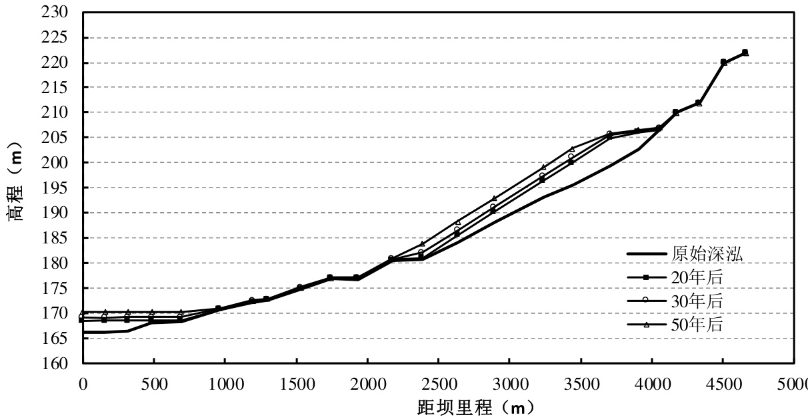  
图 5.5-1  夺丰水库库区泥沙淤积纵剖面图(干流)  

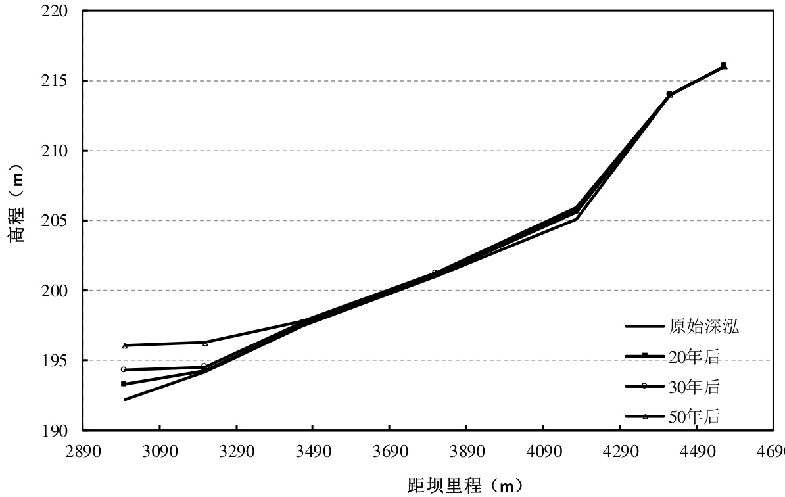  
图 5.5-2  夺丰水库库区泥沙淤积纵剖面图(支流)  

# 5.5.4 洪水调节计算  

# 5.5.4.1 基本资料  

(1)洪水标准  

根据夺丰水库工程规模和坝型,确定水库设计洪水标准和校核洪水标准。设计洪水标准为 $P=1\%$ (100 年一遇),校核洪水标准为 $\scriptstyle{\mathrm{P}=0.1\%}$ (1000 年一遇)。  

# (2)起调水位  

夺丰水库承担了下游的防洪任务,在汛期设置了防洪限制水位,汛限水位为$206.0\mathrm{m}$ 。本次计算 5 年、10 年、20 年、50 年、100 年和 1000 年一遇洪水各频率洪水特征水位时,均从汛限水位起调。  

# (3)设计洪水过程线  

夺丰水库 5 年一遇洪水的洪峰流量为 $524\mathrm{m}^{3}/\mathrm{s}$ ;10 年一遇洪水的洪峰流量为$757\mathrm{m}^{3}/\mathrm{s}$ ;20 年一遇洪水的洪峰流量为 $1001\mathrm{m}^{3}/\mathrm{s}$ ;50 年一遇洪水的洪峰流量为$1342\mathrm{m}^{3}/\mathrm{s}$ ;100 年一遇洪水的洪峰流量为 $1601\mathrm{m}^{3}/\mathrm{s}$ ;1000 年一遇洪水的洪峰流量为 $2547\mathrm{m}^{3}/\mathrm{s}$ ;夺丰水库设计入库洪水过程线见表 5.5-9。  

表 5.5-9  夺丰水库设计入库洪水流量过程线 单位: $\mathbf{m}^{3}/\mathbf{s}$   

<html><body><table><tr><td>频率 历时</td><td>20%</td><td>10%</td><td>5%</td><td>2%</td><td>1%</td><td>0.1%</td></tr><tr><td>45</td><td>0</td><td>0</td><td>0</td><td>0</td><td>0</td><td>0</td></tr><tr><td>46</td><td>0</td><td>0</td><td>0</td><td>0</td><td>0</td><td>0</td></tr><tr><td>47</td><td>0</td><td>0</td><td>0</td><td>0</td><td>0</td><td>0</td></tr><tr><td>48</td><td>0</td><td>0</td><td>0</td><td>0</td><td>0</td><td>0</td></tr><tr><td>49</td><td>0</td><td>0</td><td>8</td><td>29</td><td>52</td><td>146</td></tr><tr><td>50</td><td>0</td><td>0</td><td>12</td><td>42</td><td>71</td><td>176</td></tr><tr><td>51</td><td>0</td><td>0</td><td>14</td><td>48</td><td>78</td><td>184</td></tr><tr><td>52</td><td>0</td><td>0</td><td>15</td><td>51</td><td>82</td><td>188</td></tr><tr><td>53</td><td>0</td><td>0</td><td>15</td><td>53</td><td>83</td><td>189</td></tr><tr><td>54</td><td>0</td><td>0</td><td>15</td><td>54</td><td>84</td><td>190</td></tr><tr><td>55</td><td>0</td><td>1</td><td>25</td><td>72</td><td>107</td><td>228</td></tr><tr><td>56</td><td>0</td><td>5</td><td>34</td><td>86</td><td>123</td><td>253</td></tr><tr><td>57</td><td>0</td><td>12</td><td>47</td><td>102</td><td>142</td><td>280</td></tr><tr><td>58</td><td>0</td><td>22</td><td>63</td><td>122</td><td>165</td><td>316</td></tr><tr><td>59</td><td>3</td><td>36</td><td>85</td><td>149</td><td>197</td><td>364</td></tr><tr><td>60</td><td>35</td><td>78</td><td>124</td><td>180</td><td>221</td><td>355</td></tr><tr><td>61</td><td>75</td><td>129</td><td>181</td><td>249</td><td>299</td><td>468</td></tr><tr><td>62</td><td>163</td><td>246</td><td>329</td><td>440</td><td>523</td><td>814</td></tr><tr><td>63</td><td>524</td><td>757</td><td>1001</td><td>1342</td><td>1601</td><td>2547</td></tr><tr><td>64</td><td>288</td><td>390</td><td>486</td><td>601</td><td>685</td><td>897</td></tr><tr><td>65</td><td>160</td><td>213</td><td>263</td><td>320</td><td>363</td><td>480</td></tr><tr><td>66</td><td>74</td><td>113</td><td>156</td><td>214</td><td>261</td><td>417</td></tr><tr><td>67</td><td>32</td><td>66</td><td>105</td><td>160</td><td>205</td><td>355</td></tr><tr><td>68</td><td>14</td><td>42</td><td>76</td><td>128</td><td>170</td><td>310</td></tr><tr><td>69</td><td>6</td><td>27</td><td>57</td><td>106</td><td>145</td><td>276</td></tr><tr><td>70</td><td>3</td><td>16</td><td>46</td><td>90</td><td>126</td><td>250</td></tr><tr><td>71</td><td>1</td><td>8</td><td>37</td><td>78</td><td>112</td><td>228</td></tr><tr><td>72</td><td>1</td><td>4</td><td>32</td><td>71</td><td>104</td><td>218</td></tr></table></body></html>  

# (4)库容曲线  

调洪计算采用淤积 50 年库容曲线,见表 5.5-10。  

# 表 5.5-10  夺丰水库淤积 50 年库容曲线  

<html><body><table><tr><td>高程(m)</td><td>库容(万 m3)</td><td>高程(m)</td><td>库容(万 m3)</td></tr><tr><td>170</td><td>0.0</td><td>188</td><td>318.7</td></tr><tr><td>171</td><td>4.4</td><td>189</td><td>349.3</td></tr><tr><td>172</td><td>12.2</td><td>190</td><td>381.1</td></tr><tr><td>173</td><td>20.0</td><td>191</td><td>414.7</td></tr><tr><td>174</td><td>29.8</td><td>192</td><td>448.8</td></tr><tr><td>175</td><td>41.6</td><td>193</td><td>485.4</td></tr><tr><td>176</td><td>53.4</td><td>194</td><td>524.5</td></tr><tr><td>177</td><td>68.0</td><td>196</td><td>611.3</td></tr><tr><td>178</td><td>83.6</td><td>198</td><td>708.9</td></tr><tr><td>179</td><td>100.3</td><td>200</td><td>819.9</td></tr><tr><td>180</td><td>118.9</td><td>202</td><td>948.6</td></tr><tr><td>181</td><td>139.6</td><td>204</td><td>1091.5</td></tr><tr><td>182</td><td>160.9</td><td>206</td><td>1250.9</td></tr><tr><td>183</td><td>183.8</td><td>208</td><td>1432.4</td></tr><tr><td>184</td><td>207.9</td><td>210</td><td>1635.4</td></tr><tr><td>185</td><td>234.0</td><td>212</td><td>1855.4</td></tr><tr><td>186</td><td>259.9</td><td>214</td><td>2099.4</td></tr><tr><td>187</td><td>288.9</td><td>216</td><td>2367.4</td></tr></table></body></html>  

# (5)泄洪建筑物及运用方式  

夺丰水库泄水建筑物布置于主河床中间位置,布置 3 个开敞式溢流表孔,利用弧形闸门控制泄流,坝段共长 $36\mathrm{m}$ ,表孔单孔净宽 $7\mathrm{m}$ ,边墩宽 $2.5\mathrm{m}$ ,堰顶高程 $207.0\mathrm{m}$ ,堰上安装弧形工作闸门。消能方式为挑流消能。泄洪建筑物泄流曲线见表 5.5-11。  

表 5.5-11 夺丰水库泄洪建筑物泄流曲线  

<html><body><table><tr><td>库水位 (m)</td><td>泄流量 (m3/s)</td><td>库水位 (m)</td><td>泄流量 (m3/s)</td><td>库水位 (m)</td><td>泄流量 (m3/s)</td></tr><tr><td>206</td><td>284</td><td>210.4</td><td>547</td><td>214.8</td><td>1277</td></tr><tr><td>206.2</td><td>285</td><td>210.6</td><td>571</td><td>215</td><td>1319</td></tr><tr><td>206.4</td><td>285</td><td>210.8</td><td>596</td><td>215.2</td><td>1363</td></tr><tr><td>206.6</td><td>286</td><td>211</td><td>622</td><td>215.4</td><td>1408</td></tr><tr><td>206.8</td><td>287</td><td>211.2</td><td>649</td><td>215.6</td><td>1453</td></tr><tr><td>207</td><td>288</td><td>211.4</td><td>677</td><td>215.7</td><td>1476</td></tr><tr><td>207.2</td><td>292</td><td>211.6</td><td>705</td><td>215.9</td><td>1523</td></tr><tr><td>207.4</td><td>299</td><td>211.8</td><td>735</td><td>216.1</td><td>1570</td></tr><tr><td>207.6</td><td>307</td><td>212</td><td>765</td><td>216.3</td><td>1619</td></tr><tr><td>207.8</td><td>317</td><td>212.2</td><td>796</td><td>216.5</td><td>1668</td></tr><tr><td>208</td><td>328</td><td>212.4</td><td>828</td><td>216.7</td><td>1718</td></tr><tr><td>208.2</td><td>341</td><td>212.6</td><td>861</td><td>216.9</td><td>1769</td></tr><tr><td>208.4</td><td>355</td><td>212.8</td><td>894</td><td>217.1</td><td>1821</td></tr><tr><td>208.6</td><td>370</td><td>213</td><td>929</td><td>217.3</td><td>1873</td></tr><tr><td>208.8</td><td>385</td><td>213.2</td><td>964</td><td>217.5</td><td>1927</td></tr><tr><td>209</td><td>402</td><td>213.4</td><td>1000</td><td>217.7</td><td>1981</td></tr><tr><td>209.2</td><td>420</td><td>213.6</td><td>1037</td><td>217.9</td><td>2036</td></tr><tr><td>209.4</td><td>439</td><td>213.8</td><td>1075</td><td>218.1</td><td>2093</td></tr><tr><td>209.6</td><td>459</td><td>214</td><td>1114</td><td>218.3</td><td>2150</td></tr><tr><td>209.8</td><td>479</td><td>214.2</td><td>1153</td><td>218.5</td><td>2207</td></tr><tr><td>210</td><td>501</td><td>214.4</td><td>1193</td><td>218.7</td><td>2266</td></tr><tr><td>210.2</td><td>523</td><td>214.6</td><td>1235</td><td>218.9</td><td>2326</td></tr></table></body></html>  

# 5.5.4.2 计算方案  

根据水库防洪标准要求,本次对 $ P{=}0.1\%$ 、 $P=1\%$ 、 $P=2\%$ 、 $P=5\%$ 、 $\scriptstyle{\mathrm{P}=10\%}$ 、$\scriptstyle{\mathrm{P}=20\%}$ 五个频率洪水分别进行调洪计算。  

# 5.5.4.3 计算方法  

调洪计算原理是根据水量平衡,时段入库水量减时段出库水量等于时段水库蓄水变化量。采用静库容调洪,采用列表试算法进行洪水调节计算。  

# 5.5.4.4 洪水调度原则  

夺丰水库防洪调度原则设定如下:当入库流量小于 $60\mathrm{m}^{3}/\mathrm{s}$ 时,水库按来流下泄;当入库流量大于 $60\mathrm{m}^{3}/\mathrm{s}$ 时,水库按 $60\mathrm{m}^{3}/\mathrm{s}$ 固定泄量下泄直到水库达到 10年一遇防洪高水位 $211.43\mathrm{m}$ (防洪库容 541 万 $\mathrm{m}^{3}$ );水库水位高于 10 年一遇防洪高水位时,当入库流量小于控泄流量 $380\mathrm{m}3/\mathrm{s}$ 时,水库按入库流量和相应水位最大泄流能力小者下泄,当入库流量大于控泄流量 $380\mathrm{m}3/\mathrm{s}$ 时按控泄流量下泄,直到达到 50 年一遇防洪高水位 $213.61\mathrm{m}$ (防洪库容 800 万 $\mathrm{m}^{3}$ );当水库水位未达到 50 年一遇防洪高水位 $213.61\mathrm{m}$ ,且入库流量和坝址下游思德河涝水开始减小,此时可以调节闸门开度,按泄流能力、入库最大流量、河道承泄能力三者的最小值下泄,水库水位下降直至汛限水位;当水库水位超过 50 年一遇防洪高水位 $213.61\mathrm{m}$ 时,按水库泄流能力敞泄;退水时当水库水位在 50 年一遇防洪高水位 $213.61\mathrm{m}$ 以下时,如果坝址下游洪水仍未减小,洪水暂时滞留在水库。  

# 5.5.4.5 计算成果  

根据上述所确定的原则及方法进行了洪水调节计算,各方案洪水调节计算成果见表 5.5-12,各方案洪水调节过程分别见表 5.5-13\~5.5-18 和图 5.5-3\~图 5.5-8。  

表 5.5-12  夺丰水库各频率洪水调节计算成果  

<html><body><table><tr><td>洪水频率</td><td>入库洪峰流量 (m3/s)</td><td>最大泄量 (m3/s)</td><td>坝前水位 (Ⅲ)</td><td>相应原始库容 (万m3)</td></tr><tr><td>0.1%</td><td>2547</td><td>1535</td><td>215.95</td><td>2409</td></tr><tr><td>1%</td><td>1601</td><td>1077</td><td>213.81</td><td>2124</td></tr><tr><td>2%</td><td>1342</td><td>380</td><td>213.61</td><td>2099</td></tr><tr><td>5%</td><td>1001</td><td>380</td><td>211.66</td><td>1866</td></tr><tr><td>10%</td><td>757</td><td>60</td><td>211.43</td><td>1840</td></tr><tr><td>20%</td><td>524</td><td>60</td><td>209.46</td><td>1628</td></tr></table></body></html>  

表 5.5-13  夺丰水库工程 $\mathbf{P=0.1\%}$ 洪水(校核洪水)调节计算过程  

<html><body><table><tr><td>时</td><td>入库流量</td><td>出库流量</td><td>最大泄流能力</td><td>蓄变量（万</td><td>时段末库容</td><td>水位</td></tr><tr><td>45</td><td>(m3/s) 0</td><td>(m3/s) 0</td><td>(m3/s) 284</td><td>m3) 0</td><td>（万m²） 1251</td><td>(u) 206.00</td></tr><tr><td>46</td><td>0</td><td>0</td><td>284</td><td>0</td><td>1251</td><td>206.00</td></tr><tr><td>47</td><td>0</td><td>0</td><td>284</td><td></td><td>1251</td><td>206.00</td></tr><tr><td>48</td><td>0</td><td>0</td><td>284</td><td>0 0</td><td>1251</td><td>206.00</td></tr><tr><td>48.41</td><td>60</td><td>60</td><td>284</td><td>0</td><td>1251</td><td>206.00</td></tr><tr><td>49</td><td>146</td><td>60</td><td>284</td><td>6</td><td>1260</td><td>206.10</td></tr><tr><td>50</td><td>176</td><td>60</td><td>286</td><td>36</td><td>1296</td><td>206.50</td></tr><tr><td>51</td><td>184</td><td>60</td><td>288</td><td>43</td><td>1339</td><td>206.98</td></tr><tr><td>52</td><td>188</td><td>60</td><td>302</td><td>45</td><td>1385</td><td>207.48</td></tr><tr><td>53</td><td>189</td><td>60</td><td>328</td><td>46</td><td>1431</td><td>207.99</td></tr><tr><td>54</td><td>190</td><td>60</td><td>358</td><td>47</td><td>1478</td><td>208.45</td></tr><tr><td>55</td><td>228</td><td>60</td><td>400</td><td>54</td><td>1531</td><td>208.98</td></tr><tr><td>56</td><td>253</td><td>60</td><td>460</td><td>65</td><td>1596</td><td>209.61</td></tr><tr><td>57</td><td>280</td><td>60</td><td>537</td><td>74</td><td>1671</td><td>210.32</td></tr><tr><td>58</td><td>316</td><td>60</td><td>635</td><td></td><td>1756</td><td>211.10</td></tr><tr><td>58.38</td><td>334</td><td>60</td><td>681</td><td>86</td><td></td><td>211.43</td></tr><tr><td>58.38</td><td></td><td></td><td>681</td><td>36</td><td>1792</td><td></td></tr><tr><td>59</td><td>334</td><td>334</td><td></td><td>0</td><td>1792</td><td>211.43</td></tr><tr><td>60</td><td>364</td><td>364</td><td>681</td><td>0</td><td>1792</td><td>211.43</td></tr><tr><td></td><td>355</td><td>355</td><td>681</td><td>0</td><td>1792</td><td>211.43</td></tr><tr><td>61</td><td>468</td><td>380</td><td>701</td><td>16</td><td>1808</td><td>211.57</td></tr><tr><td>62</td><td>814</td><td>380</td><td>825</td><td>94</td><td>1902</td><td>212.38</td></tr><tr><td>62.49</td><td>1655</td><td>380</td><td>1038</td><td>149</td><td>2051</td><td>213.61</td></tr><tr><td>62.49</td><td>1655</td><td>1038</td><td>1038</td><td>0</td><td>2051</td><td>213.61</td></tr><tr><td>63 63.61</td><td>2547</td><td>1304</td><td>1304</td><td>172</td><td>2224</td><td>214.93</td></tr><tr><td>64</td><td>1535</td><td>1535</td><td>1535</td><td>137</td><td>2361</td><td>215.95</td></tr><tr><td></td><td>897</td><td>897</td><td>1535</td><td>0</td><td>2361</td><td>215.95</td></tr><tr><td>65</td><td>480</td><td>480</td><td>1535</td><td>0</td><td>2361</td><td>215.95</td></tr><tr><td>66</td><td>417</td><td>417</td><td>1535</td><td>0</td><td>2361</td><td>215.95</td></tr><tr><td>67</td><td>355</td><td>355</td><td>1535</td><td>0</td><td>2361</td><td>215.95</td></tr><tr><td>68</td><td>310</td><td>310</td><td>1535</td><td>0</td><td>2361</td><td>215.95</td></tr><tr><td>69</td><td>276</td><td>276</td><td>1535</td><td>0</td><td>2361</td><td>215.95</td></tr><tr><td>70</td><td>250</td><td>250</td><td>1535</td><td>0</td><td>2361</td><td>215.95</td></tr><tr><td>71</td><td>228</td><td>228</td><td>1535</td><td>0</td><td>2361</td><td>215.95</td></tr><tr><td>72</td><td>218</td><td>218</td><td>1535</td><td>0</td><td>2361</td><td>215.95</td></tr></table></body></html>  

表 5.5-14  夺丰水库工程 $P=1\%$ 洪水(设计洪水)调节计算过程  

<html><body><table><tr><td>时</td><td>入库流量 (m3/s)</td><td>出库流量 (m3/s)</td><td>最大泄流能力 (m3/s)</td><td>蓄变量（万 m3)</td><td>时段末库容 （万m²）</td><td>水位(m)</td></tr><tr><td>45</td><td>0</td><td>0</td><td>284</td><td>0</td><td>1251</td><td>206.00</td></tr><tr><td>46</td><td>0</td><td>0</td><td>284</td><td>0</td><td>1251</td><td>206.00</td></tr><tr><td>47</td><td>0</td><td>0</td><td>284</td><td>0</td><td>1251</td><td>206.00</td></tr><tr><td>48</td><td>0</td><td>0</td><td>284</td><td>0</td><td>1251</td><td>206.00</td></tr><tr><td>49</td><td>52</td><td>52</td><td>284</td><td>0</td><td>1251</td><td>206.00</td></tr><tr><td>49.42</td><td>60</td><td>60</td><td>284</td><td>0</td><td>1251</td><td>206.00</td></tr><tr><td>50</td><td>71</td><td>60</td><td>284</td><td>1</td><td>1252</td><td>206.01</td></tr><tr><td>51</td><td>78</td><td>60</td><td>284</td><td>5</td><td>1257</td><td>206.07</td></tr><tr><td>52</td><td>82</td><td>60</td><td>284</td><td>7</td><td>1264</td><td>206.15</td></tr><tr><td>53</td><td>83</td><td>60</td><td>285</td><td>8</td><td>1272</td><td>206.24</td></tr><tr><td>54</td><td>84</td><td>60</td><td>285</td><td>8</td><td>1281</td><td>206.33</td></tr><tr><td>55</td><td>107</td><td>60</td><td>286</td><td>13</td><td>1294</td><td>206.47</td></tr><tr><td>56</td><td>123</td><td>60</td><td>287</td><td>20</td><td>1313</td><td>206.69</td></tr><tr><td>57</td><td>142</td><td>60</td><td>288</td><td>26</td><td>1340</td><td>206.98</td></tr><tr><td>58</td><td>165</td><td>60</td><td>297</td><td>34</td><td>1373</td><td>207.35</td></tr><tr><td>59</td><td>197</td><td>60</td><td>319</td><td>44</td><td>1417</td><td>207.83</td></tr><tr><td>60</td><td>221</td><td>60</td><td>353</td><td>54</td><td>1471</td><td>208.38</td></tr><tr><td>61</td><td>299</td><td>60</td><td>410</td><td>72</td><td>1543</td><td>209.09</td></tr><tr><td>62</td><td>523</td><td>60</td><td>536</td><td>126</td><td>1669</td><td>210.31</td></tr><tr><td>62.48</td><td>1036</td><td>60</td><td>681</td><td>123</td><td>1793</td><td>211.43</td></tr><tr><td>62.48</td><td>1036</td><td>380</td><td>681</td><td>0</td><td>1793</td><td>211.43</td></tr><tr><td>63</td><td>1601</td><td>380</td><td>918</td><td>177</td><td>1970</td><td>212.94</td></tr><tr><td>63.20</td><td>1416</td><td>380</td><td>1038</td><td>82</td><td>2051</td><td>213.61</td></tr><tr><td>63.20</td><td>1416</td><td>1038</td><td>1038</td><td>0</td><td>2051</td><td>213.61</td></tr><tr><td>63.57</td><td>1077</td><td>1077</td><td>1077</td><td>25</td><td>2077</td><td>213.81</td></tr><tr><td>64</td><td>685</td><td>685</td><td>1077</td><td>0</td><td>2077</td><td>213.81</td></tr><tr><td>65</td><td>363</td><td>363</td><td>1077</td><td>0</td><td>2077</td><td>213.81</td></tr><tr><td>66</td><td>261</td><td>261</td><td>1077</td><td>0</td><td>2077</td><td>213.81</td></tr><tr><td>67</td><td>205</td><td>205</td><td>1077</td><td>0</td><td>2077</td><td>213.81</td></tr><tr><td>68</td><td>170</td><td>170</td><td>1077</td><td>0</td><td>2077</td><td>213.81</td></tr><tr><td>69</td><td>145</td><td>145</td><td>1077</td><td>0</td><td>2077</td><td>213.81</td></tr><tr><td>70</td><td>126</td><td>126</td><td>1077</td><td>0</td><td>2077</td><td>213.81</td></tr><tr><td>71</td><td>112</td><td>112</td><td>1077</td><td>0</td><td>2077</td><td>213.81</td></tr><tr><td>72</td><td>104</td><td>104</td><td>1077</td><td>0</td><td>2077</td><td>213.81</td></tr></table></body></html>  

表 5.5-15  夺丰水库工程 $P=2\%$ 洪水调节计算过程  

<html><body><table><tr><td>时</td><td>入库流量 (m3/s)</td><td>出库流量 (m3/s)</td><td>最大泄流能力</td><td>蓄变量（万</td><td>时段末库容 （万m3)</td><td>水位</td></tr><tr><td>45</td><td>0</td><td>0</td><td>(m3/s) 284</td><td>m3) 0</td><td>1251</td><td>(m) 206.00</td></tr><tr><td>46</td><td>0</td><td>0</td><td>284</td><td>0</td><td>1251</td><td>206.00</td></tr><tr><td>47</td><td>0</td><td>0</td><td>284</td><td>0</td><td>1251</td><td>206.00</td></tr><tr><td>48</td><td>0</td><td>0</td><td>284</td><td>0</td><td>1251</td><td>206.00</td></tr><tr><td>49</td><td>29</td><td>29</td><td>284</td><td>0</td><td>1251</td><td>206.00</td></tr><tr><td>50</td><td>42</td><td>42</td><td>284</td><td>0</td><td>1251</td><td>206.00</td></tr><tr><td>51</td><td>48</td><td>48</td><td>284</td><td>0</td><td>1251</td><td>206.00</td></tr><tr><td>52</td><td>51</td><td>51</td><td>284</td><td>0</td><td>1251</td><td>206.00</td></tr><tr><td>53</td><td>53</td><td>53</td><td>284</td><td>0</td><td>1251</td><td>206.00</td></tr><tr><td>54</td><td>54</td><td>54</td><td>284</td><td>0</td><td>1251</td><td>206.00</td></tr><tr><td>54.35</td><td>60</td><td>60</td><td>284</td><td>0</td><td>1251</td><td>206.00</td></tr><tr><td>55</td><td>72</td><td>60</td><td>284</td><td>1</td><td>1252</td><td>206.02</td></tr><tr><td>56</td><td>86</td><td>60</td><td>284</td><td>7</td><td>1259</td><td>206.09</td></tr><tr><td>57</td><td>102</td><td>60</td><td>285</td><td>12</td><td>1272</td><td>206.23</td></tr><tr><td>58</td><td>122</td><td>60</td><td>286</td><td>19</td><td>1290</td><td>206.43</td></tr><tr><td>59</td><td>149</td><td>60</td><td>287</td><td>27</td><td>1317</td><td>206.73</td></tr><tr><td>60</td><td>180</td><td>60</td><td>291</td><td>38</td><td>1355</td><td>207.15</td></tr><tr><td>61</td><td>249</td><td>60</td><td>315</td><td>56</td><td>1411</td><td>207.76</td></tr><tr><td>62</td><td>440</td><td>60</td><td>385</td><td>102</td><td>1513</td><td>208.80</td></tr><tr><td>62.96</td><td>1302</td><td>60</td><td>681</td><td>279</td><td>1792</td><td>211.43</td></tr><tr><td>62.96</td><td>1302</td><td>380</td><td>681</td><td>0</td><td>1792</td><td>211.43</td></tr><tr><td>63</td><td>1342</td><td>380</td><td>700</td><td>15</td><td>1807</td><td>211.56</td></tr><tr><td>64</td><td>601</td><td>380</td><td>991</td><td>213</td><td>2020</td><td>213.35</td></tr><tr><td>64.79</td><td>380</td><td>380</td><td>1038</td><td>31</td><td>2051</td><td>213.61</td></tr><tr><td>65</td><td>320</td><td></td><td></td><td></td><td>2051</td><td>213.61</td></tr><tr><td>66</td><td></td><td>320</td><td>1038</td><td>0</td><td></td><td>213.61</td></tr><tr><td></td><td>214</td><td>214</td><td>1038</td><td>0</td><td>2051</td><td></td></tr><tr><td>67</td><td>160</td><td>160</td><td>1038</td><td>0</td><td>2051</td><td>213.61</td></tr><tr><td>68</td><td>128</td><td>128</td><td>1038</td><td>0</td><td>2051</td><td>213.61</td></tr><tr><td>69</td><td>106</td><td>106</td><td>1038</td><td>0</td><td>2051</td><td>213.61</td></tr><tr><td>70 71</td><td>90 78</td><td>90 78</td><td>1038 1038</td><td>0 0</td><td>2051 2051</td><td>213.61 213.61</td></tr><tr><td></td><td></td><td></td><td></td><td></td><td></td><td></td></tr><tr><td>72</td><td>71</td><td>71</td><td>1038</td><td>0</td><td>2051</td><td>213.61</td></tr></table></body></html>  

表 5.5-16  夺丰水库工程 $\scriptstyle\mathbf{P}=5\%$ 洪水调节计算过程  

<html><body><table><tr><td rowspan="2">时</td><td>入库流量</td><td>出库流量</td><td>最大泄流能力</td><td>蓄变量</td><td>时段末库容</td><td>水位</td></tr><tr><td>(m3/s)</td><td>(m3/s)</td><td>(m3/s)</td><td>(万m3)</td><td>（万m3）</td><td>(m)</td></tr><tr><td>45</td><td>0</td><td>0</td><td>284</td><td>0</td><td>1251</td><td>206.00</td></tr><tr><td>46</td><td>0</td><td>0</td><td>284</td><td>0</td><td>1251</td><td>206.00</td></tr><tr><td>47</td><td>0</td><td>0</td><td>284</td><td>0</td><td>1251</td><td>206.00</td></tr><tr><td>48</td><td>0</td><td>0</td><td>284</td><td>0</td><td>1251</td><td>206.00</td></tr><tr><td>49</td><td>8</td><td>8</td><td>284</td><td>0</td><td>1251</td><td>206.00</td></tr><tr><td>50</td><td>12</td><td>12</td><td>284</td><td>0</td><td>1251</td><td>206.00</td></tr><tr><td>51</td><td>14</td><td>14</td><td>284</td><td>0</td><td>1251</td><td>206.00</td></tr><tr><td>52</td><td>15</td><td>15</td><td>284</td><td>0</td><td>1251</td><td>206.00</td></tr><tr><td>53</td><td>15</td><td>15</td><td>284</td><td>0</td><td>1251</td><td>206.00</td></tr><tr><td>54</td><td>15</td><td>15</td><td>284</td><td>0</td><td>1251</td><td>206.00</td></tr><tr><td>55</td><td>25</td><td>25</td><td>284</td><td>0</td><td>1251</td><td>206.00</td></tr><tr><td>56</td><td>34</td><td>34</td><td>284</td><td>0</td><td>1251</td><td>206.00</td></tr><tr><td>57</td><td>47</td><td>47</td><td>284</td><td>0</td><td>1251</td><td>206.00</td></tr><tr><td>57.79</td><td>60</td><td>60</td><td>284</td><td>0</td><td>1251</td><td>206.00</td></tr><tr><td>58</td><td>63</td><td>60</td><td>284</td><td>0</td><td>1251</td><td>206.00</td></tr><tr><td>59</td><td>85</td><td>60</td><td>284</td><td>5</td><td>1256</td><td>206.06</td></tr><tr><td>60</td><td>124</td><td>60</td><td>285</td><td>16</td><td>1272</td><td>206.23</td></tr><tr><td>61</td><td>181</td><td>60</td><td>286</td><td>33</td><td>1305</td><td>206.60</td></tr><tr><td>62</td><td>329</td><td>60</td><td>298</td><td>70</td><td>1376</td><td>207.38</td></tr><tr><td>63</td><td>1001</td><td>60</td><td>457</td><td>218</td><td>1593</td><td>209.59</td></tr><tr><td>63.74</td><td>623</td><td>60</td><td>680</td><td>199</td><td>1792</td><td>211.43</td></tr><tr><td>63.74</td><td>623</td><td>380</td><td>680</td><td>0</td><td>1792</td><td>211.43</td></tr><tr><td>64</td><td>486</td><td>380</td><td>702</td><td>17</td><td>1809</td><td>211.58</td></tr><tr><td>64.48</td><td>380</td><td>380</td><td>714</td><td>6</td><td>1818</td><td>211.66</td></tr><tr><td>65</td><td>263</td><td>263</td><td>714</td><td>0</td><td>1818</td><td>211.66</td></tr><tr><td>66</td><td>156</td><td>156</td><td>714</td><td>0</td><td>1818</td><td>211.66</td></tr><tr><td>67</td><td>105</td><td>105</td><td>714</td><td>0</td><td>1818</td><td>211.66</td></tr><tr><td>68</td><td>76</td><td>76</td><td>714</td><td>0</td><td>1818</td><td>211.66</td></tr><tr><td>69</td><td>57</td><td>57</td><td>714</td><td>0</td><td>1818</td><td>211.66</td></tr><tr><td>70</td><td>46</td><td>46</td><td>714</td><td>0</td><td>1818</td><td>211.66</td></tr><tr><td>71</td><td>37</td><td>37</td><td>714</td><td>0</td><td>1818</td><td>211.66</td></tr><tr><td>72</td><td>32</td><td>32</td><td>714</td><td>0</td><td>1818</td><td>211.66</td></tr></table></body></html>  

表 5.5-17  夺丰水库工程 $P=10\%$ 洪水调节计算过程  

<html><body><table><tr><td>时</td><td>入库流量 (m3/s)</td><td>出库流量 (m3/s)</td><td>最大泄流能力 (m3/s)</td><td>蓄变量 （万m3）</td><td>时段末库容 （万m3）</td><td>水位 (W)</td></tr><tr><td>45</td><td>0</td><td>0</td><td>284</td><td>0</td><td>1251</td><td>206.00</td></tr><tr><td>46</td><td>0</td><td>0</td><td>284</td><td>0</td><td>1251</td><td>206.00</td></tr><tr><td>47</td><td>0</td><td>0</td><td>284</td><td>0</td><td>1251</td><td>206.00</td></tr><tr><td>48</td><td>0</td><td>0</td><td>284</td><td>0</td><td>1251</td><td>206.00</td></tr><tr><td>49</td><td>0</td><td>0</td><td>284</td><td>0</td><td>1251</td><td>206.00</td></tr><tr><td>50</td><td>0</td><td>0</td><td>284</td><td>0</td><td>1251</td><td>206.00</td></tr><tr><td>51</td><td>0</td><td>0</td><td>284</td><td>0</td><td>1251</td><td>206.00</td></tr><tr><td>52</td><td>0</td><td>0</td><td>284</td><td>0</td><td>1251</td><td>206.00</td></tr><tr><td>53</td><td>0</td><td>0</td><td>284</td><td>0</td><td>1251</td><td>206.00</td></tr><tr><td>54</td><td>0</td><td>0</td><td>284</td><td>0</td><td>1251</td><td>206.00</td></tr><tr><td>55</td><td>1</td><td>1</td><td>284</td><td>0</td><td>1251</td><td>206.00</td></tr><tr><td>56</td><td>5</td><td>5</td><td>284</td><td>0</td><td>1251</td><td>206.00</td></tr><tr><td>57</td><td>12</td><td>12</td><td>284</td><td>0</td><td>1251</td><td>206.00</td></tr><tr><td>58</td><td>22</td><td>22</td><td>284</td><td>0</td><td>1251</td><td>206.00</td></tr><tr><td>59</td><td>36</td><td>36</td><td>284</td><td>0</td><td>1251</td><td>206.00</td></tr><tr><td>59.57</td><td>60</td><td>60</td><td>284</td><td>0</td><td>1251</td><td>206.00</td></tr><tr><td>60</td><td>78</td><td>60</td><td>284</td><td>1</td><td>1252</td><td>206.02</td></tr><tr><td>61</td><td>129</td><td>60</td><td>284</td><td></td><td>1268</td><td></td></tr><tr><td>62</td><td>246</td><td></td><td>287</td><td>16</td><td>1314</td><td>206.19 206.69</td></tr><tr><td>63</td><td>757</td><td>60 60</td><td>354</td><td>46</td><td>1473</td><td></td></tr><tr><td>64</td><td>390</td><td>60</td><td>523</td><td>159</td><td>1657</td><td>208.40 210.20</td></tr><tr><td>65</td><td>213</td><td></td><td>612</td><td>185</td><td></td><td></td></tr><tr><td>66</td><td></td><td>60</td><td></td><td>87</td><td>1745</td><td>210.99 211.33</td></tr><tr><td>67</td><td>113</td><td>60</td><td>650</td><td>37</td><td>1782</td><td></td></tr><tr><td></td><td>66</td><td>60</td><td>661</td><td>10</td><td>1792</td><td>211.42</td></tr><tr><td>67.23</td><td>60</td><td>60</td><td>661</td><td>0</td><td>1792</td><td>211.43</td></tr><tr><td>68</td><td>42</td><td>42</td><td>661</td><td>0</td><td>1792</td><td>211.43 211.43</td></tr><tr><td>69</td><td>27</td><td>27</td><td>661</td><td>0</td><td>1792</td><td></td></tr><tr><td>70 71</td><td>16 8</td><td>16 8</td><td>661 661</td><td>0 0</td><td>1792 1792</td><td>211.43 211.43</td></tr><tr><td></td><td></td><td></td><td></td><td></td><td></td><td></td></tr><tr><td>72</td><td>4</td><td>4</td><td>661</td><td>0</td><td>1792</td><td>211.43</td></tr></table></body></html>  

表 5.5-18  夺丰水库工程 $P=20\%$ 洪水调节计算过程  

<html><body><table><tr><td>时</td><td>入库流量</td><td>出库流量</td><td>最大泄流能力</td><td>蓄变量 （万m3)</td><td>时段末库容</td><td>水位</td></tr><tr><td>45</td><td>(m3/s) 0</td><td>(m3/s) 0</td><td>(m3/s) 284</td><td>0</td><td>（万m3） 1251</td><td>(W) 206.00</td></tr><tr><td>46</td><td>0</td><td>0</td><td>284</td><td>0</td><td>1251</td><td>206.00</td></tr><tr><td>47</td><td>0</td><td>0</td><td>284</td><td>0</td><td>1251</td><td>206.00</td></tr><tr><td>48</td><td>0</td><td>0</td><td>284</td><td>0</td><td>1251</td><td>206.00</td></tr><tr><td>49</td><td>0</td><td>0</td><td>284</td><td>0</td><td>1251</td><td>206.00</td></tr><tr><td>50</td><td>0</td><td>0</td><td>284</td><td>0</td><td>1251</td><td>206.00</td></tr><tr><td>51</td><td>0</td><td>0</td><td>284</td><td>0</td><td>1251</td><td>206.00</td></tr><tr><td>52</td><td>0</td><td>0</td><td>284</td><td>0</td><td>1251</td><td>206.00</td></tr><tr><td>53</td><td>0</td><td>0</td><td>284</td><td>0</td><td>1251</td><td>206.00</td></tr><tr><td>54</td><td>0</td><td>0</td><td>284</td><td>0</td><td>1251</td><td>206.00</td></tr><tr><td>55</td><td>0</td><td>0</td><td>284</td><td>0</td><td>1251</td><td>206.00</td></tr><tr><td>56</td><td>0</td><td>0</td><td>284</td><td>0</td><td>1251</td><td>206.00</td></tr><tr><td>57</td><td>0</td><td>0</td><td>284</td><td></td><td>1251</td><td>206.00</td></tr><tr><td>58</td><td>0</td><td>0</td><td>284</td><td>0 0</td><td>1251</td><td>206.00</td></tr><tr><td>59</td><td>3</td><td>3</td><td>284</td><td></td><td>1251</td><td>206.00</td></tr><tr><td>60</td><td>35</td><td>35</td><td>284</td><td>0 0</td><td>1251</td><td>206.00</td></tr><tr><td>60.62</td><td>60</td><td></td><td>284</td><td></td><td>1251</td><td>206.00</td></tr><tr><td>61</td><td>75</td><td>60</td><td>284</td><td>0</td><td>1252</td><td></td></tr><tr><td>62</td><td></td><td>60</td><td></td><td>1</td><td>1273</td><td>206.01</td></tr><tr><td>63</td><td>163</td><td>60</td><td>285</td><td>21</td><td>1375</td><td>206.25</td></tr><tr><td>64</td><td>524</td><td>60</td><td>298</td><td>102</td><td>1500</td><td>207.37 208.66</td></tr><tr><td>65</td><td>288</td><td>60</td><td>375 424</td><td>125</td><td>1559</td><td>209.25</td></tr><tr><td>66</td><td>160 74</td><td>60</td><td>444</td><td>59 20</td><td>1579</td><td>209.45</td></tr><tr><td>66.34</td><td>60</td><td>60 60</td><td>444</td><td>1</td><td>1580</td><td>209.46</td></tr><tr><td>67</td><td>32</td><td></td><td>444</td><td>0</td><td>1580</td><td>209.46</td></tr><tr><td>68</td><td>14</td><td>32 14</td><td>444</td><td>0</td><td>1580</td><td>209.46</td></tr><tr><td>69</td><td>6</td><td>6</td><td>444</td><td>0</td><td>1580</td><td>209.46</td></tr><tr><td>70</td><td>3</td><td>3</td><td>444</td><td>0</td><td>1580</td><td>209.46</td></tr><tr><td>71</td><td>1</td><td>1</td><td>444</td><td>0</td><td>1580</td><td>209.46</td></tr><tr><td></td><td></td><td></td><td></td><td></td><td></td><td></td></tr><tr><td>72</td><td>1</td><td>1</td><td>444</td><td>0</td><td>1580</td><td>209.46</td></tr></table></body></html>  

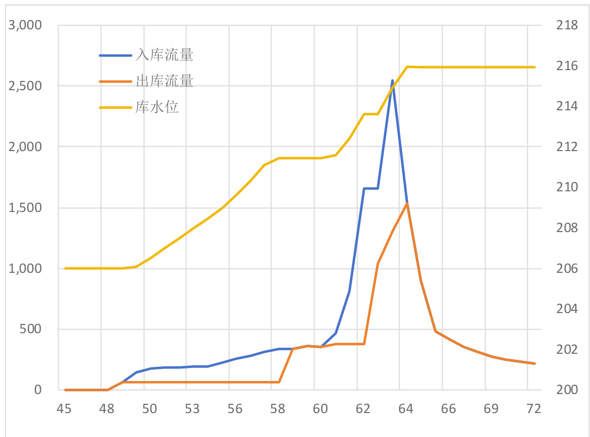  
图 5.5-3  夺丰水库 1000 年一遇洪水调节过程图  

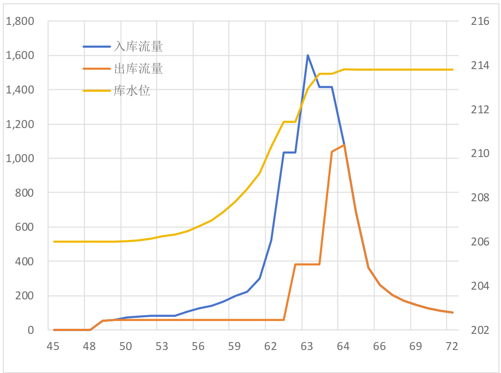  
图 5.5-4  夺丰水库 100 年一遇洪水调节过程图  

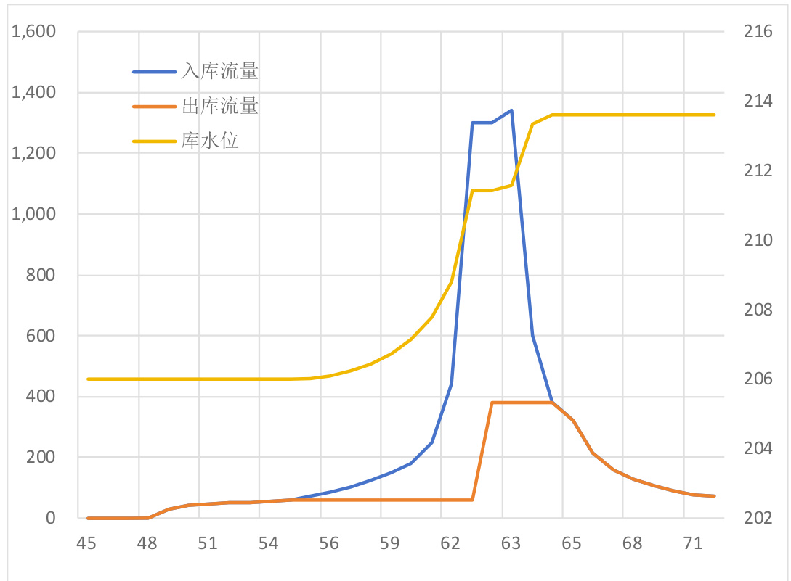  
图 5.5-5  夺丰水库 50 年一遇洪水调节过程图  

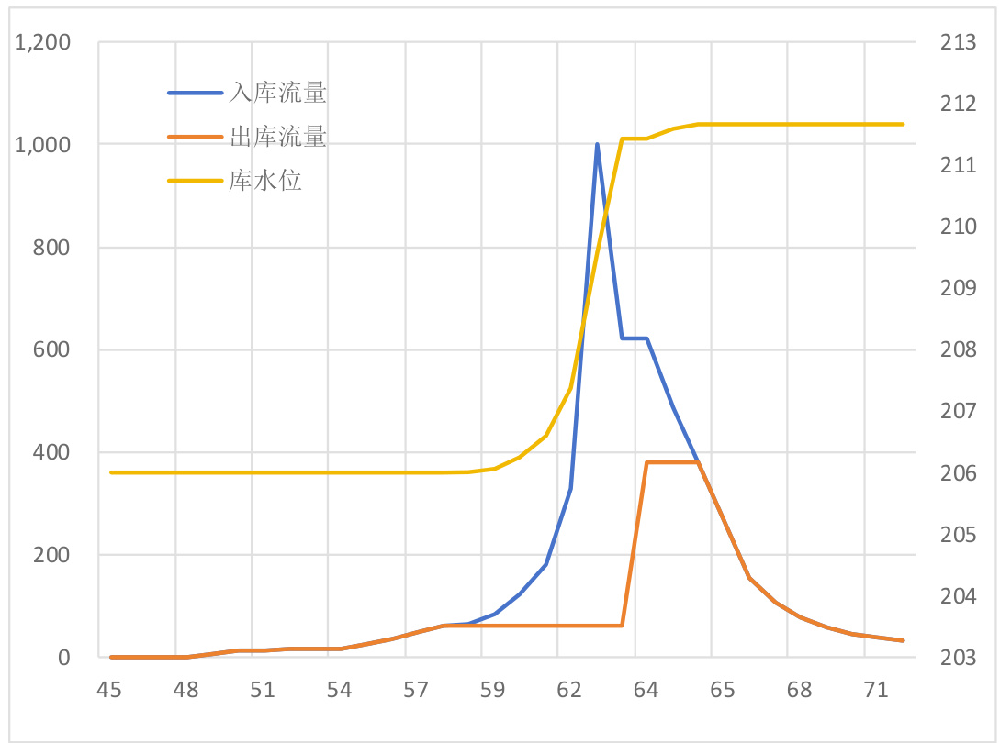  
图 5.5-6  夺丰水库 20 年一遇洪水调节过程图  

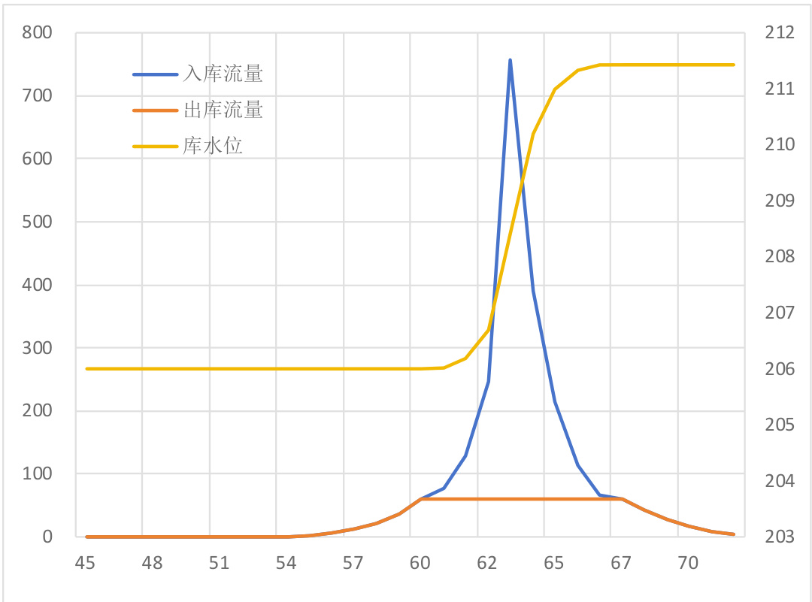  
图 5.5-7 夺丰水库 10 年一遇洪水调节过程图  

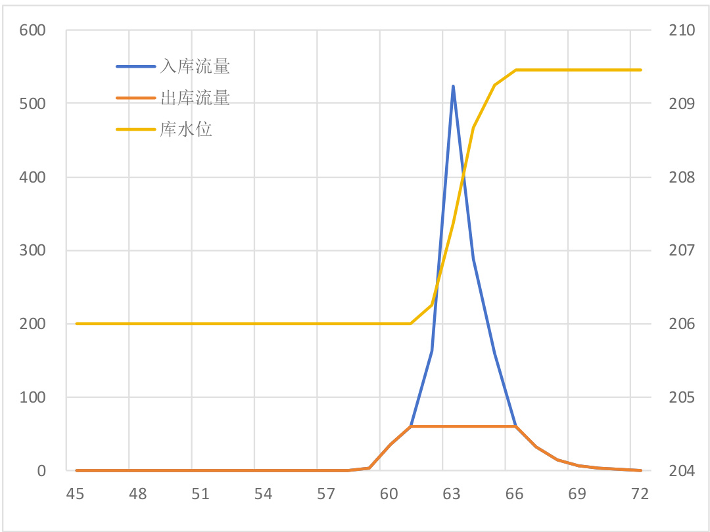  
图 5.5-8  夺丰水库 5 年一遇洪水调节过程图  

# 5.5.5 回水计算  

# 5.5.5.1 基本资料  

为了确定水库回水末端,并向水库淹没处理提供淹没范围等基础资料,需要计算夺丰水库库区天然河道水面线和水库回水水面线。  

(1)河道断面资料  

夺丰水库库区在坝址以上干流共布置了 24 个断面,支流上共布置了 7 个断面,各横断面位置示意图见图 5.5-9。水库回水水面线计算采用泥沙淤积 20 年河道断面,天然水面线计算采用天然河道断面数据。  

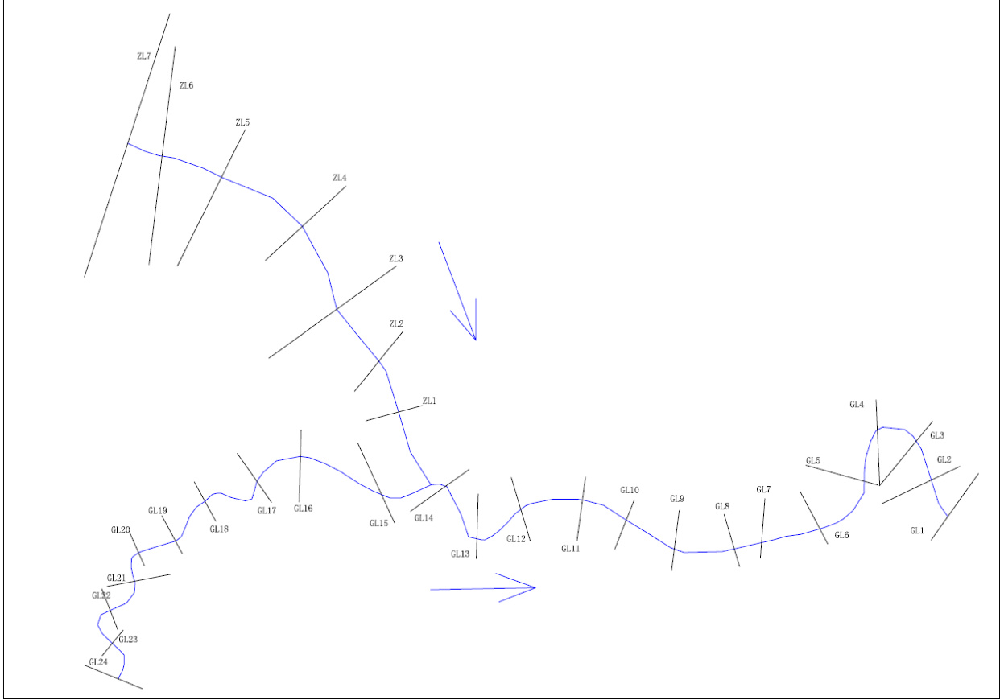  
图 5.5-9  夺丰水库库区实测断面位置图  

(2)河道糙率  

夺丰水库库区河道无糙率实测资料,河道糙率根据坝址河段所处地形判断,坝址处河床为卵石、偶有块石,不平整,河谷呈“V”型,无明显滩地。查找《水力计算手册》天然河道糙率表,库区天然河道糙率采用 0.050,水库建成后,由于库区河道淤积,河底床面组成细化,糙率有所降低,采用 0.030\~0.050。  

(3)计算选用流量  

各频率洪水回水计算流量采用相应的洪峰流量,正常运行情况取多年平均流量,回水计算流量详见表 5.5-19。  

表 5.5-19 河段设计流量 单位: $\mathbf{m}^{3}/\mathbf{s}$   

<html><body><table><tr><td>计算断面</td><td>多年平均</td><td>5年一遇</td><td>20年一遇</td><td>50年一遇</td><td>100年一遇</td></tr><tr><td>坝址</td><td>0.26</td><td>523.72</td><td>1000.61</td><td>1341.56</td><td>1600.57</td></tr><tr><td>支流汇入前干流</td><td>0.09</td><td>196.31</td><td>377.87</td><td>509.44</td><td>609.10</td></tr><tr><td>支流</td><td>0.13</td><td>289.76</td><td>554.56</td><td>744.60</td><td>911.02</td></tr></table></body></html>  

(4)起始断面及水位  

夺丰水库水面线推算的起始断面为坝址断面。天然水面线的计算,根据坝址的水位流量关系,由不同频率流量在水库坝址水位流量关系曲线上查得相应水位为天然河道水面线计算的起始水位。回水水面线的计算,正常运行情况下的起始水位采用正常蓄水位;对于 $P=1\%$ 、 $P=2\%$ 、 $P=5\%$ 、 $\scriptstyle{\mathrm{P}=20\%}$ 频率洪水起始水位采用相应方案调洪成果中的坝前最高洪水位。各计算方案的起始水位见表 5.5-20。  

表 5.5-20  夺丰水库回水计算起始断面水位表 单位:m  

<html><body><table><tr><td>计算方案</td><td>多年平均</td><td>5年一遇</td><td>20年一遇</td><td>50年一遇</td><td>100年一遇</td></tr><tr><td>天然</td><td>163.52</td><td>167.01</td><td>167.99</td><td>168.56</td><td>168.97</td></tr><tr><td>回水</td><td>208</td><td>209.46</td><td>211.66</td><td>213.61</td><td>213.81</td></tr></table></body></html>  

# 5.5.5.2 计算方案  

根据《水利水电工程建设征地移民安置规划设计规范》(SL290-2009)规定,确定库区淹没范围的洪水标准如下:  

省重点文物:100 年一遇洪水( $ \scriptstyle\mathrm{P=}1\%$ );  
县文物、二级公路:50 年一遇洪水( $\scriptstyle\mathbf{P}=2\%$ );  
居民点:20 年一遇洪水( $\scriptstyle\mathrm{P=}5\%$ );  
耕地和园地:5 年一遇洪水( $\scriptstyle\mathrm{P=}20\%$ );  
林草地:正常蓄水位。  

# 5.5.5.3 计算方法  

回水计算采用恒定非均匀渐变流方程,并考虑了流速水头的变化。  

# 5.5.5.4 计算成果与分析  

夺丰水库干流回水计算成果见表 5.5-21,支流回水成果见表 5.5-22。夺丰水库干流回水曲线见图 5.5-10,支流回水曲线见图 5.5-11。  

夺丰水库正常运行情况下干流回水末端在 20.4 断面,距坝里程 $4101\mathrm{m}$ ,回水末端水位为 $208\mathrm{m}$ ;5 年一遇干流回水末端在 19.9 断面,距坝里程 $4037\mathrm{m}$ ,回水末端水位为 $209.46\mathrm{m}$ ;20 年一遇干流回水末端在 20.4 断面,距坝里程 $4101\mathrm{m}$ ,回水末端水位为 $211.72\mathrm{m};50$ 年一遇干流回水末端在 21.3 断面,距坝里程 $4224\mathrm{m}$ ,回水末端水位为 $214.06\mathrm{m};100$ 年一遇干流回水末端在 21.3 断面,距坝里程 $4224\mathrm{m}$ ,回水末端水位为 $214.31\mathrm{m}$ 。  

夺丰水库正常运行情况下支流回水末端在 5.4 断面,距汇合口里程 $1640\mathrm{m}$ ,回水末端水位为 $208.99\mathrm{m}$ ;5 年一遇支流回水末端在 5.4 断面,距汇合口里程$1640\mathrm{m}$ ,回水末端水位为 $211.30\mathrm{m}$ ;20 年一遇支流回水末端在 5.4 断面,距汇合口里程 $1640\mathrm{m}$ ,回水末端水位为 $212.25\mathrm{m}$ ;50 年一遇干流回水末端在 5.6 断面,距坝里程 $1688\mathrm{m}$ ,回水末端水位为 $213.87\mathrm{m}$ ;100 年一遇干流回水末端在 5.6 断面,距坝里程 $1688\mathrm{m}$ ,回水末端水位为 $214.09\mathrm{m}$ 。  

表 5.5-21  夺丰水库干流回水计算成果表  

<html><body><table><tr><td rowspan="2">断面</td><td rowspan="2">距坝</td><td colspan="3">河底高程</td><td colspan="2">多年平均</td><td colspan="2"></td><td colspan="2">5年一遇洪水</td><td colspan="2">20年一遇洪水</td><td colspan="2"></td><td colspan="2">50年一遇洪水</td><td colspan="2"></td><td colspan="2">100年一遇洪水</td></tr><tr><td>断面 间距</td><td>天然河</td><td>淤积20 年 底高程河底高</td><td>天然水 面线</td><td>水库 回水</td><td>差值</td><td>天然水 面线</td><td>水库 回水</td><td>差值</td><td>天然水 面线</td><td></td><td>水库 回水</td><td>差值</td><td>天然水 面线</td><td>水库 回水</td><td>差值</td><td>天然水 面线</td><td>水库 回水</td><td>差值</td></tr><tr><td>GL1</td><td>0</td><td>0</td><td>166.12</td><td>程 168.48</td><td>166.19</td><td>208.00</td><td>41.81</td><td>168.24</td><td>209.46</td><td>41.22</td><td>169.23</td><td>211.66</td><td>42.43</td><td>169.84</td><td></td><td>213.61</td><td>43.77</td><td>170.25</td><td>213.81</td><td>43.56</td></tr><tr><td>GL2</td><td>155</td><td>155</td><td>166.21</td><td>168.48</td><td>166.35</td><td>208.00</td><td>41.65</td><td>169.75</td><td>209.46</td><td>39.71</td><td>171.10</td><td>211.66</td><td>40.56</td><td></td><td>171.89</td><td>213.61</td><td>41.72</td><td>172.42</td><td>213.81</td><td>41.39</td></tr><tr><td>GL3</td><td>315</td><td>160</td><td>166.49</td><td>168.50</td><td>166.58</td><td>208.00</td><td>41.42</td><td>170.11</td><td>209.46</td><td>39.35</td><td>171.44</td><td>211.66</td><td>40.22</td><td>172.21</td><td></td><td>213.61</td><td>41.40</td><td>172.73</td><td>213.81</td><td>41.08</td></tr><tr><td>GL4</td><td>486</td><td>171</td><td>168.07</td><td>168.51</td><td>168.18</td><td>208.00</td><td>39.82</td><td>170.98</td><td>209.46</td><td>38.48</td><td>172.23</td><td>211.66</td><td>39.43</td><td></td><td>172.96</td><td>213.61</td><td>40.65</td><td>173.49</td><td>213.81</td><td>40.32</td></tr><tr><td>GL5</td><td>693</td><td>207</td><td>168.39</td><td>168.52</td><td>168.71</td><td>208.00</td><td>39.29</td><td>172.47</td><td>209.46</td><td>36.99</td><td>173.51</td><td>211.66</td><td>38.15</td><td>173.91</td><td></td><td>213.61</td><td>39.70</td><td>174.13</td><td>213.81</td><td>39.68</td></tr><tr><td>GL6</td><td>963</td><td>270</td><td>170.69</td><td>170.79</td><td>170.76</td><td>208.00</td><td>37.24</td><td>174.31</td><td>209.46</td><td>35.15</td><td>175.93</td><td>211.66</td><td>35.73</td><td></td><td>176.86</td><td>213.61</td><td>36.75</td><td>177.50</td><td>213.81</td><td>36.31</td></tr><tr><td>GL7</td><td>1192</td><td>229</td><td>172.21</td><td>172.31</td><td>172.41</td><td>208.00</td><td>35.59</td><td>175.75</td><td>209.46</td><td>33.71</td><td>177.20</td><td>211.66</td><td>34.46</td><td></td><td>177.99</td><td>213.61</td><td>35.62</td><td>178.54</td><td>213.81</td><td>35.27</td></tr><tr><td>GL8</td><td>1299</td><td>107</td><td>172.63</td><td>172.73</td><td>172.71</td><td>208.00</td><td>35.29</td><td>176.46</td><td>209.46</td><td>33.00</td><td>177.37</td><td>211.66</td><td>34.29</td><td>178.06</td><td></td><td>213.61</td><td>35.55</td><td>178.70</td><td>213.81</td><td>35.11</td></tr><tr><td>GL9</td><td>1531</td><td>232</td><td>174.87</td><td>174.97</td><td>174.94</td><td>208.00</td><td>33.06</td><td>178.47</td><td>209.46</td><td>30.99</td><td>180.24</td><td>211.66</td><td>31.42</td><td></td><td>181.28</td><td>213.61</td><td>32.33</td><td>181.93</td><td>213.81</td><td>31.88</td></tr><tr><td>GL10</td><td>1745</td><td>214</td><td>176.84</td><td>176.94</td><td>177.10</td><td>208.00</td><td>30.90</td><td>180.00</td><td>209.46</td><td>29.46</td><td>181.37</td><td>211.66</td><td>30.29</td><td></td><td>182.16</td><td>213.61</td><td>31.45</td><td>182.74</td><td>213.81</td><td>31.07</td></tr><tr><td>GL11</td><td>1932</td><td>187</td><td>176.60</td><td>177.04</td><td>177.20</td><td>208.00</td><td>30.80</td><td>182.50</td><td>209.46</td><td>26.96</td><td>184.07</td><td>211.66</td><td>27.59</td><td></td><td>184.82</td><td>213.61</td><td>28.79</td><td>185.27</td><td>213.82</td><td>28.55</td></tr><tr><td>GL12</td><td>2176</td><td>244</td><td>180.57</td><td>180.67</td><td>180.72</td><td>208.00</td><td>27.28</td><td>184.29</td><td>209.46</td><td>25.17</td><td>185.73</td><td>211.66</td><td>25.93</td><td></td><td>186.54</td><td>213.61</td><td>27.07</td><td>187.08</td><td>213.82</td><td>26.74</td></tr><tr><td>GL13</td><td>2388</td><td>212</td><td>180.79</td><td>181.09</td><td>181.11</td><td>208.00</td><td>26.89</td><td>185.90</td><td>209.46</td><td>23.56</td><td>187.18</td><td>211.66</td><td>24.48</td><td>187.96</td><td></td><td>213.61</td><td>25.65</td><td>188.50</td><td>213.82</td><td>25.32</td></tr><tr><td>GL14</td><td>2636</td><td>247</td><td>184.14</td><td>185.55</td><td>184.27</td><td>208.00</td><td>23.73</td><td>187.92</td><td>209.46</td><td>21.54</td><td>188.95</td><td>211.66</td><td>22.71</td><td>189.51</td><td></td><td>213.61</td><td>24.10</td><td>189.94</td><td>213.82</td><td>23.88</td></tr><tr><td>GL15</td><td>2894</td><td>258</td><td>188.22</td><td>190.19</td><td>188.30</td><td>208.00</td><td>19.70</td><td>190.59</td><td>209.46</td><td>18.87</td><td>191.46</td><td>211.67</td><td>20.21</td><td>191.97</td><td></td><td>213.62</td><td>21.65</td><td>192.33</td><td>213.83</td><td>21.50</td></tr><tr><td>GL16</td><td>3240</td><td>346</td><td>193.20</td><td>196.43</td><td>193.25</td><td>208.00</td><td>14.75</td><td>196.01</td><td>209.46</td><td>13.45</td><td>196.97</td><td>211.67</td><td>14.70</td><td>197.47</td><td></td><td>213.62</td><td>16.15</td><td>197.82</td><td>213.83</td><td>16.01</td></tr><tr><td>GL17</td><td>3442</td><td>202</td><td>195.50</td><td>200.06</td><td>195.76</td><td>208.00</td><td>12.24</td><td>198.64</td><td>209.46</td><td>10.82</td><td>199.66</td><td>211.67</td><td>12.01</td><td></td><td>200.36</td><td>213.62</td><td>13.26</td><td>200.79</td><td>213.83</td><td>13.04</td></tr><tr><td>GL18</td><td>3709</td><td>266</td><td>199.42</td><td>204.86</td><td>199.48</td><td>208.00</td><td>8.52</td><td>201.80</td><td>209.46</td><td>7.66</td><td>202.85</td><td>211.67</td><td>8.82</td><td></td><td>203.33</td><td>213.62</td><td>10.29</td><td>203.64</td><td>213.83</td><td>10.19</td></tr><tr><td>GL19</td><td>3904</td><td>195</td><td>202.64</td><td>206.06</td><td>202.84</td><td>208.00</td><td>5.16</td><td>206.23</td><td>209.46</td><td>3.23</td><td>206.89</td><td>211.67</td><td>4.78</td><td></td><td>207.27 213.62</td></table></body></html>  

<html><body><table><tr><td rowspan="2">断面 编号</td><td rowspan="2">距坝 里程</td><td rowspan="2">断面 间距</td><td colspan="2">河底高程 淤积20</td><td colspan="2">多年平均</td><td colspan="2"></td><td colspan="2">5年一遇洪水</td><td colspan="2">20年一遇洪水</td><td colspan="2"></td><td colspan="2">50年一遇洪水</td><td colspan="2">100 年一遇洪水</td><td colspan="2"></td></tr><tr><td>天然河</td><td>冏年 底高程 河底高 程</td><td>天然水 面线</td><td>水库 回水</td><td>差值</td><td>天然水 面线</td><td>水库 回水</td><td>差值</td><td>天然水 面线</td><td>水库 回水</td><td>差值</td><td>天然水 面线</td><td>水库 回水</td><td>差值</td><td>天然水 面线</td><td>水库 回水</td><td>差值</td></tr><tr><td>GL19.1</td><td>3919</td><td>15</td><td>203.03</td><td>206.11 203.16</td><td>208.00</td><td>4.84</td><td>206.53</td><td>209.46</td><td>2.93</td><td>207.21</td><td>211.67</td><td>4.46</td><td></td><td>207.63</td><td>213.62</td><td>5.99</td><td>207.92</td><td>213.83</td><td>5.91</td></tr><tr><td>GL19.2</td><td>3934</td><td>15</td><td>203.42</td><td>206.16 203.59</td><td>208.00</td><td>4.41</td><td></td><td>206.86 209.46</td><td></td><td>2.60</td><td>207.59 211.67</td><td></td><td>4.08</td><td>208.01</td><td>213.62</td><td>5.61</td><td>208.30</td><td>213.83</td><td>5.53</td></tr><tr><td>GL19.3</td><td>3948</td><td>15</td><td>203.81</td><td>206.22 203.94</td><td>208.00</td><td>4.06</td><td>207.20</td><td>209.46</td><td>2.26</td><td>207.94</td><td>211.67</td><td>3.73</td><td>208.38</td><td></td><td>213.62</td><td>5.24</td><td>208.69</td><td>213.83</td><td>5.14</td></tr><tr><td>GL19.4</td><td>3963</td><td>15</td><td>204.20</td><td>206.27 204.36</td><td>208.00</td><td>3.64</td><td>207.54</td><td>209.46</td><td>1.92</td><td>208.28</td><td>211.67</td><td>3.39</td><td></td><td>208.74</td><td>213.62</td><td>4.88</td><td>209.03</td><td>213.83</td><td>4.80</td></tr><tr><td>GL19.5</td><td>3978</td><td>15</td><td>204.59</td><td>206.32 204.72</td><td>208.00</td><td>3.28</td><td>207.89</td><td>209.46</td><td>1.57</td><td>208.62</td><td>211.67</td><td>3.05</td><td></td><td>209.06</td><td>213.62</td><td>4.56</td><td>209.35</td><td>213.83</td><td>4.48</td></tr><tr><td>GL19.6</td><td>3993</td><td>15</td><td>204.99</td><td>206.37 205.13</td><td>208.00</td><td>2.87</td><td>208.24</td><td>209.46</td><td>1.22</td><td>208.93</td><td>211.67</td><td>2.74</td><td></td><td>209.36</td><td>213.62</td><td>4.26</td><td>209.66</td><td>213.83</td><td>4.17</td></tr><tr><td>GL19.7</td><td>4007</td><td>15</td><td>205.38</td><td>206.42 205.5</td><td>208.00</td><td>2.50</td><td></td><td>208.58 209.46</td><td>0.88</td><td>209.25</td><td>211.67</td><td>2.42</td><td></td><td>209.66</td><td>213.62</td><td>3.96</td><td>209.96</td><td>213.83</td><td>3.87</td></tr><tr><td>GL19.8</td><td>4022</td><td>15</td><td>205.77</td><td>206.48 205.9</td><td>208.00</td><td>2.10</td><td>208.88</td><td>209.46</td><td>0.58</td><td>209.54</td><td>211.67</td><td>2.13</td><td></td><td>209.96</td><td>213.62</td><td>3.66</td><td>210.27</td><td>213.83</td><td>3.56</td></tr><tr><td>GL19.9</td><td>4037</td><td>15</td><td>206.16</td><td>206.53 206.27</td><td>208.00</td><td>1.73</td><td></td><td>209.18</td><td>209.46</td><td>0.28 209.84</td><td>211.67</td><td>1.83</td><td></td><td>210.26</td><td>213.62</td><td>3.36</td><td>210.57</td><td>213.83</td><td>3.26</td></tr><tr><td>GL20</td><td>4052</td><td>15</td><td>206.55</td><td>206.58 206.67</td><td>208.00</td><td>1.33</td><td>209.68</td><td>209.68</td><td>0.00</td><td>210.14</td><td>211.67</td><td>1.53</td><td></td><td>210.56</td><td>213.62</td><td>3.06</td><td>210.88</td><td>213.83</td><td>2.95</td></tr><tr><td>GL20.1</td><td>4064</td><td>12</td><td>206.89</td><td>206.92 206.97</td><td>208.00</td><td>1.03</td><td>209.85</td><td>209.85</td><td>0.00</td><td>210.64</td><td>211.67</td><td>1.03</td><td></td><td>211.07</td><td>213.62</td><td>2.55</td><td>211.37</td><td>213.83</td><td>2.46</td></tr><tr><td>GL20.2</td><td>4076</td><td>12</td><td>207.24</td><td>207.26 207.3</td><td>208.00</td><td>0.70</td><td>210.21</td><td>210.21</td><td>0.00</td><td>210.94</td><td>211.67</td><td>0.73</td><td></td><td>211.40</td><td>213.62</td><td>2.22</td><td>211.71</td><td>213.83</td><td>2.12</td></tr><tr><td>GL20.3</td><td>4089</td><td>12</td><td>207.58</td><td>207.61 207.63</td><td>208.00</td><td>0.37</td><td>210.41</td><td>210.41</td><td>0.00</td><td>211.28</td><td>211.67</td><td>0.39</td><td></td><td>211.77</td><td>213.62</td><td>1.85</td><td>212.10</td><td>213.83</td><td>1.73</td></tr><tr><td>GL20.4</td><td>4101</td><td>12</td><td>207.93</td><td>207.95 207.97</td><td>208.00</td><td>0.03</td><td>210.59</td><td>210.59</td><td>0.00</td><td>211.58</td><td>211.72</td><td>0.14</td><td></td><td>212.01</td><td>213.62</td><td>1.61</td><td>212.30</td><td>213.83</td><td>1.53</td></tr><tr><td>GL20.5</td><td>4113</td><td>12</td><td>208.27</td><td>208.29 208.31</td><td>208.31</td><td>0.00</td><td>210.77</td><td>210.77</td><td>0.00</td><td>211.83</td><td>211.83</td><td>0.00</td><td></td><td>212.30</td><td>213.62</td><td>1.32</td><td>212.63</td><td>213.83</td><td>1.20</td></tr><tr><td>GL20.6</td><td>4126</td><td>12</td><td>208.62</td><td>208.63 208.65</td><td>208.65</td><td>0.00</td><td>210.96</td><td>210.96</td><td>0.00</td><td>211.95</td><td>211.95</td><td>0.00</td><td></td><td>212.47</td><td>213.62</td><td>1.15</td><td>212.84</td><td>213.83</td><td>0.99</td></tr><tr><td>GL20.7</td><td>4138</td><td>12</td><td>208.96</td><td>208.97 208.99</td><td>208.99</td><td>0.00</td><td>211.15</td><td>211.15</td><td>0.00</td><td>212.1</td><td>212.1</td><td>0.00</td><td></td><td>212.63</td><td>213.65</td><td>1.02</td><td>213.00</td><td>213.87</td><td>0.87</td></tr><tr><td>GL20.8</td><td>4150</td><td>12</td><td>209.31</td><td>209.32 209.33</td><td>209.33</td><td>0.00</td><td>211.35</td><td>211.35</td><td>0.00</td><td>212.27</td><td>212.27</td><td>0.00</td><td></td><td>212.80</td><td>213.69</td><td>0.89</td><td>213.15</td><td>213.92</td><td>0.77</td></tr><tr><td>GL20.9</td><td>4163</td><td>12</td><td>209.65</td><td>209.66 209.67</td><td>209.67</td><td>0.00</td><td>211.52</td><td>211.52</td><td>0.00</td><td>212.45</td><td>212.45</td><td>0.00</td><td></td><td>212.97</td><td>213.73</td><td>0.76</td><td>213.31</td><td>213.97</td><td>0.66</td></tr><tr><td>GL21</td><td>4175</td><td>12</td><td>210</td><td>210 210.01</td><td>210.01</td><td>0.00</td><td>211.7</td><td>211.7</td><td>0.00</td></table></body></html>  

<html><body><table><tr><td rowspan="2">断面 编号</td><td rowspan="2">距坝 里程</td><td rowspan="2">断面 间距</td><td colspan="2">河底高程 淤积20</td><td colspan="3">多年平均</td><td colspan="2">5年一遇洪水</td><td colspan="2"></td><td colspan="2">20年一遇洪水</td><td colspan="2">50年一遇洪水</td><td colspan="2"></td><td colspan="2">100 年一遇洪水</td></tr><tr><td>天然河</td><td>冏年 底高程河底高</td><td>天然水 面线</td><td>水库 回水</td><td>差值</td><td>天然水 面线</td><td>水库 回水</td><td>差值</td><td>天然水 面线</td><td>水库 回水</td><td>差值</td><td>天然水 面线</td><td>水库 回水</td><td>差值</td><td>天然水 面线</td><td>水库 回水</td><td>差值</td></tr><tr><td></td><td>4191</td><td>16</td><td>210.2</td><td>程 210.2</td><td>210.22</td><td>210.22</td><td>0.00</td><td>211.93</td><td>211.93 0.00</td><td>212.83</td><td>212.83</td><td>0.00</td><td>213.33</td><td></td><td>213.83</td><td>0.50 213.66</td><td></td><td>214.08</td><td>0.42</td></tr><tr><td>GL21.1 GL21.2</td><td>4208</td><td>16</td><td>210.4</td><td>210.4</td><td>210.42</td><td>210.42</td><td>0.00</td><td>212.2</td><td>212.2 0.00</td><td>213.1</td><td>213.1</td><td>0.00</td><td>213.60</td><td></td><td>213.92</td><td>0.32</td><td>213.92</td><td>214.23</td><td>0.31</td></tr><tr><td>GL21.3</td><td>4224</td><td>16</td><td>210.6</td><td>210.6</td><td>210.63</td><td>210.63</td><td>0.00</td><td>212.52</td><td>212.52 0.00</td><td>213.45</td><td>213.45</td><td>0.00</td><td>213.91</td><td></td><td>214.06</td><td>0.15 214.21</td><td></td><td>214.31</td><td>0.10</td></tr><tr><td>GL21.4</td><td>4240</td><td>16</td><td>210.8</td><td>210.8</td><td>210.82</td><td>210.82</td><td>0.00</td><td>212.87</td><td>212.87 0.00</td><td>213.8</td><td>213.8</td><td>0.00</td><td>214.25</td><td></td><td>214.25</td><td>0.00</td><td>214.54</td><td>214.54</td><td>0.00</td></tr><tr><td>GL21.5</td><td>4256</td><td>16</td><td>211</td><td>211</td><td>211.03</td><td>211.03</td><td>0.00</td><td>213.22</td><td>213.22</td><td>0.00</td><td>214.08 214.08</td><td>0.00</td><td></td><td>214.54</td><td>214.54</td><td>0.00</td><td>214.84</td><td>214.84</td><td>0.00</td></tr><tr><td>GL21.6</td><td>4272</td><td>16</td><td>211.2</td><td>211.2</td><td>211.22</td><td>211.22</td><td>0.00</td><td>213.57</td><td>213.57</td><td>0.00</td><td>214.35</td><td>214.35 0.00</td><td></td><td>214.86</td><td>214.86</td><td>0.00</td><td>215.29</td><td>215.29</td><td>0.00</td></tr><tr><td>GL21.7</td><td>4288</td><td>16</td><td>211.4</td><td>211.4</td><td>211.43</td><td>211.43</td><td>0.00</td><td>213.85</td><td>213.85</td><td>0.00</td><td>214.79</td><td>214.79</td><td>0.00</td><td>215.44</td><td>215.44</td><td>0.00</td><td>215.74</td><td>215.74</td><td>0.00</td></tr><tr><td>GL21.8</td><td>4305</td><td>16</td><td>211.6</td><td>211.6</td><td>211.63</td><td>211.63</td><td>0.00</td><td>214.14</td><td>214.14</td><td>0.00</td><td>215.22</td><td>215.22 0.00</td><td></td><td>215.75</td><td>215.75</td><td>0.00</td><td>216.09</td><td>216.09</td><td>0.00</td></tr><tr><td>GL21.9</td><td>4321</td><td>16</td><td>211.8</td><td>211.8</td><td>211.84</td><td>211.84</td><td>0.00</td><td>214.57</td><td>214.57</td><td>0.00</td><td>215.55</td><td>215.55</td><td>0.00</td><td>216.07</td><td>216.07</td><td>0.00</td><td>216.40</td><td>216.40</td><td>0.00</td></tr><tr><td>GL22</td><td>4337</td><td>16</td><td>212</td><td>212</td><td>212.05</td><td>212.05</td><td>0.00</td><td>214.87</td><td>214.87</td><td>0.00</td><td>215.83</td><td>215.83</td><td>0.00</td><td>216.33</td><td>216.33</td><td>0.00</td><td>216.63</td><td>216.63</td><td>0.00</td></tr><tr><td>GL22.1</td><td>4354</td><td>17</td><td>212.8</td><td>212.8</td><td>212.82</td><td>212.82</td><td>0.00</td><td>215.3</td><td>215.3</td><td>0.00</td><td>216.14</td><td>216.14 0.00</td><td></td><td>216.60</td><td>216.60</td><td>0.00</td><td>216.91</td><td>216.91</td><td>0.00</td></tr><tr><td>GL22.2</td><td>4371</td><td>17</td><td>213.6</td><td>213.6</td><td>213.63</td><td>213.63</td><td>0.00</td><td>216.11</td><td>216.11</td><td>0.00</td><td>216.98</td><td>216.98 0.00</td><td></td><td>217.46</td><td>217.46</td><td>0.00</td><td>217.78</td><td>217.78</td><td>0.00</td></tr><tr><td>GL22.3</td><td>4388</td><td>17</td><td>214.4</td><td>214.4</td><td>214.42</td><td>214.42</td><td>0.00</td><td>216.9</td><td>216.9</td><td>0.00</td><td>217.8</td><td>217.8 0.00</td><td></td><td>218.31</td><td>218.31</td><td>0.00</td><td>218.63</td><td>218.63</td><td>0.00</td></tr><tr><td>GL22.4</td><td>4405</td><td>17</td><td>215.2</td><td>215.2</td><td>215.22</td><td>215.22</td><td>0.00</td><td>217.67</td><td>217.67 0.00</td><td></td><td>218.62</td><td>218.62 0.00</td><td>219.13</td><td></td><td>219.13</td><td>0.00</td><td>219.47</td><td>219.47</td><td>0.00</td></tr><tr><td>GL22.5</td><td>4422</td><td>17</td><td>216</td><td>216</td><td>216.02</td><td>216.02</td><td>0.00</td><td>218.42</td><td>218.42</td><td>0.00</td><td>219.41 219.41</td><td>0.00</td><td>219.95</td><td></td><td>219.95</td><td>0.00</td><td>220.29</td><td>220.29</td><td>0.00</td></tr><tr><td>GL22.6</td><td>4439</td><td>17</td><td>216.8</td><td>216.8</td><td>216.82</td><td>216.82</td><td>0.00</td><td>219.15</td><td>219.15 0.00</td><td></td><td>220.18</td><td>220.18 0.00</td><td>220.73</td><td></td><td>220.73</td><td>0.00</td><td>221.10</td><td>221.10</td><td>0.00</td></tr><tr><td>GL22.7</td><td>4457</td><td>17</td><td>217.6</td><td>217.6</td><td>217.62</td><td>217.62</td><td>0.00</td><td>219.89</td><td>219.89</td><td>0.00</td><td>220.9</td><td>220.9 0.00</td><td>221.50</td><td></td><td>221.50</td><td>0.00</td><td>221.89</td><td>221.89</td><td>0.00</td></tr><tr><td>GL22.8</td><td>4474</td><td>17</td><td>218.4</td><td>218.4</td><td>218.42</td><td>218.42</td><td>0.00</td><td>220.61</td><td>220.61</td><td>0.00</td><td>221.63</td><td>221.63 0.00</td><td>222.25</td><td></td><td>222.25</td><td>0.00</td><td>222.65</td><td>222.65</td><td>0.00</td></tr><tr><td>GL22.9</td><td>4491</td><td>17</td><td>219.2</td><td>219.2</td><td>219.22</td><td>219.22</td><td>0.00</td><td>221.32</td><td>221.32</td><td>0.00</td><td>222.36</td><td>222.36 0.00</td><td></td><td>222.94</td><td>222.94</td><td>0.00</td><td>223.38</td><td>223.38</td><td>0.00</td></tr><tr><td>GL23</td><td>4508</td><td>17</td><td>220</td><td>220</td><td>220.02</td><td>220.02</td><td>0.00</td><td>222.03</td><td>222.03</td><td>0.00</td><td>223.06</td><td>223.06</td><td>0.00</td><td>223.66</td><td>223.66 0.00</td></table></body></html>  

<html><body><table><tr><td rowspan="2">断面 编号</td><td rowspan="2">距坝 里程</td><td rowspan="2">断面 间距</td><td colspan="2">河底高程 淤积20</td><td colspan="2">多年平均</td><td colspan="2">5年一遇洪水</td><td colspan="2"></td><td colspan="3">20年一遇洪水</td><td colspan="2">50年一遇洪水</td><td colspan="3">100年一遇洪水</td></tr><tr><td>天然河 底高程</td><td>年 河底高</td><td>天然水 面线</td><td>水库 回水</td><td>天然水 差值</td><td>水库 面线</td><td>差值 回水</td><td>天然水 面线</td><td>水库 回水</td><td>差值</td><td>天然水 面线</td><td>水库 回水</td><td>差值</td><td>天然水 面线</td><td>水库 回水</td><td>差值</td></tr><tr><td>GL24</td><td>4667</td><td>159</td><td>222</td><td>程 222</td><td>222.03</td><td>222.03 0.00</td><td></td><td>224.47</td><td>224.47 0.00</td><td>225.63</td><td>225.63</td><td>0.00</td><td>226.29</td><td></td><td>226.29 0.00</td><td>226.74</td><td>226.74</td><td>0.00</td></tr></table></body></html>  

表 5.5-22  夺丰水库支流回水计算成果表  

<html><body><table><tr><td>断面</td><td>距坝 里程</td><td>断面 间距</td><td colspan="2">河底高程</td><td colspan="3">多年平均</td><td colspan="3">5年一遇洪水</td><td colspan="3">20年一遇洪水</td><td colspan="3">50年一遇洪水</td><td colspan="3">100 年一遇洪水</td></tr><tr><td>编号</td><td></td><td></td><td>天然河 底高程</td><td>淤积20年 河底高程</td><td>天然水 面线</td><td>水库 回水</td><td>差值</td><td>天然水 面线</td><td>水库 回水</td><td>差值</td><td>天然水 面线</td><td>水库 回水</td><td>差值</td><td>天然水 面线</td><td>水库 回水</td><td>差值</td><td>天然水 面线</td><td>水库 回水</td><td>差值</td></tr><tr><td>ZLO</td><td>0</td><td>0</td><td>184.14</td><td>185.55</td><td>184.27</td><td>208.00</td><td>23.73</td><td>187.92</td><td>209.46</td><td>21.54</td><td>188.95</td><td>211.66</td><td>22.71</td><td>189.51</td><td>213.61</td><td>24.10</td><td>189.94</td><td>213.82</td><td>23.88</td></tr><tr><td>ZL1</td><td>365</td><td>365</td><td>192.20</td><td>193.31</td><td>192.29</td><td>208.00</td><td>15.71</td><td>194.92</td><td>209.46</td><td>14.54</td><td>195.76</td><td>211.66</td><td>15.90</td><td>196.19</td><td>213.61</td><td>17.42</td><td>196.52</td><td>213.82</td><td>17.30</td></tr><tr><td>ZL2</td><td>574</td><td>209</td><td>194.20</td><td>194.30</td><td>194.23</td><td>208.00</td><td>13.77</td><td>197.10</td><td>209.46</td><td>12.36</td><td>197.91</td><td>211.66</td><td>13.75</td><td>198.39</td><td>213.61</td><td>15.22</td><td>198.80</td><td>213.83</td><td>15.03</td></tr><tr><td>ZL3</td><td>829</td><td>255</td><td>197.50</td><td>197.60</td><td>197.59</td><td>208.00</td><td>10.41</td><td>199.63</td><td>209.46</td><td>9.83</td><td>200.27</td><td>211.66</td><td>11.39</td><td>200.50</td><td>213.62</td><td>13.12</td><td>200.69</td><td>213.83</td><td>13.14</td></tr><tr><td>ZL4</td><td>1175</td><td>346</td><td>201.01</td><td>201.11</td><td>201.06</td><td>208.00</td><td>6.94</td><td>204.64</td><td>209.46</td><td>4.82</td><td>205.41</td><td>211.66</td><td>6.25</td><td>205.66</td><td>213.62</td><td>7.96</td><td>205.86</td><td>213.83</td><td>7.97</td></tr><tr><td>ZL4.1</td><td>1212</td><td>37</td><td>201.42</td><td>201.56</td><td>201.50</td><td>208.00</td><td>6.50</td><td>204.93</td><td>209.46</td><td>4.53</td><td>205.66</td><td>211.66</td><td>6.00</td><td>205.92</td><td>213.62</td><td>7.70</td><td>206.12</td><td>213.83</td><td>7.71</td></tr><tr><td>ZL4.2</td><td>1249</td><td>37</td><td>201.83</td><td>202.01</td><td>201.89</td><td>208.00</td><td>6.11</td><td>205.23</td><td>209.46</td><td>4.23</td><td>206.13</td><td>211.66</td><td>5.53</td><td>206.52</td><td>213.62</td><td>7.10</td><td>206.84</td><td>213.83</td><td>6.99</td></tr><tr><td>ZL4.3</td><td>1285</td><td>37</td><td>202.24</td><td>202.46</td><td>202.32</td><td>208.00</td><td>5.68</td><td>205.50</td><td>209.46</td><td>3.96</td><td>206.69</td><td>211.66</td><td>4.97</td><td>207.05</td><td>213.62</td><td>6.57</td><td>207.34</td><td>213.83</td><td>6.49</td></tr><tr><td>ZL4.4</td><td>1322</td><td>37</td><td>202.65</td><td>202.91</td><td>202.72</td><td>208.00</td><td>5.28</td><td>205.89</td><td>209.46</td><td>3.57</td><td>207.28</td><td>211.66</td><td>4.38</td><td>207.60</td><td>213.62</td><td>6.02</td><td>207.86</td><td>213.83</td><td>5.97</td></tr><tr><td>ZL4.5</td><td>1359</td><td>37</td><td>203.06</td><td>203.35</td><td>203.14</td><td>208.00</td><td>4.86</td><td>206.36</td><td>209.46</td><td>3.10</td><td>207.79</td><td>211.66</td><td>3.87</td><td>208.17</td><td>213.62</td><td>5.45</td><td>208.42</td><td>213.83</td><td>5.41</td></tr><tr><td>ZL4.6</td><td>1395</td><td>37</td><td>203.46</td><td>203.80</td><td>203.54</td><td>208.00</td><td>4.46</td><td>206.89</td><td>209.47</td><td>2.58</td><td>208.27</td><td>211.66</td><td>3.39</td><td>208.74</td><td>213.62</td><td>4.88</td><td>208.97</td><td>213.83</td><td>4.86</td></tr><tr><td>ZL4.7</td><td>1432</td><td>37</td><td>203.87</td><td>204.25</td><td>203.96</td><td>208.00</td><td>4.04</td><td>207.34</td><td>209.48</td><td>2.14</td><td>208.78</td><td>211.67</td><td>2.89</td><td>209.21</td><td>213.62</td><td>4.41</td><td>209.54</td><td>213.83</td><td>4.29</td></tr><tr><td>ZL4.8</td><td>1469</td><td>37</td><td>204.28</td><td>204.70</td><td>204.36</td><td>208.00</td><td>3.64</td><td>207.75</td><td>209.52</td><td>1.77</td><td>209.33</td><td>211.67</td><td>2.34</td><td>209.67</td><td>213.62</td><td>3.95</td><td>210.09</td><td>213.83</td><td>3.74</td></tr><tr><td>ZL4.9</td><td>1506</td><td>37</td><td>204.69</td><td>205.15</td><td>204.78</td><td>208.00</td><td>3.22</td><td>208.20</td><td>209.60</td><td>1.40</td><td>209.87</td><td>211.68</td><td>1.81</td><td>210.19</td><td>213.62</td><td>3.43</td><td>210.56</td><td>213.83</td><td>3.27</td></tr><tr><td>ZL5</td><td>1542</td><td>37</td><td>205.10</td><td>205.60</td><td>205.18</td><td>208.00</td><td>2.82</td><td>208.67</td><td>209.74</td><td>1.07</td><td>210.42</td><td>211.71</td><td>1.29</td><td>210.74</td><td>213.62</td><td>2.88</td><td>211.02</td><td>213.83</td><td>2.81</td></tr><tr><td>ZL5.1</td><td>1567</td><td>24</td><td>205.99</td><td>206.44</td><td>206.03</td><td>208.00</td><td>1.97</td><td>208.78</td><td>209.78</td><td>1.00</td><td>210.68</td><td>211.76</td><td>1.08</td><td>211.04</td><td>213.62</td><td>2.58</td><td>211.31</td><td>213.84</td><td>2.53</td></tr><tr><td>ZL5.2</td><td>1591</td><td>24</td><td>206.88</td><td>207.28</td><td>206.93</td><td>208.00</td><td>1.07</td><td>209.58</td><td>209.90</td><td>0.32</td><td>211.01</td><td>211.81</td><td>0.80</td><td>211.50</td><td>213.64</td><td>2.14</td><td>211.72</td><td>213.86</td><td>2.14</td></tr><tr><td>ZL5.3</td><td>1615</td><td>24</td><td>207.77</td><td>208.12</td><td>207.80</td><td>208.14</td><td>0.34</td><td>210.28</td><td>210.61</td><td>0.33</td><td>211.44</td><td>211.96</td><td>0.52</td><td>212.02</td><td>213.66</td><td>1.64</td><td>212.23</td><td>213.88</td><td>1.65</td></tr><tr><td>ZL5.4</td><td>1640</td><td>24</td><td>208.66</td><td>208.96</td><td>208.70</td><td>208.99</td><td>0.29</td><td>211.00</td><td>211.30</td><td>0.30</td><td>212.12</td><td>212.25</td><td>0.13</td><td>212.53</td><td>213.68</td><td>1.15</td><td>212.73</td><td>213.90</td><td>1.17</td></tr></table></body></html>  

<html><body><table><tr><td>断面 编号</td><td>距坝 里程</td><td>断面 间距 天然河</td><td colspan="2">河底高程 淤积20年</td><td colspan="3">多年平均</td><td colspan="3">5年一遇洪水</td><td colspan="3">20 年一遇洪水</td><td colspan="3">50年一遇洪水</td><td colspan="3">100年一遇洪水</td></tr><tr><td></td><td></td><td></td><td>底高程</td><td>河底高程</td><td>面线</td><td>回水</td><td>差值</td><td>面线</td><td>回水</td><td>差值</td><td>面线</td><td>回水</td><td>差值</td><td>面线</td><td>回水</td><td>差值</td><td>面线</td><td>回水</td><td>差值</td></tr><tr><td>ZL5.5</td><td>1664</td><td>24</td><td>209.55</td><td>209.80</td><td>209.82</td><td>209.82</td><td>0.00</td><td>211.99</td><td>211.99</td><td>0.00</td><td>212.78</td><td>212.78</td><td>0.00</td><td>213.08</td><td>213.72</td><td>0.64</td><td>213.28</td><td>213.94</td><td>0.66</td></tr><tr><td>ZL5.6</td><td>1688</td><td>24</td><td>210.44</td><td>210.64</td><td>210.67</td><td>210.67</td><td>0.00</td><td>212.67</td><td>212.67</td><td>0.00</td><td>213.38</td><td>213.38</td><td>0.00</td><td>213.61</td><td>213.87</td><td>0.26</td><td>213.81</td><td>214.09</td><td>0.28</td></tr><tr><td>ZL5.7</td><td>1713</td><td>24</td><td>211.33</td><td>211.48</td><td>211.50</td><td>211.50</td><td>0.00</td><td>213.38</td><td>213.38</td><td>0.00</td><td>214.00</td><td>214.00</td><td>0.00</td><td>214.20</td><td>214.39</td><td>0.19</td><td>214.38</td><td>214.38</td><td>0.00</td></tr><tr><td>ZL5.8</td><td>1737</td><td>24</td><td>212.22</td><td>212.32</td><td>212.35</td><td>212.35</td><td>0.00</td><td>214.07</td><td>214.07</td><td>0.00</td><td>214.58</td><td>214.58</td><td>0.00</td><td>215.02</td><td>215.02</td><td>0.00</td><td>215.17</td><td>215.17</td><td>0.00</td></tr><tr><td>ZL5.9</td><td>1761</td><td>24</td><td>213.11</td><td>213.16</td><td>213.18</td><td>213.18</td><td>0.00</td><td>214.71</td><td>214.71</td><td>0.00</td><td>215.20</td><td>215.20</td><td>0.00</td><td>215.54</td><td>215.54</td><td>0.00</td><td>215.68</td><td>215.68</td><td>0.00</td></tr><tr><td>ZL6</td><td>1786</td><td>24</td><td>214.00</td><td>214.00</td><td>214.03</td><td>214.03</td><td>0.00</td><td>215.34</td><td>215.34</td><td>0.00</td><td>215.79</td><td>215.79</td><td>0.00</td><td>216.16</td><td>216.16</td><td>0.00</td><td>216.29</td><td>216.29</td><td>0.00</td></tr><tr><td>ZL6.1</td><td>1800</td><td>14</td><td>214.20</td><td>214.20</td><td>214.23</td><td>214.23</td><td>0.00</td><td>215.74</td><td>215.74</td><td>0.00</td><td>216.31</td><td>216.31</td><td>0.00</td><td>216.60</td><td>216.60</td><td>0.00</td><td>216.83</td><td>216.83</td><td>0.00</td></tr><tr><td>ZL6.2</td><td>1814</td><td>14</td><td>214.40</td><td>214.40</td><td>214.43</td><td>214.43</td><td>0.00</td><td>216.07</td><td>216.07</td><td>0.00</td><td>216.64</td><td>216.64</td><td>0.00</td><td>217.03</td><td>217.03</td><td>0.00</td><td>217.31</td><td>217.31</td><td>0.00</td></tr><tr><td>ZL6.3</td><td>1828</td><td>14</td><td>214.60</td><td>214.60</td><td>214.63</td><td>214.63</td><td>0.00</td><td>216.45</td><td>216.45</td><td>0.00</td><td>216.93</td><td>216.93</td><td>0.00</td><td>217.27</td><td>217.27</td><td>0.00</td><td>217.54</td><td>217.54</td><td>0.00</td></tr><tr><td>ZL6.4</td><td>1842</td><td>14</td><td>214.80</td><td>214.80</td><td>214.83</td><td>214.83</td><td>0.00</td><td>216.71</td><td>216.71</td><td>0.00</td><td>217.31</td><td>217.31</td><td>0.00</td><td>217.62</td><td>217.62</td><td>0.00</td><td>217.85</td><td>217.85</td><td>0.00</td></tr><tr><td>ZL6.5</td><td>1856</td><td>14</td><td>215.00</td><td>215.00</td><td>215.03</td><td>215.03</td><td>0.00</td><td>216.98</td><td>216.98</td><td>0.00</td><td>217.56</td><td>217.56</td><td>0.00</td><td>217.89</td><td>217.89</td><td>0.00</td><td>218.19</td><td>218.19</td><td>0.00</td></tr><tr><td>ZL6.6</td><td>1870</td><td>14</td><td>215.20</td><td>215.20</td><td>215.23</td><td>215.23</td><td>0.00</td><td>217.23</td><td>217.23</td><td>0.00</td><td>217.84</td><td>217.84</td><td>0.00</td><td>218.16</td><td>218.16</td><td>0.00</td><td>218.43</td><td>218.43</td><td>0.00</td></tr><tr><td>ZL6.7</td><td>1884</td><td>14 14</td><td>215.40</td><td>215.40</td><td>215.43</td><td>215.43</td><td>0.00</td><td>217.47</td><td>217.47</td><td>0.00</td><td>218.11</td><td>218.11</td><td>0.00</td><td>218.44</td><td>218.44</td><td>0.00</td><td>218.68</td><td>218.68</td><td>0.00</td></tr><tr><td>ZL6.8</td><td>1898 1912</td><td>14</td><td>215.60</td><td>215.60</td><td>215.63</td><td>215.63</td><td>0.00</td><td>217.70</td><td>217.70</td><td>0.00</td><td>218.36</td><td>218.36</td><td>0.00</td><td>218.70</td><td>218.70</td><td>0.00</td><td>218.95</td><td>218.95</td><td>0.00 0.00</td></tr><tr><td>ZL6.9</td><td>1926</td><td>14</td><td>215.80</td><td>215.80</td><td>215.83 216.03</td><td>215.83 216.03</td><td>0.00</td><td>217.92 218.13</td><td>217.92</td><td>0.00</td><td>218.60</td><td>218.60</td><td>0.00</td><td>218.95 219.20</td><td>218.95</td><td>0.00 0.00</td><td>219.21 219.47</td><td>219.21</td><td>0.00</td></tr><tr><td>ZL7</td><td></td><td></td><td>216.00</td><td>216.00</td><td></td><td></td><td>0.00</td><td></td><td>218.13</td><td>0.00</td><td>218.84</td><td>218.84</td><td>0.00</td><td></td><td>219.20</td><td></td><td></td><td>219.47</td><td></td></tr></table></body></html>  

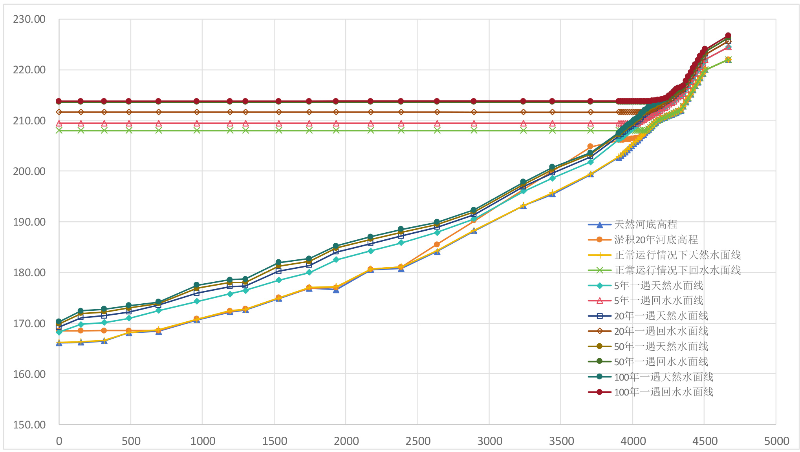  
图 5.5-10  夺丰水库干流回水曲线图  

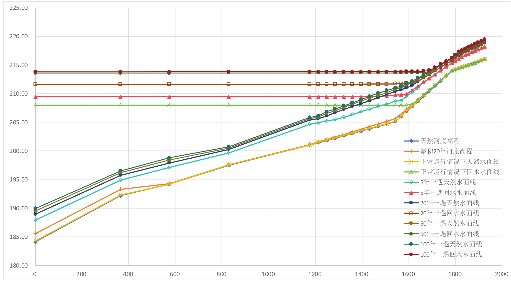  
图 5.5-11  夺丰水库支流回水曲线图  

# 5.6 水库工程规模特性指标  

夺丰水库工程规模指标表详见表 5.6-1。  

表 5.6-1  夺丰水库工程规模指标成果表  

<html><body><table><tr><td colspan="4" rowspan="2">项目</td><td rowspan="2">单位</td><td colspan="2">特征值</td></tr><tr><td>原设计</td><td>本次扩容 复核后</td></tr><tr><td rowspan="13">水库特 征指标</td><td colspan="3">死水位</td><td>m</td><td>163</td><td>170.50</td></tr><tr><td colspan="3">正常运行最低水位</td><td>m</td><td>/</td><td>197.5</td></tr><tr><td colspan="3">正常蓄水位</td><td>m</td><td>193.7</td><td>208.00</td></tr><tr><td colspan="3">汛限水位</td><td></td><td>/</td><td>206.00</td></tr><tr><td colspan="3">水位 5年洪水位</td><td>m</td><td>/</td><td>209.46</td></tr><tr><td colspan="3">指标 10年洪水位</td><td>m</td><td>/</td><td></td></tr><tr><td colspan="3">20 年洪水位</td><td>m</td><td>/</td><td>211.43</td></tr><tr><td colspan="3">50年防洪高水位</td><td>m</td><td>/</td><td>211.66</td></tr><tr><td colspan="3">设计洪水位</td><td>m</td><td>197.85</td><td>213.61</td></tr><tr><td colspan="3">校核洪水位</td><td>m</td><td>199.44</td><td>213.81</td></tr><tr><td colspan="3"></td><td>m</td><td></td><td>215.95</td></tr><tr><td rowspan="7">库容 指标</td><td colspan="2">正常运行最低水位对应原始库容</td><td>万m3</td><td>16</td><td>721</td></tr><tr><td colspan="2">正常蓄水位对应原始库容</td><td>万m3</td><td>732</td><td>1480</td></tr><tr><td rowspan="2">调节库容</td><td>原始</td><td>万m3</td><td>716</td><td>759</td></tr><tr><td colspan="2">淤积20年</td><td>万m3</td><td>/</td><td>752</td></tr><tr><td colspan="2">事故应急备用库容</td><td></td><td>/</td><td>700</td></tr><tr><td colspan="3">防洪库容</td><td>万m3</td><td>/</td><td>800</td></tr><tr><td colspan="2" rowspan="3">多年平均供</td><td colspan="2">总库容</td><td>万m3</td><td>1132</td><td>2409</td></tr><tr><td>供水</td><td>村镇生活 夺丰水库灌区</td><td>万m3</td><td>/</td><td>62</td></tr><tr><td colspan="2">灌溉</td><td>万m3</td><td>/</td><td>415</td></tr><tr><td colspan="2"></td><td>合计</td><td>万m3</td><td>/</td><td>477</td></tr></table></body></html>

备注:特性表中原设计特征值对应原设计库容曲线,本次扩容复核后特征值对应本次重新量算库容曲线  

# 第六章 工程布置及建筑物  

# 6.1 设计依据  

# 6.1.1 基本资料  

# 6.1.1.1 夺丰水库概况  

(1)水库概况  

夺丰水库位于河南省淇县县城西北 $20\mathrm{km}$ 庙口乡和黄洞乡的交界处,地处太行山余脉的浅山区,是海河流域卫河支流思德河上的一座以防洪、灌溉、供水为主,结合养殖等多种工程任务的中型水库,地理位置如图 6.1.1-1 所示。工程防洪对象为坝址下游淇县城区和城区上、下游村镇,供水对象为自流灌溉的中型灌区,共涉及庙口镇、高村镇、灵山办事处等三个乡镇(办事处),水库单独设置应急备用库容,保证南水北调总干渠发生突发事故或正常检修时,满足淇县城乡供水一体化范围内 3 个月事故应急供水和 3 个月检修应急供水。  

水库控制流域面积 $57.7\mathrm{km}^{2}$ ,坝址以上干流长度 $13.75\mathrm{km}$ ,干流比降 $20.9\text{\textperthousand}$ 。水库洪水标准为 100 年一遇设计、1000 年一遇校核,总库容 1132 万 $\mathrm{m}^{3}$ 。水库下游有京广铁路、京珠高速公路和 107 国道,有庙口乡、高村镇、桥盟乡、城关镇四乡及淇县县城,人口10 余万,规划的南水北调总干渠位于坝址以下 $6\mathrm{km}$ 处,地理位置十分重要。夺丰水库于 1959 年动工兴建,1972 年水库基本建成,2006年进行了全面除险加固。  

  
图 6.1.1-1 夺丰水库地理位置示意图  

# (2)水库现状枢纽工程布置  

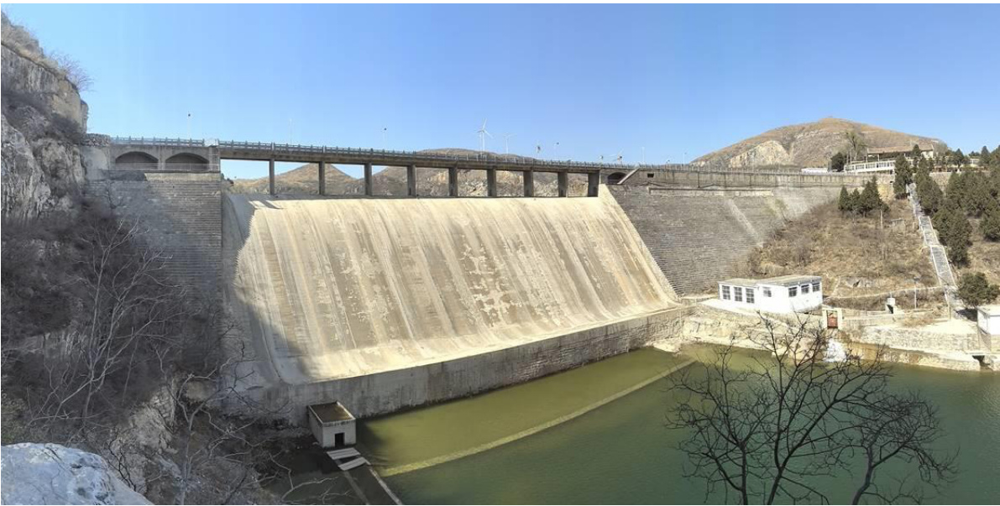  
图 6.1.1-2  夺丰水库大坝现场照片  

如图 6.1.1-2 所示,夺丰水库枢纽工程拦河坝是一座浆砌石重力坝,枢纽工程主要建筑物由大坝、输水洞、交通桥及枢纽连接道路等部分组成,该水库属于中型水库,工程等别为Ⅲ等,主要建筑物为 3 级,次要建筑物为 4 级。现状水库枢纽布置如图 6.1.1-3 所示,大坝纵剖面图如图 6.1.1-4 所示。  

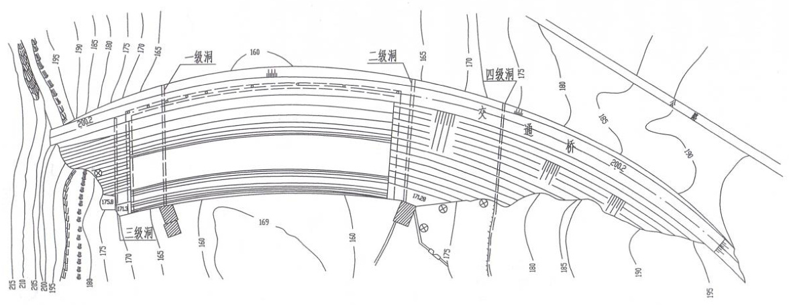  
图 6.1.1-3  现状夺丰水库枢纽布置图  

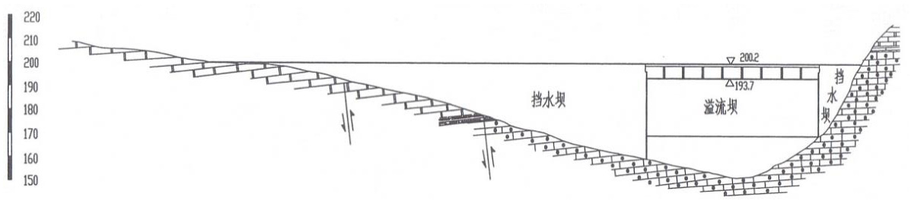  
图 6.1.1-4  现状夺丰水库大坝纵剖面图  

拦河坝是一座平面呈拱形的浆砌石重力坝,大坝坝顶全长 $193.7\mathrm{m}$ ,其中溢流坝段长 $72.0\mathrm{m}$ ,左岸挡水坝段长 $103.7\mathrm{m}$ ,右岸挡水坝段长 $18.0\mathrm{m}$ 。大坝坝顶高程为 $200.2\mathrm{m}$ ,最大坝高 $41.2\mathrm{m}$ ,坝顶宽 $5.1\mathrm{m}$ ,桥面净宽 $3.5\mathrm{m}$ ,堰顶高程 $193.35\mathrm{m}$ 。挡水坝段横断面图如图 6.1.1-5 所示,溢流坝段横断面图如图 6.1.1-6 所示。  

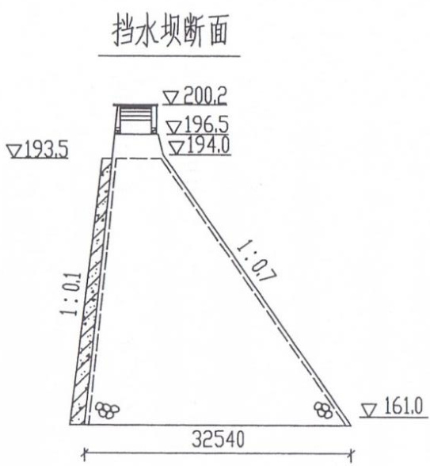  
图 6.1.1-5 现状挡水坝段横断面图  

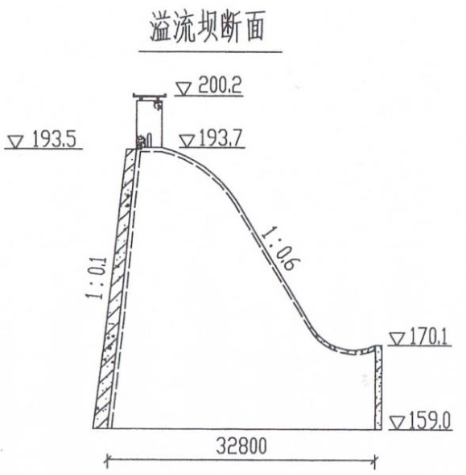  
图 6.1.1-6  现状溢流坝段横断面图  

大坝于 1972 年初建完工,初建坝体上游坝坡 1:0.1,1974\~1976 年在大坝上游浇筑混凝土防渗面板,面板底高程 $159.0\mathrm{m}$ ,底部宽 $1.8\mathrm{m}$ ,面板顶高程 $193.5\mathrm{m}$ ,顶部宽 $1.2\mathrm{m}$ ,大坝上游坝坡变为 1:0.11。大坝上游 $193.5\mathrm{m}{\sim}196.5\mathrm{m}$ 高程未浇筑混凝土防渗面板,坝坡仍为 $1{:}0.1,196.5\mathrm{m}$ 高程以上为铅直面。大坝下游坝坡1:0.7,大坝上游 $196.5\mathrm{m}$ 高程以上采用挡土墙形式布置,墙顶宽 $1.0\mathrm{m}$ ,底宽 $2.4\mathrm{m}$ ;大坝下游为砌石拱桥, $194.0\mathrm{m}$ 高程以上大坝加宽 $1.5\mathrm{m}$ ,后期将砌石拱桥下游面封堵坝体内部改为储藏室。大坝溢流面基本为克——奥 IV 曲线,曲线下接斜直段,斜直段坡比 1:0.6,斜直段下接反弧段挑流鼻坎,鼻坎高程 $169.4\mathrm{m}$ ,挑射角 $20^{\circ}$ 。  

夺丰水库原建有四级输水洞,现一级、三级、四级输水洞已封堵。一级输水洞为砌石结构有压洞,输水洞进口位于大坝右岸坝段,进口底高程 $163.0\mathrm{m}$ ,洞径 $0.5\mathrm{m}$ ,洞长 $34\mathrm{m}$ ,一级输水洞主要向夺丰水库灌区南干渠输水,该洞现状进口采用混凝土封堵;二级输水洞为钢筋混凝土结构有压洞,输水洞进口位于大坝左岸坝段,进口底高程 $168.0\mathrm{m}$ ,洞径 $0.8\mathrm{m}$ ,洞长 $33.5\mathrm{m}$ ,一级输水洞连接坝后控制阀室,主要向夺丰水库灌区北干渠输水,该洞现状可正常运行。三级输水洞进口位于大坝右岸坝段,进口底高程 $174.1\mathrm{m}$ ,洞径 $1.5\mathrm{m}$ ,目前未使用,输水洞现状已从上游采用混凝土封死;四级输水洞进口位于大坝左岸坝段,进口底高程为 $178.8\mathrm{m}$ ,横断面呈城门洞形,输水洞现状已从上游采用混凝土封死。  

坝顶交通桥总长 $187.49\mathrm{m}$ ,分为溢流坝段和非溢流坝段两部分,共 23 孔,交通桥单跨为 $7.5\mathrm{m}$ 和 $6.0\mathrm{m}$ 。桥面高程 $202.20\mathrm{m}$ ,宽 $6.0\mathrm{m}$ 。  

(3)主要勘测设计工作过程  

1)概述  

$\textcircled{1}$ 夺丰水库于 1959 年动工兴建,1960 年停工,1966 年开工续建,1972 年  
初步建成;$\textcircled{2}$ 由于大坝砌筑质量差,坝体渗漏严重。在水库运行过程中,1974\~1976 年  
在坝体上游做钢筋混凝土防渗面板;$\textcircled{3}$ 1977\~1978 年,对坝体进行补强灌浆;$\textcircled{4}$ 1983 年,对左坝段坝基进行帷幕灌浆;$\textcircled{5}$ 1986 年,在溢流坝段下游斜向坝基打 13 个排水孔,降低坝基扬压力;$\textcircled{6}$ 1988 年,在溢流坝右端及右岸挡水坝坝段进行接触与防渗灌浆;  

$\textcircled{7}$ 1989\~1990 年,对大坝进行加高加固,结合大坝加高修建坝顶工作桥,对 溢流坝面岸克—奥Ⅳ型曲线进行衬砌等;  

$\textcircled{8}$ 2003 年,河南水利厅召开夺丰水库大坝安全鉴定会议,鉴定结果:夺丰水库坝体采用白灰砂浆砌筑,质量存在严重隐患。大坝结构先天不足,无排水廊道;在校核水位状况下大坝抗滑稳定安全系数小于 1,不符合规范要求,大坝结构安全性为 C 级;坝基渗漏严重,渗流安全性为 C 级;一级输水洞淤积停用,闸门启闭设备陈旧、损坏;大坝监测、管理设施不完善。  

⑨2006\~2007 年,夺丰水库除险加固内容主要包括:大坝上游混凝土防渗面板进行防渗处理、坝体补强及坝基帷幕灌浆、溢流坝面维修、一级输水洞封堵、拆除水库下游挡水坝并修建南干渠渡槽、二级输水洞更换闸阀及启闭机、大坝监测设计及管理设施建设等。  

$\textcircled{10}2010$ 年 6 月 9 日,河南省水利基本建设工程重点检测中心站对夺丰水库除险加固工程施工进行了全面检测,检测结果全部合格,验收委员会一致认为:鹤壁市夺丰水库除险加固项目已具备蓄水验收条件,项目工程质量合格。  

⑪2020 年 12 月 30 日,由洛阳水利勘测设计有限责任公司对夺丰水库进行安全鉴定。结果如下:夺丰水库大坝工程质量评价为合格;大坝运行管理综合评价为较规范;防洪标准满足规范要求;大坝左、右坝肩存在渗漏现象,大坝结构安全、抗震稳定满足规范要求;金属结构运行正常,基本满足规范要求。综合评定夺丰水库为“二类坝”。  

(4)初建过程  

淇县夺丰水库始建于 1959 年 11 月,1960 年 7 月停工,1966 年开工续建,1972 年基本建成运营。夺丰水库为原汤阴县定案项目,未进行全面规划和设计,仅根据地形图简单部署,选定坝型后即开工建设,大坝砌筑分区如下图所示。  

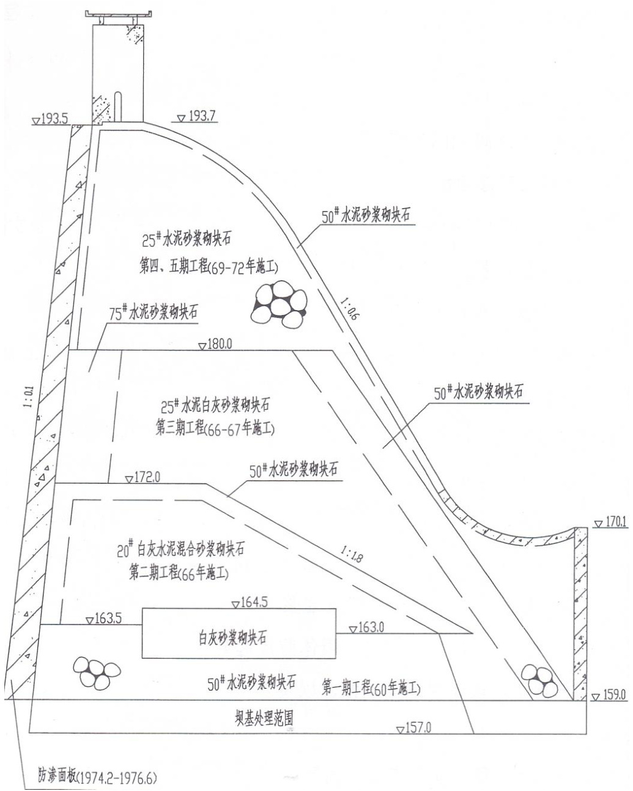  
图 6.1.1-7  大坝砌筑分区图  

1959 年 11 月至 1960 年 7 月为一期工程,大坝上游面坝坡 1:0.1,下游坝坡$1{:}0.3\sim1{:}0.4$ ,坝体中间最大砌筑高程 $164.5\mathrm{m}$ ,上游平台砌筑高程 $163.5\mathrm{m}$ ,下游平台砌筑高程 $163.0\mathrm{m}$ 。从有关施工记录及工程总结资料看,大坝 $160.0\mathrm{m}$ 高程以下全部采用 50#水泥砂浆砌筑,由于当时水泥紧缺,坝体上、下游 $160.0\mathrm{m}$ 高程以上 $6\mathrm{m}$ 厚度范围采用 50#水泥砂浆砌筑,坝体内部采用白灰砂浆砌筑。由于无施工机械及熟练的技术工人,加之施工人员无实践经验,施工质量无法保证。  

1966 年 2 月,安阳地区水利局以“安水设字(66)第 35 号文”将《武公祠水库(即夺丰水库)续建工程设计任务书》转报省水利厅,并根据省厅专家审查意见编制了续建工程设计,工程设计包括:大坝坝高 $40.5\mathrm{m}$ ,坝轴线长 $223\mathrm{m}$ (其中溢流坝长 $70\mathrm{m}$ ),坝顶宽 $3.0\mathrm{m}$ ,总库容 1060 万 $\mathrm{m}^{3}$ 。坝体输水洞分两级,右岸坝段一级洞进口底高程 $163.0\mathrm{m}$ ,左岸坝段二级洞进口底高程 $168.0\mathrm{m}$ 。实际施工中共建有四级输水洞,现只有左岸坝段二级洞运行正常,另外三个输水洞已堵死,其中右岸坝段一级洞淤积停用,三级输水洞为备用洞,四级输水洞留有供水管道。  

二期工程于 1966 年 2 月开工,同年 7 月由于受物料及经费限制而停工,大坝砌筑高程为 $172.0\mathrm{m}$ 。二期工程施工直接在一期工程上进行,大坝上游坝坡与一期工程保持一致,坝坡 1:0.1,下游边坡变为 1:1.8,坝体上、下游面采用 50#水泥砂浆砌筑,砌筑厚度 $1.0\mathrm{m}$ ,坝体内部采用 20#白灰水泥混合砂浆砌筑(水泥用量很少)。一、二期工程衔接处未采取凿毛处理,水库蓄水后,接缝处有明显渗水现象。  

1966 年 10 月至 1967 年 7 月为三期工程,在一、二期工程的基础上坝体砌筑高程达到 $180.0\mathrm{m}$ 。根据不同部位采用不同材料,大坝上游坡面采用 75#水泥砂浆砌料石,厚度 $3\mathrm{m}$ ,下游坡面采用 50#水泥砂浆砌块石,厚度 $2\mathrm{m}$ ,坝体内部采用 25#水泥白灰砂浆砌块石。  

1967 年 10 月至 1968 年底,大坝完成施工备料工作。  

1969 年 2 月至 7 月,大坝进行四期施工。按照 1966 年设计,在大坝下游加宽断面至 $32.8\mathrm{m}$ ,并浇筑了溢流坝段挑流鼻坎,挑流鼻坎高程为 $169.4\mathrm{m}$ ,挑流鼻坎以下为直墙段,以上平均坝坡为 1:06。大坝加宽培厚部分砌筑至 $180.0\mathrm{m}$ 高程,与已建坝体齐平。  

1969 年 10 月至 1972 年 6 月为五期工程,由于施工期处在文化大革命期间,大坝砌筑断续施工。大坝溢流坝段砌筑高程达至 $193.5\mathrm{m}$ ,顶宽 $3.0\mathrm{m}$ ,挡水坝段砌筑至 $196.5\mathrm{m}$ 高程(低于原设计 $3\mathrm{m}$ ),挡水坝段顶宽 $5.1\mathrm{m}$ ,大坝初建完成。坝体根据分区采用不同材料砌筑:上游坝坡采用 75#水泥砂浆砌料石砌筑,厚度$0.5\mathrm{m}$ ,坝顶采用 75#水泥砂浆砌料石,厚度 $3\mathrm{m}$ ,下游坝坡采用 50#水泥砂浆砌块石,厚度 $0.5\mathrm{m}$ ,坝体内部采用 25#水泥砂浆砌块石砌筑。  

大坝现状材料分区总结如下: $\textcircled{1}$ 上游坝坡 $173.0\mathrm{m}$ 以下采用 75#水泥砂浆砌块石, $159{\sim}163.5\mathrm{m}$ 高程之间砌筑厚度为 $6.0\mathrm{m}$ , $163.5{\sim}173.0\mathrm{m}$ 高程之间砌筑厚度为 $1.0\mathrm{m}$ , $173.0{\sim}196.5\mathrm{m}$ 高程之间采用 75#水泥砂浆砌料石,砌筑厚度 $0.5\mathrm{m}$ 。 $\textcircled{2}$ 坝体内部 $159{\sim}160\mathrm{m}$ 高程之间采用 50#水泥砂浆砌块石, $160{\sim}164.5\mathrm{m}$ 高程之间采用 20#白灰砂浆砌筑, $164.5{\sim}173.0\mathrm{m}$ 高程之间采用 20#水泥白灰砂浆砌筑(水泥含量很少),173.0\~193.5m 高程之间采用 25#水泥砂浆砌块石, $193.5{\sim}196.5\mathrm{m}$ 高程之间采用 75#水泥砂浆砌料石,其中溢流坝段 $173.0{\sim}190.5\mathrm{m}$ 高程之间采用 25#水泥砂浆砌块石, $190.5{\sim}193.5\mathrm{m}$ 高程之间采用 75#水泥砂浆砌料石。 $\textcircled{3}$ 下游坝坡采用 50#水泥砂浆砌块石, $159{\sim}163.5\mathrm{m}$ 高程之间砌筑厚度为 $6.0\mathrm{m}$ ,163.5\~173.0m高程之间砌筑厚度为 $1.0\mathrm{m}$ , $173.0{\sim}196.5\mathrm{m}$ 之间砌筑厚度为 $0.5\mathrm{m}$ 。 $\textcircled{4}196.5\mathrm{m}$ 至现状坝顶高程,挡水坝均采用 75#水泥砂浆砌筑。  

夺丰水库初建过程中由于施工机械缺乏,技术力量薄弱,加之建筑材料短缺,施工按生产队分段砌筑,施工进度不平衡,错茬率较高,造成坝体横、竖向通缝多。当时处于困难时期,筑坝石料大小不一,相当一部分为毛石施工质量不好,大坝下部砌体最主要的胶结材料——水泥严重不足,大部分采用水泥白灰砂浆砌筑,质量最差。工程运行以来,白灰砂浆顺砌缝渗出而形成空洞,坝体漏水量达350L/s。  

(5)大坝历次除险加固工程  

# 1)混凝土防渗面板工程  

夺丰水库于 1972 年初步建成后,由于白灰砂浆标号低,在水下无法凝固,坝体砌筑质量差,水库蓄水后压力加大,白灰砂浆溢出。经过十几年运行,白灰砂浆逐渐被冲蚀,坝体形成空洞,漏水严重。  

为解决水库险情,根据“安革水字(74)第 41 号文”,有关单位编制了混凝土防渗面板设计书。1974 年 2 月至 1976 年 6 月,坝体上游坝坡增设混凝土防渗面板,面板底部与河床基岩相接,由于水库淤积厚度达 $4{\sim}5\mathrm{m}$ ,无法作齿墙与基岩衔接,施工单位便直接在基岩上浇筑混凝土。混凝土防渗面板采用 200#钢筋混凝土,面板底部宽度 $1.8\mathrm{m}$ ,顶宽度 $1.2\mathrm{m}$ ,上游坝坡 1:0.11,面板顶高程 $193.5\mathrm{m}$ ,与溢流坝段堰顶高程齐平。工程实施后,大坝渗漏量由 350L/s 减小到 184L/s。  

2)坝体补强灌浆及左坝段帷幕灌浆  

坝体上游增设的面混凝土防渗面板对于坝体防渗起到了一定作用,但并未解决坝体内部被掏空、坝体裂缝以及左坝头坝基岩体断层破碎带漏水的问题。为处理以上问题,安阳专署水利局以“安革水字(76)第 74 号文”转呈省水利厅,请求解决水库存在问题。根据省、地意见,淇县水利局及有关单位编制了《夺丰水库灌浆工程设计书》。  

1977 年,有关单位对大坝浆砌石坝体进行补强灌浆,对大坝左坝头$0{\cdot}070{\sim}0{+}186$ 段进行帷幕灌浆。  

1986 年,河南省水利厅第二工程队在溢流坝坝后斜向坝基打了 13 个排水孔,拟用坝基排水代替设计的帷幕防渗,减少坝基扬压力,改变坝体稳定状态。工程实施后取得了明显效果,但 1 号测压管扬压力值超过设计要求,说明右坝头排水孔效果较差。1988 年,经省水利厅同意,在溢流坝段右段及挡水坝右段进行接触与防渗灌浆,工程于 1989 年 7 月结束,钻孔 17 个,总进尺 $504\mathrm{m}$ ,耗用水泥35.6 吨。灌浆结束后,通过水库蓄水运行监测,右坝头渗漏量有所减少,渗透压力也有所降低。  

3)1989 年水库除险加固工程  

直至 1989 年,1985 年编制的《淇县夺丰水库加固工程设计》大部分工程仍未得到实施,水库还存在防洪标准低、溢流坝段不稳定、右坝肩绕渗、左坝段坝基渗漏、溢流坝泄流能力小、兴利库容偏小及管理设施不配套等问题。  

为解决水库存在问题,根据省水利厅安排,鹤壁市水利局设计室于 1989 年8 月编制完成了《夺丰水库除险加固工程设计》。工程设计主要内容:挡水坝段加高至 $200.20\mathrm{m}$ ;在溢流坝段坝体内部增设廊道并重新布置排水系统及观测孔,以降低扬压力;溢流坝段修建工作桥,桥面与挡水坝段坝顶高程齐平,作为保证坝体稳定的辅助措施;为提高溢流坝段泄流能力,对溢流堰面部分按克一奥 IV曲线进行修改。河南省水利厅 1990 年 1 月以豫水管字[1990]04 号文予以批复,批复主要工程内容:同意工程规划及规模;同意挡水坝加高 $3.5\mathrm{m}$ ,坝顶高程$200.2\mathrm{m}$ ,溢流坝上建钢筋混凝土平板桥,二坝拆除及新修对外公路;同意大坝稳定计算,今后应加强观测扬压力,以保证工程安全;排水廊道暂不安排;右坝头再增补 5 个灌浆钻孔。  

该批复工程自 1990 年 3 月开始实施,同年 12 月结束。主要完成工程内容:$\textcircled{1}$ 在 1988 年接触与防渗灌浆的基础上,在 2#、3#、5#、6#、9#、11#孔之间再增补 5 个防渗灌浆孔,灌浆结束后,在右坝头增打一观测孔,总进尺 $170.2\mathrm{m}$ ,耗用水泥 31 吨。 $\textcircled{2}$ 挡水坝段加高 $3.5\mathrm{m}$ ,坝顶高程 $200.2\mathrm{m}$ 。 $\textcircled{3}$ 在溢流坝段建钢筋混凝土平板工作桥,桥面与挡水坝段坝顶高程齐平。 $\textcircled{4}$ 整修水库至高黄公路路面$280\mathrm{m}$ 。 $\textcircled{5}$ 对溢流坝段堰面修改护砌,施工中只将溢流面坝顶部修整护砌,并加高 $0.2\mathrm{m}$ ,堰顶高程加高至 $193.7\mathrm{m}$ 。  

根据竣工报告,该期工程结束后,水库防洪安全问题基本解决,但溢流坝面未全部按克一奥 IV 型曲线进行修改护砌,存在大坝灰缝脱落、左坝段坝基渗漏及绕坝渗漏等问题,左坝段渗漏量为 36L/s,年渗漏量达 113.5 万 $\mathrm{m}^{3}$ 。  

# 6.1.1.2 工程任务  

夺丰水库原设计是一座以灌溉、供水、防洪为主,结合养殖等多种经营的中型水库。水库原设计并未设置专用的防洪库容,只起一定的滞洪作用。工程防洪对象为坝址下游淇县城区和城区上、下游村镇,供水对象为自流灌溉的中型灌区,共涉及庙口镇、高村镇、灵山办事处等三个乡镇(办事处),水库单独设置应急备用库容,保证南水北调总干渠发生突发事故或正常检修时,满足淇县城乡供水一体化范围内 3 个月事故应急供水和 3 个月检修应急供水。  

夺丰水库扩容后原设计工程任务不变,新增防洪任务。通过设置专用防洪库容,提高淇县城区和城区下游河段防洪标准,最大程度减小思德河上游山区洪水进入下游平原区的几率,保障卫河流域防洪安全。  

# 6.1.1.3 水文泥沙  

# (1)气象  

项目区属暖温带大陆性气候,四季分明,春季偏旱多风,夏季炎热降水集中,秋季凉爽季节短,冬季寒冷少雨雪,冬季偏北风,夏季偏南风。根据淇县气象站1965-2022 年气象资料统计,多年平均降水量为 $616\mathrm{mm}$ ,最大年降水量为 $1796\mathrm{mm}$ (2021 年),最小年降水量为 $268\mathrm{mm}$ (1997 年),年蒸发量 $1256\mathrm{mm}$ 。由于自然条件影响,降水量从西北至东南呈递减趋势,使西部山区形成一个小暴雨区。降水量年内分配极不均匀,夏季 7-9 月份降水量占全年的 $63.3\%$ 以上,7、8 两月占全年降水量的 $51.7\%$ 。容易形成夏汛秋涝,冬春干旱少雨雪,极易造成水旱灾害。多年平均气温 $14.4^{\circ}\mathrm{C}$ ,极端最高气温 $42.5^{\circ}\mathrm{C}$ ,极端最低气温- $\mathrm{18^{\circ}C}$ ,多年平均最大风速 $12.8\mathrm{m/s}$ ,历年最大风速 $17.7\mathrm{m}/\mathrm{s}$ ,淇县气象数据统计见下表。  

表 6.1.1-1 淇县气象数据统计  

<html><body><table><tr><td>项目</td><td>1月</td><td>2月</td><td>3月</td><td>4月</td><td>5月</td><td>6月</td><td>7月</td><td>8月</td><td>9月</td><td>10月</td><td>11月 12月</td><td>年</td></tr><tr><td>降水量（mm)</td><td>3.89</td><td>8.91</td><td>15.0</td><td>30.7</td><td>44.9</td><td>69.4</td><td>188</td><td>130</td><td>71.3</td><td>30.0 18.5</td><td>4.57</td><td>616</td></tr><tr><td>蒸发量（mm)</td><td>42</td><td>57</td><td>101</td><td>124</td><td>150</td><td>191</td><td>132</td><td>128</td><td>116 98</td><td>72</td><td>44</td><td>1256</td></tr><tr><td>平均气温（℃)</td><td>-0.590</td><td>2.62</td><td>8.59</td><td>15.4</td><td>21.3</td><td>26.4</td><td>27.2</td><td>25.9</td><td>21.3</td><td>15.5 7.68</td><td>1.16</td><td>14.4</td></tr><tr><td>极端最高气温（℃)</td><td>18.8</td><td>27.5</td><td>29.7</td><td>35.4</td><td>38.8</td><td>42.5</td><td>41.5</td><td>38.1</td><td>37.9 35.2</td><td>27.5</td><td>23.5</td><td>42.5</td></tr><tr><td>极端最低气温（℃）</td><td>-17.4</td><td>-14.6</td><td>-8.30</td><td>-2.00</td><td>3.10</td><td>10.3</td><td>13.0</td><td>12.7</td><td>3.50 -3.40</td><td>-14.5</td><td>-18.0</td><td>-18.0</td></tr><tr><td>平均风速(m/s)</td><td>2.67</td><td>2.90</td><td>3.30</td><td>3.37</td><td>3.00</td><td>2.82</td><td>2.34</td><td>2.13</td><td>2.13 2.32</td><td>2.52</td><td>2.51</td><td>2.67</td></tr><tr><td>平均最大风速（m/s)</td><td>9.29</td><td>10.2</td><td>11.3</td><td>11.7</td><td>9.69</td><td>10.3</td><td>8.91</td><td>8.89 8.30</td><td>9.00</td><td>9.03</td><td>8.88</td><td>12.8</td></tr><tr><td>最大风速（m/s)</td><td>12.2</td><td>15.3</td><td>17.1</td><td>17.1</td><td>13.4</td><td>17.7</td><td>13.5</td><td>15.1</td><td>11.5 13.8</td><td>13.2</td><td>11.5</td><td>17.7</td></tr><tr><td>最大风速相应风向</td><td>NE</td><td>N</td><td>N</td><td>N</td><td>WNW</td><td>N</td><td>N</td><td>N</td><td>N N</td><td>N</td><td>N</td><td>N</td></tr><tr><td>日照时数（h)</td><td>136</td><td>139</td><td>177</td><td>206</td><td>238</td><td>222</td><td>185</td><td>195</td><td>175 175</td><td>150</td><td>146</td><td>2144</td></tr><tr><td>相对湿度（%)</td><td>59.1</td><td>58.5</td><td>58.2</td><td>61.0</td><td>61.7</td><td>58.5</td><td>77.0</td><td>79.2</td><td>72.7 67.0</td><td>66.0</td><td>61.9</td><td>65.1</td></tr></table></body></html>  

# (2)径流  

思德河流域的径流年内丰枯变化较大,主要是受降水量大小所支配,夏季水量较丰,冬季径流较小。6\~9 月为丰水期,尤以 7\~8 月份最多,径流主要集中于丰水期,10 月\~次年 5 月为枯水期,枯水期径流量少。  

思德河径流成果见表 6.1.1-2,夺丰水库坝址以上断面多年平均逐月径流成果见表 6.1.1-3。坝址多年平均径流量 825 万 $\mathrm{m}^{3}$ ,径流流量 $0.262\mathrm{m}^{3}/\mathrm{s}$ 。  

表 6.1.1-2  夺丰水库设计径流成果表  

<html><body><table><tr><td rowspan="2">均值</td><td rowspan="2">Cv</td><td rowspan="2">Cs/Cv</td><td colspan="4">各频率设计径流量（万m3)</td></tr><tr><td>25%</td><td>50%</td><td>75%</td><td>90%</td></tr><tr><td>825</td><td>1.00</td><td>2.5</td><td>1066</td><td>528</td><td>271</td><td>189</td></tr></table></body></html>  

# 表 6.1.1-3  夺丰水库逐月径流成果表  

<html><body><table><tr><td>月份</td><td>1月</td><td>2月</td><td>3月</td><td>4月</td><td>5月</td><td>6月</td><td rowspan="2">年径流量（万m3)</td></tr><tr><td>径流量（万m3)</td><td>13.0</td><td>13.6</td><td>12.5</td><td>14.8</td><td>24.1</td><td>79.1</td></tr><tr><td>月份</td><td>7月</td><td>8月</td><td>9月</td><td>10月</td><td>11月</td><td>12月</td><td rowspan="2">825</td></tr><tr><td>径流量（万m²）</td><td>211</td><td>202</td><td>106</td><td>71.7</td><td>52.0</td><td>26.8</td></tr></table></body></html>  

(3)洪水  

思德河流域处在太行山迎风坡,偏东暖湿气流受太行山的阻挡和抬升影响,往往在山前地带产生暴雨,是暴雨多发地区。暴雨发生时间以 7、8 月份居多。洪水多发生在 $6{\sim}9$ 月份,年最大洪峰一般出现在 7 月初至 8 月中旬。夺丰水库流域设计洪峰洪量成果见表 6.1.1-4。  

表 6.1.1-4  夺丰水库设计洪水成果表  

<html><body><table><tr><td rowspan="2">项目</td><td colspan="6">各频率设计值</td></tr><tr><td>0.10%</td><td>0.50%</td><td>1%</td><td>2%</td><td>5%</td><td>10%</td></tr><tr><td>洪峰流量（m3/s)</td><td>2547</td><td>1924</td><td>1601</td><td>1341</td><td>1001</td><td>757</td></tr><tr><td>最大24h洪量（万m²）</td><td>3628</td><td>2596</td><td>2156</td><td>1723</td><td>1163</td><td>780</td></tr><tr><td>最大3日洪量（万 m²)</td><td>4358</td><td>3010</td><td>2446</td><td>1917</td><td>1272</td><td>833</td></tr></table></body></html>  

# (4)泥沙  

夺丰水库现状坝址年均入库沙量为 1.38 万 t,折合 1.04 万 $\mathrm{m}^{3}$ ,其中年均悬移质入库沙量为 1.15 万 t,折合 0.89 万 $\mathrm{m}^{3}$ ,年均推移质入库沙量为 0.23 万 t,折合 0.15 万 $\mathrm{m}^{3}$ 。20 年坝前淤积高程约 $168.5\mathrm{m}$ ,50 年坝前淤积高程约 $170.2\mathrm{m}$ 。  

# 6.1.1.4 工程规划指标  

坝址主要规划指标见表 6.1.1-5。  

表 6.1.1-5  夺丰水库工程规模主要指标成果汇总表  

<html><body><table><tr><td colspan="3" rowspan="2">项目</td><td rowspan="2">单位</td><td colspan="2">特征值</td></tr><tr><td>原设计</td><td>本次扩容后</td></tr><tr><td colspan="3">坝址以上流域面积</td><td>km2</td><td colspan="2">57.7</td></tr><tr><td colspan="3"></td><td>万m3</td><td colspan="2">825</td></tr><tr><td colspan="3">多年平均径流量 多年平均流量</td><td>m3/s</td><td colspan="2">0.262</td></tr><tr><td rowspan="12">水库特征水位</td><td colspan="2">校核洪水位 （1000年一遇)</td><td>m</td><td>199.44</td><td>215.95</td></tr><tr><td colspan="2">设计洪水位 （100年一遇）</td><td>m</td><td>197.85</td><td>213.81</td></tr><tr><td colspan="2">5年洪水位</td><td>m</td><td>/</td><td>209.46</td></tr><tr><td colspan="2">10年洪水位</td><td>m</td><td></td><td>211.43</td></tr><tr><td colspan="2">20年洪水位</td><td>m</td><td>/</td><td>211.66</td></tr><tr><td colspan="2">50年防洪高水位</td><td>m</td><td>/</td><td>213.61</td></tr><tr><td colspan="2">汛限水位</td><td>m</td><td>/</td><td>206.00</td></tr><tr><td colspan="2">正常蓄水位</td><td>m</td><td>193.70</td><td>208.00</td></tr><tr><td colspan="2">死水位</td><td>m</td><td>163.00</td><td>170.50</td></tr><tr><td colspan="2">正常运行最低水位</td><td>m</td><td>/</td><td>197.50</td></tr><tr><td colspan="2">50 年淤沙高程</td><td>m</td><td>/</td><td>170.20</td></tr><tr><td colspan="2">总库容</td><td>m</td><td>1132</td><td>2409</td></tr><tr><td rowspan="6">水库特征库容</td><td colspan="2">正常蓄水位对应库容</td><td>万m3</td><td>732</td><td></td></tr><tr><td colspan="2"></td><td>万m3</td><td>/</td><td>1480</td></tr><tr><td colspan="2">防洪库容</td><td></td><td></td><td>800</td></tr><tr><td colspan="2">正常运行死水位对应原始库容 事故应急备用库容</td><td>万m3</td><td>16</td><td>590</td></tr><tr><td colspan="2"></td><td>万m3 万m3</td><td>/ 716</td><td>700</td></tr><tr><td rowspan="2">调节库容</td><td>原始</td><td>万m3</td><td>/</td><td>759</td></tr><tr><td colspan="2">淤积20年 坝址洪峰流量</td><td></td><td></td><td>752</td></tr><tr><td rowspan="3">P=0.1% (校核标准)</td><td colspan="2">出库洪峰流量</td><td>m3/s m3/s</td><td>/ /</td><td>2547 1535</td></tr><tr><td colspan="2">相应坝轴线下游200m水位</td><td>m</td><td>/</td><td>168.87</td></tr><tr><td colspan="2">坝址洪峰流量</td><td>m3/s</td><td>/</td><td>1601</td></tr><tr><td rowspan="3">P=1% (设计标准)</td><td colspan="2">出库洪峰流量</td><td>m3/s</td><td>/</td><td>1077</td></tr><tr><td colspan="2"></td><td></td><td></td><td></td></tr><tr><td colspan="2">相应坝轴线下游200m水位</td><td>m</td><td>/</td><td>168.12</td></tr><tr><td rowspan="2">生态流量</td><td colspan="2">汛期</td><td>m3/s m3/s</td><td>/</td><td>0.07 0.02</td></tr><tr><td colspan="2">非汛期 供水 村镇生活</td><td>万m3</td><td>/</td><td>64</td></tr><tr><td rowspan="3">多年平均供 水灌溉水量</td><td>灌溉</td><td>夺丰水库灌区</td><td>万m3</td><td>/</td><td>378</td></tr><tr><td></td><td></td><td>万m3</td><td></td><td></td></tr><tr><td>合计</td><td></td><td></td><td>/</td><td>443</td></tr></table></body></html>  

# 6.1.1.5 库容曲线  

夺丰水库水位 $\tilde{.}$ 面积\~库容曲线见下表。  

表 6.1.1-6  夺丰水库水位\~面积\~库容曲线表  

<html><body><table><tr><td>水位（m)</td><td>库面积 （万m²）</td><td>原始库容 （万m3)</td><td>淤积20年 （万m²)</td><td>淤积 30 年 （万m²)</td><td>淤积50年 （万m3)</td></tr><tr><td>163</td><td>0</td><td>0</td><td>0</td><td>0</td><td>0</td></tr><tr><td>164</td><td>1</td><td>0</td><td>0</td><td>0</td><td>0</td></tr></table></body></html>  

<html><body><table><tr><td>水位（m)</td><td>库面积</td><td>原始库容</td><td>淤积20年</td><td>淤积30年</td><td>淤积50年</td></tr><tr><td rowspan="2"></td><td>（万m²）</td><td rowspan="2">（万m3)</td><td rowspan="2">(万m3)</td><td rowspan="2">(万m3)</td><td rowspan="2">(万m3)</td></tr><tr><td>1</td></tr><tr><td>165 166</td><td>2</td><td>0 0</td><td>0 0</td><td>0 0</td><td>0 0</td></tr><tr><td>167</td><td>2</td><td>1</td><td>0</td><td>0</td><td>0</td></tr><tr><td>168</td><td>3</td><td>3</td><td>0</td><td>0</td><td>0</td></tr><tr><td>169</td><td>4</td><td>7</td><td>2</td><td>0</td><td>0</td></tr><tr><td>170</td><td>5</td><td>11</td><td>6</td><td>3</td><td>0</td></tr><tr><td>171</td><td>7</td><td>17</td><td>12</td><td>9</td><td>4</td></tr><tr><td>172</td><td>8</td><td>25</td><td>20</td><td>17</td><td></td></tr><tr><td>173</td><td>10</td><td>33</td><td>28</td><td>25</td><td>12</td></tr><tr><td>174</td><td></td><td>43</td><td></td><td></td><td>20</td></tr><tr><td>175</td><td>11</td><td></td><td>37</td><td>35</td><td>30</td></tr><tr><td>176</td><td>12</td><td>55</td><td>49</td><td>47</td><td>42</td></tr><tr><td></td><td>14</td><td>67</td><td>61</td><td>58</td><td>53</td></tr><tr><td>177 178</td><td>15</td><td>82</td><td>76</td><td>73</td><td>68</td></tr><tr><td>179</td><td>17</td><td>98</td><td>92</td><td>89</td><td>84</td></tr><tr><td>180</td><td>18</td><td>115</td><td>109</td><td>106</td><td>100</td></tr><tr><td>181</td><td>20</td><td>134</td><td>128</td><td>124</td><td>119</td></tr><tr><td>182</td><td>21</td><td>155</td><td>149</td><td>145</td><td>140</td></tr><tr><td>183</td><td>23</td><td>177</td><td>170</td><td>167</td><td>161</td></tr><tr><td>184</td><td>25</td><td>201</td><td>194</td><td>190</td><td>184</td></tr><tr><td>185</td><td>26</td><td>226</td><td>219</td><td>215</td><td>208</td></tr><tr><td>186</td><td>27</td><td>253</td><td>246</td><td>241</td><td>234</td></tr><tr><td>187</td><td>29</td><td>280</td><td>272</td><td>267</td><td>260</td></tr><tr><td>188</td><td>30</td><td>310</td><td>302</td><td>297</td><td>289</td></tr><tr><td>189</td><td>32</td><td>341</td><td>333</td><td>327</td><td>319</td></tr><tr><td></td><td>33</td><td>373</td><td>365</td><td>359</td><td>349</td></tr><tr><td>190</td><td>35</td><td>407</td><td>398</td><td>391</td><td>381</td></tr><tr><td>191 192</td><td>36</td><td>443</td><td>433</td><td>426</td><td>415</td></tr><tr><td>193</td><td>37</td><td>479</td><td>469</td><td>461</td><td>449</td></tr><tr><td>194</td><td>39</td><td>518</td><td>508</td><td>499</td><td>485</td></tr><tr><td>195</td><td>42</td><td>558</td><td>548</td><td>539</td><td>525</td></tr><tr><td>196</td><td>44</td><td>590</td><td>579</td><td>571</td><td>556</td></tr><tr><td>198</td><td>47</td><td>646</td><td>635</td><td>626</td><td>611</td></tr><tr><td>200</td><td>53</td><td>746</td><td>733</td><td>724</td><td>709</td></tr><tr><td></td><td>61</td><td>860</td><td>845</td><td>836</td><td>820</td></tr><tr><td>202</td><td>70</td><td>991</td><td>975</td><td>966</td><td>949</td></tr><tr><td>204</td><td>77</td><td>1137</td><td>1119</td><td>1110</td><td>1092</td></tr><tr><td>206 208</td><td>85 97</td><td>1298 1480</td><td>1279 1461</td><td>1269 1451</td><td>1251</td></tr><tr><td>210</td><td>105</td><td>1683</td><td>1664</td><td>1654</td><td>1432 1635</td></tr><tr><td>212</td><td>115</td><td>1903</td><td>1884</td><td>1874</td><td>1855</td></tr></table></body></html>  

<html><body><table><tr><td>水位（m)</td><td>库面积 （万m²）</td><td>原始库容 （万m²)</td><td>淤积20年 （万m²)</td><td>淤积30年 （万m3)</td><td>淤积50年 （万m²)</td></tr><tr><td>214</td><td>128</td><td>2147</td><td>2128</td><td>2118</td><td>2099</td></tr><tr><td>216</td><td>141</td><td>2415</td><td>2396</td><td>2386</td><td>2367</td></tr><tr><td>218</td><td>156</td><td>2712</td><td>2693</td><td>2683</td><td>2664</td></tr></table></body></html>  

# 6.1.1.6 水位流量关系  

夺丰水库坝下断面水位流量见下表。  

表 6.1.1-7  夺丰水库坝下断面水位流量关系  

<html><body><table><tr><td>水位H（m)</td><td>流量Q（m²/s)</td><td>水位H（m)</td><td>流量Q（m/s)</td></tr><tr><td>164.00</td><td>0</td><td>167.40</td><td>1033</td></tr><tr><td>164.20</td><td>9.43</td><td>167.60</td><td>1137</td></tr><tr><td>164.40</td><td>29.9</td><td>167.80</td><td>1245</td></tr><tr><td>164.60</td><td>58.7</td><td>168.00</td><td>1357</td></tr><tr><td>164.80</td><td>95</td><td>168.20</td><td>1478</td></tr><tr><td>165.00</td><td>137</td><td>168.40</td><td>1603</td></tr><tr><td>165.20</td><td>186</td><td>168.60</td><td>1732</td></tr><tr><td>165.40</td><td>240</td><td>168.80</td><td>1865</td></tr><tr><td>165. 60</td><td>300</td><td>169.00</td><td>2002</td></tr><tr><td>165.80</td><td>365</td><td>169.20</td><td>2144</td></tr><tr><td>166. 00</td><td>434</td><td>169.40</td><td>2290</td></tr><tr><td>166. 20</td><td>506</td><td>169.60</td><td>2439</td></tr><tr><td>166.40</td><td>583</td><td>169.80</td><td>2593</td></tr><tr><td>166. 60</td><td>664</td><td>170.00</td><td>2751</td></tr><tr><td>166. 80</td><td>750</td><td>170.20</td><td>2910</td></tr><tr><td>167.00</td><td>840</td><td>170.40</td><td>3074</td></tr><tr><td>167.20</td><td>934</td><td>170.60</td><td>3241</td></tr></table></body></html>  

# 6.1.1.7 工程地质条件  

(1)区域地质  

工程区位于一级构造单元中朝准台地(Ⅰ)之二级构造单元山西台隆 $(\mathrm{~I~}_{1}$ )之三级构造单元太行山拱断束( ${\bigl\mathrm{~I~}}_{1}{\bigr.}^{1}$ )。根据《中国地震动参数区划图》(GB18306-2015),工程区Ⅱ类场地 50 年超越概率 $10\%$ 的地震动峰值加速度为$0.20\mathrm{g}$ ,地震反应谱特征周期为 0.40s,相应基本地震烈度为Ⅷ度区。  

近场区发育活动性断裂(汤西断裂),近场区外围有 1 次 M6.5 级地震的历史记录,工程区基本地震烈地为Ⅷ度,水库工程区区域构造稳定性较差。  

(2)水库区工程地质  

河谷岩溶水动力条件类型为补给型。库底不存在渗漏问题,左岸山体浑厚,近坝段地质条件复杂,古岩溶发育但其连通性差,基本不存在渗漏问题;右岸八十家以下段存在邻谷渗漏问题。库岸边坡以块状结构的坚硬岩为主的岩质边坡,整体稳定性好,水库扩容后基本不存在大规模的岸坡失稳问题。水库发生水库诱发地震的可能性不大。  

(3)原大坝质量评价  

大坝砌石体的原岩为鲕状灰岩,新鲜,完整,没有明显的裂隙发育,整体质量良好。制备砂浆时填充有大量的石灰,水泥的含量不高;掺加石灰的砂浆作为浆砌石坝胶凝材料是不满足现行规范要求的,且砂浆填筑不饱满,砂浆与块石间粘结强度较低;整体上原浆砌石坝质量不良。坝体物理力学参数建议值,见表6.1.1-8。  

表 6.1.1-8  坝体物理力学参数建议值  

<html><body><table><tr><td rowspan="2">天然 密度</td><td rowspan="2">饱和抗 压强度</td><td rowspan="2">弹性 模量</td><td rowspan="2">变形 模量</td><td colspan="2">抗剪断</td><td>抗剪</td></tr><tr><td>f'</td><td>c'</td><td>f</td></tr><tr><td>(g/cm3)</td><td>(MPa)</td><td>(GPa)</td><td>(GPa)</td><td></td><td>(MPa)</td><td></td></tr><tr><td>2.45~2.50</td><td>40~35</td><td>13~15</td><td>7~9</td><td>0.75~0.85</td><td>0.75~0.85</td><td>0.60~0.65</td></tr></table></body></html>  

(4)坝址区工程地质  

坝址区河谷呈不对称的“V”型河谷,低山溶蚀峡谷地貌类型;层岩性主要有寒武系(∈)、奥陶系(O)和第四系(Q)地层;坝址区覆盖层厚度较小,大部分地段基岩裸露。右岸及主河槽处的鲕状灰岩( $\in{}_{2}\mathbf{Z}$ )岩层整体倾向东的单斜构造,岩溶弱发育。左岸的白云质灰岩( ${\mathrm{.O}}_{1}{\mathrm{y}}$ )受 3 条断裂发育影响,地质条件复杂,岩溶强发育,属古岩溶,岩溶连通性不强,为孤立的岩溶形态。  

坝址岩(土)体、结构面的物理力学参数建议值以及边坡开挖比建议值见下表。  

表 6.1.1-9  坝址区各地层岩土体物理力学指标建议值  

<html><body><table><tr><td rowspan="2">岩性</td><td rowspan="2">地层 代号</td><td rowspan="2">天然 密度</td><td rowspan="2">承载力</td><td rowspan="2">压缩 模量</td><td colspan="2">抗剪强度</td><td rowspan="2">基础与岩土摩擦 系数f</td><td rowspan="2">渗透系 数</td><td rowspan="2">不冲刷 流速</td><td rowspan="2">允许水力比 降Js</td><td rowspan="2">永久边坡</td><td rowspan="2">临时边坡</td></tr><tr><td>凝聚 力c</td><td>摩擦角 Φ</td></tr><tr><td></td><td></td><td>g/cm3</td><td>kPa</td><td>MPa</td><td>kPa</td><td></td><td></td><td>cm/s</td><td>m/s</td><td></td><td></td><td></td></tr><tr><td>淤泥</td><td>Q41</td><td>1.60</td><td>70~80</td><td>3~4</td><td>0</td><td>10~12</td><td>0.20~0.22</td><td>1.5×10-5</td><td>0.6~0.7</td><td>0.22~0.25</td><td>1:2.25~1:2.5</td><td>1:2.0~1:2.25</td></tr><tr><td>碎石 强风化砾</td><td>Q4s</td><td>2.00 2.40</td><td>250~300</td><td>20~25</td><td>0</td><td>20~25</td><td>0.50~0.53</td><td>2.0x10-1</td><td>0.8~1.0</td><td>0.12~0.15</td><td>1:1.75~1:2.0 1:1.0~1:1.15</td><td>1:1.50~1:1.75</td></tr><tr><td>状灰岩 弱风化砾</td><td>O2-3m</td><td>2.50</td><td>300~330</td><td>20~25</td><td></td><td></td><td></td><td></td><td></td><td></td><td></td><td></td></tr><tr><td>状灰岩 强风化白</td><td></td><td>2.40</td><td>350~400</td><td></td><td></td><td></td><td></td><td></td><td></td><td></td><td>1:0.75~1:1.0</td><td></td></tr><tr><td>云质灰岩 弱风化白</td><td>Oiy</td><td>2.55</td><td>300~330</td><td></td><td></td><td></td><td></td><td></td><td></td><td></td><td>1:0.75~1:1.0</td><td></td></tr><tr><td>云质灰岩 微新白云</td><td></td><td>2.70</td><td>1000~1500</td><td></td><td></td><td></td><td></td><td></td><td></td><td></td><td>1:0.5~1:0.75</td><td></td></tr><tr><td>质灰岩 弱风化</td><td></td><td>2.60</td><td>3000~3500</td><td></td><td></td><td></td><td></td><td></td><td></td><td></td><td>1:0.25~1:0.30</td><td></td></tr><tr><td>状灰岩 微新状</td><td>E2Z</td><td></td><td>2500~3000</td><td></td><td></td><td></td><td></td><td></td><td></td><td></td><td>1:0.30~1:0.35</td><td></td></tr><tr><td>灰岩</td><td></td><td>2.73</td><td>5000~5500</td><td></td><td></td><td></td><td></td><td></td><td></td><td></td><td>1:0.20~1:0.25</td><td></td></tr></table></body></html>  

表 6.1.1-10  坝址区各地层岩土体物理力学指标建议值  

<html><body><table><tr><td rowspan="2">岩性</td><td rowspan="2">类别</td><td rowspan="2">天然密度</td><td rowspan="2">变形模量</td><td rowspan="2">泊松比</td><td colspan="3">岩体抗剪强度</td><td colspan="3">岩/混凝土抗剪强度</td></tr><tr><td>f</td><td>C'</td><td>f</td><td>f</td><td>C'</td><td>f</td></tr><tr><td rowspan="2">砾状灰岩</td><td></td><td>g/cm3</td><td>Eo/GPa</td><td>μ</td><td></td><td>MPa</td><td></td><td></td><td>MPa</td><td></td></tr><tr><td>Cv</td><td>2.40</td><td>0.3~0.5</td><td>0.35~0.40</td><td>0.20~0.23</td><td>0.10~0.15</td><td>0.20~0.25</td><td>0.20~0.25</td><td>0.15~0.20</td><td>0.15~0.20</td></tr><tr><td rowspan="3">白云质灰岩</td><td>CIv</td><td>2.50</td><td>1.5~2.0</td><td>0.30~0.35</td><td>0.30~0.35</td><td>0.20~0.25</td><td>0.25~0.30</td><td>0.40~0.45</td><td>0.20~0.25</td><td>0.25~0.30</td></tr><tr><td>Cv</td><td>2.40</td><td>0.3~0.5</td><td>0.35~0.40</td><td>0.20~0.23</td><td>0.10~0.15</td><td>0.20~0.25</td><td>0.20~0.25</td><td>0.15~0.20</td><td>0.15~0.20</td></tr><tr><td>BIv</td><td>2.55</td><td>2.0~2.5</td><td>0.25~0.30</td><td>0.68~0.73</td><td>0.35~0.40</td><td>0.50~0.55</td><td>0.70~0.75</td><td>0.30~0.35</td><td>0.40~0.45</td></tr><tr><td rowspan="2">状灰岩</td><td>Bm1</td><td>2.70</td><td>8.0~8.5</td><td>0.25~0.28</td><td>1.00~1.05</td><td>1.04~1.09</td><td>0.60~0.65</td><td>0.98~1.03</td><td>0.80~0.85</td><td>0.60~0.65</td></tr><tr><td>AⅢ12 AⅡ</td><td>2.60 2.73</td><td>5.0~5.5 10.0~14.0</td><td>0.20~0.25 0.15~0.20</td><td>0.90~0.95 1.13~1.18</td><td>0.70~0.75 1.45~1.50</td><td>0.55~0.60 0.68~0.73</td><td>0.85~0.90 1.10~1.15</td><td>0.58~0.63 1.10~1.15</td><td>0.55~0.60 0.65~0.70</td></tr></table></body></html>  

表 6.1.1-11  坝址区断层带、结构面物理力学指标建议值  

<html><body><table><tr><td rowspan="2">岩性</td><td rowspan="2">类别/类型</td><td rowspan="2">天然密度</td><td rowspan="2">承载力</td><td rowspan="2">弹性模量</td><td rowspan="2">变形模量</td><td rowspan="2">泊松比</td><td colspan="3">抗剪强度</td></tr><tr><td>f</td><td>C'</td><td>f</td></tr><tr><td>断层破碎带</td><td></td><td>g/cm3 2.45</td><td>S/MPa</td><td>E/GPa</td><td>Eo/GPa</td><td>μ</td><td></td><td>MPa</td><td></td></tr><tr><td rowspan="5">结构面</td><td>Cv 无填充</td><td></td><td>0.3~0.4</td><td>0.8~1.0</td><td>0.5~0.8</td><td>0.3~0.35</td><td>0.45~0.50</td><td>0.08~0.10</td><td>0.35~0.40</td></tr><tr><td></td><td></td><td></td><td></td><td></td><td></td><td>0.55~0.60</td><td>0.10~0.15</td><td>0.45~0.50</td></tr><tr><td>泥夹岩屑</td><td></td><td></td><td></td><td></td><td></td><td>0.25~0.30</td><td>0.02~0.03</td><td>0.22~0.25</td></tr><tr><td>岩屑夹泥</td><td></td><td></td><td></td><td></td><td></td><td>0.35~0.40</td><td>0.05~0.07</td><td>0.28~0.31</td></tr><tr><td>岩块岩屑 层面</td><td></td><td></td><td></td><td></td><td></td><td>0.45~0.50 0.65~0.70</td><td>0.08~0.09 0.17~0.20</td><td>0.35~0.40 0.50~0.55</td></tr></table></body></html>  

# 6.1.1.8 建筑材料  

(1)土料  

工程区周边天然砂砾料匮乏。在水库右岸山地处分布第四系全新统残积( $\mathrm{(Q_{4}e l d)}$ )粘性土,分布厚度一般在 $2\mathrm{m}$ 左右,现状为林地。现有公路通向坝址区,交通条件较为便利。根据试验成果,该处的土料天然含水率均值为 $23.5\%$ ,土粒比重为 2.70,液限含水率为 $41.1\%$ ,塑限含水率为 $21.8\%$ ,塑性指数为 19.4,粉粒含量 $61.0\%$ ,黏粒含量 $27.7\%$ 。岩性为黏土,微含砾石,可满足填筑料和防渗料的技术要求,估计储量约 5 万 $\mathrm{m}^{3}$ ,开采运输条件良好。  

(2)石料  

库区石料场位于库区右岸,为一凸出的山脊,距离坝址约 $120\mathrm{m}$ ,交通便利。料场山体地形起伏较大,地势整体南高北低,地面高程为 $168\sim230\mathrm{m}$ ,相对高差约 $62\mathrm{m}$ 。  

料场面积约 $0.023\mathrm{km}^{2}$ ,无用层体积为 $2.11{\times}10^{4}\mathrm{m}^{3}$ (表层剥离层),有用层储量为 $86.68\times10^{4}\mathrm{m}^{3}$ ,其中水上储量 $34.34\times10^{4}\mathrm{m}^{3}$ ,水下储量 $52.34\times10^{4}\mathrm{m}^{3}$ 。剥采比约为 1:50。勘探储量大于设计需要量的 1.5 倍,储量满足设计要求。  

根据岩石质量分析评价,料场的微新鲕状灰岩满足混凝土人工骨料原岩质量要求,满足砌石料质量要求和堆石料要求。弱风化鲕状灰岩层层厚相对较薄,未能取样试验,弱风化岩石相对微新岩石主要是在完整性上有所降低,强度降低有限,为坚硬岩,判断基本满足混凝土人工骨料使用要求,不满足砌石料原岩要求,满足堆石料原岩质量要求。  

表 6.1.1-12  库区石料场混凝土人工骨料原岩质量评价表  

<html><body><table><tr><td rowspan="2">序号</td><td rowspan="2">项目</td><td rowspan="2">指标</td><td>试验平均值</td><td rowspan="2">质量评价</td></tr><tr><td>微新</td></tr><tr><td>1</td><td>饱和抗压强度</td><td>>40MPa</td><td>93.2MPa</td><td>满足要求</td></tr><tr><td>2</td><td>软化系数</td><td>>0.75</td><td>0.91</td><td>满足要求</td></tr><tr><td>3</td><td>干密度</td><td>>2.4g/cm</td><td>2.72g/cm3</td><td>满足要求</td></tr><tr><td>4</td><td>冻融损失率 (质量)</td><td><1%</td><td>0</td><td>满足要求</td></tr><tr><td>5</td><td>碱活性</td><td>不具有潜在 危害性反应</td><td>不具有潜在 危害性反应</td><td>满足要求</td></tr><tr><td>6</td><td>硫酸盐及硫化物含量 （换算成S03）</td><td><1%</td><td>0.03%~0.05%</td><td>满足要求</td></tr></table></body></html>  

表 6.1.1-13  库区石料场砌石料原岩质量评价表  

<html><body><table><tr><td rowspan="2">序号</td><td rowspan="2">项目</td><td rowspan="2">指标</td><td>试验平均值</td><td rowspan="2">质量评价</td></tr><tr><td>微新</td></tr><tr><td>1</td><td>饱和抗压强度</td><td>>30MPa</td><td>93.2MPa</td><td>满足要求</td></tr><tr><td>2</td><td>软化系数</td><td>>0.75</td><td>0.91</td><td>满足要求</td></tr><tr><td>3</td><td>吸水率</td><td><10%</td><td>0.19%</td><td>满足要求</td></tr><tr><td>4</td><td>冻融损失率 (质量)</td><td><1%</td><td>0</td><td>满足要求</td></tr><tr><td>5</td><td>干密度</td><td>>2.4g/cm3</td><td>2.72g/cm3</td><td>满足要求</td></tr><tr><td>6</td><td>硫酸盐及硫化物含量 （换算成S03）</td><td><1%</td><td>0.03%~0.05%</td><td>满足要求</td></tr></table></body></html>  

表 6.1.1-14  堆石料原岩质量评价  

<html><body><table><tr><td rowspan="2">序号</td><td rowspan="2">项目</td><td rowspan="2">指标</td><td>试验平均值</td><td rowspan="2">质量评价</td></tr><tr><td>微新</td></tr><tr><td>1</td><td>饱和抗压强度</td><td>>30MPa</td><td>93.2MPa</td><td>满足要求</td></tr><tr><td>2</td><td>软化系数</td><td>>0.75</td><td>0.91</td><td>满足要求</td></tr><tr><td>3</td><td>冻融损失率 (质量)</td><td><1%</td><td>0</td><td>满足要求</td></tr><tr><td>4</td><td>干密度</td><td>>2.4g/cm3</td><td>2.72g/cm3</td><td>满足要求</td></tr></table></body></html>  

(3)商品料  

根据现场调查结果,恒源矿业公司为场区附近仅有的一家商品料场,该公司目前有两个场区,分别是二道沟场区和田沟场区。二道沟场区距坝址直线距离$4.2\mathrm{km}$ ,交通距离 $9.1\mathrm{km}$ ;田沟场区距坝址直线距离 $1.4\mathrm{km}$ ,交通距离 $5.5\mathrm{km}$ ;具有等级公路与工程区相连通,交通便利。  

两处料场的料源就近开采,岩性以寒武系和奥陶系灰岩为主。该公司可生产各级配粗细骨料和块石料,日产 6 万吨,年产能可达 1500 万吨。根据料源出具的检测试验报告,作为混凝土粗骨料能满足表观密度、堆积密度、针片状颗粒含量、压碎指标等质量指标,含泥量指标( $1.2\%\sim1.5\%$ )偏高,其余质量指标有待检验复核;混凝土细骨料能满足表观密度、堆积密度等质量指标,泥块含量指标( $1.5\%$ )偏高,其余质量指标有待检验复核。若本工程采用该商品料,需要按水利行业标准复核其质量。试验指标见下表。  

表 6.1.1-15 商品料源部分试验指标统计  

<html><body><table><tr><td>石料类别</td><td>表观 密度 (g/cm3)</td><td>紧密堆 积密度 (g/cm3)</td><td>松散堆 积密度 (g/cm3)</td><td>含 泥 量 (%)</td><td>泥块 含量 (%)</td><td>空隙 率 (%)</td><td>针片状 颗粒含 量(%)</td><td>压碎 值 (%)</td></tr><tr><td>16~31mm连续级配</td><td>2.84</td><td>2.02</td><td>1.92</td><td>1.2</td><td>0.2</td><td>32</td><td>5</td><td></td></tr><tr><td>10~20mm连续级配</td><td>2.70</td><td>1.62</td><td>1.46</td><td>1.5</td><td>0.4</td><td>46</td><td>4</td><td>6.7</td></tr></table></body></html>  

<html><body><table><tr><td>石料类别</td><td>表观 密度 (g/cm3)</td><td>紧密堆 积密度 (g/cm3)</td><td>松散堆 积密度 (g/cm3)</td><td>含 泥 量 (%)</td><td>泥块 含量 (%)</td><td>空隙 率 (%)</td><td>针片状 颗粒含 量(%)</td><td>压碎 值 (%)</td></tr><tr><td>5~10mm连续级配</td><td>2.72</td><td>1.64</td><td>1.44</td><td>1.5</td><td>0.3</td><td>47</td><td>7</td><td></td></tr><tr><td>0~5mm连续级配</td><td>2.71</td><td>1.96</td><td>1.66</td><td>4.1</td><td>1.5</td><td>39.1</td><td></td><td></td></tr></table></body></html>  

# 6.1.2 设计依据的主要技术标准  

(1)《水利工程建设标准强制性条文》(2020 年版);  
(2)《水利水电工程可行性研究报告编制规程》(SL/T618-2021);  
(3)《水利水电工程等级划分及洪水标准》(SL252-2017);  
(4)《防洪标准》(GB50201-2014);  
(5)《水利水电工程边坡设计规范》(SL386-2007);  
(6)《水工建筑物抗震设计标准》(GB51247-2018);  
(7)《中国地震动参数区划图》(GB18306-2015);  
(8)《水利水电工程合理使用年限及耐久性设计规范》(SL654-2014);  
(9)《水工建筑物抗冰冻设计规范》(GB/T50662-2011)(10)《水工建筑物抗冲磨防空蚀混凝土技术规范》(DL/T5207-2021)(11)《水工建筑物荷载设计规范》(SL744-2016);  
(12)《混凝土重力坝设计规范》(SL319-2018);  
(13)《溢洪道设计规范》(SL253-2018);  
(14)《水工隧洞设计规范》(SL279-2016);  
(15)《水利水电工程压力钢管设计规范》(SL/T2816-2020);  
(16)《水利水电工程进水口设计规范》(SL285-2020);  
(17)《水工混凝土结构设计规范》(SL191-2008);  
(18)《岩土锚杆与喷射混凝土支护工程技术规范》(GB50086-2015)(19)《水利水电工程锚喷支护技术规范》(SL377-2007);  
(20)《水工挡土墙设计规范》(SL379-2007);  
(21)《土工合成材料应用技术规范》(GB50290-2014);  
(22)《水利水电工程安全监测设计规范》(SL725-2016);  
(24)《水利水电工程设计工程量计算规定》(SL328-2005);  
(25)《公路桥涵设计通用规范》(JTGD60-2015);(26)《公路钢筋混凝土及预应力混凝土桥涵设计规范》(JTG3362-2018);  
(27)《公路桥涵地基与基础设计规范》(JTG3363-2019)。  
国家现行的其他规范、规程及河南省的有关规定等。  

# 6.2 工程等级和标准  

# 6.2.1 工程建设内容及主要建筑物  

夺丰水库扩容工程包括枢纽工程(包括供水阀室)和副坝工程。  

# 6.2.2 工程等别  

扩容后夺丰水库工程任务是以灌溉、供水、防洪为主。水库校核水位 $215.95\mathrm{m}$ ,总库容 2409 万 $\mathrm{m}^{3}$ ,保护人口 19.95 万人,年引水量为 443.0 万 $\mathrm{m}^{3}$ ,灌溉面积为5.0 万亩。  

根据《水利水电工程等级划分及洪水标准》(SL252-2017)规定,扩容后夺丰水库总库容为 2409 万 $\mathrm{m}^{3}$ ,处于 $0.1{\sim}1.0$ 亿 $\mathrm{m}^{3}$ 之间,工程等别为Ⅲ等;保护人口为 19.95 万,处于 5\~20 万之间,工程级别为 IV 等;年引水量为 443.0 万 $\mathrm{m}^{3}$ ,小于 3000 万 $\mathrm{m}^{3}$ ,工程等别为 $\mathrm{v}$ 等;灌溉面积为 5.0 万亩,处于 5\~50 万亩之间,工程等别为Ⅲ等。各项目的分等指标如下表所示。  

表 6.2.2-1  各项目分等指标  

<html><body><table><tr><td colspan="2">项目</td><td>数值</td><td>工程等别</td><td>工程规模</td></tr><tr><td>水源工程</td><td>水库总库容（104m3）</td><td>2409</td><td>III</td><td>中型</td></tr><tr><td>防洪</td><td>保护人口 (万人)</td><td>19.95</td><td>IV</td><td>小（1）型</td></tr><tr><td>供水</td><td>年引水量（104m²）</td><td>443</td><td>V</td><td>小（2）型</td></tr><tr><td>灌溉</td><td>灌溉面积 (万亩)</td><td>5</td><td>III</td><td>中型</td></tr></table></body></html>  

根据 SL252—2017 第 3.0.2 条规定,对综合利用的水利水电工程,其工程等别应按其中最高等别确定,因此,确定扩容后夺丰水库工程维持原有规模,工程等别为Ⅲ等,工程规模为中型。  

# 6.2.3 建筑物级别  

# 6.2.3.1 建筑物级别  

夺丰水库扩容工程建筑物包括拦河坝(挡水坝段、泄水坝段和取水坝段)、下游消能建筑物、坝身输水洞、下游控制阀室及副坝等。  

根据不同建筑物所起的作用及工程本身规模,确定建筑物级别。扩容后夺丰水库工程总库容 2409 万 $\mathrm{m}^{3}$ ,工程等别为Ⅲ等,工程规模为中型。按照规范SL252—2017 第 4.2.1 条规定,Ⅲ等工程永久性水工建筑物主要建筑物级别为 3级,次要建筑物级别为 4 级。  

夺丰水库拦河坝推荐坝型为平面呈拱形的常态混凝土重力坝,最大坝高$59.0\mathrm{m}$ ,泄洪设施为开敞式坝身溢流表孔与导流兼泄洪放空洞,表孔下游采用挑流消能,导流兼泄洪放空洞下游采用底流消能,根据枢纽工程等别和 SL252-2017第 4.2.1 条的规定,确定夺丰水库拦河坝、溢流表孔、导流兼泄洪放空洞和下游消能建筑物等主要建筑物的级别为 3 级。  

坝身输水洞主要作用是向下游河道补充生态流量、向村镇提供生活用水、向夺丰水库下游灌区提供灌溉用水,供水对象为自流灌溉的中型灌区,共涉及庙口镇、高村镇、灵山办事处等三个乡镇(办事处),设计流量为 $2.31{\sim}2.36~\mathrm{m}^{3}/\mathrm{s}.$ 。本工程生态流量丰水期(6\~9 月)按 $0.07\mathrm{m}^{3}/\mathrm{s}$ (多年平均流量的 $30\%$ )下放,枯水期(10 月\~次年 5 月)按 $0.02\mathrm{m}^{3}/\mathrm{s}$ (多年平均流量的 $10\%$ )下放;向下游多年平均供水、灌溉水量为 443 万 $\mathrm{m}^{3}$ ,其中村镇生活用水量为 64 万 $\mathrm{m}^{3}$ ,夺丰水库灌区灌溉用水量为 378 万 $\mathrm{m}^{3}$ 。输水洞位于左岸坝段,本次设计以洞内穿管的型式对原输水洞进行加固设计,建筑物级别与拦河坝同级,为 3 级建筑物。  

下游控制阀室为坝身输水洞的附属建筑物,主要作用是控制坝身输水洞从大坝上游至下游的供水,建筑物级别与输水洞同级,为 3 级建筑物。  

副坝位于水库左岸现状坝址上游约 $350\mathrm{m}$ 垭口处,该垭口位置原始地面高程$212.5\mathrm{m}$ ,随着夺丰水库扩容,水库校核水位 215.95m,50 年防洪高水位 $213.61\mathrm{m}$ ,正常蓄水位 $208.0\mathrm{m}$ ,副坝坝顶高程 $217.0\mathrm{m}$ ,垭口 $217.0\mathrm{m}$ 高程水平宽 $18.0\mathrm{m}$ ,严重影响水库的正常运行。副坝修建于该垭口处,可起到挡水作用,夺丰水库扩容蓄水后可形成一个封闭的库盆。副坝建筑物级别与主坝同级,为 3 级建筑物。  

主要建筑物级别见下表。  

表 6.2.3-1 主要建筑物级别  

<html><body><table><tr><td>建筑物名称</td><td>建筑物级别</td><td>备注</td></tr><tr><td>拦河坝 （包括挡水坝段、泄水坝段和 取水坝段)</td><td>3</td><td>SL252-2017第4.2.1条、4.2.2条</td></tr><tr><td>导流兼泄洪放空洞</td><td>3</td><td>SL252-2017第4.2.1条、4.2.2条</td></tr></table></body></html>  

<html><body><table><tr><td>建筑物名称</td><td>建筑物级别</td><td>备注</td></tr><tr><td>（包括取水口等）</td><td></td><td></td></tr><tr><td>下游消能防冲建筑物</td><td>3</td><td>SL252-2017第4.2.1条、第4.2.2条</td></tr><tr><td>坝身输水洞</td><td>3</td><td>SL252-2017第4.2.1条、第4.2.2条</td></tr><tr><td>下游控制阀室</td><td>3</td><td>SL252-2017第4.2.1条、第4.2.2条</td></tr><tr><td>副坝</td><td>3</td><td>SL252-2017第4.2.1条、第4.2.2条</td></tr></table></body></html>  

# 6.2.3.2 永久边坡级别  

夺丰水库扩容工程所涉及永久边坡主要为左、右岸坝肩边坡。根据《水利水电工程边坡设计规范》(SL386—2007)规定,边坡级别应根据相关水工建筑物级别、边坡与水工建筑物的相互关系及边坡破坏造成的影响确定。本工程边坡破坏后对建筑物危害严重,故边坡级别与相关建筑物级别一致,确定水库大坝左、右岸坝肩永久边坡级别为 3 级。  

表 6.2.3-2  各建筑物边坡级别表  

<html><body><table><tr><td>坝型</td><td>分布范围</td><td>建筑物级别</td><td>对水工建筑物的危害程度</td><td>边坡级别</td></tr><tr><td>常态混凝土重力坝</td><td>坝肩边坡</td><td>3</td><td>严重</td><td>3</td></tr></table></body></html>  

# 6.2.4 洪水标准  

依据《水利水电工程等级划分及洪水标准》(SL252-2017)第 5.2.1、5.2.6条规定,山区、丘陵区 3 级水工建筑物设计洪水标准为 100\~50 年一遇,校核洪水标准为混凝土坝、砌石坝为 $1000{\sim}500$ 年一遇,土石坝为 $2000{\sim}1000$ 年一遇;消能防冲建筑物设计洪水标准为 30 年一遇。  

夺丰水库原有工程规模为中型,拦河坝原设计洪水标准为 100 年一遇,原校核洪水标准为 1000 年一遇,本次设计在原坝体基础上进行加高培厚,洪水标准在满足现行规范要求的基础上按原洪水标准设计。  

夺丰水库扩容工程为Ⅲ等中型工程,建筑物包括拦河坝(挡水坝段、泄水坝段和取水坝段)、下游消能建筑物、坝身输水洞、下游控制阀室及副坝等。拦河坝坝高 $59.0\mathrm{m}$ ,为 3 级建筑物,坝身输水洞、下游控制阀室及副坝等建筑物级别为 3 级,下游消能防冲建筑物级别为 3 级,坝肩边坡建筑物级别为 3 级。  

依据《水利水电工程等级划分及洪水标准》(SL252-2017)规定并考虑夺丰水库原建筑物洪水标准,在满足现行规范要求的同时考虑不降低原有建筑物洪水标准的前提下,此次水库扩容工程维持原有建筑物洪水标准。确定拦河坝(含挡水坝段、泄水坝段、取水坝段等)、导流兼泄洪放空洞(包括取水口等)、坝身输水洞、下游控制阀室及副坝等建筑物设计洪水标准为 100 年一遇,校核洪水标准为 1000 年一遇;下游消能建筑物设计洪水标准为 30 年一遇。  

主要建筑物洪水标准见下表。  

表 6.2.4-1 主要建筑物洪水标准  

<html><body><table><tr><td>建筑物名称</td><td>级别</td><td>设计洪水 重现期 (年)</td><td>校核洪水 重现期 (年)</td><td>备注</td></tr><tr><td>拦河坝 （常态混凝土重力坝）</td><td>3</td><td>100</td><td>1000</td><td>SL252-2017第5.2.1条</td></tr><tr><td>导流兼泄洪放空洞 （包括取水口等）</td><td>3</td><td>100</td><td>1000</td><td>SL252-2017第5.2.1条</td></tr><tr><td>下游消能防冲建筑物</td><td>3</td><td>30</td><td></td><td>SL252-2017第5.2.6条</td></tr><tr><td>坝身输水洞</td><td>3</td><td>100</td><td>1000</td><td>SL252-2017第5.2.1条</td></tr><tr><td>下游控制阀室</td><td>3</td><td>100</td><td>1000</td><td>SL252-2017第5.2.1条</td></tr><tr><td>副坝</td><td>3</td><td>100</td><td>1000</td><td>SL252-2017第5.2.1条</td></tr></table></body></html>  

# 6.2.5 地震设防标准  

根据《中国地震动参数区划图》(GB18306-2015),工程区Ⅱ类场地 50 年超越概率 $10\%$ 的地震动峰值加速度为 $0.20\mathrm{g}$ ,相应于地震基本烈度为Ⅷ度,地震反应谱特征周期为 0.40s,设计烈度为Ⅷ度,工程区域构造稳定性分级属稳定性好。  

按照《水工建筑物抗震设计规范》(SL203-97)的相关规定,工程抗震设防类别为丙类,采用场地基本烈度作为建筑物的设计烈度,即本工程地震设计烈度为Ⅷ度。  

# 6.2.6 主要建筑物的合理使用年限及耐久性要求  

# 6.2.6.1 工程合理使用年限  

水利水电工程合理使用年限,应根据工程类别和等别按《水利水电工程合理使用年限及耐久性设计规范》(SL654-2014)中表 3.0.2 确定,对综合利用的水利水电工程,当按各综合利用项目确定的合理使用年限不同时,其合理使用年限按其中最高的年限确定。扩容后夺丰水库工程等别为Ⅲ等,工程规模为中型,确定本工程的合理使用年限为 50 年。  

# 6.2.6.2 建筑物合理使用年限  

根据《水利水电工程合理使用年限及耐久性设计规范》(SL654-2014)的规定,确定工程各建筑物合理使用年限。根据 SL654-2014 第 3.0.3 条的规定,永久性水工建筑物的合理使用年限,不应超过工程的合理使用年限。当永久性水工建筑物的级别提高或降低时,其合理使用年限不变。  

夺丰水库扩容工程为Ⅲ等中型工程,拦河坝建筑物级别为 3,合理使用年限50 年;坝身输水洞、下游控制阀室及副坝等建筑物级别为 3 级,合理使用年限50 年;下游消能防冲建筑物级别为 3 级合理使用年限 50 年。  

各水工建筑物及闸门的合理使用年限见表 6.2.6-1。  

表 6.2.6-1  主要建筑物的合理使用年限  

<html><body><table><tr><td>建筑物名称</td><td>建筑物类别</td><td>建筑物级别</td><td>使用年限 (年)</td></tr><tr><td>拦河坝 （常态混凝土重力坝）</td><td>水库壅水、泄水建筑物</td><td>3</td><td>50</td></tr><tr><td>导流兼泄洪放空洞 （包括取水口等）</td><td>泄水建筑物</td><td>3</td><td>50</td></tr><tr><td>下游消能防冲建筑物</td><td>水库消能建筑物</td><td>3</td><td>50</td></tr><tr><td>坝身输水洞</td><td>引水建筑物</td><td>3</td><td>50</td></tr><tr><td>下游控制阀室</td><td></td><td>3</td><td>50</td></tr><tr><td>副坝</td><td>壅水建筑物</td><td>3</td><td>50</td></tr></table></body></html>  

# 6.2.6.3 建筑物所处环境条件  

(1)环境水腐蚀性评价  

根据《水利水电工程地质勘察规范》GB50487-2008(2022 年版)附录 L 的评价标准,坝址区环境水对普通混凝土无腐蚀性,对钢筋混凝土结构中的钢筋无腐蚀性,对钢结构具有弱腐蚀性。  

根据《水利水电工程合理使用年限及耐久性设计规范》(SL654-2014)第4.1.9 条规定,本工程正常蓄水位以上及长期处于水下部位的环境为二类,局部水位变化区的环境为三类。  

(2)防冰冻要求  

项目区属暖温带大陆性气候,四季分明,春季偏旱多风,夏季炎热降雨集中,秋季凉爽季节短,冬季寒冷少雨雪。多年平均气温 $14.0^{\circ}\mathrm{C}$ ,气温最高的 7 月份月平均气温为 $27.2^{\circ}\mathrm{C}$ ,最低的 1 月份月平均气温为- $\cdot0.59^{\circ}\mathrm{C}$ 。根据《水利水电工程合  

理使用年限及耐久性设计规范》SL654-2014 第 4.4.5 条的规定,最冷月平均气温高于- $-3^{\circ}C$ ,属温和地区,水工建筑物的混凝土抗冻等级为 F50。  

# (3)抗冲磨要求  

夺丰水库坝址控制流域面积 $57.7\mathrm{km}^{2}$ ,年均入库沙量为 1.38 万 t,折合 1.04万 $\mathrm{m}^{3}$ ,其中年均悬移质入库沙量为 1.15 万 t,折合 0.89 万 $\mathrm{m}^{3}$ ,年均推移质入库沙量为 0.23 万 t,折合 0.15 万 $\mathrm{m}^{3}$ 。20 年坝前淤积高程约 $168.5\mathrm{m}$ ,夺丰水库运用50 年后,坝前淤积高程为 $170.20\mathrm{m}$ ,低于表孔堰顶高程 $207.0\mathrm{m}$ ,工程泄水建筑物的水流含砂率不高。表孔泄洪时流速较高,因此在表孔泄槽、挑坎等部位采用高标号抗冲磨混凝土。  

# 6.2.6.4 建筑物耐久性设计  

水工建筑物设计需满足《水利水电工程合理使用年限及耐久性设计规范》(SL654-2014)规定的耐久性设计要求。水工建筑物材料应根据其所处的环境条件和合理使用年限确定。在满足稳定、强度、变形、渗流等要求外,还应符合耐久性要求。  

混凝土坝等大体积混凝土材料,优先选用普通硅酸盐水泥或发热量较低的硅酸盐水泥,合理使用年限为 $\mathord{\left[\leq50\right.}$ 年的水工结构,配筋混凝土最低强度等级 C25,结构混凝土防冻等级采用 F50。根据 SL654-2014 第 4.3.7 条规定,基础混凝土强度等级不应低于 C15,泄水建筑物高速水流区过流表面混凝土强度等级不应低于C30。  

以土、砂、石等当地材料填筑的坝体结构,应具有防渗、排水、抗风化、抗冲刷、抗环境侵蚀的长期性能;设计水位的浸润线范围内,应提出抗渗材料和结构的耐久性要求;控制渗漏的结构应保持稳定性和有效性。  

混凝土构件正截面的表面最大裂缝宽度计算值不应超过规范 SL654-2014 表4.2.6 规定的限值。钢筋保护层最小厚度满足规范 SL654-2014 第 4.2.4 条及 4.4.4条中表 4.4.4 规定的最小厚度。  

大坝正常蓄水位以上及长期处于水下部位的环境为二类,局部水位变化区的环境为三类。根据所处的环境条件,混凝土的耐久性基本要求见表 6.2.6-2。  

<html><body><table><tr><td colspan="2">环境类别</td><td>二</td><td>三</td></tr><tr><td colspan="2">钢筋混凝土结构构件最大裂缝宽度限值（mm)</td><td>0.30</td><td>0.25</td></tr><tr><td colspan="2">配筋混凝土最低强度等级</td><td>C25</td><td>C25</td></tr><tr><td colspan="2">基础混凝土最低强度等级</td><td>C15</td><td>C15</td></tr><tr><td colspan="2">过流面混凝土最低强度等级</td><td>C30</td><td>C30</td></tr><tr><td rowspan="3">混凝土保护层 最小厚度（mm）</td><td>板、墙</td><td>25</td><td>30</td></tr><tr><td>梁、柱、墩</td><td>35</td><td>45</td></tr><tr><td>截面厚度不小于2.5m的底板及墩墙</td><td>40</td><td>50</td></tr></table></body></html>  

# 6.2.7 主要设计允许值  

(1)安全加(超)高  

根据《混凝土重力坝设计规范》(SL319-2018)第 4.2.1 条规定,混凝土重力坝大坝安全超高见下表。扩容后夺丰水库混凝土重力坝级别为 3 级,对应正常蓄水位其安全超高为 $0.4\mathrm{m}$ ,对应校核洪水位其安全超高为 $0.3\mathrm{m}$ 。  

# 表 6.2.7-1 混凝土重力坝安全加高(单位:m)  

<html><body><table><tr><td>建筑物</td><td>建筑物级别</td><td>正常蓄水位</td><td>校核</td></tr><tr><td>混凝土重力坝</td><td>3级</td><td>0.4</td><td>0.3</td></tr></table></body></html>  

# (2)抗滑稳定安全系数  

根据《混凝土重力坝设计规范》(SL319-2018)第 6.4.1 条,重力坝级别为 3 级,混凝土重力坝的坝基面抗滑稳定安全系数分别不应小于下表规定的数值。  

表 6.2.7-2  坝基面抗滑稳定安全系数坝基面  

<html><body><table><tr><td colspan="2">荷载组合</td><td>抗剪断强度 公式计算[K']</td><td>抗剪强度公式 计算[K](3 级)</td><td>深层抗滑稳定安全 系数K(3 级)</td></tr><tr><td colspan="2">基本组合</td><td>3.0</td><td>1.05</td><td>1.25</td></tr><tr><td rowspan="3">特殊 组合</td><td>(1)</td><td>2.5</td><td>1.00</td><td>1.10</td></tr><tr><td></td><td></td><td></td><td></td></tr><tr><td>(2）(拟静力法)</td><td>2.3</td><td>1.00</td><td>1.05</td></tr></table></body></html>  

(3)坝基面坝踵、坝趾的垂直应力  

运用期:在各种荷载组合下(地震荷载除外),坝踵垂直应力不应出现拉应力,坝趾垂直应力不应大于坝体混凝土容许压应力,并不大于基岩容许承载力。  

在地震工况下,坝址垂直应力不应大于坝体混凝土动态容许压应力,并不应大于基岩容许承载力。  

施工期:坝趾垂直拉应力不大于 0.1MPa。  

(4)边坡工程  

根据《水利水电工程边坡设计规范》(SL386-2007)边坡抗滑稳定安全系数如下。  

表 6.2.7-3  边坡抗滑稳定安全系数标准  

<html><body><table><tr><td rowspan="2">运用条件</td><td colspan="5">抗滑稳定安全系数标准</td></tr><tr><td>1级</td><td>2级</td><td>3级</td><td>4级</td><td>5级</td></tr><tr><td>正常运用条件</td><td>1.30~1.25</td><td>1.25~1.20</td><td>1.20~1.15</td><td>1.15~1.10</td><td>1.10~1.05</td></tr><tr><td>非常运用条件I</td><td>1.25~1.20</td><td>1.20~1.15</td><td>1.15~1.10</td><td>1.10~1.05</td><td></td></tr><tr><td>非常运用条件ⅡI</td><td>1.15~1.10</td><td colspan="2">1.10~1.05</td><td colspan="2">1.05~1.00</td></tr></table></body></html>  

# 6.3 坝址选择  

# 6.3.1 影响工程选址的重要因素  

夺丰水库扩容工程共涉及到 3 个环境敏感区和基本农田:河南省淇县黄洞省级森林公园、太行山水土保持生态保护红线、淇县县级集中式饮用水水源保护区和基本农田。  

# (1)森林公园  

工程周边有河南省淇县黄洞省级森林公园,河南省淇县黄洞省级森林公园位于鹤壁市淇县境内,在淇县县城西北 $20\mathrm{km}$ 处,地理坐标介于东径 $113^{\circ}19^{\prime}23^{\prime\prime}{\sim}$ $114^{\circ}08^{\prime}08^{\prime\prime}$ ,北纬 $35^{\circ}40^{\prime}40^{\prime\prime}{\sim}35^{\circ}45^{\prime}31^{\prime\prime}$ 。公园范围东至老虎寨、大黑脑,西至纣王殿三县脑与林州市交界,南至温坡行政村南岭,北至黄洞行政村北岭。公园处于太行山山脉近南端东沿,主峰三县脑海拔 $1019\mathrm{m}$ ,山势雄伟,植被茂密。  

根据工程与河南省淇县黄洞省级森林公园叠图分析,工程所在位置主要涉及森林公园一般控制区。工程为扩建防洪水库,坝址施工期会对周围环境产生一定影响。工程与保护区位置关系如下图所示。  

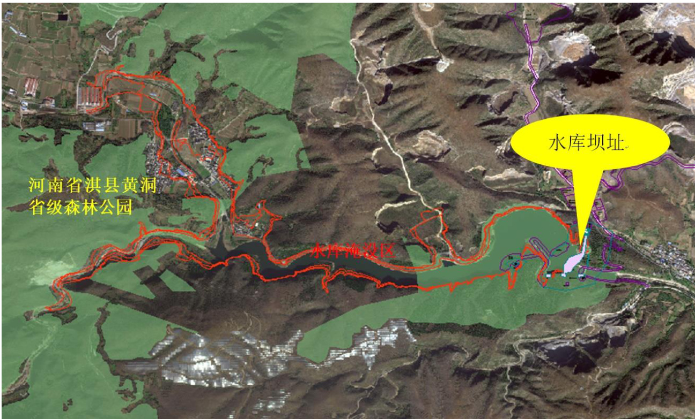  
图 6.3.1-1  工程与河南省淇县黄洞省级森林公园位置关系图  

(2)生态保护红线  

根据鹤壁市生态保护红线分类和分布范围,工程周边主要有太行山水土保持生态保护红线和河南省淇县黄洞省级森林公园纳入生态红线范围,生态红线范围与森林公园一致,不再赘述。环境专业要求施工营区和渣场料场均不涉及生态保护红线。本扩建工程直接涉及夺丰水库,需先进行生态保护红线调整工作。  

# (3)饮用水源保护区  

根据淇县县级集中式饮用水水源保护区勘察工作报告,淇县夺丰水库为县级集中饮用水水源保护区,本扩建工程直接涉及夺丰水库,按照饮用水源保护区管理规定,需先进行保护区调整工作。  

# (4)基本农田  

夺丰水库扩容工程周边分布有基本农田,将工程范围与基本农田进行核对,并对渣场和料场进行了优化调整,调整后的工程渣场和料场等临时用地不占用基本农田,洪水期会淹没部分基本农田。  

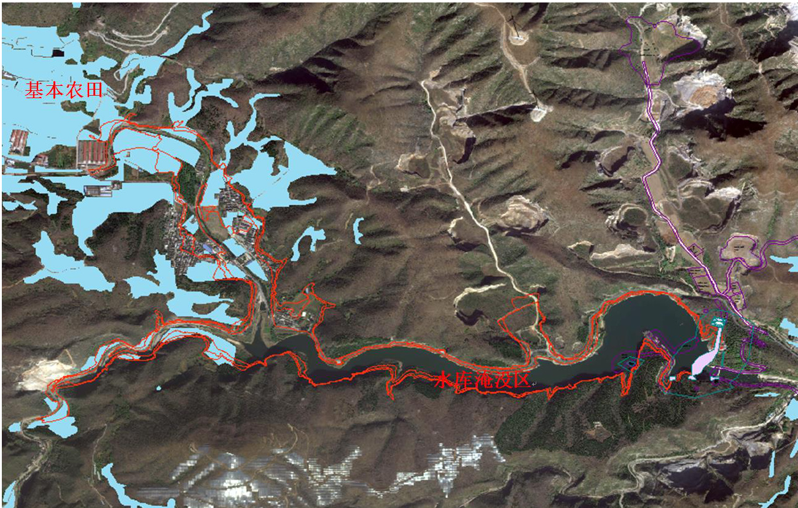  
图 6.3.1-2  工程与基本农田位置关系图  

# 6.3.2 选址原则  

本工程坝址选择主要遵循以下原则:  

(1)坝址比选采用等防洪效益比选原则,即所选择的比选坝址可达到相同  
防洪效益。(2)在满足水库开发任务的前提下,坝址选择应充分考虑地形地质条件的  
影响;(3)尽量减小水库淹没征地与移民,不淹没大型场镇;(4)坝址区便于施工布置和运行管理,尽量节省工程投资。  

# 6.3.3 建坝河段的选择  

本工程影响建坝河段选择的主要因素包括地形条件、水库防洪保护对象所在位置、库区移民淹没、环境影响等,综合分析以上影响因素,选定建坝河段。  

(1)地形条件  

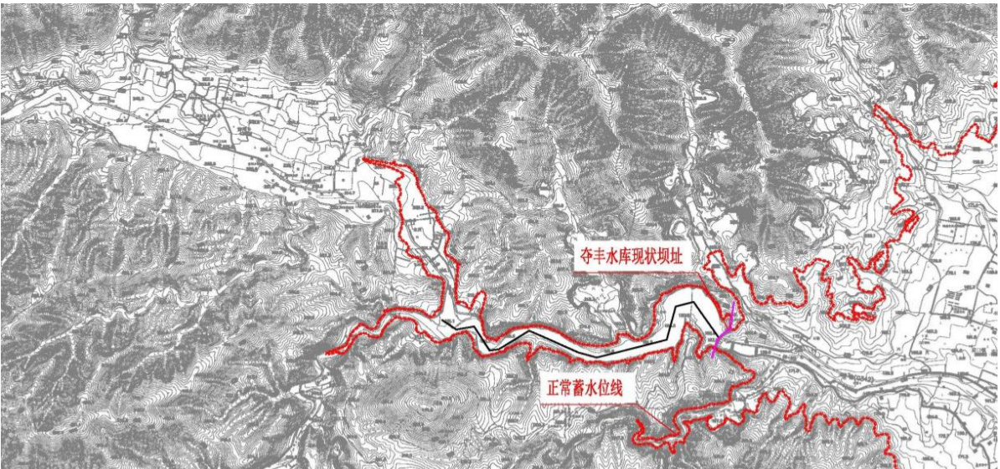  
图 6.3.3-1 夺丰水库开发河段示意图  

夺丰水库开发河段示意图如图6.3.3-1 所示,夺丰水库现状坝址位于出山口,现状坝址下游为庙口镇,地形平坦,高程较低,不具备成库条件,现状水库库尾位于大型支沟汇入口,支沟汇入口以上河段水库控制流域面积较小,考虑防洪任务,夺丰水库现状坝址宜选择该支沟汇入口下游河段。从地形条件分析,夺丰水库适宜建坝河段为现状水库坝址\~支沟汇入口约 $3.0\mathrm{km}$ 范围河段。  

(2)防洪保护对象  

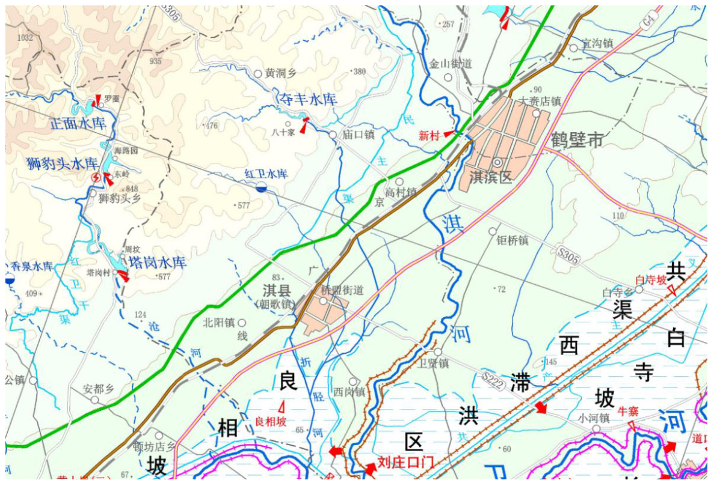  
图 6.3.3-2  夺丰水库区域图  

夺丰水库区域位置如图 6.3.3-2 所示。夺丰水库扩容工程新增防洪库容,水库扩建后,防洪保护对象防洪对象为坝址下游淇县城区和城区上、下游村镇,其  

中淇县城区防洪标准为50 年一遇,淇县城区上、下游村镇防洪标准为10年一遇。  
从防洪对象分析,建坝河段选择范围为淇县城区和城区上、下游村镇上游河段。  

(3)库区移民淹没  

根据现场调查,目前思德河夺丰水库现状坝址下游至 G107 之间河道主要分布有庙口镇镇区和沿线村庄、农田,据统计,该片区有人口 2.09 万人,农田 5.5万亩,防洪标准为 10 年一遇。目前该河段已经治理完成,整体防洪能力达到 10年一遇。  

G107 至 G4 之间为淇县城区,整体防洪能力达到 10 年一遇以上,但是不满足 50 年一遇防洪标准要求。  

G4 以下至与共产主义渠交汇口,包括卫辉市、淇县 2 个县(市),3 个乡镇,2023 年人口 4.52 万人,耕地面积 12.3 万亩,农业总产值 3.96 亿元,工业生产总值 5.5 亿元。根据《防洪标准》(GB50201-2014),该河段防洪标准为 10\~20年一遇,参考《鹤壁市“十四五”水安全保障规划》、《淇县国土空间总体规划(2021\~2035 年)》中对该河段防洪要求,防洪标准为 20 年一遇。  

若坝址位于思德河夺丰水库现状坝址下游,水库淹没庙口镇、石棚村、S305省道及河道两岸基本农田,搬迁人口较多,移民人口及移民投资巨大。从移民淹没角度,建坝河段不宜选择夺丰水库现状坝址下游。  

# (4)环境影响因素  

夺丰水库扩容工程共涉及到 3 个环境敏感区和基本农田:河南省淇县黄洞省级森林公园、太行山水土保持生态保护红线、淇县县级集中式饮用水水源保护区和基本农田。根据工程区与环境敏感区图叠图分析,工程所在位置主要涉及森林公园一般控制区,坝址施工期会对周围环境产生一定影响,生态红线范围与森林公园一致,环境专业要求施工营区和渣场料场均不涉及生态保护红线。淇县夺丰水库为县级集中饮用水水源保护区,本扩建工程直接涉及夺丰水库,需先进行保护区调整工作。相对范围图如下图所示,现状坝址沿思德河向上、下游布置均为占用大片基本农田范围。从环境影响因素方面,建坝河段不适宜选择现状水库淹没范围上、下游河段。  

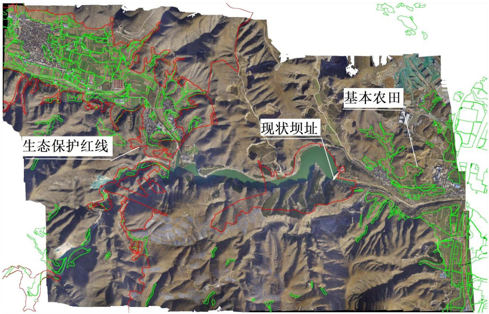  
图 6.3.3-3  生态保护红线与基本农田范围图  

结合地形条件、防洪保护对象、移民淹没、和环境影响等因素分析,建坝河段为夺丰水库现状坝址至上游 $3.0\mathrm{km}$ 范围。  

# 6.3.4 坝址选择  

夺丰水库原设计是一座以灌溉、供水、防洪为主,结合养殖等多种经营的中型水库。水库原设计并未设置专用的防洪库容,只起一定的滞洪作用。夺丰水库扩容后原设计工程任务不变,新增防洪任务。通过设置专用防洪库容,提高淇县城区和城区下游河段防洪标准,最大程度减小思德河上游山区洪水进入下游平原区的几率,保障卫河流域防洪安全。  

根据建坝河段选择,现状水库上、下游分布大面积基本农田,库尾为河南省淇县黄洞省级森林公园和太行山水土保持生态保护红线范围,为尽量避免基本农田和环境敏感区的占用,坝址不宜选择现状坝址上游。  

若坝址选择思德河夺丰水库现状坝址下游,水库淹没庙口镇、石棚村、S305省道及河道两岸基本农田,搬迁人口较多,移民人口及移民投资巨大。故从移民淹没角度,坝址不宜选择夺丰水库现状坝址下游。  

现状夺丰水库为拱形的浆砌石重力坝,工程于 1959 年动工兴建,经多次加高加固后,在 2020 年 12 月 30 进行安全鉴定,被评定为“二类坝”,大坝工程质量评价为合格,防洪标准满足规范要求,大坝结构安全、抗震稳定满足规范要求。  

原已建坝址位于白寺沟与思德河的汇入口上游约 $550\mathrm{m}$ ,地形呈不对称的“V”型河谷,两岸地形陡峻,左岸岸坡顶高程为 $238\mathrm{m}$ ,右岸岸坡顶高程为 $280\mathrm{m}$ ;河床坝段坝基基岩为寒武系中统张夏组( $\in_{2}\mathbf{Z}.$ )鲕状灰岩,鲕状结构,厚层\~巨厚层状构造,岩石强度高,为坚硬岩。坝基岩体零星发育有随机的小溶洞,规模较小,埋藏最浅的溶洞上部岩层厚度大于 $10\mathrm{m}$ ,其上部岩层为厚层\~巨厚层状构造的坚硬岩,岩体完整性好,溶洞对坝基岩体质量影响不大。坝基岩体质量良好,基本满足工程正常运行的需要。  

库区左岸距离现状坝址上游约 $350\mathrm{m}$ 存在一处低矮垭口,该垭口位置原始地面高程 $212.5\mathrm{m}$ ,随着夺丰水库扩容,水库校核水位 $215.95\mathrm{m}$ ,50 年防洪高水位$213.61\mathrm{m}$ ,正常蓄水位 $208.0\mathrm{m}$ ,大坝坝顶高程 $218.0\mathrm{m}$ ,垭口 $218.0\mathrm{m}$ 高程水平宽$16.5\mathrm{m}$ ,垭口位置对水库蓄水存在一定影响,该位置布置副坝,库区左岸其他位置不存在邻谷渗漏问。右岸八十家至大坝段存在低邻谷渗漏问题,右岸山体基岩发育高角度的溶蚀裂隙以及岩溶管道形成渗漏通道,属混合型渗漏型式。当夺丰水库水位高于白寺沟沟底高程后就会发生渗漏现象。部分渗漏点位于覆盖层下,估算右岸邻谷渗漏量大约为 $0.29\mathrm{m}^{3}/\mathrm{s}$ 。通过白寺沟末端的河水量估算,夺丰水库水位在 $193.0\mathrm{m}$ 处右岸邻谷渗漏量约 $0.15{\sim}0.20\mathrm{m}^{3}/\mathrm{s}$ ,库岸边坡整体稳定性好,水库扩容后基本不存在大规模的岸坡失稳问题。  

扩容后夺丰水库坝顶高程为 $218.0\mathrm{m}$ ,小于原坝址左右岸岸坡顶高程;原坝址坝基岩石强度高,属于坚硬岩,岩体质量良好;原坝址区交通便利,施工条件较好;可充分已建成的工程基础进行大坝加高,减少移民及工程投资;库区右岸邻谷渗漏问题可通过采用灌浆帷幕解决,因此,从坝址及库区的地形、移民、施工等角度分析复核,原已建坝址在地形条件上具备加高扩容条件,本阶段仍选定原坝址进行改扩建。  

本工程在原大坝基础上进行加高扩建,综合考虑工程任务、防洪保护对象、环境影响、库区移民淹没以及现状坝址地形地质条件等影响因素,确定现状水库坝址为推荐坝址。  

# 6.3.5 副坝坝址选择  

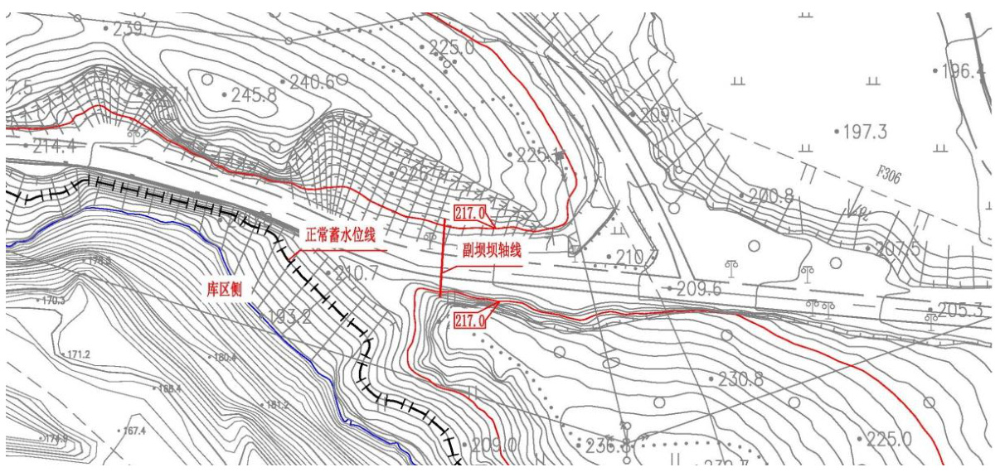  
图 6.3.5-1 副坝坝轴线位置示意图  

夺丰水库现状正常蓄水位 $193.70\mathrm{m}$ ,设计水位 $197.85\mathrm{m}$ ,校核水位 $199.4\mathrm{m}$ ,坝顶高程 $200.2\mathrm{m}$ 。水库扩容后,正常蓄水位 $208.00\mathrm{m}$ ,设计水位 $213.81\mathrm{m}$ ,校核水位 $215.95\mathrm{m}$ ,汛限水位 $206.00\mathrm{m},50$ 年防洪高水位 $213.61\mathrm{m}$ ,坝顶高程 $218.0\mathrm{m}$ 。  

如图6.3.5-1,夺丰水库现状坝址左岸上游约 $350\mathrm{m}$ 处存在一前后呈“喇叭口”状垭口,垭口 $217.0\mathrm{m}$ 高程水平宽 $18.0\mathrm{m}$ ,顺轴线长度约 $40\mathrm{m}$ ,底部原始地面高程 $212.5\mathrm{m}$ ,随着夺丰水库扩容,水库校核水位 $215.95\mathrm{m}$ ,严重影响水库的正常运行,有必要在该垭口处修建副坝,使夺丰水库扩容后形成一个封闭的库盆。  

根据垭口处地形条件分析,垭口前后均呈“喇叭口”状地形分布,副坝坝轴线可选择位置有限,本阶段推荐坝轴线最短处作为推荐坝址。  

# 6.4 主要建筑物型式选择  

# 6.4.1 原坝体质量及安全评价  

2020 年 12 月 30 日由洛阳水利勘测设计有限责任公司对夺丰水库进行安全鉴定。根据《河南省淇县夺丰水库大坝安全评价报告》及地质勘查对原坝体工程质量评价分析如下:  

# 6.4.1.1 大坝工程质量评价  

(1)拦河坝工程质量评价  

自除险加固后水库运行至今,大坝运行状况良好。上游坝坡混凝土面板基本平整,未发现变形、裂缝等现象。下游钢筋混凝土溢流面基本完好,未发现变形、裂缝等现象。水库高水位运行时左右坝肩有渗漏现象,但不影响大坝安全。鉴于除险加固后大坝运行至今,虽大坝左右坝肩有渗漏现象,但不影响大坝安全,根据《水库大坝安全评价导则》(SL258-2017)规定,夺丰水库大坝工程质量基本合格。  

(2)输水洞工程质量评价  

一级、三级、四级输水洞已封堵,二级输水洞自除险加固后运行至今,运行正常状况良好,未发现变形、裂缝等现象。输水洞闸房未见裂缝、变形;涵洞进出口挡墙基本平整,无裂缝、脱落等现象,结构安全可靠。输水洞能够满足水库泄洪要求,根据《水库大坝安全评价导则》(SL258-2017)规定,输水洞工程质量综合评价为合格  

(3)交通桥工程质量评价  

交通桥未见、变形,道路表面基本平整,道路局部有裂缝,坝顶青石栏杆无破损无裂缝、脱落等现象,结构安全可靠。综合上所述,交通桥能够满足交通要求,根据《水库大坝安全评价导则》(SL258-2017)规定,交通桥工程质量综合评价为合格。  

(4)大坝工程质量综合评价  

自除险加固以来夺丰水库大坝未见变形、塌陷等现象;输水洞满足引水要求;交通桥满足交通要求;根据《水库大坝安全评价导则》(SL258-2017)规定,综合评定夺丰水库大坝工程质量合格。  

# 6.4.1.2 大坝渗流安全评价  

(1)坝体渗漏检查分析  

原大坝坝基灌浆孔深度达 $20\mathrm{m}{}{}\cdot30\mathrm{m}$ ,设计灌浆压力满足规范要求。现场观测大坝坝体未发现渗漏情况。  

(2)坝肩渗漏检查分析  

除险加固后大坝两侧坝肩进行了灌浆处理,设计灌浆压力满足规范要求,但两侧坝肩依然存在渗漏情况。大坝除险加固后至今已运行 14 年,根据现场观测资料及观测数据,初步判定大坝两侧坝肩未与不透水基岩形成连续防渗体,两侧坝肩均有渗漏。  

(3)上游坝坡检查分析  

除险加固前发现溢流坝 $188\mathrm{m}$ 高程处有一条渗水带,水库放水后发现混凝土防渗面板有 35 道横向裂缝。面板表面受水位变动侵蚀及冬季冰冻融蚀等原因,出现大面积剥蚀。除险加固对大坝上游混凝土面板进行了防渗处理:面板裂缝处理后,将面板全部凿毛,进行挂网喷射混凝土。喷射混凝土标号为 C20,厚度为$15\mathrm{cm}$ ,配置 $\Phi10@200\mathrm{mm}$ 构造钢筋网。钢筋网以二级直径 $18\mathrm{mm}$ 锚筋进行锚固,锚筋长度为 $0.8\mathrm{m}$ ,孔距 $2\mathrm{m}$ 、排距 $1.5\mathrm{m}$ ,呈梅花形布置。锚筋距面板顶部不大于$0.5\mathrm{m}$ ,距底部不大于 $1.0\mathrm{m}$ ,锚筋与钢筋网点焊连接。喷射混凝土沿坝轴线方向,每 $10\mathrm{m}$ 设一道伸缩缝,缝内填环氧砂浆,并用双组份聚硫密封膏进行表面封缝。  

经观测数据及现场查勘,大坝上游坝坡混凝土坝面未发现脱落、裂缝等显现,故大坝上游防渗面板的防渗性基本能满足设计和规范要求。  

(4)大坝渗流安全综合分析  

鉴于水库除险加固后两侧坝肩均有渗漏情况,但目前大坝运行情况良好,不严重影响大坝安全,根据《水库大坝安全评价导则》渗流安全的综合评价,确定大坝渗流安全等级为“B”级。  

# 6.4.1.3 大坝结构安全评价  

(1)大坝变形评价  

除险加固后的大坝坝顶工作桥路面局部有纵向裂缝,工作桥桥面基本完好,栏杆无损坏,桥板局部有轻微破损,桥墩完整,溢流面完好无破损,大坝上游面完整平顺,面板无脱落现象。非溢流段两侧浆砌石桥拱局部有破损,右岸坝顶下游侧堆砌的石块有安全隐患。二道坝完好。管理房房屋结构完好,无破损,管理运行正常。两侧坝肩在高水位运行时有渗流现象。初步推断大坝沉降变形基本完成。坝顶高程、坝顶宽度满足《砌石坝设计规范》(SL25-2006)要求。  

(2)大坝地质条件评价  

大坝体基本坐落在鲕状灰岩之上,左坝头 $183.5\mathrm{m}$ 高程以上为白云岩。鲕状灰岩坚硬完整,其饱和抗压强度为 $878\mathrm{kg}/\mathrm{cm}^{2}$ ,白云质灰岩致密坚硬,其饱和抗压强度为 $872\mathrm{kg}/\mathrm{cm}^{2}$ ,软化系数均大于 0.75,为抗水,抗风化和抗冻性强的岩石。断层内岩石按构造岩中的块状碎裂岩计算,其饱和抗压强度为 $746\mathrm{kg}/\mathrm{cm}^{2}$ 。根据重力坝对地基的要求,此处 40 多米高的重力坝,其承载力能够满足要求。  

左坝头 $181.5\mathrm{m}$ 高程处存在软弱夹层,遇水容易软化,但出露面积很小,也容易处理,所以不致造成坝体滑动。断层破碎带经帷幕灌浆加固防渗以后,对坝体稳定影响不大。  

坝址区构造以断裂为主,左坝段由于受庙口\~槽旺水东西向大断裂的影响,派生有两条近于平行的小断层(T1 断层 T2 断层)、分别通过左坝房 $181.5\mathrm{m}$ 和$195\mathrm{m}$ 高程、岩石破碎,断层带内充填有断层泥、断层角砾等。T1 断层向右靠近主河槽,坝体坐落在完整的鲕状灰岩之上,坝基集中渗漏的可能性不大,T1 断层向左至左坝头有两条断层通过,破碎带发育,下部有架空现象,溶蚀严重,存在渗漏问题。右坝段岸坡陡峻,该坝肩的鲕状灰岩强风化层厚度达 $3\mathrm{m}$ 左右。  

(3)坝体抗滑稳定及应力评价  

夺丰水库为浆砌石重力坝,大坝岩基比较完整,理论上变形量比较小,经复核,大坝抗滑稳定及坝体应力满足规范要求。但是由于坝体砌筑质量差,2006年除险加固时大坝发现存在变形问题。目前夺丰水库缺少大坝变形观测资料,无法根据观测资料进行定量变形稳定分析。考虑大坝运行至今已 48 余年,大坝坐落基岩比较完整密实,加之除险加固后,坝体质量明显提高,坝体更加密实,综合分析,大坝结构安全,变形渐趋于稳定。  

(4)输水洞结构安全评价  

二级输水洞过流满足要求,二级输水洞出口在 2006 年除险加固时新设 $\boldsymbol{\Phi}^{800}$ 的电动法兰检修阀一个。放水设施可正常启闭,输水洞运行正常。符合《水利水电工程进水口设计规范》(SL285-2003)要求。  

(5)大坝结构安全评价  

大坝坝体强度、抗滑稳定及下泄能力满足规范要求,坝体整体稳定,经现场查勘,坝体未发现较大沉陷及明显渗漏现象,工作桥桥面基本完好,局部有轻微破损,桥墩完整,溢流面完好无破损,但大坝在高水位运行时,两岸坝肩会出现渗漏现象。大坝、二级输水洞等建筑物各部位的高程、尺寸、强度均满足规范要求,结构稳定,各主要建筑物运行正常  

为降低坝体扬压力,2006 年除险加固时要求拆除二道坝,但目前并未拆除,大坝下游仍有二道坝蓄水。  

输水洞符合《水利水电工程进水口设计规范》(SL285-2003)要求。根据《水库大坝安全评价导则》(SL258-2017),夺丰水库大坝结构安全综合评定为“B”级。  

# 6.4.1.4 抗震安全评价  

(1)区域地质  

坝址区构造以断裂为主。由于受庙口\~槽旺水东西向断裂的影响,所派生的两条近于平行的小断层分别通过左坝头 $181.5\mathrm{m}$ 和 $195\mathrm{m}$ 高程,其中 $181.5\mathrm{m}$ 高程处断层走向 $110^{\circ}$ ,倾向南西、倾角 $85^{\circ}$ ,宽度 $\mathrm{lm}$ 左右,南盘为中寒武纪的鲕状灰岩、北盘为下奥陶纪的页岩和白云质灰岩,垂直断距 $70\mathrm{m}$ 左右,充填较密实。$195\mathrm{m}$ 高程处断层走向 $115^{\circ}$ 、倾向南西,倾角 $86^{\circ}$ ,断于下奥陶统白云岩中,破碎带宽度达 $10\mathrm{m}$ 之多、岩石破碎产状不清、胶结程度一般,地表具风化溶蚀现象,多呈小型溶槽溶洞出现。  

左坝头由于受卸荷作用的影响,顺河向( $90^{\circ}–110^{\circ}$ 的两组裂隙发育,多具上宽下窄的特征,泥质与钙质充填一般密实。  

右坝头构造简单,岩性坚硬完整。岩层倾向南东,倾角 $4^{\circ}$ ,为一单斜构造。根据以往钻探资料,河床基岩均为鲕状灰岩,其岩性坚硬完整。  

(2)抗震安全评价  

依据《中国地震动参数区划图》(GB18306-2015)及《水工建筑物抗震设计标准》(GB51247-2018),水库区地震基本烈度为 VIII 度,地震动峰值加速度为 $0.20\mathrm{g}$ 。  

根据国家质量技术监督局 2015 年发布的《中国地震动参数区划图》(GB18306-2015)表 D1“地震动参数加速度分区与地震基本烈度对照表”查得,建筑场地地震基本烈度为 VIII 度;地震动峰值加速度值为 $0.20\mathrm{g}$ ,经计算,大坝上、下游坝坡抗震稳定安全系数大于规范规定最小值,抗震安全系数满足规范要求,同时 2006 年除险加固时,对坝体采用补强灌浆、上游坝坡混凝土面板采用挂钢筋网喷混凝土的方法进行防渗处理等有利于大坝抗震稳定的安全措施。  

综合评定夺丰水库抗震稳定安全性为“A”级。  

# 6.4.1.5 地质勘查对原坝体工程质量评价分析  

河床坝段坝基基岩为寒武系中统张夏组 ${\bf\Psi}(\in_{2}\mathbf{z})$ )鲕状灰岩,鲕状结构,厚层\~巨厚层状构造,岩石强度高,为坚硬岩。根据钻孔揭露,坝基清基工作良好,坝基直接坐落在微风化\~新鲜的基岩上。坝基岩体零星发育有随机的小溶洞,根据区域岩溶规律和钻孔揭露情况看,溶洞规模较小;埋藏最浅的溶洞上部岩层厚度大于 $10\mathrm{m}$ ,其上部岩层为厚层\~巨厚层状构造的坚硬岩,岩体完整性好,故溶洞对坝基岩体质量影响不大。坝基岩体质量良好,基本满足工程正常运行的需要。  

# 6.4.1.6 综合评价  

(1)水库大坝未见变形、坍塌等现象,输水洞满足引水要求,交通桥满足交通要求。根据现场抽检工程外观质量及混凝土强度基本满足设计要求。大坝工程质量评价为合格。  

(2)夺丰水库属中型水库,工程属 III 等工程。水库设计洪水标准采用 100年一遇,校核洪水标准采用 1000 年一遇。水库防洪标准符合《防洪标准》(GB50201-2014)规定,水库泄洪建筑物的泄洪能力满足安全泄洪的要求,大坝坝顶高程满足规范要求。综合评定夺丰水库防洪安全性为“A”级。  

(3)水库 2006 年除险加固后,大坝左右坝肩出现渗漏现象,但目前大坝整体运行情况正常,不严重影响大坝安全。根据《水库大坝安全评价导则》渗流安全的综合评价,确定大坝渗流安全等级为“B”级。  

(4)在不同工况情况下,大坝坝体典型断面的坝基抗滑稳定安全系数满足规范要求;输水洞结构稳定,各部位的高程、尺寸、强度均满足规范要求,结构稳定,大坝左右坝肩存在渗漏现象。根据《水库大坝安全评价导则》(SL258-2017),夺丰水库大坝结构安全综合评定为“B”级。  

(5)夺丰水库自建成以来,为水库下游防洪及灌溉发挥了巨大的作用,有专门的管理机构及管理设施,大坝安装有监测设施,能够满足运行监测。根据《水库大坝安全评价导则》(SL258-2017),夺丰水库大坝运行管理综合评价为较规范。  

(6)夺丰水库工程的抗震设防烈度符合规范要求,大坝的抗震稳定性与结构强度满足规范要求。大坝抗震安全性综合评定为“A”级。  

(7)综合评定夺丰水库为“二类坝”。  

# 6.4.2 原坝体加高分析  

夺丰水库位于海河流域卫河支流思德河上,坝址在庙口乡和黄洞乡的交界处,是一座以防洪、灌溉、供水为主,结合养殖等多种经营的中型水库。  

原已建坝址位于白寺沟与思德河的汇入口上游约 $550\mathrm{m}$ ,坝址区河谷呈不对称的“V”型河谷,低山溶蚀峡谷地貌类型;河底宽约 $61\mathrm{m}$ ,原设计正常蓄水位$193.70\mathrm{m}$ 处河谷宽约 $153\mathrm{m}$ 。坝前河床地面高程 $166.2{\sim}166.4\mathrm{m}$ ,坝后河床地面高程 $160.0{\sim}163.7\mathrm{m}$ 。右岸地面高程 $160.0{\sim}280\mathrm{m}$ ,其中高程 $228\mathrm{m}$ 以下地形近直立,为悬坡类型,高程 $228\mathrm{m}$ 以上地形相对较缓,为斜坡类型。左岸地面高程 $163\sim$ $220\mathrm{m}$ ,地形坡度约 $23\%$ ,为斜坡类型。现状大坝坝顶高程 $200.2\mathrm{m}$ ,从地形条件分析,大坝具备加高的条件。  

大坝河床坝段坝基基岩为寒武系中统张夏组 ${\bf\Xi}(\in_{2}{\bf Z}.$ )鲕状灰岩,鲕状结构,厚层\~巨厚层状构造,岩石强度高,为坚硬岩。左坝段 $183.5\mathrm{m}$ 高程以上为白云岩,右坝段岸坡陡峻,该坝肩的鲕状灰岩强风化层厚度达 $3\mathrm{m}$ 左右。鲕状灰岩坚硬完整,其饱和抗压强度为 $878\mathrm{kg}/\mathrm{cm}^{2}$ ,白云质灰岩致密坚硬,其饱和抗压强度为 $872\mathrm{kg}/\mathrm{cm}^{2}$ ,其软化系数均大于 0.75,属于为抗水、抗风化和抗冻性强的岩石。坝基岩体零星发育有随机的小溶洞,规模较小,埋藏最浅的溶洞上部岩层厚度大于 $10\mathrm{m}$ ,其上部岩层为厚层\~巨厚层状构造的坚硬岩,岩体完整性好,溶洞对坝基岩体质量影响不大。坝基岩体质量良好,基本满足工程正常运行的需要。坝基承载力满足要求,坝体典型断面抗滑稳定安全系数满足规范要求。从地质条件分析,大坝具备加高的条件。  

夺丰水库大坝是一座平面呈拱形的浆砌石重力坝,大坝主体采用水泥砂浆和块石砌筑而成,大坝于 1959 年动工兴建,经多次加高加固后,大坝工程质量评价为合格,防洪标准满足规范要求,大坝结构安全、抗震稳定满足规范要求,在2020 年 12 月 30 进行安全鉴定,被评定为“二类坝”。大坝现状未见变形、坍塌等现象,输水洞满足引水要求,交通桥满足交通要求。工程外观质量及混凝土强度基本满足设计要求,坝体不存在严重质量问题,从坝体自身质量分析,具备加高的可行性。  

# 6.4.3 坝型选择  

# 6.4.3.1 坝址地形地质及建筑材料  

(1)坝址地形地貌  

坝址区河谷呈不对称的“V”型河谷,低山溶蚀峡谷地貌类型;河底宽约 $61\mathrm{m}$ ,原设计正常蓄水位 $193.70\mathrm{m}$ 处河谷宽约 $153\mathrm{m}$ 。坝前河床地面高程 $166.2{\sim}166.4\mathrm{m}$ ,坝后河床地面高程 $160.0{\sim}163.7\mathrm{m}$ 。右岸地面高程 $160.0{\sim}280\mathrm{m}$ ,其中高程 $228\mathrm{m}$ 以下地形近直立,为悬坡类型,高程 $228\mathrm{m}$ 以上地形相对较缓,为斜坡类型。左岸地面高程 $163\sim220\mathrm{m}$ ,地形坡度约 $23\%$ ,为斜坡类型。  

(2)坝址地质条件  

右岸及河床坝段覆盖层厚 $1.1{\sim}6.3\mathrm{m}$ ,为淤泥和人工堆积的块石、碎石;其结构松散,工程性质不良,不满足重力坝建基要求,需要全部挖除。右岸及河床坝段无强风化带发育,弱风化带不连续分布,下伏主要为微风化岩体,岩体质量为 $\mathbf{A}_{\mathrm{II}}$ 和 $\mathbf{A}_{\Pi/2}$ 类岩体,其中 $\mathbf{A}_{\mathrm{II}}$ 类岩体工程地质条件良好,可直接作为重力坝坝基;$\mathbf{A}_{\Pi2}$ 类岩体层厚 $0{\sim}2.7\mathrm{m}$ ,完整性为较破碎,经过固结灌浆处理可作为重力坝坝基。  

左岸坝段工程地质条件复杂,其中f2 断裂至f1 断裂基岩为白云质灰岩 $(\mathrm{O}_{1}\mathrm{y})$ ),f1 断裂至左坝肩基岩为砾状灰岩( $\mathrm{O}_{2-3}\mathrm{m}$ )。该段覆盖层不连续分布,层厚 $0\sim$ $3\mathrm{m}$ ,其结构松散,工程性质不良,不满足重力坝建基要求,需要全部挖除。强风化带基岩不连续分布,层厚 $0{\sim}3.0\mathrm{m}$ ,岩体类别为 $C_{\mathrm{V}}$ 类,不满足建基要求,需要全部挖除。  

弱风化带层厚 $1.2{\sim}38\mathrm{m}$ ,连续分布,但层厚差异较大。弱风化的白云质灰岩为 $\mathtt{B}_{\mathrm{IV}}$ 类岩体,弱风化的砾状灰岩为 ${\bf{C}}_{\mathrm{{IV}}}$ 类岩体,是建坝不良地基。考虑到左岸边坡坝段坝高度较矮,尤其现状管理区以北坝段,坝高整体上低于 $10\mathrm{m}$ ,可考虑选择 $\mathtt{B}_{\mathrm{IV}}$ 、 ${\mathrm{C}}_{\mathrm{IV}}$ 类岩体作为坝基,并进行固结灌浆处理。  

坝址区分别有 f1、f2 和 f3 等 3 条断裂大角度与大坝相交;断裂构造结构松散,为 $\mathbf{C}_{\mathrm{V}}$ 类岩体,不满足建基要求,需要采取刻槽、换填混凝土等适宜的处理措施。  

白云质灰岩中发育溶蚀破碎带,形态有溶蚀裂隙和溶蚀孔隙,降低了岩体基本质量,需要采取固结灌浆处理措施。岩体中揭露到规模不大的溶洞,埋藏较深,上覆岩体和洞径比一般超过 10,对坝基基岩质量影响不大。  

# (3)天然建筑材料  

1)土料  

工程区周边天然砂砾匮乏。右岸山顶分布有粘性土,土料天然含水率均值为$23.5\%$ ,土粒比重为 2.70,液限含水率为 $41.1\%$ ,塑限含水率为 $21.8\%$ ,塑性指数为 19.4,粉粒含量 $61.0\%$ ,黏粒含量 $27.7\%$ 。岩性为黏土,微含砾石,可满足填筑料和防渗料的技术要求;估计储量约 5 万 $\mathrm{m}^{3}$ ,满足填筑料和防渗料使用要求,可作为围堰填筑用料。在水库右岸山地处分布第四系全新统残积( $\mathrm{Q}_{4}^{\mathrm{eld}}$ )粘性土,分布厚度一般在 $2\mathrm{m}$ 左右,现状为林地。现有公路通向坝址区,交通条件较为便利,开采运输条件良好。  

# 2)石料  

库区石料场位于库区右岸,为一凸出的山脊,距离坝址约 $120\mathrm{m}$ ,交通便利。料场山体地形起伏较大,地势整体南高北低,地面高程为 $168\sim230\mathrm{m}$ ,相对高差约 $62\mathrm{m}$ 。裸露基岩基本呈弱风化状。料场表部植被发育,多为林木,南侧山腰为盘山小路。料场表层零星分布有第四系全新统坡残积( $\mathrm{Q}_{4}^{\mathrm{eld}}$ )含砾低液限粘土和人工堆积 $\left(Q_{4}^{\mathrm{~s~}}\right)$ 碎块石,残坡积物厚度一般为 $0.2{\sim}0.5\mathrm{m}$ ,人工堆积物厚度 $0.5\sim$ $1.5\mathrm{m}$ ,下伏基岩为寒武系中统张夏组( $\in{}_{2}\mathbf{Z}$ )鲕状灰岩,厚\~巨厚层状构造。  

勘探储量大于设计需要量的 1.5 倍,储量满足设计要求。料场的微新鲕状灰岩满足混凝土人工骨料原岩质量要求,满足砌石料质量要求和堆石料要求。弱风化鲕状灰岩层层厚相对较薄,未能取样试验,弱风化岩石相对微新岩石主要是在完整性上有所降低,强度降低有限,为坚硬岩,判断基本满足混凝土人工骨料使用要求,不满足砌石料原岩要求,满足堆石料原岩质量要求。  

# 3)商品料  

恒源矿业公司为场区附近仅有的一家商品料场,该公司目前有两个场区,分别是二道沟场区和田沟场区。二道沟场区距坝址直线距离 $4.2\mathrm{km}$ ,交通距离 $9.1\mathrm{km}$ ;田沟场区距坝址直线距离 $1.4\mathrm{km}$ ,交通距离 $5.5\mathrm{km}$ ,具有等级公路与工程区相连通,交通便利。  

两处料场的料源就近开采,岩性以寒武系和奥陶系灰岩为主。该公司可生产各级配粗细骨料和块石料,日产 6 万吨,年产能可达 1500 万吨。  

# 6.4.3.2 当地材料坝坝型分析  

针对当地材料坝,从以下几方面分析其适宜性:  

(1)原坝址地形条件:原坝址区河谷呈不对称的“V”型河谷,低山溶蚀峡谷地貌类型;河底宽约 $61\mathrm{m}$ ,原设计正常蓄水位 $193.70\mathrm{m}$ 处河谷宽约 $153\mathrm{m}$ 。坝前河床地面高程 $166.2{\sim}166.4\mathrm{m}$ ,坝后河床地面高程 $160.0{\sim}163.7\mathrm{m}$ 。右岸地面高程 $160.0{\sim}280\mathrm{m}$ ,其中高程 $228\mathrm{m}$ 以下地形近直立,为悬坡类型,高程 $228\mathrm{m}$ 以上地形相对较缓,为斜坡类型。左岸地面高程 $163\sim220\mathrm{m}$ ,地形坡度约 $23\%$ ,为斜坡类型。坝址区两岸无天然垭口,若修建当地材料坝,无适宜地形布置溢洪道,同时难以协调布置大坝、泄水建筑物布置,修建溢洪道需对两岸山体进行大开挖,因此,从地形条件看,原坝址不宜修建当地材料坝。  

(2)原坝址地质条件:右岸及河床坝段覆盖层厚 $1.1{\sim}6.3\mathrm{m}$ ,为淤泥和人工堆积的块石、碎石,其结构松散,工程性质不良。右岸及河床坝段无强风化带发育,弱风化带不连续分布,下伏主要为微风化岩体,岩体质量为 $\mathbf{A}_{\parallel}$ 和 $\mathbf{A}_{\Pi2}$ 类岩体,其中 $\mathbf{A}_{\mathrm{II}}$ 类岩体工程地质条件良好,可直接作为重力坝坝基, $\mathbf{A}_{\mathrm{III}2}$ 类岩体层厚 $0{\sim}2.7\mathrm{m}$ ,完整性为较破碎。左岸坝段覆盖层不连续分布,层厚 $0{\sim}3\mathrm{m}$ ,其结构松散,工程性质不良,f2 断裂至 f1 断裂基岩为白云质灰岩( $(\mathrm{O}_{1}\mathrm{y})$ ),f1 断裂至左坝肩基岩为砾状灰岩( $\mathrm{O}_{2-3}\mathrm{m}$ )。强风化带基岩不连续分布,层厚 $0{\sim}3.0\mathrm{m}$ ,岩体类别为 $C_{\mathrm{V}}$ 类。弱风化带层厚 $1.2{\sim}38\mathrm{m}$ ,连续分布,但层厚差异较大。弱风化的白云质灰岩为 ${\tt B}_{\mathrm{IV}}$ 类岩体,弱风化的砾状灰岩为 ${\cal{C}}_{\mathrm{{IV}}}$ 类岩体。坝址区坝基中软弱夹层发育程度低,从地质条件看,原坝址具备修建当地材料坝条件。  

(3)天然建筑材料:1)土料。工程区周边天然砂砾匮乏。在水库右岸山地处分布第四系全新统残积( $\mathrm{Q}_{4}^{\mathrm{eld}}$ )粘性土,分布厚度一般在 $2\mathrm{m}$ 左右,岩性为黏土,微含砾石,可满足填筑料和防渗料的技术要求,估计储量约 5 万 $\mathrm{m}^{3}$ ,满足填筑料和防渗料使用要求。2)石料。库区石料场位于库区右岸,裸露基岩基本呈弱风化状。料场表层零星分布有第四系全新统坡残积( $\mathrm{Q}_{4}^{\mathrm{eld}}$ )含砾低液限粘土和人工堆积( $\left(Q_{4}^{\mathrm{~s~}}\right)$ )碎块石,残坡积物厚度一般为 $0.2{\sim}0.5\mathrm{m}$ ,人工堆积物厚度 $0.5\sim$ $1.5\mathrm{m}$ ,下伏基岩为寒武系中统张夏组( $\in{}_{2}\mathbf{Z}$ )鲕状灰岩,厚\~巨厚层状构造。储量满足设计要求,料场的微新鲕状灰岩满足混凝土人工骨料原岩质量要求,满足砌石料质量要求和堆石料要求。3)恒源矿业公司为场区附近仅有的一家商品料场,该公司料场的料源岩性以寒武系和奥陶系灰岩为主。该公司可生产各级配粗细骨料和块石料,日产 6 万吨,年产能可达 1500 万吨。从天然建筑材料看,具备修建当地材料坝的条件。  

(4)工程任务及枢纽布置:夺丰水库为一座以灌溉、供水、防洪为主的水库,本次扩建后增加防洪库容。水库校核水位 $215.95\mathrm{m}$ ,防洪高水位 $213.61\mathrm{m}$ ,正常蓄水位 $208.0\mathrm{m}$ ,100 年一遇洪水洪峰流量为 $1601\mathrm{m}^{3}/\mathrm{s}$ ,1000 年一遇洪水洪峰流量为 $2547\mathrm{m}^{3}/\mathrm{s}$ ,洪峰流量较大。若修建当地材料坝,则需布置开敞式溢洪道或泄洪放空洞,若布置溢洪道,其宽度约为 $20{\sim}25\mathrm{m}$ ,需对两岸山头进行大量开挖,开挖和弃渣工程量大。如布置泄洪放空洞,隧洞规模大,施工工期长,投资较大。从工程任务及工程布置方面分析,不宜修建当地材料坝。  

(5)洪水特点:本工程洪峰流量大、历时短、暴雨较为集中,100 年一遇洪水洪峰流量为 $1601\mathrm{m}^{3}/\mathrm{s}$ ,1000 年一遇洪水洪峰流量为 $2547\mathrm{m}^{3}/\mathrm{s}$ 。若采用当地材料坝,由于河道平缓,泄洪时下游水位高,上下游水头差小,不利于大坝安全;同时当地材料坝抵御超标准洪水能力弱。因此,从洪水特点的角度考虑,不宜修建当地材料坝。  

(6)现状大坝自身特点:夺丰水库大坝是一座平面呈拱形的浆砌石重力坝,大坝主体采用水泥砂浆和块石砌筑而成,大坝于 1959 年动工兴建,1972 初建完成。经多次加高加固后,大坝工程质量评价为合格,防洪标准满足规范要求,大坝结构安全、抗震稳定满足规范要求,在 2020 年 12 月 30 进行安全鉴定,被评定为“二类坝”。大坝现状未见变形、坍塌等现象,输水洞满足引水要求,交通桥满足交通要求。工程外观质量及混凝土强度基本满足设计要求,坝体不存在严重质量问题。修建当地材料坝需将现状坝体拆除,坝体填筑料、弃渣等工程量较大、工期较长。因此,从现状大坝自身特点分析,坝体自身质量良好,拆除现状坝体新建当地材料坝,经济性较差。  

综上所述,从地质条件、天然建筑材料方面分析,本工程具备修建堆石坝的条件。但从地形条件、工程任务及枢纽布置、洪水特点及坝体自身特点等方面分析,修建当地材料坝投资大、枢纽建筑物布置困难、存在泄洪安全风险。因此,本阶段不考虑当地材料坝坝型。  

# 6.4.3.3 刚性材料坝坝型分析  

刚性材料坝主要分为拱坝和重力坝。  

(1)拱坝适宜性分析  

原坝址区河谷呈不对称的“V”型河谷,低山溶蚀峡谷地貌类型;河底宽约 $61\mathrm{m}$ ,原设计正常蓄水位 $193.70\mathrm{m}$ 处河谷宽约 $153\mathrm{m}$ 。坝前河床地面高程 $166.2{\sim}166.4\mathrm{m}$ ,坝后河床地面高程 $160.0{\sim}163.7\mathrm{m}$ 。右岸地面高程 $160.0{\sim}280\mathrm{m}$ ,其中高程 $228\mathrm{m}$ 以下地形近直立,为悬坡类型,高程 $228\mathrm{m}$ 以上地形相对较缓,为斜坡类型。左岸地面高程 $163\sim220\mathrm{m}$ ,地形坡度约 $23\%$ ,为斜坡类型。拱坝属空间壳体结构,作用在坝上的外荷载主要通过拱梁的作用传递至两岸山体,依靠坝体混凝土的强度和两岸坝肩岩体的支撑,保证拱坝的稳定。左岸坝段覆盖层不连续分布,层厚$0\sim3\mathrm{m}$ ,其结构松散,工程性质不良,f2 断裂至 f1 断裂基岩为白云质灰岩 $(\mathrm{O}_{1}\mathrm{y})$ ),f1 断裂至左坝肩基岩为砾状灰岩( $(\mathrm{O}_{2-3}\mathrm{m}$ )。强风化带基岩不连续分布,层厚 $0\sim$ $3.0\mathrm{m}$ ,岩体类别为 CⅤ类。弱风化带层厚 $1.2{\sim}38\mathrm{m}$ ,连续分布,但层厚差异较大。弱风化的白云质灰岩为 $\mathtt{B}_{\mathrm{IV}}$ 类岩体,弱风化的砾状灰岩为 ${\bf{C}}_{\mathrm{{IV}}}$ 类岩体。从地形、地质条件分析左岸均不宜作为薄拱坝坝肩,本阶段不考虑薄拱坝。  

(2)重力坝适宜性分析  

原坝址区河谷呈不对称的“V”型河谷,低山溶蚀峡谷地貌类型,河底宽约 $61\mathrm{m}$ ,原设计正常蓄水位 $193.70\mathrm{m}$ 处河谷宽约 $153\mathrm{m}$ 。右岸地面高程 $160.0{\sim}280\mathrm{m}$ ,其中高程 $228\mathrm{m}$ 以下地形近直立,为悬坡类型,高程 $228\mathrm{m}$ 以上地形相对较缓,为斜坡类型。左岸地面高程 $163\sim220\mathrm{m}$ ,地形坡度约 $23\%$ ,为斜坡类型。右岸及河床坝段无强风化带发育,弱风化带不连续分布,下伏主要为微风化岩体,岩体质量为 $\mathbf{A}_{\mathrm{II}}$ 和 $\mathbf{A}_{\Pi2}$ 类岩体,其中 $\mathbf{A}_{\mathrm{II}}$ 类岩体工程地质条件良好,可直接作为重力坝坝基; $\mathbf{A}_{\Pi2}$ 类岩体层厚 $0{\sim}2.7\mathrm{m}$ ,完整性为较破碎,经过固结灌浆处理可作为重力坝坝基。左岸坝段工程地质条件复杂,其中 f2 断裂至 f1 断裂基岩为白云质灰岩( $\mathrm{(O_{1}y}$ ),f1 断裂至左坝肩基岩为砾状灰岩( $\mathrm{O}_{2-3}\mathrm{m},$ ),其结构松散,可全部挖除,坝基中软弱夹层发育程度低。从地形、地质条件,现状坝址具备混凝土重力坝坝型加高的条件。  

夺丰水库现状大坝是一座平面呈拱形的浆砌石重力坝,大坝主体采用水泥砂浆和块石砌筑而成,大坝于 1959 年动工兴建,经多次加高加固后,大坝工程质量评价为合格,防洪标准满足规范要求,大坝结构安全、抗震稳定满足规范要求,在 2020 年 12 月 30 进行安全鉴定,被评定为“二类坝”。大坝现状未见变形、坍塌等现象,输水洞满足引水要求,交通桥满足交通要求。工程外观质量及混凝土强度基本满足设计要求,坝体不存在严重质量问题,从坝体自身条件分析,现状坝体具备混凝土重力坝坝型加高的可行性。  

本工程为一座以灌溉、供水、防洪为主的水库,本次扩容后增加防洪库容,重力坝可在主河槽布置大规模泄水建筑物。重力坝安全可靠、耐久性好,抗震、超载、超泄能力强,泄水建筑物、取水口等均可布置在坝体上,布置协调紧凑,便于集中运行、维护、管理,工程安全可靠性高。  

综上所述,本阶段基本坝型推荐重力坝。  

# 6.4.3.4 重力坝坝型选择  

本阶段分别从工程布置、天然建筑材料、施工方法、施工工期、工程管理等方面对常态混凝土重力坝、碾压混凝土重力坝、堆石混凝土坝、砌石重力坝进行比较,选择合适坝型。  

(1)工程布置  

本工程因泄洪流量大且有控泄要求,需布置多个表孔,坝体布置引水口,常态混凝土可连续浇筑,坝体整体性较好;常态混凝土与现有浆砌石坝体可以较好结合,堆石混凝土坝和砌石重力坝中坝体堆石(砌石)与现有浆砌石坝体、孔洞范围常态混凝土间完整性较差,易产生裂缝,常态混凝土坝更优;材料分区方面,常态混凝土重力坝分区比堆石混凝土坝和砌石重力坝简单,常态混凝土坝还具有更好的抗渗性和抗冻性。  

从工程布置方面考虑,常态混凝土重力坝、优于堆石混凝土坝和砌石重力坝。  

(2)天然建筑材料  

本工程库区石料场及商品料场的灰岩储量丰富,其饱和抗压强度普遍大于90MPa,可作为堆石混凝土坝、砌石重力坝、常态混凝土坝和碾压混凝土坝的材料。  

# (3)施工条件  

堆石混凝土浇筑以机械为主,施工速度较快,但要求混凝土坝坝体结构简单、断面尺寸大、坝身孔洞少且集中布置,从而使坝体具备大仓面堆石混凝土施工条件。本工程混凝土重力坝坝高 $57.0\mathrm{m}$ ,坝体断面较小;坝身布置一个引水洞和多个表孔,无大仓面堆石混凝土施工条件,且堆石体及孔洞周围混凝土施工存在干扰。砌石重力坝需人工砌筑,砌石质量受人工水平影响大,施工质量不宜控制,同时,砌石重力坝在孔洞成型上,依然需要依靠常态混凝土浇筑,且相互之间存在干扰。  

常态混凝土筑坝采用振捣器插入振捣密实的施工方法,在坝身断面较小、坝身孔洞较多且混凝土总方量较小时,可充分发挥常态混凝土优势,大坝可逐层浇注且遇孔洞时可直接浇注成型,不存在施工干扰等问题。常态混凝土坝的施工工艺成熟,施工设备和技术相对简单。  

碾压混凝土采用自卸汽车运输,下部混凝土施工直接入仓,上部混凝土施工转入混凝土罐,由门机吊运入仓或采用负压溜槽入仓。平仓采用推土机,采用振动碾压实,采用切缝机切缝。靠近模板处采用人工加注水泥浆,以便拆模后混凝土表面平整、光滑。  

(4)施工工期  

施工工期方面,虽然常规堆石混凝土坝因坝体具有大仓面施工条件而工期较短,但本工程坝体断面较小、堆石混凝土方量少,且坝体布置有引水洞,在孔洞周边施工时堆石混凝土速度较慢,堆石混凝土坝与常态混凝土重力坝工期相差不大。碾压混凝土筑坝在层面振动碾压,将大型施工机械用到了混凝土坝上,实现快速、大仓面碾压施工,坝体结构简单、不设纵缝,所以浇筑速度比常态混凝土大为加快,月浇筑强度大幅提高,工期大为缩短。砌石重力坝因砌石料需加工平整,且需人工砌筑,工期最长。  

(5)工程管理  

堆石混凝土依靠混凝土自重自流充填堆石体空隙,形成完整、密实的整体。施工中对施工质量要求高,若存在未填充密实部位,对大坝安全有一定影响,同时后期不便于运行维护及管理。砌石混凝土在施工过程中需要大量人员砌筑,总体砌筑质量难以把控。常态混凝土重力坝整体振捣浇注,且坝体断面小,温控不存在制约因素,坝体整体性较好,不易出现裂缝,便于后期运行管理。碾压混凝土重力坝和常态混凝土重力坝相比,断面基本相同,同时由于水泥用量少,水化热小,温控方面更有优势。  

(6)坝型选择  

# 1)原址拆除重建方案坝型选择  

由于碾压混凝土重力坝施工方便、施工工期短、温控措施相对简单、工程投资较省,原址拆除重建方案坝型选择碾压混凝土重力坝。  

# 2)大坝加高方案材料选择  

现状大坝采用拱形的浆砌石重力坝,结合现状工程竣工验收及安全鉴定成果,大坝工程质量质量评价为合格,防洪标准满足规范要求;大坝结构安全、抗震稳定满足规范要求,本次加高扩容以现有坝体为基础,通过局部改造实现大坝加高,因此基本坝型不变,基本坝型仍采用重力坝。  

本工程采用外包式大坝加高方式(见 6.4.5 节加高方式比选),上游面加厚约 $4.0{\sim}7.0\mathrm{m}$ ,下游面加厚约 $3.5{\sim}6.5\mathrm{m}$ ,坝体培厚厚度较小,大仓面作业、碾压机械难以施展开,坝体加高培厚建筑材料不宜采用堆石混凝土和碾压混凝土。大坝加高方案坝型材料选择常态混凝土。  

# 6.4.4 原址拆除重建与加高方案选择  

根据夺丰水库 2020 年大坝安全鉴定与地质勘查情况,大坝具备原坝址拆除重建与加高的条件,本阶段分别拟定以下两种方案进行综合比选:  

方案 1:拆除原拱形浆砌石大坝,在现坝址新建混凝土重力坝。  

方案 2:在现有大坝基础上进行加高培厚,并满足大坝渗流、抗滑稳定等规范要求。  

# 6.4.4.1 方案 1:原址拆除重建方案  

原址重建混凝土重力坝方案水库总库容 2409 万 $\mathrm{m}^{3}$ ,正常蓄水位 $208.0\mathrm{m}$ ,设计洪水位 $\left(\mathrm{P}{=}1\%\right)213.81\mathrm{m}$ ,校核洪水位( $\left(\mathrm{P}{=}0.1\%\right)215.95\mathrm{m}$ ,死水位 $170.50\mathrm{m}$ 。枢纽主要建筑物包括挡水建筑物、泄水建筑物、引水建筑物等。采用一次性拦断河床施工,右岸布置导流隧洞。  

拦河坝为混凝土重力坝,共分 18 个坝段,自左至右分别布置左岸挡水坝段、取水坝段、溢流表孔坝段、右岸挡水坝段。大坝坝顶高程 $218.0\mathrm{m}$ ,坝顶全长 $328.7\mathrm{m}$ ,最大坝高 $59.0\mathrm{m}$ 。  

# (1)挡水建筑物  

1)坝顶高程计算详见 6.6.1 节,为 $218.00\mathrm{m}$ 。  

# 2)基本断面尺寸  

坝体断面设计主要依据《混凝土重力坝设计规范》(SL319-2018)的有关规定,结合坝基抗滑稳定及应力计算结果,优选合乎要求、体型简单、施工方便的断面。本工程挡水坝段基本三角形顶点位于坝顶高程 $218\mathrm{m}$ ,为满足设备布置、运行、检修以及交通要求,拟定坝顶宽度 $10.0\mathrm{m}$ ,个别坝段协调坝顶布置适当加宽或增加悬挑结构。  

挡水坝段坝体上游面为折面,高程 $181.00\mathrm{m}$ 以上为铅直面,以下为坡比 1:0.3的斜面。下游坝坡坡比采用 1:0.75,高程 $205.5\mathrm{m}$ 以上为铅直面,以下为斜坡面。河床坝段建基面位于弱风化下部到新鲜岩石之间,开挖最低高程为 $159.0\mathrm{m}$ ,最大坝高为 $59.0\mathrm{m}$ ,挡水坝段坝基顺水流向最大长度为 $69.85\mathrm{m}$ 。  

(2)泄水建筑物  

泄水系统布置在主河床,布置 2 个开敞式溢流表孔,利用弧形闸门控制泄流,坝段共长 $34\mathrm{m}$ 。表孔 2 孔,单孔净宽 $10.0\mathrm{m}$ ,堰顶高程 $207.0\mathrm{m}$ ,堰上安装弧形工作闸门。溢流堰为开敞式 WES 实用堰面,堰顶堰面曲线始点上游以短直线段连接椭圆曲线,下游堰面曲线后接斜直线,斜率与挡水坝段坝坡相同,斜直线后经反弧段衔接下游消能。反弧半径为 $15\mathrm{m}$ ,挑角为 $20^{\circ}$ ,坎顶高程为 $170.1\mathrm{m}$ 。大坝下游设置 $40.5\mathrm{m}$ 长度钢筋混凝土护坦,护坦厚度为 $3.0\mathrm{m}$ 。  

# (3)取水建筑物  

取水建筑物由坝式进水口、坝内主埋管和坝外支管等组成。生态放水措施通过坝外支管进行下泄。  

取水口坝段位于大坝左岸,共 1 个坝段,以基本挡水坝段体形为基础,取水口坝段建基面底高程 $159.0\mathrm{m}$ ,取水管底部高程 $170.50\mathrm{m}$ ,入坝进水口采用喇叭型进口,内设事故闸门和通气孔,坝内采用 $\boldsymbol{\Psi}^{1000}$ 钢管,出口采用阀门控制。  

(4)坝体细部设计  

# 1)坝顶交通  

坝顶交通可通行,在左、右岸挡水坝段部分由坝顶通过,在溢流表孔坝段部位闸墩下游侧设坝顶交通桥连接左右岸坝顶交通,桥面宽 $10\mathrm{m}$ (含电缆沟),“T型梁 $^+$ 箱型”结构。拦河坝设门库坝段用于放置取水口坝段相应闸门,表孔检修门门库设于溢流坝段右侧,门库顶部设置混凝土盖板。  

坝顶上游侧布置防浪墙、墙高 $1.2\mathrm{m}$ ,防浪墙下游侧布置电缆沟和栏杆。  

# 2)坝内廊道系统  

为满足灌浆、排水、观测和交通等需要,坝内布置两条纵向廊道。坝基上游侧布置帷幕灌浆及主排水廊道。在坝体上游侧布置一条纵向交通廊道,廊道左右两侧各设一条横向出口廊道,交通廊道与下部灌浆廊道间以电梯井相连接。灌浆及主排水廊道断面尺寸为 $3.0{\times}4.0\mathrm{m}$ ,其它廊道断面均为 $2.0{\times}3.0\mathrm{m}$ ,所有廊道均为城门洞型。  

# 3)坝体混凝土设计  

坝基首先铺设 1m 厚的常态混凝土(二级配 $\mathrm{C}_{28}20\mathrm{W}_{6}\mathrm{F}100;$ )垫层进行平整,再进行碾压混凝土的浇筑。大坝内部采用三级配碾压混凝土(C9015W4F50),上游坝面采用 $0.8\mathrm{m}$ 厚变态混凝土和 $2.2\mathrm{m}$ 厚(最小厚度)二级配富胶凝碾压混凝土(C9020W8F100);下游坝面采用 $0.5\mathrm{m}$ 变态混凝土(C9020W6F100)。坝基斜坡部位采用 $0.8\mathrm{m}$ 厚二级配变态混凝土( $\mathrm{C}_{90}20\mathrm{W}8\mathrm{F}100)$ );坝内小孔洞及廊道周围 $1.0\mathrm{m}$ 厚范围内采用变态混凝土( $\mathrm{C}_{90}20\mathrm{W6F100})$ )。坝顶采用二级配常态混凝土( $\mathrm{C}_{28}25\mathrm{W}4\mathrm{F}100)$ );表孔闸墩、分层取水闸墩以及坝顶以上配筋结构等部位采用二级配常态混凝土( $\mathrm{C}_{28}25\mathrm{W}6\mathrm{F}100)$ );过流高速区采用二级配高强抗冲磨混凝土( $\mathrm{\Delta},\mathrm{C_{28}40\mathrm{W6F100}})$ )。  

4)坝体分缝与止、排水设计  

大坝共分为 18 个坝段,设 17 道横缝,坝体横缝间上下游均设止水。上游河床坝段横缝、坝体与岸坡接触部位均设两道紫铜片止水,止水片上部坝顶防浪墙内,底部通过止水槽锚固在基岩上。下游在对应校核洪水下泄时的下游水位高程以下的坝缝处设一道橡胶止水。于第二道止水后设塑料排水盲沟,并通过埋管与底部灌浆排水廊道相接,将渗水引至廊道排水沟;坝内廊道及孔洞在穿越横缝时均在其周边设一道橡胶止水。止水周边横缝内以填缝材料充填。  

坝体上游面防渗层后设坝体排水管(由坝顶钻孔形成),排水孔距上游坝面距离不小于 $3.0\mathrm{m}$ ,排水管间距 $2\mathrm{m}$ ,下端接排水廊道,将管内坝面渗水排入廊道排水沟。  

(5)大坝基础处理  

# 1)固结灌浆  

拟对整个坝基进行固结灌浆,灌浆孔深入基岩 $8\mathrm{m}$ ,间排距均为 $3\mathrm{m}$ 。  

# 2)接触灌浆  

坝址处河谷两岸山体较为陡峭,对于开挖坡度较陡的建基面,为防止坝体混凝土侧向收缩出现张开缝隙,导致渗漏,高陡坡基础需分区分期进行接触灌浆。本工程坝基开挖斜面均较陡,均采取接触灌浆以保证坝体与基岩的结合完整性。  

# 3)坝基排水  

考虑渗透水影响以及规范中高坝的排水要求,结合碾压混凝土坝的设计特点,坝基排水系统设一排主排水孔和一排副排水孔。主排水孔布于坝基灌浆与主排水廊道内,帷幕灌浆孔下游处,孔深入坝基 $20\mathrm{m}$ ,间距 $2\mathrm{m}$ ;副排水孔布于坝基中下游基础排水廊道内,孔深入坝基 $10\mathrm{m}$ ,间距 $3\mathrm{m}$ 。坝基渗水经排水孔排出,与坝体渗水一起沿基础排水廊道排水沟汇至坝基集水井内,由水泵集中抽排至坝外。  

# 4)坝基防渗  

根据坝高确定主河槽及右岸坝肩帷幕防渗标准为透水率不大于 5Lu。防渗中心线总长度约 $719\mathrm{m}$ ,其中左岸长 $573\mathrm{m}$ ,主河槽段长 $74\mathrm{m}$ ,右岸长 $72\mathrm{m}$ 。帷幕灌浆范围延伸至正常蓄水位和 5Lu 线相交处,帷幕灌浆深度按深入 5Lu 线以下$5\mathrm{m}$ 控制,帷幕灌浆间距为 $2.0\mathrm{m}$ ,平均深度为 $50\mathrm{m}$ 。大坝左岸基础 f1\~f2 断层范围内采用双排帷幕,副帷幕深度为主帷幕深度的 0.6 倍;其余范围均采用单排帷幕。  

# 5)局部地质缺陷处理  

针对左岸坝段坝基存在断层破碎带和溶蚀破碎带为 CⅤ类岩体,首先采取挖深挖除,回填混凝土形成混凝土塞的措施,以阻断不利条带的扩展通道,同时使坝基作用力传递到坚硬岩石上。  

对于施工过程中揭露到埋深较浅、出露、规模较小的岩溶,采取开挖回填混凝土处理;规模较大的岩溶,灌入高流态混凝土或先填入级配骨料,再灌入水泥砂浆或水泥浆等方案进行处理;对于埋深较深、未出露、强发育的岩溶采取洞挖或抽槽开挖并回填级配混凝土处理;对于不连续、弱发育岩溶,可通过注浆并充填低标号混凝土处理。  

# 6.4.4.2 方案 2:原坝体加高方案  

根据 2020 年对夺丰水库大坝安全鉴定结果,大坝被评定为“二类坝”,大坝工程质量评价为合格,防洪标准满足规范要求;大坝结构安全、抗震稳定满足规范要求。  

夺丰水库扩容工程主要对原浆砌石重力坝进行加高扩建,坝体加高 $17.8\mathrm{m}$ ,采用外包式对坝体进行加高培厚,建筑材料为常态混凝土。设计加高方案大坝共分 19 个坝段,自左至右分别布置左岸挡水坝段、取水坝段、溢流表孔坝段、门库坝段、右岸挡水坝段。大坝坝顶高程 $218.0\mathrm{m}$ ,坝顶全长 $342.0\mathrm{m}$ ,最大坝高 $59.0\mathrm{m}$ ,枢纽建筑物布置如下图所示。  

  
图 6.4.4-1 枢纽建筑物布置图  

大坝坝顶长度为 $342.0\mathrm{m}$ ,宽 $10.0\mathrm{m}$ ,建基面高程 $159.0\mathrm{m}$ ,坝顶高程 $218.0\mathrm{m}$ ,坝高 $59.0\mathrm{m}$ ,自左岸至右岸分19个坝段。溢流坝段布置在15#、16#坝段,长 $36.0\mathrm{m}$ 。  

挡水坝段布置在溢流表孔坝段两侧,其中左岸挡水坝段共分 13 个坝段,坝段长度 $234.0\mathrm{m}$ ;右岸挡水坝段共分2 个坝段,坝段长度 $36.0\mathrm{m}$ ,坝顶高程为 $218.0\mathrm{m}$ ,宽 $10.0\mathrm{m}$ ,坝高约为 $59.0\mathrm{m}$ 。上游坝面高程 $205.5\mathrm{m}$ 以上铅直,以下坡比 1:0.2;下游坝面在高程 $205.5\mathrm{m}$ 以上铅直,以下坡比 1:0.8。根据坝顶布置,坝顶宽度为$10.0\mathrm{m}$ ,坝顶上游侧设防浪墙,墙顶高程 $219.2\mathrm{m}$ 。  

溢流表孔位于 15#、16#坝段,每孔净宽为 $7.0\mathrm{m}$ ,共 3 孔,边墩厚度 $2.5\mathrm{m}$ ,中墩厚度 $3.0\mathrm{m}$ ,单个坝段长 $18.0\mathrm{m}$ 。表孔为开敞式溢流孔口,采用 WES 实用堰型,堰顶高程 $207.0\mathrm{m}$ ,上游堰面倒悬,堰面曲线上游为 1/4 椭圆弧曲线,下游为幂曲线 $+.$ 直线段,直线段坡比 1:0.75,末端接反弧段,反弧半径为 $15.0\mathrm{m}$ 。堰上设置半径为 $15.0\mathrm{m}$ 的弧形工作闸门,由坝顶启闭机房内的液压启闭机启闭,工作门上游设检修闸门。坝址处基岩岩性以鲕状灰岩为主,抗冲能力好,下游消能工采用挑流消能形式。溢流表孔堰顶下游侧设置交通桥,桥面宽度 $8.0\mathrm{m}$ ,桥面高程 $218.0\mathrm{m}$ 。坝后布置护坦,护坦 $42.5\mathrm{m}$ ,宽 $36.0\mathrm{m}$ ,厚 $3.0\mathrm{m}$ ,每隔 $20{\sim}25\mathrm{m}$ 设置一道沉降缝,护坦顶高程 $163.0\mathrm{m}$ ,下游与河床平顺连接。表孔溢流坝面和闸墩临水面采用 $0.8\mathrm{m}$ 厚 C40 抗冲磨混凝土。  

取水坝段位于 14#坝段,夺丰水库运行 50 年淤积高程为 $170.20\mathrm{m}$ ,死水位$170.50\mathrm{m}$ ,因城镇供水、灌区灌溉和下游河道生态用水,需通过坝体取水口从库内取水。根据下游供水工程各运行工况过流计算,取水管管径 D 为 $1.0\mathrm{m}$ 。坝体取水口位于大坝 14#坝段的上游,由进水口段、渐变段、坝内埋管段组成。进口段为平底喇叭口型,上游沿坝坡固定拦污栅,进水口顶部采用长轴半径为 $3.0\mathrm{m}$ 、短轴半径 1.0 的圆曲线由 $2.0\mathrm{m}$ 以 1:1.5 的坡度渐缩为 $1.0\mathrm{m}$ 的孔高;两侧以 1:1.5的坡度由 $2.0\mathrm{m}$ 渐缩为 $1.0\mathrm{m}$ 的孔宽,后渐变与管径 $1.0\mathrm{m}$ 的涂塑钢管连接,进口底板高程为 $168.0\mathrm{m}$ 。坝内埋管段穿过 $14^{\#}$ 坝段,长 $48.0\mathrm{m}$ ,管径 D 为 $1.0\mathrm{m}$ 。底高程为 $168.0\mathrm{m}$ ,管中心高程 $168.5\mathrm{m}$ ,管壁厚 $6\mathrm{mm}$ ,管道出坝体后通过分水阀室连接下游主管与支管,主管内径 $\Phi1000\mathrm{mm}$ ,通过电动球阀控制下游城镇生活和灌区灌溉用水,设计流量为 $2.29\mathrm{m}^{3}/\mathrm{s}$ ,支管内径 $\Phi300\mathrm{mm}$ ,通过电动球阀控制下游河道生态流量下泄,设计流量为 $0.02{\sim}0.07\mathrm{m}^{3}/\mathrm{s}$ 。  

# 6.4.4.3 方案选择  

对原址拆除重建方案与加高方案分别从地形地质条件、枢纽布置、施工组织、运行管理、工程量及工程投资等方面进行综合分析,最终选定最优方案。  

(1)地质地形条件  

坝址区河谷呈不对称的“V”型河谷,低山溶蚀峡谷地貌类型;坝址区地层岩性主要有寒武系(∈)、奥陶系(O)和第四系(Q)地层;坝址区覆盖层厚度较小,大部分地段基岩裸露。右岸及主河槽处的鲕状灰岩( $\in{}_{2}\mathbf{Z}$ )岩层整体倾向东的单斜构造,岩溶弱发育。左岸的白云质灰岩( $\mathrm{O}_{1}\mathrm{y}$ )受 3 条断裂发育影响,地质条件复杂,岩溶强发育,属古岩溶,岩溶连通性不强,为孤立的岩溶形态。  

方案1 与方案2 两方案坝轴线、坝基范围基本一致,地形地质情况相差不大,从地形地质条件分析,两个方案条件基本相近,均不受制约。  

# (2)枢纽布置  

方案 1 与方案 2 挡水建筑物、泄水建筑物布置基本一致,两种方案枢纽布置均不受到制约。方案 1 可以有效消除现有设施可能存在的结构性或功能性问题,确保设施的长期可靠性,方案 2 在保证对原坝体不进行大规模拆除的前提下对其当前结构、功能性问题进行解决,施工难度较大,枢纽布置条件相对较差。从枢纽布置方面分析,方案 1 较优。  

(3)施工组织  

方案 1 与方案 2 均采用围堰一次拦断河床和隧洞导流方式,围堰采用全年围堰,导流洞长度基本一致。方案 1 对原拱形浆砌石重力坝拆除,在原坝址修建混凝土重力坝,施工周期较长。方案 2 无需拆除原大坝,仅在现有坝体基础上进行加高培厚,达到加大坝高的目的,方案 2 施工周期相对较短。从施工组织方面分析,方案 2 略优。  

(4)运行管理  

方案 1 对原拱形浆砌石重力坝拆除,在原坝址修建混凝土重力坝,该方案坝体断面设计和施工更加灵活,施工过程中可对坝基及左、右岸坝肩溶洞、断层等地质缺陷进行处理,有效解决原大坝左、右岸坝肩渗漏等问题,满足大坝长远的稳定性需求。方案 2 在原拱形浆砌石重力坝基础上进行加高培厚至设计坝顶高程,不对原坝体进行大规模拆除。方案 2 坝体断面设计不够灵活,对坝基及左、右岸坝肩溶洞、断层等地质缺陷处理困难。从运行管理方面分析,方案 1 较优。  

(5)工程投资  

方案 1 和方案 2 主要工程量及投资比较见下表。  

表 6.4.4-1 主要工程量对比表  

<html><body><table><tr><td>序号</td><td>工程项目</td><td>单位</td><td>方案1</td><td>方案2</td></tr><tr><td>二</td><td>重力坝</td><td></td><td></td><td></td></tr><tr><td>1</td><td>混凝土、浆砌石拆除</td><td>m3</td><td>143774</td><td>7395</td></tr><tr><td>2</td><td>管理房、闸阀室拆除</td><td>m2</td><td>3301</td><td>3301</td></tr><tr><td>3</td><td>土方明挖</td><td>m3</td><td>32220</td><td>20547</td></tr><tr><td>4</td><td>石方明挖</td><td>m3</td><td>155377</td><td>38186</td></tr><tr><td>5</td><td>混凝土</td><td>m3</td><td>499703</td><td>223772</td></tr><tr><td>6</td><td>喷护混凝土</td><td>m3</td><td>778</td><td>538</td></tr><tr><td>7</td><td>钢筋</td><td>t</td><td>6645</td><td>6472</td></tr><tr><td>8</td><td>锚杆</td><td>m</td><td>544</td><td>218</td></tr><tr><td>9</td><td>锚索</td><td>根</td><td>0</td><td>33</td></tr><tr><td>10</td><td>坝体锚筋</td><td>根</td><td>0</td><td>3749</td></tr></table></body></html>  

<html><body><table><tr><td>序号</td><td>工程项目</td><td>单位</td><td>方案1</td><td>方案2</td></tr><tr><td>二</td><td>重力坝</td><td></td><td></td><td></td></tr><tr><td>11</td><td>帷幕灌浆</td><td>m</td><td>39203</td><td>44199</td></tr><tr><td>12</td><td>固结灌浆</td><td>m</td><td>13586</td><td>24941</td></tr><tr><td>13</td><td>回填灌浆</td><td>m2</td><td>220</td><td>220</td></tr><tr><td>14</td><td>接触灌浆</td><td>m2</td><td>4891</td><td>7025</td></tr><tr><td>15</td><td>止水</td><td>m</td><td>2603</td><td>1620</td></tr><tr><td>16</td><td>排水孔</td><td>m</td><td>8218</td><td>2340</td></tr><tr><td>17</td><td>格宾石笼</td><td>m3</td><td>2215</td><td>2265</td></tr><tr><td>二</td><td>导流洞/导流兼泄洪放空洞</td><td></td><td></td><td></td></tr><tr><td>1</td><td>土方开挖</td><td>m3</td><td>1045</td><td>1045</td></tr><tr><td>2</td><td>石方明挖</td><td>m3</td><td>35675</td><td>35675</td></tr><tr><td>3</td><td>石方洞挖</td><td>m3</td><td>24707</td><td>24707</td></tr><tr><td>4</td><td>混凝土</td><td>m3</td><td>22685</td><td>22685</td></tr><tr><td>5</td><td>喷护混凝土</td><td>m3</td><td>1725</td><td>1725</td></tr><tr><td>6</td><td>钢筋、钢材</td><td>t</td><td>2014</td><td>2014</td></tr><tr><td>7</td><td>锚杆</td><td>根</td><td>6017</td><td>6017</td></tr><tr><td>8</td><td>固结灌浆</td><td>m</td><td>3877</td><td>3877</td></tr><tr><td>6</td><td>回填灌浆</td><td>m2</td><td>2808</td><td>2808</td></tr></table></body></html>  

表 6.4.4-2 可比投资对比表  

<html><body><table><tr><td>序号</td><td>项目</td><td>单位</td><td>方案1</td><td>方案2</td></tr><tr><td>1</td><td>第一部分建筑工程</td><td>万元</td><td>50631</td><td>32560</td></tr><tr><td>2</td><td>第二部分 机电设备及安装工程</td><td>万元</td><td>3109</td><td>1967</td></tr><tr><td>3</td><td>第三部分 金属结构设备及安装工程</td><td>万元</td><td>988</td><td>886</td></tr><tr><td>4</td><td>第四部分放 施工临时工程</td><td>万元</td><td>8890</td><td>4116</td></tr><tr><td></td><td>合计</td><td>万元</td><td>63618</td><td>39631</td></tr><tr><td></td><td>可比投资差</td><td>万元</td><td>23987</td><td>0</td></tr></table></body></html>  

方案 1 与方案 2 坝轴线长度、坝高、上下游坝坡、坝基开挖范围相差不大,方案 1 对原拱形浆砌石重力坝拆除,在原坝址修建混凝土重力坝,工程量较大,投资较高。方案 2 在原拱形浆砌石重力坝基础上进行加高培厚至设计坝顶高程,对大坝现有建筑物进行改造,不对原坝体进行大规模拆除,节省拆除和重建费用,总投资较方案 1 少 23987 万元。从工程投资方面分析,方案 2 较优。  

综合考虑地形地质条件、枢纽布置、施工组织、运行管理、工程量和投资等条件,方案 1 和方案 2 在地形地质方面基本相近,方案 2 无需对坝体进行大规模拆除,节省施工周期与工程量,可比投资相对较小,经济优势明显。本阶段推荐方案 2,在原坝体基础上加高至设计坝顶高程。  

# 6.4.5 加高方式选择  

# 6.4.5.1 方案初拟  

结合重力坝加高在国内外的成功案例,加高技术方案可分六种型式,分别为: 前帮整体式、后帮整体式、后帮分离式、外包式(前帮加后帮整体式)、预应力 锚索式及坝顶直接加高式。  

(1)前帮整体式  

前帮整体式的技术方案:在老坝顶部和上游面浇筑前帮混凝土,从坝踵到坝顶,老坝的上游面变成新老坝体材料的接合面,成功案例有美国马歇尔福特坝。在前帮整体式大坝加高工程中,需要在坝前浇筑混凝土,涉及到施工期水库水位控制或水下施工问题。  

本工程坝前无重要设施或居民点等,存在向前加高的条件,前帮整体式方案作为比较方案。  

(2)后帮整体式  

后帮整体式的技术方案:在老坝顶部和下游面加筑混凝土,新老坝体材料粘结构成整体,是最具代表性的大坝加高方式,成功案例有日本王泊坝、中国丹江口水利枢纽二期加高工程、中国贵州附廓水库。后帮整体式是混凝土坝普遍采用的加高方式,其特点是施工技术成熟,施工难度相对较小,对现行工程运行的影响不大。通过该方式加高坝体,新老坝体材料结合是施工的关键问题和技术难点,施工过程中需要确保新老坝体材料的结合,达到整体受力、共同受力的效果。  

本工程大坝加高 $17.8\mathrm{m}$ ,坝后布置仅有输水洞阀室,无重要设施或居民点等,存在向后加高的条件,后帮整体式方案作为比较方案。  

# (3)后帮分离式  

后帮分离式的技术方案:后帮部分压在老坝下游面上,起支撑作用,新老坝体材料接合面用其他材料如金属板弹开,两部分各自独立工作,成功案例有埃及阿斯旺坝第二次加高工程。  

现状大坝为拱形浆砌石重力坝,本次加固应尽量使原浆砌石与新混凝土牢固结合,增加大坝的整体稳定性,采用后帮分离式需更大的断面满足加高后大坝稳  

定、应力等要求,极大增加工程量及投资,老坝上游面、坝踵处应力条件相对较差,因此暂不考虑此方案。  

(4)外包式(前帮加后帮整体式)  

外包式的技术方案:外包式大坝加高是指在原有坝体的上游面、下游面及坝顶均进行混凝土培厚加高,以达到加高坝体的目的,成功案例有美国罗斯坝、日本的黑田坝。  

本工程坝前、坝后布置均无重要设施或居民点等,存在向前、向后加高的条件,现状大坝采用浆砌石重力坝,可采用外包式对原大坝进行进一步加固,增强大坝整体稳定及防渗性能,因此将此方案作为比较方案。  

# (5)预应力锚索式  

预应力锚索式技术方案:对坝体的上、下游面均不作处理,通过直穿坝体的预应力锚索将坝顶加高部分直接与坝基相连,以实现坝体加高部分、已建坝体与坝基的整体效应。相对于大坝加高的其他方式而言,预应力锚索式不需要对坝体的上下游面和新老坝体材料结合面处理,在施工方面比较方便。  

因本工程大坝需加高 $17.8\mathrm{m}$ ,大坝承受的上游水压力增加约 $105\%$ ,为抵抗上游水推力需要在坝体内大量预应力锚索,施工工艺较复杂。在长期运行中锚索可能被腐蚀而丧失预应力,存在较大安全隐患,对下游防洪保护对象不利,因此暂不考虑此方案。  

(6)坝顶直接加高式  

坝顶直接加高式技术方案:原坝顶交通桥拆除,在原坝体基础上浇筑新混凝土,将坝顶升高至预定高程。坝顶直接加高式技术方案为降低大坝安全裕度,一般应用于原坝体和加高高度都不大的情况。采用这种加高方式的优点是施工方便,所需混凝土方量远少于其他加高方式,施工时大坝及水库照常运行,受施工影响较少,如日本的笠堀水坝、美国的大约瑟夫坝。  

因本工程大坝需加高 $17.8\mathrm{m}$ ,大坝承受的上游水压力增加约 $105\%$ ,采用此加高方案坝体抗滑稳定不满足规范要求,因此暂不考虑此方案。  

综上所述,本阶段大坝加高方式拟定前帮整体式(方案 1)、后帮整体式(方案 2)、外包式(方案 3)三种方案进行综合比选。  

# 6.4.5.2 方案 1:前帮整体式  

(1)工程布置  

挡挡水建筑物为拱形混凝土重力坝,坝顶全长 $342.0\mathrm{m}$ ,最大坝高 $59.0\mathrm{m}$ ,主要由左岸挡水坝段、取水坝段、溢流表孔坝段、门库坝段和右岸挡水坝段组成。  

拦河坝由左岸至右岸共 19 个坝段,其中 1#\~13#坝段为左岸挡水坝段,14#坝段布置取水建筑物;15、16#坝段为溢流表孔坝段,作为枢纽泄水建筑物;17#坝段为门库坝段;18#\~19#坝段为右岸挡水坝段。  

(2)坝顶高程确定  

拦河坝为混凝土重力坝,按照《混凝土重力坝设计规范》(SL319-2018)中相关公式计算坝顶高程。综合计算值与结构考虑,取整坝顶高程 $218.0\mathrm{m}$ ,防浪墙高度 $1.2\mathrm{m}$ ,防浪墙顶高程 $219.2\mathrm{m}$ 。  

(3)坝体断面设计  

坝体断面设计主要依据《混凝土重力坝设计规范》(SL319-2018)的有关规定,结合坝基抗滑稳定及应力计算结果,优选合乎要求、体型简单、施工方便的断面。  

挡水坝段基本体形为三角形,基本三角形顶点位于坝顶高程 $218.0\mathrm{m}$ ,根据地质剖面,建基面最低高程为 $159.0\mathrm{m}$ ,因此拦河坝最大坝高为 $59.0\mathrm{m}$ 。为满足设备布置、运行、检修以及交通要求,拟定基本挡水坝段坝顶宽度 $10.0\mathrm{m}$ 。挡水坝段坝体上游面采用折面,高程 $205.5\mathrm{m}$ 以上为铅直面,以下为坡比 1:0.2 的斜面。下游坝坡坡比采用 1:0.8,高程 $205.50\mathrm{m}$ 以上为铅直面,以下为斜坡面,挡水坝段和溢流坝段剖面分别如图 6.4.5.2-1、6.4.5.2-1 所示。  

泄水建筑物布置于主河床中间位置,为 15#\~16#坝段,布置 3 个开敞式溢流表孔,利用弧形闸门控制泄流,单个坝段长 $18\mathrm{m}$ 。单表孔宽度 $7.0\mathrm{m}$ ,边墩厚 $2.5\mathrm{m}$ ,堰顶高程 $207.0\mathrm{m}$ ,堰上安装弧形工作闸门。消能方式为挑流消能。  

引水坝段利用原有坝体二级输水隧洞,隧洞进行拓孔、凿毛,洞内套内径$1.0\mathrm{m}$ 的涂塑钢管,在埋管与隧洞之间施工缝隙进行回填灌浆。引水洞进口固定拦污栅,坝内引水钢管内径 $\Phi1000\mathrm{mm}$ ,长度 $48.0\mathrm{m}$ ,管道水平布置,坝体内不设置转弯段,管道水平段中心线高程 $168.5\mathrm{m}$ ,管壁厚 $6\mathrm{mm}$ ,管道出坝体后通过分水阀室连接下游主管与支管,主管内径 $\Phi1000\mathrm{mm}$ ,通过电动球阀控制下游城镇生活和灌区灌溉用水,设计流量为 $2.29\mathrm{m}^{3}/\mathrm{s}$ ,支管内径 $\Phi300\mathrm{mm}$ ,通过电动球阀控制下游河道生态流量下泄,设计流量为 $0.02{\sim}0.07\mathrm{m}^{3}/\mathrm{s}$ 。  

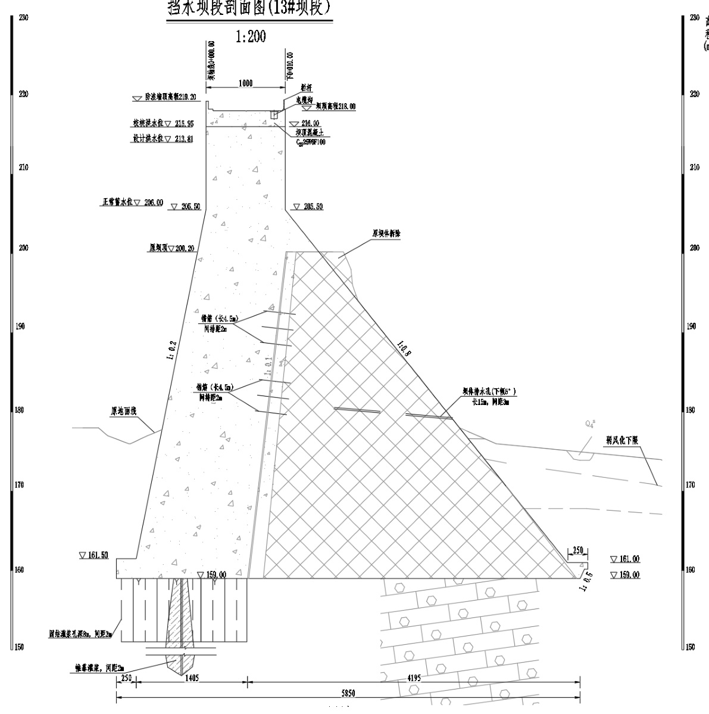  
  
图 6.4.5-1 重力坝前帮整体式加高方案(挡水坝段)  

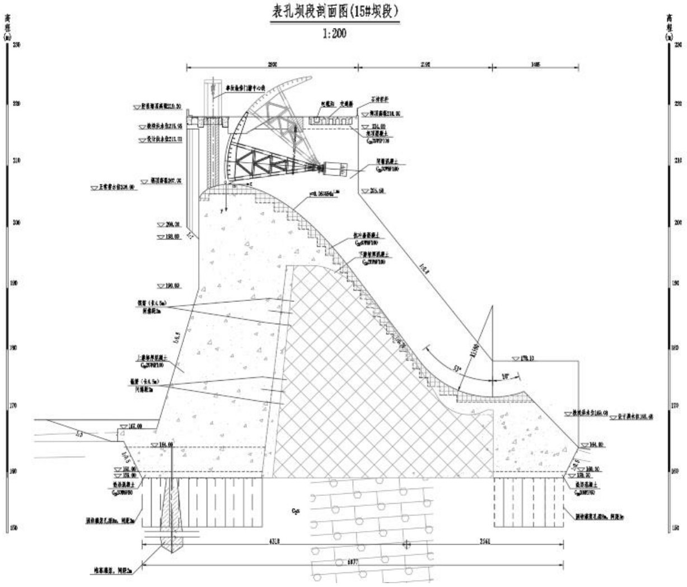  
图 6.4.5-2 重力坝前帮整体式加高方案(溢流坝段)  

(4)坝体细部设计  

# 1)坝顶布置  

坝顶交通可通行,在左、右岸挡水坝段部分由坝顶通过,在溢流表孔坝段部位闸墩下游侧设坝顶交通桥连接左右岸坝顶交通,桥面宽 $10.0\mathrm{m}$ (含电缆沟),“T 型梁 $^+$ 箱型”结构。拦河坝设门库坝段用于放置取水口坝段相应闸门,表孔检修门门库设于溢流坝段右侧,门库顶部设置混凝土盖板。  

坝顶上游侧布置防浪墙、墙高 $1.2\mathrm{m}$ ,防浪墙下游侧布置电缆沟和栏杆。  

2)坝体分缝及止、排水设计  

大坝共分 19 个坝段,设 18 道横缝。坝体横缝间上游均设止水,下游最高水位以下坝段横缝设止水。河床坝段及边坡坝段上游设一道紫铜片止水,止水片深入坝顶防浪墙内;下游坝缝处设一道紫铜片止水。溢流坝段溢流面坝缝位置设一道铜片止水。止水周边横缝内以填缝材料充填。  

# 3)坝体防渗层设计  

本工程采用前帮整体式加高方案,考虑形成防渗薄弱环节涉及到施工质量等不可控复杂因素,在上游坝面部分层间结合部位涂刷聚脲涂层,作为辅助防渗层,增加防渗保障。  

# (5)坝基稳定及应力分析  

根据本阶段地质勘探成果,以最高挡水坝段(坝基绝大部分地质条件上的典型挡水坝段)作为代表断面进行抗滑稳定及基底应力分析。  

以正常挡水工况、防洪高水位工况、设计洪水位工况、校核洪水位工况和地震工况等五种工况作为计算工况,分别使用《混凝土重力坝设计规范》SL319—2018 的公式 6.4.1-1 和 6.3.2 对坝体抗滑稳定和坝体应力进行计算,  

经计算,在各种荷载组合情况下,挡水坝段坝基面抗滑稳定安全系数满足规范要求,各种工况下基底最大压应力均不超过地基允许承载力,满足规范要求。  

(6)坝体混凝土设计  

现状大坝采用拱形的浆砌石重力坝,采用常态混凝土对大坝进行加高,为保证大坝的防渗效果,防渗材料选用 C25 混凝土,抗渗标号 W10,抗冻标号 F100。为提高坝体新老结合面粘接强度,改善应力传递,防止接合面开裂,使全部结构起整体作用,对已建浆砌石坝坡面进行凿毛及开挖形成台阶,并在台阶处采用植筋措施,植入钢筋为 $\Phi25$ ,间排距距 $2.0\mathrm{m}$ ,梅花型布置,单根长 $4.5\mathrm{m}$ ,深入原坝体 $3.0\mathrm{m}$ ,连接新坝体 $1.5\mathrm{m}$ 。  

(7)基础处理  

1)大坝建基面开挖及边坡设计  

根据地质勘察情况,覆盖层厚 $1.1{\sim}6.3\mathrm{m}$ ,为淤泥和人工堆积的块石、碎石;其结构松散,工程性质不良,不满足重力坝建基要求,应全部挖除。右岸及河床坝段无强风化带发育,弱风化带不连续分布,基础开挖边坡如下:河床淤泥为1:2,碎石为 1:1.5,弱风化灰岩为 1:0.5。  

# 2)坝基固结灌浆设计  

为提高基岩的承载能力,加强坝体与基岩的整体性和均一性,减少坝基渗透,拟对整个坝基进行固结灌浆,灌浆孔深入基岩 $8\mathrm{m}$ ,间排距均为 $3\mathrm{m}$ 。  

对于坝基开挖揭露有局部软岩夹层部位,适当加密、加长固结灌浆孔,对层间缝隙加强固结灌浆,以提高基岩整体性和承载能力。  

# 3)坝基防渗及排水设计  

在主河槽及右岸范围内设置单排帷幕灌浆孔,帷幕向右岸延伸 $15\mathrm{m}$ ,采用地面直接钻灌方式,帷幕深度到达 5Lu 以下 $5\mathrm{m}$ ,灌浆深度约 $15{\sim}25\mathrm{m}$ ,灌浆孔间距 $2.0\mathrm{m}$ 。  

左岸边坡坝段基岩岩溶强烈发育,存在严重的渗漏问题,左岸范围内设置双排帷幕灌浆孔并适当延长灌浆范围,向左岸延伸 $100\mathrm{m}$ ,采用地面直接钻灌方式,平均灌浆深度约 $50\mathrm{m}$ ,帷幕灌浆范围延伸至正常蓄水位与地下水位线相交,灌浆孔间距 $2.0\mathrm{m}$ ,排距 $1.5\mathrm{m}$ 。  

4)坝基接触灌浆设计  

坝址处河谷两岸山体较为陡峭,对于开挖坡度较陡的建基面,为防止坝体混凝土侧向收缩出现张开缝隙,导致渗漏,高陡坡基础需分区分期进行接触灌浆。本工程坝基开挖斜面均较陡,均采取接触灌浆以保证坝体与基岩的结合完整性。  

# 6.4.5.3 方案 2:后帮整体式  

(1)工程布置  

挡水建筑物为拱形混凝土重力坝,坝顶全长 $342.0\mathrm{m}$ ,最大坝高 $59.0\mathrm{m}$ ,主要由左岸挡水坝段、取水坝段、溢流表孔坝段、门库坝段和右岸挡水坝段组成。  

拦河坝由左岸至右岸共 19 个坝段,其中 1#\~13#坝段为左岸挡水坝段,14#  

坝段布置取水建筑物;15、16#坝段为溢流表孔坝段,作为枢纽泄水建筑物;17#坝段为门库坝段;18#\~19#坝段为右岸挡水坝段。  

(2)坝顶高程确定  

拦河坝为混凝土重力坝,按照《混凝土重力坝设计规范》(SL319-2018)中相关公式计算坝顶高程。综合计算值与结构考虑,取整坝顶高程 $218.0\mathrm{m}$ ,防浪墙高度 $1.2\mathrm{m}$ ,防浪墙顶高程 $219.2\mathrm{m}$ 。  

(3)坝体断面设计  

坝体断面设计主要依据《混凝土重力坝设计规范》(SL319-2018)的有关规定,结合坝基抗滑稳定及应力计算结果,优选合乎要求、体型简单、施工方便的断面。  

挡水坝段基本体形为三角形,基本三角形顶点位于坝顶高程 $218.0\mathrm{m}$ ,根据地质剖面,建基面最低高程为 $159\mathrm{m}$ ,因此拦河坝最大坝高为 $59\mathrm{m}$ 。为满足设备布置、运行、检修以及交通要求,拟定基本挡水坝段坝顶宽度 $10.0\mathrm{m}$ 。挡水坝段坝体上游面采用折面,高程 $205.5\mathrm{m}$ 以上为铅直面,以下为坡比 1:0.1 的斜面。下游坝坡坡比采用 1:0.85,高程 $205.50\mathrm{m}$ 以上为铅直面,以下为斜坡面,挡水坝段和溢流坝段剖面如图 6.4.5.3-1、图 6.4.5.3-2 所示。  

泄水建筑物布置于主河床中间位置,为 $15\#{\sim}16\#$ 坝段,布置 3 个开敞式溢流表孔,利用弧形闸门控制泄流,单个坝段长 $18\mathrm{m}$ 。单表孔宽度 $7.0\mathrm{m}$ ,边墩厚 $2.5\mathrm{m}$ ,堰顶高程 $207.0\mathrm{m}$ ,堰上安装弧形工作闸门。消能方式为挑流消能。  

引水坝段利用原有坝体二级输水隧洞,隧洞进行拓孔、凿毛,洞内套内径$0.8\mathrm{m}$ 的涂塑钢管,在埋管与隧洞之间施工缝隙进行回填灌浆。引水洞进口固定拦污栅,坝内引水钢管内径 $\Phi1000\mathrm{mm}$ ,长度 $48.0\mathrm{m}$ ,管道水平布置,坝体内不设置转弯段,管道水平段中心线高程 $168.5\mathrm{m}$ ,管壁厚 $6\mathrm{mm}$ ,管道出坝体后通过分水阀室连接下游主管与支管,主管内径 $\Phi1000\mathrm{mm}$ ,通过电动球阀控制下游城镇生活和灌区灌溉用水,设计流量为 $2.29\mathrm{m}^{3}/\mathrm{s}$ ,支管内径 $\Phi300\mathrm{mm}$ ,通过电动球阀控制下游河道生态流量下泄,设计流量为 $0.02{\sim}0.07\mathrm{m}^{3}/\mathrm{s}$ 。  

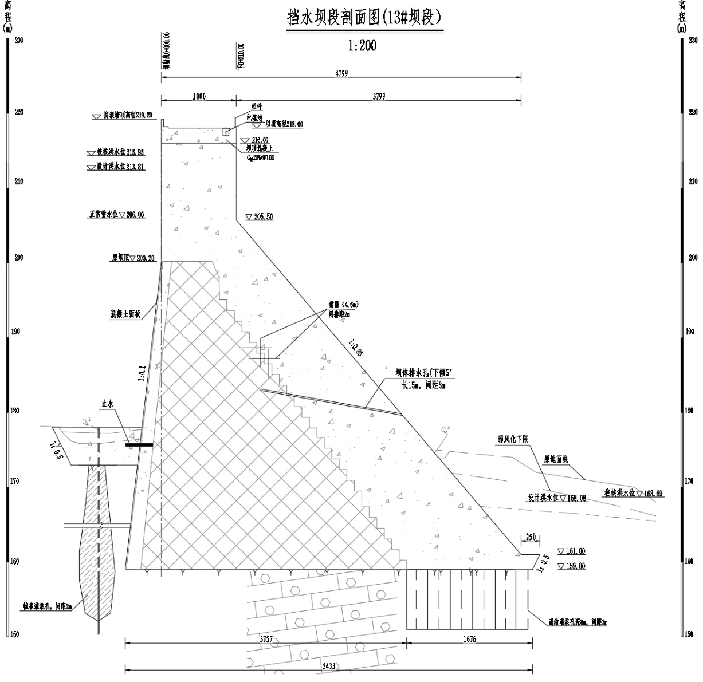  
图 6.4.5-3 重力坝后帮整体式加高方案(挡水坝段)  

  
图 6.4.5-4 重力坝后帮整体式加高方案(表孔坝段)  

(4)坝体细部设计  

1)坝顶布置  

坝顶交通可通行,在左、右岸挡水坝段部分由坝顶通过,在溢流表孔坝段部位闸墩下游侧设坝顶交通桥连接左右岸坝顶交通,桥面宽 $10.0\mathrm{m}$ (含电缆沟),“T 型梁 $^{\cdot+}$ 箱型”结构。拦河坝设门库坝段用于放置取水口坝段相应闸门,表孔检修门门库设于溢流坝段右侧,门库顶部设置混凝土盖板。  

坝顶上游侧布置防浪墙、墙高 $1.2\mathrm{m}$ ,防浪墙下游侧布置电缆沟和栏杆。  

2)坝体分缝及止、排水设计  

大坝共分 19 个坝段,设 18 道横缝。坝体横缝间上游均设止水,下游最高水位以下坝段横缝设止水。河床坝段及边坡坝段上游设一道紫铜片止水,止水片深入坝顶防浪墙内;下游坝缝处设一道紫铜片止水。溢流坝段溢流面坝缝位置设一道铜片止水。止水周边横缝内以填缝材料充填。  

# 3)坝体防渗层设计  

本工程采用后帮整体式加高方案,考虑形成防渗薄弱环节涉及到施工质量等不可控复杂因素,在上游坝面部分层间结合部位涂刷聚脲涂层,作为辅助防渗层,增加防渗保障。  

# (5)坝基稳定及应力分析  

根据本阶段地质勘探成果,以最高挡水坝段(坝基绝大部分地质条件上的典型挡水坝段)作为代表断面进行抗滑稳定及基底应力分析。  

以正常挡水工况、防洪高水位工况、设计洪水位工况、校核洪水位工况和地震工况等五种工况作为计算工况,分别使用《混凝土重力坝设计规范》SL319—2018 的公式 6.4.1-1 和 6.3.2 对坝体抗滑稳定和坝体应力进行计算,  

经计算,在各种荷载组合情况下,挡水坝段坝基面抗滑稳定安全系数满足规范要求,各种工况下基底最大压应力均不超过地基允许承载力,满足规范要求。  

(6)坝体混凝土设计  

现状大坝采用拱形的浆砌石重力坝,采用常态混凝土对大坝进行加高,为保证大坝的防渗效果,防渗材料选用 C25 混凝土,抗渗标号 W6 抗冻标号 F100。为提高坝体新老结合面粘接强度,改善应力传递,防止接合面开裂,使全部结构起整体作用,对已建浆砌石坝坡面进行凿毛及开挖形成台阶,并在台阶处采用植筋措施,植入钢筋为 $\Phi25$ ,间排距距 $2.0\mathrm{m}$ ,梅花型布置,根长 $4.5\mathrm{m}$ ,深入原坝体 $3.0\mathrm{m}$ ,连接新坝体 $1.5\mathrm{m}$ 。  

(7)基础处理  

1)大坝建基面开挖及边坡设计  

根据地质勘察情况,覆盖层厚 $1.1{\sim}6.3\mathrm{m}$ ,为淤泥和人工堆积的块石、碎石;其结构松散,工程性质不良,不满足重力坝建基要求,应全部挖除。右岸及河床坝段无强风化带发育,弱风化带不连续分布,基础开挖边坡如下:河床淤泥为1:2,碎石为 1:1.5,弱风化灰岩为 1:0.5。  

# 2)坝基固结灌浆设计  

为提高基岩的承载能力,加强坝体与基岩的整体性和均一性,减少坝基渗透,拟对整个坝基进行固结灌浆,灌浆孔深入基岩 $8.0\mathrm{m}$ ,间排距均为 $3.0\mathrm{m}$ 。  

对于坝基开挖揭露有局部软岩夹层部位,适当加密、加长固结灌浆孔,对层间缝隙加强固结灌浆,以提高基岩整体性和承载能力。  

# 3)坝基防渗及排水设计  

在主河槽及右岸范围内设置单排帷幕灌浆孔,帷幕向右岸延伸 $15\mathrm{m}$ ,采用地面直接钻灌方式,帷幕深度到达 5Lu 以下 $5\mathrm{m}$ ,灌浆深度约 $15{\sim}25\mathrm{m}$ ,灌浆孔间距 $2.0\mathrm{m}$ 。  

左岸边坡坝段基岩岩溶强烈发育,存在严重的渗漏问题,左岸范围内设置双排帷幕灌浆孔并适当延长灌浆范围,向左岸延伸 $100\mathrm{m}$ ,采用地面直接钻灌方式,平均灌浆深度约 $50\mathrm{m}$ ,帷幕灌浆范围延伸至正常蓄水位与地下水位线相交,灌浆孔间距 $2.0\mathrm{m}$ ,排距 $1.5\mathrm{m}$ 。  

# 4)坝基接触灌浆设计  

坝址处河谷两岸山体较为陡峭,对于开挖坡度较陡的建基面,为防止坝体混凝土侧向收缩出现张开缝隙,导致渗漏,高陡坡基础需分区分期进行接触灌浆。本工程坝基开挖斜面均较陡,均采取接触灌浆以保证坝体与基岩的结合完整性。  

# 6.4.5.4 方案 3:外包式  

采用外包式对坝体进行加高培厚,建筑材料为常态混凝土,坝体加高 $17.8\mathrm{m}$ 。设计加高方案大坝共分 19 个坝段,自左至右分别布置左岸挡水坝段、取水坝段、溢流表孔坝段、门库坝段、右岸挡水坝段。大坝坝顶高程 $218.0\mathrm{m}$ ,坝顶全长 $342.0\mathrm{m}$ ,最大坝高 $59.0\mathrm{m}$ ,枢纽建筑物布置如下图所示。  

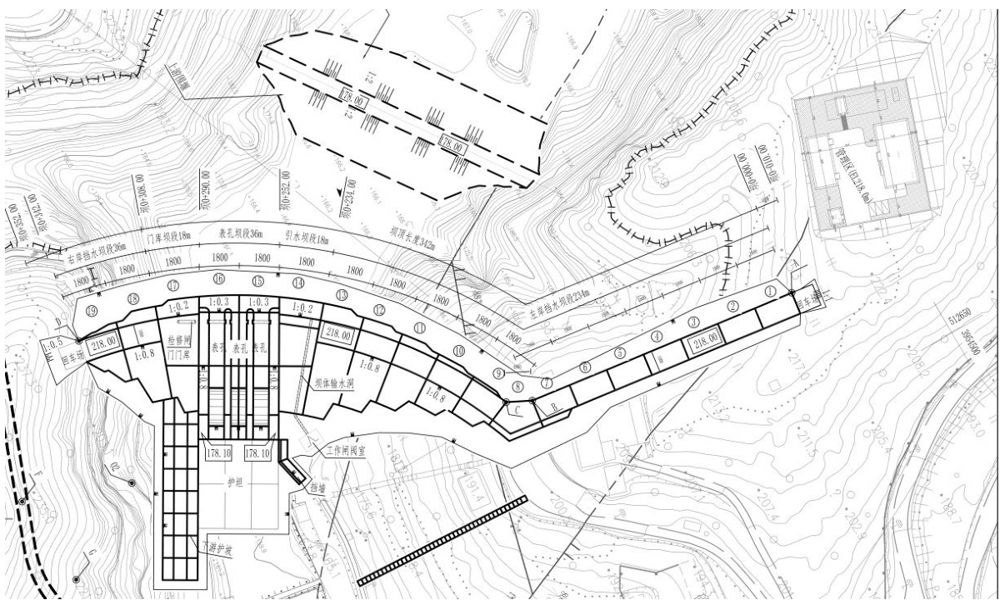  
图 6.4.5-5  枢纽建筑物布置图  

大坝坝顶长度为 $342.0\mathrm{m}$ ,宽 $10.0\mathrm{m}$ ,建基面高程 $159.0\mathrm{m}$ ,坝顶高程 $218.0\mathrm{m}$ ,坝高 $59.0\mathrm{m}$ ,自左岸至右岸分19个坝段。溢流坝段布置在15#、16#坝段,长 $36.0\mathrm{m}$ 。  

挡水坝段布置在溢流表孔坝段两侧,其中左岸挡水坝段共分 13 个坝段,坝段长度 $234.0\mathrm{m}$ ;右岸挡水坝段共分 2 个坝段,坝段长度 $36.0\mathrm{m}$ ,坝顶上游侧设防浪墙,墙顶高程 $219.2\mathrm{m}$ 。  

溢流表孔位于 15#、16#坝段,每孔净宽为 $7.0\mathrm{m}$ ,共 3 孔,边墩厚度 $2.5\mathrm{m}$ ,中墩厚度 $3.0\mathrm{m}$ ,单个坝段长 $18.0\mathrm{m}$ 。溢流表孔堰顶下游侧设置交通桥,桥面宽度$8.0\mathrm{m}$ ,桥面高程 $218.0\mathrm{m}$ 。表孔为开敞式溢流孔口,采用 WES 实用堰型,堰顶高程 $207.0\mathrm{m}$ ,末端接反弧段,反弧半径为 $15.0\mathrm{m}$ 。下游消能工采用挑流消能形式。坝后布置护坦,护坦 $42.5\mathrm{m}$ ,宽 $36.0\mathrm{m}$ ,厚 $3.0\mathrm{m}$ ,每隔 $20{\sim}25\mathrm{m}$ 设置一道沉降缝,护坦顶高程 $163.0\mathrm{m}$ ,下游与河床平顺连接。表孔溢流坝面和闸墩临水面采用 $0.8\mathrm{m}$ 厚 C40 抗冲磨混凝土。  

取水坝段位于 14#坝段,管底高程为 $168.0\mathrm{m}$ ,坝内引水钢管内径 $\Phi1000\mathrm{mm}$ ,长度 $48.0\mathrm{m}$ ,管道水平布置,坝体内不设置转弯段,管道水平段中心线高程 $168.5\mathrm{m}$ ,管壁厚 $6\mathrm{mm}$ ,管道出坝体后通过分水阀室连接下游主管与支管,主管内径$\Phi1000\mathrm{mm}$ ,通过电动球阀控制下游城镇生活和灌区灌溉用水,设计流量为$2.29\mathrm{m}^{3}/\mathrm{s}$ ,支管内径 $\Phi300\mathrm{mm}$ ,通过电动球阀控制下游河道生态流量下泄,设计流量为 $0.02{\sim}0.07\mathrm{m}^{3}/\mathrm{s}~.$ 。  

# 6.4.5.5 方案选择  

根据夺丰水库原设计坝体现状条件,分别从地形地质条件、枢纽布置、施工条件、加高方式特点、工程量及工程投资等方面对三种加高方案(前帮整体式、后帮整体式、外包式)进行综合比较。  

(1)地质地形条件  

坝址区河谷呈不对称的“V”型河谷,低山溶蚀峡谷地貌类型;坝址区地层岩性主要有寒武系(∈)、奥陶系(O)和第四系(Q)地层;坝址区覆盖层厚度较小,大部分地段基岩裸露。右岸及主河槽处的鲕状灰岩( $\in{}_{2}\mathbf{Z}$ )岩层整体倾向东的单斜构造,岩溶弱发育。左岸的白云质灰岩( $\mathrm{O}_{1}\mathrm{y}$ )受 3 条断裂发育影响,地质条件复杂,岩溶强发育,属古岩溶,岩溶连通性不强,为孤立的岩溶形态。  

三种加高方案坝轴线均在原坝轴线附近,大坝坝基及开挖范围差别不大,地形地质条件相近。从地形、地质条件分析,三种加高方案基本相近,均无制约因素。  

# (2)枢纽布置  

三种加高方案坝轴线均在原坝轴线附近,枢纽布置相差不大,大坝共分 19个坝段,自左至右分别布置左岸挡水坝段、取水坝段、溢流表孔坝段、门库坝段、右岸挡水坝段。大坝坝顶高程 $218.0\mathrm{m}$ ,坝顶全长 $342.0\mathrm{m}$ ,最大坝高 $59.0\mathrm{m}$ 。三种加高方案枢纽布置均不受到制约。  

(3)施工条件  

方案 1 与方案 3 涉及施工期降低库水位或水下施工问题,对大坝运行干扰较大。原设计大坝上游面坡度较陡,施工期间新老坝体材料结合不牢固,结合面容易开裂,方案1 与方案3 对施工工艺和温度控制要求较高;方案2 施工技术成熟,施工难度相对较小,可依靠原坝体挡水,不需要额外设置上游施工围堰和降低库水,对现行工程运行的影响不大,经济效益较高。从施工条件分析,方案 1 与方案 3 施工工艺较为复杂,方案 2 对大坝运行影响最小,方案 2 相对较优。  

(4)加高方式特点  

方案 1 要求新、老坝体结合为整体,运行期新、老坝体材料结合面处于受压状态,有利于保持结合面的牢固结合,在坝体质量较差、存在严重的坝体渗漏时,方案 1 有利于提高坝体防渗性能和减少老坝缺陷对安全的影响,加高培厚部分混凝土受力条件复杂,需要进行加固处理,且老坝止水系统不能利用,需要重新设置止水和排水系统。  

方案 2 需新、老坝体共同承担库水压力、坝基扬压力等,对大坝加高后新、老混凝土结合面强度要求较高。原设计坝体为浆砌石,坝体加高材料为常态混凝土,新、老坝体材料力学特性一般存在明显差异,结合面往往为弱面,大坝在自重、水压力、温度变化等作用下,结合面存在应力集中问题,老坝加高和下游面加厚的混凝土尺寸较小时,温变作用在结合面产生的效应明显,往往影响新、老坝体材料的牢固结合,对温度控制要求较高。  

方案 3 对原坝体上、下游面进行混凝土加高培厚,在现状大坝基础上实现坝体最大限度加高,该方案可较灵活地优化坝体受力断面,有效减少坝体渗漏问题。  

(5)工程投资  

各加高方案主要工程量及可比投资比较见下表。  

表 6.4.5-1  主要工程量对比表  

<html><body><table><tr><td>序号</td><td>工程项目</td><td>单位</td><td>方案1</td><td>方案2</td><td>方案3</td></tr><tr><td>二</td><td>重力坝</td><td></td><td></td><td></td><td></td></tr><tr><td>1</td><td>混凝土、浆砌石拆除</td><td>m3</td><td>7395</td><td>7395</td><td>7395</td></tr><tr><td>2</td><td>管理房、闸阀室拆除</td><td>m2</td><td>3301</td><td>3301</td><td>3301</td></tr><tr><td>3</td><td>土方明挖</td><td>m3</td><td>23933</td><td>15619</td><td>20547</td></tr><tr><td>4</td><td>石方明挖</td><td>m3</td><td>95509</td><td>62242</td><td>38186</td></tr><tr><td>5</td><td>混凝土</td><td>m3</td><td>219493</td><td>198709</td><td>223772</td></tr><tr><td>6</td><td>喷护混凝土</td><td>m3</td><td>795</td><td>926</td><td>538</td></tr><tr><td>7</td><td>钢筋</td><td>t</td><td>8152</td><td>7913</td><td>6472</td></tr><tr><td>8</td><td>锚杆</td><td>m</td><td>9833</td><td>11451</td><td>218</td></tr><tr><td>9</td><td>锚索</td><td>根</td><td>69</td><td>80</td><td>33</td></tr><tr><td>10</td><td>坝体锚筋</td><td>根</td><td>4909</td><td>2562</td><td>3749</td></tr><tr><td>11</td><td>惟幕灌浆</td><td>m</td><td>19405</td><td>22599</td><td>44199</td></tr><tr><td>12</td><td>固结灌浆</td><td>m</td><td>23682</td><td>27580</td><td>24941</td></tr><tr><td>13</td><td>回填灌浆</td><td>m2</td><td>272</td><td>284</td><td>220</td></tr><tr><td>14</td><td>接触灌浆</td><td>m2</td><td>10269</td><td>11960</td><td>7025</td></tr><tr><td>15</td><td>止水</td><td>m</td><td>2528</td><td>2510</td><td>1620</td></tr><tr><td>16</td><td>排水孔</td><td>m</td><td>12917</td><td>15043</td><td>2340</td></tr><tr><td>17</td><td>格宾石笼</td><td>m3</td><td>3662</td><td>4265</td><td>2265</td></tr><tr><td>二</td><td>导流洞/导流兼泄洪放空洞</td><td></td><td></td><td></td><td></td></tr><tr><td>1</td><td>土方开挖</td><td>m3</td><td>1045</td><td>1045</td><td></td></tr><tr><td>2</td><td>石方明挖</td><td>m3</td><td>35675</td><td>35675</td><td></td></tr><tr><td>3</td><td>石方洞挖</td><td>m3</td><td>24707</td><td>24707</td><td></td></tr></table></body></html>  

表 6.4.5-2  可比投资对比表  

<html><body><table><tr><td>序号</td><td>工程项目</td><td>单位</td><td>方案1</td><td>方案2</td><td>方案3</td></tr><tr><td>二</td><td>重力坝</td><td></td><td></td><td></td><td></td></tr><tr><td>4</td><td>混凝土</td><td>m3</td><td>22685</td><td>22685</td><td></td></tr><tr><td>5</td><td>喷护混凝土</td><td>m3</td><td>1725</td><td>1725</td><td></td></tr><tr><td>6</td><td>钢筋、钢材</td><td>t</td><td>2014</td><td>2014</td><td></td></tr><tr><td>7</td><td>锚杆</td><td>根</td><td>6017</td><td>6017</td><td></td></tr><tr><td>8</td><td>固结灌浆</td><td>m</td><td>3877</td><td>3877</td><td></td></tr><tr><td>9</td><td>回填灌浆</td><td>m2</td><td>2808</td><td>2808</td><td></td></tr></table></body></html>  

<html><body><table><tr><td>序号</td><td>项目</td><td>单位</td><td>方案1</td><td>方案2</td><td>方案3</td></tr><tr><td>1</td><td>第一部分建筑工程</td><td>万元</td><td>33945</td><td>32391</td><td>32560</td></tr><tr><td>2</td><td>第二部分 机电设备及安装工程</td><td>万元</td><td>2068</td><td>1953</td><td>1967</td></tr><tr><td>3</td><td>第三部分金属结构设备及安装工程</td><td>万元</td><td>1012</td><td>984</td><td>988</td></tr><tr><td>4</td><td>第四部分 施工临时工程</td><td>万元</td><td>4412</td><td>4082</td><td>4116</td></tr><tr><td></td><td>合计</td><td>万元</td><td>41437</td><td>39410</td><td>39631</td></tr><tr><td></td><td>可比投资差</td><td>万元</td><td>1806</td><td>-221</td><td>0</td></tr></table></body></html>  

综上可知,方案 1、方案 2 和方案 3 三种方案各有优缺点,技术上均可行。  

方案 1 对坝体新、老混凝土结合和温度控制等条件要求较高,工程投资较高,根据地质勘察,坝址区存在岩溶及断层,方案 1 受力结构较差,坝体上游面较陡,新、老混凝土结合面容易在施工期间开裂,对混凝土温控和保温措施要求较高。  

方案 2 不需要布置上游围堰,施工条件对现行工程运行影响不大,施工难度较小,但枢纽布置开挖范围相对较大,对新、老坝体混凝土结合和施工期的温度控制要求较高。  

方案 3 可较灵活优化坝体受力结构,在原有坝体基础上实现最大限度的加高坝体。因本工程大坝需加高 $17.8\mathrm{m}$ ,大坝承受的上游水压力增加约 $105\%$ ,方案2 新老坝体材料间受力结构较差,容易产生开裂,且旧坝体浆砌石层面强度较低,坝体内多为白灰砂浆,强度较低,相对于方案 2,方案 3 采用“金包银”的结构,更好地保护原浆砌石坝体。  

在投资上,方案 1 可比投资最高,方案 3 投资次之,方案 2 可比投资最低。方案 3 可比投资介于其他两种方案中间。  

综合分析,本阶段推荐方案 3 外包式加高方案。  

# 6.4.6 副坝型式选择  

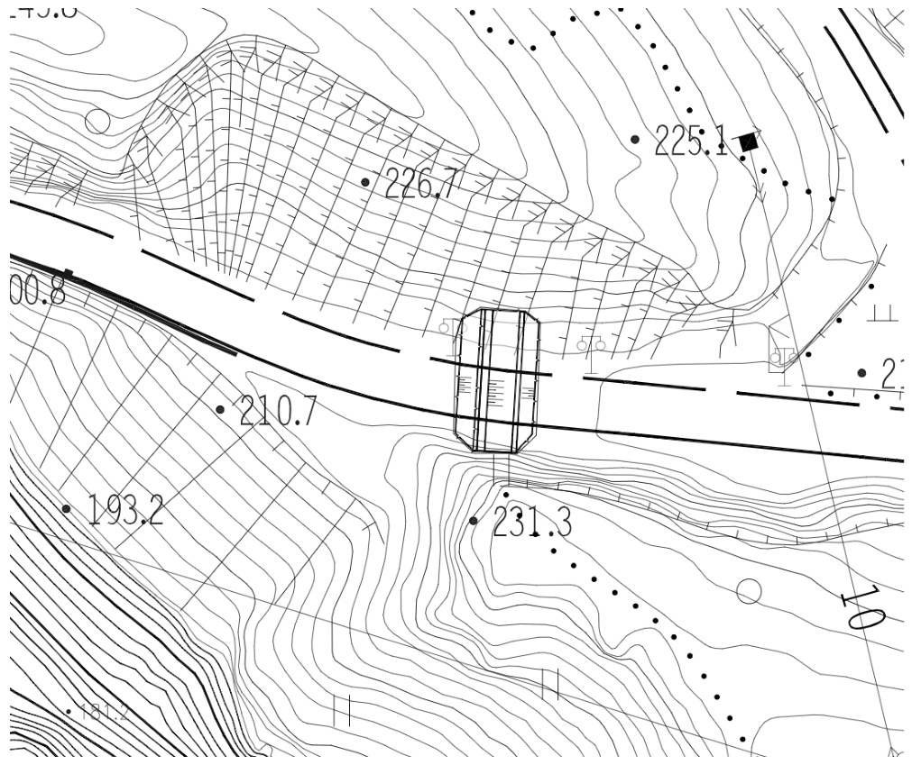  
图 6.4.6-1 副坝位置示意图  

副坝位置示意图如图 6.4.6-1 所示,副坝位于水库左岸现状坝址上游约 $350\mathrm{m}$ 垭口处,该垭口位置原始地面高程 $212.5\mathrm{m}$ ,随着夺丰水库扩容,水库校核水位$215.95\mathrm{m}$ ,50 年防洪高水位 $213.61\mathrm{m}$ ,正常蓄水位 $208.0\mathrm{m}$ ,副坝坝顶高程 $217.0\mathrm{m}$ ,垭口 $217.0\mathrm{m}$ 高程水平宽 $18.0\mathrm{m}$ ,严重影响水库的正常运行。副坝修建于该垭口处,可起到挡水作用,夺丰水库扩容蓄水后可形成一个封闭的库盆。  

副坝坝址位置地形属于“V”形,两岸边坡较陡,左岸自然边坡坡度 $40^{\circ}$ ,右岸自然边坡坡度 $60^{\circ}$ 。基岩为弱风化白云岩,基岩以上碎石堆积厚度 $1.5\mathrm{m}$ ,整体地质条件较好。  

常态混凝土坝结构简单,施工经验丰富成熟,可采用人工振捣,不受小体型制约,施工灵活,较适宜坝体较小、孔洞较多的大坝,副坝可选择常态混凝土大坝作为比选坝型。  

碾压混凝土坝具有施工简单,进度快,水泥用量少,温控措施简单。但碾压混凝土重力坝需要大型机械施工,副坝体型较小,不适宜采用碾压混凝土重力坝。  

当地材料坝对坝基地质条件要求低,对筑坝材料要求较高,特别对于副坝这种小体型坝体,无法采用大型的施工机械,施工难度相对较大。  

考虑副坝地形条件较好,垭口宽度较小,坝体体型较小,不适宜采用大型的施工机械施工,本阶段推荐常态混凝土重力坝作为推荐坝型。  

# 6.4.7 泄洪建筑物型式选择  

6.4.7.1 防洪调度运行方式与泄流规模(1)防洪调度运行方式  

根据确定的夺丰水库分级控泄流量以及 10 年、50 年一遇洪水所需的防洪库容,并考虑与坝址以下洪水的错峰,夺丰水库防洪调度原则设定如下:  

1)当入库流量小于 $60\mathrm{m}^{3}/\mathrm{s}$ 时,水库按来流下泄;  

2)当入库流量大于 $60\mathrm{m}^{3}/\mathrm{s}$ 时,水库按 $60\mathrm{m}^{3}/\mathrm{s}$ 固定泄量下泄直到水库达到10 年一遇防洪高水位 $211.43\mathrm{m}$ (防洪库容 541 万 $\mathrm{m}^{3}$ );  

3)水库水位高于10 年一遇防洪高水位时,当入库流量小于控泄流量 $380\mathrm{m}^{3}/\mathrm{s}$ 时,水库按入库流量和相应水位最大泄流能力小者下泄,当入库流量大于控泄流量 $380~\mathrm{m}^{3}/\mathrm{s}$ 时按控泄流量下泄,直到达到 50 年一遇防洪高水位 $213.61\mathrm{m}$ (防洪库容 800 万 $\mathrm{m}^{3}$ );  

4)当水库水位未达到 50 年一遇防洪高水位 $213.61\mathrm{m}$ ,且入库流量和坝址下游思德河涝水开始减小,此时可以调节闸门开度,按泄流能力、入库最大流量、河道承泄能力三者的最小值下泄,水库水位下降直至汛限水位;  

5)当水库水位超过50 年一遇防洪高水位 $213.61\mathrm{m}$ 时,按水库泄流能力敞泄;退水时当水库水位在 50 年一遇防洪高水位 $213.61\mathrm{m}$ 以下时,如果坝址下游洪水仍未减小,洪水暂时滞留在水库中。  

# (2)泄流规模分析  

夺丰水库是一座以灌溉、供水、防洪为主,结合养殖等多种经营的中型水库。水库原设计并未设置专用的防洪库容,只起一定的滞洪作用。夺丰水库扩容后原设计工程任务不变,新增防洪任务。通过设置专用防洪库容,提高淇县城区和城区下游河段防洪标准,最大程度减小思德河上游山区洪水进入下游平原区的几率,保障卫河流域防洪安全。  

水库10 年一遇入库洪峰流量为 $757\mathrm{m}^{3}/\mathrm{s},50$ 年一遇入库洪峰流量为 $1342\mathrm{m}^{3}/\mathrm{s}$ ,设计洪水标准为 100 年一遇入库洪峰流量为 $1601\mathrm{m}^{3}/\mathrm{s}$ ,校核洪水标准为 1000 年一遇入库洪峰流量为 $2547\mathrm{m}^{3}/\mathrm{s}$ 。根据水库防洪调度运行要求:当入库流量大于  

$60\mathrm{m}^{3}/\mathrm{s}$ 时,水库按 $60\mathrm{m}^{3}/\mathrm{s}$ 固定泄量下泄直到水库达到 10 年一遇防洪高水位$211.43\mathrm{m}$ ,则水库在汛限水位 $206.0\mathrm{m}$ 时泄量不应小于 $60\mathrm{m}^{3}/\mathrm{s}$ ;水库水位高于 10年一遇防洪水位时,当入库流量小于控泄流量 $380\mathrm{m}^{3}/\mathrm{s}$ 时,水库按入库流量和相应水位最大泄流能力小者下泄,当入库流量大于控泄流量 $380\mathrm{m}^{3}/\mathrm{s}$ 时按控泄流量下泄,直到达到 50 年一遇防洪高水位 $213.61\mathrm{m}$ ,当水库水位超过 50 年一遇防洪高水位 $213.61\mathrm{m}$ 时,按水库泄流能力敞泄,则水库在 10 年一遇防洪高水位$211.43\mathrm{m}$ ,泄量不应小于 $380\mathrm{m}^{3}/\mathrm{s}$ ,水库水位超过 50 年一遇防洪高水位 $213.61\mathrm{m}$ 时,按水库泄流能力敞泄。  

# 6.4.7.2 泄洪建筑物型式比选  

根据防洪调度要求,当入库流量大于 $60\mathrm{m}^{3}/\mathrm{s}$ 时,水库在汛限水位 $206.0\mathrm{m}$ 时泄量不应小于 $60\mathrm{m}^{3}/\mathrm{s}$ ;当入库流量大于控泄流量 $380\mathrm{m}^{3}/\mathrm{s}$ 时,水库在 50 年一遇防洪高水位 $213.61\mathrm{m}$ ,泄量不应小于 $380\mathrm{m}^{3}/\mathrm{s}$ ,水库水位超过 50 年一遇防洪高水位 $213.61\mathrm{m}$ 时,按水库泄流能力敞泄。  

为满足大坝泄洪需求,除表孔泄洪方式外,可考虑表孔与泄洪放空洞相结合的泄洪方式。因导流期需布置 1 条导流洞,后期可将导流洞改造为泄洪放空洞,与泄流表孔共同承担泄洪任务,减小表孔规模,但改造成泄洪放空洞会增加导流洞衬砌厚度,同时增大泄洪放空洞进水口、出口闸室、消能措施费用及金结费用。因此,针对泄水建筑物对采用表孔、表孔 $+$ 导流兼泄洪放空洞两种方案进行比选。  

(1)方案 1:表孔泄洪  

大坝坝顶高程 $218.00\mathrm{m}$ ,坝顶全长 $342.0\mathrm{m}$ ,共分19 个坝段,最大坝高 $59.0\mathrm{m}$ 。自左至右分别布置左岸挡水坝段、取水坝段、溢流表孔坝段、门库坝段、右岸挡水坝段。表孔为开敞式 WES 堰,堰顶高程为 $204.0\mathrm{m}$ ,2 孔布置,单孔口宽度为$10.0\mathrm{m}$ ,主要承担坝体泄洪任务。  

导流洞布置于河道右岸,进口高程 $170.00\mathrm{m}$ ,出口高程 $166.00\mathrm{m}$ ,导流洞洞身段长 $300.0\mathrm{m}$ ,隧洞设计纵坡 $1.33\%$ ,导流隧洞洞身段采用城门洞型,衬砌后净断面尺寸为 $4\times4.5\mathrm{m}$ ,顶拱圆心角 $120^{\circ}$ ,导流洞后期进行封堵,封堵长度 $20\mathrm{m}$ ,采用微膨胀混凝土。为保证原衬砌混凝土与封堵段混凝土粘结牢固,先对原衬砌混凝土进行凿毛,设锚筋进行加固并进行回填灌浆和接缝灌浆等。  

表 6.4.7-1  方案 1 泄流曲线  

<html><body><table><tr><td>上游水位 (m)</td><td>泄量 (m3/s)</td><td>上游水位 (m)</td><td>泄量(m3/s)</td><td>上游水位 (m)</td><td>泄量(m3/s)</td></tr><tr><td>204.0</td><td>0</td><td>208.0</td><td>292</td><td>212.0</td><td>891</td></tr><tr><td>204.2</td><td>3</td><td>208.2</td><td>315</td><td>212.2</td><td>928</td></tr><tr><td>204.4</td><td>6</td><td>208.4</td><td>340</td><td>212.4</td><td>966</td></tr><tr><td>204.6</td><td>16</td><td>208.6</td><td>364</td><td>212.6</td><td>1004</td></tr><tr><td>204.8</td><td>24</td><td>208.8</td><td>390</td><td>212.8</td><td>1044</td></tr><tr><td>205.0</td><td>34</td><td>209.0</td><td>416</td><td>213.0</td><td>1083</td></tr><tr><td>205.2</td><td>45</td><td>209.2</td><td>443</td><td>213.2</td><td>1124</td></tr><tr><td>205.4</td><td>57</td><td>209.4</td><td>471</td><td>213.4</td><td>1165</td></tr><tr><td>205.6</td><td>70</td><td>209.6</td><td>499</td><td>213.6</td><td>1206</td></tr><tr><td>205.8</td><td>84</td><td>209.8</td><td>528</td><td>213.8</td><td>1249</td></tr><tr><td>206.0</td><td>66</td><td>210.0</td><td>558</td><td>214.0</td><td>1292</td></tr><tr><td>206.2</td><td>115</td><td>210.2</td><td>588</td><td>214.2</td><td>1335</td></tr><tr><td>206.4</td><td>131</td><td>210.4</td><td>619</td><td>214.4</td><td>1380</td></tr><tr><td>206.6</td><td>149</td><td>210.6</td><td>651</td><td>214.6</td><td>1425</td></tr><tr><td>206.8</td><td>167</td><td>210.8</td><td>683</td><td>214.8</td><td>1470</td></tr><tr><td>207.0</td><td>186</td><td>211.0</td><td>716</td><td>215.0</td><td>1516</td></tr><tr><td>207.2</td><td>206</td><td>211.2</td><td>750</td><td>215.2</td><td>1563</td></tr><tr><td>207.4</td><td>226</td><td>211.4</td><td>784</td><td>215.4</td><td>1611</td></tr><tr><td>207.6</td><td>247</td><td>211.6</td><td>819</td><td>215.6</td><td>1659</td></tr><tr><td>207.8</td><td>269</td><td>211.8</td><td>855</td><td>215.95</td><td>1684</td></tr></table></body></html>  

(2)方案 2:表孔与导流兼泄洪放空洞联合泄洪  

大坝坝顶高程 $218.00\mathrm{m}$ ,坝顶全长 $342.0\mathrm{m}$ ,共分19 个坝段,最大坝高 $59.0\mathrm{m}$ 。自左至右分别布置左岸挡水坝段、取水坝段、溢流表孔坝段、门库坝段、右岸挡水坝段。表孔为开敞式 WES 堰,堰顶高程为 $207.0\mathrm{m}$ ,3 孔布置,单孔口宽度为$7.0\mathrm{m}$ ,主要承担坝体泄洪任务。  

导流洞布置于河道右岸,通过龙抬头改造型式改造为泄洪放空洞,泄洪放空洞由进口引渠段、进口曲线段、有压段、闸室控制段、龙抬头段、无压段、扩散段、消力池段组成。泄洪放空洞采用有压接无压布置型式,洞身转弯段靠下游侧设闸门竖井,竖井内设弧形工作闸门及平板工作闸门,其中弧形工作闸门尺寸为$3.5{\times}3.5{\mathrm{m}}$ (宽 $\times$ 高);闸前为有压段,长 $223.0\mathrm{m}$ ,隧洞断面为圆形,洞径为 $5.0\mathrm{m}$ ,IV 类围岩、V 类围岩衬砌厚度分别为 $0.5\mathrm{m},0.6\mathrm{m}$ ,底高程为 $170.0\mathrm{m}$ ;闸后为无压段,长 $87.0\mathrm{m}$ ,隧洞型式为城门洞,隧洞尺寸为 $4.0{\times}4.5\mathrm{m}$ (宽 $\times$ 高),III 类围岩、IV 类围岩、V 类围岩衬砌厚度依次为 $0.4\mathrm{m}$ 、 $0.5\mathrm{m}$ 、 $0.6\mathrm{m}$ ,隧洞出口高程为$166.0\mathrm{m}$ ,消能方式采用底流消能。施工期利用该隧洞导流,运行期进行泄洪。  

表 6.4.7-2  表孔与导流兼泄洪放空洞联合泄洪方案方案泄流曲线  

<html><body><table><tr><td>水位 (m)</td><td>表孔泄量 (m3/s)</td><td>导流兼泄 洪放空洞 泄量 (m3/s)</td><td>总泄量 (m3/s)</td><td>水位 (m)</td><td>表孔泄量 (m3/s)</td><td>导流兼泄 洪放空洞 泄量 (m3/s)</td><td>总泄量 (m3/s)</td></tr><tr><td>206.0</td><td>0</td><td>277</td><td>277</td><td>211.2</td><td>340</td><td>298</td><td>637</td></tr><tr><td>206.2</td><td>0</td><td>278</td><td>278</td><td>211.4</td><td>366</td><td>298</td><td>664</td></tr><tr><td>206.4</td><td>0</td><td>279</td><td>279</td><td>211.6</td><td>393</td><td>299</td><td>692</td></tr><tr><td>206.6</td><td>0</td><td>279</td><td>279</td><td>211.8</td><td>421</td><td>300</td><td>721</td></tr><tr><td>206.8</td><td>0</td><td>280</td><td>280</td><td>212.0</td><td>450</td><td>301</td><td>751</td></tr><tr><td>207.0</td><td>0</td><td>281</td><td>281</td><td>212.2</td><td>480</td><td>302</td><td>781</td></tr><tr><td>207.2</td><td>3</td><td>282</td><td>285</td><td>212.4</td><td>510</td><td>302</td><td>812</td></tr><tr><td>207.4</td><td>6</td><td>283</td><td>292</td><td>212.6</td><td>541</td><td>303</td><td>844</td></tr><tr><td>207.6</td><td>17</td><td>283</td><td>300</td><td>212.8</td><td>573</td><td>304</td><td>877</td></tr><tr><td>207.8</td><td>26</td><td>284</td><td>310</td><td>213.0</td><td>606</td><td>305</td><td>911</td></tr><tr><td>208.0</td><td>36</td><td>285</td><td>321</td><td>213.2</td><td>640</td><td>305</td><td>945</td></tr><tr><td>208.2</td><td>48</td><td>286</td><td>334</td><td>213.4</td><td>674</td><td>306</td><td>980</td></tr><tr><td>208.4</td><td>61</td><td>287</td><td>347</td><td>213.6</td><td>709</td><td>307</td><td>1016</td></tr><tr><td>208.6</td><td>75</td><td>287</td><td>362</td><td>213.8</td><td>745</td><td>308</td><td>1053</td></tr><tr><td>208.8</td><td>06</td><td>288</td><td>378</td><td>214.0</td><td>782</td><td>308</td><td>1091</td></tr><tr><td>209.0</td><td>105</td><td>289</td><td>394</td><td>214.2</td><td>820</td><td>309</td><td>1129</td></tr><tr><td>209.2</td><td>122</td><td>290</td><td>412</td><td>214.4</td><td>858</td><td>310</td><td>1168</td></tr><tr><td>209.4</td><td>140</td><td>291</td><td>431</td><td>214.6</td><td>898</td><td>311</td><td>1208</td></tr><tr><td>209.6</td><td>159</td><td>291</td><td>450</td><td>214.8</td><td>938</td><td>311</td><td>1249</td></tr><tr><td>209.8</td><td>178</td><td>292</td><td>471</td><td>215.0</td><td>978</td><td>312</td><td>1290</td></tr><tr><td>210.0</td><td>199</td><td>293</td><td>492</td><td>215.2</td><td>1020</td><td>313</td><td>1333</td></tr><tr><td>210.2</td><td>220</td><td>294</td><td>514</td><td>215.4</td><td>1062</td><td>313</td><td>1376</td></tr><tr><td>210.4</td><td>242</td><td>295</td><td>537</td><td>215.6</td><td>1105</td><td>314</td><td>1420</td></tr><tr><td>210.6</td><td>265</td><td>295</td><td>561</td><td>215.7</td><td>1127</td><td>315</td><td>1442</td></tr><tr><td>210.8</td><td>289</td><td>296</td><td>585</td><td>215.9</td><td>1172</td><td>315</td><td>1487</td></tr><tr><td>211.0</td><td>314</td><td>297</td><td>611</td><td>216.1</td><td>1217</td><td>316</td><td>1533</td></tr></table></body></html>  

# (3)方案比较  

主要从地形地质条件、枢纽布置、管理运行、工程量及工程投资等方面进行分析:  

# 1)地形地质条件  

右岸及河床坝段,覆盖层厚 $1.1{\sim}6.3\mathrm{m}$ ,无强风化带发育,弱风化带不连续分布,下伏主要为微风化岩体,岩体质量为 $\mathbf{A}_{\mathrm{II}}$ 和 $\mathbf{A}_{\Pi2}$ 类岩体,其中 $\mathbf{A}_{\mathrm{II}}$ 类岩体工程地质条件良好, $\mathbf{A}_{\Pi/2}$ 类岩体层厚 $0{\sim}2.7\mathrm{m}$ ,完整性为较破碎。左岸坝段覆盖层不连续分布,层厚 $0\sim3\mathrm{m}$ ,强风化带基岩不连续分布,层厚 $0{\sim}3.0\mathrm{m}$ ,岩体类别为 $\mathrm{C}_{\mathrm{V}}$ 类,弱风化带层厚 $1.2{\sim}38\mathrm{m}$ ,连续分布,但层厚差异较大。弱风化的白云质灰岩为 $\mathtt{B}_{\mathrm{IV}}$ 类岩体,弱风化的砾状灰岩为 ${\bf{C}}_{\mathrm{{IV}}}$ 类岩体。  

方案 1 导流洞和方案 2 导流兼泄洪放空洞均布置于大坝右岸,隧洞轴线和大坝轴线一致,地形地质情况基本相同。功能方面,方案 1 导流洞仅供施工期导流,后期封堵,方案 2 导流兼泄洪放空洞需分担大坝运行期部分泄洪任务,需进行隧洞衬砌、新建竖井式取水口,对地质条件要求更高。因此,从地形地质条件分析,两种方案基本相近,均不受制约。  

# 2)枢纽布置  

夺丰水库扩容工程主要对原浆砌石重力坝进行加高扩建,拦河坝加高 $17.8\mathrm{m}$ ,最大坝高 $59.0\mathrm{m}$ ,大坝共分 19 个坝段,自左至右分别布置左岸挡水坝段、取水坝段、溢流表孔坝段、门库坝段、右岸挡水坝段。大坝坝顶高程 $218.0\mathrm{m}$ ,坝顶全长 $342.0\mathrm{m}$ 。左岸挡水坝段为 $1\#{\sim}13\#$ 坝段,13 个坝段共长 $234\mathrm{m}$ ;右岸挡水坝段为 $18\#{\sim}19\#$ 坝段,2 个坝段共长 $36\mathrm{m}$ 。引水建筑物布置于 14#坝段,利用原坝体输水洞改造。工程管理区布置于大坝左岸。  

泄水建筑物布置于主河床中间位置 15#\~16#坝段,方案 1 布置 2 个开敞式溢流表孔,单孔宽 $10.0\mathrm{m}$ ,堰顶高程 $204.0\mathrm{m}$ 。方案 2 布置 3 个开敞式溢流表孔,单孔宽 $7.0\mathrm{m}$ 。堰顶高程 $207.0\mathrm{m}$ ,堰上安装弧形工作闸门,坝后采用挑流消能方式。  

方案 1 和方案 2 挡水坝段、取水坝段布置基本一致,泄水建筑物挑射水流均可与下游河道连接平顺。方案 1 泄流表孔尺寸较大,闸门最大挡水水头较高,导流洞不参与泄洪。方案 2 导流兼泄洪放空洞承担部分泄洪任务,表孔规模相对较小。方案 1 表孔挡水水头较高,闸门尺寸较大,且调度运行不够灵活。方案 2充分利用临时导流洞改造的泄洪放空洞参与泄流,较大程度减小了表孔的尺寸,调度运行相对灵活。从枢纽布置方面分析,方案 2 略优。  

表 6.4.7-3 两个方案工程特性表  

<html><body><table><tr><td>项目</td><td>单位</td><td>方案1：表孔泄 洪方案</td><td>方案2：表孔与导流兼泄洪放 空洞联合泄洪方案</td></tr><tr><td>1.大坝</td><td></td><td></td><td></td></tr><tr><td>坝顶高程</td><td>m</td><td>218.0</td><td>218.0</td></tr><tr><td>最大坝高</td><td>m</td><td>59.0</td><td>59.0</td></tr><tr><td>坝顶长度</td><td>m</td><td>342.0</td><td>342.0</td></tr><tr><td>2.溢流表孔</td><td></td><td></td><td></td></tr><tr><td>孔数</td><td></td><td>2</td><td>3</td></tr><tr><td>单孔净宽</td><td>m</td><td>10.0</td><td>7.0</td></tr><tr><td>堰顶高程</td><td>m</td><td>204.0</td><td>207.0</td></tr><tr><td>工作闸门型式</td><td></td><td>弧形闸门</td><td>弧形闸门</td></tr><tr><td>消能方式</td><td></td><td>挑流消能</td><td>挑流消能</td></tr><tr><td>3.导流洞/导流兼泄洪放空洞</td><td></td><td></td><td></td></tr><tr><td>数量</td><td>条</td><td>1</td><td>1</td></tr><tr><td>进口高程</td><td>m</td><td>170.0</td><td>170.0</td></tr><tr><td>出口高程</td><td>m</td><td>166.0</td><td>166.0</td></tr><tr><td>工作闸门型式</td><td></td><td></td><td>弧形闸门</td></tr><tr><td>工作闸门尺寸</td><td>m×m</td><td></td><td>3.5×3.5</td></tr><tr><td>有压隧洞洞径</td><td>m</td><td></td><td>5.0</td></tr><tr><td>有压隧洞段长度</td><td>m</td><td>300</td><td>223.0</td></tr><tr><td>无压隧洞段长度</td><td>m</td><td></td><td>87.0</td></tr><tr><td>无压洞尺寸</td><td>mxm</td><td>4.0x4.5</td><td>5.0×5.0</td></tr><tr><td>是否设竖井</td><td></td><td>香</td><td>是</td></tr></table></body></html>  

# 3)施工组织  

方案 1 仅通过表孔泄洪,堰顶高程 $204.0\mathrm{m}$ ,孔数为 2 孔,单孔宽 $10.0\mathrm{m}$ ,孔口尺寸相对较大。方案 2 表孔和导流兼泄洪放空洞联合泄洪,堰顶高程 $207.0\mathrm{m}$ ,孔数为 3 孔,单孔宽 $7.0\mathrm{m}$ ,孔口尺寸相对较小。两种方案大坝开挖范围相差不大,导流洞洞长、围堰高度基本相同,大坝施工工期相同。方案 2 导流兼泄洪放空洞进口需布置竖井式取水口,出口处布置消力池,需在汛前完成竖井开挖及隧洞衬砌,施工难度较大。从施工组织方面分析,方案 1 方案略优。  

# 3)运行管理  

在泄洪调度运行方面,方案 1 仅通过表孔泄洪,调度运行方式简单,但表孔尺寸较大,承担库水压力较大。方案 2 表孔和导流兼泄洪放空洞联合泄洪,洪建筑物布置较为分散,表孔尺寸相对较小,承担库水压力较小,可配合导流兼泄洪放空洞进口竖井闸门联合调度,泄调度方式相对灵活。从运行管理方面分析,方案 2 方案略优。  

4)两种方案主要工程量和投资两种方案的工程量和可比投资见下表。  

表 6.4.7-4 两种方案主要工程量和可比投资表  

<html><body><table><tr><td>序号</td><td>工程项目</td><td>单位</td><td>方案1：表孔泄洪 方案</td><td>方案2：表孔与导 流兼泄洪放空洞 联合泄洪方案</td></tr><tr><td>二</td><td>重力坝</td><td></td><td></td><td></td></tr><tr><td></td><td>混凝土、浆砌石拆除</td><td>m3</td><td>7395</td><td>7395</td></tr><tr><td></td><td>管理房、闸阀室拆除</td><td>m2</td><td>3301</td><td>3301</td></tr><tr><td></td><td>土方明挖</td><td>m3</td><td>20262</td><td>20547</td></tr><tr><td></td><td>石方明挖</td><td>m3</td><td>37762</td><td>38186</td></tr><tr><td></td><td>混凝土</td><td>m3</td><td>219136</td><td>223772</td></tr><tr><td></td><td>喷护混凝土</td><td>m3</td><td>536</td><td>538</td></tr><tr><td></td><td>钢筋</td><td>t</td><td>6381</td><td>6472</td></tr><tr><td></td><td>锚杆</td><td>m</td><td>216</td><td>218</td></tr><tr><td></td><td>锚索</td><td>根</td><td>33</td><td>33</td></tr><tr><td></td><td>坝体锚筋</td><td>根</td><td>3749</td><td>3749</td></tr><tr><td></td><td>帷幕灌浆</td><td>m</td><td>44130</td><td>44199</td></tr><tr><td></td><td>固结灌浆</td><td>m</td><td>24939</td><td>24941</td></tr><tr><td></td><td>回填灌浆</td><td>m2</td><td>220</td><td>220</td></tr><tr><td></td><td>接触灌浆</td><td>m2</td><td>6960</td><td>7025</td></tr><tr><td></td><td>止水</td><td>m</td><td>1609</td><td>1620</td></tr><tr><td></td><td>排水孔</td><td>m</td><td>2338</td><td>2340</td></tr><tr><td></td><td>格宾石笼</td><td>m3</td><td>2244</td><td>2265</td></tr><tr><td>二</td><td>导流洞/导流兼泄洪 放空洞</td><td></td><td>导流洞</td><td>导流兼泄洪放空 洞</td></tr><tr><td></td><td>土方开挖</td><td>m3</td><td>2364</td><td>1045</td></tr><tr><td></td><td>石方明挖</td><td>m3</td><td>9456</td><td>35675</td></tr><tr><td></td><td>石方洞挖</td><td>m3</td><td>12676</td><td>24707</td></tr><tr><td></td><td>混凝土</td><td>m3</td><td>5791</td><td>22685</td></tr><tr><td></td><td>喷护混凝土</td><td>m3</td><td>1042</td><td>1725</td></tr><tr><td></td><td>钢筋、钢材</td><td>t</td><td>642</td><td>2014</td></tr><tr><td></td><td>锚杆</td><td>根</td><td>7403</td><td>6017</td></tr><tr><td></td><td>固结灌浆</td><td>m</td><td>175</td><td>3877</td></tr><tr><td></td><td>回填灌浆</td><td>m²</td><td>2788</td><td>2808</td></tr><tr><td colspan="2">导流洞/导流兼泄洪放空洞投资</td><td>万元</td><td>1882</td><td>5367</td></tr><tr><td colspan="2">大坝工程投资</td><td>万元</td><td>24012</td><td>24362</td></tr><tr><td colspan="2">金属结构投资</td><td>万元</td><td>475</td><td>1378</td></tr><tr><td colspan="2">可比投资</td><td>万元</td><td>26369</td><td>31107</td></tr><tr><td colspan="2">投资差</td><td>万元</td><td>0</td><td>4738</td></tr></table></body></html>  

从工程量和工程投资方面分析,方案 1 泄洪方案比方案 2 工程量小,可比投资少 4738 万元。因此,从工程量及投资方面分析,方案 1 方案优。  

综合考虑地形、地质、枢纽布置、运行管理、工程量和投资等条件,方案 1和方案 2 在地形地质条件基本相同,均不受制约。方案 2 虽投资较高,但工程承担防洪任务,考虑泄洪放空洞可参与泄洪,泄洪建筑物调度灵活,本阶段推荐方案 2 表孔与导流兼泄洪放空洞联合泄洪方案。  

# 6.4.7.3 泄流规模选择  

根据防洪调度要求,当入库流量大于 $60\mathrm{m}^{3}/\mathrm{s}$ 时,水库在汛限水位 $206.0\mathrm{m}$ 时泄量不应小于 $60\mathrm{m}^{3}/\mathrm{s}$ ;当入库流量大于控泄流量 $380\mathrm{m}^{3}/\mathrm{s}$ 时,水库在 50 年一遇防洪高水位 $213.61\mathrm{m}$ ,泄量不应小于 $380\mathrm{m}^{3}/\mathrm{s}$ ,水库水位超过 50 年一遇防洪高水位 $213.61\mathrm{m}$ 时,按水库泄流能力敞泄。泄流表孔孔数和孔口尺寸考虑以下几个因素:  

$\textcircled{1}$ 满足泄量要求:泄水建筑物下泄校核工况洪水时,尽量使水位上升不敏感。  

$\textcircled{2}$ 尺寸可控:由于表孔泄流不受下游水位影响,其堰底高程越低,相同水位下,泄流能力越大。但过低的堰定高程会影响闸门选型及工程布置。根据《水利水电工程钢闸门设计规范》(SL74-2019)推荐的孔口尺寸系列、闸门设计水头及我国工程实践情况,表孔尺寸在可控范围内;  

$\textcircled{3}$ 利于泄水建筑物布置。泄流表孔堰底高程过高,为满足泄量要求,需增大泄流表孔宽度或泄洪底孔规模,不利于泄水建筑物布置。  

$\textcircled{4}$ 表孔孔数和孔口尺寸的选择需要考虑运行灵活、简单、方便。  

$\textcircled{5}$ 进行表孔堰顶高程选择时,在满足泄洪功能的同时,工程投资应尽量降低。  

(1)孔数选择  

水库 10 年一遇,入库洪峰流量为 $757\mathrm{m}^{3}/\mathrm{s}$ ,50 年一遇,入库洪峰流量为$1342\mathrm{m}^{3}/\mathrm{s}$ ,设计洪水标准为 100 年一遇,入库洪峰流量为 $1601\mathrm{m}^{3}/\mathrm{s}$ ,校核洪水标准为 1000 年一遇,入库洪峰流量为 $2547\mathrm{m}^{3}/\mathrm{s}$ 。溢流表孔布置 1 孔,闸门孔口尺寸较大,需要启闭机容量大,运行不够灵活;溢流表孔布置 2 孔时,孔口尺寸相对较小,但调度运行不够灵活,泄洪时闸墩受力不对称。采用 3 孔时,闸门尺寸较小,闸门运行简单、方便、调度灵活,闸墩结构受力对称。故溢流表孔采用 3孔。  

# 2)孔口尺寸选择  

表孔泄流规模比选方法为:一是增大溢流前缘宽度,其泄流量和溢流坝段、消力池工程量将增加,但可以降低坝高和减少坝体工程量;二是减小溢流前缘宽度,其泄流量和溢流坝段、消力池工程量将减小,但将增加坝高和坝体工程量。  

根据工程规划,水库正常蓄水位 $208.0\mathrm{m}$ ,汛限水位 $206.0\mathrm{m}$ ,汛限水位即为洪水调节的起调水位,防洪高水位 $213.61\mathrm{m}$ 。溢洪道控制段为 3 孔,孔口尺寸比选 $7.0{\times}6.0\mathrm{m}$ 、 $7.0{\times}7.0\mathrm{m}$ 和 $7.0{\times}8.0\mathrm{m}$ 三种方案,规模比选见表.6.4.7-5。  

表 6.4.7-5  溢流表孔泄流规模比选表  

<html><body><table><tr><td colspan="2">项目</td><td>方案一</td><td>方案二</td><td>方案三</td></tr><tr><td colspan="2">孔数-孔口尺寸（m)</td><td>2-7.0x6.0</td><td>2-7.0x7.0</td><td>2-7.0x8.0</td></tr><tr><td colspan="2">溢流堰型</td><td colspan="3">WES实用堰</td></tr><tr><td rowspan="10">工程特 性</td><td>堰顶高程（m)</td><td>208.00</td><td>207.00</td><td>206.50</td></tr><tr><td>正常蓄水位（m)</td><td>208.00</td><td>208.00</td><td>208.00</td></tr><tr><td>设计水位（m)</td><td>213.81</td><td>213.81</td><td>213.81</td></tr><tr><td>校核水位（m)</td><td>215.18</td><td>215.95</td><td>215.83</td></tr><tr><td>防洪高水位（m)</td><td>213.61</td><td>213.61</td><td>213.61</td></tr><tr><td>汛限水位（m)</td><td>206.00</td><td>206.00</td><td>206.00</td></tr><tr><td>计算坝顶高程（m)</td><td>218.23</td><td>218.00</td><td>217.88</td></tr><tr><td>坝顶高程（m)</td><td>+0.23</td><td>0</td><td>-0.12</td></tr><tr><td>河床坝基高程（m）</td><td>159.0</td><td>159.0</td><td>159.0</td></tr><tr><td>坝顶长度（m)</td><td>342.0</td><td>342.0</td><td>342.0</td></tr><tr><td rowspan="4">主要 工程量</td><td>坝体混凝土差值（m3)</td><td>+988</td><td>0</td><td>-211</td></tr><tr><td>钢筋差值(t)</td><td>17</td><td>0</td><td>26</td></tr><tr><td>金属结构 (t)</td><td>141</td><td>190</td><td>246</td></tr><tr><td>启闭机容量 (kN)</td><td>2x630</td><td>2x1000</td><td>2x1250</td></tr><tr><td colspan="2">可比投资差值 (万元)</td><td>+328</td><td>0</td><td>+832</td></tr></table></body></html>  

从表. 6.4.7-5 可以看出,随着泄流孔口尺寸增大,泄流能力也增大,水库设计水位和校核水位相应降低(设计水位降至汛限水位不变),相应的大坝坝顶高程也降低,大坝工程量将减少,而金属结构工程量增多;反之,随着孔口尺寸减小,泄流能力也减小,水库水位提高,相应的大坝坝顶高程也加高,大坝工程量将增加,金属结构工程量将减少。  

方案一和方案三的坝体和金属结构等主体工程可比投资(估算)与方案二的差值分别为 328 万元和 832 万元,方案二工程投资最少。  

因此,本阶段推荐溢流表孔孔口方案为为方案二,即 $3{-}7.0{\times}7.0\mathrm{m}$ ,7 孔,堰顶高程 $207.0\mathrm{m}$ ,单孔净宽 $7.0\mathrm{m}$ ,总净宽 $21.0\mathrm{m}$ 。  

# 6.4.7.4 消能防冲建筑物型式选择  

本工程坝高 $59.0\mathrm{m}$ ,堰顶高程 $207.0\mathrm{m}$ ,大坝上下游水位差 $40{\sim}50\mathrm{m}$ ,大坝泄洪时水流会携带较大的能量,目前常采用的消能方式有底流消能和挑流消能。  

挑流消能主要特点为:挑流消能通过挑坎将水流先抛射到空中,水流在空中掺入大量空气,形成逐渐扩散的水舌,落入下游水垫中。挑流消能结构简单,经济性好,在高、中水头泄水建筑物中广泛应用。当下泄建筑物下游地质条件较好时,为充分利用下游河道的抗冲刷能力,采用挑流消能方式是比较经济、合理的。  

底流消能主要特点为:底流消能是一种利用水跃进行消能的传统消能方式。底流消能具有流态稳定、消能效果较好、对地质条件和尾水位变化适应性较强、泄洪雾化轻微等优势,能适应高、中、低不同水头,但由于消力池体形尺寸较大,因而造价较高。采用传统的底流消力池时,由于水流流速较大,消力池规模很大,工程投资较多。  

本工程主河槽紧贴右岸,基岩为微新鲕状灰岩,呈厚层\~巨厚层状构造,岩石强度高,属坚硬岩,岩体高角度裂隙轻微发育,岩体完整性好,岩体中无软弱夹层,故岩体抗冲刷能力强,不易形成冲坑。右岸为高陡的岩质边坡,岩体为微新鲕状灰岩,岩石坚硬,其软化系数为 0.82,抗雾化能力强。左岸边坡为斜坡,距主河槽相对较远,受泄水雾化作用有限。  

因底流消能和挑流消能均适用于本工程溢流表孔的消能,本阶段对挑流消能、底流消能两种消能方式进行比选。  

(1)方案 1:挑流消能  

具体见本节“6.6.2 泄水建筑物设计”,此处不再赘述。  

该方案表孔为开敞式溢流孔口,采用 WES 实用堰型,堰顶高程 $207.0\mathrm{m}$ ,上游堰面倒悬,堰面曲线上游为 1/4 椭圆弧曲线,下游为幂曲线 $+.$ 直线段,直线段坡比 1:0.75,末端接反弧段,反弧半径为 $15.0\mathrm{m}$ 。堰上设置半径为 $15.0\mathrm{m}$ 的弧形工作闸门,由坝顶启闭机房内的液压启闭机启闭,工作门上游设检修闸门。坝址处基岩岩性以鲕状灰岩为主,下游消能工采用挑流消能形式。  

# (2)方案 2:底流消能  

该方案的表孔的幂曲线与挑流方案保持一致,泄槽后接反弧段流入消力池,消力池采用下挖式矩形等宽池,底板高程 $161.0\mathrm{m}$ ,池宽 $20.0\mathrm{m}$ ,池深 $10.0\mathrm{m}$ ,池长 $95.0\mathrm{m}$ ,底板厚 $4.0\mathrm{m}$ ,尾坎高程 $159.0\mathrm{m}$ ;边墙采用衡重式挡墙,最大高度 $14.00\mathrm{m}$ ,顶部宽 $2.0\mathrm{m}$ ,底部宽 $6.0\mathrm{m}$ 。下游护坦段长 $10\mathrm{m}$ ,采用 C25 钢筋混凝土,厚 $3.0\mathrm{m}$ ,底板顶高程 $159.0\mathrm{m}$ ,护坦后接 $20\mathrm{m}$ 抛石防冲段。  

# (3)方案选择  

主要从地形地质条件、枢纽布置、水力学条件、管理运行、工程量及工程投资等方面进行综合技术经济比较,最终选定推荐方案。  

# 1)地形地质条件  

本工程主河槽基岩为微新鲕状灰岩,呈厚层\~巨厚层状构造,岩石强度高,属坚硬岩,岩体高角度裂隙轻微发育,岩体完整性好,岩体中无软弱夹层。两方案的消力塘或消力池段岩体完整性好,岩石强度高,抗冲刷能力强,左右岸下游岸坡抗雾化能力强。因此,从地形地质方面分析,两方案基本相近,均不受制约。  

# 2)工程布置  

两方案枢纽布置基本相近,尾水与下游河道平顺连接。相比方案 1,方案 2需布置消力池,消力池体形尺寸较大,土石开挖与混凝土量相对较大。消力池开挖需综合考虑下游边坡稳定,坝址区右岸地形较陡,边坡开挖高度较高、支护困难。从枢纽布置方面分析,方案 1 相对较优。  

# 3)施工组织  

方案 1 建筑物结构简单,根据冲坑位置、大小及对大坝稳定性计算,冲坑位置可布置一定范围混凝土护底,减小因冲坑过大对坝体的影响。方案 2 需增加消力池开挖、下游护坡和混凝土工程施工,施工难度相对较大。从施工组织方面分析,方案 1 略优。  

4)运行管理  

方案 1 在消能工况的挑距为 $89.46\mathrm{m}$ ,冲坑深度约为 $15.85\mathrm{m}$ ,冲坑位置不影响大坝的稳定性,但挑流产生的冲积物会淤积在下游河道内,后期需要对河道进行清理;底流方案基本不产生冲积物。因此,从运行管理方面分析,方案 2 略优。  

# 5)两种方案主要工程量和投资  

两种方案的工程量和可比投资见下表。  

表 6.4.7-6 两种方案主要工程量和可比投资表  

<html><body><table><tr><td>序号</td><td>工程项目</td><td>单位</td><td>方案1：挑流方案</td><td>方案2：底流方案</td></tr><tr><td>1</td><td>混凝土、浆砌石拆除</td><td>m3</td><td>7395</td><td>7395</td></tr><tr><td>2</td><td>管理房、闸阀室拆除</td><td>m2</td><td>3301</td><td>3301</td></tr><tr><td>3</td><td>土方明挖</td><td>m3</td><td>20547</td><td>31526</td></tr><tr><td>4</td><td>石方明挖</td><td>m3</td><td>38186</td><td>44155</td></tr><tr><td>5</td><td>混凝土</td><td>m3</td><td>223772</td><td>255760</td></tr><tr><td>6</td><td>喷护混凝土</td><td>m3</td><td>538</td><td>1343</td></tr><tr><td>7</td><td>钢筋</td><td>t</td><td>6472</td><td>7912</td></tr><tr><td>8</td><td>锚杆</td><td>m</td><td>218</td><td>514</td></tr><tr><td>9</td><td>锚索</td><td>根</td><td>33</td><td>33</td></tr><tr><td>10</td><td>坝体锚筋</td><td>根</td><td>3749</td><td>3749</td></tr><tr><td>11</td><td>帷幕灌浆</td><td>m</td><td>44199</td><td>44199</td></tr><tr><td>12</td><td>固结灌浆</td><td>m</td><td>24941</td><td>27216</td></tr><tr><td>13</td><td>回填灌浆</td><td>m2</td><td>220</td><td>220</td></tr><tr><td>14</td><td>接触灌浆</td><td>m2</td><td>7025</td><td>7025</td></tr><tr><td>15</td><td>止水</td><td>m</td><td>1620</td><td>22325</td></tr><tr><td>16</td><td>排水孔</td><td>m</td><td>2340</td><td>34126</td></tr><tr><td>17</td><td>格宾石笼</td><td>m3</td><td>2265</td><td>2265</td></tr><tr><td colspan="2">大坝工程投资</td><td>万元</td><td>24362</td><td>29181</td></tr><tr><td colspan="2">金属结构投资</td><td>万元</td><td>1378</td><td>1378</td></tr><tr><td colspan="2">可比投资</td><td>万元</td><td>25740</td><td>30559</td></tr><tr><td colspan="2">投资差</td><td>万元</td><td>0</td><td>4819</td></tr></table></body></html>  

从工程量和工程投资方面分析,方案 1 比方案 2 工程量小,投资少 4819 万元。因此,从工程量及投资方面分析,方案 1 较优。  

综合考虑地形、地质、枢纽布置、运行管理、工程量和投资等条件,两方案在地形地质基本相近,挑流消能方案相比底流方案有雾化影响,且会产生淤积,但可通过工程措施解决,挑流方案工程量小,可比投资少 4819 万元,经济优势明显,因此本阶段推荐挑流消能方案。  

# 6.5 工程总布置  

# 6.5.1 工程布置原则  

工程主要建筑物包括挡水、泄水、引水和消能建筑物,枢纽布置遵循以下原则:  

(1)应能满足水库蓄水、供水、灌溉、泄洪等功能要求,布置尽量紧凑。  

(2)泄水建筑物的布置应结合枢纽的总体要求,泄流能力满足在不同水位条件下渲泄相应的下泄流量,应调度运行灵活、安全可靠,消能建筑物设计应能保证泄洪安全。  

(3)充分依据地形、地质、河势等自然条件,优选各主要水工建筑物包括大坝、引水口等布置和结构型式。  

(4)枢纽各建筑物的布置应相互协调、互不干扰、运行安全、管理方便。  

(5)布置方案应尽量减少山体开挖和植被破坏,尽量减免高边坡的产生和危害。  

(6)在总体布置及坝型选择上,尽量选用工程量较少、投资较省、技术可行、施工方便、且能快速施工的方案。  

# 6.5.2 工程总布置  

夺丰水库原设计是一座以灌溉、供水、防洪为主,结合养殖等多种经营的中型水库。水库原设计并未设置专用的防洪库容,只起一定的滞洪作用。原设计大坝是一座平面上呈拱形的浆砌石重力坝,大坝挡水坝段坝顶高程为 $200.2\mathrm{m}$ ,最大坝高 $41.2\mathrm{m}$ ,顶宽 $5.1\mathrm{m}$ ,桥面净宽 $3.5\mathrm{m}$ 。溢流坝段堰顶高程 $193.35\mathrm{m}$ ,最大坝高 $34.35\mathrm{m}$ ,大坝坝顶全长 $193.7\mathrm{m}$ ,其中溢流坝段长 $72\mathrm{m}$ ,左岸挡水坝段长$103.7\mathrm{m}$ ,右岸挡水坝段长 $18\mathrm{m}$ 。  

根据 2020 年安全鉴定结果,大坝评定为“二类坝”,大坝工程质量质量评价为合格,防洪标准满足规范要求,大坝结构安全、抗震稳定满足规范要求。  

夺丰水库扩容工程主要对原浆砌石重力坝进行加高扩建,扩建后夺丰水库主要建筑物包括挡水建筑物、泄水建筑物和引水建筑物等。通过“6.4.1 原坝体质量及安全评价”、“6.4.2 原坝体加高分析”及“6.4.4 原址拆除重建方案与加高方案选择”小节分析论证,本阶段推荐在原坝址基础上对大坝进行加高培厚。  

考虑大坝工程质量合格、防洪标准、结构安全和抗震稳定均满足规范要求,本阶段对大坝加高设计在满足工程任务和建筑物功能要求的基础上尽量减少对原坝体的拆改扰动。坝址区河谷呈不对称的“V”型河谷,河底宽约 $61\mathrm{m}$ ,原设计正常蓄水位 $193.70\mathrm{m}$ 处河谷宽约 $153\mathrm{m}$ ,原坝体溢流坝段长 $72\mathrm{m}$ ,位于主河床位置。本阶段设计溢流坝段布置 3 个溢流表孔,单个表孔宽度为 $7.0\mathrm{m}$ ,布置在原坝体溢流坝段位置,并考虑水流顺畅,尽量减少对下游河道的冲刷。引水建筑物设计仍然利用原坝段二级输水洞。  

夺丰水库扩容工程主要对原浆砌石重力坝进行加高扩建,坝体加高 $17.8\mathrm{m}$ ,采用外包式对坝体进行加高培厚,建筑材料为常态混凝土。设计加高方案大坝共分 19 个坝段,自左至右分别布置左岸挡水坝段、取水坝段、溢流表孔坝段、门库坝段、右岸挡水坝段。大坝坝顶高程 $218.0\mathrm{m}$ ,坝顶全长 $342.0\mathrm{m}$ ,最大坝高 $59.0\mathrm{m}$ ,枢纽建筑物布置如下图所示。  

  
图 6.5.2-1 枢纽建筑物布置图  

大坝坝顶长度为 $342.0\mathrm{m}$ ,宽 $10.0\mathrm{m}$ ,建基面高程 $159.0\mathrm{m}$ ,坝顶高程 $218.0\mathrm{m}$ ,坝高 $59.0\mathrm{m}$ ,自左岸至右岸分19个坝段。溢流坝段布置在15#、16#坝段,长 $36.0\mathrm{m}$ 。  

挡水坝段布置在溢流表孔坝段两侧,其中左岸挡水坝段共分 13 个坝段,坝段长度 $234.0\mathrm{m}$ ;右岸挡水坝段共分2 个坝段,坝段长度 $36.0\mathrm{m}$ ,坝顶高程为 $218.0\mathrm{m}$ ,宽 $10.0\mathrm{m}$ ,坝高约为 $59.0\mathrm{m}$ 。上游坝面高程 $205.5\mathrm{m}$ 以上铅直,以下坡比 1:0.2;下游坝面在高程 $205.5\mathrm{m}$ 以上铅直,以下坡比 1:0.8。根据坝顶布置,坝顶宽度为$10.0\mathrm{m}$ ,坝顶上游侧设防浪墙,墙顶高程 $219.2\mathrm{m}$ 。  

溢流表孔位于 15#、16#坝段,每孔净宽为 $7.0\mathrm{m}$ ,共 3 孔,边墩厚度 $2.5\mathrm{m}$ ,中墩厚度 $3.0\mathrm{m}$ ,单个坝段长 $18.0\mathrm{m}$ 。表孔为开敞式溢流孔口,采用 WES 实用堰型,堰顶高程 $207.0\mathrm{m}$ ,上游堰面倒悬,堰面曲线上游为 1/4 椭圆弧曲线,下游为幂曲线 $+.$ 直线段,直线段坡比 1:0.75,末端接反弧段,反弧半径为 $15.0\mathrm{m}$ 。堰上设置半径为 $15.0\mathrm{m}$ 的弧形工作闸门,由坝顶启闭机房内的液压启闭机启闭,工作门上游设检修闸门。坝址处基岩岩性以鲕状灰岩为主,抗冲能力好,下游消能工采用挑流消能形式。溢流表孔堰顶下游侧设置交通桥,桥面宽度 $8.0\mathrm{m}$ ,桥面高程 $218.0\mathrm{m}$ 。坝后布置护坦,护坦 $42.5\mathrm{m}$ ,宽 $36.0\mathrm{m}$ ,厚 $3.0\mathrm{m}$ ,每隔 $20{\sim}25\mathrm{m}$ 设置一道沉降缝,护坦顶高程 $163.0\mathrm{m}$ ,下游与河床平顺连接。表孔溢流坝面和闸墩临水面采用 $0.8\mathrm{m}$ 厚 C40 抗冲磨混凝土。  

取水坝段位于 14#坝段,夺丰水库运行 50 年淤积高程为 $170.20\mathrm{m}$ ,死水位$170.50\mathrm{m}$ ,因城镇供水、灌区灌溉和下游河道生态用水,需通过坝体取水口从库内取水。根据下游供水工程各运行工况过流计算,取水管管径 D 为 $1.0\mathrm{m}$ 。坝体取水口位于大坝 14#坝段的上游,由进水口段、渐变段、坝内埋管段组成。进口段为平底喇叭口型,上游沿坝坡固定拦污栅,进水口顶部采用长轴半径为 $3.0\mathrm{m}$ 、短轴半径 1.0 的圆曲线由 $2.0\mathrm{m}$ 以 1:1.5 的坡度渐缩为 $1.0\mathrm{m}$ 的孔高;两侧以 1:1.5的坡度由 $2.0\mathrm{m}$ 渐缩为 $1.0\mathrm{m}$ 的孔宽,后渐变与管径 $1.0\mathrm{m}$ 的涂塑钢管连接,进口底板高程为 $168.0\mathrm{m}$ 。坝内埋管段穿过 $14^{\#}$ 坝段,坝内引水钢管内径 $\Phi1000\mathrm{mm}$ ,长度 $48.0\mathrm{m}$ ,管道呈水平直线布置,管道水平段中心线高程 $168.5\mathrm{m}$ ,管壁厚 $6\mathrm{mm}$ ,管道出坝体后通过分水阀室连接下游主管与支管,主管内径 $\Phi1000\mathrm{mm}$ ,通过电动球阀控制下游城镇生活和灌区灌溉用水,设计流量为 $2.29\mathrm{m}^{3}/\mathrm{s}$ ,支管内径$\Phi300\mathrm{mm}$ ,通过电动球阀控制下游河道生态流量下泄,设计流量为 $0.02{\sim}0.07\mathrm{m}^{3}/\mathrm{s}$ 。  

副坝位于夺丰水库左岸现状坝址上游约 $350\mathrm{m}$ 垭口处,大坝为新建常态混凝土重力坝,坝顶高程 $217.0\mathrm{m}$ ,建基面高程 $210.0\mathrm{m}$ ,最大坝高为 $7.0\mathrm{m}$ ,坝顶全长$18.2\mathrm{m}$ ,共设一个坝段,坝基顺水流向最大长度为 $5.6\mathrm{m}$ 。  

导流兼泄洪放空洞布置于大坝右岸,前期为导流洞,后期改造为永久泄洪兼放空洞。导流兼泄洪放空洞前部进口段轴线与中后部轴线成 $17^{\circ}$ 夹角,由进口引渠段、进口闸段、有压段、闸井控制段、无压段、明流段、挑流段、护坦段、消力塘部分组成,自进口闸段到护坦末端,长度(水平投影)为 $460.50\mathrm{m}$ 。导流兼泄洪放空洞采用钢筋混凝土衬砌,最大泄量 $316\mathrm{m}^{3}/\mathsf{s}$ 。其中,工作闸门前为有压隧洞,工作闸门后洞身段为无压隧洞,出口采用挑流消能。  

# 6.6 主要建筑物设计  

# 6.6.1 挡水建筑物设计  

# 6.6.1.1 工程布置  

大坝坝顶长度为 $342.0\mathrm{m}$ ,宽 $10.0\mathrm{m}$ ,建基面高程 $159.0\mathrm{m}$ ,坝顶高程 $218.0\mathrm{m}$ ,坝高 $59.0\mathrm{m}$ ,自左岸至右岸分19个坝段。溢流坝段布置在15#、16#坝段,长 $36.0\mathrm{m}$ 。  

挡水坝段布置在溢流表孔坝段两侧,其中左岸挡水坝段共分 13 个坝段,坝段长度 $234.0\mathrm{m}$ ;右岸挡水坝段共分2 个坝段,坝段长度 $36.0\mathrm{m}$ ,坝顶高程为 $218.0\mathrm{m}$ ,宽 $10.0\mathrm{m}$ ,坝高约为 $59.0\mathrm{m}$ 。上游坝面高程 $205.5\mathrm{m}$ 以上铅直,以下坡比 1:0.2;下游坝面在高程 $205.5\mathrm{m}$ 以上铅直,以下坡比 1:0.8。根据坝顶布置,坝顶宽度为$10.0\mathrm{m}$ ,坝顶上游侧设防浪墙,墙顶高程 $219.2\mathrm{m}$ 。  

# 6.6.1.2 坝顶高程  

夺丰水库大坝为常态混凝土重力坝,按照《混凝土重力坝设计规范》(SL319-2018)中相关公式计算坝顶高程。根据规范,坝顶高程应高于校核洪水位,坝顶上游防浪墙顶的高程应高于波浪顶高程,其与正常蓄水位或校核洪水位的高差,可由下式计算,取其两者之高者作为最低高程。  

$$
\Delta{\sf h}={\sf h}_{1\%}+{\sf h}_{z}+{\sf h}_{\mathrm{c}}
$$  

式中:  

Δh——防浪墙顶至正常蓄水位或校核洪水位的高差, $\mathrm{m}$ ;  
$\operatorname{h}_{1\%}$ — 波高,m;  
$\mathrm{h}_{\mathrm{z}}$ —— 波浪中心线至正常或校核水位的高差, $\mathrm{m}$ ;  
$\mathrm{h}_{\mathrm{c}}$ ——安全超高,m。  
坝顶高程计算参数见下表  

表 6.6.1-1 坝顶高程计算参数表  

<html><body><table><tr><td rowspan="2">序号</td><td rowspan="2">计算工况</td><td>计算风速</td><td>风区长度</td><td>水域平均水深</td><td>安全超高</td></tr><tr><td>Vo(m/s)</td><td>D(m)</td><td>Hm(m)</td><td>hc(m)</td></tr><tr><td>1</td><td>正常蓄水位 (208.00)</td><td>17.70</td><td>355</td><td>40.41</td><td>0.40</td></tr><tr><td>2</td><td>校核洪水位 (215.95)</td><td>12.80</td><td>355</td><td>48.36</td><td>0.30</td></tr></table></body></html>  

波浪要素依据官厅公式(适用于高山峡谷地区,为主)计算坝顶超高,进而计算坝顶高程,具体计算结果如下表。  

表 6.6.1-2 坝顶高程计算结果表  

<html><body><table><tr><td>计算工况</td><td>水位(m)</td><td>h1%</td><td>hz</td><td>hc</td><td>△h</td><td>防浪墙顶高程</td><td>坝顶高程</td></tr><tr><td>正常蓄水位 (208.00)</td><td>208.00</td><td>0.53</td><td>0.16</td><td>0.40</td><td>1.09</td><td>209.09</td><td>207.89</td></tr><tr><td>校核洪水位 (215.95)</td><td>215.95</td><td>0.35</td><td>0.10</td><td>0.30</td><td>0.75</td><td>216.70</td><td>215.50</td></tr></table></body></html>  

按照波浪要素计算超高得到的坝顶高程如上表所示,校核洪水位工况为坝顶高程的控制工况,以校核洪水位工况复核的计算坝顶高程为 $215.50\mathrm{m}$ 。考虑溢流表孔坝段上游侧需设梁结构,门机轨道梁高约 $1.5\mathrm{m}$ ,根据规范,梁底应与水库最高静水位预留 $0.5\mathrm{m}$ 净空,本工程校核洪水位 $215.95\mathrm{m}$ ,考虑梁底高于校核洪水位,坝顶高程应高于以下计算值,即 $215.95\substack{+1.5+0.5=217.95\mathrm{m}}$ ,取整后坝顶高程 $218.0\mathrm{m}$ ,防浪墙顶高程为 $219.2\mathrm{m}$ 。  

综合计算值与结构考虑,取整坝顶高程 $218.0\mathrm{m}$ ,梁底净空高度 $0.55\mathrm{m}$ ,防浪墙高度 $1.2\mathrm{m}$ ,防浪墙顶高程 $219.2\mathrm{m}$ 。  

# 6.6.1.3 河床坝段坝体基本断面尺寸确定  

坝体断面设计主要依据《混凝土重力坝设计规范》(SL319-2018)的有关规定,结合坝基抗滑稳定及应力计算结果,优选符合规范要求、体型简单、施工方便的断面。  

挡水坝段基本体形为三角形,基本三角形顶点位于坝顶高程 $218.0\mathrm{m}$ 附近,根据地质剖面及原坝体建基面,建基面最低高程为 $159.0\mathrm{m}$ ,拦河坝最大坝高为$59.0\mathrm{m}$ 。为满足设备布置、运行、检修以及交通要求,拟定基本挡水坝段坝顶宽度 $10.0\mathrm{m}$ ,个别坝段协调坝顶布置适当加宽或增加悬挑结构。挡水坝段坝体上游面采用折面,高程 $205.5\mathrm{m}$ 以上为铅直面,以下为坡比 1:0.2 的斜面,上游培厚$4.0{\sim}7.0\mathrm{m}$ 。下游高程 $205.5\mathrm{m}$ 以上为铅直面,以下坡比采用 1:0.8,下游培厚$3.5{\sim}6.5\mathrm{m}$ 。挡水坝段坝基顺水流向最大长度为 $56.50\mathrm{m}$ ,最高挡水坝段如下图。  

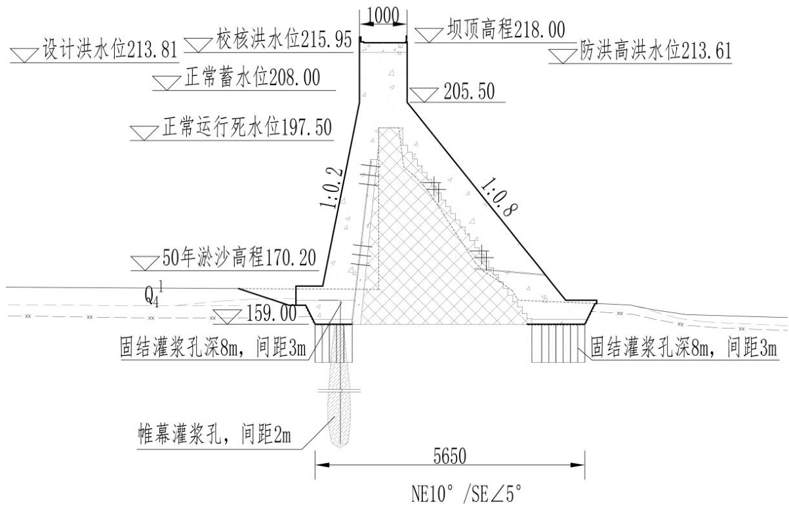  
图 6.6.1-1 河床挡水坝段典型断面图  

6.6.1.4 河床坝段坝体稳定及应力分析(1)坝基稳定、应力分析  

以最高挡水坝段(坝基绝大部分地质条件上的典型挡水坝段)作为代表断面进行抗滑稳定及基底应力分析。坝基抗滑稳定采用抗剪公式对典型坝段进行计算,得到抗滑稳定安全系数,同时采用刚体极限平衡法计算坝基应力状态。  

# 1)计算工况  

基本组合 1-正常挡水工况:上游正常蓄水位 $208.00\mathrm{m}$ ,下游河道水位 $164.86\mathrm{m}$ ;  
基本组合 2-设计洪水位工况:上游水位 $213.81\mathrm{m}$ ,下游河道水位 $168.12\mathrm{m}$ ;  
特殊组合 3-校核洪水位工况:上游水位 $215.95\mathrm{m}$ ,下游河道水位 $168.87\mathrm{m}$ 。  
特殊组合 4-地震工况:上游水位 $208.00\mathrm{m}$ ,下游河道水位 $164.86\mathrm{m}$ 。  

2)计算荷载组合计算荷载组合见下表。  

# 表 6.6.1-4  荷载组合表  

<html><body><table><tr><td>荷载 组合</td><td>计算 工况</td><td>自 重</td><td>静水 压力</td><td>扬 压力</td><td>淤沙 压力</td><td>浪 压力</td><td>地震 荷载</td><td>备注</td></tr><tr><td rowspan="2">基本 组合</td><td>正常蓄水位</td><td></td><td></td><td></td><td></td><td></td><td></td><td>上游水位208.00m 下游水位164.86m</td></tr><tr><td>设计洪水位</td><td></td><td></td><td></td><td></td><td></td><td></td><td>上游水位213.81m 下游水位168.12m</td></tr><tr><td rowspan="2">特殊 组合</td><td>校核洪水</td><td></td><td></td><td></td><td></td><td></td><td></td><td>上游水位215.95m 下游水位169.87m</td></tr><tr><td>地震</td><td></td><td></td><td></td><td></td><td></td><td></td><td>上游水位208.00m 下游水位164.86m</td></tr></table></body></html>  

# 3)计算断面  

选取 13#挡水坝段作为代表性断面计算坝体抗滑稳定和应力,建基面位于微风化中上部,高程为 $159.0\mathrm{m}$ 。计算断面的荷载组合计算简图见下图。  

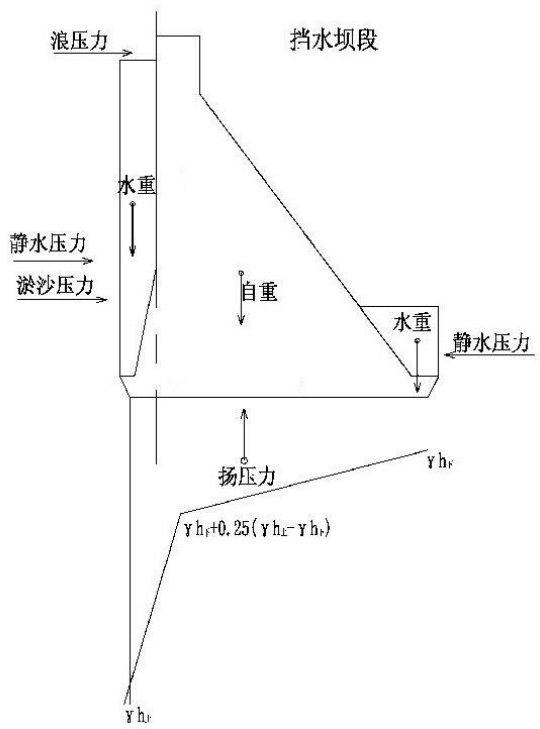  
图 6.6.1-2  稳定及应力计算简图  

4)计算方法  

坝体抗滑稳定按《混凝土重力坝设计规范》SL319—2018 第 6.4 节的抗剪断强度公式计算,具体计算公式如下:  

抗剪断公式:  

$$
{\sf K}^{\prime}=\frac{{\sf f}^{\prime}\sum{\sf W}+{\sf C}^{\prime}{\sf A}}{\sum{\sf P}}
$$  

式中:  

K’—— 按抗剪断强度计算的抗滑稳定安全系数;  
f’—— 坝体混凝土与坝基接触面的抗剪断摩擦系数;  
C’——坝体混凝土与坝基接触面的抗剪断凝聚力;  
∑W—— 作用于坝体上的全部荷载对滑动平面的法向分值,kN;  
A——坝基接触面面积, $\mathrm{m}^{2}$ ;  
∑P——作用于坝体上的全部荷载对滑动平面的切向分值,kN。  

坝体应力采用材料力学法,按《混凝土重力坝设计规范》(SL319-2018)公式计算:  

$$
\sigma_{{}_{y}}=\frac{\sum W}{\mathrm{~\boldmath~\cal~A~}}\pm\frac{\sum M x}{J}
$$  

式中:  

σy—坝踵、坝址垂直应力, $\mathrm{kPa}$ ;  

∑W—作用于坝段上或 $1\mathrm{m}$ 坝长上全部荷载(包括扬压力)在坝基截面上法向力的总和, $\mathrm{kN}$ ;  

∑M—作用于坝段上或 $1\mathrm{m}$ 坝长上全部荷载对坝基截面形心轴的力矩总和,kN▪m;  

A—坝段或 $1\mathrm{m}$ 坝长的坝基截面积, $\mathrm{m}$ ;  
J—坝段或者 $1\mathrm{m}$ 坝长的坝基截面对形心轴的惯性矩, $\mathrm{m^{4}}$ ;5)计算参数选取  
坝体混凝土容重取: $23.5\mathrm{kN}/\mathrm{m}^{3}$ ;水容重取: $10\mathrm{kN}/\mathrm{m}^{3}$ 。坝址区岩土体及结构面地质参数见下表。  

表 6.6.1-5  坝址区各地层岩土体物理力学指标建议值  

<html><body><table><tr><td rowspan="2">岩性</td><td rowspan="2">地层 代号</td><td rowspan="2">天然 密度</td><td rowspan="2">承载力</td><td rowspan="2">压缩 模量</td><td colspan="2">抗剪强度</td><td rowspan="2">基础与岩土摩擦 系数f</td><td rowspan="2">渗透系 数</td><td rowspan="2">不冲刷 流速</td><td rowspan="2">允许水力比 降Js</td><td rowspan="2">永久边坡</td><td rowspan="2">临时边坡</td></tr><tr><td>凝聚 力c</td><td>摩擦角 Φ</td></tr><tr><td></td><td></td><td>g/cm3</td><td>kPa</td><td>MPa</td><td>kPa</td><td></td><td></td><td>cm/s</td><td>m/s</td><td></td><td></td><td></td></tr><tr><td>淤泥</td><td>Q41</td><td>1.60</td><td>70~80</td><td>3~4</td><td>0</td><td>10~12</td><td>0.20~0.22</td><td>1.5×10-5</td><td>0.6~0.7</td><td>0.22~0.25</td><td>1:2.25~1:2.5</td><td>1:2.0~1:2.25</td></tr><tr><td>碎石 强风化砾</td><td>Q4s</td><td>2.00 2.40</td><td>250~300</td><td>20~25</td><td>0</td><td>20~25</td><td>0.50~0.53</td><td>2.0x10-1</td><td>0.8~1.0</td><td>0.12~0.15</td><td>1:1.75~1:2.0 1:1.0~1:1.15</td><td>1:1.50~1:1.75</td></tr><tr><td>状灰岩 弱风化砾</td><td>O2-3m</td><td>2.50</td><td>300~330</td><td>20~25</td><td></td><td></td><td></td><td></td><td></td><td></td><td></td><td></td></tr><tr><td>状灰岩 强风化白</td><td></td><td>2.40</td><td>350~400</td><td></td><td></td><td></td><td></td><td></td><td></td><td></td><td>1:0.75~1:1.0</td><td></td></tr><tr><td>云质灰岩 弱风化白</td><td>Oiy</td><td>2.55</td><td>300~330</td><td></td><td></td><td></td><td></td><td></td><td></td><td></td><td>1:0.75~1:1.0</td><td></td></tr><tr><td>云质灰岩 微新白云</td><td></td><td>2.70</td><td>1000~1500</td><td></td><td></td><td></td><td></td><td></td><td></td><td></td><td>1:0.5~1:0.75</td><td></td></tr><tr><td>质灰岩 弱风化</td><td></td><td>2.60</td><td>3000~3500</td><td></td><td></td><td></td><td></td><td></td><td></td><td></td><td>1:0.25~1:0.30</td><td></td></tr><tr><td>状灰岩 微新状</td><td>E2Z</td><td></td><td>2500~3000</td><td></td><td></td><td></td><td></td><td></td><td></td><td></td><td>1:0.30~1:0.35</td><td></td></tr><tr><td>灰岩</td><td></td><td>2.73</td><td>5000~5500</td><td></td><td></td><td></td><td></td><td></td><td></td><td></td><td>1:0.20~1:0.25</td><td></td></tr></table></body></html>  

表 6.6.1-6  坝址区各地层岩土体物理力学指标建议值  

<html><body><table><tr><td rowspan="2">岩性</td><td rowspan="2">类别</td><td>天然密 度</td><td rowspan="2">变形模量</td><td rowspan="2">泊松比</td><td colspan="3">岩体抗剪强度</td><td colspan="3">岩/混凝土抗剪强度</td></tr><tr><td></td><td>f</td><td>C'</td><td>f</td><td>f</td><td>C'</td><td>f</td></tr><tr><td></td><td></td><td>g/cm3</td><td>Eo/GPa</td><td>μ</td><td></td><td>MPa</td><td></td><td></td><td>MPa</td><td></td></tr><tr><td>砾状</td><td>Cv</td><td>2.40</td><td>0.3~0.5</td><td>0.35~0.40</td><td>0.20~0.23</td><td>0.10~0.15</td><td>0.20~0.25</td><td>0.20~0.25</td><td>0.15~0.20</td><td>0.15~0.20</td></tr><tr><td>灰岩</td><td>CIv</td><td>2.50</td><td>1.5~2.0</td><td>0.30~0.35</td><td>0.30~0.35</td><td>0.20~0.25</td><td>0.25~0.30</td><td>0.40~0.45</td><td>0.20~0.25</td><td>0.25~0.30</td></tr><tr><td>白云</td><td>Cv</td><td>2.40</td><td>0.3~0.5</td><td>0.35~0.40</td><td>0.20~0.23</td><td>0.10~0.15</td><td>0.20~0.25</td><td>0.20~0.25</td><td>0.15~0.20</td><td>0.15~0.20</td></tr><tr><td>质灰</td><td>BIv</td><td>2.55</td><td>2.0~2.5</td><td>0.25~0.30</td><td>0.68~0.73</td><td>0.35~0.40</td><td>0.50~0.55</td><td>0.70~0.75</td><td>0.30~0.35</td><td>0.40~0.45</td></tr><tr><td>岩</td><td>Bm1</td><td>2.70</td><td>8.0~8.5</td><td>0.25~0.28</td><td>1.00~1.05</td><td>1.04~1.09</td><td>0.60~0.65</td><td>0.98~1.03</td><td>0.80~0.85</td><td>0.60~0.65</td></tr><tr><td>状</td><td>A12</td><td>2.60</td><td>5.0~5.5</td><td>0.20~0.25</td><td>0.90~0.95</td><td>0.70~0.75</td><td>0.55~0.60</td><td>0.85~0.90</td><td>0.58~0.63</td><td>0.55~0.60</td></tr><tr><td>灰岩</td><td>AⅡ1</td><td>2.73</td><td>10.0~14.0</td><td>0.15~0.20</td><td>1.13~1.18</td><td>1.45~1.50</td><td>0.68~0.73</td><td>1.10~1.15</td><td>1.10~1.15</td><td>0.65~0.70</td></tr></table></body></html>  

表 6.6.1-7 坝址区断层带、结构面物理力学指标建议值  

<html><body><table><tr><td rowspan="2">岩性</td><td rowspan="2">类别/类型</td><td rowspan="2">天然密度</td><td rowspan="2">承载力</td><td rowspan="2">弹性模量</td><td rowspan="2">变形模量</td><td rowspan="2">泊松比</td><td colspan="3">抗剪强度</td></tr><tr><td>f</td><td>C'</td><td>f</td></tr><tr><td>断层破碎带</td><td></td><td>g/cm3</td><td>S/MPa</td><td>E/GPa</td><td>Eo/GPa</td><td>μ</td><td></td><td>MPa</td><td></td></tr><tr><td rowspan="5">结构面</td><td>Cv 无填充</td><td>2.45</td><td>0.3~0.4</td><td>0.8~1.0</td><td>0.5~0.8</td><td>0.3~0.35</td><td>0.45~0.50</td><td>0.08~0.10</td><td>0.35~0.40</td></tr><tr><td></td><td></td><td></td><td></td><td></td><td></td><td>0.55~0.60</td><td>0.10~0.15</td><td>0.45~0.50</td></tr><tr><td>泥夹岩屑</td><td></td><td></td><td></td><td></td><td></td><td>0.25~0.30</td><td>0.02~0.03</td><td>0.22~0.25</td></tr><tr><td>岩屑夹泥</td><td></td><td></td><td></td><td></td><td></td><td>0.35~0.40</td><td>0.05~0.07</td><td>0.28~0.31</td></tr><tr><td>岩块岩屑 层面</td><td></td><td></td><td></td><td></td><td></td><td>0.45~0.50 0.65~0.70</td><td>0.08~0.09 0.17~0.20</td><td>0.35~0.40 0.50~0.55</td></tr></table></body></html>  

根据地勘报告提供的坝址岩体物理力学参数建议值,建基面分布有鲕状灰岩,坝基抗滑稳定采用混凝土与鲕状灰岩层面间抗剪断强度参数范围中值: $\mathrm{f}{=}0.525$ ,$\mathrm{\Delta}\mathrm{f}^{\mathrm{=}}\mathrm{0}.675$ ,c’=0.185MPa。  

(6)坝基抗滑稳定及应力计算结果  

计算公式中的抗剪断参数,根据规范公式所得坝体抗滑稳定计算结果见下表。  

表 6.6.1-8 坝基抗滑稳定计算成果表  

<html><body><table><tr><td>坝段</td><td>计算工况</td><td>上游水位 (m)</td><td>下游水位 (m)</td><td>抗剪安全系数K</td><td>规范要求值</td></tr><tr><td rowspan="4">最高挡水坝段</td><td>正常挡水工况</td><td>208.00</td><td>164.86</td><td>1.505</td><td>1.05</td></tr><tr><td>设计洪水位工况</td><td>213.81</td><td>168.12</td><td>1.057</td><td>1.05</td></tr><tr><td>校核洪水位工况</td><td>215.95</td><td>168.87</td><td>1.010</td><td>1.00</td></tr><tr><td>地震工况</td><td>208.00</td><td>164.86</td><td>1.155</td><td>1.00</td></tr></table></body></html>  

从以上计算成果汇总表可以看出:在各种荷载组合情况下,挡水坝段坝基面抗滑稳定安全系数满足规范要求。  

表 6.6.1-9 坝基应力计算成果表  

<html><body><table><tr><td>坝段</td><td>计算工况</td><td>上游水位 (m)</td><td>下游水位 (m)</td><td>上游正应力 (MPa)</td><td>下游正应力 (MPa)</td></tr><tr><td rowspan="4">最高挡水坝段</td><td>正常挡水工况</td><td>208.00</td><td>164.86</td><td>0.475</td><td>0.669</td></tr><tr><td>设计洪水位工况</td><td>213.81</td><td>168.12</td><td>0.434</td><td>0.652</td></tr><tr><td>校核洪水位工况</td><td>215.95</td><td>168.87</td><td>0.382</td><td>0.628</td></tr><tr><td>地震工况</td><td>208.00</td><td>164.86</td><td>0.428</td><td>0.639</td></tr></table></body></html>  

鲕状灰岩微风化上部基岩允许承载力地质建议值 $[\mathbf{R}]{=}2500{\sim}3000\mathrm{kPa}_{\odot}$ 。  

从以上计算成果汇总表可以看出,各种工况下基底最大压应力均不超过地基允许承载力,满足规范要求。  

(2)坝体层间抗滑稳定计算  

夺丰水库坝体采用白灰砂浆砌筑,浆砌石坝体坝体在水平方向和垂直方向均形成错缝,材料和构造具有不均一性,坝体物理力学参数建议值见下表。  

表 6.6.1-10  坝体物理力学参数建议值  

<html><body><table><tr><td rowspan="2">天然密度</td><td rowspan="2">饱和抗压强度</td><td rowspan="2">弹性模量</td><td rowspan="2">变形模量</td><td colspan="2">抗剪断</td><td>抗剪</td></tr><tr><td>f</td><td>C'</td><td>f</td></tr><tr><td>(g/cm3)</td><td>(MPa)</td><td>(GPa)</td><td>(GPa)</td><td></td><td>(MPa)</td><td></td></tr><tr><td>2.45~2.50</td><td>40~35</td><td>13~15</td><td>7~9</td><td>0.75~0.85</td><td>0.75~0.85</td><td>0.60~0.65</td></tr></table></body></html>  

本工程坝体的最大坝高为 $59.0\mathrm{m}$ ,坝基最低高程 $159\mathrm{m}$ ,选取典型高程 $213\mathrm{m}$ 、$203\mathrm{m}$ 、 $193\mathrm{m}$ 、 $183\mathrm{m}$ 、 $173\mathrm{m}$ 、 $163\mathrm{m}$ 进行层间抗滑稳定计算。坝体层间抗滑稳定采用坝体物理抗剪断强度参数范围中值: $\mathrm{f}{=}0.80$ , $\mathrm{f}{=}0.80$ , $\mathrm{c}^{\prime}{=}0.625\mathrm{MPa}$ 。  

计算方法、荷载及计算工况同坝基抗滑稳定计算。层间抗滑稳定计算成果见下表。  

表 6.6.1-11 坝体层间抗滑稳定计算成果表  

<html><body><table><tr><td>·高程</td><td>计算工况</td><td>上游水位 (m)</td><td>下游水位 (m)</td><td>抗剪断安全系数 K'</td><td>规范要求值</td></tr><tr><td rowspan="4">213m</td><td>正常蓄水工况</td><td>208.00</td><td>164.86</td><td></td><td>3.0</td></tr><tr><td>设计洪水位工况</td><td>213.81</td><td>168.12</td><td>719.217</td><td>3.0</td></tr><tr><td>校核洪水位工况</td><td>215.95</td><td>168.87</td><td>216.647</td><td>2.5</td></tr><tr><td>地震工况</td><td>208.00</td><td>164.86</td><td>35.236</td><td>2.3</td></tr><tr><td rowspan="5">203m</td><td>正常蓄水工况</td><td>208.00</td><td>164.86</td><td>228.094</td><td>3.0</td></tr><tr><td>设计洪水位工况</td><td>213.81</td><td>168.12</td><td>20.048</td><td>3.0</td></tr><tr><td>校核洪水位工况</td><td>215.95</td><td>168.87</td><td>15.158</td><td>2.5</td></tr><tr><td>地震工况</td><td>208.00</td><td>164.86</td><td>19.181</td><td></td></tr><tr><td></td><td></td><td></td><td></td><td>2.3</td></tr><tr><td rowspan="4">193m</td><td>正常蓄水工况</td><td>208.00</td><td>164.86</td><td>27.032</td><td>3.0</td></tr><tr><td>设计洪水位工况</td><td>213.81</td><td>168.12</td><td>10.178</td><td>3.0</td></tr><tr><td>校核洪水位工况</td><td>215.95</td><td>168.87</td><td>8.701</td><td>2.5</td></tr><tr><td>地震工况</td><td>208.00</td><td>164.86</td><td>11.504</td><td>2.3</td></tr><tr><td rowspan="4">183m</td><td>正常蓄水工况</td><td>208.00</td><td>164.86</td><td>13.093</td><td>3.0</td></tr><tr><td>设计洪水位工况</td><td>213.81</td><td>168.12</td><td>7.059</td><td>3.0</td></tr><tr><td>校核洪水位工况</td><td>215.95</td><td>168.87</td><td>6.328</td><td>2.5</td></tr><tr><td>地震工况</td><td>208.00</td><td>164.86</td><td>7.987</td><td>2.3</td></tr><tr><td rowspan="4">173m</td><td>正常蓄水工况</td><td>208.00</td><td>164.86</td><td>8.734</td><td>3.0</td></tr><tr><td>设计洪水位工况</td><td>213.81</td><td>168.12</td><td>5.547</td><td>3.0</td></tr><tr><td>校核洪水位工况</td><td>215.95</td><td>168.87</td><td>5.099</td><td>2.5</td></tr><tr><td>地震工况</td><td>208.00</td><td>164.86</td><td>6.139</td><td>2.3</td></tr><tr><td rowspan="4">163</td><td>正常蓄水工况</td><td>208.00</td><td>164.86</td><td>6.588</td><td>3.0</td></tr><tr><td>设计洪水位工况</td><td>213.81</td><td>168.12</td><td>4.601</td><td>3.0</td></tr><tr><td>校核洪水位工况</td><td>215.95</td><td>168.87</td><td>4.297</td><td>2.5</td></tr><tr><td>地震工况</td><td>208.00</td><td>164.86</td><td>4.986</td><td>2.3</td></tr></table></body></html>  

从以上计算成果汇总表可以看出:在各种荷载组合情况下,挡水坝段坝体层间抗滑稳定安全系数满足规范要求。  

# 6.6.1.5 坝基处理设计  

(1)坝址区地质条件  

坝址区河谷呈不对称的“V”型河谷,河底宽约 $61\mathrm{m}$ ,原设计正常蓄水位$193.70\mathrm{m}$ 处河谷宽约 $153\mathrm{m}$ 。坝前河床地面高程 $166.2{\sim}166.4\mathrm{m}$ ,坝后河床地面高程 $160.0{\sim}163.7\mathrm{m}$ 。右岸地面高程 $160.0{\sim}280\mathrm{m}$ ,其中高程 $228\mathrm{m}$ 以下地形近直立,为悬坡类型;高程 $228\mathrm{m}$ 以上地形相对较缓,为斜坡类型。左岸地面高程 $163\sim$ $220\mathrm{m}$ ,地形坡度约 $23\%$ ,为斜坡类型。  

坝址区地层岩性主要有寒武系(∈)、奥陶系(O)和第四系(Q)地层;坝址区覆盖层厚度较小,大部分地段基岩裸露。右岸及主河槽处的鲕状灰岩(∈2z)岩层整体倾向东的单斜构造,岩溶弱发育。左岸的白云质灰岩( $\mathrm{O}_{1}\mathrm{y}$ )受 3条断裂发育影响,地质条件复杂,岩溶强发育,属古岩溶,岩溶连通性不强,为孤立的岩溶形态。  

1)右岸及河床坝段,覆盖层厚 $1.1{\sim}6.3\mathrm{m}$ ,不满足重力坝建基要求。右岸及河床坝段无强风化带发育,弱风化带不连续分布,下伏主要为微风化岩体,岩体质量为 $\mathrm{A}_{\mathrm{II}}$ 和 $\mathbf{A}_{I\Pi2}$ 类岩体,其中 $\mathrm{A}_{\mathrm{II}}$ 类岩体工程地质条件良好,可直接作为重力坝坝基; $\mathbf{A}_{\Pi2}$ 类岩体层厚 $0{\sim}2.7\mathrm{m}$ ,完整性为较破碎,经过固结灌浆处理可作为重力坝坝基。  

左岸坝段,该段覆盖层不连续分布,层厚 $0\sim3\mathrm{m}$ ,不满足重力坝建基要求。强风化带基岩不连续分布,层厚 $0{\sim}3.0\mathrm{m}$ ,岩体类别为 $C_{\mathrm{V}}$ 类,不满足建基要求。弱风化带层厚 $1.2{\sim}38\mathrm{m}$ ,连续分布,但层厚差异较大。弱风化的白云质灰岩为 BⅣ类岩体,弱风化的砾状灰岩为 $\mathrm{C}_{\mathrm{IV}}$ 类岩体,是建坝不良地基,需要固结灌浆处理。  

断层破碎带和溶蚀破碎带为 $\mathrm{C}_{\mathrm{V}}$ 类岩体,不满足建基要求,需要采取刻槽、换填混凝土等适宜的处理措施。岩体中揭露到规模不大的溶洞,埋藏较深,上覆岩体和洞径比一般超过 10,对坝基基岩质量影响不大。  

2)河床段坝基为鲕状灰岩,岩体完整,不存在渗漏问题。左岸边坡坝段基岩岩溶强烈发育,存在严重的渗漏问题。其渗漏型是为溶蚀管道、溶蚀裂隙组成混合型渗漏。左岸边坡上 f2 断裂为高角度正断层,存在渗漏问题,渗漏量大致为 $30{\sim}50\mathrm{L/min}.$ 。  

3)右坝肩基岩为巨厚层状鲕状灰岩,岩溶不发育,绕坝渗漏问题不突出。左坝肩存在绕坝渗漏问题,水库的渗漏量对水库正常运行影响不大。  

4)坝基高角度正断裂 f1、f2、f3 具有强透水性,带内物质为碎裂岩、构造角砾岩夹断层泥等,为散体结构,可能存在渗透变形问题。  

5)两坝肩工程边坡整体稳定性良好,不存在大规模的塌滑体。右岸为高陡的岩质边坡,岩体为微新鲕状灰岩,抗雾化能力强。左岸边坡为斜坡,距主河槽相对较远,受泄水雾化作用有限。  

# (2)坝基开挖设计  

大坝最大坝高 $59.0\mathrm{m}$ ,河床及坝高 $50\mathrm{m}$ 以上坝段坝基开挖至鲕状灰岩 ${\bf\Xi}(\in_{2}{\bf Z}.$ )微风化至弱风化中部岩体,坝高 $50\mathrm{m}$ 以下及左、右岸坡坝段开挖至鲕状灰岩( $\in$ 2z)弱风化中部至上部岩体。  

根据地质专业的建议参数,坝基开挖边坡(属于临时坡)按:微 $\sim$ 新岩体 1:$0.1\sim1$ :0.3,弱风化岩体 1: $0.3\sim1$ :0.5,强风化岩体到上覆岩土 1: $0.5\sim1$ :0.75。开挖顺向坡不陡于岩层倾角,左、右岸建基面开挖坡比 1:0.3。为保证岩体的侧向稳定,每个坝段水平段长度均大于 $1/2{\sim}1/3$ 坝段长度,开挖的整体趋势为左岸坡度较缓右岸较陡。最低建基面高程为 $159.0\mathrm{m}$ 。永久边坡开挖按:微 $\sim$ 新岩体 $1\colon0.3{\sim}1\colon0.5$ ,弱风化岩体 $:0.5\sim1:0.75$ ,强风化岩体到上覆岩土 1: $.0.75\sim$ 1:1,永久边坡采用喷锚支护。  

(3)坝体补强及坝基固结灌浆设计  

# 1)坝体补强灌浆  

考虑坝体前期施工质量较差,需要对坝体进行补强灌浆,以减少坝体孔隙,提高坝体内部材料的整体性。坝体灌浆采用坝顶及坝体下游台阶面对坝体进行补强灌浆,灌浆深度为 $10\mathrm{m}$ ,间排距 $3\mathrm{m}$ 。  

# 2)坝基固结灌浆  

为提高坝基岩体的整体性和弹性模量,减少基础开挖对建基岩体的影响,对原坝体上、下游面外包混凝土建基范围 $\mathrm{A}_{\mathrm{III}2}{\sim}\mathrm{B}_{\mathrm{IV}}$ 类岩体进行固结灌浆,对原坝体坝基软岩夹层松散地基自坝顶进行固结灌浆,固结灌浆孔呈梅花型布置。固结灌浆孔间排距 $3.0\mathrm{m}$ ,孔深 $8.0\mathrm{m}$ 。  

对于坝基开挖揭露有局部软岩夹层、节理密集带部位,适当加密、加长固结灌浆孔,对层间缝隙加强固结灌浆,以提高基岩整体性和承载能力。  

# (4)坝基防渗及排水设计  

坝址区地层岩性主要有寒武系(∈)、奥陶系(O)和第四系(Q)地层;坝址区覆盖层厚度较小,大部分地段基岩裸露。  

根据地质勘探成果,右岸及主河槽处的鲕状灰岩( $\in{}_{2}\mathbf{Z}$ )岩层整体倾向东的单斜构造,岩溶弱发育,右坝肩绕坝渗漏问题不突出。左岸的白云质灰岩( $(\mathrm{O}_{1}\mathrm{y})$ 受 3 条断裂发育影响,地质条件复杂,岩溶强发育,属古岩溶,岩溶连通性不强,为孤立的岩溶形态。左坝肩存在严重的渗漏问题。其渗漏型是为溶蚀管道、溶蚀裂隙组成混合型渗漏。左岸边坡上 f2 断裂为高角度正断层,存在渗漏问题,渗漏量大致为 $30{\sim}50\mathrm{L/min}$ 。  

根据坝高确定主河槽及右岸坝肩帷幕防渗标准为透水率不大于 5Lu,结合坝基扬压力、坝基渗透性等因素,在主河槽及右岸范围内设置单排帷幕灌浆孔,帷幕向右岸延伸 $15\mathrm{m}$ ,采用地面直接钻灌方式,帷幕深度到达 5Lu 以下 $5\mathrm{m}$ ,灌浆深度约 $15{\sim}25\mathrm{m}$ ,灌浆孔间距 $2.0\mathrm{m}$ 。  

左岸边坡坝段基岩岩溶强烈发育,存在严重的渗漏问题,考虑左岸地下水位较低,灌浆轴线沿着坝轴线在 6#坝段处沿分水岭向上游转折,左岸范围内设置双排帷幕灌浆孔并适当延长灌浆范围,向左岸延伸 $100\mathrm{m}$ ,采用地面直接钻灌方式,平均灌浆深度约 $50\mathrm{m}$ ,帷幕灌浆范围延伸至正常蓄水位与地下水位线相交,灌浆孔间距 $2.0\mathrm{m}$ ,排距 $1.5\mathrm{m}$ 。  

考虑渗透水影响以及规范中的排水要求,结合混凝土坝的设计特点,主河槽及右岸坝肩范围沿坝轴线布置单排帷幕灌浆孔,孔间距 $2.0\mathrm{m}$ ,左岸坝肩范围沿坝轴线布置双排帷幕灌浆孔,孔间距 $2.0\mathrm{m}$ ,排距 $1.5\mathrm{m}$ 。为满足大坝上游培厚混凝土与原浆砌石坝体材料的牢固性粘结,坝体上游不布置灌浆廊道,待坝体上游培厚混凝土浇筑不小于 $3\mathrm{m}$ 盖重后进行帷幕灌浆施工。  

(5)岸坡坝段接触灌浆设计  

坝址处河谷右岸山体较为陡峭,对于开挖坡度较陡的岸坡坝段,为防止坝体混凝土侧向收缩出现张开缝隙,导致渗漏,高陡坡基础需分区分期进行接触灌浆。本工程坝基开挖斜面均较陡,均采取接触灌浆以保证坝体与基岩的结合完整性。采用规模较大的混凝土塞、大齿墙或混凝土洞塞进行缓倾角软弱结构面的处理的,应制定相应的温度控制等措施,并进行接触灌浆  

(6)局部地质缺陷处理  

根据地质条件分析,针对左岸坝段坝基存在断层破碎带和溶蚀破碎带为 $C_{\mathrm{V}}$ 类岩体,首先采取挖深挖除,回填混凝土形成混凝土塞的措施,以阻断不利条带的扩展通道,同时使坝基作用力传递到坚硬岩石上。对于薄夹层或破碎带,挖除深度取夹层或断层宽度的 1.5 倍。对于较大范围的缺陷,采用混凝土置换措施的同时,结合坝体局部坝段并缝处理、坝基垫层配筋,最大限度解决可能存在的不均匀沉降问题。  

对于施工过程中揭露到埋深较浅、出露、规模较小的岩溶,采取开挖回填混凝土处理,灌入水泥砂浆或水泥浆,规模较大的岩溶,开挖回填混凝土处理,灌入高流态混凝土或先填入级配骨料,再灌入水泥砂浆或水泥浆等方案进行处理;对于埋深较深、未出露、强发育的岩溶采取洞挖或抽槽开挖并回填级配混凝土处理;对于不连续、弱发育岩溶,可通过注浆并充填低标号混凝土处理。  

# 6.6.1.6 坝体结构  

(1)坝顶布置  

拦河坝从左至右依次为左岸挡水坝段、取水坝段、溢流表孔坝段、门库坝段、右岸挡水坝段,坝顶全长 $342\mathrm{m}$ 。其中左岸挡水坝段长度 $234\mathrm{m}$ ,取水坝段长度$18\mathrm{m}$ ,溢流表孔坝段长 $36.0\mathrm{m}$ ,门库坝段 $18\mathrm{m}$ ,右岸挡水坝段长 $36.0\mathrm{m}$ 。  

坝顶交通可通行,在左、右岸挡水坝段部分由坝顶通过,在溢流表孔坝段部位闸墩下游侧设坝顶交通桥连接左、右岸坝顶交通,桥面宽 $8.0\mathrm{m}$ (含电缆沟),“T 型梁 $^{\cdot+}$ 箱型”结构。拦河坝设门库坝段用于放置取水口坝段相应闸门,表孔检修门门库设于溢流坝段右侧,门库顶部设置混凝土盖板。  

坝顶上游侧布置防浪墙、墙高 $1.2\mathrm{m}$ ,防浪墙下游侧布置电缆沟和栏杆。  

(2)坝体分缝与止、排水设计  

大坝共分 19 个坝段,设 18 道横缝。坝体横缝间上游均设止水,下游最高水位以下坝段横缝设止水。河床坝段及边坡坝段上游设一道紫铜片止水,止水片深入坝顶防浪墙内;下游坝缝处设一道紫铜片止水。溢流坝段溢流面坝缝位置设一道铜片止水。止水周边横缝内以填缝材料充填。  

(3)筑坝材料及质量要求  

坝址区属暖温带大陆性气候,四季分明,春季偏旱多风,夏季炎热降雨集中,秋季凉爽季节短,冬季寒冷少雨雪,冬季偏北风,夏季偏南风。根据淇县气象站1965-2022 年气象资料统计,多年平均气温 $14.4^{\circ}\mathrm{C}$ ,最低月(1月)平均气温- $\cdot0.59^{\circ}\mathrm{C}$ 。根据地质资料、气象资料及混凝土耐久性要求,在分析各坝段工作条件、应力等设计成果及构造要求的基础上,根据规范规定,坝体混凝土应满足强度、抗渗、抗侵蚀、抗冲刷、低热等性能方面的要求,对坝体混凝土进行分区,同时力求混凝土坝材料分区简单明了,方便施工。  

根据《混凝土重力坝设计规范》(SL319-2018)和《水利水电工程合理使用年限及耐久性设计规范》(SL654-2014)的规定,结合周边已建同类型工程,水工建筑物混凝土根据不同部位,抗冻设计等级取 $\mathrm{F}50{\sim}\mathrm{F}100$ 。  

根据本工程特点,坝基铺设 $1.0\mathrm{m}$ 厚的常态混凝土(二级配 C2820W6F50)垫层进行平整;大坝上、下游培厚采用三级配常态混凝土( $\mathrm{C}_{28}25\mathrm{W}6\mathrm{F}100\rangle$ );坝顶上部采用常态混凝土(二级配 $\mathrm{C}_{28}25\mathrm{W}6\mathrm{F}100)$ );表孔闸墩等采用常态混凝土(三级配 $\mathrm{C}_{28}30\mathrm{W}6\mathrm{F}100\mathrm{~)}$ );跨孔洞交通桥、板等结构采用常态混凝土(一级配$\mathrm{C}_{28}35\mathrm{W6F10}.$ );过流高速区采用二级配抗冲磨混凝土( $\mathrm{C}_{28}40\mathrm{W}6\mathrm{F}100\$ )。大坝不同部位混凝土分区详见下表 6.6.1-12。  

表 6.6.1-12 坝体混凝土标号分区表  

<html><body><table><tr><td>部位</td><td>混凝土类别</td><td>设计标号</td><td>混凝土级配</td></tr><tr><td>垫层</td><td>常态混凝土</td><td>C2820W6F50</td><td>二级配</td></tr><tr><td>大坝上、下游培厚混凝土</td><td>常态混凝土</td><td>C2825W6F100</td><td>三级配</td></tr><tr><td>坝顶</td><td>常态混凝土</td><td>C2825W6F100</td><td>二级配</td></tr><tr><td>闸墩</td><td>常态混凝土</td><td>C2830W6F100</td><td>三级配</td></tr><tr><td>结构混凝土</td><td>预制/常态混凝土</td><td>C2830W6F100</td><td>一级配</td></tr><tr><td>过流表面抗冲磨混凝土</td><td>常态混凝土</td><td>C2840W6F100</td><td>二级配</td></tr></table></body></html>  

# 6.6.1.7 副坝  

副坝位于现状坝址左岸上游约 $350\mathrm{m}$ 的垭口处,为新建常态混凝土重力坝,坝顶高程 $217.0\mathrm{m}$ ,建基面高程 $210.0\mathrm{m}$ ,最大坝高为 $7.0\mathrm{m}$ ,坝顶全长 $18.2\mathrm{m}$ ,共设一个坝段。  

(1)坝顶高程  

夺丰水库副坝为常态混凝土重力坝,按照《混凝土重力坝设计规范》(SL319-2018)中相关公式计算坝顶高程。根据规范,坝顶高程应高于校核洪水位,坝顶上游防浪墙顶的高程应高于波浪顶高程,其与正常蓄水位或校核洪水位的高差,可由下式计算,取其两者之高者作为最低高程。  

$$
\Delta{\sf h}={\sf h}_{1\%}+{\sf h}_{z}+{\sf h}_{\mathrm{c}}
$$  

式中:  

Δh— 防浪墙顶至正常蓄水位或校核洪水位的高差, $\mathrm{m}$ ;  
$\operatorname{h}_{1\%}$ — 波高,m;  
$\mathrm{h}_{\mathrm{z}}$ — 波浪中心线至正常或校核水位的高差,m;  

$\mathrm{h}_{\mathrm{c}}$ 安全超高,m。  

坝顶高程计算参数见下表  

表 6.6.1-13 坝顶高程计算参数表  

<html><body><table><tr><td rowspan="2">序号</td><td rowspan="2">计算工况</td><td>计算风速</td><td>风区长度</td><td>坝前水深</td><td>水域平均水深</td><td>安全超高</td></tr><tr><td>vo(m/s)</td><td>D(m)</td><td>H(m)</td><td>Hm(m)</td><td>hc(m)</td></tr><tr><td>1</td><td>正常蓄水位 (208.00)</td><td>19.00</td><td>319</td><td></td><td>38.40</td><td>0.40</td></tr><tr><td>2</td><td>校核洪水位 (215.95)</td><td>12.80</td><td>319</td><td>5.7</td><td>48.10</td><td>0.30</td></tr></table></body></html>  

波浪要素依据官厅公式(适用于高山峡谷地区,为主)计算坝顶超高,进而计算坝顶高程,具体计算结果如下表。  

表 6.6.1-14  坝顶高程计算结果表  

<html><body><table><tr><td>计算工况</td><td>水位(m)</td><td>h1%</td><td>hz</td><td>hc</td><td>△h</td><td>计算防浪墙顶 高程</td><td>坝顶高程</td></tr><tr><td>正常蓄水位 (208.00)</td><td>208.00</td><td>0.57</td><td>/</td><td>0.40</td><td>0.78</td><td>208.78</td><td>207.58</td></tr><tr><td>校核洪水位 (215.95)</td><td>215.95</td><td>0.34</td><td>0.10</td><td>0.30</td><td>0.73</td><td>216.68</td><td>215.48</td></tr></table></body></html>  

按照波浪要素计算超高得到的坝顶高程如上表所示,以校核洪水位工况复核的计算防浪墙顶高程为 $216.68\mathrm{m}$ ,考虑到后期该处设置路面,故不设置防浪墙,取坝顶高程取整为 $217.0\mathrm{m}$ 。  

(2)坝体基本断面尺寸确定  

坝体断面设计主要依据《混凝土重力坝设计规范》(SL319-2018)的有关规定,结合坝基抗滑稳定及应力计算结果,优选符合规范要求、体型简单、施工方便的断面。  

挡水坝段基本体形为三角形,基本三角形顶点位于坝顶高程 $217.0\mathrm{m}$ 附近,根据地质剖面及原坝体建基面,建基面最低高程为 $210.0\mathrm{m}$ ,副坝最大坝高为 $7.0\mathrm{m}$ 。坝体上游面采用直立面,下游高程 $215.5\mathrm{m}$ 以上为铅直面,以下坡比采用 1:0.7,挡水坝段坝基顺水流向最大长度为 $5.6\mathrm{m}$ ,最高挡水坝段如下图。  

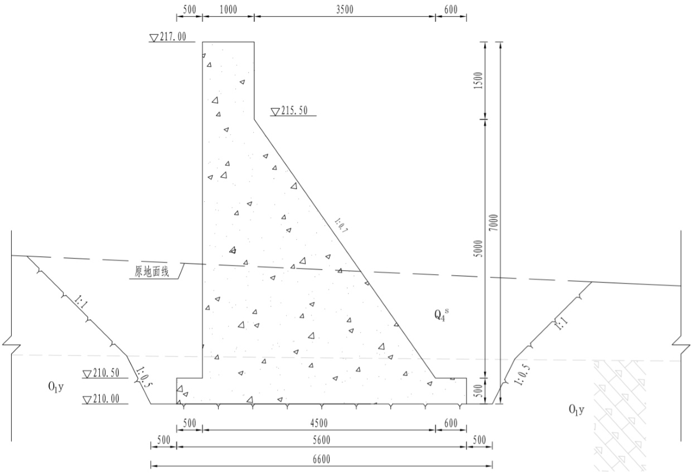  
图 6.6.1-3 副坝典型断面图  

(3)坝体稳定及应力分析  

1)坝基稳定、应力分析  

根据本阶段地质勘探成果,副坝坝基主要为白云质灰岩,中厚\~厚层状构造,整体稳定性较好,且坝基高程为 $210.0\mathrm{m}$ ,坝高仅为 $7.0\mathrm{m}$ ,坝长为 $18.3\mathrm{m}$ ,不设置分缝,故坝基抗滑稳定采用抗剪断公式进行计算,得到抗滑稳定安全系数,同时采用刚体极限平衡法计算坝基应力状态。  

$\textcircled{1}$ 计算工况  

考虑到副坝坝基为 $210.0\mathrm{m}$ ,高于水库正常蓄水位,故本工程计算仅考虑以下四种工况:  

基本组合 1-正常蓄水位工况:上游无水,坝后无水,仅考虑上下游位置开挖料回填;  

基本组合 2-设计洪水位工况:上游水位 $213.81\mathrm{m}$ ,坝后无水;  

特殊组合 1-校核洪水位工况:上游水位 $215.95\mathrm{m}$ ,坝后无水;  

特殊组合 2-地震工况:上游无水,坝后无水,仅考虑上下游位置开挖料回填;。  

$\textcircled{2}$ 计算荷载组合计算荷载组合见下表。  

# 表 6.6.1-15 荷载组合表  

<html><body><table><tr><td>荷载 组合</td><td colspan="11">荷载</td></tr><tr><td>荷载 组合</td><td>计算 工况</td><td>自重</td><td>静水 压力</td><td>扬压力</td><td>淤沙 压力</td><td>浪压 力</td><td>冰压 力</td><td>地震 荷载</td><td>动水 压力</td><td>土压 力</td><td>其它 荷载</td></tr><tr><td rowspan="2">基本 组合</td><td>1</td><td></td><td>二</td><td>二</td><td>二</td><td>二</td><td>二</td><td>二</td><td>二</td><td></td><td>二</td></tr><tr><td>2</td><td>√</td><td>></td><td><</td><td>二</td><td>></td><td>二</td><td>二</td><td>二</td><td>√</td><td>二</td></tr><tr><td rowspan="2">特殊 组合</td><td>1</td><td></td><td></td><td><</td><td>二</td><td><</td><td>二</td><td>二</td><td>二</td><td></td><td>二</td></tr><tr><td>2</td><td>√</td><td>一</td><td>一</td><td>一</td><td>一</td><td>一</td><td><</td><td>一</td><td>√</td><td>一</td></tr></table></body></html>  

$\textcircled{3}$ 计算断面  

选取副坝最高挡水断面作为代表性断面计算坝体抗滑稳定和应力,建基面位于弱风化,高程为 $210.0\mathrm{m}$ 。  

$\textcircled{4}$ 计算方法  

坝体抗滑稳定按《混凝土重力坝设计规范》SL319—2018 第 6.4 节的抗剪断强度公式计算,具体计算公式如下:  

抗剪断公式:  

$$
{\mathsf{K}}^{\prime}=\frac{\mathsf{f}^{\prime}{\sum}\mathsf{W}+{\mathsf{C}}^{\prime}\mathsf{A}}{\sum\mathsf{P}}
$$  

式中:  

K’—— 按抗剪断强度计算的抗滑稳定安全系数;  
f’— 坝体混凝土与坝基接触面的抗剪断摩擦系数;  
C’—— 坝体混凝土与坝基接触面的抗剪断凝聚力;  
∑W——作用于坝体上的全部荷载对滑动平面的法向分值,kN;  
A——坝基接触面面积, $\mathrm{m}^{2}$ ;  
∑P——作用于坝体上的全部荷载对滑动平面的切向分值,kN。  

坝体应力采用材料力学法,按《混凝土重力坝设计规范》(SL319-2018)公式计算:  

$$
\sigma_{{}_{y}}=\frac{\sum W}{\mathrm{~\boldmath~\cal~A~}}\pm\frac{\sum M x}{J}
$$  

式中:  

σy—坝踵、坝址垂直应力, $\mathrm{kPa}$ ;  

∑W—作用于坝段上或 $1\mathrm{m}$ 坝长上全部荷载(包括扬压力)在坝基截面上法向力的总和,kN;  

∑M—作用于坝段上或 $1\mathrm{m}$ 坝长上全部荷载对坝基截面形心轴的力矩总和,kN▪m;  

A—坝段或 $1\mathrm{m}$ 坝长的坝基截面积, $\mathrm{m}$ ;  
J—坝段或者 $1\mathrm{m}$ 坝长的坝基截面对形心轴的惯性矩, $\mathrm{m^{4}}$ ;$\textcircled{5}$ 计算参数选取  
坝体混凝土容重取: $23.5\mathrm{kN}/\mathrm{m}^{3}$ ;水容重取: $10\mathrm{kN}/\mathrm{m}^{3}$ 。  

坝址区岩土体及结构面地质参数见下表  

根据地勘报告提供的坝址岩体物理力学参数建议值,建基面为白云质灰岩,坝基抗滑稳定采用混凝土与白云质灰岩层面间抗剪断强度参数范围中值:$\mathrm{f}{=}0.425$ , $\mathrm{f}^{\bullet}{=}0.725$ ,c’=0.325MPa。  

$\textcircled{6}$ 坝基抗滑稳定及应力计算结果  

计算公式中的抗剪断参数,根据规范公式所得坝体抗滑稳定计算结果见下表。  

表 6.6.1-16 坝基抗滑稳定计算成果表  

<html><body><table><tr><td>计算工况</td><td>上游水位 (m)</td><td>下游水位 (m)</td><td>抗剪断安全系数K</td><td>规范要求值</td></tr><tr><td>正常蓄水位</td><td>/</td><td>/</td><td>3.978</td><td>3.0</td></tr><tr><td>设计洪水位工况</td><td>213.81</td><td>210.00</td><td>3.929</td><td>3.0</td></tr><tr><td>校核洪水位工况</td><td>215.95</td><td>210.00</td><td>2.865</td><td>2.5</td></tr><tr><td>地震工况</td><td></td><td></td><td>2.786</td><td>2.5</td></tr></table></body></html>  

从以上计算成果汇总表可以看出:在各种荷载组合情况下,挡水坝段坝基面抗滑稳定安全系数满足规范要求。  

表 6.6.1-17 坝基应力计算成果表  

<html><body><table><tr><td>计算工况</td><td>上游水位 (m)</td><td>下游水位 (m)</td><td>上游正应力 (KPa)</td><td>下游正应力 (KPa)</td></tr><tr><td>正常蓄水位</td><td>/</td><td></td><td>82</td><td>83</td></tr><tr><td>设计洪水位工况</td><td>213.81</td><td>210.00</td><td>121</td><td>40</td></tr><tr><td>校核洪水位工况</td><td>215.95</td><td>210.00</td><td>91</td><td>73</td></tr><tr><td>地震工况</td><td></td><td>/</td><td>102</td><td>104</td></tr></table></body></html>  

白云质灰岩弱风化上部基岩允许承载力地质建议值 $[\mathrm{R}]{=}1000{\sim}1500\mathrm{kPa}$ 。  

从以上计算成果汇总表可以看出,各种工况下基底最大压应力均不超过地基允许承载力,满足规范要求。  

# 6.6.2 泄水表孔建筑物设计  

# 6.6.2.1 工程布置  

夺丰拦河坝设置坝身溢流表孔,布置在 15#、16#坝段,每孔净宽为 $7.0\mathrm{m}$ ,共 3 孔,边墩厚度 $2.5\mathrm{m}$ ,中墩厚度 $3.0\mathrm{m}$ ,单个坝段长 $18.0\mathrm{m}$ 。表孔为开敞式溢流孔口,采用 WES 实用堰型,堰顶高程 $207.0\mathrm{m}$ ,上游堰面倒悬,堰面曲线上游为 1/4 椭圆弧曲线,下游为幂曲线 $^+$ 直线段,直线段坡比 1:0.75,末端接反弧段,反弧半径为 $15.0\mathrm{m}$ 。堰上设置半径为 $15.0\mathrm{m}$ 的弧形工作闸门,由坝顶启闭机房内的液压启闭机启闭,工作门上游设检修闸门。坝址处基岩岩性以鲕状灰岩为主,抗冲能力好,下游消能工采用挑流消能形式。溢流表孔堰顶下游侧设置交通桥,桥面宽度 $8.0\mathrm{m}$ ,桥面高程 $218.0\mathrm{m}$ 。坝后布置护坦,护坦 $42.5\mathrm{m}$ ,宽 $36.0\mathrm{m}$ ,厚$3.0\mathrm{m}$ ,每隔 $20{\sim}25\mathrm{m}$ 设置一道沉降缝,护坦顶高程 $163.0\mathrm{m}$ ,下游与河床平顺连接。表孔溢流坝面和闸墩临水面采用 $0.8\mathrm{m}$ 厚 C40 抗冲磨混凝土。  

# 6.6.2.2 泄水表孔坝段布置  

大坝采用混凝土重力坝坝型,由 $1\#{\sim}19\#$ 坝段组成,坝轴线长 $342.0\mathrm{m}$ 。考虑布置紧凑、顺应河势、水流归槽,泄水建筑物在主河床 $15\#{\sim}16\#$ 坝段布置泄流 3个表孔。泄水建筑物沿坝轴线宽度 $36.0\mathrm{m}$ ,其中表孔净宽 $21.0\mathrm{m}$ (单孔宽 $7.0\mathrm{m}$ ),边墩厚 $2.5\mathrm{m}$ ,中墩厚 $3.0\mathrm{m}$ 。  

# 6.6.2.3 泄水表孔运行方式  

根据确定的夺丰水库分级控泄流量以及 10 年、50 年一遇洪水所需的防洪库容,并考虑与坝址以下洪水的错峰,夺丰水库防洪调度原则设定如下:  

1)当入库流量小于 $60\mathrm{m}^{3}/\mathrm{s}$ 时,水库按来流下泄;2)当入库流量大于 $60\mathrm{m}^{3}/\mathrm{s}$ 时,水库按 $60\mathrm{m}^{3}/\mathrm{s}$ 固定泄量下泄直到水库达到10 年一遇防洪高水位 $211.43\mathrm{m}$ (防洪库容 541 万 $\mathrm{m}^{3}$ );3)水库水位高于10 年一遇防洪高水位时,当入库流量小于控泄流量 $380\mathrm{m}^{3}/\mathrm{s}$ 时,水库按入库流量和相应水位最大泄流能力小者下泄,当入库流量大于控泄流量 $380~\mathrm{m}^{3}/\mathrm{s}$ 时按控泄流量下泄,直到达到 50 年一遇防洪高水位 $213.61\mathrm{m}$ (防洪库容 800 万 $\mathrm{m}^{3}$ );  

4)当水库水位未达到 50 年一遇防洪高水位 $213.61\mathrm{m}$ ,且入库流量和坝址下游思德河涝水开始减小,此时可以调节闸门开度,按泄流能力、入库最大流量、河道承泄能力三者的最小值下泄,水库水位下降直至汛限水位;  

5)当水库水位超过50 年一遇防洪高水位 $213.61\mathrm{m}$ 时,按水库泄流能力敞泄;退水时当水库水位在 50 年一遇防洪高水位 $213.61\mathrm{m}$ 以下时,如果坝址下游洪水仍未减小,洪水暂时滞留在水库中。  

# 6.6.2.4 表孔结构型式  

表孔坝段坝顶高程 $218.0\mathrm{m}$ ,坝顶宽 $28.0\mathrm{m}$ ,最大坝高 $59.0\mathrm{m}$ ,表孔单孔净宽$7.0\mathrm{m}$ ,边墩厚度 $2.5\mathrm{m}$ ,中墩厚度 $3.0\mathrm{m}$ ,闸墩长 $28.0\mathrm{m}$ 以适应弧门支铰布置。表孔共设 3 孔,为开敞式溢流孔,承担水库泄洪任务。溢流堰采用 WES 实用堰堰型,堰顶高程 $207.0\mathrm{m}$ ,曲线方程为 $\scriptstyle\mathrm{y=0.065594x^{1.85}}$ ,下游面与反弧段连接,反弧半径 $15.0\mathrm{m}$ ,圆弧最低点高程 $169.74\mathrm{m}$ 。  

表孔设平板检修闸门及弧形工作闸门,检修闸门由坝顶电动葫芦控制,工作闸门采用液压启闭机控制,启闭机房设在坝顶下游侧。泄洪时弧门支铰位于水面以上。  

每孔闸墩顶部下游侧设净跨为 $7.0\mathrm{m}$ 的工作桥,桥面宽 $8.0\mathrm{m}$ 。  

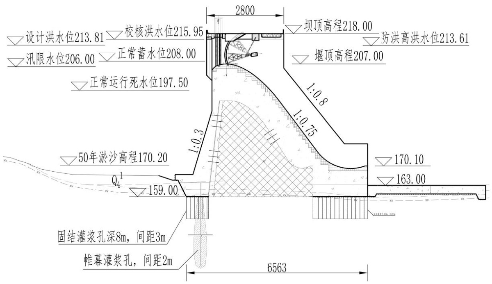  
图 6.6.2-1  表孔典型剖面图  

# 6.6.2.5 泄流能力计算  

泄水建筑物总体布置为 3 表孔,净宽 $7.0\mathrm{m}$ ,泄流能力计算考虑表孔泄洪。泄流表孔采用开敞式实用堰,堰面为 WES 幂曲线。按照《混凝土重力坝设计规范》(SL319-2018),开敞式溢流堰泄流能力按下式计算:  

$$
Q=C m\varepsilon\sigma_{s}B\sqrt{2g}{H_{\scriptscriptstyle w}}^{3/2}
$$  

式中: $Q$ —流量, $\mathrm{m}^{3}/\mathrm{s}$ ;  
B —溢流堰净宽,本工程为 21m;  
Hw —计入行进流速的堰上总水头,m;  
g —重力加速度, $\mathrm{m}/\mathrm{s}^{2}$ ;  
m—流量系数;  
C—上游面坡度影响修正系数,当上游面为铅直面时, $C$ 取 1.0;  
—侧收缩系数;  
s—淹没系数,不淹没时 $\sigma_{\mathrm{{s}}}\sigma_{\mathrm{{=1.0}}}$ 。  
经计算,泄流表孔泄流能力成果见下表:  

表 6.6.2-1 泄流表孔泄流能力表  

<html><body><table><tr><td>上游水位(m)</td><td>泄量(m3/s)</td><td>上游水位（m)</td><td>泄量(m3/s)</td></tr><tr><td>207.0</td><td>0</td><td>211.8</td><td>421</td></tr><tr><td>207.2</td><td>3</td><td>212.0</td><td>450</td></tr><tr><td>207.4</td><td>9</td><td>212.2</td><td>480</td></tr><tr><td>207.6</td><td>17</td><td>212.4</td><td>510</td></tr><tr><td>207.8</td><td>26</td><td>212.6</td><td>541</td></tr><tr><td>208.0</td><td>36</td><td>212.8</td><td>573</td></tr><tr><td>208.2</td><td>48</td><td>213.0</td><td>606</td></tr><tr><td>208.4</td><td>61</td><td>213.2</td><td>640</td></tr><tr><td>208.6</td><td>75</td><td>213.4</td><td>674</td></tr><tr><td>208.8</td><td>90</td><td>213.6</td><td>709</td></tr><tr><td>209.0</td><td>105</td><td>213.8</td><td>745</td></tr><tr><td>209.2</td><td>122</td><td>214.0</td><td>782</td></tr><tr><td>209.4</td><td>140</td><td>214.2</td><td>820</td></tr><tr><td>209.6</td><td>159</td><td>214.4</td><td>858</td></tr><tr><td>209.8</td><td>178</td><td>214.6</td><td>898</td></tr><tr><td>210.0</td><td>199</td><td>214.8</td><td>938</td></tr></table></body></html>  

<html><body><table><tr><td>上游水位（m)</td><td>泄量(m3/s)</td><td>上游水位（m)</td><td>泄量(m3/s)</td></tr><tr><td>210.2</td><td>220</td><td>215.0</td><td>978</td></tr><tr><td>210.4</td><td>242</td><td>215.2</td><td>1020</td></tr><tr><td>210.6</td><td>265</td><td>215.4</td><td>1062</td></tr><tr><td>210.8</td><td>289</td><td>215.6</td><td>1105</td></tr><tr><td>211.0</td><td>314</td><td>215.7</td><td>1127</td></tr><tr><td>211.2</td><td>340</td><td>215.9</td><td>1172</td></tr><tr><td>211.4</td><td>366</td><td>216.1</td><td>1217</td></tr><tr><td>211.6</td><td>393</td><td></td><td></td></tr></table></body></html>  

水位\~泄流能力曲线见下图:  

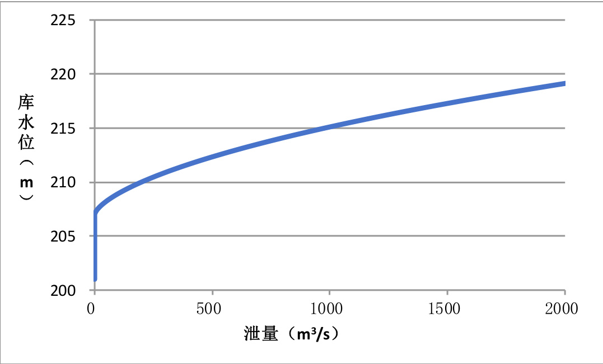  
图 6.6.2-2 库水位 $\sim$ 泄流能力曲线  

# 6.6.2.6 消能建筑物设计  

(1)消能建筑物设计标准  

根据《水利水电工程等级划分及洪水标准》(SL252-2017)规定,本工程消能防冲建筑物级别为 3 级,消能防冲设计洪水标准为 30 年一遇。  

(2)消能防冲计算  

根据《混凝土重力坝设计规范》(SL319-2018),泄洪表孔消能防冲设计洪水标准为 30 年一遇洪水。为了防止大洪水时冲坑过大影响坝体稳定性,出于安全考虑,本次计算 30 年一遇、100 年一遇洪水及 1000 年一遇洪水下泄时表孔泄洪挑流消能对应的挑流水舌抛距和最大冲坑水垫厚度。  

水舌抛距计算公式  

$$
{\cal L}=\frac{1}{9}\left[{\vee_{1}}^{2}\mathrm{{sin}}\theta\mathrm{cos}\theta+{\vee_{1}}\mathrm{{cos}}\theta\sqrt{{{\vee_{1}}^{2}}\mathrm{{sin}}^{2}\theta+29({\mit h_{1}}+{\mit h_{2}})}\right]
$$  

式中:  

L——水舌抛距, $\mathrm{m}$ ,如有水流向心集中影响者,则抛距还应乘以 0.9\~0.95的折减系数;  

v1—— 坎顶水面流速, $\mathrm{m}/\mathrm{s}$ ,按鼻坎处平均流速 $\mathbf{V}$ 的 1.1 倍计,即$\mathrm{v}_{1}\mathrm{=}1.1\mathrm{v}\mathrm{=}1.1\mathrm{\oplus}(2\mathrm{g}\mathrm{H}_{0})^{0.5}$ ( $\mathrm{{H}_{0}}$ 为水库水位至坎顶的落差,m);θ——鼻坎的挑角,(°);${\bf h}_{1}$ ——坎顶垂直方向水深, $\mathrm{m}$ , $\mathtt{h l}{=}\mathtt{h}/\mathtt{c o s}\theta($ (h 为坎顶平均水深,m);$\mathbf{h}_{2}$ ——坎顶至河床面高差, $\mathrm{m}$ ,如冲坑已经形成,可算至坑底;φ——堰面流速系数。最大冲坑水垫厚度计算公式  

$$
\begin{array}{r}{\mathbf{t}_{\mathrm{k}}=\mathsf{k}\mathbf{q}^{0.5}\mathsf{H}^{0.25}}\end{array}
$$  

式中:  

tk— 下游水面至坑底的最大水垫深度, $\mathrm{m}$ ;— 单宽流量, $\mathrm{{m^{3}/{(s\cdot m)}}}$ ;  
H— —上下游水位差, $\mathrm{m}$  

k——冲刷系数,其值依规范表选取,结合地质情况,选用 1.5。计算成果见下表。  

表 6.6.2-2 挑流消能水力计算成果表  

<html><body><table><tr><td>洪水标准</td><td>坝前水位 (W)</td><td>单宽泄量 (m3/s)</td><td>水舌抛距 L (m)</td><td>冲坑深度 t (m)</td><td>备注</td></tr><tr><td>1000年一遇</td><td>215.95m</td><td>73.10</td><td>88.95</td><td>14.53</td><td>表孔</td></tr><tr><td>100年一遇</td><td>213.81m</td><td>51.29</td><td>83.69</td><td>11.50</td><td>表孔</td></tr><tr><td>30年一遇</td><td>212.22m</td><td>18.00</td><td>74.09</td><td>5.48</td><td>表孔</td></tr></table></body></html>  

根据上表计算结果,挑流落点集中于坝趾下游后,最大坑深 $14.53\mathrm{m}$ ,坑底距坝脚最大距离 $88.95\mathrm{m}$ ,大于冲坑深度的 2.5 倍,冲坑不影响坝脚,但由于下游河道水深较浅,冲坑深度过大,运行期冲坑形成后及时对冲坑壁面做加固防护。  

# 6.6.3 导流兼泄洪放空洞设计  

# 6.6.3.1 泄流规模选择  

(1)闸底高程  

水库50 年淤沙高程为 $170.2\mathrm{m}$ ,为保证导流兼泄洪放空洞进口不被泥沙淤积,结合进口处的地形地质情况,进口处为陡坡,不宜高出原地面过高距离,因此拟定闸底高程为 $171.00\mathrm{m}$ 。  

(2)孔径  

泄洪放空洞由原导流洞改造形成,孔径由导流时段的泄洪量控制,有压洞为洞径 $5.0\mathrm{m}$ 圆洞,无压洞为 $4.0\times5.0\mathrm{m}$ 城门洞。  

(3)下游消能防冲型式  

导流兼泄洪放空洞的消能方式采用挑流消能。  

# 6.6.3.2 建筑物布置  

导流兼泄洪放空洞布置于大坝右岸,前期为导流洞,后期改造为永久泄洪兼放空洞。导流兼泄洪放空洞前部进口段轴线与中后部轴线成约 $17^{\circ}$ 夹角,由进口引渠段、进口闸段、有压段、闸井控制段、无压段、明流段、挑流段、护坦段、消力塘部分组成,自进口闸段到护坦末端,长度(水平投影)为 $460.50\mathrm{m}$ 。导流兼泄洪放空洞采用钢筋混凝土衬砌,最大泄量 $316\mathrm{m}^{3}/\mathsf{s}$ 。其中,工作闸门前为有压隧洞,工作闸门后洞身段为无压隧洞,无压隧洞下部过水断面采用抗冲耐磨混凝土。出口采用挑流消能。  

(1)进口引渠段  

进口引渠段,桩号泄 $0–027.00\sim$ 泄 $0{+}000.00$ ,长 $27.0\mathrm{m}$ ,底板高程为 $171.0\mathrm{m}$ ,底宽 $5{\sim}10\mathrm{m}$ ,C25 混凝土衬砌,衬砌厚 $0.5\mathrm{m}$ ,釆用梯形断面,两侧岩质边坡开挖坡比为 1:0.75,边坡支护措施采用 $10\mathrm{cm}$ 厚喷混凝土、挂网 $\boldsymbol{\Phi}^{\mathrm{{8}}}\textcircled{\omega}200$ ,并布置$4.5\mathrm{m}$ 系统锚杆 $\boldsymbol{\Phi}25$ ,间排距 $2.0\mathrm{m}$ 。  

(2)进口闸段  

进口闸段,桩号泄 $0{+}000.00\sim$ 泄 $0{+}015.50$ ,长 $15.50\mathrm{m}$ ,顶部为椭圆曲线,两侧为半径 $1.0\mathrm{m}$ 的 1/4 圆弧,底板高程为 $171.00\mathrm{m}$ ,底宽 $5\mathrm{m}$ 。底板厚度为 $2.5\mathrm{m}$ ,边墙厚度为 $1.5\mathrm{m}$ ,椭圆弧后接一扇 $5.0\mathrm{m}{\times}5.0\mathrm{m}$ (宽 $\times$ 高)闸门,供施工期封堵和运行期检修使用。进口闸段采用 C30W6F100 钢筋混凝土。闸室顶部高程为$218.00\mathrm{m}$ ,通过交通桥与公路相连。  

(3)进口有压段  

进口有压段,桩号泄 $0{+}015.50\sim$ 泄 $0{+}285.50\$ ,长 $270.0\mathrm{m}$ ,起点底板高程$171.00\mathrm{m}$ ,终点底板高程 $169.65\mathrm{m}$ ,底坡 $\mathrm{i}{=}0.5\%$ 。进口有压段由渐变段 1、圆孔有压洞段和渐变段 2 组成。洞身衬砌采用 C30W6F100 钢筋混凝土。  

渐变段 1,桩号泄 $0{+}015.50\sim$ 泄 $0{+}024.50\$ ,长 $9.0\mathrm{m}$ ,起点底板高程 $171.00\mathrm{m}$ ,终点底板高程 $170.96\mathrm{m}$ ,底坡 $\mathrm{i}{=}0.5\%$ 。断面型式由 $5.0\mathrm{m}{\times}5\mathrm{m}$ (宽 $\times$ 高)的矩形断面渐变为直径 $5.0\mathrm{m}$ 的圆形断面。  

圆形有压洞段,桩号泄 $0{+}024.50\sim$ 泄 $0{+}276{.}50\$ ,长 $252.0\mathrm{m}$ ,起点底板高程$170.96\mathrm{m}$ ,终点底板高程 $169.70\mathrm{m}$ ,底坡 $\mathrm{\dot{\iota}=}0.005$ 。采用有压圆形断面,断面直径为 $5.0\mathrm{m}$ 。  

渐变段 2,桩号泄 $0{+}276.50\sim$ 泄 $0{+}285.50$ ,长 $9.0\mathrm{m}$ ,起点底板高程 $169.70\mathrm{m}$ ,终点底板高程 $169.65\mathrm{m}$ 。断面型式由直径 $5.0\mathrm{m}$ 的圆形断面渐变为 $3.5\mathrm{m}{\times}4.2\mathrm{m}$ (宽$\times$ 高)的矩形断面。  

(4)闸井控制段  

闸井控制段,桩号泄 $0{+}285.50\sim$ 泄 $0{+}306.50\$ ,长 $21.0\mathrm{m}$ ,底板高程为 $169.65\mathrm{m}$ ,基础高程为 $166.15\mathrm{m}$ ,闸井顶高程为 $218.00\mathrm{m}$ ,与坝顶同一高程。闸井控制段采用 C30W6F100 钢筋混凝土。  

闸井控制段分为事故检修门槽段和工作闸门段两个部分。事故检修门槽段与渐变段相连,事故检修闸门采用平板门,断面孔口尺寸为 $3.5{\times}4.0$ (宽 $\times$ 高),顶部接 1:10 的压坡,其后连接弧形闸门,其孔口尺寸为 $3.5{\times}3.5$ (宽 $\times$ 高),事故检修闸门后设 $2\times\upphi0.8\mathrm{m}$ 的通气孔。  

闸门可通过交通路运输至闸顶平台,事故检修闸门可吊起检修,工作闸门可通过闸门竖直闸孔安装、更换;简单维修时,维修人员也可通过钢梯下去检修。  

导流兼泄洪放空洞工作闸门采用潜孔弧形钢闸门,平时关闭,当水库放空及参与泄洪时,工作闸门开启,可手动、现地和远程控制。闸门动水启闭,采用液压启闭机启闭,启闭机配置备用电源及柴油发电机。事故闸门采用潜孔式平面定轮钢闸门,后止水,事故检修闸门平时锁定在墩顶。事故检修闸门操作运行方式为充水阀平压动闭静启,闸门采用固定卷扬式启闭机操作。  

# (5)无压段  

无压段,桩号泄 $0{+}306.50\sim$ 泄 $0{+}423.50\$ ,长 $117.0\mathrm{m}$ ,底板坡降 $\mathrm{i}{=}1.92\%$ ,无压段隧洞出口底高程为 $167.40\mathrm{m}$ 。由渐变段3 和城门洞段组成。分段长度为 $9.0\mathrm{m}$ ,缝间设止水,并采用闭孔泡沫板填缝。底板和直墙衬砌采用 C40F200W6 钢筋混凝土,顶拱衬砌采用 C30F200W6 钢筋混凝土。  

渐变段 3,桩号泄 $0{+}306.50\sim$ 泄 $0{+}315.50$ ,长 $9.0\mathrm{m}$ ,断面尺寸由 $3.5{\times}3.5{\mathrm{m}}$ (宽 $\times$ 高)矩形渐变为 $4.0{\times}5.0\mathrm{m}$ (宽 $\times$ 高),顶拱 $120^{\circ}$ 的城门洞型。  

城门洞段,桩号泄 $0{+}315.50\sim$ 泄 $0{+}423.50$ ,长 $108.0\mathrm{m}$ 。断面尺寸为 $4.0{\times}5.0\mathrm{m}$ (宽 $\times$ 高),顶拱 $120^{\circ}$ 的城门洞型。  

(6)明流段  

明流段,桩号泄 $0{+}423.50\sim$ 泄 $0{+}435.50$ ,长 $12.0\mathrm{m}$ ,断面尺寸为 $4.0{\times}5.0\mathrm{m}$ ,采用 U 型槽结构,明流段采用 C40W6F100 钢筋混凝土。  

# (7)挑坎段  

挑坎段,桩号泄 $0{+}435.50\sim$ 泄 $0{+}448.50$ ,长 $13.00\mathrm{m}$ ,挑坎段为一反弧抛射段,齿墙嵌入微风化岩石中,挑坎顶高程为 $169.10\mathrm{m}$ ,高于下游消能水位 $168.87\mathrm{m}$ 。挑射角取 $20^{\circ}$ ,反弧半径取 $20.0\mathrm{m}$ 。挑坎底板设 $\$25$ 锚筋,间排距 $2\mathrm{m}$ ,单根长$6.0\mathrm{m}$ 。挑坎底板表层 $1.0\mathrm{m}$ 及边墙混凝土标号为 C40W6F100,挑坎底板表层 $1.0\mathrm{m}$ 以下混凝土标号为 C30W6F100。  

(8)护坦段  

护坦段,桩号泄 $0{+}448.50\sim$ 泄 $0{+}460{.}50\$ ,长 $12.00\mathrm{m}$ ,底板高程为 $166.0\mathrm{m}$ ,底板为 $2\mathrm{m}$ 厚钢筋混凝土。两侧采用 $0.5\mathrm{m}$ 厚 C40F200W6 钢筋混凝土护坡。  

# (9)消力塘段  

为使下泄水流顺畅归槽且减轻对河道的淤积,将下游消力塘段预挖至$159.0\mathrm{m}$ ,坐落于微风化上限。防护方式采用“护岸不护底”的型式,底宽 $8.0\mathrm{m}$ ,两侧开挖边坡为 1:0.5, $170.0\mathrm{m}$ 以下边开坡挖进行钢筋混凝土贴坡防护,贴坡厚度为 $0.5\mathrm{m}$ ,贴脚设 $5\mathrm{m}$ 深、底宽 $2\mathrm{m}$ 的混凝土防冲槽; $170.0\mathrm{m}$ 以上边坡采用系统喷锚支护。喷锚支护措施采用喷 $10\mathrm{cm}$ 厚 C25 混凝土、挂网 $\boldsymbol{\Phi}^{\mathrm{{8}}}\textcircled{\omega}200$ ,并布置$4.5\mathrm{m}$ 系统锚杆 $\boldsymbol{\Phi}25$ ,间排距 $2.0\mathrm{m}$ ,排水孔深度为 $3.0\mathrm{m}$ ,间排距 $3.0\mathrm{m}$ 。  

# 6.6.3.3 隧洞灌浆、防渗和排水  

(1)隧洞一次支护  

导流兼泄洪放空洞分为进口有压段和无压段。其中,有压进口段全长 $270.0\mathrm{m}$ ;无压段全长 $117.0\mathrm{m}$ 。  

根据《水利水电工程锚喷支护技术规范》(SL377—2007)及《岩土锚杆与喷射混凝土支护工程技术规范》(GB 50086-2015)的规定,进口有压段 III 类围岩采用的一次支护形式为顶拱 $270^{\circ}$ 范围内喷混凝土厚 $0.1\mathrm{m}$ ,单层 $\Phi8@0.20\times$ $0.20\mathrm{m}$ 挂网钢筋,长 $3.5\mathrm{m}\Phi25$ 的系统锚杆,间排距 $1.5\mathrm{m}$ ;IV 类围岩圆形隧洞段采用的一次支护形式为顶拱 $270^{\circ}$ 范围内喷混凝土厚 $0.15\mathrm{m}$ ,单层 $\Phi8@0.20\times$ $0.20\mathrm{m}$ 挂网钢筋,长 $3.5\mathrm{m}\Phi25$ 的系统锚杆,间排距 $1.25\mathrm{m}$ ,局部加钢拱架 I14b支撑,其中钢拱架 I14 榀距 $1.0\mathrm{m}$ ;V 类围岩圆形隧洞段采用的一次支护形式为顶拱 $270^{\circ}$ 范围内喷混凝土厚 $0.20\mathrm{m}$ ,双层 $\Phi8@0.20\times0.20\mathrm{m}$ 挂网钢筋,顶拱 $270^{\circ}$ 范围内采用长 $3.5\mathrm{m}\Phi25$ 的系统锚杆,间排距 $1.0\mathrm{m}$ ,加钢拱架 I14b 支撑和超前导管注浆,其中钢拱架榀距 $0.5\mathrm{m}$ 。  

无压段 III 类围岩隧洞段采用的一次支护形式为顶拱加直墙范围内喷混凝土厚 $0.10\mathrm{m}$ ,单层 $\Phi8@0.20\times0.20\mathrm{m}$ 挂网钢筋,长 $3.5\mathrm{m}\Phi25$ 的系统锚杆,间排距$1.5\mathrm{m}$ ,梅花型布置;IV 类围岩隧洞段采用的一次支护形式为顶拱加直墙范围内喷混凝土厚 $0.15\mathrm{m}$ ,单层 $\Phi8@0.20\times0.20\mathrm{m}$ 挂网钢筋,长 $3.5\mathrm{m}\Phi25$ 的系统锚杆,间排距 $1.25\mathrm{m}$ ,梅花型布置,局部加钢拱架 I14 支撑,其中钢拱架 I14b 榀距 $1.0\mathrm{m}$ ;V 类围岩隧洞段采用的一次支护形式为顶拱加直墙范围内喷混凝土厚 $0.20\mathrm{m}$ ,双层 $\Phi8@0.20\times0.20\mathrm{m}$ 挂网钢筋,长 $3.5\mathrm{m}\Phi25$ 的系统锚杆,间排距 $1.0\mathrm{m}$ ,梅花型布置,加钢拱架 I14b 支撑和超前导管注浆,其中钢拱架榀距 $0.5\mathrm{m}$ 。  

闸门竖井采用的一次支护形式为全范围内喷混凝土厚 $0.20\mathrm{m}$ ,双层 $\Phi8@0.20$ $\times0.20\mathrm{m}$ 挂网钢筋,垂直水流方向侧使用长 $4.5\mathrm{m}/6.0\mathrm{m}\Phi25$ 的系统锚杆交替布置,间距 $2.0\mathrm{m}$ 、排距 $1.0\mathrm{m}$ ,顺水流方向侧使用长 $6.0\mathrm{m}/9.0\mathrm{m}\Phi25$ 的系统锚杆交替布置,间距 $2.0\mathrm{m}$ 、排距 $1.0\mathrm{m}$ ;加 I14b 钢拱架支撑,间距 $1.0\mathrm{m}$ ,并在地质薄弱区域设置 $1000\mathrm{kN}$ 随机锚索。闸井上部加锁口混凝土。  

# (2)灌浆设计  

为提高导流兼泄洪放空洞承受内、外水压力的能力,混凝土衬砌与围岩间的缝隙必须灌浆回填密实,充分发挥围岩的承载作用,改善衬砌的受力条件。  

# 1)回填灌浆  

根据规范要求,隧洞衬砌段顶拱必须进行回填灌浆。顶拱 $120^{\mathrm{o}}$ 范围内布置回填灌浆孔,固结灌浆孔兼做回填灌浆孔,采用梅花型布置,间排距 $3\mathrm{m}$ ,入岩孔深 $0.1\mathrm{m}$ 。  

# 2)固结灌浆  

为改善围岩的力学性能,补强围岩开挖过程中形成的松动圈,提高围岩承载能力和减少渗漏,应对围岩进行固结灌浆。对 III 类、IV 类、V 类围岩隧洞段进行全断面固结灌浆,灌浆孔结合回填灌浆孔一并布置,间排距为 $3.0\mathrm{m}$ ,梅花形布置,入岩孔深 $3.0\mathrm{m}$ 。  

(3)防渗设计  

导流兼泄洪放空洞有压段 IV 类、V 类围岩隧洞段分缝长度为 $9.0\mathrm{m}$ ,环向伸缩缝中设铜止水;无压段 III 类、IV 类、V 类围岩隧洞段分缝长度为 $9.0\mathrm{m}$ ,环向伸缩缝中设 651 型复合橡胶止水带,缝表面预留槽镶嵌双组份聚硫密封胶作为明止水,缝内充填高压闭孔泡沫板。  

# (4)排水  

无压隧洞中需设置排水孔,排水孔布置在水面线以上,孔深入岩 $3.0\mathrm{m}$ ,间排距 $3\mathrm{m}$ 。  

# 6.6.3.4 泄流能力计算  

导流兼泄洪放空洞进口为一段有压短洞,洞身采用圆型,洞径 $5.0\mathsf{m}$ ,工作闸门孔口尺寸为 $3.5{\times}3.5$ (宽 $\times$ 高),工作闸门底板高程 $169.65\mathrm{m}$ ,工作闸门后为无压洞,其泄流能力按照隧洞有压流计算公式计算。计算公式如下:  

$$
\theta=\mu B e\sqrt{2g(H-\varepsilon e)}
$$  

式中: $\mathsf{Q}$ —泄流量, $\mathsf{m}^{3}/\mathsf{s}$ ;  

H—由有压短管出口的闸孔底板高程算起的上游水库水深,m;  

e—闸孔开启高度,取 $_{\mathsf{e}=5.5\mathsf{m}}$ ;  

B—水流收缩断面处底宽,取 $\mathsf{B}{=}5.0\mathsf{m}$ ;  

ε—有压短洞出口的工作闸门垂直收缩系数,孔口全开时,取 $\varepsilon=1$ ;  

—流量系数,可由公式 计算;  

各水头下导流兼泄洪放空洞敞泄工况的泄流能力见表 6.6.3-1,泄流曲线见图 6.6.3-1。  

表 6.6.3-1  导流兼泄洪放空洞泄流能力计算成果表(敞泄工况)  

<html><body><table><tr><td>库水位(m)</td><td>171</td><td>175</td><td>180</td><td>185</td><td>190</td></tr><tr><td>泄流量（m3/s)</td><td>0</td><td>74</td><td>130</td><td>168</td><td>200</td></tr><tr><td>库水位（m)</td><td>192</td><td>194</td><td>196</td><td>198</td><td>200</td></tr><tr><td>泄流量（m3/s)</td><td>211</td><td>222</td><td>232</td><td>241</td><td>251</td></tr><tr><td>库水位（m)</td><td>202</td><td>204</td><td>206</td><td>208</td><td>210</td></tr><tr><td>泄流量(m3/s)</td><td>260</td><td>268</td><td>277</td><td>285</td><td>293</td></tr><tr><td>库水位（m)</td><td>212</td><td>213.81</td><td>215.95</td><td></td><td></td></tr><tr><td>泄流量（m/s)</td><td>301</td><td>308</td><td>316</td><td></td><td></td></tr></table></body></html>  

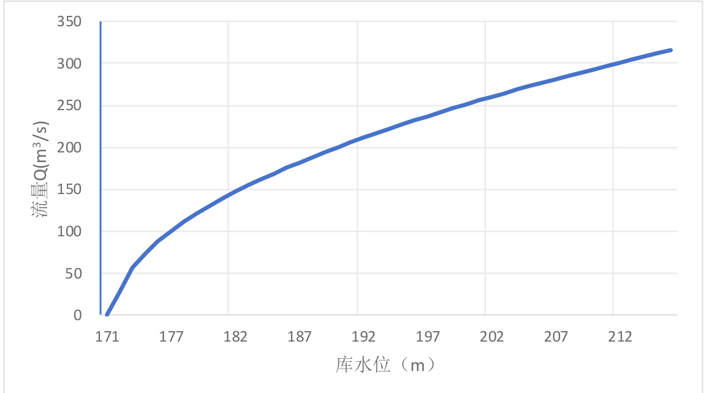  
图 6.6.3-1  导流兼泄洪放空洞泄流曲线(敞泄工况)  

根据规划要求,水库 10 年以下控泄 $60\mathrm{m}^{3}/\mathrm{s}$ , $10{\sim}50$ 年之间控泄 $380\mathrm{m}^{3}/\mathrm{s}$ 。水库 10 年一遇洪水位为 $211.43\mathrm{m}$ ,对应泄流能力为 $299\mathrm{m}^{3}/\mathrm{s}$ ;水库 50 年一遇洪水位为 $213.61\mathrm{m}$ ,对应泄流能力为 $307~\mathrm{m}^{3}/\mathrm{s}$ 。水库遭遇 10 年一遇以下洪水时通过导流兼泄洪放空洞泄洪,遭遇 10 年以上洪水时需要和重力坝溢流表孔联合泄洪。  

水库设计洪水位为 $213.81\mathrm{m}$ ,对应泄流能力为 $308\mathrm{m}^{3}/\mathrm{s}$ ;水库校核洪水位为$215.95\mathrm{m}$ ,对应泄流能力为 $316\mathrm{m}^{3}/\mathrm{s}$ 。  

# 6.6.4 引水建筑物设计  

本工程引水主要承担下游灌溉、供水、水库放空及生态流量下放任务,灌溉及供水设计引水流量为 $2.29\mathrm{m}^{3}/\mathrm{s}$ ,生态流量为 $0.02\mathrm{m}^{3}/\mathrm{s}$ (非汛期) ${\sim}0.07\mathrm{m}^{3}/\mathrm{s}$ (汛期),因此,引水建筑物设计引用总流量为 $2.31\mathrm{m}^{3}/\mathrm{s}$ (非汛期) ${\sim}2.36\mathrm{m}^{3}/\mathrm{s}$ (汛期)。  

# 6.6.4.1 工程布置  

夺丰水库运行 50 年淤积高程为 $170.20\mathrm{m}$ ,死水位 $170.50\mathrm{m}$ ,因城镇供水、灌区灌溉和下游河道生态用水,需通过坝体取水口从库内取水。根据下游供水工程各运行工况过流计算,取水管管径 D 为 $1.0\mathrm{m}$ 。  

坝体取水口位于大坝 14#坝段的上游,由进水口段、渐变段、坝内埋管段组成。  

进口段为平底喇叭口型,上游沿坝坡固定拦污栅,进水口顶部采用长轴半径为 $3.0\mathrm{m}$ 、短轴半径 1.0 的圆曲线由 $2.0\mathrm{m}$ 以 1:1.5 的坡度渐缩为 $1.0\mathrm{m}$ 的孔高;两侧以 1:1.5 的坡度由 $2.0\mathrm{m}$ 渐缩为 $1.0\mathrm{m}$ 的孔宽,后渐变与管径 $1.0\mathrm{m}$ 的涂塑钢管连接,进口底板高程为 $168.0\mathrm{m}$ 。  

坝内埋管段穿过 $14^{\#}$ 坝段,坝内引水钢管内径 $\Phi1000\mathrm{mm}$ ,长度 $48.0\mathrm{m}$ ,底高程为 $168.0\mathrm{m}$ ,管道水平布置,坝体内不设置转弯段,管道水平段中心线高程$168.5\mathrm{m}$ ,管壁厚 $6\mathrm{mm}$ ,管道出坝体后通过分水阀室连接下游主管与支管,主管内径 $\Phi1000\mathrm{mm}$ ,通过电动球阀控制下游城镇生活和灌区灌溉用水,设计流量为$2.29\mathrm{m}^{3}/\mathrm{s}$ ,支管内径 $\Phi300\mathrm{mm}$ ,通过电动球阀控制下游河道生态流量下泄,设计流量为 $0.02{\sim}0.07\mathrm{m}^{3}/\mathrm{s}$ 。  

# 6.6.4.2 建筑物布置及体形  

夺丰水库于 1959 年动工兴建,1972 年水库基本建成,2006 年进行了全面除险加固。大坝原设计为一座拱形浆砌石重力坝,水库原建有四级输水洞:  

一级输水洞位于大坝右岸,进口底高程为 $163.0\mathrm{m}$ ,洞径 $0.5\mathrm{m}$ ,全长 $34\mathrm{m}$ ,为砌石结构有压洞,主要向夺丰水库灌区南干渠输水,该洞现状进口采用混凝土封堵;  

二级输水洞位于大坝左岸,进口底高程为 $168.0\mathrm{m}$ ,洞径 $0.8\mathrm{m}$ ,全长 $33.5\mathrm{m}$ ,为钢筋混凝土结构有压洞,出口处设闸阀室,主要向夺丰水库灌区北干渠输水,该洞目前运行状态良好。  

三级输水洞位于大坝右岸,进口底高程为 $174.1\mathrm{m}$ ,洞径 $1.5\mathrm{m}$ ,目前作为备用洞未使用,现状已将坝体上游洞口堵死。  

四级输水洞位于大坝左岸,进口底高程为 $178.8\mathrm{m}$ ,结构为城门洞型,隧洞出口留有供水管道,主要供淇县水泥厂用水及庙口乡生活用水,现状已将坝体上游洞口堵死。  

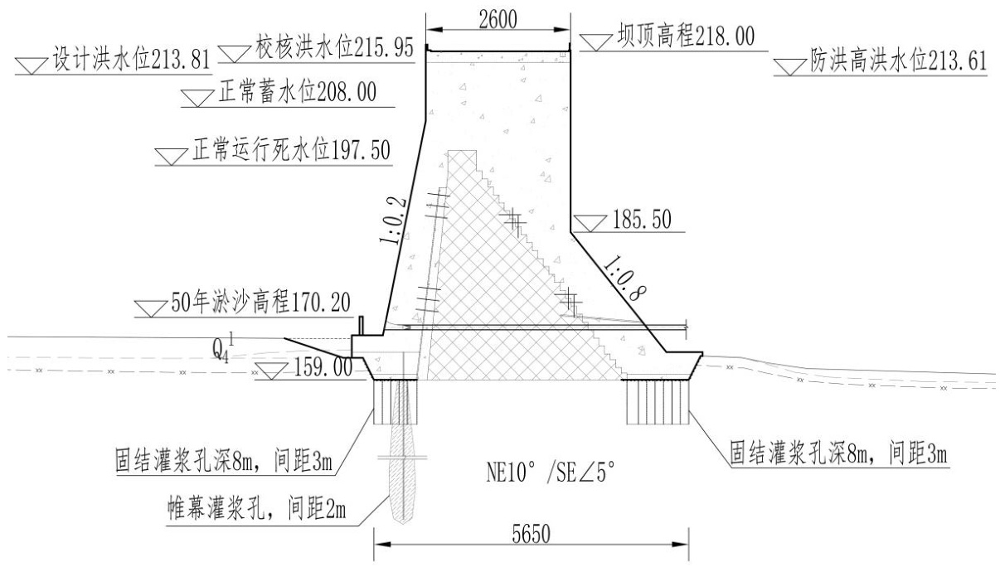  
图 6.6.4-1 引水坝段断面图  

夺丰水库扩容工程对已建坝体进行加高设计,结合坝型及枢纽布局,引水建筑物布置为进水口 $^+$ 坝内埋管的型式。引水建筑物利用原有坝体二级输水隧洞,隧洞进行拓孔、凿毛,洞内套内径 $1.0\mathrm{m}$ 的涂塑钢管,在埋管与隧洞之间施工缝隙进行回填灌浆。引水洞进口固定拦污栅,出口布置闸阀室,阀室后与夺丰水库灌区北干渠连接,分别满足水库灌溉用水、生态流量下泄及水库放空需求。  

引水建筑物布置于主坝左岸 14#坝段(以下称引水坝段),坝段长度 $18\mathrm{m}$ 。引水坝段建基面高程为 $159.0\mathrm{m}$ ,顶高程同坝顶高程 $218.0\mathrm{m}$ ,坝段高度 $59.0\mathrm{m}$ ;坝段上下游均采用折坡面,上游侧高程 $205.50\mathrm{m}$ 以上为铅直面、以下为 1:0.2 的斜坡面,下游侧高程 $205.5\mathrm{m}$ 以上为铅直面、以下为 1:0.8 的斜坡面;引水坝段坝顶宽度设 $10.0\mathrm{m}$ ,坝段底部宽度 $56.50\mathrm{m}$ 。  

引水坝段布置进水口及坝内引水压力钢管。本工程死水位 $170.50\mathrm{m}$ ,50 年淤沙高程 $170.20\mathrm{m}$ ,设计进水口底高程 $168.0\mathrm{m}$ 。引水坝段自上游至下游依次布置拦污栅、压力钢管、出口控制阀。根据设计引用流量,采用引水管管径 $1.0\mathrm{m}$ ,进水口设计尺寸为宽 $\times$ 高 ${=}1.0\mathrm{m}{\times}1.0\mathrm{m}$ ,进口喇叭段顶部及两侧均采用 1/4 椭圆线以平顺水流,首部拦污栅净宽 $2.0\mathrm{m}$ 。进水口渐变段长 $2\mathrm{m}$ ,由 $1.0\mathrm{m}\times1.0\mathrm{m}$ 的方形孔口渐变为直径为 $1.0\mathrm{m}$ 的圆形孔口,其后接直径为 $1.0\mathrm{m}$ 的压力钢管。坝内设引水压力主管 1 根,内径 $1.0\mathrm{m}$ ,管道水平布置,坝体内不设置转弯段,主管进口中心高程 $168.5\mathrm{m}$ ,出口中心高程 $168.5\mathrm{m}$ ,压力钢管出坝后连接坝外分水阀室。管道出坝体后通过分水阀室连接下游主管与支管,主管内径 $\Phi1000\mathrm{mm}$ ,通过电动球阀控制下游城镇生活和灌区灌溉用水,设计流量为 $2.29\mathrm{m}^{3}/\mathrm{s}$ ,支管内径 $\Phi300\mathrm{mm}$ ,通过电动球阀控制下游河道生态流量下泄,设计流量为 $0.02{\sim}0.07\mathrm{m}^{3}/\mathrm{s}$ 。  

# 6.6.4.3 引水建筑物计算  

(1)最小淹没深度计算  

1)防止产生贯通式漏斗旋涡的最小淹没深度按如下公式计算:  

式中:  

C-经验系数: $\mathrm{C}{=}0.55{\sim}0.73$ ;  

d-闸门孔口高度;  

v-闸门断面的流速。  

淹没深度按最低取水水位(死水位) $170.5\mathrm{m}$ 、最大引用流量 $2.36\mathrm{m}^{3}/\mathrm{s}$ 的工况进行计算,计算得防止产生贯通式漏斗旋涡的最小淹没深度为 $1.653\mathrm{m}$ 。  

2)保证进口压力流的最小淹没深度按如下公式计算:  

$$
S=K[\Delta h_{1}+\Delta h_{2}+\Delta h_{3}+\Delta h_{4}+\Delta h_{5}+\frac{V_{5}^{2}}{2g}]
$$  

式中:  

K-安全系数,应不小于 1.5,本阶段取 1.7;  

S-最小淹没深度,不小于 $2\mathrm{m}$ ;  

淹没深度按最低取水水位(死水位) $170.5\mathrm{m}$ 、最大引用流量 $2.36\mathrm{m}^{3}/\mathrm{s}$ 的工况进行计算,计算得保证进口压力流的最小淹没深度为 $1.638\mathrm{m}$ 。  

经计算,进水口最小淹没深度 S 取为 $1.653\mathrm{m}$ ,进水口底板高程取为 $168.00\mathrm{m}$ ,洞径 $1.0\mathrm{m}$ ,实际淹没水深 $1.7\mathrm{m}$ ,满足淹没深度要求。水库最低运行死水位引水时,洞口布置拦污栅,防止水面漂浮物堵塞引水洞。水库50 年淤沙高程 $170.20\mathrm{m}$ ,大于引水洞底板高程,为充分利用坝体现有引水洞,需在原洞口布置拦沙坎,坎顶高程 $170.35\mathrm{m}$ 。  

(2)水损计算  

水损计算主要采用《水力学计算手册》“第一篇管道及管网的水力计算”中有关公式及计算说明。水头损失包括沿程水头损失和局部水头损失。计算公式如下:  

# 1)沿程水头损失  

恒定有压均匀流的沿程水头损失计算公式(水力学计算手册 P3<1-1-1>):  

$$
h_{\it f}=\lambda.\frac{L}{d}\cdot\frac{\nu^{2}}{2g}
$$  

式中:  

hf—沿程水头损失,m;  
$L$ —管段的长度, $\mathrm{m}$ ;  
d—管段的内径,m;  
$\nu$ —过水断面的平均流速( $\mathrm{m}/\mathrm{s})$ );  
$\boldsymbol{g}$ —重力加速度( $\mathrm{m}/\mathrm{s}^{2}.$ )。  
—沿程水头损失系数,  
$\boldsymbol{C}$ —谢才系数,见曼宁公式(水力学计算手册 ${\mathrm{P}}7{<}1{-}1{-}13{>};$ ):  

$$
C=\frac{1}{n}\cdot R^{1/6}
$$  

n—糙率,根据涂塑钢管生产企业提供的管材糙率, $\scriptstyle{\mathrm{n}=0.0086}$ ,综合考虑磨损及适当的水力余度,根据《水力计算手册》、水工设计手册和相关工程经验,涂塑钢管糙率均取 $\mathrm{n}{=}0.012$ ;  

R—过水断面水力半径, $\mathtt{R}{=}\omega/\lambda$ , $\mathrm{m}$ ; $\omega$ —过水断面面积, $\mathrm{m}^{2}$ ;   
—过水断面湿周,m;   
整理后 $\scriptstyle\mathrm{h}_{\mathrm{f}}=\mathrm{L}\cdot\mathbf{v}^{2}/\mathbf{\tau}\left(\mathbf{C}^{2}\mathbf{R}\right)$   
式中:   
L—长度;   
C—流速系数;   
R—水力半径(m).  

2)局部水头损失  

局部水头损失一般占沿程水头损失的 $5\%\sim10\%$ 。因此,本阶段局部水头损失按沿程水头损失的 $10\%$ 计算。  

# 3)总水头损失  

$$
\scriptstyle\mathrm{h}_{\mathrm{f}}=\mathrm{h}_{\mathrm{l}}+\mathrm{h}_{\mathrm{j}}
$$  

式中:hf—总水头损失(m);hl—沿程水头损失(m);hj—局部水头损失(m)。  

# 表 6.6.4-1 水损计算表  

<html><body><table><tr><td>项目</td><td>单位</td><td>公式</td><td>水位</td></tr><tr><td>管线首端水头</td><td>m</td><td>H1</td><td>170.5</td></tr><tr><td>设计流量</td><td>m3/s</td><td>Q</td><td>2.36</td></tr><tr><td>管道直径</td><td>m</td><td>D</td><td>1.0</td></tr><tr><td>流速</td><td>m/s</td><td>V1=Q/(π·D2/4)</td><td>3.01</td></tr><tr><td>管线长L</td><td>m</td><td>L</td><td>48</td></tr><tr><td>粗糙系数</td><td></td><td>n</td><td>0.012</td></tr><tr><td>水力半径</td><td>m</td><td>R=D/4</td><td>0.25</td></tr><tr><td>谢才系数</td><td></td><td>C=1/n·R(1/6)</td><td>66.14</td></tr><tr><td>重力加速度</td><td>m2/s</td><td>g</td><td>9.81</td></tr><tr><td>沿程阻力系数</td><td></td><td>入=8·g/C2</td><td>0.018</td></tr></table></body></html>  

<html><body><table><tr><td>项目</td><td>单位</td><td>公式</td><td>水位</td></tr><tr><td>沿程损失hi</td><td>m</td><td>hy=LV/(C2R)</td><td>0.396</td></tr><tr><td>局部损失hj</td><td>m</td><td>hj</td><td>0.166</td></tr><tr><td>总损失hf</td><td>m</td><td>hz</td><td>0.562</td></tr><tr><td>管线末端水头</td><td>m</td><td>H2</td><td>169.94</td></tr></table></body></html>  

引水建筑物坝内埋管最大设计流量为 $2.36\mathrm{m}^{3}/\mathrm{s}$ ,通过出水口工作阀门进行流量调节,对应取水管流速为 $3.01\mathrm{m}/\mathrm{s}$ ,对应总水头损失为 $0.562\mathrm{m}$ 。死水位 $170.5\mathrm{m}$ 取水时,输水洞出口处对应水头为 $2.5\mathrm{m}$ ,大于总水头损失。因此,输水洞水头损失满足要求。  

(3)过流能力计算  

$$
Q=\mu\omega\sqrt{2g(T_{0}-h_{p})}
$$  

式中:ω——出口断面面积, ${\mathfrak{m}}^{2}$ ;  
$\mathrm{T}_{0}$ ——上游水面与钢管出口中心线, $\mathrm{m}$ ;  
$\mathrm{h_{p}}.$ 管道出口处水面水流的平均单位势能, $\mathrm{m}$ ;  
μ— 流速系数,按下式计算,经计算 $\upmu{=}0.585$ 。  

$$
\mu=\frac{1}{\sqrt{1+\sum\zeta_{i(\backslash}(\frac{\omega}{\omega_{i}})^{2}+\sum\frac{2g l_{i}}{C_{i}^{2}R_{i}}(\frac{\omega}{\omega_{i}})^{2}}}
$$  

管道第i 段的局部能量损失系数,与之相应的流速所在断面面积为 ${\mathfrak{O}}_{1}$ ;  

管道第 i 段的长度,与之相应的断面面积 $\mathrm{{\bf{(0)}}}$ 、水力半径 $\mathrm{R}_{\mathrm{i}}$ 和谢才系数Ci。  

计算得到:死水位 $170.5\mathrm{m}$ 取水时,,DN1000 输水洞过流能力为 $3.17\mathrm{m}^{3}/\mathrm{s}$ ,大于取水最大流量 $2.36\mathrm{m}^{3}/\mathrm{s}$ ,满足运行条件;  

(4)坝内埋管结构计算  

1)钢管结构计算原则  

12#坝段中的坝内压力钢管为引水主管,坝内埋管结构分析应按照《水利水电工程压力钢管设计规范》6.4 章节坝内埋管要求计算:  

$\textcircled{1}$ 承受内水压力时,坝内埋管应视为钢管、钢筋和混凝土组成的多层管共同承受,在最大内水压力作用下,钢管外围坝体混凝土不应出现贯穿性裂缝,并计  

及钢管与混凝土间的施工缝隙和温度缝隙影响。结构分析可按附录 C.1 执行。重要的工程宜结合坝体做有限元分析。  

$\textcircled{2}$ 全部外压应由钢管承受,钢管稳定分析可按附录 C.1 执行。  

2)结构计算基本参数  

取水建筑物级别为 3 级,结构安全级别Ⅱ级。  

钢板的弹性模量 $\mathrm{E_{s}}$ 为 $2.06{\times}10^{5}\mathrm{N}/\mathrm{mm}^{2}$ ,泊松比 ${\mathrm{v}}_{\mathrm{s}}{=}0.3$ ,线膨胀系数$a\mathrm{s}{=}1.2{\times}10^{-5}/^{\circ}\mathrm{C}$ ,重度 $\upgamma_{\mathrm{s}}$ 为 $78.5{\times}10^{-6}\mathrm{N}/\mathrm{m}\mathrm{m}^{3}$ 。钢材选用 Q235C。  

表 6.6.4-2 钢材力学性能表  

<html><body><table><tr><td>钢号</td><td>厚度 (mm)</td><td>屈服强度s (MPa)</td><td>抗拉强度b (MPa)</td></tr><tr><td rowspan="3">Q235C</td><td>3~16</td><td>235</td><td>510~640</td></tr><tr><td>>16~36</td><td>215</td><td>500~630</td></tr><tr><td>>36~60</td><td>205</td><td>490~620</td></tr></table></body></html>  

# 3)计算工况  

根据《水利水电工程压力钢管设计规范》第 6.4.2 节,坝内埋管结构分析的计算工况与荷载如下表。  

表 6.6.4-3  坝内埋管结构分析的计算工况与荷载组合  

<html><body><table><tr><td rowspan="2" colspan="2">序 号</td><td rowspan="2">荷载</td><td colspan="2">基本合作组合</td><td colspan="3">特殊合作组合</td><td rowspan="2">荷载 类型</td></tr><tr><td>正常运 行工况</td><td>放空工 况</td><td>单独承 载校核</td><td>特殊运 行工况</td></tr><tr><td rowspan="2">一</td><td rowspan="2">内水压力</td><td>正常运行水位 最高压力</td><td></td><td></td><td></td><td></td><td></td><td>内压</td></tr><tr><td>最高运行水位 的最高压力</td><td></td><td></td><td></td><td></td><td></td><td>内压</td></tr><tr><td>2</td><td colspan="2">坝体渗流压力</td><td></td><td>></td><td></td><td></td><td></td><td>外压</td></tr><tr><td>3</td><td colspan="2">施工荷载(灌浆压力和未凝固 混凝土压力)</td><td></td><td></td><td></td><td></td><td></td><td>外压</td></tr><tr><td>4</td><td colspan="2">管道放空时，通气设备造成的 气压差</td><td></td><td></td><td></td><td></td><td></td><td>外压</td></tr></table></body></html>  

# 4)钢管内压稳定分析  

根据《水利水电工程压力钢管设计规范》附录 C.1.2,应力计算可根据混凝土开裂情况按照下列方法进行:  

$\textcircled{1}$ 混凝土未开裂,钢管传至混凝土的内水压力可按公式(C.1.2-1)计算;钢管和混凝土的环向拉应力可按公式(C.1.2-2)\~公式(C.1.2-5)计算;此时钢筋应力很小,可不计算。  

$$
P_{1}=\frac{P-\frac{E_{\circ}^{\prime}t\Delta}{r_{0}^{2}}}{1+\frac{E_{\circ}^{\prime}t}{E_{\circ}^{\prime}r_{0}}\Big(\frac{r_{5}^{2}+r_{0}^{2}}{r_{5}^{2}-r_{0}^{2}}+\nu_{\circ}^{\prime}\Big)}
$$  

(C. 1. 2 - 2)  

$$
\sigma_{{\theta}{2}}=P_{1}(r_{5}^{2}+r_{0}^{2})/(r_{5}^{2}-r_{0}^{2})
$$  

$$
\begin{array}{r}{\sigma_{\mathfrak{\theta}^{1}}\leqslant\varphi[\sigma]}\ {\sigma_{\mathfrak{\theta}^{2}}\leqslant[\sigma_{1}]}\end{array}
$$  

式中:  

$\mathrm{P}_{1}$ — 钢管传至钢筋混凝土的内水压力, $\Gamma/\mathrm{mm}^{2}$ ;  
$\upsigma_{\Theta1}$ — 钢管环向拉应力, $\scriptstyle\mathrm{N}/\operatorname*{mm}^{2}$ ;  
$\upsigma_{\uptheta2}.$ — 混凝土最大环向拉应力, $\scriptstyle\mathrm{N}/\operatorname*{mm}^{2}$ ;  
$\boldsymbol{\Phi}$ — 焊缝系数;  
[σ]—— 钢管的允许拉应力,按钢管规范表 6.1.1 选用;  

$\textcircled{2}$ 混凝土部分开裂,仍参加承载,钢管环向拉应力可按公式(C.1.2-6)计算;钢筋拉应力可按公式(C.1.2-7)计算:  

$$
\sigma_{61}={\sigma_{63}r_{3}}/{r_{0}}+{E_{\mathrm{~s~}}^{\prime}}\Delta/r_{0}
$$  

$$
\sigma_{63}=\frac{E_{\circ}^{\prime}r_{5}}{E_{\circ}^{\prime}r_{3}}[\sigma_{1}]\Bigl\{m\left[\ln\left(\psi\frac{r_{5}}{r_{3}}\right)+n\right]\Bigr\}
$$  

$$
P_{1}=P-\sigma_{61}~\frac{t}{r_{0}}
$$  

$$
m=\psi\frac{1-\psi^{2}}{1+\psi^{2}}
$$  

$$
n=\frac{1+\boldsymbol\psi^{2}}{1-\boldsymbol\psi^{2}}+\boldsymbol\nu_{\mathrm{{c}}}^{\prime}
$$  

(C.1.2 -11) (C. 1.2 - 12)  

式中:  

$[\upsigma_{3}].$ — 钢管的允许拉应力, $\mathrm{{MPa}}$ ;   
σθ3— 钢筋拉应力, $\scriptstyle\mathrm{N}/\operatorname*{mm}^{2}$ ;  

$\textcircled{3}$ 混凝土已裂穿,不参加承载,钢管环向拉应力可按公式(C.1.2-13);钢筋拉应力可按公式(C.1.2-14)计算:  

$$
\sigma_{61}=(P-P_{1})r_{0}/t
$$  

$$
\sigma_{63}=P_{1}r_{0}/t_{3}
$$  

$$
P_{1}=\frac{P-\frac{E_{\mathrm{s}}^{\prime}t\Delta}{r_{0}^{2}}}{1+\frac{t r_{3}}{t_{3}r_{0}}}
$$  

$$
\begin{array}{r}{\sigma_{\theta1}\leqslant\varphi[\sigma]}\ {\sigma_{\theta3}\leqslant[\sigma_{3}]}\end{array}
$$  

5)钢管外压稳定分析  

根据《水利水电工程压力钢管设计规范》附录 B.2.2,管壁临界外压计算采用明钢管的米赛斯(Miese)公式计算,米赛斯(Miese)公式见附录 A.3.2)  

米赛斯公式如下:  

$$
P_{\mathrm{cr}}=\frac{E_{s}t}{(n^{2}-1)\Big(1+\frac{n^{2}l^{2}}{\pi^{2}r^{2}}\Big)^{2}r}+\frac{E_{\mathrm{s}}}{12(1-\nu_{\mathrm{s}}^{2})}\Big(n^{2}-1+\frac{2n^{2}-1-\nu_{\mathrm{s}}}{1+\frac{n^{2}l^{2}}{\pi^{2}r^{2}}}\Big)\frac{t^{3}}{r^{3}}
$$  

$$
n=2.74\left({\frac{r}{l}}\right)^{\frac{1}{2}}\left({\frac{r}{t}}\right)^{\frac{1}{4}}
$$  

式中:  

$\mathrm{P_{cr}}$ — 临界外压, $\scriptstyle\mathrm{N}/\operatorname*{mm}^{2}$ ;  
$\mathrm{E_{s}}$ — 钢管材料的弹性模量, $\scriptstyle\mathrm{N}/\operatorname*{mm}^{2}$ ;  
n— 相应于最小临界压力的波数,由(A.3.2-2)估算并取相近整数;  
νs— 钢材的泊松比,取 0.3;  
r— 钢管内半径, $\mathrm{mm}$ ;  
钢管管壁计算厚度, $\mathrm{mm}$ ;  

6)结构要求  

$\textcircled{1}$ 钢管壁厚应满足结构要求。  

$$
t\geq D/800+4
$$  

式中:  

t 钢管管壁计算厚度( $\mathrm{mm}$ );   
$D$ 钢管内半径(mm);  

$\textcircled{2}$ 根据钢管规范 6.1.7 条,管壁厚度应比计算值至少增加 $2\mathrm{mm}$ 锈蚀裕量,对泥沙磨损、腐蚀较严重的钢管,应专门论证。结构计算管壁厚度应不计入壁厚裕量。  

# 7)计算结果与分析  

经计算,钢管内水压力主要由钢管承担,钢管外混凝土未开裂。钢管环向最大应力 $\sigma_{{\boldsymbol{\Theta}}1}$ 为 $0.69\mathrm{MPa}$ ,满足钢管允许拉应力设计要求;混凝土环向应力 $\upsigma_{\uptheta2}$ 最大为 $\boldsymbol{0.02M P a}$ ,满足混凝土允许拉应力设计要求。  

取水主管钢管壁厚均由抗外压稳定控制。取水主管壁厚取为 $7\mathrm{mm}$ ,钢材为Q235C。  

通过计算,选取的管壁厚度满足现行规范要求。  

# 6.6.5 生态放水设施  

生态流量需求:汛期(6-9 月)生态流量为 $0.07\mathrm{m}^{3}/\mathrm{s}$ ,非汛期生态流量为$0.02\mathrm{m}^{3}/\mathrm{s}$ 。为保证大坝下游河段的河道生态用水要求,通过坝内引水管接支管进行下泄。放水钢管直径为 $\Phi1000\mathrm{mm}$ ,材质为 Q235C,管壁厚 $6\mathrm{mm}$ ,总长 $70.0\mathrm{m}$ ,通过生态放水管阀门进行流量调节  

根据工程布置,泄水建筑物布置在主河床,河床右岸为二级阶地,高程在$190.00\mathrm{m}$ 以上,因此将生态放水设施布置在泄水建筑物左侧 14#坝段上。为防止污物进入水道,顺水流方向设一道拦污栅。进水口高程 $168.00\mathrm{m}$ ,喇叭口尺寸为$2.0\mathrm{m}{\times}2.0\mathrm{m}$ (宽 $\times$ 高),由上游至下游依次布置拦污栅、压力钢管、出口控制阀。  

坝内引水钢管内径 $\Phi1000\mathrm{mm}$ ,长度 $48.0\mathrm{m}$ ,管道水平布置,坝体内不设置转弯段,管道水平段中心线高程 $168.5\mathrm{m}$ ,管壁厚 $6\mathrm{mm}$ ,管道出坝体后通过分水阀室连接下游主管与支管,主管内径 $\Phi1000\mathrm{mm}$ ,通过电动球阀控制下游城镇生活和灌区灌溉用水,设计流量为 $2.29\mathrm{m}^{3}/\mathrm{s}$ ,支管内径 $\Phi300\mathrm{mm}$ ,通过电动球阀控制下游河道生态流量下泄,设计流量为 $0.02{\sim}0.07\mathrm{m}^{3}/\mathrm{s}$ 。  

# 6.6.6 边坡工程  

边坡的稳定与否,无论在施工期还是运行期,都将直接影响工程的建设及运行安全,因此必须采取合理的治理措施。本工程涉及的边坡主要包括:坝基开挖形成的临时和永久边坡、左右岸坝肩永久边坡。根据《水利水电工程边坡设计规  

范》(SL386-2007)规定,按照建筑物级别和对建筑物的危害程度,大坝坝肩边坡为 3 级。  

# 6.6.6.1 地质条件  

坝址区河谷呈不对称的“V”型河谷,低山溶蚀峡谷地貌类型;河底宽约 $61\mathrm{m}$ ,原设计正常蓄水位 $193.70\mathrm{m}$ 处河谷宽约 $153\mathrm{m}$ 。坝前河床地面高程 $166.2{\sim}166.4\mathrm{m}$ ,坝后河床地面高程 $160.0{\sim}163.7\mathrm{m}$ 。右岸地面高程 $160.0{\sim}280\mathrm{m}$ ,其中高程 $228\mathrm{m}$ 以下地形近直立,为悬坡类型;高程 $228\mathrm{m}$ 以上地形相对较缓,为斜坡类型。左岸地面高程 $163\sim220\mathrm{m}$ ,地形坡度约 $23\%$ ,为斜坡类型。  

左坝肩边坡处地面高程 $210{\sim}220\mathrm{m}$ ,属低矮边坡;地形平缓,属缓坡类型;边坡岩体强风化、弱风化砾状灰岩( $\mathrm{O}_{2-3}\mathrm{m}.$ ),岩体完整性差,为碎裂\~散体结构。由于边坡高度不高,且地形平缓,故自然边坡整体稳定较好。  

右坝肩边坡地面高程 $164\sim230\mathrm{m}$ ,工程边坡高度约 $22.5\mathrm{m}$ ;现状边坡陡峻,局部近直立,属悬坡类型。边坡大致 $206\mathrm{m}$ 高程以上,边坡基岩为寒武系上统崮山组 ${\bf\Xi}(\in\mathfrak{z g}.$ )鲕状灰岩,底部为竹叶状灰岩和泥灰岩薄层,与下伏的鲕状灰岩呈整合接触。在高程 $206\mathrm{m}$ 以下基岩为鲕状灰岩( $\in{}_{2}\mathbf{Z}$ )。鲕状灰岩呈厚层\~巨厚层状构造,岩层产状 $\mathrm{NE40^{\circ}/S E}\angle7^{\circ}$ ,边坡属水平层状边坡。岩体中发育 2 组裂隙,一组近似垂直边坡,一组近平行边坡,均为高角度裂隙。边坡为水平层状边坡,岩体为坚硬岩,完整性好,故对边坡整体稳定性有利。  

# 6.6.6.2 开挖支护措施  

(1)开挖设计  

地质专业的建议参数值见下表,坝基开挖边坡(属于临时坡)按微\~新岩体1: $0.1\widetilde{\sim}0.3$ ,弱风化岩体 1: $0.3\sim0.5$ ,强风化岩体到上覆岩土 1: $0.5\sim0.75$ 。  

表 6.6.6-1 坝址区岩土体物理力学指标建议值统计表  

<html><body><table><tr><td>岩性</td><td>地层代号</td><td>永久边坡</td><td>临时边坡</td></tr><tr><td>淤泥</td><td>Q41</td><td>1:2.25~1:2.5</td><td>1:2.0~1:2.25</td></tr><tr><td>碎石</td><td>Q4s</td><td>1:1.75~1:2.0</td><td>1:1.50~1:1.75</td></tr><tr><td>强风化砾状灰岩</td><td rowspan="2">O2-3m</td><td>1:1.0~1:1.15</td><td></td></tr><tr><td>弱风化砾状灰岩</td><td>1:0.75~1:1.0</td><td></td></tr><tr><td>强风化白云质灰岩</td><td rowspan="2">Oiy</td><td>1:0.75~1:1.0</td><td></td></tr><tr><td>弱风化白云质灰岩</td><td>1:0.5~1:0.75</td><td></td></tr></table></body></html>  

<html><body><table><tr><td>岩性</td><td>地层代号</td><td>永久边坡</td><td>临时边坡</td></tr><tr><td>微新白云质灰岩</td><td></td><td>1:0.25~1:0.30</td><td></td></tr><tr><td>弱风化状灰岩</td><td rowspan="2">E2Z</td><td>1:0.30~1:0.35</td><td></td></tr><tr><td>微新状灰岩</td><td>1:0.20~1:0.25</td><td></td></tr></table></body></html>  

开挖顺向坡不陡于岩层倾角,建基面临时开挖坡比 1:0.3。为保证岩体的侧向稳定,每个坝段水平段长度均大于 1/2\~1/3 坝段长度,开挖的整体趋势为左岸坡度较缓右岸较陡。最低建基面高程为 $159.00\mathrm{m}$ 。永久边坡开挖按微 $\sim$ 新岩体 1:$0.3\sim0.5$ ,弱风化岩体 1: $0.5\widetilde{\sim}0.75$ ,强风化岩体到上覆岩土 1: $0.75\sim1$ 。  

(2)支护设计  

边坡治理设计基本原则:应力求安全可靠、合理、易于施工,尽量降低工程投资。大坝两岸坝肩边坡岩体主要为鲕状灰岩、砾状灰岩和白云质灰岩,左坝肩边坡处地面高程 $210{\sim}220\mathrm{m}$ ,属低矮边坡;地形平缓,属缓坡类型,开挖边坡高度 $3{\sim}5\mathrm{m}$ ,属于低边坡;右坝肩边坡地面高程 $164\sim230\mathrm{m}$ ,现状边坡陡峻,局部近直立,属悬坡类型,开挖边坡高度 $30{\sim}35\mathrm{m}$ ,属于中边坡。  

考虑到本工程边坡工程开挖高度不高,本阶段不再进行边坡抗滑稳定计算,只采用一般处理加固措施。对于左、右岸坝肩开挖形成的永久边坡,根据地形、地质条件,岩石开挖边坡尽量“少开挖,多处理”。对坝顶以上边坡开挖坡比为1:0.75\~1:1,左岸坝肩边坡不高,最高 $5\mathrm{m}$ ,故不设马道,右岸坝肩边坡最高 $35\mathrm{m}$ ,中间设 1 级马道,开挖后及时在表面挂 $\Phi^{8(\vec{a})200\mathrm{mm}}$ 钢筋网喷混凝土( $.15\mathrm{cm}$ 厚),并设置 $\Phi25$ , $\mathrm{L}{=}5.0\mathrm{m}$ 系统锚杆,间排距 $3\mathrm{m}$ ,梅花形布置。边坡设置间排距 $2.5\mathrm{m}$ 的排水孔,孔径 $75\mathrm{mm}$ ,仰角 $5^{\circ}$ ,深入岩体 $1.0\mathrm{m}$ ,右坝肩边坡坡顶布置截水沟。  

# 6.7 交通工程设计  

# 6.7.1 概述  

本工程需新建左岸上坝道路,为永、临结合道路,用于工程建成后水库大坝及相关设施的运行管理,同时,工程施工期作为主要的运输通道。本道路为水利水电工程场内三级道路,参照四级公路(Ⅰ类)标准设计,设计时速 $15\mathrm{km/h}$ ,路基宽 $7.0\mathrm{m}$ ,路面宽 $6.0\mathrm{m}$ ,水泥混凝土路面结构形式。永久路面结构为: $22\mathrm{cm}$ 厚水泥混凝土路面 $+18\mathrm{cm}$ 厚水泥稳定碎石基层 $+20\mathrm{cm}$ 厚级配碎石底基层,总厚度为 $60\mathrm{cm}$ 。  

# 6.7.2 道路布置  

道路起于省道 S305,设计高程 $207.46\mathrm{m}$ ,后沿山腰线布设,经管理营地后终点接大坝左坝肩,设计高程为 $212.5\mathrm{m}$ ,路线长 $0.203\mathrm{km}$ 。道路最小圆曲线半径$20\mathrm{m}$ ,最大纵坡 $9.89\%$ ,最小坡长 $47.5\mathrm{m}$ 。  

表6.7.2-1 主要工程量表  

<html><body><table><tr><td>序号</td><td>项目</td><td>单位</td><td>工程量</td><td>备注</td></tr><tr><td></td><td>路线长度</td><td>m</td><td>207.46</td><td></td></tr><tr><td>1</td><td>路基工程</td><td></td><td></td><td></td></tr><tr><td>1.1</td><td>清表工程量</td><td>m3</td><td>5218</td><td>平均厚度30cm (应自行考虑砍伐树木工程量)</td></tr><tr><td>1.2</td><td>土方开挖 (自然方)</td><td>m3</td><td>1044</td><td></td></tr><tr><td>1.3</td><td>石方开挖 (自然方)</td><td>m3</td><td>4714</td><td></td></tr><tr><td>1.4</td><td>土、石方填筑(压实方)</td><td>m3</td><td>17</td><td></td></tr><tr><td>2</td><td>路面工程</td><td></td><td></td><td></td></tr><tr><td>2.1</td><td>级配碎石底基层</td><td>m2</td><td>1453</td><td>20cm厚</td></tr><tr><td>2.2</td><td>水泥稳定碎石基层</td><td>m2</td><td>1452</td><td>18cm厚</td></tr><tr><td>2.3</td><td>水泥混凝土面层</td><td>m2</td><td>1370</td><td>22cm厚</td></tr><tr><td>2.4</td><td>钢筋</td><td>kg</td><td>1159</td><td></td></tr><tr><td>3</td><td>路基排水工程</td><td></td><td></td><td></td></tr><tr><td>3.1</td><td>M7.5浆砌片石</td><td>m3</td><td>123</td><td>全线边沟</td></tr><tr><td>4</td><td>交通安全设施</td><td></td><td></td><td></td></tr><tr><td>4.1</td><td>三角形标志牌</td><td>个</td><td>2</td><td>含基础，立柱及标牌</td></tr><tr><td>4.2</td><td>圆形标志牌</td><td>个</td><td>2</td><td>含基础，立柱及标牌</td></tr><tr><td>4.3</td><td>交通标线</td><td>m2</td><td>33</td><td></td></tr><tr><td>5</td><td>边坡防护工程</td><td></td><td></td><td></td></tr><tr><td>5.1</td><td>镀锌铁丝网植草防护</td><td>m²</td><td>2493</td><td></td></tr><tr><td>5.1.1</td><td>镀锌铁丝网</td><td>m2</td><td>2493</td><td></td></tr><tr><td>5.1.2</td><td>回填改良土</td><td>m3</td><td>227</td><td></td></tr><tr><td>5.1.3</td><td>喷播植草</td><td>m²</td><td>2266</td><td></td></tr><tr><td>5.1.4</td><td>钢钎</td><td>根</td><td>748</td><td></td></tr><tr><td>5.1.5</td><td>U型钉</td><td>根</td><td>1995</td><td></td></tr><tr><td>5.1.6</td><td>无纺布</td><td>m2</td><td>2493</td><td></td></tr><tr><td>5.2</td><td>喷锚支护</td><td>m2</td><td>462</td><td></td></tr><tr><td>5.2.1</td><td>锚杆钻孔</td><td>个</td><td>116</td><td></td></tr><tr><td>5.2.2</td><td>C22锚杆</td><td>根</td><td>116</td><td>L=4.5</td></tr><tr><td>5.2.3</td><td>M30灌浆</td><td>m3</td><td>2.2</td><td></td></tr><tr><td>5.2.4</td><td>C25混凝土喷，10cm厚</td><td>m3</td><td>46.2</td><td></td></tr></table></body></html>  

<html><body><table><tr><td>序号</td><td>项目</td><td>单位</td><td>工程量</td><td>备注</td></tr><tr><td>5.2.5</td><td>喷混凝土，8 钢筋</td><td>Kg</td><td>1825</td><td></td></tr><tr><td>5.2.6</td><td>075mm 排水管</td><td>根</td><td>66</td><td>L=5.0m</td></tr></table></body></html>  

# 6.8 工程安全监测  

# 6.8.1 监测设计目的及原则  

根据工程规模和特点,通过对建筑物在施工期及运行期进行监测,采集数据并进行分析处理,对建筑物的稳定性、安全性作出评价,达到监控工程安全的目的,同时指导工程施工并反馈设计。  

监测布置原则为:  

(1)在能较全面反映建筑物实际工作状况的前提上,监测项目有针对性,  
突出重点;(2)仪器性能精密可靠、长期稳定性好,并易于埋设,维护简便;在满足  
观测精度的前提下,观测方便、直观;(3)以自动化监测为主,人工监测与自动化监测相结合;(4)施工期与运行期能连续进行观测,及时了解并掌握建筑物在施工期及  
运行期的工作状况;(5)仪器监测与人工巡视检查相结合。  

# 6.8.2 监测设计依据  

(1) 《混凝土坝安全监测技术规范》SL601-2013;  
(2) 《水利水电工程安全监测设计规范》SL725-2016;  
(3)《大坝安全自动监测系统设备基本技术条件》SL268—2001;  
(4)《国家一、二等水准测量规范》GB/T12897—2006;  
(5)《国家三角测量规范》GB/T17942—2000。  

# 6.8.3 监测建筑物及监测项目  

夺丰水库大坝为拱形浆砌石重力坝,建筑物级别为 3 级,本次主要涉及大坝加高、溢流坝段增加闸门等。根据建筑物的级别和实际情况,主要对大坝进行监测设计。主要监测项目包括变形监测、渗流监测、应力应变监测、水位监测等。  

除对建筑物进行上述仪器监测项目外还需要定期进行人工巡视检查。  

# 6.8.4 监测布置  

# 6.8.4.1 拦河坝  

(1)变形监测  

大坝原有 8 个变形观测点,其中坝顶下游 6 个,下游坝脚挑流鼻坎 2 个。大坝下游两岸岩基上共布置 2 个水平位移工作基点和 2 个垂直位移工作基点。本次涉及大坝加高,因此变形测点全部重新布置,如新测点与原测点在同一坝段,将原测点数据引接至新测点。  

# 1)水平位移监测  

水平位移采用观测机器人运用交会法进行自动化监测。在坝顶下游侧布置 1条测线,每个坝段布置1 个测点。在大坝下游两岸各增加1 个水平位移校核基点,定期对工作基点进行校核。  

# 2)垂直位移监测  

在每个坝段坝顶上下游侧分别布置 1 个垂直位移测点,下游测点结合水平位移测点布置,监测坝体垂直位移。在大坝下游增加 1 组基准点,定期对垂直位移工作基点进行校核。  

# 3)坝基变形及接缝开合度监测  

布置 3 个横向监测断面,每个断面上下游基础分别布置基岩变位计和测缝计,在新老结合位置延高程布置一定数量的测缝计,监测坝基变形;选取部分坝段的结构横缝,每条结构缝沿不同高程布置 1\~2 支测缝计,监测缝的开合度。在坝体与岸边接触位置选取 2 个不同高程在围岩内布置基岩变位计,监测基岩变形。  

(2)渗流监测  

# 1)坝基扬压力监测  

在大坝布置 3 个横向监测断面和 1 个纵向监测断面监测坝基扬压力,横向监测断面与纵向监测断面结合布置,纵向监测断面布置在防渗帷幕后。  

每个横向监测断面灌浆帷幕前布置 1 个测点,灌浆帷幕后沿水流方向坝基布置 $2\sim3$ 个测点。纵向监测断面布置在灌浆帷幕后第一道排水幕线上,在每个坝段各布置 1 个测点。帷幕后测点在基础廊道钻孔安装测压管,测压管内布置渗压计。  

# 2)绕坝渗流监测  

在坝体与两岸交界位置分别布置绕坝渗流测点 3 个,其中在防渗帷幕前布置1 个测点,在防渗帷幕后布置 2 个测点,进行绕坝渗流监测。在各测点位置钻孔安装测压管,测压管内布置渗压计,定期采用电测水位计人工观测测压管水位,与渗压计观测数据进行比对。  

(3)渗流量监测  

在基础灌浆廊道布置 6 套量水堰,分别位于汇入集水井前的左右侧基础廊道排水沟和最大坝高坝段排水沟。  

# (4)应力应变监测  

结合变形重点监测断面,在新老结合位置的测缝计附近的锚筋上布置锚杆应力计,锚杆应力。  

# (5)环境量监测  

大坝现有降水量观测设施和水位观测设施,但水位观测采用人工,缺少自动化监测。在大坝上、下游分别布置一支通气性渗压计,实现上、下游水位的自动化监测。  

在坝顶布置 1 个气温监测点和 1 套雨量计,采用自记温度计进行气温监测,温度计布置在专用百叶箱内。  

# 6.8.4.2 边坡工程  

坝顶两岸边坡根据开挖情况布置一定数量多点位移计,监测边坡变形。在设有锚杆(锚索)位置选取部分锚杆(锚索)进行应力监测。  

# 6.8.5 巡视检查  

从施工期到运行期,对大坝及其附属建筑物,均应定期进行巡视检查。巡视检查主要包含以下内容。  

(1)坝顶及防浪墙有无裂缝、错动、沉陷等现象;相邻坝段之间有无错动;止水设施、排水设施是否完好;上下游坝面有无裂缝、错动、冻融破坏、坍塌、水浸、管涌及渗水等;  

(2)坝基和坝区岩体有无挤压、错动、松动和鼓出等现象;坝体与基岩结合位置有无错动、开裂、渗水;渗流量及水质变化情况;两岸坝肩有无滑坡、溶蚀、裂缝及绕渗等。  

(3)表孔边墙、溢流面等部位是否有裂缝、渗水、气蚀、冲蚀发生;水流流态及对岸边冲刷情况等。  

(4)闸门及启闭机运行情况、金属结构防腐及锈蚀等。  

(5)监测设施是否完好。  

# 6.8.6 监测站及自动化系统  

本工程共布置 3 个现场监测站。施工期监测仪器采用便携式读数仪进行人工观测,运行期仪器电缆就近引至监测站内 MCU 进行自动化监测。  

本工程安全监测自动化系统结构布置采用分布式网络结构,系统由监测站及中心监测站组成。坝体内监测站与中心监测站之间采用光纤或无线通信模块进行通信。  

监测站内设置数据采集测控单元(MCU),监测断面仪器电缆就近引至相应监测站,接入 MCU 进行现场监测数据的自动采集、信号转换和输出。中心监测站内设置工控机、服务器及辅助设备,负责数据采集、数据存储、管理与分析。  

坝体内监测站采用永久电源供电并设防雷接地装置,进入监测站的电源线及引接的通信线均应采取防雷保护措施。  

# 6.8.7 安全监测工程量  

安全监测仪器设备工程量见表 6.8.7-1。  

表 6.8.7-1 安全监测仪器设备工程量  

<html><body><table><tr><td>序号</td><td>项目</td><td>单位</td><td>数量</td><td>备注</td></tr><tr><td>1</td><td>监测仪器设备</td><td></td><td></td><td></td></tr><tr><td>1.1</td><td>观测机器人</td><td>台</td><td>1</td><td>全自动，测角精度0.5"，测距精度 1mm+1ppm</td></tr><tr><td>1.2</td><td>观测机器人配套线缆</td><td>根</td><td>1</td><td></td></tr><tr><td>1.3</td><td>观测机器人配套电源线</td><td>套</td><td>1</td><td></td></tr><tr><td>1.4</td><td>温度气压传感器</td><td>套</td><td>1</td><td></td></tr><tr><td>1.5</td><td>配电箱</td><td>套</td><td>1</td><td></td></tr><tr><td>1.6</td><td>电源避雷器</td><td>套</td><td>1</td><td></td></tr><tr><td>1.7</td><td>RS485转RS323模块</td><td>套</td><td>1</td><td></td></tr><tr><td>1.8</td><td>避雷系统</td><td>套</td><td>1</td><td></td></tr><tr><td>1.9</td><td>观测机器人自动启闭保护 装置</td><td>个</td><td>1</td><td></td></tr></table></body></html>  

<html><body><table><tr><td>序号</td><td>项目</td><td>单位</td><td>数量</td><td>备注</td></tr><tr><td>1.10</td><td>观测机器人后处理软件</td><td>套</td><td>1</td><td></td></tr><tr><td>1.11</td><td>观测机器人通信控制盒子</td><td>套</td><td>1</td><td></td></tr><tr><td>1.12</td><td>强制对中基座</td><td>个</td><td>21</td><td>不锈钢材质，最大对中误差 0.05mm，含保护盒</td></tr><tr><td>1.13</td><td>棱镜</td><td>个</td><td>20</td><td></td></tr><tr><td>1.14</td><td>棱镜保护罩</td><td>个</td><td>20</td><td></td></tr><tr><td>1.15</td><td>电子水准仪</td><td>台</td><td>1</td><td>每km往返高差标准差优于 ±0.5mm，含脚架和一对铟钢条码尺</td></tr><tr><td>1.16</td><td>电子水准仪后处理软件</td><td>套</td><td>1</td><td></td></tr><tr><td>1.17</td><td>铟钢条码尺</td><td>个</td><td>2</td><td></td></tr><tr><td>1.18</td><td>三角架</td><td>个</td><td>1</td><td></td></tr><tr><td>1.19</td><td>尺垫</td><td>个</td><td>2</td><td></td></tr><tr><td>1.20</td><td>垂直位移测点</td><td>个</td><td>46</td><td>不锈钢材质</td></tr><tr><td>1.21</td><td>垂直位移测点保护盒(罩)</td><td>个</td><td>46</td><td></td></tr><tr><td>1.22</td><td>测缝计</td><td>支</td><td>42</td><td></td></tr><tr><td>1.23</td><td>基岩变位计</td><td>支</td><td>10</td><td></td></tr><tr><td>1.24</td><td>三点位移计</td><td>套</td><td>4</td><td></td></tr><tr><td>1.25</td><td>渗压计</td><td>支</td><td>42</td><td></td></tr><tr><td>1.26</td><td>测压管</td><td>m</td><td>300</td><td>含接头、底座等</td></tr><tr><td>1.27</td><td>测压管管口保护装置</td><td>套</td><td>23</td><td></td></tr><tr><td>1.28</td><td>量水堰</td><td>套</td><td>6</td><td></td></tr><tr><td>1.29</td><td>量水堰计</td><td>支</td><td>6</td><td></td></tr><tr><td>1.30</td><td>锚杆应力计</td><td>支</td><td>12</td><td></td></tr><tr><td>1.31</td><td>锚索计</td><td>套</td><td>3</td><td></td></tr><tr><td>1.32</td><td>水尺</td><td>m</td><td>70</td><td></td></tr><tr><td>1.33</td><td>通气型渗压计</td><td>支</td><td>2</td><td></td></tr><tr><td>1.34</td><td>自记温度计</td><td>台</td><td>1</td><td></td></tr><tr><td>1.35</td><td>百叶箱</td><td>个</td><td>1</td><td>玻璃钢材质</td></tr><tr><td>1.36</td><td>雨量计</td><td>套</td><td>1</td><td></td></tr><tr><td>1.37</td><td>电测水位计</td><td>台</td><td>1</td><td></td></tr><tr><td>1.38</td><td>振弦式读数仪</td><td>台</td><td>1</td><td></td></tr><tr><td>1.39</td><td>集线箱</td><td>个</td><td>10</td><td></td></tr><tr><td>1.40</td><td>监测电缆</td><td>m</td><td>35000</td><td>四芯屏蔽电缆</td></tr><tr><td>1.41</td><td>监测电缆</td><td>m</td><td>2500</td><td>八芯屏蔽电缆</td></tr><tr><td>1.42</td><td>监测电缆</td><td>m</td><td>1500</td><td>十芯屏蔽电缆</td></tr><tr><td>1.43</td><td>电缆保护管</td><td>m</td><td>500</td><td>025～0100mm</td></tr><tr><td>1.44</td><td>MCU</td><td>台</td><td>7</td><td>32通道，含传感器防雷模块</td></tr><tr><td>1.45</td><td>电源防雷器</td><td>个</td><td>7</td><td></td></tr><tr><td>1.46</td><td>通信防雷器</td><td>个</td><td>7</td><td></td></tr></table></body></html>  

<html><body><table><tr><td>序号</td><td>项目</td><td>单位</td><td>数量</td><td>备注</td></tr><tr><td>1.47</td><td>通信线</td><td>m</td><td>300</td><td></td></tr><tr><td>1.48</td><td>光纤交换机</td><td>台</td><td>2</td><td></td></tr><tr><td>1.49</td><td>数据采集管理分析软件</td><td>套</td><td>1</td><td></td></tr><tr><td>1.50</td><td>工控机</td><td>台</td><td>1</td><td></td></tr><tr><td>1.51</td><td>服务器</td><td>台</td><td>1</td><td></td></tr><tr><td>1.52</td><td>打印机</td><td>台</td><td>1</td><td></td></tr><tr><td>1.53</td><td>UPS及稳压电源</td><td>套</td><td>1</td><td></td></tr><tr><td>1.54</td><td>办公座椅及资料柜</td><td>套</td><td>1</td><td></td></tr><tr><td>1.55</td><td>机柜</td><td>个</td><td>1</td><td></td></tr><tr><td>2</td><td>土建工程</td><td></td><td></td><td></td></tr><tr><td>2.1</td><td>水平位移测点墩</td><td>个</td><td>19</td><td></td></tr><tr><td>2.2</td><td>水平位移工作基点</td><td>个</td><td>2</td><td></td></tr><tr><td>2.3</td><td>基准点</td><td>组</td><td>1</td><td>3个</td></tr><tr><td>2.4</td><td>测缝计钻孔及回填</td><td>m</td><td>10</td><td></td></tr><tr><td>2.5</td><td>基岩变位计钻孔及回填</td><td>m</td><td>100</td><td></td></tr><tr><td>2.6</td><td>位移计钻孔及回填</td><td>m</td><td>150</td><td></td></tr><tr><td>2.7</td><td>测压管钻孔及回填</td><td>m</td><td>300</td><td>0110mm</td></tr><tr><td>3</td><td>施工期观测及资料整编分 析</td><td>项</td><td>1</td><td>含巡视检查</td></tr></table></body></html>  

# 6.9 建筑环境  

# 6.9.1 建筑设计  

# 6.9.1.1 项目概况  

本工程位于河南省淇县庙口乡与黄洞乡交界处原夺丰水库。本次建筑专业设计范围包括两处,一是管理区总平面设计及建筑单体设计,二是启闭机房建筑单体设计。主要参与的专业包括建筑、结构、给排水、暖通、建筑电气专业。  

# 6.9.1.2 设计依据  

主要现行规程、规范及标准如下:  

(1)《建筑设计防火规范(2018 年版)》(GB50016-2014);  
(2) 《建筑节能与可再生能源利用通用规范》(GB55015-2021);  
(3) 《建筑防火通用规范》(GB55037-2022);  
(4) 《民用建筑通用规范》(GB55031-2022);  
(5) 《民用建筑设计统一标准》(GB50352-2019);  
(6)《水利工程设计防火规范》(GB50987-2014);(7)《建筑与市政工程防水通用规范》(GB55030-2022);  
(8)《民用建筑热工设计规范》(GB50176-2016)。  

# 6.9.1.3 设计原则  

充分考虑当地自然环境和社会环境,体现当地的发展水平,地域风貌、文化特色和历史轨迹。  

尊重功能,尽量体现建筑物的结构美、整体美、简洁美。各单体建筑应体现各自功能特征,内容与形式相统一,艺术与技术相结合。  

整体布局与环境统一考虑,建筑风格协调统一,因地制宜,经济美观。  

# 6.9.1.4 建筑设计方案  

(1)管理区设计  

水库管理区设置在坝后现场。本工程管理及运行人员编制为 13 人。  

根据《水库工程管理设计规范》(SL106-2017)要求,管理区建筑面积按定编人数确定。其中办公用房按人均 $15\mathrm{m}^{2}$ 计算,共计 $195~\mathrm{m}^{2}$ ;生活用房如宿舍、食堂、值班室按人均 $35~\mathrm{m}^{2}$ 计算,共 $455\mathrm{~m}^{2}$ ,综上所述:管理区管理用房建筑规模详见下表:  

表 6.9.1-1 管理区建筑面积统计表  

<html><body><table><tr><td rowspan="2">序号</td><td colspan="2" rowspan="2">名称</td><td colspan="2">面积（m²)</td><td>备注</td><td>编制人数</td></tr><tr><td>地上</td><td>地下</td><td></td><td></td></tr><tr><td>1</td><td colspan="2">规划用地</td><td>3060</td><td></td><td></td><td rowspan="6">13人</td></tr><tr><td rowspan="5">2</td><td rowspan="5">管理用房</td><td>办公用房</td><td>195</td><td></td><td></td></tr><tr><td>生活用房</td><td>425</td><td></td><td></td></tr><tr><td>机房</td><td>65</td><td></td><td></td></tr><tr><td>中控室</td><td>85</td><td></td><td></td></tr><tr><td>警卫室</td><td>30</td><td></td><td></td></tr><tr><td>3 4</td><td></td><td>防汛仓库</td><td>200</td><td>/</td><td></td></tr><tr><td>5</td><td>设备用房</td><td>消防及生活给水泵房</td><td>22</td><td>240</td><td></td><td></td></tr><tr><td colspan="4">合计</td><td>1019 240</td><td></td><td></td></tr></table></body></html>  

# 1)室外工程设计  

根据场地特点,对建筑布局、道路、竖向等进行综合性的设计。场地内布置消防车道,车道宽度不小于 $4\mathrm{m}$ ,转弯半径为 $9\mathrm{m}$ ,道路通畅,可到达各建筑物长边及主入口,道路尽头设 $12\mathrm{m}\times12\mathrm{m}$ 回车场。新建一圈铁艺围墙,设置电动推拉门,管理区内部道路为混凝土道路。  

2)管理区建筑单体设计  

管理用房:为地上二层民用建筑,结构类型为钢筋混凝土框架结构,内部包括办公室、生活用房、食堂、厨房、卫生间、机房、中控室等功能房间,室内外高差为 $300\mathrm{mm}$ ,建筑面积为 $770~\mathrm{m}^{2}$ ,建筑高度为 $9.0\mathrm{m}$ ,建筑物耐火等级均为二级,设计工作年限:50 年;屋面防水等级为一级。  

防汛仓库:为单层工业建筑,结构类型为钢筋混凝土框架结构,室内外高差为 $300\mathrm{mm}$ ,建筑面积为 $200~\mathrm{m}^{2}$ ,建筑高度为 $6.3\mathrm{m}$ ,建筑物耐火等级均为二级,火灾危险性类别为丙类,设计工作年限:50 年;屋面防水等级为一级。  

警卫室:为单层民用建筑,结构类型为钢筋混凝土框架结构,室内外高差为$300\mathrm{mm}$ ,建筑面积为 $30\mathrm{m}^{2}$ ,建筑高度为 $3.6\mathrm{m}$ ,建筑物耐火等级均为二级,设计工作年限:50 年;屋面防水等级为一级。  

消防及生活给水泵房:为地上一层,地下一层框架结构建筑,室内外高差为$300\mathrm{mm}$ ,建筑高度 $3.6\mathrm{m}$ ,水池及泵房位于地下,面积共 $240~\mathrm{m}^{2}$ 。地上为楼梯间,面积为 $22\mathrm{m}^{2}$ 。总建筑面积约为 $262\mathrm{~m}^{2}$ ,消防水池容积为 $108\mathrm{m}^{3}$ 。建筑物耐火等级均为二级,地下耐火等级为一级,设计工作年限:50 年,屋面防水等级为一级。  

(2)水闸建筑物设计  

启闭机房为单层建筑,坐落于水工建筑物上,钢筋混凝土框架结构,灌溉取水口启闭机房建筑面积为 $48~\mathrm{m}^{2}$ ,层高 $3.9\mathrm{m}$ ,共 1 栋,采用钢筋混凝土楼梯组织启闭机房与室外地面之间的竖向交通。建筑物耐火等级均为二级,火灾危险性类别为戊类,设计工作年限为 50 年;屋面防水等级为一级。  

溢洪道液压泵房为单层建筑,钢筋混凝土框架结构,建筑面积为 $25~\mathrm{m}^{2}$ ,层高 $3.9\mathrm{m}$ ,共 1 栋。建筑物耐火等级均为二级,火灾危险性类别为丁类,设计工作年限为 50 年;屋面防水等级为一级。  

# (3)外装修设计  

在设计中,将各建筑物作为周边环境的主体,考虑周边环境和当地文化,采用防水涂料墙面,部分考虑外墙仿石涂料及外墙挂板等,屋顶部分采用平屋面。  

融入当地元素,使之与整个环境协调一致、相互映衬,并融入当地文化元素,使建筑物跟当地人文景观相呼应。  

(4)内装修设计  

# 1)装修标准  

管理区建筑物整体采用中档装修标准,重点部位如管理用房门厅、办公室、机房、中控室等采用中档标准。其它生产建筑或辅助用房建筑物均采用一般装修标准。  

# 2)典型部位装修  

门:一般外门采用铝合金钢化玻璃门,一般内门采用成品木门。有防火要求的部位,根据房间使用功能采用相应防火等级的钢质防火门。  

窗:采用断桥铝合金中空玻璃窗。  

地面:办公室、值班室、会议室一般采用防滑玻化砖地面,附属用房如仓库、消防及生活给水泵房等采用细石混凝土地面或水泥基自流平地面,机房、中控室等电气房间采用防静电地板地面。  

内墙面:一般采用无机涂料内墙面。  

顶棚:门厅、会议室采用造型石膏板整体式吊顶,办公室采用铝合金暗龙骨 矿棉板吊顶,其他部位采用无机涂料顶棚。  

卫生间:采用防水防滑地砖地面、面砖内墙面、铝合金方形板吊顶。洁具采用高质量中档成品。  

# 6.9.2 结构设计  

6.9.2.1 规程规范  

(1)《工程结构通用规范》(GB55001-2021);  
(2)《建筑与市政工程抗震通用规范》(GB55002-2021);  
(3)《建筑与市政地基基础通用规范》(GB55003-2021);  
《砌体结构通用规范》(GB55007-2021);  
(5) 《建筑结构可靠性设计统一标准》(GB50068-2018);  
(6)《工程结构可靠性设计统一标准》(GB50153-2008);  
(7) 《建筑工程抗震设防分类标准》(GB50223-2008);  
(8)《建筑结构荷载规范》(GB50009-2012);(9)《建筑抗震设计标准》(2024 年版)(GB/T50011-2010);  
(10) 《混凝土结构设计标准》(2024 年版)(GB/T50010-2010);  
(11) 《砌体结构设计规范》(GB50003-2011);  
(12)《工业建筑防腐蚀设计标准》(GB/T50046-2018);  
(13)《建筑地基基础设计规范》(GB50007-2011);  
(14)《建筑地基处理技术规范》(JGJ79-2012)。  

# 6.9.2.2 设计条件  

基本风压 $\scriptstyle{\mathrm{too}}=0.45{\mathrm{kN}}/{\mathrm{m}}^{2}$ ,地面粗糙度类别为 B 类,风荷载体型系数和风压高度变化系数按《建筑结构荷载规范》采用。  

基本雪压为 $0.40\mathrm{kN}/\mathrm{m}^{2}$ 。  

抗震设防烈度为 8 度,设计基本地震加速度为 $0.2\mathrm{g}$ ,设计地震分组为第二组。  

# 6.9.2.3 控制参数  

建筑结构的安全等级为二级,设计工作年限为 50 年。抗震设防类别为标准设防类,基础设计等级为丙级。框架结构的抗震等级为二级。  

# 6.9.2.4 主要使用荷载  

不上人屋面 $0.5\mathrm{kN}/\mathrm{m}^{2}$ ;  
办公室 $2.5\mathrm{kN}/\mathrm{m}^{2}$ ;  
走廊 $3.0\mathrm{kN}/\mathrm{m}^{2}$ ;  
楼梯 $3.5\mathrm{kN}/\mathrm{m}^{2}$ ;  
会议室 $3.0\mathrm{kN}/\mathrm{m}^{2}$ 。  

# 6.9.2.5 材料选用  

混凝土:基础垫层:C20;其他混凝土构件:C30(根据腐蚀性情况考虑防腐措施);用水构筑物混凝土抗渗等级为 P8。  

钢筋:主受力钢筋:HRB400E 级;箍筋:HRB400 级。  
钢材:Q235B。  

填充墙:  

建筑物室内地坪以下:MU20 烧结实心砖、M10 水泥砂浆  

建筑物室内地坪以上:A5 蒸压加气混凝土砌块、Ma5 专用砂浆。  

# 6.9.2.6 结构设计方案  

管理用房、仓库、警卫室、启闭机房等均拟采用钢筋混凝土框架结构,现浇钢筋混凝土屋面板。  

消防及生活给水泵房拟采用钢筋混凝土结构,现浇钢筋混凝土屋面板,地下部分混凝土抗渗等级为 P8。  

管理用房、仓库、警卫室等基础拟采用钢筋混凝土独立基础或筏形基础;消防及生活给水泵房拟采用钢筋混凝土筏形基础;启闭机房坐落在水工建筑物上,基础无需单独设计。待下一阶段补充完善勘察报告后再复核基础形式。  

# 6.9.3 给排水设计  

# 6.9.3.1 设计依据  

(1)《室外给水设计标准》(GB50013-2018);《室外排水设计标准》(GB50014-2021);  
(3)《建筑给水排水与节水通用规范》(GB55020-2021);  
(4)《建筑给水排水设计标准》(GB50015-2019);  
(5)《建筑节能与可再生能源利用通用规范》(GB55015-2021)。  

# 6.9.3.2 设计范围  

本专业设计范围为管理区各单体及启闭机房的给排水设计。  

# 6.9.3.3 给水系统  

# (1)水源  

管理区水源为井水,井内设井用潜水泵一台。井水经提升后进入生活给水泵房,经旋流除砂器除砂后进入不锈钢水箱中,水箱有效容积为 $2\mathrm{m}^{3}$ 。水箱出水经紫外线消毒处理后由变频恒压供水泵组加压,处理后的水供给各单体生活用水及消防水池补水。  

# (2)系统设置  

本项目管理区运行人员编制按 13 人取值计算。最高日用水定额取值 200L/人·d,小时变化系数 2.0,使用时数 24h,最高日用水量 $2.6\mathrm{m}^{3}/\mathrm{d}$ ,最大小时用水量 $0.22\mathrm{m}^{3}/\mathrm{h}$ 。  

各单体生活用水由变频恒压供水泵二次加压供给,不同使用功能部位分设计量水表。室内给水干管采用衬塑钢管,丝扣连接。给水支管采用 PPR 管,热熔连接,与电热水器连接处采用不小于 $0.4\mathrm{m}$ 的不锈钢管段过渡。供水阀门均采用铜制阀门,管道直径≤DN50 时,采用截止阀;管道直径 $>$ DN50 时,采用蝶阀。室外生活给水管道采用钢丝网骨架塑料复合管,承压 1.0MPa,电熔连接,直埋敷设。  

# 6.9.3.4 排水系统  

# (1)污废水系统  

管理区最高日排水量均为 $2.34\mathrm{m}^{3}/\mathrm{d}$ ,(取最高日用水量的 $90\%$ )。生活污水采用污废合流制,伸顶通气。餐厨污水经隔油处理后排入室外污水管网,生活污水经室外污水检查井汇集后排入化粪池,化粪池出口接地埋式生活污水一体化处理设备(由具有设计资质的专业厂家设计并成套供应,定期维护检修),处理达标后回收利用于室外绿化、道路浇洒或直接排放。  

单座化粪池有效容积 $4.0\mathrm{m}^{3}$ ,定期清掏外运。地埋式生活污水一体化处理设备小时处理量 $0.5\mathrm{m}^{3}$ 。  

# (2)雨水系统  

新建建筑单体采用外排雨水系统,场地雨水利用路面坡度,散排至工程区外地势较低处,不再进行有组织收集。  

(3)室内污水管道采用 UPVC 塑料排水管,粘结连接;室外污水排水管采用 HDPE 双壁波纹排水管,胶圈接口,承插连接;室外污水检查井采用塑料成品检查井;管线及检查井环刚度均不小于 $\mathrm{8kN/m^{2}}$ 。  

# 6.9.3.5 主要设备材料表  

# 表 6.9.3-1 主要设备材料表  

<html><body><table><tr><td>序 号</td><td>名称</td><td>型号、规格</td><td>位</td><td>单数 量</td><td>备注</td></tr><tr><td>1</td><td>地埋式生活 污水一体化 处理设备</td><td>Q=0.5m²/h，N=15kW（预留 电量)</td><td>套</td><td></td><td>配套调节池，潜污泵，回用水 池、浇洒泵，风机等组件</td></tr><tr><td>2</td><td>供水设备</td><td>最大供水量Q=2.5m²/h, H=40m,N=5kW（预留电量）</td><td>套</td><td>1</td><td>配套不锈钢水箱（有效容积 ≥2.0m²）、水泵、紫外线消毒 器等组件</td></tr><tr><td>3</td><td>水井</td><td>出流量不低于2.5m²/h</td><td>座</td><td>1</td><td></td></tr><tr><td>4</td><td>井用潜水泵</td><td>Q=2.5m3/h, N=10kW (预留电量)</td><td>台</td><td>1</td><td></td></tr><tr><td>5</td><td>旋流除砂器</td><td>Q=2.5m3/h</td><td>台</td><td>1</td><td></td></tr><tr><td>6</td><td>玻璃钢化粪 池</td><td>有效容积4m3</td><td>座</td><td>1</td><td></td></tr><tr><td>7</td><td>室外节水灌 溉</td><td></td><td>项</td><td>1</td><td>配套管网，阀门，浇洒灌溉喷 头及电气设备</td></tr></table></body></html>  

# 6.9.4 电气设计  

# 6.9.4.1 设计依据  

(1)《民用建筑电气设计标准》(GB51348-2019);  
(2)《城市道路照明设计标准》(CJJ45-2015);  
(3)《电力工程电缆设计标准》(GB50217-2018);  
(4) 《低压配电设计规范》(GB50054-2011);  
(5) 《建筑照明设计标准》(GB50034-2013);  
(6) 《火灾自动报警系统设计规范》(GB50116-2013);  
(7) 《消防应急照明和疏散指示系统技术标准》(GB51309-2018)。  

# 6.9.4.2 设计范围  

管理区内建筑物的变配电系统、照明系统、防雷接地系统、通讯系统与安防系统,室外工程包括管理区内的室外照明系统、室外安防系统、室外电缆敷设。  

管理用房内中控室、数据机房的工艺电气设计(照明、一般插座、空调除外)详见电气二次章节。  

# 6.9.4.3 供配电设计  

管理区内办公、生活用电为三级负荷,消防泵房、中控室、数据机房用电设备为二级负荷。电源由外部引入一路 10KV 架空线路,管理区内设置一台10/0.4kV-160kVA 箱式变电站作为主电源,同时设置一台室外型柴油发电机组作为备用电源。  

管理区的主要用电设施包括:照明、插座、空调采暖、信息化设施等办公生活用电等,负荷统计见下表。  

表 6.9.4-1 主要建筑物用电负荷统计表  

<html><body><table><tr><td>单体名称</td><td>建筑面 积(m²)</td><td>负荷 密度 (W/</td><td>计算负 荷(kW)</td><td>功率 因数 (cosp)</td><td>无功负 荷(kVar)</td><td>视在功 率(kVA)</td><td>负荷 等级</td><td>备注</td></tr><tr><td>管理用房</td><td>1262</td><td>70</td><td>88</td><td>0.9</td><td>42.6</td><td></td><td>三级</td><td></td></tr><tr><td>一体化水 泵</td><td></td><td></td><td>15</td><td>0.8</td><td>11.25</td><td></td><td>三级</td><td>水专业提资</td></tr><tr><td>井用潜水 泵</td><td></td><td></td><td>10</td><td>0.8</td><td>7.5</td><td></td><td>三级</td><td>水专业提资</td></tr><tr><td>供水设备</td><td></td><td></td><td>5</td><td>0.8</td><td>3.75</td><td></td><td>三级</td><td>水专业提资</td></tr><tr><td>中控室</td><td></td><td></td><td>20</td><td>0.8</td><td>15</td><td></td><td>二级</td><td>电二专业提 资</td></tr><tr><td>数据机房</td><td></td><td></td><td>20</td><td>0.8</td><td>15</td><td></td><td>二级</td><td>电二专业提 资</td></tr><tr><td>室外照明</td><td></td><td></td><td>3</td><td>0.9</td><td>1.4</td><td></td><td>三级</td><td></td></tr><tr><td>消防泵房</td><td></td><td></td><td>20</td><td>0.8</td><td>15</td><td></td><td>二级</td><td>水专业提资</td></tr><tr><td>合计1</td><td></td><td></td><td>161</td><td></td><td>96.5</td><td></td><td></td><td>补偿前</td></tr><tr><td>同时系数</td><td>0.8</td><td></td><td>128.8</td><td></td><td>77.2</td><td></td><td></td><td></td></tr><tr><td>无功补偿</td><td></td><td></td><td></td><td></td><td>-50</td><td></td><td></td><td></td></tr><tr><td>合计2</td><td></td><td></td><td>128.8</td><td></td><td>27.2</td><td>131.6</td><td></td><td>补偿后</td></tr></table></body></html>  

考虑适当预留,变压器长期运行负荷率不宜超过 $85\%$ ,因此管理区内的箱式变电站容量选择为 160kVA,变压器负载率为 $82.3\%$ 。  

院区内另设置一台柴油发电机作为备用电源,以保证 $10\mathrm{kV}$ 外引电源失去的情况下重要设备(非消防二级负约 $40\mathrm{kW}$ ,消防二级负荷 $20\mathrm{kW}$ )的供电。考虑适当预留,柴油发电机组容量暂定为 $80\mathrm{kW}$ (常载)。  

管理区建筑物采用 TN-C-S 低压配电系统,室外供电电缆埋地敷设,引至各单体建筑内。低压侧电源电压:380/220V。各建筑物内设总进线柜,建筑单体内采用放射式和树干式相结合的供电方式。  

消防用电设备采用专用的供电回路,当建筑内的生产、生活用电被切断时,应仍能保证消防用电。非消防负荷的配电线路设过载长延时和短路瞬时脱扣,消防负荷的配电线路设过载报警(不跳闸)和短路瞬时脱扣,插座配电回路、室外照明配电回路以及安装高度在2.5 米以下的室内灯具配电回路均设置漏电保护开关,确保设备及人身安全。  

# 6.9.4.4 照明设计  

照明灯具的光源选用 LED 光源的节能灯具,各功能房间照度及功率密度严格按《建筑照明设计标准》GB/50034-2024 以及《建筑节能与可再生能源利用通用规范》GB55015-2021 的要求设计,中控室设计照度为 500Lx,办公室、值班室及会议室设计照度值为 $300\mathrm{Lx}$ ,仓库设计照度值为 $100\mathrm{Lx}$ ,灯具采用分区分组的控制方式,满足电气节能要求。  

应急照明的设计说明见消防章节。  

管理区的室外照明灯具采用庭院灯,灯杆高 4.5 米,灯具为 70W、LED 光源,道路照明设计照度为 10Lx。室外照明控制箱设于值班室内,各出线回路均设漏电保护开关,供电电缆穿 PE 保护管埋地敷设,过硬化路面处穿 RC 管。  

# 6.9.4.5 线缆选型及敷设  

进户供电干线电缆采用 ZR-YJV22 型阻燃交联聚乙烯绝缘聚氯乙烯护套(铜芯)铠装电力电缆。其余户内干线电缆采用 ZR-YJV 型阻燃交联聚乙烯绝缘聚氯乙烯护套(铜芯)电力电缆。  

室内一般导线采用 ZR-BV 型导线,穿 PC 管沿墙、楼板内暗敷,由顶板接线盒至吊顶灯具一段线路穿钢质波纹管。  

消防线缆的选型及敷设见消防设计章节。  

# 6.9.4.6 防雷接地系统  

本工程在符合防雷标准的各单体屋顶设接闪网或利用金属屋面保护,利用结构柱内钢筋或钢结构柱做引下线,利用基础内钢筋做自然接地体。  

各单体建筑物采用 TN-C-S 接地系统,采用联合接地方式,在建筑物电源进线处设重复接地装置,接地电阻要求不大于 1 欧姆,实测不满足要求时,增设人工接地极。  

本工程采用总等电位联结,进出建筑物的各种金属管道均做等电位联结,建筑物电源进线处均安装一级试验浪涌保护器,弱电系统引入端安装高能量型浪涌保护器,防闪电感应和闪电电涌侵入。  

室外庭院灯采用TN-S 接地系统,接地电阻小于4 欧姆,实测不满足要求时,增设人工接地体。  

# 6.9.4.7 安防系统设计  

本工程安全防范系统主要包括视频安防监控系统及门禁系统。安防监控平台设于中控室。在公区走道、门厅及入口室外处安装监控摄像机,其中室内采用半球式摄像机(PoE 型),吸顶/嵌入吊顶安装。监控摄像机采用六类非屏蔽双绞线布线,穿 PC25 管沿楼板或墙面暗敷,最大敷设长度不超过 90 米。室外采用防雨型枪机,距地 3.5 米立杆安装。  

在中控室、数据机房装设门禁系统,门内设置出门按钮,门外设置刷卡器。  

# 6.9.4.8 弱电设计  

本项目采用光纤到户通信系统,由市政通信网引来光纤至弱电箱,在各个功能房间预留电话、网络双孔信息插座,弱电箱至双孔信息插座采用 2 根 UTP6 穿PC20 保护管沿着地板现浇层及墙内暗敷。网络、电话双孔信息插座均为暗装,底距地 $0.3\mathrm{m}$ 。  

# 6.10 土建主要工程量  

# 表6.10-1 土建主要工程量表  

<html><body><table><tr><td>编号</td><td>项目</td><td>单位</td><td>工程量</td></tr><tr><td>二</td><td>挡水坝</td><td></td><td></td></tr><tr><td>1.1</td><td>拆除工程</td><td></td><td></td></tr><tr><td></td><td>上表面15cm喷混拆除</td><td>m3</td><td>748</td></tr><tr><td></td><td>砌石拆除</td><td>m3</td><td>2706</td></tr><tr><td></td><td>混凝土二道坝拆除</td><td>m3</td><td>3941</td></tr><tr><td></td><td>闸阀室、管理房拆除</td><td>m2</td><td>3301</td></tr><tr><td>1.2</td><td>加固工程</td><td></td><td></td></tr></table></body></html>  