# 河南省安阳市安阳河系统治理工程实施方案 报告  

(报批稿)  

  

河南省豫北水利勘测设计院二 O 一七年九月  

编制单位:河南省豫北水利勘测设计院  

资质等级:水利行业(引调水、灌溉排涝、河道整治、城市防洪)专业甲级  

证书编号:A141009194  

批 准:李罗刚  

审 定:陈敬学 南素民  

审 核:张伏祥  

校    核:杨永兴  

编 制:杨永兴 许长银 尹书文  

项目负责:杨永兴  

参加人员:贾肖玲 许长银 尹书文 乔俊蕾 付长文杨保东 李彦松 袁国宝 江泽宇 陶春洁康  平  崔  晓 杨改利  

出版日期:二O一七年九月  

# 目   录  

前  言.  

综合说明  
1.1 概述 4  
1.2 水文 5  
1.3 工程地质 6  
1.4 工程任务及规模 8  
1.5 工程布置与建筑物 9  
1.6 施工组织设计 17  
1.7 工程占地及移民安置 18  
1.8 环境保护设计 . 19  
1.9 水土保持设计 . 19  
1.10 工程管理设计 . 20  
1.11 设计概算 . 21  
1.12 经济评价 21  
1.13 问题及建议 22  
水文 ... 25  
2.1 流域概况 25  
2.2 河道概况 35  
2.3 气象、水文特征 38  
2.4 设计洪水 44  
2.5 施工期设计流量 92  
3 工程地质 96  
3.1 区域工程地质条件及评价 97  
3.2 堤身质量评价 99  
3.3 堤基工程地质条件 104  
3.4 河岸工程条件及评价 115  
3.5 建筑物工程地质条件及评价 128  
3.6 天然建筑材料 132  
3.7 结论与建议 134  

# 4 工程治理方案与规模任务 136  

4.1 工程现状 136  
4.2 存在问题及工程建设的必要性 . 163  
4.3 工程治理方案 169  
4.4 工程任务、规模 184  

# 5 工程设计 186  

5.1 工程等别 186  
5.2 设计依据 187  
5.3 设计原则 188  
5.4 工程设计 . 189  
5.5 设计工程量 250  

# 6 施工组织设计 252  

6.1 施工条件 252  
6.2 施工导流 255  
6.3 主体工程施工 259  
6.4 施工交通运输 262  
6.5 施工总布置 263  
6.6 施工总进度 264  
6.7 主要建筑材料 264  

# 7 工程占地与移民安置 266  

7.1 设计依据 266  
7.2 征地范围 266  
7.3 征地实物 267  
7.4 移民安置 268  

# 7.5 补偿投资概算 268  

# 8 环境保护设计 274  

8.1 概述 274  
8.2 工程对环境的影响 275  
8.3 环境影响预测 277  
8.4 环境保护设计 277  
8.5 施工期环境监测 281  
8.6 环境管理及监测 . 281  
8.7 环境保护投资概算 282  

# 9 水土保持设计 284  

9.1 编制依据 284  
9.2 水土流失现状及防治情况 284  
9.3 工程建设水土流失预测 285  
9.4 水土流失防治设计 285  
9.5 水土保持监理与监测 290  
9.6 水土保持措施实施进度安排 291  
9.7 水土保持投资 291  

# 10 工程管理设计 295  

10.1 管理现状 295  
10.2 工程建设管理 295  
10.3 工程运行管理 298  
10.4  工程管理范围和保护范围 300  
10.5 工程管理设施 301  
10.6 工程年运行管理费 307  

# 11 设计概算 308  

11.1 编制依据 308  
11.2 主要投资指标 308  
11.3 编制原则 308  
11.4 工程概算表 311  
12 经济评价 312  
12.1 评价依据 312  
12.2 费用计算 312  
12.3 工程效益 313  
12.4 国民经济评价 314  
13 问题与建议 316  
13.1 存在问题 316  
13.2 建议 317  

# 附图:  

《河南省安阳市安阳河系统治理工程实施方案设计图册》(另册)。  

附件:  

⑴《河南省安阳市安阳河系统治理工程实施方案概算》(另册);  
⑵《河南省安阳市安阳河系统治理工程地质勘察报告》(另册)。  

# 前  言  

安阳河(又名洹河)古称洹水,是海河流域漳卫河水系卫河的第二大支流,发源于林州市林虑山东麓,至内黄县范阳口入卫河,全长$164\mathrm{km}$ ,流域面积 $1920\mathrm{km}^{2}$ 。  

安阳河上游段存在问题主要是局部洪水泛滥、但危害不大。中游段位于太行山余脉的低山区,洪水受峡谷约束,不易泛滥。小南海水库以下至彰武水库,河道穿过善应镇区,人口稠密,两岸山洪沟发育,洪水易造成两岸灾情。下游段自彰武水库至入卫河口,全长 $91.58\mathrm{km}$ ,自彰武水库出山后进入安阳河冲洪积扇,过安阳市城区后进入华北平原,河道坡降上陡下缓、断面上大下小,洪水灾害频繁、灾情严重。据调查和有关资料记载,近 200 年来,安阳河发生的大洪水和一般洪水 20 多次,近 100 年来发生了 10 余次,解放后 1956 年、1963 年、1982 年、1996年和 2016 年均发生了较大洪水,崔家桥蓄滞洪区曾五次进洪,给流域带来沉重的灾难,造成了重大经济损失。  

2016 年 7 月 18 日 8 时至 20 日 8 时,安阳市普降大到暴雨,全市平均降雨量 $192\mathrm{mm}$ ,累计最大点雨量林州市砚花水雨量站 $667\mathrm{mm}$ (另据安阳市气象局资料,最大点雨量为林州市东马鞍 $727\mathrm{mm}$ ),流域内小南海、彰武、双全水库水位均超过历史最高水位,即“7.19 洪水”。洪水发生后,安阳河出现多处决口,崔家桥蓄滞洪区启用,给沿岸人民群众造成巨大经济损失。  

“7.19 洪水”灾后安阳市王新伟市长提出尽快实施安阳河系统治理工程,保障两岸防洪安全。2016 年 12 月 8 日,王铁副省长莅安调研水利灾后重建工作,提出要全线规划安阳河治理。2016 年 8 月,水利部启动了《加快灾后水利薄弱环节实施方案》编制工作,经水利部审核,确定了我省的安阳河、洪河、汤永河等 9 条河流作为首批中小河流系统治理项目。受安阳市河道管理处委托,河南省豫北水利勘测设计院组织开展了《河南省安阳市安阳河系统治理工程实施方案报告》(以下简称《实施方案》)的编制工作。  

安阳市政府及市水利局对安阳河系统治理非常重视,多次召开会议并现场查看,指导安阳河系统治理工程规划设计。根据安阳河整体情况,经征求安阳市及各县区意见,安阳河系统治理工程范围为善应镇区段及彰武水库至入卫河口。  

由于安阳河前期治理规划治理范围大多为市区及市区下游段河道,勘探、测量等基础资料不全,且距今已有数年,安阳河局部河道情况已发生了变化。本次设计在收集以往规划治理的成果上,对安阳河治理段进行了全面勘探和测量,并在本次测量成果基础上重新确定了河道治理导线桩号,对水文成果进行复核分析,并整体推求了河道水面线,确定本次规划治理方案。  

2017 年 8 月 $17\sim18$ 日,河南省水利厅在安阳市组织召开了《实施方案》审查会,参加会议的有安阳市水利局、安阳市河道管理处、殷都区农林水牧局、安阳县水务局、内黄县水务局、南海泉域管理处等单位的代表,与会专家审阅了《实施方案》文本和图纸,察看了工程现场,听取了设计单位的汇报,提出了审查意见。根据专家审查意见及省厅的最新精神,我院对《实施方案》进行了修改和完善。  

安阳河系统治理工程不重复已治理河段工程建设,根据河道情况确定安阳河规划治理治理长度 $71.67\mathrm{km}$ ,其中善应镇区段长 $2.98\mathrm{km}$ ;彰武水库至殷墟博物苑北段长 $26.20\mathrm{km}$ ;曹马分洪口至辛村东段长 $33.94\mathrm{km}$ ;安内界至入卫河口段长 $8.55\mathrm{km}$ 。  

工程建设内容主要包括:⑴彰武水库至入卫河口段:扩挖疏浚河道$35.09\mathrm{km}$ ;堤防加高加固 $50.894\mathrm{km}$ 、新建堤防 8.741km、新建防洪墙$3.591\mathrm{km}$ ;河道岸坡护砌 $17.88\mathrm{km}$ ;生态治理示范河段长 $0.83\mathrm{km}$ ;重建13 座防洪闸,新建 1 座防洪闸;重建 2 座生产桥;重建 3 座小型提灌站等。⑵善应镇区段:河道局部疏浚及修筑防洪墙,对部分岸坡进行防护加固。工程需完成土方开挖 423 万 $\mathrm{m}^{3}$ ,土方回填 218 万 $\mathrm{m}^{3}$ ,砌体 24万 $\mathrm{m}^{3}$ ,混凝土 8.34 万 $\mathrm{m}^{3}$ 。  

工程项目概算总投资 62373.23 万元,其中:工程部分投资 29138.74万元、水土保持工程投资 1093.09 万元、环境保护工程投资 570.29 万元,建设征地补偿投资 31571.11 万元。  

现状安阳河防洪问题突出,局部河段存在侵占河道现象,前期规划治理工程大多未实施。为使河道发挥整体效益,建议加大征迁协调和投资力度,尽快安排实施已规划工程,加强安阳河的河道管理,给沿岸人民群众提供一个安全、优美的水生态环境。  

# 综合说明  

# 1.1 概述  

安阳河(又名洹河)古称洹水,西界林滤山,北临漳河,南临淇淅河、汤河,流域范围涉及林州市、安阳县、安阳市区、内黄县以及鹤壁市、河北省临漳县一小部分。安阳河是海河水系卫河的第二大支流,发源于安阳市林滤山东麓,流经林州市、安阳市区及安阳县,于内黄县境内范阳口入卫河,全长 $164\mathrm{km}$ ,流域面积 $1920\mathrm{km}^{2}$ 。  

安阳河系统治理工程范围为善应镇区段及彰武水库至入卫河口,河道坡降上陡下缓、断面上大下小。该段河道穿越安阳市城区,沿岸城镇众多、土地肥沃,为安阳市粮食主产区,但大部分河道多年来未得到系统治理,受河道特点限制,洪涝灾害频繁,基本上处于“大雨大灾、小雨小灾”的局面,特别是近些年来极端天气事件增多,经常发生集中暴雨,形成较大洪水,造成比较严重的洪涝灾害,制约着社会经济发展,严重威胁着区域粮食生产安全。  

现状河道主要存在以下问题:部分河段尤其是市区以下河道防洪标准低、洪灾频繁;堤防不连续、局部堤身单薄;部分穿堤建筑物破损、部分交叉建筑物阻水;河道内植树较多,局部河段填河建房、建厂;管理落后、信息化程度不高,局部河段生态较差。为解决安阳河防洪问题,补强水利薄弱环节短板,提高已建工程效益、河道管理水平和信息化水平,改善河道生态环境,满足人民群众生态要求,对安阳河进行系统治理十分必要。  

河南省安阳市安阳河系统治理工程范围为善应镇区段及彰武水库至入卫河口,不含已治理和规划治理河段,本次规划治理治理长度  

$71.67\mathrm{km}$ ,其中:善应镇区段(桩号 $\mathrm{S}0{+}400{\sim}\mathrm{S}3{+}380~$ )长 $2.98\mathrm{km}$ ,按20 年一遇防洪标准治理;市区上游段即彰武水库至南水北调中线总干渠段(桩号 $0{+}000{\sim}16{+}380;$ )长 $16.38\mathrm{km}$ ,按 20 年一遇防洪标准治理;市区段即南水北调中线总干渠至殷墟博物苑北段(桩号 $16{+}380{\sim}26{+}200;$ )长 $9.82\mathrm{km}$ ,按 50 年一遇防洪标准治理;曹马分洪口至辛村东段(桩号$41+640\sim75+580$ )长 $33.94\mathrm{km}$ ,安内界至入卫河口段(桩号 $83\substack{+026\sim}$ $91+580$ )长 $8.55\mathrm{km}$ ,按 20 年一遇防洪标准并保证限泄 $600\mathrm{m}^{3}/\mathrm{s}$ 入卫河进行治理。  

根据水面线推求及方案比选,本次系统治理善应镇区段及彰武水库至殷墟博物苑北段河道重点对冲刷严重的河段进行防护工程建设,原则上不新建堤防;市区下游段河道采用清淤疏浚、堤防加高培厚、新建堤防并局部防护岸坡等方案。  

# 1.2 水文  

安阳河流域属温带大陆性气候区,多年平均最高气温 $32.2^{\circ}\mathrm{C}$ (6 月),月平均最低气温- $.6.5^{\circ}\mathrm{C}$ (元月);多年平均水面蒸发量约 $1100\mathrm{mm}$ ,多年平均降雨量 $600\mathrm{mm}$ ,年内分布极不均匀,而且有连续干旱和连续丰水的特点。  

本次安阳河系统治理在充分了解河道防洪排涝工程现状及存在问题的基础上,复核了河道特征资料、河流水系资料,充分考虑雨情、水情、工情、灾情资料以及已有的设计成果,将安阳河作为一个整体进行水文复核、分析,并与原有水文计算成果对比,分析本次复核成果的合理性,最终确定设计洪水成果。  

本次设计洪水计算采用采用间接法通过设计暴雨推求设计洪水,经计算,本次计算结果与以往历次计算结果相差不大。为保证成果一致性,本次优先采用最近已审批的洪水成果,部分河段无审批数据则采用本次计算成果。  

根据《防洪标准》(GB50201-2014)并参考已规划治理河道的防洪标准和河道现状,确定本次安阳河系统治理设计标准。善应镇区段按 20年一遇防洪标准治理,市区上游段即彰武水库至南水北调中线总干渠段按 20 年一遇防洪标准治理,市区段即南水北调中线总干渠至曹马分洪口段防洪标准近期按 50 年一遇治理,市区下游段河道按 20 年一遇防洪标准保证限泄 $600\mathrm{m}^{3}/\mathrm{s}$ 入卫河进行治理。  

安阳河市区以下为平原区,河道需接纳平原区涝水。市区涝水按城市 2 年一遇除涝标准计算,经计算为 $332\mathrm{m}^{3}/\mathrm{s}$ ;市区以下区域按 3 年一遇涝水计算,经计算为 $90.5\mathrm{m}^{3}/\mathrm{s}$ 。综合考虑,结合治理段河道功能,治理段河道设计流量按 $332\mathrm{m}^{3}/\mathrm{s}$ 。  

本次设计施工导流标准取 5 年一遇。根据安阳河安阳水文站实测流量,考虑到流域内南海水库、彰武水库、双泉水库的调蓄作用,各治理段施工期洪水采用三水库至控制断面之间面积与安阳站施工时洪水采用同倍比法折减后,同时结合水库下泄基流、南海泉涌水、珠泉河上游珍珠泉涌水确定。经计算分析,各控制断面施工期设计洪水流量为:善应镇区段为 $4.12\mathrm{m}^{3}/\mathrm{s}$ ;彰武水库至珠泉河入河口为 $3\mathrm{m}^{3}/\mathrm{s}$ ;珠泉河入河口\~西北绕城高速段设计流量 $12.82\mathrm{m}^{3}/\mathrm{s}$ ,西北绕城高速以下段设计流量$17.25\mathrm{m}^{3}/\mathrm{s}$ 。  

# 1.3 工程地质  

本区处于新华夏系第三隆起带和第二沉降带部位,构造形迹以断裂为主,影响本区的主要有汤东断裂、安阳南、北断裂。在小区域上受辛店断裂(倾向北,倾角 $70^{\circ}{\sim}85^{\circ}$ )和安阳南断裂(倾向北,倾角 $75^{\circ}\sim$  

$85^{\circ}$ )两条正断层控制,受此影响,多出现第四纪小凹陷,形成天然洼地。南海泉域段场地属于低山地貌,彰武水库至市区华祥路段属丘陵向平原过渡地段,华祥路以下至入卫河口段属河流冲积平原地貌。  

根据《中国地震动参数区划图》(GB18306-2015)圈定,本工程安阳市区段动峰值加速度为 $0.20\mathrm{g}$ ,地震基本烈度为Ⅷ度,设计特征周期为 0.40s;其它治理段动峰值加速度为 $0.15\mathrm{g}$ ,地震基本烈度为Ⅶ度,设计特征周期为 0.40s。  

本区南海泉域段主要为低山区,彰武水库以下至卫河口段主要受安阳河影响,多为冲积平原,地层由老到新主要分布有: $\textcircled{1}$ 奥陶系( $\mathrm{O}_{2}.$ )石灰岩:主要分布在南海泉域段左右两岸; $\textcircled{2}$ 二叠系(P)砂质页岩:主要分布在彰武水库下游左右两岸; $\textcircled{3}$ 白垩系(K)闪长岩:主要分布在南海泉域段上游左岸局部范围内; $\textcircled{4}$ 灰白色泥岩(N):主要分布在安阳西北环城高速附近; $\textcircled{5}$ 砂岩(N):主要分布在土楼村西侧安阳河桥以西至安阳西北环城高速之间左岸; $\textcircled{6}$ 砾岩(N):主要分布在彰武水库至北段村附近安阳河左右岸,零星分布; $\textcircled{7}$ 全新统轻粉质壤土、中粉质壤土、重粉质壤土、细砂( $[Q_{4}^{\mathrm{al}})$ ):在河道沿线大部分地段分布。  

现状堤防土体主要为就地取材人工填土( $(Q_{4}^{\mathrm{{ml}}})$ ),以黄色轻粉质壤土为主,局部为中粉质壤土或重粉质壤土,含少量砖屑、木炭屑等杂质。局部压实度不满足规范要求,有塌坑和冲沟现象,堤顶局部地段已开垦为耕地。堤岸大部分为稳定或基本稳定岸坡,在河道拐弯或岸坡较陡处,岸坡为稳定性较差岸坡。  

河道地下水类型属潜水,主要由河水下渗、侧渗及大气降水补给,多年动态变化主要受河水控制。  

工程土料可采用河道治理开挖土料,可以满足施工所需土料要求;  

混凝土粗骨料可选用淇河南岸下庞村砂砾料场和淇县石棚石料场,混凝 土细骨料可选用石棚石料场细骨料或河北邢台出产的砂料;石料可选用 石棚石料场石料。  

# 1.4 工程任务及规模  

本次系统治理工程范围:善应镇区段长 $2.98\mathrm{km}$ ;彰武水库至殷墟博物苑北段(桩号 $0{+}000{\sim}26{+}200.$ )长 $26.20\mathrm{km}$ ;曹马分洪口至辛村东段(桩号 $41+640\sim75+580$ )长 $33.94\mathrm{km}$ ;安内界至入卫河口段(桩号$83{+}026{\sim}91{+}580.$ )长 $8.55\mathrm{km}$ ,合计 $71.67\mathrm{km}$ 。  

本次规划依据保护对象的不同,将安阳河治理段分为善应镇区段、市区上游段(彰武水库\~南水北调)、市区段 南水北调\~于曹沟)、市区下游段(曹马分洪口\~入卫河口),分河段采用不同的防洪标准。善应镇区段按 20 年一遇防洪标准治理,设计流量 $831\mathrm{m}^{3}/\mathrm{s}$ 。市区上游段即彰武水库至南水北调中线总干渠段按 20 年一遇防洪标准治理,其中彰武水库至珠泉河汇入点段设计流量 $850\mathrm{m}^{3}/\mathrm{s}$ ;珠泉河至粉红江汇入点段设计流量 $1350\mathrm{m}^{3}/\mathrm{s}$ ;粉红江汇入点至南水北调中线总干渠段设计流量$1680\mathrm{m}^{3}/\mathrm{s}$ 。市区段即南水北调中线总干渠至殷墟博物苑段防洪标准近期按 50 年一遇治理,设计流量 $2390\mathrm{m}^{3}/\mathrm{s}$ 。市区下游段河道按 20 年一遇防洪标准保证限泄 $600\mathrm{m}^{3}/\mathrm{s}$ 入卫河进行治理。  

根据《堤防工程设计规范》(GB50286-2013)及《安阳市城市防洪排涝规划(2011—2020)》等,安阳河市区段防洪标准近期为 50 年一遇,堤防级别为 2 级;曹马分洪口以下及善应镇区段防洪标准为 20 年一遇,堤防级别为 4 级。  

安阳河系统治理工程建设内容主要包括:⑴彰武水库至入卫河口段河道治理长度 $68.69\mathrm{km}$ ,主要内容包括扩挖疏浚河道 $35.09\mathrm{km}$ (曹马分洪口至辛村东段、安内界至豆公闸上游段);堤防加高加固 $50.894\mathrm{km}$ 、新建堤防 $8.741\mathrm{km}$ 、新建防洪墙 $3.591\mathrm{km}$ ;对弯道及穿村段河道岸坡进行护砌,总长 $17.88\mathrm{km}$ ;生态治理示范河段长 $0.83\mathrm{km}$ ;拆除重建防洪闸13 座,新建防洪闸 1 座;拆除重建小型提灌站 3 座;拆除重建生产桥 2座等。⑵善应镇区段河道治理长度 $2.98\mathrm{km}$ ,主要内容包括河道疏浚$850\mathrm{m}$ ,新建防洪墙 $540\mathrm{m}$ ,岸坡护砌 $665\mathrm{m}$ 。  

# 1.5 工程布置与建筑物  

# 1.5.1 河道工程设计  

安阳河系统治理工程范围为善应镇区段及彰武水库至入卫河口,依据治理标准、河道特点及已治理河段情况,将治理段分段进行设计。  

# 1.5.1.1 善应镇区段河道工程设计  

善应镇区段河道位于安阳市龙安区,地处山丘区,该段河道于  
$2004\sim2006$ 年进行了治理,主河槽两岸大部分已整修衬砌,河道较为顺  
直。2016 年洪水时,河道多处岸坡护砌坍塌,支沟口拦砂堰、消力池及座漫水人行桥被冲毁,且有大量砂石淤积在河道内。根据河道现状,  
善应镇区段河道治理范围为南海水库下游(桩号 $\mathrm{S0+400}$ )\~王家岭桥(桩号 $\mathbf{S}3\mathbf{+}3\mathbf{80})$ )段,长度 $2.98\mathrm{km}$ ,治理标准20 年一遇,设计流量 $831\mathrm{m}^{3}/\mathrm{s}$ 。  

河道疏浚工程:为保持河道通畅,本次对桩号 $\mathrm{S}0{+}400{\sim}\mathrm{S}0{+}750.$ 、$\mathrm{S}2{+}200{\sim}\mathrm{S}2{+}400$ 、 $\mathrm{S}3{+}000{\sim}\mathrm{S}3{+}300$ 段等淤积严重的河段进行疏浚,长$850\mathrm{m}$ 。  

防洪墙工程:根据水面线推求结果,在桩号 $\mathrm{S}1{+}640{\sim}\mathrm{S}1{+}850.$ 、$\mathrm{S}2{+}000{\sim}\mathrm{S}2{+}330$ 段河道左岸河口处新建防洪墙,以保护村庄和道路等基础设施,长 $540\mathrm{m}$ 。防洪墙采用 C20 混凝土砌石挡墙结构,墙高 $0.5\sim$ $1.0\mathrm{m}$ ,墙宽 $0.5\mathrm{m}$ 。  

护岸工程:为保护两岸村庄安全,本次设计对现状损毁处岸坡进行重建,并对局部冲刷严重处的未护砌岸坡进行护砌。根据现状河道两岸情况,本次设计岸坡护砌总长 $665\mathrm{m}$ ,其中重建挡土墙 $105\mathrm{m}$ 、新建护坡$560\mathrm{m}$ ,护岸材料均采用 C20 混凝土砌石。护坡设计边坡 1:2,厚 $0.5\mathrm{m}$ ,基础宽 $1.0\mathrm{m}$ ,埋深 $\mathrm{S0+7}50$ 前后分别为 $1.7\mathrm{m}$ 和 $1.5\mathrm{m}$ ;挡土墙迎水侧设计边坡铅直,背水侧设计边坡 1:0.4,墙顶宽 $1\mathrm{m}$ ,基础厚 $0.8\mathrm{m}$ 。  

支沟口工程:本次设计在杨家坪沟、白玉沟、石羊沟和黑玉沟等 4条较大支沟口处重建拦砂堰,共 4 座。拦砂堰采用 C20 砼砌石重力结构,堰顶宽 $3.0\mathrm{m}$ ,基础埋深 $1.5\mathrm{m}$ ,上下游分别设铺盖和消力池。恢复重建河道排水沟口消力池 4 处,均位于河道左岸,分别位于桩号 $0{+}740$ 、$2{+}040$ 、 $2{+}410$ 和 $2{+}800$ 处,消力池池深 $1.0\mathrm{m}$ 。  

人行桥工程:2016 年洪灾将桩号 $\mathrm{S}1{+}125$ 处漫水桥冲毁,为防方便两岸群众通行,本次工程在原桥址新建人行桥。设计桥长 $84\mathrm{m}$ ,桥面宽$3.0\mathrm{m}$ ,采用 C20 砼砌石重力堰结构,上游设计边坡 1:0.2,下游设计边坡 1:0.7,堰顶设人行踏石。桥下游设 C20 砼砌石消力池,池深 $1.0\mathrm{m}$ 。  

# 1.5.1.2 市区上游段河道工程设计  

市区上游段即彰武水库下游(溢洪道出口,桩号 $0{+}000)$ )至南水北调中线总干渠(桩号 $16{+}380$ )段,长 $16.38\mathrm{km}$ ,本段河道基本在殷都区辖区内,防洪标准采用 20 年一遇设计,其中彰武水库至珠泉河汇入点段设计流量 $850\mathrm{m}^{3}/\mathrm{s}$ ;珠泉河至粉红江汇入点段设计流量 $1350\mathrm{m}^{3}/\mathrm{s}$ ;粉红江汇入点至南水北调中线总干渠段设计流量 $1680\mathrm{m}^{3}/\mathrm{s}$ 。  

市区上游段河道位于山丘向平原过渡区,河道左岸为山丘区,右岸为平原,河口宽 $150\sim300\mathrm{m}$ ,左右岸基本无堤防,河道比降 $1/600\sim$ 1/1000,目前基本未进行治理。经复核,现状河道满足 20 年一遇防洪标准要求,本次设计仅对弯道及穿村段岸坡进行护砌,护砌总长 $2860\mathrm{m}$ ,均采用格网固滨挡墙型式,网格笼子内填干砌块石,基础埋深为 $3.0\mathrm{m}$ 。  

# 1.5.1.3 市区段河道工程设计  

市区段即南水北调中线总干渠至曹马分洪口段(桩号 $16+380\sim$ $41{+}640)$ ),长 $25.26\mathrm{km}$ 。由于殷墟博物苑北至于曹沟段(桩号 $26+200\sim$ $35{+}480$ )长 $9.28\mathrm{km}$ (治理前长 11km)河道已按 50 年一遇防洪标准进行了治理,于曹沟\~崇义(曹马分洪口)段 $6.16\mathrm{km}$ 河道已列入中小河流治理工程,本次市区治理段河道为南水北调中线总干渠\~殷墟博物苑北段(桩号 $16{+}380{\sim}26{+}200)$ ),长 $9.82\mathrm{km}$ ,设计按 50 年一遇防洪标准治理,设计流量 $2390\mathrm{m}^{3}/\mathrm{s}$ 。  

经复核,现状河道过流能力基本满足 50 年一遇防洪标准要求,秋口上游段河道基本满足 100 年一遇防洪标准要求,但存在阻水河段、建筑物和局部淹没现象。  

由于洪水淹没影响范围小且淹没几率小,因此不再修筑堤防,本次工程主要内容为:选取局部河段打造生态示范段;对华祥路上游阻水河段进行扩挖整治;对险工段及穿村段岸坡进行护砌。  

# 生态示范段工程设计  

为改善河道生态环境、满足人民群众生态要求的需要,根据省厅要求,本次设计选取西湖闸上游至 G107 国道桥段作为生态治理示范段,河道桩号 $16{+}670{\sim}17{+}500$ ,长 $0.83\mathrm{km}$ ,主要建设内容包括:河道边坡整修护砌、河底局部平整、新建亲水平台、河道两岸绿化等工程。治理段河道蓄水位 $83.0\mathrm{m}$ 。  

河道两岸高程 $83.5\mathrm{m}$ 处设亲水平台,宽 $4\mathrm{m}$ 。平台以下河道护岸采用生态护砌,坡度较缓段岸坡采用平铺式生态护坡,设计边坡 1:2,采用 C25 预制砼框格护砌,框格内填充干砌块石;较陡岸坡边坡为 1:1,采用生态格网固滨笼叠砌挡墙护岸,笼内填充干砌块石。平台以上边坡按 1:2 削坡整修,采用三维植被网护坡。平台临水侧新建挡土墙,长$1.1\mathrm{km}$ ,采用 M7.5 浆砌石重力式挡土墙,面坡 1:0.3,采用瓷花砖贴面,顶宽 $0.4\mathrm{m}$ 。河岸浅滩处修建景观栈桥,并种植荷花、芦苇等水生植物。  

# ⑵ 华祥路上游阻水河段扩挖及护砌工程设计  

本次设计将华祥路上游阻水河段(桩号 $17{+}900{\sim}18{+}950$ 段)左岸按原河道走向扩挖,长 $1.05\mathrm{km}$ ,开挖边坡 1:2.5,在距河底 $5\mathrm{m}$ 高处设一平台,宽 $2.0\mathrm{m}$ ,开挖后对岸坡进行护砌。另外对险工段及穿村段岸坡进行护砌,护砌总长 $1654\mathrm{m}$ ,其中陡坡段采用格网固滨挡墙型式,内填干砌块石;护坡采用 C25 预制砼框格型式,内填干砌块石,基础埋深均为 $3.0\mathrm{m}$ 。  

# 1.5.1.4 市区下游段河道工程设计  

# ⑴ 工程总体布置  

安阳河市区下游段河道即曹马分洪口\~入卫河口段(桩号 $41{+}640\sim$ $91+580)$ ),河道蜿蜒曲折,长 $49.94\mathrm{km}$ ,其中安阳县段长 $41.39\mathrm{km}$ 、内黄县段长 $8.55\mathrm{km}$ 。该段河道中辛村东\~安内界段 $7.45\mathrm{km}$ 河道已列入中小河流治理工程,因此本次安阳河市区下游治理段为曹马分洪口\~辛村东、安内界\~入卫河口段河道,总长 $42.49\mathrm{km}$ ,涉及安阳县、内黄县。  

本次河道工程设计按 3 年一遇除涝标准疏挖主槽,按 20 年一遇防洪标准保证限泄 $600\mathrm{m}^{3}/\mathrm{s}$ 入卫河修筑堤防,其中郭盆分洪口以上河道设计流量 $1100\mathrm{m}^{3}/\mathrm{s}$ 、郭盆分洪口以下河道设计流量 $600\mathrm{m}^{3}/\mathrm{s}$ 。  

根据辛村段河道治理设计,同时结合崔家桥蓄滞洪区曹马分洪口、郭盆分洪口及东湖闸、郭盆闸工程规划设计河底高程,本次河道设计比降在与各控制断面衔接的基础上确定为:曹马分洪口\~东湖闸段河道比降为 1/2800,东湖闸\~郭盆分洪口段河道比降为 1/2870,郭盆分洪口\~郭盆闸段河道比降为 1/3400,郭盆闸\~辛村西段河道比降为 1/3500,辛村西\~安内界段河道比降为 1/3750,安内界\~入卫河口段河道比降为1/4300。  

在现状河道走向基础上,按河道比降并根据水面线计算成果,经方案比选进行河道疏挖拓宽、修筑堤防。考虑与上下游河道衔接,经方案比选,本次设计辛村西(桩号 $73\substack{+030}$ )以上段横断面型式采用复式断面,辛村西\~辛村东段(桩号 $73\substack{+030\sim}75\substack{+580})$ )横断面同已批复辛村段设计断面。  

市区下游段工程建设主要内容包括:扩挖疏浚河道 $35.09\mathrm{km}$ (曹马分洪口\~辛村东段、安内界\~豆公闸上游段);堤防加高加固 $50.894\mathrm{km}$ 、新建堤防 8.741km、新建防洪墙 3.591km、新建防浪墙 $0.589\mathrm{km}$ ;对弯道及穿村段河道岸坡进行护砌,总长 $13.37\mathrm{km}$ ;拆除重建防洪闸 13 座,新建防洪闸 1 座;拆除重建小型提灌站 3 座;拆除重建生产桥 2 座等。  

⑵ 分段河道设计$\textcircled{1}$ 曹马分洪口终点至郭盆闸段(桩号 $\scriptstyle41+640\sim46+950)$ )  

本段河道长 $5.31\mathrm{km}$ ,具体设计如下:曹马分洪口至郭盆分洪口段(桩号 $41{+}640{\sim}46{+}029.$ )设计流量 $1100\mathrm{m}^{3}/\mathrm{s}$ ,设计比降 $1/2800{\sim}1/2870$ ,设计底宽为 $30{\sim}40\mathrm{m}$ ;郭盆分洪口段(桩号 $46{+}029{\sim}46{+}607~.$ )设计流量$1100{\sim}600\mathrm{m}^{3}/\mathrm{s}$ ,设计比降 1/3400,设计底宽为 $30\mathrm{m}$ ;郭盆分洪口至郭盆闸段(桩号 $46{+}607{\sim}46{+}950;$ )设计流量 $600\mathrm{m}^{3}/\mathrm{s}$ ,设计比降 1/3400,设计底宽为 $30\mathrm{m}$ 。  

$\textcircled{2}$ 郭盆闸至安内界段(桩号 $\scriptstyle46+950\sim83+026)$ )  

本段河道长 $36.086\mathrm{km}$ ,设计流量 $600\mathrm{m}^{3}/\mathrm{s}$ ,具体设计如下:郭盆闸至辛村西段(桩号 $46{+}950{\sim}73{+}030$ )设计比降为 1/3500,设计河底宽度 $10\mathrm{m}$ ;辛村西\~辛村东段(桩号 $73\substack{+030\sim75+580})$ )设计比降为 1/3750,设计河底宽 $32\mathrm{m}$ ,距河底 $5\mathrm{m}$ 处设置平台,宽度 $2\mathrm{m}$ ,设计边坡均为 1:2.5。辛村东至安内界段(桩号 $75+580\sim83\substack{+026}$ )长 $7.45\mathrm{km}$ 河道不再列入本次工程。  

# $\textcircled{3}$ 内黄县段即安内界至入卫河口段(桩号 ${\bf83+026}\sim{\bf91+580})$ )  

本段河道长 $8.554\mathrm{km}$ ,设计流量 $600\mathrm{m}^{3}/\mathrm{s}$ ,内黄段约 $8\mathrm{km}$ 长河道于1993 年进行了疏挖及部分河段修筑堤防。本次设计对豆公闸上游段(桩号 $83{+}026{\sim}84{+}180.$ )长 $1.15\mathrm{km}$ 河道进行疏浚,设计比降为 1/4300,设计河底宽度 $32\mathrm{m}$ ;同时对现状堤防加高加固、豆公闸上游段新建堤防。  

# ⑶ 河岸护砌设计  

对弯道、穿村段河道等冲刷严重处岸坡进行护砌,总长 $13.37\mathrm{km}$ 。护坡均采用 C25 预制砼框格型式,内填干砌块石。安阳县段护岸基础埋深土质地层段取 $2.0\mathrm{m}$ 、砂层段取 $3.0\mathrm{m}$ ;内黄县段基础埋深取 $1.5\mathrm{m}$ 。  

# 1.5.2 堤防工程设计  

本次堤防工程设计按照《堤防工程设计规范》(GB50286-2013)对现状堤防进行加固,无堤段新建堤防。本次堤防工程均位于曹马分洪口(桩号 $41{+}640)$ )以下,治理段防洪标准为 20 年一遇,堤防级别为 4 级。  

本次堤防工程设计按照水面线推求成果,确定堤顶高程,工程内容为:安阳县段堤防工程长度 $49943\mathrm{m}$ ,其中堤防加高加固 $41093\mathrm{m}$ 、新建堤防 $5259\mathrm{m}$ 、新建防洪墙 $3591\mathrm{m}$ ;内黄县段堤防工程长度 $13872\mathrm{m}$ ,其中堤防加高加固 $9801\mathrm{m}$ 、新建堤防 $3482\mathrm{m}$ 、新建防浪墙 $589\mathrm{m}$ 。  

# ⑴ 堤防布置  

堤线布置根据地形、地质条件,与河势相适应,力求平顺、少占地、少拆迁。加高加固堤防堤线仍按原堤线布置;新筑堤防尽量布置在河口位置,并考虑与现有堤防顺接。  

河道主槽及两岸土层多为第 $\textcircled{2}$ 、 $\textcircled{4}$ 单元中重粉质壤土,可作为均质 土堤的填筑材料,堤防基本型式采用斜坡式均质土堤,填筑土料采用粘 性土,压实度不小于 0.91,清基平均厚度 $0.5\mathrm{m}$ 。  

安阳县西韩化村段、孙奇村、北贤孝村及辛村乡段河口紧邻村庄及道路,为保护村庄防洪安全,尽量减少拆迁,设计在原有河口处修建防洪墙,总长 $3591\mathrm{m}$ ,墙外侧修建防汛交通道路。防洪墙采用 C20 混凝土结构,顶宽 $0.5\mathrm{m}$ ,基础深 $0.8\mathrm{m}$ 。内黄县段局部河岸超高不足,设计修建混凝土防浪墙。  

# ⑵ 堤顶高程  

河道堤顶高程为洪水位加安全超高确定,根据《堤防工程设计规范》,按照防洪标准确定堤防级别。治理段防洪标准为 20 年一遇,堤防级别为 4 级。经计算,并结合已规划治理河道情况和土方挖填平衡等因素,综合考虑安阳县段堤防设计超高值取 $2.0\mathrm{m}$ 、内黄县段堤顶超高取$1.5\mathrm{m}$ 。  

# ⑶ 堤顶结构与堤坡  

堤顶宽度根据防汛、管理、施工及构造要求确定,根据《堤防工程设计规范》(GB50286-2013),经方案比选,设计右堤顶宽度为 $6.0\mathrm{m}$ ,左堤堤顶宽 $4.0\mathrm{m}$ 。设计堤坡为 1:2,堤防修筑完成后,对堤防边坡进行植草护坡。右堤堤顶兼做防汛道路,采用 C25 混凝土路面,路面宽 $4.0\mathrm{m}$ ,混凝土路面厚 $20\mathrm{cm}$ ,底部设 $20\mathrm{cm}$ 厚灰土垫层。  

根据防汛、管理及群众生产耕作的需要,安阳县段平均 $0.5\mathrm{km}$ 设置一处上堤坡道,内黄县段平均 $0.2\mathrm{km}$ 设置一处。上堤坡道宽 $3.5\mathrm{m}$ ,坡度 1:8,临水侧坡道按顺水流方向布置。  

# 1.5.3 防洪闸工程设计  

治理段现有支沟防洪闸 20 座,其中 7 座防洪闸已规划治理,其余13 座闸均建于 60、70 年代,年久失修,破损严重,设计对其拆除重建。另外胡口支沟处现状无防洪闸,本次规划修筑堤防后,需新建胡口防洪闸 1 座。本次修建水闸均为涵洞式结构,其中:程奇村防洪闸、孙奇村防洪闸、北贤孝防洪闸、晁寺沟防洪闸、东豆公防洪闸、迁民屯西沟防洪闸、迁民屯沟防洪闸、孙村沟防洪闸和李大晁沟防洪闸等 9 座闸设计为 1 孔;贺庄防洪闸、大潮防洪闸、南干防洪闸、北干防洪闸等 4 座闸设计为 2 孔,胡口防洪闸设计为 3 孔。  

重建水闸主要包括上游连接段、洞身段、闸室段、消能防冲段等 4个部分。闸室上游设 C25 砼铺盖,长 $10.0\mathrm{m}$ ,厚度 $0.3\mathrm{m}$ ,两岸采用 M7.5浆砌石扭面连接闸室及上游河道;铺盖上游设 $5.0\mathrm{m}$ 长连接段,底板采用 C25 砼护砌,厚 $0.3\mathrm{m}$ ,两岸采用 M7.5 浆砌石护砌;穿堤洞身采用C25 钢筋砼箱涵,底板厚 $0.5\mathrm{m}$ ,顶板厚 $0.4\mathrm{m}$ ,边墙为梯形结构,顶宽$0.4\mathrm{m}$ ,两孔或三孔闸的箱涵中部设中墩,厚 $0.6\mathrm{m}$ ;闸室采用 C25 钢筋混凝土结构,闸室长 $4\mathrm{m}$ ,底板厚 $0.8\mathrm{m}$ ,闸门选用铸铁闸门;启闭台架为 C25 钢筋砼框架,高 3.0、 $4.0\mathrm{m}$ ,采用螺杆式启闭机;消力池为梯形断面,长 $10.0{\sim}28.8\mathrm{m}$ ,池深为 $0.8{\sim}1.0\mathrm{m}$ ,消力池底板采用 C25 砼,厚$0.5\mathrm{m}$ ,与闸室底板采用 1:4 斜坡连接。  

# 1.5.4 桥梁工程设计  

安阳河自彰武水库至入卫河口范围内现状有桥梁 46 座,大多为公路交通桥梁,防洪标准较高,经复核,仅有少部分桥梁阻水严重,均位  

于市区及下游段。  

市区段的安阳桥和五七桥阻水,两桥为市区主干市政道路桥梁,本次仅提出建议扩建方案,投资不列入本次工程。  

市区下游段西韩化桥和张奇村桥为漫水桥,建设标准低、阻水严重,本次设计对其拆除重建,设计汽车荷载等级采用公路-Ⅱ级,为钢筋混凝土预应力简支梁板桥,桥面净宽均为 $5.0\mathrm{m}$ 。经方案比选,西韩化桥及张奇村桥均采用 $4\times20\mathrm{m}$ 。上部结构采用 C50 钢筋混凝土简支空心板,桥面连续铺装采用 C40 防水砼;下部结构采用桩柱式结构,桩基础采用C25 砼钻孔灌注桩,桩直径 $1.4\mathrm{m}$ ,桥墩桩长 $27\mathrm{m}$ ,桥台桩长 $22\mathrm{m}$ ;C30钢筋砼柱直径 $1.2\mathrm{m}$ 。桥址处桥中心线上、下游各 $10\mathrm{m}$ 河道边坡采用 C25砼护砌,护砌厚 $150\mathrm{mm}$ 。  

# 1.5.5 提灌站工程设计  

安阳河现有固定提灌站 77 座,自河道内取水灌溉沿岸耕地,市区下游段提灌站大部分已废弃,改为井灌,部分已改建或重建。由于市区下游段河道扩挖,需拆除陈市、谢奇村及豆公北街村等 3 座提灌站,本次规划重建。  

重建提灌站设计灌溉面积为 $750\sim1000$ 亩,设计灌溉流量为 $0.038\sim$ $0.050\mathrm{m}^{3}/\mathrm{s}$ ,均选用 WQ2260-4125 型潜水排污泵,配套电机功率 11kW。  

# 1.6 施工组织设计  

市区段以上河道位于安阳市以西,辖区涉及龙安区和殷都区,市区段以下河道位于安阳市以东,辖区涉及安阳县和内黄县。河道系统治理范围内路网发达,有京港澳高速、南林高速、国道 107 公路、S301、S221、S212 及 S219 等公路,对外交通道路可通过区域内密集的县乡公路与以上公路联通。场内交通需通过在河道内或两岸修筑临时道路将施工物资、设备、建筑材料运至工地。施工用水可由附近村庄水源或生活用水引用解决;工程施工用电,可接附近电网。  

本次治理主要为河道疏浚扩挖、堤防填筑、岸坡护砌以及桥梁、水闸等建筑物工程,计划分 3 个年度实施完成,工程施工安排在非汛期施工,施工前须控制上游南海水库、彰武水库下泄,并充分利用于曹闸、郭盆闸等工程拦蓄上游来水。  

根据工程内容、断面型式及施工期洪水流量,分段确定导流方式。其中小南海水库以下至市区殷墟段,安内界至入卫河口段河道不用清淤,因此不用导流;郭盆闸至辛村西段设计断面有子槽,施工时利用子槽导流;曹马分洪口至郭盆闸段、及辛村西至辛村东段河道设计断面为梯形,设计在河道中心填筑纵向围堰,采用分段围堰法分期导流,施工期设计洪水流量为 $17.25\mathrm{m}^{3}/\mathrm{s}$ 。  

鉴于河道工程施工线路较长等特点,根据工程的地形条件及施工管理的需要,弯道护砌及防洪闸、生产桥、提取提灌站等建筑物处集中布置水泥仓库、砂石料场和拌合站。为方便工程施工,结合现状左、右岸乡村道路,在堤防、河口以外修筑临时道路。本次工程修筑临时道路$103\mathrm{km}$ ,宽度 $5\mathrm{m}$ 。  

# 1.7 工程占地及移民安置  

工程占地分永久用地和临时用地两部分。永久用地主要为河道扩挖占地和堤防占地;临时用地为临时道路、施工场地等占地。拆迁补偿主要是征用土地范围内的房屋坟茔、电力设施等。  

经调查统计,本次工程堤防永久征收 1033.8 亩,扩挖切滩永久征收1039.9 亩,合计 2073.7 亩,其中安阳县征收 1827.7 亩、内黄县征收 246亩。临时占地 1644 亩,滩地内树木 105758 棵,电线杆迁移 138 根,房  

屋 $21305\mathrm{m}^{2}$ ,坟墓 64 座。根据工程布置,洹河安阳县段左岸北贤孝村、北辛村需要拆迁房屋,面积 $21305\mathrm{m}^{2}$ ,规划在本村内后靠安置。工程征地及地面附着物补偿总投资 29637.08 万元。  

# 1.8 环境保护设计  

河道治理工程是基础设施建设,工程运行期间不产生对环境不利的物质。工程建成后大大减轻了这一地区的防洪压力,基本上消除了常遇洪水灾害的威胁,从而为区域经济可持续发展打下了可靠的基础,工程的社会、经济和生态效益显著。洪涝灾害的减少,自然环境的改善,可降低传染性疾病的发病率,改善人们的卫生状况,基本消除环境给人类健康带来的恶劣影响,提高人群健康水平和生活水平。水利条件的改善,可有效控制地下水位,减少农田水渍时间,改良土壤性质,有利于增加农作物产量。  

工程对环境的不利影响主要集中在建设过程中,一是施工中河口扩挖需永久占地和施工临时占地;二是工程建设会产生弃土弃渣,施工噪音、扬尘、废水,以及交通机械的废气等。通过对弃土弃渣采取围挡、覆盖,对施工车辆冲洗、密闭运输,生产生活废水收集集中处理等防治措施,可减轻或避免对环境的影响。  

工程施工期可对地表水水质及饮用地下水水质进行监测。对高强度噪声的机械设备运营进行噪声监测。  

环境保护工程设计投资为 570.29 万元。  

# 1.9 水土保持设计  

本工程项目区占地 $633.66\mathrm{hm}^{2}$ ,土壤侵蚀分区中属北方土石山区,水土流失的主要类型为水力侵蚀,现状土壤侵蚀强度为轻度,所在区域  

为河南省水土流失重点监督区。  

本项目的防治责任范围包括项目建设区和直接影响区。项目建设区包括河道工程区、建筑物工程区、临时道路区、临时堆土区、弃土场、施工生产生活区,是建设项目工程直接造成损失和扰动的区域,也是水土流失治理的重点区域;直接影响区主要为项目建设区周围 $2\mathrm{m}$ 范围及河道工程上游 $50\mathrm{m}$ 、下游 $200\mathrm{m}$ 的范围,总面积为 $35.91\mathrm{hm}^{2}$ 。  

水土保持设计通过临时堆土防护,合理堆置弃土、绿化,对开挖面及土方填筑段进行绿化,设置排水设施等措施,预防和尽量减免水土流失。建设项目中的水土保持设施,必须与主体工程同时设计、同时施工、同时投产使用。  

水土保持总投资为 1093.09 万元。  

# 1.10 工程管理设计  

安阳河现状管理单位为安阳市河道管理处,隶属安阳市水利局,下设计划科、工程科、人事科、财务科及县区管理所等科室。河道管理处主要负责安阳河的日常维护管理,防洪工程规划、建设及管理工作;负责安阳河防汛工作。同时要加强辖区管理,结合“河长制”的推行,实行辖区具体管理、河道管理处技术指导相结合的管理体制。  

本次治理段均为安阳市辖区,涉及龙安区、殷都区、安阳县和内黄县共 4 个县区,项目实施时分辖区成立工程项目法人,建设管理局应明确法定代表人、技术负责人和内设机构及人员数量,统一管理并负责筹建施工用电、通讯、征地以及招标、评标、签约等工作。  

为实现河道管理的信息化和现代化,应结合“河长制”相关管理要求和安阳河现状增设工程管理设施,主要内容包括监测设施、监控中心、网络通信、自动化控制建设及河道标识牌等。  

# 1.11 设计概算  

工程概算依据河南省水利厅、河南省发改委豫水建[2017]1 号文印发的《河南省水利水电工程设计概(估)算编制规定》,国家发展改革委、建设部发改价格[2007]670 号关于印发《建设工程监理与相关服务收费管理规定》的通知,国家计委计价格[2002]10 号文颁发的《工程勘察设计收费管理规定》等编制,编制价格水平采用 2017 年第 3 期安阳建设工程造价信息。  

工程项目概算总投资(含征地补偿投资)62373.23 万元。  

工程总投资 (含水保、环保投资)30802.12 万元。  

工程部分投资 29138.74 万元,其中:建筑工程 23482.18 万元,机电设备及安装工程 335.15 万元,金属结构及安装工程 77.24 万元,临时工程 1351.59 万元,独立费用 2505.03 万元,基本预备费 1387.56 万元。  

工程征地及环境部分投资 33234.49 万元,其中:水土保持工程投资1093.09 万元,环境保护工程投资 570.29 万元,建设征地补偿投资31571.11 万元。  

# 1.12 经济评价  

本工程属于社会公益性质的水利建设项目,无财务收入,故不再进行财务评价,仅进行国民经济评价。  

工程实施后,产生的效益效益主要为减免洪涝灾害的直接效益与间接效益。经分析计算,经济内部收益率 EIRR 为 $9.53\%$ ,高于 $8\%$ 的社会折现率指标;经济净现值 ENPV 为 6841.8 万元,大于零;效益费用比EBCR 为 1.28,大于 1,工程在经济上是可行的。  

# 1.13 问题及建议  

受河道来水特点及地形地势影响,安阳河河道断面上宽下窄、过流能力上大下小,河道多年来未进行过系统治理,致使河道萎缩严重,防洪标准低,防洪基础设施薄弱,对防洪安全构成了严重威胁。尤其是市区以下河道,河道断面较窄,大部分河段过流能力不足 $300\mathrm{m}^{3}/\mathrm{s}$ ,排水不畅,堤防破损严重且不连续,频繁对下游造成灾害,洪水受下游顶托,对安阳市的威胁仍然存在,影响已治理工程效益的发挥;崔家桥蓄滞洪区低标准启用,增加启用频率,小水大灾。同时,河滩地植树较多,局部河段滩地上填河盖房及修建厂矿企业,降低了河道行洪能力,加重了洪灾损失。  

安阳河前期进行了大量规划治理工作,但大多未实施。为使河道发挥整体效益,建议加大协调和投资力度,尽快安排实施已规划工程,加强安阳河的河道管理,清除河道内阻水建筑物及垃圾,大力实施河道生态水系建设,给沿岸人民群众提供一个安全、优美的水生态环境。  

# 安阳河系统治理工程特性表  

<html><body><table><tr><td>序号及名称</td><td>单位</td><td>数量</td><td>备注</td></tr><tr><td>一、水文</td><td></td><td></td><td></td></tr><tr><td>1、流域面积</td><td></td><td></td><td></td></tr><tr><td>全流域</td><td>km2</td><td>1681</td><td></td></tr><tr><td>治理河段以上</td><td>km²</td><td></td><td></td></tr><tr><td>2、河流长度</td><td></td><td></td><td></td></tr><tr><td>全长</td><td>km</td><td>164</td><td></td></tr><tr><td>3、防洪标准</td><td></td><td></td><td></td></tr><tr><td>善应镇区段（小南海水库至彰武水库库尾）</td><td></td><td>20年一遇</td><td></td></tr><tr><td>彰武水库至南水北调段 （市区上游段)</td><td></td><td>20年一遇</td><td></td></tr><tr><td>南水北调至殷墟博物苑北段 (市区段)</td><td></td><td>50年一遇</td><td></td></tr><tr><td>曹马分洪口以下</td><td></td><td>20年一遇</td><td>限泄600m3/s入卫河</td></tr><tr><td>二、工程规模</td><td></td><td></td><td></td></tr><tr><td>1、治理段长度</td><td>km</td><td>71.67</td><td></td></tr><tr><td>善应镇区段(龙安区）</td><td>km</td><td>2.98</td><td></td></tr><tr><td>彰武水库至殷墟博物苑北段 (殷都区)</td><td>km</td><td>26.2</td><td></td></tr><tr><td>曹马分洪口至辛村东段 (安阳县)</td><td>km</td><td>33.94</td><td></td></tr><tr><td>安内界至入卫河口段 (内黄县)</td><td>km</td><td>8.55</td><td></td></tr><tr><td>2、设计洪峰流量</td><td></td><td></td><td></td></tr><tr><td>善应镇区段（小南海水库至彰武水库库尾）</td><td>m3/s</td><td>831</td><td>20年一遇</td></tr><tr><td>彰武水库至南水北调段 （市区上游段)</td><td>m3/s</td><td>850~1680</td><td>20年一遇</td></tr><tr><td>南水北调至殷墟博物苑北段 (市区段)</td><td>m3/s</td><td>2390</td><td>50年一遇</td></tr><tr><td>曹马分洪口至郭盆闸段</td><td>m3/s</td><td>1100</td><td>限泄</td></tr><tr><td>郭盆闸以下段</td><td>m3/s</td><td>600</td><td>限泄</td></tr><tr><td>3、堤防级别</td><td>级</td><td>4</td><td>曹马分洪口以下、</td></tr><tr><td>三、工程内容</td><td></td><td></td><td>善应镇区段</td></tr><tr><td>（一）彰武水库以下</td><td>km</td><td>68.69</td><td></td></tr><tr><td>1、河道疏浚扩挖</td><td>km</td><td>35.09</td><td>曹马分洪口至辛村东、</td></tr><tr><td>2、堤防填筑</td><td>km</td><td>67.379</td><td>安内界至豆公闸上游</td></tr><tr><td>堤防加高加固</td><td>km</td><td>50.894</td><td></td></tr><tr><td>新建堤防 （含防洪墙）</td><td>km</td><td>12.921</td><td></td></tr><tr><td>3、岸坡护砌</td><td>处/km</td><td>40/17.88</td><td></td></tr><tr><td>4、拆除重建生产桥</td><td>座</td><td>2</td><td></td></tr><tr><td>5、拆除重建防洪闸</td><td>座</td><td>13</td><td></td></tr><tr><td>6、新建防洪闸</td><td>座</td><td>1</td><td></td></tr><tr><td>7、拆除重建提灌站</td><td>座</td><td>3</td><td></td></tr><tr><td>（二）善应镇区段</td><td>km</td><td>2.98</td><td></td></tr><tr><td>1、河道疏浚扩挖</td><td>m</td><td>850</td><td></td></tr><tr><td>2、新建挡土墙/护坡</td><td>m</td><td>105/560</td><td></td></tr><tr><td>3、重建支沟口拦砂堰</td><td>处</td><td>4</td><td></td></tr><tr><td>四、工程占地</td><td></td><td></td><td></td></tr><tr><td>1、永久占地</td><td>亩</td><td>1033.8</td><td></td></tr><tr><td>2、临时占地</td><td>亩</td><td>1644</td><td></td></tr></table></body></html>  

安阳河系统治理工程特性表(续)  

<html><body><table><tr><td>序号及名称</td><td>单位</td><td>数量</td><td>备注</td></tr><tr><td>五、施工</td><td></td><td></td><td></td></tr><tr><td>1、工程量</td><td></td><td></td><td></td></tr><tr><td>土方开挖</td><td>万m3</td><td>440</td><td></td></tr><tr><td>土方填筑</td><td>万m3</td><td>232</td><td></td></tr><tr><td>砌体</td><td>万m3</td><td>22.30</td><td></td></tr><tr><td>混凝土</td><td>万m3</td><td>8.21</td><td></td></tr><tr><td>模板</td><td>万m²</td><td>8.46</td><td></td></tr><tr><td>2、主要建筑材料</td><td></td><td></td><td></td></tr><tr><td>水泥</td><td>万t</td><td>4.74</td><td></td></tr><tr><td>钢筋</td><td>t</td><td>731.64</td><td></td></tr><tr><td>砂</td><td>万m3</td><td>7.76</td><td></td></tr><tr><td>碎石</td><td>万m3</td><td>9.83</td><td></td></tr><tr><td>块石</td><td>万m3</td><td>25.20</td><td></td></tr><tr><td>汽油</td><td>t</td><td>79.15</td><td></td></tr><tr><td>柴油</td><td>t</td><td>5963.35</td><td></td></tr><tr><td>六、经济指标</td><td></td><td></td><td></td></tr><tr><td>1、项目总投资</td><td>万元</td><td>62373.23</td><td></td></tr><tr><td>(1）工程部分总投资</td><td>万元</td><td>29138.74</td><td></td></tr><tr><td>(2）移民环境部分投资</td><td>万元</td><td>33234.49</td><td></td></tr><tr><td>水土保持投资</td><td>万元</td><td>1093.09</td><td></td></tr><tr><td>环境保护投资</td><td>万元</td><td>570.29</td><td></td></tr><tr><td>移民征地补偿投资</td><td>万元</td><td>31571.11</td><td></td></tr><tr><td>2、经济评价指标</td><td></td><td></td><td></td></tr><tr><td>经济内部收益率</td><td>%</td><td>9.53</td><td></td></tr><tr><td>经济净现值</td><td>万元</td><td>6841.8</td><td></td></tr><tr><td>经济效益费用比</td><td></td><td>1.28</td><td></td></tr></table></body></html>  

# 2 水文  

# 2.1 流域概况  

# 2.1.1 地理位置、地形、地貌  

安阳河是海河流域漳卫河水系卫河的第二大支流,行政区划大部分属安阳市(涉及林州市、安阳市区、安阳县、内黄县),小部分属鹤壁市及河北省临漳县。安阳河流域行政区划情况表详见表 2-1。本次安阳河系统治理工程自小南海水库以下至内黄县入卫河口,全长约 $100\mathrm{km}$ ,行政区划主要涉及安阳市区、安阳县及内黄县。  

表 2-1 安阳河流域行政区划情况表  

<html><body><table><tr><td>省</td><td>市、地</td><td>县 (区)</td><td>面积 (km²)</td><td>有效灌溉 面积 (万亩)</td><td>人口 （万人)</td></tr><tr><td rowspan="5">河南省</td><td rowspan="4">安阳市</td><td>林州</td><td>860</td><td>32.0</td><td>63.2</td></tr><tr><td>安阳县</td><td>649</td><td>9.0</td><td>67.8</td></tr><tr><td>安阳市区（龙安区、 殷都区、北关区)</td><td>230</td><td></td><td>48.9</td></tr><tr><td>内黄县</td><td>18</td><td>4.5</td><td>3.5</td></tr><tr><td>鹤壁市</td><td>鹤山区</td><td>65</td><td></td><td>4.9</td></tr><tr><td>河北省</td><td>邯郸市</td><td>临漳县</td><td>98</td><td></td><td>7.9</td></tr><tr><td>合</td><td>计</td><td></td><td>1920</td><td></td><td>196.2</td></tr></table></body></html>

注:面积指属于安阳河流域的面积。  

安阳河流域位于东径 $113^{\circ}40^{\prime}{\sim}114^{\circ}45^{\prime}$ ,北纬 $35^{\circ}5^{\prime}{\sim}36^{\circ}10^{\prime}$ ,西界林滤山,北临漳河,南临淇淅河、汤河。  

安阳河流域上宽下窄,呈倒葫芦形,地势起伏大。河道全长 $164\mathrm{km}$ ,流域面积 $1920\mathrm{km}^{2}$ ,其中山区占 $47\%$ ,盆地 $18\%$ ,平原 $35\%$ 。源头位于西部太行山区,海拔高程 $1000\mathrm{m}$ 以上,上游自源头至横水镇下游,大部分位于林州市的城关、姚村盆地,地势比较平坦,海拔高程 $310{\sim}270\mathrm{m}$ ,水磨山至横水镇穿行于缓丘区,于横水镇南部接纳桃园河后进入中游;中游自横水镇至彰武水库,位于太行山余脉的低山区,两岸山顶海拔高程小南海以上在海拔高程 $500{\sim}400\$ 之间,小南海至彰武库区之间山顶海拔高程大约为 $200\mathrm{m}$ ;下游自彰武水库以下至入卫河口,安阳市市区以上属于安阳河冲洪积扇,地面海拔高程 $90{\sim}70\mathrm{m}$ ,市区以下属于华北平原,地面海拔高程在 $70\widetilde{\sim}60\mathrm{m}$ ,入卫河口高程 $51\mathrm{m}$ 。  

# 2.1.2 河流水系  

安阳河发源于林州市太行山东麓,至内黄县范阳口入卫河,河道全长 $164\mathrm{km}$ ,流域面积 $1920\mathrm{km}^{2}$ ,是卫河的第二大支流。彰武以上 $73\mathrm{km}$ ,彰武至安阳 $28\mathrm{km}$ ,安阳以下(京广铁路至河口) $63\mathrm{km}$ 。  

安阳河自上而下大致可以分为三段。干流分段特征值见表 2-2,安阳河水系示意图见图 2-1。  

表 2-2 安阳河干流河道特征表  

<html><body><table><tr><td rowspan="2">分区</td><td rowspan="2">河段</td><td colspan="2">河道长度 (km)</td><td rowspan="2">比降</td><td colspan="2">流域面积 (km²)</td></tr><tr><td>区间</td><td>累计</td><td>区间</td><td>累计</td></tr><tr><td rowspan="2">上游</td><td>清泉寺～水磨山</td><td>19</td><td>19</td><td>1/120</td><td>299</td><td>299</td></tr><tr><td>水磨山～横水</td><td>12</td><td>31</td><td>1/250</td><td>263</td><td>562</td></tr><tr><td rowspan="3">中游</td><td>横水～卸甲坪</td><td>10</td><td>41</td><td>1/380</td><td>61</td><td>623</td></tr><tr><td>卸甲坪～小南海</td><td>22</td><td>63</td><td>1/280</td><td>227</td><td>850</td></tr><tr><td>小南海～彰武</td><td>10</td><td>73</td><td>1/400</td><td>120</td><td>970</td></tr><tr><td rowspan="3">下游</td><td>彰武～安阳</td><td>28</td><td>101</td><td>1/500~1/1500</td><td>550</td><td>1520</td></tr><tr><td>安阳～韩化</td><td>29</td><td>130</td><td>1/2000</td><td>240</td><td>1760</td></tr><tr><td>韩化～范阳口</td><td>34</td><td>164</td><td>1/3000~1/4000</td><td>160</td><td>1920</td></tr><tr><td>全段</td><td>范阳口以上</td><td>164</td><td>164</td><td></td><td>1920</td><td>1920</td></tr></table></body></html>  

上游段自源头至横水镇,长度 $31\mathrm{km}$ 。源头至水磨山位于林州盆地,支流众多,成树冠状。水磨山以下至横水镇,河道穿行于缓丘,支流呈羽毛状汇入,在横水镇大桥下游有右岸较大支流桃园河汇入。  

中游段自横水镇至彰武水库,长度 $42\mathrm{km}$ ,位于太行山余脉的低山区,两岸多为山洪排水沟。其中,右岸较大支流有母猪河(又名牟珠河)、洪河,均位于小南海水库以上;左岸较大支流有天喜镇河,在小南海水库与彰武水库之间汇入安阳河。  

下游段自彰武水库至入卫河口,全长约 $91\mathrm{km}$ 。自彰武水库出山,进入安阳河冲洪积扇,过安阳市城区后进入华北平原。右岸较大支流有金线河;左岸较大支流有珠泉河、粉红江、安丰沟、御路沟、于曹沟、梨园沟、胡口沟等。其中粉红江、珠泉河、金线河位于安阳市市区以上;安丰沟、御路沟、于曹沟均在市区汇入安阳河;梨园沟、胡口沟位于市区以下。  

主要支流河道特征表见表 2-3。  

表 2-3 安阳河主要支流河道特征表  

<html><body><table><tr><td>支流名称</td><td>汇入干流地点</td><td>支流长度 (km)</td><td>比降</td><td>流域面积（km²)</td></tr><tr><td>桃园河</td><td>横水</td><td>39</td><td>1/280</td><td>235</td></tr><tr><td>牟珠河</td><td>卸甲坪</td><td>15</td><td>1/80</td><td>83</td></tr><tr><td>洪河</td><td>李家顶</td><td>16</td><td>1/80</td><td>69</td></tr><tr><td>天喜镇河</td><td>天喜镇</td><td>23</td><td>1/50</td><td>74</td></tr><tr><td>珠泉河</td><td>东蒋村</td><td>26</td><td>1/66</td><td>84</td></tr><tr><td>粉红江</td><td>东麻水东</td><td>43</td><td>1/170</td><td>212</td></tr><tr><td>金线河</td><td>西夏寒东北</td><td>16</td><td>1/270</td><td>68</td></tr><tr><td>安丰沟</td><td>安丰路</td><td>17</td><td>1/500~1/1000</td><td>35</td></tr><tr><td>御路沟</td><td>胜利路</td><td>13</td><td>1/1250</td><td>16</td></tr><tr><td>漳涧沟</td><td>东漳涧村</td><td>5</td><td>1/1000~1/1250</td><td>5</td></tr><tr><td>于曹沟</td><td>东、西于曹村</td><td>12</td><td>1/1000</td><td>21</td></tr><tr><td>梨园沟</td><td>郭盆闸</td><td>13</td><td>1/2000～1/8000</td><td>142</td></tr><tr><td>胡口沟</td><td>胡口村</td><td>13</td><td>1/2000</td><td>77</td></tr></table></body></html>  

安阳河流域内出露有两处大泉:小南海泉和珍珠泉。  

小南海泉是河南省的大泉之一,出露于安阳市西南 $35\mathrm{km}$ 处的善应镇洹河河谷之中,年均涌水量为 1.3 亿 $\mathrm{m}^{3}$ ,平均流量 $4.12\mathrm{m}^{3}/\mathrm{s}$ ,是一个补给、径流、排泄相对独立的单元体系。保证率 $75\%$ 的岩溶地下水资源是 2 亿 $\mathrm{m}^{3}/\mathrm{a}$ ,泉域地下水的可采资源量为 1.95 亿 $\mathrm{m}^{3}/\mathrm{a}$ 。  

珍珠泉位于珠泉河上,水冶镇西北部,平均流量为 $1.89\mathrm{m}^{3}/\mathrm{s}$ ,最大流量 $2.23\mathrm{m}^{3}/\mathrm{s}$ ,年均涌水量为 0.34 亿 $\mathrm{m}^{3}$ ,是一个补给、径流、排泄相对独立的水文地质单元。目前,珍珠泉主要供珠泉灌区农业用水及水冶镇生活用水。  

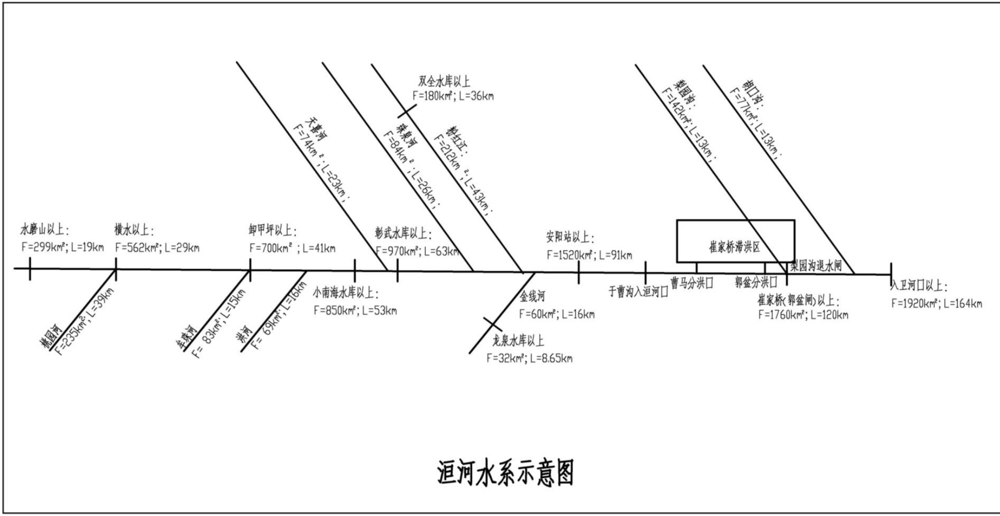  
图 2-1 洹河水系示意图  

# 2.1.3 水利工程概况  

安阳河流域面积较大,地形复杂,区域内人口密集、活动频繁,需水量较大。建国以来,流域内修建了许多水利工程,减灾兴利。  

上游段属于林州盆地,人口密集,在支流上游修建了众多小型水库,蓄水兴利。中游穿行于低山峡谷中,两岸村庄少、人烟稀少,水利工程较少,在出山口附近修建有两座大中型水库。彰武水库以下进入平原区,干流上修建有较多蓄水闸坝,兴利灌溉。彰武以下的支流粉红江上建有双泉中型水库和数座小型水库,其他支流上建有众多小型水库。  

为保证卫河防洪安全,在干流下游左岸,崔家桥乡境内,开辟建设了崔家桥蓄滞洪区。  

# 2.1.3.1 水库工程  

安阳河干流上建有小南海水库和彰武水库两座大中型水库,建设目标主要为防洪、城市工业供水、灌溉、兼顾发电和水产养殖等综合利用。两座水库组成梯级水库,小南海水库以滞蓄洪水为主,下游彰武水库以调节径流、兴利为主,两库互相配合、联合运用,确保安阳市区、京广铁路、京港澳高速和 107 国道的安全。小南海水库控制流域面积 $850\mathrm{km}^{2}$ ,总库容 1.075 亿 $\mathrm{m}^{3}$ ;彰武水库控制小南海水库以下区间面积 $120\mathrm{km}^{2}$ ,总库容 0.78 亿 $\mathrm{m}^{3}$ 。彰武、南海两水库控制总流域面积 $970\mathrm{km}^{2}$ ,占安阳河总流域面积 $1920\mathrm{km}^{2}$ 的 $50.5\%$ ,为安阳市以上 $1520\mathrm{km}^{2}$ 的 $63.8\%$ ,对控制安阳河洪水十分有效。水库自建成运行以来,经历多次洪水,其中1963、1982、1996 年、2016 年四年来水较大,经两水库调蓄后:1963年水库下泄 $480\mathrm{m}^{3}/\mathrm{s}$ ,削减入库洪峰 $87\%$ ;1982 年水库下泄 $819\mathrm{m}^{3}/\mathrm{s}$ ,削减洪峰 $56\%$ ;1996 年水库控泄 $500\mathrm{m}^{3}/\mathrm{s}$ ,削减入库洪峰 $61\%$ ;2016年水库控泄 $670\mathrm{m}^{3}/\mathrm{s}$ ,削减入库洪峰 $78\%$ 。两水库有效地减轻了下游防汛压力,提高了河道下游及城市的防洪标准,防洪减灾效益显著。  

小南海库区以上,各支流上修建有较多小型水库。小(1)型水库 2座,其中,北采桑水库控制面积 $10\mathrm{km}^{2}$ ,库容 290 万 $\mathrm{m}^{3}$ ;团结水库控制面积 $7\mathrm{km}^{2}$ ,库容 117 万 $\mathrm{m}^{3}$ 。小(2)型水库 32 座,总控制面积约 $62\mathrm{km}^{2}$ ,总库容 815 万 $\mathrm{m}^{3}$ 。由于小型水库位置偏上,对洪水影响不大。  

小南海、彰武区间有西龙山、九堰两座小(2)型水库,控制面积$5.6\mathrm{km}^{2}$ ,库容 86 万 $\mathrm{m}^{3}$ 。  

彰武至安阳区间粉红江上有 1 座中型水库——双泉水库,控制流域面积 $180\mathrm{km}^{2}$ ,库容 1791 万 $\mathrm{m}^{3}$ ;小(1)型水库 3 座,分别为磊口、合山、石门翁水库,其中磊口水库位于粉红江干流上,控制面积 $47\mathrm{km}^{2}$ ,总库容 251.5 万 $\mathrm{m}^{3}$ 。金线河上有 1 座小(1)型水库——龙泉水库,控制面积 $32\mathrm{km}^{2}$ ,总库容 317 万 $\mathrm{m}^{3}$ 。其它小支沟上修建有合坟、小坟、水浴 3 座小(1)型水库,汇流面积很小,主要调节跃进渠来水。此外还有 17 座小(2)型水库,总库容 680 万 $\mathrm{m}^{3}$ 。双泉水库、龙泉水库对彰武水库以下洪水有一定控制作用。  

# ⑴ 小南海水库  

小南海水库位于安阳市西南 $35\mathrm{km}$ 的安阳河干流上,防洪标准为100年一遇洪水设计、2000 年一遇洪水校核。设计洪水位 $179.88\mathrm{m}$ ,相应库容 7251 万 $\mathrm{m}^{3}$ ;校核洪水位 $187.8\mathrm{m}$ ,总库容 1.075 亿 $\mathrm{m}^{3}$ ;正常蓄水位$173\mathrm{m}$ ,兴利库容 4380 万 $\mathrm{m}^{3}$ ;汛限水位 $160\mathrm{m}$ ,相应库容 1690 万 $\mathrm{m}^{3}$ ;死水位 $150.00\mathrm{m}$ ,死库容 460 万 $\mathrm{m}^{3}$ 。  

# ⑵ 彰武水库  

彰武水库位于安阳市西南 $25\mathrm{km}$ 的安阳河干流上,防洪标准为 50年一遇洪水设计、1000年一遇洪水校核。设计洪水位 $132.12\mathrm{m}$ ,库容 4738万 $\mathrm{m}^{3}$ ;校核洪水位 $137.14\mathrm{m}$ ,总库容 7785 万 $\mathrm{m}^{3}$ 。主汛期限制水位为$127.0\mathrm{m}$ ,正常蓄水位为 $128.70\mathrm{m}$ ,水库防洪库容为 5367 万 $\mathrm{m}^{3}$ ,设计兴利库容 4155 万 $\mathrm{m}^{3}$ ,近期兴利库容 2755 万 $\mathrm{m}^{3}$  

# ⑶ 双泉水库  

双泉水库位于安阳市西北 $23\mathrm{km}$ 的安阳河支流粉红江上,防洪标准为 50 年一遇洪水设计、1000 年一遇洪水校核。设计洪水位 $219.54\mathrm{m}$ ,库容 916 万 $\mathrm{m}^{3}$ ;校核洪水位 $224.13\mathrm{m}$ ,总库容 1791 万 $\mathrm{m}^{3}$ ,防洪库容 1411万 $\mathrm{m}^{3}$ ;正常蓄水位为 $215.5\mathrm{m}$ ,兴利库容 421 万 $\mathrm{m}^{3}$ ;死水位 $207\mathrm{m}$ ,死库容 50 万 $\mathrm{m}^{3}$ 。  

# ⑷ 龙泉水库  

龙泉水库位于安阳市龙泉镇西南 $1\mathrm{km}$ 的安阳河支流金线河上,防洪标准为 50 年一遇洪水设计、500 年一遇洪水校核。设计洪水位 $144.13\mathrm{m}$ ,库容 260 万 $\mathrm{m}^{3}$ ;校核洪水位 $145.60\mathrm{m}$ ,总库容 317 万 $\mathrm{m}^{3}$ ,防洪库容 171万 $\mathrm{m}^{3}$ ;正常蓄水位为 $140.45\mathrm{m}$ ,兴利库容 129 万 $\mathrm{m}^{3}$ ;死水位 $134.20\mathrm{m}$ ,死库容 17 万 $\mathrm{m}^{3}$ 。  

各水库相关主要特征指标见表  

表 2-4 各水库工程特性表  

<html><body><table><tr><td>序号</td><td>名称</td><td>单位</td><td>南海水库</td><td>彰武水库</td><td>双泉水库</td><td>龙泉水库</td></tr><tr><td></td><td>水文</td><td></td><td></td><td></td><td></td><td></td></tr><tr><td>1</td><td>所在河道</td><td></td><td>安阳河</td><td>安阳河</td><td>粉红江</td><td>金线河</td></tr><tr><td>2</td><td>坝址以上流域面积</td><td>km²</td><td>850</td><td>970</td><td>180</td><td>32</td></tr><tr><td>3</td><td>设计标准</td><td>%</td><td>1</td><td>2</td><td>2</td><td>2</td></tr><tr><td>4</td><td>校核标准</td><td>% </td><td>0.05</td><td>0.1</td><td>0.1</td><td>0.2</td></tr><tr><td>二</td><td>水库大坝</td><td></td><td></td><td></td><td></td><td></td></tr><tr><td>1</td><td>水库水位</td><td></td><td></td><td></td><td></td><td></td></tr><tr><td>(1)</td><td>校核洪水位</td><td>m</td><td>187.8</td><td>137.14</td><td>224.13</td><td>145.60</td></tr><tr><td>(2)</td><td>设计洪水位</td><td>m</td><td>179.88</td><td>132.12</td><td>219.54</td><td>144.13</td></tr><tr><td>(3)</td><td>兴利水位</td><td>m</td><td>173</td><td>128.7</td><td>215.5</td><td>140.45</td></tr><tr><td>(4)</td><td>死水位</td><td>m</td><td>150</td><td>118.0</td><td>207</td><td>134.20</td></tr><tr><td>2</td><td>水库容积</td><td></td><td></td><td></td><td></td><td></td></tr><tr><td>(1)</td><td>总库容</td><td>亿m3</td><td>1.075</td><td>7785</td><td>1791</td><td>317</td></tr><tr><td>(2)</td><td>调洪库容</td><td>万m3</td><td>9060</td><td>5367</td><td>1411</td><td>171</td></tr><tr><td>(3)</td><td>兴利库容</td><td>万m3</td><td>4380</td><td>3810</td><td>421</td><td>129</td></tr><tr><td>(4)</td><td>死库容</td><td>万m3</td><td>460</td><td>345</td><td>50</td><td>17</td></tr></table></body></html>  

# 2.1.3.2 崔家桥蓄滞洪区  

崔家桥蓄滞洪区是安阳河防洪工程的主要组成部分,位于干流下游左岸安阳县的崔家桥、永和、韩陵镇境内。崔家桥蓄滞洪区为一自然洼地,地面总体趋势西高东低,蓄滞洪区北以幸福渠左堤为界,东部沿永和乡朱小庄筑堤为界,西接自然高地,南部边界为安阳河左堤。蓄滞洪区涉及安阳县的崔家桥、韩陵、永和三个乡镇的 61 个村庄。崔家桥蓄滞洪区属于Ⅰ类特别重要蓄滞洪区,根据《海河流域漳卫河系防洪规划报告》规划,崔家桥蓄滞洪区设计滞洪标准为 20 年一遇,设计滞洪水位 $64.54\mathrm{m}$ 。河道与蓄滞洪区联合运用,使安阳河入卫河流量满足限泄$600\mathrm{m}^{3}/\mathrm{s}$ 的要求。崔家桥蓄滞洪区分洪口位于安阳河左岸,分别为曹马分洪口和郭盆分洪口。  

根据《安阳河河道治理工程可行性研究报告》(河南省豫北水利勘测设计院 2002 年),《崔家桥蓄滞洪区建设规划报告》(2005 年),结合安阳市城市防洪规划,崔家桥蓄滞洪区洪水调度运用原则如下:郭盆闸控制下泄 $600\mathrm{m}^{3}/\mathrm{s}$ ;安阳河流量小于 $600\mathrm{m}^{3}/\mathrm{s}$ 时,不启用崔家桥蓄滞洪区;当安阳河上游来水大于 $600\mathrm{m}^{3}/\mathrm{s}$ 、小于 $1100\mathrm{m}^{3}/\mathrm{s}$ 时,启用郭盆分洪口分洪;当安阳河发生 20 年一遇以上洪水时,曹马分洪口及郭盆分洪口同时分洪。  

目前,崔家桥蓄滞洪区未完全建成,近几年陆续安排有项目建设。  

# 2.1.3.3 蓄水建筑物(节制闸、坝)工程  

目前,安阳河上共建有 5 座水闸,已建成于曹闸、郭盆闸和豆公闸,在建工程有西湖闸和东湖闸。干流在市区段还建有两座蓄水橡胶坝:殷都坝、东风坝。  

# ⑴ 于曹闸  

于曹闸工程位于市区下游、安阳河桩号 $34+700$ 处,上游紧邻京港  

澳高速公路,2012 年建成,为一座景观节制闸,设计流量为 $2300\mathrm{m}^{3}/\mathrm{s}$ 。  

节制闸布置共 7 孔,单孔净宽 $10.0\mathrm{m}$ 。闸室结构采用开敞式结构,工作闸门采用双扉式钢闸门,液压启闭机控制。工作桥布置在闸室上部,共 9 跨,单跨长 $12.3\mathrm{m}$ ,桥面净宽 $4.5\mathrm{m}$ 。  

# ⑵ 郭盆闸  

郭盆闸位于安阳市白璧镇郭盆村北,安阳河桩号 $46{+}950$ 处,是座以防洪、灌溉为主的中型水闸,既是洹河崔家桥滞洪区入卫限泄$600\mathrm{m}^{3}/\mathrm{s}$ 控制性工程,也是洹南、洹东灌区的渠首枢纽工程。郭盆闸始建于 1956 年,为一座滚水坝。因蓄水位较低,不能满足灌溉引水要求,又于 1958 年改建成为郭盆闸,在坝上筑墩建闸,并扩宽左端深孔。1971年进行了改建,保留了左端深孔,以利冲淤,右端扩建了两孔泄洪闸。  

现状郭盆闸由浮体闸、左端两孔泄水闸和右端两孔泄洪闸组成。其中左端两孔为一孔深孔泄水闸和一孔浅孔泄水闸,右端两孔闸均为浅孔泄洪闸。  

郭盆闸初建时建设标准低,后虽经多次改建,但都不能从根本上解决工程结构不合理,控泄能力不足的问题,现状过水能力仅 $311\mathrm{m}^{3}/\mathrm{s}$ ,阻水严重;且水闸的防渗、导渗体系严重破坏;砼剥蚀脱落,骨料外露,严重影响水闸的安全运行,亟需进行除险加固。  

郭盆闸已列入国家病险水闸除险加固规划,前期工作已完成,即将除险加固。设计郭盆闸原址拆除重建,闸室中心与上游河道中心重合布置,节制闸布置共 5 孔,单孔净宽 $8.0\mathrm{m}$ ,总净宽 $40\mathrm{m}$ 。  

# ⑶ 豆公闸  

豆公闸位于安阳河桩号 $84\substack{+510}$ 处、内黄县豆公乡北部,距洹河入卫河口处 $6.83\mathrm{km}$ ,是一座以灌溉为主的中型水闸枢纽工程。设计流量为$600\mathrm{m}^{3}/\mathrm{s}$ 。豆公闸由南闸和北闸组成,两闸相距约 $70\mathrm{m}$ ,其中南闸兴建于 1958 年,建成时共 18 孔、单孔净宽 $2.5\mathrm{m}$ ,闸室长 $10\mathrm{m}$ ,1975 年 11月改为 15 孔,其中深孔 3 孔、次深孔 2 孔、浅孔 10 孔,总净宽 $48\mathrm{m}$ 。北闸兴建于 1978 年,闸室长 $14\mathrm{m}$ ,主闸为 3 孔,孔宽 $4.6\mathrm{m}$ ;1984 年北闸南侧新建发电站。  

豆公闸是内黄县豆公灌区的主要水源工程,建成后,解决了内黄县6 个乡镇养殖用水和 12 万亩耕地农业灌溉问题,改善了当地的农业生产条件。豆公闸初建时由于历史原因,受当时资金、技术等诸多因素影响,建筑材料及施工质量差,且年久失修,水闸长期带病运行。  

豆公闸已列入国家病险水闸除险加固规划,前期工作已完成,即将除险加固。设计对北闸进行除险加固、南闸拆除重建。北闸闸孔维持现状,采用开敞式结构,共 3 孔,单孔净宽 $4.6\mathrm{m}$ ;南闸拆除后重建 5 孔、单孔宽 6m 水闸。  

# ⑷ 西湖闸 (在建)  

西湖闸工程位于安阳市城区西部,洹河南水北调中线总干渠倒虹吸下游 $1.2\mathrm{km}$ ,安阳河桩号 $17{+}580$ 处,为一座景观节制闸,最大过闸流量 $3570\mathrm{m}^{3}/\mathrm{s}$ ,目前正在进行施工。  

西湖闸布置共 9 孔,单孔净宽 $10\mathrm{m}$ ,总净宽 $90\mathrm{m}$ ;闸门采用露顶式平面弧形钢闸门。  

# ⑸ 东湖闸 (在建)  

东湖闸工程位于安阳市区京广高速铁路桥东 $1.6\mathrm{km}$ ,安阳河桩号$42+760$ 处为一座景观节制闸,最大过闸流量为 $1100\mathrm{m}^{3}/\mathrm{s}$ ,目前正在进行施工。  

东湖闸布置共 7 孔,单孔净宽 $7.0\mathrm{m}$ ,总净宽 $49\mathrm{m}$ 。闸门采用露顶式平面钢闸门。  

# ⑹ 殷都坝  

殷都橡胶坝位于京广铁路上游 $420\mathrm{m}$ ,安阳河桩号 $27{+}190$ 处,于1996 年完建运行。工程现状为橡胶坝、船闸枢纽工程,全长 $85\mathrm{m}$ 。橡胶坝坝长 $62\mathrm{m},$ ,设于主河道上;船闸位于河道左岸,闸室长 $17.4\mathrm{m},$ ,宽 $6\mathrm{m}$ ;控制室设在左岸。  

# ⑺ 东风坝  

东风橡胶坝位于东风桥下游 $100\mathrm{m},$ ,安阳河桩号 $30\substack{+330}$ 处,于 1993年完建运行。橡胶坝全长 $79\mathrm{m}$ ;控制系统位于洹河右岸,原充水系统为自来水,经 2005 年改造后,水源取自坝上游河道集水池内。  

# 2.2 河道概况  

# 2.2.1 河道整体概况  

安阳河流域上宽下窄,呈倒葫芦形,地势起伏大,河道纵坡上陡下缓,过流能力上大下小,历史上洪水灾害频繁。  

安阳河上游自源头至水磨山位于林州盆地,人口密集,地势比较平坦,支流呈树冠状汇入,各支流流域面积均不很大,但水网密集,有一定的洪涝灾害。自水磨山至横水镇,河道穿行于缓丘峡谷中,两岸支流均不大,呈羽毛状汇入,洪水威胁不大。林州盆地内河道断面比较规则,宽度约五六十米,河道比降较缓,水磨山至横水镇河道断面宽窄不一,从六七十米到一百多米不等,局部有较大滩地。河道比降略陡。该段河道基本无堤防。在横水镇南部接纳该段最大支流桃园河。  

安阳河自横水镇东横水村进入中游,该段河段位于低中山区,河道穿行于峡谷中。林州市境内村庄较多,安阳县境内近河两岸基本无村庄。该段河道比降约为 1/300,基本无洪灾威胁。末端建有小南海水库和彰武水库。小南海水库和彰武水库之间横穿善应镇镇区,两岸人口密集、房屋临河依山而建,有防洪问题。  

安阳河自彰武水库出山进入平原,安阳市城区以上属于安阳河冲洪积扇,下部属于华北平原(黄淮海平原)。该段河道比降上陡下缓,过流能力上大下小,洪涝灾害频繁。  

根据河道地形地势特点及防洪存在问题,经安阳市水利部门讨论分析,确定本次系统治理范围主要是彰武水库以下河道,与已建工程一起,彻底解决下游安阳市区及广大平原耕地的防洪问题。考虑小南海水库以下经过善应镇镇区,一并考虑治理。  

# 2.2.2 系统治理河段概况  

安阳河系统治理工程范围为善应镇区段及彰武水库至入卫河口,包括善应镇区段(小南海水库以下至彰武水库库尾)和彰武水库以下段,其中善应镇区段长 $2.98\mathrm{km}$ 、彰武水库以下至至入卫河口段长 $91.58\mathrm{km}$ 。各分段基本情况如下:  

善应镇区段河道自小南海水库至彰武水库库区上游,位于峡谷中,长约 $3\mathrm{km}$ ,河道比降 $1/110{\sim}1/670$ ,主槽宽约 $60\mathrm{m}$ ,河谷为涌泉区(当地称“小南海泉”)。两岸有浅滩,宽度 $30{\sim}100\mathrm{m}$ ,河道比较顺直,岸坡较陡、多数护砌,河道两岸冲沟发育。该段河道穿过善应镇区,两岸村庄集中,房屋密集、人口众多,房屋临河依山而建,梯级而上。河道左岸为善应镇及北善应村,滨河修建有县乡道路,右岸为南善应村,两岸有二百多亩耕地。  

彰武水库至南水北调中线总干渠段河道长约 $16\mathrm{km}$ ,河口宽 $100\sim$ $300\mathrm{m}$ ,左右岸基本无堤防,现状过流能力大部分为 $3570{\sim}2390\mathrm{m}^{3}/\mathrm{s}$ ,河道左岸为山丘区,地势较高,地形有一定起伏;右岸为平原,现状基  

本为耕地。  

南水北调中线总干渠段以下进入安阳市区,至殷墟博物苑段河道长约 $9.7\mathrm{km}$ ,河口宽 $100{\sim}200\mathrm{m}$ ,左右岸基本无堤防,现状过流能力约为$2300\mathrm{m}^{3}/\mathrm{s}$ ,河道左岸基本为村庄及耕地,右岸为村庄及安阳钢铁集团、安阳电厂等厂矿企业;殷墟博物苑至于曹沟段河道位于城市建成区,该段河道已按 $2300\mathrm{m}^{3}/\mathrm{s}$ 疏挖,局部河段进行了裁弯取直,取直后河道长$9.28\mathrm{km}$ (取直前河道长约 $11\mathrm{km}$ ),两岸岸坡均进行了护砌。  

于曹沟以下河道长约 $56\mathrm{km}$ ,其中安阳县段长 $47.5\mathrm{km}$ 、内黄县段长$8.5\mathrm{km}$ ,该段河道过流能力逐渐减小,大部分河段过流能力不足 $300\mathrm{m}^{3}/\mathrm{s}$ ,其中于曹沟至郭盆闸 $1188{\sim}449\mathrm{m}^{3}/\mathrm{s}$ 、郭盆闸至安内界不足 $300\mathrm{m}^{3}/\mathrm{s}$ 、安内界至入卫河口段河道泄洪能力 $600\mathrm{m}^{3}/\mathrm{s}$ ,河道两岸基本为农田及零星村庄;现状右岸堤防基本完整,左岸堤防不连续,有两段河道无堤,一是柴村至西韩化村段河道无左堤,该段堤防已列入崔家桥蓄滞洪区工程建设年度工程中;二是齐村至豆公闸段河道无左堤,右岸局部无堤防。  

安阳河彰武水库以下进行过局部治理,但均不系统,整体效益无法发挥。自 1991 年至今,安阳河已治理河道长度 $9.28\mathrm{km}$ (安阳市区段殷墟博物苑至于曹沟,治理前长 11km),已列入中小河流治理河道长度13.61km。  

1991 年至 1993 年完成京广铁路桥至东风坝段治理工程,治理河道$3.27\mathrm{km}$ ,治理防洪标准为 50 年一遇;1992 年之至 1993 年对安阳河内黄段(安内县界至入卫河口)长约 8km 河道进行了治理,设计流量 $600\mathrm{m}^{3}/\mathrm{s}$ ;1995 年完成殷墟博物苑北至京广铁路桥治理工程,治理河道长 $2.33\mathrm{km}$ ,治理标准 50年一遇防洪;2000 年至 2002 年完成安阳河市区自东风坝至于曹沟段河道长 $5.3\mathrm{km}$ ,已按 50 年一遇防洪标准治理;2004 年,规划对于安阳河市区以下于曹沟\~郭盆闸段河道进行治理,长度 $11.09\mathrm{km}$ ,由于受多种因素影响及资金限制,仅对曹马分洪口下以 $4.1\mathrm{km}$ 的河道进行了较低标准疏浚。  

2014 年,编制完成《河南省安阳市安阳河于曹沟至崇义段河道治理工程初步设计报告》,已由河南省水利厅批复,治理段为于曹沟至崇义下游曹马分洪口段河道,批复治理长度为 6.16km,治理标准采用 50 年一遇防洪,设计流量 $2300\mathrm{m}^{3}/\mathrm{s}$ ,现正准备实施。  

2016 年,编制完成《河南省安阳市安阳县洹河辛村段河道治理工程初步设计报告》,已由安阳市水利局批复,治理段为辛村镇东至安(安阳县)内(内黄县)界段,治理长度 $7.45\mathrm{km}$ ,设计流量 $600\mathrm{m}^{3}/\mathrm{s}$ 。  

# 2.3 气象、水文特征  

# 2.3.1 气候特征  

安阳河流域属温带大陆性气候区,冬季受蒙古、西伯利亚高气压控制,天气寒冷干燥且多风沙,夏季由于冷暖气团交接而多暴雨。多年平均最高气温 $32.2^{\circ}\mathrm{C}$ (6 月),实测极端最高气温 $41.7^{\circ}\mathrm{C}$ (1955 年 5 月 24日)。月平均最低气温- $.6.5^{\circ}\mathrm{C}$ (元月),实测极端最低值- $-21.7^{\circ}\mathrm{C}$ (1951 年1 月 12 日);全年无霜期 200 天,日照累计时数 2388 小时,日照百分率$53\%$ ;冬春多北风,夏秋多南风,最大风速 $22\mathrm{m/s}$ (1954 年 6 月 21 日),汛期多年平均最大风速 $9.9\mathrm{m}/\mathrm{s}$ ;多年平均水面蒸发量约 $1100\mathrm{mm}$ ,陆面蒸发量 $520\mathrm{mm}$ ,年际变化不大。多年平均降雨量 $600\mathrm{mm}$ ,年内分布极不均匀,汛期 $6\sim9$ 月降雨量占全年的 $70\%\sim80\%$ ,年际变化大,年最大与年最小相差 $2\sim4$ 倍,而且有连续干旱和连续丰水的特点。  

由于降雨年际变幅大(加上喀斯特地质特点),以致反映在年径流、洪水等实测资料的年际变幅相应较大。  

# 2.3.2 暴雨特征  

安阳河流域暴雨主要由天气系统与地形条件结合所致。夏季太平洋副热带高压加强北上,易在太行山迎风坡形成大暴雨。根据暴雨天气普查结果,本流域天气系统以切变、西来槽发生机会最多,但造成本区特大暴雨的天气多为台风倒槽及西南涡。如 1956 年 8 月大暴雨为台风造成,1963 年 8 月暴雨为切变与西南涡相配合引起,1996 年 8 月暴雨为西风槽与台风倒槽结合所致,2016 年 7 月暴雨为受低槽东移与低层低涡、切变线共同影响。本区暴雨多集中在 7、8 两月,暴雨一般 3 天左右,强度较大的暴雨常集中在 1 天甚至数小时内,历时较长的暴雨通常由两个或两个以上的天气系统组合所形成。暴雨中心一般发生在太行山南麓或东麓迎风区,其中心与年雨量的高值区一致。  

安阳河流域山区地处太行山迎风坡,暴雨频次多、量级大,暴雨中心多出现在南海、彰武以上。2016 年 7 月 18 日 8 时至 20 日 8 时,受低槽东移与低层低涡、切变线共同影响,安阳河流域普降大到暴雨,24小时最大降雨量林州市砚花水雨量站 $646\mathrm{mm}$ ,为历史上实测最大 24h降雨量。  

# 2.3.3 洪水特征  

由于太行山地形陡峻,土层覆盖薄、植被差,安阳河水系的众多支流洪水一般均以陡涨陡落、洪量集中、洪峰高、历时短的形式出现,极易造成大洪水。一场大洪水的洪量相当集中,如 1963 年 8 月安阳河 24小时洪量占 7 日洪量的比重为 $45\%$ 。由于流域山地与平原的丘陵过渡带较短,河道源短流急,洪水流速大,传播时间短,从山区降雨到河道出山口出现洪水,一般河流不足 1 天时间。  

安阳河流域洪水的时空分布特点与暴雨基本一致,变差系数较大,安阳河 7 日洪量的变差系数达 0.7。1963 年安阳河崔家桥以上最大 7 日洪量达 3.26 亿 $\mathrm{m}^{3}$ ,1967 年最大6日洪量仅为0.41亿 $\mathrm{m}^{3}$ ,1963年是1967年的 8 倍。  

2016 年,安阳河流域普降大到暴雨。受暴雨影响,小南海水库实测最大洪峰 $3080\mathrm{m}^{3}/\mathrm{s}$ ,最大泄量 $650\mathrm{m}^{3}/\mathrm{s}$ ;彰武水库实测最大洪峰 2310$\mathrm{m}^{3}/\mathrm{s}$ ,最大泄量 $700\mathrm{m}^{3}/\mathrm{s}$ 。  

# 2.3.4 历史洪涝灾害及洪水调查  

# ⑴ 历史洪涝灾害  

安阳河流域上宽下窄,河道纵坡上陡下缓,过流能力上大下小。受河道特点限制,安阳河流域历史上洪水灾害频繁。据调查和有关资料记载,近 200 年来,安阳河发生的大洪水和一般洪水 20 多次,近 100 年来发生了 10 余次,历史特大洪水主要有 1892 年、1917 年、1924 年、1929 年和 1939 年等,解放后于 1956 年、1963 年、1975 年、1976 年、1982 年、1996 年和 2016 年发生了大洪水,尤以 1956 年、1963 年、1982年、1996 年和 2016 年发生了全流域特大洪水,灾害最为严重。  

1956 年 8 月 $1\sim5$ 日,安阳连降暴雨,洹、卫、漳河水漫溢造成特大灾害,超过 20 年来最高水位。郭家湾闸门、豆腐营村西和漳涧路口 3处溃决,31 个村庄和 23 条街巷被淹,倒房 1914 间,淹毁田禾 27500亩。洹河桥断行,市区电话中断。  

1963 年,安阳站洪峰流量为 $1180\mathrm{m}^{3}/\mathrm{s}$ ,安阳发电厂水深 $1.87\mathrm{m}$ ,市区水深 $1.0{\sim}1.5\mathrm{m}$ ,城市几乎瘫痪。  

1982 年 7 月 29 日洹河流域连降暴雨,山洪爆发,河水猛涨。至 8月 2 日,安阳站洪峰流量为 $2060\mathrm{m}^{3}/\mathrm{s}$ ,洪水倒灌,市区一片汪洋,水深  

1 米,82 个工厂被迫停产,房屋倒塌 10073 间,造成的直接损失 2 亿多元(当时价格),仅市区直接损失 0.49 亿元。京广铁路安阳段因铁桥淹没,导致铁路交通中断 18 个小时。  

1996 年,安阳站洪峰流量仅 $758\mathrm{m}^{3}/\mathrm{s}$ ,造成的直接经济损失达 1.1亿多元(当时价格)。  

2016 年 7 月 19 日,受低槽东移与低层低涡、切变线共同影响,安阳河流域普降特大暴雨,安阳县西部、林州市东北部降雨量超过 300 年一遇,局地达到千年一遇。由于降雨强度大,暴雨造成众多水库溢流,小南海、彰武、双全水库水位均超过历史最高水位。安阳河安阳水文站出现超保证洪水,安阳市区下游河堤多处决口,崔家桥滞洪区进水,损失惨重。受洪水影响,流域内 19 个乡镇不同程度受灾,农作物受灾面积 40 万亩以上,直接经济损失超过 50 亿元。  

# ⑵ 洪水调查  

河南省水利勘测设计院曾于 1955 年、1962 年、1987 年、2004 年先后进行过三次历史洪水调查及洪水复核工作,1989 年、2000 年、2011年有关单位均在此基础上,又进行了补充调查,并将安阳河一百年来洪水进行了分级统计。  

从小南海,彰武水库建库前的历史洪水调查情况来看,1892 年至今一百多年间,安阳站共发生较大洪水 10 次,其中(按已建水库情况考虑)洪峰流量超过 $1000\mathrm{m}^{3}/\mathrm{s}$ 的有 8 次,超过 $1500\mathrm{m}^{3}/\mathrm{s}$ 的有 4 次,超过$2000\mathrm{m}^{3}/\mathrm{s}$ 的有 2 次。安阳站较大洪峰流量统计表见表 2-5。  

表 2-5 安阳站大洪水统计表  

<html><body><table><tr><td rowspan="2">年份</td><td colspan="3">洪峰(m?/s)</td><td colspan="3">洪量（亿m²)</td><td rowspan="2">备注</td></tr><tr><td>发生日期</td><td>无库情况</td><td>有库情况</td><td>W5</td><td>W15</td><td>W30</td></tr><tr><td>1892</td><td></td><td>4000</td><td></td><td>2.77</td><td>4.06</td><td>5.18</td><td>调查</td></tr><tr><td>1917</td><td></td><td>2310</td><td></td><td></td><td></td><td></td><td>调查</td></tr><tr><td>1924</td><td>7.15</td><td>2010</td><td></td><td>0.772</td><td>1.05</td><td>1.56</td><td>调查</td></tr><tr><td>1929</td><td>8.12</td><td>2880</td><td></td><td>1.33</td><td>1.42</td><td>1.49</td><td>调 查</td></tr><tr><td>1939</td><td></td><td>2140</td><td></td><td></td><td></td><td></td><td>调查</td></tr><tr><td>1956</td><td>8.03</td><td>1030</td><td></td><td>1.25</td><td>1.97</td><td>2.64</td><td>实测</td></tr><tr><td>1963</td><td>8.08</td><td></td><td>1180</td><td>2.10</td><td>2.61</td><td>3.29</td><td>实 测</td></tr><tr><td>1982</td><td>8.02</td><td></td><td>2060</td><td>1.83</td><td>2.57</td><td>3.11</td><td>实 测</td></tr><tr><td>1996</td><td>8.04</td><td></td><td>780</td><td>0.79</td><td>1.15</td><td>1.44</td><td>实测</td></tr><tr><td>2016</td><td>7.19</td><td></td><td>1730</td><td></td><td></td><td></td><td>实测</td></tr></table></body></html>  

# 2.3.5 2016年汛情概况  

2016 年入汛以来,安阳市共发生了 4 次较大的暴雨及洪水,分别为7 月 8 日 8 时 ${\sim}7$ 月 10 日 8 时、7 月 14 日 8 时至 7 月 15 日 8 时、7 月18 日 8 时 ${\sim}20$ 日 8 时、8 月 3 日 8 时至 4 日 8 时。其中,7 月 18 日 8时 ${\sim}20$ 日 8 时的暴雨及洪水最为猛烈,局部地区达到历史极值。  

2016 年 7 月 18 日 8 时至 20 日 8 时,受低槽东移与低层低涡、切变线共同影响,安阳市普降大到暴雨,24 小时最大降雨量林州市砚花水雨量站 $646\mathrm{mm}$ ,降雨量频率达到 300 年一遇。  

# 2.3.5.1 雨情  

7 月 18 日 8 时至 20 日 8 时,全省平均降雨量 $78\mathrm{mm}$ ,鹤壁市平均降雨量 $204\mathrm{mm}$ ,安阳市平均降雨量 $192\mathrm{mm}$ ,新乡市平均降雨量 $119\mathrm{mm}$ 。累计最大点雨量林州市砚花水雨量站 $667\mathrm{mm}$ (另据安阳市气象局资料,最大点雨量为林州市东马鞍 $727\mathrm{mm}$ ,东岗镇 $690\mathrm{mm})$ ),东岗雨量站$656\mathrm{mm}$ ,安阳县新大堰雨量站 $558\mathrm{mm}$ ,林州市吴家井雨量站 $540\mathrm{mm}$ 。  

此次暴雨的特点是历时短、强度大、区域集中,主要集中在林州市东北部的东岗镇、河顺镇、横水镇,安阳县的西部。6 小时最大降雨量林州市东岗雨量站 $422.5\mathrm{mm}$ (19 日 10 时至 16 时),林州市砚花水雨量站 $371.5\mathrm{mm}$ (19 日 11 时至 17 时),安阳县新大堰雨量站(19 日 6 时至12 时) $320.5\mathrm{mm}$ 。24 小时最大降雨量林州市砚花水雨量站 $646\mathrm{mm}$ (19日 2 时至 20 日 2 时)、东岗雨量站 $637\mathrm{mm}$ (18 日 23 时至 19 日 23 时),降雨量频率达到 500 年一遇;安阳县新大堰雨量站(19 日 1 时至 20 日1 时) ${547\mathrm{mm}}$ ,林州市吴家井雨量站 $533\mathrm{mm}$ (19 日 2 时至 20 日 2 时),降雨量频率达到 300 年一遇。  

# 2.3.5.2 水库水情  

受降雨影响,小南海大型水库 20 日 2 时最高库水位 $175.65\mathrm{m}$ ,超汛限水位 $(160\mathrm{m})15.65\mathrm{m}$ ,超历史最高 $(175.42\mathrm{m})0.23\mathrm{m}$ ,最大泄量 $650\mathrm{m}^{3}/\mathrm{s}$ ,20 日 8 时库水位 $174.84\mathrm{m}$ ,蓄水量 0.54 亿立方米,泄量 $650\mathrm{m}^{3}/\mathrm{s}$ ;彰武中型水库 19 日 19 时最高库水位 $129.46\mathrm{m}$ ,超汛限水位( $(127.00\mathrm{m})2.46\mathrm{m}$ ,超历史最高( $128.50\mathrm{m})0.96\mathrm{m}$ ,最大泄量 $700\mathrm{m}^{3}/\mathrm{s}$ ,20 日 8 时库水位$127.65\mathrm{m}$ ,蓄水量 0.265 亿立方米,泄量 $500\mathrm{m}^{3}/\mathrm{s}$ ;安阳市粉洪江双全中型水库 19 日 21 时最高库水位 $221.80\mathrm{m}$ ,超汛限水位( $(214.00\mathrm{m})7.80\mathrm{m}.$ ,超历史最高( $(219.49\mathrm{m})2.31\mathrm{m}$ ,超设计水位( $221.45\mathrm{m})0.35\mathrm{m}$ ,最大泄量 $1500\mathrm{m}^{3}/\mathrm{s}$ ,20 日 8 时库水位 $215.11\mathrm{m}$ ,蓄水量 0.044 亿立方米,泄量$105\mathrm{m}^{3}/\mathrm{s}$ 。  

# 2.3.5.3 河道水情  

洹河安阳水文站 19 日 23 时 30 分洪峰水位 $75.66\ensuremath{\mathrm{m}}$ ,超保证水位( $75.18\mathrm{m}$ ) $0.48\mathrm{m}$ ,洪峰流量 $1730\mathrm{m}^{3}/\mathrm{s}$ ,保证流量( $1180\mathrm{m}^{3}/\mathrm{s};$ ),20 日 8时水位 $72.31\mathrm{m}$ ,流量 $550\mathrm{m}^{3}/\mathrm{s}$ 。  

洹河安阳市区以下河段出现 4 处决口,安阳市及时组织抢险,已于7 月 22 日全部封堵完毕。  

# 2.3.5.4 崔家桥蓄滞洪区水情  

由于安阳河上游来水量较大,崔家桥蓄滞洪区全面启用,区内各个村庄均有积水。  

经调查,2016 年 7 月 19 日 23 时 30 分左右,启用崔家桥蓄滞洪区,洪水通过曹马分洪口门分洪进入蓄滞洪区内部。7 月 21 日,进入崔家桥的海鑫路路面积水深度约为 $0.3\mathrm{m}$ ,崔家桥镇内部各村庄均有积水,进村道路积水过深仍无法通行。7 月 22 日,海鑫路路面基本无积水,进村道路仍有约 $0.5\mathrm{m}$ 深积水,无法通行。7 月 25 日,崔家桥镇西部、北部村庄基本恢复正常,村内基本无积水,村外耕地积水较浅,个别低洼地带积水无法排除;东部永和镇部分村庄积水严重,挖断省道 S219 向东部下游地区退水。7 月 30 日,永和镇部分村庄积水仍然严重。  

# 2.3.5.5 水库调度  

此次洪水过程中,在省防指指导下,安阳市防办精心计算、科学调度,充分利用小南海、彰武水库防洪库容进行削峰、错峰。双全水库最高库水位超设计水位 $0.35\mathrm{m}$ ,最大入库流量 $1900\mathrm{m}^{3}/\mathrm{s}$ ,最大泄量$1500\mathrm{m}^{3}/\mathrm{s}$ ;彰武、小南海水库最大入库 $3000\mathrm{m}^{3}/\mathrm{s}$ ,在确保水库安全的前提下,联合调度彰武、小南海控泄 $250\mathrm{m}^{3}/\mathrm{s}$ ,削减洪峰 $92\%$ ,避免了洹河、粉江河洪峰叠加,洹河最大洪峰流量控制到 $1730\mathrm{m}^{3}/\mathrm{s}$ ,保护了下游京广铁路、高速铁路、京港澳高速、安阳市区的安全。  

# 2.4 设计洪水  

# 2.4.1 计算依据  

⑴《水利水电工程等级划分及洪水标准》(SL252-2017);  
⑵《防洪标准》(GB50201-2014);  

⑶《水利水电工程水文计算规范》 (SL278-2002);  

⑷《水利水电工程设计洪水计算规范》(SL44-2006);⑸《灌溉与排水工程设计规范》(GB 50288-99);⑹《河南省水利工程水文计算常用图》(以下简称《73 图集》);⑺《河南省中小流域设计暴雨洪水图集》(河南省水利勘测设计院  
1984 年,简称《84 图集》);⑻《河南省暴雨洪水图集》(以下简称《05 图集》);⑼《海河流域防洪规划》(水规计[452]号);⑽《安阳城市防洪安阳河治理工程可行性研究报告》(河南省豫北  
水利勘测设计院 1991 年 5 月,简称《安阳河城市防洪可研》);(11)《安阳河设计洪水复核报告》(河南省安阳水文水资源局 2000年,  
简称《安阳河洪水复核》);(12)《安阳市城市防洪排涝规划(2011一2020)》(河南省安阳市水利  
局 安阳市规划设计院、河南省豫北水利勘测设计院,安政文[2011]19  
号文批复  2011 年 5 月);⒀《安阳城市防洪安阳河治理工程设计任务书》(河南省豫北水利  
勘测设计院 1991 年 5 月,海规字(1992)第 2 号文批复);⒁《安阳河市区东段治理工程可行性研究报告》(河南省豫北水利  
勘测设计院 2000 年 6 月,豫计投资[2000]742 号文批复);⒂《安阳河河道治理工程可行性研究报告》(河南省豫北水利勘测  
设计院 2002 年 5 月,豫计农经[2002]1780 号文批复);⒃《南水北调中线总干渠安阳段河渠交叉工程水文及水利计算报  
告》(河南省水利勘测设计院,2004 年 9 月)。(17)《安阳河小南海、彰武两水库水文复核报告》、《安阳市小南海水  

库除险加固工程初步设计报告》《安阳市彰武水库除险加固工程初步设计报告》(河南省水利勘测设计院);  

⒅ 1/50000 地形图及有关测量、勘探等资料。  

# 2.4.2 基础资料  

根据 1/50000 地形图,本次重新量算了安阳河的流域面积、干流河道长度、综合比降等参数,并与历次成果进行了分析对比,见表 2-6。  

表 2-6 安阳河及其支流历次流域面积成果表(单位: $\mathrm{km}^{2}.$ )  

<html><body><table><tr><td>河道</td><td>《安阳河城市防洪可研》、 《安阳河洪水复核》</td><td>2016年水文 普查</td><td>本次 复核</td><td>本次 取值</td></tr><tr><td>安阳河</td><td>1920</td><td>1678</td><td>1860</td><td>1678</td></tr><tr><td>黄华河</td><td></td><td>102</td><td>82.34</td><td></td></tr><tr><td>桃园河</td><td>180</td><td>245</td><td>235</td><td>235</td></tr><tr><td>牟珠河 (母猪河)</td><td>71</td><td>85</td><td>83</td><td>83</td></tr><tr><td>洪河 (新庄河)</td><td></td><td>70</td><td>69</td><td></td></tr><tr><td>天喜镇河 （交口沟）</td><td>72</td><td>75</td><td>74</td><td>74</td></tr><tr><td>珠泉河</td><td>115</td><td>89</td><td>84</td><td>84</td></tr><tr><td>粉红江</td><td>212</td><td>219</td><td>215</td><td>215</td></tr><tr><td>金线河</td><td>68</td><td>62</td><td>60</td><td>60</td></tr><tr><td>梨园沟</td><td>142</td><td>213</td><td>137</td><td>137</td></tr><tr><td>胡口沟</td><td>75</td><td></td><td>77</td><td>77</td></tr></table></body></html>  

本次安阳河及支流流域面积的复核成果与《安阳河城市防洪可研》、《安阳河设计洪水复核报告》比较后,两次成果基本一致;与 2016 年水文普查成果比较后,干流总面积相差 $182\mathrm{km}^{2}~(10.8\%)$ ,相差较大,山区支流面积成果基本一致,平原区支流面积相差较大。  

考虑到山区支流流域边界基本为干流边界,而本次复核的山区支流面积与水文普查成果基本一致,因此可以认定本次复核的安阳河山区流域面积基本与水文普查成果一致,两次流域面积复核成果主要差距在平原区内。  

安阳河干流河道特征表见表 2-7。  

表 2-7 安阳河干流河道特征表  

<html><body><table><tr><td>控制断面</td><td>流域面积 (km²)</td><td>区间面积 (km²)</td><td>区间河长 (km)</td><td>区间河道 比降</td></tr><tr><td>小南海水库</td><td>850</td><td>850</td><td>63</td><td>0.0025</td></tr><tr><td>彰武水库</td><td>970</td><td>100</td><td>10</td><td>0.0025</td></tr><tr><td>珠泉河汇入点</td><td>1068</td><td>98</td><td>7</td><td>0.0028</td></tr><tr><td>粉红江汇入点</td><td>1288</td><td>220</td><td>3</td><td>0.0016</td></tr><tr><td>京广铁路</td><td>1520</td><td>232</td><td>18</td><td>0.0008</td></tr><tr><td>崔家桥以上</td><td>1760</td><td>240</td><td>17</td><td>0.0007</td></tr><tr><td>卫河口以上</td><td>1920</td><td>200</td><td>48</td><td>0.0003</td></tr><tr><td>合计</td><td>1920</td><td></td><td>164</td><td></td></tr></table></body></html>  

# 2.4.3 设计标准  

安阳河是海河流域漳卫河水系卫河支流,主要接纳上游山区洪水及中下游平原区涝水。安阳河流域在安阳市涉及林州市、安阳县、安阳市区、城乡一体化示范区及内黄县等,根据安阳河防洪保护区的重要性及未来发展预测,依据《防洪标准》(GB50201-2014),并参考已规划治理河道的防洪标准和河道现状,确定安阳河系统治理规划标准。  

# ⑴ 已治理段河道设计标准  

安阳河属于海河支流。2005 年水利部海河水利委员会编制了《海河流域防洪规划》,并以水规计[2007]452 号文上报国务院,国务院以国函[2008]11 号文予以批复。主要批复意见:力争 2015 年海河流域中下游地区防洪标准达到 50 年一遇,永定河防洪标准达到 100 年一遇,北京市、天津市防洪标准达到 200 年一遇,石家庄市防洪标准达到 100 年一遇,中等城市防洪标准达到 $20\sim50$ 年一遇,重点支流防洪标准达到 $10\sim$ 20 年一遇。到 2025 年建设较为完善的现代化防洪减灾体系,与流域经济社会发展状况相适应。堤防要严格按标准建设,不得超过《海河流域防洪规划》确定的标准。根据《海河流域防洪规划》,安阳河上一级河道卫河防洪标准为 50 年一遇。  

近年来,安阳河安阳市市区及下游河段进行历次规划和治理。根据相关规范,依据《安阳市城市防洪排涝规划》、《海河流域防洪规划》等,参考卫河防洪标准及安阳河河道历次规划治理情况,安阳河防洪标准分段依据保护对象的不同而采用不同的标准。安阳市市区及下游河段防洪标准与历次规划防洪标准一致,分别为:安阳市按 100 年一遇设防,南水北调总干渠至秋口段按 100 年一遇洪水标准治理;近期秋口至曹马段按 50 年一遇治理,远期开辟分洪道,将防洪标准提高到 100 年一遇;曹马以下市区下游河道按 20 年一遇标准设防,配合崔家桥蓄滞洪区运用,保证限泄 $600\mathrm{m}^{3}/\mathrm{s}$ 入卫。根据有关标准、规范的规定和安阳河入卫限泄条件,安阳河除涝标准按 3 年一遇。  

# ⑵ 本次规划治理防洪标准  

本次规划依据现行《防洪标准》(GB50201-2014)及《安阳市城市防洪排涝规划》、《安阳市城市总体规划》对安阳河治理标准进行复核。本次规划依据保护对象的不同,将安阳河分为善应镇区段、市区上游段(彰武水库\~南水北调)、市区段(南水北调\~曹马分洪口)、市区下游段(曹马分洪口\~入卫河口),分河段采用不同的防洪标准。  

善应镇区段从小南海水库下游至彰武水库库区上游(S221 大白线公路),穿过善应镇,该段河道防洪标准按乡村防护区设计,当地常住人口约 3 万人,小于 20 万,防洪标准应达到 $10\sim20$ 年一遇。考虑当地为国家水利风景区,人口较为密集,地理位置重要,且现状河道治理标准为 20 年一遇,本次设计防洪标准仍采用 20 年一遇。  

市区上游段即彰武水库下游至南水北调中线总干渠段,该段防护区域内有全省百强乡镇第一名的水冶镇以及曲沟镇、洪河屯乡。2016 年11 月,安阳市部分区域管理范围和管理体制调整后,由殷都区代管水冶镇等原安阳县西部九个乡镇。考虑该区域目前由殷都区代管,为安阳市西部规划的重要城市功能组团,该段河道防洪标准按城市防护区设计,区域常住人口小于 20 万,防洪标准应达到 $20\sim50$ 年一遇。考虑该段河道防护区现状大多为乡镇及耕地,本次设计防洪标准采用 20 年一遇。  

市区段即南水北调中线总干渠至曹马分洪口段,根据 2015 年 9 月28 日国务院办公厅以国办函〔2015〕101 号印发的《关于批准安阳市城市总体规划的通知》,国务院原则同意《安阳市城市总体规划(2011—2020年)》。《总体规划》明确了安阳的城市定位为国家历史文化名城和豫晋冀三省交界地区区域性中心城市,预计到2020 年中心城区常住人口控制在150万人以内。根据《防洪标准》(GB50201-2014),安阳市为重要城市,现状常住人口 101.2 万人,规划常住人口在 150 万人以内,城区防洪标准应达到 $100{\sim}200$ 年一遇。根据《安阳市城市防洪排涝规划》、《安阳市城市总体规划(2011—2020 年)》,洹河城市段防洪标准近期按 50 年一遇治理,远期规划在秋口村向北开辟分洪道,将超标准洪水引入下游崔家桥蓄滞洪区,并将南水北调总干渠至秋口段河道防洪标准提高至 100 年一遇,从而将市区段防洪标准整体提高到 100 年一遇。  

市区下游段河道保护区以乡村为主,保护耕地 50 万亩,大于 30 万亩,防洪标准应达到 $20\sim30$ 年一遇。根据《海河流域漳卫河防洪规划》、《安阳市城市防洪排涝规划》,市区下游段河道防洪标准按 20 年一遇设防,配合崔家桥蓄滞洪区运用,保证限泄 $600\mathrm{m}^{3}/\mathrm{s}$ 入卫。  

# ⑶ 排涝标准  

安阳河主要承泄上游山区洪水,并沿途承纳中东部平原区涝水,主要排涝支沟为北万金渠、安丰沟、御路沟、漳涧沟、于曹沟、梨园沟等。  

根据《灌溉与排水工程设计规范》(GB50288-99),结合安阳河实际情况,安阳河市区上游段主要承泄上游山区洪水,不再考虑排涝标准,  

市区段(南水北总干渠\~郭盆闸段)按城市 2 年一遇排涝标准,市区下游段河道按 3 年一遇排涝标准。  

# 2.4.4 系统治理思路  

安阳河发源于太行山东麓,至内黄县范阳口入卫河,地势起伏大,河道纵坡上陡下缓。其中,彰武水库以上为山区段,河道比降陡,现有大Ⅱ型水库——小南海、中型水库——彰武水库、双泉水库;彰武水库至安阳市区(曹马分洪口段)为山区至平原的过渡河段;安阳市区以下为平原区,左岸开辟有崔家桥蓄滞洪区。  

安阳河系统治理工程主要是彰武水库以下河段。系统治理思路是:根据保护对象分段合理确定防洪标准;充分利用小南海水库、彰武水库控制安阳河干流洪水,发挥双泉水库、龙泉水库滞蓄支流洪水的作用;为保证卫河防洪安全,通过郭盆闸控制,利用崔家桥蓄滞洪区滞蓄洪水,保证限泄入卫河 $600\mathrm{m}^{3}/\mathrm{s}$ 的要求。通过河道整治、河槽疏浚、修筑堤防,改建阻水建筑物等工程措施,完善管理制度、提高管理能力和信息化水平等非工程措施,全面解决安阳河防洪问题。结合生态修复、水系连通等工程,系统治理安阳河,实现防洪减灾、改善环境,服务群众,可持续发展的目标。  

# 2.4.5 控制断面  

结合河道的特点及工程分布,确定控制断面见表 2-8。  

表 2-8 控制断面 (节点)表  

<html><body><table><tr><td>控制断面</td><td>流域面积 (km²)</td><td>区间面积 (km²)</td><td>区间河长 (km)</td><td>区间河道 比降</td><td>备注</td></tr><tr><td>小南海水库</td><td>850</td><td>850</td><td>63</td><td>0.0037</td><td>节点</td></tr><tr><td>善应镇善应桥</td><td>870</td><td>20</td><td>3.52</td><td>0.0043</td><td>控制断面</td></tr><tr><td>彰武水库</td><td>970</td><td>100</td><td>10</td><td>0.0024</td><td>控制断面</td></tr><tr><td>珠泉河汇入点</td><td>1068</td><td>98</td><td>7</td><td>0.0028</td><td>控制断面</td></tr><tr><td>粉红江汇入点</td><td>1288</td><td>220</td><td>1</td><td>0.0016</td><td>控制断面</td></tr><tr><td>京广铁路</td><td>1520</td><td>232</td><td>18</td><td>0.0008</td><td>控制断面</td></tr><tr><td>崔家桥以上</td><td>1760</td><td>240</td><td>17</td><td>0.0007</td><td>节点</td></tr><tr><td>卫河口以上</td><td>1960</td><td>200</td><td>48</td><td>0.0003</td><td>节点</td></tr></table></body></html>  

# 2.4.6 设计洪水计算  

安阳河进行过多次洪水分析计算。  

1987 年,河南省水利勘测设计院编制完成了《安阳河小南海、彰武两水库水文复核报告》,采用间接法对彰武水库以上设计洪水进行了分析计算,并在此基础上编制完成了《安阳市小南海水库除险加固工程初步设计报告》、《安阳市彰武水库除险加固工程初步设计报告》。  

1991 年,豫北院进行了安阳河设计洪水分析计算,编制完成了《安阳城市防洪安阳河治理工程可行性研究报告》及《安阳城市防洪安阳河治理工程设计任务书》(简称《安阳河城市防洪可研》),海河水利委员会以海规字(1992)第 2 号文批复设计任务书,其中的设计洪水采用了$1952\sim1984$ 年的降雨观测资料采用间接法进行计算。  

豫北院 1991 年 12 月编制的《安阳河治理一九九一年度工程设计》(即内黄段治理工程,省水利厅以豫水计字(1992)029 号文作了批复)、1992 年 7 月编制的《安阳城市防洪安阳河治理可行性研究报告(补充修订)》(省水利厅以豫水计字(1992)270 号文初审后转报海河水利委员会)、1993 年 12 月编制的《安阳河殷墟博物苑至京广铁路桥河道整治开发可行性研究报告》(省水利厅以豫水管字(1994)30 号文作了批复)、2000 年编制的《安阳河市区东段治理工程可行性研究报告》(河南省计委以豫计投资[2000]742 号文批复)均采用《安阳河城市防洪可研》中的设计成果。  

2000 年,河南省安阳水文水资源局对安阳河设计洪水进行了复核,编制完成了《安阳河设计洪水复核报告》(简称《安阳河洪水复核》),将系列资料延长至 1999 年后,仍采用间接法计算设计洪水。  

2011 年 5 月,河南省安阳市水利局、安阳市规划设计院、豫北院编制出版了《安阳市城市防洪排涝规划( $\phantom{0}{.2011}\sim2020\phantom{.0})\rangle$ 。在《安阳河洪水复核》的基础上将系列资料延长至 2009 年,计算得出设计暴雨,并与《安阳河城市防洪可研》的设计暴雨成果进行比较后,选择《城市防洪》中的计算结果作为最终成果。  

目前安阳河市区段已经按海委批复的标准进行了治理。本次安阳河系统治理依据河南省水利厅 2017 年 3 月编制的《河南省中小河流系统治理工程实施方案报告编制大纲》要求,充分了解河道防洪排涝工程现状及存在问题,了解各方需求,收集河道特征资料、河流水系资料、水文气象资料、地形地貌资料,雨情、水情、工情、灾情资料以及已有的设计成果,将安阳河作为一个整体进行水文复核、分析,并与原有水文计算成果对比,分析本次复核成果的合理性,最终确定设计洪水成果。  

# 2.4.6.1 计算方法及分区组合  

# ⑴ 计算方法  

目前,安阳河彰武水库以上现有横水、小南海水库、彰武水库三个水文站,仅有 1963 年、1982 年、1996 年、2000 年、2016 年 5 次实测洪水资料,系列较短;彰武水库以下计算河段内仅有安阳水文站,有解放前 7 年,解放后 36 年共 43 年的实测洪水资料,而 1958 年以后因上游修建小南海、彰武、双泉等三座大中型水库,且三座水库经过多次除险加固,河道上下游也经过多次整治,明显改变了洪水过程,难以对洪水进行还原,因此,无法采用直接法进行计算。而安阳河流域京广铁路以上山区段目前有 14 座雨量站,密度已达 $109\mathrm{km}^{2}/$ 站,分布较为均匀,故本次采用间接法计算设计洪水。  

# ⑵ 洪水组合  

结合河道的特点及工程分布,洪水地区组成按粉红江汇入口以上  

设计,彰武以上同频率,彰粉区间相应;粉红江汇入口以上设计,彰粉区间同频率,彰武以上相应两种组合,然后按面积比缩放的方法折算、演进、叠加后计算出其它控制断面设计洪水,比较分析后选择最后成果。各控制断面处设计洪水计算组合见表 2-9。  

表 2-9 分区组合表  

<html><body><table><tr><td>控制断面</td><td>序号</td><td>单元</td><td>组合情况</td></tr><tr><td>小南海水库</td><td></td><td>小南海水库以上</td><td></td></tr><tr><td rowspan="2">善应桥段</td><td rowspan="2">组合1</td><td>南海水库下泄</td><td></td></tr><tr><td>区间洪水</td><td></td></tr><tr><td rowspan="2">彰武水库</td><td rowspan="2">组合1</td><td>小南海水库以上</td><td></td></tr><tr><td>南彰区间</td><td></td></tr><tr><td rowspan="4">珠泉河汇入后</td><td rowspan="2">组合1</td><td>彰武水库以上</td><td>相应</td></tr><tr><td>区间洪水</td><td>同频率</td></tr><tr><td rowspan="2">组合2</td><td>彰武水库以上</td><td>同频率</td></tr><tr><td>区间洪水</td><td>相应</td></tr><tr><td rowspan="4">粉红江汇入后</td><td rowspan="2">组合1</td><td>珠泉河汇入点以上</td><td>相应</td></tr><tr><td>双泉水库下泄+区间洪水</td><td>同频率</td></tr><tr><td rowspan="2">组合2</td><td>珠泉河汇入点以上</td><td>同频率</td></tr><tr><td>双泉水库下泄+区间洪水</td><td>相应</td></tr></table></body></html>  

粉红江汇入后的防洪河道仅有金线河汇入,考虑到金线河流域面积较小,洪量较小,龙泉水库库容较大,对洪水具有较好调蓄作用,因此金线河洪水对安阳河整体洪水影响不大,故本次不再考虑。  

# ⑶ 小结  

综上所述,本次设计洪水计算采用间接法通过设计暴雨推求设计洪水。计算过程简述如下:采用不同的洪水频率组合,计算各单元的设计洪水,然后错峰叠加,求得各控制断面的设计洪水。  

# 2.4.6.2 设计暴雨  

# ⑴ 设计面雨量  

根据调查统计,现有安阳河流域林州、姚村、河顺、小南海、彰武、横水等 15 个雨量站 $1975{\sim}2016$ 年共 40 年(缺 1999 年、2001 年)的 1h、6h、24h 实测雨量资料。  

经审查,流域内 14 个雨量站自建站以来,观测业务执行有关规范规定,每年都进行资料合理性检查和综合性检查,并经安阳市水文水资源局整编,资料成果可靠;安阳河流域气象条件和下垫面条件基本稳定,各种观测器械满足国家规范要求,资料一致;同时,本次实测资料系列长度符合规范规定的系列长度(30 年以上)的要求,且 14 座雨量站在流域内密度达 $109\mathrm{km}^{2}/$ 站,分布较为均匀,因此可以认为资料系列具有较好的代表性。因此,经三性审查后,本次采用的实测雨量资料满足使用要求,可以作为本次计算的基础数据。  

根据分区组及组合情况对各分区的面雨量进行统计计算,其中各分区面雨量计算采用分时段(1h、6h、24h),按加权平均法求得,权重按泰森多边形计算。各分区权重见下表 2-10。  

表 2-10 各雨量站权重表  

<html><body><table><tr><td rowspan="2">控制断面</td><td rowspan="2">雨量站</td><td colspan="2">6h、24h</td><td colspan="2">1h</td></tr><tr><td>流域面积（km²)</td><td>权重</td><td>流域面积（km²)</td><td>权重</td></tr><tr><td rowspan="11">彰武水库 以上</td><td>姚村</td><td>84</td><td>0.09</td><td></td><td></td></tr><tr><td>石楼</td><td>79</td><td>0.08</td><td></td><td></td></tr><tr><td>小屯</td><td>147</td><td>0.15</td><td></td><td></td></tr><tr><td>林州</td><td>74</td><td>0.08</td><td>437</td><td>0.45</td></tr><tr><td>南陵阳</td><td>60</td><td>0.06</td><td></td><td></td></tr><tr><td>河顺</td><td>35</td><td>0.04</td><td></td><td></td></tr><tr><td>横水</td><td>171</td><td>0.18</td><td>295</td><td>0.30</td></tr><tr><td>东姚</td><td>102</td><td>0.11</td><td></td><td></td></tr><tr><td>施家沟</td><td>85</td><td>0.09</td><td></td><td></td></tr><tr><td>小南海</td><td>108</td><td>0.11</td><td>211</td><td>0.22</td></tr><tr><td>彰武</td><td>25</td><td>0.03</td><td>25</td><td>0.03</td></tr><tr><td rowspan="11">粉红江 汇入后</td><td>合计</td><td>970</td><td>1.00</td><td>970</td><td>1.00</td></tr><tr><td>姚村</td><td>82</td><td>0.06</td><td></td><td></td></tr><tr><td>石楼</td><td>77</td><td>0.06</td><td></td><td></td></tr><tr><td>小屯</td><td>145</td><td>0.11</td><td></td><td></td></tr><tr><td>林州</td><td>72</td><td>0.06</td><td>430</td><td>0.33</td></tr><tr><td>南陵阳</td><td>59</td><td>0.05</td><td></td><td></td></tr><tr><td>河顺</td><td>100</td><td>0.08</td><td></td><td></td></tr><tr><td>横水</td><td>173</td><td>0.13</td><td>346</td><td>0.27</td></tr><tr><td>东姚</td><td>100</td><td>0.08</td><td></td><td></td></tr><tr><td>施家沟 小南海</td><td>84</td><td>0.07</td><td></td><td></td></tr><tr><td>东河坟</td><td>112</td><td>0.09</td><td>225</td><td>0.17</td></tr><tr><td></td><td>25</td><td>0.02</td><td>26</td><td>0.02</td></tr></table></body></html>  

续表 2-10 各雨量站权重表  

<html><body><table><tr><td rowspan="2">控制断面</td><td rowspan="2">雨量站</td><td colspan="2">6h、24h</td><td colspan="2">1h</td></tr><tr><td>流域面积 (km²)</td><td>权重</td><td>流域面积（km²)</td><td>权重</td></tr><tr><td rowspan="5">粉红江 汇入后</td><td>李珍</td><td>74</td><td>0.06</td><td></td><td></td></tr><tr><td>彰武</td><td>36</td><td>0.03</td><td>66</td><td>0.05</td></tr><tr><td>双泉</td><td>59</td><td>0.05</td><td>196</td><td>0.15</td></tr><tr><td>水冶</td><td>91</td><td>0.07</td><td></td><td></td></tr><tr><td>合计</td><td>1289</td><td>1.00</td><td>1289</td><td>1.00</td></tr><tr><td rowspan="7">彰武~粉红 江汇流口 区间</td><td>河顺</td><td>65</td><td>0.20</td><td></td><td></td></tr><tr><td>李珍</td><td>68</td><td>0.21</td><td></td><td></td></tr><tr><td>双全</td><td>61</td><td>0.19</td><td>424</td><td>0.76</td></tr><tr><td>东河坟</td><td>26</td><td>0.08</td><td>48</td><td>0.15</td></tr><tr><td>水冶</td><td>87</td><td>0.27</td><td></td><td></td></tr><tr><td>彰武</td><td>10</td><td>0.03</td><td>29</td><td>0.09</td></tr><tr><td>总计</td><td>318</td><td>1.00</td><td>318</td><td>1.00</td></tr></table></body></html>  

面雨量统计采用年最大值独立选样方法进行计算,各面雨量系列结果见表 2-11。  

表 2-11 各分区各时段设计面雨量系列表(单位:mm)  

<html><body><table><tr><td rowspan="2">年份</td><td colspan="3">彰武以上</td><td colspan="3">高速以上</td><td colspan="3">粉红江</td></tr><tr><td>1h</td><td>6h</td><td>24h</td><td>1h</td><td>6h</td><td>24h</td><td>1h</td><td>6h</td><td>24h</td></tr><tr><td>1975</td><td>33</td><td>56</td><td>102</td><td>33</td><td>55</td><td>95</td><td>32</td><td>57</td><td>92</td></tr><tr><td>1976</td><td>25</td><td>61</td><td>123</td><td>25</td><td>60</td><td>119</td><td>34</td><td>70</td><td>134</td></tr><tr><td>1977</td><td>30</td><td>51</td><td>67</td><td>30</td><td>54</td><td>66</td><td>46</td><td>71</td><td>76</td></tr><tr><td>1978</td><td></td><td>42</td><td>63</td><td></td><td>49</td><td>68</td><td></td><td>81</td><td>96</td></tr><tr><td>1979</td><td>8</td><td>34</td><td>48</td><td>10</td><td>36</td><td>47</td><td>4</td><td>49</td><td>55</td></tr><tr><td>1980</td><td>31</td><td>41</td><td>53</td><td>33</td><td>40</td><td>50</td><td>68</td><td>43</td><td>52</td></tr><tr><td>1981</td><td>32</td><td>53</td><td>67</td><td>29</td><td>45</td><td>57</td><td>20</td><td>26</td><td>39</td></tr><tr><td>1982</td><td>40</td><td>95</td><td>185</td><td>38</td><td>100</td><td>192</td><td>34</td><td>123</td><td>244</td></tr><tr><td>1983</td><td>32</td><td>43</td><td>87</td><td>29</td><td>43</td><td>80</td><td>22</td><td>48</td><td>75</td></tr><tr><td>1984</td><td>29</td><td>75</td><td>116</td><td>27</td><td>75</td><td>114</td><td>25</td><td>80</td><td>126</td></tr><tr><td>1985</td><td>22</td><td>44</td><td>44</td><td>25</td><td>45</td><td>45</td><td>43</td><td>54</td><td>81</td></tr><tr><td>1986</td><td>33</td><td>51</td><td>65</td><td>30</td><td>51</td><td>64</td><td>24</td><td>59</td><td>75</td></tr><tr><td>1987</td><td>35</td><td>54</td><td>54</td><td>32</td><td>53</td><td>53</td><td>24</td><td>52</td><td>63</td></tr><tr><td>1988</td><td>40</td><td>62</td><td>88</td><td>35</td><td>57</td><td>81</td><td>19</td><td>46</td><td>74</td></tr><tr><td>1989</td><td>61</td><td>105</td><td>146</td><td>52</td><td>100</td><td>134</td><td>18</td><td>97</td><td>122</td></tr><tr><td>1990</td><td>50</td><td>54</td><td>68</td><td>67</td><td>55</td><td>66</td><td>150</td><td>63</td><td>68</td></tr><tr><td>1991</td><td>27</td><td>41</td><td>87</td><td>25</td><td>37</td><td>74</td><td>16</td><td>30</td><td>49</td></tr><tr><td>1992</td><td>22</td><td>44</td><td>59</td><td>20</td><td>40</td><td>53</td><td>15</td><td>30</td><td>43</td></tr><tr><td>1993</td><td>30</td><td>36</td><td>55</td><td>28</td><td>37</td><td>54</td><td>25</td><td>45</td><td>63</td></tr><tr><td>1994</td><td>40</td><td>94</td><td>152</td><td>41</td><td>92</td><td>155</td><td>50</td><td>98</td><td>192</td></tr><tr><td>1995</td><td>44</td><td>77</td><td>100</td><td>40</td><td>68</td><td>90</td><td>31</td><td>48</td><td>75</td></tr><tr><td>1996</td><td>76</td><td>148</td><td>293</td><td>67</td><td>156</td><td>283</td><td>39</td><td>194</td><td>299</td></tr><tr><td>1997</td><td>22</td><td>37</td><td>47</td><td>25</td><td>40</td><td>48</td><td>49</td><td>52</td><td>59</td></tr><tr><td>1998</td><td>37</td><td>70</td><td>103</td><td>34</td><td>72</td><td>104</td><td>24</td><td>85</td><td>123</td></tr><tr><td>2000</td><td>36</td><td>72</td><td>118</td><td>34</td><td>73</td><td>126</td><td>7</td><td>7</td><td>12</td></tr></table></body></html>  

续表 2-11 各分区各时段设计面雨量系列表(单位:mm)  

<html><body><table><tr><td rowspan="2">年份</td><td colspan="3">彰武以上</td><td colspan="3">高速以上</td><td colspan="3">粉红江</td></tr><tr><td>1h</td><td>6h</td><td>24h</td><td>1h</td><td>6h</td><td>24h</td><td>1h</td><td>6h</td><td>24h</td></tr><tr><td>2002</td><td>21</td><td>34</td><td>47</td><td>19</td><td>32</td><td>42</td><td>24</td><td>83</td><td>170</td></tr><tr><td>2003</td><td>20</td><td>30</td><td>66</td><td>20</td><td>30</td><td>63</td><td>61</td><td>19</td><td>27</td></tr><tr><td>2004</td><td>41</td><td>49</td><td>69</td><td>38</td><td>46</td><td>61</td><td>12</td><td>27</td><td>32</td></tr><tr><td>2005</td><td>35</td><td>60</td><td>106</td><td>33</td><td>54</td><td>95</td><td>27</td><td>35</td><td>64</td></tr><tr><td>2006</td><td>28</td><td>43</td><td>50</td><td>31</td><td>46</td><td>54</td><td>34</td><td>42</td><td>48</td></tr><tr><td>2007</td><td>57</td><td>73</td><td>116</td><td>52</td><td>75</td><td>112</td><td>30</td><td>41</td><td>79</td></tr><tr><td>2008</td><td>31</td><td>47</td><td>61</td><td>29</td><td>52</td><td>69</td><td>54</td><td>61</td><td>73</td></tr><tr><td>2009</td><td>26</td><td>49</td><td>75</td><td>26</td><td>45</td><td>69</td><td>42</td><td>85</td><td>119</td></tr><tr><td>2010</td><td>47</td><td>53</td><td>64</td><td>40</td><td>51</td><td>61</td><td>24</td><td>72</td><td>105</td></tr><tr><td>2011</td><td>30</td><td>35</td><td>53</td><td>30</td><td>36</td><td>52</td><td>23</td><td>38</td><td>64</td></tr><tr><td>2012</td><td>37</td><td>50</td><td>80</td><td>31</td><td>47</td><td>76</td><td>11</td><td>51</td><td>63</td></tr><tr><td>2013</td><td>38</td><td>45</td><td>60</td><td>37</td><td>41</td><td>56</td><td>33</td><td>41</td><td>59</td></tr><tr><td>2014</td><td>26</td><td>39</td><td>68</td><td>31</td><td>47</td><td>71</td><td>16</td><td>41</td><td>77</td></tr><tr><td>2015</td><td>35</td><td>63</td><td>104</td><td>32</td><td>55</td><td>91</td><td>32</td><td>33</td><td>53</td></tr><tr><td>2016</td><td>50</td><td>145</td><td>264</td><td>52</td><td>149</td><td>274</td><td>60</td><td>79</td><td>95</td></tr></table></body></html>  

面雨量频率分析按大小排列后计算,经验频率采用一般数学期望公  
式 $\mathrm{P{=}m}/$ ( $\ln+1$ ) $^{\ast}100\%$ 求得,频率曲线线型选择 p-Ⅲ型曲线,采用适线  
法求得各分区时段设计暴雨成果。各区间相应雨量采用公式  
“相应雨量 $=$ 流域水量 − 同频率水量 ”计算。计算成果见表 2-12\~2-14。相应面积  

表 2-12 安阳河各分区设计暴雨参数表 (单位:mm)  

<html><body><table><tr><td>分区</td><td>时段</td><td>均值</td><td>Cv</td><td>Cs</td></tr><tr><td rowspan="3">彰武以上</td><td>1h</td><td>34.8</td><td>0.35</td><td>3.5Cv</td></tr><tr><td>6h</td><td>58.9</td><td>0.46</td><td>3.5Cv</td></tr><tr><td>24h</td><td>91.8</td><td>0.60</td><td>3.5Cv</td></tr><tr><td rowspan="3">粉红江汇入点以上</td><td>1h</td><td>33.6</td><td>0.34</td><td>3.5Cv</td></tr><tr><td>6h</td><td>58.5</td><td>0.48</td><td>3.5Cv</td></tr><tr><td>24h</td><td>89.1</td><td>0.63</td><td>3.5Cv</td></tr><tr><td rowspan="3">彰武~粉红江汇流口 区间</td><td>1h</td><td>33.6</td><td>0.64</td><td>3.5Cv</td></tr><tr><td>6h</td><td>63.6</td><td>0.57</td><td>3.5Cv</td></tr><tr><td>24h</td><td>97.4</td><td>0.72</td><td>3.5Cv</td></tr></table></body></html>  

表 2-13 安阳河各分区设计暴雨成果表 (单位:mm)  

<html><body><table><tr><td>分区</td><td>时段</td><td>5%</td><td>2%</td><td>1%</td></tr><tr><td rowspan="3">彰武以上</td><td>1h</td><td>58.09</td><td>66.89</td><td>73.33</td></tr><tr><td>6h</td><td>112.03</td><td>134.24</td><td>150.77</td></tr><tr><td>24h</td><td>202.10</td><td>253.92</td><td>293.27</td></tr><tr><td rowspan="3">粉红江汇入点以上</td><td>1h</td><td>55.38</td><td>63.54</td><td>69.49</td></tr><tr><td>6h</td><td>113.79</td><td>137.30</td><td>154.85</td></tr><tr><td>24h</td><td>201.70</td><td>255.91</td><td>297.23</td></tr><tr><td rowspan="3">彰武~粉红江汇流口 区间</td><td>1h</td><td>76.69</td><td>97.62</td><td>113.60</td></tr><tr><td>6h</td><td>135.94</td><td>169.11</td><td>194.20</td></tr><tr><td>24h</td><td>238.59</td><td>311.54</td><td>367.77</td></tr></table></body></html>  

表 2-14 安阳河各分区相应暴雨成果表 (单位:mm)  

<html><body><table><tr><td>分区</td><td>时段</td><td>5%</td><td>2%</td><td>1%</td><td>备注</td></tr><tr><td rowspan="3">彰武以上相应</td><td>1h</td><td>48.4</td><td>52.4</td><td>55.0</td><td rowspan="3">彰武以上设计，南海以上同 频</td></tr><tr><td>6h</td><td>106.5</td><td>126.9</td><td>141.9</td></tr><tr><td>24h</td><td>189.6</td><td>237.7</td><td>274.1</td></tr><tr><td rowspan="3">彰武~粉红江汇 流口区间</td><td>1h</td><td>47.1</td><td>53.3</td><td>57.8</td><td rowspan="3">绕郴高速以上设计，珠泉河 汇入点以上同频</td></tr><tr><td>6h</td><td>119.2</td><td>146.6</td><td>167.3</td></tr><tr><td>24h</td><td>200.5</td><td>262.0</td><td>309.3</td></tr></table></body></html>  

# ⑶ 暴雨递减指数  

按照历时关系 1h 以内为 $\mathrm{n}_{1}$ ,1-6h 为 $\mathrm{n}_{2}$ ,6-24h 为 n3。按照《84 图集》公式:  

$$
\begin{array}{l}{n_{1p}=1-1.285\mathrm{lg}\frac{\alpha H_{1P}}{\alpha H_{10P}}}\ {n_{2p}=1-1.285\mathrm{lg}\frac{\alpha H_{6P}}{\alpha H_{1P}}}\ {n_{3p}=1-1.661\mathrm{lg}\frac{\alpha H_{24P}}{\alpha H_{6P}}}\end{array}
$$  

其中 6h、24h 时的 $\upalpha$ 值由“水文图集”图 24 查得,计算不同频率的n2、n3 值,见表 2-15。  

表 2-15 不同频率暴雨递减指数表  

<html><body><table><tr><td rowspan="2">组合</td><td rowspan="2">分区</td><td colspan="3">n2p</td><td colspan="3">n3p</td></tr><tr><td>5%</td><td>2%</td><td>1%</td><td>5%</td><td>2%</td><td>1%</td></tr><tr><td rowspan="2">彰武水库以上同 频+区间相应</td><td>彰武以上</td><td>0.633</td><td>0.611</td><td>0.598</td><td>0.671</td><td>0.644</td><td>0.629</td></tr><tr><td>区间</td><td>0.482</td><td>0.4355</td><td>0.407</td><td>0.625</td><td>0.5814</td><td>0.557</td></tr><tr><td rowspan="2">彰武水库以上相 应+区间同频</td><td>区间</td><td>0.681</td><td>0.6934</td><td>0.701</td><td>0.594</td><td>0.5593</td><td>0.539</td></tr><tr><td>彰武以上</td><td>0.560</td><td>0.506</td><td>0.471</td><td>0.678</td><td>0.650</td><td>0.633</td></tr></table></body></html>  

# 2.4.6.3 彰武水库设计洪水  

彰武水库来水由两部分组成,小南海水库下泄 $^+$ 区间来水。其中,小南海水库来水采用淮上单位线法计算,然后根据其调度运行方式进行调洪演算,与小南海水库\~彰武水库区间的设计洪水(采用推理公式法计算)错峰叠加后,得出彰武水库同频及相应来水;然后根据彰武水库调度运用方式进行调洪验算,得出彰武水库下泄洪水。  

# ⑴ 南海水库设计洪水计算  

南海水库流域面积为 $850\mathrm{km}^{2}$ ,大于 $200\mathrm{km}^{2}$ 。根据《84 图集》使用说明,流域面积大于 $200~\mathrm{km}^{2}$ 的河道设计洪水计算采用淮上法,因此,本次采用淮上法进行计算。  

$\textcircled{1}$ 淮上法基本公式  

# a、淮上法基本公式:  

$$
\begin{array}{c}{{q_{^{p}}=K_{1}(B_{^{A\nu}}{}^{*}S A_{^\nu}^{^0.5}*{}A)^{^0.5}}}\ {{t_{^{p}}=\left(\displaystyle\frac{L x^{0.8}*A^{0.15}}{S_{L x}{}^{0.35}*{}q_{^{p}}{}^{0.33}}\right)^{0.5}}}\end{array}
$$  

其中: $\boldsymbol{\mathrm{q}}_{\mathrm{p}}$ :单位时段净雨深度为 $20\mathrm{mm}$ 的单位线洪峰流量,以 $\mathrm{m}^{3}/\mathrm{s}$ 计;  

$\mathrm{\bft_{pl}}$ :单位时段净雨深度为 $20\mathrm{mm}$ 的单位线涨峰历时,以 h 计;  

$\mathrm{K}_{1}$ , $\mathrm{K}_{2}$ :为综合系数,有所在地区 $\mathrm{{t_{r}}}$ 与 $\mathrm{\bft_{pl}}$ 的比值确定。首先根据流域面积由《84 图集》说明中的表(6)初选 $\mathrm{{t_{r}}}$ ,再根据 $\mathrm{{t_{r}}}$ 由表(7)选定$\mathrm{K}_{1}\mathrm{K}_{2}$ 值计算 $\mathrm{\sfq_{p}},\mathrm{\sft_{p1}}$ ,如果初选的 $\mathrm{{t_{r}}}$ 与计算的 $\mathrm{\bft_{pl}}$ 比值符合 $\mathrm{t_{r}=t_{p l}/2}$ 的规定,则选定 tr、K1, $\mathrm{K}_{2}$ 值适中,。若比值不符,则需重新选定 $\mathrm{t}$ ,直至符合为止。但是 $\mathrm{t}$ 最小不得小于 1h。  

A:集水面积,以 $\mathrm{km}^{2}$ 计。在 1/50000 航测图上量取。L:干流河道长度,以 $\mathrm{km}$ 计。自流域出口断面沿主河道量至分水岭的最长距离,包括主河道以上沟形不明显的沿流程的坡面长度。用1/50000 航测图量取。对双干或多干型流域应分别量出河长。  

SL: 相当于 L 的平均比降,无因次数,以小数计。  

AV: 为洪峰有效面积,以 $\mathrm{km}_{2}$ 计。  

BAV:相应于 AV 的平均宽度,以 $\mathrm{km}^{2}$ 计。  

LAV:为洪峰有效面积内的干流河长,以 $\mathrm{km}$ 计。  

$\mathrm{L}_{\mathrm{x}}$ :为洪峰有效面积最远处至出流断面的干流河长,以 $\mathrm{km}$ 计。  
$\mathrm{S_{Lx}}$ :相应于 $\operatorname{L}_{\mathbf{X}}$ 的河道平均比降,无因次数,以小数计。  
$\mathrm{S_{AV}}$ :相应于 $\mathrm{LAv}$ 的河道平均比降,无因次数,以小数计。  

# b、 $\mathbf{Z}\mathrm{-\mathbf{L}i}$ 曲线  

在绘制 $Z_{\mathrm{i}}-\mathrm{L}_{\mathrm{i}}$ 曲线时,规定用 1/5 万航测图。自流域出口断面向上游按等高距(1/50000 为 $10\mathrm{m}$ )依次切取等高线与干流河道相交处高程$Z_{\mathrm{i}}$ ,和 $Z_{\mathrm{i}}$ 相应的干流长度 $\mathrm{L}_{\mathrm{i}}$ ,点绘 $Z_{\mathrm{i}}-\mathrm{L}_{\mathrm{i}}$ 曲线。  

# $\therefore\mathrm{\bf~B}_{\mathrm{i}}{-}\mathrm{\bfL}_{\mathrm{i}}$ 曲线  

当 $200\mathrm{km}{<}\mathrm{A}{<}4000\mathrm{km}^{2}$ 时,用 1/100000 航测图,当 $\scriptstyle\mathrm{A}{>}4000\mathrm{km}^{2}$ 时,用 1/200000 航测图。自流域出口断面把干流河道长度等分为 10 段,在图上垂直各支流(到 2 级支流)按干流等分的长度勾绘等流时线,量取相邻等流时线间分块面积 $\mathrm{A}_{\mathrm{i}}$ ,求得分块面积的平均宽度 B( $\mathrm{{B}_{\mathrm{{i}}}=\mathrm{{A}_{\mathrm{{i}}}/\mathrm{{L}_{\mathrm{{i}}}}}}$ )点绘 $\mathrm{Bi}^{\sim}\mathrm{Li}$ 曲线。  

表 2-16 Zi-Li 曲线  

<html><body><table><tr><td>序号</td><td>△L (km)</td><td>Li (km)</td><td>Zi (m)</td><td>序号</td><td>△L (km)</td><td>Li (km)</td><td>Zi (m)</td></tr><tr><td>1</td><td>0</td><td>0.00</td><td>160</td><td>18</td><td>0.56</td><td>54.13</td><td>330</td></tr><tr><td>2</td><td>7.07</td><td>7.23</td><td>170</td><td>19</td><td>0.61</td><td>54.76</td><td>340</td></tr><tr><td>3</td><td>1.43</td><td>8.70</td><td>180</td><td>20</td><td>0.58</td><td>55.35</td><td>350</td></tr><tr><td>4</td><td>6.08</td><td>14.92</td><td>190</td><td>21</td><td>0.45</td><td>55.81</td><td>360</td></tr><tr><td>5</td><td>0.57</td><td>15.50</td><td>200</td><td>22</td><td>0.41</td><td>56.23</td><td>370</td></tr><tr><td>6</td><td>2.81</td><td>18.38</td><td>210</td><td>23</td><td>0.29</td><td>56.53</td><td>380</td></tr><tr><td>7</td><td>1.69</td><td>20.10</td><td>220</td><td>24</td><td>0.29</td><td>56.82</td><td>390</td></tr><tr><td>8</td><td>4.42</td><td>24.63</td><td>230</td><td>25</td><td>0.32</td><td>57.15</td><td>400</td></tr><tr><td>9</td><td>6.92</td><td>31.71</td><td>240</td><td>26</td><td>0.15</td><td>57.31</td><td>410</td></tr><tr><td>10</td><td>2.95</td><td>34.73</td><td>250</td><td>27</td><td>0.72</td><td>58.04</td><td>450</td></tr><tr><td>11</td><td>5.35</td><td>40.20</td><td>260</td><td>28</td><td>0.64</td><td>58.70</td><td>500</td></tr><tr><td>12</td><td>4.95</td><td>45.26</td><td>270</td><td>29</td><td>0.42</td><td>59.13</td><td>550</td></tr><tr><td>13</td><td>3.09</td><td>48.42</td><td>280</td><td>30</td><td>0.37</td><td>59.51</td><td>600</td></tr><tr><td>14</td><td>2.05</td><td>50.52</td><td>290</td><td>31</td><td>0.27</td><td>59.78</td><td>650</td></tr><tr><td>15</td><td>1.31</td><td>51.86</td><td>300</td><td>32</td><td>0.48</td><td>60.27</td><td>1000</td></tr><tr><td>16</td><td>0.79</td><td>52.67</td><td>310</td><td>33</td><td>0.32</td><td>60.60</td><td>1188</td></tr><tr><td>17</td><td>0.87</td><td>53.56</td><td>320</td><td></td><td></td><td></td><td></td></tr></table></body></html>  

表 2-17 Bi-Li 曲线  

<html><body><table><tr><td>序号</td><td>Li (km)</td><td>Ai (km²)</td><td>Bi (km)</td><td>序号</td><td>Li (km)</td><td>Ai (km²)</td><td>Bi (km)</td></tr><tr><td>1</td><td>0</td><td>0.0</td><td>0</td><td>7</td><td>36.36</td><td>113.0</td><td>18.65</td></tr><tr><td>2</td><td>6.06</td><td>18.6</td><td>3.07</td><td>8</td><td>42.42</td><td>70.7</td><td>11.67</td></tr><tr><td>3</td><td>12.12</td><td>25.9</td><td>4.28</td><td>9</td><td>48.48</td><td>110.3</td><td>18.20</td></tr><tr><td>4</td><td>18.18</td><td>43.6</td><td>7.20</td><td>10</td><td>54.54</td><td>167.1</td><td>27.58</td></tr><tr><td>5</td><td>24.24</td><td>54.4</td><td>8.98</td><td>11</td><td>60.60</td><td>153.0</td><td>25.26</td></tr><tr><td>6</td><td>30.30</td><td>93.2</td><td>15.39</td><td>12</td><td></td><td>850</td><td></td></tr></table></body></html>  

# $\textcircled{2}$ 单位线计算要素  

# a、流域特征值的确定  

在截取部分流域特征值时规定:  

非淮干淮南地区, $\mathrm{t_{f}/t_{p1}}{=}1/2{=}\mathrm{L_{Av}/L_{x}}$ , $\mathrm{B_{Av}{=}A_{v}/L_{A v}}$ 。  

确定 $\operatorname{L}_{\mathbf{X}}$ 、LAv、 $\mathbf{A}_{\mathrm{v}}$ 、 $\mathrm{B}_{\mathrm{Av}}$ 时用试错法。在 $\mathrm{Bi}^{\sim}\mathrm{Li}$ 曲线 $\mathrm{Li}$ 轴上做矩形abcd,交曲线与 c、d,使 $\mathrm{_{ob}}{=}2\mathrm{ab}$ ,平移 cd 于 $\overrightarrow{\mathrm{c}}\mathrm{d}^{,}$ ,使图中矩形 abc’d’的面积与 ad、bc 线、 $\mathrm{L}_{\mathrm{i}}$ 轴、以及 $\mathrm{B}_{\mathrm{i}}{\sim}\mathrm{L}_{\mathrm{i}}$ 曲线所围起来的面积相等,则矩形 abc’d’的面积就是 $\mathrm{A_{v}}$ , $\mathrm{L}_{\mathrm{x}}{=}_{0}\mathrm{b}$ , $\mathrm{\sfB_{Av}{=}a d}^{\mathrm{}}$ , $\mathrm{L}_{\mathrm{Av}}{=}\mathrm{ab}$ 。  

在求得 $\mathrm{L}_{\mathrm{x}}$ , $\mathrm{LAv}$ 后,在 $Z_{\mathrm{i}}-\mathrm{L}_{\mathrm{i}}$ 曲线上对应截取 $\mathrm{L}_{\mathrm{x}}$ , $\mathrm{LAv}$ 范围内 $\mathrm{Zi}^{\mathrm{\scriptsize~5}}\mathrm{Li}^{\mathrm{\scriptsize~5}}$ 值,按下式计算 $\mathrm{S_{Lx}}$ , $\mathrm{S_{Av}}$ :  

$$
\begin{array}{c}{{S_{L x}=\displaystyle\frac{(Z_{0}+Z_{1})L_{1}+(Z_{1}+Z_{2})L_{2}+...(Z_{n-1}+Z_{n})L_{n}-2Z_{0}L_{x}}{{L_{x}}^{2}*1000}}}\ {{{}}}\ {{S_{A\nu}=\displaystyle\frac{(Z_{0}+Z_{1})L_{1}+(Z_{1}+Z_{2})L_{2}+...(Z_{n-1}+Z_{n})L_{n}-Z_{0}L_{A\nu}}{{L_{A\nu}}^{2}*1000}}}\end{array}
$$  

式中: $Z_{0},\mathrm{~Z_{1},~}^{...}Z_{\mathrm{n}}$ :为 $\mathrm{L}_{\mathrm{x}}$ 、 $\mathrm{LAv}$ 范围内相邻等高线与干流相交处高程,m;$\mathrm{L}_{1},\mathrm{L}_{2},\cdots\mathrm{L}_{\mathrm{n}}$ 为 $\mathrm{L}_{\mathrm{X}}$ 、LAv 范围内相邻等高线干流河段长度, $\mathrm{km}$ 。由上述方法,计算得出各项参数,见下表。  

表 2-18 各项参数计算成果表  

<html><body><table><tr><td>参数</td><td>单位</td><td>成果</td></tr><tr><td>A</td><td>km²</td><td>850</td></tr><tr><td>Lx</td><td>km</td><td>45.9</td></tr><tr><td>LAv</td><td>km</td><td>22.95</td></tr><tr><td>BAV</td><td>km</td><td>13.99</td></tr><tr><td>SLx</td><td></td><td>0.0025</td></tr><tr><td>SAx</td><td></td><td>0.0118</td></tr></table></body></html>  

# b、单位过程线要素计算  

选定 tr、K1、 $\mathrm{K}_{2}$ 计算 $\mathrm{\bfq_{p}},\mathrm{\bft_{p}}1$ 。由流域面积大小,参照《84 图集》表6,选定 tr,由初选 tr 查表 7 得 $\mathrm{K}_{1}$ 、 $\mathrm{K}_{2}$ 值。将 $\mathrm{K}_{1}$ 、 $\mathrm{K}_{2}$ 、Lx、SAv、A、BAv、 $\mathrm{S_{Lv}}$ 带入 $\boldsymbol{\mathrm{q}}_{\mathrm{p}}$ 、tp1 公式计算 qp、tp1。  

南海水库以上流域面积为 $850\mathrm{km}^{2}$ ,故 $\scriptstyle{\mathrm{tr}}=2\{\sim4$ ,且本项目属其他地区,因此,根据《84 图集》使用说明表 6、表 7,试算 tr 得出:当 tr 取4 时 $\mathrm{t_{r}/t_{p l}}$ 最小,此时, $\mathrm{k}_{1}{=}9.4$ , $\mathrm{k}_{2}{=}0.91$ , $\mathrm{{t_{pl}=7.60h}}$ , $\mathrm{q}_{\mathrm{p}}{=}337.94\mathrm{m}^{3}/\mathrm{s}.$ 。  

# c、单位过程线推求  

根据《84 图集》使用说明,由 $\mathrm{{\bf~q}_{p},\Delta t_{p1}}.$ 、A 和单位净雨深 $10\mathrm{mm}$ ,通过f(P) $\frac{q_{p}\bullet t_{p1}}{10A})\sim\mathrm{P}$ 工作曲线查得 $\mathrm{P}$ 值。再由 $\mathrm{P}$ 值查单位过程线形状系数表,得峰值两边的单位过程线上各点坐标值,即可点绘单位过程线。  

表 2-19 概化过程线计算成果表  

<html><body><table><tr><td>X=ti/tp</td><td>0</td><td>0.333</td><td>0.667</td><td>1</td><td>1.333</td></tr><tr><td>qi/qp</td><td>0</td><td>0.039</td><td>0.585</td><td>1</td><td>0.708</td></tr><tr><td>X=ti/tp</td><td>1.667</td><td>2</td><td>2.333</td><td>2.666</td><td>3</td></tr><tr><td>qi/qp</td><td>0.312</td><td>0.1</td><td>0.026</td><td>0.006</td><td>0.001</td></tr></table></body></html>  

由非线性校正指数计算不同强度的 $\mathrm{\sfq_{pi}}$ 、tpi 及非线性外延上限值。非线性校正指数: $\mathrm{\sfq_{pi}}$ 采用 0.33, $\mathrm{{t_{pi}}}$ 采用-0.33。校正公式为:  

$$
\begin{array}{c}{{q_{p i}=q_{p}\displaystyle\left(\frac{R_{i}}{R_{20}}\right)^{0.33}}}\ {{t_{p_{i}}=t_{p_{1}}\displaystyle\left(\frac{R_{i}}{R_{20}}\right)^{-0.33}}}\end{array}
$$  

式中: $\mathrm{Ri}$ 为单位时段净雨深度。  

$\mathrm{R}_{20}$ 为单位时段净雨深度,为 $20\mathrm{mm}$ 。其中:当 $\mathrm{R}{\le}30\mathrm{mm}$ 时,用 $\mathrm{R}_{\mathrm{i}}{=}20\mathrm{mm}$ 强度单位线。当 $30{<}\mathrm{R}{\leq}50\mathrm{mm}$ 时,用 $\mathrm{R}_{\mathrm{i}}{=}40\mathrm{mm}$ 强度单位线。当 $50{<}\mathrm{R}{\le}70\mathrm{mm}$ 时,用 $\mathrm{R}_{\mathrm{i}}{=}60\mathrm{mm}$ 强度单位线。由上式计算不同强度单位线 $\mathrm{\sfq_{pi}}$ 、tpi 见表 2-20。  

表 2-20 不同强度单位线 qpi、tpi 计算成果表  

<html><body><table><tr><td>净雨强度</td><td>参数</td><td>结果</td><td>单位</td></tr><tr><td rowspan="2">Ri=20mm时</td><td>qp20=</td><td>337.94</td><td>m3/s</td></tr><tr><td>tp20=</td><td>7.60</td><td>h</td></tr><tr><td rowspan="2">Ri=40mm时</td><td>qp40=</td><td>424.79</td><td>m3/s</td></tr><tr><td>tp40=</td><td></td><td></td></tr><tr><td rowspan="2">Ri=60mm时</td><td>qp60=</td><td>6.05 485.61</td><td>h m3/s</td></tr><tr><td>tp60=</td><td>5.29</td><td>h</td></tr></table></body></html>  

由此计算不同时段单位过程线见表 2-21。  

表 2-21 时段单位线(转化后)  

<html><body><table><tr><td>t (h)</td><td>R=20mm</td><td>R=40mm</td><td>R=60mm</td></tr><tr><td>1</td><td>0</td><td>0</td><td>0</td></tr><tr><td>2</td><td>2.5</td><td>0.1</td><td>0.5</td></tr><tr><td>3</td><td>7.6</td><td>1.8</td><td>5.3</td></tr><tr><td>4</td><td>15.52</td><td>17.92</td><td>56.1</td></tr><tr><td>5</td><td>70.56</td><td>101.47</td><td>231.6</td></tr><tr><td>6</td><td>155.06</td><td>250.48</td><td>417.5</td></tr><tr><td>7</td><td>243.08</td><td>375.65</td><td>485.61</td></tr><tr><td>8</td><td>309.85</td><td>424.79</td><td>429.3</td></tr><tr><td>9</td><td>319.29</td><td>386.75</td><td>314.7</td></tr><tr><td>10</td><td>270.49</td><td>301.97</td><td>200.2</td></tr><tr><td>11</td><td>211.47</td><td>210.67</td><td>115.7</td></tr><tr><td>12</td><td>155.6</td><td>134.6</td><td>60</td></tr><tr><td>13</td><td>108.27</td><td>80.28</td><td>28.4</td></tr><tr><td>14</td><td>72.07</td><td>43.74</td><td>13.1</td></tr><tr><td>15</td><td>45.61</td><td>22.52</td><td>5.8</td></tr><tr><td>16</td><td>27.44</td><td>11.49</td><td>2.5</td></tr><tr><td>17</td><td>16.11</td><td>5.64</td><td>1</td></tr><tr><td>18</td><td>9.42</td><td>2.69</td><td>0</td></tr><tr><td>19</td><td>5.38</td><td>1.24</td><td></td></tr><tr><td>20</td><td>2.99</td><td>0.48</td><td></td></tr><tr><td>21</td><td>1.65</td><td>0</td><td></td></tr><tr><td>22</td><td>0.88</td><td></td><td></td></tr><tr><td>23</td><td>0.42</td><td></td><td></td></tr><tr><td>24</td><td>0</td><td></td><td></td></tr></table></body></html>  

# d、设计洪水  

根据《84 图集》计算出 24h 设计净雨分配,通过上面计算得出的单位过程线,计算出设计洪水。根据《84 图集》使用说明表⑶,结合暴雨递减指数的计算结果,得出 24h 净雨概化时程分配表,并计算得出 24h净雨过程线,见表 2-22,相应计算出设计洪水过程线,见表 $2{-}23\sim$ 表2-24。  

表 2-22 24h 净雨过程线成果表  

<html><body><table><tr><td rowspan="2">历时 (h)</td><td colspan="3">设计净雨 (同频) (mm)</td><td colspan="3">设计净雨 (相应） (mm)</td></tr><tr><td>5%</td><td>2%</td><td>1%</td><td>5%</td><td>2%</td><td>1%</td></tr><tr><td>1~6</td><td>0</td><td>0</td><td>0</td><td>0</td><td>0</td><td>0</td></tr><tr><td>7</td><td>3</td><td>4</td><td>5</td><td>2</td><td>4</td><td>5</td></tr><tr><td>8</td><td>3</td><td>4</td><td>5</td><td>2</td><td>4</td><td>5</td></tr><tr><td>9</td><td>4</td><td>6</td><td>8</td><td>3</td><td>6</td><td>7</td></tr><tr><td>10</td><td>4</td><td>7</td><td>６</td><td>4</td><td>6</td><td>8</td></tr><tr><td>11</td><td>4</td><td>7</td><td>6</td><td>4</td><td>6</td><td>8</td></tr><tr><td>12</td><td>4</td><td>5</td><td>6</td><td>3</td><td>5</td><td>6</td></tr><tr><td>13</td><td>4</td><td>5</td><td>6</td><td>3</td><td>5</td><td>6</td></tr><tr><td>14</td><td>8</td><td>12</td><td>14</td><td>7</td><td>11</td><td>13</td></tr><tr><td>15</td><td>28</td><td>42</td><td>49</td><td>26</td><td>39</td><td>46</td></tr><tr><td>16</td><td>5</td><td>8</td><td>6</td><td>5</td><td>7</td><td>8</td></tr><tr><td>17</td><td>4</td><td>5</td><td>6</td><td>3</td><td>5</td><td>6</td></tr><tr><td>18</td><td>6</td><td>10</td><td>12</td><td>5</td><td>6</td><td>11</td></tr><tr><td>19</td><td>4</td><td>7</td><td>６</td><td>4</td><td>6</td><td>8</td></tr><tr><td>20</td><td>4</td><td>6</td><td>8</td><td>3</td><td>6</td><td>7</td></tr><tr><td>21</td><td>3</td><td>5</td><td>6</td><td>3</td><td>4</td><td>6</td></tr><tr><td>22</td><td>3</td><td>5</td><td>6</td><td>3</td><td>4</td><td>6</td></tr><tr><td>23</td><td>3</td><td>4</td><td>5</td><td>2</td><td>4</td><td>5</td></tr><tr><td>24</td><td>3</td><td>4</td><td>5</td><td>2</td><td>4</td><td>5</td></tr><tr><td>合计</td><td>95</td><td>148</td><td>178</td><td>87</td><td>135</td><td>163</td></tr></table></body></html>  

表 2-23 南海水库以上各频率设计洪水过程线 (同频)  

<html><body><table><tr><td rowspan="2">时段t (h)</td><td colspan="3">设计洪峰（m?/s)</td><td rowspan="2">时段t (h)</td><td colspan="3">设计洪峰 (m3/s)</td></tr><tr><td>5%</td><td>2%</td><td>1%</td><td>5%</td><td>2%</td><td>1%</td></tr><tr><td>1</td><td>0</td><td>0</td><td>0</td><td>22</td><td>821</td><td>1320</td><td>1560</td></tr><tr><td>2</td><td>1</td><td>1</td><td>1</td><td>23</td><td>719</td><td>1160</td><td>1400</td></tr><tr><td>3</td><td>3</td><td>4</td><td>5</td><td>24</td><td>613</td><td>996</td><td>1210</td></tr><tr><td>4</td><td>7</td><td>11</td><td>14</td><td>25</td><td>501</td><td>818</td><td>1000</td></tr><tr><td>5</td><td>26</td><td>43</td><td>53</td><td>26</td><td>386</td><td>632</td><td>774</td></tr><tr><td>6</td><td>68</td><td>111</td><td>138</td><td>27</td><td>279</td><td>458</td><td>564</td></tr><tr><td>7</td><td>139</td><td>228</td><td>283</td><td>28</td><td>193</td><td>317</td><td>392</td></tr><tr><td>8</td><td>240</td><td>394</td><td>489</td><td>29</td><td>129</td><td>212</td><td>263</td></tr><tr><td>9</td><td>358</td><td>589</td><td>729</td><td>30</td><td>83</td><td>137</td><td>169</td></tr><tr><td>10</td><td>479</td><td>783</td><td>960</td><td>31</td><td>52</td><td>85</td><td>105</td></tr><tr><td>11</td><td>626</td><td>1010</td><td>1170</td><td>32</td><td>31</td><td>51</td><td>63</td></tr><tr><td>12</td><td>959</td><td>1500</td><td>1580</td><td>33</td><td>18</td><td>30</td><td>37</td></tr><tr><td>13</td><td>1450</td><td>2220</td><td>2550</td><td>34</td><td>10</td><td>17</td><td>21</td></tr><tr><td>14</td><td>1850</td><td>2800</td><td>3520</td><td>35</td><td>6</td><td>9</td><td>12</td></tr><tr><td>15</td><td>2020</td><td>3040</td><td>3880</td><td>36</td><td>3</td><td>5</td><td>6</td></tr><tr><td>16</td><td>1930</td><td>2890</td><td>3620</td><td>37</td><td>2</td><td>3</td><td>3</td></tr><tr><td>17</td><td>1700</td><td>2560</td><td>3080</td><td>38</td><td>1</td><td>1</td><td>2</td></tr><tr><td>18</td><td>1460</td><td>2220</td><td>2570</td><td>39</td><td>0</td><td>1</td><td>1</td></tr><tr><td>19</td><td>1250</td><td>1920</td><td>2200</td><td>40</td><td>0</td><td>0</td><td>0</td></tr><tr><td>20</td><td>1090</td><td>1690</td><td>1930</td><td>41</td><td>0</td><td>0</td><td>0</td></tr><tr><td>21</td><td>936</td><td>1480</td><td>1720</td><td>洪量（万m²)</td><td>8075</td><td>12580</td><td>15130</td></tr></table></body></html>  

表 2-24 南海水库以上各频率设计洪水过程线 (相应)  

<html><body><table><tr><td rowspan="2">时段t (h)</td><td colspan="3">设计洪峰(m3/s)</td><td rowspan="2">时段t (h)</td><td colspan="3">设计洪峰 (m3/s)</td></tr><tr><td>5%</td><td>2%</td><td>1%</td><td>5%</td><td>2%</td><td>1%</td></tr><tr><td>1</td><td>0</td><td>0</td><td>0</td><td>22</td><td>877</td><td>1190</td><td>1470</td></tr><tr><td>2</td><td>1</td><td>1</td><td>1</td><td>23</td><td>741</td><td>1050</td><td>1300</td></tr><tr><td>3</td><td>2</td><td>4</td><td>5</td><td>24</td><td>612</td><td>901</td><td>1120</td></tr><tr><td>4</td><td>6</td><td>10</td><td>13</td><td>25</td><td>488</td><td>739</td><td>918</td></tr><tr><td>5</td><td>23</td><td>38</td><td>48</td><td>26</td><td>370</td><td>571</td><td>709</td></tr><tr><td>6</td><td>61</td><td>100</td><td>125</td><td>27</td><td>265</td><td>414</td><td>515</td></tr><tr><td>7</td><td>125</td><td>206</td><td>257</td><td>28</td><td>182</td><td>286</td><td>357</td></tr><tr><td>8</td><td>216</td><td>356</td><td>444</td><td>29</td><td>121</td><td>191</td><td>239</td></tr><tr><td>9</td><td>323</td><td>532</td><td>663</td><td>30</td><td>77</td><td>123</td><td>154</td></tr><tr><td>10</td><td>435</td><td>707</td><td>879</td><td>31</td><td>48</td><td>76</td><td>95</td></tr><tr><td>11</td><td>540</td><td>913</td><td>1120</td><td>32</td><td>28</td><td>46</td><td>57</td></tr><tr><td>12</td><td>650</td><td>1370</td><td>1650</td><td>33</td><td>16</td><td>27</td><td>33</td></tr><tr><td>13</td><td>858</td><td>2030</td><td>2420</td><td>34</td><td>６</td><td>15</td><td>19</td></tr><tr><td>14</td><td>1130</td><td>2570</td><td>3050</td><td>35</td><td>5</td><td>8</td><td>10</td></tr><tr><td>15</td><td>1390</td><td>2790</td><td>3300</td><td>36</td><td>3</td><td>5</td><td>6</td></tr><tr><td>16</td><td>1580</td><td>2660</td><td>3140</td><td>37</td><td>1</td><td>2</td><td>3</td></tr><tr><td>17</td><td>1610</td><td>2350</td><td>2780</td><td>38</td><td>1</td><td>1</td><td>1</td></tr><tr><td>18</td><td>1500</td><td>2030</td><td>2410</td><td>39</td><td>0</td><td>0</td><td>1</td></tr><tr><td>19</td><td>1350</td><td>1760</td><td>2100</td><td>40</td><td>0</td><td>0</td><td>0</td></tr><tr><td>20</td><td>1190</td><td>1540</td><td>1860</td><td>41</td><td>0</td><td>0</td><td>0</td></tr><tr><td>21</td><td>1020</td><td>1350</td><td>1640</td><td>洪量（万m²)</td><td>7395</td><td>11475</td><td>13855</td></tr></table></body></html>  

# ⑵ 南海水库调洪验算  

根据《河南省安阳市小南海水库除险加固工程初步设计报告》,南海水库水位\~库容\~面积曲线,水位\~泄量曲线见表 $2{-}25{\sim}2{-}26$ 。由于水库近几年主体工程及库区无特殊变化,故本次调洪验算仍采用原数值。  

表 2-25 小南海水库水位\~库容\~面积曲线  

<html><body><table><tr><td>水位(m)</td><td>145</td><td>150</td><td>155</td><td></td><td></td><td></td><td></td><td></td><td></td><td></td></tr><tr><td></td><td></td><td></td><td></td><td>160</td><td>165</td><td>170</td><td>175</td><td>180</td><td>185</td><td>190</td></tr><tr><td>面积(km²)</td><td>0.4</td><td>0.9</td><td>1.2</td><td>1.7</td><td>2.2</td><td>2.8</td><td>3.4</td><td>3.9</td><td>4.6</td><td>5.1</td></tr><tr><td>库容(万m3)</td><td>150</td><td>460</td><td>980</td><td>1690</td><td>2660</td><td>3940</td><td>5500</td><td>7350</td><td>9460</td><td>11930</td></tr></table></body></html>  

南海水库现状防洪调度方案为:防洪限制水位为 $160\mathrm{m}$ ,当库区水位 $<179\mathrm{m}$ 时,输水洞全开,溢洪道闸门开度 $3.0\mathrm{m}$ ;当库区水位 $179{\sim}187\mathrm{m}$ 时,输水洞全开,溢洪道闸门开度 $9.5\mathrm{m}$ ;当库区水位 $>187\mathrm{m}$ 时,输水洞、溢洪道闸门全开。  

表 2-26 南海水库泄水建筑物水位\~流量关系线  

<html><body><table><tr><td colspan="2">输水洞</td><td colspan="2">溢洪道</td></tr><tr><td>H(m)</td><td>Q(m3/s)</td><td>H(m)</td><td>Q(m3/s)</td></tr><tr><td>139.5</td><td>0</td><td>168</td><td>0</td></tr><tr><td>144</td><td>26.7</td><td>169</td><td>100</td></tr><tr><td>145</td><td>34</td><td>170</td><td>240</td></tr><tr><td>150</td><td>57</td><td>172</td><td>600</td></tr><tr><td>155</td><td>74</td><td>174</td><td>1100</td></tr><tr><td>160</td><td>87</td><td>176</td><td>1720</td></tr><tr><td>165</td><td>99</td><td>178</td><td>2500</td></tr><tr><td>170</td><td>109.6</td><td>180</td><td>3390</td></tr><tr><td>175</td><td>119</td><td>182</td><td>4320</td></tr><tr><td>180</td><td>128</td><td>184</td><td>5290</td></tr><tr><td>185</td><td>137</td><td>186</td><td>6460</td></tr><tr><td>190</td><td>145</td><td>188</td><td>7810</td></tr><tr><td></td><td></td><td>190</td><td>9040</td></tr></table></body></html>  

本次调洪验算采用河南省水利勘测设计院“防洪系统模拟模型软件(SMFC)”进行调洪演算。调洪结果见表 2-27。  

表 2-27 南海水库下泄洪水过程线  

<html><body><table><tr><td rowspan="3">序号</td><td colspan="6">彰武水库以上同频</td><td colspan="6">彰武水库以上相应</td></tr><tr><td>P=5%</td><td></td><td>P=2%</td><td></td><td></td><td>P=1%</td><td></td><td>P=5%</td><td>P=2%</td><td></td><td>P=1%</td><td></td></tr><tr><td>时段 (h)</td><td>流量 (m3/s)</td><td>时段 (h)</td><td>流量 (m3/s)</td><td>时段 (h)</td><td>流量 (m3/s)</td><td>时段 (h)</td><td>流量 (m3/s)</td><td>时段 (h)</td><td>流量 (m3/s)</td><td>时段 (h)</td><td>流量 (m3/s)</td></tr><tr><td>1</td><td>0</td><td>0</td><td>0</td><td>0</td><td>0</td><td>0</td><td>0</td><td>0</td><td>0</td><td>0</td><td>0</td><td>0</td></tr><tr><td>2</td><td>1</td><td>1</td><td>1</td><td>1</td><td>1</td><td>1</td><td>1</td><td>1</td><td>1</td><td>1</td><td>1</td><td>1</td></tr><tr><td>3</td><td>2</td><td>3</td><td>2</td><td>2</td><td>2</td><td>6</td><td>2</td><td>3</td><td>2</td><td>4</td><td>2</td><td>5</td></tr><tr><td>4</td><td>3</td><td>６</td><td>3</td><td>12</td><td>3</td><td>16</td><td>3</td><td>7</td><td>3</td><td>11</td><td>3</td><td>14</td></tr><tr><td>5</td><td>4</td><td>33</td><td>4</td><td>47</td><td>4</td><td>59</td><td>4</td><td>27</td><td>4</td><td>43</td><td>4</td><td>53</td></tr><tr><td>6</td><td>5</td><td>87</td><td>5</td><td>87</td><td>5</td><td>87</td><td>5</td><td>71</td><td>5</td><td>87</td><td>5</td><td>87</td></tr><tr><td>7</td><td>6</td><td>87</td><td>6</td><td>87</td><td>6</td><td>88</td><td>6</td><td>87</td><td>6</td><td>87</td><td>6</td><td>88</td></tr><tr><td>8</td><td>7</td><td>88</td><td>7</td><td>88</td><td>7</td><td>89</td><td>7</td><td>88</td><td>7</td><td>88</td><td>7</td><td>89</td></tr><tr><td>9</td><td>8</td><td>89</td><td>8</td><td>91</td><td>8</td><td>92</td><td>8</td><td>88</td><td>8</td><td>90</td><td>8</td><td>91</td></tr><tr><td>10</td><td>9</td><td>91</td><td>６</td><td>94</td><td>9</td><td>96</td><td>9</td><td>90</td><td>9</td><td>93</td><td>9</td><td>95</td></tr><tr><td>11</td><td>10</td><td>94</td><td>10</td><td>98</td><td>10</td><td>100</td><td>10</td><td>92</td><td>10</td><td>97</td><td>10</td><td>99</td></tr><tr><td>12</td><td>11</td><td>98</td><td>11</td><td>102</td><td>11</td><td>104</td><td>11</td><td>95</td><td>11</td><td>101</td><td>11</td><td>103</td></tr><tr><td>13</td><td>12</td><td>102</td><td>12</td><td>220</td><td>12</td><td>409</td><td>12</td><td>99</td><td>12</td><td>139</td><td>12</td><td>350</td></tr><tr><td>14</td><td>13</td><td>270</td><td>13</td><td>703</td><td>13</td><td>1059</td><td>13</td><td>102</td><td>13</td><td>564</td><td>13</td><td>910</td></tr><tr><td>15</td><td>14</td><td>611</td><td>14</td><td>1317</td><td>14</td><td>1847</td><td>14</td><td>128</td><td>14</td><td>1084</td><td>14</td><td>1582</td></tr><tr><td>16</td><td>15</td><td>626</td><td>15</td><td>1824</td><td>15</td><td>2523</td><td>15</td><td>393</td><td>15</td><td>1594</td><td>15</td><td>2108</td></tr><tr><td>17</td><td>16</td><td>641</td><td>16</td><td>2208</td><td>16</td><td>2945</td><td>16</td><td>615</td><td>16</td><td>1923</td><td>16</td><td>2487</td></tr><tr><td>18</td><td>17</td><td>661</td><td>17</td><td>2350</td><td>17</td><td>3020</td><td>17</td><td>638</td><td>17</td><td>2087</td><td>17</td><td>2616</td></tr><tr><td>19</td><td>18</td><td>683</td><td>18</td><td>2334</td><td>18</td><td>2892</td><td>18</td><td>656</td><td>18</td><td>2092</td><td>18</td><td>2583</td></tr><tr><td>20</td><td>19</td><td>695</td><td>19</td><td>2229</td><td>19</td><td>2682</td><td>19</td><td>668</td><td>19</td><td>2008</td><td>19</td><td>2462</td></tr><tr><td>21</td><td>20</td><td>711</td><td>20</td><td>2079</td><td>20</td><td>2470</td><td>20</td><td>675</td><td>20</td><td>1878</td><td>20</td><td>2298</td></tr><tr><td>22</td><td>21</td><td>730</td><td>21</td><td>1911</td><td>21</td><td>2266</td><td>21</td><td>681</td><td>21</td><td>1749</td><td>21</td><td>2117</td></tr><tr><td>23</td><td>22</td><td>741</td><td>22</td><td>1758</td><td>22</td><td>2069</td><td>22</td><td>693</td><td>22</td><td>1616</td><td>22</td><td>1931</td></tr><tr><td>24</td><td>23</td><td>751</td><td>23</td><td>1610</td><td>23</td><td>1872</td><td>23</td><td>672</td><td>23</td><td>1468</td><td>23</td><td>1760</td></tr></table></body></html>  

<html><body><table><tr><td>25</td><td>24</td><td>736</td><td>24</td><td>1439</td><td>24</td><td>1698</td><td>24</td><td>663</td><td>24</td><td>1297</td><td>24</td><td>1594</td></tr><tr><td>26</td><td>25</td><td>730</td><td>25</td><td>1245</td><td>25</td><td>1508</td><td>25</td><td>651</td><td>25</td><td>1139</td><td>25</td><td>1394</td></tr><tr><td>27</td><td>26</td><td>721</td><td>26</td><td>1078</td><td>26</td><td>1274</td><td>26</td><td>638</td><td>26</td><td>990</td><td>26</td><td>1182</td></tr><tr><td>28</td><td>27</td><td>710</td><td>27</td><td>915</td><td>27</td><td>1077</td><td>27</td><td>621</td><td>27</td><td>838</td><td>27</td><td>1006</td></tr><tr><td>29</td><td>28</td><td>699</td><td>28</td><td>758</td><td>28</td><td>897</td><td>28</td><td>610</td><td>28</td><td>698</td><td>28</td><td>836</td></tr><tr><td>30</td><td>29</td><td>686</td><td>29</td><td>640</td><td>29</td><td>731</td><td>29</td><td>542</td><td>29</td><td>599</td><td>29</td><td>688</td></tr><tr><td>31</td><td>30</td><td>673</td><td>30</td><td>542</td><td>30</td><td>617</td><td>30</td><td>461</td><td>30</td><td>507</td><td>30</td><td>584</td></tr><tr><td>32</td><td>31</td><td>660</td><td>31</td><td>454</td><td>31</td><td>518</td><td>31</td><td>387</td><td>31</td><td>423</td><td>31</td><td>490</td></tr><tr><td>33</td><td>32</td><td>645</td><td>32</td><td>376</td><td>32</td><td>430</td><td>32</td><td>323</td><td>32</td><td>351</td><td>32</td><td>406</td></tr><tr><td>34</td><td>33</td><td>638</td><td>33</td><td>311</td><td>33</td><td>355</td><td>33</td><td>269</td><td>33</td><td>291</td><td>33</td><td>335</td></tr><tr><td>35</td><td>34</td><td>626</td><td>34</td><td>257</td><td>34</td><td>293</td><td>34</td><td>222</td><td>34</td><td>240</td><td>34</td><td>277</td></tr><tr><td>36</td><td>35</td><td>615</td><td>35</td><td>211</td><td>35</td><td>241</td><td>35</td><td>189</td><td>35</td><td>200</td><td>35</td><td>228</td></tr><tr><td>37</td><td>36</td><td>605</td><td>36</td><td>182</td><td>36</td><td>200</td><td>36</td><td>165</td><td>36</td><td>174</td><td>36</td><td>192</td></tr><tr><td>38</td><td>37</td><td>529</td><td>37</td><td>158</td><td>37</td><td>174</td><td>37</td><td>142</td><td>37</td><td>151</td><td>37</td><td>167</td></tr><tr><td>39</td><td>38</td><td>428</td><td>38</td><td>137</td><td>38</td><td>151</td><td>38</td><td>124</td><td>38</td><td>131</td><td>38</td><td>145</td></tr><tr><td>40</td><td>39</td><td>347</td><td>39</td><td>119</td><td>39</td><td>131</td><td>39</td><td>107</td><td>39</td><td>113</td><td>39</td><td>125</td></tr></table></body></html>  

⑶ 小南海水库\~彰武水库区间设计洪水  

由于南彰区间流域面积为 $120\mathrm{km}^{2}$ 。根据《84 图集》使用说明,流域面积小于 $200~\mathrm{km}^{2}$ 的河道设计洪水计算采用推理公式法。推理公式法基本公式为:  

$$
\begin{array}{l}{{Q_{m}=0.278\psi{\displaystyle\frac{S}{\tau^{n}}}{\cal F}}}\ {{\psi=1-{\displaystyle\frac{\mu}{S}}\tau^{n}}}\ {{\tau=0.278{\displaystyle\frac{\cal L}{m J^{\prime}{}^{3}Q^{\prime}{}^{4}}}}}\end{array}
$$  

$\mathrm{{Q}_{m}}$ 设计洪峰流量( $\mathrm{{m}}^{3}/\mathrm{{s},}$ );——洪峰径流系数;$\tau$ 洪峰汇流时间(h);流域面积( $\mathrm{km}^{2}$ );干流长度(km);L 的平均坡度;设计最大 1 小时雨量平均强度;设计暴雨递减系数,采用 84 图集中的计算方法计算;μ——平均入渗率,以 $\mathrm{mm/h}$ 计;m— 汇流参数,由 84 图集图 $25\mathrm{{\uptheta}\sim m}$ 相关线查得。  

经计算,得出区间设计洪水,然后与南海水库下泄洪水错峰叠加,得控制断面处设计洪水,见表 2-28、表 2-29。  

# ⑷ 彰武水库来水  

彰武水库来水主要为南海水库下泄及南彰区间的洪水。本次将区间来水与南海水库下泄演进至彰武水库坝址处的洪水进行错峰叠加后,得彰武水库来水,见表 2-28、表 2-29。  

表 2-28 彰武水库来水成果表(彰武水库以上同频)  

<html><body><table><tr><td rowspan="2">序号</td><td colspan="4">P=5% (m3/s)</td><td colspan="4">P=2% (m?/s)</td><td colspan="4">P=1% m3/s)</td></tr><tr><td>时段 (h)</td><td>南海 下泄</td><td>区间 来水</td><td>叠加 后</td><td>时段 (h)</td><td>南海 下泄</td><td>区间 来水</td><td>叠加 后</td><td>时段 (h)</td><td>南海 下泄</td><td>区间 来水</td><td>叠加 后</td></tr><tr><td>1</td><td>0</td><td>0</td><td></td><td>0</td><td>0</td><td>0</td><td></td><td>0</td><td>0</td><td>0</td><td>0</td><td>0</td></tr><tr><td>2</td><td>1</td><td>0</td><td></td><td>0</td><td>1</td><td>1</td><td></td><td>1</td><td>1</td><td>0</td><td>6</td><td>6</td></tr><tr><td>3</td><td>2</td><td>1</td><td></td><td>1</td><td>2</td><td>2</td><td>0</td><td>2</td><td>2</td><td>1</td><td>16</td><td>17</td></tr><tr><td>4</td><td>3</td><td>６</td><td></td><td>9</td><td>3</td><td>12</td><td>0</td><td>12</td><td>3</td><td>6</td><td>29</td><td>35</td></tr><tr><td>5</td><td>4</td><td>31</td><td>0</td><td>31</td><td>４</td><td>47</td><td>1</td><td>48</td><td>4</td><td>16</td><td>43</td><td>59</td></tr><tr><td></td><td>5</td><td>83</td><td>7</td><td>90</td><td>5</td><td>87</td><td>12</td><td>99</td><td>5</td><td>59</td><td>61</td><td>120</td></tr><tr><td>7</td><td>６</td><td>87</td><td>19</td><td>106</td><td>６</td><td>87</td><td>30</td><td>117</td><td>６</td><td>87</td><td>83</td><td>170</td></tr><tr><td>8</td><td>7</td><td>87</td><td>39</td><td>126</td><td>7</td><td>88</td><td>56</td><td>144</td><td>7</td><td>88</td><td>113</td><td>201</td></tr><tr><td>６</td><td>8</td><td>89</td><td>77</td><td>166</td><td>8</td><td>91</td><td>88</td><td>179</td><td>8</td><td>89</td><td>154</td><td>243</td></tr><tr><td>10</td><td>9</td><td>91</td><td>165</td><td>256</td><td>9</td><td>94</td><td>128</td><td>222</td><td>9</td><td>92</td><td>205</td><td>297</td></tr><tr><td>11</td><td>10</td><td>94</td><td>442</td><td>536</td><td>10</td><td>98</td><td>183</td><td>281</td><td>10</td><td>96</td><td>277</td><td>373</td></tr><tr><td>12</td><td>11</td><td>98</td><td>972</td><td>1070</td><td>11</td><td>102</td><td>285</td><td>387</td><td>11</td><td>100</td><td>428</td><td>528</td></tr><tr><td>13</td><td>12</td><td>102</td><td>416</td><td>518</td><td>12</td><td>220</td><td>631</td><td>851</td><td>12</td><td>104</td><td>1128</td><td>1230</td></tr><tr><td>14</td><td>13</td><td>259</td><td>76</td><td>335</td><td>13</td><td>703</td><td>1050</td><td>1750</td><td>13</td><td>409</td><td>962</td><td>1370</td></tr><tr><td>15</td><td>14</td><td>589</td><td>19</td><td>608</td><td>14</td><td>1320</td><td>351</td><td>1670</td><td>14</td><td>1060</td><td>266</td><td>1330</td></tr><tr><td>16</td><td>15</td><td>625</td><td>3</td><td>628</td><td>15</td><td>1820</td><td>115</td><td>1940</td><td>15</td><td>1850</td><td>155</td><td>2000</td></tr><tr><td>17</td><td>16</td><td>640</td><td>0</td><td>640</td><td>16</td><td>2210</td><td>87</td><td>2300</td><td>16</td><td>2520</td><td>135</td><td>2660</td></tr><tr><td>18</td><td>17</td><td>660</td><td></td><td>660</td><td>17</td><td>2350</td><td>68</td><td>2420</td><td>17</td><td>2950</td><td>109</td><td>3050</td></tr><tr><td>19</td><td>18</td><td>682</td><td></td><td>682</td><td>18</td><td>2330</td><td>44</td><td>2380</td><td>18</td><td>3020</td><td>80</td><td>3100</td></tr><tr><td>20</td><td>19</td><td>694</td><td></td><td>694</td><td>19</td><td>2230</td><td>21</td><td>2250</td><td>19</td><td>2890</td><td>56</td><td>2950</td></tr><tr><td>21</td><td>20</td><td>710</td><td></td><td>710</td><td>20</td><td>2080</td><td>7</td><td>2090</td><td>20</td><td>2680</td><td>40</td><td>2720</td></tr><tr><td>22</td><td>21</td><td>729</td><td></td><td>729</td><td>21</td><td>1910</td><td>1</td><td>1910</td><td>21</td><td>2470</td><td>26</td><td>2500</td></tr><tr><td>23</td><td>22</td><td>740</td><td></td><td>740</td><td>22</td><td>1760</td><td>0</td><td>1760</td><td>22</td><td>2270</td><td>13</td><td>2280</td></tr><tr><td>24</td><td>23</td><td>750</td><td></td><td>750</td><td>23</td><td>1610</td><td></td><td>1610</td><td>23</td><td>2070</td><td>5</td><td>2070</td></tr><tr><td>25</td><td>24</td><td>737</td><td></td><td>737</td><td>24</td><td>1440</td><td></td><td>1440</td><td>24</td><td>1870</td><td></td><td>1870</td></tr><tr><td>26</td><td>25</td><td>730</td><td></td><td>730</td><td>25</td><td>1250</td><td></td><td>1250</td><td>25</td><td>1700</td><td>0</td><td>1700</td></tr><tr><td>27</td><td>26</td><td>722</td><td></td><td>722</td><td>26</td><td>1080</td><td></td><td>1080</td><td>26</td><td>1510</td><td></td><td>1510</td></tr><tr><td>28</td><td>27</td><td>712</td><td></td><td>712</td><td>27</td><td>915</td><td></td><td>915</td><td>27</td><td>1270</td><td></td><td>1270</td></tr><tr><td>29</td><td>28</td><td>700</td><td></td><td>700</td><td>28</td><td>758</td><td></td><td>758</td><td>28</td><td>1080</td><td></td><td>1080</td></tr><tr><td>30</td><td>29</td><td>697</td><td></td><td>697</td><td>29</td><td>640</td><td></td><td>640</td><td>29</td><td>897</td><td></td><td>897</td></tr><tr><td>31</td><td>30</td><td>674 661</td><td></td><td>674 661</td><td>30 31</td><td>542 454</td><td></td><td>542 454</td><td>30 31</td><td>731 617</td><td></td><td>731 617</td></tr><tr><td>32 33</td><td>31 32</td></table></body></html>  

表 2-29 彰武水库来水成果表(彰武水库以上相应)  

<html><body><table><tr><td rowspan="2">序号</td><td colspan="4">P=5% (m3/s)</td><td colspan="2">P=2%</td><td colspan="2">(m3/s)</td><td colspan="4">P=1% (m3/s)</td></tr><tr><td>时段 (h)</td><td>南海 下泄</td><td>区间 来水</td><td>叠加 后</td><td>时段 (h)</td><td>南海 下泄</td><td>区间 来水</td><td>叠加 后</td><td>时段 (h)</td><td>南海 下泄</td><td>区间 来水</td><td>叠加 后</td></tr><tr><td>1</td><td>0</td><td>0</td><td></td><td>0</td><td>0</td><td>0</td><td></td><td>0</td><td>0</td><td>0</td><td>6</td><td>6</td></tr><tr><td>2</td><td>1</td><td>0</td><td></td><td>0</td><td>1</td><td>1</td><td>0</td><td>1</td><td>1</td><td>1</td><td>17</td><td>18</td></tr><tr><td>3</td><td>2</td><td>1</td><td></td><td>1</td><td>2</td><td>4</td><td>1</td><td>5</td><td>2</td><td>5</td><td>31</td><td>36</td></tr><tr><td>4</td><td>3</td><td>６</td><td></td><td>６</td><td>3</td><td>11</td><td>６</td><td>20</td><td>3</td><td>14</td><td>49</td><td>63</td></tr><tr><td>5</td><td>4</td><td>31</td><td></td><td>31</td><td>4</td><td>43</td><td>25</td><td>68</td><td>4</td><td>53</td><td>71</td><td>124</td></tr><tr><td>6</td><td>5</td><td>83</td><td>0</td><td>83</td><td>5</td><td>87</td><td>49</td><td>136</td><td>5</td><td>87</td><td>98</td><td>185</td></tr><tr><td>7</td><td>6</td><td>87</td><td>7</td><td>94</td><td>６</td><td>87</td><td>94</td><td>181</td><td>6</td><td>88</td><td>147</td><td>235</td></tr><tr><td>8</td><td>7</td><td>87</td><td>17</td><td>104</td><td>7</td><td>88</td><td>172</td><td>260</td><td>7</td><td>89</td><td>238</td><td>327</td></tr><tr><td>６</td><td>8</td><td>89</td><td>75</td><td>164</td><td>8</td><td>90</td><td>284</td><td>374</td><td>8</td><td>91</td><td>379</td><td>470</td></tr><tr><td>10</td><td>9</td><td>91</td><td>211</td><td>302</td><td>6</td><td>93</td><td>488</td><td>581</td><td>６</td><td>95</td><td>602</td><td>697</td></tr><tr><td>11</td><td>10</td><td>94</td><td>415</td><td>509</td><td>10</td><td>97</td><td>968</td><td>1070</td><td>10</td><td>99</td><td>1078</td><td>1180</td></tr><tr><td>12</td><td>11</td><td>98</td><td>811</td><td>909</td><td>11</td><td>101</td><td>589</td><td>690</td><td>11</td><td>103</td><td>548</td><td>651</td></tr><tr><td>13</td><td>12</td><td>102</td><td>523</td><td>625</td><td>12</td><td>139</td><td>202</td><td>341</td><td>12</td><td>350</td><td>258</td><td>608</td></tr><tr><td>14</td><td>13</td><td>259</td><td>150</td><td>409</td><td>13</td><td>564</td><td>101</td><td>665</td><td>13</td><td>910</td><td>167</td><td>1080</td></tr><tr><td>15</td><td>14</td><td>589</td><td>24</td><td>613</td><td>14</td><td>1080</td><td>55</td><td>1140</td><td>14</td><td>1580</td><td>108</td><td>1690</td></tr><tr><td>16</td><td>15</td><td>625</td><td>0</td><td>625</td><td>15</td><td>1590</td><td>34</td><td>1630</td><td>15</td><td>2110</td><td>71</td><td>2180</td></tr><tr><td>17</td><td>16</td><td>640</td><td></td><td>640</td><td>16</td><td>1920</td><td>15</td><td>1940</td><td>16</td><td>2490</td><td>49</td><td>2540</td></tr><tr><td>18</td><td>17</td><td>660</td><td></td><td>660</td><td>17</td><td>2090</td><td>0</td><td>2090</td><td>17</td><td>2620</td><td>32</td><td>2650</td></tr><tr><td>19</td><td>18</td><td>682</td><td></td><td>682</td><td>18</td><td>2090</td><td></td><td>2090</td><td>18</td><td>2580</td><td>17</td><td>2600</td></tr><tr><td>20</td><td>19</td><td>694</td><td></td><td>694</td><td>19</td><td>2010</td><td></td><td>2010</td><td>19</td><td>2460</td><td>6</td><td>2470</td></tr><tr><td>21</td><td>20</td><td>710</td><td></td><td>710</td><td>20</td><td>1880</td><td></td><td>1880</td><td>20</td><td>2300</td><td>1</td><td>2300</td></tr><tr><td>22</td><td>21</td><td>729</td><td></td><td>729</td><td>21</td><td>1750</td><td></td><td>1750</td><td>21</td><td>2120</td><td>0</td><td>2120</td></tr><tr><td>23</td><td>22</td><td>740</td><td></td><td>740</td><td>22</td><td>1620</td><td></td><td>1620</td><td>22</td><td>1930</td><td></td><td>1930</td></tr><tr><td>24</td><td>23</td><td>750</td><td></td><td>750</td><td>23</td><td>1470</td><td></td><td>1470</td><td>23</td><td>1760</td><td></td><td>1760</td></tr><tr><td>25</td><td>24</td><td>737</td><td></td><td>737</td><td>24</td><td>1300</td><td></td><td>1300</td><td>24</td><td>1590</td><td></td><td>1590</td></tr><tr><td>26</td><td>25</td><td>730</td><td></td><td>730</td><td>25</td><td>1140</td><td></td><td>1140</td><td>25</td><td>1390</td><td></td><td>1390</td></tr><tr><td>27</td><td>26</td><td>722</td><td></td><td>722</td><td>26</td><td>990</td><td></td><td>990</td><td>26</td><td>1180</td><td></td><td>1180</td></tr><tr><td>28</td><td>27</td><td>712</td><td></td><td>712</td><td>27</td><td>838</td><td></td><td>838</td><td>27</td><td>1010</td><td></td><td>1010</td></tr><tr><td>29</td><td>28</td><td>700</td><td></td><td>700</td><td>28</td><td>698</td><td></td><td>698</td><td>28</td><td>836</td><td></td><td>836</td></tr><tr><td>30</td><td>29</td><td>697</td><td></td><td>697</td><td>29</td><td>599</td><td></td><td>599</td><td>29</td><td>688</td><td></td><td>688</td></tr><tr><td>31 32</td><td>30 31</td><td>674 661</td><td></td><td>674 661</td><td>30 31</td><td>507 423</td><td></td><td>507 423</td><td>30 31</td><td>584 490</td><td></td><td>584 490</td></table></body></html>  

# ⑸ 彰武水库调洪验算  

根据《河南省安阳市彰武水库除险加固工程初步设计报告》,彰武水库水位 $\sim$ 库容\~面积曲线,水位\~泄量曲线见表 $2{\cdot}30{\sim}2{\cdot}31$ 。由于水库近几年主体工程及库区无特殊变化,故本次调洪验算仍采用原数值。  

表 2-30 彰武水库水位\~库容\~面积曲线  

<html><body><table><tr><td></td><td>114</td><td></td><td></td><td>120</td><td>122</td><td>124</td><td>126</td><td>128</td><td>130</td><td>133</td><td>135</td><td>138</td></tr><tr><td>水位(m)</td><td></td><td>116</td><td>118</td><td></td><td></td><td></td><td></td><td></td><td>4.9</td><td></td><td>6.1</td><td></td></tr><tr><td>面积(km²)</td><td>0.4</td><td>0.7</td><td>1.1</td><td>1.5</td><td>1.9</td><td>2.9</td><td>3.4</td><td>4.0</td><td></td><td>5.5</td><td></td><td>6.7</td></tr><tr><td>库容(万 m3)</td><td>73</td><td>175</td><td>347</td><td>604</td><td>944</td><td>1424</td><td>2052</td><td>2785</td><td>3666</td><td>4960</td><td>6410</td><td>8010</td></tr></table></body></html>  

表 2-31 彰武库水位\~流量关系线  

<html><body><table><tr><td colspan="2">输水洞</td><td colspan="2">溢洪道</td></tr><tr><td>H(m)</td><td>Q(m3/s)</td><td>H(m)</td><td>Q(m3/s)</td></tr><tr><td>113.5</td><td>0</td><td>123</td><td>0</td></tr><tr><td>114</td><td>5</td><td>124</td><td>91.2</td></tr><tr><td>115</td><td>12</td><td>125</td><td>258</td></tr><tr><td>120</td><td>35.6</td><td>126</td><td>473.9</td></tr><tr><td>122</td><td>42.4</td><td>127</td><td>730</td></tr><tr><td>124</td><td>48.4</td><td>128</td><td>1020</td></tr><tr><td>126</td><td>53.6</td><td>129</td><td>1341</td></tr><tr><td>128</td><td>58.6</td><td>130</td><td>1689</td></tr><tr><td>130</td><td>63.0</td><td>131</td><td>2064</td></tr><tr><td>132</td><td>67.0</td><td>132</td><td>2462</td></tr><tr><td>134</td><td>70.6</td><td>134</td><td>3327</td></tr><tr><td>136</td><td>74.4</td><td>136</td><td>4275</td></tr><tr><td>138</td><td>78.0</td><td>137</td><td>4777</td></tr></table></body></html>  

彰武水库防洪调度方案为:防洪限制水位为 $127\mathrm{m}$ ,当库区水位<$127.38\mathrm{m}$ 时,控泄 $250\mathrm{m}^{3}/\mathrm{s}$ ;当库区水位 $127.38{\sim}130.3\mathrm{m}$ 时,控泄 $850\mathrm{m}^{3}/\mathrm{s}$ ;当库区水位 $130.3{\sim}132\mathrm{m}$ 时,控泄 $1250\mathrm{m}^{3}/\mathrm{s}$ ;当库区水位 $>132\mathrm{m}$ 时,输水洞、溢洪道闸门全开。  

采用河南省水利勘测设计院“防洪系统模拟模型软件(SMFC)”对彰武水库调洪演算。调洪结果见表 2-32、表 2-33。  

表 2-32 彰武水库各频率下泄洪水过程线 (同频)  

<html><body><table><tr><td rowspan="2">序号</td><td colspan="2">P=5%</td><td colspan="2">P=2%</td><td colspan="2">P=1%</td></tr><tr><td>时段 (h)</td><td>泄量 (m3/s)</td><td>时段 (h)</td><td>泄量 (m²/s)</td><td>时段 (h)</td><td>泄量 (m²/s)</td></tr><tr><td>1</td><td>0</td><td>0</td><td>0</td><td>0</td><td>0</td><td>0</td></tr><tr><td>2</td><td>1</td><td>7</td><td>1</td><td>1</td><td>1</td><td>6</td></tr><tr><td>3</td><td>2</td><td>21</td><td>2</td><td>3</td><td>2</td><td>17</td></tr><tr><td>4</td><td>3</td><td>51</td><td>3</td><td>24</td><td>3</td><td>35</td></tr><tr><td>5</td><td>4</td><td>114</td><td>4</td><td>78</td><td>4</td><td>60</td></tr><tr><td>6</td><td>5</td><td>250</td><td>5</td><td>145</td><td>5</td><td>121</td></tr><tr><td>7</td><td>6</td><td>250</td><td>6</td><td>177</td><td>6</td><td>172</td></tr><tr><td>8</td><td>7</td><td>250</td><td>7</td><td>218</td><td>7</td><td>203</td></tr><tr><td>６</td><td>8</td><td>850</td><td>8</td><td>250</td><td>8</td><td>246</td></tr><tr><td>10</td><td>9</td><td>850</td><td>9</td><td>250</td><td>9</td><td>250</td></tr><tr><td>11</td><td>10</td><td>120</td><td>10</td><td>250</td><td>10</td><td>250</td></tr><tr><td>12</td><td>11</td><td>107</td><td>11</td><td>850</td><td>11</td><td>250</td></tr><tr><td>13</td><td>12</td><td>108</td><td>12</td><td>850</td><td>12</td><td>250</td></tr><tr><td>14</td><td>13</td><td>250</td><td>13</td><td>850</td><td>13</td><td>850</td></tr><tr><td>15</td><td>14</td><td>250</td><td>14</td><td>850</td><td>14</td><td>850</td></tr><tr><td>16</td><td>15</td><td>250</td><td>15</td><td>850</td><td>15</td><td>850</td></tr><tr><td>17</td><td>16</td><td>850</td><td>16</td><td>850</td><td>16</td><td>850</td></tr><tr><td>18</td><td>17</td><td>850</td><td>17</td><td>850</td><td>17</td><td>1250</td></tr><tr><td>19</td><td>18</td><td>850</td><td>18</td><td>1250</td><td>18</td><td>3031</td></tr><tr><td>20</td><td>19</td><td>850</td><td>19</td><td>1250</td><td>19</td><td>3033</td></tr><tr><td>21</td><td>20</td><td>250</td><td>20</td><td>1250</td><td>20</td><td>3000</td></tr><tr><td>22</td><td>21</td><td>850</td><td>21</td><td>1250</td><td>21</td><td>2910</td></tr><tr><td>23</td><td>22</td><td>850</td><td>22</td><td>1250</td><td>22</td><td>2758</td></tr><tr><td>24</td><td>23</td><td>850</td><td>23</td><td>1250</td><td>23</td><td>2587</td></tr><tr><td>25</td><td>24</td><td>850</td><td>24</td><td>1250</td><td>24</td><td>2417</td></tr><tr><td>26</td><td>25</td><td>850</td><td>25</td><td>1250</td><td>25</td><td>1250</td></tr><tr><td>27</td><td>26</td><td>850</td><td>26</td><td>1250</td><td>26</td><td>1250</td></tr><tr><td>28</td><td>27</td><td>250</td><td>27</td><td>1250</td><td>27</td><td>1250</td></tr><tr><td>29</td><td>28</td><td>850</td><td>28</td><td>1250</td><td>28</td><td>2376</td></tr><tr><td>30</td><td>29</td><td>850</td><td>29</td><td>1250</td><td>29</td><td>1250</td></tr><tr><td>31</td><td>30</td><td>850</td><td>30</td><td>1250</td><td>30</td><td>1250</td></tr><tr><td>32</td><td>31</td><td>850</td><td>31</td><td>1250</td><td>31</td><td>1250</td></tr><tr><td>33</td><td>32</td><td>250</td><td>32</td><td>850</td><td>32</td><td>850</td></tr><tr><td>34</td><td>33</td><td>850</td><td>33</td><td>850</td><td>33</td><td>850</td></tr><tr><td>35</td><td>34</td><td>850</td><td>34</td><td>850</td><td>34</td><td>850</td></tr><tr><td>36</td><td>35</td><td>850</td><td>35</td><td>850</td><td>35</td><td>850</td></tr><tr><td>37</td><td>36</td><td>850</td><td>36</td><td>846</td><td>36</td><td>850</td></tr></table></body></html>  

表 2-33 彰武水库各频率下泄洪水过程线 (相应)  

<html><body><table><tr><td rowspan="2">序号</td><td colspan="2">P=5%</td><td colspan="2">P=2%</td><td colspan="2">P=1%</td></tr><tr><td>时段 (h)</td><td>泄量 (m3/s)</td><td>时段 (h)</td><td>泄量 (m²/s)</td><td>时段 (h)</td><td>泄量 (m/s)</td></tr><tr><td>1</td><td>0</td><td>0</td><td>0</td><td>0</td><td>0</td><td>0</td></tr><tr><td>2</td><td>1</td><td>0</td><td>1</td><td>0</td><td>1</td><td>0</td></tr><tr><td>3</td><td>2</td><td>1</td><td>2</td><td>5</td><td>2</td><td>18</td></tr><tr><td>4</td><td>3</td><td>9</td><td>3</td><td>20</td><td>3</td><td>36</td></tr><tr><td>5</td><td>4</td><td>32</td><td>4</td><td>68</td><td>4</td><td>64</td></tr><tr><td>6</td><td>5</td><td>86</td><td>5</td><td>137</td><td>5</td><td>125</td></tr><tr><td>7</td><td>6</td><td>97</td><td>6</td><td>182</td><td>6</td><td>187</td></tr><tr><td>8</td><td>7</td><td>107</td><td>7</td><td>250</td><td>7</td><td>237</td></tr><tr><td>６</td><td>8</td><td>169</td><td>8</td><td>250</td><td>8</td><td>250</td></tr><tr><td>10</td><td>６</td><td>250</td><td>６</td><td>250</td><td>9</td><td>250</td></tr><tr><td>11</td><td>10</td><td>250</td><td>10</td><td>250</td><td>10</td><td>250</td></tr><tr><td>12</td><td>11</td><td>250</td><td>11</td><td>850</td><td>11</td><td>850</td></tr><tr><td>13</td><td>12</td><td>850</td><td>12</td><td>850</td><td>12</td><td>850</td></tr><tr><td>14</td><td>13</td><td>850</td><td>13</td><td>850</td><td>13</td><td>850</td></tr><tr><td>15</td><td>14</td><td>850</td><td>14</td><td>850</td><td>14</td><td>850</td></tr><tr><td>16</td><td>15</td><td>250</td><td>15</td><td>850</td><td>15</td><td>850</td></tr><tr><td>17</td><td>16</td><td>250</td><td>16</td><td>850</td><td>16</td><td>850</td></tr><tr><td>18</td><td>17</td><td>850</td><td>17</td><td>850</td><td>17</td><td>850</td></tr><tr><td>19</td><td>18</td><td>850</td><td>18</td><td>850</td><td>18</td><td>1250</td></tr><tr><td>20</td><td>19</td><td>850</td><td>19</td><td>1250</td><td>19</td><td>1250</td></tr><tr><td>21</td><td>20</td><td>850</td><td>20</td><td>1250</td><td>20</td><td>1250</td></tr><tr><td>22</td><td>21</td><td>850</td><td>21</td><td>1250</td><td>21</td><td>1250</td></tr><tr><td>23</td><td>22</td><td>250</td><td>22</td><td>1250</td><td>22</td><td>1250</td></tr><tr><td>24</td><td>23</td><td>850</td><td>23</td><td>1250</td><td>23</td><td>1250</td></tr><tr><td>25</td><td>24</td><td>850</td><td>24</td><td>1250</td><td>24</td><td>1250</td></tr><tr><td>26</td><td>25</td><td>850</td><td>25</td><td>1250</td><td>25</td><td>1250</td></tr><tr><td>27</td><td>26</td><td>850</td><td>26</td><td>1250</td><td>26</td><td>1250</td></tr><tr><td>28</td><td>27</td><td>850</td><td>27</td><td>1250</td><td>27</td><td>1250</td></tr><tr><td>29</td><td>28</td><td>250</td><td>28</td><td>1250</td><td>28</td><td>1250</td></tr><tr><td>30</td><td>29</td><td>850</td><td>29</td><td>1250</td><td>29</td><td>1250</td></tr><tr><td>31</td><td>30</td><td>850</td><td>30</td><td>850</td><td>30</td><td>1250</td></tr><tr><td>32</td><td>31</td><td>850</td><td>31</td><td>850</td><td>31</td><td>1250</td></tr><tr><td>33</td><td>32</td><td>850</td><td>32</td><td>850</td><td>32</td><td>850</td></tr><tr><td>34</td><td>33</td><td>250</td><td>33</td><td>850</td><td>33</td><td>850</td></tr><tr><td>35</td><td>34</td><td>250</td><td>34</td><td>850</td><td>34</td><td>850</td></tr><tr><td>36</td><td>35</td><td>850</td><td>35</td><td>850</td><td>35</td><td>850</td></tr><tr><td>37</td><td>36</td><td>850</td><td>36</td><td>175</td><td>36</td><td>850</td></tr></table></body></html>  

# 2.4.6.4 彰武水库\~粉红江入安阳河口段区间设计洪水  

彰武水库\~粉红江入安阳河口段区间的设计洪水包括粉红江双泉水库下泄洪水 $^+$ 彰粉区间(减去双泉水库汇流面积)来水两部分组成。本次分别按同频及相应两种组合,分别双泉水库来水进行计算,对其调洪验  

算后,与彰粉区间(减去双泉水库汇流面积)来水叠加,得出区间的设计洪水。  

# ⑴ 双泉水库来水  

经量算,双泉水库以上河道特征值为: $\mathrm{F}{=}180\mathrm{km}^{2}$ , $\mathrm{L}{=}36\mathrm{km}$ , $J{=}0.7\%$ 。采用推理公式法对双全水库各频率设计洪水进行计算,计算接过见表2-34、表 2-35。  

表 2-34 双泉水库设计洪水过程线(彰粉区间同频)  

<html><body><table><tr><td colspan="2">P=5%</td><td colspan="2">P=2%</td><td colspan="2">P=1%</td></tr><tr><td>时段 (h)</td><td>流量（m/s)</td><td>时段 (h)</td><td>流量 (m3/s)</td><td>时段 (h)</td><td>流量 (m3/s)</td></tr><tr><td></td><td></td><td></td><td></td><td>0.0</td><td>0</td></tr><tr><td></td><td></td><td></td><td></td><td>3.0</td><td>7</td></tr><tr><td></td><td></td><td>0.0</td><td>0</td><td>5.9</td><td>44</td></tr><tr><td>0.0</td><td>0</td><td>3.1</td><td>465</td><td>8.9</td><td>171</td></tr><tr><td>3.4</td><td>7</td><td>6.2</td><td>146</td><td>11.9</td><td>257</td></tr><tr><td>6.8</td><td>136</td><td>9.4</td><td>240</td><td>14.8</td><td>312</td></tr><tr><td>10.2</td><td>1370</td><td>12.5</td><td>1920</td><td>17.8</td><td>2350</td></tr><tr><td>13.6</td><td>77</td><td>15.6</td><td>240</td><td>20.8</td><td>363</td></tr><tr><td>17.0</td><td>0.0</td><td>18.7</td><td>87</td><td>23.7</td><td>135</td></tr><tr><td></td><td></td><td>21.8</td><td>15</td><td>24.0</td><td>0</td></tr><tr><td>设计洪量</td><td>2466</td><td></td><td>3492</td><td></td><td>4320</td></tr></table></body></html>  

表 2-35 双泉水库设计洪水过程线 (彰粉区间相应)  

<html><body><table><tr><td colspan="2">P=5%</td><td colspan="2">P=2%</td><td colspan="2">P=1%</td></tr><tr><td>时段 (h)</td><td>流量（m?/s)</td><td>时段 (h)</td><td>流量 (m/s)</td><td>时段 (h)</td><td>流量 (m²/s)</td></tr><tr><td></td><td></td><td></td><td></td><td>0.0</td><td>0</td></tr><tr><td></td><td></td><td>0.0</td><td>0</td><td>3.3</td><td>1</td></tr><tr><td>0.0</td><td>0</td><td>3.5</td><td>40</td><td>6.7</td><td>128</td></tr><tr><td>3.7</td><td>186</td><td>6.9</td><td>394</td><td>10.0</td><td>559</td></tr><tr><td>7.4</td><td>951</td><td>10.4</td><td>1250</td><td>13.3</td><td>1470</td></tr><tr><td>11.2</td><td>0</td><td>13.9</td><td>115</td><td>16.7</td><td>218</td></tr><tr><td>0.0</td><td>0</td><td>17.4</td><td>0</td><td>20.0</td><td>32</td></tr><tr><td></td><td></td><td>0.0</td><td>0</td><td>23.3</td><td>0</td></tr><tr><td>设计洪量</td><td>1944</td><td></td><td>2772</td><td></td><td>3438</td></tr></table></body></html>  

# ⑵ 双泉水库下泄洪水  

根据《河南省安阳市双泉水库除险加固工程初步设计报告》,双泉水库水位 $\tilde{\cdot}$ 库容 $\sim$ 面积曲线,水位 $\tilde{\cdot}$ 泄量曲线见表 $2{\cdot}36{\sim}2{\cdot}37$ 。  

表 2-36  

<html><body><table><tr><td></td><td></td><td></td><td></td><td></td><td></td><td></td><td></td><td></td><td></td><td></td></tr><tr><td>水位(m)</td><td>207.0</td><td>209.0</td><td>211.0</td><td>213.0</td><td>215.0</td><td>217.0</td><td>219.0</td><td>221.0</td><td>223.0</td><td>224.3</td></tr><tr><td>面积(km²)</td><td>0.17</td><td>0.29</td><td>0.43</td><td>0.58</td><td>0.76</td><td>0.96</td><td>1.23</td><td>1.50</td><td>2.00</td><td>2.25</td></tr><tr><td>库容(万 m3)</td><td>50</td><td>100</td><td>177</td><td>285</td><td>430</td><td>610</td><td>840</td><td>1127</td><td>1525</td><td>1819</td></tr></table></body></html>  

表 2-37 双泉水库水位\~泄量关系表  

<html><body><table><tr><td></td><td></td><td></td><td></td><td></td><td></td><td></td><td></td><td></td><td></td><td></td></tr><tr><td>水位(m)</td><td>207.0</td><td>208.0</td><td>209.0</td><td>210.0</td><td>211.0</td><td>212.0</td><td>213.0</td><td>214.0</td><td>215.0</td><td>215.4</td></tr><tr><td>泄量(m?/s)</td><td>0</td><td>2.1</td><td>6.8</td><td>9.4</td><td>12.4</td><td>14.9</td><td>16.9</td><td>18.9</td><td>81.8</td><td>122.6</td></tr><tr><td>水位(m)</td><td>216.0</td><td>217.0</td><td>218.0</td><td>219.0</td><td>220.0</td><td>221.0</td><td>222.0</td><td>223.0</td><td>224.0</td><td>224.3</td></tr><tr><td>泄量(m?/s)</td><td>195.1</td><td>349.1</td><td>535.6</td><td>751.5</td><td>995.3</td><td>1265.8</td><td>1562.1</td><td>1883.8</td><td>2229.4</td><td>2337.9</td></tr></table></body></html>  

双泉水库水位\~库容\~面积关系表  

<html><body><table><tr><td colspan="2">P=5%</td><td colspan="2">P=2%</td><td colspan="2">P=1%</td></tr><tr><td>时段 (h)</td><td>流量 (m²/s)</td><td>时段 (h)</td><td>流量（m?/s)</td><td>时段 (h)</td><td>流量 (m3/s)</td></tr><tr><td></td><td></td><td></td><td></td><td>0.0</td><td>0</td></tr><tr><td></td><td></td><td></td><td></td><td>3.0</td><td>7</td></tr><tr><td></td><td></td><td>0.0</td><td>0</td><td>5.9</td><td>44</td></tr><tr><td>0.0</td><td>0</td><td>3.1</td><td>465</td><td>8.9</td><td>171</td></tr><tr><td>3.4</td><td>7</td><td>6.2</td><td>146</td><td>11.9</td><td>257</td></tr><tr><td>6.8</td><td>136</td><td>9.4</td><td>240</td><td>14.8</td><td>312</td></tr><tr><td>10.2</td><td>1370</td><td>12.5</td><td>1920</td><td>17.8</td><td>2350</td></tr><tr><td>13.6</td><td>77</td><td>15.6</td><td>240</td><td>20.8</td><td>363</td></tr><tr><td>17.0</td><td>0</td><td>18.7</td><td>87</td><td>23.7</td><td>135</td></tr><tr><td></td><td></td><td>21.8</td><td>15</td><td>24.0</td><td>0</td></tr></table></body></html>  

⑶ 彰粉区间 (减去双泉水库汇流面积) 设计洪水  

经量算,双泉水库以上河道特征值为: $\mathrm{F}{=}180\mathrm{km}^{2}$ , $\mathrm{L}{=}36\mathrm{km}$ , $J{=}0.7\%$ 。采用推理公式法对双全水库各频率设计洪水进行计算,计算接过见表2-38、2-39。  

表 2-38 彰粉区间设计洪水过程线 (彰粉区间同频)  
表 2-39 彰粉区间设计洪水过程线 (彰粉区间相应)  

<html><body><table><tr><td colspan="2">P=5%</td><td colspan="2">P=2%</td><td colspan="2">P=1%</td></tr><tr><td>时段 (h)</td><td>流量（m?/s)</td><td>时段 (h)</td><td>流量 (m3/s)</td><td>时段 (h)</td><td>流量 (m3/s)</td></tr><tr><td></td><td></td><td></td><td></td><td>0.0</td><td>0</td></tr><tr><td></td><td></td><td>0.0</td><td>0</td><td>2.2</td><td>23</td></tr><tr><td>0.0</td><td>0</td><td>2.3</td><td>27</td><td>4.4</td><td>131</td></tr><tr><td>2.4</td><td>3</td><td>4.5</td><td>105</td><td>6.5</td><td>186</td></tr><tr><td>4.8</td><td>282</td><td>6.8</td><td>457</td><td>8.7</td><td>591</td></tr><tr><td>7.2</td><td>957</td><td>9.0</td><td>1210</td><td>10.9</td><td>1380</td></tr><tr><td>9.6</td><td>114</td><td>11.3</td><td>269</td><td>13.1</td><td>393</td></tr><tr><td>12.0</td><td>0</td><td>13.5</td><td>59</td><td>15.3</td><td>93</td></tr><tr><td></td><td></td><td>15.8</td><td>3</td><td>17.4</td><td>0</td></tr></table></body></html>  

# 2.4.6.5 粉红江汇入后安阳河设计洪水  

将彰武水库、双泉水库下泄洪水与区间洪水演进至粉红江汇入点处进行错峰叠加,结果见表 2-40、表 2-41。  

表 2-40 粉红江入安阳河口处安阳河来水(彰武以上同频、彰粉区间相应)  

<html><body><table><tr><td rowspan="2">序 号</td><td colspan="5">P=5% (m3/s)</td><td colspan="5">P=2% (m3/s)</td><td colspan="5">P=1% (m3/s)</td></tr><tr><td>时段</td><td>彰武</td><td>双泉</td><td>区间</td><td>叠加</td><td>时段</td><td>彰武</td><td>双泉</td><td>区间</td><td>叠加</td><td>时段</td><td>彰武</td><td>双泉</td><td>区间</td><td>叠加</td></tr><tr><td></td><td>(h) 0</td><td>下泄 0</td><td>下泄 0</td><td>来水 0</td><td>后 0</td><td>(h) 0</td><td>下泄 0</td><td>下泄 0</td><td>来水</td><td>后</td><td>(h) 0</td><td>下泄 0</td><td>下泄</td><td>来水 4</td><td>后 4</td></tr><tr><td>1 2</td><td>1</td><td>7</td><td>11</td><td>1</td><td>19</td><td></td><td></td><td>7</td><td>0 12</td><td>0 20</td><td>1</td><td>6</td><td>0 1</td><td>17</td><td>24</td></tr><tr><td>3</td><td>2</td><td>21</td><td>26</td><td>34</td><td></td><td>1 2</td><td>1</td><td>20</td><td>32</td><td>54</td><td>2</td><td>17</td><td>4</td><td>62</td><td>83</td></tr><tr><td></td><td>3</td><td></td><td>44</td><td></td><td>81</td><td></td><td>2</td><td></td><td></td><td></td><td></td><td>35</td><td>16</td><td>116</td><td>167</td></tr><tr><td>4</td><td>4</td><td>51</td><td></td><td>158</td><td>253</td><td>3</td><td>14</td><td>22</td><td>55</td><td>91</td><td>3</td><td></td><td>30</td><td></td><td>238</td></tr><tr><td>5 6</td><td>5</td><td>114</td><td>77</td><td>320</td><td>511</td><td>4</td><td>51</td><td>28</td><td>105</td><td>184</td><td>4</td><td>60</td><td>48</td><td>148 169</td><td>338</td></tr><tr><td></td><td>６</td><td>250</td><td>137</td><td>553</td><td>940</td><td>5</td><td>112</td><td>53</td><td>185</td><td>350</td><td>5</td><td>121</td><td></td><td></td><td>465</td></tr><tr><td>7 8</td><td>7</td><td>250</td><td>267</td><td>937</td><td>1450</td><td>6</td><td>161</td><td>115</td><td>342</td><td>618</td><td>6</td><td>172</td><td>81</td><td>212</td><td>704</td></tr><tr><td>9</td><td>8</td><td>250</td><td>484</td><td>547</td><td>1280</td><td>7</td><td>198</td><td>216</td><td>771</td><td>1190</td><td>7</td><td>203</td><td>151</td><td>350</td><td>1230</td></tr><tr><td>10</td><td>9</td><td>850</td><td>740</td><td>198</td><td>1790</td><td>8</td><td>234</td><td>365</td><td>1102</td><td>1700</td><td>8</td><td>246</td><td>276</td><td>711</td><td>1820</td></tr><tr><td>11</td><td>10</td><td>850 120</td><td>859 856</td><td>75</td><td>1780</td><td>9</td><td>250</td><td>577</td><td>1103</td><td>1930</td><td>6</td><td>250</td><td>427</td><td>1140</td><td>2250</td></tr><tr><td>12</td><td>11</td><td></td><td>727</td><td>27</td><td>1000</td><td>10</td><td>250</td><td>848</td><td>431</td><td>1530</td><td>10</td><td>250</td><td>623</td><td>1380</td><td>1960</td></tr><tr><td>13</td><td>12</td><td>107 108</td><td>469</td><td>0</td><td>834</td><td>11 12</td><td>550</td><td>1090</td><td>237</td><td>1875</td><td>11</td><td>250</td><td>875</td><td>839</td><td>1900</td></tr><tr><td>14</td><td>13</td><td>250</td><td>259</td><td></td><td>577</td><td></td><td>850</td><td>1130</td><td>128</td><td>2110</td><td>12</td><td>250</td><td>1240</td><td>415</td><td>2370</td></tr><tr><td>15</td><td>14</td><td>250</td><td>152</td><td></td><td>509</td><td>13</td><td>850</td><td>1040</td><td>61</td><td>1950</td><td>13</td><td>850</td><td>1310</td><td>214</td><td>2240</td></tr><tr><td>16</td><td>15</td><td>250</td><td>97</td><td></td><td>402</td><td>14</td><td>850</td><td>786</td><td>24</td><td>1660</td><td>14</td><td>850</td><td>1280</td><td>111</td><td>1960</td></tr><tr><td>17</td><td>16</td><td>850</td><td>67</td><td></td><td>347</td><td>15</td><td>850</td><td>489</td><td>6</td><td>1350</td><td>15</td><td>850</td><td>1050</td><td>54</td><td></td></tr><tr><td>18</td><td>17</td><td></td><td></td><td></td><td>917</td><td>16</td><td>850</td><td>313</td><td>0</td><td>1160</td><td>16</td><td>850</td><td>713</td><td>15</td><td>1580</td></tr><tr><td></td><td>18</td><td>850</td><td>50</td><td></td><td>900</td><td>17</td><td>850</td><td>194</td><td></td><td>1040</td><td>17</td><td>1250</td><td>476</td><td>0</td><td>1730</td></tr><tr><td>19</td><td>19</td><td>850</td><td>36</td><td></td><td>886</td><td>18</td><td>1050</td><td>128</td><td></td><td>1180</td><td>18</td><td>3030</td><td>325</td><td></td><td>3360</td></tr><tr><td>20</td><td>20</td><td>850</td><td>29</td><td></td><td>879</td><td>19</td><td>1250</td><td>82</td><td></td><td>1330</td><td>19</td><td>3030</td><td>209</td><td></td><td>3240</td></tr><tr><td>21</td><td></td><td>250</td><td></td><td></td><td>250</td><td>20</td><td>1250</td><td></td><td></td><td>1250</td><td>20</td><td>3000</td><td>104</td><td></td><td>3100</td></tr><tr><td>22</td><td>21 22</td><td>850</td><td></td><td></td><td>850</td><td>21</td><td>1250</td><td></td><td></td><td>1250</td><td>21</td><td>2910</td><td>0</td><td></td><td>2910</td></tr><tr><td>23</td><td></td><td>850</td><td></td><td></td><td>850</td><td>22</td><td>1250</td><td></td><td></td><td>1250</td><td>22</td><td>2760</td><td></td><td></td><td>2760</td></tr><tr><td>24 25</td><td>23 24</td><td>850 850</td><td></td><td></td><td>850 850</td><td>23 24</td><td>1250 1250</td><td></td><td></td><td>1250 1250</td><td>23 24</td><td>2590 2420</td><td></td><td></td><td>2590 2420</td></tr></table></body></html>  

<html><body><table><tr><td>26</td><td>25</td><td>850</td><td></td><td></td><td>850</td><td>25</td><td>1250</td><td></td><td></td><td>1250</td><td>25</td><td>1250</td><td></td><td></td><td>1250</td></tr><tr><td>27</td><td>26</td><td>850</td><td></td><td></td><td>850</td><td>26</td><td>1250</td><td></td><td></td><td>1250</td><td>26</td><td>1250</td><td></td><td></td><td>1250</td></tr><tr><td>28</td><td>27</td><td>250</td><td></td><td></td><td>250</td><td>27</td><td>1250</td><td></td><td></td><td>1250</td><td>27</td><td>1250</td><td></td><td></td><td>1250</td></tr><tr><td>29</td><td>28</td><td>850</td><td></td><td></td><td>850</td><td>28</td><td>1250</td><td></td><td></td><td>1250</td><td>28</td><td>2380</td><td></td><td></td><td>2380</td></tr><tr><td>30</td><td>29</td><td>850</td><td></td><td></td><td>850</td><td>29</td><td>1250</td><td></td><td></td><td>1250</td><td>29</td><td>1250</td><td></td><td></td><td>1250</td></tr><tr><td>31</td><td>30</td><td>850</td><td></td><td></td><td>850</td><td>30</td><td>1250</td><td></td><td></td><td>1250</td><td>30</td><td>1250</td><td></td><td></td><td>1250</td></tr><tr><td>32</td><td>31</td><td>850</td><td></td><td></td><td>850</td><td>31</td><td>1250</td><td></td><td></td><td>1250</td><td>31</td><td>1250</td><td></td><td></td><td>1250</td></tr><tr><td>33</td><td>32</td><td>250</td><td></td><td></td><td>250</td><td>32</td><td>1050</td><td></td><td></td><td>1050</td><td>32</td><td>850</td><td></td><td></td><td>850</td></tr><tr><td>34</td><td>33</td><td>850</td><td></td><td></td><td>850</td><td>33</td><td>850</td><td></td><td></td><td>850</td><td>33</td><td>850</td><td></td><td></td><td>850</td></tr><tr><td>35</td><td>34</td><td>850</td><td></td><td></td><td>850</td><td>34</td><td>850</td><td></td><td></td><td>850</td><td>34</td><td>850</td><td></td><td></td><td>850</td></tr><tr><td>36</td><td>35</td><td>850</td><td></td><td></td><td>850</td><td>35</td><td>850</td><td></td><td></td><td>850</td><td>35</td><td>850</td><td></td><td></td><td>850</td></tr><tr><td>37</td><td>36</td><td>850</td><td></td><td></td><td>850</td><td>36</td><td>850</td><td></td><td></td><td>850</td><td>36</td><td>850</td><td></td><td></td><td>850</td></tr><tr><td colspan="2">设计洪量</td><td>（万m²)</td><td></td><td></td><td>10085</td><td></td><td></td><td></td><td></td><td>14676</td><td></td><td></td><td></td><td></td><td>20004</td></tr></table></body></html>  

表 2-41 粉红江入安阳河口处安阳河来水(彰武以上同频、彰粉区间相应)  

<html><body><table><tr><td rowspan="3">序 号</td><td colspan="5">P=5% (m3/s)</td><td colspan="5">P=2% (m3/s)</td><td colspan="5">P=1% (m3/s)</td></tr><tr><td>时段</td><td>彰武</td><td>双泉</td><td>区间</td><td>叠加</td><td>时段</td><td>彰武</td><td>双泉</td><td>区间</td><td>叠加</td><td>时段</td><td>彰武</td><td>双泉</td><td>区间</td><td>叠加</td></tr><tr><td>(h)</td><td>下泄</td><td>下泄</td><td>来水</td><td>后</td><td>(h)</td><td>下泄</td><td>下泄</td><td>来水</td><td>后</td><td>(h)</td><td>下泄</td><td>下泄</td><td>来水</td><td>后</td></tr><tr><td>1</td><td>0</td><td>0</td><td>2</td><td>0</td><td>2</td><td>0</td><td>0</td><td>0</td><td>0</td><td>0</td><td>0</td><td>0</td><td>0</td><td>0</td><td>0</td></tr><tr><td>2</td><td>1</td><td>0</td><td>4</td><td>1</td><td>5</td><td>1</td><td>0</td><td>17</td><td>12</td><td>29</td><td>1</td><td>0</td><td>9</td><td>11</td><td>20</td></tr><tr><td>3</td><td>2</td><td>0</td><td>5</td><td>2</td><td>7</td><td>2</td><td>0</td><td>21</td><td>35</td><td>56</td><td>2</td><td>0</td><td>21</td><td>37</td><td>58</td></tr><tr><td>4</td><td>3</td><td>1</td><td>16</td><td>157</td><td>174</td><td>3</td><td>0</td><td>27</td><td>80</td><td>107</td><td>3</td><td>18</td><td>22</td><td>88</td><td>128</td></tr><tr><td>5</td><td>4</td><td>9</td><td>26</td><td>468</td><td>503</td><td>4</td><td>5</td><td>38</td><td>132</td><td>175</td><td>4</td><td>36</td><td>28</td><td>151</td><td>215</td></tr><tr><td>6</td><td>5</td><td>32</td><td>49</td><td>1440</td><td>1520</td><td>5</td><td>20</td><td>56</td><td>177</td><td>253</td><td>5</td><td>64</td><td>42</td><td>208</td><td>314</td></tr><tr><td>7</td><td>6</td><td>86</td><td>36</td><td>331</td><td>453</td><td>6</td><td>68</td><td>80</td><td>251</td><td>399</td><td>6</td><td>125</td><td>65</td><td>263</td><td>453</td></tr><tr><td>8</td><td>7</td><td>97</td><td>42</td><td>28</td><td>167</td><td>7</td><td>137</td><td>115</td><td>601</td><td>853</td><td>7</td><td>187</td><td>100</td><td>317</td><td>604</td></tr><tr><td>9</td><td>8</td><td>107</td><td>486</td><td>0</td><td>593</td><td>8</td><td>182</td><td>151</td><td>2020</td><td>2360</td><td>8</td><td>237</td><td>142</td><td>489</td><td>868</td></tr><tr><td>10</td><td>9</td><td>169</td><td>760</td><td></td><td>929</td><td>9</td><td>250</td><td>187</td><td>510</td><td>947</td><td>9</td><td>250</td><td>182</td><td>2510</td><td>2940</td></tr><tr><td>11</td><td>10</td><td>250</td><td>1170</td><td></td><td>1170</td><td>10</td><td>250</td><td>318</td><td>73</td><td>641</td><td>10</td><td>250</td><td>225</td><td>849</td><td>1320</td></tr><tr><td>12</td><td>11</td><td>250</td><td>1160</td><td></td><td>1160</td><td>11</td><td>250</td><td>633</td><td>73</td><td>956</td><td>11</td><td>250</td><td>264</td><td>132</td><td>646</td></tr></table></body></html>  

<html><body><table><tr><td>13</td><td>12</td><td>250</td><td>1120</td><td></td><td>1120</td><td>12</td><td>250</td><td>1110</td><td>72</td><td>1430</td><td>12</td><td>850</td><td>294</td><td>95</td><td>1240</td></tr><tr><td>14</td><td>13</td><td>850</td><td>458</td><td></td><td>1310</td><td>13</td><td>850</td><td>1470</td><td>24</td><td>2350</td><td>13</td><td>850</td><td>351</td><td>122</td><td>1320</td></tr><tr><td>15</td><td>14</td><td>850</td><td>265</td><td></td><td>1120</td><td>14</td><td>850</td><td>1520</td><td>0</td><td>2370</td><td>14</td><td>850</td><td>600</td><td>54</td><td>1500</td></tr><tr><td>16</td><td>15</td><td>850</td><td>165</td><td></td><td>1020</td><td>15</td><td>850</td><td>1290</td><td></td><td>2140</td><td>15</td><td>850</td><td>1130</td><td>0</td><td>1980</td></tr><tr><td>17</td><td>16</td><td>250</td><td>105</td><td></td><td>355</td><td>16</td><td>850</td><td>880</td><td></td><td>1730</td><td>16</td><td>850</td><td>1610</td><td></td><td>2460</td></tr><tr><td>18</td><td>17</td><td>250</td><td>70</td><td></td><td>320</td><td>17</td><td>850</td><td>561</td><td></td><td>1410</td><td>17</td><td>850</td><td>1810</td><td></td><td>2660</td></tr><tr><td>19</td><td>18</td><td>850</td><td>52</td><td></td><td>902</td><td>18</td><td>850</td><td>381</td><td></td><td>1230</td><td>18</td><td>850</td><td>1620</td><td></td><td>2470</td></tr><tr><td>20</td><td>19</td><td>850</td><td>37</td><td></td><td>887</td><td>19</td><td>850</td><td>258</td><td></td><td>1110</td><td>19</td><td>1250</td><td>1220</td><td></td><td>2470</td></tr><tr><td>21</td><td>20</td><td>850</td><td>29</td><td></td><td>879</td><td>20</td><td>850</td><td>179</td><td></td><td>1030</td><td>20</td><td>1250</td><td>794</td><td></td><td>2040</td></tr><tr><td>22</td><td>21</td><td>850</td><td>14</td><td></td><td>864</td><td>21</td><td>1250</td><td>133</td><td></td><td>1380</td><td>21</td><td>1250</td><td>529</td><td></td><td>1780</td></tr><tr><td>23</td><td>22</td><td>850</td><td>0</td><td></td><td>850</td><td>22</td><td>1250</td><td>91</td><td></td><td>1340</td><td>22</td><td>1250</td><td>339</td><td></td><td>1590</td></tr><tr><td>24</td><td>23</td><td>250</td><td></td><td></td><td>250</td><td>23</td><td>1250</td><td>64</td><td></td><td>1310</td><td>23</td><td>1250</td><td>183</td><td></td><td>1430</td></tr><tr><td>25</td><td>24</td><td>850</td><td></td><td></td><td>850</td><td>24</td><td>1250</td><td></td><td></td><td>1250</td><td>24</td><td>1250</td><td></td><td></td><td>1250</td></tr><tr><td>26</td><td>25</td><td>850</td><td></td><td></td><td>850</td><td>25</td><td>1250</td><td></td><td></td><td>1250</td><td>25</td><td>1250</td><td></td><td></td><td>1250</td></tr><tr><td>27</td><td>26</td><td>850</td><td></td><td></td><td>850</td><td>26</td><td>1250</td><td></td><td></td><td>1250</td><td>26</td><td>1250</td><td></td><td></td><td>1250</td></tr><tr><td>28</td><td>27</td><td>850</td><td></td><td></td><td>850</td><td>27</td><td>1250</td><td></td><td></td><td>1250</td><td>27</td><td>1250</td><td></td><td></td><td>1250</td></tr><tr><td>29</td><td>28</td><td>850</td><td></td><td></td><td>850</td><td>28</td><td>1250</td><td></td><td></td><td>1250</td><td>28</td><td>1250</td><td></td><td></td><td>1250</td></tr><tr><td>30</td><td>29</td><td>250</td><td></td><td></td><td>250</td><td>29</td><td>1250</td><td></td><td></td><td>1250</td><td>29</td><td>1250</td><td></td><td></td><td>1250</td></tr><tr><td>31</td><td>30</td><td>850</td><td></td><td></td><td>850</td><td>30</td><td>1250</td><td></td><td></td><td>1250</td><td>30</td><td>1250</td><td></td><td></td><td>1250</td></tr><tr><td>32</td><td>31</td><td>850</td><td></td><td></td><td>850</td><td>31</td><td>1250</td><td></td><td></td><td>1250</td><td>31</td><td>1250</td><td></td><td></td><td>1250</td></tr><tr><td>33</td><td>32</td><td>850</td><td></td><td></td><td>850</td><td>32</td><td>850</td><td></td><td></td><td>850</td><td>32</td><td>1250</td><td></td><td></td><td>1250</td></tr><tr><td>34</td><td>33</td><td>850</td><td></td><td></td><td>850</td><td>33</td><td>850</td><td></td><td></td><td>850</td><td>33</td><td>850</td><td></td><td></td><td>850</td></tr><tr><td>35</td><td>34</td><td>250</td><td></td><td></td><td>250</td><td>34</td><td>850</td><td></td><td></td><td>850</td><td>34</td><td>850</td><td></td><td></td><td>850</td></tr><tr><td>36</td><td>35</td><td>250</td><td></td><td></td><td>250</td><td>35</td><td>850</td><td></td><td></td><td>850</td><td>35</td><td>850</td><td></td><td></td><td>850</td></tr><tr><td>37</td><td>36</td><td>850</td><td></td><td></td><td>850</td><td>36</td><td>850</td><td></td><td></td><td>850</td><td>36</td><td>850</td><td></td><td></td><td>850</td></tr><tr><td colspan="3">设计洪量 （万m²)</td><td></td><td></td><td>9556</td><td></td><td></td><td></td><td></td><td>14349</td><td></td><td></td><td></td><td></td><td>16261</td></tr></table></body></html>  

# 2.4.6.6 其它控制断面设计洪水  

目前,已计算有彰武水库下泄、粉红江入安阳河口处洪水,仍有善应桥、珠泉河入安阳河口处设计洪水未计算。考虑到两区间流域面积和地形条件与已计算的部分区域相近,洪水成因及特性基本一致。本次采按面积比缩放的方法计算两个控制断面的设计洪水,其中,洪峰按面积比的 0.5 次方缩放,洪量按面积比的一次方缩放。  

两处控制断面设计洪水计算方法见下表。  

表 2-42 其它控制断面设计洪水计算方法列表  

<html><body><table><tr><td>控制断面</td><td>序号</td><td>单元</td><td>组合情况</td><td>备注</td></tr><tr><td rowspan="2">善应桥段</td><td rowspan="2">组合1</td><td>南海水库下泄</td><td></td><td>采用南海水库下泄</td></tr><tr><td>区间洪水</td><td></td><td>按南彰区间洪水缩放</td></tr><tr><td rowspan="4">珠泉河汇入后</td><td rowspan="2">组合1</td><td>彰武水库以上</td><td>相应</td><td>采用彰武水库下泄</td></tr><tr><td>区间洪水</td><td>同频率</td><td>按彰粉区间（不包括双</td></tr><tr><td rowspan="2">组合2</td><td>彰武水库以上</td><td>同频率</td><td>泉水库）洪水缩放 采用彰武水库下泄</td></tr><tr><td>区间洪水</td><td>相应</td><td>按彰粉区间（不包括双 泉水库）洪水缩放</td></tr></table></body></html>  

经计算,善应桥处、珠泉河汇入后设计洪水见表 2-43\~2-45。  

表 2-43 善应桥处来水过程线成果表  

<html><body><table><tr><td rowspan="2">序号</td><td colspan="4">P=5% (m3/s)</td><td colspan="4">P=2% (m3/s)</td><td colspan="4">P=1% (m3/s)</td></tr><tr><td>时段 (h)</td><td>南海 下泄</td><td>区间 来水</td><td>叠加 后</td><td>时段 (h)</td><td>南海 下泄</td><td>区间 来水</td><td>叠加 后</td><td>时段 (h)</td><td>南海 下泄</td><td>区间 来水</td><td>叠加 后</td></tr><tr><td>1</td><td>0</td><td>0</td><td></td><td>0</td><td>0</td><td>0</td><td></td><td>0</td><td>0</td><td>0</td><td></td><td>0</td></tr><tr><td>2</td><td>1</td><td>0</td><td></td><td>0</td><td>1</td><td>1</td><td></td><td>1</td><td>1</td><td>0</td><td>0</td><td>0</td></tr><tr><td>3</td><td>2</td><td>1</td><td></td><td>1</td><td>2</td><td>2</td><td></td><td>2</td><td>2</td><td>1</td><td>1</td><td>2</td></tr><tr><td>4</td><td>3</td><td>9</td><td></td><td>9</td><td>3</td><td>12</td><td>0</td><td>12</td><td>3</td><td>6</td><td>5</td><td>11</td></tr><tr><td>5</td><td>4</td><td>31</td><td></td><td>31</td><td>4</td><td>47</td><td>1</td><td>48</td><td>4</td><td>16</td><td>6</td><td>22</td></tr><tr><td>6</td><td>5</td><td>83</td><td></td><td>83</td><td>5</td><td>87</td><td>2</td><td>89</td><td>5</td><td>59</td><td>14</td><td>73</td></tr><tr><td>7</td><td>6</td><td>87</td><td>0</td><td>87</td><td>６</td><td>87</td><td>5</td><td>92</td><td>6</td><td>87</td><td>21</td><td>108</td></tr><tr><td>8</td><td>7</td><td>87</td><td>1</td><td>88</td><td>7</td><td>88</td><td>13</td><td>101</td><td>7</td><td>88</td><td>29</td><td>117</td></tr><tr><td>9</td><td>8</td><td>89</td><td>7</td><td>96</td><td>8</td><td>91</td><td>24</td><td>115</td><td>8</td><td>89</td><td>40</td><td>129</td></tr><tr><td>10</td><td>9</td><td>91</td><td>13</td><td>104</td><td>6</td><td>94</td><td>31</td><td>125</td><td>６</td><td>92</td><td>54</td><td>146</td></tr><tr><td>11</td><td>10</td><td>94</td><td>25</td><td>119</td><td>10</td><td>98</td><td>54</td><td>152</td><td>10</td><td>96</td><td>72</td><td>168</td></tr><tr><td>12</td><td>11</td><td>98</td><td>51</td><td>149</td><td>11</td><td>102</td><td>79</td><td>181</td><td>11</td><td>100</td><td>96</td><td>196</td></tr><tr><td>13</td><td>12</td><td>102</td><td>122</td><td>224</td><td>12</td><td>220</td><td>123</td><td>343</td><td>12</td><td>104</td><td>136</td><td>240</td></tr><tr><td>14</td><td>13</td><td>259</td><td>320</td><td>579</td><td>13</td><td>703</td><td>287</td><td>990</td><td>13</td><td>409</td><td>257</td><td>666</td></tr><tr><td>15</td><td>14</td><td>589</td><td>242</td><td>831</td><td>14</td><td>1320</td><td>400</td><td>1720</td><td>14</td><td>1060</td><td>573</td><td>1630</td></tr><tr><td>16</td><td>15</td><td>625</td><td>73</td><td>698</td><td>15</td><td>1820</td><td>125</td><td>1950</td><td>15</td><td>1850</td><td>218</td><td>2070</td></tr><tr><td>17</td><td>16</td><td>640</td><td>13</td><td>653</td><td>16</td><td>2210</td><td>45</td><td>2250</td><td>16</td><td>2520</td><td>71</td><td>2590</td></tr><tr><td>18</td><td>17</td><td>660</td><td>4</td><td>664</td><td>17</td><td>2350</td><td>35</td><td>2390</td><td>17</td><td>2950</td><td>60</td><td>3010</td></tr></table></body></html>  

续表 2-43 善应桥处来水过程线成果表   

<html><body><table><tr><td rowspan="2">序号</td><td colspan="4">P=5% (m3/s)</td><td colspan="4">P=2% (m/s)</td><td colspan="4">P=1% (m?/s)</td></tr><tr><td>时段 (h)</td><td>南海 下泄</td><td>区间 来水</td><td>叠加 后</td><td>时段 (h)</td><td>南海 下泄</td><td>区间 来水</td><td>叠加 后</td><td>时段 (h)</td><td>南海 下泄</td><td>区间 来水</td><td>叠加 后</td></tr><tr><td>19</td><td>18</td><td>682</td><td>0</td><td>682</td><td>18</td><td>2330</td><td>27</td><td>2360</td><td>18</td><td>3020</td><td>51</td><td>3070</td></tr><tr><td>20</td><td>19</td><td>694</td><td></td><td>694</td><td>19</td><td>2230</td><td>17</td><td>2250</td><td>19</td><td>2890</td><td>39</td><td>2930</td></tr><tr><td>21</td><td>20</td><td>710</td><td></td><td>710</td><td>20</td><td>2080</td><td>8</td><td>2090</td><td>20</td><td>2680</td><td>28</td><td>2710</td></tr><tr><td>22</td><td>21</td><td>729</td><td></td><td>729</td><td>21</td><td>1910</td><td>3</td><td>1910</td><td>21</td><td>2470</td><td>19</td><td>2490</td></tr><tr><td>23</td><td>22</td><td>740</td><td></td><td>740</td><td>22</td><td>1760</td><td>0</td><td>1760</td><td>22</td><td>2270</td><td>13</td><td>2280</td></tr><tr><td>24</td><td>23</td><td>750</td><td></td><td>750</td><td>23</td><td>1610</td><td></td><td>1610</td><td>23</td><td>2070</td><td>8</td><td>2080</td></tr><tr><td>25</td><td>24</td><td>737</td><td></td><td>737</td><td>24</td><td>1440</td><td></td><td>1440</td><td>24</td><td>1870</td><td>4</td><td>1880</td></tr><tr><td>26</td><td>25</td><td>730</td><td></td><td>730</td><td>25</td><td>1250</td><td></td><td>1250</td><td>25</td><td>1700</td><td>1</td><td>1700</td></tr><tr><td>27</td><td>26</td><td>722</td><td></td><td>722</td><td>26</td><td>1080</td><td></td><td>1080</td><td>26</td><td>1510</td><td>0</td><td>1510</td></tr><tr><td>28</td><td>27</td><td>712</td><td></td><td>712</td><td>27</td><td>915</td><td></td><td>915</td><td>27</td><td>1270</td><td></td><td>1270</td></tr><tr><td>29</td><td>28</td><td>700</td><td></td><td>700</td><td>28</td><td>758</td><td></td><td>758</td><td>28</td><td>1080</td><td></td><td>1080</td></tr><tr><td>30</td><td>29</td><td>697</td><td></td><td>697</td><td>29</td><td>640</td><td></td><td>640</td><td>29</td><td>897</td><td></td><td>897</td></tr><tr><td>31</td><td>30</td><td>674</td><td></td><td>674</td><td>30</td><td>542</td><td></td><td>542</td><td>30</td><td>731</td><td></td><td>731</td></tr><tr><td>32</td><td>31</td><td>661</td><td></td><td>661</td><td>31</td><td>454</td><td></td><td>454</td><td>31</td><td>617</td><td></td><td>617</td></tr><tr><td>33</td><td>32</td><td>646</td><td></td><td>646</td><td>32</td><td>376</td><td></td><td>376</td><td>32</td><td>518</td><td></td><td>518</td></tr><tr><td>34</td><td>33</td><td>638</td><td></td><td>638</td><td>33</td><td>311</td><td></td><td>311</td><td>33</td><td>430</td><td></td><td>430</td></tr><tr><td>35</td><td>34</td><td>627</td><td></td><td>627</td><td>34</td><td>257</td><td></td><td>257</td><td>34</td><td>355</td><td></td><td>355</td></tr><tr><td>36</td><td>35</td><td>616</td><td></td><td>616</td><td>35</td><td>211</td><td></td><td>211</td><td>35</td><td>293</td><td></td><td>293</td></tr><tr><td>37</td><td>36</td><td>606</td><td></td><td>606</td><td>36</td><td>182</td><td></td><td>182</td><td>36</td><td>241</td><td></td><td>241</td></tr><tr><td>38</td><td>37</td><td>534</td><td></td><td>534</td><td>37</td><td>158</td><td></td><td>158</td><td>37</td><td>200</td><td></td><td>200</td></tr><tr><td>39</td><td>38</td><td>435</td><td></td><td>435</td><td>38</td><td>137</td><td></td><td>137</td><td>38</td><td>174</td><td></td><td>174</td></tr><tr><td>40</td><td>39</td><td>352</td><td></td><td>352</td><td>39</td><td>119</td><td></td><td>119</td><td>39</td><td>151</td><td></td><td>151</td></tr><tr><td colspan="3">设计洪量 （万m²)</td><td></td><td>6771</td><td></td><td></td><td></td><td>11287</td><td></td><td></td><td></td><td>13958</td></tr></table></body></html>  

表 2-44 粉红江入安阳河处来水过程线成果表(彰武以上同频、彰粉区间相应)  

<html><body><table><tr><td rowspan="2">序号</td><td colspan="4">P=5% (m/s)</td><td colspan="4">P=2% (m²/s)</td><td colspan="4">P=1%( (m3/s)</td></tr><tr><td>时段 (h)</td><td>南海 下泄</td><td>区间 来水</td><td>叠加 后</td><td>时段 (h)</td><td>南海 下泄</td><td>区间 来水</td><td>叠加 后</td><td>时段 (h)</td><td>南海 下泄</td><td>区间 来水</td><td>叠加 后</td></tr><tr><td>1</td><td>0</td><td>0</td><td></td><td>0</td><td>0</td><td>0</td><td></td><td>0</td><td>0</td><td>0</td><td>3</td><td>3</td></tr><tr><td>2</td><td>1</td><td>7</td><td></td><td>7</td><td>1</td><td>1</td><td></td><td>1</td><td>1</td><td>6</td><td>15</td><td>21</td></tr><tr><td>3</td><td>2</td><td>21</td><td></td><td>21</td><td>2</td><td>2</td><td></td><td>2</td><td>2</td><td>17</td><td>54</td><td>71</td></tr><tr><td>4</td><td>3</td><td>51</td><td></td><td>51</td><td>3</td><td>14</td><td></td><td>14</td><td>3</td><td>35</td><td>100</td><td>135</td></tr><tr><td>5</td><td>4</td><td>114</td><td></td><td>114</td><td>4</td><td>51</td><td>0</td><td>51</td><td>4</td><td>60</td><td>128</td><td>188</td></tr><tr><td>６</td><td>5</td><td>250</td><td></td><td>250</td><td>5</td><td>112</td><td>10</td><td>122</td><td>5</td><td>121</td><td>146</td><td>267</td></tr><tr><td>7</td><td>6</td><td>250</td><td></td><td>250</td><td>6</td><td>161</td><td>28</td><td>189</td><td>6</td><td>172</td><td>183</td><td>355</td></tr><tr><td>8</td><td>7</td><td>250</td><td></td><td>250</td><td>7</td><td>198</td><td>48</td><td>246</td><td>7</td><td>203</td><td>302</td><td>505</td></tr><tr><td>9</td><td>8</td><td>850</td><td></td><td>850</td><td>8</td><td>234</td><td>91</td><td>325</td><td>8</td><td>246</td><td>614</td><td>860</td></tr><tr><td>10</td><td>9</td><td>850</td><td>0</td><td>850</td><td>6</td><td>250</td><td>160</td><td>410</td><td>9</td><td>250</td><td>987</td><td>1237</td></tr><tr><td>11</td><td>10</td><td>120</td><td>1</td><td>121</td><td>10</td><td>250</td><td>295</td><td>545</td><td>10</td><td>250</td><td>1193</td><td>1443</td></tr><tr><td>12</td><td>11</td><td>107</td><td>29</td><td>136</td><td>11</td><td>550</td><td>666</td><td>1216</td><td>11</td><td>250</td><td>725</td><td>975</td></tr><tr><td>13</td><td>12</td><td>108</td><td>137</td><td>245</td><td>12</td><td>850</td><td>952</td><td>1802</td><td>12</td><td>250</td><td>359</td><td>609</td></tr><tr><td>14</td><td>13</td><td>250</td><td>276</td><td>526</td><td>13</td><td>850</td><td>953</td><td>1803</td><td>13</td><td>850</td><td>185</td><td>1035</td></tr><tr><td>15</td><td>14</td><td>250</td><td>478</td><td>728</td><td>14</td><td>850</td><td>372</td><td>1222</td><td>14</td><td>850</td><td>96</td><td>946</td></tr><tr><td>16</td><td>15</td><td>250</td><td>810</td><td>1060</td><td>15</td><td>850</td><td>205</td><td>1055</td><td>15</td><td>850</td><td>47</td><td>897</td></tr></table></body></html>  

续表 2-44 粉红江入安阳河处来水过程线成果表(彰武以上同频、彰粉区间相应)  

<html><body><table><tr><td rowspan="2">序号</td><td colspan="4">P=5% (m²/s)</td><td colspan="4">P=2% (m3/s)</td><td colspan="4">P=1% (m?/s)</td></tr><tr><td>时段 (h)</td><td>南海 下泄</td><td>区间 来水</td><td>叠加 后</td><td>时段 (h)</td><td>南海 下泄</td><td>区间 来水</td><td>叠加 后</td><td>时段 (h)</td><td>南海 下泄</td><td>区间 来水</td><td>叠加 后</td></tr><tr><td>17</td><td>16</td><td>850</td><td>473</td><td>1323</td><td>16</td><td>850</td><td>111</td><td>961</td><td>16</td><td>850</td><td>13</td><td>863</td></tr><tr><td>18</td><td>17</td><td>850</td><td>171</td><td>1021</td><td>17</td><td>850</td><td>53</td><td>903</td><td>17</td><td>1250</td><td>0</td><td>1250</td></tr><tr><td>19</td><td>18</td><td>850</td><td>65</td><td>915</td><td>18</td><td>1050</td><td>21</td><td>1071</td><td>18</td><td>3031</td><td></td><td>3031</td></tr><tr><td>20</td><td>19</td><td>850</td><td>23</td><td>873</td><td>19</td><td>1250</td><td>5</td><td>1255</td><td>19</td><td>3033</td><td></td><td>3033</td></tr><tr><td>21</td><td>20</td><td>250</td><td>0</td><td>250</td><td>20</td><td>1250</td><td>0</td><td>1250</td><td>20</td><td>3000</td><td></td><td>3000</td></tr><tr><td>22</td><td>21</td><td>850</td><td></td><td>850</td><td>21</td><td>1250</td><td></td><td>1250</td><td>21</td><td>2910</td><td></td><td>2910</td></tr><tr><td>23</td><td>22</td><td>850</td><td></td><td>850</td><td>22</td><td>1250</td><td></td><td>1250</td><td>22</td><td>2758</td><td></td><td>2758</td></tr><tr><td>24</td><td>23</td><td>850</td><td></td><td>850</td><td>23</td><td>1250</td><td></td><td>1250</td><td>23</td><td>2587</td><td></td><td>2587</td></tr><tr><td>25</td><td>24</td><td>850</td><td></td><td>850</td><td>24</td><td>1250</td><td></td><td>1250</td><td>24</td><td>2417</td><td></td><td>2417</td></tr><tr><td>26</td><td>25</td><td>850</td><td></td><td>850</td><td>25</td><td>1250</td><td></td><td>1250</td><td>25</td><td>1250</td><td></td><td>1250</td></tr><tr><td>27</td><td>26</td><td>850</td><td></td><td>850</td><td>26</td><td>1250</td><td></td><td>1250</td><td>26</td><td>1250</td><td></td><td>1250</td></tr><tr><td>28</td><td>27</td><td>250</td><td></td><td>250</td><td>27</td><td>1250</td><td></td><td>1250</td><td>27</td><td>1250</td><td></td><td>1250</td></tr><tr><td>29</td><td>28</td><td>850</td><td></td><td>850</td><td>28</td><td>1250</td><td></td><td>1250</td><td>28</td><td>2376</td><td></td><td>2376</td></tr><tr><td>30</td><td>29</td><td>850</td><td></td><td>850</td><td>29</td><td>1250</td><td></td><td>1250</td><td>29</td><td>1250</td><td></td><td></td></tr><tr><td>31</td><td>30</td><td>850</td><td></td><td>850</td><td>30</td><td>1250</td><td></td><td></td><td>30</td><td>1250</td><td></td><td>1250</td></tr><tr><td>32</td><td>31</td><td>850</td><td></td><td>850</td><td>31</td><td>1250</td><td></td><td>1250 1250</td><td>31</td><td>1250</td><td></td><td>1250</td></tr><tr><td>33</td><td>32</td><td>250</td><td></td><td>250</td><td>32</td><td>1050</td><td></td><td></td><td></td><td>850</td><td></td><td>1250</td></tr><tr><td>34</td><td>33</td><td>850</td><td></td><td>850</td><td>33</td><td>850</td><td></td><td>1050</td><td>32</td><td></td><td></td><td>850</td></tr><tr><td>35</td><td>34</td><td>850</td><td></td><td>850</td><td>34</td><td>850</td><td></td><td>850 850</td><td>33 34</td><td>850 850</td><td></td><td>850</td></tr><tr><td>36</td><td>35</td><td>850</td><td></td><td>850</td><td>35</td><td>850</td><td></td><td>850</td><td>35</td><td>850</td><td></td><td>850</td></tr><tr><td>37</td><td>36</td><td>850</td><td></td><td>850</td><td>36</td><td>850</td><td></td><td>850</td><td>36</td><td>850</td><td></td><td>850 850</td></tr><tr><td colspan="2">设计洪量</td><td>（万m²)</td><td></td><td>8006</td><td></td><td></td><td></td><td>11751</td><td></td><td></td><td></td><td>16388</td></tr></table></body></html>  

表 2-45 粉红江入安阳河处来水过程线成果表(彰武以上相应、彰粉区间同频)  

<html><body><table><tr><td rowspan="2">序号</td><td colspan="4">P=5% (m²/s)</td><td colspan="4">P=2% (m3/s)</td><td colspan="4">P=1% (m3/s)</td></tr><tr><td>时段 (h)</td><td>南海 下泄</td><td>区间 来水</td><td>叠加 后</td><td>时段 (h)</td><td>南海 下泄</td><td>区间 来水</td><td>叠加 后</td><td>时段 (h)</td><td>南海 下泄</td><td>区间 来水</td><td>叠加 后</td></tr><tr><td>1</td><td>0</td><td>0</td><td></td><td>0</td><td>0</td><td>0</td><td></td><td>0</td><td>0</td><td>0</td><td>0</td><td>0</td></tr><tr><td>2</td><td>1</td><td>7</td><td></td><td>7</td><td>1</td><td>1</td><td></td><td>1</td><td>1</td><td>0</td><td>10</td><td>10</td></tr><tr><td>3</td><td>2</td><td>21</td><td></td><td>21</td><td>2</td><td>2</td><td>0</td><td>2</td><td>2</td><td>18</td><td>32</td><td>50</td></tr><tr><td>4</td><td>3</td><td>51</td><td></td><td>51</td><td>3</td><td>14</td><td>10</td><td>24</td><td>3</td><td>36</td><td>76</td><td>112</td></tr><tr><td>5</td><td>4</td><td>114</td><td></td><td>114</td><td>4</td><td>51</td><td>30</td><td>81</td><td>4</td><td>64</td><td>130</td><td>194</td></tr><tr><td>6</td><td>5</td><td>250</td><td></td><td>250</td><td>5</td><td>112</td><td>69</td><td>181</td><td>5</td><td>125</td><td>180</td><td>305</td></tr><tr><td>7</td><td>6</td><td>250</td><td></td><td>250</td><td>6</td><td>161</td><td>114</td><td>275</td><td>6</td><td>187</td><td>227</td><td>414</td></tr><tr><td>8</td><td>7</td><td>250</td><td>0</td><td>250</td><td>7</td><td>198</td><td>153</td><td>351</td><td>7</td><td>237</td><td>274</td><td>511</td></tr><tr><td>9</td><td>8</td><td>850</td><td>1</td><td>851</td><td>8</td><td>234</td><td>217</td><td>451</td><td>8</td><td>250</td><td>422</td><td>672</td></tr><tr><td>10</td><td>9</td><td>850</td><td>2</td><td>852</td><td>6</td><td>250</td><td>519</td><td>769</td><td>9</td><td>250</td><td>2170</td><td>2420</td></tr><tr><td>11</td><td>10</td><td>120</td><td>136</td><td>256</td><td>10</td><td>250</td><td>1750</td><td>2000</td><td>10</td><td>250</td><td>733</td><td>983</td></tr><tr><td>12</td><td>11</td><td>107</td><td>404</td><td>511</td><td>11</td><td>550</td><td>441</td><td>991</td><td>11</td><td>850</td><td>114</td><td>964</td></tr><tr><td>13</td><td>12</td><td>108</td><td>1240</td><td>1350</td><td>12</td><td>850</td><td>63</td><td>913</td><td>12</td><td>850</td><td>82</td><td>932</td></tr><tr><td>14</td><td>13</td><td>250</td><td>286</td><td>536</td><td>13</td><td>850</td><td>63</td><td>913</td><td>13</td><td>850</td><td>105</td><td>955</td></tr><tr><td>15</td><td>14</td><td>250</td><td>24</td><td>274</td><td>14</td><td>850</td><td>62</td><td>912</td><td>14</td><td>850</td><td>47</td><td>897</td></tr><tr><td>16</td><td>15</td><td>250</td><td>0</td><td>250</td><td>15</td><td>850</td><td>21</td><td>871</td><td>15</td><td>850</td><td>0</td><td>850</td></tr><tr><td>17</td><td>16</td><td>850</td><td></td><td>850</td><td>16</td><td>850</td><td>0</td><td>850</td><td>16</td><td>850</td><td>0</td><td>850</td></tr></table></body></html>  

续表 2-45 粉红江入安阳河处来水过程线成果表(彰武以上相应、彰粉区间同频)  

<html><body><table><tr><td rowspan="2">序号</td><td colspan="4">P=5% (m?/s)</td><td colspan="4">P=2% (m3/s)</td><td colspan="4">P=1% (m3/s)</td></tr><tr><td>时段 (h)</td><td>南海 下泄</td><td>区间 来水</td><td>叠加 后</td><td>时段 (h)</td><td>南海 下泄</td><td>区间 来水</td><td>叠加 后</td><td>时段 (h)</td><td>南海 下泄</td><td>区间 来水</td><td>叠加 后</td></tr><tr><td>18</td><td>17</td><td>850</td><td></td><td>850</td><td>17</td><td>850</td><td>0</td><td>850</td><td>17</td><td>850</td><td>0</td><td>850</td></tr><tr><td>19</td><td>18</td><td>850</td><td></td><td>850</td><td>18</td><td>1050</td><td>0</td><td>1050</td><td>18</td><td>1250</td><td></td><td>1250</td></tr><tr><td>20</td><td>19</td><td>850</td><td></td><td>850</td><td>19</td><td>1250</td><td></td><td>1250</td><td>19</td><td>1250</td><td></td><td>1250</td></tr><tr><td>21</td><td>20</td><td>250</td><td></td><td>250</td><td>20</td><td>1250</td><td></td><td>1250</td><td>20</td><td>1250</td><td></td><td>1250</td></tr><tr><td>22</td><td>21</td><td>850</td><td></td><td>850</td><td>21</td><td>1250</td><td></td><td>1250</td><td>21</td><td>1250</td><td></td><td>1250</td></tr><tr><td>23</td><td>22</td><td>850</td><td></td><td>850</td><td>22</td><td>1250</td><td></td><td>1250</td><td>22</td><td>1250</td><td></td><td>1250</td></tr><tr><td>24</td><td>23</td><td>850</td><td></td><td>850</td><td>23</td><td>1250</td><td></td><td>1250</td><td>23</td><td>1250</td><td></td><td>1250</td></tr><tr><td>25</td><td>24</td><td>850</td><td></td><td>850</td><td>24</td><td>1250</td><td></td><td>1250</td><td>24</td><td>1250</td><td></td><td>1250</td></tr><tr><td>26</td><td>25</td><td>850</td><td></td><td>850</td><td>25</td><td>1250</td><td></td><td>1250</td><td>25</td><td>1250</td><td></td><td>1250</td></tr><tr><td>27</td><td>26</td><td>850</td><td></td><td>850</td><td>26</td><td>1250</td><td></td><td>1250</td><td>26</td><td>1250</td><td></td><td>1250</td></tr><tr><td>28</td><td>27</td><td>250</td><td></td><td>250</td><td>27</td><td>1250</td><td></td><td>1250</td><td>27</td><td>1250</td><td></td><td>1250</td></tr><tr><td>29</td><td>28</td><td>850</td><td></td><td>850</td><td>28</td><td>1250</td><td></td><td>1250</td><td>28</td><td>1250</td><td></td><td>1250</td></tr><tr><td>30</td><td>29</td><td>850</td><td></td><td>850</td><td>29</td><td>1250</td><td></td><td>1250</td><td>29</td><td>1250</td><td></td><td>1250</td></tr><tr><td>31</td><td>30</td><td>850</td><td></td><td>850</td><td>30</td><td>1250</td><td></td><td>1250</td><td>30</td><td>1250</td><td></td><td>1250</td></tr><tr><td>32</td><td>31</td><td>850</td><td></td><td>850</td><td>31</td><td>1250</td><td></td><td>1250</td><td>31</td><td>1250</td><td></td><td>1250</td></tr><tr><td>33</td><td>32</td><td>250</td><td></td><td>250</td><td>32</td><td>1050</td><td></td><td>1050</td><td>32</td><td>850</td><td></td><td>850</td></tr><tr><td>34</td><td>33</td><td>850</td><td></td><td>850</td><td>33</td><td>850</td><td></td><td>850</td><td>33</td><td>850</td><td></td><td>850</td></tr><tr><td>35</td><td>34</td><td>850</td><td></td><td>850</td><td>34</td><td>850</td><td></td><td>850</td><td>34</td><td>850</td><td></td><td>850</td></tr><tr><td>36</td><td>35</td><td>850</td><td></td><td>850</td><td>35</td><td>850</td><td></td><td>850</td><td>35</td><td>850</td><td></td><td>850</td></tr><tr><td>37</td><td>36</td><td>850</td><td></td><td>850</td><td>36</td><td>850</td><td></td><td>850</td><td>36</td><td>850</td><td></td><td>850</td></tr><tr><td colspan="3">设计洪量（万m²）</td><td></td><td>7873</td><td></td><td></td><td></td><td>11586</td><td></td><td></td><td></td><td>12138</td></tr></table></body></html>  

# 2.4.6.7 小结  

经计算,各控制断面各频率设计洪水见下表 2-46。  

表 2-46 各组合设计洪水计算成果表  

<html><body><table><tr><td rowspan="2" colspan="3" rowspan="2">组合</td><td colspan="3">设计洪峰（m?/s)</td></tr><tr><td>5%</td><td>2%</td><td>1%</td></tr><tr><td rowspan="8">彰武以上同频， 彰粉区间相应</td><td rowspan="2">小南海水库</td><td>来水</td><td>2020</td><td>3040</td><td>3880</td></tr><tr><td>下泄</td><td>750</td><td>2350</td><td>3020</td></tr><tr><td colspan="2">善应桥</td><td>831</td><td>2390</td><td>3070</td></tr><tr><td rowspan="2">彰武水库</td><td>来水</td><td>1070</td><td>2420</td><td>3100</td></tr><tr><td>下泄</td><td>850</td><td>1250</td><td>3030</td></tr><tr><td colspan="2">珠泉河汇入口</td><td>1320</td><td>1800</td><td>3030</td></tr><tr><td colspan="2">粉红江汇入口</td><td>1790</td><td>2110</td><td>3360</td></tr><tr><td rowspan="5">彰武以上同频, 彰粉区间相应</td><td>小南海水库</td><td>来水</td><td>1610</td><td>2790</td><td>3140</td></tr><tr><td rowspan="2">彰武水库</td><td>下泄</td><td>693</td><td>2090</td><td>2650</td></tr><tr><td>来水</td><td>909</td><td>2090</td><td>2650</td></tr><tr><td rowspan="2"></td><td>下泄</td><td>850</td><td>1250</td><td>1250</td></tr><tr><td>珠泉河汇入口</td><td>1350</td><td>2000</td><td>2420</td></tr><tr><td colspan="3">粉红江汇入口</td><td>1520</td><td>2370</td><td>2940</td></tr></table></body></html>

对上表中干流各种组合的来水进行分析后,取各种组合的较大值作为  

本次各控制断面的设计洪水。见表 2-47。  

表 2-47 各控制断面设计洪水计算成果表  

<html><body><table><tr><td rowspan="2" colspan="2">控制断面</td><td colspan="3">设计洪峰(m?/s)</td></tr><tr><td>5%</td><td>2%</td><td>1%</td></tr><tr><td rowspan="2">小南海水库</td><td>来水</td><td>2020</td><td>3040</td><td>3880</td></tr><tr><td>下泄</td><td>750</td><td>2350</td><td>3020</td></tr><tr><td colspan="2">善应桥</td><td>831</td><td>2390</td><td>3070</td></tr><tr><td rowspan="2">彰武水库</td><td>来水</td><td>1070</td><td>2420</td><td>3100</td></tr><tr><td>下泄</td><td>850</td><td>1250</td><td>3030</td></tr><tr><td colspan="2">珠泉河汇入口</td><td>1350</td><td>2000</td><td>3030</td></tr><tr><td colspan="2">粉红江汇入口</td><td>1790</td><td>2370</td><td>3360</td></tr></table></body></html>  

# 2.4.6.8 合理性分析  

将本次计算成果与以往历次设计暴雨及设计洪水成果分析比较,确定本次成果的合理性。  

# ⑴ 设计暴雨成果分析  

考虑到《南水北调中线总干渠设计洪水成果》(省院 2004 年)中采用的《安阳河小南海、彰武两水库水文复核报告》、《安阳城市防洪、安阳河治理工程设计洪水报告》中的设计暴雨成果,故本次将《南水北调中线总干渠设计洪水成果》中的设计暴雨成果与本次设计暴雨成果进行分析比较。  

表 2-48 设计暴雨成果比较表 ( $(\mathrm{m}^{3}/\mathrm{s}$ )  

<html><body><table><tr><td>数据来源</td><td>分区</td><td>时段</td><td>20%</td><td>10%</td><td>5%</td><td>2%</td><td>1%</td></tr><tr><td rowspan="2">南水北调 设计洪水成果</td><td>彰武以上</td><td>24h</td><td>115</td><td>149</td><td>187</td><td>235</td><td>272</td></tr><tr><td>安阳以上</td><td>24h</td><td>107</td><td>143</td><td>176</td><td>218</td><td>255</td></tr><tr><td rowspan="2">本次计算</td><td>彰武以上</td><td>24h</td><td>124</td><td>163</td><td>202</td><td>254</td><td>293</td></tr><tr><td>粉红江入口以上</td><td>24h</td><td>121</td><td>161</td><td>201</td><td>256</td><td>297</td></tr><tr><td rowspan="2">差值</td><td>彰武以上</td><td>24h</td><td>8%</td><td>9%</td><td>7%</td><td>7%</td><td>7%</td></tr><tr><td>粉红江入口以上</td><td>24h</td><td>12%</td><td>11%</td><td>13%</td><td>15%</td><td>14%</td></tr></table></body></html>  

由上表可知,24h 设计暴雨整体是呈增大的趋势,基本符合豫北地区的基本情况(由《84 图集》至《08 图集》分析,豫北地区特别是安阳周边,24h 暴雨整体是增大的)。其中,彰武以上差值在 $7\%{\sim}9\%$ 之间,相差较小;安阳以上与粉红江以上差值在 $11\%{\sim}15\%$ 之间,造成这种情况是由两方面的双重原因:粉红江入口以上安阳站比重较小,对结果有一定的影响,同时 24h 暴雨整体趋势是增大的。  

⑵ 设计洪水成果分析  

将本次计算成果与以往历次设计洪水成果分析比较,见表 2-49。  

表 2-49 设计洪水成果比较表 ( $(\mathrm{m}^{3}/\mathrm{s})$ )  

<html><body><table><tr><td>控制 断面</td><td>频率</td><td></td><td>南海水库初 设（省院 1987年)</td><td>彰武水库初 设（省院 1988年)</td><td>安阳河城市防 洪可研（我院 1991年)</td><td>安阳河洪水 复核（水文局 2000年)</td><td>南水北调中线总 干渠设计洪水成 果(省院 2004年)</td><td>本次 计算</td></tr><tr><td rowspan="6">南海水库|2%</td><td rowspan="3">5%</td><td>来水</td><td>2299</td><td></td><td></td><td>2267</td><td>2090</td><td>2020</td></tr><tr><td>下泄</td><td>600</td><td></td><td></td><td></td><td></td><td>750</td></tr><tr><td>来水</td><td></td><td></td><td></td><td>3448</td><td>3110</td><td>3040</td></tr><tr><td>下泄</td><td></td><td></td><td></td><td></td><td></td><td></td><td>2350</td></tr><tr><td>来水</td><td></td><td>4300</td><td></td><td></td><td>4261</td><td>3840</td><td>3880</td></tr><tr><td>1%</td><td>下泄</td><td>3310</td><td></td><td></td><td></td><td></td><td>3020</td></tr><tr><td rowspan="3">善应 镇区段</td><td></td><td>5%来水</td><td></td><td></td><td></td><td></td><td></td><td>831</td></tr><tr><td>2%来水</td><td></td><td></td><td></td><td></td><td></td><td></td><td>2390</td></tr><tr><td>1%来水</td><td></td><td></td><td></td><td></td><td></td><td></td><td>3070</td></tr><tr><td rowspan="6">彰武水库2%</td><td>5%</td><td>来水</td><td></td><td>1544</td><td></td><td>1456</td><td>1540</td><td>1070</td></tr><tr><td></td><td>下泄</td><td></td><td>850</td><td>600</td><td></td><td></td><td>850</td></tr><tr><td></td><td>来水</td><td></td><td>2033</td><td></td><td>2157</td><td>2020</td><td>2420</td></tr><tr><td></td><td>下泄</td><td></td><td>1250</td><td>1434</td><td></td><td></td><td>1250</td></tr><tr><td></td><td>来水</td><td></td><td></td><td></td><td>3035</td><td>3100</td><td>3100</td></tr><tr><td>1%</td><td>下泄</td><td></td><td></td><td></td><td></td><td></td><td>3030</td></tr><tr><td rowspan="3">珠泉河 汇入后</td><td></td><td>5%来水</td><td></td><td></td><td></td><td></td><td></td><td>1350</td></tr><tr><td></td><td>2%来水</td><td></td><td></td><td></td><td></td><td></td><td>2000</td></tr><tr><td></td><td>1%来水</td><td></td><td></td><td></td><td></td><td></td><td>3030</td></tr><tr><td rowspan="3">粉红江 汇入后</td><td></td><td>5%来水</td><td></td><td></td><td>1713</td><td>1456</td><td>1680</td><td>1790</td></tr><tr><td></td><td>2%来水</td><td></td><td></td><td>2289</td><td>2157</td><td>2390</td><td>2370</td></tr><tr><td></td><td>1%来水</td><td></td><td></td><td></td><td>3131</td><td>3570</td><td>3360</td></tr></table></body></html>  

# $\textcircled{1}$ 南海水库来水  

由表 2-49 分析可知:小南海水库历次来水成果与本次成果比较,差值在 $1\%{\sim}12\%$ 范围内。其中,差值最大的为 $12\%$ ,主要与《南海水库初设》(省院1987年)、《安阳河洪水复核》(安阳市水文水资源局 2000年)中的成果,主要原因为暴雨系列的延长导致的。  

$\textcircled{2}$ 彰武水库来水  

对彰武水库来水成果比较后,差值在 $0{\sim}31\%$ 之间,其中,20 年一遇的差值在 $27\%{\sim}31\%$ ,10 年一遇差值在 $12\%{\sim}20\%$ ,百年一遇差值在$0\%{\sim}2\%$ 。经分析,其主要原因是:南海水库的调度运行方式发生了变化。由于水库对小频率的洪水调控能力越强,对大频率的洪水调控能力越弱。这就导致了频率越低,彰武水库来水差值就越大,频率越高,来水差值就越小。  

$\textcircled{3}$ 粉红江汇入后来水  

经分析,粉红江汇入后,各频率的设计洪水成果差值基本在 $1\%{\sim}10\%$ 的范围内,差距较小。  

综上所述,本次计算结果与以往计算采用的计算方法相同,均采用间接法计算。对比历次计算结果后,绝大大部分相差不大,考虑到暴雨实测系列的延长及两水库调度运行方式的变化,确定本次计算结果基本合理。为保证成果一致性,本次优先采用最近已审批的洪水成果,部分河段无审批数据则采用本次计算成果,见表 2-50。  

表 2-50 各河段设计洪水成果表  

<html><body><table><tr><td rowspan="2">分区</td><td colspan="3">设计洪水成果 (m²/s)</td></tr><tr><td>5%</td><td>2%</td><td>1%</td></tr><tr><td>善应镇区段</td><td>831</td><td>2390</td><td>3070</td></tr><tr><td>彰武水库~珠泉河汇入点段</td><td>850</td><td>1250</td><td>3030</td></tr><tr><td>珠泉河汇入点~粉红江汇入点段</td><td>1350</td><td>2000</td><td>3030</td></tr><tr><td>粉红江汇入后</td><td>1680</td><td>2390</td><td>3570</td></tr></table></body></html>  

# 2.4.6.9 安阳河洪水调度运行  

根据相关规划,安阳河洪水调度为河道与秋口分洪道、崔家桥蓄滞洪区联合运用,其中:  

善应镇区段按 20 年一遇防洪标准治理,设计流量 $831\mathrm{m}^{3}/\mathrm{s}$ ;彰武水库至南水北调中线总干渠段按 20 年一遇防洪标准治理,其中彰武水库至珠泉河汇入点段设计流量 $850\mathrm{m}^{3}/\mathrm{s}$ ;珠泉河至粉红江汇入点段设计流量$1350\mathrm{m}^{3}/\mathrm{s}$ ;粉红江汇入点至南水北调中线总干渠段设计流量 $1680\mathrm{m}^{3}/\mathrm{s}$ 。  

安阳市市区及下游河道防洪标准:安阳市按 100 年一遇设防,南水北调总干渠至曹马分洪口段按 50 年一遇治理,远期开辟秋口分洪道,将防洪标准提高到100 年一遇;曹马分洪口以下河道按20 年一遇标准设防,配合崔家桥蓄滞洪区运用,并保证限泄 $600\mathrm{m}^{3}/\mathrm{s}$ 入卫。  

根据安阳河分段治理标准及历次规划情况,安阳河总体安阳河洪水调度运行情况如下:  

安阳河秋口分洪道以上河段设计流量为 $3570\mathrm{m}^{3}/\mathrm{s}$ 。  

发生超 50 年一遇标准洪水时,启用秋口分洪道。发生 100 年一遇洪水时( $\mathrm{Q}{=}3570\mathrm{m}^{3}/\mathrm{s})$ ),秋口分洪道分洪流量 $1700\mathrm{m}^{3}/\mathrm{s}$ 入崔家桥蓄滞洪区,其余 $2300\mathrm{m}^{3}/\mathrm{s}$ 流量沿安阳河至曹马分洪口;曹马分洪口分洪 $1200\mathrm{m}^{3}/\mathrm{s}$ 流量至崔家桥蓄滞洪区,其余 $1100\mathrm{m}^{3}/\mathrm{s}$ 流量沿安阳河至郭盆分洪口;郭盆分洪口分洪 $500\mathrm{m}^{3}/\mathrm{s}$ 流量入崔家桥蓄滞洪区,其余洪峰流量 $600\mathrm{m}^{3}/\mathrm{s}$ 沿安阳河排入卫河。  

当发生 50 年一遇洪水时( $\mathrm{{Q}}{=}2300\mathrm{{m}}^{3}/\mathrm{{s}})$ ),曹马分洪口以上河道设计流量 $2300\mathrm{m}^{3}/\mathrm{s}$ ;曹马分洪口分洪流量 $1200\mathrm{m}^{3}/\mathrm{s}$ 入崔家桥蓄滞洪区,其余$1100\mathrm{m}^{3}/\mathrm{s}$ 流量沿安阳河至郭盆分洪口;郭盆分洪流量 $500\mathrm{m}^{3}/\mathrm{s}$ 入崔家桥蓄滞洪区,其余洪峰流量 $600\mathrm{m}^{3}/\mathrm{s}$ 沿安阳河排入卫河。  

# 2.4.7 设计涝水计算  

安阳河是海河流域漳卫河水系卫河支流,主要接纳上游山区洪水及中下游平原区涝水。结合安阳市地形地貌,市区以上为山丘区,流域面积 $1520\mathrm{km}^{2}$ ,市区以下为平原区,流域面积 $400\mathrm{km}^{2}$ 。其中,平原区安阳市区流域面积 $63.58\mathrm{km}^{2}$ ,按城市 2 年一遇除涝标准计算,其他区域$336.42\mathrm{km}^{2}$ ,按 3 年一遇涝水计算。  

# 2.4.7.1 市区段涝水计算  

治理段须承泄上游安阳市区涝水。根据所在区域地形特点,结合《安阳市城市防洪排涝规划》(2011-2020),将安阳市区分为 7 个排涝系统,即铁东片区、铁西片区、洹北、开发区片区、南组团片区、安东新城片区及北关区片区。其中,铁东片区的北万金渠系统、铁东安阳河系统,铁西片区的钢电系统、安钢大道系统、殷墟保护区系统、北蒙系统,洹北片区的安丰沟系统、御路沟系统、漳涧沟系统,北关区片区的于曹沟系统最终均排入安阳河,属市区的主要排涝区域。  

目前,《安阳市城市防洪排涝规划( $2011\sim2020)\rangle$ 》已被安阳市人民政府安政文【2011】119 号文批复,且安阳河市区段已经按海委批复的标准进行了治理,因此,本次设计涝水计算仍采用《安阳市城市防洪排涝规划( $2011\sim2020);$ 》中的成果。设计涝水计算现摘录如下:  

本次设计涝水根据《给水排水设计手册》第5 册《城镇排水》、安阳市1983 年暴雨强度修正公式及雨水流量公式对流域内的涝水进行了计算。  

设计暴雨强度公式如下:  

$$
q={\frac{3680\times P^{0.4}}{\left(t+16.7\right)^{0.858}}}
$$  

$$
t=t_{1}+m t_{2}
$$  

其中: $\mathrm{q}$ —设计暴雨强度 $\scriptstyle(\mathrm{L}/\mathrm{s}\cdot\mathrm{hm}^{2})$ );P—设计重现期(a),按 $\mathrm{P}{=}1$ 年计算;t-降雨历时(min);$\mathfrak{t}_{1}$ -地面积水时间( $(\mathrm{min})$ ),取 $\mathrm{t}_{1}{=}15\mathrm{min}$ ;t2-管沟内流行时间(min),t2 =  L ( ,压力管道的设计流速  
宜采用 $0.7{\sim}2.0\mathrm{m}/\mathrm{s}$ ;  

$\mathrm{m}$ -延缓系数,暗管取 2,明渠取 1.2。  

雨水流量计算:  

$$
\scriptstyle\mathrm{Q}=\psi\times\mathrm{q}\times\mathrm{F}
$$  

其中:Q-雨水流量( $\mathbf{\tau}(\mathrm{L}/\mathbf{s})$ );$\Psi$ -综合径流系数,取 $\scriptstyle\Psi=0.5\sim0.6$ ;F-汇水面积( $\mathrm{hm}^{2}$ )。经复核,各排水系统排水流量统计见表 2-51。  

表 2-51 安阳河各排水系统排涝流量计算成果表  

<html><body><table><tr><td>分区</td><td>系统</td><td>汇水面积（km²)</td><td>设计流量（m3/s)</td></tr><tr><td>铁东片区</td><td>铁东安阳河系统</td><td>8.49</td><td>49.8</td></tr><tr><td rowspan="4">铁西片区</td><td>钢电系统</td><td>11.85</td><td>69.5</td></tr><tr><td>安钢大道系统</td><td>4.52</td><td>28.1</td></tr><tr><td>殷墟保护区系统</td><td>3.57</td><td>14.2</td></tr><tr><td>北蒙系统</td><td>6.69</td><td>37.9</td></tr><tr><td rowspan="3">汇北片区</td><td>安丰沟系统</td><td>7.34</td><td>30</td></tr><tr><td>御路沟系统</td><td>4.4</td><td>23.4</td></tr><tr><td>漳涧沟系统，</td><td>6</td><td>28.4</td></tr><tr><td>北关区片区</td><td>于曹沟系统</td><td>10.72</td><td>50.7</td></tr><tr><td colspan="2">合计</td><td>63.58</td><td>332</td></tr></table></body></html>  

本次治理河段位于于曹沟入安阳河口至曹马分洪口,区间基本无排涝沟渠,因此设计涝水洪峰流量应为上游下泄涝水,即 $332\mathrm{m}^{3}/\mathrm{s}$ 。  

# 2.4.7.2 市区以下平原区涝水计算  

其它区域设计涝水根据《73 图集》,采用排涝模数法计算安阳河设计涝水。  

# ⑴ 设计暴雨  

根据《73 图集》,安阳河平原区流域面积在 $1000\mathrm{km}^{2}$ 以下,故使用点雨量作为面雨量,采用《05 图集》分析成果,在流域面积重心查三日点雨量均值及 $\mathrm{C}_{\mathrm{v}}$ 值,取 $\mathrm{C}_{\mathrm{s}}{=}3.5\mathrm{C}_{\mathrm{v}}$ ,查 P-Ⅲ型曲线模比系数 $\mathrm{K}_{\mathrm{p}}$ 值,计算设计面雨量。  

# 降雨径流关系  

采用 1973 年水文图集平原第Ⅶ线。  

# ⑶ 设计前期影响雨量  

设计 $\mathrm{Pa}$ 值在 $3\sim5$ 年一遇的排涝标准时,采用 $45\mathrm{mm}$ , $10\sim20$ 年遇暴雨采用 $55\mathrm{mm}$ 。  

# ⑷ 排涝模数公式  

本次排涝模数计算采用黄河流域排涝模数计算公式:  

M=KRmFn-1  

式中, $\mathrm{Q}_{\mathrm{m}}.$ — 排水流量( $\mathrm{~m~}^{3}/\mathrm{s})$ );M— 排水模数( $\mathrm{~m~}^{3}/\mathrm{s}/\mathrm{K}\mathrm{m}^{2})$ );R— 径流深( $\mathrm{mm})$ );F— 排水面积( $\mathrm{km}^{2})$ );K— 综合系数,反映排水河道的流域形状和比降、糙率等因素,取 0.024;m— 峰量指数,取 1;n 递减指数,取 0.75;  

由此确定排涝模数公式为:  

计算成果表见表 2-52。  

表 2-52 设计涝水成果表  

<html><body><table><tr><td>频率</td><td>最大三日 雨量H3d mm)</td><td>Cv</td><td>模比 系数 Kp</td><td>设计三日 最大暴雨 (mm）</td><td>P+Pa mm)</td><td>净雨深 R(mm）</td><td>综合 系数 K</td><td>流域 面积F (km²)</td><td>排水模数 M (m3/ (s*km²）)</td><td>洪峰流 量QM (m3/s)</td></tr><tr><td>三年</td><td>115</td><td>0.7</td><td>1.1</td><td>126.5</td><td>171.5</td><td>48</td><td>0.024</td><td>336.42</td><td>0.269</td><td>90.5</td></tr><tr><td>五年</td><td>115</td><td>0.7</td><td>1.37</td><td>157.55</td><td>202.55</td><td>69</td><td>0.024</td><td>336.42</td><td>0.387</td><td>130.1</td></tr><tr><td>十年</td><td>115</td><td>0.7</td><td>1.88</td><td>216.2</td><td>271.2</td><td>122</td><td>0.024</td><td>336.42</td><td>0.684</td><td>230.0</td></tr></table></body></html>  

经计算,治理段排泄市区城市 2 年一遇涝水 $332\mathrm{m}^{3}/\mathrm{s}$ ,排泄市区以下区域 3 年一遇涝水 $90.5\mathrm{m}^{3}/\mathrm{s}$ 。  

考虑到城市涝水(道路)一般的积水时间为 $1{\sim}2\mathrm{h}$ ,时间较短,涝水的排放时间为 3d 排干,同时市区下游涝水主要位于崔家桥滞洪区内。综合考虑排水时间、涝水分布及主槽土方平衡等问题,治理段河道设计流量按 $332\mathrm{m}^{3}/\mathrm{s}$ 。  

# 2.4.7.3 各排涝涵闸设计流量  

安阳河系统治理段现有支沟防洪闸 20 座,其中于曹沟、梨园沟已重建;南三里湾防洪闸、袁太保防洪闸、西伏恩防洪闸、东伏恩防洪闸、南伏恩防洪闸已列入“河南省安阳市安阳县洹河辛村段河道治理工程”,水利局已批复初步设计;其余 13 座闸均建于 60、70 年代,年久失修,破损严重,本次设计对这 13 座闸进行拆除重建。另外胡口支沟处现状无防洪闸,本次规划修筑堤防后,需新建胡口防洪闸 1 座。  

本次设计涝水根据《73 图集》,采用排涝模数法计算,计算结合见下表。  

表 2-53 各涵闸设计涝水计算成果表(5 年一遇)  

<html><body><table><tr><td>水闸</td><td>最大三日 雨量H3d (uw)</td><td>Cv</td><td>模比 系数 Kp</td><td>设计三日 最大暴雨 (uw)</td><td>净雨深 R(mm)</td><td>综合 系数 K</td><td>流域 面积F (km²)</td><td>排水模数 M (m²/ (s*km²）</td><td>洪峰流 量QM (m/s)</td></tr><tr><td>胡口防洪闸</td><td>110</td><td>0.7</td><td>1.37</td><td>150.7</td><td>58</td><td>0.026</td><td>77</td><td>0.509</td><td>39.20</td></tr><tr><td>贺庄防洪闸</td><td>110</td><td>0.7</td><td>1.37</td><td>150.7</td><td>58</td><td>0.026</td><td>14.23</td><td>0.567</td><td>8.07</td></tr><tr><td>程奇村防洪闸</td><td>110</td><td>0.7</td><td>1.37</td><td>150.7</td><td>58</td><td>0.026</td><td>4.74</td><td>0.567</td><td>2.69</td></tr><tr><td>孙奇村防洪闸</td><td>110</td><td>0.7</td><td>1.37</td><td>150.7</td><td>58</td><td>0.026</td><td>6.53</td><td>0.567</td><td>3.70</td></tr><tr><td>大潮闸</td><td>110</td><td>0.7</td><td>1.37</td><td>150.7</td><td>58</td><td>0.026</td><td>13.58</td><td>0.567</td><td>7.70</td></tr><tr><td>北贤孝防洪闸</td><td>110</td><td>0.7</td><td>1.37</td><td>150.7</td><td>58</td><td>0.026</td><td>5.93</td><td>0.567</td><td>3.36</td></tr><tr><td>南干防洪闸</td><td>110</td><td>0.7</td><td>1.37</td><td>150.7</td><td>58</td><td>0.026</td><td>11.32</td><td>0.567</td><td>6.42</td></tr><tr><td>北干防洪闸</td><td>110</td><td>0.7</td><td>1.37</td><td>150.7</td><td>58</td><td>0.026</td><td>18.83</td><td>0.567</td><td>10.68</td></tr><tr><td>晁寺防洪闸</td><td>110</td><td>0.7</td><td>1.37</td><td>150.7</td><td>58</td><td>0.026</td><td>6.53</td><td>0.567</td><td>3.70</td></tr><tr><td>东豆公防洪闸</td><td>110</td><td>0.7</td><td>1.37</td><td>150.7</td><td>58</td><td>0.026</td><td>7.71</td><td>0.567</td><td>4.37</td></tr><tr><td>迁民屯西防洪闸</td><td>110</td><td>0.7</td><td>1.37</td><td>150.7</td><td>58</td><td>0.026</td><td>6.07</td><td>0.567</td><td>3.44</td></tr><tr><td>迁民屯北防洪闸</td><td>110</td><td>0.7</td><td>1.37</td><td>150.7</td><td>58</td><td>0.026</td><td>7.12</td><td>0.567</td><td>4.04</td></tr><tr><td>孙村防洪闸</td><td>110</td><td>0.7</td><td>1.37</td><td>150.7</td><td>58</td><td>0.026</td><td>5.93</td><td>0.567</td><td>3.36</td></tr><tr><td>李大晁防洪闸</td><td>110</td><td>0.7</td><td>1.37</td><td>150.7</td><td>58</td><td>0.026</td><td>7.79</td><td>0.567</td><td>4.42</td></tr></table></body></html>

注:考虑到各防洪闸排涝面积较小,且属于小型建筑物,故将综合系数 K 适当调高至 0.026。  

# 2.4.8 各分段设计洪水成果表  

根据调查,洹河近几十年发生较大洪涝水,且洪涝水遭遇时,城区下游的洪水位均高于两岸地面,涝水无法排入河道内,故历次对安阳河规划时,均采用洪水先行、涝水缓排的思路,本次结合历史洪涝水情况、安阳河历次规划,并结合本次工程设计,仍采用其思路。  

综上所述,各分段设计洪涝水成果见下表。  

表 2-54 各分段设计洪涝水成果汇总表  

<html><body><table><tr><td rowspan="2">控制断面</td><td colspan="2">设计洪水</td><td rowspan="2">设计涝水流量 (m3/s)</td></tr><tr><td>流量（m?/s)</td><td>备注</td></tr><tr><td>善应桥</td><td>831</td><td>20年一遇</td><td></td></tr><tr><td>彰武水库~珠泉河汇入口</td><td>850</td><td>20年一遇</td><td></td></tr><tr><td>珠泉河汇入口～粉红江汇入口</td><td>1350</td><td>20年一遇</td><td></td></tr><tr><td>粉红江汇入口～南水北调总干渠</td><td>1680</td><td>20年一遇</td><td></td></tr><tr><td>南水北调总干渠~秋口</td><td>3570</td><td>100年一遇</td><td></td></tr><tr><td>秋口~曹马分洪口</td><td>2300</td><td rowspan="2">崔家桥滞洪</td><td>332</td></tr><tr><td>曹马分洪口~郭盆分洪口</td><td>1100</td><td>332</td></tr><tr><td>郭盆分洪口以下</td><td>600</td><td></td><td>332</td></tr></table></body></html>  

# 2.5 施工期设计流量  

# 2.5.1 设计导流标准  

河道施工采用分段分年度施工,安排在非汛期施工。依据《水电水利工程施工导流设计导则》,根据围堰保护对象、失事后果及工程规模,围堰等级为Ⅴ级,围堰导流设计标准为 $10\sim5$ 年一遇,本次设计施工导流标准取 5 年一遇。  

# 2.5.2 施工期设计流量  

现有安阳河安阳水文站 11 月\~次年 4 月最大流量(见表 2-55)。考虑到流域内南海水库、彰武水库、双泉水库的调蓄作用,故各治理段施工期洪水结合各支流汇入情况,采用同倍比法折算各支沟施工期流量,与安阳站计算结果增减,同时结合水库下泄基流确定。  

# ⑴ 安阳站施工期洪水计算  

用适线法对其进行频率分析,计算施工期设计洪峰流量,频率曲线图见图 2-2。  

表 2-51 $1979{\sim}2008$ 年安阳站 11 月\~次年 4 月最大实测流量统计表  

<html><body><table><tr><td>序号</td><td>年份</td><td>流量（m3/s)</td><td>序号</td><td>年份</td><td>流量（m3/s)</td></tr><tr><td>1</td><td>1979</td><td>12.8</td><td>16</td><td>1994</td><td>7.3</td></tr><tr><td>2</td><td>1980</td><td>11.8</td><td>17</td><td>1995</td><td>8.7</td></tr><tr><td>3</td><td>1981</td><td>7.76</td><td>18</td><td>1996</td><td>8.19</td></tr><tr><td>4</td><td>1982</td><td>4.38</td><td>19</td><td>1997</td><td>14</td></tr><tr><td>5</td><td>1983</td><td>37.9</td><td>20</td><td>1998</td><td>6.45</td></tr><tr><td>6</td><td>1984</td><td>12.5</td><td>21</td><td>1999</td><td>7.26</td></tr><tr><td>7</td><td>1985</td><td>20.7</td><td>22</td><td>2000</td><td>6.31</td></tr><tr><td>8</td><td>1986</td><td>24.9</td><td>23</td><td>2001</td><td>8.17</td></tr><tr><td>9</td><td>1987</td><td>16.8</td><td>24</td><td>2002</td><td>6.49</td></tr><tr><td>10</td><td>1988</td><td>6.84</td><td>25</td><td>2003</td><td>5.4</td></tr><tr><td>11</td><td>1989</td><td>28.6</td><td>26</td><td>2004</td><td>13.3</td></tr><tr><td>12</td><td>1990</td><td>18.5</td><td>27</td><td>2005</td><td>28.2</td></tr><tr><td>13</td><td>1991</td><td>10.3</td><td>28</td><td>2006</td><td>13.4</td></tr><tr><td>14</td><td>1992</td><td>6.62</td><td>29</td><td>2007</td><td>10.3</td></tr><tr><td>15</td><td>1993</td><td>6.38</td><td>30</td><td>2008</td><td>9.4</td></tr></table></body></html>  

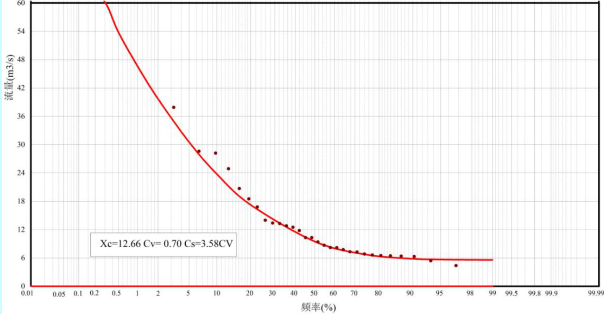  
图 2-2 安阳站 $1980{\sim}2008$ 年非汛期最大流量频率曲线  

经适线分析,工程非汛期洪水计算成果见表 2-52。  

表 2-52 非汛期设计洪水计算成果表  

<html><body><table><tr><td rowspan="2">时段</td><td rowspan="2">均值</td><td rowspan="2">Cv</td><td rowspan="2">Cs/Cv</td><td colspan="5">设计洪水</td></tr><tr><td>频率</td><td>33%</td><td>20%</td><td>10%</td><td>5%</td></tr><tr><td rowspan="2">10月～5月</td><td rowspan="2">12.66</td><td rowspan="2">0.70</td><td rowspan="2">3.58</td><td>kp</td><td>1.10</td><td>1.36</td><td>1.88</td><td>2.41</td></tr><tr><td>流量(m3/s)</td><td>13.89</td><td>17.25</td><td>23.74</td><td>30.49</td></tr></table></body></html>  

# ⑵ 各河段施工期洪水成果  

经调查,彰武水库非汛期下泄生态基流为 $3\mathrm{m}^{3}/\mathrm{s}$ 。综合考虑彰武水库  
下泄及区间各支沟汇入情况,确定各控制断面施工期设计流量见表 2-57。此外,由于善应镇区段位于南海水库以下,考虑到区间内有小南海  
泉涌出,故该段河道施工期导流流量采用南海泉平均流量,即 $4.12\mathrm{m}^{3}/\mathrm{s}$ 。  

表 2-57 各控制断面施工期设计流量成果  

<html><body><table><tr><td rowspan="2">治理段</td><td colspan="4">设计流量（m?/s)</td><td rowspan="2">备注</td></tr><tr><td>33%</td><td>20%</td><td>10%</td><td>5%</td></tr><tr><td>善应镇区段 （小南海水库~彰武水库)</td><td>4.1</td><td>4.1</td><td>4.1</td><td>4.1</td><td>南海泉涌水</td></tr><tr><td>彰武水库～珠泉河入河口</td><td>3</td><td>3</td><td>3</td><td>3</td><td>彰武水库下泄基流</td></tr><tr><td>珠泉河入河口～粉红江汇入口</td><td>10.0</td><td>12.4</td><td>17.1</td><td>21.9</td><td>减去金线河、粉红江流量 (不计双泉水库）</td></tr><tr><td>粉红江汇入口～梨园沟汇入口</td><td>13.9</td><td>17.3</td><td>23.7</td><td>30.5</td><td>安阳站实测资料计算</td></tr><tr><td>梨园沟汇入口～胡口沟汇入口</td><td>19.2</td><td>23.9</td><td>32.9</td><td>42.2</td><td>增加梨园沟流量</td></tr><tr><td>胡口沟汇入口～入卫河口</td><td>22.1</td><td>27.5</td><td>37.8</td><td>48.5</td><td>增加胡口沟流量</td></tr></table></body></html>  

# 2.6 泥沙  

安阳河无泥沙观测系列资料,故采用间接法进行粗略估算。本次查《河南省地表水资源附图》进行估算,因安阳河上游有水库控制,本次不考虑推移质输沙量。  

多年平均输沙量按下式计算:  

$$
\mathrm{W=}(\mathrm{W_{s}+W_{B}})/\gamma
$$  

式中: $\mathrm{Ws}$ —悬移质多年平均输沙量,t/年;$\mathrm{W_{B}}$ —推移质多年平均年输沙量,t/年;MS—多年平均侵蚀模数, $\mathrm{t}/\mathrm{km}^{2}/$ 年;F—流域面积, $\mathrm{km}^{2}$ ;β—推移质多年平均年输沙量与悬移质多年平均年输沙量比值;γ—泥沙干容重, $1.3~\mathrm{t}/\mathrm{m}^{3}$ 。  

本次查《河南省地表水资源附图》,京广铁路以上流域面积 $550\mathrm{km}^{2}$ (减去彰武水库、双泉水库流域面积)侵蚀模数为 $220\mathrm{t/km}^{2}/$ 年,属轻度侵蚀,相应求得悬移质年来沙量为 12.10 万 $\mathrm{m}^{3}$ ,则年输沙总量为 4.30 万$\mathrm{m}^{3}$ 。京广铁路以下流域面积 $400\mathrm{km}^{2}$ ,侵蚀模数为 $150\mathrm{t/km}^{2}/$ 年,属轻度侵蚀,相应求得悬移质年来沙量为 6.0 万 $\mathrm{m}^{3}$ ,则年输沙量为 18.10 万 $\mathrm{m}^{3}$ 。  

# 2.7 冰情  

安阳河流域地处南北气候过渡地带,属北温带大陆性季风气候,四季分明,区域多年平均气温 $13.6^{\circ}C$ ,月平均最低气温为- $.6.5^{\circ}\mathrm{C}$ ,出现在 1月,冬季平均气温 $0.3^{\circ}\mathrm{C}$ ,河流冬季结冰时间较短,部分河流出现封冻现象,但基本没有连底冻现象。根据中国季节性冻土标准冻深线图,场区标准冻土深度为 $0.4\mathrm{m}$ 。  

# 3 工程地质  

根据本次安阳河系统治理工程任务及阶段勘察要求,豫北院于 2017年 $4\sim5$ 月对该段河道工程地质进行了勘察,并在原有勘探成果的基础上,编制了《河南省安阳市安阳河系统治理工程工程地质勘察报告(实施方案阶段)》。  

本次勘察的目的与任务是:⑴查明河道整治地段的岸坡形态、滩地、冲沟、古河道等的分布和近岸河底形态;⑵查明河道整治地段河势稳定状况、河床的冲淤变化,并对岸坡、滩地等的稳定性进行初步评价;⑶查明河道整治地段地层岩性,重点是软土、粉细砂等土层的分布和向近岸水下延伸情况;⑷查明河道整治地段崩塌、滑坡等物理地质现象的分布与规模;⑸查明河道整治地段的地下水类型、地下水位和水质;⑹查明各岩土层物理力学性质,提出岩土层物理力学参数;⑺查明河道整治工程建筑物的工程地质条件和主要工程地质问题;⑻进行天然建筑材料详查。本次勘察主要采用现场调查、钻探、现场原位测试和室内试验等勘察技术手段。  

本次勘察共布置勘探孔 438 个,其中河道部分主要布置在堤顶、岸坡顶部及部分河道中间位置,堤线纵断面钻孔间距一般为 $159.18\sim$ $695.41\mathrm{m}$ ,横断面间距一般为 $595{\sim}2140\mathrm{m}$ ,钻孔类型分别为取土样钻孔和标准贯入试验钻孔、取土兼标准贯入试验钻孔和部分鉴别孔,孔深为$10{\sim}16\mathrm{m}$ ;在每个防洪闸位置,各布置 2 个钻孔,钻孔类型分别为取土样钻孔和标准贯入试验钻孔,孔深为 $15.0\mathrm{m}$ ,间距为 $25.0\mathrm{m}$ ;在拆除重建桥梁位置每座桥各布置 2 个钻孔,分别布置在两岸桥台位置(由于场地条件限制,本次在河道内未能勘察钻孔,待场地条件具备后再进行补钻),钻孔类型分别为取土样钻孔和标准贯入试验钻孔,孔深为 $40{\sim}42\mathrm{m}$ 。  

# 3.1 区域工程地质条件及评价  

# 3.1.1 地形地貌  

本次治理河道范围地面总体趋势西高东低。南海泉域段地面高程为$151.63\mathrm{m}\{\sim132.93\mathrm{m}$ ;彰武水库至殷墟博物苑段地面高程为 $131.31\mathrm{m}\sim$ $78.5\mathrm{m}$ ;曹马分洪口至辛村段地面高程为 $67.33\mathrm{m}{\sim}57.37\mathrm{m}$ ;辛村段起点附近地面高程为 $57.73\sim58.30\mathrm{m}$ ,终点地面高程为 $54.92\sim57.13\mathrm{m}$ ;安内界至入卫河口段地面高程为 $55.43\mathrm{m}\approx51.39\mathrm{m}$ 。场地地貌单元南海泉域段属于低山地貌,彰武水库以下至市区华祥路段属丘陵向平原过渡地段,市区华祥路以下至入卫河口段属河流冲积平原地貌。  

# 3.1.2 地层岩性  

本区南海泉域段主要为低山区,彰武水库以下至卫河口段主要受安阳河影响,多为冲积平原,地层由老到新主要分布有:  

$\textcircled{1}$ 奥陶系( ${\bf\nabla}.0_{2}$ )石灰岩:主要分布在南海泉域段左右两岸。$\textcircled{2}$ 二叠系(P)砂质页岩:主要分布在彰武水库下游左右两岸。$\textcircled{3}$ 白垩系(K)闪长岩:主要分布在南海泉域段上游左岸局部范围内。  

$\textcircled{4}$ 灰白色泥岩 (N):主要分布在安阳西北环城高速附近。  

$\textcircled{5}$ 砂岩(N):主要分布在土楼村西侧安阳河桥以西至安阳西北环城高速之间左岸。  

$\textcircled{6}$ 砾岩(N):主要分布在彰武水库至北段村附近安阳河左右岸,零星分布。  

$\textcircled{7}$ 全新统轻粉质壤土、中粉质壤土、重粉质壤土、细砂( $\mathrm{Q4^{al}},$ ):在河道沿线大部分地段分布。  

# 3.1.3 地质构造与地震  

本区处于新华夏系第三隆起带和第二沉降带部位,构造形迹以断裂为主,影响本区的主要有汤东断裂、安阳南、北断裂。在小区域上受辛店断裂(倾向北,倾角 $70^{\circ}\sim85^{\circ},$ )和安阳南断裂(倾向北,倾角 $75^{\circ}\sim85^{\circ})$ 两条正断层控制,受此影响,多出现第四纪小凹陷,形成天然洼地。  

该场地位于华北地震构造区。华北地震构造区大致以太行山东缘断裂为界分为东西两个地震带,东部为河北平原地震带,西部为山西地震带,安阳河位于两地震带的交界处。河北平原地震带地震频度和强度均较高,据资料记载,发生过 $6\sim6.9$ 级地震 13 次, $7\sim7.9$ 级地震 4 次,8级地震 1 次,它是华北本次地震期的主体活动带,近代地震活动显示密集成带分布。山西地震带近期地震活动强度频度不高,自 1695 年临汾 7级大地震以后,华北本次地震活动期以来,只发生过一次 6 级以上地震(1815 年平陆 $6^{\frac{3}{4}}$ 级地震)。  

根据《中国地震动参数区划图》(GB18306-2015)(1:400万)圈定,本工程安阳市区段动峰值加速度为 $0.20\mathrm{g}$ ,地震基本烈度为Ⅷ度,设计特征周期为 0.40s;其它治理段动峰值加速度为 $0.15\mathrm{g}$ ,地震基本烈度为Ⅶ度,设计特征周期为 0.40s。  

# 3.1.4 水文地质条件  

南海水库至殷墟段:勘探期间,地下水埋深 $1.5{\sim}15.2\mathrm{m}$ ,高程 $70.71\sim$ $132.71\mathrm{m}$ ,地下水属潜水,主要受河水和大气降水补给。目前,地下水位大致与河水位持平或稍低,为河水补给地下水。  

曹马分洪口(桩号 $41{+}640)$ )至辛村段(桩号 $69\substack{+180})$ ):在 $15.0\mathrm{m}$ 的勘探深度范围内,地下水埋深 $9.2{\sim}13.8\mathrm{m}$ ,水位高程 $45.70\sim50.65\mathrm{m}$ ,地下水类型属承压水,主要由河水下渗、侧渗及大气降水补给,地下水变化幅度 $1\sim3\mathrm{m}$ ,多年动态变化主要受河水控制,河水位均高于地下水,属河水常年垂直下渗补给地下水。  

辛村段(桩号 $69\substack{+180\sim75+576)}$ ):在 $15.0\mathrm{m}$ 的勘探深度范围内,部分钻孔见地下水。地下水埋深在 $5.2{\sim}13.8\mathrm{m}$ 之间(相应高程为 $42.32\sim$ $46.65\mathrm{m})$ ),地下水类型属承压水,主要由河水下渗、侧渗补给,地下水变化幅度为 $1\sim3\mathrm{m}$ ,多年动态变化主要受河水控制。在钻探期间河水位较高(水位高程约 $52\mathrm{m}$ 左右),揭露有上层滞水。受若干重粉质壤土薄层( $(0.1\sim0.3\mathrm{m}$ 不等)阻隔,土体含水量高,但未形成明显水位,在施工时应予以注意。  

安内界(桩号 $83\substack{+026}$ )至入卫河口段(桩号 $91{+}580)$ :场地地下水位埋深 $6.0{\sim}16.0\mathrm{m}$ ,高程 $39.72\{-41.35\mathrm{m}$ ,地下水类型属承压水,主要由河水下渗、侧渗及大气降水补给,地下水变化幅度 $1\sim3\mathrm{m}$ ,多年动态变化主要受河水控制。  

# 3.1.5 不良地质现象  

根据调查,河道治理段范围内不存在沟浜、孤石、岩溶、地下采空区等不良地质现象,本区位于地质构造相对稳定地段。  

# 3.2 堤身质量评价  

# 3.2.1 堤身概况  

⑴ 南海水库至殷墟博物苑段现状河道两岸无堤防。  

# ⑵ 曹马分洪口(桩号 $\mathbf{41}\mathbf{+640}\$ ) 至辛村段(桩号 ${\bf69{+180}})$ )  

现状堤身主要由河道开挖和附近耕地开挖的轻粉质壤土\~中粉质壤土堆筑而成。  

河道左岸堤身不连续,仅在 $41+640\sim43+680$ 、 $50\substack{+080\sim51+080}$ 、$56+280\sim65+650$ 、 $66+330\sim69+180$ 段分布,其余地段无堤防,现状堤顶宽窄变化较大,宽度一般为 $0.9{\sim}4.8\mathrm{m}$ ,边坡一般为 $1{:}1{\sim}1{:}4$ ,堤身高度一般为 $0.5{\sim}2.4\mathrm{m}$ 。堤的内、外两侧局部有塌坑现象。左岸 $61{+}030{.}62{+}730$ 附近曾在 2016.7.19 大洪水时堤身被冲毁,宽约 $15{\sim}20\mathrm{m}$ 。  

河道右岸堤身连续分布,现状堤顶宽窄变化较大,宽度一般为 $1.8\sim$ $6.7\mathrm{m}$ ,边坡一般为 $1{:}1{\sim}1{:}4$ ,堤身高度一般为 $0.5{\sim}4.0\mathrm{m}$ 。堤的内、外两侧局部有塌坑和冲沟现象,且堤顶局部地段已开垦为耕地。堤顶和堤的内、外两侧局部有塌坑和冲沟现象。  

# ⑶ 辛村段 (桩号 ${\bf69{+180}}$ 至桩号 $75\mathrm{+}576)$ )  

左岸现状无堤防。右岸堤防穿越北贤孝村、辛村集、西南庄、西伏恩村居民区,左岸现状无堤防,右岸在 $69\substack{+180\sim75+576}$ 以上断续分布,堤顶宽一般为 $1\sim3\mathrm{m}$ ,局部较宽大于 $5\mathrm{m}$ ,高一般为 $0.3{\sim}2\mathrm{m}$ ,局部高 $3.0\sim$ $4.5\mathrm{m}$ 。险工段堤防较为规整。堤顶高低起伏较大,为 $57.08\sim59.90\$ 不等,坡面不规则,坡比一般为 $1{:}0.6{\sim}1{:}2.0$ ,个别大于 1:3.0,穿居民区段多已损坏或为现状路面。  

# ⑷ 安内界(桩号 $\begin{array}{r}{{\bf83+026},}\end{array}$ )至入卫河口段(桩号 $\mathbf{91}\mathbf{+580}\mathbf{)}$ )  

现状堤身主要由河道开挖和附近耕地开挖的黄色中粉质壤土\~轻粉质壤土堆筑而成。安内界(桩号 $83{+}026)$ )至豆公闸段(桩号 $84\substack{+510}$ )左右两岸无堤防。豆公闸(桩号 $84\substack{+510})$ )以下至入卫河口段河道两岸堤身连续分布,现状堤顶宽窄变化较大,左岸宽度一般为 $2.5{\sim}5.1\mathrm{m}$ ,边坡一般为 $1{:}1.6{\sim}1{:}3.7$ ,堤身高度一般为 $1.0{\sim}3.9\mathrm{m}$ ;右岸宽度一般为 $3.6\sim$ $5.5\mathrm{m}$ ,最宽为 $7.0\mathrm{m}$ ,边坡一般为 $1{:}2.0{\sim}1{:}3.2$ ,堤身高度一般为 $1.9{\sim}5.5\mathrm{m}$ 。堤的内、外两侧局部有塌坑和冲沟现象,堤顶至耕地之间已开垦有多条  

道路。  

# 3.2.2 堤身土体的物理力学性质  

# ⑴ 曹马分洪口至辛村段  

根据本次钻孔揭露情况,堤身土体主要为就地取材人工填土 $({\mathrm{Q}}_{4}{^{\mathrm{ml}}}).$ ),以黄色轻粉质壤土为主,局部为中粉质壤土或重粉质壤土,稍湿\~湿,中密\~密实。含少量砖屑、木炭屑等杂质。该层层底埋深一般为 $0.3\sim$ $4.0\mathrm{m}$ ,层厚 $0.3{\sim}4.0\mathrm{m}$ ,平均厚度 $1.9\mathrm{m}$ ,层底分布高程 $57.51\sim67.13\mathrm{m}.$ 。  

左、右岸堤身填筑土为轻粉质壤土,黄色,中密\~密实,含水量为$9.6\%{\sim}23.8\%$ ,平均为 $15.4\%$ ;粘粒含量一般为 $8.2\%{\sim}22.2\%$ ;干重度一般 为 $15.3\mathrm{kN}/\mathrm{m}^{3}\sim16.3\mathrm{kN}/\mathrm{m}^{3}$ ; 渗 透 系 数 一 般 为 $2.56{\times}10^{-5}{\mathrm{cm/s}}\sim$ $7.51{\times}10^{-5}{\mathrm{cm/s}}$ ,平均为 $5.01\times10^{-5}\mathrm{cm/s}$ ,为弱透水。  

表 3-1 物理力学性指标建议值表  

<html><body><table><tr><td rowspan="3">统计 项目</td><td>含水量</td><td>天然 密度</td><td>干重度</td><td>比重</td><td>孔隙比</td><td>塑性 指数</td><td>液性 指数</td><td>压缩 系数</td><td>压缩 模量</td><td>粘聚力</td><td>内摩 擦角</td><td>渗透 系数</td><td>承载力 特征值</td></tr><tr><td></td><td>Y</td><td>P人</td><td>Gs</td><td>e</td><td>Ip</td><td>IL</td><td>a1-2</td><td>Es</td><td>C</td><td>Φ</td><td>K</td><td>fak</td></tr><tr><td>%</td><td>kN/m3</td><td>kN/m3</td><td></td><td></td><td></td><td></td><td>MPa-1</td><td>MPa</td><td>kPa</td><td></td><td>cm/s</td><td>kPa</td></tr><tr><td>统计个数</td><td>28</td><td>30</td><td>30</td><td>30</td><td>30</td><td>30</td><td>30</td><td>30</td><td>30</td><td>7</td><td>7</td><td>12</td><td></td></tr><tr><td>最大值</td><td>23.8</td><td>19.6</td><td>16.3</td><td>2.72</td><td>0.766</td><td>13.4</td><td>0.14</td><td>0.350</td><td>11.39</td><td>20.0</td><td>22.0</td><td>7.51×10-5</td><td></td></tr><tr><td>最小值</td><td>9.6</td><td>16.6</td><td>15.3</td><td>2.69</td><td>0.655</td><td>6.6</td><td>-1.43</td><td>0.150</td><td>4.94</td><td>18.0</td><td>20.0</td><td>2.56x10-5</td><td></td></tr><tr><td>平均值</td><td>15.4</td><td>18.2</td><td>15.8</td><td>2.70</td><td>0.706</td><td>8.8</td><td>-0.51</td><td>0.247</td><td>7.19</td><td>19.0</td><td>20.9</td><td>5.01x10-5</td><td></td></tr><tr><td>建议值</td><td>15.4</td><td>18.2</td><td>15.8</td><td>2.70</td><td>0.706</td><td>8.8</td><td>-0.51</td><td>0.247</td><td>7.19</td><td>19.0</td><td>20.9</td><td>8.86x10-5</td><td>110</td></tr></table></body></html>  

# ⑵ 辛村段  

根据本次钻孔揭露情况,堤身土体主要为就地取材人工填土,以黄色重粉质壤土为主,局部为中粉质壤土。硬塑\~坚硬状态。含少量砖屑、木炭屑等杂质。该层层底埋深一般为 $0.5{\sim}2.5\mathrm{m}$ ,层厚 $0.5{\sim}2.5\mathrm{m}$ ,平均厚度 $1.2\mathrm{m}$ ,层底分布高程 $54.56\sim58.18\mathrm{m}$ 。  

堤身填筑土为重粉质壤土,黄色,硬塑\~坚硬状态,含水量较低,般为 $8.8\%{\sim}27.2\%$ ,平均为 $18.7\%$ ;粘粒含量一般为 $8.2\%{\sim}49.8\%$ ,平均为 $24.5\%$ ;干密度一般为 $1.45\mathrm{g}/\mathrm{cm}^{3}{\sim}1.65\mathrm{g}/\mathrm{cm}^{3}$ ;渗透系数一般为$2.11{\times}10^{-6}{\mathrm{cm/s}}{\sim}1.96{\times}10^{-5}{\mathrm{cm/s}}$ ,平均为 $7.6{\times}10^{-6}{\mathrm{cm}}/{\mathrm{s}}$ ,为微透水。其物理力学性指标见下表。  

表 3-2 各土体物理力学指标统计建议值表  

<html><body><table><tr><td>统计 项目</td><td>天然 含水量 W %</td><td>天然 干密度 pd g/cm3</td><td>重力 密度 KN/m3</td><td>天然 孔隙 比 e</td><td>土粒 比重 Gs</td><td>液性 指数 IL</td><td>塑性 指数 Ip</td><td>压缩 系数 a1-2 MPa-1</td><td>压缩 模量 Es MPa</td><td>渗透 系数 K*10-6 cm/s</td><td>粘粒含 量%</td></tr><tr><td>统计个数</td><td>9</td><td>9</td><td>9</td><td>9</td><td>9</td><td>9</td><td>7</td><td>9</td><td>9</td><td>6</td><td>6</td></tr><tr><td>最大值</td><td>27.2</td><td>1.65</td><td>19.0</td><td>0.873</td><td>2.75</td><td>0.32</td><td>11.7</td><td>0.340</td><td>8.71</td><td>19.67</td><td>49.80</td></tr><tr><td>最小值</td><td>8.8</td><td>1.45</td><td>17.9</td><td>0.635</td><td>2.69</td><td>-1.44</td><td>7.3</td><td>0.201</td><td>4.81</td><td>2.11</td><td>8.20</td></tr><tr><td>平均值</td><td>18.7</td><td>1.56</td><td>18.4</td><td>0.748</td><td>2.71</td><td>-0.32</td><td>9.1</td><td>0.279</td><td>6.54</td><td>7.60</td><td>24.55</td></tr></table></body></html>  

表 3-3 各土体 c、 $\Phi$ 值建议值表  

<html><body><table><tr><td rowspan="2">项目 种类</td><td colspan="6">颗粒分析</td><td colspan="2">不固结不排水剪</td><td colspan="2">固结不排水剪</td></tr><tr><td>0.05</td><td>0.01</td><td>0.005</td><td><0.005</td><td>Cu</td><td>Cc</td><td>粘聚力 C (kPa)</td><td>内摩擦角 (°)</td><td>粘聚力 C (kPa)</td><td>内摩擦角 (①%)</td></tr><tr><td>统计个数</td><td>6</td><td>6</td><td>6</td><td>6</td><td>6</td><td>6</td><td>6</td><td>6</td><td>6</td><td>6</td></tr><tr><td>最大值</td><td>32.3</td><td>71.30</td><td>21.10</td><td>49.80</td><td>11.3</td><td>3.5</td><td>23.2</td><td>23.21</td><td>21.5</td><td>22.6</td></tr><tr><td>最小值</td><td>10.30</td><td>22.30</td><td>4.80</td><td>8.20</td><td>3.9</td><td>1.4</td><td>17.5</td><td>18.4</td><td>17.8</td><td>18.2</td></tr><tr><td>平均值</td><td>18.38</td><td>44.75</td><td>12.32</td><td>24.55</td><td>7.5</td><td>2.1</td><td>20.7</td><td>21.1</td><td>19.8</td><td>20.8</td></tr></table></body></html>  

# ⑶ 安内界至入卫河口段  

根据本次钻孔揭露情况,堤身土体主要为就地取材人工填土,以黄色中粉质壤土为主,局部为轻粉质壤土,稍湿,密实。含少量砖屑等杂质。该层层底埋深一般为 $1.0{\sim}5.5\mathrm{m}$ ,层厚 $1.0{\sim}5.5\mathrm{m}$ ,平均厚度 $3.1\mathrm{m}$ ,层底分布高程 $50.25\sim54.50\mathrm{m}.$ 。  

左、右岸堤身填筑土为中粉质壤土,密实,含水量为 $8.9\%\sim15.6\%$ ,平均为 $11.8\%$ ;粘粒含量一般为 $10.4\%\sim23.0\%$ ;干重度一般为$15.0\mathrm{kN}/\mathrm{m}^{3}{\sim}16.5\mathrm{kN}/\mathrm{m}^{3}$ ;渗透系数一般为 $3.84{\times}10^{-5}{\sim}6.75{\times}10^{-5}{\mathrm{cm/s}}$ ,平均为 $5.24\times10^{-5}\mathrm{cm/s}$ ,为弱透水。  

表 3-4 物理力学性指标建议值表  

<html><body><table><tr><td rowspan="3">统计 项目</td><td>含水 量</td><td>天然密 度</td><td>干重度</td><td>比重</td><td>孔隙 比</td><td>塑性 指数</td><td>液性指 数</td><td>压缩 系数</td><td>压缩模 量</td><td>粘聚 力</td><td>内摩擦 角</td><td>渗透 系数</td><td>承载力 特征值</td></tr><tr><td></td><td>Y</td><td>P人</td><td>Gs</td><td>e</td><td>Ip</td><td>IL</td><td>a1-2</td><td>Es</td><td>C</td><td>Φ</td><td>K</td><td>fak</td></tr><tr><td>%</td><td>kN/m3</td><td>kN/m3</td><td></td><td></td><td></td><td></td><td>MPa-1</td><td>MPa</td><td>kPa</td><td></td><td>cm/s</td><td>kPa</td></tr><tr><td>统计个 数</td><td>13</td><td>13</td><td>13</td><td>13</td><td>13</td><td>13</td><td>13</td><td>13</td><td>13</td><td>9</td><td>6</td><td>13</td><td></td></tr><tr><td>最大值</td><td>15.6</td><td>18.4</td><td>16.5</td><td>2.70</td><td>0.804</td><td>8.9</td><td>-0.35</td><td>0.300</td><td>8.59</td><td>19.0</td><td>21.5</td><td>6.75×10-5</td><td></td></tr><tr><td>最小值</td><td>8.9</td><td>16.8</td><td>15.0</td><td>2.69</td><td>0.633</td><td>6.4</td><td>-1.16</td><td>0.200</td><td>5.62</td><td>17.0</td><td>19.0</td><td>3.84x10-5</td><td></td></tr><tr><td>平均值</td><td>11.8</td><td>17.8</td><td>15.9</td><td>2.69</td><td>0.691</td><td>7.9</td><td>-0.76</td><td>0.245</td><td>7.02</td><td>18.1</td><td>20.5</td><td>5.24×10-5</td><td></td></tr><tr><td>建议值</td><td>11.8</td><td>17.8</td><td>15.9</td><td>2.69</td><td>0.691</td><td>7.9</td><td>-0.76</td><td>0.245</td><td>7.02</td><td>18.1</td><td>20.5</td><td>5.24×10-5</td><td>110</td></tr></table></body></html>  

# 3.2.3 堤身填筑质量及评价  

# ⑴ 曹马分洪口至辛村段  

堤身填筑土均沿堤线就地取材填筑,土质较均匀,由室内土工试验资料统计显示:堤身土体粘粒含量为 $8.2\%{\sim}22.2\%$ ,平均值为 $14.2\%$ ;塑性指数为 $6.6{\sim}13.4$ ,平均值为 8.8;干重度为 $15.3\mathrm{kN}/\mathrm{m}^{3}{\sim}16.3\mathrm{kN}/\mathrm{m}^{3}$ ,平均值为 $15.8\mathrm{kN}/\mathrm{m}^{3}$ ;由堤身填土击实试验得该单元土的最大干密度为$1.77\mathrm{g}/\mathrm{cm}^{3}$ ,求得土的压实度为 0.89,小于 4 级堤防压实度最小值 0.91;另外,由室内渗透试验得堤身填土的渗透系数为 $5.01\times10^{-5}\mathrm{cm/s}$ ,属弱透水。  

# ⑵ 辛村段  

堤身填筑土均沿堤线就地取材填筑,土质均匀性一般,由室内土工试验资料统计显示:堤身土体粘粒含量为 $8.2\%{\sim}49.8\%$ ,平均为 $24.5\%$ ;塑性指数为 $7.3\sim11.7$ ,平均值为 9.1;干密度一般为 $1.45\mathrm{g}/\mathrm{cm}^{3}\sim$ $1.65\mathrm{g}/\mathrm{cm}^{3}$ ,平均值为 $1.56\mathrm{g}/\mathrm{cm}^{3}$ ;由堤身填土击实试验得该单元土的最大干密度为 $1.73\mathrm{g}/\mathrm{cm}^{3}$ ,求得土的压实度为 0.902,不满足 4 级堤防压实度最小值 0.91。另外,渗透系数一般为 $2.11{\times}10^{-6}{\mathrm{cm/s}}{\sim}1.96{\times}10^{-5}{\mathrm{cm/s}}$ ,平均为 $7.6{\times}10^{-6}{\mathrm{cm}}/{\mathrm{s}}$ ,为微透水。该堤身填筑质量尚可。  

# ⑶ 安内界至入卫河口段  

堤身填筑土均沿堤线就地取材填筑,土质较均匀,由室内土工试验资料统计显示:堤身土体粘粒含量为 $10.4\%{\sim}23.0\%$ ,平均值为 $17.1\%$ ;塑性指数为 $6.4\sim8.9$ ,平均值为 7.9;干重度为 $15.0\mathrm{kN}/\mathrm{m}^{3}{\sim}16.5\mathrm{kN}/\mathrm{m}^{3}$ ,平均值为 $15.9\mathrm{kN}/\mathrm{m}^{3}$ ;由堤身填土击实试验得该单元土的最大干密度为$1.75\mathrm{g}/\mathrm{cm}^{3}$ ,求得土的压实度为 0.91,满足 4 级堤防压实度最小值 0.91;另外,由室内渗透试验得堤身填土的渗透系数为 $5.24\times10^{-5}\mathrm{cm/s}$ ,属弱透水。  

# 3.3 堤基工程地质条件  

# 3.3.1 曹马分洪口至辛村段  

# ⑴ 地形地貌  

曹马分洪口至辛村段地势总体上西高东低,北高南低,地面高程为$67.33\mathrm{m}{\sim}57.37\mathrm{m}$ ,地貌单元属河流冲积平原地貌。  

# ⑵ 地层岩性  

根据本次钻孔揭露,按其形成年代、成因类型及物质组成特征,在$15.0\mathrm{m}$ 的钻探深度内,堤基自上而下可划分为四个工程地质单元,现分别叙述如下:  

$\textcircled{2}$ 黄色中粉质壤土 ( $(Q4^{\mathrm{al}})$  

黄色,中粉质壤土,稍湿\~湿,密实。该层层底埋深为 $0.3{\sim}10.5\mathrm{m}$ ,层厚 $0.3\mathrm{m}{\sim}7.7\mathrm{m}$ ,平均厚度 $3.4\mathrm{m}$ ,层底高程 $50.50\mathrm{m}{\sim}63.10\mathrm{m}.$ 。  

$\textcircled{3}$ 黄色细砂 ( $[Q4^{\mathrm{al}}]$ )  

黄色,细砂,局部为中砂,稍湿,松散\~稍密,矿物成分为石英、长石,粘粒含量较少。该层层底埋深为 $1.3{\sim}10.0\mathrm{m}$ ,层厚 $0.3\mathrm{m}{\sim}6.0\mathrm{m}$ ,平均厚度 $1.9\mathrm{m}$ ,层底高程 $48.80\mathrm{m}{\sim}61.38\mathrm{m}$ 。  

$\textcircled{4}$ 灰黄色重粉质壤土( $(Q_{4}^{\mathrm{al}}.$  

灰黄色,重粉质壤土,硬塑 $\sim$ 可塑状态,含少量姜石和白色螺壳残  

片,姜石粒径 $10{\sim}30\mathrm{mm}$ 。该层层底埋深为 $3.0{\sim}13.5\mathrm{m}$ ,层厚 $0.4\mathrm{m}{\sim}8.7\mathrm{m}$ ,平均厚度 $3.8\mathrm{m}$ ,层底高程 $44.10\mathrm{m}\{\sim59.82\mathrm{m}$ 。  

$\textcircled{5}$ 灰黄色中粉质壤土( $[Q4^{\mathrm{al}}]$  

灰黄色,中粉质壤土,湿,密实。含少量姜石,粒径 $10{\sim}30\mathrm{mm}$ 。本单元未揭穿,层底埋深在 $15.0\mathrm{m}$ 以下,层底分布高程在 $46.06\mathrm{m}$ 以下,最大揭露厚度为 $9.0\mathrm{m}$ 。  

# ⑶ 堤基地质结构  

在左岸桩号 $41+640\sim43+130$ 、 $50\substack{+080\sim51+080}$ 、 $56+280\sim59+580.$ 、$60+530\sim62+080,62+680\sim63+630,65+330\sim65+650$ 范围段,堤基土层上部为中粉质壤土,下部为细砂及重粉质壤土、中粉质壤土,地质结构为多层结构;其余范围内均为中粉质壤土、重粉质壤土,为单一结构。  

在右岸桩号 $51+980\sim52+980$ 、 $55{+}580{\sim}59{+}030$ 、 $61+430\sim63+380$ 、$65{+}230{\sim}66{+}630$ 范围段,堤基土层上部为中粉质壤土,下部为细砂及重粉质壤土、中粉质壤土,地质结构为多层结构;其余范围内均为中粉质壤土、重粉质壤土,为单一结构。  

# ⑷ 堤基土物理力学性质  

本次勘察,对堤基各土层土体进行了物理力学性质试验,其物理力学性指标详见表 3-5。第⑶单元含水量稍低,为稍湿,其余单元土体含水量较高,稍湿\~湿。土体塑性指数为 $8.9{\sim}12.1$ ,为中粉质壤土、重粉质壤土。除细砂渗透系数为 $3.0\times10^{-3}\mathrm{cm}/\mathrm{s}$ ,属中等透水,其余单元渗透系数为 $2.34{\times}10^{-5}{\sim}5.66{\times}10^{-5}\mathrm{cm/s}$ ,属弱透水。  

# ⑸ 水文地质条件  

在 $15.0\mathrm{m}$ 的勘探深度范围内,部分钻孔见地下水,地下水埋深 $9.2\sim$ $13.8\mathrm{m}$ ,水位高程 $45.70\sim50.65\mathrm{m}$ ,地下水类型属潜水,主要由河水下渗、侧渗及大气降水补给,地下水变化幅度 $1\sim3\mathrm{m}$ ,多年动态变化主要受河水控制,河水位均高于地下水,属河水常年垂直下渗补给地下水。  

表 3-5 各土体物理力学性指标统计及建议值表  

<html><body><table><tr><td rowspan="2">单 元</td><td rowspan="2">天然 含水 量(W) (%)</td><td rowspan="2">天然 干密度(pd) (KN/m3)</td><td rowspan="2">天然 孔隙 比 (e)</td><td rowspan="2">土粒 比重 (Gs)</td><td rowspan="2">塑性 指数 (Ip)</td><td rowspan="2">液性 指数 (L)</td><td rowspan="2">压缩 系数 a1-2 (MPa-1)</td><td rowspan="2">压缩 模量 Es (MPa)</td><td rowspan="2">渗透 系数</td><td colspan="2">三轴剪 (不固结 不排水)</td><td rowspan="2">粘粒 含量 (%)</td><td rowspan="2">d50</td><td rowspan="2">标贯击数</td><td rowspan="2">承载 力特 征值 (fak) kPa</td></tr><tr><td>(Y) (cm/s)</td><td>Φ</td></tr><tr><td>(2)</td><td>20.4</td><td>15.9</td><td>0.705</td><td>2.70</td><td>9.0</td><td>0.01</td><td>0.204</td><td>8.57</td><td>5.66x10-520.021.8</td><td></td><td></td><td>15.3</td><td>0.02</td><td>6.8</td><td>120</td></tr><tr><td>(3)</td><td>10.5</td><td></td><td></td><td></td><td></td><td></td><td></td><td></td><td>3.0×10-3</td><td>0</td><td>28</td><td></td><td>0.142</td><td>10.7</td><td>140</td></tr><tr><td>(4)</td><td>23.9</td><td>15.9</td><td>0.719</td><td>2.72</td><td>12.1</td><td>0.27</td><td>0.213</td><td>8.30</td><td>2.34×10-522.720.1</td><td></td><td></td><td>22.9</td><td>0.012</td><td>7.4</td><td>150</td></tr><tr><td>(5)</td><td>24.4</td><td>15.9</td><td>0.704</td><td>2.70</td><td>8.9</td><td>0.44</td><td>0.211</td><td>8.33</td><td>3.93×10-520.520.0</td><td></td><td></td><td>16.6</td><td>0.017</td><td>9.1</td><td>170</td></tr></table></body></html>  

根据该段河道治理范围内《安阳市引岳入安二期工程 PPP 项目洹河东湖闸初步设计阶段工程地质勘察报告》中地表水和地下水水质分析资料,根据《水利水电工程地质勘察规范》(GB50487-2008)附录L判别:洹河河水对混凝土结构无腐蚀性,对钢筋混凝土结构中钢筋有弱腐蚀性;地下水对混凝土结构无腐蚀性,对钢筋混凝土结构中钢筋有弱腐蚀性。  

⑹ 主要工程地质问题分析  

# $\textcircled{1}$ 土的渗透变形判别  

由土工试验统计资料可知,堤基土主要为中粉质壤土、重粉质壤土及细砂,中粉质壤土、重粉质壤土均为细粒土,细砂的不均匀系数为1.998,根据《堤防工程地质勘察规程》(SL188-2005)附录 D 可知细粒土与不均匀系数不大于 5 的粗粒土的渗透变形为流土,故堤基土的渗透变形类型为流土。  

表 3-6 各层土的允许水力比降表  

<html><body><table><tr><td></td><td>土粒比重（Gs)</td><td>孔隙度（n)</td><td>Jcr</td><td>m</td><td>J 允许</td></tr><tr><td>(2)</td><td></td><td></td><td></td><td></td><td></td></tr><tr><td>(3)</td><td></td><td></td><td></td><td></td><td></td></tr><tr><td>(4)</td><td>2.72</td><td>41.7</td><td>1.00</td><td>2</td><td>0.50</td></tr><tr><td>(5)</td><td>2.70</td><td>41.2</td><td>0.99</td><td>2</td><td>0.495</td></tr></table></body></html>  

# $\textcircled{2}$ 稳定及沉降变形问题  

堤基土第⑵单元中粉质壤土压缩系数为 $0.204\mathrm{MPa^{-1}}$ ,第⑷单元重粉质壤土压缩系数为 $0.213\mathrm{MPa^{-1}}$ ,第⑸单元中粉质壤土压缩系数为$0.211\mathrm{MPa^{-1}}$ ,均为中等压缩性,第⑶单元细砂为中等压缩性,堤基土在堤身荷载下不会产生变形问题。  

# $\textcircled{3}$ 抗滑稳定问题  

本次治理段,堤身厚度不大,堤基土未见软弱土层,大部分堤基不存在滑动现象。仅在右岸桩号 $52+480\sim52+580$ 堤基土临河面存在鱼池,紧邻堤基,左岸桩号 $60\substack{+730\sim61+030}$ 附近堤内角有约 $3\mathrm{m}$ 深的坑,右岸桩号 $57+430\sim59+080$ 堤临河处有较多挖土坑,存在堤基可能滑动稳定问题。  

# $\textcircled{4}$ 地震液化评价  

钻探期间,在 $15.0\mathrm{m}$ 的勘探深度范围内,仅在东柴村桥附近见地下水,水位埋深 $12.6\mathrm{m}$ ,水位高程 $50.65\mathrm{m}$ ,其它地段均未见地下水。堤基第(3)层细砂为轻微液化,其余单元堤基土可不考虑地震液化问题。  

# 堤基工程地质条件评价  

左右两岸堤防,多沿河岸两侧耕地修建,地形平坦,堤基基本不存在抗滑稳定、抗渗稳定及抗震稳定问题。左岸桩号 $57+980\sim63+680$ 、$64{+}280{\sim}64{+}580$ 、 $65{+}480{\sim}65{+}650$ 之间堤基附近有坑,其中 $61{+}030$ 、$62+730$ 附近在 2016 年 7.19 洪水曾被冲毁;右岸桩号 $51{+}750{\sim}51{+}830.$ 、$52+430\sim52+730,57+430\sim61+530,62+030\sim63+430,63+780\sim64+790$ 380、$65{+}580{\sim}66{+}130$ 之间有土坑。建议对曾被冲毁的部位重新填筑处理,对堤基附近的坑进行回填处理。  

# 3.3.2 辛村段  

# ⑴ 地形地貌  

地面总体趋势西高东低,治理起点附近地面高程为 $58.65\mathrm{m}$ 左右,治理段末端附近高程为 $55.30\mathrm{m}$ ,河道呈 S 型,属洹河冲积平原地貌。  

# ⑵ 地层岩性  

# (2)黄色中粉质壤土 ( $(\mathbf{Q}_{4}\mathbf{^{al}})$ )  

黄色,中粉质壤土,稍湿\~湿,中密-密实。局部夹(2)1 单元重粉质壤土和 $(2)_{2}$ 单元粉砂层。  

# (2)1 暗黄色重粉质壤土 ( $(\mathbf{Q}_{4}\mathbf{^{al}})$ )  

暗黄色,重粉质壤土,可塑-硬塑状态。主要分布在桩号 $69\substack{+180\sim}$ $70+380$ 之间。  

# (2)2 黄色粉砂 ( $(\mathbf{Q}_{4}\mathbf{^{al}})$ )  

黄色,粉砂,稍湿,稍密,矿物成分为石英、长石,粘粒含量较少。该层呈透镜体分布于第(2)单元中。  

# (3)灰黄色中粉质壤土( $\mathbf{\nabla}.\mathbf{Q}.^{\mathbf{al}})$ )  

灰黄色,中粉质壤土,湿,中密,含少量白色螺壳残片。该层局部夹第(3)1 单元青灰色轻粉质壤土和 $(3)_{2}$ 单元粉砂层。  

# (3)1 青灰色重粉质壤土( $(\mathbf{Q}_{4}\mathbf{^{al}})$  

青灰色,重粉质壤土,湿-很湿,稍密-中密,含少量腐殖质。  

# (3)2 灰\~黄色粉砂 ( $(\mathbf{Q}_{4}\mathbf{)}$ )  

灰\~黄色,粉砂,湿-饱和,稍密,矿物成分为石英、长石,粘粒含 量较少。  

# (4)黄色中粉质壤土( $(\mathbf{Q}_{4}\mathbf{^{al}})$ )  

黄色,中粉质壤土,湿,密实。局部夹重粉质壤土薄层和粉砂薄层,厚度 $0.1{\sim}0.3\mathrm{m}$ 不等。含少量姜石,粒径 $10{\sim}30\mathrm{mm}$ 。  

# ⑶ 堤基地质结构分类  

根据勘探结果,堤基范围多为粘性土和砂层透镜体,根据堤基以下至钻孔深度范围内土体组成和土体类型,可分为单一粘性土结构、上粘性土-中砂层-下粘性土多层结构。  

# ⑷ 堤基土体的物理力学性质  

本次勘察,对堤基各土层土体进行了物理力学性质试验,其物理力学性指标详见下表。综合评价如下:第(2)单元土体含水量平均较低,稍湿状态,第(2)1、(3)1 单元含水量较高,为湿\~很湿状态,其他单元含水量为湿润状态。场地多以塑性指数 $8.4\sim9.6$ 为主,仅第(2)1 单元为 13.8,除第 $(2)_{2},(3)_{2}$ 为粉砂外,粘粒含量为 $15.9{-}28.4\%$ ,为中粉质壤土\~重粉质壤土。土体渗透性除第 $(2)_{2}$ 、 $(3)_{2}$ 为粉砂为中等透水外,其余各单元渗透系数为均为弱透水。  

表 3-7 各土体物理力学指标统计建议值表  

<html><body><table><tr><td>统计 项目</td><td>天然 含水量 W %</td><td>天然 干密度 pd g/cm3</td><td>重力 密度 KN/m3</td><td>天然 孔隙 比 e</td><td>土粒 比重 Gs</td><td>液性 指数 IL</td><td>塑性 指数 Ip</td><td>压缩 系数 a1-2 MPa-1</td><td>压缩 模量 Es MPa</td><td>渗透 系数 K*10-6</td><td>粘粒 含量 %</td><td>标贯 击数</td></tr><tr><td>(2)</td><td>17.6</td><td>1.56</td><td>18.5</td><td>0.739</td><td>2.70</td><td>-0.28</td><td>9.3</td><td>0.253</td><td>6.82</td><td>cm/s 31.41</td><td>18.23</td><td>8.9</td></tr><tr><td>(2）1</td><td>28.3</td><td>1.48</td><td>18.9</td><td>0.850</td><td>2.73</td><td>0.44</td><td>13.8</td><td>0.265</td><td>7.02</td><td>19.56</td><td>28.40</td><td>7.9</td></tr><tr><td>(2）2</td><td></td><td></td><td></td><td></td><td></td><td></td><td></td><td></td><td></td><td>2000</td><td></td><td>12.2</td></tr><tr><td>(3)</td><td>23.2</td><td>1.54</td><td>18.7</td><td>0.758</td><td>2.70</td><td>-0.09</td><td>9.6</td><td>0.231</td><td>7.63</td><td>43.09</td><td>17.83</td><td>8.6</td></tr><tr><td>（3）1</td><td>32.0</td><td>1.36</td><td>17.9</td><td>0.987</td><td>2.70</td><td>1.39</td><td>8.4</td><td>0.364</td><td>5.49</td><td>48.99</td><td>21.10</td><td>6.8</td></tr><tr><td>(3）2</td><td></td><td></td><td></td><td></td><td></td><td></td><td></td><td></td><td></td><td>2000</td><td></td><td>12.9</td></tr><tr><td>(4)</td><td>21.6</td><td>1.60</td><td>19.2</td><td>0.686</td><td>2.70</td><td>0.04</td><td>9.1</td><td>0.224</td><td>7.63</td><td>25.35</td><td>15.90</td><td>9.4</td></tr></table></body></html>  

表 3-8 各土体 c、 $\Phi$ 值建议值表  

<html><body><table><tr><td rowspan="3">项目 单元</td><td colspan="7">颗粒分析 (mm)</td><td colspan="2">不固结不排水剪</td><td colspan="2">固结不排水剪</td></tr><tr><td>> 0.5</td><td>V 0.25</td><td>0.075</td><td>0.05</td><td>V 0.01</td><td>0.005</td><td>< 0.005</td><td>粘聚力</td><td>内摩擦角</td><td>粘聚力</td><td>内摩擦角</td></tr><tr><td>(2)</td><td></td><td></td><td>15.7</td><td>54.4</td><td>11.1</td><td>18.7</td><td>C/kPa 20.5</td><td>17.0</td><td>C/kPa 19.4</td><td>17.3</td></tr><tr><td>(2）1</td><td></td><td></td><td></td><td>7.1</td><td>43.6</td><td>20.9</td><td>28.4</td><td>19.1</td><td>21.1</td><td>20.0</td><td>20.1</td></tr><tr><td>(2）2</td><td></td><td>1.1</td><td>81.4</td><td>5.6</td><td></td><td></td><td></td><td>0</td><td>28</td><td>0</td><td>30</td></tr><tr><td>(3)</td><td></td><td></td><td></td><td>12.8</td><td>57.5</td><td>11.9</td><td>17.8</td><td>19.9</td><td>15.9</td><td>19.2</td><td>15.8</td></tr><tr><td>（3）1</td><td></td><td></td><td></td><td>16.9</td><td>48.8</td><td>13.3</td><td>21.1</td><td>15.2</td><td>12.4</td><td>17.2</td><td>11.7</td></tr><tr><td>(3）2</td><td>0.7</td><td>3.7</td><td>85.7</td><td>9.9</td><td></td><td></td><td></td><td>0</td><td>30</td><td>0</td><td>30</td></tr><tr><td>(4)</td><td></td><td></td><td></td><td>12.6</td><td>61.8</td><td>9.7</td><td>15.9</td><td>19.7</td><td>19.1</td><td>20.0</td><td>19.4</td></tr></table></body></html>  

表 3-9 各层土的承载力特征值表  

<html><body><table><tr><td>层别</td><td>(2)</td><td>(2)1</td><td>(2)2</td><td>(3)</td><td>(3)1</td><td>(3)2</td><td>(4)</td></tr><tr><td>承载力特征值fak（kPa)</td><td>120</td><td>140</td><td>150</td><td>130</td><td>110</td><td>160</td><td>160</td></tr></table></body></html>  

# ⑸ 水文地质条件  

根据本次勘察结果,勘探期间,在 $15.0\mathrm{m}$ 的勘探深度范围内,部分钻孔见地下水。地下水埋深在 $5.2\{\sim13.8\mathrm{m}$ 之间(相应高程为 $42.32\sim$ $46.65\mathrm{m})$ ),地下水类型属第四系孔隙潜水,主要由河水下渗、侧渗补给,地下水变化幅度为 $1\sim3\mathrm{m}$ ,多年动态变化主要受河水控制。  

根据地下水水质分析资料,引用工程区下游约 $1.3\mathrm{km}$ 处《安阳市洹河豆公闸除险加固工程初步设计阶段工程地质勘察报告》中地下水水质分析成果。根据《水利水电工程地质勘察规范》(GB50487-2008)附录 L,地下水对混凝土具弱腐蚀性,对钢筋混凝土结构中的钢筋具弱腐蚀性,对钢结构具弱腐蚀性。地表水对混凝土具无腐蚀性,对钢筋混凝土结构中的钢筋具弱腐蚀性,对钢结构具弱腐蚀性。  

⑹ 堤基主要工程地质问题及评价  

# $\textcircled{1}$ 土的渗透变形判别  

由土工试验统计资料可知,堤基主要土体为中粉质壤土和砂土为主,壤土的不均匀系数为 $2.0{\sim}10.0$ ,砂土的不均匀系数为 $1.2{\sim}3.0$ 。根据《堤防工程地质勘察规范》(SL188-2005)附录 D.0.1 可知细粒土和不均匀系数不大于 5 的粗粒土的渗透变形为流土,故堤基土的渗透类型为流土。本场地多为细粒土、粉砂、细粒土结构,为双层结构的地基。粉土 $\mathrm{d}_{10}{=}0.001\sim$ $0.010\mathrm{mm}$ ,粉砂层 $\mathrm{D}_{10}{=}0.075{\sim}0.086\mathrm{mm}$ , $\mathrm{D}_{10}/\mathrm{d}_{10}{=}10.5{\sim}86.0$ ,因此堤基壤土和砂土之间会发生接触冲刷。  

根据《水利水电工程地质勘察规范》(GB50487-2005)附录 G“土的渗透变形判别”,经计算得第(2)、(2)1、(3)、(3)1、(4)单元 $\mathrm{~J~}_{\pi\mathrm{i}^{\prime}}{=}0.47{\sim}0.51$ ,  

第 $(2)_{2}$ 、 $(3)_{2}$ 取 $\mathrm{~J~}_{\mathrm{AiF}}{=}0.3$ 。  

表 3-10 各层土的允许水力比降  

<html><body><table><tr><td>项目 单元</td><td>土粒比重 Gs</td><td>孔隙度 n</td><td>Jcr</td><td>m</td><td>J允许</td></tr><tr><td>(2)</td><td>2.70</td><td>42.4</td><td>0.98</td><td>2</td><td>0.49</td></tr><tr><td>(2）1</td><td>2.73</td><td>45.9</td><td>0.94</td><td>2</td><td>0.47</td></tr><tr><td>(2）2</td><td></td><td></td><td></td><td></td><td>0.30</td></tr><tr><td>(3)</td><td>2.70</td><td>42.9</td><td>0.97</td><td>2</td><td>0.49</td></tr><tr><td>(3）1</td><td>2.70</td><td>49.6</td><td>0.86</td><td>2</td><td>0.43</td></tr><tr><td>(3）2</td><td></td><td></td><td></td><td></td><td>0.30</td></tr><tr><td>(4)</td><td>2.70</td><td>40.5</td><td>1.01</td><td>2</td><td>0.51</td></tr></table></body></html>  

# $\textcircled{2}$ 稳定及沉降变形问题  

堤基土均为中等压缩性土,其中第(2)单元含水量略低, $(2)_{2}$ 、 $(3)_{2}$ 单元呈透镜体分布,堤基土在堤身荷载下不会产生较大的沉降变形,但在砂层透镜体交界处,可能会有渗流稳定问题。  

# $\textcircled{3}$ 抗滑稳定问题  

本次治理段,堤身厚度不大,堤基土未见软弱土层,堤基不存在滑动问题。  

# $\textcircled{4}$ 地震液化评价  

钻探期间,地下水埋深在 $5.2\sim13.8\mathrm{m}$ 之间(相应高程为$42.32–46.65\mathrm{m})$ )。根据《水利水电工程地质勘察规范》(GB50487-2008)第 P.0.3 条,“地震设防烈度为 7 度、粘粒含量不小于 $16\%$ 时,可判为不液化”。本场地第(2)、(2)1、(3)、(3)1 单元平均粘粒含量分别为 $18.23\%$ 、$28.4\%$ 、 $17.83\%$ 、 $21.1\%$ ,大于 $16\%$ ,故第(2)、(2)1、(3)、(3)1 单元可判为不液化土。第 $(2)_{2},(3)_{2}$ 为砂层,第(4)单元粘粒含量为 $15.9\%$ ,采用标准贯入试验进行复判,经判别为不液化土。  

综上所述,本场地可不考虑堤基土的地震液化问题  

# 堤基工程地质条件评价  

两岸堤防沿线,多以中粉质壤土为主,天然含水量及压缩性尚可,  

可进行堤防的建设。但在个别段穿越坑塘位置,坑塘底部与自然地面高差约 $3\mathrm{\sim}5\mathrm{m}$ 不等,填筑难度大,存在防渗稳定问题。  

# 3.3.3 安内界至入卫河口段  

# ⑴ 地形地貌  

安内界至入卫河口段地势总体上西高东低,地面高程为 $55.43\mathrm{m}\sim$ $51.39\mathrm{m}$ ,地貌单元属河流冲积平原地貌。  

# ⑵ 地层岩性  

根据本次钻孔揭露,按其形成年代、成因类型及物质组成特征,在$16.0\mathrm{m}$ 的钻探深度内,自上而下可划分为五个工程地质单元,现分别叙述如下:  

$\textcircled{2}$ 黄色中粉质壤土( $[Q_{4}^{\mathrm{al}}\rangle$ )  

黄色,中粉质壤土,稍湿\~湿,密实。该层层底埋深为 $0.8{\sim}9.0\mathrm{m}$ ,层厚 $0.8\mathrm{m}{\sim}7.0\mathrm{m}$ ,平均厚度 $3.4\mathrm{m}$ ,层底高程 $45.05\mathrm{m}\sim53.62\mathrm{m}$ 。  

$\textcircled{3}$ 黄色细砂 ( $\mathrm{Q}4^{\mathrm{al}}.$ )  

黄色,细砂,稍湿,松散\~稍密,矿物成分为石英、长石,粘粒含量较少。该层层底埋深为 $1.5{\sim}11.3\mathrm{m}$ ,层厚 $0.5\mathrm{m}{\sim}8.2\mathrm{m}$ ,平均厚度 $2.0\mathrm{m}$ ,层底高程 $42.56\mathrm{m}\sim51.46\mathrm{m}$ 。  

$\textcircled{4}$ 灰黄色重粉质壤土( $(Q_{4}^{\mathrm{al}})_{\vphantom{.}}^{\vphantom{.}}$ )  

灰黄色,重粉质壤土,可塑状态,含少量姜石,姜石粒径 $10{\sim}30\mathrm{mm}$ 。该层层底埋深为 $3.8{\sim}15.0\mathrm{m}$ ,层厚 $0.5\mathrm{m}{\sim}8.4\mathrm{m}$ ,平均厚度 $2.5\mathrm{m}$ ,层底高程 $37.25\mathrm{m}{\sim}50.86\mathrm{m}$ 。  

$\textcircled{5}$ 黄色粉砂 ( $[Q4^{\mathrm{al}}]$ )  

黄色,粉砂,稍湿,稍密,矿物成分为石英、长石。该层层底埋深为 $15.0\mathrm{m}$ 以下,最大揭露厚度 $3.7\mathrm{m}$ ,层底高程 $38.86\mathrm{m}$ 以下。  

$\textcircled{6}$ 灰黄色中粉质壤土( $(Q_{4}^{\mathrm{al}})$ )  

灰黄色,中粉质壤土,稍湿\~湿,密实。含少量姜石,粒径 $10{\sim}30\mathrm{mm}$ 。本单元未揭穿,层底埋深在 $16.0\mathrm{m}$ 以下,层底分布高程在 $33.60\mathrm{m}$ 以下,最大揭露厚度为 $8.5\mathrm{m}$ 。  

# ⑶ 堤基地质结构  

在左岸桩号 $84+530\sim87+430,90+080\sim91+580$ 范围段,堤基土层上部为中粉质壤土,下部为砂土及中粉质壤土,地质结构为多层结构;桩号 $87{+}430{\sim}90{+}080$ 均为中粉质壤土,为单一结构。  

在右岸桩号 $84+530\sim86+930,89+580\sim91+580$ 范围段,堤基土层上部为中粉质壤土,下部为砂土及中粉质壤土,地质结构为多层结构;桩号 $86+930\sim89+580$ 均为中粉质壤土,为单一结构。  

# ⑷ 堤基土物理力学性质  

本次勘察,对堤基各土层土体进行了物理力学性质试验,其物理力学性指标详见表8。除第⑶单元细砂及第⑸粉砂渗透系数分别为 $3.0\times10^{-3}$ $\mathrm{cm}/\mathrm{s},2.8\times10^{-3}\mathrm{cm}/\mathrm{s}$ ,属中等透水,其余单元渗透系数为 $3.91\times10^{-5}{\sim}5.82$ $\times10^{-5}\mathrm{cm/s}$ ,属弱透水。  

表 3-11 各土体物理力学性指标统计及建议值表  

<html><body><table><tr><td rowspan="2">单元</td><td rowspan="2">天然 含水 量(W) (%)</td><td rowspan="2">天然 干密度（pd） (KN/m3)</td><td rowspan="2">天然 孔隙 比 (e)</td><td rowspan="2">土粒 比重 (Gs)</td><td rowspan="2">塑性 指数 (dI)</td><td rowspan="2">液性 指数 (I)</td><td rowspan="2">压缩 系数 7-In (MPa-1)</td><td rowspan="2">压缩 模量 Es (MPa)</td><td rowspan="2">渗透 系数 (Y) (cm/s)</td><td colspan="2">三轴剪 (不固结 不排水)</td><td rowspan="2">粘粒 含量 (%)</td><td rowspan="2">标贯 击数</td><td rowspan="2">承载 力特 征值 (fak) kPa</td></tr><tr><td>C</td><td>Φ</td></tr><tr><td>(2)</td><td>19.6</td><td>18.8</td><td>0.722</td><td>2.70</td><td>8.3</td><td>0.06</td><td>0.261</td><td>6.67</td><td>5.82×10-5</td><td>18</td><td>20</td><td>15.3</td><td>8.5</td><td>120</td></tr><tr><td>(3)</td><td>17.0</td><td></td><td></td><td></td><td></td><td></td><td></td><td></td><td>3.0x10-3</td><td>0</td><td>28</td><td></td><td>13.2</td><td>130</td></tr><tr><td>(4)</td><td>24.2</td><td>19.7</td><td>0.715</td><td>2.71</td><td>11.5</td><td>0.39</td><td>0.248</td><td>7.20</td><td>4.0x10-5</td><td>20</td><td>18</td><td>24.7</td><td>8.4</td><td>150</td></tr><tr><td>(5)</td><td>24.1</td><td></td><td></td><td></td><td></td><td></td><td></td><td></td><td>2.8×10-3</td><td>0</td><td>25</td><td></td><td>12.0</td><td>160</td></tr><tr><td>(6)</td><td>19.0</td><td>18.7</td><td>0.713</td><td>2.69</td><td>8.4</td><td>-0.06</td><td>0.204</td><td>8.61</td><td>3.91x10-5</td><td>19</td><td>21</td><td>16.2</td><td>10.9</td><td>170</td></tr></table></body></html>  

# ⑸ 水文地质条件  

在 $16.0\mathrm{m}$ 的勘探深度范围内,测得地下水位高程 $39.72\{-41.35\mathrm{m}$ ,地下水类型属潜水,主要由河水下渗、侧渗及大气降水补给,地下水变化幅度 $1\sim3\mathrm{m}$ ,多年动态变化主要受河水控制。  

根据该段河道治理范围内《安阳市内黄县洹河豆公闸除险加固工程初步设计阶段工程地质勘察报告》中地表水和地下水水质分析资料,根据《水利水电工程地质勘察规范》(GB50487-2008)附录 L 判别:洹河河水对混凝土结构无腐蚀性,对钢筋混凝土结构中钢筋有中等腐蚀性;地下水对混凝土结构有弱腐蚀性,对钢筋混凝土结构中钢筋有弱腐蚀性。  

⑹ 主要工程地质问题分析$\textcircled{1}$ 土的渗透变形判别  

由土工试验统计资料可知,堤基土主要为中粉质壤土、重粉质壤土及细砂、粉砂,中粉质壤土、重粉质壤土均为细粒土,细砂、粉砂的不均匀系数分别为 2.214 、2.510 ,根据《堤防工程地质勘察规程》(SL188-2005)附录 D 可知细粒土与不均匀系数不大于 5 的粗粒土的渗透变形为流土,故堤基土的渗透变形类型为流土。  

表 3-12 各层土的允许水力比降表  

<html><body><table><tr><td>单元</td><td>土粒比重（Gs)</td><td>孔隙度（n)</td><td>Jcr</td><td>m</td><td>J允许</td></tr><tr><td>(2)</td><td>2.70</td><td>41.9</td><td>0.9877</td><td>2</td><td>0.494</td></tr><tr><td>(3)</td><td></td><td></td><td></td><td></td><td>0.30</td></tr><tr><td>(4)</td><td>2.71</td><td>41.6</td><td>0.9986</td><td>2</td><td>0.499</td></tr><tr><td>(5)</td><td></td><td></td><td></td><td></td><td>0.30</td></tr><tr><td>(6)</td><td>2.69</td><td>41.6</td><td>0.9869</td><td>2</td><td>0.493</td></tr></table></body></html>  

# $\textcircled{2}$ 稳定及沉降变形问题  

堤基土第⑵单元中粉质壤土压缩系数为 $0.261\mathrm{MPa^{-1}}$ ,第⑷单元重粉质壤土压缩系数为 $0.248\mathrm{MPa^{-1}}$ ,第⑹单元中粉质壤土压缩系数为0.204MPa-1,均为中等压缩性,第⑶单元细砂、第⑸单元粉砂为中等压缩性,堤基土在堤身荷载下不会产生较大的沉降量。  

# $\textcircled{3}$ 抗滑稳定问题  

本次治理段,堤身厚度不大,堤基土未见软弱土层,堤基不存在滑  

动问题。  

# $\textcircled{4}$ 地震液化评价  

在 $16.0\mathrm{m}$ 的勘探深度范围内,测得地下水位高程 $39.72\{-41.35\mathrm{m}$ 。由于地下水均在堤顶以下 $15.0\mathrm{m}$ 以下,因此堤基可不考虑地震液化问题。  

# 堤基工程地质条件评价  

左右两岸堤防,多沿河岸两侧耕地修建,地形平坦,堤基基本不存在抗滑稳定、抗渗稳定及抗震稳定问题。左岸桩号 $88+580\sim88+905$ 、$89{+}080{\sim}89{+}280$ 之间堤基附近有取土坑;右岸桩号 $86+530\sim86+780$ 、$87+480\sim87+530,89+330\sim89+430$ 之间有取土坑。建议对堤基附近的取土坑进行回填处理。  

# 3.4 河岸工程条件及评价  

# 3.4.1 南海泉域段、彰武水库至殷墟博物苑段  

# 3.4.1.1 河岸地层岩性及地质结构  

# ⑴ 地层岩性  

根据本次钻孔揭露,按其形成年代、成因类型及物质组成特征,在$20.0\mathrm{m}$ 的钻探深度内,自上而下可划分为十一个工程地质单元,现分别叙述如下:  

$\textcircled{1}$ 杂填土 ( $(Q_{4}^{\mathrm{{ml}}}.$ )  

以碎砖块、混凝土块等建筑垃圾为主,杂质含量 $80\%$ ,黄色轻粉质壤土充填,结构疏松。  

$\textcircled{2}$ 黄色轻粉质壤土( $(Q_{4}^{\mathrm{al}})$ )  

黄色,轻粉质壤土,稍湿\~湿,中密 $\sim$ 密实。局部为中粉质壤土或重粉质壤土。  

$\textcircled{2}_{1}$ 黄色中砂 ( $(Q_{4}^{\mathrm{al}})$ )  

黄色,中砂,稍湿,稍密,矿物成分为石英、长石。本层呈透镜体分布于第 $\textcircled{2}$ 单元轻粉质壤土中。  

$\textcircled{3}$ 黄色细砂 ( $\mathrm{Q}_{4}^{\mathrm{al}}.$ )  

黄色,细砂,稍湿,稍密\~中密,矿物成分为石英、长石,粘粒含量较少。  

$\textcircled{4}$ 灰黄色重粉质壤土( $(Q_{4}^{\mathrm{al}}) $  

灰黄色,重粉质壤土,可塑态,局部硬塑状态。含少量姜石和白色螺壳残片,姜石粒径 $10{\sim}30\mathrm{mm}$ 。  

$\textcircled{5}$ 杂色卵石单元 $(\mathrm{Q4^{al}})$  

杂色,卵石,稍密\~中密,卵石成分大部分为灰岩,次为砂岩、石英岩,呈圆状\~次圆状,粒径一般为 $20{\sim}40\mathrm{mm}$ ,大者 $40{\sim}80\mathrm{mm}$ ,大于$20\mathrm{mm}$ 的含量平均值 $58.8\%$ ,充填物主要为砂质。本次主要分布在南海泉域段范围和彰武水库至殷墟博物苑段 $0{+}000{\sim}20{+}470$ 段。  

$\textcircled{6}$ 砾岩(N)  

砾石以灰岩为主,次为石英岩,含量约为 $30\%\sim50\%$ ,多为圆形和次圆形,胶结物为砂质、钙质,胶结密实。呈块状构造,弱风化,表层局部为强风化。本层在河道两岸局部分布。  

$\textcircled{7}$ 砂岩(N)  

灰黄色,细粒结构,碎屑成分以石英、长石为主。中等\~强风化,多呈碎块状。该层主要分布在土楼大桥和西北绕城高速之间左岸位置(桩号 $11{+}450{\sim}11{+}700)$ )。  

$\textcircled{8}$ 泥岩(N)  

灰白色,泥岩,层状结构,块状构造,湿润时易膨胀,干燥时易崩 裂。  

$\textcircled{9}$ 闪长岩 (K)  

灰绿色,中粗粒结构,块状构造,坚硬,矿物成分为角闪石、斜长石,含少量正长石、黑云母等,弱\~微风化。该层主要分布在南海泉域段左岸桩号 $0{+}000{\sim}0{+}480$ 范围内。  

$\textcircled{1}$ 砂质页岩 (P)  

紫红色,页岩,砂质泥质结构,具页状或薄片状层理,弱风化。该层主要分布在彰武水库下游 $0{+}000{\sim}0{+}600$ 左、右岸。  

$\textcircled{1}$ 石灰岩( $\mathrm{O}_{2}$ )  

青灰\~深灰色,主要矿物成分为方解石,微风化,呈微晶结构,块状构造。表层裂隙发育。该层主要分布在南海泉域段左岸 $0{+}260{\sim}1{+}750$ 和右岸 $0{+}000{\sim}1{+}900$ 范围内。  

# ⑵ 地质结构  

根据勘察结果,河岸根据地层岩性分布情况,分为粘性土或岩石单结构、上粘性土下粗粒土双层结构和粘性土、粗粒土、岩石多层结构。详细分类见下表。  

表 3-12 南海泉域段河岸地质结构分类表  

<html><body><table><tr><td>岸别</td><td>桩号</td><td>结构分类</td><td>岸别</td><td>桩号</td><td>结构分类</td></tr><tr><td rowspan="4">左岸</td><td>0+000～0+480</td><td>闪长岩单一结构</td><td rowspan="4">右岸</td><td>0+000～0+480</td><td>上粘性土，下石灰岩双层 结构</td></tr><tr><td>0+480~0+826</td><td>上粘性土，下卵石、石灰 岩多层结构</td><td>0+480~0+960</td><td>上粘性土，下卵石、石灰 岩多层结构</td></tr><tr><td>0+826～1+630</td><td>石灰岩单一结构</td><td>0+960~1+890</td><td>石灰岩单一结构</td></tr><tr><td>1+630~3+500</td><td>上粘性土，下石灰岩或上 粘性土、下卵石双层结构</td><td>1+890~3+500</td><td>上粘性土、下卵石双层结 构</td></tr></table></body></html>  

表 3-13 彰武水库至殷墟博物苑段河岸地质结构分类表  

<html><body><table><tr><td>岸别</td><td>桩号</td><td>结构分类</td><td>岸别</td><td>桩号</td><td>结构分类</td></tr><tr><td rowspan="4">左岸</td><td>0+000～0+645</td><td>上粘性土，下页岩双层 结构</td><td rowspan="4">右岸</td><td>0+000～0+622</td><td>页岩单一结构</td></tr><tr><td>0+645~2+018</td><td>上粘性土、下卵石双层 结构</td><td>0+622～1+920</td><td>上粘性土、下卵石双层结 构</td></tr><tr><td>2+018~2+355</td><td>上粘性土，下卵石、砾 岩多层结构</td><td>1+920~2+040</td><td>岩石单一结构</td></tr><tr><td>2+355~4+723</td><td>上粘性土、下卵石双层 结构</td><td>2+040~2+625</td><td>上粘性土，下卵石、砾岩 多层结构</td></tr></table></body></html>  

续表 3-13 彰武水库至殷墟博物苑段河岸地质结构分类表  

<html><body><table><tr><td>岸别</td><td>桩号</td><td>结构分类</td><td>岸别</td><td>桩号</td><td>结构分类</td></tr><tr><td>左岸</td><td>4+723～4+983</td><td>上粘性土，下细砂、卵 石多层结构</td><td rowspan="9">右岸</td><td>2+625～7+150</td><td>上粘性土、下卵石双层结 构</td></tr><tr><td>4+983～10+560</td><td>上粘性土、下卵石双层 结构</td><td>7+150~8+347</td><td>上粘性土，下细砂、卵石 多层结构</td></tr><tr><td>10+560~11+320</td><td>上粘性土，下卵石、泥 岩多层结构</td><td>8+347～10+715</td><td>上粘性土、下卵石双层结 构</td></tr><tr><td>11+320～12+880</td><td>上粘性土、下卵石双层 结构</td><td>10+715~12+235</td><td>上粘性土，下卵石、泥岩 多层结构</td></tr><tr><td>12+880~13+984</td><td>上粘性土，下卵石、砾 岩多层结构</td><td>12+235~12+860</td><td>上粘性土、下卵石双层结 构</td></tr><tr><td>17+770～18+640</td><td>上粘性土、下卵石双层 结构</td><td>12+860~13+984</td><td>上粘性土，下卵石、砾岩 多层结构</td></tr><tr><td>18+640~18+970</td><td>上杂填土，下粘性土、 卵石多层结构</td><td>17+770~18+210</td><td>上粘性土，下细砂、卵石 多层结构</td></tr><tr><td>18+970~20+715</td><td>上杂填土，下粘性土双 层结构</td><td>18+210~18+500</td><td>上粘性土、下卵石双层结 构</td></tr><tr><td>20+715～22+660</td><td>粘性土单一结构</td><td>18+500～20+520</td><td>上杂填土，下粘性土、卵 石多层结构</td></tr><tr><td rowspan="6"></td><td>22+660~25+175</td><td>上粘性土，下细砂、双 层结构</td><td>20+520～21+450</td><td>上粘性土、下卵石双层结 构</td></tr><tr><td>25+175~25+955</td><td>粘性土单一结构</td><td>21+450~22+170</td><td>粘性土单一结构</td></tr><tr><td>25+955～26+240</td><td>上杂填土，下粘性土双 层结构</td><td>22+170~23+820</td><td>上杂填土，下粘性土双层 结构</td></tr><tr><td></td><td></td><td>23+820~24+155</td><td>粘性土单一结构</td></tr><tr><td></td><td></td><td>24+155~24+780</td><td>上杂填土，下粘性土双层 结构</td></tr><tr><td></td><td></td><td>24+780~26+240</td><td>粘性土单一结构</td></tr></table></body></html>  

# 3.4.1.2 河岸土体物理力学性质及参数建议值  

本次勘察,对河岸各土层物理力学性质试验进行了统计,其建议值表详见下表。  

表 3-14 土岩物理力学性指标建议值表  

<html><body><table><tr><td rowspan="2"></td><td rowspan="2">天然 单元干密度（pd） (KN/m3)</td><td rowspan="2">天然 孔隙 比 (e)</td><td rowspan="2">土粒 比重 (Gs)</td><td rowspan="2">塑性 指数 ()</td><td rowspan="2">液性 指数 (L)</td><td rowspan="2">压缩 系数 a1-2</td><td rowspan="2">压缩 模量 Es (MPa-1)|(MPa)</td><td rowspan="2">渗透 系数 (Y) (cm/s)</td><td colspan="2">三轴剪(不固 结不排水)</td><td rowspan="2">粘粒含量 (%)</td><td rowspan="2">d50</td><td rowspan="2">承载力特征 值（fak) kPa</td></tr><tr><td>C</td><td>Φ</td></tr><tr><td>(2)</td><td>16.0</td><td>0.683</td><td>2.70</td><td>8.4</td><td>0.02</td><td>0.217</td><td>7.85</td><td>5.91x10-5</td><td>17.9</td><td>20.4</td><td>12.8</td><td>0.024</td><td>130</td></tr><tr><td>(2)1</td><td></td><td></td><td></td><td></td><td></td><td></td><td></td><td>3.2×10-3</td><td>0</td><td>28</td><td></td><td>0.264</td><td>150</td></tr><tr><td>(3)</td><td></td><td></td><td></td><td></td><td></td><td></td><td></td><td>3.0x10-3</td><td>0</td><td>28</td><td></td><td>0.199</td><td>140</td></tr><tr><td>(4)</td><td>16.3</td><td>0.667</td><td>2.71</td><td>11.9</td><td>0.25</td><td>0.214</td><td>7.95</td><td>2.46x10-5</td><td>21.7</td><td>18.1</td><td>23.6</td><td>0.020</td><td>150</td></tr><tr><td>(5)</td><td></td><td></td><td></td><td></td><td></td><td></td><td></td><td>1.8×10-1</td><td>0</td><td>35</td><td></td><td></td><td>250</td></tr><tr><td>(8)</td><td>16.8</td><td>0.620</td><td>2.72</td><td>13.4</td><td>-0.07</td><td>0.093</td><td>17.87</td><td></td><td></td><td></td><td></td><td></td><td>320</td></tr></table></body></html>  

表 3-15 岩石物理力学指标建议值表  

<html><body><table><tr><td>单元</td><td></td><td>6</td><td></td><td>9</td><td>10</td><td>(11)</td></tr><tr><td>项目</td><td>单位</td><td>砾岩</td><td>砂岩</td><td>砂质页岩</td><td>闪长岩</td><td>石灰岩</td></tr><tr><td>密度</td><td>g/cm3</td><td>2.65</td><td>2.70-2.75</td><td>2.60</td><td>2.73</td><td>2.72</td></tr><tr><td>干单轴抗压强度</td><td>MPa</td><td>50</td><td>70</td><td>25</td><td>110</td><td>80</td></tr><tr><td>饱和单轴抗压强度</td><td>MPa</td><td>40</td><td>60</td><td>15</td><td>100</td><td>70</td></tr><tr><td>变形模量</td><td>MPa</td><td>7000</td><td>3000</td><td>900</td><td>16000</td><td>8000</td></tr><tr><td>承载力特征值</td><td>kPa</td><td>350</td><td>300</td><td>300</td><td>900</td><td>1000</td></tr></table></body></html>  

# 3.4.1.3 水文地质条件  

勘探期间,地下水埋深 $1.5{\sim}15.2\mathrm{m}$ ,高程 $70.71{\sim}132.71\mathrm{m}$ ,地下水属潜水,主要受河水和大气降水补给。目前,地下水位大致与河水位持平或稍低。地下水类型属潜水,主要由河水下渗、侧渗及大气降水补给,地下水变化幅度 $1\sim3\mathrm{m}$ ,多年动态变化主要受河水控制。  

根据该段河道治理范围内《安阳市引岳入安工程 PPP 项目洹河西湖闸工程初步设计阶段工程地质勘察报告》中地表水和地下水水质分析资料,根据《水利水电工程地质勘察规范》(GB50487-2008)附录L判别:洹河河水对混凝土结构无腐蚀性,对钢筋混凝土结构中钢筋有弱腐蚀性;地下水对混凝土结构无腐蚀性,对钢筋混凝土结构中钢筋有弱腐蚀性。  

# 3.4.1.4 堤 (河)岸工程地质条件及评价  

⑴ 堤(河)岸工程地质条件$\textcircled{1}$ 治理段岸坡护砌情况  

本次治理段部分河道岸坡进行了浆砌石护砌,护砌情况见表 3-16。  

# $\textcircled{2}$ 堤(河)岸地质条件分类  

南海泉域段左右岸坡大部分已护砌,未护砌部位大部分为基岩或岸坡较缓为稳定岸坡。  

彰武水库至殷墟博物苑段,仅局部部位已护砌,大部分部位岸坡较缓,为基本稳定岸坡;局部岸坡较陡或处于弯道处,为稳定性较差岸坡。  

表 3-16 已有岸坡护砌情况一览表  

<html><body><table><tr><td>护砌段范围</td><td>岸别</td><td>桩号</td><td>长度(m)</td><td>备注</td></tr><tr><td rowspan="3">南海泉域段</td><td>左岸</td><td>0+500~3+500</td><td>3000</td><td>岸坡浆砌石护砌</td></tr><tr><td>右岸</td><td>0+450～1+050</td><td>600</td><td>岸坡浆砌石护砌</td></tr><tr><td>右岸</td><td>2+550~3+500</td><td>950</td><td>岸坡浆砌石护砌</td></tr><tr><td rowspan="6">彰武水库-殷墟段</td><td rowspan="3">左岸</td><td>18+603～20+420</td><td>1817</td><td>岸坡浆砌石护砌</td></tr><tr><td>20+620~20+770</td><td>150</td><td>岸坡浆砌石护砌</td></tr><tr><td>25+570~25+670</td><td>100</td><td>岸坡浆砌石护砌</td></tr><tr><td rowspan="3">右岸</td><td>18+320~19+070</td><td>750</td><td>岸坡浆砌石护砌</td></tr><tr><td>19+348~20+470</td><td>1122</td><td>岸坡浆砌石护砌</td></tr><tr><td>22+970~23+520</td><td>550</td><td>岸坡浆砌石护砌</td></tr></table></body></html>  

# $\textcircled{3}$ 河道建筑垃圾情况  

本段河道治理段,局部地段河道内倾倒大量建筑垃圾,严重堵塞河道。  

# ⑵ 堤(河)岸工程地质评价  

现状河道左岸桩号 $2+100\sim2+550$ 、 $4{+}600{\sim}5{+}400$ 、 $7\substack{+350\sim7+600}$ 、$20{+}820{\sim}23{+}470$ ,右岸桩号 $2+450\sim5+100,20+470\sim22+220,23+770\sim$ $25{+}420$ ,坡比多为 1:1 或小于 1:1,岸坡为稳定性较差岸坡,地层岩性大部分为黄色轻\~中粉质壤土,为减少水流对岸坡冲刷,保障河道排涝安全,建议对岸坡进行消坡处理或进行护砌。建议河道开挖边坡采用 1:2。  

# ⑶ 河道扩挖疏浚工程地质条件及评价  

本次河道治理段,多年来未治理,河道淤积厚度约 $1.0{\sim}1.5\mathrm{m}$ 左右,河道内树木丛生,局部河道内或岸坡倾倒大量建筑垃圾,致使河道萎缩严重,行洪能力低,对防洪安全构成了严重威胁,亟需进行治理。  

河道第⑵单元轻粉质壤土允许不冲刷流速建议值为 $0.60\mathrm{m/s}$ ,第⑷单元重粉质壤土允许不冲刷流速建议值为 $0.70\mathrm{m/s}$ ,第⑸单元卵石允许不冲刷流速建议值为 $1.4\mathrm{m}/\mathrm{s}$ 。  

按《水利水电工程施工组织设计规范》(SL303-2004),河道施工开  

挖土类主要为第⑵单元轻粉质壤土,局部为第⑶单元细砂或第⑷单元重粉质壤土,均为Ⅱ类土。第⑸单元卵石,为Ⅳ类土。  

# 3.4.2 曹马分洪口至辛村段  

# 3.4.2.1 河岸地层岩性及地质结构  

# ⑴ 地层岩性  

根据本次钻孔揭露,按其形成年代、成因类型及物质组成特征,在$15.0\mathrm{m}$ 的钻探深度内,河岸自上而下可划分为四个工程地质单元,现分别叙述如下:  

$\textcircled{2}$ 黄色中粉质壤土( $(Q_{4}^{\mathrm{al`}})_{\it}$ )黄色,中粉质壤土,稍湿\~湿,密实。  

$\textcircled{3}$ 黄色细砂 ( $\mathrm{Q}_{4}\mathrm{al}^{\mathrm{\scriptsize~}}$ )  

黄色,细砂,局部为中砂,稍湿,松散\~稍密,矿物成分为石英、长石,粘粒含量较少。  

$\textcircled{4}$ 灰黄色重粉质壤土( $(Q_{4}^{\mathrm{al}}).$ )  

灰黄色,重粉质壤土,硬塑 $\sim$ 可塑状态,含少量姜石和白色螺壳残 片,姜石粒径 $10{\sim}30\mathrm{mm}$ 。  

$\textcircled{5}$ 灰黄色中粉质壤土( $(Q_{4}^{\mathrm{al}})$ )  

灰黄色,中粉质壤土,湿,密实。含少量姜石,粒径 $10{\sim}30\mathrm{mm}$ 。  

# ⑵ 地质结构  

在左岸桩号 $41+640\sim43+130$ 、 $50\substack{+080\sim51+080}$ 、 $56+280\sim59+580$ 、$60\substack{+530\sim62+080}$ 、 $62{+}680{\sim}63{+}630$ 、 $65{+}330{\sim}65{+}650\$ 范围段,上部为中粉质壤土,下部为细砂及重粉质壤土、中粉质壤土,地质结构为多层结构;其余范围内均为中粉质壤土、重粉质壤土,为单一结构。  

在右岸桩号 $51+980\sim52+980$ 、55+580\~59+030、 $61{+}430{\sim}63{+}380$ 、  

$65{+}230{\sim}66{+}630$ 范围段,上部为中粉质壤土,下部为细砂及重粉质壤土、中粉质壤土,地质结构为多层结构;其余范围内均为中粉质壤土、重粉质壤土,为单一结构。  

# 3.4.2.2 堤岸土体物理力学性质及参数建议值  

本次勘察,对堤岸各土层物理力学性质试验进行了统计,其建议值表详见下表。  

表 3-17 堤岸各土体物理力学性指标建议值表  

<html><body><table><tr><td rowspan="2">单 元</td><td rowspan="2">天然 含水 量(W) (%)</td><td rowspan="2">天然 干密度(pd) (KN/m3)</td><td rowspan="2">天然 孔隙 比 (e)</td><td rowspan="2">土粒 比重 (Gs)</td><td rowspan="2">塑性 指数 (Ip)</td><td rowspan="2">液性 指数 (L)</td><td rowspan="2">压缩 系数 a1-2 (MPa-1)</td><td rowspan="2">压缩 模量 Es (MPa)</td><td rowspan="2">渗透 系数 (Y) (cm/s)</td><td colspan="2">三轴剪 （不固结 不排水)</td><td rowspan="2">粘粒 含量 (%)</td><td rowspan="2">d50</td><td rowspan="2">标贯击数</td><td rowspan="2">承载 力特 征值 (fak) kPa</td></tr><tr><td>C</td><td>Φ</td></tr><tr><td>(2)</td><td>20.4</td><td>15.9</td><td>0.705</td><td>2.70</td><td>9.0</td><td>0.01</td><td>0.204</td><td>8.57</td><td>5.66x10-520.021.8</td><td></td><td></td><td>15.3</td><td>0.02</td><td>6.8</td><td>120</td></tr><tr><td>(3)</td><td>10.5</td><td></td><td></td><td></td><td></td><td></td><td></td><td></td><td>3.0×10-3</td><td>0</td><td>28</td><td></td><td>0.14210.7</td><td></td><td>140</td></tr><tr><td>(4)</td><td>23.9</td><td>15.9</td><td>0.719</td><td>2.72</td><td>12.1</td><td>0.27</td><td>0.213</td><td>8.30</td><td>2.34×10-522.720.1</td><td></td><td></td><td>22.9</td><td>0.012</td><td>7.4</td><td>150</td></tr><tr><td>(5)</td><td>24.4</td><td>15.9</td><td>0.704</td><td>2.70</td><td>8.9</td><td>0.44</td><td>0.211</td><td>8.33</td><td>3.93×10-520.520.0</td><td></td><td></td><td>16.6</td><td>0.017</td><td>9.1</td><td>170</td></tr></table></body></html>  

# 3.4.2.3 堤岸工程地质条件及评价  

本段河道治理段,仅局部部位已护砌,大部分部位岸坡较缓,为基本稳定岸坡;局部岸坡处于弯道处,为稳定性较差岸坡。岸坡地质条件分类见表 38。河道现状边坡坡比多为 $1{:}1{\sim}1{:}2.4$ ,本次治理段弯道较多,弯道凹岸处严重冲刷,形成多处险工段,现状除左岸桩号 $46+980\sim$ $47{+}098$ 、 $50\substack{+003\sim50+080}$ 、 $56+130\sim56+230$ 、 $65{+}730{\sim}65{+}880$ 处,右岸桩号 $46+980\sim47+098,47+440\sim47+590,50+003\sim50+030,53+297\sim$ $53+380,55+970{\sim}56{+}180$ 处凹岸堤防已经进行了护砌外,其它弯道处均未护砌。未进行护砌的转角较大弯曲段左岸有 20 处,右岸有 17 处,河道凹岸顶冲严重,易造成岸坡坍塌。未进行护砌的弯道处地层岩性比较单一,大部分为黄色中粉质壤土为主,为宽浅河谷,为减少水流对岸坡冲刷,保障河道排涝安全,建议对弯道凹岸采用浆砌石进行护砌。  

建议河道开挖边坡坡比采用 1:2。  

# 3.4.2.4 河道扩挖疏浚工程地质条件及评价  

本次河道治理段,多年来未治理,河道淤积厚度约 $1.5\mathrm{m}$ ,河滩上开垦种地,树木丛生,致使河道萎缩严重,行洪能力低,对防洪安全构成了严重威胁;治理段弯道多,冲刷严重,形成险工段。总之,治理段防标准低,威胁着安阳市的防洪安全,制约着国民经济的发展,亟需进行治理。  

河道第⑵单元中粉质壤土不冲刷允许流速建议值为 $0.65\mathrm{m}/\mathrm{s}$ 。  

按《水利水电工程施工组织设计规范》( $\mathrm{SL}303{\sim}2004)$ ),河道施工开挖土类主要为第⑵单元中粉质壤土,局部为第⑶单元细砂,均为Ⅱ类土。  

# 3.4.3 辛村段  

# 3.4.3.1 地层岩性  

(2)黄色中粉质壤土 $(\mathbf{Q}_{4}\mathbf{^{al}})$ )  

黄色,中粉质壤土,稍湿\~湿,中密-密实。局部夹(2)1 单元重粉质壤土和 $(2)_{2}$ 单元粉砂层。  

# (2)1 暗黄色重粉质壤土 $\mathbf{\Lambda}(\mathbf{Q}_{4}\mathbf{^{al}})$  

暗黄色,重粉质壤土,可塑-硬塑状态。主要分布在桩号 $69\substack{+180\sim}$ 70.380 之间。  

# (2)2 黄色粉砂 ( $(\mathbf{Q}_{4}\mathbf{^{al}})$  

黄色,粉砂,稍湿,稍密,矿物成分为石英、长石,粘粒含量较少。该层呈透镜体分布于第(2)单元中。  

# (3)灰黄色中粉质壤土 $(\mathbf{Q}_{4}\mathbf{^{al}})$ )  

灰黄色,中粉质壤土,湿,中密,含少量白色螺壳残片。该层局部  

夹第(3)1 单元青灰色轻粉质壤土和 $(3)_{2}$ 单元粉砂层。  

# (3)1 青灰色重粉质壤土( $(\mathbf{Q}_{4}\mathbf{^{al}})$  

青灰色,重粉质壤土,湿-很湿,稍密-中密,含少量腐殖质。  

# (3)2 灰\~黄色粉砂 ( $(\mathbf{Q}_{4}\mathbf{^{al}})$ )  

灰\~黄色,粉砂,湿-饱和,稍密,矿物成分为石英、长石,粘粒含 量较少。  

# (4)黄色中粉质壤土( $\mathbf{\Psi}(\mathbf{Q}_{4}\mathbf{\mathbf{^{al}}})$  

黄色,中粉质壤土,湿,密实。局部夹重粉质壤土薄层和粉砂薄层,厚度 $0.1{-}0.3\mathrm{m}$ 不等。含少量姜石,粒径 $10{\sim}30\mathrm{mm}$ 。  

# 3.4.3.2 堤岸地质结构分类  

由于堤岸距离堤防一般较近,整体地层分布与堤基基本一致,地质结构类型划分可参照堤基地质结构分类。  

# 3.4.3.3 堤岸土体物理力学性质  

本次勘察,对堤基各土层土体进行了物理力学性质试验,其物理力学性指标详见下表。  

表 3-18 各土体物理力学指标统计建议值表  

<html><body><table><tr><td>统计 项目</td><td>天然 含水量W %</td><td>天然 干密度pd g/cm3</td><td>重力 密度 KN/m3</td><td>天然 孔隙 比 e</td><td>土粒 比重 Gs</td><td>液性 指数 IL</td><td>塑性 指数 Ip</td><td>压缩 系数 a1-2 MPa-1</td><td>压缩 模量 Es MPa</td><td>渗透 系数 K*10-6 cm/s</td><td>d50</td><td>标贯 击数</td></tr><tr><td>(2)</td><td>17.6</td><td>1.56</td><td>18.5</td><td>0.739</td><td>2.70</td><td>-0.28</td><td>9.3</td><td>0.253</td><td>6.82</td><td>31.41</td><td>0.016</td><td>8.9</td></tr><tr><td>(2）1</td><td>28.3</td><td>1.48</td><td>18.9</td><td>0.850</td><td>2.73</td><td>0.44</td><td>13.8</td><td>0.265</td><td>7.02</td><td>19.56</td><td>0.014</td><td>7.9</td></tr><tr><td>(2）2</td><td></td><td></td><td></td><td></td><td></td><td></td><td></td><td></td><td></td><td>2000</td><td>0.158</td><td>12.2</td></tr><tr><td>(3)</td><td>23.2</td><td>1.54</td><td>18.7</td><td>0.758</td><td>2.70</td><td>-0.09</td><td>9.6</td><td>0.231</td><td>7.63</td><td>43.09</td><td>0.016</td><td>8.6</td></tr><tr><td>(3）1</td><td>32.0</td><td>1.36</td><td>17.9</td><td>0.987</td><td>2.70</td><td>1.39</td><td>8.4</td><td>0.364</td><td>5.49</td><td>48.99</td><td>0.017</td><td>6.8</td></tr><tr><td>(3）2</td><td></td><td></td><td></td><td></td><td></td><td></td><td></td><td></td><td></td><td>2000</td><td>0.152</td><td>12.9</td></tr><tr><td>(4)</td><td>21.6</td><td>1.60</td><td>19.2</td><td>0.686</td><td>2.70</td><td>0.04</td><td>9.1</td><td>0.224</td><td>7.63</td><td>25.35</td><td>0.016</td><td>9.4</td></tr></table></body></html>  

表 3-19 各土体 c、 $\Phi$ 值建议值表  

<html><body><table><tr><td rowspan="2">项目 单元</td><td colspan="7">颗粒分析 (mm)</td><td colspan="2">不固结不排水剪</td><td colspan="2">固结不排水剪</td></tr><tr><td>0.5</td><td>0.25</td><td>0.075</td><td>0.05</td><td>0.01</td><td>> 0.005</td><td>0.005</td><td>粘聚力 C/kPa</td><td>内摩擦角</td><td>粘聚力 C/kPa</td><td>内摩擦角</td></tr><tr><td>(2)</td><td></td><td></td><td></td><td>15.7</td><td>54.4</td><td>11.1</td><td>18.7</td><td>20.5</td><td>17.0</td><td>19.4</td><td>17.3</td></tr><tr><td>(2）1</td><td></td><td></td><td></td><td>7.1</td><td>43.6</td><td>20.9</td><td>28.4</td><td>19.1</td><td>21.1</td><td>20.0</td><td>20.1</td></tr><tr><td>(2）2</td><td></td><td>1.1</td><td>81.4</td><td>5.6</td><td></td><td></td><td></td><td>0</td><td>28</td><td>0</td><td>30</td></tr><tr><td>(3)</td><td></td><td></td><td></td><td>12.8</td><td>57.5</td><td>11.9</td><td>17.8</td><td>19.9</td><td>15.9</td><td>19.2</td><td>15.8</td></tr><tr><td>(3）1</td><td></td><td></td><td></td><td>16.9</td><td>48.8</td><td>13.3</td><td>21.1</td><td>15.2</td><td>12.4</td><td>17.2</td><td>11.7</td></tr><tr><td>(3）2</td><td>0.7</td><td>3.7</td><td>85.7</td><td>9.9</td><td></td><td></td><td></td><td>0</td><td>30</td><td>0</td><td>30</td></tr><tr><td>(4)</td><td></td><td></td><td></td><td>12.6</td><td>61.8</td><td>9.7</td><td>15.9</td><td>19.7</td><td>19.1</td><td>20.0</td><td>19.4</td></tr></table></body></html>  

# 3.4.3.4 堤岸工程地质条件分类及评价  

堤岸沿线揭露地层与堤防基本一致,主要为中-重粉质壤土和砂土为主,多为多层地质结构类型。整体岸坡基本稳定,局部地段已护砌。但在弯道险工段,洪水顶托压力大,流速较高,在穿村等位置堤防即为岸坡,坡比小于 1:2,冲刷和接触冲刷较为严重,曾经发生过失稳现象。  

河道现状边坡坡比多为 $1{:}0.6{\sim}1{:}3.0$ 。岸坡稳定问题较为突出的地方为: $69\substack{+180}$ 、 $71+130$ 、 $71+880$ 、 $73\substack{+030-74+680}$ 段为弯道险工段或为村镇居民区,存在安全隐患,  

尤其是左岸 $71+030-71+230$ 、南辛村段左右岸(桩号 $73\substack{+030-74+680}$ 段)、右岸 $71{+}875{-}71{+}930$ ,河道弯曲程度大,洪水顶托严重。建议根据规划疏浚河道情况进行护岸处理。已护岸段岸坡坡比约为 $1{:}1.2{\sim}1{:}1.5$ ,建议河道开挖边坡坡比采用 $1{:}2.0{\sim}1{:}2.5.$ 。  

# 3.4.3.5 河道扩挖疏浚工程地质条件及评价  

本次河道治理段,多年来未治理,河道淤积厚度约 $1.0{-}1.8\mathrm{m}$ 左右,河道内树木丛生,致使河道萎缩严重,行洪能力低,对防洪安全构成了严重威胁,亟需进行治理。  

按照《水利水电工程施工组织设计规范》(SL303-2004),施工开挖土类属 $\mathrm{II}\sim\mathrm{III}$ 类土。由于河道内经常有水,施工期间须采取排水和导流措施。河道内淤泥较多,开挖量大,须考虑开挖、运输等环节,避免造成二次污染。  

河道渠底及岸坡地层较为复杂,主要为淤泥和第(2)、(2)1、(3)、(3)1、(4)单元中-重粉质壤土和第 $(2)_{2},(3)_{2}$ 粉砂单元,第(2)、(2)1、(3)、(3)1、(4)单元壤土其不冲刷允许流速可取 $0.6\mathrm{m}/\mathrm{s}$ ,淤泥不冲刷允许流速可取$0.2\mathrm{m}/\mathrm{s}$ ,第 $(2)_{2},(3)_{2}$ 粉砂单元不冲刷允许流速可取 $0.3\mathrm{m}/\mathrm{s}$ 。  

# 3.4.4 安内界至入卫河口段  

# 3.4.4.1 河岸地层岩性及地质结构  

# ⑴ 地层岩性  

根据本次钻孔揭露,按其形成年代、成因类型及物质组成特征,在$16.0\mathrm{m}$ 的钻探深度内,自上而下可划分为五个工程地质单元,现分别叙述如下:  

$\textcircled{2}$ 黄色中粉质壤土( $(Q_{4}^{\mathrm{al}}).$ )黄色,中粉质壤土,稍湿\~湿,密实。$\textcircled{3}$ 黄色细砂( $\mathrm{Q4^{al}}$ )黄色,细砂,稍湿,松散\~稍密,矿物成分为石英、长石,粘粒含量较少。$\textcircled{4}$ 灰黄色重粉质壤土( $\mathrm{\Delta}Q4^{\mathrm{al}}.$ )灰黄色,重粉质壤土,可塑状态,含少量姜石,姜石粒径 $10{\sim}30\mathrm{mm}$ 。$\textcircled{5}$ 黄色粉砂( $\mathrm{Q}_{4}\mathrm{al}^{\mathrm{\scriptsize~}}$ )黄色,粉砂,稍湿,稍密,矿物成分为石英、长石。$\textcircled{6}$ 灰黄色中粉质壤土( $(Q_{4}^{\mathrm{al}}).$ )灰黄色,中粉质壤土,稍湿\~湿,密实。含少量姜石,粒径 $10{\sim}30\mathrm{mm}$ 。  

# ⑵ 地质结构  

在左岸桩号 $84+530\sim87+430$ 、 $90\substack{+080\sim91+580}$ 范围段,河岸地层上部为中粉质壤土,下部为砂土及中粉质壤土,地质结构为多层结构;桩号 $87{+}430{\sim}90{+}080$ 均为中粉质壤土,为单一结构。  

在右岸桩号 $84+530\sim86+930$ 、 $89+580\{\sim91+580$ 范围段,河岸地层上部为中粉质壤土,下部为砂土及中粉质壤土,地质结构为多层结构;桩号 $86+930\sim89+580$ 均为中粉质壤土,为单一结构。  

# 3.4.4.2 堤岸土体物理力学性质及参数建议值  

本次勘察,对堤岸各土层物理力学性质试验进行了统计,其建议值表详见下表。  

表 3-20 堤岸各土体物理力学性指标建议值表  

<html><body><table><tr><td rowspan="2">单元</td><td rowspan="2">天然 含水 量(W) (%)</td><td rowspan="2">天然 干密度(pd) (KN/m3)</td><td rowspan="2">天然 孔隙 比 (e)</td><td rowspan="2">土粒 比重 (Gs)</td><td rowspan="2">塑性 指数 (d)</td><td rowspan="2">液性 指数 (I)</td><td rowspan="2">压缩 系数 a1-2 (MPa-1)</td><td rowspan="2">压缩 模量 Es (MPa)</td><td rowspan="2">渗透 系数 (Y) (cm/s)</td><td colspan="2">三轴剪 (不固结 不排水)</td><td rowspan="2">粘粒 含量 (%)</td><td rowspan="2">d50</td><td rowspan="2">承载 力特 征值 (fak) kPa</td></tr><tr><td>C</td><td>Φ</td></tr><tr><td>(2)</td><td>19.6</td><td>18.8</td><td>0.722</td><td>2.70</td><td>8.3</td><td>0.06</td><td>0.261</td><td>6.67</td><td>5.82x10-5</td><td>18</td><td>20</td><td>15.3</td><td>0.037</td><td>120</td></tr><tr><td>(3)</td><td>17.0</td><td></td><td></td><td></td><td></td><td></td><td></td><td></td><td>3.0x10-3</td><td>0</td><td>28</td><td></td><td>0.147</td><td>130</td></tr><tr><td>(4)</td><td>24.2</td><td>19.7</td><td>0.715</td><td>2.71</td><td>11.5</td><td>0.39</td><td>0.248</td><td>7.20</td><td>4.0x10-5</td><td>20</td><td>18</td><td>24.7</td><td>0.014</td><td>150</td></tr><tr><td>(5)</td><td>24.1</td><td></td><td></td><td></td><td></td><td></td><td></td><td></td><td>2.8×10-3</td><td>0</td><td>25</td><td></td><td>0.132</td><td>160</td></tr><tr><td>(6)</td><td>19.0</td><td>18.7</td><td>0.713</td><td>2.69</td><td>8.4</td><td>-0.06</td><td>0.204</td><td>8.61</td><td>3.91x10-5</td><td>19</td><td>21</td><td>16.2</td><td>0.018</td><td>170</td></tr></table></body></html>  

# 3.4.4.3 堤岸工程地质条件及评价  

河道现状边坡坡比多为 $1{:}0.6{\sim}1{:}3$ ,两岸地层大部分为第⑵、⑹单元中粉质壤土,历史上基本未发生岸坡失稳时间,堤岸工程地质条件分类为基本稳定岸坡;但在河道拐弯处,尤其是左岸 $86{+}080{\sim}86{+}180$ 、$89{+}480{\sim}89{+}630$ 、 $90\substack{+580\sim90+730}$ ,右岸 $84{+}680{\sim}84{+}780$ 、 $85{+}830\sim$ 85+930、 $86{+}930{\sim}87{+}030$ ,河道凹岸顶冲严重,均未进行护砌,易造成岸坡坍塌,为稳定性较差岸坡。弯道处地层岩性比较单一,大部分以黄色中粉质壤土为主,为减少水流对岸坡冲刷,保障河道排涝安全,建议  

对弯道凹岸采用浆砌石进行护砌建议河道开挖边坡坡比采用 $1{:}2.0{\sim}2.5$ 。  

# 3.4.4.4 河道扩挖疏浚工程地质条件及评价  

本次河道治理段,多年来未治理,河道淤积厚度约 $1.0{\sim}1.5\mathrm{m}$ ,河滩上开垦种地,树木丛生,致使河道萎缩严重,行洪能力低,对防洪安全构成了严重威胁;治理段弯道多,冲刷严重,形成险工段,亟需进行治理。  

按《水利水电工程施工组织设计规范》( $\mathrm{SL}303{\sim}2004)$ ),河道施工开挖土类主要为第⑵、⑹单元中粉质壤土,局部为第⑶单元细砂,均为Ⅱ类土。  

河道第⑵、⑹单元中粉质壤土不冲刷允许流速建议值为 $0.65\mathrm{m}/\mathrm{s}$ ,第⑶单元细砂不冲刷允许流速建议值为 $0.40\mathrm{m/s}$ 。  

# 3.5 建筑物工程地质条件及评价  

# 3.5.1 曹马分洪口至辛村段  

# 建筑物工程概况  

本次拆除重建共 2 座桥梁,分别为西韩化村西桥( $(56+238)$ ),张奇村北桥( $65{+}655)$ )。重建防洪闸 4 座,分别为胡口防洪闸(桩号 $55\substack{+580})$ )、贺庄防洪闸(桩号 $61+530)$ )、程奇村防洪闸(桩号 $63\substack{+330})$ )、孙奇村防洪闸(桩号 $66+330)$ )。  

# ⑵ 地层岩性  

根据本次钻孔揭露,按其形成年代、成因类型及物质组成特征,在$40.0\mathrm{m}$ 的钻探深度内,均为第四纪冲积地层( $\mathrm{Q}_{4}^{\mathrm{al}}.$ ),自上而下可划分为八个工程地质单元,现分别叙述如下:  

$\textcircled{1}$ 堤身填土 ( $[\mathrm{Q}_{4}^{\mathrm{ml}}]$  

以黄色轻粉质壤土为主,黄色,中密\~密实。含少量砖屑、木炭屑等杂物。  

$\textcircled{2}$ 黄色中粉质壤土( $(Q_{4}^{\mathrm{al}})$ )黄色,中粉质壤土,稍湿\~湿,密实。  

$\textcircled{3}$ 黄色细砂 ( $\mathrm{Q4}^{\mathrm{al}},$ )  

黄色,细砂,稍湿,松散\~稍密,矿物成分为石英、长石,粘粒含量较少。  

$\textcircled{4}$ 灰黄色重粉质壤土( $[Q4^{\mathrm{al}}\rangle$ )  

灰黄色,重粉质壤土,硬塑\~可塑状态,含少量姜石和白色螺壳残 片,姜石粒径 $10{\sim}30\mathrm{mm}$ 。  

$\textcircled{5}$ 灰黄色中粉质壤土( $(Q_{4}^{\mathrm{al}})_{\vphantom{.}}^{\prime}$ )   
灰黄色,中粉质壤土,湿,密实。含少量姜石,粒径 $10{\sim}30\mathrm{mm}$ 。 $\textcircled{6}$ 黄色重粉质壤土( $(Q4^{\mathrm{al}}).$ )   
黄色,重粉质壤土,可塑状态,含少量姜石,姜石粒径 $10{\sim}30\mathrm{mm}$ 。 $\textcircled{7}$ 褐黄色重粉质壤土( $(Q_{4}^{\mathrm{al}})$ )   
褐黄色,重粉质壤土,可塑状态,含少量姜石,姜石粒径 $10{\sim}30\mathrm{mm}$ 。 $\textcircled{8}$ 黄色中粉质壤土( $\mathrm{Q}_{4}^{\mathrm{al}},$ )   
黄色,中粉质壤土,稍湿\~湿,密实。  

# ⑶ 物理力学建议值  

本次勘探对获得的标准贯入试验数据和土工试验结果分别进行了数理统计,各层土的物理力学性指标建议值见表 3-21。  

# 拟建建筑物地震液化效应  

西韩化村西桥地下水埋深 $13.8{\sim}15.2\mathrm{m}$ ,高程 $45.7\sim45.9\mathrm{m}$ ;张奇村北桥地下水埋深 $9.2{\sim}11.6\mathrm{m}$ ,高程 $48.22\sim48.33\mathrm{m}$ 。地下 $20.0\mathrm{m}$ 深度内,可能液化的土层有张奇村北桥第 $\textcircled{3}$ 单元细砂、西韩化西桥及张奇村北桥第 $\textcircled{5}$ 单元中粉质壤土,第 $\textcircled{5}$ 单元中粉质壤土的粘粒含量为 $16.6\%$ ,大于$10\%$ ,该场地地震加速度为 $0.15\mathrm{g}$ ,根据《公路工程抗震规范》(JTGB02-2013)第 4.3.2 条第二条判别,第 $\textcircled{5}$ 单元中粉质壤土为不液化土;仅张奇村北桥第 $\textcircled{3}$ 单元细砂须进一步采用标准贯入进行复判,第 $\textcircled{3}$ 单元细砂为不液化土。综合分析,两桥场地可不考虑地基土的地震液化问题。  

表 3-21 物理力学性指标建议值表  

<html><body><table><tr><td rowspan="3">地层 编号</td><td rowspan="3">岩土 名称</td><td>含水 量</td><td>天然 密度</td><td></td><td></td><td>干重度 比重 孔隙比</td><td></td><td>塑性 液性 指数指数</td><td>压缩 系数</td><td>压缩 模量</td><td>粘聚力</td><td></td><td>内摩 标贯</td><td>承载力 擦角 击数 特征值</td></tr><tr><td></td><td></td><td>PL</td><td>Gs</td><td>e</td><td>Ip</td><td>IL</td><td>a1-2</td><td>Es</td><td>C</td><td>Φ</td><td>N</td><td>fak</td></tr><tr><td>%</td><td>kN/m3</td><td>kN/m3</td><td></td><td></td><td></td><td></td><td>MPa-1</td><td>MPa</td><td>kPa</td><td></td><td>击</td><td>kPa</td></tr><tr><td></td><td>堤身填土</td><td>15.4</td><td>18.2</td><td>15.8</td><td>2.70</td><td>0.706</td><td>8.8</td><td>0.51</td><td>0.247</td><td>7.19</td><td>19.0</td><td>20.9</td><td>6.7</td><td>110</td></tr><tr><td></td><td>中粉质壤土</td><td>20.4</td><td>19.2</td><td>15.9</td><td>2.70</td><td>0.705</td><td>9.0</td><td>0.01</td><td>0.204</td><td>8.57</td><td>20.0</td><td>21.8</td><td>6.8</td><td>120</td></tr><tr><td>3</td><td>细砂</td><td>10.5</td><td></td><td></td><td></td><td></td><td></td><td></td><td></td><td></td><td>0</td><td>28</td><td>10.7</td><td>140</td></tr><tr><td></td><td>重粉质壤土</td><td>23.9</td><td>19.8</td><td>15.9</td><td>2.72</td><td>0.719</td><td>12.1</td><td>0.27</td><td>0.213</td><td>8.30</td><td>22.7</td><td>20.1</td><td>7.4</td><td>150</td></tr><tr><td></td><td>中粉质壤土</td><td>24.4</td><td>19.8</td><td>15.9</td><td>2.70</td><td>0.704</td><td>8.9</td><td>0.44</td><td>0.211</td><td>8.33</td><td>20.5</td><td>20.0</td><td>9.1</td><td>170</td></tr><tr><td></td><td>重粉质壤土</td><td>23.6</td><td>20.1</td><td>16.2</td><td>2.71</td><td>0.673</td><td>12.0</td><td>0.27</td><td>0.208</td><td>8.13</td><td>22.5</td><td>19.5</td><td>8.3</td><td>170</td></tr><tr><td></td><td>重粉质壤土</td><td>23.9</td><td>19.8</td><td>16.0</td><td>2.71</td><td>0.696</td><td>11.9</td><td>0.24</td><td>0.202</td><td>8.52</td><td>23.0</td><td>19.0</td><td>9.2</td><td>190</td></tr><tr><td></td><td>中粉质壤土</td><td>23.7</td><td>19.7</td><td>15.9</td><td>2.70</td><td>0.698</td><td>8.7</td><td>0.40</td><td>0.180</td><td>9.53</td><td>20.0</td><td>20.0</td><td>11.2</td><td>200</td></tr></table></body></html>  

# 3.5.2 辛村段  

本次拆除重建防洪闸 2 座,分别为大潮防洪闸(桩号 $69\substack{+480})$ )、北贤孝防洪闸(桩号 $71+130)$ ),各闸址工程地质条件情况见下表。  

表 3-22 各闸址工程地质条件一览表  

<html><body><table><tr><td>序号</td><td>建筑物名称</td><td>闸底板高程(m)</td><td>持力层单元</td><td>基坑侧壁土层</td></tr><tr><td>1</td><td>大潮闸</td><td>52.52</td><td>(3)</td><td>(3)和(2)1</td></tr><tr><td>2</td><td>北贤孝防洪闸</td><td>54.82</td><td>(2)2</td><td>(2)和(2)2</td></tr></table></body></html>  

根据各防洪闸的埋深、结构型式和建筑物特征,各闸底板位于自然地面以下 $3.5{\sim}6.4\mathrm{m}$ ,大潮闸基底位于第(3)单元中粉质壤土层,北贤孝闸基底位于第 $(2)_{2}$ 单元粉砂层,其天然地基承载力特征值分别为 $130\mathrm{kPa}.$ 、$150\mathrm{kPa}$ ,若天然地基能够满足要求,可采用天然地基,不满足可采用换填法进行处理。由于北贤孝闸基底存在粉砂层,建议基础以下及铺盖范围铺设一定厚度的粉质粘土或重粉质壤土。闸基础与地基土的摩擦系数可按下表采用。  

表 3-23 闸基础与各层土的摩擦系数  

<html><body><table><tr><td>层别</td><td>(2)</td><td>(2)1</td><td>(2)2</td><td>(3)</td><td>(3)2</td><td>(4)</td></tr><tr><td>摩擦系数</td><td>0.35</td><td>0.40</td><td>0.40</td><td>0.35</td><td>0.40</td><td>0.40</td></tr></table></body></html>  

# 3.5.3 安内界至入卫河口段  

本段共拆除重建 2 座桥梁,孙村桥( $89\substack{+120})$ )、卫河口桥 $(91+398)$ )。重建防洪闸 8 座,分别为南干防洪闸(桩号 $83{+}270)$ 、北干防洪闸(桩号 $83\substack{+530})$ )、晁寺沟防洪闸(桩号 $85{+}820~\$ )、东豆公防洪闸(桩号 $86\substack{+105})$ )、迁民屯西沟防洪闸(桩号 $87{+}260)$ )、迁民屯沟防洪闸(桩号 $87{+}830)$ )、孙村沟防洪闸(桩号 $89\substack{+980})$ )、李大晁沟防洪闸(桩号 $90\substack{+800})$ )。  

# ⑴ 物理力学建议值  

本次勘探对获得的标准贯入试验数据和土工试验结果分别进行了数理统计,各层土的物理力学性指标建议值见下表。  

表 3-24 物理力学性指标建议值表  

<html><body><table><tr><td rowspan="4">地层 编号</td><td rowspan="4">岩土 名称</td><td>含水 量</td><td>天然 密度</td><td></td><td>干重度比重 孔隙比</td><td></td><td>塑性 指数</td><td>液性 指数</td><td>压缩 系数</td><td>压缩 模量</td><td>粘聚 力</td><td>内摩 擦角</td><td>渗透系 数</td><td>标贯 击数</td><td>承载 力特</td></tr><tr><td></td><td></td><td>P</td><td>Gs</td><td>e</td><td>Ip</td><td>IL</td><td>a1-2</td><td>Es</td><td>C</td><td>Φ</td><td>k</td><td></td><td>征值 fak</td></tr><tr><td>%</td><td>kN/m3</td><td>kN/m3</td><td></td><td></td><td></td><td></td><td>MPa-1</td><td>MPa</td><td>kPa</td><td></td><td>cm/s</td><td></td><td>kPa</td></tr><tr><td>中粉质壤 19.6</td><td>18.8</td><td>15.7</td><td>2.70</td><td>0.722</td><td>8.3</td><td>0.06</td><td>0.261</td><td>6.67</td><td>18.0</td><td>20.4</td><td>5.24×10-5</td><td>7.9</td><td>120</td></tr><tr><td>③</td><td>土 细砂</td><td>17.0</td><td></td><td></td><td></td><td></td><td></td><td></td><td></td><td></td><td>0</td><td>28</td><td>3.0×10-3</td><td>11.8</td><td>130</td></tr><tr><td></td><td>重粉质壤</td><td>24.2</td><td>19.7</td><td>15.8</td><td>2.71</td><td>0.715</td><td>11.5</td><td>0.39</td><td>0.248</td><td>7.20</td><td>20.4</td><td>18.3</td><td>3.99×10-5</td><td>6.8</td><td>150</td></tr><tr><td></td><td>土 中粉质壤</td><td>19.0</td><td>18.7</td><td>15.7</td><td>2.69</td><td>0.713</td><td>8.4</td><td>-0.06</td><td>0.204</td><td>8.61</td><td>19.1</td><td>20.9</td><td>3.91×10-5</td><td>8.7</td><td>170</td></tr><tr><td></td><td>土 重粉质壤</td><td>24.1</td><td>19.5</td><td>15.7</td><td>2.71</td><td>0.724</td><td>11.9</td><td>0.31</td><td>0.188</td><td>9.23</td><td></td><td></td><td>2.03×10-5</td><td>9.8</td><td>190</td></tr><tr><td>8</td><td>土 中粉质壤 土</td><td>24.0</td><td>19.8</td><td>16.0</td><td>2.70</td><td>0.694</td><td>8.8</td><td>0.57</td><td>0.195</td><td>8.88</td><td></td><td></td><td>4.16x10-5</td><td>11.5</td><td>200</td></tr><tr><td></td><td>重粉质壤 土</td><td>25.0</td><td>20.0</td><td>16.0</td><td>2.71</td><td>0.699</td><td>13.0</td><td>0.37</td><td>0.170</td><td>10.09</td><td></td><td></td><td>8.04×10-6</td><td>12.7</td><td>200</td></tr></table></body></html>  

# ⑵ 拟建建筑物地震液化效应  

根据《公路桥梁抗震设计细则》(JTG/T B02-01-2008)、《公路工程抗震规范》(JTGB02-2013),孙村桥和卫河口桥测得地下水埋深为 $13.5\sim$ $16.0\mathrm{m}$ ,水位高程 $39.72\{-41.35\mathrm{m}$ ,最高水位埋深按 $12.0\mathrm{m}$ 考虑,地面以下 $20.0\mathrm{m}$ 深度内两桥场地下水位以下可能液化土层为第 $\textcircled{6}$ 单元中粉质壤土,该单元粘粒含量为 $16.2\%$ ,大于 $10\%$ ,该场地地震加速度为 $0.15\mathrm{g}$ ,根据《公路工程抗震规范》(JTG B02-2013)第 4.3.2 条第二条判别,第$\textcircled{6}$ 单元中粉质壤土为不液化土,该场地可不考虑地基土的地震液化问题。  

# 3.6 天然建筑材料  

本工程所需天然建材主要为土料、石料、混凝土粗骨料及细骨料。  

# 3.6.1 土料  

河道边坡治理开挖土料可作为筑堤土料,可以满足施工所需土料要求。根据《堤防工程设计规范》( $\mathrm{(GB50286\small{\sim}2013)}7.2.1$ 条要求:均质土堤的土料宜选用粘粒含量 $10\%\sim35\%$ 之间,塑性指数为 $7\sim20$ 的粘性土。根据曹马分洪口至入卫河口段开挖土料指标分析,开挖土料的塑性指数为 $8.3{\sim}13.8$ ,粘粒含量为 $15.3\%{\sim}28.4\%$ ,其质量可以满足施工设计要求。运距约 $0.2\mathrm{km}{\sim}5.0\mathrm{km}$ 。  

# ⑴ 曹马分洪口至辛村段  

河道开挖土体主要为第⑵单元中粉质壤土,塑性指数平均为 9.0,粘粒含量约为 $15.3\%$ ,作为均质土堤的填筑材料,造价低廉,可直接上堤填筑,工序简单,便于施工。为查明筑堤土料的最优含水率,取土料进行土的击实试验,求得该单元土的最优含水率 $16.5\%$ ,最大干密度为$1.78\mathrm{g}/\mathrm{cm}^{3}$ 。对开挖土料进行了重塑土试验,控制干密度以 25 击最大干密度(压实度 0.91)进行折减确定。  

# ⑵ 辛村段  

取河道开挖可能的第(2)和(2)1 单元土料,进行室内常规试验和重塑土试验,根据《堤防工程设计规范》(GB50286-2013)7.2.1 要求:均质土堤宜选用中-重粉质壤土,粘粒含量宜为 $15\sim30\%$ 之间,塑性指数宜为10-20。  

为查明筑堤土料的最优含水率,取土料进行土的击实试验,求得(2)单元土的最优含水率 $14.2\%$ ,最大干密度为 $1.73\mathrm{g}/\mathrm{cm}^{3}$ 。进行重塑土试验时,控制干密度以 25 击最大干密度(压实度 0.91)进行折减确定。结果显示,第(2)和(2)1 单元土体能够满足堤防设计要求,可以作为筑堤土料。  

# ⑶ 安内界至入卫河口段  

河道开挖土体主要为第⑵单元中粉质壤土,塑性指数平均为 8.3,粘粒含量约为 $15.3\%$ ,作为均质土堤的填筑材料,造价低廉,可直接上堤填筑,工序简单,便于施工。为查明筑堤土料的最优含水率,取土料进行土的击实试验,求得该单元土的最优含水率 $15.0\%$ ,最大干密度为$1.76\mathrm{g}/\mathrm{cm}^{3}$ 。对开挖土料进行了重塑土试验,控制干密度以 25 击最大干密度(压实度 0.91)进行折减确定。  

# 3.6.2 石料  

本次调查了安阳中联石料场料场,中联石料场块石质量指标满足《规程》(SL251-2015)要求,可以作为块石料使用。  

中联石料场,位于安阳县水冶镇西,料场北部紧靠安姚公路,交通较便利,运距约 $40{\sim}80\mathrm{km}$ 。岩性为灰岩,厚层、中厚状,结构致密,质地坚硬,场地开阔,易于开采。按《水利水电工程天然建筑材料勘察规程》(SL251-2015)判定均合格,岩石质量符合块石料的质量要求,储量约 200 万 $\mathrm{m}^{3}$ ,可以作为块石料使用。  

# 3.6.3 混凝土粗骨料、细骨料  

工程区附近没有天然混凝土粗骨料、细骨料料场  

# ⑴ 粗骨料  

粗骨料调查了中联水泥石料场,石料质量满足《水利水电工程天然建筑材料勘察规程》(SL251-2015)关于人工骨料的质量技术要求,可以作为人工粗骨料使用,运距约 $40{\sim}80\mathrm{km}$ ,总储量为 2000 万 $\mathrm{m}^{3}$ 。  

# ⑵ 细骨料  

细骨料调查了邢台砂,符合《规程》(SL251-2015)关于细骨料的质量要求。  

河北邢台出产的砂料,主要为中砂,运距约 $200\mathrm{km}$ ,经收集相关资料邢台中砂表观密度 $2.56{\sim}2.71\mathrm{g}/\mathrm{cm}^{3}$ ,堆积密度 $1.50{\sim}1.56\mathrm{g}/\mathrm{cm}^{3}$ ,各项指标质量基本符合规程要求,储量可满足本次河道治理需要,可作为混凝土细骨料使用。  

# 3.7 结论与建议  

⑴ 本区处于新华夏系第三隆起带和第二沉降带部位,构造形迹以断裂为主,影响本区的主要有汤东断裂、安阳南、北断裂。在小区域上受辛店断裂(倾向北,倾角 $70^{\circ}{\sim}85^{\circ})$ )和安阳南断裂(倾向北,倾角 $75^{\circ}\sim$ $85^{\circ}$ )两条正断层控制,受此影响,多出现第四纪小凹陷,形成天然洼地。场地地貌单元属河流冲积平原地貌。  

⑵ 根据中国季节性冻土标准冻深线图,场区标准冻土深度为 $0.4\mathrm{m}$ 。  

⑶ 根据《中国地震动参数区划图》(GB18306-2015)圈定,本工程安阳市区段动峰值加速度为 $0.20\mathrm{g}$ ,地震基本烈度为Ⅷ度,设计特征周期为 0.40s;其它治理段动峰值加速度为 $0.15\mathrm{g}$ ,地震基本烈度为Ⅶ度,设计特征周期为 0.40s。  

⑷ 堤身:曹马分洪口(桩号 $41{+}640)$ )至辛村段(桩号 $69\substack{+180}$ )段,堤身压实度为 0.89,小于 4 级堤防压实度最小值 0.91 要求;辛村段(桩号 $69\substack{+180}$ 至桩号 $75\mathrm{+}576)$ ),堤身压实度为 0.902,不满足 4 级堤防压实度最小值 0.91 要求;安内界(桩号 $83\substack{+026})$ )至入卫河口段(桩号 $91+580~,$ )段,堤身土的压实度为 0.91,满足 4 级堤防压实度最小值 0.91。  

⑸ 堤基:堤基各土层的渗透变形类型为流土。堤基工程地质条件大部分为 B 类,局部为 C 类。除曹马分洪口(桩号 $41{+}640)$ )至辛村段(桩号 $69\substack{+180}$ )段,堤基第(3)层细砂为轻微液化外,其余堤基土可不考虑地震液化问题。  

⑹ 堤岸大部分为稳定或基本稳定岸坡,在河道拐弯或岸坡较陡处,岸坡为稳定性较差岸坡,各段岸坡详细评价详见“河岸工程条件及评价”。  

⑺ 各桥梁建议采用钻孔灌注桩基础,桩基施工后,须按规范规定进行载荷试验和桩身完整性检测工作;各防洪闸建议采用天然地基,对基底位于粉砂或细砂部位,建议采用换填粘性土处理。  

⑻ 土料可采用河道边坡治理开挖土料,其储量和质量可以满足施工所需土料要求,运距约 $0.2\mathrm{km}{\sim}5.0\mathrm{km}$ ;混凝土粗骨料可选用中联水泥石料场人工粗骨料,运距约 $40{\sim}80\mathrm{km}$ ,混凝土细骨料可选用河北邢台出产的砂料,运距约 $200\mathrm{km}$ ;石料:可选用中联水泥石料场石料,运距约 $40\sim$ 80km。  

# 4 工程治理方案与规模任务  

# 4.1 工程现状  

# 4.1.1 河道基本情况  

# 4.1.1.1 概述  

安阳河是海河流域漳卫河水系卫河的第二大支流,发源于林州市林虑山东麓,至内黄县范阳口入卫河,全长 $164\mathrm{km}$ ,流域面积 $1920\mathrm{km}^{2}$ 。流域位于东径 $113^{\circ}40^{\prime}{\sim}114^{\circ}45^{\prime}$ ,北纬 $35^{\circ}5^{\prime}{\sim}36^{\circ}10^{\prime}$ ,西界林滤山,北临漳河,南临淇淅河、汤河,流域范围涉及林州市、安阳县、安阳市区、内黄县以及鹤壁市、河北省临漳县一小部分,其中山区占 $47\%$ ,盆地 $18\%$ ,平原 $35\%$ 。  

安阳河流域上宽下窄,呈倒葫芦形,地势起伏大,河道彰武以上$73\mathrm{km}$ ,彰武至安阳 $28\mathrm{km}$ ,安阳以下(京广铁路至河口) $63\mathrm{km}$ 。西部太行山区高程 $1000\mathrm{m}$ 以上,上游段林州盆地内的姚村、陵阳开阔平坦地高程 $310{\sim}270\mathrm{m}$ ,横水段穿行于缓丘区。自横水至小南海穿行于低山峡谷中,山顶海拔高程 $400\mathrm{m}$ ,彰武库区两岸近山顶海拔高程 $130{\sim}140\mathrm{m}$ ,安阳市区地面高 $90{\sim}70\mathrm{m}$ ,入卫河口高程约 $52\mathrm{m}$ 。  

安阳河自上而下大致可以分为三段。  

上游段自源头至横水镇,位于林州盆地,支流众多,成树冠状,在横水镇大桥下游有右岸较大支流桃园河汇入。该段河段上部沟壑纵横、河道断面宽窄不一、无堤防,下段穿行于缓丘河谷中、河槽明显。该段河道洪水威胁不大,主要是局部洪水泛滥、但危害不大。  

中游段自横水镇至彰武水库,位于太行山余脉的低山区,两岸多为山洪排水沟,右岸较大支流有母猪河(又名牟珠河)、洪河,均位于小南海水库以上。左岸较大支流有天喜镇河,在小南海水库与彰武水库之间汇入安阳河。该段河道穿行于峡谷中,村庄少、人口稀,洪水受峡谷约束,不易泛滥。小南海水库以下至彰武水库,河道穿过善应镇区,人口稠密,两岸山洪沟发育,洪水易造成两岸灾情。  

下游段自彰武水库至入卫河口,全长 $91.58\mathrm{km}$ 。自彰武水库出山,进入安阳河冲洪积扇,过安阳市城区后进入华北平原。右岸较大支流有金线河;左岸较大支流有珠泉河、粉红江、安丰沟、御路沟、于曹沟、梨园沟、胡口沟等。其中粉红江、珠泉河、金线河位于安阳市市区以上;安丰沟、御路沟、于曹沟均在市区汇入安阳河;梨园沟、胡口沟位于市区以下。河道坡降上陡下缓、断面上大下小,洪水灾害频繁、灾情严重。  

# 4.1.1.2 河道基本情况  

根据安阳河整体情况,经征求安阳市及各县区意见,安阳河系统治理工程范围为善应镇区段及彰武水库至入卫河口,根据河道现状地形地貌、结合保护对象的不同,安阳河系统治理段分为 4 段:善应镇区段、市区上游段(彰武水库\~南水北调)、市区段(南水北调\~曹马分洪口)、市区下游段(曹马分洪口\~入卫河口)。  

# ⑴ 善应镇区段  

善应镇区段河道自小南海水库至彰武水库库区上游,位于峡谷中,长约 $3\mathrm{km}$ ,河道比降 $1/110{\sim}1/670$ ,主槽宽约 $60\mathrm{m}$ ,两岸有浅滩,宽度$30{\sim}100\mathrm{m}$ ,现状过流能力为 $800{\sim}1000\mathrm{m}^{3}/\mathrm{s}$ 。该段河道比较顺直,岸坡较陡、多数护砌,河道两岸冲沟发育。该段河谷为涌泉区(当地称“小南海泉”),是河南省的大泉之一,年均涌水量为 1.3 亿 $\mathrm{m}^{3}$ ,为“彰武南海国家水利风景区”的主要组成部分。  

该段河道虽然位于峡谷,但穿过善应镇区,两岸村庄集中,房屋密集、人口众多,房屋临河依山而建,梯级而上。河道左岸为善应镇及北善应村,滨河修建有县乡道路,右岸为南善应村,两岸有二百多亩耕地。  

# 照片 4-1 善应镇区段河道  

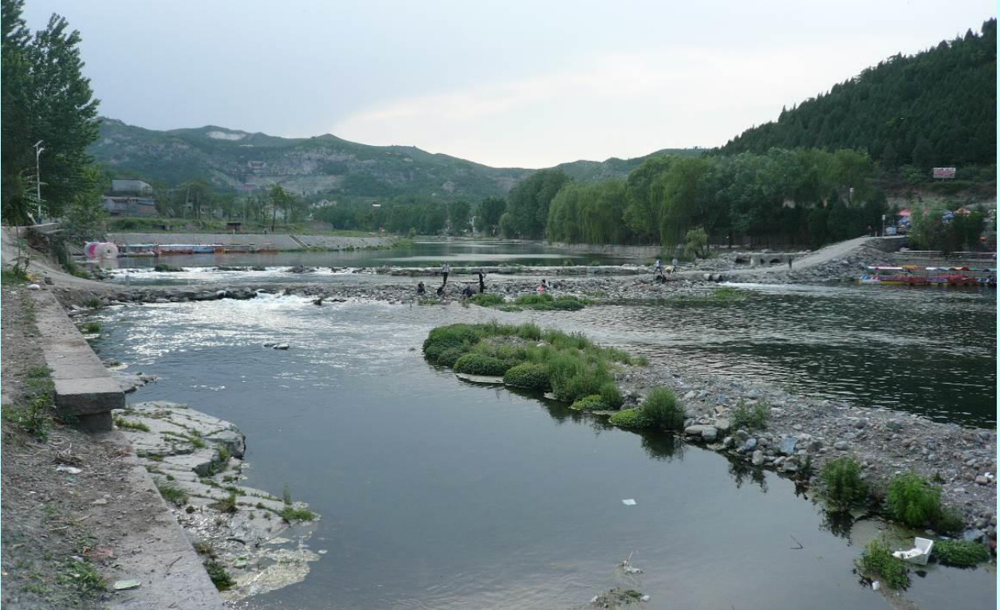  

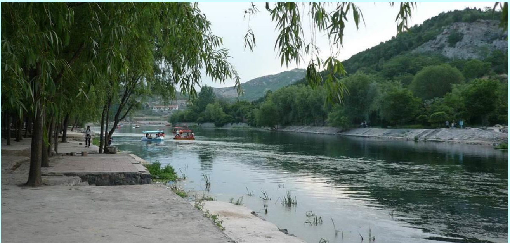  
照片 4-2 善应镇区段河道  

# ⑵ 安阳市区上游段(彰武水库至南水北调总干渠)  

彰武水库至南水北调中线总干渠段,河道长 $16.38\mathrm{km}$ ,上游弯道较多,下游相对顺直,河道比降 $1/320\{\sim1/1400$ 。该段河道河槽明显、河道较深,岸坡局部较陡,河口宽 $100{\sim}300\mathrm{m}$ ,现状过流能力大部分为 $3570\sim$ $2390\mathrm{m}^{3}/\mathrm{s}$ ,左右岸无堤防。该段河道左岸有较大支流珠泉河、粉红江,右岸有金线河,在支流汇入处有较大滩地。河道右岸为安阳河冲洪积扇上部,地势比较平整;左岸为缓丘区、沟壑发育,粉红江以下支沟较多,集水面积均不大,在汇入安阳河处形成低洼地形,洪水时易积蓄洪水。  

该段河道左岸有中州第一镇——水冶镇,沿途村庄密集,人口众多,两岸耕地较多。  

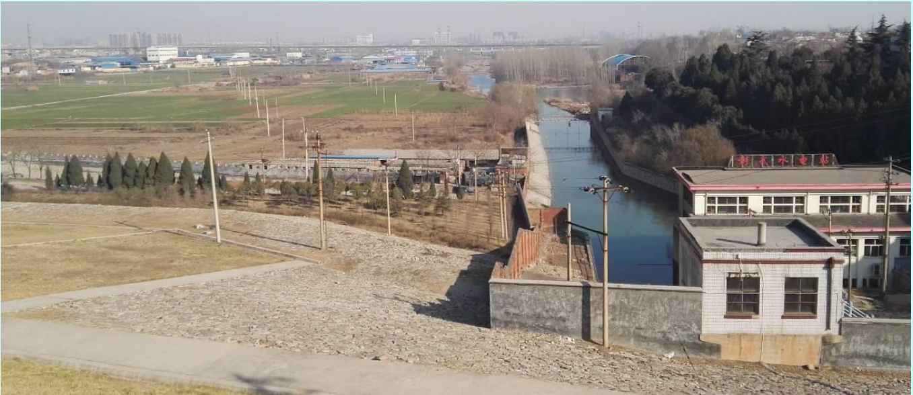  
照片 4-3 彰武水库大坝下游河道  

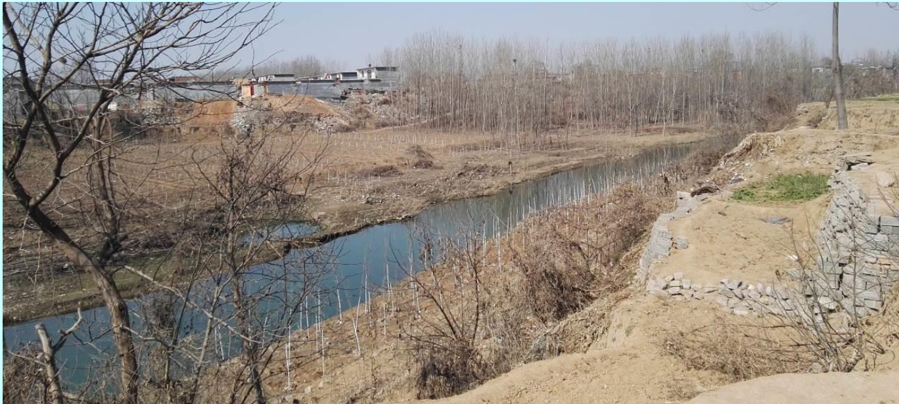  
照片 4-4 南固现村段河道(彰武水库大坝下游约 4km)  

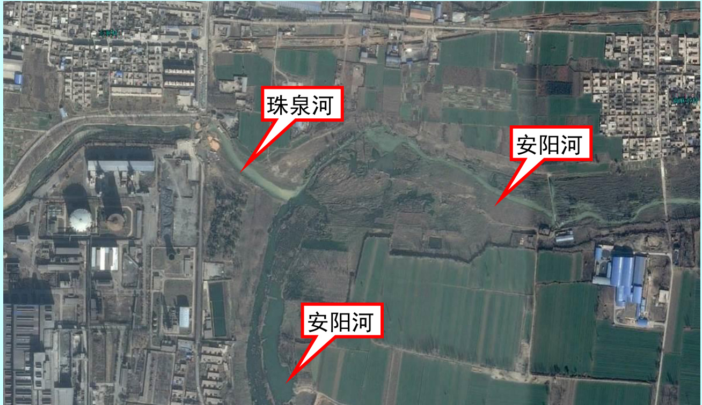  
照片 4-5 珠泉河入河口卫星图片  

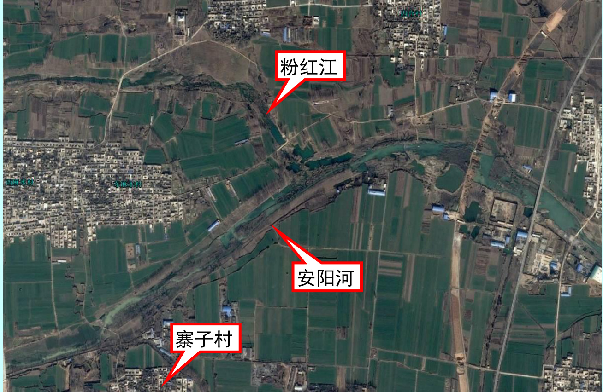  
照片 4-6 粉红江入河口卫星图片  

# 照片 4-7 寨子村段河道  

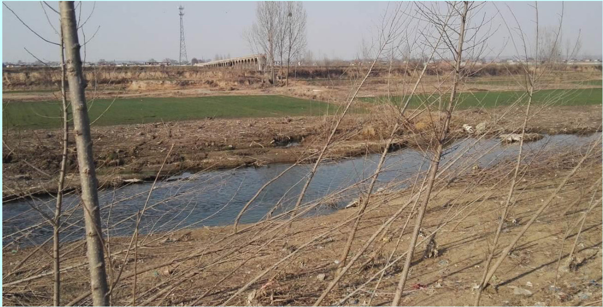  

# ⑶ 安阳市区段  

南水北调中线总干渠以下进入安阳市区,至曹马分洪口出安阳市区,全长 $25.26\mathrm{km}$ 。其中,南水北调中线总干渠至墟博物苑段河道长约 $9.8\mathrm{km}$ ,河槽明显、河道较深,岸坡较陡,弯道较多,局部裁弯取直,河道比降1/1100,河口宽 $100{\sim}200\mathrm{m}$ ,左右岸基本无堤防,现状过流能力大部分为$3570{\sim}2390\mathrm{m}^{3}/\mathrm{s}$ 。殷墟博物苑至于曹沟口位于城市建成区,河槽明显、河道较深,河道比降 $1/1000{\sim}1/1500$ ,该段河道已按 $2300\mathrm{m}^{3}/\mathrm{s}$ 疏挖,河口宽$120{\sim}260\mathrm{m}$ ,局部河段裁弯取直,取直后河道长 $9.28\mathrm{km}$ (取直前河道长约$11\mathrm{km},$ ),两岸修筑有堤防,高 $1.5{\sim}3\mathrm{m}$ ,堤顶宽 $1.5{\sim}7\mathrm{m}$ ,边坡 $1{:}2{\sim}1{:}10$ ,堤距 $120{\sim}170\mathrm{m}$ ,岸坡均进行了护砌。于曹沟口至曹马分洪口位于市区近郊,已列入中小河流治理工程,该段河道弯道较多,河道较深、岸坡较陡,河道比降 1/2065,河口宽 $60{\sim}300\mathrm{m}$ ,河道右堤完整、左堤堤防不连续,堤高 $1\sim4\mathrm{m}$ ,堤顶宽 $1.5{\sim}9\mathrm{m}$ ,边坡 $1{:}1{\sim}1{:}3$ ,堤距 $80{\sim}400\mathrm{m}$ 。  

该段河道上游为安阳市区近郊,沿途村庄密集,有安阳钢铁集团、安阳电厂等厂矿企业,殷墟遗址。中间横穿安阳市区北部,人口集中。于曹沟口至曹马分洪口位于市区近郊,人口密集、耕地较多。  

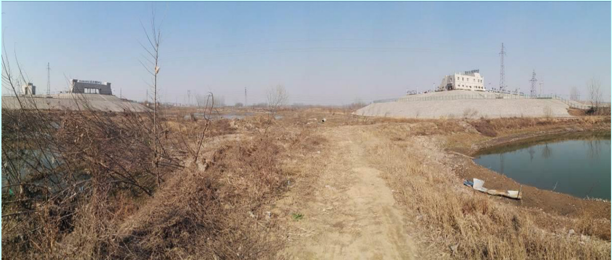  
照片 4-8 南水北调中线总干渠安阳河倒虹吸  

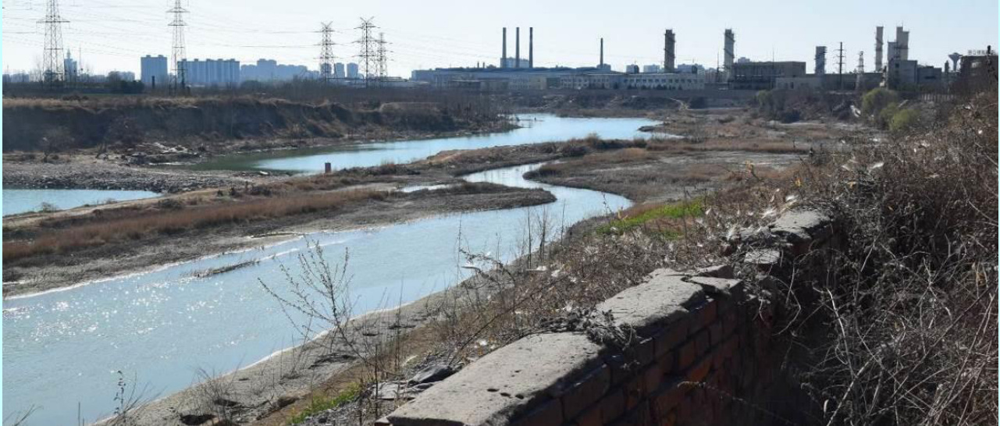  
照片 4-9 安钢段河道  

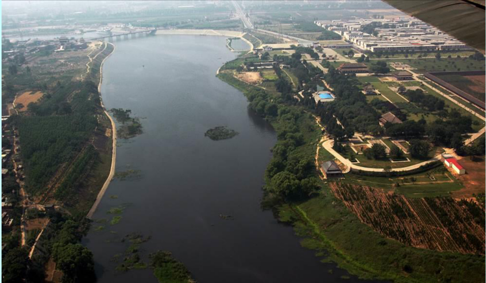  
照片 4-10 殷墟博物苑段河道  

# 照片 4-11 市区段河道  

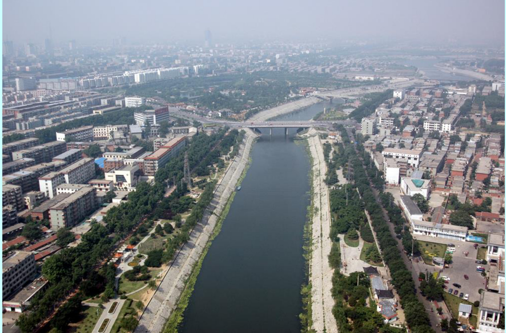  

# ⑷ 安阳市区以下河段  

安阳市区以下河段自曹马分洪口至入卫河口,河道蜿蜒曲折,全长$49.94\mathrm{km}$ ,其中安阳县段长 $41.39\mathrm{km}$ 、内黄县段长 $8.55\mathrm{km}$ 。该段河道河槽明显、岸坡较陡,大部分河段有滩地,河道比降 $1/2100{\sim}1/4300$ ,河口宽$40{\sim}80\mathrm{m}$ 。现状右岸堤防基本完整,左岸堤防不连续,堤距安阳县段 $80\sim$ $700\mathrm{m}$ 、内黄县段 $150\sim500\mathrm{m}$ ,现状堤防均为土堤,无护砌。安阳县段左岸堤防堤顶宽 $3\mathrm{\sim}6\mathrm{m}$ 、右岸堤防堤顶宽 $4{\sim}6\mathrm{m}$ ,堤坡 $1{:}1.5{\sim}1{:}2.5,$ 、堤高 $2\sim$ $4\mathrm{m}$ ,内黄县段左岸堤防堤顶宽 $3{\sim}4\mathrm{m}$ 、右岸堤防堤顶宽基本为 $6\mathrm{m}$ ,堤坡$1{:}1.5{\sim}1{:}2.5$ 、堤高 $4{\sim}5\mathrm{m}$ ,现状左岸堤防局部边坡坍塌,堤顶宽仅 $2\mathrm{m}$ 左右,边坡陡于 1:1。有两段河道左岸无堤:⑴东柴村至西韩化村南段河道无左堤,该段河道左堤位于崔家桥蓄滞洪区南部边界。⑵齐村至豆公闸段河道无左堤,右岸南伏恩村至豆公闸段无堤防。  

该段河道过流能力逐渐减小,大部分河段过流能力不足 $300\mathrm{m}^{3}/\mathrm{s}$ ,其中于曹沟至郭盆闸 $1188{\sim}449\mathrm{m}^{3}/\mathrm{s}$ 、郭盆闸至安内界不足 $300\mathrm{m}^{3}/\mathrm{s}$ 、安内界至入卫河口段河道泄洪能力 $600\mathrm{m}^{3}/\mathrm{s}$ 。河道两岸村庄比较密集,耕地较多,土地肥沃,是安阳市粮食主产区之一。  

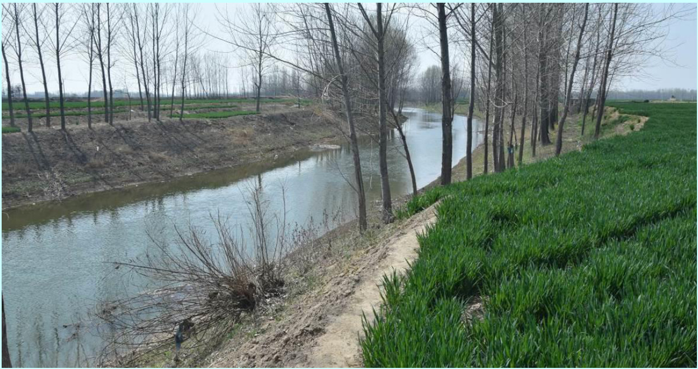  

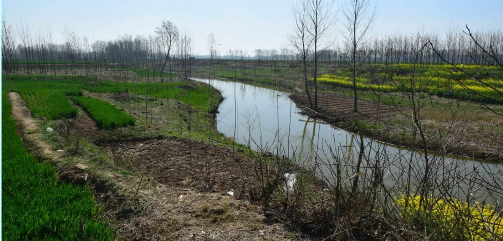  
照片 4-12 郭盆闸上游段河道  
照片 4-13 王家口村段河道  

# 照片 4-14 冯宿村段河道  

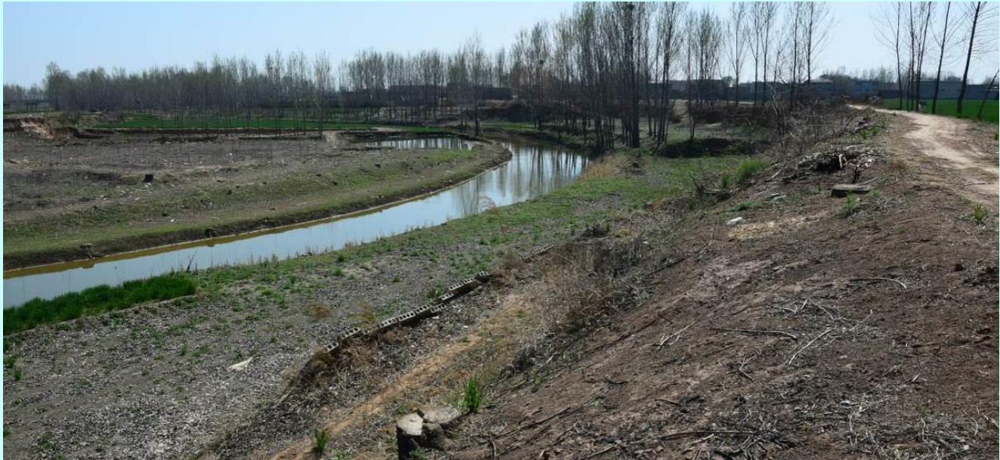  

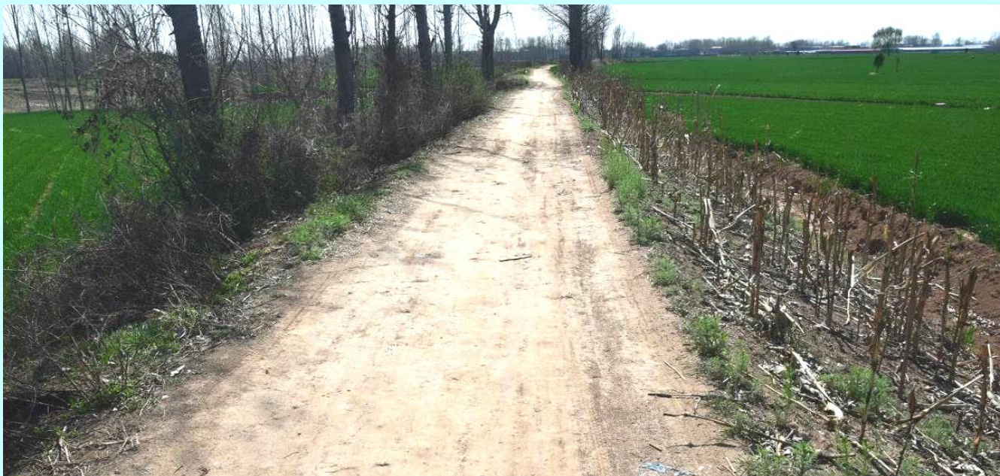  

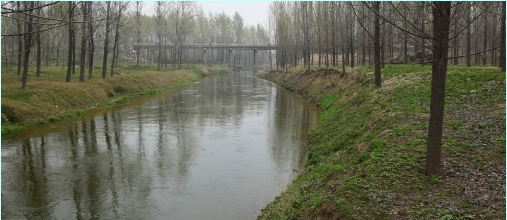  
照片 4-15 冯宿村段河道堤防  
照片 4-16 内黄县段河道  

# 照片 4-17 内黄县段河道堤防  

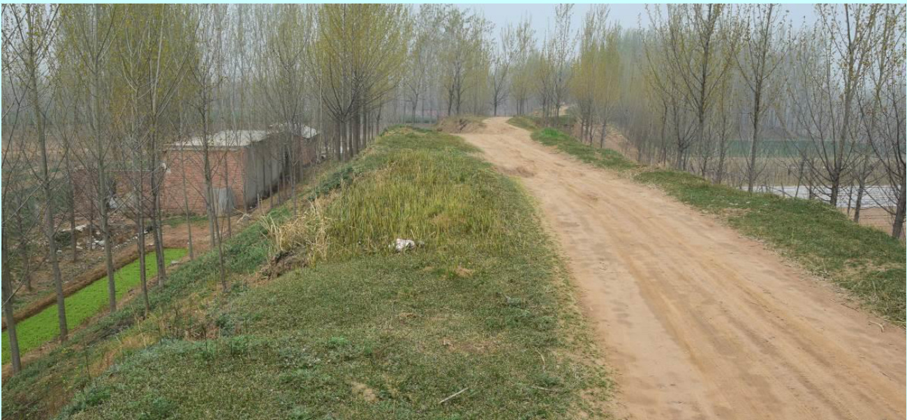  

  
照片 4-18 安阳河入卫河口  

# 4.1.1.3 水库工程现状  

安阳河干流上建有大中型水库两座:小南海水库和彰武水库。两座水库组成梯级水库,小南海水库控制流域面积 $850\mathrm{km}^{2}$ ,总库容 1.075 亿$\mathrm{m}^{3}$ ;彰武水库控制小南海水库以下区间流域面积 $120\mathrm{km}^{2}$ ,总库容 0.78亿 $\mathrm{m}^{3}$ 。彰武、南海两水库总控制流域面积 $970\mathrm{km}^{2}$ ,占安阳河总流域面积 $1920\mathrm{km}^{2}$ 的 $50.5\%$ ,为安阳市以上 $1520\mathrm{km}^{2}$ 的 $63.8\%$ ,对控制安阳河洪水十分有效。  

⑴ 小南海水库  

小南海水库位于河南省安阳市西南 $35\mathrm{km}$ 的安阳河干流上,防洪标准为 100 年一遇洪水设计、2000 年一遇洪水校核。设计洪水位 $179.88\mathrm{m}$ ,相应库容 7251 万 $\mathrm{m}^{3}$ ;校核洪水位 $187.8\mathrm{m}$ ,总库容 1.075 亿 $\mathrm{m}^{3}$ ;正常蓄水位 $173\mathrm{m}$ ,兴利库容 4380 万 $\mathrm{m}^{3}$ ;汛限水位 $160\mathrm{m}$ ,相应库容 1690 万$\mathrm{m}^{3}$ ;死水位 $150.00\mathrm{m}$ ,死库容 460 万 $\mathrm{m}^{3}$ 。  

小南海水库始建于 1958 年,1960 年基本建成,后历经几次除险加固,运行正常。  

现状主要建筑物由大坝、溢洪道、输水洞三部分组成。  

大坝为粘土斜墙堆石坝,现状坝顶高程 $188.1\mathrm{m}$ ,最大坝高 $54.0\mathrm{m}$ ,坝顶宽 $7.0\mathrm{m}$ ,坝顶长 $394.5\mathrm{m}$ ,坝顶防浪墙高 $1.2\mathrm{m}$ 。  

溢洪道位于拦河坝左岸坝头,溢流堰上建 4 孔泄洪闸,堰顶高程$168.0\mathrm{m}$ ,闸孔净宽 $40\mathrm{m}$ ,最大泄量 $7235\mathrm{m}^{3}/\mathrm{s}$ 。  

输水洞位于拦河坝右岸坝头山脚处,系坝下埋设钢筋混凝土蛋形管道。埋管进口底高程 $139.5\mathrm{m}$ ,设 $2.5\times4\mathrm{m}$ 平板钢闸门控制流量,洞长$245.5\mathrm{m}$ ,洞径 $3.05\mathrm{m}$ ,最大输水量 $109\mathrm{m}^{3}/\mathrm{s}$ 。  

# ⑵ 彰武水库  

彰武水库位于河南省安阳市西南 $25\mathrm{km}$ 安阳河干流上,防洪标准为50 年一遇洪水设计、1000 年一遇洪水校核。设计洪水位 $132.12\mathrm{m}$ ,库容4738 万 $\mathrm{m}^{3}$ ;校核洪水位 $137.14\mathrm{m}$ ,总库容 7785 万 $\mathrm{m}^{3}$ 。主汛期限制水位为 $127.0\mathrm{m}$ ,正常蓄水位为 $128.70\mathrm{m}$ ,水库防洪库容为 5367 万 $\mathrm{m}^{3}$ ,设计兴利库容为 4155 万 $\mathrm{m}^{3}$ ,近期兴利库容为 2755 万 $\mathrm{m}^{3}$ 。  

彰武水库始建于 1958 年,1960 年基本建成,后历经几次除险加固,运行正常。现状水库建筑物由大坝(主、副坝)、溢洪道、输水洞和电站四部分组成。  

大坝为均质土坝,采用粘土铺盖及混凝土防渗墙防渗,副坝位于主坝西侧。现状大坝坝顶高程 $137.6\mathrm{m}$ ,坝顶宽 $7.0\mathrm{m}$ ,坝顶防浪墙顶高程$138.8\mathrm{m}$ 。坝顶总长 $1350\mathrm{m}$ ,其中主坝 $730\mathrm{m}$ 、副坝 $620\mathrm{m}$ 。最大坝高主坝为 $28.7\mathrm{m}$ 、副坝为 $7.6\mathrm{m}$ 。  

溢洪道位于右岸坝头基岩上,全长 $341\mathrm{m}$ 。建有五孔 $8.5\times12\mathrm{m}$ 钢丝网混凝土弧形闸门,闸底板高程 $123.0\mathrm{m}$ ,最大泄量 $4989\mathrm{m}^{3}/\mathrm{s}$ 。  

输水洞位于大坝右岸、溢洪道左侧,系在右岸山坡挖槽浇筑而成,为坝下埋管,马蹄涵断面, $\mathrm{D}{=}2.6\mathrm{m}$ ,洞长 $124.24\mathrm{m}$ ,最大输水量 $72.5\mathrm{m}^{3}/\mathrm{s}$ 。在洞身 $0{+}116$ 右侧建有发电支洞,通向电站。电站位于输水洞和溢洪道之间,为坝后式厂房,总装机容量 $1600\mathrm{kW}$ 。  

# 4.1.1.4 蓄水建筑物 (节制闸、坝)工程  

彰武水库以下,安阳河干流上建有多座蓄水建筑物,用于灌溉、城市水系景观。其中水闸 5 座,建成 3 座,在建 2 座;橡胶坝 2 座。  

# ⑴ 于曹闸  

于曹闸工程位于市区下游、安阳河桩号 $34\mathrm{+}700$ 处,上游紧邻京港澳高速公路。2012 年建成,为一座景观节制闸,设计流量为 $2300\mathrm{m}^{3}/\mathrm{s}$ ,正常蓄水位 $69.96\mathrm{m}$ ,蓄水深 $7.6\mathrm{m}$ 。  

节制闸布置共 7 孔,单孔净宽 $10.0\mathrm{m}$ 。闸室结构采用开敞式结构,工作闸门采用双扉式钢闸门,液压启闭机控制。  

# ⑵ 郭盆闸  

郭盆闸位于安阳市白璧镇郭盆村北,安阳河桩号 $46{+}950$ 处,是一座以防洪、灌溉为主的中型水闸,既是安阳河崔家桥滞洪区入卫限泄$600\mathrm{m}^{3}/\mathrm{s}$ 控制性工程,也是洹南、洹东灌区的渠首枢纽工程。  

郭盆闸始建于 1956 年,为一座滚水坝。因蓄水位较低,不能满足灌溉引水要求,于 1958 年改建成为郭盆闸,在坝上筑墩建闸,并扩宽左端深孔,设计为通航船闸。1971 年对该闸进行了改建,保留了左端深孔,以利冲淤,右端扩建了两孔泄洪闸。2008 年对水闸进行了应急维修,更换闸门、启闭机,修建了闸房,加固交通桥上部结构。  

现状郭盆闸由浮体闸、左端两孔泄水闸和右端两孔泄洪闸组成。其中左端两孔为一孔深孔泄水闸和一孔浅孔泄水闸,右端两孔闸均为浅孔泄洪闸。  

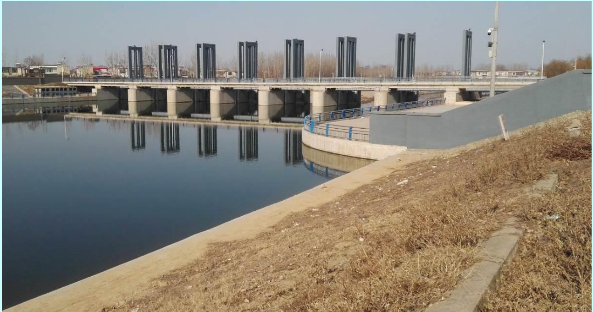  
照片 4-20 于曹闸现状  

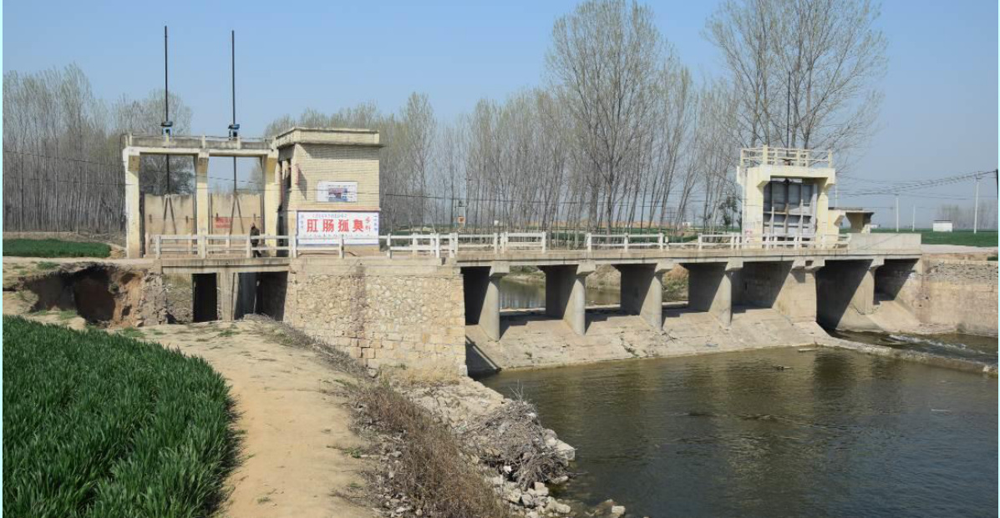  
照片 4-21 郭盆闸现状  

由于郭盆闸建设于大跃进时期,受当时社会条件限制,建筑材料紧缺、建设标准低,后虽经多次改建,但都不能从根本上解决工程结构不合理,控泄能力不足的问题,现状过水能力仅 $311\mathrm{m}^{3}/\mathrm{s}$ ,阻水严重,影响安阳市城区及两岸城镇和 50 万亩耕地防洪安全;且水闸的防渗、导渗体系严重破坏;砼剥蚀脱落,骨料外露,严重影响水闸的安全运行,亟需进行除险加固。  

郭盆闸已列入大中型病险水闸除险加固规划,目前已完成前期工作,即将除险加固。  

# ⑶ 豆公闸  

豆公闸位于安阳河桩号 $84\substack{+510}$ 处、内黄县豆公乡北部,距安阳河入卫河口处 $6.83\mathrm{km}$ ,设计流量为 $600\mathrm{m}^{3}/\mathrm{s}$ 。安阳河在该段处分成南、北两河,两河在豆公闸下游约 $150\mathrm{m}$ 处汇合。豆公闸由南闸和北闸组成,两闸相距约 $70\mathrm{m}$ ,是一座以灌溉为主的中型水闸枢纽工程。其中南闸兴建于 1958 年,建成时共 18 孔、单孔净宽 $2.5\mathrm{m}$ ,闸室长 $10\mathrm{m}$ ,1975 年 11月改为 15 孔,其中深孔 3 孔、次深孔 2 孔、浅孔 10 孔,总净宽 $48\mathrm{m}$ ,深孔底板高程 $49.51\mathrm{m}$ 。北闸兴建于 1978 年,闸室长 $14\mathrm{m}$ ,主闸为 3 孔,孔宽 $4.6\mathrm{m}$ ,底板高程 $46.8\mathrm{m}$ ;1984 年北闸南侧新建发电站,进口底板高程 $50.6\mathrm{m}$ 。  

豆公闸是内黄县豆公灌区的主要水源工程。豆公闸建成后,解决了内黄县 6 个乡镇养殖用水和 12 万亩耕地农业灌溉问题,改善了当地的农业生产条件,促进了当地农村经济的发展和人民生活水平的提高。豆公闸初建时由于历史原因,受当时资金、技术等诸多因素影响,建筑材料及施工质量差,且年久失修,水闸长期带病运行。  

豆公闸已列入大中型病险水闸除险加固规划,并已完成相关前期工作,即将除险加固。  

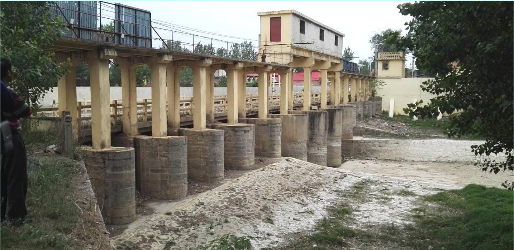  
照片 4-22 豆公闸南闸  

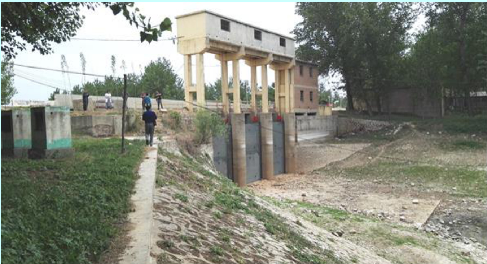  
照片 4-23 豆公闸北闸  

# ⑷ 西湖闸 (在建)  

拟建西湖闸工程位于安阳市城区西部,安阳河南水北调中线总干渠倒虹吸下游 $1.2\mathrm{km}$ ,安阳河桩号 $17{+}580$ 处,为一座景观节制闸,最大过闸流量 $3570\mathrm{m}^{3}/\mathrm{s}$ ,目前正在进行施工。  

西湖闸布置共 9 孔,单孔净宽 $10\mathrm{m}$ ,总净宽 $90\mathrm{m}$ 。闸门采用露顶式平面弧形钢闸门, $\mathrm{QH}{-}2{\times}400\mathrm{kN}$ 型固定卷扬式启闭机。  

# ⑸ 东湖闸 (在建)  

拟建东湖闸工程位于安阳市区京广高速铁路桥东 $1.6\mathrm{km}$ ,安阳河桩号 $42+760$ 处,为一座景观节制闸,最大过闸流量为 $1100\mathrm{m}^{3}/\mathrm{s}$ ,目前正在进行施工。  

东湖闸布置共 7 孔,单孔净宽 $7.0\mathrm{m}$ ,总净宽 $49\mathrm{m}$ 。闸门采用露顶式平面钢闸门, $\mathrm{QPQ}{\cdot}2{\times}250\mathrm{KN}{\cdot}10{\cdot}0\mathrm{m}$ 型固定卷扬式启闭机。  

# ⑹ 殷都橡胶坝  

殷都橡胶坝、船闸枢纽工程位于安阳河桩号 $27{+}190$ 处,京广铁路桥上游 $400\mathrm{m}$ ,于 1996 年完建运行。枢纽工程全长 $85\mathrm{m}$ ,橡胶坝设于洹河主河道上,船闸靠近河道左岸,橡胶坝与船闸之间设有鱼型岛。  

现状橡胶坝坝址处河底高程 $66.58\mathrm{m}$ ,坝底板高出河底 $0.5\mathrm{m}$ ,底板高程 $67.08\mathrm{m}$ ,坝袋挡水高度 $3.5\mathrm{m}$ ,坝袋顶高程 $70.58\mathrm{m}$ ,坝袋采用楔块挤压锚固。橡胶坝底长 $62\mathrm{m}$ ,顶长 $76\mathrm{m}$ 。铺盖长 $25\mathrm{m}$ ,坝底板长 $13\mathrm{m}$ ,消力池长 $20\mathrm{m}$ ,海漫长 $22\mathrm{m}$ 。  

船闸闸室长 $17.4\mathrm{m}$ ,宽 $6\mathrm{m}$ ,上、下闸首各设有 2 扇人字型钢闸门。 船闸采用液压直推式启闭机,左、右两侧分别安设一套液压系统。  

# 东风橡胶坝  

东风橡胶坝位于市区东风桥下游 $100\mathrm{m}$ 处,安阳河桩号 $30\substack{+330}$ ,该坝建成于 1992 年,采用充水式端墙斜坡式锚固坝,坝袋高 $3.5\mathrm{m}$ ,设计河底高程 $64.27\mathrm{m}$ ,设计河底宽 $62\mathrm{m}$ 。  

# 4.1.1.5 其他建筑物现状  

本期治理河道涉及其他建筑物共 217 座,其中渡槽 2 座,倒虹吸 2座,桥梁 9 座,支沟防洪闸 19 座,提灌站 205 座。  

# ⑴ 漳南总干渠夏寒渡槽  

夏寒渡槽是安阳市漳南灌区漳南总干渠横跨安阳河的过水建筑物,建于上世纪 60 年代,位于安阳河市区上游东夏寒村东北、南水北调中线总干渠上游约 $3.3\mathrm{km}$ 处,漳南总干渠桩号 $24+175\sim24+450$ ,设计流量为$15\mathrm{m}^{3}/\mathrm{s}$ ,槽身总长 $275\mathrm{m}$ 。渡槽进口处设有节制闸和退水闸,均为两孔,闸墩和启闭机排架为钢筋混凝土结构,闸门为钢闸门。渡槽出口处设有一孔分水闸,闸墩为钢筋混凝土结构,上部设有闸房,闸门为木闸门。该水闸下游向南与胜利渠衔接,作为胜利渠引岳城水库水的取水口,向北与安阳河连通,又可将水直接退入安阳河。  

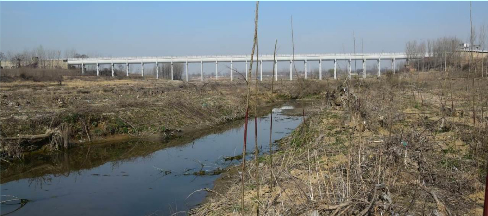  
照片 4-19 漳南总干渠夏寒渡槽  

渡槽已结合漳南灌区续建配套及节水改造项目进行了除险加固,目前运行正常。  

# ⑵ 西韩化倒虹吸  

西韩化倒虹吸位于安阳河桩号 $56{+}150$ 处,为洹东总干渠跨安阳河交叉建筑物,原为韩化渡槽,在安阳市漳南灌区续建配套与节水改造项目2015 年度工程建设中改建为倒虹吸。  

改建后的西韩化倒虹吸位于原渡槽处,倒虹吸轴线沿原渡槽轴线布置,采用埋置式。设计流量 $14.49\mathrm{m}^{3}/\mathrm{s}$ ,倒虹吸全长 $145\mathrm{m}$ ,涵身采用双  

孔箱形结构,单孔净宽 $2.5\mathrm{m}$ ,高 $2.5\mathrm{m}$ 。为防止河床冲刷,河底采用 M7.5浆砌石护砌。  

此段安阳河主河槽偏向左堤,倒虹吸进口布置在安阳河右滩地,进口设节制闸和退水闸,闸室段长 $5\mathrm{m}$ ,节制闸共两孔,单孔净宽 $2.5\mathrm{m}$ ,闸墩高 $3\mathrm{m}$ 。退水闸一孔,闸孔净宽 $2.5\mathrm{m}$ ,闸墩高 $2.5\mathrm{m}$ 。  

# ⑶ 冯宿渡槽  

冯宿渡槽为洹南三分干渠跨安阳河工程,位于安阳河桩号 $61{+}570$ 处。该渡槽建于七十年代,为“U”型薄壳活动推拉式渡槽,渡槽底板高程$57\mathrm{m}$ ,槽壁顶高程 $59.9\mathrm{m}$ ,槽身长 $45\mathrm{m}$ 。现状河道过流面积仅 $54.8\mathrm{m}^{2}$ ,安阳河泄量为 $600\mathrm{m}^{3}/\mathrm{s}$ 时,该处河道行洪水位 $60.31\mathrm{m}$ ,槽身轨道梁顶高程 $57\mathrm{m}$ ,低于洪水位 $3.31\mathrm{m}$ ,严重影响安阳河行洪,加之槽身汛期须向两端拉开,由于年久失修,止水老化破损,金属构件锈蚀严重,操作不便,成为一阻水工程。  

冯宿渡槽技改工程已列入安阳市漳南灌区续建配套与节水改造项目规划。  

# 防洪闸、提灌站  

安阳河现状支沟防洪闸共 20 座,均位于市区段下游,大部分建于上世纪六七十年代,进出口大部分为砌砖扭面,后期做了砂浆抹面,少部分为浆砌石扭面;闸室为浆砌石或砌砖结构。由于建设期受施工材料限制,年久失修,破损严重,启闭设备有的被盗,有的已不能正常运行,闸门漏水严重,消能设施结构老化、尺寸小,损毁严重。总之,这些水闸大多已不能满足规范要求,甚至不能正常发挥效益,为了保护沿河两岸人民的生命和财产安全,保证内涝及时排泄,防止安阳河行洪期间河水倒灌,应尽快拆除重建。防洪闸现状统计见表 4-1。  

<html><body><table><tr><td>县</td><td>序</td><td>建筑物名称</td><td>岸 别</td><td>孔 数</td><td>孔 径</td><td>孔高 (m)</td><td>底板 高程</td><td>灌溉 面积</td><td>存在问题</td><td>备注</td></tr><tr><td rowspan="8">别 安 阳</td><td>1</td><td>于曹沟防洪闸</td><td>左</td><td>3</td><td>(m) 3</td><td>2.4</td><td>() 66.82</td><td>(km²) 36</td><td></td><td>已规划重建</td></tr><tr><td>2</td><td>梨园沟防洪闸</td><td>左</td><td>3</td><td>3</td><td>4.2 (4.42)</td><td>59.7</td><td>142</td><td></td><td>已规划重建</td></tr><tr><td>3</td><td>贺庄退水闸</td><td></td><td>2</td><td>2.4</td><td>3.25 (4.25)</td><td>57.6</td><td>14.23</td><td rowspan="6">破损严重、 启闭设施老 化、消能设 施损坏</td><td>本次规戏重建</td></tr><tr><td>4</td><td>程奇村防洪闸</td><td>右</td><td>1</td><td>1.9</td><td>2.7</td><td>56.68</td><td>4.74</td><td>本次规戏重建</td></tr><tr><td>5</td><td>孙奇村防洪闸</td><td>左</td><td>1</td><td>1.93</td><td>2.25</td><td>55.5</td><td>6.53</td><td>本次规戏重建</td></tr><tr><td>6</td><td>大潮防洪闸</td><td>右</td><td>2</td><td>1.9</td><td>2.7</td><td>52.52</td><td>13.58</td><td>本次规戏重建</td></tr><tr><td>7</td><td>北贤孝防洪闸</td><td>左</td><td>1</td><td>1.5</td><td>1.82</td><td>54.82</td><td>5.93</td><td>本次规戏重建</td></tr><tr><td>8</td><td>南三里湾防洪闸</td><td>右</td><td>1</td><td>2</td><td>2</td><td>52.5</td><td>9.00</td><td>已规划重建</td></tr><tr><td>县</td><td>9 袁太保防洪闸</td><td>左</td><td>2</td><td>3</td><td>2.8</td><td>53.2</td><td>27.48</td><td></td><td>已规划重建</td></tr><tr><td>10</td><td>西伏恩防洪闸</td><td>左</td><td>1</td><td>1.81</td><td>1.9</td><td>54.02</td><td>12.00</td><td></td><td>已规划重建</td></tr><tr><td>11</td><td>东伏恩防洪闸</td><td>左</td><td>2</td><td>1.4</td><td>2.8</td><td>51.7</td><td>21.00</td><td></td><td>已规划重建</td></tr><tr><td>12</td><td>南伏恩防洪闸</td><td>右</td><td>1</td><td>1.8</td><td>2.8</td><td>51.77</td><td>7.00</td><td></td><td>已规划重建</td></tr><tr><td rowspan="7">内 黄</td><td>13</td><td>南干防洪闸</td><td>右</td><td>2</td><td>1.8</td><td>2.8</td><td>52.38</td><td>11.32</td><td rowspan="7">破损严重、 启闭设施老 化、闸门漏 水、消能设 施损坏</td><td>本次规戏重建</td></tr><tr><td>14</td><td>北干防洪闸</td><td>左</td><td>3</td><td>2.5</td><td>2.7</td><td>52.90</td><td>18.83</td><td>本次规戏重建</td></tr><tr><td>15</td><td>晁寺防洪闸</td><td>右</td><td>1</td><td>2</td><td>2.5</td><td>51.10</td><td>6.53</td><td>本次规戏重建</td></tr><tr><td>16</td><td>东豆公防洪闸</td><td>左</td><td></td><td>2</td><td>2.2</td><td>49.20</td><td>7.71</td><td>本次规戏重建</td></tr><tr><td>17</td><td>迁民屯西防洪闸</td><td>右</td><td>1</td><td>2</td><td>2</td><td>50.93</td><td>6.07</td><td>本次规戏重建</td></tr><tr><td>18</td><td>迁民屯北防洪闸</td><td>左</td><td>1</td><td>2.8</td><td>2</td><td>50.40</td><td>7.12</td><td>本次规戏重建</td></tr><tr><td>19</td><td>孙村防洪闸</td><td>左</td><td>1</td><td>1.2</td><td>1.2</td><td>49.62</td><td>5.93</td><td>本次规戏重建</td></tr><tr><td>20</td><td>李大晁防洪闸</td><td>右</td><td>1</td><td>2</td><td>2</td><td></td><td>48.58</td><td>7.79</td><td>本次规戏重建</td></tr></table></body></html>  

安阳河现状固定提灌站 77 座,均为小型提灌站,自河道内取水灌溉沿岸耕地,市区下游段提灌站大部分已废弃,改为井灌,部分已改建或重建。由于市区下游段河道扩挖,需拆除陈市、谢奇村及豆公北街村等3 座提灌站,而该提灌站为当地农业灌溉的主要水源,拆除后将影响当地百姓农业生产,因此本次规划对其拆除重建。该 3 座提灌站现状统计见表 4-2。  

表 4-1 安阳河支沟防洪闸现状情况统计表  
表 4-2 重建提灌站现状情况统计表  

<html><body><table><tr><td>序号</td><td>泵站位置</td><td>桩号</td><td>岸别</td><td>灌溉面积 （亩)</td></tr><tr><td>1</td><td>陈市</td><td>56+911</td><td>左</td><td>1000</td></tr><tr><td>2</td><td>谢奇村</td><td>64+336</td><td>左</td><td>800</td></tr><tr><td>3</td><td>豆公北街村</td><td>84+300</td><td>右</td><td>750</td></tr></table></body></html>  

# ⑸ 桥梁工程  

安阳河自彰武水库至入卫河口范围内现状有桥梁 46 座,大多为公路交通桥梁,防洪标准较高,仅有少部分桥梁阻水严重,均位于市区及下游段。市区段的五七桥和安阳桥为市区主干道路桥梁,本次仅提出建议扩建方案,投资不列入本次工程;本次治理仅对下游段现有未规划重建的破损严重、阻水的 2 座生产道路桥梁规划重建,工程现状见表 4-3。  

表 4-3 安阳河治理工程桥梁现状表  

<html><body><table><tr><td colspan="7"></td></tr><tr><td>序号</td><td>桩号</td><td>桥名</td><td>桥长 (m)</td><td>桥宽 (m)</td><td>桥面高程 (m)</td><td>备注</td></tr><tr><td>1</td><td>0+575</td><td>漫水桥</td><td>15</td><td>6</td><td>108.32</td><td>保持现状</td></tr><tr><td>2</td><td>1+250</td><td>南林高速桥</td><td>300</td><td>25.3</td><td>120.0</td><td>保持现状</td></tr><tr><td>3</td><td>1+425</td><td>在建301省道桥</td><td></td><td>24.5</td><td></td><td>在建</td></tr><tr><td>4</td><td>4+825</td><td>漫水桥</td><td>60</td><td>3.2</td><td>101.75</td><td>保持现状</td></tr><tr><td>5</td><td>5+225</td><td>省道301桥</td><td>100</td><td>12</td><td>115.53</td><td>保持现状</td></tr><tr><td>6</td><td>8+350</td><td>漫水桥</td><td>20</td><td>6</td><td>96.9</td><td>保持现状</td></tr><tr><td>7</td><td>8+750</td><td>安阳县产业集聚区东灵路桥</td><td>156</td><td>30</td><td>104.88</td><td>在建</td></tr><tr><td>8</td><td>9+300</td><td>寨子村桥</td><td>18</td><td>4.8</td><td>93.68</td><td>保持现状</td></tr><tr><td>9</td><td>11+400</td><td>西北绕城高速大桥</td><td>17X25</td><td>26</td><td>90.78</td><td>在建</td></tr><tr><td>10</td><td>11+760</td><td>土楼大桥</td><td>140</td><td>11.7</td><td>95.57</td><td>保持现状</td></tr><tr><td>11</td><td>12+025</td><td>018乡道桥</td><td>36</td><td>5</td><td>89.4</td><td>保持现状</td></tr><tr><td>12</td><td>12+920</td><td>夏寒小桥</td><td>32</td><td>3.6</td><td>86.82</td><td>保持现状</td></tr><tr><td>13</td><td>13+980</td><td>安车村漫水桥</td><td>100</td><td>4.8</td><td>85.88</td><td>保持现状</td></tr><tr><td>14</td><td>16+670</td><td>107国道桥</td><td>366</td><td>21.5</td><td>89.0</td><td>保持现状</td></tr><tr><td>15</td><td>19+160</td><td>华祥路桥</td><td>192</td><td>15</td><td>87.86</td><td>正在扩宽建设</td></tr><tr><td>16</td><td>19+504</td><td>电厂桥</td><td>110</td><td>4.3</td><td>85.5</td><td>保持现状</td></tr><tr><td>17</td><td>22+170</td><td>安钢漫水桥</td><td>80</td><td>4.85</td><td>75.54</td><td>保持现状</td></tr><tr><td>18</td><td>28+400</td><td>五七桥</td><td>86</td><td>36</td><td>77.69</td><td>阻水，地方建设</td></tr><tr><td>19</td><td>29+410</td><td>安阳桥</td><td>156.8</td><td>16.7</td><td>74.33</td><td>阻水，地方建设</td></tr><tr><td>20</td><td>30+220</td><td>东风桥</td><td>120</td><td>22</td><td>75.84</td><td>保持现状</td></tr><tr><td>21</td><td>31+460</td><td>平原桥</td><td>120</td><td>17.8</td><td>75.0</td><td>保持现状</td></tr><tr><td>22</td><td>32+440</td><td>中华桥</td><td></td><td>47</td><td>77.09</td><td>保持现状</td></tr><tr><td>23</td><td>34+220</td><td>光明桥</td><td>126</td><td></td><td>73.8</td><td>保持现状</td></tr><tr><td>24</td><td>34+550</td><td>高速公路桥</td><td>140</td><td>23</td><td>73.0</td><td>保持现状</td></tr><tr><td>25</td><td>39+290</td><td>曹马桥</td><td>220 110</td><td>42</td><td>71.58</td><td>保持现状</td></tr><tr><td>26</td><td>40+830</td><td>海兴桥</td><td>145</td><td>5.5 11</td><td>72.01</td><td>保持现状</td></tr><tr><td>27</td><td>41+210</td><td>京广高铁桥</td><td></td><td>12</td><td></td><td>保持现状</td></tr><tr><td>28</td><td>44+410</td><td>柴村桥</td><td>62</td><td>4.5</td><td>66.94</td><td>地方规划重建</td></tr><tr><td>29</td><td>47+865</td><td>新东北外环桥</td><td>21.5</td><td>5.4</td><td></td><td>在建</td></tr><tr><td>30</td><td>52+430</td><td>S219省道桥</td><td>85</td><td>13.3</td><td>63.5</td><td>保持现状</td></tr><tr><td>31</td><td>55+310</td><td>胡口村南桥</td><td>76</td><td>4.45</td><td>61.21</td><td>地方规划重建</td></tr><tr><td>32</td><td>56+236</td><td>西韩化村桥</td><td>40</td><td>2.7</td><td>58.97</td><td>本次拆除重建</td></tr><tr><td>33</td><td>56+950</td><td>狄清线桥</td><td>106</td><td>11</td><td>61.94</td><td>保持现状</td></tr><tr><td>34</td><td>61+515</td><td>301省道桥</td><td>180</td><td>15.9</td><td>62.26</td><td>保持现状</td></tr></table></body></html>  

续表 4-3 安阳河治理工程桥梁现状表  

<html><body><table><tr><td>序号</td><td>桩号</td><td>桥名</td><td>桥长 (m)</td><td>桥宽 (m)</td><td>桥面高程 (m)</td><td>备注</td></tr><tr><td>35</td><td>63+430</td><td>程奇村北桥</td><td>70</td><td>8.5</td><td>59.09</td><td>保持现状</td></tr><tr><td>36</td><td>65+655</td><td>张奇村北桥</td><td>24.5</td><td>4.8</td><td>54.7</td><td>本次拆除重建</td></tr><tr><td>37</td><td>68+170</td><td>S22南林高速桥</td><td>244</td><td>26.9</td><td></td><td>保持现状</td></tr><tr><td>38</td><td>71+320</td><td>东贤孝北桥</td><td>90</td><td>10.7</td><td>59.39</td><td>保持现状</td></tr><tr><td>39</td><td>73+532</td><td>辛村乡桥</td><td>75</td><td>10.7</td><td>59.32</td><td>保持现状</td></tr><tr><td>40</td><td>79+670</td><td>老伏恩桥</td><td>70</td><td>4.8</td><td>57.14</td><td>保持现状</td></tr><tr><td>41</td><td>79+668</td><td>新伏恩桥</td><td>80</td><td>8.5</td><td>58.14</td><td>保持现状</td></tr><tr><td>42</td><td>84+510</td><td>南西线河桥</td><td>80</td><td>8.3</td><td>56.37</td><td>保持现状</td></tr><tr><td>43</td><td>87+830</td><td>现状迁民屯桥</td><td>93.7</td><td>5.7</td><td>56.38</td><td>保持现状</td></tr><tr><td>44</td><td>87+930</td><td>老迁民屯桥</td><td>56</td><td>5</td><td>53.09</td><td>阻水，拆除</td></tr><tr><td>45</td><td>89+120</td><td>孙村桥</td><td>96</td><td>5.3</td><td>54.97</td><td>保持现状</td></tr><tr><td>46</td><td>91+400</td><td>河口桥</td><td>90</td><td>5.9</td><td>55.6</td><td>保持现状</td></tr></table></body></html>  

# 4.1.1.6 崔家桥蓄滞洪区工程现状  

为保证卫河防洪安全,调节安阳河洪水下泄,利用安阳河下游左岸洼地,开辟了崔家桥蓄滞洪区。崔家桥蓄滞洪区是海河流域防洪工程体系的重要组成部分,承担着分蓄安阳河洪水的任务。建国以来,崔家桥蓄滞洪区较大规模的滞蓄安阳河洪水五次(包括 2016 年“7.19 洪水”),滞洪区内群众为顾全大局做出了很大牺牲。  

由于安阳河下游河道过水能力小,崔家桥蓄滞洪区多次启用,但实际上直到 2002 年才纳入蓄滞洪区管理范围。安阳河历次治理规划均考虑崔家桥蓄滞洪区的作用。根据最新规划,崔家桥蓄滞洪区在安阳河左岸设两个分洪口(曹马分洪口、郭盆分洪口),通过郭盆闸的控制,河道与蓄滞洪区联合运用,使安阳河入卫河流量满足限泄 $600\mathrm{m}^{3}/\mathrm{s}$ 的要求,以保证卫河达到 50 年一遇的防洪标准。  

# 4.1.1.7 保护区现状  

本次安阳河系统范围自善应镇区段及彰武水库至入卫河口,涉及安阳市龙安区、殷都区、安阳县和内黄县。  

安阳市位于河南省最北端,地处山西、河北、河南三省交汇处,西临长治,东接濮阳,北临邯郸,南接鹤壁、新乡,总面积 5599 平方公里,其中市区面积 543.6 平方公里。下辖 1 个县级市(林州市)、3 个县(安阳县、内黄县、汤阴县)、4 个市辖区(文峰区、北关区、殷都区、龙安区)、1 个城乡一体化示范区(安阳新区)、1 个国家级高新技术产业开发区(安阳高新技术产业开发区)和 1 个国家级经济技术开发区(红旗渠国家经济技术开发区)。共有 20 个乡、49 个镇,43 个街道办事处,231个社区居委会(含林州市 31 个社区),2266 个行政村。  

2015 年 9 月 28 日,国务院办公厅以国办函〔2015〕101 号文对《安阳市城市总体规划(2011—2020 年)》予以批准,规划安阳为:国家历史文化名城和豫晋冀三省交界地区区域性中心城市;世界文化遗产地、国家历史文化名城和中国优秀旅游城市;河南省以现代制造业为基础的新型工业基地;豫晋冀三省交界地区的商务信息中心、交通物流中心、教育科研中心和文化旅游中心。规划 2020 年中心城区城市建设用地面积为 130 平方公里,规划 2020 年中心城区城市人口规模 150 万人,人均建设用地面积 86.67 平方米。  

2016 年 11 月 12 日,安阳市市委召开了第五次常委会议,会议研究决定对部分区域管理范围和管理体制作出适当调整,具体调整如下:(一)安阳县与城乡一体化示范区套合,管理安阳县东部崔家桥镇、韩陵镇、瓦店乡、永和镇、吕村镇、北郭乡、辛村乡、白璧镇,代管高庄镇;(二)殷都区代管安阳县水冶镇(含蒋村镇)、铜冶镇、曲沟镇、洪河屯、伦掌乡、都里乡、磊口乡、许家沟乡、安丰乡9个乡镇;(三)龙安区代管安阳县善应镇、马家乡;(四)北关区代管安阳县柏庄镇;(五)文峰区代管安阳高新技术产业开发区。  

安阳是中国八大古都之一,是早期华夏文明的中心之一,是国家历史文化名城和豫晋冀三省交界地区区域性中心城市。早在 25000 年前旧石器时代晚期,先民就在此生活。远古传说时期“三皇五帝”中的颛顼、帝喾二帝先后在帝丘和亳建都,并葬于此(均在内黄县梁庄乡)。公元前1300 年,商王盘庚迁都于殷(今安阳市区小屯一带),在此传八代十二王,历时 255 年。三国、两晋、南北朝时,先后有曹魏、后赵、冉魏、前燕、东魏、北齐等在此建都,故安阳素有“七朝古都”之称。  

初步统计,2016 年,安阳市生产总值 1805.7 亿元,增长 $8\%$ ;一般公共预算收入 107.3 亿元,增长 $8.7\%$ ;规模以上工业增加值 765.7 亿元,增长 $7.3\%$ ;固定资产投资 1901.1 亿元,增长 $13\%$ ;社会消费品零售总额662.6 亿元,增长 $11.9\%$ ;居民人均可支配收入 20513 元,增长 $7.4\%$ ;粮食总产 219.5 万吨,夏粮收购逆市增长 $10\%$ 。  

安阳是区域性综合交通枢纽城市、国家二级物流布局城市,全市公路通车总里程达到 8297 公里,公路密度每百平方公里达到 148.2 公里,交通便利。京广铁路、京广高铁与晋豫鲁大运力铁路形成“二纵一横”铁路枢纽;西北绕城高速开工建设,林汝高速前期工作加快推进,与现有的京港澳、南林、鹤辉高速公路即将形成“二纵二横一环”高速公路网;G234(原省道 228)红旗渠青年洞至合涧段一级路改建工程基本建成,G341 东南西南外环一级路建设工程顺利推进,“三纵二横一联”国道干线和“五纵四横四联”省道干线路网逐步完善。2016 年 11 月 4 日,国务院、中央军委以国函〔2016〕181 号文批复同意新建河南安阳民用机场,目前正在加快推进项目可研等前期工作。  

# 4.1.2 安阳河防洪工程治理情况  

安阳河穿过安阳市区,安阳市委、政府历来重视安阳河治理,但重点集中在市区河道。近几年国家加大中小河流治理力度,安阳市区下游河道及崔家桥蓄滞洪区也陆续安排投资治理,但均不系统。  

自 1991 年以来,安阳河已治理河道长度 $23\mathrm{km}$ ,其中殷都桥段长$2.33\mathrm{km}$ ,市区中段长 $3.27\mathrm{km}$ (治理后 $2.5\mathrm{km},$ ),市区东段长 $5.30\mathrm{km}$ ,市区下游段 $4.1\mathrm{km}$ ,内黄段 $8.0\mathrm{km}$ ,以上河段共完成投资 1.2 亿元。崔家桥蓄滞洪区安排投资 8652 万元。  

# 殷都桥段工程  

安阳河殷都桥段治理工程,自殷墟博物苑北至京广铁路桥,治理河道长 $2.33\mathrm{km}$ ,治理标准 50 年一遇防洪。建筑物有橡胶坝、船闸枢纽工程一座,排水涵洞 7 座、2 座扬水站和三处码头工程。工程于 1995 年 3月开工,完成投资 2362.15 万元。  

# ⑵ 市区中段工程  

1991 年 4 月,安阳市人民政府和济南军区共同组成了“安阳河市区段军民共建综合治理工程指挥部”,负责市区中段河道的整治。其中一期工程京广铁路桥至东风坝段治理工程于 1991 年至 1993 年完成,治理河道 $3.27\mathrm{km}$ (包括郭家湾载弯工程),治理标准 50 年一遇防洪,新建桥 2座(公园桥和东风桥),橡胶坝 1 座,公园排水涵洞 2 座,以及排污工程,完成投资 2980 万元。  

# ⑶ 市区东段工程  

安阳河市区东段工程于 2000 年 11 月开工,2002 年基本完成。河道治理段自东风坝至于曹沟,长 $5.3\mathrm{km}$ ,治理标准 50 年一遇防洪。包括河道开挖、堤防填筑、岸坡护砌,新建平原桥、橡胶坝各一座,还有污水截流、道路和绿化工程等。  

# ⑷ 市区以下工程  

安阳河市区以下工程于 2004 年开工,治理段西起于曹沟,东至郭盆闸,长度 $11.09\mathrm{km}$ 。由于受多种因素影响及资金限制,仅按照较低标准  

对曹马分洪口至东柴村桥 $4.1\mathrm{km}$ 的河道进行了疏浚和右堤填筑,完成投资 1359 万元。  

# ⑸ 内黄段工程  

1992 年市政府成立了“安阳市安阳河县(区)段治理工程指挥部”,内黄段治理工程当年开工,该段工程省水利厅批准投资 624 万元,工程于 1992 年 11 月开工,至 1993 年 4 月完成安内县界至入卫河口约 $8.0\mathrm{km}$ 的河道土方工程,建成河口桥 1 座。1997 年完成辛村桥扩建工程。  

# ⑹ 崔家桥蓄滞洪区工程  

崔家桥蓄滞洪区已列入海河流域蓄滞洪区治理工程规划,是先行治理的蓄滞洪区之一。自 2012 年起,先后实施了 3 个年度工程,即 2012年度工程、2014 年度工程和剩余工程。滞洪区安全建设工程将于 2020年以前全部完工。  

完成的主要工程有:新建曹马分洪口(分洪流量 $1200\mathrm{m}^{3}/\mathrm{s})$ )、郭盆分洪口(分洪流量 $500\mathrm{m}^{3}/\mathrm{s})$ )。加固治理蓄滞洪区南边界堤防(安阳河曹马桥至王家口段左堤),治理段堤防总长度为 $14.2\mathrm{km}$ ;新建北、东防洪堤,为崔家桥蓄滞洪区北部、东部的边界堤防,自安阳县小安阳屯村南的自然高地至王家口村与安阳河左堤相连接,长度为 $7.77\mathrm{km}$ ;拆除重建穿堤涵闸 4 座,新建穿堤涵闸 25 座。按排涝标准疏浚梨园沟,拆除重建梨园沟退水闸(最大退水流量为 $72\mathrm{m}^{3}/\mathrm{s})$ );新建王家口退水闸(最大退水流量为 $150\mathrm{m}^{3}/\mathrm{s})$ )。新建崔家桥蓄滞洪区管理所 1 处。  

# 4.1.3 前期工作及批复  

根据《卫河流域规划》,安阳市水利局于 1988 年 11 月委托我院编制《安阳城市防洪安阳河治理工程可行性研究报告》,我院于 1989 年 11 月完成了《安阳河设计洪水报告》、《安阳河工程地质勘察报告》;1990年8月完成了《安阳城市防洪安阳河治理工程可行性研究报告(初稿)》。1991年 5 月,编制完成了《安阳城市防洪安阳河治理工程可行性研究报告》及《安阳城市防洪安阳河治理工程设计任务书》,海河水利委员会以海规字(1992)第 2 号文批复设计任务书。批复同意安阳市上、下河道按 50年和 20 年一遇洪水标准进行设防,即市区段河道按 $2300\mathrm{m}^{3}/\mathrm{s}$ ,以下配合崔家桥蓄滞洪区运用,按入卫流量 $600\mathrm{m}^{3}/\mathrm{s}$ 的规模进行整治;崔家桥以下河道按 3 年一遇除涝流量 $300\mathrm{m}^{3}/\mathrm{s}$ 的标准进行治理;堤防设计水面线应按入卫河口的水位 $54.03\mathrm{m}$ ,并以设计洪水流量进行推算。  

1991 年 4 月,安阳市建委委托我院编制了《安阳河市区段综合治理期工程设计任务书》,河南省计委以豫计经资(1991)1263 号文予以批复,核定投资 2980 万元。市区中段治理工程于 1993 年完成。  

1991 年 12 月,安阳市水利局委托我院编制完成《安阳河治理一九九一年度工程设计》,即内黄段治理工程,省水利厅以豫水计字(1992)029 号文予以批复,核定投资 624 万元。内黄段治理工程于 1993 年完成。  

1992 年 7 月编制了《安阳城市防洪安阳河治理可行性研究报告(补充修订)》,省水利厅以豫水计字(1992)270 号文初审后转报海河水利委员会。1993 年 12 月,安阳市水利局委托我院编制了《安阳河殷墟博物苑至京广铁路桥河道整治开发可行性研究报告》,1994 年 6 月,安阳市人民政府以安政文(1994)77 号文批复“殷都桥段治理工程”。1994 年8 月省水利厅以豫水管字(1994)30 号文作了批复;1995 年 3 月编报了《安阳河殷都桥段治理工程初步设计》,市计委以安计基(1995)182 号文予以批复。殷都桥段治理工程于 1996 年完成。  

2000 年 6 月,安阳市安阳河市区东段治理工程指挥部委托我院及安阳市政设计院编制了《安阳河市区东段治理工程可行性研究报告》,河南省计委以豫计投资[2000]742 号文对《安阳河市区东段治理工程可行性研究报告》予以批复,核定投资 11413 万元;随后又批复了该项目的初步设计,核定投资 11793 万元。市区东段治理工程于 2002 年完成。  

2002 年,我院编制完成了《安阳河河道治理工程可行性研究报告》(续建可研),河南省发展计划委员会以豫计农经[2002]1780 号文予以批复,核定工程总投资 12903 万元。2004 年,我院编制完成了《安阳河河道治理工程初步设计报告》,河南省发展和改革委员会以豫发改办[2004]368 号文予以批复,总治理长度为 $53.05\mathrm{km}$ ,其中电厂北至殷墟博物苑段长 $6.4\mathrm{km}$ ,于曹沟口至安阳县和内黄县边界段长 $46.65\mathrm{km}$ ,总概算核定为 12275 万元。由于受多种因素影响及资金限制,仅按照较低标准对曹马分洪口至东柴村桥 $4.1\mathrm{km}$ 的河道进行了疏浚和右堤填筑,完成投资 1359 万元。  

根据国家中小河流治理规划,2014 年,编制完成《河南省安阳市安阳河于曹沟至崇义段河道治理工程初步设计报告》,已由河南省水利厅批复,治理段为于曹沟至崇义下游曹马分洪口段河道,批复治理长度为$6.16\mathrm{km}$ ,治理标准采用 50 年一遇防洪,设计流量 $2300\mathrm{m}^{3}/\mathrm{s}$ ,现正准备实施。2016 年,编制完成《河南省安阳市安阳县洹河辛村段河道治理工程初步设计报告》,已由安阳市水利局批复,治理段为辛村镇东至安(安阳县)内(内黄县)界,治理长度 $7.45\mathrm{km}$ ,设计流量 $600\mathrm{m}^{3}/\mathrm{s}$ 。  

# 4.2 存在问题及工程建设的必要性  

# 4.2.1 存在问题  

安阳河是安阳市人民的母亲河,流域面积大部分在安阳市境内,既哺育了两岸人民,在洪水时期又给两岸群众带来巨大灾难。  

根据地形条件和流域特点,安阳河洪水威胁沿途不同。上游位于林州盆地,支流众多、水网密集,洪水历时短,主要是局部短暂滞洪,洪水威胁较小。中游位于中低山区的峡谷中,洪水威胁也不大。安阳河自彰武水库出山以后,洪水集中、洪水历时延长,加上两岸山区支流多于出山口以下较近处汇入(左岸有珠泉河、粉红江,2016 年洪水主要来源;右岸有金线河,1963 年洪水较大),加大了下游洪水洪峰和洪水发生频率,而且彰武水库以下河道比降变缓、河道蜿蜒,过水断面逐渐缩小,洪灾频繁,两岸土地广阔、人口密集,洪水灾害非常严重。  

安阳河系统治理范围主要是彰武水库以下至入卫河口,小南海水库与彰武水库之间横穿善应镇镇区,一并考虑治理。  

安阳河系统治理工程范围内虽然进行过一些河道治理工程,但范围较小,均不系统。河道现状存在的主要问题可以归纳为以下几点:  

# ⑴ 河道过水断面小,防洪标准低,洪灾频繁。  

受河道来水特点及地形地势影响,安阳河河道断面上宽下窄、过流能力上大下小,现状善应镇区段河道过流能力为 $800{\sim}1000\mathrm{m}^{3}/\mathrm{s}$ ,基本满足 20 年一遇防洪标准要求;彰武水库至殷墟博物苑段现状过流能力大部分达到 $3570{\sim}2390\mathrm{m}^{3}/\mathrm{s}$ ,满足设计防洪标准要求;殷墟博物苑至于曹沟口已按 $2300\mathrm{m}^{3}/\mathrm{s}$ 治理;市区以下河道河道断面较窄,大部分河段现状过流能力不足 $300\mathrm{m}^{3}/\mathrm{s}$ ,洪水漫溢,其中于曹沟至郭盆闸 $1188{\sim}449\mathrm{m}^{3}/\mathrm{s}.$ 、郭盆闸至安内界不足 $300\mathrm{m}^{3}/\mathrm{s}$ 、安内界至入卫河口段河道泄洪能力$600\mathrm{m}^{3}/\mathrm{s}$ 。河道多年来未进行过系统治理,致使河道萎缩严重,防洪标准低,对防洪安全构成了严重威胁。  

彰武水库至殷墟博物苑过流能力基本满足设计防洪标准要求,但存在阻水河段和建筑物,如华祥路上游左岸填河建厂、大正及姬家屯村处河道内建有鱼塘,阻水严重;殷墟博物苑至于曹沟口已按 $2300\mathrm{m}^{3}/\mathrm{s}$ 治理;  

重点是市区以下河道,河道断面较窄,大部分河段过流能力不足 $300\mathrm{m}^{3}/\mathrm{s}$ ,排水不畅,频繁对下游造成灾害,洪水受下游顶托,对安阳市的威胁仍然存在,影响已治理工程效益的发挥;崔家桥蓄滞洪区低标准启用,增加启用频率,小水大灾。1996 年洪水,卫河只有半槽水,安阳河仅发生不足 10 年一遇洪水,但由于市区以下未治理,仍造成严重水灾。  

# ⑵ 堤防不连续,堤身单薄,防洪基础设施薄弱。  

安阳河堤防布置在市区及市区下游段,根据现状堤防情况,市区已治理段堤防完好,市区下游段右岸堤防基本完整、左岸堤防不连续,东柴村至西韩化村南段、齐村至豆公闸段两段河道无左堤,其中曹马桥至王家口段长 $14.2\mathrm{km}$ 左岸堤防已列入崔家桥蓄滞洪区工程建设、辛村镇东至安内界段长 $7.45\mathrm{km}$ 河道已列入中小河流治理,现状大部分未实施。  

市区下游段现状堤防均为土堤,堤顶及堤坡均未护砌,安阳县段大部分堤防堤顶宽 $3\mathrm{\sim}4\mathrm{m}$ 、堤坡 $1{:}1.5{\sim}1{:}2.5\$ 、堤高 $2\mathrm{\sim}4\mathrm{m}$ ,内黄县段堤防堤顶宽 $3\mathrm{\sim}6\mathrm{m}$ 、堤坡 $1{:}1.5{\sim}1{:}2.5.$ 、堤高 $4{\sim}5\mathrm{m}$ 。部分堤防由于人为破坏,堤顶宽仅 $2\mathrm{m}$ 左右,边坡陡于 1:1,加之群众扒堤作路口,堤身单薄,堤防高度不满足防洪要求,需要加高培厚;堤顶防汛道路均为土路,坑洼不平,部分路面甚至被开垦种地,存在严重安全隐患,且不能满足防汛交通要求。2016 年洪水造成市区下游段多处堤防决口,造成重大经济损失,现有堤顶道路条件也严重制约了抗洪抢险措施的开展。  

# ⑶ 河道弯道多,冲刷严重,易形成险工段。  

安阳河彰武水库以下至入卫河口,河道蜿蜒、弯道较多。特别是市区下游,较大的弯道达 30 处之多,主要集中在东荣村(S219 公路桥)至冯宿和齐村至安内界段,凹岸处严重冲刷,形成多处险工段。经计算,水流斜冲岸坡坡脚的局部冲刷深度 $1.7{\sim}2.9\mathrm{m}$ ,冲刷严重,易造成凹岸坍  

塌,形成险工段。  

# ⑷ 穿堤建筑物破损,影响堤防安全;部分交叉建筑物阻水。  

安阳河市区以下河道两岸地势平缓、耕地广袤,排涝面积大,但两岸堤防较高, 排涝沟渠与堤防交叉,穿堤建筑物建设年代久远,严重破损,洪水易淘刷堤防,发生渗透破坏,影响堤防安全。  

安阳河流域面积大,河口宽、堤距较大,部分桥梁等交叉建筑物建设年代,标准低,阻水严重。部分泵站等近岸建筑物缩窄河道,也影响河道过流能力。  

⑸ 部分河道植树较多,局部河段填河建房、建厂,缩窄了河道行洪断面,减小了河道行洪能力,加重了洪灾损失。  

安阳河属于北方河流,径流丰枯明显,而且径流年际变化较大,河道长期流量小,过水断面窄,群众受利益驱动,容易短视,不考虑防洪问题,在河滩地植树耕种。  

彰武水库以下河道,部分河段滩地宽阔,植树较多。两岸村庄密集、人口多,又穿过安阳市区,受利益驱动,部分群众和企业在局部河段滩地上填河盖房及修建厂矿企业,且大部分位于洪水位以下。以上问题不仅降低了河道行洪能力,影响已治理河道的效益,也加重了洪灾损失。  

# ⑹ 管理落后、信息化程度不高。  

安阳河河道长,涉及县、区多,管理工作量大、管理难度大。多年来工程措施和非工程措施建设整体建设滞后、不系统。  

安阳市虽然已成立河道管理机构——安阳市河道管理处,但由于辖区管理不到位、制度不健全,整体管理及建设落后,信息化水平不高。  

# ⑺ 局部河段生态较差,水系景观建设落后、水系连通不够。  

受红旗渠灌区退水影响,安阳河流域水资源相对丰富。小南海泉年均涌水量为 1.3 亿 $\mathrm{m}^{3}$ ,是安阳河下游的主要水资源之一。但安阳河流域沿途人口集中,城镇发达,又穿过安阳市区,对河道生态环境影响较大,个别河段管理不到位、群众对生态环境保护的认识不到位,导致局部河段生态较差。  

安阳河流域水系景观建设年代较早,但受多种因素影响,整体建设落后,不能满足群众日益增长的生活需求;流域内水系连通不够。  

# 4.2.2 工程建设的必要性  

安阳河流域大部分位于安阳市境内,是安阳市人民的母亲河。河道沿途人口密集、城镇发达,又穿过安阳市区,是安阳市境内最发达地区;下游段两岸地势平坦、土地肥沃、耕地众多,是安阳市粮食主产区之一。  

安阳河发源于太行山东麓,属于太行山迎风坡,容易发生暴雨,受地理位置和地形条件影响,上游、中游河道较短,河道比降上陡下缓,汇流快,极易产生洪水。下游河段位于平原,河道比降变缓、过流能力较小,极易发生洪涝灾害。  

安阳市历来重视安阳河治理,先后投资治理了安阳河市区段和内黄县段,完成了中游大中型水库和支流上中小型水库的除险加固,修建了干流蓄水建筑物。崔家桥蓄滞洪区安全建设正在加快进行,郭盆闸、豆公闸已列入国家大中型病险水闸除险加固规划,完成了前期工作,即将除险加固。这些工程较好地发挥了防洪和兴利作用。  

但由于投资所限及多种因素影响,安阳河未进行系统治理,尤其是市区下游段河道过流能力低,堤防不连续,堤身单薄,洪灾频繁,还影响市区段已治理工程和崔家桥蓄滞洪区的效益发挥。  

随着经济社会的快速发展,洪灾损失越来越大,安阳河防洪已成为安阳市国民经济发展的巨大制约,尽快开展安阳河系统治理工程建设十  

分必要。  

# ⑴ 是防洪减灾、补强水利薄弱环节短板的需要。  

安阳河是安阳市主要的防洪河流,本次治理段河道多年来未治理,河道行洪能力低,制约着安阳河上游的洪水下泄,建国以来多次发生洪涝灾害。特别是 2016 年“7.19”大洪水时,由于安阳河未治理段泄洪不畅,发生顶托,致使部分河段漫堤,洪水向安阳市区和城乡一体化示范区倒灌,对安阳市城市、城乡一体化示范区和沿线防洪安全构成了严重威胁。城乡一体化示范区是依托石武高铁客运专线安阳站规划建设的一个新城区,是省政府批准建设的首批省级产业集聚区之一,是一个以商贸物流为主导,以健康产业及旅游服务等现代服务业为补充的开放型现代化产业集聚区,是安阳市重点发展区域,防洪地位极其重要,近年来随着城乡一体化建设的快速发展。而现状河道过流能力不足 5 年一遇,极易发生洪涝灾害,一旦发生洪水,经济社会损失必将十分惨重。  

2016 年汛期,全国大范围发生洪涝灾害,尤其是中小河流和小型水库、城区涝水问题更为突出。说明随着大江大河的整治,水利薄弱环节集中在中小河流和小型病险水库、城市内涝上。  

安阳河属于中小河流,洪涝灾害频繁,随着经济社会的快速发展,洪灾损失越来越大。因此进行安阳河系统治理,是防洪减灾、补强水利薄弱环节短板的需要。  

# ⑵ 是提高已建工程效益的需要。  

由于安阳河未系统治理,安阳河市区段治理工程受下游河道泄水不畅影响,洪水顶托,加大市区防洪压力。崔家桥蓄滞洪区受河道行洪能力小的影响,启用频繁,加大了洪灾损失。内黄县段已治理工程,因上游安阳县段河道洪水不能顺畅下泄,不能发挥作用。例如 1996 年洪水,卫河半槽水,但因为安阳河河道行洪能力低,崔家桥蓄滞洪区启用,河道多处决口,造成严重洪水灾害。  

# ⑶ 是提高河道管理水平、信息化水平的需要。  

安阳河河道长,管理工作量大、管理难度大,工程建设及非工程措施建设滞后,受辖区管理不到位影响,管理落后、信息化水平低。  

根据党中央和国务院要求,为加强河道管理,改善河流生态,要推广河长制。  

开展河道系统治理,结合河长制推行,加强辖区管理和管理机构集中、专业管理相结合,完善管理制度,可以显著提高管理水平和信息化水平。  

# ⑷ 是改善河道生态环境、满足人民群众生态要求的需要。  

安阳河缺乏系统治理,局部生态环境较差,影响经济社会的可持续发展。加上水系建设落后,不能满足人民群众日益增长的文化生活需求。  

# 4.3 工程治理方案  

# 4.3.1 工程系统治理思路及原则  

安阳河系统治理工程范围为善应镇区段及彰武水库至入卫河口,本次治理根据河道流域特点、地形地质条件、工程现状和存在的主要问题确定合理的治理方案。山丘区河段重点对岸坡坍塌严重且具有保护村庄、农田任务的河段进行防护工程建设,原则上不新建堤防;安阳市区以上以河道整治和险工加固为主,市区以下河道已扩挖疏浚主槽、修筑及加固堤防为主,统筹考虑小南海水库、彰武水库的控泄和其他中小型水库的滞蓄洪水作用,配合崔家桥蓄滞洪区的运用,满足河道防洪要求和保证限泄 $600\mathrm{m}^{3}/\mathrm{s}$ 入卫河。  

工程系统治理的主要原则:  

⑴ 结合地形地势、河道实际,保护对象的不同,合理确定治理标准。⑵ 延长水文资料,复核水文成果,合理确定洪峰流量。⑶ 统筹考虑水库控泄和滞蓄洪水,崔家桥蓄滞洪区的调蓄,结合洪水控制工程,系统研究治理方案。⑷ 山丘区河段重点对岸坡坍塌严重且具有保护村庄、农田任务的河段进行防护工程建设,原则上不新建堤防;平原地区河道重点加强河道的清淤疏浚,满足除涝要求;上游为山丘区、下游为平原的河道,一般采用河道清淤疏浚、堤防加固、新建堤防、堤防与疏浚相结合以及岸坡防护的方案等。⑸ 不重复工程建设,对治理河段范围内近年已建设的工程内容,不再列入本次建设内容。⑹ 统筹防洪工程和生态改善工程建设,考虑城镇段水系景观建设。⑺ 加强管理制度的论证和完善、推广河长制,加强信息化建设,提高管理水平和信息化程度。  

# 4.3.2 工程系统治理方案  

# 4.3.2.1 治理标准  

根据《海河流域防洪规划》、《洹河河道治理工程可行性研究报告》(豫计农经[2002]1780 号文批复)及《安阳市城市防洪排涝规划》,,安阳河除涝标准按 3 年一遇,防洪标准分段依据保护对象的不同而采用不同的标准。根据国家防洪标准和安阳城市防洪规划,安阳市按 100 年一遇设防,近期城市段按 50 年一遇治理;城市以下按 20 年一遇设防并保证限泄 $600\mathrm{m}^{3}/\mathrm{s}$ 入卫。  

善应镇区段地处山丘区,穿过善应镇,当地人口较为密集,为国家水利风景区,地理位置重要,该段河道于 $2004\sim2006$ 年按 20 年一遇防洪标准进行了治理,本次设计防洪标准仍采用 20 年一遇。  

市区上游段即彰武水库至南水北调段河道防洪标准按 20 年一遇。考虑该段河道下游有安阳市区及南水北调中线总干渠,地位位置重要,本次设计结合市区段防洪要求对该段河道按50 年一遇及100 年一遇防洪标准复核。  

目前安阳河市区段、市区下游段已治理工程以及崔家桥滞洪区建设均按照标准实施。根据《防洪标准》(GB50201-2014)要求,为保证河道治理的统一协调,本次市区段及市区下游段仍按照原规划设计标准,即按 20 年一遇设防并保证限泄 $600\mathrm{m}^{3}/\mathrm{s}$ 入卫。  

# 4.3.2.2 安阳河系统治理方案  

根据安阳河彰武水库以下河段实际情况、防洪工程布局和规范及上级部门要求。安阳河系统治理总体方案:一是通过小南海及彰武水库控制洪峰、粉红江、龙泉水库适当滞蓄洪水,削减河道洪峰流量;二是市区以上河段按较低洪水标准治理、减轻安阳市区的防洪压力;三是市区段根据城市防洪要求,采取开辟分洪道和充分利用老河道相结合的方案,统筹考虑远近期结合,适应防洪减灾和城市发展相匹配的原则;四是下游通过崔家桥蓄滞洪区分蓄安阳河洪水,并疏挖安阳河河道,满足安阳市防洪及卫河限泄要求。  

安阳河目前已有部分河段已按设计标准进行了治理或规划治理,自上而下分别为: $(1)1991\sim2002$ 年,安阳市安排资金对殷墟博物苑北至于曹沟段长 $9.28\mathrm{km}$ (治理前长 $11\mathrm{km}$ )河道分三期进行了治理;⑵已列入中小河流治理有 2 段河道,总长 $13.61\mathrm{km}$ ,均位于市区下游段,其中于曹沟至崇义(曹马分洪口)段 $6.16\mathrm{km}$ 河道治理工程初步设计已由河南省水利厅批复,目前已完成施工图设计;辛村至安内界段 $7.45\mathrm{km}$ 河道已完成初步设计,已由安阳市水利局批复。上述 3 段河道不再列入本次工程。本次系统治理工程范围为善应镇区段长 $2.98\mathrm{km}$ 、彰武水库至殷墟博物苑北段(桩号 $0{+}000{\sim}26{+}200;$ )长 $26.20\mathrm{km}$ 、曹马分洪口至辛村东段(桩号$41+640\sim75+580>$ )长 $33.94\mathrm{km}$ 、安内界至入卫河口段(桩号 $83\substack{+026\sim}$ $91+580$ )长 $8.55\mathrm{km}$ ,合计 $71.67\mathrm{km}$ 。  

安阳河善应镇区段河道位于山丘区,市区上游段河道位于山丘向平原过渡区,市区下游段河道位于平原区,河道过流能力上大下小。本次系统治理善应镇区段及市区上游段河道重点对岸坡坍塌严重且具有保护村庄、农田任务且冲刷严重的河段进行防护工程建设,原则上不新建堤防;市区下游段河道治理采用清淤疏浚、堤防加固、新建堤防、堤防与疏浚相结合、岸坡防护等。  

下面分段详细叙述  

# ⑴ 善应镇区段  

善应镇区段河道位于安阳市龙安区,地处山丘区,该段河道于 $2004\sim$ 2006 年按 20 年一遇防洪进行了治理,河道基本满足防洪要求,2016 年洪水后部分河道护岸和支沟防护工程坍塌、1 座漫水桥冲毁。  

本次治理河范围为南海水库下游(桩号 $\mathrm{S0}{+}400\$ )\~王家岭桥(桩号$\mathrm{S}3\substack{+380}$ )段,长度 $2.98\mathrm{km}$ ,治理标准 20 年一遇,设计流量 $831\mathrm{m}^{3}/\mathrm{s}$ ,治理工程主要内容包括河道局部疏浚、岸坡护砌恢复及支沟口防护等。  

# 市区及市区上游段治理方案  

市区及市区上游段河道即彰武水库至殷墟博物苑北段(桩号$0{+}000{\sim}26{+}200)$ ),长 $26.2\mathrm{km}$ ,基本位于安阳市殷都区境内,地处山丘向平原过渡区,现状河道未进行治理但过流能力较大。本次治理南水北调以上设计防洪标准为 20 年一遇,南水北调以下近期按 50 年一遇防洪标准 $2390\mathrm{m}^{3}/\mathrm{s}$ 治理;远期规划在秋口村处向北开辟分洪道,将市区段防洪标准提高到 100 年一遇 $3570\mathrm{m}^{3}/\mathrm{s}$ 。  

经计算该段河道满足 20 年一遇洪水标准要求,但存在局部河段阻水、两岸少量淹没和部分河道内倾倒垃圾、种树等现象,2016 年洪水时河道内大量树木冲倒,大量漂浮的树木及垃圾被洪水带入下游,遇桥梁、水闸等建筑物时造成淤堵,严重影响了河道行洪。  

考虑该段河道地理位置重要,本次河道工程设计按 50 年一遇防洪标准复核淹没范围,对秋口上游段河道按 100 年一遇防洪标准复核淹没范围,确定治理方案。经复核(见表 4-4),河道遇 50 年一遇和 100 年一遇洪水时淹没面积较小且淹没位置基本相同,大部分位于河道左岸,淹没区大多为现状排水河沟口处、地势低洼地带,淹没区内基本为支流入河口、取土场,仅卢士旺村部分房屋由于在滩地上填河建房,处于淹没范围内。考虑洪水淹没影响范围小且淹没几率小,且该段河道左岸为山丘区、洪水淹没时间短,因此该段河道不再修筑堤防,工程内容以河道清障清淤、河道护岸为主。  

表 4-4 彰武水库\~殷墟博物苑北段河道两岸淹没情况汇总表  

<html><body><table><tr><td rowspan="2">位置</td><td rowspan="2">桩号</td><td rowspan="2">两岸地 面高程 (m)</td><td colspan="2">设计洪水位（m)</td><td colspan="2">淹没面积 (亩)</td><td rowspan="2">岸别</td><td rowspan="2">淹没区 情况</td></tr><tr><td>50年 一遇</td><td>100年 一遇</td><td>50年 一遇</td><td>100年 一遇</td></tr><tr><td>彰武水库下游、 北彰武村</td><td>0+100～1+700</td><td>110~112</td><td>112.83~108.9</td><td>114.83~ 112.44</td><td>200.9</td><td>630.05</td><td>左</td><td>滩地</td></tr><tr><td>珠泉河入河口</td><td>6+850~7+200</td><td>101~101.77</td><td>101.78~ 101.47</td><td>103.03～102.6</td><td>21.12</td><td>34.96</td><td>左</td><td>河口</td></tr><tr><td>粉红江入河口</td><td>10+050~11+450</td><td>94~96</td><td>95.87～94.11</td><td>97.4~94.8</td><td>173.85</td><td>529.88</td><td>左</td><td>河口</td></tr><tr><td>土楼村东、 夏寒渡槽以西</td><td>12+400～13+000</td><td>90~91.4</td><td>90.77～89.51</td><td>91.95～90.58</td><td>193.82</td><td>201.5</td><td>左</td><td>耕地</td></tr><tr><td>夏寒村</td><td>11+200~12+300</td><td>90~93</td><td>94.17～91.34</td><td>94.88～92.29</td><td>178.2</td><td>318.34</td><td>右</td><td>耕地</td></tr><tr><td>大正村东</td><td>14+710~15+416</td><td>84~86.9</td><td>86.32~85.01</td><td>87.68~87.17</td><td>165.6</td><td>380.85</td><td>左</td><td>河口</td></tr><tr><td rowspan="2">南水北调 上游侧</td><td>15+887～16+303</td><td>84.29~87.12</td><td>84.84～84.65</td><td>87.06～86.87</td><td>50.4</td><td>228.03</td><td>左</td><td>取土场</td></tr><tr><td>15+380~16+320</td><td>84.4~85.5</td><td>84.93～84.6</td><td>87.05～86.83</td><td>280.43</td><td>679.73</td><td>右</td><td>取土场</td></tr><tr><td>南水北调下游侧</td><td>16+445～16+637</td><td>83.72～84.01</td><td>84.58~84.5</td><td>86.83～86.78</td><td>31.43</td><td>40.1</td><td>左</td><td>取土场</td></tr><tr><td>107国道桥下游</td><td>16+670～17+030</td><td>85~85.72</td><td>84.48~84.37</td><td>86.73～86.6</td><td>0</td><td>103.61</td><td>右</td><td>取土场</td></tr></table></body></html>  

<html><body><table><tr><td>南士旺村</td><td>17+580~17+980</td><td>82.3~86</td><td>83.86~83.6</td><td>86.16～85.82</td><td>25.04</td><td>79.38</td><td></td><td>耕地</td></tr><tr><td>卢士旺村东</td><td>18+080~18+550</td><td>82.4~85.5</td><td>83.5～83.4</td><td>85.82~85.6</td><td>34.19</td><td>77.04</td><td>左左右</td><td>耕地、房屋</td></tr><tr><td>东梁村东</td><td>17+428~18+280</td><td>81.3~86</td><td>84.1～83.5</td><td>86.3～85.8</td><td>69.7</td><td>565.9</td><td></td><td>耕地</td></tr></table></body></html>  

殷墟博物苑至于曹沟口段已按 50 年一遇防洪标准 $2300\mathrm{m}^{3}/\mathrm{s}$ 治理,但五七桥(又称“双桥”)、安阳桥阻水。两桥均为市区主干道路桥梁,其中安阳桥属于文物,防洪标准低,阻水问题十分突出,发生 50 年一遇洪水时桥面过水成为漫水桥;五七桥现状河底高程较设计高出 $0.72\mathrm{m}$ ,桥梁阻水严重,但桥上游水位仍低于桥面高程。两桥阻水对市区段防洪影响较大,为充分发挥安阳河已治理河道防洪效益,建议对两桥进行改扩建处理。  

# ⑶ 市区下游段  

安阳河市区以下河道为本次防洪达标治理的重点河段,涉及安阳县和内黄县,总长 $56.1\mathrm{km}$ ,该段河道断面较窄,大部分河段过流能力不足$300\mathrm{m}^{3}/\mathrm{s}$ ,排水不畅,频繁对下游造成灾害,洪水受下游顶托,对安阳市的威胁仍然存在,影响已治理工程效益的发挥;现状河道右岸堤防基本完整,左岸堤防不连续,已建堤防局部断面单薄;崔家桥蓄滞洪区低标准启用,增加启用频率,小水大灾;加之现状郭盆闸过水能力仅 $311\mathrm{m}^{3}/\mathrm{s}$ ,阻水严重,制约上游洪水下泄。2016 年洪水造成市区下游河堤多处决口,崔家桥滞洪区进水,损失惨重。  

目前市区下游段河道中于曹沟至崇义(曹马分洪口)段 $6.16\mathrm{km}$ 河道已列入中小河流治理工程,正在实施;辛村至安内界段 $7.45\mathrm{km}$ 河道已完成初步设计,安阳市水利局已批复;内黄段 8km 于上世纪 90 年代初进行了疏挖,但不能完全满足防洪要求;曹马桥至王家口段长 $14.2\mathrm{km}$ 左岸堤防已列入崔家桥蓄滞洪区工程建设年度工程中,河南省水利厅已批复;郭盆闸、豆公闸已列入大中型病险水闸除险加固规划,已完成初步设计,即将除险加固。上述工程目前基本未进行实施,本次治理段设计保持与以往规划治理段河道及拦河闸设计流量和水位的衔接。  

综上,安阳河下游段治理河段为崇义(曹马分洪口)至入卫河口段(不含辛村段 $7.45\mathrm{km}$ )河道,总长 $42.49\mathrm{km}$ ,该段河道配合崔家桥滞洪区运用,按 20 年一遇防洪标准并保证限泄 $600\mathrm{m}^{3}/\mathrm{s}$ 入卫河进行治理,其中曹马分洪口\~郭盆闸段设计流量 $1100\mathrm{m}^{3}/\mathrm{s}$ 、郭盆闸以下设计流量$600\mathrm{m}^{3}/\mathrm{s}$ ,工程建设内容以疏挖河道、修筑堤防、河岸护砌、拆除重建阻水建筑物为主。该段河道治理应尽量保证与已规划河道、建筑物的设计洪水位、河道断面衔接。  

# 规划分洪道进口位置分析  

安阳河市区段防洪标准近期按 50 年一遇治理,远期规划在秋口村向北开辟分洪道,将防洪标准提高到 100 年一遇。根据《安阳市城市防洪排涝规划》(2011-2020),河分洪道轴线自秋口村南向北至郭王度,由马家垒村北折向东南经黄家营村南、东见山村南至西于曹,向东进入崔家桥蓄滞洪区。规划分洪道中心线长 $12.7\mathrm{km}$ ,河道断面自桩号 $4{+}000$ 以后采用复式断面,设计流量 $1700\mathrm{m}^{3}/\mathrm{s}$ ,子槽按排涝标准设计,底宽 $10\mathrm{m}$ ,深 $1.5\mathrm{m}$ ,边坡 1:2.5,用来承接由北部五道沟、安丰沟、御路沟等汇入的洪涝水。分洪道上需设左右堤,右堤 $2{+}000$ 之前堤顶宽 $5.0\mathrm{m}$ ,至 $2{+}000$ 之后以北外环路兼河堤,堤顶宽 $60\mathrm{m}$ ,堤顶超高 $1.2\mathrm{m}$ ;左堤堤顶超高$0.5\mathrm{m}$ ,堤顶宽 $2.0\mathrm{m}$ 。  

根据安阳市发展状况,本次系统治理工程考虑防洪减灾和城市发展相匹配的原则,暂不考虑安阳河分洪道工程,仅根据河道现状对分洪道标准及进口位置进行分析,具体方案待分洪道专项设计时确定。  

# $\textcircled{1}$ 分洪流量  

根据本次洪水分析计算成果,安阳河市区段 20 年一遇设计流量  

$1680\mathrm{m}^{3}/\mathrm{s}$ 、50 年一遇设计流量 $2300\mathrm{m}^{3}/\mathrm{s}$ 、100 年一遇设计流量 $3570\mathrm{m}^{3}/\mathrm{s}$ 。考虑市区五七桥、安阳桥阻水,其中安阳桥属于文物,改扩建实施有一定难度,本次对分洪道分洪流量提出两个方案。一是依据防洪排涝规划思路,即现状河道按 50 年一遇设计流量 $2390\mathrm{m}^{3}/\mathrm{s}$ ,超标准流量 $1180\mathrm{m}^{3}/\mathrm{s}$ 经分洪道分洪,对五七桥、安阳桥进行改扩建;二是根据安阳河现状过流能力,现状河道按 20 年一遇设计流量 $1680\mathrm{m}^{3}/\mathrm{s}$ ,剩余流量 $1890\mathrm{m}^{3}/\mathrm{s}$ 经分洪道分洪。  

目前安阳河市区段已按 $2300\mathrm{m}^{3}/\mathrm{s}$ 进行了治理,方案一按照现状安阳市城市防洪排涝规划思路,通过对五七桥、安阳桥进行改扩建,可充分发挥现状河道治理效益。方案二根据现状安阳河过流能力,不需改建阻水桥梁,2016 年安阳河经历了 $1730\mathrm{m}^{3}/\mathrm{s}$ 洪峰流量的考验,该方案设计流量是有保证的,但增加了分洪道工程量,与安阳河已治理标准不一致。  

# $\textcircled{2}$ 进口位置分析  

根据《殷墟遗址保护总体规划》(2012—2025),分洪道进口秋口村处位于殷墟保护区范围内,为建设控制地带,不易实施。由于南水北调中线总干渠以西地面高程较高,且需穿越南水北调,因此分洪道进口位置选择在秋口村以西、南水北调中线总干渠以东区域,本次结合河道现状,对分洪道进口位置提出两个建议方案。  

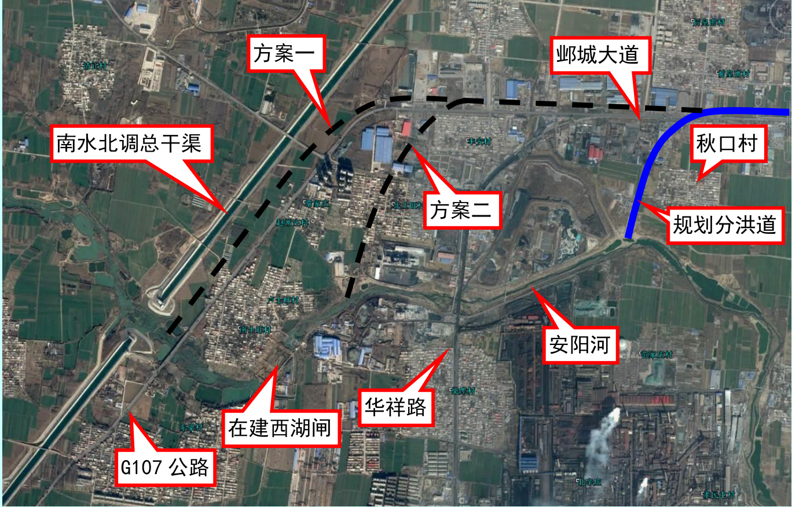  

方案一:南水北调中线总干渠与 G107 公路之间。该方案沿 G107 公路西侧、邺城大道北侧与原规划线路相接。该方案拆迁量较小,不穿越G107 公路,该方案可利用在建的西湖闸节制水位,不需新建安阳河节制闸;但距南水北调中线总干渠较近,且该段地势较高,土方开挖量较大。  

方案二:华祥路西、北士旺村南。该方案分洪道自北士旺村南向北,穿越 G107 公路后折向东,沿邺城大道北侧与原规划线路相接。该方案距南水北调中线总干渠较远,且该段地势相对较低,但拆迁量大且需在安阳河上新建节制闸,投资较大。  

# ⑸ 超标准洪水处理  

安阳河城市段近期防洪治理标准为 50 年一遇,远期开辟秋口分洪道,将防洪标准提高到 100 年一遇;曹马分洪口以下采用 20 年一遇防洪标准,配合崔家桥蓄滞洪区运用,按入卫限泄流量 $600\mathrm{m}^{3}/\mathrm{s}$ 进行整治,存在超标准洪水处理问题。  

根据《海河流域防洪规划》、《安阳市城市防洪排涝规划》及崔家桥  

蓄滞洪区工程规划,安阳河入卫河流量限泄 $600\mathrm{m}^{3}/\mathrm{s}$ ,通过郭盆闸限泄。  
该段河道与崔家桥蓄滞洪区联合控制运用,使其满足各自防洪标准要求。  

$\textcircled{1}$ 安阳河流量小于 $600\mathrm{m}^{3}/\mathrm{s}$ 时,不启用崔家桥蓄滞洪区。  

$\textcircled{2}$ 当安阳河发生 20 年一遇洪水时,河道洪峰流量 $1680\mathrm{m}^{3}/\mathrm{s}$ ,曹马分洪口向崔家桥蓄滞洪区分洪 $580\mathrm{m}^{3}/\mathrm{s}$ ;曹马至郭盆闸段河道泄量$1100\mathrm{m}^{3}/\mathrm{s}$ ,郭盆分洪口向崔家桥蓄滞洪区分洪 $500\mathrm{m}^{3}/\mathrm{s}$ ,郭盆闸控制下泄$600\mathrm{m}^{3}/\mathrm{s}$ 。  

$\textcircled{3}$ 当安阳河发生 50 年一遇洪水时,河道洪峰流量 $2300\mathrm{m}^{3}/\mathrm{s}$ ,曹马分洪口向崔家桥蓄滞洪区分洪 $1200\mathrm{m}^{3}/\mathrm{s}$ ;曹马至郭盆闸段河道泄量$1100\mathrm{m}^{3}/\mathrm{s}$ ,郭盆分洪口向崔家桥蓄滞洪区分洪 $500\mathrm{m}^{3}/\mathrm{s}$ ,郭盆闸控制下泄$600\mathrm{m}^{3}/\mathrm{s}$ 。  

$\textcircled{4}$ 超 50 年一遇洪水,规划经分洪道至于曹,向东分入崔家桥蓄滞洪区。  

# 4.3.3 主要方案比较  

本次安阳河系统治理工程范围为善应镇区段及彰武水库至入卫河口,其中善应镇区段设计防洪标准采用 20 年一遇;市区上游段(即“彰武水库下游至南水北调中线总干渠段”)设计防洪标准采用 20 年一遇;市区段(即“南水北调中线总干渠至曹马分洪口段”)防洪标准按 50 年一遇治理;市区下游段河道按 3 年一遇除涝标准疏挖主槽、20 年一遇防洪标准筑堤,配合崔家桥蓄滞洪区运用,保证限泄 $600\mathrm{m}^{3}/\mathrm{s}$ 入卫。  

为提高工程效益,根据各河段实际情况,系统分析河道疏挖及堤防修筑工程等设计方案,优化比选合理方案。  

# 4.3.3.1 河道扩挖疏浚方案  

本次河道扩挖疏浚工程主要为市区下游段河道,已批复的《安阳河河道治理工程可行性研究报告》(2002 年)及《安阳河河道治理工程初步设计报告》中对该段河道规划如下:该段河道适合采用堤防与疏浚相结合的治理方案,设计标准为 20 年一遇配合崔家桥蓄滞洪区运用限泄,设计河底宽度 $10{\sim}40\mathrm{m}$ ,边坡 1:2.5。  

为保持河道稳定,河道平面基本按现状河道走向,设计河道中心线基本与现状河道中心线基本一致,随弯就势,保持原有河道自然形态,在现状河道基础上按设计标准进行疏挖拓宽、加高培厚堤防。  

河道比降设计应尽量接近河道现状比降,尽量减少开挖,且依据河道总体规划及崔家桥蓄滞洪区、中小河流治理工程设计,保证上下游河道断面衔接。治理河段中辛村段河道已规划治理,河道设计比降为1/3750;依据崔家桥蓄滞洪区曹马分洪口、郭盆分洪口及郭盆闸工程设计河底高程(控制点参数见表4-5),设计河道比降确定为 $1/2800{\sim}1/4300$ 。  

表 4-5 市区下游段河道控制点参数汇总表  

<html><body><table><tr><td>位置</td><td>桩号</td><td>设计河底高程 (m)</td><td>设计洪水位 (W)</td><td>设计涝水位 (m)</td></tr><tr><td>入卫河口</td><td>91+580</td><td>44.85</td><td>54.28</td><td>50.82</td></tr><tr><td>安内界</td><td>83+026</td><td>46.85</td><td>55.40</td><td></td></tr><tr><td>辛村东</td><td>75+580</td><td>48.84</td><td>57.19</td><td></td></tr><tr><td rowspan="2">郭盆分洪口</td><td>46+607</td><td>57.19</td><td>65.43</td><td></td></tr><tr><td>46+029</td><td>57.36</td><td>66.01</td><td></td></tr><tr><td>曹马分洪口末端</td><td>41+640</td><td>58.90</td><td>67.58</td><td></td></tr><tr><td>于曹沟</td><td>35+480</td><td>61.55</td><td>70.66</td><td></td></tr></table></body></html>  

由于内黄段河道过流能力加大,不需疏挖,而曹马分洪口\~郭盆闸段河道内涉及东湖闸、郭盆闸、崔家桥滞洪区分洪口等建筑物,河道疏挖主要考虑河道断面及水位衔接,因此本次仅针对郭盆闸\~辛村镇东段(桩号 $46+950\sim75+580~$ )长 $28.63\mathrm{km}$ 河道比选疏挖横断面方案。考虑土方挖填平衡、滩地是否行洪及工程征地等因素,本次河道治理进行两个方案比较,该段河道设计流量 $600\mathrm{m}^{3}/\mathrm{s}$ ,水位以入卫河口向上游推求河道水面线,采用固定边界、恒定、非均匀、渐变流的能量方程计算。  

# ⑴ 方案一:复式断面,设计主槽河底宽 $\mathbf{10m}$  

根据土方挖填平衡原则,为尽量减少土方开挖量,将河道主槽适当扩挖,河道采用复式断面,设计河底宽 $10\mathrm{m}$ ,距河底 $1.5\mathrm{m}$ 处设置平台,宽度 $7.5\mathrm{m}$ ,设计边坡均为 1:2.5,利用滩地行洪,堤防设计超高 $2.0\mathrm{m}$ 。  

根据水面线推求结果,该方案滩地行洪水深度约 $1.0\mathrm{m}$ ,堤防高度约$3.0\mathrm{m}$ ,土方开挖量 287.31 万 $\mathrm{m}^{3}$ ,堤防填筑量 181.28 万 $\mathrm{m}^{3}$ ,考虑压实系数后弃土量 74.04 万 $\mathrm{m}^{3}$ 。  

优点:河道扩挖少;土方挖填基本平衡。  

缺点:局部河段筑堤土方不足,需外运;局部河段新建堤防距河口较远,新建堤防将耕地分割,不利于农民耕作。  

# ⑵ 方案二:梯形断面,设计河底宽 ${\pmb{32\mathrm{m}}}$  

为了减小征地数量,减少滩地行洪,将堤防布置于河口处,调整方案河道设计断面,河道采用梯形断面,结合将河底扩宽至 $32\mathrm{m}$ ,平台宽度减至 $2\mathrm{m}$ ,设计边坡仍为 1:2.5,堤防设计超高 $2.0\mathrm{m}$ 。  

该方案洪水位基本平地面,仅按超高填筑堤防。整个方案土方开挖量 395.94 万 $\mathrm{m}^{3}$ ,堤防填筑量 132.59 万 $\mathrm{m}^{3}$ ,考虑压实系数后弃土量 240万 $\mathrm{m}^{3}$ 。  

优点:利用耕作,实施相对容易。  

缺点:挖填不平衡,弃土量大,切滩占地量大。  

经方案比较,方案一土方挖填基本平衡,虽新建堤防将耕地分割,不利于农民耕作,但由于新建堤防长度短,影响较小,可考虑分段设置上堤坡道,减轻影响;方案二挖填不平衡,弃土量大,切滩占地量大。综合考虑各种因素,推荐方案一为实施方案。  

# 4.3.3.2 堤防工程设计方案  

现状安阳河市区上游段无堤防,现有堤防均位于市区及市区下游段。现状河道右岸堤防基本完整,左岸堤防不连续,均为土堤、无护砌,堤距安阳县段 $80{\sim}700\mathrm{m}$ 、内黄县段 $150\sim500\mathrm{m}$ 。安阳县段左岸堤防堤顶宽$3\mathrm{\sim}6\mathrm{m}$ 、右岸堤防堤顶宽 $4{\sim}6\mathrm{m}$ ,堤坡 $1{:}1.5{\sim}1{:}2.5$ 、堤高 $2\mathrm{\sim}4\mathrm{m}$ ,内黄县段左岸堤防堤顶宽 $3{\sim}4\mathrm{m}$ 、右岸堤防堤顶宽基本为 $6\mathrm{m}$ ,堤坡 $1{:}1{.}5\sim$ 1:2.5、堤高 $4{\sim}5\mathrm{m}$ 。安阳河下游段河道过流能力小,现状堤防不连续,局部堤防单薄、堤防高度不满足防洪要求,存在严重安全隐患,2016 年洪水造成市区下游段洪水漫溢、多处堤防决口,经济损失巨大,因此迫切需要补充完善安阳河下游段堤防工程并对现有堤防加高培厚。  

现状安阳河有两段河道左岸无堤:⑴ 东柴村至西韩化村南段河道无左堤,该段河道左堤位于崔家桥蓄滞洪区南部边界,从曹马桥(柴村西约 4km)至王家口(西韩化村西约 1km)段长 $14.2\mathrm{km}$ 左岸堤防已列入崔家桥蓄滞洪区工程建设年度工程中,其中曹马桥至西荣村段左堤已列入崔家桥蓄滞洪区 2012 年度工程中治理,西荣村至王家口段左堤列入崔家桥蓄滞洪区剩余工程中治理,目前仅实施了部分堤防工程;⑵齐村至豆公闸段河道无左堤,右岸南伏恩村至豆公闸段无堤防,其中辛村镇东至安(安阳县)内(内黄县)界段长 $7.45\mathrm{km}$ 河道已列入 2016 年中小河流治理工程,初步设计已批复。  

本次堤防工程均位于市区下游曹马分洪口(桩号 $41{+}640\$ )以下,设计对现状堤防进行达标加固,无堤段新建堤防,治理段防洪标准为 20 年一遇,堤防级别为 4 级。由于曹马桥至王家口段长 $14.2\mathrm{km}$ 左岸堤防已列入崔家桥蓄滞洪区工程建设、辛村镇东至安内界段长 $7.45\mathrm{km}$ 河道已列入中小河流治理,本次工程不再列入。  

# ⑴ 堤线布置  

堤线布置根据地形、地质条件,与河势相适应,力求平顺,相邻堤段间平缓连接,不采用折线和急弯,堤线布置还应少占地,少拆迁。加高加固堤防堤线仍按原堤线布置;新筑堤防尽量布置在河口位置,并考虑与现有堤防顺接。本次结合河道泛滥宽度边界及弯道,新建堤线布置尽可能与主槽河势一致,按照少占地,少拆迁,对群众生产耕作影响最小的原则布置堤线,原则上布置在距河口 $5\mathrm{m}$ 外侧。  

# ⑵ 堤型选择及筑堤材料  

堤防工程的型式按照因地制宜,就地取材的原则选取。安阳河为季节性河流,汛期洪水历时较短,堤防利用机率小。由工程地质可知,河道主槽及两岸土层多为第 $\textcircled{2}$ 、 $\textcircled{4}$ 单元中重粉质壤土,可作为均质土堤的填筑材料,造价低廉。河道疏浚扩挖土方,去除河底淤泥及表层腐殖土后,可直接上堤填筑,工序简单,便于施工。通过比较,综合工程造价等各种因素,结合已建堤防工程型式,设计采用斜坡式均质土堤。  

由于局部需新建堤防河段河口紧邻村庄及道路,如填筑土堤占地及拆迁量较大,不易实施,主要分布在安阳县西韩化村段、孙奇村、北贤孝村及辛村乡段河道左岸,结合河道现状,为减少拆迁及占地,设计该段河道堤防采用混凝土防洪墙型式。  

# ⑶ 堤顶宽度比较  

根据已批复的《安阳河河道治理工程可行性研究报告》(2002 年)及《安阳河河道治理工程初步设计报告》,安阳河堤防采用均质土堤,左堤顶宽 $4.0\mathrm{m}$ 、右堤顶宽 $6.0\mathrm{m}$ ,右堤堤顶兼做防汛道路,左右岸堤防超高均为 $2.0\mathrm{m}$ 。根据《堤防工程设计规范》(GB50286-2013)规定,4 级堤防堤顶宽度不宜小于 $3\mathrm{m}$ ,综合考虑河道规划、运行管理需要和现状堤顶宽度,本次设计堤顶宽度不小于 $4\mathrm{m}$ 。  

本次堤防工程基本采用土堤,仅局部采用防洪墙,由于堤防长度较长,堤顶宽度对堤防工程量影响较大,而曹马分洪口 $\sim$ 广源电厂段和辛村东\~入卫河口段右岸现状及规划堤防堤顶宽度基本为 $6\mathrm{m}$ ,因此本次设计左堤堤顶宽 $4\mathrm{m}$ ,对广源电厂至辛村东段(桩号 $53\substack{+330\sim75+580})$ )长约 16.76km右岸堤顶宽度进行方案比选。  

# $\textcircled{1}$ 方案一: ${}4\mathbf{m}$ 宽  

根据《堤防工程设计规范》(GB50286-2013)规定,4级堤防堤顶宽度不宜小于 $3\mathrm{m}$ ,由于现状右堤宽度大多在 $4\mathrm{m}$ 以上,本方案设计右岸堤顶宽采用 $4\mathrm{m}$ 。为满足防汛交通要求,每 $500\mathrm{m}$ 设一处错车道,错车道宽$6\mathrm{m}$ 、长 $50\mathrm{m}$ 。  

经计算,该段堤防填筑量 64.06 万 $\mathrm{m}^{3}$ ,弃土量 32.66 万 $\mathrm{m}^{3}$ ,堤防占地 290.8 亩,工程投资约 871.95 万元、占地投资约 1715.72 万元。  

优点:占地面积少。  

缺点:弃土量较大;堤顶宽度窄,不利于防汛抢险及运行管理。  

$\textcircled{2}$ 方案二:6m 宽  

按照安阳河原河道规划,为了减小土方外运量,并考虑防汛交通需要,本方案设计右岸堤顶宽采用 $6\mathrm{m}$ 。  

经计算,该段堤防填筑量 74.89 万 $\mathrm{m}^{3}$ ,弃土量 22.03 万 $\mathrm{m}^{3}$ ,堤防占地 336.2 亩,工程投资约 778.86 万元、占地投资约 1983.58 万元。  

优点:与现行规划标准一致,利于防汛交通及运行管理。  

缺点:占地量较大。  

经方案比较,两方案投资相差不大,方案一虽占地面积较小,但大部分路段不能错车,不能完全满足防汛抢险及交通需要;方案二按照原河道规划将右堤堤顶宽度统一为6m,减小了土方外运量,增强了堤防抗洪能力。2016 年洪水安阳河局部堤防决口,由于现状堤防堤防宽度窄且没有硬化,严重影响了防洪抢险施工进展。在经历了 2016 年洪灾以后,当地人民防洪意识大大增强,改善现有堤防设施的愿望强烈。方案二与现行河道标准一致,虽少量增加了占地,但增加投资有限,且使得河道防洪能力得到明显增强,因此推荐方案二为实施方案。  

# 4.4 工程任务、规模  

# 4.4.1 治理标准  

本次规划依据现行《防洪标准》(GB50201-2014)及《安阳市城市防洪排涝规划》、《安阳市城市总体规划》确定安阳河治理标准。本次规划依据保护对象的不同,将安阳河治理段分为善应镇区段、市区上游段(彰武水库\~南水北调)、市区段(南水北调\~曹马分洪口)、市区下游段(曹马分洪口\~入卫河口),分河段采用不同的防洪标准。  

善应镇区段按 20 年一遇防洪标准治理,设计流量 $831\mathrm{m}^{3}/\mathrm{s}$ 。  

市区上游段即彰武水库至南水北调中线总干渠段按 20 年一遇防洪标准治理,其中彰武水库至珠泉河汇入点段设计流量 $850\mathrm{m}^{3}/\mathrm{s}$ ;珠泉河至粉红江汇入点段设计流量 $1350\mathrm{m}^{3}/\mathrm{s}$ ;粉红江汇入点至南水北调中线总干渠段设计流量 $1680\mathrm{m}^{3}/\mathrm{s}$ 。  

市区段即南水北调中线总干渠至曹马分洪口段防洪标准近期按 50年一遇治理,设计流量 $2390\mathrm{m}^{3}/\mathrm{s}$ ;远期规划在秋口村向北开辟分洪道,将市区段防洪标准提高到 100 年一遇 $3570\mathrm{m}^{3}/\mathrm{s}$ 。  

市区下游段河道按 20 年一遇防洪标准保证限泄 $600\mathrm{m}^{3}/\mathrm{s}$ 入卫河进行治理,其中曹马分洪口\~郭盆闸段河道设计流量 $1100\mathrm{m}^{3}/\mathrm{s}$ 、郭盆闸以下河道设计流量 $600\mathrm{m}^{3}/\mathrm{s}$ ;除涝标准采用 3 年一遇 $332\mathrm{m}^{3}/\mathrm{s}$ 。  

# 4.4.2 工程规模  

安阳河系统治理工程范围为善应镇区段及彰武水库至入卫河口,包括善应镇区段(小南海水库以下至彰武水库库尾)和彰武水库以下段,其中善应镇区段长 $2.98\mathrm{km}$ 、彰武水库以下至至入卫河口段长 $91.58\mathrm{km}$ 。由于殷墟博物苑北至于曹沟段(桩号 $26+200{\sim}35{+}480)$ )长 $9.28\mathrm{km}$ (治理前长 11km)河道已进行了治理,于曹沟至崇义(曹马分洪口)段 $6.16\mathrm{km}$ 河道、辛村(东)至安内界段 $7.45\mathrm{km}$ 河道已列入中小河流治理工程,上述 3 段河道不再列入本次工程。因此,本次系统治理工程范围为善应镇区段长 $2.98\mathrm{km}$ 、彰武水库至殷墟博物苑北段(桩号 $0{+}000{\sim}26{+}200;$ )长$26.20\mathrm{km}$ 、曹马分洪口至辛村东段(桩号 $41{+}640{\sim}75{+}580)$ )长 $33.94\mathrm{km}$ 、安内界至入卫河口段(桩号 $83{+}026{\sim}91{+}580;$ )长 $8.55\mathrm{km}$ ,合计 $71.67\mathrm{km}$ 。  

根据《堤防工程设计规范》(GB50286-2013),安阳河市区段防洪标准近期为 50 年一遇,堤防级别为 2 级;曹马分洪口以下及善应镇区段防洪标准为 20 年一遇,堤防级别为 4 级,穿堤建筑物按堤防防洪标准设计。  

安阳河系统治理工程建设内容主要包括:⑴彰武水库至入卫河口段河道治理长度 $68.69\mathrm{km}$ ,主要内容包括扩挖疏浚河道 $35.09\mathrm{km}$ (曹马分洪口至辛村东段、安内界至豆公闸上游段);堤防加高加固 50.894km、新建堤防 8.741km、新建防洪墙 $3.591\mathrm{km}$ ;对弯道及穿村段河道岸坡进行护砌,总长 $17.88\mathrm{km}$ ;生态治理示范河段长 $0.83\mathrm{km}$ ;拆除重建防洪闸 13 座,新建防洪闸 1 座;拆除重建小型提灌站 3 座;拆除重建生产桥 2 座等。⑵善应镇区段河道治理长度 $2.98\mathrm{km}$ ,主要内容包括河道疏浚 $850\mathrm{m}$ ,新建防洪墙 $540\mathrm{m}$ ,岸坡护砌 $665\mathrm{m}$ 。  

# 5 工程设计  

# 5.1 工程等别  

安阳河系统治理工程范围为善应镇区段及彰武水库至入卫河口,治理长度 $71.67\mathrm{km}$ 。根据《防洪标准》(GB50201-2014)和《水利水电工程等级划分及洪水标准》(SL252-2017),治理段河道自西向东穿越安阳市龙安区、殷都区、安阳县和内黄县,保护人口大于 100 万人、耕地面积大于 50 万亩,考虑工程保护区域的重要性,工程等别为Ⅱ等。善应镇区段设计防洪标准采用 20 年一遇;市区上游段即彰武水库下游至南水北调中线总干渠段设计防洪标准采用 20 年一遇;市区段即南水北调中线总干渠至曹马分洪口段防洪标准近期按 50 年一遇治理,远期规划在秋口村向北开辟分洪道,将市区段防洪标准提高到 100 年一遇;市区下游段即曹马分洪口以下河道按 3 年一遇除涝标准疏挖主槽、20 年一遇防洪标准筑堤,配合崔家桥蓄滞洪区运用,保证限泄 $600\mathrm{m}^{3}/\mathrm{s}$ 入卫。  

根据《堤防工程设计规范》(GB50286-2013),堤防工程级别应根据保护对象的防洪标准确定,则善应镇区段堤防等级为 4 级,彰武水库至曹马分洪口段堤防等级为 2 级,曹马分洪口以下河道堤防等级为 4 级。穿堤建筑物同堤防级别,临时工程级别为 5 级。  

本工程拆除重建防洪闸 13 座闸,设计流量 $3\sim11\mathrm{m}^{3}/\mathrm{s}$ ;新建防洪闸1 座,设计流量 $39.19\mathrm{m}^{3}/\mathrm{s}$ 。水闸工程等别同堤防级别,均为 4 级建筑物。  

本工程重建桥梁所在公路均为生产路,共 4 座,采用钢筋混凝土简支梁板桥结构,根据《公路桥涵设计通用规范》,本次设计桥梁荷载标准采用公路-Ⅱ级。  

根据国家质量技术监督局 2015 年发布的《中国地震动参数区划图》  

(GB18306-2015),安阳市市区及安阳县白璧镇段河道地震动峰值加速度为 $0.20\mathrm{g}$ ,对应的地震基本烈度为Ⅷ度;其余河段地震动峰值加速度均为 $0.15\mathrm{g}$ ,对应的地震基本烈度为Ⅶ度。地震动反映谱特征周期均为0.40s。  

# 5.2 设计依据  

# 5.2.1 主要规程规范  

⑴《防洪标准》(GB50201-2014);⑵《水利水电工程等级划分及洪水标准》(SL252-2017);⑶《河道整治设计规范》(GB50707-2011);⑷《堤防工程设计规范》(GB50286-2013);⑸《堤防工程管理设计规范》(SL171-96);⑹《水工混凝土结构设计规范》(SL 191-2008);⑺《砌体结构设计规范》(GB50003-2011);⑻《公路桥涵设计通用规范》(JTG D60-2015);⑼《公路钢筋混凝土及预应力混凝土桥涵设计规范》(JTGD62-2004);⑽《灌溉与排水工程设计规范》(GB50288-99);⑾《水利水电工程设计工程量计算规定》(SL328-2005);⑿《水闸设计规范》(SL 265-2016);⒀《泵站设计规范》(GB/T 50265-2010);⒁ 其它相关规范规程。  

# 5.2.2 有关文件和资料  

⑴《河南省中小河流系统治理工程实施方案报告编制大纲(修订稿)》(河南省水利厅,2017 年 3 月);  

⑵《水利部海河水利委员会关于安阳河治理工程设计任务书的批复》(海规字[1992]第 2 号);  

(3)《安阳河河道治理工程可行性研究报告》(河南省豫北水利勘测设计院,2002 年);⑷《河南省发展计划委员会关于安阳河河道治理工程可行性研究报告的批复》(豫计农经[2002]1780 号);(5)《安阳河河道治理工程初步设计报告》(河南省豫北水利勘测设计院,2004 年);⑹《河南省发展和改革委员会关于安阳河河道治理工程初步设计的批复》(豫发改办[2004]368 号);⑺《安阳市城市总体规划》(2010-2020);⑻《安阳市城市防洪排涝规划》(2011-2020);⑼《海河流域防洪规划》(水利部海河水利委员会 2005 年);⑽《国务院关于海河流域防洪规划的批复》(国函[2008]11 号);⑾《河南省安阳市安阳河系统治理工程工程地质勘察报告(实施方案阶段)》(豫北院,2017 年 5 月);⑿ 安阳河系统治理工程河道测量资料成果(豫北院,2017 年 5 月);⒀《海河流域蓄滞洪区建设与管理规划(报批稿)》;⒁《河南省漳卫河系卫河坡洼(良相坡、柳围坡、崔家桥)蓄滞洪区工程建设可行性研究报告》(河南省豫北水利勘测设计院 2011 年 6 月)及各年度实施方案(豫北院)。  

# 5.3 设计原则  

本次治理规划总的指导思想以防洪、排涝达标为主,城市段综合考虑城市建设要求,乡村段综合考虑农业排涝和灌溉要求,设计原则如下:  

⑴ 安阳河系统治理工程包含善应镇区段、安阳市市区段及市区上下游段,总长 $71.67\mathrm{km}$ ,上下游河道地形及防护对象差别较大。本次治理按照河道现状,结合历次治理情况,在确保防洪安全的前提下,科学确定治理模式,维护河流生态健康。  

⑵ 河道治理结合周边环境,在现状地形基础上按治理标准疏挖拓宽,尽可能保持河流自然形态,不侵占河道行洪通道。合理确定治理河段的治导线,不随意裁弯取直,不破坏河道自然形态和河道功能。⑶ 确定治理方式,既要考虑堤防、清淤疏浚等工程措施,也要在有条件的地方适当考虑留足滩地,蓄洪滞洪,给河流以空间。⑷ 不重复工程建设,对治理河段范围内近年已建设的工程内容,不再列入本次建设内容。⑸ 不渠化、硬化、白化河道,护岸工程主要对迎流顶冲河段、穿越村庄处进行岸坡防护,并尽可能采用生态防护材料和结构形式。闸坝等建筑物与周边环境相协调,并考虑信息化、现代化管理需求。⑹ 河道治理在满足防洪排涝的前提下,尽可能少拆迁、少占地、少伐树,尽量保证土方挖填平衡,节省投资。⑺ 河道治理因地制宜、就地取材,在保证工程标准的前提下,方案技术可行、效益突出。  

# 5.4 工程设计  

# 5.4.1 设计洪水水面线推求  

本次系统治理依据最新测量成果对彰武水库至入卫河口段水面线进行推算,自入卫河口自下向上推求。善应镇区段河道位于彰武水库库区上游,单独进行水面线推求。本次设计首先推求现状河道设计标准的洪水水面线,确定是否满足行洪能力要求和洪水淹没范围;不满足行洪能力要求且淹没范围较大时,再对按设计方案整治后河道推求设计洪水的水面线,并与以往水面线推求成果进行分析比较,确定河道水面线。  

# 5.4.1.1 水面线推求方法及起推水位  

河道水面线的推求用固定边界、恒定、非均匀、渐变流的能量方程计算,原有安阳河治理规划均采用采用河道 CAD 软件(河南省水利勘测设计院编制)辅助计算,本次系统治理仍采用河道 CAD 软件辅助计算。  

基本方程:天然河道水面线推算以固定边界、恒定、非均匀、渐变流的能量方程为基础。计算公式:  

$$
z_{2}+\frac{\mathrm{a}_{2}\nu^{2}\:_{2}}{2g}=z_{1}+\frac{\mathrm{a}_{1}\nu^{2}\:_{1}}{2g}+h_{f}+h_{j}
$$  

$$
\begin{array}{l}{\Delta z=z_{2}-z_{1}=h_{f}+h_{j}+\Delta h_{\nu}}\ {h_{r}=\overline{{J}}L}\ {\overline{{J}}=\frac{Q^{2}}{\overline{{K}}^{2}}}\ {K=A C\sqrt{R}=A\Bigg(\frac{1}{n}R^{\frac{1}{6}}\Bigg)\sqrt{R}}\end{array}
$$  

式中: $\mathbf{Z}2\setminus\mathbf{Z}1^{-}$ —上、下游断面的水位;$\Delta\mathbf{z}$ —上、下游断面水位差;hf、hj—上、下游断面之间的沿程水头损失和局部水头损失;$\frac{{2^{\nu}}^{2}\imath}{2g}\ 、\frac{\mathrm{~a~}_{1}\nu^{2}\imath}{2g}.$ 上、下游断面的流速水头,两者之差为 $\Delta\mathrm{h}$ ;$\mathrm{\bfG}_{2},\mathrm{\bf~\cal~a}_{1}.$ —上、下游断面动能改正系数;$\overline{{J}}$ ——河道分段的平均水力坡度;S— —河道分段的长度(m);K——流量模数;糙率考虑河道滩地行洪,查《水利计算手册》天然河道糙  
率表。  

动能改正系数 $\mathbf{0}$ :  

$$
\alpha=\frac{(\sum{A_{i}})^{2}\sum^{}(\frac{K_{i}^{3}}{{A_{i}}^{2}})}{(\sum{K_{i}})^{3}}
$$  

式中:Ai—复式断面各部分面积;Ki—复式断面各部分流量模数;  

局部水头损失的计算:  

$$
h_{j}=\xi\Biggl(\frac{{a_{2}}^{2}{\nu_{2}}^{2}}{2g}-\frac{{a_{1}}^{2}{\nu_{1}}^{2}}{2g}\Biggr)
$$  

式中: $\xi_{-}$ —河道收缩、扩散水头损失系数。  

入卫河口处起推水位根据《海河流域漳卫河系防洪规划报告》(2008年 2 月)、《卫河流域防洪除涝补充规划》、《水利部海河水利委员会关于安阳河治理工程设计任务书的批复》(海规字[1992]第2号)及《《卫河干流(淇门\~徐万仓)治理工程可行性研究报告》(2013年8月),安阳河入卫河口处设计河底高程 $44.85\mathrm{m}$ 、相应洪水位 $54.28\mathrm{m}$ 、3 年一遇除涝水位 $50.82\mathrm{m}$ 。  

善应镇区段河道下游为彰武水库库区,该段河道水位从彰武水库库尾处向上推求。依据规划报告及测量资料,该治理段下游河道断面较规则,按照明渠均匀流公式计算桩号 $\mathrm{S}3\substack{+600}$ 处水深 $4.40\mathrm{m}$ ,设计洪水位$130.13\mathrm{m}$ ,以此作为河道设计标准的洪水水面线起推水位,采用能量方程向上游推求水位。  

考虑河道滩地行洪,查《水利计算手册》天然河道糙率表,彰武水库以下段河道糙率主槽取 0.0275、滩地取 0.035,善应镇区段河道糙率主槽取 0.04。  

# 5.4.1.2 彰武水库回水水面线推求方法  

彰武水库回水水面线的推求用简易近似法估算。  

抛物线回水公式:假定回水曲线近似为剖物线,回水曲线方程式:  

$$
\begin{array}{l}{{\displaystyle x^{2}=2\frac{L}{J_{_P}}y=\frac{4h_{a}}{J_{_P}^{2}}y}}\ {{\displaystyle L=\frac{2h_{a}}{J_{_P}}}}\end{array}
$$  

式中:L—回水曲线水平长度;JP—原曲面平均水面坡度;$\mathrm{h_{a}}$ —彰武水库坝前回水曲线与原水面线高差为;$Z_{\mathrm{a}}$ —坝前水位为 $127.00\mathrm{m}$ 。  

回水终点计算公式:  

$$
\begin{array}{l}{L=\sqrt{1-\beta^{2}}L_{0}}\ {~}\ {s=L_{0}-l}\ {~}\ {\beta=s/L_{0}}\end{array}
$$  

$\mathrm{L}_{0}$ —坝前水面线交至河底的距离;  

l—坝前水面线交至原水面线的距离  

$\mathsf{\sf B}$ 可近似用下式:  

$$
\beta=\frac{1}{1+(h_{a}/h_{0})}
$$  

经复核,回水水平长度为 $5640\mathrm{m}$ ,对应河道桩号 $3{+}400$ ,水库回水 对原水面线推求结果无影响。  

# 5.4.1.3 河道现状水面线推求  

根据本次河道测量成果,经计算,现状善应镇区段(桩号 $\mathrm{S0}\mathrm{+}200\mathrm{\sim}$ $\mathrm{S}3\substack{+500})$ )河道基本满足 20 年一遇防洪标准要求;彰武水库至殷墟博物苑段(桩号 $0{+}000{\sim}26{+}200.$ )现状过流能力大部分达到 $3570{\sim}2390\mathrm{m}^{3}/\mathrm{s}$ ,满足设计防洪标准要求;殷墟博物苑至于曹沟口已按 $2300\mathrm{m}^{3}/\mathrm{s}$ 治理;市区以下河道河道断面较窄,大部分河段现状过流能力不足 $300\mathrm{m}^{3}/\mathrm{s}$ ,洪水漫溢,其中于曹沟至郭盆闸 $1188\sim449\mathrm{m}^{3}/\mathrm{s}$ 、郭盆闸至安内界不足  

$300\mathrm{m}^{3}/\mathrm{s}$ 、安内界至入卫河口段河道泄洪能力 $600\mathrm{m}^{3}/\mathrm{s}$ 。由于于曹至曹马分洪口段已规划治理,且市区下游段洪水漫溢,本次仅计算善应镇区段及市区上游段现状水面线,详见下表。  

表 5-1 善应镇区段设计河道水面线推求成果表  

<html><body><table><tr><td>断面桩号</td><td>设计流量 (m3/s)</td><td>设计水位 (m)</td><td>流速 (m/s)</td><td>河底高程 (m)</td><td>设计水深 (u)</td></tr><tr><td>S0+200</td><td>831</td><td>138.53</td><td>3.42</td><td>134.22</td><td>4.31</td></tr><tr><td>S0+400</td><td>831</td><td>137.24</td><td>4.07</td><td>133.42</td><td>3.82</td></tr><tr><td>S0+600</td><td>831</td><td>136.21</td><td>3.24</td><td>131.22</td><td>4.99</td></tr><tr><td>S0+800</td><td>831</td><td>135.80</td><td>2.54</td><td>130.40</td><td>5.40</td></tr><tr><td>S1+000</td><td>831</td><td>134.85</td><td>3.27</td><td>130.18</td><td>4.67</td></tr><tr><td>S1+200</td><td>831</td><td>134.82</td><td>1.54</td><td>129.18</td><td>5.64</td></tr><tr><td>S1+400</td><td>831</td><td>134.60</td><td>1.79</td><td>128.66</td><td>5.94</td></tr><tr><td>S1+600</td><td>831</td><td>134.33</td><td>2.13</td><td>128.56</td><td>5.77</td></tr><tr><td>S1+800</td><td>831</td><td>134.05</td><td>1.91</td><td>128.47</td><td>5.58</td></tr><tr><td>S2+000</td><td>831</td><td>133.62</td><td>2.4</td><td>128.38</td><td>5.24</td></tr><tr><td>S2+200</td><td>831</td><td>133.22</td><td>2.05</td><td>128.18</td><td>5.04</td></tr><tr><td>S2+400</td><td>831</td><td>132.90</td><td>2.19</td><td>127.92</td><td>4.98</td></tr><tr><td>S2+600</td><td>831</td><td>132.35</td><td>2.33</td><td>127.60</td><td>4.75</td></tr><tr><td>S2+800</td><td>831</td><td>131.99</td><td>3.0</td><td>127.48</td><td>4.51</td></tr><tr><td>S3+000</td><td>831</td><td>131.51</td><td>1.93</td><td>127.04</td><td>4.47</td></tr><tr><td>S3+200</td><td>831</td><td>131.10</td><td>1.72</td><td>126.25</td><td>4.85</td></tr><tr><td>S3+400</td><td>831</td><td>130.57</td><td>1.96</td><td>126.18</td><td>4.39</td></tr><tr><td>S3+500</td><td>831</td><td>130.43</td><td>1.48</td><td>126.00</td><td>4.43</td></tr></table></body></html>  

表 5-2 彰武水库\~于曹沟段河道水面线推求成果表  

<html><body><table><tr><td rowspan="3">桩号</td><td rowspan="3">河底 高程</td><td colspan="3">20年一遇</td><td colspan="3">50年一遇</td><td colspan="3">100年一遇</td></tr><tr><td>设计流量设计水位</td><td></td><td></td><td>设计流速设计流量</td><td>设计水位</td><td>设计流速</td><td>设计流量</td><td>设计水位设计流速</td><td></td></tr><tr><td>(m)</td><td>(m3/s)</td><td>(m)</td><td>(m/s)</td><td>(m3/s)</td><td>(m)</td><td>(m/s)</td><td>(m3/s)</td><td>(W)</td><td>(m/s)</td></tr><tr><td>0+000</td><td>108.98</td><td>850</td><td>112</td><td>3.01</td><td>1250</td><td>112.83</td><td>3.53</td><td>3132</td><td>114.83</td><td>5.44</td></tr><tr><td>1+000</td><td>106.53</td><td>850</td><td>109.04</td><td>2.12</td><td>1250</td><td>109.6</td><td>2.05</td><td>3132</td><td>112.94</td><td>1.80</td></tr><tr><td>1+950</td><td>104.2</td><td>850</td><td>107.62</td><td>2.56</td><td>1250</td><td>108.43</td><td>2.74</td><td>3132</td><td>112.01</td><td>2.67</td></tr><tr><td>3+000</td><td>101.62</td><td>850</td><td>106.60</td><td>1.95</td><td>1250</td><td>107.48</td><td>2.34</td><td>3132</td><td>111.11</td><td>2.79</td></tr><tr><td>4+000</td><td>100.22</td><td>850</td><td>105.36</td><td>2.34</td><td>1250</td><td>106.34</td><td>2.7</td><td>3132</td><td>110.23</td><td>3.26</td></tr><tr><td>5+000</td><td>99.52</td><td>850</td><td>104.60</td><td>1.25</td><td>1250</td><td>105.67</td><td>1.46</td><td>3132</td><td>109.55</td><td>1.99</td></tr><tr><td>5+950</td><td>98.85</td><td>850</td><td>102.76</td><td>2.01</td><td>1250</td><td>103.48</td><td>2.35</td><td>3132</td><td>107.77</td><td>2.82</td></tr><tr><td>7+000</td><td>98.11</td><td>850</td><td>101.03</td><td>1.59</td><td>1250</td><td>101.62</td><td>1.82</td><td>3132</td><td>102.64</td><td>3.22</td></tr><tr><td>7+200</td><td>97.97</td><td>850</td><td>100.80</td><td>1.72</td><td>1250</td><td>101.47</td><td>1.93</td><td>3132</td><td>102.60</td><td>2.37</td></tr><tr><td>7+300</td><td>97.9</td><td>1350</td><td>100.80</td><td>1.72</td><td>1830</td><td>101.47</td><td>1.93</td><td>3167</td><td>102.60</td><td>2.37</td></tr><tr><td>8+000</td><td>96.43</td><td>1350</td><td>99.41</td><td>4.28</td><td>1830</td><td>100.14</td><td>4.6</td><td>3167</td><td>101.51</td><td>5.35</td></tr><tr><td>9+000</td><td>93.29</td><td>1350</td><td>97.30</td><td>2.57</td><td>1830</td><td>98.29</td><td>2.81</td><td>3167</td><td>99.39</td><td>3.75</td></tr><tr><td>10+000</td><td>90.71</td><td>1350</td><td>95.16</td><td>3.2</td><td>1830</td><td>95.87</td><td>3.39</td><td>3167</td><td>97.30</td><td>3.57</td></tr><tr><td>10+400</td><td>89.9</td><td>1350</td><td>94.42</td><td>1.73</td><td>1830</td><td>95.06</td><td>1.96</td><td>3167</td><td>96.43</td><td>2.40</td></tr><tr><td>10+600</td><td>89.5</td><td>1680</td><td>94.23</td><td>1.73</td><td>2390</td><td>95.06</td><td>1.96</td><td>3600</td><td>96.21</td><td>2.40</td></tr></table></body></html>  

续表 5-2 彰武水库\~于曹沟段河道水面线推求成果表  

<html><body><table><tr><td rowspan="3">桩号</td><td rowspan="3">河底 高程 (m)</td><td colspan="3">20年一遇</td><td colspan="3">50年一遇</td><td colspan="3">100年一遇</td></tr><tr><td rowspan="2">设计流量设计水位 (m3/s)</td><td rowspan="2">(W)</td><td rowspan="2">设计流速</td><td rowspan="2">(m/s)</td><td rowspan="2">设计流量设计水位设计流速 设计流量设计水位设计流速 (m)</td><td rowspan="2">(m/s)</td><td rowspan="2">(m/s)</td><td rowspan="2">(m)</td><td rowspan="2">(m/s)</td></tr><tr><td>(m/s)</td></tr><tr><td>11+000</td><td>88.69</td><td>1680</td><td>93.20</td><td>3.43</td><td>2390</td><td>94.13</td><td>3.38</td><td>3600</td><td>94.92</td><td>4.38</td></tr><tr><td>12+000</td><td>86.67</td><td>1680</td><td>91.55</td><td>4.05</td><td>2390</td><td>92.19</td><td>4.62</td><td>3600</td><td>93.02</td><td>5.00</td></tr><tr><td>13+000</td><td>84.65</td><td>1680</td><td>89.03</td><td>3.66</td><td>2390</td><td>89.51</td><td>4.22</td><td>3600</td><td>90.72</td><td>4.80</td></tr><tr><td>14+080</td><td>82.47</td><td>1680</td><td>87.04</td><td>2.31</td><td>2390</td><td>87.71</td><td>2.54</td><td>3600</td><td>89.06</td><td>2.82</td></tr><tr><td>15+080</td><td>80.45</td><td>1680</td><td>84.60</td><td>4.42</td><td>2390</td><td>85.35</td><td>4.42</td><td>3600</td><td>87.19</td><td>3.80</td></tr><tr><td>16+080</td><td>78.43</td><td>1680</td><td>82.14</td><td>3.4</td><td>2390</td><td>84.70</td><td>2.04</td><td>3600</td><td>86.90</td><td>2.23</td></tr><tr><td>16+380</td><td>77.82</td><td>1680</td><td>80.92</td><td>3.88</td><td>2390</td><td>84.50</td><td>2</td><td>3600</td><td>86.85</td><td>2.03</td></tr><tr><td>16+980</td><td>76.61</td><td></td><td></td><td></td><td>2390</td><td>84.30</td><td>1.45</td><td>3600</td><td>86.60</td><td>1.55</td></tr><tr><td>17+580</td><td>75.4</td><td></td><td></td><td></td><td>2390</td><td>83.84</td><td>2.43</td><td>3600</td><td>86.16</td><td>3.04</td></tr><tr><td>18+080</td><td>74.84</td><td></td><td></td><td></td><td>2390</td><td>83.54</td><td>2.46</td><td>3600</td><td>85.84</td><td>2.57</td></tr><tr><td>19+080</td><td>73.9</td><td></td><td></td><td></td><td>2390</td><td>83.35</td><td>1.72</td><td>3600</td><td>85.59</td><td>2.06</td></tr><tr><td>20+080</td><td></td><td></td><td></td><td></td><td>2390</td><td>80.40</td><td>4.81</td><td>3600</td><td>82.16</td><td>5.72</td></tr><tr><td>20+902</td><td>72.96</td><td></td><td></td><td></td><td>2390</td><td>79.79</td><td>2.1</td><td>3600</td><td>81.00</td><td>4.90</td></tr><tr><td></td><td>72.19 72.02</td><td></td><td></td><td></td><td>2390</td><td>79.82</td><td>2.09</td><td></td><td></td><td></td></tr><tr><td>21+080</td><td></td><td></td><td></td><td></td><td>2390</td><td>78.84</td><td>4.01</td><td></td><td></td><td></td></tr><tr><td>22+080 23+080</td><td>71.08</td><td></td><td></td><td></td><td>2390</td><td>78.56</td><td></td><td></td><td></td><td></td></tr><tr><td>24+080</td><td>70.15</td><td></td><td></td><td></td><td></td><td></td><td>2.29</td><td></td><td></td><td></td></tr><tr><td>25+080</td><td>69.21</td><td></td><td></td><td></td><td>2390</td><td>77.75</td><td>2.17</td><td></td><td></td><td></td></tr><tr><td>26+200</td><td>68.27 67.22</td><td></td><td></td><td></td><td>2390</td><td>76.88</td><td>3.03</td><td></td><td></td><td></td></tr><tr><td>27+150</td><td></td><td></td><td></td><td></td><td>2390 2390</td><td>76.62 76.08</td><td>1.08</td><td></td><td></td><td></td></tr><tr><td>28+150</td><td></td><td></td><td></td><td></td><td>2390</td><td>74.87</td><td>2.20 3.90</td><td></td><td></td><td></td></tr><tr><td>29+150</td><td></td><td></td><td></td><td></td><td>2390</td><td>74.32</td><td>3.18</td><td></td><td></td><td></td></tr><tr><td>30+150</td><td></td><td></td><td></td><td></td><td>2390</td><td>73.86</td><td>3.00</td><td></td><td></td><td></td></tr><tr><td>31+150</td><td></td><td></td><td></td><td></td><td></td><td></td><td></td><td></td><td></td><td></td></tr><tr><td>32+150</td><td></td><td></td><td></td><td></td><td>2390</td><td>73.43</td><td>2.58</td><td></td><td></td><td></td></tr><tr><td>33+150</td><td></td><td></td><td></td><td></td><td>2390</td><td>72.78 72.43</td><td>2.93 2.49</td><td></td><td></td><td></td></tr><tr><td>34+150</td><td></td><td></td><td></td><td></td><td>2390 2390</td><td>71.88</td><td></td><td></td><td></td><td></td></tr><tr><td>35+150</td><td></td><td></td><td></td><td></td><td>2390</td><td>70.69</td><td>3.02 2.74</td><td></td><td></td><td></td></tr><tr><td></td><td></td><td></td><td></td><td></td><td></td><td></td><td></td><td></td><td></td><td></td></tr><tr><td>35+480</td><td></td><td></td><td></td><td></td><td>2390</td><td>70.66</td><td>1.78</td><td></td><td></td><td></td></tr></table></body></html>  

根据河道现状水面线推求成果,善应镇区段河道基本满足 20 年一遇防洪标准要求,局部需修筑防洪墙;彰武水库\~殷墟博物苑北段河道过流能力满足 20 年一遇设计防洪标准要求,且基本满足 50 年一遇防洪标准要求,秋口上游段河道基本满足 100 年一遇防洪标准要求,但存在阻水河段,局部河道两岸存在小范围淹没现象,大部分位于河道左岸,淹没区域基本为耕地。淹没情况见下表。  

表 5-3 彰武水库\~殷墟博物苑北段河道两岸淹没情况汇总表  

<html><body><table><tr><td rowspan="2">位置</td><td rowspan="2">桩号</td><td rowspan="2">两岸地 面高程 (m)</td><td colspan="2">设计洪水位（m)</td><td colspan="2">淹没面积 (亩)</td><td rowspan="2">岸别</td><td rowspan="2">淹没区 情况</td></tr><tr><td>50年 一遇</td><td>100年 一遇</td><td>50年 一遇</td><td>100年 一遇</td></tr><tr><td>彰武水库下游、 北彰武村</td><td>0+100～1+700</td><td>110~112</td><td>112.83～108.9</td><td>114.83~ 112.44</td><td>200.9</td><td>630.05</td><td>左</td><td>滩地</td></tr><tr><td>珠泉河入河口</td><td>6+850~7+200</td><td>101~101.77</td><td>101.78~ 101.47</td><td>103.03～102.6</td><td>21.12</td><td>34.96</td><td>左</td><td>河口</td></tr><tr><td>粉红江入河口</td><td>10+050~11+450</td><td>94~96</td><td>95.87～94.11</td><td>97.4~94.8</td><td>173.85</td><td>529.88</td><td>左</td><td>河口</td></tr><tr><td>土楼村东、 夏寒渡槽以西</td><td>12+400~13+000</td><td>90~91.4</td><td>90.77～89.51</td><td>91.95～90.58</td><td>193.82</td><td>201.5</td><td>左</td><td>耕地</td></tr><tr><td>夏寒村</td><td>11+200~12+300</td><td>90~93</td><td>94.17～91.34</td><td>94.88～92.29</td><td>178.2</td><td>318.34</td><td>右</td><td>耕地</td></tr><tr><td>大正村东</td><td>14+710~15+416</td><td>84～~86.9</td><td>86.32~85.01</td><td>87.68~87.17</td><td>165.6</td><td>380.85</td><td>左</td><td>河口</td></tr><tr><td rowspan="2">南水北调 上游侧</td><td>15+887~16+303</td><td>84.29~87.12</td><td>84.84~84.65</td><td>87.06～86.87</td><td>50.4</td><td>228.03</td><td>左</td><td>取土场</td></tr><tr><td>15+380~16+320</td><td>84.4~85.5</td><td>84.93～84.6</td><td>87.05～86.83</td><td>280.43</td><td>679.73</td><td>右</td><td>取土场</td></tr><tr><td>南水北调下游侧</td><td>16+445～16+637</td><td>83.72~84.01</td><td>84.58~84.5</td><td>86.83～86.78</td><td>31.43</td><td>40.1</td><td>左</td><td>取土场</td></tr><tr><td>107国道桥下游</td><td>16+670~17+030</td><td>85~85.72</td><td>84.48~84.37</td><td>86.73～86.6</td><td>0</td><td>103.61</td><td>右</td><td>取土场</td></tr><tr><td>南士旺村</td><td>17+580~17+980</td><td>82.3~86</td><td>83.86~83.6</td><td>86.16~85.82</td><td>25.04</td><td>79.38</td><td>左</td><td>耕地</td></tr><tr><td>卢士旺村东</td><td>18+080~18+550</td><td>82.4~85.5</td><td>83.5~83.4</td><td>85.82~85.6</td><td>34.19</td><td>77.04</td><td>左</td><td>耕地、房屋</td></tr><tr><td>东梁村东</td><td>17+428～18+280</td><td>81.3~86</td><td>84.1~83.5</td><td>86.3~85.8</td><td>69.7</td><td>565.9</td><td>右</td><td>耕地</td></tr></table></body></html>  

由上表可以看出,河道淹没面积较小,遇 50 年一遇和 100 年一遇洪水时淹没位置相同,且基本位于河道左岸,淹没区大多为现状排水河沟口处、取土场等地势低洼地带,仅有卢士旺村部分房屋由于在滩地上填河建房,处于设计洪水淹没范围内。考虑洪水淹没影响范围小且淹没几率小,且该段河道左岸为山丘区、洪水淹没时间短,因此彰武水库\~殷墟博物苑北段河道不再修筑堤防。  

# 5.4.1.4 河道设计洪水水面线推求  

本次设计采用能量方程自下游向上游推求水面线,经过方案比选,确定合理的纵坡及水面线。  

# ⑴ 主要控制点参数  

近年来,市区下游段多处河道进行了治理或规划设计,本次工程治理考虑与上、下游治理段的衔接,主要控制点参数如下:  

$\textcircled{1}$ 根据《海河流域漳卫河系防洪规划报告》(2008 年2月)、《卫河流域防洪除涝补充规划》、《水利部海河水利委员会关于安阳河治理工程设计任务书的批复》(海规字[1992]第 2 号)及《安阳河治理一九九一年度工程设计》(即内黄段工程设计),卫河在安阳河入口处河底高程$44.47\mathrm{m}$ 、除涝水位 $50.82\mathrm{m}$ 、防洪水位 $54.03\mathrm{m}$ ,安阳河入卫河口处设计河底高程 $44.85\mathrm{m}$ 、洪水位 $54.28\mathrm{m}$ 、3 年一遇除涝水位 $50.82\mathrm{m}$ 。  

$\textcircled{2}$ 根据安阳市水利局批复的《河南省安阳市安阳县洹河辛村段河道治理工程初步设计报告》,治理工程为洹河辛村段,治理长度 $7.45\mathrm{km}$ ,设计流量 $600\mathrm{m}^{3}/\mathrm{s}$ ,纵坡比降采用 1/3750,设计河底宽 $32\mathrm{m}$ ,设计堤防超高 $2.0\mathrm{m}$ 。治理起点辛村东(桩号 $75{+}580$ )处设计河底高程 $48.84\mathrm{m}$ 、洪水位 $57.19\mathrm{m}$ ,治理段终点安内界(桩号 $83\substack{+026})$ )处设计河底高程 $46.85\mathrm{m}$ 、洪水位 $55.40\mathrm{m}$ 。  

$\textcircled{3}$ 根据河南省水利厅批复的《河南省安阳市安阳河于曹沟至崇义段河道治理工程初步设计报告》,治理段为于曹沟至崇义下游曹马分洪口段河道,批复治理长度为 $6.16\mathrm{km}$ ,设计流量 $2300\mathrm{m}^{3}/\mathrm{s}$ ,设计比降为 1/2100、1/2800,设计河底宽度 $58\mathrm{m}$ ,设计边坡 1:2.5,设计堤防超高 $2.0\mathrm{m}$ 。治理起点于曹沟处(桩号 $35{+}480$ )设计河底高程 $61.55\mathrm{m}$ 、洪水位 $70.66\mathrm{m}$ ,治理段终点曹马分洪口末端(桩号 $41{+}640)$ )处设计河底高程 $58.90\mathrm{m}$ 、洪水位 $67.58\mathrm{m}$ 。  

$\textcircled{4}$ 根据河南省水利厅批复的《河南省漳卫河系卫河坡洼崔家桥蓄滞洪区工程建设 2012 年度实施方案》,郭盆分洪口位于安阳河郭盆节制闸上游 $772\mathrm{m}$ 处,(桩号 $46{+}029{\sim}46{+}607~.$ )长 $500\mathrm{m}$ ,分洪流量 $500\mathrm{m}^{3}/\mathrm{s}$ ,相应安阳河设计洪水位 $66.01\mathrm{m}{\sim}65.43\mathrm{m}$ 。  

市区下游段河道控制点参数见表 5-4。  

表 5-4 市区下游段河道控制点参数汇总表  

<html><body><table><tr><td>位置</td><td>桩号</td><td>设计河底高程 (m)</td><td>设计洪水位 (m)</td><td>设计涝水位 (m)</td></tr><tr><td>入卫河口</td><td>91+580</td><td>44.85</td><td>54.28</td><td>50.82</td></tr><tr><td>安内界</td><td>83+026</td><td>46.85</td><td>55.40</td><td></td></tr><tr><td>辛村东</td><td>75+580</td><td>48.84</td><td>57.19</td><td></td></tr><tr><td rowspan="2">郭盆分洪口</td><td>46+607</td><td>57.19</td><td>65.43</td><td></td></tr><tr><td>46+029</td><td>57.36</td><td>66.01</td><td></td></tr><tr><td>曹马分洪口末端</td><td>41+640</td><td>58.90</td><td>67.58</td><td></td></tr><tr><td>于曹沟</td><td>35+480</td><td>61.55</td><td>70.66</td><td></td></tr></table></body></html>  

# ⑵ 设计洪水水面线推求  

依据控制点高程,设计河道比降确定为 $1/2800{\sim}1/4300$ 。根据方案比选成果,河道断面采用复式断面,疏挖边坡 1:2.5,堤防边坡 1:2;设计糙率主槽取 0.0275、滩地取 0.035。根据设计防洪标准及设计流量,对市区下游段即曹马分洪口\~入卫河口段河道推求设计水面线。  

本次水面线推求在满足控制点水位的基础上,尽量与上下游已治理或规划河道及水闸设计洪水位衔接,经推求计算,水面线成果与《安阳河治理一九九一年度工程设计》(即内黄段工程设计)、辛村段河道治理工程、于曹沟至崇义段河道治理工程及崔家桥蓄滞洪区工程设计水位一致,推求成果详见表 5-5。  

表 5-5 曹马分洪口\~入卫河口段河道水面线推求成果表  

<html><body><table><tr><td>桩号</td><td>设计流量 (m3/s)</td><td>设计河底高程 (W)</td><td>设计水位 (m)</td><td>设计流速 (m/s)</td></tr><tr><td>41+630</td><td>1100</td><td>58.90</td><td>67.58</td><td>2.00</td></tr><tr><td>42+760</td><td>1100</td><td>58.50</td><td>67.24</td><td>0.91</td></tr><tr><td>43+780</td><td>1100</td><td>58.14</td><td>66.89</td><td>1.09</td></tr><tr><td>44+780</td><td>1100</td><td>57.80</td><td>66.32</td><td>2.09</td></tr><tr><td>46+029</td><td>1100</td><td>57.36</td><td>66.01</td><td>1.31</td></tr><tr><td>46+067</td><td>1100</td><td>57.19</td><td>65.75</td><td>1.31</td></tr><tr><td>47+130</td><td>600</td><td>56.92</td><td>64.46</td><td>1.82</td></tr><tr><td>47+980</td><td>600</td><td>56.68</td><td>64.16</td><td>1.72</td></tr><tr><td>48+980</td><td>600</td><td>56.39</td><td>63.85</td><td>1.46</td></tr><tr><td>49+980</td><td>600</td><td>56.11</td><td>63.52</td><td>1.47</td></tr><tr><td>50+980</td><td>600</td><td>55.82</td><td>63.23</td><td>1.08</td></tr><tr><td>51+980</td><td>600</td><td>55.53</td><td>62.78</td><td>1.83</td></tr><tr><td>52+980</td><td>600</td><td>55.25</td><td>62.48</td><td>0.90</td></tr><tr><td>54+180</td><td>600</td><td>54.91</td><td>62.26</td><td>0.66</td></tr><tr><td>55+080</td><td>600</td><td>54.65</td><td>62.17</td><td>0.52</td></tr></table></body></html>  

续表 5-5 曹马分洪口\~入卫河口段河道水面线推求成果表  

<html><body><table><tr><td>桩号</td><td>设计流量 (m3/s)</td><td>设计河底高程 (m)</td><td>设计水位 (m)</td><td>设计流速 (m/s)</td></tr><tr><td>56+230</td><td>600</td><td>54.32</td><td>61.77</td><td>0.50</td></tr><tr><td>57+430</td><td>600</td><td>53.98</td><td>61.41</td><td>1.16</td></tr><tr><td>57+980</td><td>600</td><td>53.82</td><td>61.24</td><td>1.11</td></tr><tr><td>59+080</td><td>600</td><td>53.51</td><td>61.19</td><td>0.56</td></tr><tr><td>60+080</td><td>600</td><td>53.22</td><td>61.00</td><td>0.79</td></tr><tr><td>60+980</td><td>600</td><td>52.96</td><td>60.89</td><td>0.59</td></tr><tr><td>61+980</td><td>600</td><td>52.68</td><td>60.61</td><td>0.88</td></tr><tr><td>62+980</td><td>600</td><td>52.39</td><td>60.35</td><td>1.43</td></tr><tr><td>63+980</td><td>600</td><td>52.11</td><td>59.99</td><td>1.32</td></tr><tr><td>64+980</td><td>600</td><td>51.82</td><td>59.81</td><td>1.33</td></tr><tr><td>65+980</td><td>600</td><td>51.53</td><td>59.41</td><td>1.28</td></tr><tr><td>66+980</td><td>600</td><td>51.25</td><td>59.18</td><td>1.30</td></tr><tr><td>67+980</td><td>600</td><td>50.96</td><td>58.91</td><td>1.56</td></tr><tr><td>69+180</td><td>600</td><td>50.62</td><td>58.62</td><td>1.24</td></tr><tr><td>70+180</td><td>600</td><td>50.33</td><td>58.39</td><td>1.30</td></tr><tr><td>71+180</td><td>600</td><td>50.05</td><td>58.19</td><td>1.03</td></tr><tr><td>72+180</td><td>600</td><td>49.76</td><td>57.78</td><td>1.63</td></tr><tr><td>73+030</td><td>600</td><td>49.52</td><td>57.64</td><td>0.95</td></tr><tr><td>74+180</td><td>600</td><td>49.21</td><td>57.34</td><td>1.27</td></tr><tr><td>75+180</td><td>600</td><td>48.95</td><td>57.23</td><td>1.18</td></tr><tr><td>75+580</td><td>600</td><td>48.84</td><td>57.19</td><td>1.06</td></tr><tr><td>83+026</td><td>600</td><td>46.85</td><td>55.40</td><td>1.17</td></tr><tr><td>83+180</td><td>600</td><td>46.81</td><td>55.40</td><td>0.65</td></tr><tr><td>84+180</td><td>600</td><td>46.58</td><td>55.35</td><td>0.44</td></tr><tr><td>85+180</td><td>600</td><td>46.35</td><td>55.07</td><td>0.67</td></tr><tr><td>86+180</td><td>600</td><td>46.12</td><td>54.91</td><td>0.63</td></tr><tr><td>87+180</td><td>600</td><td>45.88</td><td>54.87</td><td>0.57</td></tr><tr><td>88+180</td><td>600</td><td>45.65</td><td>54.69</td><td>0.65</td></tr><tr><td>89+180</td><td>600</td><td>45.42</td><td>54.52</td><td>0.33</td></tr><tr><td>90+180</td><td>600</td><td>45.19</td><td>54.41</td><td>0.87</td></tr><tr><td>91+180</td><td>600</td><td>44.95</td><td>54.39</td><td>0.35</td></tr><tr><td>91+580</td><td>600</td><td>44.85</td><td>54.28</td><td>0.13</td></tr></table></body></html>  

# 5.4.2 河道工程设计  

安阳河系统治理工程范围为善应镇区段及彰武水库至入卫河口,依据治理标准、河道特点及已治理河段情况,本次设计将安阳河治理段分为 4 段进行设计,自上游向下游依次为善应镇区段、市区上游段(彰武水库\~南水北调)、市区段(南水北调\~曹马分洪口)、市区下游段(曹马分洪口\~入卫河口)。分段设计如下:  

# 5.4.2.1 善应镇区段河道工程设计  

# ⑴ 工程概述  

善应镇区段河道治理范围为南海水库下游(桩号 $\mathrm{S0}{+}400\$ )\~王家岭桥(桩号 $\mathrm{S}3\substack{+380})$ )段,长度 $2.98\mathrm{km}$ ,治理标准20 年一遇,设计流量 $831\mathrm{m}^{3}/\mathrm{s}$ 。  

该段河道于 $2004\sim2006$ 年安阳市实施了小南海泉域综合治理治理工程,主河槽两岸大多已整修衬砌,河道较为顺直。两岸有 4 条较大支沟汇入,另有众多小的排水沟。2016 年“7.19”洪水时,河道多处岸坡护砌坍塌,支沟口拦砂堰、消力池及一座漫水人行桥被冲毁,且有大量砂石淤积在河道内。根据河道现状,为保持河道通畅,本次对桩号S0+400\~S0+750、 $\mathrm{S}2{+}200{\sim}\mathrm{S}2{+}400$ 、 $\mathrm{S}3{+}000{\sim}\mathrm{S}3{+}300$ 段共长 $850\mathrm{m}$ 河道进行疏浚;根据水面线推求结果,在左岸局部河段新建防洪墙,以保护村庄和道路等基础设施;对损毁护岸进行重建,未护砌岸坡局部进行护砌;对损毁的支沟口工程及人行桥进行重建。河道现状情况及洪水位推求成果见表 5-6。  

表 5-6 河道现状及水位成果表  

<html><body><table><tr><td colspan="2">桩号</td><td rowspan="2">长度</td><td rowspan="2">设计流量 (m3/s)</td><td rowspan="2">河口宽 (m)</td><td colspan="2">设计洪水位</td><td colspan="2">水力要素</td></tr><tr><td>起</td><td>(km)</td><td>起</td><td>止</td><td>河底宽(m)</td><td>平均比降 (i)</td></tr><tr><td>SO+000</td><td>S0+750</td><td>1</td><td>831</td><td>86~109</td><td>140.47</td><td>135.8</td><td>16~58</td><td>1/110</td></tr><tr><td>S0+750</td><td>S4+700</td><td>1</td><td>831</td><td>84~112</td><td>135.8</td><td>130.43</td><td>22~58</td><td>1/670</td></tr></table></body></html>  

# 防洪墙工程设计  

为保护沿岸村庄和左岸 Y028 公路安全,本次设计在桩号 $\mathsf{S1}\mathsf{+}640\sim$ $\mathrm{S}1{+}8{5}0$ 、 $\mathrm{S}2{+}000{\sim}\mathrm{S}2{+}330$ 段左岸河口处新建防洪墙,总长度 $540\mathrm{m}$ ,设计墙顶高程均按照 20 年一遇设计洪水位加超高进行确定,经计算,超高取 $0.7\mathrm{m}$ 。防洪墙采用 C20 混凝土砌石挡墙结构,墙高 $0.5{\sim}1.0\mathrm{m}$ ,墙宽$0.5\mathrm{m}$ ,基础埋深 $0.3\mathrm{m}$ 。  

⑶ 岸坡护砌工程设计  

为保护两岸村庄安全,本次设计对现状损毁处岸坡进行重建,并对局部冲刷严重处的未护砌岸坡进行护砌。根据现状河道两岸情况,本次设计岸坡护砌总长 $665\mathrm{m}$ ,其中重建挡土墙 $105\mathrm{m}$ 、新建护坡 $560\mathrm{m}$ ,具体布置为: $\textcircled{1}$ 左岸护砌工程: $\mathrm{S}0{+}400{\sim}\mathrm{S}0{+}575$ 段长 $175\mathrm{m}$ 河岸现状未护砌,设计进行护坡; $\mathrm{S}1{+}860{\sim}\mathrm{S}1{+}895$ 段长 $35\mathrm{m}$ 河岸护砌冲毁,设计采用挡土墙进行护砌。 $\textcircled{2}$ 右岸护砌工程:桩号 $\mathrm{S}0{+}460{\sim}\mathrm{S}0{+}575$ 段和$\scriptstyle\mathrm{S}2+600\scriptstyle\sim\mathrm{S}2+870$ 段河岸现状未护砌,设计进行护坡,总长 $385\mathrm{m}$ ;桩号桩号 $ {\mathrm{S}}1{+}115{-}{\mathrm{S}}1{+}175,{\mathrm{S}}1{+}190{-}{\mathrm{S}}1{+}200$ 段紧邻南海庙基础,现状护岸挡墙坍塌,设计采用挡土墙进行护砌,总长 $70\mathrm{m}$ 。  

现状河道两岸均采用浆砌石进行护砌,为保持与现状河道外观的致性,由于本次护砌工程仅为局部修复,因此护岸材料均采用 C20 混凝土砌石。综合考虑规范要求、冲刷计算成果、墙体稳定等因素,桩号$\mathrm{S}0{+}400{\sim}\mathrm{S}0{+}750$ 基础埋深确定为 $1.7\mathrm{m}$ ;桩号 $\mathrm{S}0{+}750{\sim}\mathrm{S}3{+}380$ 段基础埋深确定为 $1.5\mathrm{m}$ 。  

根据河道现状,C20 混凝土砌石护坡设计边坡 1:2,厚 $0.5\mathrm{m}$ ,基础宽 $1.0\mathrm{m}$ ,埋深 $\mathrm{S0+7}50$ 前后分别为 $1.7\mathrm{m}$ 和 $1.5\mathrm{m}$ ;C20 混凝土砌石重力式挡土墙迎水侧设计边坡铅直,背水侧设计边坡 1:0.4,墙顶宽 1m。护岸基础厚 $0.8\mathrm{m}$ ,墙趾厚 $1.5\mathrm{m}$ 。  

⑶ 支沟防护工程  

# $\textcircled{1}$ 拦砂堰设计  

本次设计对杨家坪沟、白玉沟、石羊沟和黑玉沟等 4 条较大支沟口处拦砂堰进行恢复重建。拦砂堰均采用 C20 砼砌石重力结构,堰顶宽$3.0\mathrm{m}$ ,上游设计边坡 1:0.2,下游设计边坡 1:0.7,基础埋深 $1.5\mathrm{m}$ 。拦砂堰上下游分别设 C20 砼砌石铺盖和消力池,长度分别为 $5.0\mathrm{m}$ 和 $10.0\mathrm{m}$ ,底板厚度均为 $0.5\mathrm{m}$ 。拦砂堰尺寸详见下表  

表 5-8 拦砂堰设计成果表  

<html><body><table><tr><td>名称</td><td>距沟口距离</td><td>堰高(m)</td><td>堰长(m)</td></tr><tr><td>杨家坪沟拦砂堰</td><td>0+180</td><td>4</td><td>36</td></tr><tr><td>白玉沟拦砂堰</td><td>0+180</td><td>4</td><td>36</td></tr><tr><td>石羊沟拦砂堰</td><td>0+850</td><td>4</td><td>31</td></tr><tr><td>黑玉沟拦砂堰</td><td>1+000</td><td>4</td><td>24</td></tr></table></body></html>  

# $\textcircled{2}$ 支沟口消力池设计  

为防止产生冲刷破坏,根据水毁情况,本次恢复重建河道排水沟口消力池 4 处,均位于河道左岸,分别位于桩号 $0{+}740,2{+}040,2{+}410$ 和$2{+}800$ 处。消力池池深 $1.0\mathrm{m}$ ,底板采用 C25 混凝土结构,厚 $0.5\mathrm{m}$ ,长$8\mathrm{m}$ ;消力池两侧岸坡采用 C20 混凝土砌石挡土墙结构,顶宽 $0.5\mathrm{m}$ ,迎水坡坡比 $1{:}0.5\sim$ 直坡,背水坡坡比 $1{:}0.3{\sim}1{:}0.5$ ,基础厚 $0.5\mathrm{m}$ 。  

# ⑷ 人行桥工程设计  

2016 年洪水时桩号 $1+125$ 处漫水桥被冲毁,为防方便两岸群众通行,本次工程在原桥址新建人行桥 1 座,由于原桥梁基础结构较完整,设计新建桥梁在原桥基础上修建。设计桥长 $84\mathrm{m}$ ,桥面宽 $3.0\mathrm{m}$ ,采用 C20 砼砌石重力堰结构,上游设计边坡 1:0.2,下游设计边坡 1:0.7,基础埋深$2.0\mathrm{m}$ 。堰顶设人行踏石,踏石高出溢流堰顶 $0.5\mathrm{m}$ ,宽 $0.6\mathrm{m}$ ,长 $3.0\mathrm{m}$ ,间距为 $0.4\mathrm{m}$ 。人行桥下游设 C20 砼砌石消力池,池深 $1.0\mathrm{m}$ ,长度为 $8.0\mathrm{m}$ ,底板厚度为 $0.5\mathrm{m}$ 。  

综上所述,善应镇区段治理工程内容包括包括河道疏浚 $850\mathrm{m}$ ,新建防洪墙 $540\mathrm{m}$ ;岸坡护砌 $665\mathrm{m}$ ,其中重建挡土墙 $105\mathrm{m}$ 、新建护坡 $560\mathrm{m}$ ;恢复重建支沟拦砂堰 4 处,支沟口消力池 4 处,新建人行桥 1 座。  

表 5-7 善应镇区段治理主要工程内容汇总表  

<html><body><table><tr><td>工程内容</td><td>岸别</td><td>桩号</td><td>数量</td><td>单位</td></tr><tr><td>河道疏浚</td><td></td><td>S0+400~S0+750、S2+200~S2+400、 S3+000~S3+300</td><td>850</td><td>m</td></tr><tr><td>新建C20砼砌 块石防洪墙</td><td>左岸</td><td>S1+640~S1+850、S2+000~S2+330</td><td>540</td><td>m</td></tr><tr><td rowspan="3">重建C20砼砌 块石挡土墙</td><td>左岸</td><td>S1+860~S1+895</td><td>35</td><td>m</td></tr><tr><td>右岸</td><td>S1+115~S1+175、S1+190~S1+200</td><td>70</td><td>m</td></tr><tr><td colspan="2">合计</td><td>105</td><td>m</td></tr><tr><td rowspan="3">新建C20砼砌 块石护坡</td><td>左岸</td><td>S0+400~S0+575</td><td>175</td><td>m</td></tr><tr><td>右岸</td><td>S0+460~S0+575、S2+600~S2+870</td><td>385</td><td>m</td></tr><tr><td colspan="2">合计</td><td>560</td><td>m</td></tr><tr><td>重建支沟拦砂堰</td><td>右岸</td><td></td><td>4</td><td>处</td></tr><tr><td>重建支沟口消力池</td><td>左岸</td><td>S0+740、S2+040、S2+410、S2+800</td><td>4</td><td>处</td></tr><tr><td>重建人行桥</td><td></td><td>S0+125</td><td>1</td><td>座</td></tr></table></body></html>  

# 5.4.2.2 市区上游段河道工程设计  

市区上游段即彰武水库下游(溢洪道出口,桩号 $0{+}000$ )至南水北调中线总干渠(桩号 $16\substack{+380}$ )段,长 $16.38\mathrm{km}$ ,本段河道基本在殷都区辖区内,防洪标准采用 20 年一遇设计,其中彰武水库至珠泉河汇入点段设计流量 $850\mathrm{m}^{3}/\mathrm{s}$ ;珠泉河至粉红江汇入点段设计流量 $1350\mathrm{m}^{3}/\mathrm{s}$ ;粉红江汇入点至南水北调中线总干渠段设计流量 $1680\mathrm{m}^{3}/\mathrm{s}$ 。  

表 5-9 市区上游段河道设计水位成果表  

<html><body><table><tr><td colspan="2">位置</td><td colspan="2">河底高程(m)</td><td rowspan="2">比降 (1/1)</td><td rowspan="2">设计流量 (m3/s)</td><td colspan="2">起止水位</td></tr><tr><td>起</td><td>止</td><td>起</td><td>止</td><td colspan="2">(m)</td></tr><tr><td>彰武水库 (0+000)</td><td>东高平村 (3+400)</td><td>108.98</td><td>100.64</td><td>460</td><td>850</td><td>112.0</td><td>105.8</td></tr><tr><td>东高平村 (3+400)</td><td>珠泉河入河口 (7+200)</td><td>100.64</td><td>97.97</td><td>1420</td><td>850</td><td>105.8</td><td>100.8</td></tr><tr><td>珠泉河入河口 (7+200)</td><td>南麻水村西 (7+600)</td><td>97.97</td><td>97.69</td><td>1420</td><td>1350</td><td>100.8</td><td>100.62</td></tr><tr><td>南麻水村西 (7+600)</td><td>东麻水村西 (9+500)</td><td>97.69</td><td>91.72</td><td>320</td><td>1350</td><td>100.62</td><td>96.4</td></tr><tr><td>东麻水村西 (9+500)</td><td>粉红江入河口 (10+500)</td><td>91.72</td><td>90.10</td><td>495</td><td>1350</td><td>96.4</td><td>94.32</td></tr><tr><td>粉红江入河口 (10+500)</td><td>土楼大桥 (11+760)</td><td>90.1</td><td>87.16</td><td>495</td><td>1680</td><td>94.32</td><td>92.22</td></tr><tr><td>土楼大桥 (11+760)</td><td>夏寒渡槽 (13+010)</td><td>87.16</td><td>84.63</td><td>495</td><td>1680</td><td>92.22</td><td>89.0</td></tr><tr><td>夏寒渡槽 (13+010)</td><td>南水北调 (16+380)</td><td>84.63</td><td>77.82</td><td>495</td><td>1680</td><td>89.0</td><td>80.92</td></tr></table></body></html>  

市区上游段河道位于山丘向平原过渡区,河道左岸为山丘区,右岸为平原,河口宽 $150\widetilde{\sim}300\mathrm{m}$ ,左右岸基本无堤防,河道比降 $1/600{\sim}1/1000$ ,目前基本未进行治理。经复核,现状河道满足 20 年一遇防洪标准要求,本次设计仅对弯道及穿村段岸坡进行护砌(详见“5.4.2.5 河道护砌工程设计”),护砌总长 $2860\mathrm{m}$ ,均采用格网固滨挡墙型式,网格笼子内填干砌块石,下设 $250\mathrm{kg}/\mathrm{m}^{2}$ 反滤土工布,护岸基础埋深为 $3.0\mathrm{m}$ 。  

# 5.4.2.3 市区段河道工程设计  

市区段即南水北调中线总干渠至曹马分洪口段(桩号 $16+380\sim$ $41{+}640)$ ),长 $25.26\mathrm{km}$ 。由于殷墟博物苑北至于曹沟段(桩号 $26\div200\sim$ $35{+}480$ )长 $9.28\mathrm{km}$ (治理前长 11km)河道已按 50 年一遇防洪标准进行了治理,于曹沟\~崇义(曹马分洪口)段 $6.16\mathrm{km}$ 河道已列入中小河流治理工程,本次市区治理段河道为南水北调中线总干渠\~殷墟博物苑北段(桩号 $16+380\sim26+200)$ ),长 $9.82\mathrm{km}$ ,设计按 50 年一遇防洪标准治理,设计流量 $2390\mathrm{m}^{3}/\mathrm{s}$ ;远期规划在秋口村处向北开辟分洪道,将市区段防洪标准提高到 100 年一遇 $3570\mathrm{m}^{3}/\mathrm{s}$ 。  

该段河道河口宽 $80{\sim}200\mathrm{m}$ ,五七桥(又称“双桥")(桩号 $28{+}050)$ )上游两岸基本无堤防,河道比降 $1/1000{\sim}1/1500$ 。殷墟上游段河道基本未进行治理,仅华祥路(桩号 $19{+}160$ )下游约 $1.2\mathrm{km}$ 河道进行了裁弯取直、修筑堤防和右岸岸坡护砌;华祥路上游约 $0.6\mathrm{km}$ 河道右岸进行了整修护砌。  

根据复核(见表 5-2),现状河道过流能力基本满足 50 年一遇防洪标准要求,秋口上游段河道基本满足 100 年一遇防洪标准要求,但存在阻水河段、建筑物和局部淹没现象,其中:⑴华祥路上游左岸填河建厂、阻水严重;⑵华祥路上游河段两岸局部存在淹没现象(见表 5-3),淹没范围较小,淹没区基本为取土场,局部为房屋和厂房,均为滩地上填河而建;⑶殷墟博物苑北至于曹沟段河道虽进行了治理,但五七桥(又称“双桥”)、安阳桥阻水。  

由于洪水淹没影响范围小且淹没几率小,因此不再修筑堤防(详见4.3.2.2 系统治理方案),本次工程主要内容为:选取局部河段打造生态示范段;对华祥路上游阻水河段进行扩挖整治;对险工段及穿村段岸坡进行护砌;五七桥、安阳桥两桥为市区主干道路桥梁,改扩建工程牵涉面广、投资大,本次仅提出建议方案(详见“5.4.4.2 桥梁工程设计”),不列入本次工程。  

# ⑴ 生态示范段工程设计  

安阳河流域水系景观建设年代较早,但受多种因素影响,整体建设落后,不能满足人民群众日益增长的文化生活需求。为改善河道生态环境、满足人民群众生态要求的需要,根据省厅要求,本次设计选取蓄水条件好、易打造水生态景观的河道进行生态治理,以起到示范推广的目的。受投资限制,本次生态治理河段不宜过长,根据安阳河现状及规划治理情况,考虑安阳市主城区段已进行了治理设计选取在建的西湖闸上游至 G107 国道桥段作为生态示范段治理范围,河道桩号 $16{+}670\sim$ $17{+}500$ ,长 $0.83\mathrm{km}$ ,该段河道宽 $100{\sim}350\mathrm{m}$ ,河岸曲折,依托西湖闸节制安阳河水位,生态景观治理后环境提升明显。  

为打造生态河道,本段工程主要建设内容包括:河道边坡整修护砌、河底局部平整、新建亲水平台、河道两岸绿化等工程。治理段河道蓄水位即该闸设计节制水位 $83.0\mathrm{m}$ 。  

河道两岸高程 $83.5\mathrm{m}$ 处设亲水平台,宽 $4\mathrm{m}$ ,平台以下采用采用生态护砌,坡度较缓段岸坡采用平铺式生态护坡,设计边坡 1:2,采用 C25预制砼框格护砌,框格内填充干砌块石,护坡基座采用 C25 现浇砼,护坡底部铺土工布,规格为 $250\mathrm{g}/\mathrm{m}^{2}$ ;较陡岸坡边坡为 1:1,采用生态格网固滨笼叠砌挡墙护岸,笼内填充干砌块石,固滨笼底部铺土工布,规格为 $250\mathrm{g}/\mathrm{m}^{2}$ 。平台以上边坡按 1:2 削坡整修,采用三维植被网护坡。平台临水侧新建挡土墙,长 $1.1\mathrm{km}$ ,采用 M7.5 浆砌石重力式挡土墙,面坡1:0.3,采用瓷花砖贴面,顶宽 $0.4\mathrm{m}$ 。河岸浅滩处修建景观栈桥,桥宽 $2\mathrm{m}$ ,并种植荷花、芦苇等水生植物。  

桩号 16+730、16+880、17+180 及 $17{+}388$ 处设 C25 砼踏步,踏步旁边设 C25 砼排水沟,排水沟尺寸为 $0.3\mathrm{m}{\times}0.3\mathrm{m}$ 。  

# ⑵ 华祥路上游阻水河段扩挖工程设计  

安阳河华祥路(桩号 $19\substack{+160}$ )上游左岸水泥厂为填河建厂,压缩河口宽度近 $50\mathrm{m}$ ,壅水高度 $0.8\mathrm{m}$ ,影响上游西湖闸行洪安全、加重上游淹没损失,本次设计将该阻水河段(桩号 $17{+}900{\sim}18{+}950$ 段)左岸按原河道走向扩挖,长 $1.05\mathrm{km}$ ,开挖边坡 1:2.5,在距河底 $5\mathrm{m}$ 高处设一平台,宽 $2.0\mathrm{m}$ ,开挖后对岸坡进行护砌。  

# 河道护砌工程设计  

本次设计对险工段及穿村段岸坡进行护砌(详见“5.4.2.5 河道护砌工程设计”),护砌总长 $1654\mathrm{m}$ ,其中陡坡段采用格网固滨挡墙型式,网格笼子内填干砌块石,下设 $250\mathrm{kg}/\mathrm{m}^{2}$ 反滤土工布;护坡采用 C25 预制砼框格型式,内填干砌块石,下设 $250\mathrm{kg}/\mathrm{m}^{2}$ 反滤土工布。护岸基础埋深为$3.0\mathrm{m}$ 。  

河道扩挖治理后设计水位成果见下表。  

表 5-10 市区段河道设计水位成果表  

<html><body><table><tr><td colspan="2">位置</td><td colspan="2">设计河底高程(m)</td><td rowspan="2">比降 (1/1)</td><td rowspan="2">设计流量 (m3/s)</td><td rowspan="2" colspan="2">起止水位 (m)</td></tr><tr><td>起</td><td>止</td><td>起</td><td>止</td></tr><tr><td>南水北调 (16+380)</td><td>西湖闸 (17+580)</td><td>77.82</td><td>75.4</td><td>495</td><td>2390</td><td>84.50</td><td>83.84</td></tr><tr><td>西湖闸 (17+580)</td><td>华祥路桥 (19+160)</td><td>75.40</td><td>73.82</td><td>1066</td><td>2390</td><td>83.60</td><td>83.30</td></tr><tr><td>华祥路桥 (19+160)</td><td>规划秋口分洪道 (20+980)</td><td>73.82</td><td>72.12</td><td>1066</td><td>2390</td><td>83.30</td><td>79.77</td></tr><tr><td>规划秋口分洪道 (20+980)</td><td>四盘磨村 (23+980)</td><td>72.12</td><td>69.3</td><td>1066</td><td>2390</td><td>79.77</td><td>77.69</td></tr><tr><td>四盘磨村 (23+980)</td><td>殷墟 (26+200)</td><td>69.30</td><td>67.22</td><td>1066</td><td>2390</td><td>77.69</td><td>76.60</td></tr></table></body></html>  

# 5.4.2.4 市区下游段河道工程设计  

安阳河市区下游段河道即曹马分洪口 $\sim$ 入卫河口段(桩号 $41{+}640\sim$ $91+580)$ ),河道蜿蜒曲折,长 $49.94\mathrm{km}$ ,其中安阳县段长 $41.39\mathrm{km}$ 、内黄县段长 $8.55\mathrm{km}$ 。该段河道中辛村东\~安内界段 $7.45\mathrm{km}$ 河道已列入中小河流治理工程,因此本次安阳河市区下游治理段为曹马分洪口\~辛村东、安内界\~入卫河口段河道,总长 $42.49\mathrm{km}$ ,涉及安阳县、内黄县。  

治理段河道位于平原区,河床淤积严重,断面萎缩,现状右岸堤防基本完整,左岸堤防不连续,堤防堤身单薄,大部分河段过流能力不足$300\mathrm{m}^{3}/\mathrm{s}$ ,排水不畅且洪水顶托上游市区段水位,影响上游洪水下泄;崔家桥蓄滞洪区低标准启用,增加启用频率,小水大灾,区域洪涝灾害频繁,为本次安阳河治理的重点区域。  

治理段河道中内黄段于上世纪 90 年代初进行了疏挖和局部筑堤,曹马分洪口至东柴村桥 $4.1\mathrm{km}$ 河道于 2004 年进行了低标准治理,但该两段河道不能满足防洪要求,其余河段仅局部进行了疏挖和险工段护砌。本次河道工程设计采用 3 年一遇除涝标准疏挖主槽,按 20 年一遇防洪标准保证限泄 $600\mathrm{m}^{3}/\mathrm{s}$ 入卫河修筑堤防,其中曹马分洪口\~郭盆闸段河道设计流量 $1100\mathrm{m}^{3}/\mathrm{s}$ 、郭盆闸以下河道设计流量 $600\mathrm{m}^{3}/\mathrm{s}$ ,主要工程内容为曹马分洪口\~辛村东段及安内界\~豆公闸上游段河道疏浚开挖;在崔家桥蓄滞洪区堤防工程建设的基础上,对现状堤防进行加高加固处理,堤防残缺段新建堤防;对险工段及穿村段河道岸坡进行护砌。  

# ⑴ 工程概述  

治理段河道在现状河道走向基础上,按设计洪水标准并根据水面线计算成果及方案比选进行河道疏挖拓宽、修筑堤防。  

河道比降设计尽量接近河道现状比降,由于治理河段中辛村段河道已规划治理,河道设计比降为 1/3750;同时结合崔家桥蓄滞洪区曹马分洪口、郭盆分洪口及东湖闸、郭盆闸工程规划设计河底高程(控制点参数见表 5-4),本次河道设计比降在与各控制断面衔接的基础上确定为:曹马分洪口\~东湖闸段河道比降为 1/2800,东湖闸\~郭盆分洪口段河道比降为 1/2870,郭盆分洪口\~郭盆闸段河道比降为 1/3400,郭盆闸\~辛村(乡)西段河道比降为 1/3500,辛村西\~安内界段河道比降为 1/3750,安内界\~入卫河口段河道比降为 1/4300。  

横断面设计综合考虑河道现状断面型式、现状地面高程、以减少工程投资及占地。经方案比选,本次设计辛村西(桩号 $73\mathrm{+}030$ )以上段横断面型式采用复式断面,辛村西\~辛村东段(桩号 $73\substack{+030\sim75+580}$ )横断面同已批复辛村段设计断面。其中:曹马分洪口\~郭盆闸段(桩号$41{+}640{\sim}46{+}950;$ )河道设计河底宽 $30{\sim}40\mathrm{m}$ ,距河底 $5\mathrm{m}$ 处设置平台,宽度 $2\mathrm{m}$ ,设计边坡均为 1:2.5,堤防设计超高 $2.0\mathrm{m}$ ;郭盆闸\~辛村西段(桩号 $46+950\sim73+030)$ )河道设计河底宽 $10\mathrm{m}$ ,距河底 $1.5\mathrm{m}$ 处设置平台,宽度 $7.5\mathrm{m}$ ,设计边坡均为 1:2.5,堤防设计超高 $2.0\mathrm{m}$ ;辛村西\~辛村东段(桩号 $73\substack{+030}\sim75\substack{+580}$ )设计河底宽 $32\mathrm{m}$ ,距河底 $5\mathrm{m}$ 处设置平台,宽度 $2\mathrm{m}$ ,设计边坡均为 1:2.5,堤防设计超高 $2.0\mathrm{m}$ 。  

河道边坡系数与河床土质、地下水情况和挖填深度等因素有关,根据地质资料,沿岸土质多为中、重粉质壤土,局部夹中砂。本次治理段开挖高度基本在 $8\mathrm{m}$ 以内,根据《灌溉与排水工程设计规范》中 7.1.10条对土质排水沟最小开挖边坡的规定,经边坡稳定计算复核,并参考安阳河历次治理情况及其它类似工程经验,河道设计边坡取 1:2.5。  

# ⑵ 河道工程设计  

本次安阳河市区下游治理段为曹马分洪口\~辛村东、安内界\~入卫河口段河道,其中郭盆闸以上河道设计流量 $1100\mathrm{m}^{3}/\mathrm{s}$ 、郭盆闸以下河道设计流量 $600\mathrm{m}^{3}/\mathrm{s}$ ,河道治理主要内容包括:扩挖疏浚河道 $35.09\mathrm{km}$ (曹马分洪口\~辛村东段、安内界\~豆公闸上游段);堤防加高加固 $50.894\mathrm{km}$ 、新建堤防 $8.741\mathrm{km}$ 、新建防洪墙 $3.591\mathrm{km}$ 、新建防浪墙 $0.589\mathrm{km}$ ;对弯道及穿村段河道岸坡进行护砌,总长 $13.37\mathrm{km}$ ;拆除重建防洪闸 13 座,新建防洪闸 1 座;拆除重建小型提灌站 3 座;拆除重建生产桥 2 座等。河道设计开挖边坡均为 1:2.5;堤防设计超高为 $2.0\mathrm{m}$ ,内外边坡为 1:2,左岸堤顶宽 $4.0\mathrm{m}$ 、右岸堤顶宽度 $6.0\mathrm{m}$ 。  

# $\textcircled{1}$ 曹马分洪口终点至郭盆闸段(桩号 $\scriptstyle41+640\sim46+950)$  

本段河道长 $5.31\mathrm{km}$ ,设计流量 $1100\mathrm{m}^{3}/\mathrm{s}$ ,上游为中小河流治理工程规划的于曹沟至崇义段河道,河段内涉及崔家桥蓄滞洪区南部边界(即安阳河左堤)、曹马分洪口、郭盆分洪口、东湖闸(在建)及郭盆闸(规划拆除重建),本次设计尽量保证与上下游河道及建筑物规划治理断面和水位衔接,具体设计如下:曹马分洪口至郭盆分洪口段(桩号 $41{+}640\sim$ $46{+}029$ )设计比降 $1/2800{\sim}1/2870$ ,设计底宽为 $30{\sim}40\mathrm{m}$ ;郭盆分洪口以下设计参照崔家桥蓄滞洪区规划,其中郭盆分洪口段(桩号 $46+029\sim$ $46\substack{+607}$ )设计比降 1/3400,设计底宽为 $30\mathrm{m}$ ;郭盆分洪口至郭盆闸段(桩号 $46{+}607{\sim}46{+}950.$ )设计比降 1/3400,设计底宽为 $30\mathrm{m}$ 。  

# $\textcircled{2}$ 郭盆闸至安内界段(桩号 $\scriptstyle46+950\sim83+026)$ )  

本段河道长 $36.086\mathrm{km}$ ,设计流量 $600\mathrm{m}^{3}/\mathrm{s}$ ,末端的辛村东至安内界段 $7.45\mathrm{km}$ 河道已列入中小河流规划治理工程,该段河道设计与上下游河道断面和水位衔接,具体设计如下:郭盆闸至辛村西段(桩号 $46+950\sim$ $73\substack{+030})$ )设计比降为 1/3500,设计河底宽度 $10\mathrm{m}$ ;辛村西至安内界段(桩号 $73\substack{+030}\sim75\substack{+580}$ )设计比降为 1/3750,设计河底宽度 $32\mathrm{m}$ 。辛村东至安内界段(桩号 $75+580\sim83\substack{+026}$ )长 $7.45\mathrm{km}$ 河道不再列入本次工程。  

# $\textcircled{3}$ 内黄县段即安内界至入卫河口段(桩号 ${\bf83+026}\sim{\bf91+580})$  

本段河道长 $8.554\mathrm{km}$ ,设计流量 $600\mathrm{m}^{3}/\mathrm{s}$ ,内黄段约 $8\mathrm{km}$ 长河道于1993 年进行了疏挖及部分河段修筑堤防。经复核,豆公闸(桩号 $84\substack{+510})$ )下游段河道过流能力基本满足要求,现状堤防局部高度不足、堤身单薄,需加高加固处理,豆公闸上游段河道两岸未筑堤。设计对豆公闸上游段(桩号 $83{+}026{\sim}84{+}180.$ )长 $1.15\mathrm{km}$ 河道进行疏浚,设计与上游规划治理段和下游豆公闸设计断面衔接,确定河道比降为 1/4300,设计河底宽度 $32\mathrm{m}$ ;同时对现状堤防加高加固、豆公闸上游段新建堤防。  

市区下游段河道设计成果见表 5-11。  

表 5-11 市区下游段河道设计成果表  

<html><body><table><tr><td colspan="2">位 置</td><td colspan="2">设计河底高程(m)</td><td>底宽</td><td>比降</td><td rowspan="2">设计流量</td><td colspan="2">起止水位</td><td colspan="4">设计堤防（m）左/右</td></tr><tr><td>起</td><td>止</td><td>起</td><td>止</td><td>(m)</td><td>(1/1)</td><td colspan="2">(m3/s) (m)</td><td colspan="2">超高堤顶宽</td><td></td><td>堤距</td></tr><tr><td>曹马分洪口终点 (41+640)</td><td>东湖闸 (42+760)</td><td>58.90</td><td>58.50</td><td>40</td><td>2800</td><td>1100</td><td></td><td>67.5867.24</td><td>2</td><td></td><td>4/6</td><td>45～289</td></tr><tr><td>东湖闸 (42+760)</td><td>郭盆分洪口起点 (46+029)</td><td>58.50</td><td>57.36</td><td>37</td><td>2870</td><td>1100</td><td></td><td>67.2466.01</td><td>2</td><td></td><td>4/6</td><td>45～200</td></tr><tr><td>郭盆分洪口起点 (46+029)</td><td>郭盆分洪口终点 (46+607)</td><td>57.36</td><td>57.19</td><td>30</td><td>3400</td><td>1100~ 600</td><td></td><td>66.0165.75</td><td></td><td>2</td><td>4/6</td><td>47~143</td></tr><tr><td>郭盆分洪口终点 (46+607)</td><td>郭盆闸 (46+950)</td><td>57.19</td><td>57.10</td><td>30</td><td>3400</td><td>600</td><td></td><td>65.75 64.46</td><td></td><td>2</td><td>4/6</td><td>52~95</td></tr><tr><td>郭盆闸 (46+950)</td><td>S219省道桥 (52+430)</td><td>56.92</td><td>55.40</td><td>10</td><td>3500</td><td>600</td><td></td><td>64.4662.57</td><td></td><td>1/2</td><td>3.5/6</td><td>25~174</td></tr><tr><td>S219省道桥 (52+430)</td><td>王家口村 (55+080)</td><td>55.40</td><td>54.65</td><td>10</td><td>3500</td><td>600</td><td></td><td>62.57 62.17</td><td></td><td>1/2</td><td>3.5/6</td><td>39~610</td></tr><tr><td>王家口村 (55+080)</td><td>后陈市村 (57+680)</td><td>54.65</td><td>53.90</td><td>10</td><td>3500</td><td>600</td><td></td><td>62.17 61.25</td><td></td><td>2</td><td>4/6</td><td>22~587</td></tr><tr><td>后陈市村 (57+680)</td><td>301省道桥 (61+515)</td><td>53.90</td><td>52.81</td><td>10</td><td>3500</td><td>600</td><td></td><td>61.2560.76</td><td></td><td>2</td><td>4/6</td><td>28~464</td></tr></table></body></html>  

续表 5-11 市区下游段河道设计成果表  

<html><body><table><tr><td colspan="2">位 置</td><td colspan="2">设计河底高程(m)</td><td>底宽</td><td></td><td rowspan="2">比降设计流量</td><td colspan="2">起止水位</td><td colspan="4">设计堤防（m）左/右</td></tr><tr><td>起</td><td>止</td><td>起</td><td>止</td><td>(m)</td><td>(1/1)</td><td colspan="2">(m3/s)</td><td>(m)</td><td>超高堤顶宽</td><td></td><td>堤距</td></tr><tr><td>301省道桥 (61+515)</td><td>程奇村桥 (63+430)</td><td>52.81</td><td>52.26</td><td>10</td><td>3500</td><td>600</td><td></td><td>60.7660.11</td><td>2</td><td>4/6</td><td></td><td>35~158</td></tr><tr><td>程奇村桥 (63+430)</td><td>张奇村北桥 (65+655)</td><td>52.26</td><td>51.63</td><td>10</td><td>3500</td><td>600</td><td></td><td>60.1159.48</td><td>2</td><td></td><td>4/6</td><td>33～210</td></tr><tr><td>张奇村北桥 (65+655)</td><td>S22南林高速桥 (68+170)</td><td>51.63</td><td>50.90</td><td>10</td><td>3500</td><td>600</td><td></td><td>59.4858.77</td><td>2</td><td></td><td>4/6</td><td>25~318</td></tr><tr><td>S22南林高速桥 (68+170)</td><td>北贤孝村 (70+180)</td><td>50.90</td><td>50.33</td><td>10</td><td>3500</td><td>600</td><td></td><td>58.7758.39</td><td></td><td>2</td><td>4/6</td><td>29~565</td></tr><tr><td>北贤孝村 (70+180)</td><td>辛村西 (73+030)</td><td>50.33</td><td>49.52</td><td>10</td><td>3500</td><td>600</td><td></td><td>58.3957.65</td><td></td><td>2</td><td>4/6</td><td>36～287</td></tr><tr><td>辛村西 (73+030)</td><td>辛村东 (75+580)</td><td>49.52</td><td>48.84</td><td>32</td><td>3750</td><td>600</td><td></td><td>57.6557.19</td><td></td><td>2</td><td>4/6</td><td>37~147</td></tr><tr><td>辛村东 (75+580)</td><td>西南庄西 (78+280)</td><td>48.84</td><td>48.12</td><td>32</td><td>3750</td><td>600</td><td></td><td>57.19 56.51</td><td></td><td>2/2</td><td>4/6</td><td>100~370</td></tr><tr><td>西南庄西 (78+280)</td><td>伏恩村东 (80+480)</td><td>48.12</td><td>47.53</td><td>32</td><td>3750</td><td>600</td><td></td><td>56.515 56.09</td><td></td><td>2/2</td><td>4/6</td><td>113~180</td></tr><tr><td>伏恩村东 (80+480)</td><td>安内界 (83+026)</td><td>47.53</td><td>46.85</td><td>32</td><td>3750</td><td>600</td><td></td><td>56.0955.40</td><td></td><td>2/2</td><td>4/6</td><td>180~326</td></tr><tr><td>安内界 (83+026)</td><td>豆公闸 (84+510)</td><td>46.85</td><td>46.50</td><td>32</td><td>4300</td><td>600</td><td></td><td>55.40|55.31</td><td></td><td>2/2</td><td>4/6</td><td>64～431</td></tr><tr><td>豆公闸 (84+510)</td><td>孙村桥 (89+120)</td><td>46.50</td><td>45.43</td><td></td><td>4300</td><td>600</td><td></td><td>55.3154.59</td><td></td><td>2/2</td><td>4/6</td><td>36~375</td></tr><tr><td>孙村桥 (89+120)</td><td>入卫河口 (91+580)</td><td>45.43</td><td>44.85</td><td></td><td>4300</td><td>600</td><td></td><td>54.5954.28</td><td></td><td>2/2</td><td>4/6</td><td>54~484</td></tr></table></body></html>  

# 5.4.2.5 彰武水库以下段河道护砌工程设计  

# ⑴ 设计原则  

根据河道地质、现状护砌情况及冲刷计算成果,本次对冲刷破坏严重的岸坡进行护砌,主要为: $\textcircled{1}$ 对转弯角度较大处的岸坡进行护砌; $\textcircled{2}$ 对岸坡底部砂层较厚、冲刷严重的河岸进行护砌; $\textcircled{3}$ 对过村段且河道流速较大处的河岸进行护砌。  

根据上述设计原则,由于安阳河治理工程长度较长,各河段河道特点及地质情况差别较大,本次根据河道现状情况分段进行考虑,分段叙述如下:  

$\textcircled{1}$ 殷都区段:该段河道局部岸坡较高且较陡,坡度为 $1{:}0.8{\sim}1{:}1.5$ ,河底处地层主要为卵石层和土层,岸坡稳定性差,仅局部部位已经护砌,设计对于靠近村庄或转弯角度较大的岸坡进行护砌。  

$\textcircled{2}$ 安阳县段:该段河道大部分河道岸坡较缓,但弯道较多,河底地层主要为土层和砂层,局部河道过村庄段砂层较厚,且河道流速较大,对河岸形成严重冲刷,形成险工段,仅局部部位已经进行了护砌,本次设计对冲刷严重处岸坡进行护砌。  

$\textcircled{3}$ 内黄县段:该段河道中局部穿村段河道河口紧邻房屋,岸坡较陡,且房屋多为填河而建、土质较松软,存在冲刷破坏现象,本次设计对该处岸坡进行护砌。  

现状局部河道岸坡进行了护砌,详见表 5-12。  

表 5-12 安阳河现状岸坡护砌统计表  

<html><body><table><tr><td>护砌段范围</td><td>岸别</td><td>桩号</td><td>长度(m)</td><td>护砌段范围</td><td>岸别</td><td>桩号</td><td>长度(m)</td></tr><tr><td rowspan="6">彰武水库～ 殷墟段</td><td rowspan="3">左岸</td><td>18+603～20+420</td><td>1817</td><td rowspan="9">曹马分洪口～ 安内界</td><td rowspan="9"></td><td>46+980～47+098</td><td></td></tr><tr><td>20+620～20+770</td><td>150</td><td>47+440~47+590</td><td></td></tr><tr><td>25+570~25+670</td><td>100</td><td>50+003～50+030</td><td></td></tr><tr><td rowspan="3">右岸</td><td>18+320~19+070</td><td>750</td><td>53+297～53+380</td><td></td></tr><tr><td>19+348~20+470</td><td>1122</td><td>右岸 55+970~56+180</td><td></td></tr><tr><td>22+970~23+520</td><td>550</td><td>69+210~69+290</td><td>190</td></tr><tr><td rowspan="8">曹马分洪口～ 安内界</td><td rowspan="8">左岸</td><td>46+980~47+098</td><td></td><td>71+750~71+875</td><td>140</td></tr><tr><td>50+003～50+080</td><td></td><td>73+500～73+930</td><td>430</td></tr><tr><td>56+130~56+230</td><td></td><td>74+500~74+580</td><td>90</td></tr><tr><td>65+730~65+880</td><td></td><td></td><td></td></tr><tr><td>71+120~71+165</td><td>60</td><td></td><td></td></tr><tr><td>73+340~73+480</td><td>120</td><td></td><td></td></tr><tr><td>73+500～73+580</td><td>80</td><td></td><td></td></tr><tr><td>75+455～75+555</td><td>110</td><td></td><td></td></tr></table></body></html>  

# ⑵ 河道岸坡护砌方案比选  

根据现状河道情况,本次设计护砌型式分为坡式护岸及墙式护岸两种,分别进行方案比选。  

# $\textcircled{1}$ 坡式护岸型式比选  

护坡护砌型式考虑三种方案进行比选,分别为 M7.5 浆砌块石、C25现浇砼、C25 预制砼框格护砌(内填干砌石)。  

# a、方案一:C25 预制砼框格护砌(内填干砌块石)  

采用 C25 预制砼框格护砌(内填干砌石),框格尺寸为 $1.08\times1.08\times$  

$0.3\mathrm{m}$ ,下设 $250\mathrm{kg}/\mathrm{m}^{2}$ 反滤土工布。造价(含干砌块石)102 元 ${\mathrm{\Omega}}/{\mathrm{m}}^{2}$ 。  

优点:可适应弯曲河道施工和不均匀沉降地基;施工方便快捷,维修简单;耐久性高;抗冲能力好;具有较强的水循环能力,生态效果好。  

缺点:造价高。  

# b、方案二:C25 现浇砼  

采用 C25 现浇砼护砌,厚度 $0.15\mathrm{m}$ ,按 $5\times5\mathrm{m}$ 分块,下设 $250\mathrm{kg}/\mathrm{m}^{2}$ 反滤土工布。每 $10\mathrm{m}$ 设伸缩缝一道,缝宽 $20\mathrm{mm}$ ,内填闭孔低发泡沫塑料板。C25 现浇砼护砌造价(含模板)116 元 ${\mathrm{\Omega}}/{\mathrm{m}}^{2}$ 。  

优点:整体性较好;抗冲能力好;施工速度快。  

缺点:施工难度较大;适应变形能力较差;需要养护,表面易裂缝,不易维修。  

# c、方案三:M7.5 浆砌块石  

采用 M7.5 浆砌块石护砌,厚度 $0.3\mathrm{m}$ ,下设 $250\mathrm{kg}/\mathrm{m}^{2}$ 反滤土工布。每 $10\mathrm{m}$ 设沉降缝一道,缝宽 $20\mathrm{mm}$ ,内填闭孔低发泡沫塑料板。M7.5 浆砌块石护砌造价 108 元 $/\mathrm{m}^{2}$ 。  

优点:抗冲能力较好;施工简单;易维修;适应变形能力较好。  

缺点:主要为人工施工,施工工期长  

三个方案投资相差不大,经综合比选,C25 预制砼框格护砌(内填干砌块石)施工方便快捷,维修简单;可适应弯曲河道的施工和不均匀沉降地基;干砌石缝隙中可成为动植物的生存栖息地,设计考虑河道岸坡作为水体生态和陆地生态的边缘带,充分考虑其边缘效应,防止人为行为对环境和生态的破坏,且由于植物根系的生长可以更加稳固河道岸坡。因此,从长远和环境保护考虑,并结合安阳河地层和护砌位置特点,本次选用方案一为实施方案。  

# $\textcircled{2}$ 墙式护岸型式比选  

殷都区险工段坡度较陡,考虑采用挡墙护砌。由于挡墙护砌高度较高,约为 $7{\sim}12\mathrm{m}$ ,不再考虑 C25 砼挡墙和 M7.5 浆砌块石挡墙。因此,挡墙护砌型式考虑以下两种方案进行比选,分别为格网固滨挡墙(内填干砌石)和 C25 预制钢筋砼 $+$ 地锚框格护砌(内填干砌石)  

# a、方案一:格网固滨挡墙(内填干砌石)  

采用格网固滨挡墙(内填干砌石),单个笼子尺寸为 $6.0\times2.0\times1.0\mathrm{m}$ ,下设 $250\mathrm{kg}/\mathrm{m}^{2}$ 反滤土工布。造价(含干砌块石)708 元 $/\mathrm{m}^{2}$ 。  

优点:柔性构造,贴地性佳,地基承载力需求低;机械编织成网,出产活络,运送储存便利,不需求十分规则的石料,能够因地制宜;经现场查勘后,即可投入作业,对施工人员需求不高;损坏后易修补;透排水性好,坡面规整、俊美;耐久性好,高镀锌抗腐蚀。  

缺点:石料用量大。  

b、方案二:C25 预制钢筋砼 $^+$ 地锚框格护砌(内填干砌石)  

采用 C25 预制钢筋砼 $^+$ 地锚框格护砌(内填干砌石),尺寸为 1.246$\times0.75\times0.6\mathrm{m}$ ,坡度为 1:1,下设 $250\mathrm{kg}/\mathrm{m}^{2}$ 反滤土工布。造价(含干砌块石)808 元 $/\mathrm{m}^{2}$ 。  

优点:机械施工,方便快捷;抗震性能优越;结构开放,透水透气,内外物质可以自由交换,适合动植物生长。  

缺点:造价较高;施工工艺较为复杂;需要进行地质勘探以进行地锚设计,底层断面较小,坡度较高,地基承载力要求高,对地层情况有一定的限制性。  

经综合比选,方案一格网固滨挡墙(内填干砌石)造价较方案二低,且地基承载力需求低;运送储存便利;对施工人员需求不高;损坏后易修补;透排水性好,坡面规整、俊美;耐久性好,高镀锌抗腐蚀,比较适合安阳河彰武水库至殷墟段的岸坡情况,本次选用方案一为实施方案。  

# ⑶ 河道护砌工程设计  

根据《河道整治设计规范》(GB50707-2011)及《堤防工程设计规范》(GB50286-2013),通过水流对岸坡冲刷深度的计算,设计对冲刷深度较大处的岸坡进行护砌。经计算,殷都区段河道流速多为 $2{\sim}4\mathrm{m/s}$ ,弯道水流斜冲岸坡产生的最大局部冲刷深度为 $2.9\mathrm{m}$ ;安阳县段砂质地层最大局部冲刷深度为 $2.78\mathrm{m}$ ,土质地层最大局部冲刷深度为 $1.66\mathrm{m}$ ;内黄县段最大局部冲刷深度为 $1.1\mathrm{m}$ 。为减少水流对岸坡冲刷,本次工程结合现状已护砌情况,考虑投资限制,对危及村庄和堤防安全以及冲刷严重的弯道处岸坡进行护砌,总长 $17.88\mathrm{km}$ ,其中:彰武水库\~殷墟段(殷都区)护岸总长 $4514\mathrm{m}$ ,具体布置见表 $5{\cdot}13{\sim}5{\cdot}15$ ;曹马分洪口\~安内界段(安阳县)护岸总长 $13136\mathrm{m}$ ,具体布置见表 $5{\cdot}16{\sim}5{\cdot}17$ ;安内界\~入卫河口段(内黄县)护岸总长 $232\mathrm{m}$ ,具体布置见表 5-18。  

表 5-13 彰武水库\~殷墟段(殷都区)护坡布置成果表(左岸)  

<html><body><table><tr><td>序号</td><td>桩号范围</td><td>长度（m)</td><td>转弯角度</td><td>岸别</td><td>地层</td></tr><tr><td>1</td><td>17+900~18+230</td><td>366</td><td></td><td>左岸</td><td rowspan="2">土层</td></tr><tr><td>2</td><td>18+500~18+600</td><td>160</td><td>31</td><td>左岸</td></tr><tr><td>合计</td><td></td><td>526</td><td></td><td></td><td></td></tr></table></body></html>  

表 5-14 彰武水库\~殷墟段(殷都区)挡墙布置成果表(左岸)  

<html><body><table><tr><td>序号</td><td>桩号范围</td><td>长度（m)</td><td>转弯角度</td><td>岸别</td><td>地层</td></tr><tr><td>1</td><td>4+580~4+850</td><td>282</td><td></td><td>左岸</td><td>卵石层</td></tr><tr><td>2</td><td>6+350~6+800</td><td>505</td><td>71</td><td>左岸</td><td>土层或卵石</td></tr><tr><td>3</td><td>14+147～14+741</td><td>645</td><td></td><td>左岸</td><td rowspan="4">土层</td></tr><tr><td>4</td><td>21+680~21+960</td><td>367</td><td>64</td><td>左岸</td></tr><tr><td>5</td><td>24+750~24+930</td><td>226</td><td>52</td><td>左岸</td></tr><tr><td>6</td><td>25+400~25+570</td><td>255</td><td>70</td><td>左岸</td></tr><tr><td>合计</td><td></td><td>2280</td><td></td><td></td><td></td></tr></table></body></html>  

表 5-15 彰武水库\~殷墟段(殷都区)挡墙护砌布置成果表(右岸)  

<html><body><table><tr><td>序号</td><td>桩号范围</td><td>长度(m)</td><td>转弯角度</td><td>岸别</td><td>地层</td></tr><tr><td>1</td><td>4+580~5+150</td><td>653</td><td></td><td>右岸</td><td>卵石层</td></tr><tr><td>2</td><td>5+750~6+200</td><td>600</td><td>81</td><td>右岸</td><td>卵石层</td></tr><tr><td>3</td><td>14+010~14+150</td><td>175</td><td>53</td><td>右岸</td><td>土层</td></tr></table></body></html>  

<html><body><table><tr><td>4</td><td>23+780~24+080</td><td>280</td><td>35</td><td>右岸</td><td></td></tr><tr><td>合计</td><td></td><td>1708</td><td></td><td></td><td></td></tr></table></body></html>  

陡坡段采用格网固滨挡墙型式,网格笼子内填干砌块石;单个笼子尺寸为 $6.0{\times}2.0{\times}1.0\mathrm{m}$ ,下设 $250\mathrm{kg}/\mathrm{m}^{2}$ 反滤土工布;护坡采用 C25 预制砼框格型式,内填干砌块石,框格尺寸为 $1.08\times1.08\times0.3\mathrm{m}$ ,下设$250\mathrm{kg}/\mathrm{m}^{2}$ 反滤土工布。经计算,殷都区段护岸基础埋深取 $3.0\mathrm{m}$ ;安阳县段护岸基础土质地层段取 $2.0\mathrm{m}$ 、砂层段取 $3.0\mathrm{m}$ ;内黄县段基础埋深取 $1.5\mathrm{m}$ 。  

表 5-16 曹马分洪口\~安内界段(安阳县)护坡布置成果表(左岸)  

<html><body><table><tr><td>序号</td><td>桩号范围</td><td>长度（m)</td><td>转弯角度</td><td>岸别</td><td>地层</td></tr><tr><td>1</td><td>41+800~41+950</td><td>160</td><td>30</td><td>左岸</td><td rowspan="6">土层</td></tr><tr><td>2</td><td>43+180~43+300</td><td>158</td><td>62</td><td>左岸</td></tr><tr><td>3</td><td>43+416～43+484</td><td>101</td><td>60</td><td>左岸</td></tr><tr><td>4</td><td>43+947～44+030</td><td>108</td><td>40</td><td>左岸</td></tr><tr><td>5</td><td>44+580~44+750</td><td>196</td><td>38</td><td>左岸</td></tr><tr><td>6</td><td>45+380~45+480</td><td>142</td><td>35</td><td>左岸</td></tr><tr><td>7</td><td>45+930～46+088</td><td>222</td><td>90</td><td>左岸</td><td rowspan="2"></td></tr><tr><td>8</td><td>52+360~52+430</td><td>90</td><td>40</td><td>左岸</td></tr><tr><td>9</td><td>52+880～53+043</td><td>221</td><td>60</td><td>左岸</td><td rowspan="2">砂层 土层</td></tr><tr><td>10</td><td>54+105～54+330</td><td>294</td><td>60</td><td>左岸</td></tr><tr><td>11</td><td>54+880～54+992</td><td>181</td><td>90</td><td>左岸</td><td rowspan="2">砂层</td></tr><tr><td>12</td><td>55+496～55+630</td><td>163</td><td>70</td><td>左岸</td></tr><tr><td>13</td><td>56+080～56+156</td><td>125</td><td>90</td><td>左岸</td><td>土层</td></tr><tr><td>14</td><td>56+156～56+313</td><td>180</td><td>58</td><td>左岸</td><td rowspan="4">土层</td></tr><tr><td>15</td><td>56+700~57+150</td><td>502</td><td>90</td><td>左岸</td></tr><tr><td>16</td><td>57+952～58+013</td><td>91</td><td>74</td><td>左岸</td></tr><tr><td>17</td><td>58+580~58+780</td><td>250</td><td>88</td><td>左岸</td></tr><tr><td>18</td><td>59+380～59+502</td><td>178</td><td>90</td><td>左岸</td><td rowspan="2"></td></tr><tr><td>19</td><td>59+722～59+800</td><td>97</td><td>41</td><td>左岸</td></tr><tr><td>20</td><td>60+580～60+700</td><td>140</td><td>48</td><td>左岸</td><td rowspan="2">土层 砂层</td></tr><tr><td>21</td><td>63+330～63+643</td><td>313</td><td>56</td><td>左岸</td></tr><tr><td>22</td><td>64+310～64+635</td><td>419</td><td>60</td><td>左岸</td><td rowspan="7">土层</td></tr><tr><td>23</td><td>65+446～65+527</td><td>93</td><td>50</td><td>左岸</td></tr><tr><td>24</td><td>65+655～65+704</td><td>49</td><td>--</td><td>左岸</td></tr><tr><td>25</td><td>65+704～65+882</td><td>195</td><td>33</td><td>左岸</td></tr><tr><td>26</td><td>67+170~67+280</td><td>143</td><td>87</td><td>左岸</td></tr><tr><td>27</td><td>70+100~71+480</td><td>1408</td><td>80</td><td>左岸</td></tr><tr><td>28</td><td>72+930~74+530</td><td>1586</td><td>90</td><td>左岸</td></tr><tr><td>合计</td><td></td><td>7805</td><td></td><td></td><td></td></tr></table></body></html>  

表 5-17 曹马分洪口\~安内界段(安阳县)护坡布置成果表(右岸)  

<html><body><table><tr><td>序号</td><td>桩号范围</td><td>长度 (m)</td><td>转弯角度</td><td>岸别</td><td>地层</td><td rowspan="8"></td></tr><tr><td>1</td><td>43+630～43+710</td><td>110</td><td>60</td><td>右岸</td><td rowspan="8"></td></tr><tr><td>2</td><td>44+130~44+380</td><td>290</td><td>70</td><td>右岸</td></tr><tr><td>3</td><td>45+130～45+252</td><td>170</td><td>90</td><td>右岸</td></tr><tr><td>4</td><td>48+100～48+230</td><td>162</td><td>50</td><td>右岸</td><td rowspan="4">土层</td></tr><tr><td>5</td><td>49+370~49+515</td><td>200</td><td>73</td><td>右岸</td></tr><tr><td>6</td><td>50+350～50+500</td><td>187</td><td>72</td><td>右岸</td></tr><tr><td>7</td><td>51+400~51+530</td><td>146</td><td>30</td><td>右岸</td></tr><tr><td>8</td><td>52+550～52+650</td><td>143</td><td>90</td><td>右岸</td><td rowspan="2">砂层</td></tr><tr><td>9</td><td>57+530～58+330</td><td>863</td><td>80</td><td>右岸</td></tr><tr><td>10</td><td>59+016～59+100</td><td>128</td><td>78</td><td>右岸</td><td rowspan="4">土层 砂层</td></tr><tr><td>11</td><td>60+415～60+480</td><td>94</td><td>62</td><td>右岸</td></tr><tr><td>12</td><td>60+830～61+080</td><td>297</td><td>50</td><td>右岸</td></tr><tr><td>13</td><td>61+980～62+180</td><td>233</td><td>61</td><td>右岸</td></tr><tr><td>14</td><td>64+080～64+230</td><td>168</td><td>46</td><td>右岸</td><td rowspan="5"></td></tr><tr><td>15</td><td>64+709～64+802</td><td>171</td><td>80</td><td>右岸</td><td rowspan="4">土层</td></tr><tr><td>16</td><td>65+230～65+312</td><td>132</td><td>55</td><td>右岸</td></tr><tr><td>17</td><td>66+240～66+332</td><td>143</td><td>55</td><td>右岸</td></tr><tr><td>18</td><td></td><td>302</td><td>90</td><td>右岸</td></tr><tr><td></td><td>68+796～69+001</td><td></td><td></td><td></td><td rowspan="5">土层</td></tr><tr><td>19</td><td>69+730～70+230</td><td>509</td><td></td><td>右岸</td></tr><tr><td>20</td><td>71+873～71+953</td><td>103</td><td>76</td><td>右岸</td></tr><tr><td>21</td><td>73+480~74+230</td><td>780</td><td>40</td><td>右岸</td></tr><tr><td>合计</td><td></td><td>5331</td><td></td><td></td></tr></table></body></html>  

表 5-18 安内界\~入卫河口段(内黄县)护坡布置成果表(左岸)  

<html><body><table><tr><td>序号</td><td>桩号范围</td><td>长度(m)</td><td>转弯角度</td><td>岸别</td><td>地层</td></tr><tr><td>1</td><td>88+900～89+120</td><td>232</td><td></td><td>左岸</td><td>土层</td></tr><tr><td>合计</td><td></td><td>232</td><td></td><td></td><td></td></tr></table></body></html>  

# 5.4.2.6 设计计算  

# ⑴ 岸坡抗滑稳定计算  

根据地质报告,堤基土层多为上细粒土、中粉砂、下细粒土,地质结构为多层结构。因此本次岸坡抗滑稳定计算按照多层结构计算,选取安阳县段桩号 $52\substack{+080}$ 处断面作为典型断面进行计算。  

根据地质报告建议值,河道开挖边坡坡比初拟采用 1:2.5,岸坡抗滑稳定计算采用瑞典圆弧滑动法计算。  

土堤堤坡稳定计算方法由于对土体抗剪强度计算方法的不同,分为  

总应力法和有效应力法。计算公式如下:  

施工期(总应力法):  

$$
K={\frac{\sum(C_{u}b\sec\beta+W\cos\beta t h\varphi_{u})}{\sum W\sin\beta}}
$$  

水位降落期(总应力法):  

$$
K={\frac{\sum[C_{c u}b\sec\beta+(S\cos\beta-u_{i}b\sec\beta)t g\varphi_{c u}]}{\sum W\sin\beta}}
$$  

$$
W=W_{1}+W_{2}+\gamma_{_w}z b
$$  

稳定渗流期(有效应力法):  

$$
K=\frac{\sum\{C^{'}b\sec\beta+[(W_{1}+W_{2})\cos\beta-(u-z\gamma_{w})b\sec\beta]t g\varphi\}}{\sum(W_{1}+W_{2})\sin\beta}
$$  

式中:b—条块宽度 $\left(\mathrm{m}\right)$ );  

W—条块重力, $W=W_{1}+W_{2}+\rho_{w}z b\quad({\bf k N});$ ;  
$\mathrm{{W_{l}}.}$ —在堤外坡水位以上的条块重力 $\left({\tt k N}\right)$ ;  
$\mathrm{W}_{2}$ —在堤外坡水位以下的条块重力 $\left({\tt k N}\right)$ ;  
Z—堤坡外水位高出条块底面中点的距离(m);  
u—稳定渗流期堤身或堤基中的孔隙压力(kPa);  
ui—水位降落前堤身的孔隙压力(kPa);  
$\upbeta$ —条块的重力线与通过此条块底面中点的半径之间的夹角(度);  
γw—水的重度( $\scriptstyle\mathrm{kN}/\mathrm{m}^{3})$ )。  
Cu,φu,Ccu,φcu, C′,φ′—土的抗剪强度指标( $\mathbf{\epsilon}\mathbf{k}\mathbf{N}/\mathbf{m}^{3}$ ,度)。  

计算采用中国水利水电科学研究院编制的《土石坝边坡稳定分析程序 STAB》进行堤坡稳定分析,具体采用程序中的简化瑞典圆弧法(圆弧滑裂面)进行各种工况的计算,搜索最小滑弧稳定安全系数。  

土体物理力学指标参考地质报告数据。土体物理力学指标见表 5-19。  

岸坡抗滑稳定计算成果见表 5-20。  

由计算结果可知,计算岸坡在各种工况下,边坡稳定安全系数均大于允许值,因此本次设计岸坡坡度取 1:2.5。  

表 5-19 土体物理力学指标表  

<html><body><table><tr><td>项目 土料种类</td><td>天然容重 (kN/m3)</td><td>饱和容重 (kN/m3)</td><td>内摩擦角 (u(%)</td><td>粘聚力 Cu (kPa)</td></tr><tr><td>堤身填土</td><td>18.2</td><td>19.6</td><td>20.9</td><td>19</td></tr><tr><td>中粉质壤土</td><td>19.2</td><td>19.6</td><td>22</td><td>20</td></tr><tr><td>细砂</td><td>18.2</td><td>18.6</td><td>28</td><td>0</td></tr><tr><td>重粉质壤土</td><td>19.8</td><td>20</td><td>20.1</td><td>22.7</td></tr><tr><td>中粉质壤土</td><td>19.8</td><td>20</td><td>20</td><td>20.5</td></tr></table></body></html>  

表 5-20 抗滑稳定计算成果表  

<html><body><table><tr><td>运用情况</td><td>计算工况</td><td>临水坡 安全系数k</td><td>允许值[k]</td></tr><tr><td rowspan="2">正常运用</td><td>洪水位（水深7.23m）</td><td>2.714</td><td rowspan="2">1.25</td></tr><tr><td>完建工况</td><td>2.543</td></tr><tr><td>非常运用I</td><td>洪水位骤降至2m</td><td>1.352</td><td>1.25</td></tr></table></body></html>  

# ⑶ 岸坡冲刷计算  

根据《堤防工程设计规范》(GB50286-2013)附录 D,平顺护岸冲刷深度可按下列公式计算:  

$$
\begin{array}{l}{{\displaystyle h\mathrm{s}=H_{0}\Biggl[\Biggl({\frac{U_{_{\mathrm{cp}}}}{U_{\mathrm{c}}}}\Biggr)^{n}-1\Biggr]}}\ {{\displaystyle U_{\mathrm{cp}}=U{\frac{2\eta}{1+\eta}}}}\end{array}
$$  

$$
\begin{array}{r l}{U_{c}=}&{{}(\frac{H o}{d_{50}})^{0.14}\sqrt{17.6\frac{\gamma_{s}-\gamma}{\gamma}d_{50}+0.000000605\frac{10+H_{0}}{d_{50}^{0.72}}}}\end{array}
$$  

式中: $\mathrm{h}_{\mathrm{s}}-,$ 局部冲刷深度(m);$\mathrm{H}_{0}$ —冲刷处的水深(m);Ucp—近岸垂线平均流速( $\mathrm{{(m/s)}}$ );U—行进流速(m/s);n—与防护岸坡在平面上的形状有关,取 $\mathtt{n}{=}1/5$ ;η—水流流速不均匀系数,根据水流流向与岸坡交角 $\upalpha$ ,查表D.2.2;  

Uc—泥沙起动流速 ( $\mathrm{(m/s)}$ ; d50—床沙的中值粒径 (m); $\gamma_{\mathrm{s}},\gamma_{\mathrm{-}}$ —泥沙与水的容重 ( $\mathbf{kN}/\mathbf{m}^{3},$ )  

经计算:⑴市区及市区上游段最大冲刷深度为 $2.9\mathrm{m}$ ,市区下游段冲刷深度为 $1.1{\sim}2.78\mathrm{m}$ ,根据计算结果,殷都区段护岸基础埋深取 $3.0\mathrm{m}$ ,安阳县段护岸基础土质地层段取 $2.0\mathrm{m}$ 、砂层段取 $3.0\mathrm{m}$ ,内黄县段基础埋深取 $1.5\mathrm{m}$ ;⑵善应镇区段主河槽段冲刷深度为 $1.0{\sim}1.2\mathrm{m}$ ,则基础埋深桩号 $\mathrm{S}0{+}400{\sim}\mathrm{S}0{+}750$ 段取 $1.7\mathrm{m}$ 、桩号 $\mathrm{S}0{+}750{\sim}\mathrm{S}3{+}380$ 段取 $1.5\mathrm{m}$ 。冲刷深度计算成果见表 5-21、5-22。  

表 5-21 冲刷计算成果表  

<html><body><table><tr><td>序号</td><td>桩号</td><td>流速</td><td>转弯角度</td><td>地层</td><td>计算水深</td><td>冲刷深度</td><td>岸别</td></tr><tr><td>1</td><td>25+580</td><td>3.0</td><td>70</td><td>土层</td><td>8.8</td><td>2.90</td><td>左岸</td></tr><tr><td>2</td><td>44+700</td><td>2.1</td><td>40</td><td>土层</td><td>8.6</td><td>1.66</td><td>左岸</td></tr><tr><td>3</td><td>49+400</td><td>1.5</td><td>90</td><td>砂层</td><td>7.5</td><td>2.78</td><td>右岸</td></tr><tr><td>4</td><td>89+120</td><td>1.0</td><td></td><td>土层</td><td>6.6</td><td>1.10</td><td></td></tr></table></body></html>  

表 5-22 善应镇区段冲刷深度计算成果表  

<html><body><table><tr><td>序号</td><td>桩号</td><td>近岸流速 (m/s)</td><td>冲刷深度 (m)</td></tr><tr><td>1</td><td>S0+550</td><td>4.36</td><td>1.5</td></tr><tr><td>2</td><td>S1+150</td><td>2.83</td><td>1.2</td></tr></table></body></html>  

# ⑷ 墙式护岸稳定计算  

为尽量减少占地,节约投资,本次设计对善应镇区段干砌石挡土墙进行加固,并对现状不稳定卵石岸坡防护采用墙式护岸,均采用 C20 砼砌块石仰斜式挡土墙结构。本次对 C20 砼砌块石仰斜式挡土墙进行稳定计算及基地应力计算。  

计算选取桩号 $\mathrm{S}1{+}115$ 处右岸重力式挡墙作为典型断面进行稳定计算,计算方法及计算工况同防洪墙。桩号 $\mathrm{S}1{+}115$ 处右岸现状为土坡,本次设计采用 C20 砼砌块石重力式挡土墙进行护砌,墙高为 $5.8\mathrm{m}$ ,墙顶宽  

1m,迎水边为直墙,背水边坡为 1:0.4,基础厚 $1.5\mathrm{m}$ 。  

计算采用《理正岩土工程计算分析软件》进行稳定及基底应力计算。计算成果见表 5-23。  

表 5-23 护岸稳定计算成果表  

<html><body><table><tr><td rowspan="2">位置</td><td rowspan="2">计算工况</td><td colspan="2">抗滑稳定系数</td><td colspan="2">抗倾稳定系数</td><td colspan="5">基底应力</td></tr><tr><td>Kc</td><td>[Kc]</td><td>Ko</td><td>[Ko]</td><td>应力P max</td><td>应力Pmin平均应力</td><td></td><td>n</td><td>[m]</td></tr><tr><td rowspan="3">S1+115 右岸</td><td>设计洪水位</td><td>2.60</td><td>1.20</td><td>2.78</td><td>1.4</td><td>141</td><td>74</td><td>106</td><td>1.9</td><td>2.5</td></tr><tr><td>施工期</td><td>1.66</td><td>1.05</td><td>3.0</td><td></td><td>186</td><td>120</td><td>153</td><td>1.55</td><td></td></tr><tr><td>无水+地震</td><td>1.66</td><td>1.00</td><td>3.0</td><td>1.3</td><td>194</td><td>132</td><td>163</td><td>1.47</td><td>3.0</td></tr></table></body></html>  

经计算,各计算工况新建防洪墙抗滑、抗倾及整体稳定安全系数均满足规范要求;抗倾稳定安全系数均满足规范要求;基底应力小于地基允许承载力。防洪墙墙体断面结构合理。  

# 5.4.3 堤防工程设计  

# 5.4.3.1 堤防工程设计  

现状安阳河市区上游段无堤防,现有堤防均位于市区及市区下游段。现状河道右岸堤防基本完整,左岸堤防不连续,均为土堤、无护砌,堤距安阳县段 $80{\sim}700\mathrm{m}$ 、内黄县段 $150\sim500\mathrm{m}$ 。现状安阳河有两段河道左岸无堤:⑴ 东柴村至西韩化村南段河道无左堤,该段河道左堤位于崔家桥蓄滞洪区南部边界,从曹马桥(柴村西约 $4\mathrm{km}$ )至王家口(西韩化村西约 1km)段长 $14.2\mathrm{km}$ 左岸堤防已列入崔家桥蓄滞洪区工程建设年度工程中,其中曹马桥至西荣村段左堤已列入崔家桥蓄滞洪区 2012 年度工程中治理,西荣村至王家口段左堤列入崔家桥蓄滞洪区剩余工程中治理,目前仅实施了部分堤防工程;⑵齐村至豆公闸段河道无左堤,右岸南伏恩村至豆公闸段无堤防,其中辛村镇东至安(安阳县)内(内黄县)界段长 $7.45\mathrm{km}$ 河道已列入 2016 年中小河流治理工程,初步设计已批复。  

安阳河下游段河道过流能力小,现状堤防不连续,局部堤防单薄、堤防高度不满足防洪要求,存在严重安全隐患,2016 年洪水造成市区下游段洪水漫溢、多处堤防决口,经济损失巨大,因此迫切需要补充完善安阳河下游段堤防工程并对现有堤防加高培厚。由于曹马桥至王家口段长 $14.2\mathrm{km}$ 左岸堤防已列入崔家桥蓄滞洪区工程建设、辛村镇东至安内界段长 $7.45\mathrm{km}$ 河道已列入中小河流治理,本次工程不再列入。  

本次堤防工程设计按照《堤防工程设计规范》(GB50286-2013)对现状堤防进行加固,无堤段新建堤防。本次堤防工程均位于市区下游曹马分洪口(桩号 $41{+}640$ )以下,治理段防洪标准为 20 年一遇,堤防级别为 4 级。  

# ⑴ 堤线布置  

堤线布置根据地形、地质条件,与河势相适应,并与大洪水的主流线大致平行,堤线力求平顺,相邻堤段间平缓连接,不采用折线和急弯,堤线布置还应少占地,少拆迁。加高加固堤防堤线仍按原堤线布置;新筑堤防尽量布置在河口位置,并考虑与现有堤防顺接。本次结合河道泛滥宽度边界及弯道,新建堤线布置尽可能与主槽河势一致,按照少占地,少拆迁,对群众生产耕作影响最小的原则布置堤线,原则上布置在距河口 5m 外侧。  

# ⑵ 堤型选择及筑堤材料  

河道主槽及两岸土层多为第 $\textcircled{2}$ 、 $\textcircled{4}$ 单元中重粉质壤土,可作为均质土 堤的填筑材料,造价低廉。河道疏浚扩挖土方,去除河底淤泥及表层腐殖 土后,可直接上堤填筑,工序简单,便于施工。综合工程造价等各种因素, 堤防型式设计采用斜坡式均质土堤。  

由于局部需新建堤防河段河口紧邻村庄及道路,如填筑土堤占地及拆迁量较大,不易实施,主要分布在安阳县西韩化村段、孙奇村、北贤孝村及辛村乡段河道左岸,结合河道现状,为减少拆迁及占地,设计该段河道采用防洪墙型式。内黄县段局部河岸超高不足,设计修建防浪墙,工程内容以培厚加固现状堤防为主。  

根据河道工程设计及现状情况,本次工程设计安阳县段堤防工程长度$49943\mathrm{m}$ ,其中堤防加高加固 $41093\mathrm{m}$ 、新建堤防 $5259\mathrm{m}$ 、新建防洪墙 $3591\mathrm{m}$ ;内黄县段堤防工程长度 $13872\mathrm{m}$ ,其中堤防加高加固 $9801\mathrm{m}$ 、新建堤防$3482\mathrm{m}$ 、新建防浪墙 $589\mathrm{m}$ 。堤防工程布置详见表 5-24。  

表 5-24 堤防设计成果表  

<html><body><table><tr><td rowspan="2">县区</td><td colspan="2">桩号</td><td colspan="2">设计洪水位(m)</td><td rowspan="2">堤长 (m)</td><td rowspan="2">堤高 (m)</td><td rowspan="2">岸别</td><td rowspan="2">工程内容</td></tr><tr><td>起</td><td>止</td><td>起</td><td>止</td></tr><tr><td></td><td>41+640|47+000</td><td></td><td>67.58</td><td>65.54</td><td>4510</td><td>2.5~3.4</td><td>左</td><td>堤防加高加固</td></tr><tr><td>55+068</td><td>56+148</td><td></td><td>62.17</td><td>61.80</td><td>921</td><td>2.7~3.4</td><td>左</td><td>新建堤防</td></tr><tr><td>56+150</td><td>56+330</td><td></td><td>61.80</td><td>61.77</td><td>202</td><td>2.7~4.6</td><td>左</td><td>新建防洪墙</td></tr><tr><td>56+280 65+655</td><td>65+655</td><td></td><td>61.77</td><td>59.38</td><td>8024</td><td>1.9~4.6</td><td>左</td><td>堤防加高加固</td></tr><tr><td></td><td></td><td>65+930</td><td>59.48</td><td>59.41</td><td>293</td><td>1.5~2.1</td><td>左</td><td>新建防洪墙</td></tr><tr><td>65+880</td><td></td><td>67+680</td><td>59.38</td><td>59.03</td><td>1571</td><td>3.1~3.2</td><td>左</td><td>堤防加高加固</td></tr><tr><td>安阳县</td><td>67+680 70+480</td><td></td><td>59.03</td><td>58.29</td><td>1792</td><td>1.6~3.1</td><td>左</td><td>新建堤防</td></tr><tr><td></td><td>70+430</td><td>71+280</td><td>58.33</td><td>58.16</td><td>861</td><td>2.1~2.2</td><td>左</td><td>新建防洪墙</td></tr><tr><td></td><td>71+330</td><td>72+980</td><td>58.05</td><td>57.60</td><td>1321</td><td>2.2~3.4</td><td>左</td><td>新建堤防</td></tr><tr><td>72+930</td><td></td><td>74+480</td><td>58.76</td><td>58.40</td><td>1557</td><td>2.4~2.7</td><td>左</td><td>新建防洪墙</td></tr><tr><td>74+430</td><td></td><td>75+580</td><td>58.16</td><td>57.73</td><td>1225</td><td>2.1~3.4</td><td>左</td><td>新建堤防</td></tr><tr><td>41+980</td><td>72+730</td><td></td><td>67.58</td><td>57.65</td><td>25070</td><td>2.1~4.2</td><td>右</td><td>堤防加高加固</td></tr><tr><td>72+680</td><td>73+524</td><td></td><td>57.65</td><td>58.40</td><td>678</td><td>3.1~5</td><td>右</td><td>新建防洪墙</td></tr><tr><td>73+524</td><td>75.580 合计</td><td></td><td>58.4</td><td>57.19</td><td>1918</td><td>1.8~3.2</td><td>右</td><td>堤防加高加固</td></tr><tr><td colspan="3"></td><td></td><td></td><td>49943</td><td></td><td></td><td></td></tr><tr><td rowspan="8">内黄县</td><td>83+026</td><td>684+530</td><td>55.4</td><td>55.13</td><td>1644</td><td>1.8 ~2.8</td><td>左</td><td>新建堤防</td></tr><tr><td>88+130</td><td>088+910</td><td>55.13</td><td>54.64</td><td>816</td><td>2.3~9</td><td>左</td><td>堤防加高加固</td></tr><tr><td>88+900</td><td>89+180</td><td>54.64</td><td>54.52</td><td>402</td><td>1.1</td><td>左</td><td>新建防浪墙</td></tr><tr><td>89+180</td><td>91+580</td><td>54.52</td><td>54.28</td><td>2500</td><td>1.1 ~9.8</td><td>左</td><td>堤防加高加固</td></tr><tr><td>83+026</td><td>84+530</td><td>55.4</td><td>55.13</td><td>1838</td><td>1.8 ~ 2.8</td><td>右</td><td>新建堤防</td></tr><tr><td>84+530</td><td>87+830</td><td>55.13</td><td>54.82</td><td>3134</td><td>2.3 ~5.9</td><td>右</td><td>堤防加高加固</td></tr><tr><td>87+830</td><td>87+960</td><td>54.82</td><td>54.7</td><td>187</td><td>1.1</td><td>右</td><td>新建防浪墙</td></tr><tr><td>87+960</td><td>91+580</td><td>54.7</td><td>54.28</td><td>3351</td><td>3.8 ~ 7.5</td><td>右</td><td>堤防加高加固</td></tr><tr><td colspan="3">合计</td><td></td><td></td><td>13872</td><td></td><td></td><td></td></tr></table></body></html>  

# $\textcircled{1}$ 均质土堤设计  

本次设计堤防填筑土料宜采用粘性土,根据地质报告,可采用河道内开挖的土方填筑,填筑前应进行相关的试验工作,要求土料不得含有  

植物根茎、砖瓦垃圾等杂质,填筑土料含水率与最优含水率的允许偏差为 $\pm3\%$ 。堤防等级为 4 级,堤防填筑压实度不小于 0.91。  

堤防填筑时,应先对堤防进行清基处理,清除表面腐植土及砖瓦、树根等杂物,再进行堤防填筑,清基厚度平均按 $0.5\mathrm{m}$ 考虑。  

# $\textcircled{2}$ 防洪墙设计  

安阳县西韩化村段、孙奇村、北贤孝村及辛村乡段河口紧邻村庄及道路,为保护村庄防洪安全,尽量减少拆迁,设计在原有河口处修建防洪墙,总长 $3591\mathrm{m}$ ,墙外侧修建防汛交通道路。防洪墙采用 C20 混凝土结构,顶宽 $0.5\mathrm{m}$ ,墙高约 $3\mathrm{m}$ ,迎水坡竖直,背水坡 1:0.3,基础深 $0.8\mathrm{m}$ ,墙趾宽 $0.3\mathrm{m}$ ,表层配 $\Phi8@200$ 钢筋网。  

# ⑶ 堤顶高程  

河道堤顶高程为洪水位加安全超高确定,根据《堤防工程设计规范》,按照防洪标准确定堤防级别。治理段防洪标准为 20 年一遇,堤防级别为4 级。堤顶超高按《堤防工程设计规范》中公式计算确定,经计算得出堤顶超高为 $1.46\mathrm{m}$ 。  

安阳县段考虑已规划治理河道堤防超高均为 $2\mathrm{m}$ ,且河道疏挖工程量大,为保持治理标准的一致性和堤防的衔接,同时尽量保证土量挖填平衡、减少土方外运,综合考虑安阳县段河道堤防设计超高值取 $2.0\mathrm{m}$ 。  

内黄县段河道过流能力较大,不需疏挖,大部分河道两岸修筑有堤防,现状堤防超高多在 $1.5\mathrm{m}$ 以上,以培厚加固处理为主。由于河道未疏挖,堤防培土需取土,根据超高计算结果,为减少取土占地,内黄县段堤顶超高取 $1.5\mathrm{m}$ 。  

根据《堤防工程设计规范》,土堤堤防应预留沉降量。沉降量取堤身高度 $3\%\sim5\%$ ,该段堤身平均高度为 $2.5{\sim}7\mathrm{m}$ ,经计算确定堤顶高程预  

留 $0.20\mathrm{m}$ 的沉降量。  

# 堤顶结构与堤坡  

堤顶宽度根据防汛、管理、施工及构造要求确定,根据《堤防工程设计规范》(GB50286-2013),4级堤防宽度不宜小于 $3\mathrm{m}$ 。本次设计考虑右堤堤顶兼做防汛道路,经方案比选,确定右堤顶宽度为 $6.0\mathrm{m}$ ,左堤堤顶宽 $4.0\mathrm{m}$ 。考虑堤顶排水,堤顶向内侧倾斜,设置 $2\%$ 的横向坡度。  

现状堤顶道路均为土路,坑洼不平,局部种树或被开垦种地,难以通行。为便于加强河道管理及防汛抢险,右堤堤顶兼做防汛道路,采用C25 混凝土路面,路面宽 $4.0\mathrm{m}$ ,混凝土路面厚 $20\mathrm{cm}$ ,底部设 $20\mathrm{cm}$ 厚灰土垫层(石灰含量 $10\%$ )。  

根据《堤防工程设计规范》及堤防级别,经稳定计算,综合分析确定设计堤坡为 1:2。堤防修筑完成后,结合水保工程对治理段堤防进行植草护坡。  

根据防汛、管理及群众生产耕作的需要,结合现状上堤坡道位置,安阳县段平均 $0.5\mathrm{km}$ 设置一处上堤坡道,内黄县段平均 $0.2\mathrm{km}$ 设置一处。上堤坡道宽 $3.5\mathrm{m}$ ,坡度 1:8,采用土方填筑,压实度同堤防标准,临水侧坡道按顺水流方向布置。  

# 5.4.3.2 设计计算  

# ⑴ 堤顶超高计算  

河道堤防高程为洪水水位加安全超高,根据《堤防工程设计规范》,堤顶超高计算公式如下:  

式中: Y—堤顶超高 (m);R—设计波浪爬高(m);  

e—设计风壅水面高度 (m);  

A—安全加高,4 级堤防,市区下游段不允许越浪为 $0.6\mathrm{m}$ ,善应段允许越浪,为 $0.3\mathrm{m}$ 。  

其中: $e=\frac{K V^{2}F}{2g d}\mathrm{Cos}\beta$  

式中:K—综合摩阻系数,可取 $\mathrm{K}{=}3.6{\times}10^{-6}$ ;V—设计风速,按计算波浪的风速确定,取 $9.9{\times}1.5{=}14.85\mathrm{m/s}$ ;F—由计算点逆风向量到对岸的距离,市区下游段取 $746\mathrm{m}$ ,善应  
段取 $200\mathrm{m}$ ;d—水域的平均水深,市区下游段取 $8.5\mathrm{m}$ ,善应段取 $5\mathrm{m}$ ;$\upbeta$ —风向与垂直于堤轴线的法线的夹角,市区下游段取 $45^{\mathrm{\circ}}$ ,善应  
段取 $0^{\mathrm{o}}$ 。  

其中: $R=\frac{K_{_{\Delta}}K_{_{\nu}}K_{_{p}}}{\sqrt{1+m^{2}}}\sqrt{\overline{{{H}}}L}$  

式中: $\mathrm{K}_{\triangle}.$ —斜坡的糙率及渗透系数,市区下游段取 0.85、善应段取 0.8;$\mathrm{Kv}$ —经验系数,可根据风速、堤前水深、重力加速度组成的无维量 $V/\sqrt{g d}$ 确定,经计算查表市区下游段取 1.02、善应段取 1.1;  

$\mathrm{K}_{\mathrm{P}}$ —爬高累积频率换算系数。市区下游段为不允许越浪堤防,爬高累积频率宜取 $2\%$ ,查表为 2.07;善应段取 $10\%$ ,查表为 1.84;  

m—斜坡坡率,市区下游段取 2.0,善应段取 0.2;  

$\overline{{H}}$ —堤前波浪的平均波高;  

L—堤前波浪的波长。  

经计算:⑴市区下游段设计波浪爬高 R 为 $0.86\mathrm{m}$ ,设计风壅增水高度 $\mathbf{e}$ 为 $0.004\mathrm{m}$ ,安全加高值 $0.6\mathrm{m}$ ,堤防设计超高为 $1.46\mathrm{m}$ 。根据《堤防工程设计规范》要求,结合安阳河前期治理规划、已治理河道情况和开挖土量挖填平衡等因素,综合考虑堤防设计超高值取 $2.0\mathrm{m}$ 。⑵善应镇区段设计波浪爬高R为 $0.23\mathrm{m}$ ,风壅增水高度e为 $0.002\mathrm{m}$ ,安全加高值 $0.3\mathrm{m}$ ,堤防设计超高为 $0.53\mathrm{m}$ ,本次设计堤顶超高取 $0.7\mathrm{m}$ 。  

堤顶超高计算参数及计算成果见表 5-25、5-26。  

表 5-25 市区下游段堤顶超高计算参数表  

<html><body><table><tr><td>g (m/s2)</td><td>p (m</td><td>V (m/s)</td><td>F m</td><td>B 0</td><td>K△</td><td>Kv</td><td>Kp</td><td>m</td></tr><tr><td>9.81</td><td>8.3</td><td>14.85</td><td>746</td><td>45</td><td>0.85</td><td>1.02</td><td>2.07</td><td>2.0</td></tr></table></body></html>  

表 5-26 市区下游段堤顶超高计算成果表  

<html><body><table><tr><td>设计波浪爬高 Rp(m)</td><td>风雍水面高度 e(m)</td><td>安全加高 A(m)</td><td>堤顶超高 Y(m)</td></tr><tr><td>0.86</td><td>0.004</td><td>0.6</td><td>1.46</td></tr></table></body></html>  

# ⑵ 渗流计算  

计算工况根据《堤防工程设计规范》(GB50286-2013)要求,并结合工程实际情况确定,本次计算考虑以下两种工况:  

$\textcircled{1}$ 临水侧为设计洪水位,背水侧无水;  

$\textcircled{2}$ 洪水降时对临水侧堤坡稳定最不利的情况(降至低水位)。  

渗流计算断面应具有代表性,本次选取安阳县段桩号 $62\substack{+280}$ 左堤和内黄县段桩号 $86+980$ 左堤断面进行计算。  

渗流计算参数见表 5-27。  

表 5-27 渗流计算参数表  

<html><body><table><tr><td rowspan="2">计算断面</td><td rowspan="2">堤顶宽度 (w)</td><td rowspan="2">边坡</td><td colspan="2">渗透系数k（cm/s）</td></tr><tr><td>堤身</td><td>堤基</td></tr><tr><td>62+280左堤</td><td>4</td><td>1:2</td><td>8.86x10-5</td><td>5.66x10-5</td></tr><tr><td>86+980左堤</td><td>4</td><td>1:2</td><td>5.24×10-5</td><td>5.82×10-5</td></tr></table></body></html>  

按不透水地基下游坡无排水设备的均质土堤进行渗流计算。按照《堤防工程设计规范》附录 E 进行计算,渗流计算公式为:  

$$
\frac{q}{k}=\frac{H_{1}^{2}-h_{0}^{2}}{2(L_{1}-m_{2}h_{0})}
$$  

$$
\frac{q}{k}=\frac{h_{0}-H_{\circ}}{m_{2}+0.5}[1+\frac{\sqrt{9}H_{\circ}^{\prime}k^{\prime}}{(h_{0}-H_{\circ})+\displaystyle\frac{m_{2}H_{\circ}}{2(m_{2}+0.5)^{2}}}.
$$  

$$
L_{1}=L+\Delta L
$$  

$$
\Delta L={\frac{m_{1}}{2m_{1}+1}}H_{1}
$$  

浸润线计算公式为:  

$$
y=\sqrt{h_{0}^{2}+2\frac{q}{k}x}
$$  

不透水地基上均质土堤坡面渗流比降计算公式为:  

$$
J_{_0}=\frac{1}{\sqrt{1+m_{2}^{2}}}
$$  

式中:q—单位宽度渗流量 ( $(\mathrm{m}^{3}/\mathrm{s}\cdot\mathrm{m})$ );k—堤身渗透系数( $\mathrm{(m/s)}$ );$\mathrm{H}_{1}$ —上游水位( $\left(\mathrm{m}\right)$ ;$\mathrm{H}_{2}$ —下游水位( $\mathbf{\tau}(\mathbf{m})$ ;$\mathrm{h}_{0}$ —下游出逸点高度(m);$\mathbf{m}_{1}.$ —上游坡坡率,1:2;$\mathbf{m}_{2}.$ —下游坡坡率,1:2;$\mathrm{J}_{0}$ —下游无水背水坡出口比降。渗流计算成果见表 5-28。  

表 5-28 渗流稳定计算成果表  

<html><body><table><tr><td rowspan="2">计算断面</td><td rowspan="2">防洪水位H (m)</td><td rowspan="2">单宽渗 流量q (m?/d m)</td><td colspan="2">渗流比降</td></tr><tr><td>溢出点高ho</td><td>背水侧堤坡 渗流比降Jo</td></tr><tr><td>62+280左堤</td><td>60.56</td><td>0.005</td><td>0.253</td><td>0.447</td></tr><tr><td>86+980左堤</td><td>54.88</td><td>0.001</td><td>0.073</td><td>0.447</td></tr></table></body></html>  

根据地质报告,堤基土的渗透类型为流土,允许渗透比降 $\mathrm{~J~}_{\uparrow\downarrow^{\prime}\uparrow}{=}0.495$ 。由表 5-15 可知,堤防背水坡出口比降小于允许值,满足规范要求。  

# ⑶ 土堤抗滑稳定计算  

由于现状堤防断面小,标准低,现状堤防均需要加高培厚,才能满足设计要求,故不在对现状堤防进行稳定复核,本次堤防抗滑稳定计算仅考虑新建堤防。  

抗滑稳定计算采用瑞典圆弧滑动法计算,计算工况根据《堤防工程设计规范》(GB50286-2013)要求确定,见表 5-29。  

表 5-29 抗滑稳定计算工况表  

<html><body><table><tr><td colspan="2">计算工况</td><td>临水侧堤坡</td><td>背水侧堤坡</td><td>计算方法</td></tr><tr><td rowspan="2">正常情况</td><td>设计洪水位</td><td></td><td></td><td>有效应力法</td></tr><tr><td>设计洪水位骤降</td><td></td><td></td><td>总应力法</td></tr><tr><td rowspan="2">非常情况</td><td>施工期</td><td></td><td></td><td>总应力法</td></tr><tr><td>无水+地震</td><td></td><td></td><td>有效应力法</td></tr></table></body></html>  

土堤堤坡稳定计算方法由于对土体抗剪强度计算方法的不同,分为总应力法和有效应力法。计算公式如下:  

施工期(总应力法):  

$$
K={\frac{\sum(C_{u}b\sec\beta+W\cos\beta t h\varphi_{u})}{\sum W\sin\beta}}
$$  

水位降落期(总应力法):  

$$
K={\frac{\sum[C_{c u}b\sec\beta+(S\cos\beta-u_{i}b\sec\beta)t g\varphi_{c u}]}{\sum W\sin\beta}}
$$  

$$
W=W_{1}+W_{2}+\gamma_{_w}z b
$$  

稳定渗流期(有效应力法):  

$$
K=\frac{\sum\{C^{'}b\sec\beta+[(W_{1}+W_{2})\cos\beta-(u-z\gamma_{w})b\sec\beta]t g\varphi\}}{\sum(W_{1}+W_{2})\sin\beta}
$$  

式中:b—条块宽度 ( $\mathrm{(m)}$ );  

W—条块重力, $W=W_{1}+W_{2}+\rho_{w}z b$ (KN);  
$\mathrm{{W_{l}}.}$ —在堤外坡水位以上的条块重力(KN);  
$\mathrm{W}_{2}$ —在堤外坡水位以下的条块重力(KN);  
Z—堤坡外水位高出条块底面中点的距离(m);  

u—稳定渗流期堤身或堤基中的孔隙压力(kPa);ui—水位降落前堤身的孔隙压力(kPa);$\upbeta$ —条块的重力线与通过此条块底面中点的半径之间的夹角(度);γw—水的重度( $\mathbf{kN}/\mathbf{m}^{3},$ )。$\mathrm{C_{u}}$ , $\Phi\mathrm{u}$ , $\mathrm{C}_{\mathrm{cu}}$ , $\Phi\mathrm{cu}$ , $\mathrm{~\textit~{~C~}~}^{\prime}$ , $\upphi^{'}$ ′—土的抗剪强度指标( $\mathrm{kN}/\mathrm{m}^{3}$ ,度),土的抗剪试验方法和强度指标见表 5-30。  

表 5-30 土料物理力学指标表  

<html><body><table><tr><td>堤的工作状态</td><td>计算方法</td><td>使用仪器</td><td>试验方法</td><td>强度指标</td></tr><tr><td rowspan="2">施工期</td><td rowspan="2">总应力法</td><td>直剪仪</td><td>快剪</td><td rowspan="2">Cu， Pu</td></tr><tr><td>三轴仪</td><td>不排水剪</td></tr><tr><td rowspan="2">稳定渗流期</td><td rowspan="2">有效应力法</td><td>直剪仪</td><td>慢剪</td><td rowspan="2"></td></tr><tr><td>三轴仪</td><td>固结排水剪</td></tr><tr><td rowspan="2">水位降落期</td><td rowspan="2">总应力法</td><td>直剪仪</td><td>固结快剪</td><td rowspan="2">Ccu, Pcu</td></tr><tr><td>三轴仪</td><td>固结不排水剪</td></tr></table></body></html>  

抗滑稳定计算采用中国水利水电科学研究院编制的《土石坝边坡稳定分析程序 STAB》进行堤坡稳定分析,具体采用程序中的简化瑞典圆弧法(圆弧滑裂面)进行各种工况的计算,搜索最小滑弧稳定安全系数。  

堤防稳定计算选取桩号 $62+280$ 左堤作为典型断面,土料物理力学指标参考地质报告并与堤防设计填筑标准结合。  

土体物理力学指标见表 5-31。  

表 5-31 土体物理力学指标表  

<html><body><table><tr><td rowspan="2">项目 土料种类</td><td rowspan="2">天然容重 (KN/m²）</td><td rowspan="2">饱和容重 (KN/m²）</td><td colspan="2">不固结不排水剪</td><td colspan="2">固结不排水剪</td></tr><tr><td>内摩擦角 Pu(°)</td><td>粘聚力 Cu (kPa)</td><td>内摩擦角 () Φcu，(</td><td>粘聚力 Ccu, C' (kPa)</td></tr><tr><td>堤身填土</td><td>18.5</td><td>18.8</td><td>21</td><td>19.5</td><td>20</td><td>19</td></tr><tr><td>堤基中粉质壤土</td><td>18.9</td><td>19.3</td><td>18.7</td><td>18.9</td><td>18.5</td><td>20.1</td></tr></table></body></html>  

堤防抗滑稳定计算成果见表 5-32。  

表 5-32 堤防抗滑稳定计算成果表  

<html><body><table><tr><td>运用情况</td><td>计算工况</td><td>临水侧堤坡 安全系数k</td><td>背水侧堤坡 安全系数k</td><td>允许值[k]</td></tr><tr><td rowspan="2">正常运用</td><td>设计洪水位（水深2.1m）</td><td></td><td>1.31</td><td rowspan="2">1.25</td></tr><tr><td>设计洪水位骤降期</td><td>1.37</td><td></td></tr><tr><td rowspan="2">非常运用</td><td>施工期</td><td>1.24</td><td>1.25</td><td rowspan="2">1.15</td></tr><tr><td>无水+地震</td><td>1.27</td><td>1.28</td></tr></table></body></html>  

由计算结果可知,在各种工况下边坡稳定安全系数均大于允许值,因此堤防加固断面设计合理。  

# ⑷ 防洪墙抗滑稳定计算  

根据《堤防工程设计规范》(GB50286-2013),防洪墙应进行抗倾、抗滑稳定计算及地基应力复核,考虑河道内常年无水,防洪墙选取无水+地震进行抗震验算。计算工况选取见表 5-33。  

表 5-33 防洪墙抗滑稳定计算工况表  

<html><body><table><tr><td>运用条件</td><td>计算工况</td></tr><tr><td>正常运用条件</td><td>设计洪水位</td></tr><tr><td rowspan="2">非常运用条件</td><td>施工期</td></tr><tr><td>无水+地震</td></tr></table></body></html>  

根据防洪墙整治的不同形式选取典型断面进行计算,选取市区下游段桩号 $56{+}180$ 左岸防洪墙作为典型断面进行挡墙抗滑、抗倾。  

市区下游段桩号 $56{+}180$ 处防洪墙采用 C20 混凝土结构,顶宽 $0.5\mathrm{m}$ ,墙高 $2.78\mathrm{m}$ ,迎水坡竖直,背水坡 1:0.3,基础深 $0.8\mathrm{m}$ ,墙趾宽 $0.3\mathrm{m}$ 。  

计算采用《理正岩土工程计算分析软件》进行稳定及基底应力计算。计算成果见表 5-34。  

表 5-34 市区下游段段防洪墙稳定计算成果表  

<html><body><table><tr><td rowspan="3">位置</td><td rowspan="3">计算工况</td><td colspan="2">抗滑稳定系数</td><td colspan="2">抗倾稳定系数</td><td colspan="5">基底应力</td></tr><tr><td>Kc</td><td>[Kc]</td><td>Ko</td><td>[Ko]</td><td>应力P max</td><td>应力Pmin平均应力</td><td></td><td>n</td><td>[m]</td></tr><tr><td>设计洪水位</td><td>3.6</td><td>1.20</td><td>13.11</td><td>1.4</td><td>53.48</td><td>45.12</td><td>49.30</td><td>1.19</td><td>2.5</td></tr><tr><td rowspan="2">56+180 左岸</td><td>施工期</td><td>21.92</td><td>1.05</td><td>14.5</td><td></td><td>70.81</td><td>36.43</td><td>53.62</td><td>1.94</td><td></td></tr><tr><td>无水+地震</td><td>9.15</td><td>1.00</td><td>10.17</td><td>1.3</td><td>76.48</td><td>30.82</td><td>53.62</td><td>2.48</td><td>3.0</td></tr></table></body></html>  

经计算,各计算工况新建防洪墙抗滑、抗倾及整体稳定安全系数均满足规范要求;抗倾稳定安全系数均满足规范要求;基底应力小于地基允许承载力。防洪墙墙体断面结构合理。  

# 5.4.4 支沟防洪闸工程设计  

治理段现有支沟防洪闸 20 座,其中于曹沟、梨园沟已重建;南三里湾防洪闸、袁太保防洪闸、西伏恩防洪闸、东伏恩防洪闸、南伏恩防洪闸已列入“河南省安阳市安阳县洹河辛村段河道治理工程”,水利局已批复初步设计;其余 13 座闸均建于 60、70 年代,年久失修,破损严重,本次设计对这 13 座闸进行拆除重建。另外胡口支沟处现状无防洪闸,本次规划修筑堤防后,需新建胡口防洪闸 1 座。  

重建水闸均为涵洞式结构,采用 5 年一遇除涝标准,其中:程奇村防洪闸、孙奇村防洪闸、北贤孝防洪闸、晁寺沟防洪闸、东豆公防洪闸、迁民屯西沟防洪闸、迁民屯沟防洪闸、孙村沟防洪闸和李大晁沟防洪闸等 9 座闸设计为 1 孔;贺庄防洪闸、大潮防洪闸、南干防洪闸、北干防洪闸等 4 座闸设计为 2 孔,胡口防洪闸设计为 3 孔。具体见表 5-36。  

# ⑴ 工程布置  

重建水闸主要包括上游连接段、洞身段、闸室段、消能防冲段等 4个部分。  

$\textcircled{1}$ 上游连接段设计  

闸室上游设 C25 F100 砼铺盖,长 $10.0\mathrm{m}$ ,厚度 $0.3\mathrm{m}$ ,底部设 $0.1\mathrm{m}$ 厚 C15 砼垫层。两岸采用 M7.5 浆砌石扭面连接闸室及上游河道。  

铺盖上游设 $5.0\mathrm{m}$ 长连接段,底板采用 C25F100 砼护砌,厚 $0.3\mathrm{m}$ ,底部设 $0.1\mathrm{m}$ 厚 C15 砼垫层。两岸采用 M7.5 浆砌石护砌,边坡 1:2。  

$\textcircled{2}$ 洞身段设计  

穿过堤防的洞身段采用 C25W4F100 钢筋砼箱涵,底板厚 $0.5\mathrm{m}$ ,顶板厚 $0.4\mathrm{m}$ ,边墙为梯形结构,顶宽 $0.4\mathrm{m}$ ,迎水面为直坡,墙背边坡为1:0.2。两孔或三孔闸的箱涵中部设中墩,厚 $0.6\mathrm{m}$ 。箱涵底部设 $0.1\mathrm{m}$ 厚  

C15 砼垫层。  

$\textcircled{3}$ 闸室段设计  

闸室采用 C25W4F100 钢筋混凝土结构,闸室长 $4\mathrm{m}$ ,底板厚 $0.8\mathrm{m}$ 。两岸边墩为梯形,顶宽 $0.5\mathrm{m}$ ,迎水面为直坡,墙背边坡为 1:0.4,基础深$0.5\mathrm{m}$ 。 闸门选用铸铁闸门。  

启闭台架为 C25F100 现浇钢筋混凝土框架,高 3.0、4.0m,柱断面尺寸 $0.35{\times}0.35\mathrm{m}$ ; 采用手摇式螺杆式启闭机。  

$\textcircled{4}$ 消能防冲设施布置  

消力池为梯形断面,长 $10.0{\sim}28.8\mathrm{m}$ ,池深为 $0.8{\sim}1.0\mathrm{m}$ ,边坡 1:2。消力池底板采用 C25F100 砼,厚 $0.5\mathrm{m}$ ,与闸室底板采用斜坡连接,坡度为 1:4。底板下设碎石、粗砂垫层各 $150\mathrm{mm}$ ;底板后半部分设置排水孔,直径 $\Phi100\mathrm{mm}$ ,间距 $1.5\mathrm{m}$ ,呈梅花形布置。  

# ⑵ 闸门与启闭设施  

防洪闸闸门均选用铸铁平面直升式闸门,启闭机均采用单吊点手动螺杆式启闭机,具体尺寸及型号见表 5-35。  

表 5-35 支沟防洪闸闸门与启闭机设计成果表  

<html><body><table><tr><td>序号</td><td>建筑物名称</td><td>岸别</td><td>河道桩号</td><td>孔数</td><td>闸门宽</td><td>闸门高</td><td>启闭机型号</td></tr><tr><td>1</td><td>胡口防洪闸</td><td>左</td><td>55+335</td><td>3</td><td>3</td><td>3</td><td>QLS-1x12T</td></tr><tr><td>2</td><td>贺庄防洪闸</td><td>右</td><td>61+503</td><td>2</td><td>2</td><td>2</td><td>QLS-1x8T</td></tr><tr><td>3</td><td>程奇村防洪闸</td><td>右</td><td>63+330</td><td>1</td><td>.2</td><td>2</td><td>QLS-1x8T</td></tr><tr><td>4</td><td>孙奇村防洪闸</td><td>左</td><td>66+334</td><td>1</td><td>2</td><td>2</td><td>QLS-1x8T</td></tr><tr><td>5</td><td>大潮闸</td><td>右</td><td>69+490</td><td>2</td><td>2</td><td>2</td><td>QLS-1x8T</td></tr><tr><td>6</td><td>北贤孝防洪闸</td><td>左</td><td>71+119</td><td>1</td><td>2</td><td>2</td><td>QLS-1x8T</td></tr><tr><td>7</td><td>南干防洪闸</td><td>右</td><td>83+270</td><td>2</td><td>2</td><td>2</td><td>QLS-1x8T</td></tr><tr><td>8</td><td>北干防洪闸</td><td>左</td><td>83+530</td><td>2</td><td>3</td><td>2</td><td>QLS-1x10T</td></tr><tr><td>9</td><td>晁寺防洪闸</td><td>右</td><td>85+820</td><td>1</td><td>2</td><td>2</td><td>QLS-1x8T</td></tr><tr><td>10</td><td>东豆公防洪闸</td><td>左</td><td>86+105</td><td>1</td><td>2.5</td><td>2</td><td>QLS-1x10T</td></tr><tr><td>11</td><td>迁民屯西防洪闸</td><td>右</td><td>87+260</td><td>1</td><td>2</td><td>2</td><td>QLS-1x8T</td></tr><tr><td>12</td><td>迁民屯北防洪闸</td><td>左</td><td>87+830</td><td>1</td><td>2.5</td><td>2</td><td>QLS-1x10T</td></tr><tr><td>13</td><td>孙村防洪闸</td><td>左</td><td>89+980</td><td>1</td><td>2</td><td>2</td><td>QLS-1x8T</td></tr><tr><td>14</td><td>李大晁防洪闸</td><td>右</td><td>90+800</td><td>1</td><td>2.5</td><td>2</td><td>QLS-1x10T</td></tr></table></body></html>  

# ⑶ 设计计算  

$\textcircled{1}$ 闸孔总净宽计算  

水闸闸孔总净宽按《水闸设计规范》(SL265-2016)附录A.0.2公式计算。根据计算排涝流量,计算各支沟防洪闸的净宽,并确定其规模。根据《水闸设计规范》,“一般情况下,平原区水闸的过闸水位差可采用$0.1\{\sim0.3\mathrm{m}$ 。”结合各个防洪闸实际地形,本次设计按过闸水位差不超过$0.13\mathrm{m}$ 进行计算。  

对于平底闸,当堰流处于高淹没度( $(\mathrm{hs}/\mathrm{H}0{\geq}0.9)$ )闸孔计算采用下式:  

$$
\begin{array}{l}{{\displaystyle B_{0}=\frac{\displaystyle Q}{\displaystyle\mu_{0}h_{s}\sqrt{2g(H_{0}-h_{s})}}}}\ {{\displaystyle\mu_{0}=0.877+(\frac{\displaystyle h_{s}}{\displaystyle H_{0}}-0.65)^{2}}}\end{array}
$$  

式中: $\mathsf Q$ 过闸流量;m— 堰流流量系数;B0— 闸孔的总净宽, $\scriptstyle\mathrm{B}_{0}=\mathrm{n}\cdot\mathrm{b}$ , $\mathbf{n}$ 为孔数, $\mathfrak{b}$ 为每孔净宽;$\mathrm{H}_{0}$ — 计入行近流速的堰上水深, $\mathrm{H}_{0}{=}\mathrm{H}{+}\mathrm{V}_{0}{}^{2}/2\mathrm{g}$ ;H— 堰上静水深( $\mathrm{(m)}$ );$\mathrm{V}_{0}$ — 行洪流速( $\mathrm{(m/s)}$ );hs— 由堰顶算起的下游水深 $\left(\mathrm{m}\right)$ ;μ0 淹没堰流的综合流量系数。  

根据以上公式计算,确定水闸闸孔总净宽。各水闸宽度设计详见设计成果表 5-36。  

表 5-36 闸孔总净宽设计成果表  

<html><body><table><tr><td>序号</td><td>建筑物名称</td><td>河道桩号</td><td>排涝 流量</td><td>支沟 底宽 (m)</td><td>下游水深 (m)</td><td>上游水深 (m)</td><td>上下游 水位差 (m)</td><td>计算闸 孔净宽 (m)</td><td>采用闸 孔净宽 (m)</td><td>采用 (孔数x孔宽)</td></tr><tr><td>1</td><td>胡口防洪闸</td><td>55+335</td><td>39.19</td><td>10.8</td><td>2.18</td><td>2.33</td><td>0.15</td><td>8.99</td><td>9.00</td><td>3孔×3m</td></tr><tr><td>2</td><td>贺庄防洪闸</td><td>61+503</td><td>8.07</td><td>4.9</td><td>1.18</td><td>1.31</td><td>0.13</td><td>3.99</td><td>4.00</td><td>2孔×2m</td></tr><tr><td>3</td><td>程奇村防洪闸</td><td>63+330</td><td>2.69</td><td>3</td><td>0.94</td><td>1.05</td><td>0.11</td><td>1.93</td><td>3.00</td><td>1孔×3m</td></tr><tr><td>4</td><td>孙奇村防洪闸</td><td>66+334</td><td>3.70</td><td>3</td><td>1.10</td><td>1.25</td><td>0.15</td><td>1.99</td><td>3.00</td><td>1孔x3m</td></tr><tr><td>5</td><td>大潮防洪闸闸</td><td>69+490</td><td>7.70</td><td>4.9</td><td>1.15</td><td>1.28</td><td>0.13</td><td>3.92</td><td>4.00</td><td>2孔×2m</td></tr><tr><td>6</td><td>北贤孝防洪闸</td><td>71+119</td><td>3.36</td><td>3</td><td>1.05</td><td>1.18</td><td>0.13</td><td>2.01</td><td>3.00</td><td>1孔×3m</td></tr><tr><td>7</td><td>南干防洪闸</td><td>83+270</td><td>6.42</td><td>4.9</td><td>1.04</td><td>1.14</td><td>0.10</td><td>3.98</td><td>4.00</td><td>2孔×2m</td></tr><tr><td>8</td><td>北干防洪闸</td><td>83+530</td><td>10.68</td><td>6.9</td><td>1.18</td><td>1.28</td><td>0.10</td><td>5.85</td><td>6.00</td><td>2孔×3m</td></tr><tr><td>6</td><td>晁寺防洪闸</td><td>85+820</td><td>3.70</td><td>3</td><td>1.10</td><td>1.25</td><td>0.15</td><td>1.99</td><td>3.00</td><td>1孔×3m</td></tr><tr><td>10</td><td>东豆公防洪闸</td><td>86+105</td><td>4.37</td><td>3</td><td>1.11</td><td>1.23</td><td>0.12</td><td>2.49</td><td>3.00</td><td>1孔×3m</td></tr><tr><td>11</td><td>迁民屯西防洪闸</td><td>87+260</td><td>3.44</td><td>3</td><td>1.06</td><td>1.20</td><td>0.14</td><td>1.97</td><td>3.00</td><td>1孔×3m</td></tr><tr><td>12</td><td>迁民屯北防洪闸</td><td>87+830</td><td>4.03</td><td>3</td><td>1.07</td><td>1.18</td><td>0.11</td><td>2.48</td><td>3.00</td><td>1孔×3m</td></tr><tr><td>13</td><td>孙村防洪闸</td><td>89+980</td><td>3.36</td><td>3</td><td>1.05</td><td>1.18</td><td>0.13</td><td>2.01</td><td>3.00</td><td>1孔x3m</td></tr><tr><td>14</td><td>李大晁防洪闸</td><td>90+800</td><td>4.41</td><td>3</td><td>1.12</td><td>1.24</td><td>0.12</td><td>2.50</td><td>3.00</td><td>1孔×3m</td></tr></table></body></html>  

# $\textcircled{2}$ 闸室稳定计算  

防洪闸闸室结构布置及受力情况,依据《水闸设计规范》,进行闸室稳定计算。本次分别从单孔、双孔和三孔水闸中选择闸顶埋深最大的防洪闸进行稳定计算。其中单孔闸选择李大晁防洪闸,双孔闸选择大潮防洪闸,三孔闸选择胡口防洪闸。  

a 计算工况  

计算工况分三种: $\textcircled{1}$ 完建期; $\textcircled{2}$ 安阳河设计洪水期; $\textcircled{3}$ 地震情况。  

根据规范,防洪闸属 4 级建筑物,抗震设防烈度为Ⅶ度。根据《水工建筑物抗震设计规范》规定,四级建筑物抗震设防类别丁级,参照第4.5.3 条,丁类设防的地震作用效应可采用拟静力法。  

抗滑稳定计算抗滑稳定采用下式计算:  

$$
K_{c}=\frac{f\sum G}{\sum H}\geq[K_{c}]
$$  

式中: $\mathrm{K}_{\mathrm{c}}$ —计算抗滑稳定安全系数;  

f—闸基底面与地基土之间的摩擦系数;  

ΣG—作用在闸室上的全部竖向荷载,kN;  

ΣH—作用于闸室的全部水平向荷载,kN。  

闸室基底应力计算  

基底应力计算采用下式计算:  

$$
P_{\operatorname*{min}}^{\operatorname*{max}}=\frac{\sum G}{A}\pm\frac{\sum M}{W}
$$  

式中: $\mathrm{{P}_{m i n}.}$ —闸室基底应力的最大值或最小值,kPa;ΣG—作用在闸室上部的全部竖向荷载, $\mathrm{kN}$ ;ΣM—全部荷载对于基础底面垂直水流方向的形心轴的力矩,  
$\mathrm{kN\cdotm}$ ;A—闸室基底面的面积, $\mathrm{m}^{2}$ ;W—闸室基底面对垂直水流方向的形心轴的截面矩, $\mathrm{m}^{3}$ 。  

按照上述计算工况和计算公式,各水闸闸室稳定计算成果见表 5-37。从表中可知,水闸在各种工况下,闸室平均地基应力都小于地基允许承载力,最大地基应力也都小于地基允许承载力;基底应力的最大值与最小值之比不小于允许值;沿闸室底面的抗滑稳定安全系数大于规范允许值,满足要求。  

表 5-37 水闸闸室稳定计算成果表  

<html><body><table><tr><td rowspan="2">序号</td><td rowspan="2">水闸名称</td><td rowspan="2">计算工况</td><td colspan="2">抗滑稳定系数</td><td colspan="5">基底压应力 (kPa)</td></tr><tr><td>Kc</td><td>[Kc]</td><td>Omax</td><td>Omin</td><td>[可]</td><td>n</td><td>[m]</td></tr><tr><td rowspan="3">1</td><td rowspan="3">李大晁 防洪闸</td><td>施工完建期</td><td>2.32</td><td>1.20</td><td>85.20</td><td>62.19</td><td>130</td><td>1.37</td><td>2</td></tr><tr><td>设计洪水期</td><td>1.88</td><td>1.20</td><td>77.36</td><td>61.89</td><td>130</td><td>1.25</td><td>2</td></tr><tr><td>无水遇地震</td><td>1.46</td><td>1.00</td><td>85.20</td><td>44.38</td><td>130</td><td>1.92</td><td>2.5</td></tr><tr><td rowspan="3">2</td><td rowspan="3">大潮 防洪闸</td><td>施工完建期</td><td>2.44</td><td>1.20</td><td>82.66</td><td>61.23</td><td>130</td><td>1.35</td><td>2</td></tr><tr><td>设计洪水期</td><td>1.92</td><td>1.20</td><td>74.85</td><td>61.35</td><td>130</td><td>1.22</td><td>2</td></tr><tr><td>无水遇地震</td><td>1.51</td><td>1.00</td><td>82.66</td><td>43.74</td><td>130</td><td>1.89</td><td>2.5</td></tr><tr><td rowspan="3">3</td><td rowspan="3">胡口 防洪闸</td><td>施工完建期</td><td>2.36</td><td>1.20</td><td>83.87</td><td>62.13</td><td>130</td><td>1.35</td><td>2</td></tr><tr><td>设计洪水期</td><td>1.90</td><td>1.20</td><td>75.53</td><td>61.41</td><td>130</td><td>1.23</td><td>2</td></tr><tr><td>无水遇地震</td><td>1.50</td><td>1.00</td><td>83.87</td><td>44.14</td><td>130</td><td>1.90</td><td>2.5</td></tr></table></body></html>  

# $\textcircled{3}$ 消能防冲计算  

消能防冲计算主要是确定水闸下游的消力池深度、长度及底板厚度,同时确定下游海漫的长度及冲刷深度,确保水闸在各种运行工况下的安全。消力能防冲计算采用《水闸设计规范》附录 B 公式。  

计算工况:对设计洪水位时、闸孔开启不同开度泄流的各种工况进行计算,选择最不利工况作为设计结果。  

# a.消能计算  

防洪闸闸下采用底流消能。消力池深度按下式计算:  

$$
d=\sigma_{0}h_{c}^{\"}{}^{*}{-}h_{s}^{\prime}{-}\Delta Z
$$  

其中:  

$$
{h_{c}}"=\frac{h_{c}}{2}(\sqrt{1+\frac{8{\alpha{q}^{2}}}{{g{h_{c}}^{3}}}}-1)(\frac{b_{1}}{b_{2}})^{0.25}
$$  

$$
\Delta Z=\frac{\alpha q^{2}}{2g{\varphi}^{2}{h_{s}}^{\prime2}}-\frac{\alpha q^{2}}{2g{h_{c}}^{\prime\prime}{}^{2}}
$$  

式中:d—消力池深度,m; σ0—水跃淹没系数,可采用 $1.05{\sim}1.10$ ; hc\`\`—跃后水深,m; α—水流动能校正系数,可采用 $1.0{\sim}1.05$ ; q—过闸单宽流量, $\mathrm{m}^{2}/\mathrm{s}$ ; b1—消力池首端宽度, $\mathrm{m}$ ; b2—消力池末端宽度, $\mathrm{m}$ ; $\Delta\mathbf{z}$ —出池落差, $\mathrm{m}$ ; hs\`—出池河床水深, $\mathrm{m}$ 。  

消力池长度按下式计算:  

$$
\begin{array}{l}{{L_{_{s j}}=L_{_s}+\beta L_{_j}}}\ {{}}\ {{L_{_j}=6.9({h_{c}}^{\ast}{-}h_{_c})}}\end{array}
$$  

式中:Lsj—消力池长度,m; Ls —消力池斜坡段水平投影长度,m; β—水跃长度校正系数,可采用 $0.7\widetilde{\sim}0.8$ ; Lj —水跃长度,m。  

经计算,水闸下游需设消力池,池长及池深见表 5-38。  

# b.防冲计算  

根据《水闸设计规范》(SL265-2001)计算消力池厚度。根据抗冲要求,消力池底板厚度按下式计算:  

$$
t=k_{1}\sqrt{q\sqrt{\Delta H^{\prime}}}
$$  

式中:t—消力池底板始端厚度, $\mathrm{m}$ ;$\Delta\mathrm{H}$ —闸孔泄水时的上、下游水位差, $\mathrm{m}$ ;$\mathrm{k}_{1}\mathrm{.}$ —消力池底板计算系数,可采用 $0.15{\sim}0.20.$ 。经计算,消力池底板厚度取 $0.5\mathrm{m}$ 。根据《水闸设计规范》附录 B,海漫长度按下式计算  

$$
L_{P}=K s\sqrt{q s\sqrt{\Delta H^{\prime}}}
$$  

式中:LP—海漫长度 $\left(\mathrm{m}\right)$ ;$\mathrm{K_{s}}$ —海漫长度计算系数,取 11.0;qs—消力池末端单宽流量( $\mathrm{(m}^{2}/\mathrm{s)}$ )。  

海漫末端冲刷深度按下式计算:  

$$
d m=1.1\frac{q m}{\left[\nu_{O}\right]}-h m
$$  

式中: $\mathrm{d}_{\mathrm{m}}$ —海漫末端冲刷深度长度 ( $(\mathrm{m})$ ;$\boldsymbol{\mathrm{q}}_{\mathrm{m}}$ —海漫末端单宽流量 $\left({\ m^{2}}/{\mathsf{s}}\right)$ );$\mathrm{h}_{\mathrm{m}}$ —海漫末端河床水深 $\left(\mathrm{m}\right)$ ;  

[vo]—河床土质允许不冲流速 ( $\mathrm{(m/s)}$ )。  

支沟防洪闸工程消能防冲设计成果详见表 5-38。  

表 5-38 支沟防洪闸工程消能防冲设计成果表  

<html><body><table><tr><td>序号</td><td>建筑物名称</td><td>岸别</td><td>河道桩号</td><td>铺盖长</td><td>闸室长</td><td>消力池长</td><td>消力池深</td><td>海漫长</td></tr><tr><td>1</td><td>胡口防洪闸</td><td>左</td><td>55+335</td><td>8.00</td><td>4.00</td><td>28.80</td><td>1.00</td><td>15.0</td></tr><tr><td>2</td><td>贺庄防洪闸</td><td>右</td><td>61+503</td><td>8.00</td><td>4.00</td><td>10.00</td><td>0.80</td><td>10.0</td></tr><tr><td>3</td><td>程奇村防洪闸</td><td>右</td><td>63+330</td><td>8.00</td><td>4.00</td><td>8.00</td><td>0.70</td><td>10.0</td></tr><tr><td>4</td><td>孙奇村防洪闸</td><td>左</td><td>66+334</td><td>8.00</td><td>4.00</td><td>8.00</td><td>0.70</td><td>10.0</td></tr><tr><td>5</td><td>大潮闸</td><td>右</td><td>69+490</td><td>8.00</td><td>4.00</td><td>25.20</td><td>1.00</td><td>10.0</td></tr><tr><td>6</td><td>北贤孝防洪闸</td><td>左</td><td>71+119</td><td>8.00</td><td>4.00</td><td>8.00</td><td>0.70</td><td>10.0</td></tr><tr><td>7</td><td>南干防洪闸</td><td>右</td><td>83+270</td><td>8.00</td><td>4.00</td><td>10.00</td><td>0.80</td><td>10.0</td></tr><tr><td>8</td><td>北干防洪闸</td><td>左</td><td>83+530</td><td>8.00</td><td>4.00</td><td>10.00</td><td>0.80</td><td>10.0</td></tr><tr><td>6</td><td>晁寺防洪闸</td><td>右</td><td>85+820</td><td>8.00</td><td>4.00</td><td>8.00</td><td>0.70</td><td>10.0</td></tr><tr><td>10</td><td>东豆公防洪闸</td><td>左</td><td>86+105</td><td>8.00</td><td>4.00</td><td>8.00</td><td>0.70</td><td>10.0</td></tr><tr><td>11</td><td>迁民屯西防洪闸</td><td>右</td><td>87+260</td><td>8.00</td><td>4.00</td><td>8.00</td><td>0.70</td><td>10.0</td></tr><tr><td>12</td><td>迁民屯北防洪闸</td><td>左</td><td>87+830</td><td>8.00</td><td>4.00</td><td>8.00</td><td>0.70</td><td>10.0</td></tr><tr><td>13</td><td>孙村防洪闸</td><td>左</td><td>89+980</td><td>8.00</td><td>4.00</td><td>8.00</td><td>0.70</td><td>10.0</td></tr><tr><td>14</td><td>李大晁防洪闸</td><td>右</td><td>90+800</td><td>8.00</td><td>4.00</td><td>8.00</td><td>0.70</td><td>10.0</td></tr></table></body></html>  

# 5.4.5 桥梁工程设计  

安阳河自彰武水库至入卫河口范围内现状有桥梁 46 座(见表 4-3),大多为公路交通桥梁,防洪标准较高,经复核,仅有少部分桥梁阻水严重,均位于市区及下游段。  

市区段的五七桥和安阳桥阻水,两桥为市区主干道路桥梁,改扩建工程牵涉面广、投资大,为充分发挥已治理河道防洪效益,本次仅提出建议扩建方案,投资不列入本次工程。市区下游段柴村桥、胡口村南桥、西韩化桥等 3 座桥梁破损严重,局部混凝土剥蚀严重、钢筋裸露,栏杆局部损毁;西韩化桥和张奇村桥为漫水桥,建设标准低,阻水严重,西韩化桥桥头垃圾乱堆压缩河道。由于柴村桥、胡口村南桥当地已规划重建,本次工程不再列入,本次设计对西韩化桥和张奇村桥 2 座桥梁进行拆除重建。  

# ⑴ 安阳桥(桩号 $\ {\bf29+400}$ ) 改扩建方案  

洹河安阳桥属于文物,防洪标准低,阻水问题十分突出。桥梁轴线与河道轴线不垂直,左七孔为石拱桥,右三孔为墩柱式梁桥,造成水流明显不对称。发生 50 年一遇洪水流量时,桥前水位壅高至 $74.94\mathrm{m}$ ,高出现状梁底标高( $(72.60\mathrm{m})$ )达 $2.34\mathrm{m}$ ,且高于现状桥面平均高程( $(74.33\mathrm{m})$ ,桥面过水,安阳桥成为漫水桥。2016 年洪水安阳桥漫水,并拆除原有栏杆,洪水过后安阳市对桥梁进行了加固处理。  

安阳桥改建考虑了以下两个方案:  

方案一:现状南岸扩加 2 孔 $\times20\mathrm{m}$ ,并拆除重建右三孔梁桥。桥位处增加过水面积 $350\mathrm{m}^{2}$ ,壅水高度 $0.20\mathrm{m}$ 。该方案需顺河流方向切除南岸滩地 $400\mathrm{m}$ ,发生 50 年一遇洪水时,桥面仍过水。  

方案二:拆除重建。拆除重建为 6 孔 $20\mathrm{m}$ 梁板桥,按照 50 年一遇洪水标准要求新建桥梁。当发生五十年一遇洪水时,桥梁壅水高度 $0.10\mathrm{m}$ ,可从根本上解决安阳桥的阻水问题。  

经综合分析,安阳桥老桥采用扩孔方案增加了过水面积,改善了过流能力,但壅高较大,占地较多;拆除重建方案从根本上解决了桥梁的阻水问题,但由于安阳桥为文物,结合相关部门意见,不宜采取拆除方案。故推荐方案一为实施方案。  

# ⑵ 五七桥(桩号 $\begin{array}{r}{{2}\mathbf{8}{+}\mathbf{0}{5}\mathbf{0}.}\end{array}$ ) 改扩建方案  

存在问题:五七桥桥下河床总宽 $52.6\mathrm{m}$ ,主槽底宽仅 $19.6\mathrm{m}$ ,而桥位处上下游河底宽分别为 $60\mathrm{m},63\mathrm{m}$ ,桥位处河道断面侧向缩窄,且现状河底高程较设计高出 $0.72\mathrm{m}$ ,桥梁阻水严重。现状通过 $2300\mathrm{m}^{3}/\mathrm{s}$ 时,桥梁壅水高度达 $0.94\mathrm{m}$ ,不满足设计要求;但桥上游水位仍低于桥面高程。  

改扩建方案:桥下河床加深、扩宽,即将现状桥下 $0.72\mathrm{m}$ 的桥下护砌(宽顶堰)拆除,将两岸护坡改为仰斜式挡土墙。从而增加过流断面,  

提高过流能力。  

# ⑶ 西韩化桥和张奇村桥工程设计  

本次工程对西韩化桥和张奇村桥 2 座桥梁进行拆除重建,设计荷载等级采用公路-Ⅱ级,两座桥梁均位于市区下游段,桥下净空按限泄$600\mathrm{m}^{3}/\mathrm{s}$ 进行设计。  

# $\textcircled{1}$ 工程设计方案  

两桥桥位处河口宽度不同,充分考虑施工条件、施工工艺等因素,尽量统一生产桥型式,根据《中华人民共和国交通行业公路桥梁通用图》中跨径的选择,本次对该 2 座生产桥桥型提出两种方案进行比较,具体方案如下:  

方案一:上部结构采用预应力钢筋砼空心板简支结构,桥面净宽 $5\mathrm{m}$ ,桥长均为 4 跨 $80\mathrm{m}$ ,单跨均为 $20\mathrm{m}$ ;下部结构为灌注桩基础,桥梁桥墩桩长采用 $27\mathrm{m}$ ,桥台桩长采用 $22\mathrm{m}$ 。  

方案二:上部结构采用钢筋砼空心板简支结构,桥面净宽 $5\mathrm{m}$ ,桥长均为 6 跨 $78\mathrm{m}$ ,单跨均为 $13\mathrm{m}$ ;下部结构为灌注桩基础,桥梁桥墩桩长采用 $23\mathrm{m}$ ,桥台桩长采用 $18\mathrm{m}$ 。  

表 5-39 重建生产桥设计方案比较表  

<html><body><table><tr><td colspan="2">方案 项目</td><td>方案一</td><td>方案二</td></tr><tr><td colspan="2">方案内容</td><td>桥板采用预应力钢筋砼空心板，共 4 跨、单跨20m；下部结构为灌注桩基础 桥梁桥墩桩长采用27m，桥台桩长采用 22m。</td><td>桥板采用预应力钢筋砼空心板，共6跨、 单跨13m；下部结构为灌注桩基础，桥梁 桥墩桩长采用23m，桥台桩长采用18m。</td></tr><tr><td colspan="2">投资</td><td>单桥投资约203万元</td><td>单桥投资约219万元</td></tr><tr><td rowspan="2">方案 比较</td><td>优点</td><td>桥墩少阻水面积小，利于行洪</td><td>跨径较小施工较容易</td></tr><tr><td>缺点</td><td>施工技术要求高</td><td>桥墩多阻水面积大。</td></tr></table></body></html>  

经比较,方案二跨径较多,桥墩阻水面积较大、投资不经济,且同为预应力桥板施工工艺运输条件基本相同;方案一虽施工技术要求高,但过水断面大利于行洪,且不需截断主河槽导流进行施工,施工方便。  

故本次选用方案一为设计方案。  

# $\textcircled{2}$ 桥型布置  

重建桥梁设计汽车荷载等级采用公路-Ⅱ级,为钢筋混凝土预应力简支梁板桥,桥面净宽均为 $5.0\mathrm{m}$ 。西韩化桥桥址处河道右岸滩地较宽,本次设计桥梁左岸与规划防洪墙连接,右岸与洹东干渠沿渠道路顺接;张奇村桥左右岸与堤防连接。为方便施工,经方案比选,生产桥桥板长均为 $20\mathrm{m}$ ,共 4 跨。桥梁工程设计成果详见表 5-40。  

表 5-40 桥梁工程设计成果表  

<html><body><table><tr><td>序号</td><td>桥梁名称</td><td>桩号</td><td>20年一遇 设计洪水位 (m)</td><td>设计桥 长 (m)</td><td>桥面中 心高程 (m)</td><td>梁底 高程 (m)</td><td>桥长 (m)</td><td>备注</td></tr><tr><td>1</td><td>西韩化桥</td><td>56+236</td><td>61.78</td><td>60</td><td>63.33</td><td>62.28</td><td>4×20</td><td>斜15°</td></tr><tr><td>2</td><td>张奇村桥</td><td>65+655</td><td>59.60</td><td>80</td><td>61.60</td><td>60.5</td><td>4×20</td><td>正桥</td></tr></table></body></html>  

上部结构:桥板采用 C50 钢筋混凝土简支空心板,桥面连续铺装,桥面拱坡 $1.5\%$ ,两桥台处各设一道伸缩缝;支座采用橡胶支座;桥面连续铺装采用 C40 防水砼,厚 $100\mathrm{mm}$ 。  

下部结构:依据桥址处的地质条件,并结合桥梁的上部构造布置型式,为尽量减少阻水面积,并根据各层土质的承载力情况,经计算确定下部构造采用桩柱式结构。桩基础采用砼钻孔灌注桩,桩直径 $1.4\mathrm{m}$ ,采用 C25 水下浇筑,桥墩桩长 $27\mathrm{m}$ ,桥台桩长 $22\mathrm{m}$ ;柱直径 $1.2\mathrm{m}$ ,采用C30 钢筋砼,其中桥墩高根据地形相应调整。  

桥址处河道边坡采用 C25 砼护砌,护砌范围:堤防内引道填土边坡及桥中心线上、下游各 $10\mathrm{m}$ ,护砌厚 $150\mathrm{mm}$ 。护坡内设一排 Φ50PVC 排水孔,排水孔距河底 $3.0\mathrm{m}$ 高,孔距为 $3\mathrm{m}$ ,呈梅花形布置,排水孔管口包无纺布,外包裹 $200\mathrm{mm}$ 砂石反滤层。  

桥台及引道应与现状道路顺接,路面采用 C30 砼,厚度 $200\mathrm{mm}$ ,下设 $300\mathrm{mm}$ 厚灰土路基,石灰含量为 $10\%$ ;引道纵坡不大于 $5\%$ 。  

桥梁工程采用砼抗冻标号:柱为 F200,其它均为 F150。  

⑷ 设计计算$\textcircled{1}$ 桥面最低高程计算  

根据《公路工程水文勘测设计规范》(JTGC30-2015),不通航河流按设计水位计算桥面最低高程,公式如下:  

式中: $\operatorname{H}_{\operatorname{min}}.$ —桥面最低高程(m);$\mathrm{H}_{\mathrm{s}}$ —设计涝水位(m);∑△h—考虑壅水、浪高、河湾超高、水拱、局部股流壅高;△hj—桥下净空安全值(m),按规范取 $0.5\mathrm{m}$ 。△h0—桥梁上部构造建筑高度(m),包括桥面铺装高度。  

根据桥位处水位及桥型布置,桥面最低高程按 20 年一遇设计洪水位$\mathrm{H}_{\mathrm{s}}{+}0.5\mathrm{m}{+}\triangle\mathrm{h}_{0}$ 控制。  

# $\textcircled{2}$ 冲刷计算  

桥梁墩台冲刷包括河床自然演变冲刷、一般冲刷和局部冲刷,基础埋深根据桥位河段情况,取其最不利组合确定。根据地址报告,桥址处河床地表为粘性土,按照《公路桥位勘测设计规范》(JTGC30-2015)中的关于粘性土冲刷计算的公式进行计算。  

粘性土河床的一般冲刷按照规范公式(7.3.2.1)计算:  

$$
h_{p}=\left[\frac{A\frac{Q_{2}}{u B_{c}^{\prime}}\left(\frac{h_{m c}}{\overline{{h}}_{c}}\right)^{5/3}}{0.33\left(\frac{1}{I_{L}}\right)}\right]^{5/3}
$$  

式中: $\mathrm{Q}_{2}$ — 河槽部分通过的设计流量( $\mathrm{~m}^{3}/\mathrm{s})$ ),当桥下河槽能扩宽至全桥时, $\mathrm{Q}_{2}\mathrm{=}\mathrm{Q}_{\mathrm{p}}$ ; 当桥下河槽不能扩宽时,  

$$
\boldsymbol{Q}_{2}=\frac{\boldsymbol{Q}_{c}}{\boldsymbol{Q}_{c}+\boldsymbol{Q}_{t}"}\boldsymbol{Q}_{p}\mathrm{~;~}
$$  

${\mathrm{Q}}_{\mathrm{p}}$ 设计流量 ( $(\mathrm{m}^{3}/\mathrm{s})$ );  

—$\mathrm{Q_{c}}$ — 天然状态下河槽流量( $(\mathrm{m}^{3}/\mathrm{s})$ );$\mathrm{Q}_{\mathrm{t}}^{\cdots}$ —天然状态下桥下河滩部分通过的流量( $(\mathrm{m}^{3}/\mathrm{s})$ ;$\mathrm{B_{c}}$ — 桥下河槽部分桥孔净宽( $\left(\mathrm{m}\right)$ ;I L—冲坑范围内粘性土液性指数, $\mathrm{~I~}_{\mathrm{~L~}}$ 为 $0.16{\sim}1.19$ ,依据本次地质  
勘察报告, $\mathrm{I}_{\mathrm{L}}{=}0.7$ ;$\ensuremath{\mathrm{h}}_{\mathrm{mc}}$ —桥下河槽最大水深 $(\mathrm{m})$ ;$\mathrm{h}_{\mathrm{c}}$ —桥下河槽平均水深 $(\mathrm{m})$ ;A—单宽流量集中系数, $\mathrm{A}{=}1.0{\sim}1.2$ ,取 $\mathrm{A}{=}1.1$ ;μ—桥墩水流侧向压缩系数。粘性土河床的局部冲刷计算,按照规范公式(7.4.2.1、7.4.2.1)计算:当 $\mathrm{h}_{\mathrm{p}}/\mathrm{B}_{1}{\geq}2.5$ 时, $\mathrm{h}_{\mathrm{b}}{=}0.83\mathrm{K}_{\zeta}\mathrm{B}_{1}{}^{0.6}\mathrm{I}_{\mathrm{L}}{}^{1.25}\mathrm{V}$ 当 $\mathrm{h}_{\mathrm{p}}/\mathrm{B}_{1}{<}2.5$ 时, $\mathrm{h}\mathrm{=}0.55\mathrm{K}\mathrm{;B}1^{0.6}\mathrm{h}\mathrm{p}^{0.1}\mathrm{I}_{\mathrm{L}}^{1.0}\mathrm{V}$   
式中: $\mathrm{h}_{\mathrm{b}}-{}_{\mathrm{}}$ 局部冲刷后的水深 $(\mathrm{m})$ ;hp—一般冲刷后的水深 $(\mathrm{m})$ ;B 1—桥墩的计算宽度 $(\mathrm{m})$ ;$\mathrm{K}_{\xi}$ —墩形系数;I L—冲坑范围内粘性土液性指数, $\mathrm{I_{L}}$ 为 $0.16{\sim}1.48$ ,依据本次地质勘  
察报告, $\mathrm{I}_{\mathrm{L}}{=}0.7$ ;V—一般冲刷后墩前行近流速 $\mathrm{(m/s)}$ ,取最大值 $1.72\mathrm{m}/\mathrm{s}$ 。经计算,在设计洪水条件下,桥下一般冲刷深度 $0.92\mathrm{m}$ ,局部冲刷  

深度 $0.8\mathrm{m}$ ,总冲刷深度 $1.72\mathrm{m}$ ,综合多年经验及现状河道水利条件因素,确定理论冲刷深度为 $3\mathrm{m}$ ,桩顶以下冲刷深度 $1.5\mathrm{m}$ 。  

# $\textcircled{3}$ 桩长计算  

根据《公路桥涵设计通用规范》(TJG D60-2015),按照第一种组合(桥墩各截面可能产生最大竖向力的情况进行组合),利用《公路桥涵地基与基础设计规范》(JTGD63-2007)中公式进行计算。  

灌柱桩桩长按下式计算:  

$$
\begin{array}{l}{{\displaystyle[R_{a}]=\frac{1}{2}U\sum_{i=1}^{n}l_{i}q_{i k}+A_{p}q_{r}}}\ {{\displaystyle q_{r}=m_{0}\lambda\big[[f_{a o}\big]+k_{2}r_{2}\big(h-3\big)\big]}}\end{array}
$$  

式中: $[\mathrm{R_{a}}]$ -单桩轴向受压允许承载力, $\mathrm{kN}$ ;U-桩身周长, $\mathrm{m}$ ;$\mathrm{A}_{\mathrm{p}}$ -桩端截面面积, $\mathrm{m}^{2}$ ;n-桩在局部冲刷线以下第 i 层土层中的长度,m;li -桩在局部冲刷线以下第 i 层土层中的长度,m;qik-与 li 对应的各土层与桩侧的摩阻力标准值,kpa,见表 5-16,详  
见本报告第三章;$\mathrm{\sfq_{r}}$ -桩端处土层的承载力容许值,kpa,见表5-16,详见本报告第三章;$\left[f_{a o}\right]$ -桩端处土的承载力基本允许值,kpa;h-桩底埋置深度,m;$K_{2}$ -允许承载力随深度的修正系数,采用 $K_{2}=1.5$ 。2-桩端以上各土层的加权平均重度, $\mathrm{kN}/\mathrm{m}^{3}$ ;-修正系数,采用 $\lambda=0.7$ ;m0 -清底系数,采用m0 =0.7。  

计算中相关参数根据地质报告中参数。经计算,桥墩单桩轴向受压允许承载力 $[\mathrm{Ra}]{=}3091.45\mathrm{kN}$ ,桥墩桩长 $25.98\mathrm{m}$ 时,单桩轴力 $+$ 桩基总重-桩基扣除 $:=2425.38+884.36-218.28=3091.45{\mathrm{kN}}\leqslant{\mathrm{[Ra]}}$ ;桥台单桩轴向受压允许承载力 $[\mathrm{Ra}]=2023.23\mathrm{kN}$ ,桥台桩长 $21.76\mathrm{m}$ 时,单桩轴力 $+$ 桩基总重-桩基扣除 $:=1620.25+677.33-338.66=1958.91\mathrm{kN}\leqslant[\mathrm{Ra}]$ 。本次计算桩长见下表。  

表 5-41 桥梁桩长计算成果表  

<html><body><table><tr><td rowspan="2">序号</td><td rowspan="2">桩号</td><td rowspan="2">桥名</td><td colspan="8">摩阻力标准值</td><td colspan="2">桩端承载力容许值</td><td rowspan="2">桥墩 计算桩长计算桩长</td><td rowspan="2">桥台</td></tr><tr><td>2 层</td><td>3 层</td><td>4 层</td><td>5 层</td><td>6 层</td><td>7 层</td><td>8 层</td><td>9 层</td><td>桥墩</td><td>桥台</td></tr><tr><td>1</td><td>56+236</td><td>西韩化桥</td><td>40</td><td>45</td><td>50</td><td>55</td><td>60</td><td>60</td><td>65</td><td></td><td>200</td><td>190</td><td>25.0</td><td>19.7</td></tr><tr><td>2</td><td>65+655</td><td>张奇村桥</td><td>40</td><td>35</td><td>50</td><td>55</td><td>60</td><td>60</td><td>65</td><td></td><td>190</td><td>170</td><td>25.98</td><td>21.76</td></tr></table></body></html>  

本次计算桥墩桩长为 $24.7{\sim}25.98\mathrm{m}$ 、桥台桩长为 $19.7{\sim}21.76\mathrm{m}$ ,考虑到地质条件存在不确定性,为安全起见,设计桥梁桥墩桩长采用 $27\mathrm{m}$ ,桥台桩长采用 $22\mathrm{m}$ 。  

# 5.4.6 提灌站工程设计  

安阳河现有固定提灌站 77 座,自河道内取水灌溉沿岸耕地,市区下游段提灌站大部分已废弃,改为井灌,部分已改建或重建。由于市区下游段河道扩挖,需拆除陈市、谢奇村及豆公北街村等 3 座提灌站,而该提灌站为当地农业灌溉的主要水源,拆除后将影响当地百姓农业生产,因此本次规划对其拆除重建。  

# ⑴ 工程规模  

重建提灌站设计灌溉面积为 $750\sim1000$ 亩,设计灌溉流量为 $0.038\sim$ $0.050\mathrm{m}^{3}/\mathrm{s}$ ,装机容量为 11kW,根据《泵站设计规范》(GB/T 50265-2010)及《水利水电工程等级划分及洪水标准》(SL 252-2000),提灌站规模为小⑵型,泵站等别为Ⅴ等,建筑物级别为 5 级。  

⑵ 设计计算  

# $\textcircled{1}$ 设计流量  

根据《泵站设计规范》,灌溉泵站设计流量应根据设计灌水率、灌溉面积、渠系水利用系数及灌区内调蓄容积等综合分析计算确定。  

泵站灌溉流量按灌水率进行计算确定,计算公式如下:  

$$
Q=\frac{A q}{\eta}
$$  

式中:Q— 泵站设计灌溉流量, $(\mathrm{m}^{3}/\mathrm{s})$ );  

A— 泵站设计灌溉面积,( $\zeta_{100\mathrm{hm}^{2}})$ );  
$\qleftarrow$ 设计灌水率, $\mathbf{m}^{3}/\left(\mathbf{s}\cdot\mathbf{hm}^{2}\right)$ ,本工程取 $0.054\mathrm{m}^{3}/\left(\mathrm{s}\cdot100\mathrm{hm}^{2}\right)$ ;  
η— 灌溉水利用系数,本工程取 0.72。  

经计算各提灌站所需设计流量如下:  

表 5-42 各提灌站设计流量汇总表  

<html><body><table><tr><td>序号</td><td>泵站位置</td><td>桩号</td><td>岸别</td><td>灌溉面积 （亩)</td><td>所需流量 (m3/s)</td></tr><tr><td>1</td><td>陈市</td><td>56+911</td><td>左</td><td>1000</td><td>0.050</td></tr><tr><td>2</td><td>谢奇村</td><td>64+336</td><td>左</td><td>800</td><td>0.040</td></tr><tr><td>3</td><td>豆公北街村</td><td>84+300</td><td>右</td><td>750</td><td>0.038</td></tr></table></body></html>  

# $\textcircled{2}$ 特征扬程  

根据测量资料,结合本次设计规划布置。本次拆除重建提灌站特征参数见表 5-43。  

表 5-43 提灌站特征参数表  

<html><body><table><tr><td>序号</td><td>泵站位置</td><td>桩号</td><td>岸别</td><td>河底高程地面高程 (m)</td><td>(m)</td><td>最低 灌溉水位 (m)</td><td>管道中心 最高处高程 (m)</td><td>出水管 长度 (m)</td></tr><tr><td>1</td><td>陈市提灌站</td><td>56+911</td><td>左</td><td>54.12</td><td>59.98</td><td>54.82</td><td>61.91</td><td>60</td></tr><tr><td>2</td><td>谢奇村</td><td>64+336</td><td>左</td><td>52</td><td>58.52</td><td>52.7</td><td>60.35</td><td>56</td></tr><tr><td>3</td><td>豆公北街村</td><td>84+300</td><td>右</td><td>46.56</td><td>54.6</td><td>47.26</td><td>55.75</td><td>65</td></tr></table></body></html>  

根据《泵站设计规范》,平均净扬程为设计出水位与设计进水位差,并计入水力损失;最低扬程为最低运行出水位与最高运行进水位差,并计入水力损失;最高扬程为最高运行出水位与最低运行进水位差,并计入水力损失。根据本工程特点,本次计算各提灌站的最高扬程。  

扬程计算:  

式中: $\mathrm{H}_{\mathrm{B}}-$ 水泵所需要的扬程, $\mathrm{m}$ ;$\bigtriangledown_{1}.$ —水泵出水管管口高程(管道安装高程),m;  

2—水泵吸水管最低水位,m;  

△H — 水泵吸水管和压力管水头损失总和,m。  

根据《灌溉与排水工程设计规范》(GB 50288-99),管道沿程水头损失按下式计算:  

$$
h_{f}=f\frac{L Q^{m}}{d^{b}}
$$  

式中:hf — 管道沿程损失水头, $\mathrm{m}$ ;f— 摩阻系数,本工程取 $6.25\times10^{5}$ ;L —管道长度, $\mathrm{m}$ ;Q —泵站设计流量, $\mathrm{m}^{3}/\mathrm{h}$ ;m—流量指数,本工程取 1.90;d— 管道内径,mm;b— 管径指数,本工程取 5.10;  

管道局部水头损失按下式计算:  

$$
h_{j}=\zeta\frac{\nu^{2}}{2g}
$$  

式中: $\mathrm{hj-}$ 管道局部损失水头, $\mathrm{m}$ ;ζ—管道局部阻力系数;v—管道流速 ( $\mathrm{(m/s)}$ )。  

管道总水头损失为: $\scriptstyle{\mathrm{h}}={\mathrm{h}}+{\mathrm{h}}{\mathrm{j}}$ 。  

根据以上泵站的基本参数,选取南伏恩东泵站进行计算,提灌站水头损失见表 5-44。  

表 5-44 提灌站设计成果表  

<html><body><table><tr><td>序号</td><td>泵站位置</td><td>桩号</td><td>设计流量 (m3/s)</td><td>沿程水头 损失 hl (m)</td><td>局部水头 损失h2 (m)</td><td>总水头 损失h (m)</td><td>进出 水位差 (m)</td><td>计算 扬程 (m)</td></tr><tr><td>1</td><td>陈市</td><td>56+911</td><td>0.050</td><td>1.33</td><td>0.20</td><td>1.53</td><td>7.09</td><td>8.62</td></tr><tr><td>2</td><td>谢奇村</td><td>64+336</td><td>0.040</td><td>0.81</td><td>0.12</td><td>0.93</td><td>7.65</td><td>8.58</td></tr><tr><td>3</td><td>豆公北街村</td><td>84+300</td><td>0.038</td><td>0.83</td><td>0.13</td><td>0.96</td><td>8.49</td><td>9.45</td></tr></table></body></html>  

# ⑶ 水泵选型  

结合工程实际情况,本次提灌站均采用潜水离心泵。根据市场上现有水泵型号,均选用 WQ2260-4125 型潜水离心泵,配套电机功率 11kW。本次提灌站为拆重重建,设备用电和照明用电仍采用原线路。  

# ⑷ 建筑物设计  

泵站进水池采用 C25 砼结构,长 $2.0\mathrm{m}$ ,宽 $1.5\mathrm{m}$ ,深 $1.7\mathrm{m}$ 。  

每年灌溉期前,应对潜水泵进水池内进行清淤处理。  

出水池及引水渠均采用 C25 砼结构。出水池壁厚 $0.3\mathrm{m}$ ,底厚 $0.3\mathrm{m}$ ,长度 $2.0\mathrm{m}$ ,宽度 $1.0\mathrm{m}$ ,深度 $1.0\mathrm{m}$ 。  

根据本工程特点,泵站进出水钢管均选用 DN200 钢管,壁厚 $6\mathrm{mm}$ 。河道内钢管底部采用 M7.5 浆砌石护砌,厚 $0.3\mathrm{m}$ 。钢管自设计洪水位以上 $0.3\mathrm{m}$ 处穿过堤防,堤防两侧设 C25 砼镇墩。  

# ⑸ 电力配套工程  

本次规划对规划提灌站进行电力配套,主要包括地埋线、变压器和配电房。  

# $\textcircled{1}$ 低压线路配套  

本次规划提灌站低压线路采用地埋电缆连接至规划变压器。  

地埋线选型:选择导线必须满足四个原则: $\textcircled{1}$ 近距离和小负荷按发热条件选择导线截面(安全载流量),用导线的发热条件控制电流,截面积越小,散热越好,单位面积内通过的电流越大。 $\textcircled{2}$ 远距离和中等负荷在安全载流量的基础上,按电压损失条件选择导线截面,远距离和中负荷仅仅不发热是不够的,还要考虑电压损失,要保证到负荷点的电压在合格范围,电器设备才能正常工作。 $\textcircled{3}$ 大档距和小负荷还要根据导线受力情况,考虑机械强度问题,要保证导线能承受拉力。 $\textcircled{4}$ 大负荷在安全载流量和电压降合格的基础上,按经济电流密度选择,就是还要考虑电能损失,电能损失和资金投入要在最合理范围  

本次提灌站配套水泵均选用 WQ2260-4125 型潜水离心泵,配套电机功率 11kW。结合变压器布置,输电距离最长 $70\mathrm{m}$ ,低压线路为地埋线,导线截面面积采用农用地下直埋铝芯护套电线计算公式为:  

$$
S=\frac{P L}{C\Delta{\sf u}\%}
$$  

式中:S—导线截面面积, $\mathrm{mm}^{2}$ ;P—输送功率 11kw;L—输电距离,按平均 $70\mathrm{m}$ 计算;$\triangle\mathrm{u}\%$ —电压损失(电压降)取 5;C—三相四线制供电且各相负荷均匀时铝导线取 50。  

经计算,导线截面面积为 $3.1\mathrm{mm}^{2}$ 。考虑环境温度、导线发热等因素 , 经 综 合 比 选 市 场 上 现 有 地 埋 电 缆 型 号 , 地 埋 电 缆 选 用$\mathrm{\langleJLV_{22^{-}0.6/1k V-4\times25m m^{2}}}$ 铝芯交联聚乙烯绝缘铠装电缆。地埋电缆设计采用直埋方式,开挖断面为矩形,深 $1.0\mathrm{m}$ ,宽 $0.2\mathrm{m}$ ,回填时应防止工具和大块泥土损伤或压断地埋线,且不可夯实;电缆引出地面时应留有一定余度( $1\{\sim1.4\mathrm{m}$ )  

$\textcircled{2}$ 变压器、配电房  

# a 变压器容量计算  

本次采用需要系数法确定计算负荷。计算公式如下:  

有功功率 PC : (kW) 无功功率 QC : (kvar) 视在功率 SC : (kVA)  

式中:Pe—水泵电机的设备功率(统一换算到 $\xi=25\%$ ),kW;KX —需要系数;tan tan p - —水泵电机功率因数角相对应的正切值;  

# 变压器容量计算公式见下:  

$$
S_{\flat}=\frac{S_{C}}{k}
$$  

Sb——计算变压器容量,kVA;  

Sc——10kV 侧总负荷(考虑变压器损耗),kVA;  

k——变压器长期工作负载率,取 0.8。  

经计算,各提灌站均选用 SH15-100 油浸式变压器。  

# 配电房  

结合管理和变压器布置,本次规划每个提灌站均在堤防外侧新建 1座配电房,长 4m,宽 $4\mathrm{m}$ ,高 $4.5\mathrm{m}$ ,采用单层砖混结构,房门采用钢制防盗门,窗户采用百叶窗。配电房房顶四周设 $\Phi10$ 热镀锌圆钢避雷带,利用建筑物内柱筋做引下线,下端与基础底部埋设的扁钢 $(40\times4)$ 焊通,扁钢接地极。电气设备的保护接地、配电房等的接地共用接地体,要求接地电阻不大于 4 欧姆,否则加人工接地极。  

# 5.5 设计工程量  

安阳河系统治理工程范围为善应镇区段及彰武水库至入卫河口,包括:善应镇区段长 $2.98\mathrm{km}$ 、彰武水库至殷墟博物苑北段长 $26.20\mathrm{km}$ 、曹马分洪口至辛村东段长 $33.94\mathrm{km}$ 、安内界至入卫河口段长 $8.55\mathrm{km}$ ,合计71.67km。  

主要工程建设内容主要包括:⑴彰武水库至入卫河口段河道治理长度 $68.69\mathrm{km}$ ,主要内容包括扩挖疏浚河道 $35.09\mathrm{km}$ ;堤防加高加固$50.894\mathrm{km}$ 、新建堤防 $8.741\mathrm{km}$ 、新建防洪墙 $3.591\mathrm{km}$ ;对弯道及穿村段河道岸坡进行护砌,总长 $17.88\mathrm{km}$ ;生态治理示范河段长 $0.83\mathrm{km}$ ;拆除重建防洪闸 13 座,新建防洪闸 1 座;拆除重建小型提灌站 3 座;拆除重建生产桥 2 座等。⑵善应镇区段河道治理长度 $2.98\mathrm{km}$ ,主要内容包括河道疏浚 $850\mathrm{m}$ ,新建防洪墙 $540\mathrm{m}$ ,岸坡护砌 $665\mathrm{m}$ 。  

本工程需完成主要工程量:土方开挖 423 万 $\mathrm{m}^{3}$ ,土方回填 218 万$\mathrm{m}^{3}$ ,砌体 24 万 $\mathrm{m}^{3}$ ,混凝土及钢筋混凝土 8.34 万 $\mathrm{m}^{3}$ ,模板 9.02 万 $\mathrm{m}^{2}$ 。  

表 5-45 主体工程量汇总表  

<html><body><table><tr><td>编号</td><td>名称</td><td>土方开挖 (m)</td><td>土方回填 (m3)</td><td>混凝土 (m3)</td><td>模板 (m²)</td><td>砌筑工程 (m3)</td></tr><tr><td>壹</td><td>第一部分 建筑工程</td><td>4232747.13</td><td>2176980.4</td><td>83361.27</td><td>90248.64</td><td>240136.67</td></tr><tr><td></td><td>南海水库至彰武水库(龙安区)</td><td>34019.62</td><td>4446.48</td><td>80.43</td><td>112.63</td><td>11675.25</td></tr><tr><td></td><td>河道整治与堤防工程</td><td>28782.85</td><td>3546.17</td><td></td><td></td><td>6554.05</td></tr><tr><td></td><td>建筑物工程</td><td>5236.77</td><td>900.31</td><td>80.43</td><td>112.63</td><td>5121.2</td></tr><tr><td></td><td>彰武水库至殷墟(殷都区)</td><td>706635.76</td><td>59954.07</td><td>5283.46</td><td>7047.82</td><td>122472.67</td></tr><tr><td></td><td>河道整治与堤防工程</td><td>706635.76</td><td>59954.07</td><td>5283.46</td><td>7047.82</td><td>122472.67</td></tr><tr><td>三</td><td>曹马分洪口至辛村东(安阳县)</td><td>3088350.83</td><td>1848926.14</td><td>73364.23</td><td>73825.6</td><td>102282.18</td></tr><tr><td></td><td>河道整治与堤防工程</td><td>3061747.33</td><td>1838153.42</td><td>70194.23</td><td>66940.54</td><td>100273.28</td></tr><tr><td></td><td>建筑物工程</td><td>26603.5</td><td>10772.72</td><td>3170</td><td>6885.06</td><td>2008.9</td></tr><tr><td>四</td><td>安内界至入卫河口(内黄县)</td><td>403740.92</td><td>263653.71</td><td>4633.15</td><td>9262.59</td><td>3706.57</td></tr><tr><td></td><td>河道整治与堤防工程</td><td>377469.34</td><td>252254.11</td><td>1310.65</td><td>2519.02</td><td>1180.64</td></tr><tr><td>二)</td><td>建筑物工程</td><td>26271.58</td><td>11399.6</td><td>3322.5</td><td>6743.57</td><td>2525.93</td></tr><tr><td></td><td>合计</td><td>4232747.13</td><td>2176980.4</td><td>83361.27</td><td>90248.64</td><td>240136.67</td></tr></table></body></html>  

# 施工组织设计  

# 6.1 施工条件  

# 6.1.1 工程条件  

安阳河系统治理工程范围包括善应镇区段长 $2.98\mathrm{km}$ 、彰武水库至殷墟博物苑北段(桩号 $0{+}000{\sim}26{+}200$ )长 $26.20\mathrm{km}$ 、曹马分洪口至辛村东段(桩号 $41{+}640{\sim}75{+}580.$ )长 $33.94\mathrm{km}$ 、安内界至入卫河口段(桩号$83{+}026{\sim}91{+}580;$ )长 $8.55\mathrm{km}$ ,合计 $71.67\mathrm{km}$ 。分别涉及龙安区、殷都区、安阳县和内黄县等 4 个县区。  

市区段以上河道位于安阳市以西,辖区涉及龙安区和殷都区,市区段以下河道位于安阳市以东,辖区涉及安阳县和内黄县。河道系统治理范围内路网发达,有京港澳高速、南林高速及国道107 高等公路,有S301、S221、S212 省级道路,对外交通道路可通过区域内密集的县乡公路与以上公路联通。场内交通需通过在河道内或两岸修筑临时道路将施工物资、设备、建筑材料运至工地。  

工程建设内容主要包括:曹马分洪口至辛村东段河道扩挖疏浚,现状堤防加高加固及新建堤防、防洪墙;对弯道及穿村段等冲刷严重处河道岸坡进行护砌;拆除重建防洪闸 13 座,新建防洪闸 1 座;拆除重建小型提灌站 3 座;拆除重建生产桥 2 座等。  

工程需完成主要工程量:土方开挖 423 万 $\mathrm{m}^{3}$ ,土方回填 218 万 $\mathrm{m}^{3}$ ,砌体 24 万 $\mathrm{m}^{3}$ ,混凝土及钢筋混凝土 8.34 万 $\mathrm{m}^{3}$ ,模板 9.02 万 $\mathrm{m}^{2}$ 。  

工程所需材料量:水泥 4.80 万 t,砂子 7.78 万 $\mathrm{m}^{3}$ ,石子 9.68 万 $\mathrm{m}^{3}$ ,块石 27.14 万 $\mathrm{m}^{3}$ ,钢筋 659.98t,汽油 82.61t,柴油 5628.62t。需工时 660万个。  

# 6.1.2 自然条件  

河道系统治理工程采用分段分年度施工,安排在非汛期施工,枯水季节的各种频率流量见表 6-1。  

表 6-1 各控制断面施工期各种频率设计流量成果  

<html><body><table><tr><td rowspan="3">序号</td><td rowspan="3">治理段</td><td colspan="4">设计流量 (m3/s)</td></tr><tr><td>33%</td><td>20%</td><td>10%</td><td>5%</td></tr><tr><td>小南海水库～彰武水库</td><td>4.12</td><td>4.12</td><td>4.12</td><td>4.12</td></tr><tr><td>1 2</td><td>彰武水库～珠泉河入口</td><td>3.00</td><td>3.00</td><td>3.00</td><td>3.00</td></tr><tr><td>3</td><td>珠泉河入口～粉红江入口</td><td>9.99</td><td>12.83</td><td>17.07</td><td>21.92</td></tr><tr><td>4</td><td>粉红江入口～梨园沟入口</td><td>13.89</td><td>17.25</td><td>23.74</td><td>30.49</td></tr><tr><td>5</td><td>梨园沟入口～胡口沟入口</td><td>19.22</td><td>23.87</td><td>32.85</td><td>42.19</td></tr><tr><td>6</td><td>胡口沟入口～入卫河口</td><td>22.11</td><td>27.46</td><td>37.79</td><td>48.54</td></tr></table></body></html>  

本区处于新华夏系第三隆起带和第二沉降带部位,构造形迹以断裂为主,影响本区的主要有汤东断裂、安阳南、北断裂。在小区域上受辛店断裂(倾向北,倾角 $70^{\circ}{\sim}85^{\circ}$ )和安阳南断裂(倾向北,倾角 $75^{\circ}\sim$ $85^{\circ}$ )两条正断层控制,受此影响,多出现第四纪小凹陷,形成天然洼地。南海泉域段场地属于低山地貌,彰武水库至市区华祥路段属丘陵向平原过渡地段,华祥路以下至入卫河口段属河流冲积平原地貌。根据《中国地震动参数区划图》(GB18306-2015)圈定,本工程安阳市区段动峰值加速度为 $0.20\mathrm{g}$ ,地震基本烈度为Ⅷ度,设计特征周期为 0.40s;其它治理段动峰值加速度为 $0.15\mathrm{g}$ ,地震基本烈度为Ⅶ度,设计特征周期为0.40s。  

本区南海泉域段主要为低山区,彰武水库以下至卫河口段主要受安阳河影响,多为冲积平原,地层由老到新主要分布有: $\textcircled{1}$ 奥陶系( $\mathrm{O}_{2}$ )石灰岩:主要分布在南海泉域段左右两岸; $\textcircled{2}$ 二叠系(P)砂质页岩:主要分布在彰武水库下游左右两岸; $\textcircled{3}$ 白垩系(K)闪长岩:主要分布在南海泉域段上游左岸局部范围内; $\textcircled{4}$ 灰白色泥岩(N):主要分布在安阳西北环城高速附近; $\textcircled{5}$ 砂岩(N):主要分布在土楼村西侧安阳河桥以西至安阳西北环城高速之间左岸; $\textcircled{6}$ 砾岩(N):主要分布在彰武水库至北段村附近安阳河左右岸,零星分布; $\textcircled{7}$ 全新统轻粉质壤土、中粉质壤土、重粉质壤土、细砂( $\mathrm{Q}_{4}^{\mathrm{al}}.$ ):在河道沿线大部分地段分布。  

现状堤防土体主要为就地取材人工填土( $\mathrm{Q}_{4}^{\mathrm{ml}}$ ),以黄色轻粉质壤土为主,局部为中粉质壤土或重粉质壤土,含少量砖屑、木炭屑等杂质。局部压实度不满足规范要求,有塌坑和冲沟现象,堤顶局部地段已开垦为耕地。堤岸大部分为稳定或基本稳定岸坡,在河道拐弯或岸坡较陡处,岸坡为稳定性较差岸坡。河道地下水类型属潜水,主要由河水下渗、侧渗及大气降水补给,多年动态变化主要受河水控制。  

安阳河流域属温带大陆性气候区,冬季受蒙古、西伯利亚高气压控制,天气寒冷干燥且多风沙,夏季由于冷暖气团交接而多暴雨。多年平均最高气温 $32.2^{\circ}\mathrm{C}$ (6 月),实测极端最高气温 $41.7^{\circ}\mathrm{C}$ (1955 年 5 月 24日)。月平均最低气温- $.6.5^{\circ}\mathrm{C}$ (元月),实测极端最低值- $-21.7^{\circ}\mathrm{C}$ (1951 年 1月 12 日);全年无霜期 200 天,日照累计时数 2388 小时,日照百分率$53\%$ ;冬春多北风,夏秋多南风,最大风速 $22\mathrm{m}/\mathrm{s}$ (1954 年 6 月 21 日),汛期多年平均最大风速 $9.9\mathrm{m}/\mathrm{s}$ ;多年平均水面蒸发量约 $2000\mathrm{mm}$ ,陆面蒸发量 $520\mathrm{mm}$ ,年际变化不大。多年平均降雨量 $600\mathrm{mm}$ ,年内分布极不均匀,汛期 $6\sim9$ 月降雨量占全年的 $70\%\sim80\%$ ,年际变化大,年最大与年最小相差 $2\sim4$ 倍,而且有连续干旱和连续丰水的特点。  

# 6.1.3 材料及供应投条件  

本次工程主要内容为河道疏浚扩挖、堤防填筑及弯道岸坡护砌等,工程类别主要为土石方工程,及少量的砼工程。  

工程所需天然建筑材料主要为土料,其次为砂、石料。筑堤土料直接采用河道内开挖的土料,剔除腐殖土和淤积层后储量丰富。砂、石料用量较小,主要在弯道护砌段及穿堤建筑物中使用,附近无天然砂料,  

可采购河北邢台出产的优质砂料。石料可选用红兴石料场石料,该料场位于安阳水冶镇清池村东南,储量丰富,料场北部紧靠安姚公路,经安姚公路可直达本场地,交通较便利。  

其它建筑材料主要为水泥、钢筋等,可从市场直接采购。  

# 6.2 施工导流  

根据《水电水利工程施工导流设计导则》(DL/T5114-2000),使用年限 ${<}1.5$ 年,围堰高度 $<15\mathrm{m}$ ,导流建筑物为Ⅴ级,设计洪水标准为 $10\sim5$ 年一遇,结合工程实际,本次设计施工导流标准取 5 年一遇。  

本次治理工程主要内容为河道疏浚扩挖、堤防填筑及弯道岸坡护砌等,考虑分段分期实施,计划分 3 个年度实施完成,工程施工均安排在非汛期施工,施工前须控制上游南海水库、彰武水库下泄,并充分利用于曹闸、郭盆闸等工程拦蓄上游来水。  

根据工程内容、断面型式及施工期洪水流量,按照导流方式可将系统治理工程分为 6 段, $\textcircled{1}$ 小南海水库至彰武水库段; $\textcircled{2}$ 彰武水库至珠泉河入口段; $\textcircled{3}$ 珠泉河入口至粉红江入口段; $\textcircled{4}$ 粉红江入口至梨园沟入口段; $\textcircled{5}$ 梨园沟入口至胡口沟入口段; $\textcircled{6}$ 胡口沟入口至入卫河口段。其中小南海水库以下至市区殷墟段、豆公闸至入卫河口段河道不用扩挖,因此不用考虑河道工程施工导流;郭盆闸至辛村西段设计断面有子槽,施工时利用子槽导流,也不用考虑河道疏浚施工导流;曹马分洪口至郭盆闸段、及辛村西至辛村东段河道设计断面为梯形,设计在河道中心填筑纵向围堰,采用分段围堰法分期导流。  

根据各控制断面施工期设计流量成果(见表 6-1),结合现状河道情况及纵向围施工围堰布置设计,施工导流设计水面线采用明渠均匀流公式,计算结果见表 6-2。  

表 6-2 导流设计水位成果表  

<html><body><table><tr><td rowspan="2">分段名称</td><td rowspan="2">设计 导流 流量 (m3/s)</td><td colspan="2">河底高程 (m)</td><td colspan="2">设计水位 (m)</td><td colspan="4">水力要素</td><td>围堰高度 (m)</td></tr><tr><td>起</td><td>止</td><td>起</td><td>止</td><td>导流 底宽 (m)</td><td>设计 水深 (m)</td><td>糙率</td><td>平均 比降 (i)</td><td>超高 0.5m</td></tr><tr><td>小南海水库～彰武水库</td><td>4.12</td><td></td><td></td><td>137.20126.00137.83126.63</td><td></td><td>8</td><td>0.63</td><td>0.04</td><td>313</td><td>1.2</td></tr><tr><td>彰武水库～珠泉河入口</td><td>3.00</td><td>108.98</td><td>97.98</td><td>109.46</td><td>98.46</td><td>7</td><td>0.48</td><td>0.0275</td><td>664</td><td>1.0</td></tr><tr><td>珠泉河入口～粉红江入口</td><td>12.83</td><td>97.98</td><td>90.54</td><td>98.90</td><td>91.46</td><td>8</td><td>0.92</td><td>0.0275</td><td>444</td><td>1.5</td></tr><tr><td>粉红江入口～殷墟博物苑</td><td>17.25</td><td>90.54</td><td>66.85</td><td>91.52</td><td>67.83</td><td>16</td><td>0.98</td><td>0.0275</td><td>659</td><td>1.5</td></tr><tr><td>曹马分洪口～梨园沟入口</td><td>17.25</td><td>59.29</td><td>56.85</td><td>60.79</td><td>58.35</td><td>10</td><td>1.50</td><td>0.0275</td><td>2230</td><td>2.0</td></tr><tr><td>梨园沟入口～胡口沟入口</td><td>23.87</td><td>56.85</td><td>54.06</td><td>58.78</td><td>55.99</td><td>10</td><td>1.93</td><td>0.0275</td><td>2959</td><td>2.5</td></tr><tr><td>胡口沟入口～入卫河口</td><td>27.46</td><td>54.06</td><td>42.51</td><td>56.17</td><td>44.62</td><td>10</td><td>2.11</td><td>0.0275</td><td>3138</td><td>2.7</td></tr></table></body></html>  

考虑河道工程施工按辖区分段实施,因此按河段辖区进行导流设计。  

# ⑴ 小南海水库至彰武水库段 (龙安区段)  

该段河道现状建有 5 座梯级溢流堰,其中上游 2 座为砌石坝(第 1座已部分冲毁),下游 3 座为堆石坝。河道施工时,需要将溢流坝扒开泄水,施工结束后恢复。  

该段河道治理长度 $2.98\mathrm{km}$ ,主要内容包括河道疏浚 $850\mathrm{m}$ ,新建防洪墙 $540\mathrm{m}$ ,岸坡护砌 $665\mathrm{m}$ ,恢复重建支沟拦砂堰 4 处,支沟口消力池4 处,新建人行桥 1 座。其中河道疏浚为局部河底平整,防洪墙、台地段岸坡护砌及支沟拦砂堰位于施工期洪水位以上,不用考虑施工围堰。为保证岸坡护砌工程、支沟消力池工程及人行桥工程施工的干场做业,需要施工导流并填筑纵横向围堰。  

岸坡护砌工程及支沟消力池工程位于河道岸坡一侧,施工时利用河道主槽导流,并在河底一侧填筑纵向围堰,工程起止端填筑横向围堰,围堰合计长度 $639\mathrm{m}$ 。  

人行桥工程为砼砌石溢流堰结构,属拦河工程,施工导流采用分期围堰导流方式,即束窄一半河床填筑一期围堰,先期施工半侧溢流堰,另一侧河床导流;待半侧施工完成后,利用已建成的溢流堰过流,填筑二期围堰,进行另外一侧溢流堰施工。一二期围堰合计长度 $260\mathrm{m}$ 。  

河道治理路线较长,利用开挖料作为围堰填筑材料,经济合理,便于施工及拆除,故采用编织袋砂砾石围堰,迎水面铺设防渗土工膜。该段河道施工期设计洪水流量为 $4.12\mathrm{m}^{3}/\mathrm{s}$ ,导流水深 $0.63\mathrm{m}$ ,堰顶高程高于施工期水位 $0.5\mathrm{m}$ ,设计纵、横向梯形断面围堰高度均取 $1.2\mathrm{m}$ ,边坡 1:1,围堰顶宽采用 $2.0\mathrm{m}$ 。河道施工结束后,在汛期前全部清除纵、横向围堰,以免降低河道的行洪能力。  

# ⑵ 彰武水库至殷墟段 (殷都区段)  

该段河道南水北调以上现状满足 20 年一遇防洪标准要求,南水北调以下现状基本满足 50 年一遇防洪标准要求,本次设计仅对险工段、弯道及穿村段 12 处岸坡进行护砌,并将华祥路上游阻水河段(桩号 $17{+}900{\sim}$ 18+950 段)左岸按原河道走向扩挖,长度 $1.05\mathrm{km}$ 。其中华祥路上游阻水河段仅考虑左岸岸坡扩挖,不用导流。为保证岸坡护砌工程施工的干场做业,需要施工导流并填筑纵横向围堰。岸坡护砌工程位于河道岸坡一侧,施工时利用河道主槽导流,并在河底一侧填筑纵向围堰,工程起止端填筑横向围堰,围堰合计长度 $4778\mathrm{m}$ 。  

河道治理路线较长,利用开挖料作为围堰填筑材料,经济合理,便于施工及拆除,故采用编织袋填土围堰,迎水面铺设防渗土工膜。该段河道施工期设计洪水流量分段为 $3\mathrm{{m}^{3}/\mathrm{{s},~12.83\mathrm{{m}^{3}/\mathrm{{s},~17.25\mathrm{{m}^{3}/\mathrm{{s}}}}}}}$ ,导流水深分别为 $0.48\mathrm{m},0.92\mathrm{m},0.98\mathrm{m}$ ,堰顶高程高于施工期水位 $0.5\mathrm{m}$ ,边坡 1:1,围堰顶宽采用 $2.0\mathrm{m}$ 。河道施工结束后,在汛期前全部清除纵、横向围堰,以免降低河道的行洪能力。  

# ⑶ 曹马分洪口至辛村东段 (安阳县段)  

该段河道治理长度 $33.94\mathrm{km}$ ,主要内容包括河道疏浚 $33.94\mathrm{km}$ ;堤防加高加固 $41093\mathrm{m}$ 、新建堤防 $5259\mathrm{m}$ 、新建防洪墙 $3591\mathrm{m}$ ;弯道护砌 49处;拆除重建防洪闸 5 座,新建防洪闸 1 座;拆除重建小型提灌站 2 座;拆除重建生产桥 2 座等。  

郭盆闸至辛村西段设计断面有子槽,施工时利用子槽导流,不用考虑河道疏浚施工导流,仅需要考虑在防洪闸、提灌站靠近岸坡一侧,填筑纵向围堰,工程起止端填筑横向围堰。该段涉及防洪闸 6 座、提灌站2 座,围堰合计长度 $774\mathrm{m}$ 。围堰采用编织袋填土围堰,迎水面铺设防渗土工膜。该段河道施工期设计洪水流量分段为 $23.87\mathrm{m}^{3}/\mathrm{s},27.46\mathrm{m}^{3}/\mathrm{s}$ ,导流水深分别为 $1.93\mathrm{m},2.11\mathrm{m}$ ,堰顶高程高于施工期水位 $0.5\mathrm{m}$ ,边坡 1:1,围堰顶宽采用 $2.0\mathrm{m}$ 。河道施工结束后,在汛期前全部清除纵、横向围堰,以免降低河道的行洪能力。  

曹马分洪口至郭盆闸段、辛村西至辛村东段河道设计断面为梯形,设计在河道中心填筑纵向围堰,采用分段围堰法分期导流,即利用现状主槽导流,先进行一侧河道开挖、护砌、防洪闸、提灌站等工程施工,待施工完成后,再利用已开挖部分河道导流,施工另一侧河道,左右岸交替的河段填筑横向围堰。河道治理路线较长,利用开挖土料作为围堰填筑材料,经济合理,便于施工及拆除,故采用填土围堰。围堰合计长度 8646m。该段河道施工期设计洪水流量分段为 $17.25\mathrm{m}^{3}/\mathrm{s}$ 、 $27.46\mathrm{m}^{3}/\mathrm{s}$ ,导流水深分别为 1.50m、2.11m,堰顶高程高于施工期水位 $0.5\mathrm{m}$ ,边坡1:1,围堰顶宽采用 $2.0\mathrm{m}$ 。河道施工结束后,在汛期前全部清除纵、横向围堰,以免降低河道的行洪能力。  

# ⑷ 安内界至入卫河口段 (内黄县段)  

该段河道治理长度 $8.55\mathrm{km}$ ,主要内容包括河道疏浚 $1.15\mathrm{km}$ ;堤防加  

高加固 $13.36\mathrm{km}$ 、新建堤防 $3482\mathrm{m}$ 、新建防浪墙 $589\mathrm{m}$ ;弯道护砌 1 处;  
拆除重建防洪闸 8 座;拆除重建提灌站 1 座;生产桥护砌 1 处等。  

其中安内界至豆公闸段河道需要疏浚,河道设计断面为梯形,设计在河道中心填筑纵向围堰,采用分段围堰法分期导流,即利用现状主槽导流,先进行一侧河道开挖、护砌、防洪闸、提灌站等工程施工,待施工完成后,再利用已开挖部分河道导流,施工另一侧河道,左右岸交替的河段填筑横向围堰。河道治理路线较长,利用开挖土料作为围堰填筑材料,经济合理,便于施工及拆除,故采用填土围堰,围堰合计长度$1269\mathrm{m}$ 。该段河道施工期设计洪水流量为 $27.46\mathrm{m}^{3}/\mathrm{s}$ ,导流水深 $2.11\mathrm{m}$ ,堰顶高程高于施工期水位 $0.5\mathrm{m}$ ,边坡 1:1,围堰顶宽采用 $2.0\mathrm{m}$ 。河道施工结束后,在汛期前全部清除纵、横向围堰,以免降低河道的行洪能力。  

其中豆公闸至河口段河道不用疏浚,因此不用考虑河道工程施工导流,为保证重建防洪闸、提灌站及岸坡护砌工程施工的干场做业,需要施工导流并填筑纵横向围堰。重建防洪闸、提灌站及岸坡护砌工程位于河道岸坡一侧,施工时利用河道主槽导流,并在河底一侧填筑纵向围堰,工程起止端填筑横向围堰,围堰合计长度 $915\mathrm{m}$ 。围堰采用编织袋填土围堰,迎水面铺设防渗土工膜。该段河道施工期设计洪水流量为 $27.46\mathrm{m}^{3}/\mathrm{s}$ ,导流水深 $2.11\mathrm{m}$ ,堰顶高程高于施工期水位 $0.5\mathrm{m}$ ,边坡 1:1,围堰顶宽采用 $2.0\mathrm{m}$ 。河道施工结束后,在汛期前全部清除纵、横向围堰,以免降低河道的行洪能力。  

# 6.3 主体工程施工  

# 6.3.1 施工特点  

本工程主要为河道疏浚、堤防填筑、弯道护砌及穿堤建筑物重建工程等。河道分年度分段施工,施工作业面比较分散。施工组织简单,多数为机械化作业,劳动强度低。后勤供应保证要求较低,主要是对机械设备和车辆的保养、维修,确保机械设备正常运转;搞好职工食堂,防病治病,保障职工身体健康,保证正常的出勤率,以确保工期。  

# 6.3.2 施工程序与施工方法  

# ⑴ 河道土方工程施工  

土方工程主要为河道疏浚扩挖、堤防填筑等。土方开挖采用 $1\mathrm{m}^{3}$ 挖掘机挖装,配 8t 自卸汽车外运,筑堤用土运距安阳县段平均按 $0.5\mathrm{km}$ 计算,筑堤用土运距内黄县段平均按 1km 计算,弃土运距平均按 $2\mathrm{km}$ 考虑。河道在开挖程序上,应由现有河道向外开挖,要求河底平整,边坡顺直。筑堤土料采用8t 自卸汽车直接上堤,弃土开挖后直接运至各指定弃土场。  

土堤堤防填筑时,应先对堤防进行清基处理,清除表面腐植土、树根等杂物,再进行堤防填筑,清基厚度平均按 $0.5\mathrm{m}$ 考虑;清基土方外运采用 $1\mathrm{m}^{3}$ 装载机挖装,配 8t 自卸汽车运输至临时堆土场堆存,平均运距按 $0.5\mathrm{km}$ 计算,堤防填筑完成后,将腐植土覆盖堤坡后进行植草护坡;筑堤土方采用 8t 自卸汽车运土上堤,74kW 推土机辅助铺设,74kW 履带式拖拉机碾压。  

本次洹河系统治理河道疏浚及筑堤工程,主要集中在安阳县和内黄县段,土方挖填按辖区进行平衡分析。安阳县段河道疏浚土方 287.31 万$\mathrm{m}^{3}$ ,堤防填筑土方(自然方)181.28 万 $\mathrm{m}^{3}$ ,弃土 74.04 万 $\mathrm{m}^{3}$ ,经调查河道两岸有大量取土坑可作为弃土场,平均运距按 $2\mathrm{km}$ 考虑;内县段河道土方开挖 6.30 万 $\mathrm{m}^{3}$ ,堤防填筑土方(自然方)11.68 万 $\mathrm{m}^{3}$ ,需要外购土方 7.45 万 $\mathrm{m}^{3}$ ,可从河道内滩地取土,平均运距按 $1\mathrm{km}$ 考虑。  

土方平衡见表 6-3。  

表 6-3 河道工程土方平衡表  

<html><body><table><tr><td>序号</td><td>辖区</td><td>土方开挖 （万m²）</td><td>土方回填（万m²) （自然方)</td><td>弃土 （万m²）</td><td>外购土方 （万m²）</td></tr><tr><td>1</td><td>安阳县</td><td>287.31</td><td>181.28</td><td>74.04</td><td></td></tr><tr><td>2</td><td>内黄县</td><td>6.30</td><td>11.68</td><td></td><td>7.45</td></tr><tr><td>合计</td><td></td><td>293.61</td><td>233.41</td><td>26.45</td><td>7.45</td></tr></table></body></html>  

# ⑵ 护砌工程施工  

砼框格干砌块石护坡,砼框格采用 C25 砼预制,10t 汽车运输 $5\mathrm{km}$ ,10t 起重机吊装;干砌块石采用厚度大于 $20\mathrm{cm}$ ,长、宽各为厚度的 $2\sim3$ 倍,上下两面平行且大致平整,无尖角、薄边的石块。石料用机动翻斗车从堆料场运至现场,砌筑前先要把建基面清除干净,砌筑时应从坡脚开始,由下而上分层砌筑,相邻两排应错开茬口,并选择较大的块石砌于坡脚;大头朝下,挤紧靠实。  

# ⑶ 防洪墙工程施工  

$\textcircled{1}$ 防洪墙工程施工  

防洪墙施工放线后,先进行基础开挖、钢筋绑扎、模板安装、伸缩缝及止水带的安装,再浇筑砼。砼拌制采用 $0.4\mathrm{m}^{3}$ 搅拌机拌制;砼运输采用机动翻斗车运输,平均运距按 $100\mathrm{m}$ 计算;砼采用人工入仓,跳仓浇筑,1.1kw 振动器振捣,随即进行养护。  

$\textcircled{2}$ 防洪闸工程施工  

重建防洪闸穿堤涵箱、闸室段及消能段采用现浇砼结构。砼拌制采用 $0.4\mathrm{m}^{3}$ 搅拌机拌制;砼运输采用机动翻斗车运输,平均运距按 $100\mathrm{m}$ 计算;砼采用人工入仓,1.1kw 振动器振捣,随即进行养护。  

$\textcircled{3}$ 桥梁工程施工  

重建桥梁基础为砼灌注桩基础,下部构造及桥面铺装、防撞墙采用现浇砼结构。桥板采用预应力钢筋砼结构,考虑由预制场外购。现浇砼拌制采用 $0.4\mathrm{m}^{3}$ 搅拌机拌制;砼水平运输采用机动翻斗车运输,平均运距按 $100\mathrm{m}$ 计算,垂直运输采用卷扬机,高度 $10\mathrm{m}$ ;砼采用人工入仓,1.1kw 振动器振捣,随即进行养护。  

# 机电及金属结构安装工程施工  

本工程机电及金属结构较少,重建防洪闸工程涉及铸铁闸门、启机闭等,提灌站工程主要潜水泵和钢管铺设。防洪闸施工时应先进行埋件施工,二期砼完成后,安装钢门和启机闭;提灌站钢管按图纸铺设,潜水泵由厂家负责安装。  

河道治理工程各部位施工应严格按照施工规范进行,并满足质量评定要求。应加强现场施工安全管理,严格执行各项安全保障措施及文明施工要求,包括安全用电、防火安全等安全措施。  

# 6.3.3 进度安排  

本次系统治理工程,治理线路长且不连续,涉及区县多,投资大,考虑分段分期实施,计划分 3 个年度实施完成,工程施工均安排在非汛期(即第一年 10 月开工到第二年 5 月)施工。施工准备工程进度安排为:开始施工前,完成临时道路、临时房屋及施工导流工程,为主体工程开挖做好准备,主体工程在施工招标后签订合同后开始。  

# 6.4 施工交通运输  

# 6.4.1 对外交通  

河道系统治理范围内路网发达,有京港澳高速、南林高速及国道 107高等公路,有 S301、S221、S212、S219 省级道路,对外交通道路可通过区域内密集的县乡公路与以上公路联通,将施工物资、设备、建筑材料运至工地,对外交通便利。  

# 6.4.2 场内交通  

施工场地沿河段两岸没有道路通过,需通过在河道内或两岸修筑临时道路将施工物资、设备、建筑材料运至工地。为方便工程施工,结合现状左、右岸乡村道路,在堤防、河口以外修筑临时道路,级别按等外公路考虑。本次工程修筑临时道路 $103\mathrm{km}$ ,宽度 $5\mathrm{m}$ 。  

# 6.5 施工总布置  

鉴于河道工程施工线路较长等特点,根据工程的地形条件及施工管理的需要,弯道护砌及防洪闸、生产桥、提取提灌站等建筑物处集中布置水泥仓库、砂石料场和拌合站,共 16 处,仓库面积合计 $7700\mathrm{m}^{2}$ 。  

河道治理主要为土方工程,生产及生活用水量较少,考虑由附近水源引用解决;工程施工用电,拟接自工程附近电网。  

临时用地主地包括临时道路用地及施工仓库、拌和站、加工场、预制场等用地等, 合计临时用地 2609 亩。  

施工期间所用主要机械、主要材料加工及运输设备见表 6-4。机械修配厂及汽车保养站集中布置,工程靠近市区,有较强的机械修配能力。  

表 6-5 主体工程主要施工机械设备表  

<html><body><table><tr><td>序号</td><td>名称</td><td>规格型号</td><td>单位</td></tr><tr><td>1</td><td>单斗挖掘机</td><td>液压1.0m3</td><td>台</td></tr><tr><td>2</td><td>自卸汽车</td><td>8t</td><td>辆</td></tr><tr><td>3</td><td>推土机</td><td>59kw</td><td>台</td></tr><tr><td>4</td><td>装载机</td><td>轮胎式1.0m3</td><td>台</td></tr><tr><td>5</td><td>拖拉机</td><td>履带式74kw</td><td>台</td></tr><tr><td>6</td><td>刨毛机</td><td></td><td>台</td></tr><tr><td>7</td><td>蛙式夯实机</td><td>2.8kw</td><td>台</td></tr><tr><td>8</td><td>混凝土搅拌机</td><td>0.4m3</td><td>台</td></tr><tr><td>9</td><td>振动器</td><td>1.1kw</td><td>台</td></tr><tr><td>10</td><td>风(砂)水枪</td><td>6m3/min</td><td>台</td></tr><tr><td>11</td><td>电焊机</td><td>交流25kVA</td><td>台</td></tr><tr><td>12</td><td>变频机组</td><td>8.5kVA</td><td>台</td></tr><tr><td>13</td><td>载重汽车</td><td>5t</td><td>辆</td></tr><tr><td>14</td><td>机动翻斗车</td><td>1t</td><td>辆</td></tr></table></body></html>  

钢筋、模板等加工厂在靠近防洪闸、桥梁等建筑物的地方布置。由于建筑物规模较小,加工厂生产规模也较小。砼预制构件主要为预应力桥板,考虑从预制构件厂直接采购。  

# 6.6 施工总进度  

根据上级有关指示精神,以工程尽早发挥功效为原则,综合考虑该工程规模、施工强度及施工条件,施工安排以强度均衡适中为原则,确定工程总工期、施工准备期、主体工程施工期、竣工验收期。  

本工程计划总工期 36 个月,主体工程施工均安排在非汛期(即第年 10 月开工到第二年 5 月)施工,另外安排施工准备期为 1 个月,竣工验收期为 1 个月。  

根据建筑物工程量和施工总进度,按水利部《水利建筑工程概算定额》计算,总需工时 660 万个。  

# 6.7 主要建筑材料  

工程所需材料量:水泥 4.80 万 t,砂子 7.78 万 $\mathrm{m}^{3}$ ,石子 9.68 万 $\mathrm{m}^{3}$ ,块石 27.14 万 $\mathrm{m}^{3}$ ,钢筋 659.98t,汽油 82.61t,柴油 5628.62t。主要建筑材料见表 6-2。  

表 6-2 主要建筑材料量表  

<html><body><table><tr><td>序号</td><td>项目</td><td>水泥 (+)</td><td>钢筋 (t)</td><td>砂 (m3)</td><td>碎石 (m²)</td><td>块石 (m²)</td><td>汽油 (+)</td><td>柴油 (+)</td></tr><tr><td>壹</td><td>第一部分 建筑工程</td><td>48038.097</td><td>659.979</td><td>77787.51</td><td>96799.224</td><td>187.656</td><td>271442.689</td><td>82.611</td></tr><tr><td></td><td>南海水库至彰武水库(龙安区)</td><td>2248.472</td><td>4.301</td><td>3916.129</td><td>4787.21</td><td></td><td>10274.22</td><td>0.074</td></tr><tr><td>(一)</td><td>河道整治与堤防工程</td><td>1248.678</td><td></td><td>2178.451</td><td>2661.268</td><td></td><td>5767.564</td><td></td></tr><tr><td>(二)</td><td>建筑物工程</td><td>999.794</td><td>4.301</td><td>1737.678</td><td>2125.942</td><td></td><td>4506.656</td><td>0.074</td></tr><tr><td></td><td>彰武水库至殷墟(殷都区)</td><td>2159.12</td><td>3.692</td><td>4017.472</td><td>4975.411</td><td>187.656</td><td>138584.306</td><td>5.37</td></tr><tr><td></td><td>河道整治与堤防工程</td><td>2159.12</td><td>3.692</td><td>4017.472</td><td>4975.411</td><td>187.656</td><td>138584.306</td><td>5.37</td></tr><tr><td>三</td><td>曹马分洪口至辛村东(安阳县)</td><td>37913.02</td><td>480.861</td><td>60263.968</td><td>75829.447</td><td></td><td>118486.617</td><td>68.298</td></tr><tr><td></td><td>河道整治与堤防工程</td><td>26910.841</td><td>90.083</td><td>42796.032</td><td>54264</td><td></td><td>116317.005</td><td>53.911</td></tr><tr><td>(二)</td><td>建筑物工程</td><td>1958.269</td><td>390.778</td><td>3534.047</td><td>3662.757</td><td></td><td>2169.612</td><td>4.714</td></tr><tr><td>(三)</td><td>交通工程</td><td>9043.911</td><td></td><td>13933.89</td><td>17902.691</td><td></td><td></td><td>9.673</td></tr><tr><td>四</td><td>安内界至入卫河口(内黄县)</td><td>5717.485</td><td>171.125</td><td>9589.94</td><td>11207.155</td><td></td><td>4097.547</td><td>8.869</td></tr><tr><td>(一)</td><td>河道整治与堤防工程</td><td>519.472</td><td>30.57</td><td>800.347</td><td>1028.31</td><td></td><td>1369.542</td><td>1.658</td></tr><tr><td>(二)</td><td>建筑物工程</td><td>1519.655</td><td>140.555</td><td>3122.374</td><td>2897.427</td><td></td><td>2728.004</td><td>3.394</td></tr><tr><td>(三)</td><td>交通工程</td><td>3678.358</td><td></td><td>5667.22</td><td>7281.419</td><td></td><td></td><td>3.817</td></tr><tr><td>五</td><td>其他建筑工程</td><td></td><td></td><td></td><td></td><td></td><td></td><td></td></tr><tr><td></td><td>里程桩</td><td>48038.097</td><td>659.979</td><td>77787.51</td><td>96799.224</td><td>187.656</td><td>271442.689</td><td>82.611</td></tr><tr><td></td><td>界桩</td><td>48038.097</td><td>659.979</td><td>77787.51</td><td>96799.224</td><td>187.656</td><td>271442.689</td><td>82.611</td></tr><tr><td></td><td>合计</td><td>2248.472</td><td>4.301</td><td>3916.129</td><td>4787.21</td><td></td><td>10274.22</td><td>0.074</td></tr></table></body></html>  

# 7 工程占地与移民安置  

# 7.1 设计依据  

⑴《中华人民共和国土地管理法》;⑵《中华人民共和国物权法》;⑶《河南省实施(土地管理法)办法》;⑷《大中型水利水电工程建设征地补偿和移民安置条例》国务院 471号令;⑸《水利水电工程建设征地移民安置规划设计规范》SL290-2009;⑹《水利水电工程建设征地移民实物调查规范》SL442-2009;⑺《土地利用现状分类标准》GB/T 21010-2007;⑻《镇规划标准》GB50188-2007;⑼其他有关法律、法规、部门规章、政策性文件、规程、规范等。  

# 7.2 征地范围  

工程征地分永久征收和临时征用两部分。永久征收包括建筑物和堤防占压、道路占压等用地;临时征用为工程取土区、弃土区、临时道路、施工场地、营地等用地。  

# 7.2.1 永久征收  

永久占地主要包括堤防培厚占地和新建堤防占地,河道疏浚扩挖占地和防洪闸、桥梁等建物占地。  

该项目的征地范围根据项目实施方案报告所确定的工程平面布置和工程设计方案确定,依据实测地形图及纵横断面设计图量算,确定本次工程堤防永久征收 1033.8 亩,扩挖切滩永久征收 1039.9 亩,合计 2073.7 亩。  

其中安阳县征收 1827.7 亩,内黄县征收 246 亩。  

河道治理为线型工程,永久占地较为分散,涉及到户面积较少,对居民生产基本不产生影响,且本项目永久征地采用《河南省征地区片综合地价标准》(河南省国地土资源厅2016年9月),受征地影响居民可以利用土地补偿和安置补助进行生产开发,结合失地农民征收土地社会保障费用,保障受影响农村居民收入不降低。  

永久征收赔偿由地方财政解决,应在工程实施前完备相关手续。  

# 7.2.2 临时征用  

根据施工组织设计,施工临时征用主要包括:施工临时道路、施工场地占地等。  

沿河段两岸设置施工道路,长 $103\mathrm{km}$ ,占地 1020 亩;表土临时堆存占地 320 亩;施工场地及生活区集中布置在防洪闸及弯道护砌处,占地102 亩,取土场临时占地 202 亩。经计算,临时占地总面积为 1644 亩。  

工程分段分期实施,临时占地补偿按两季产量考虑  

临时用地使用结束后,在交给当地农民耕种前,必须进行复垦。复垦按照原标准,采取耕作层恢复、灌溉设施恢复、道路恢复、排水沟恢复等措施。临时用地使用后均恢复到原地面高程,与周边地形整体协调。所有临时用地复垦后均按原标准恢复、或根据实际情况及周边条件适当优化场内道路及灌溉设施,耕作条件有效的改善。  

# 7.3 征地实物  

# 7.3.1 调查内容和方法  

调查内容:人口、土地、房屋、工矿企业、单位、专业项目和树木、井、围墙、坟墓、畜栏(棚)等附属物。  

设计方案确定后,2017 年 5 月由豫北院和业主单位,对本工程占地范围内的各项实物指标进行调查;通过现场查勘,掌握了河道沿岸的基本情况,并结合工程平面布置图,对各项实物指标进行统计、分析、整理,最终确定本次工程设计的拆迁占地实物指标。  

# 7.3.2 调查成果  

经调查统计,滩地内树木 105758 棵,电线杆迁移 138 根,房屋$21305\mathrm{m}^{2}$ ,坟墓 64 座。  

# 7.4 移民安置  

根据工程布置,洹河安阳县段左岸北贤孝村、北辛村需要拆迁房屋,面积 $21305\mathrm{m}^{2}$ ,结合地方政府意见,规划采取就近后靠分散安置方式。  

根据《安阳市人民政府关于调整我市国家建设征地地上附着物补偿标准的通知》(安政〔2016〕32 号),拆迁安置采用货币化安置方式,一次性补偿到位。  

# 7.5 补偿投资概算  

# 7.5.1 编制依据  

⑴《大中型水利水电工程建设征地补偿和移民安置条例》(国务院  
471 号令);(2)《关于加大改革创新力度加快农业现代化建设的若干意见》(中共中央、国务院 2015 年 1 号);  
⑶《国土资源部国家发展改革委水利部国家能源局关于加大用地政策支持力度促进大中型水利水电工程建设的意见》(国土资规〔2016〕1号);(4)《河南省人民政府关于调整河南省征地区片综合地价的通知》(豫  

政[2016]48 号);  

⑸《河南省 $<$ 耕地占用税暂行条例 $\mathrm{>}$ 实施办法》(河南省人民政府令[2009]124 号);⑹《河南省人民政府关于公布取消停止征收和调整有关收费项目的通知》(豫政[2008]52 号文);⑺《河南省财政厅林业厅关于转发<财政部 国家林业局关于调整森林植被恢复费征收标准引导节约集约利用林地的通知 $>$ 的通知》(豫财综[2016]10 号);⑻《水利工程设计概(估)算编制规定(建设征地移民补偿)》(水总[2014]429 号);(9)《关于公布各地征地区片综合地价社会保障费用标准的通知》(豫劳社办[2008]72 号);⑽《河南省人民政府办公厅关于加强土地调控严格土地管理的通知》(豫政办[2007]33 号);⑾《安阳市人民政府关于调整我市国家建设征地地上附着物补偿标准的通知》(安政〔2016〕32 号)。  

# 7.5.2 编制原则  

征地补偿费包括土地补偿费和安置补偿费。涉及青苗和其他土地附着物的,还应当向所有权人支付青苗补偿和其他土地附着物补偿费。  

按上述政策、法规以及相关规定,结合安阳市当地的实际情况,拟定补偿单价标准。  

# 7.5.3 补偿标准  

# ⑴ 土地补偿单价  

本次系统治理工程涉及龙安区、殷都区、示范区、安阳县和内黄县,  

其中安阳县和内黄县需要永久征收土地,依据相关政策,永久征收土地补偿费由地方政府解决。  

根据《河南省人民政府关于调整河南省征地区片综合地价的通知》(豫政[2016]48号),《河南省征地区片综合地价标准一安阳市》(河南省国土资源厅,2016 年),确定永久征收土地补偿标准。  

安阳县主要涉及崔家桥镇、永和乡、瓦店乡、吕村镇、辛村镇等乡镇,区片征地补偿安置费为 59000 元/亩;内黄县主要涉及豆公乡,区片征地补偿安置费为 40000 元/亩。  

征收土地社会保障费用按照《关于公布各地征地区片综合地价社会保障费用标准的通知》(豫劳社办[2008]72号),安阳县外标准为4620元/亩;内黄县外标准为 4290 元/亩。  

# ⑵ 临时用地、青苗及附属物  

根据《水利工程设计概(估)算编制规定》(水总[2014]429号),征用土地补偿单价按规划水平年征用土地亩产值乘以用地年限。根据工程区有关统计资料,结合近三年河南省农产品价格,参照在建和拟建工程,综合考虑确定耕地平均亩产值为 2000 元/亩。分段工程工期按 1 个非汛期计算,考虑农作物生长季节,征用土地补偿单价 2000 元/亩。  

征用土地复垦费按《河南省人民政府关于公布取消停止征收和调整有关收费项目的通知》(豫政[2008]52 号)水利工程取 4.5 元 $/\mathrm{m}^{2}$ ;  

耕地青苗补偿费根据《水利工程设计概(估)算编制规定》(水总[2014]429 号),按照工程建设区范围内征收的各类耕地面积乘以青苗补偿单价计算,青苗补偿单价按照规划水平年一季亩产值确定,即 1000 元/亩,临时征用的耕地不计此项费用。  

附属物补偿标准根据《安阳市人民政府关于调整我市国家建设征地地上附着物补偿标准的通知》(安政[2016]32 号)确定。  

# ⑶ 房屋及附着物  

房屋及附着物标准根据《安阳市人民政府关于调整我市国家建设征地地上附着物补偿标准的通知》(安政[2016]32 号)确定。  

# ⑷ 其他费用  

补偿投资其他费用根据《水利工程设计概(估)算编制规定(建设征地移民补偿)》(水总[2014]429 号)确定。  

# ⑸ 有关税费  

耕地占用税根据《河南省 $<$ 耕地占用税暂行条例 $>$ 实施办法》(河南省人民政府令[2009]124 号)确定,耕地占用税按 46.5 元 ${\mathrm{\Omega}}/{\mathrm{m}}^{2}$ 。  

耕地开垦费根据《河南省人民政府办公厅关于加强土地调控严格土地管理的通知》(豫政办[2007]33 号)确定,耕地开垦费按 24 元 $/\mathrm{m}^{2}$ 。  

# 7.5.4 补偿投资概算  

根据调查实物指标和分析补偿单价,计算补偿投资为 29637.08 万元。工程征地补偿投资概算表详见表 10-1、10-2。  

表 10-1 工程征地补偿投资概算表(安阳县)  

<html><body><table><tr><td></td><td>项目或费用名称</td><td>单位</td><td>数量</td><td>单价 (元)</td><td>合计 (元)</td></tr><tr><td>编号</td><td>(2)</td><td>(3)</td><td>(4)</td><td>（5)</td><td>(6)</td></tr><tr><td>(1) 一</td><td>农村部分补偿</td><td></td><td></td><td></td><td>145540881.60</td></tr><tr><td>1</td><td>征地补偿补助</td><td></td><td></td><td></td><td>118104681.60</td></tr><tr><td>(1)</td><td>征收土地补偿和安置补助</td><td>亩</td><td>1827.68</td><td>59000.00</td><td>107833120.00</td></tr><tr><td>(2)</td><td>征收土地社会保障费用</td><td>亩</td><td>1827.68</td><td>4620.00</td><td>8443881.60</td></tr><tr><td>(3)</td><td>耕地青苗补偿</td><td>亩</td><td>1827.68</td><td>1000.00</td><td>1827680.00</td></tr><tr><td>(4)</td><td>征用土地补偿</td><td></td><td></td><td></td><td></td></tr><tr><td>(5)</td><td>征用土地复垦</td><td></td><td></td><td></td><td></td></tr><tr><td>2</td><td>房屋及附属建筑物补偿</td><td></td><td></td><td></td><td>20560400.00</td></tr><tr><td>(1)</td><td>房屋补偿</td><td></td><td></td><td></td><td>16364400.00</td></tr><tr><td></td><td>砖混结构</td><td>m2</td><td>20980.00</td><td>780.00</td><td>16364400.00</td></tr><tr><td>(2)</td><td>房屋装修补助</td><td>m2</td><td>20980.00</td><td>200.00</td><td>4196000.00</td></tr><tr><td>3</td><td>搬迁补助</td><td></td><td></td><td></td><td>4825400.00</td></tr><tr><td>(1)</td><td>搬家补助费</td><td>m2</td><td>20980.00</td><td>10.00</td><td>209800.00</td></tr><tr><td>(2)</td><td>临时安置补助费(过渡费)</td><td>m2</td><td>20980.00</td><td>120.00</td><td>2517600.00</td></tr><tr><td>(3)</td><td>搬迁奖金</td><td>m2</td><td>20980.00</td><td>100.00</td><td>2098000.00</td></tr><tr><td>4</td><td>其他补偿补助</td><td></td><td></td><td></td><td>2050400.00</td></tr><tr><td>(1)</td><td>用材树</td><td>棵</td><td>79116.00</td><td>25.00</td><td>1977900.00</td></tr><tr><td>(2)</td><td>坟墓补偿</td><td>座</td><td>29.00</td><td>2500.00</td><td>72500.00</td></tr><tr><td>二</td><td>城（集）镇部分补偿</td><td></td><td></td><td></td><td></td></tr><tr><td>三</td><td>工业企业补偿</td><td></td><td></td><td></td><td></td></tr><tr><td>四</td><td>专业项目补偿</td><td></td><td></td><td></td><td>44800.00</td></tr><tr><td></td><td>线杆迁移</td><td>根</td><td>112.00</td><td>400.00</td><td>44800.00</td></tr><tr><td>五</td><td>防护工程</td><td></td><td></td><td></td><td></td></tr><tr><td>六</td><td>库底清理</td><td></td><td></td><td></td><td></td></tr><tr><td></td><td>一至六项小计</td><td></td><td></td><td></td><td>145585681.60</td></tr><tr><td>七</td><td>其他费用</td><td></td><td></td><td></td><td>20670478.79</td></tr><tr><td>1</td><td>前期工作费</td><td>一至六%</td><td>145585681.60</td><td>2.50%</td><td>3639642.04</td></tr><tr><td>2</td><td>综合勘测设计科研费</td><td></td><td></td><td></td><td>5822083.26</td></tr><tr><td>(1).</td><td>农村+城镇+库底</td><td>%</td><td>145540881.60</td><td>4.00%</td><td>5821635.26</td></tr><tr><td>(2).</td><td>工业+专业+防护</td><td>%</td><td>44800.00</td><td>1.00%</td><td>448.00</td></tr><tr><td>3</td><td>实施管理费</td><td></td><td></td><td></td><td>7569559.44</td></tr><tr><td>(1).</td><td>地方政府实施管理费</td><td></td><td></td><td></td><td>5822531.26</td></tr><tr><td></td><td>农村+城镇+库底</td><td>% </td><td>145540881.60</td><td>4.00%</td><td>5821635.26</td></tr><tr><td></td><td>工业+专业+防护</td><td>%</td><td>44800.00</td><td>2.00%</td><td>896.00</td></tr><tr><td>(2).</td><td>建设单位实施管理费</td><td>一至六%</td><td>145585681.60</td><td>1.20%</td><td>1747028.18</td></tr><tr><td>4</td><td>实施机构开办费</td><td></td><td></td><td></td><td></td></tr><tr><td>5</td><td>技术培训费</td><td>一至六%</td><td>145585681.60</td><td>0.50%</td><td>727928.41</td></tr><tr><td>6</td><td>监督评估费</td><td></td><td></td><td></td><td>2911265.63</td></tr><tr><td>(1).</td><td>农村+城镇+库底</td><td>% </td><td>145540881.60</td><td>2.00%</td><td>2910817.63</td></tr><tr><td>(2).</td><td>工业+专业+防护</td><td>% </td><td>44800.00</td><td>1.00%</td><td>448.00</td></tr><tr><td>八</td><td>基本预备费</td><td></td><td></td><td></td><td>16623824.04</td></tr><tr><td>(1).</td><td>农村+城镇+库底+其他</td><td>% </td><td>166211360.39</td><td>10.00%</td><td>16621136.04</td></tr><tr><td>(2).</td><td>工业+专业+防护</td><td>% </td><td>44800.00</td><td>6.00%</td><td>2688.00</td></tr><tr><td>九</td><td>有关税费</td><td></td><td></td><td></td><td>85901002.95</td></tr><tr><td></td><td>耕地占用税</td><td>m2</td><td>1218453.94</td><td>46.50</td><td>56658108.33</td></tr><tr><td></td><td>耕地开垦费</td><td>m2</td><td>1218453.94</td><td>24.00</td><td>29242894.62</td></tr><tr><td>十</td><td>总投资</td><td></td><td></td><td></td><td>268780987.38</td></tr></table></body></html>

注:征用土地补偿及土地复垦费计入工程部分。  

表 10-2 工程征地补偿投资概算表(内黄县)  

<html><body><table><tr><td>编号 (1)</td><td>项目或费用名称 (2)</td><td>单位 (3)</td><td>数量 (4)</td><td>单价 (元) (5)</td><td>合计 (元) (6)</td></tr><tr><td>一</td><td>农村部分补偿</td><td></td><td></td><td></td><td>12749440.00</td></tr><tr><td>1</td><td>征地补偿补助</td><td></td><td></td><td></td><td>11141340.00</td></tr><tr><td>(1)</td><td>征收土地补偿和安置补助</td><td>亩</td><td>246.00</td><td>40000.00</td><td>9840000.00</td></tr><tr><td>(2)</td><td>征收土地社会保障费用</td><td>亩</td><td>246.00</td><td>4290.00</td><td>1055340.00</td></tr><tr><td>(3)</td><td>耕地青苗补偿</td><td>亩</td><td>246.00</td><td>1000.00</td><td>246000.00</td></tr><tr><td>(4)</td><td>征用土地补偿</td><td></td><td></td><td></td><td></td></tr><tr><td>(5)</td><td>征用土地复垦</td><td></td><td></td><td></td><td></td></tr><tr><td>2</td><td>房屋及附属建筑物补偿</td><td></td><td></td><td></td><td>318500.00</td></tr><tr><td>(1)</td><td>房屋补偿</td><td></td><td></td><td></td><td>253500.00</td></tr><tr><td></td><td>砖混结构</td><td>m2</td><td>325.00</td><td>780.00</td><td>253500.00</td></tr><tr><td>(2)</td><td>房屋装修补助</td><td>m2</td><td>325.00</td><td>200.00</td><td>65000.00</td></tr><tr><td>3</td><td>搬迁补助</td><td></td><td></td><td></td><td>74750.00</td></tr><tr><td>(1)</td><td>搬家补助费</td><td>m2</td><td>325.00</td><td>10.00</td><td>3250.00</td></tr><tr><td>(2)</td><td>临时安置补助费 (过渡费)</td><td>m2</td><td>325.00</td><td>120.00</td><td>39000.00</td></tr><tr><td>(3)</td><td>搬迁奖金</td><td>m2</td><td>325.00</td><td>100.00</td><td>32500.00</td></tr><tr><td>4</td><td>其他补偿补助</td><td></td><td></td><td></td><td>1214850.00</td></tr><tr><td>(1)</td><td>用材树</td><td>棵</td><td>26642.00</td><td>25.00</td><td>666050.00</td></tr><tr><td>(2)</td><td>坟墓补偿</td><td>座</td><td>35.00</td><td>2500.00</td><td>87500.00</td></tr><tr><td>(3)</td><td>牲口棚</td><td>m2</td><td>3031.00</td><td>100.00</td><td>303100.00</td></tr><tr><td>(4)</td><td>水井</td><td>座</td><td>8.00</td><td>16000.00</td><td>128000.00</td></tr><tr><td>(5)</td><td>涵管</td><td>m</td><td>151.00</td><td>200.00</td><td>30200.00</td></tr><tr><td>二</td><td>城（集）镇部分补偿</td><td></td><td></td><td></td><td></td></tr><tr><td>三</td><td>工业企业补偿</td><td></td><td></td><td></td><td></td></tr><tr><td>四</td><td>专业项目补偿</td><td></td><td></td><td></td><td>10400.00</td></tr><tr><td></td><td>线杆迁移</td><td>根</td><td>26.00</td><td>400.00</td><td>10400.00</td></tr><tr><td>五</td><td>防护工程</td><td></td><td></td><td></td><td></td></tr><tr><td>六</td><td>库底清理</td><td></td><td></td><td></td><td></td></tr><tr><td></td><td>一至六项小计</td><td></td><td></td><td></td><td>12759840.00</td></tr><tr><td>七</td><td>其他费用</td><td></td><td></td><td></td><td>1811273.28</td></tr><tr><td>1</td><td>前期工作费</td><td>一至六%</td><td>12759840.00</td><td>2.50%</td><td>318996.00</td></tr><tr><td>2</td><td>综合勘测设计科研费</td><td></td><td></td><td></td><td>510081.60</td></tr><tr><td>(1).</td><td>农村+城镇+库底</td><td>%</td><td>12749440.00</td><td>4.00%</td><td>509977.60</td></tr><tr><td>(2).</td><td>工业+专业+防护</td><td>%</td><td>10400.00</td><td>1. 00%</td><td>104.00</td></tr><tr><td>3</td><td>实施管理费</td><td></td><td></td><td></td><td>663303.68</td></tr><tr><td>(1).</td><td>地方政府实施管理费</td><td></td><td></td><td></td><td>510185.60</td></tr><tr><td></td><td>农村+城镇+库底</td><td>%</td><td>12749440.00</td><td>4.00%</td><td>509977.60</td></tr><tr><td></td><td>工业+专业+防护</td><td>%</td><td>10400.00</td><td>2.00%</td><td>208.00</td></tr><tr><td>(2).</td><td>建设单位实施管理费</td><td>一至六%</td><td>12759840.00</td><td>1. 20%</td><td>153118.08</td></tr><tr><td>4</td><td>实施机构开办费</td><td></td><td></td><td></td><td></td></tr><tr><td>5</td><td>技术培训费</td><td>一至六%</td><td>12759840.00</td><td>0.50%</td><td>63799.20</td></tr><tr><td>6</td><td>监督评估费</td><td></td><td></td><td></td><td>255092.80</td></tr><tr><td>(1).</td><td>农村+城镇+库底</td><td>%</td><td>12749440.00</td><td>2.00%</td><td>254988.80</td></tr><tr><td>(2).</td><td>工业+专业+防护</td><td>%</td><td>10400.00</td><td>1. 00%</td><td>104.00</td></tr><tr><td>八</td><td>基本预备费</td><td></td><td></td><td></td><td>1456695.33</td></tr><tr><td>(1).</td><td>农村+城镇+库底+其他</td><td>%</td><td>14560713.28</td><td>10.00%</td><td>1456071.33</td></tr><tr><td>(2).</td><td>工业+专业+防护</td><td>%</td><td>10400.00</td><td>6.00%</td><td>624.00</td></tr><tr><td>九</td><td>有关税费</td><td></td><td></td><td></td><td>11562005.78</td></tr><tr><td></td><td>耕地占用税</td><td>m2</td><td>164000.08</td><td>46.50</td><td>7626003.81</td></tr><tr><td></td><td>耕地开垦费</td><td>m2</td><td>164000.08</td><td>24.00</td><td>3936001.97</td></tr><tr><td>十</td><td>总投资</td><td></td><td></td><td></td><td>27589814.39</td></tr></table></body></html>  

# 8 环境保护设计  

# 8.1 概述  

# 8.1.1 自然环境现状  

安阳河流域上宽下窄,呈倒葫芦形,地势起伏大。河道全长 $164\mathrm{km}$ ,流域面积 $1920\mathrm{km}^{2}$ ,其中山区占 $47\%$ ,盆地 $18\%$ ,平原 $35\%$ 。源头位于西部太行山区,海拔高程 $1000\mathrm{m}$ 以上,上游自源头至横水镇下游,大部分位于林州市的城关、姚村盆地,地势比较平坦,水磨山至横水镇穿行于缓丘区,于横水镇南部接纳桃园河后进入中游;中游自横水镇至彰武水库,位于太行山余脉的低山区;下游自彰武水库以下至入卫河口,安阳市市区以上属于安阳河冲洪积扇,市区以下属于华北平原。  

安阳河流域属温带大陆性气候区,冬季受蒙古、西伯利亚高气压控制,天气寒冷干燥且多风沙,夏季由于冷暖气团交接而多暴雨。多年平均最高气温 $32.2^{\circ}\mathrm{C}$ ,月平均最低气温- $.6.5^{\circ}\mathrm{C}$ ;全年无霜期 200 天;冬春多北风,夏秋多南风,最大风速 $22\mathrm{m/s}$ ,汛期多年平均最大风速 $9.9\mathrm{m}/\mathrm{s}$ 。多年平均降雨量 $600\mathrm{mm}$ ,年内分布极不均匀,汛期 $6\sim9$ 月降雨量占全年的 $70\%\sim80\%$ ,年际变化大,年最大与年最小相差 $2\sim4$ 倍,而且有连续干旱和连续丰水的特点。  

本次治理河道范围位于小南海水库以下,地面总体趋势西高东低。场地地貌单元南海泉域段属于低山地貌,彰武水库以下至市区华祥路段属丘陵向平原过渡地段,市区华祥路以下至入卫河口段属河流冲积平原地貌。  

区域内农业开发历史悠久,受人类生产活动的长期影响,天然植被已不复存在,区内植被主要以农作物为主,呈现出草本和木本植物共生的平原人工植被形态。草本植物中的农作物,多是集中栽培,形成单优势群落,主要以小麦、棉花、玉米为主,野生草本植物的生存受到很大抑制。乔木以杨树、柳树为主。  

本次治理段位于山间河谷和平原区,人类生产生活频繁,区域内动物主要以家禽家畜为主;野生动物较少,主要为野兔、野鸡、野鸭、田鼠等常见物种。  

根据《2016 年安阳市环境状况公报》,安阳河流经市区段 3 个监测断面,其中南士旺水质级别为良好,水质类别符合Ⅲ类;小屯水质级别为良好,水质类别符合Ⅲ类;东柴村水质级别为中度污染,水质类别符合Ⅴ类。小南海水库和彰武水库水质经过近一年的网箱养鱼清理整治,有了明显的改善。数据显示,彰武水库 2015 年综合评定水质类别为Ⅳ类,目前为 II 类;小南海水库 2015 年水质为 V 类,目前为 III 类。  

# 8.1.2 社会环境现状  

安阳市位于河南省最北端,地处山西、河北、河南三省交汇处,总面积 5599 平方公里,其中市区面积 543.6 平方公里。2016 年,安阳市生产总值 1805.7 亿元,增长 $8\%$ ;一般公共预算收入 107.3 亿元,增长 $8.7\%$ ;规模以上工业增加值 765.7 亿元,增长 $7.3\%$ ;固定资产投资 1901.1 亿元,增长 $13\%$ ;社会消费品零售总额 662.6 亿元,增长 $11.9\%$ ;居民人均可支配收入 20513 元,增长 $7.4\%$ ;粮食总产 219.5 万吨,夏粮收购增长 $10\%$ 。  

本次安阳河系统范围自善应镇区段及彰武水库至入卫河口,涉及安阳市龙安区、殷都区、安阳县和内黄县。  

# 8.2 工程对环境的影响  

# 8.2.1 主要有利影响  

⑴ 河道治理工程是基础设施建设,工程运行期间不产生对环境不利的物质。本次系统治理使安阳河已治理工程效益得到充分发挥,将洪水顺利下泄,可大大减轻了区域的防洪压力,基本上消除了常遇洪水灾害的威胁,从而为区域经济可持续发展打下了可靠的基础,工程的社会、经济和生态效益显著。  

⑵ 洪涝灾害的减少,自然环境的改善,可降低传染性疾病的发病率,改善人们的卫生状况,基本消除环境给人类健康带来的恶劣影响,提高人群健康水平和生活水平。  

⑶ 通过对冲刷严重及穿村段河道岸坡防护,可有效减少洪水对滩地和堤防的侵蚀,防止水土流失,一定程度上可美化生态环境,总体上增加本地区的人口环境容量。  

⑷ 水利条件的改善,可有效控制地下水位,减少农田水渍时间,改良土壤性质,有利于增加农作物产量。  

# 8.2.2 主要不利影响  

工程对环境的不利影响主要集中在建设过程中,一是施工中河口扩挖需永久占地和施工临时占地;二是工程建设会产生弃土弃渣,施工噪音、扬尘、废水,以及交通机械的废气等。  

⑴ 本次治理工程需扩宽河口,涉及永久占用两岸耕地;另外弃土堆放及施工道路、场地均需临时占用部分土地,将对被征用土地群众生产生活产生一些负效应。但工程实施可使当地百姓安居乐业,从而促进经济发展,相比之下所产生的负效益是微乎其微的。另外对受影响群众进行经济补偿,消除产生的负效应。  

⑵ 施工会产生弃土弃渣,如不妥善处理会对环境造成不良影响。  

⑶ 施工机械设备如铲运机、挖掘机、机动机车等在运转过程中会引起固定、连续或断续的噪声,有些施工区距居民生活区较近,会对产生  

一定的噪声干扰。  

⑷ 汽车运输等在施工过程中会产生一些粉尘,会直接影响到施工人员和附近居民的健康。  
⑸ 另外在施工点人员集中地,吃住卫生条件差,容易造成施工人员肠道等传染病感染,因此需要采取防护措施降低和消除这些不利影响。  

# 8.3 环境影响预测  

本治理工程为实施方案阶段,工程施工对环境的影响可在大气、水质、噪声、废渣、工区卫生等主要环节进行初步定性预测。  

工程施工场地平整、围堰填筑、砂石骨料加工冲洗、砼拌和、浇筑及养护、施工机械及工区排放的生产污水、施工人员排放的生活污水、废料、垃圾等对水质有一定影响。  

工程施工时骨料的加工筛分、水泥仓库装卸、砼拌合物、汽车运输、施工机械运行、临建区生产及生活烧煤排放的 CO、 $\mathrm{CO}_{2}$ 、 $\mathrm{SO}_{2}$ 及粉尘飘尘等固体颗粒物对大气环境有一定影响。  

工程施工时机动车辆行驶、机械设备运转、砂石料及砼拌和系统产生的固定噪声源与流动噪声源,当噪声等效声超过一定限度时,将在一定程度上影响附近人群健康。  

# 8.4 环境保护设计  

# 8.4.1 设计依据及原则  

# 8.4.1.1 设计依据  

⑴《水利水电工程环境保护设计概估算编制规程》 (SL359-2006);(2)《安阳市水利工程施工扬尘防治专项实施方案》(安阳市水利局);⑶《安阳市人民政府办公室关于印发安阳市治理扬尘污染攻坚战实  

施方案等 7 个方案的通知》(安政办〔2016〕63 号)。  

# 8.4.1.2 设计原则  

环境保护措施参照《安阳市水利工程施工扬尘防治专项实施方案》、《安阳市人民政府办公室关于印发安阳市治理扬尘污染攻坚战实施方案等7个方案的通知》等文件的要求,施工过程中必须做到“八个百分之百”,在工地主要扬尘产生点安装视频监控装置,实行施工全过程监控。即工地周边围挡达标率 $100\%$ ,物料堆放覆盖率 $100\%$ ,出入车辆冲洗率 $100\%$ ,施工现场道路硬化率 $100\%$ ,拆除工地湿法作业压尘率 $100\%$ ,渣土车辆密闭运输 $100\%$ ,安装施工工地监督公示牌 $100\%$ ,安装 PM2.5、PM10在线监测仪 $100\%$ 。  

# 8.4.2 水环境保护  

本工程施工区位于河道内,水环境问题主要是施工期所产生的生产废水和生活污水极易排入河道造成水质污染。水质保护目标确定为《地表水环境质量标准》GB3838-2002 的Ⅳ类标准,施工期排入河道的污水执行《污水综合排放标准》GB8978-1996 二级标准。保护措施主要通过在施工区铺设排水管线,将机械冲洗等含油废水以及生活污水进行收集,处理达标后,排入河道,避免污染水体。  

# 混凝土搅拌冲洗废水  

施工采用现场混凝土搅拌。施工废水主要来自混凝土搅拌系统及养护混凝土产生的碱性水,废水中主要含有泥沙和水泥颗粒。混凝土浇筑后的养护水一部分被水泥熟化吸收、一部分蒸发进入大气、一部分渗入土壤,其水质比较清洁,只是 PH 值略微偏高,对环境影响不大,工程上不进行处理。  

# ⑵ 机械设备保养冲洗水  

每个施工区各设 1 个冲洗台,汽车集中清洗,对废水进行处理,加絮凝剂达标后可用于施工区的撒水降尘或排入下游河道或低洼处。  

# 生活废水处理  

施工区内设置厕所,粪便污水和生活污水必须经过化粪池处理后才能排入河道,也可让附近老百姓用作耕地的有机肥。  

主要工程内容:每处拌合站设一处混凝土搅拌冲洗废水沉淀池,共设 154 个,池体总有效容积 $6\mathrm{m}^{3}$ ;结合混凝土搅拌冲洗废水沉淀池布设,考虑重复利用,设 50 个 GC-202 型隔油沉淀池,并埋设直径 $150\mathrm{mm}$ 排水管道;安阳河系统治理共设 15 处施工生产生活区,每处生活区设 1 个食堂,每个食堂污水设 1 个 ZG-102 型隔油池,设 15 个 Z9-30( $6\mathrm{m}^{3}$ )化粪池,需埋设排入管道。  

# 8.4.3 大气质量保护  

工程施工段对空气质量要求不高,具体保护措施如下:⑴ 运输车辆经过居民区附近时,应实行限速行驶(以不超过 15km/hr 为宜),以防扬尘过多;⑵ 尽量使用低能耗、低污染排放的施工机械、车辆,对于排放废气较多的车辆,应安装尾气净化装置。应尽量选用质量高、对大气环境影响小的燃料。要加强机械、车辆的管理和维修保养,尽量减少因机械、车辆状况不佳造成的空气污染;⑶ 水泥和其它易飞扬的细颗粒散体材料,应安排在库内存放或严密遮盖,运输时应采取密封状态运输,装卸时采取有效措施,减少扬尘;⑷ 施工临时道路按建设部门的环保设计规范施工,以减少道路扬尘;⑸ 堆放的施工土料要用遮盖物盖住,避免风吹起尘;⑹ 专人负责及时清扫工区(含道路)积尘;⑺ 施工生产生活区周边设隔离墙。  

主要工程内容:共安排 20 个工人洒水及清扫,每人配备 1 辆手推式洒水车;对 15 个生产生活区均采用泥结碎石硬化 $300\mathrm{m}^{2}$ ,在施工区各设1 个冲洗台,汽车集中清洗,对废水进行处理,加絮凝剂达标后可用于施工区的撒水降尘或排入下游河道或低洼处;施工场地周围配备围挡防护网,施工生产生活区、堤防工程区、临时堆土区配备防尘网。  

# 8.4.4 噪声防护  

施工中噪声源主要由推土机、挖掘机、混凝土浇筑设备、钻机、运输车辆等施工机械产生的。主要影响对象是附近居民及企事业单位等。  

根据有关噪声防护标准,提出保护措施,具体为:  

⑴ 施工尽量采用噪声较低的生产设备,并加强维修保养。必要时,运输车辆可安装消声装置。⑵ 避免深夜运输(10 点以后),禁止夜间高噪声机械施工(晚间不超过 10 点),避免影响居民休息。⑶ 通往工地的交通道路及穿过村镇时,运输车辆限速行驶,一般不超过 15km/hr,并禁止使用喇叭。⑷ 混凝土搅拌机等高噪声机械现场作业人员,应配备必要的噪声防护物品,操作人员每天工作时间不得超过 6 小时。⑸ 对施工人员进场进行文明施工教育,在工地施工时,特别是晚上10 时之后,不要发生人为噪声,影响附近居民。施工时,材料不准从车上往下扔,采用人扛下车和吊车吊运,钢材堆放不发生大的声响。  

# 8.4.5 固体废弃物处理  

固体废弃物及生活垃圾及时清理,固体弃物可运至附近废水沟或洼地进行卫生填埋处理,保持和周围环境的一致性,对施工区生产、生活垃圾,要定期清理和消毒,选择合适地点集中起来加以掩埋。  

# 8.4.6 人群健康保护  

加强安全卫生知识宣传教育,在道路两边和施工场地,设立警示牌,严格限制车速,对易燃物品的运输、储存和搬运应按国家和部门的有关规定严格加强管理,以防不测事故的发生。  

生活用水要采用地下水供水,严禁用河水,对供水水质进行检测、消毒;对食堂工作人员要定期体检,发现疾病及时治疗,并调离食堂,以防传染,配备灭害灵等杀虫剂,定期开展沙虫灭鼠工作。  

# 8.5 施工期环境监测  

# 8.5.1 水质监测  

本工程建设为基础设施建设,以防洪、除涝为治理目标,不会增加新的污染源。工程施工期可设临时水质监测站点对可影响到的地表水水质进行监测,设 30 个点,每个点监测 3 次。  

# 8.5.2 噪音监测  

对高强度噪声的机械设备运营进行噪声监测。每个施工点设两个检测点,监测时间为施工高峰期。每个施工点设 2 个检测点,共 30 个点,监测时间为施工高峰期,每个点监测 3 次。  

# 8.6 环境管理及监测  

# 8.6.1 运行期环境保护设计  

管理单位平时要注意对周围进行检查监督,生活污水必须经过净化处理后方泄入河道,避免水质恶化。  

# 8.6.2 环境管理  

环境保护管理与监督是工程管理的重要组成部分,是工程环境保护工作能够有效实施的关键。工程环境保护管理与监督的主要内容包括:制定环境管理的目标、设置环境保护管理机构、制订环境管理任务、开展环境监理、确定并执行环境管理计划等。为了使环境管理工作顺利开展,应将工程的环境保护措施列入工程的招投标文件中。  

在工程招标过程中将环境保护措施纳入工程建设招标合同内容,包括生活废水处理、生产废水的沉淀处理、设备除尘、对敏感区域的噪声防护、施工区施工人员的卫生防疫等项内容。施工工程指挥部建立环境管理科室,施工单位配备 $1\sim2$ 名专职环保人员,负责本单位在施工过程中的环境保护工作。环保专职人员的具体职责为:对施工人员进行宣传教育,将环境保护意识灌输到每一个施工人员的思想中去,并落实到每个人的具体行动中,尽量减免由于生产和生活活动引起的环境污染,监督落实各项环保措施,制定相应的奖惩机制,协调工程建设与环境保护之间的关系,促进文明施工,以保障工程建设的顺利进行。  

工程指挥部门的环境管理机构,建立环境质量报告制度,实施环境监理和环境工程“三同时”验收检查制度,制定施工区环境管理办法,加强宣传教育,增强施工人员的环保意识。  

# 8.7 环境保护投资概算  

环境保护总投资包括生产废水治理投资、生活污水治理投资、大气质量控制费、环境监测费用、独立费用等,经计算,本次工程环境保护总投资为 570.29 万元,环境保护投资概算见表 8-1。  

表 8-1 环境保护工程投资概算表  

<html><body><table><tr><td>序号</td><td>各级工程及费用名称</td><td>单位</td><td>数量</td><td></td><td>单价（元）合价 （万元)</td></tr><tr><td></td><td>第一部分：环境监测措施</td><td></td><td></td><td></td><td>4.50</td></tr><tr><td></td><td>施工废水、生活废水、噪音监测</td><td>次</td><td>90</td><td>500</td><td>4.50</td></tr><tr><td>二</td><td>第二部分：环境保护临时措施</td><td></td><td></td><td></td><td>488.14</td></tr><tr><td>1</td><td>生产废水处理</td><td></td><td></td><td></td><td>105.44</td></tr><tr><td>(1)</td><td>GC-202 型隔油池</td><td>个</td><td>50</td><td>10000</td><td>50.00</td></tr><tr><td>(2)</td><td>排水管</td><td>m</td><td>3080</td><td>30</td><td>9.24</td></tr><tr><td>(3)</td><td>混凝土废水沉淀池</td><td>个</td><td>154</td><td>3000</td><td>46.20</td></tr><tr><td>2</td><td>生活污水处理</td><td></td><td></td><td></td><td>29.25</td></tr><tr><td>(1)</td><td>ZG-102隔油池</td><td>个</td><td>15</td><td>1500</td><td>2.25</td></tr><tr><td>(2)</td><td>化粪池</td><td>个</td><td>15</td><td>15000</td><td>22.50</td></tr><tr><td>(3)</td><td>排水管</td><td>m</td><td>1500</td><td>30</td><td>4.50</td></tr><tr><td>3</td><td>大气质量控制费</td><td></td><td></td><td></td><td>349.45</td></tr><tr><td>(1)</td><td>人工洒水费</td><td>人</td><td>20</td><td>24000</td><td>48.00</td></tr><tr><td>(2)</td><td>手推式洒水车</td><td>辆</td><td>20</td><td>800</td><td>1.60</td></tr><tr><td>(3)</td><td>车辆冲洗台</td><td>个</td><td>15</td><td>5000</td><td>7.50</td></tr><tr><td>(4)</td><td>宣传教育警示牌</td><td>个</td><td>15</td><td>2500</td><td>3.75</td></tr><tr><td>(5)</td><td>防尘网</td><td>m²</td><td>963900</td><td>2.5</td><td>240.98</td></tr><tr><td>(6)</td><td>围挡防护网</td><td>m</td><td>17966</td><td>22</td><td>39.53</td></tr><tr><td>(7)</td><td>施工生产生活区硬化 (泥结碎石)</td><td>m²</td><td>4500</td><td>18</td><td>8.10</td></tr><tr><td>4</td><td>施工人员人群健康</td><td></td><td></td><td></td><td>4.00</td></tr><tr><td>(1)</td><td>药品、场地消毒、卫生防疫</td><td>年</td><td>2</td><td>20000</td><td>4.00</td></tr><tr><td>三</td><td>第三部分：运行期环境保护措施</td><td></td><td></td><td></td><td></td></tr><tr><td>四</td><td>第四部分：独立费用</td><td></td><td></td><td></td><td>50.49</td></tr><tr><td>1</td><td>建设管理费</td><td></td><td></td><td></td><td></td></tr><tr><td>2</td><td>工程建设监理费</td><td></td><td></td><td></td><td>15.00</td></tr><tr><td>3</td><td>科研勘测设计费</td><td></td><td></td><td></td><td>30.00</td></tr><tr><td>4</td><td>水质监测费</td><td></td><td></td><td></td><td>5.00</td></tr><tr><td>5</td><td>工程质量监督费</td><td></td><td>部分0.1%</td><td></td><td>0.49</td></tr><tr><td>五</td><td>预备费</td><td></td><td>按一至四部分投资的5%</td><td></td><td>27.16</td></tr><tr><td></td><td>环境保护总投资</td><td></td><td></td><td></td><td>570.29</td></tr></table></body></html>  

# 水土保持设计  

# 9.1 编制依据  

⑴《中华人民共和国水土保持法》(2011 年 3 月 1 日);⑵《建设项目环境保护管理条例》(1998 年国务院 253 号令);⑶《中华人民共和国防洪法》(2015 年 4 月修正);⑷《中华人民共和国水土保持法实施条例》(1993 年国务院 120 号  
令,2014 年 4 月 24 日修订);⑸《河南省实施<中华人民共和国水土保持法 $\cdot>$ 办法》(2014 年 9 月  
26 日)。⑹《水利水电工程水土保持技术规范》(SL575-2012);⑺《开发建设项目水土保持技术规范》(GB50433-2008);⑻《开发建设项目水土流失防治标准》(GB50434-2008);⑼《水土保持综合治理效益计算方法》(GB/T15774-2008);⑽《生产建设项目水土保持监测规程》(2015 年 6 月);⑾ 其他有关规范和技术标准。  

# 9.2 水土流失现状及防治情况  

本工程项目区基本位于太行山前平原区,土壤侵蚀分区中属北方土石山区。项目区占地 $633.66\mathrm{hm}^{2}$ ,大部分为占用的河道水面,其余主要为耕地等。项目区内林草覆盖率 $30\%$ ,地表土质为棕壤土,水土流失的主要类型为水力侵蚀,水土流失形式主要为面蚀。  

项目区属省级水土流失重点治理区。根据河南省各流域土壤侵蚀模数表和现场勘察,土壤侵蚀模数为 $220\mathrm{t}/(\mathrm{km}^{2}\cdot\mathrm{a})$ ,现状土壤侵蚀强度为轻度,土壤容许流失量为 $200\mathrm{t}/(\mathrm{km}^{2}\cdot\mathrm{a})$ 。  

安阳市属海河流域南部,西部为土石山区,中部为冲积平原,东部为平原风沙区。由于年降雨量多集中于汛期,水土流失严重,加上多年来在生产建设中缺乏对自然环境的保护,资源开发缺乏科学规划,自然生态曾一度遭受严重破坏。近年来,安阳市各级政府为贯彻落实党中央、国务院加强水土保持和生态环境建设的重大部署,按照新时期的治水思路,加大力度开展了治理水土流失、改善生态环境和支持经济社会可持续发展的水土保持工作,不仅有效防治了冬春风沙灾害,而且极大地改善了生态环境,提高了当地群众的生活质量。  

# 9.3 工程建设水土流失预测  

工程在建设过程中,将扰动地表,扰动区域包括河道工程区、临时堆土区、施工生产生活区、临时道路区等。扰动原地貌、损坏土地和植被主要发生在项目区。因此扰动原地貌、损坏土地和植被的面积为项目建设区的面积,为 $633.66\mathrm{hm}^{2}$ 。  

新增水土流失主要来自施工期间河道清淤扩挖及弃土场的土方变动等工程施工时所产生的水土流失。工程原地貌土壤侵蚀模数综合值为$220\mathrm{t/km^{2}\cdot a}$ ,施工期间土壤侵蚀模数为 $5016\mathrm{t/km^{2}\cdot a}$ ,植被自然恢复期土壤侵蚀模数为 $1000\mathrm{t/km^{2}\cdot a}$ ,施工期为 12 个月,植被自然恢复期 2 年,经计算本工程建设期内新增水土流失量为 40275t。  

# 9.4 水土流失防治设计  

# 9.4.1 防治目标及责任范围  

# 9.4.1.1 防治责任范围  

依据《开发建设项目水土保持方案技术规范》的规定,开发建设项目防治责任范围包括项目建设区和直接影响区两部分。  

项目建设区占地面积 $633.66\mathrm{hm}^{2}$ ,包括河道工程区、临时堆土区、弃土场、施工生产生活区、临时道路区,是建设项目工程直接造成损失和扰动的区域,也是水土流失治理的重点区域。  

直接影响区主要包括项目建设区以外因开发建设活动而造成水土流失及其直接危害的范围,直接影响区主要为项目建设区周围 2m 范围及河道工程上游 $50\mathrm{m}$ 、下游 $200\mathrm{m}$ 的范围,总面积为 $35.91\mathrm{hm}^{2}$ 。  

# 9.4.1.2 防治分区  

根据项目工程区特点,将工程分为:河道工程防治区、临时堆土防治区、弃土场防治区、施工生产生活防治区、临时道路防治区以及直接影响区。根据各防治分区可能造成的人为水土流失的形式及特点进行分析预测,其中施工生产生活区位于主体工程区占地范围内,主体工程区为本工程重点防治区。本项目的防治责任范围为 $668.15\mathrm{hm}^{2}$ ,其中,项目建设区 $633.66\mathrm{hm}^{2}$ ,直接影响区 $34.49\mathrm{hm}^{2}$ 。水土流失防治分区见表 9-1。  

表 9-1 水土流失防治分区表  

<html><body><table><tr><td rowspan="2">分区</td><td colspan="4">永久占地 (hm²)</td><td colspan="3">临时占地 (hm²)</td><td rowspan="2">合计 (hm²)</td><td rowspan="2">直接影 响区 (hm²)</td></tr><tr><td>水域</td><td>耕地</td><td>住宅用地</td><td>小计</td><td>耕地</td><td>其它用地</td><td>小计</td></tr><tr><td>河道工程区</td><td>334.41</td><td>138.25</td><td>2.13</td><td>472.66</td><td></td><td></td><td>0.00</td><td>472.66</td><td>10.00</td></tr><tr><td>施工生产生活区</td><td></td><td></td><td></td><td>0.00</td><td>6.20</td><td></td><td>6.20</td><td>6.20</td><td>3.51</td></tr><tr><td>临时道路区</td><td></td><td></td><td></td><td>0.00</td><td>66.07</td><td></td><td>66.07</td><td>66.07</td><td>20.60</td></tr><tr><td>临时堆土区</td><td></td><td></td><td></td><td>0.00</td><td>18.07</td><td></td><td>18.07</td><td>18.07</td><td>0.02</td></tr><tr><td>弃土场</td><td></td><td></td><td></td><td>0.00</td><td></td><td>61.27</td><td>61.27</td><td>61.27</td><td>0.36</td></tr><tr><td>取土场</td><td></td><td></td><td></td><td>0.00</td><td>9.40</td><td></td><td>9.40</td><td>9.40</td><td>0.00</td></tr><tr><td>合计</td><td>334.41</td><td>138.25</td><td>2.13</td><td>472.66</td><td>99.73</td><td>61.27</td><td>161.00</td><td>633.66</td><td>34.49</td></tr></table></body></html>  

# 9.4.1.3 防治目标  

本项目为建设类项目,属太行山省级水土流失重点治理区。参照《开发建设项目水土流失防治标准》(GB50434-2008),本次工程水土流失防治要达到二级标准。扰动土地治理率达到 $95\%$ 以上,水土流失治理程度达到 $85\%$ 以上,水土流失模数控制比达到 1,弃渣防护率达到 $95\%$ 以上,植被恢复率达到 $95\%$ ,林草覆盖率 $20\%$ 。  

# 9.4.2 水土保持防治措施  

# 9.4.2.1 主体工程水土保持评价  

对主体工程水土保持措施进行分析评价,详见表 9-2。  

表 9-2 主体工程水土保持工程分析与评价  

<html><body><table><tr><td rowspan="2">防治 分区</td><td rowspan="2">措施</td><td colspan="3">主体工程具有水土保持功能的措施</td><td rowspan="2">本方案需要 完善的措施</td></tr><tr><td>不界定为水保 措施的设计</td><td>界定为水保措施 的设计</td><td>存在问题</td></tr><tr><td rowspan="3">河道工 程区</td><td>工程措施</td><td>弯道护砌、堤顶泥结 碎石路面、防洪闸提 灌站、及路面恢复</td><td>表土剥离、覆填, 土地整理</td><td></td><td></td></tr><tr><td>植物措施</td><td></td><td></td><td>无岸坡绿化</td><td>岸坡草皮护坡</td></tr><tr><td>临时措施</td><td></td><td></td><td></td><td></td></tr><tr><td rowspan="3">施工生 产生活 区</td><td>工程措施</td><td></td><td>复耕措施</td><td></td><td></td></tr><tr><td>植物措施</td><td></td><td></td><td></td><td></td></tr><tr><td>临时措施</td><td></td><td></td><td>缺少临时措施</td><td>补充临时措施</td></tr><tr><td rowspan="3">临时道 路区</td><td>工程措施</td><td></td><td>复耕措施</td><td></td><td></td></tr><tr><td>植物措施</td><td></td><td></td><td></td><td></td></tr><tr><td>临时措施</td><td></td><td></td><td>缺少临时措施</td><td>补充临时措施</td></tr><tr><td rowspan="3">临时堆 土区</td><td>工程措施</td><td></td><td>复耕措施</td><td></td><td></td></tr><tr><td>植物措施</td><td></td><td></td><td></td><td></td></tr><tr><td>临时措施</td><td></td><td></td><td>缺少临时措施</td><td>补充临时措施</td></tr><tr><td rowspan="3">弃土场</td><td>工程措施</td><td></td><td></td><td>缺少土地整理</td><td>补充土地整理</td></tr><tr><td>植物措施</td><td></td><td></td><td>缺少绿化措施</td><td>补充绿化措施</td></tr><tr><td>临时措施</td><td></td><td></td><td>缺少临时措施</td><td>补充临时措施</td></tr><tr><td rowspan="3">取土场</td><td>工程措施</td><td></td><td>复耕措施</td><td></td><td></td></tr><tr><td>植物措施</td><td></td><td></td><td></td><td></td></tr><tr><td>临时措施</td><td></td><td></td><td>缺少临时措施</td><td>补充临时措施</td></tr></table></body></html>  

# 9.4.2.2 设计原则  

设计原则主要有:⑴ 实事求是,因地制宜;⑵ 科学论证,准确选型;⑶ 就地取材,经济可行;⑷ 交通方便,有利施工;⑸ 计算公式应用正确,参数选用合理;⑹ 科学设计,安全有效。  

# 9.4.2.3 水土保持措施  

⑴ 河道工程防治区$\textcircled{1}$ 工程措施  

施工前,将占用耕地区域的表土剥离(剥离厚度 $30\mathrm{cm}.$ ),堆置于河道滩地的临时堆土区,后期覆填于堤防岸坡,然后进行土地整理。  

经计算,表土剥离 69.12 万 $\mathrm{m}^{3}$ ,表土覆填 69.12 万 $\mathrm{m}^{3}$ ,土地整理$108.11\mathrm{hm}^{2}$ 。其中表土剥离及覆填投资主体工程已列,不再重复计算。  

$\textcircled{2}$ 植物措施  

土地整理后,对堤防边坡绿化,绿化方式为撒播草种,草种选择狗牙根。经计算,撒播草种面积为 $108.11\mathrm{hm}^{2}$ 。  

$\textcircled{3}$ 临时措施  

本防治区堤防内利用河道排水,堤外利用临时道路排水沟排水,故不再考虑临时措施。  

# 临时堆土防治区  

临时道路防治区位于河道两岸,平均每 1km 设置一处,占地$18.07\mathrm{hm}^{2}$ ,主要为耕地。  

$\textcircled{1}$ 工程措施  

施工后期,对场区复耕。经计算,复耕面积 $18.07\mathrm{m}^{2}$ 。由于复耕投资主体工程已列,不再重复计算。  

$\textcircled{2}$ 临时措施  

在临时堆土区周边设挡土墙,挡土墙形式为编织袋装土;墙内土方堆置不高于 $4\mathrm{m}$ ,边坡 1:2;挡土墙外侧布设临时排水沟,排水沟断面采用梯形,底宽 $0.3\mathrm{m}$ ,深 $0.3\mathrm{m}$ ,边坡 1:1,排水沟末端接入临时道路区排水沟;临时堆放的表土采用防尘网覆盖。此外,在右堤外堤脚设临时排水沟,排水沟末端接入临时道路排水沟。  

临时堆土区设排水沟 $7400\mathrm{m}$ ,编织袋装土挡墙 $7200\mathrm{m}$ 。土方开挖$1332\mathrm{m}^{3}$ ,土方回填 $1332\mathrm{m}^{3}$ ;防尘网覆盖面积 $216800\mathrm{m}^{2}$ ,编织袋装土  

4140m3。  

⑶ 临时道路防治区  

临时道路防治区位于河道两岸,占地 $66.07\mathrm{hm}^{2}$ ,主要为耕地。  

$\textcircled{1}$ 工程措施  

施工前期对场区的表土剥离,堆置于临时堆土区内,后期覆填回场区并复耕。经计算,表土剥离、覆填 19.02 万 $\mathrm{m}^{3}$ ,复耕面积 $66.07\mathrm{hm}^{2}$ 。由于复耕投资主体工程已列,不再重复计算。  

$\textcircled{2}$ 临时措施  

设计在道路右侧布设临时排水沟,排水沟断面采用梯形,底宽 $0.3\mathrm{m}$ ,深 $0.3\mathrm{m}$ ,边坡 1:1,排水沟末端设沉沙池,最终排入安阳河。共需开挖排水沟 $103\mathrm{km}$ ,沉沙池 24 座。土方开挖 $18972\mathrm{m}^{3}$ ,土方回填 $18972\mathrm{m}^{3}$ 。  

# ⑷ 弃土场防治区  

弃土场防治区占地 $61.27\mathrm{hm}^{2}$ ,全部为其它用地(荒地)。场区现状低于周边 $2.5{\sim}3.5\mathrm{m}$ ,考虑到弃土场现状为深坑,表土较少,故不再进行剥离、覆填。  

$\textcircled{1}$ 工程措施  

施工后期进行土地整治。经计算,土地整治面积 $61.27\mathrm{hm}^{2}$  

$\textcircled{2}$ 临时措施  

由于场地地势低洼,因此填土后不再布设挡土墙及排水措施。但为保证场区排水,设计在有涝水是抽排入临时道路排水沟。结合施工工序,考虑部分区域的防尘网覆盖。  

需覆盖防尘网 $321700\mathrm{m}^{2}$  

⑸ 施工生产生活防治区  

施工生产生活区布设于河道两岸,占地 $6.20\mathrm{hm}^{2}$ ,主要为耕地。  

# $\textcircled{1}$ 工程措施  

施工前期对场区的表土剥离,堆置于临时堆土区内,后期覆填回场区并复耕。经计算,表土剥离、覆填 1.86 万 $\mathrm{m}^{3}$ ,复耕面积 $6.20\mathrm{hm}^{2}$ 。由于复耕投资主体工程已列,不再重复计算。  

$\textcircled{2}$ 临时措施  

设计在道路周边布设临时排水沟,排水沟断面采用梯形,底宽 $0.3\mathrm{m}$ ,深 $0.3\mathrm{m}$ ,边坡 1:1,排水沟末端接入临时道路排水沟。  

共需开挖排水沟 $19300\mathrm{m}$ ,土方开挖 $3474\mathrm{m}^{3}$ ,土方回填 $3474\mathrm{m}^{3}$ 。  

# ⑹ 取土场防治区  

取土场布设于河道滩地内,占地 $9.40\mathrm{hm}^{2}$ ,主要为耕地。  

$\textcircled{1}$ 工程措施  

施工前期对场区的表土剥离,堆置于临时堆土区内,后期覆填回场区并复耕。经计算,表土剥离、覆填 2.82 万 $\mathrm{m}^{3}$ ,复耕面积 $9.40\mathrm{hm}^{2}$ 。由于复耕投资主体工程已列,不再重复计算。  

$\textcircled{2}$ 临时措施  

设计在道路周边布设临时排水沟,排水沟断面采用梯形,底宽 $0.3\mathrm{m}$ ,深 $0.3\mathrm{m}$ ,边坡 1:1,排水沟末端接入临时道路排水沟。  

共需开挖排水沟 $1250\mathrm{m}$ ,土方开挖 $225\mathrm{m}^{3}$ ,土方回填 $225\mathrm{m}^{3}$ 。  

# 9.5 水土保持监理与监测  

在主体工程招投标阶段,应同时进行水土保持监测的招投标。水土保持工程施工时,应由具有水土保持监测资质的单位承担监测任务。监测单位按照监测合同中的监测内容和任务进行监测。在监测任务结束后,进行工程验收时,应写出监测报告。  

# 9.6 水土保持措施实施进度安排  

按照与主体工程“三同时”的原则,前期做好砂石料及土料的防护及场地排水措施,后期做好场地平整、土坡防护和植物措施。  

# 9.7 水土保持投资  

# 9.7.1 编制依据  

$\textcircled{1}$ 《水土保持工程概(估)算编制规定和定额》水利部水总[2003]67  
号);$\textcircled{2}$ 《国家发展改革委关于进一步放开建设项目专业服务价格的通知》  
(国家发展改革委  发改价格 [2015]299 号);$\textcircled{3}$ 《水利部办公厅关于印发 $<$ 水利工程营业税改征增值税计价依据调  
整办法 $\cdot>$ 的通知》(办水总[2016]132 号);$\textcircled{4}$ 《河南省 $<$ 水土保持补偿费征收使用管理办法 $>$ 实施细则的通知》  
(河南省财政厅、河南省发展和改革委员会、河南省水利厅、中国人民  
银行郑州中心支行 豫财综[2015]107 号);$\textcircled{5}$ 《河南省人民政府关于公布取消停止征收和调整有关收费项目的  
通知》(豫政[2008]52 号)。$\textcircled{6}$ 本方案设计的水土保持工程量。  

# 9.7.2 工程单价  

⑴ 基础单价  

$\textcircled{1}$ 人工单价:人工单价按主体工程,为 6.62 元/工时; $\textcircled{2}$ 根据主体工程施工组织设计提供的资料和数据,确定水、电、砂石料等基础单价;$\textcircled{3}$ 水泥采用出厂价,其它主要材料采用市场批发价,另计运杂费、保险费及采保费等; $\textcircled{4}$ 施工机械使用费:按照《开发建设项目水土保持工程概算定额》 中附录一“施工机械台时费定额”计算。  

# ⑵ 费用构成  

根据《开发建设项目水土保持工程概(估)算编制规定》和《关于开发建设项目水土保持咨询服务费用计列的指导意见》,水土保持方案投资概算费用构成由工程措施、植物措施、临时措施、独立费用、基本预备费、水土保持补偿费六部分组成。此外,本水土保持方案不计建设期融资利息。  

$\textcircled{1}$ 工程措施、植物措施单价  

土方开挖、回填措施单价采用主体工程单价,其它工程措施、植物措施单价由直接工程费、间接费、企业利润、税金组成。其中,直接工程费按《水土保持工程概算定额》计算;  

其他直接费率:工程措施按直接费的 $2\%$ 计算,植物措施按直接费的$1.3\%$ 计算;  

现场经费费率:土石方工程按 $4\%$ 计算,混凝土工程按 $6\%$ 计算,其他工程按 $5\%$ 计算,植物措施按 $4\%$ 计算;  

间接费费率:土石方工程按直接工程费的 $4\%$ 计列,混凝土工程按直接工程费的 $4\%$ 计列,其他工程按 $4\%$ 计算,植物措施按 $3\%$ 计算;  

企业利润:工程措施按直接工程费和间接费的 $7\%$ 计算,植物措施按直接工程费和间接费的 $5\%$ 计算;  

税金:按最新标准取值 $11\%$ 。  

$\textcircled{2}$ 施工临时工程费  

临时工程措施投资按第一部分工程措施投资的 $2\%$ 计列,临时植物措施投资按第二部分植物措施投资的 $1\%$ 计列。  

$\textcircled{3}$ 独立费用  

独立费用包括建设管理费、工程建设监理费、水土保持方案编制费、水土保持监测费等组成。  

$\textcircled{4}$ 基本预备费  

基本预备费按一至四部分的 $3\%$ 计列;  

价差预备费:暂不计列。  

# 9.7.3 概算投资  

主体工程中具有水保功能措施的投资,已包含在主体工程概算中,本次水土保持投资概算只包括新增水土保持措施的投资。  

经计算新增水土保持工程投资 1120.44 元,其中工程措施 598.34 万元,植物措施 3.37 万元,施工临时措施 256.32 万元,独立费用 198.98万元,基本预备费 63.42 万元。  

表 9-3 水土保持方案投资总概算表  

<html><body><table><tr><td></td><td></td><td>单位</td><td>数量</td><td>单价 (元)</td><td>合计 (元)</td></tr><tr><td>序号</td><td>工程或费用名称</td><td></td><td></td><td></td><td></td></tr><tr><td>第一部分</td><td>工程措施</td><td></td><td></td><td></td><td>5983442.02</td></tr><tr><td></td><td>河道工程防治区</td><td></td><td></td><td></td><td>69052.02</td></tr><tr><td>1</td><td>土地整理</td><td>hm2</td><td>108.11</td><td>638.72</td><td>69052.02</td></tr><tr><td>二</td><td>弃土场防治区</td><td></td><td></td><td></td><td>612700.00</td></tr><tr><td>1</td><td>土地整治</td><td>hm2</td><td>61.27</td><td>10000.00</td><td>612700.00</td></tr><tr><td>三 1</td><td>施工生产生活防治区</td><td>m2</td><td>18600</td><td>7.00</td><td>416082.00</td></tr><tr><td>2</td><td>表土剥离 表土覆填</td><td>m3</td><td>18600</td><td>15.37</td><td>130200.00 285882.00</td></tr><tr><td>四</td><td>临时道路防治区</td><td></td><td></td><td></td><td>4254774.00</td></tr><tr><td>1</td><td>表土剥离</td><td>m2</td><td>190200</td><td>7.00</td><td>1331400.00</td></tr><tr><td>2</td><td>表土覆填</td><td>m3</td><td>190200</td><td>15.37</td><td>2923374.00</td></tr><tr><td>五</td><td>取土场防治区</td><td></td><td></td><td></td><td>630834.00</td></tr><tr><td>1</td><td>表土剥离</td><td>m2</td><td>28200</td><td>7.00</td><td>197400.00</td></tr><tr><td>2</td><td>表土覆填</td><td>m3</td><td>28200</td><td>15.37</td><td>433434.00</td></tr><tr><td>第二部分</td><td></td><td></td><td></td><td></td><td></td></tr><tr><td></td><td>植物措施</td><td></td><td></td><td></td><td>33715.19 33715.19</td></tr><tr><td></td><td>河道工程防治区 边坡绿化</td><td>hm2</td><td>108.11</td><td>311.86</td><td>33715.19</td></tr><tr><td>(1)</td><td>边坡绿化 (栽植费)</td><td>hm2</td><td>108.11</td><td>132.36</td><td>14309.44</td></tr><tr><td>(2)</td><td>草籽</td><td>kg</td><td>1081.1</td><td>17.95</td><td>19405.75</td></tr><tr><td>第三部分</td><td>施工临时工程</td><td></td><td></td><td></td><td>2563238.90</td></tr><tr><td></td><td>临时防护工程</td><td></td><td></td><td></td><td>2443232.91</td></tr><tr><td>1</td><td>临时堆土防治区</td><td></td><td></td><td></td><td>1112530.64</td></tr><tr><td>(1)</td><td>土方开挖运输</td><td>m3</td><td>1332</td><td>7.00</td><td>9324.00</td></tr><tr><td>(2)</td><td>土方回填</td><td>m3</td><td>1332</td><td>15.37</td><td>20472.84</td></tr><tr><td>(3)</td><td>防尘网覆盖</td><td>m2</td><td>216800</td><td>2.56</td><td>555008.00</td></tr><tr><td>(4)</td><td>编织袋装土挡墙</td><td>m3</td><td>4140</td><td>127.47</td><td>527725.80</td></tr><tr><td>2</td><td>临时道路防治区</td><td></td><td></td><td></td><td>424403.64</td></tr><tr><td>(1)</td><td>土方开挖运输</td><td>m3</td><td>18972</td><td>7.00</td><td>132804.00</td></tr><tr><td>(2)</td><td>土方回填</td><td>m3</td><td>18972</td><td>15.37</td><td>291599.64</td></tr><tr><td>3</td><td>施工生产生活防治区</td><td></td><td></td><td></td><td>77713.38</td></tr><tr><td>(1)</td><td>土方开挖运输</td><td>m3</td><td>3474</td><td>7.00</td><td>24318.00</td></tr><tr><td>(2)</td><td>土方回填</td><td>m3</td><td>3474</td><td>15.37</td><td>53395.38</td></tr><tr><td>4</td><td>弃土场防治区</td><td></td><td></td><td></td><td>823552.00</td></tr><tr><td>(1)</td><td>防尘网覆盖</td><td>m2</td><td>321700</td><td>2.56</td><td>823552.00</td></tr><tr><td>5</td><td>弃土场防治区</td><td></td><td></td><td></td><td>5033.25</td></tr><tr><td>(1)</td><td>土方开挖运输</td><td>m3</td><td>225</td><td>7.00</td><td>1575.00</td></tr><tr><td></td><td></td><td></td><td></td><td></td><td></td></tr><tr><td>(2)</td><td>土方回填</td><td>m3</td><td>225</td><td>15.37</td><td>3458.25</td></tr><tr><td>二</td><td>其他临时工程</td><td></td><td></td><td></td><td>120005.99</td></tr><tr><td>1</td><td>工程措施</td><td></td><td>2</td><td>59834.42</td><td>119668.84</td></tr><tr><td>2</td><td>植物措施</td><td></td><td>1</td><td>337.15</td><td>337.15</td></tr><tr><td>第四部分</td><td>独立费用</td><td></td><td></td><td></td><td>1989807.92</td></tr><tr><td></td><td>建设管理费</td><td></td><td>2</td><td>8580396.11</td><td>171607.92</td></tr><tr><td>二</td><td>水土保持方案编制费</td><td></td><td>100</td><td>805000.00</td><td>805000.00</td></tr><tr><td>三</td><td>水土保持监测费</td><td></td><td>100</td><td>663200.00</td><td>663200.00</td></tr><tr><td>四</td><td>水土保持监理费</td><td></td><td>100</td><td>200000.00</td><td>200000.00</td></tr><tr><td></td><td>水土保持设施峻工验收技术评</td><td></td><td></td><td></td><td></td></tr><tr><td rowspan="3">五</td><td>估报告编制费</td><td></td><td>100</td><td>150000.00</td><td>150000.00</td></tr><tr><td>一至四部分投资合计</td><td></td><td></td><td></td><td>10570204.03</td></tr><tr><td>基本预备费</td><td></td><td></td><td></td><td>634212.24</td></tr><tr><td></td><td>静态总投资</td><td></td><td></td><td></td><td>11204416.27</td></tr><tr><td></td><td>总投资</td><td></td><td></td><td></td><td></td></tr><tr><td colspan="2"></td><td></td><td></td><td></td><td>11204416.27</td></tr></table></body></html>  

# 10 工程管理设计  

# 10.1 管理现状  

为加强市区段河道管理,安阳市成立了安阳市河道管理处,负责市区范围内河道的管理工作。管理机构的设置,为保证工程施工及工程实施后的正常运行,充分发挥工程防洪除涝等综合效益提供了基础条件。  

安阳市河道管理处的前身是“安阳市洹河管理处”,安阳市洹河管理处成立于 1985 年,是洹河专管机构,成立之初界定的主要职责为洹河防洪度汛及河道维护。随着安阳市经济建设的不断发展,2005 年 3 月 15日,由安阳市建委负责管理的洹河市区铁路桥至平原桥河段堤防管理权限移交安阳市洹河管理处。2006 年 6 月,安阳市洪水河管理权限也移交安阳市洹河管理处。2007 年 8 月 1 日,按照《中华人民共和国河道管理条例》,安阳市机构编制委员会以安编办[2007]33 号文件,批复同意将安阳市洹河管理处更名为安阳市河道管理处。  

安阳市河道管理处隶属安阳市水利局,下设计划科、工程科、人事科、财务科及县区管理所等科室,目前有管理人员 103 人,统管河道堤防及建筑物的养护、维修、清障等管理工作,负责汛期排水抗洪,平时养护,维修控制排污,搞好环境保护等管理工作。  

# 10.2 工程建设管理  

# 10.2.1 工程建设管理机构  

根据财政部、水利部印发的《中央财政水利发展资金使用管理办法》(财农(2016)181号)、《全国中小河流治理项目和资金管理办法》(财建〔2011〕156 号)及河南省财政厅、水利厅印发的《河南省中小河流治理项目建设管理实施办法》(豫财建〔2010〕513 号)文件精神,安阳河治理工程项目建设管理应严格实行项目法人责任制、招标投标制、建设监理制和合同管理制。  

本次治理段均为安阳市辖区,涉及龙安区、殷都区、安阳县和内黄县共 4 个县区,项目实施时分辖区成立项目建设管理局作为项目法人。建设管理局应明确法定代表人、技术负责人和内设机构及人员数量,统一管理并负责筹建施工用电、通讯、征地以及招标、评标、签约等工作。通过招标、投标由专业施工队伍施工,专业队伍监理。施工单位需完成场地平整、场内交通、施工工厂等工作,业主完成临时建房工作。  

# 10.2.2 工程建设管理要求  

⑴ 要严格按照有关规定和程序,组建项目法人和建设管理机构。⑵ 严格招标投标程序,按照有关规定规范招标行为,选择符合资质  
要求、信誉良好、有较好业绩和实力强的承包商承担建设任务;主管部  
门要加强对施工招标投标的监督管理,严防围标、串标等违法违规行为,  
严肃查处转包和违法分包。⑶ 严格监理单位资质审核把关,按规定程序确定监理单位,加强对  
监理人员的资格管理,监理人员必须全部持证上岗,选配足够的符合要  
求的监理力量承担项目的监理任务。⑷ 有关主管部门和项目法人、设计、监理及施工等单位要按照规定,  
建立健全工程质量管理监督体系和安全管理监督体系,严格把关,确保  
工程质量、安全和进度。⑸ 负责组建项目法人的县级及以上人民政府是所辖治理项目的行  
政责任主体,对项目建设负总责,应明确项目建设行政责任人,成立协  

调组织机构,负责工程建设期间的组织领导,地方资金落实和征地、拆迁、移民安置等有关协调工作。  

# 10.2.3 工程建设招投标方案  

本工程项目属于《工程建设项目招标范围和规模规定》(国家发展计划委员会第 3 号令)中规定的依法必须招标的工程建设项目,工程项目应根据《中华人民共和国招标投标法》的规定和要求组织招标。  

# ⑴ 招标方式  

国内范围内公开招标,在《中国采购与招标网》、《河南省招标采购综合网》等刊登招标公告。  

# ⑵ 招标的组织形式  

$\textcircled{1}$ 由项目法人组织招标或委托招标代理机构进行招标。  

$\textcircled{2}$ 评标由招标人依法组建的评标委员会负责。评标委员会由有关技术、经济等方面的专家组成,成员人数为 5 人以上单数,招标人或者招标代理机构以外的技术、经济方面的专家不得少于成员人数的 2/3。专家成员从相关专家库内随机抽取。  

$\textcircled{3}$ 安阳市水利局依照各自职责分工,依法对招标活动实施监督、监察。  

# ⑶ 招标初步方案  

安阳市系统治理工程由项目法人委托有相应资质的招标代理机构进行公开招标。  

表 10-1 项目招标基本情况表  

<html><body><table><tr><td rowspan="2">分项 内容</td><td colspan="2">招标范围</td><td colspan="2">招标组织形式</td><td colspan="2">招标方式</td><td rowspan="2">不采用 招标方式</td></tr><tr><td>全部 招标</td><td>部分 招标</td><td>委托 招标</td><td>自行 招标</td><td>公开 招标</td><td>邀请 招标</td></tr><tr><td>勘察</td><td>√</td><td></td><td></td><td></td><td></td><td></td><td></td></tr><tr><td>设计</td><td></td><td></td><td></td><td></td><td></td><td></td><td></td></tr><tr><td>施工</td><td></td><td></td><td></td><td></td><td></td><td></td><td></td></tr><tr><td>监理</td><td></td><td></td><td></td><td></td><td></td><td></td><td></td></tr><tr><td>重要设备 及材料</td><td></td><td></td><td></td><td></td><td></td><td></td><td></td></tr><tr><td>其他</td><td></td><td></td><td></td><td></td><td></td><td></td><td></td></tr><tr><td colspan="4">招标公告发布媒介</td><td colspan="4">中国采购与招标网、河南省招标采购综合网</td></tr></table></body></html>  

# 10.3 工程运行管理  

# 10.3.1 工程运行管理机构  

考虑安阳河已有管理机构,工程建成后仍由安阳市河道管理处管理,本次不再设置新的管理机构。根据《水利工程管理单位定岗标准》(水利部、财政部 2004 年 5 月),完善管理单位岗位编制。  

河道管理处主要负责安阳河的日常维护管理,防洪工程规划、建设及管理工作;负责安阳河防汛工作。同时,进一步完善管理制度,明确管理责任和义务,切实加强河道的管理。  

同时要加强辖区管理,结合“河长制”的推行,实行辖区具体管理、河道管理处技术指导相结合的管理体制。  

# 10.3.2 工程运行管理要求  

建设是基础、管理是关键。只有加强工程管理,才能使工程实现良性循环,长期发挥效益。安阳河市区段线路较长,管理工作大。为解决管理问题,河道管理应全面建立河长制,采取专门管理与辖区管理相结合的管理体制。河道管理处主要负责编制年度防汛准备工作计划、管理与维护堤防及堤内河道、建筑物的管理。水资源保护、水污染防治、水环境管理及水生态修复等按行政区划管理,各辖区层层落实责任制,保证河道与两岸的生态环境。  

2017 年 6 月,河南省委办公厅、省政府办公厅印发了《河南省全面推行河长制工作方案》。2017 年 6 月 9 日,河南省政府组织召开河南省全面推行河长制工作电视电话会议,对我省全面推行河长制工作进行动员部署,要求 2017 年年底前河南将全面建立河长制。  

根据《河南省全面推行河长制工作方案》要求,安阳河运行管理应建立市、县、乡、村四级河长体系,坚持依法管护、党政领导、属地管理、谁污染谁治理、层级考核的原则,建立组织领导体系,完善工作制度。具体工作如下:  

⑴ 加强组织领导,分级分段设立河长。安阳河所在市、县、乡、村均要分级分段设立河长,由同级党政主要领导担任。各地党委、政府作为河湖管理保护责任主体,明确本行政区域主要河湖河长及各级各段河长,并进一步细化实化河长工作职责。县级及以上河长设置相应的河长制办公室,建立工作机制,在河长的组织领导下,提出河长制办公室设置方案,明确牵头单位和组成部门,配备工作力量。河道管理保护工作要与流域规划相协调,强化规划约束。要积极落实管理保护经费,引导社会资本参与,建立长效、稳定的管理保护投入机制。  

⑵ 健全工作机制,制定一河一策管理保护方案。立足不同区域、不同江河实际,以问题为导向,按照分类指导、因河施策、因地制宜的要求,提出着力解决河湖管理保护突出问题的方案。建立健全长效管理机制,妥善处理好上下游、左右岸、干支流关系,联动推进治理、管护与建设工作,保障江河湖库水环境持续改善、水功能正常发挥。  

⑶ 细化实化主要任务。在水资源、水环境、水生态调研评估基础上,进一步摸清辖区内河湖现状,细化实化水资源保护、水域岸线管理、水污染防治、水环境治理、水生态修复、执法监管等任务,结合实际统筹经济社会发展和生态环境保护要求,制定针对性、操作性强的管理保护措施。  

⑷ 加强信息公开和信息报送。通过主要媒体向社会公告河长名单,在河湖岸边显著位置竖立河长公示牌,标明河长职责、管护目标、监督电话等内容。建立全面推行河长制的信息报送制度,动态跟踪进展情况。  

⑸ 加强宣传引导。强化舆论引导,充分利用各种媒体和传播手段,对河长制工作进行权威解读和权威信息发布,营造良好舆论环境。各级党委宣传部门要将河长制工作纳入宣传工作计划,制定专项宣传方案,加强宣传教育,增强公众对河湖保护的责任意识和参与意识,广泛凝聚社会共识,营造全社会关注安阳河、保护安阳河的良好氛围。鼓励基层大胆探索,勇于创新,积极开展推行河长制情况的跟踪调研,总结宣传推广好做法、好经验、好举措、好政策。  

⑹ 严格考核问责,加强社会监督。将河长制工作纳入最严格水资源管理制度、水污染防治行动计划实施情况等专项考核,纳入各地党委、政府目标绩效考核。自觉接受人大、政协监督,支持各民主党派、工商联、无党派人士、非政府组织参与河湖管理保护。  

# 10.4 工程管理范围和保护范围  

安阳河工程管理应认真贯彻落实水利法规和河道目标管理的要求,强化工程管理和实施目标管理,努力提高科学管理水平,确保周边地区的防洪安全。  

为了确保治理后的河道防洪安全、管理有序,依照《中华人民共和国水法》及上级有关文件精神,必须确定河道管理范围并设界桩立标,进行确权划界。根据河南省《河道管理条例》实施办法(省政府令 1992年 8 月 15 日发布),有堤防的河道,其管理范围为两岸堤防之间的水域、沙洲、滩地(包括可耕地)、行洪区、两岸堤防及护堤地。无堤防的河道,其管理范围根据历史最高洪水位或者设计洪水位确定。  

依据《堤防工程设计规范》(GB50286-2013)及河道特点,安阳河工程管理范围为: $\textcircled{1}$ 善应镇区段为左侧至沿河公路内侧河口处,右侧至设计洪水位淹没线处; $\textcircled{2}$ 市区上游段为设计洪水位淹没线外侧 $10\mathrm{m}$ 以内;$\textcircled{3}$ 市区段为背水侧堤脚外 $10\mathrm{m}$ 以内; $\textcircled{4}$ 市区下游段为背水侧堤脚外 $5\mathrm{m}$ 以内。安阳河工程保护范围为: $\textcircled{1}$ 善应镇区段为管理范围外侧 $50\mathrm{m}$ 以内;$\textcircled{2}$ 市区上游段为设计洪水位淹没线外侧 $100\mathrm{m}$ 以内; $\textcircled{3}$ 市区段为背水侧堤脚外 $100\mathrm{m}$ 以内; $\textcircled{4}$ 市区下游段为背水侧堤脚外 $50\mathrm{m}$ 以内。  

# 10.5 工程管理设施  

# 10.5.1 信息化管理设施  

安阳河河道长,涉及县、区多,管理工作量大、管理难度大。多年来工程措施和非工程措施建设整体建设滞后、不系统。安阳市虽然已成立安阳市河道管理处作为河道管理机构,但由于辖区管理不到位、制度不健全,整体管理及建设落后,信息化水平不高。为实现河道管理的信息化和现代化,应结合“河长制”相关管理要求和安阳河治理工程的特点进行信息化系统设计,主要内容包括监测设施、监控中心、网络通信、自动化控制建设及河道标识牌等。  

# ⑴ 监控中心  

本次结合安阳河系统治理工程,在安阳市设远程监控中心,在殷都区、安阳县、内黄县各设 1 处远程监控分中心,实现对辖区内水闸及安阳河重要基础工程设施的远程控制、调度,满足对采集数据的存储、展示与分析应用。  

中心用房结合水闸或其他管理用房布置,配套计算机、大屏幕、操作台及空调等配套设施。根据安阳河总调度实际要求,应将各分中心监控信号统一传送至总控制中心。  

调度中心建设主要包含大屏显示系统、供电和防雷系统、通信网络系统、视频监控系统、自动化控制监测系统、移动终端系统及配套办公设施。  

大屏显示系统配置 $3^{*}3$ 大屏一套,以及屏幕控制单元。实现河道沿线数据以及视频监控点的视频展示。  

供电系统主要是各个终端(监控电脑、数据服务器、大屏系统、打印机等)设备的市电供电线路和后备供电电源系统建设。配置配电箱实现对设备的规范供电,配置一套 UPS 供电系统,实现市电断电后的后备供电,本方案设计原则是后备 4 个小时供电配置。  

防雷系统建设主要是配置供电系统 200V 防雷设备,做好设备接地。  

通信网络建设是配置交换机和路由器,建设内部局域网,实现调度中心内部各个网络设备的数据通信畅通。需要租用运营商的通信链路实现调度中心与各个监控分中心的网络通信,否则自控数据以及视频数据不能汇聚到调度中心。  

视频监控系统建设主要是配置视频服务器对调度中心的监控点进行管理同时通过网络可以管理各个监控分中心的视频图像。  

自动化控制系统建设主要是监控中心配置两台监控电脑(含监控软件)和一台数据服务器,监控电脑一套故障另外一套可以继续使用,不影响工作。数据服务器主要实现接收现地测控柜监测的数据,在调度中心实现对河道沿线所有数据的集成,主要为河道沿线桥梁、水闸及支流等的流量、水位以及闸门的启闭和状态监测等。同时通过数据服务器实现对分中心的数据共享,监控分中心根据相应的访问权限获取相应的监控信息。  

移动终端系统主要是个人移动终端通过访问云端服务器实时获取监测数据及运行状态数据。移动终端系统包含手机客户端、云端服务器、服务器软件。本系统对网络带宽与网络环境要求比较高,建议采用租赁的方式。租用云计算公司的服务器来实现本功能。针对本系统的业务开发相应的服务器软件实现数据的采集与发送,软件部署在租赁的服务器上,开发手机客户端软件,个人安装使用,通过访问租用的服务器软件实现数据的实时展示。  

# ⑵ 拦河闸自动化控制  

安阳河目前已有或在建 5 座大中型水闸,自上而下分别为西湖闸、于曹闸、东湖闸、郭盆闸和豆公闸,其中西湖闸、东湖闸为在建工程,郭盆闸、豆公闸已列入大中型病险水闸除险加固规划,目前已完成前期工作,即将除险加固,该 5 座水闸均规划配套建设自动化控制系统,本次不再计列,但需将水闸控制系统与监控中心实现数据传输。  

# ⑶ 监测设施  

为实现水位、图像的实时监测与监控,沿两岸堤防布监测设施:渗压计 192 支、设置沉降标点 192 个、工作基点 48 个。  

在金线河、珠泉河、粉红江、安丰沟、御路沟、于曹沟、梨园沟、胡口沟 8 个支沟口分别设置水位计 16 支、水尺 8 支、视频监视 16 套。  

在现状或规划建设 20 个防洪闸布置:沉降标点 40 个、工作基点 20个、水尺 40 个。  

现状 20 座主干道路桥梁处根据需要进行配套监测设施,共设沉降标点 40 个、工作基点 20 个、水尺 20 个、视频监视 40 套。重建桥梁两侧各设一个吨位牌,共 4 个。  

综上,安阳河系统治理工程共设沉降标点 272 个、工作基点 88 个、水位计 16 支、渗压计 192 支、水尺 68 个、吨位牌 8 个、视频监视 56 套。  

# 网络通信  

为确保监测数据的正常传输,在每个监控中心配置 1 套智能监控系统软件及网络通信系统,最终传送信号至总控制中心统一数据管理。  

# ⑸ 业务应用管理系统  

为实现河道建筑物信息展示、河道巡查管理、河道健康等级监控预警、河道保护绩效考核等功能,在各区县管理所设 1 套河道管理信息系统,通过网络与监控中心实现数据传输。本工程监控系统按照安全性、可靠性、实用性、合理性、先进性和经济性相统一的原则进行设计。  

$\textcircled{1}$ 上位机(监控电脑)功能  

数据采集:接受各现地控制单元发送的操作和事件数据,用于画面更新、控制调节、操作指导及事件记录和分析。数据采集可以周期性进行,在所有时间内,可由操作员或应用程序发令采集任何一个现地级控制单元的过程输入信息。  

数据处理:进行数据编码,校验传输误差及数据传输差错的控制。生成各种数据库,供显示、刷新、打印、检索等使用。对阀门状态、压力、流量等进行直观显示。  

监视:对各个监测站点主要运行参数、事故、故障、状态变换以数字、图形、表格、曲线、信号闪烁及不同频率的语音报警等形式进行动态显示。能对生产过程进行监视,监视过程中的主要操作参数变换及状态变换,并在 LCD 屏上显示。当发生过程阻滞时,给出阻滞原因及事故处理指导性画面供运行人员确认,将机组等设备转移到安全运行状况或停机。  

控制:运行人员通过键盘、鼠标对被控对象进行调节和控制。控制的主要内容包括:阀门的开/停。  

数据采集与处理:完成对监控对象各种模拟量、开关量的采集。将采集的电气量进行工程值变换和预处理,上送主控级并在现地屏上显示,将采集的电气量、模拟量等非电量进行越限比较,及时将越限情况送往主控级并在现地显示和报警。将采集的过程状态量、电气保护报警量、机械保护报警量随时上送主控级,并在现地上显示和报警;事故和故障情况下能自动采集事故或故障发生时刻的有关数据,并按其发生的顺序记录事故和故障的性质、发生的时间等。  

显示监视:可显示监测站点电气量、非电气量及被控设备的状态,能对阀门运行、监测仪表的情况进行显示监视。  

控制调节:即可接受主控级指令,又可接受分中心控制命令。对控制权限进行互锁,同时只有一方可以控制。  

$\textcircled{2}$ 移动端监测功能  

通过移动终端可以实现数据监视、报表查看等功能。(不能实现控制功能)  

$\textcircled{3}$ 视频监控系统功能  

实现对各个分中心的视频监控点的远程管理。需要所有监控中心到调度中心之间的网络畅通,带宽充足。  

实现对各个监控点的图像预览、录像计划设置、历史回放、画面质量配置、监控点设备管理、人员权限管理等功能。  

# ⑹ 标识牌  

为便于安阳河河道管理,明确管理范围,设计在安阳河彰武水库至入卫河口段长 $91.58\mathrm{km}$ 两岸设置里程桩和界桩。里程桩每 1km 左右岸各设 1 座,共 184 座;界桩在县区交接处(龙安区、殷都区、北关区、安阳县、内黄县、卫河口)河道左右岸各设 1 座,共 12 座。在小南海水库至入卫河口段长约 $100\mathrm{km}$ 河道上设置河长制公示牌,每 $5\mathrm{km}$ 左右岸各设置 1 个,共 40 个。  

安阳河工程管理设施详见表 10-1。  

表 10-1 安阳河工程管理设施设计成果表  

<html><body><table><tr><td>编号</td><td>项目名称</td><td>单位</td><td>数量</td></tr><tr><td>一</td><td>信息化管理设施</td><td></td><td></td></tr><tr><td>(1)</td><td>监测设施</td><td></td><td></td></tr><tr><td>1)</td><td>渗压计</td><td>支</td><td>192</td></tr><tr><td>2)</td><td>水位计</td><td>台</td><td>16</td></tr><tr><td>3)</td><td>水尺</td><td>个</td><td>68</td></tr><tr><td>4)</td><td>沉降标点</td><td>个</td><td>272</td></tr><tr><td>5）</td><td>工作基点</td><td>个</td><td>88</td></tr><tr><td>6)</td><td>视频监视</td><td>套</td><td>56</td></tr><tr><td>(2)</td><td>网络通信</td><td></td><td></td></tr><tr><td></td><td>智能监控系统软件及网络通信系统</td><td>套</td><td>4</td></tr><tr><td>(3)</td><td>监控中心</td><td></td><td></td></tr><tr><td>1)</td><td>工控机</td><td>台</td><td>4</td></tr><tr><td>2)</td><td>交换机</td><td>台</td><td>4</td></tr><tr><td>3)</td><td>大屏幕</td><td>个</td><td>4</td></tr><tr><td>4)</td><td>语音报警装置</td><td>套</td><td>4</td></tr><tr><td>5)</td><td>操作台</td><td>台</td><td>4</td></tr><tr><td>6)</td><td>主机、空调、座椅等配套</td><td>套</td><td>4</td></tr><tr><td>7)</td><td>线缆、避雷器等其他</td><td>套</td><td>4</td></tr><tr><td>(4)</td><td>业务应用管理系统</td><td>套</td><td>4</td></tr><tr><td>二</td><td>电力、通讯、观测设施</td><td></td><td></td></tr><tr><td>(1)</td><td>水准仪</td><td>台</td><td>10</td></tr><tr><td>(2)</td><td>GPS测量仪</td><td>套</td><td>10</td></tr><tr><td>(3)</td><td>吨位牌</td><td>个</td><td>4</td></tr><tr><td>三</td><td>标识牌</td><td></td><td></td></tr><tr><td>(1)</td><td>里程桩</td><td>座</td><td>184</td></tr><tr><td>(2)</td><td>界桩</td><td>座</td><td>12</td></tr><tr><td>(3)</td><td>河长制公示牌</td><td>个</td><td>40</td></tr></table></body></html>  

# 10.5.2 电力、通讯、观测设施  

⑴ 建立从气象预报到洪水预报的微机管理系统,利用中长期或短期天气预报,制作中长期或短期洪水预报,作为防汛决策的依据之一。  

⑵ 建立从实测降雨到洪水预报的微机管理系统。可将实测降雨输入微机预报洪水,远期需建立水情自动测报系统。⑶ 建立安阳河水位遥测自动报警系统。⑷ 加强水文水资源管理。水文观测项目为:水位、流量、泥沙、降水、水质等。  

# 10.5.3 交通设施  

为方便防汛物资、器材能及时运送以及管理人员巡视维护,本次不再配备防汛专用车辆,必要时运用社会车辆,参加防洪抢险。  

# 10.5.4 管理单位生产、生活设施  

安阳河已有管理机构,本次不再新增管理设施  

# 10.6工程年运行管理费  

工程年运行管理费包括工资及福利费、材料与燃料及动力费、工程维护费、管理费及其它直接费用。年运行费按工程投资的 $1.0\%$ 计算,取300 万元。由于安阳河治理工程为公益性项目,无盈利渠道,年运行管理费由安阳市财政部门直接按需进行拨付。  

# 11 设计概算  

# 11.1 编制依据  

工程概算依据河南省水利厅、河南省发改委豫水建[2017]1 号文印发的《河南省水利水电工程设计概(估)算编制规定》,国家发展改革委、建设部发改价格[2007]670 号关于印发《建设工程监理与相关服务收费管理规定》的通知,国家计委计价格[2002]10 号文颁发的《工程勘察设计收费管理规定》等编制,编制价格水平采用 2017 年第 3 期安阳建设工程造价信息。  

# 11.2 主要投资指标  

工程项目概算总投资(含征地补偿投资) 62373.23 万元。  

工程总投资 (含水保、环保投资)30802.12 万元。  

工程部分投资 29138.74 万元,其中:建筑工程 23482.18 万元,机电设备及安装工程 335.15 万元,金属结构及安装工程 77.24 万元,临时工程 1351.59 万元,独立费用 2505.03 万元,基本预备费 1387.56 万元。  

工程征地及环境部分投资 33234.49 万元,其中:水土保持工程投资1093.09 万元,环境保护工程投资 570.29 万元,建设征地补偿投资31571.11 万元。  

# 11.3 编制原则  

# ⑴ 基础单价计算  

$\textcircled{1}$ 人工预算单价  

人工预算单价:工长 9.27 元/工时,高级工 8.57 元/工时,中级工 6.62元/工时,初级工 4.64 元/工时。  

$\textcircled{2}$ 材料预算价格  

主要材料:水泥、砂、碎石、钢筋、块石预算价格按 2017 年《安阳建设工程造价信息》第 3 期市场价格,本价格已综合考虑了材料价、包装费、运杂费(含损耗)和采购保管费等,并按照安县住建[2014]15 号文进行调整。  

根据本次概算编制要求,水泥、砂、碎石、块石、钢筋、柴油、汽油采用限价进入工程单价,预算价超出部分作为价差,计入税金后列入单价表中。限价标准:水泥 255 元/t、钢筋 2560 元/t、柴油 2990 元/t、汽油 3075 元/t、砂、石料控制在 60 元 ${\mathrm{\Omega}}/{\mathrm{m}}^{3}$ 。  

$\textcircled{3}$ 电、水、风预算价格  

施工用电:以电网供电为主,发电机为辅,经计算综合电价 1.02 元/kWh。  

施工用水:采用施工场地附近机井抽水,管道输送至施工现场,经计算施工用水价格 1.36 元 $/\mathrm{m}^{3}$ 。  

施工用风:按 $6\mathrm{m}^{3}$ 移动空压机计算,风价为 0.19 元 $/\mathrm{m}^{3}$ 。  

$\textcircled{4}$ 施工机械使用费  

根据河南省豫水建[2017]1 号文,按 2006 年颁发的《施工机械台时费定额》计算台时费,其中第一类费用按定额计列并按办水总[2016]132号文进行调整,第二类费用按工时数量及实物消耗量乘以相应的预算价格计算。  

# ⑵ 工程单价编制  

$\textcircled{1}$ 工程单价工程单价包括直接工程费、间接费、企业利润、材料补差及税金。$\textcircled{2}$ 其他直接费:包括冬雨季施工增加费、夜间施工增加费、临时设  

施费、安全生产措施费和其他,合计按基本直接费的 $5.5\%$ 计算。  

$\textcircled{3}$ 间接费:由规费和企业管理费组成。计算费率见表 11-1。  

# 表 11-1 间接费费率表  

<html><body><table><tr><td>序号</td><td>工程类别</td><td>计算基础</td><td>间接费费率（%）</td></tr><tr><td>1</td><td>土方工程</td><td>直接费</td><td>5</td></tr><tr><td>2</td><td>石方工程</td><td>直接费</td><td>9.5</td></tr><tr><td>3</td><td>模板工程</td><td>直接费</td><td>7</td></tr><tr><td>4</td><td>混凝土浇筑工程</td><td>直接费</td><td>8.5</td></tr><tr><td>5</td><td>钢筋制作安装</td><td>直接费</td><td>5</td></tr><tr><td>6</td><td>钻孔灌浆工程</td><td>直接费</td><td>9.25</td></tr><tr><td>7</td><td>锚固工程</td><td>直接费</td><td>9.25</td></tr><tr><td>8</td><td>其他工程</td><td>直接工程费</td><td>7.25</td></tr></table></body></html>  

$\textcircled{4}$ 企业利润:按直接费和间接费之和的 $7.0\%$ 计算。  

$\textcircled{5}$ 税金:指应计入建筑安装工程费用内的增值税销项税额,税率为$11\%$ 。  

# 建筑工程概算编制  

$\textcircled{1}$ 主体建筑工程概算按设计工程量乘以工程单价进行编制。  
$\textcircled{2}$ 交通工程投资设计工程量乘以工程单价进行编制。  

# ⑷ 机电、金属结构设备及安装工程  

由设备费和安装工程费两部分组成。设备费包括设备原价、运杂费、运输保险费和采购保管费,设备原价为分析后的询价,运杂综合费率经计算取 $4.733\%$ 。安装费按设备费的 $15\%$ 考虑。  

# ⑸ 临时工程  

导流工程、施工交通工程按设计工程量乘以单价计算;施工房屋建筑工程中仓库按施工组织设计确定,办公、生活及文化福利按第一至第四部分建安工作量的 $1.5\%$ 计列;其它临时工程按第一至第四部分建安工作量的 $1.0\%$ 计列。  

# ⑹ 独立费用  

独立费用:由建设管理费、工程建设监理费、科研勘测设计费和其他费用构成。  

表 11-2 独立费用计算费率表  

<html><body><table><tr><td>序号</td><td>工程类别</td><td>计算标准</td><td>费率(%)</td></tr><tr><td>1</td><td>建设管理费</td><td>按建安工作量</td><td>2.4</td></tr><tr><td>2</td><td>工程监理费</td><td>国家发改委、建设部【2007】670号文</td><td></td></tr><tr><td>3</td><td>勘测设计费</td><td>国家计委、建设部计价格【2002】10号文</td><td></td></tr><tr><td>4</td><td>工程保险费</td><td>按前四部分工作量</td><td>0.45</td></tr></table></body></html>  

# 预备费  

包括基本预备费和价差预备费两项。基本预备费按工程概算第一至第五部分投资合的 $5\%$ 计算。价差预备费根据计投资(1999)1340 号文,暂不计列。  

# 11.4 工程概算表  

⑴ 工程概算总表  
⑵ 总概算表  
⑶ 建筑工程概算表  
⑷ 机电设备及安装工程概算表  
⑸ 金属结构设备及安装工程概算表  
⑹ 临时工程概算表  
⑺ 独立费用概算表  
⑻ 建筑工程单价汇总表  
⑼ 材料预算价格汇总表  
⑽ 施工机械台时费汇总表  
⑾ 主要工程量汇总表  
⑿ 主要材料量汇总表  
⒀ 工时数量汇总表  

# 12 经济评价  

# 12.1 评价依据  

本工程任务是:在设计标准情况下,保证保护区内居民生命财产安全;在超标准情况下,尽量减少洪涝灾害。依据水利部颁发的《水利建设项目经济评价规范》(SL72-2013)和国家计委及建设部联合发布的《建设项目经济评价方法与参数》(第二版)对工程进行经济评价。从国民经济整体角度分析、计算其投入费用及可得到的效益来评价工程的经济合理性。本工程属于社会公益性质的水利建设项目,无财务收入,故不再进行财务评价,仅进行国民经济评价。  

评价时遵循费用与效益计算口径一致的原则,计算各项费用和效益。  

# 12.1.1 经济计算期  

包括建设期和正常运用期,工程拟于 2018 年开工,2020 年完工,建设期三年,2019 年开始发挥效益,正常运用期 50 年,经济计算期 52年。  

# 12.1.2 主要参数  

⑴ 社会折现率 i:价格水平年为 2017 年,社会折现率 $8\%$ 。⑵ 主要投入物影子价格采用《建设项目经济评价方法与参数》部分常用货物影子价格。⑶ 折现计算基准年为建设期第一年,费用和效益均按年末发生和结算。  

# 12.2 费用计算  

水利建设项目的费用包括项目的固定资产投资、流动资金和年运行费三部分。  

# 12.2.1 固定资产投资  

本工程概算工程总投资为 31093.74 万元。  

按照《水利建设项目经济评价规范》(SL72-2013)的要求,工程概算投资按《规范》附录 E《水利建设项目国民经济评价投资简化调整方法》进行调整,调整主要内容有:剔除工程概算中属于国民经济内部转移支付,主要有计划利润和税金;剔除价差预备费;按影子价格调整工程所需主要材料的费用;按土地影子费用调整项目占用土地补偿费;调整基本预备费。  

调整后的国民经济固定资产投资为 28587.58 万元,根据施工计划,分三年完成。  

# 12.2.2 年运行费  

工程年运行费包括工程维修费、燃料动力费、工程其它费用等,按固定资产投资的 $1\%$ 计算,约 300 万元。  

# 12.2.3 流动资金  

流动资金按工程年运行费的 $10\%$ 计算,为 30 万元,在正常运行期的第一年投入,以后周转使用而不再投入,在正常运行期末需全额收回,并计入效益现值。  

# 12.3 工程效益  

工程的效益为本工程实施后与现状对比所减免的洪涝灾害的直接效益与间接效益。  

# 12.3.1 直接效益计算  

根据历年洪涝灾害和作物减产的调查资料,估算减少受灾面积 22 万亩。根据当地社会经济情况典型调查,并参考类似工程,综合确定亩均  

产值 2000 元/亩。另考虑年增长率 $j=2.5\%$ ,则治理工程在生产期 50 年内亩平均年效益为:  

$$
b=b_{0}{\frac{1+j}{i-j}}\Biggl[1-\Biggl({\frac{1+j}{1+i}}\Biggr)^{n}\Biggr]\Biggl[{\frac{i\bigl(1+i\bigr)^{n}}{\bigl(1+i\bigr)^{n}-1}}\Biggr]
$$  

式中: ${\bf b}_{0}$ —基准年亩产值,假设 $\scriptstyle\mathbf{b}_{0}=2000$ 元/亩;j—农业年增长率, $j=2.5\%$ ;i—社会折现率, $\scriptstyle{\mathrm{i}=8\%}$ ;n—生产期,采用 $\mathtt{n}{=}50$ 年。元/亩  

洪水概率按 20 年一遇,则亩平均年直接效益为 $2823.5/20{=}141.175$ 元/亩,根据多年受灾损失统计,计算多年平均减灾效益为 3105.85 万元。  

# 12.3.2 间接效益计算  

工程建设不仅带来直接效益,还对当地发展生产及减少受灾起到了很大的作用。间接效益按洪水淹没情况、淹没影响人口等估算防洪、抢险救灾、减少疾病、发展生产等产生的间接效益。减灾保护区按安阳市市下游约 $500\mathrm{km}^{2}$ 计算,以每年每平方公里 1 万元估算年均间接效益为500 万元。  

# 12.3.3 总效益  

工程效益为直接效益和间接效益之和,共 3605.85 万元。  

# 12.4 国民经济评价  

根据规范要求,国民经济评价以经济净现值、效益费用比、经济内部收益率来评价工程的经济合理性。经分析计算,经济内部收益率 EIRR为 $9.53\%$ ,高于 $8\%$ 的社会折现率指标;经济净现值 ENPV 为 6841.8 万  

元,大于零;效益费用比 EBCR 为 1.28,大于 1,从这些指标来看,工程是可行的。国民经济效益费用流量表见表 12-1,经济评价成果见表12-2。  

表 12-1 国民经济效益费用流量表  

<html><body><table><tr><td>序号</td><td>工程 投资</td><td>年运 行费 C</td><td>效益B</td><td>B-C</td><td>社会 折现率</td><td>分年经济 净现值</td><td>经济 净现值</td><td>年运行费 折算值</td><td>效益总 值计算</td></tr><tr><td>-3</td><td>9529.23</td><td></td><td></td><td>-9529.23</td><td>0.08</td><td>-12004.1</td><td>-12004.1</td><td>0.0</td><td>0.0</td></tr><tr><td>-2</td><td>9529.23</td><td></td><td></td><td>-9529.23</td><td>0.08</td><td>-11114.9</td><td>-23119.0</td><td>0.0</td><td>0.0</td></tr><tr><td>-1</td><td>9529.23</td><td>150.00</td><td></td><td>-9679.23</td><td>0.08</td><td>-10453.6</td><td>-33572.5</td><td>162.0</td><td>0.0</td></tr><tr><td>1</td><td></td><td>330.00</td><td>3605.85</td><td>3275.85</td><td>0.08</td><td>3033.2</td><td>-30539.3</td><td>305.6</td><td>3338.8</td></tr><tr><td>2</td><td></td><td>300.00</td><td>3605.85</td><td>3305.85</td><td>0.08</td><td>2834.2</td><td>-27705.1</td><td>257.2</td><td>3091.4</td></tr><tr><td>3</td><td></td><td>300.00</td><td>3605.85</td><td>3305.85</td><td>0.08</td><td>2624.3</td><td>-25080.8</td><td>238.1</td><td>2862.4</td></tr><tr><td>4</td><td></td><td>300.00</td><td>3605.85</td><td>3305.85</td><td>0.08</td><td>2429.9</td><td>-22650.9</td><td>220.5</td><td>2650.4</td></tr><tr><td>5</td><td></td><td>300.00</td><td>3605.85</td><td>3305.85</td><td>0.08</td><td>2249.9</td><td>-20401.0</td><td>204.2</td><td>2454.1</td></tr><tr><td></td><td></td><td></td><td></td><td></td><td></td><td></td><td></td><td></td><td></td></tr><tr><td></td><td></td><td></td><td></td><td></td><td></td><td></td><td></td><td></td><td></td></tr><tr><td>50</td><td></td><td>300</td><td>3605.85</td><td>3305.85</td><td>0.08</td><td>70.5</td><td>6841.8</td><td>6.4</td><td>76.9</td></tr><tr><td>合计</td><td></td><td></td><td></td><td></td><td></td><td></td><td></td><td>3859.8</td><td>44112.1</td></tr></table></body></html>  

表 12-2 国民经济评价成果表  

<html><body><table><tr><td>项 目</td><td>单位</td><td>结果</td></tr><tr><td>工程投资折算总值</td><td>万元</td><td>30539.3</td></tr><tr><td>年运行费折算总值</td><td>万元</td><td>3859.8</td></tr><tr><td>效益折算总值</td><td>万元</td><td>44112.1</td></tr><tr><td>经济效益费用比 EBCR</td><td></td><td>1.28</td></tr><tr><td>经济净现值 ENPV</td><td>万元</td><td>6841.8</td></tr><tr><td>经济内部收益率 EIRR</td><td>%</td><td>9.53</td></tr><tr><td>投资回收年限 TD</td><td>a</td><td>21.8</td></tr></table></body></html>  

# 13 问题与建议  

# 13.1 存在问题  

受河道来水特点及地形地势影响,安阳河河道断面上宽下窄、过流能力上大下小,河道多年来未进行过系统治理,致使河道萎缩严重,防洪标准低,防洪基础设施薄弱,对防洪安全构成了严重威胁。尤其是市区以下河道,河道断面较窄,大部分河段过流能力不足 $300\mathrm{m}^{3}/\mathrm{s}$ ,排水不畅,堤防破损严重且不连续,频繁对下游造成灾害,洪水受下游顶托,对安阳市的威胁仍然存在,影响已治理工程效益的发挥;崔家桥蓄滞洪区低标准启用,增加启用频率,小水大灾。  

安阳河属于北方河流,径流丰枯明显,而且径流年际变化较大,河道长期流量小,过水断面窄,群众受利益驱动,容易短视,不考虑防洪问题,在河滩地植树较多,局部河段滩地上填河盖房及修建厂矿企业,降低了河道行洪能力,影响已治理河道的效益,也加重了洪灾损失。  

安阳河前期进行了大量规划治理工作,但大多未实施,其中市区下游段河道中于曹沟至崇义(曹马分洪口)段 $6.16\mathrm{km}$ 河道已列入中小河流治理工程,已完成施工图设计;辛村至安内界段 $7.45\mathrm{km}$ 河道已完成初步设计,安阳市水利局已批复;内黄段 8km 于上世纪 90 年代初进行了疏挖,但不能完全满足防洪要求;曹马桥至王家口段长 $14.2\mathrm{km}$ 左岸堤防已列入崔家桥蓄滞洪区工程建设年度工程中,河南省水利厅已批复;郭盆闸、豆公闸已列入大中型病险水闸除险加固规划,已完成初步设计,即将除险加固。由于上述工程目前基本未进行实施,仍未能改善安阳河下游防洪现状。  

# 13.2建议  

安阳河是安阳的母亲河,对安阳市的农业生产和社会经济发展起着非常重要的作用。安阳河系统治理工程是一项综合效益显著的基础设施工程,将有效解决安阳河的防洪问题,充分发挥已治理河段和工程的效益,对区域粮食生产安全和社会经济发展产生重要的影响。  

同时,为使河道发挥整体效益,建议加大协调和投资力度,尽快安排实施已规划工程,加强安阳河的河道管理,清除河道内阻水建筑物及垃圾,大力实施河道生态水系建设,给沿岸人民群众提供一个安全、优美的水生态环境。  