# 修武县山门河五里堡至大沙河水毁修复工程  

# 初步设计报告  

# 河南省水利勘测设计研究有限公司二 O 二二年五月  

# 修武县山门河五里堡至大沙河水毁修复工程  

# 初步设计报告  

证书编号:设计甲级 A141005162  

ISO9001 质量管理体系认证证书:05220Q0057R3MISO14001 环境管理体系认证证书:05220E0043R3MISO45001 职业健康安全管理体系认证证书:05220S0114R3M水安全管理体系认证证书:CMSC-SL-2020-01  

# 河南省水利勘测设计研究有限公司二 O 二二年五月  

批准:冯光伟  
核定:田耕  
审查:安增强  任云峰  
校核:李剑锋  石琳  徐  涛  刘曙光  
水文规划:邢宝龙  范磊  
地质:闫  素  刘曙光  
水工:郭冬芬  徐彦华  刘春丽  
施工组织、造价、经评:吴彦峰  姜晓菁  
环评、水保:宋文超  
建设征地与移民安置:陈伟玉  
劳动安全与工业卫生:  徐彦华  
节能评价:邢宝龙  张吉刚  
工程管理:郭冬芬  徐彦华  

目  录  
1  综合说明 . 1  
1.1  绪言 ..... 1  
1.2  水文 .. 3  
1.3  工程地质 . 5  
1.4工程任务和规模. . 6  
1.5工程布置及建筑物. 9  
1.6机电及金属结构.. 13  
1.7施工组织设计... 14  
1.8建设征地与移民安置. 16  
1.9环境保护设计.. 17  
1.10水土保持设计.. . 17  
1.11劳动安全与工业卫生 18  
1.12  节能设计 .. 18  
1.13工程管理设计. 19  
1.14  设计概算 . 20  
1.15  经济评价 .. 20  
1.16  结论与建议... ... 20  
2 水文.. . 22  
2.1  流域概况 . 22  
2.2  河道概况 . 23  
2.3  水文特征 . . 24  
2.4  径流 .. 26  
2.5  设计洪水 . 26  
2.6  泥沙 ...... 39  
2.7  水面蒸发 .. . 40  
2.8  冰情 .. 40  
工程地质 ... . 41  

3.1 概况 41  

3.2  区域构造稳定性及地震动参数 . 42  
3.3 河道工程地质条件及评价. 48  
3.4 天然建筑材料 61  
3.5 结论及建议 . 63  

# 4工程任务和规模, 65  

4.1概况 65  
相关规划及可研确定的工程任务 65  
4.3灾后情况及存在问题 69  
4.4工程建设必要性 71  
4.5 工程任务 72  
4.6工程规模. .. 72  

# 5工程任务和规模 74  

5.1设计依据. 74  
5.2工程等级和标准 . 75  
5.3  工程总布置 76  
5.4河道工程. . 79  
5.5堤防工程 82  
5.6岸坡工程. 88  
5.7堤顶道路 94  
5.8箱涵工程 . 94  
5.9水闸工程. . 98  
5.10排水涵工程 .. 110  

# 6机电及金属结构. 112  

6.1电气. 112  
6.2金属结构 113  
6.3消防. 116  

# 7  施工组织设计 117  

7.1施工条件 117  

7.2  料场的选择与开采. 118  
7.3  施工导流 . 119  
7.4  主体工程施工 120  
7.5  施工交通 122  
施工工厂设施. 123  
7.7  施工总布置. 123  
7.8  施工总进度. 126  
7.9主要技术供应. 127  

# 8建设征地与移民安置 129  

8.1  设计依据 . 129  
8.2建设征地范围. 130  
8.3  实物调查 130  
8.4耕地占补平衡方案. 133  
8.5临时占地复耕方案. 134  
8.6实施总进度及年度计划 135  
8.7  征地移民补偿投资概算. 136  

# 9环境保护设计 142  

9.1  概述 142  
9.2水环境保护设计. 144  
9.3生态保护设计. 145  
9.4土壤环境保护. 145  
9.5  人群健康保护. 145  
9.6大气及声环境保护设计. 146  
9.7固体废弃物处理设计. 148  
9.8环境监测及管理. 149  
9.9  环境保护投资概算. 151  

# 10  水土保持设计 . 155  

10.1  概述 155  
10.2  水土流失防治责任范围及措施布局. 155  
10.3  弃渣场及其防护工程设计 .. . 160  
10.4  表土保护利用与土地整治工程设计 .. 160  
10.5  植被恢复与建设工程设计 ... .. 161  
10.6  临时防护与其他工程设计 ...... ........ 161  
10.7  水土保持工程施工组织设计 . .. 161  
10.8水土保持监测与管理. ...... 163  
10.9水土保持投资概算.. ... 165  
11  劳动安全与工业卫生 . 169  
11.1危险与有害因素分析. .... 169  
11.2劳动安全措施. ....... 172  
11.3工业卫生措施.. ...... 174  
11.4安全卫生管理... ........... 174  
12  节能设计 . ...... 176  
12.1设计依据. ...... 176  
12.2能耗分析... ..... 177  
12.3节能设计.. ..... 178  
12.4节能效果评价. ........... 180  
13  工程管理设计 . 182  
13.1设计依据. .. 182  
13.2工程管理体制. ..... 183  
13.3工程运行管理. .. 186  
13.4  工程管理范围和保护范围 . .... 187  
13.5管理设施与设备, 188  
14  设计概算 190  
14.1工程概况. ........... 190  
14.2主要投资指标. . 190  
14.3编制原则和内容. ... 190  
14.4设计概算表. ... 195  
15  经济评价 197  
15.1  概述 . 197  
15.2  费用估算 197  
15.3国民经济评价. 198  
15.3  财务评价 204  
15.4  综合评价 204  
16  结论与建议 205  
16.1  结论 . 205  
16.2  建议 205  

# 1 综合说明  

# 1.1 绪言  

焦作市位于河南省西北部,地处太行山南麓,座落在山前坡地和平原交接地带,北依太行山,南抵黄河,西与山西省交界,东与新乡市毗邻,总面积 $4071\mathrm{km}^{2}$ 。焦作市市区地处北纬 $34^{\circ}48^{\prime}\sim35^{\circ}30^{\prime}$ ,东经 $112^{\circ}~02^{\prime}~{\sim}113^{\circ}~02^{\prime}$ 之间,北邻太行,南接武陟,东邻修武,西靠博爱。现辖解放区、山阳区、中站区、马村区和一体化经济示范区五个区,辖区总面积约 $424\mathrm{km}^{2}$ 。  

修 武 县 地 处 河 南 省 西 北 部 , 太 行 山 南 麓 , 地 理 坐 标 为 : 北 纬$35^{\circ}07^{\prime}39^{\prime\prime}{-}35^{\circ}28^{\prime}32^{\prime\prime}$ ,东径 $113^{\circ}08^{\prime}17^{\prime\prime}{\sim}113^{\circ}32^{\prime}03^{\prime\prime}$ 之间,东邻新乡市获嘉县、辉县市,南接焦作市武陟县,西连焦作市区,北靠山西省晋城市、泽州市和陵川县,全县南北长 $40\mathrm{km}$ ,东西宽 $36\mathrm{km}$ ,最窄处 $4\mathrm{km}$ ,版图为不规则哑铃状。修武县北部为山区和丘陵,南部为冲积平原,县区地势北高南低,最高点海拔 $1308\mathrm{m}$ ,最低点海拔 $77.4\mathrm{m}$ ,全县平均海拔为 $692.7\mathrm{m}$ 。县域总面积 $611\mathrm{km}^{2}$ ,北山南川,辖 5个镇(城关镇、七贤镇、郇封镇、周庄镇、云台山镇)、3 个乡(王屯乡、西村乡、五里源乡)、1 个工贸区(小营工贸区)和 1 个办事处,共 187 个村、6 个居委会,全县总人口 27.05 万人。  

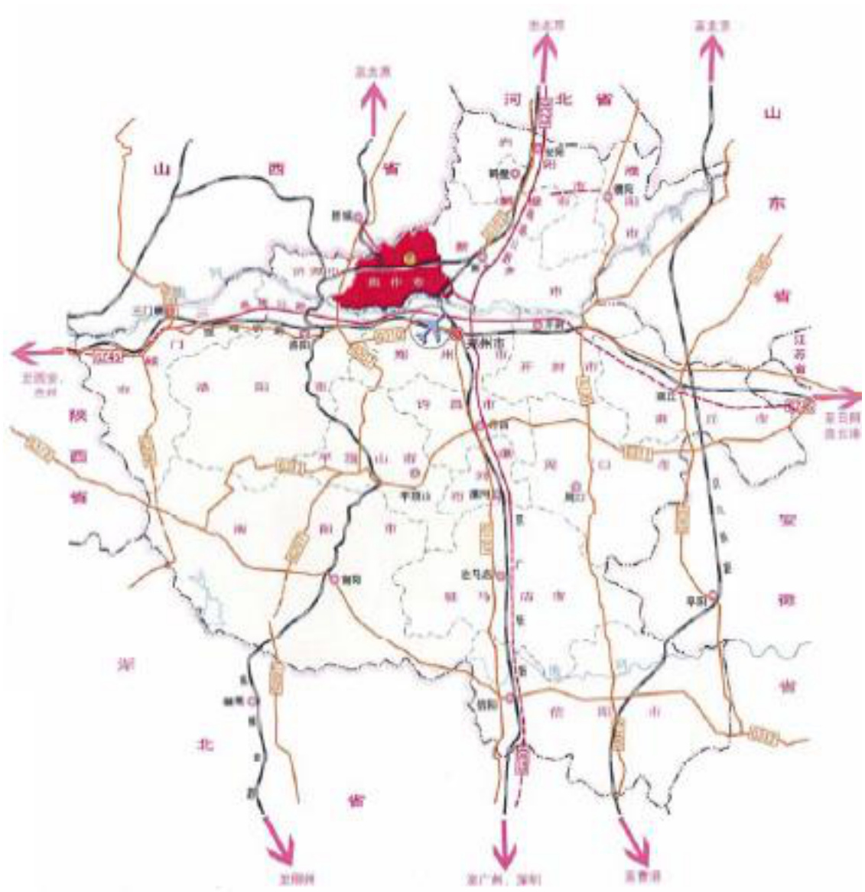  
图 1.1-1 焦作市位置图  

山门河属海河流域卫河水系,是大沙河的主要支流之一,干流长度 $38.2\mathrm{km}$ ,总流域面积为 $165.5\mathrm{km}^{2}$ 。经青龙峡主景区至青龙洞水库,流经裴庄、田坪、洞湾、六股涧等村,在西村乡山门河口另有西村石河和东村石河两条山区河道汇入,出山后向南经山阳区巡返、马村区马村、白庄,穿焦新铁路到待王村转向东进入我县,过修武县五里堡、张弓铺、郜屯村后在县城西焦新公路漫水桥处沿焦新公路南向东到大沙河幸福桥西入大沙河。  

2021 年 7 月 19 日至 22 日,修武县出现历史罕见的极端降雨过程,累积降水量 $581.6\mathrm{mm}$ ,本次暴雨河道流量达到 $500\mathrm{m}3/\mathrm{s}$ ,山门河河道多处桥涵护坡被冲毁,道路路基塌方,下游郜屯段漫堤,受淹面积 6 平方公里,造成沿线农田绝收,3 个村庄及万方铝厂等 12 个企业被淹,平均水深 $1.6\mathrm{m}$ ,倒塌房屋 350 座,转移受灾人口 0.8 万人,造成直接经济损失 6 亿元。  

为积极贯彻落实习近平总书记关于防汛救灾工作的重要指示精神,2021年 8 月 18-19 日李克强总理在河南考察并主持召开灾后恢复重建专题会议精神、河南省和焦作市对灾后恢复重建的部署,亚洲基础设施投资银行(以下简称亚投行)董事会已批准了 10 亿美元贷款(其中郑州市 6 亿美元、新乡市 2亿美元、焦作市 2 亿美元),用于支持河南省特大暴雨的紧急灾后重建。贷款资金将用于郑州市、新乡市、焦作市等受灾情况较为严重城市的水利、交通和市政基础设施等领域的恢复重建,并将支持当地提高防洪减灾救灾和应急管理能力、增强基础设施保障和防御能力、提升城市内涝防治水平、改善重点流域生态环境。  

本项目为亚投行紧急优惠贷款支持河南省特大暴雨洪涝灾害灾后恢复重建项目-焦作子项目中的子项。受修武县水利局委托,我公司在《修武县山门河五里堡至大沙河水毁修复工程可行性研究报告》的基础上编制了《修武县山门河五里堡至大沙河水毁修复工程初步设计报告》。工程建设任务是提高山门河的防洪功能,通过对山门河的治理,使山门河的防洪能力得到加强,减少洪水对乡镇的威胁,降低洪涝灾害损失,保护基础设施、基本农田等,区域内人民生命财产和经济社会发展的防洪安全保障问题得到初步解决。本次工程主要建设内容包括河道疏浚、堤防整修、岸坡防护、堤顶道路、拆除重建桥涵、拆除重建水闸、拆除重建排水涵等工程。  

# 1.2  水文  

# 1.2.1 流域概况  

山门河属海河流域卫河水系,是大沙河的主要支流之一,干流长度 $38.2\mathrm{km}$ ,流域面积为 $165.5\mathrm{km}^{2}$ 。焦作市市区地处北纬 $34^{\circ}48^{\prime}\sim35^{\circ}30^{\prime}$ ’,东径 $112^{\circ}~02^{\prime}$ ${\sim}113^{\circ}02^{\prime}$ 之间。流域内地形由西北向东南倾斜,依据地貌单元及形态划分为山区、山前坡地岗丘区和平原区。山区海拔 $200{\sim}1700\mathrm{m}$ ,岗丘区海拔 $95{\sim}200\mathrm{m}$ ,地面坡度 $1/600{\sim}1/100$ ;平原区海拔 $85{\sim}95\mathrm{m}$ ,地面坡度 $1/2000{\sim}1/1000.$ 。  

山门河发源于山西省陵川县正河山,上游有大东河、田坪河、西村河三支流汇于小东村,南下出山,经马村、待王镇东折向东南汇入大沙河。山门河在待王镇水彩村与南水北调中线工程主干渠相交,流域面积为 $139.8\mathrm{km}^{2}$ 。  

# 1.2.2 水文特征  

项目区属暖温带大陆性季风气候,由于太行山的屏障作用和海拔高差的悬殊,气候有明显的地方特征,气候比较干燥,热量、水分、光能气候资源比较充足,春、夏、秋、冬四季分明,春季干旱多风,夏季炎热多雨,秋季昼暖夜凉,冬季寒冷干燥,平均年气温 $15.2^{\circ}\mathrm{C}$ ,平均最高气温 $20.6^{\circ}\mathrm{C}$ ,最低气温 $9.8^{\circ}\mathrm{C}$ ,极端最高气温 $43.3^{\circ}\mathrm{C}$ ,极端最低气温- $16.9^{\circ}\mathrm{C}$ ,全年有效积温 $4874.8^{\circ}\mathrm{C}$ ,年无霜期平均 231天,年平均日照 2422.7 小时,日照率为 $56\%$ ,多年平均降水量 $579.7\mathrm{mm}$ ,年降水量的 $70\%$ 集中在 $6{\sim}9$ 月份。  

本区域暴雨主要由天气系统与地形条件结合所致。从暴雨普查资料看,产生暴雨的天气在 $700\mathrm{m}$ 高空,主要有台风、台风倒槽、东西向切变线和南北向切变线,断面天气系统主要是冷锋、气旋波和低压槽。从地形特点来看,本区域地势西北高东南低,西北部为太行山,东南部为平原,夏秋两季受太平洋副热带高压控制,多为东南风,暖湿气流行进过程中太行山的阻挡和抬升影响,易在山前迎风坡地带产生暴雨。暴雨主要发生在 7\~8 月,尤以 7 月下旬到 8 月上旬最为集中,从1953\~2003 年焦作气象站资料分析,最大 1 日降雨量为 $265.5\mathrm{mm}(1955\$ 年 8 月 17日)。  

山门河流域洪水均由暴雨形成,山区部分地形陡峻,坡度大,洪峰主要受短历时暴雨强度变化影响,洪水陡涨陡落,具有历时短、峰型尖瘦的特性。  

# 1.2.3  径流  

山门河属季节性河流,流域内无水文观测站。参照河南省水文水资源局 2007年 8 月编绘的《河南省水资源》,查算山门河平均径流深约为 $90\mathrm{mm}$ 。  

# 1.2.4 设计洪水  

本次山门河各设计断面以上流域集水面积相对较小,缺乏实测流量资料,故采用河南省院 1984 年 10 月编制的《河南省中小流域设计暴雨洪水图集》(以下简称 84 图集)及河南省水文水资源局 2005 年 12 月编制的《河南省暴雨参数图集》(以下简称 05 图集)等有关图集由设计暴雨推求设计洪水。  

焦作市城区流域内地形由西北向东南倾斜,根据山门河下垫面特征及汇流特性划分为三片,即上游山丘区、总干渠以北城区和总干渠以南城区,按下述方法分别计算各分区设计洪水。  

(1)根据 1/万地形图和 1/1000 河势图量算查对,山门河在焦作市规划城区北部边界线,大体在焦辉路以北区域,地面高程在 $200\mathrm{m}$ 以上,河道比降在$0.020{\sim}0.047$ ,比降陡,属山丘区河流,故采用 1984 年图集中的推理公式法计算河道设计洪水。  

(2)山门河在规划城区北部边界线至总干渠之间和总干渠至入大沙河之间经用 1/1000 地形图查对,地面高程在 $200\mathrm{m}$ 以下,且地面、河底比降在 0.008 左右,比降较缓,属平原坡水区,故焦作市城区采用城区排水公式计算设计洪水,在计算参数选取上采用上限。  

山门河北区出山口处(S306 处)设计洪水采用推理公式法计算成果;总干渠处设计洪水为上游山丘区设计洪水过程线错传播时间 1h 与山丘区\~总干渠区间设计洪水过程线叠加而得;入大沙河口处设计洪水为总干渠设计洪水过程错 2h 传播时间与总干渠\~大沙河区间洪水过程线叠加而得。根据计算,山门河各控制断面设计洪水成果见表 1.2-1。  

表 1.2-1 山门河各控制断面设计洪水成果  

<html><body><table><tr><td rowspan="2">控制断面</td><td colspan="5">本次成果洪峰流量 (m?/s)</td></tr><tr><td>20%</td><td>10%</td><td>5%</td><td>2%</td><td>1%</td></tr><tr><td>北部出山口（S306处）</td><td>356</td><td>631</td><td>912</td><td>1290</td><td>1568</td></tr><tr><td>南水北调处</td><td>367</td><td>645</td><td>929</td><td>1312</td><td>1593</td></tr><tr><td>入大沙河处</td><td>385</td><td>669</td><td>960</td><td>1350</td><td>1637</td></tr></table></body></html>  

# 1.3 工程地质  

1)工程区位于黄沁冲积平原区,总体地势西高东低,地形较平坦,场地开阔,周边有焦辉公路、郑云高速等,交通较方便。  

2)工程区位于华北准地台(Ⅰ)黄淮海拗陷(Ⅰ2)与山西台背斜(Ⅰ3)的交接部位,新构造分区属华北断陷(Ⅱ5)、太行山隆起分区(Ⅱ3)和豫皖断块区的结合部位。工程场区无活动断层及震级大于 4.75 级地震震中分布,区域构造稳定性较好  

3)工程区为Ⅲ类场地,调整后场区地震动峰值加速度为 $0.1725\mathrm{g}$ ,相应的地震基本烈度为 VII 度,地震动加速度反应谱特征周期为 0.55s。  

4)受 21.7 强降雨影响,修武附近地下水位较往年平均上升约 $3^{\sim}4\ensuremath{\mathrm{m}}$ 。勘察期间,山门河右堤段地下水埋深 $1.05{\sim}5.60\mathsf{m}$ ,地下水位 $82.39^{\sim}88.04\mathrm{m}$ ,该段山门河河水位 $83.30^{\sim}89.34\mathsf{m}$ ;南北排河段地下水埋深 $1.68{\sim}2.45\mathrm{m}$ ,地下水位 $82.04\sim82.68\mathrm{m}$ ,南排河河水位 $82.20{\sim}82.88\mathsf{m}$ ,北排河河水位 $82.08^{\sim}82.58\mathrm{m}$ ;郜村围村堤段地下水埋深 $1.03{\sim}2.08\mathrm{m}$ ,地下水位 $82.81^{\sim}83.21\mathrm{m}$ 。场区河水补给地下水。  

场区地下水对混凝土无腐蚀性,对钢筋混凝土结构中钢筋具中等腐蚀性,对钢结构具中等腐蚀性;山门河河水对混凝土具弱腐蚀性,对钢筋混凝土结构中钢筋具弱腐蚀性,对钢结构具中等腐蚀性。  

5)山门河右岸桩号 $1{+}410{\sim}2{+}230$ 和 $3{+}260{\sim}6{+}310$ 段以及郜村围村堤建有堤防,山门河桩号 $2+230\sim3+260$ 为浆砌石防洪墙,有堤(墙)段长度约 $6.3\mathrm{km}$ ,无堤段长度约 $2.2\mathsf{k m}$ 。有堤段堤身填筑土以中粉质壤土,堤身填筑质量差且不均匀,抗冲刷性能差,建议采取振动碾压、加高培厚、植被护坡等处理措施。建议堤身填土的允许水力比降为 0.40。  

6)治理段堤基地质结构为粘砂双层结构,堤基上部粘性土具高压缩性。山门河右堤段和郜村围村堤段堤基工程地质条件较好,属 B 类堤基;南北排河段堤基粘性土稍薄,汛期高水位运行时两端堤基可能存在渗透变形问题,堤基工程地质条件较差,属 C 类堤基。  

7)本工程河道两岸和近距离内表层主要为软塑\~可塑状中粉质壤土,质量基本满足填筑土料技术指标,但含水率偏高,需要翻晒。周边土料储量丰富,可就地取材。工程所需混凝土骨料和块石料可就近在市场上购买质量合格的商品材料,也可购买商品混凝土代替。  

# 1.4 工程任务和规模  

# 1.4.1 概况及灾后情况  

焦作市修武县地处河南省西北部,太行山南麓,地理坐标为:北纬 $35^{\circ}07^{\prime}$ $39^{\prime\prime}\sim35^{\circ}28^{\prime}32^{\prime\prime}$ ,东径 $113^{\circ}08^{^{\prime}}17^{^{\prime\prime}}{\sim}113^{^{\circ}}32^{^{\prime}}03^{^{\prime\prime}}$ ,东邻新乡市获嘉县、辉县市,南接焦作市武陟县,西连焦作市区,北靠山西省晋城市、泽州市和陵川县,全县南北长 $40k\mathrm{m}$ ,东西宽 $36\mathrm{km}$ ,版图为不规则哑铃状。修武县北部为山区和丘陵,南部为冲积平原,县区地势北高南低,最高点海拔 $1308\mathrm{m}$ ,最低点海拔$77.4\mathrm{m}$ ,全县平均海拔为 $692.7\mathrm{m}$ 。县域总面积 $611\mathrm{km}^{2}$ ,北山南川,辖 5 个镇(城关镇、七贤镇、郇封镇、周庄镇、云台山镇)、3 个乡(王屯乡、西村乡、五里源乡)、1 个工贸区(小营工贸区)和 1 个办事处,共 187 个村、6 个居委会,全县总人口 27.05 万人。修武县依托优越的地理环境和雄厚的物质基础,经济实力迅速扩展,城区设施配套功能完备,交通便利。  

山门河为大沙河左岸一级支流,发源于山西省陵川县正河山,上游有大东河、田坪河、西村河三支流汇于小东村,南下出山,经马村、待王村东折向东南于修武县汇入大沙河。项目区属暖温带大陆性季风气候,由于太行山的屏障作用和海拔高差的悬殊,气候有明显的地方特征,项目区全年平均气温 $9.8^{\circ}\mathrm{C}\sim20.6^{\circ}\mathrm{C}$ ,年降水量的 $70\%$ 集中在 ${\tt6}\mathbf{\sim}\mathbf{9}$ 月份,多年平均降水量 $579.7\mathrm{mm}$ 。  

山门河属于季节性山洪河道,上游山区面积大,地势水平梯度变化大,山高坡陡,对地形雨径流形成和洪水快速汇流产生显著影响,遇长时间高强度降雨,常造成严重的山洪灾害。2021 年 7 月 18 日 20 时到 22 日 15 时,焦作市持续出现强降雨,全市平均雨量 $416\mathrm{mm}$ 。集中的暴雨引发的洪水对全市的水利基础设施造成了严重的破坏,堤防坍塌、边坡冲毁、堰坝受损、路桥冲垮,造成了严重的经济损失。  

修武县山门河五里堡至大沙河段河道存在如下问题:  

河道逐渐向平原过渡,纵坡变缓,河槽又窄又浅,河道过流能力很小。山门河五里堡以东河道,行洪断面窄小,沿河建筑物阻水严重,河道淤积使主河槽很不明显,汛期靠滩地行洪。张弓铺村北行洪区被焦作万方铝业集团占用了大部分行洪区。近年来,虽对河道主河槽进行了清淤疏浚,但未进行系统治理,防洪能力仍远远达不到要求。  

该河道上游缺乏有效控制性工程,下游左岸堤防残缺不全,21.7 洪水造成河道漫溢,村庄、农田以及部分企业被淹,经济损失巨大。  

# 1.4.2 工程建设必要性  

(1)消除暴雨影响恢复沿线群众正常生产生活的需要  

2021 年汛期出现的强降雨对焦作市经济社会影响重大,在本次强降雨过程中,山门河遭遇有历史记录以来的最大洪水,山洪河道水位暴涨,山门河河山洪河道多处桥涵护坡被冲毁,道路路基塌方,下游马村区待王段、郜屯段漫堤,受淹面积 $6{\mathsf{k m}}^{2}$ ,造成沿线农田绝收,3 个村庄及万方铝厂等 12 企业被淹,平均水深 $1.6\mathsf{m}$ ,房屋倒塌 350 座,转移受灾人口 0.8 万人,造成巨大的经济损失。科学规划并统筹推进、快速实施修武县山门河水毁修复工程,尽快消除暴雨影响,有利于恢复沿线群众的正常生产生活秩序,避免发生次生灾害,切实保障人民群众的生命与财产安全。  

# (2)完善并提升修武县防洪体系的需要  

山门河是修武县重要的防洪河道,本次暴雨造成右岸堤防多处出现险情,岸坡冲刷严重,影响堤防边坡稳定;加之右岸现状堤防原填筑标准较低且不连续,局部堤防宽度 $_{1}{\sim}2\mathsf{m}$ ,抵御洪水的能力较差,不能有效约束洪水,威胁沿岸城乡居民的生命财产安全,急需对右岸堤防进行加固处理,形成完整的城乡防洪体系。通过本次治理的实施,能够切实完善防洪体系,对保障未来汛期修武县城乡防洪很有必要。  

(3)实现社会、经济、生态环境效益综合、协调、统一的需要  

本次水毁修复工程的建设不仅具有水利工程带来的社会效益,在水利工程建设的基础上开展一定的有针对性的生态环境建设,还能够改善城乡生态环境状况,提高环境质量水平,带来良好的经济效益和生态效益,真正做到尊重自然、以人为本、人与自然和谐发展的良性循环,实现社会、经济、生态效益的综合、协调、统一。  

综上所述,开展修武县山门河五里堡至大沙河段水毁修复工程是非常必要的。  

# 1.4.3 工程建设任务  

修武县山门河五里堡至大沙河段水毁修复工程承接可行性研究阶段确定的工程任务,即工程兼具水毁修复、防洪排涝等综合任务,通过河道修复、堤防填筑、河道疏挖、岸坡防护、防汛道路提升等工程建设,最终完成对修武县山门河五里堡至大沙河段水毁修复工程的综合修复,一定程度上提升区域水系的总体防洪除涝能力,改善城乡水系生态环境。治理范围为山门河五里堡至大沙河段。  

# 1.4.4 建设规模  

修武县山门河五里堡至大沙河段水毁修复工程是以防洪为主要任务的灾后治理工程,根据《焦作市城区防洪规划报告》,山门河城区段左岸防洪标准为 20 年遇,右岸防洪标准为 50 年一遇。本段山门河不属于城区段,防洪标准可为 20年一遇。根据《防洪标准》(GB50201-2014),修武县本段山门河防护区为乡村段,防护等级为 IV 等,防洪标准为 ${20^{\sim}10}$ 年一遇。可行性研究阶段确定本段防洪标准为 20 年一遇。综合以上分析,本次设计修武县山门河五里堡至大沙河段水毁修复工程沿用可行性研究阶段确定的设计防洪标准,即 20 年一遇。  

本次工程主要建设内容包括河道疏浚、堤防整修、岸坡防护、堤顶道路、拆除重建桥涵、拆除重建水闸、拆除重建排水涵等工程。  

河道工程:河道清淤疏浚 $6.45{\mathrm{km}}$ ,包含五里堡 $\tilde{}$ 大沙河段山门河桩号$\mathsf{K}1\mathsf{+}410\mathsf{-K}6\mathsf{+}710$ ,清淤长度 3.6km( $\kappa4{+}510{-}|\kappa6{+}210$ 段已在其他工程中实施);焦新公路南侧排水沟(简称:南排)桩号 ${\mathsf{N P0}}{+}000{-}{\mathsf{N P1}}{+}410$ ,清淤长度 1.41km;焦新公路北侧排水沟(简称:北排)桩号 $8\mathsf{P0}{+}000{-}\mathsf{B P1}{+}440$ ,长度 $1.44\mathrm{km}$ 。  

堤防工程:加高加固 $\ K1{+}410$ (五里堡) ${\sim}K6{+}310$ 右岸堤防,长度 $4.9\mathrm{km}$ 。加高加固郜屯围村堤 $\mathsf{W D0}\mathbf{+}000\mathbf{-}\mathsf{W D1}\mathbf{+}730.$ ,段,长度 $1.73\mathrm{km}$ 。  

岸坡工程:岸坡护砌长度 $5.1\mathsf{k m}$ ,包含山门河堤防段岸坡或河槽防护,桩号$\mathsf{K}1{+}410{-}\mathsf{K}5{+}210$ 段( $K5{+}210{-}K6{+}310$ 段已在其他工程中实施),长度 $3.8\mathsf{k m}$ ;南排岸 坡 护 砌 桩 号 ${\mathsf{N P0}}{+}000{-}{\mathsf{N P1}}{+}410$ , 长 度 1.41km ; 北 排 岸 坡 护 砌 桩 号$8\mathsf{P0}{+}000{-}\mathsf{B P1}{+}440$ ,总长度 1.44km。  

堤顶路:新建右岸堤顶路 $4.9\mathrm{km}$ ,新建郜屯村围村堤顶路 1.73km,总长度 6.63km。  

拆除重建桥涵工程:山门河主河道拆除重建箱涵桥 4 座,桩号为 $\ K1{+}860$ 、$\kappa2\substack{+330}$ 、 $\mathsf{K}3\mathsf{+}900$ 、 $\kappa4+260$ ;南排拆除重建箱涵桥 2 座,桩号为 $\mathsf{N P O}\boldsymbol{+}\boldsymbol{0}\boldsymbol{4}\boldsymbol{0}$ 、 $\mathsf{N P1}\substack{+150}$ 。  

拆除重建水闸工程:北排拆除重建水闸 1 座,桩号为 $\mathsf{B P1+180}$ ;南排拆除重建水闸 1 座,桩号为 $\mathsf{N P O}+780$ ;  

拆除重建排水涵工程:郜屯村围村堤拆除重建排水涵 4 处,桩号为 $\mathsf{W D0+090}$ 、W $\scriptstyle{\cal I}00+240$ 、WD0+790、WD1+240。  

# 1.5 工程布置及建筑物  

# 1.5.1 工程等级  

修武县山门河五里堡至大沙河段水毁修复工程是以防洪为主要任务的灾后治理工程,根据《焦作市城区防洪规划报告》,山门河城区段左岸防洪标准为 20 年一遇,右岸防洪标准为 50 年一遇。本段山门河不属于城区段,防洪标准可为 20年一遇。根据《防洪标准》(GB50201-2014),修武县本段山门河防护区为乡村段,防护等级为 IV 等,防洪标准为 20\~10 年一遇。可行性研究阶段确定本段防洪标准为 20 年一遇。综合以上分析,本次设计修武县山门河五里堡至大沙河段水毁修复工程沿用可行性研究阶段确定的设计防洪标准,即 20 年一遇。  

按照《水利水电工程等级划分及洪水标准》(SL252-2017)的规定,工程等别为Ⅴ等,主要建筑物级别为 4 级,次要建筑物级别 5 级,临时建筑物 5 级。根据《堤防工程设计规范》(GB/T50286-2013)堤防工程的级别为 4 级,临时工程为 5 级。  

# 1.5.2 工程总布置  

修武县山门河水毁修复工程治理范围为五里堡 $\tilde{}$ 大沙河段,具体为$\mathsf{K}1{+}410{-}\mathsf{K}6{+}710$ ,南排 ${\mathsf{N P0}}{+}000{-}{\mathsf{N P1}}{+}410$ ,北排 $8\mathsf{P0}{+}000{-}\mathsf{B P1}{+}440$ 。本次工程主要建设内容包括河道疏浚、堤防整修、岸坡防护、堤顶道路、拆除重建桥涵、拆除重建水闸、拆除重建排水涵等工程。河道工程:河道清淤疏浚 $6.45{\mathrm{km}}$ ,包含五里堡\~大沙河段山门河桩号 $\mathsf{K}1{+}410{-}\mathsf{K}6{+}710$ ,清淤长度 $3.6\mathsf{k m}$ ( $\lvert<4+510-\rvert<6+210$ 段已在其他工程中实施);焦新公路南侧排水沟(简称:南排)桩号 ${\mathsf{N P0}}{+}000{-}{\mathsf{N P1}}{+}410$ ,清淤长度 1.41km;焦新公路北侧排水沟(简称:北排)桩号 $8\mathsf{P0}\mathbf{+}000\mathbf{-}\mathsf{B P1}\mathbf{+}440\mathbf{:}$ ,长度 $1.44\mathrm{km}$ 。  

堤防工程:加高加固 $\ K1{+}410$ (五里堡) ${\sim}K6{+}310$ 右岸堤防,长度 $4.9\mathrm{km}$ 。加高加固郜屯围村堤 $\mathsf{W D0}\mathbf{+}000\mathbf{-}\mathsf{W D1}\mathbf{+}730,$ 段,长度 $1.73\mathrm{km}$ 。  

岸坡工程:岸坡护砌长度 $5.1\mathsf{k m}$ ,包含山门河堤防段岸坡或河槽防护,桩号$\K{\cal{1}}{+}410{-}\ K5{+}210$ 段( $K5+210{\cdot}K6{+}310$ 段已在其他工程中实施),长度 $3.8\mathsf{k m}$ ;南排岸 坡 护 砌 桩 号 ${\mathsf{N P0}}{+}000{-}{\mathsf{N P1}}{+}410$ , 长 度 1.41km ; 北 排 岸 坡 护 砌 桩 号$8\mathsf{P0}{+}000{-}\mathsf{B P1}{+}440$ ,总长度 $1.44\mathrm{km}$ 。  

堤顶路:新建右岸堤顶路 $4.9\mathrm{km}$ ,新建郜屯村围村堤顶路 $1.73\ensuremath{\mathrm{km}}$ ,总长度6.63km。  

拆除重建桥涵工程:山门河主河道拆除重建箱涵 4 座,桩号为 $\mathsf{K}1+860,\mathsf{K}2+330$ 、$\mathsf{K}3\mathsf{+}900$ 、 $\kappa4+260$ ;南排拆除重建箱涵 2 座,桩号为 $\mathsf{N P O}{+}040$ 、 $\mathsf{N P1}\substack{+150}$ 。  

拆除重建水闸工程:北排拆除重建水闸 1 座,桩号为 $\mathsf{B P1+180}$ ;南排拆除重建水闸 1 座,桩号为 $\mathsf{N P O}{+}780$ ;  

拆除重建排水涵工程:郜屯村围村堤拆除重建排水涵 4 处,桩号为 $\mathsf{W D}0\substack{+090}$ 、$\mathsf{W D0}\substack{+240}$ 、 $\scriptstyle{\mathcal{N D}}0+790$ 、WD1+240。  

# 1.5.3 河道工程  

修武县山门河河道在经历 2021 年 7 月份洪水冲击后,河床冲刷和淤积均较严重,局部段河床冲刷下切较严重,岸坡冲刷破坏,存在安全隐患,为保证河道行洪安全,本次设计主要对河床进行平整顺接,优化调整主河槽位置保证岸坡安全。设计的原则是:  

(1)河道走向基本维持现状,局部河段根据地形地物适当调整,以使河道流顺畅;(2)结合现状,以河道平整为主;(3)基本维持现状河道纵坡,保持河道纵坡连接顺畅;(4)充分利用现状河槽,尽量减少河槽挖方,减少工程投资。(5)尽可能减少占地,节约投资。  

本次设计主河道为复式梯形断面,河槽基本维持原河槽底宽,为 $5\mathsf{m}^{\sim}15\mathsf{m}$ ,两岸边坡坡比基本采用 1:2,河道设计纵坡为 1:500-1:1000;南排和北排均采用单式梯形断面,河槽宽度为 2m,两岸边坡坡比为 1:1.5,河道设计纵坡为 1:1000,此次  

治理以扩挖、疏浚河槽为主。  

# 1.5.4 堤防工程  

本工程的堤防主要分布在山门河的右岸和郜屯围村堤。根据《堤防工程设计规范》(GB50286-2013),堤线布置应根据防洪规划、地形、地质条件,结合现有堤防位置。本次河道治理工程设计时以防洪为首要目标,确定河道治理的设计要素时适当考虑生态的需求,工程设计原则为:  

(1)堤线应力求平顺,尽量利用原有堤防和有利地形,修筑在土质良好、比  
较稳定的滩岸上;(2)堤线与河势流向相适应,并与洪水主流方向基本一致;(3)堤线力求平顺,各堤段平缓连接,不应采折线或急弯,工程布置应与河  
道内现有桥梁布置相互协调统一;(4)堤线应布置应有利于防汛抢险和工程管理;  

本次设计工程区位于焦作市修武县,现状主河槽宽度较窄。本次工程设计主河道采取防浪墙加现状堤防结合的方式进行堤防设计,围村堤采用土堤的方式设计,结合对现状河道进行疏浚整治。根据计算,疏浚整治河道开挖弃土方量较大,但土料指标不能满足填筑堤防的要求,附近大沙河已实施的水毁工程,弃土满足填筑堤防的要求,所以本次堤防工程按照因地制宜,就地取材的选型原则,并参考工程区已建同类堤防堤型,确定设计河道堤防主河道采用防浪墙加梯形断面均质土堤;围村堤采用梯形断面均质土堤。  

本次设计地勘资料中提出河道两岸中粉质壤土除天然含水率偏高,需要翻晒外,其余指标均满足要求,可以作为填筑土料使用。但因此处均为基本农田,征地实施难度较大,因此另外选取修武县大沙河开挖弃料作为堤防筑堤土料。  

# 1.5.5 岸坡工程  

此次护岸工程主要是保护河岸土体不受河水浸泡或冲刷造成破坏而设置的。生态护坡主要适用于自身稳定边坡,各类防护措施主要针对雨水侵蚀以及水力冲刷而引起的边坡坍塌。对于边坡不满足自身稳定要求的,可采取挡土墙、土铆钉等其他加固措施。护坡防护的原则为:  

(1)安全第一原则  

护坡首先必须满足防护对象的安全需求。防护对象的需求不同,护坡措施应相应调整。现状较陡的河岸一般需要削坡,削坡坡度可根据削坡高度、地质情况、防护对象采用不同的坡度。  

# (2)生态性原则  

在可以选择的满足安全需求的护坡形式中,要尽量选择生态性的护坡形式,以便改善环境质量,带来附加的正外部效益。  

# (3)经济性原则  

在满足安全性的前提下,尽量因地制宜选择当地材料,以便降低工程造价。  

本次设计岸坡护砌长度 $5.1\mathsf{k m}$ ,包含山门河堤防段岸坡或河槽防护,桩号$\K{\cal{1}}{+}410{-}\ K5{+}210$ 段( $K5+210{\cdot}K6{+}310$ 段已在其他工程中实施),长度 $3.8\mathsf{k m}$ ,采用15cm 厚 C25 混凝土块护砌,护脚采用 M10 浆砌石砌筑,深 $1.5\mathsf{m}$ ;南排岸坡护砌桩号 ${\mathsf{N P0}}{+}000{-}{\mathsf{N P1}}{+}410$ ,长度 1.41km,采用 $_{12\mathrm{cm}}$ 厚 C25 混凝土块护砌,护脚采用M10 浆砌石砌筑,深 $1.0\mathsf{m}$ ;北排岸坡护砌桩号 $8\mathsf{P0}{+}000{-}\mathsf{B P1}{+}440$ ,总长度 $1.44\mathrm{km}$ ,采用 $_{12\mathrm{cm}}$ 厚 C25 混凝土块护砌,护脚采用 M10 浆砌石砌筑,深 $1.0\mathsf{m}$ 。  

# 1.5.6 堤顶道路  

为了便于管理河道,新建堤顶道路 $6.63\ensuremath{\mathrm{km}}$ ,其中山门河右岸堤防 $\ K\boldsymbol{1}{+}410$ (五里堡) ${\sim}K6{+}310$ 右岸堤防,长度 $4.9\mathsf{k m}$ ;郜屯围村堤 $\mathsf{W D0}\mathbf{+}000\mathbf{-}\mathsf{W D1}\mathbf{+}730$ 段,长度1.73km。。  

本着近期与远期相结合的原则,为减少噪声污染,保持良好的城市生态环境,创造优越的工作、生活条件,同时根据道路在城市道路系统的功能和所起的作用,设计推荐堤顶防汛路采用 C25 混凝土路面。  

堤顶道路采用 $18\mathrm{cm}$ 厚 C25 混凝土路面 $+15\mathrm{cm}$ 厚 $12\%$ 水泥土。  

# 1.5.7 箱涵工程  

修武县山门河水毁修复工程作为灾后恢复重建标志性工程,本次拟治理五里堡\~大沙河段,我公司对山门河沿线进行了现场勘察,山门河河道上尤其是较低等级道路上的桥梁年久失修,损毁严重,已成危桥,设计标准低,不能满足交通需求,影响泄洪,不能满足河道防洪功能要求,因此,需要拆除重建,由于投资等限制,本次设计均采用箱涵。初步设计拆除重建箱涵 6 座,结合现状及规划道路宽度及工程特点,桥涵宽度确定为 $6\mathsf{m}$ 。其中山门河主河道拆除重建箱涵桥 4 座,桩号为 $\ K1{+}860$ 、 $\kappa2\substack{+330}$ 、 $\mathsf{K}3\substack{+900}$ 、 $\kappa4+260$ ;南排拆除重建箱涵桥 2 座,桩号为  

$\mathsf{N P O}\boldsymbol{+}\boldsymbol{0}\boldsymbol{4}\boldsymbol{0}$ 、 $\mathsf{N P1}\substack{+150}$ 。  

# 1.5.8 水闸工程  

山门河治理段现有拦河闸 7 座,自上而下位于桩号 $\ K1+860$ (闸桥)、 $\kappa2+330$ (闸桥)、 $\mathsf{K}3\substack{+900}$ (闸桥)、 $\kappa4+230$ (闸桥), $\kappa4\substack{+610}$ (闸桥)、 $\mathsf{N P O}+780$ (水闸)、$\mathsf{B P1+180}$ (水闸)。现状水闸均不能正常使用,失去原有功能。本次设计拆除重建水闸 2 处,桩号为 $\mathsf{N P O}+780$ 、 $\mathsf{B P1+180}$ ,(为大沙河沟口闸),拆除 $\kappa4\substack{+610}$ 处闸桥,桩号 $\ K1{+}860$ (闸桥)、 $\kappa2\substack{+330}$ (闸桥)、 $\mathsf{K}3\mathsf{+}900$ (闸桥)、 $\kappa4+230$ (闸桥)处闸桥拆除新建为箱涵。  

本次工程拆除重建水闸 2 座,闸室轴线与河道中心线重合。工程总长 $45.0\mathrm{m}$ ,由进口段、铺盖段、闸室段、消力池段、海漫段及末端防冲槽段组成。经水力计算,涵闸尺寸为 2 孔 $2.0\times2.5\mathrm{m}$ ,过流能力满足要求。经初步估算,闸基防渗长度满足要求。闸基结果满足要求,不需要做特殊处理。  

# 1.5.9 排水涵工程  

根据工程布置及郜屯村排水需要,本工程在郜屯围村堤处拆除重建排水涵 4处,桩号为 $\mathsf{W D}0\substack{+090}$ 、 $\mathsf{W D0+240}$ 、W $\scriptstyle{\cal I D O}+790$ 、 $\mathsf{W D1+240}$ 。均采用 $\mathsf{D N1}.2\mathsf{m}$ 预制钢筋混凝土Ⅱ级管道排水,出口处布置拍门防止河水倒灌。  

# 1.6  机电及金属结构  

# 1.6.1 电气  

修武县山门河水毁修复工程共有水闸 2 座。由于采用手电两用螺杆启闭机,用电负荷较小,采用临近电源作为供电电源,由螺杆启闭机自带控制箱实现闸门的启停控制。  

# 1.6.2 金属结构  

修武县山门河水毁修复工程工程共建水闸 2 座。金属结构是闸门及启闭机设备(2 座)。闸门孔口尺寸均为 2 孔(宽 $\times$ 高) $2.0\mathrm{m}\times2.5\mathrm{m}$ 。闸门均选用露顶式平面铸铁闸门。闸门的启门力在 $90\mathrm{kN{\sim}110\mathrm{kN}}$ 之间,考虑选取启闭设备的统一性,均选用 $150\mathrm{kN}$ 手电两用螺杆启闭机,布置型式为一门一机。  

为延长金属结构的使用寿命,以上所有闸门及埋件外露部分均采用油漆防腐。启闭机机架表面采用油漆防腐。闸门埋件埋入混凝土部分应涂刷一层水泥浆防腐,  

涂层应注意养护。  

# 1.6.3  消防  

涉及的电气设备较为简单,没有较大的火灾隐患,但施工临时工区内的仓库、办公区等场所有发生火灾的可能,考虑到河道两岸存在聚集区,若发生火灾,将造成难以估量的损失,故本次消防设计主要为每个工区配备灭火设施。灭火器按轻危险级配置,每个工区配备 4 具手提式 MF/ABC4 型磷酸铵盐干粉灭火器,共计8 具。本费用计列在施工临时费用的其他费用中。  

# 1.7 施工组织设计  

# 1.7.1 施工条件  

(1)对外交通运输条件  

工程所在区域公路交通网四通八达,县、乡道路路网发达,施工前不需要修建对外交通道路,大、中型施工设备进场和建筑材料运输均可直接到达工地,对外交通十分便利。  

# (2)水、电供应条件  

项目区附近有居民区,生产生活用水以城市管网为主,可满足工程的需要。  

工程区电力资源较为丰富,供电网络系统比较完整,经调查,工程区有 $10\mathrm{kV}$ 电网,可“T”接至工区,作为施工用电电源。  

# 1.7.2 料场的开采与选择  

工程所需回填土料优先选取现场开挖土料,能够满足工程需要的,优先使用。  

# 1.7.3 施工导流  

(1)导流标准  

本次涉及施工导流的配套建筑物主要是箱涵桥、管涵、北排水闸、南排水闸和南排箱涵。其中箱涵桥和水闸的主要建筑物级别为 4 级,管涵的主要建筑物级别为 5 级,临时性水工建筑物的保护对象为 $4\sim5$ 级永久性水工建筑物,其导流建筑物级别确定为 5 级。导流围堰的设计类型为土石结构,对应的洪水标准取非汛期 5 年一遇(10 月\~次年 5 月)。  

(2)导流方式  

主河道箱涵桥采用全断面围堰,埋设涵管的方式导流。  

主河道入河管涵采用 U 型断面围堰,拦挡入河口施工区,利用主河道导流。  

北排水闸、南排水闸和南排箱涵位于河道下游,河道分为两支,可利用全断面围堰交替拦挡施工。  

# 1.7.3 主体工程施工  

(1)土方开挖  

本次土方开挖包括河道疏浚、堤防整修及建筑物配套工程的土方。为了提高施工效率、缩短工期、降低造价,土方工程以机械化施工为主,人工开挖为辅。  

河道疏挖:河道土方开挖采用 $2\mathrm{m}^{3}$ 反铲挖掘机开挖,配合 15t 自卸汽车运输。土方开挖从上层到下层分层开挖,开挖厚度原则上每层 $2{\sim}3\mathrm{m}$ ,结合土层分类,每层厚度可适当调整。  

清基土方:由于清基厚度较薄,可先用采用 74kw 推土机推运集中,再采用$2\mathrm{m}^{3}$ 反铲挖掘机开挖,配合 15t 自卸汽车运输。  

建筑物配套工程:土方开挖采用 $1\mathrm{m}^{3}$ 挖掘机,人工辅助配合,用来进行土方回填的开挖料于待回填地点堆存,弃土采用 8t 自卸汽车运输。  

# (2)土方回填  

本工程堤身填筑采用外借土料,拟利用大沙河丰收西路北侧堆土场土料做为筑堤土料。河道填方和配套建筑物填方等一般土方回填,可以就近利用河道开挖土料。  

(3)浆砌石施工  

浆砌块石采用机制砂浆人工砌筑,自下而上分层砌筑,各砌层均应坐浆,随铺浆随砌筑,缝隙砂浆要饱满;每层应依次砌角石、面石,然后砌腹石;应选择较平整的大块石经修整后用作面石,上下两层石块应骑缝,内外石块应交错搭接;砌体宜均衡上升,相邻段的砌筑高差和每日砌筑高度,不宜超过 $1.2\mathrm{m}$ ;砌筑过程中,应及时洒水养护。砌体的外露面和挡土墙的临土面均应勾缝,并以平缝为宜;勾缝砂浆标号应高于砌体砂浆标号,宜用中细砂料拌制,灰砂比宜为 1:2;砌筑勾缝前,应清理缝槽,并用水冲洗湿润,砂浆应嵌入缝内约 $2\mathrm{cm}$ 。  

(4)混凝土工程施工混凝土工程施工采用商品混凝土。  

混凝土的入仓温度一般控制在 $5^{\circ}\mathrm{C}{\sim}25^{\circ}\mathrm{C}$ ,夏季施工当外界气温超过 $30\mathrm{^\circC}$ 时要求砼出机温度在 $25\mathrm{^\circC}$ 以下,如气温太高时应避开高温时段再进行浇筑。砼浇筑时如遇降雨,当雨量超过 $5\mathrm{mm/h}$ 又无防雨措施时应立即停止浇筑。  

在砼浇筑施工时,应严格按照操作规程进行,以防止出现麻面、蜂窝、空洞、  

裂缝等,造成返工。  

砼浇筑完 $12\mathrm{h}{\sim}18\mathrm{h}$ 内开始洒水养护,表面砼养护,用草袋、湿沙覆盖。垂直方向养护,人工或带孔水管定时洒水养护,保持砼表面经常湿润。养护期不少于28 天。  

砼工程一般应在其强度达到设计强度的 $70\%$ ,保证其表面积棱角不会因拆模而破坏时方能拆模。  

# 1.7.4 施工交通与施工总布置  

(1)施工交通  

项目区对外交通路网等纵横交错,场区地理位置优越,对外交通运输条件十分便利,不需要修建外部交通道路。  

项目区场内可根据河道两岸实际情况修筑临时道路,以便连通施工作业面、砂石料堆放场、土料场和生活办公区等。施工道路总长 $9350\mathrm{m}$ ,详见表 7.5-1,路面宽 $4\mathsf{m}$ ,采用泥结碎石路面结构。  

# (2)施工总布置  

本工程施工区为线性场地,为了施工的需要,共布置 3 个工区组织施工,每个施工区各设置一处施工营地,每处 4 亩。工区内的主要干道可使各生产生活区相互连通。  

# (3)土石方平衡  

本工程土方开挖 17.82 万 $\mathrm{m}^{3}$ ,清基 3.19 万 $\mathrm{m}^{3}$ ,一般土方回填 5.99 万 $\mathrm{m}^{3}$ ,堤防填筑 11.06 万 $\mathrm{m}^{3}$ ,平衡后弃土 13.94 万 $\mathrm{m}^{3}\circ$  

# 1.7.5 实施安排  

根据本工程的特点和建筑物工程规模,本着经济合理的原则,进行施工进度安排。结合工程特点及工程规模、施工强度、施工环境、施工期规模等实际情况,确定该工程总工期为 9 个月。  

# 1.8 建设征地与移民安置  

本工程对修武县山门河五里堡至大沙河段进行治理,工程主要内容为:河道修复、堤防填筑、河道疏挖、岸坡防护、防汛道路提升等。本工程是一项防洪减灾的公益性工程,当地政府和群众具有积极的意愿为工程建设提供有利条件。  

本次工程总用地面积为 399.48 亩,除现状河道原有占地范围以外,新增永久用地面积 27.72 亩,包括农用地 16.55 亩和未利用地 11.17 亩。其中农用  

地中耕地 12.54 亩、农村道路用地 4.01 亩。根据施工总布置,弃土场选取工程以外 5 公里的农用地临时堆放,临时占地面积共 86.1 亩。  

由修武县水利局和设计单位联合,由设计单位技术负责,结合可研阶段成果于 2022 年 3 月 11 日对修武县山门河本次治理范围内的各类实物指标进行了复核调查。  

本次永久占地范围内不涉及占压房物及附属物,不涉及各类电力、通讯、公路、铁路、管道等设施,不涉及搬迁人口,仅需对占地范围内的土地地类以及部分零星树木进行调查。  

采用焦作市 2022 年第 1 期价格水平。  

本次工程建设征地移民安置总补偿投资为 359.41 万元,其中农村部分补偿费234.09 万元,其他费用 33.24 万元,基本预备费 26.73 万元,有关税费 65.34 万元。  

# 1.9 环境保护设计  

本设计主要针对施工期噪声、扬尘、生产、生活污水和固体废物排放对环境的不利影响,设计采取针对性的措施,水环境措施包含对生活污水、施工废水的处理,包含一体化设备、沉淀池等,生态保护措施包括采取相应的水土保持措施减轻水土流失,人群健康保护措施包括应加强传染病的预防与监测工作,大气污染控制主要包含围挡、车辆冲洗洒水等六个 $100\%$ 防控,噪声污染控制主要包含噪声源、施工营地、施工劳动人员防护,固体废弃物主要包括垃圾桶设置、施工废料处置等。在采取相应的环境保护措施后,工程建设造成的不利影响可得到一定程度的减缓。  

本工程环境保护投资包括水质保护、大气污染控制、噪声污染控制、固体废弃物处理、人群健康保护、环境管理、环境监理、环境监测、环保勘测设计费、基本预备费等,总投资 56.21 万元。  

# 1.10 水土保持设计  

项目区水土流失防治责任范围为 $32.37\mathrm{hm}^{2}$ 。  

工程的水土流失防治区分为主体工程防治区、施工道路防治区、施工生产生活区、临时堆料场防治区和弃土场防治区,并根据各分区特点进行水土保持设计。  

本工程水土保持设施与主体工程实行“三同时”原则,并加强降水、土壤、地形、地貌、植被覆盖等水土流失因子的监测。  

水土保持概算总投资 92.52 万元。  

# 1.11 劳动安全与工业卫生  

修武县山门河五里堡至大沙河段水毁修复工程处在修武县郊区,山门河末端。河道左岸有万方铝厂、新月铁路,右岸有五里堡、张弓铺、郜屯以及万方污水处理厂,沿河还分布有高压线路及其他交通道路等。  

工程建设期的危害因素:道路交通危险、电击危险和污染施工环境危险。  

工程运行中危害因素:洪水淹没、火灾等因素。其中洪水淹没概率较低,但危害程度较重。对于工程中建设的绿化植被等火灾危害发生的概率相对较大,但危害程度相对较低,属于局部损失。  

施工中临时建筑物的危害因素有滑坡、塌岸、风向和居住点等。  

劳动安全措施包括:(1)防机械伤害;(2)防电气伤害;(3)防坠落物伤害;(4)防气流伤害;(5)防强风及雷击伤害;(6)防洪、防淹;(7)防火灾;(8)交通安全等。  

工业卫生措施包括:(1)防噪声防震动;(2)防尘埃与污物;(3)防放射性及有毒物质;(4)工作场所卫生保障;(5)保障环境卫生等措施。  

考虑本项目特点,项目区布置于修武县城郊,卫生场所主要依托附件卫生所(院),安全管理机构在每处施工营地均设置,负责本施工营地的安全卫生管理任务。另外根据实际需要和使用方便的原则设置辅助用室。提出了劳动安全管理的要求,根据有关规定,对各种危害分别采取有效的防范措施。对于有些能事先防范的,首先采取有效措施,以防患于未然。  

# 1.12 节能设计  

本工程具有施工成带状分布,施工范围较大的特征。主体工程为疏浚治理河道,加固堤防,岸坡防护、防汛道路等,主要工程量为土石方、混凝土、砌体以及生态植物措施。  

工程施工建设期内能源消耗主要为施工机械能源消耗以及设备动力系统能源消耗,生产总能耗 18757.87tec。工程运行期内主要的能源消耗为巡查河道堤防、植物养护等所使用的工器具能源消耗,消耗量较少,合计年耗能375.16tec。  

本项工程主要通过工程设计节能、施工组织设计、工程管理设计等方面的措施来实现节能设计要求。在工程总布置方案上力求布置紧凑,便于管理,技术经济,节能、节地;在主要建筑物设计上,优化建筑物型式、结构尺寸,积极采用耐久性能良好和能耗低的建筑材料;在施工组织设计中,积极选用符合国家节能要求、技术先进、经济高效的施工设备,以降低生产能耗;同时强化施工管理技术人员节能意识,合理安排施工周期及日程,减小机械场地运输距离,降低能源消耗。在工程管理设施及设备中,配置少而精,且节能、高效。工程中设计的节能措施,有效的结合了工程特点,降低了能源消耗,对工程节能目标的实现具有重要作用。  

本工程耗能标准按万元 GDP 能耗综合指标作为评价标准。经计算本项目万元GDP 能耗约 0.053t 标准煤,远低于河南省“十四五”单位国内生产总值能耗标准。因此,从燃料消耗和产出看,属于节能投资型项目。  

# 1.13 工程管理设计  

修武县山门河五里堡至大沙河段水毁修复工程兼具水毁修复、防洪排涝等综合任务,通过河道疏挖、堤防填筑、岸坡防护、防汛道路提升等工程建设,最终完成对修武县山门河五里堡至大沙河段水毁修复工程的综合修复,此项工程为公益性工程。  

根据可研的成果以及当地政府部门意见,成立“修武县山门河五里堡至大沙河段水毁修复工程建设管理局”,负责工程的建设管理。该项目全面实行项目法人责任制、招标投标制、建设监理制和合同管理制,规范管理,有效地控制工程的质量、进度和投资,使项目按期完成,工程质量优良,投资控制在批复的估算范围内。  

工程建设完成后移交修武县水利局负责工程运行管理。根据工程规模,修武县山门河河道管理所需各类岗位人员 6 人。所设岗位应结合修武县水利局现有人员编制进行优化设置,合理归并,争取做到一岗多责,充分发掘现有人员存量优势,尽量少新增人员,减轻财政负担。本工程属于亚投行贷款的水利灾后水毁修复公益性大型项目,投资巨大,项目资金由政府财政承担,后期由政府在年度预算中计列运行管理费用。  

修武县山门河五里堡至大沙河段水毁修复工程管理的内容主要包括堤防、河道、护岸及堤顶道路等,含工程范围内的植物措施。每个子项目的管理均配备专业的技术人员,以实现正规化、标准化、规范化,不断提高现代化管理水平。  

根据防洪管理的需要,结合修武县的自然条件及土地资源开发利用等情况进行综合考虑,依据《堤防工程管理设计规范》(SL/T171-2020)及《河南省河道管理条例实施办法》,有堤防的河道,其管理范围为两岸堤防之间的水域、沙沙川、滩地(包括可耕地)、行洪区、两岸堤防及护堤地。无堤防的河道,其管理范围根据历史最高洪水位或者设计洪水位确定。修武县山门河五里堡至大沙河段堤防为 4 级,河堤背水侧管理范围为堤脚外 5m。工程保护范围为工程管理范围边界线外延 $50\mathrm{m}$ 。  

# 1.14 设计概算  

设计概算编制价格水平年为焦作市 2022 年 3\~4 月份;主体工程编制办法和费用标准采用河南省水利厅颁发的豫水建(2017)第 1 号文《河南省水利水电工程概预算定额及设计概(估)算编制规定》及有关定额。  

工程概算总投资为 4900.50 万元,其中:  

工程部分投资 4353.22 万元,包括:建筑工程 3508.72 万元,金属结构设备及安装工程 26.58 万元,临时工程 133.50 万元,独立费用 477.13 万元,基本预备费 207.30 元;  

建设征地移民补偿投资 359.41 万元;环境保护工程投资 56.21 万元,水土保持工程投资 93.04 万元。  

# 1.15 经济评价  

本工程是一项以防洪安全为主的灾后治理工程,其主要目的是通过工程措施保证防洪安全。工程主要建设内容包括河道疏浚、堤防整修、岸坡防护、堤顶道路、拆除重建桥涵、拆除重建水闸、拆除重建排水涵等工程。本工程属于社会公益性项目,工程实施后,将会产生显著的防洪减灾效益、生态环境效益和社会效益,因此项目在经济上是合理的,建议尽早建设。  

工程实施后所产生的社会效益是巨大的,也是潜在的。工程发挥作用后有助于提高城市品位,提升区域知名度,塑造良好的城市形象。此外,本工程的建设,将提高人民群众的生活质量,使人们居住的环境更加舒适,对提高市民健康水平有十分重要的作用。进而有利于维护社会稳定和协调发展,全面提高社会的持续发展能力,具有可观的社会效益。  

# 1.16 结论与建议  

通过本次工程治理能够保障修武县山门河五里堡至大沙河段防洪安全,有利于改善河道生态,有利于提升治理段河道生态宜居水平,促进修武县的社会经济可持续发展。  

现状河道主槽上有多座废弃的拦河闸,已没有闸门,残破的启闭平台及启闭  

机架成为阻水障碍物,在河道来洪时,易拦截上游树枝草杆减小过流断面,造成水位雍高,危害防洪安全。建议拆除残破部分的阻水障碍物。(本次工程已拆除重建?)  

此次治理末端北侧排河及南侧排河存在多处跨河桥涵,桥涵下行洪断面较小,不能满足行洪要求,建议尽早改建。  

本工程属于社会公益性的水利建设项目,社会效益、经济效益和生态环境效益显著,将给当地经济注入新的活力,带动修武县经济的快速发展。建议尽早完成相关程序,开工建设。  

# 2  水文  

# 2.1 流域概况  

# 2.1.1 自然地理  

山门河属海河流域卫河水系,是大沙河的主要支流之一,干流长度 $38.2\mathrm{km}$ ,流域面积为 $165.5\mathrm{km}^{2}$ 。  

焦作市市区地处北纬 $34^{\circ}48^{\prime}{\sim}35^{\circ}30^{\prime}$ ,东径 $112^{\circ}02^{\circ}{\sim}113^{\circ}02^{\circ}$ ’之间。流域内地形 由西北向东南倾斜,依据地貌单元及形态划分为山区、山前坡地岗丘区和平原区。 山区海拔 $200{\sim}1700\mathrm{m}$ ,岗丘区海拔 $95{\sim}200\mathrm{m}$ ,地面坡度 $1/600{\sim}1/100$ ;平原区海拔 $85{\sim}95\mathrm{m}$ ,地面坡度 $1/2000{\sim}1/1000.$ 。  

# 2.1.2 河流水系  

山门河发源于山西省陵川县正河山,上游有大东河、田坪河、西村河三支流汇于小东村,南下出山,经马村、待王镇东折向东南汇入大沙河。  

大东河流域面积为 $34\mathrm{km}^{2}$ ,干流长度 $14.71\mathrm{km}$ ;田坪河流域面积为 $45.7\mathrm{km}^{2}$ (其中青龙洞小 2 型水库流域面积为 $23.0\mathrm{km}^{2}$ ),干流长度 $21.9\mathrm{km}$ ;西村河流域面积为$42.3\mathrm{km}^{2}$ ,干流长度 $16.25\mathrm{km}$ 。三支流汇于小东村,南下出山,出山口流域面积为$122\mathrm{km}^{2}$ ;山门河在待王镇水彩村与南水北调中线工程主干渠相交,流域面积为$139.8\mathrm{km}^{2}$ 。  

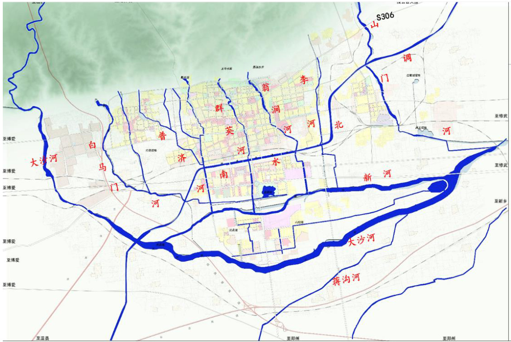  
图 2.1-1 山门河流域水系图  

# 2.1.3 水利工程情况  

河道上游山区内建有一座小型水库:青龙洞水库,位于修武县城西北西村乡上指匠村北 2 公里处,又名指匠水库,属于海河流域卫河水系,水库控制流域面积 $23\mathrm{km}^{2}$ ,总库容 53.6 万 $\mathrm{m}^{3}$ ,其中死库容 2 万 $\mathrm{m}^{3}$ ,兴利库容 42.00 万 $\mathrm{m}^{3}$ ,是一座综合利用的小(2)型水库。  

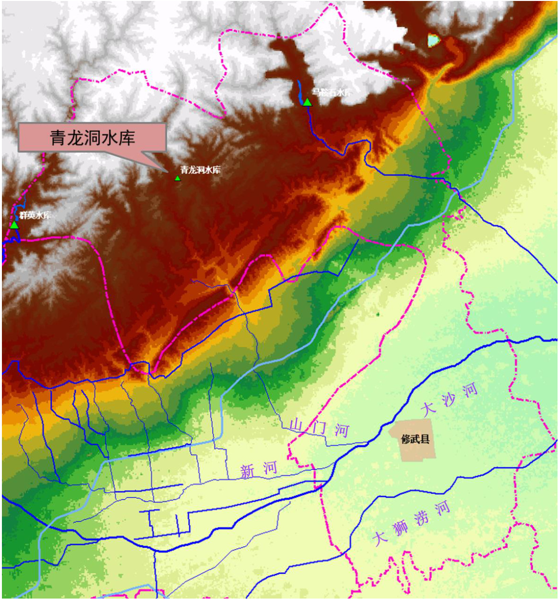  
图 2.1-2  青龙洞水库位置图  

# 2.2 河道概况  

山门河发源于山西省陵川县正河山,上游有大东河、田坪河、西村河三支流汇于小东村,南下出山,经马村、待王村东折向东南汇入大沙河。山门河在待王乡水彩村与南水北调中线工程总干渠相交,流域地势西北高、东南低,由西北向东南倾斜。  

山门河为大沙河左岸的一条主要支流,自出山口以下河道全场约 $18.0\mathrm{km}$ 。城镇段以北为山区河道,河床较宽,下切较深,河槽宽 $120\mathrm{m}{\sim}200\mathrm{m}$ ,槽深 $4.0\mathrm{m}{\sim}8.0\mathrm{m}$ ;城镇段现状河槽宽为 $25\mathrm{m}{\sim}70\mathrm{m}$ ,槽深 $2.0\mathrm{m}{\sim}8.0\mathrm{m}$ ;解放东路以南段逐渐进入平原区,河道缩窄,两岸堤防断续,堤身矮小。  

焦作市马村区曾对白庄段进行过中小河流治理,范围为马村区山门河大桥下游至待王铁路桥上游处。工程主要内容有:清淤、整治长 $2.66\mathrm{km}$ ,新建岸坡及护岸 $8.23\mathrm{km}$ (左岸 $4.01\mathrm{km}$ ,右岸 $4.22\mathrm{km}$ ),新建堤防及护坡 $0.42\mathrm{km}$ (左岸 $0.31\mathrm{km}$ ,右岸 $0.11\mathrm{km}$ )。  

# 2.3 水文特征  

# 2.3.1 气候特征  

项目区属暖温带大陆性季风气候,由于太行山的屏障作用和海拔高差的悬殊,气候有明显的地方特征,气候比较干燥,热量、水分、光能气候资源比较充足,春、夏、秋、冬四季分明,春季干旱多风,夏季炎热多雨,秋季昼暖夜凉,冬季寒冷干燥,平均年气温 $15.2^{\circ}\mathrm{C}$ ,平均最高气温 $20.6^{\circ}\mathrm{C}$ ,最低气温 $9.8^{\circ}\mathrm{C}$ ,极端最高气温 $43.3^{\circ}\mathrm{C}$ ,极端最低气温- $16.9^{\circ}\mathrm{C}$ ,全年有效积温 $4874.8^{\circ}\mathrm{C}$ ,年无霜期平均 231天,年平均日照 2422.7 小时,日照率为 $56\%$ ,多年平均降水量 $579.7\mathrm{mm}$ ,年降水量的 $70\%$ 集中在 6-9 月份。  

# 2.3.2 暴雨特征  

本区域暴雨主要由天气系统与地形条件结合所致。从暴雨普查资料看,产生暴雨的天气在 $700\mathrm{m}$ 高空,主要有台风、台风倒槽、东西向切变线和南北向切变线,断面天气系统主要是冷锋、气旋波和低压槽。从地形特点来看,本区域地势西北高东南低,西北部为太行山,东南部为平原,夏秋两季受太平洋副热带高压控制,多为东南风,暖湿气流行进过程中太行山的阻挡和抬升影响,易在山前迎风坡地带产生暴雨。暴雨主要发生在 7\~8 月,尤以 7 月下旬到 8 月上旬最为集中,从1953\~2003 年焦作气象站资料分析,最大 1 日降雨量为 265.5mm(1955 年 8 月 17日)。  

# 2.3.3 洪水特征  

山门河流域洪水均由暴雨形成,山区部分地形陡峻,坡度大,洪峰主要受短历时暴雨强度变化影响,洪水陡涨陡落,具有历时短、峰型尖瘦的特性,常造成严重的山洪灾害。自 1939 年至今共发生山洪灾害 9 次,平均 9 年发生一次,其中1970 年、1996 年、2000 年、2016 年、2021 年 5 次较为严重。  

2021 年 7 月 18 日 20 时到 22 日 15 时,焦作市持续出现强降雨,全市平均雨量 $416\mathrm{mm}$ 。其中市区 $546.8\mathrm{mm}$ ,修武 $568\mathrm{mm}$ ,武陟 $404.6\mathrm{mm}$ ,博爱 $399.1\mathrm{mm}$ ,温县 $330.6\mathrm{mm}$ ,沁阳 $310.6\mathrm{mm}$ ,孟州 $335.4\mathrm{mm}$ 。7 月 18 日 ${\sim}22$ 日全市四日降雨量( $416\mathrm{mm}$ )占全市多年平均降雨量( $1956{\sim}2016$ 年 $582.3\mathrm{mm})$ 的 $71.4\%$ ,市区四日降雨量( $546.8\mathrm{mm}$ )占市区多年平均降雨量( $1956{\sim}2016$ 年 $601.3\mathrm{mm}$ )的 $90.9\%$ 。  

全市 121 个雨量站中累计雨量绝大部分在 $300\mathrm{mm}$ 以上,超过 $400\mathrm{mm}$ 的有 52个,其中超过 $500\mathrm{mm}$ 的有 25 个。  

遭遇连续强降雨,导致大沙河流域河流水位上涨,水量增大,根据焦作市水文局对小尚站(巡测站)进行测量,自 7 月 21 日 10 时至 7 月 22 日 20 时,7 次测量流量均在 $330\mathrm{m}^{3}/\mathrm{s}$ 以上,最大流量发生在 7 月 21 日 13 时 13 分,为 $462\mathrm{m}^{3}/\mathrm{s}$ ,最大水深 $4.4\mathrm{m}$ ,最大流速 $5.53\mathrm{m}/\mathrm{s}$ 。  

为对比分析本次降雨导致的洪水强度问题,以本次搜集到的大沙河 6 个整编站资料作为分析,分别为南岭、黄围、玄坛庙、博爱、宁郭、焦作,为考虑与设计暴雨对比的一致性,此次以整编站实测雨量成果进行平均,作为 7 月份洪水面雨量成果,实测最大 24 小时面雨量过程见图 2.4-1,实测雨量成果见表 2.4-1。  

  
图 2.3-1 “21.7”大沙河流域面雨量过程图表 2.3-1 “21.7”洪水大沙河流域面雨量成果表  

<html><body><table><tr><td rowspan="2">控制断面</td><td rowspan="2">集水面积 (km²)</td><td colspan="4">不同频率设计面雨量（mm)</td></tr><tr><td>10min</td><td>1h</td><td>6h</td><td>24h</td></tr><tr><td>蒋沟河入口</td><td>932.9</td><td>8.0</td><td>30.7</td><td>75.7</td><td>189.8</td></tr></table></body></html>  

将“ $21.7"$ 面雨量成果与图集查算成果进行比较,本次 24 小时降雨已达到设计 50 年一遇面雨量 $186\mathrm{mm}$ 。整体来看,7 月 21 日降雨较为集中,累加后即形成比较大降雨。另外通过对比小尚站实测结果,本次“21.7”洪水最大洪峰流量仅为$462\mathrm{m}^{3}/\mathrm{s}$ 。分析造成以上雨量、洪峰与设计雨量、洪峰存在较大差异的原因主要因为:本次洪水流速较大,上游一些建筑物、桥梁等多数被冲毁,洪水有大量出槽漫溢现象,对测验影响较大。  

山门河流域上建有 2 座水位站,其中白庄水文站,1956 年设计,1966 年取消,建站时间较短。另一个五里堡水文站为巡测站,2013 年设站,仅大雨时临时测量,位于山门河下游右岸,焦作市修武县周庄镇五里堡村,监测项目有降水、水位、流量,监测方式为巡测,控制流域面积约 $137\mathrm{km}^{2}$ ,河流长度约 $41\mathrm{km}$ 。2021 年 7月 21 日 16:23 实测最大流量 $145\mathrm{m}^{3}/\mathrm{s}$ (相应水位 $93.17\mathrm{m}$ ),平均流速 $2.40\mathrm{m/s}$ ,根据五里堡处断面实测断面测算,河道最大过流能力为 $142\mathrm{m}^{3}/\mathrm{s}$ ,洪水漫出河道,造成较大洪涝灾害。  

2004 年 7 月河南省水利勘测设计院编制的《南水北调中线一期工程主干渠交叉河流水文分析报告(黄河北 $\sim$ 漳河南)》中,列出了与南水北调交叉河段的历史洪水调查成果。该成果是 1995 年 7 月省院为南水北调工程调查到山门河历史洪水,历史洪水年份为 1943 年,推算洪峰流量为 $1330\mathrm{m}^{3}/\mathrm{s}$ ,调查成果为较可靠。  

# 2.4  径流  

山门河属季节性河流,流域内无水文观测站。参照河南省水文水资源局 2007年 8 月编绘的《河南省水资源》,查算山门河平均径流深约 $90\mathrm{mm}$ 。  

# 2.5 设计洪水  

# 2.5.1 水文基本资料  

2012 年 7 月,河南省水利勘测设计研究有限公司编制完成《焦作市城区防洪规划报告》并通过专家评审,2021 年 12 月编制完成《焦作市修武县大沙河水毁修复工程可行性研究报告》,报告中采用的水文成果与《焦作市城区防洪规划报告》中成果一致。项目区设有南岭等 10 个雨量站,各站设于上世纪五十、六十年代,其中博爱、焦作、修武站为自记雨量站。  

山门河流域上建有 2 座水位站,其中白庄水文站,1956 年设计,1966 年取消,建站时间较短。另一个五里堡水文站为巡测站,2013 年设站,仅大雨时临时测量,位于山门河下游右岸,焦作市修武县周庄镇五里堡村,监测项目有降水、水位、流量,监测方式为巡测,控制流域面积约 $137\mathrm{km}^{2}$ ,河流长度约 $41\mathrm{km}$ 。五里堡水文站为巡测站,且遇大水时常漫滩行洪,大水时流量观测数据不准确,2021 年 7 月21 日 16:23 实测最大流量 $145\mathrm{m}^{3}/\mathrm{s}$ ,相应水位 $93.17\mathrm{m}$ ,此时河道左岸已漫滩行洪(河道左岸高程为 $92.35\mathrm{m}$ ),根据五里堡水文站断面处水位流量关系曲线推算此时流量大于 $309\mathrm{m}^{3}/\mathrm{s}$ 。  

大沙河下游有修武水文站,控制了新河、幸福河、蒋沟河、山门河汇流入大沙河之后的来水,该站测验断面左岸滩地宽 $1400\mathrm{m}$ ,种植农作物;下游 $1500\mathrm{m}$ 处有一座 1970 年修建的拦河闸,闸门启闭频繁,对测验影响较大。经多方考证,该站测验条件较差,本次未采用其实测流量资料进行设计洪水分析计算。  

《焦作市城区防洪规划报告》专家评审时,对水文有明确意见“鉴于现行水文分析计算成果有偏大的可能,应根据流域下垫面等条件用多种方法、多种途径进一步复核”。2014 年 10 月河南省水利勘测设计研究有限公司编制完成《焦作市南水北调防洪影响处理工程水文专题报告》。  

# 2.5.2 流域特征值  

根据 1/50000 地形图,量算治理河段各控制断面流域面积见表 2.5-1。  

表 2.5-1 山门河各控制断面流域特征值表  

<html><body><table><tr><td>控制断面</td><td>流域面积 (km²)</td><td>河长 (km)</td><td>比降</td></tr><tr><td>城区北部边界线以上</td><td>124.2</td><td>28.5</td><td>0.0225</td></tr><tr><td>中线交叉断面以上</td><td>139.8</td><td>33.5</td><td>0.0191</td></tr><tr><td>入大沙河口</td><td>165.5</td><td></td><td></td></tr></table></body></html>  

# 2.5.3 设计洪水计算方法  

# 2.5.3.1 设计洪水计算方法  

本次山门河各设计断面以上流域集水面积相对较小,缺乏实测流量资料,故采用河南省院 1984 年 10 月编制的《河南省中小流域设计暴雨洪水图集》(以下简称 84 图集)及河南省水文水资源局 2005 年 12 月编制的《河南省暴雨参数图集》(以下简称 05 图集)等有关图集由设计暴雨推求设计洪水。  

焦作市城区流域内地形由西北向东南倾斜,根据山门河下垫面特征及汇流特性划分为三片,即上游山丘区、总干渠以北城区和总干渠以南城区,按下述方法分别计算各分区设计洪水。  

(1)根据 1/万地形图和 1/1000 河势图量算查对,山门河在焦作市规划城区北部边界线,大体在焦辉路以北区域,地面高程在 $200\mathrm{m}$ 以上,河道比降在$0.020{\sim}0.047$ ,比降陡,属山丘区河流,故采用 1984 年图集中的推理公式法计算河道设计洪水。  

(2)山门河在规划城区北部边界线至总干渠之间和总干渠至入大沙河之间经用 1/1000 地形图查对,地面高程在 $200\mathrm{m}$ 以下,且地面、河底比降在 0.008 左右,比降较缓,属平原坡水区,故焦作市城区采用城区排水公式计算设计洪水,在计算参数选取上采用上限。  

# 2.5.3.2 青龙洞水库影响  

2011 年 4 月由河南华北水利水电勘察设计有限公司编制完成《河省修武县青龙洞水库除险加固工程初步设计报告》,通过评审并实施。其成果摘录如下:  

青龙洞水库位于修武县城西北西村乡上指匠村北 2 公里处,又名指匠水库,属于海河流域卫河水系,水库控制流域面积 $23\mathrm{km}^{2}$ ,总库容 53.6 万 $\mathrm{m}^{3}$ ,其中死库容 2 万 $\mathrm{m}^{3}$ ,兴利库容 42.00 万 $\mathrm{m}^{3}$ ,是一座综合利用的小(2)型水库。  

(1)青龙洞水库控制面积为 $23\mathrm{km}^{2}$ ,占治理段以上流域面积 $(157.9\mathrm{km}^{2})$ 的$14.6\%$ 。  

(2)青龙洞水库调洪库容较小,仅为 9.6 万 $\mathrm{m}^{3}$ ,削峰能力较弱,水库调洪能力成果见表 2.5-2。  

表 2.5-2  青龙洞水库调洪演算成果表  

<html><body><table><tr><td>重现期 （年）</td><td>洪峰流量 (m3/s)</td><td>下泄流量 (m?/s)</td><td>削峰能力 (%)</td></tr><tr><td>30</td><td>512.52</td><td>497.79</td><td>2.9</td></tr><tr><td>200</td><td>803.83</td><td>784.91</td><td>2.4</td></tr></table></body></html>  

综上所述,本次河道治理段设计洪水计算时,不考虑青龙洞水库的影响。  

# 2.5.4 设计暴雨  

本次规划分别采用 2005 年及 1984 年图集,对规划河流流域查算点雨量特征值,两图集成果见表 2.5-3。  

表 2.5-3 《84 图集》与《05 年图集》设计值比较表  雨量单位:mm  

<html><body><table><tr><td rowspan="3">项目</td><td colspan="4">“84图集"①</td><td colspan="4">“05图集"②</td><td colspan="4">(①-②)①×100</td></tr><tr><td>10 分钟</td><td>1 小时</td><td>6 小时</td><td>24</td><td>10</td><td>1</td><td>6</td><td>24</td><td>10</td><td>1</td><td>6</td><td>24</td></tr><tr><td>均值</td><td>15.9</td><td>41.9</td><td>66.9</td><td>小时 95</td><td>分钟 16.0</td><td>小时 41.9</td><td>小时 65</td><td>小时 95</td><td>分钟 -0.6</td><td>小时 0.0</td><td>小时 2.8</td><td>小时 0.0</td></tr><tr><td>Cv</td><td>0.47</td><td>0.55</td><td>0.64</td><td>0.58</td><td>0.45</td><td>0.5</td><td>0.64</td><td>0.6</td><td></td><td></td><td></td><td></td></tr><tr><td>CS/Cv</td><td>3.5</td><td>3.5</td><td>3.5</td><td>3.5</td><td>3.5</td><td>3.5</td><td>3.5</td><td>3.5</td><td></td><td></td><td></td><td></td></tr><tr><td>点面折 减系数</td><td>1</td><td>0.825</td><td>0.845</td><td>0.868</td><td>1</td><td>0.825</td><td>0.845</td><td>0.868</td><td></td><td></td><td></td><td></td></tr><tr><td>20%</td><td>20.9</td><td>46.4</td><td>77.1</td><td>111.3</td><td>20.9</td><td>45.9</td><td>74.9</td><td>111.7</td><td>0.0</td><td>1.1</td><td>2.9</td><td>-0.4</td></tr><tr><td>5%</td><td>30.6</td><td>72.5</td><td>129.2</td><td>177.9</td><td>30.0</td><td>68.8</td><td>125.5</td><td>181.4</td><td>2.0</td><td>5.1</td><td>2.9</td><td>-2.0</td></tr><tr><td>2%</td><td>36.8</td><td>89.5</td><td>164.5</td><td>222.1</td><td>35.9</td><td>83.6</td><td>159.8</td><td>228</td><td>2.4</td><td>6.6</td><td>2.9</td><td>-2.7</td></tr></table></body></html>  

经比较,根据两图集计算的设计暴雨较为接近,但与《84 图集》相比,《05图集》采用的资料系列为 1951 年\~2000 年,系列延长近 1 倍,并增加了 3 天暴雨统计参数资料,根据《水利水电工程设计洪水计算规范》(SL44-2006)的有关规定,参照《水利水电工程设计洪水计算手册》(水利水电出版社,1995)的有关方法,充分运用了以地理信息系统等计算机技术,采用了目前我省暴雨方面最全面最系统的研究成果,适用于全省 $1000{\mathrm{km}}^{2}$ 以下的中小流域暴雨洪水计算,广泛用于无流量观测资料地区的中小河流、水库、交通桥涵、城镇工矿防洪工程的设计洪水计算。  

采用 05 图集,对规划河流流域查算点雨量特征值, 由豫北山丘区暴雨点面深关系查算点面系数,成果见表表 2.5-4。  

表 2.5-4  设计面雨量成果表  

<html><body><table><tr><td>项目</td><td>10分钟</td><td>1小时</td><td>6小时</td><td>24小时</td></tr><tr><td>点雨量(mm)</td><td>16</td><td>41.9</td><td>65</td><td>95</td></tr><tr><td>Cv</td><td>0.45</td><td>0.5</td><td>0.64</td><td>0.6</td></tr><tr><td>Cs/Cv</td><td>3.5</td><td>3.5</td><td>3.5</td><td>3.5</td></tr><tr><td>点面折减系数</td><td>1</td><td>0.825</td><td>0.845</td><td>0.868</td></tr></table></body></html>  

<html><body><table><tr><td>20%面雨量(mm)</td><td>20.9</td><td>45.9</td><td>74.9</td><td>111.7</td></tr><tr><td>10%面雨量(mm)</td><td>25.6</td><td>57.4</td><td>100</td><td>146.4</td></tr><tr><td>5%面雨量(mm)</td><td>30.1</td><td>68.8</td><td>125.5</td><td>181.4</td></tr><tr><td>2%面雨量(mm)</td><td>35.9</td><td>83.6</td><td>159.8</td><td>228</td></tr><tr><td>1%面雨量(mm)</td><td>40.3</td><td>94.6</td><td>186</td><td>263.3</td></tr></table></body></html>  

# 2.5.5 设计净雨计算  

焦作城区北部边界以北山丘区,采用84 图集中山丘区次降雨径流关系 $\scriptstyle\mathrm{P+Pa{\sim}R}$ (Ⅵ)线查算,流域最大初损值 $\operatorname{Imax}{=}60\mathrm{mm}$ ,50 年一遇以上暴雨 $\mathrm{Pa}{=}\mathrm{Imax}{=}60\mathrm{mm}$ ,20 年一遇暴雨 $\mathrm{Pa}{=}4/5\mathrm{I_{\mathrm{max}}}$ ,10 年一遇暴雨 $\mathrm{Pa}{=}4/5\mathrm{I_{\mathrm{max}}}$ ,5 年以下 $\mathrm{Pa}{=}2/5\mathrm{I_{max}}$ ;焦作北部山丘区 $\sim.$ 大沙河区间属焦作市城区,设计净雨根据设计暴雨和径流系数计算,各河设计净雨成果见表 2.5-5。  

表 2.5-5  各河新河以上各分区设计净雨成果表  单位:mm  

<html><body><table><tr><td>区片名</td><td>频率</td><td>20%</td><td>10%</td><td>5%</td><td>2%</td><td>1%</td></tr><tr><td rowspan="4">北部山丘区</td><td>P</td><td>111.7</td><td>146.4</td><td>181.4</td><td>228</td><td>263.3</td></tr><tr><td>Pa</td><td>24</td><td>48</td><td>48</td><td>60</td><td>60</td></tr><tr><td>P+Pa</td><td>135.7</td><td>194.4</td><td>229.4</td><td>288</td><td>323.3</td></tr><tr><td>R</td><td>44.6</td><td>85.8</td><td>111.8</td><td>160.1</td><td>190.5</td></tr><tr><td rowspan="3">山丘区-总干 渠区间城区 片</td><td>P</td><td>128.7</td><td>168.7</td><td>209.0</td><td>262.7</td><td>303.4</td></tr><tr><td>P</td><td>0.80</td><td>0.80</td><td>0.80</td><td>0.80</td><td>0.80</td></tr><tr><td>R</td><td>103.0</td><td>135.0</td><td>167.2</td><td>210.2</td><td>242.7</td></tr><tr><td rowspan="3">总干渠-河口 区间城区片</td><td>P</td><td>128.7</td><td>168.7</td><td>209.0</td><td>262.7</td><td>303.4</td></tr><tr><td>P</td><td>0.65</td><td>0.65</td><td>0.65</td><td>0.65</td><td>0.65</td></tr><tr><td>R</td><td>83.7</td><td>109.7</td><td>135.9</td><td>170.8</td><td>197.2</td></tr></table></body></html>  

# 2.5.6 设计洪水计算  

# 2.5.6.1 设计洪峰计算  

(1)北部山丘区山门河焦作市城区以北属山丘区河流,且集水面积在 $200\mathrm{km}^{2}$ 以下,采用推理  

公式法计算洪峰流量。  

计算式如下:  

$$
\begin{array}{l}{{Q_{m}=0.278\psi{\displaystyle\frac{S}{\tau^{n}}}F}}\ {{\psi=1-{\displaystyle\frac{\mu}{S}}\tau^{n}}}\ {{\tau=0.278{\displaystyle\frac{L}{m J^{1/3}Q_{m}^{1/4}}}}}\end{array}
$$  

式中: $\mathrm{Q}_{\mathrm{m}}$ —设计洪峰流量( $(\mathrm{m}^{3}/\mathrm{s})$ );  

$\Psi.$ —洪峰径流系数;τ—洪峰汇流历时(h);F—流域面积( $\mathrm{km}^{2}$ );L—干流长度(km);J—L 的平均坡度;S—设计最大 1 小时雨量平均强度( $\mathrm{mm/h)}$ );μ—平均入渗率( $\mathrm{mm/h)}$ ;m—汇流参数;n—设计暴雨递减指数,当 $\tau{<}1$ 小时,代入 $\mathbf{n}_{1}$ , $\tau{=}1{\sim}6$ 小时代入 $\mathbf{n}_{2}$ ,$\tau{=}6{\sim}24$ 小时代入 n3。  

上式中平均入渗强度 $\upmu{=}7.5\mathrm{mm/h}$ ,汇流参数 $\mathrm{m}$ 值可由《水利水电工程设计洪水计算规范》(SL44-2006)附录B,表B.2.2 小流域下垫面条件分类表查得, $\scriptstyle{\Theta=\mathrm{L}/\mathrm{J}^{1/3}}$ 。  

(2)焦作市城区至入大沙河口  

山门河在焦作市北部边界 $\sim$ 总干渠和总干渠 $\sim_{,}$ 入大沙河口属平原区。各区片设计洪峰流量采用排水模数公式计算。计算式如下:  

$$
Q_{m}=\mathbf{K}\cdot\mathbf{R}\cdot\mathbf{F}^{0.75}
$$  

式中: $\mathrm{Q}_{\mathrm{m}}$ —洪峰流量 $(\mathrm m^{3}/\mathrm s)$ ;R—设计净雨深( $\mathrm{mm}$ ), ${\bf R}=\varphi\cdot{\bf p}$ 即设计暴雨乘以径流系数;F—流域面积( $\mathrm{km}^{2}$ );K—峰量关系综合系数,根据各河河道的具体情况选取,本次出山\~总干渠区间取 0.05,总干渠\~入河口区间取 0.045。  

# 2.5.6.2 设计洪量计算  

根据查算的 24 小时各种频率设计净雨量,乘以流域面积得到各区片设计洪水  

总量。  

24 小时设计洪量用下式计算:  

$$
\mathrm{W}_{24}{=}1000\mathrm{RF}
$$  

式中:R—为 24 小时净雨深(mm);F—为流域面积( $\mathrm{km}^{2}.$ )。  

山门河各区片设计洪峰流量、洪量计算成果见表 2.5-6。  

<html><body><table><tr><td>河名</td><td>分区</td><td>项目</td><td>20%</td><td>10%</td><td>5%</td><td>2%</td><td>1%</td></tr><tr><td rowspan="5">山 门 河</td><td rowspan="2">山丘区</td><td>Qm (m3/s)</td><td>356</td><td>631</td><td>912</td><td>1290</td><td>1568</td></tr><tr><td>W24（万 m3)</td><td>555</td><td>1066</td><td>1388</td><td>1988</td><td>2366</td></tr><tr><td rowspan="2">城区 出山口至总干渠</td><td>Qm (m3/s)</td><td>40</td><td>53</td><td>66</td><td>82</td><td>95</td></tr><tr><td>W24（万m3)</td><td>161</td><td>211</td><td>261</td><td>328</td><td>379</td></tr><tr><td rowspan="2">城区 总干渠至入大沙河 口</td><td>Qm (m²/s)</td><td>59</td><td>77</td><td>96</td><td>120</td><td>138</td></tr><tr><td>W24（万m3)</td><td>215</td><td>282</td><td>349</td><td>439</td><td>507</td></tr></table></body></html>  

# 2.5.6.3 洪水过程线  

(1)北部山丘区  

北部山丘区段洪水过程线采用三角形概化过程线叠加法计算,具体步骤如下:  

1)根据 24 小时暴雨时程分配表计算逐时降雨量,用扣损法计算逐时净雨量。2)将设计洪峰(主峰)的 $\mathrm{Q}_{\mathrm{m}}$ 和 $\tau$ ,对应 $\tau$ 时段的最大平均净雨强度,绘出概化等腰三角形,其顶高为 $\mathrm{Q}_{\mathrm{m}}$ ,底宽为 $2\uptau$ 。3)列表计算出主峰 $\tau$ 前后各个 $\tau$ 时段的净雨量 $\mathrm{R}_{\mathrm{{}}}$ ,按下式计算各个 $\tau$ 时段的洪峰流量, $\mathrm{Q}\mathrm{=}0.278\mathrm{R}\tau/\tau\times\mathrm{F}$ ,按等腰三角形对应于净雨过程绘于图上,叠加绘出24 小时洪水过程线。  

根据上述设计洪水过程线计算方法得山门河山丘区河段设计洪水过程线见表2.5-7。  

表 2.5-6  山门河各区片设计洪峰、洪量成果表  
表 2.5-7  山门河山丘区河段设计洪水过程线成果表  单位: $\mathrm{m}^{3}/\mathrm{s}$   

<html><body><table><tr><td>时段 (h)</td><td>20%</td><td>10%</td><td>5%</td><td>2%</td><td>1%</td></tr><tr><td>1</td><td>0</td><td>0</td><td>0</td><td>0</td><td>0</td></tr></table></body></html>  

<html><body><table><tr><td></td><td>0</td><td></td><td>0</td><td>0</td><td>1</td></tr><tr><td>2</td><td></td><td>0 0</td><td>0</td><td>0</td><td>1</td></tr><tr><td>3 4</td><td>0 0</td><td>0</td><td>0</td><td>0</td><td>1</td></tr><tr><td>5</td><td>0</td><td>0</td><td>0</td><td>0</td><td>1</td></tr><tr><td>6</td><td>0</td><td>0</td><td>0</td><td>6</td><td>11</td></tr><tr><td>7</td><td>0</td><td>1</td><td>0</td><td>12</td><td>21</td></tr><tr><td>8</td><td>0</td><td>3</td><td>6</td><td>19</td><td>31</td></tr><tr><td>6</td><td>0</td><td>4</td><td>11</td><td>48</td><td>53</td></tr><tr><td>10</td><td>0</td><td>6</td><td>17</td><td>78</td><td>75</td></tr><tr><td>11</td><td>0</td><td>70</td><td>78</td><td>165</td><td>98</td></tr><tr><td>12</td><td></td><td>134</td><td>139</td><td></td><td></td></tr><tr><td>13</td><td>0</td><td></td><td></td><td>252</td><td>251</td></tr><tr><td>14</td><td>99</td><td>199 343</td><td>200</td><td>339</td><td>405</td></tr><tr><td>15</td><td>197</td><td>487</td><td>437 675</td><td>656 973</td><td>792</td></tr><tr><td>16</td><td>296</td><td>631</td><td>912</td><td></td><td>1180</td></tr><tr><td>17</td><td>356 296</td><td>470</td><td>657</td><td>1290 798</td><td>1568</td></tr><tr><td>18</td><td>197</td><td>309</td><td>401</td><td>306</td><td>975 383</td></tr><tr><td>19</td><td>99</td><td>147</td><td>146</td><td>228</td><td>286</td></tr><tr><td>20</td><td>0</td><td>99</td><td>101</td><td>151</td><td>190</td></tr><tr><td>21</td><td>0</td><td>51</td><td>56</td><td>73</td><td>94</td></tr><tr><td>22</td><td>0</td><td>3</td><td>10</td><td>56</td><td>65</td></tr><tr><td>23</td><td>0</td><td>2</td><td>7</td><td>38</td><td>36</td></tr><tr><td>24</td><td>0</td><td>1</td><td>3</td><td>20</td><td>26</td></tr><tr><td>25</td><td>0</td><td>1</td><td>0</td><td>11</td><td>16</td></tr><tr><td>26</td><td></td><td></td><td></td><td></td><td></td></tr><tr><td></td><td>0</td><td>0</td><td>0</td><td>1</td><td>6</td></tr><tr><td>27</td><td>0</td><td>0</td><td>0</td><td>1</td><td>4</td></tr><tr><td>28</td><td>0</td><td>0</td><td>0</td><td>0</td><td>2</td></tr></table></body></html>  

(2)北部边界至总干渠和总干渠至新河区间  

焦作市城区地势较平坦,设计洪水采用 1966 年《河南省豫北平原地区排涝水文计算报告》中概化过程线公式计算,计算式如下:  

$$
\mathbf{Q}_{\mathrm{i}}=\mathbf{x}\cdot\mathbf{Q}_{\mathrm{m}}
$$  

$$
\mathrm{T_{i}}=\mathbf{y}\cdot\mathrm{T}
$$  

$$
\mathbf{T}=0.278\frac{\mathbf{R}\cdot\mathbf{F}}{\omega\cdot\mathbf{Q}_{\mathrm{m}}}
$$  

式中: $\mathrm{Q}_{\mathrm{m}}-$ 设计洪峰流量( $(\mathrm{m}^{3}/\mathrm{s})$ );  

x、y—概化过程线纵、横坐标 $(\%)$ ;  
$\omega$ —面积系数,选用 0.40;  
T—过程线底宽(h)。  

概化过程线纵、横坐标值见表 2.5-8,平原区设计洪水过程线见表 2.5-9 和2.5-10。  

表 2.5-8 概化过程线纵横坐标值  

<html><body><table><tr><td>X (%)</td><td>0</td><td>10</td><td>20</td><td>40</td><td>60</td><td>80</td><td>90</td><td>100</td><td>90</td><td>80</td><td>60</td><td>40</td><td>20</td><td>10</td><td>0</td></tr><tr><td>Y (%)</td><td>0</td><td>3</td><td>5.5</td><td>8</td><td>9.5</td><td>11</td><td>12</td><td>17.5</td><td>27.5</td><td>32</td><td>41</td><td>50</td><td>64.5</td><td>76</td><td>100</td></tr></table></body></html>  

# 表 2.5-9  山门河处山口至南水北调干渠区间河段设计洪水过程线成果  

表  单位: $\mathrm{m}^{3}/\mathrm{s}$   

<html><body><table><tr><td>时段 (h)</td><td>20% 10%</td><td>5%</td><td>2%</td><td>1%</td></tr><tr><td>0</td><td>0 0</td><td>0</td><td>0</td><td>0</td></tr><tr><td>1</td><td>4.9 6.5</td><td>8</td><td>10.1</td><td>11.6</td></tr><tr><td>2</td><td>12.9 16.9</td><td>20.9</td><td>26.2</td><td>30.3</td></tr><tr><td>3</td><td>31.1 40.8</td><td>50.5</td><td>63.5</td><td>73.3</td></tr><tr><td>4</td><td>37.4 49</td><td>60.8</td><td>76.4</td><td>88.2</td></tr><tr><td>5</td><td>40.4 53</td><td>65.6</td><td>82.5</td><td>95.3</td></tr><tr><td>6</td><td>38 49.8</td><td>61.7</td><td>77.5</td><td>89.5</td></tr><tr><td>7</td><td>36.6 47.9</td><td>59.4</td><td>74.6</td><td>86.1</td></tr><tr><td>8</td><td>34.4 45.1</td><td>55.9</td><td>70.2</td><td>81.1</td></tr><tr><td>6</td><td>31.1 40.8</td><td>50.6</td><td>63.6</td><td>73.4</td></tr><tr><td>10</td><td>27.6 36.2</td><td>44.8</td><td>56.3</td><td>65</td></tr><tr><td>11</td><td>24.7 32.4</td><td>40.2</td><td>50.5</td><td>58.3</td></tr><tr><td>12</td><td>21.9 28.7</td><td>35.5</td><td>44.6</td><td>51.5</td></tr><tr><td>13</td><td>18.8 24.6</td><td>30.5</td><td>38.3</td><td>44.3</td></tr><tr><td>14</td><td>15.6 20.4</td><td>25.3</td><td>31.8</td><td>36.7</td></tr><tr><td>15</td><td>14.2 18.6</td><td>23</td><td>28.9</td><td>33.4</td></tr><tr><td>16</td><td>12.7 16.7</td><td>20.7</td><td>25.9</td><td>30</td></tr><tr><td>17</td><td>10.5 13.8</td><td>17.1</td><td>21.5</td><td>24.8</td></tr><tr><td>18</td><td>7.7 10.1</td><td>12.5</td><td>15.7</td><td>18.2</td></tr><tr><td>19</td><td>6.5 8.5</td><td>10.5</td><td>13.2</td><td>15.2</td></tr><tr><td>20</td><td>5.2 6.8</td><td>8.5</td><td>10.6</td><td>12.3</td></tr><tr><td>21</td><td>4 5.2</td><td>6.4</td><td>8.1</td><td>9.3</td></tr><tr><td>22</td><td>3.4 4.4</td><td>5.5</td><td>6.9</td><td>7.9</td></tr><tr><td>23</td><td>2.8 3.6</td><td>4.5</td><td>5.6</td><td>6.5</td></tr><tr><td>24</td><td>2.2 2.8</td><td>3.5</td><td>4.4</td><td>5.1</td></tr><tr><td>25</td><td>1.6 2.1</td><td>2.5</td><td>3.2</td><td>3.7</td></tr><tr><td>26</td><td>1 1.3</td><td>1.6</td><td>2</td><td>2.3</td></tr></table></body></html>  

<html><body><table><tr><td>27</td><td>0.4</td><td>0.5</td><td>0.6</td><td>0.8</td><td>0.9</td></tr><tr><td>28</td><td>0</td><td>0</td><td>0</td><td>0</td><td>0</td></tr></table></body></html>  

表 2.5-10  南水北调干渠至入沙河口区间河段设计洪水过程线成果表  单位: $\mathrm{m}^{3}/\mathrm{s}$  

<html><body><table><tr><td>时段 (h)</td><td>20%</td><td>10%</td><td>5%</td><td>2%</td><td>1%</td></tr><tr><td>0</td><td>0</td><td>0</td><td>0</td><td>0</td><td>0</td></tr><tr><td>1</td><td>6.2</td><td>8.1</td><td>10.1</td><td>12.6</td><td>14.6</td></tr><tr><td>2</td><td>14.9</td><td>19.6</td><td>24.2</td><td>30.5</td><td>35.2</td></tr><tr><td>3</td><td>35.6</td><td>46.6</td><td>57.8</td><td>72.6</td><td>83.9</td></tr><tr><td>4</td><td>52.6</td><td>68.9</td><td>85.4</td><td>107.3</td><td>123.9</td></tr><tr><td>5</td><td>55.9</td><td>73.3</td><td>90.8</td><td>114.1</td><td>131.8</td></tr><tr><td>6</td><td>58.8</td><td>77</td><td>95.5</td><td>119.9</td><td>138.5</td></tr><tr><td>7</td><td>54.8</td><td>71.9</td><td>89</td><td>111.9</td><td>129.2</td></tr><tr><td>8</td><td>53</td><td>69.5</td><td>86</td><td>108.1</td><td>124.9</td></tr><tr><td>9</td><td>50.3</td><td>65.9</td><td>81.6</td><td>102.5</td><td>118.4</td></tr><tr><td>10</td><td>46.1</td><td>60.5</td><td>74.9</td><td>94.1</td><td>108.7</td></tr><tr><td>11</td><td>41.6</td><td>54.5</td><td>67.5</td><td>84.8</td><td>98</td></tr><tr><td>12</td><td>37.6</td><td>49.3</td><td>61.1</td><td>76.8</td><td>88.7</td></tr><tr><td>13</td><td>33.9</td><td>44.5</td><td>55.1</td><td>69.3</td><td>80</td></tr><tr><td>14</td><td>30.3</td><td>39.7</td><td>49.2</td><td>61.8</td><td>71.4</td></tr><tr><td>15</td><td>26</td><td>34.1</td><td>42.3</td><td>53.1</td><td>61.4</td></tr><tr><td>16</td><td>22.4</td><td>29.4</td><td>36.4</td><td>45.7</td><td>52.8</td></tr><tr><td>17</td><td>20.6</td><td>27</td><td>33.4</td><td>42</td><td>48.5</td></tr><tr><td>18</td><td>18.7</td><td>24.5</td><td>30.4</td><td>38.2</td><td>44.1</td></tr><tr><td>19</td><td>16.4</td><td>21.5</td><td>26.6</td><td>33.4</td><td>38.6</td></tr><tr><td>20</td><td>12.3</td><td>16.1</td><td>20</td><td>25.1</td><td>29</td></tr><tr><td>21</td><td>10.2</td><td>13.4</td><td>16.6</td><td>20.9</td><td>24.1</td></tr><tr><td>22</td><td>8.6</td><td>11.3</td><td>14</td><td>17.6</td><td>20.3</td></tr><tr><td>23</td><td>7</td><td>9.2</td><td>11.4</td><td>14.3</td><td>16.6</td></tr><tr><td>24</td><td>5.6</td><td>7.3</td><td>9.1</td><td>11.4</td><td>13.2</td></tr><tr><td>25</td><td>4.8</td><td>6.3</td><td>7.9</td><td>9.9</td><td>11.4</td></tr></table></body></html>  

<html><body><table><tr><td>时段 (h)</td><td>20%</td><td>10%</td><td>5%</td><td>2%</td><td>1%</td></tr><tr><td>26</td><td>4.1</td><td>5.3</td><td>6.6</td><td>8.3</td><td>9.6</td></tr><tr><td>27</td><td>3.3</td><td>4.3</td><td>5.4</td><td>6.7</td><td>7.8</td></tr><tr><td>28</td><td>2.5</td><td>3.3</td><td>4.1</td><td>5.2</td><td>6</td></tr><tr><td>29</td><td>1.8</td><td>2.3</td><td>2.9</td><td>3.6</td><td>4.2</td></tr><tr><td>30</td><td>1</td><td>1.3</td><td>1.6</td><td>2</td><td>2.4</td></tr><tr><td>31</td><td>0.2</td><td>0.3</td><td>0.4</td><td>0.5</td><td>0.5</td></tr><tr><td>32</td><td>0</td><td>0</td><td>0</td><td>0</td><td>0</td></tr><tr><td>33</td><td>0</td><td>0</td><td>0</td><td>0</td><td>0</td></tr></table></body></html>  

# 2.5.6.4 设计洪水成果  

山门河北区出山口处(S306 处)设计洪水采用推理公式法计算成果;总干渠处设计洪水为上游山丘区设计洪水过程线错传播时间 1h 与山丘区 $\sim.$ 总干渠区间设计洪水过程线叠加而得;入大沙河口处设计洪水为总干渠设计洪水过程错 2h 传播时间与总干渠\~大沙河区间洪水过程线叠加而得。  

表 2.5-11 山门河各控制断面设计洪水成果  

<html><body><table><tr><td rowspan="2">控制断面</td><td colspan="5">本次成果洪峰流量(m²/s)</td></tr><tr><td>20%</td><td>10%</td><td>5%</td><td>2%</td><td>1%</td></tr><tr><td>北部出山口（S306处)</td><td>356</td><td>631</td><td>912</td><td>1290</td><td>1568</td></tr><tr><td>南水北调处</td><td>367</td><td>645</td><td>929</td><td>1312</td><td>1593</td></tr><tr><td>入大沙河处</td><td>385</td><td>669</td><td>960</td><td>1350</td><td>1637</td></tr></table></body></html>  

# 2.5.6.5 成果的合理性分析  

将本次计算的总干渠处 50 年一遇设计洪水与南水北调工程总干渠交叉断面成果、历史洪水调查成果以及《焦作市南水北调防洪影响处理工程水文专题报告》中成果比较。  

(1)与南水北调工程总干渠交叉断面成果比较  

以往计算得南水北调工程总干渠交叉断面 50 年一遇设计洪水为 $1630\mathrm{m}^{3}/\mathrm{s}$ ,本次计算的 50 年一遇设计洪峰流量比总干渠交叉断面设计流量偏小 $19.5\%$ ,这是因为南水北调工程交叉断面以上设计洪水全部按山丘区推理公式计算,南水北调工程涉及河流众多,不仅考虑局部的合理性,而且还要考虑大区域的协调;本次结合实际地形分上游山丘区和城区平原坡水区两部分计算,山丘区仍采用 84 图集推理公式计算,城区平原坡水区采用排水公式计算。在计算方法上本次考虑了城区和城区的地形实际,一方面城区由西北向东南倾斜,地面高程在 $200\mathrm{m}$ 以下,地形比较平整、河道比降缓,与山丘区地形明显不同,不利于产汇流;二是各条河流流域形状为条状,不利于造峰,因此本次将城区划分为平原区计算更符合实际情况。  

(2)与历史洪水调查成果比较  

山门河较大历史洪水发生在 1943 年,距今已 70 年,调查洪峰流量为 $1330\mathrm{m}^{3}/\mathrm{s}$ 。本次山门河总干渠交叉断面 50、100 年一遇设计洪峰流量分别为 $1312\mathrm{m}^{3}/\mathrm{s}$ 、 $1593\mathrm{m}^{3}/\mathrm{s}$ ,基本协调。  

(3)与《焦作市南水北调防洪影响处理工程水文专题报告》比较  

为解决普遍认为以往南水北调工程总干渠交叉断面设计洪水成果较大问题,2014年 10 月焦作市水利局委托河南省水利勘测设计研究有限公司编制完成了《焦作市南水北调防洪影响处理工程水文专题报告》:“根据河道现状,采用不同方法,综合分析了焦作市白马门河、普济河、群英河、瓮涧河等设计洪水,其成果比南水北调成果 50 年一遇设计洪水偏小 $30\%$ 左右”。各相邻流域洪峰模数对比见表 2.5-12。  

表 2.5-12 山门河相邻流域洪峰模数比较表  

<html><body><table><tr><td>河流名称</td><td>流域面积</td><td>20%</td><td>5%</td><td>2%</td><td>1%</td></tr></table></body></html>  

<html><body><table><tr><td></td><td>F</td><td>Qm</td><td>Qm/F0.75</td><td>Qm</td><td>Qm/F0.75</td><td>Qm</td><td>Qm/F0.75</td><td>Qm</td><td>Qm/F0.75</td></tr><tr><td>白马门河</td><td>61.5</td><td>259</td><td>11.8</td><td>528</td><td>24.0</td><td>698</td><td>31.8</td><td>828</td><td>37.7</td></tr><tr><td>普济河</td><td>29.4</td><td>195</td><td>15.4</td><td>395</td><td>31.3</td><td>537</td><td>42.5</td><td>644</td><td>51.0</td></tr><tr><td>群英河</td><td>36.5</td><td>171</td><td>11.5</td><td>352</td><td>23.7</td><td>475</td><td>32.0</td><td>569</td><td>38.3</td></tr><tr><td>翁涧河</td><td>37.7</td><td>180</td><td>11.8</td><td>372</td><td>24.5</td><td>501</td><td>32.9</td><td>587</td><td>38.6</td></tr><tr><td>山门河南水北 调干渠处</td><td>139.8</td><td>367</td><td>9.0</td><td>929</td><td>22.8</td><td>1312</td><td>32.3</td><td>1593</td><td>39.2</td></tr></table></body></html>  

从洪峰模数成果表比较看,山门河流域南水北调干渠处各频率设计洪水洪峰模数与相邻流域基本一致,说明本次设计洪水成果基本合理。  

综上所述,根据山门河下垫面特征及汇流特性,分上游山丘区和城区平原坡水区两部分计算,计算成果更切合实际。设计洪水成果与历史调查洪水及相邻流域设计洪水成果基本协调,因此本次计算成果是合适的。  

# 2.5.7 施工期洪水计算  

山门河属季节性河流,本治理河段主要在非汛期施工,施工洪水采用非汛期(10月至次年 5 月)5 年一遇洪峰流量。  

《南水北调中线一期工程总干渠黄河北\~羑河北初步设计报告》(第 1 段温博段)中曾对大沙河鹿村断面的非汛期设计洪水进行了计算,采用的方法是根据鹿村断面以上集流面积,通过黄河以北单站实测资料分析综合的各施工期三种频率的洪峰流量与流域面积关系线查得:鹿村断面控制流域面积 $400\mathrm{km}^{2}$ ,非汛期(10 月至次年 5 月)5 年一遇洪峰流量为 $10\mathrm{m}^{3}/\mathrm{s}$ 。按山门河与中线交叉断面控制流域面积( $139.8\mathrm{km}^{2}$ ),类比得山门河河道治理工程非汛期(10 月至次年 5 月)5 年一遇洪峰流量为 $4.5\mathrm{m}^{3}/\mathrm{s}$ 。  

# 2.6  泥沙  

山门河流域内无实测泥沙资料,根据河南省水蚀模数分区图,此区域年输沙量模数为 $200{\sim}500(\mathrm{t}/\mathrm{km}^{2}{\cdot}\mathbf{a})$ ),对比分析《南水北调中线一期工程总干渠交叉河流水文分析报告(黄河北 $\sim$ 漳河南)》报告中成果,山门河流域输沙量模数为 300( $\mathbf{\chi}_{\mathrm{t/km}}\mathbf{\chi}^{2}\bullet\mathbf{a}.$ ),两者基本一致,本次输沙量模数为 300( $\mathrm{t/km}^{2}{\bullet}\mathrm{a}$ )进行分析计算,年泥沙总量为 6.0 万 t。具体见表 2.6-1。  

表 2.6-1 山门河流域泥沙计算成果表  

<html><body><table><tr><td>河流</td><td>面积</td><td>悬移质</td><td>推移质</td><td>泥沙总量</td></tr></table></body></html>  

<html><body><table><tr><td></td><td>(km²)</td><td>输沙量模数 (t/km²·a)</td><td>年输沙 量(万t)</td><td>推悬比</td><td>年输沙量 （万t)</td><td>（万t)</td></tr><tr><td>山门河</td><td>165.5</td><td>300</td><td>5.0</td><td>0.20</td><td>1.0</td><td>6.0</td></tr></table></body></html>  

# 2.7  水面蒸发  

项目区水面蒸发受湿度和温度变化影响,年内最大水面蒸发量主要发生在 5\~8 月,最大连续四个月的水面蒸发量一般占年总量的 $43.8\%$ 左右,在地区分布上比较稳定。最大蒸发量大部分出现在 6 月,最小蒸发量一般出现在 1 月。项目区多年平均水面蒸发量为 $1231\mathrm{mm}$ 。多年平均水面蒸发年内分配见表 2.6-1。  

表 2.6-1 水面蒸发年内分配表  

<html><body><table><tr><td>月份</td><td>1月</td><td>2月</td><td>3月</td><td>4月</td><td>5月</td><td>6月</td><td>2月</td><td>3月</td><td>4月</td><td>5月</td></tr><tr><td>水面蒸发量(mm)</td><td>43.0</td><td>41.0</td><td>88.3</td><td>102.1</td><td>175.4</td><td>186.6</td><td>41.0</td><td>88.3</td><td>102.1</td><td>175.4</td></tr><tr><td>比例 (%)</td><td>3.49</td><td>3.33</td><td>7.18</td><td>8.29</td><td>14.25</td><td>15.16</td><td>3.33</td><td>7.18</td><td>8.29</td><td>14.25</td></tr><tr><td>月份</td><td>7月</td><td>8月</td><td>9月</td><td>10月</td><td>11月</td><td>12月</td><td>8月</td><td>9月</td><td>10月</td><td>11月</td></tr><tr><td>水面蒸发量(mm)</td><td>160.1</td><td>139.0</td><td>88.0</td><td>90.2</td><td>63.3</td><td>53.7</td><td>139.0</td><td>88.0</td><td>90.2</td><td>63.3</td></tr><tr><td>比例 (%)</td><td>13.01</td><td>11.29</td><td>7.15</td><td>7.33</td><td>5.14</td><td>4.36</td><td>11.29</td><td>7.15</td><td>7.33</td><td>5.14</td></tr></table></body></html>  

# 2.8  冰情  

此次山门河治理段位于修武县境内,冰情观测资料较少。  

临近河流沁河武陟(小董)水文站有 1950 年\~1976 年 26 年的冰情观测资料和部分年份的冰厚资料。沁河河道冰情最早初冰日期为 11 月 12 日,最晚初冰日期为 1 月 11日,最早终冰日期为 1 月 26 日,最晚终冰日期为 3 月 13 日;河心最大冰厚为 $0.2\mathsf{m}$ ,岸边最大冰厚为 $0.16\mathrm{m}$ ;流冰最早开始日期 11 月 12 日,流冰最晚终止日期为 3 月 13日,最早封冻日期为 12 月 2 日,最晚封冻日期为 2 月 19 日;最早解冻日期为 12 月 19日,最晚解冻日期为 2 月 19 日;年最多封冻天数为 36 天,最少为 1 天。  

# 3 工程地质  

# 3.1 概况  

修武县山门河五里堡至大沙河段水毁修复工程治理范围为:五里堡\~大沙河。治理标准:20 年一遇,堤防 4 级,主要建筑物级别为 4 级,次要建筑物级别为 5 级,临时建筑物为 5 级。  

本阶段工程地质勘察目的与任务是查明加固堤防的水文地质、工程地质条件,并进行分段评价;进行天然建筑材料详查。为初步设计提供工程地质资料。  

本次勘察执行的规程规范主要有:  

(1)《水利工程建设标准强制性条文》(2020 年版);  
(2) 《堤防工程地质勘察规程》(SL188-2005);  
(3) 《中小型水利水电工程地质勘察规范》(SL55-2005);  
(4) 《水利水电工程地质勘察规范》(GB50287-2008);  
(5) 《水工建筑物抗震设计标准》(GB5247-2018);  
(6) 《中国地震动参数区划图》(GB18306-2015) ;  
(7) 《水利水电地质测绘规程》(SL/T299-2020);  
(8) 《水利水电工程天然建筑材料勘察规范》(SL251-2015);  
(9) 《水利水电工程钻探规程》(SL/T291-2020);  
(10) 《水利水电施工组织设计规范》(SL303-2017);  
(11) 《水利水电工程钻孔注水试验规程》(SL345-2007)(12) 《土工试验方法标准》(GB/T50123-2019);  
(13) 《岩土工程勘察安全标准》GB/T 50585-2019;  
(14) 《水利水电工程地质勘察资料整编规程》(SL567-2012);  
(15)《水利水电工程制图标准 勘测图》SL73.3-2013;  
(16)有关工程勘察合同、勘测技术要求和 QESW-2020 质量/环境/职业健康安全/全管理体系文件等。  

表 3.1-1  完成主要勘察工作量表  

<html><body><table><tr><td>类别</td><td>工作项目</td><td>单位</td><td>工作量</td><td>备注</td></tr><tr><td colspan="2">工程地质测绘（1：2000)</td><td>km 2</td><td>3.1</td><td></td></tr><tr><td>勘探</td><td>标贯孔</td><td>m/孔</td><td>267/18</td><td></td></tr></table></body></html>  

<html><body><table><tr><td rowspan="4"></td><td colspan="2">取土孔</td><td>m/孔</td><td>158/11</td><td></td></tr><tr><td colspan="2">洛阳铲</td><td>m/孔</td><td>20/4</td><td></td></tr><tr><td colspan="2">合计</td><td>m/孔</td><td>445/33</td><td></td></tr><tr><td colspan="2">标准贯入</td><td>次</td><td>219</td><td></td></tr><tr><td rowspan="5">试样采取</td><td colspan="2">原状土样</td><td>组</td><td>110</td><td></td></tr><tr><td colspan="2">散装样</td><td>组</td><td>40</td><td></td></tr><tr><td colspan="2">击实样</td><td>组</td><td>3</td><td></td></tr><tr><td rowspan="2">水样</td><td>地表水</td><td rowspan="2">组</td><td>2</td><td rowspan="2"></td></tr><tr><td>地下水</td><td>1</td></tr><tr><td rowspan="3">室内 试验</td><td rowspan="2">土 工</td><td colspan="2">常规</td><td rowspan="2">组</td><td>110</td></tr><tr><td colspan="2" rowspan="2">其它</td><td rowspan="2">136</td><td>包括重塑土 的3组剪切、</td></tr><tr><td>组</td></tr><tr><td>水质分析</td><td colspan="3"></td><td>组</td><td>3</td><td></td></tr></table></body></html>  

# 3.2  区域构造稳定性及地震动参数  

# 3.2.1 地形地貌  

山门河发源于太行山南麓,于修武县西北马道河村入大沙河,是海河流域卫河水系大沙河的左岸支流,也是焦作市东部的一条重要泄洪河流。  

本次勘察山门河修武县段地貌类型为黄沁冲积平原区,地势开阔较平坦,地形西高东低,地面坡降由西向东微倾斜,地面高程 $84{\sim}92\mathrm{m}$ ,平均地面坡降约 $1.5\text{\textperthousand}$ 。治理段山门河整体呈西南-北东流向,河道较顺直,河槽宽度一般 $6{\sim}9\mathrm{m}$ ,深约 $1.5{\sim}2.5\mathrm{m}$ 。  

# 3.2.2 地层岩性  

工程场区地层在区域上属华北地层区的华北平原分区之豫北小区,第四系厚度差异较大,西北部山前冲洪积倾斜平原区厚度一般 $10^{\sim}45\mathrm{m}$ ,东南部黄沁冲积平原区第四系厚度 $187^{\sim}267\ensuremath{\mathrm{m}}$ 。本工程所在场区地貌上均属黄沁冲积平原区,结合本次钻孔揭露情况,上部为第四系全新统上段冲积物( $\mathrm{Q}_{4}^{2\mathrm{al}}$ ),下伏为全新统下段冲积物( $\mathrm{Q}_{4}^{\mathrm{lal}}$ )。勘探范围内地层岩性由老至新分述如下:  

1)第四系全新统下段冲积物( $\mathbf{Q}_{4}^{\mathrm{lal}}$ )  

顶部埋深一般在 $2^{\sim}3\mathrm{m}$ 左右,岩性为褐灰色含结核重粉质壤土,褐黄杂锈黄色轻粉质壤土和黄褐色粉砂。  

2)第四系全新统上段冲积物( $\mathrm{Q}_{4}^{2\mathrm{al}}$ )  

厚度一般 $2^{\sim}3\mathrm{m}$ ,岩性为褐红、褐黄色中粉质壤土。  

# 3.2.3 地质构造与地震烈度  

# 3.2.3.1 地质构造  

工程区位于华北准地台(Ⅰ)黄淮海拗陷(Ⅰ2)与山西台背斜(Ⅰ3)的交接部位(见图 2.3.1-1),新构造分区属华北断陷( $\operatorname{II}_{5}$ )、太行山隆起分区( $\textrm{I I}_{3}$ )和豫皖断块区的结合部位(见图 2.3.1-2)。  

区内地质构造以断裂为主,且以近东西向和北北东向断裂构造占主导地位,并有北西向构造。在市区东南,受老地层隆起(武陟隆起)的影响,产生一个舒缓向斜褶曲\~墙南向斜构造,向斜轴方位 $100{\sim}105^{\circ}$ ,向东倾伏,倾伏角小于 $4^{\circ}$ 。该向斜核部由二迭系组成,南、北两冀为石炭系组成。东西向地质构造在区内最早发育,规模最大,控制作用显著,是区内的主导构造。主要有凤凰岭断层、盘古寺断层、武陟背斜与朱村向斜。该地质构造向西延伸较远,而向东则延至获嘉一带显著减弱。早期压性明显,后经张性与扭性活动。北北东向断裂构造主要展布于东北部,如薄壁断层、九里山断层等。属基底断裂,对新生界有控制作用。本区断裂活动相对较弱,多为早第四系\~前第四纪断裂。  

九里山断裂:为前第四纪断裂。走向北东 $40^{\circ}$ ,倾向西北,为高角度正断层。南起焦作以东,向北经九里山、古汉山,过亮马台延伸入辉县西北的山区。九里山断裂带为薄壁地堑东边界,全长约 30 余 km。峪河断裂以南,该断裂两侧二叠系地层落差达 $700\mathrm{m}$ 。但在古汉山西南,断裂两侧落差仅 300 余 m,向南逐渐变为 100 余 m。南段为隐伏断裂,该断裂带对第三系控制明显,而第四系没有错断。所以,九里山断裂的南段为前第四纪断裂。九里山断裂北段为临淇盆地的东南边界,该断裂段地貌线性清楚,为不同岩性的分界线,断层带内为胶结坚硬的断层岩带,有上新世残积红土混入,推断该断裂在第三纪未曾有活动。综合认为,九里山断裂为前第四纪断裂。  

凤凰岭断裂:为早第四纪断裂。走向近东西,倾向南,倾角 $60^{\circ}\sim80^{\circ}$ ,为正断层。由焦作以西经谷洞峪、司窑,沿焦作北部山麓经获嘉县南侧向东延伸,全长约 $68\mathrm{km}$ 。该断裂切割了九里山等北东向断裂。断层力学性质为压性 $\sim$ 压扭性,该断裂把焦作煤田分为南北两部分,从山西组二 1 煤层的露头位置,反映了北部相对南部向东平移了大约4km。此外,接近该断裂的北东向断层,其走向发生弯曲偏转,弯曲的形态和此断裂南盘西移、北盘东移相一致,反映了该断裂的多次活动性。根据在苏蔺村北的 16-8 孔揭示 700 余 m 的新生界 $\mathsf{Q+R}$ 地层,人工地震推测该断裂东段的狮子营处南盘上第四系覆盖层厚 1600 余 m,该断裂与董村断裂形成一个近东西向的隐伏小地堑,即修武地堑。  

马坊泉断裂:为前第四纪断裂。走向北东,北起峪河镇北边,西南至马坊泉交于凤凰岭断裂,长约 $30\mathrm{km}$ ,东盘上升,西盘下降。  

峪河断裂:为早第四纪断裂。该断裂走向近北西,倾向西南,倾角 $60^{\circ}\sim70^{\circ}$ ,为正断层。西起峪河口,向东南经峪河镇、过新乡延伸至西王村附近。断裂两盘基岩落差为 $200{\sim}400\mathrm{m}$ 。  

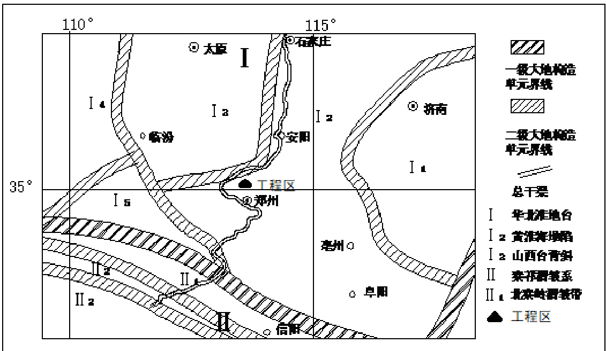  
图 2.3.1-1 区域大地构造分区图  

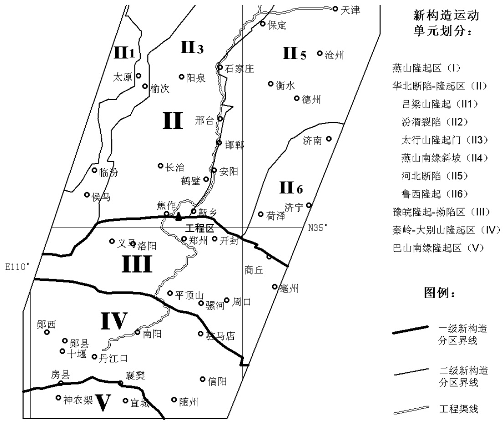  
图 2.3.1-2 区域新构造分区图  

# 3.2.3.2 地震及地震动参数  

1)地震  

场区位于华北地震构造区。华北地震构造区大致以太行山东缘断裂为界分为东西两个地震带,东部为河北平原地震带,西部为山西地震带。河北平原地震带地震频度和强度均较高。据资料记载,发生过 $6\sim6.9$ 级地震 13 次, $7\sim7.9$ 级地震 5 次,8 级地震 1次,它是华北本次地震期的主体活动带,近代地震活动显示密集成带分布。山西地震带近期地震活动强度频度不高,自 1695 年临汾 7 级大地震以后,华北本次地震活动期以来,只发生过一次 6 级以上地震(1815 年平陆 6 级地震)。  

各地震区(带)历史上发生的震级 $_{\cdot\geq4.75}$ 级(对工作区具破坏作用或有影响的)地震见表 2.3.2-1。  

表 2.3.2-1 历史上震级 $\underline{{\ge}}4.7$ 级对工作区有影响的地震表  

<html><body><table><tr><td rowspan="2">编 号</td><td rowspan="2">地震日期 年、月、日</td><td colspan="5">震中</td><td rowspan="2">震害情况</td></tr><tr><td>北纬 (度)</td><td>东经 (度)</td><td>地 点</td><td>烈 度</td><td>震</td></tr><tr><td>1</td><td>战国</td><td>35°12'</td><td>113%24'</td><td>修武</td><td></td><td>级 5</td><td></td></tr></table></body></html>  

<html><body><table><tr><td>2</td><td>1351.5.14</td><td>37.30</td><td>113.0°</td><td>山西 榆社</td><td>VII</td><td>5</td><td>武陟、修武：声如雷霆、房 屋、死者甚众。</td></tr><tr><td>3</td><td>1502.10.7</td><td>35.70</td><td>115.3°</td><td>河南 濮阳</td><td>VII</td><td>6</td><td>濮阳坏城垣，民居倾坏者千余， 汲县、淇县、辉县等均震。</td></tr><tr><td>4</td><td>1556.1.23</td><td>34.50</td><td>109.1°</td><td>华县</td><td>IX</td><td>8</td><td>修武、武陟：崩山裂屋</td></tr><tr><td>5</td><td>1587.4.10</td><td>35.3°</td><td>113.5°</td><td>河南 修武 东</td><td>VII</td><td>6</td><td>房舍无数。 汲县、辉县、淇县：城蝶摧,</td></tr><tr><td>6</td><td>1830.6.12</td><td>36.4°</td><td>114.2°</td><td>磁县</td><td>X</td><td>7</td><td>辉县：屋垣多 新乡：房屋皆岌岌可危</td></tr><tr><td>7</td><td>1920.12.16</td><td>36.7°</td><td>104.90</td><td>宁夏 海原</td><td>IX</td><td>8</td><td>修武：房屋间有倒塌者 林县：有少数房子裂缝</td></tr></table></body></html>  

# 2)地震动参数  

场区 $20\mathrm{m}$ 深度范围内场地土类型主要为中软土,覆盖层厚度大于 $50\mathrm{m}$ ,根据《水工建筑物抗震设计标准》(GB 51247-2018)规定,场区场地类别为 III 类。  

根据《中国地震动参数区划图》(GB18306-2015),场区 II 类场地地震动峰值加速度为 $0.15\mathrm{g}$ ,对应地震基本烈度为 VII 度,地震动加速度反应谱特征周期为 0.40s。  

因工程区为Ⅲ类场地,按《中国地震动参数区划图》(GB18306-2015)附录 E 进行地震动峰值加速度系数调整,得出场区地震动峰值加速度为 $0.1725\mathrm{g}$ ,相应的地震基本烈度为 VII 度,地震动加速度反应谱特征周期为 0.55s。  

# 3.2.3.3 区域构造稳定性  

工程区基本地震动峰值加速度 $0.15\mathrm{g}$ ,相当于地震基本烈度Ⅶ度。工程场区(8km范围内)无活动断层及震级大于 4.75 级地震震中分布。根据《水利水电工程区域构造稳定性勘察技术规程》、《引调水线路工程地质勘察规范》(SL629-2014)条文说明 6.2  

表 4 区域构造稳定性分级表,综合考虑地震动峰值加速度及相应的地震基本烈度、活断层的距离、地震活动情况、区域性重磁异常因素,工程区域构造稳定性较好。  

# 3.2.4 水文地质条件  

# 3.2.4.1 气象与水文  

修武县属暖温带大陆性季风气候区,四季分明,冬春季干冷多风,夏秋季炎热多雨。七月份最热,一月份最冷,多年平均气温 $14.9^{\circ}\mathrm{C}$ 。降水多集中在 7、8、9 三个月,约占年降水量的 $60\%\sim70\%$ 。多年平均降水量 $583\mathrm{mm}$ ,年际和年内降水量不均,易出现旱涝不均现象。修武县冬春季盛行北或西北风,夏季多东南风,秋季多东北风,多年平均风速 $1.5\mathrm{m}/\mathrm{s}$ ,最大风速 $16\mathrm{m/s}$ 。地面稳定冻结初日在 12 月 9 日,冻结终止日期在 2 月 19日,多年平均冻土深度 $10.72\mathrm{cm}$ ,历年最大冻土深度 $19\mathrm{cm}$ 。  

# 3.2.4.2 地下水类型  

勘探深度范围内主要揭示浅层地下水,地下水主要类型为第四系松散层孔隙潜水,第四系全新统的粉粉砂层和更新统卵砾石层是本区浅层地下水的主要含水层,含水层分布厚度不均,其上覆重粉质壤土,局部为粉质粘土,为主要的隔水层或弱透水层,局部具弱承压性。  

地下水主要接受大气降水、河道下渗及侧向迳流补给,排泄为侧向迳流、蒸发、河道排泄和人工开采。地下水整体西北向东南流动,局部地段受地形控制或补给源影响,流向有所变化。  

受 21.7 强降雨影响,沿太行一带的三姑泉、马坊泉、百泉等多年断流的岩溶泉在强降雨之后重新复活,山区岩溶水侧向补给平原区浅层地下水,平原区地下水位较往年有较大抬升,有关统计资料显示,修武附近地下水位较往年平均上升约 $3{\sim}4\mathrm{m}$ 。  

# 3.2.4.3 水化学特征  

勘察期间取山门河河水 2 组、地下水 1 组进行水质分析,分析成果见表 $2.4.3\ –1\sim$ 表2.4.3-2。  

由分析成果表可知:山门河场区地下水化学类型为“CL—SO4—Ca— $(\mathsf{K}{+}\mathsf{N a})$ ”型,矿化度 $1.265\mathrm{g/L}$ ,属低矿化水;总硬度(按 CaO 计) $550.43\mathrm{mg/L}$ ,属极硬水; $\mathrm{pH}$ 值 8.12,属 弱 碱 性 水 。 河 化 学 类 型 为 “HCO3—SO4—Ca” 、 “SO4—CL—Ca” 型 , 矿 化 度$0.393{\sim}1.196\mathrm{g/L}$ ,属淡水\~低矿化水;总硬度(按 CaO 计) $340.26{\sim}630.49\mathrm{mg/L}$ ,属极硬水; $\mathrm{pH}$ 值 7.75\~8.26,属弱碱性水。  

根据《水利水电工程地质勘察规范》(GB50487-2008)附录 L 环境水腐蚀判定标准进行水质评价,评价成果见表 $2.4.3\substack{-3\sim}$ 表 2.4.3-8。由评价表可知:场区地下水对混凝土无腐蚀性,对钢筋混凝土结构中钢筋具中等腐蚀性,对钢结构具中等腐蚀性;山门河河水对混凝土具弱腐蚀性,对钢筋混凝土结构中钢筋具弱腐蚀性,对钢结构具中等腐蚀性。  

# 3.3 河道工程地质条件及评价  

# 3.3.1 堤身状况  

# 3.3.1.1 堤防概况  

山门河修武段现状左岸没有堤防,右岸五里堡\~郜村段筑有堤防(防洪墙),郜村\~大沙河段没有堤防,郜村东南部筑有一段围村堤。现将各段堤防叙述如下。  

山门河右岸堤防:分堤防段和防洪墙段,桩号 $1+410^{\sim}2{+}230$ 和桩号 $3{+}260^{\sim}6{+}310$ 段堤顶高程 $94.45^{\sim}86.57\mathrm{m}$ ,堤顶宽 $2.8^{\sim}3.2\mathrm{m}$ ,堤高 $2.6^{\sim}3.0\mathrm{m}$ ,内外坡比均为 1:2.0。桩号 $2{+}230^{\sim}3{+}260$ 为浆砌石防洪墙,高约 $1,5\mathfrak{m}$ ,顶宽约 $0.4\mathrm{m}$ 。  

郜村围村堤:堤防基本连续,在桩号 $\left.0+780^{\sim}0+845$ 铁路交叉段缺失。堤顶高程$86.54\ensuremath{\mathrm{\r~{\widetilde{~}86}}}.77\ensuremath{\mathrm{m}}$ ,堤顶宽度约 $1.5^{\sim}2.0\mathrm{m}$ ,堤高约 $2,0\mathrm{m}$ ,坡比约 1: $2.0^{\sim}1$ :2.5。  

# 3.3.1.2 堤身填筑土性质  

本次治理段堤身填筑土类都是就地取材,挖掘堤外或堤内土层填筑而成,因此堤身土类与堤内外表层土类基本一致。堤身填土性质相近,以褐红、褐黄色重粉质壤土为主。本次勘察对堤身填土进行地质调查、勘探和室内试验等,室内外物理力学性试验成果统计见表 3.1.2-1,根据工程类比、经验结合堤身土体岩性及试验资料,提出堤身填土力学性指标建议见表 3.1.2-2。  

表 $3..1.2\AA^{-1}$ 堤身填土的物理力学性试验成果统计表  

<html><body><table><tr><td colspan="3">土层名称、成因时代代号</td><td colspan="3">堤身填土（Q")</td></tr><tr><td colspan="3">试验项目</td><td>组数</td><td>范围值</td><td>平均值</td></tr><tr><td>天然含水率</td><td>W</td><td>%</td><td>11</td><td>22. 0~29. 0</td><td>24. 4</td></tr><tr><td>天然干密度</td><td>P d</td><td>g/cm²</td><td>11</td><td>1. 44~1. 68</td><td>1. 55</td></tr><tr><td>天然孔隙比</td><td>e</td><td></td><td>11</td><td>0. 621~0. 886</td><td>0. 753</td></tr><tr><td>比重</td><td>Gs</td><td></td><td>11</td><td>2.72</td><td>2.72</td></tr></table></body></html>  

<html><body><table><tr><td colspan="2">液限</td><td>WL</td><td>% </td><td>11</td><td>35. 4~36. 7</td><td>36.0</td></tr><tr><td colspan="2">塑限</td><td>Wp</td><td>% </td><td>11</td><td>21.1~21.8</td><td>21.5</td></tr><tr><td colspan="2">塑性指数</td><td>Ip</td><td></td><td>11</td><td>14. 2~15. 6</td><td>14.6</td></tr><tr><td colspan="2">液性指数</td><td>I</td><td></td><td>11</td><td>0. 05~0. 55</td><td>0.20</td></tr><tr><td rowspan="3">颗 粒 分 析</td><td>砂粒含量</td><td>0. 05~2.0</td><td>% </td><td>11</td><td>0</td><td>0</td></tr><tr><td>粉粒含量</td><td>0. 005~0. 05</td><td>% </td><td>11</td><td>75. 0~76. 0</td><td>75.6</td></tr><tr><td>粘粒含量</td><td><0.005</td><td>% </td><td>11</td><td>24.0~25. 0</td><td>24.4</td></tr><tr><td rowspan="3">直 剪</td><td>饱和</td><td>C</td><td>kPa</td><td>11</td><td>32.0~38.0</td><td>35.0</td></tr><tr><td>快剪</td><td>Φ</td><td>。)</td><td>11</td><td>12.5~14.0</td><td>13.4</td></tr><tr><td rowspan="2">饱和固结 快剪</td><td>C</td><td>kPa</td><td></td><td></td><td></td></tr><tr><td>Φ</td><td>。)</td><td></td><td></td><td></td><td></td></tr><tr><td colspan="2">压缩系数</td><td>a1-2</td><td>MPa-1</td><td>11</td><td>0. 255~0. 494</td><td>0.370</td></tr><tr><td colspan="2">压缩模量</td><td>ES1-2</td><td>MPa</td><td>11</td><td>3. 72~6. 36</td><td>4.89</td></tr><tr><td colspan="2">渗透系数</td><td>K</td><td>cm/s</td><td>9</td><td>8.60E-06~2.30E-05</td><td>1. 48E-05</td></tr></table></body></html>  

表 3.1.2-2  堤身填土力学性指标建议值表  

<html><body><table><tr><td rowspan="4">填筑土类</td><td colspan="2">饱和快剪</td><td colspan="2">饱固快</td><td rowspan="2">压缩系数|压缩模量</td><td rowspan="2"></td><td rowspan="2">渗透系数</td><td rowspan="2">承载力 特征值</td></tr><tr><td>粘聚力</td><td>内摩擦角</td><td>粘聚力</td><td>内摩擦角</td></tr><tr><td>C</td><td>Φ</td><td>C</td><td>Φ</td><td>a1-2</td><td>Es</td><td>K</td><td>fk</td></tr><tr><td>kPa</td><td></td><td>kPa</td><td></td><td>MPa-</td><td>MPa</td><td>cm/s</td><td>kPa</td></tr><tr><td>重粉质壤土</td><td>25.0</td><td>12.0</td><td>23.0</td><td>14.0</td><td>0.37</td><td>4.9</td><td>2.30E-05</td><td>90</td></tr></table></body></html>  

# 3.3.1.3 堤身填筑质量评价及建议  

治理段堤高一般为 $1.5^{\sim}3.0\mathrm{m}$ ,堤防边坡坡比多为 $1:2,0^{\sim}1$ :2.5,堤身填筑土以重粉质壤土为主,渗透系数 $8.60\mathrm{E}{-}06\mathrm{\sim}2.30\mathrm{E}{-}05\mathrm{cm/s}$ ,具微\~弱透水性;天然干密度为 $1,44\sim$ $1.68\mathrm{g/cm^{3}}$ ,同类土击实试验最大干密度平均值 $1.70\mathrm{g/cm^{3}}$ ,相应控制干密度 $1.55\mathrm{g/cm}^{3}$ (压实度 0.91),合格率 $45,5\%$ 。总体来看,现状堤防外观规模较小,堤防碾压填筑不均,堤顶高程不足。  

# 3.3.2 堤基工程地质条件  

# 3.3.2.1 堤基工程概况  

工程区处于黄沁冲积平原,地形平坦,总体地势西高东低。修武县山门河属平原河谷地貌,河槽宽度一般 $6^{\sim}9\mathrm{m}$ ,河底高程 $89.3^{\sim}83.3\mathrm{m}$ ,平均河道比降约 $1.2\text{\textperthousand}$ 。治理段山门河左岸没有堤防,右岸筑有堤防(防洪墙),堤基高程一般 $92.1^{\sim}83.5\mathrm{m}$ 。下游北排河底宽约 $4,5\mathrm{m}$ ,河底高程 $82.6^{\sim}81.4\mathrm{m}$ ,深约 $2,4\mathrm{m}$ 。南排河底宽约 $4,0\mathrm{m}$ ,河底高程$82.6^{\sim}81.2\mathrm{m}$ ,深约 $2,5\mathrm{m}$ 。南北排河段两岸地面高程一般 $84.2^{\sim}83.4\mathrm{m}$ 。郜村围村堤段地面高程一般 $84.1^{\sim}84.6\mathrm{m}$ 。  

# 3.3.2.2 地层岩性  

勘察区勘探深度范围内主要为第四系全新统地层,岩性主要有中粉质壤土、重粉质壤土、轻粉质壤土和粉砂,共划分 5 个岩土体单元,下面对堤基岩性从上到下进行叙述。  

第四系全新统上段( $\mathrm{Q}_{4}^{2\mathrm{al}}$ )  

$\textcircled{1}$ 中粉质壤土:褐红、褐黄色,软塑\~可塑状,具水平层理,偶见黑色铁锰质斑点,夹轻粉质壤土薄层理。山门河右岸:该层层厚 $0.50^{\sim}3.40\mathrm{m}$ ,平均厚度 1.86m,层底高程$81.81^{\sim}87.46\mathrm{m}$ ;南、北排河段:该层层厚 $1.40^{\sim}3.70\mathrm{m}$ ,平均厚度 $2,25\mathrm{m}$ ,层底高程$79.91\mathrm{\sim}82.05\mathrm{m}$ ;郜村围村堤:该层层厚 $1.30^{\sim}2.20\mathrm{m}$ ,平均厚度 $1,76\ensuremath{\mathrm{m}}$ ,层底高程$82.24^{\sim}83.06\mathrm{~m~}$ 。  

第四系全新统下段( $\mathrm{Q}_{4}^{\mathrm{lal}}$ )  

$\textcircled{2}$ 重粉质壤土:灰褐色,可塑状,见黑色铁锰质斑点及锈黄色条带,偶含钙质结核,结核粒径一般 $0.2^{\sim}0.5\mathrm{cm}$ 。刀切面光滑,干强度高。山门河右岸:该层层厚 $2.10^{\sim}6.20\mathrm{m}$ ,平均厚度 $3,58\mathrm{m}$ ,层底高程 $79.21\widetilde{8}4.63\mathrm{{m}}$ ;南、北排河段:该层层厚 $1.60^{\sim}4.20\mathrm{m}$ ,平均厚度 $2,70\mathrm{m}$ ,层底高程 $77.11\widetilde{}79.85\mathrm{m}$ ;郜村围村堤:该层层厚 $1.90^{\sim}3.40\mathrm{m}$ ,平均厚度$2,52\mathrm{m}$ ,层底高程 $79.51\widetilde{\mathrm{~80.~}}95\mathrm{~m~、~}$ 。  

$\textcircled{2}{-}1$ 重粉质壤土:褐红色,可塑\~硬塑状,土质较致密,见黑色铁锰质风化斑点,偶含钙质结核。山门河右岸:该层层厚 $4.00^{\sim}6.50\mathrm{m}$ ,平均厚度 $5,07\ensuremath{\mathrm{m}}$ ,层底高程$73.82^{\sim}78.53\mathrm{m}$ ;南、北排河段:该层层厚 $2.60^{\sim}3.40\mathrm{m}$ ,平均厚度 $3,00\mathrm{m}$ ,层底高程$73.71^{\sim}75.13\mathrm{m}$ 。  

$\textcircled{3}$ 轻粉质壤土:黄褐色、褐黄色,可塑状,见灰绿色条带及锈黄色,含钙质结核,结核粒径一般 $1^{\sim}2\mathrm{cm}$ ,含量约占 $2\%$ 左右。山门河右岸:该层层厚 $1.40^{\sim}7.70\mathrm{m}$ ,平均厚度$3,76\ensuremath{\mathrm{m}}$ ,层底高程 $71.52^{\sim}81.13\mathrm{m}$ ;南、北排河段:该层层厚 $2.10^{\sim}6.30\mathrm{m}$ ,平均厚度 $4,23\mathrm{m}$ ,层底高程 $72.97^{\sim}75.55\mathrm{m}$ ;郜村围村堤:该层层厚 $3.80^{\sim}6.00\mathrm{m}$ ,平均厚度 $4,92\mathrm{m}$ ,层底高程 $74.54^{\sim}75.71\ensuremath{\mathrm{m}}$ 。  

$\textcircled{4}$ 粉砂:黄褐色,饱水,稍密\~中密状,矿物成分主要为石英和长石,次为暗色矿物,砂粒不均,砂质较纯。山门河右岸:该层层厚 $0.30^{\sim}7.60\mathrm{m}$ ,平均厚度 $4,49\mathrm{m}$ ,层底高程 $69.05^{\sim}76.83\mathrm{m}$ ;南、北排河段:该层层厚 $2.90^{\sim}6.50\mathrm{m}$ ,平均厚度 $4,67\ensuremath{\mathrm{m}}$ ,层底高程$69.05^{\sim}70.13\mathrm{m}$ ;郜村围村堤:该层层厚 $2.60^{\sim}6.50\mathrm{m}$ ,平均厚度 $4,10\mathrm{m}$ ,层底高程$89.12^{\sim}72.61$ m。  

$\textcircled{5}$ 重粉质壤土:褐黄色,可塑\~硬塑状,见锈黄色铁质浸染,见灰绿色条带,土质较致密。山门河右岸:该层未揭穿,揭露最大厚度 $8,40\mathrm{m}$ ;南、北排河段:该层未揭穿,揭露最大厚度 $4,00\mathrm{m}$ ;郜村围村堤:该层未揭穿,揭露最大厚度 $2,50\mathrm{m}$ 。  

# 3.3.2.3 各土体单元的物理力学性质  

为查明各土体单元的物理力学性质,对土层进行了标准贯入试验,并取原状土样进行室内物理力学性试验。依据有关规范、规程,经分析、整理、统计将各土体单元的物理、力学性试验成果列于表 3.2.3-1。根据试验成果,结合邻近工程经验,提出各土体单元物理力学性指标建议值见表 3.2.3-3。  

表 3.2.3-1  堤基各土体单元力学性试验成果统计表  

<html><body><table><tr><td rowspan="3">层 号</td><td rowspan="3">岩性名称</td><td rowspan="3">统计 项目</td><td colspan="2">土的物理性质</td><td rowspan="2"></td><td colspan="3">界限含水率</td><td rowspan="2"></td><td colspan="2">压缩性</td><td rowspan="2"></td><td colspan="2">饱快</td><td rowspan="2">饱固快</td><td colspan="2">渗透系 数</td><td rowspan="2">颗粒</td><td colspan="2"></td><td rowspan="2">标贯</td><td rowspan="2"></td></tr><tr><td>含水 率 W</td><td>土粒 干密 比重 度 Gs pd</td><td>孔 隙 比</td><td>液限WL塑限WP</td><td colspan="2">塑性 指数IP指数IL</td><td>压缩 压缩系数 模量</td><td>凝聚 力</td><td>摩擦 凝聚 角 力</td><td>摩擦 角</td><td></td><td>中 细 砂 砂 垂直Kv0.500.25</td><td>粉粒 0.075</td><td>粘 粒 原始标贯</td></tr><tr><td></td><td></td><td></td><td>e</td><td></td><td></td><td></td><td></td><td></td><td>Es1-2</td><td>C Φ</td><td>C</td><td>Φ</td><td></td><td></td><td>0.250.075</td><td>< 0.005 0.005</td><td></td><td></td></tr><tr><td rowspan="6"></td><td rowspan="4">中粉质壤 土</td><td>% 组数 13</td><td>g/cm3</td><td>g/cm3 13 10</td><td>-- 6</td><td>% 13</td><td>% 13</td><td>-- 13</td><td>-- 13</td><td>MPa-1 11</td><td>MPa 11 8</td><td>kPa 8</td><td>kPa</td><td></td><td>cm/s 7</td><td>% 10</td><td>% 10</td><td>% % 10 10</td><td>N 18</td><td>N' 18</td></tr><tr><td>最小 值</td><td>15.7</td><td>2.70 1.45</td><td>0.605</td><td>22.9</td><td>16.4</td><td>6.5</td><td>-0.30</td><td>0.180</td><td>4.22 12.0</td><td>13.0</td><td></td><td></td><td>6.40E-06</td><td>0 0</td><td>76</td><td>11</td><td>3.0</td><td>2.9</td></tr><tr><td>最大 值</td><td>29.0 2.72</td><td>1.68</td><td>0.869</td><td>37.9</td><td>22.5</td><td>15.5</td><td>0.91</td><td>0.426</td><td>8.93 33.0</td><td>23.5</td><td></td><td></td><td>6.50E-04</td><td>0</td><td>5 85</td><td>24</td><td>7.0</td><td>7.0</td></tr><tr><td>平均 21.8 值</td><td>2.71</td><td>1.58</td><td>0.731</td><td>31.1</td><td>19.7</td><td>11.4</td><td>0.20</td><td>0.280</td><td>6.46 24.6</td><td>15.9</td><td></td><td></td><td>1.40E-04</td><td>0.0</td><td>0.7 81.5</td><td>17.8</td><td>4.9</td><td>4.9</td></tr><tr><td>大均 值 小均</td><td></td><td></td><td></td><td></td><td></td><td></td><td></td><td>0.337</td><td></td><td></td><td></td><td></td><td></td><td></td><td></td><td></td><td></td><td></td></tr><tr><td rowspan="3">重粉质壤</td><td>值</td><td></td><td></td><td></td><td></td><td></td><td></td><td></td><td></td><td>5.31</td><td></td><td></td><td></td><td></td><td></td><td></td><td></td><td></td><td></td><td></td></tr><tr><td>组数 最小</td><td>47</td><td>47</td><td>40 40</td><td>47</td><td>47</td><td>47</td><td>47</td><td>47</td><td>47</td><td>30</td><td>30 3</td><td>3</td><td>23</td><td></td><td>54 54</td><td>54</td><td>54</td><td>46</td><td>46</td></tr><tr><td>值 最大</td><td>17.5</td><td>2.71</td><td>1.44 0.621</td><td>32.3</td><td>20.1</td><td>12.2</td><td>-0.27</td><td>0.176</td><td>3.52</td><td>22.0</td><td>11.0 32.0</td><td>16.5</td><td>7.00E-06</td><td>0</td><td>0</td><td>72</td><td>20</td><td>3.0</td><td>2.8</td></tr><tr><td rowspan="3"></td><td>土 值 平均</td><td>29.5</td><td>2.72</td><td>1.67</td><td>0.884</td><td>38.7</td><td>22.5</td><td>16.2</td><td>0.48</td><td>0.451</td><td>9.62 40.0</td><td>15.5</td><td>38.0</td><td>17.5</td><td>4.20E-05</td><td>0</td><td>0 80</td><td>28</td><td>13.0</td><td></td><td>12.5</td></tr><tr><td>值</td><td>23.0</td><td>2.72</td><td>1.59</td><td>0.712</td><td>35.7</td><td>21.4</td><td>14.3</td><td>0.11</td><td>0.277</td><td>6.45</td><td>34.5 13.8</td><td>34.0</td><td>17.0</td><td>1.46E-05</td><td>0.0</td><td>0.0</td><td>76.0</td><td>24.0</td><td>7.3</td><td>6.8</td></tr><tr><td></td><td></td><td></td><td></td><td></td><td></td><td></td><td></td><td></td><td></td><td></td><td></td><td></td><td></td><td></td><td></td><td></td><td></td><td></td><td></td></tr></table></body></html>  

<html><body><table><tr><td rowspan="8"></td><td>大均</td><td colspan="3"></td><td rowspan="2">0.776</td><td rowspan="2"></td><td rowspan="2"></td><td rowspan="2"></td><td rowspan="2"></td><td rowspan="2">0.348</td><td rowspan="2"></td><td rowspan="2"></td><td rowspan="2"></td><td rowspan="2"></td><td rowspan="2">3.07E-05</td><td rowspan="2"></td><td rowspan="2"></td><td rowspan="2"></td><td rowspan="2"></td><td rowspan="2"></td><td rowspan="2"></td></tr><tr><td>值 小均</td><td></td><td></td><td></td><td></td></tr><tr><td>值 组数</td><td>6</td><td>1.53 6 6</td><td>6 6</td><td></td><td></td><td></td><td></td><td></td><td>5.21 30.2</td><td>12.9</td><td></td><td></td><td></td><td></td><td></td><td></td><td></td><td></td><td></td></tr><tr><td>重粉质壤</td><td>最小 21.3 值</td><td>2.71</td><td>1.56</td><td>0.611 34.7</td><td>9 20.9</td><td>6 13.8</td><td>6 0.02</td><td>6 0.194</td><td></td><td>6 5 6.04 34.0</td><td>5 14.5</td><td></td><td></td><td>3 3.20E-06</td><td>8 0</td><td>8 0</td><td>8 8 72 23</td><td>6 9.0</td><td>6 7.5</td></tr><tr><td>最大 土</td><td>25.4</td><td>2.72</td><td>1.68 0.738</td><td>38.9</td><td>22.7</td><td>16.2</td><td>0.33</td><td>0.288</td><td>8.75</td><td>48.0</td><td>15.5</td><td></td><td></td><td>9.30E-06</td><td>0 0</td><td>77</td><td>28</td><td>15.0</td><td></td></tr><tr><td>值 平均</td><td>23.4</td><td>2.72</td><td>1.61 0.687</td><td>36.5</td><td>21.8</td><td>14.7</td><td>0.11</td><td>0.243</td><td>7.09</td><td>40.4</td><td>14.8</td><td></td><td></td><td>7.07E-06 0.0</td><td>0.0</td><td>75.3</td><td>24.8</td><td></td><td>12.5</td></tr><tr><td>值</td><td></td><td></td><td></td><td></td><td></td><td></td><td></td><td></td><td></td><td></td><td></td><td></td><td></td><td></td><td></td><td></td><td></td><td>13</td><td>10.8</td></tr></table></body></html>  

续表 3.2.3-1 堤基各土体单元力学性试验成果统计表  

<html><body><table><tr><td rowspan="2">岩 层 性 号 名</td><td rowspan="2">统计 项目 称</td><td rowspan="2">W</td><td rowspan="2">含水 率 比重</td><td rowspan="2">土粒</td><td rowspan="2">土的物理性质</td><td rowspan="2">孔隙</td><td rowspan="2"></td><td rowspan="2">界限含水率</td><td rowspan="2">塑性|液性 指数</td><td rowspan="2">压缩系 指数 数al-2</td><td rowspan="2">压缩性 压缩 模量</td><td rowspan="2">凝聚</td><td rowspan="2">饱快 摩擦</td><td rowspan="2">饱固快 凝聚 力</td><td rowspan="2">摩擦角 Φ</td><td colspan="2">渗透系数 中 砂 0.50</td><td colspan="2">颗粒 粉粒</td><td rowspan="2"></td><td rowspan="2"></td><td rowspan="2"></td><td rowspan="2">标贯 原始标修正标 贯击数 贯击数</td></tr><tr><td>力 角</td><td>垂直Kv</td><td>细 砂 0.25</td><td>0.075</td><td>粘 粒</td></tr><tr><td colspan="2"></td><td></td><td>%</td><td>g/cm3</td><td>g/cm3</td><td></td><td>%</td><td>%</td><td></td><td>MPa-1</td><td>MPa</td><td>kPa</td><td></td><td></td><td>kPa</td><td></td><td>cm/s</td><td>0.25 %</td><td>0.075 %</td><td>%</td><td>0.005 %</td><td>N'</td></tr><tr><td rowspan="6">③</td><td>组数</td><td></td><td>19</td><td>19</td><td>17</td><td>17</td><td>19</td><td>19</td><td>19 19</td><td>19</td><td>19</td><td>16</td><td>16</td><td></td><td></td><td></td><td>10 28</td><td>28</td><td>28</td><td>28</td><td>N 65</td><td>65</td></tr><tr><td>最小值</td><td></td><td>17.9</td><td>2.70</td><td>1.57</td><td>0.560</td><td>23.5</td><td>16.7 6.8</td><td>-0.08</td><td>0.112</td><td>5.02</td><td>12.0</td><td>14.0</td><td></td><td></td><td>5.30E-05</td><td>0</td><td>0</td><td>74</td><td>9</td><td>7.0</td><td>6.2</td></tr><tr><td>轻粉 最大值</td><td></td><td>24.2</td><td>2.71</td><td>1.73</td><td>0.724</td><td>32.4</td><td>20.0</td><td>12.4 0.95</td><td>0.329</td><td>14.21</td><td>30.0</td><td>24.5</td><td></td><td></td><td>7.80E-04</td><td>0</td><td>17</td><td>87</td><td>20</td><td>17.0</td><td>14.3</td></tr><tr><td>质壤 平均值</td><td></td><td>21.2</td><td>2.70</td><td>1.66</td><td>0.633</td><td>26.7</td><td>17.9</td><td>8.8 0.41</td><td>0.175</td><td>10.00</td><td>16.3</td><td>21.4</td><td></td><td></td><td></td><td>4.44E-04 0.0</td><td>6.1</td><td>81.5</td><td>12.4</td><td>12.4</td><td>10.7</td></tr><tr><td>土 大均值</td><td></td><td></td><td></td><td></td><td>0.669</td><td></td><td></td><td></td><td>0.234</td><td></td><td></td><td></td><td></td><td></td><td></td><td></td><td></td><td></td><td></td><td></td><td></td></tr><tr><td></td><td>小均值</td><td></td><td></td><td>1.62</td><td></td><td></td><td></td><td></td><td></td><td>7.89</td><td>13.2</td><td>15.5</td><td></td><td></td><td></td><td></td><td></td><td></td><td></td><td></td><td></td></tr><tr><td rowspan="2">④</td><td>组数</td><td></td><td></td><td></td><td></td><td></td><td></td><td></td><td></td><td></td><td></td><td></td><td></td><td></td><td></td><td></td><td>3</td><td>3</td><td>3</td><td>3</td><td>52</td><td>52</td></tr><tr><td>粉砂 最小值</td><td></td><td></td><td></td><td></td><td></td><td></td><td></td><td></td><td></td><td></td><td></td><td></td><td></td><td></td><td></td><td>0</td><td>50</td><td>17</td><td>2</td><td>9.0</td><td>8.0</td></tr></table></body></html>  

<html><body><table><tr><td></td><td></td><td>最大值</td><td></td><td></td><td></td><td></td><td></td><td></td><td></td><td></td><td></td><td></td><td></td><td></td><td></td><td>25</td><td>57</td><td>40</td><td>3</td><td>24.0 18.8</td></tr><tr><td></td><td></td><td>平均值</td><td></td><td></td><td></td><td></td><td></td><td></td><td></td><td></td><td></td><td></td><td></td><td></td><td>16.0</td><td>54.3</td><td>27.0</td><td>2.7</td><td>17.1</td><td>13.7</td></tr><tr><td rowspan="4">?</td><td>重粉</td><td>组数</td><td>7</td><td>7</td><td>7</td><td>7</td><td></td><td>7 7</td><td>7</td><td>7</td><td>7 7</td><td>7</td><td></td><td>3</td><td>10</td><td>10</td><td>10</td><td>10</td><td>11</td><td>11</td></tr><tr><td></td><td>最小值</td><td>16.7</td><td>2.71</td><td>1.44</td><td>0.586</td><td>30.6 19.3</td><td>11.3</td><td>-0.35</td><td>0.192</td><td>5.12 28.0</td><td>13.0</td><td></td><td>7.20E-06</td><td>0</td><td>0</td><td>73</td><td>11</td><td>10.0</td><td>7.6</td></tr><tr><td>质壤 土</td><td>最大值</td><td>31.6</td><td>2.72</td><td>1.71</td><td>0.884</td><td>38.0 22.4</td><td>15.8</td><td>0.69</td><td>0.368</td><td>8.79 46.0</td><td>15.5</td><td></td><td>9.40E-06</td><td>0</td><td>7</td><td>83</td><td>27</td><td>24.0</td><td>18.3</td></tr><tr><td></td><td>平均值</td><td>23.8</td><td>2.72</td><td>1.60</td><td>0.699</td><td>35.8 21.4</td><td>14.4</td><td>0.17</td><td>0.244 7.29</td><td>37.9</td><td>14.6</td><td></td><td>7.93E-06</td><td>0.0</td><td>1.7</td><td>77.7</td><td>20.6</td><td>16.5</td><td>12.4</td></tr></table></body></html>  

表 3.2.3-2  堤基各土体单元物理力学性指标建议值表  

<html><body><table><tr><td rowspan="6">土体 单元</td><td rowspan="3">天然 含水 比重孔隙</td><td rowspan="3"></td><td rowspan="3">天然</td><td rowspan="2">天然</td><td colspan="2">压缩</td><td colspan="2">饱和快剪</td><td colspan="2">饱固快剪</td><td colspan="2">自然休止角</td><td rowspan="3">地基承 载力标</td><td rowspan="3">平均 粒径 准值</td></tr><tr><td>压缩</td><td>压缩</td><td>凝聚</td><td>内摩</td><td>凝聚</td><td>内摩</td><td>渗透</td></tr><tr><td>干密 度</td><td>系数</td><td>模量</td><td>力</td><td>擦角</td><td>力</td><td>擦角</td><td>水上「水下 系数</td></tr><tr><td>Gs</td><td></td><td>比 e</td><td>Pd</td><td>a1-2</td><td>Es</td><td>Cc</td><td>Φc</td><td>Cc</td><td>Φc Φc</td><td>Φc K</td><td>f</td><td>D50</td></tr><tr><td></td><td>% </td><td></td><td>g/</td><td>/cm MPa</td><td></td><td>MPa</td><td>kPa</td><td></td><td>kPa</td><td>(° （(°)</td><td>cm/s</td><td>kPa</td><td>mm</td></tr><tr><td>①中粉质 壤土</td><td>21.8</td><td>32.710.8751.45</td><td></td><td></td><td>0.48</td><td>3.9</td><td>19</td><td>12</td><td>18</td><td>17</td><td>1.5E-04</td><td>100</td><td>0.018</td></tr><tr><td>②重粉质 壤土</td><td>23.0</td><td>2.720.789</td><td></td><td>1.52</td><td>0.39</td><td>4.5</td><td>28</td><td>12</td><td>26</td><td>15</td><td>5.5E-05</td><td>120</td><td>0.015</td></tr><tr><td>②-1重粉 质壤土</td><td>23.4</td><td>2.720.755</td><td></td><td>1.56</td><td>0. 33</td><td>5.3</td><td>32</td><td>12</td><td>26</td><td>16</td><td>3.5E-05</td><td>140</td><td>0.015</td></tr><tr><td>③轻粉质 壤土</td><td>21.2 2.700.7311.57</td><td></td><td></td><td></td><td>0.31</td><td>5.6</td><td>14</td><td>20</td><td>12</td><td>21</td><td>8.0E-04</td><td>140</td><td>0.022</td></tr><tr><td>④粉砂</td><td></td><td></td><td></td><td></td><td></td><td></td><td></td><td></td><td></td><td>26</td><td>24 2.0E-02</td><td>150</td><td>0.090</td></tr><tr><td>③重粉质 壤土</td><td>23.82.720.7111.59</td><td></td><td></td><td></td><td>0.27</td><td>6.3</td><td>33</td><td>13</td><td>30</td><td>17</td><td>6.5E-05</td><td>180</td><td>0.015</td></tr></table></body></html>  

# 3.3.2.4 水文地质条件  

勘探深度范围内主要揭示浅层地下水,地下水主要类型为第四系松散层孔隙潜水,具承压性,第四系全新统的轻粉质壤土、粉砂层是本区浅层地下水的主要含水层,含水层分布厚度不均。地下水主要接受大气降水、河道下渗及侧向迳流补给,排泄为侧向迳流、蒸发、河道排泄和人工开采。  

勘察期间,山门河右堤段地下水埋深 $1.05^{\sim}5.60\mathrm{m}$ ,地下水位 $82.39^{\sim}88.04\mathrm{m}.$ ,该段山门河河水位 $83.30^{\sim}89.34\mathrm{m}$ ;南北排河段地下水埋深 $1.68^{\sim}2.45\mathrm{m}$ ,地下水位$82.04^{\sim}82.68\mathrm{m}$ ,南排河河水位 $82.20^{\sim}82.88\mathrm{m}$ ,北排河河水位 $82.08^{\sim}82.58\mathrm{m}$ ;郜村围村堤段地下水埋深 $1.03^{\sim}2.08\mathrm{m}$ ,地下水位 $82.81\mathrm{\sim}83.21\mathrm{m}.$ 。场区河水补给地下水。  

场区地下水对混凝土无腐蚀性,对钢筋混凝土结构中钢筋具中等腐蚀性,对钢结构具中等腐蚀性;山门河河水对混凝土具弱腐蚀性,对钢筋混凝土结构中钢筋具弱腐蚀性,对钢结构具中等腐蚀性。可根据需要采取相应防腐措施。  

# 3.3.2.5 堤基土的地质结构及其工程地质分段  

堤基地层岩性及其地质结构类型是影响河道边坡稳定、堤基渗透变形等诸问题的主导因素。根据地面以下 2 倍堤高(一般为地面以下 $6^{\sim}8\mathrm{m}$ )深度范围内的地层岩性组合情况及工程地质特性,将治理段堤基地质结构分为粘、砂双层结构一  

种类型。  

工程地质段划分原则:以地质结构为主,结合地形地貌、工程布置等,将治理段堤基划分为 3 个工程地质段。工程地质分段见表 3.2.5-1。  

表 3.2.5-1 堤基工程地质分段统计表  

<html><body><table><tr><td>段名</td><td>河道桩号</td><td>段长（km）</td><td>地质结构</td></tr><tr><td>山门河右堤段</td><td>1+410~6+805</td><td>5.395</td><td>粘砂双层结构</td></tr><tr><td>南北排河段</td><td>0+000~1+408</td><td>1.408</td><td>粘砂双层结构</td></tr><tr><td>郜村围村堤段</td><td>0+000~1+731</td><td>1.731</td><td>粘砂双层结构</td></tr></table></body></html>  

# 3.3.2.6 主要工程地质问题  

根据堤基地层岩性、地质结构、河道现状和历次险情分析,修武县山门河水毁修复工程堤基存在的主要工程地质问题有渗透稳定、地震液化和岸坡稳定问题等。  

(1)渗透稳定  

修武县山门河水毁修复工程堤基岩性主要为轻粉质壤土、中粉质壤土、重粉质壤土和粉砂等,上部粉质壤土具弱\~中等透水性、下部粉砂具中等\~强透水性。汛期高水位时,在水头差压力作用下,可能造成渗透变形破坏,危及堤防安全。根据《堤防工程地质勘察规范》附录 D,D.0.1 和 D.0.4 条进行判别,场区堤基土轻粉质壤土、中粉质壤土和重粉质壤土属细粒土,若发生渗透变形,其类型为流土型;粉砂为粗粒土,试验资料,其不均匀系数一般小于 5,若发生渗透变形,其类型为流土型。流土的允许水力比降采用下列公式确定:  

$$
\mathrm{Jcr=\left(Gs^{-}1\right)\Omega\left(1{-}n\right)\Omega/K}
$$  

式中: Jcr—土的临界水力比降;  

Gs — 土的比重;  
n — 土的孔隙率 $(\%)$ ;  
K— 安全系数,取 2.0。  

根据计算结果并结合堤基少粘性土试验资料及地区经验,并提出堤基各土层允许水力比降见表 $3.2.6\AA^{-}1$ 。  

表 3.2.6-1  堤基土允许水力比降建议值表  

<html><body><table><tr><td>地层岩性</td><td>变形类型</td><td>比重GS</td><td>孔隙率 n</td><td>临界值 Jcr</td><td>计算允许 值 J 允许</td><td>建议允许 值 允许</td></tr></table></body></html>  

<html><body><table><tr><td>①中粉质壤土</td><td>流土型</td><td>2.70</td><td>0. 47</td><td>0. 90</td><td>0. 45</td><td>0. 40</td></tr><tr><td>②重粉质壤土</td><td>流土型</td><td>2.72</td><td>0. 44</td><td>0. 96</td><td>0. 48</td><td>0. 45</td></tr><tr><td>②-1重粉质壤 土</td><td>流土型</td><td>2.72</td><td>0. 43</td><td>0. 98</td><td>0. 49</td><td>0. 46</td></tr><tr><td>③轻粉质壤土</td><td>流土型</td><td>2.70</td><td>0.42</td><td>0.99</td><td>0. 49</td><td>0. 44</td></tr><tr><td>④粉砂</td><td>流土型</td><td></td><td></td><td></td><td></td><td>0.33</td></tr></table></body></html>  

(2)塌岸及岸坡稳定  

山门河及南北排河河道顺直,在山门河桩号 $3+260$ 和 $3{+}460$ 附近形成两处近$90^{\circ}$ 转折,现状河道岸坡高度一般 $3^{\sim}4\mathrm{m}$ ,坡比一般 1: $2.0^{\sim}1$ :2.5,两岸一般滩地狭窄或者无滩。河道岸坡岩性主要为软塑\~可塑状中粉质壤土、可塑状重粉质壤土,土体强度偏低,抗冲刷能力较差,该层直接受水流冲刷,极易造成河岸坍塌,尤以河道弯曲转弯处的侵蚀面为甚,危及堤防安全,为稳定性较差岸坡。建议视需要对两处转折顶冲段和距堤防较近的岸坡进行防护,坡比可采用 $1\colon2.5^{\sim}1$ :3.0。  

# (3)地震液化  

根据《中国地震动参数区划图》( $\mathrm{GB}18306{\sim}2015)$ ,工程区 II 类场地地震动峰值加速度为 $0.15\mathrm{g}$ ,相应的地震基本烈度为 VII 度。根据《水利水电工程地质勘察规范》(GB50487-2008)规定,土中粘粒含量不小于 $17\%$ ,地层为更新统$\left(\mathbb{Q}_{3}\right)$ 及其以前地层时可初判为不液化,否则有液化可能;场区地面下 $20\mathrm{m}$ 以内土层为第四系全新统( $\mathrm{Q_{4}}$ )地层,经初步判别粘粒含量小于 $17\%$ 的第 $\textcircled{3}$ 层轻粉质壤土和第 $\textcircled{4}$ 层粉砂均为可能液化土。  

复判采用标准贯入法。当标准贯入试验点深度和地下水位在试验地面以下的深度,不同于工程正常运行时,应对实测标准贯入击数进行校正,并以校正后的标贯击数 N 作为复判依据。当 N 小于或等于液化判别标准贯入锤击数临界值 Ncr,即 $\mathrm{N}{\leqslant}\mathrm{Ncr}$ 时,应判为液化土。  

$$
N=N^{\prime}(\frac{d s+0.9d w+0.7}{d s^{\prime}+0.9d^{\prime}w+0.7})
$$  

N —工程运行时标准贯入点在当时地面以下 $\mathrm{d_{s}}$ (m)深度处的标准贯入锤击数;  
$\mathrm{N}'$ —实测标准贯入锤击数;  

$d_{\mathrm{s}}$ ―工程正常运行时,标准贯入点在当时地面以下的深度(m);  

$d_{\mathrm{w}}$ ―工程正常运行时,地下水位在当时地面以下的深度(m),当地面淹没于地面以下时, $d_{\mathrm{w}}$ 取 0;  

$d^{\prime}$ s―标准贯入试验时,标准贯入点在当时地面以下的深度(m);  

$d^{\prime}$ w―标准贯入试验时,地下水位在当时地面以下的深度(m),当时地面淹没于地面以下时, $d^{}{}_{\mathrm{~\tiny~w~}}^{}$ 取 0;  

液化判别标准贯入锤击数临界值 Ncr 应根据下列式计算:  

(P.0.4-3)式中:$\rho$ c―黏粒含量百分率 $(\%)$ ,当 $\rho$ c $\zeta3\%$ 时取 $3\%$ ;$\mathrm{N}_{0}$ ―液化判别标准贯入锤击数基准值,按近震考虑,地震动峰值加速度为 $0.10\mathrm{g}$ 时取 6;$d_{\mathrm{s}}$ ―当标准贯入点在地面以下 5m 以内的深度时,应采用 5m 计算;$\mathrm{d}_{\mathrm{w}}$ ―地下水位(m),场区按工程运行最高水位取 0;液化判别表见 $3.2.6{-}2^{\sim}$ 表 3.2.6-3。  

表 3.2.6-2  地震液化判别成果表  

<html><body><table><tr><td rowspan="2">孔号层号</td><td rowspan="2"></td><td rowspan="2">岩性</td><td rowspan="2">贯入 点深 度 d'</td><td rowspan="2">工程正 常运行 时ds</td><td rowspan="2">正常运 行时地 下水位 dw</td><td rowspan="2">标准贯 入试验</td><td rowspan="2">粘粒 含量 实测值校正击 临界值</td><td colspan="3">标准贯入击数</td><td rowspan="2">液化判 定结果</td><td rowspan="2">备注</td></tr><tr><td>时地下 水位 d’w</td><td>Pc N63.5</td><td>数N</td></tr><tr><td rowspan="4">SMY5</td><td>④</td><td></td><td>m</td><td>m</td><td>m</td><td>m</td><td>% </td><td>击</td><td>击</td><td></td><td>不液化</td><td></td></tr><tr><td></td><td>粉砂</td><td>12.0</td><td>12.0</td><td>0</td><td>3.25</td><td>12.0</td><td>17.0</td><td>13.8</td><td>8.4</td><td></td><td></td></tr><tr><td>④</td><td>粉砂</td><td>14.0</td><td>14.0</td><td>0</td><td>3.25</td><td>5.0</td><td>19.0</td><td></td><td>15.8</td><td>14.3</td><td>不液化</td></tr><tr><td>④</td><td>粉砂</td><td>16.0</td><td>16.0</td><td>0</td><td>3.25</td><td>3.0</td><td>23.0</td><td></td><td>19.6</td><td>19.2</td><td>不液化</td></tr><tr><td></td><td>④</td><td>粉砂</td><td>18.0</td><td>18.0</td><td>0</td><td>3.25</td><td>12.0</td><td>20.0</td><td>17.3</td><td>9.6</td><td>不液化</td></tr></table></body></html>  

表 3.2.6-3 地震液化判别成果表  

<html><body><table><tr><td rowspan="7">孔号</td><td rowspan="3">层号</td><td rowspan="3">岩性</td><td rowspan="3">贯入 点深 度</td><td rowspan="3">工程正 常运行 时ds</td><td rowspan="3">正常运 行时地 下水位</td><td rowspan="3">标准贯 入试验 时地下 水位</td><td colspan="3">含量 实测值 校正击 临界值</td><td rowspan="3">标准贯入击数</td><td rowspan="3">液化判 定结果</td><td rowspan="3">备注</td></tr><tr><td>粘粒 Pc</td><td>N63.5 数N</td><td></td></tr><tr><td></td><td></td><td>d</td><td></td><td></td><td>Ner</td></tr><tr><td></td><td></td><td>m</td><td>m</td><td>m</td><td>m</td><td>%</td><td>击</td><td>击</td><td>击</td><td></td></tr></table></body></html>  

<html><body><table><tr><td rowspan="8">SMY12</td><td>③</td><td>轻粉质壤土5.0</td><td></td><td>5.0</td><td>0</td><td>1.19</td><td>12.0</td><td>10</td><td>8.4</td><td>5.6</td><td>不液化</td><td rowspan="8"></td></tr><tr><td>?</td><td>轻粉质壤土</td><td>6.0</td><td>6.0</td><td>0</td><td>1.19</td><td>11.0</td><td>11</td><td>9.5</td><td>6.3</td><td>不液化</td></tr><tr><td></td><td>轻粉质壤土7.0</td><td></td><td>7.0</td><td>0</td><td>1.19</td><td>10.0</td><td>13</td><td>11.4</td><td>7.0</td><td>不液化</td></tr><tr><td>③</td><td>轻粉质壤土</td><td>8.0</td><td>8.0</td><td>0</td><td>1.19</td><td>12.0</td><td>13</td><td>11.6</td><td>6.8</td><td>不液化</td></tr><tr><td></td><td>轻粉质壤土</td><td>9.0</td><td>9.0</td><td>0</td><td>1.19</td><td>10.0</td><td>14</td><td>12.6</td><td>7.9</td><td>不液化</td></tr><tr><td></td><td>轻粉质壤土10.0</td><td></td><td>10.0</td><td>0</td><td>1.19</td><td>11.0</td><td>16</td><td>14.5</td><td>7.9</td><td>不液化</td></tr><tr><td>?</td><td>轻粉质壤土12.0</td><td></td><td>12.0</td><td>0</td><td>1.19</td><td>10.0</td><td>17</td><td>15.7</td><td>9.2</td><td>不液化</td></tr><tr><td>④</td><td>粉砂</td><td>14.0</td><td>14.0</td><td>0</td><td>1.19</td><td>4.0</td><td>18</td><td>16.8</td><td>15.9</td><td>不液化</td></tr></table></body></html>

由判别表可知,场区堤基土不存在地震液化问题。  

# 3.3.2.7 堤基工程地质条件分类及评价  

按照《堤防工程地质勘察规程》(SL188-2005)附录 E 堤基工程地质条件分类,结合工程布置,按 3 个工程地质段对堤基分别评价。  

山门河右堤段:该段桩号 $1{+}410^{\sim}6{+}805$ ,长 $5.395\mathrm{km}$ ,堤基为粘砂双层结构,上部为第 $\textcircled{1}$ 层中粉质壤土、第 $\textcircled{2}$ 层重粉质壤土、第 $\textcircled{2}{-}1$ 层重粉质壤土,上部中、重粉质壤土厚度一般 $4.2^{\sim}5.9\mathrm{m}$ ,桩号 $2{+}800\widetilde{\mathbf{\Phi}}3{+}400$ 段厚度可达 $11.0^{\sim}13.5\mathrm{m}$ 。下部为第 $\textcircled{3}$ 层轻粉质壤土、第 $\textcircled{4}$ 层粉砂,埋深一般在地面以下 $3.7^{\sim}5.9\mathrm{m}$ ,第 $\textcircled{3}$ 层轻粉质壤土厚度 $1.4^{\sim}7.7\mathrm{m}$ ,第 $\textcircled{4}$ 层粉砂揭露厚度 $1.5^{\sim}7.6\mathrm{m}$ 。第 $\textcircled{1}$ 层中粉质壤土呈软塑\~可塑状,承载力标准值 $100\mathrm{kPa}$ ;第 $\textcircled{2}$ 层重粉质壤土呈可塑状,承载力标准值$120\mathrm{kPa}$ ;第 $\textcircled{2}{-}1$ 层重粉质壤土呈可塑\~硬塑状,承载力标准值 $140\mathrm{kPa}$ ;第 $\textcircled{3}$ 层轻粉质壤土呈可塑状,承载力标准值 $140\mathrm{kPa}$ ;第 $\textcircled{4}$ 层粉砂呈稍密\~中密状,承载力标准值 $150\mathrm{kPa}$ 。该段堤基除第 $\textcircled{1}$ 层中粉质壤土和第 $\textcircled{2}$ 层重粉质壤土个别标贯击数小于 4 击,属软弱土层,具高压缩性外,其余均为中等压缩性土层;第 $\textcircled{3}$ 层轻粉质壤土具中等透水性,第 $\textcircled{4}$ 层粉砂具中等\~强透水性,上部粘性土厚度一般 $4.2^{\sim}5.9\mathrm{m}$ ,汛期高水位运行时低洼地带可能存在渗透变形问题。综合考虑,该段堤基工程地质条件较好,属 B 类堤基。  

南北排河段:该段桩号 ${0+000}^{\sim}1\substack{+408}$ ,长 $1.408\mathrm{km}$ ,堤基为粘砂双层结构,上部为第 $\textcircled{1}$ 层中粉质壤土、第 $\textcircled{2}$ 层重粉质壤土、第 $\textcircled{2}{-}1$ 层重粉质壤土,上部中、重粉质壤土厚度一般 $4.7^{\sim}10.4\mathrm{m}$ 。下部为第 $\textcircled{3}$ 层轻粉质壤土、第 $\textcircled{4}$ 层粉砂,第 $\textcircled{3}$ 层轻粉质壤土厚度 $2.1\widetilde{}6.3\mathrm{m}$ ,第 $\textcircled{4}$ 层粉砂揭露厚度 $2.9^{\sim}6.5\mathrm{m}$ 。该段堤基上部第 $\textcircled{1}$ 层中粉质壤土和第 $\textcircled{2}$ 层重粉质壤土具高压缩性,承载力标准值 $100^{\sim}120\mathrm{kPa}$ ;第 $\textcircled{3}$ 层轻粉质壤土具中等透水性,第 $\textcircled{4}$ 层粉砂具中等\~强透水性,两端粘性土厚度 $4.2^{\sim}4.7\mathrm{m}$ ,汛期高水位运行时两端堤基可能存在渗透变形问题。综合考虑,该段堤基工程地质条件较差,属 C 类堤基。  

郜村围村堤段:该段桩号 $\left.0+000^{\sim}1+731\right.$ ,长 $1.731\mathrm{km}$ ,堤基为粘砂双层结构,上部为第 $\textcircled{1}$ 层中粉质壤土、第 $\textcircled{2}$ 层重粉质壤土,上部中、重粉质壤土厚度一般$3.7^{\sim}5.6\mathrm{m}$ 。下部为第 $\textcircled{3}$ 层轻粉质壤土、第 $\textcircled{4}$ 层粉砂,第 $\textcircled{3}$ 层轻粉质壤土厚度$3.8^{\sim}5.5\mathrm{m}$ ,第 $\textcircled{4}$ 层粉砂揭露厚度 $3.1\widetilde{}6.5\mathrm{m}$ 。该段堤基上部第 $\textcircled{1}$ 层中粉质壤土和第$\textcircled{2}$ 层重粉质壤土具高压缩性,承载力标准值 $100^{\sim}120\mathrm{kPa}$ ;第 $\textcircled{3}$ 层轻粉质壤土具中等透水性,第 $\textcircled{4}$ 层粉砂具中等\~强透水性,上部粘性土厚度 $3.7^{\sim}5.6\mathrm{m}$ ,汛期高水位运行时堤基堤洼地带可能存在渗透变形问题。综合考虑,该段堤基工程地质条件较好,属 B 类堤基。  

# 3.3.3 河道开挖疏浚  

山门河河槽近期经过清理,河道淤积层较薄,淤积厚度一般 0.5m 左右,局部含有植物根系及腐殖质,呈流塑\~软塑状;下部主要为 $\textcircled{1}$ 层中粉质壤土呈软塑\~可塑状,第 $\textcircled{2}$ 层重粉质壤土呈可塑状。根据疏浚土性质和《水利水电工程施工组织设计规范》SL303-2017 附录 D:河道内上部淤积层开挖级别为 II 级,下部第 $\textcircled{1}$ 层中粉质壤土和第 $\textcircled{2}$ 层重粉质壤土开挖级别为 III 级。  

# 3.4 天然建筑材料  

# 3.4.1 土料  

本工程河道两岸和近距离内表层主要为软塑\~可塑状中粉质壤土,河道开挖料岩性主要为中粉质壤土,附近地下水埋深一般 $1.03^{\sim}2.45\mathrm{m}$ 。本着土料优先采用开挖弃土和就近取土的原则,对表层中粉质壤土取原状样和击实样进行试验。土料物理性试验成果见表 4.1-1,重塑土(压实度按 0.91 控制)力学性试验成果见表4.1-2,试验成果与《规程》(SL251-2015)质量要求对比见表 4.1-3,土料场土料重塑土物理力学参数建议值见表 4.1-4。  

表 4.1-1  土料场土体物理性试验成果表  

<html><body><table><tr><td>岩性</td><td>试验统粘粒含 计</td><td>量</td><td>天然含 水率</td><td>天然干密 度</td><td>液限</td><td>塑限</td><td>塑性指 数</td><td colspan="2">击实试验 （25击） 最大干最优含 密度 水率</td></tr></table></body></html>  

<html><body><table><tr><td></td><td></td><td>%</td><td>%</td><td>g/cm</td><td></td><td>%</td><td></td><td>g/cm</td><td>%</td></tr><tr><td rowspan="4">中粉质壤土</td><td>组数</td><td>10</td><td>13</td><td>10</td><td>13</td><td>13</td><td>13</td><td>3</td><td>3</td></tr><tr><td>最小值</td><td>11</td><td>15.7</td><td>1. 45</td><td>22.9</td><td>16. 4</td><td>6.5</td><td>1. 67</td><td>13.0</td></tr><tr><td>最大值</td><td>24</td><td>29.0</td><td>1. 68</td><td>37.9</td><td>22.5</td><td>15.5</td><td>1.73</td><td>15.3</td></tr><tr><td>平均值</td><td>17.8</td><td>21.8</td><td>1.58</td><td>31.1</td><td>19.7</td><td>11. 4</td><td>1.70</td><td>14.3</td></tr></table></body></html>  

表 4.1-2  土料场重塑土力学性试验成果表(压实度按 0.91 控制)  

<html><body><table><tr><td rowspan="2">岩性</td><td rowspan="2">控制干 密 度 (g/ 3 cm</td><td rowspan="2">控 制 含 水 率 C % </td><td rowspan="2">项目 统计</td><td colspan="4">剪切</td><td colspan="2">压缩</td><td rowspan="2">渗透系数 K(cm/s)</td></tr><tr><td>饱和快剪</td><td>C(kPa)[Φ (°)</td><td>C (k</td><td>饱和固结快剪 Φ（°)</td><td>压缩系压缩模 数 a1-2 (MP</td><td>量 Es (MP</td></tr><tr><td rowspan="4">中粉 质 壤 土</td><td rowspan="4">1.54</td><td rowspan="4">14.3</td><td>组数</td><td></td><td></td><td>Pa )</td><td></td><td>a-l)</td><td>a)</td><td>3</td></tr><tr><td></td><td></td><td></td><td>3 3 17.0</td><td>3 11.5</td><td>3 0.130</td><td>9.30</td><td>1.30E-06</td></tr><tr><td>最小值 最大值</td><td></td><td></td><td>24.0</td><td>21.0</td><td>0. 190</td><td>13.24</td><td>3.60E-06</td></tr><tr><td>平均值</td><td></td><td></td><td>21.3</td><td>14.8</td><td>0.166</td><td>10.86</td><td>2.37E-06</td></tr></table></body></html>  

表 4.1-3  土料场试验成果与《规程》(SL251-2015)质量要求对比表  

<html><body><table><tr><td rowspan="3">规程 要求 岩性</td><td>粘粒 含量</td><td>塑性指数</td><td>渗透系数</td><td>天然含水率</td><td>最优 含水率</td><td rowspan="3">备注</td></tr><tr><td>% </td><td></td><td>cm/s</td><td>%</td><td>%</td></tr><tr><td>10~30 为宜</td><td>7~17</td><td>碾压后小于 1. 0X10-4</td><td colspan="2">天然含水率与最优含水率 允许偏差±3%</td></tr><tr><td rowspan="2">名称 中粉质壤土</td><td>11~24</td><td></td><td></td><td></td><td>13.0~15.3</td><td>范围值</td></tr><tr><td>17.8</td><td>11.4</td><td>2.37E-06</td><td>21.8</td><td>14.3</td><td>平均值</td></tr><tr><td>质量评价</td><td>合格</td><td>合格</td><td>合格</td><td colspan="2">含水率偏高</td><td></td></tr></table></body></html>  

表 4.1-4  土料场重塑土物理力学参数建议值表  

<html><body><table><tr><td rowspan="2">项目 岩性</td><td rowspan="2">控制干控制含 密度 (g)</td><td rowspan="2">水率 (%</td><td colspan="2">直剪试验</td><td colspan="2">压缩</td><td rowspan="2">渗透系数 K (cm/s)</td></tr><tr><td>饱和快剪</td><td>饱固快</td><td>压缩系数压缩模量 a1-2</td><td>Es</td></tr></table></body></html>  

<html><body><table><tr><td></td><td>cm3</td><td></td><td>C(kPa)Φ (°)</td><td></td><td>(k Pa 1</td><td>Φ(°)</td><td>(MPa</td><td>(MPa</td><td></td></tr><tr><td>中粉质 壤土</td><td>1.54</td><td>14.3</td><td>26</td><td>13</td><td>21</td><td>14</td><td>0.19</td><td>9.3</td><td>3.60E-06</td></tr></table></body></html>  

从表 4.1-3 可以看出:河道两岸中粉质壤土除天然含水率偏高,需要翻晒外,其余指标均满足要求,可以作为填筑土料使用。场区地下水位埋藏较浅,建议降水开挖。  

# 3.4.2 砂砾料及石料  

工程区范围内没有天然砂砾料和石料,建议就近在市场上购买质量合格的骨料及块石料。根据调查焦作市马村区冯营村北、太行山南麓建设有多处建材加工场,建材种类为人工骨料和块石料,料场岩性为奥陶系灰岩,致密坚硬。工程所需人工骨料和块石料也可从该处附近料场购买,运距约 40km。施工期应对外购料质量进行复核。  

# 3.5 结论及建议  

通过本阶段的勘察,工程区的工程地质条件已经查明。根据勘察结果,提出以下结论与建议:  

1)工程区位于黄沁冲积平原区,总体地势西高东低,地形较平坦,场地开阔,  
周边有焦辉公路、郑云高速等,交通较方便。2)工程区位于华北准地台(Ⅰ)黄淮海拗陷(Ⅰ2)与山西台背斜(Ⅰ3)的  
交接部位,新构造分区属华北断陷(Ⅱ5)、太行山隆起分区(Ⅱ3)和豫皖断块  
区的结合部位。工程场区无活动断层及震级大于 4.75 级地震震中分布,区域构造  
稳定性较好3)工程区为Ⅲ类场地,调整后场区地震动峰值加速度为 $0.1725\mathrm{g}$ ,相应的地  
震基本烈度为 VII 度,地震动加速度反应谱特征周期为 $0,55\mathrm{s}$ 。4)受 21.7 强降雨影响,修武附近地下水位较往年平均上升约 $3^{\sim}4\mathrm{m}$ 。勘察期  
间,山门河右堤段地下水埋深 $1.05^{\sim}5.60\mathrm{m}$ ,地下水位 $82.39^{\sim}88.04\mathrm{m}$ ,该段山门河  
河水位 $83.30^{\sim}89.34\mathrm{m}$ ;南北排河段地下水埋深 $1.68^{\sim}2.45\mathrm{m}$ ,地下水位  
$82.04^{\sim}82.68\mathrm{m}$ ,南排河河水位 $82.20^{\sim}82.88\mathrm{m}$ ,北排河河水位 $82.08^{\sim}82.58\mathrm{m}$ ;郜村  
围村堤段地下水埋深 $1.03^{\sim}2.08\mathrm{m}$ ,地下水位 $82.81\mathrm{\tilde{8}3.21m}.$ 。场区河水补给地下水。  

场区地下水对混凝土无腐蚀性,对钢筋混凝土结构中钢筋具中等腐蚀性,对钢结构具中等腐蚀性;山门河河水对混凝土具弱腐蚀性,对钢筋混凝土结构中钢筋具弱腐蚀性,对钢结构具中等腐蚀性。  

5)山门河右岸桩号 $1+410^{\sim}2+230$ 和 $3{+}260\widetilde{{\mathrm{~6}}}{+}310$ 段以及郜村围村堤建有堤防,山门河桩号 $2{+}230^{\sim}3{+}260$ 为浆砌石防洪墙,有堤(墙)段长度约 $6,3\mathrm{km}$ ,无堤段长度约 $2,2\mathrm{km}$ 。有堤段堤身填筑土以中粉质壤土,堤身填筑质量差且不均匀,抗冲刷性能差,建议采取振动碾压、加高培厚、植被护坡等处理措施。建议堤身填土的允许水力比降为 0.40。  

6)治理段堤基地质结构为粘砂双层结构,堤基上部粘性土具高压缩性。山门河右堤段和郜村围村堤段堤基工程地质条件较好,属 B 类堤基;南北排河段堤基粘性土稍薄,汛期高水位运行时两端堤基可能存在渗透变形问题,堤基工程地质条件较差,属 C 类堤基。  

7)本工程河道两岸和近距离内表层主要为软塑\~可塑状中粉质壤土,质量基本满足填筑土料技术指标,但含水率偏高,需要翻晒。周边土料储量丰富,可就地取材。工程所需混凝土骨料和块石料可就近在市场上购买质量合格的商品材料,也可购买商品混凝土代替。  

# 4 工程任务和规模  

# 4.1 概况  

# 4.1.1 区域概况  

焦作市修武县地处河南省西北部,太行山南麓,地理坐标为:北纬 $35^{\circ}~07^{\prime}$ $39^{\prime\prime}\sim35^{\circ}28^{\prime}32^{\prime\prime}$ ,东径 $113^{\circ}08^{\prime}17^{\prime\prime}{\sim}113^{\circ}32^{\prime}03^{\prime\prime}$ ,东邻新乡市获嘉县、辉县市,南接焦作市武陟县,西连焦作市区,北靠山西省晋城市、泽州市和陵川县,全县南北长 $40\mathrm{km}$ ,东西宽 $36\mathrm{km}$ ,版图为不规则哑铃状。修武县北部为山区和丘陵,南部为冲积平原,县区地势北高南低,最高点海拔 $1308\mathrm{m}$ ,最低点海拔$77.4\mathrm{m}$ ,全县平均海拔为 $692.7\mathrm{m}$ 。县域总面积 $611\mathrm{km}^{2}$ ,北山南川,辖 5 个镇(城关镇、七贤镇、郇封镇、周庄镇、云台山镇)、3 个乡(王屯乡、西村乡、五里源乡)、1 个工贸区(小营工贸区)和 1 个办事处,共 187 个村、6 个居委会,全县总人口 27.05 万人。修武县依托优越的地理环境和雄厚的物质基础,经济实力迅速扩展,城区设施配套功能完备,交通便利。  

# 4.1.2 自然环境  

山门河为大沙河左岸一级支流,发源于山西省陵川县正河山,上游有大东河、田坪河、西村河三支流汇于小东村,南下出山,经马村、待王村东折向东南于修武县汇入大沙河。项目区属暖温带大陆性季风气候,由于太行山的屏障作用和海拔高差的悬殊,气候有明显的地方特征,项目区全年平均气温 $9.8^{\circ}\mathrm{C}\sim20.6^{\circ}\mathrm{C}$ ,年降水量的 $70\%$ 集中在 ${\tt6^{\sim}9}$ 月份,多年平均降水量 $579.7\mathrm{mm}$ 。山门河属于季节性山洪河道,上游山区面积大,地势水平梯度变化大,山高坡陡,对地形雨径流形成和洪水快速汇流产生显著影响,遇长时间高强度降雨,常造成严重的山洪灾害。  

# 4.1.3 历史洪灾  

山门河在山区面积大、地形地貌类型复杂,变化强烈,地势水平梯度变化大,山高坡陡,对地形雨径流形成和洪水快速汇流产生显著影响,遇长时间高强度降雨,常造成严重的山洪灾害。自 1939 年至今共发生山洪灾害 9 次,平均 9 年发生一次,其中 1970 年、1996 年、2000 年、2016 年、2021 年 5 次较为严重。  

# 4.2  相关规划及可研确定的工程任务  

# 4.2.1 相关规划  

# 1.《焦作市城区城区防洪规划报告》  

焦作市规划城区内共有九条河道穿过,自西向东依次有白马门河、普济河、群英河(又称闫河)、瓮涧河、李河及山门河六条河道,自北向南呈梳齿状穿越城区,汇入呈西东走向的新河和大沙河,再加上大沙河南侧有蒋沟河汇入,形成了三横六纵的河流体系。焦作市城区防洪规划报告采用“排滞方案”,“排滞方案”的防洪布局采用三横六纵分区防守的防洪工程体系,基本保留原河道格局不变的情况下,对个别河段进行调整。  

“防洪规划”主要针对焦作市的城市防洪现状,确定了防洪除涝水文计算成果、防洪工程体系及防洪工程和非工程措施。“防洪规划”中根据《城市防洪工程设计规范》(GB/T50805-2012),焦作市为二等城市;主要受山洪影响的二等城市,其防洪标准为 50 年一遇\~20 年一遇。焦作市作为中原城市群乃至中西部地区中心城市,确定其防洪标准采用 50 年一遇。近期规划水平年为 2015 年,远期规划水平年为 2020 年。  

规划涉及的 8 条河流,基本处于同一雨区,同事发生暴雨的可能性很大,而却暴雨等级和产生山洪时间基本一致。规划提出:山门河右堤防护对象为城区,防洪标准采用 50 年一遇;山门河左堤防护对象为农村和农田,防洪标准采用 20年一遇。  

根据《焦作市城区城区防洪规划报告》,山门河自出山口蜿蜒向南,穿越焦辉路,经凯马冶炼公司、化工公司、至水彩村与南水北调中线总干渠交叉、后经马庄村渐向南偏东方向而去,然后穿解放路,经白庄、待王镇水泥厂、灰膏厂至新月铁路,穿越铁路后,于待王镇折向东,过五里铺,在万方铝业集团和张弓铺村之间穿过,向东至新济公路,沿公路南汇入大沙河。  

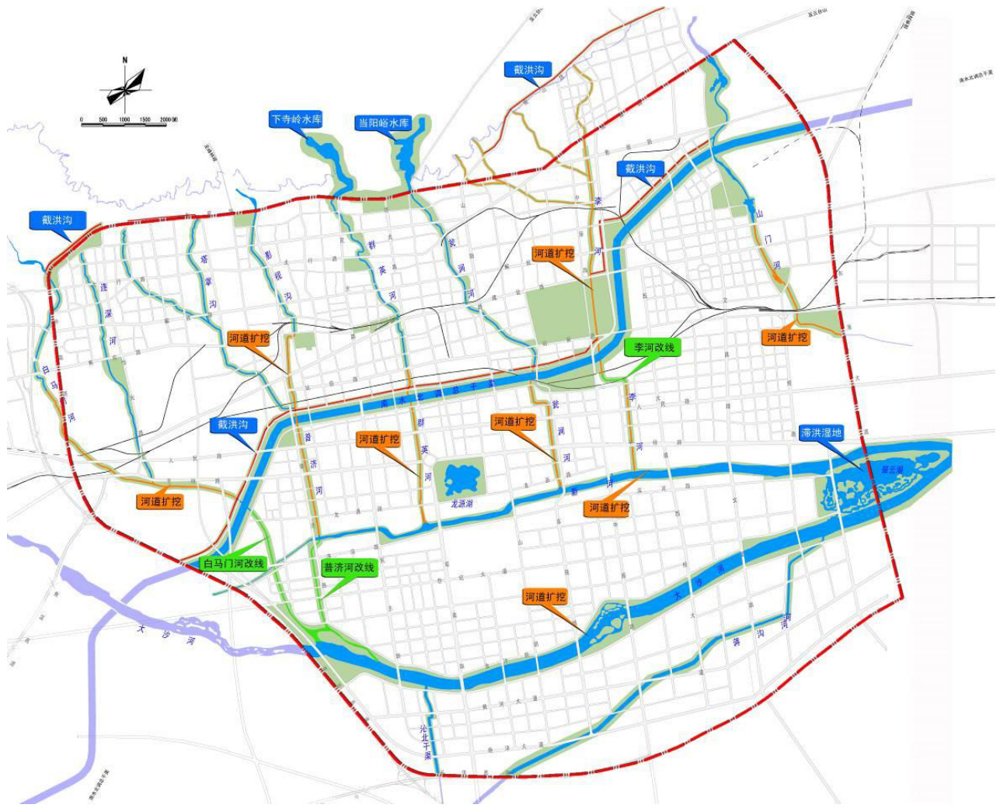  
图 4.2-1  焦作市“排滞方案”城市防洪工程体系总体布局图  

根据《焦作市城区城区防洪规划报告》,山门河五里铺至张弓铺( $13\substack{+093})$ )西段河道,桩号 $10{+}673{\sim}14{+}090$ ,河道长约 $3.42\mathrm{km}$ ,50 年一遇洪峰流量 $1658~\mathrm{m}^{3}/\mathrm{s}$ ,20 年一遇洪峰流量 $1196\mathrm{m}^{3}/\mathrm{s}$ ,设计河道纵坡 1/500。该段河道采用复式梯形断面,设计主槽底宽 $50\mathrm{m}$ ,主槽边坡 1:3.0,堤中心距 $100\mathrm{m}$ ,设计主槽糙率 0.025,滩地糙率 0.03。  

张弓铺村西至入大沙河口段河道,桩号 $14\substack{+090-16+545}$ ,河道长约 $2.46\mathrm{km}$ ,50 年一遇洪峰流量 $1658\mathrm{m}^{3}/\mathrm{s}$ ,20 年一遇洪峰流量 $1196\mathrm{m}^{3}/\mathrm{s}$ ,设计河道纵坡 1/1600。该段河道采用复式梯形断面,设计主槽底宽 $100\mathrm{m}$ ,主槽边坡 1:3.0,堤中心距 $160\mathrm{m}$ ,设计主槽糙率 0.025,滩地糙率 0.03。  

# 2.《焦作市城区水系规划(2012\~2020)》  

通过对焦作市城区水系的梳理和调整,规划最终形成“四廊六脉连山水,三环碧水映新城,东西湿地保生境,六湖两库塑美景”的城区水系结构布局,以期达到“半城春水映山色,百里莺啼闹花香”的规划愿景。  

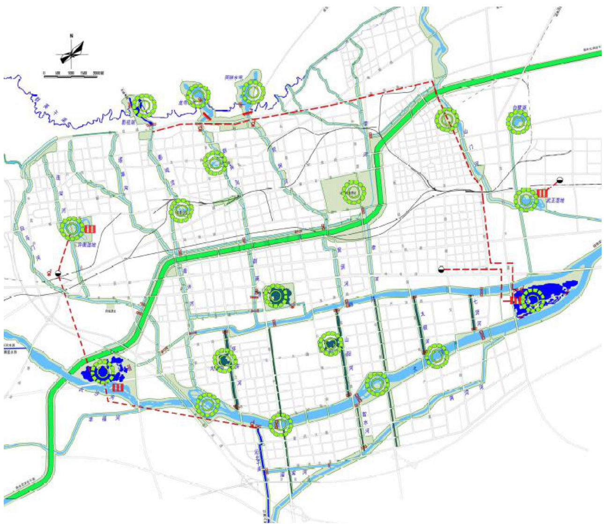  
图 4.2-2  焦作市水系工程总布置图  

《焦作市城区水系规划( $2012^{\sim}2020)$ 》在山门河建设武王湿地,武王湿地位于山门河下游,五里堡和张弓铺之间,占地面积约 $56\mathsf{h m}^{2}$ ,其中水面面积约 $17\mathsf{h m}^{2}$ ,通过疏挖、改造与山门河相连通,并结合生态净化技术,将公园游憩、水质净化和科普教育集于一体,利用湿地对污水处理厂中水进行深度净化处理,保障湿地以及山门河下游水系生态用水,该湿地公园具有游憩、科普教育和净化水体等多种功能。  

# 4.2.2 可研确定的工程任务  

2022 年 1 月编制的《修武县山门河五里堡至大沙河段水毁修复工程可行性研究报告》中对工程任务进行了明确。工程兼具水毁修复、防洪排涝等综合任务,通过河道修复、堤防填筑、河道疏挖、岸坡防护、防汛道路提升等工程建设,最终完成对修武县山门河五里堡至大沙河段水毁修复工程的综合修复,一定程度上提升区域水系的总体防洪除涝能力,改善城乡水系生态环境。  

# 4.3 灾后情况及存在问题  

# 4.3.1 灾后情况  

2021 年 7 月 18 日 20 时到 22 日 15 时,焦作市持续出现强降雨,全市平均雨量 $416\mathrm{mm}$ 。其中市区 $546.8\mathrm{mm}$ ,修武 $568\mathrm{mm}$ ,武陟 $404.6\mathrm{mm}$ ,博爱 $399.1\mathrm{mm}$ ,温县 $330.6\mathrm{mm}$ ,沁阳 $310.6\mathrm{mm}$ ,孟州 $335.4\mathrm{mm}$ 。7 月 18 日 ${\sim}22$ 日全市四日降雨量( $(416\mathrm{mm}$ )占全市多年平均降雨量( $1956{\sim}2016$ 年 $582.3\mathrm{mm})$ 的 $71.4\%$ ,市区四日降雨量( $546.8\mathrm{mm}$ )占市区多年平均降雨量( $1956{\sim}2016$ 年 $601.3\mathrm{mm})$ 的 $90.9\%$ 。  

集中的暴雨引发的洪水对全市的水利基础设施造成了严重的破坏,堤防坍塌、边坡冲毁、堰坝受损、路桥冲垮,造成了严重的经济损失。下面是此次现场调查的几处现场情况。  

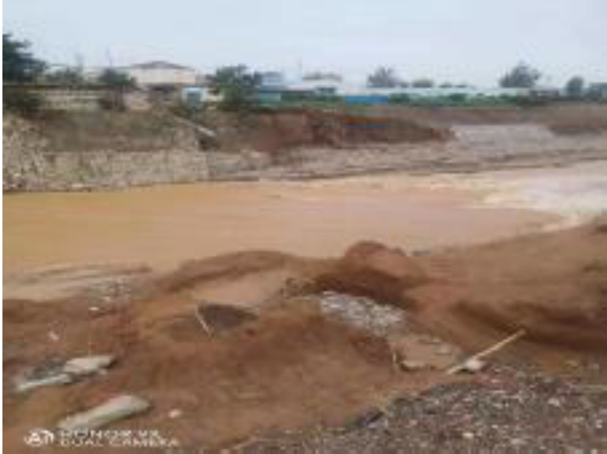  
图 4.3-1 五里堡洪水过后  

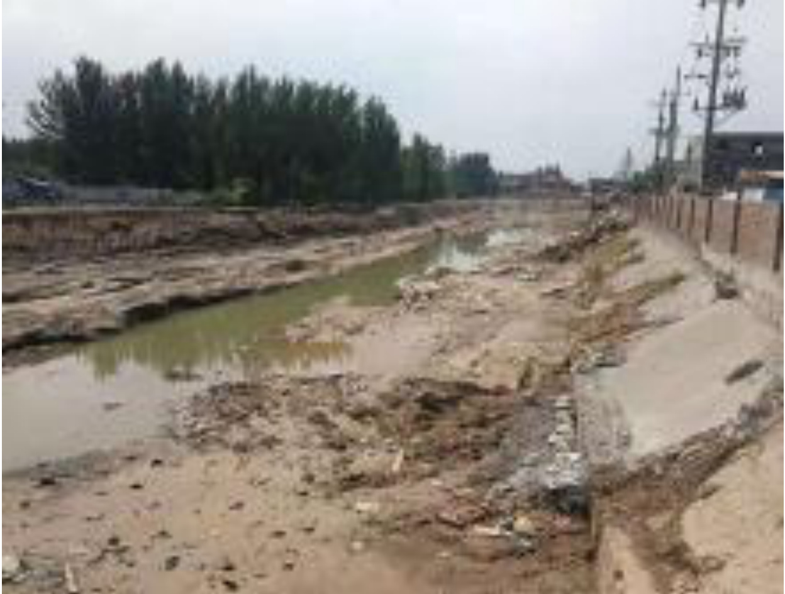  
图 4.3-2  张弓铺附近洪水过后  

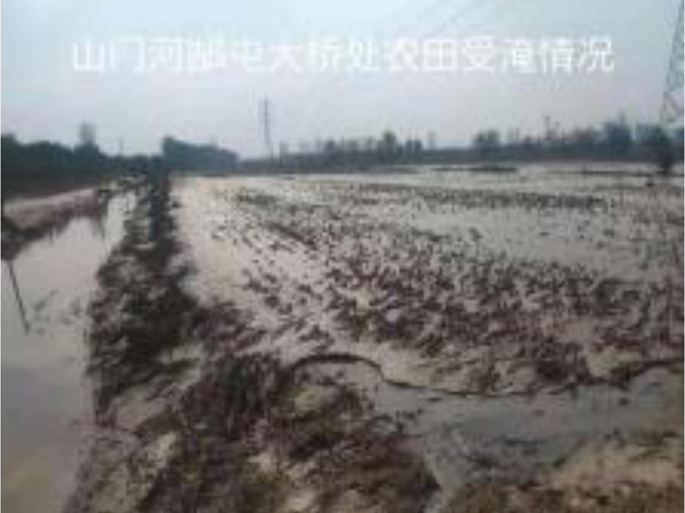  
图 4.3-3 郜屯村洪水漫滩  

  
图 4.3-4 河槽废弃水闸阻水  

# 4.3.2 存在的问题  

修武县山门河五里堡至大沙河段逐渐向平原过渡,纵坡变缓,河槽又窄又浅,河道过流能力很小。根据五里堡水文站实测断面分析,过流能力仅 $140\mathrm{m}^{3}/\mathrm{s}$ ,远小于 5 年一遇标准。  

山门河五里堡以东河道,在万方铝业集团和张弓铺村之间穿过,行洪断面窄小,沿河建筑物阻水严重,河道淤积使主河槽很不明显,局部位置仅能过 $8\mathrm{m}^{3}/\mathrm{s}$ ,汛期靠滩地行洪。张弓铺村北行洪区原宽度为 $920\mathrm{m}$ ,焦作万方铝业集团建成后,占用了大部分行洪区,现行洪宽度仅有 $180\mathrm{m}$ 左右。  

山门河防洪问题十分突出,特别是五里堡至大沙河段河道。近年来,对河道主河槽进行了清淤疏浚,但未进行系统治理,防洪能力仍远远达不到要求。  

由于该河道上游缺乏有效控制性工程,下游左岸堤防残缺不全,21.7 洪水造成河道漫溢,村庄、农田以及部分企业被淹,经济损失巨大。  

# 4.4 工程建设必要性  

# 4.4.1 消除暴雨影响恢复沿线群众正常生产生活的需要  

2021 年汛期出现的强降雨对焦作市经济社会影响重大,在本次强降雨过程中,山门河遭遇有历史记录以来的最大洪水,山洪河道水位暴涨,山门河河山洪河道多处桥涵护坡被冲毁,道路路基塌方,下游马村区待王段、郜屯段漫堤,受淹面积 $6{\mathsf{k m}}^{2}$ ,造成沿线农田绝收,3 个村庄及万方铝厂等 12 企业被淹,平均水深 $1.6\mathsf{m}$ ,房屋倒塌 350 座,转移受灾人口 0.8 万人,造成巨大的经济损失。科学规划并统筹推进、快速实施修武县山门河水毁修复工程,尽快消除暴雨影响,有利于恢复沿线群众的正常生产生活秩序,避免发生次生灾害,切实保障人民群众的生命与财产安全。  

# 4.4.2  完善并提升修武县城乡防洪体系的需要  

山门河是修武县重要的防洪河道,本次暴雨造成右岸堤防多处出现险情,岸坡冲刷严重,影响堤防边坡稳定;加之右岸现状堤防原填筑标准较低且不连续,局部堤防宽度 $1^{\sim}2\ensuremath{\mathrm{m}}$ ,抵御洪水的能力较差,不能有效约束洪水,威胁沿岸城乡居民的生命财产安全,急需对右岸堤防进行加固处理,形成完整的城乡防洪体系。通过本次治理的实施,能够切实完善防洪体系,对保障未来汛期修武县城乡防洪很有必要。  

# 4.4.3  实现社会、经济、生态环境效益综合、协调、统一的需要  

本次水毁修复工程的建设不仅具有水利工程带来的社会效益,在水利工程建设的基础上开展一定的有针对性的生态环境建设,能够改善城乡生态环境状况,提高环境质量水平,带来良好的经济效益和生态效益,真正做到尊重自然、以人为本、人与自然和谐发展的良性循环,实现社会、经济、生态效益的综合、协调、统一。  

综上所述,开展修武县山门河五里堡至大沙河段水毁修复工程是非常必要的。  

# 4.5 工程任务  

修武县山门河五里堡至大沙河段水毁修复工程承接可行性研究阶段确定的工程任务,即工程兼具水毁修复、防洪排涝等综合任务,通过河道修复、堤防填筑、河道疏挖、岸坡防护、防汛道路提升等工程建设,最终完成对修武县山门河五里堡至大沙河段水毁修复工程的综合修复,一定程度上提升区域水系的总体防洪除涝能力,改善城乡水系生态环境。治理范围为山门河五里堡至大沙河段。  

# 4.6 工程规模  

(1)治理标准  

修武县山门河五里堡至大沙河段水毁修复工程是以防洪为主要任务的灾后治理工程,根据《焦作市城区防洪规划报告》,山门河城区段左岸防洪标准为 20 年一遇,右岸防洪标准为 50 年一遇。本段山门河不属于城区段,防洪标准可为 20年一遇。根据《防洪标准》(GB50201-2014),修武县本段山门河防护区为乡村段,防护等级为 IV 等,防洪标准为 ${20^{\sim}10}$ 年一遇。可行性研究阶段确定本段防洪标准为 20 年一遇。  

综合以上分析,本次设计修武县山门河五里堡至大沙河段水毁修复工程沿用可行性研究阶段确定的设计防洪标准,即 20 年一遇。  

(2)工程内容及规模  

本次工程主要建设内容包括河道疏浚、堤防整修、岸坡防护、堤顶道路、拆除重建桥涵、拆除重建水闸、拆除重建排水涵等工程。  

河道工程:河道清淤疏浚 $6.45{\mathrm{km}}$ ,包含五里堡 $\tilde{}$ 大沙河段山门河桩号$\mathsf{K}1{+}410{-}\mathsf{K}6{+}710$ ,清淤长度 3.6km( $\kappa4{+}510{-}|\kappa6{+}210$ 段已在其他工程中实施);焦新公路南侧排水沟(简称:南排)桩号 ${\mathsf{N P0}}{+}000{-}{\mathsf{N P1}}{+}410$ ,清淤长度 1.41km;焦新公路北侧排水沟(简称:北排)桩号 $8\mathsf{P0}{+}000{-}\mathsf{B P1}{+}440$ ,长度 $1.44\mathrm{km}$ 。  

堤防工程:加高加固 $\ K1{+}410$ (五里堡) ${\sim}\ K6{+}310$ 右岸堤防,长度 $4.9\mathrm{km}$ 。加高加固郜屯围村堤 $\mathsf{W D0}\mathbf{+}000\mathbf{-}\mathsf{W D1}\mathbf{+}730_{,}$ ,段,长度 $1.73\ensuremath{\mathrm{km}}$ 。  

岸坡工程:岸坡护砌长度 $5.1\mathsf{k m}$ ,包含山门河堤防段岸坡或河槽防护,桩号$\mathsf{K}1{+}410{-}\mathsf{K}5{+}210$ 段( $K5+210{\cdot}K6{+}310$ 段已在其他工程中实施),长度 $3.8\mathsf{k m}$ ;南排岸 坡 护 砌 桩 号 ${\mathsf{N P0}}{+}000{-}{\mathsf{N P1}}{+}410$ , 长 度 1.41km ; 北 排 岸 坡 护 砌 桩 号$8\mathsf{P0}{+}000{-}\mathsf{B P1}{+}440$ ,总长度 $1.44\mathrm{km}$ 。  

堤顶路:新建右岸堤顶路 $4.9\mathrm{km}$ ,新建郜屯村围村堤顶路 1.73km,总长度 6.63km。  

拆除重建桥涵工程:山门河主河道拆除重建箱涵桥 4 座,桩号为 $\ K1{+}860$ 、$\kappa2\substack{+330}$ 、 $\mathsf{K}3\mathsf{+}900$ 、 $\kappa4+260$ ;南排拆除重建箱涵桥 2 座,桩号为 $\mathsf{N P O}\boldsymbol{+}\boldsymbol{0}\boldsymbol{4}\boldsymbol{0}$ 、 $\mathsf{N P1}\substack{+150}$ 。  

拆除重建水闸工程:北排拆除重建水闸 1 座,桩号为 $\mathsf{B P1+180}$ ;南排拆除重建水闸 1 座,桩号为 $\mathsf{N P O}+780$ ;  

拆除重建排水涵工程:郜屯村围村堤拆除重建排水涵 4 处,桩号为 $\mathsf{W D0+090}$ 、$\mathsf{W D0+240}$ 、 $\mathsf{W D}\mathsf{O}\boldsymbol{+}790$ 、WD1+240。  

# 工程布置及建筑物  

# 5.1 设计依据  

# 5.1.1 法律法规及有关规定  

(1)《中华人民共和国水法》(2016 年 7 月 2 日第十二届全国人民代表大会常务委员会第二十一次会议第二次修正,自发布之日起施行);  

(2)《中华人民共和国防洪法》(2016 年 7 月 2 日第十二届全国人民代表大会常务委员会第二十一次会议第三次修正,自发布之日起实施);(3)《中华人民共和国防汛条例》(2011 年 1 月 8 日第二次修订,中华人民共和国国务院令第 588 号公布,自发布之日起执行);(4)《中华人民共和国河道管理条例》(2018 年 3 月 19 日国务院第四次修正,自发布之日起施行);(5)《中华人民共和国水文条例》(2007 年 3 月 28 日国务院第 172 次常务会议通过,自 2007 年 6 月 1 日起施行,2017 年 3 月 1 日国务院第三次修订);(6)《河道管理范围内建设项目管理的有关规定》,2017 年 12 月 22 日水利部令第 49 号修正);(7)《河南省实施<中华人民共和国水法>办法》(1993 年 2 月 16 日河南省第七届人民代表大会常务委员会第三十三次会议通过,2006 年 5 月 31 日河南省第十届人民代表大会常务委员会第二十四次会议修订);(8)《河南省实施<中华人民共和国防洪法>办法》(2000 年 7 月 29 日河南省第九届人民代表大会常务委员会第十七次会议审议通过,2016 年 3 月 29 日河南省第十二届人民代表大会常务委员会第二十次会议第二次修正);(9)《河南省<河道管理条例 $>$ 实施办法》(1992 年 8 月 15 日省政府令第 37号公布,2017 年 4 月 14 日省政府令第 179 号修订);(10)《河南省实施<中华人民共和国防汛条例 $>$ 细则》(河南省人民政府令(第 4 号),1993 年 11 月 27 日河南省政府常务会议审议通过,自发布之日起施行)。  

# 5.1.2 主要规程、规范  

(1)《水利水电工程初步设计报告编制规程》(SL/T619-2021);  
(2) 《工程建设标准强制性条文(2020 年版)》(水利工程部分);  
(3)《防洪标准》(GB50201-2014);(4)《水利水电工程等级划分及洪水标准》(SL252-2017);  
(5) 《水利水电工程水文计算规范》(SL/T278-2020);  
(6) 《水利水电工程设计洪水计算规范》(SL44-2006);  
(7) 《堤防工程设计规范》(GB50286-2013);  
(8) 《水闸设计规范》(SL265-2016);  
(9) 《水利水电工程合理使用年限及耐久性设计规范》(SL654-2014);  
(10) 《水工混凝土结构设计规范》(SL191-2008);  
(11) 《水工挡土墙设计规范》(SL379-2007);  
(12) 《河道治理设计规范》(GB50707-2011);  
(13)《水利水电工程施工组织设计规范》(SL303-2017);  
(14)国家和水利行业其他相关规程、规范和标准等。  

# 5.1.3 有关文件和资料  

(1)《焦作市城市总体规划(2008\~2020)》(中国城市建设研究院、中国  
科学院地理资源所区域与城市规划设计研究中心,2008 年 12 月);(2)《焦作市城区防洪规划报告》(河南省水利勘测设计研究有限公司,2012  
年 10 月);(3)《焦作市城区水系规划(2012\~2020 年)》(河南省水利勘测设计研究  
有限公司,2012 年 10 月);(4)《修武县山门河五里堡至大沙河段水毁修复工程可行性研究报告》(河  
南省水利勘测设计研究有限公司,2021 年 12 月);(5)其他相关资料。  

# 5.2 工程等级和标准  

修武县山门河五里堡至大沙河段水毁修复工程是以防洪为主要任务的灾后治理工程,根据《焦作市城区防洪规划报告》,山门河城区段左岸防洪标准为 20 年遇,右岸防洪标准为 50 年一遇。本段山门河不属于城区段,防洪标准可为 20年一遇。根据《防洪标准》(GB50201-2014),修武县本段山门河防护区为乡村段,防护等级为 IV 等,防洪标准为 $20{\sim}10$ 年一遇。可行性研究阶段确定本段防洪标准为 20 年一遇。综合以上分析,本次设计修武县山门河五里堡至大沙河段水毁修复工程沿用可行性研究阶段确定的设计防洪标准,即 20 年一遇。  

按照《水利水电工程等级划分及洪水标准》(SL252-2017)的规定,工程等别为Ⅴ等,主要建筑物级别为 4 级,次要建筑物级别 5 级,临时建筑物 5 级。根据《堤防工程设计规范》(GB/T50286-2013)堤防工程的级别为 4 级,临时工程为 5 级。  

# 5.3 工程总布置  

# 5.3.1  灾后河道现状(与 4.3.1 内容完全重复,建议删除)  

2021 年 7 月 18 日 20 时到 22 日 15 时,焦作市持续出现强降雨,全市平均雨量 $416\mathrm{mm}$ 。其中市区 $546.8\mathrm{mm}$ ,修武 $568\mathrm{mm}$ ,武陟 $404.6\mathrm{mm}$ ,博爱 $399.1\mathrm{mm}$ ,温县 $330.6\mathrm{mm}$ ,沁阳 $310.6\mathrm{mm}$ ,孟州 $335.4\mathrm{mm}$ 。7 月 18 日 ${\sim}22$ 日全市四日降雨量( $416\mathrm{mm}$ )占全市多年平均降雨量( $1956{\sim}2016$ 年 $582.3\mathrm{mm})$ 的 $71.4\%$ ,市区四日降雨量( $546.8\mathrm{mm}$ )占市区多年平均降雨量( $1956{\sim}2016$ 年 $601.3\mathrm{mm})$ 的 $90.9\%$ 。  

集中的暴雨引发的洪水对全市的水利基础设施造成了严重的破坏,堤防坍塌、边坡冲毁、堰坝受损、路桥冲垮,造成了严重的经济损失。下面是此次现场调查的几处现场情况。  

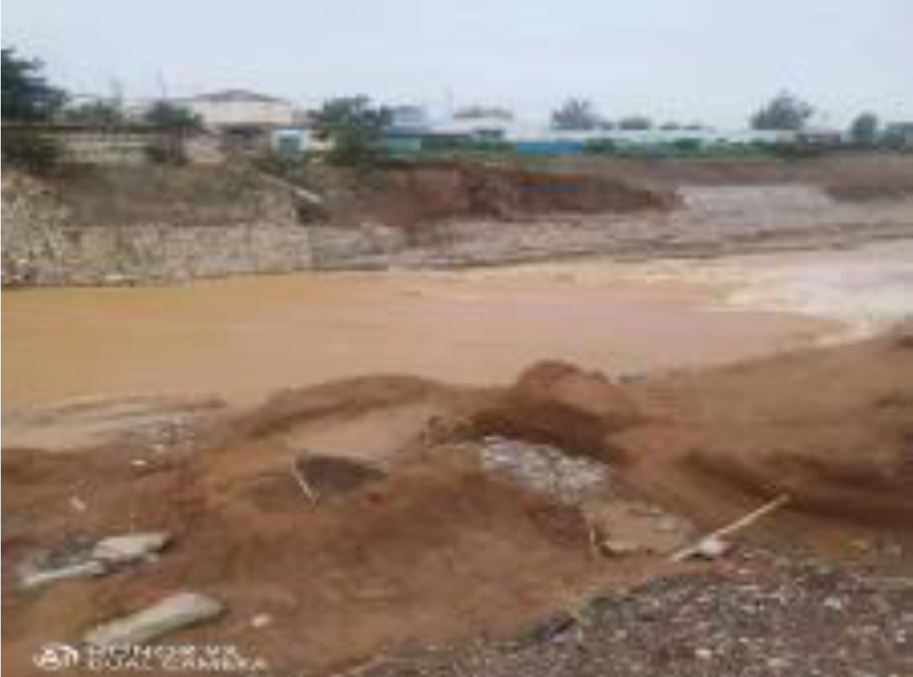  
图 4.3-1 五里堡洪水过后  

  
图 4.3-2 张弓铺附近洪水过后  

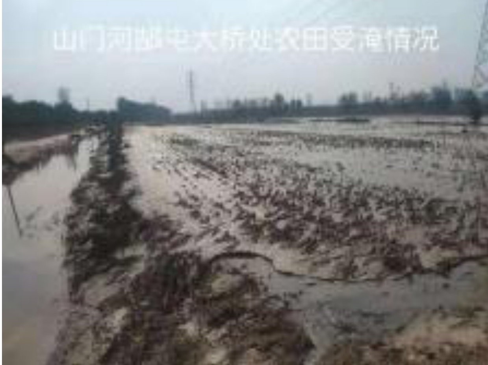  
图 4.3-3 郜屯村洪水漫滩  

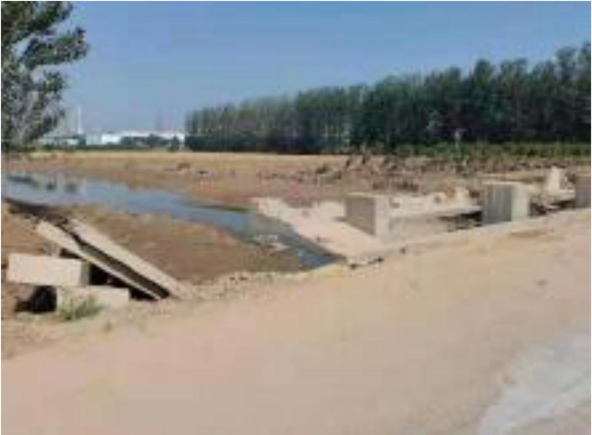  
图 4.3-4 河槽废弃水闸阻水  

# 5.3.2 工程总布置  

修武县山门河五里堡至大沙河段逐渐向平原过渡,纵坡变缓,右岸设有堤防,左岸漫滩行洪,主河槽又窄又浅,河道过流能力很小。根据五里堡水文站实测断面分析,过流能力远小于 5 年一遇标准。  

山门河五里堡以东河道,在万方铝业集团和张弓铺村之间穿过,行洪断面窄小,沿河建筑物阻水严重,河道淤积使主河槽很不明显,局部位置仅能过 $8\mathrm{m}^{3}/\mathrm{s}$ ,汛期靠滩地行洪。张弓铺村北行洪区原宽度为 $920\mathrm{m}$ ,焦作万方铝业集团建成后,占用了大部分行洪区,现行洪宽度仅有 $180\mathrm{m}$ 左右。  

山门河防洪问题十分突出,特别是五里堡至大沙河段河道。近年来,对河道主河槽进行了清淤疏浚,但未进行系统治理,防洪能力仍远远达不到要求。  

由于该河道上游缺乏有效控制性工程,下游左岸无堤防,21.7 洪水造成河道漫溢,村庄、农田以及部分企业被淹,经济损失巨大。部分河段按照原标准进行了灾后恢复重建工程,本次设计沿用可行性研究阶段确定的设计防洪标准,即 20年一遇。  

此次修武县山门河水毁修复工程治理范围为五里堡\~大沙河段,具体为$\mathsf{K}1\mathsf{+}410\mathsf{-K}6\mathsf{+}710$ ,南排 ${\mathsf{N P0}}{+}000{-}{\mathsf{N P1}}{+}410$ ,北排 $8\mathsf{P0}{+}000{-}\mathsf{B P1}{+}440$ 。本次工程主要建设内容包括河道疏浚、堤防整修、岸坡防护、堤顶道路、拆除重建桥涵、拆除重建水闸、拆除重建排水涵等工程。  

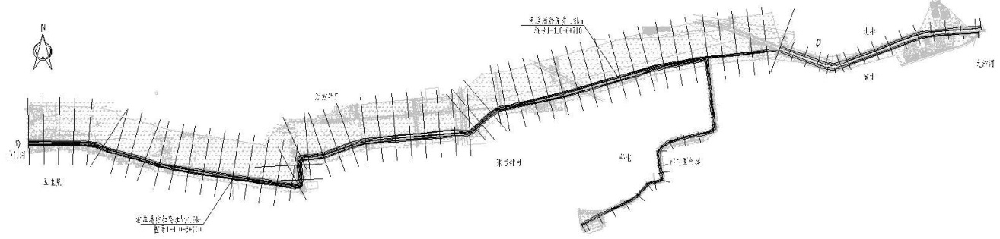  
图 5.3-1  修武县山门河水毁修复工程总布置图  

# 5.4 河道工程  

# 5.4.1 设计原则  

修武县山门河河道在经历 2021 年 7 月份洪水冲击后,河床冲刷和淤积均较严重,局部段河床冲刷下切较严重,岸坡冲刷破坏,存在安全隐患,为保证河道行洪安全,本次设计主要对河床进行平整顺接,优化调整主河槽位置保证岸坡安全。设计的原则是:  

(1)河道走向基本维持现状,局部河段根据地形地物适当调整,以使河道水流顺畅;(2)结合现状,以河道平整为主;(3)基本维持现状河道纵坡,保持河道纵坡连接顺畅;(4)充分利用现状河槽,尽量减少河槽挖方,减少工程投资。(5)尽可能减少占地,节约投资。  

# 5.4.2 河道断面设计  

河道疏浚工程纵断面的确定,主要是结合现状河底,确定河底纵坡,详见设计纵断面图。  

本次设计主河道为复式梯形断面,河槽基本维持原河槽底宽,为 $5\mathrm{m}{\sim}15\mathrm{m}$ ,两岸边坡坡比基本采用 1:2,河道设计纵坡为 1:500-1:1000;南排和北排均采用单式梯形断面,河槽宽度为 $2\mathrm{m}$ ,两岸边坡坡比为 1:1.5,河道设计纵坡为 1:1000,此次治理以扩挖、疏浚河槽为主,并结合综合治理进行护岸设计。  

# 5.4.3 水面线计算  

采用 Mike11 一维水动力模型进行水面线分析计算。  

(1)模型原理  

MIKE11 水动力学模型的微分方程一维明渠非恒定流方程,即圣维南(Saint-Venant)方程组,基本假定是:  

(1)不可压缩、均质流体;  
(2)基本是一维流态;  
(3)坡降小、纵向断面变化幅度小;  
(4)静水压力分布。  

SaintVenant 方程组的具体形式为:  

$$
\frac{\partial Q}{\partial x}+B\frac{\partial Z}{\partial t}=q
$$  

$$
\frac{\partial\mathcal{Q}}{\partial t}+\frac{\partial}{\partial x}(\frac{\mathcal{Q}^{2}}{A})+g A(\frac{\partial Z}{\partial x}+\frac{Q\left|\mathcal{Q}\right|}{K^{2}})=0
$$  

式中 t 为时间坐标, $\mathbf{X}$ 为河道沿程坐标, $\mathsf Q$ 为流量, $Z$ 为水位,A 为过水断面的面积,B 为水面宽度,K 为流量模数, $\mathbf{g}$ 为重力加速度, $\mathbf{q}$ 为旁侧入流流量。  

$$
K=A C\sqrt{R}=A\cdot\frac{1}{n}R^{2/3}
$$  

  

(4)模型率定  

根据“7.20”洪痕调查结果,对模型糙率进行率定,率定结果见表 5.5-1。  

表 5.5-1 模型率定结果  

<html><body><table><tr><td>序号</td><td>桩号</td><td>流量（m3/s）</td><td>调查水位 (W)</td><td>模拟水位 (m)</td><td>差值（m)</td><td>糙率</td></tr><tr><td>1</td><td>K1+810</td><td>500</td><td>92.0</td><td>91.980</td><td>-0.020</td><td>0.038</td></tr><tr><td>2</td><td>K4+660</td><td>500</td><td>87.0</td><td>87.016</td><td>+0.016</td><td>0.032</td></tr></table></body></html>  

# (5)水面线计算  

山门河 20 年一遇洪峰流量为 $960\mathrm{m}^{3}/\mathrm{s}$ ,,相应水面线见表 5.5-2。  

表 5.5-2 山门河修武段 20 年一遇水面线成果表  

<html><body><table><tr><td>桩号</td><td>水位 (m)</td><td>桩号</td><td>水位 (m)</td><td>桩号</td><td>水位 (m)</td></tr><tr><td>K1+410</td><td>93.77</td><td>K3+210</td><td>90.04</td><td>K4+710</td><td>87.87</td></tr><tr><td>K1+510</td><td>93.50</td><td>K3+260</td><td>90.01</td><td>K4+810</td><td>87.80</td></tr><tr><td>K1+610</td><td>93.30</td><td>K3+310</td><td>89.79</td><td>K4+860</td><td>87.76</td></tr><tr><td>K1+710</td><td>93.05</td><td>K3+410</td><td>89.44</td><td>K4+910</td><td>87.72</td></tr><tr><td>K1+810</td><td>92.82</td><td>K3+460</td><td>89.41</td><td>K5+010</td><td>87.67</td></tr><tr><td>K1+910</td><td>92.61</td><td>K3+510</td><td>89.30</td><td>K5+110</td><td>87.61</td></tr><tr><td>K2+010</td><td>92.389</td><td>K3+610</td><td>89.112</td><td>K5+210</td><td>87.551</td></tr><tr><td>K2+110</td><td>92.165</td><td>K3+710</td><td>88.934</td><td>K5+310</td><td>87.474</td></tr><tr><td>K2+210</td><td>91.95</td><td>K3+810</td><td>88.78</td><td>K5+410</td><td>87.437</td></tr><tr><td>K2+310</td><td>91.71</td><td>K3+910</td><td>88.687</td><td>K5+510</td><td>87.398</td></tr><tr><td>K2+410</td><td>91.51</td><td>K4+010</td><td>88.583</td><td>K5+610</td><td>87.349</td></tr><tr><td>K2+510</td><td>91.331</td><td>K4+110</td><td>88.492</td><td>K5+710</td><td>87.307</td></tr><tr><td>K2+610</td><td>91.091</td><td>K4+210</td><td>88.384</td><td>K5+810</td><td>87.264</td></tr><tr><td>K2+710</td><td>90.906</td><td>K4+310</td><td>88.317</td><td>K5+910</td><td>87.208</td></tr><tr><td>K2+810</td><td>90.723</td><td>K4+410</td><td>88.261</td><td>K6+010</td><td>87.172</td></tr><tr><td>K2+910</td><td>90.512</td><td>K4+510</td><td>88.21</td><td>K6+110</td><td>87.134</td></tr><tr><td>K3+010</td><td>90.333</td><td>K4+610</td><td>88.146</td><td>K6+210</td><td>87.082</td></tr><tr><td>K3+110</td><td>90.19</td><td>K4+660</td><td>87.873</td><td>K6+310</td><td>87.05</td></tr></table></body></html>

相应水面线图见图 5.5-2。  

  
图 5.5-2 山门河修武段 20 年一遇水面线图  

# 5.5 堤防工程  

# 5.5.1 堤线布置  

本工程的堤防主要分布在山门河的右岸和郜屯围村堤。根据《堤防工程设计规范》(GB50286-2013),堤线布置应根据防洪规划、地形、地质条件,结合现有堤防位置。本次河道治理工程设计时以防洪为首要目标,确定河道治理的设计要素时适当考虑生态的需求,工程设计原则为:  

(1)堤线应力求平顺,尽量利用原有堤防和有利地形,修筑在土质良好、比  
较稳定的滩岸上;(2)堤线与河势流向相适应,并与洪水主流方向基本一致;(3)堤线力求平顺,各堤段平缓连接,不应采折线或急弯,工程布置应与河  
道内现有桥梁布置相互协调统一;(4)堤线应布置应有利于防汛抢险和工程管理;  

# 5.5.2 堤型选择  

根据大堤修筑的情况,可以有土堤、石堤、混凝土或钢筋混凝土防洪墙、分区填筑的混合材料堤等;根据堤身断面型式,可以选择斜坡式堤、直墙式堤、或直斜复合式堤等。  

土堤是我国江河、湖、海防洪广为采用的堤型。土堤具有工程投资较省,施工条件简单,就近取材,原材料采运方便,施工方式简单,施工效率高,能适应堤基变形,便于加修改建,易于作绿化处理,对城市景观影响小等优点,堤防设计中往往作为首选堤型,目前我国多数堤防采用均质土堤。土堤边坡较缓,堤基与地基接触面较大,地基应力较小,整体沉降变形较小,沉降差较大,对地基土层承载力的要求不高,适用于软弱地基。但土堤边坡较缓,占用面积空间大,堤身填筑材料需求较多,其防渗防冲的可靠性以及抗御超额洪水与漫顶的能力较弱。因此,在进行土堤设计时应充分考虑堤防的占地、土料储量问题和做好防冲刷的处理措施,设计中根据水流冲刷影响情况,往往在临水面采用草皮护坡、浆砌石护坡或混凝土护坡。对地质较差、有软弱土层存在、地基处理难度较大或不经济、波浪较大、堤身较高的堤段,宜采用此堤型。  

混凝土、钢筋混凝土堤工程占地少,用土量少,抗冲刷能力强,风浪爬高小,因而安全超高也小。堤防的整体性能较好。但对软基的适应能力差,且造价高。此堤型适合于地质较好,虽有软弱土层存在,但经地基加固处理后在经济上合理,河道行洪断面小,须征用土地较多,且堤岸受冲刷严重地段。  

土石混合堤是一种应用较为广泛的堤型,为土堤前坡采用钢筋混凝土或浆砌石挡土墙,可减少堤防占用河道、耕地,也用于路堤结合情况。  

本次设计工程区位于焦作市修武县,现状主河槽宽度较窄。本次工程设计主河道采取防浪墙加现状堤防结合的方式进行堤防设计,围村堤采用土堤的方式设计,结合对现状河道进行疏浚整治。根据计算,疏浚整治河道开挖弃土方量较大,但土料指标不能满足填筑堤防的要求,附近大沙河已实施的水毁工程,弃土满足填筑堤防的要求,所以本次堤防工程按照因地制宜,就地取材的选型原则,并参考工程区已建同类堤防堤型,确定设计河道堤防主河道采用防浪墙加梯形断面均质土堤;围村堤采用梯形断面均质土堤。  

# 5.5.3 堤顶高程  

采用《堤防工程设计规范》(GB50286-2013)中的公式进行计算。设计洪水为设计洪水位,堤顶超高按下式计算:  

$$
Y=R+e+A
$$  

式中: $\mathrm{Y}$ —堤顶超高(m);  

R—设计风浪爬高(m);  

e—设计风雍水面高度(m);  

A—安全加高值 $(\mathrm{m})$ ,4 级堤防 $\mathrm{A}{=}0.6\mathrm{m}$ 。  

风壅水面高度在有限风区的情况下,可按下式计算:  

$$
e=\frac{k\nu^{2}F}{2g d}\cos\beta
$$  

式中:e—设计点的风壅水面高度 $(\mathrm{m})$ ;  
k—综合摩阻系数,取 $3.6\times10^{-6}$ ;  
v—设计风速,取历年汛期最大风速平均值的 1.5 倍;F—由计算点逆风向量到对岸的距离 $(\mathrm{m})$ ;  
d—水域的平均水深 $(\mathrm{m})$ ;  
$\upbeta$ —风向与垂直堤轴线的法线的夹角 $\left(\begin{array}{l l}{\circ}&{}\end{array}\right)$ 。  
波浪爬高 R 的计算  
平均波高和波长 L 的计算  

$$
\frac{g\overline{{{H}}}}{V^{2}}=0.13t h\left[0.7\left\{\frac{g d}{V^{2}}\right\}^{0.7}\right]t h\left\{\frac{0.0018\left\{\frac{g F}{V^{2}}\right\}^{0.45}}{0.13t h\left[0.7\left\{\frac{g d}{V^{2}}\right\}^{0.7}\right]}\right\}
$$  

式中: $\mathbf{g}\cdot\mathbf{\sigma}$ —重力加速度( $\left(9.81\mathrm{m}/\mathrm{s}^{2}\right.$ )  

H —平均波高(m);  

$$
\frac{g\overline{{{T}}}}{V}=13.9\left\{\frac{g\overline{{{H}}}}{V^{2}}\right\}^{0.5}
$$  

$$
L={\frac{g{\overline{{T}}}^{2}}{2\pi}}t h{\frac{2\pi d}{L}}
$$  

式中: $\overline{T}$ —平均波周期(s);  

L—堤前波浪的波长 $(\mathrm{m})$ 。  

波浪爬高计算  

$$
R_{_{p}}={\frac{k_{\Delta}k_{_{V}}k_{_{p}}}{\sqrt{1+m^{2}}}}\sqrt{\overline{{H}}L}
$$  

式中:Rp—累积频率为 $\mathrm{P}$ 的波浪爬高 $(\mathrm{m})$ , $\mathfrak{p}$ 取 $5\%$ ;  

$\mathbf{k}_{\triangle}$ —斜坡的糙率及渗透性系数,根据护面类型取 0.90;  

kv一经验系数,根据风速 $\mathrm{V}(\mathrm{m}/\mathrm{s})$ ,堤前水深 $\mathrm{d}(\mathrm{m})$ ,重力加速度 $\mathrm{g}(\mathrm{m}/\mathrm{s}^{2})$ 组 成的无维量 $\sqrt[\gamma]{g D}$ 查表确定;  

kp—爬高累积频率换算系数,不允许越浪的堤防取 $5\%$ ;  

m —斜坡坡率。  

计算断面选 $2{+}000$ ,采用 20 年一遇设计标准,为了减少占地,跟现状堤防结合,采用防浪墙加土堤方式,最终防浪墙高程不得低于设计洪水位加上堤防超高。主河道右岸堤防超高计算值为 $1.21\mathsf{m}$ ,围厂堤超高计算值为 1.12m, (围村堤?)出  

于安全考虑,此次设计主河道堤防超高均取 $1.3\mathsf{m}$ ,围厂堤超高取 1.2m(围村堤?)。  

# 5.5.4 堤身设计  

本次工程设计堤顶宽度及堤身结构如下:堤顶宽度 $3\mathrm{m}$ ,防浪墙根据设计堤顶高程不高于 $1.2\mathrm{m}$ ,临水侧坡比 1:2,背水侧坡比 1:2。  

本次设计堤防工程填筑材料为大沙河的河道挖方土料,依据《堤防工程设计规范》(GB50286—2013)规定,确定堤防工程筑堤材料的选择标准及填筑标准如下:此次堤防压实度统一取值,不应低于 0.91,为尽量减少沉降差,本次治理工程堤防填筑压实度按不小于 0.92 控制。筑堤土料要求:筑堤土料宜选用黏性土,黏粒含量宜为 $10\%\sim35\%$ ,塑性指数宜为 $\tt{7}\sim20$ 。上述土料标准具有一般适用性,对于特殊堤段或特殊天气气候条件,应根据土料击实试验确定具体参数。土料内不得含植物根茎、砖瓦垃圾等杂质;填筑土料含水率与最优含水率的允许偏差为$\pm3\%$ 。  

本次河道治理工程设计时为方便堤身排水且减轻临水侧雨淋沟的影响,采取以下措施:  

(1)堤顶向河道背水侧倾斜,坡度为 $2\%$ ;  
(2)堤顶每隔 $50\mathrm{m}$ 向两侧分别设置纵向排水沟各一道。  

堤防地基地面现状表层杂草丛生,甚至部分段落遍地堆积生活垃圾。堤防填筑时应首先进行清基,清基是保证堤基与堤身结合的关键。本次设计拟定清基厚度为 $0.3\mathrm{m}$ (含杂物清理),清基主要内容包括草根、树根、腐殖土、建筑及生活垃圾等杂物,也可将多余量可回填至附近低凹地带。  

本次设计地勘资料中提出河道两岸中粉质壤土除天然含水率偏高,需要翻晒外,其余指标均满足要求,可以作为填筑土料使用。但因此处均为基本农田,征地实施难度较大,因此另外选取修武县大沙河开挖弃料作为堤防筑堤土料。  

# 5.5.5 堤防稳定计算  

本次主河道堤防整修长度约 $4.9\mathrm{km}$ ,郜屯围厂堤堤防整修长度为 $1.73\mathrm{km}$ ,主河槽堤防设计洪水标准为 20 年一遇,堤防级别为 4 级;郜屯围村堤堤防设计洪水标准为 10 年一遇,堤防级别为 5 级。  

(1)堤防渗透稳定分析:1)计算理论  

依据《堤防工程设计规范》)GB50286-2013)中渗流及渗透稳定计算的规定,渗透稳定分析采用河海大学《水工结构有限元分析系统 Autobank7.5.1》对堤防进行渗流及渗透稳定分析。本次计算利用有限元数值分析方法对边坡渗透稳定计算。  

土体在渗流作用下发生破坏,由于土体颗粒级配和土体结构的不同,存在流土、管涌、接触冲刷和接触流失 4 种破坏形式。  

依据《水利水电工程地质勘察规范》(GB50487-2008),渗透稳定分析包括以下内容:土的渗透变形类型的判别、流土和管涌的临界水力坡降的确定、土的允许水力坡降的确定。  

针对边坡渗透稳定分析,可能存在的破坏形式有流土、接触冲刷和接触流失。  

为防止堤防渗透破坏,利用有限元数值分析方法计算,采用河海大学工程力学研究所编制的《水工结构有限元分析系统 AutoBank v7.5.1》进行计算分析,计算断面渗流场情况。  

基本模型为:  

$$
\frac{\partial}{\partial x}(K_{x}\frac{\partial H}{\partial x})+\frac{\partial}{\partial y}(K_{y}\frac{\partial H}{\partial y})=0
$$  

式中:H— 渗流场的水头函数;  
P 水压力;  
γ 水容重;  
KX、Ky——分别为 $\mathbf{X}$ 和 $\mathrm{y}$ 方向土的渗透系数。  

2)计算断面选取及工况  

稳定计算选择不利断面边坡进行稳定计算,取桩号 $2{+}010$ 右岸堤防作为典型断面进行计算。典型断面处,河道 20 年一遇水位 $92.42\mathrm{m}$ ,设计河底高程为$87.10\mathrm{m}$ ,设计防浪墙顶高程为 $93.72\mathrm{m}$ ,设计堤顶高程为 $92.72\mathrm{m}$ 。  

堤防渗透稳定计算工况为临水侧为设计洪水位,背水侧无水,核算在设计洪水位持续时间内浸润线的位置,以及背水侧出逸点的位置、逸出段与背水侧堤基表面的出逸比降。  

# 3)计算成果  

根据《水利水电工程地质勘察规范》(GB50487-2008)及地层情况,土的渗透变形类型判别为流土型,因此按流土型计算临界水力坡降和允许水力坡降,计算公式如下:  

$$
\begin{array}{l}{J_{\mathrm{{ci}}}{=}\delta\left(G_{\mathrm{{s}}}{-}1\right){\times}\left(1{-}n\right)}\ {{}}\ {J_{\mathrm{{\uparrow}}\mathrm{{i}\neq}}{=}J_{\mathrm{{cr}}}/K}\ {{}}\ {n{=}e/\left(1{+}e\right)}\end{array}
$$  

式中:Jcr— 土的临界水力坡降;  

J 允许— 土的允许水力坡降;  
Gs— 土的颗粒密度与水的密度之比;  
n— 土的孔隙率 $(\%)$ ;  
e 孔隙比;  
K— 安全系数为 $1.5{\sim}2.5$ ,取 2。  

经计算,河道 $2{+}010$ 断面堤防的背水侧堤坡及地基表面逸出段的渗流比降比降为 0,远远小于允许比降。渗透稳定满足要求,不需考虑保护措施。  

(2)堤防抗滑稳定计算  

根据《中国地震动参数区划图》(GB18306-2015),工程区地震动峰值加速度为 $0.10\mathrm{g}$ ,相对于地震基本烈度Ⅵ度。根据规范要求,不需要抗地震验算。按照《堤防工程设计规范》(GB50286-2013)的规定,边坡抗滑稳定应计算以下三种工况:  

正常运用条件: $\textcircled{1}$ 河道 20 年一遇洪水位 $92.42\mathrm{m}$ 下的临水侧堤坡; $\textcircled{2}20$ 年一遇洪水位骤降到设计河底下的临水侧堤坡;  

非常运条件Ⅰ:施工期的临水侧堤坡。  

本次堤防抗滑稳定计算采用简化毕晓普法。根据《堤防工程设计规范》(GB50286-2013)附录 F 抗滑稳定计算 F.0.1 条规定,稳定渗流期应采用有效应力法,施工期可采用总应力法,外水位降落期可同时采用有效应力法和总应立法,并以较小的安全系数为准。  

抗滑稳定安全系数计算公式如下:  

式中:W——土条重量(kN);$\boldsymbol{\mathcal{Q}}$ 、V——水平和垂直地震惯性力( $V$ 向上为负,向下为正)(kN);$u$ ——作用与土条底面的孔隙压力( $\mathbf{kN}/\mathbf{m}^{2},$ );$b$ ——土条宽度(m);$\alpha$ 条块重力线与通过此条块底面终点的半径之间的夹角(°);c\`、 $\varphi^{\cdot}$ —土条底面的有效凝聚力( $\mathrm{kN}/\mathrm{m}^{2}$ )和有效内摩擦角(°);  

MC—— 水平地震惯性力对圆心的力矩( $\mathrm{kN}\cdot\mathrm{m}$ )。  

R— 圆弧半径(m);  

对设计工况进行计算,其计算成果汇总见表 5.7-1。  

表 5.7-1 岸坡抗滑稳定计算成果表  

<html><body><table><tr><td rowspan="2">典型断面</td><td rowspan="2" colspan="2">计算工况</td><td rowspan="2">计算位置</td><td colspan="2">抗滑稳定安全系数</td></tr><tr><td>计算值</td><td>标准值</td></tr><tr><td rowspan="3">2+010 右岸</td><td rowspan="2">正常情况</td><td>20年一遇洪水位</td><td>临水侧</td><td>2.13</td><td rowspan="2">1.25</td></tr><tr><td>设计洪水位骤降期</td><td>临水侧</td><td>1.91</td></tr><tr><td>非常情况】</td><td>施工期</td><td>临水侧</td><td>1.95</td><td>1.15</td></tr><tr><td rowspan="3">WD1+200</td><td>正常情况</td><td>10年一遇洪水位</td><td>临水侧</td><td>2.33</td><td rowspan="2">1.20</td></tr><tr><td>非常情况I</td><td>设计洪水位骤降期</td><td>临水侧</td><td>2.01</td></tr><tr><td>非常情况I</td><td>施工期</td><td>临水侧</td><td>2.15</td><td>1.10</td></tr></table></body></html>  

根据规范《堤防工程设计规范》(GB 50286-2013)的土堤边坡抗滑稳定安全系数表 3.2.3,4 级堤防正常运用条件 $\mathrm{K}{\geq}1.25$ ,非常运用条件 I 的 $K{\geq}1.15$ 。5 级堤防正常运用条件 $K{\geq}1.20$ ,非常运用条件 I 的 $K{\geq}1.10$ 。根据抗滑稳定计算成果,典型断面在各种工况下,堤防抗滑稳定安全系数均满足规范要求。  

# 5.5.6 防洪墙稳定计算  

# 补充内容  

# 5.6 岸坡工程  

# 5.6.1 护岸治理原则  

此次护岸工程主要是保护河岸土体不受河水浸泡或冲刷造成破坏而设置的。生态护坡主要适用于自身稳定边坡,各类防护措施主要针对雨水侵蚀以及水力冲刷而引起的边坡坍塌。对于边坡不满足自身稳定要求的,可采取挡土墙、土铆钉等其他加固措施。护坡防护的原则为:  

(1)安全第一原则  

护坡首先必须满足防护对象的安全需求。防护对象的需求不同,护坡措施应相应调整。现状较陡的河岸一般需要削坡,削坡坡度可根据削坡高度、地质情况、防护对象采用不同的坡度。  

# (2)生态性原则  

在可以选择的满足安全需求的护坡形式中,要尽量选择生态性的护坡形式,以便改善环境质量,带来附加的正外部效益。  

(3)经济性原则  

在满足安全性的前提下,尽量因地制宜选择当地材料,以便降低工程造价。  

# 5.6.2 岸坡整治设计  

(1)护坡形式选择  

常见的护坡形式有植被护坡、生态护坡、骨架植物护坡、石砌护坡、护面墙等。  

植被护坡分为种草和种灌木,是最为环保的防护方法之一,条件允许时宜优先选用。植被护坡适宜的高度一般为 $8\mathrm{m}$ 以下。竹扦钉固草皮护坡见图 5.6-1。  

  
图 5.6-1 竹扦钉固草皮坡面布置图  

生态护坡此处指在不适宜植物生长的坡面采用工程手段进行坡面绿化防护的护坡形式。生态护坡有三维植被网护坡、挖沟植草护坡和土工格室植草护坡。采用生态护坡的边坡每级坡高不大于 $8\mathrm{m}$ 。土工格室植草护坡见图 5.6-2。  

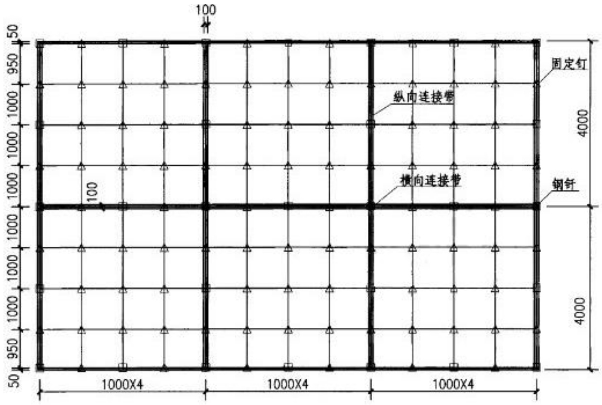  
图 5.6-2  土工格室植草坡面布置图  

骨架植物护坡,分为浆砌片石(或水泥混凝土)骨架植物护坡、水泥混凝土空心块植物护坡。拱形骨架护坡见图 5.6-3。  

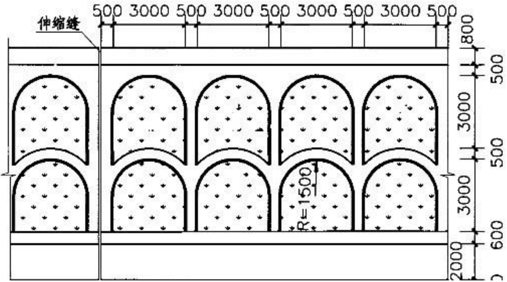  
图 5.6-3 拱形骨架护坡平面图  

石砌护坡分为干砌片石护坡和浆砌片石护坡,边坡高度不宜高于 $8\mathrm{m}$ 。浆砌片石护坡见图 5.6-4。  

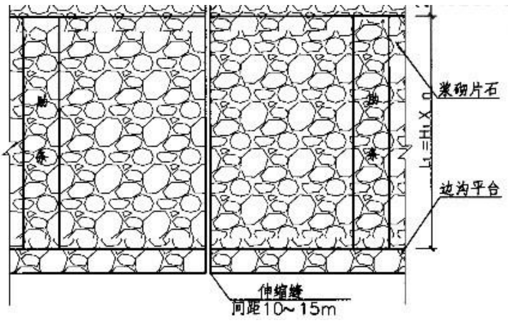  
图 5.6-4 浆砌片石坡面布置图  

护面墙,适宜于坡面易受侵蚀的土质边坡。它分为实体护面墙和窗孔式护面墙。单级护面墙的高度不宜超过 $10\mathrm{m}$ 。护面墙见图 5.6-5。  

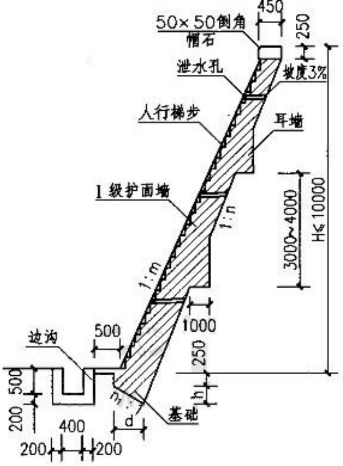  
图 5.6-5  护面墙横断面图  

(2)护坡设计  

1)护砌方案  

对比以上几种护坡形式,现浇混凝土护坡虽抗冲刷能力强,但适应变形的能力较差,且改善生态环境不利;浆砌石护坡能够充分利用当地材料,整体性和抗冲刷能力强。植草框格护坡生态性较好,抗冲刷性能差,居民在框格间种植农作物侵占河道,不利于河道管理;砼连锁块护坡外观效果生硬感比较明显,不利于植物种植,生态性较差;格宾石笼护坡具有良好抗压强度,抗冲刷性能强,整体性较差。考虑山门河行洪时坡降大、流速快,而砌石比较耗费材料,故本次设计山门河边坡护坡选用分块现浇混凝土护坡方案(?不是用的浆砌石吗?)。 此次工程根据实际情况分段进行护砌。  

# 2)冲刷深度计算  

山门河选取典型断面进行冲刷深度计算。采用断面 $2{+}010$ , $3+260$ 。  

河床在水流作用时的冲深根据《堤防工程设计规范》(GB50286-2013)公式 D.2.2-2 计算:  

$$
\begin{array}{c}{{h_{s}=H_{0}\left[\left(\displaystyle{\frac{U_{c p}}{U_{c}}}\right)^{n}-1\right]}}\ {{U_{c p}=U\displaystyle{\frac{2\eta}{1+\eta}}}}\end{array}
$$  

式中:hs— 局部冲刷深度(m);  

$\mathrm{Ho}$ ——冲刷处的水深(m);Ucp——近岸垂线平均流速;n— 与防护岸坡在平面上的形状有关,取 $\scriptstyle{\mathrm{n}}=1/4\sim1/6$ ;η— 水流流速不均匀系数,根据水流流向与岸坡的交角 $\upalpha$ 查表 D.2.2 采用;Uc——泥沙起动流速( $\mathbf{\tau},\mathbf{m}/\mathbf{s})$ );根据“《水工设计手册》第 2 版 第 1 卷 基础理论”表 3.8-7 查得。d50——床沙的中值粒径(m);γs、γ——泥沙和水的容重( $\mathrm{kN}/\mathrm{m}^{3}$ )。计算结果见表 5.9-1。  

表 5.9-1  冲刷计算成果表  

<html><body><table><tr><td>典型 断面</td><td>水深 Ho (m)</td><td>行进流速 U (m/s)</td><td>泥沙启动 流速Uc (m/s)</td><td>系数 n</td><td>平均 流速 Uep(m/s)</td><td>水流流 速不均 匀系数</td><td>水流方 向与岸 坡夹角</td><td>冲刷深 度hs (u)</td></tr><tr><td>2+010</td><td>5.5</td><td>2.38</td><td>1.20</td><td>0.25</td><td>2.38</td><td>n 1.00</td><td>a ≤15°</td><td>1.03</td></tr><tr><td>3+260</td><td>4.86</td><td>2.25</td><td>1.20</td><td>0.25</td><td>3.38</td><td>3.00</td><td>.06</td><td>1.44</td></tr></table></body></html>  

本次采用护脚齿墙深采用 $1.5\mathsf{m}$ ,采用 M10 浆砌石护脚,满足冲刷计算结果要求。  

3)护坡结构设计(落实护砌型式)  

本次设计岸坡护砌长度 5.1km,包含山门河堤防段岸坡或河槽防护,桩号$\mathsf{K}1{+}410{-}\mathsf{K}5{+}210$ 段( $K5{+}210{-}K6{+}310$ 段已在其他工程中实施),长度 3.8km,采用15cm 厚 C25 混凝土块护砌,护脚采用 M10 浆砌石砌筑,深 1.5m;南排岸坡护砌桩号 $\mathsf{N P0}\mathbf{+}000\mathbf{-}\mathsf{N P1}\mathbf{+}410,$ ,长度 1.41km,采用 12cm 厚 C25 混凝土块护砌,护脚采用M10 浆砌石砌筑,深 $1.0\mathsf{m}$ ;北排岸坡护砌桩号 $8\mathsf{P0}\mathbf{+}000\mathbf{-}\mathsf{B P1}\mathbf{+}440\mathbf{:}$ ,总长度 1.44km,采用 12cm 厚 C25 混凝土块护砌,护脚采用 M10 浆砌石砌筑,深 $\boldsymbol{1.0\mathrm{m}_{\circ}}$  

护坡下部及齿墙回填:粘性土回填压实度不小于 0.93,非粘性土回填相对密度不小于 $0.65_{\circ}$ 。护坡型式见图 $5.6{\cdot}6\circ$  

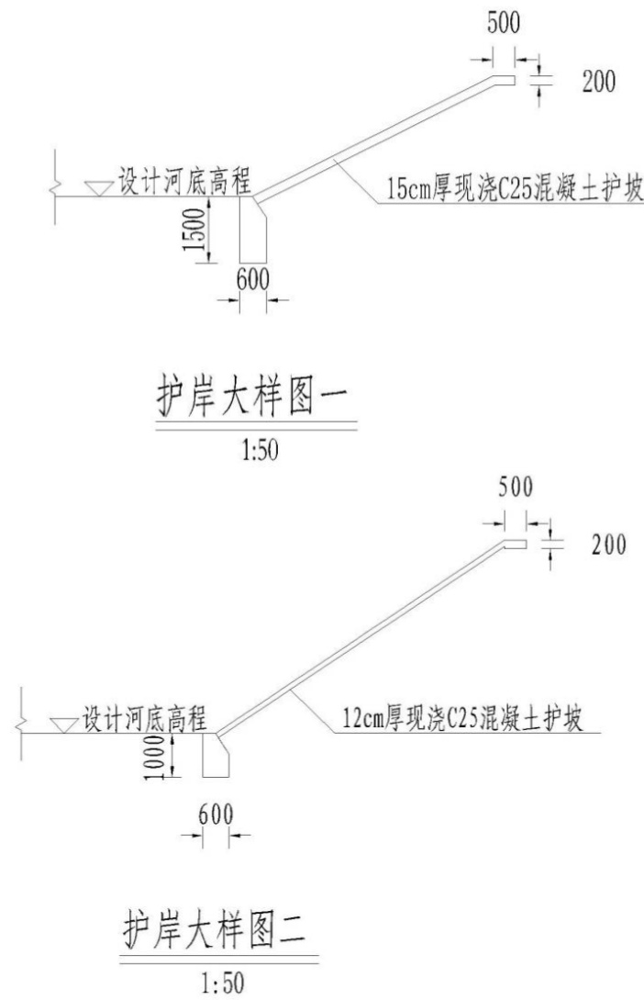  
图 5.6-6  护坡典型断面图  

# 5.7 堤顶道路  

为了便于管理河道,新建堤顶道路 $6.63\ensuremath{\mathrm{km}}$ ,其中山门河右岸堤防 $\ K\boldsymbol{1}{+}410$ (五里堡) ${\sim}K6{+}310$ 右岸堤防,长度 $4.9\mathsf{k m}$ ;郜屯围村堤 $\mathsf{W D0}\mathbf{+}000\mathbf{-}\mathsf{W D1}\mathbf{+}730$ 段,长度1.73km。。  

本着近期与远期相结合的原则,为减少噪声污染,保持良好的城市生态环境,创造优越的工作、生活条件,同时根据道路在城市道路系统的功能和所起的作用,设计推荐堤顶防汛路采用 C25 混凝土路面。  

堤顶道路采用 $18\mathrm{cm}$ 厚 C25 混凝土路面 $+15\mathrm{cm}$ 厚 $12\%$ 水泥土。  

# 5.8 箱涵工程  

修武县山门河水毁修复工程作为灾后恢复重建标志性工程,本次拟治理五里堡\~大沙河段,我公司对山门河沿线进行了现场勘察,山门河河道上尤其是较低等级道路上的桥梁年久失修,损毁严重,已成危桥,设计标准低,不能满足交通需求,影响泄洪,不能满足河道防洪功能要求,因此,需要拆除重建,由于投资等限制,本次设计均采用箱涵。初步设计拆除重建箱涵 6 座,结合现状及规划道路宽度及工程特点,桥涵宽度确定为 6m,桥涵设计规模见下表。  

表 5.8-1  箱涵一览表  

<html><body><table><tr><td rowspan="2">序 号</td><td rowspan="2">河道桩号</td><td rowspan="2">河流名称</td><td colspan="5">拟建桥情况</td><td rowspan="2">备注</td><td rowspan="2">型式</td></tr><tr><td>孔数</td><td>桥宽 (m)</td><td>孔径 (m)</td><td>交角（°）</td><td>桥长 (m)</td></tr><tr><td>1</td><td>K1+860</td><td>山门河</td><td>2</td><td>6</td><td>4X3.4</td><td>90</td><td>19.5</td><td>拆除重建</td><td>漫水桥</td></tr><tr><td>2</td><td>K2+330</td><td>山门河</td><td>2</td><td>6</td><td>4X3.4</td><td>90</td><td>19.5</td><td>拆除重建</td><td>漫水桥</td></tr><tr><td>3</td><td>K3+900</td><td>山门河</td><td>3</td><td>6</td><td>4X2.6</td><td>90</td><td>24</td><td>拆除重建</td><td>漫水桥</td></tr><tr><td>4</td><td>K4+260</td><td>山门河</td><td>3</td><td>6</td><td>4X3.2</td><td>90</td><td>24</td><td>拆除重建</td><td>漫水桥</td></tr><tr><td>5</td><td>NP0+040</td><td>南排</td><td>2</td><td>5</td><td>2X2.5</td><td>90</td><td>15.9</td><td>拆除重建</td><td>漫水桥</td></tr><tr><td>9</td><td>NP1+150</td><td>南排</td><td>2</td><td>9</td><td>2X2.5</td><td>90</td><td>15.9</td><td>拆除重建</td><td>漫水桥</td></tr></table></body></html>  

# 5.8.1 主要技术标准  

涵洞技术标准:涵洞设计荷载:公路-Ⅱ级,人群荷载 $3.0\mathrm{kN}/\mathrm{m}^{2}$  

涵洞结构设计安全等级:三级设计洪水频率:不作规定主体结构使用年限:30 年  

# 5.8.2 工程布置  

以 $\mathrm{K}1{+}860$ 处箱涵为例进行设计。  

1) 总体布置  

桥梁设计宽度为 $6\mathrm{m}$ ,根据河道断面宽度,桥梁采用 $4\mathrm{m}\mathrm{x}3.4\mathrm{m}\mathrm{x}2$ 孔现浇箱涵,桥梁总长 $19.5\mathrm{m}$ ,斜交角度为 $90^{\circ}$ ,箱涵结构图如下:  

  
桥梁立面图  

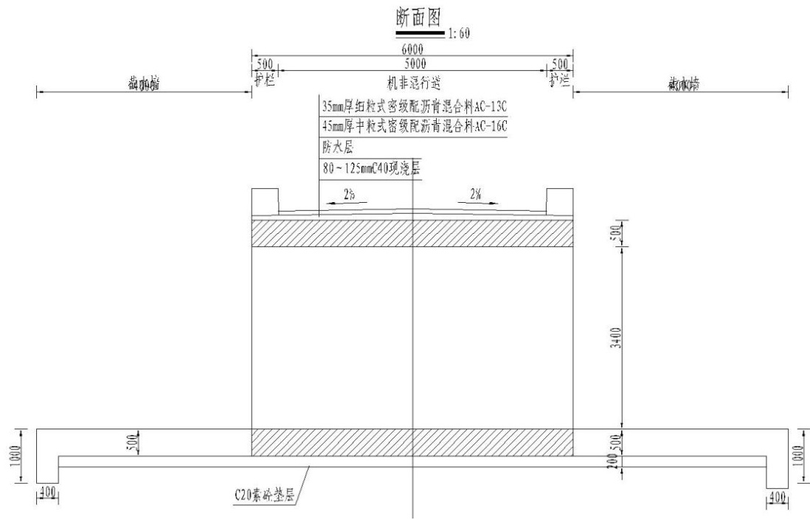  
桥梁断面图  

2) 上部结构设计  

桥梁上部采用 $4\times3.4$ 现浇箱涵,顶板厚 $0.5\mathrm{m}.$ 底板厚 $0.5\mathrm{m}$ ,腹板厚 $0.5\mathrm{m}$ ,箱涵高$3.4\mathrm{m}$ 。箱涵采用 C40 混凝土。  

3) 下部结构设计  

下部基础采用 $0.2\mathrm{m}\mathrm{C}20$ 混凝土垫层,耳墙长 $5\mathrm{m}$ ,耳墙厚度为 $0.5\mathrm{m}$ ,耳墙采用 C40 混凝土;截水墙长 $4\mathrm{m}$ ,采用 C30 混凝土。  

4) 附属结构  

桥墩采用漫水桥墩;   
桥面铺装为 $8{\sim}12.5\mathrm{cmC}40$ 混凝土、8cm 沥青面层,中间铺设防水层;  

# 5.8.3 箱涵水力计算  

1)箱涵过流能力计算  

对 $\mathrm{K}1{+}860$ 处箱涵进行过流能力计算如下:  

根据该区域的地形图,测得 4#箱涵和 5#箱涵的合计汇水面积: $2.47\mathrm{km}2$ ; 20年一遇洪水合计设计流量为 $43\mathrm{m}3/\mathrm{s}$ ,则单个箱涵的设计流量为 $21.5\mathrm{m}3/\mathrm{s}$ 。  

涵洞过流能力采用《灌溉与排水渠系建筑物设计规范》(SL482-2011)附录 D公式(D.0.3-1) $\sim$ (D.0.3-4)计算,公式如下:  

(D.0.3-1)  

$\mathtt{h s}{=}\mathrm{h}.$ -iL(短洞)  

式中 Q— 涵洞过流量, $\mathrm{m}3/\mathrm{s}$ ;  
B— 洞宽,m;  
m 流量系数,可近似采用 $\mathrm{m}{=}0.36$ ;  
ε— 侧收缩系数,可近似取 $\mathfrak{E}{=}0.95$ ;  
H0— 包括行近流速水头在内的进口水深, $\mathrm{m}$ ;  
g— 重力加速度, $\tt g=9.81$ , $\mathrm{m}/\mathrm{s}2$ ;  
σ— 淹没系数;  
hs— 洞进口内水深, $\mathrm{m}$ ;  
v— 上游行近流速, $\mathrm{m/s}$ ;  
α— 动能修正系数,可采用 $\mathtt{a}{=}1.05$ ;  
i— 洞底比降;  
L— 洞身长度。  

表 5.7-30 箱涵过流能力计算参数表  

<html><body><table><tr><td>B (m)</td><td>m</td><td>3</td><td>g(m/ s)</td><td>Ho (m)</td><td>L(m)</td><td>i</td></tr><tr><td>4.0</td><td>0. 36</td><td>0.95</td><td>9.81</td><td>3.4</td><td>9</td><td>0.03</td></tr></table></body></html>  

该涵洞按无压力涵洞设计。计算可得箱涵过流量 $\scriptstyle\mathrm{Q=70m}3/\mathrm{s}$ 能满足主槽过流。  

# 3)箱涵孔径验算  

根据《公路涵洞设计细则》(JTGT D65-04-2007)公式(7.2.1-1) $\sim$ (7.2.1-6)进行涵洞孔径验算,计算公式如下:  

$$
\begin{array}{r l}&{v_{k}=\mathring{\sqrt[3]{\big(Q_{p}g/\varepsilon B_{k}\big)}}}\ &{\mathrm{A}_{k}=Q_{p}/\varepsilon v_{k}}\ &{v_{q s}=v_{\varepsilon}/0.9}\ &{\mathrm{~h}_{q s}=0.9v_{k}}\ &{\mathrm{h}_{q}=\mathrm{h}_{q s}+v_{q s}^{2}/(2g\varphi)-\mathrm{~\overline{{v}}^2/(2g)~}}\ &{\mathrm{H}_{y}=\mathrm{H}_{q}+h_{q}}\end{array}
$$  

式中: $v_{k}$ — 涵内临界流速( $\mathrm{(m/s)}$ ;  

$Q_{p}$ 设计流量( $\mathbf{\epsilon}_{\mathrm{m}3/\mathrm{s}})$ ;  
Bk— 临界水深时的涵内净水面宽度 $\left(\mathrm{m}\right)$ ;  
g— 重力加速度,取用 9.80( $\mathrm{m}/\mathrm{s}2$ );  
ε— 涵洞侧压缩系数,可近似取 $\varepsilon{=}1.0$ ;  
Ak— 临界水深时的涵内净过水面积( $\mathrm{m}2$ );  
vqs— 涵内收缩断面处流速( $\mathrm{(m/s)}$ );  
hqs— 涵内收缩断面处水深(m);  
hk— 临界水深(m);  
hq— 涵前积水深(m)— 流速系数,按附录 B 表 B-18 选取;  
v 涵前行近流速( $\mathrm{m}/\mathrm{s},$ );  
Hy— 涵前壅水位(m);  
Hq— 涵前铺砌面高程(m)。  

表 5.7-31 箱涵孔径验算计算参数表  

<html><body><table><tr><td>Qp</td><td></td><td>3</td><td>Bk</td><td>hk</td><td>d</td><td></td><td>Ha</td></tr><tr><td>70</td><td>9.80</td><td>1.0</td><td>3. 4</td><td>0.57</td><td>0.85</td><td>0</td><td>87.40</td></tr></table></body></html>  

设计流量 $\mathrm{Qp}{=}70\mathrm{m}^{3}/\mathrm{s}$ (按主河槽过流能力),涵底高程为 $87.40\mathrm{m}$ ,此处路面设计高程为 $91.50\mathrm{m}$ 。经计算,涵内临界流速 $3.27\mathrm{m}/\mathrm{s}$ ,涵前积水深为 $2.98\mathrm{m}$ ,涵前壅水位为 $90.\mathrm{m}\leq91.50\mathrm{m}$ (此处路面设计高程),说明涵洞尺寸能满足过流能力。  

# 5.9 水闸工程  

山门河治理段现有拦河闸 7 座,自上而下位于桩号 $\ K1{+}860$ (闸桥)、 $\kappa2\substack{+330}$ (闸桥)、 $\mathsf{K}3\mathsf{+}900$ (闸桥)、 $\kappa4+230$ (闸桥), $\kappa4\substack{+610}$ (闸桥)、 $\mathsf{N P O}+780$ (水闸)、$\mathsf{B P1+180}$ (水闸)。现状水闸均不能正常使用,失去原有功能。本次设计拆除重建水闸 2 处,桩号为 $\mathsf{N P O}{+}780$ 、 $\mathsf{B P1+180}$ ,(为大沙河沟口闸),拆除 $\kappa4\substack{+610}$ 处闸桥,桩号 $\ K1+860$ (闸桥)、 $\kappa2\substack{+330}$ (闸桥)、 $\mathsf{K}3\mathsf{+}900$ (闸桥)、 $\kappa4+230$ (闸桥)处闸桥拆除新建为箱涵。  

表 5.9-1 水闸工程要素表  

<html><body><table><tr><td>序号</td><td>位置</td><td>桩号</td><td>建筑物等级</td><td>孔数</td><td>单孔宽度 (w)</td><td>单孔高度 (W)</td><td>闸底板高程 (w)</td></tr><tr><td>1</td><td>南排</td><td>NP0+780</td><td>5级</td><td>2</td><td>2</td><td>2.5</td><td>80.70</td></tr><tr><td>2</td><td>北排</td><td>BP1+180</td><td>5级</td><td>2</td><td>2</td><td>.2.5</td><td>80.35</td></tr></table></body></html>  

# 5.9.1 工程布置  

本次水闸 2 处,均为拆除重建工程,位于南排桩号 $\mathrm{NP0+780}$ 处和北排桩号$\mathrm{BP1+1}80.$ 。  

(1).南排 $\mathrm{NP0+780}$ 水闸  

南排 $\mathrm{NP0+780}$ 水闸原址拆除重建,闸室轴线与河道中心线重合。工程总长$45.0\mathrm{m}$ ,由进口段、铺盖段、闸室段、消力池段、海漫段及末端防冲槽段组成。见图 5.9 -1 和 5.9-2。  

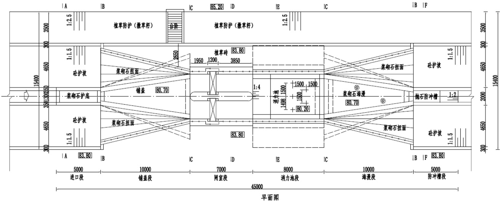  

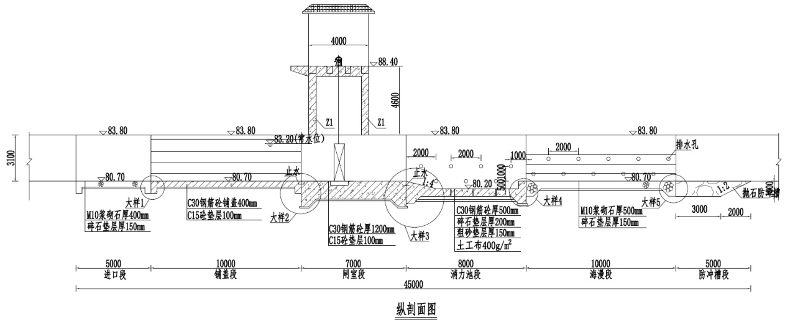  
图 5.9-1 $\mathrm{NP0+780}$ 水闸平面图  
图 5.9-2 $\mathrm{NP0+780}$ 纵剖面图  

具体工程布置如下:  

(1)进口段  

进口段长 $5\mathrm{m}$ ,两侧护坡采用 C25 砼护坡,坡顶高程 $83.80\mathrm{m}$ ,护坡厚 $0.12\mathrm{m}$ ,边坡坡度为 1:1.5,底板采用 M10 浆砌石防护,底板底高程 $80.70\mathrm{m}$ ,厚 $0.4\mathrm{m}$ ,前趾宽度为 $0.4\mathrm{m}$ ,下铺设碎石垫层厚 $0.15\mathrm{m}$ 。  

(2)铺盖段  

防渗铺盖段为渐变段,底部采用 C25 钢筋混凝土,底板高程 $80.70\mathrm{m}$ ,厚 $0.40\mathrm{m}$ ,顺水流方向长度 $10.0\mathrm{m}$ ;铺盖端部设 $0.40\mathrm{m}$ 深的齿墙,铺盖下设 $0.1\mathrm{m}$ 厚 C15 砼垫层。  

渐变段两侧为 M10 浆砌石护坡,坡顶高程 $83.80\mathrm{m}$ ,护坡厚 $0.4\mathrm{m}$ ,边坡坡度为 1:1.5,M10 浆砌石挡墙顶高程 $83.80\mathrm{m}$ ,顶宽 $0.5\mathrm{m}$ ,底板宽 $2.8\mathrm{m}$ ,前趾宽度为$0.5\mathrm{m}$ ,底板厚 $0.6\mathrm{m}$ ,墙高 $3.7\mathrm{m}$ 。  

(3)闸室段  

闸室段顺水流方向长 $10.0\mathrm{m}$ ,闸底板高程 $80.70\mathrm{m}$ ,底板厚度为 $1.2\mathrm{m}$ ,闸底板宽 $6.6\mathrm{m}$ ;闸底板下设 C15 混凝土垫层,垫层厚 $0.1\mathrm{m}$ 。  

闸室两侧设混凝土边墩,墩顶高程 $83.80\mathrm{m}$ ,边墩宽 $0.8\mathrm{m}$ ,中墩宽 $1.0\mathrm{m}$ ;闸门固定线距闸底板上游端 $2.55\mathrm{m}$ 。  

(4)消力池段  

消力池段采用 C25 钢筋混凝土,顺水流方向长 $8\mathrm{m}$ ,消力池底板厚度 $0.5\mathrm{m}$ ,池底板顶高程 $80.20\mathrm{m}$ ,消力池为矩形断面,宽度 $5\mathrm{m}$ ;底板端部设 $0.5\mathrm{m}$ 深的齿墙,消力池末端设 $0.5\mathrm{m}$ 高的消力坎,坎顶宽 $0.5\mathrm{m}$ ,坎顶高程 $80.70\mathrm{m}$ ;消力池底板下设 $0.2\mathrm{m}$ 厚碎石垫层、 $0.15\mathrm{m}$ 厚粗砂垫层和 $400\mathrm{g}/\mathrm{m}^{2}$ 土工布,池底设 $\Phi75\mathrm{{PVC}}$ 排水管。  

消力池两侧挡墙采用悬臂式 C25 钢筋混凝土结构,挡墙顶高程 $83.80\mathrm{m}$ ,顶宽$0.5\mathrm{m}$ ,底板宽 $3.7\mathrm{m}$ ,前趾底板厚 $0.6\mathrm{m}$ ,墙高 $4.2\mathrm{m}$ 。墙身设 2 排 $\Phi75\mathrm{{PVC}}$ 排水管,间距 $1\mathrm{m}$ ,成梅花桩布置。  

(5)海漫及防冲槽段  

海漫段顺水流方向长 $10.00\mathrm{m}$ ,海漫顶高程 $83.80\mathrm{m}$ ,宽度由 $5\mathrm{m}$ 渐变至 $2\mathrm{m}$ ,海漫段采用 M10 浆砌石结构,浆砌石厚度为 $0.5\mathrm{m}$ ,下设 $0.15\mathrm{m}$ 厚碎石垫层。渐变段两侧为 M10 浆砌石护坡,坡顶高程 $83.80\mathrm{m}$ ,护坡厚 $0.4\mathrm{m}$ ,边坡坡度为 1:1.5,M10浆砌石挡墙顶高程 $83.80\mathrm{m}$ ,顶宽 $0.5\mathrm{m}$ ,底板宽 $2.8\mathrm{m}$ ,前趾宽度为 $0.5\mathrm{m}$ ,底板厚$0.6\mathrm{m}$ ,墙高 $3.7\mathrm{m}$ 。  

海漫末端设抛石防冲槽,槽深 $1.0\mathrm{m}$ ,槽底部边坡为 1:2;两侧以 1:1.5 的边坡与下游河道衔接,两岸边坡护砌采用 C25 混凝土护坡,长 $5.0\mathrm{m}$ ,防冲槽内抛块石,底部与下游河槽良好衔接。  

(2).北排 $\mathrm{BP1+180}$ 水闸  

北排 $\mathrm{BP1+180}$ 水闸原址拆除重建,闸室轴线与河道中心线重合。工程总长$45.0\mathrm{m}$ ,由进口段、铺盖段、闸室段、消力池段、海漫段及末端防冲槽段组成。见图 5.9 -3 和 5.9-4。  

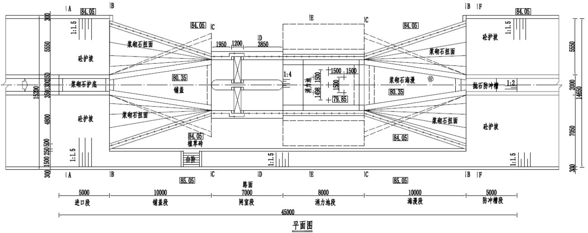  
图 5.9-3 $\mathrm{BP1+180}$ 水闸平面图  

  
图 5.9-4 $\mathrm{BP1+180}$ 纵剖面图  

具体工程布置如下:  

(1)进口段  

进口段长 $5\mathrm{m}$ ,两侧护坡采用 C25 砼护坡,坡顶高程 $84.05\mathrm{m}$ ,护坡厚 $0.12\mathrm{m}$ ,边坡坡度为 1:1.5,底板采用 M10 浆砌石防护,底板底高程 $80.35\mathrm{m}$ ,厚 $0.4\mathrm{m}$ ,前趾宽度为 $0.4\mathrm{m}$ ,下铺设碎石垫层厚 $0.15\mathrm{m}$ 。  

(2)铺盖段  

防渗铺盖段为渐变段,底部采用 C25 钢筋混凝土,底板高程 $80.35\mathrm{m}$ ,厚 $0.40\mathrm{m}$ ,顺水流方向长度 $10.0\mathrm{m}$ ;铺盖端部设 $0.40\mathrm{m}$ 深的齿墙,铺盖下设 $0.1\mathrm{m}$ 厚 C15 砼垫层。  

渐变段两侧为 M10 浆砌石护坡,坡顶高程 $84.05\mathrm{m}$ ,护坡厚 $0.4\mathrm{m}$ ,边坡坡度为 1:1.5,M10 浆砌石挡墙顶高程 $84.05\mathrm{m}$ ,顶宽 $0.5\mathrm{m}$ ,底板宽 $2.8\mathrm{m}$ ,前趾宽度为$0.5\mathrm{m}$ ,底板厚 $0.6\mathrm{m}$ ,墙高 $3.7\mathrm{m}$ 。  

(3)闸室段  

闸室段顺水流方向长 $10.0\mathrm{m}$ ,闸底板高程 $80.35\mathrm{m}$ ,底板厚度为 $1.2\mathrm{m}$ ,闸底板宽 $6.6\mathrm{m}$ ;闸底板下设 C15 混凝土垫层,垫层厚 $0.1\mathrm{m}$ 。  

闸室两侧设混凝土边墩,墩顶高程 $84.05\mathrm{m}$ ,边墩宽 $0.8\mathrm{m}$ ,中墩宽 $1.0\mathrm{m}$ ;闸门固定线距闸底板上游端 $2.55\mathrm{m}$ 。  

(4)消力池段  

消力池段采用 C25 钢筋混凝土,顺水流方向长 $8\mathrm{m}$ ,消力池底板厚度 $0.5\mathrm{m}$ ,池底板顶高程 $79.85\mathrm{m}$ ,消力池为矩形断面,宽度 $5\mathrm{m}$ ;底板端部设 $0.5\mathrm{m}$ 深的齿墙,消力池末端设 $0.5\mathrm{m}$ 高的消力坎,坎顶宽 $0.5\mathrm{m}$ ,坎顶高程 $80.35\mathrm{m}$ ;消力池底板下设 $0.2\mathrm{m}$ 厚碎石垫层、 $0.15\mathrm{m}$ 厚粗砂垫层和 $400\mathrm{g}/\mathrm{m}^{2}$ 土工布,池底设 $\Phi75\mathrm{{PVC}}$ 排水管。  

消力池两侧挡墙采用悬臂式 C25 钢筋混凝土结构,挡墙顶高程 $84.05\mathrm{m}$ ,顶宽$0.5\mathrm{m}$ ,底板宽 $3.7\mathrm{m}$ ,前趾底板厚 $0.6\mathrm{m}$ ,墙高 $4.2\mathrm{m}$ 。墙身设 2 排 $\Phi75\mathrm{{PVC}}$ 排水管,间距 $1\mathrm{m}$ ,成梅花桩布置。  

(5)海漫及防冲槽段  

海漫段顺水流方向长 $10.00\mathrm{m}$ ,海漫顶高程 $84.05\mathrm{m}$ ,宽度由 $5\mathrm{m}$ 渐变至 $2\mathrm{m}$ ,海漫段采用 M10 浆砌石结构,浆砌石厚度为 $0.5\mathrm{m}$ ,下设 $0.15\mathrm{m}$ 厚碎石垫层。渐变段两侧为 M10 浆砌石护坡,坡顶高程 $84.05\mathrm{m}$ ,护坡厚 $0.4\mathrm{m}$ ,边坡坡度为 1:1.5,M10浆砌石挡墙顶高程 $84.05\mathrm{m}$ ,顶宽 $0.5\mathrm{m}$ ,底板宽 $2.8\mathrm{m}$ ,前趾宽度为 $0.5\mathrm{m}$ ,底板厚$0.6\mathrm{m}$ ,墙高 $3.7\mathrm{m}$ 。  

海漫末端设抛石防冲槽,槽深 $1.0\mathrm{m}$ ,槽底部边坡为 1:2;两侧以 1:1.5 的边坡与下游河道衔接,两岸边坡护砌采用 C25 混凝土护坡,长 $5.0\mathrm{m}$ ,防冲槽内抛块石,底部与下游河槽良好衔接。  

# 5.9.2 水力设计  

本次水闸仅以位于南排 $\mathrm{NP0+780}$ 水闸为例进行设计计算说明。本次水力设计的任务主要是水闸的总净宽及消能防冲设施设计以及闸门控制运用方式的拟定等。  

本工程中水闸的运行工况基本有两种:一是挡水情况;二是泄水情况。  

(1)闸孔宽度确定  

根据闸址处天然水位 $\widetilde{\mathbf{\Omega}}$ 流量关系曲线,天然情况下,此处为漫滩行洪,无堤防,南排主槽设计过流为 $33\mathrm{m}^{3}/\mathrm{s}$ ,因此,过闸流量按照 $33\mathrm{m}^{3}/\mathrm{s}$ 计算闸孔宽度。  

按照《水闸设计规范》(SL265-2016)中有关公式进行水闸过流流能力计算。计算公式如下:  

1) 当为堰流时,可按下列公式计算:  

$$
B_{\L\mathrm{0}}=\frac{\L\theta}{\sigma\varepsilon m\sqrt{2g}H_{\L\mathrm{0}}^{\L\L^{\frac{\L}{2}}}}
$$  

$$
\begin{array}{l}{\displaystyle\varepsilon=1-0.171\Biggl(1-\frac{b_{0}}{b_{s}}\Biggr)\Biggl\{\frac{b_{0}}{b_{s}}}\ {\varepsilon=\frac{\varepsilon_{z}\bigl(N-1\bigr)+\varepsilon_{b}}{N}}\end{array}
$$  

$$
\varepsilon_{z}=1-0.171\Bigg(1-\frac{b_{0}}{b_{0}+d_{z}}\Bigg)\sqrt[4]{\frac{b_{0}}{b_{b}+d_{z}}}
$$  

$$
\varepsilon_{b}=1-0.171\left(1-\frac{b_{0}}{b_{0}+\frac{d_{z}}{2}+b_{b}}\right)\left(\frac{b_{0}}{b_{b}+\frac{d_{z}}{2}+b_{b}}\right)
$$  

$$
\sigma=2.31\frac{h_{s}}{H_{0}}\Bigg(1-\frac{h_{s}}{H_{0}}\Bigg)^{0.4}
$$  

式中:B0— 闸孔净宽(m);  

过闸流量( $(\mathrm{m}3/\mathrm{s})$ );H0— 计入行近流速水头的堰上水头(m);g— 重力加速度,可采用 9.81( $\mathbf{\sigma}_{\mathrm{m}/\mathrm{s}2}$ );m— 堰流流量系数,可采用 0.385;  

ε— 堰流侧收缩系数,对于单孔按公式(5.9-2)计算,对于多孔按公式(5计算;b0— 闸孔净宽(m);bs— 上游河道一半水深处的宽度(m);N—— 闸孔数;$\mathcal{E}_{z}$ — 中闸孔侧收缩系数,可按公式(5.9-4)计算;$D_{z}$ —中闸墩宽度(m);$\varepsilon_{b}$ — 边闸孔侧收缩系数,可按公式(5.9-5)计算;$B_{b}$ 边闸墩顺水流向边缘至上游河道水边线之间的距离 $(\mathrm{m})$ ;$_{\sigma}$ 堰流淹没系数,可按公式(5.9-6)计算;$h_{s}$ 由堰顶算起的下游水深(m)。  

2) 当堰流处于高淹没度( $h_{s}/H_{0}\geq0.9$ )时,应按下列公式计算:  

$$
B_{0}=\frac{Q}{\mu_{0}h_{_s}\sqrt{2g(H_{0}-h_{s})}}
$$  

$$
\mu_{0}=0.877+\left(\frac{h_{s}}{H_{0}}-0.65\right)^{2}
$$  

式中: $\mu_{0}$ —淹没堰流的综合流量系数。  

经计算, $\mathrm{B}0{=}5\mathrm{m}$ ,初拟取 $5\mathrm{m}$ ,单孔净宽 $2\mathrm{m}$ ,共 2 孔。上下游疏挖后闸址处河道底宽约为 $2\mathrm{m}$ 。计算结果及参数选取见表 5.9-2。  

表 5.9-2 水闸水力计算成果  

<html><body><table><tr><td>建筑物名称</td><td>过闸流量 (m3/s)</td><td>下游河道水位 (u)</td><td>水位壅高 (m)</td><td>闸孔总净宽 (m)</td><td>拟采用 闸孔数</td><td>闸墩厚 度(m)</td><td>每孔净 宽(m)</td></tr><tr><td>南排NP0+780</td><td>33</td><td>2.5</td><td>0.15</td><td>5</td><td>2</td><td>1.0</td><td>2</td></tr><tr><td>北排BP1+180</td><td>33</td><td>2.5</td><td>0.15</td><td>5</td><td>2</td><td>1.0</td><td>2</td></tr></table></body></html>  

(2)泄流能力验算  

修建水闸后,上游水位有所壅高。根据设计闸孔宽度计算,在工况下,规划过闸水位差为 0.15。复核闸室过流能力计算结果见表 5.9-3。  

表 5.9-3 闸孔过流能力计算成果表  

<html><body><table><tr><td rowspan="2">名称</td><td colspan="3">水闸参数</td><td rowspan="2">流量 (m3/s)</td><td rowspan="2">闸前水深 (w)</td><td rowspan="2">闸后水深 (m)</td><td rowspan="2">水位壅 高（m)</td></tr><tr><td>计算总净宽 (m)</td><td>孔数 （孔)</td><td>单孔净宽 (W)</td></tr><tr><td>南排NPO+780</td><td>5</td><td>2</td><td>2</td><td>33</td><td>2.5</td><td>2.5</td><td>0.15</td></tr><tr><td>北排BP1+180</td><td>5</td><td>2</td><td>2</td><td>33</td><td>2.5</td><td>2.5</td><td>0.15</td></tr></table></body></html>  

(3)消能防冲计算  

消能防冲按以下两种工况计算,取其大值。  

工况一:在正常运行时,闸门处于关闭挡水状态,选取不利工况即上游来水下泄,闸门顶部有一定溢流,本次计算时,选取闸门以上水深为 $30\mathrm{cm}$ 进行消能计算;此种工况下利用矩形薄壁堰流公式进行计算,得泄流量为 $33\mathrm{m}3/\mathrm{s}$ 。  

工况二:闸门在泄水时,完全放平后,其泄量采用宽顶堰流公式进行计算,取主河槽最大过流能力 $33\mathrm{m}3/\mathrm{s}$ 。  

1) 消力池深度计算:  

$$
d=\sigma_{0}h_{c}^{\ddot{}}-h_{s}^{\dot{}}-\Delta Z
$$  

$$
\ddot{h_{c}}=\frac{h_{c}}{2}\left(\sqrt{1+\frac{8\alpha q^{2}}{g h_{c}^{3}}}-1\right)\left(\frac{b_{1}}{b_{2}}\right)^{0.25}
$$  

$$
\begin{array}{l}{{\displaystyle h_{c}^{3}-T_{0}h_{c}^{2}+\frac{\alpha q^{2}}{2g\varphi^{2}}=0}}\ {{\displaystyle\Delta Z=\frac{\alpha q^{2}}{2g\varphi^{2}h_{s}^{2}}-\frac{\alpha q^{2}}{2g\dot{h_{c}}^{2}}}}\end{array}
$$  

式中: $d$ 消力池深度(m);  

0 —水跃淹没系数,可采用 1.05\~1.10,取 1.05;  
$\ddot{h_{c}}$ 计入行近流速水头的堰上水头(m);  
$h_{c}$ 跃后水深(m);  
$_{\alpha}$ 水流动能校正系数,可采用 $1.0{\sim}1.05$ ,取 1.05;  
q 过闸单宽流量( $\mathrm{{m}}2/\mathrm{{s})}$ );  
$b_{1}$ 消力池首段宽度(m);  
$b_{2}$ 消力池末段宽度(m);  
$T_{0}$ 由消力池底板顶面算起的总势能(m);  
$\Delta Z$ 出池落差(m);  
$\dot{h_{s}}$ 出池河床水深(m)。  

2) 消力池长度计算:  

式中: $L_{s j}$ — 消力池长度(m);  
$L_{s}$ 消力池斜坡段水平投影长度(m);  
$\beta$ 水跃长度校正系数,可采用 $0.7\widetilde{\sim}0.8$ ,取 0.75;  
$L_{j}$ 水跃长度(m)。  

3) 消力池底板厚度计算:  

$$
t=k_{2}\frac{U-W\pm P_{m}}{\gamma_{b}}
$$  

抗浮  

式中:t—— 消力池底板始端厚度(m);  
$\Delta{H}$ 闸孔泄水时的上、下游水位差(m);  
$k_{1}$ 消力池底板计算系数,可采用 $0.15{\sim}0.20$ ,取 0.15;  
$k_{2}$ 消力池底板安全系数,可采用 $1.1\sim1.3$ ,取 1.2;  
$U$ 作用在消力池底板底面的扬压力(kPa);  
$W$ 作用在消力池底板顶面的水重( $\mathrm{(kPa)}$ ;  
$P_{m}$ 作用在消力池底板上的脉动压力(kPa);  
$\gamma_{b}$ 消力池底板的饱和重度( $\mathrm{kN}/\mathrm{m}3$ )。  

4) 海漫长度计算:  

式中: $L_{p}$ 海漫长度(m);  
$\Delta{H}$ 闸孔泄水时的上、下游水位差(m);  
$q_{s}$ — 消力池末端单宽流量( $\mathrm{{m}}2/\mathrm{{s})}$ );  
$K_{s}$ 海漫长度计算系数,取 11。  

5) 河床冲刷深度计算:  

$$
\begin{array}{l}{{d_{{\scriptscriptstyle m}}=1.1\frac{q_{{\scriptscriptstyle m}}}{\left[{\nu_{{\scriptscriptstyle0}}}\right]}-h_{{\scriptscriptstyle m}}}}\ {{{\mathrm{}}}}\ {{d_{{\scriptscriptstyle m}}=0.8\frac{q_{{\scriptscriptstyle m}}}{\left[{\nu_{{\scriptscriptstyle0}}}\right]}-h_{{\scriptscriptstyle m}}}}\end{array}
$$  

式中: $d_{m}$ 海漫末端河床冲刷深度(m);  
$q_{m}$ — 海漫末端单宽流量( $\mathrm{{m}}2/\mathrm{{s})}$ );  
$\left[\nu_{0}\right]$ 河床土质允许不冲流速( $\mathrm{{(m/s)}}$ ),取 $0.8\mathrm{m}/\mathrm{s}$ ;  
$h_{{_m}}$ 海漫末端河床水深(m);  
$d_{m}^{\setminus}$ 上游护底首端河床冲刷深度(m);  
$q_{m}$ 上游护底首端单宽流量( $\mathrm{m}2/\mathrm{s},$ );  
$\dot{h_{m}}$ 上游护底首端河床水深(m)。  

工况二的流量代入上述公式,经计算,消力池长 $7.66\mathrm{m}$ ,海漫长度 $9.66\mathrm{m}$ ,防冲槽深 $0.87\mathrm{m}$ 。本次设计取消力池长为 $8\mathrm{m}$ ,池深 $0.50\mathrm{m}$ ,海漫长度 $15.0\mathrm{m}$ ,为安全起见,海漫段末端接抛石防冲槽,槽深取 $1.0\mathrm{m}$ 。  

表 5.5-5 消能计算结果表  

<html><body><table><tr><td rowspan="2">建筑物名称</td><td rowspan="2"></td><td rowspan="2">流量</td><td>坝前 水深</td><td>下游 水深</td><td>收缩</td><td>水跃</td><td rowspan="2">池深d (m)</td><td rowspan="2">池长Lsj (u)</td><td rowspan="2">海漫长Lp (m)</td></tr><tr><td>(ms/s)</td><td>(m） (m）</td><td>水深 (m）</td><td>长度 (m)</td></tr><tr><td rowspan="2">南排NP0+780</td><td>工况一</td><td>33</td><td>2.9</td><td>1.0</td><td>0.376</td><td>7.61</td><td>0.40</td><td>7.96</td><td>13.47</td></tr><tr><td>工况二</td><td>33</td><td>2.6</td><td>2.5</td><td>0.398</td><td>7.54</td><td>0</td><td>7.64</td><td>11.33</td></tr><tr><td rowspan="2">北排BP1+180</td><td>工况一</td><td>33</td><td>2.30</td><td>1.0</td><td>0.174</td><td>6.77</td><td>0.26</td><td>7.14</td><td>11.50</td></tr><tr><td>工况二</td><td>33</td><td>2.0</td><td>1.9</td><td>0.192</td><td>6.17</td><td>0</td><td>7.41</td><td>8.74</td></tr></table></body></html>  

# 5.9.3 防渗排水设计  

水闸闸基为砂壤土基础,设计采用混凝土铺盖防渗,根据《水闸设计规范》(SL265-2016),土基上水闸基底渗透压力计算可采用改进阻力系数法或流网法计算,本次设计采用改进阻力系数法计算渗透水压力。  

土基上水闸的地基有效深度可按下列公式计算:  

L0  5  
当 S0 时T。=0.5L。  
当  
式中: $T_{e}$ —土基上水闸的地基有效深度(m);  
L0 —地下轮廓的水平投影长度(m);  
S0 —地下轮廓的垂直投影长度(m);  
当计算的 $T_{e}$ 值大于地基实际深度时, $T_{e}$ 值应按地基实际深度采用。  

$\textcircled{2}$ 分段阻力系数可按下列公式计算:  

1.进、出口段: 式中: $\xi_{0}$ —进、出口段的阻力系数;  

$S$ —板桩或齿墙的入土深度(m);   
$T$ —地基透水层深度(m);  

2.内部垂直段: 式中: $\xi_{y}$ —内部垂直段的阻力系数;  

3.水平段:  
式中: $\xi_{x}$ —水平段的阻力系数;  
Lx —水平段长度(m);  
S1,S2—进、出口段板桩或齿墙的入土深度(m);  

$\textcircled{3}$ 分段水头损失值可按下式计算:  

式中: $h_{i}$ —各分段水头损失值(m);  

i—各分段的阻力系数;  

$_n$ —总分段数;  

$\textcircled{4}$ 进、出口段水头损失值和渗透压力分布图形可按下列方法进行局部修正:  

1.进、出口段修正后的水头损失值可按下列公式计算:  

式中: $h_{\scriptscriptstyle0}^{\dot{(}\gamma_{\scriptscriptstyle0}\mathrm{~)~}}$ —进、出口段修正后的水头损失值(m);  
h0 —进、出口段水头损失值(m);  
S —底板埋深与板桩入土深度之和(m);  
$\beta$ \`—阻力修正系数,当计算的 $\beta^{\mathrm{{\scriptsize~\ge1.0}}}$ 时,采用 $\protect\beta^{\protect}=1.0$ ;  
T —板桩另一侧地基透水层深度(m);  

2.修正后水头损失的减小值可按下式计算:  

式中: $\Delta h$ —修正后水头损失的减小值(m);  

3.水力坡降呈急变形式的长度可按下式计算:  

$$
\begin{array}{c}{\displaystyle\dot{L_{x}}=\frac{\Delta h}{\frac{\Delta H}{\sum_{i=1}^{n}\xi_{i}}}T}\end{array}
$$  

式中: $\dot{L_{x}}$ —水力坡降呈急变形式的长度(m);  

$\textcircled{5}$ 进、出口段齿墙不规则部位可按下列各式进行修正:  

1.当 $h_{x}\geq\Delta h$ 时,可按下式计算: 式中: $h_{x}$ —水平段的水头损失值(m); hx —修正后的水平段水头损失值(m);  

2.当 $h_{x}<\Delta h$ 时,可按下列两种情况分别进行修正:  

A.若 $h_{x}+h_{y}\geq\Delta h$ ,可按下列公式进行修正:$\dot{h_{x}}=2h_{x}$  

$$
\begin{array}{r}{\dot{h_{y}}=h_{y}+\Delta h-h_{x}}\end{array}
$$  

式中: $h_{y}$ —内部垂直段的水头损失值(m);   
hy —修正后的内部垂直段水头损失值(m);  

A.若 $h_{x}+h_{y}<\Delta h$ ,可按下列公式进行修正:$\ddot{h_{y}}=2h$ y式中: $h_{c d}\underline{{\quad\quad}}\mathrm{{}}_{{C D}}$ 段的水头损失值(m);hcd —修正后的 CD 段水头损失值(m);$\textcircled{6}$ 出口段渗流坡降值可按下式计算:式中: $J$ —出口段渗流坡降值(m);  

表 5.5-6 防渗长度计算成果表  

<html><body><table><tr><td rowspan="2">建筑物</td><td rowspan="2">允许渗径系数 值</td><td rowspan="2">上、下游水位差（m）</td><td rowspan="2">计算闸基防渗长度（m）</td><td>设计闸基防渗长度</td></tr><tr><td>(m)</td></tr><tr><td>南排NP0+780</td><td>0.42</td><td>2.6</td><td>13.13</td><td>24</td></tr><tr><td>北排BP1+180</td><td>0.25</td><td>2</td><td>10.53</td><td>17</td></tr></table></body></html>  

# 5.9.4 稳定计算  

闸室稳定计算包括基底应力计算、基底应力不均匀系数验算、抗滑稳定计算。  

a) 计算工况  
水闸净宽 $4\mathrm{m}$ ,闸室长度 $7\mathrm{m}$ ,闸室稳定计算考虑以下两种工况:工况一(完建期):闸室上、下游均无水。  
工况二(设计挡水):闸上游设计水位 $2.5\mathrm{m}$ ,闸下游无水。b) 计算参数及荷载组合  
依据水闸设计规范要求,各种计算工况的荷载组合见表 5.9-7。  

表 5.9-7  水闸稳定计算荷载组合表  

<html><body><table><tr><td colspan="2">计算工况</td><td>自重</td><td>水重</td><td>水压力</td><td>扬压力</td><td>浪压力</td><td>土压力</td><td>地震力</td></tr><tr><td rowspan="2">基本组合</td><td>工况一</td><td></td><td></td><td></td><td></td><td></td><td></td><td></td></tr><tr><td>工况二</td><td></td><td></td><td></td><td></td><td></td><td></td><td></td></tr></table></body></html>  

c) 稳定计算  

闸室基底应力计算公式和沿闸基底面的抗滑稳定安全系数计算公式见公式如下。  

1) 对于结构布置及受力情况对称的闸孔,闸室基底应力计算采用如下公式:  

$$
P_{\operatorname*{min}}^{\operatorname*{max}}=\frac{\Sigma G}{A}\pm\frac{\Sigma M}{W}
$$  

式中: $P_{\operatorname*{min}}^{\operatorname*{max}}$ 闸室基底应力的最大值和最小值(kPa);  

$\Sigma G$ ——作用于闸室上的全部竖向荷载(包括闸室基础底面上的扬压力,kN);$A$ ——闸室基底面的面积( $\mathrm{m}2$ )。  

M ——作用于闸室上的全部竖向和水平荷载对于基础底面垂直水流方向的形心轴的力矩( $k N\bullet m)$ ;  

W — 闸室基底面对于该底面垂直水流方向的形心轴的截面矩(m3)。  

2) 土基上沿闸基底面的抗滑稳定安全系数可按下式进行计算:  

(5.9-22)式中: Kc —— 沿闸室基底面的抗滑稳定安全系数;$\phi_{\mathrm{0}}$ —— 闸室基础底面与土质地基之间的摩擦角(0);$C_{0}$ 闸室基底面与土质地基之间的粘结力(kPa);$\Sigma H$ —— 作用于闸室上的全部水平向荷载(kPa)。闸室稳定计算成果见表 5.9-8。  

表 5.9-8 节制闸闸稳定计算成果表  

<html><body><table><tr><td rowspan="2">名称</td><td rowspan="2" colspan="2">计算工况</td><td rowspan="2">K</td><td colspan="3">地基应力（kPa)</td><td rowspan="2">不均匀系数</td><td rowspan="2">允许承载力设计值</td></tr><tr><td>P max</td><td>P min</td><td>P 平均</td></tr><tr><td rowspan="2">南排NP0+780</td><td rowspan="2">基本组合</td><td>工况一</td><td></td><td>43.72</td><td>31.56</td><td>37.64</td><td>1.38</td><td>120</td></tr><tr><td>工况二</td><td>2.71</td><td>36.93</td><td>28.02</td><td>32.48</td><td>1.31</td><td>120</td></tr><tr><td rowspan="2">北排BP1+180</td><td rowspan="2">基本组合</td><td>工况一</td><td></td><td>43.72</td><td>31.56</td><td>37.64</td><td>1.38</td><td>120</td></tr><tr><td>工况二</td><td>2.71</td><td>36.93</td><td>28.02</td><td>32.48</td><td>1.31</td><td>120</td></tr></table></body></html>  

从表中计算结果看出,各工况抗滑安全系数、基底应力不均匀系数、地基承载力均满足规范要求。  

# 5.10 排水涵工程  

根据工程布置及郜屯村排水需要,本工程在郜屯围村堤处拆除重建排水涵 4  

处,桩号为 $\mathsf{W D}0\substack{+090}$ 、 $\mathsf{W D0}\substack{+240}$ 、W $\scriptstyle{\mathcal{I}}\scriptstyle{\mathsf{D}}0+790$ 、WD1+240。均采用 $\mathsf{D N1}.2\mathsf{m}$ 预制钢 筋混凝土Ⅱ级管道排水,出口处布置拍门防止河水倒灌。  

# 机电及金属结构  

# 6.1  电气  

# 6.1.1 概况  

修武县山门河水毁修复工程治理范围为五里堡 $\sim$ 大沙河段,具体为 K1+410-K6$+710$ ,南排 $\mathrm{NP0{+}000{-}N P1{+}410}$ ,北排 $\mathrm{BP0{+}000{-}B P1{+}440}$ 。本次工程主要建设内容包括河道疏浚、堤防整修、岸坡防护、堤顶道路、拆除重建桥涵、拆除重建水闸、拆除重建排水涵等工程。本工程电气设计内容主要为修武县山门河水毁修复工程共 2 处闸的供电、控制、接地等。  

# 6.1.2 设计原则、规范及依据  

(1)设计原则  

认真执行国家的有关技术经济政策,符合安全可靠、操作灵活、运行维护方便、经济合理的要求,按照现行的有关规程、规范进行设计。  

电气设备根据负荷性质、容量、环境条件和运行方式、安装维修等要求合理选型。  

(2)设计规范及依据  

1)《供配电系统设计规范》(GB50052-2009);  

2)《低压配电设计规范》(GB50054-2011);  

3)《电力工程电缆设计标准》(GB50217-2018);  

4)《交流电气装置的接地设计规范》(GB50065-2011);  

5)《交流电气装置的过电压保护和绝缘配合设计规范》(GB/T50064-2014);  

6)《通用用电设备配电设计规范》(GB50055-2011);  

相关专业提供的用电设备性质、数量、容量、控制运行要求,设备布置、管理用电要求及其它相关资料等。  

# 6.1.3 用电负荷及供电电源  

(1)用电负荷及负荷等级  
各闸门用电负荷统计见表 6.1-1 所示。  
根相关专业提供的用电设备性质、控制运行要求,本工程 2 座闸门设备负荷  

均为三级负荷。  

表 6.1-1  水闸用电负荷统计  

<html><body><table><tr><td>序号</td><td>名称</td><td>功率（kW）/台</td><td>数量</td><td>合计功率 区（kW)</td><td>额定电压</td></tr><tr><td>1</td><td>南排NP0+780</td><td>4</td><td>1</td><td>4</td><td>0.38kV</td></tr><tr><td>2</td><td>北排BP1+180</td><td>4</td><td>1</td><td>4</td><td>0.38kV</td></tr></table></body></html>  

(2)供电电源  

修武县山门河水毁修复工程共有水闸 2 座。由于采用手电两用螺杆启闭机,用电负荷较小,采用临近电源作为供电电源,由螺杆启闭机自带控制箱实现闸门的启停控制。  

# 6.1.4  接地  

本工程构筑物均为新建构筑物,构筑物无永久供电,启闭机仅在运行需求时带电操作,为满足电击防护要求,本工程与启闭机有关的启闭机外壳、基座等可导电导体均应可靠接地,接地电阻不大于 $4\Omega$ ,若不满足要求,需另增设接地体直至满足要求。  

# 6.2 金属结构  

# 6.2.1 概述  

修武县山门河水毁修复工程共拆除重建水闸 2 座。常规潜孔式平面铸铁闸门 4扇。金属结构主要是闸门及启闭机设备(2 座),  

各闸金属结构的主要性能参数见表 6.2-1。  

# 6.2.2 设计依据  

《水利水电工程可行性研究报告编制规程》(SL618-2013);  
《水电水利工程钢闸门设计规范》(SL74-2019);  
《水电水利工程启闭机设计规范》(SL41-2018);  
《水利水电工程钢闸门制造、安装及验收规范》(GB/T14173-2008);  
《水利水电工程启闭机制造安装及验收规范》(SL381-2007);  
《水工金属结构防腐蚀规范》(SL105-2007);  

# 6.2.3 闸门金属结构  

修武县山门河水毁修复工程共拆除重建水闸 2 座。共 4 扇闸门。设计水头见表 6.2-1,孔口尺寸均为(宽 $\times$ 高) $2.0{\times}2.5{\mathrm{m}}$ 。由于孔口尺寸较小,闸门均采用露顶式铸铁平板闸门,铸铁闸门布置简单,结构紧凑,节省空间,操作简便灵活,便于管理,止水效果好,具有良好的密封性能,防腐能力强。工作闸门操作运用方式为动水启闭,具有局部开启要求,闸门的启门力在 $90\mathsf{k N}^{\sim}110\mathsf{k N}$ 之间,考虑选取启闭设备的统一性,均选定为 150kN 手电两用螺杆启闭机,布置型式为一门一机。螺杆机应有双向超负荷停机功能,上、下极限位置限制功能,且应配备专用扳手,具有防盗水功能。启闭机配置防雨罩。  

# 6.2.4 金属结构防腐  

为延长金属结构的使用寿命,以上所有闸门及埋件外露部分均采用油漆防腐。启闭机机架表面采用油漆防腐。闸门埋件埋入混凝土部分应涂刷一层水泥浆防腐,涂层应注意养护。  

表 6.2-1  修武县山门河水毁修复工程金属结构技术特性表  

<html><body><table><tr><td rowspan="5">名称 闸门名称</td><td colspan="3">基本资料</td><td rowspan="2"></td><td colspan="5">闸 门</td><td rowspan="2"></td><td colspan="3">启 闭 机</td><td colspan="3"></td></tr><tr><td>门体</td><td>孔口尺寸</td><td>设计</td><td>支承</td><td>材</td><td>闸门</td><td>闸门</td><td>埋件</td><td>埋件</td><td>型</td><td>容</td><td>电机</td><td>扬程</td><td>数</td></tr><tr><td></td><td>(宽×高)</td><td>水头</td><td>型式</td><td></td><td>数量</td><td>单重</td><td>数量</td><td>单重</td><td></td><td></td><td>量</td><td>功率</td><td></td><td>量</td></tr><tr><td>型式</td><td>(Ⅲ)</td><td>(m)</td><td></td><td>料</td><td>(扇)</td><td>(t)</td><td>(孔)</td><td>(t)</td><td>式</td><td></td><td>(kN)</td><td>(kW/台)</td><td>(m)</td><td>(台)</td></tr><tr><td>南排NP0+780</td><td>露顶式平面铸铁门</td><td>2.0X2.5</td><td>2.5 滑块</td><td>球墨铸铁</td><td></td><td>2</td><td>3.2 2</td><td></td><td></td><td>手电两用螺杆机</td><td>150</td><td>4</td><td>6.6</td><td>2</td></tr><tr><td>水闸 北排BP1+180</td><td>露顶式平面铸铁门</td><td>2.0X2.5</td><td>2.5</td><td>滑块</td><td>球墨铸铁</td><td>2</td><td>3.2</td><td>2</td><td></td><td>手电两用螺杆机</td><td>150</td><td>4</td><td>6.6</td><td>2</td></tr></table></body></html>  

# 6.3  消防  

# 6.3.1 总体设计  

工程消防设计应贯彻“预防为主,防消结合”的消防方针,预防和减少火灾危害。根据本次山门河河道治理的特点,消防设计对象主要是施工临时工区内的仓库、办公区等生产场所。  

# 6.3.2 工程消防设计  

修武县山门河水毁修复工程电气设备较为简单,没有较大的火灾隐患,但施工临时工区内的仓库、办公区等场所有发生火灾的可能,考虑到河道两岸为人口较为集中,若发生火灾,将造成难以估量的损失,故本次河道作出如下消防设计:  

(1)堤顶道路可兼作为消防车道;.  
(2)本次治理段可采用河水作为消防水源。  

# 6.3.3 主要消防设备  

治理河道由于占线较长,临时施工区较为分散,本次消防设计主要为每个工区均配备灭火设施。灭火器按轻危险级配置,每个工区配备 4 具手提式 MF/ABC4型磷酸铵盐干粉灭火器,共计 8 具。本费用计列在施工临时费用的其他费用中。  

# 7 施工组织设计  

# 7.1 施工条件  

# 7.1.1 工程概况  

(1)工程概况  

修武县山门河五里堡至大沙河段水毁修复工程主要建设内容包括河道疏浚、堤防整修、岸坡防护、堤顶道路、拆除重建桥涵、拆除重建水闸、拆除重建排水涵等工程。  

河道工程:河道清淤疏浚 $6.45\mathrm{km}$ ,包含五里堡\~大沙河段山门河桩号$\mathrm{K}1{+}410{-}\mathrm{K}6{+}710$ ,清淤长度 $3.6\mathrm{km}$ ( $\mathrm{K}4{+}510{-}\mathrm{K}6{+}210$ 段已在其他工程中实施);焦新公路南侧排水沟(简称:南排)桩号 $\mathrm{NP0{+}000{-}N P1{+}410}$ ,清淤长度 $1.41\mathrm{km}$ ;焦新公路北侧排水沟(简称:北排)桩号 $\mathrm{BP0{+}000{-}B P1{+}440}$ ,长度 $1.44\mathrm{km}$ 。  

堤防工程:加高加固 $\mathrm{K}1{+}410$ (五里堡) ${\sim}\mathrm{K}6{+}310$ 右岸堤防,长度 $4.9\mathrm{km}$ 。  

岸坡工程:岸坡护砌长度 $5.1\mathrm{km}$ ,包含山门河堤防段岸坡或河槽防护,桩号$\mathrm{K}1{+}410{-}\mathrm{K}5{+}210$ 段( $\mathrm{K}5{+}210{-}\mathrm{K}6{+}310$ 段已在其他工程中实施),长度 $3.8\mathrm{km}$ ;南排岸坡护砌桩号 $\mathrm{NP0{+}000{-}N P1{+}410}$ ,长度 $1.41\mathrm{km}$ ;北排岸坡护砌桩号$\mathrm{BP0{+}000{-}B P1{+}440}$ ,总长度 $1.44\mathrm{km}$ 。  

堤顶路:新建右岸堤顶路 $4.9\mathrm{km}$ ,新建郜屯村围村堤顶路 $1.73\mathrm{km}$ ,总长度$6.63\mathrm{km}$ 。  

拆除重建桥涵工程:山门河主河道拆除重建箱涵桥 4 座,桩号为 $\mathrm{K}1{+}860$ 、$\mathrm{K}2{+}330,\mathrm{K}3{+}900,\mathrm{K}4{+}260$ ;南排拆除重建箱涵桥 2 座,桩号为 $\mathrm{NP0}\mathrm{+040},\mathrm{NP1}\mathrm{+1}50$ 。  

拆除重建水闸工程:北排拆除重建水闸 1 座,桩号为 $\mathrm{BP1+180}$ ;南排拆除重建水闸 1 座,桩号为 $\mathrm{NP0+780}$ ;  

拆除重建排水涵工程:郜屯村围村堤拆除重建排水涵 4 处,桩号为 $\mathrm{WD0+090}$ 、WD0+240、WD0+790、 $\mathrm{WD}1{+}240$ 。  

(2)水文气象  

项目区属暖温带大陆性季风气候,由于太行山的屏障作用和海拔高差的悬殊,气候有明显的地方特征,气候比较干燥,热量、水分、光能气候资源比较充足,春、夏、秋、冬四季分明,春季干旱多风,夏季炎热多雨,秋季昼暖夜凉,冬季寒冷干燥,平均年气温 $15.2^{\circ}\mathrm{C}$ ,年无霜期平均 231 天,年平均日照 2422.7 小时,多年平均降水量 $579.7\mathrm{mm}$ ,年降水量的 $70\%$ 集中在 ${\tt6^{\sim}9}$ 月份。  

山门河流域洪水均由暴雨形成,山区部分地形陡峻,坡度大,洪峰主要受短历时暴雨强度变化影响,洪水陡涨陡落,具有历时短、峰型尖瘦的特性。  

# (3)地质条件  

工程区位于华北准地台山西台背斜与黄淮海坳陷的交接部位,在新构造分区上位于太行山隆起区东南部边缘,场区南北两侧有焦作\~新乡\~商丘断裂和焦作断裂,这两条断裂均为第四纪断裂。总体来看,区域稳定性较差。工程区在勘探深度范围内未发现第四纪新构造断裂活动痕迹。  

工程区地震动峰值加速度值为 $0.10\mathrm{g}$ ;地震动反应谱特征周期值为 0.40s,地震基本烈度为Ⅶ度。  

环境水对混凝土不具腐蚀性,对混凝土结构中的钢筋不具腐蚀性,对钢结构具弱腐蚀性。  

# 7.1.2 对外交通运输条件  

工程所在区域附近有荷宝高速、郑云高速,国道 G234,省道 S310、S308、S232等,公路交通网四通八达,县、乡道路路网密布,施工前不需要修建对外交通道路,大、中型施工设备进场和建筑材料运输均可直接到达工地,对外交通十分便利。  

# 7.1.3  水、电供应条件  

项目区附近有居民区,生产生活用水以城市管网为主,可满足工程的需要。  

工程区电力资源较为丰富,供电网络系统比较完整,经调查,工程区有 $10\mathrm{kV}$ 电网,可“T”接至工区,作为施工用电电源。  

# 7.2 料场的选择与开采  

(1)筑堤土料  

本次治理段河道开挖土料质量不能满足筑堤要求,拟利用大沙河丰收西路北侧堆土场土料做为筑堤土料。  

# (2)一般土方回填  

河道填方和配套建筑物填方等一般土方回填,可以就近利用河道开挖土料,由于开挖方大于回填量,可满足回填需要,详见土方平衡表。  

# (3)砂石料  

工程区范围内没有天然砂砾料和石料,建议就近在市场上购买质量合格的骨料及块石料。根据地勘调查焦作市马村区冯营村北、太行山南麓建设有多处建材加工场,建材种类为人工骨料和块石料,料场岩性为奥陶系灰岩,致密坚硬。工程所需人工骨料和块石料也可从该处附近料场购买,运距约 40km。外购料质量应满足有关规程规范的质量要求。  

# 7.3 施工导流  

# 7.3.1 施工导流标准  

本次涉及施工导流的配套建筑物主要是箱涵桥、管涵、北排水闸、南排水闸和南排箱涵。其中箱涵桥和水闸的主要建筑物级别为 4 级,管涵的主要建筑物级别为 5 级,临时性水工建筑物的保护对象为 $4\sim5$ 级永久性水工建筑物,由于各建筑物尺寸较小,且安排在非汛期施工,非汛期河道流量较小,失事后果较轻,对工程总工期影响不大,对工程发挥效益影响不大,经济损失较小,临时性水工建筑物的使用年限均小于 1 年,围堰的挡水高度小于 $0.5\mathrm{m}$ ,综合考虑以上因素,各配套建筑物的导流建筑物级别确定为 5 级。导流围堰的设计类型为土石结构,对应的洪水标准取非汛期 5 年一遇(10 月\~次年 5 月)。  

# 7.3.2 施工导流方式  

(1)施工期水深  

根据水文章节设计洪水计算成果,山门河河道治理工程非汛期(10 月至次年5 月)5 年一遇洪峰流量为 $4.5\mathrm{m}^{3}/\mathrm{s}$ 。  

导流明沟水深根据明渠均匀流公式计算:  

$$
\mathscr{Q}=A C\sqrt{R i}
$$  

式中:Q— 流量; A 过水断面面积, $\mathrm{m}^{2}$ ; C 谢才系数, $\mathrm{m}^{1/2}/\mathrm{s}$ ,按满宁公式计算, $\mathrm{C}{=}\mathrm{R}^{1/6}/\mathrm{n}$ R— 水力半径, $\mathrm{m}$ ; n— 糙率,取 0.035;  

治理段河道最窄处宽约 $5\mathrm{m}$ ,边坡 1:2,比降 1/1000,经计算非汛期 5 年一遇水深 $0.90\mathrm{m}$ 。  

(2)导流方式  

主河道箱涵桥采用全断面围堰,埋设涵管的方式导流。  
主河道入河管涵采用 U 型断面围堰,拦挡入河口施工区,利用主河道导流。  

北排水闸、南排水闸和南排箱涵位于河道下游,河道分为两支,可利用全断面围堰交替拦挡施工。  

# 7.3.2 导流围堰设计  

依据《水利水电工程施工组织设计规范》(SL303-2017)2.4.20 条,堰顶高程应不低于设计洪水的静水位与波浪高度及堰顶安全加高之和,前述计算的施工期水深为 $0.90\mathrm{m}$ ,波浪高度计算为 $0.15\mathrm{m}$ ,安全加高值 $0.5\mathrm{m}$ ,围堰高度应不低于 $1.55\mathrm{m}$ 。围堰设计顶宽 $2\mathrm{\sim}4\mathrm{m}$ ,高度在满足计算要求的基础上结合两岸高程和交通需要综合确定,边坡 1:1.5。各配套建筑物围堰填筑工程量见表 7.3-1。  

表 7.3-1 导流工程量计算表  

<html><body><table><tr><td rowspan="2">序号</td><td rowspan="2">导流建筑物 名称和类别</td><td colspan="5">围堰设计(m)</td><td rowspan="2">围堰 填筑 (m3)</td><td>导流涵管</td></tr><tr><td>顶宽</td><td></td><td>迎水 坡比</td><td>背水 坡比</td><td>长度</td><td>D1200 (m)</td></tr><tr><td>1</td><td>K1+860 箱涵桥</td><td>上4下2</td><td>3.5</td><td>1.5</td><td>1.5</td><td>30</td><td>866</td><td>30</td></tr><tr><td>2</td><td>K2+330 箱涵桥</td><td>上4下2</td><td>3</td><td>1.5</td><td>1.5</td><td>30</td><td>675</td><td>30</td></tr><tr><td>3</td><td>K3+900箱涵桥</td><td>上4下2</td><td>2.5</td><td>1.5</td><td>1.5</td><td>30</td><td>506</td><td>30</td></tr><tr><td>4</td><td>K4+260 箱涵桥</td><td>上4下2</td><td>2.5</td><td>1.5</td><td>1.5</td><td>20</td><td>338</td><td>30</td></tr><tr><td>5</td><td>1#管涵</td><td>2</td><td>2</td><td>1.5</td><td>1. 5</td><td>20</td><td>200</td><td></td></tr><tr><td>6</td><td>2#管涵</td><td>2</td><td>2</td><td>1.5</td><td>1.5</td><td>20</td><td>200</td><td></td></tr><tr><td>7</td><td>3#管涵</td><td>2</td><td>2</td><td>1. 5</td><td>1. 5</td><td>20</td><td>200</td><td></td></tr><tr><td>8</td><td>4#管涵</td><td>2</td><td>2</td><td>1.5</td><td>1.5</td><td>20</td><td>200</td><td></td></tr><tr><td>6</td><td>北排水闸</td><td>4</td><td>2</td><td>1.5</td><td>1.5</td><td>30</td><td>420</td><td></td></tr><tr><td>10</td><td>南排水闸及箱涵</td><td>4</td><td>2</td><td>1.5</td><td>1.5</td><td>30</td><td>420</td><td></td></tr><tr><td></td><td>合计</td><td></td><td></td><td></td><td></td><td></td><td>4025</td><td>120</td></tr></table></body></html>  

# 7.4 主体工程施工  

# 7.4.1 土方开挖  

本次土方开挖包括河道疏浚、堤防整修及建筑物配套工程的土方。为了提高施工效率、缩短工期、降低造价,土方工程以机械化施工为主,人工开挖为辅。  

河道疏挖:河道土方开挖采用 $2\mathrm{m}^{3}$ 反铲挖掘机开挖,配合 15t 自卸汽车运输。土方开挖从上层到下层分层开挖,开挖厚度原则上每层 $2{\sim}3\mathrm{m}$ ,结合土层分类,每  

层厚度可适当调整。  

清基土方:由于清基厚度较薄,可先用采用 $74\mathrm{kW}$ 推土机推运集中,再采用$2\mathrm{m}^{3}$ 反铲挖掘机开挖,配合 15t 自卸汽车运输。  

建筑物配套工程:土方开挖采用 $1\mathrm{m}^{3}$ 挖掘机,人工辅助配合,用来进行土方回填的开挖料于待回填地点堆存,弃土采用 8t 自卸汽车运输。  

# 7.4.2 土方回填  

本工程堤身填筑采用外借土料,拟利用大沙河丰收西路北侧堆土场土料做为筑堤土料。河道填方和配套建筑物填方等一般土方回填,可以就近利用河道开挖土料。  

堤身填筑沿堤线方向进占法填筑,填筑时应分段作业,分段最小长度不应小于 $100\mathrm{m}$ ;各段应设立标志,以防漏压、欠压和过压。上下层的分段接缝位置应错开;作业面应分层统一铺土、统一碾压,并配备人员或平土机具参与整平作业,严禁出现界沟;相邻施工段作业面宜均衡上升;相邻段交接坡度不陡于 1:3,高差不大于 $2.0\mathrm{m}$ ,填筑面施工期间应注意排水,同时施工中应协调好观测设备安装埋设和测量工作的实施;已埋设的观测设备和测量标志也应保护完好;堤身全断面填筑完成后,应作整坡压实及削坡处理,并对堤身两侧护堤地面的坑洼进行铺填和整平。  

建筑物工程的土方回填,要求在混凝土强度达到 $75\%$ 以上时进行。填土前,必须对混凝土表面的乳皮、粉尘、油毡等用风枪清除干净。  

# 7.4.3 浆砌石施工  

浆砌块石采用机制砂浆人工砌筑,自下而上分层砌筑,各砌层均应坐浆,随铺浆随砌筑,缝隙砂浆要饱满;每层应依次砌角石、面石,然后砌腹石;应选择较平整的大块石经修整后用作面石,上下两层石块应骑缝,内外石块应交错搭接;砌体宜均衡上升,相邻段的砌筑高差和每日砌筑高度,不宜超过 $1.2\mathrm{m}$ ;砌筑过程中,应及时洒水养护。砌体的外露面和挡土墙的临土面均应勾缝,并以平缝为宜;勾缝砂浆标号应高于砌体砂浆标号,宜用中细砂料拌制,灰砂比宜为 1:2;砌筑勾缝前,应清理缝槽,并用水冲洗湿润,砂浆应嵌入缝内约 $2\mathrm{cm}$ 。  

# 7.4.4 混凝土工程施工  

混凝土工程施工采用商品混凝土。  

混凝土的入仓温度一般控制在 $5^{\circ}\mathrm{C}{\sim}25^{\circ}\mathrm{C}$ ,夏季施工当外界气温超过 $30\mathrm{^\circC}$ 时要  

求砼出机温度在 $25\mathrm{^\circC}$ 以下,如气温太高时应避开高温时段再进行浇筑。砼浇筑时如遇降雨,当雨量超过 $5\mathrm{mm/h}$ 又无防雨措施时应立即停止浇筑。  

在砼浇筑施工时,应严格按照操作规程进行,以防止出现麻面、蜂窝、空洞、裂缝等,造成返工。  

砼浇筑完 $12\mathrm{h}{\sim}18\mathrm{h}$ 内开始洒水养护,表面砼养护,用草袋、湿沙覆盖。垂直方向养护,人工或带孔水管定时洒水养护,保持砼表面经常湿润。养护期不少于28 天。  

砼工程一般应在其强度达到设计强度的 $70\%$ ,保证其表面积棱角不会因拆模而破坏时方能拆模。  

# 7.4.5 金属结构设备安装  

金属结构件的制造安装应按照《水电水利工程钢闸门制造安装及验收规范》GB/T14173-2008 执行,启闭设备的安装制造应按照《水利水电工程启闭机制造、安装及验收规范》SL381-2021 执行,焊接应按照《水工金属结构焊接通用技术条件》SL36-2016 执行。  

金属结构设备运到工地后应放在室内保存,防止受潮和损坏,结构件防止在运输、安装中损坏油漆。  

埋件如采用二期混凝土,埋件应利用预埋螺栓或调整螺栓进行精确定位,合格后用 $\boldsymbol{\Phi}20$ 钢筋把埋件和一期插筋焊牢,埋件工作面的对接接头的错位均应进行缓坡处理,过流面及工作面的焊疤和焊缝应铲平磨光,凹坑应补焊平并磨光。埋件二期混凝土拆模后,应对埋件进行复测,并作好记录,同时检查混凝土表面尺寸,清除遗留的钢筋和杂物。施工工期应配合土建进度分段进行。  

监测、监控、消防等设备的安装,严格按有关专业的规程规范施工,一些需埋设、或固定在永久建筑物上的设备或埋件与土建施工同步进行,并用人工或小功率的振捣器仔细将周围的混凝土捣实,以便进行及时检测,同时建筑物施工时采取有效的措施防止观测设备的破坏、破损、位移等。  

# 7.5 施工交通  

项目区对外交通路网等纵横交错,场区地理位置优越,对外交通运输条件十分便利,不需要修建外部交通道路。  

项目区场内可根据河道两岸实际情况修筑临时道路,以便连通施工作业面、砂石料堆放场、土料场和生活办公区等。施工道路总长 $1.25{\mathrm{km}}$ ,路面宽 $4\mathsf{m}$ ,采用  

土路面结构,在用地范围内布置。  

# 7.6 施工工厂设施  

(1)混凝土系统  

本工程采用商品混凝土,不需在现场设置拌和系统。  

(2)机械修配及综合加工系统  

施工期间所需主要施工机械有:装载运输机械、压实机械,混凝土浇筑设备,钢木加工设备,运输吊装机械等。根据本工程情况,只设小型设备维修场和车辆停放场,满足机械简单维护保养。  

本工程施工所需钢材较少,设一小型钢木加工车间,满足工程需求。  

(3)风、水、电  

供风系统:该工程主要是混凝土浇筑和钢筋加工用风。可配备 1 台 $3\mathfrak{m}^{3}/\mathfrak{m}\mathfrak{i}\mathfrak{n}$ 的移动式空压机来满足施工强度。  

供水系统:项目区附近有居民区,生产生活用水以城市管网为主,可满足工程的需要。  

供电系统:本工程规模较小,施工工期较短,工程施工不考虑专用电网。靠近供电主线路的工程,施工用电可直接从系统电网中 10kv 线路“T”接,部分用电量小,距系统电源较远的工程采用自发电。施工期生活用电可利用生活办公区附近的照明线路。综合考虑工程施工用电中电网用电比例按 $95\%$ 计。  

# (4)通讯系统  

本工程施工期通讯可从当地通信部门指定的接口接有线电话至工地,在工地各施工点安装固定电话。同时为施工联系的方便,另外为工程主要技术和管理人员配备移动电话。  

(5)工地照明  

照明分施工照明及道路照明,施工照明分别在各营地装设 HTG135-1500W 金属卤化物投光灯;道路照明,不能利用施工照明的路段,按 50m 一灯(250W 高压钠灯)面设;夜间无施工要求的道路则不修建道路照明设施。  

# 7.7 施工总布置  

(1)规划原则  

本工程施工总布置规划应遵从以下原则:  

1)施工临建设施与永久工程统一规划,临时设施尽量与永久设施相结合。  

2)尽可能利用现有施工场地或工程永久占地作为施工期临时用地,减少临时征地范围。  

3)充分利用工程所在地现有的设施,如交通、医疗卫生、修配加工等设施,简化和减少临建规模。  

4)合理利用开挖出的土石料,做好土石方平衡,对于工程弃渣及利用料应妥善堆放,减小对工程的影响。  

# (2)施工分区  

本工程施工区为线性场地,为便于工程施工管理,将本工程划分为两个施工区组织施工。每个施工区各设置一处施工营地,每处 3 亩。工区内的主要干道可使各生产生活区相互连通。  

# (3)土石方平衡  

本工程土方开挖 17.82 万 $m^{3}$ ,清基 3.19 万 $\mathsf{m}^{3}$ ,一般土方回填 5.99 万 $m^{3}$ ,堤防填筑 11.06 万 $m^{3}$ ,平衡后弃土 13.94 万 $m^{3}$ 。详见土方平衡表 7.7-1。  

# (4)施工占地  

本工程施工营地、施工交通在河道红线范围内布置,施工临时占地主要为弃土场用地。  

工程弃土运距暂按 5km 控制,具体位置后期进一步优化选定,弃土按平均 3m堆高计算,弃土场临时占地面积 86.10 亩。  

表 7.7-1  工程土方平衡表  

<html><body><table><tr><td rowspan="2">序号</td><td rowspan="2">项目名称</td><td>土方开挖</td><td>清基</td><td colspan="2">土方回填</td><td colspan="2">堤防填筑</td><td colspan="2">借土</td><td colspan="2">弃土</td></tr><tr><td>自然方</td><td>自然方</td><td>实方</td><td>自然方</td><td>实方</td><td>自然方</td><td>自然方</td><td>km</td><td>自然方</td><td>km</td></tr><tr><td>二</td><td>河道工程</td><td>170706</td><td>31916</td><td>53935</td><td>63643</td><td>110646</td><td>130562</td><td>130562</td><td></td><td>138979</td><td></td></tr><tr><td>1</td><td>主河道</td><td>111022</td><td>21502</td><td>27173</td><td>32064</td><td>75032</td><td>88538</td><td>88538</td><td>6</td><td>100460</td><td>5</td></tr><tr><td>2</td><td>部屯围村堤</td><td></td><td>10414</td><td></td><td></td><td>35614</td><td>42025</td><td>42025</td><td>6</td><td>10414</td><td>5</td></tr><tr><td>3</td><td>南排</td><td>23266</td><td></td><td>13202</td><td>15578</td><td></td><td></td><td></td><td></td><td>7688</td><td>5</td></tr><tr><td>4</td><td>北排</td><td>36418</td><td></td><td>13560</td><td>16001</td><td></td><td></td><td></td><td></td><td>20417</td><td>5</td></tr><tr><td>二</td><td>配套建筑物</td><td>7485</td><td></td><td>5985</td><td>7062</td><td></td><td></td><td></td><td></td><td>423</td><td>5</td></tr><tr><td colspan="2">合计</td><td>178191</td><td>31916</td><td>59920</td><td>70706</td><td>110646</td><td>130562</td><td>130562</td><td></td><td>139401</td><td></td></tr></table></body></html>  

# 7.8 施工总进度  

# 7.8.1 编制原则  

本工程编制施工总进度的原则是:  

(1)严格执行基本建设程序,遵照国家政策、法令和有关规程规范。(2)力求缩短工程建设周期,对控制工程总工期的工程和关键项目重点研究,采取有效的技术和安全措施。(3)各项目施工程序前后兼顾、衔接合理、干扰少、施工均衡。(4)采取平均先进指标,并适当留有余地,在保证工程质量和施工总工期的前提下,充分发挥投资效益。  

# 7.8.2 施工分期  

根据本工程的特点和建筑物工程规模,本着经济合理的原则,进行施工进度安排。  

结合工程特点及工程规模、施工强度、施工环境、施工期规模等实际情况,确定该工程总工期为 9 个月,其中工程准备期 1 个月,主体工程施工期 7 个月,工程完建期 1个月。各期控制性关键项目及进度安排分述如下:  

(1)工程准备期  

工程准备期主要完成场内主要交通道路建设、场地平整、施工单位生产生活用房建设、施工工厂建设等工作,建设完成风、水、电、通信系统,为主体工程顺利进行施工创造条件。  

(2)主体工程施工期  

主体工程施工期内完成主体工程的施工任务。  

首先完成河道疏挖及土方填筑工程;然后是河岸的护砌、堤防工程,最后进行建筑物工程施工。清淤疏浚、护岸工程和堤防工程施工是整个工程的控制性工期。  

# (3)工程完建期  

工程完建期主要完成场地的清理及竣工验收工作等。  

# 7.8.3 施工总进度  

本工程施工进度计划安排如下:  

(1)工程准备期  

第一年 10 月主要完成场内外主要交通道路建设、场地平整、施工单位生产生活用房建设、施工工厂建设等工作,建设完成生活区、各生产施工区等处的风、水、电系统,  

为主体工程顺利进行施工创造条件。  

(2)主体施工期  

第一年 11 月至第二年 5 月完成主体工程。  

(3)工程完建期:第二年 6 月,完成收尾工作及场地清理、工程验收工作。  

# 7.9 主要技术供应  

# 7.9.1 主要建筑材料  

完成本工程所需主要建筑材料用量见表 7.9-1。  

表 7.9-1  工程土方平衡表  

<html><body><table><tr><td>编号</td><td>工时</td><td>水泥 (1)</td><td>砂 (m3)</td><td>碎石 (m3)</td><td>块石 (m3)</td><td>汽油 (1)</td><td>柴油 (1)</td></tr><tr><td>1</td><td>207903</td><td>31</td><td></td><td>1913</td><td>6929</td><td>0.37</td><td>286</td></tr></table></body></html>  

# 7.9.2 主要机械设备规格数量表  

完成本所需主要施工机械设备见表 7.9-2。  

表 7.9-2  主要施工机械设备  

<html><body><table><tr><td>编号</td><td>机械及型号</td><td>单位</td><td>合计</td></tr><tr><td>二</td><td>土方工程机械</td><td></td><td></td></tr><tr><td>1</td><td>单斗挖掘机液压 1m²</td><td>台</td><td>8</td></tr><tr><td>2</td><td>推土机74kW</td><td>台</td><td>4</td></tr><tr><td>3</td><td>推土机59kW</td><td>台</td><td>8</td></tr><tr><td>4</td><td>自卸汽车 8t</td><td>辆</td><td>16</td></tr><tr><td>5</td><td>拖拉机履带式74kW</td><td>台</td><td>4</td></tr><tr><td>6</td><td>拖拉机履带式55kw</td><td>台</td><td>8</td></tr><tr><td>7</td><td>拖拉机履带式59kw</td><td>台</td><td>4</td></tr><tr><td>8</td><td>蛙式夯实机2.8kW</td><td>台</td><td>10</td></tr><tr><td>9</td><td>刨毛机</td><td>台</td><td>2</td></tr><tr><td>二</td><td>混凝土工程机械</td><td></td><td></td></tr><tr><td>1</td><td>混凝土搅拌机0.4m²</td><td>台</td><td>2</td></tr><tr><td>2</td><td>汽车起重机5t</td><td>台</td><td>4</td></tr><tr><td>3</td><td>塔式起重机10t</td><td>台</td><td>2</td></tr><tr><td>4</td><td>振捣器插入式1.1kW</td><td>台</td><td>4</td></tr><tr><td>5</td><td>钢筋调直机4-14kW</td><td>台</td><td>2</td></tr></table></body></html>  

<html><body><table><tr><td>编号</td><td>机械及型号</td><td>单位</td><td>合计</td></tr><tr><td>6</td><td>钢筋切断机20kW</td><td>台</td><td>2</td></tr><tr><td>7</td><td>钢筋弯曲机 D6-40</td><td>台</td><td>2</td></tr><tr><td>8</td><td>电焊机交流25kVA</td><td>台</td><td>6</td></tr><tr><td>9</td><td>对焊机电弧型150</td><td>台</td><td>2</td></tr></table></body></html>  

# 8 建设征地与移民安置  

# 8.1 设计依据  

# 8.1.1 法律法规  

(1)《中华人民共和国物权法》(2007);(2)《中华人民共和国土地管理法》、《中华人民共和国土地管理法实施条例》(2019)、《河南省实施 $<$ 土地管理法>办法》(2009);(3)《中华人民共和国水法》(2016);(4) 《中华人民共和国森林法》(2019);(5) 《基本农田保护条例》(国务院第 257 号令);(6)《中华人民共和国耕地占用税法》(中华人民共和国主席令第十八号);  

# 8.1.2 部门规章及政策性文件  

(1)《大中型水利水电工程建设征地补偿和移民安置条例》(国务院令第 471 号,  
国务院令第 679 号修改);(2)《河南省人民政府关于征收农用地区片综合地价有关问题的通知》(豫政(2020)  
16 号);(3)《河南省人力资源和社会保障厅关于公布 2020 年被征地农民社会保障费用最  
低标准的通知》(豫人社办〔2020〕20 号);(4)河南省财政厅、河南省林业厅关于转发《财政部、国家林业局关于调整森林  
植被恢复费征收标准引导节约集约利用林地的通知》的通知(豫财综〔2016〕10 号);(5)《河南省人民政府关于公布取消停止征收和调整有关收费项目的通知》(豫  
政〔2008〕52 号);(6)《土地复垦条例》(国务院第 592 号令);(7)《焦作市人民政府关于印发焦作市建设征收(用)土地地上附着物补偿标准  
和焦作市青苗补偿标准的通知》(焦政【2020】29 号);(8)国家和地方有关其它法规、政策、标准、办法和规定等。  

# 8.1.3 技术规范和标准  

(1)《水利水电工程建设征地移民安置规划设计规范》(SL290-2009);  

(2)《水利水电工程建设征地移民实物调查规范》(SL442-2009);  
(3) 《水利工程设计概(估)算编制规定》(水总〔2014〕429 号);  
(4)《土地利用现状分类》(GB/T 21010-2017);  
(5)其他有关规程、规范、法律和法规等。  

# 8.2  建设征地范围  

本工程对修武县山门河五里堡至大沙河段进行治理,工程主要内容为:河道修复、堤防填筑、河道疏挖、岸坡防护、防汛道路提升等。本工程是一项防洪减灾的公益性工程,当地政府和群众具有积极的意愿为工程建设提供有利条件。  

# 8.2.1 永久占地  

本次工程总用地面积为 399.48 亩,涉及五里堡村、张弓铺村、郜屯村、马道河村等行政村。除现状河道原有占地范围以外,新增永久用地面积 27.72 亩,包括农用地 16.55亩和未利用地 11.17 亩。其中农用地中耕地 12.54 亩、农村道路用地 4.01 亩。  

# 8.2.2 临时占地  

工程施工总布置规划原则:在保证施工需要的基础上,尽量少占耕地;根据工程施工场所,为方便管理,生产、生活区尽量集中,就近布置;外运管及材料要就近放置,避免多次倒运;充分利用机械施工,减少劳动强度,加快施工进度;做好开挖土石方堆放,保证施工环境不产生新的水土流失。根据施工组织设计,临时占地主要为临时道路、施工工厂及临时仓库、弃土区用地。  

根据施工总布置,本工程的临时道路、施工营地均位于永久占地之内;弃土场选取工程以外 5 公里的农用地临时堆放,临时占地面积共 86.1 亩。  

# 8.3 实物调查  

# 8.3.1 调查依据  

# 8.3.1.1 法律法规  

(1)《中华人民共和国土地管理法》(2019.8);  
(2) 《中华人民共和国森林法》 (2009.8);  
(3)《中华人民共和国水法》 (2016.7);  
(4)《中华人民共和国民法典》(2020.5);  
(5)《中华人民共和国农村土地承包法》(2018.12);  

(6)《国务院关于修改〈大中型水利水电工程建设用地补偿和移民安置条例〉的决定》(国务院第 679 号令);(7)《中华人民共和国土地管理法实施条例》(国务院令第 256 号);(8)《基本农田保护条例》(国务院令第 257 号);(9) 《中华人民共和国森林法实施条例》(国务院令第 278 号);(10)《中华人民共和国土地复垦条例》(国务院令第 592 号);(11) 《土地复垦条例实施办法》(国土资源部令第 56 号);(12) 《河南省实施<土地管理法 $\cdot>$ 办法》(2009.11);(13) 《河南省林地保护管理条例》(2010.7);(14)《河南省〈大中型水利水电工程建设用地补偿和移民安置条例〉实施办法》(河南省人民政府令第 189 号)。  

# 8.3.1.2 规程规范及技术标准  

(1)《水利水电工程建设标准强制性条文(2020 年版)》;(2) 《水利水电工程建设征地移民安置规划设计规范》(SL290-2009);(3) 《水利水电工程建设征地移民实物调查规范》(SL442-2009);(4) 《土地利用现状分类》(GB/T21010-2017);(5) 《水利水电工程测量规范》(SL 197-2013);(6) 《国民经济行业分类》(GB/T4754-2017);(7)《国土空间调查、规划、用途管制用地用海分类指南(试行)》(自然资源部 2020.11);(8)其他有关规范、规程。  

# 8.3.1.3 技术资料  

(1)工程建设区 1:1000 地形图以及由主体工程设计提供的工程用地范围线;  
(2)工程涉及市(县)自然、经济资料及土地利用现状图、土地三调成果;  
(3)修武县山门河五里堡至大沙河段水毁修复工程可行性研究报告(报批稿);  
(4)其他资料。  

# 8.3.2 调查内容和方法  

# 8.3.2.1 调查组织形式和调查时间  

由修武县水利局和设计单位联合,由设计单位技术负责,结合可研阶段成果于2022 年 3 月 11 日对修武县山门河本次治理范围内的各类实物指标进行了复核调查。  

本次永久占地范围内不涉及占压房物及附属物,不涉及各类电力、通讯、公路、铁路、管道等设施,不涉及搬迁人口,仅需对新增永久占地的地类及河道范围内的地面附属物和零星树木进行调查。  

调查组根据现场查勘,结合 1:1000 地类地形图和可研阶段成果,进行调查。占地范围内无水利设施、坟墓等附属物,现状仅有部分零星树木。  

# 8.3.2.2 土地调查  

土地按所有权分为国有和集体所有,按用途分耕地、园地、林地、草地、商服用地、工矿仓储用地、住宅用地、公共管理与公共服务用地、特殊用地、交通运输用地、水域及水利设施用地、其他土地 12 大类。土地调查以行政村为单位,按水平投影面积以亩计。  

调查方法:根据确定的永久用地范围界线和《土地利用现状分类》(GB/T21010-2017)规定,根据 1:1000 地类地形图、可研阶段成果和实际现场查勘,量算各行政村土地面积和类别。  

# 8.3.2.3 零星树木调查  

零星树木是指园地、林地以外的零星林(果)木和植株面积小于 0.3 亩(园地小于0.1 亩)或林带冠幅的宽度小于 $10\mathrm{m}$ 的林(园)地的林(果)木。主要包括果树、经济树、用材树、景观树等,调查内容包括树种、树龄(或树径)和株(丛)数等。  

(1)零星林(果)木分类  

$\textcircled{1}$ 果树:包括苹果、梨、桃、杏、柿、葡萄、猕猴桃、无花果等杂果。以栽植年限分树龄登记。具体分为:盛果期、初果期、未结果期、幼树。  

$\textcircled{2}$ 乔木类:包括泡桐、杨树、榆树、柳树、刺槐等,用材树分为用材成树和用材幼树,用材成树按胸径大小尺寸分类登记主要分为: $6\sim10$ 公分、 $11\sim15$ 公分、 $16\sim20$ 公分、 $21\sim25$ 公分、 $26\sim30$ 公分和 31 公分以上,用材幼树为胸径 5 公分以内。  

$\textcircled{3}$ 灌木类:包括白蜡条、紫槐、桑叉等,按墩调查,每墩出条数按 $10{\sim}20$ 根。  

(2)计量单位 零星林(果)木按株、墩调查登记。  

(3)调查方法本次调查采用现场实地查算方式进行。  

# 8.3.3 调查成果及调查成果评价  

(1)土地调查成果  

1)永久占地  

本次工程总用地面积为 399.48 亩,涉及五里堡村、张弓铺村、郜屯村、马道河村等行政村。除现状河道原有占地范围以外,新增永久用地面积 27.72 亩,包括农用地 16.55亩和未利用地 11.17 亩。其中农用地中耕地 12.54 亩、农村道路用地 4.01 亩。具体见表8.3-1。  

表 8.3-1 调查成果汇总表 单位:亩  

<html><body><table><tr><td rowspan="2">地类</td><td colspan="2">农用地</td><td rowspan="2">未利用地</td><td rowspan="2">合计</td></tr><tr><td>耕地</td><td>农村道路用地</td></tr><tr><td>面积</td><td>12.54</td><td>4.01</td><td>11.17</td><td>27.72</td></tr></table></body></html>  

# 2)临时占地  

本工程的弃土场临时占用一般农用地 86.1 亩。  

(2)零星树木调查成果  

经调查,占地范围内需占压各类规格零星树木 18499 棵,调查成果详见表 8.3-2。零星树木采用实地查算方式,成果准确可信。  

表 8.3-2 调查成果汇总表 单位:株  

<html><body><table><tr><td>序号</td><td>类别</td><td>五里堡村</td><td>张弓铺村</td><td>郜屯村</td><td>马道河村</td><td>合计</td></tr><tr><td>1</td><td>零星树木</td><td>2216</td><td>4507</td><td>6807</td><td>4969</td><td>18499</td></tr></table></body></html>  

# 8.4 耕地占补平衡方案  

根据《大中型水利水电工程建设征地补偿和移民安置条例》(国务院令第 679 号),大中型水利水电工程建设占用耕地的,应当执行占补平衡的规定。为安置移民开垦的耕地、因大中型水利水电工程建设而进行土地整理新增的耕地、工程施工新造的耕地可以抵扣或者折抵建设占用耕地的数量。占用 25 度以上坡耕地的,不计入需要补充耕地的范围。  

水利水电工程建设占用耕地,由建设项目法人负责补充数量相等和质量相当的耕地;没有条件补充或补充的耕地不符合要求的,建设项目法人应按有关规定缴纳耕地开垦费。  

本项目建设征收耕地面积 12.54 亩,按照《土地管理法》第三十一条的规定由县人民政府和建设单位负责开垦耕地,没有条件开垦或者开垦的耕地不符合要求的,按照相关规定缴纳耕地开垦费。  

# 8.5 临时占地复耕方案  

(1)规划任务  

按照《土地复垦条例》(国务院 592 号令),生产建设活动损毁的土地,按照“谁损毁,谁复垦”的原则,由生产建设单位负责复垦。本工程临时占用耕地 86.1 亩,使用结束后,临时占用耕地全部复垦。  

# (2)复垦原则及目标  

根据工程区自然环境与社会经济发展情况,按照保护耕地、可操作性强、便于管理的要求,结合工程特征和实际情况,体现以下控制原则:  

1)临时用地开挖应集中连片,防止水土流失。  

2)与主体工程建设同步实施,把土地复垦纳入项目建设方案。  

3)工程技术可行,经济合理。  

复垦目标如下:  

1)土地复垦范围:包括施工临时道路区及施工生产生活区所有临时用地中的耕地。  

2)生态效益指标:场内道路、生产生活区复垦后恢复到原地面高程;弃渣场根据工程设计要求弃土到一定高程,与周边地面以边坡进行连接,顶面复垦,并通过补打机井等方式恢复复垦土地的灌溉功能;弃渣场边坡采取必要的水保措施。临时用地灌溉、排水、道路等设施均按原标准并结合周边布局合理恢复,耕作条件有效地改善,地力至少恢复到使用前水平。  

(3)复垦规划  

1)由施工单位负责的工程步骤及技术措施:  

$\textcircled{1}$ 划边定界  

使用临时用地前,在用地范围边界设置能够直接辨认的标识,并负责在临时用地使用期间的损毁修复。  

$\textcircled{2}$ 地表清理  

将地面不适宜耕作的杂物(废弃建筑材料等)清理干净。  

$\textcircled{3}$ 耕作层剥离  

将耕作层剥离 $0.5\mathrm{m}$ (实际耕作层厚度小于 $0.5\mathrm{m}$ 时按实际厚度剥离,如果考虑高程因素可不剥离耕作层,但应备足迹地清理后需补充的耕作层土壤,确保恢复后不低于原耕作层厚度,否则必须剥离),剥离过程中要避免沙卵石等不宜耕作的物质混入。  

$\textcircled{4}$ 耕作层土壤存放  

耕作层剥离后集中堆放在临时堆存场内,堆料场应避免耕作层土壤与堆料混合,必要时采取隔离措施。施工单位负责耕作层土壤的管护,避免雨水冲刷流失和盗用,必要时采取适当保护措施,需采取装土编织袋挡坎等临时防护措施的,其费用计入水土保持专项投资。  

$\textcircled{5}$ 迹地清理  

使用结束后及时进行施工迹地清理,处理所有临时房屋、围墙、厕所、水井、水池等设施,并清运所有路面、路基、地坪、杂物及废弃物,翻松板结土。  

(2)由土地复垦实施单位负责的工程步骤及技术措施:  

$\textcircled{1}$ 耕作层恢复  

施工结束迹地清理完毕后,将使用前存放的耕作层土壤摊铺、平整。如果考虑高程要求未对耕作层进行剥离,则应将备用的需补充的耕作层土壤摊铺、平整、恢复耕作层。$\textcircled{2}$ 灌溉、排水、道路等设施恢复按原标准并结合周边灌溉、排水、道路等设施布局,合理恢复。$\textcircled{3}$ 地力恢复通过增施化肥、农家肥等措施恢复地力。  

# 8.6  实施总进度及年度计划  

# 8.6.1 编制的依据和原则  

(1)移民实施进度计划根据主体工程施工进度要求进行;  
(2)临时用地地上附着物的清理及专项处理等,应根据交地期限时间节点完成。  

# 8.6.2 实施总进度和年度计划  

根据《水利水电工程施工组织设计规范》(SL303-2017)的规定,结合工程特点及工程规模、施工强度、施工环境、施工期规模等实际情况,确定该工程总工期为 10 个月,其中工程准备期 1 个月,主体工程施工期 8 个月,工程完建期 1 个月。各期控制性关键项目及进度安排分述如下:  

(1)工程准备期  

工程准备期主要完成场内主要交通道路建设、场地平整、施工单位生产生活用房建设、施工工厂建设等工作,建设完成风、水、电、通信系统,为主体工程顺利进行施工创造条件。  

(2)主体工程施工期  

主体工程施工期内完成主体工程的施工任务。  

首先完成河道疏挖及土方填筑工程;然后是河岸的护砌、堤防工程,最后进行建筑物工程施工。清淤疏浚、护岸工程和堤防工程施工是整个工程的控制性工期。  

(3)工程完建期  

工程完建期主要完成场地的清理及竣工验收工作等。  

# 8.7  征地移民补偿投资概算  

# 8.7.1 编制依据和原则  

(1)编制依据  

1)《大中型水利水电工程建设征地补偿和移民安置条例》,国务院令第 471号 2006 年;  

2)《河南省人民政府关于公布取消停止征收和调整有关收费项目的通知》(豫政〔2008〕52 号);  

3)《河南省人民政府关于征收农用地区片综合地价有关问题的通知》(豫政[2020]16 号);  

4)河南省人民政府《关于调整河南省征地区片综合地价的通知》(豫政[2016]48号)标准;  

5)《焦作市人民政府关于印发焦作市建设征收(用)土地地上附着物补偿标准和焦作市青苗补偿标准的通知》(焦政【2020】29 号);  

6)国家和地方有关其它法规、政策、标准、办法、规定等。  

(2)编制原则  

1)工程建设用地补偿投资概算以调查的实物为依据,按照国家有关法律和法规进行编制;  

2)凡国家已有政策或规定的,按国家政策或规定执行;国家无规定的而地方有规定的,参照地方规定执行;对国家和地方无明确规定或规定不适用大型水利水电工程的,参照国内已建或在建水利水电工程并结合工程区实际情况,实事求是,合理分析确定;  

3)单位或个人使用未确定使用权的国有土地,原则上不予补偿;  
4)其他费用按照规范规定的费率和计算基础编制;  
5)有关税费根据国家和河南省的具体规定计算。  

# 8.7.2 价格水平年  

价格水平与主体工程一致,即采用焦作市 2022 年第 1 期价格水平。  

# 8.7.3 补偿项目构成  

本工程建设征地移民安置补偿投资概算项目构成为农村部分、其他费用、预备费和有关税费六部分。  

(1)农村部分补偿费包括征地补偿和零星树木补偿费等。(2)其他费用包括前期工作费,综合勘测设计科研费,实施管理费,实施机构开办费,技术培训费,监督评估费。(3)预备费包括基本预备费和价差预备费两项,本项目只计取基本预备费。(4)有关税费包括耕地占用税,耕地开垦费,森林植被恢复费,社会保障费等。  

# 8.7.4 补偿单价编制方法  

(1)项目单价按照国家和省内政策、规定和选定的价格水平编制。  

(2)基础价格中,补偿补助费用的基础价格由修武县及以上人民政府或其行政主管部门公布的价格为基础,结合工程建设征地范围内的实际情况分析确定;县级及以上人民政府或其行政主管部门没有公布的,由设计单位自行采集分析确定。工程建设费用的基础价格按照单体工程隶属行业的规定编制,没有规定的按照水利工程规定编制。  

(3)零星树木补偿单价采用依据焦作市有关文件规定。  

(4)工程建设费用单价按照国家和省内有关文件规定执行,没有规定的执行水利工程的规定编制。  

# 8.7.5 补偿补助标准  

# 8.7.5.1 永久用地补偿  

(1)永久用地补偿补助单价  

土地补偿费采用河南省人民政府《关于征收农用地区片综合地价有关问题的通知》(豫政[2020]16 号)、河南省人民政府《关于调整河南省征地区片综合地价的通知》(豫政[2016]48 号)标准。本工程永久占地参照修武县征地片区综合地价,永久占地补偿单价为 48000 元/亩。  

# (2)青苗补偿费  

依据“焦政文[2020]29 号”文件,平原地区耕地青苗补偿标准为 1200 元/亩。  

# 8.7.5.2 临时用地补偿  

(1)临时用地补偿补助单价1)临时用地补偿费包括土地补偿费、复垦期补助和恢复期补助。  

土地补偿费:按本地种植结构,耕地农作物一年种植 2 季,则年亩产值为 2 季青苗费。根据《关于印发焦作市建设征收(用)土地地上附着物补偿标准和焦作市青苗补偿标准的通知》(焦政文[2020]29 号),耕地青苗补偿标准为 1200 元/亩,则耕地亩产值为 2400 元/亩。土地补偿费按征用土地亩产值乘以用地年限计算,根据施工进度安排,临时用地年限按 1 年。  

复垦期补偿费:耕地在复垦期不能耕种,按一季亩产值计列补偿费。  

恢复期补助费:耕地复垦后地力需要一段时期恢复,按一季亩产值计列补助费。  

2)临时用地复耕费,根据《河南省人民政府关于公布取消停止征收和调整有关收费项目的通知》(豫政〔2008〕52 号),临时用地复耕费按 4.5 元 $/\mathrm{m}^{2}$ 计算,小计 3000 元/亩。  

# 8.7.5.3 零星树木补偿  

采用“焦政文[2020]29 号”文件中的补偿标准。详见表 8.7-1。  

表 8.7-1 零星树木补偿标准表  

<html><body><table><tr><td colspan="2">项目</td><td>单位</td><td>补偿标准 (元)</td></tr><tr><td rowspan="2">乔木类</td><td>成树</td><td>元/棵</td><td>40</td></tr><tr><td>幼数</td><td>元/棵</td><td>10</td></tr></table></body></html>  

# 8.7.5.4 其他费用  

依据水利部《关于发布 $<$ 水利工程设计概(估)算编制规定 $\mathrm{>}$ 的通知》(水总〔2014429 号),其他费用包括前期工作费、综合勘测设计科研费、实施管理费、实施机构开办费、技术培训费和监督评估费。  

(1)前期工作费  

前期工作费是指在水利水电工程项目建议书阶段和可行性研究报告阶段开展建设征地移民安置前期工作所发生的各种费用。主要包括前期勘测设计费、移民安置规划大纲及移民安置规划编制费。  

按农村部分补偿费费用之和的 $2.5\%$ 计列。  

(2)综合勘测设计科研费  

综合勘测设计科研费是指初步设计阶段和实施设计阶段开展建设征地移民安置规划设计工作所需要的综合勘测设计科研费用。综合勘测设计科研费的分配比例中,初步设计阶段占 $40\%\sim50\%$ ,实施设计阶段占 $60\%\sim55\%$ 。  

按农村部分补偿费的 $4\%$ 计列。  

# (3)实施管理费  

实施管理费是指包括地方政府实施机构和项目建设单位的经常性管理费用。  

1)地方政府管理费  

地方政府管理费主要用于补充移民工作管理机构经费的不足,配合建设征地移民安置规划设计工作发生的费用,以及移民验收、档案建设与管理等。  

按照农村部分补偿费的 $4\%$ 。  

# 2)建设单位管理费  

建设单位管理费主要用于建设单位征地移民管理工作经费,包括办理用地手续、移民档案建设与管理、移民验收以及招标工作等费用。  

按照农村部分补偿费乘以相应费率计列。征地移民安置直接费用在 10 亿元(含)以下时,其费率取 $1.2\%$ 。  

(4)实施机构开办费  

实施机构开办费是指征地移民实施机构启动和运作所必须配置的办公用房、设施设备及其他用于开办工作所需要的费用,本次不计该项费用。  

# (5)技术培训费  

技术培训费是指用于提高农村移民生产技能、文化素质和移民干部管理水平的培训所发生的费用,按照农村部分补偿费的 $0.5\%$ 计列。  

# (6)监督评估费  

监督评估费是指实施移民监督评估所需要的费用,按照农村部分补偿费的 $2\%$ 计列。  

# 8.7.5.5 基本预备费  

依据水利部《关于发布<水利工程设计概(估)算编制规定 $\mathrm{>}$ 的通知》(水总〔2014〕429 号),基本预备费按农村部分补偿费的 $10\%$ 计列。  

# 8.7.5.6 有关税费  

(1)耕地占用税  

《中华人民共和国耕地占用税法》第二条规定“在中华人民共和国境内占用耕地建设建筑物、构筑物或者从事非农业建设的单位和个人,为耕地占用税的纳税人,应当依照本法规定缴纳耕地占用税”,第七条规定“铁路线路、公路线路、飞机场跑道、停机坪、港口、航道、水利工程占用耕地,减按每平方米二元的税额征收耕地占用税”,第十一条规定“纳税人因建设项目施工或者地质勘查临时占用耕地,应当依照本法的规定缴纳耕地占用税”,第十二条规定“占用园地、林地、草地、农田水利用地、养殖水面、渔业水域滩涂以及其他农用地建设建筑物、构筑物或者从事非农业建设的,依照本法的  

规定缴纳耕地占用税”。  

本工程属于水利工程,永久用地耕地占用税按 2 元 $/\mathbf{m}^{2}$ ,即 1334 元/亩。征收范围为永久用地中的农用地。  

(2)耕地开垦费  

根据《河南省人民政府关于公布取消停止征收和调整有关收费项目的通知》(豫政2008〕52 号)有关规定:非农业建设项目占用耕地的,耕地开垦费按 9\~13 元 $/\mathrm{m}^{2}$ 收取。其中:占用水浇地、灌溉水田和菜地的按 13 元 $/\mathrm{m}^{2}$ 收取,即 8671 元/亩。征收范围为永久征收土地中的耕地。  

# (3)社会保障费  

根据《河南省人力资源和社会保障厅关于公布 2021 年被征地农民社会保障费用最低标准的通知》(豫人社办〔2021〕49 号),焦作市社会保障费为 42100 元/亩。征收范围为永久用地中的农用地。  

# 8.7.6 补偿投资概算  

本次工程建设征地移民安置总补偿投资为 359.41 万元,其中农村部分补偿费 234.09万元,其他费用 33.24 万元,基本预备费 26.73 万元,有关税费 65.34 万元。详见表 8.7-2。  

表 8.7-2  建设征地移民安置投资概算汇总表  

<html><body><table><tr><td rowspan="2">编号</td><td rowspan="2">工程或费用名称</td><td rowspan="2">单位</td><td rowspan="2">单价(元)</td><td colspan="2">焦作市</td></tr><tr><td>修武县</td><td></td></tr><tr><td></td><td></td><td></td><td></td><td>数量</td><td>投资 (万元)</td></tr><tr><td></td><td>第一部分：农村部分补偿费</td><td></td><td></td><td></td><td>234.09</td></tr><tr><td>一 1</td><td>土地补偿及安置补助费 永久用地</td><td>亩</td><td></td><td></td><td>201.72</td></tr><tr><td></td><td>工程永久用地补偿</td><td>亩</td><td>48000</td><td>27.72</td><td>134.56</td></tr><tr><td></td><td>青苗补偿费</td><td>亩</td><td>1200</td><td>12.54</td><td>133.06 1.50</td></tr><tr><td>2</td><td>临时用地</td><td></td><td></td><td></td><td>67.16</td></tr><tr><td></td><td>工程临时用地补偿 (两季)</td><td>亩</td><td>2400</td><td>86.1</td><td>20.66</td></tr><tr><td></td><td>复垦期补偿费</td><td>亩</td><td>1200</td><td>86.1</td><td>10.33</td></tr><tr><td></td><td>恢复期补助费</td><td>亩</td><td>1200</td><td>86.1</td><td>10.33</td></tr><tr><td></td><td>临时用地复耕</td><td>亩</td><td>3000</td><td>86.1</td><td>25.83</td></tr><tr><td>二</td><td>零星树木</td><td></td><td></td><td></td><td>32.37</td></tr><tr><td>1</td><td>成树</td><td>株</td><td>40</td><td>4625</td><td>18.50</td></tr></table></body></html>  

<html><body><table><tr><td rowspan="2">编号</td><td rowspan="2">工程或费用名称</td><td rowspan="2">单位</td><td rowspan="2">单价(元)</td><td colspan="2">焦作市</td></tr><tr><td>修武县</td><td></td></tr><tr><td></td><td></td><td></td><td></td><td>数量</td><td>投资 (万元)</td></tr><tr><td>2</td><td>幼数</td><td>株</td><td>10</td><td>13874</td><td>13.87</td></tr><tr><td></td><td>第一部分之和 第二部分：其他费用</td><td></td><td></td><td></td><td>234.09</td></tr><tr><td></td><td>前期工作费</td><td>第一部分</td><td></td><td></td><td>33.24</td></tr><tr><td>一</td><td>勘测规划设计费</td><td colspan="2">第一部分</td><td>2.50%</td><td>5.85</td></tr><tr><td>二 三</td><td>实施管理费</td><td colspan="2"></td><td>4.00%</td><td>9.36</td></tr><tr><td></td><td>地方政府实施管理费</td><td colspan="2">第一部分</td><td>4%</td><td>12.17</td></tr><tr><td></td><td>建设单位实施管理费</td><td colspan="2">第一部分</td><td>1.20%</td><td>9.36 2.81</td></tr><tr><td>四</td><td>机构开办费</td><td colspan="2">不计</td><td></td><td>0</td></tr><tr><td>五</td><td>技术培训费</td><td colspan="2">第一部分</td><td>0.50%</td><td>1.17</td></tr><tr><td>六</td><td>监督评估费</td><td colspan="2">第一部分</td><td>2.00%</td><td>4.68</td></tr><tr><td></td><td>一～二部分之和</td><td colspan="2"></td><td></td><td>267.33</td></tr><tr><td></td><td>第三部分：基本预备费</td><td colspan="2">第一、二部分合计</td><td>10%</td><td>26.73</td></tr><tr><td></td><td>第四部分：有关税费</td><td></td><td></td><td></td><td>65.34</td></tr><tr><td></td><td>耕地占用税</td><td>亩</td><td>1334</td><td>12.54</td><td>1.67</td></tr><tr><td></td><td>耕地开垦费</td><td>亩</td><td>8671</td><td>12. 54</td><td>10.87</td></tr><tr><td></td><td>社会保障费</td><td>亩</td><td>42100</td><td>12.54</td><td>52.79</td></tr><tr><td></td><td></td><td></td><td></td><td></td><td></td></tr><tr><td></td><td>第五部分：总投资</td><td></td><td></td><td></td><td>359.41</td></tr></table></body></html>  

# 9 环境保护设计  

# 9.1 概述  

# 9.1.1 可研阶段环境影响主要结论和措施  

# 9.1.1.1 主要结论  

工程建设对环境的不利影响主要为施工期噪声、扬尘、生产、生活污水和固体废物排放对环境的不利影响,这些不利影响,可以通过采取相应的环境保护措施得到有效减免。总的来说,本工程建设的有利影响是主要的,不利影响是暂时的,可以采取措施进行减免,不存在制约本工程建设的重大环境因素。从环境保护角度分析,本工程建设是可行的。  

# 9.1.1.2 主要措施  

工程主要针对施工期噪声、扬尘、生产、生活污水和固体废物排放对环境的不利影响,采取针对性的措施,水环境措施包含对生活污水、施工废水的处理,包含化粪池、沉淀池等,大气污染控制主要包含围挡、车辆冲洗洒水等防控措施,噪声污染控制主要包含噪声源、施工营地、施工劳动人员防护,固体废弃物主要包括垃圾桶设置、施工废料处置等。  

# 9.1.2 环境保护对象及保护标准  

# 9.1.2.1 环境保护对象  

本次工程中环境评价范围(各评价要素的外包范围)为本工程所涉及的水系及其向外侧延 $200\mathrm{m}$ 。各项环境因素的具体评价范围,根据影响特点有所不同。  

生态环境:工程外延 $100\mathrm{m}$ 范围;  
环境空气:项目建设区及其交通道路外延 $200\mathrm{m}$ 范围;  
声环境:工程沿线、运输道路沿线两侧 $200\mathrm{m}$ 范围;  
人群健康:工程项目区。  

# 9.1.2.2 环境保护标准  

根据该项目的特点、建设区的环境现状和环境功能,主要环境保护目标为:  

(1)水环境根据工程治理范围,水质保护目标确定为《地表水环境质量标准》GB3838-2002 的  

III 类标准,施工生活区饮用水执行《生活饮用水卫生标准》(GB5749-2006),施工生产废水和生活废水全部处理后综合利用,保护治理区域水系水质不受干扰。  

(2)环境空气  

治理河道沿岸有村庄、乡镇,要保证施工区周围的村庄及环境敏感点按《环境空气质量标准》(GB3095-2012)二级标准保护。  

# (3)声环境  

在施工期采取适当的环境保护措施,保护不同施工段声环境质量,使之满足相应的环境质量标准,不因施工而下降。各段主施工营地按《建筑施工场界环境噪声排放标准》(GB12523-2011)控制。  

(4)生态环境  

保护工程周围生态环境的连续性、完整性。因工程建设减少的耕地尽快恢复。  

(5)水土保持  

项目区水土保持防治的目标为:因地制宜地采取各水土流失防治措施,全面控制工程施工期可能造成的新增水土流失,恢复和保护项目区的植被和其它水土保持措施,达到地面侵蚀量显著减少,建设区环境得以改善,安全建设得到保障。  

# (6)土地资源  

按照国家有关法律、法规要求与政策保护受工程影响的土地资源。工程尽量少占地,保护和节约土地资源。临时占用土地,特别是临时占用的农田尽快恢复利用。  

# (7)人群健康  

重视施工区环境卫生,保护施工人员健康,加强施工人员防疫、检疫,防止各类传染病流行,保护施工人员身体健康。  

# 9.1.3 评价依据  

# 9.1.3.1 法律、法规及文件  

(1)《中华人民共和国环境保护法》(2015 年 1 月 1 日施行));  
(2) 《中华人民共和国环境影响评价法》(2018 年 12 月 29 日修订);  
(3)《中华人民共和国水污染防治法》(2017 年 6 月 27 日修订);  
(4)《中华人民共和国大气污染防治法》(2018 年 10 月 26 日修订);《中华人民共和国环境噪声污染防治法》(2018 年 12 月 29 日修订);  
(6)《中华人民共和国固体废物污染环境防治法》(2020 年 4 月 29 日修订);《建设项目环境保护管理条例》(2017 年 7 月 16 日修订);  

(8)《关于加强环境影响评价管理防范环境风险的通知》(环发 2012〔77 号〕);(9)《河南省水利厅关于印发河南省水利工程施工场地扬尘污染防治工作标准(试行)的通知》(豫水建〔2016〕65 号);(10)《河南省水利厅关于调整水利工程施工现场扬尘污染防治费的通知》(豫水建〔2017〕8 号);(11)《河南省水利厅关于印发 2017 年全省水利系统施工场地扬尘污染防治工作实施细则的通知》(豫水建〔2017〕7 号)。  

# 9.1.3.2 技术规范和标准  

(1)《地表水环境质量标准》(GB3838-2002);  
(2) 《生活饮用水卫生标准》(GB5749-2006);  
(3) 《环境空气质量标准》(GB3095-2012);  
(4) 《声环境质量标准》(GB3096-2008);  
(5) 《建设项目环境影响评价技术导则 总纲》(HJ 2.1-2016);  
(6) 《环境影响评价技术导则大气环境》(HJ 2.2-2018);  
(7) 《环境影响评价技术导则 地表水环境》(HJ 2.3-2018);  
(8) 《环境影响评价技术导则 声环境》(HJ 2.4-2009);  
(9) 《环境影响评价技术导则地下水环境》(HJ 610-2016);  
(10) 《环境影响评价技术导则生态影响》(HJ 19-2011);  
(11) 《环境影响评价技术导则 水利水电工程》(HJ/T 88-2003);  
(12) 《建设项目环境风险技术评价导则》(HJ 169-2018);  
(13) 《建设项目环境影响技术评估导则》(HJ 616-2011);  
(14)《水利水电工程环境保护概估算编制规程(附条文说明)》(SL 359-2006)。  

# 9.2  水环境保护设计  

(1)生活污水的处理  

施工人员较少的临时生活区,建旱厕和化粪池,产生的生活污水及粪便等排入化粪池,停放 7d\~8d 后,淤泥清淘运走;施工人员较为集中的临时生活区设置地埋式污水处理系统,生活污水经处理后用于绿化或灌溉用水。  

(2)施工废水的处理  

# 1)混凝土拌和、养护废水  

混凝土拌和、养护将产生碱性废水,针对本工程特点,在混凝土拌和站建沉淀池,  

混凝土搅拌和养护过程中产生的废水经沉淀、中和处理后回用,沉淀池容积应不小于一次冲洗废水量。由于废水中 pH 值较高,应在沉淀池中加入适量的酸调节 pH 值至中性后,再进行沉淀处理,淤泥经自然干化后运至渣场。  

2)施工机械、车辆检修冲洗废水  

检修冲洗废水包括含油机修水和车辆冲洗水两部分,主要污染物为石油类。针对该类废水流量不固定等特点,采用如下处理工艺流程:在机械检修场设置废水收集系统,废水收集后经油水分离器进行除油处理,分离后的水进入滤池过滤处理。  

# 9.3 生态保护设计  

做好施工人员的宣传教育工作,设置生态保护警示牌,防止施工人员对周边环境的不利影响,标明施工活动区,严禁施工人员乱砍滥伐。工程建设不可避免地造成新的水土流失,为将工程建设带来的水土流失降低到最低限度,必须有相应的水土保持方案,采取相应的水土保持措施。  

施工期临时占地主要造成区域地表扰动,地表植被破坏,降低区域地表植被生物量,加重施工现场水土流失。针对以上可能出现的不利生态环境影响,评价建议采取以下生态保护措施,详见表 9.3-1。  

表 9.3-1 临时占地生态保护及恢复措施  

<html><body><table><tr><td>工程</td><td>生态保护及恢复措施</td></tr><tr><td>临时生产场地</td><td>合理规划施工场地，尽量减少生产场地占地，并避免占用灌、乔木林地； 尽量选择地表植被稀疏区域设置生产场地，并保留30cm~50cm表土层，在施工结 束后进行表土覆盖，并落实植被恢复措施，植被应选择当地物种，并加强人工管 理； 生产场地尽量避免水泥硬化，减少对占地区域土壤环境的破坏。</td></tr><tr><td>办公生活区</td><td>尽量租用当地民房，减少临时生活区占地； 尽量与运行期管理人员办公区合建，减少重复占地； 尽量选择地表植被稀疏区域，并保留30cm~50cm表土层，在施工结束后进行表土 覆盖，并落实植被恢复措施，植被应选择当地物种，并加强人工管理。</td></tr><tr><td>场内道路</td><td>合理规划场内道路交通，减少占地； 避免道路硬化，可以选择碎石路面，减轻对土壤破坏； 道路布置尽量选择地表植被稀疏区域，并保留30~50cm表土层，在施工结束后进 行表土覆盖，并落实植被恢复措施，植被应选择当地物种，并加强人工管理。</td></tr></table></body></html>  

# 9.4 土壤环境保护  

工程建设内容主要是堤防填筑、河道疏挖、岸坡防护、防汛道路提升等,工程建设不会对土壤环境产生影响。  

# 9.5  人群健康保护  

施工单位应与修武县卫生医疗部门取得联系,由当地卫生部门负责施工人员的医疗保健和急救及意外事故的现场急救与治疗。为保证工程的顺利进行,保障施工人员的身体健康,应加强新冠疫情、流感、肝炎、痢疾等传染病的预防与监测工作。具体措施如下:  

(1)施工人员进场前进行体检,传染病人不得进入施工区。施工过程中定期对施工人员进行体检,发现传染病人及时隔离治疗;(2)开展有计划有组织的灭鼠灭蚊蝇活动,可在某一范围内同时投放毒饵消杀老鼠和蚊蝇;(3)加强饮用水的管理,加强对食品的卫生监督,集体食堂要做到严格消毒,并进行不定期的抽检。重视疫情监测,尽早发现病人,以便及时采取措施,防止疫情蔓延。(4)施工场所应配备足够的医用口罩、测温计、消毒液等疾病控制用品、确保进场的每名施工员每天不少于 1 只口罩;施工现场严格实施全封闭管理。只开放一个进、出口,建立进出口登记和体温检测制度,对进入施工现场人员进行温度测量并记录。  

# 9.6  大气及声环境保护设计  

# 9.6.1 大气污染防治设计  

施工期大气污染主要来自机动车辆、施工机械排放的尾气及土方开挖扬尘,还有CO、 $\mathrm{SO}_{2}$ 、 $\mathrm{NO}_{\mathrm{X}}$ 、 $\mathrm{{C_{nH}}_{m}}$ 等。为控制大气污染必须加强以下几个方面的工作,做到现场围挡作业 $100\%$ 、场区道路硬化 $100\%$ 、渣土物料蓬盖 $100\%$ 、洒水清扫保洁 $100\%$ 、物料密闭运输 $100\%$ 和出入车辆清洗 $100\%$ :六个 $100\%$ 扬尘管控措施:  

(1)施工场地扬尘管控  

1)配备洒水车,对堆场、施工现场等易起扬尘的区域做好洒水工作,保持地面潮  
湿;2)对易产生扬尘的物料,应存放在临时料库内,或加盖蓬布;3)大风天气尽量不进行作业;4)施工现场应沿周边连续设置围挡,不宜有间断、敞开,一般路段不低于 $1.8\mathrm{m}$ ;  
围挡上部应设置喷淋装置,保证围挡喷淋全覆盖,每组间隔不宜大于 $4\mathrm{m}$ 。(2)车辆运输管控1)车辆在进出施工场地处(尤其是出场即进入混凝土或沥青道路的)要百分之百  
对车辆进行冲洗、施工场地路面百分之百硬化,并且要经常洒水;2)尽量绕过主要干道行驶,选择路况较好的路段;  

3)限速;  

4)运输土方时盖严蓬布,保证运土车辆沿途不洒落。  

为控制大气污染,减轻施工期对环境空气的影响程度,针对各种污染物排放特点及性质提出污染防治措施,详见表 9.6-1。  

表 9.6-1 施工期大气污染防治措施一览表  

<html><body><table><tr><td>废气种类</td><td>主要内容</td></tr><tr><td>土石方开 挖及料场、 临时弃土 场扬尘</td><td>（1）土方开挖、拆迁场地百分之百湿法作业，并避开大风天气，以免扬尘影响周围的 环境； （2）临时弃土场和料场要有专人负责，在大风天气或空气干燥易产生扬尘的天气条件 下，采用洒水措施，减少扬尘污染； （3）开挖土方应集中堆放，确保施工作业场地百分之百围挡、物料堆放百分之百覆盖， 缩小粉尘影响范围，及时回填，减少粉尘影响时间； （4）施工场区内裸露场地应采用防尘网等覆盖、绿化或固化等扬尘防治措施，施工现 场必须建立洒水清扫制度，专人负责定时对场地进行打扫、洒水、保洁。</td></tr><tr><td>交通运输 粉尘</td><td>（1）对施工道路进行定期养护、维护、清扫，保持道路运行正常； （2）在无雨日，对于施工道路要有专门的洒水车定时洒水，一般每天可洒水3次，早 上、中午、下午各一次； （3）车辆在进出施工场地处（尤其是出场即进入混凝土或沥青道路的）要百分之百对 车辆进行冲洗，、施工场地路面百分之百硬化，并且要经常洒水； （4）运输易产生粉尘的建筑材料应加盖篷布，车辆不应装载过满，以免在运输途中震 动洒落。</td></tr><tr><td>施工区燃 油废气</td><td>（1）燃油机械使用优质燃料； （2）定期对燃油机械、尾气净化器、消烟除尘等设备进行检测与维护； （3）加强对施工机械管理，科学安排其运行时间，严格按照施工时间作业，不允许超 时间和任意扩大施工路线。 （4）生活营地要集中设置、避免分散，生活区内生活用能源尽量采用液化石油气和电 能，禁止采用燃煤露天大灶，以减轻空气污染。</td></tr><tr><td>粉料与混 凝土系统 粉尘</td><td>（1）混凝土系统要有专人负责，在大风天气或空气干燥易产生扬尘的天气条件下，采 用定期洒水措施； （2）合理安排混凝土拌和点，尽量减少拌合点设置； （3）水泥、石灰等容易产生粉尘的物料在临时存放时必须采取防风遮盖措施，可以采 用帆布覆盖的方法减少粉尘的产生，临时堆放的土方要用挡板封闭，表面要经常洒水 保持一定湿度。</td></tr></table></body></html>  

# 9.6.2 噪声污染防治设计  

施工区噪声主要来源于交通车辆噪声和施工机械噪声。噪声控制主要是针对临近道路的居民区。为了控制噪声污染,必须加强以下几个方面的工作:  

(1)噪声源控制  

施工单位必须选用符合国家有关标准的施工机具,尽量选用低噪声设备和工艺,并加强设备的维护和保养。振动大的机械设备使用减振机座降低噪声。也可在机器基础与其他结构之间铺设具有一定弹性的软材料,如毛毡、橡胶板等,以减少振动的传递,从而起到隔振作用。  

限制综合加工厂夜间工作时间。当车辆经过附近居民点时,尽量减少鸣笛,合理安排运输时间,尽量避免车辆噪声影响附近居民。  

(2)施工人员劳动保护  

砼搅拌机操作人员、推土机驾驶人员等实行轮班制,并配发噪声防护用具,尽量采用低噪声设备,加强机械设备的维修和保养。  

在招标合同中明确施工人员有关噪声防护的劳动保护条款,承包商需给受噪声影响大的施工作业人员配发防噪声耳塞、耳罩或防噪声头盔等噪声防护用具。  

(3)噪声敏感点防护  

对于受运输车辆流动声源影响的敏感点的防护,主要采取加强车辆的维护保养,尽可能减少其产生的噪声;加强施工交通道路管理和养护工作,保持良好的路况;通往各施工点穿过居民区时,运输车辆要限速行驶,一般不超过 $15\mathrm{km/h}$ ,并禁止使用喇叭。夜间 10 点以后避免通行;根据施工进度,合理安排运输时间,尽量减少夜间运输车辆。  

(4)施工营地噪声防护  

根据施工现场噪声特性,建议搞好营地绿化,在施工营地与混凝土拌和系统、综合加工厂之间的施工道路两侧种植行道树以降低噪声。限制综合加工厂夜间工作时间,在晚 $22{:}00{\sim}6{:}00$ 不得施工。  

(5)合理安排施工场地,尽量避免靠近村庄,四周设置不低于 $1.8\mathrm{m}$ 的围挡、减少不同设备同时工作的时间、尽可能将设备远离敏感点一侧布设等降噪措施。  

# 9.7 固体废弃物处理设计  

本工程固体废物包括施工人员及附属人员生活垃圾、生产废料和建筑垃圾,其中生活垃圾产生量最大。  

(1)生活垃圾处置  

本工程按施工高峰期人数每人每天排放 $1.2\mathrm{kg}$ 生活垃圾,计算日产垃圾的数量。根据这一特点,在每个施工营地按 80 人设置一个垃圾筒,垃圾箱、垃圾筒需经常喷洒灭害灵等药水,防止苍蝇等传染媒介孳生。委托当地环卫部门定期清运生活垃圾。配备垃圾清运车,设垃圾清扫人员,负责生活区内卫生清扫、垃圾收集等,搞好环境卫生。  

# (2)建筑垃圾处置方法  

工程结束后,拆除施工区的临建设施,对混凝土拌和系统、施工机械停放场、块石备料场、综合仓库和办公生活区及时进行场地清理,清除建筑垃圾及各种杂物,对其周围的生活垃圾、简易厕所、污水坑清理平整,并用石炭酸、生石灰进行消毒,做好施工迹地恢复工作。  

(3)生产废料处置方法  

各工区安排专人负责生产废料的收集,废铁、废钢筋、废木碎块等应堆放在指定的位置,严禁乱堆乱放;废料统一回收,集中处理。  

在生活垃圾及建筑材料运输过程中,应采取密闭或遮盖措施,避免砂石、土料等沿途洒落。针对各种固废排放特点及性质提出污染防治措施,见表 9.7-1。  

表 9.7-1 施工期固体废物处置措施一览表  

<html><body><table><tr><td colspan="2">主要内容</td></tr><tr><td>工程弃土</td><td>（1）合理安排施工过程，优化工序，减少施工过程中产生的多余土方； （2）在大风、大雨天气里，对临时弃土进行覆盖防护，减少粉状、颗粒状固体的散逸； （3）由建设单位组织车辆，定期、及时将施工过程中的生产弃土运往临时弃土场，并 及时采取生态恢复措施； （4）在临时弃土场周围安装洒水管，经常洒水，避免产生大的扬尘，影响周围环境； （5）严格落实水土保持方案提出的各项水土保持措施。</td></tr><tr><td>施工人员生 活垃圾</td><td>（1）在施工营地、各施工点设置垃圾桶，委托当地环卫部门定期清运生活垃圾。对垃 圾桶、垃圾集中存放处定期喷药消毒，防止苍蝇等害虫滋生。 （2）施工结束后，及时拆除工棚，并用石炭酸和生石灰进行消毒。</td></tr><tr><td>建筑垃圾</td><td>工程结束后，拆除施工区的临建设施，对混凝土拌和系统、施工机械停放场、块石备料 场、综合仓库和办公生活区及时进行场地清理，清除建筑垃圾及各种杂物，做好施工迹 地恢复工作。</td></tr><tr><td>生产废料</td><td>各施工承包商应安排专人负责生产废料的收集，废铁、废钢筋、废木碎块等应堆放在特 定的位置，严禁乱堆乱放。废料统一回收，集中处理。</td></tr></table></body></html>  

# 9.8 环境监测及管理  

# 9.8.1 环境管理  

(1)环境管理机构的设置  

在工程建设管理单位设置专职的环境管理人员 1 名,安排专业环保人员负责施工中的环境管理工作。为保证各项措施有效实施,环境管理员应在工程筹建期设置。  

# (2)环境管理员职责  

1)贯彻执行国家和地方环境保护法律法规、条例、规章,组织、协调、协助各级政府有关部门,制定环境保护管理办法,结合社会经济与环境协调发展的有关规划、计划、方针政策,加强环境管理力度;  

2)编制环境管理计划、对环境保护措施的实施进行管理;  

3)按环境影响报告书要求,在施工招标文件、施工合同和工程监理招标文件、监理合同中,明确各单位的环境保护责任;  

4)负责对工程环境状况和水质状况分析与评价,了解水质的动态变化情况,掌握工程水质发展动态。根据监测结果,及时提出防止水质恶化、改善水质方面的技术和管理措施;  

5)负责工程有关突发性环境事件的跟踪监测与调查。  

# 9.8.2 环境监测  

环境监测是在工程施工阶段,其目的是为全面、及时地掌握工程建设污染动态,了解施工建设对所在区域的环境质量变化程度、影响范围的环境质量动态。及时向主管部门反馈信息,为项目的环境管理提供依据,在工程建设中通过对生产废水、大气、噪声等项目的适时监测。  

(1)水质监测  

水质监测按《地表水环境质量标准》(GB3838-2002)和《污水监测技术规范》(HJ91.1-2019)中规定的方法进行。施工期间对生活饮用水的 pH 值、总硬度、Cl-、 $\mathrm{Fe}^{3+}$ 、$\mathbf{M}\mathbf{n}^{2+}$ 、 $\mathrm{SO}4^{2-}$ 、 $\mathrm{NO}_{3^{-}}\mathrm{N}$ 、溶解性总固体、总大肠菌群、细菌总数等指标进行监测。  

生活污水主要对 CODcr、 $\mathrm{BOD}_{5}$ 、SS、石油类、阴离子表面活性剂、粪大肠菌群等指标进行监测。生产废水排放主要监测内容为 pH 值、SS、高锰酸盐指数、化学需氧量、石油类等指标。施工期每季度监测 1 次,每次连续监测两天。  

# (2)大气质量监测  

为掌握施工工艺和施工设备对大气质量的污染程度,对外施工道路以及环境敏感点进行大气质量监测,从而了解污染物影响范围与影响程度,据此改进施工工艺方法,减少扬尘和设备废气排放量。监测内容为 TSP、 $\mathrm{NO}_{2}$ 、CO、SO2 共 4 项。每季度监测 1 期,每期监测 3 天,每天监测 2 次。  

(3)噪声监测  

根据使用的施工机械噪声级均不大于 105 dB(A)和环境敏感点的实际情况,对距施工区 $70\mathrm{m}$ 以内的环境敏感点进行噪声监测,要求两监测敏感点间距不小于 $1\mathrm{km}$ ,在每一个环境敏感点设 2 个噪声监测点,每季度监测 1 期,每期监测 3 天,每天监测 2 次。  

# (4)人群健康监测  

在施工人员进入工区前进行体检,并对施工人员进行定期体检,发放预防药品;施工区进场时需进行一次疫情报告,抽检 $10\%$ 。  

(5)运行期水环境监测  

本工程运行期监测重点为水质监测,主要通过对监控断面进行监测。监测项目:pH、SS、DO、CODcr、BOD5、氨氮、总大肠菌群、石油类等。监测方法按《地表水环境质量标准》(GB3838-2002)和《污水监测技术规范》(HJ 91.1-2019)中规定的方法进行。  

# 9.8.3 环境监理  

为防治施工活动造成的环境污染,保障施工人员的身体健康,保证工程顺利进行,应开展施工区环境监理工作。根据工程情况,可配备 1 名环境监理人员。环境监理工程师职责如下:(1)按照国家有关环保法规和工程的环保规定,统一管理施工区环境保护工作;(2)监督承包商环保合同条款的执行情况,并负责解释环保条款;对重大环境问题提出处理意见和报告,通过工程总监理工程师责令有关单位限期纠正;(3)协调业主和承包商之间的关系,处理合同中有关环保部分的违约事件;(4)每日对现场出现的环境问题及处理结果做出记录,每月向环境管理办公室提交报表,并根据积累的有关资料整理环境监理档案,定期提交环境监理工作阶段报告;(5)参加单元工程的竣工验收工作,对已完成的工程责令清理和恢复现场。  

# 9.9 环境保护投资概算  

# 9.9.1 编制依据  

环保工程投资估算各种取费费率参照《水利水电工程环境保护概估算编制规程》(SL359-2006)执行,单价分析参照水土保持估算定额;环境影响评价费根据原国家计委、国家环保局《关于规范环境影响咨询收费有关问题的通知》(计价格〔2002〕125 号)计算;环境保护勘测设计费根据原国家计委、建设部《工程勘察设计收费标准》(计价格〔2002〕10 号)计算;技术咨询费以及工程质量监督费根据国家及河南省(物价)部门有关规定计算。  

# 9.9.2 项目划分  

参照《水利水电工程环境保护概估算编制规程》(SL 359-2006),结合水利水电工程环境保护的工作内容,投资项目划分为环境保护措施、环境监测措施、仪器设备及安装、环境保护临时措施、环境保护独立费用五部分。环境保护措施包括水环境保护、噪声防护、空气质量保护、固体废弃物处理;环境监测措施包括水质、环境空气质量和人群健康;仪器设备及安装包括洒水车、垃圾转运车、减噪设备等;环境保护临时措施包括施工期间为保护施工区周围环境而采取的临时措施,如施工区污水处理、洒水车运行、噪声防治、垃圾桶、临时厕所、化粪池、生活垃圾处理等。独立费用包括建设管理费、环境监理费、科研勘测设计费等。  

# 9.9.3 环境保护总投资  

本工程环境保护投资包括水质保护、大气污染控制、噪声污染控制、固体废弃物处理、人群健康保护、环境管理、环境监理、环境监测、环保勘测设计费、基本预备费等,  

估算总投资 56.21 万元,具体见表 9.9-1。  

表 9.9-1 环境保护投资概算表  

<html><body><table><tr><td>序号</td><td>工程费用和名称</td><td>单位</td><td>数量</td><td>单价（元）合计（万元)</td><td></td></tr><tr><td>第I部分</td><td>环境监测措施</td><td></td><td></td><td></td><td>9.60</td></tr><tr><td>1</td><td>水质监测</td><td rowspan="3">点·次 点·次</td><td rowspan="3">5 5</td><td></td><td>2</td></tr><tr><td>1.1</td><td>地表水质</td><td>2000</td><td>1</td></tr><tr><td>1.2</td><td>生产废水</td><td>1000</td><td>0.5</td></tr><tr><td>1.3</td><td>生活污水</td><td>点·次</td><td>5</td><td>1000</td><td>0.5</td></tr><tr><td>2</td><td>空气质量监测</td><td>点·次</td><td>12</td><td>2000</td><td>2.4</td></tr><tr><td>3</td><td>噪声监测</td><td>点·次</td><td>12</td><td>1000</td><td>1.20</td></tr><tr><td>4</td><td>生态监测</td><td>点·次</td><td>2</td><td>10000</td><td>2</td></tr><tr><td>5</td><td>人群健康监测</td><td>人·次</td><td>200</td><td>100</td><td>2</td></tr><tr><td colspan="2">第ⅡI部分 环保仪器设备及安 装</td><td></td><td></td><td></td><td>1.4</td></tr><tr><td>1</td><td>环保厕所</td><td>座</td><td>2</td><td>5000</td><td>1</td></tr><tr><td>2 第Ⅲ部分</td><td>垃圾桶</td><td>个</td><td>20</td><td>200</td><td>0.4</td></tr><tr><td></td><td>环境保护临时措 施</td><td></td><td></td><td></td><td>22.09</td></tr><tr><td>二</td><td>废污水处理</td><td></td><td></td><td></td><td>1.90</td></tr><tr><td>1</td><td>隔油池</td><td>座</td><td>2</td><td>1500</td><td>0.30</td></tr><tr><td>2</td><td>化粪池</td><td>座</td><td>2</td><td>8000</td><td>1.60</td></tr><tr><td>二</td><td>噪声防治</td><td></td><td></td><td></td><td>1.00</td></tr><tr><td>1</td><td>防噪耳塞</td><td>个</td><td>200</td><td>50</td><td>1.00</td></tr><tr><td>三</td><td>固体废物处理</td><td></td><td></td><td></td><td>0.80</td></tr><tr><td>1</td><td>垃圾清运费</td><td>月</td><td>10</td><td>800</td><td>0.80</td></tr><tr><td>四</td><td>环境空气质量控</td><td></td><td></td><td></td><td>17.13</td></tr></table></body></html>  

<html><body><table><tr><td>序号</td><td>工程费用和名称</td><td>单位</td><td>数量</td><td>单价（元）合计（万元）</td><td></td></tr><tr><td></td><td>制</td><td></td><td></td><td></td><td></td></tr><tr><td>1</td><td>除尘雾炮</td><td>个</td><td>2</td><td>15000</td><td>3</td></tr><tr><td>2</td><td>施工现场洒水 （喷淋设施、车 辆冲洗用水)</td><td>月</td><td>10</td><td>2000</td><td>2.00</td></tr><tr><td>3</td><td>防尘口罩</td><td>个</td><td>400</td><td>20</td><td>0.8</td></tr><tr><td>4</td><td>车辆自动冲洗装 置</td><td>个</td><td>2</td><td>8000</td><td>1.6</td></tr><tr><td>5</td><td>防尘网</td><td>m²</td><td>20640</td><td>2</td><td>4.13</td></tr><tr><td>6</td><td>施工围挡</td><td>m</td><td>560</td><td>100</td><td>5.60</td></tr><tr><td>五</td><td>人群健康保护</td><td></td><td></td><td></td><td>1.265</td></tr><tr><td>1</td><td>施工区清理消毒</td><td>m2</td><td>5300</td><td>0.5</td><td>0.265</td></tr><tr><td colspan="2">2 医用口罩</td><td>包</td><td>1000</td><td>10</td><td>1</td></tr><tr><td colspan="2">I至IⅢI部分合计</td><td></td><td></td><td></td><td>33.09</td></tr><tr><td>第IV部分 用</td><td>环境保护独立费</td><td></td><td></td><td></td><td>19.93</td></tr><tr><td>一</td><td>建设管理费</td><td></td><td></td><td></td><td>6.49</td></tr><tr><td>1</td><td>管理人员经常费</td><td>项</td><td></td><td>3%</td><td>0.99</td></tr><tr><td>2</td><td>宣传教育费</td><td>项</td><td></td><td>1.50%</td><td>0.50</td></tr><tr><td>3</td><td>峻工验收费</td><td>项</td><td></td><td></td><td>5</td></tr><tr><td>二</td><td>环境监理费</td><td></td><td></td><td></td><td>3.80</td></tr><tr><td>三</td><td>科研勘测设计咨 询费</td><td></td><td></td><td></td><td>9.64</td></tr><tr><td>1</td><td>环境影响评价费</td><td></td><td></td><td></td><td>7.14</td></tr></table></body></html>  

<html><body><table><tr><td>序号</td><td>工程费用和名称</td><td>单位</td><td>数量</td><td>单价（元）</td><td>合计 (万元)</td></tr><tr><td>2</td><td>环境保护勘测设 计费</td><td></td><td></td><td></td><td>2.50</td></tr><tr><td colspan="2">I～IV部分之和</td><td></td><td></td><td></td><td>53.02</td></tr><tr><td colspan="2">基本预备费</td><td></td><td></td><td>6%</td><td>3.18</td></tr><tr><td colspan="2">环境保护总投资</td><td></td><td></td><td></td><td>56.21</td></tr></table></body></html>  

# 10 水土保持设计  

# 10.1 概述  

# 10.1.1 区域自然概况  

山门河为大沙河左岸一级支流,发源于山西省陵川县正河山,上游有大东河、田坪河、西村河三支流汇于小东村,南下出山,经马村、待王村东折向东南于修武县汇入大沙河。项目区属暖温带大陆性季风气候,由于太行山的屏障作用和海拔高差的悬殊,气候有明显的地方特征,项目区全年平均气温 $9.8^{\circ}\mathrm{C}\sim20.6^{\circ}\mathrm{C}$ ,年降水量的 $70\%$ 集中在 ${\tt6}\mathbf{\sim}\mathbf{9}$ 月份,多年平均降水量 $579.7\mathrm{mm}$ 。山门河属于季节性山洪河道,上游山区面积大,地势水平梯度变化大,山高坡陡,对地形雨径流形成和洪水快速汇流产生显著影响,遇长时间高强度降雨,常造成严重的山洪灾害。  

# 10.1.2 水土流失与水土保持区划情况  

# 10.1.2.1 水土流失状况  

工程区内土壤类型主要是粘性土和粉土,局部夹杂有粉细砂薄层。河道两侧堤防植被可有效减少水土流失,主要在人类活动比较频繁的村庄、道路、排水沟巷、堤防、农田等地带会发生少量水土流失,侵蚀模式主要为面蚀和沟蚀。通过现场查勘、调查,本工程建设区土壤现状土壤多年平均土壤侵蚀模数为 $300\mathrm{t}/(\mathrm{km}^{2}.\mathrm{a})$ 。  

# 10.1.2.2 水土保持区划情况  

根据《全国水土保持区划(试行)》,本项目区位于于北方土石山区(Ⅲ)—太行山山地丘陵区(Ⅲ-3)—太行山东部山地丘陵水源涵养保土区(Ⅲ-3-2ht);根据《河南省水土保持规划(2016-2030)》,项目区属于太行山省级水土流失重点治理区。  

# 10.1.2.3 重要敏感区域分析与评价  

工程建设范围内不涉及国家级和省级自然保护区、风景名胜区、重要湿地、饮用水水源保护区等敏感区域。  

# 10.2  水土流失防治责任范围及措施布局  

# 10.2.1 设计依据、理念和原则  

# 10.2.1.1 设计依据  

(1)法律法规  

1)《中华人民共和国水土保持法》(2010 年 12 月 25 日修订);2)《中华人民共和国水土保持法实施条例》(2017 年 3 月 1 日);3)《中华人民共和国水法》(2016 年 7 月 2 日修订);4)《水土保持生态环境监测网络管理办法》(2014 年 8 月 19 日修改);5)《国家发展改革委关于进一步放开建设项目专业服务价格的通知》(发改价格〔2015〕299 号);6)水利部办公厅关于印发《生产建设项目水土保持监测规程(试行)的调整》(办  
水保〔2015〕139 号);7)关于印发《生产建设项目水土保持方案技术审查要点》的通知(水保监〔2020  
63 号);8)其他相关法律法规。(2)技术规范标准1)《生产建设项目水土保持技术标准》(GB 50433-2018);《生产建设项目水土流失防治标准》(GB/T 50434-2018);《全国水土保持规划(2015-2030 年)》;《土壤侵蚀分类分级标准》(SL 190-2007);7) 《生产建设项目水土保持监测与评价标准》(GB/T 51240-2018);8)《开发建设项目水土保持工程概(估)算编制规定》(水总〔2003〕67 号);9)《水土保持工程估算定额》(水总〔2003〕67 号);10)其他相关技术规范标准。  

# 10.2.1.2 设计理念  

(1)从水土保持的实际出发,结合工程建设的特点,进行全面规划,综合治理,形成工程措施和植物措施相结合,互为补充的格局;(2)水土保持措施布局应尽量与当地的土地利用相结合;(3)突出重点,对重点部位采取适当的工程措施和植物措施加以重点防护;(4)植物措施布局应以不妨碍河道行洪为原则,同时与周边环境相协调;(5)充分考虑地形因素,在满足主体工程安全和环保要求的情况下尽可能节约用地。  

# 10.2.1.3 设计原则  

(1)“谁开发、谁保护,谁造成水土流失、谁负责治理”的原则;  

(2)“重点突出和综合防治相结合”的原则;  
(3)“预防为主、防治结合”的原则;  
(4)“水土保持工程与主体工程同时设计、同时施工、同时投产使用”的原则;  
(5) “经济合理、技术可行”的原则;  
(6)“生态优先”的原则;  
(7)“先拦后弃”的原则。  

# 10.2.2  水土流失防治责任范围和防治分区  

# 10.2.2.1 水土流失防治责任范围  

根据《生产建设项目水土保持技术标准》(GB50433-2018)的规定,生产建设项目水土流失防治责任范围是指生产建设单位依法应承担水土流失防治义务的区域,包括项目永久征地、临时占地(含租赁土地)以及其他使用和管辖区域。结合工程建设实际情况,本工程水土流失防治责任范围主要包括永久占地、临时占地,总面积为 $32.37\mathrm{hm}^{2}$ ,其中永久占地 $26.63\mathrm{hm}^{2}$ ,主要位于河道管理范围内;临时占地 $5.74\mathrm{hm}^{2}$ ,主要为弃土场占地。  

# 10.2.2.2 水土流失防治分区  

根据工程建设区的自然条件、地形地貌、工程建设时序、工程造成的水土流失特点及项目主体工程布局等,结合分区治理的规划原则,将工程的水土流失防治区分为:主体工程防治区、临时堆料场防治区、施工生产生活防治区、施工道路区和弃土场防治区。  

# 10.2.3 水土流失防治目标及标准  

根据《全国水土保持区划(试行)》,本项目区位于于北方土石山区(Ⅲ)—太行山山地丘陵区(Ⅲ-3)—太行山东部山地丘陵水源涵养保土区(Ⅲ-3-2ht);根据《河南省水土保持规划(2016-2030)》,项目区属于太行山省级水土流失重点治理区。根据《生产建设项目水土流失防治标准》(GB 50434-2018),确定本项目的水土流失防治标准执行建设类项目一级标准。  

本工程水土保持防治的最终目标为:因地制宜地采用各水土流失防治措施,全面控制工程施工期可能造成的新增水土流失,恢复和保护项目区的植被和其它水土保持措施,达到地面侵蚀量显著减少,建设区环境得以改善,安全建设得到保障。详见表 10.2-1  

表 10.2-1  水土流失防治标准各项指标  

<html><body><table><tr><td colspan="2">北方土石山 准</td><td rowspan="2">标区一级标准根据 干旱</td><td rowspan="2">根据土 壤侵蚀 强度调 整</td><td rowspan="2">根据 地形 地貌 调整</td><td rowspan="2">根据 是否</td><td rowspan="2">根据是 否位于 重点防 治区调 整</td><td colspan="2">采用目标值 设计</td></tr><tr><td>施工 期 年</td><td>设计 程度 水平 调整</td><td>位于 城市 区调 整</td><td>施工 期</td></tr><tr><td>水土流失治理 度%</td><td></td><td>95</td><td>不调 整</td><td></td><td></td><td></td><td></td><td>95</td></tr><tr><td>土壤流失控制比</td><td></td><td>0.90</td><td></td><td>不小于 1</td><td></td><td></td><td></td><td>1.0</td></tr><tr><td>渣土防护率%</td><td>95</td><td>97</td><td></td><td></td><td>+1</td><td></td><td>95</td><td>98</td></tr><tr><td>表土保护率%</td><td>95</td><td>95</td><td></td><td></td><td></td><td></td><td>95</td><td>95</td></tr><tr><td>林草植被恢复 率%</td><td></td><td>97</td><td>不调 整</td><td></td><td></td><td></td><td></td><td>97</td></tr><tr><td>林草覆盖率%</td><td></td><td>25</td><td>不调 整</td><td></td><td>不调 整</td><td>+1</td><td></td><td>26</td></tr></table></body></html>  

# 10.2.4  水土保持措施总体布局和分区措施体系  

# 10.2.4.1 水土保持措施总体布局  

根据施工组织设计,针对工程建设中主体工程防治区、临时堆料场防治区、施工生产生活防治区、施工道路区和弃土场防治区水土流失的具体情况,因地制宜进行水土保持措施总体布局及防治措施设计。本水土保持设计是在主体工程已有水土保持措施的基础上作进一步补充和完善,主要措施包括工程措施、植物措施和临时措施,同时做好水土流失预防保护和监督、管理工作。  

工程主要内容包括河道疏浚、堤防整修、岸坡防护、堤顶道路、拆除重建桥涵、拆除重建水闸、拆除重建排水涵等工程。主体工程中已对表土进行剥离,方案根据各分区特性,补充设计水土保持措施。主体工程施工区主要是做好围挡、覆盖、临时堆土防护等。施工生产生活区是表土剥离、土地整治、植物措施,施工道路区是表土剥离、临时排水措施,弃土场区主要是对表土剥离、裸露表土进行临时覆盖、土地整治等措施进行补充设计。  

# 10.2.4.2 水土保持分区措施体系  

根据工程建设区的自然条件、地形地貌、工程建设时序、工程造成的水土流失特点及项目主体工程布局等,结合分区治理的规划原则,将工程的水土流失防治区分为主体工程防治区、临时堆料场防治区、施工生产生活防治区、施工道路区和弃土场防治区。  

(1)主体工程防治区  

主体工程设计已考虑对表土进行剥离,剥离厚度为 $30\mathrm{cm}$ 。工程施工期对区域有所扰动,要求施工时避开风雨天气施工,产生的土方随挖随运随填,环境保护设计对施工期间的裸露面进行防尘布苫盖。  

避免雨水进入施工场地内,在建筑物外围线开挖排水土沟,排水沟长度为 $1100\mathrm{m}$ ,排水土沟断面为梯形,底宽 $0.5\mathrm{m}$ ,顶宽 $2.0\mathrm{m}$ ,深 $0.5\mathrm{m}$ 。集中堆存腐殖土采取临时防护措施,采用装土编织袋拦挡和排水沟。装土编织袋长度为 $650\mathrm{m}$ ,装土编织袋规格长 $0.5\mathrm{m}$ ,宽 $0.4\mathrm{m}$ ,高 $0.3\mathrm{m}$ 的编织袋堆放二层,编织袋外设排水沟,排水沟设计同上。  

(2)施工生产生活区  

根据施工组织设计,本工程共布置施工生产生活区 2 处,总占地为 $0.53\mathrm{hm}^{2}$ 施工前首先对工区进行表土剥离并临时堆置,剥离厚度 $0.3\mathrm{m}$ ;施工结束后对其占地进行覆土整治,恢复原有功能;临时堆土防护措施设计同前。  

施工生产生活区包括用于施工机械、施工材料临时堆放和生活住房等场地,施工期间应采取撒水保湿等临时防护措施,同时在施工生产生活区周围开挖截排水沟,施工结束后首先对地面附着物进行清理,清除施工废料及对硬化地面进行清除,并运至公路附近的弃渣场堆放。然后对临时占地区进行土地平整覆土后,恢复原用地类型。  

为防止雨水冲刷区内裸露地面,在生活区空闲裸露地撒播草籽防护,绿化美化环境。 草籽选用狗牙根,撒播密度 $60\mathrm{kg}/\mathrm{hm}^{2}$ ,草种掺土拌和均匀,撒播后覆土。  

(3)临时堆料场防治区  

在堆放的料场四周设置临时排水沟,排水沟采用简易土沟,便于恢复,土沟设计尺寸为梯形断面,纵坡一般为自然坡,开挖排水沟断面为梯形,底宽 $0.5\mathrm{m}$ ,顶宽 $2.0\mathrm{m}$ ,深 $0.5\mathrm{m}$ 。临时堆料边界修建临时防护工程,防护工程采用编织袋装土防护。  

# (4)施工道路区  

该项目场内道路共计 $1.25\mathrm{km}$ ,为泥结碎石路面,路面宽 $4\mathrm{m}$ 。  

防治措施主要为:施工前首先剥离场区表土并临时堆置,剥离厚度 $0.3\mathrm{m}$ ;施工结束后对其占地进行覆土整治,恢复原有功能。大风天气要对路面采取洒水等措施,减少路面扬尘;在道路一侧设置临时排水沟,可采用土排水沟形式,排水沟采用梯形土沟,底宽 $0.5\mathrm{m}$ ,沟深 $0.5\mathrm{m}$ ,边坡为 1:1.5。在施工结束后进行平整;对施工过程中堆土、堆料进行拦挡、遮盖防护,防止水土流失发生。  

(5)弃土场设计  

在堆放弃土前,先进行场地平整,剥离表层土壤。在坡脚堆放编制袋,装土编织袋规格长 $0.5\mathsf{m}$ ,宽 $0.4\mathsf{m}$ ,高 $0.3\mathfrak{m}$ 的编织袋堆放二层。编织袋外开挖排水沟 $320\mathsf{m}$ ,排水沟采用土质,梯形断面,深 $0.3\mathfrak{m}$ ,底宽 $0.3\mathfrak{m}$ ,边坡坡比 1:1。弃土堆放后覆盖上剥离的表土,并撒草籽绿化。草籽选用狗牙根,撒播面积为 $0.64\mathsf{h m}^{2}$ ,撒播密度 $60\mathsf{k g}/\mathsf{h m}^{2}$ ,草种掺土拌和均匀。  

# 10.3 弃渣场及其防护工程设计  

土方开挖 21.01 万 $\mathsf{m}^{3}$ (包含清基 3.19 万 $\mathsf{m}^{3}$ ),土方回填 17.06 万 $\mathsf{m}^{3}$ ,土方调入 13.06万 $m^{3}$ ,弃土 13.94 万 $\mathsf{m}^{3}$ ,弃土场由地方政府指定,占地面积为 $5.74\mathsf{h m}^{2}$ 。  

本项目水土保持措施设置较为简单,没有挡渣墙、拦砂坝等工程,根据《水利水电工程水土保持技术规范》(SL575-2012)中 3.1 章节的有关规定,弃土场防治区堆渣量$\mathtt{<50}$ 万 $m^{3}$ ,高度 ${<}20\mathsf{m}$ ,弃渣场级别为 5 级。  

在堆放弃土前,先进行场地平整,剥离表层土壤。在坡脚堆放编制袋,装土编织袋规格长 $0.5\mathsf{m}$ ,宽 $0.4\mathsf{m}$ ,高 $0.3\mathfrak{m}$ 的编织袋堆放二层。编织袋外开挖排水沟 $960\mathrm{m}$ ,排水沟采用土质,梯形断面,深 $0.3\mathfrak{m}$ ,底宽 $0.3\mathfrak{m}$ ,边坡坡比 1:1。弃土堆放后覆盖上剥离的表土,并撒草籽绿化。草籽选用狗牙根,撒播面积为 $5.74\mathsf{h m}^{2}$ ,撒播密度 $60\mathsf{k g}/\mathsf{h m}^{2}$ ,草种掺土拌和均匀。  

# 10.4 表土保护利用与土地整治工程设计  

# 10.4.1 可剥离表土情况  

本项目区属于北方土石山区,根据《水利水电工程水土保持技术规范》,表土剥离厚度宜为 $0.30{\sim}0.50\mathrm{m}.$ 。结合本次项目区实际土壤情况分析,本次设计表土剥离厚度 $0.3\mathrm{m}$ 。在总量控制(用多少剥多少)的前提下,将剥离区域内最肥沃的部分土壤剥离出来,剥离面积为施工生产生活区剥离 $0.53\mathrm{hm}^{2}$ 、施工道路区剥离 $0.6\mathrm{hm}^{2}$ 、弃土场剥离 $5.74\mathrm{hm}^{2}$ 。  

# 10.4.2 表土保护与堆存防护措施  

由于本工程为线状工程,表土保存采用“大分散、小集中”的方案,表土临时堆存采用空闲地,四周用编织土袋临时挡护,装土编织袋规格长 $0.5\mathrm{m}$ ,宽 $0.4\mathrm{m}$ ,高 $0.3\mathrm{m}$ ,编织袋堆放二层;在编织袋外 $0.5{\sim}1.0\mathrm{m}$ 设临时排水沟,排水沟采用土质,梯形断面,  

深 $0.3\mathrm{m}$ ,底宽 $0.3\mathrm{m}$ ,边坡坡比 1:1。堆积形成后利用铲车或推土机对顶部和边坡压实,顶部向外侧做一定坡度,便于排水。  

# 10.5 植被恢复与建设工程设计  

# 10.5.1 植被恢复与建设工程等级  

根据《水利水电工程水土保持技术规范》(SL575-2012)中 3.1 章节的有关规定,植被恢复与建设工程级别为 3 级,应满足水土保持和生态保护要求,执行生态公益绿化标准。  

# 10.5.2 植被恢复工程设计情况  

由于主体工程主要是河道治理,本次水土保持设计的植被恢复与建设工程布设于工程扰动占压的裸露土地,包括弃渣场、施工生产生活区临时占地。  

本次水土保持设计主要在弃渣场撒播草籽,撒播面积 $5.74\mathrm{hm}^{2}$ 。在施工生产生活区内裸露地面撒播草籽防护,草籽选用狗牙根,撒播面积 $0.26\mathrm{hm}^{2}$ ,撒播密度 $60\mathrm{kg}/\mathrm{hm}^{2}$ 。  

# 10.6 临时防护与其他工程设计  

# 10.6.1 临时防护工程对象、范围  

在施工生产生活区、临时堆土区域、弃渣场等在施工期间易造成水土流失的区域采取临时防护措施。  

# 10.6.2 临时防护工程类型  

临时防护工程一般包括拦挡、排水、苫盖、绿化等措施。拦挡可采用编织袋装土拦挡,装土编织袋规格长 $0.5\mathrm{m}$ ,宽 $0.4\mathrm{m}$ ,高 $0.3\mathrm{m}$ 的编织袋堆放二层,编织袋外设排水沟。排水可采用土排水沟形式,排水沟采用梯形土沟,底宽 $0.5\mathrm{m}$ ,沟深 $0.5\mathrm{m}$ ,边坡为 1:1.5。表土存放场、临时堆料场可采用苫布、彩条布、密布网和防尘网等苫盖,根据施工时序对临时苫盖材料合理重复利用。  

本次在临时堆料场四周设置编制袋拦挡,编织袋长度 $3120\mathrm{m}$ ,并在外围设置排水沟$3120\mathrm{m}$ 。对表土存放场、临时堆料场用防尘网苫盖。  

# 10.7 水土保持工程施工组织设计  

(1)施工条件  

工程建设区对外交通便利,工程所需的主要建筑材料如水泥、木材等可与主体工程材料同时购买。项目区地下水质符合工程所需,在工地设置蓄水池,经过一般的处理工艺,便可用于生产、生活,本地有苗圃,所需苗木可就近购买。  

(2)施工方法  

1)土方工程:基础土方和排水沟开挖尽量采用机械开挖,就近堆放或用于回填;基础土方回填和挡水土埂修筑采用人工夯实,充分利用开挖土料,土地平整采用 74kW推土机。  

2)砌石工程:采用胶轮车运石,人工砌筑,石料冲洗干净,砌筑前应洒水湿润,要求石料新鲜、坚硬,不得有剥落层或裂纹,大致平整,块厚不宜小于 $0.2\mathrm{m}$ ;采用 M10水泥砂浆砌筑,水泥标号不低于 $325^{\#}$ ;砌体采用座浆法分层砌筑,砂浆应铺填饱满,砌缝应交错紧密,坚固美观,缝宽符合规定;砌体应及时养护,最低气温低于 $0^{\circ}\mathrm{C}$ 或最高气温高于 $30^{\circ}\mathrm{C}$ 时应停止砌筑作业。  

3)植物工程:  

$\textcircled{1}$ 立地条件分析  

水土保持植物措施应根据项目区的立地条件和主要作用,选择适生能力强、速生优质、栽植和养护容易的适生树草种,同时结合环境考虑景观效果。  

$\textcircled{2}$ 土地整治  

由于采、挖、排、弃等作业形成的废弃土地、临时堆渣场等,应根据立地条件采取相应的土地整治工程,改造成农林用地。  

对基建施工中形成的坑凹地,及时利用废弃土石料回填平整,表层覆熟化土恢复成为可利用地。一般铺土厚度为:农地 $0.5\mathrm{m}{\sim}0.8\mathrm{m}$ ,林地 ${\underline{{>}}}0.5\mathrm{m}$ ,草地 ${\geq}0.3\mathrm{m}$ 。  

$\textcircled{3}$ 狗牙根栽培技术。场地准备:清除杂物,进行土壤处理,杀菌杀虫,种植前施足底肥,已有机肥为主,化肥为辅;化肥以磷钾肥为主,氮肥为辅,并与 $10\mathrm{cm}\{20\mathrm{cm}$ 的表土充分拌混。播种:要求用抗病能力强,纯净度和发芽率高的种子,人工播种,东西、南北方向各撒播一遍,使种子最大限度分布均匀。播种前一天浇水要透,次日在表土半湿半干的情况下播种,以不露出种子为宜,以后要每天浇水,时刻保持土壤湿润,确保草种正常发芽。养护管理:在形成草坪后,需要加强养护和管理,主要包括施肥、灌溉、病虫害防治等。  

(3)施工布置  

施工布置应注意避免对主体工程施工的影响,避免各水保单项工程间的施工干扰。施工生活区与主体工程相同,施工道路借用主体工程施工道路,不另布设和修筑;建筑材料应分类存放在施工区附近,并注意有关材料的防潮防湿大风暴雨对砂料要进行遮盖,预防产生水土流失或扬沙。  

(4)施工进度安排  

按照与主体工程“三同时”的原则,水土保持实施进度根据主体工程的施工进度及防护需要来制定。在施工过程中,前期做好拦挡和排水措施,后期做好场地平整和植物措施,水土保持工程按总工期 9 个月,与主体工程相适应。  

# 10.8 水土保持监测与管理  

# 10.8.1 水土保持监测  

# 10.8.1.1 监测时段和频率  

根据《生产建设项目水土保持监测与评价标准》(GB/T 51240-2018),建设项目水土保持监测时段应分为建设期和运行初期。结合项目所在区域的气候、土壤、地形、地貌等自然条件,同时,为了反映监测区原始水土流失状况,作为工程项目开始后水土流失对比参照数据,工程施工前进行一次观测。  

监测时段:建设类项目分施工前、施工准备期至设计水平年两个时段。施工前为本底值监测,以便与项目施工、自然恢复监测结果进行对比分析;运行期监测一般为开始生产运行后 2 年\~3 年或至方案服务期末。  

监测频率:扰动土地情况应至少每月监测1 次。水土流失状况应至少每月监测1 次,发生强降水等情况后应及时加测。其中土壤流失量结合拦挡、排水等措施,设置必要的监测设施,进行定量观测。水土流失防治成效应至少每季度监测 1 次,其中临时措施应至少每月监测 1 次水土流失危害应结合上述监测内容一并开展。  

# 10.8.1.2 监测内容  

根据《生产建设项目水土保持监测与评价标准》(GB/T 51240-2018)的规定,本项目水土保持监测内容包括水土流失影响因素、水土流失状况、水土流失危害和水土保持措施等。  

(1)水土流失影响因素监测。  
$\textcircled{1}$ 包括气象水文、地形地貌、地表组成物质、植被等自然影响因素;  
$\textcircled{2}$ 项目建设对原地表、水土保持设施、植被的占压和损毁情况;  
$\textcircled{3}$ 项目征占地和水土流失防治责任范围变化情况。(2)水土流失状况监测  
$\textcircled{1}$ 水土流失类型、形式、面积、分布及强度;  
$\textcircled{2}$ 对水源地、生态保护区、水库、塘坝的危害。(3)水土保持措施监测$\textcircled{1}$ 植物措施的种类、面积、分布、生长状况、成活率、保存率和林草覆盖率;  
$\textcircled{2}$ 工程措施的类型、数量、分布和完好程度;  
$\textcircled{3}$ 临时措施的类型、数量和分布;  
$\textcircled{4}$ 主体工程和各项水土保持措施的实施进展情况;  
$\textcircled{5}$ 水土保持措施对主体工程安全建设和运行发挥的作用;  
$\textcircled{6}$ 水土保持措施对周边生态环境发挥的作用。  
(4)土壤侵蚀主要因子监测$\textcircled{1}$ 地形、地貌、水系等变化情况。  
$\textcircled{2}$ 建设项目占用地面积、扰动地表面积。  
$\textcircled{3}$ 工程建挖方、填方数量及面积等。  
$\textcircled{4}$ 项目区林草覆盖率。  

(5)重大水土流失事件监测  

工程建设期间,应于每季度的第一个月提供大型或重要位置的照片等影像资料;因降雨、大风或人为原因发生严重水土流失及危害事件的,应于事件发生后 1 周内报告有关情况。  

# 10.8.1.3 监测方法  

结合工程进展现状及已实施的水土保持措施情况,本项目水土保持监测宜采用地面观测、调查监测、遥感监测、资料分析等四种监测方法。  

(1)地面观测  

采用简易水土流失观测场和沉沙池法进行水土流失地面观测。  

地面观测是指运用简易径流小区、水土流失简易坡面观测场进行监测,主要监测水土流失量。定位监测主要监测水土流失(量)强度,本项目适宜的监测方法有沉沙池法(可用具有沉沙功能的集水井代替)。  

径流小区法:径流小区法是指用铁皮、混凝土及其他隔湿材料围成矩形小区,在较低的一端安装收集槽和测量设备,每场暴雨后观测径流和泥沙量,泥沙量采用测量淤泥厚度或烘干称重法测定,以确定每次降雨的径流量和土壤流失量。沉沙池设置依据监测点实际地形,通过简单布置形成简易径流场,测定径流、泥沙。  

(2)调查监测  

监测内容包括水土流失影响因素,地表扰动面积,项目挖方、填方数量及堆放面积,土壤侵蚀量。  

(3)遥感监测  

遥感监测采用无人机监测的形式。  

(4)资料分析  

建设期间需定期向工程建设单位、设计单位、水保监理单位、质量监督单位等收集有关工程资料,从中分析出对水土保持监测有用的数据;通过访问群众,并走访当地水土保持工作人员和有关专家,了解和掌握工程建设造成的水土流失对当地和周边地区的影响。  

# 10.8.1.4 水土保持监测设施和设备  

调查监测:调查监测需配备监测设备仪器。  

地面监测:根据监测点布设情况,在选取监测点中实施水土保持定点监测。常规监测设备包括自计雨量计、蒸发皿、水样处理设备、取样瓶、烘箱、物理天平和测钎等水样处理设备。  

遥感监测:无人机监测。  

# 10.8.2 水土保持工程管理  

水土保持工程作为主体工程一个重要组成部分,由工程建设管理单位组织实施。建设单位应有一名主要领导负责水土保持工程的建设管理工作,并应有专门机构和人员具体负责组织实施。各施工单位也应由专人负责,保证水土保持工程顺利施工。按照《水利部关于进一步深化“放管服”改革全面加强水土保持监管的意见》(水保[2019]160 号)的有关规定,凡主体工程开展监理工作的项目,应当按照水土保持监理标准和规范开展水土保持工程施工监理。本项目水土保持监理纳入主体工程监理。  

水土保持工程费用由工程建设单位承担。建设单位应积极开展工作,落实资金,并搞好资金使用管理,专款专用,保证建设资金及时足额到位,保障水土保持工程顺利进行。  

根据《水土保持法》等法律法规规定,水行政主管部门将依法对水土保持方案的实施进行监督管理。在水土保持工程施工过程中,建设施工单位应加强与水行政主管部门合作,自觉接受地方水行政主管部门的监督管理。  

根据水土保持“三同时”制度的要求,在主体工程竣工验收时,应同时验收水土保持设施,水土保持设施验收合格后,主体工程方可正式投入使用。  

# 10.9 水土保持投资概算  

# 10.9.1 编制原则  

(1)水土保持投资概算编制依据、编制定额、价格水平年与基础单价、主要工程单价中的相关费率等应与主体工程一致,主体工程中没有明确规定的,采《开发建设项目水土保持工程投资概(估)算编制规定》(水总〔2003〕67 号)、《水土保持工程估算定额》及相关行业、地方标准和当地现行价格。水土保持投资费用构成按《开发建设项目水土保持工程投资概(估)算编制规定》执行;(2)建设期的水土保持投资从基建费中计列,运行期的水土保持投资从生产费中计列;(3)水土保持投资总估算表按工程措施、植物措施、施工临时工程、独立费用、预备费等部分计列。  

# 10.9.2 编制依据  

(1)《水土保持工程投资概(估)算编制规定》(水利部水总〔2003〕67 号);(2)《水土保持工程估算定额》(水利部水总〔2003〕67 号);(3)《水土保持工程施工机械台时费定额》(水利部水总〔2003〕67 号);(4)《关于我省水土保持补偿费收费标准的通知》(豫发改收费〔2018〕1079 号);(5)《关于继续执行我省水土保持补偿费收费标准的通知》(豫发改收费〔20211112 号);(6)工程设计报告、图纸以及其他有关资料。  

# 10.9.3 价格水平年  

价格水平年与主体工程概算水平年一致。  

# 10.9.4 编制办法  

结合项目区实际情况和有关标准,先确定人工、水、电、材料、苗木、机械台班等项目的基础价格,编制工程措施及植物措施单价表,再按照水土保持工程量和相应单价编制工程措施、植物措施、临时措施的投资费用等。  

其中,第四部分独立费用包括建设管理费、工程建设监理费、科研勘测设计费及方案编制费、水土保持监测费、水土保持设施竣工验收费和招标业务费。  

(1)建设管理费。按工程措施投资、植物措施投资和临时工程投资三部分之和的$2.0\%$ 计算;  

(2)工程建设监理费、科研勘测设计费参考市场价格。  

(3)水土保持监测费。按监测人工费、土建、耗材、监测设备等四部分之和计算;  

(4)水土保持设施竣工验收费:结合工程情况确定;  

(5)招标业务费:以工程措施投资、植物措施投资和临时工程投资之和为计算基数,按超额累进费率计算。  

第五部分预备费:按工程措施、植物措施、临时工程、独立费用四部分之和的 $3\%$ 计算。  

(6)水土保持补偿费:按照豫发改收费〔2021〕1112 号和豫财综〔2015〕107 号文件要求,本次项目工程建设扰动土壤面积为 $11.59\mathrm{hm}^{2}$ ,单价 1.2 元 $/\mathrm{m}^{2}$ ,水土保持补偿费共计 13.91 万元。  

# 10.9.5 投资概算  

水土保持概算总投资 92.52 万元;其中工程措施投资 31.76 万元,植物措施投资 2.07万元,临时工程投资 13.79 万元,独立费用投资 28.69 万元,基本预备费 2.29 万元,水土保持补偿费 13.91 万元。详细情况见表 10.9-1。  

表 10.9-1 水土保持总概算表 (单位:万元)  

<html><body><table><tr><td rowspan="2">编号</td><td rowspan="2">项目名称</td><td rowspan="2">建安 工程费</td><td colspan="2">植物措施费</td><td rowspan="2">独立 费用</td><td rowspan="2">合计</td></tr><tr><td>栽植费</td><td>苗木、种子费</td></tr><tr><td>壹</td><td>第一部分 工程措施</td><td>31.76</td><td></td><td></td><td></td><td>31.76</td></tr><tr><td>一</td><td>工程措施</td><td>31.76</td><td></td><td></td><td></td><td>31.76</td></tr><tr><td>贰</td><td>第二部分 植物措施</td><td></td><td>0.42</td><td>1.65</td><td></td><td>2.07</td></tr><tr><td>一</td><td>植物措施</td><td></td><td>0.42</td><td>1.65</td><td></td><td>2.07</td></tr><tr><td>叁</td><td>第三部分 临时工程</td><td>13.79</td><td></td><td></td><td></td><td>13.79</td></tr><tr><td>一</td><td>临时防护工程</td><td>11.87</td><td></td><td></td><td></td><td>11.87</td></tr><tr><td>二</td><td>其他施工临时工程</td><td>1.92</td><td></td><td></td><td></td><td>1.92</td></tr><tr><td>静</td><td>第四部分 独立费用</td><td></td><td></td><td></td><td>28.69</td><td>28.69</td></tr><tr><td>一</td><td>建设管理费</td><td></td><td></td><td></td><td>0.95</td><td>0.95</td></tr><tr><td>二</td><td>工程建设监理费</td><td></td><td></td><td></td><td>4.20</td><td>4.20</td></tr><tr><td>三</td><td>水土保持峻工验收费</td><td></td><td></td><td></td><td>5.00</td><td>5.00</td></tr><tr><td>四</td><td>科研勘测设计费</td><td></td><td></td><td></td><td>13.55</td><td>13.55</td></tr><tr><td>1</td><td>水土保持方案编制费</td><td></td><td></td><td></td><td>10.00</td><td>10.00</td></tr><tr><td>2</td><td>水土保持勘测设计费</td><td></td><td></td><td></td><td>3.55</td><td>3.55</td></tr></table></body></html>  

<html><body><table><tr><td>五</td><td>水土流失监测费</td><td></td><td></td><td></td><td>5.00</td><td>5.00</td></tr><tr><td></td><td>壹至肆部分合计</td><td>45.56</td><td>0.42</td><td>1.65</td><td>28.69</td><td>23.69</td></tr><tr><td>伍</td><td>预备费</td><td></td><td></td><td></td><td></td><td>2.29</td></tr><tr><td>一</td><td>基本预备费</td><td></td><td></td><td></td><td>3%</td><td>2.29</td></tr><tr><td></td><td>水土保持补偿费</td><td></td><td></td><td></td><td></td><td>13.91</td></tr><tr><td></td><td>静态投资</td><td></td><td></td><td></td><td></td><td>92.52</td></tr><tr><td></td><td>总投资</td><td></td><td></td><td></td><td></td><td>92.52</td></tr></table></body></html>  

# 11 劳动安全与工业卫生  

# 11.1 危险与有害因素分析  

# 11.1.1 设计依据  

(1)法律、法规  
1)《中华人民共和国民法典》(中华人民共和国主席令第 45 号,2020 年 5 月);  
2)《中华人民共和国防洪法》(中华人民共和国主席令第 88 号,2016 年 7 月);  
3)《中华人民共和国安全生产法》(中华人民共和国主席令第 88 号,2021 年 6月);  
4)《中华人民共和国消防法》(中华人民共和国主席令第 29 号,2021 年 4 月);  
5)《中华人民共和国职业病防治法》(中华人民共和国主席令第 52 号,2018 年  
12 月);  
6)《工作场所职业卫生监督管理规定》(国家卫生健康委员会第 5 号,2021 年 2月)。(2)主要技术标准  
1)《水利水电工程劳动安全与工业卫生设计规范》(GB50706-2011);  
2)《生产过程安全卫生要求总则》(GB/T12801-2008);  
3)《生产设备安全卫生设计总则》(GB5083-1999);  
4)《水利水电工程高压配电装置设计规范》(SL311-2004);  
5《水利工程设计防火规范》(GB50987-2014);  
6)《生活饮用水卫生标准》(GB5749-2006);  
7)《防洪标准》(GB50201-2014);《水利水电工程等级划分及洪水标准》(SL252-2017);  
9)《机械安全防护装置  固定式和活动室防护装置设计与制造一般要求》(GB/T8196-2018);  
10)其他相关规程、规范和标准等。  

# 11.1.2 工程概况  

修武县地处河南省西北部,太行山南麓,北部为山区和丘陵,南部为冲积平原,县区地势北高南低。  

修武县山门河五里堡至大沙河段水毁修复工程治理范围为山门河五里堡至大沙河  

段,工程兼具水毁修复、防洪排涝等综合任务,通过疏浚治理河道,加固堤防,岸坡防护、防汛道路等工程建设,恢复沿线群众正常生产生活,完善并提升修武县城乡防洪体系,实现社会、经济、生态环境效益综合、协调、统一。  

# 11.1.3 工程建设与运行中有害因素分析  

修武县山门河五里堡至大沙河段水毁修复工程处在修武县郊区,山门河末端。河道左岸有万方铝厂、新月铁路,右岸有五里堡、张弓铺、郜屯以及万方污水处理厂,沿河还分布有高压线路及其他交通道路等。  

(1)工程建设期有害因素分析  

本工程建设期时间较长,并且具有施工地沿线展开、施工范围较大及施工过程中技术及环境要求标准较高的特点,所以在建设期所存在的危险因素较多,危害程度也较严重,具体见下表 11.1-1。  

表 11.1-1 工程建设期的危险因素及危害程度表  

<html><body><table><tr><td>序 号</td><td>作业 工序</td><td>危险因素</td><td>可能导致的事故、事 件</td><td>可能发生 的场所</td><td>危害 程度</td></tr><tr><td>1</td><td rowspan="8">施工 准备</td><td>设备设施未经验收</td><td>高坠/物打/触电</td><td>施工区</td><td>严重</td></tr><tr><td>2</td><td>作业时违反安全技术措施</td><td>起重伤害/触电等</td><td>施工区</td><td>较严重</td></tr><tr><td>3</td><td>施工人员无证上岗操作</td><td>高坠/物打/触电等</td><td>施工区</td><td>严重</td></tr><tr><td>4</td><td>场地内无交通标志</td><td>车辆伤害</td><td>施工区</td><td>严重</td></tr><tr><td>5</td><td>消防器材配备不足或设置不规范</td><td>火灾、爆炸</td><td>施工区</td><td>较严重</td></tr><tr><td>6</td><td>漏电保护装置配备不符合用电标准 要求接地、接零装置不符合标准要 求</td><td>触电</td><td>基坑、建 筑物</td><td>较严重</td></tr><tr><td>7</td><td>漏电保护器失灵</td><td>触电</td><td>施工区、 建筑物</td><td>严重</td></tr><tr><td rowspan="2">8</td><td>挖掘机械工作中对周围作业人员的 伤害</td><td>机械伤害</td><td>基坑</td><td>较严重</td></tr><tr><td>基础开 9 挖工程</td><td>机械作业人员没有经过培训，无证 上岗</td><td>机械伤害</td><td>基坑</td><td>较严重</td></tr><tr><td>10</td><td rowspan="3">基础开 挖工程</td><td>作业人员没有戴安全帽或没有正确 戴安全帽</td><td>物体打击</td><td>基坑</td><td>严重</td></tr><tr><td>11</td><td>挖土方时采用掏挖、反坡的方法</td><td>坍塌</td><td>基坑</td><td>严重</td></tr><tr><td>12</td><td>土方施工时放坡不符合规定</td><td>坍塌</td><td>基坑</td><td>严重</td></tr></table></body></html>  

<html><body><table><tr><td>序 号</td><td>作业 工序</td><td>危险因素</td><td>可能导致的事故、事 件</td><td>可能发生 的场所</td><td>危害 程度</td></tr><tr><td>13</td><td></td><td>未设置有效的排水措施</td><td>坍塌</td><td>基坑</td><td>轻微</td></tr><tr><td>14</td><td rowspan="4">脚手架 工程</td><td>架体制作和组装不符合设计要求</td><td>倒塌、高处坠落</td><td>建筑物</td><td>较严重</td></tr><tr><td>15</td><td>安全带未系好坠落</td><td>高处坠落</td><td>建筑物</td><td>较严重</td></tr><tr><td>16</td><td>不配戴或不正确配戴安全防护用具</td><td>物体打击</td><td>建筑物</td><td>严重</td></tr><tr><td>17</td><td>不按规定拆除脚手架、拆除脚手架 时，没设警戒线无人看管</td><td>/物体打击</td><td>建筑物</td><td>严重</td></tr><tr><td>18</td><td>模板工</td><td>未按照模板施工方案搭设模板支撑 系统</td><td>坍塌</td><td>混凝土工 作面</td><td>严重</td></tr><tr><td>19</td><td rowspan="2">混凝 土工程</td><td>搅拌机无重复接地，保护零线接触 不良</td><td>触电</td><td>拌合场</td><td>严重</td></tr><tr><td>20</td><td>运输混凝土的来往车辆的行驶</td><td>机械伤害</td><td>施工区</td><td>较严重</td></tr><tr><td>21</td><td rowspan="3">土、石方 工程</td><td>机械在作业过程中，其他人员离机 械的距离过近</td><td>车辆伤害</td><td>土方工作 区</td><td>严重</td></tr><tr><td>23</td><td>运输车辆对施工人员及设备的伤害</td><td>车辆伤害</td><td>土方工作 区</td><td>轻微</td></tr><tr><td>24</td><td>挖掘机工作中对周围作业人员的伤 害</td><td>机械伤害</td><td>土方工作 区</td><td>较严重</td></tr><tr><td>25</td><td rowspan="2">砌体 工程</td><td>砌筑块石时伤手</td><td>其他伤害</td><td>施工区</td><td>较严重</td></tr><tr><td>26</td><td>来往车辆的行驶</td><td>机械伤害</td><td>施工区</td><td>较严重</td></tr></table></body></html>  

(2)工程运行期有害因素分析  

工程运行中危害因素:洪水淹没、火灾等因素。其中洪水淹没概率较低,项目以堤防为界,分为临水区和背水区,其中背水区有堤防防护,基本没有洪水淹没影响,临水区有洪水淹没影响,但淹没概率较低。对于工程中建设的绿化植被等火灾危害发生的概率相对较大,但危害程度相对较低,属于局部损失。另外还有不安全行为危险性、管理缺陷危险性、安全标志缺失危险性等。  

# 11.1.4  水工建筑物及机电设备中的危害因素分析  

根据此次工程内容,工程设计方案中存在的危害因素有河道的行洪能力、边坡安全、人身安全等。防洪标准确定的河道行洪能力是保障防洪安全首位重要因素,直接影响工程总体布置和方案设计。边坡安全是河道综合治理中的根本危害因素,边坡安全事关工程建设的成败。另外保障人身安全是工程建设中贯彻以人为本理念的具体体现,河道综合治理的目的是为人提供更舒适的活动空间,增进人体健康,工程设计中应随时关注人身安全防护,将危害因素降低到最低。  

# 11.1.5 施工临时建筑物中危害因素分析  

施工中临时建筑物的危害因素有滑坡、塌岸、风向和居住点等。  

施工临时场地应布置于 3 年一遇洪水位以上,且在河岸上较为开阔平坦的区域。  

尽量避开对施工设施场地布置构成安全威胁的滑坡、塌岸等危险源存在的位置,无法避开时应设置安全防护措施。  

风向影响:施工营地宜布置在砂石料加工系统作业区的常年最大频率风向的上风向。施工机械用油的储油设置位置宜在生产生活区常年最小频率风向的上风向。  

居民点:噪声严重的施工设施宜远离居民区、学校、施工生活区。受条件限制时,应采取降噪措施。  

# 11.2 劳动安全措施  

# 10.2.1 机械伤害、电气伤害、坠落伤害、雷击伤害防护措施  

# (1)防机械伤害  

机械设备安全防护距离、防护屏和设备本体的安全对人身安全极其重要,应符合《生产设备安全卫生设计总则》(GB5083-1999)、《机械防护安全距离》(GB/T12265-2021)《机械安全防护装置固定式和活动式防护装置设计与制造一般要求》(GB/T8196-2018)等有关标准的规定。  

各种施工机械设备在使用操作前,要对操作人员进行专门培训,在设备使用前,先进行设备安全检查,确认设备各项指标安全后方可进行生产操作;完建运行的设备,需要定期巡检和维修。  

机械上外露的开式齿轮、联轴器、传动轴、链轮、链条、传动带、皮带轮等易伤害人的活动零部件,宜装设防护罩或设置安全运行区。  

(2)防电气伤害  

为防止运行人员操作维护中发生触电事故,保证运行人员的安全,配电装置的安全净距均按《水利水电工程高压配电装置设计规范》(SL311-2004)要求设计。当配电装置电气设备外绝缘最低部位距地面小于 $2.5\mathsf{m}$ (室内 $2.3\mathfrak{m}$ )时应设置固定遮拦。  

电气设备的防护围拦按《水利水电工程劳动安全与工业卫生设计规范》(GB50706-2011)的规定设计。对于有可能触电危险的部位,为增加运行安全感,装设保护网。  

独立避雷针不应设在人经常通行的位置旁,均应采用直接埋入地下的带金属外皮的电缆线或穿入埋地金属管的绝缘导线,且埋入地中长度不小于 $^{10\mathrm{m}}$ 。避雷针的接地装置与道路或出入口等的距离,不宜小于 $3\mathsf{m}$ 。小于 $3\mathsf{m}$ 时,应采取均压等防护设施。  

# (3)防坠落物伤害  

工程的楼梯、孔洞和坠落高度超过 2m 的平台周围,均应设防护栏杆或盖板。楼梯、平台均应采取防滑措施。  

# (4)防气流  

空气压缩系统的压力释放装置的管口位置不应造成对工作人员的伤害。  

(5)防强风、雷击  

露天工作的起重机装有显示瞬时风速的风级风速报警仪,当风力大于工作状态的计算风速设定值时,风速仪发出报警信号。  

本工程按现行的有关标准、规范规定,进行场区各建筑物及电气设备的防雷设计。高低压电力设备等设置接地保护与防雷保护;所有电气设备的外壳,配电装置的金属遮拦、框架均做接地,并满足接地电阻的要求等。  

# 11.2.2  洪水淹没、火灾爆炸和交通事故伤害防护措施  

# (1)防洪防淹  

工程的防洪设计应符合《防洪标准》(GB50201-2014)、《水利水电工程等级划分及洪水标准》(SL252-2017)的有关规定。堤顶高程应符合《堤防工程设计规范》(GB50286-2013)。  

设置安全警示牌,禁止人员下河游泳,汛期应加强对安全管理,避免洪水危险。  

本项目左岸及下游无堤防段属于行洪区,植被种植存在洪水淹没的风险,在种类的选择上应考虑耐淹物种,同时又要以低矮灌草为主,减少阻洪作用。  

# (2)防火灾  

工程中建设的绿化植被等应及时修剪干枯枝叶,注意防火,降低火灾危害发生的概率。  

# (3)交通安全  

路侧紧邻河道的路段,应设置路侧护栏、防护墩;平面交叉应设置标志和必须的交通安全设施;对视距不良、急转弯、陡坡路段设置路面标线及必须的视线诱导标志;连续长陡下坡路段、危及行车安全路段设置避险车道。  

# 11.3 工业卫生措施  

# 11.3.1 噪声与振动、尘埃与污物等防护措施  

(1)防噪声防振动  

噪声限值(A 声级):夜班人员休息室不高于 55dB,一般控制室和附属房间不高于70dB,作业场所不高于 85dB。噪声水平高于 85dB,短期巡视的场所,巡视人员可使用临时隔声防护用具。  

柴油发电机组应布置在单独的房间内,必要时应设置减振、消声措施。  

(2)防尘埃与污物  

配电装置室地面应采用不宜起尘的硬质材料。  

机械通风系统进风口应设置在室外空气比较洁净的地方,并应设置在排风口的上风侧。  

# (3)防放射性及有毒物质  

本工程使用的砂、石、水泥、商品混凝土、预制构件等无机非金属建筑主体材料,其放射性指标限制要符合相关规定。  

# 11.3.2 工作场所卫生保障措施  

采光设计以充分利用天然采光。具有潜在危险的场所、疏散通道和出口除设置正常照明设施外,还应设置应急照明。  

潮湿部位的值班场所,应设置满足工作环境所需的通风和除湿设备。  

# 11.3.3 保障环境卫生的措施  

(1)应合理设置垃圾堆放场所、生活污水排放点,避免污水直接排至地面。生产管理区与生活区宜保持一定的安全和卫生防护距离,并进行绿化。  

(2)可根据实际需要设置休息室。休息室可兼作学习、进餐等之用。当兼作进餐之用时,应设有洗手、洗碗、热饭等设备,并应考虑生活垃圾的存放和清扫方便。  

(3)厕所的设置应根据运行人员的数量合理设置。所有厕所污水,必须经过处理后才允许排入地面水体。  

# 11.4 安全卫生管理  

# 11.4.1 安全卫生管理机构及设备设置  

考虑本项目特点,项目区布置于修武县城郊,卫生场所主要依托附件卫生所(院),安全管理机构在每处施工营地均设置,负责本施工营地的安全卫生管理任务。  

# 11.4.2 安全卫生辅助用房设置  

根据实际需要和使用方便的原则设置辅助用室。辅助用室的位置应避免有害物质、病原体等有害因素的影响,室内应有良好的通风、采暖和排水设施,并易于清扫,设置的卫生设备应便于使用。  

# 11.4.3 劳动安全管理  

(1)贯彻执行国家和地方劳动安全卫生保护法律法规,组织、协调有关部门,制定安全卫生管理办法;  

(2)编制安全卫生管理计划、对安全卫生措施的实施进行有效管理;(3)在施工招标文件、施工合同和工程监理招标文件、监理合同中,明确各单位  
的安全卫生保护责任;(4)宣传安全卫生知识,增强工程建设和运行管理人员的劳动安全卫生意识。加  
大劳动安全卫生制度和措施的培训,提高建设管理人员的安全保护技能;(5)制定工程抢险救援应急预案。  

# 12 节能设计  

加强节能工作是发展生态文明建设、落实节约资源基本国策、建设节约型和谐社会,实现低碳绿色可持续发展的一项重要措施,也是国民经济发展的一项长远战略方针和紧迫任务。工程项目固定资产投资项目节能评估和审查工作是加强节能工作的重要组成部分,对合理利用能源、提高能源利用效率、优化工程设计具有重要意义。  

# 12.1 设计依据  

# 12.1.1 法律、法规及技术规范  

(1)《中华人民共和国节约能源法》(中华人民共和国主席令 48 号,2018 年 10  
月);(2)《中华人民共和国可再生能源法》(中华人民共和国主席令 23 号,2009 年  
12 月);(3)《国家发展改革委关于加强固定资产投资项目节能评估和审查工作的通知》  
(发改投资[2006]2787 号);(4)《国家发展改革委关于印发固定资产投资项目节能评估和审查指南(2006)  
的通知》(发改环资[2007]21 号)。(5)《水利水电工程节能设计规范》(GB/T50649-2011);(6) 《公共建筑节能设计标准》(GB50189-2015);(7)《河南省“十二五”建设领域节能减排实施方案》(豫建科〔2012〕59 号);(8)评价企业合理用电技术导则(GB/T3485-1998);(9)节电措施经济效益计算与评价(GB/T13471-1992);(10)其他有关节能技术标准和规范。  

# 12.1.2 工程所在区域的自然条件  

修武县地处河南省西北部,太行山南麓,北部为山区和丘陵,南部为冲积平原,县区地势北高南低。  

项目区属暖温带大陆性季风气候,由于太行山的屏障作用和海拔高差的悬殊,气候有明显的地方特征,项目区全年平均气温 $0.1{}^{\sim}27.2{}^{\circ}\mathrm{C}$ ,年降水量的 $70\%$ 集中在 ${\tt6^{\sim}8}$ 月份,多年平均降水量 $560.4\mathrm{mm}$ 。年平均无霜期 216 天,年平均日照时数 2062.4 小时,光热资源丰富,利于粮食作物生长,是全国粮食高产区之一。年均蒸发量 $2033.5\mathsf{m m}$ ,年平均风速 $3.1\mathsf{m}/\mathsf{s}$ 。  

山门河为大沙河左岸一级支流,发源于山西省陵川县正河山,上游有大东河、田坪河、西村河三支流汇于小东村,南下出山,经马村、待王村东折向东南于修武县汇入大沙河。  

# 12.1.3 消耗状况及节能目标  

建设项目合理用能、合理用水是根据国家有关法律、法规、标准及规定的要求,针对工程项目的具体情况,对工程项目的节能新工艺、新技术、新设备和新材料选用情况以及资源的综合利用情况进行评估论证节能、节水措施,在技术上的可行性和经济上的合理性,避免盲目投资和低水平重复建设,从源头上把住能源、资源节约关。  

固定资产投资项目节能的目的是为了深入落实科学发展观和节约资源基本国策,加快建设节约型社会、绿色低碳社会,努力实现节能减排、高效低碳的目标,在十四五期间,河南省全省万元生产总值单位能耗下降 $15\%$ 的目标。  

根据《2020 年河南省统计年鉴》,2020 年全社会能源消耗 22752 万 tec,能源生产总量 10403 万 tec,河南省 2020 年单位 GDP 能耗 0.414tec/万元。则折算到 2022年单位 GDP 能耗 0.389tec/万元。  

# 12.2 能耗分析  

# 12.2.1 工程特点  

修武县山门河五里堡至大沙河段水毁修复工程具有施工地沿线展开、施工范围较大的特征。主体工程为疏浚治理河道,加固堤防,岸坡防护、防汛道路等,主要工程量为土石方、混凝土、砌体以及生态植物措施。  

根据实地调查,工程区分布于修武县山门河五里堡至大沙河段周边区域,有较多的高压及低压线路,施工及运行期的用电可从附近线路引接。  

工程施工建设期内能源消耗主要为施工机械能源消耗以及设备动力系统能源消耗。工程运行期内主要的能源消耗为巡查河道堤防、植物养护等所使用的工器具能源消耗。  

# 12.2.2 节能原则  

本次工程节能原则主要从国家节能政策、当地能源状况及项目工程设计几个方面分析:  

(1)贯彻国家节能产业政策,优先选用节能环保型设备;  

(2)与修武县能源状况相结合,按照合理用能的原则,加强节能管理,制定并实施节能计划和节能技术措施,降低能源消耗;  

(3)与工程设计相结合,积极优化系统设计、运行方案,优化施工次序,提高工程效率和设备的运行效率。  

# 12.2.3 工程能耗指标  

本工程消耗能源主要为建设期施工中能源消耗、运行期巡检、维护时的能源消耗。根据此次工程特点以及河南省十四五节能减排目标,此次工程单位生产总值能耗目标定为不高于 0.389tec/万元。  

# 12.3 节能设计  

# 12.3.1 工程设计节能  

本工程将节能降耗作为工程总体布置方案的比选条件之一。结合实际特点,对河道开挖产生的土方应积极与区域高程和土地整理相结合,减少土方输运距离及输运量。结合现状地形及水工土方开挖量,减少二次开挖回填量,减少节能。  

堤防的布置符合现行国家标准,经过技术经济和节能等比较,并从节材、节地等方面考虑综合确定堤线和堤距,贯彻节能降耗的设计思想,以达到节能降耗的目的。在对筑堤材料、运距及不同的地形地质条件及周边环境等进行比较下选择堤防的型式和断面。  

防汛屋选择适宜的朝向和体型,避开冬季主导风向,充分利用自然通风,合理组织室内气流路径,同时做好保温、采光、供电和照明设计,满足建筑节能的标准要求。防汛屋采用新型节能材料和技术,禁止使用落后节能技术、材料和设备。在有条件的情况下优先利用太阳能、风能等可再生能源。  

# 12.3.2 工程施工节能  

(1)施工总布置节能设计  

经过查勘和分析比较,选择离工程区最近且符合要求的土料/砂、石料场,这样可以减少运输环节的能源消耗。  

在进行施工分区布置时,分析各施工项目的能耗中心位置,尽量使为施工项目服务的设施能耗中心最近,工程总能耗最低。主要物资仓库、站场等布置在场内外交通衔接处附近;施工营地符合有利生产、方便生活原则,靠近施工现场布置。场内交通运输主要依靠公路运输,结合施工总布置进行统筹和合理规划,分析运输量和运输强度,做到总体最优,减少运输能耗;场外交通便于与场内交通衔接,尽量缩短运输距离。  

(2)主要施工技术和工艺节能设计  

为保证施工质量及施工进度,工程施工时以施工机械作业为主,在施工机械设备选型及配套设计时,按各项工程工作面、施工强度、施工方法进行配套选择,使各类设备均能充分发挥效率,以满足工程进度要求,保证工程质量,降低施工期能耗。  

采用先进和节能的施工技术,推广应用新技术、新工艺、利用科技进步促进节能降耗。如在土方开挖施工时根据开挖料的性质合理安排存、弃渣位置,尽可能缩短运距;在混凝土施工时,如采取泵送入仓时,选用高效可靠地先进设备、混凝土泵尽量靠近仓面,减少混凝土输送距离及环节、模板结构采用钢模以实现标准化、系列化等。同时,在施工期成立节能管理领导小组,制定能源管理措施和制度,实时检查监督节能降耗执行情况,根据不同施工时期,明确相应节能降耗工作重点,对能源储存地加强安全防护,防止能源损失。从而防止能源无谓的消耗。加强对进场施工人员节能宣传,强化节能意识。  

# 12.3.3 工程管理节能  

工程运行多采用远程监控,遵循“无人值班,少人值守”的原则,采用先进的自动化监控系统,优化调度管理系统,从而可节约大量的人力、物力。  

工程的运行能耗直接影响运行成本和工程效益,根据本工程的特点,加强管理车辆年油耗能及养护设备的油耗量。  

培养管理人员的主人翁精神,提高其操作技能,操作时严格按照相应的操作规程、规范、规则等进行,尽最大可能避免不当操作甚至误操作,这样可减少对各种设备的损害,从而避免能源的无谓消耗。加强人员节能培训,应制定电机、油等燃料使用指标或定额,强化燃料管理。  

# 12.3.4 能耗总量  

本工程消耗能源主要为建设期施工中能源消耗、运行期电力照明、巡检养护等能源消耗。  

工程建设期主要耗能单位为施工机械以及动力设备系统,能源消耗总量相对不大,加之工程建设地交通便捷,电力及燃油供应充足。因此工程的建设不会对当地能源消耗结构及能源利用产生较大影响。  

(1)施工期能耗总量  

施工期主要消耗的能源为柴油和电力等,主要供给施工机械设备、施工辅助生产系统、交通运输系统、生产生活性建筑物等直接消耗的能源。施工期主要能耗情况见表12.3-1。  

12.3-1 施工期能耗估算表  

<html><body><table><tr><td>项目</td><td>单位</td><td>能源消耗量</td><td>折算标准煤系数</td><td>综合能耗（tec)</td></tr><tr><td>汽油</td><td>t</td><td>24.34</td><td>1.4714</td><td>35.81</td></tr><tr><td>柴油</td><td>t</td><td>503.01</td><td>1.4571</td><td>732.94</td></tr><tr><td>电</td><td>千 kwh</td><td>146372</td><td>0.1229</td><td>17989.12</td></tr><tr><td>合计</td><td></td><td></td><td></td><td>18757.87</td></tr></table></body></html>  

# (2)运行期能耗总量  

运行期用能主要为工程投入使用后巡检、养护工程设施等过程中直接消耗的能源;能耗类型主要为柴油、汽油等,消耗量较少,可按照施工期能耗 $2\%$ 计算,合计年耗能375.16tec。  

# 12.4 节能效果评价  

本工程按照节能、节地、节材、节水、资源综合利用的要求进行设计,符合国家、行业、地方的节约能源政策的要求。工程建成后将能够发挥防洪功能,间接产生显著的经济效益、社会效益、生态环境效益。  

# 12.4.1 节能设计评价  

本项工程主要通过工程设计节能、施工组织设计、工程管理设计等方面的措施来实现节能设计要求。在工程总布置方案上力求布置紧凑,便于管理,技术经济,节能、节地;在主要建筑物设计上,优化建筑物型式、结构尺寸,积极采用耐久性能良好和能耗低的建筑材料;在施工组织设计中,积极选用符合国家节能要求、技术先进、经济高效的施工设备,以降低生产能耗;同时强化施工管理技术人员节能意识,合理安排施工周期及日程,减小机械场地运输距离,降低能源消耗。在工程管理设施及设备中,配置少而精,且节能、高效。工程中设计的节能措施,有效的结合了工程特点,降低了能源消耗,对工程节能目标的实现具有重要作用。  

# 12.4.2 节能措施效果评价  

根据《水利水电工程节能设计规范》(GB/T50649-2011),工程综合能耗指标按下式计算:  

$$
\boldsymbol{\mathrm{\Omega}}=\boldsymbol{\mathrm{E/B}}
$$  

式中: $\boldsymbol{\mathrm{n}}$ —工程综合能耗指标;  

E—项目计算期内能耗总量,等于工程施工期的能耗总量与工程投产后运行期的能耗总量之和(吨标准煤);  

B—计算期内工程产生的国民经济净效益,等于项目综合效益扣除运行费用(万元)。按国家或地方制定的国内生产总值能耗综合指标基准年的价格水平计算。  

本工程耗能标准按万元 GDP 能耗综合指标作为评价标准。经计算本项目万元 GDP能耗约 0.053t 标准煤,远低于河南省“十四五”单位国内生产总值能耗标准。因此,从燃料消耗和产出看,属于节能投资型项目。  

# 13 工程管理设计  

工程管理是工程发挥防洪排涝效益和生态效益最大化的可靠保证,是促进区域的可持续发展提供有力保障。工程管理配套设施应与主体工程建设同步进行,并按期投入使用。同时,工程管理要充分体现科学性,依法进行科学管理,突出管理效益,实现良性循环。  

# 13.1 设计依据  

# 13.1.1 可研报告主要成果  

山门河河道管理工程为公益性工程。成立“焦作市修武县河道治理项目建设管理局”。该局为项目法人,全面负责工程建设与管理。建管局内设:综合科、工程科、财务科。  

山门河河道管理所需要设置单位负责岗、行政管理岗、技术管理岗、财务与资产管理岗、水政监察岗、运行及观测岗。山门河河道管理所需各类岗位人员 6 人。  

山门河河道管理范围为河道两岸岸堤顶外坡 5m 宽。山门河安全保护区为河道管理范围外 $30\mathrm{m}$ 。为便于管理机构日常工程管理的需要,对班台管理所配置小型工具车一辆。  

本次河道治理后,计划将山门河由修武县水利局管理,依靠政府的行政权力,将管理所需的事业经费纳入公共财政预算。  

# 13.1.2 政策法规和主要技术标准  

(1)法律、法规1)《中华人民共和国民法典》(中华人民共和国主席令第 45 号,2020 年 5 月);2)《中华人民共和国建筑法》(中华人民共和国主席令第 46 号,2011 年 4 月);3)《中华人民共和国土地管理法》(中华人民共和国主席令第 41 号,2019 年 8月);4)《中华人民共和国环境保护法》(中华人民共和国主席令第 9 号,2014 年 4 月);5)《中华人民共和国环境影响评价法》(中华人民共和国主席令第 77 号,2018年 12 月);6)《建设工程质量管理条例》(中华人民共和国国务院令第 279 号,2017 年 10月);7)《建设工程安全生产管理条例》(中华人民共和国国务院令第 393 号,2003 年11 月);  

8)《建设工程勘察设计管理条例》(中华人民共和国国务院令第 293 号,2015 年6 月)。  

(2)主要技术标准  

1)《堤防工程管理设计规范》(SL/T171-2020);  
2)《建设工程项目管理规范》(GB/T50326-2017)。  
3)其他相关规程、规范和标准等。  

# 13.2 工程管理体制  

# 13.2.1 工程管理单位  

修武县山门河五里堡至大沙河段水毁修复工程兼具水毁修复、防洪排涝等综合任务,通过河道疏挖、堤防填筑、岸坡防护、防汛道路提升等工程建设,最终完成对修武县山门河五里堡至大沙河段水毁修复工程的综合修复,一定程度上提升区域水系的总体防洪除涝能力,改善城乡水系生态环境。  

由水利部、财政部水办[2004]307 号文《关于印发(水利工程管理单位定岗标准(试点)》和(水利工程维修养护定额标准(试点))的通知》,做到“水管单位的单位负责、行政管理、技术管理、财务与资产管理、水政检察以及辅助类岗位人员统一设置,合理归并”。修武县山门河河道的正常运用,直接关系到沿河两岸村镇的防洪安全,此项工程为公益性工程,承担该工程管理的单位为非盈利的事业单位。  

工程建设完成后移交修武县水利局负责工程运行管理。有利于实现区域水资源的统一调度,有利于日常管理工作的正规化、制度化,有利于整体管理水平的提高。依靠政府的行政权力,将管理所需的事业经费纳入公共财政预算,既可保证防洪河道经费的足额到位,又可规范化、制度化管理事业经费,有利于实现城区防洪工程的良性运行。  

# 13.2.2 岗位及人员编制  

根据《水利工程管理单位定岗标准》(试点)和此次修武县山门河的情况,经复核,修武县山门河河道管理所需要设置单位负责岗、行政管理岗、技术管理岗、财务与资产管理岗、水政监察岗、运行及观测岗等岗位。根据工程规模,修武县山门河河道管理所需各类岗位人员 6 人,具体见表 12.2-1。以上所设岗位应结合修武县水利局现有人员编制进行优化设置,合理归并,争取做到一岗多责,充分发掘现有人员存量优势,尽量少新增人员,减轻财政负担。  

表 12.2-1  修武县山门河河道管理岗位设置及人员表  

<html><body><table><tr><td>序号</td><td>岗位类别</td><td>人数</td><td>备注</td></tr></table></body></html>  

<html><body><table><tr><td>1</td><td>单位负责岗</td><td>1</td><td>兼技术总负责</td></tr><tr><td>2</td><td>行政管理岗</td><td>1</td><td></td></tr><tr><td>3</td><td>技术负责岗</td><td>1</td><td></td></tr><tr><td>4</td><td>财务与资产管理岗</td><td>1</td><td></td></tr><tr><td>5</td><td>堤防巡查</td><td>2</td><td>包括巡查、物资保管，观测等</td></tr><tr><td>合计</td><td></td><td>6</td><td></td></tr></table></body></html>  

# 13.2.3 工程建设管理  

根据可研的成果以及当地政府部门意见,成立“修武县山门河五里堡至大沙河段水毁修复工程建设管理局”,负责工程的建设管理。  

(1)四项责任制  

该项目全面实行项目法人责任制、招标投标制、建设监理制和合同管理制,规范管理,有效地控制工程的质量、进度和投资,使项目按期完成,工程质量优良,投资控制在批复的估算范围内。  

# 1)项目法人负责制  

项目法人负责制是为了建立建设项目的投资约束机制,规范项目法人的有关建设行为,明确项目法人的责、权、利,提高投资效益、保证工程建设质量和建设工期。本工程由项目法人对项目建设的全过程负责,对项目的工程质量、工程进度和资金管理负总责。具体表现为负责组建项目法人在施工现场的建设管理机构;负责落实工程建设计划和建设资金;负责对工程质量、进度、资金等进行管理、检查和监督;负责协调项目的外部关系。  

# 2)招标投标制  

招标投标制是指通过招标投标的方式,选择本工程建设的勘察设计、施工、监理、材料设备供应等单位。通过招投标可选择理想的、有承担能力的承担工程任务的优秀单位,用经济合理的价格,获得满意的服务和产品,切实做到“好中选优、优中选强、强中选廉”,合理节省工程建设资金。  

# 3)工程监理制  

工程监理制是建设监理单位受项目法人的委托,依据国家的相关法律法规及批准的建设文件、建设合同及建设监理合同,对工程建设实施监理。工程建设监理具体职责是进行工程建设合同管理和信息管理,按照合同控制工程建设的投资、工期和质量,并协调有关各方的工作关系。建设监理方必须认真履行监理职责,在把好工程建设质量关、进度关的同时,努力提高资金管理的使用效率。  

# 4)合同管理制  

合同管理制是指对每个合同的签订、履行、变更和解除等过程的控制和管理,还包括对所有合同进行筹划的过程。在项目的实施过程中往往会涉及到诸如设计合同、咨询合同、施工承包合同、建设监理合同、供货合同等许多合同。具体内容有:根据本项目特点和要求明确设计、施工任务的合同结构、选择合同文本、确定合同计价方法和支付方法、合同履行过程的管理与控制、合同索赔等。  

# (2)建设招投标方案  

本项目为亚投行紧急优惠贷款支持河南郑州等地特大暴雨洪涝灾害灾后恢复重建项目的焦作子项目,焦作市水利局、焦作市住房和城乡建设局、焦作市应急管理局、马村区农业农村局、修武县水利局和焦作市亚洲基础设施投资银行应急贷款项目工作领导小组办公室作为焦作市人民政府授权的实施单位(Implementing Unit,"IU"),同时成立了项目实施办公室(Project Implementing Office,PIO),在焦作市人民政府的指导和监督下负责本项目采购工作。  

根据《中华人民共和国招标投标法》第六十七条:“使用国际组织或者外国政府贷款、援助资金的项目进行招标,贷款方、资金提供方对招标投标的具体条件和程序有不同规定的,可以适用其规定,但违背中华人民共和国的社会公共利益的除外”及《中华人民共和国政府采购法》第八十四条:“使用国际组织和外国政府贷款进行的政府采购,贷款方、资金提供方与中方达成的协议对采购的具体条件另有规定的,可以适用其规定,但不得损害国家利益和社会公共利益”的规定,本项目采购过程中如出现国内程序和要求与亚投行的规定不一致时,应以亚投行的规定为准,损害国家利益和社会公共利益的情况除外。  

《贷款协定》是本项目的法律文件,是项目采购工作的依据。各级项目单位应严格遵循《贷款协定》和亚投行认可的《采购战略》对采购计划、方式和审查的相关规定执行。《亚投行受款方采购指南临时操作指引》(以下简称《操作指引》)、《采购操作手册》等,是本项目采购工作的指导性文件。各实施机构在为项目进行货物、土建以及咨询服务采购时所采用的亚投行采购政策和程序。借款人在进行所有采购活动时应严格遵守的法律文件是《贷款协定》和《项目协议》。为本项目项下所有采购活动提供指导,并要求所有子项目实施机构遵照执行。按照手册要求,项目实施机构的采购管理能力有待提高以确保采购工作能顺利、高效、透明地进行并预防欺诈和腐败发生。  

在项目招投标之前,涉及的社会安全保障政策的问题已经得到实质性的解决,在完全达到亚投行对项目的社会安全保障政策要求后,子项目才可以开始正式开工。  

# 1)招标依据  

本项目招标过程既要遵循亚投行相关要求,又要符合国内《中华人民共和国招标投标法》和《政府采购法》相关规定。项目招标过程中如出现国内程序和要求与亚投行的规定不一致时,应以亚投行的规定为准,但不得损害国家利益和社会公共利益。  

# 2)招标范围  

包括项目的勘察设计、施工、监理以及与工程建设有关的设备、主要材料的采购等。  

# 3)招标组织形式  

按照工程招标的相关规定,项目涉及的工程勘测、设计、施工、监理、重要材料和设备全部采用国内公开招标。  

# 4)采购方法  

“采购计划”中所有合同的采购都依照亚投行《采购政策》和《受款方采购指南临时操作指引》的要求进行。具体采购方法以亚投行审批结果为准。  

# 5)招投标内容  

为规范水利工程建设项目的管理,维护水利建设市场秩序,保护国家和招标投标者的合法权益,达到控制建设工期、确保工程质量、降低工程造价和提高投资效益的目的,根据《中华人民共和国招标投标法》,本工程项目的施工必须采用公开招标形式选择施工单位进行施工。招标工作应严格执行国家有关建设项目招标投标的方针政策和法律法规,遵循公开、公平、公正的原则。  

# 13.3 工程运行管理  

# 13.3.1 管理内容  

修武县山门河五里堡至大沙河段水毁修复工程管理的内容主要包括堤防、河道、护岸及堤顶道路等,含工程范围内的植物措施。每个子项目的管理均配备专业的技术人员,以实现正规化、标准化、规范化,不断提高现代化管理水平。  

# 13.3.2 管理办法及措施  

为确保治理河道构筑物及各项工程设施的安全、有效运行,最大限度地发挥工程的效益,遵照《中华人民共和国水法》、《中华人民共和国防洪法》、《中华人民共和国河道管理条例》、《中华人民共和国防汛条例》等规定,工程管理必须建立和健全相应的管理制度,以促进管理工作规范化、制度化,提高管理水平,合理开发利用水资源,促进水利事业的发展。  

要求在工程管理范围内,管理单位必须认真负责管理,保证构筑物的绝对安全,保持河道的正常状态,搞好管理区内的绿化养护和环境美化。同时,为保证工程安全,防止水土流失及水质污染,禁止在工程管理范围和保护范围内爆破、炸鱼、取土、破坏绿化植物等危及工程安全的活动。同时,严禁生产、生活污水直接入河,对水体进行合理循环,对水质进行监测,确保水质符合要求。  

汛期应与上游水利管理部门联系,根据气象和水文预报掌握水情,提前采取安全保护措施,并以各种有效信号对危险区域发出警告。  

植物管理主要是前期植物栽植后需在植物的成活期内进行喷药施肥、浇水排涝、清除杂草、补植管理,待植被成活后要病虫防治、修剪定型、水肥管理、防寒防冻。  

# 13.3.3 运行费资金来源  

本工程属于亚投行贷款的水利灾后水毁修复公益性大型项目,投资巨大,项目资金由政府财政承担,后期由政府在年度预算中计列运行管理费用。  

# 13.4 工程管理范围和保护范围  

根据《中华人民共和国河道管理条例》、、《堤防工程设计规范》(GB50286-2013)及《堤防工程管理设计规范》(SL/T171-2020)等法律和规程规范,考虑河道实际情况,复核确定河道管理范围。  

# 13.4.1 管理范围  

本次修武县山门河五里堡至大沙河段水毁修复工程范围包括河道疏挖、堤防填筑、岸坡防护及堤顶道路等构筑物和附属设施。在河道管理范围内,禁止损坏堤防、护岸、堤顶路、水文监测设施、通讯照明设施等;禁止在河堤内修建围堤、阻水构筑物等,管理范围还包括堤身、两堤之间的河道及内、外护堤地及管理单位生产、生活区的用地、房屋及各项设施等。  

根据防洪管理的需要,结合修武县的自然条件及土地资源开发利用等情况进行综合考虑,依据《堤防工程管理设计规范》(SL/T171-2020)及《河南省河道管理条例实施办法》,有堤防的河道,其管理范围为两岸堤防之间的水域、沙沙川、滩地(包括可耕地)、行洪区、两岸堤防及护堤地。无堤防的河道,其管理范围根据历史最高洪水位或者设计洪水位确定。修武县山门河五里堡至大沙河段堤防为 4 级,河堤背水侧管理范围为堤脚外 5m。  

# 13.4.2 保护范围  

工程保护范围为工程管理范围边界线外延 $50\mathrm{m}$ 。工程保护范围内的土地不征用,应根据工程管理、水土保持和环境保护的要求进行相应的防护,以保护工程安全运行和防止污染水质;禁止永久建筑物的建造,禁止从事影响水工程运行和危害水工程安全的爆破、打井、采石、取土等活动,可以建造一些经政府批准的用于公共事业的临时建(构)筑物。  

# 13.5 管理设施与设备  

根据《水利工程管理单位定岗标准(试点)》(水利部,财政部,水办[2004] 307号),结合该工程特点,配置必要的管理设施,主要包括:观测设施、交通管理设施、通信办公设施、管理用房等。  

# (1)观测设施  

根据工程等级及管理运用要求,为了解和掌握建筑物的运用和工作状况,保证工程安全,配备的工程观测设施包括全站仪、测距仪等。  

# (2)交通管理设施  

经过水毁修复后,该项目区交通便利,满足工程维修、养护、观测与防汛的需要。根据堤防、护岸、堤顶路及其附属设施日常维护需要,工程管理处拟配置小型工具车 1辆。  

# (3)通信办公设施  

建立工程的维修管理及抗洪抢险的专用通信设施,及时发现问题、解决问题,不断提高现代化管理水平。主要设施包括程控录音电话、移动电话、对讲机等。  

# (4)管理用房  

本工程管理用房建设主要包括办公用房、防汛仓库等。根据《堤防工程管理设计规范》(SL/T171-2020)及前文所述规定,本工程管理单位尽量少新增管理人员,宜结合水利局现有存量资源,不再新建办公用房。沿堤防布设防汛屋 3 处,每处面积不大于$50\mathsf m^{2}$ 。  

工程管理设施数量详见表 13.5-1。  

表 13.5-1  修武县山门河工程管理设施设备数量表  

<html><body><table><tr><td>序号</td><td>设备名称</td><td>单位</td><td>数量</td><td>备注</td></tr><tr><td>一</td><td>观测设施</td><td></td><td></td><td></td></tr><tr><td>1</td><td>全站仪</td><td>1</td><td>台</td><td></td></tr><tr><td>2</td><td>测距仪</td><td>1</td><td>台</td><td></td></tr></table></body></html>  

<html><body><table><tr><td>二</td><td>交通管理设施</td><td>2</td><td></td><td></td></tr><tr><td>1</td><td>小型工具车</td><td>1</td><td>辆</td><td></td></tr><tr><td>2</td><td>割草机</td><td>3</td><td>台</td><td></td></tr><tr><td>三</td><td>通信办公设施</td><td></td><td></td><td></td></tr><tr><td>1</td><td>程控电话</td><td>5</td><td>部</td><td></td></tr><tr><td>2</td><td>移动电话</td><td>6</td><td>部</td><td></td></tr><tr><td></td><td>对讲机</td><td>6</td><td>部</td><td></td></tr><tr><td>四</td><td>管理用房</td><td></td><td></td><td></td></tr><tr><td>1</td><td>防汛屋</td><td>150</td><td>m2</td><td>3处，每处不大于50m²</td></tr></table></body></html>  

# 14 设计概算  

# 14.1 工程概况  

修武县山门河五里堡至大沙河段水毁修复工程主要建设内容包括河道疏浚、堤防整修、岸坡防护、堤顶道路、拆除重建桥涵、拆除重建水闸、拆除重建排水涵等工程。  

河道工程:河道清淤疏浚 $6.45\mathrm{km}$ ,包含五里堡\~ 大沙河段山门河桩号$\mathrm{K}1{+}410{-}\mathrm{K}6{+}710$ ,清淤长度 $3.6\mathrm{km}$ ( $\mathrm{K}4{+}510{-}\mathrm{K}6{+}210$ 段已在其他工程中实施);焦新公路南侧排水沟(简称:南排)桩号 $\mathrm{NP0{+}000{-}N P1{+}410}$ ,清淤长度 $1.41\mathrm{km}$ ;焦新公路北侧排水沟(简称:北排)桩号 $\mathrm{BP0{+}000{-}B P1{+}440}$ ,长度 $1.44\mathrm{km}$ 。  

# 14.2 主要投资指标  

工程概算总投资为 4900.50 万元,其中:  

工程部分投资 4353.22 万元,包括:建筑工程 3508.72 万元,金属结构设备及安装工程 26.58 万元,临时工程 133.50 万元,独立费用 477.13 万元,基本预备费207.30 元;  

建设征地移民补偿投资 359.41 万元;环境保护工程投资 56.21 万元,水土保持工程投资 93.04 万元。  

# 14.3 编制原则和内容  

# 14.3.1 编制依据  

(1)编制价格水平年为焦作市 2022 年 3\~4 月;其中,汽、柴油价格近期波动  
较大,采用河南省发改委 2022 年 5 月 16 日通知公告的成品油价格。(2)河南省水利厅颁发的豫水建(2017)第 1 号文《水利工程设计概(估)  
算编制规定》;(3)河南省水利厅颁发的豫水建(2006)第 52 号文《河南省水利水电工程概  
预算定额及设计概(估)算编制规定》,第二、三册《建筑工程概算定额》;(4)河南省水利厅颁发的豫水建(2006)第 52 号文《河南省水利水电工程概  
预算定额及设计概(估)算编制规定》,第六册《设备安装工程概(预)算补充定  
额》;(5)河南省水利厅颁发的豫水建(2006)第 52 号文《河南省水利水电工程概  
预算定额及设计概(估)算编制规定》,第七册《施工机械台时费概(预)算定额》;  

(6)《水利部办公厅关于调整水利工程计价依据增值税计算标准的通知》(办财务函[2019]448 号)。(7)设计文件及图纸。  

# 14.3.2 基础单价编制  

(1)人工预算单价  

按照河南省水利厅豫水建(2017)第 1 号文规定,按河道工程工资标准计算,人工预算单价见表 14-1。  

表 14-1  人工预算单价表  

<html><body><table><tr><td>序号</td><td>名称</td><td>单位</td><td>河道工程</td></tr><tr><td>1</td><td>工长</td><td>元/工时</td><td>9.27</td></tr><tr><td>2</td><td>高级工</td><td>元/工时</td><td>8.57</td></tr><tr><td>3</td><td>中级工</td><td>元/工时</td><td>6.62</td></tr><tr><td>4</td><td>初级工</td><td>元/工时</td><td>4.64</td></tr><tr><td>5</td><td>机械工</td><td>元/工时</td><td>6.62</td></tr></table></body></html>  

# (2)主要材料预算价格  

主要建筑材料如钢筋、水泥、木材、汽油、柴油、块石、碎石和砂等,参照焦作市建设工程造价信息 2022 年第二期价格,按规定计算。进入工程单价的材料价格,采用限价进入,其材差计取税金后列入单价。主要材料预算价格见表 14-2。  

表 14-2 主要材料预算价格表  

<html><body><table><tr><td rowspan="2">编号</td><td rowspan="2">名称及规格</td><td rowspan="2">单位</td><td colspan="3">价格 (元)</td></tr><tr><td>进入价</td><td>预算价</td><td>价差</td></tr><tr><td>1</td><td>钢筋</td><td>t</td><td>2560</td><td>4739</td><td>2179</td></tr><tr><td>2</td><td>水泥42.5#</td><td>t</td><td>255</td><td>516</td><td>261</td></tr><tr><td>3</td><td>板枋材</td><td>m3</td><td>2490</td><td>2490</td><td></td></tr><tr><td>4</td><td>汽油</td><td>t</td><td>3075</td><td>11159</td><td>8084</td></tr><tr><td>5</td><td>柴油</td><td>t</td><td>2990</td><td>9430</td><td>6440</td></tr><tr><td>6</td><td>砂</td><td>m3</td><td>60</td><td>86</td><td>26</td></tr><tr><td>7</td><td>碎石</td><td>m3</td><td>60</td><td>78</td><td>18</td></tr></table></body></html>  

<html><body><table><tr><td rowspan="2">编号</td><td rowspan="2">名称及规格</td><td rowspan="2">单位</td><td colspan="3">价格 (元)</td></tr><tr><td>进入价</td><td>预算价</td><td>价差</td></tr><tr><td>8</td><td>块石</td><td>m3</td><td>60</td><td>70</td><td>10</td></tr></table></body></html>  

(3)次要材料价格  

次要材料价格结合当地建筑工程材料预算价格和已完工程实际价格等有关资料分析取定。  

(4)电、风、水预算价格  

施工用电以电网供电为主,占施工用电的 $95\%$ ,自发电占施工用电 $5\%$ ,综合电价为 0.90 元/kwh。  

施工用水采用集中与分散相结合供水,计算水价为 0.58 元 $/\mathrm{m}^{3}$ 。  

施工用风价格经计算为 0.22 元 $/\mathrm{m}^{3}$ 。  

# 14.3.3 工程单价编制  

(1)工程单价编制依据河南省水利厅豫水建[2017]1 号文颁发的《水利工程设计概(估)算编制规定》。  

(2)其他直接费  

依据河南省水利厅豫水建(2017)第 1 号文规定,按基本直接费的百分数计算,本次取 $4.7\%$ ,其中:冬雨季施工增加费 $1.0\%$ ,夜间施工增加费 $0.3\%$ ,临时设施费$1.7\%$ ,安全生产措施费 $1.2\%$ ,其他 $0.5\%$ 。  

# (3)间接费  

依据豫水建[2017]1 号文的规定,间接费费率见表 14-3。  

表 14-3 间接费费率表  

<html><body><table><tr><td>序号</td><td>工程类别</td><td>计算基础</td><td>间接费费率%</td></tr><tr><td>1</td><td>土方工程</td><td>直接工程费</td><td>5.0</td></tr><tr><td>2</td><td>石方工程</td><td>直接工程费</td><td>9.5</td></tr><tr><td>3</td><td>砂石备料工程</td><td>直接工程费</td><td>5.0</td></tr><tr><td>4</td><td>模板工程</td><td>直接工程费</td><td>7.0</td></tr><tr><td>5</td><td>混凝土浇筑工程</td><td>直接工程费</td><td>8.5</td></tr><tr><td>6</td><td>钢筋制安</td><td>直接工程费</td><td>5.0</td></tr><tr><td>7</td><td>钻孔灌浆及锚固工程</td><td>直接工程费</td><td>9.25</td></tr></table></body></html>  

<html><body><table><tr><td>序号</td><td>工程类别</td><td>计算基础</td><td>间接费费率%</td></tr><tr><td>8</td><td>其他工程</td><td>直接工程费</td><td>7.25</td></tr><tr><td>9</td><td>设备安装工程</td><td>人工费</td><td>70</td></tr></table></body></html>  

(4)利润  
按直接工程费、间接费两项之和的 $7\%$ 计算。  
(5)材料补差  
材料补差 $=$ (材料预算价格-材料基价) $\times$ 材料消耗量  
(6)税金  
按直接工程费、间接费、利润、材料补差四项之和的 $9\%$ 计算。(7)扩大系数  
依据豫水建[2017]1 号文的规定,初设阶段不扩大。  

# 14.3.4 建筑工程  

(1)主体建筑工程:采用设计工程量乘以工程单价计算。(2)交通工程:采用设计工程量乘以工程单价计算。(3)房屋建筑工程:用于生产和管理办公的部分,根据工程规模采用工程量及单位造价指标计算;室外工程投资按房屋建筑工程投资的 $20\%$ 计算。  

# 14.3.5 设备制作安装工程  

(1)机电设备原价根据在生产或制造厂家的报价或询价的基础上确定。运杂  
综合费率按 $4.73\%$ 计算。(2)金属结构设备中闸门、埋件及启闭机原价根据生产或制造厂家的报价或  
询价的基础上确定。运杂综合费率按 $4.73\%$ 计算。(3)机电设备及金属结构设备安装费按设备费的 $15\%$ 计算。  

# 14.3.6 施工临时工程  

(1)施工导流工程:根据施工组织设计提供的工程量乘以工程单价计算。(2)施工交通工程:根据施工组织设计提供的长度及标准计算,按扩大指标编列。(3)施工场外供电工程:与永久供电相结合。(4)施工房屋建筑工程1)施工仓库按施工组织设计提供的面积和单位造价 300 元 $\scriptstyle{\mathrm{'m}}^{2}$ 。  

2)办公生活及文化福利建筑按照一至四部分建安工作量的 $1.5\%$ 计算。  

3)其他施工临时工程:按工程一至四部分建安工作量(不包括其他施工临时工程)之和的 $1.0\%$ 计算。  

# 14.3.7 独立费用  

(1)建设管理费:包括前期工作咨询费、建设单位管理费、其他费用等,依  
据河南省水利厅豫水建(2017)第 1 号文有关规定计列;(2)工程建设监理费:参照发改价格[2007]670 号《建设工程监理与相关服务  
收费标准》计算;(3)生产准备费:按照河南省水利厅豫水建(2017)1 号文《水利工程设计概(估)算编制规定》计算;生产职工培训费:按第一至四部分建安工作量的 $0.35\%$ 计算。管理用具购置费:按第一至四部分建安工作量的 $0.02\%$ 计算。备品备件购置费:按占设备费的 $0.5\%$ 计算。工器具及生产家具购置费:按占设备费的 $0.15\%$ 计算。(4)科研勘测设计费:工程科学研究实验费:不次不计。前期勘测设计费不计。勘测设计费参照国家发改委[2002]10 号文颁布的计算办法计算。(5)其他工程保险费:按工程第一至第四部分投资合计的 $0.45\%$ 计算。  

# 14.3.8 预备费  

基本预备费,按一至五部分投资合计的 $5\%$ 计算;价差预备费按照 1999 国家计委 1340 号文计算。  

# 14.3.9 建设期融资利息  

本项目部分资金(一至四部分投资)由亚投行优惠贷款支持,贷款总金额为3668.79 万元。  

工程建设期跨 2 个自然年,优惠贷款利率 $1\%$ ,按 55:45 投资计划,第一年贷款额为 2017.83 万元(不含利息),第二年年贷款额为 1650.96 万元(不含利息)。  

建设期第一年贷款利息 $=2017.83^{*}0.5^{*}1\%{=}10.09$ 万元  

建设期第二年贷款利息 $=(2017.83\substack{+10.09})$ ) $*1\%+1650.96\%.5\%=28.53$ 万元  

建设期贷款利息总计: $10.09\substack{+28.53=38.62}$ 万元。  

# 14.4 设计概算表  

表 14-4 设计概算总表  

<html><body><table><tr><td>序号</td><td>工程或费用名称</td><td>建安工程费</td><td>设备购置费</td><td>独立费用</td><td>合计</td></tr><tr><td>I</td><td>工程部分投资</td><td></td><td></td><td></td><td>4353.22</td></tr><tr><td></td><td>第一部分 建筑工程</td><td>3508.72</td><td></td><td></td><td>3508.72</td></tr><tr><td></td><td>第二部分 机电设备及安装工程</td><td></td><td></td><td></td><td></td></tr><tr><td></td><td>第三部分 金结设备及安装工程</td><td>3.33</td><td>23.25</td><td></td><td>26.58</td></tr><tr><td></td><td>第四部分 施工临时工程</td><td>133.50</td><td></td><td></td><td>133.50</td></tr><tr><td></td><td>第五部分 独立费用</td><td></td><td></td><td>477.13</td><td>477.13</td></tr><tr><td></td><td>一至五部分投资合计</td><td>3645.54</td><td>23.25</td><td>477.13</td><td>4145.92</td></tr><tr><td></td><td>基本预备费</td><td></td><td></td><td></td><td>207.30</td></tr><tr><td></td><td>静态投资</td><td></td><td></td><td></td><td>4353.22</td></tr><tr><td>Ⅱ</td><td>建设征地移民补偿投资</td><td></td><td></td><td></td><td>359.41</td></tr><tr><td>IⅢ</td><td>环境保护工程投资静态投资</td><td></td><td></td><td></td><td>56.21</td></tr><tr><td>IV</td><td>水土保持工程投资静态投资</td><td></td><td></td><td></td><td>93.04</td></tr><tr><td>V</td><td>工程投资总计(I～V合计)</td><td></td><td></td><td></td><td>4900.50</td></tr><tr><td></td><td>静态总投资</td><td></td><td></td><td></td><td>4861.88</td></tr><tr><td></td><td>价差预备费</td><td></td><td></td><td></td><td></td></tr><tr><td></td><td>建设期融资利息</td><td></td><td></td><td></td><td>38.62</td></tr><tr><td></td><td>总投资</td><td></td><td></td><td></td><td>4900.50</td></tr></table></body></html>  

# 15 经济评价  

# 15.1 概述  

本工程是一项以防洪安全为主的灾后治理工程,其主要目的是通过工程措施保证防洪安全。修武县山门河五里堡至大沙河段水毁修复工程主要建设内容包括河道疏浚、堤防整修、岸坡防护、堤顶道路、拆除重建桥涵、拆除重建水闸、拆除重建排水涵等工程。本工程属于社会公益性项目,其效益主要是防洪减灾效益、生态环境效益和社会效益。  

本工程计划施工总工期为 9 个月,跨两个年度建设。工程完成后,管理维护由按原管理权限的单位负责,无新增人员。  

本项目按水利部发布的《水利建设项目经济评价规范》(SL72-2013) (以下简称《规范》)和国家发改委、建设部 2006 年 7 月颁布的《建设项目经济评价方法与参数》(第三版)(以下简称《方法与参数》)的规定,进行本次经济评价。  

# 15.2 费用估算  

# 15.2.1 主要参数  

按照《规范》规定对本工程进行经济评价,经济评价采用经济内部收益率(EIRR),经济净现值(ENPV),经济效益费用比(RBC)等指标。本次经济评价中主要的参数如下:  

(1)价格水平年:2022 年 $_{3\sim4}$ 月份。(2)社会折现率:根据《方法与参数》(第三版)的规定,社会折现率采用 $8\%$ 。(3)基准点:根据《规范》,资金时间价值计算的基准点定在建设期的第一年年初,投入物和产出物均按年末发生和结算。  

工程计算期:计算期包括建设期和运行期。根据本工程实施安排计划,项目建设期2 年。正常运行期根据《方法与参数》和《规范》规定采用 30 年。  

# 15.2.2 费用估算  

项目费用包括固定资产投资、流动资金、年运行费用。  

(1)固定资产投资工程概算总投资为 4900.50 万元,其中:  

工程部分投资 4353.22 万元,包括:建筑工程 3508.72 万元,金属结构设备及安装工程 26.58 万元,临时工程 133.50 万元,独立费用 477.13 万元,基本预备费207.30 元;  

建设征地移民补偿投资 359.41 万元;环境保护工程投资 56.21 万元,水土保持工程投资 93.04 万元。  

(2)年运行费  

年运行费包括:人员工资及福利费、材料、燃料及动力费、维护费、水资源费和其他费用。各项费用分析如下:  

1)工资及福利费、劳保统筹费和住房基金  

工程建成后,本工程的运行管理、维修养护等工作由原管护单位负责,无新增人员,故此项费用不存在。  

2)材料、燃料及动力费,包括消耗的原材料、辅助材料、备用品配件、燃料及动力费用等。按照固定资产投资的 $0.1\%$ 计,需 4.36 万元/年。  

3)工程维护及其他费工程维护及其他费按固定资产投资的 $1\%$ 计算为 43.56 万元。  

4)管理费及其它费用:按以上费用之和的 $10\%$ 计,共 4.79 万元/年。  
合计年运行费为 52.71 万元。  

# (3)流动资金  

流动资金指包括维持项目正常运行所需购买燃料、材料、备品、备件和支付职工工资等的周转资金。参考有关资料,流动资金按年运行费的 $10\%$ 计,为 5.27 万元。  

# 15.3 国民经济评价  

# 15.3.1 国民经济固定资产投资  

国民经济固定资产投资,按照《水利建设项目经济评价规范》(SL72-2013)附录 B水利建设项目国民经济评价投资编制办法进行调整,调整内容如下:工程静态总投资为4861.88 万元,根据《规范》对静态投资按投入物的影子价格进行调整,调整主要是剔除属于国民经济内部转移支付的计划利润、税金。调整公式为:  

项目国民经济评价总投资 $=$ (工程静态总投资-基本预备费- $\cdot A+B+C+D+E$ ) $\times$ ( $^{1+}$ 基本预备费率)  

各年度投资分配额 $\mathbf{\bar{\rho}}=$ 国民经济评价总投资 $\times$ 设计概算中各年投资比例,式中:  

A——设计概算中国民经济内部转移的费用;  

B——按影子价格计算项目所需主要材料的费用与工程估算中项目主要材料费用的差值,本工程中 $\mathtt{B}{=}0$ ;  

C——按影子价格计算项目所需主要设备的费用与工程估算中项目主要设备费用的差值,本工程中 $\mathtt{C}{=}0$ ;  

D——按影子价格计算项目占用土地的补偿费用与工程估算中项目占用土的补偿费的差值,本工程中 $_{\mathsf{D}=\mathsf{0}}$ ;  

E——按影子价格计算项目所需劳动力费用与工程估算中项目所需劳动力费用的差值,本工程中 $\mathtt{E}{=}0$ 。  

调整内容如下:计划利润、税金等。  

1)剔除计划利润 240.01 万元。  
2)剔除税金 302.93 万元。  
3)剔除耕地占用税 1.67 万元。  

本工程基本预备费 207.30 万元,基本预备费率 $5\%$ 。经计算,调整后国民经济投资为 4356.02 万元。本工程国民经济投资见表 15.3-1。  

表 15.3-1  工程国民经济投资表  

<html><body><table><tr><td>年份</td><td>1</td><td>2</td><td>合计</td></tr><tr><td>投资</td><td>2395.81</td><td>1960.21</td><td>4356.02</td></tr><tr><td>分配比例(%)</td><td>55</td><td>45</td><td>100</td></tr></table></body></html>  

# 15.3.2 效益计算  

修武县位于河南省西北部,焦作市东部,东临新乡市获嘉县、辉县,南接焦作市武涉县,西连焦作市区,北靠山西省晋城市、泽州市和陵川县。辖区面积 611 平方公里;下辖 5 个镇、3 个乡。  

山门河属海河流域卫河水系,是大沙河的主要支流之一,干流长度 $38.2\ k m$ ,总流域面积为 $165.5\mathrm{km}^{2}$ 。山门河修武段段属山区向平原过渡,该段河道有过临时疏挖,但并未系统治理,部分河段过水断面窄,泄洪不畅,河道现状防洪标准不足 20 年一遇,每至汛期,危及城镇、村庄和农田安全。  

为保障山门河两岸城镇、村庄居民生命财产安全,促进当地社会经济发展,对山门河进行治理将会产生以下几个方面的效益。  

# (1)防洪减灾效益  

焦作市修武县山门河属于山丘区河道,坡度较陡,洪水陡急,易发生山洪灾害;中下游段多穿过乡镇集中居民点,城区、乡镇段有部分防洪墙,其余河段段基本以现状高地作为防护堤防,防洪标准较低,且淤积严重。经过 720 洪水后,防洪工程受损严重,亟待进行修复,随着焦作市修武县近年来经济社会的快速发展,现有防洪工程难以满足城乡发展需求。  

本次工程通过对焦作市修武县山门河进行治理。将防洪标准提高,工程实施后可显著提高河道防洪能力,有效保护沿岸人民生命财产的安全,确保各项生产、生活的正常进行。因此,该工程的防洪增值效益是可观的。  

区域洪灾损失主要包括 3 个方面:  

1)洪灾造成的直接社会经济损失。如淹没造成家庭财产(住房、生产资料和生活资料)损失及人员伤亡,淹没造成第二、三产业固定资产(包括厂房、机器、各类设备等)、流动资产及原材料损失和产值下降,淹没造成水利工程设施(包括渠道、水闸等水工建筑物等)损毁;  

2)由于洪灾引起的间接社会经济损失。主要指由于工商业停业,交通、电力、通信中断等造成的损失。  

3)不可预见损失,如环境的恶化、防洪排涝、社会救济、生产恢复、市政交通设施的维修。  

按 2020 年焦作市经济发展水平,估算单位面积洪涝灾害损失如下:  

淹没造成直接及间接社会经济损失,损失率按 $15\%$ 计。造成产值下降,损失率按 $20\%$ 计。按标准亩折算到单位用地面积,为 2400 元/亩。  

难以预见的损失:按上述的 $20\%$ 估计。  

经推算,该工程年减免洪涝灾害损失约 490 万元。  

(2)生态环境效益  

本次项目的建设也将带来明显的生态环境效益,最直观的生态效益包括局部小气候的调节以及环境的净化美化。同时,通过对河道、岸缘及护坡的治理,能够修复沿河生态环境,提高河道生态修复能力,维护区域生物多样性,有效提升生态环境安全,形成生态安全格局,促进生态环境的良性发展。  

本次工程建设所产生的土地利用变化将影响生态系统的结构和功能,引起生态服务功能价值的改变。根据中科院谢高地等在参照 Costanza 等研究(全球生态系统服务价值和自然资本,1997 年发表在《自然杂志》,从科学意义上明确了生态系统价值评估的原理和方法)的基础上,修正制订的中国陆地生态系统单位面积生态服务价值系数表,见表 15.2-1,来计算本次工程的生态环境效益。  

表 15.2-1  中国不同陆地生态系统单位面积生态服务价值  单位:元 $/\mathrm{hm}^{2}\cdot\mathrm{a}$   

<html><body><table><tr><td>类型</td><td>森林</td><td>草地</td><td>农田</td><td>湿地</td><td>水体</td><td>荒漠</td></tr><tr><td>气体调节</td><td>3097.0</td><td>707.9</td><td>442.4</td><td>1592.7</td><td>0.0</td><td>0.0</td></tr><tr><td>气候调节</td><td>2389.1</td><td>796.4</td><td>787.5</td><td>15130.9</td><td>407.0</td><td>0.0</td></tr><tr><td>水源涵养</td><td>2831.5</td><td>707.9</td><td>530.9</td><td>13715.2</td><td>18033.2</td><td>26.5</td></tr><tr><td>土壤形成与保护</td><td>3450.9</td><td>1725.5</td><td>1291.9</td><td>1513.1</td><td>8.8</td><td>17.7</td></tr><tr><td>废物处理</td><td>1159.2</td><td>1159.2</td><td>1451.2</td><td>16086.6</td><td>16086.6</td><td>8.8</td></tr><tr><td>生物多样性保护</td><td>2884.6</td><td>964.5</td><td>628.2</td><td>2212.2</td><td>2203.3</td><td>300.8</td></tr><tr><td>食物生产</td><td>88.5</td><td>265.5</td><td>884.9</td><td>265.5</td><td>88.5</td><td>8.8</td></tr><tr><td>原材料</td><td>2300.6</td><td>44.2</td><td>88.5</td><td>61.9</td><td>8.8</td><td>0.0</td></tr><tr><td>娱乐文化</td><td>1132.6</td><td>35.4</td><td>8.8</td><td>4910.9</td><td>3840.2</td><td>8.8</td></tr><tr><td>总计</td><td>19334.0</td><td>6406.5</td><td>6114.3</td><td>55489.0</td><td>40676.4</td><td>371.4</td></tr></table></body></html>

经过分析计算,本工程的生态环境效益为 40 万元。。  

# (3)社会效益  

工程实施后具有明显的社会效益。工程发挥作用后有助于保障人居环境,改善人民群众的生产生活条件,提高生活质量,使人们居住的环境更加舒适,对提高人民健康水平有十分重要的作用。进而有利于维护社会稳定和协调发展,全面提高社会的持续发展能力,具有可观的社会效益。  

# 15.2.3 国民经济评价指标  

(1)评价指标  

1)经济内部收益率(EIRR),即经济净收益现值 $E N P V{=}0$ 时的收益率,用下式计算:  

$$
\sum_{t=1}^{n}(B-C)_{t}\times(1+E I R R)^{-t}=0
$$  

式中:EIRR—经济内部收益率;  

B——年效益,万元;  
C——年费用,万元;  
n——计算期,取 $\scriptstyle{n=32}$ 年;  
t——计算期各年的序号,基准点的序号为 0;  
(B-C)t——第 $t$ 年的净效益,万元。  

2)经济净现值(ENPV)用下式计算:  

$$
E N P V=\sum_{t=1}^{n}(B-C)_{t}(1+i_{s})^{-t}
$$  

式中:ENPV——经济净现值,万元;  

$i_{s}$ ——社会折现率,采用 $8\%$ 。  

3)经济效益费用比( $R_{\mathsf{B C}}$ ),即项目效益现值与费用现值之比表,按下式计算:  

$$
R_{\mathrm{{BC}}}={\frac{\displaystyle\sum_{t=1}^{n}B_{t}(1+i_{s})^{-t}}{\displaystyle\sum_{t=1}^{n}C_{t}(1+i_{s})^{-t}}}
$$  

式中:RBC——经济效益费用比;  

$B_{t}$ ——第 $t$ 年的效益,万元;  
$C_{t}$ ——第 $t$ 年的费用,万元。  

经计算:经济内部收益率 $\scriptstyle{i_{5}=9.75\%}$ ,大于 $8\%$ 的社会折现率。当社会折现率 $8\%$ ,经济净收益现值 $E N P V{=}704.06$ 万元,经济效益费用比 $R_{\tt B C}{=}1.16$ 。  

国民经济效益费用流量表,详见附表 16.3-2。  

表 15.3-1  工程国民经济投资表  

<html><body><table><tr><td rowspan="2">序号</td><td rowspan="2">项目</td><td colspan="2">建设期</td><td colspan="10">运行期</td></tr><tr><td>1</td><td>2</td><td>3</td><td>4</td><td>5</td><td>6</td><td>...</td><td>29</td><td></td><td>30 31</td><td></td><td>32</td></tr><tr><td>1</td><td>效益流量 B</td><td>0</td><td>0</td><td>530</td><td>530</td><td>530</td><td>530</td><td>..</td><td>530</td><td></td><td>530 530</td><td></td><td>535</td></tr><tr><td>1.1</td><td>防洪除涝效益</td><td>0</td><td>0</td><td>490</td><td>490</td><td>490</td><td>490</td><td></td><td>.</td><td>490</td><td>490</td><td>490</td><td>490</td></tr><tr><td>1.2</td><td>生态环境效益</td><td>0</td><td>0</td><td>40</td><td>40</td><td>40</td><td>40</td><td></td><td></td><td>40</td><td>40</td><td>40</td><td>40</td></tr><tr><td>1.3</td><td>旅游增值效益</td><td>0</td><td>0</td><td>0</td><td>0</td><td>0</td><td></td><td>0</td><td>.".</td><td>0</td><td>0</td><td>0</td><td>0</td></tr><tr><td>1.4</td><td>回收流动资金</td><td>0</td><td>0</td><td>0</td><td>0</td><td>0</td><td></td><td>0</td><td>.".</td><td>0</td><td>0</td><td>0</td><td>5</td></tr><tr><td>2</td><td>费用流量C</td><td>2396</td><td>1960</td><td>58</td><td>53</td><td>53</td><td></td><td>53</td><td></td><td>53</td><td>53</td><td>53</td><td>53</td></tr><tr><td>2.1</td><td>固定资产</td><td>2396</td><td>1960</td><td>0</td><td>0</td><td>0</td><td></td><td>0</td><td>...</td><td>0</td><td>0</td><td>0</td><td>0</td></tr><tr><td>2.2</td><td>流动资金</td><td>0</td><td>0</td><td>5</td><td>0</td><td>0</td><td></td><td>0</td><td>...</td><td>0</td><td>0</td><td>0</td><td>0</td></tr><tr><td>2.3</td><td>年运行费用</td><td>0</td><td>0</td><td>53</td><td>53</td><td>53</td><td></td><td>53</td><td>...</td><td>53</td><td>53</td><td>53</td><td>53</td></tr><tr><td>3</td><td>净效益流量</td><td>-2396</td><td>-1960</td><td>472</td><td>477</td><td>477</td><td></td><td>477</td><td></td><td>477</td><td>477</td><td>477</td><td>483</td></tr><tr><td>4</td><td>累计净效益流量</td><td>-2396</td><td>-4356</td><td>-3884</td><td>-3407</td><td>-2929</td><td></td><td>-2452</td><td>...</td><td>8526</td><td>9003</td><td>9480</td><td>9963</td></tr><tr><td>5</td><td>经济净现值 ENPV(Is=8%)</td><td>704.06</td><td colspan="9"></td><td></td></tr><tr><td>6</td><td>效益费用比 ER(Is=8%)</td><td>1.16</td><td colspan="10"></td></tr><tr><td>7</td><td>内部收益率 EIRR</td><td>9.75%</td><td colspan="10"></td></tr></table></body></html>  

# (2)经济敏感性分析  

由于经济分析中涉及的因素很多,有些参数和指标难以准确定量。为了分析其对经济评价指标的稳定性,需要进行敏感性分析,本次计算中敏感因素考虑投资增加 $10\%$ 、效益减少 $10\%$ 两种情况,计算成果见表 16.3-3。  

表 16.3-3 国民经济评价敏感性分析评价指标表  

<html><body><table><tr><td rowspan="2">方案</td><td rowspan="2">经济内部收益率（%)</td><td colspan="2">社会折现率（8%)</td></tr><tr><td>经济净现值 (万元)</td><td>经济效益费用比</td></tr><tr><td>基本方案</td><td>9.75</td><td>704.06</td><td>1.16</td></tr><tr><td>投资+10%</td><td>8.72</td><td>314.17</td><td>1.07</td></tr><tr><td>效益-10%</td><td>8.49</td><td>192.52</td><td>1.04</td></tr></table></body></html>  

(3)国民经济评价结论  

本工程在社会折现率 $8\%$ 的情况下,经济净现值 704.06 万元,经济效益费用比为 1.16,经济内部收益率为 $9.75\%$ 。产出大于投入,说明该工程在经济上合理。  

敏感性分析结果表明,在项目投资增加 $10\%$ 、效益减少 $10\%$ 情况之下,项目的经济内部收益率仍大于 $8\%$ 。表明项目经济评价指标具有一定的抗风险能力。  

# 15.3 财务评价  

本次工程为社会公益性项目,收入较低。工程完成后,年运行费不足部分由政府财政划拨。因此,为使工程运行得到良性循环,必须重视和优化工程管理,尽可能地降低管理运行费用。  

# 15.4 综合评价  

能够有效提高河道的防洪能力,保证人民群众生命财产安全,确保各项生产、生活的正常进行,具有可观的防洪减灾效益;同时可提高河道生态修复能力,改善区域生态环境,调节局部地区气候,促进生物多样性恢复,改善水环境,具有明显的生态环境效益;可改善居民生活环境质量,具有较好的社会效益。考虑本工程具有良好的防洪减灾效益、生态环境效益和社会效益,建议尽早建设。  

# 16 结论与建议  

# 16.1 结论  

治理段现状山门河河道水毁比较严重,防洪体系遭到破坏,通过本次工程治理,提升修武县山门河五里堡至大沙河段河道防洪能力,能够保障治理段山门河河道防洪安全,有利于改善河道生态,有利于提升治理段河道生态宜居水平,促进修武县的社会经济可持续发展。  

工程建设的不利环境影响主要集中在施工期,可以通过严格落实环境保护措施得到降低或减免,本项目属低风险项目。修武县山门河五里堡至大沙河段水毁修复工程是可行的。  

# 16.2  建议  

现状河道主槽上有多座废弃的拦河闸,已没有闸门,残破的启闭平台及启闭机架成为阻水障碍物,在河道来洪时,易拦截上游树枝草杆减小过流断面,造成水位雍高,危害防洪安全。建议拆除残破部分的阻水障碍物。(是否已拆除重建?  

此次治理末端北侧排河及南侧排河存在多处跨河桥涵,桥涵下行洪断面较小,不能满足行洪要求,建议尽早改建。  

修武县山门河五里堡至大沙河段水毁修复工程建设将给当地经济注入新的活力,促进修武县经济的发展。本项目建议尽早完成相关程序,开工建设。  