# 河南省新乡市东孟姜女河综合治理工程可行性研究报告  

河南省水利勘测设计研究有限公司二〇二三年十一月  

# 河南省新乡市东孟姜女河综合治理工程可行性研究报告  

设计证号:设证水利甲级 A141005162ISO9001 质量管理体系认证证书:05220Q0057R3MISO14001 环境管理体系认证证书:05220E0043R3MISO45001 职业健康安全管理体系认证证书:05220S0114R3M水安全管理体系认证证书:CMSC-SL-2020-01  

# 河南省水利勘测设计研究有限公司二〇二三年十一月  

批    准: 冯光伟  
核    定: 陆  海  闫汝华  马朝霞  
审 查: 张明恩  李庆亮 刘曙光 杨金平 丁永杰  
校 核:陈晓光  李家峰 张征浩 丁  宇  郭  超张  焱 卢  瑕  买巨喆 文国际  李雪艳  

# 主要编写人员:  

水文专业:卢  瑕  张李川 王亚琛  
工程规划:魏  欢 王亚慧 王允琪  
工程测量:韩  光  郭  超  
工程地质:周  琨  荣   立 闫   素    严天岗  
水工专业:冯  娜  李家峰 黄绍磊  王允琪  
桥梁专业:郭峰石  张征浩  
电气专业:魏中伟  丁  宇  
金结专业:陈秋红  
施工专业:买巨喆  
征迁专业:袁  旭  
环评专业:任  影  
水保专业:詹  晓  
节能评价:冯  娜  陈秋红  
劳动安全与工业卫生:冯  娜  
工程管理:冯  娜  
概算专业:李雪艳  
经济评价:王允琪  
社会稳定风险分析:刘萍萍  

# 新乡市中原水利设计研究院  

审    查:贵永欢  吴永峰校    核:王花蕊  

# 主要编写人员:  

水文专业:贵永欢  李  冰  
工程规划:常鹏洲  姚显明  
工程地质:高利云  
测 量:杜朋飞  田  丽  刘效崇  安紫东  张永霞许蒙蒙  孟文辉  
水工专业:张  欣  荆海丽  王晓静  王花蕊  李  翔孙志鹏  郭本鸿  
桥梁专业:孙志鹏  
施工专业:苏  珅  赵  阳  
征迁专业:唐  飞  杨  彬  翟  睿  李  钊  朱  峰  
工程管理:王花蕊  周小肖  
概算专业:苏  珅  

# 新乡市交通水利投资集团有限公司  

参加人员:乔连朋  马二伟  赵汪洋  酒悦钐  酒善奕王伟昶  阮卫涛  孙扬超  李贵臣  姚  彬  

# 目录  

前  言.  

综合说明 3  
1.1 绪言 . 3  
1.2 水文 ...... 8  
1.3 工程地质 . 9  
1.4 工程任务和规模 . 11  
1.5 工程布置及建筑物 . .. 15  
1.6 工程设计 . 16  
1.7 机电及金属结构 . . 17  
1.8 施工组织设计 .. . 20  
1.9 建设征地移民安置规划设计 . . 21  
1.10 环境保护设计 . 23  
1.11 水土保持设计 . 26  
1.12 劳动安全与工业卫生 27  
1.13 节能设计 . . 28  
1.14 工程管理设计 . 29  
1.15 工程信息化 . . 30  
1.16 设计估算 . 31  
1.17 经济评价 . . 32  
1.18 社会稳定风险分析 . 32  
水文. . 33  
2.1 流域概况 . ..... 33  
2.2 气象水文 . . 34  
2.3 水文基本资料 . . 35  
2.4 设计洪水 . . 35  
2.5 排涝模数及流量 . 42  
2.6 施工期洪水 . . 45  
2.7 泥沙 . . 47  
2.8 水文自动测报系统 . 47  
工程地质 . 51  
3.1 工作概况 . . 51  
3.2 区域地质概况 . . 55  
3.3 东孟姜女河工程地质条件及评价 . . 59  
3.4 一支排工程地质条件及评价 . 84  
3.5 涵闸工程 . . 91  
3.6 泵站工程地质条件及评价 . 100  
3.7 桥梁工程 . . 105  
3.8 天然建材 . 116  
3.9 结论与建议 . 116  
工程任务和规模 . 121  
4.1 工程任务 . . 121  
4.2 河道现状行洪能力和排涝复核 . 128  
4.3 工程规模 ... 131  
4.4 工程运行方式 . . 134  
4.5 工程实施影响分析及处理 . 134  
节水评价. . 135  
工程布置及建筑物. . 136  
6.1 设计依据 ... . 136  
6.2 工程等级和标准 . ... 137  
6.3 主要建筑物轴线选择 . 142  
6.4 建筑物型式 . 143  
6.5 工程总布置 . 144  
6.6 东孟姜女河工程设计 . 145  

# 6.7 主要建筑物设计 167  

7 机电及金属结构 196  

7.1 水力机械 . . 196  
7.2 电气 . . 205  
7.3 金属结构 . .. 213  
8 施工组织设计. . 219  
8.1 施工条件 . .. 219  
8.2 料场的选择与开采 .. 226  
8.3 施工导截流 . .. 234  
8.4 主体工程施工 . 237  
8.5 施工交通运输 . .. 244  
8.6 施工工厂设施 . ... 244  
8.7 施工总布置 .. 245  
8.8 施工总进度 . .. 250  
8.9 主要技术供应 . . 253  
9 建设征地与移民安置. . 255  
9.1 概述 . . 255  
9.2 建设征地范围 .. 259  
9.3 建设征地实物 . . 261  
9.4 农村移民安置 . . 285  
9.5 土地复垦及耕地占补平衡 . . 302  
9.6 工业企业处理 .. 307  
9.7 专项设施处理 . . 309  
9.8 实施总进度及年度计划 .... 313  
9.9 建设征地移民补偿投资估算 . 314  
10 环境保护设计 .. 332  
10.1 概述 . . 332  

10.2 环境现状调查与评价 337  

10.3 环境影响预测与评价 . 346  
10.4 环境保护措施 . ... 365  
10.5 环境管理与监理 . .... 375  
10.6 环境保护投资估算 . 381  
11 水土保持设计, . 386  
11.1 概述 . 386  
11.2 水土流失防治责任范围及措施布局 ... 387  
11.3 弃渣场及其防护设计 ..... 391  
11.4 表土保护利用及土地整治工程设计 . 391  
11.5 植被恢复与建设工程设计 ... 392  
11.6 临时防护与其他工程设计 . .. 393  
11.7 水土保持工程施工组织设计 ... 393  
11.8 水土保持监测与管理设计 .... 394  
11.9 水土保持投资概算 . 397  
12 劳动安全与工业卫生 401  
12.1 危险与有害因素分析 . .. 401  
12.2 劳动安全措施 . . 404  
12.3 工业卫生措施 . .. 406  
12.5 安全卫生管理 . 407  
13节能评价. .. 409  
13.1 设计依据 . ... 409  
13.2 能耗分析 . . 409  
13.3 节能设计 .. 410  
13.4 节能效果评价 . . 419  
14工程管理 . 420  
14.1 设计依据 .. 420  

# 14.2 工程管理体制 420  

14.3 工程运行管理 . .. 423  
14.4 工程管理范围和保护范围 . .... 426  
14.5 管理设施与设备 . . 427  
15工程信息化, .. 429  
15.1 概述 . .... 429  
15.2 需求分析 . . 432  
15.3 总体设计 . . 434  
15.4 分项设计 . 438  
15.5 信息资源共享 . .. 451  
15.6 网络信息安全 . .. 453  
15.7 系统集成与运行维护 . .... 453  
15.8 工程量清单 . 456  
16投资估算 . 458  
16.1 概述 . . 458  
16.2 工程部分投资估算编制 . . 458  
16.3 投资估算表 . . 464  
17经济评价 467  
17.1 评价依据及评价内容 ... 467  
17.2 费用分析 . ... 468  
17.3 效益分析 .. .... 469  
17.4 国民经济评价 . .. 470  
17.5 经济评价结论 . . 473  
18社会稳定风险分析. . 474  
18.1 编制依据 . .... 474  
18.2 任务来由 . ... 476  
18.3 风险调查 . 476  
18.4 主要风险因素 480  
18.5 风险估计及初始风险等级判断 480  
18.6 风险防范措施及应急预案 483  
18.7 落实措施后的预期风险等级 487  
18.8 风险分析结论 487  
19 结论与建议 489  
19.1 结论 489  
19.2 建议 489  

# 前  言  

东孟姜女河是卫河上游的一条支流,起源于获嘉县冯庄镇张槐树村,流经获嘉县、新乡县、卫滨区、开发区、红旗区、牧野区和卫辉市。全长 $60.11\mathrm{km}$ 。自西南向东北从项目区中穿过,至卫辉市沿淀街注入卫河,是获嘉县、新乡县、新乡市、延津县西北部、卫辉市西南部排水的主要河道。河道全长60.11km,流域面积 $468.5\mathrm{km}^{2}$ ,计有耕地50万亩,其中低洼易涝地约27.3万亩。  

自2009年水利部、财政部会同地方各级人民政府启动中小河流治理以来,新乡市积极推进建设项目,中小河流重要河段防洪能力得到明显提升,中小河流治理取得了明显成效和阶段性成果,但还存在治理不系统、不平衡、不充分等问题,随着经济社会快速发展,中小河流防洪保护对象发生了较大变化,对防洪标准和防洪布局提出了新的更高的要求。近年来,受全球气候变化和人类活动影响,水旱灾害的突发性、异常性、不确定性更为突出,极端天气事件明显突出增多,给中小河流防洪带来新的挑战。  

“ $21\cdot7^{\prime}$ 洪水,对新乡市造成了极大地损失。2021年的7月 $17\sim23$ 日,新乡市普降大到特大暴雨,7月17日8时到22日6时,新乡出现特大暴雨,最大降水量 $907\mathrm{mm}$ ,最大1小时雨强为 $149.9\mathrm{mm}$ ,最强降水时段出现在20日5时到22日5时,降水量 $812\mathrm{mm}$ ,创历史极值。截至2021年7月23日15时,受灾人口1288075人,其中紧急避险人口26105人,紧急转移安置人口114011人。农作物受灾面积 $121657.98\mathrm{hm}^{2}$ ,其中,成灾面积 $37803.73\mathrm{hm}^{2}$ 。  

为适应中小河流防洪面临的新形式、新挑战,提高中小河流治理成效,改进中小河流治理模式,有力有序有效推进治理工作,补齐防汛薄弱环节短板,贯彻落实《水利部办公厅财政部办公厅关于开展全国中小河流治理总体方案编制工作的通知》办建设〔2022〕206 号文、《河南省水利厅河南省财政厅关于开展中小河流治理总体方案编制工作的通知》豫水建〔2022〕13 号文要求,即:根据不同类型河流特点和洪涝水关系,合理确定编制单元,以河流水系为单元,统筹干支流、上下游、左右岸,研究制定逐条河流的防洪减灾总体思路,科学确定防洪区划、防洪标准,提出各河流的治理目标任务及治理措施,逐河流编制中小河流治理方案。依据《全国中小河流治理总体方案编制技术大纲》附件2 中小河流治理方案编写提纲,河南省水利勘测设计研究有限公司编制了本次《河南省东孟姜女河综合治理工程可行性研究报告》。  

2023年10月,河南省水利勘测设计研究有限公司承担了《河南省东孟姜女河综合治理工程可行性研究报告》编制工作,成立了项目组,组织开展现场踏勘、资料收集、与地方政府对接、地形图测量、地质外业钻探、岩土勘探试验、规划设计、占地实物指标  

调查等工作。  

2023年11月项目组完成了《河南省东孟姜女河综合治理工程可行性研究报告》的编制工作。  

# 1 综合说明  

# 1.1  绪言  

# 1.1.1 区域概况  

新乡古称牧野,北依太行、南临黄河,辖 12 个县(市、区)、1 个城乡一体化示范区、2 个国家级开发区,总面积 $8290\mathrm{km}^{2}$ ,户籍人口 668.5 万人,常住人口 617.1 万人,其中城镇人口 360.3 万人,城镇化率 $58.4\%$ ,现有林地面积 $1294\mathrm{km}^{2}$ ,森林覆盖率 $23.1\%$ ,拥有 2 个国家级自然保护区。境内矿产丰富,已查明煤炭资源储量约 26.04 亿吨,金属矿产 5 种、非金属矿产 17 种。是全国文明城市、国家卫生城市、国家园林城市、国家森林城市、国家知识产权示范城市、国家循环经济示范城市、全国农村改革试验区、郑洛新国家自主创新示范区。  

新乡市属暖温带大陆性季风气候,四季分明,冬寒夏热,秋凉春早,历年平均气温$14^{\circ}\mathrm{C}$ 。7 月最热,平均 $27.3^{\circ}\mathrm{C}$ ;1 月最冷,平均 $0.2^{\circ}\mathrm{C}$ 。  

新乡市是豫北地区的国家公路运输枢纽城市,境内有京广高铁、京广铁路、新菏铁路、新月铁路等四条铁路,107 国道,京港澳、大广、济东及正在建设的新晋、鹤辉等五条高速公路穿境而过。  

2020 年,全市实现地区生产总值 3014.51 亿元,总量居全省第 6 位,同比增长 $3.2\%$ ,高于全省水平 1.9 个百分点,增速居全省第 4 位。分产业看,第一产业增加值 293.36 亿元,增长 $1.8\%$ ;第二产业增加值 1352.45 亿元,增长 $4.2\%$ ;第三产业增加值 1368.7 亿元,增长 $2.2\%$ 。三次产业结构比为 9.7:44.9:45.4。 2021 年全市地区生产总值 3232.53亿元,总量继续位居全省第 6 位,同比增速 $6.6\%$ ,高于全省平均水平 0.3 个百分点。  

新乡市总面积 $8290\mathrm{km}^{2}$ ,除延津县和原阳县部分区域、封丘县、长垣市和平原示范区位于黄河流域外,主城区和获嘉县、卫辉市、辉县市、新乡县均位于海河流域,新乡市海河流域总面积 $4092.3\mathrm{k}\mathrm{m}^{2}$ ,占市域总面积的 $49.3\%$ ,新乡海河流域 2021 年国民生产总值 1886.8 亿元,占全市国民生产总值的 $62.59\%$ 。  

# 1.1.2 流域概况  

东孟姜女河是卫河上游的一条支流,起源于获嘉县冯庄镇张槐树村,自西南流向东北,至卫辉市司湾村入卫河,河道全长 $60.11\mathrm{km}$ ,其中下段从入卫河口到新乡县小河长$39.49\mathrm{km}$ ,上段从小河至获嘉县张槐树村 $20.62\mathrm{km}$ ,流域面积 $468.5\mathrm{km}^{2}$ ,沿途有多条支流汇入,是新乡县、新乡市区东部(卫滨区、高新技术开发区、红旗区、牧野区)、延津县西北部、卫辉市西南部及获嘉县东南部排水的主要河道。该流域属黄河冲积平原,地势自西南向东北倾斜,自然地势西高东低,南高北低。流域内计有耕地50余万亩,其中低洼易涝地约27.3万亩,人口51万。东孟姜女河位置图见图1.1-1所示。  

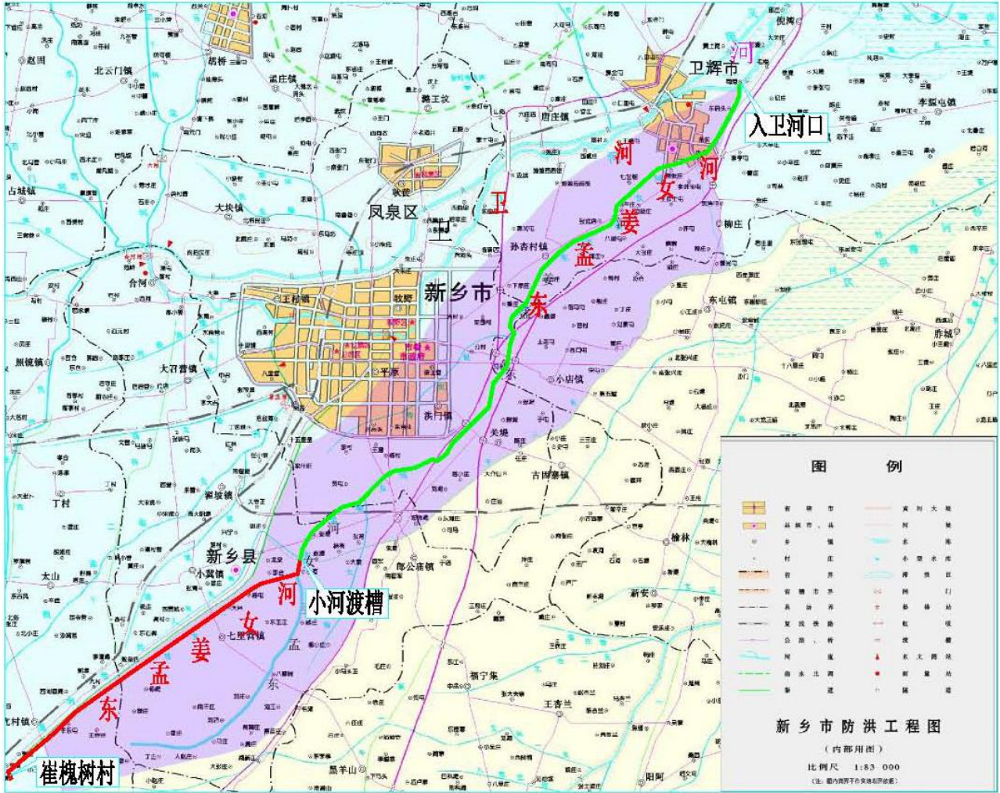  
表 1.1-1 东孟姜女河位置图  

# 1.1.3 工程建设必要性  

2011年10月新乡市中原水利设计研究院编制了《河南省新乡市东孟姜女河治理工程初步设计》,东孟姜女河治理段除涝标准为3年一遇,桩号 $0{+}000{\sim}11{+}377\$ 河段位于卫辉市区,防洪标准为20年一遇。已实施完毕。  

2013年,河南方正水利工程咨询有限公司2012年12月编制了《新乡市东孟姜女河石武高铁新乡站区域河道改造工程设计报告》(本工程由地方筹集资金)及附图,石武高铁新乡站东孟改道段上起于平原路南约 $700\mathrm{m}$ 桩号 $21+730$ 处,下止于张庄至上焦庄生产桥上游 $240\mathrm{m}$ 桩号 $18{+}322$ 处,改道河段除涝标准为5年一遇,设计流量 $97.8\mathrm{m}^{3}/\mathrm{s}$ ,设计水深$1.43\mathrm{m}$ ,堤防设计标准为100年一遇,设计流量 $670\mathrm{m}^{3}/\mathrm{s}$ ,设计水深 $4.60\mathrm{m}$ 。改道后新河段长 $3915\mathrm{m}$ ,比原河长 $507\mathrm{m}$ ,改线河道纵坡1/4105,河道底宽 $75\mathrm{m}$ ,河道边坡1:2,堤防内外边坡1:2,左右堤防顶宽均为 $8\mathrm{m}$ ,左右堤防顶高程为100年一遇洪水位 $+2.0\mathrm{m}$ 超高。上游起始点桩号 $21{+}730$ 处设计河底高程 $66.51\mathrm{m}$ ,5年一遇除涝水位 $67.94\mathrm{m}$ ,100年一遇防洪水位 $71.11\mathrm{m}$ ;下游终点桩号 $18{+}322$ 处设计河底高程 $66.56\mathrm{m}$ ,5年一遇除涝水位 $66.99\mathrm{m}$ ,100年一遇防洪水位 $70.16\mathrm{m}$ 。该工程现已实施范围为:从上游改道段与东孟姜女河汇合口 $22{+}100$ 处,至改道段与赵定排交叉口处 $20{+}470$ ,实施长度 $1.63\mathrm{km}$ 。下游段 $2.285\mathrm{km}$ 由于工程占地、拆迁等原因,暂未实施。本次方案治理将高铁站未实施段列入本次工程内。  

2017年,新乡市中原水利设计研究院编制了《河南省新乡市东孟姜女河市区段治理工程初步设计》,对东孟姜女河新乡市市区段(桩号 $14\substack{+395\sim33+053})$ )进行治理,除涝标准为5年一遇,设计除涝流量为 $152.0{\sim}62.0\mathrm{m}^{3}/\mathrm{s}$ ,河道内边坡为1:2,河道糙率0.0225,纵比降为1/4000。  

桩号 $33{+}053{\sim}37{+}629$ (南支排入口),暂无治理规划。  

桩号 $37\substack{+629\sim39+894}$ 段,于 2016 年进行了河道治理,治理标准为 20 年一遇防洪,3 年除涝标准,设计防洪流量为 $101.2\mathrm{m}^{3}/\mathrm{s}$ ,除涝流量为 $45.8\mathrm{m}^{3}/\mathrm{s}$ 。  

1、是保障区域防洪安全的根本  

东孟姜女河是卫河上游的一条支流,起源于获嘉县冯庄镇张槐树村,自西南流向东北,至卫辉市司湾村注入卫河,河道全长 $60.11\mathrm{km}$ ,是新乡县、新乡市区东部、南部、延津县西北部、卫辉市西南部及获嘉县东南部排水的主要河道。1981 年曾利用引黄济津补偿经费进行过一次河道清淤疏浚,其标准是按 1962 年水利部北京设计院编制的卫河清淤工程设计标准进行的,目标是恢复原排涝标准。1993 年东孟姜女河下游入卫段进行改道,从卫辉市张庄桥下游 $200\mathrm{m}$ 起到司湾村入卫河,改道段长 $7.2\mathrm{km}$ ,排涝能力 $72.6\mathrm{m}^{3}/\mathrm{s}$ ,治理标准达到 3 年一遇标准的 $64\%$ ,防洪能力 $288~\mathrm{m}^{3}/\mathrm{s}$ ,基本达到 20 年一遇标准。改道以上河段虽然进行过疏浚,但年久失修,淤积严重,亟待治理。  

东孟姜女河作为人民胜利渠引黄灌区的退水河道,由于引黄退水退沙,淤积严重,河床逐年淤积,涝水排泄不畅,盐碱地面积扩大,除涝标准不足 5 年一遇,同时给新乡市区和卫辉市区的防洪安全构成巨大威胁。东孟姜女河流域在 1956 年、1963 年、1970年、1996 年、2000 年、2006 年、2021 年等多次出现大面积洪涝灾害,损失严重。1996年 8 月洪水新乡县 10 个乡镇受灾,面积 17.56 万亩,直接经济损失达 9945 万元;2000年 7 月 $4\sim7$ 日,卫辉市普降暴雨,全市 10 乡镇 28 万人、31 万亩农作物成灾,其中绝收面积 20 万亩,106 个村庄进水,倒塌房屋 2230 间,损坏房屋 4300 间,损坏机井 1500眼,冲毁桥涵 373 座,直接经济损失 2.73 亿元。2006 年 7 月 2 日新乡市普降大到暴雨,洪门镇最大降雨量达 173.7 毫米,关堤乡最大降雨量达 128.1 毫米,致使红旗区 9500 亩田地积水,东孟姜女河河水猛涨,冲毁右岸堤身四处,总长 35 米,以致洪水漫过右堤,  

140 亩鱼塘、莲田漫顶,两岸 3000 亩土地被淹。2021 年 7 月 $17\sim22$ 日,新乡市经历了有历史记录以来的特大暴雨灾害,平均降雨量 830 毫米,最大降雨量 965.5 毫米,全市175 个站点中有 49 个站点降雨量超过 600 毫米。最大降水总量、最大小时雨强、最大两小时雨强、最强时段降水总量均达历史极值。截至 28 日 12 时,此次强降雨造成全市 147个乡镇受灾,直接经济损失 97.8 亿元,受灾人口 230 万人。雨水过后,排河洪水下泄缓慢,上游来水量巨大,河水倒灌进地,沿岸村庄损失严重。  

东孟作为新乡市城区和卫辉市城区的重要防洪除涝河道,行洪河道均未形成系统治理,河道部分堤防存在堤身薄弱,高度不足,不满足防渗条件等情况,现有穿堤建筑物多为六、七十年代乡村自建自管,设计标准低,经过年运行后破损严重,存在安全隐患,东孟姜女河的防洪除涝问题不仅直接影响卫辉市、延津县、牧野区、红旗区、开发区、卫滨区及新乡县全面建设小康社会和社会主义和谐社会建设的进程,并且严重影响卫河下游及豫北地区经济社会的可持续发展,对该河道进行治理十分必要。  

2、是保护城市重要基础设施安全的抓手  

新乡市是郑州都市圈重要组成部分、豫北地区首批国家公路运输枢纽城市,京广高铁、京广、新月、新菏等铁路,京港澳、大广、济东等高速和 G107 等交通大动脉贯穿新乡。新乡市总面积 $8290\mathrm{km}^{2}$ ,除延津县和原阳县部分区域、封丘县、长垣市和平原示范区位于黄河流域外,主城区和获嘉县、卫辉市、辉县市、新乡县均位于海河流域,新乡市海河流域总计面积 $4092.3\mathrm{k}\mathrm{m}^{2}$ ,占市域总面积的 $49.3\%$ ,新乡卫河流域 2022 年国民生产总值 1886.8 亿元,占全市国民生产总值的 $62.59\%$ 。  

东孟姜女河位于卫河的中上游,作为卫河的主要支流,其治理意义非常重要。气候、环境及地形地貌特点,决定了东孟流域暴雨频繁,洪水峰值高,流量大,历时长的特性,在热带气旋频繁季节,更担心洪水任务的复杂性和长期性。东孟姜女河流经沿线分布着农业田地、居民小区、交通站点、新乡市重要工业企业等,随着经济社会的发展,沿岸居民不断增多,极端暴雨天气地频现,东孟河道工程现状标准与其所承担的区域防洪与排涝任务是不相称的,巩固城市防洪体系,保护城市重要基础设施已迫在眉睫。通过东孟姜女河道综合治理工程地建设,可使东孟防洪除涝险情得到有效治理,保护新荷、京广等铁路、京港澳、济东等高速、新汲、新长、新延公路等重要基础设施的安全,保障沿岸地区的防洪排涝安全,提高整体防御外洪的能力,减轻排涝压力,缩短洪水迟滞时间,为经济社会发展提供保障。  

3、是加快河道生态文明建设的必要组件  

河湖是最重要的自然资源和生态要素之一,是国土空间和生态系统的重要组成部分,是经济社会稳定可持续发展的重要支撑,是水生态文明建设的必要组成。东孟纵穿新乡市城区自东南向东北汇入卫河,受城镇化建设进程的加快,区域无序建设和老百姓与河争地的影响,东孟河道被逐渐挤压,水面积减少,水体承载能力降低。同时,沿河人口生活水平的提高,加剧了生活污水的排放量,使东孟部分河段成为了排污通道,河流生态环境遭到破坏,河流基本功能衰退。人类活动加重了防洪压力,水土流失引起河道泄洪能力降低。水土流失的加剧直接导致土壤蓄水能力下降,降雨流量增大,汇流时间缩短,这就使洪水过程向陡涨陡落的形态发展,加大了洪水的破坏力,加重了洪涝灾害。河道健康水体不仅是生态环境地需要,更是改善沿河群众的生产、生活条件,促进人与自然和谐相处,保障沿河经济社会协调、稳定发展的需要。  

党的十八大以来,以习近平同志为核心的党中央对环境保护以及生态文明建设给予高度重视,把生态文明建设纳入中国特色社会主义事业“五位一体”总体布局,提出一系列新理念新思想新战略,强调坚持生态兴则文明兴,坚持人与自然和谐共生,坚持绿水青山就是金山银山,坚持良好生态环境是最普惠的民生福祉,坚持山水林田湖草是生命共同体,坚持用最严格制度最严密法治保护生态环境,坚持建设美丽中国全民行动,对东孟河湖的整治力度不断加大,河湖水质状况得到明显好转,但是东孟河道生态系统的恢复还有很长的路要走。  

# 4、是建设幸福河湖的助推器  

为深入贯彻落实习近平生态文明思想和习近平总书记关于建设造福人民幸福河的重要指示精神,2022 年 10 月 9 日,河南省第一总河长楼阳生、河南省总河长王凯下达了《关于开展幸福河湖建设的决定》(河南省总河长令第 5 号),决定在全省范围内开展幸福河湖建设,持续改善我省河湖面貌,不断增强人民群众的获得感、幸福感、安全感。按照“持久水安全、优质水资源、宜居水环境、健康水生态、先进水文化、科学水管理”的标准,推动河湖管理保护全面提档升级,逐步实现“江河安澜、河通渠畅、水清岸绿、生态健康、人水和谐、景美文昌”的美好愿景。  

迈入新时代,人民群众对优美生态环境需要日益增长,对江河湖泊保护治理有着热切期盼,全面推行河湖长制已进入全面强化、标本兼治、打造幸福河湖的新阶段。东孟姜女河进行综合整治,以河道防洪、除涝作为根本出发点和落脚点,把人民所盼的健康美丽幸福河湖建设向纵深推进,实现东孟河道自然景观优美,人文景观雅致,进一步增强人民群众的获得感、幸福感、安全感。为着力推进水治理体系和治理能力现代化,打造可复制、可推广河湖治理样板,助力河南省建设水资源节约集约利用先行区、构建兴  

利除害的现代水网体系打下坚实基础。  

# 1.2 水文  

# 1.2.1 流域概况  

孟姜女河原是历史上留下的一条沁河泛道,起源于武陟县木栾店,流经获嘉、新乡,于卫辉城关入卫河,是历代沁河决口的泛道,后因古阳堤逐渐形成,这条泛道即成为堤北坡洼地的自然排水河道。因清光绪年间修建芦汉(京广)铁路,民国年间日寇侵略军修建引黄济卫工程,以及解放后修建人民胜利渠、共产主义渠等历史原因,分别形成了现在的东孟姜女河和西孟姜女河。东孟姜女河起源于新乡县丁庄村,流经新乡市卫滨区、经济技术开发区、红旗区、牧野区,于卫辉市区入卫河,流域位于北纬 $35^{\circ}04^{\prime}{\sim}35^{\circ}26^{\prime}$ ,东经 $113^{\circ}38^{\prime}{\sim}114^{\circ}06^{\prime}.$ 。  

东孟姜女河河道全长 $60.11\mathrm{km}$ ,其中下段从入卫河口到新乡县小河村长 $39.49\mathrm{km}$ ,上段从小河村至获嘉县冯庄镇张槐树村长 $20.62\mathrm{km}$ ,流域面积 $468.5\mathrm{km}^{2}$ 。  

# 1.2.2 气象水文  

东孟姜女河流域属暖温带大陆性季风气候,半湿润易旱地区。其特点是春季干旱风沙多、夏季炎热雨量大,秋高气爽季节短、冬季寒冷雨雪少。年平均气温 $14.1^{\circ}\mathrm{C}$ ,最低气温- $16.6^{\circ}\mathrm{C}$ ,最高气温 $42.6^{\circ}\mathrm{C}$ ;年降水量 $569.3\sim604\mathrm{mm}$ ,受季风环流的影响,降水量随季节变化特征明显,降雨不仅年际变幅大,丰枯比达 $3\sim4$ 倍,年内分配也极不均匀,$6\sim9$ 月份降雨占全年降雨的 $70\%$ 左右。  

由于受气候特征的影响,本区域暴雨量相差悬珠,根据新乡站的统计,2021 年最大3 日雨量 $523\mathrm{mm}$ ,而 1965 年仅有 $58\mathrm{mm}$ ,大小年际差 8 倍。且流域暴雨分布具有突发性和持续性。  

# 1.2.3 水文基本资料  

东孟姜女河无实测水文流量资料,流域内设有康庄、朗公庙和东屯 3 个雨量站。  

# 1.2.4 设计洪水  

东孟姜女河根据实测雨量资料采用间接法计算河道设计洪水。  

# 1.2.5 施工期洪水  

东孟姜女河施工期洪水采用临近西孟姜女河八里营水文站非汛期实测流量频率适线设计洪水成果按面积比的 0.75 次方求得。  

# 1.2.6 排涝模数及流量  

本次新建或重建的排涝闸及提排站排涝模数均采用 24h 暴雨资料间接法推求。其中排涝闸采用平原排水模数法计算模数,提排站采用平均排除法计算模数。  

# 1.2.7 泥沙  

东孟姜女河流域进入排水河道的泥沙主要来源于引黄灌溉退水和降水坡面侵蚀,还有少量风蚀。每年东孟姜女河道淤积量约为 3.07 万吨。  

# 1.2.8 水文自动测报系统  

新乡市东孟姜女河综合治理工程所涉的水文(巡测)站为东孟姜河秦庄巡测站,秦庄为中小河流巡测站。  

综合河道治理情况及现状水文设施设备可利用情况分析,本次共改造巡测站 1 处。通过对站点降水、水位、流量等监测方式进行改造,满足工程治理后,新的河道水文情势下水文站监测各监测要素需求,同时提高水、雨、工情等防汛信息的采集与传输的速度,改善通信条件,满足东孟姜女河的防洪及水资源管理工作需求。水文系统建设内容包括秦庄 1 处中小河流巡测站监测断面设计、设施、率定等。  

# 1.3 工程地质  

1)工程区位于新乡市境内,地貌属黄河、卫河冲洪积平原,地势自西南向东北倾斜,自然地势西高东低,南高北低,地面高程 $68.83{\sim}74.06\mathrm{m}$ ,场区地形较为平坦,沿线均有公路或乡间路通行,交通便利。  

2)场区揭露地层岩性主要为第四系全新统轻粉质壤土、重粉质壤土、砂壤土、粉、细砂等,地层分布较为稳定。  

3)场区区域上属华北准地台(I)黄淮海坳陷(I2)中南部,新构造分区属华北断陷\~隆起区(Ⅱ)的河北断陷( $\mathrm{II}_{5}$ )与太行山隆起( $\mathrm{II}_{3}$ )交接部位。工程区附近构造断裂带主要有汤西断裂、汤东断裂、聊考断裂带、焦作 $\bf\tilde{\rho}\sim$ 新乡 $\sim$ 商丘断裂带,区域构造稳定性较差。  

治理段场区为Ⅱ类场地,基本地震动峰值加速度值为 $0.20\mathrm{g}$ ,相当于地震基本烈度Ⅷ度区,基本地震动加速度反应谱特征周期为 0.40s。  

4)工程场区揭露地下水类型主要为第四系孔隙潜水,赋存于第四系全新统粉质壤土中。场区地下水的主要补给来源是降水入渗补给,其次为侧向径流补给、河道侧渗补给。场区地下水的主要排泄方式为侧向迳流(河道排泄)、人工开采和蒸发。勘察期间,地下水埋深 $2.1{\sim}9.2\mathrm{m}$ ,高程为 $62.76{\sim}66.69\mathrm{m}$ 。根据室内试验成果,地下水水化学类型为:$_\mathrm{HCO_{3}-C a\cdot M g}$ 、HCO3·SO4-Ca·Mg·( $\mathrm{K+Na}$ )及 $\mathrm{HCO_{3}\cdot C L{\cdot}S O_{4}{-}C a{\cdot}M g}$ 型,其矿化度 $0.464\sim$ $0.862\:\mathrm{g/L}$ ,为淡水;PH 值 $7.40{\sim}8.22$ ,属中性\~弱碱性水,总硬度 $10.91{\sim}40.47\$ 德国度,属微硬\~极硬水;侵蚀性 CO2 为 $0\mathrm{mg/L}$ 。场区地下水对混凝土无腐蚀性,对钢筋混凝土结构中的钢筋及钢结构具弱腐蚀性。  

河道内常年有水,勘察期间,河水水深地下水埋深 $0.5{\sim}2.0\mathrm{m}$ ;水类型为:Cl- $\mathrm{SO}_{4}.$ -$\mathrm{HCO}_{3}$ - Ca-Na 、Cl- HCO3- $\mathrm{SO}_{4}$ -Na-Ca、Cl-HCO3-Na-Ca 型,其矿化度 $1.002{\sim}1.345\mathrm{g/L}$ ,为微碱性水;PH 值 $8.24{\sim}8.34$ ,属弱碱性水,总硬度 $25.78{\sim}32.23$ ,属极硬水;侵蚀性 $\mathrm{CO}_{2}$ 为 $0\mathrm{mg/L}$ 。场区地表水对混凝土具弱腐蚀性,对钢筋混凝土结构中的钢筋具弱腐蚀性,对钢结构具中等腐蚀性。施工时可根据需要进行施工导流。  

5 ) 东 孟 姜 女 河 治 理 段 桩 号 $\mathrm{K}18{+}091{\sim}\mathrm{K}15{+}092$ 段左岸存在堤防,其中$\mathrm{K}15{+}592{\sim}\mathrm{K}16{+}891$ 段种植大量农作物、各种树木, $\mathrm{K}16{+}900{-}\mathrm{K}19{+}000$ 段堤左岸顶有土路,可以通车,局部种植有农作物;桩号 $\mathrm{K}16{+}891{\sim}\mathrm{K}18{+}091$ 段右岸堤顶有土路,可以通车,局部种植有农作物;其他河段堤防残缺不全,局部存在堤防,高度 $0.5\mathrm{m}{\sim}1.0\mathrm{m}$ ,有大量农作物和树木。  

现存河堤堤身填土主要为轻粉质壤土、重粉质壤土,局部河堤为弃土堆积形成,未经碾压夯实,有被破坏和雨水冲蚀现象,抗冲刷能力和防渗性较差,由于碾压的不均一性,导致堤身可见到一系列小孔洞和小裂隙;再加之一些人为活动对堤防的破坏,基本失去堤防功能,不能满足防洪要求。  

6)场区内堤基地层结构主要为粘砂多层结构。堤基上部为第四系全新统轻粉质壤土、重粉质壤土、砂壤土和粉砂;重粉质壤土具弱透水性,轻粉质壤土、砂壤土和粉砂具中等透水性;汛期高水位运行时,在水头压力作用下,河道周边低洼或坑塘处存在渗透稳定问题;轻粉质壤土、砂壤土存在地震液化可能性,液化等级为轻微\~中等液化。  

根据沿堤线两侧的地形和地貌分布状况,堤基地质结构及土的物理力学性质,按《堤防工程地质勘察规程》(SL188-2005)附录 E.1,综合多方面因素考虑,东孟姜女河治理段堤基稳定性体评价较差,属 C 类堤基。  

本次治理段岸坡岩性主要以重粉质壤土、轻粉质壤土为主,局部为砂壤土粉砂,抗冲刷能力差。河水位较高时,岸坡易被冲刷侵蚀,易造成河岸坍塌,危及堤防安全。建议对岸坡及堤坡进行防护,坡比可采用 1:2.5\~1:3.0。必要时采用复式边坡,中间留设马道。按《堤防工程地质勘察规程》(SL188-2005)附录 E 判定,堤防堤岸工程地质条件分类属稳定性较差岸坡。  

6)河道治理段建筑物主要为排水涵闸和提排泵站;  

涵闸及泵站建筑物主要存在的工程地质问题为:地震液化问题、闸基稳定问题、渗透稳定问题、施工边坡稳定问题及施工降排水问题。  

7)东孟姜女河治理段桩号 $\scriptstyle{\mathrm{K}}22+169{\mathrm{-}}{\mathrm{K}}22+368$ 处陡弯水流顶冲,需要护岸防护,长度约 $200\mathrm{m}$ 。地基位于 $\textcircled{1}$ 层重粉质壤土、 $\textcircled{1}$ 层轻质壤土及 $\textcircled{3}$ 层粉砂,均具中等压缩性,$\textcircled{1}$ 层重粉质壤土和 $\textcircled{1}$ -1 层轻质壤土承载力特征值为 $110\mathrm{kPa}$ , $\textcircled{3}$ 层粉砂承载力特征值$150\mathrm{kPa}$ ,满足荷载要求,不存在堤基稳定及抗滑稳定问题;该处险工段堤防未衬砌,岩性主要为重粉质壤土及轻粉质壤土,边坡种有农作物,由于重粉质壤土及轻粉质壤土抗冲刷能力差,受水流作用,岸坡易坍塌,由于岸顶距离坡脚较近,影响堤防安全,建议对岸坡进行护砌,基础应埋置在冲刷深度以下。建议边坡坡比采用 $1{:}2.5{\sim}1{:}3.0$ 。勘察期间,地下水位高程 $64.82{\sim}64.90\mathrm{m}$ ,东孟姜女河常年有水,施工时应注意施工降排水及导流问题。  

8)河道淤积层、 $\textcircled{1}$ 层轻粉质壤土、 $\textcircled{1}-2$ 层粉砂开挖级别为Ⅱ级, $\textcircled{2}$ 层重粉质壤土开挖分级为 III 级。疏浚后组成河道岸坡岩性主要为 $\textcircled{1}$ 、 $\textcircled{2}$ 层重粉质壤土和 $\textcircled{1}$ -1 层轻粉质壤土,局部为 $\textcircled{1}-2$ 层粉砂,建议疏挖岸坡坡比采用土层 1:2.50\~1:3.00。  

# 9)天然建筑材料  

根据实验,东孟姜女河河道治理段沿线土料重粉质壤土除天然含水率偏高以外其他指标均符合一般土填筑料的质量要求,可作为填筑料使用,使用时建议进行晾晒。轻粉质壤土天然含水率及重塑土渗透系数偏高,不符合一般土填筑料的质量要求。  

工程区内及周边无可用砂砾料和块石料,建议采用外购方式解决,本工程所需混凝土骨料及块石料可采用卫辉市后沟料场。  

# 1.4 工程任务和规模  

# 1.4.1 工程任务  

# 1.4.1.1 地区社会经济状况  

新乡古称牧野,北依太行、南临黄河,辖 12 个县(市、区)、1 个城乡一体化示范区、2 个国家级开发区,总面积 $8291\mathrm{km}^{2}$ ,户籍人口 668.5 万人,常住人口 617.1 万人,其中城镇人口 360.3 万人,城镇化率 $58.4\%$ 。是全国文明城市、国家卫生城市、国家园林城市、国家森林城市、国家知识产权示范城市、国家循环经济示范城市、全国农村改革试验区、郑洛新国家自主创新示范区。新乡市是豫北地区的国家公路运输枢纽城市,境内有京广高铁、京广铁路、新菏铁路、新月铁路等四条铁路,107 国道,京港澳、大广、济东及正在建设的新晋、鹤辉等五条高速公路穿境而过。  

2022 年全市地区生产总值 3463.98 亿元,比上年增长 $5.3\%$ 。其中,第一产业增加值  
339.12 亿元,增长 $5.5\%$ ;第二产业增加值 1549.5 亿元,增长 $7.2\%$ ;第三产业增加值  
1575.37 亿元,增长 $3.4\%$ 。三次产业结构为 $9.8:44.7:45.5$ 。全年人均地区生产总值  
56156 元,比上年增长 $6\%$ 。全市居民人均可支配收入 28909.4 元,全市居民人均消费支  
出 19100.8 元,比上年增长 $5.2\%$ 。  

# 1.4.1.2 工程现状及存在问题  

一、河道断面窄小,除涝标准不足 5 年一遇  

拟治理段现状河道除局部高地外,排涝水位高于现状地面 $0.20{\sim}2.64\mathrm{m}$ ,不满足 5年一遇排涝要求,该河段急需开挖疏浚。上焦庄生产桥\~菏宝高速段为局部洼地,地面高程大大低于该区域除涝水位,拓宽主河槽宽度不能明显改善除涝标准不足的问题,因此在此河段设置 3 座提排站,当堤外涝水淹没堤外耕地时,采用提排站将涝水排入东孟主河槽内。  

# 二、防洪除涝基础设施薄弱,防洪标准低  

菏宝高速至上焦庄生产桥段现状堤防极不完整,大部分河段无堤防,现状有堤防的河段,堤身填筑土类都是就地取材,河道清淤土、挖掘堤内土层填筑而成,局部河堤为弃土堆积形成,未经碾压夯实,填筑质量差,有被破坏和雨水冲蚀现象。治理段河道防洪标准低,不满足防洪要求。  

# 三、河道淤积  

该河道治理段均有不同程度的淤积,淤积深度为 $0.4{\sim}2.0\mathrm{m}$ ,河道过水能力降低,河道泄洪排涝能力严重不足,工程隐患多等问题,存在安全隐患。亟需对河道进行清淤疏浚。  

# 四、投入严重不足,问题日益突出  

长期以来,东孟姜女河治理缺乏投资机制和投资渠道,治理资金严重不足,特别是近年来,有关“两工”政策取消,群众投劳农田水利的投入机制和组织方式发生很大变化,加上市、县级财政的困难,对该河道的治理(河道清淤和堤防加固等)日趋减少,使中小河流面临的问题日益突出。  

# 1.4.1.3 工程任务  

新乡市东孟姜女河河道治理工程是整个海河流域规划治理的重要组成部分,以防洪、排涝为主,兼顾东孟姜女河新乡市区段的生态功能。是提高区域防洪能力、保障人民生命和财产安全的需要,是适应社会经济发展、提高人民生活水平、加快推进城镇建设的需要,是一项惠及民生的水利工程。  

本项目工程任务为通过修筑堤防、疏浚河道、配套建筑物等措施解决东孟姜女河防洪标准低等问题,使东孟姜女河本次治理段达到小河渡槽上游段 5 年一遇除涝标准;东孟姜女河心连心化工集团厂区河段左、右岸防洪标准均为 50 年一遇,新乡市城区其他河段均为左岸防洪标准为 50 年一遇、右岸防洪标准为 20 年一遇;除涝标准达到 5 年一遇,形成安全有效的防洪体系,真正改变东孟姜女河洪涝频发的现状,为当地社会经济发展提供安全的水利保障。  

# 1.4.2 河道现状行洪与排涝能力复核  

# 1.4.2.1 河道糙率率定  

根据河道现状条件,结合东孟姜女河前期治理成果,现状东孟姜女河主槽综合糙率采用 0.03。  

# 1.4.2.2 天然河道行洪排涝能力复核  

本次根据东孟治理段实测断面资料,采用现状河道主槽及边坡糙率、复核在设计排涝及防洪流量情况下,主槽及堤防是否满足设计防洪标准要求。  

# (1)计算方法  

根据水文和地形资料,运用水面线基本方程式,以下游末端断面为控制断面,自下游向上游采用逐段试算法进行水面线计算。  

(2)起推断面和起推水位  

根据 2011 年 10 月新乡市中原水利设计研究院编制的《河南省新乡市东孟姜女河治理工程初步设计》,前期对东孟姜女河入卫河口(桩号 $0{+}000^{\setminus}$ )\~卫辉市大任庄提灌站上游(桩号 $14{+}000$ )长 $14.0\mathrm{km}$ 河道进行了规划设计工作,目前入卫河口(桩号 $0{+}000)$ )至九孔桥(桩号 $11{+}395)$ )处现状治理已实施,已根据要求达到 20 年一遇防洪标准、3 年一遇除涝标准。九孔桥上游段现状未完成治理。  

本次起推断面选择九孔桥处(桩号 $11{+}395\$ ),起推水位选择结合九孔桥下游段已治理段断面,采用《河南省新乡市东孟姜女河治理工程初步设计》中九孔桥(桩号 $11{+}395\$ )处 3 年一遇、20 年一遇设计水位作为起推水位,3 年一遇设计除涝水位为 $68.28\mathrm{m}$ ,20年一遇防洪水位为 $70.82\mathrm{m}$ 。5 年一遇和 50 年一遇设计起推水位结合九孔桥下游已治理段河道设计成果,采用九孔桥处设计河底高程加相应的明渠均匀流水深作为起推水位,确定 5 年一遇设计除涝水位 $68.97\mathrm{m}$ ,50 年一遇防洪水位 $71.43\mathrm{m}$ 。本次东孟姜女河现状  

河道行洪排涝起推水位按照该水位推算。  

(3)现状行洪和排涝能力复核选用我公司编制的《河道 CAD 软件》进行水面线计算。  

计算成果显示,东孟姜女河现状河道排涝水位高于现状地面 $0.14\{\sim1.59\mathrm{m}$ ,河道整体除涝能力不足 5 年一遇,需结合本次设计 3\~5 年一遇的除涝要求对全段主河槽进行清淤疏浚。河道两侧除菏宝高速\~高铁改线段下游端现状有堤防外,其余段现状无堤,设计洪水河道存在漫堤现象,不满足防洪要求,需结合本次设计防洪要求对现状堤顶高程不足段堤防进行加高培厚处理,对无堤段新建堤防。对仅有除涝要求的河段,不新筑堤防。  

# 1.4.3 工程规模  

# 1.4.3.1 治理原则  

以习近平新时代中国特色社会主义思想为指导,全面贯彻落实党中央、国务院关于灾后重建的决策部署,践行“十六字”治水思路,坚持“人民至上、生命至上”,按照“两个坚持、三个转变”的防灾减灾救灾新理念,统筹灾后治理与防洪减灾能力提升,统筹考虑防洪与排涝、城市与乡村、干流与支流、上游与下游、左岸与右岸、近期与远期、灾后恢复重建与流域防洪安全的关系,对卫河、共产主义渠进行综合治理,集中力量加快病险水库除险加固、骨干行洪河道和中小河流治理、蓄滞洪区及智慧水利体系建设,全面增强流域和区域防洪减灾能力,为维护人民生命财产安全和经济社会高质量发展提供有力保障。  

# 1.4.3.2 治理范围  

东孟姜女河本次治理范围涉及获嘉县、新乡县和新乡市城区,治理段为冯庄镇张槐树村(桩号 $60{+}113$ )\~东孟高铁改线段起点(桩号 $22\substack{+085}$ )段及上焦庄生产桥(桩号$18\substack{+020}$ )\~菏宝高速桥(桩号 $15{+}991$ )段,治理河段总长 $40.06\mathrm{km}$ 。  

# 1.4.3.3 治理标准  

东孟姜女河治理段穿越新乡市主城区,统计东孟姜女河防洪保护区人口约 37.93 万人,心连心化工集团属于中型企业规模。依据《防洪标准》(GB50201-2014)的规定,结合新乡市城市总体规划图,新乡市主城区位于东孟姜女河左岸,综合考虑区域经济、地形条件、经济水平等因素,结合东孟姜女河淹没范围及保护对象的分布,综合分析,确定东孟姜女河心连心化工集团厂区河段左、右岸防洪标准均为 50 年一遇,新乡市城区其他河段均为左岸防洪标准为 50 年一遇、右岸防洪标准为 20 年一遇。治理段除涝标准均为 5 年一遇。  

# 1.4.3.4 工程规模  

# 1、河道  

(1)河道工程  

本次治理河段排涝标准均为 5 年一遇,根据拟定的设计除涝流量、除涝水位及设计河底高程,确定东孟姜女河疏浚段河道的断面,河道疏浚断面为单一梯形断面,按照各河段除涝标准采用恒定非均匀流公式计算河道疏浚规模。东孟河道清淤疏浚长 $40.06\mathrm{km}$ 。  

# (2)堤防工程  

依据《防洪标准》(GB50201-2014)、《水利水电工程等级划分及洪水标准》(SL252-2017)及《堤防工程设计规范》(GB50286-2013)有关规定,东孟姜女河新乡城区段左岸堤防为 2 级堤防,新乡市城区段右岸堤防为 4 级堤防。  

2 级堤防:堤顶宽 $6\mathrm{m}$ ,堤防超高为 $1.2\mathrm{m}$ ,堤防迎、背水坡坡比均为 1:3。2 级堤防道路净宽 $5\mathrm{m}$ ,两侧各设置 $0.5\mathrm{m}$ 宽土路肩。  

4 级堤防:堤顶宽 $3\mathrm{m}$ ,堤防超高为 $1.0\mathrm{m}$ ,堤防迎、背水坡坡比均为 1:3。本次治理河段 4 级堤防无堤顶道路。  

东孟堤防高程原则设置:由河道水位加堤防超高确定堤顶最终堤顶高程。两岸堤防整治 $35.67\mathrm{km}$ 。  

# (2)建筑物工程  

治理段共布置排水涵闸重建 33 座、新建 8 座;新建提排站 3 座、新建提灌站 5 座,拆除提灌站 3 座;重建路涵 27 座、重建桥梁 3 座。  

# 1.5 工程布置及建筑物  

根据《河南省水利厅 河南省财政厅 关于进一步做好中小河流治理项目前期工作的通知》(豫水计【2016】71 号),为加强灾后水利薄弱环节建设,提高河道防洪除涝标准,增强抵御自然灾害能力,国家将继续对中小河流进行治理。按照水利部要求,中小河流治理项目要服从流域防洪规划,治理标准要与干流、区域防洪除涝标准相协调。对一条河流上的多个河段进行治理,要先规划、后设计,统筹整条河流治理,防止洪水灾害转移。中小河流治理理应按照自下而上、系统治理、突出重点的原则进行,重点安排防洪除涝问题突出、人口密集、地方建设积极性高、前期工作进度快的重点河段项目。  

根据以上通知的要求,本着突出重点、保障安全、统筹兼顾、系统治理的原则,针对新乡市防洪安全和东孟姜女河现状存在的主要问题,对东孟姜女河进行防洪除涝治理,确定本项目治理范围为:治理段为冯庄镇张槐树村(桩号 $60\substack{+113}.$ )\~东孟高铁改线段起点(桩号 $22\substack{+085}$ )段及上焦庄生产桥(桩号 $17\substack{+991}$ ) $\sim$ 荷宝高速(桩号 $15{+}991$ )段,治理河段总长 $40.06\mathrm{km}$ 。  

工程建设内容:河道清淤疏浚长 $40.06\mathrm{km}$ ,堤防整治(左、右岸) $35.67\mathrm{km}$ ;新建堤顶道路 $15.18\mathrm{km}$ ;河道弯道防护 25 处 $4.74\mathrm{km}$ ;桥基防护 44 处,护砌长度 $2.64\mathrm{km}$ ;排水涵闸重建 33 座、新建 8 座;新建提排站 3 座、重建提灌站 5 座,拆除提灌站 3 座;重建路涵 27 座、重建桥梁 3 座。  

工程建设详细内容见表 $1.5{\cdot}1{\sim}2$ 。  

表1.5-1  河道部分建设内容汇总表  

<html><body><table><tr><td rowspan="2">河道名称</td><td colspan="4">项目内容</td></tr><tr><td>河道清淤疏浚（km）</td><td>堤防整治（km)</td><td>弯道防护(km)</td><td>桥基防护(km)</td></tr><tr><td>东孟姜女河</td><td>40.06</td><td>35.67</td><td>4.74</td><td>2.64</td></tr></table></body></html>  

表1.5-2  建筑物部分建设内容汇总表  

<html><body><table><tr><td rowspan="2">名称</td><td rowspan="2">改造 类型</td><td colspan="6">项目内容 (建筑物工程)</td></tr><tr><td>排水涵闸 （座）</td><td>提灌站 （座）</td><td>提排站 （座）</td><td>路涵 （座）</td><td>桥涵 （座）</td><td>合计</td></tr><tr><td rowspan="3">东孟姜女河</td><td>重建</td><td>33</td><td>5</td><td>0</td><td>27</td><td>3</td><td>68</td></tr><tr><td>新建</td><td>8</td><td>0</td><td>3</td><td>0</td><td>0</td><td>11</td></tr><tr><td>拆除</td><td>0</td><td>3</td><td>0</td><td>0</td><td>0</td><td>3</td></tr><tr><td colspan="2">合计</td><td>41</td><td>8</td><td>3</td><td>27</td><td>3</td><td>82</td></tr></table></body></html>  

# 1.6 工程设计  

# 1.6.1 工程等别及建筑物级别  

根据本项目工程任务和规模,按照《防洪标准》(GB50201-2014)、《水利水电工程等级划分及洪水标准》(SL252-2017)有关规定,确定本工程等别和主要建筑物级别以及相应洪水标准,确定地震设防烈度。  

(1)工程等别  

东孟姜女河主要流经获嘉县、新乡县、卫滨区、红旗渠、高新区、牧野区和卫辉市。结合东孟姜女河淹没范围,统计东孟姜女河防洪保护区人口约 37.93 万人,综合分析,本工程等别确定为 III 等工程,工程规模为中型。  

# (2)建筑物级别  

小河渡槽至菏宝高速段堤防及穿堤建筑物级别为 2 级,临时建筑物级别为 4 级。  

# 1.6.2 设计标准  

(1)设计洪水标准  

本次方案治理工程范围涉及获嘉县、新乡县和新乡市卫滨区、高新区、红旗区和牧野区,治理段为冯庄镇张槐树村(桩号 60+113)\~东孟高铁改线段起点(桩号 $22\substack{+085}$ )段及上焦庄生产桥(桩号 $18+020)\sim$ 菏宝高速桥(桩号 $15{+}991$ )段,治理河段总长 $40.06\mathrm{km}$ 。  

东孟姜女河治理段穿越新乡市主城区,统计东孟姜女河防洪保护区人口约 37.93 万人,心连心化工集团属于中型企业规模。依据《防洪标准》(GB50201-2014)的规定,结合新乡市城市总体规划图,新乡市主城区位于东孟姜女河左岸,综合考虑区域经济、地形条件、经济水平等因素,结合东孟姜女河淹没范围及保护对象的分布,综合分析,确定东孟姜女河心连心化工集团厂区河段左、右岸防洪标准均为 50 年一遇,新乡市城区其他河段均为左岸防洪标准为 50 年一遇、右岸防洪标准为 20 年一遇。  

东孟姜女河本次治理段在 2011 年 ${\sim}2021$ 年等历次治理中,新乡市城区段河道排涝标准均为 5 年一遇;根据《新乡市水利志》,东一干一支排历次治理除涝标准均为 5 年一遇。根据流域防洪总体安排,东孟姜女河本次排涝治理以恢复排涝规模为准,因此本次治理河段除涝标准均为 5 年一遇。  

故确定每段河道的防洪除涝标准如下: $\textcircled{1}$ 张槐树村(桩号 $60{+}113$ ) $\sim$ 小河渡槽( $(39+489$ )段按照 5 年一遇除涝标准进行设计; $\textcircled{2}$ 小河渡槽( $(39+489)\sim\mathrm{X}031$ 县道( $(38+320)$ )、X031 县道( $38+320~.$ )\~东孟高铁改线段起点(桩号 $22\substack{+085})$ 段及上焦庄生产桥(桩号 $18\substack{+020}$ ) $\sim$ 菏宝高速(桩号 $15{+}991$ )段河道左岸堤防设计洪水标准为 50 年一遇,右岸堤防设计洪水标准为 20 年一遇,河段除涝标准为 5 年一遇; $\textcircled{3}$ 心连心化工集团厂区河段(桩号 $38+320\sim$ 桩号 $35{+}670$ )左、右岸洪水标准均为 50 年一遇,除涝标准为 5 年一遇设计。  

(2)抗震设防标准  

根据《中国地震动参数区划图》(GB18306-2015)(1:400 万),工程场区 II 类场地时基本地震动峰值加速度值为 $0.20\mathrm{g}$ ,相当于地震基本烈度Ⅷ度区,基本地震动加速度反应谱特征周期为 0.40s。  

# 1.7 机电及金属结构  

# 1.7.1 水力机械  

涉及水力机械设计内容主要为拆除重建提灌站 5 座,新建提排站 3 座。  

# 1.7.1.1提灌泵站水力机械设计  

各提灌泵站设计流量均为 $0.3\mathrm{m}^{3}/\mathrm{s}$ ,根据泵站基本设计参数,通过计算,各提灌泵站设计扬程均为 $7.5\mathrm{m}$ 。  

根据各泵站提灌流量及扬程,选择蜗壳混流泵作为泵站水泵泵型。根据规划所提,提灌泵站年运行小时数较少,仅在灌溉期供水,因此泵站考虑不再设置备用机组,灌溉期前对机组进行好维修保养,确保机组灌溉期正常供水。泵站装机 1 台,水泵额定提水流量 $0.35\mathrm{m}^{3}/\mathrm{s}$ ,扬程 $6.8\mathrm{m}$ ,水泵配套异步电动机,单机容量 $37\mathrm{kW}$ ,电压等级 $0.38\mathrm{kV}$ 。  

根据泵站装机台数,机组采用单列布置形式。考虑输水管线长度,出水管为钢制的一机一管布置。为减少厂房开挖深度,节约投资,水泵采用抽真空启动,机组安装高程应满足水泵吸出高度的要求。机组的间距根据机组的布置形式、水泵和电动机外形尺寸以及设备净距离的要求确定。  

根据泵站扬程和出水管线长度,泵后工作阀采用管力阀,其后设手动双偏心蝶阀,方便泵后工作阀检修。水泵吸水管设有手动双偏心蝶阀,以便水泵检修。  

为满足泵站机组安装和检修起吊的要求,依据机组单件最大起重量,参照起重机设备系列,泵站选用 LDA-2 型电动单梁起重机,起重机跨度 $6.0\mathrm{m}$ ,起吊高度 $12\mathrm{m}$ 。  

根据泵站机型,变压器为干式变压器,泵站不再设有储油、净油设备。  

根据蜗壳混流泵的特点,水泵不需要技术供水。  

为方便进出水管路及机组检修、维护,以及满足泵站渗漏排水的要求,泵站设有检修渗水排水泵和集水井。集水井内设 2 台 50QW30-10-1.5 型移动式检修排水泵,1 用 1备。  

# 1.7.1.2提排泵站水力机械设计  

各提排泵站设计流量均为 $0.5\mathrm{m}^{3}/\mathrm{s}$ ,根据泵站基本设计参数,通过计算,各提灌泵站设计扬程均为 $10\mathrm{m}$ 。  

根据各泵站提排流量及扬程,选择潜水混流泵作为泵站水泵泵型。由于新建提排泵站设计流量较小,扬程也不高,水泵工作机按 1 台考虑。根据泵站流量和扬程,选择500QH-40 型潜水混流泵为工作机,水泵额定提水流量 $0.56\mathrm{m}^{3}/\mathrm{s}$ ,扬程 $11.65\mathrm{m}$ ,水泵配套异步电动机,单机容量 $90\mathrm{kW}$ ,电压等级 $0.38\mathrm{kV}$ 。为保障泵站提排可靠性,泵站设置1 台备用机组,其型号与工作机一致。  

潜水混流泵水泵安装高程应满足最低水位下水泵淹没深度的要求,根据设备厂家资料,水泵进口淹没在最低水位以下 $1.2\mathrm{m}$ 。  

根据泵站装机台数,机组采用单列布置形式。考虑输水管线长度,出水管为钢制的一机一管布置。水泵出水管设拍门断流。  

提排泵站选用 1 台 MD1-2 型电动葫芦,起重量 2t,起吊高度 $12\mathrm{m}$ 。  

泵站进水池设有液位监测装置,从而控制水泵在设计水位范围内启停。  

# 1.7.2 电气  

本工程主要供电对象为 3 座提排站、5 座提灌站、41 座水闸,3 座提排站为二级负荷,其他均为三级负荷。  

提排站、提灌站用电功率较大,在泵站附近设组合式箱变,为提排站供电的箱变采用双回 $10\mathrm{kV}$ 线路供电,仅为提灌站供电的箱变采用单回 $10\mathrm{kV}$ 线路供电,电源由附近的 $10\mathrm{kV}$ 线路“T”接或由当地变电所引接;水闸采用低压线路或移动柴发供电,低压电源就近引接。  

10kV 供电线路采用架空线路或直埋电缆的型式;低压供电采用电力电缆,主要敷设方式为室外直埋敷设、室内穿管敷设。电缆直埋敷设时,地下敷设深度不小于 $700\mathrm{mm}$ ,经农田时敷设深度不小于 $1000\mathrm{mm}$ 。  

10kV 箱变高压侧、低压侧均采用单母线接线。每座箱变的低压母线侧出线回路数根据各供电点低压负荷情况确定。  

本项目各建筑物属于第三类防雷建筑物,各建筑物采取的防直击雷措施为:在建筑物顶部四周敷设环型避雷网,采用结构主筋或专用防雷引下线与接地网(接地极)连接。电气设备采取的防止雷电侵入波的措施为:在 10kV 架空线与电缆的连接处和电缆进线处各装设 1 组氧化锌避雷器;建筑物内总配电箱内安装电涌保护器。  

配电系统的工作接地和保护接地宜共用接地网,10kV 系统为中性点非有效接地系统,中性点不接地,10kV 电气设备的外壳直接接地。低压系统接地型式采用 TN-C-S 系统。  

# 1.7.2 金属结构  

本工程金属结构主要为各涵闸、提排站、提灌站的闸门、拦污栅及启闭设备。本工程共新建、重建水闸 41 座,共计闸门 41 扇,拦污栅 5 扇,启闭机 41 台。  

本工程水闸主要是排水涵闸,闸门孔口尺寸(宽 $\times$ 高)均为: $2.0\mathrm{m}\times2.0\mathrm{m}$ 、。结合工程布置及运用,闸门均采用铸铁闸门。  

根据闸门的操作运行工况及启闭水头,闸门启门力均不大于 $200\mathrm{kN}$ 。本工程水闸均分布在河道沿线,结合工程运用要求、启闭机特性、水闸布置、经济指标等初步选定:  

排水涵闸闸门的启闭设备均选用手电两用螺杆机,布置型式为一门一机。启闭机均配置开度和荷重传感器,以保证启闭机安全运行。  

# 1.8 施工组织设计  

# 1.8.1 料场的选择与开采  

(1)土料场本工程填筑土料优先采用河道开挖料,但应注意分离淤泥层,禁止将淤泥用于筑堤。  

# (2)砂石料场  

本工程混凝土采用商品混凝土,工程所用砂石料主要为砂石垫层、砌石和石笼所用,施工时,所用砂砾料和块石料从推荐的卫辉后沟料场和淇县石棚料场购买解决,各料场的储量、生产能力均满足本工程施工需要。  

购买的材料进场前必须进行质量控制指标检测,满足要求后方可进场。  

# 1.8.2 施工导截流  

(1)导流方式  

# 1)河道疏浚  

本工程河道流量较大,若在河道内采取导流措施,工程投资较高,开挖完成后还需清理纵向围堰,因此不适宜在河道内采取导流措施,非汛期河道水深较小,河道疏浚采用挖掘机开挖,河槽中部采用长臂挖掘机开挖。  

# 2)岸坡防护工程  

根据河道宽度、周边环境等条件,岸坡防护工程在河槽内填筑纵向围堰导流。  

# 1.8.3 施工交通运输  

(1)场外交通  

场外交通利用现有路网资源可满足要求,不设场外交通道路。  

(2)场内交通  

本工程需要导流的岸坡防护工程共 $4150.5\mathrm{m}$ ,根据河道宽度、周边环境等条件,岸坡防护工程在河槽内填筑纵向围堰导流。  

# 1.8.4 施工工厂设施  

本工程施工工厂设施主要为砂石料堆放场、停车场、钢筋加工厂、金属结构堆放场、电风水系统等,施工工厂设施随工区划分布置在生产生活区内。  

# 1.8.5 施工总布置  

# 1.8.5.1 生产生活区  

工程共布置生产生活区 7 处,各区县各 1 处,每处占地 3 亩。生产生活区内可根据需要有选择的布置生活办公区、施工仓库、风水电系统和综合加工厂等。根据工程规模,每工区布置施工仓库 $50\mathrm{m}^{2}$ ,共 $350\mathrm{m}^{2}$ 。  

# 1.8.5.2 土石方平衡  

土方回填优先利用本工程可用开挖料。考虑约 $10\%$ 的淤泥不可利用外,土方回填缺乏土料从新乡市西孟姜女河治理工程段调运。  

不可用土料就近临时堆存,平均运距 $3\mathrm{km}$ ,后期由地方统一综合利用。  

# 1.8.5.3 土料翻晒场、临时堆料场  

工程所用填筑土料大部分为河道开挖料,根据地质报告,含水量较高,需翻晒后上堤填筑。  

# 1.8.5.4 施工总进度  

本工程施工总工期为 10 个月,其中,主体工程施工期 8 个月。  

# 1.9 建设征地移民安置规划设计  

# 1.9.1 建设征地范围  

工程建设征地范围涉及新乡市的高新区、红旗区、卫滨区、牧野区、新乡县和获嘉县 6 个县(区)10 个乡(镇、办事处)46 个行政村。按土地的用地性质分为永久用地和临时用地,建设用地范围由工程设计确定。  

# 1、永久用地  

永久用地共计 2807.30 亩,其中:新征土地 1532.34 亩、已有工程用地 1274.96 亩。  

# 2、临时用地  

根据施工总布置,工程施工新征临时用地面积 703 亩。其中:生产生活区 18 亩、场地道路 411 亩、临时堆料场 145 亩、土料翻晒场 50 亩、建筑物开挖用地 79 亩。  

# 1.9.2 建设征地实物  

工程总用地 3510.30 亩,其中永久用地 2807.30 亩(包括新征用地 1532.34 亩、已有工程用地 1274.96 亩),临时用地 703.00 亩。工程建设征地范围内搬迁人口涉及红旗区、新乡县、获嘉县共 27 户 124 人。占压各类房屋 $38604.68\mathrm{m}^{2}$ ,其中居民房屋 $9176.57\mathrm{m}^{2}$ 、集体房屋 $1428.80\mathrm{m}^{2}$ 、农副业房屋 $27999.31\mathrm{m}^{2}$ 。占压零星树木 13555 株、机井 9 眼、坟墓 243 冢,成片林(果)木 328.31 亩。占压工业企业 23 家,涉及各类房屋 $51789.79\mathrm{m}^{2}$ 。占压影响各类专项设施 294 条(处),其中输变电线路 50 条、通信和广电线路 227 条(处)、管道 17 条(处)以及文物古迹。  

# 1.9.3 农村移民安置  

设计基准年为 2023 年,规划设计水平年为 2025 年。人口自然增长率为 $6.48\text{\textperthousand}$ 。  

# 1、生产安置规划  

根据农村移民生产安置规划原则、农村移民生产安置任务、移民环境容量分析成果和结论,结合国家现行有关政策及本项目涉及各县(区)人民政府意见,生产安置方式采用一次性补偿安置。规划水平年生产安置人口 771 人,其中高新区 148 人、红旗区 140人、卫滨区 28 人、牧野区 145 人、新乡县 249 人、获嘉县 61 人。  

征地补偿安置费按照《河南省人民政府关于征收农用地区片综合地价有关问题的通知》(豫政[2020]16 号)中规定的标准执行,补偿费用支付给农村集体经济组织。按照《中华人民共和国村民委员会组织法》规定,农村集体经济组织确定补偿费用的分配方式,被征地农户可利用征地补偿费,结合自身实际情况,将征地补偿费用于剩余土地生产开发、改变种植结构等方面,使自己的生活水平达到安置前水平。  

# 2、搬迁安置规划  

规划水平年居民搬迁共涉及红旗区、新乡县、获嘉县的 5 个行政村 27 户 125人,规划安置用地 15.00 亩。根据安置区选择原则,以及红旗区、新乡县、获嘉县人民政府的意见,结合各行政村的总体规划,并考虑生活、生产方式、风俗习惯等因素,在环境容量允许、交通条件可以恢复、有利居民生产生活的情况下,确定本项目移民搬迁安置主要采取分散安置,辅以货币补偿等自主安置形式的多样化搬迁安置方式。红旗区小店镇马村,新乡县七里营镇李台村、郎公庙镇小河村,获嘉县冯庄镇张槐树村、亢村镇丰乐屯村等 5 个村均采取分散安置。  

# 3、农副业安置规划  

工程建设征地范围内占压各类农副业 34 户,多为小型养殖业、加工业、材料加工等。根据各农副业的规模、影响程度、处理原则,并结合地方政府意见,均采用一次性补偿方案。  

# 1.9.4 土地复垦及耕地占补平衡  

# 1、临时用地复垦规划  

本工程临时用地共 703.00 亩,使用结束后所有耕地进行复垦、园地、林地迹地恢复。需复垦的临时用地共 525.90 亩。  

# 2、耕地占补平衡  

工程建设征收耕地面积 516.46 亩,其中高新区 31.34 亩、红旗区 95.78 亩、卫滨区81.16 亩、牧野区 117.67 亩、新乡县 125.74 亩、获嘉县 64.77 亩。由于没有规划进行土地开垦整理,需全部缴纳耕地开垦费。  

# 1.9.5 工业企业处理  

工程建设征地范围内涉及新乡市高新区、新乡县、获嘉县的 23 家工业企业,其中高新区 8 家、新乡县 8 家、获嘉县 7 家,包含加工业、制造业、加油站、养殖业等。根据工业企业的规模、占压影响程度、处理原则,并结合地方政府意见,均采用一次性补偿方案。  

# 1.9.6 专项设施处理  

专项设施复建规划共涉及专项设施 294 条(处),其中:输变电工程设施 50 条、通信和广电工程设施 227 条(处)、管道工程设施 17 条(处)以及文物古迹。  

根据各专项设施的特点、受影响的程度,结合专项设施的规划布局,按照原规模、原标准或者恢复原功能的“三原”原则进行规划设计,提出恢复、改建、一次性补偿等处理方式。对确定一次性补偿的专项设施,按照国家和地方有关政策给予合理补偿。  

# 1.9.7 建设征地移民补偿投资估算  

工程建设征地移民安置补偿投资估算主要包括农村部分、工业企业、专项设施、其他费用、预备费及有关税费六部分。总补偿投资为44045.94万元,其中:农村部分15649.08万元,工业企业 5476.50 万元,专项设施 3658.66 万元,其他费用 3454.17 万元,基本预备费 4225.44 万元,有关税费 11582.09 万元。  

# 1.10 环境保护设计  

# 1.10.1 环境保护对象及保准  

# 1.10.1 环境保护对象及保准  

根据工程影响区环境现状的调查结果,结合《2022 年河南省生态环境状况公报》等  

文件,工程影响区环境质量现状如下:  

# (1)水环境  

根据《2022 年河南省生态环境状况公报》,海河流域水质级别为轻度污染,主要污染因子为化学需氧量、总磷、氨氮。  

# (2)大气环境  

根据《2022 年河南省生态环境状况公报》,按照《环境空气质量标准》(GB3095-2012)标准中细颗粒物( ${\bf{P M}}_{10}$ )、可吸入颗粒物( $\mathrm{PM}_{2.5.}$ )、二氧化硫( $\mathrm{SO}_{2}$ )、二氧化氮( $\mathrm{NO}_{2}$ )、一氧化碳(CO)、臭氧( $\mathrm{O}_{3}$ )六项因子评价全省城市环境空气质量, $\mathrm{SO}_{2}$ 、$\mathrm{NO}_{2}$ 、CO 浓度优于二级, $\mathrm{PM}_{2.5}$ 、 $\mathrm{PM}_{10}$ 超二级标准,新乡市空气质量级别为轻度污染。由于工程施工所在区域主要为农村居住区,农村居住区人口稀少,工业活动较少,相比城市区域,空气质量相对较好。  

# (3)声环境  

根据《2022 年河南省生态环境状况公报》,新乡市声环境质量评价等级为二级,城市交通道路声环境为一级,城市功能区声环境(昼间)达标率为 $85\%$ ,城市功能区声环境(夜间)达标率为 $70\%$ 。由于工程施工农村居住区,人口稀少,分布较为松散,主要环境噪声为居民生活噪声,因此该地区声环境质量总体较好,基本能满足《声环境质量标准》(GB3096-2008)1 类。由于工程施工所在城市区域,主要环境噪声为城市交通噪声,因此该地区声环境质量总体较好,基本能满足《声环境质量标准》(GB3096-2008)城市交通噪声一级。  

(4)生态质量  

根据《2022 年河南省生态环境状况公报》,新乡市生态环境质量等级为“三类”。  

工程所在区域陆生植物种类以农业栽培植物、落叶阔叶林以及次生林为主,珍惜保护物种较少。动物中兽类以野兔、鼠类等常见野生小型兽类动物为主,两栖、爬行类动物主要为蛙类和蟾蜍类,鸟类多为常见鸟类。总体上工程区现状生物多样性处于一般水平。工程区域及周边以农田植被、灌丛和次生落叶阔叶林为主,农田植被需要较高人工辅助能投入,灌丛和次生落叶阔叶林阻抗性还比较低,因此自然系统的稳定状况较低,抗干扰能力有限,如果干扰过大,则整个生态系统会向生产力更低一级的自然系统衰退。  

# 1.10.2 环境保护目标  

根据调查,工程沿线分布部分村庄、学校距工程较近,属于大气、声环境敏感区。  

二类区为居住区、商业交通居民混合区、文化区、工业区和农村地区,执行《环境空气质量标准》(GB3095-2012)二级标准。按当地水环境功能区划的不同划分,交叉河流按照《地表水环境质量标准(GB3838-2002)分别对应相应的水质标准。地下水环境执行《地下水质量标准》(GB/T14848-2017)Ⅲ类标准。按声环境功能区划的不同划分,高速公路、一级公路以及二级公路中心线两侧各 $200\mathrm{m}$ 以内范围的村庄,执行《声环境质量标准》(GB3096-2008)中的 4a 类标准;沿工程管线中心线两侧各 $200\mathrm{m}$ 以内范围的村庄执行《声环境质量标准》(GB3096-2008)中的 1 类标准(乡村无公路段)、2 类标准(有交通干线经过的村庄,执行 4 类声环境功能区要求以外的地区)。本工程占地范围内和占地范围外的建设用地执行《土壤环境质量建设用地土壤污染风险管控标准(试行)》(GB36600-2018),占地范围外的农用地执行《土壤环境质量农用地土壤污染风险管控标准(试行)》(GB15618-2018)。  

生态环境:以不减少区域内濒危珍稀动植物种类和不破坏生态系统完整性为目标,水土流失以不增加土壤侵蚀强度为标准。  

# 1.10.3 环境影响预测  

工程基本不改变河段工程与水流的相对位置关系,工程建成前后,主要通过疏浚河道、加固堤防现有工程从一定程度上加强现有工程对水流的调控作用,河宽、水流方向等水文要素基本不会出现明显变化。涵闸等建筑物要作用是控导中小流量河势,主要提升工程防洪排涝能力,基本不改变河道径流过程,对调控河势的作用非常小。  

工程建成后,临时占地在一年内全部复耕,因此主要表现为对耕地的占压影响,但其比例较小,从整体来看并没有改变区域土地利用类型的原有格局,工程建设对区域土地利用影响很小。  

# 1.10.4 环境保护措施  

在工程建设过程中通过采取水环境保护、生态保护措施、土壤环境保护措施、噪声防护、环境空气质量保护、固体废物处理处置、移民安置保护措施,可减缓或消除对环境的不利影响。  

# 1.10.5 环境保护估算投资  

本工程环境保护专项估算静态总投资 805.80 万元,其中:环境保护措施投资环境保护措施 22.61 万元,环境监测措施 67.16 万元,环境保护临时措施 484.72 万元,环境保护独立费用 158.06 万元,基本预备费 73.25 万元。  

# 1.11 水土保持设计  

# 1.11.1 主体工程水土保持评价结论、要求和建议  

分别对照水土保持法、防洪法、河道管理条例等法律法规,以及《生产建设项目水土保持技术标准》《水利水电工程水土保持技术规定》的各项规定,对本工程建设方案进行制约性因素分析。本项目属新建项目,涉及省级水土流失重点预防区,选址无法避让,工程建设不可避免造成地表扰动、损坏部分水土保持设施及植被、破坏河流两岸植物保护带;主体工程建筑物总体布局较为紧凑,施工布置相对集中,可减少工程土石方挖填量、减少建设占地;设计对满足工程回填要求的开挖方进行回填利用,可减少弃渣,同时相应减少弃渣占地;临时堆料场在适宜位置就近布设,可减少工程土石方运距,施工道路布设方案合理,便于机械和物资调配,方便供电系统的布设,可加快施工进度,减少施工对地表扰动的时间;主体工程设计中的表土剥离、表土回覆、排水、挡护、苫盖等措施具有良好的水土保持效果。工程建设应严格控制地表扰动和植被损坏范围,尽量减少工程占地、加强工程建设管理、优化施工工艺、加强水土保持防护,控制可能造成的水土流失。工程建设方案在水土保持方面存在的制约性问题可通过采取相应的措施予以解决。主体工程总体布置、建设方案、施工布置与施工方法充分考虑了减少占地、减少土石方量的因素,符合水土保持要求。  

主体工程设计在不影响工程正常功能和保证工程安全的前提下,应按照最大限度减少地面扰动和植被破坏的要求,以生态优先、景观协调的原则进一步优化工程建设方案布局,同时加强施工期临时防护措施设计。  

# 1.11.2 水土流失防治责任范围及防治分区  

本工程水土流失防治责任范围为 $176.86\mathrm{hm}^{2}$ ,其中永久占地 $128.44\mathrm{hm}^{2}$ ,临时占地$48.42\mathrm{hm}^{2}$ 。  

根据施工及占地特点,本工程共划分6个水土流失防治分区,包括河道堤防工程区、建筑物工程区、临时堆料区、施工道路区、施工生产生活区和专项设施复(改)建区。  

# 1.11.3 水土流失预测结果  

工程建设实施期间扰动土地面积为 $176.86\mathrm{hm}^{2}$ 。  

工程建设共损毁植被面积 $22.21\mathrm{hm}^{2}$ ,其中园地 $2.74\mathrm{hm}^{2}$ ,林地 $19.15\mathrm{hm}^{2}$ ,草地 $0.33\mathrm{hm}^{2}$ 。  

本工程建设共产生弃渣 45.58 万 $\mathrm{m}^{3}$ ,拟暂时堆放在临时堆料场内,后期由第三方公司消纳,本工程未布设弃渣场。  

预测范围背景条件下可能发生的水土流失量为 1945t,扰动后产生的水土流失总量  

为 11319t,新增水土流失量为 9374t。  

# 1.11.4 水土流失防治目标  

确定项目区水土流失防治标准采用北方土石山区一级防治标准。修正后本项目水土流失防治标准值为水土流失治理度 $95\%$ ,土壤流失控制比 1,渣土防护率 $98\%$ ,表土保护率 $95\%$ ,林草植被恢复率 $97\%$ ,林草覆盖率 $27\%$ 。  

# 1.11.5 措施总体布局及防治措施  

根据施工组织设计,针对各防治分区水土流失的具体情况,因地制宜进行水土保持措施总体布局及防治措施设计。主要措施包括工程措施、植物措施和临时措施。  

本项目主要水土流失防治措施包括表土剥离与回覆、土地平整等工程措施,种草、乔木栽植等植物措施,临时排水、沉沙、拦挡等临时措施。  

# 1.11.6 水土保持投资  

本项目水土保持工程估算总投资 803.41 万元,其中工程措施 28.54 万元,植物措施306.58 万元,临时措施 74.61 万元,独立费用 147.97 万元,基本预备费 33.46 万元,水土保持补偿费 212.23188 万元。  

# 1.12 劳动安全与工业卫生  

工程设计总布置方案在劳动安全上采取了相应措施,采用较缓的河道边坡,保证了浅水区范围人们涉水安全。对河道弯道段、跨河桥头、涵闸出水口等部位考虑护砌措施,防止冲刷破坏。挡水建筑物的管理区布置充分考虑对外交通的需要和远离周围危险因素等。机电设备选型及安装均执行相关规范规程要求,并做好了接地保护工作。在施工布置上,有交通安全隐患的位置设立交通安全警示宣传标志,临时设施布置注意周围的安全因素,远离高压线路设施等。  

总之,工程方案的设计过程中充分考虑了主要劳动安全因素,采取的防护措施是必要而且可行的。  

本工程设计方案中主要设备的布设,考虑了减震、消声的需要。对建筑物和相关设备考虑了防尘及防腐蚀的需要。闸房、控制室等均合理设置窗户,以自然采光为主,辅以照明设施,并兼顾满足通风防潮需要。这些措施可以有效实现工业卫生目标,是必要的,也是可行的。  

工程建成后,应建立劳动安全与工业卫生的管理机构,建立健全管理制度和工作制度,形成安全生产的保证体系与监督体系。  

建议制定针对突发重大事故的预警机制、紧急处理能力与应急救援行动方案。  

# 1.13 节能设计  

本项目主要通过工程设计布局、耗能设备选用以及施工技术管理等方面的措施来实现节能设计要求。工程设计中合理布置场地,有效的减少了土方运输距离及运输量,减少了施工运输能耗。  

在设备选用上,积极采用无动力设备以及国家推荐节能产品设备,结合工程特点及项目区域经济条件,通过选用节能电气设备,有效减少了相应工程规模及设备能耗,提高了设备运行效率。  

在施工组织中,积极选用符合国家节能要求、技术先进的施工设备,以降低生产能耗。同时强化施工管理技术人员节能意识,合理安排施工周期及日程,减小机械场地运输距离,降低能源消耗。工程中设计的节能措施,有效的结合了工程特点,降低了能源消耗,对工程节能标的实现具有重要作用。  

根据本工程项目燃料消耗总量和产生的经济效益分析计算,本项目万元 GDP 能耗约 0.089t 标准煤,低于选用的 0.458t 标准煤/万元 GDP 能耗标准,从能源消耗和产出分析,属于节能投资项目。  

(1)东孟姜女河综合治理工程施工建设过程主要主要耗能项目集中在工程量较大的土方开挖工程、堤防工程、建筑物工程和施工辅助企业,主要耗能设备为运输设备、挖装设备、碾压设备、通风设备及施工工厂的机械设备,而生产性房屋、仓库及生活设施的能耗相对较少。主要消耗的能源有电能和柴油等,施工期节能设计的重点就在于选择经济高效的施工技术方案,将节能降耗落实到施工材料、设备、工艺等技术措施上,降低工程造价,提高企业综合效益。  

(2)工程运行期主要耗能设备有配电变压器、照明系统、通风空调设备等,其主要消耗的能源为电能。节能设计的重点在于建筑物合理布置及建筑物优化设计,机电设备合理选型及辅助系统设计,因地制宜选择暖通空调、照明系统。经计算,工程运行期全年生产用电量为 62.7 万 kW·h。运行期能耗很低,能耗指标较优。  

(3)为贯彻科学发展观,保证水能资源的合理利用,在工程建设期需要加强建设管理,在运行中需要加强设备维护,切实保障各项节能措施到位。综上所述,本工程整体设计中,从工程总布置到工程施工及运行管理等方面均贯彻“节能、生态、高效、经济”的设计理念,在设计方案选择、设备及材料选取时充分考虑了节能、生态环保要求,以减少能源转换过程中的能源损耗及降低能耗为原则,达到提高工程效益的目的。  

# 1.14 工程管理设计  

# 1.14.1 工程管理体制  

新乡市东孟姜女河以排涝为主,兼顾防洪与生态环境的河道。东孟姜女河治理段途经新乡市、卫辉市,分别由新乡市河湖事务中心、卫辉市河道事务服务中心 2 个单位按行政区划分区服务管理。  

新乡市河湖事务中心于 2023 年成立,是新乡市水利局二级机构,正县级全供公益性事业单位。卫辉市河道事务服务中心为卫辉市水利局二级机构,正科级全供公益性事业单位。  

卫辉市河道事务服务中心位于城郊乡南码头村,前身为卫辉市河道管理处,卫辉市河道管理处成立于 1993 年,隶属卫辉市水利局,根据《卫辉市市直承担行政职能事业单位改革实施方案》要求,2020 年 1 月 1 日卫辉市河道管理处承担的行政职能划入水利局,更名为卫辉市河道事务服务中心,承担公益性职能。  

# 1.14.2 工程运行管理  

本次东孟姜女河治理段仅涉及新乡市区段,由新乡市河湖事务中心负责管理。  

新乡市河湖事务中心于 2022 年合并,是由原市区河渠综合事务中心、原新乡市卫河共产主义渠管理处、原新乡市天然文岩渠管理处、原新乡市孟姜女河综合事务中心 4个单位整合成立,合并原名为新乡市河湖运行服务中心,后于 2023 年更名为新乡市河湖事务中心,是新乡市水利局二级机构,正县级全供事业单位,现有职工 105 名。新乡市河湖事务中心主要职责是负责市区内卫河、共产主义渠、东孟姜女河、人民胜利渠、赵定河、天然渠、文岩渠等河道、堤防及水利设施的日常管理和调度运行。  

东孟姜女河管辖范围为:新乡县小河口\~史洼村桥,河道长 18 公里,设有孟姜女河综合事务所负责管理。  

新乡市河湖事务中心定岗编制 105 人,机关 8 个科室共计 40 人,班子成员 5 个,8 个事务所。  

根据工程管理现状,结合当地管理经验和河道情况,管理机构仍由现有管理单位管理,不再增设新的管理单位。  

# 1.14.3 工程管理范围和保护范围  

为确保工程的安全正常运行,根据东孟姜女河河道的自然条件和沿河土地利用情况等确定工程管理范围,作为工程建设和管理运用的依据。根据《堤防工程管理设计规范》  

SL/T171-2020、《河南省《河道管理条例》实施办法》,东孟姜女河河道的重要防洪堤段护堤地临河堤脚外五米,背河堤脚外八米;一般堤段河道堤防护堤地临河堤脚外三米,背河堤脚外五米。  

受征迁投资限制,经与新乡市河湖事务中心商定,本次东孟姜女河堤防征地范围为堤防背水坡坡脚外 $3\mathrm{m}$ 至迎水坡坡脚,即在背水侧堤防坡脚外征 $3\mathrm{m}$ 护堤地,迎水侧堤防坡脚不设护堤地,待后期条件成熟后再由河道主管部门另行征收到位。河道主槽管理范围为设计河道开口线以内。在河道管理范围内,禁止损坏堤防、护岸、涵闸穿越堤防的水工建筑物和防汛设施、水文监测设施、河岸地质监测设施、通讯照明设施等;禁止在堤防内修建围堤、阻水建筑物等,禁止在堤防内种植高杆作物;还包括堤身、两堤之间的河道及内、外护堤地;管理单位生产、生活区的用地、房屋及各项设施等。  

建筑物管理包括桥梁、涵闸等建筑物工程的管理维护,使其保持良好的工况,以提高抗御自然灾害的能力。涵闸以建筑物轮廓线外扩 $15\mathrm{m}$ 作为管理范围(与堤防占地重合部分不计),桥梁引道以引道外坡脚外扩 1m 作为管理范围(与堤防占地重合部分不计)。  

根据《堤防工程管理设计规范》SL/T171-2020,除河道两堤之间外,堤防背水侧紧邻护堤地边界线以外,应再划定一定的区域作为堤防工程保护范围,在此范围内禁止挖洞、建窑、打井、爆破、取土、葬坟、建房等危害工程安全的活动。2 级堤防保护范围取两堤背水侧护堤地边缘以外各 $100\mathrm{m}$ 、4 级堤防保护范围取两堤背水侧护堤地边缘以外各 $50\mathrm{m}$ 。  

依据《水闸设计规范》(SL265-2016),在闸、坝工程管理范围以外划定一定的宽度,作为涵闸工程的保护范围,在此范围内禁止挖洞、建窑、打井、爆破等危害工程安全的活动。结合东孟姜女河的涵闸具体情况,其保护范围为工程管理范围以外,建议工程轮廓线上下游各 $200\mathrm{m}$ 、两侧各 $100\mathrm{m}$ 作为保护范围。  

# 1.14.4 管理设施与设备  

根据《河南省新乡市卫河共产主义渠综合治理工程初步设计报告》(2023 年),在东干桥附近,新建管理办公用房 $300~\mathrm{m}^{2}$ ,生产生活用房 $300~\mathrm{m}^{2}$ ,该管理房土地归新乡市河湖事务中心所有,新建房屋属于新乡市河湖事务中心卫河管理段,该管理房已列入项目实施范围,本次不再计列管理房。  

# 1.15 工程信息化  

东孟姜女河河道治理工程信息化系统依托于新乡市卫河共产主义渠工程信息化系统建设,将前端监测感知数据传输至新乡市卫河共产主义渠工程信息化系统进行展示和  

应用。  

东孟姜女河河道治理工程信息化系统总体架构采用新乡市卫河共产主义渠工程信息化系统的总体架构,包含四层和两翼。四层即信息化基础设施层面的监测感知采集层、网络通信层;应用支撑服务层面的数据资源层、应用支撑层和三维数字化场景;应用系统层面的信息化系统;系统用户层面的管理机构、管理人员、业务人员;两翼即标准规范体系、网络安全及运维体系。  

# 1.16 设计估算  

# 1.16.1 编制原则及依据  

估算编制价格水平年为 2023 年 10 月。  

工程部分投资估算依据办水总函(2023)38 号《水利部办公厅关于调整水利工程计价依据安全生产措施费计算标准的通知》、办财务函(2019)448 号 《水利部办公厅关于调整水利工程计价依据增值税计算标准的通知》、河南省水利厅、河南省发展和改革委员会颁发的豫水建(2017)第 1 号文《河南省水利水电工程设计概(估)算编制规定》和河南省水利厅颁发的豫水建(2006)第 52 号文,第二、三册《建筑工程概算定额》进行编制。  

# 1.16.2 投资主要指标  

本工程静态总投资 77248 万元。其中工程部分静态总投资 31592.85 万元,移民环境部分静态总投资 45655.15 万元。  

工程部分静态总投资 31592.85 万元,其中建筑工程 22101.93 万元,机电设备及安装工程 1245.90 万元,金属结构及安装工程 263.06 万元,临时工程 1754.20 万元,独立费用 3279.70 万元,预备费 2864.48 万元。水文巡测站工程 83.58 万元。  

工程移民环境部分静态总投资 45655.15 万元,其中征地移民工程 44045.94 万元,环保 805.8 万元,水保 803.41 万元。详见表 1-16.1。  

单位:万元  

表 1.16-1 工程估算总表  

<html><body><table><tr><td>序号</td><td>工程或费用名称</td><td>建安工程费</td><td>设备购置费</td><td>独立费用</td><td>合计</td></tr><tr><td>(1)</td><td>(2)</td><td>(3)</td><td>(4)</td><td>(5)</td><td>(6)</td></tr><tr><td>I</td><td>工程部分投资</td><td></td><td></td><td></td><td></td></tr><tr><td>一</td><td>第一部分：建筑工程</td><td>22101.93</td><td></td><td></td><td>22101.93</td></tr><tr><td>二</td><td>第二部分：机电设备及安装工程</td><td>580.44</td><td>665.46</td><td></td><td>1245.90</td></tr><tr><td>三</td><td>第三部分：金属结构设备及安装工程</td><td>36.78</td><td>226.28</td><td></td><td>263.06</td></tr></table></body></html>  

<html><body><table><tr><td>四</td><td>第四部分：施工临时工程</td><td>1754.20</td><td></td><td></td><td>1754.20</td></tr><tr><td>五</td><td>第五部分：独立费用</td><td></td><td></td><td>3279.70</td><td>3279.70</td></tr><tr><td></td><td>一至五部分投资合计</td><td>24473.35</td><td>891.74</td><td>3279.70</td><td>28644.79</td></tr><tr><td>六</td><td>预备费</td><td></td><td></td><td></td><td>2864.48</td></tr><tr><td></td><td>其中：基本预备费</td><td></td><td></td><td></td><td>2864.48</td></tr><tr><td>七</td><td>水文巡测站工程投资</td><td></td><td></td><td></td><td>83.58</td></tr><tr><td></td><td>工程部分静态总投资</td><td></td><td></td><td></td><td>31592.85</td></tr><tr><td>II</td><td>建设征地移民补偿部分</td><td></td><td></td><td></td><td></td></tr><tr><td></td><td>建设征地移民补偿部分总投资</td><td></td><td></td><td></td><td>44045.94</td></tr><tr><td>Ⅲ</td><td>水土保持部分</td><td></td><td></td><td></td><td></td></tr><tr><td></td><td>水土保持部分总投资</td><td></td><td></td><td></td><td>803.41</td></tr><tr><td>IV</td><td>环境保护部分</td><td></td><td></td><td></td><td></td></tr><tr><td></td><td>环境保护部分总投资</td><td></td><td></td><td></td><td>805.80</td></tr><tr><td>V</td><td>工程总投资合计</td><td></td><td></td><td></td><td></td></tr><tr><td></td><td>静态总投资</td><td></td><td></td><td></td><td>77248.00</td></tr><tr><td></td><td>建设期利息</td><td></td><td></td><td></td><td></td></tr><tr><td></td><td>总投资</td><td></td><td></td><td></td><td>77248.00</td></tr></table></body></html>  

# 1.17 经济评价  

本项目经济内部收益率 $(\mathrm{EIRR}){=}6.13\%>6\%$ (社会折现率),经济效益费用比 $(\textit{\texttt{R}})$ $=1.18{>}1.0$ ,经济净现值(NPV)为 1397 万元。因此,该工程在经济上是可行的。  

# 1.18 社会稳定风险分析  

按照国家有关法律法规、规范标准等相关要求,结合本工程主要风险因素的辨识,对工程的合法性、合理性、可行性、可控性进行分析。  

根据本工程实际情况及建设征地范围影响实物指标类型和移民补偿安置特征、区域社会经济发展状况等综合分析,确定本工程的主要社会稳定风险因素包括实物调查问题、土地及房屋附属物补偿标准问题、移民安置方案问题、临时用地复垦问题、被征地农民生产生活水平恢复问题、水土流失问题、生态环境影响问题、施工扰民影响问题、信息公开与公众参与问题、宣传舆论导向及其影响等。  

通过对各项社会风险影响因素的分析和后果预测,在采取相关风险防范和化解措施后,本工程社会风险等级为低风险,且满足合法性、合理性、可行性和可控性的要求。  

# 2 水文  

# 2.1 流域概况  

# 2.1.1 地理位置、地形地貌  

孟姜女河原是历史上留下的一条沁河泛道,起源于武陟县木栾店,流经获嘉、新乡,于卫辉城关入卫河,是历代沁河决口的泛道,后因古阳堤逐渐形成,这条泛道即成堤北坡洼地的自然排水河道。因清光绪年间修建芦汉(京广)铁路,民国年间日寇侵略军修建引黄济卫工程,以及解放后修建人民胜利渠、共产主义渠等历史原因,分别形成了现在的东孟姜女河和西孟姜女河。东孟姜女河起源于新乡县丁庄村,流经新乡市卫滨区、经济技术开发区、红旗区、牧野区,于卫辉市区入卫河,流域位于北纬 $35^{\circ}04^{\prime}{\sim}35^{\circ}26^{\prime}$ ,东经 $113^{\circ}38^{\prime}{\sim}114^{\circ}06^{\prime}$ 。  

本流域属黄河冲积平原,地势自西南向东北倾斜,自然地势西高东低,南高北低,东孟姜女河流域地面高程约 $66{\sim}81\mathrm{m}$ ,地面平均比降约 1/4000。东孟姜女河河道呈“U”形,河道平均比降为 $0.234\text{\textperthousand}$ 。  

# 2.1.2 河流水系  

东孟姜女河属卫河一级支流,起源于新乡县七里营镇丁庄,自西南走向东北,至卫辉市区入卫,是获嘉县、新乡县、新乡市卫滨区、经济技术开发区、红旗区、牧野区、延津县西北部、卫辉市西南部排水的主要排水河道之一。河道全长 $52.476\mathrm{km}$ ,流域面积$468.5\mathrm{km}^{2}$ ,耕地 50 万亩,其中低洼易涝地约 27.3 万亩。  

东孟姜女河河道全长 $60.11\mathrm{km}$ ,其中下段从入卫河口到新乡县小河村长 $39.49\mathrm{km}$ ,上段从小河村至获嘉县冯庄镇张槐树村长 $20.62\mathrm{km}$ ,流域面积 $468.5\mathrm{km}^{2}$ ,其中卫辉市境内约 $86.26\mathrm{km}^{2}$ ,卫滨区、开发区、红旗区、牧野区境内约 $126.28\mathrm{km}^{2}$ ,新乡县境内约 $181\mathrm{km}^{2}$ ,还涉及延津县、焦作市武陟县部分区域。  

东孟姜女河主要支流有东一干一支排、大泉排、赵定排、小店排、闫屯排、东三干二、三支排、东四干一、二支排、代庄排等。  

小店排是小店镇南部的一条重要排河,承担王堤、小店南街、东街、北街、西街、袁周村的除涝任务,全长 3.8 公里,流域面积 $11.1~\mathrm{km}^{2}$ 。该河呈“几”字形状,起点在王堤北,穿过小店高中向西过机械厂后向南,沿小店中心街东西路一直向西入东孟姜女河。  

闫屯排是小店镇中部的一条排河,全长 $4.6~\mathrm{km}$ ,流域面积 $13.5~\mathrm{km}^{2}$ ,涉及东闫屯、西闫屯、晋村、王连屯、前马屯、后马屯、堤湾等村。  

赵定河为东孟姜女河左岸一条支流,河道起源于赵村,于定国村东南东孟姜女河桩号 $19\substack{+910}$ 处与其汇入,全长约 15 公里,流域面积 $3.2~\mathrm{km}^{2}$ ,为新乡市区南部及东部的主要排水河道。  

# 2.2 气象水文  

# 2.2.1 气象特性  

东孟姜女河流域属暖温带大陆性季风气候,半湿润易旱地区。其特点是春季干旱风沙多、夏季炎热雨量大,秋高气爽季节短、冬季寒冷雨雪少。年平均气温 $14.1^{\circ}\mathrm{C}$ ,最低气温- $16.6^{\circ}\mathrm{C}$ ,最高气温 $42.6^{\circ}\mathrm{C}$ ;年降水量 $569.3\sim604\mathrm{mm}$ ,受季风环流的影响,降水量随季节变化特征明显,降雨不仅年际变幅大,枯丰比达 $3\sim4$ 倍,年内分配也极不均匀,$6\sim9$ 月份降雨占全年降雨的 $70\%$ 左右;全年盛行偏北风和偏南风,最大风速 $25\mathrm{m/s}$ ;无霜期 209 天,多年平均日照时数 2504.8 小时,年均日照率 $57\%$ ,光热资源丰富,太阳全年总辐射值为 $119.04\mathrm{kcal/cm}^{2}$ ,光合有效辐射总量为 $58.328\mathrm{kcal}/\mathrm{cm}^{2}$ ;多年平均水面蒸发量为 $1827\mathrm{mm}$ , ${\mathfrak{s}}{\sim}6$ 月份蒸发强烈,11 月至翌年 1 月份强度小,蒸发量年际变化不大;喜温作物生长期 216 天,地面温度年均 $16.4^{\circ}\mathrm{C}$ ,最大冻土深度 $23\mathrm{cm}$ 。  

# 2.4.2 暴雨特性  

本区域属温带季风气候区,降水年内分布很不均匀,年际变化大,夏季受东南风影响,雨量集中,且多暴雨。地势西北高东南低,由东南向西北逐渐升高的地势有利于偏东南暖湿气流的进入,气流在行进过程中,受总干渠西北侧太行山的阻挡和抬升影响,往往在山前地带产生暴雨。  

暴雨年内分布不均, $50\%$ 的降雨发生在 6\~9 月份,暴雨尤其多发生在 7 月下旬和 8月上旬,但也有推迟至 8 月中旬和 9 月上旬,汛期雨量又往往集中在几次暴雨之中。暴雨具有突发性和持续性。流域内在 1956 年、1963 年、1970 年、1996 年、2000 年、2021年等多次出现大面积暴雨,致使洪涝灾害,损失严重。  

# 2.4.3 洪水特性  

流域内洪水由暴雨形成,洪水和暴雨一样年变幅很大。根据建国后近 60 年的统计资料,发生危害较大洪水的频率约为 5 年一遇。洪水发生时间与暴雨一致,多发生在 7月下旬至 8 月上旬,即“七下八上”,如“56 . 8”、 “63.8”、 “96.8”、 “2000.7”、“2021.7”等大洪水都发生在这个时期内。  

东孟姜女河为平原区河道,支流较多,区内河道比降小,汇流时间长,发生大洪水时,干流宣泄不及,支流受到顶托,常产生大面积涝水,区域洪水历时长,量大峰平。  

# 2.3 水文基本资料  

(1)水文资料东孟姜女河无实测水文资料。  

(2)雨量资料  

东孟姜女河流域内设有康庄、朗公庙和东屯 3 个雨量站,雨量站基本情况见表 2.3-1。  

表 2.3-1 流域内雨量站基本情况  

<html><body><table><tr><td>序号</td><td>水系</td><td>河名</td><td>测站编码</td><td>站名</td><td>设站时间</td><td>测站位置</td></tr><tr><td>一</td><td>南运河</td><td>东孟姜女河</td><td>31021940</td><td>康庄</td><td>1982</td><td>河南省新乡县七里营乡康庄村</td></tr><tr><td>2</td><td>南运河</td><td>东孟姜女河</td><td>31021950</td><td>朗公庙</td><td>1967</td><td>河南省新乡县朗公庙乡朗公庙村</td></tr><tr><td>3</td><td>南运河</td><td>东孟姜女河</td><td>31022000</td><td>东屯</td><td>1967</td><td>河南省延津县东屯镇东屯村</td></tr></table></body></html>  

(3)省编暴雨洪水图集  

为解决无实测流量资料地区的设计洪水计算问题,河南省水利厅先后几次组织编制了省水文计算图集。70 年代以后,主要使用的有 1973 年编印的《河南省水利工程水文计算常用图集》、1984 年编印的《河南省中小流域设计暴雨洪水图集》和 2005 年编制的《河南省暴雨参数图集》。1973 年图集采用的实测水文资料为 $1951\sim1970$ 年,内容包括 24 小时、3、7、15、30 天暴雨参数、平原区和山丘区次降雨径流关系、年径流深计算参数及水蚀模数分区图。1984 年图集采用的水文资料系列为 $1951\sim1980$ 年,设计暴雨计算内容包括:年最大 10 分钟、1、6、24 小时暴雨参数等值线图、实测大暴雨统计分布图、分区综合的暴雨时面深关系、24 小时暴雨时程分配等;设计洪水产汇流计算包括:水文分区或分流域综合的山丘区降雨径流关系、推理公式汇流参数、综合单位线地区综合系数等。2005 年图集资料系列延长至 2000 年,内容主要包括最大 3 天、24 小时及其以下短历时点暴雨统计参数。  

# 2.4 设计洪水  

东孟姜女河河道全长 52.476km,流域面积 $468.5\mathrm{km}^{2}$ ,属平原区河道,无实测流量资料,本次根据雨量资料采用间接法计算河道设计洪水。  

# 2.4.1 设计暴雨计算  

本次根据实测雨量系列和《05 图集》分别计算东孟姜女河流域设计面雨量。  

# (1)实测雨量资料计算设计暴雨  

选取东孟姜女河流域内康庄、朗公庙、东屯 3 个雨量站,统计各雨量站 $1980{\sim}2021$ 年 42 年同场次年最大 3 天雨量,采用算术平均法计算各年流域最大 3 天面雨量。  

根据统计计算后的 42 年面雨量连续系列,进行频率分析计算。其中,2021 年最大3 天面雨量为 $483.0\mathrm{mm}$ ,为 42 年系列中的最大值,较第二大面雨量 $338.4\mathrm{mm}\left(2000\right.$ 年)大了 $29.9\%$ ,综合“21.7”特大暴雨的降雨过程、降雨量及受灾情况,将 2021 年实测雨量重现期按 100 年一遇考虑。  

采用 P-III 型频率曲线进行适线,对 2021 年雨量进行特大值处理,东孟姜女河最大3 天面雨量频率曲线图见图 2.4-1,各重现期设计暴雨成果见表 2.4-1。  

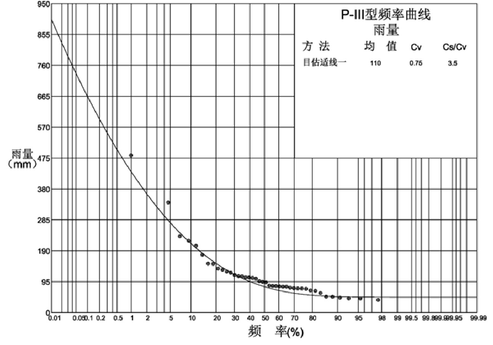  
图 2.4-1 东孟姜女河流域最大 3 天面雨量频率曲线图  

表 2.4-1 东孟姜女河流域三日设计暴雨频率适线成果表  

<html><body><table><tr><td rowspan="2">均值Ex (mm)</td><td rowspan="2">Cv</td><td rowspan="2">Cs/Cv</td><td colspan="5">设计暴雨（mm)</td></tr><tr><td>33.3%</td><td>20%</td><td>10%</td><td>5%</td><td>2%</td></tr><tr><td>110</td><td>0.75</td><td>3.5</td><td>109</td><td>151</td><td>212</td><td>276</td><td>364</td></tr></table></body></html>  

# (2)设计暴雨成果对比选取  

根据《河南省暴雨参数图集》(2005 年),查东孟姜女河流域重心 3 天雨量均值和Cv 值,并计算设计暴雨,用点雨量代替面雨量。将本次实测长系列雨量资料计算的设计面雨量成果与查图集计算成果对比,见表 2.4-2。  

表 2.4-2 东孟姜女河流域三日设计暴雨成果对比表  

<html><body><table><tr><td rowspan="2">依据</td><td rowspan="2">均值Ex (mm)</td><td rowspan="2">Cv</td><td rowspan="2">Cs/Cv</td><td colspan="5">设计暴雨（mm)</td></tr><tr><td>33.3%</td><td>20%</td><td>10%</td><td>5%</td><td>2%</td></tr><tr><td>实测系列①</td><td>110</td><td>0.75</td><td>3.5</td><td>109</td><td>151</td><td>212</td><td>276</td><td>364</td></tr><tr><td>“05图集”②</td><td>120</td><td>0.70</td><td>3.5</td><td>122</td><td>164</td><td>226</td><td>289</td><td>375</td></tr><tr><td>(②-①)/①</td><td>9.1%</td><td></td><td></td><td>11.9%</td><td>8.6%</td><td>6.6%</td><td>4.7%</td><td>3.0%</td></tr></table></body></html>  

由表 2.4-2 可见, $^{\leftarrow}05$ 图集”成果与本次计算的 3 天设计雨量相比,均值增加 $9.1\%$ ,设计暴雨偏大 $3.0\%{\sim}11.9\%$ 。本次计算成果为面雨量,图集查算成果为点雨量,因此计算成果稍小是合理的。  

本次计算的东孟姜女河 3 天设计暴雨,采用了流域内康庄、朗公庙、东屯 3 个雨量站 42 年连续雨量系列资料,代表性较好,雨量站在流域内分布较为均匀,计算得到的面雨量成果可靠合理。  

综上,设计暴雨成果采用本次根据实测雨量资料频率适线成果,见表 2.4-1。  

# 2.4.2 设计净雨计算  

东孟姜女河中下游流经新乡市区,城区段排水面积 $78.43\mathrm{km}^{2}$ 。本次根据汇水范围内下垫面情况差异,分平原区和城区 2 种情况计算设计净雨。  

# (1)平原区  

降雨径流关系采用 1973 年水文图集平原第Ⅶ线降雨径流线,见表 2.4-3。前期影响雨量 Pa,3\~5 年一遇取 $45\mathrm{mm}$ ,10\~50 年一遇取 $55\mathrm{mm}$ 。查算的设计净雨成果见表 2.4-4。  

表 2.4-3 $\scriptstyle\mathrm{P+Pa{\sim}R}$ 关系表  

<html><body><table><tr><td>P+Pa</td><td>100</td><td>150</td><td>200</td><td>250</td><td>300</td><td>350</td><td>400</td><td>450</td><td>500</td></tr><tr><td>R</td><td>11</td><td>32</td><td>61</td><td>98</td><td>139</td><td>183</td><td>228</td><td>276</td><td>322</td></tr></table></body></html>  

表 2.4-4  平原区设计净雨成果表  

<html><body><table><tr><td rowspan="2">项目</td><td colspan="5">设计频率</td></tr><tr><td>33.3%</td><td>20%</td><td>10%</td><td>5%</td><td>2%</td></tr><tr><td>设计面雨量P(mm)</td><td>109</td><td>151</td><td>212</td><td>276</td><td>364</td></tr><tr><td>前期影响雨量 Pa(mm)</td><td>45</td><td>45</td><td>55</td><td>55</td><td>55</td></tr><tr><td>P+Pa(mm)</td><td>154</td><td>196</td><td>267</td><td>331</td><td>419</td></tr><tr><td>设计净雨R(mm)</td><td>34</td><td>59</td><td>112</td><td>166</td><td>246</td></tr></table></body></html>  

# (2)城区  

根据《室外排水设计规范》GB50014-2006(2014 年版),综合径流系数 $\varphi$ 取值结合新乡市区内现状城市化水平、住宅、道路、绿化比例及未来规划等因素,并应使城区净雨大于原野区净雨,本次暴雨频率在 3 年 ${\sim}10$ 年之间 取 0.60、20 年取 0.65、50 年取 0.75,由公式 ${\bf R}={\mathcal{S}}$ ·p 计算得到各频率设计净雨,见表 2.4-5。  

表 2.4-5 城区设计净雨成果表  

<html><body><table><tr><td rowspan="2">项目</td><td colspan="5">设计频率</td></tr><tr><td>33.3%</td><td>20%</td><td>10%</td><td>5%</td><td>2%</td></tr><tr><td>设计面雨量 P(mm)</td><td>109</td><td>151</td><td>212</td><td>276</td><td>364</td></tr><tr><td>综合径流系数P</td><td>0.6</td><td>0.6</td><td>0.6</td><td>0.65</td><td>0.75</td></tr><tr><td>设计净雨 R(mm)</td><td>65</td><td>91</td><td>127</td><td>179</td><td>273</td></tr></table></body></html>  

# 2.4.3 设计洪峰计算  

根据《河南省卫河流域防洪除涝补充规划报告》,采用平原排水公式计算洪峰流量,各参数也参照该报告选取。  

计算公式如下:  

$$
\mathrm{Q}_{\mathrm{m}}{=}\mathrm{k}{\cdot}\mathrm{R}{\cdot}\mathrm{F}^{0.75}{\cdot}\mathrm{a}
$$  

式中: $\mathrm{Q}_{\mathrm{m}}$ —洪峰流量( $\mathrm{{m}}^{3}/\mathrm{{s}}.$ );  

R—设计净雨深(mm),平原区采用表 2.4-4 设计净雨成果,城区采用表 2.4-5 设计净雨成果;  

F—流域面积( $\mathrm{km}^{2}$ );  

$\upalpha$ —洪峰折减系数,3 年一遇不打折,5 年一遇打九折,10 年一遇打八折,  

20 年一遇打七折,50 年一遇及以上打六折。  

k—峰量关系综合系数,采用 0.026。  

根据平原区和城区设计净雨成果,分别计算设计洪峰流量,叠加后得到东孟姜女河各控制断面处设计洪峰成果,见表 2.4-6。  

表 2.4-6  东孟姜女河各控制断面设计洪峰成果表  

<html><body><table><tr><td rowspan="2">位置</td><td rowspan="2" colspan="3">流域面积（km²)</td><td colspan="10">设计洪峰(m?/s)</td></tr><tr><td>平原区段</td><td></td><td></td><td></td><td>城区段</td><td></td><td></td><td></td><td>合计</td><td></td><td></td></tr><tr><td rowspan="2">一支排源头</td><td>合计</td><td>平原区</td><td>城区</td><td>33.3%</td><td>20%</td><td>10%</td><td>5%</td><td>2%</td><td>33.3%</td><td>20% 10%</td><td>5% 2%</td><td>33.3%</td><td>20%</td><td>10% 5%</td><td>2%</td></tr><tr><td>9.28</td><td>9.28</td><td></td><td>4.74</td><td>7.30</td><td>12.4</td><td>16.1</td><td>20.4</td><td></td><td></td><td>4.74</td><td>7.30</td><td>12.4</td><td>16.1</td><td>20.4</td></tr><tr><td>一支排 (丰乐屯村)</td><td></td><td></td><td></td><td></td><td></td><td></td><td></td><td></td><td></td><td></td><td></td><td></td><td></td><td></td><td></td></tr><tr><td></td><td>15.9</td><td>15.9</td><td></td><td>7.11</td><td>10.9</td><td>18.5</td><td>24.1 30.6</td><td></td><td></td><td></td><td>7.11</td><td>10.9</td><td>18.5</td><td>24.1</td><td>30.6</td></tr><tr><td>一支排 (敦留店桥)</td><td></td><td></td><td></td><td></td><td></td><td></td><td></td><td></td><td></td><td></td><td></td><td></td><td></td><td></td><td></td></tr><tr><td>一支排 (七二桥)</td><td>39.2</td><td>39.2</td><td></td><td>14.0</td><td>21.5</td><td>36.5</td><td>47.4</td><td>60.2</td><td></td><td></td><td>14.0</td><td>21.5</td><td>36.5</td><td>47.4</td><td>60.2</td></tr><tr><td></td><td>58.9</td><td>58.9</td><td></td><td>19.0</td><td>29.2</td><td>49.5</td><td>64.3</td><td>81.7</td><td></td><td></td><td></td><td>19.0</td><td>29.2 49.5</td><td>64.3</td><td>81.7</td></tr><tr><td>一支排</td><td></td><td></td><td></td><td></td><td></td><td></td><td></td><td></td><td></td><td></td><td></td><td></td><td></td><td></td><td></td></tr><tr><td>东三干小河渡槽</td><td></td><td></td><td></td><td></td><td></td><td></td><td></td><td></td><td></td><td></td><td></td><td></td><td></td><td></td><td></td></tr><tr><td>新荷铁路桥</td><td>145</td><td>145</td><td></td><td>37.3</td><td>57.4</td><td>97.3</td><td>126</td><td>161</td><td></td><td></td><td></td><td>37.3</td><td>57.4 97.3</td><td>126</td><td>161</td></tr><tr><td rowspan="2">大泉排入口</td><td>145</td><td>145</td><td></td><td>37.3</td><td>57.4</td><td>97.3</td><td>126</td><td>161</td><td>-</td><td></td><td>-</td><td>37.3 57.4</td><td>97.3</td><td>126</td><td>161</td></tr><tr><td></td><td></td><td></td><td></td><td></td><td></td><td></td><td></td><td></td><td></td><td></td><td></td><td></td><td></td><td></td></tr><tr><td rowspan="2">外环路、贾屯泵站</td><td>145</td><td>145</td><td></td><td>37.3</td><td>57.4</td><td>97.3</td><td>126</td><td>161</td><td>-</td><td></td><td></td><td>37.3</td><td>57.4 97.3</td><td>126</td><td>161</td></tr><tr><td></td><td></td><td></td><td></td><td></td><td></td><td></td><td></td><td></td><td></td><td></td><td></td><td></td><td></td><td></td></tr><tr><td>牧野路泵站</td><td>175</td><td>159.6</td><td>15.4</td><td>40.1</td><td>61.7</td><td>105</td><td>136</td><td>172</td><td>13.2</td><td>16.5 20.6</td><td>25.4 33.1</td><td>53.3</td><td>78.1 125</td><td>161</td><td>206</td></tr><tr><td></td><td>196</td><td>173.1</td><td>22.9</td><td>42.6</td><td>65.5</td><td>111</td><td>144</td><td>183</td><td>17.8</td><td>22.2 27.7</td><td>34.2 44.6</td><td>60.4</td><td>87.7 139</td><td>179</td><td>228</td></tr><tr><td>海河路泵站</td><td>232</td><td>189.1</td><td>42.9</td><td>45.5</td><td>70.0</td><td>119</td><td>154</td><td>196</td><td>28.5</td><td>35.5 44.3</td><td></td><td></td><td>106 163</td><td></td><td></td></tr><tr><td>新延路泵站</td><td></td><td></td><td></td><td></td><td></td><td></td><td></td><td></td><td></td><td></td><td>54.7 71.4</td><td>74.0</td><td></td><td>209</td><td>267</td></tr><tr><td>化工路泵站</td><td>244</td><td>195.8</td><td>48.2</td><td>46.7</td><td>71.9</td><td>122</td><td>158</td><td>201</td><td>31.1</td><td>38.8 48.4</td><td>59.7 77.9</td><td>77.8</td><td>111</td><td>170 218</td><td>279</td></tr><tr><td></td><td>259</td><td>205.5</td><td>53.5</td><td>48.4</td><td>74.5</td><td>126</td><td>164</td><td>208</td><td>33.6</td><td>41.9 52.3</td><td>64.6 84.2</td><td>82.1</td><td>116</td><td>179 229</td><td>293</td></tr><tr><td>东强路泵站</td><td></td><td></td><td></td><td></td><td></td><td></td><td></td><td></td><td></td><td></td><td></td><td></td><td></td><td></td><td></td></tr></table></body></html>  

续表 2.4-6  东孟姜女河各控制断面设计洪峰成果表  

<html><body><table><tr><td rowspan="2">位置</td><td colspan="2">流域面积（km²)</td><td colspan="10">设计洪峰(m?/s)</td></tr><tr><td colspan="2"></td><td></td><td>平原区段</td><td></td><td></td><td></td><td></td><td>城区段</td><td></td><td></td><td>合计</td></tr><tr><td>东强路泵站</td><td>合计 平原区</td><td>城区</td><td>33.3% 20%</td><td>10%</td><td>5%</td><td>2%</td><td>33.3%</td><td>20%</td><td>10%</td><td>5%</td><td>2%</td><td>33.3% 20% 10% 5% 2%</td></tr><tr><td></td><td>306 227.6</td><td>78.4</td><td>52.3</td><td>80.5 136</td><td>177</td><td>225</td><td>44.8</td><td>55.9</td><td>69.7</td><td>86.0</td><td>112</td><td>97.1 136 206 263 337</td></tr><tr><td>上焦庄生产桥</td><td>339 260.6</td><td>78.4</td><td>57.9 89.1</td><td>151</td><td>196</td><td>249</td><td>44.8</td><td>55.9</td><td>69.7</td><td>86.0</td><td>112 103</td><td>145 221 282 361</td></tr><tr><td>二支排入口</td><td></td><td></td><td></td><td></td><td></td><td></td><td></td><td></td><td></td><td></td><td></td><td></td></tr><tr><td>东三干三支排</td><td>436 357.6</td><td>78.4</td><td>73.4</td><td>113 191</td><td>249</td><td>316</td><td>44.8</td><td>55.9</td><td>69.7</td><td>86.0</td><td>112</td><td>118 169 261 335 428</td></tr><tr><td></td><td>468.5 468.5</td><td>78.4</td><td>78.3</td><td>121 204</td><td>266</td><td>337</td><td>44.8</td><td>55.9</td><td>69.7</td><td>86.0</td><td>112</td><td>123 176 274 352 449</td></tr><tr><td>入卫河口</td><td></td><td></td><td></td><td></td><td></td><td></td><td></td><td></td><td></td><td></td><td></td><td></td></tr></table></body></html>  

# 2.4.4 成果合理性分析  

(1)与新乡院成果对比  

2017 年新乡市中原水利设计研究院编制了《河南省新乡市东孟姜女河市区段治理工程初步设计报告》,其中计算了东孟姜女河考虑市区影响的各控制断面3 年一遇、5 年一遇、10 年一遇、20 年一遇的设计洪水,选择部分控制断面,将本次计算结果与新乡院成果对比,见表 2.4-7。  

表 2.4-7 东孟姜女河设计洪水成果对比表  

<html><body><table><tr><td rowspan="2">位置</td><td rowspan="2">控制面 积(km²)</td><td rowspan="2">项目</td><td colspan="4">各频率设计洪水（m?/s)</td></tr><tr><td>33.3%</td><td>20%</td><td>10%</td><td>5%</td></tr><tr><td rowspan="3">大泉排入口 （下）</td><td>145</td><td>新乡院成果 ①</td><td>49</td><td>62</td><td>90</td><td>108</td></tr><tr><td></td><td>本次计算②</td><td>37.3</td><td>57.4</td><td>97.3</td><td>126</td></tr><tr><td></td><td>①/ (①-@)</td><td>-23.9%</td><td>-7.4%</td><td>8.1%</td><td>16.7%</td></tr><tr><td rowspan="3">海河路泵站 （下）</td><td rowspan="3">232</td><td>新乡院成果 ①</td><td>88</td><td>110</td><td>162</td><td>194</td></tr><tr><td>本次计算②</td><td>74</td><td>106</td><td>163</td><td>209</td></tr><tr><td>(②-①)/①</td><td>-15.9%</td><td>-3.6%</td><td>0.6%</td><td>7.7%</td></tr><tr><td rowspan="3">东强路泵站 （下）</td><td rowspan="3">306</td><td>新乡院成果 ①</td><td>114</td><td>144</td><td>211</td><td>252</td></tr><tr><td>本次计算②</td><td>97.1</td><td>136</td><td>206</td><td>263</td></tr><tr><td>(②-①）/①</td><td>-14.8%</td><td>-5.6%</td><td>-2.4%</td><td>4.4%</td></tr><tr><td rowspan="3">二支排入口 （下）</td><td rowspan="3">436</td><td>新乡院成果 ①</td><td>140</td><td>177</td><td>259</td><td>309</td></tr><tr><td>本次计算②</td><td>118</td><td>169</td><td>261</td><td>335</td></tr><tr><td>(②-①)/①</td><td>-15.7%</td><td>-4.5%</td><td>0.8%</td><td>8.4%</td></tr><tr><td rowspan="3">入卫河口</td><td rowspan="3">468.5</td><td>新乡院成果 ①</td><td>146</td><td>184</td><td>270</td><td>323</td></tr><tr><td>本次计算②</td><td>123</td><td>176</td><td>274</td><td>352</td></tr><tr><td>①/ (①-②)</td><td>-15.8%</td><td>-4.4%</td><td>1.5%</td><td>9.0%</td></tr></table></body></html>  

由表 2.4-7 可见,本次各控制断面设计洪水成果,低频率比新乡院成果小,高频率比新乡院成果大,20 年一遇本次设计洪水计算成果比新乡院成果偏大$4.4{\sim}16.7\%$ ,这是由于新乡院成果的设计暴雨是根据73 图集查得,均值取 $116\mathrm{mm}$ ,Cv 值取 0.58,由表 2.4-1 可知,本次设计洪水计算成果依据实测长系列雨量计算,均值比 73 图集查算偏小,而 Cv 偏大,因此设计洪水对比成果符合暴雨系列的特征,成果是合理的。  

编制 73 图集采用的实测水文资料为 $1951\sim1970$ 年共计 20 年,本次共采用42 年的实测雨量系列统计计算设计暴雨,系列更长代表性更好,本次由实测雨量推求的设计洪水成果较大,认为成果是合理的。  

# (2)各控制断面模数对比  

计算东孟姜女河上下游各控制断面洪峰模数,成果见表 2.4-8。  

表 2.4-8 东孟姜女河上下游洪峰模数成果表  

<html><body><table><tr><td rowspan="2">位置</td><td rowspan="2">控制面 积(km²)</td><td colspan="2">5%</td><td colspan="2">2%</td></tr><tr><td>设计洪 水 (m3/s)</td><td>洪峰模数 (m²/ (s.km²）)</td><td>设计洪水 (m3/s)</td><td>洪峰模数 (m²/ (s.km²））</td></tr><tr><td>一支排</td><td>58.9</td><td>64.3</td><td>1.09</td><td>81.7</td><td>1.39</td></tr><tr><td>贾屯泵站 (下)</td><td>175</td><td>161</td><td>0.92</td><td>206</td><td>1.18</td></tr><tr><td>海河路泵站 （下)</td><td>232</td><td>209</td><td>0.90</td><td>267</td><td>1.15</td></tr><tr><td>东强路泵站 （下)</td><td>306</td><td>263</td><td>0.86</td><td>337</td><td>1.10</td></tr><tr><td>二支排入口 （下)</td><td>436</td><td>335</td><td>0.77</td><td>428</td><td>0.98</td></tr><tr><td>入卫河口</td><td>468.5</td><td>352</td><td>0.75</td><td>449</td><td>0.96</td></tr></table></body></html>  

由表 2.4-8 可见,对于同一断面,随着频率增加,洪峰模数增大;对于同一频率,随着控制面积增加,设计洪峰模数减小。洪峰模数的规律符合平原区设计洪水的一般规律,是合理的。  

# 2.5 排涝模数及流量  

# 2.5.1 排涝闸  

排涝模数采用 24h 暴雨资料间接法推求,24h 设计暴雨参数均值和变差系数Cv 根据《05 图集》查算,见表 2.5-1。  

排涝模数采用《河南省水利工程水文计算常用图》中的平原排水模数公式进行分析计算:  

$$
\textit{M}=\mathrm{~k~}\cdot\textit{R}\cdot\boldsymbol{F}^{(-0.25)}
$$  

式中: $M$ —排涝模数, $\mathrm{m}^{3}/\:\:(\mathrm{s.km}^{2})$ ); $R$ —24h 净雨深, $\mathrm{mm}$ ;  

$F\cdot$ —排涝面积 $\mathrm{km}^{2}$ ,当流域面积小于 $50\mathrm{km}^{2}$ 时取 $50\mathrm{km}^{2}$ ;  

$k$ —峰量关系综合系数,24h 暴雨时该系数选用 0.035。  

本次工程涉及的排涝闸均在城区附近,净雨由公式 $\mathrm{R}{=}}\varphi\mathrm{~.~p~}$ 计算得到,综合径流系数 $\varphi$ 取值根据《室外排水设计规范》GB50014-2006(2014 年版)取 0.6,排涝闸净雨量成果见表 2.5-1,排涝模数计算结果见表2.5-2。  

表 2.5-1 24h 净雨成果表  

<html><body><table><tr><td>项目</td><td>20%</td><td>10%</td></tr><tr><td>均值（mm)</td><td colspan="2">95</td></tr><tr><td>Cv</td><td colspan="2">0.65</td></tr><tr><td>P (mm)</td><td>130</td><td>174</td></tr><tr><td>综合径流系数</td><td>0.6</td><td>0.6</td></tr><tr><td>R</td><td>78</td><td>104</td></tr></table></body></html>  

表 1.15-2  东孟姜女河流域排涝模数成果表 $\mathrm{m}^{3}/\:\:(\mathrm{s.km}^{2})$   

<html><body><table><tr><td>面积（km²)</td><td>20%</td><td>10%</td></tr><tr><td>≤50</td><td>1.03</td><td>1.37</td></tr></table></body></html>  

根据排涝模数计算本次重建或新建的排涝闸,排水流量成果见表 2.5-3。  

表 2.5-3 排涝闸排水流量成果表  

<html><body><table><tr><td>序 号</td><td>县区</td><td>桩号</td><td>名称</td><td>岸别</td><td>排涝面积 (km²)</td><td>5年一遇 设计流量 (m²/s)</td><td>10年一遇 设计流量 (m2/s)</td></tr><tr><td>1</td><td>红旗区</td><td>27+250</td><td>关堤排涝闸1</td><td>左</td><td>0.15</td><td>0.15</td><td>0.21</td></tr><tr><td>2</td><td>红旗区</td><td>26+980</td><td>关堤排涝闸 2</td><td>右</td><td>0.27</td><td>0.28</td><td>0.37</td></tr><tr><td>3</td><td>红旗区</td><td>26+917</td><td>关堤排涝闸 3</td><td>右</td><td>1.12</td><td>1.15</td><td>1.53</td></tr><tr><td>4</td><td>红旗区</td><td>26+490</td><td>关堤排涝闸 4</td><td>右</td><td>0.46</td><td>0.47</td><td>0.63</td></tr><tr><td>5</td><td>红旗区</td><td>26+500</td><td>关堤排涝闸 5</td><td>左</td><td>0.22</td><td>0.23</td><td>0.30</td></tr><tr><td>6</td><td>红旗区</td><td>26+280</td><td>关堤排涝闸 6</td><td>左</td><td>0.36</td><td>0.37</td><td>0.49</td></tr><tr><td>7</td><td>红旗区</td><td>26+160</td><td>关堤排涝闸 7</td><td>右</td><td>0.26</td><td>0.27</td><td>0.36</td></tr><tr><td>8</td><td>红旗区</td><td>26+020</td><td>原堤排涝闸1</td><td>右</td><td>0.07</td><td>0.07</td><td>0.10</td></tr><tr><td>9</td><td>红旗区</td><td>25+970</td><td>原堤排涝闸 2</td><td>右</td><td>0.27</td><td>0.28</td><td>0.37</td></tr><tr><td>10</td><td>红旗区</td><td>25+820</td><td>原堤排涝闸3</td><td>右</td><td>0.37</td><td>0.38</td><td>0.51</td></tr><tr><td>11</td><td>红旗区</td><td>25+510</td><td>原堤排涝闸 4</td><td>左</td><td>0.27</td><td>0.28</td><td>0.37</td></tr><tr><td>12</td><td>红旗区</td><td>25+320</td><td>原堤排涝闸5</td><td>右</td><td>0.18</td><td>0.19</td><td>0.25</td></tr><tr><td>13</td><td>红旗区</td><td>25+030</td><td>原堤排涝闸 6</td><td>左</td><td>0.33</td><td>0.34</td><td>0.45</td></tr><tr><td>14</td><td>红旗区</td><td>25+050</td><td>原堤排涝闸 7</td><td>右</td><td>0.34</td><td>0.35</td><td>0.47</td></tr></table></body></html>  

<html><body><table><tr><td>序 号</td><td>县区</td><td>桩号</td><td>名称</td><td>岸别</td><td>排涝面积 (km²)</td><td>5年一遇 设计流量</td><td>10年一遇 设计流量</td></tr><tr><td>15</td><td>红旗区</td><td>24+720</td><td>保安堤排涝闸1</td><td>右</td><td>0.31</td><td>(m3/s) 0.32</td><td>(m3/s) 0.42</td></tr><tr><td>16</td><td>红旗区</td><td>24+700</td><td>保安堤排涝闸 2</td><td>左</td><td>0.48</td><td>0.49</td><td>0.66</td></tr><tr><td>17</td><td>红旗区</td><td>24+370</td><td>保安堤排涝闸3</td><td>右</td><td>0.37</td><td>0.38</td><td>0.51</td></tr><tr><td>18</td><td>红旗区</td><td>24+350</td><td>保安堤排涝闸 4</td><td>左</td><td>0.39</td><td>0.40</td><td>0.53</td></tr><tr><td>19</td><td>红旗区</td><td>24+350</td><td>张堤排涝闸1</td><td>右</td><td>0.32</td><td>0.33</td><td>0.44</td></tr><tr><td>20</td><td>红旗区</td><td>23+867</td><td>张堤排涝闸 2</td><td>右</td><td>0.85</td><td>0.88</td><td>1.16</td></tr><tr><td>21</td><td>红旗区</td><td>23+320</td><td>袁周村排涝闸</td><td>右</td><td>0.50</td><td>0.52</td><td>0.69</td></tr><tr><td>22</td><td>红旗区</td><td>22+800</td><td>马村排涝闸</td><td>左</td><td>0.26</td><td>0.27</td><td>0.36</td></tr><tr><td>23</td><td>红旗区</td><td>18+750</td><td>后马屯村排涝闸</td><td>右</td><td>4.64</td><td>4.78</td><td>6.36</td></tr><tr><td>24</td><td>牧野区</td><td>19+020</td><td>牧野区排涝闸1</td><td>左</td><td>0.96</td><td>0.99</td><td>1.32</td></tr><tr><td>25</td><td>牧野区</td><td>18+600</td><td>牧野区排涝闸2</td><td>左</td><td>1.3</td><td>1.34</td><td>1.78</td></tr><tr><td>26</td><td>牧野区</td><td>17+920</td><td>牧野区排涝闸3</td><td>左</td><td>0.91</td><td>0.94</td><td>1.25</td></tr><tr><td>27</td><td>牧野区</td><td>16+880</td><td>牧野区排涝闸4</td><td>右</td><td>1.08</td><td>1.11</td><td>1.48</td></tr><tr><td>28</td><td>牧野区</td><td>16+880</td><td>牧野区排涝闸5</td><td>左</td><td>0.58</td><td>0.60</td><td>0.79</td></tr><tr><td>29</td><td>牧野区</td><td>16+300</td><td>牧野区排涝闸6</td><td>左</td><td>0.23</td><td>0.24</td><td>0.32</td></tr><tr><td>30</td><td>牧野区</td><td>15+980</td><td>牧野区排涝闸7</td><td>左</td><td>0.13</td><td>0.13</td><td>0.18</td></tr><tr><td>31</td><td>牧野区</td><td>15+700</td><td>牧野区排涝闸8</td><td>左</td><td>0.95</td><td>0.98</td><td>1.30</td></tr><tr><td>32</td><td>新乡县</td><td></td><td>心连心1号闸</td><td></td><td>1.02</td><td>1.05</td><td>1.40</td></tr><tr><td>33</td><td>新乡县</td><td></td><td>心连心2号闸</td><td></td><td>0.72</td><td>0.74</td><td>0.99</td></tr><tr><td>34</td><td>新乡县</td><td>38+130</td><td>赵堤排涝闸闸</td><td>右</td><td>0.83</td><td>0.85</td><td>1.14</td></tr><tr><td>35</td><td>新乡县</td><td>35+580</td><td>曲水排涝闸闸</td><td>右</td><td>0.96</td><td>0.99</td><td>1.32</td></tr><tr><td>36</td><td>新乡县</td><td>34+480</td><td>张湾排涝闸3</td><td>右</td><td>0.72</td><td>0.74</td><td>0.99</td></tr><tr><td>37</td><td>新乡县</td><td>34+970</td><td>张湾排涝闸1</td><td>右</td><td>0.63</td><td>0.65</td><td>0.86</td></tr><tr><td>38</td><td>卫滨区</td><td>34+930</td><td>张湾排涝闸2</td><td>左</td><td>1.15</td><td>1.18</td><td>1.58</td></tr><tr><td>39</td><td>卫滨区</td><td>34+020</td><td>贾屯排涝闸2</td><td>左</td><td>0.37</td><td>0.38</td><td>0.51</td></tr><tr><td>40</td><td>卫滨区</td><td>33+290</td><td>大泉排涝闸</td><td>右</td><td>33.2</td><td>34.20</td><td>45.48</td></tr><tr><td>41</td><td>卫滨区</td><td>33+020</td><td>贾屯排涝闸1</td><td>左</td><td>0.90</td><td>0.93</td><td>1.23</td></tr><tr><td>42</td><td>卫滨区</td><td>33+000</td><td>赵村排涝闸</td><td>左</td><td>2.51</td><td>2.59</td><td>3.44</td></tr><tr><td>43</td><td>高新区</td><td>29+800</td><td>高新区排涝闸1</td><td>右</td><td>1.57</td><td>1.62</td><td>2.15</td></tr><tr><td>44</td><td>高新区</td><td>29+670</td><td>高新区排涝闸2</td><td>右</td><td>0.58</td><td>0.60</td><td>0.79</td></tr></table></body></html>  

# 2.5.2 提排站  

排涝模数采用 24h 暴雨资料间接法推求,24h 设计暴雨参数均值和变差系数Cv 根据《05 图集》查算,见表 2.5-1。  

提排站排涝模数采用平均排除法进行分析计算:  

$$
\mathsf{M{=}R/(T}\times86.4)
$$  

式中: $M$ —排涝模数, $\mathrm{m}^{3}/$ ( $\mathrm{s.km}^{2}.$ );  

R—24h 净雨深,mm;  

T—排完天数,本次取 1.5 天。  

本次工程涉及的提排站均在城区附近,净雨由公式 $\mathrm{R}{=}}\varphi\mathrm{~.~p~}$ 计算得到,综合径流系数 $\varphi$ 取值根据《室外排水设计规范》GB50014-2006(2014 年版)取 0.6,净雨量成果见表 2.5-1,排涝模数计算结果见表2.5-4。  

表 1.15-4 提排站排涝模数成果表  

<html><body><table><tr><td>频率</td><td>20%</td><td>10%</td></tr><tr><td>模数（m3／（s.km²））</td><td>0.60</td><td>0.81</td></tr></table></body></html>  

根据排涝模数计算本次重建或新建的提排站,排水流量成果见表 2.5-5。  

表 2.5-5 提排站排水流量成果表  

<html><body><table><tr><td>序 号</td><td>桩号</td><td>名称</td><td>岸别</td><td>排涝面积 (km²)</td><td>5年一遇 设计流量（m?/s)</td><td>10年一遇 设计流量（m?/s)</td></tr><tr><td>1</td><td>17+550</td><td>牧野区提排站1</td><td>左</td><td>0.84</td><td>0.50</td><td>0.68</td></tr><tr><td>2</td><td>17+350</td><td>牧野区提排站2</td><td>右</td><td>0.87</td><td>0.52</td><td>0.70</td></tr><tr><td>3</td><td>17+110</td><td>牧野区提排站3</td><td>左</td><td>0.35</td><td>0.21</td><td>0.28</td></tr></table></body></html>  

# 2.6 施工期洪水  

本次东孟姜女河在非汛期进行河道治理工程,施工期洪水采用邻近西孟姜女河八里营水文站非汛期实测流量频率适线设计洪水成果按比拟法求得。  

统计八里营水文站 1972\~2021 年共计 50 年 11 月\~次年 4 月,12 月\~次年 2月的实测最大流量系列资料,频率适线得到设计洪峰成果,见表 2.6-1。  

表 2.6-1  八里营水文站适线成果表  

<html><body><table><tr><td rowspan="2">水文站</td><td rowspan="2">控制面积 (km²)</td><td rowspan="2">时间</td><td rowspan="2">均值 (m3/s)</td><td rowspan="2">Cv</td><td rowspan="2">Cs/Cv</td><td colspan="3">设计洪峰（m3/s)</td></tr><tr><td>5%</td><td>10%</td><td>20%</td></tr><tr><td rowspan="2">八里营</td><td rowspan="2">167</td><td>11月-4月</td><td>2.26</td><td>1.40</td><td>2.5</td><td>8.48</td><td>5.72</td><td>3.28</td></tr><tr><td>12月-2月</td><td>1.50</td><td>0.75</td><td>2.5</td><td>3.74</td><td>2.98</td><td>2.21</td></tr></table></body></html>  

东孟姜女河施工期洪水采用八里营水文站非汛期设计洪水成果按面积比的0.75 次方求得,成果见表 2.6-2。  

表 2.6-2  东孟姜女河施工期设计洪水成果表  

<html><body><table><tr><td rowspan="2">位置</td><td rowspan="2">流域面积 (km²)</td><td colspan="3">11月-4月</td><td colspan="3">12月-2月</td></tr><tr><td>5%</td><td>10%</td><td>20%</td><td>5%</td><td>10%</td><td>20%</td></tr><tr><td>一支排源头</td><td></td><td></td><td></td><td></td><td></td><td></td><td></td></tr><tr><td></td><td>9.28</td><td>0.97</td><td>0.65</td><td>0.38</td><td>0.43</td><td>0.34</td><td>0.25</td></tr><tr><td>一支排 (丰乐屯村)</td><td></td><td></td><td></td><td></td><td></td><td></td><td></td></tr><tr><td></td><td>15.9</td><td>1.45</td><td>0.98</td><td>0.56</td><td>0.64</td><td>0.51</td><td>0.38</td></tr><tr><td>一支排 (敦留店桥)</td><td></td><td></td><td></td><td></td><td></td><td></td><td></td></tr><tr><td></td><td>39.2</td><td>2.86</td><td>1.93</td><td>1.11</td><td>1.26</td><td>1.00</td><td>0.75</td></tr><tr><td>一支排 (七二桥)</td><td></td><td></td><td></td><td></td><td></td><td></td><td></td></tr></table></body></html>  

续表 2.6-2  东孟姜女河施工期设计洪水成果表  

<html><body><table><tr><td rowspan="2">位置</td><td rowspan="2">流域面积 (km²)</td><td colspan="3">11月-4月</td><td colspan="3">12月-2月</td></tr><tr><td>5%</td><td>10%</td><td>20%</td><td>5%</td><td>10%</td><td>20%</td></tr><tr><td>一支排 (七二桥)</td><td></td><td></td><td></td><td></td><td></td><td></td><td></td></tr><tr><td></td><td>58.9</td><td>3.88</td><td>2.62</td><td>1.50</td><td>1.71</td><td>1.36</td><td>1.01</td></tr><tr><td>一支排</td><td></td><td></td><td></td><td></td><td></td><td></td><td></td></tr><tr><td>东三干小河渡槽</td><td></td><td></td><td></td><td></td><td></td><td></td><td></td></tr><tr><td></td><td>145</td><td>7.63</td><td>5.14</td><td>2.95</td><td>3.36</td><td>2.68</td><td>1.99</td></tr><tr><td>新荷铁路桥</td><td></td><td></td><td></td><td></td><td></td><td></td><td></td></tr><tr><td></td><td>145</td><td>7.63</td><td>5.14</td><td>2.95</td><td>3.36</td><td>2.68</td><td>1.99</td></tr><tr><td>大泉排入口</td><td></td><td></td><td></td><td></td><td></td><td></td><td></td></tr><tr><td></td><td>145</td><td>7.63</td><td>5.14</td><td>2.95</td><td>3.36</td><td>2.68</td><td>1.99</td></tr><tr><td>外环路、贾屯泵站</td><td></td><td></td><td></td><td></td><td></td><td></td><td></td></tr><tr><td></td><td>175</td><td>8.78</td><td>5.92</td><td>3.40</td><td>3.87</td><td>3.09</td><td>2.29</td></tr><tr><td>牧野路泵站</td><td></td><td></td><td></td><td></td><td></td><td></td><td></td></tr><tr><td></td><td>196</td><td>9.56</td><td>6.45</td><td>3.70</td><td>4.22</td><td>3.36</td><td>2.49</td></tr><tr><td>海河路泵站</td><td></td><td></td><td></td><td></td><td></td><td></td><td></td></tr><tr><td></td><td>232</td><td>10.9</td><td>7.32</td><td>4.20</td><td>4.79</td><td>3.81</td><td>2.83</td></tr><tr><td>新延路泵站</td><td></td><td></td><td></td><td></td><td></td><td></td><td></td></tr><tr><td></td><td>244</td><td>11.3</td><td>7.60</td><td>4.36</td><td>4.97</td><td>3.96</td><td>2.94</td></tr><tr><td>化工路泵站</td><td></td><td></td><td></td><td></td><td></td><td></td><td></td></tr><tr><td></td><td>259</td><td>11.8</td><td>7.95</td><td>4.56</td><td>5.20</td><td>4.14</td><td>3.07</td></tr><tr><td>东强路泵站</td><td></td><td></td><td></td><td></td><td></td><td></td><td></td></tr><tr><td></td><td>306</td><td>13.4</td><td>9.01</td><td>5.17</td><td>5.89</td><td>4.69</td><td>3.48</td></tr><tr><td>上焦庄生产桥</td><td></td><td></td><td></td><td></td><td></td><td></td><td></td></tr><tr><td></td><td>339</td><td>14.4</td><td>9.73</td><td>5.58</td><td>6.36</td><td>5.07</td><td>3.76</td></tr><tr><td>二支排入口</td><td></td><td></td><td></td><td></td><td></td><td></td><td></td></tr><tr><td></td><td>436</td><td>17.4</td><td>11.7</td><td>6.74</td><td>7.68</td><td>6.12</td><td>4.54</td></tr><tr><td>东三干三支排</td><td></td><td></td><td></td><td></td><td></td><td></td><td></td></tr></table></body></html>  

<html><body><table><tr><td rowspan="2">位置</td><td rowspan="2">流域面积 (km²)</td><td colspan="3">11月-4月</td><td colspan="3">12月-2月</td></tr><tr><td>5%</td><td>10%</td><td>20%</td><td>5%</td><td>10%</td><td>20%</td></tr><tr><td>一支排 (七二桥)</td><td></td><td></td><td></td><td></td><td></td><td></td><td></td></tr><tr><td></td><td>58.9</td><td>3.88</td><td>2.62</td><td>1.50</td><td>1.71</td><td>1.36</td><td>1.01</td></tr><tr><td></td><td>468.5</td><td>18.4</td><td>12.4</td><td>7.11</td><td>8.11</td><td>6.46</td><td>4.79</td></tr><tr><td>入卫河口</td><td></td><td></td><td></td><td></td><td></td><td></td><td></td></tr></table></body></html>  

# 2.7 泥沙  

东孟姜女河流域进入排水河道的泥沙主要来源于引黄灌溉退水和降水坡面侵蚀,还有少量风蚀。  

流域内属人民胜利渠灌区范围,灌溉面积约 40 万亩,年均引水量为 10000万 $\mathrm{m}^{3}$ ,引进泥沙总量约为 12 万吨。根据自上世纪 90 年代以来,对获嘉县、新乡县排水河系清淤工程量分析,引进泥沙约 $20\%$ 沉入引黄干支渠,约 $10\%$ 输入田间, $60\%$ 沉入排水支斗渠,尚有约 $10\%$ 排入东孟姜女干河,则东孟姜女干河每年承纳泥沙量为 1.2 万吨。该流域土壤侵蚀区侵蚀模数小于 $200\mathrm{t/km^{2}\cdot a}$ ,土壤侵蚀量约为 9.37 万吨,约 $20\%$ 沉入到干排,计 3.38 万吨。每年东孟姜女干河淤积量约为 3.07 万吨。  

# 2.8 水文自动测报系统  

# 2.8.1 现状站网情况  

新乡市东孟姜女河综合治理工程所涉的水文(巡测)站为东孟姜河秦庄巡测站,秦庄为中小河流巡测站。水文测站点担负着为防汛指挥部门水量调度、水资源管理部门提供实时水情和收集原始水文信息的任务。站点基本信息见表 2.8-1。  

表 2.8-1 水文站基本信息一览表  

<html><body><table><tr><td>测站 名称</td><td>测站编 码</td><td>测站 类别</td><td>所在河 流</td><td>测站地址</td><td>经度 (°)</td><td>纬度 (°)</td><td>监测项目</td><td>监测 方式</td></tr><tr><td>秦庄</td><td>3100549 0</td><td>水文</td><td>东孟姜 女河</td><td>新乡市牧野 区和平路街 道办事处上 焦庄</td><td>113.976 7</td><td>35.32 58</td><td>水位、流 量、降水量</td><td>巡测</td></tr></table></body></html>  

# 2.8.2 建设必要性  

水文站担负着监测河道水文水资源基本信息,为研究区域的产汇流规律、流域水资源开发利用与保护、防汛抗旱、水利工程建设与管理、工农业用水、城市用水等方面提供水文基础支持。  

水文工作是水利工作的基础,国家计委、财政部和水电部联合发出《关于加强水文工作意见的函》(〔87〕水电水文字第 2 号)指示:“我国防洪和水资源问题非常突出,因此,水文工作十分重要”。同时,水利部在水文〔2000〕336号“关于加强水文工作的若干意见”中强调:各地要从以下几个方面做好工作,切实解决水文设施建设问题:1)做好水文行业发展规划……3)在编制水利工程建设计划时,必须包含水文项目,新建、改建水利工程必须包括水文站、水文设施、信息网络等建设和改造(即“工程带水文”),其前期工作要同步进行,要抓紧制定水文设施建设标准。河南省新乡市东孟姜女河综合治理工程对秦庄巡测站的水文监测造成影响,依据中华人民共和国水利部令第 43 号令《水文监测环境和设施保护办法》(2016 年修订)等,需对水文站进行同步建设,消除对水文监测的影响。  

# 2.8.3 现状水文设施设备可利用情况  

结合本次河道治理对水文站的影响,现状水文设施设备可利用情况分析统计见表 2.8-2。  

表 2.8-2 秦庄水巡测站现有设施设备利用情况一览表  

<html><body><table><tr><td>序 号</td><td>项目名称</td><td></td><td>单数 位量</td><td>是否可 利用</td><td></td><td>说明</td></tr><tr><td></td><td>测验河段基 础设施</td><td></td><td></td><td></td><td></td><td>河道治理，需对水文设施进行保护</td></tr><tr><td>1</td><td>水准点</td><td>处</td><td>3</td><td>否</td><td></td><td rowspan="7">埋设位置位于河道治理范围内，会因施工破坏，需重新设置。</td></tr><tr><td>2</td><td>断面桩</td><td>个</td><td></td><td>2</td><td>否</td></tr><tr><td>3</td><td>断面界桩</td><td>个</td><td>4</td><td></td><td>否</td></tr><tr><td>4</td><td>断面标志杆</td><td>个</td><td></td><td></td><td>否</td></tr><tr><td>5</td><td>断面保护标 志</td><td>个</td><td>4</td><td></td><td>否</td></tr><tr><td>6</td><td>测站标志</td><td>个</td><td>一</td><td></td><td>否</td></tr><tr><td>7</td><td>护岸</td><td>m3</td><td>100</td><td></td><td></td></tr><tr><td></td><td>水位观测设 施设备</td><td></td><td></td><td></td><td></td></tr><tr><td>1</td><td>直立式水尺</td><td>根</td><td>5</td><td>否</td><td>水尺及观测路位于河堤上，</td></tr><tr><td>2</td><td>观测路</td><td>m2</td><td>100</td><td>否</td><td>因施工会破坏，需重新设置</td></tr><tr><td>3</td><td>雷达水位计 平台</td><td>座</td><td>1</td><td>否</td><td></td></tr><tr><td>三</td><td>流量泥沙系 统</td><td></td><td></td><td></td><td></td></tr><tr><td>1</td><td>雷达在线测</td><td>套</td><td>1</td><td></td><td></td><td>按照水利部办公厅印发的办水文（2019）199号文件精神，改建的水文</td></tr></table></body></html>  

表 2.8-2 秦庄水巡测站现有设施设备利用情况一览表  

<html><body><table><tr><td>序号</td><td>项目名称</td><td>单</td><td>数 位量</td><td>是否可 利用</td><td>说明</td></tr><tr><td></td><td>流系统</td><td></td><td></td><td></td><td>站应实现流量自动观测。因此需新配置自动流量监测系统一套。</td></tr><tr><td>2</td><td>视频水位观 测系统</td><td>套</td><td></td><td></td><td>按照水利部办公厅印发的办水文（2019）199号文件精神，改建的水文 站应实现水位自动观测。因此需新配置自动自动水位监测系统一套， 与自动水位计校核。</td></tr><tr><td></td><td>视频监控 (断面）</td><td>套</td><td></td><td></td><td>安全保障</td></tr></table></body></html>  

# 2.8.4 建设规模  

综合河道治理情况及现状水文设施设备可利用情况分析,本次改造巡测站 1处。通过对各站点降水、水位、流量等监测方式进行改造,满足工程治理后,新的河道水文情势下水文站监测各监测要素需求,同时提高水、雨、工情等防汛信息的采集与传输的速度,改善通信条件,满足东孟姜女河的防洪及水资源管理工作需求。  

水文系统建设内容包括秦庄 1 处中小河流巡测站监测断面设计、设施、率定等。按照各站点的监测要素及现有运行方式,在充分利用现有水文资源的基础上,站点建设项目见表 2.8-3。  

表 2.8-3 秦庄巡测站建设项目一览表  

<html><body><table><tr><td>序号</td><td>项目名称</td><td>建设性质</td><td>单位</td><td>数量</td><td>备注</td></tr><tr><td></td><td>第一部分 建筑工程</td><td></td><td></td><td></td><td></td></tr><tr><td>一</td><td>测验河段基础设施</td><td></td><td></td><td></td><td></td></tr><tr><td>1</td><td>断面桩</td><td>新建</td><td>个</td><td>2</td><td></td></tr><tr><td>2</td><td>断面界桩</td><td>新建</td><td>个</td><td>4</td><td></td></tr><tr><td>3</td><td>断面标志牌、标志杆</td><td>新建</td><td>组</td><td>1</td><td></td></tr><tr><td>4</td><td>基本水准点</td><td>新建</td><td>个</td><td>3</td><td></td></tr><tr><td>5</td><td>断面保护标志牌</td><td>新建</td><td>个</td><td>4</td><td></td></tr><tr><td>6</td><td>观测道路</td><td>新建</td><td>m2</td><td>50</td><td></td></tr><tr><td>7</td><td>台阶路</td><td>新建</td><td>m2</td><td>20</td><td></td></tr><tr><td>8</td><td>护岸 (新建)</td><td>新建</td><td>m3</td><td>100</td><td></td></tr><tr><td>6</td><td>测站标志</td><td>新建</td><td>个</td><td>1</td><td></td></tr><tr><td>二</td><td>水位观测设施</td><td></td><td></td><td></td><td></td></tr></table></body></html>  

表 2.8-3 秦庄巡测站建设项目一览表  

<html><body><table><tr><td>序号</td><td>项目名称</td><td>建设性质</td><td>单位</td><td>数量</td><td>备注</td></tr><tr><td>1</td><td>直立式水尺</td><td>新建</td><td>根</td><td>5</td><td></td></tr><tr><td>2</td><td>雷达水位计台</td><td></td><td></td><td></td><td></td></tr><tr><td></td><td>雷达水位计台 (新建)</td><td></td><td></td><td></td><td></td></tr><tr><td></td><td>桩基础</td><td></td><td>座</td><td>1</td><td></td></tr><tr><td>三</td><td>流量泥沙测验设施</td><td></td><td></td><td></td><td></td></tr><tr><td>1</td><td>雷达在线测流缆道</td><td></td><td>项</td><td>1</td><td></td></tr><tr><td>四</td><td>附属设施</td><td></td><td></td><td></td><td></td></tr><tr><td>1</td><td>视频摄像头基础及支架</td><td>新建</td><td>处</td><td>1</td><td></td></tr><tr><td></td><td>第二部分仪器设备购置</td><td></td><td></td><td></td><td></td></tr><tr><td>一</td><td>水位观测设备</td><td></td><td></td><td></td><td></td></tr><tr><td>1</td><td>雷达水位计</td><td>购置</td><td>套</td><td>1</td><td></td></tr><tr><td>二</td><td>流量测验设备</td><td></td><td></td><td></td><td></td></tr><tr><td>1</td><td>雷达在线测流系统 (4探头)</td><td>购置</td><td>套</td><td>1</td><td></td></tr><tr><td>三</td><td>降水蒸发观测设备</td><td></td><td></td><td></td><td></td></tr><tr><td>1</td><td>翻斗式雨量计</td><td>购置</td><td>套</td><td>1</td><td></td></tr><tr><td>四</td><td>通信及数据传输设备</td><td></td><td></td><td></td><td></td></tr><tr><td>1</td><td>视频监控 (断面监控)</td><td>购置</td><td>套</td><td>1</td><td></td></tr><tr><td>2</td><td>卫星通信终端</td><td>购置</td><td>套</td><td>1</td><td></td></tr></table></body></html>  

# 3 工程地质  

# 3.1 工作概况  

# 3.1.1 勘察任务、目的和要求  

本次工程地质勘察任务,为河道清淤疏浚,堤防整修,新建、重建穿堤闸涵、泵站,堤顶防汛道路建设等项目初步设计与施工提供地质资料。  

勘察任务:  

(1)了解区域地质构造情况,进行区域构造稳定性评价。(2)基本查明新建堤防堤线的水文地质、工程地质条件及存在的主要工程  
地质问题,初步预测堤防挡水后可能出现的环境地质问题。(3)基本查明各建筑物场区的水文地质、工程地质条件,对存在的主要工  
程地质问题进行评价。(4)调查了解堤岸岸坡的水文地质、工程地质条件,并对岸坡稳定性进行  
初步分段评价。(5)详查天然建筑材料。  

本次勘察工作内容:  

# (a)堤防勘察  

1)评价区域构造稳定性,确定地震动参数。  
2)基本查明堤线区的地形地貌单元与微地貌类型、特征、分界线,调查河、湖变迁情况。  
3)基本查明各土层成因类型、地质年代、结构组成、分布规律、埋藏条件及其性状等,特别是堤基范围内分布的特殊土层、粗粒土层。  
4)基本查明物理地质现象的发育情况、形成原因及分布范围,并分析其对工程的影响。  
5)基本查明透水层和相对隔水层的埋深条件和渗透特性。  
6)基本查明地下水类型、水位变化规律、补排条件、与地表水体的关系,地表水、地下水的物理性质和化学成分,初步评价对混凝土的腐蚀性。  
7)提出各土层的物理力学性质参数。  

# (b)堤岸勘察  

1)了解河势情况,特别应注意河道冲淤变化和岸坡的形态、防护及失稳情 况。  

2)基本查明岸坡的地质结构、并对岸坡稳定性进行初步的分段评价。  

# (c)建筑物勘察  

1)评价工程区的区域构造稳定性,并提供地震动参数。  
2)基本查明工程区地形地貌单元,微地貌类型、特征及分界线。  
3)基本查明工程区土层的分布规律、成因、物质组成、厚度,注意特殊土层、粗粒土层等的分布情况及其性状。  
4)初步选定各土层与主要软弱结构面、软弱夹层的物理力学性质参数。  
5)基本查明工程区透水层、相对隔水层的分布和渗透特性、地下水类型、补排条件、水位及其变化规律,地下水与地表水的物理性质、化学成分及其对混凝土的腐蚀性。  
6)对主要工程地质问题进行初步分析,对工程区工程地质条件进行初步评价和比较。(d)天然建筑材料详查  

#  

# 3.1.2 勘察工作依据  

本次勘察主要执行以下技术标准:  

(1)《水利工程建设标准强制性条文》(2020 年版);(2)《水利水电工程地质勘察规范》(GB50487-2008)(2022 年版)(2022版);(3)《中小型水利水电工程地质勘察规范》(SL55-2005);(4) 《堤防工程地质勘察规程》(SL188-2005);(5) 《堤防工程设计规程》(GB50286-2013);(6) 《水闸与泵站工程地质勘察规范》(SL704-2015);(7) 《水利水电地质测绘规程》(SL/T299-2020);(8) 《水利水电工程水文地质勘察规范》(SL 373-2007);(9) 《中国地震动参数区划图》(GB18306-2015);(10) 《土工试验方法标准》(GB/T50123-2019);(11) 《水电工程区域构造稳定性勘察规程》NB/T35098-2017;(12) 《水利水电工程天然建筑材料勘察规程》(SL251-2015);(13) 《水利水电工程钻探规程》(SL/T291-2020);(14) 《水利水电工程地质勘察资料整编规程》(SL567-2012);(15)《岩土工程勘察规范》(GB50021-2001)(2009 年版);  

(16)《水工建筑物抗震设计标准》(GB51247-2018);  

(17)《建筑抗震设计规范》(GB50011-2010)(2016 年版);  
(18)《建筑地基基础设计规范》(GB50007-2011);  
(19)《水利水电工程施工组织设计规范》(SL303-2017);  
(20)《水利水电工程安全施工管理导则》(SL721-2015);  

有关工程勘察合同、勘测技术要求和 QESW-2020 质量/环境/职业健康安全/水安全管理体系文件等。  

# 3.1.3 勘测方法  

(1)收集资料,做好准备工作  

收集与本工程有关的区域地形、地质、水文、气象、地震等资料和本工程有关的其他资料及邻近工程勘测成果,做好准备工作  

(2)工程地质测绘  

对两岸堤防及建筑物场区进行工程地质测绘,调查古河道、渊、塘、沟、渠、外滩宽度及岸坡形态、坡高、坡角等微地貌特征;调查堤身现状、历史加高培厚情况,堤身、堤基、涵闸和堤岸历年险情位置、发生时间 、规模、性质、危害程度等;工程地质采用比例尺 1:1000 地形图进行工程地质测绘,测绘范围为地形图测图范围,包括堤防、堤岸、主河槽防护及建筑物等。  

# (3)勘探  

1)堤防、堤顶道路:堤顶道路勘探随堤防勘探布置,纵剖面沿左、右两岸堤线中心结合建筑物布置,纵剖面勘探点间距按 $1000\mathrm{m}$ 左右布置钻孔,工程地质段交接处及地质条件复杂段适当加密钻孔,标准贯入试验孔、取土孔相间布置。横剖面间距 $2000\mathrm{m}$ 左右,横剖面上布置 4\~6 个钻孔。钻孔深度一般为河底以下$10\mathrm{m}$ ,本次勘察堤顶钻孔实际深度为 $15{\sim}20\mathrm{m}$ ,个别堤防内侧钻孔深度 $8.0\mathrm{m}$ 。  

钻孔采用水泥浆进行封孔,水泥强度等级不低于 32.5 级。  

2)涵闸与提排站规模较小,结合堤防布置勘探点,钻孔进入底板以下深度大于底板宽度的 $1.0{\sim}1.5$ 倍,一般为 $15{\sim}20\mathrm{m}$ 。  

3)天然建材:本工程建设内容包括河道整治及建筑物维修、重建,需要的建筑材料主要是土料、砂砾料及块石料。土料,本着就地取土的原则,在河道及两岸开挖范围内取击实样,进行土料颗分、击实及重塑土试验,结合河道两岸钻孔情况,进一步查明拟用土料的地层岩性、地质结构、夹层性质、地下水位、无用层厚度及方量,有用层储量、质量、开采、运输条件等。  

# (4)取样与实验  

根据场区区域地质分析本次土样按照土层取土,每层土每钻孔取原状样 1\~2桶;砂土做标准贯入实验,取原级配样。室内试验土的分类按照《堤防工程地质勘察规程》SL188-2005 附录 A 执行。细粒土实验项目主要为比重、密度、天然含水率、界限含水率、颗粒分析、渗透、直剪(饱快、饱和固结快剪)、压缩固结等;粗粒土实验项目主要为休止较、颗粒分析、渗透等;重塑土(压实系数 0.93)分别做密度、含水率、颗粒分析、液限、塑限、剪切、渗透等试验项目。本次勘察分别取河水 3 组、地下水 3 组共 6 组水样进行水质简析,对环境水腐蚀性评价。  

# 3.1.4 勘察工作量  

可行性研究阶段地质勘察工作分两次进场,第一次进场外业勘查工作于2023 年 6 月 28 日开始,于 2023 年 7 月 18 日完成,勘探所取土样于 2023 年 7月 3 日开始,分批次送入实验室进行室内试验完成相关室内试验工作。第二次进场勘察工作于 2023 年 11 月 9 日开始,2023 年 12 月 10 日结束。勘探土样试验从 11 月 18 日开始。分批次送入实验室,勘察完成的主要勘察工作量见表 3.1.4-1。  

表 3.1.4-1 完成主要工作量表  

<html><body><table><tr><td rowspan="2" colspan="2">项目</td><td rowspan="2">内容</td><td rowspan="2">单位</td><td rowspan="2">前期工作 量</td><td rowspan="2">本期工作 量</td><td rowspan="2">备注</td></tr><tr><td></td></tr><tr><td>工程地质测绘</td><td colspan="2">1/1000</td><td>km2</td><td>7.6</td><td>16.5</td><td></td></tr><tr><td>工程测量</td><td colspan="2">钻孔测量</td><td>孔点</td><td>110</td><td>41</td><td></td></tr><tr><td rowspan="2">钻探</td><td colspan="2">钻探</td><td>m/孔</td><td>1000/56</td><td>554.4/41</td><td></td></tr><tr><td colspan="2">洛阳铲</td><td>m/孔</td><td>154/28</td><td>80/16</td><td></td></tr><tr><td>原位测试</td><td colspan="2">标贯试验</td><td>次</td><td>808</td><td>244</td><td></td></tr><tr><td rowspan="2">物探 水文地质观测</td><td colspan="2">剪切波速测试</td><td>孔</td><td>4</td><td>4</td><td></td></tr><tr><td colspan="2">观测钻孔初见水位</td><td>次</td><td>82</td><td>41</td><td></td></tr><tr><td rowspan="5">试样采取</td><td colspan="2">观测钻孔稳定水位</td><td>次</td><td>82</td><td>41</td><td></td></tr><tr><td colspan="2">原状土样</td><td>组</td><td>151</td><td>66</td><td></td></tr><tr><td colspan="2">扰动土样</td><td>件</td><td>808</td><td>311</td><td></td></tr><tr><td rowspan="2"></td><td>击实试样</td><td>件</td><td>6</td><td></td><td></td></tr><tr><td>河水 水样 地下水</td><td>组</td><td>3</td><td>3</td><td></td></tr><tr><td rowspan="6">室内土工试验</td><td colspan="2">常规物理试验</td><td>组</td><td>3</td><td>1</td><td>含水率、密度、比</td></tr><tr><td colspan="2"></td><td>组</td><td>151</td><td>66</td><td>重、液塑限</td></tr><tr><td colspan="2">颗分试验</td><td>组</td><td>959</td><td>377</td><td></td></tr><tr><td colspan="2">剪切试验</td><td>组</td><td>135</td><td>66</td><td></td></tr><tr><td colspan="2">固结试验</td><td>组</td><td>72</td><td>43</td><td></td></tr><tr><td colspan="2">渗透 重塑土</td><td>组 组</td><td>42 6</td><td>24</td><td></td></tr></table></body></html>  

<html><body><table><tr><td rowspan="4"></td><td>击实</td><td>组</td><td>6</td><td></td><td></td></tr><tr><td rowspan="2">水质</td><td>河水</td><td>组</td><td>3</td><td>3</td><td></td></tr><tr><td>地下水</td><td>组</td><td>3</td><td>1</td><td></td></tr><tr><td colspan="2">分析 土的腐蚀性</td><td>组</td><td>12</td><td>12</td><td></td></tr></table></body></html>  

# 3.2 区域地质概况  

# 3.2.1 地形地貌  

东孟姜女河是卫河上游的一条支流,起源于新乡县七里营镇丁庄,自西南流向东北,至卫辉市司湾村入卫河,河道全长 $52.476\mathrm{km}$ ,流域面积 $468.5\mathrm{km}^{2}$ ,沿途有多条支流汇入,是新乡县、新乡市区东部、延津县西北部、卫辉市西南部及获嘉县东南部排水的主要河道。  

勘察区位于黄河、卫河冲洪积平原,地势自西南向东北倾斜,自然地势西高东低,南高北低,地形基本平坦,地面高程 $68.83{\sim}74.06\mathrm{m}$ 。东孟姜女河治理区河谷断面呈宽“U”形,主河槽河宽约 $25.0{\sim}110.0\mathrm{m}$ ,底宽 $15.0{\sim}75.0\mathrm{m}$ ,河底高程$66.14\sim68.66\mathrm{m}$ ,河床坡降 $2~/~1000$ 。两岸岸坡坡比 $1{:}1.5{\sim}1{:}1.3$ ,局部岸坡较陡,勘察期间水深约 $0.5{\sim}2.0\mathrm{m}$ 。  

# 3.2.2 地层岩性  

根据区域地质资料,工程区揭露地层主要为第四系全新统冲积层( $\mathrm{|Q_{4}a l\rangle}$ ),轻粉质壤土、重粉质壤土、砂壤土、粉砂及细砂。现将地层岩性由老到新分述如下:  

粉砂、细砂:黄褐色、灰色、灰褐色,饱和,中密\~密室状,夹少量钙质结核,见少量螺壳、贝壳碎片,砂质成分主要为石英和长石等,砂质不纯,夹粉质壤土透镜体,局部含泥量较高。  

砂壤土:褐黄色、灰色、灰褐色,湿\~饱和,稍密\~中密,土质不均,夹中、 重粉质壤土薄层,局部相变为粉砂。  

重粉质壤土:浅黄色、褐灰色,灰黑色,稍湿,可塑状,见锈黄色铁质矿物浸染,有机质含量较高,略具腥臭味,杂少量钙质结核,土质较均一。  

轻粉质壤土:黄褐、浅黄色,湿,可塑状,土质不均,夹重粉质壤土薄层,水平层理明显,干强度低,韧性低,局部揭露为砂壤土、粉砂。  

# 3.2.3 地质构造与地震烈度  

# 1)地质构造  

场区大地构造分区位于华北准地台(Ⅰ)之黄淮海凹拗陷( $\mathrm{I}_{2}$ )。区域新构造分区位于华北断陷隆起区(Ⅱ)之河北断陷南部( $\operatorname{II}_{5}$ )。  

场区周边断裂主要有汤西断裂、汤东断裂、聊考断裂带、焦作 $\sim.$ 新乡 $\sim$ 商丘断裂带。现分述如下。  

⑴汤西断裂:走向北东 $15^{\circ}{\sim}25^{\circ}$ ,倾向南东,局部倾向北西,高角度,断距$1500\mathrm{m}$ ,属压性断裂,大部被新生界地层覆盖。该断裂以西太行山山地明显上升,山前形成洪积扇群,冲沟切割深度可达 $10\mathrm{m}$ 左右。  

⑵汤东断裂:走向北北东,与汤西断裂平行,断层倾向西,断距 $1500\mathrm{m}$ 以上,属压扭性。该断裂属发震断裂,南段曾发生过 6 级以上地震。  

⑶聊考断裂带:该断裂带由兰考、东明经聊城到琉璃寺,全场 $300\mathrm{km}$ ,是由一系列北东向正断层组成的地堑式断裂带,属于张性活动的正断层系列。该断裂第四纪以来有明显活动,人工地震勘察结果表明其南段晚第四纪有活动,在该断裂附近有 $6{\sim}7$ 级地震发生。  

⑷焦作 $\sim$ 新乡 $\sim$ 商丘断裂带:该断裂带西起济源、焦作一带,向新乡、封丘、过黄河到商丘继续向东南延伸,是一条区域性的大断裂,对区域构造具有一定的控制作用。该断裂第四纪以来仍有明显活动。1857 年修武 6 级地震及 1937.9.30封丘 5.5 级地震发生在该断裂上,该断裂带与太行山山前断裂带的交接部位,断裂构造复杂,活动性较强。  

# 2)地震动参数  

根据《中国地震动参数区划图》(GB18306-2015)(1:400 万),工程场区II 类场地时基本地震动峰值加速度值为 $0.20\mathrm{g}$ ,相当于地震基本烈度Ⅷ度区,基本地震动加速度反应谱特征周期为 0.40s。  

# 3)场地土类型及场地类别划分  

勘察期间,在治理段范围内 3 个钻孔作等效剪切波速,场地土层的等效剪切波速的计算深度取 $20\mathrm{m}$ ,所测深度内各孔等效剪切波速值分别为 CZK56 勘探孔$\mathrm{Vse{=}192.4m/s}$ ,CZK78 勘探孔 $\mathrm{Vse}{=}198.6\mathrm{m}/\mathrm{s}$ ,CZK97 勘探孔 $\mathrm{Vse{=}204.7m/s}$ ,等效剪切波速平均值为 $198.6\mathrm{m/s}$ 。根据区域地质资料、附近工程资料结合钻孔揭露资料,场地覆盖层厚度大于 $3\mathrm{m}$ 、小于 $50\mathrm{m}$ ,覆盖层岩性主要为第四系轻、重粉质壤土、砂壤土和粉细砂,为中软土,等效剪切波速 $\mathrm{Vse}{=}150{\sim}250\mathrm{m}/\mathrm{s}$ ,根据《水工建筑物抗震设计标准》(GB51247-2018)表 4.1.3 相关规定:场区场地类别为Ⅱ类。工程场区基本地震动峰值加速度值为 $0.20\mathrm{g}$ ,相当于地震基本烈度Ⅷ度区,基本地震动加速度反应谱特征周期为 0.40s。根据《建筑抗震设计规范》(GB50011-2010)(2016 年版)A.0.14 工程场区设计地震分组为第一组。  

# 4)区域构造稳定性评价  

根据国家地震局有关资料,结合场区地区的地震纪录资料,近场区历史上曾发生过 $\mathrm{M}{<}5.0$ 级的地震。根据区域地质资料分析,工程场区 $5\mathrm{km}$ 内第四纪以来有活动痕迹。工程区地震动峰值加速度为 $0.20\mathrm{g}$ ,地震烈度为Ⅷ度,参照《水电工程区域构造稳定性勘察技术规程》(NB/T35098-2017)表 6.2-2 区域构造稳定性分级,场区区域构造稳定性较差。  

# 3.2.4 水文地质条件  

# 3.2.4.1 东孟姜女河水文地质条件  

# 1) 气象与水文  

工程场区属暖温带大陆性季风气候,四季分明,冬寒夏热,秋凉春早,年平均气温 $14^{\circ}\mathrm{C}$ ;7 月最热,平均 $27.3^{\circ}\mathrm{C}$ ;1 月最冷,平均 $0.2^{\circ}\mathrm{C}$ ;最高气温 $42.7^{\circ}\mathrm{C}$ (1951 年 6 月 20 日),最低气温- $-21.3^{\circ}\mathrm{C}$ (1951 年 1 月 13 日)。年均湿度 $68\%$ ,最大冻土深度 $280\mathrm{mm}$ 。年平均降雨 $656.3\mathrm{mm}$ ,最大降雨量 $1168.4\mathrm{mm}(1963$ 年),最小降雨量 $241.8\mathrm{mm}$ (1997 年),最大积雪厚度 $395\mathrm{mm}$ (2009 年),年蒸发量$1748.4\mathrm{mm}$ 。 $6\sim9$ 月份降水量最多,为 $409.7\mathrm{mm}$ ,占全年降水的 $72\%$ ,且多暴雨。全年最多风向为东北东风,频率为 $17.49\%$ ,次多风向为东北风,频率为 $12.3\%$ 。年平均风速为 $2.45\mathrm{m/s}$ 。无霜期 220 天,全年日照时间约 2400 小时。  

2)地下水类型及补给径流排泄条件  

勘探深度范围内主要揭露浅层地下水,赋存于第四系全新统粉质壤土中。场区地下水的主要补给来源是降水入渗补给,其次为侧向径流补给、河道侧渗补给。场区地下水的主要排泄方式为侧向迳流(河道排泄)、人工开采和蒸发。  

场区本次勘察期间,地下水埋深 $2.1{\sim}9.2\mathrm{m}$ ,高程为 $62.76{\sim}66.69\mathrm{m}$ 。地下水流向自东北至西南逐渐降低。  

# 3)土体渗透性  

场区主要揭示地层为第四系全新统轻粉质壤土、重粉质壤土、砂壤土、粉细砂等;根据试内试验成果,结合实践经验及附近工程资料类比:场区重粉质壤土具弱透水性;砂壤土、轻粉质壤土中等透水性;粉砂、细砂层多具中等透水性。  

# 4)水化学特征  

本次勘察期间沿东孟姜女河治理段取河水和地下水各 4 组进行水质分析,地表水类型为:Cl- SO4-HCO3- Ca-Na 、Cl- HCO3- SO4-Na-Ca、Cl-HCO3-Na-Ca 型,其矿化度 $1.002{\sim}1.345\mathrm{g/L}$ ,为微碱性水;PH 值 $8.24{\sim}8.34$ ,属弱碱性水,总硬度$25.78{\sim}32.23$ ,属极硬水;侵蚀性 $\mathrm{CO}_{2}$ 为 $0\mathrm{mg/L}$ 。根据《水利水电工程地质勘察规范》(GB50487-2008)(2022 年版)“附录 L”判定,场区地表水对混凝土具无 $\sim$ 弱腐蚀性,对钢筋混凝土结构中的钢筋具弱腐蚀性,对钢结构具中等腐蚀性。  

地下水水化学类型为: $_\mathrm{HCO_{3}-C a\cdot M g\cdot H C O_{3}\cdot S O_{4}-C a\cdot M g}.$ ·( $\mathrm{K}{+}\mathrm{Na})$ )及 $\mathrm{HCO}_{3}\cdot\mathrm{C}$ $\mathrm{L}{\cdot}\mathrm{SO}4{-}\mathrm{Ca}{\cdot}\mathrm{Mg}$ 型,其矿化度 $0.464{\sim}0.862~\mathrm{g/L}$ ,为淡水;PH 值 $7.40{\sim}8.22$ ,属中性\~弱碱性水,总硬度 $10.91{\sim}40.47\$ 德国度,属微硬 $\sim$ 极硬水;侵蚀性 CO2 为 0$\mathrm{mg/L}$ 。根据《水利水电工程地质勘察规范》(GB50487-2008)(2022 年版)“附录 L”判定,场区地下水对混凝土无腐蚀性,对钢筋混凝土结构中的钢筋及钢结构具弱腐蚀性。  

考虑到东孟姜女河沿途流经新乡市城区及多处乡镇村庄,水质易受外界因素影响,建议施工前对地表水水质进行复核。  

# 3.2.4.2 一支排水文地质条件  

1)地下水类型及补给径流排泄条件  

勘探深度范围内主要揭露浅层地下水,赋存于第四系全新统粉质壤土中。场区地下水的主要补给来源是降水入渗补给,场区地下水的主要排泄方式为人工开采。  

场区本次勘察期间,地下水埋深 $5.2{\sim}17.4\mathrm{m}$ ,高程为 $62.02{\sim}76.75\mathrm{m}$ ,呈南高北低趋势。场区地下水流向自西南至东北。  

# 2)土体渗透性  

根据试内试验成果,结合实践经验及附近工程资料类比:场区重粉质壤土具弱透水性;砂壤土、轻粉质壤土中等透水性;粉砂、细砂层多具中等透水性。  

# 3)水化学特征  

由判别结果可知,渠水水化学类型为: HCO3-Ca·Mg、HCO3·SO4-Ca·Mg·(K$+\mathrm{Na}$ )、 $\mathrm{HCO_{3}\cdot C L{\cdot}S O_{4}}\mathrm{-Ca{\cdot}M g}$ 及 $_\mathrm{HCO_{3}\cdot S O_{4}-C}$ a·( $\mathrm{K}{+}\mathrm{Na}$ )型,其矿化度 $0.36{\sim}0.7$ $9\mathrm{\:\:g/L}$ ,为淡水;PH 值 $7.57{\sim}7.78$ ,属弱碱性水,总硬度 $12.05{\sim}15.69$ 德国度,属微硬水;侵蚀性 CO2 为 $0{\sim}2.24\mathrm{mg/L}$ 。根据《水利水电工程地质勘察规范》(GB50487-2008)(2022 年版)“附录 L”判定,场区渠水对混凝土无腐蚀性,钢筋混凝土结构中的钢筋及钢结构具弱腐蚀性。  

# 3.2.5 土腐蚀性评价  

# 3.2.5.1 东孟姜女河土腐蚀性评价  

根据土样腐蚀性判别结果,结合场区资料,东孟姜女河桩号 $25\substack{+966\sim}$ 桩号$15{+}991$ 段 $\textcircled{1}$ 层轻粉质壤土、 $\textcircled{1}$ 层重粉质壤土、 $\textcircled{2}$ 层重粉质壤土、 $\textcircled{2}$ -1 层轻粉质壤土对混凝土结构及钢筋混凝土结构中的钢筋均为微腐蚀性。桩号$39\substack{+988\sim25+966}$ 段 $\textcircled{1}$ 层重粉质壤土, $\textcircled{1}$ 层轻粉质壤土对混凝土具弱腐蚀性,对钢筋混凝土中的钢筋具微腐蚀性。  

# 3.2.5.2 一支排土腐蚀性评价  

根据土样腐蚀性判别结果,结合场区资料,一支排 $\textcircled{1}$ 层重粉质壤土, $\textcircled{1}$ 层轻粉质壤土对混凝土具弱腐蚀性,对钢筋混凝土中的钢筋具微腐蚀性。  

# 3.3 东孟姜女河工程地质条件及评价  

# 3.3.1 堤防工程地质条件及评价  

# 3.3.1.1 堤防工程概况  

本次河道桩号以东孟姜女河入卫河口为起点 $0{+}000$ ,上游为大桩号,下游为小桩号。治理范围内东孟姜女河现状堤防不连续,堤防多为开挖时就地堆土,填筑质量较差,未经碾压,部分段无堤防,根据设计资料,治理段河道堤防等级左岸为 2 级,右岸堤防等级为 4 级。治理段河道堤防现状见表 3.1.1-1、3.1.1-2,表中排序自上游到下游,桩号自大桩号到小桩号。  

表 3.1.1-1 左岸堤防现状特征  

<html><body><table><tr><td>桩号</td><td>左岸堤身现状</td></tr><tr><td>39+400~38+410</td><td>堤高1.0m左右，堤顶高程76.36~76.48m，堤顶宽度5.0m，坡比1:1.50左右，现状堤顶为公路，可以通车，两侧种有树木。</td></tr><tr><td>38+410~35+100</td><td>无堤防，现状为心连心厂区。</td></tr><tr><td>35+100~32+161</td><td>现状堤防不连续，高0.5~1.5m，堤顶高程73.64~74.58m，部分与农田接壤，岸坡坡比1：3，，有雨水冲蚀现象。</td></tr><tr><td>32+161~30+567</td><td>堤高2~3.0m，堤顶高程74.07~75.03m，堤顶宽度5m，坡比1:2.0，堤顶为健步跑道，两侧种有花草及树木，局部见有大量建筑垃圾。</td></tr><tr><td>30+5567~29+403</td><td>堤高1.5~2.0m，堤顶高程73.53~74.57m，堤顶宽度3~5m，坡比1:20~1:2.5，种有树木，杂草丛生。</td></tr><tr><td>29+403~27+786</td><td>无堤防，现状为南湖公园，河边为道路及草坪绿化。</td></tr><tr><td>27+786~27+106</td><td>堤高0.5m~2.0m，堤顶高程72.91m~74.55m，堤顶宽度3.0m~5.0m，堤防坡比1:1.25~1:1.50，为土路，能够通车，有被破坏和雨水冲蚀现象，堤身填筑土类都是就 地取材。</td></tr><tr><td>27+106~27+084</td><td>新延路和东孟姜女河交汇处，无堤防</td></tr><tr><td>27+084~26+517</td><td>堤高0.1~1.0m，堤顶高程72.61m~73.38m，堤顶宽度5.0m~10.0m，堤防坡比1:1.25左右，为松散堆积土，种植农作物，有雨水冲蚀现象。</td></tr><tr><td>26+517~26+437</td><td>无堤防，现状为农田，种植大量农作物。</td></tr><tr><td>26+437~26+177</td><td></td></tr><tr><td>26+177~25+467</td><td>堤高0.5~1.5m，堤顶高程71.65m~73.96m，堤顶宽度5.0m~10.0m，坡比1:1.0~1:1.50，堤顶种植大量农作物、树木，填筑松散，有雨水冲蚀现象。</td></tr><tr><td>25+467~24+517</td><td>堤高1.50~3.0m，堤顶高程72.08m~74.41m，堤顶宽度4.0m~15.0m，坡比1:1.0~1:1.50，堤顶种植大量农作物、树木，填筑松散，有雨水冲蚀现象。</td></tr><tr><td>24+517~ 24+017</td><td>堤高0.50~1.0m，堤顶高程71.29m~71.95m，堤顶宽度4.0m~10.0m，坡比1:1.0左右，堤顶种植大量农作物、树木，填筑松散，有雨水冲蚀现象。</td></tr></table></body></html>  

续表 3.1.1-1 左岸堤防现状特征  

<html><body><table><tr><td>桩号</td><td>左岸堤身现状</td></tr><tr><td>24+017~22+037</td><td>不连续，局部缺失，堤高0.50~1.0m，堤顶高程71.29m~71.95m，堤顶宽度5.0m左右，坡比1:1.0左右，堤顶种植大量农作物、树木，有雨水冲蚀现象。</td></tr><tr><td>22+037~21+577</td><td>堤高0.50~1.0m，堤顶高程70.94m~72.92m，堤顶宽度5.0m~8.0m，坡比1:1.0左右，堤顶种植大量农作物、树木，中间有供人行小路，有雨水冲蚀现象。</td></tr><tr><td>21+577~21+167</td><td>堤高0.5~3.5m，堤顶高程73.32m~76.41m，堤顶宽度10.0m~30.0m，坡比1:2.0左右，堤顶种植大量植物，填筑料夹杂大量建筑垃圾，有雨水冲蚀现象。</td></tr><tr><td>21+167~20+612</td><td>无堤防，种植大量树木，树林中有大量建筑垃圾。</td></tr><tr><td>20+612~18+091</td><td>无堤防，该段为河道规划改道段，未列入治理范围，河边为道路绿化带</td></tr><tr><td>18+091~15+092</td><td>其中16+891~18+091段堤顶高程71.02m~74.55m，堤高1.5m~4.0m，堤顶宽度5.0m~15.0m，局部宽达35.0m，坡比1:1.50左右，堤顶有土路，可以通车，局部种植 有农作物，有被破坏和雨水冲蚀现象，堤顶存在大量坑洞，勘察期间，向坑洞注水，大多在堤脚查到出水点；15+592~16+891段堤顶高程70.20m~73.02m，堤高 1.0m~2.5m，堤顶宽度2.0m~6.5m，种植大量农作物、树木，没有道路，有被破坏和雨水冲蚀现象。</td></tr></table></body></html>  

表 3.1-2  右岸堤防现状特征  

<html><body><table><tr><td>桩号</td><td>右岸堤身现状</td></tr><tr><td>39+489~38+410</td><td>堤高1.0m，堤顶高程76.36~76.48m，堤顶宽度17.0m，现状堤顶为公路及林地，坡比1:1.50左右，可以通车。</td></tr><tr><td>38+410~35+100</td><td>无堤防，现状为心连心厂区。</td></tr><tr><td>35+100~32+209</td><td>现状堤防不连续，高0.5~1.5m，堤顶高程73.64~74.58m，部分与农田接壤，部分紧邻房屋及围墙，岸坡坡比1：3，有雨水冲蚀现象。</td></tr><tr><td>32+209~31+987</td><td>堤高0.5~1.0m，堤顶为硬化路面，临堤建有房屋，堤顶宽度5m，边坡种有绿植树木，坡比1:2.5~1:3.0.</td></tr><tr><td>31+987~29+973</td><td>堤高1.5~2.0m，堤顶高程72.90~74.26m，堤顶宽度3.5~6.0m。坡比1:2.0~1:2.5左右，顶部种有树木。</td></tr><tr><td>29+973~29+403</td><td>无堤防，现状临河为林地，种有树木。</td></tr><tr><td>29+403~27+786</td><td>无堤防，现状为现状为南湖公园，河边为道路及草坪绿化。</td></tr><tr><td>27+786~27+102</td><td>无堤防，临河有鱼塘。</td></tr><tr><td>27+106~27+084</td><td>新延路和东孟姜女河交汇处，无堤防。</td></tr><tr><td>27+067~26+167</td><td>无堤防，河边为农田，种植农作物，河道岸坡有雨水冲蚀现象。</td></tr><tr><td>26+167~25+494</td><td>堤高0.5~1.0m，堤顶高程71.01m~73.96m，堤顶宽度3.0m~10.0m，坡比1:1.0左右，堤顶种植大量农作物、树木，有雨水冲蚀现象，临堤为大量民居和厂房。</td></tr><tr><td>25+494~25+242</td><td>无堤防，临河有大量厂房和民居，河道岸坡有雨水冲蚀现象。</td></tr><tr><td>25+242~24+896</td><td></td></tr><tr><td>24+896~ 24+522</td><td>无堤防，临河有大量厂房和民居。</td></tr></table></body></html>  

续表 3.1-2  右岸堤防现状特征  

<html><body><table><tr><td>桩号</td><td>右岸堤身现状</td></tr><tr><td>24+522~23+483</td><td>堤高0.50~1.0m，堤顶高程70.72m~72.21m，堤顶宽度3.0m~5.0m，坡比1:1.0左右，堤顶种植大量农作物、树木，有雨水冲蚀现象。</td></tr><tr><td>23+483~22+025</td><td>无堤防，岸坡有雨水冲蚀现象。</td></tr><tr><td>22+025~21+644</td><td>堤高2.0m左右，堤顶高程72.48m~73.13m，堤顶宽度5.0m左右，坡比1:1.0左右，堤顶种植大量植物及农作物，中间有小路，勉强可以过车，有雨水冲蚀 现象。</td></tr><tr><td>21+644~20+612</td><td>无堤防，临河为居民小区，岸坡有雨水冲蚀现象。</td></tr><tr><td>20+612~18+091</td><td>无堤防，该段为河道规划改道段，未列入治理范围，河边为道路绿化带</td></tr><tr><td>16+859~18+091</td><td>堤高1.5m~3.0m，堤顶高程69.83m~71.57m，堤顶宽度3.0m~8.0m，坡比1:1.0~1:1.50，堤顶有土路，可以通车，局部种植有农作物，有被破坏和雨水冲蚀现 象，其中K16+891~K18+091段堤顶有建筑垃圾，厚度0.5~2.0m。</td></tr><tr><td>16+859~15+592</td><td>无堤防，河边为大量农田。</td></tr></table></body></html>  

# 3.3.1.2 堤身土岩性及其物理力学性质  

据走访调查,东孟姜女河堤身填筑土类都是就地取材,挖掘堤内土层填筑而成,局部河堤两侧无堤防,现状为弃土堆积形成,未经碾压夯实。  

据勘探钻孔岩芯及室内土工试验成果表明:堤身填土岩性与附近地表土层岩性基本一致,以中重粉质壤土、轻粉质壤土为主,局部为砂壤土。堤将东孟姜女河堤身填土的物理力学性试验统计成果列于表 3.1.2-1,堤身土体力学性指标建议值见表 3.1.2-2。  

<html><body><table><tr><td colspan="2">岩土名称</td><td>填土 (重粉质壤土)</td><td>填土 (轻粉质壤土)</td></tr><tr><td colspan="2">天然含水量（%)</td><td>21.4</td><td></td></tr><tr><td colspan="2">干密度 pd（g/cm3)</td><td>1.60</td><td></td></tr><tr><td colspan="2">比重</td><td>2.72</td><td>2.70</td></tr><tr><td colspan="2">天然孔隙比é</td><td>0.702</td><td>0.802</td></tr><tr><td colspan="2">液性指数IL</td><td>0.09</td><td>0.12</td></tr><tr><td colspan="2">压缩系数av.1-.2（MPa-l)</td><td>0.33</td><td>0.35</td></tr><tr><td colspan="2">压缩模量 Es.1-2（Mpa)</td><td>5.2</td><td>6.0</td></tr><tr><td rowspan="2">饱和快剪</td><td>粘聚力 cq（kPa)</td><td>19</td><td>8</td></tr><tr><td>内摩擦角q（°)</td><td>9</td><td>17</td></tr><tr><td rowspan="2">饱固快剪</td><td>粘聚力cq（kPa)</td><td>25</td><td>17</td></tr><tr><td>内摩擦角q（°)</td><td>16</td><td>20</td></tr><tr><td colspan="2">渗透系数Kv（cm/s）</td><td>5.3E-05</td><td>4.2E-04</td></tr><tr><td colspan="2">地基承载力标准值fak（kPa)</td><td>110</td><td>100</td></tr></table></body></html>  

# 3.3.1.3 堤身填土的渗透性  

为查明堤身填土的渗透性,取河道两岸堤身原状样进行室内渗透试验。根据试验结果,统计成果及相关评价列于表 3.3.1.3-1。  

表 3.3.1.2-1  土体物理力学性质指标建议值  
表 3.3.1.3-1 堤身填土渗透试验成果统计及评价表  

<html><body><table><tr><td rowspan="2">堤身土岩性</td><td colspan="4">渗透系数(cm/s)及评价</td></tr><tr><td>组数</td><td>范围值</td><td>平均值</td><td>渗透性</td></tr><tr><td>重粉质壤土</td><td>22</td><td>3.2E-05~6.6E-05</td><td>5.3E-05</td><td>弱透水</td></tr><tr><td>轻粉质壤土</td><td>9</td><td>1.3E-04~6.7E-04</td><td>4.2E-04</td><td>中等透水</td></tr></table></body></html>

由表 3.3.1.3-1 可知:堤身填土(重粉质壤土)的渗透性为弱透水性,堤身填  

土(轻粉质壤土夹砂壤土)的渗透性为中等透水性。  

堤身填土(重粉质壤土)、(轻粉质壤土夹砂壤土)在汛期高水位时水头差压力作用下,当渗透比降超过土的允许水力比降时,存在渗透变形问题,若发生渗透变形,其类型主要为流土型,建议堤身填土(重粉质壤土)、(轻粉质壤土夹砂壤土)的允许水力比降分别为 0.45、0.35。  

# 3.3.1.4 堤身填筑质量评价  

1)堤身填土(轻粉质壤土夹砂壤土)填筑质量评价  

勘察期间,取 4 组堤防堤身填土进行室内击实试验,根据击实试验成果,堤身填土最大干密度为 $1.73{\sim}1.76\mathrm{g}/\mathrm{cm}^{3}$ ,平均值为 $1.75\mathrm{g}/\mathrm{cm}^{3}$ ,按压实度 0.93、控制干密度为 $1.63\mathrm{g}/\mathrm{cm}^{3}$ 作为评价标准对堤身土进行评价。根据室内试验资料,堤身填土(轻粉质壤土夹砂壤土)20 组原状样干密度范围值为 $1.36{\sim}1.67\mathrm{g}/\mathrm{cm}^{3}$ ,平均值为 $1.51\mathrm{g}/\mathrm{cm}^{3}$ ,其中干密度 $\mathsf{\Gamma}_{0\mathrm{d}\geq1.63\mathrm{g}/\mathrm{cm}^{3}}$ 的有 2 组,占 $10.0\%$ 。堤身填土(轻粉质壤土夹砂壤土)渗透系数为 $1.3{\times}10^{-4}{\sim}6.7{\times}10^{-3}{\mathrm{cm/s}}$ ,平均 $4.2{\times}10^{-4}{\mathrm{cm}}/{\mathrm{s}}$ ,为中等透水性,塑性指数平均值为 7.5,粘粒含量平均值为 $10.2\%$ 。根据《堤防工程设计规程》(GB50286-2013)及《水利水电工程天然建筑材料勘察规程》(SL251-2015)的相关要求可得,堤身填土填筑成分粘粒含量、塑性指数符合要求,渗透系数偏大。但堤身填土干密度离散性较大,标准贯入试验击数为 3\~10 击,离散性也较大,反映堤身填土碾压不均匀, $90.0\%$ 的填土的干密度小于控制干密度,说明大部分压实度不够。综上所述,该段堤身填土碾压不均匀,压实度不够,渗透系数偏大,堤身填筑质量差。  

# 2)堤身填土(重粉质壤土)填筑质量评价  

勘察期间,取 8 组堤防堤身填土(重粉质壤土)进行室内击实试验,根据击实试验成果,堤身填土(重粉质壤土)最大干密度为 $1.68{\sim}1.71\mathrm{g}/\mathrm{cm}^{3}$ ,平均值为$1.70\mathrm{g}/\mathrm{cm}^{3}$ ,按压实度 0.93、控制干密度为 $1.58\mathrm{g}/\mathrm{cm}^{3}$ 作为评价标准对堤身土进行评价。根据室内试验资料,堤身填土(重粉质壤土)37 组原状样干密度范围值为$1.44{\sim}1.73\mathrm{g}/\mathrm{cm}^{3}$ ,平均值为 $1.60\mathrm{g}/\mathrm{cm}^{3}$ ,其中干密度 $\mathrm{\uprhod}{\geq}1.58\mathrm{g}/\mathrm{cm}^{3}$ 的有 24 组,占$64.9\%$ 。堤身填土(重粉质壤土)渗透系数为 $3.2{\times}10^{-5}{\sim}6.6{\times}10^{-5}{\mathrm{cm/s}}$ ,平均 $5.3\times10^{-}$ $^5\mathrm{cm}/\mathrm{s}$ ,为弱透水性,塑性指数平均值为 13.3,粘粒含量平均值为 $22.9\%$ ,根据《堤防工程设计规程》(GB50286-2013)及《水利水电工程天然建筑材料勘察规程》(SL251-2015)的相关要求可得,堤身填土(重粉质壤土)填筑成分渗透系数,塑性指数,粘粒含量符合要求。但堤身填土干密度离散性较大,标准贯入试验击数为 3\~12 击,离散性也较大,反映堤身填土碾压不均匀, $35.1\%$ 的填土的干密度小于控制干密度,说明局部压实度不够。综上所述,该段堤身填土碾压不均匀,局部压实度不够。  

根据堤身填筑质量评价可知,东孟姜女河现状堤防碾压不均匀,局部压实度不够,但经过多年自重固结沉降,堤身以基本稳定,根据设计方案,现状堤防部分需要帮宽加厚,而帮宽后的堤身会固结沉降,新旧堤防后期会产生沉降差,因此存在帮宽结合部位不均匀沉降问题。新旧堤防的不均匀沉降会导致堤身新旧结合部位产生纵向裂缝,裂缝变形较大后会导致新建堤顶道路开裂,影响道路的使用功能。建议采取工程处理措施减少帮宽结合部位的堤身变形。  

# 3.3.2 堤基工程地质条件及评价  

东孟姜女河现状河道两岸堤防不连续,部分河道两岸无堤防。  

# 3.3.2.1 地形地貌  

东孟姜女河工程场区地貌属黄河、卫河冲洪积平原,地势自西南向东北倾斜,自然地势西高东低,南高北低,地形基本平坦,治理段河道两侧地面高程 $68.22\sim$ $72.11\mathrm{m}$ 。河道断面呈宽“U”形,局部呈“v”型,主河槽河宽约 $25.0{\sim}110.0\mathrm{m}$ ,底宽$15.0{\sim}75.0\mathrm{~m~}$ ,河底高程 $65.75{\sim}68.66\mathrm{m}$ ,河床坡降约 $2~/~1000$ ,两岸岸坡坡比约$1{:}1.0{\sim}1{:}2.0$ ,局部岸坡较陡,河道部分处于无堤状态。  

# 3.3.2.2 地层岩性  

根据收集的地质资料、地质测绘和钻孔揭露的地层,工程场区地基地层主要为第四系全新统冲积层,岩性主要有轻粉质壤土、重粉质壤土、砂壤土、粉砂、细砂等,土的类型多、变化频繁且不均匀。具体情况由新到老分述如下:  

$\textcircled{1}$ 重粉质壤土 $(Q4^{\mathrm{al}})$ :褐色,黄褐色,可塑状,土质不均,局部粘粒含量稍低,为中粉质壤土,见铁质浸染。揭露层厚一般为 $0.50\mathrm{m}{\sim}6.30\mathrm{m}$ ,平均为$2.69\mathrm{m}$ ,层底高程为 $63.70\mathrm{m}{\sim}71.96\mathrm{m}$ 。  

$\textcircled{1}$ 轻粉质壤土 $(Q4^{\mathrm{al}})$ :褐色、褐黄色、黄褐色,稍湿\~湿,稍密,见铁质浸染,土质不均,局部为砂壤土。揭露层厚一般为 $0.60\mathrm{m}{\sim}3.10\mathrm{m}$ ,平均为$1.62\mathrm{m}$ ,层底高程为 $64.19\mathrm{m}{\sim}71.98\mathrm{m}$ 。  

$\textcircled{1}$ -2 粉砂 $(Q4^{\mathrm{al}})$ :褐黄色、灰色、灰褐色,稍湿 $\sim$ 饱和,中密状,局部稍密,矿物成分以石英、长石为主,砂质不均,局部为砂壤土。揭露层厚一般为$1.40\mathrm{m}{\sim}7.60\mathrm{m}$ ,平均为 $3.72\mathrm{m}$ ,层底高程为 $56.10\mathrm{m}{\sim}66.35\mathrm{m}$ 。  

$\textcircled{2}$ 层重粉质壤土( $\mathrm{\dot{Q}4^{a l}}$ ):褐黄色、黄褐色,可塑状为主,局部硬塑状,见少量铁质浸染,铁锰质斑点,见少量含钙质结核,粒径 $0.2{\sim}1.0\mathrm{cm}$ ,土质不均,夹轻粉质壤土微薄层。该层揭露厚度 $0.50{\sim}3.50\mathrm{m}$ ,平均厚度 $1.62\mathrm{m}$ ,层底高程$59.39\sim66.18\mathrm{m}.$ 。  

$\textcircled{2}-1$ 层轻粉质壤土( $\mathrm{\Delta}Q4^{\mathrm{al}}$ ):褐黄色、灰色,可塑,湿,稍密,见螺壳碎片,土质不均,夹重粉质壤土微薄层,局部为砂壤土。该层揭露厚度 $0.50\sim$ $3.50\mathrm{m}$ ,平均厚度 $1.36\mathrm{m}$ ,层底高程 $60.22\substack{\sim}63.76\mathrm{m}$ 。  

$\textcircled{2}-2$ 重粉质壤土( $(Q4^{\mathrm{al}}.$ ):灰白色、浅灰黄色、灰色,可塑\~硬塑,见蜗牛壳碎片和含螺壳碎片,见青灰色泥质条带,见钙质结核,结核粒径 $0.2{\sim}2.0\mathrm{cm}$ ,个别达 $3.0{\sim}5.0\mathrm{cm}$ ,偶见灰黑色铁锰质半点,土质不均,局部粘粒含量稍低,为中粉质壤土、轻粉质壤土。该层呈透镜体状分布,仅在 CZK79A 和 CZK81 勘探孔揭露,揭露厚度 $1.10{\sim}2.00\mathrm{m}$ ,平均厚度 $1.55\mathrm{m}$ ,层底高程 $63.10{\sim}63.36\mathrm{m}.$ 。  

$\textcircled{2}-3$ 层砂壤土( $\mathrm{\Delta}Q4^{\mathrm{al}}$ ):黄褐色、浅灰黄色,湿\~饱和,稍密 $\sim$ 中密状,局部松散,含铁质浸染,土质不均,夹中、重粉质壤土薄层,局部相变为轻粉质壤土、粉砂。该层揭露厚度 $0.60{\sim}3.90\mathrm{m}$ ,平均厚度 $1.660\mathrm{m}$ ,层底高程 $58.15\sim64.59\mathrm{m}$ 。  

$\textcircled{3}$ 层粉砂( $\mathrm{Q4^{al}}$ ):灰褐色、灰色、褐黄色、黄褐色,饱和,稍密 $\sim$ 中密状,局部密实状,矿物成分主要为石英和长石,见少量钙质结核,砂质不纯,夹中重粉质壤土微薄层,局部相变为砂壤土、细砂。该层揭露厚度 $0.70{\sim}13.00\mathrm{m}$ ,平均厚度 $3.88\mathrm{m}$ ,层底高程 $49.92\sim64.48\mathrm{m}.$ 。  

$\textcircled{3}\L-1$ 层重粉质壤土( $\mathrm{Q4}^{\mathrm{al}}.$ ):褐黄色、灰色,可塑 $\sim$ 硬塑,见铁锰质浸染,偶见钙质结核,土质不均,夹轻粉质壤土、砂壤土微薄层。该层呈透镜体状分布,揭露厚度 $0.60{\sim}5.10\mathrm{m}$ ,平均厚度 $1.92\mathrm{m}$ ,层底高程 $52.20{\sim}59.97\mathrm{m}.$ 。  

$\textcircled{4}$ 层细砂( $\mathrm{Q4^{al}}$ ):灰褐色、灰色、棕黄色、黄褐色,饱和,主要呈密实状,局部中密,矿物成分主要为石英和长石,见少量钙质结核,砂质不纯,夹中重粉质壤土微薄层。未揭穿该层,最大揭露厚度 $9.50\mathrm{m}$ 。  

# 3.3.2.3 堤基土的物理力学性质  

土体的物理力学性指标按土体单元试验成果进行统计确定。各土体物理力学性指标建议值列于表 3.3.2.3-1。  

表 3.3.2.3-1 堤基各土体物理力学性指标建议值表  

<html><body><table><tr><td rowspan="5">土层 名称</td><td colspan="5">物理性质</td><td colspan="2">压缩性质</td><td colspan="4">力学性质</td><td rowspan="2">渗透 系数</td><td rowspan="2"></td><td rowspan="2">承载 力特</td></tr><tr><td>天然</td><td>比重</td><td>天然</td><td>孔隙比</td><td>塑性指 数</td><td>液性指</td><td>压缩系</td><td>压缩模</td><td>饱和快剪</td><td></td><td>饱和固结快剪</td><td></td></tr><tr><td>含水率</td><td></td><td>干密度 pd</td><td>e</td><td></td><td>数</td><td>数</td><td>量</td><td></td><td></td><td></td><td></td><td></td><td>征值</td></tr><tr><td>%</td><td>Gs</td><td>g/cm3</td><td>--</td><td>Ip --</td><td>L</td><td>(a1-2) MPa-1</td><td>(Es) MPa</td><td>C kPa</td><td>P (%)</td><td>C kPa</td><td>P (%)</td><td>K cm/s</td><td>fao</td></tr><tr><td>①重粉质壤土(Q4al) 23.7</td><td>-- 2.72</td><td>1.58</td><td>0.724</td><td>13.7</td><td>-- 0.29</td><td>0.35</td><td>5.1</td><td>18</td><td>8</td><td>23</td><td>15</td><td>4.5E-05</td><td>kPa 110</td></tr><tr><td>①-1 轻粉质壤土(Q4l)</td><td>22.4</td><td>2.70</td><td>1.56</td><td>0.689</td><td>8.1</td><td>0.60</td><td>0.26</td><td>6.8</td><td>12</td><td>15</td><td>14</td><td>18</td><td>2.4E-04</td><td>100</td></tr><tr><td>①-2 粉砂(Q4)</td><td></td><td></td><td></td><td></td><td></td><td></td><td></td><td></td><td>0</td><td>21</td><td>0</td><td>22</td><td>54.5E-03</td><td>110</td></tr><tr><td>②重粉质壤土(Q4al)</td><td>22.5</td><td>2.72</td><td>1.59</td><td>0.665</td><td>14.8</td><td>0.11</td><td>0.32</td><td>5.9</td><td>18</td><td>8</td><td>25</td><td>16</td><td>3.3E-05</td><td>120</td></tr><tr><td>②-1轻粉质壤土(Q4al)</td><td>21.3</td><td>2.70</td><td>1.61</td><td>0.646</td><td>6.9</td><td>0.61</td><td>0.18</td><td>9.5</td><td>6.6</td><td>16.8</td><td>11.6</td><td>26.0</td><td>3.7E-04</td><td>130</td></tr><tr><td>②-3砂壤土(Q4al)</td><td>23.5</td><td>2.70</td><td>1.60</td><td>0.694</td><td>6.0</td><td>0.90</td><td>0.18</td><td>9.4</td><td>6.0</td><td>18.6</td><td>10.6</td><td>26.3</td><td>6.5E-04</td><td>140</td></tr><tr><td>③粉砂(Q4a)</td><td></td><td></td><td></td><td></td><td></td><td></td><td></td><td></td><td>0</td><td>24</td><td>0</td><td>25</td><td>5.0E-03</td><td>150</td></tr><tr><td>④细砂(Q4a)</td><td></td><td></td><td></td><td></td><td></td><td></td><td></td><td></td><td>0</td><td>25</td><td>0</td><td>26</td><td>5.0E-03</td><td>180</td></tr></table></body></html>  

# 3.3.2.4 水文地质条件  

# 1)地下水类型  

勘探深度范围内主要揭示浅层地下水,主要赋存于第四系全新统壤土中。场区地下水的主要补给来源是降水入渗补给,其次为侧向径流补给、河道侧渗补给。场区地下水的主要排泄方式为侧向迳流(河道排泄)、人工开采和蒸发。本次勘察期间,地下水埋深 $2.1{\sim}9.2\mathrm{m}$ ,高程为 $62.76{\sim}66.69\mathrm{m}$ 。  

2)水化学特征及腐蚀性评价  

根据《水利水电工程地质勘察规范》(GB50487-2008)(2022 年版)“附录L”判定,场区地表水对混凝土具弱腐蚀性,对钢筋混凝土结构中的钢筋具无 $\sim$ 弱腐蚀性,对钢结构具中等腐蚀性。场区地下水对混凝土无腐蚀性,对钢筋混凝土结构中的钢筋及钢结构具弱腐蚀性。  

# 3.3.2.5 堤基土的地质结构与工程地质分段  

基地层岩性及其地质结构类型是影响河道岸坡稳定、抗滑稳定、渗透稳定等诸问题的主导因素。根据堤基以下 1.5\~2.0 倍堤高(一般为堤基以下 $5{\sim}10\mathrm{m}$ )深度范围内的地层岩性组合情况及工程地质特性,将堤基地质结构主要划分为两种类型,即即粘性土单一结构、上粘性土下粗粒土双层结构。  

根据地质结构类型,将东孟姜女河堤基分为 2 个工程地质段,工程地质段表见 3.3.2.5-1  

表 3.3.2.5-1 孟姜女河堤基工程地质分段表  

<html><body><table><tr><td>段号</td><td>段名</td><td>堤防桩号</td><td>长度 (m)</td><td>地质结构</td></tr><tr><td>I段</td><td>小河口村~马村</td><td>39+974~22+971</td><td>17003</td><td>上粘性土下粗粒土双层结构</td></tr><tr><td>Ⅱ段</td><td>马村~菏宝高速</td><td>22+971~15+916</td><td>7055</td><td>粘性土单一结构</td></tr></table></body></html>  

# 3.3.2.6 堤基工程地质问题  

根据堤基地层岩性、地质结构、河谷现状和历次险情分析,东孟姜女河堤基存在的主要工程地质问题为堤基稳定、渗透变形问题、岸坡稳定问题、地震液化问题。  

# 1)堤基稳定问题  

堤基主要为第 $\textcircled{1}$ 层重粉质壤土、 $\textcircled{1}$ -1 层轻粉质壤土及 $\textcircled{1}$ -2 层粉砂,均具中  

等压缩性,承载力特征值均为 $110{\sim}120\mathrm{kPa}$ ;下伏 $\textcircled{2}$ 、 $\textcircled{2}-2$ 层重粉质壤土、 $\textcircled{2}$ -1层轻粉质壤土、 $\textcircled{2}-3$ 层砂壤土均具中等压缩性,承载力特征值为 $120{\sim}140\mathrm{kPa}$ 。堤基土无软弱下卧层,不存在堤基稳定及抗滑稳定问题。  

# 2)渗透变形问题  

堤基的渗透稳定是堤防工程的主要工程地质问题之一,在汛期高水位时,堤基少粘性土在渗透压力作用下,当超过允许水力比降时会发生渗透破坏。对于堤基结构为单一少粘性土或堤前、堤后上部粘性土覆盖层厚度薄的堤段,抗渗条件差,是渗透破坏构成险情的易发地段。  

东孟姜女河两岸堤基上部以第四系全新统轻粉质壤土、重粉质壤土为主,局部为砂壤土,轻粉质壤土、粉砂及砂壤土结构松散,多具中等透水性,易发生渗透变形。允许水力比降见表 3.3.2.6-1。  

表 3.3.2.6-1 土层允许水力坡降成果表  

<html><body><table><tr><td>土类</td><td>破坏类型</td><td>允许比降</td></tr><tr><td>轻粉质壤土</td><td>流土</td><td>0.35</td></tr><tr><td>重粉质壤土</td><td>流土</td><td>0.45</td></tr></table></body></html>  

河堤外侧零星分布有一些取土坑及鱼塘,存在渗透变形的风险。此外一些涵闸、提排站等穿堤建筑物处,堤身和堤基接合不良,也存在渗透变形的危险。存在渗透变形险情(或隐患)的地段主要表现为堤内坑洼处,高水位时渗水,渗漏破坏,造成险情,需要截渗护岸处理或堤内渗水坑塘填埋治理。  

# 3)岸坡稳定问题  

岸坡稳定是影响堤防安全的主要因素,岸坡抗侵蚀能力差,在流水侵蚀下岸坡下部少粘性土层首先被冲蚀,岸坡上部土体随之坍塌形成塌岸,存在岸坡失稳的隐患。多发生于洪水过后,水流因素(行洪不畅,大流扫边或弯道顶冲)是造成岸坡失稳的外部诱因。  

东孟姜女河堤身填筑土以轻粉质壤土为主,局部堤段夹杂重粉质壤土、砂壤土,堤基土为 $\textcircled{1}$ 层重粉质壤土及 $\textcircled{1}$ 层轻粉质壤土,均具中等压缩性,堤防填土及堤基土抗冲刷、抗渗透能力较差,建议进行加固处。  

存在岸坡稳定问题段需采取相应的放坡处理或其它防护措施,建议开挖坡比 $1{:}2.0{\sim}1{:}2.50$ 。  

# 4)地震液化问题  

根据《中国地震动参数区划图》(GB18306-2015),场地地震动峰值加速度为 $0.20\mathrm{g}$ ,相应的地震基本烈度为Ⅷ度。地面 $20.0\mathrm{m}$ 深度范围内存在第四系全新统轻粉质壤土、中重粉质壤土、砂壤土、粉砂和细砂,根据《水利水电工程地质勘察规范》(GB50487-2008)(2022 年版)附录 P 的规定,地层年代为第四纪晚更新世 $\mathrm{Q}_{3}$ 及以前的土,可初判为不液化;土的粒径小于 $5.0\mathrm{mm}$ 颗粒含量的质量百分率小于或等于 $30\%$ 时,可判为不液化;对粒径小于 $5.0\mathrm{mm}$ 颗粒含量的质量百分率大于 $30\%$ 的土,其中粒径小于 $0.005\mathrm{mm}$ 的颗粒含量质量百分率( $(\uprho_{\mathrm{c}})$ 相应于地震动峰值加速度为 $0.10{\bf g},0.15{\bf g},0.20{\bf g},0.30{\bf g}$ 和 $0.40\mathrm{g}$ 分别不小 $16\%$ 、 $17\%$ 、 $18\%$ 、 $19\%$ 和 $20\%$ 时,可判为不液化。  

工程场区地震动峰值加速度为 $0.20\mathrm{g}$ ,当土中粘粒含量不小于 $18\%$ ,可初判为不液化,否则有液化可能。经初判工程场区 $\textcircled{1}$ 层轻粉质壤土、 $\textcircled{2}$ -3 层砂壤土、 $\textcircled{1}-2$ 层、 $\textcircled{3}$ 层粉砂、 $\textcircled{4}$ 层细砂存在地震液化问题可能。  

复判采用标准贯入试验方法,按《建筑抗震设计规范》(GB50011-2010)(2016 年版)4.3.4、4.3.5 进行。  

当饱和土标准贯入锤击数 N(未经杆长修正)小于或等于液化判别标准贯入锤击数临界值 Ncr,即 ${\tt N}{\leq}{\tt N c r}$ 时,应判为液化土。  

液化判别标准贯入锤击数临界值 Ncr 应根据下列式计算:  

$$
\mathrm{N_{cr}}=\mathrm{N_{0}}\mathrm{B}\mathrm{~}[\ln{(0.6\mathrm{d}_{\mathrm{s}}+1.5)}-0.1\mathrm{d}_{\mathrm{w}}]\mathrm{~}(3/\uprho_{\mathrm{c}})\mathrm{~}_{}^{1}/_{2}
$$  

式中:  

$\uprho\mathrm{c}$ ―黏粒含量百分率,当 $\mathsf{p}\mathsf{c}<3$ 或为砂土时取 3;$\mathrm{N}_{0}$ ―液化判别标准贯入锤击数基准值,地震动峰值加速度为 $0.20\mathrm{g}$ 时取  

12;  

$\mathrm{{d_{s}}}$ ―饱和土标准贯入点深度(m);  

dw―地下水位(m),场区按工程运行最高水位,取 0;  

β―调整系数,设计地震第一组取 0.80,第二组取 0.95,第三组取 1.05。工程场区为第二组,取 0.95。  

依据本次勘察地质资料,对初判后存在地震液化问题的部位进行了复判,根 据液化判别结果可知,Ⅰ段堤基存在地震液化问题,场区内 $\textcircled{1}$ 层、 $\textcircled{2}$ -1 层轻粉 质壤土 $\textcircled{2}$ -3 砂壤土及 $\textcircled{3}$ 层粉砂可液化土,液化点空间分布不均,液化指数 $\mathrm{I}_{\mathrm{lE}}{=}0.37{\sim}12.17$ ,液化等级为轻微\~中等液化。  

Ⅱ段堤基土存在地震液化问题,场区内 $\textcircled{1}$ 层轻粉质壤土及 $\textcircled{1}$ -2、 $\textcircled{3}$ 层粉砂为可液化土,液化点空间分布不均,液化指数 $\mathrm{I}_{\mathrm{lE}}{=}3.52{\sim}16.86$ ,液化等级为轻微\~中等液化。  

# 3.3.2.7 各工程地质段堤基工程地质评价  

结合本次勘察成果,按照《堤防工程地质勘察规程》(SL188-2005)附录 E堤基工程地质条件分类对东孟姜女河进行分段分类及评价。  

1)I 段:小河口村\~马村( $39\mathrm{+}974\mathrm{{\sim}}22\mathrm{+}971$ )(左岸 $^+$ 右岸)  

该段堤基土上部为重粉质壤土为主,局部为轻粉质壤土,下部为粉砂,粉砂具中等透水性,汛期高水位运行时,在水头压力作用下,会发生渗漏,存在抗渗稳定问题,粉砂存在地震液化可能性,液化等级为轻微\~中等液化,存在抗震稳定问题,该段堤基工程地质条件较差,属 C 类堤基。  

2)Ⅱ段:马村\~菏宝高速( $22+971{\sim}15{+}916)$ )(左岸 $^+$ 右岸)  

该段堤基上部为第四系全新统轻粉质壤土、重粉质壤土;重粉质壤土具弱透水性,轻粉质壤土具中等透水性;汛期高水位运行时,在水头压力作用下,河道周边低洼或坑塘处会发生渗漏,存在抗渗稳定问题;轻粉质壤土、砂壤土存在地震液化可能性,液化等级为轻微液化,存在抗震稳定问题。根据沿堤线两侧的地形和地貌分布状况,堤基地质结构及土的物理力学性质,该段堤基稳定性体评价较差,属 C 类堤基。  

# 3.3.2.8 堤岸工程地质条件评价  

岸坡稳定是影响堤防安全的主要因素,岸坡抗侵蚀能力差,在流水侵蚀下岸坡下部少粘性土层首先被冲蚀,岸坡上部土体随之坍塌形成塌岸,存在岸坡失稳的隐患。多发生于洪水过后,水流因素(行洪不畅,大流扫边或座湾顶冲)是造成岸坡失稳的外部诱因。  

本次治理段岸坡岩性主要以重粉质壤土、轻粉质壤土为主,局部为砂壤土粉砂,抗冲刷能力差。河水位较高时,岸坡易被冲刷侵蚀,易造成河岸坍塌,危及堤防安全。建议对岸坡及堤坡进行防护,坡比可采用 $1{:}2.5{\sim}1{:}3.0$ 。必要时采用复式边坡,中间留设马道。按《堤防工程地质勘察规程》(SL188-2005)附录 E 判定,堤防堤岸工程地质条件分类属稳定性较差岸坡。  

# 3.3.2.9 主河槽防护工程地质条件及评价  

本次东孟姜女河防护工程主要包括 5 处主河槽防护,主河槽防护位于牧野区及红旗区 2 个区内,共 $995\mathrm{m}$ ,主河槽防护要素见表 3.3.2.9-1。  

表 3.3.2.9-1 主河槽防护要素表  

<html><body><table><tr><td>主河槽防护防护序号</td><td>桩号</td><td>长度</td><td>岸别</td></tr><tr><td rowspan="2">1#</td><td>16+791.7</td><td rowspan="2">199.5</td><td rowspan="2">左</td></tr><tr><td>16+991.2</td></tr><tr><td rowspan="2">2#</td><td>21+885.4</td><td rowspan="2">298.8</td><td rowspan="2">右</td></tr><tr><td>22+184.2</td></tr><tr><td rowspan="2">3#</td><td>22+871.0</td><td rowspan="2">301.3</td><td rowspan="2">右</td></tr><tr><td>23+173.1</td></tr><tr><td rowspan="2">4#</td><td>24+771.6</td><td rowspan="2">200.0</td><td rowspan="2">左</td></tr><tr><td>24+971.6</td></tr><tr><td>5#</td><td>25+371.3</td><td>195.6</td><td>右</td></tr></table></body></html>  

# 3.3.2.9.1 桩号 $\mathbf{16}\mathbf{+791}.7{\sim}\mathbf{16}{+}\mathbf{991}.2$ 段主河槽防护工程地质条件及评价  

1)地形地貌  

1#主河槽防护防护工程位于孟姜女河左岸,河道桩号 $16{+}791.7{\sim}16{+}991.2$ 处,该处微河谷地貌,左岸迎流顶冲段,河道呈“U”字型,宽 $15\mathrm{m}$ 。该段堤防临水侧岸坡高 $6{\sim}10\mathrm{m}$ ,坡比 $1{:}1.25{\sim}1.1.50$ ,坡脚种有杨树,桩号 $16{+}791{\sim}16{+}840$ 处边坡有梯田,种有农作物;堤身高 $4{\sim}6\mathrm{m}$ ,堤顶道路宽 $5{\sim}6\mathrm{m}$ ,多种有农作物,堤身填筑成分主要为重粉质壤土,土质不均,局部为轻粉质壤土,见砾石,砾石成分为钙质结核,其中在 $16{+}910$ 处有一缺口,长约 $3{\sim}4\mathrm{m}$ ,深 $2\mathrm{m}$ ,坑内堆放建筑垃圾;背水侧坡比 $1{:}1.25{\sim}1.1.50$ ,杂草丛生,由于农田侵占坡脚,形成局部陡坎,陡坎高约 $0.5\mathrm{m}$ ,距堤内 $20\mathrm{m}$ 处有以坑塘。  

# 2)地层岩性  

根据收集的地质资料、地质测绘和钻孔揭露的地层,工程场区地层主要为全新统冲洪积地层,岩性主要有重粉质壤土、轻粉质壤土、粉砂及细砂。具体情况由新到老分述如下:  

$\textcircled{1}$ 重粉质壤土 $(Q4^{\mathrm{al}})$ :褐色,黄褐色,可塑状,土质不均,局部粘粒含量稍低,为中粉质壤土,见铁质浸染。揭露层厚一般为 $3.00{\sim}3.60\mathrm{m}$ ,平均为 $3.30\mathrm{m}$ ,层底高程为 $64.28{\sim}65.36\mathrm{m}$ 。  

$\textcircled{2}$ 重粉质壤土 $(Q4^{\mathrm{al}})$ :灰黄色,可塑状为主,局部硬塑状,,可见铁质浸染,铁锰质斑点,多含钙质结核,含量约 $15\%$ ,粒径 $1.0{\sim}4.0\mathrm{cm}$ 。该层层厚一般为$1.80\mathrm{m}{\sim}2.40\mathrm{m}$ ,平均为 $1.80\mathrm{m}$ ,层底高程为 $61.56\mathrm{m}{\sim}61.88\mathrm{m}.$ 。  

$\textcircled{2}-1$ 层轻粉质壤土 $(Q4^{\mathrm{al}})$ :黄褐色,黄灰色,湿,稍密,,含螺壳碎片,土质不均,局部为砂壤土。该层不连续,以透镜体形式存在,揭露层厚 $1.00\mathrm{m}$ 。  

$\textcircled{2}-2$ 重粉质壤土 $(Q4^{\mathrm{al}})$ :灰白色,灰绿色,可塑状,土体韧性好,干硬度高,  

富集钙质结核,含量约 $30\%$ ,粒径 $0.5{\sim}4\mathrm{cm}$ 不等,该层以透镜体形式存在,不连续,揭露层厚 $2.00\mathrm{m}$ ,层底高程 $63.36\mathrm{m}$ 。  

$\textcircled{3}$ 层粉砂 $(\mathrm{Q4^{al}})$ :黄褐色,褐黄色,饱和,中密状为主,局部为稍密、密实状,矿物成分以石英、长石为主,砂质不均。该层层厚一般为 $1.70\mathrm{m}{\sim}5.00\mathrm{m}$ ,平均为$3.35\mathrm{m}$ ,层底高程为 $55.88\mathrm{m}{\sim}59.86\mathrm{m}$ 。  

$\textcircled{4}$ 细砂 $(Q4^{\mathrm{al}})$ :黄褐色,褐黄色,饱和,密实为主,局部为中密状,矿物成分以石英、长石为主,局部偶含砾石。砂质不均,局部为粉砂及砂壤土。该层未揭穿,揭露最大厚度 $9.30\mathrm{m}$ 。  

# 3)堤基土的物理力学性质  

为查明各土体单元的物理力学性质,对左岸主河槽防护处各土层进行了标准贯入试验,并取原状土样进行室内物理力学性试验。根据试验成果,结合邻近工程经验,提出各土体单元物理力学性指标建议值见表 3.3.2.9.1-1。  

表 3.3.2.9.1-1  1#主河槽防护各土体单元物理力学性指标建议值表  

<html><body><table><tr><td rowspan="3">土体 单元</td><td rowspan="2">天然 含水 率</td><td rowspan="2">比重</td><td rowspan="2">天然干天然孔 塑性指 密度</td><td rowspan="2">隙比</td><td rowspan="2">数</td><td rowspan="2">液性 指数</td><td colspan="2">压缩</td><td colspan="2">饱固快剪</td><td rowspan="2">渗透 系数</td><td rowspan="2">地基承 载力特 征值</td></tr><tr><td>压缩 系数</td><td>压缩 模量</td><td>凝聚 力</td><td>内摩 擦角</td></tr><tr><td>W</td><td>Gs</td><td>pd</td><td></td><td>a</td><td>Ip</td><td>L</td><td>a1-2</td><td>Es</td><td>Cc</td><td>Φc</td><td>K</td><td>fao</td></tr><tr><td>①重粉质壤土</td><td>%</td><td></td><td>g/cm3</td><td></td><td></td><td></td><td>MPa</td><td>MPa</td><td>kPa</td><td>(°)</td><td></td><td>kPa</td></tr><tr><td>②重粉质壤土</td><td>24.2</td><td>2.72</td><td>1.55</td><td>0.751</td><td>14.3</td><td>0.28</td><td>0.36</td><td>5.1</td><td></td><td>16.0</td><td>4.0E-05</td><td>110</td></tr><tr><td>②-1轻粉质壤土</td><td>22.2</td><td>2.72</td><td>0.718</td><td>1.59</td><td>0.26</td><td>0.25</td><td>0.32</td><td>5.5</td><td></td><td>5.0</td><td>9E-05</td><td>130 110</td></tr><tr><td></td><td>24.5</td><td>2.70</td><td>1.59</td><td>0.703</td><td>7.6</td><td>0.65</td><td>0.19</td><td>5.6</td><td></td><td>18.0</td><td>E -04</td><td>120</td></tr><tr><td>②-2重粉质壤土</td><td>22.9</td><td>2.72</td><td>1.61</td><td>0.685</td><td>14.6</td><td>0.39</td><td>0.29</td><td>6.1</td><td></td><td>16.0</td><td>E</td><td></td></tr><tr><td>④细砂</td><td></td><td></td><td></td><td></td><td></td><td></td><td></td><td></td><td>0.0 0.0</td><td>22.0 24.0</td><td>5.0E-03 4.6E-03</td><td>150 180</td></tr></table></body></html>  

4)主要工程地质问题及评价(1)地基稳定问题  

该处主河槽防护地基主要岩性为 $\textcircled{1}$ 层重粉质壤土及 $\textcircled{2}$ 层重粉质壤土,均具中等压缩性, $\textcircled{1}$ 层重粉质壤土承载力特征值为 $110\mathrm{kPa}$ , $\textcircled{2}$ 层重粉质壤土承载力特征值 $130\mathrm{kPa}$ ,下卧层 $\textcircled{2}$ -1 层轻粉质壤土及 $\textcircled{2}$ -2 层重粉质壤土均具中等压缩性,无软弱下卧层,不存在抗滑稳定问题。  

# (2)岸坡稳定问题  

该处主河槽防护段堤防未衬砌,岩性主要为重粉质壤土,边坡种有农作物,部分开挖呈梯田状,由于重粉质壤土抗冲刷能力差,受水流作用,岸坡易坍塌,由于岸顶距离坡脚较近,影响堤防安全,建议对岸坡进行护砌,基础应埋置在冲刷深度以下。建议边坡坡比采用 $1{:}2.5{\sim}1{:}3.0$ 。  

(3)施工排水及施工导流问题  

勘察期间,东孟姜女河常年有水,施工时存在排水及施工导流问题,施工时可建施工围堰 ,围堰基础为 $\textcircled{1}$ 层重粉质壤土,可塑状,厚度 $3{\sim}3.6\ensuremath{\mathrm{m}}$ ,承载力特征值 $110\mathrm{kPa}$ ,弱透水性,不存在渗透稳定问题,建议堰基 $\textcircled{1}$ 层重粉质壤土允许水力比降 0.45。  

# 3.3.2.9.2  桩号 $21\substack{+885.4\sim}$ 桩号 $22{+}184.2$ 段主河槽防护工程地质条件及评价  

1)地形地貌  

2#主河槽防护防护工程位于孟姜女河右岸,河道桩号 $21{+}985.4{\sim}22{+}184.2$ 处,该处微河谷地貌,右岸迎流顶冲段,河道呈“U”字型,宽约 $16\mathrm{m}$ 。右岸堤防高约$0.5{\sim}1.0\mathrm{m}$ ,部分近无堤防,堤岸种有树木及农作物,临水侧杂草丛生,岸坡较缓,边坡比 1: $3.0{\sim}1{:}4.0$ 。  

2)地层岩性  

根据收集的地质资料、地质测绘和钻孔揭露的地层,工程场区堤基地层主要为全新统冲洪积地层,岩性主要有重粉质壤土、轻粉质壤土及粉砂、细砂。具体情况由新到老分述如下:  

$\textcircled{1}$ 重粉质壤土 $(Q4^{\mathrm{al}})$ :褐色,黄褐色,可塑状,土质不均,局部粘粒含量稍低,为中粉质壤土,见铁质浸染。揭露层厚一般为 $3.50\mathrm{m}$ ,层底高程为 $65.42\mathrm{m}$ 。  

$\textcircled{1}$ 层轻粉质壤土 $(\mathrm{Q4^{al}})$ :黄褐色, 湿,稍密,土质不均,局部类砂壤土,揭露层厚 $3.40\mathrm{m}$ ,层底高程 $63.51\mathrm{m}$ 。  

$\textcircled{3}$ 层粉砂 $(Q4^{\mathrm{al}})$ :黄褐色,褐黄色,饱和,中密状为主,局部为稍密、密实状,矿物成分以石英、长石为主,砂质不均。该层层厚一般为 $5.00\mathrm{m}$ ,层底高程为$58.51\mathrm{m}$ 。  

$\textcircled{4}$ 细砂 $(Q4^{\mathrm{al}})$ :黄褐色,褐黄色,饱和,密实为主,局部为中密状,矿物成分以石英、长石为主,局部偶含砾石。砂质不均,局部为粉砂及砂壤土。该层未揭穿,揭露最大厚度 $1.10\mathrm{m}$ 。  

# 3)堤基土的物理力学性质  

为查明各土体单元的物理力学性质,对左岸主河槽防护处堤基各土层进行了  

标准贯入试验,并取原状土样进行室内物理力学性试验。根据试验成果,结合邻近工程经验,提出各土体单元物理力学性指标建议值见表 3.3.2.9.2-1。  

表 3.3.2.9.2-1 2#主河槽防护各土体单元物理力学性指标建议值表  

<html><body><table><tr><td rowspan="3">土体 单元</td><td rowspan="2">天然 含水 率</td><td rowspan="2">密度</td><td rowspan="2">天然干天然孔塑性指 隙比</td><td rowspan="2">数</td><td rowspan="2">液性 指数</td><td colspan="2">压缩</td><td colspan="2">饱固快剪</td><td rowspan="2">渗透 系数</td><td rowspan="2">地基承 载力特 征值</td></tr><tr><td>压缩 系数</td><td>压缩 模量</td><td>凝聚 力</td><td>内摩 擦角</td></tr><tr><td>W</td><td>Gs</td><td>Pd</td><td>a</td><td>IPp</td><td>L</td><td>a1-2</td><td>Es</td><td>Cc</td><td>Φc</td><td>K</td><td>fao</td></tr><tr><td></td><td>%</td><td>g/cm3</td><td></td><td></td><td></td><td>MPa-1</td><td>MPa</td><td>kPa</td><td>(°)</td><td>cm/s</td><td>kPa</td></tr><tr><td>①重粉质壤土 ①-1轻粉质壤土</td><td>23.9 2.72</td><td>1.55</td><td>0.745</td><td>14.4</td><td>0.29</td><td>0.35</td><td>5.1</td><td>23.0</td><td>16.0</td><td>4.0E-05</td><td>110</td></tr><tr><td></td><td>23.7 2.70</td><td>1.56</td><td>0.726</td><td>8.0</td><td>0.82</td><td>0.26</td><td>6.6</td><td>14.0</td><td>18.0</td><td>5.5E-04</td><td>110</td></tr><tr><td>③粉砂</td><td></td><td></td><td></td><td></td><td></td><td></td><td></td><td>0.0</td><td>22.0</td><td>4.8E-03</td><td>150</td></tr><tr><td>④细砂</td><td></td><td></td><td></td><td></td><td></td><td></td><td></td><td>0.0</td><td>24.0</td><td>5.0E-03</td><td>180</td></tr></table></body></html>  

4)主要工程地质问题及评价  

(1)地基稳定问题  

该处主河槽防护地基主要成分为 $\textcircled{1}$ 层重粉质壤土,具中等压缩性, $\textcircled{3}$ 层粉砂中等压缩性,无软弱下卧层,不存在堤基稳定及抗滑稳定问题。  

# (2)岸坡稳定问题  

该处主河槽防护段堤防未衬砌,岩性主要为重粉质壤土及轻粉质壤土,边坡种有农作物,由于重粉质壤土及轻粉质壤土抗冲刷能力差,受水流作用,岸坡易坍塌,由于岸顶距离坡脚较近,影响堤防安全,建议对岸坡进行护砌,基础应埋置在冲刷深度以下。建议边坡坡比采用 $1{:}2.5{\sim}1{:}3.0$ 。  

(3)施工排水及施工导流问题  

勘察期间,东孟姜女河常年有水,施工时存在排水及施工导流问题,施工时可建施工围堰 ,围堰基础为 $\textcircled{1}$ 层重粉质壤土,可塑状,厚度 $3.5\mathrm{m}$ ,承载力特征值 $110\mathrm{kPa}$ ,弱透水性,不存在渗透稳定问题,建议堰基 $\textcircled{1}$ 层重粉质壤土允许水力比降 0.45。  

# 3.3.2.9.3 桩号 $\scriptstyle22+871\sim23+173$ 段主河槽防护工程地质条件及评价  

1)地形地貌  

3#主河槽防护防护工程位于孟姜女河右岸,河道桩号 $22{+}972.0{\sim}23{+}173.1$ 处,该处微河谷地貌,右岸迎流顶冲段,河道呈“U”字型,宽约 $20\mathrm{m}$ 。右岸边坡部分已衬砌,岸坡高 $2.5{\sim}3.0\mathrm{m}$ 左右,坡比 1:1.50\~1:1.75,堤岸种有树木及农作物,堤  

防右侧为市政绿化地,堤防与地面基本持平。  

# 2)地层岩性  

根据收集的地质资料、地质测绘和钻孔揭露的地层,工程场区堤基地层主要为全新统冲洪积地层,岩性主要有重粉质壤土、轻粉质壤土及粉砂、细砂。具体情况由新到老分述如下:  

$\textcircled{1}$ 重粉质壤土 $(Q4^{\mathrm{al}})$ :褐色,黄褐色,可塑状,土质不均,局部粘粒含量稍低,为中粉质壤土,见铁质浸染。揭露层厚为 $2.60\mathrm{m}$ ,层底高程为 $64.60\mathrm{m}$ 。  

$\textcircled{1}$ 层轻粉质壤土 $(Q4^{\mathrm{al}})$ :黄褐色, 湿,稍密,土质不均,局部类砂壤土,揭露层厚 $5.70\mathrm{m}$ ,层底高程 $62.10\mathrm{m}$ 。  

$\textcircled{3}$ 层粉砂 $(Q4^{\mathrm{al}})$ :黄褐色,褐黄色,饱和,中密状为主,局部为稍密、密实状,矿物成分以石英、长石为主,砂质不均。该层揭露层厚 $1.70\mathrm{m}$ ,层底高程为 $60.40\mathrm{m}$ 。  

$\textcircled{4}$ 细砂 $(Q4^{\mathrm{al}})$ :黄褐色,褐黄色,饱和,密实为主,局部为中密状,矿物成分以石英、长石为主,局部偶含砾石。砂质不均,局部为粉砂及砂壤土。该层未揭穿,揭露最大厚度 $10.00\mathrm{m}$ 。  

# 3)堤基土的物理力学性质  

为查明各土体单元的物理力学性质,对左岸主河槽防护处堤基各土层进行了标准贯入试验,并取原状土样进行室内物理力学性试验。根据试验成果,结合邻近工程经验,提出各土体单元物理力学性指标建议值见表 3.3.2.9.3-1。  

表 3.3.2.9.3-1 3#主河槽防护各土体单元物理力学性指标建议值表  

<html><body><table><tr><td rowspan="3">土体 单元</td><td rowspan="2">天然 含水 率</td><td rowspan="2">比重</td><td rowspan="2">密度</td><td rowspan="2">天然干天然孔 塑性指 隙比</td><td rowspan="2">数</td><td rowspan="2">液性 指数</td><td colspan="2">压缩</td><td colspan="2">饱固快剪</td><td rowspan="2">渗透 系数</td><td rowspan="2">地基承 载力特 征值</td></tr><tr><td>压缩 系数</td><td>压缩 模量</td><td>凝聚 力</td><td>内摩 擦角</td></tr><tr><td>W</td><td>Gs</td><td>pd</td><td></td><td>e</td><td>Ip</td><td>L</td><td>a1-2</td><td>Es</td><td>Cc</td><td>Φc</td><td>K</td><td>fao</td></tr><tr><td>①重粉质壤土</td><td>%</td><td></td><td>g/cm3</td><td></td><td></td><td></td><td>MPa-1</td><td>MPa</td><td>kPa</td><td>()</td><td>cm/s</td><td>kPa</td></tr><tr><td></td><td>24.2</td><td>2.72</td><td>1.55</td><td>0.751</td><td>14.3</td><td>0.28</td><td>0.36</td><td>5.1</td><td>23</td><td>16</td><td>4.0E-05</td><td>110</td></tr><tr><td>①-1轻粉质壤土</td><td>22.9</td><td>2.70</td><td>1.55</td><td>0.718</td><td>8.1</td><td>0.79</td><td>0.29</td><td>6.5</td><td>13</td><td>17</td><td>5.6E-04</td><td>110</td></tr><tr><td>③粉砂</td><td></td><td></td><td></td><td></td><td></td><td></td><td></td><td></td><td>0.0</td><td>22.0</td><td>4.8E-03</td><td>150</td></tr><tr><td>④细砂</td><td></td><td></td><td></td><td></td><td></td><td></td><td></td><td></td><td>0.0</td><td>24.0</td><td>5.0E-03</td><td>180</td></tr></table></body></html>  

4)主要工程地质问题及评价(1)地基稳定问题  

该处主河槽防护地基主要成分为 $\textcircled{1}$ 层重粉质壤土,具中等压缩性, $\textcircled{3}$ 层粉砂中等压缩性,无软弱下卧层,不存在堤基稳定及抗滑稳定问题。  

(2)岸坡稳定问题  

该处主河槽防护段堤防部分已衬砌,边坡岩性主要为重粉质壤土及轻粉质壤土,坡脚种有农作物及树木,由于重粉质壤土及轻粉质壤土抗冲刷能力差,受水流作用,岸坡易坍塌,由于岸顶距离坡脚较近,影响堤防安全,建议对岸坡未衬砌部位进行护砌,基础应埋置在冲刷深度以下。建议边坡坡比采用 $1{:}2.5{\sim}1{:}3.0$ 。  

(3)施工排水及施工导流问题  

勘察期间,东孟姜女河常年有水,施工时存在排水及施工导流问题,施工时可建施工围堰 ,围堰基础为 $\textcircled{1}$ 层重粉质壤土,可塑状,厚度 $2.6\mathrm{m}$ ,承载力特征值 $110\mathrm{kPa}$ ,弱透水性,不存在渗透稳定问题,建议堰基 $\textcircled{1}$ 层重粉质壤土允许水力比降 0.45。  

# 3.3.2.9.4  桩号 $\scriptstyle24+771.6\sim24+971.6$ 段主河槽防护工程地质条件及评价  

1)地形地貌  

4#主河槽防护防护工程位于孟姜女河左岸,河道桩号 $24{+}771{.}6{\sim}24{+}971{.}6$ 处,该处微河谷地貌,左岸迎流顶冲段,河道呈“U”字型,宽约 $16\mathrm{m}$ 。左岸堤防较宽,临水侧堤岸高 $5\mathrm{m}$ ,边坡比 $1{:}1.50{\sim}1{:}2.0$ ,坡面杂草丛生;堤高 $1.50\mathrm{m}$ 左右,堤顶宽 $20\mathrm{m}$ ,堤定多种植农作物,部分堤宽较窄仅 $5\mathrm{m}$ ,长度约 $10\mathrm{m}$ 左右。  

# 2)地层岩性  

根据收集的地质资料、地质测绘和钻孔揭露的地层,工程场区堤基地层主要为全新统冲洪积地层,岩性主要有重粉质壤土、轻粉质壤土及粉砂、细砂。具体情况由新到老分述如下:  

$\textcircled{1}$ 重粉质壤土 $(Q4^{\mathrm{al}})$ :褐色,黄褐色,可塑状,土质不均,局部粘粒含量稍低,为中粉质壤土,见铁质浸染。揭露层厚为 $4.10\mathrm{m}$ ,层底高程为 $66.36\mathrm{m}$ 。  

$\textcircled{1}$ -1 层轻粉质壤土 $(Q4^{\mathrm{al}})$ :黄褐色, 湿,稍密,土质不均,局部类砂壤土,揭露层厚 $2.50\mathrm{m}$ ,层底高程 $67.36\mathrm{m}$ 。  

$\textcircled{1}-2$ 粉砂 $(Q4^{\mathrm{al}})$ :黄褐色,褐黄色,饱和,中密,土质不均,局部夹粘土薄层,偶见螺壳碎屑,该层揭露层厚 $1.40\mathrm{m}$ ,层底高程 $64.76\mathrm{m}$ 。  

$\textcircled{3}$ 层粉砂 $(Q4^{\mathrm{al}})$ :灰褐色,褐灰色,饱和,中密状为主,局部为稍密、密实状,矿物成分以石英、长石为主,砂质不均。该层未揭穿,揭露最大厚度 $12.0\mathrm{m}$ 。  

# 3)堤基土的物理力学性质  

为查明各土体单元的物理力学性质,对左岸主河槽防护处堤基各土层进行了  

标准贯入试验,并取原状土样进行室内物理力学性试验。根据试验成果,结合邻近工程经验,提出各土体单元物理力学性指标建议值见表 3.3.2.9.4-1。  

表 3.3.2.9.4-1 4#主河槽防护各土体单元物理力学性指标建议值表  

<html><body><table><tr><td rowspan="3">土体 单元</td><td rowspan="2">天然 含水 率</td><td rowspan="2">密度</td><td rowspan="2">天然干天然孔塑性指 隙比</td><td rowspan="2">数</td><td rowspan="2">液性 指数</td><td colspan="2">压缩</td><td colspan="2">饱固快剪</td><td rowspan="2">渗透 系数</td><td rowspan="2">地基承 载力特 征值</td></tr><tr><td>压缩 系数</td><td>压缩 模量</td><td>凝聚 力</td><td>内摩 擦角</td></tr><tr><td>W</td><td>Gs</td><td>pd</td><td>a</td><td>IPp</td><td>L</td><td>a1-2</td><td>Es</td><td>Cc</td><td>Φc</td><td>K</td><td>fao</td></tr><tr><td></td><td>%</td><td>g/cm3</td><td></td><td></td><td></td><td>MPa-1</td><td>MPa</td><td>kPa</td><td>(°)</td><td>cm/s</td><td>kPa</td></tr><tr><td>①重粉质壤土 ①-1轻粉质壤土</td><td>24.8 2.72</td><td>1.53</td><td>0.751</td><td>14.2</td><td>0.25</td><td>0.37</td><td>5.0</td><td>23</td><td>16</td><td>4.2E-05</td><td>110</td></tr><tr><td></td><td>22.5 2.70</td><td>1.57</td><td>0.618</td><td>8.0</td><td>0.79</td><td>0.30</td><td>6.9</td><td>14</td><td>18</td><td>8.5E-04</td><td>110</td></tr><tr><td>①-2粉砂</td><td></td><td></td><td></td><td></td><td></td><td></td><td></td><td>0.0</td><td>20.0</td><td>6.0E-03</td><td>130</td></tr><tr><td>③粉砂</td><td></td><td></td><td></td><td></td><td></td><td></td><td></td><td>0.0</td><td>22.0</td><td>4.8E-03</td><td>150</td></tr></table></body></html>  

4)主要工程地质问题及评价  

(1)地基稳定问题  

该处主河槽防护地基主要成分为 $\textcircled{1}$ 层重粉质壤土,具中等压缩性, $\textcircled{1}-2$ 层粉砂具中等压缩性,无软弱下卧层,不存在堤基稳定及抗滑稳定问题。  

# (2)岸坡稳定问题  

该处主河槽防护段堤防未衬砌,边坡岩性主要为重粉质壤土及轻粉质壤土,坡脚种有农作物及树木,由于重粉质壤土及轻粉质壤土抗冲刷能力差,受水流作用,岸坡易坍塌,由于岸顶距离坡脚较近,影响堤防安全,建议对岸坡为衬砌部位进行护砌,基础应埋置在冲刷深度以下。建议边坡坡比采用 $1{:}2.5{\sim}1{:}3.0$ 。  

# (3)施工降排水问题  

勘察期间,地下水位高程 $65.12\mathrm{m}{\sim}65.76\mathrm{m}$ ,东孟姜女河常年有水,施工时应注意施工降排水及导流问题。  

(3)施工排水及施工导流问题  

勘察期间,东孟姜女河常年有水,施工时存在排水及施工导流问题,施工时可建施工围堰 ,围堰基础为 $\textcircled{1}$ 层重粉质壤土,可塑状,厚度 $4.10\mathrm{m}$ ,承载力特征值 $110\mathrm{kPa}$ ,弱透水性,不存在渗透稳定问题,建议堰基 $\textcircled{1}$ 层重粉质壤土允许水力比降 0.45。  

# 3.3.2.9.5 桩号 $25{+}371{.}3{\sim}25{+}566{.}9$ 段主河槽防护工程地质条件及评价  

1)地形地貌  

5#主河槽防护防护工程位于孟姜女河右岸,河道桩号 $25{+}371{.}3{\sim}25{+}566.9$ 处,该处微河谷地貌,右岸迎流顶冲段,河道呈“U”字型,宽约 $20\mathrm{m}$ ,河道内左岸淤积较严重。右岸堤防不连续,临堤高约 $0.5{\sim}1.0\mathrm{m}$ ,宽约 $2\mathrm{m}$ ,临水侧堤岸高约 $1\mathrm{m}$ ,边坡坡比 1:1.75\~1:2.50,岸坡杂草丛生,部分有农作物种植,在凹岸处背水侧建有民房及耕地。  

# 2)地层岩性  

根据收集的地质资料、地质测绘和钻孔揭露的地层,工程场区堤基地层主要为全新统冲洪积地层,岩性主要有重粉质壤土、轻粉质壤土及粉砂、细砂。具体情况由新到老分述如下:  

$\textcircled{1}$ 重粉质壤土 $(Q4^{\mathrm{al}})$ :褐色,黄褐色,可塑状,土质不均,局部粘粒含量稍低,为中粉质壤土,见铁质浸染。揭露层厚为 $1.20\mathrm{m}$ ,层底高程为 $65.99\mathrm{m}$ 。  

$\textcircled{1}$ 层轻粉质壤土 $(\mathrm{Q4^{al}})$ :黄褐色, 湿,稍密,土质不均,局部类砂壤土,揭露层厚 $3.10\mathrm{m}$ ,层底高程 $67.19\mathrm{m}$ 。  

$\textcircled{1}-2$ 粉砂 $(Q4^{\mathrm{al}})$ :黄褐色,褐黄色,饱和,中密,土质不均,局部夹粘土薄层,偶见螺壳碎屑,该层揭露层厚 $3.30\mathrm{m}$ ,层底高程 $62.69\mathrm{m}$ 。  

$\textcircled{3}$ 层粉砂 $(Q4^{\mathrm{al}})$ :灰褐色,褐灰色,饱和,中密状为主,局部为稍密、密实状,矿物成分以石英、长石为主,砂质不均。该层未揭穿,揭露厚度 $5.90\mathrm{m}$ 。  

# 3)堤基土的物理力学性质  

为查明各土体单元的物理力学性质,对左岸主河槽防护处堤基各土层进行了标准贯入试验,并取原状土样进行室内物理力学性试验。根据试验成果,结合邻近工程经验,提出各土体单元物理力学性指标建议值见表 3.3.2.9.5-1。  

表 3.3.2.9.5-1 5#主河槽防护各土体单元物理力学性指标建议值表  

<html><body><table><tr><td rowspan="3">土体 单元</td><td rowspan="2">天然 含水 比重 率</td><td rowspan="2">密度</td><td rowspan="2">天然干 天然孔 塑性指 隙比</td><td rowspan="2">数</td><td rowspan="2">液性 指数</td><td colspan="2">压缩</td><td colspan="2">饱固快剪</td><td rowspan="2">渗透 系数</td><td rowspan="2">地基承 载力特 征值</td></tr><tr><td>压缩 系数</td><td>压缩 模量</td><td>凝聚 力</td><td>内摩 擦角</td></tr><tr><td>W</td><td>Gs</td><td>pd</td><td>a</td><td>Ip</td><td>L</td><td>a1-2</td><td>Es</td><td>Cc</td><td>Φc</td><td>K</td><td>fao</td></tr><tr><td></td><td>%</td><td>g/cm3</td><td></td><td></td><td></td><td>MPa-1</td><td>MPa</td><td>kPa</td><td>(%)</td><td>cm/s</td><td>kPa</td></tr><tr><td>①重粉质壤土</td><td>24.8 2.72</td><td>1.53</td><td>0.751</td><td>14.2</td><td>0.25</td><td>0.37</td><td>5.0</td><td>23</td><td>16</td><td>4.2E-05</td><td></td><td>110</td></tr><tr><td>①-1轻粉质壤土</td><td>22.5 2.70</td><td>1.57</td><td>0.618</td><td>8.0</td><td></td><td>0.79</td><td>0.30</td><td>6.9</td><td>14</td><td>18</td><td>8.5E-04</td><td>110</td></tr><tr><td>①-2粉砂</td><td></td><td></td><td></td><td></td><td></td><td></td><td></td><td></td><td>0.0</td><td>20.0</td><td>6.0E-03</td><td>130</td></tr><tr><td>③粉砂</td><td></td><td></td><td></td><td></td><td></td><td></td><td></td><td></td><td>0.0</td><td>22.0</td><td>4.8E-03</td><td>150</td></tr></table></body></html>  

# 4)主要工程地质问题及评价  

(1)地基稳定问题  

该处主河槽防护地基主要成分为 $\textcircled{1}$ 层重粉质壤土及 $\textcircled{1}$ 层轻质壤土,均具中等压缩性, $\textcircled{1}-2$ 层粉砂具中等压缩性,无软弱下卧层,不存在堤基稳定及抗滑稳定问题,建议 $\textcircled{1}$ 层重粉质壤土允许水力比降。  

# (2)岸坡稳定问题  

该处主河槽防护段堤防未衬砌,边坡岩性主要为重粉质壤土及轻粉质壤土,坡脚种有农作物及树木,由于重粉质壤土及轻粉质壤土抗冲刷能力差,受水流作用,岸坡易坍塌,由于岸顶距离坡脚较近,影响堤防安全,建议对岸坡为衬砌部位进行护砌,基础应埋置在冲刷深度以下。建议边坡坡比采用 1:2.5\~1:3.0。  

# (3)施工降排水问题  

勘察期间,地下水位高程 $64.50\mathrm{m}{\sim}64.90\mathrm{m}$ ,东孟姜女河常年有水,施工时应注意施工降水问题。  

(3)施工排水及施工导流问题  

勘察期间,东孟姜女河常年有水,施工时存在排水及施工导流问题,施工时可建施工围堰围堰基础为 $\textcircled{1}$ 层重粉质壤土及 $\textcircled{1}$ -1 层轻粉质壤土, $\textcircled{1}$ 层重粉质壤土,可塑状,厚度 $1.2\mathrm{m}$ ,承载力特征值 $110\mathrm{kPa}$ ,弱透水性,不存在渗透稳定问题; $\textcircled{1}$ -1 层轻粉质壤土稍密状,厚度 $3.10\mathrm{m}$ ,承载力特征值 $110\mathrm{kPa}$ ,中等透水性,存在渗透稳定问题,建议堰基 $\textcircled{1}$ 层重粉质壤土允许水力比降 0.45、 $\textcircled{1}$ 层轻粉质壤土允许水力比降 0.35。  

# 3.3.3 疏浚工程  

# 3.3.3.1 地质概况  

东孟姜女河河谷形态多呈“U”型。治理段河道整体较为平顺,局部存在陡弯。主河槽河宽约 $25.0{\sim}110.0\mathrm{m}$ ,底宽 $15.0{\sim}75.0\mathrm{m}$ ,河底高程 $65.75{\sim}68.66\mathrm{m}$ ,河床坡降约 $2~/~1000$ 。本次河道治理需要对河道进行开挖疏浚。根据勘探成果,河道分布有厚度 $1.0{\sim}3.3\mathrm{m}$ 淤积层,褐黄色、灰褐色、灰褐色,软塑状,局部流塑状,局部夹腐殖质、生活垃圾和建筑垃圾等,下伏地层为 $\textcircled{1}$ 层重粉质壤土及 $\textcircled{1}$ 层轻粉质壤土(稍密状),局部为 $\textcircled{1}-2$ 层粉砂(稍密状)。  

# 3.3.3.2 河道疏挖工程地质评价  

(1)岸坡稳定问题  

疏浚后组成河道岸坡岩性主要为 $\textcircled{1}$ 、 $\textcircled{2}$ 层重粉质壤土(可塑状)和 $\textcircled{1}$ 层轻粉质壤土(稍密状),局部为 $\textcircled{1}-2$ 层粉砂(稍密状),建议疏挖岸坡坡比采用土层 1:2.50\~1:2.75。  

(2)开挖土分级  

根据勘察情况,河道地层为粘砂双层结构,按各土体物理力学性质,依据《水利水电工程施工组织设计规范》(SL303-2017),河道淤积层、 $\textcircled{1}$ 层轻粉质壤土、 $\textcircled{1}-2$ 层粉砂开挖级别为Ⅱ级, $\textcircled{1}$ 层、 $\textcircled{2}$ 层重粉质壤土开挖分级为 III 级。  

# 3.3.4 填塘压渗工程地质条件及评价  

在孟姜女河河堤外背水侧分布有鱼塘 5 处,坑塘分布位置及规模见表 3.3.4-1。  

表 3.3.4-1  填塘压渗工程位置分布及规模表  

<html><body><table><tr><td rowspan="2">序号</td><td rowspan="2">圩区</td><td rowspan="2">位置</td><td rowspan="2">岸别</td><td rowspan="2">堤防桩号</td><td colspan="4">坑塘现状基本情况</td></tr><tr><td>长度 (m)</td><td>宽度 (m)</td><td>深度 (m)</td><td>距堤脚距离 (m)</td></tr><tr><td>1</td><td>卫辉</td><td>南辛庄村</td><td>右</td><td>11+594.8~11+532</td><td>62</td><td>100</td><td>2</td><td>35</td></tr><tr><td>2</td><td>牧野区</td><td>白露村</td><td>左</td><td>16+814~16+530</td><td>284</td><td>45~114</td><td>1~3</td><td>11~27</td></tr><tr><td>3</td><td>牧野区</td><td>张村</td><td>右</td><td>17+490~17+448</td><td>42</td><td>100</td><td>2</td><td>10</td></tr><tr><td>4</td><td>红旗区</td><td>新延路与S311 交汇处</td><td>右</td><td>27+666~27+155</td><td>511</td><td>309</td><td>1~3</td><td>0~5</td></tr><tr><td>5</td><td>新乡县</td><td>小河村北</td><td>左</td><td>39+389~39+189</td><td>200</td><td>121</td><td>1~3</td><td>8</td></tr><tr><td>小计</td><td></td><td></td><td></td><td></td><td>1099</td><td></td><td></td><td></td></tr></table></body></html>  

# 3.3.4.1 南辛庄村坑塘工程地质条件及评价  

坑塘位于南辛庄村东南侧,河道桩号 $11{+}594.8{\sim}11{+}532$ 右岸处,坑塘长约$62\mathrm{m}$ ,宽约 $100\mathrm{m}$ ,深 $2\mathrm{m}$ ,地面高程 $68.49{\sim}69.05\mathrm{m}$ ,右岸岸坡坡脚距坑塘约 $35\mathrm{m}$ 。  

揭露地层岩性为: $\textcircled{1}$ 重粉质壤土 $(\mathrm{Q}_{4}\mathrm{al})$ ,褐色,黄褐色,可塑状,揭露层厚平均为 $4.5\mathrm{m}$ 。  

工程地质评价:  

(1)南辛庄村坑塘勘察期间水深 $0.8{\sim}1.0\mathrm{m}$ ,距离岸坡坡脚处约 $35\mathrm{m}$ ,主要地层岩性为 $\textcircled{1}$ 层重粉质壤土,当孟姜女河汛期高水位时,易发生渗透变形,建议$\textcircled{1}$ 层重粉质壤土的允许水力比降为 0.45。(2)坑塘距离东孟姜女河较近,堤脚塘水长期浸泡堤脚,使堤脚土的抗剪强度下降,加上塘水冲蚀堤脚,加大了堤坡的不稳定性,易造成堤坡滑动,危及堤防安全。因此建议填塘压渗,在施工前应排水清淤。  

# 3.3.4.2 白露村坑塘工程地质条件及评价  

坑塘位于白露村东,河道桩号 $16{+}814{\sim}16{+}530$ 左岸处,该处坑塘长约 $284\mathrm{m}$ ,宽度约 $45{\sim}114\mathrm{m}$ ,池塘深 $1{\sim}3\mathrm{m}$ ,水深 $0.6{\sim}1.2\mathrm{m}$ ,地面高程 $67.78{\sim}68.57\mathrm{m}$ ,距离左岸岸坡坡脚最近约 $11\mathrm{m}$ 。  

揭露地层岩性为: $\textcircled{1}$ 重粉质壤土 $(\mathrm{Q}_{4}\mathrm{al})$ ,褐色,黄褐色,可塑状,揭露层厚平均为 $5.6\mathrm{m}$ 。  

工程地质评价:  

(1)白露村坑塘勘察期间水深 $0.6{\sim}1.2\mathrm{m}$ ,距离岸坡坡脚最近处约 $11\mathrm{m}$ ,主要地层岩性为 $\textcircled{1}$ 层重粉质壤土,当孟姜女河汛期高水位时,易发生渗透变形,建议 $\textcircled{1}$ 层重粉质壤土的允许水力比降为 0.45。(2)坑塘距离东孟姜女河较近,堤脚塘水长期浸泡堤脚,使堤脚土的抗剪强度下降,加上塘水冲蚀堤脚,加大了堤坡的不稳定性,易造成堤坡滑动,危及堤防安全。因此建议填塘压渗,在施工前应排水清淤。  

# 3.3.4.3 张村坑塘工程地质条件及评价  

坑塘位于张村西,河道桩号 $17{+}490{-}17{+}448$ 右岸处,该处坑塘长约 $42\mathrm{m}$ ,宽约 $100\mathrm{m}$ ,深度约 $2\mathrm{m}$ 左右,勘察期间坑塘水深 $1.2\mathrm{m}$ ,地面高程 $68.52{\sim}69.51\mathrm{m}$ ,距离岸坡坡脚最近处约 $10\mathrm{m}$ 。  

揭露地层岩性为: $\textcircled{1}$ 重粉质壤土 $(\mathrm{Q}_{4}\mathrm{al})$ ,褐色,黄褐色,可塑状,揭露层厚平均为 $5.8\mathrm{m}$ 。  

工程地质评价:  

(1)张村坑塘勘察期间水深 $1.2\mathrm{m}$ ,距离岸坡坡脚最近处约 $10\mathrm{m}$ ,主要地层岩性为 $\textcircled{1}$ 层重粉质壤土,当孟姜女河汛期高水位时,易发生渗透变形,建议 $\textcircled{1}$ 层重粉质壤土的允许水力比降为 0.45。(2)坑塘距离东孟姜女河较近,堤脚塘水长期浸泡堤脚,使堤脚土的抗剪强度下降,加上塘水冲蚀堤脚,加大了堤坡的不稳定性,易造成堤坡滑动,危及堤防安全。因此建议填塘压渗,在施工前应排水清淤。  

# 3.3.4.4 新延路坑塘工程地质条件及评价  

坑塘位于新延路与 S311 交汇西,河道桩号 $27+666{\sim}27{+}155$ 右岸处,该处坑塘长约 $511\mathrm{m}$ ,宽约 $309\mathrm{m}$ ,深度约 $1{\sim}3\mathrm{m}$ 左右,勘察期间坑塘水深 $0.8{\sim}1.2\mathrm{m}$ ,地面高程 $71.93{\sim}72.55\mathrm{m}$ ,距离岸坡坡脚最近处约 $0\mathrm{m}$ 。  

揭露地层岩性为: $\textcircled{1}$ 重粉质壤土 $(\mathrm{Q}_{4}\mathrm{al})$ ,褐色,黄褐色,可塑状,揭露层厚平均为 $2.2\mathrm{m}$ 。 $\textcircled{1}$ 层轻粉质壤土 $(\mathrm{Q_{4}a l})$ ,褐黄色,稍湿,稍密状,土质不均,见锈色浸染,局部粘粒含量稍高,揭露平均层厚 $3.00\mathrm{m}$ 。  

工程地质评价:  

(1)新延路坑塘勘察期间水深 $0.8{\sim}1.2\mathrm{m}$ ,距离岸坡坡脚最近处约 $0\mathrm{m}$ ,主要地层岩性为 $\textcircled{1}$ 层轻粉质壤土及 $\textcircled{1}$ 层重粉质壤土,当孟姜女河汛期高水位时,易发生渗透变形,建议 $\textcircled{1}$ 层轻粉质壤土允许水力比降为 0.35, $\textcircled{1}$ 层重粉质壤土的允许水力比降为 0.45。  

(2)坑塘距离东孟姜女河较近,堤脚塘水长期浸泡堤脚,使堤脚土的抗剪强度下降,加上塘水冲蚀堤脚,加大了堤坡的不稳定性,易造成堤坡滑动,危及堤防安全。因此建议填塘压渗,在施工前应排水清淤。  

# 3.3.4.5 小河村坑塘工程地质条件及评价  

坑塘位于小河村北,河道桩号 $39+389{\sim}39{+}189$ 左岸处,该处坑塘长约 $200\mathrm{m}$ ,宽约 $121\mathrm{m}$ ,深度约 $2\mathrm{m}$ 左右,勘察期间坑塘水深约 $1.5\mathrm{m}$ ,地面高程 $74.79{\sim}75.16\mathrm{m}$ ,距离岸坡坡脚最近处约 $8\mathrm{m}$ 。  

揭露地层岩性为: $\textcircled{1}$ 重粉质壤土 $(\mathrm{Q}_{4}\mathrm{al})$ ,褐色,黄褐色,可塑状,揭露层厚平均为 $2\mathrm{m}$ 。 $\textcircled{1}$ 层轻粉质壤土 $(\mathrm{Q}_{4}\mathrm{al})$ ,褐黄色,稍湿,稍密状,土质不均,见锈色浸染,局部粘粒含量稍高,揭露平均层厚 $3.60\mathrm{m}$ 。  

工程地质评价:  

(1)新延路坑塘勘察期间水深 $1.5\mathrm{m}$ ,距离岸坡坡脚最近处约 $8\mathrm{m}$ ,主要地层岩性为 $\textcircled{1}$ 层轻粉质壤土及 $\textcircled{1}$ 层重粉质壤土,当孟姜女河汛期高水位时,易发生渗透变形,建议 $\textcircled{1}$ 层轻粉质壤土允许水力比降为 0.35, $\textcircled{1}$ 层重粉质壤土的允许水力比降为 0.45。  

(2)坑塘距离东孟姜女河较近,堤脚塘水长期浸泡堤脚,使堤脚土的抗剪强度下降,加上塘水冲蚀堤脚,加大了堤坡的不稳定性,易造成堤坡滑动,危及堤防安全。因此建议填塘压渗,在施工前应排水清淤。  

# 3.4 一支排工程地质条件及评价  

# 3.4.1 地形地貌  

工程场区属黄河冲积平原,地形开阔平缓,一支排现走向为西南至东北。地面高程 $74.83\mathrm{m}{\sim}83.73\mathrm{m}$ 。现状一支排宽约 $5.5\mathrm{m}$ 左右,桩号 $43{+}253{\sim}59{+}780$ 段左岸与人民胜利渠并行,右岸部分有生产路,右岸桩号 $47+358{\sim}43{+}354$ 段埋设有南水北调 32 号口门配套管网。两岸均无堤防,其中 $50{+}956{\sim}47{+}556$ 段、$60{+}112{\sim}57{+}949$ 段渠内无水。其余段水深 $0.5{\sim}1.0\mathrm{m}$ ,有较多浮萍水草。两岸岸坡坡比 $1{:}1.0{\sim}1{:}1.75$ 不等,未衬砌,杂草丛生。现状一支排部分渠道内存在堆土,造成行水不畅。  

# 3.4.2 地层岩性  

勘察深度内一支排地层为黄河新近冲积而成,场地地层共分为填土(Qs),全新统( $\mathrm{Q}_{4}$ )重粉质壤土、轻粉质壤土、粉砂等共三个土层单元。现将各土层的土性特征由新至老分别描述如下:  

填土(Qs):褐黄色,以重粉质壤土及轻粉质壤土为主,含有少量碎砖渣,部分可见生活垃圾,可见植物根系,该层主要为路基填土,层厚 $0.40{\sim}2.90\mathrm{m}$ ,平均层厚 $1.27\mathrm{m}$ ,层底高程 $74.25{\sim}82.42\mathrm{m}$ ,平均层底高程 $79.28\mathrm{m}$ 。  

$\textcircled{1}$ 层重粉质壤土( $(Q4^{\mathrm{al}}$ ):黄褐色,可塑状,土质不均,相变为中粉质壤土,与轻粉质壤土互层,该层层厚 $0.50{\sim}3.20\mathrm{m}$ ,平均层厚 $1.30\mathrm{m}$ ,层底高程$73.45{\sim}82.42\mathrm{m}$ ,平均层底高程 $79.67\mathrm{m}$ 。  

$\textcircled{1}$ 层轻粉质壤土( $\mathrm{Q}_{4}\mathrm{al}^{\mathrm{~}}$ ):黄褐色,稍湿,松散 $\sim$ 稍密,土质不均,局部砂感明显,类砂壤土,该层不连续,层厚 $0.3{\sim}3.10\mathrm{m}$ ,平均层厚 $1.27\mathrm{m}$ ,层底高程$73.5{\sim}81.72\mathrm{m}$ ,平均层厚 $78.55\mathrm{m}$ 。  

$\textcircled{1}-2$ 层粉砂( $\mathrm{Q4}^{\mathrm{al}}.$ ):褐黄色,稍湿,稍密,矿物成分主要为石英和长石,砂质不纯,该层层厚 $1.10\mathrm{m}{\sim}7.30\mathrm{m}$ ,平均层厚 $4.23\mathrm{m}$ ,层底高程 $68.62{\sim}77.61\mathrm{m}$ ,平均层底高程 $74.70\mathrm{m}$ 。  

$\textcircled{3}$ 层粉砂( $\mathrm{\dot{Q}4^{a l}}$ ):黄褐色,青灰色,饱和,稍密 $\sim$ 中密状,矿物成分主要为石英和长石,砂质不纯。该层未揭穿,最大揭露厚度 $10.0\mathrm{m}$ 。  

$\textcircled{3}\L-1$ 层重粉质壤土( $\mathrm{Q4^{al}}$ ):青灰色,灰黄色,可塑状,土质不均,与粉砂互层,该层不连续,仅在 ZCZK16 及 ZCZK39 孔处揭露,揭露厚度 $0.50\mathrm{m}$ 。  

$\textcircled{3}-2$ 层轻粉质壤土( $\mathrm{Q4^{al}}$ ):青灰色,褐灰色,湿,中密,土质不均,局部砂感明显,该层不连续,仅在 ZCZK37 处揭露,揭露厚度 $1.30\mathrm{m}$ 。  

# 3.4.3 岩土体物理力学性质  

土体的物理力学性指标按土体单元试验成果进行统计确定。各土体物理力学性指标建议值列于表 3.4.3-1。  

<html><body><table><tr><td rowspan="5">土层 名称</td><td colspan="6">物理性质</td><td colspan="2">压缩性质</td><td colspan="2">力学性质</td><td rowspan="5">渗透</td><td rowspan="5">承载 力特</td></tr><tr><td>天然</td><td>比重</td><td>天然 干密度</td><td>孔隙比</td><td>塑性</td><td>液性</td><td>压缩</td><td>压缩模</td><td>饱和固结快剪</td><td></td><td>系数</td></tr><tr><td>含水率</td><td></td><td></td><td></td><td>指数</td><td>指数</td><td>系数</td><td>量</td><td></td><td></td><td></td><td>征值</td></tr><tr><td></td><td>Gs</td><td>pd</td><td>e</td><td>Ip</td><td>IL</td><td>(a1-2)</td><td>(Es)</td><td>C</td><td></td><td>K</td><td>fao</td></tr><tr><td>%</td><td></td><td>g/cm3</td><td></td><td></td><td>-</td><td>MPa-1</td><td>MPa</td><td>kPa</td><td>(°%)</td><td>cm/s</td><td>kPa</td></tr><tr><td>①重粉质壤土(Q4al)</td><td>26.3</td><td>2.72</td><td>1.49</td><td>0.821</td><td>13.23</td><td>0.59</td><td>0.27</td><td>6.6</td><td></td><td>23</td><td>15</td><td>4.6E-05</td><td>110</td></tr><tr><td>①-1 轻粉质壤土(Q4)</td><td>21.90</td><td>2.70</td><td>1.50</td><td>0.805</td><td>7.95</td><td>0.69</td><td>0.23</td><td>7.5</td><td></td><td>14</td><td>17</td><td>3.6E-04</td><td>110</td></tr><tr><td>①-2 粉砂(Q4al)</td><td>22.3</td><td>2.70</td><td>1.57</td><td>0.725</td><td>5.6</td><td>0.83</td><td>0.17</td><td></td><td>11.1</td><td>0</td><td>21</td><td>5.5E-03</td><td>130</td></tr><tr><td>③粉砂(Q4al)</td><td></td><td>2.69</td><td></td><td></td><td></td><td></td><td></td><td></td><td></td><td>0</td><td>23</td><td>6.8E-03</td><td>150</td></tr></table></body></html>  

# 3.4.4 水文地质条件  

# 3.4.4.1 地下水类型  

勘探深度范围内主要揭露浅层地下水,赋存于第四系全新统粉质壤土中。场区地下水的主要补给来源是降水入渗补给,场区地下水的主要排泄方式为人工开采。  

场区本次勘察期间,地下水埋深 $5.2{\sim}17.4\mathrm{m}$ ,高程为 $62.02{\sim}76.75\mathrm{m}$ ,呈南高北低趋势。场区地下水流向自西南至东北。  

# 3.4.2 水化学特征及腐蚀性评价  

根据《水利水电工程地质勘察规范》(GB50487-2008)(2022 年版)“附录 L”判定,场区渠水对混凝土弱腐蚀性,对钢筋混凝土结构中的钢筋及钢结构具弱腐蚀性。  

# 3.4.5 工程地质评价  

# 3.4.5.1 岸坡稳定问题  

1)一支排现状岸坡填筑土以轻粉质壤土为主,局部堤段夹杂重粉质壤土、砂壤土,堤防填土抗冲刷、抗渗透能力较差,建议进行加固处理;岸坡稳定是影响堤防安全的主要因素,岸坡抗侵蚀能力差,在流水侵蚀下岸坡下部少粘性土层首先被冲蚀,岸坡上部土体随之坍塌形成塌岸,存在岸坡失稳的隐患。  

2)存在岸坡稳定问题段需采取相应的放坡处理或其它防护措施,建议开挖边坡坡比为 $1{:}2.00{\sim}1{:}2.50.$ 。。  

# 3.4.5.2 地震液化问题  

根据 3.3.2.6 章节中液化判别公式,对场区进行液化判别。经初判,场区 $\textcircled{1}$ 层轻粉 质壤土, $\textcircled{1}$ 2 层粉砂及 $\textcircled{3}$ 层粉砂为可能液化土层,经复判可知,场区内 $\textcircled{1}$ 层轻粉质壤 土、 $\textcircled{1}$ 2 层粉砂及 $\textcircled{3}$ 层粉砂为可液化土,液化点空间分布不均,液化指数 $\mathrm{I}_{\mathrm{lE}}{=}7.44{\sim}38.91$ , 液化等级为中等 $\sim$ 严重液化。从液化点及对应液化指数可知,一支排从上游至下游,液 化等级由严重逐渐减少为中等。  

# 3.4.6 疏浚工程  

# 3.4.6.1 地质概况  

一支排现状渠上开口宽 $5\mathrm{m}$ 左右,河槽深 $2\mathrm{m}$ ,比降1/3000,现状边坡1:1.0\~1:1.75。  

根据勘探成果,河道分布有厚度 $0.3{\sim}2.0\mathrm{m}$ 淤积层,褐黄色、灰褐色、灰黑色,软塑状,局部流塑状,局部夹腐殖质、生活垃圾和建筑垃圾等。据设计资料,本次河道开  

挖涉及 $\textcircled{1}$ 层重粉质壤土(可塑状)、 $\textcircled{1}$ 层轻粉质壤土(稍密状)及 $\textcircled{1}-2$ 层粉砂(稍密状)。  

# 3.4.6.2 河道疏挖工程地质评价  

(1)岸坡稳定问题  

疏浚后组成河道岸坡岩性主要为 $\textcircled{1}$ 层重粉质壤土和 $\textcircled{1}$ 层轻粉质壤土,局部为 $\textcircled{1}$ -2层粉砂,建议疏挖岸坡坡比采用 $1{:}2.00{\sim}1{:}2.50\$ 。  

# (2)开挖土分级  

根据勘察情况,河道地层为粘砂双层结构,按各土体物理力学性质,依据《水利水电工程施工组织设计规范》(SL303-2017),河道淤积层、 $\textcircled{1}$ 层轻粉质壤土、 $\textcircled{1}-2$ 层粉砂开挖级别为Ⅱ级。  

# 3.4.7 一支排河槽防护工程地质条件及评价  

一支排防护工程包括 6 处主河槽防护,本阶段选 2 处典型防护工程进行评价,共$995\mathrm{m}$ ,主河槽防护要素见表 3.4.7-1。  

表 3.4.7-1 主河槽防护要素表  

<html><body><table><tr><td>主河槽防护防护序号</td><td>桩号</td><td>长度</td><td>岸别</td></tr><tr><td rowspan="2"></td><td>起点42+252.5</td><td rowspan="2">201.1</td><td rowspan="2">左</td></tr><tr><td>终点42+453.6</td></tr><tr><td rowspan="2">②</td><td>起点54+257.0</td><td rowspan="2">192.0</td><td rowspan="2">左</td></tr><tr><td>终点54+449.0</td></tr><tr><td>合计</td><td></td><td>393.1</td><td></td></tr></table></body></html>  

# 3.4.7.1 桩号 $42\substack{+252.5\sim42+453.6}$ 段防护工程地质条件及评价  

# 1)地形地貌  

该段防护工程位于一支排左岸,河道桩号 $42\substack{+252.5\sim42+453.6}$ 处,该处为微河谷地貌,左岸迎流顶冲段,河道呈“U”字型,宽约 $4.5\mathrm{m}$ 。现状两岸无堤防,岸坡高 $2\mathrm{m}$ 左右,临岸种有树木,岸坡杂草丛生,现状岸坡比 $1{:}1.25{\sim}1{:}1.50\$ 。  

# 2)地层岩性  

根据收集的地质资料、地质测绘和钻孔揭露的地层,工程场区堤基地层主要为全新统冲积地层,岩性主要有重粉质壤土、轻粉质壤土及粉砂。具体情况由新到老分述如下:  

填土:(Qs):黄褐色,褐黄色,填筑成分不均,以轻粉质壤土为主,局部为重粉质壤土,可见较多碎石,植物根系等,该层层厚 $0.60{\sim}3.00\mathrm{m}$ ,平均层厚 $1.57\mathrm{m}$ ,层底高程$74.17{\sim}76.99\mathrm{m}$ ,平均层底高程 $95.97\mathrm{m}$ 。  

$\textcircled{1}$ 重粉质壤土 $(Q4^{\mathrm{al}})$ :褐色,黄褐色,可塑状,土质不均,局部粘粒含量稍低,为中粉质壤土。该层层厚 $1.60{\sim}5.10\mathrm{m}$ ,平均层厚 $3.35\mathrm{m}$ ,层底高程 $71.89{\sim}75.15\mathrm{m}$ ,平均层厚$73.52\mathrm{m}$ 。  

$\textcircled{1}$ 层轻粉质壤土 $(Q4^{\mathrm{al}})$ :黄褐色,稍湿,稍密,土质不均,局部类砂壤土,揭露层厚 $1.30\mathrm{m}$ ,层底高程 $68.81\mathrm{m}$ 。$\textcircled{1}-2$ 层粉砂 $(Q4^{\mathrm{al}})$ :褐黄色,稍密,稍湿,矿物成分以石英、长石为主,砂质不均。该层层厚 $2.30\mathrm{m}{\sim}4.10\mathrm{m}$ ,平均层厚 $3.20\mathrm{m}$ ,层底高程 $69.51{\sim}69.58\mathrm{m}$ ,平均层底高程 $69.54\mathrm{m}$ 。$\textcircled{3}$ 层粉砂 $(Q4^{\mathrm{al}})$ :黄褐色,褐黄色,饱和,中密状为主,局部为稍密状,矿物成分以石英、长石为主,砂质不均。该层未揭穿,揭露最大层厚 $6.60\mathrm{m}$ 。  

# 3)土的物理力学性质  

为查明各土体单元的物理力学性质,对左岸主河槽防护处堤基各土层进行了标准贯入试验,并取原状土样进行室内物理力学性试验。根据试验成果,结合邻近工程经验,提出各土体单元物理力学性指标建议值见表 3.4.7.1-1。  

表 3.4.7.1-1 $\textcircled{1}$ #河槽防护工程各土体单元物理力学性指标建议值表  

<html><body><table><tr><td rowspan="4">土体 单元</td><td rowspan="2">天然含 水率</td><td rowspan="2">比重</td><td rowspan="2">密度</td><td rowspan="2">天然干 天然孔 塑性指 液性指 隙比</td><td rowspan="2">数</td><td rowspan="2">数</td><td colspan="2">压缩</td><td colspan="2">饱固快剪</td><td rowspan="2">渗透 系数</td><td rowspan="2">地基承 载力特征 值</td></tr><tr><td>压缩 系数</td><td>压缩 模量</td><td>凝聚 力</td><td>内摩 擦角</td></tr><tr><td>W</td><td>Gs</td><td>pd</td><td></td><td>e Ip</td><td>L</td><td>a1-2</td><td>Es</td><td>Cc</td><td>Φc</td><td>K</td><td>fao</td></tr><tr><td>%</td><td></td><td>g/cm3</td><td></td><td></td><td></td><td>MPa-1</td><td>MPa</td><td>kPa</td><td>(%)</td><td>cm/s</td><td>kPa</td></tr><tr><td>①重粉质壤土</td><td>24.3</td><td>2.72</td><td>1.54</td><td>0.780</td><td>13.6</td><td>0.29</td><td>0.35</td><td>5.1</td><td>23.0</td><td>16.0</td><td>1.6E-05</td><td>110</td></tr><tr><td>①-1轻粉质壤土</td><td>23.7</td><td>2.70</td><td>1.63</td><td>0.656</td><td>8.8</td><td>0.56</td><td>0.21</td><td>8.0</td><td>14.0</td><td>18.0</td><td>5.5E-04</td><td>110</td></tr><tr><td>①-2粉砂</td><td></td><td></td><td></td><td></td><td></td><td></td><td></td><td></td><td>0.0</td><td>20.0</td><td>3.3E-03</td><td>130</td></tr><tr><td>③粉砂</td><td></td><td></td><td></td><td></td><td></td><td></td><td></td><td></td><td>0.0</td><td>22.0</td><td>4.8E-03</td><td>150</td></tr></table></body></html>  

4)主要工程地质问题及评价  

(1)地基稳定问题  

该处主河槽防护地基主要岩性为 $\textcircled{1}$ 层重粉质壤土及 $\textcircled{1}$ 层轻质壤土,均具中等压缩性, $\textcircled{1}-2$ 层粉砂及 $\textcircled{3}$ 层粉砂中等压缩性,无软弱下卧层,不存在地基稳定及抗滑稳定问题。  

# (2)岸坡稳定问题  

该处河槽防护段堤防未衬砌,岩性主要为重粉质壤土及轻粉质壤土,边坡种有农作物,由于重粉质壤土及轻粉质壤土抗冲刷能力差,受水流作用,岸坡易坍塌,由于岸顶距离坡脚较近,影响堤防安全,建议对岸坡进行护砌,基础应埋置在冲刷深度以下。建  

议边坡坡比采用 $1{:}1.75{\sim}1{:}2.0\$ 。  

(3)施工降排水问题  

勘察期间,地下水位高程 $64.81\mathrm{m}$ ,地下水位埋深较深,勘察期间,一支排场区内有渠水,建议施工时复核地下水位,建议选择无水期施工。  

# 3.4.7.2 桩号 $54\substack{+457.0\sim54+449.0}$ 段主河槽防护工程地质条件及评价  

# 1)地形地貌  

该段河槽防护防护工程位于一支排左岸,河道桩号 $54+257.0\sim54+449.0$ 处,该处为微河谷地貌,左岸迎流顶冲段,河道呈“U”字型,宽约 $4.5\mathrm{m}$ 。右岸边坡部分已衬砌,岸坡高 $2.0\mathrm{m}$ 左右,坡比 $1{:}1.25{\sim}1{:}1.50$ ,左岸未衬砌,岸坡种有树木,长有杂草,坡比$1{:}1.50{\sim}1{:}1.75$ ,现状岸坡右侧为公路。  

# 2)地层岩性  

根据收集的地质资料、地质测绘和钻孔揭露的地层,工程场区堤基地层主要为全新统冲积地层,岩性主要有重粉质壤土、轻粉质壤土及粉砂、细砂。具体情况由新到老分述如下:  

填土:(Qs):黄褐色,褐黄色,填筑成分不均,以轻粉质壤土为主,局部为重粉质壤土,可见较多碎石,植物根系等,该层层厚 $0.40\mathrm{m}$ ,层底高程 $81.02\mathrm{m}$ 。  

$\textcircled{1}$ 重粉质壤土 $(Q4^{\mathrm{al}})$ :褐色,黄褐色,可塑状,土质不均,局部粘粒含量稍低,为中粉质壤土。该层层厚 $0.60\mathrm{m}$ ,层底高程 $79.32\mathrm{m}$ 。  

$\textcircled{1}$ -1 层轻粉质壤土 $(Q4^{\mathrm{al}})$ :黄褐色,稍湿,稍密,土质不均,局部类砂壤土,揭露层厚 $1.60\mathrm{m}$ ,层底高程 $78.82\mathrm{m}$ 。  

$\textcircled{1}$ -2 层粉砂 $(Q4^{\mathrm{al}})$ :褐黄色,稍密,稍湿,矿物成分以石英、长石为主,砂质不均。 该层层厚 $3.40\mathrm{m}$ ,层底高程为 $75.42\mathrm{m}$ 。  

$\textcircled{3}$ 层粉砂 $(Q4^{\mathrm{al}})$ :黄褐色,褐黄色,饱和,中密状为主,局部为稍密状,矿物成分以石英、长石为主,砂质不均。该层未揭穿,揭露最大层厚 $9.00\mathrm{m}$ 。  

# 3)堤基土的物理力学性质  

为查明各土体单元的物理力学性质,对左岸主河槽防护处堤基各土层进行了标准贯入试验,并取原状土样进行室内物理力学性试验。根据试验成果,结合邻近工程经验,提出各土体单元物理力学性指标建议值见表 3.4.7.2-1。  

表 3.4.7.2-1 $\textcircled{2}$ #河槽防护工程各土体单元物理力学性指标建议值表  

<html><body><table><tr><td rowspan="3">土体 单元</td><td>天然含 水率</td><td>比重</td><td>密度</td><td rowspan="2">隙比</td><td rowspan="2">天然干 天然孔 塑性指 液性指 数</td><td rowspan="2">数</td><td colspan="2">压缩</td><td colspan="2">饱固快剪 内摩</td><td rowspan="2">渗透 系数</td><td rowspan="2">地基承 载力特征 值</td></tr><tr><td></td><td></td><td></td><td></td><td>压缩 系数</td><td>压缩 模量</td><td>凝聚 力 擦角</td></tr><tr><td>W</td><td>Gs</td><td>pd</td><td>a</td><td>Ip</td><td>L</td><td>a1-2</td><td>Es</td><td>Cc</td><td>Φc</td><td>K</td><td>fao</td></tr><tr><td>①重粉质壤土</td><td>% 27.8</td><td>2.72</td><td>g/cm3 1.48</td><td>0.838</td><td>14.5</td><td>0.59</td><td>MPa-1 0.31</td><td>MPa 6.1</td><td>kPa 23</td><td>() 17</td><td>cm/s 6.2E-05</td><td>kPa 110</td></tr><tr><td>①-1轻粉质壤土</td><td>24.6</td><td>2.70</td><td>1.44</td><td>0.879</td><td>6.7</td><td>0.84</td><td>0.43</td><td>4.4</td><td>15</td><td>18</td><td>8.7E-04</td><td>110</td></tr><tr><td>①-2粉砂</td><td></td><td></td><td></td><td></td><td></td><td></td><td></td><td></td><td>0.0</td><td>20.0</td><td>4.2E-03</td><td>130</td></tr><tr><td>③细砂</td><td></td><td></td><td></td><td></td><td></td><td></td><td></td><td></td><td>0.0</td><td>22.0</td><td>5.5E-03</td><td>150</td></tr></table></body></html>  

4)主要工程地质问题及评价(1)地基稳定问题  

$\textcircled{2}$ #河槽防护地基主要岩性为 $\textcircled{1}$ 层重粉质壤土、 $\textcircled{1}$ -1 层轻质壤土及 $\textcircled{1}-2$ 层粉砂,均具中等压缩性, $\textcircled{3}$ 层粉砂中等压缩性,无软弱下卧层,不存在堤基稳定及抗滑稳定问题。  

该处河槽防护段边坡未衬砌,岩性主要为重粉质壤土及轻粉质壤土,坡脚种有树木,坡面长有杂草,由于重粉质壤土及轻粉质壤土抗冲刷能力差,受水流作用,岸坡易坍塌,由于岸顶距离坡脚较近,影响堤防安全,建议对岸坡为衬砌部位进行护砌,基础应埋置在冲刷深度以下。建议边坡坡比采用 1:1.75\~1:2.0。  

(3)施工降排水问题  

勘察期间,地下水位高程 $64.80{\sim}64.90\mathrm{m}$ ,勘察期间一支排场区无水,建议施工选择无水期施工。  

# 3.5 涵闸工程  

东孟姜女河治理工程重建或新建涵闸共 42 座,本期工程河道治理段内选取 3 座闸作为典型建筑物,具体建筑物见表 3.5-1。  

3.5-1 各排涝闸统计表  

<html><body><table><tr><td>辖区</td><td>位置桩号</td><td>建筑名称</td><td>建设情况</td></tr><tr><td>新乡县</td><td>K39+974</td><td>小河口排涝闸</td><td>新建</td></tr><tr><td rowspan="2">红旗区</td><td>K26+430 左</td><td>关堤排涝闸6</td><td>重建</td></tr><tr><td>K26+326右</td><td>关堤排涝闸7</td><td>重建</td></tr></table></body></html>  

# 3.5.1 小河口排涝闸工程地质条件及评价  

# 3.5.1.1 地形地貌  

小河口排涝闸工程场区微地貌属平原河谷地貌,位于东孟姜女河桩号 $39\mathrm{+}974$ 附近,该处为一支排与东孟姜女河连接处,无堤防,地面高程 $74.52{\sim}75.38\mathrm{m}$ ,河底高程$73.48{\sim}73.52\mathrm{m}$ ,该处一支排岸现状宽 5m 左右,坡坡比 $1{:}1.25{\sim}1{:}1.50$ ,渠内有较多灰黑色淤泥。勘察期间,该处渠内进行淤泥开挖疏浚,其中右岸堆有部分清淤疏浚淤泥,厚约 1m 左右  

# 3.5.1.2 地层岩性  

根据收集的地质资料和地质测绘和钻孔揭露的地层,工程场区地基地层主要为第四全新统冲积层,岩性主要有重粉质壤土和轻粉质壤土和粉砂。具体情况由新到老分述如下:  

淤泥质土( $(Q4^{\mathrm{al}}.$ ):灰黑色,流塑\~软塑状,以重粉质壤土为主,土质不均,局部含有粉砂,砂壤土,局部含有螺壳碎屑,具腥臭味,该层层厚 $1.2{\sim}1.5\mathrm{m}$ ,分布于场区河底表层。  

$\textcircled{1}$ 层重粉质壤土( $(\mathrm{Q}_{4}\mathrm{al})$ ):黄褐色,可塑,土质不均。层厚 $0.80\mathrm{m}$ ,层底高程 $73.45\mathrm{m}$ 。  

$\textcircled{1}$ -1 层轻粉质壤土( $(Q4^{\mathrm{al}}$ ):褐黄色,黄褐色,稍湿,稍密,见铁质浸染,土质不均,局部为砂壤土,该层层厚 $1.00\mathrm{m}$ ,层底高程 $72.45\mathrm{m}$ 。  

$\textcircled{3}$ 层粉砂( $\mathrm{Q4}^{\mathrm{al}}.$ ):黄褐色,青灰色,饱和,中密,局部稍密状,矿物成分主要为石英和长石,砂质不纯。该层未揭穿,揭露厚度 $12.20\mathrm{m}$ 。  

# 3.5.1.3 岩土体物理力学性质  

为查明各土体单元的物理力学性质,采取原状土样进行了室内试验,现场进行了标准贯入试验。各项试验成果经分析和取舍后进行统计;根据岩土体岩性和岩相变化,试验代表性,实际工作条件与试验条件差别,对标准值进行调整,提出小河口排涝闸各土体单元的物理和力学性指标建议值列于表 3.5.1.3-1。  

表 3.5.1.3-2  各土体物理力学性质指标建议值  

<html><body><table><tr><td>岩土名称</td><td>①-1轻粉质壤土</td><td>①重粉质壤土</td><td>③粉砂</td></tr><tr><td>天然含水量の（%)</td><td>22.4</td><td>26.3</td><td></td></tr><tr><td>干密度pd（g/cm3)</td><td>1.62</td><td>1.49</td><td></td></tr><tr><td>天然孔隙比e</td><td>0.689</td><td>0.821</td><td></td></tr><tr><td>液性指数L</td><td>0.60</td><td>0.59</td><td></td></tr><tr><td>压缩系数av.1-.2（MPa-1)</td><td>0.26</td><td>0.27</td><td></td></tr></table></body></html>  

<html><body><table><tr><td colspan="2">压缩模量Es.1-.2（Mpa）</td><td>6.8</td><td>6.6</td><td></td></tr><tr><td rowspan="2">饱固快剪</td><td>粘聚力cq（kPa)</td><td>14.0</td><td>23</td><td>0.0</td></tr><tr><td>内摩擦角Pq（°)</td><td>18.0</td><td>15</td><td>24.0</td></tr><tr><td colspan="2">渗透系数Kv（cm/s）</td><td>3.1E-04</td><td>5.4E-05</td><td>5.0E-03</td></tr><tr><td colspan="2">地基承载力标准值fak（kPa)</td><td>110</td><td>110</td><td>120</td></tr><tr><td colspan="2">闸基础与地基土间摩擦系数</td><td>0.30</td><td>0.28</td><td>0.45</td></tr></table></body></html>  

# 3.5.1.4 水文地质条件  

场区主要为第四系孔隙潜水,勘察期间地下水埋深 $11.90\mathrm{m}$ ,高程为 $63.35\mathrm{m}$ ,赋存与 $\textcircled{3}$ 层粉砂中,场区地下水的主要补给来源是降水入渗补给。场区地下水的主要排泄方式为人工开采。  

场区渠水对混凝土弱腐蚀性,对钢筋混凝土结构中的钢筋及钢结构具弱腐蚀性。  

# 3.5.1.5 场地地震动参数和场地类别  

工程场区场地类别为Ⅲ类。根据《中国地震动参数区划图》(GB18306-2015)知,工程场区Ⅱ类类场地地震动峰值加速度为 $0.20\mathrm{g}$ ,震动反应谱特征周期为 0.40s,相应的地震烈度为Ⅷ度,Ⅲ类场地地震动反应谱特征周期为 $0.55\mathrm{s}$ 。  

# 3.5.1.6 工程地质评价  

(1)地震液化  

根据 3.4.5.2 中判别结果,经复判,场区存在液化问题,液化指数为 5.11,液化土层为 $\textcircled{3}$ 层粉砂,最大液化深度为 $14.3\mathrm{m}$ ,综合判定场区液化等级为轻微液化。  

# (2)闸基稳定  

建基面高程 $70.0\mathrm{m}$ ,基础位于 $\textcircled{3}$ 层粉砂上, $\textcircled{3}$ 层粉砂承载力特征值 $120\mathrm{KPa}$ ,承载力满足上部荷载要求。建议砼与闸基土摩擦系数建议值为 0.40。  

# (3)渗透稳定  

闸基位于 $\textcircled{3}$ 层粉砂中, $\textcircled{3}$ 层粉砂渗透系数为 $5.0{\times}10^{-3}\mathrm{cm}/\mathrm{s}$ ,具中等透水性,存在闸基渗漏及绕渗问题。土体在渗流作用下,当渗透比降超过土的允许水力比降时,存在渗透变形问题。根据《水利水电工程地质勘察规范》(GB50487-2008)(2022 版)附录 G和 G.0.7 条进行判别, $\textcircled{3}$ 层粉砂的渗透破坏类型为过度型,建议 $\textcircled{1}-2$ 层粉砂的闸基出口段允许水力比降为 0.25。  

(4)施工边坡稳定  

基坑开挖深度约 $5.5\mathrm{m}$ ,开挖深度范围内岩性主要为 $\textcircled{1}$ 层轻粉质壤土及 $\textcircled{3}$ 层粉砂,建议临时边坡坡比采用 $1{:}1.50{\sim}1{:}1.75$ ,并加强基坑变形监测,若无放坡空间,也可采取基坑支护措施。  

(5)施工降排水  

勘察期间地下水埋深 $11.90\mathrm{m}$ ,高程为 $63.35\mathrm{m}$ ,建基面位于地下水位埋深以上,不存在施工降排水问题,由于地下水位存在年变幅,建议施工时对地下水进行复测。  

(6)施工周边环境  

场区周边地形相对平坦开阔,无大型建筑物,综合判定基坑周边环境为简单。  

(7)施工安全  

根据《水利水电工程施工安全导则》SL721-2015 中附录 A.0.2 章节,基坑开挖深度超过 $5\mathrm{m}$ ,属于超过一定规模的危险性较大的单项工程,建议施工单位依据相关规范进行施工。  

# 3.5.2 关堤排涝闸 6 工程地质条件及评价  

# 3.5.2.1 地形地貌  

关堤排涝闸 6 工程场区微地貌属平原河谷地貌,位于东孟姜女河左岸桩号 $\mathrm{K}26{+}430$ 附近,该处孟姜女河河床宽度 $20.0\mathrm{m}$ 左右,左岸有堤防,左岸堤高 $2.5\mathrm{m}$ ,堤顶高程$73.91{\sim}83.86\mathrm{m}$ ,堤顶宽度 $8\mathrm{m}$ ,种有农作物及树木,地面高程 $71.20{\sim}71.33\mathrm{m}$ ,河底高程$67.86{\sim}68.49\mathrm{m}$ ,岸坡坡比约为 1:2.00。  

# 3.5.2.2 地层岩性  

根据收集的地质资料和地质测绘和钻孔揭露的地层,工程场区地基地层主要为第四系上更新统和全新统冲洪积层,岩性主要有重粉质壤土和轻粉质壤土和细砂。具体情况由新到老分述如下:  

填土( $.\mathrm{Q}_{\mathrm{s}}.$ ):褐黄色,稍湿,稍密,成分以轻粉质壤土为主,见生活垃圾,碎砖块,植物根系,该层层厚 $0.60\mathrm{m}$ ,层底高程 $70.85\mathrm{m}$ ,为生产路填土。  

$\textcircled{1}$ 层重粉质壤土( $\mathrm{\DeltaQ4^{al}.}$ ):黄褐色,可塑状,土质不均,局部相变为中粉质壤土,该层层厚 $1.70\mathrm{m}$ ,层底高程 $69.15\mathrm{m}$ 。  

$\textcircled{1}$ -1 层轻粉质壤土( $(Q4^{\mathrm{al}}.$ ):褐黄色,黄褐色,稍湿,稍密,见铁质浸染,土质不均,局部为砂壤土,该层层厚 $1.70\mathrm{m}$ ,层底高程 $67.45\mathrm{m}$ 。  

$\textcircled{1}-2$ 层粉砂( $\mathrm{{(Q4^{al}}}.$ ):褐黄色,稍湿,稍密,矿物成分主要为石英和长石,砂质不纯,该层层厚 $3.00\mathrm{m}$ ,层底高程 $64.45\mathrm{m}$ 。  

$\textcircled{3}$ 层粉砂( $\mathrm{{Q4}^{a l}.}$ ):黄褐色,青灰色,饱和,稍密 $\sim$ 中密状,矿物成分主要为石英和长石,砂质不纯。该层未揭穿,揭露厚度 $8.00\mathrm{m}$ 。  

# 3.5.2.3 岩土体物理力学性质  

为查明各土体单元的物理力学性质,采取原状土样进行了室内试验,现场进行了标准贯入试验。各项试验成果经分析和取舍后进行统计,根据岩土体岩性和岩相变化,试验代表性,实际工作条件与试验条件差别,对标准值进行调整,提出关堤排涝闸 6 各土体单元的物理和力学性指标建议值列于表 3.5.2.3-1。  

表 3.5.2.3-1  各土体物理力学性质指标建议值  

<html><body><table><tr><td colspan="2">岩土名称</td><td>①重粉质壤土</td><td>①-1轻粉质壤土</td><td>①-2粉砂</td><td>③粉砂</td></tr><tr><td colspan="2">天然含水量の（%)</td><td>20.8</td><td>21.7</td><td></td><td></td></tr><tr><td colspan="2">干密度 pd（g/cm3)</td><td>1.58</td><td>1.59</td><td></td><td></td></tr><tr><td colspan="2">天然孔隙比é</td><td>0.718</td><td>0.694</td><td></td><td></td></tr><tr><td colspan="2">液性指数L</td><td>0.30</td><td>0.52</td><td></td><td></td></tr><tr><td colspan="2">压缩系数av.1-.2（MPa-1)</td><td>0.36</td><td>0.25</td><td></td><td></td></tr><tr><td colspan="2">压缩模量Es.1-.2（Mpa)</td><td>4.9</td><td>6.5</td><td></td><td></td></tr><tr><td rowspan="2">饱和快剪</td><td>粘聚力cq（kPa)</td><td>18.0</td><td>12.0</td><td>0.0</td><td>0.0</td></tr><tr><td>内摩擦角 Pq（°)</td><td>8.0</td><td>15.0</td><td>23</td><td>24.0</td></tr><tr><td rowspan="2">饱固快剪</td><td>粘聚力cq（kPa)</td><td>25.0</td><td>15.0</td><td>0.0</td><td>0.0</td></tr><tr><td>内摩擦角Pq（°)</td><td>18.0</td><td>19.0</td><td>24</td><td>25.0</td></tr><tr><td colspan="2">渗透系数Kv（cm/s)</td><td>8.3E-05</td><td>5.5E-04</td><td>4.6E-03</td><td>5.0E-03</td></tr><tr><td colspan="2">地基承载力标准值 fak（kPa)</td><td>110</td><td>110</td><td>120</td><td>140</td></tr><tr><td colspan="2">闸基础与地基土间摩擦系数</td><td>0.28</td><td>0.30</td><td>0.42</td><td>0.45</td></tr></table></body></html>  

# 3.5.2.4 水文地质条件  

场区存在第四系孔隙潜水,勘察期间地下水埋深 $6.90\mathrm{m}$ ,高程为 $64.55\mathrm{m}$ ,场区地下水的主要补给来源是降水入渗补给,其次为侧向径流补给和河道侧渗补给。场区地下水的主要排泄方式为侧向迳流(河道排泄)和人工开采和蒸发。 $\textcircled{1}$ 层轻粉质壤土、 $\textcircled{1}$ -2层粉砂及 $\textcircled{3}$ 粉砂具中等透水性。  

场区地表水对混凝土具弱腐蚀性,对钢筋混凝土结构中的钢筋具弱腐蚀性,对钢结构具中等腐蚀性。场区地下水对混凝土无腐蚀性,对钢筋混凝土结构中的钢筋及钢结构具弱腐蚀性。  

# 3.5.2.5 场地地震动参数和场地类别  

工程场区场地类别为Ⅲ类。根据《中国地震动参数区划图》(GB18306-2015)知,工程场区Ⅲ类场地地震动峰值加速度为 $0.20\mathrm{g}$ ,相应的地震烈度为Ⅷ度,地震动反应谱特征周期为 0.40s。  

# 3.5.2.6 工程地质评价  

(1)地震液化  

根据 3.3.2.7 中液化判别结果可知,场区不存在液化问题。  

(2)闸基稳定  

建基面高程 $69.50\mathrm{m}$ ,基础位于 $\textcircled{1}$ 层重粉质壤上, $\textcircled{1}$ 层重粉质壤土承载力特征值110KPa,压缩系数 $0.36\mathrm{MPa^{-1}}$ 具中等压缩性,承载力若不能满足上部荷载要求,应对地基进行相应加固处理。建议砼与闸基土摩擦系数建议值为 0.27。  

# (3)渗透稳定  

闸基础位于 $\textcircled{1}$ 层重粉质壤土中,下伏 $\textcircled{1}$ -1 层轻粉质壤土, $\textcircled{1}$ 层重粉质壤土渗透系数为 $8.3{\times}10^{-5}{\mathrm{cm/s}}$ ,具弱透水性,不存在闸基渗漏及绕渗问题。土体在渗流作用下,当渗透比降超过土的允许水力比降时,存在渗透变形问题。根据《水利水电工程地质勘察规范》(GB50487-2008)(2022 年版)附录 G 和 G.0.6 条进行判别, $\textcircled{1}$ 层重粉质壤土属细粒土,若发生渗透变形,其类型为流土型。计算成果见表 3.5.2.6-2。  

流土的允许水力比降采用下列公式确定:  

$\mathrm{J_{cr}}\mathrm{=}(\mathrm{Gs}\mathrm{-}1)(1\mathrm{-}\mathrm{n})$   
$\mathrm{\DeltaJ_{\hbar\Omegai\neq}{=}}\mathbf{J_{\mathrm{cr}}}/\mathrm{K}$   
式中:Jcr— 土的临界水力比降; J 允许— 土的允许水力比降;   
Gs— 土的比重;   
n— 土的孔隙率 $(\%)$ );   
k—安全系数,取 2.0。  

表3.5.2.6-2 各土体单元出口段允许水力比降建议值表  

<html><body><table><tr><td rowspan="2">层号</td><td rowspan="2">岩土名称</td><td rowspan="2">比重</td><td rowspan="2">孔隙比</td><td rowspan="2">孔隙 率</td><td rowspan="2">临界水 力比降</td><td rowspan="2">安全 系数</td><td colspan="2">允许水力比降</td></tr><tr><td>计算值</td><td>建议值</td></tr><tr><td></td><td></td><td>Gs</td><td>e</td><td>n</td><td>Jcr</td><td>K</td><td>J允许</td><td>J允许</td></tr><tr><td>1</td><td>重粉质壤土</td><td>2.72</td><td>0.718</td><td>0.42</td><td>1.0</td><td>2</td><td>0.50</td><td>0.45</td></tr></table></body></html>  

综合考虑,建议 $\textcircled{1}$ 层重粉质壤土的允许水力比降为 0.45。  

(4)施工边坡稳定  

场区地面高程 $71.26\ensuremath{\mathrm{m}}$ ,建基面高程 $69.50\mathrm{m}$ ,基坑开挖深度约 $1.70\mathrm{m}$ ,开挖深度范围内岩性主要为 $\textcircled{1}$ 层重粉质壤土,建议临时边坡坡比采用 1:1.25,并加强基坑变形监测。  

# (5)施工降排水  

勘察期间地下水埋深 6.90,高程为 $64.55\mathrm{m}$ ,建基面位于地下水位埋深以上,不存在施工降排水问题,由于地下水位存在年变幅,建议施工时对地下水进行复测,场区近邻河道,河道侧向径流对施工场区地下水位影响较大,必要时需要采取截渗措施。  

# (6)施工周边环境  

场区周边地形相对平坦开阔,无大型建筑物,适合基坑放坡开挖,综合周边环境较为简单。  

# 3.5.3 关堤排涝闸 7 工程地质条件及评价  

# 3.5.3.1 地形地貌  

关堤排涝闸 7 工程场区微地貌属平原河谷地貌,位于东孟姜女河右岸桩号 $\mathrm{K}26{+}430$ 附近,该处孟姜女河河床宽度 $20.0\mathrm{m}$ 左右,右岸无堤防,紧邻农田种有农作物,地面高程 $71.20{\sim}71.33\mathrm{m}$ ,河底高程 $67.86{\sim}68.49\mathrm{m}$ ,岸坡坡比约为 1:2.00。  

# 3.5.3.2 地层岩性  

根据收集的地质资料和地质测绘和钻孔揭露的地层,工程场区地基地层主要为第四系上更新统和全新统冲洪积层,岩性主要有重粉质壤土和轻粉质壤土和细砂。具体情况由新到老分述如下:  

填土( $\mathrm{\mathit{Q}_{s}}$ ):褐黄色,稍湿,稍密,成分以轻粉质壤土为主,见生活垃圾,碎砖块,植物根系,该层层厚 $0.60\mathrm{m}$ ,层底高程 $70.85\mathrm{m}$ ,为生产路填土。$\textcircled{1}$ 层重粉质壤土( $\mathrm{\Delta}Q4^{\mathrm{al}}$ ):黄褐色,可塑状,土质不均,局部相变为中粉质壤土,该层层厚 $1.70\mathrm{m}$ ,层底高程 $69.15\mathrm{m}$ 。$\textcircled{1}$ -1 层轻粉质壤土( $(Q4^{\mathrm{al}}$ ):褐黄色,黄褐色,稍湿,稍密,见铁质浸染,土质不均,局部为砂壤土,该层层厚 $1.70\mathrm{m}$ ,层底高程 $67.45\mathrm{m}$ 。$\textcircled{1}$ -2 层粉砂( $\mathbf{\nabla}\cdot\mathbf{Q}4^{\mathrm{al}}.$ ):褐黄色,稍湿,稍密,矿物成分主要为石英和长石,砂质不纯,该层层厚 $3.00\mathrm{m}$ ,层底高程 $64.45\mathrm{m}$ 。$\textcircled{3}$ 层粉砂( $\mathrm{Q4^{al}}$ ):黄褐色,青灰色,饱和,稍密 $\sim$ 中密状,矿物成分主要为石英和长石,砂质不纯。该层未揭穿,揭露厚度 $8.00\mathrm{m}$ 。  

# 3.5.3.3 岩土体物理力学性质  

为查明各土体单元的物理力学性质,采取原状土样进行了室内试验,现场进行了标准贯入试验。各项试验成果经分析和取舍后进行统,根据岩土体岩性和岩相变化,试验代表性,实际工作条件与试验条件差别,对标准值进行调整,提出关堤排涝闸 7 各土体单元的物理和力学性指标建议值列于表 3.5.3.3-1。  

表 3.5.3.3-1  各土体物理力学性质指标建议值  

<html><body><table><tr><td colspan="2">岩土名称</td><td>①重粉质壤土</td><td>①-1轻粉质壤土</td><td>①-2粉砂</td><td>③粉砂</td></tr><tr><td colspan="2">天然含水量（%)</td><td>20.8</td><td>21.7</td><td></td><td></td></tr><tr><td colspan="2">干密度 pd(g/cm3)</td><td>1.58</td><td>1.59</td><td></td><td></td></tr><tr><td colspan="2">天然孔隙比é</td><td>0.718</td><td>0.694</td><td></td><td></td></tr><tr><td colspan="2">液性指数IL</td><td>0.30</td><td>0.52</td><td></td><td></td></tr><tr><td colspan="2">压缩系数av.1-.2（MPa-1)</td><td>0.36</td><td>0.25</td><td></td><td></td></tr><tr><td colspan="2">压缩模量Es.1-.2（Mpa)</td><td>4.9</td><td>6.5</td><td></td><td></td></tr><tr><td rowspan="2">饱和快剪</td><td>粘聚力cq（kPa)</td><td>18.0</td><td>12.0</td><td>0.0</td><td>0.0</td></tr><tr><td>内摩擦角Pq（°)</td><td>8.0</td><td>15.0</td><td>23</td><td>24.0</td></tr><tr><td rowspan="2">饱固快剪</td><td>粘聚力cq（kPa)</td><td>25.0</td><td>15.0</td><td>0.0</td><td>0.0</td></tr><tr><td>内摩擦角Pq（°)</td><td>18.0</td><td>19.0</td><td>24</td><td>25.0</td></tr><tr><td colspan="2">渗透系数Kv（cm/s）</td><td>8.3E-05</td><td>5.5E-04</td><td>4.6E-03</td><td>5.0E-03</td></tr><tr><td colspan="2">地基承载力标准值 fak（kPa)</td><td>110</td><td>110</td><td>120</td><td>140</td></tr><tr><td colspan="2">闸基础与地基土间摩擦系数</td><td>0.28</td><td>0.30</td><td>0.42</td><td>0.45</td></tr></table></body></html>  

# 3.5.3.4 水文地质条件  

场区存在第四系孔隙潜水,勘察期间地下水埋深 $6.90\mathrm{m}$ ,高程为 $64.55\mathrm{m}$ ,场区地下水的主要补给来源是降水入渗补给,其次为侧向径流补给和河道侧渗补给。场区地下水的主要排泄方式为侧向迳流(河道排泄)和人工开采和蒸发。 $\textcircled{1}$ 层轻粉质壤土、 $\textcircled{1}$ -2层粉砂及 $\textcircled{3}$ 粉砂具中等透水性。  

场区地表水对混凝土无腐蚀性,对钢筋混凝土结构中的钢筋具弱腐蚀性,对钢结构具中等腐蚀性。场区地下水对混凝土无腐蚀性,对钢筋混凝土结构中的钢筋及钢结构具弱腐蚀性。  

# 3.5.3.5 场地地震动参数和场地类别  

工程场区场地类别为Ⅲ类。根据《中国地震动参数区划图》(GB18306-2015)知,工程场区Ⅲ类场地地震动峰值加速度为 $0.20\mathrm{g}$ ,相应的地震烈度为Ⅷ度,地震动反应谱特征周期为 0.40s。  

# 3.5.3.6 工程地质评价  

(1)地震液化  

根据 3.3.2.7 中液化判别成果,结合附近钻孔判别经验,经复判,场区不存在液化问题。  

# 2)闸基稳定  

建基面高程 $68.85\mathrm{m}$ ,基础位于 $\textcircled{1}$ 层重粉质壤上, $\textcircled{1}$ 层重粉质壤土承载力特征值110KPa,压缩系数 $0.36\mathrm{MPa^{-1}}$ 具中等压缩性,承载力若不能满足上部荷载要求,应对地基进行相应加固处理。建议砼与闸基土摩擦系数建议值为 0.28。  

# 3)渗透稳定  

闸基础位于 $\textcircled{1}$ 层重粉质壤土中, $\textcircled{1}$ 层重粉质壤土渗透系数 $8.3\mathrm{E}{-05}\mathrm{cm}/\mathrm{~s~}$ ,具弱透水性,不存在闸基渗漏及绕渗问题。土体在渗流作用下,当渗透比降超过土的允许水力比降时,存在渗透变形问题。根据《水利水电工程地质勘察规范》(GB50487-2008)附录G 和 G.0.6 条进行判别, $\textcircled{1}$ 层重质壤土属细粒土,若发生渗透变形,其类型为流土型。计算成果见表 3.5.3.6-1。  

流土的允许水力比降采用下列公式确定:  

$\mathrm{J_{cr}}\mathrm{=}(\mathrm{Gs}\mathrm{-}1)(1\mathrm{-}\mathrm{n})$   
$\mathrm{\DeltaJ_{\hbar\Omega\backslash\Psi}=J_{\mathrm{cr}}/K}$   
式中:Jcr— 土的临界水力比降; J 允许— 土的允许水力比降;   
Gs— 土的比重;   
n— 土的孔隙率 $(\%)$ );   
k—安全系数,取 2.0。  

表3.5.3.6-1 各土体单元出口段允许水力比降建议值表  

<html><body><table><tr><td rowspan="2">层号</td><td rowspan="2">岩土名称</td><td rowspan="2">比重</td><td rowspan="2">孔隙比</td><td rowspan="2">孔隙 率</td><td rowspan="2">临界水 力比降</td><td rowspan="2">安全 系数</td><td colspan="2">允许水力比降</td></tr><tr><td>计算值</td><td>建议值</td></tr><tr><td></td><td></td><td>Gs</td><td>e</td><td>n</td><td>Jcr</td><td>K</td><td>J允许</td><td>J允许</td></tr><tr><td>①</td><td>重粉质壤土</td><td>2.72</td><td>0.718</td><td>0.42</td><td>1.0</td><td>2</td><td>0.50</td><td>0.45</td></tr></table></body></html>  

综合考虑,建议 $\textcircled{1}$ 层轻粉质壤土的允许水力比降为 0.45。  

(4)施工边坡稳定  

场区地面高程 $71.33\mathrm{m}$ ,建基面高程 $68.85\mathrm{m}$ ,基坑开挖深度约 $2.50\mathrm{m}$ ,开挖深度范围内岩性主要为 $\textcircled{1}$ 层重粉质壤土及 $\textcircled{1}$ -1 层轻粉质壤土,建议临时边坡坡比采用$1{:}1.50{\sim}1{:}1.75$ ,并加强基坑变形监测。  

(5)施工降排水  

勘察期间地下水埋深 6.90,高程为 $64.55\mathrm{m}$ ,建基面位于地下水位埋深以上,不存在施工降排水问题,由于地下水位存在年变幅,建议施工时对地下水进行复测,场区近邻河道,河道侧向径流对施工场区地下水位影响较大,必要时需要采取截渗措施。  

# (6)施工周边环境  

场区周边地形相对平坦开阔,无大型建筑物,适合基坑放坡开挖,综合周边环境较为简单。  

# 3.6 泵站工程地质条件及评价  

东孟姜女河治理工程共有 8 座新建或重建提灌/排站,本阶段工程选取 2 处提排站作为典型建筑物,分别是牧野提提排站 1 及牧野区提提灌站 6。  

# 3.6.1 牧野区提排站 1 工程地质条件及评价  

# 3.6.1.1 地形地貌  

工程场区微地貌属平原河谷地貌,位于东孟姜女河左岸,桩号 $\mathrm{K}17{+}550$ 附近,该处存在堤防,堤内为农田,地形平坦,地面高程 $69.30\mathrm{m}{\sim}69.50\mathrm{m}$ ,该处河堤宽 $5.0\mathrm{m}{\sim}7.0\mathrm{m}$ ,堤防高 $1.80\mathrm{m}{\sim}2.10\mathrm{m}$ ,堤顶高程 $71.75\mathrm{m}{\sim}72.00\mathrm{m}$ ,河槽宽度 $40.0\mathrm{m}$ 左右,河床宽 $25.0\mathrm{m}$ 左右,河底高程 $66.00\mathrm{m}\sim66.50\mathrm{m}$ ,堤防边坡坡比约为 $1{:}2.50{\sim}1{:}3.00$ 。  

# 3.6.1.2 地层岩性  

根据收集的地质资料和地质测绘和钻孔揭露的地层,工程场区地基地层除了堤身填土外主要为第四系全新统冲积层,岩性主要有重粉质壤土、轻粉质壤土、砂壤土、粉砂和细砂。具体情况由新到老分述如下:  

堤身填土(Qs):黄褐色,褐黄色,可塑状,成分以重粉质壤土为主,该层层厚 $2.10\mathrm{m}$ , 层底高程 $69.67\mathrm{m}$ 。  

$\textcircled{1}$ 层重粉质壤土( $\mathrm{{(Q4^{al}}}.$ ):褐色,黄褐色,可塑状,见铁质浸染,土质不均,局部粘粒含量稍低,为中粉质壤土。揭露层厚 $4.60\mathrm{m}$ ,层底高程为 $65.07\mathrm{m}$ 。  

$\textcircled{2}$ 层重粉质壤土( $(Q4^{\mathrm{al}}$ ):褐黄色、黄褐色,可塑状,见少量铁质浸染,铁锰质斑点,含少量含钙质结核,粒径 $0.2{\sim}1.0\mathrm{cm}$ ,土质不均,夹轻粉质壤土微薄层。该层揭露厚度$2.00\mathrm{m}$ ,层底高程 $63.07\mathrm{m}$ 。  

$\textcircled{2}-1$ 层轻粉质壤土( $(Q4^{\mathrm{al}}).$ ):灰色,湿,密实,见螺壳碎片,土质不均,夹重粉质壤土微薄层,局部为砂壤土。该层揭露厚度 $1.90\mathrm{m}$ ,层底高程 $61.77\mathrm{m}$ 。  

$\textcircled{2}-3$ 层砂壤土( $\mathrm{Q4}^{\mathrm{al}}.$ ):黄褐色、浅灰黄色,饱和,中密状,含铁质浸染,土质不均,局部相变为轻粉质壤土、粉砂。该层揭露厚度 $1.00\mathrm{m}$ ,层底高程 $60.77\mathrm{m}$ 。  

$\textcircled{3}$ 层粉砂( $\mathrm{Q4^{al}}$ ):灰褐色、褐黄色,饱和,中密状,矿物成分主要为石英和长石,见少量钙质结核,砂质不纯,夹中重粉质壤土微薄层,局部相变为砂壤土、细砂。该层揭露厚度 $1.00\mathrm{m}$ ,层底高程 $59.77\mathrm{m}$ 。  

$\textcircled{4}$ 层细砂( $\mathrm{Q4^{al}}$ ):灰褐色、黄褐色,饱和,密室,矿物成分主要为石英和长石,见少量钙质结核,砂质不纯,夹中重粉质壤土微薄层。未揭穿该层,揭露厚度 $8.00\mathrm{m}$ 。  

# 3.6.1.3 岩土物理力学性质  

为查明各土体单元的物理力学性质,采取原状土样进行了室内试验。各项试验成果经分析和取舍后进行统计,结合附近堤防试验成果,提出各土体单元的物理和力学性指标建议值列于表 3.6.1.3-1。  

表 3.6.1.3-1  土体物理力学性质指标建议值  

<html><body><table><tr><td colspan="2">岩土名称</td><td>①层重粉质 壤土</td><td>②层重粉质 壤土</td><td>②-1层轻粉 质壤土</td><td>②-3层砂壤 土</td><td>③层粉砂</td><td>④层细砂</td></tr><tr><td colspan="2">天然含水量（%)</td><td>23.7</td><td>22.5</td><td>21.3</td><td>23.5</td><td></td><td></td></tr><tr><td colspan="2">干密度 pd(g/cm3)</td><td>1.58</td><td>1.63</td><td>1.64</td><td>1.60</td><td></td><td></td></tr><tr><td colspan="2">天然孔隙比é</td><td>0.724</td><td>0.665</td><td>0.646</td><td>0.694</td><td></td><td></td></tr><tr><td colspan="2">液性指数IL</td><td>0.29</td><td>0.11</td><td>0.61</td><td>060</td><td></td><td></td></tr><tr><td colspan="2">压缩系数 av.1-.2（MPa-1)</td><td>0.35</td><td>0.32</td><td>0.18</td><td>0.18</td><td></td><td></td></tr><tr><td colspan="2">压缩模量Es.1-2（Mpa)</td><td>5.1</td><td>5.9</td><td>9.5</td><td>9.40</td><td></td><td></td></tr><tr><td rowspan="2">饱和快剪</td><td>粘聚力cq（kPa)</td><td>18.0</td><td>18.0</td><td>6.6</td><td>6</td><td>0.0</td><td>0.0</td></tr><tr><td>内摩擦角Pq（°)</td><td>8.0</td><td>8.0</td><td>16.8</td><td>18.6</td><td>24.0</td><td>25.0</td></tr><tr><td rowspan="2">饱固快剪</td><td>粘聚力cq（kPa)</td><td>23.0</td><td>25.0</td><td>11.6</td><td>10.6</td><td>0.0</td><td>0.0</td></tr><tr><td>内摩擦角Pq（°)</td><td>15.0</td><td>16.0</td><td>26.0</td><td>26.3</td><td>25.0</td><td>26.0</td></tr><tr><td colspan="2">渗透系数Kv（cm/s)</td><td>4.5 E-05</td><td>3.3E-05</td><td>3.7E-04</td><td>6.5E-04</td><td>5.0E-03</td><td>5.0E-03</td></tr><tr><td colspan="2">地基承载力标准值 fak（kPa)</td><td>110</td><td>120</td><td>130</td><td>140</td><td>150</td><td>180</td></tr><tr><td colspan="2">砼基础与地基土间摩擦系数</td><td>0.28</td><td>0.30</td><td>0.32</td><td>0.35</td><td>0.45</td><td></td></tr></table></body></html>  

# 3.6.1.4 水文地质条件  

场区存在第四系孔隙潜水,勘察期间地下水埋深 $6.10\mathrm{m}$ ,高程为 $65.67\mathrm{m}$ ,位于 $\textcircled{1}$ 层和 $\textcircled{2}$ 层重粉质壤土中,场区地下水的主要补给来源是降水入渗补给,其次为侧向径流补给和河道侧渗补给。场区地下水的主要排泄方式为侧向迳流(河道排泄)和人工开采和蒸发。 $\textcircled{1}$ 层、 $\textcircled{2}$ 层重粉质壤土均具弱透水性, $\textcircled{2}-1$ 层轻粉质壤土、 $\textcircled{2}-2$ 层砂壤土、 $\textcircled{3}$ 层粉砂和 $\textcircled{4}$ 层细砂均具中等透水性。  

场区地表水对混凝土具弱腐蚀性,对钢筋混凝土结构中的钢筋具弱腐蚀性,对钢结构具中等腐蚀性。场区地下水对混凝土无腐蚀性,对钢筋混凝土结构中的钢筋及钢结构具弱腐蚀性。  

# 3.6.1.5 主要工程地质问题及评价  

(1)地基稳定  

提排站建基面高程为 $63.5\mathrm{m}$ ,位于 $\textcircled{2}$ 层重粉质壤土上,承载力特征值 fak 为 $120\mathrm{kPa}$ ,提排站基础以下压缩层范围内地层结构类型较稳定,为粘砂多层结构,土层厚度变化不大,每一土体单元均匀,层面坡度起伏不大,主要受力层面坡度小于 $10\%$ ,属于均匀性地基。  

根据 3.3.2.6 章中液化判别结果,结合场区资料,经复判可知,场区存在地震液化问题,液化指数 4.33,液化土层为 $\textcircled{3}$ 层粉砂,最大液化深度 $11.5\mathrm{m}$ ,综合判定场区液化等级为轻微液化。  

(3)边坡稳定性  

泵站建基面高程 $63.5\mathrm{m}$ ,地面高程 $69.30\mathrm{m}{\sim}69.50\mathrm{m}$ ,一般开挖深度 $6.50\mathrm{m}$ 左右,开挖深度范围内主要为 $\textcircled{1}$ 层重粉质壤土、 $\textcircled{2}$ 层重粉质壤土,可采用分级放坡开挖,中间设置马道,临时开挖边坡坡比采用 $1{:}1.75{\sim}1{:}1.20$ 。若无放坡空间,若无放坡空间,也可采取基坑支护措施。  

(4)施工降排水  

勘察期间地下水位埋深 $6.10\mathrm{m}$ ,高程为 $65.67\mathrm{m}$ ,泵站建基面高程 $63.5\mathrm{m}$ ,泵站建基面位于地下水位埋深以下,存在施工降排水问题,由于地下水位存在年变幅,建议施工前复核地下水位。  

# (5)抗浮稳定  

近五年汛期洪水曾漫堤,地下水位高于建基面,存在抗浮稳定问题,抗浮水位可按地表考虑,建议进行抗浮验算。  

# (6)施工周边环境  

提排站场地相对开阔平坦,周边未发现地下管线、建(构)筑物等影响基坑放坡开挖的设施。建(构)筑物等影响基坑放坡开挖的设施,综合判定场地周边环境简单。  

# (7)施工安全  

根据《水利水电工程施工安全导则》SL721-2015 中附录 A.0.2 章节,基坑开挖深度超过 $5\mathrm{m}$ ,开挖深度范围内主要为 $\textcircled{1}$ 层重粉质壤土、 $\textcircled{2}$ 层重粉质壤土,无特殊性岩土存在。勘察期间,地下水位高于泵站建基面,存在降水问题。综上所述,该基坑属于超过  

一定规模的危险性较大的单项工程,建议设计及施工单位依据相关规范进行设计、施工。  

# 3.6.2 牧野区提灌站 6 工程地质条件及评价  

# 3.6.2.1 地形地貌  

工程场区微地貌属平原河谷地貌,位于东孟姜女河左岸,桩号 $\mathrm{K}16{+}520$ 附近,该处存在堤防,堤内有坑塘及农田,地形相对平坦,地面高程 $68.72\mathrm{m}{\sim}68.99\mathrm{m}$ ,该处堤顶道路宽 $5{\sim}6\ensuremath{\mathrm{m}}$ ,堤防高 $4\mathrm{m}{\sim}6\mathrm{m}$ ,堤顶高程 $70.25\mathrm{m}{\sim}71.96\mathrm{m}$ ,河槽宽度 $30.0\mathrm{m}$ 左右,河床宽$18.0\mathrm{m}$ 左右,河底高程 $66.00\mathrm{m}{\sim}66.50\mathrm{m}$ ,堤防边坡坡比约为 $1{:}2.50{\sim}1{:}3.00$ 。堤顶种有农作物及树木。  

# 3.6.2.2 地层岩性  

根据收集的地质资料和地质测绘和钻孔揭露的地层,工程场区地基地层除了堤身填土外主要为第四系全新统冲积层,岩性主要有重粉质壤土、轻粉质壤土、砂壤土、粉砂和细砂。具体情况由新到老分述如下:  

堤身填土(Qs):黄褐色,褐黄色,可塑状,成分以重粉质壤土为主,该层层厚 $2.10\mathrm{m}$ , 层底高程 $69.67\mathrm{m}$ 。  

$\textcircled{1}$ 层重粉质壤土( $\mathbf{\nabla}\cdot\mathbf{Q}4^{\mathrm{al}}.$ ):褐色,黄褐色,可塑状,见铁质浸染,土质不均,局部粘粒含量稍低,为中粉质壤土。揭露层厚 $3.60\mathrm{m}$ ,层底高程为 $64.28\mathrm{m}$ 。  

$\textcircled{2}$ 层重粉质壤土( $(Q4^{\mathrm{al}}).$ ):褐黄色、黄褐色,可塑状,见少量铁质浸染,铁锰质斑点,含少量含钙质结核,粒径 $0.2{\sim}1.0\mathrm{cm}$ ,土质不均,夹轻粉质壤土微薄层。该层揭露厚度$2.40\mathrm{m}$ ,层底高程 $61.88\mathrm{m}$ 。  

$\textcircled{2}$ -1 层轻粉质壤土( $\mathbf{\nabla}.\mathbf{Q}4^{\mathrm{al}}.$ ):灰色,湿,密实,见螺壳碎片,土质不均,夹重粉质壤土微薄层,局部为砂壤土。该层揭露厚度 $1.00\mathrm{m}$ ,层底高程 $60.88\mathrm{m}$ 。  

$\textcircled{3}$ 层粉砂( $\mathrm{Q4^{al}}$ ):灰褐色、褐黄色,饱和,中密状,矿物成分主要为石英和长石,见少量钙质结核,砂质不纯,夹中重粉质壤土微薄层,局部相变为砂壤土、细砂。该层揭露厚度 $5.00\mathrm{m}$ ,层底高程 $55.80\mathrm{m}$ 。  

$\textcircled{4}$ 层细砂( $\mathrm{\dot{Q}4^{a l}}$ ):灰褐色、黄褐色,饱和,密室,矿物成分主要为石英和长石,见少量钙质结核,砂质不纯,夹中重粉质壤土微薄层。该层未揭穿,揭露厚度 $7.00\mathrm{m}$ 。  

# 3.6.2.3 岩土物理力学性质  

为查明各土体单元的物理力学性质,采取原状土样进行了室内试验。各项试验成果经分析和取舍后进行统计,结合附近堤防试验成果,提出各土体单元的物理和力学性指  

标建议值列于表 3.6.2.3-1。  

表 3.6.2.3-1  土体物理力学性质指标建议值  

<html><body><table><tr><td colspan="2">岩土名称</td><td>①层重粉质 壤土</td><td>②层重粉质 壤土</td><td>②-1层轻粉 质壤土</td><td>③层粉砂</td><td>④层细砂</td></tr><tr><td colspan="2">天然含水量（%)</td><td>25.5</td><td>24.2</td><td>21.3</td><td></td><td></td></tr><tr><td colspan="2">干密度pd（g/cm3)</td><td>1.48</td><td>1.60</td><td>1.64</td><td></td><td></td></tr><tr><td colspan="2">天然孔隙比é</td><td>0.785</td><td>0.698</td><td>0.646</td><td></td><td></td></tr><tr><td colspan="2">液性指数L</td><td>0.35</td><td>0.23</td><td>0.61</td><td></td><td></td></tr><tr><td colspan="2">压缩系数av.1-.2（MPa-)</td><td>0.42</td><td>0.322</td><td>0.18</td><td></td><td></td></tr><tr><td colspan="2">压缩模量Es.1-.2（Mpa)</td><td>4.05</td><td>6.12</td><td>9.5</td><td></td><td></td></tr><tr><td rowspan="2">饱和快剪</td><td>粘聚力cq(kPa)</td><td>18.0</td><td>19.0</td><td>6.6</td><td>0.0</td><td>0.0</td></tr><tr><td>内摩擦角 q（°)</td><td>8.0</td><td>8.0</td><td>16.8</td><td>24.0</td><td>25.0</td></tr><tr><td rowspan="2">饱固快剪</td><td>粘聚力cq（kPa)</td><td>23.0</td><td>25.0</td><td>11.6</td><td>0.0</td><td>0.0</td></tr><tr><td>内摩擦角 Pq（°)</td><td>15.0</td><td>16.0</td><td>26.0</td><td>25.0</td><td>26.0</td></tr><tr><td colspan="2">渗透系数Kv（cm/s）</td><td>4.5 E-05</td><td>3.3E-05</td><td>3.7E-04</td><td>5.0E-03</td><td>5.0E-03</td></tr><tr><td colspan="2">地基承载力标准值fak（kPa)</td><td>110</td><td>120</td><td>130</td><td>150</td><td>180</td></tr><tr><td colspan="2">砼基础与地基土间摩擦系数</td><td>0.28</td><td>0.30</td><td>0.32</td><td>0.45</td><td></td></tr></table></body></html>  

# 3.6.2.4 水文地质条件  

场区存在第四系孔隙潜水,勘察期间地下水埋深 $3.20\mathrm{m}$ ,高程 $65.67\mathrm{m}$ ,位于 $\textcircled{1}$ 层重粉质壤土中,场区地下水的主要补给来源是降水入渗补给,其次为侧向径流补给和河道侧渗补给。场区地下水的主要排泄方式为侧向迳流(河道排泄)和人工开采和蒸发。 $\textcircled{1}$ 层、 $\textcircled{2}$ 层重粉质壤土均具弱透水性, $\textcircled{2}$ -1 层轻粉质壤土、 $\textcircled{3}$ 层粉砂和 $\textcircled{4}$ 层细砂均具中等透水性。  

场区地表水对混凝土具弱腐蚀性,对钢筋混凝土结构中的钢筋具弱腐蚀性,对钢结构具中等腐蚀性。场区地下水对混凝土无腐蚀性,对钢筋混凝土结构中的钢筋及钢结构具弱腐蚀性。  

# 3.6.2.5 主要工程地质问题及评价  

(1)地基稳定  

提灌站建基面高程为 $66.0\mathrm{m}$ ,位于 $\textcircled{1}$ 层重粉质壤土上, $\textcircled{1}$ 层重粉质壤土承载力特征值 fak 为 $110\mathrm{kPa}$ ,压缩模量 $4.05\mathrm{Mpa}$ ,中等压缩性,下伏 $\textcircled{2}$ 层重粉质壤土,中等压缩性,提灌站基础以下压缩层范围内地层结构类型较稳定,为粘砂多层结构,土层厚度变化不大,每一土体单元匀,层面坡度起伏不大,主要受力层面坡度小于 $10\%$ ,属于均匀性地基。  

(2)地震液化  

根据 3.2.6.4 章中液化判别结果,结合场区资料,经复判可知,场地存在液化问题,液化指数 1.67,液化土层为 $\textcircled{3}$ 层粉砂,最大液化深度 $9.3\mathrm{m}$ ,综合判定场区液化等级为轻微液化。  

# (3)边坡稳定性  

泵站建基面高程 $66.0\mathrm{m}$ ,地面高程 $68.72{\sim}68.99\mathrm{m}$ ,一般开挖深度 $2.7\mathrm{m}$ 左右,开挖深度范围内主要为 $\textcircled{1}$ 层重粉质壤土,建议临时开挖边坡坡比采用 1:1.50\~1:1.75。  

# (4)施工降排水  

勘察期间地下水位埋深 $3.20\mathrm{m}$ ,高程为 $65.67\mathrm{m}$ ,泵站建基面高程 $66.0\mathrm{m}$ ,泵站建基面位于地下水位埋深以上,不存在施工降排水问题,由于地下水位存在年变幅,建议施工前复核地下水位。  

# (5)抗浮稳定  

场区近五年汛期洪水曾漫堤,地下水位高于泵站建基面水位 $66.0\mathrm{m}$ ,存在抗浮稳定问题,抗浮水位可按地表考虑,建议进行抗浮验算。  

# (6)施工周边环境  

提灌站场地相对开阔平坦,周边未发现地下管线、建(构)筑物等影响基坑放坡开挖的设施。建(构)筑物等影响基坑放坡开挖的设施,综合判定场地周边环境简单。  

# 3.7 桥梁工程  

孟姜女河及一支排本阶段选取 3 座桥作为典型,皆为拆除重建。  

# 3.7.1 张贾桥工程地质条件及评价  

# 3.7.1.1 地形地貌  

张贾桥工程场区微地貌属平原河谷地貌,位于东孟姜女河右岸桩号 $\mathrm{K}35{+}033$ 附近,该处孟姜女河河床宽度 $10.0\mathrm{m}$ 左右,无堤防,地面高程 $72.27{\sim}72.97\mathrm{m}$ ,河底高程$71.40{\sim}71.46\mathrm{m}$ ,岸坡坡比约为 1:2.0,两岸种有树木。该处桥梁年久失修,桥面坑洼不平。  

# 3.7.1.2 地层岩性  

根据场区勘察资料,场区揭露地层为第四系全新统冲积层,岩性主要有粉土,粉质粘土及砂,现自上而下分述如下:  

填土(Qs):褐黄色,黄褐色,粉质粘土为主,局部为粉土,见植物根系,主要为路基填土,层厚 $1.10\mathrm{m}$ ,层底高程 $72.99\mathrm{m}$ 。  

$\textcircled{1}$ 粉质粘土( $\mathrm{Q4^{al}}$ ):黄褐色,可塑状,土质不均,局部粘粒含量稍低,该层层厚  

$2.40\mathrm{m}$ ,层底高程 $70.59\mathrm{m}$ 。  

$\textcircled{1}$ 层粉土( $(Q4^{\mathrm{al}}$ ):褐黄色,稍湿,稍密,可见锈色浸染,土质不均,局部砂感明显,该层层厚 $4.00\mathrm{m}$ ,层底高程 $69.15\mathrm{m}$ 。$\textcircled{1}-2$ 层粉砂( $\mathrm{\Delta}Q4^{\mathrm{al}}$ ):褐黄色,稍湿,稍密,矿物成分主要为石英和长石,砂质不纯,该层层厚 $1.50{\sim}3.30\mathrm{m}$ ,平均层厚 $2.40\mathrm{m}$ ,层底高程 $65.85{\sim}69.09\mathrm{m}$ ,平均层底高程$67.47\mathrm{m}$ 。$\textcircled{3}$ 层粉砂( $\mathrm{\Delta}Q4^{\mathrm{al}}$ ):黄褐色,青灰色,饱和,稍密 $\sim$ 中密状,矿物成分主要为石英和长石,砂质不纯。该层揭露厚度 $11.2{\sim}12.00\mathrm{m}$ ,平均层厚 $11.60\mathrm{m}$ ,层底高 $54.65{\sim}57.09\mathrm{m}$ ,平均层底高程 $55.87\mathrm{m}$ 。$\textcircled{4}$ 细砂( $\mathrm{Q4}^{\mathrm{al}}.$ ): $\textcircled{4}$ 层细砂( $\mathrm{Q4}^{\mathrm{al}}.$ ):黄褐色,饱和,密实状,砂质较纯,砂质成分主要为石英和长石等,该层未揭穿,揭露最大层厚 $17.7\mathrm{m}$ 。$\textcircled{4}$ -1 层粉质粘土( $\mathrm{\Delta}Q4^{\mathrm{al}}$ ):黄褐色,黄灰色,可塑状,土体粘感较强,见锰质斑点,偶见钙质结核,该层不连续,揭露层厚 $1.50\mathrm{m}$ 。  

# 3.7.1.3 岩土物理力学性质  

为查明各土体单元的物理力学性质,采取原状土样进行了室内试验,现场进行了标准贯入试验。各项试验成果经分析和取舍后进行统计,根据岩土体岩性和岩相变化,试验代表性,实际工作条件与试验条件差别,对标准值进行调整,提出张贾桥各土体单元的物理和力学性指标建议值列于表 3.7.1.3-1。  

表 3.7.1.3-1  土体物理力学性质指标建议值  

<html><body><table><tr><td colspan="2">岩土名称</td><td>①粉质粘土</td><td>①-1粉土</td><td>①-2粉砂</td><td>③粉砂</td><td>④细砂</td><td>④-1粉质粘土</td></tr><tr><td colspan="2">天然含水量の（%)</td><td>23.7</td><td>22.4</td><td></td><td></td><td></td><td>22.3</td></tr><tr><td colspan="2">干密度 pd（g/cm3)</td><td>1.58</td><td>1.62</td><td></td><td></td><td></td><td>1.63</td></tr><tr><td colspan="2">天然孔隙比é</td><td>0.724</td><td>0.689</td><td></td><td></td><td></td><td>0.667</td></tr><tr><td colspan="2">液性指数L</td><td>0.29</td><td>0.60</td><td></td><td></td><td></td><td>0.12</td></tr><tr><td colspan="2">压缩系数av.1-.2（MPa-1)</td><td>0.35</td><td>0.26</td><td></td><td></td><td></td><td></td></tr><tr><td colspan="2">压缩模量Es.1-.2（Mpa）</td><td>5.1</td><td>6.8</td><td></td><td></td><td></td><td>0.231</td></tr><tr><td rowspan="2">饱和快剪</td><td>粘聚力cq（kPa)</td><td>18.0</td><td>12.0</td><td>0.0</td><td>0.0</td><td>0.0</td><td>20.0</td></tr><tr><td>内摩擦角Pq（°)</td><td>8.0</td><td>15.0</td><td>23.0</td><td>24.0</td><td>25.0</td><td>10.0</td></tr><tr><td rowspan="2">饱固快剪</td><td>粘聚力cq（kPa)</td><td>23.0</td><td>14.0</td><td>0.0</td><td>0.0</td><td>0.0</td><td>26.0</td></tr><tr><td>内摩擦角Pq（°)</td><td>15.0</td><td>18.0</td><td>24.0</td><td>25.0</td><td>26.0</td><td>15.0</td></tr><tr><td colspan="2">渗透系数Kv（cm/s）</td><td>4.5 E-05</td><td>3.1E-04</td><td>3.8E-03</td><td>5.0E-03</td><td>5.0E-03</td><td>3.6E-05</td></tr><tr><td colspan="2">地基承载力标准值fak（kPa)</td><td>110</td><td>110</td><td>130</td><td>150</td><td>180</td><td>140</td></tr></table></body></html>

根据本次工程勘察,依据《公路桥涵地基与基础设计规范》(JTG3363-2019)提张  

贾桥钻孔桩桩侧土的摩阻力标准值,见表 3.7.1.3-2。  

表 3.7.1.3-2 桥基各土层物理力学性参数建议值表  

<html><body><table><tr><td rowspan="3">土体 单元</td><td>钻孔桩桩侧土的摩阻力标准值</td></tr><tr><td>qik</td></tr><tr><td>kPa</td></tr><tr><td>粉质粘土</td><td>35</td></tr><tr><td>①-1粉土</td><td>30</td></tr><tr><td>③ -2粉砂</td><td>35</td></tr><tr><td>细砂</td><td>42</td></tr><tr><td>③ 细砂</td><td>60</td></tr><tr><td>④-1粉质粘土</td><td>55</td></tr></table></body></html>  

# 3.7.1.4 水文地质条件  

场区存在第四系孔隙潜水,场区地下水的主要补给来源是降水入渗补给,其次为侧向径流补给和河道侧渗补给。场区地下水的主要排泄方式为侧向迳流(河道排泄)和人工开采和蒸发。勘察期间地下水埋深 $8.00\mathrm{m}{\sim}8.60\mathrm{m}$ ,高程为 $65.15\mathrm{m}{\sim}65.49\mathrm{m}$ ,赋存与 $\textcircled{3}$ 层粉砂中。  

场区地表水对混凝土无腐蚀性,对钢筋混凝土结构中的钢筋具弱腐蚀性,对钢结构具中等腐蚀性。场区地下水对混凝土具弱腐蚀性,对钢筋混凝土结构中的钢筋及钢结构具弱腐蚀性。  

# 3.7.1.5 工程地质评价  

# 3.7.1.5.1 地震液化  

1)根据场区剪切波速资料,场地覆盖层厚度大于 $50\mathrm{m}$ 。场区 $20\mathrm{m}$ 深度内主要岩性为第四系粉土、粉质黏土和细砂等,为中软土,等效剪切波速 $\mathrm{Vse}{=}150{\sim}250\mathrm{m}/\mathrm{s}$ ,根据《公路桥梁抗震设计规范》(JTG/T 2231-01-2020)表 4.1.9,场区场地类别为 III 类。  

2)工程场区地震基本烈度为Ⅷ度,地震动峰值加速度值为 $0.20\mathrm{g}$ ,地震动反应谱特征周期为 $0.40\mathrm{s}$ 。  

根据《公路桥梁抗震设计规范》(JTG/T 2231-01-2020)的规定:初判土中黏粒含量不小于 $13\%$ ;地层为更新统(Q3)及其以前地层时可 VII、VIII 度地区时可初判为不液化,否则有液化可能;场区地面下 $20\mathrm{m}$ 以内土层为第四系全新统( $\mathsf Q_{4})$ )地层,存在饱和砂和砂壤土等。  

复判用标准贯入试验方法,对地面下 $20\mathrm{m}$ 深度范围内可液化土层进行地震液化复判如下:  

当饱和土标准贯入锤击数 N(未经杆长修正)小于或等于液化判别标准贯入锤击数临界值 Ncr,即 ${\tt N}{\leq}{\tt N c r}$ 时,应判为液化土。  

在地面下 $20\mathrm{m}$ 深度范围内,液化判别标准贯入锤击数临界值 $N_{\mathrm{cr}}$ 可按下式计算:  

$$
N_{\mathrm{cr}}=N_{0}[0.9\substack{+0.1}\left(d_{\mathrm{s}}{-}d_{\mathrm{w}}\right)](3/\rho_{\mathrm{c}})^{1}/2
$$  

在地面下 $15{\sim}20\mathrm{m}$ 深度范围内,液化判别标准贯入锤击数临界值 $N_{\mathrm{cr}}$ 可按下式计算:  

$$
N_{\mathrm{{cr}}}=N_{0}\left(2.4\mathrm{-}0.1d_{\mathrm{{w}}}\right)(3/\rho_{\mathrm{{c}}})\%
$$  

式中:  

$\rho\mathrm{c}$ ―黏粒含量百分率,当 $\rho_{\mathrm{c}}<3$ 或为砂土时,应采用 3;  

$N_{0}$ ―液化判别标准贯入锤击数基准值,场区地震动峰值加速度值为 $0.20\mathrm{g}$ ,地震动反应谱特征周期为 0.40s 时取 12;  

$d_{\mathrm{s}}$ ―饱和土标准贯入点深度(m);  

$d_{\mathrm{w}}$ ―地下水位(m),场区按近期内年最高水位,取 0;  

利用现有钻孔资料,按照上述判别方法,对场区地面下 $20\mathrm{m}$ 深度范围内的可液化土层进行液化判别,判别结果见表 3.7.1.5-1。  

由液化判别结果可知,场区存在地震液化问题,液化土层为 $\textcircled{3}$ 层粉砂,最大液化深 度为 $18.3\mathrm{m}$ ,液化指数为 16.86,液化等级为中等液化。  

表 3.7.1.5-1  地震液化判别表(标准贯入试验法)  

<html><body><table><tr><td rowspan="2">孔号</td><td rowspan="2">层号</td><td rowspan="2">岩性</td><td>贯入点 深度ds</td><td>代表厚 度Wi</td><td>黏粒含 量pc</td><td>标贯实 测值</td><td>临界值Ncr</td><td rowspan="2">结果</td><td rowspan="2">液化判别 液化指数 IIE</td><td rowspan="2">液化等级</td></tr><tr><td>m</td><td>m</td><td>% </td><td>N63.5 击</td><td>击</td></tr><tr><td rowspan="17">CZK9</td><td></td><td>粉质粘土</td><td>2.3</td><td>1</td><td>24</td><td>11</td><td>0.00</td><td>不液化</td><td>0.00</td><td>IIE=16.86 中等液化</td></tr><tr><td></td><td>粉质粘土</td><td>3.3</td><td>1</td><td>19</td><td>6</td><td>0.00</td><td>不液化</td><td>0.00</td></tr><tr><td>①-1</td><td>粉土</td><td>4.3</td><td></td><td>10</td><td>9</td><td>8.74</td><td>不液化</td><td>0.00</td></tr><tr><td>①-2</td><td>粉砂</td><td>5.3</td><td>1</td><td>3</td><td>23</td><td>17.16</td><td>不液化</td><td>0.00</td></tr><tr><td>①-2</td><td>粉砂</td><td>6.3</td><td>1</td><td>3</td><td>25</td><td>18.36</td><td>不液化</td><td>0.00</td></tr><tr><td>?</td><td>粉砂</td><td>7.3</td><td>一</td><td>3</td><td>13</td><td>16.94</td><td>液化</td><td>1.97</td></tr><tr><td></td><td>粉砂</td><td>8.3</td><td>1</td><td>3</td><td>15</td><td>20.76</td><td>液化</td><td>2.16</td></tr><tr><td>?</td><td>粉砂</td><td>9.3</td><td>1</td><td>3</td><td>13</td><td>21.96</td><td>液化</td><td>2.91</td></tr><tr><td>?</td><td>粉砂</td><td>10.3</td><td>1</td><td>3</td><td>21</td><td>23.16</td><td>液化</td><td>0.60</td></tr><tr><td>?</td><td>粉砂</td><td>11.3</td><td>1</td><td>3</td><td>17</td><td>24.36</td><td>液化</td><td>1.75</td></tr><tr><td></td><td>粉砂</td><td>12.3</td><td>1</td><td>3</td><td>19</td><td>25.56</td><td>液化</td><td>1.32</td></tr><tr><td>?</td><td>粉砂</td><td>13.3</td><td>1</td><td>3</td><td>17</td><td>26.76</td><td>液化</td><td>1.63</td></tr><tr><td>?</td><td>粉砂</td><td>14.3</td><td>1</td><td>3</td><td>17</td><td>28.80</td><td>液化</td><td>1.56</td></tr><tr><td>?</td><td>粉砂</td><td>15.3</td><td>1</td><td>3</td><td>18</td><td>28.80</td><td>液化</td><td>1.18</td></tr><tr><td></td><td>粉砂</td><td>16.3</td><td>1</td><td>3</td><td>18</td><td>28.80</td><td>液化</td><td>0.93</td></tr><tr><td>?</td><td>粉砂</td><td>17.3</td><td>1</td><td>3</td><td>20</td><td>28.80</td><td>液化</td><td>0.55</td></tr></table></body></html>  

<html><body><table><tr><td rowspan="2"></td><td>?</td><td>粉砂</td><td>18.3</td><td>1</td><td>3</td><td>21</td><td>28.80</td><td>液化</td><td>0.31</td><td rowspan="2"></td></tr><tr><td>④</td><td>细砂</td><td>19.3</td><td>1</td><td>3</td><td>38</td><td>28.80</td><td>不液化</td><td>0.00</td></tr></table></body></html>

备注:地下水位埋深 $\scriptstyle{\mathrm{d}}\mathbf{w}{=}0{\mathrm{m}}$  

3)依据《岩土工程勘察规范》(GB50021-2001)(2009 年版)条文说明第 5.7.11条,抗震设防烈度为 VIII 度时,承载力特征值 $\mathrm{fa}{>}100\mathrm{kPa}$ ,等效剪切波速 $\mathrm{Vsr}{>}140\mathrm{m}/\mathrm{s}$ 时,可不考虑震陷影响,本场区地基土承载力均大于 $100\mathrm{kPa}$ ,故本场地不考虑软土震陷的影响。  

4)场地及其临近无晚近期的活动性断裂,地质构造相对稳定,但场区有中等液化土层,且地下水埋藏较浅。据《公路桥梁抗震设计规范》(JTG/T 2231-01-2020)第 4.1.1条文说明,该场区属于对建筑抗震不利地段。  

# 3.7.1.5.2 场地适应性评价  

场区未发现有断裂及活动断裂通过;各层土承载力特征值均大于 $100\mathrm{kPa}$ ,不存在地基土震陷问题;未发现影响工程稳定的诸如滑坡、崩塌、泥石流等不良地质现象及人防工程、古河道等对工程不利的埋藏物。综合评价本场区属基本稳定场区,适宜建筑。  

# 3.7.1.5.3 地基基础分析评价  

(1)场区地质结构为粘砂双层结构,主要由第四系全新统粉质粘土、粉土、粉砂及细砂组成。上部 $\textcircled{1}$ 层和 $\textcircled{2}$ 层粉质粘土及粉砂厚度较薄,承载力特征值为 $110{\sim}130\mathrm{kPa}$ ,中部 $\textcircled{3}$ 层细砂承载力特征值 $150\mathrm{kPa}$ ,下部 $\textcircled{4}$ 层细砂承载力特征值 $180\mathrm{kPa}$ 。  

(2)根据设计资料,桥梁上部荷载较大,浅层土天然地基无法满足上部荷载要求。综合考虑桥梁结构形式和荷载要求,建议采用钻孔灌注桩, $\textcircled{4}$ 层细砂岩力学性质较好,分布稳定,厚度较大,可作为桩端持力层。设计可根据上部荷载及各土层的性质确定桩长、桩径等桩基参数。根据《公路桥涵地基与基础设计规范》(JTG 3363-2019),提出各岩土层的桩基设计参数见表 3.7.1.3-3。根据《公路工程地质勘察规范》 (JTGC20-2011),建议场区可液化土层 $\textcircled{3}$ 层粉砂的土层液化影响折减系数为 1/3。施工前,建议进行试桩,单桩承载力通过现场载荷试验确定,并进行桩基质量检测。  

(3)成桩分析及施工时对环境的影响  

桩基施工成孔过程中,砂层易塌孔;粉质粘土易造浆形成厚泥皮,影响桩侧阻力的发挥。以上情况均会对成孔进度和成孔质量造成影响,建议施工时采取适宜的成孔机具及成孔工艺,确保成孔质量。  

桩基施工时,废泥浆及沉渣会对周围环境造成不利影响,需做好废泥浆及沉渣的清运处理。  

# 3.7.2 五七干校桥工程地质条件及评价  

# 3.7.2.1 地形地貌  

五七干校桥工程场区微地貌属平原河谷地貌,位于东孟姜女河右岸桩号 $\mathrm{K}37{+}580$ 附近,该处孟姜女河河床宽度 $10.0\mathrm{m}$ 左右,无堤防,地面高程 $75.24{\sim}75.80\mathrm{m}$ ,河底高程$71.39{\sim}72.54\mathrm{m}$ ,岸坡坡比约为 1:1.75,两岸为心连心场区,周边管线较为复杂,有天然气,热力管道,电缆及水管等。  

# 3.7.2.2 地层岩性  

根据场区勘察资料,场区揭露地层为第四系全新统冲积层及上更新统冲洪积层,岩性主要有粉土,粉质粘土及砂,现自上而下分述如下:  

填土(Qs):褐黄色,黄褐色,上部为混凝土垫层,下部为粉土,层厚 $1.5{\sim}2.00\mathrm{m}$ ,平均层厚 $1.75\mathrm{m}$ ,层底高程 $73.28{\sim}73.68\mathrm{m}$ 。  

$\textcircled{1}$ 层粉土( $(\mathrm{Q4}^{\mathrm{al}}).$ ):褐黄色,稍湿,稍密,可见锈色浸染,土质不均,局部砂感明显,该层层厚 $2.00\mathrm{m}$ ,层底高程 $71.48\mathrm{m}$ 。  

$\textcircled{3}$ 层粉砂( $\mathrm{Q4^{al}}$ ):黄褐色,青灰色,饱和,稍密 $\sim$ 中密状,矿物成分主要为石英和长石,砂质不纯。该层揭露厚度 $13.50{\sim}14.00\mathrm{m}$ ,平均层厚 $13.75\mathrm{m}$ ,层底高程 $57.28{\sim}58.18\mathrm{m}$ ,平均层底高程 $57.73\mathrm{m}$ 。  

$\textcircled{4}$ 细砂( $(Q3^{\mathrm{al}}$ ):黄褐色,饱和,密实状,砂质较纯,砂质成分主要为石英和长石等,该层未揭穿,揭露最大层厚 $20.9\mathrm{m}$ 。  

$\textcircled{4}-1$ 层粉质粘土( ${\mathrm{\ddot{Q}}}3^{\mathrm{al}}$ ):黄褐色,黄灰色,可塑状,土体粘感较强,见锰质斑点,偶见钙质结核,该层不连续,揭露层厚 $1.10{\sim}3.70\mathrm{m}$ 。  

# 3.7.2.3 岩土物理力学性质  

为查明各土体单元的物理力学性质,采取原状土样进行了室内试验,现场进行了标准贯入试验。各项试验成果经分析和取舍后进行统计;根据岩土体岩性和岩相变化,试验代表性,实际工作条件与试验条件差别,对标准值进行调整,提出张贾桥各土体单元的物理和力学性指标建议值列于表 3.7.2.3-1。  

表 3.7.2.3-1  土体物理力学性质指标建议值  

<html><body><table><tr><td>岩土名称</td><td>①-1粉土</td><td>③粉砂</td><td>④细砂</td><td>④-1粉质粘土</td></tr><tr><td>天然含水量の（%)</td><td>22.5</td><td></td><td></td><td>29.1</td></tr><tr><td>干密度 pd（g/cm3)</td><td>1.57</td><td></td><td></td><td>1.51</td></tr><tr><td>天然孔隙比é</td><td>0.723</td><td></td><td></td><td>0.801</td></tr><tr><td>液性指数IL</td><td>0.58</td><td></td><td></td><td>0.47</td></tr></table></body></html>  

<html><body><table><tr><td colspan="2">压缩系数av.1-2（MPa-1)</td><td>0.38</td><td></td><td></td><td>0.231</td></tr><tr><td colspan="2">压缩模量Es.1-.2（Mpa)</td><td>5.4</td><td></td><td></td><td>7.8</td></tr><tr><td rowspan="2">饱和快剪</td><td>粘聚力cq（kPa)</td><td>12.0</td><td>0.0</td><td>0.0</td><td>20.0</td></tr><tr><td>内摩擦角Pq（°)</td><td>15.0</td><td>24.0</td><td>25.0</td><td>10.0</td></tr><tr><td rowspan="2">饱固快剪</td><td>粘聚力cq（kPa)</td><td>14.0</td><td>0.0</td><td>0.0</td><td>26.0</td></tr><tr><td>内摩擦角Pq（°)</td><td>18.0</td><td>25.0</td><td>26.0</td><td>15.0</td></tr><tr><td colspan="2">渗透系数Kv（cm/s）</td><td>5.7E-04</td><td>5.0E-03</td><td>5.0E-03</td><td>3.6E-05</td></tr><tr><td colspan="2">地基承载力标准值fak（kPa)</td><td>110</td><td>160</td><td>180</td><td>150</td></tr></table></body></html>  

根据本次工程勘察,依据《公路桥涵地基与基础设计规范》(JTG3363-2019)提张贾桥钻孔桩桩侧土的摩阻力标准值,见表 3.7.2.3-3。  

表 3.7.2.3-3 桥基各土层物理力学性参数建议值表  

<html><body><table><tr><td rowspan="3">土体 单元</td><td>钻孔桩桩侧土的摩阻力标准值</td></tr><tr><td>qik</td></tr><tr><td>kPa</td></tr><tr><td>①粉质粘土</td><td>35</td></tr><tr><td>①-1粉土</td><td>30</td></tr><tr><td>①-2粉砂</td><td>35</td></tr><tr><td>③细砂</td><td>42</td></tr><tr><td>④细砂</td><td>60</td></tr><tr><td>④-1粉质粘土</td><td>55</td></tr></table></body></html>  

# 3.7.2.4 水文地质条件  

场区存在第四系孔隙潜水,场区地下水的主要补给来源是降水入渗补给,其次为侧向径流补给和河道侧渗补给。场区地下水的主要排泄方式为侧向迳流(河道排泄)和人工开采和蒸发。勘察期间地下水埋深 $9.60\mathrm{m}{\sim}9.90\mathrm{m}$ ,高程为 $65.38\mathrm{m}{\sim}65.58\mathrm{m}$ ,赋存与 $\textcircled{3}$ 层粉砂中。  

场区地表水对混凝土无腐蚀性,对钢筋混凝土结构中的钢筋具弱腐蚀性,对钢结构具中等腐蚀性。场区地下水对混凝土无腐蚀性,对钢筋混凝土结构中的钢筋及钢结构具弱腐蚀性。  

# 3.7.2.5 工程地质评价  

# 3.7.2.5.1 地震液化  

1)根据场区剪切波速资料,场地覆盖层厚度大于 $50\mathrm{m}$ 。场区 $20\mathrm{m}$ 深度内主要岩性为第四系粉土、粉质黏土和细砂等,为中软土,等效剪切波速 $\mathrm{Vse}{=}150{\sim}250\mathrm{m}/\mathrm{s}$ ,根据《公路桥梁抗震设计规范》(JTG/T 2231-01-2020)表 4.1.9,场区场地类别为 III 类。  

2)工程场区地震基本烈度为Ⅷ度,地震动峰值加速度值为 $0.20\mathrm{g}$ ,地震动反应谱  

特征周期为 0.40s。  

利用现有钻孔资料,按照 3.7.1.5 中判别方法,对场区地面下 $20\mathrm{m}$ 深度范围内的可液化土层进行液化判别,判别结果见表 3.7.2.5-1。  

由液化判别结果可知,场区存在地震液化问题,液化土层为 $\textcircled{3}$ 层粉砂,最大液化深 度为 $16.3\mathrm{m}$ ,液化指数为 3.79,液化等级为轻微液化。  

表 3.7.2.5-1  地震液化判别表(标准贯入试验法)  

<html><body><table><tr><td rowspan="2">孔号</td><td rowspan="2">层号</td><td rowspan="2">岩性</td><td>贯入点 深度ds</td><td>代表厚 度Wi</td><td>黏粒含 量pc</td><td>标贯实 测值</td><td>临界值Ncr</td><td rowspan="2">结果</td><td rowspan="2">液化判别|液化指数 IIE</td><td rowspan="2">液化等级</td></tr><tr><td>m</td><td>m</td><td>%</td><td>N63.5 击</td><td>击</td></tr><tr><td rowspan="17">CZK6</td><td>①-1</td><td>粉土</td><td>2.3</td><td>1</td><td>11</td><td>13</td><td>7.08</td><td>不液化</td><td>0.00</td><td></td></tr><tr><td>①-1</td><td>粉土</td><td>3.3</td><td>1</td><td>12</td><td>15</td><td>7.38</td><td>不液化</td><td>0.00</td></tr><tr><td>?</td><td>粉砂</td><td>4.3</td><td>1</td><td>10</td><td>25</td><td>8.74</td><td>不液化</td><td>0.00</td></tr><tr><td></td><td>粉砂</td><td>5.3</td><td>1</td><td>3</td><td>23</td><td>17.16</td><td>不液化</td><td>0.00</td></tr><tr><td>?</td><td>粉砂</td><td>6.3</td><td>1</td><td>3</td><td>26</td><td>18.36</td><td>不液化</td><td>0.00</td></tr><tr><td>?</td><td>粉砂</td><td>7.3</td><td>1</td><td>3</td><td>38</td><td>16.94</td><td>不液化</td><td>0.00</td></tr><tr><td></td><td>粉砂</td><td>8.3</td><td>1</td><td>3</td><td>20</td><td>20.76</td><td>液化</td><td>0.29</td></tr><tr><td></td><td>粉砂</td><td>9.3</td><td></td><td>3</td><td>22</td><td>21.96</td><td>不液化</td><td>0.00</td></tr><tr><td>?</td><td>粉砂</td><td>10.3</td><td>1</td><td>3</td><td>19</td><td>23.16</td><td>液化</td><td>1.16</td></tr><tr><td>?</td><td>粉砂</td><td>11.3</td><td>I</td><td>3</td><td>21</td><td>24.36</td><td>液化</td><td>0.80</td></tr><tr><td>?</td><td>粉砂</td><td>12.3</td><td>1</td><td>3</td><td>29</td><td>25.56</td><td>不液化</td><td>0.00</td></tr><tr><td>?</td><td>粉砂</td><td>13.3</td><td>1</td><td>3</td><td>25</td><td>26.76</td><td>液化</td><td>0.29</td></tr><tr><td>?</td><td>粉砂</td><td>14.3</td><td>1</td><td>3</td><td>23</td><td>28.80</td><td>液化</td><td>0.77</td></tr><tr><td>?</td><td>粉砂</td><td>15.3</td><td>1</td><td>3</td><td>25</td><td>28.80</td><td>液化</td><td>0.41</td></tr><tr><td>?</td><td>粉砂</td><td>16.3</td><td>1</td><td>3</td><td>28</td><td>28.80</td><td>液化</td><td>0.07</td></tr><tr><td></td><td>细砂</td><td>17.3</td><td>1</td><td>3</td><td>31</td><td>28.80</td><td>不液化</td><td>0.00</td></tr><tr><td>④</td><td>细砂</td><td>18.3</td><td>1</td><td>3</td><td>35</td><td>28.80</td><td>不液化</td><td>0.00</td></tr><tr><td>④</td><td>细砂</td><td>19.3</td><td>1</td><td>3</td><td>36</td><td>28.80</td><td>不液化</td><td>0.00</td></tr></table></body></html>

备注:地下水位埋深 $\scriptstyle{\mathrm{d}}\mathbf{w}{=}0{\mathrm{m}}$  

3)依据《岩土工程勘察规范》(GB50021-2001)(2009 年版)条文说明第 5.7.11条,抗震设防烈度为 VIII 度时,承载力特征值 $\mathrm{fa}{>}100\mathrm{kPa}$ ,等效剪切波速 $\mathrm{Vsr}{>}140\mathrm{m}/\mathrm{s}$ 时,可不考虑震陷影响,本场区地基土承载力均大于 $100\mathrm{kPa}$ ,故本场地不考虑软土震陷的影响。  

4)场地及其临近无晚近期的活动性断裂,地质构造相对稳定,但场区有中等液化土层,且地下水埋藏较浅。据《公路桥梁抗震设计规范》(JTG/T 2231-01-2020)第 4.1.1条文说明,该场区属于对建筑抗震不利地段。  

# 3.7.2.5.2 场地适应性评价  

场区未发现有断裂及活动断裂通过;各层土承载力特征值均大于 $100\mathrm{kPa}$ ,不存在地基土震陷问题;未发现影响工程稳定的诸如滑坡、崩塌、泥石流等不良地质现象及人防工程、古河道等对工程不利的埋藏物。综合评价本场区属基本稳定场区,适宜建筑。  

# 3.7.2.5.3 地基基础分析评价  

(1)场区地质结构为粘砂双层结构,主要由第四系全新统粉土、粉砂及细砂组成。上部 $\textcircled{1}$ -1 层粉土较薄,承载力特征值为 $110\mathrm{Pa}$ ,中部 $\textcircled{3}$ 层粉砂承载力特征值 $160\mathrm{kPa}$ ,下部 $\textcircled{4}$ 层细砂承载力特征值 $180\mathrm{kPa}$ 。  

(2)根据设计资料,桥梁上部荷载较大,浅层土天然地基无法满足上部荷载要求。综合考虑桥梁结构形式和荷载要求,建议采用钻孔灌注桩, $\textcircled{4}$ 层细砂岩力学性质较好,分布稳定,厚度较大,可作为桩端持力层。设计可根据上部荷载及各土层的性质确定桩长、桩径等桩基参数。根据《公路桥涵地基与基础设计规范》(JTG 3363-2019),提出各岩土层的桩基设计参数见表 7.2.3-3。根据《公路工程地质勘察规范》 (JTGC20-2011),建议场区可液化土层 $\textcircled{3}$ 层粉砂的土层液化影响折减系数为 2//3。施工前,建议进行试桩,单桩承载力通过现场载荷试验确定,并进行桩基质量检测。  

(3)成桩分析及施工时对环境的影响  

桩基施工成孔过程中,砂层易塌孔;粉质粘土易造浆形成厚泥皮,影响桩侧阻力的发挥。以上情况均会对成孔进度和成孔质量造成影响,建议施工时采取适宜的成孔机具及成孔工艺,确保成孔质量。  

桩基施工时,废泥浆及沉渣会对周围环境造成不利影响,需做好废泥浆及沉渣的清运处理。  

# 3.7.3 西曹村桥工程地质条件及评价  

# 3.7.3.1 地形地貌  

西曹村桥工程场区属属黄河、卫河冲洪积平原,位于一支排桩号 $49\substack{+091}$ 处,该处一支排现状宽 $5.5\mathrm{m}$ 左右,渠底高程 $78.35\mathrm{m}{\sim}78.52\mathrm{m}$ ,两侧无堤防,左岸紧邻人民胜利渠右堤,右岸现多为耕地,右岸高程 $79.51\mathrm{m}{\sim}79.75\mathrm{m}$ ,现状岸坡高 $1.5{\sim}2.0\mathrm{m}$ ,两岸均未衬砌。  

# 3.7.3.2 地层岩性  

根据场区勘察资料,场区揭露地层为第四系全新统冲积层,岩性主要有粉土,粉质粘土及砂,现自上而下分述如下:  

填土(Qs):褐黄色,黄褐色,粉质粘土为主,见红砖块,层厚 $1.90\mathrm{m}$ ,层底高程  

$72.99\mathrm{m}$ 。  

$\textcircled{1}$ -2 层粉砂( $\mathrm{\dot{Q}4^{a l}}$ ):褐黄色,稍湿,稍密,矿物成分主要为石英和长石,砂质不纯,该层层厚 $3.10\mathrm{m}$ ,层底高程 $74.42\mathrm{m}$ 。$\textcircled{3}$ 层粉砂( $\mathrm{{Q4}^{a l}.}$ ):黄褐色,青灰色,饱和,中密 $\widetilde{}$ 密实状,矿物成分主要为石英和长石,砂质不纯。该层未揭穿,最大揭露厚度 $15.00\mathrm{m}$ 。  

# 3.7.3.3 岩土物理力学性质  

为查明各土体单元的物理力学性质,现场进行了标准贯入试验。各项试验成果经分析和取舍后进行统计;根据岩土体岩性和岩相变化,试验代表性,实际工作条件与试验条件差别,对标准值进行调整,提出西曹村桥各土体单元的物理和力学性指标建议值列于表 3.7.3.3-1。  

表 3.7.3.3-1  土体物理力学性质指标建议值  

<html><body><table><tr><td colspan="2">岩土名称</td><td>①-2粉砂</td><td>③粉砂</td></tr><tr><td colspan="2">天然含水量（%)</td><td></td><td></td></tr><tr><td colspan="2">干密度 pd（g/cm3)</td><td></td><td></td></tr><tr><td colspan="2">天然孔隙比é</td><td></td><td></td></tr><tr><td colspan="2">液性指数L</td><td></td><td></td></tr><tr><td colspan="2">压缩系数 av.1-2（MPa-l)</td><td></td><td></td></tr><tr><td colspan="2">压缩模量Es.1-.2（Mpa)</td><td></td><td></td></tr><tr><td rowspan="2">饱和快剪</td><td>粘聚力cq（kPa)</td><td>0.0</td><td>0.0</td></tr><tr><td>内摩擦角q（°)</td><td>23.0</td><td>24.0</td></tr><tr><td rowspan="2">饱固快剪</td><td>粘聚力cq（kPa)</td><td>0.0</td><td>0.0</td></tr><tr><td>内摩擦角Pq（°)</td><td>24.0</td><td>25.0</td></tr><tr><td colspan="2">渗透系数Kv（cm/s）</td><td>3.8E-03</td><td>5.0E-03</td></tr><tr><td colspan="2">地基承载力标准值fak（kPa)</td><td>130</td><td>150</td></tr></table></body></html>  

# 3.7.3.4 水文地质条件  

场区存在第四系孔隙潜水,场区地下水的主要补给来源是降水入渗补给。场区地下水的主要排泄方式为人工开采。勘察期间地下水埋深 $17.40\mathrm{m}$ ,高程为 $62.02\mathrm{m}$ ,赋存于砂层中。  

场区地表水对混凝土具弱腐蚀性,对钢筋混凝土结构中的钢筋具弱腐蚀性,对钢结构具弱腐蚀性。  

# 3.7.3.5 工程地质评价  

(1)地基稳定问题  

桥涵基础建基面高程 $76.00\mathrm{m}$ ,基础位于 $\textcircled{1}$ -2 层粉砂上, $\textcircled{1}$ -2 层粉砂承载力特征值$130\mathrm{kPa}$ ,稍密状,中等压缩性,下部为 $\textcircled{3}$ 层粉砂,承载力特征值 $150\mathrm{kPa}$ ,中密\~密实状,中等压缩性,各层层位较为稳定,无软弱下卧层。地基土可满足上部荷载要求。  

(2)地震液化问题  

工程场区地震基本烈度为Ⅷ度,III 类场地修正地震动峰值加速度值为 $0.20\mathrm{g}$ ,地震动反应谱特征周期为 0.55s。  

利用现有钻孔资料,按照 3.7.1.5 中判别方法,对场区地面下 $20\mathrm{m}$ 深度范围内的可液化土层进行液化判别,判别结果见表 3.7.3.5-1。  

由液化判别结果可知,场区存在地震液化问题,液化土层为 $\textcircled{1}-2$ 层及 $\textcircled{3}$ 层粉砂,最大液化深度为 $16.3\mathrm{m}$ ,液化指数为 8.89,综合判定场区液化等级为中等。  

表 3.7.1.5-1  地震液化判别表(标准贯入试验法)  

<html><body><table><tr><td rowspan="2">孔号</td><td rowspan="2">层号</td><td rowspan="2">岩性</td><td>贯入点 深度ds</td><td>代表厚 度Wi</td><td>黏粒含 量pc</td><td>标贯实 测值</td><td>临界值Ncr</td><td rowspan="2">结果</td><td rowspan="2">液化判别|液化指数 IIE</td><td rowspan="2">液化等级</td></tr><tr><td>m</td><td>m</td><td>% </td><td>N63.5 击</td><td>击</td></tr><tr><td rowspan="17">ZCZK22</td><td></td><td>填土</td><td>1.3</td><td>1</td><td>20</td><td>5</td><td>0.00</td><td>不液化</td><td>0.00</td><td>IIE=8.89 中等液化</td></tr><tr><td></td><td>粉砂</td><td>2.3</td><td>1</td><td>3</td><td>11</td><td>13.56</td><td>液化</td><td>1.89</td></tr><tr><td></td><td>粉砂</td><td>3.3</td><td>1</td><td>3</td><td>14</td><td>14.76</td><td>液化</td><td>0.51</td></tr><tr><td>①-2</td><td>粉砂</td><td>4.3</td><td>1</td><td>3</td><td>13</td><td>15.96</td><td>液化</td><td>1.85</td></tr><tr><td>①-2</td><td>粉砂</td><td>5.3</td><td>1</td><td>3</td><td>16</td><td>17.16</td><td>液化</td><td>0.66</td></tr><tr><td>?</td><td>粉砂</td><td>6.3</td><td>1</td><td>3</td><td>19</td><td>18.36</td><td>不液化</td><td>0.00</td></tr><tr><td>?</td><td>粉砂</td><td>7.3</td><td>1</td><td>4</td><td>19</td><td>16.94</td><td>不液化</td><td>0.00</td></tr><tr><td></td><td>粉砂</td><td>8.3</td><td>1</td><td>3</td><td>24</td><td>20.76</td><td>不液化</td><td>0.00</td></tr><tr><td></td><td>粉砂</td><td>9.3</td><td>1</td><td>3</td><td>22</td><td>21.96</td><td>不液化</td><td>0.00</td></tr><tr><td></td><td>粉砂</td><td>10.3</td><td>1</td><td>3</td><td>23</td><td>23.16</td><td>液化</td><td>0.04</td></tr><tr><td></td><td>粉砂</td><td>11.3</td><td>1</td><td>3</td><td>22</td><td>24.36</td><td>液化</td><td>0.56</td></tr><tr><td>?</td><td>粉砂</td><td>12.3</td><td>1</td><td>3</td><td>22</td><td>25.56</td><td>液化</td><td>0.71</td></tr><tr><td></td><td>粉砂</td><td>13.3</td><td>1</td><td>3</td><td>21</td><td>26.76</td><td>液化</td><td>0.96</td></tr><tr><td></td><td>粉砂</td><td>14.3</td><td>1</td><td>3</td><td>22</td><td>28.80</td><td>液化</td><td>0.90</td></tr><tr><td>?</td><td>粉砂</td><td>15.3</td><td>1</td><td>3</td><td>23</td><td>28.80</td><td>液化</td><td>0.63</td></tr><tr><td></td><td>粉砂</td><td>16.3</td><td>1</td><td>3</td><td>27</td><td>28.80</td><td>液化</td><td>0.15</td></tr><tr><td></td><td>粉砂</td><td>17.3</td><td>1</td><td>3</td><td>30</td><td>28.80</td><td>不液化</td><td>0.00</td></tr><tr><td></td><td>粉砂</td><td>18.3</td><td>1</td><td>3</td><td>32</td><td>28.80</td><td>不液化</td><td>0.00</td></tr><tr><td>④</td><td>细砂</td><td>19.3</td><td>1</td><td>3</td><td>33</td><td>28.80</td><td>不液化</td><td>0.00</td></tr></table></body></html>

备注:地下水位埋深 $\scriptstyle{\mathrm{d}}\mathbf{w}{=}0{\mathrm{m}}$  

# (3)边坡稳定问题  

场区地面高程一般 $79.51\mathrm{m}{\sim}79.75\mathrm{m}$ ,建基面高程 $76.00\mathrm{m}$ ,开挖深度 $3.5\mathrm{m}$ 左右,开  

挖范围内主要揭露岩性为填土及 $\textcircled{1}-2$ 层粉砂,建议开挖临时坡比为 1:1.50\~1:1.75。  

(4)施工降排水问题  

勘察期间,场区地下水位埋深 $17.40\mathrm{m}$ ,地下水位高程 $62.02\mathrm{m}$ ,地下水位位于建基面以下,不存在施工降排水问题,由于地下水位存在年变幅,建议施工前符合地下水位。  

# (5)施工安全  

根据《水利水电工程施工安全导则》SL721-2015 中附录 A.0.2 章节,基坑开挖深度超过 $3\mathsf{m}$ ,开挖深度范围内主要为 $\textcircled{1}$ -2 层粉砂,无特殊性岩土存在。综上所述,该基坑属于达到一定规模的危险性较大的单项工程,建议设计及施工单位依据相关规范进行设计、施工。  

# 3.8 天然建材  

# 3.8.1 土料  

东孟姜女河河道治理段筑堤需要开挖土料 96 万 $\mathrm{m}^{3}$ ,填筑土料 203 万 $\mathrm{m}^{3}$ ,治理段沿线地层主要为第四系全新统( $\mathrm{Q}_{4}$ )地层,岩性主要为重粉质壤土、轻粉质壤土。  

勘察期间,取河道治理段沿线开挖土散装样 6 组进行土料击实及重塑土(压实度按0.93)室内试验。根据实验结果:土料重粉质壤土除天然含水率偏高以外其他指标均符合《规程》(SL251-2015)一般土填筑料的质量要求,可作为填筑料使用,使用时建议进行晾晒。轻粉质壤土天然含水率及重塑土渗透系数偏高,不符合《规程》(SL251-2015)一般土填筑料的质量要求。但是由于开挖料储量远低于填筑料 1.5 倍需求,建议外购土料。  

# 3.8.2 砂砾料和块石料  

根据设计资料,工程需块石料约 $11.26\mathrm{m}^{3}$ ,砂料约 0.23 万 $\mathrm{m}^{3}$ ,砾石料约 6.49 万 $\mathrm{m}^{3}$ 。  

工程区内无可用块石料及天然砂砾料,工程所需砂砾料需要考虑采用人工骨料代替。建议砂砾料及块石料采用外购方式解决,外购料质量应满足《水利水电工程天然建筑材料勘察规程》(SL251-2015)有关砂砾料、块石料质量要求。  

经过调查了解,本工程所需混凝土骨料及块石料可采用卫辉市后沟料场。料场均经过详细勘察,其质量基本满足天然建材规程的质量要求,施工前应对储量进行复核,并按规范及设计指标要求取样试验,采购合格人工骨料。  

# 3.9 结论与建议  

1)工程区位于新乡市境内,地貌属黄河、卫河冲洪积平原,地势自西南向东北倾斜,自然地势西高东低,南高北低,地面高程 $68.83{\sim}74.06\mathrm{m}$ ,场区地形较为平坦,沿线均有公路或乡间路通行,交通便利。  

2)场区揭露地层岩性主要为第四系全新统轻粉质壤土、重粉质壤土、砂壤土、粉、细砂等,地层分布较为稳定。  

3)场区区域上属华北准地台(I)黄淮海坳陷(I2)中南部,新构造分区属华北断陷\~隆起区(Ⅱ)的河北断陷(II5)与太行山隆起(II3)交接部位。工程区附近构造断裂带主要有汤西断裂、汤东断裂、聊考断裂带、焦作 $\bf\tilde{\rho}\sim$ 新乡 $\sim$ 商丘断裂带,区域构造稳定性较差。  

场地类别为Ⅲ类,基本地震动峰值加速度值为 $0.20\mathrm{g}$ ,相当于地震基本烈度Ⅷ度区,基本地震动加速度反应谱特征周期为 0.55。  

4)1、东孟姜女河段:  

该段主要揭露浅层地下水,赋存于第四系全新统粉质壤土中。场区地下水的主要补给来源是降水入渗补给,其次为侧向径流补给、河道侧渗补给。场区地下水的主要排泄方式为侧向迳流(河道排泄)、人工开采和蒸发。勘察期间,地下水埋深 $2.1{\sim}9.2\mathrm{m}$ ,高程为 $62.76{\sim}66.69\mathrm{m}$ 。场区地表水对混凝土具无腐蚀\~弱腐蚀性,对钢筋混凝土结构中的钢筋具弱腐蚀性,对钢结构具中等腐蚀性。场区地下水对混凝土无腐蚀\~弱腐蚀性,对钢筋混凝土结构中的钢筋及钢结构具弱腐蚀性。  

东孟姜女河桩号 $25\substack{+966\sim}$ 桩号 $15{+}991$ 段 $\textcircled{1}$ 层轻粉质壤土、 $\textcircled{1}$ 层重粉质壤土、 $\textcircled{2}$ 层重粉质壤土、 $\textcircled{2}-1$ 层轻粉质壤土对混凝土结构及钢筋混凝土结构中的钢筋均为微腐蚀性。桩号 $39\substack{+988\sim25+966}$ 段 $\textcircled{1}$ 层重粉质壤土, $\textcircled{1}$ 层轻粉质壤土对混凝土具弱腐蚀性,对钢筋混凝土中的钢筋具微腐蚀性。  

# 2、一支排段:  

该段主要揭露浅层地下水,赋存于第四系全新统粉质壤土中。场区地下水的主要补给来源是降水入渗补给,场区地下水的主要排泄方式为人工开采。场区本次勘察期间,地下水埋深 $5.2{\sim}17.4\mathrm{m}$ ,高程为 $62.02{\sim}76.75\mathrm{m}$ 。场区渠水对混凝土弱腐蚀性,对钢筋混凝土结构中的钢筋及钢结构具弱腐蚀性。  

一支排 $\textcircled{1}$ 层重粉质壤土, $\textcircled{1}$ 层轻粉质壤土对混凝土具弱腐蚀性,对钢筋混凝土中的钢筋具微腐蚀性。  

5)现存河堤堤身填土主要为轻粉质壤土、重粉质壤土,局部河堤为弃土堆积形成,未经碾压夯实,有被破坏和雨水冲蚀现象,抗冲刷能力和防渗性较差,由于碾压的不均一性,导致堤身可见到一系列小孔洞和小裂隙;再加之一些人为活动对堤防的破坏,基  

本失去堤防功能,不能满足防洪要求。  

6)根据地质结构类型,将东孟姜女河堤基分为 2 个工程地质段,Ⅰ段为上粘性土下粗粒土双层结构,Ⅱ段为粘性土单一结构。堤基上部为第四系全新统轻粉质壤土、重粉质壤土、砂壤土和粉砂;重粉质壤土具弱透水性,轻粉质壤土、砂壤土和粉砂具中等透水性;汛期高水位运行时,在水头压力作用下,河道周边低洼或坑塘处存在渗透稳定问题;  

依据本次勘察地质资料,对初判后存在地震液化问题的部位进行了复判,根据液化判别结果可知,Ⅰ段堤基存在地震液化问题,液化等级为轻微\~中等液化。Ⅱ段堤基土存在地震液化问题,液化等级为轻微\~中等液化。  

根据沿堤线两侧的地形和地貌分布状况,堤基地质结构及土的物理力学性质,按《堤防工程地质勘察规程》(SL188-2005)附录 E.1,综合多方面因素考虑,东孟姜女河治理段 I 段与Ⅱ段堤基稳定性体评价较差,属 C 类堤基。  

本次治理段岸坡岩性主要以重粉质壤土、轻粉质壤土为主,局部为砂壤土粉砂,抗冲刷能力差。河水位较高时,岸坡易被冲刷侵蚀,易造成河岸坍塌,危及堤防安全。建议对岸坡及堤坡进行防护,坡比可采用 $1{:}2.5{\sim}1{:}3.0$ 。必要时采用复式边坡,中间留设马道。  

7)主河槽防护工程为陡弯迎流顶冲段,主要工程地质问题有地基稳定问题,边坡稳定问题及施工排水及施工导流问题。建议对河槽防护段进行衬砌处理。  

8)东孟姜女河河道淤积层、 $\textcircled{1}$ 层轻粉质壤土、 $\textcircled{1}-2$ 层粉砂开挖级别为Ⅱ级, $\textcircled{2}$ 层重粉质壤土开挖分级为 III 级。  

一支排河道淤积层、 $\textcircled{1}$ 层轻粉质壤土、 $\textcircled{1}-2$ 层粉砂开挖级别为Ⅱ级。  

9)河道治理段存在 5 处坑塘,坑塘岩性主要为 $\textcircled{1}$ 层重粉质壤土及 $\textcircled{1}$ 层轻粉质壤土,建议 $\textcircled{1}$ 层重粉质壤土允许水力比降 0.45, $\textcircled{1}$ -1 层轻粉质壤土允许水力比降 0.35。由于坑塘距离坡脚较近,影响堤防安全,建议采取填塘压渗措施。  

10)河道治理段建筑物主要为排水涵闸、提排泵站及重建桥梁;  

涵闸及泵站建筑物主要存在的工程地质问题为:地震液化问题、闸基稳定问题、渗透稳定问题、施工边坡稳定问题及施工降排水问题。  

11)张贾桥存在地震液化问题,液化等级为中等液化。场区地质结构为粘砂双层结构,主要由第四系全新统粉质粘土、粉土、粉砂及细砂组成。上部 $\textcircled{1}$ 层及 $\textcircled{1}$ -2 层粉砂厚度较薄,承载力特征值为 $110{\sim}130\mathrm{kPa}$ ,中部 $\textcircled{3}$ 层粉砂承载力特征值 $150\mathrm{kPa}$ ,下部 $\textcircled{4}$ 层细砂承载力特征值 $180\mathrm{kPa}$ 。综合考虑桥梁结构形式和荷载要求,建议采用钻孔灌注桩,$\textcircled{4}$ 层细砂岩力学性质较好,分布稳定,厚度较大,可作为桩端持力层。建议场区可液化土层 $\textcircled{3}$ 层粉砂的土层液化影响折减系数为 1/3。施工前,建议进行试桩,单桩承载力通过现场载荷试验确定,并进行桩基质量检测。  

桩基施工成孔过程中,砂层易塌孔;粉质粘土易造浆形成厚泥皮,影响桩侧阻力的发挥。以上情况均会对成孔进度和成孔质量造成影响,建议施工时采取适宜的成孔机具及成孔工艺,确保成孔质量。  

桩基施工时,废泥浆及沉渣会对周围环境造成不利影响,需做好废泥浆及沉渣的清运处理。  

东孟姜女河常年有水,河道中桩基施工时存在施工降排水及施工导流问题。  

12)五七干校桥场区存在地震液化问题,液化等级为轻微液化。场区地质结构为粘砂双层结构,主要由第四系全新统粉土、粉砂及细砂组成。上部 $\textcircled{1}$ -1 层轻粉质壤土较薄,承载力特征值为 $110\mathrm{Pa}$ ,中部 $\textcircled{3}$ 层粉砂承载力特征值 $160\mathrm{kPa}$ ,下部 $\textcircled{4}$ 层细砂承载力特征值 $180\mathrm{kPa}$ 。综合考虑桥梁结构形式和荷载要求,建议采用钻孔灌注桩, $\textcircled{4}$ 层细砂岩力学性质较好,分布稳定,厚度较大,可作为桩端持力层。建议场区可液化土层 $\textcircled{3}$ 层粉砂的土层液化影响折减系数为 2//3。施工前,建议进行试桩,单桩承载力通过现场载荷试验确定,并进行桩基质量检测。  

桩基施工成孔过程中,砂层易塌孔;粉质粘土易造浆形成厚泥皮,影响桩侧阻力的发挥。以上情况均会对成孔进度和成孔质量造成影响,建议施工时采取适宜的成孔机具及成孔工艺,确保成孔质量。  

桩基施工时,废泥浆及沉渣会对周围环境造成不利影响,需做好废泥浆及沉渣的清运处理。  

东孟姜女河常年有水,河道中桩基施工时存在施工降水及施工导流问题。  

13)西曹村桥桥涵基础建基面高程 $76.00\mathrm{m}$ ,基础位于 $\textcircled{1}$ -2 层粉砂上, $\textcircled{1}$ -2 层粉砂承载力特征值 $130\mathrm{kPa}$ ,稍密\~中密状,中等压缩性,下部为 $\textcircled{3}$ 层粉砂,承载力特征值 $150\mathrm{kPa}$ ,中密\~密实状,中等压缩性,各层层位较为稳定,无软弱下卧层。地基土可满足上部荷载要求。  

场区存在地震液化问题,等级为中等液化。  

场区地面高程一般 $79.51\mathrm{m}{\sim}79.75\mathrm{m}$ ,建基面高程 $76.00\mathrm{m}$ ,开挖深度 $3.5\mathrm{m}$ 左右,开挖范围内主要揭露岩性为填土及 $\textcircled{1}$ -2 层粉砂,建议开挖临时坡比为 $1{:}1.50{\sim}1{:}1.75\$ 。  

勘察期间,场区地下水位埋深 $17.40\mathrm{m}$ ,地下水位高程 $62.02\mathrm{m}$ ,地下水位位于建基面以下,不存在施工降排水问题,由于地下水位存在年变幅,建议施工前符合地下水位。  

# 14)天然建筑材料  

根据实验,东孟姜女河河道治理段沿线土料重粉质壤土除天然含水率偏高以外其他指标均符合一般土填筑料的质量要求,可作为填筑料使用,使用时建议进行晾晒。轻粉质壤土天然含水率及重塑土渗透系数偏高,基本符合一般土填筑料的质量要求。但由于开挖土料远低于填筑料要求,需要外购。  

工程区内及周边无可用砂砾料和块石料,建议采用外购方式解决,本工程所需混凝土骨料及块石料可采用卫辉市后沟料场。  

# 4 工程任务和规模  

# 4.1 工程任务  

# 4.1.1 地区社会经济发展状况  

新乡古称牧野,北依太行、南临黄河,辖 12 个县(市、区)、1 个城乡一体化示范区、2 个国家级开发区,总面积 $8291\mathrm{km}^{2}$ ,户籍人口 668.5 万人,常住人口 617.1 万人,其中城镇人口 360.3 万人,城镇化率 $58.4\%$ 。是全国文明城市、国家卫生城市、国家园林城市、国家森林城市、国家知识产权示范城市、国家循环经济示范城市、全国农村改革试验区、郑洛新国家自主创新示范区。  

东孟姜女河流域属暖温带大陆性季风气候,半湿润易旱地区。其特点是春季干旱风沙多、夏季炎热雨量大,秋高气爽季节短、冬季寒冷雨雪少。年平均气温 $14.1\mathrm{{}^{\circ}C}$ ,最低气温- $\cdot16.6^{\circ}\mathrm{C}$ ,最高气温 $42.6\mathrm{^\circC}$ ;年降水量 $569.3\sim604\mathrm{mm}$ ,受季风环流的影响,降水量随季节变化特征明显,降雨不仅年际变幅大,枯丰比达 $3\sim4$ 倍,年内分配也极不均匀,$6\sim9$ 月份降雨占全年降雨的 $70\%$ 左右;全年盛行偏北风和偏南风,最大风速 $25\mathrm{m/s}$ ;无霜期 209 天,多年平均日照时数 2504.8 小时,年均日照率 $57\%$ ,光热资源丰富,太阳全年总辐射值为 $119.04\mathrm{kcal}/\mathrm{cm}^{2}$ ,光合有效辐射总量为 $58.328\mathrm{kcal}/\mathrm{cm}^{2}$ ;多年平均水面蒸发量为 $1827\mathrm{mm}$ , ${\mathfrak{s}}{\sim}6$ 月份蒸发强烈,11 月至翌年 1 月份强度小,蒸发量年际变化不大;喜温作物生长期 216 天,地面温度年均 $16.4^{\circ}\mathrm{C}$ ,最大冻土深度 $23\mathrm{cm}$ 。  

新乡市是豫北地区的国家公路运输枢纽城市,境内有京广高铁、京广、新月、新菏等四条铁路,107 国道,京港澳、大广、济东及正在建设的新晋、鹤辉等五条高速公路穿境而过。  

2022 年全市地区生产总值 3463.98 亿元,比上年增长 $5.3\%$ 。其中,第一产业增加值  
339.12 亿元,增长 $5.5\%$ ;第二产业增加值 1549.5 亿元,增长 $7.2\%$ ;第三产业增加值  
1575.37 亿元,增长 $3.4\%$ 。三次产业结构为 $9.8:44.7:45.5$ 。全年人均地区生产总值  
56156 元,比上年增长 $6\%$ 。全市居民人均可支配收入 28909.4 元,全市居民人均消费支  
出 19100.8 元,比上年增长 $5.2\%$ 。  

# 4.1.2 工程现状及存在问题  

# 4.1.2.1 河道现状  

(1)河道治理工程为了解决东孟姜女河防洪排涝问题,原平原省新乡专员公署建设科,曾于 1949 年组织新乡、延津、汲县三县民工对东孟开挖清淤;1952 年引黄济卫工程开始灌溉放水,1957 年在新乡县任旺、寺王、田庄等村洼地修建平原水库,由于灌排失调,河道淤塞,地下水位上升,盐碱地面积扩大,到 1962 年 2 月,停灌。1964 年 2 月 ${\sim}12$ 月,中共新乡地委请示水电部批准,对东孟按 5 年一遇除涝标准进行开挖清淤,从汲县清淤至新乡县小河村东三干渡槽,共清淤 214.21 万 $\mathrm{m}^{3}$ 。1965 年春,又做了两次清淤扫尾和修坡整堤。1971 年、1981 年新乡地区又组织新乡、延津、汲县三县再次进行人工清淤,东孟姜女河开宽挖深后,沿河两侧地下水位明显下降,土壤盐碱程度逐年减退,大大改善了两岸农业生产条件。  

1993 年冬卫河清淤时,将东孟由汲县城关西入卫,改道经城关至司湾入卫,改道段长 $7.2\mathrm{km}$ ,纵坡采用 1/6000,内边坡 1:2.5,外边坡 1:2,糙率采用 0.0225,河道底宽 $13\sim$ $12\mathrm{m}$ ,东孟姜女河入卫河口处河底高程为 $62.36\mathrm{m}$ ,堤顶高程为 $70.41\mathrm{m}$ ,排涝能力 $72.6\mathrm{m}^{3}/\mathrm{s}$ ,治理标准达到 3 年一遇标准的 $64\%$ ,防洪能力 $288\mathrm{m}^{3}/\mathrm{s}$ ,基本达到 20 年一遇标准,全长$52.476\mathrm{km}$ ,流域面积 $468.5\mathrm{km}^{2}$ 。  

2011 年 10 月新乡市中原水利设计研究院编制了《河南省新乡市东孟姜女河治理工程初步设计》,东孟姜女河治理段除涝标准为 3 年一遇,卫辉市区防洪标准为 20 年一遇。该工程已实施完毕。  

2013 年,河南方正水利工程咨询有限公司 2012 年 12 月编制了《新乡市东孟姜女河石武高铁新乡站区域河道改造工程设计报告》(本工程由地方筹集资金),石武高铁新乡站东孟改道段上起于平原路南约 $700\mathrm{m}$ ,下止于张庄至上焦庄生产桥上游 $240\mathrm{m}$ ,改道河段除涝标准为 5 年一遇,设计流量 $97.8\mathrm{m}^{3}/\mathrm{s}$ ,设计水深 $1.43\mathrm{m}$ ,堤防设计标准为 100年一遇,设计流量 $670\mathrm{m}^{3}/\mathrm{s}$ ,设计水深 $4.60\mathrm{m}$ 。改道后新河段长 $3915\mathrm{m}$ ,比原河长 $507\mathrm{m}$ ,改线河道纵坡 1/4105,河道底宽 $75\mathrm{m}$ ,河道边坡 1:2,堤防内外边坡 1:2,左右堤防顶宽均为 $8\mathrm{m}$ ,左右堤防顶高程为 100 年一遇洪水位 $+2.0\mathrm{~m~}$ 超高。该工程由于工程占地、拆迁等原因,仅在上游改道段与东孟姜女河汇合口\~改道段与赵定排交叉口段实施河道治理 $1.63\mathrm{km}$ ,下段 $2.285\mathrm{km}$ 暂未实施。  

2017 年,新乡市中原水利设计研究院编制了《河南省新乡市东孟姜女河市区段治理工程初步设计》,对东孟姜女河卫辉市大任庄生产桥下游\~贾屯排入口进行河道综合治理,包括大任庄生产桥下游\~高铁站改道段下游、高铁站改道段上游\~开发区改道段下游、开发区改道段上游\~贾屯排入口,治理段总长度为 $16.183\mathrm{km}$ ,治理段控制流域面积$339\mathrm{km}^{2}$ ,除涝标准为 5 年一遇,设计除涝流量为 $152.0{\sim}62.0\mathrm{m}^{3}/\mathrm{s}$ ,河道内边坡为 1:2,河道糙率 0.0225,纵比降为 1/4000。  

东孟姜女河为新乡县、新乡市区、卫辉市的主要泄洪通道之一,对新乡市南部和东部的泄洪起至关重要的作用,目前除下游东孟姜女河入卫河口 $\sim$ 卫辉市九孔桥及上游河段按照 20 年一遇防洪标准进行治理,高铁改道段 $3.9\mathrm{km}$ 按照 100 年一遇防洪标准进行治理,其余河段防洪能力均不足20 年一遇,部分河段甚至不能满足10 年一遇防洪要求。东孟姜女河沿线分布着居民小区、交通站点、新乡市重要工业企业等,近年来沿岸居民不断增多,同时极端暴雨天气频现,为减少暴雨灾害损失,巩固城市防洪体系,对东孟姜女河进行河道治理具有十分重要意义。  

(2)东孟姜女河建筑物现状  

1)穿堤涵闸(管)工程  

治理范围内,各类涵闸(管)较多,部分已废弃。涵闸(管)大多建设年代久远,损毁严重,尤其在红旗区关堤、原堤、保安堤及牧野区马后屯村\~秦堤村段沿河两岸地面低洼,原涵闸(管)多已废弃,地面积水无法排出。  

# 2)泵站现状  

根据现状调查情况,牧野区马后屯村\~秦堤村段两岸有大片的耕地及居住用地,且该段地势较低,涝水及生活排水无法及时排出,需新建 3 座提排站。  

# 4)主要支排  

东孟姜女河 $30\mathrm{km}^{2}$ 以上的支流有东一干一、二支排、大泉排(右岸)、赵定排、东三干三支排、东四干一、二支排等。  

(3)新乡市东孟姜女河石武高铁新乡站区域河道改造工程概况  

2013 年 7 月,河南方正水利工程咨询有限公司编制完成《新乡市东孟姜女河石武高铁新乡站区域河道改造工程施工图》,石武高铁新乡站东孟姜女河改道段上起于平原路南约 $700\mathrm{m}$ 处,下止于张村至上焦庄生产桥上游约 $240\mathrm{m}$ 处,改道河段除涝标准为 5 年一遇,设计流量 $94.8~\mathrm{m}^{3}/\mathrm{s}$ ,设计水深为 $1.43\mathrm{m}$ ,堤防设计标准为 100 年一遇,设计流量$670\mathrm{m}^{3}/\mathrm{s}$ ,设计水深为 $4.60\mathrm{m}$ 。改道后新河段长 $3915\mathrm{m}$ ,改线河道纵坡 1/4105,河道底宽$75\mathrm{m}$ ,河道边坡 1:2,堤防内外边坡均为 1:2,左右堤顶宽度均为 $8.0\mathrm{m}$ ,左右堤顶高程为100 年一遇洪水位 $+2.0\mathrm{m}$ 超高。上游起始点桩号 $21+730$ 处设计河底高程 $66.51\mathrm{m}$ ,5 年一遇除涝水位为 $67.94\mathrm{m}$ ,100 年一遇防洪水位为 $71.11\mathrm{m}$ ;下游终点桩号 $18{+}322$ 处设计河底高程 $65.56\mathrm{m}$ ,5 年一遇除涝水位为 $66.99\mathrm{m}$ ,100 年一遇防洪水位为 $70.16\mathrm{m}$ 。  

该工程现已实施范围为:从上游改道段与东孟姜女河汇合口 $22{+}100$ 处,至改道段与赵定排交叉口处 $20{+}470$ ,实施长度 $1.63\mathrm{km}$ 。下游段目前正在规划实施。  

# 4.1.2.2 存在问题  

东孟姜女河作为人民胜利渠引黄灌区的退水河道,由于引黄退水退沙,淤积严重,河床逐年淤积,涝水排泄不畅,盐碱地面积扩大,除涝标准不足 5 年一遇,同时给新乡市区和卫辉市区的防洪安全构成巨大威胁。该河还存在着水资源过度无序开发以及污染物排放量的不断增加等问题。以致河流生态环境遭到破坏,河流基本功能衰退,健康生命遭到严重威胁。东孟姜女河流域在 1956 年、1963 年、1970 年、1996 年、2000 年及2021 年等多次出现大面积洪涝灾害,损失严重。1996 年 8 月洪水新乡县 10 个乡镇受灾,面积 17.56 万亩,直接经济损失达 9945 万元;2000 年 7 月 4\~7 日,卫辉市普降暴雨,全市 10 乡镇 28 万人、31 万亩农作物成灾,其中绝收面积 20 万亩,106 个村庄进水,倒塌房屋 2230 间,损坏房屋 4300 间损坏机井 1500 眼,冲毁桥涵 373 座,直接经济损失 2.73 亿元。东孟姜女河的防洪除涝问题不仅直接影响卫辉市、新乡县、牧野区、红旗区、卫滨区及延津县全面建设小康社会和社会主义和谐社会建设的进程,并且严重影响当地经济社会的可持续发展,对该河道进行治理十分必要。  

根据现状调查,东孟姜女河治理段主要存在以下问题:  

一、河道断面窄小,除涝标准不足 5 年一遇  

拟治理段现状河道除局部高地外,排涝水位高于现状地面 $0.20{\sim}2.64\mathrm{m}$ ,不满足 5年一遇排涝要求,该河段急需开挖疏浚。上焦庄生产桥 $\sim$ 菏宝高速段为局部洼地,地面高程大大低于该区域除涝水位,拓宽主河槽宽度不能明显改善除涝标准不足的问题,因此在此河段设置 3 座提排站,当堤外涝水淹没堤外耕地时,采用提排站将涝水排入东孟主河槽内。  

# 二、防洪除涝基础设施薄弱,防洪标准低  

S227 省道至菏宝高速段现状堤防极不完整,大部分河段无堤防,现状有堤防的河段,堤身填筑土类都是就地取材,河道清淤土、挖掘堤内土层填筑而成,局部河堤为弃土堆积形成,未经碾压夯实,填筑质量差,有被破坏和雨水冲蚀现象。治理段河道防洪标准低,不满足防洪要求。  

# 三、河道淤积  

该河道治理段均有不同程度的淤积,淤积深度为 $0.4{\sim}2.0\mathrm{m}$ ,河道过水能力降低,河道泄洪排涝能力严重不足,现有穿堤建筑物多为六、七十年代乡村自建自管,设计标准低,经过年运行后破损严重,存在安全隐患。  

四、投入严重不足,问题日益突出  

长期以来,东孟姜女河治理缺乏投资机制和投资渠道,治理资金严重不足,特别是  

近年来,有关“两工”政策取消,群众投劳农田水利的投入机制和组织方式发生很大变化,加上市、县级财政的困难,对该河道的治理(河道清淤和堤防加固等)日趋减少,使中小河流面临的问题日益突出。  

# 4.1.3 工程建设的必要性  

# 4.1.3.1 是保障区域防洪安全的根本  

东孟姜女河是卫河上游的一条支流,起源于获嘉县冯庄镇张槐树村,自西南流向东北,至卫辉市司湾村注入卫河,河道全长 $60.11\mathrm{km}$ ,是新乡县、新乡市区东部、南部、延津县西北部、卫辉市西南部及获嘉县东南部排水的主要河道。1981 年曾利用引黄济津补偿经费进行过一次河道清淤疏浚,其标准是按 1962 年水利部北京设计院编制的卫河清淤工程设计标准进行的,目标是恢复原排涝标准。1993 年东孟姜女河下游入卫段进行改道,从卫辉市张庄桥下游 $200\mathrm{m}$ 起到司湾村入卫河,改道段长 $7.2\mathrm{km}$ ,排涝能力 $72.6\mathrm{m}^{3}/\mathrm{s}$ ,治理标准达到 3 年一遇标准的 $64\%$ ,防洪能力 $288~\mathrm{m}^{3}/\mathrm{s}$ ,基本达到 20 年一遇标准。改道以上河段虽然进行过疏浚,但年久失修,淤积严重,亟待治理。  

东孟姜女河作为人民胜利渠引黄灌区的退水河道,由于引黄退水退沙,淤积严重,河床逐年淤积,涝水排泄不畅,盐碱地面积扩大,除涝标准不足 5 年一遇,同时给新乡市区和卫辉市区的防洪安全构成巨大威胁。东孟姜女河流域在 1956 年、1963 年、1970年、1996 年、2000 年、2006 年、2021 年等多次出现大面积洪涝灾害,损失严重。1996年 8 月洪水新乡县 10 个乡镇受灾,面积 17.56 万亩,直接经济损失达 9945 万元;2000年 7 月 $4\sim7$ 日,卫辉市普降暴雨,全市 10 乡镇 28 万人、31 万亩农作物成灾,其中绝收面积 20 万亩,106 个村庄进水,倒塌房屋 2230 间,损坏房屋 4300 间,损坏机井 1500眼,冲毁桥涵 373 座,直接经济损失 2.73 亿元。2006 年 7 月 2 日新乡市普降大到暴雨,洪门镇最大降雨量达 173.7 毫米,关堤乡最大降雨量达 128.1 毫米,致使红旗区 9500 亩田地积水,东孟姜女河河水猛涨,冲毁右岸堤身四处,总长 35 米,以致洪水漫过右堤,140 亩鱼塘、莲田漫顶,两岸 3000 亩土地被淹。2021 年 7 月 $17\sim22$ 日,新乡市经历了有历史记录以来的特大暴雨灾害,平均降雨量 830 毫米,最大降雨量 965.5 毫米,全市175 个站点中有 49 个站点降雨量超过 600 毫米。最大降水总量、最大小时雨强、最大两小时雨强、最强时段降水总量均达历史极值。截至 28 日 12 时,此次强降雨造成全市 147个乡镇受灾,直接经济损失 97.8 亿元,受灾人口 230 万人。雨水过后,排河洪水下泄缓慢,上游来水量巨大,河水倒灌进地,沿岸村庄损失严重。  

东孟作为新乡市城区和卫辉市城区的重要防洪除涝河道,行洪河道均未形成系统治理,河道部分堤防存在堤身薄弱,高度不足,不满足防渗条件等情况,现有穿堤建筑物多为六、七十年代乡村自建自管,设计标准低,经过年运行后破损严重,存在安全隐患,东孟姜女河的防洪除涝问题不仅直接影响卫辉市、延津县、牧野区、红旗区、开发区、卫滨区及新乡县全面建设小康社会和社会主义和谐社会建设的进程,并且严重影响卫河下游及豫北地区经济社会的可持续发展,对该河道进行治理十分必要。  

# 4.1.3.2 是保护城市重要基础设施安全的抓手  

新乡市是郑州都市圈重要组成部分、豫北地区首批国家公路运输枢纽城市,京广高铁、京广、新月、新菏等铁路,京港澳、大广、济东等高速和 G107 等交通大动脉贯穿新乡。新乡市总面积 $8290\mathrm{km}^{2}$ ,除延津县和原阳县部分区域、封丘县、长垣市和平原示范区位于黄河流域外,主城区和获嘉县、卫辉市、辉县市、新乡县均位于海河流域,新乡市海河流域总计面积 $4092.3\mathrm{k}\mathrm{m}^{2}$ ,占市域总面积的 $49.3\%$ ,新乡卫河流域 2022 年国民生产总值 1886.8 亿元,占全市国民生产总值的 $62.59\%$ 。  

东孟姜女河位于卫河的中上游,作为卫河的主要支流,其治理意义非常重要。气候、环境及地形地貌特点,决定了东孟流域暴雨频繁,洪水峰值高,流量大,历时长的特性,在热带气旋频繁季节,更担心洪水任务的复杂性和长期性。东孟姜女河流经沿线分布着农业田地、居民小区、交通站点、新乡市重要工业企业等,随着经济社会的发展,沿岸居民不断增多,极端暴雨天气地频现,东孟河道工程现状标准与其所承担的区域防洪与排涝任务是不相称的,巩固城市防洪体系,保护城市重要基础设施已迫在眉睫。通过东孟姜女河道综合治理工程地建设,可使东孟防洪除涝险情得到有限治理,保护新荷、京广等铁路、京港澳、济东等高速、新汲、新长、新延公路等重要基础设施的安全,保障沿岸地区的防洪排涝安全,提高整体防御外洪的能力,减轻排涝压力,缩短洪水迟滞时间,为经济社会发展提供保障。  

# 4.1.3.3 是加快河道生态文明建设的必要组件  

河湖是最重要的自然资源和生态要素之一,是国土空间和生态系统的重要组成部分,是经济社会稳定可持续发展的重要支撑,是水生态文明建设的必要组成。东孟纵穿新乡市城区自东南向东北汇入卫河,受城镇化建设进程的加快,区域无序建设和老百姓与河争地的影响,东孟河道被逐渐挤压,水面积减少,水体承载能力降低。同时,沿河人口生活水平的提高,加剧了生活污水的排放量,使东孟部分河段成为了排污通道,河流生态环境遭到破坏,河流基本功能衰退。人类活动加重了防洪压力,水土流失引起河道泄洪能力降低。水土流失的加剧直接导致土壤蓄水能力下降,降雨流量增大,汇流时间缩短,这就使洪水过程向陡涨陡落的形态发展,加大了洪水的破坏力,加重了洪涝灾害。  

河道健康水体不仅是生态环境地需要,更是改善沿河群众的生产、生活条件,促进人与自然和谐相处,保障沿河经济社会协调、稳定发展的需要。  

党的十八大以来,以习近平同志为核心的党中央对环境保护以及生态文明建设给予高度重视,把生态文明建设纳入中国特色社会主义事业“五位一体”总体布局,提出一系列新理念新思想新战略,强调坚持生态兴则文明兴,坚持人与自然和谐共生,坚持绿水青山就是金山银山,坚持良好生态环境是最普惠的民生福祉,坚持山水林田湖草是生命共同体,坚持用最严格制度最严密法治保护生态环境,坚持建设美丽中国全民行动,对东孟河湖的整治力度不断加大,河湖水质状况得到明显好转,但是东孟河道生态系统的恢复还有很长的路要走。  

# 4.1.3.4 是建设幸福河湖的助推器  

为深入贯彻落实习近平生态文明思想和习近平总书记关于建设造福人民幸福河的重要指示精神,2022 年 10 月 9 日,河南省第一总河长楼阳生、河南省总河长王凯下达了《关于开展幸福河湖建设的决定》(河南省总河长令第 5 号),决定在全省范围内开展幸福河湖建设,持续改善我省河湖面貌,不断增强人民群众的获得感、幸福感、安全感。按照“持久水安全、优质水资源、宜居水环境、健康水生态、先进水文化、科学水管理”的标准,推动河湖管理保护全面提档升级,逐步实现“江河安澜、河通渠畅、水清岸绿、生态健康、人水和谐、景美文昌”的美好愿景。  

迈入新时代,人民群众对优美生态环境需要日益增长,对江河湖泊保护治理有着热切期盼,全面推行河湖长制已进入全面强化、标本兼治、打造幸福河湖的新阶段。东孟姜女河进行综合整治,以河道防洪、除涝作为根本出发点和落脚点,把人民所盼的健康美丽幸福河湖建设向纵深推进,实现东孟河道自然景观优美,人文景观雅致,进一步增强人民群众的获得感、幸福感、安全感。为着力推进水治理体系和治理能力现代化,打造可复制、可推广河湖治理样板,助力河南省建设水资源节约集约利用先行区、构建兴利除害的现代水网体系打下坚实基础。  

# 4.1.4 工程任务  

新乡市东孟姜女河河道治理工程是整个海河流域规划治理的重要组成部分,以防洪、排涝为主,兼顾东孟姜女河新乡市区段的生态功能。是提高区域防洪能力、保障人民生命和财产安全的需要,是适应社会经济发展、提高人民生活水平、加快推进城镇建设的需要,是一项惠及民生的水利工程。  

本项目工程任务为通过修筑堤防、疏浚河道、配套建筑物等措施解决东孟姜女河防洪标准低等问题,使东孟姜女河本次治理段达到小河渡槽上游段 5 年一遇除涝标准;东孟姜女河心连心化工集团厂区河段左、右岸防洪标准均为 50 年一遇,新乡市城区其他河段均为左岸防洪标准为 50 年一遇、右岸防洪标准为 20 年一遇;除涝标准达到 5 年一遇,形成安全有效的防洪体系,真正改变东孟姜女河洪涝频发的现状,为当地社会经济发展提供安全的水利保障。  

# 4.2 河道现状行洪能力和排涝复核  

本次根据东孟姜女河实测断面资料,采用现状河道主槽及边坡糙率、复核在设计排涝及防洪流量情况下,主槽及堤防是否满足设计防洪标准要求。  

# 4.2.1 计算方法  

# 4.2.1.1 计算原理  

根据水文和地形资料,运用水面线基本方程式(见下式),以下游末端断面为控制断面,自下游向上游采用逐段试算法进行水面线计算。  

$$
Z_{1}+\frac{a_{1}v_{1}^{2}}{2g}=Z_{2}+\frac{a_{2}v_{2}^{2}}{2g}+h_{f}+h_{j}
$$  

式中:Z1、Z2—上游断面和下游断面的水面高程;  
a² a2$_{2g}$ —上游断面和下游断面的流速水头;  
v1,v2—断面平均流速;  
a1、a2—动能修正系数;  
hf,hj—此河段水流的沿程水头损失和局部水头损失。  

# 4.2.1.2 设计流量  

根据水文计算成果,详见 2.4 设计洪水。  

# 4.2.1.3 起推断面和起推水位  

根据 2011 年 10 月新乡市中原水利设计研究院编制的《河南省新乡市东孟姜女河治理工程初步设计》,前期对东孟姜女河入卫河口(桩号 $0{+}000,$ )\~卫辉市大任庄提灌站上游(桩号 $14\substack{+000}$ )长 $14.0\mathrm{km}$ 河道进行了规划设计工作,目前入卫河口(桩号 $0{+}000,$ )至九孔桥(桩号 $11{+}395)$ )处现状治理已实施,已根据要求达到 20 年一遇防洪标准、3 年一遇除涝标准。九孔桥上游段现状未完成治理。  

本次起推断面选择九孔桥处(桩号 $11{+}395,$ ),起推水位选择结合九孔桥下游段已治理段断面,采用《河南省新乡市东孟姜女河治理工程初步设计》中九孔桥(桩号 $11{+}395,$ )处 3 年一遇、20 年一遇设计水位作为起推水位,3 年一遇设计除涝水位为 $68.28\mathrm{m}$ ,20年一遇防洪水位为 $70.82\mathrm{m}$ 。5 年一遇和 50 年一遇设计起推水位结合九孔桥下游已治理段河道设计成果,采用九孔桥处设计河底高程加相应的明渠均匀流水深作为起推水位,确定 5 年一遇设计除涝水位 $68.97\mathrm{m}$ ,50 年一遇防洪水位 $71.43\mathrm{m}$ 。本次东孟姜女河现状河道行洪排涝起推水位按照该水位推算。  

# 4.2.1.4 糙率选择  

根据河道现状条件,结合东孟姜女河前期治理成果,现状东孟姜女河主槽综合糙率采用 0.03。  

# 4.2.2 现状行洪和排涝能力复核  

选用我公司编制的《河道 CAD 软件》进行水面线计算。  

计算成果显示,东孟姜女河现状河道排涝水位高于现状地面 $0.14\{\sim1.59\mathrm{m}$ ,河道整体除涝能力不足 5 年一遇,需结合本次设计 3\~5 年一遇的除涝要求对全段主河槽进行清淤疏浚。河道两侧除菏宝高速\~高铁改线段下游端现状有堤防外,其余段现状无堤,设计洪水河道存在漫堤现象,不满足防洪要求,需结合本次设计防洪要求对现状堤顶高程不足段堤防进行加高培厚处理,对无堤段新建堤防。对仅有除涝要求的河段,不新筑堤防。  

表4.2-1  东孟姜女河现状河道除涝及防洪水位  

<html><body><table><tr><td rowspan="2">断面 标号</td><td rowspan="2">控制断面</td><td colspan="2">现状3年一遇</td><td colspan="2">现状5年一遇</td><td colspan="2">现状20年一遇</td><td colspan="2">现状50年一遇</td><td colspan="2">左地面</td><td rowspan="2">右地面</td><td colspan="2">左地面-3 右地面-3 年除涝</td><td rowspan="2">左地面-5</td><td rowspan="2">右地面-5 年除涝</td></tr><tr><td>除涝流量 (m3/s)</td><td>除涝水位 (m）</td><td>除涝流量 (m3/s)</td><td>除涝水位</td><td>防洪流量 (m3/s)</td><td>防洪水位 (m)</td><td>防洪流量 (m3/s)</td><td>防洪水位</td><td>高程 (W)</td><td>高程</td><td>年除涝</td><td>年除涝</td></tr><tr><td>60+113</td><td>冯庄镇张槐树村</td><td></td><td></td><td>7.3</td><td>(m) 83.53</td><td></td><td></td><td></td><td>(m)</td><td>83.41</td><td>(m) 83.15</td><td>(m)</td><td>(m)</td><td>(W) -0.12</td><td>(m)</td></tr><tr><td>55+249</td><td>丰乐屯村</td><td></td><td></td><td>7.3</td><td>82.13</td><td></td><td></td><td></td><td></td><td>80.96</td><td>81.28</td><td></td><td></td><td>-1.17</td><td>-0.38 -0.85</td></tr><tr><td>50+657</td><td>墩留店桥</td><td></td><td></td><td>10.9</td><td>81.35</td><td></td><td></td><td></td><td></td><td>82.52</td><td>79.82</td><td></td><td></td><td>1.17</td><td>-1.53</td></tr><tr><td>46+257</td><td>七二桥</td><td></td><td></td><td>29.2</td><td>80.47</td><td></td><td></td><td></td><td></td><td>81.33</td><td>79.54</td><td></td><td></td><td>0.86</td><td></td></tr><tr><td>40+700</td><td>龙泉排</td><td></td><td></td><td>29.2</td><td>76.96</td><td></td><td></td><td></td><td></td><td>78.59</td><td>77.41</td><td></td><td></td><td></td><td>-0.93</td></tr><tr><td>40+020</td><td>一支排末端</td><td></td><td></td><td>29.2</td><td>76.34</td><td></td><td></td><td></td><td></td><td>75.37</td><td>75.09</td><td></td><td></td><td>1.63 -0.97</td><td>0.45</td></tr><tr><td>39+489</td><td>东三干小河渡槽</td><td></td><td></td><td>29.2</td><td>76.07</td><td>64.3</td><td>77.13</td><td>81.7</td><td>77.51</td><td>78.89</td><td>79.18</td><td></td><td></td><td>2.82</td><td>-1.25</td></tr><tr><td>34+605</td><td>新荷铁路桥</td><td></td><td></td><td>57.4</td><td>74.1</td><td>126</td><td>75.44</td><td>161</td><td>76.01</td><td>73.95</td><td>72.92</td><td></td><td></td><td></td><td>3.11</td></tr><tr><td>33+409</td><td>大泉排入口</td><td></td><td></td><td>57.4</td><td>73.84</td><td>126</td><td>75.24</td><td>161</td><td>75.84</td><td>73.87</td><td>73.13</td><td></td><td></td><td>-0.15</td><td>-1.18</td></tr><tr><td>33+009</td><td>外环路、贾屯泵站</td><td></td><td></td><td>78.1</td><td>73.74</td><td>161</td><td>75.16</td><td>206</td><td>75.76</td><td>74.56</td><td>72.91</td><td></td><td></td><td>0.03</td><td>-0.71 -0.83</td></tr><tr><td>31+010</td><td>牧野路泵站</td><td></td><td></td><td>78.1</td><td>73.25</td><td>161</td><td>74.7</td><td>206</td><td>75.33</td><td>72.81</td><td>72.44</td><td></td><td></td><td>0.82</td><td></td></tr><tr><td>29+404</td><td>海河路泵站</td><td></td><td></td><td>87.7</td><td>72.91</td><td>179</td><td>74.36</td><td>228</td><td>75.03</td><td>73.26</td><td>75.33</td><td></td><td></td><td>-0.44</td><td>-0.81</td></tr><tr><td>27+085</td><td>新延路泵站</td><td></td><td></td><td>106</td><td>72.33</td><td>209</td><td>73.72</td><td>267</td><td>74.34</td><td>72.19</td><td>72.43</td><td></td><td></td><td>0.35 -0.14</td><td>2.42</td></tr><tr><td>25+667</td><td>化工路泵站</td><td></td><td></td><td>111</td><td>72.05</td><td>218</td><td>73.45</td><td>279</td><td>74.07</td><td>72.88</td><td>71.95</td><td></td><td></td><td>0.83</td><td>0.1</td></tr><tr><td>23+473</td><td>东强路泵站</td><td></td><td></td><td>116</td><td>71.38</td><td>229</td><td>72.76</td><td>293</td><td>73.4</td><td>70.36</td><td>70.93</td><td></td><td></td><td>-1.02</td><td>-0.1</td></tr><tr><td>22+085</td><td>高铁改线段上游端</td><td></td><td></td><td>136</td><td>70.9</td><td>263</td><td>72.48</td><td>337</td><td>73.16</td><td>70.53</td><td>70.91</td><td></td><td></td><td>-0.37</td><td>-0.45 0.01</td></tr><tr><td>20+688</td><td>高铁改线端下游端</td><td></td><td></td><td>136</td><td>70.88</td><td>263</td><td>72.44</td><td>337</td><td>73.12</td><td>72.27</td><td>71.48</td><td></td><td></td><td>1.39</td><td>0.6</td></tr><tr><td>18+020</td><td>上焦庄生产桥</td><td></td><td></td><td>145</td><td>70.79</td><td>282</td><td>72.34</td><td>361</td><td>73</td><td>69.43</td><td>69.2</td><td></td><td></td><td>-1.36</td><td>-1.59</td></tr><tr><td>15+991</td><td>菏宝高速</td><td></td><td></td><td>145</td><td>70.31</td><td>282</td><td>71.81</td><td>361</td><td>72.45</td><td>68.92</td><td>69.24</td><td></td><td></td><td>-1.39</td><td>-1.07</td></tr></table></body></html>  

# 4.3 工程规模  

# 4.3.1 治理原则  

以习近平新时代中国特色社会主义思想为指导,全面贯彻落实党中央、国务院关于灾后重建的决策部署,践行“十六字”治水思路,坚持“人民至上、生命至上”,按照“两个坚持、三个转变”的防灾减灾救灾新理念,统筹灾后治理与防洪减灾能力提升,统筹考虑防洪与排涝、城市与乡村、干流与支流、上游与下游、左岸与右岸、近期与远期、灾后恢复重建与流域防洪安全的关系,对东孟姜女河进行综合治理,既是集中力量加快骨干行洪河道和中小河流治理的重要举措,又可增强区域防洪减灾能力,为维护人民生命财产安全和经济社会高质量发展提供有力保障。  

# 4.3.2 治理范围  

本次东孟姜女河河道治理工程位于新乡市境内,属于卫河流域中上游。由东孟姜女河前期治理成果可知:东孟姜女河经过 2011 年、2013 年、2017 年多次整修,堤防基本保持连续,城区河道主槽也已比较稳定。本次方案治理工程范围涉及获嘉县、新乡县、新乡市卫滨区、高新区、红旗区及牧野区。治理段为冯庄镇张槐树村(桩号 $60\substack{+113}\sim$ 东孟高铁改线段起点(桩号 $22\substack{+085})$ )段及上焦庄生产桥(桩号 $18\substack{+020}$ )\~菏宝高速桥(桩号 $15{+}991$ )段,治理河段总长 $40.06\mathrm{km}$ 。  

工程建设内容:河道清淤疏浚长 $40.06\mathrm{km}$ ,堤防整治(左、右岸) $35.67\mathrm{km}$ ;新建堤顶道路 $15.18\mathrm{km}$ ;河道弯道防护 25 处 $4.74\mathrm{km}$ ;桥基防护 44 处,护砌长度 $2.64\mathrm{km}$ ;排水涵闸重建 33 座、新建 8 座;新建提排站 3 座、重建提灌站 5 座,拆除提灌站 3 座;重建路涵 27 座、重建桥梁 3 座。  

# 4.3.3 治理标准  

2008 年国务院批复《海河流域防洪规划》,对漳卫河系总体布局、防洪标准进行了系统安排,河系防洪标准为 50 年一遇。遵循流域防洪规划和相关规程规范,根据沿线防护对象的重要性,分段确定防洪除涝标准。根据《防洪标准》(GB50201-2014),结合保护对象及人口数量,以及重要的公路和铁路交通要道。本工程等别确定为Ⅲ等。  

本次规划治理段涉及获嘉县、新乡县段及新乡市卫滨区、高新开发区、红旗区、牧野区及卫辉市。东孟姜女河设计标准如表 4.3.3-1。  

表 4.3.3-1  治理段东孟姜女河分段长度及防洪标准  

<html><body><table><tr><td>河段起点位置</td><td>河段终点位置</td><td>起始点桩号</td><td>河段长度 (m)</td><td>治理标准</td></tr><tr><td>冯庄镇张槐树村</td><td>小河口村东三干渡槽</td><td>60+113~39+489</td><td>20624</td><td>5年除涝</td></tr><tr><td>小河口东三干渡槽</td><td>X031县道</td><td>39+489~38+320</td><td>1169</td><td>左岸50年一遇、右岸20年一遇</td></tr><tr><td>X031县道</td><td>曲水排涝闸</td><td>38+320~35+670</td><td>2650</td><td>左右岸均为50年一遇</td></tr><tr><td>曲水排涝闸</td><td>东孟高铁改线段起点</td><td>35+670~22+085</td><td>13585</td><td>左岸50年一遇、右岸20年一遇</td></tr><tr><td>上焦庄生产桥</td><td>菏宝高速</td><td>18+020~15+991</td><td>2029</td><td>左岸50年一遇、右岸20年一遇</td></tr></table></body></html>  

(1)防洪标准  

东孟姜女河治理段穿越新乡市主城区,统计东孟姜女河防洪保护区人口约 37.93 万人,心连心化工集团属于中型企业规模。依据《防洪标准》(GB50201-2014)的规定,结合新乡市城市总体规划图,新乡市主城区位于东孟姜女河左岸,综合考虑区域经济、地形条件、经济水平等因素,结合东孟姜女河淹没范围及保护对象的分布,综合分析,确定东孟姜女河心连心化工集团厂区河段左、右岸防洪标准均为 50 年一遇,新乡市城区其他河段均为左岸防洪标准为 50 年一遇、右岸防洪标准为 20 年一遇。  

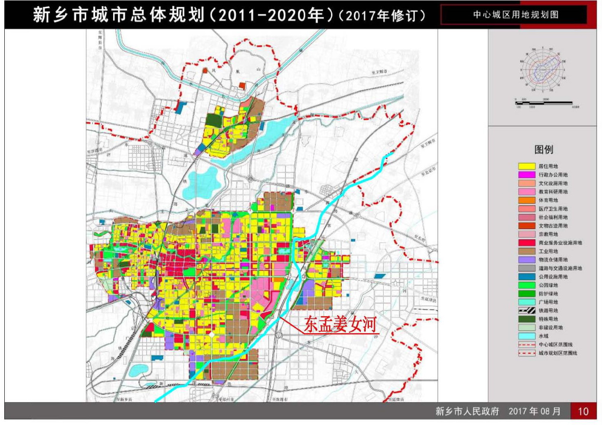  
图 4.3.3-1  新乡市城市总体规划图  

(2)除涝标准  

东孟姜女河本次治理段在 2011 年 ${\sim}2021$ 年等历次治理中,新乡市城区段河道排涝标准均为 5 年一遇;根据《新乡市水利志》,东一干一支排历次治理除涝标准均为 5 年一遇。根据流域防洪总体安排,东孟姜女河本次排涝治理以恢复排涝规模为准,因此本次治理河段除涝标准均为 5 年一遇。  

故确定每段河道的防洪除涝标准如下: $\textcircled{1}$ 张槐树村(桩号 $60{+}113$ )\~小河渡槽$(39+489)$ )段按照 5 年一遇除涝标准进行设计; $\textcircled{2}$ 小河渡槽( $39\substack{+489}$ )\~东孟高铁改线段起点(桩号 $22\substack{+085}$ )段及上焦庄生产桥(桩号 $18{+}020.$ )\~菏宝高速(桩号 $15{+}991\$ )段河道左岸堤防设计洪水标准为 50 年一遇,右岸堤防设计洪水标准为 20 年一遇(心连心厂区河段除外),心连心化工集团厂区河段左、右岸洪水标准为 50 年一遇。本次治理河段除涝标准均为 5 年一遇设计。  

# 4.3.4 河道工程规模  

# 4.3.4.1 河道工程规模  

东孟姜女河治理范围为:治理段为冯庄镇张槐树村(桩号 60+113)\~东孟高铁改线段起点(桩号 $22\substack{+085}$ )段及上焦庄生产桥(桩号 $17\substack{+991}$ )\~荷宝高速(桩号 $15{+}991\$ )段,治理河段总长 $40.06\mathrm{km}$ 。工程建设内容:河道清淤疏浚长 $40.06\mathrm{km}$ ,堤防整治(左、右岸) $35.67\mathrm{km}$ ;河道弯道防护 25 处 $4.74\mathrm{km}$ ;桥基防护 44 处,护砌长度 $2.64\mathrm{km}$ ;排水涵闸新建 33 座、重建 9 座;新建提排站 3 座、重建提灌站 5 座,拆除提灌站 3 座;重建路涵 27 座、重建桥梁 3 座。  

(1)河道疏挖  

本次治理河段排涝标准均为 5 年一遇,根据拟定的设计除涝流量、除涝水位及设计河底高程,确定东孟姜女河疏浚段河道的断面,河道疏浚断面为单一梯形断面,按照各河段除涝标准采用恒定非均匀流公式计算河道疏浚规模。东孟河道清淤疏浚长 $40.06\mathrm{km}$ 。  

# (2)堤防工程  

依据《防洪标准》(GB50201-2014)、《水利水电工程等级划分及洪水标准》(SL252-2017)及《堤防工程设计规范》(GB50286-2013)有关规定,东孟姜女河新乡城区段左岸堤防为 2 级堤防,新乡市城区段右岸堤防为 4 级堤防。  

2 级堤防:堤顶宽 $6\mathrm{m}$ ,堤防超高为 $1.2\mathrm{m}$ ,堤防迎、背水坡坡比均为 1:3。2 级堤防道路净宽 $5\mathrm{m}$ ,两侧各设置 $0.5\mathrm{m}$ 宽土路肩。  

4 级堤防:堤顶宽 $3\mathrm{m}$ ,堤防超高为 $1.0\mathrm{m}$ ,堤防迎、背水坡坡比均为 1:3。本次治理河段 4 级堤防无堤顶道路。  

东孟堤防高程原则设置:由河道水位加堤防超高确定堤顶最终堤顶高程。两岸堤防整治 $35.67\mathrm{km}$ 。  

# 4.3.4.2 排水闸工程规模  

河道修筑堤防后,一方面为解决两岸低洼地带排水出路问题;另一方面由于东孟姜女河洪水位有所抬高,为防止干流行洪时洪水倒灌,保证两岸现有沟道的防洪安全,需在沟道入口处设沟口排水涵闸。  

沟口涵闸的设计标准不小于沟道治理标准。涵闸除涝设计标准均为 5 年一遇,排水闸建筑物级别同所在河段的堤防级别一致。东孟姜女河本次治理段沿线共布置 41 座排水涵闸,其中重建 33 座,新建 8 座。  

# 4.3.4.3 泵站工程规模  

根据工程规划,在牧野区新建 3 座提排站、拆除 3 座提灌站,新建/重建提灌站 5座。  

# 4.4 工程运行方式  

本次工程包括河道清淤疏浚、两岸堤防整治、主槽及堤防防护以及新建提排站。河道治理工程实施后,提升河道防洪除涝能力。工程建设内容不包括节制性建筑物,对河道的运行方式无其它影响。  

涵闸在非汛期或汛期无大洪水发生时,均为排涝涵闸,保障堤防外侧的流水顺利入东孟。洪水期时,涵闸下闸关闭,保障洪水不倒流入新乡市。  

涵闸在非汛期或汛期无大洪水发生时,正常灌溉农田,保障四周的农田正常灌溉。洪水期时,提灌站关闭电源,关闭提灌站所有设备,不在运行。  

# 4.5 工程实施影响分析及处理  

分析工程建设前、后河道流量和水位变化情况及工程建设运行对上下游河势变化、现有灌排体系、用水、其他工程的影响,必要时确定补偿措施。  

# 5 节水评价  

本项目属于水利工程的河道治理项目,主要建设内容为东孟姜女河河道综合治理,包括河道清淤疏浚、堤防加高培厚、配套改造跨河桥梁、排水涵闸、恢复重建提灌站等;仅有零星临河农田灌溉用水户,不涉及取用水相关的水利规划,不属于开展水资源论证的相关规划,不属于取用水相关的水利工程项目,也不需办理取水许可。  

根据《水利部关于开展规划和建设项目节水评价工作的指导意见》(水节约【2019】136 号)的相关要求,本工程可不开展节水评价。  

# 6 工程布置及建筑物  

# 6.1 设计依据  

# 6.1.1 依据文件  

(1)《海河流域防洪规划》(水利部海河水利委员会,2008 年 2 月);(2)《海河流域综合规划(2012-2030 年)》(水利部海河水利委员会,2013 年 3  
月);(3)《海河流域漳卫河系防洪规划报告》(中水北方勘测设计研究有限责任公司,  
2008 年 2 月);(4)《水利部 国家发展改革委关于印发漳卫河“21.7”洪水灾后治理实施方案的通  
知》(水规计【2022】168 号);(5)《河南省卫河共产主义渠流域防洪除涝系统治理方案报告》(河南省水利勘测  
设计研究有限公司,2021 年 9 月);(6)《河南省新乡市卫河共产主义渠综合治理工程初步设计报告》(河南省水利勘  
测设计研究有限公司,2023 年 3 月);(7)《河南省新乡市东孟姜女河治理工程初步设计报告》(新乡市中原水利设计研  
究院,2011 年 10 月)及省水利厅批复文件;(8)《河南省新乡市东孟姜女河市区段治理工程初步设计报告》(新乡市中原水利  
设计研究院,2017 年 1 月)及新乡市水利局批复文件;(9)新乡市中原水利设计研究院 2013 年 10\~11 月完成的该河道治理段带状地形  
图、纵断面图和横断面图;(10)《河南省新乡市东孟姜女河治理方案》(河南省水利勘测设计研究有限公司,  
2023 年 3 月)。(8)《豫北地区水利工程管理手册》;(9)《新乡市水利志》(新乡市水利局,2005 年 3 月)。  

# 6.1.2 主要技术标准  

(1) 《中华人民共和国水法》;  
(2) 《中华人民共和国水土保持法》;  
(3) 《工程建设强制性条文水利工程部分》(2020 年版);  
(4) 《水利水电工程初步设计报告编制规程》(SL/T619-2021);  
(5) 《水利水电工程等级划分及洪水标准》(SL252-2017);(6) 《防洪标准》(GB50201-2014);  
(7) 《水利水电工程设计洪水计算规范》(SL44-2006);  
(8) 《水利水电工程水文计算规范》(SL278-2002);  
(9) 《城市用地分类与规划建设用地标准》(GB50137-2011);  
(10) 《城市防洪工程设计规范》(GB/T50805-2012);  
(11) 《河道整治设计规范》(GB50707-2011);  
(12) 《堤防工程设计规范》(GB50286-2013);  
(13) 《水利水电工程地质勘察规范》(GB50487-2008);  
(14) 《水工钢筋混凝土结构设计规范》(SL191-2008);  
(15) 《水工建筑物荷载设计规范》(SL744-2016);  
(16) 《水工建筑物抗震设计标准》(GB51247-2018);  
(17) 《水工建筑物抗冰冻设计规范》(GB/T50662-2011);  
(18) 《水闸设计规范》(SL265-2016);  
(19) 《水利水电工程合理使用年限及耐久性设计规范》(SL654-2014);  
(20) 《水利水电工程设计工程量计算规定》(SL328-2005);  
(21) 《水利水电工程施工组织设计规范》(SL303-2017);  
(22) 《建筑地基基础设计规范》(GB50007-2011);  
(23) 《公路桥涵地基与基础设计规范》(JTG 3363-2019);  
(24) 《建筑地基处理技术规范》(JGJ79-2012)等规范。  

# 6.2 工程等级和标准  

# 6.2.1 工程等别与建筑物级别  

根据本项目工程任务和规模,按照《防洪标准》(GB50201-2014)、《水利水电工程等级划分及洪水标准》(SL252-2017)有关规定,确定本工程等别和主要建筑物级别以及相应洪水标准,确定地震设防烈度。  

(1)工程等别  

东孟姜女河主要流经获嘉县、新乡县、卫滨区、红旗渠、高新区、牧野区和卫辉市。结合东孟姜女河淹没范围,统计东孟姜女河防洪保护区人口约 37.93 万人,综合分析,本工程等别确定为 III 等工程,工程规模为中型。  

# (2)建筑物级别  

小河渡槽至牧野区菏宝高速段左岸堤防及穿堤建筑物级别为 2 级,右岸堤防及穿堤  

# 建筑物级别为 4 级,临时建筑物级别均为 4 级。  

# 6.2.2 设计标准  

(1)设计洪水标准  

新乡市东孟姜女河综合治理工程是以防洪为主,兼顾农业灌溉及生态环境的工程,工程沿线防洪保护区主要涉及新乡市及河道沿线众多乡镇。  

东孟姜女河治理段穿越新乡市主城区,统计东孟姜女河防洪保护区人口约 37.93 万人,心连心化工集团属于中型企业规模。依据《防洪标准》(GB50201-2014)的规定,结合新乡市城市总体规划图,新乡市主城区位于东孟姜女河左岸,综合考虑区域经济、地形条件、经济水平等因素,结合东孟姜女河淹没范围及保护对象的分布,综合分析,确定东孟姜女河心连心化工集团厂区河段左、右岸防洪标准均为 50 年一遇,新乡市城区其他河段均为左岸防洪标准为 50 年一遇、右岸防洪标准为 20 年一遇。  

东孟姜女河本次治理段在 2011 年 ${\sim}2021$ 年等历次治理中,新乡市城区段河道排涝标准均为 5 年一遇;根据《新乡市水利志》,东一干一支排历次治理除涝标准均为 5 年一遇。根据流域防洪总体安排,东孟姜女河本次排涝治理以恢复排涝规模为准,因此本次治理河段除涝标准均为 5 年一遇。  

故确定每段河道的防洪除涝标准如下: $\textcircled{1}$ 张槐树村(桩号 $60{+}113$ )\~小河渡槽( $(39+489$ )段按照 5 年一遇除涝标准进行设计; $\textcircled{2}$ 小河渡槽( $(39+489)\sim\mathrm{X}031$ 县道( $38{+}320)$ )、X031 县道( $38+320$ ) $\sim$ 东孟高铁改线段起点(桩号 $22\substack{+085)}$ )段及上焦庄生产桥(桩号 $18{+}020\$ )\~菏宝高速(桩号 $15{+}991$ )段河道左岸堤防设计洪水标准为 50 年一遇,右岸堤防设计洪水标准为 20 年一遇,河段除涝标准为 5 年一遇; $\textcircled{3}$ 心连心化工集团厂区河段(桩号 $38+320\sim$ 桩号 $35{+}670$ )左、右岸洪水标准均为 50 年一遇,除涝标准为 5 年一遇设计。  

(2)抗震设防标准  

根据《中国地震动参数区划图》(GB18306-2015)(1:400 万),工程场区 II 类场地时基本地震动峰值加速度值为 $0.20\mathrm{g}$ ,相当于地震基本烈度Ⅷ度区,基本地震动加速度反应谱特征周期为 0.40s。  

# 6.2.3 合理使用年限及耐久性设计  

# 6.2.3.1 合理使用年限  

根据《水利水电工程合理使用年限及耐久性设计规范》(SL654-2014),东孟姜女河小河渡槽( $(39+489$ )\~菏宝高速(桩号 $15{+}991\$ )河段左岸建筑物级别为 2 级的堤防、  

穿堤建筑物合理使用年限为 50 年;小河渡槽( $39\substack{+489}$ )\~菏宝高速(桩号 $15{+}991$ )河段右岸建筑物级别为 4 级的堤防及穿堤建筑物合理使用年限为 30 年。  

2 级水工建筑物中闸门的合理使用年限为 50 年;4 级水工建筑物中闸门的合理使用年限为 30 年。  

# 6.2.3.2 耐久性设计  

(1)主要建筑物所处环境类别  

结合《水利水电工程合理使用年限及耐久性设计规范》(SL654-2014),判断工程主要建筑物所处环境类别如下:  

1)处于一类环境的建筑物:闸室工作桥。  
2)处于二类环境的建筑物:闸室检修桥、交通桥、提排站泵房等。  
3)处于三类环境的建筑物:涵闸、堤防。  

(2)构造要求  

根据《水利水电工程合理使用年限及耐久性设计规范》(SL654-2014),工程主要建筑物钢筋混凝土构件表面最大裂缝宽度限值应满足表 6.2.3.2-1 要求。  

表6.2.3.2-1  混凝土构件表面最大裂缝宽度限值表  

<html><body><table><tr><td rowspan="2">环境类别</td><td>钢筋混凝土结构</td><td colspan="2">预应力混凝土结构</td></tr><tr><td>最大裂缝宽度限值</td><td>裂缝控制等级</td><td>裂缝计算宽度限值 (mm)</td></tr><tr><td></td><td>(mm) 0.40</td><td>三</td><td>0.20</td></tr><tr><td>二</td><td>0.30</td><td>二</td><td>不允许</td></tr><tr><td>三</td><td>0.25</td><td></td><td>不允许</td></tr></table></body></html>  

工程钢筋混凝土保护层最小厚度应满足表 6.2.3.2-2 要求。  

表 6.2.3.2-2  混凝土保护层最小厚度表  

<html><body><table><tr><td rowspan="2" colspan="2">项次</td><td colspan="5">环境类别</td></tr><tr><td></td><td></td><td>三</td><td>四</td><td>五</td></tr><tr><td>1</td><td>板、墙</td><td>20</td><td>25</td><td>30</td><td>45</td><td>50</td></tr><tr><td>2</td><td>梁、柱、墩</td><td>30</td><td>35</td><td>45</td><td>55</td><td>60</td></tr><tr><td>3</td><td>截面厚度不小于2.5m的底板及墩墙</td><td></td><td>40</td><td>50</td><td>60</td><td>65</td></tr><tr><td colspan="7">注1：直接与地基接触的结构底层钢筋或无检修条件的结构，保护层厚度应适 当增大。 注2：有抗冲耐磨要求的结构面层钢筋，保护层厚度应适当增大。 注3：混凝土强度等级不低于C30且浇筑质量有保证的预制构件或薄板，保护 层厚度可按表中数值减小5mm 注4：钢筋表面涂塑或结构外表面敷设永久性涂料或面层时，保护层厚度可适 当减小。</td></tr></table></body></html>  

# (3)材料要求  

工程钢筋混凝土耐久性的基本要求应符合表 6.2.3.2-3 要求。  

表6.2.3.2-3  配筋混凝土耐久性基本要求  

<html><body><table><tr><td>环境类别</td><td>混凝土最低 强度等级</td><td>最小水泥用量 (kg/m)</td><td>最大水胶比</td><td>最大氯离子 含量 (%)</td><td>最大碱含量 (kg/m²)</td></tr><tr><td></td><td>C20</td><td>220</td><td>0.60</td><td>1.0</td><td>不限制</td></tr><tr><td>二</td><td>C25</td><td>260</td><td>0.55</td><td>0.3</td><td>3.0</td></tr><tr><td>三</td><td>C25</td><td>300</td><td>0.50</td><td>0.2</td><td>3.0</td></tr><tr><td>四</td><td>C30</td><td>340</td><td>0.45</td><td>0.1</td><td>2.5</td></tr><tr><td>五</td><td>C35</td><td>360</td><td>0.40</td><td>0.06</td><td>2.5</td></tr><tr><td colspan="6">注1：配置钢丝、钢绞线的预应力混凝土构件的混凝土最低强度等级不宜小于 C40；最小水泥用量不宜少于300kg/㎡²。 注2：当混凝土中加入优质活性掺合料或能提高耐久性的外加剂时，可适当减 少最小水泥用量。 注3：桥梁上部结构及处于露天环境的梁、柱构件，混凝土强度等级不宜低 于C25。 注4：预应力混凝土构件中的氯离子含量不宜大于0.06%。 注5：水工混凝土结构的水下部分，不宜采用碱活性骨料。 注6：有抗冻要求的结构构件，混凝土的最大水胶比应按GB/T50662的规定 执行。 注7：炎热地区的海水水位变化区和浪溅区，混凝土的各项耐久性基本要求宜 按表中的规定适当加严。</td></tr></table></body></html>  

根据《水工混凝土结构设计规范》(SL191-2008)、《水利水电工程合理使用年限及耐久性设计规范》(SL 654-2014),本工程水工建筑物混凝土强度等级和抗冻、抗渗指标如表 6.2.3.2-4 所示。  

表 6.2.3.2-4  建筑物混凝土强度等级  

<html><body><table><tr><td>混凝土部位</td><td>强度等级</td><td>抗渗等级</td><td>抗冻等级</td></tr><tr><td>水闸闸底板、闸墩</td><td>C30</td><td>W6</td><td>F150</td></tr><tr><td>闸上部排架等</td><td>C30</td><td></td><td>F150</td></tr><tr><td>闸门槽二期</td><td>C35</td><td>W6</td><td>F150</td></tr><tr><td>堤防防护</td><td>C25</td><td>W6</td><td>F150</td></tr><tr><td>垫层</td><td>C15</td><td></td><td></td></tr></table></body></html>  

# 6.2.4 工程主要设计允许值  

# 6.2.4.1 稳定安全系数  

(1)土堤防边坡抗滑稳定安全系数  

表6.2.4.1-1  土堤边坡抗滑稳定安全系数(简化毕肖普法)  

<html><body><table><tr><td rowspan="2">荷载组合</td><td colspan="4">工程级别</td></tr><tr><td>1级</td><td>2级</td><td>3级</td><td>4级</td></tr><tr><td>正常运用条件</td><td>1.50</td><td>1.35</td><td>1.30</td><td>1.25</td></tr><tr><td>非常运用条件I</td><td>1.30</td><td>1.25</td><td>1.20</td><td>1.15</td></tr><tr><td>非常运用条件ⅡI</td><td>1.20</td><td>1.15</td><td>1.15</td><td>1.10</td></tr></table></body></html>  

# (2)建筑物、挡土墙稳定安全系数  

表6.2.4.1-2  建筑物抗滑稳定安全系数允许值表  

<html><body><table><tr><td rowspan="2">荷载组合</td><td colspan="3">工程级别</td></tr><tr><td>1级</td><td>2级</td><td>4级、5级</td></tr><tr><td>正常运用条件</td><td>1.35</td><td>1.30</td><td>1.20</td></tr><tr><td>非常运用条件I</td><td>1.20</td><td>1.15</td><td>1.05</td></tr><tr><td>非常运用条件Ⅱ</td><td>1.10</td><td>1.05</td><td>1.00</td></tr></table></body></html>  

# (3)基地应力不均匀系数允许值  

表6.2.4.1-3  基底应力不均匀系数允许值  

<html><body><table><tr><td rowspan="2">地基土质</td><td colspan="2">建筑物级别</td></tr><tr><td>基本组合</td><td>特殊组合</td></tr><tr><td>松软</td><td>1.50</td><td>2.00</td></tr><tr><td>中等坚硬</td><td>2.00</td><td>2.50</td></tr><tr><td>坚实</td><td>2.50</td><td>3.00</td></tr></table></body></html>  

(4)拦河闸过闸水头  

本工程所在河道位于平原区,根据规范要求及水闸设计经验,在设计水位和校核水位工况下,过闸水位差分别不超过 $0.15\mathrm{m}$ 和 $0.2\mathrm{m}$ 。  

# (5)抗渗稳定安全系数  

本工程闸室基础为壤土,水平段渗流坡降值应小于 0.25,出口段渗流坡降值应小于0.5 或结合地勘资料采用。  

# 6.2.4.2 安全超高  

(1)堤防安全加高  

根据《堤防工程设计规范》(GB50286-2013)规定,不允许越浪的 2、4 级河道堤防安全加高值分别为 $0.8\mathrm{m}$ 、 $0.6\mathrm{m}$ 。  

# (2)水闸超高  

根据《水闸设计规范》(SL265-2016)规定,水闸安全超高下限值见表 6.2.4.2-1。  

表 6.2.4.2-1  水闸安全超高下限值(m)  
(3)泵房超高  

<html><body><table><tr><td rowspan="2" colspan="2">运用条件</td><td colspan="4">建筑物级别</td></tr><tr><td>1</td><td>2</td><td>3</td><td>4、5</td></tr><tr><td rowspan="2">挡水时</td><td>正常蓄水位</td><td>0.7</td><td>0.5</td><td>0.4</td><td>0.3</td></tr><tr><td>最高挡水位</td><td>0.5</td><td>0.4</td><td>0.3</td><td>0.2</td></tr><tr><td rowspan="2">泄水时</td><td>设计洪水位</td><td>1.5</td><td>1.0</td><td>0.7</td><td>0.5</td></tr><tr><td>校核洪水位</td><td>1</td><td>0.7</td><td>0.5</td><td>0.4</td></tr></table></body></html>  

根据《泵站设计规范》(GB50265-2010)规定,泵房挡水部位顶部安全加高下限值见表 6.2.4.2-2。  

表6.2.4.2-2  泵房挡水部位顶部安全加高下限值  

<html><body><table><tr><td rowspan="2">运用情况</td><td colspan="2">泵站建筑物级别</td></tr><tr><td>3</td><td>4、5</td></tr><tr><td>设计</td><td>0.4m</td><td>0.3m</td></tr><tr><td>校核</td><td>0.3m</td><td>0.2m</td></tr></table></body></html>  

# 6.3 主要建筑物轴线选择  

# 6.3.1 东孟姜女河  

# 6.3.1.1 河线布置原则  

2017 年,新乡市中原水利设计研究院编制了《河南省新乡市东孟姜女河市区段治理工程初步设计》,对东孟姜女河新乡市市区段(桩号 $14+395\sim33+053$ )进行治理,除涝标准为 5 年一遇。目前已实施完毕。经过本次治理,东孟姜女河主槽基本稳定,本次对东孟姜女河治理段主河槽按照 5 年一遇的除涝标准进行复核,根据水文复核成果对现状不满足设计标准要求的河道主槽开展清淤疏浚;对东孟姜女河新乡市城区河段新建堤防,使东孟姜女河新乡市城区段左岸达到 50 年一遇防洪标准、右岸达到 20年一遇防洪标准(高铁改线段及心连心化工集团厂区河段除外);心连心化工集团厂区河段(桩号 $38+320\sim$ 桩号 $35{+}670)$ )左、右岸洪水标准均为 50 年一遇。  

本次治理河段现状河道较为顺直,主槽断面清晰,河道治理以稳定现有河势为目标,河道中心线布置根据相应的排涝标准并结合上位规划及上下游情况扩宽主槽,扩宽后的河线应与现状河道走向基本一致,并应规则平顺,以减少工程量、占地、拆迁。  

(1)河道主河槽中心线选线原则  

本次东孟姜女河河槽清淤疏浚原则上沿现有河槽中心线布置,对不满足本次设计标准要求的河槽断面进行清淤疏浚,工程线路基本按照原有的河道总体走向及布局开展设计。  

(2)堤线布置原则  

$\textcircled{1}$ 东孟姜女河在治理段基本无堤防,治理河段堤线需充分利用现状堤防,对现有堤防进行加高加固;现状无堤段,根据防洪要求,合理确定堤线,堤线布置尽可能顺直,堤线与河势流向相适应,并与大洪水主流方向基本一致,上下游堤段平缓连接。  

$\textcircled{2}$ 对于局部卡口部位结合河道防洪需求,适当拓宽。  

$\textcircled{3}$ 城区段布置在满足防洪要求的前提下,尽可能避开现状房屋和道路,以减少占地和拆迁量。  

# 6.3.2 建筑物工程  

本次沟口涵闸、提排站的建设任务为:在不改变原排水涵闸、提灌(排)站工程任务、功能和规模的基础上,根据东孟姜女河治理段设计要素重新规划建设各涵闸、提灌(排)站,提高治理段河道防洪除涝、灌溉能力,各类重建建筑物均为原址拆除重建。  

# 6.4 建筑物型式  

# 6.4.1 堤防  

一般平原河道堤防断面形式多采用土堤,少部分采用土石复合堤,城市防洪工程还可以采用防洪墙或防浪墙结构。依据《堤防工程设计规范》GB50286-2013,堤防工程的型式应根据堤段所在的地理位置、重要程度、堤址地质、筑堤材料、水流及风浪特性、施工条件、运用和管理要求、工程造价等因素,经过技术经济比较综合确定。  

东孟姜女河属平原河道,地势较平缓,地表一般为轻、重粉质壤土,河道上原有堤防均为土堤,已运行多年,未发生大的质量问题。本次设计堤防加高高度一般 $1\sim5\mathrm{m}$ ,因堤防加高高度较高,本次采用斜坡式均质土堤。  

# 6.4.2 排水涵闸  

(1)闸室结构选型  

水闸闸室结构可根据泄流特点和运行要求,选用开敞式、胸墙式和涵洞式等结构型式。闸槛高程较低、挡水高度较小的水闸,可采用开敞式;泄洪闸或分洪闸宜采用开敞式;有排冰、过木或通航要求的水闸,应采用开敞式;闸槛高程较低、挡水高度较大的水闸,可采用胸墙式或涵洞式;挡水水位高于泄水运用水位,或闸上水位变幅较大,且有限制过闸单宽流量要求的水闸,也可采用胸墙式或涵洞式。  

东孟姜女河治理段排水涵闸的作用一方面是解决支流或堤外低洼地带的排水问题,另一方面是阻挡干流洪水以防倒灌。由于东孟姜女河设计洪水位较高,导致沟口排水涵闸的挡水高度较大,且考虑到沟口涵闸均为穿堤建筑物,涵闸上部需保证河道堤防通畅,经综合比选,排水涵闸闸室结构均采用涵洞式。  

# (2)上下游翼墙选型  

水工挡土墙按受力条件采用重力式、半重力式、衡重式、悬臂式、扶壁式、空箱式等断面结构型式。土质地基上挡土墙的结构型式,可根据地质条件、挡土高度和建筑材  

料等,经技术经济比较确定。在中等坚实地基上,挡土高度在 $8\mathrm{m}$ 以下时,宜采用重力式、半重力式或悬臂式结构。  

本工程排水涵闸上下游翼墙挡土高度多在 $3\mathrm{m}$ 以下,建基面位于中等坚实土基上,因此上下游翼墙均采用半重力式混凝土结构。  

# 6.4.3 泵站  

(1)泵站选型  

本工程水源地为河道,泵站防洪水位与所在河道水位一致。根据泵站流量和特征扬程,结合泵站后渠道现状,并适当留有余地的原则,在充分考虑当地群众管理水平和管理习惯,选择双吸中开蜗壳式离心泵。机组采用单列布置,一机一管,直到出水池。泵站泵室布置大堤外侧(背水面)。  

# (2)泵房选型  

泵房是安装水泵、电机及其辅助设备的建筑物,是泵站的核心部位。根据水力机械专业水泵选型为卧式离心泵,对 2 种型式泵房进行比较:1)分基型泵房;2)干室型泵房。  

1)分基型泵房:该类型泵房的水泵、电机等基础与其上部厂房基础相对独立,自成体系。该种泵房结构简单,适应简易泵站。主要特点: $\textcircled{1}$ 水泵、电机等基础与其上部厂房基础相互分开,可以避免机组运行震动对上部房屋的影响; $\textcircled{2}$ 结构简单,设计、施工方便; $\textcircled{3}$ 地下水位较高时,容易渗入泵房基础,影响泵房安全; $\textcircled{4}$ 设备基础较小,振幅较大。  

2)干室型泵房:该类型泵房四周墙壁和底板用钢筋混凝土建成一个不透水的整体,形成一个相对干燥的地下室,水泵和电机安装在地下室内。泵房平面呈矩形。该种泵房是较为常见的泵房型式。主要特点: $\textcircled{1}$ 地下水位对泵房基础影响较小,泵房安全性能提高; $\textcircled{2}$ 设备基础与泵室基础一体,整体稳定性能好,抗震性能提高; $\textcircled{3}$ 泵房可设为上下2 层,空间较大,易于布置其它设备; $\textcircled{4}$ 泵房整体为钢筋混凝土结构,防潮性能较好。$\textcircled{5}$ 由于设有地下室,泵房通风、采光相对较差。  

经分析比较,结合本工程特点,推荐采用干室整体型泵房方案。其泵房布置在防洪堤外。  

# 6.5 工程总布置  

根据《河南省水利厅 河南省财政厅 关于进一步做好中小河流治理项目前期工作的通知》(豫水计【2016】71 号),为加强灾后水利薄弱环节建设,提高河道防洪除涝标准,增强抵御自然灾害能力,国家将继续对中小河流进行治理。按照水利部要求,中小河流治理项目要服从流域防洪规划,治理标准要与干流、区域防洪除涝标准相协调。对一条河流上的多个河段进行治理,要先规划、后设计,统筹整条河流治理,防止洪水灾害转移。中小河流治理理应按照自下而上、系统治理、突出重点的原则进行,重点安排防洪除涝问题突出、人口密集、地方建设积极性高、前期工作进度快的重点河段项目。  

根据以上通知的要求,本着突出重点、保障安全、统筹兼顾、系统治理的原则,针对新乡市防洪安全和东孟姜女河现状存在的主要问题,对东孟姜女河进行防洪除涝治理,确定本项目治理范围为:本次方案治理工程范围涉及获嘉县、新乡县、新乡市卫滨区、高新区、红旗区及牧野区,治理段为冯庄镇张槐树村(桩号 $60{+}113$ )\~东孟高铁改线段起点(桩号 $22\substack{+085}$ )段及上焦庄生产桥(桩号 $18{+}020$ )\~菏宝高速桥(桩号 $15{+}991\$ )段,治理河段总长 $40.06\mathrm{km}$ 。  

工程建设内容:河道清淤疏浚长 $40.06\mathrm{km}$ ,堤防整治(左、右岸) $35.67\mathrm{km}$ ;新建堤顶道路 $15.18\mathrm{km}$ ;河道弯道防护 25 处 $4.74\mathrm{km}$ ;桥基防护 44 处,护砌长度 $2.64\mathrm{km}$ ;排水涵闸重建 33 座、新建 8 座;新建提排站 3 座、重建提灌站 5 座,拆除提灌站 3 座;重建路涵 27 座、重建桥梁 3 座。  

工程建设详细内容见表 $6.5{\-}1\sim2$ 。  

表6.5-1  河道部分建设内容汇总表  

<html><body><table><tr><td rowspan="2">河道名称</td><td colspan="4">项目内容</td></tr><tr><td>河道清淤疏浚（km）</td><td>堤防整治（km）</td><td>弯道防护(km)</td><td>桥基防护(km)</td></tr><tr><td>东孟姜女河</td><td>40.06</td><td>35.67</td><td>4.74</td><td>2.64</td></tr></table></body></html>  

表6.5-2  建筑物部分建设内容汇总表  

<html><body><table><tr><td rowspan="2">名称</td><td rowspan="2">改造 类型</td><td colspan="6">项目内容 (建筑物工程)</td></tr><tr><td>排水涵闸 （座）</td><td>提灌站 （座）</td><td>提排站 （座）</td><td>路涵 （座）</td><td>桥涵 （座）</td><td>合计</td></tr><tr><td rowspan="3">东孟姜女河</td><td>重建</td><td>33</td><td>5</td><td>0</td><td>27</td><td>3</td><td>68</td></tr><tr><td>新建</td><td>8</td><td>0</td><td>3</td><td>0</td><td>0</td><td>11</td></tr><tr><td>拆除</td><td>0</td><td>3</td><td>0</td><td>0</td><td>0</td><td>3</td></tr><tr><td colspan="2">合计</td><td>41</td><td>8</td><td>3</td><td>27</td><td>3</td><td>82</td></tr></table></body></html>  

# 6.6 东孟姜女河工程设计  

# 6.6.1 河道工程设计  

# 6.6.1.1 设计原则  

结合东孟姜女河治理段主要任务和建设内容,确定治理设计原则。主要原则如下:  

(1)在确保防洪安全的前提下,科学确定治理模式,维护河流生态健康。  

(2)尽可能保持河流自然形态。确定治理方式,既要考虑堤防、清淤疏浚等工程措施,也要在有条件的地方适当考虑留足滩地,蓄洪滞洪,给河流以空间。  

(3)不侵占河道行洪通道,合理确定治理河段的治导线,不随意裁弯取直,不破坏河道自然形态和河道功能。(4)不重复工程建设,对治理河段范围内近年已建设的工程内容,应从本次建设内容中扣除。(5)不渠化、硬化、白化河道,护岸工程只对迎流顶冲及险工河段进行岸坡防护,并尽可能采用生态防护材料和结构形式。闸坝等建筑物应与周边环境相协调,并考虑信息化、现代化管理需求。  

# 6.6.1.2 纵断面设计  

结合现状河底高程,在基本不改变现状河道比降的情况下,并根据河道现状水力计算成果,拟定河道纵比降。  

根据新乡市中原水利设计研究院 2017 年编制的《河南省新乡市东孟姜女河市区段治理工程初步设计》并结合最新测量资料,复核《设计报告》中确定的设计河底比降是合理的,因此,本次治理段河底比降维持原设计比降。  

冯庄镇张槐树村(桩号 $60\substack{+113}$ )\~龙泉排下游端(桩号 $40{+}700$ )段长 $19413\mathrm{m}$ ,纵坡为 1/3000,河底高程为 $80.34\mathrm{m}{\sim}73.87\mathrm{m}$ ;  

龙泉排下游端(桩号 $40\substack{+700}$ )\~一支排末端(桩号 $40\substack{+020}$ )段作为一支排和东孟的连接段,长 $680\mathrm{m}$ ,纵坡为 1/400,河底高程为 $73.87\mathrm{m}{\sim}72.17\mathrm{m}$ ;  

一支排末端(桩号 $40\substack{+020})\sim$ \~贾屯泵站(桩号 $33\substack{+000})$ )段长 $7020\mathrm{m}$ ,纵坡为 1/3000,河底高程为 $72.17\mathrm{m}{\sim}69.87\mathrm{m}$ ;  

贾屯泵站(桩号 $33\substack{+000}$ ) $\sim$ 高铁改线段上游端(桩号 $22\substack{+085}$ )段长 $10915\mathrm{m}$ ,纵坡为 1/4000,河底高程为 $69.87\mathrm{m}{\sim}67.11\mathrm{m}$ ;  

高铁改线段上游端(桩号 $22\substack{+085})\sim$ 高铁改线段下游端(桩号 $20\substack{+650)}$ )段长 $1435\mathrm{m}$ ,纵坡为 1/6520,河底高程为 $67.11\mathrm{m}{\sim}66.88\mathrm{m}$ ;  

高铁改线段下游端(桩号 $20\substack{+650}$ )\~菏宝高速(桩号 $15{+}991$ )段长 $4659\mathrm{m}$ ,纵坡为1/4000,河底高程为 $66.88\mathrm{m}{\sim}65.71\mathrm{m}$ 。  

# 6.6.1.3 横断面设计  

根据拟定的设计除涝流量、除涝水位及设计河底高程,确定东孟姜女河干流疏浚段河道的横断面。本次治理河段全段疏浚,疏浚总长度为 $40.06\mathrm{km}$ ,河道疏浚断面为单一梯形断面,河道主槽糙率 0.025,采用恒定非均匀流公式计算确定治理河段 5 年一遇规模疏浚底宽,各疏浚河段设计河底宽分别为:  

冯庄镇张槐树村(桩号 $60\substack{+113})\sim$ 墩留店桥(桩号 $50{+}647)$ )段设计河底宽度为 $2.5\mathrm{m}$ ;墩留店桥(桩号 $50\substack{+647}$ )\~一支排末端(桩号 $40\substack{+020}$ )段设计河底宽度为 $4.0\mathrm{m}$ ;一支排末端(桩号 $40{+}020$ )\~贾屯泵站(桩号 $33{+}000$ )段设计河底宽度为 $12\mathrm{m}$ ;贾屯泵站(桩号 $33\substack{+000}$ )\~海河路泵站(桩号 $29\substack{+400}$ )段设计河底宽度为 $16\mathrm{m}$ ;海河路泵站(桩号 $29\substack{+400}$ ) $\sim$ 东强路泵站(桩号 $23+500$ )段设计河底宽度为 $24\mathrm{m}$ ;东强路泵站(桩号 $23\substack{+500}$ )\~高铁改线上游端(桩号 $22\substack{+085)}$ )段、高铁改线段下游端(桩号 $20\substack{+650}$ )\~菏宝高速桥(桩号 $15{+}991$ )段设计河底宽度为 $28\mathrm{m}$ ;  

高铁改线上游端(桩号 $22\substack{+085}$ ) $\sim$ 高铁改线段下游端(桩号 $20\substack{+650})$ )段设计河底宽度为 $75\mathrm{m}$ 。  

# 6.6.1.4 工程后河道水面线计算  

在现状水面线成果的基础上,根据治理段设计断面成果推算工程后的水面线,设计东孟姜女河主槽综合糙率采用 0.025。工程后水面线计算方法同 4.2.1 节,河道治理后设计水面线见图 6.6.1.4-1。河道设计水力要素见表 6.6.1.4-2。  

从计算成果表中可以看出,上焦庄生产桥(桩号 $18\substack{+020.0}$ )\~菏宝高速(桩号$15{+}991.0\$ )段除涝水位高于现状地面高程,通过分析万分之一图并结合测量资料,可看出此段河段为低洼区域。通过工程措施降低水面线效果不明显,因此,在此河段新建三座提排站以强排河道两岸地面涝水。  

通过疏挖主河槽及设置提排站等工程措施,东孟姜女河各河段可以达到相应的除涝标准。  

表 6.6.1.4-1 工程后河道水面线计算成果表  

<html><body><table><tr><td rowspan="2">控制断面</td><td rowspan="2">桩号</td><td rowspan="2">设计河底 高程 (m)</td><td rowspan="2">3年一遇 水位 (m)</td><td rowspan="2">5年一遇 水位 (m)</td><td rowspan="2">20年一遇 水位（m)</td><td rowspan="2">50年一遇 水位 (m)</td><td rowspan="2">左地面 高程(m)</td><td rowspan="2">右地面 高程(m)</td><td rowspan="2">左岸 堤顶(m)</td><td rowspan="2">右岸</td><td rowspan="2">(左地面-除涝) (u)</td></tr><tr><td>堤顶(m)</td></tr><tr><td>冯庄镇张槐树村</td><td>60+113</td><td>80.34</td><td></td><td>82.2</td><td></td><td></td><td>83.41</td><td>83.15</td><td></td><td>1.21</td><td>0.95</td></tr><tr><td></td><td>59+154</td><td>80.02</td><td>81.83</td><td></td><td></td><td>83.04</td><td>82.11</td><td></td><td></td><td>1.21</td><td>0.28</td></tr><tr><td></td><td>58+147</td><td>79.69</td><td>81.54</td><td></td><td></td><td>83.49</td><td>82.45</td><td></td><td></td><td>1.95</td><td>0.91</td></tr><tr><td></td><td>56+048</td><td>78.99</td><td>81.07</td><td></td><td></td><td>82.04</td><td>81.66</td><td></td><td></td><td>0.97</td><td>0.59</td></tr><tr><td></td><td>54+057</td><td>78.32</td><td>80.48</td><td></td><td></td><td>81.64</td><td>81.5</td><td></td><td></td><td>1.16</td><td>1.02</td></tr><tr><td></td><td>52+057</td><td>77.66</td><td>80.03</td><td></td><td></td><td>81.97</td><td>80.28</td><td></td><td></td><td>1.94</td><td>0.25</td></tr><tr><td></td><td>50+057</td><td>76.99</td><td>79.6</td><td></td><td></td><td>80.07</td><td>79.86</td><td></td><td></td><td>0.47</td><td>0.26</td></tr><tr><td></td><td>48+057</td><td>76.32</td><td>79.07</td><td></td><td></td><td>81.48</td><td>79.69</td><td></td><td></td><td>2.41</td><td>0.62</td></tr><tr><td></td><td>46+657</td><td>75.86</td><td>78.75</td><td></td><td></td><td>81.84</td><td>79.58</td><td></td><td></td><td>3.09</td><td>0.83</td></tr><tr><td></td><td>44+655</td><td>75.19</td><td>78.06</td><td></td><td></td><td>79.8</td><td>79.09</td><td></td><td></td><td>1.74</td><td>1.03</td></tr><tr><td></td><td>43+554</td><td>74.82</td><td>77.7</td><td></td><td></td><td>78.54</td><td>78.57</td><td></td><td></td><td>0.84</td><td>0.87</td></tr><tr><td></td><td>42+554</td><td>74.49</td><td>77.27</td><td></td><td></td><td>77.44</td><td>77.67</td><td></td><td></td><td>0.17</td><td>0.4</td></tr><tr><td></td><td>41+552</td><td>74.16</td><td>76.71</td><td></td><td></td><td>77.28</td><td>77.07</td><td></td><td></td><td>0.57</td><td>0.36</td></tr><tr><td>小河口东三干渡槽</td><td>39+489</td><td>71.99</td><td>74.62</td><td>75.88</td><td>76.34</td><td>78.89</td><td>79.18</td><td>77.54</td><td>76.88</td><td>4.27</td><td>4.56</td></tr><tr><td></td><td>38+990</td><td>71.83</td><td>74.48</td><td>75.75</td><td>76.2</td><td>74.98</td><td>74.56</td><td>77.4</td><td>76.75</td><td>0.5</td><td>0.08</td></tr><tr><td></td><td>37+864</td><td>71.45</td><td>74.12</td><td>75.38</td><td>75.84</td><td>75.38</td><td>75.26</td><td>77.04</td><td>76.38</td><td>1.26</td><td>1.14</td></tr><tr><td></td><td>36+903</td><td>71.13</td><td>73.82</td><td>75.08</td><td>75.55</td><td>75</td><td>74.97</td><td>76.75</td><td>76.08</td><td>1.18</td><td>1.15</td></tr><tr><td></td><td>36+103</td><td>70.87</td><td>73.58</td><td>74.82</td><td>75.32</td><td>74.83</td><td>74.72</td><td>76.52</td><td>75.82</td><td>1.25</td><td>1.14</td></tr><tr><td></td><td>35+503</td><td>70.33</td><td>73.4</td><td>74.65</td><td>75.16</td><td>74.38</td><td>73.73</td><td>76.36</td><td>75.65</td><td>0.98</td><td>0.33</td></tr><tr><td></td><td>34+406</td><td>70.3</td><td>73.13</td><td>74.43</td><td>74.97</td><td>74.26</td><td>73.21</td><td>76.17</td><td>75.43</td><td>1.13</td><td>0.08</td></tr><tr><td>大泉排入口</td><td>33+209</td><td>69.9</td><td>72.87</td><td>74.18</td><td>74.76</td><td>73.81</td><td>73.25</td><td>75.96</td><td>75.18</td><td>0.94</td><td>0.38</td></tr><tr><td>贾屯泵站</td><td>33+009</td><td>69.84</td><td>72.81</td><td>74.13</td><td>74.71</td><td>74.56</td><td>72.91</td><td>75.91</td><td>75.13</td><td>1.75</td><td>0.1</td></tr><tr><td></td><td>32+010</td><td>69.59</td><td>72.57</td><td>73.89</td><td>74.47</td><td>74.68</td><td>72.68</td><td>75.67</td><td>74.89</td><td>2.11</td><td>0.11</td></tr><tr><td>牧野路泵站 海河路泵站</td><td>31+010 29+404</td><td>69.09 68.94</td><td>72.34 71.94</td><td>73.67 73.28</td><td>74.25 73.91</td><td>72.81 73.26</td><td>72.44 75.33</td><td>75.45 75.11</td><td>74.67 74.28</td><td>0.47</td><td>0.1</td></tr></table></body></html>  

<html><body><table><tr><td rowspan="2">控制断面</td><td rowspan="2">桩号</td><td rowspan="2">设计河底 高程</td><td rowspan="2">3年一遇 水位</td><td rowspan="2">5年一遇 水位</td><td rowspan="2">20年一遇 水位（m）</td><td rowspan="2">50年一遇 水位 (m)</td><td rowspan="2">左地面 高程(m)</td><td rowspan="2">右地面 高程(m)</td><td rowspan="2">左岸 堤顶(m)</td><td rowspan="2">右岸 堤顶(m)</td><td rowspan="2">(左地面-除涝) (m)</td><td rowspan="2">(右地面-除涝) (m)</td></tr><tr><td>(m) () (m)</td></tr><tr><td></td><td>27+970</td><td>68.58</td><td></td><td>71.57</td><td>72.91</td><td>73.49</td><td>71.7</td><td>72.5</td><td>74.69</td><td>73.91</td><td>0.13</td><td>0.93</td></tr><tr><td rowspan="2">新延路泵站</td><td>26+967</td><td>68.33</td><td></td><td>71.35</td><td>72.69</td><td>73.29</td><td>71.65</td><td>71.46</td><td>74.49</td><td>73.69</td><td>0.3</td><td>0.11</td></tr><tr><td>25+867</td><td>68.06</td><td></td><td>71.08</td><td>72.47</td><td>73.08</td><td>71.29</td><td>71.11</td><td>74.28</td><td>73.47</td><td>0.21</td><td>0.03</td></tr><tr><td></td><td>24+972</td><td>67.83</td><td></td><td>70.85</td><td>72.26</td><td>72.88</td><td>70.92</td><td>73.58</td><td>74.08</td><td>73.26</td><td>0.07</td><td>2.73</td></tr><tr><td>东强路泵站</td><td>23+373</td><td>67.43</td><td></td><td>70.41</td><td>71.92</td><td>72.58</td><td>70.36</td><td>70.65</td><td>73.78</td><td>72.92</td><td>-0.05</td><td>0.24</td></tr><tr><td>高铁改线段起点</td><td>22+085</td><td>67.11</td><td></td><td>70.1</td><td>71.75</td><td>72.42</td><td>70.53</td><td>70.91</td><td>73.62</td><td>72.75</td><td>0.43</td><td>0.81</td></tr><tr><td>上焦庄生产桥</td><td>18+020</td><td>66.21</td><td></td><td>69.94</td><td>71.59</td><td>72.24</td><td>69.43</td><td>69.2</td><td>73.44</td><td>73.44</td><td>-0.51</td><td>-0.74</td></tr><tr><td>菏宝高速</td><td>15+992</td><td>65.71</td><td></td><td>69.68</td><td>71.36</td><td>72.01</td><td>68.92</td><td>69.24</td><td>73.21</td><td>72.36</td><td>-0.76</td><td>-0.44</td></tr></table></body></html>  

表 6.6.1.4- 1 东孟姜女河河道设计断面参数表  

<html><body><table><tr><td rowspan="3">控制断面</td><td rowspan="3">设计 桩号</td><td colspan="4">特征流量（m3/s)</td><td rowspan="3">河底</td><td rowspan="3">设计 纵坡</td><td rowspan="3">设计河</td><td rowspan="3">内 河道 边 糙率</td><td colspan="3">特征水位（m)</td><td colspan="2">设计堤顶高程 (m)</td><td colspan="2">设计堤顶 宽度 (u)</td><td rowspan="3">堤 防 外</td></tr><tr><td></td><td>20%</td><td>5% 2%</td><td>高程 (m)</td><td>底宽(m)</td><td>坡</td><td>33.3% 20%</td><td>5%</td><td>左岸</td><td>右岸</td><td>右</td><td>边</td></tr><tr><td>张槐树村</td><td>60+113</td><td></td><td></td><td></td><td></td><td>80.34</td><td></td><td></td><td></td><td></td><td>82.20</td><td></td><td></td><td></td><td></td><td></td><td></td><td>坡</td></tr><tr><td></td><td>4764</td><td>4.74</td><td>7.3</td><td>16.1</td><td>20.4</td><td></td><td>1/3000</td><td>2.5</td><td>0.025</td><td>1:2</td><td></td><td></td><td></td><td></td><td></td><td></td><td></td><td></td></tr><tr><td>丰乐屯村</td><td>55+349</td><td></td><td></td><td></td><td></td><td>78.75</td><td></td><td></td><td></td><td></td><td>80.95</td><td></td><td></td><td></td><td></td><td></td><td></td><td></td></tr><tr><td></td><td>4702</td><td>7.11</td><td>10.9</td><td>24.1</td><td>30.6</td><td></td><td>1/3000</td><td>2.5</td><td>0.025</td><td>1:2</td><td></td><td></td><td></td><td></td><td></td><td></td><td></td><td></td></tr><tr><td>墩留店桥</td><td>50+647 4291</td><td>14</td><td>21.5</td><td>47.4</td><td>60.2</td><td>77.19</td><td>1/3000</td><td>4</td><td>0.025</td><td>1:2</td><td>79.77</td><td></td><td></td><td></td><td></td><td></td><td></td><td></td></tr><tr><td>七二桥</td><td>46+356</td><td></td><td></td><td></td><td></td><td>75.76</td><td></td><td></td><td></td><td></td><td>78.62</td><td></td><td></td><td></td><td></td><td></td><td></td><td></td></tr><tr><td></td><td>5656</td><td>14</td><td>21.5</td><td>47.4</td><td>60.2</td><td></td><td>1/3000</td><td>4</td><td>0.025</td><td>1:2</td><td></td><td></td><td></td><td></td><td></td><td></td><td></td><td></td></tr><tr><td>龙泉排</td><td>40+700 680</td><td>14</td><td>21.5</td><td>47.4</td><td>60.2</td><td>73.87</td><td>1/400</td><td>4</td><td>0.025</td><td>1:2</td><td>75.61</td><td></td><td></td><td></td><td></td><td></td><td></td><td></td></tr><tr><td>一支排末</td><td>40+020</td><td></td><td></td><td></td><td></td><td>72.17</td><td></td><td></td><td></td><td></td><td>74.67</td><td></td><td></td><td></td><td></td><td></td><td></td><td></td></tr><tr><td></td><td>531</td><td>19</td><td>29.2</td><td>64.3</td><td>81.7</td><td></td><td>1/3000</td><td>12</td><td>0.025</td><td>1:3</td><td></td><td></td><td></td><td></td><td></td><td></td><td></td><td></td></tr><tr><td>小河渡槽</td><td>39+489 4839</td><td>37.3</td><td>57.4</td><td></td><td></td><td>71.99</td><td>1/3000</td><td>12</td><td>0.025</td><td></td><td>74.62</td><td>75.88</td><td>76.34</td><td>77.54</td><td>76.88</td><td>6</td><td></td><td>1:3</td></tr><tr><td>新荷铁路桥</td><td>34+650</td><td></td><td></td><td>126</td><td>161</td><td>70.38</td><td></td><td></td><td></td><td>1:3</td><td>73.18</td><td>74.47</td><td>75.01</td><td>76.21</td><td>75.47</td><td></td><td></td><td></td></tr><tr><td>大泉排</td><td>1250 33+400</td><td>37.3</td><td>57.4</td><td>126</td><td>161</td><td>69.97</td><td>1/4000</td><td>12</td><td>0.025</td><td>1:3</td><td>72.91</td><td>74.22</td><td>74.79</td><td>75.99</td><td>75.22</td><td>6</td><td></td><td>1:3</td></tr><tr><td>贾屯泵站</td><td>400</td><td>37.3</td><td>57.4</td><td>126</td><td>161</td><td></td><td>1/3000</td><td>12</td><td>0.025</td><td>1:3</td><td></td><td></td><td></td><td></td><td></td><td>6</td><td></td><td>1:3</td></tr><tr><td></td><td>33+000 1860</td><td>53.3</td><td>78.1</td><td>161</td><td>206</td><td>69.87</td><td>1/4000</td><td>16</td><td>0.025</td><td>1:3</td><td>72.81</td><td>74.13</td><td>74.71</td><td>75.91</td><td>75.13</td><td>6</td><td></td><td>1:3</td></tr><tr><td>牧野路泵站</td><td>31+140 1740</td><td>60.4</td><td>87.7</td><td>179</td><td>228</td><td>69.37</td><td>1/4000</td><td>16</td><td>0.025</td><td>1:3</td><td>72.36</td><td>73.69</td><td>74.27</td><td>75.47</td><td>74.69</td><td>6</td><td></td><td>1:3</td></tr><tr><td>海河路泵站</td><td>29+400</td><td></td><td></td><td></td><td></td><td>68.92</td><td></td><td></td><td></td><td></td><td>71.94</td><td>73.28</td><td>73.91</td><td>75.11</td><td>74.28</td><td></td><td></td><td></td></tr><tr><td>新延路泵站</td><td>2300</td><td>74</td><td>106</td><td>209</td><td>267</td><td>68.36</td><td>1/4000</td><td>24</td><td>0.025</td><td>1:3</td><td>71.37</td><td>72.71</td><td>73.31</td><td>74.51</td><td>73.71</td><td>6</td><td></td><td>1:3</td></tr><tr><td></td><td>27+100 1430</td><td>77.8</td><td>111</td><td>218</td><td>279</td><td></td><td>1/4000</td><td>24</td><td>0.025</td><td>1:3</td><td></td><td></td><td></td><td></td><td></td><td>6</td><td></td><td>1:3</td></tr></table></body></html>  

<html><body><table><tr><td rowspan="2">控制断面</td><td rowspan="2">设计 桩号</td><td colspan="4">特征流量（m3/s)</td><td rowspan="2">河底 高程 (m)</td><td rowspan="2">设计 纵坡</td><td rowspan="2">设计河 底宽(m)</td><td rowspan="2">内 河道 边 坡</td><td colspan="4">特征水位（m)</td><td colspan="2">设计堤顶高程 (m)</td><td rowspan="2">宽度 (u)</td><td colspan="2">设计堤顶 堤 防 外</td></tr><tr><td>33.3%</td><td>20%</td><td>5%</td><td>2%</td><td>糙率</td><td>33.3%</td><td>20%</td><td>5%</td><td>2%</td><td>左岸</td><td>右岸</td><td>右</td></tr><tr><td>化工路泵站</td><td>25+670</td><td></td><td></td><td></td><td></td><td>68.01</td><td></td><td></td><td></td><td></td><td>71.03</td><td>72.42</td><td>73.04</td><td>74.24</td><td>73.42</td><td></td><td></td><td>坡</td></tr><tr><td></td><td>2170</td><td>82.1</td><td>116</td><td>229</td><td>293</td><td></td><td>1/4000</td><td>24</td><td>0.025 1:3</td><td></td><td></td><td></td><td></td><td></td><td></td><td>6</td><td>3</td><td>1:3</td></tr><tr><td>东强路泵站</td><td>23+500 1415</td><td>97.1</td><td>136</td><td>263</td><td>337</td><td>67.43</td><td>1/4000</td><td>28</td><td>0.025 1:3</td><td></td><td>70.44</td><td>71.93</td><td>72.59</td><td>73.79</td><td>72.93</td><td>6</td><td>3</td><td>1:3</td></tr><tr><td>高铁改线段</td><td>22+085</td><td></td><td></td><td></td><td></td><td>67.11</td><td></td><td></td><td></td><td></td><td>70.1</td><td>71.75</td><td>72.42</td><td>73.62</td><td>72.75</td><td></td><td></td><td></td></tr><tr><td>上游端</td><td>1435</td><td>97.1</td><td>136</td><td>263</td><td>337</td><td></td><td>1/6520</td><td>75</td><td>0.025 1:3</td><td></td><td></td><td></td><td></td><td></td><td></td><td>6</td><td>3</td><td>1:3</td></tr><tr><td>高铁改线端</td><td>20+650</td><td></td><td></td><td></td><td></td><td>66.88</td><td></td><td></td><td></td><td></td><td>70.05</td><td>71.7</td><td>72.37</td><td>73.57</td><td>72.7</td><td></td><td></td><td></td></tr><tr><td>下游端</td><td>2659</td><td>97.1</td><td>136</td><td>263</td><td>337</td><td></td><td>1/4000</td><td>28</td><td>0.025 1:3</td><td></td><td></td><td></td><td></td><td></td><td></td><td>6</td><td>3</td><td>1:3</td></tr><tr><td>上焦庄生产</td><td>18+020</td><td></td><td></td><td></td><td></td><td>66.21</td><td></td><td></td><td></td><td></td><td>69.94</td><td>71.59</td><td>72.24</td><td>73.44</td><td>72.59</td><td></td><td></td><td></td></tr><tr><td>桥</td><td>2029</td><td>103</td><td>145</td><td>282</td><td>361</td><td></td><td>1/4000</td><td>28</td><td>0.025 1:3</td><td></td><td></td><td></td><td></td><td></td><td></td><td>6</td><td>3</td><td>1:3</td></tr><tr><td>菏宝高速</td><td>15+991</td><td></td><td></td><td></td><td></td><td>65.71</td><td></td><td></td><td></td><td></td><td>69.68</td><td>71.36</td><td>72.01</td><td>73.21</td><td>72.36</td><td></td><td></td><td></td></tr></table></body></html>  

# 6.6.1.5 边坡稳定分析  

(1)计算理论  

边坡稳定计算采用中国水利水电科学院编制的《土石坝边坡稳定分析程序》(STAB95)来进行边坡稳定分析计算。该程序具有目前广泛使用的较成熟的稳定计算方法如毕肖普法和瑞典圆弧法等,滑裂面的形状有圆弧滑裂面和任意形状的滑裂面,程序可以对圆弧或任意形状滑裂面搜索相应最小安全系数的临界滑裂面。  

(2)计算工况  

岸坡抗滑稳定计算分为正常情况和非正常情况,  

正常运用条件:  

正常 1:设计排涝水位河道稳定渗流;  

正常 2:设计排涝水位骤降( $0.8\mathrm{m}.$ );  

非常运用条件:  

施工期河道边坡,河道无水,地下水稳定渗流。  

(3)稳定安全系数抗滑稳定安全系数如表 6.2.4.1-1。  

(4)计算断面选取及参数  

根据东孟初设阶段工程地质勘察报告及本次需要治理的河段,选取 2 断面进行稳定计算。典型断面的力学参数见表 6.6.1.5-1。  

表6.6.1.5-1  各岩土体单元物理力学性试验建议值表  

<html><body><table><tr><td rowspan="2">土层</td><td colspan="6">物理性质</td><td colspan="2">压缩性质</td><td colspan="3">力学性质</td><td rowspan="2">渗透</td><td rowspan="2">承载 力特 征值</td></tr><tr><td>天然 含水</td><td>比重</td><td>天然 干密度</td><td>孔隙比</td><td>塑性指 数</td><td>液性指 数</td><td>压缩系 数</td><td>压缩模 量</td><td>饱和快剪</td><td>饱和固结快 剪</td><td>系数</td></tr><tr><td>名称</td><td>率</td><td>Gs</td><td>Pd</td><td>e</td><td>Ip</td><td>IL</td><td>(a1-2)</td><td>(Es)</td><td>C</td><td>C</td><td></td><td>K</td><td>fao</td></tr><tr><td></td><td>%</td><td>--</td><td>g/cm3</td><td>-</td><td>-</td><td>--</td><td>MPa-l</td><td>MPa</td><td>kPa ()</td><td>kPa</td><td>()</td><td>cm/s</td><td>kPa</td></tr><tr><td>①重粉质壤土(Q4al)</td><td>23.7</td><td>2.72</td><td>1.58</td><td>0.724</td><td>13.7</td><td>0.29</td><td>0.35</td><td>5.1</td><td>18 8</td><td>23</td><td>15</td><td>4.5E-05</td><td>110</td></tr><tr><td>①-1 轻粉质壤土 (Q4al)</td><td>22.4</td><td>2.70</td><td>1.60</td><td>0.689</td><td>8.1</td><td>0.60</td><td>0.26</td><td>6.8</td><td>12 15</td><td>14</td><td>18</td><td>3.1E-04</td><td>110</td></tr><tr><td>①-2 粉砂(Q4)</td><td></td><td></td><td></td><td></td><td></td><td></td><td></td><td></td><td>0 21</td><td>0</td><td>22</td><td>54.51 5E-03</td><td>130</td></tr><tr><td>②重粉质壤土(Q4l)</td><td>22.5</td><td>2.72</td><td>1.63</td><td>0.665</td><td>14.8</td><td>0.11</td><td>0.32</td><td>5.9</td><td>18 8</td><td>25</td><td>16</td><td>3.3E-05</td><td>120</td></tr><tr><td>②-1轻粉质壤土 (Q4all)</td><td>21.3</td><td>2.70</td><td>1.64</td><td>0.646</td><td>6.9</td><td>0.61</td><td>0.18</td><td>9.5</td><td>6.6 16.8</td><td>11.6</td><td>26.0</td><td>3.7E-04</td><td>130</td></tr><tr><td>②-2 重粉质壤土 (Q4al)</td><td>24.0</td><td>2.72</td><td>1.59</td><td>0.715</td><td>15.8</td><td>0.31</td><td>0.17</td><td>6.3</td><td></td><td></td><td></td><td>4.1E-05</td><td>130</td></tr><tr><td>②-3 砂壤土(Q4l)</td><td>23.5</td><td>2.70</td><td>1.60</td><td>0.694</td><td>6.0</td><td>0.90</td><td>0.18</td><td>9.4</td><td>6.0 18.6</td><td>10.6</td><td>26.3</td><td>6.5E-04</td><td>140</td></tr><tr><td>③粉砂(Q4)</td><td></td><td></td><td></td><td></td><td></td><td></td><td></td><td></td><td>0 24</td><td>0</td><td>25</td><td>5.0E-03</td><td>150</td></tr><tr><td>④细砂(Q4al)</td><td></td><td></td><td></td><td></td><td></td><td></td><td></td><td></td><td>0 25</td><td>0</td><td>26</td><td>5.0E-03</td><td>180</td></tr></table></body></html>  

# (5)计算结果  

各断面稳定计算成果见表 6.6.1.5-2。东孟各河段边坡稳定满足设计要求。  

表6.6.1.5-2  河道断面抗滑稳定计算成果表  

<html><body><table><tr><td rowspan="2">序号</td><td rowspan="2">河道桩号</td><td rowspan="2">级别</td><td colspan="2">正常运用条件</td><td>非常运用条件</td></tr><tr><td>设计洪水位 背水坡</td><td>水位骤降</td><td>施工期迎水坡</td></tr><tr><td>1</td><td>16+991.2</td><td>2</td><td>1.83</td><td>1.63</td><td>1.85</td></tr><tr><td>2</td><td>22+184.2</td><td>2</td><td>1.65</td><td>1.56</td><td>1.72</td></tr></table></body></html>  

# 6.6.2 堤防工程设计  

# 6.6.2.1 堤线布置  

东孟姜女河现状堤防极不完整,大部分河段无堤防,现状有堤防的河段,堤身填筑土类都是就地取材,河道清淤土、挖掘堤内土层填筑而成,局部河堤为弃土堆积形成,未经碾压夯实,填筑质量差,有被破坏和雨水冲蚀现象。因此,本次堤防工程均为新建堤防。  

本次东孟姜女河堤防总长 $35.67\mathrm{km}$ ,堤线基本顺应设计河道中心线顺直布置,均衡两岸滩地宽度,新建堤防堤线与两岸现状堤线平顺衔接。  

# 6.6.2.2 堤防断面设计  

(1)堤型设计  

东孟姜女河属平原河道,地势较平缓,地表一般为重粉质壤土,其设计堤防高度一般为 $0.5{\sim}5\mathrm{m}$ 。河道上原有堤防均为土堤,已运行多年,未发生大的质量问题。参照已建堤防,本着因地制宜、就地取材的原则,东孟姜女河设计堤型为斜坡式均质土堤。  

# (2)堤顶高程  

依据《堤防工程设计规范》(GB50286-2013),堤顶高程由设计洪水位加堤顶超高确定。堤顶超高由波浪爬高、风雍水面高度和安全加高三部分组成,计算方法如下。  

# 1)超高计算  

堤顶超高按下式计算:  

$$
\scriptstyle\mathrm{Y=R+e+A}
$$  

式中:Y—堤顶超高(m);  

R—设计波浪爬高(m);  
e—设计风雍增水高度(m);  
A—安全加高值(m ),2 级堤防取 $0.8\mathrm{m}$ ,4 级堤防取 $0.6\mathrm{m}$ ,均按不允许越  

浪确定。  

2)风壅水面高度计算  

风壅水面高度在有限风区的情况下,可按下式计算:  

$$
e=\frac{k\nu^{2}F}{2g d}\cos\beta
$$  

式中:e—设计点的风壅水面高度(m);k—综合摩阻系数,取 $3.6{\times}10^{-6}$ ;v—设计风速,取历年汛期最大风速平均值的 1.5 倍;F—由计算点逆风向量到对岸的距离(m);d—水域的平均水深(m);$\upbeta$ —风向与垂直堤轴线的法线的夹角 $(^{\circ})$ ,取 $0^{\circ}$ 。  

3)波浪爬高计算  

平均波高 $\overline{{H}}$ 和波长 $\mathrm{L}$ 按《堤防工程设计规范》(GB50286-2013)附录 C.1.2-1 公式计算:  

$$
\frac{g\overline{{{H}}}}{V^{2}}=0.13t h\left[0.7\left\{\frac{g d}{V^{2}}\right\}^{0.7}\right]t h\left\{\frac{0.0018\left\{\frac{g F}{V^{2}}\right\}^{0.45}}{0.13t h\left[0.7\left\{\frac{g d}{V^{2}}\right\}^{0.7}\right]}\right\}
$$  

式中: $\mathbf{g}.$ —重力加速度( $(9.81\mathrm{m}/\mathrm{s}^{2})$ );  

$\overline{{H}}$ —平均波高 $(\mathrm{m})$ ;  

$$
\frac{g\overline{{{T}}}}{V}=13.9\bigg\{\frac{g\overline{{{H}}}}{V^{2}}\bigg\}^{0.5}
$$  

$$
L={\frac{g{\overline{{T}}}^{2}}{2\pi}}t h{\frac{2\pi d}{L}}
$$  

式中: $\overline{T}$ —平均波周期(s);  

L—堤前波浪的波长 $(\mathrm{m})$ 。  

波浪爬高按下式计算:  

$$
R_{p}={\frac{k_{\Delta}k_{\scriptscriptstyle V}k_{\scriptscriptstyle p}}{\sqrt{1+m^{2}}}}\sqrt{\overline{{H}}L}
$$  

式中: $\mathrm{R}_{\mathrm{p}}$ —累积频率为 P 的波浪爬高 $(\mathrm{m})$ ;  

$\mathrm{k_{\triangle}}.$ —斜坡的糙率及渗透性系数;  
$\mathbf{k}_{\mathrm{v}}$ —经验系数,根据风速 $\mathrm{V}(\mathrm{m}/\mathrm{s})$ ,堤前水深 $\mathrm{d}(\mathrm{m})$ ,重力加速度 $\mathrm{g}(\mathrm{m}/\mathrm{s}^{2})$ 组成的无维量查表确定;  
$\mathrm{k}_{\mathrm{p}}.$ —爬高累积频率换算系数,不允许越浪的堤防 P 取 $2\%$ ;  
m—斜坡坡率, $\mathrm{m}{=}3$ 。  

4)堤顶超高的计算  

本次采用设计河底宽度为 $28\mathrm{m}$ 河段桩号 $17\substack{+591.1}$ 左、右岸作为典型断面进行堤顶超高计算,堤顶超高计算参数和成果见表 6.6.2.2-1。  

表 6.6.2.2-1  安全超高要素计算表  

<html><body><table><tr><td>桩号</td><td>17+591.1（左)</td><td>17+591.1（右)</td></tr><tr><td>堤防级别</td><td>2</td><td>4</td></tr><tr><td>计算风速 (m/s)</td><td>15</td><td>15</td></tr><tr><td>风区长度 (m)</td><td>58</td><td>58</td></tr><tr><td>平均水深 (m)</td><td>6.3</td><td>5.65</td></tr><tr><td>夹角β(°)</td><td>45</td><td>45</td></tr><tr><td>波长 L(m)</td><td>3</td><td>3</td></tr><tr><td>波浪爬高（m)</td><td>0.3891</td><td>0.3889</td></tr><tr><td>风壅高度（m)</td><td>0.001</td><td>0.001</td></tr><tr><td>安全加高（m)</td><td>0.8</td><td>0.6</td></tr><tr><td>堤顶超高（m)</td><td>1.19</td><td>0.99</td></tr></table></body></html>  

根据计算结果,本次东孟姜女河治理段 2 级堤防超高统一取 $1.2\mathrm{m}$ ,4 级堤防超高统一取 $1.0\mathrm{m}$ 。  

(3)堤身设计  

1)断面设计  

本次设计结合工程区周边前期治理成果,堤防设计全段采用均质土堤的结构型式,设计堤防高度均不大于 $6\mathrm{m}$ 。依据《堤防工程设计规范》(GB50286-2013),堤顶宽度应根据防汛、管理、施工、构造及其他要求确定堤顶宽度,1 级堤防不宜小于 $8\mathrm{m}$ ;2 级堤防不宜小于 $6\mathrm{m}$ ;3 级及以下堤防不宜小于 $3\mathrm{m}$ ,确定本次东孟姜女河 2 级堤防堤顶宽度为 $6\mathrm{m}$ 。  

对现状堤防进行加高培厚以满足设计防洪要求,2 级堤防堤顶宽度为 6m,4 级堤防堤顶宽度为 $3\mathrm{m}$ 。依据《堤防工程设计规范》(GB50286-2013),1 级、2 级土堤的堤坡不宜陡于 1:3,确定本次东孟姜女河堤防内坡坡比为 1:3.0,外坡坡比为 1:3.0。  

表 6.6.2.2-2  堤防整治分段统计表  

<html><body><table><tr><td>河段起点位置</td><td>起点桩 号</td><td>河段终点位置</td><td>终点桩 号</td><td>堤防长 度(m)</td><td>加固型式</td></tr><tr><td>冯庄镇张槐树村</td><td>60+113</td><td>小河口村东三干渡槽</td><td>39+489</td><td>0</td><td>无堤防</td></tr><tr><td>小河口村东三干渡槽</td><td>39+489</td><td>X031县道</td><td>38+320</td><td>1169</td><td>培堤</td></tr><tr><td>X031县道</td><td>38+320</td><td>曲水排水闸</td><td>35+670</td><td>2650</td><td>防洪墙</td></tr><tr><td>曲水排水闸</td><td>35+670</td><td>海河路</td><td>29+400</td><td>6270</td><td>培堤</td></tr><tr><td>海河路</td><td>29+400</td><td>S227省道</td><td>27+800</td><td>1600</td><td>维持现状</td></tr><tr><td>S227省道</td><td>27+800</td><td>东孟高铁改线段起点</td><td>22+085</td><td>5715</td><td>培堤</td></tr><tr><td>上焦庄生产桥</td><td>18+020</td><td>荷宝高速</td><td>15+991</td><td>2029</td><td>培堤</td></tr></table></body></html>  

新建堤防段为东孟姜女河东三干小河渡槽 ${\sim}\mathrm{X}031$ 县道段、曲水排水闸 $\sim$ 海河路段、S227 省道 $\sim$ 东孟高铁改线段起点段、上焦庄生产桥 $\sim$ 荷宝高速段,新建堤防以满足设计防洪要求,河道治理断面为单一梯形断面,在主河槽外直接填筑堤防,2 级堤防堤顶宽度为 6m,4 级堤防堤顶宽度为 $3\mathrm{m}$ ,堤防内外边坡坡比均为 1:3。考虑尽可能减少占地和征迁,本次治理段仅在左岸设堤顶道路。  

心连心化工集团厂区内河段(桩号 $38+320\sim$ 桩号 $35{+}670\$ )左岸为生产要道、右岸为生产厂房及设备,为减少对厂区生产的影响,本段河道堤防加固方式采用防洪墙型式,防洪墙高度为 $1.5\mathrm{m}{\sim}2\mathrm{m}$ 之间。防洪墙统一断面尺寸,地面以上净高为 $2.0\mathrm{m}$ ,采用 C25钢筋混凝土倒“T”型结构形式,每 $10\mathrm{m}$ 设一道伸缩缝。  

南湖公园河段(桩号 $29+400{\sim}27+800$ )两岸为景观休闲步道,通过梳理各个断面,本段河道两岸高程均高于50 年一遇洪水位,即满足50 年洪水不出槽,结合高新区意见,本次设计不再对本段河道加高堤防,仅对南湖公园河段进行清淤设计。  

# 2)填筑设计  

新建堤防段现状堤基基本为农田,加高加固段现状堤面较平整,堤坡长有杂草,护坡质量较差,堤防设计应结合各堤段的实际情况进行清基清坡,深度暂按 $0.3\mathrm{m}$ 。  

根据地质资料,东孟姜女河治理段沿线重粉质壤土黏粒含量平均为 $22.5\%$ ,能够满足《水利水电工程天然建筑材料勘察规程》(SL251-2015)及《堤防工程设计规范》(GB50286-2013)中土料质量指标。本次东孟姜女河治理堤防填筑所需土料可采用河道开挖土料,但应注意分离淤泥层,禁止将淤泥用于筑堤。土料控制指标见表 6.6.2.2-2。  

表 6.6.2.2-2  填筑土料质量指标  

<html><body><table><tr><td>序号</td><td>项目</td><td>渠堤填筑料</td></tr><tr><td>1</td><td>粘粒含量</td><td>15% ~ 30%</td></tr><tr><td>2</td><td>塑性指数</td><td>10~20</td></tr><tr><td>3</td><td>渗透系数</td><td>碾压后小于1×10-4cm/s</td></tr><tr><td>4</td><td>有机质含量</td><td><5%</td></tr><tr><td>5</td><td>水溶盐含量</td><td><3%</td></tr><tr><td>6</td><td>天然含水量</td><td>与最优含水量或塑限接近</td></tr><tr><td>7</td><td>PH值</td><td>>7</td></tr><tr><td>8</td><td>SiO2/R2O3</td><td>>2</td></tr></table></body></html>  

根据《堤防设计规范》(GB50286-2013),粘性土堤的填筑标准应按压实度确定,1 级堤防不应小于 0.95,2 级和堤身高度不低于 $6\mathrm{m}$ 的 3 级堤防不应小于 0.93,堤身高度低于 $6\mathrm{m}$ 的 3 级及 3 级以下堤防不应小于 0.91。综合考虑,本工程堤身确定本工程东孟姜女河治理段堤防压实度 0.93。  

新老堤防结合部位应结合清基对老堤防边坡进行削坡整理,顺堤轴线结合面的边坡不陡于1:3.0,垂直堤轴线结合面边坡不陡于1:3.0,并对削坡面进行洒水刨毛后分层铺土碾压。  

本次东孟姜女河堤防填筑高度一般在 $0.5\mathrm{m}\sim5\mathrm{m}$ ,采用粘性土分层碾压,根据《堤防工程设计规范》GB50286-2013,堤防沉降量宜取堤高的 $3\%\sim5\%$ 。本次东孟堤防填筑预留沉降量取 $0.15\mathrm{m}$ 。  

# 6.6.2.3 堤防渗流稳定计算  

(1)计算理论  

渗透稳定分析采用河海大学《水工结构有限元分析系统 Autobank7.5》对东孟堤防进行渗流及渗透稳定分析。土体在渗流作用下发生破坏,由于土体颗粒级配和土体结构的不同,存在流土、管涌、接触冲刷和接触流失 4 种破坏形式。渗透稳定分析包括以下内容:  

土的渗透变形类型的判别;  

流土和管涌的临界水力坡降的确定土的允许水力坡降的确定  

针对边坡渗透稳定分析,可能存在的破坏形式有流土、接触冲刷和接触流失。  

为防止内坡渗透破坏,利用有限元数值分析方法计算,采用河海大学工程力学研究所编制的《水工结构有限元分析系统 AutoBank7.5》进行计算分析,计算断面渗流场情况。本次均按照稳定渗流场进行稳定计算。  

基本模型为:  

$$
\frac{\partial}{\partial x}{\left(K_{x}\frac{\partial H}{\partial x}\right)}+\frac{\partial}{\partial y}{\left(K_{y}\frac{\partial H}{\partial y}\right)}=0
$$  

式中:H 为渗流场的水头函数,P 为水压力,为水容重,和分别为 $\mathbf{X}$ 和 y 方向土的渗透系数。  

(2)计算断面选取及工况  

根据地质勘察成果及本次需要治理河段的堤防断面,根据堤身填料及堤基地质情况的不同,对东孟选取 2 个断面进行渗透稳定计算。典型断面选取的渗流计算参数值见表6.6.2.3-1。  

对选取断面进行计算出逸点高程和允许渗透比降。计算工况:迎水侧为设计洪水位,背水侧无水。  

表 6.6.2.3-1 渗流稳定计算地质参数表  

<html><body><table><tr><td>序号</td><td>计算断面 设计桩号</td><td>地层性质</td><td>渗透系数 (cm/s)</td><td>比重 GS</td><td>孔隙比é</td></tr><tr><td rowspan="3">东孟右1</td><td rowspan="3">16+991.2</td><td>重粉质壤土</td><td>4.5E-5</td><td>2.72</td><td>0.692</td></tr><tr><td>重粉质壤土</td><td>4.5E-5</td><td>2.72</td><td>0.737</td></tr><tr><td>重粉质壤土</td><td>4.5E-5</td><td>2.72</td><td>0.75</td></tr><tr><td rowspan="3">东孟右2</td><td rowspan="3">22+184.2</td><td>重粉质壤土</td><td>4.5E-5</td><td>2.72</td><td>0.692</td></tr><tr><td>重粉质壤土</td><td>4.5E-5</td><td>2.72</td><td>0.737</td></tr><tr><td>重粉质壤土</td><td>4.5E-5</td><td>2.72</td><td>0.747</td></tr></table></body></html>  

(3)计算成果  

根据地层情况,土的渗透变形类型判别为流土型,因此按流土型计算临界水力坡降和允许水力坡降,计算公式如下:  

$$
\begin{array}{l}{J_{_{c r}}=(G_{s}-1)\times(1-n)}\ {J_{_{\mathfrak{A}\backslash\sharp}}=J_{_{c r}}/K}\ {n=e/(1+e)}\end{array}
$$  

式中: $J_{c r}$ —土的临界水力坡降;J允许—土的允许水力坡降;$G_{s}$ —土的颗粒密度与水的密度之比;$n$ —土的孔隙率 $(\%)$ ;$e\mathrm{.}$ —孔隙比;$K\cdot$ —安全系数为 $1.5{\sim}2.5$ ,按 1.5 选取。  

各断面渗透稳定计算成果见表 6.6.2.3-2,一般河段堤身及堤基能够满足渗流稳定要求。  

表 6.6.2.3-2  渗流稳定计算分析成果表  

<html><body><table><tr><td rowspan="2">序号</td><td rowspan="2">河道桩 号</td><td rowspan="2">上游 水位 (m)</td><td rowspan="2">下游 水位 (m)</td><td colspan="3">堤身</td><td colspan="2">堤基</td></tr><tr><td>出逸高 度 (m)</td><td>计算水 力坡降</td><td>允许水力坡 降</td><td>计算水力 坡降</td><td>允许水力 坡降</td></tr><tr><td>东孟右1</td><td>16+991.2</td><td>2.76</td><td>0</td><td>0.15</td><td>0.254</td><td>0.50</td><td>0.208</td><td>0.3</td></tr><tr><td>东孟右 2</td><td>22+184.2</td><td>2.62</td><td>0</td><td>0.7</td><td>0.349</td><td>0.50</td><td>0.364</td><td>0.45</td></tr></table></body></html>  

# 6.6.2.4 堤防抗滑稳定计算  

根据《堤防工程设计规范》(GB50286-2013)规定,采用简化毕肖普法计算,瑞典圆弧法校核,各级别段堤防抗滑稳定安全系数均应不小于表 6.2.2.4-1 所规定数值。  

(1)计算断面  

根据地质勘察成果及本次需要治理的河段,根据堤身填料及堤基地质情况的不同,对东孟选取 2 断面进行稳定计算。堤身土体力学性指标建议值见表 6.6.2.3-1,堤防重塑土力学性指标建议值见表 6.6.2.4-2。  

(2)计算工况  

根据《堤防工程设计规范》(GB50286-2013)的要求,选择以下三种工况进行岸坡稳定计算。  

1)正常情况稳定:  

正常工况 1:设计洪水位下的背水侧堤坡;  
正常工况 2:设计洪水位骤降期临水侧堤坡( $1.2\mathrm{m}.$ );  

2)非常情况稳定计算包括以下内容:非常工况 1:施工期的迎水坡。  

表6.6.2.4-1  堤身填土物理力学性指标统计表  

<html><body><table><tr><td colspan="2" rowspan="3">土层 名称</td><td></td><td>土的物</td><td>理性质</td><td></td><td></td><td>界限含水率</td><td></td><td></td><td>压缩性</td><td></td><td>饱和快剪</td><td></td><td>饱固快剪</td><td></td><td>慢剪</td><td></td><td></td><td>颗粒组成</td><td></td><td></td><td>原位测试</td></tr><tr><td>含水 统计</td><td>土粒 率 比重</td><td>干密 度</td><td>孔隙 比</td><td>液限</td><td>塑限</td><td>塑性 指数</td><td>液性 指数</td><td>压缩 系数</td><td>压缩 模量</td><td>凝聚 力</td><td>摩擦</td><td>凝聚 力</td><td>摩擦 凝聚 角</td><td>摩擦 力 角</td><td>砂粒 ></td><td>粉粒 0.075</td><td></td><td>粘粒</td><td>原 始 标</td><td>修 正 标</td></tr><tr><td></td><td>项目 W % </td><td>Gs</td><td>pd g/cm3</td><td>e</td><td>WL %</td><td></td><td>Ip</td><td>IL</td><td>a1-2</td><td>E1-2</td><td>C Φ</td><td>C</td><td>Φ</td><td>C</td><td>Φ</td><td>0.075 mm</td><td>～ 0.005 mm</td><td>0.005 mm</td><td>贯 击 数</td><td>击 数</td><td>贯</td></tr><tr><td></td><td>组数</td><td>37 37</td><td>37</td><td>37</td><td>37</td><td>% 37</td><td>二 37</td><td>二 37</td><td>MPa-1 13</td><td>Mpa 13</td><td>kPa 12</td><td>度 12</td><td>kPa 13</td><td>度 13</td><td>kPa 12</td><td>度 12</td><td>%</td><td>%</td><td>% 75</td><td>击 38</td><td>击 38</td></tr><tr><td rowspan="9">堤身 填土 （重 粉质 壤</td><td>最小值</td><td>17.4</td><td>2.71</td><td>1.44</td><td>0.587</td><td>28.4</td><td>20.2</td><td>12.2</td><td>-0.28</td><td>0.23</td><td>4.9</td><td>19.0</td><td>8.5 32.0</td><td>16.5</td><td>15.0</td><td>19.5</td><td></td><td>75 74.0</td><td>17.0</td><td></td><td></td><td>38</td></tr><tr><td>最大值</td><td>26.7</td><td>2.72</td><td>1.73</td><td>0.866</td><td>35.3</td><td>20.9</td><td>14.7</td><td>0.84</td><td>0.36</td><td>7.2</td><td>23.0</td><td>12.0</td><td>35.0</td><td>19.0</td><td>41.0</td><td>22.0</td><td>83.0</td><td></td><td>26.0</td><td>38 3</td><td>2.8</td></tr><tr><td>平均值</td><td>21.4</td><td>2.72</td><td>1.60</td><td>0.702</td><td>33.4</td><td>20.4</td><td>13.3</td><td>0.09</td><td>0.29</td><td>5.9</td><td>21.6</td><td>10.3 33.0</td><td>17.9</td><td>34.4</td><td>21.0</td><td></td><td>77.1</td><td>22.9</td><td></td><td>12</td><td>11.1</td></tr><tr><td>小均值</td><td>20.1</td><td>2.71</td><td>1.55</td><td>0.646</td><td>32.1</td><td>20.3</td><td>12.3</td><td>-0.04</td><td>0.25</td><td>5.2</td><td>19.0</td><td>9.1</td><td>32.6 16.5</td><td></td><td>23.5</td><td>20.0</td><td></td><td></td><td></td><td>7.1</td><td>6.8</td></tr><tr><td>大均值</td><td>23.6</td><td>2.72</td><td>1.65</td><td>0.761</td><td>34.4</td><td>20.6</td><td>13.9</td><td>0.30</td><td>0.33</td><td>6.7</td><td>22.8</td><td>11.4</td><td>33.5</td><td>18.6</td><td>38.0</td><td>21.5</td><td></td><td></td><td></td><td></td><td></td></tr><tr><td>标准差</td><td>2.3</td><td>0.00</td><td>0.07</td><td>0.070</td><td>1.5</td><td>0.2</td><td>0.9</td><td>0.23</td><td>0.05</td><td>0.8</td><td>1.9</td><td>1.3</td><td>1.0</td><td>1.1</td><td>8.2</td><td>0.9</td><td></td><td></td><td></td><td></td><td></td></tr><tr><td>变异系数</td><td>0.107</td><td>0.001</td><td>0.045</td><td>0.099</td><td>0.044</td><td>0.010</td><td>0.067</td><td>2.447</td><td>0.163</td><td>0.137</td><td>0.090</td><td>0.128</td><td>0.030</td><td>0.062</td><td>0.239</td><td>0.042</td><td></td><td></td><td></td><td></td><td></td></tr><tr><td>组数</td><td>20</td><td>20</td><td>20</td><td>20</td><td>20</td><td>20</td><td>20</td><td>20</td><td>12</td><td>12</td><td>6</td><td>6</td><td>8</td><td>8</td><td>6</td><td>6 47</td><td>47</td><td></td><td>47</td><td>25</td><td>25</td></tr><tr><td>最小值</td><td>12.1</td><td>2.69</td><td>1.36</td><td>0.655</td><td>20.6</td><td>15.4</td><td>5.5</td><td>-0.43</td><td>0.17</td><td>4.3</td><td>6.0</td><td>16.5</td><td>17.0</td><td>25.5</td><td>12.0</td><td>27.5</td><td>0.0 36.0</td><td></td><td>3.0</td><td>3</td><td>3</td></tr><tr><td>堤身 最大值 填土 （轻</td><td>24.4</td><td>2.70</td><td>1.67</td><td>0.987</td><td>28.4</td><td>19.5</td><td>9.9</td><td>0.97</td><td>0.45</td><td>10.3</td><td>12.0</td><td>20.5</td><td>21.0</td><td>27.0</td><td>21.0</td><td>31.0</td><td>61.0</td><td>91.0</td><td>15.0</td><td>10</td><td>10</td></tr><tr><td>平均值</td><td>17.0</td><td>2.70</td><td>1.51</td><td>0.802</td><td>24.1</td><td>17.1</td><td>7.5</td><td>0.12</td><td>0.27</td><td>7.0</td><td>8.8</td><td>18.1</td><td>18.9</td><td>26.2</td><td>16.8</td><td>29.6</td><td>8.0</td><td>81.8</td><td>10.2</td><td>6.2</td><td>6.1</td></tr><tr><td>小均值</td><td>14.4</td><td>2.69</td><td>1.44</td><td>0.726</td><td>22.2</td><td>16.2</td><td>6.3</td><td>-0.14</td><td>0.23</td><td>6.0</td><td>6.0</td><td>17.0</td><td>17.3</td><td>25.8</td><td>13.0</td><td>28.3</td><td></td><td></td><td></td><td></td><td></td></tr><tr><td>大均值</td><td>20.6</td><td>2.70</td><td>1.58</td><td>0.871</td><td>26.3</td><td>17.9</td><td>8.8</td><td>0.71</td><td>0.35 0.08</td><td>8.6</td><td>10.7 2.8</td><td>19.8</td><td>21.0 2.0</td><td>26.6</td><td>19.3 3.7</td><td>30.5</td><td></td><td></td><td></td><td></td><td></td></tr><tr><td>标准差</td><td>3.7</td><td>0.00 0.001</td><td>0.08 0.055</td><td>0.090</td><td>2.4 0.098</td><td>1.1 0.063</td><td>1.4 0.186</td><td>0.46 3.660</td><td>0.294</td><td>1.6 0.231</td><td>0.315</td><td>1.6 0.090</td><td>0.108</td><td>0.5 0.020</td><td>0.220</td><td>1.4 0.047</td><td></td><td></td><td></td><td></td><td></td></tr><tr><td>变异系数</td><td>0.221</td><td></td><td></td><td>0.112</td><td></td><td></td><td></td><td></td><td></td><td></td><td></td><td></td><td></td><td></td><td></td><td></td><td></td><td></td><td></td><td></td><td></td></tr></table></body></html>  

表 6.6.2.4-2  物理力学性指标建议值表  

<html><body><table><tr><td rowspan="5">土层 名称</td><td rowspan="2">物理性质</td><td colspan="4"></td><td rowspan="2">压缩性质</td><td colspan="2"></td><td colspan="6">力学性质</td><td rowspan="2">承载力 特征值</td></tr><tr><td>天然含 天然</td><td>比重</td><td>孔隙比</td><td>液性 指数</td><td>压缩 系数</td><td>压缩模 量</td><td colspan="2">饱和</td><td>饱和固结快 剪</td><td></td><td>慢剪</td><td></td></tr><tr><td>水率</td><td>干密度 Pd</td><td>Gs</td><td>e</td><td></td><td>IL</td><td>(a1-2)</td><td>(Es)</td><td>快剪 C</td><td>d</td><td>C</td><td>d</td><td>C</td><td>d</td><td>fao</td></tr><tr><td>%</td><td>g/cm3</td><td></td><td></td><td></td><td>MPa-1</td><td>MPa</td><td>kPa</td><td>(%)</td><td>kPa</td><td></td><td>(%)</td><td>kPa</td><td>(%)</td><td>kPa</td></tr><tr><td>堤身填土 (重粉质壤土)</td><td>18.7</td><td>1.61</td><td>2.72</td><td>0.692</td><td>0.06</td><td>0.27</td><td>6.6</td><td>20</td><td>7</td><td>25</td><td>16</td><td>26</td><td>17</td><td>110</td></tr><tr><td>堤身填土 (轻粉质壤土)</td><td>17.1</td><td>1.56</td><td>2.70</td><td>0.737</td><td>0.16</td><td>0.24</td><td>7.8</td><td>8</td><td>16</td><td>12</td><td>20</td><td></td><td>16 21</td><td></td><td>100</td></tr></table></body></html>  

(5)计算结果  

各断面稳定计算成果见表 6.6.2.4-3。  

表6.6.2.4-3  河道断面抗滑稳定计算成果表  

<html><body><table><tr><td rowspan="2">序号</td><td rowspan="2">河道桩号</td><td rowspan="2">级别</td><td colspan="2">正常运用条件</td><td>非常运用条件</td></tr><tr><td>设计洪水位 背水坡</td><td>水位骤降</td><td>施工期迎水坡</td></tr><tr><td>1</td><td>16+991.2</td><td>2</td><td>2.19</td><td>1.98</td><td>1.85</td></tr><tr><td>2</td><td>22+184.2</td><td>2</td><td>2.27</td><td>2.15</td><td>2.05</td></tr></table></body></html>  

# 6.6.3 河道冲刷与防护  

东孟姜女河治理段河槽一般为轻粉质壤土、重粉质壤土和细砂,堤防一般为重粉质壤土,抗冲流速一般在 $1.5\mathrm{m}/\mathrm{s}$ 左右,而河道 50 年一遇设计洪水条件下的最大流速仅为$1.5\mathrm{m}/\mathrm{s}$ 左右,因此,东孟姜女河顺直段河道及堤防不再考虑防护工程。本次针对东孟姜女河 21 处弯道和 48 处现状桥基开展河道冲刷防护设计。  

# 6.6.3.1 防护方案比选  

(1)固基工程  

根据东孟姜女河河床为粉质壤土,抗冲刷能力较差的地质特征,岸坡防护基础必须具有较强的抗冲能力,适应变形能力和双向透水能力等,抛石(外包铅丝网片)、铅丝笼抛石、格宾石笼及现浇混凝土墩等措施均能满足要求。本次选择以上四种防护方式进行比选。  

1)抛石(外包铅丝网片):具有单价较低,能够适应各种复杂地形,特别是在深水护岸、护底处等,可以直接水下施工,不需填筑围堰,机械化程度高,施工简单、工期短、见效快、便于维修养护。缺点是抛石量较大,对石块要求较高(石块体积大且备料量大),抛石容易流失。对抛石包裹一圈铅丝网片能有有效减少抛石流失,延长使用寿命。  

2)铅丝笼抛石:即用铅丝编织成六边形网格的箱型网笼,内部填充块石,用竹排或者船舶将其沉入水底,作为岸坡基础。铅丝笼抛石对块石粒径要求不高,抛石总方量较小,不易被冲走流失,使用年限较长。缺点是铅丝笼制作和抛石施工相对麻烦,铅丝耐久性不易保证,易锈蚀。  

3)混凝土墩:混凝土作为一种工程常用材料,施工成本相对较低,施工工艺比较简单,施工步骤较少,施工速度快捷,施工时对周边生产和生活产生的影响也较小。  

4)格宾石笼固基:格宾石笼属于柔性结构,延展性好,适应性强,能很好的适应地基变形,韧性高,不易断裂;耐腐蚀抗冲刷,有很强的抵御自然破坏、恶劣气候变换和地震冲击力的能力;具有透水性强,可防止由流体静力造成的损害;施工简便,不需要特殊技术,只需将石料装入格宾网箱封口即可;格宾网箱可以折叠起来装运,节约运输费用;符合生态原则,石料缝隙间的淤泥有利于植物生长,可与周围自然环境融为一体,满足水土保持和绿化美化环境的要求。缺点是水深时施工难度大,施工质量不容易控制,生态效果不够明显。  

抛石固基(外包铅丝网片),施工简单、工期短、见效快、便于维修养护,能较好适 应河床变形等特点,便于水下施工;因此,本次治理河道河岸防护段,采用抛石固基(外 包铅丝网片)方案。  

(2)护坡工程  

根据河南省境内多条河流的治理经验,选择三种方案进行比较:方案一、现浇混凝土板护坡;方案二、浆砌石护坡;方案三、雷诺护垫护坡。三种护坡的固基均采用抛石固基(外包铅丝网片)基础。方案一采用混凝土护坡,抗冲刷能力强,施工工期较短,缺点是护坡将覆盖整个坡面,坡后排水条件较差,且混凝土板与下部土体结合较差,容易产生失稳,另外,该方案护坡损毁一般是下部垫层和土体被掏空,表面又不易被发现,一旦出现问题,后果较为严重;方案二采用浆砌石护坡,具有较强的抗冲能力,维修管理较方便,但适应变形能力较差;方案三采用雷诺护垫护岸,雷诺护垫是将低碳钢丝经机器编制而成的双绞合六边形金属网格组合的工程构件,在构件中填石构成主要用于冲刷防护的结构,具有很强的柔韧性及变形能力,生态环保,美观耐久,施工便捷。而且施工机械化程度较高,便于大面积施工,具有一定的整体性,抗冲能力好,与其它方案比较,具有较大的综合优势。  

治理范围内选取 $100\mathrm{m}$ 岸坡,三种护坡方案投资比较见表 6.6.3.1-1。  

表 6.6.3.1-1  三种护坡方案投资对比表  

<html><body><table><tr><td>编号</td><td>护坡结构</td><td>护坡长度 (m)</td><td>投资 (万元)</td></tr><tr><td>方案一</td><td>15cm厚现浇C20混凝土板护 坡，下铺10cm厚砂砾石垫层</td><td>100</td><td>44.36</td></tr><tr><td>方案二</td><td>30cm厚M10浆砌石护坡，下铺 10cm厚砂砾石垫层</td><td>100</td><td>56.67</td></tr><tr><td>方案三</td><td>30cm厚雷诺护垫护坡，下铺 10cm碎石垫层+350g/m²土工布</td><td>100</td><td>52.23</td></tr></table></body></html>  

从表中数据可以看出,三种护坡方案投资相差不大。由于原东孟姜女河河道边坡防护措施均采用的浆砌石防护,且“21.7 洪水”期间,东孟姜女河河道边坡大面积出现坍塌,变形问题,为保证弯道段河道堤防边坡安全,本次推荐采用雷诺护垫护坡方案,防护高程至设计堤顶位置。  

经综合分析,东孟姜女河河道护坡治理方案为河雷诺护垫护坡。  

河道内原有护砌质量完好的,本次不再重复修建。  

# 6.6.3.2 冲刷深计算  

根据河道防洪标准,计算设计洪水冲刷深度,计算公式采用《堤防工程设计规范》(GB50286-2013)中平顺护岸冲刷深度公式进行计算。  

$$
h_{s}=H_{0}[(\frac{U_{c p}}{U_{c}})^{n}-1]
$$  

$$
U_{c p}=U{\frac{2\bar{\mathrm{n}}}{1+\mathrm{n}}}
$$  

中:hs—局部冲刷深度(m); $\mathrm{Ho}$ —冲刷处的水深; Ucp—近岸垂线平均流速( $\mathrm{(m/s)}$ ); n—与防护岸坡在平面上的形状有关,取 $\mathrm{n}{=}1/4$ ; η__水流流速不均匀系数,根据水流流向于岸坡的交角a 查表5.6.3.2-1 选用; U—行进流速( $\mathrm{(m/s)}$ ); Uc—泥沙启动流速( $\mathrm{m}/\mathrm{s}$ ),采用河段岸坡及河底轻粉质壤土层不冲流速 $0.6\mathrm{m}/\mathrm{s};$ ;  

表 6.6.3.2-1  水流流速不均匀系数  

<html><body><table><tr><td>a</td><td>≤15</td><td>20°</td><td>30°</td><td>40°</td><td>50°</td><td>60°</td><td>70°</td><td>80°</td><td>.06</td></tr><tr><td>n</td><td>1</td><td>1.25</td><td>1.5</td><td>1.75</td><td>2</td><td>2.25</td><td>2.5</td><td>2.75</td><td>3</td></tr></table></body></html>  

本次设计选取 9 个河道断面进行计算,经计算,河道冲刷深度见表 6.6.3.2-2。根据《生态格网结构技术规程 CECS 353 2013》,采用雷诺护垫护坡时,应确保边坡自身稳定,并应将护坡基础埋置到最大冲刷深度以下。不设护脚时,防护范围应向河床中延伸至 $1.5{\sim}2.0$ 倍的最大冲刷深度,或采用绿滨垫对河床全断面防护。本次设计河道护坡护脚采用 $1.5\mathrm{m}$ 平铺格宾石笼的固基型式,满足规范要求。  

表 6.6.3.2-2  东孟姜女河河槽护岸冲刷深度计算表  

<html><body><table><tr><td>河道 名称</td><td>桩号</td><td>冲刷 深度 hs</td><td>冲刷处 水深 HO</td><td>近岸垂 线平均 流速 Ucp</td><td>n</td><td>水流不 均匀系 数n</td><td>河槽行 进流速 U</td><td>泥沙启 动流速 Uc</td><td>沙床的中 值粒径</td><td>泥 沙 容 重</td><td>水容 重Y</td></tr><tr><td>东孟</td><td>22+185</td><td>1.1</td><td>5.69</td><td>1.52</td><td>0.25</td><td>1</td><td>1.52</td><td>0.75</td><td>0.004</td><td>Ys 20</td><td>9.8</td></tr></table></body></html>  

# 6.6.3.3 防护工程设计  

河道边坡雷诺护垫厚度按照《生态格网结构技术规程 CECS 353 2013》中的方法计算,公式如下:  

$$
D_{\mathrm{m}}=S_{\circ}C_{\mathrm{s}}C_{\mathrm{v}}d\Bigl[\Bigl(\frac{\gamma_{\mathrm{w}}}{\gamma_{\mathrm{s}}-\gamma_{\mathrm{w}}}\Bigr)^{0.5}\frac{V}{(g d K_{1})^{0.5}}\Bigr]^{2.5}
$$  

式中:t—雷诺护垫厚度,m; $\mathrm{D}_{\mathrm{m}}$ —填石的中值粒径;  

S0—粒径安全系数,取 1.2;  
Cs—填石稳定系数,取 0.1;$\mathrm{C_{v}}$ —流速分布系数,计算公式为 $\mathrm{Cv}{=}1.283{-}0.2\mathrm{lg}(\mathrm{R}/\mathrm{b})$ ,式中 R 为水力半径(m),b 为水面宽度(m);  
d—流速 V 处局部水深,m;  
γs—填石的重度, $\mathrm{kN}/\mathrm{m}^{3}$ ;  
γw—水的重度, $\mathrm{kN}/\mathrm{m}^{3}$ ;  
V—断面平均流速, $\mathrm{m/s}$ ;  
K1—边坡修正因子。  

根据上式计算护坡厚度 $\mathrm{t}{=}0.22{\sim}0.28\mathrm{m}$ 。结合工程施工经验,选用厚度 $0.3\mathrm{m}$ 的雷诺护垫。  

根据上式计算护坡厚度 $\mathrm{t}{=}0.22{\sim}0.28\mathrm{m}$ 。结合工程施工经验,选用厚度 $0.3\mathrm{m}$ 的雷诺护垫。  

河道防护段均位于河道转弯处,上部砂壤土、粉细砂层或轻粉质壤土夹粉细砂层抗冲刷能力及防渗性相对较差,沿线多见有岸坡坍塌现象,特别粉细砂、砂壤土层,抗冲刷能力差。中部为轻粉质壤土层、中粉质壤土层,重粉质壤土、粗砂等,下部砾砂、重粉质壤土层,多见粉细砂层。  

河道防护:河道护坡采用雷诺护垫由河底至堤顶高程,河底设置 $1.5{\times}1.5{\mathrm{m}}$ 的格宾石笼护脚,顶部设置 $0.25{\times}0.5\mathrm{m}$ 的 C25 混凝土压顶。  

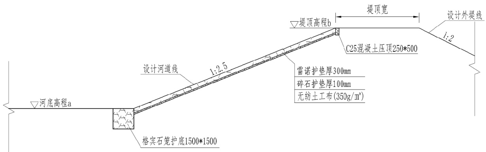  
图6.6.3.3-1  东孟姜女河河道险工护砌典型断面图  

本次东孟姜女河河治理段从新乡市市区穿过,在满足堤防安全的前提下,除险工护砌段及桥基防护段外,河道岸坡采用播撒草籽的方式,满足生态景观需要。  

# 6.7 主要建筑物设计  

# 6.7.1 排水涵闸  

# 6.7.1.1 排水涵闸设计概况  

干流修筑堤防后,一方面为解决两岸低洼地带排水出路问题;另一方面由于东孟姜女河洪水位有所抬高,为防止干流行洪时洪水倒灌,保证两岸现有沟道的防洪安全,需在沟道入口处设沟口排水涵闸。本次规划布置排水涵闸共 44 座,其中重建 33 座、新建11 座。  

# (1)设计标准  

沟口涵闸的设计标准不小于沟道治理标准。涵闸除涝设计标准均为 5 年一遇,排水闸建筑物级别同所在河段的堤防级别。  

# (2)水力计算  

排水涵闸的设计流量不小于沟道设计流量。闸孔径计算时,对于沟道除涝水位高于干流除涝水位的沟道,按实际水位差计算;对沟道除涝水位低于干流除涝水位的沟道,按闸上下游水位差 $0.2\mathrm{m}$ 计算。因排水闸结构型式均为排水涵闸,根据沟道设计流量及水位,按无压或有压流进行涵洞过流能力计算,由水力计算确定排水闸孔径。  

(3)排水闸运行方式  

各沟道排水涵闸采取相机排水方式泄水,即在干流水位未达到沟道设计水位之前,支沟抢先排水,待干流水位达到沟道的设计水位时,沟口闸即关门挡水,防止干流洪水倒灌。  

# 6.7.1.2 排涝闸典型设计  

(1)工程设计本次分别选取关堤排涝闸 6 和关堤排涝闸 7 两座涵闸进行典型设计。  

# 1)关堤排涝闸 6 设计  

关堤排涝闸 6 位于东孟姜女河左岸,设计桩号 $26+430$ ,为新建涵闸。整个工程由进口护砌段、连接段、箱涵段、闸室段、流槽段、护坡段及护底段组成。  

进口护砌段为高 $1.3\mathrm{m}$ ,底长宽均为 6m 的集水池,边坡为 1:2,采用 C25 混凝土结构,厚度为 $0.2\mathrm{m}$ 。连接段由矩形渠和一字墙组成:矩形渠为八字口形式,扩散角 $13^{\mathrm{\mathrm{o}}}$ ,采用 C30 混凝土结构,长 $8.5\mathrm{m}$ ,渠底底宽由 $6\mathrm{m}$ 渐变为 $2\mathrm{m}$ ,进口处高度 $1.3\mathrm{m}$ ,出口处高度 $2.557\mathrm{m}$ ,底板厚 $0.5\mathrm{m}$ ;墙顶厚 $0.3\mathrm{m}$ ,墙底厚 $0.5\mathrm{m}$ 。一字墙沿矩形渠进口左右岸各设 $2.5\mathrm{m}$ 长,为 C25 混凝土重力式挡墙型式,墙总高 $1.8\mathrm{m}$ ,顶宽 $0.3\mathrm{m}$ ,临水侧为直立面,临土侧墙背坡为 1:0.4,一字墙与矩形渠连接。  

箱涵段长 $12\mathrm{m}$ ,洞底比降为 1/400,为箱形 C30 钢筋混凝土结构,单孔,孔口尺寸$2\mathrm{m}{\times}2\mathrm{m}$ (宽 $\times$ 高),边墙、顶板及底板的厚度均为 $40\mathrm{cm}$ ,涵底部铺设 C15 混凝土垫层,厚 $10\mathrm{cm}$ 。  

闸室段为整体浇筑的钢筋混凝土结构,顺水流方向长 $8\mathrm{m}$ ,单孔,孔口尺寸为$2.0\mathrm{m}{\times}2.0\mathrm{m}$ (宽 $\times$ 高),底板高程为 $69.72\mathrm{m}$ 。闸室前段为涵洞式,孔口尺寸与洞身横断面相同;后段为开敞式,闸墩高 $4.6\mathrm{m}$ ,墩顶高程为 $74.32\mathrm{m}$ ,边墩厚 $80\mathrm{cm}$ ,闸底板厚 $80\mathrm{cm}$ 。闸室均采用 C30 钢筋混凝土浇筑。闸墩上设有排架及工作桥、启闭机房,闸墩上游设室内楼梯间,以便进入启闭机房。闸门采用 $2.0\mathrm{m}{\times}2.0\mathrm{m}$ (宽 $\times$ 高)潜孔式铸铁闸门,选用QL-200kN 型手电两用螺杆式启闭机。  

闸室段后接流槽段,为八字口形式,扩散角 $11^{\circ}$ ,流槽采用C30混凝土结构,长 $6.0\mathrm{m}$ ,底宽由 $2.0\mathrm{m}$ 渐变为 $4.4\mathrm{m}$ ,底板厚 $0.5\mathrm{m}$ ,下设 C15 混凝土垫层,厚 $0.1\mathrm{m}$ ;侧墙高由 $2.0\mathrm{m}$ 渐变为 $0\mathrm{m}$ ,墙顶厚 $0.3\mathrm{m}$ ,墙底厚 $0.5\mathrm{m}$ 。  

护坡段长 $4.56\mathrm{m}$ ,边坡为 1:2.5,采用 C25 混凝土进行护砌,护砌厚度为 $0.4\mathrm{m}$ ,宽$6.0\mathrm{m}$ ,护坡末端设深齿墙,深 $1.5\mathrm{m}$ 。  

护底段采用格宾石笼护底,厚 $1.0\mathrm{m}$ ,长 $10.0\mathrm{m}$ ,宽 $6.0\mathrm{m}$ ,下设碎石反滤层及无纺布。  

堤防内边坡沿排涝闸两侧岸坡 $5\mathrm{m}$ 范围内采用雷诺护垫进行护砌,护砌厚度为 $0.3\mathrm{m}$ ,总宽 $13.40\mathrm{m}$ ,下设碎石反滤层及无纺布,护坡顶高程为 $74.33\mathrm{m}$ ,底高程为设计河底高程 $68.20\mathrm{m}$ 。  

# 2)关堤排涝闸 7 设计  

关堤排涝闸 7 位于东孟姜女河右岸,设计桩号 $26+320$ ,为新建涵闸。整个工程由进口连接段、箱涵段、闸室段、流槽段、护坡段及护底段组成。  

进口连接段由矩形渠和一字墙组成。进口矩形渠长 $8\mathrm{m}$ ,渠道比降为 1/500,采用 C30混凝土结构,渠底宽 $2.0\mathrm{m}$ ,底板厚 $0.5\mathrm{m}$ ;侧墙高 $2.0\mathrm{m}$ ,墙顶厚 $0.4\mathrm{m}$ ,墙底厚 $0.5\mathrm{m}$ 。一字墙沿矩形渠进口左右岸各设 $3\mathrm{m}$ 长,为 C25 混凝土重力式挡墙型式,墙总高 $2.6\mathrm{m}$ ,顶宽 $0.3\mathrm{m}$ ,临水侧为直立面,临土侧墙背坡为 1:0.5,一字墙与矩形渠连接。  

箱涵段长 $11.5\mathrm{m}$ ,洞底比降为 1/400,为箱形 C30 钢筋混凝土结构,单孔,孔口尺寸 $2\mathrm{m}{\times}2\mathrm{m}$ (宽 $\times$ 高),边墙、顶板及底板的厚度均为 $40\mathrm{cm}$ ,涵底部铺设 C15 混凝土垫层,厚 $10\mathrm{cm}$ 。  

闸室段为整体浇筑的钢筋混凝土结构,顺水流方向长 $8\mathrm{m}$ ,单孔,孔口尺寸为  

$2.0\mathrm{m}{\times}2.0\mathrm{m}$ (宽 $\times$ 高),底板高程为 $69.75\mathrm{m}$ 。闸室前段为涵洞式,孔口尺寸与洞身横断面相同;后段为开敞式,闸墩高 $4.52\mathrm{m}$ ,墩顶高程为 $74.27\mathrm{m}$ ,边墩厚 $80\mathrm{cm}$ ,闸底板厚 $80\mathrm{cm}$ 。闸室均采用 C30 钢筋混凝土浇筑。闸墩上设有排架及工作桥、启闭机房,闸墩上游设室内楼梯间,以便进入启闭机房。闸门采用 $2.0\mathrm{m}{\times}2.0\mathrm{m}$ (宽 $\times$ 高)潜孔式铸铁闸门,选用QL-200kN 型手电两用螺杆式启闭机。  

闸室段后接流槽段,为八字口形式,扩散角 $11^{\circ}$ ,流槽采用C30混凝土结构,长 $6.7\mathrm{m}$ ,底宽由 $2.0\mathrm{m}$ 渐变为 $4.5\mathrm{m}$ ,底板厚 $0.5\mathrm{m}$ ,下设 C15 混凝土垫层,厚 $0.1\mathrm{m}$ ;侧墙高由 $2.24\mathrm{m}$ 渐变为 $0\mathrm{m}$ ,墙顶厚 $0.4\mathrm{m}$ ,墙底厚 $0.5\mathrm{m}$ 。  

护坡段长 $4.75\mathrm{m}$ ,边坡为 1:2.5,采用 C25 混凝土进行护砌,护砌厚度为 $0.4\mathrm{m}$ ,宽$6.5\mathrm{m}$ ,护坡末端设深齿墙,深 $1.5\mathrm{m}$ 。  

护底段采用格宾石笼护底,厚 $1.0\mathrm{m}$ ,长 $10.0\mathrm{m}$ ,宽 $6.5\mathrm{m}$ ,下设碎石反滤层及无纺布。  

堤防内边坡沿排涝闸两侧岸坡 $5\mathrm{m}$ 范围内采用雷诺护垫进行护砌,护砌厚度为 $0.3\mathrm{m}$ ,总宽 $13.40\mathrm{m}$ ,下设碎石反滤层及无纺布,护坡顶高程为 $74.30\mathrm{m}$ ,底高程为设计河底高程 $68.17\mathrm{m}$ 。  

(2)水力计算本次选取关堤排涝闸 6 进行典型计算。  

1)闸孔宽度计算  

关堤排涝闸 6 闸址处流量 5 年一遇设计除涝流量 $0.16\mathrm{m}^{3}/\mathrm{s}$ ,闸址处东孟姜女河 5 年一遇除涝水位 $71.19\mathrm{m}$ , 50 年一遇设计水位 $73.13\mathrm{m}$ ,按此两个条件计算闸孔宽度。采用《水闸设计规范》SL265-2016 的公式,计算闸孔宽度。  

$\textcircled{1}$ 当闸室结构为涵洞式,无压流时,过流能力按涵洞(无压力流)公式进行计算,计算公式为:  

$$
B_{\mathrm{{6}}}=\frac{Q}{\varpi n\sqrt{2g}{H_{\mathrm{{6}}}^{\mathrm{{73}}}}}
$$  

式中:B0 闸孔总宽度, $\mathrm{m}$ ; 过闸流量, $\mathrm{m}^{3}/\mathrm{s}$ ; H0 计入行进流速水头的堰上水头; m 堰流流量系数;取 $\mathrm{m}{=}0.385$ ; ε 堰流侧收缩系数; σ 堰流淹没系数。  

$\textcircled{2}$ 当闸室结构为涵洞式,有压流时,过流能力按涵洞(压力流)公式进行计算,计  

算公式为:  

$$
Q=\ensuremath{\mathrm{m}_{1}}A\sqrt{2g(\ensuremath{\mathrm{H}_{0}}-\beta_{1}\ensuremath{\mathrm{D}})}
$$  

式中:A——洞身断面面积( $\left[\mathrm{m}^{2}\right)$ );$\boldsymbol{\mathcal{Q}}$ — 水闸设计流量, $\mathrm{m}^{3}/\mathrm{s}$ ;g— 重力加速度, $\mathrm{m}/\mathrm{s}2$ ;  
$H_{0}$ — 计及流速水头的涵洞进口水头(m);  
$\mathbf{m}_{1}$ — 流量系数;  
$\beta_{1}$ ——修正系数;  
D— 洞高(m)。  
经计算,关堤排涝闸 6 采用 1 孔,单孔净宽为 $2\mathrm{m}$ ,闸孔高度 $2.0\mathrm{m}$ 。  

2)消能防冲计算  

消能方式采用底流消能、挖深式消力池方案。按照《水闸设计规范》,进行消能防冲计算。  

a) 消力池深度计算  

消力池深度按《水闸设计规范》SL265-2016 公式(B.1.1-1\~B.1.1-4)计算:  

$$
d=\sigma_{0}h_{c}^{"}-h_{s}^{"}-\Delta Z
$$  

$$
\ddot{h_{c}^{\ast}}=\frac{h_{c}}{2}(\sqrt{1+\frac{8\alpha q^{2}}{g h_{c}^{3}}})-1)(\frac{b_{1}}{b_{2}})^{0.25}
$$  

$$
h_{c}^{3}-T h_{c}^{2}+\frac{\alpha q^{2}}{2g\varphi^{2}}=0
$$  

$$
\Delta Z=\frac{\alpha q^{2}}{2g\varphi^{2}{h_{s}^{\ast}}^{2}}-\frac{\alpha q^{2}}{2g{h_{c}^{\ast}}^{2}}
$$  

式中:d — 消力池深度(m); $\sigma_{\mathrm{~0~}}$ 水跃淹没系数,采用 1.05; 跃后水深(m); 收缩水深(m); 水流动能修正系数,取 1.0; 过闸单宽流量(㎡/s); 消力池首端宽度(m); 消力池末端宽度(m); $\displaystyle{\hat{\boldsymbol{l}}}_{1}$ 由消力池底板顶面算起的总势能(m); $\Delta Z$ 出池落差(m);  

出池河床水深(m)  

b) 消力池长度计算消力池长度按《水闸设计规范》SL265-2016 公式( $\mathrm{B}.1.2\mathrm{-}1\{\mathrm{\simB}.1.2\mathrm{-}2\mathrm{\sim}$ )计算:  

  

式中: $\textit{L}_{\textit{s j}}$ —— 消力池长度(m);L 消力池斜坡段水平投影长度(m);水跃长度校正系数,取 0.75;$\textit{L}_{j}$ 水跃长度(m)  
c)消力池底板厚度计算  
按《水闸设计规范》SL265-2016 消力池底板厚度公式 B.1.3-1  
式中:t——消力池底板的厚度, $\mathrm{m}$ ;k1— 系数,取 $\mathrm{k}_{1}{=}0.2$ ;q— 单宽流量, $\mathrm{m}^{3}/\mathrm{s.m}$ ;ΔH— 泄水时上下游水头差, $\mathrm{m}$ ;  

3)防渗排水计算  

根据《水闸设计规范》,按下列公式拟定闸基防渗长度:  

$$
\mathbf{L}{=}C\times\Delta H
$$  

式中:L—闸基防渗长度,即闸基轮廓线防渗部分水平段和垂直段长度的总和 $(\mathrm{m})$ 。C—允许渗径系数值,取 ${\mathrm{C}}{=}9$ ;△H—上、下游水位差 $(\mathrm{m})$ ,取 $3.41\mathrm{m}$ 。  

计算结果 $\ L{=}30.69\mathrm{m}$ ,闸室长度 8 米,洞身段长 $12\mathrm{m}$ ,闸室上游闸前设置混凝土护坡及流槽长 $10.56\mathrm{m}$ 以延长渗径。此外,结合闸室稳定,在闸室前、后趾及各节洞身进出口各设 $0.5\mathrm{m}$ 宽, $0.5\mathrm{m}$ 深齿槽。  

(3)稳定计算  

1)闸室稳定计算  

a)计算工况:  

工况 1:完建期,上下游均为无水。  

工况 2:闸门全开过水。  

工况 3:闸门挡东孟最高洪水位。  

工况 4:闸门全开过水 $^{+}$ 地震。  

工况 5:闸门挡东孟最高洪水位 $^+$ 地震。  

# b)荷载组合  

稳定计算工况荷载组合见表 6.7.1.2-1。  

表 6.7.1.2-1 稳定计算荷载组合表  

<html><body><table><tr><td>计算工况</td><td>自重</td><td>水重</td><td>水压力</td><td>扬压力</td><td>土压力</td><td>地震荷载</td></tr><tr><td>工况1</td><td><</td><td></td><td></td><td></td><td><</td><td></td></tr><tr><td>工况2</td><td><</td><td><</td><td></td><td><</td><td><</td><td></td></tr><tr><td>工况3</td><td><</td><td></td><td><</td><td><</td><td><</td><td></td></tr><tr><td>工况4</td><td><</td><td></td><td><</td><td>√</td><td><</td><td><</td></tr><tr><td>工况5</td><td><</td><td><</td><td><</td><td><</td><td><</td><td><</td></tr></table></body></html>  

c)抗滑稳定计算  

闸室抗滑稳定计算主要核算边墩基面上的抗滑安全系数,采用抗剪强度计算公式:  

$$
K_{c}=f\times{\frac{\sum G}{\sum P}}
$$  

式中: $K_{c}$ —抗滑稳定安全系数;  

$f$ —闸室与闸基接触面抗剪摩擦系数;  
$\Sigma G$ —作用在闸室上全部竖向荷载;  
$\textstyle\sum P$ —作用在闸室上全部水平荷载。  

d)基底压应力计算  

闸室基底压力按下式计算:  

$$
\sigma_{\operatorname*{min}}^{\operatorname*{max}}=\frac{\sum G}{A}\pm\frac{\sum M}{W}
$$  

式中: $\sigma_{\operatorname*{min}}^{\operatorname*{max}}$ 闸室基底压力的最大值和最小值;  

$\Sigma G$ —作用在闸室上全部竖向荷载;  
$W$ —闸室基础底面对于该底面垂直水流方向的形心轴的截面矩;$\Sigma M$ —作用在闸室上全部竖向荷载和水平荷载对于基础底面垂直水流方向的形心轴的力矩总和。  

e)闸室稳定计算成果  

闸室稳定计算采用五种工况,计算成果见表 6.7.1.2-2。  

表6.7.1.2-2 闸室稳定及基底压应力计算成果表  

<html><body><table><tr><td rowspan="2">计算工况</td><td colspan="2">抗滑稳定</td><td colspan="4">地基压应力</td><td colspan="2">地基应力 不均匀系数</td></tr><tr><td>计算安 全系数</td><td>允许安 全系数</td><td>最大地 基应力 (kPa)</td><td>最小地基 应力(kPa)</td><td>平均地基 应力(kPa)</td><td>允许地基 承载力 (kPa)</td><td>计算 值</td><td>允许值</td></tr><tr><td>完建期</td><td></td><td>1.30</td><td>125.36</td><td>114.70</td><td>120.03</td><td>120</td><td>1.09</td><td>2.0</td></tr><tr><td>闸门过水</td><td>3.62</td><td>1.30</td><td>117.24</td><td>109.26</td><td>113.25</td><td>120</td><td>1.07</td><td>2.0</td></tr><tr><td>闸门挡水</td><td>4.86</td><td>1.30</td><td>104.54</td><td>94.63</td><td>99.59</td><td>120</td><td>1.10</td><td>2.0</td></tr><tr><td>闸门过水+地震</td><td>3.44</td><td>1.05</td><td>147.85</td><td>78.65</td><td>113.25</td><td>120</td><td>1.88</td><td>2.5</td></tr><tr><td>闸门挡水+地震</td><td>4.69</td><td>1.05</td><td>134.72</td><td>64.45</td><td>99.59</td><td>120</td><td>2.09</td><td>2.5</td></tr></table></body></html>  

根据《水闸设计规范》(SL265-2016)中的规定,2 级建筑物基本组合 $\mathrm{k}{=}1.30$ ,特殊组合 $\mathrm{k}{=}1.05$ ;土基上闸室基底应力最大值与最小值之比的允许值,中等坚实地基上,基本组合 $\eta{=}2$ ,特殊组合 $\eta{=}2.5$ 。  

由表可见,闸室稳定满足设计要求。根据地质报告,闸基地基承载力标准值为 $120\mathrm{kPa}$ ,按深度修正后允许地基承载力为 $206\mathrm{kPa}$ 。计算结果显示,地基承载能力标准值可以满足设计要求,不需进行地基处理。  

# 3)挡土墙稳定计算  

参照《水工挡土墙设计规范》(SL379-2007)中所列抗滑稳定和地基应力计算公式,按 5 级建筑物对进出口翼墙计算进行稳定计算。整个计算过程,采用《计算机应用软件有效版本清册》(河南省水利勘测设计院发布)挡土墙设计软件。选择出口两岸挡墙断面作为典型断面进行稳定分析。  

# a)计算参数  

混凝土与基础综合摩擦系数 $\mathrm{f}{=}0.3$ ,地基允许承载力 $120\mathrm{kPa}$ ,回填中重粉质壤土浮容重 $9.6\mathrm{kN}/\mathrm{m}^{3}$ ,湿容重 $19.6\mathrm{kN}/\mathrm{m}^{3}$ , $\scriptstyle\phi=26^{\circ}$ 。  

# b)计算工况  

按基本荷载组合和特殊荷载组合进行计算。  
基本组合 1:完建期:自重 $+.$ 土压力 $+.$ 土重;  
特殊组合 1:水位突降:自重 $+.$ 水重 $+$ 水压力 $^+$ 土重 $+$ 土压力 $+$ 扬压力;  
特殊组合 2:河道无水 $^{+}$ 地震:自重 $+.$ 土压力 $^+$ 土重 $+$ 地震荷载。  

c)稳定计算  

抗滑稳定计算按抗剪强度公式:  

$$
\operatorname{k}=f{\frac{\sum G}{\sum H}}
$$  

式中:k— 抗滑稳定安全系数;  

f— 基础底面与地基之间的摩擦系数;  
G— 作用在挡土墙上的全部竖向荷载;  
H— 作用在挡土墙上的全部水平向荷载;  

基底应力按单向偏心受压公式计算:  

$$
\sigma_{\mathrm{min}}^{\mathrm{max}}{=}\sum_{B}\frac{G}{1}(1{\pm}6\frac{e}{B})
$$  

max式中: min 基底应力的最大值或最小值;$\sum G$ — 作用在挡土墙上的全部竖向荷载;B— 挡土墙基础底面的长度;e 全部外荷载对挡土墙基础底面形心的偏心距。  

基底压力不均匀系数:  

$$
\eta{=}\sigma_{\operatorname*{max}}/\sigma_{\operatorname*{min}}
$$  

式中:— 不均匀系数;max, $\sigma_{\mathrm{min}}$ 最大及最小压力值 $(\mathrm{kPa})$ 。  

抗滑稳定安全系数,按《水工挡土墙设计规范》(SL379-2007)规定,2 级建筑物基本组合 $\mathrm{k}{=}1.30$ ,特殊组合 $\mathrm{Ik}{=}1.15$ ,特殊组合 $\mathrm{IIk}{=}1.05$ ;在各种计算工况下,基底应力的最大值与最小值之比即不均匀系数允许值,按《水工挡土墙设计规范》(SL379-2007)规定,中等坚实土基基本组合 $\upeta=2.00$ ,特殊组合 $\upeta=2.50$ ;基底应力各种工况下均应大于零。挡土墙稳定计算成果见表 6.7.1.2-3。  

表 6.7.1.2-3 挡土墙稳定计算成果  

<html><body><table><tr><td rowspan="2">工况</td><td rowspan="2">抗滑稳定 安全系数</td><td colspan="3">地基反力</td></tr><tr><td>o前趾(kPa)</td><td>o后趾(kPa)</td><td>不均匀系数</td></tr><tr><td>完建期</td><td>1.483</td><td>71.0</td><td>45.37</td><td>1.57</td></tr><tr><td>水位突降</td><td>1.237</td><td>50.37</td><td>40.42</td><td>1.25</td></tr><tr><td>地震</td><td>1.340</td><td>67.33</td><td>34.67</td><td>1.94</td></tr></table></body></html>  

由上表可知,挡土墙抗滑稳定及不均匀系数满足规范要求。挡土墙地基平均压应力小于地基承载力标准值 $120\mathrm{kPa}$ ,因此,挡土墙不需进行地基处理。  

# 6.7.1.3 新建、重建排水涵闸设计成果表  

东孟姜女河沿线共计 41 座新建或重建排涝闸设计成果表详见表 6.7.1.3-1。  

表6.7.1.3-1 东孟姜女河沿线排涝闸设计成果表  

<html><body><table><tr><td rowspan="2">序号</td><td rowspan="2">县区</td><td rowspan="2">所在桩号</td><td rowspan="2">排涝涵闸名称</td><td rowspan="2">建设 性质</td><td rowspan="2">设计尺寸 （孔数-宽 ×高) (m)</td><td rowspan="2">容</td><td colspan="2">启闭机</td></tr><tr><td>数量 （台）</td><td>型式</td></tr><tr><td></td><td rowspan="5">新乡县</td><td>38+595右</td><td>心连心1号节制闸</td><td>新建</td><td>1-2×2</td><td>(kN) 200</td><td>1</td><td>手电两用启闭机</td></tr><tr><td>1 2</td><td>38+490左</td><td>心连心2号节制闸</td><td>新建</td><td>1-2×2</td><td>200</td><td>1</td><td>手电两用启闭机</td></tr><tr><td>3</td><td>38+130右</td><td>赵堤节制闸</td><td>重建</td><td>1-2× 2</td><td>200</td><td>1</td><td>手电两用启闭机</td></tr><tr><td>4</td><td>35+580右</td><td>曲水节制闸</td><td>新建</td><td>1-2 × 2</td><td>200</td><td>1</td><td>手电两用启闭机</td></tr><tr><td>5</td><td>34+480右</td><td>张湾排涝闸3</td><td>新建</td><td>1-2 × 2</td><td>200</td><td>1</td><td>手电两用启闭机</td></tr><tr><td>6</td><td rowspan="5">卫滨区</td><td>34+970右</td><td>张湾排涝闸1</td><td>重建</td><td>1-2×2</td><td>200</td><td>1</td><td>手电两用启闭机</td></tr><tr><td></td><td>34+930左岸</td><td>张湾排涝闸2</td><td>重建</td><td>1-2 × 2</td><td>200</td><td>1</td><td>手电两用启闭机</td></tr><tr><td>7</td><td>34+020左</td><td>贾屯排涝闸2</td><td>重建</td><td>1-2×2</td><td>200</td><td>1</td><td>手电两用启闭机</td></tr><tr><td>8</td><td>33+290右</td><td>大泉排涝闸</td><td>重建</td><td>1-2×2</td><td>200</td><td>1</td><td>手电两用启闭机</td></tr><tr><td>6</td><td></td><td>贾屯排涝闸1</td><td>重建</td><td>1-2×2</td><td>200</td><td>1</td><td>手电两用启闭机</td></tr><tr><td>10</td><td></td><td>33+020左 33+000左</td><td>赵村排涝闸</td><td>重建</td><td>1-2×2</td><td>200</td><td></td><td>手电两用启闭机</td></tr><tr><td>11</td><td></td><td>29+800右</td><td>高新区排涝闸1</td><td>重建</td><td>1-2 × 2</td><td>200</td><td>1 1</td><td>手电两用启闭机</td></tr><tr><td>12</td><td>高新区</td><td>29+670右</td><td>高新区排涝闸2</td><td>重建</td><td>1-2×2</td><td>200</td><td>1</td><td>手电两用启闭机</td></tr><tr><td>13</td><td></td><td>27+400左</td><td>关堤排涝闸1</td><td>重建</td><td>1-2× 2</td><td>200</td><td>1</td><td>手电两用启闭机</td></tr><tr><td>14 15</td><td></td><td>26+980右</td><td>关堤排涝闸2</td><td>重建</td><td>1-2×2</td><td>200</td><td>1</td><td>手电两用启闭机</td></tr><tr><td>16</td><td></td><td>26+917右</td><td>关堤排涝闸3</td><td>重建</td><td>1-2 × 2</td><td>200</td><td>1</td><td>手电两用启闭机</td></tr><tr><td>17</td><td></td><td>26+490右</td><td>关堤排涝闸4</td><td>重建</td><td>1-2×2</td><td>200</td><td>1</td><td>手电两用启闭机</td></tr><tr><td>18</td><td></td><td>26+666左</td><td>关堤排涝闸5</td><td>重建</td><td>1-2×2</td><td>200</td><td>1</td><td>手电两用启闭机</td></tr><tr><td>19</td><td></td><td>26+430左</td><td>关堤排涝闸6</td><td>重建</td><td>1-2×2</td><td>200</td><td>1</td><td>手电两用启闭机</td></tr><tr><td>20</td><td></td><td>26+326右</td><td>关堤排涝闸7</td><td>重建</td><td>1-2 × 2</td><td>200</td><td>1</td><td>手电两用启闭机</td></tr><tr><td>21</td><td></td><td>26+020右</td><td>原堤排涝闸1</td><td>重建</td><td>1-2×2</td><td>200</td><td>1</td><td>手电两用启闭机</td></tr><tr><td>22</td><td></td><td>25+970右</td><td>原堤排涝闸2</td><td>重建</td><td>1-2×2</td><td>200</td><td>【</td><td>手电两用启闭机</td></tr><tr><td>23</td><td></td><td>25+820右</td><td>原堤排涝闸3</td><td>重建</td><td>1-2× 2</td><td>200</td><td>1</td><td>手电两用启闭机</td></tr><tr><td>24</td><td></td><td>25+510左</td><td>原堤排涝闸4</td><td>重建</td><td>1-2×2</td><td>200</td><td>1</td><td>手电两用启闭机</td></tr><tr><td>25</td><td></td><td>25+320右</td><td>原堤排涝闸5</td><td>重建</td><td>1-2×2</td><td>200</td><td>1</td><td>手电两用启闭机</td></tr><tr><td>26</td><td></td><td>25+030左</td><td>原堤排涝闸6</td><td>重建</td><td>1-2 × 2</td><td>200</td><td>1</td><td>手电两用启闭机</td></tr><tr><td>27</td><td>红旗区</td><td>25+050右</td><td>原堤排涝闸7</td><td>重建</td><td>1-2×2</td><td>200</td><td>1</td><td>手电两用启闭机</td></tr><tr><td>28</td><td></td><td>24+720右</td><td>保安堤排涝闸1</td><td>重建</td><td>1-2×2</td><td>200</td><td>1</td><td>手电两用启闭机</td></tr><tr><td>29</td><td></td><td>24+700左</td><td>保安堤排涝闸2</td><td>重建</td><td>1-2 × 2</td><td>200</td><td>1</td><td>手电两用启闭机</td></tr><tr><td>30</td><td></td><td>24+370右</td><td>保安堤排涝闸3</td><td>重建</td><td>1-2 × 2</td><td>200</td><td>1</td><td>手电两用启闭机</td></tr><tr><td>31</td><td></td><td>24+350左</td><td>保安堤排涝闸4</td><td>重建</td><td>1-2×2</td><td>200</td><td>1</td><td>手电两用启闭机</td></tr><tr><td>32</td><td></td><td>24+350右</td><td>张堤排涝闸1</td><td>重建</td><td>1-2× 2</td><td>200</td><td>1</td><td>手电两用启闭机</td></tr><tr><td>33</td><td></td><td>23+867右</td><td>张堤排涝闸2</td><td>重建</td><td>1-2 × 2</td><td>200</td><td>1</td><td>手电两用启闭机</td></tr><tr><td>34</td><td></td><td>23+320右</td><td>袁周村排涝闸</td><td>重建</td><td>1-2×2</td><td>200</td><td></td><td>手电两用启闭机</td></tr><tr><td>35</td><td></td><td>22+800左</td><td>马村排涝闸</td><td>重建</td><td>1-2×2</td><td>200</td><td>1</td><td>手电两用启闭机</td></tr><tr><td>36</td><td></td><td>17+920左</td><td>牧野区排涝闸2</td><td>新建</td><td>1-2 × 2</td><td>200</td><td>1</td><td>手电两用启闭机</td></tr><tr><td>37</td><td></td><td>16+880右</td><td>牧野区排涝闸3</td><td>重建</td><td>1-2×2</td><td>200</td><td>1</td><td>手电两用启闭机</td></tr><tr><td>38</td><td></td><td>16+880左</td><td>牧野区排涝闸4</td><td>重建</td><td>1-2×2</td><td>200</td><td>1</td><td>手电两用启闭机</td></tr><tr><td>39</td><td></td><td>16+300左</td><td>牧野区排涝闸5</td><td>新建</td><td>1-2×2</td><td>200</td><td>1</td><td>手电两用启闭机</td></tr><tr><td>40</td><td></td><td>15+980左</td><td>牧野区排涝闸6</td><td>新建</td><td>1-2×2</td><td>200</td><td>1</td><td>手电两用启闭机</td></tr><tr><td>41</td><td></td><td>15+980右</td><td>牧野区排涝闸7</td><td>新建</td><td>1-2×2</td><td>200</td><td></td><td>手电两用启闭机</td></tr></table></body></html>  

# 6.7.2 泵站  

# 6.7.2.1 提灌站工程概况  

根据该工程规划,东孟姜女河规划设计 3 座提排站、5 座提灌站,以 $16{+}520$ 牧野区提灌站 4 作为典型。基本技术参数见表 6.7.2.1-1。  

表 6.7.2.1-1 东孟姜女河新建提灌站参数  

<html><body><table><tr><td>序号</td><td>桩号</td><td>泵站名称</td><td>岸别</td><td>流量（m 3/s)</td><td>备注</td></tr><tr><td>1</td><td>17+550</td><td>提排站 1</td><td>右岸</td><td>0.5</td><td></td></tr><tr><td>2</td><td>17+350</td><td>提排站2</td><td>左岸</td><td>0.5</td><td></td></tr><tr><td>3</td><td>17+110</td><td>提排站3</td><td>右岸</td><td>0.5</td><td></td></tr><tr><td>4</td><td>17+870</td><td>牧野区提灌站1</td><td>右岸</td><td>0.30</td><td></td></tr><tr><td>5</td><td>17+920</td><td>牧野区提灌站2</td><td>左岸</td><td>0.30</td><td></td></tr><tr><td>6</td><td>17+500</td><td>牧野区提灌站3</td><td>左岸</td><td>0.30</td><td></td></tr><tr><td>7</td><td>16+520</td><td>牧野区提灌站4</td><td>左岸</td><td>0.30</td><td>典型设计</td></tr><tr><td>8</td><td>16+120</td><td>牧野区提灌站5</td><td>左岸</td><td>0.30</td><td></td></tr></table></body></html>  

# 6.7.2.2 泵站特征参数  

(1)提排站  

泵站主要特征参数:设计流量采用 $0.5\mathrm{m}^{3}/\mathrm{s}$ 。  

进水部位水位:依据堤防外侧的滩地高程为进水部位水位。  

出水管水位:低于设计最低水位,满足淹没出流。  

本工程水源地为滩地,因此泵站防洪水位与所在河道 50 年一遇水位一致。  

水机专业根据泵站流量和特征扬程,结合泵站后渠道设计,并适当留有余地的原则,在充分考虑当地群众管理水平和管理习惯,选择了潜水混流泵。  

设计流量为 $0.5~\mathrm{m}^{3}/\mathrm{s}$ 的泵站选为 2 台水泵。  

机组采用双泵布置,一机一管,直到排入河道。  

(2)提灌站  

提灌站主要特征参数:设计流量均为 $0.30\mathrm{m}3/\mathrm{s}$ 。  

进水池设计水位:根据规划,取所在河道设计河底高程 $+0.5\mathrm{m}$ ;最低水位取所在河道设计河底高程 $+0.3\mathrm{m}$ 。  

出水水位:按现状受水点水位。  

在上述基础上,根据工程布置,再进一步分析其水头损失。相应的提灌站成果表 6.7.2.2-1。  

表 6.7.2.2-1 提灌泵站设计成果表  

<html><body><table><tr><td rowspan="2">序 号</td><td rowspan="2">名称</td><td rowspan="2">桩号</td><td rowspan="2">岸别</td><td rowspan="2">提灌流量 (m3/s)</td><td rowspan="2">设计河 底hl(m)</td><td rowspan="2">除涝水 位h2(m)</td><td rowspan="2">防洪水 位h3 (m)</td><td rowspan="2">设计堤顶 h4(m)</td><td rowspan="2">进水池高 程h5(m)</td><td rowspan="2">水泵安装 高程 h6(m)</td><td rowspan="2">堤顶宽 (m)</td><td rowspan="2">内边坡 坡比 (1:m)</td><td rowspan="2">外边坡 坡比 (1:m)</td></tr><tr><td></td></tr><tr><td>1</td><td>牧野区提灌站1</td><td>17+870</td><td>右岸</td><td>0.30</td><td>66.18</td><td>69.92</td><td>72.22</td><td>72.57</td><td>64.88</td><td>69.28</td><td>6</td><td>3</td><td>3</td></tr><tr><td>2</td><td>牧野区提灌站2</td><td>17+920</td><td>左岸</td><td>0.30</td><td>66.20</td><td>69.93</td><td>72.22</td><td>73.42</td><td>64.9</td><td>69.30</td><td>6</td><td>3</td><td>3</td></tr><tr><td>3</td><td>牧野区提灌站3</td><td>17+500</td><td>左岸</td><td>0.30</td><td>66.09</td><td>69.86</td><td>72.16</td><td>73.36</td><td>64.79</td><td>69.19</td><td>6</td><td>3</td><td>3</td></tr><tr><td>4</td><td>牧野区提灌站4</td><td>16+520</td><td>左岸</td><td>0.30</td><td>65.84</td><td>69.74</td><td>72.05</td><td>73.25</td><td>64.54</td><td>68.94</td><td>6</td><td>3</td><td>3</td></tr><tr><td>5</td><td>牧野区提灌站5</td><td>16+120</td><td>左岸</td><td>0.30</td><td>65.75</td><td>69.7</td><td>72.01</td><td>73.21</td><td>64.45</td><td>68.85</td><td>6</td><td>3</td><td>3</td></tr></table></body></html>  

根据现场查勘河分析,出水管路按经济流速计算,其直径初拟为 $0.4\mathrm{m}$ ,通过水力计算管路沿程和局部损失(含泵内管路)约为 $1.2\mathrm{m}$ ,并考虑扬程的一定富余量,从而确定各泵站总扬程。  

因此泵站设计扬程 $7.1\sim11.1\mathrm{m}$ 。  

本工程水源地为河道,因此的泵站防洪水位与所在河道水位一致。  

水机专业根据泵站流量和特征扬程,结合泵站后渠道设计,并适当留有余地的原则,在充分考虑当地群众管理水平和管理习惯,选择了双吸中开蜗壳式离心泵。  

设计流量为 $0.3~\mathrm{m}^{3}/\mathrm{s}$ 的泵站选为 1 台水泵。考虑该工程泵站以灌溉为主,年利用小时数较小,因此不设备用泵,均为工作泵。  

机组采用单列布置,一机一管,直到出水池。  

# 6.7.2.3 提灌站位置比选  

东孟提灌泵站共 5 座,均为原址拆除重建,由于河道防洪标准提高,新筑堤防向两岸偏移,重建泵站均布置于新筑堤防外侧一定范围内。其中 $17{+}870$ 牧野区提灌站 1 位于河道右岸; $17\substack{+920}$ 牧野区提灌站 2、 $17{+}500$ 牧野区提灌站 3、 $16{+}520$ 牧野区提灌站4、 $16{+}120$ 牧野区提灌站 5 位于河道左岸。根据选定的水泵为双吸中开蜗壳式离心泵,其泵站泵室布置在堤防外侧一定范围。  

# 6.7.2.4 泵站布置  

(1)提排站布置  

东孟重建提排泵站 3 座,流量均为 $0.5\mathrm{m}^{3}/\mathsf{s}$ 。选择 $17+550$ 牧野区提排站 1 为典型进行设计说明。  

该工程泵站由取水头部、泵室段、出水管道段、出水池段等组成。  

# 1、取水头部  

取水头部主要为滩地,利用滩地的来水汇入泵室。  

该工程为 2 台机组,采用有隔墩型布置。  

# 2、泵室段  

泵房型式比较:泵室段是安装水泵、电机及其辅助设备的建筑物,是泵站的核心部位。根据水力机械专业水泵选型为潜水混流泵。  

泵房长度:泵房长度分为主机间长度(下部)和泵房长度(上部)  

主机间长度(下部):根据机组台数,各机组间距,边机组(安装间侧、非安装间侧)距端墙内缘距离等因素确定,并满足机组吊运和厂房内部交通要求。  

主机间净长度(下部)计算公式如下:  

式中:L——主机间长度(m);L0——机组间距(m);n——机组台数;L1——安装间侧边机组距端墙内缘距离(m);L2——非安装间侧边机组距端墙内缘距离(m)。  

泵房长度(上部):根据机组台数,各机组间距,边机组(非安装间侧)距端墙内缘距离,边机组(安装间侧)距山墙内缘距离等因素确定,并满足机组吊运和厂房内部交通要求。  

泵房净长度(上部)计算公式如下:  

$$
\mathsf{L a}{=}\mathsf{n L}0{+}\mathsf{L}2{+}\mathsf{L}3{+}\mathsf{L}4
$$  

式中:La——泵房上部长度(m);L0——机组间距(m);n——机组台数;L2——非安装间侧边机组距端墙内缘距离(m);L3——安装间侧边机组距山墙内缘距离(m);L4——管理房长度(m);  

按上述原则,本泵站泵房尺寸为 $9.3\mathfrak{m}$ (顺水流向) $\times4.0\mathrm{m}$ (垂直水流向)。水泵型号为 500H-40,单机容量 90Kw,电压 $380\mathsf{v}$ 。  

本次设计设置电动葫芦起吊设备。  

# 4、出水管道段  

出水管道采用内径 $500\mathrm{mm}$ 的螺旋钢管,出水部位设计镇墩,出水管道设置相应的管座。管座材料均为 C15 混凝土。  

(2)提灌站布置  

东孟拆除重建提灌泵站 5 座,流量均为 $0.3\mathrm{m}^{3}/\mathrm{s}$ 。选择 $16+520$ 牧野区提灌站 4 为典型进行设计说明。  

该工程泵站由取水头部、进水管道段、泵室段、出水管道段、出水池段等组成。  

# 1、取水头部  

取水头部主要为进水池,该段是为了给水泵进水管直接吸水的水池。通过合理的设计保证来水平顺、均匀,为水泵创造良好的进水条件,进而提高水泵工作效率。  

该工程为 1 台机组,直接采用无隔墩型布置。  

进水池起点位于设计河底线,延垂直于河道方向嵌入岸坡 $6.55\mathrm{m}$ 。为保证水泵最低水位时运行,进水池池底向下下挖 $1.3\mathrm{m}$ ,并与设计河底以 1:3 的坡度衔接。进水池采用C30 钢筋混凝土结构,结构尺寸为 $6.55\mathrm{m}$ (顺水流向) $\times4.8\mathrm{m}$ (垂直水流向) $\times4.03\mathrm{m}$ (最大高度)。  

# 2、进水管道段  

进水管道采用内径 $500\mathrm{mm}$ 的螺旋钢管,至水泵进口高程处,并在下端设置底阀。进水管道设置相应的管座。管座材料均为 C15 混凝土。  

# 3、泵室段  

泵房型式比较:泵室段是安装水泵、电机及其辅助设备的建筑物,是泵站的核心部位。根据水力机械专业水泵选型为卧室离心泵,泵室比较了 2 种型式泵房:(1)分基型泵房;(2)干室型泵房。  

(1)分基型泵房:该类型泵房的水泵、电机等基础与其上部厂房基础相对独立,自成体系。该种泵房结构简单,适应简易泵站。  

主要特点: $\textcircled{1}$ 水泵、电机等基础与其上部厂房基础相互分开,可以避免机组运行震动对上部房屋的影响; $\textcircled{2}$ 结构简单,设计、施工方便; $\textcircled{3}$ 地下水位较高时,容易渗入泵房基础,影响泵房安全; $\textcircled{4}$ 设备基础较小,振幅较大。  

(2)干室型泵房:该类型泵房四周墙壁和底板用钢筋混凝土建成一个不透水的整体,形成一个相对干燥的地下室,水泵和电机安装在地下室内。泵房平面呈矩形。该种泵房是较为常见的泵房型式。  

主要特点: $\textcircled{1}$ 地下水位对泵房基础影响较小,泵房安全性能提高; $\textcircled{2}$ 设备基础与泵室基础一体,整体稳定性能好,抗震性能提高; $\textcircled{3}$ 泵房可设为上下 2 层,空间较大,易于布置其它设备; $\textcircled{4}$ 泵房整体为钢筋混凝土结构,防潮性能较好。 $\textcircled{5}$ 由于设有地下室,泵房通风、采光相对较差。  

经分析比较,结合该工程特点,推荐采用干室整体型泵房方案。其泵房布置在防洪堤外。  

泵房长度:泵房长度分为主机间长度(下部)和泵房长度(上部)  

主机间长度(下部):根据机组台数,各机组间距,边机组(安装间侧、非安装间侧)距端墙内缘距离等因素确定,并满足机组吊运和厂房内部交通要求。  

主机间净长度(下部)计算公式如下:  

L=nL0+L1+L2  

式中:L— 主机间长度(m);L0— 机组间距(m);n— 机组台数;L1— 安装间侧边机组距端墙内缘距离(m);L2— 非安装间侧边机组距端墙内缘距离(m)。  

泵房长度(上部):根据机组台数,各机组间距,边机组(非安装间侧)距端墙内缘距离,边机组(安装间侧)距山墙内缘距离等因素确定,并满足机组吊运和厂房内部交通要求。  

泵房净长度(上部)计算公式如下:  

式中:La— 泵房上部长度(m); L0— 机组间距(m); n— 机组台数; L2— 非安装间侧边机组距端墙内缘距离(m); L3— 安装间侧边机组距山墙内缘距离(m); L4— 管理房长度(m);  

按上述原则,本泵站主机间尺寸为 $7.2\mathrm{m}$ (顺水流向) $\times7.2\mathrm{m}$ (垂直水流向);泵房尺寸为 $7.2\mathrm{m}$ (顺水流向) $\times10.2\mathrm{m}$ (垂直水流向)。水泵型号为 400HW-7,单机容量 $37\mathrm{Kw}$ ,电压 $380\mathrm{v}$ 。  

为防止雨水进入厂房,厂房地坪定为高于地面高程约 $0.3\mathrm{m}$ 。  

由于机组较小,重量约 $720\mathrm{kg}$ ,因此设置电动葫芦起吊设备。亦不单独设置副厂房,其副厂房与管理房合二为一。  

# 4、出水管道段  

出水管道采用内径 $400\mathrm{mm}$ 的螺旋钢管,由水泵至出水池。出水管道设置相应的管座。管座材料均为 C15 混凝土。  

# 5、出水池  

出水池断面为矩形,采用 C30 钢筋混凝土结构,结构尺寸为 $2.5\mathrm{m}$ (顺水流向) $\times3.8\mathrm{m}$ (垂直水流向) $\times2.2\mathrm{m}$ (最大高度)。出水池与下游现状渠道平顺衔接。  

# 6.7.2.5 整体稳定计算  

在泵房布置和尺寸拟定后,必需对泵室进行整体稳定分析,以确定是否修改其布置和尺寸,是否需要对地基进行处理。根据该工程泵站整体布置,泵站四周填筑等高且压  

实度一样的土,整体稳定计算仅需计算基底应力。  

根据本泵站的特点,作用在泵站上的荷载荷载及其组合如下:  

作用在泵房上的荷载有:自重(含永久性设备重)、静水压力、扬压力、土压力、风压力、波浪压力、雪荷载、地震荷载等。  

扬压力根据地基的防渗和排水设施布置,以及地基渗流特性,进行渗流计算求得。  

波浪压力与地面以上一定高度的风速以及吹程有关,根据实际情况,无波浪压力。  

其它荷载参数:  

结构自重:钢筋混凝土容重取 $25\mathrm{kN}/\mathrm{m}^{3}$ ;砖墙按容重 $19\mathrm{kN}/\mathrm{m}^{3}$ 计算;  

土重:分为土体湿容重、饱和容重,本阶段参考附近建筑物地质报告;  

水重:水体容重取 $10\mathrm{kN}/\mathrm{m}^{3}$ ;  

土压力∶按回填中、重粉质壤土,综合内摩擦角考虑;  

设备重:按水力机械专业提供资料计算;  

人群活荷载:按匀布 3kPa 计算;  

风压力∶根据《荷载设计规范》中基本风压计算;  

地震力:按站址处地震烈度,结合《水工建筑物抗震设计规范》计算;  

基底应力验算公式:  

$$
\mathrm{P_{min}=\frac{\sum G}{A}\pm\frac{\sum M}{W}}
$$  

式中 $\mathrm{{P_{max}^{\mathrm{max}}}}$ 泵房基础底面应力的最大值或最小值(kPa);  

G ——作用在泵房基础底面上的全部竖向荷载(kN);M ——作用在泵房基础底面以上的全部竖向荷载和水平荷载对于基础底  

面垂直水流方向的形心轴的力矩( $\mathrm{kN}{\bullet}\mathrm{m}$ );  

A——泵房基础底面的面积(m2);  
W——泵房基础底面对于垂直水流方向的形心轴的截面矩(m3)。  

同时应满足:  

$$
{\overline{{p}}}={\frac{p_{\operatorname*{max}}+p_{\operatorname*{min}}}{2}}\leq[R]
$$  

$$
\eta=\frac{p_{\mathrm{max}}}{p_{\mathrm{min}}}<\left[\eta\right]
$$  

式中: $\overline{{p}}$ --平均基底压应力(kPa); R--地基容许承载力(kPa); $\eta$ --基底压力分布不均匀系数;  

[]--基底压力分布不均匀系数容许值,基础按中等坚实考虑,基本组合。  

经计算:提排站最大基底应力为 $60.25\mathrm{kPa}$ ,最小基底应力为 59.97kPa;平均基底应力为 $60.10\mathrm{kPa}$ ,不均匀系数为 1.00;  

提灌站最大基底应力为 $58.78\mathrm{kPa}$ ,最小基底应力为 58.41kPa;平均基底应力为$58.60\mathrm{kPa}$ ,不均匀系数为 1.01;  

根据地质报告,基础允许承载力为 $110\mathrm{kPa}$ ,上述基底应力计算值满足要求,比较计算结果和参考地质情况,计算地基应力小于地基允许应力,不需进行地基处理。  

根据《泵站设计标准,中等坚实地基的基底应力不均匀系数允许值为 2.0,上述计算值满足要求。  

# 6.7.2.6 拆除泵站  

根据现场调查和业主提供资料,本工程共有位于东孟姜女河上的 3 座提灌泵站年久失修,这些泵站机组和建筑物已达到破坏程度,失去了原功能,经与业主协商,均按报废处理。  

报废泵站基本参数见表 6.7.2.6-1。  

表6.7.2.6-1  东孟姜女河报废提灌泵站基本参数表  

<html><body><table><tr><td>序号</td><td>所属乡镇</td><td>桩号</td><td>岸别</td><td>拟采取措施</td><td>备注</td></tr><tr><td>1</td><td>牧野区</td><td>17+870</td><td>右岸</td><td>拆除</td><td></td></tr><tr><td>2</td><td>牧野区</td><td>17+920</td><td>左岸</td><td>拆除</td><td></td></tr><tr><td>3</td><td>牧野区</td><td>17+500</td><td>左岸</td><td>拆除</td><td></td></tr></table></body></html>  

本次拟上述泵站全部拆除,包括进出口段,泵室段等。  

由于拆除原泵站带来回填的局部堤段、滩地段,采用黏土回填,堤防段回填压实度不小于 0.93 且不小于堤防设计回填标准,滩地段或其它段回填压实度不小于 0.93。  

# 6.7.3 桥涵  

# 6.7.3.1 概述  

我公司对东孟姜女河沿线进行了现场查勘,通过实地查勘发现,沿线尤其是较低等级道路上的桥涵或年久失修,损毁严重,已成危桥;或设计标准低,不能满足交通需求;或为跨越主河槽的漫水桥,影响泄洪,不能满足河道防洪功能要求。因此,需要拆除重建。  

本次可研规划重建桥梁依据实际交通状况和当地城乡路网规划,以有利于群众生产、生活,满足工程功能和交通需求为原则确定,共规划桥涵 30 座,均为重建,其中桥梁 3座,箱涵 27 座。结合现状及规划道路宽度及工程特点,桥梁宽度确定为 $6.5\mathrm{m}$ ,箱涵长度确定为 $6.5\mathrm{m}$ 。  

# 6.7.3.2 桥涵汽车设计荷载等级  

本次规划桥涵按现状道路等级及使用功能,依据《公路桥涵设计通用规范》(JTGD60-2015)规定,确定本工程设计桥梁宽度均为 6.5 米,箱涵长度均为 6.5 米,汽车荷载等级为公路—Ⅱ级。  

# 6.7.3.3 设计依据及主要技术标准  

(1)设计依据  
1)《公路工程技术标准》(JTG B01-2014);  
2)《公路桥涵设计通用规范》(JTG D60-2015);  
3)《公路钢筋混凝土及预应力混凝土桥涵设计规范》(JTG 3362-2018);《公路桥涵地基与基础设计规范》(JTG 3363-2019);《公路桥梁抗震设计规范》(JTG/T 2231-01-2020);  
6)《公路工程抗震规范》(JTG B02-2013);  
7)《灌溉与排水工程设计标准》(GB 50288-2018);  
(2)主要技术标准  

# 1)汽车荷载等级  

汽车荷载由车道荷载和车辆荷载组成。桥梁结构的整体计算采用车道荷载,桥梁结构的局部加载、涵洞、桥台和挡土墙压力等的计算采用车辆荷载。车道荷载和车辆荷载效应不得叠加。  

本工程的桥涵汽车荷载等级为公路-Ⅱ级。  

# 2)人群荷载  

桥梁计算跨径小于或等于 $50\mathrm{m}$ 时,人群荷载标准值为 $3.0\mathrm{kN}/\mathrm{m}^{2}$ ;桥梁计算跨径等于或大于 $150\mathrm{m}$ 时,人群荷载标准值为 $2.5\mathrm{kN}/\mathrm{m}^{2}$ ;桥梁计算跨径大于 $50\mathrm{m}$ 、小于 $150\mathrm{m}$ 时,可采用线性插入得到人群荷载标准值,城镇郊区行人密度地区的公路桥梁,人群荷载标准值为上述标准值的 1.15 倍或按实际情况确定。  

3)荷载安全系数由《公路钢筋混凝土及预应力混凝土桥涵设计规范》(JTG 3362-2018)确定。  

(3)主要材料性能指标  

1)混凝土  

桥梁上部预制预应力混凝土空心板 C50 混凝土,根据《公路钢筋混凝土及预应力混凝土桥涵设计规范》(JTG 3362-2018)4.5.3 条各类环境下混凝土强度等级最低要求应符合表 6.7.3.3-1 规定。  

表 6.7.3.3-1 混凝土强度等级最低要求  

<html><body><table><tr><td>构件类别</td><td colspan="2">梁、板、塔、 拱圈、涵洞上部</td><td colspan="2">墩台身、涵洞下部</td><td colspan="2">承台.基础</td></tr><tr><td>设计使用年限 (年)</td><td>100</td><td>50、30</td><td>100</td><td>50、30</td><td>100</td><td>50、30</td></tr><tr><td>I类-一般环境</td><td>C35</td><td>C30</td><td>C30</td><td>C25</td><td>C25</td><td>C25</td></tr><tr><td>ⅡI类-冻融环境</td><td>C40</td><td>C35</td><td>C35</td><td>C30</td><td>C30</td><td>C25</td></tr><tr><td>ⅢI类-近海或海洋氯化物环境</td><td>C40</td><td>C35</td><td>C35</td><td>C30</td><td>C30</td><td>C25</td></tr><tr><td>IV类-除冰盐等其他氯化物环境</td><td>C40</td><td>C35</td><td>C35</td><td>C30</td><td>C30</td><td>C25</td></tr><tr><td>V类-盐结晶环境</td><td>C40</td><td>C35</td><td>C35</td><td>C30</td><td>C30</td><td>C25</td></tr><tr><td>VI类-化学腐蚀环境</td><td>C40</td><td>C35</td><td>C35</td><td>C30</td><td>C30</td><td>C25</td></tr><tr><td>VII类-磨蚀环境</td><td>C40</td><td>C35</td><td>C35</td><td>C30</td><td>C30</td><td>C25</td></tr></table></body></html>  

根据上表、工程实际情况,混凝土标号尽量统一及投资情况确定下部结构采用 C35混凝土,钻孔灌注桩采用 C30 混凝土;箱涵洞身采用 C35 混凝土,垫层采用 C20 混凝土。混凝土的有关性能指标列于表 6.7.3.3-2。  

表 6.7.3.3-2  混凝土主要性能指标表 (MPa)  

<html><body><table><tr><td colspan="2"></td><td rowspan="2">符号</td><td colspan="3">混凝土强度等级</td></tr><tr><td>类别</td><td></td><td>C50</td><td>C35</td><td>C30</td></tr><tr><td rowspan="2">标准值</td><td>轴心抗压</td><td>fck</td><td>32.4</td><td>23.4</td><td>20.1</td></tr><tr><td>轴心抗拉</td><td></td><td>2.65</td><td>2.20</td><td>2.01</td></tr><tr><td rowspan="2">设计值</td><td>轴心抗压</td><td></td><td>22.4</td><td>16.1</td><td>13.8</td></tr><tr><td>轴心抗拉</td><td>PJ</td><td>1.83</td><td>1.52</td><td>1.39</td></tr><tr><td colspan="2">弹性模量</td><td>Ec</td><td>3.45x104</td><td>3.015x104</td><td>3.00×104</td></tr></table></body></html>  

# 2)浆砌石  

本工程箱涵进出口扭面段护砌所用的浆砌块石强度等级均为 M10。  

# 3)钢筋  

普通钢筋 $\varphi{\ge}12$ 时,用 HRB400 钢筋, $\upvarphi{<}12$ ,用 HPB300 钢筋,钢筋容重 $78.5\mathrm{kN}/\mathrm{m}^{3}$ 。其主要性能指标列于表 6.7.3.3-3。  

表 6.7.3.3-3  钢筋主要性能指标表(MPa)  

<html><body><table><tr><td colspan="2">钢筋种类</td><td rowspan="2">符号</td><td rowspan="2">钢筋 HPB300</td><td rowspan="2">钢筋HRB400 d=6~50</td></tr><tr><td>主要性能</td><td></td></tr><tr><td rowspan="2">设计强度</td><td>抗拉</td><td></td><td>250</td><td>330</td></tr><tr><td>抗压</td><td>d</td><td>250</td><td>330</td></tr></table></body></html>  

<html><body><table><tr><td>钢筋种类 主要性能</td><td>符号</td><td>钢筋 HPB300</td><td>钢筋HRB400 d=6~50</td></tr><tr><td>标准强度</td><td>fsk或 fpk</td><td>300</td><td>400</td></tr><tr><td>弹性模量</td><td>Es或Ep</td><td>2.1×105</td><td>2.0×105</td></tr></table></body></html>  

# 6.7.3.4 桥梁总体布置  

1、桥梁布置  

(1)桥梁布置原则  

# 1)桥跨布置  

本工程规划桥梁结构选型时,依据工程特点,遵照安全可靠、适用耐久、经济合理的设计原则,同时考虑便于标准化、工厂化施工,桥型拟选用装配式预制梁板结构,该桥型具有结构简单、受力明确、施工方便且适宜采用常规起重设备运吊安装的优点。根据桥梁类别和使用功能,在条件允许情况下,按河道堤防距离等跨布置,选用 $\mathrm{\mathbf{n}}\times13\mathrm{\mathbf{m}}$ 、$\mathrm{n}{\times}16\mathrm{m}$ 跨径的装配式预应力混凝土空心板结构。  

# 2)桥面布置  

桥梁总宽 $6.5\mathrm{m}$ ,行车道宽 $5.5\mathrm{m}$ ,两侧各设 0.5 宽护栏。  

# 3)桥面高程  

依据《公路桥涵设计通用规范》(JTGD60-2015),东孟姜女河灌注桩式桥梁采用桥下净空按不小于 50 年一遇设计水位 $+0.5\mathrm{m}$ ;按照桥下净空推算的桥面高程与桥位处设计堤顶高程比较,选取大者作为桥面高程。  

# 4)引道连接  

桥头采用引道与原路面平顺连接。  

# 5)河道防洪  

为保证桥梁安全,防止河道冲刷对桥墩的不利影响,采用抛石对灌注桩式桥梁上下游一定范围内的主河槽进行防护。  

# (2)桥型结构  

本工程规划桥梁结构选型时,依据工程特点,遵照安全可靠、适用耐久、经济合理的设计原则,同时考虑便于标准化、工厂化施工,桥型拟选用装配式预制梁板结构,该桥型具有结构简单、受力明确、施工方便且适宜采用常规起重设备运吊安装的优点。根据桥梁类别和使用功能,在条件允许情况下,按河道堤防距离等跨布置,选用 $\mathrm{\mathbf{n}}\times13\mathrm{\mathbf{m}}$ 、$\mathrm{n}{\times}16\mathrm{m}$ 跨径的装配式预应力混凝土空心板结构。  

下部支承结构,桥墩(台)采用排架式桩柱式结构,由盖梁、墩柱和基础组成;根据地质勘探资料,桥墩(台)基础采用钻孔灌注桩。  

为防止桥台和引道由于不均匀沉陷影响道路的正常运营,在桥台背部设置钢筋混凝土搭板,搭板一端安置于桥台背墙上,其余放置于引道回填土上。  

(3)结构设计原理  

1)荷载及其组合  

$\textcircled{1}$ 荷载该桥设计荷载为:恒载(即结构自重,钢筋混凝土以 $26\mathrm{kN}/\mathrm{m}^{3}$ 计);活载(公路-I 级、公路-Ⅱ级汽车荷载,人群荷载以 $3\mathrm{kN}/\mathrm{m}^{2}$ 计)。$\textcircled{2}$ 荷载组合桥梁结构设计应考虑结构上可能同时出现的作用,按承载能力极限状态和正常使用限状态进行作用效应组合,取其最不利效应组合进行设计。  

# 2)承载能力极限状态  

基本组合:永久作用的设计值效应与可变作用设计值效应相组合,其组合效应设计值表达式为:  

$$
S_{u d}=\gamma_{0}S\Bigg(\sum_{i=1}^{m}\gamma_{G i}G_{i k},~\gamma_{Q i}\gamma_{\mathrm{L}}\mathrm{Q}_{1k},~\psi_{c}\sum_{j=2}^{n}\gamma_{\mathrm{L}j}\gamma_{\mathrm{Qj}}\mathrm{Q}_{j k}\Bigg)
$$  

偶然组合:永久作用标准值效应与可变作用某种代表值效应、一种偶然作用设计值相组合;与偶然作用同时出现的可变作用,可根据观测资料和工程经验取用频遇值或准永久值。其组合效应设计值表达式为:  

$$
S_{u d}={\cal S}\Bigg(\sum_{i=1}^{m}G_{i k},~A_{d},\big({\psi}_{\mathrm{n}}\overrightarrow{\sf z}\overrightarrow{\chi}_{\mathrm{\scriptsize~\psi}_{\mathrm{ql}}}\big)\mathrm{Q}_{1k},~\sum_{j=2}^{n}{\psi}_{\mathrm{\scriptsize~\mathrm{qj}}}\mathrm{Q}_{j k}\Bigg)
$$  

# 3)正常使用极限状态  

桥梁结构按正常使用极限状态设计时,应根据不同的设计要求,采用作用的频遇组合或准永久组合,并应符合下列规定:  

频遇组合:永久作用标准值与汽车荷载频遇值、其它可变作用准永久值相组合,其组合效应设计值表达式为:  

$$
S_{f d}=S\Bigg(\sum_{i=1}^{m}G_{i k},~{\psi_{\mathrm{fl}}}{\mathrm{Q}}_{\mathrm{lk}},\sum_{\mathrm{j}=2}^{\mathrm{n}}{\psi_{\mathrm{qj}}}{\mathrm{Q}}_{\mathrm{jk}}\Bigg)
$$  

准永久组合:永久作用标准值与可变作用准永久值相组合,其效应组合设计值表达式为:  

$$
S_{\mathrm{q}d}=S{\left(\sum_{i=1}^{m}G_{i k},\sum_{\mathrm{j}=2}^{\mathrm{n}}\psi_{\mathrm{qj}}\mathsf{Q}_{\mathrm{jk}}\right)}
$$  

# 4)地震作用  

地震组合的效应设计值应按现行《公路桥梁抗震设计规范》(JTG/T 2231-01-2020)的相关规定计算。  

# (4)上部结构设计  

主要依据交通部标准《公路钢筋混凝土及预应力混凝土桥涵设计规范》(JTG 3362-2018)的有关规定进行设计。本规范采用极限状态设计,主要结构应进行承载能力极限状态和正常使用极限状态的计算。承载能力极限状态计算以塑性理论为基础,正常使用极限状态以弹性理论或弹塑性理论为基础。  

# (5)下部结构设计  

本工程桥梁下部均采用桩柱式墩台结构,根据《公路桥涵地基与基础设计规范》JTG3363-2019),桩基础按摩擦桩设计,“m”法进行内力计算。  

# 2、箱涵布置  

箱涵总体布置遵循《灌溉与排水工程设计规范》(GB50288-99)的布置原则,箱涵顺水流向轴线与东孟姜女河中心线一致,本工程箱涵大多数与连接道路正交,少数箱涵与连接道路斜交,根据实际地形布置箱涵。穿路涵洞由进口扭面段、洞身段、出口扭面段共三部分组成。  

(1)箱涵布置原则  

1)箱涵的布置应满足水位、流量、施工、运行、管理的要求和适应交通、群众生产、生活的需求;  

2)箱涵总体布置应使流量稳定,水流平顺,水头损失小,轴线与沟河道中心线一致,其进、出口水面与沟道水面平顺衔接,涵洞底板高程与渠底平;  

3)箱涵顺水流方向长度根据现状道路确定,洞顶顺水流向净宽不小于现状道路宽度,且满足涵洞长度不小于 $5\mathrm{m}$ ,本次设计箱涵顺水流方向长度均为 $6.5\mathrm{m}$ ;  

# (2)进、出口扭面段  

箱涵进、出口扭面段采用由护坡渐变为挡土墙的型式,进出口扭面挡土墙及护坡采用 M10 浆砌石的结构型式,护底采用 $30\mathrm{cm}$ 厚 C20 混凝土垫层。  

# (3)洞身段  

本工程箱涵洞身采用 C35 钢筋混凝土结构,箱涵底板高程与河道一致,箱涵洞身纵比降与所在河道纵比降一致;箱涵顺水流方向长度根据现状道路确定,洞顶顺水流向净宽不小于现状道路宽度,且满足涵洞长度不小于 $5\mathrm{m}$ ,本工程箱涵顺水流方向长度均为$6.5\mathrm{m}$ ,洞顶上下游两侧设置钢管栏杆;洞顶与左右岸道路平顺衔接,道路坡降采用 $5\%$ 。  

# (4)结构设计原理  

1)水力计算  

# a、涵洞水流流态判别  

涵洞 $\mathrm{h}1\leq1.2\mathrm{D}$ 时,为无压力流。  
据此判断本次设计涵洞均为无压力流。  

# b、长洞与短洞的判别  

当底坡为缓坡而趋于平坡,且 $L\le(52\sim64)h_{1}$ 时为短洞;反之,则为长洞。  
据此判断本次设计涵洞均均为短洞。  

# c、水力计算  

涵洞为短洞时无压力流的过流能力计算公式为:  

$$
Q=m B\sqrt{2g}H_{0}^{3/2}
$$  

式中:Q— 涵洞设计流量( $\mathrm{\widetilde{m}}3/\mathrm{s})$ ;m— 无压力流时的流量系数,取值 0.35;  

B——矩形涵洞底宽,涵洞为非矩形时,按 $B=A_{k}/h_{k}$ 计算,其中 Ak 为相应于临界水深的过水断面面积 $(\mathrm m^{2})$ ,hk 为洞内临界水深( $\mathrm{\Deltam}$ );  

H0— 流速水头的涵洞进口水头(m)。  

先假定涵洞净宽,按上述公式试算复核其过流能力。涵洞比降按与所在渠道比降相同。  

# 2)结构计算  

C35 钢筋混凝土箱涵,截面根据拟定的尺寸分别按跨中、节点的的计算内力和弯矩配置钢筋,钢筋按左右对称设置。采用熊启钧《灌区建筑物的混凝土结构计算》软件进行分析验算,结构计算结果满足规范要求。  

# 6.7.3.5 典型桥梁设计  

本次可研规划桥涵 30 座,其中桥梁 3 座,箱涵 27 座。桥梁上部采用装配式预应力混凝土板(梁)结构、预应力混凝土箱梁结构,下部墩台桩柱式结构,钻孔混凝土灌注桩基础;箱涵采用 C35 钢筋混凝土箱涵结构。现分别选取张贾桥和西曹村桥(箱涵)典型设计。  

# (1)张贾桥  

# 1)工程总体布置  

张贾村桥位于河南省新乡东孟姜女河上,本次设计桩号 $35{+}035$ 附近,现有一座混凝土灌注桩桥阻水严重,桥梁老旧破损,桥面破坏,盖梁台帽部分钢筋外露,长约  

$26\mathrm{m}$ ,宽 $4.5\mathrm{m}$ 。不满足河道防洪要求,因此规划将该桥拆除重建。  

桥位处共渠为梯形断面,河槽底宽 $12\mathrm{m}$ ,设计河底高程为 $70.48\mathrm{m}$ ,边坡系数 3,堤顶高程约 $76.27\mathrm{m}$ 。桥梁与河槽中心线基本正交布置,结合河槽开口宽,该桥按跨堤桥设计,采用 $3\times16\mathrm{m}$ 装配式预应力混凝土空心板结构,桥梁设计洪水频遇为东孟姜女河 50年一遇防洪水位高程为 $75.06\ensuremath{\mathrm{m}}$ ,桥面高程为 $76.651\mathrm{m}$ 。引道采用 $5\%$ 纵坡与现状路面按照路线顺接。  

2)桥梁设计  

该桥上部采用 $3\times16\mathrm{m}$ 装配式预应力混凝土空心板,预制预应力空心板采用简支体系,空心板板厚 $0.85\mathrm{m}$ ,中板宽板间距 $1.25\mathrm{m}$ ,边板宽 $1.375\mathrm{m}$ ,2 片边板,3 片中板。桥梁全长 $48\mathrm{m}$ ,桥面设计 $6.5\mathrm{m}{=}0.5\mathrm{m}$ (护栏) $+5.5\mathrm{m}$ (行车道) $+0.5\mathrm{m}$ (护栏),总宽 $6.5\mathrm{m}$ 。桥面设双向 $2\%$ 横坡。桥梁设计斜度 $0^{\circ}$ 。  

下部采用双柱式排架结构,钻孔灌注桩基础。为保证桥梁安全,防止河道冲刷对桥墩的不利影响,对桥梁上下游一定范围内的主河槽采用抛石护底。  

桥梁纵立面及横断面见图 6.7.3.5-1、6.7.3.5-2。  

  
图 6.7.3.5-1 张贾桥纵立面  

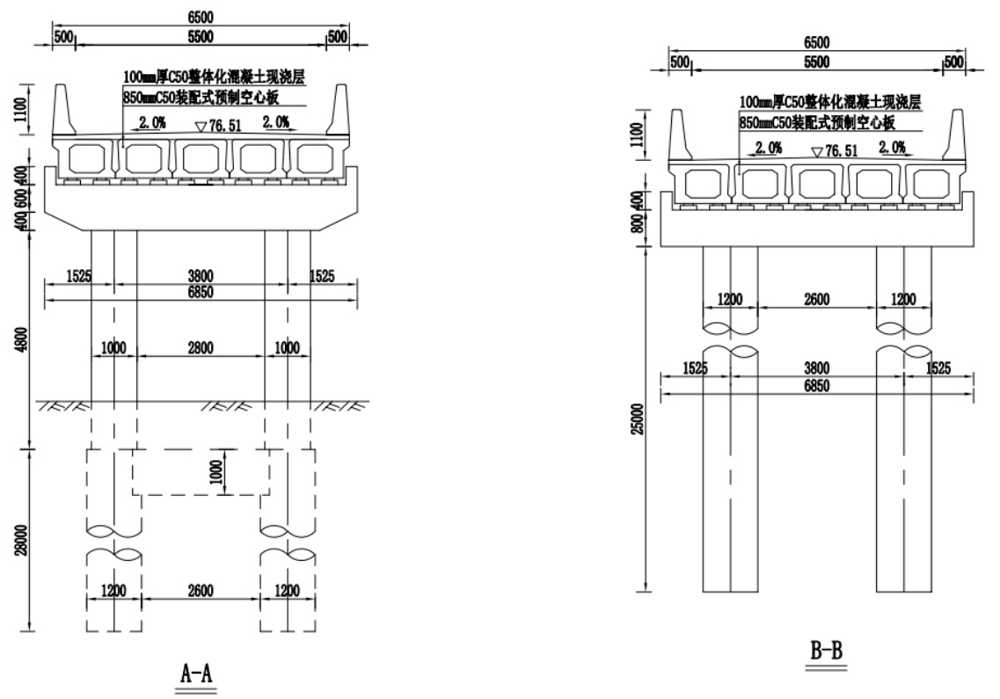  
图 6.7.3.5-2 张贾桥横断面  

(2)西曹村桥(箱涵)  

1)工程总体布置  

西曹村桥位于河南省新乡东孟姜女河上,本次设计桩号 $49{+}100$ 附近,现有一座混凝土重力墩桥阻水严重,桥梁老旧破损,桥面破坏,部分钢筋外露,长约 $15\mathrm{m}$ ,宽 $6\mathrm{m}$ 。不满足河道防洪要求,因此规划将该桥拆除重建。  

箱涵处东孟姜女河为梯形断面,河槽底宽 $4\mathrm{m}$ ,设计河底高程为 $76.89\mathrm{m}$ ,边坡系数2,地面高程约 $81.31\mathrm{m}$ 。箱涵与河槽中心线基本正交布置,结合河槽开口宽,该箱涵设计采用 1 孔 $\cdot^{\times}6\mathrm{m}$ 宽 C35 钢筋混凝土结构,桥梁设计洪水频遇为东孟姜女河 5 年一遇防洪水位高程为 $79.34\mathrm{m}$ ,桥面高程为 $81.31\mathrm{m}$ 。引道采用 $5\%$ 纵坡与现状路面按照路线顺接。  

# 2)箱涵设计  

西曹村桥(箱涵)采用 1 孔 $\times6\mathrm{m}$ 宽 C35 钢筋混凝土箱涵结构,箱涵顶板厚 $0.55\mathrm{m}$ 。箱涵长 $6.5\mathrm{m}$ ,涵顶设计 $6.5\mathrm{m}{=}0.5\mathrm{m}$ (护栏) $+5.5\mathrm{m}$ (行车道) $+0.5\mathrm{m}$ (护栏)。桥面设双向 $2\%$ 横坡。桥梁设计斜度 $0^{\circ}$ 。  

为保证箱涵安全,防止河道冲刷对箱涵涵身的不利影响,箱涵上下游 10 米范围内采用浆砌石扭面与原河道平顺连接。  

箱涵平面布置见图 6.7.3.5-3。  

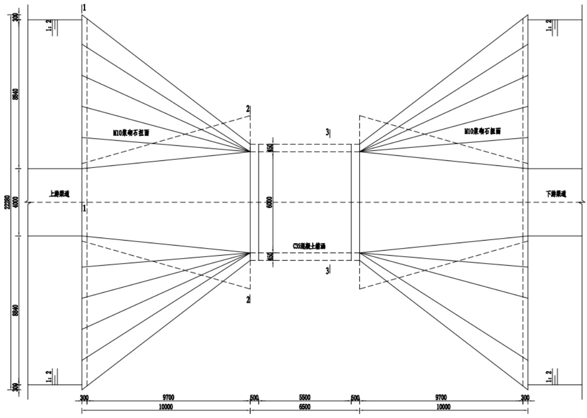  
图 6.7.3.5-3 西曹村桥平面布置图  

# 6.7.3.6 抗震设计  

根据工程地质资料,张贾桥位于地震动峰值加速度为 $0.20\mathrm{g}$ ,相当于地震基本烈度为 VIII 度,场地土类型为Ⅱ类场地。  

张贾桥桥墩抗震计算如下图所示。  

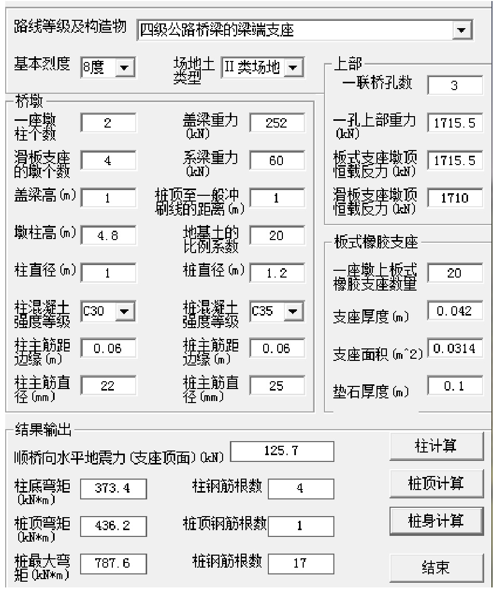  
图 6.7.3.6-1 桥墩抗震计算  

该桥桥墩墩柱主筋采用 $\Phi22$ ,桥墩桩基主筋采用 $\Phi25$ ,墩柱及桩基钢筋根数 22 根,桥台桩基主筋采用 $\Phi25$ ,钢筋根数 22 根。通过计算可知,该桥在地震作用下,能满足规范要求。  

桥梁设计成果表及箱涵设计成果表分别见表 6.7.3.6-1 及表 6.7.3.6-2。  

表 6.7.3.6-1 桥梁设计成果表  

<html><body><table><tr><td rowspan="2">序 号</td><td rowspan="2">设计桩号</td><td rowspan="2">桥名</td><td rowspan="2">建设 类边</td><td rowspan="2">桥梁类别</td><td rowspan="2">50年水位 (m)</td><td rowspan="2">5年水位 (m)</td><td rowspan="2">河底高程 (u)</td><td rowspan="2">堤顶高程 (U)</td><td rowspan="2">桥面总 宽 (m)</td><td rowspan="2">荷载等级</td><td rowspan="2">桥面高程 (u)</td><td rowspan="2">跨径组合</td></tr><tr><td></td></tr><tr><td>1</td><td>22+375</td><td>马村中桥</td><td>重建</td><td>跨堤桥</td><td>72.42</td><td>71.76</td><td>67.28</td><td>73.62</td><td>6.5</td><td>公路一ⅡI级</td><td>73.77</td><td>5X13</td></tr><tr><td>2</td><td>35+035</td><td>张贾桥</td><td>重建</td><td>跨堤桥</td><td>75.06</td><td>73.25</td><td>70.48</td><td>76.27</td><td>6.5</td><td>公路一Ⅱ级</td><td>76.51</td><td>3X16</td></tr><tr><td>3</td><td>37+585</td><td>心连心西桥</td><td>重建</td><td>跨堤桥</td><td>75.72</td><td>74.01</td><td>71.33</td><td>76.92</td><td>6.5</td><td>公路一ⅡI级</td><td>77.07</td><td>4X13</td></tr></table></body></html>  

表 6.7.3.6-2  箱涵设计成果表  

<html><body><table><tr><td>序 号</td><td>设计 桩号</td><td>桥名</td><td>建设类边</td><td>桥梁 类别</td><td>5年水位 (m)</td><td>河底高 程</td><td>桥面 高程</td><td>箱涵 长度</td><td>荷载 等级</td><td>箱涵尺寸 (孔数×宽×高) (m)</td></tr><tr><td>1</td><td>60+050</td><td>获嘉县箱涵1</td><td>重建</td><td>箱涵</td><td>82.15</td><td>(m) 80.88</td><td>(m) 83.7</td><td>(m) 6.5</td><td>公路一Ⅱ级</td><td>1X4X1.85</td></tr><tr><td>2</td><td>59+965</td><td>获嘉县箱涵2</td><td>重建</td><td>箱涵</td><td>82.1</td><td>80.84</td><td>83.95</td><td>6.5</td><td>公路一Ⅱ级</td><td>1X4X1.85</td></tr><tr><td>3</td><td>59+658</td><td>获嘉县箱涵3</td><td>重建</td><td>箱涵</td><td>81.99</td><td>80.73</td><td>83.98</td><td>6.5</td><td>公路一ⅡI级</td><td>1X4X1.85</td></tr><tr><td>4</td><td>59+555</td><td>获嘉县箱涵4</td><td>重建</td><td>箱涵</td><td>81.93</td><td>80.69</td><td>83.76</td><td>6.5</td><td>公路一Ⅱ级</td><td>1X4X1.85</td></tr><tr><td>5</td><td>58+835</td><td>获嘉县箱涵5</td><td>重建</td><td>箱涵</td><td>81.73</td><td>80.43</td><td>83.39</td><td>6.5</td><td>公路一Ⅱ级</td><td>1X4X1.85</td></tr><tr><td>6</td><td>57+945</td><td>获嘉县箱涵6</td><td>重建</td><td>箱涵</td><td>81.47</td><td>80.11</td><td>83.84</td><td>6.5</td><td>公路一Ⅱ级</td><td>1X4X1.85</td></tr><tr><td>7</td><td>57+300</td><td>获嘉县箱涵7</td><td>重建</td><td>箱涵</td><td>81.30</td><td>79.87</td><td>82.35</td><td>6.5</td><td>公路一Ⅱ级</td><td>1X4X1.85</td></tr><tr><td>8</td><td>56+550</td><td>获嘉县箱涵8</td><td>重建</td><td>箱涵</td><td>81.16</td><td>79.60</td><td>82.35</td><td>6.5</td><td>公路一ⅡI级</td><td>1X4X2.2</td></tr><tr><td>6</td><td>56+025</td><td>获嘉县箱涵9</td><td>重建</td><td>箱涵</td><td>81.07</td><td>79.41</td><td>82.36</td><td>6.5</td><td>公路一Ⅱ级</td><td>1×4X2.2</td></tr><tr><td>10</td><td>55+730</td><td>获嘉县箱涵10</td><td>重建</td><td>箱涵</td><td>81.01</td><td>79.30</td><td>82.11</td><td>6.5</td><td>公路一ⅡI级</td><td>1X4×2.2</td></tr><tr><td>11</td><td>55+250</td><td>获嘉县箱涵 11</td><td>重建</td><td>箱涵</td><td>80.92</td><td>79.13</td><td>82.02</td><td>6.5</td><td>公路一Ⅱ级</td><td>1×4X2.2</td></tr><tr><td>12</td><td>55+110</td><td>获嘉县箱涵12</td><td>重建</td><td>箱涵</td><td>80.82</td><td>79.08</td><td>81.92</td><td>6.5</td><td>公路一ⅡI级</td><td>1X4×2.2</td></tr><tr><td>13</td><td>55+050</td><td>获嘉县箱涵13</td><td>重建</td><td>箱涵</td><td>80.77</td><td>79.05</td><td>81.87</td><td>6.5</td><td>公路一ⅡI级</td><td>1X4X2.2</td></tr><tr><td>14</td><td>54+950</td><td>获嘉县箱涵14</td><td>重建</td><td>箱涵</td><td>80.74</td><td>79.02</td><td>81.84</td><td>6.5</td><td>公路一Ⅱ级</td><td>1×4×2.2</td></tr><tr><td>15</td><td>50+636</td><td>敦留店桥（箱涵)</td><td>重建</td><td>箱涵</td><td>80.27</td><td>78.08</td><td>81.55</td><td>6.5</td><td>公路一Ⅱ级</td><td>1×6X2.85</td></tr><tr><td>16</td><td>49+100</td><td>西曹村桥 (箱涵)</td><td>重建</td><td>箱涵</td><td>79.33</td><td>76.89</td><td>81.31</td><td>6.5</td><td>公路一Ⅱ级</td><td>1X6X3.2</td></tr><tr><td>17</td><td>47+400</td><td>高村桥 (箱涵)</td><td>重建</td><td>箱涵</td><td>78.89</td><td>76.27</td><td>81.54</td><td>6.5</td><td>公路一ⅡI级</td><td>1X6X3.2</td></tr><tr><td>18</td><td>46+406</td><td>七二桥 (箱涵)</td><td>重建</td><td>箱涵</td><td>78.64</td><td>75.91</td><td>79.66</td><td>6.5</td><td>公路一Ⅱ级</td><td>1X6X3.2</td></tr></table></body></html>  

<html><body><table><tr><td rowspan="2">序 号</td><td rowspan="2">设计 桩号</td><td rowspan="2">桥名</td><td rowspan="2">建设类边</td><td rowspan="2">桥梁 类别</td><td rowspan="2">5年水位 (m)</td><td rowspan="2">河底高 程 (m)</td><td rowspan="2">桥面 高程 (m)</td><td rowspan="2">箱涵 长度</td><td colspan="2">荷载</td><td rowspan="2">箱涵尺寸 (孔数×宽×高) (m)</td></tr><tr><td>(m)</td><td>等级</td></tr><tr><td>19</td><td>43+750</td><td>杨屯桥 (箱涵)</td><td>重建</td><td>箱涵</td><td>77.77</td><td>74.98</td><td>79.85</td><td>6.5</td><td>公路一ⅡI级</td><td></td><td>1×6×3.2</td></tr><tr><td>20</td><td>42+950</td><td>王屯县中后门桥（箱 涵)</td><td>重建</td><td>箱涵</td><td>77.46</td><td>74.69</td><td>78.44</td><td>6.5</td><td>公路一ⅡI级</td><td></td><td>1X6X3.2</td></tr><tr><td>21</td><td>42+853</td><td>王屯新建桥 (箱涵)</td><td>重建</td><td>箱涵</td><td>77.41</td><td>74.66</td><td>78.41</td><td>6.5</td><td>公路一ⅡI级</td><td></td><td>1X6X3.2</td></tr><tr><td>22</td><td>42+290</td><td>一中东路 (箱涵)</td><td>重建</td><td>箱涵</td><td>77.14</td><td>74.45</td><td>78.20</td><td>6.5</td><td>公路一Ⅱ级</td><td></td><td>1X6X3.2</td></tr><tr><td>23</td><td>42+180</td><td>板厂内西桥 (箱涵)</td><td>重建</td><td>箱涵</td><td>77.05</td><td>74.41</td><td>78.16</td><td>6.5</td><td>公路一Ⅱ级</td><td></td><td>1X6X3.2</td></tr><tr><td>24</td><td>42+052</td><td>板厂内东桥 (箱涵)</td><td>重建</td><td>箱涵</td><td>76.96</td><td>74.36</td><td>78.11</td><td>6.5</td><td>公路一Ⅱ级</td><td></td><td>1X6X3.2</td></tr><tr><td>25</td><td>41+700</td><td>李台寿和街桥（箱涵）</td><td>重建</td><td>箱涵</td><td>76.78</td><td>74.24</td><td>77.99</td><td>6.5</td><td>公路一ⅡI级</td><td></td><td>1X6X3.2</td></tr><tr><td>26</td><td>41+253</td><td>李台生产桥 (箱涵)</td><td>重建</td><td>箱涵</td><td>76.50</td><td>74.07</td><td>77.60</td><td>6.5</td><td>公路一ⅡI级</td><td></td><td>1×6X2.85</td></tr><tr><td>27</td><td>40+955</td><td>龙泉桥 (箱涵)</td><td>重建</td><td>箱涵</td><td>76.14</td><td>73.96</td><td>77.36</td><td>6.5</td><td>公路一ⅡI级</td><td></td><td>1X6X2.85</td></tr></table></body></html>  

# 7 机电及金属结构  

# 7.1 水力机械  

# 7.1.1 设计依据  

设计遵照的主要规程、规范如下:  

(1)《水利水电工程可行性研究报告编制规程》(SL/T618-2021);  
(2) 《泵站设计标准》(GB50265-2022);  
(3) 《灌溉与排水工程设计标准》(GN50288-2018);  
(4) 《室外给水设计标准》(GB50013-2018);  
(5) 《水力发电厂水力机械辅助设备系统设计技术规定》(NB/T 35035-2014);  
(6)其他工程资料及相关专业提供的基本资料。  

# 7.1.2 工程概况  

河南省新乡市东孟姜女河综合治理工程涉及水力机械设计内容主要为拆除重建提灌站 5 座,新建提排站 3 座。  

# 7.1.3 提灌泵站水力机械设计  

# 7.1.3.1 基本设计参数  

新建提灌泵站是将东孟河道水提至出水池,后灌至片区。根据泵站规划资料,提灌泵站基本设计参数见表 7.1-1:  

表 7.1-1 泵站基本设计参数  

<html><body><table><tr><td>泵站名称</td><td>17+870右 牧野区提灌站 1</td><td>17+920左 牧野区提灌站2</td><td>17+500左 牧野区提灌站 3</td><td>16+520左 牧野区提灌站 4</td><td>16+120左 牧野区提灌站 5</td></tr><tr><td>设计流量（m3/s)</td><td>0.3</td><td>0.3</td><td>0.3</td><td>0.3</td><td>0.3</td></tr><tr><td>进水池最低水位（m)</td><td>66.48</td><td>66.50</td><td>66.39</td><td>66.14</td><td>66.05</td></tr><tr><td>进水池设计水位（m)</td><td>66.68</td><td>66.70</td><td>66.59</td><td>66.34</td><td>66.25</td></tr><tr><td>出水池设计水位（m)</td><td>72.54</td><td>72.56</td><td>72.45</td><td>72.20</td><td>72.11</td></tr><tr><td>最低净扬程（m)</td><td>4.13</td><td>4.13</td><td>4.13</td><td>4.13</td><td>4.13</td></tr><tr><td>设计净扬程 (m)</td><td>5.86</td><td>5.86</td><td>5.86</td><td>5.86</td><td>5.86</td></tr><tr><td>最高净扬程（m)</td><td>6.06</td><td>6.06</td><td>6.06</td><td>6.06</td><td>6.06</td></tr><tr><td>输水距离(m)</td><td>20</td><td>20</td><td>20</td><td>20</td><td>20</td></tr><tr><td>输水管道 (根)</td><td>1</td><td>1</td><td>1</td><td>1</td><td>1</td></tr><tr><td>输水管径（mm）</td><td>DN400</td><td>DN400</td><td>DN400</td><td>DN400</td><td>DN400</td></tr><tr><td>输水管道材质</td><td>涂塑复合钢管</td><td>涂塑复合钢管</td><td>涂塑复合钢管</td><td>涂塑复合钢管</td><td>涂塑复合钢管</td></tr></table></body></html>  

# 7.1.3.2 水泵选型原则  

(1)水泵机组应满足泵站设计流量、设计扬程要求。(2)机组设备性能先进,结构、技术成熟,高效节能产品,运行安全可靠,以提高  
供水保证率。(3)综合考虑各种不同组合的扬程工况,使泵站在各种工况下均能安全、稳定正常  
运行。设计工况下,水泵能满足泵站设计流量且水泵在高效率区运行,同时在最高扬程  
和最低扬程区间内能安全、稳定运行。(4)机组安装、检修方便,便于维护的管理。(5)为避免开发新型水泵,减少研发费用,节约工程投资,应立足于现有产品。  

# 7.1.3.3 泵站设计扬程计算  

根据泵站进水池水位和出水池水位,泵站在不同的进水池水位和出水池水位下组合不同的扬程,为合理选择水泵型式并满足泵站出现的各种工况,水泵选择应按设计扬程下满足设计流量且效率最高,并兼顾到泵站的最大、最小扬程工况。  

泵站设计扬程为泵站设计净扬程、输水管路水力损失以及泵房内水力损失的总和。输水管路损失包括输水管路沿程损失和局部损失。  

(1)输水管路沿程损失按下列公式计算:  

$$
\mathrm{h}_{\mathbf{y}}={\frac{10.67q^{1.852}l}{{C_{h}}^{1.852}d_{j}^{4.87}}}\mathrm{{}^{+}}
$$  

hy— 沿程损失(m);q— 设计流量( $(\mathrm{m}^{3}/\mathrm{s})$ );l—— 输水距离(m);$C_{h}$ ——海曾—威廉系数(涂塑复合钢管取 135);dj——输水管道内径(m);根据泵站提水流量、输水管路管径、长度及管材,采用海曾-威廉公式计算输水管路沿程损失。  

(2)输水管路局部损失按下列公式计算:  

$$
\mathrm{h}_{j}=\sum\overset{\cdot}{=}\frac{v^{2}}{2g}\overset{\cdot}{\cdot}
$$  

ζ——局部水头损失系数;输水管道流速( $\mathrm{(m/s)}$ );  
g— 重力加速度( $\mathbf{\tau}(\mathbf{m}/\mathbf{s}^{2})$ );  

根据输水管路沿线阀件、弯头等布置,按照各管件的局部水头损失系数计算输水管路局部损失。  

(3)泵房内水力损失  

泵房内水力损失包括水泵进水喇叭口至机组汇管处管路的沿程损失、局部损失。  
通过计算,各提灌泵站各项损失及泵站扬程参数见表 7.1-2。  

表 7.1-2 提灌泵站损失及扬程  

<html><body><table><tr><td>供水目标</td><td>设计流量 (m3/s)</td><td>泵站设计 净扬程 (u)</td><td>泵站内管 路损失 (m)</td><td>泵站外输水 管路沿程损 失(m)</td><td>泵站外输水 管路局部损 失 (m)</td><td>泵站设计 扬程 (m)</td></tr><tr><td>提灌站1</td><td>0.3</td><td>5.86</td><td>1.3</td><td>0.24</td><td>0.1</td><td>7.5</td></tr><tr><td>提灌站2</td><td>0.3</td><td>5.86</td><td>1.3</td><td>0.24</td><td>0.1</td><td>7.5</td></tr><tr><td>提灌站3</td><td>0.3</td><td>5.86</td><td>1.3</td><td>0.24</td><td>0.1</td><td>7.5</td></tr><tr><td>提灌站4</td><td>0.3</td><td>5.86</td><td>1.3</td><td>0.24</td><td>0.1</td><td>7.5</td></tr><tr><td>提灌站5</td><td>0.3</td><td>5.86</td><td>1.3</td><td>0.24</td><td>0.1</td><td>7.5</td></tr></table></body></html>  

# 7.1.3.4 水泵型式选择  

根据泵站流量和扬程参数,适合泵站的水泵泵型有蜗壳混流泵、立式轴流泵和潜水轴流泵两种泵型。  

蜗壳混流泵干式安装,机组效率高,维修养护方便。厂房结构形式简单。  

立式轴流泵水泵需淹没在最低水位下,泵房挖深较大,电机在地面层,上部建筑也较高。潜水轴流泵为机电一体,安装简单方便,但机组效率与干式泵相比相对偏小,采用潜水电泵,泵站若无地面建筑,建成后机组的检修维护、运行管理上很不方便;若有地面建筑,由于潜水机组造价高,泵站投资上就比其它泵型的泵站大。  

综合上述比较,选择蜗壳混流泵作为泵站水泵泵型。  

# 7.1.3.5 提灌泵站装机台数选择  

为避免开发新型水泵,减少研发费用,节约工程投资,应立足于现有产品。  

在泵站提水流量确定后,水泵台数的多少直接影响到水泵型号的选择、泵站工程投资以及建成后的运行管理费用等。水泵台数少,则选择的泵型就大;反之就小。大泵与小泵相比,效率高,能源消耗、运行费用和土建投资较省,管理也较方便。因此,泵站装机台数不宜过多。根据泵站提水流量,同时考虑输水线路的数量,而且《泵站设计标准》(GB50265-2022)规定 “并联运行台数不宜超过四台” ,其原因为并联台数愈多,水泵扬程变化范围愈大,对水泵的流量和效率影响越明显,流量增大,效率降低。  

各提灌站提水流量和扬程一致,因此机组选型相同。  

由于泵站提灌流量较小,泵站装机台数按工作主泵 1 台和 2 台进行比较,最终合理确定装机台数。工作主泵装机 1 台和 2 台的机组性能参数比较见表 7.1-3。  

表 7.1-3 泵站装机台数性能比较  

<html><body><table><tr><td>技术参数</td><td>1台</td><td>2台</td></tr><tr><td>泵站设计工况提水流量（m?/s)</td><td colspan="2">0.3</td></tr><tr><td>泵站设计工况扬程（m)</td><td colspan="2">6.7</td></tr><tr><td>单泵提水流量（m?/s)</td><td>0.3</td><td>0.15</td></tr><tr><td>水泵型号</td><td>400HW-7</td><td>300HW-8A</td></tr><tr><td>电机规格</td><td>37kW380V</td><td>22kW380V</td></tr><tr><td>转速（r/min)</td><td>730</td><td>980</td></tr><tr><td>设计流量（m?/s)</td><td>0.35</td><td>0.217</td></tr><tr><td>设计扬程（m)</td><td>6.8</td><td>7</td></tr><tr><td>设计工况点效率 （%）</td><td>86</td><td>84</td></tr><tr><td>水泵流量范围（m²/s)</td><td>0.3~0.35~0.38</td><td>0.189~0.217~0.253</td></tr><tr><td>水泵扬程范围（m)</td><td>7.8~6.8~6.2</td><td>8.0~7.0~5.0</td></tr><tr><td>临界汽蚀余量(m)</td><td>4.0</td><td>4.0</td></tr><tr><td>效率范围（%)</td><td>84~86~84</td><td>82~84~78</td></tr></table></body></html>  

根据表 7.1-3,主泵不同装机台数其性能比较的对比:  

1、在水泵最高效率工况点,装机 1 台和 2 台总提水流量均大于泵站规划提水流量,均能满足泵站提水流量。  

2、装机 1 台和 2 台时,水泵设计扬程均略高于泵站设计扬程,相差不大。  

3、水泵最高效率工况点和效率范围:装机 1 台高于装机 2 台。  

4、泵站主泵装机容量:1 台为 30kW,2 台为 $44\mathrm{kW}$ 。装机 1 台容量略小,机电设备投资略小。  

5、通常情况下机组台数越小,投资越小,运行维护管理越方便。装机 1 台优于装机 2 台。  

通过以上对比分析,泵站装机1 台机组综合性能较为优越,因此泵站选用装机1 台。  

根据规划所提,提灌泵站年运行小时数较少,仅在灌溉期供水,因此泵站考虑不再设置备用机组,灌溉期前对机组进行好维修保养,确保机组灌溉期正常供水。  

综上所述,泵站共装机 1 台,供水机组水泵性能参数见表 7.1-4。  

表 7.1-4 提灌站供水机组水泵性能参数表  

<html><body><table><tr><td>名称</td><td>型号</td><td>流量 (m/s)</td><td>扬程 (m)</td><td>转速 (r/min)</td><td>轴功率 (kw)</td><td>效率 (%)</td><td>泵重 (t)</td><td>台数 （台）</td></tr><tr><td>蜗壳混流 泵</td><td>400HW-7</td><td>0.3 0.35 0.38</td><td>7.8 6.8 6.2</td><td>730</td><td>27.3 27.1 27.5</td><td>84.0 86.0 84.0</td><td>0.6</td><td>1</td></tr></table></body></html>  

# 7.1.3.6 电机选型  

电机容量选择是否合适关系到整个泵站运行是否经济。电机容量的偏小,造成电机长期过载运行,易烧毁电机。电机容量偏大,即储备系数偏大,电机负载率偏低,电机效率也随之而降低,造成机组运行极不经济。通常与水泵配套的电动机的输出功率应大于水泵轴功率。电动机所具有的输出功率 P 配按下面公式计算:  

$$
\mathrm{~P~}_{\mathbb{R}\mathbb{L}}{=}\mathrm{K}{\cdot}9.81{\cdot}\mathrm{Q}{\cdot}\mathrm{H}/(\eta\mathbf{\Omega}_{\sharp}{\cdot}\eta\mathbf{\Omega}_{\sharp})
$$  

式中:P 配— 电动机的输出功率(kW);H— 水泵最不利工作扬程(m);水泵在最不利工作扬程下的流量( $\mathrm{m}^{3}/\mathrm{s})$ );η 泵— 水泵在最不利工作扬程下的效率( $(\%)$ );η 传— 传动效率( $(\%$ );K— 功率备用系数,K 取值不小于 1.05。  

对于水泵配套的电机容量,水泵生产厂家均与配套,只要复核一下厂家配套的电动机容量是否满足要求即可。通常情况下,直接采用水泵厂家配套的电动机。泵站水泵配套电机型号及参数见表 7.1-5。  

表 7.1-5 电机性能参数  

<html><body><table><tr><td>名称</td><td>型号</td><td>功率 (kw)</td><td>电压等级 (kV)</td><td>功率因数 (cosp)</td><td>重量 (1)</td></tr><tr><td>异步电动机</td><td>YE4-280S-8</td><td>37</td><td>0.38</td><td>0.78</td><td>0.5</td></tr></table></body></html>  

# 7.1.3.7 水泵安装高程  

为减少厂房开挖深度,节约投资,水泵采用抽真空启动,机组安装高程应满足水泵 吸出高度的要求。  

水泵安装高程由水泵允许吸上高度和进水池最低水位计算确定,水泵安装高程计算公式为:  

$$
\begin{array}{r l}{\bigtriangledown_{\mathbf{a}}=}&{\bigtriangledown\operatorname*{min}+\mathrm{hg}=\bigtriangledown\operatorname*{min}+\mathrm{\Pi}(\mathrm{p}_{\mathrm{c}}-\mathrm{p}_{\mathrm{v}})\bigtriangledown/\gamma-[\mathrm{NPSH}]\mathrm{sr}-\bigtriangleup\mathrm{h}-\mathrm{\nabla}\bigtriangledown/900_{\circ}}\end{array}
$$  

$\bigtriangledown_{\mathrm{~a~}}$ 水泵安装高程(m);  

$\bigtriangledown\mathbf{min}^{}$ ——进水池最低水位, $73.77\mathrm{m}$ ;  

hg——水泵安装高度(m);pc——进水池水面的大气压力(Pa);pv——汽化压力(Pa);γ——水的重度;[NPSH]sr——许用汽蚀余量,取必需汽蚀余量[NPSH]r 的 1.2 倍(m);h 吸损——水泵吸水管的损失;$\bigtriangledown$ :泵站地面高程;通过以上原则计算水泵安装高程,最终确定机组安装高程见表 7.1-6。  

# 7.1.3.8 设备布置  

根据泵站装机台数,机组采用单列布置形式。考虑输水管线长度,出水管为钢制的一机一管布置。  

为保证机组安全运行,水泵出口应采用合适的断流方式,根据泵站扬程和出水管线长度,泵后工作阀采用管力阀,其后设手动双偏心蝶阀,方便泵后工作阀检修。水泵吸水管设有手动双偏心蝶阀,以便水泵检修。  

机组的间距根据机组的布置形式、水泵和电动机外形尺寸以及设备净距离的要求确定。机组间距、进出水管径等参数见表 7.1-6。厂房宽度由水泵尺寸、水泵进出水管布置的管道附件和配件以及起重机跨度要求确定。检修间长度按机组间距 1.0 倍计。其它厂房内的建筑布置尺寸详见水工布置图。  

表 7.1-6 泵站布置基本参数  

<html><body><table><tr><td>泵站名称</td><td>水泵型号</td><td>安装高程 (m)</td><td>机组间距 (m)</td><td>进水管管径 (mm)</td><td>出水管管径 (mm)</td></tr><tr><td>新建提灌站</td><td>400HW-7</td><td>76.57</td><td>3.3</td><td>500</td><td>400</td></tr></table></body></html>  

# 7.1.3.9 辅助设备的选择  

(1)起重设备的选择  

结合提灌泵站泵房的设备布置,按照设备的安装检修以及起吊最大部件的重量要求,由水泵重量、异步电动机重量和阀件重量中最大重量选择起吊设备。泵站最大起重件为水泵机组,采用水泵及电机整体吊装方式。根据起重机厂家的产品样本,提灌泵站选用1 台 LDA-2 型电动单梁起重机,起重量 2t,跨度 $6.0\mathrm{m}$ ,起吊高度 $12\mathrm{m}$ 。起重机为地面操作。  

(2)油系统  

根据所选机型,泵站机组轴承均采用油脂润滑,用油量少,不需要大量储存。油的品种、牌号及油量,按厂家提供资料要求加注。  

本工程设计采用干式变压器,不再设绝缘油储存罐。  

# (3)水系统  

根据蜗壳混流泵的特点,水泵不需要技术供水。  

为方便进出水管路及机组检修、维护,以及满足泵站渗漏排水的要求,泵站设有检修渗水排水泵和集水井。集水井内设 2 台 50QW30-10-1.5 型移动式检修排水泵,互为备用,集水井有效容积均为 $2\mathrm{m}^{3}$ 。  

(4)水力监测系统  

泵站进水池设有液位监测装置,从而控制水泵在设计水位范围内启停。  

# 7.1.3.10 提灌泵站主要设备材料  

工程区共 5 座提灌泵站,每座泵站主要设备材料相同,工程量见表 7.1-7。  

表 7.1-7 提灌泵站主要设备表  

<html><body><table><tr><td>序号</td><td>名称</td><td>型号</td><td>单位</td><td>数量</td><td>备注</td></tr><tr><td>1</td><td>水泵</td><td>400HW-7，0.35m²/s, 6.8m</td><td>台</td><td>1</td><td rowspan="9">5座 提灌 站， 每座 水机 设备 工程 量均 按此 表计</td></tr><tr><td>2</td><td>异步电动机</td><td>37kW 380V IP54</td><td>台</td><td>1</td></tr><tr><td>3</td><td>手动双偏心蝶阀</td><td>D342X-10 DN500</td><td>台</td><td>1</td></tr><tr><td>4</td><td>传力接头</td><td>DN500 C2F-10</td><td>台</td><td>1</td></tr><tr><td>5</td><td>管力阀</td><td>DN400 PN10</td><td>台</td><td>1</td></tr><tr><td>6</td><td>手动双偏心蝶阀</td><td>D342X-10 DN400</td><td>台</td><td>1</td></tr><tr><td>7</td><td>传力接头</td><td>C2F-10 DN400</td><td>台</td><td>1</td></tr><tr><td>8</td><td>进出水钢管</td><td></td><td>吨</td><td>6</td></tr><tr><td>６</td><td>电动单梁起重机</td><td>LDA-2 H=12m Lk=9m</td><td>台</td><td>1</td></tr><tr><td>10</td><td>轨道及附件车档</td><td>24kg/m</td><td>吨</td><td>0.6</td></tr><tr><td>11</td><td>检修排水泵</td><td>50QW25-10-1.5</td><td>台</td><td>2</td></tr><tr><td>12</td><td>液位变送器（液位/压力</td><td></td><td>套</td><td>1</td></tr><tr><td>13</td><td>抽真空设备</td><td></td><td>套</td><td>1</td></tr><tr><td>14</td><td>其他</td><td>抽真空管路及附件、机组及 集水井检修排水管道及附件</td><td>项</td><td>1</td></tr></table></body></html>  

# 7.1.4 提排泵站水力机械设计  

# 7.1.4.1 基本设计参数  

根据泵站规划资料,提排泵站基本设计参数见表 7.1-8:  

表 7.1-8 泵站基本设计参数  

<html><body><table><tr><td>泵站名称</td><td>17+550 牧野区提排站1</td><td>17+350 牧野区提排站2</td><td>17+110 牧野区提排站3</td></tr><tr><td>设计流量（m?/s)</td><td>0.5</td><td>0.5</td><td>0.5</td></tr><tr><td>进水池最低水位（m)</td><td>60.38</td><td>59.95</td><td>59.81</td></tr><tr><td>进水池设计水位 (m)</td><td>61.58</td><td>61.15</td><td>61.01</td></tr><tr><td>进水池最高水位 (m)</td><td>67.23</td><td>66.8</td><td>66.66</td></tr><tr><td>出水池最低水位 (m)</td><td>69.88</td><td>69.85</td><td>69.82</td></tr><tr><td>出水池设计水位 (m)</td><td>69.98</td><td>69.85</td><td>69.41</td></tr><tr><td>出水池最高水位（m)</td><td>72.18</td><td>71.51</td><td>72.12</td></tr><tr><td>最低净扬程（m)</td><td>2.65</td><td>3.05</td><td>3.16</td></tr><tr><td>设计净扬程（m)</td><td>8.4</td><td>8.4</td><td>8.4</td></tr><tr><td>最高净扬程（m)</td><td>11.8</td><td>11.56</td><td>12.31</td></tr><tr><td>输水距离(m)</td><td>50</td><td>50</td><td>50</td></tr><tr><td>输水管道 (根)</td><td>1</td><td>1</td><td>1</td></tr><tr><td>输水管径（mm)</td><td>DN500</td><td>DN500</td><td>DN500</td></tr><tr><td>输水管道材质</td><td>涂塑复合钢管</td><td>涂塑复合钢管</td><td>涂塑复合钢管</td></tr></table></body></html>  

# 7.1.4.2 水泵选型  

提排泵站水泵选型原则和泵站扬程计算同提灌泵站,不再赘述。  
根据水力计算,各提排泵站各项损失及泵站扬程参数见表 7.1-9。  

表 7.1-9 提排泵站损失及扬程  

<html><body><table><tr><td>供水目标</td><td>设计流量 (m3/s)</td><td>泵站设计 净扬程 (m)</td><td>泵站内管 路损失 (m)</td><td>泵站外输水 管路沿程损 失(m)</td><td>泵站外输水 管路局部损 失(m)</td><td>泵站设计 扬程 (m)</td></tr><tr><td>提排泵站1</td><td>0.5</td><td>8.4</td><td>1.0</td><td>0.47</td><td>0.13</td><td>10.0</td></tr><tr><td>提排泵站2</td><td>0.5</td><td>8.4</td><td>1.0</td><td>0.47</td><td>0.13</td><td>10.0</td></tr><tr><td>提排泵站3</td><td>0.5</td><td>8.4</td><td>1.0</td><td>0.47</td><td>0.13</td><td>10.0</td></tr></table></body></html>  

# 7.1.4.3 水泵型式选择  

根据泵站流量和扬程参数,适合泵站的水泵泵型有立式混流泵和潜水混流泵两种泵型。  

立式混流泵水泵需淹没在最低水位下,泵房挖深较大,电机在地面层,上部建筑也较高。潜水混流泵为机电一体,安装简单方便,泵站结构形式简单,占地面积小。  

综合上述比较,结合工程总布置,选择潜水混流泵作为提排泵站水泵泵型。  

# 7.1.4.4 提排泵站装机台数选择  

为避免开发新型水泵,减少研发费用,节约工程投资,应立足于现有产品。  

在泵站提水流量确定后,水泵台数的多少直接影响到水泵型号的选择、泵站工程投资以及建成后的运行管理费用等。水泵台数少,则选择的泵型就大;反之就小。大泵与小泵相比,效率高,能源消耗、运行费用和土建投资较省,管理也较方便。因此,泵站装机台数不宜过多。  

各提排泵站提水流量和扬程一致,因此机组选型相同。  

由于新建提排泵站设计流量较小,扬程也不高,水泵工作机按 1 台考虑。根据泵站流量和扬程,选择 500QH-40 型潜水混流泵为工作机,水泵性能参数见表 7.1-4。  

为保障泵站提排可靠性,泵站设置 1 台备用机组,其型号与工作机一致。  

综上所述,泵站共装机 2 台,1 用 1 备,水泵性能参数见表 7.1-10。  

表 7.1-10 提排泵站机组性能参数表  

<html><body><table><tr><td>名称</td><td>型号</td><td>流量 (m²/s)</td><td>扬程 (m)</td><td>转速 (r/min)</td><td>轴功率 (kw)</td><td>效率 (%)</td><td>功率 (kw)</td><td>泵重 (1)</td><td>台数 （台）</td><td>电压等 级 (V)</td></tr><tr><td>潜水 混流 泵</td><td>500QH- 40</td><td>0.612 0.56 0.481</td><td>9.07 11.65 14.42</td><td>980</td><td>70 78.5 87.5</td><td>77.8 81.6 77.8</td><td>90</td><td>1.7</td><td>2台，1 用1备</td><td>380</td></tr></table></body></html>  

# 7.1.4.5 水泵安装高程  

潜水混流泵水泵安装高程应满足最低水位下水泵淹没深度的要求,根据设备厂家资料,水泵进口淹没在最低水位以下 $1.2\mathrm{m}$ 。  

# 7.1.4.6 设备布置  

根据泵站装机台数,机组采用单列布置形式。考虑输水管线长度,出水管为钢制的一机一管布置。水泵出水管设拍门断流。  

机组间距根据机组的布置形式、水泵外形尺寸以及进出水流道的要求确定。  

# 7.1.4.7 辅助设备的选择  

(1)起重设备的选择  

为满足潜水混流泵的安装检修,根据潜水电泵设备重量以及起重机厂家的产品样本,提排泵站选用 1 台 $\mathrm{MD}_{1-2}$ 型电动葫芦,起重量 2t,起吊高度 $12\mathrm{m}$ 。  

(2)油系统  

根据所选机型,泵站机组不需要设油系统。  

# (3)水系统  

根据潜水混流泵的特点,水泵不需要技术供水。  

为方便后期泵站检修,设 2 台 50QW30-10-1.5 型移动式检修排水泵。  

(4)水力监测系统  

泵站进水池设有液位监测装置,从而控制水泵在设计水位范围内启停。  

# 7.1.4.8 提排泵站主要设备材料  

工程区共 3 座提排泵站,每座泵站主要设备材料相同,各提排泵站主要设备材料见表 7.1-11。  

表 7.1-11 提排泵站主要设备表  

<html><body><table><tr><td>序号</td><td>名称</td><td>型号</td><td>单位</td><td>数量</td><td>备注</td></tr><tr><td>1</td><td>潜水混流泵</td><td>500HQ-40,0.56m²/s,11.65m; 90kw</td><td>台</td><td>2</td><td rowspan="9">3座 提排 站， 每座 水机 设备 工程 量均 按此 表计 列</td></tr><tr><td>2</td><td>钢制井筒及出水三通</td><td>Φ 900/ Φ 500</td><td>套</td><td>2</td></tr><tr><td>3</td><td>手动双偏心蝶阀</td><td>D342X-10 DN500</td><td>台</td><td>2</td></tr><tr><td>4</td><td>传力接头</td><td>C2F-10 DN500</td><td>台</td><td>2</td></tr><tr><td>5</td><td>管力阀</td><td>DN500 PN10</td><td>台</td><td>2</td></tr><tr><td>6</td><td>节能型侧翻式拍门</td><td>DN600 PN6</td><td>套</td><td>2</td></tr><tr><td>7</td><td>电动葫芦</td><td>MD1-2 H=12m</td><td>台</td><td>1</td></tr><tr><td>8</td><td>检修排水泵</td><td>50QW25-10-1.5</td><td>台</td><td>2</td></tr><tr><td>9</td><td>液位传感器及固定装置</td><td></td><td>套</td><td>1</td></tr></table></body></html>  

# 7.2 电气  

# 7.1.1 概述  

本工程主要供电对象为 3 座提排站、5 座提灌站、41 座水闸,3 座提排站为二级负荷,其他均为三级负荷。  

提排站、提灌站用电功率较大,根据提排站、提灌站位置分布,在泵站附近设组合式箱变,为提排站供电的箱变采用双回 $10\mathrm{kV}$ 线路供电,仅为提灌站供电的箱变采用单回 10kV 线路供电,电源由附近的 $10\mathrm{kV}$ 线路“T”接或由当地变电所引接;水闸采用低压线路或移动柴发供电,低压电源就近引接。  

# 7.2.2 设计依据  

本工程的设计遵循以下标准和规范:  
《供配电系统设计规范》GB50052;  
《低压配电设计规范》GB50054;  
$\langle\langle20\mathrm{kV}$ 及以下变电所设计规范》GB50053-2013;《建筑物防雷设计规范》GB50057;  
《电力工程电缆设计标准》GB50217;  
《自动化柴油发电机组分级要求》GB/T4712《泵站设计标准》GB50265《水利水电工程高压配电装置设计规范》SL311;  
《水利水电工程导体和电器选择设计规范》SL561;  
《水利水电工程接地设计规范》SL587;  
《交流电气装置的接地设计规范》GB/T 50065;  
国家工程建设强制性条文;  
其他有关规程、规范、技术规定和参考资料。  

# 7.2.3 供电对象及负荷统计  

本工程主要供电对象为 3 座提排站、5 座提灌站、41 座水闸,3 座提排站为二级负荷,其他均为三级负荷。  

3 座提排站分别为 $17{+}550$ 右牧野区提排站 $1,17{+}350$ 左牧野区提排站 $2,17{+}110$ 左牧野区提排站 3,主要负荷均为 2 台 $90\mathrm{kW}$ 潜水泵(一用一备)。  

5 座提灌站分别为 $17{+}870$ 右牧野区提灌站 1、 $17\substack{+920}$ 左牧野区提灌站 2、 $17{+}500$ 左牧野区提灌站 3、 $16{+}520$ 左牧野区提灌站 4、 $16{+}120$ 左牧野区提灌站 5,主要负荷均为 1 台 $37\mathrm{kW}$ 水泵。  

41 座水闸主要用电负荷均为 1 台手电两用螺杆启闭机。  

泵站、水闸用电负荷统计见表 7.2.3-1、7.2.3-2。  

表 7.2.3-1  泵站用电负荷统计表  

<html><body><table><tr><td>建筑物名 称</td><td>序号</td><td>设备名称</td><td>数量</td><td>单机容量 (kW)</td><td>电压等 级 (V)</td><td>备注</td></tr><tr><td rowspan="4">牧野区提 排站1~3</td><td>1</td><td>潜水电机</td><td>2</td><td>90</td><td>380</td><td>一用一备</td></tr><tr><td>2</td><td>潜水电泵</td><td>2</td><td>1.5</td><td></td><td>移动式，检修排水用</td></tr><tr><td>3</td><td>电动葫芦</td><td>1</td><td>3</td><td></td><td></td></tr><tr><td>4</td><td>液位计</td><td>1</td><td></td><td>220</td><td>进水池</td></tr><tr><td rowspan="5">牧野区提 灌站1~5</td><td>1</td><td>工频异步电机</td><td>1</td><td>37</td><td>380</td><td></td></tr><tr><td>2</td><td>真空泵</td><td>2</td><td>5.5</td><td></td><td>一用一备</td></tr><tr><td>3</td><td>潜水电泵</td><td>2</td><td>1.5</td><td></td><td>移动式，检修排水用</td></tr><tr><td>4</td><td>电动单梁起重机</td><td>1</td><td>6</td><td></td><td></td></tr><tr><td>5</td><td>液位计</td><td>1</td><td></td><td>220</td><td>进水池</td></tr></table></body></html>  

表 7.2.3-2  水闸用电负荷统计表  

<html><body><table><tr><td>序 号</td><td>区 域</td><td>桩号</td><td>排涝涵闸名称</td><td>用电负 荷 (kW/</td><td>数量 （台/ 座)</td><td>型式</td><td>用电负荷 (kW/座)</td><td>负荷等 级</td><td>供电型式</td><td>线路长 度 (m)</td><td>线路规格</td></tr><tr><td>1</td><td></td><td>38+595右</td><td>心连心1号闸</td><td>台） 5.5</td><td>1</td><td>手电两用螺杆机</td><td>5.5</td><td>三级</td><td>低压电网</td><td>500</td><td>YJV22-0.6/1kV-4x10</td></tr><tr><td>2</td><td></td><td>38+490左</td><td>心连心2号闸</td><td>5.5</td><td>1</td><td>手电两用螺杆机</td><td>5.5</td><td>三级</td><td>低压电网</td><td>500</td><td>YJV22-0.6/1kV-4x10</td></tr><tr><td>3</td><td>新</td><td>38+130右</td><td>赵堤排涝闸闸</td><td>5.5</td><td>1</td><td>手电两用螺杆机</td><td>5.5</td><td>三级</td><td>低压电网</td><td>500</td><td>YJV22-0.6/1kV-4x10</td></tr><tr><td>4</td><td>乡</td><td>35+580右</td><td>曲水排涝闸闸</td><td>5.5</td><td>1</td><td>手电两用螺杆机</td><td>5.5</td><td>三级</td><td>低压电网</td><td>500</td><td>YJV22-0.6/1kV-4x10</td></tr><tr><td>5</td><td>县</td><td>34+480右</td><td>张湾排涝闸3</td><td>5.5</td><td>1</td><td>手电两用螺杆机</td><td>5.5</td><td>三级</td><td>低压电网</td><td>500</td><td>YJV22-0.6/1kV-4x10</td></tr><tr><td>6</td><td></td><td>34+970右</td><td>张湾排涝闸1</td><td>5.5</td><td>1</td><td>手电两用螺杆机</td><td>5.5</td><td>三级</td><td>低压电网</td><td>500</td><td>YJV22-0.6/1kV-4x10</td></tr><tr><td>7</td><td></td><td>34+930左</td><td>张湾排涝闸2</td><td>5.5</td><td>1</td><td>手电两用螺杆机</td><td>5.5</td><td>三级</td><td>低压电网</td><td>500</td><td>YJV22-0.6/1kV-4x10</td></tr><tr><td>8</td><td>卫</td><td>34+020左</td><td>贾屯排涝闸2</td><td>5.5</td><td>1</td><td>手电两用螺杆机</td><td>5.5</td><td>三级</td><td>低压电网</td><td>500</td><td>YJV22-0.6/1kV-4x10</td></tr><tr><td>9</td><td>滨</td><td>33+290右</td><td>大泉排涝闸</td><td>5.5</td><td>1</td><td>手电两用螺杆机</td><td>5.5</td><td>三级</td><td>低压电网</td><td>500</td><td>YJV22-0.6/1kV-4x10</td></tr><tr><td>10</td><td>区</td><td>33+020左</td><td>贾屯排涝闸1</td><td>5.5</td><td>1</td><td>手电两用螺杆机</td><td>5.5</td><td>三级</td><td>低压电网</td><td>500</td><td>YJV22-0.6/1kV-4x10</td></tr><tr><td>11</td><td></td><td>33+000左</td><td>赵村排涝闸</td><td>5.5</td><td>1</td><td>手电两用螺杆机</td><td>5.5</td><td>三级</td><td>低压电网</td><td>500</td><td>YJV22-0.6/1kV-4x10</td></tr><tr><td>12</td><td>高</td><td>29+800右</td><td>高新区排涝闸1</td><td>5.5</td><td>1</td><td>手电两用螺杆机</td><td>5.5</td><td>三级</td><td>低压电网</td><td>500</td><td>YJV22-0.6/1kV-4x10</td></tr><tr><td>13</td><td>新 区</td><td>29+670右</td><td>高新区排涝闸2</td><td>5.5</td><td>1</td><td>手电两用螺杆机</td><td>5.5</td><td>三级</td><td>低压电网</td><td>500</td><td>YJV22-0.6/1kV-4x10</td></tr><tr><td>14</td><td></td><td>27+400左</td><td>关堤排涝闸1</td><td>5.5</td><td>1</td><td>手电两用螺杆机</td><td>5.5</td><td>三级</td><td>低压电网</td><td>500</td><td>YJV22-0.6/1kV-4x10</td></tr><tr><td>15</td><td></td><td>26+980右</td><td>关堤排涝闸 2</td><td>5.5</td><td>1</td><td>手电两用螺杆机</td><td>5.5</td><td>三级</td><td>低压电网</td><td>500</td><td>YJV22-0.6/1kV-4x10</td></tr><tr><td>16</td><td></td><td>26+917右</td><td>关堤排涝闸3</td><td>5.5</td><td>1</td><td>手电两用螺杆机</td><td>5.5</td><td>三级</td><td>低压电网</td><td>500</td><td>YJV22-0.6/1kV-4x10</td></tr><tr><td>17</td><td></td><td>26+490右</td><td>关堤排涝闸 4</td><td>5.5</td><td>1</td><td>手电两用螺杆机</td><td>5.5</td><td>三级</td><td>低压电网</td><td>500</td><td>YJV22-0.6/1kV-4x10</td></tr><tr><td>18</td><td>红</td><td>26+666左</td><td>关堤排涝闸 5</td><td>5.5</td><td>1</td><td>手电两用螺杆机</td><td>5.5</td><td>三级</td><td>低压电网</td><td>500</td><td>YJV22-0.6/1kV-4x10</td></tr><tr><td>19</td><td>旗</td><td>26+430左</td><td>关堤排涝闸6</td><td>5.5</td><td>1</td><td>手电两用螺杆机</td><td>5.5</td><td>三级</td><td>低压电网</td><td>500</td><td>YJV22-0.6/1kV-4x10</td></tr><tr><td>20</td><td>区</td><td>26+326右</td><td>关堤排涝闸7</td><td>5.5</td><td>1</td><td>手电两用螺杆机</td><td>5.5</td><td>三级</td><td>低压电网</td><td>500</td><td>YJV22-0.6/1kV-4x10</td></tr><tr><td>21</td><td></td><td>26+020右</td><td>原堤排涝闸1</td><td>5.5</td><td>1</td><td>手电两用螺杆机</td><td>5.5</td><td>三级</td><td>低压电网</td><td>500</td><td>YJV22-0.6/1kV-4x10</td></tr><tr><td>22</td><td></td><td>25+970右</td><td>原堤排涝闸2</td><td>5.5</td><td>1</td><td>手电两用螺杆机</td><td>5.5</td><td>三级</td><td>低压电网</td><td>500</td><td>YJV22-0.6/1kV-4x10</td></tr><tr><td>23</td><td></td><td>25+820右</td><td>原堤排涝闸3</td><td>5.5</td><td>1</td><td>手电两用螺杆机</td><td>5.5</td><td>三级</td><td>低压电网</td><td>500</td><td>YJV22-0.6/1kV-4x10</td></tr><tr><td>24</td><td></td><td>25+510左</td><td>原堤排涝闸4</td><td>5.5</td><td>1</td><td>手电两用螺杆机</td><td>5.5</td><td>三级</td><td>低压电网</td><td>500</td><td>YJV22-0.6/1kV-4x10</td></tr><tr><td>25</td><td></td><td>25+320右</td><td>原堤排涝闸5</td><td>5.5</td><td>1</td><td>手电两用螺杆机</td><td>5.5</td><td>三级</td><td>低压电网</td><td>500</td><td>YJV22-0.6/1kV-4x10</td></tr></table></body></html>  

<html><body><table><tr><td></td><td>序 号</td><td>区 域</td><td>桩号</td><td>排涝涵闸名称</td><td>用电负 荷 (kW/</td><td>数量 （台/ 座)</td><td>型式</td><td>用电负荷 (kW/座)</td><td>负荷等 级</td><td>供电型式</td><td>线路长 度 (m)</td><td>线路规格</td></tr><tr><td></td><td></td><td></td><td>25+030左</td><td>原堤排涝闸6</td><td>台） 5.5</td><td>1</td><td>手电两用螺杆机</td><td>5.5</td><td>三级</td><td>低压电网</td><td>500</td><td>YJV22-0.6/1kV-4x10</td></tr><tr><td></td><td>26 27</td><td></td><td>25+050右</td><td>原堤排涝闸7</td><td>5.5</td><td>1</td><td>手电两用螺杆机</td><td>5.5</td><td>三级</td><td>低压电网</td><td>500</td><td>YJV22-0.6/1kV-4x10</td></tr><tr><td></td><td>28</td><td></td><td>24+720右</td><td>保安堤排涝闸1</td><td>5.5</td><td>1</td><td>手电两用螺杆机</td><td>5.5</td><td>三级</td><td>低压电网</td><td>500</td><td>YJV22-0.6/1kV-4x10</td></tr><tr><td></td><td>29</td><td></td><td>24+700左</td><td>保安堤排涝闸2</td><td>5.5</td><td>1</td><td>手电两用螺杆机</td><td>5.5</td><td>三级</td><td>低压电网</td><td>500</td><td>YJV22-0.6/1kV-4x10</td></tr><tr><td></td><td>30</td><td></td><td>24+370右</td><td>保安堤排涝闸3</td><td>5.5</td><td>1</td><td>手电两用螺杆机</td><td>5.5</td><td>三级</td><td>低压电网</td><td>500</td><td>YJV22-0.6/1kV-4x10</td></tr><tr><td></td><td>31</td><td></td><td>24+350左</td><td>保安堤排涝闸 4</td><td>5.5</td><td>1</td><td>手电两用螺杆机</td><td>5.5</td><td>三级</td><td>低压电网</td><td>500</td><td>YJV22-0.6/1kV-4x10</td></tr><tr><td></td><td>32</td><td></td><td>24+350右</td><td>张堤排涝闸1</td><td>5.5</td><td>1</td><td>手电两用螺杆机</td><td>5.5</td><td>三级</td><td>低压电网</td><td>500</td><td>YJV22-0.6/1kV-4x10</td></tr><tr><td></td><td>33</td><td></td><td>23+867右</td><td>张堤排涝闸 2</td><td>5.5</td><td>1</td><td>手电两用螺杆机</td><td>5.5</td><td>三级</td><td>低压电网</td><td>500</td><td>YJV22-0.6/1kV-4x10</td></tr><tr><td></td><td>34</td><td></td><td>23+320右</td><td>袁周村排涝闸</td><td>5.5</td><td>1</td><td>手电两用螺杆机</td><td>5.5</td><td>三级</td><td>低压电网</td><td>500</td><td>YJV22-0.6/1kV-4x10</td></tr><tr><td></td><td>35</td><td></td><td>22+800左</td><td>马村排涝闸</td><td>5.5</td><td>1</td><td>手电两用螺杆机</td><td>5.5</td><td>三级</td><td>低压电网</td><td>500</td><td>YJV22-0.6/1kV-4x10</td></tr><tr><td></td><td>36</td><td></td><td>17+920左</td><td>牧野区排涝闸1</td><td>5.5</td><td>1</td><td>手电两用螺杆机</td><td>5.5</td><td>三级</td><td>泵站</td><td>50</td><td>YJV22-0.6/1kV-4x10</td></tr><tr><td></td><td>37</td><td></td><td>16+880右</td><td>牧野区排涝闸 2</td><td>5.5</td><td>1</td><td>手电两用螺杆机</td><td>5.5</td><td>三级</td><td>低压电网</td><td>500</td><td>YJV22-0.6/1kV-4x10</td></tr><tr><td></td><td>38</td><td>牧 野</td><td>16+880左</td><td>牧野区排涝闸3</td><td>5.5</td><td>1</td><td>手电两用螺杆机</td><td>5.5</td><td>三级</td><td>泵站</td><td>400</td><td>YJV22-0.6/1kV-4x10</td></tr><tr><td></td><td>39</td><td>区</td><td>16+300左</td><td>牧野区排涝闸4</td><td>5.5</td><td>1</td><td>手电两用螺杆机</td><td>5.5</td><td>三级</td><td>泵站</td><td>300</td><td>YJV22-0.6/1kV-4x10</td></tr><tr><td></td><td>40</td><td></td><td>15+980左</td><td>牧野区排涝闸5</td><td>5.5</td><td>1</td><td>手电两用螺杆机</td><td>5.5</td><td>三级</td><td>泵站</td><td>600</td><td>YJV22-0.6/1kV-4x10</td></tr><tr><td></td><td>41</td><td></td><td>15+980右</td><td>牧野区排涝闸6</td><td>5.5</td><td>1</td><td>手电两用螺杆机</td><td>5.5</td><td>三级</td><td>低压电网</td><td>500</td><td>YJV22-0.6/1kV-4x10</td></tr></table></body></html>  

# 7.2.4 供电方案  

# 7.2.4.1 电源接入设计  

根据提排站、提灌站位置分布,在泵站附近设组合式箱变,每座箱变为临近的 1\~2座泵站提供 AC380V 低压电源。为提排站供电的箱变采用双回 10kV 进线,仅为提灌站供电的箱变采用单回 $10\mathrm{kV}$ 进线,本项目暂定左岸引接 2 回 10kV 电源,右岸引接1 回 $10\mathrm{kV}$ 电源, $10\mathrm{kV}$ 电源从附近 $10\mathrm{kV}$ 线路“T”接或由变电所引接。箱变设置及 $10\mathrm{kV}$ 电源引接具体情况如表 7.2.4-1 所示。  

表 7.2.4-1  箱变设置及 10kV 电源引接统计表  

<html><body><table><tr><td>序 号</td><td>岸 别</td><td>泵站名称</td><td>箱变代号 及容量</td><td>外接 10kV电 源</td><td>高压进线回路</td><td>高压出线回路</td></tr><tr><td>1</td><td>右</td><td>17+870右牧野 区提灌站1 17+550右牧野</td><td>箱变1, 400kVA</td><td>市电1</td><td>双回进线，1回进线 引自箱变3出线，1 回引自市电，两回进</td><td>1回出线至本变压 器</td></tr><tr><td>2 3</td><td>右 左</td><td>区提排站1 17+920左牧野</td><td>箱变2,</td><td></td><td>线互相闭锁 单回进线，引自箱变</td><td>1回出线至本变压</td></tr><tr><td>4</td><td>左</td><td>区提灌站2 17+500左牧野 区提灌站3</td><td>160kVA</td><td></td><td>3</td><td>器</td></tr><tr><td>5</td><td>左</td><td>17+350左牧野 区提排站2</td><td>箱变3,</td><td>市电2、</td><td>双回进线，引自市 电，两回进线互相闭</td><td>4回出线，1回至 本变压器，3回出</td></tr><tr><td>6</td><td>左</td><td>17+110 左牧野 区提排站3</td><td>400kVA</td><td>3</td><td>锁</td><td>线分别引至箱变 1、箱变2、箱变 4。</td></tr><tr><td>7</td><td>左</td><td>16+520左牧野 区提灌站4 16+120左牧野</td><td>箱变4, 160kVA</td><td></td><td>单回进线，引自箱变 3</td><td>1回出线至本变压 器</td></tr></table></body></html>  

水闸用电负荷较小,具备就近接入泵站或者电压电网的条件,采用低压线路供电,否则采用移动柴发供电,本工程配置 1 台移动式柴油发电机组。  

# 7.2.4.2 线路敷设  

10kV 供电线路采用架空线路或直埋电缆的型式;低压供电采用电力电缆,主要  

敷设方式为室外直埋敷设、室内穿管敷设。  

电缆直埋敷设时,地下敷设深度不小于 $700\mathrm{mm}$ ,经农田时敷设深度不小于$1000\mathrm{mm}$ 。  

# 7.2.5 电气主接线  

$10\mathrm{kV}$ 箱变高压侧、低压侧均采用单母线接线。各箱变 $10\mathrm{kV}$ 母线进出线回路设置如下:为提排站供电的箱变 1、箱变 3 设 2 个进线回路,两进线回路互相闭锁,其他箱变设 1 个进线回路;箱变 4 设 4 个出线回路,其他箱变均设 1 个出线回路,具体见表 6.2.4-1。  

泵房及各水闸内配置 1 面动力配电箱,采用单母线接线,进线开关采用塑壳断路器,出线开关采用微型断路器,向照明及小功率动力负荷等配电。  

# 7.2.6 电能计量及无功补偿  

计量方式应根据供电电压及容量合理选择,本项目泵站箱变采用高供高计,水闸在低压进线处计量。  

本工程在各变压器低压母线设集中无功自动补偿装置,无功补偿后计量点功率因数不低于 0.9。  

# 7.2.7 主要供电设备及布置  

# 7.2.7.1 主要电气设备选择  

(1)变压器选择  

本工程变压器容量按照泵站负荷统计情况,且满足水泵电机启动的要求选择,变压器选用铁损低、噪声低、少维护的 S13-M 型油浸式变压器。  

# (2)组合箱变选择  

为保证供电可靠性,节省占地,减少房建投资,在各高压供电点设置 1 台户外型组合箱变。组合箱变采用彩钢复合板外壳,具有体积小、重量轻、维护方便等特点。  

# 7.2.7.2 电气设备布置  

箱变具备防雨、防雷设施,箱变采用就近建筑物布置。  

提灌站内的水泵软启柜在泵房内落地安装;泵房、水闸内的动力照明配电箱、启闭机控制箱采用室内壁挂式安装。  

# 7.2.8 电机启动方式  

根据电动机的额定功率以及启动电压降的要求,水泵电机采用软启动;启闭机电机直接启动。  

# 7.2.9 过电保护和接地  

(1)过电压保护  

为防止雷电侵入波过电压对主变压器及高压设备的绝缘造成危害,在 $10\mathrm{kV}$ 架空线与电缆的连接处和电缆进线处各装设 1 组氧化锌避雷器。  

建筑物按第三类建筑物防雷标准设计,采用房顶接闪带的保护方式,其接地引下线与各建筑物的总接地网可靠连接。总配电箱内设电涌保护器防止雷电波入侵。  

# (2)接地  

建筑物的总接地装置由自然接地装置和人工接地装置联合组成。前者主要是利用水工建筑物、构筑物的底板、桩、柱、梁、板等混凝土内的钢筋网及其它金属构件、管等自然接地体埋入土壤和水中的部分即自然接地体组成。后者是人工接地网,主要是由垂直接地体和水平接地体埋设在土中或水下形成的人工环形接地网。  

当自然接地体的接地电阻不符合要求时,应增设人工接地装置。二者在多处可靠地连接形成一个总接地装置。所有涉及到人身、设备安全和设备工作需要的电气设备的金属外壳、保护线和工作零线等均与此总接地装置可靠连接。  

建筑物的防雷接地、保护接地、工作接地等共用 1 个总接地装置,接地电阻值不应大于 $4\Omega$ 。  

$10\mathrm{kV}$ 系统为中性点非有效接地系统,中性点不接地, $10\mathrm{kV}$ 电气设备的外壳直接接地。 $0.4\mathrm{kV}$ 低压系统接地采用 TN-C-S 系统。  

# 7.2.10 照明  

建筑物的照明设计根据《建筑照明设计标准》GB50034 规定进行。照明网络电压采用交流 380/220V,采用放射式和树杆式结合的系统,插座与照明灯接在不同分支回路上,且插座回路装设剩余电流保护装置。  

泵房及启闭机室内采用一般照明,工作照明照度按 $200\mathrm{lx}$ ,灯具选用荧光灯或 LED灯。  

# 7.2.11 主要电气设备材料表  

本工程主要电气设备材料如表 7.2.11-1 所示。  

表 7.2.11-1  主要电气设备材料表  

<html><body><table><tr><td rowspan="15">建筑物 牧野区泵 站（提排</td><td>序号</td><td>名称</td><td>单位</td><td>数量</td></tr><tr><td>1</td><td>10kV架空线路</td><td>km</td><td>6</td></tr><tr><td>2</td><td>高压电力电缆YJV22-8.7/15kV-3×120</td><td>m</td><td>600</td></tr><tr><td>3</td><td>高压电力电缆YJV22-8.7/15kV-3×70</td><td>m</td><td>1200</td></tr><tr><td>4</td><td>组合式箱变ZBW-160/10</td><td>座</td><td>2</td></tr><tr><td>5</td><td>组合式箱变ZBW-400/10</td><td>座</td><td>2</td></tr><tr><td>6</td><td>动力照明配电箱</td><td>面</td><td>8</td></tr><tr><td>7</td><td>水泵软启柜37kW</td><td>面</td><td>5</td></tr><tr><td>8</td><td>水泵软启柜90kW</td><td>面</td><td>6</td></tr><tr><td>站3座、 6</td><td>真空泵控制箱</td><td>面</td><td>5</td></tr><tr><td>提灌站5 10 座)</td><td>低压电力电缆YJV22-0.6/1kV-3×150+1×70</td><td>m</td><td>700</td></tr><tr><td>11</td><td>低压电力电缆YJV22-0.6/1kV-3×35+1×16</td><td>m</td><td>1300</td></tr><tr><td>12</td><td>低压电力电缆YJV22-0.6/1kV-4×10</td><td>m</td><td>1600</td></tr><tr><td>13</td><td>低压电力电缆YJV-0.6/1kV-5×4</td><td>m</td><td>400</td></tr><tr><td>14</td><td>控制电缆</td><td>项</td><td>8</td></tr><tr><td>15</td><td>型材 (热镀锌钢材)</td><td>项</td><td>8</td></tr><tr><td>16</td><td>防雷接地设施 （热镀锌钢材）</td><td>项</td><td>8</td></tr><tr><td rowspan="11">水闸-新乡 县</td><td>1</td><td>动力照明配电箱</td><td>只</td><td>6</td></tr><tr><td>2</td><td>启闭机控制箱</td><td>只</td><td>6</td></tr><tr><td>3</td><td>移动式柴油发电机组30kW</td><td>台</td><td>1</td></tr><tr><td>4</td><td>低压电力电缆YJV22-0.6/1-4×10</td><td>米</td><td>3000</td></tr><tr><td>5</td><td>低压电力电缆YJV-0.6/1-4×4</td><td>米</td><td>60</td></tr><tr><td>6</td><td>型材 (热镀锌钢材)</td><td>项</td><td>6</td></tr><tr><td>7</td><td>防雷接地设施 (热镀锌钢材)</td><td>项</td><td>6</td></tr><tr><td>1</td><td>动力照明配电箱</td><td>只</td><td>5</td></tr><tr><td>2</td><td>启闭机控制箱</td><td>只</td><td>5</td></tr><tr><td>3</td><td>移动式柴油发电机组30kW</td><td>台</td><td>1</td></tr><tr><td>4</td><td>低压电力电缆YJV22-0.6/1-4×10</td><td>米</td><td>2500</td></tr><tr><td>5</td><td>低压电力电缆YJV-0.6/1-4×4</td><td>米</td><td>50</td></tr><tr><td>6</td><td>型材 (热镀锌钢材)</td><td>项</td><td>5</td></tr><tr><td>7</td><td>防雷接地设施 (热镀锌钢材)</td><td>项</td><td>5</td></tr><tr><td>水闸-高新 1</td><td></td><td>动力照明配电箱</td><td>只 2</td></tr><tr><td>区</td><td>2</td><td>启闭机控制箱</td><td>只</td><td>2</td></tr></table></body></html>  

<html><body><table><tr><td>建筑物</td><td>序号</td><td>名称</td><td>单位</td><td>数量</td></tr><tr><td rowspan="5"></td><td>3</td><td>移动式柴油发电机组30kW</td><td>台</td><td>1</td></tr><tr><td>4</td><td>低压电力电缆YJV22-0.6/1-4×10</td><td>米</td><td>1000</td></tr><tr><td>5</td><td>低压电力电缆YJV-0.6/1-4×4</td><td>米</td><td>20</td></tr><tr><td>6</td><td>型材 (热镀锌钢材)</td><td>项</td><td>2</td></tr><tr><td>7</td><td>防雷接地设施 (热镀锌钢材)</td><td>项</td><td>2</td></tr><tr><td rowspan="8">水闸-红旗 区</td><td></td><td>动力照明配电箱</td><td>只</td><td></td></tr><tr><td>1 2</td><td>启闭机控制箱</td><td>只</td><td>22</td></tr><tr><td>3</td><td>移动式柴油发电机组30kW</td><td>台</td><td>22</td></tr><tr><td>4</td><td>低压电力电缆YJV22-0.6/1-4×10</td><td>米</td><td>1 11000</td></tr><tr><td>5</td><td>低压电力电缆YJV-0.6/1-4×4</td><td>米</td><td>220</td></tr><tr><td>6</td><td>型材 (热镀锌钢材)</td><td>项</td><td>22</td></tr><tr><td>7</td><td>防雷接地设施 (热镀锌钢材)</td><td>项</td><td>22</td></tr><tr><td>1</td><td>动力照明配电箱</td><td>只</td><td></td></tr><tr><td rowspan="6">水闸-牧野 区</td><td>2</td><td></td><td></td><td>6</td></tr><tr><td>3</td><td>启闭机控制箱 移动式柴油发电机组30kW</td><td>只</td><td>6</td></tr><tr><td>4</td><td>低压电力电缆YJV22-0.6/1-4×10</td><td>台 米</td><td>1</td></tr><tr><td>5</td><td>低压电力电缆YJV-0.6/1-4×4</td><td>米</td><td>2350</td></tr><tr><td>6</td><td>型材 (热镀锌钢材)</td><td>项</td><td>60 6</td></tr><tr><td>7</td><td>防雷接地设施 (热镀锌钢材)</td><td>项</td><td>6</td></tr></table></body></html>  

# 7.3 金属结构  

# 7.3.1 概述  

本工程金属结构主要为各涵闸的闸门、启闭机和提灌站的拦污栅。本工程共新建、重建涵闸 41 座、提灌站 5 座,共计闸门 41 扇,拦污栅 5 扇,启闭机 41 台。  

# 7.3.2 设计依据  

《水利水电工程可行性研究报告编制规程》(SL618-2021);  
《水利水电工程钢闸门设计规范》(SL74-2019);  
《水电水利工程启闭机设计规范》(SL41-2018);  
《铸铁闸门技术条》(SL45-2011);  
《水利水电工程钢闸门制造、安装及验收规范》(GB/T14173-2008);  
《水利水电工程启闭机制造安装及验收规范》(SL381-2021);  

# 《水工金属结构防腐蚀规范》(SL105-2007);  

# 7.3.3 闸门和启闭机选型  

(1)闸门选型  

由于本工程水闸数量较多,孔口尺寸较小,为了优化闸门布置形式,对平面钢闸门、铸铁闸门和平面钢筋混凝土闸门三种门型进行比较。  

1)平面钢闸门:门体采用实腹式焊接结构,安全可靠,门体重量轻,运行灵活,制造、安装方便,制作精度较高,制作质量有可靠的保证,维护、检修条件好,支承和止水零部件便于布置,闸门结构更为合理;  

2)铸铁闸门:闸门结构合理,便于安装,操作简便灵活,便于管理;防腐能力强,可在 $\mathrm{PH}{=}6{\sim}8$ 的流体酸碱中使用;  

3)平面钢筋混凝土闸门:它具有较好的刚度和整体性,并可在施工现场浇注成型,取材容易,造价较低,但由于闸门自重大,启闭力也大,且增加土建承重荷载。闸门制作精度难以保证,制作质量难以控制,而且由于止水部件通过预埋连接,预埋螺栓锈蚀后不易处理。若使用薄壳结构,可减轻闸门重量,但由于钢丝网保护层较薄,加上人工磨压水泥砂浆很容易使钢筋网变形,造成混凝土保护层厚薄不均匀,当混凝土碳化后强度大幅度下降,部分混凝土疏松,当闸门面板受到水压力及外界异物撞击后很容易穿孔。  

本工程水闸主要是排水涵闸,闸门孔口尺寸(宽 $\times$ 高)均为: $2.0\mathrm{m}\times2.0\mathrm{m}$ 、。结合工程布置及运用,闸门均采用铸铁闸门。  

# (2)启闭机选型  

本工程中水闸规模较小,闸门孔口尺寸及闸前水深均较小,因此所需启闭闸门的启门力不大,宜采用螺杆启闭机和固定卷扬启闭机。  

1)螺杆启闭机传动机构可分为手动、电动和手电两用,其构造简单,造价较低。螺杆式启闭机的起重螺杆在下降过程中,能对闸门施加一定的下压力,帮助闸门降落。但螺杆启闭机传动效率低,启闭力和扬程不能太大。  

2)固定卷扬启闭机结构紧凑、承载能力大、运行平稳可靠、安装维护方便,而且在启闭力和扬程方面有宽广的适应范围。但是固定卷扬启闭机不能产生下压力,自重相对较大。  

根据闸门的操作运行工况及启闭水头,闸门启门力均不大于 $200\mathrm{kN}$ 。本工程水闸均分布在河道沿线,结合工程运用要求、启闭机特性、水闸布置、经济指标等初  

步选定采用手电两用螺杆机,布置型式为一门一机。启闭机均配置开度和荷重传感器,以保证启闭机安全运行。  

# 7.3.4 金属结构布置及运行方式  

金属结构布置:  

本工程涵闸为排涝闸,平时闸门开启,当河(渠)内水位高于闸底板高程或河(渠)外水位时,关闭闸门以防倒灌,所以本工程涵闸不再设检修闸门,在闸门开启时段检修。闸门与启闭机采用一门一机布置,启闭机控制箱放置在其启闭机房内,壁挂式安装。  

水闸运行方式如下:  

本工程涵闸为排涝闸,平时闸门开启,让河(渠)外涝水排入河(渠)内;当河(渠)内水位高于闸底板高程或河(渠)外水位时,关闭闸门以防倒灌。闸门动水启闭,无局部开启要求。  

# 7.3.5 防冰冻  

根据现有渠道运行情况,一般年份无冰情或少量流冰,寒冷年份以流冰为主,建议闸门前采用无冰盖输水方式。工程在冬季运行期间,运管人员应时时关注天气预报,根据水闸运行需求,对于可开启的闸门在冰冻前将闸门开启,若闸门需要闭门挡水,则对其采取热水融冰、人工除冰等除冰措施。  

# 7.3.6 金属结构设计  

(1)涵闸  

涵闸闸门孔口尺寸(宽 $\times$ 高)均为: $2.0\mathrm{m}{\times}2.0\mathrm{m}$ ,单孔布置,闸门采用潜孔式铸 铁闸门、单向止水、单吊点,闸门采用为明杆式铸铁闸门,主材选用球墨铸铁,滑 块支承,硬止水。闸门在厂内整体铸造,汽车运输。  

经过计算,本工程闸门所需的启门力 $117\mathrm{kN}{\sim}133\mathrm{kN}$ 之间,闭门力- $\cdot1.7\mathrm{kN}\sim$ $5.3\mathrm{kN}$ 之间,因本工程水多布置在堤内,螺杆长度相对较长,结合水闸布置、启闭机扬程和螺杆的稳定性,所有涵闸均选用 $\mathrm{QL}{-200\mathrm{kN}/50\mathrm{kN}}$ 手电两用螺杆机,启门力$200\mathrm{kN}$ ,闭门力 $50\mathrm{kN}$ 。启闭机配置上下限位、开度和荷载传感器,具有手、电互锁功能,以保证启闭机安全运行。  

(2)提排站拦污栅  

在提排站进口各设 1 道拦污栅,提排站前拦污栅孔口尺寸(宽 $\times$ 高):$4.0\mathrm{m}{\times}4.3\mathrm{m}$ ,拦污栅采用平面钢栅,主材 Q235C,滑块支承,拦污栅可分节制造,汽车运输。根据工程布置,拦污栅不再设专用启吊设备,若需提出检修时,采用临时启吊设备,人工清污。  

# 7.3.7 金属结构防腐蚀  

为延长金属结构的使用寿命,本次工程涉及的闸门和启闭机均需喷射或抛射除锈,除锈后,金属表面清洁度等级应达到 GB8923 中规定的 Sa2.5 级,表面粗糙度$\mathrm{Rz}$ 应在 $60{\sim}100{\upmu\mathrm{m}}$ 的范围之内。  

拦污栅及其埋件外露部分采用喷锌、油漆综合防腐(不锈钢表面除外),铸铁闸门及其埋件采用喷涂油漆防腐。埋件埋入混凝土部分除锈后表面清洁度应达 Sa1级,然后涂刷一层苛性钠水泥浆,水泥浆里应加一些胶和氧化剂,以便提高水泥浆涂层质量。  

启闭机涂漆颜色应符合 GB3181 规定的颜色,旋转部位涂大红色,警觉部位宜采用黄色和黑色相间的与水平成 $45^{\circ}$ 的斜道。结构件底漆、中间漆和面漆的涂层数和厚度按照 SL105 执行。  

# 7.3.8 金属结构技术特性  

本工程金属结构技术特性见表 7.3-1。  

表 7.3-1 涵闸及提灌站金属结构技术特性表  

<html><body><table><tr><td colspan="3">基本资料</td><td colspan="7">闸门</td><td colspan="3">启闭机</td></tr><tr><td>序 号</td><td>区域</td><td>桩号</td><td>排涝涵闸名称</td><td>门体型式</td><td></td><td>孔口尺寸 (宽×高) (m)</td><td>闸门主材</td><td>支承 型式</td><td>闸门数量 (扇/座）</td><td>容量 (kN)</td><td>数量 （台）</td><td>型式</td></tr><tr><td>1</td><td></td><td>38+595右</td><td>心连心1号闸</td><td>铸铁闸门</td><td>2.0X2.0</td><td>球墨铸铁</td><td>滑块</td><td>1</td><td>200</td><td>1</td><td></td><td>手电两用螺杆机</td></tr><tr><td>2</td><td>新乡县</td><td>38+490左</td><td>心连心2号闸</td><td>铸铁闸门</td><td>2.0X2.0</td><td>球墨铸铁</td><td>滑块</td><td></td><td>1</td><td>200</td><td>1</td><td>手电两用螺杆机</td></tr><tr><td>3</td><td></td><td>38+130右</td><td></td><td>赵堤排涝闸闸</td><td>铸铁闸门</td><td>2.0X 2.0</td><td>球墨铸铁</td><td>滑块</td><td>1</td><td>200</td><td>1</td><td>手电两用螺杆机</td></tr><tr><td>4</td><td></td><td>35+580右</td><td>曲水排涝闸闸</td><td>铸铁闸门</td><td>2.0X2.0</td><td></td><td>球墨铸铁</td><td>滑块</td><td>1</td><td>200</td><td>1</td><td>手电两用螺杆机</td></tr><tr><td>5</td><td></td><td>34+480右</td><td>张湾排涝闸3</td><td>铸铁闸门</td><td>2.0X2.0</td><td>球墨铸铁</td><td>滑块</td><td></td><td>1</td><td>200</td><td>1</td><td>手电两用螺杆机</td></tr><tr><td>6</td><td></td><td>34+970右</td><td>张湾排涝闸1</td><td>铸铁闸门</td><td>2.0X 2.0</td><td>球墨铸铁</td><td>滑块</td><td></td><td>1</td><td>200</td><td>1</td><td>手电两用螺杆机</td></tr><tr><td>7</td><td></td><td>34+930左岸</td><td>张湾排涝闸2</td><td>铸铁闸门</td><td>2.0X2.0</td><td>球墨铸铁</td><td>滑块</td><td></td><td>1</td><td>200</td><td>1</td><td>手电两用螺杆机</td></tr><tr><td>8</td><td></td><td>34+020左</td><td>贾屯排涝闸2</td><td>铸铁闸门</td><td>2.0X2.0</td><td>球墨铸铁</td><td></td><td>滑块</td><td>1</td><td>200</td><td>1</td><td>手电两用螺杆机</td></tr><tr><td>9</td><td>卫滨区</td><td>33+290右</td><td>大泉排涝闸</td><td>铸铁闸门</td><td>2.0X2.0</td><td></td><td>球墨铸铁</td><td>滑块</td><td>1</td><td>200</td><td>1</td><td>手电两用螺杆机</td></tr><tr><td>10</td><td></td><td>33+020左</td><td>贾屯排涝闸1</td><td>铸铁闸门</td><td>2.0X2.0</td><td>球墨铸铁</td><td></td><td>滑块</td><td>1</td><td>200</td><td>1</td><td>手电两用螺杆机</td></tr><tr><td>11</td><td></td><td>33+000左</td><td>赵村排涝闸</td><td>铸铁闸门</td><td>2.0X2.0</td><td>球墨铸铁</td><td>滑块</td><td></td><td>1</td><td>200</td><td>1</td><td>手电两用螺杆机</td></tr><tr><td>12</td><td>高新区</td><td>29+800右</td><td>高新区排涝闸1</td><td>铸铁闸门</td><td>2.0X2.0</td><td>球墨铸铁</td><td>滑块</td><td></td><td>1</td><td>200</td><td>1</td><td>手电两用螺杆机</td></tr><tr><td>13</td><td></td><td>29+670右</td><td>高新区排涝闸2</td><td>铸铁闸门</td><td>2.0X2.0</td><td>球墨铸铁</td><td>滑块</td><td></td><td>1</td><td>200</td><td>1</td><td>手电两用螺杆机</td></tr><tr><td>14</td><td></td><td>27+400左</td><td>关堤排涝闸1</td><td>铸铁闸门</td><td>2.0X2.0</td><td>球墨铸铁</td><td>滑块</td><td></td><td>1</td><td>200</td><td>1</td><td>手电两用螺杆机</td></tr><tr><td>15</td><td></td><td>26+980右</td><td>关堤排涝闸2</td><td>铸铁闸门</td><td>2.0X2.0</td><td>球墨铸铁</td><td>滑块</td><td></td><td>1</td><td>200</td><td>1</td><td>手电两用螺杆机</td></tr><tr><td>16</td><td>红旗区</td><td>26+917右</td><td>关堤排涝闸3</td><td>铸铁闸门</td><td>2.0X2.0</td><td>球墨铸铁</td><td>滑块</td><td></td><td>1</td><td>200</td><td>1</td><td>手电两用螺杆机</td></tr><tr><td>17</td><td rowspan="5"></td><td>26+490右</td><td>关堤排涝闸 4</td><td>铸铁闸门</td><td>2.0X2.0</td><td>球墨铸铁</td><td>滑块</td><td>1</td><td>200</td><td></td><td>1</td><td>手电两用螺杆机</td></tr><tr><td>18</td><td>26+666左</td><td>关堤排涝闸5</td><td>铸铁闸门</td><td>2.0X2.0</td><td>球墨铸铁</td><td></td><td>滑块</td><td>1</td><td>200</td><td>1</td><td>手电两用螺杆机</td></tr><tr><td>19</td><td>26+430左</td><td>关堤排涝闸6</td><td>铸铁闸门</td><td>2.0X2.0</td><td>球墨铸铁</td><td>滑块</td><td></td><td>1</td><td>200</td><td>1</td><td>手电两用螺杆机</td></tr><tr><td>20</td><td>26+326右</td><td>关堤排涝闸7</td><td>铸铁闸门</td><td>2.0X2.0</td><td>球墨铸铁</td><td></td><td>滑块</td><td>1</td><td>200</td><td>1</td><td>手电两用螺杆机</td></tr><tr><td>21</td><td>26+020右</td><td>原堤排涝闸1</td><td>铸铁闸门</td><td>2.0X 2.0</td><td>球墨铸铁</td><td>滑块</td><td></td><td>1</td><td>200</td><td>1</td><td></td></tr><tr><td>22</td><td></td><td>25+970右</td><td>原堤排涝闸2</td><td>铸铁闸门</td><td>2.0X2.0</td><td>球墨铸铁</td><td>滑块</td><td>1</td><td></td><td>200</td><td>1</td><td>手电两用螺杆机 手电两用螺杆机</td></tr></table></body></html>  

续表 7.3-1 涵闸及提灌站金属结构技术特性表  

<html><body><table><tr><td colspan="3">基本资料</td><td colspan="6">闸门</td><td colspan="3">启闭机</td></tr><tr><td>序 号</td><td>区域</td><td>桩号</td><td>排涝涵闸名称</td><td>门体型式</td><td>孔口尺寸 (宽×高) (Ⅲ)</td><td>闸门主材</td><td>支承 型式</td><td>闸门数量 (扇/座)</td><td>容量 (kN)</td><td>数量 （台）</td><td>型式</td></tr><tr><td>23</td><td></td><td>25+820右</td><td>原堤排涝闸3</td><td>铸铁闸门</td><td>2.0X2.0</td><td>球墨铸铁</td><td>滑块</td><td>1</td><td>200</td><td>1</td><td>手电两用螺杆机</td></tr><tr><td>24</td><td></td><td>25+510左</td><td>原堤排涝闸4</td><td>铸铁闸门</td><td>2.0X2.0</td><td>球墨铸铁</td><td>滑块</td><td>1</td><td>200</td><td>1</td><td>手电两用螺杆机</td></tr><tr><td>25</td><td rowspan="14">红旗区</td><td>25+320右</td><td>原堤排涝闸5</td><td>铸铁闸门</td><td>2.0X2.0</td><td>球墨铸铁</td><td>滑块</td><td>1</td><td>200</td><td>1</td><td>手电两用螺杆机</td></tr><tr><td>26</td><td>25+030左</td><td>原堤排涝闸6</td><td>铸铁闸门</td><td>2.0X2.0</td><td>球墨铸铁</td><td>滑块</td><td>1</td><td>200</td><td>1</td><td>手电两用螺杆机</td></tr><tr><td>27</td><td>25+050右</td><td>原堤排涝闸7</td><td>铸铁闸门</td><td>2.0X2.0</td><td>球墨铸铁</td><td>滑块</td><td>1</td><td>200</td><td>1</td><td>手电两用螺杆机</td></tr><tr><td>28</td><td>24+720右</td><td>保安堤排涝闸1</td><td>铸铁闸门</td><td>2.0X2.0</td><td>球墨铸铁</td><td>滑块</td><td>1</td><td>200</td><td>1</td><td>手电两用螺杆机</td></tr><tr><td>29</td><td>24+700左</td><td>保安堤排涝闸2</td><td>铸铁闸门</td><td>2.0X2.0</td><td>球墨铸铁</td><td>滑块</td><td>1</td><td>200</td><td>1</td><td>手电两用螺杆机</td></tr><tr><td>30</td><td>24+370右</td><td>保安堤排涝闸3</td><td>铸铁闸门</td><td>2.0X2.0</td><td>球墨铸铁</td><td>滑块</td><td>1</td><td>200</td><td>1</td><td>手电两用螺杆机</td></tr><tr><td>31</td><td>24+350左</td><td>保安堤排涝闸4</td><td>铸铁闸门</td><td>2.0X2.0</td><td>球墨铸铁</td><td>滑块</td><td>1</td><td>200</td><td>1</td><td>手电两用螺杆机</td></tr><tr><td>32</td><td>24+350右</td><td>张堤排涝闸1</td><td>铸铁闸门</td><td>2.0X2.0</td><td>球墨铸铁</td><td>滑块</td><td>1</td><td>200</td><td>1</td><td>手电两用螺杆机</td></tr><tr><td>33</td><td>23+867右</td><td>张堤排涝闸 2</td><td>铸铁闸门</td><td>2.0X2.0</td><td>球墨铸铁</td><td>滑块</td><td>1</td><td>200</td><td>1</td><td>手电两用螺杆机</td></tr><tr><td>34</td><td>23+320右</td><td>袁周村排涝闸</td><td>铸铁闸门</td><td>2.0X2.0</td><td>球墨铸铁</td><td>滑块</td><td>1</td><td>200</td><td>1</td><td>手电两用螺杆机</td></tr><tr><td>35</td><td>22+800左 17+920左</td><td>马村排涝闸</td><td>铸铁闸门</td><td>2.0X2.0</td><td>球墨铸铁</td><td>滑块</td><td>1</td><td>200</td><td>1</td><td>手电两用螺杆机</td></tr><tr><td>36</td><td></td><td>牧野区排涝闸1</td><td>铸铁闸门</td><td>2.0X2.0</td><td>球墨铸铁</td><td>滑块</td><td>1</td><td>200</td><td>1</td><td>手电两用螺杆机</td></tr><tr><td>37</td><td>16+880右</td><td>牧野区排涝闸2</td><td>铸铁闸门</td><td>2.0X2.0</td><td>球墨铸铁</td><td>滑块</td><td>1</td><td>200</td><td>1</td><td>手电两用螺杆机</td></tr><tr><td>88</td><td>16+880左 牧野区</td><td>牧野区排涝闸3</td><td>铸铁闸门</td><td>2.0X2.0</td><td>球墨铸铁</td><td>滑块</td><td>1</td><td>200</td><td>1</td><td>手电两用螺杆机</td></tr><tr><td>39</td><td>16+300左</td><td>牧野区排涝闸4</td><td>铸铁闸门</td><td>2.0X2.0</td><td>球墨铸铁</td><td>滑块</td><td>1</td><td>200</td><td>1</td><td>手电两用螺杆机</td></tr><tr><td>40</td><td>15+980左 15+980右</td><td>牧野区排涝闸5</td><td>铸铁闸门</td><td>2.0X2.0</td><td>球墨铸铁</td><td>滑块</td><td>1</td><td>200</td><td>1</td><td>手电两用螺杆机</td></tr><tr><td>41</td><td></td><td>牧野区排涝闸6</td><td>铸铁闸门</td><td>2.0X2.0</td><td>球墨铸铁</td><td>滑块</td><td>1</td><td>200</td><td>1</td><td>手电两用螺杆机</td></tr><tr><td>42</td><td></td><td>提排站</td><td>平面钢栅</td><td>4.0X4.3</td><td>Q235C</td><td>滑块</td><td>1</td><td></td><td colspan="2">备注：共5座，钢栅单重4t/</td></tr></table></body></html>  

# 8 施工组织设计  

# 8.1 施工条件  

# 8.1.1 工程条件  

# 8.1.1.1 工程概况  

本次方案治理工程范围涉及获嘉县、新乡县和新乡市城区,治理段为冯庄镇张槐树村(桩号 $60{+}113$ )\~东孟高铁改线段起点(桩号 $22\substack{+085}$ )段及上焦庄生产 桥(桩号$18{+}020.$ )\~菏宝高速(桩号 $15{+}991$ )段,治理河段总长 $40.06\mathrm{km}$ 。  

工程建设内容:河道清淤疏浚长 $40.06\mathrm{km}$ ,堤防整治(左、右岸) $38.86\mathrm{km}$ ;河道弯道防护 25 处 $4.74\mathrm{km}$ ;桥基防护 44 处,护砌长度 $2.64\mathrm{km}$ ;新建堤顶道路 $15.18\mathrm{km}$ ,排水涵闸重建 33 座、新建 8 座;新建提排站 3 座、重建提灌站 5 座, 拆除提灌站 3座;重建路涵 27 座、重建桥梁 3 座。  

主体工程主要完成工程量 289.74 万 $\mathrm{m}^{3}$ ,其中,土方开挖 156.7 万 $\mathrm{m}^{3}$ ,土方填 筑116.59 万 $\mathrm{m}^{3}$ ,混凝土及钢筋混凝土 4.6 万 $\mathrm{m}^{3}$ ,砌石及砂石垫层 8.11 万 $\mathrm{m}^{3}$ ,钢 筋及钢绞线 2948.67t,格宾石笼及雷诺护垫 3.74 万 $\mathrm{m}3$ 。路面 19.05 万 $\mathrm{m}2$ 。  

# 8.1.1.2 对外交通条件  

近几年来,公路交通事业飞速发展,乡间道路网络发达,河道所流经地区交通十分便利。  

# 8.1.1.3 主要建筑材料供应条件  

工程所在各县区建筑材料市场货源充足、物资丰富。主要建筑材料如:水泥、钢材、木材、炸药、油料等均可从市场采购获得。主要建筑材料及砂石料供应原则上采用市场采购。  

# 8.1.1.4 水电供应条件  

供水采用自行打井或租用农用井,可满足生活、机械和施工用水需要;工程距离城镇均很近,市政自来水也可满足需要。  

工程区电力资源较为丰富,供电网络系统比较完整,容量和电压满足工程需要。  

# 8.1.2 自然条件  

# 8.1.2.1 地形地貌  

东孟姜女河是卫河上游的一条支流,起源于新乡县七里营镇丁庄,自西南流向东北,至卫辉市司湾村入卫河,河道全长 52.476km,流域面积 $468.5\mathrm{km}^{2}$ ,沿途有多条支流汇入,是新乡县、新乡市区东部、延津县西北部、卫辉市西南部及获嘉县东南部排水的主要河道。  

本次方案治理工程范围涉及获嘉县、新乡县和新乡市城区,治理段为冯庄镇张槐树村(桩号 $60\substack{+113}$ )\~东孟高铁改线段起点(桩号 $22\substack{+085}$ )段及上焦庄生产 桥(桩号$18\substack{+020}$ )\~菏宝高速(桩号 $15{+}991$ )段,治理河段总长 $40.06\mathrm{km}$ 。勘察区位于黄河、卫河冲洪积平原,地势自西南向东北倾斜,自然地势西高东低,南高北低,地形基本平坦,地面高程 $68.83{\sim}74.06\mathrm{m}$ 。治理区河谷断面呈宽“U”形,主河槽河宽约 $25.0{\sim}110.0\mathrm{m}$ ,底宽 $15.0{\sim}75.0\mathrm{m}$ ,河底高程 $66.14\sim68.66\mathrm{m}$ ,河床坡降 $2~/~1000$ 。两岸岸坡坡比 $1{:}1.5{\sim}1{:}1.3$ ,局部岸坡较陡,勘察期间水深约 $0.5{\sim}2.0\mathrm{m}$ 。  

# 8.1.2.2 地层岩性  

根据收集的地质资料、地质测绘和钻孔揭露的地层,工程场区地基地层主要为第四系全新统冲积层,岩性主要有轻粉质壤土、重粉质壤土、砂壤土、粉砂、细砂等,土的类型多、变化频繁且不均匀。具体情况由新到老分述如下:  

$\textcircled{1}$ 重粉质壤土 $(Q4^{\mathrm{al}})$ :褐色,黄褐色,可塑状,土质不均,局部粘粒含量稍低,为中粉质壤土,见铁质浸染。揭露层厚一般为 $0.50\mathrm{m}{\sim}6.30\mathrm{m}$ ,平均为 $2.69\mathrm{m}$ ,层底高程为$63.70\mathrm{m}{\sim}71.96\mathrm{m}.$ 。  

$\textcircled{1}$ -1 轻粉质壤土 $(Q4^{\mathrm{al}})$ :褐色、褐黄色、黄褐色,稍湿\~湿,稍密,见铁质浸染,土质不均,局部为砂壤土。揭露层厚一般为 $0.60\mathrm{m}{\sim}3.10\mathrm{m}$ ,平均为 $1.62\mathrm{m}$ ,层底高程为$64.19\mathrm{m}{\sim}71.98\mathrm{m}.$ 。  

$\textcircled{1}$ -2 粉砂 $(Q4^{\mathrm{al}})$ :褐黄色、灰色、灰褐色,稍湿\~饱和,中密状,局部稍密,矿物成分以石英、长石为主,砂质不均,局部为砂壤土。揭露层厚一般为 $1.40\mathrm{m}{\sim}7.60\mathrm{m}$ ,平均为 $3.72\mathrm{m}$ ,层底高程为 $56.10\mathrm{m}{\sim}66.35\mathrm{m}$ 。  

$\textcircled{2}$ 层重粉质壤土( $\mathrm{\Delta}Q4^{\mathrm{al}}$ ):褐黄色、黄褐色,可塑状为主,局部硬塑状,见少量铁质浸染,铁锰质斑点,见少量含钙质结核,粒径 $0.2{\sim}1.0\mathrm{cm}$ ,土质不均,夹轻粉质壤土微薄层。该层揭露厚度 $0.50{\sim}3.50\mathrm{m}$ ,平均厚度 $1.62\mathrm{m}$ ,层底高程 $59.39\substack{\sim}66.18\mathrm{m}.$ 。  

$\textcircled{2}-1$ 层轻粉质壤土( $\mathrm{\Delta}Q4^{\mathrm{al}}$ ):褐黄色、灰色,可塑,湿,稍密,见螺壳碎片,土质不均,夹重粉质壤土微薄层,局部为砂壤土。该层揭露厚度 $0.50{\sim}3.50\mathrm{m}$ ,平均厚度 $1.36\mathrm{m}$ ,层底高程 $60.22\substack{\sim}63.76\mathrm{m}$ 。  

$\textcircled{2}$ -2 重粉质壤土( $(Q4^{\mathrm{al}}.$ ):灰白色、浅灰黄色、灰色,可塑 $\sim$ 硬塑,见蜗牛壳碎片和含螺壳碎片,见青灰色泥质条带,见钙质结核,结核粒径 $0.2{\sim}2.0\mathrm{cm}$ ,个别达 $3.0{\sim}5.0\mathrm{cm}$ ,偶见灰黑色铁锰质半点,土质不均,局部粘粒含量稍低,为中粉质壤土、轻粉质壤土。该层呈透镜体状分布,仅在 CZK79A 和 CZK81 勘探孔揭露,揭露厚度 $1.10{\sim}2.00\mathrm{m}$ ,平均厚度 $1.55\mathrm{m}$ ,层底高程 $63.10{\sim}63.36\mathrm{m}.$ 。  

$\textcircled{2}$ -3 层砂壤土( $\mathrm{\Delta}Q4^{\mathrm{al}}$ ):黄褐色、浅灰黄色,湿\~饱和,稍密\~中密状,局部松散,含铁质浸染,土质不均,夹中、重粉质壤土薄层,局部相变为轻粉质壤土、粉砂。该层揭露厚度 $0.60{\sim}3.90\mathrm{m}$ ,平均厚度 $1.660\mathrm{m}$ ,层底高程 $58.15\sim64.59\mathrm{m}$ 。  

$\textcircled{3}$ 层粉砂( $\mathrm{Q4^{al}}$ ):灰褐色、灰色、褐黄色、黄褐色,饱和,稍密 $\sim$ 中密状,局部密实状,矿物成分主要为石英和长石,见少量钙质结核,砂质不纯,夹中重粉质壤土微薄层,局部相变为砂壤土、细砂。该层揭露厚度 $0.70{\sim}13.00\mathrm{m}$ ,平均厚度 $3.88\mathrm{m}$ ,层底高程 $49.92\substack{\sim}64.48\mathrm{m}$ 。  

$\textcircled{3}$ -1 层重粉质壤土( $\mathrm{\Delta}Q4^{\mathrm{al}}$ ):褐黄色、灰色,可塑\~硬塑,见铁锰质浸染,偶见钙质结核,土质不均,夹轻粉质壤土、砂壤土微薄层。该层呈透镜体状分布,揭露厚度 $0.60\sim$ $5.10\mathrm{m}$ ,平均厚度 $1.92\mathrm{m}$ ,层底高程 $52.20{\sim}59.97\mathrm{m}$ 。  

$\textcircled{4}$ 层细砂( $\mathrm{Q4^{al}}$ ):灰褐色、灰色、棕黄色、黄褐色,饱和,主要呈密实状,局部中密,矿物成分主要为石英和长石,见少量钙质结核,砂质不纯,夹中重粉质壤土微薄层。未揭穿该层,最大揭露厚度 $9.50\mathrm{m}$ 。  

# 8.1.2.3 水文地质条件  

# 1)地下水类型  

勘探深度范围内主要揭示浅层地下水,主要赋存于第四系全新统壤土中。场区地下水的主要补给来源是降水入渗补给,其次为侧向径流补给、河道侧渗补给。场区地下水的主要排泄方式为侧向迳流(河道排泄)、人工开采和蒸发。本次勘察期间,地下水埋深 $2.1{\sim}9.2\mathrm{m}$ ,高程为 $62.76{\sim}66.69\mathrm{m}$ 。  

2)水化学特征及腐蚀性评价  

勘察期间,场区分别取河水水样 3 组、地下水水样 3 组,共 6 组水样,作水质简分析及侵蚀性 $\mathrm{CO}_{2}$ 分析。由试验成果可知:  

地表水类型为:Cl- SO4-HCO3- Ca-Na、Cl- HCO3- SO4-Na-Ca、Cl-HCO3-Na-Ca 型,其矿化度 $1.002{\sim}1.345\mathrm{g/L}$ ,为微碱性水;PH值8.24\~8.34,属弱碱性水,总硬度25.78\~32.23,属极硬水;侵蚀性 $\mathrm{CO}_{2}$ 为 $0\mathrm{mg/L}$ 。地下水水化学类型为: $\mathrm{HCO_{3-Ca}\cdot M g}$ 、 $_\mathrm{HCO}{}_{3}{\cdot}\mathrm{SO}_{4}.$ -$\mathrm{Ca}\cdot\mathrm{Mg}\cdot$ ( $\mathrm{K}{+}\mathrm{Na}$ )及 $\mathrm{HCO3^{.}C L{\cdot}S O4\mathrm{-}C a{\cdot}M g}$ 型,其矿化度 $0.464\substack{\sim}0.862\mathrm{g}/\mathrm{L}$ ,为淡水;PH值 $7.40{\sim}8.22$ ,属中性 $\sim$ 弱碱性水,总硬度 $10.91{\sim}40.47\$ 德国度,属微硬 $\sim$ 极硬水;侵蚀性 $\mathrm{CO}_{2}$ 为 $0\mathrm{mg/L}$ 。  

根据《水利水电工程地质勘察规范》(GB50487-2008)“附录 L”判定,场区地表水对混凝土具弱腐蚀性,对钢筋混凝土结构中的钢筋具弱腐蚀性,对钢结构具中等腐蚀性。场区地下水对混凝土无腐蚀性,对钢筋混凝土结构中的钢筋及钢结构具弱腐蚀性。  

# 8.1.2.4 气象及暴雨特征  

(1)气候特征  

东孟姜女河流域属暖温带大陆性季风气候,半湿润易旱地区。其特点是春季干旱风沙多、夏季炎热雨量大,秋高气爽季节短、冬季寒冷雨雪少。年平均气温 $14.1^{\circ}\mathrm{C}$ ,最低气温- $16.6^{\circ}\mathrm{C}$ ,最高气温 $42.6^{\circ}\mathrm{C}$ ;年降水量 $569.3\sim604\mathrm{mm}$ ,受季风环流的影响,降水量随季节变化特征明显,降雨不仅年际变幅大,枯丰比达 $3\sim4$ 倍,年内分配也极不均匀,$6\sim9$ 月份降雨占全年降雨的 $70\%$ 左右;全年盛行偏北风和偏南风,最大风速 $25\mathrm{m/s}$ ;无霜期 209 天,多年平均日照时数 2504.8 小时,年均日照率 $57\%$ ,光热资源丰富,太阳全年总辐射值为 $119.04\mathrm{kcal/cm}^{2}$ ,光合有效辐射总量为 $58.328\mathrm{kcal}/\mathrm{cm}^{2}$ ;多年平均水面蒸发量为 $1827\mathrm{mm}$ , ${\mathfrak{s}}{\sim}6$ 月份蒸发强烈,11 月至翌年 1 月份强度小,蒸发量年际变化不大;喜温作物生长期 216 天,地面温度年均 $16.4^{\circ}\mathrm{C}$ ,最大冻土深度 $23\mathrm{cm}$ 。  

# (2)暴雨特征  

本区域属温带季风气候区,降水年内分布很不均匀,年际变化大,夏季受东南风影响,雨量集中,且多暴雨。地势西北高东南低,由东南向西北逐渐升高的地势有利于偏东南暖湿气流的进入,气流在行进过程中,受总干渠西北侧太行山的阻挡和抬升影响,往往在山前地带产生暴雨。  

暴雨年内分布不均, $50\%$ 的降雨发生在 6\~9 月份,暴雨尤其多发生在 7 月下旬和 8月上旬,但也有推迟至 8 月中旬和 9 月上旬,汛期雨量又往往集中在几次暴雨之中。暴雨具有突发性和持续性。流域内在 1956 年、1963 年、1970 年、1996 年、2000 年、2021年等多次出现大面积暴雨,致使洪涝灾害,损失严重。  

# 8.1.2.5 水文  

(1)设计洪水设计洪水成果见表 8.1.2.5-1。  

表 8.1.2.5-1 东孟姜女河各控制断面设计洪峰成果表  

<html><body><table><tr><td rowspan="2">位置</td><td colspan="4" rowspan="2">流域面积（km²)</td><td colspan="10">设计洪峰(m?/s)</td><td rowspan="2"></td></tr><tr><td></td><td>平原区段</td><td></td><td></td><td></td><td></td><td>城区段</td><td></td><td></td><td></td><td>合计</td><td></td></tr><tr><td>一支排源头</td><td>合计</td><td>平原区</td><td>城区</td><td>33.3%</td><td>20%</td><td>10%</td><td>5%</td><td>2%</td><td>33.3%</td><td>20%</td><td>10% 5%</td><td>2%</td><td>33.3%</td><td>20%</td><td>10%</td><td>5%</td><td>2%</td></tr><tr><td></td><td>9.28</td><td>9.28</td><td></td><td>4.74</td><td>7.30</td><td>12.4</td><td>16.1</td><td>20.4</td><td></td><td></td><td></td><td></td><td>4.74</td><td>7.30</td><td>12.4</td><td>16.1</td><td>20.4</td></tr><tr><td rowspan="2">一支排 (丰乐屯村)</td><td></td><td></td><td></td><td></td><td></td><td></td><td></td><td></td><td></td><td></td><td></td><td></td><td></td><td></td><td></td><td></td><td></td></tr><tr><td>15.9</td><td>15.9</td><td></td><td>7.11</td><td>10.9</td><td>18.5</td><td>24.1</td><td>30.6</td><td></td><td></td><td></td><td></td><td>7.11</td><td>10.9</td><td>18.5</td><td>24.1</td><td>30.6</td></tr><tr><td>一支排 (敦留店桥)</td><td>39.2</td><td>39.2</td><td></td><td>14.0</td><td>21.5</td><td>36.5</td><td>47.4</td><td>60.2</td><td></td><td></td><td></td><td></td><td>14.0</td><td>21.5</td><td>36.5</td><td>47.4</td><td>60.2</td></tr><tr><td>一支排 (七二桥)</td><td></td><td></td><td></td><td></td><td></td><td></td><td></td><td></td><td></td><td></td><td></td><td></td><td></td><td></td><td></td><td></td><td></td></tr><tr><td></td><td>58.9</td><td>58.9</td><td></td><td>19.0</td><td>29.2</td><td>49.5</td><td>64.3</td><td>81.7</td><td></td><td></td><td></td><td></td><td>19.0</td><td>29.2</td><td>49.5</td><td>64.3</td><td>81.7</td></tr><tr><td>一支排</td><td></td><td></td><td></td><td></td><td></td><td></td><td></td><td></td><td></td><td></td><td></td><td></td><td></td><td></td><td></td><td></td><td></td></tr><tr><td>东三干小河渡槽</td><td>145</td><td>145</td><td></td><td>37.3</td><td>57.4</td><td>97.3</td><td>126</td><td>161</td><td></td><td></td><td></td><td>一</td><td>37.3</td><td>57.4</td><td>97.3</td><td>126</td><td>161</td></tr><tr><td>新荷铁路桥</td><td>145</td><td>145</td><td></td><td></td><td></td><td></td><td></td><td></td><td></td><td></td><td></td><td></td><td></td><td></td><td></td><td></td><td></td></tr><tr><td>大泉排入口</td><td></td><td></td><td>-</td><td>37.3</td><td>57.4</td><td>97.3</td><td>126</td><td>161</td><td>-</td><td>-</td><td></td><td>二 -</td><td>37.3</td><td>57.4</td><td>97.3</td><td>126</td><td>161</td></tr><tr><td></td><td>145</td><td>145</td><td></td><td>37.3</td><td>57.4</td><td>97.3</td><td>126</td><td>161</td><td></td><td></td><td></td><td></td><td>37.3</td><td>57.4</td><td>97.3</td><td>126</td><td>161</td></tr><tr><td>外环路、贾屯泵站</td><td>175</td><td></td><td></td><td></td><td></td><td></td><td></td><td></td><td></td><td></td><td></td><td></td><td></td><td></td><td></td><td></td><td></td></tr><tr><td>牧野路泵站</td><td></td><td>159.6</td><td>15.4</td><td>40.1</td><td>61.7</td><td>105</td><td>136</td><td>172</td><td>13.2</td><td>16.5</td><td>20.6</td><td>25.4 33.1</td><td>53.3</td><td>78.1</td><td>125</td><td>161</td><td>206</td></tr><tr><td></td><td>196</td><td>173.1</td><td>22.9</td><td>42.6</td><td>65.5</td><td>111</td><td>144</td><td>183</td><td>17.8</td><td>22.2</td><td>27.7</td><td>34.2 44.6</td><td>60.4</td><td>87.7</td><td>139</td><td>179</td><td>228</td></tr><tr><td>海河路泵站</td><td></td><td></td><td></td><td></td><td></td><td></td><td></td><td></td><td></td><td></td><td></td><td></td><td></td><td></td><td></td><td></td><td></td></tr><tr><td></td><td>232</td><td>189.1</td><td>42.9</td><td>45.5</td><td>70.0</td><td>119</td><td>154</td><td>196</td><td>28.5</td><td>35.5</td><td>44.3</td><td>54.7 71.4</td><td>74.0</td><td>106</td><td>163</td><td>209</td><td>267</td></tr><tr><td>新延路泵站</td><td>244</td><td>195.8</td><td>48.2</td><td>46.7</td><td>71.9</td><td>122</td><td>158</td><td>201</td><td>31.1</td><td>38.8</td><td>48.4</td><td>59.7 77.9</td><td>77.8</td><td>111</td><td>170</td><td>218</td><td></td></tr><tr><td>化工路泵站</td><td></td><td></td><td></td><td></td><td></td><td></td><td></td><td></td><td></td><td></td><td></td><td></td><td></td><td></td><td></td><td></td><td>279</td></tr><tr><td></td><td>259</td><td>205.5</td><td>53.5</td><td>48.4</td><td>74.5</td><td>126</td><td>164</td><td>208</td><td>33.6</td><td>41.9</td><td>52.3</td><td>64.6 84.2</td><td>82.1</td><td>116</td><td>179</td><td>229</td><td>293</td></tr><tr><td>东强路泵站</td><td></td><td></td><td></td><td></td><td></td><td></td><td></td><td></td><td></td><td></td><td></td><td></td><td></td><td></td><td></td><td></td><td></td></tr></table></body></html>  

# 续表 8.1.2.5-1  东孟姜女河各控制断面设计洪峰成果表  

<html><body><table><tr><td rowspan="3">位置</td><td colspan="2" rowspan="2">流域面积（km²）</td><td colspan="10">设计洪峰(m?/s)</td></tr><tr><td colspan="3">平原区段</td><td colspan="3">城区段</td><td colspan="2"></td><td colspan="3">合计</td></tr><tr><td>合计 平原区</td><td>城区 33.3%</td><td>20%</td><td>10%</td><td>5%</td><td>2%</td><td>33.3% 20%</td><td>10%</td><td>5% 2%</td><td>33.3%</td><td>20% 10%</td><td>5%</td><td>2%</td></tr><tr><td>东强路泵站</td><td></td><td></td><td></td><td></td><td></td><td></td><td></td><td></td><td></td><td></td><td></td><td></td><td></td></tr><tr><td></td><td>306 227.6</td><td>78.4</td><td>52.3</td><td>80.5</td><td>136 177</td><td>225</td><td>44.8</td><td>55.9 69.7</td><td>86.0 112</td><td>97.1</td><td>136</td><td>206</td><td>263 337</td></tr><tr><td>上焦庄生产桥</td><td>339 260.6</td><td>78.4</td><td>57.9</td><td>89.1</td><td>151 196</td><td>249</td><td>44.8</td><td>55.9 69.7</td><td>86.0 112</td><td>103</td><td>145</td><td>221</td><td>282 361</td></tr><tr><td>二支排入口</td><td></td><td></td><td></td><td></td><td></td><td></td><td></td><td></td><td></td><td></td><td></td><td></td><td></td></tr><tr><td></td><td>436 357.6</td><td>78.4</td><td>73.4</td><td>113</td><td>191 249</td><td>316</td><td>44.8</td><td>55.9 69.7</td><td>86.0 112</td><td>118</td><td>169</td><td>261</td><td>335 428</td></tr><tr><td>东三干三支排</td><td></td><td></td><td></td><td></td><td></td><td></td><td></td><td></td><td></td><td></td><td></td><td></td><td></td></tr><tr><td></td><td>468.5 468.5</td><td>78.4</td><td>78.3</td><td>121</td><td>204 266</td><td>337</td><td>44.8</td><td>55.9 69.7</td><td>86.0 112</td><td>123</td><td>176</td><td>274</td><td>352 449</td></tr><tr><td>入卫河口</td><td></td><td></td><td></td><td></td><td></td><td></td><td></td><td></td><td></td><td></td><td></td><td></td><td></td></tr></table></body></html>  

(2)施工期洪水  

东孟姜女河施工期洪水采用汲县水文站非汛期设计洪水成果按面积比的 0.75 次方求得,施工期洪水设计成果见表 8.1.2.5-2。  

<html><body><table><tr><td rowspan="2">位置</td><td rowspan="2">流域面积 (km²)</td><td colspan="3">11月-4月</td><td colspan="3">12月-2月</td></tr><tr><td>5%</td><td>10%</td><td>20%</td><td>5%</td><td>10%</td><td>20%</td></tr><tr><td>一支排源头</td><td></td><td></td><td></td><td></td><td></td><td></td><td></td></tr><tr><td></td><td>9.28</td><td>0.97</td><td>0.65</td><td>0.38</td><td>0.43</td><td>0.34</td><td>0.25</td></tr><tr><td>一支排 (丰乐屯村)</td><td></td><td></td><td></td><td></td><td></td><td></td><td></td></tr><tr><td></td><td>15.9</td><td>1.45</td><td>0.98</td><td>0.56</td><td>0.64</td><td>0.51</td><td>0.38</td></tr><tr><td>一支排 (敦留店桥)</td><td></td><td></td><td></td><td></td><td></td><td></td><td></td></tr><tr><td></td><td>39.2</td><td>2.86</td><td>1.93</td><td>1.11</td><td>1.26</td><td>1.00</td><td>0.75</td></tr><tr><td>一支排 (七二桥)</td><td></td><td></td><td></td><td></td><td></td><td></td><td></td></tr></table></body></html>  

表 8.1.2.5-2  东孟姜女河施工期设计洪水成果表 单位: $\mathrm{m}^{3}/\mathrm{s}$   
续表 8.1.2.5-2  东孟姜女河施工期设计洪水成果表 单位: $\mathrm{m}^{3}/\mathrm{s}$   

<html><body><table><tr><td rowspan="2">位置</td><td rowspan="2">流域面积 (km²)</td><td colspan="3">11月-4月</td><td colspan="3">12月-2月</td></tr><tr><td>5%</td><td>10%</td><td>20%</td><td>5%</td><td>10%</td><td>20%</td></tr><tr><td>一支排 (七二桥)</td><td></td><td></td><td></td><td></td><td></td><td></td><td></td></tr><tr><td></td><td>58.9</td><td>3.88</td><td>2.62</td><td>1.50</td><td>1.71</td><td>1.36</td><td>1.01</td></tr><tr><td>一支排</td><td></td><td></td><td></td><td></td><td></td><td></td><td></td></tr><tr><td>东三干小河渡槽</td><td></td><td></td><td></td><td></td><td></td><td></td><td></td></tr><tr><td></td><td>145</td><td>7.63</td><td>5.14 </td><td>2.95</td><td>3.36</td><td>2.68</td><td>1.99</td></tr><tr><td>新荷铁路桥</td><td></td><td></td><td></td><td></td><td></td><td></td><td></td></tr><tr><td></td><td>145</td><td>7.63</td><td>5.14</td><td>2.95</td><td>3.36</td><td>2.68</td><td>1.99</td></tr><tr><td>大泉排入口</td><td></td><td></td><td></td><td></td><td></td><td></td><td></td></tr><tr><td></td><td>145</td><td>7.63</td><td>5.14</td><td>2.95</td><td>3.36</td><td>2.68</td><td>1.99</td></tr><tr><td>外环路、贾屯泵站</td><td></td><td></td><td></td><td></td><td></td><td></td><td></td></tr><tr><td></td><td>175</td><td>8.78</td><td>5.92</td><td>3.40</td><td>3.87</td><td>3.09</td><td>2.29</td></tr><tr><td>牧野路泵站</td><td></td><td></td><td></td><td></td><td></td><td></td><td></td></tr><tr><td></td><td>196</td><td>9.56</td><td>6.45</td><td>3.70</td><td>4.22</td><td>3.36</td><td>2.49</td></tr><tr><td>海河路泵站</td><td></td><td></td><td></td><td></td><td></td><td></td><td></td></tr><tr><td></td><td>232</td><td>10.9</td><td>7.32</td><td>4.20</td><td>4.79</td><td>3.81</td><td>2.83</td></tr><tr><td>新延路泵站</td><td></td><td></td><td></td><td></td><td></td><td></td><td></td></tr><tr><td></td><td>244</td><td>11.3</td><td>7.60</td><td>4.36</td><td>4.97</td><td>3.96</td><td>2.94</td></tr></table></body></html>  

<html><body><table><tr><td rowspan="2">位置</td><td rowspan="2">流域面积 (km²)</td><td colspan="3">11月-4月</td><td colspan="3">12月-2月</td></tr><tr><td>5%</td><td>10%</td><td>20%</td><td>5%</td><td>10%</td><td>20%</td></tr><tr><td>一支排 (七二桥)</td><td></td><td></td><td></td><td></td><td></td><td></td><td></td></tr><tr><td></td><td>58.9</td><td>3.88</td><td>2.62</td><td>1.50</td><td>1.71</td><td>1.36</td><td>1.01</td></tr><tr><td>化工路泵站</td><td></td><td></td><td></td><td></td><td></td><td></td><td></td></tr><tr><td></td><td>259</td><td>11.8</td><td>7.95</td><td>4.56</td><td>5.20</td><td>4.14</td><td>3.07</td></tr><tr><td>东强路泵站</td><td></td><td></td><td></td><td></td><td></td><td></td><td></td></tr><tr><td></td><td>306</td><td>13.4</td><td>9.01</td><td>5.17</td><td>5.89</td><td>4.69</td><td>3.48</td></tr><tr><td>上焦庄生产桥</td><td></td><td></td><td></td><td></td><td></td><td></td><td></td></tr><tr><td></td><td>339</td><td>14.4</td><td>9.73</td><td>5.58</td><td>6.36</td><td>5.07</td><td>3.76</td></tr><tr><td>二支排入口</td><td></td><td></td><td></td><td></td><td></td><td></td><td></td></tr><tr><td>、</td><td>436</td><td>17.4</td><td>11.7</td><td>6.74</td><td>7.68</td><td>6.12</td><td>4.54</td></tr><tr><td>东三干三支排</td><td></td><td></td><td></td><td></td><td></td><td></td><td></td></tr><tr><td></td><td>468.5</td><td>18.4</td><td>12.4</td><td>7.11</td><td>8.11</td><td>6.46</td><td>4.79</td></tr><tr><td>入卫河口</td><td></td><td></td><td></td><td></td><td></td><td></td><td></td></tr></table></body></html>  

# 8.2 料场的选择与开采  

# 8.2.1 土料场  

# 8.2.1.1 开挖土料  

(1)东孟姜女河  

东孟姜女河河道治理段沿线地层主要为第四系全新统(Q4)地层,岩性主要为重粉质壤土、轻粉质壤土,可作为筑堤土料。勘察期间,取河道治理段沿线开挖土散装样 6组进行土料击实及重塑土(压实度按 0.93)室内试验。试验成果见表 8.2.1-1、8.2.1-2;试验成果与《水利水电工程天然建筑材料勘察规程》(SL251-2015)质量要求对比表见8.2.1-3;力学性建议指标见表 8.2.1-4。  

表 8.2.1-1 土料土体物理性试验成果表  

<html><body><table><tr><td rowspan="2">岩性</td><td>试验统计</td><td>粘粒含量</td><td>天然含水率</td><td>液限</td><td>塑限</td><td>塑性</td><td colspan="2">击实试验 (25击)</td></tr><tr><td></td><td></td><td></td><td></td><td></td><td>指数</td><td>最大干密度</td><td>最优含水率</td></tr><tr><td rowspan="3">重粉质壤土</td><td>组数</td><td>%</td><td>% 3</td><td>%</td><td>%</td><td></td><td>g/cm3</td><td>%</td></tr><tr><td>范围值</td><td>3 22~23</td><td>18.0~25.5</td><td>3 32.6~33.7</td><td>3</td><td>3</td><td>3</td><td>3</td></tr><tr><td>平均数</td><td></td><td>22.7</td><td></td><td>20.2~20.4</td><td>12.4~13.3</td><td>1.69~1.71</td><td>14.1~14.3</td></tr><tr><td rowspan="3">轻粉质壤土</td><td>组数</td><td>22.5</td><td></td><td>33.2</td><td>20.3</td><td>12.9</td><td>1.70</td><td>14.2</td></tr><tr><td></td><td>3</td><td>3 16.3~24.5</td><td>3</td><td>3</td><td>3</td><td>3</td><td>3</td></tr><tr><td>范围值 平均数</td><td>12~12 12</td><td>21.3</td><td>26.0~26.1 26.1</td><td>17.7~17.8 17.8</td><td>8.2~8.3 8.3</td><td>1.73~1.74 1.74</td><td>13.5~13.7 13.6</td></tr></table></body></html>  

表 8.2.1-2  土料重塑土(压实度 0.93)力学性试验成果表  

<html><body><table><tr><td rowspan="3">岩性</td><td rowspan="3">控制干 密度 (g/cm²)</td><td rowspan="3">控制含 水量 (%)</td><td rowspan="3">项目 统计</td><td colspan="7">剪切</td><td colspan="2">压缩</td><td rowspan="2">压缩模量</td></tr><tr><td colspan="2">自然快剪</td><td colspan="2">饱和快剪</td><td colspan="2">饱和固结快剪</td><td colspan="2">慢剪</td><td rowspan="2">压缩系数 Es (MPa)</td><td rowspan="2">渗透系数 K (cm/s)</td></tr><tr><td>C(kPa)</td><td>((%</td><td>C(kPa)</td><td>P(%)</td><td>C(kPa)</td><td></td><td>C (kPa)</td><td>a1-2(MPa-l) (p()</td></tr><tr><td rowspan="4">重粉 质壤 土</td><td rowspan="4">1.58</td><td rowspan="4">14.1~14.3</td><td>组数</td><td>3</td><td>3</td><td></td><td></td><td></td><td>3</td><td>3</td><td>3</td><td>3</td><td>3</td><td>3</td></tr><tr><td>最小值</td><td>30</td><td>15.0</td><td>22</td><td>11.5</td><td>34</td><td>18</td><td>38</td><td>20.5</td><td>0.25</td><td>6.6</td><td>4.8E-05</td></tr><tr><td>最大值</td><td>31</td><td>15.0</td><td>23</td><td>11.5</td><td>35</td><td>19</td><td>39</td><td>21.5</td><td>0.26</td><td>6.8</td><td>6.2E-05</td></tr><tr><td>平均值</td><td>30</td><td>15.0</td><td>22.5</td><td>11.5</td><td>34.5</td><td>18.5</td><td>38.5</td><td>21.0</td><td>0.26</td><td>6.7</td><td>5.5E-05</td></tr><tr><td rowspan="4">轻粉 质壤 土</td><td rowspan="4">1.62</td><td rowspan="4">13.5~13.7</td><td>组数</td><td>3</td><td>3</td><td>3</td><td>3</td><td>3</td><td>3</td><td>3</td><td>3</td><td>3</td><td>3</td><td>3</td></tr><tr><td>最小值</td><td>14</td><td>21.5</td><td>10</td><td>16.5</td><td>19</td><td>25.5</td><td>23</td><td>26.5</td><td>0.21</td><td>7.3</td><td>2.6E-04</td></tr><tr><td>最大值</td><td>15</td><td>22</td><td>11</td><td>17</td><td>19</td><td>26</td><td>23</td><td>27</td><td>0.23</td><td>8.1</td><td>3.7E-04</td></tr><tr><td>平均值</td><td>14.5</td><td>21.7</td><td>10.5</td><td>16.7</td><td>19</td><td>25.7</td><td>23</td><td>26.7</td><td>0.22</td><td>7.7</td><td>3.2E-04</td></tr></table></body></html>  

表 8.2.1-3  土料体试验成果与《规程》(SL251-2015)质量要求对比表  

<html><body><table><tr><td rowspan="2">试验项目</td><td>粘粒含量</td><td>塑性指数</td><td>渗透系数</td><td>天然 含水率</td><td>最优含水率</td></tr><tr><td>(%)</td><td></td><td>(cm/s)</td><td>(%)</td><td>(%)</td></tr><tr><td>规程质量要求</td><td>10~30为宜</td><td>7~17</td><td>碾压后小于1.0E-04</td><td>与最优含率的允许偏差为正负3%</td><td></td></tr><tr><td>重粉质壤土</td><td>22.5</td><td>12.9</td><td>5.5E-05</td><td>18.0~25.5</td><td>14.2</td></tr><tr><td>评价</td><td>符合要求</td><td>符合要求</td><td>符合要求</td><td>偏高</td><td></td></tr><tr><td>轻粉质壤土</td><td>12</td><td>8.3</td><td>3.2E-04</td><td>16.3~24.5</td><td>13.6</td></tr><tr><td>评价</td><td>符合要求</td><td>符合要求</td><td>偏高</td><td>偏高</td><td></td></tr><tr><td>砂壤土</td><td>5.5</td><td>4.8</td><td>7.7E-04</td><td>17.2~23.3</td><td>12.5</td></tr><tr><td>评价</td><td>偏低</td><td>偏低</td><td>偏高</td><td>偏高</td><td></td></tr></table></body></html>  

由表 8.2.1-3 可知:土料重粉质壤土除天然含水率偏高以外其他指标均符合《规程》(SL251-2015)一般土填筑料的质量要求,可作为填筑料使用,使用时建议进行晾晒。  

轻粉质壤土天然含水率及重塑土渗透系数偏高,不符合《规程》(SL251-2015)一般土填筑料的质量要求。  

表 8.2.1-4 重塑土(压实度 0.93)力学参数建议值表  

<html><body><table><tr><td rowspan="2">项目</td><td rowspan="2">度(g/cm3)</td><td rowspan="2">控制干密控制含水率 (%)</td><td colspan="8">剪切试验</td><td colspan="2">压缩</td><td rowspan="2">渗透系数K</td></tr><tr><td colspan="2">自然快剪</td><td colspan="2">饱和快剪</td><td colspan="2">饱固快</td><td colspan="2">慢剪</td><td rowspan="2">压缩系数 压缩模量</td><td rowspan="2">(cm/s)</td></tr><tr><td>岩性</td><td></td><td></td><td>C(kPa)</td><td>(p(%)</td><td>C(kPa)</td><td>(p(%)</td><td>C(kPa)</td><td>(P(%)</td><td>C(kPa) (p(%)</td><td>a1-2(MPa C</td><td>Es (MPa)</td></tr><tr><td>重粉质壤土</td><td>1.58</td><td>14.1~14.3</td><td>23</td><td>15</td><td>22</td><td>11</td><td>23</td><td>17</td><td>24</td><td>18</td><td>0.28</td><td>6.5</td><td>5.5E-05</td></tr><tr><td>轻粉质壤土</td><td>1.62</td><td>13.5~13.7</td><td>14</td><td>18</td><td>10</td><td>16</td><td>15</td><td>17</td><td>15</td><td>19</td><td>0.23</td><td>7.5</td><td>3.2E-04</td></tr></table></body></html>  

# 8.2.1.2 土料场的选择  

(1)开挖料 根据土方平衡计算,  

河道工程清基 17.60 万 $\mathrm{m}^{3}$ ,开挖土料 124.28 万 $\mathrm{m}^{3}$ ,回填 106.02 万 $\mathrm{m}^{3}$ ,需用土料124.73 万 $\mathrm{m}^{3}$ 。  

根据地质勘察报告,开挖料中轻粉质壤土碾压后渗透系数偏高,砂壤土粘粒含量和渗透系数均偏高。但根据土方平衡分析,本治理工程土料缺乏,为节约成本,尽量利用开挖料,且堤防大部分时候为短期阻挡洪水。因此,填筑土料优先采用河道开挖料中的重粉质壤土、轻粉质壤土和砂壤土。但应注意分离淤泥层,禁止将淤泥用于筑堤。  

开挖料 124.28 万 $\mathrm{m}^{3}$ ,考虑约 $20\%$ 为淤泥及表土不可利用,本工程利用开挖料 99.42万 $\mathrm{m}^{3}$ ,所缺 25.31 万 $\mathrm{m}^{3}$ 土料考虑其他水利工程开挖弃土补充,从新乡市西孟姜女河综合治理工程调入土方 25.31 万 $\mathrm{m}^{3}$ ,综合运距 $30\mathrm{km}$ ,  

建筑物工程土方开挖 12.36 万 $\mathrm{m}^{3}$ ,土方回填 7.83 万 $\mathrm{m}^{3}$ ,需用土料 9.20 万 $\mathrm{m}^{3}$ ,满足本工程要求。  

(2)外借开挖料  

西孟姜女河两侧所涉及的地层主要为第四系全新统( $\mathrm{Q}_{4}$ )和上更统( $\mathrm{Q}_{3}$ )地层,岩性主要为粉质壤土、细砂等,土料可利用挖方弃料中的粉质壤土。  

勘察过程中,取散装样进行土料击实及重塑土室内。试验成果见表 8.2.1-5、8.2.1-6;试验成果与《水利水电工程天然建筑材料勘察规程》(SL251-2015)质量要求对比表见8.2.1-7。  

根据上述表格可知,西孟姜女河开挖料中的重粉质壤土可满足填筑要求,根据三个工程的设计成果,可满足需用量,工程开工前建议由地方政府协调土料供给调配。  

表 8.2.1-5 物理性试验成果表  

<html><body><table><tr><td rowspan="2">岩 性</td><td rowspan="2">试验 统计</td><td rowspan="2">粘粒 含量</td><td rowspan="2">天然 含水量</td><td rowspan="2">天然 干密度</td><td rowspan="2">比重</td><td rowspan="2">液限</td><td rowspan="2">塑限</td><td rowspan="2">塑性 指数</td><td colspan="2">击实试验 (25击)</td></tr><tr><td>最大 干密度</td><td>最优 含水量</td></tr><tr><td rowspan="3">重粉质</td><td></td><td>%</td><td>%</td><td>g/cm3</td><td></td><td>%</td><td>%</td><td></td><td>g/cm3</td><td>%</td></tr><tr><td>组数</td><td>40</td><td>40</td><td>40</td><td>40</td><td>26</td><td>26</td><td>26</td><td>13</td><td>13</td></tr><tr><td>范围值</td><td>9.4~39.0</td><td>13.4~28.9</td><td>1.39~1.66</td><td>2.69~2.74</td><td>22.6~44.4</td><td>14.1~23.2</td><td>7.5~21.7</td><td>1.64~1.81</td><td>15.0~20.3</td></tr><tr><td>壤土</td><td>平均数</td><td>24.5</td><td>21.9</td><td>1.56</td><td>2.72</td><td>29.9</td><td>18.1</td><td>11.8</td><td>1.75</td><td>16.9</td></tr></table></body></html>  

表 8.2.1-6 重塑土力学性试验成果表  

<html><body><table><tr><td rowspan="3">岩 性</td><td rowspan="3">控制干密 度(g/cm3)</td><td rowspan="3">控制 含水量(%) 统</td><td rowspan="3">项 目</td><td colspan="4">剪切</td><td colspan="2">压缩</td><td rowspan="3">渗透系数 K (cm/s)</td></tr><tr><td colspan="2">饱和快剪</td><td colspan="2">饱和固结快剪</td><td rowspan="2">压缩系数al-2 (MPa-l)</td><td rowspan="2">压缩模量Es (MPa)</td></tr><tr><td>C(kPa)</td><td>(P(%)</td><td>C (kPa)</td><td>(p()</td></tr><tr><td rowspan="4">重 粉 质 壤 土</td><td rowspan="4">1.74</td><td rowspan="2">16.0~16.9</td><td>计 组 数</td><td>6</td><td>6</td><td>6</td><td>6</td><td>6</td><td>6</td><td>6</td></tr><tr><td>范 围 值</td><td>29.0~54.0</td><td>7.5~20.4</td><td>26.0~49.0</td><td>15.8~24.2</td><td>0.095~0.137</td><td>11.39~16.51</td><td>7.9E-07 ~1.10E-06</td></tr><tr><td>平 均 值</td><td>44.0</td><td>13.5</td><td></td><td>35.3</td><td>21.3</td><td>0.113</td><td>14.04</td><td>5.13E-07</td></tr></table></body></html>  

表 8.2.1-7 试验成果与一般土填筑料质量要求对比表  

<html><body><table><tr><td rowspan="2">试验 项目</td><td>粘粒 含量</td><td>塑性 指数</td><td>渗透系数</td><td>天然 含水量</td><td>最优 含水量</td><td>塑限</td><td>天然 干密度</td><td>最大 干密度</td><td rowspan="2">质量评 价</td></tr><tr><td>%</td><td></td><td>cm/s</td><td>%</td><td>%</td><td>%</td><td>g/cm3</td><td>g/cm3</td></tr><tr><td>规程质量要 求</td><td>10~30为宜</td><td>7~17</td><td>碾压后小于1.0E-04</td><td colspan="3">天然含水量与最优含水量允许偏差为 ±3%</td><td colspan="2">最大干密度宜大于天然干密 度</td><td></td></tr><tr><td>重粉质壤土</td><td>24.5</td><td>11.8</td><td>5.13E-07</td><td>21.9</td><td>16.9</td><td>11.8</td><td>1.56</td><td>1.75</td><td>符合要 求</td></tr></table></body></html>  

# 8.2.2 砂石料场  

# 8.2.2.1 砂石料场概况  

工程区内无可用块石料及天然砂砾料,工程所需砂砾料需要考虑采用人工骨料代替。建议砂砾料及块石料采用外购方式解决,外购料质量应满足《水利水电工程天然建筑材料勘察规程》(SL251-2015)有关砂砾料、块石料质量要求见表 8.2.1-8、表 8.2.1-9 和表8.2.1-10。  

# 表 8.2.1-8 细骨料质量指标  

<html><body><table><tr><td>序号</td><td colspan="2">项目</td><td>指标</td><td>备注</td></tr><tr><td>1</td><td colspan="2">表观密度</td><td>>2.55g/cm3</td><td></td></tr><tr><td>2</td><td colspan="2">堆积密度</td><td>>1.50g/cm3</td><td></td></tr><tr><td>3</td><td colspan="2">孔隙率</td><td><40%</td><td></td></tr><tr><td>4</td><td colspan="2">云母含量</td><td><2%</td><td></td></tr><tr><td>5</td><td colspan="2">含泥量（粘、粉粒）</td><td>%></td><td>不允许存在粘土块、粘土薄膜；若有则应做专门试验论证</td></tr><tr><td>6</td><td colspan="2">碱活性骨料含量</td><td></td><td>有碱活性骨料时，应做专门试验论证</td></tr><tr><td>7</td><td colspan="2">硫酸盐及硫化物含量（换算成SO3）</td><td><1%</td><td></td></tr><tr><td>8</td><td colspan="2">有机质含量</td><td>浅于标准色</td><td>人工砂不允许存在</td></tr><tr><td>9</td><td colspan="2">轻物质含量</td><td>≤1%</td><td></td></tr><tr><td>10</td><td rowspan="2">细度</td><td>细度模数</td><td>2.5~3.5为宜</td><td rowspan="2"></td></tr><tr><td></td><td>平均粒径</td><td>0.36~0.50mm为宜</td></tr><tr><td>11</td><td colspan="2">人工砂中石粉含量</td><td>6%～12%为宜</td><td>常态混凝土</td></tr></table></body></html>  

# 表 8.2.1-9 粗骨料质量指标  

<html><body><table><tr><td>序号</td><td>项目</td><td>指标</td><td>备注</td></tr><tr><td>1</td><td>表观密度</td><td>>2.6g/cm3</td><td rowspan="8">对于砾石力学性能的要求，应 符合《水工混凝土结构设计规 范》规定</td></tr><tr><td>2</td><td>堆积密度</td><td>>1.60g/cm3</td></tr><tr><td>3</td><td>孔隙率</td><td><45%</td></tr><tr><td>4</td><td>吸水率</td><td><2.5% 抗寒性混凝土<1.5%</td></tr><tr><td>5</td><td>冻融损失率</td><td><10%</td></tr><tr><td>6</td><td>针片状颗粒含量</td><td><15%</td></tr><tr><td>7</td><td>软弱颗粒含量</td><td><5%</td></tr><tr><td>8</td><td>含泥量 (粘、粉粒)</td><td><1%</td></tr><tr><td>6</td><td>碱活性骨料含量</td><td>有碱活性骨料时，应做专门试</td></tr><tr><td>10</td><td>硫酸盐及硫化物含量（换算成SO3）</td><td><0.5%</td></tr><tr><td>11</td><td>有机质含量</td><td>浅于标准色</td></tr><tr><td>12</td><td>细度模数</td><td>6.25～8.30为宜</td></tr><tr><td>13</td><td>轻物质含量</td><td>不允许存在</td></tr></table></body></html>  

# 表 8.2.1-10  块石料质量指标  

<html><body><table><tr><td>序号</td><td>项目</td><td>指标</td><td>备注</td></tr><tr><td>1</td><td>饱和抗压强度</td><td rowspan="2">应按地域、设计要求与使用目 的确定</td><td rowspan="4">理石及砌石的硫酸盐及硫化物 含量，同混凝土骨料要求</td></tr><tr><td>2</td><td>软化系数</td></tr><tr><td>3</td><td>冻融损失率</td><td><1%</td></tr><tr><td>4</td><td>干密度</td><td>>2.4t/m3</td></tr></table></body></html>  

经过调查了解,本工程所需混凝土骨料及块石料可采用卫辉市后沟料场和淇县石棚料场。料场均经过详细勘察,其质量基本满足天然建材规程的质量要求,施工前应对储量进行复核,并按规范及设计指标要求取样试验,采购合格人工骨料。  

(1)卫辉市后沟料场  

1)产地概况  

位于卫辉市唐庄镇后沟村西北约 $300\mathrm{m}$ 处,后沟村南临 S306 省道,交通运输较便  

利。勘察区属太行山低山区,场区内山体走向近东西,山体顶部最高高程 $289.3\mathrm{m}$ ,最低高程 $198\mathrm{m}$ 左右,相对高差约 $91\mathrm{m}$ ,料场长约 $600\mathrm{m}$ ,宽约 $420\mathrm{m}$ ,储量计算面积约 $0.25\mathrm{km}^{2}$ ,岩性为奥陶系灰岩。  

# 2)地质概况  

地层岩性自上而下分述如下:  

$\textcircled{1}$ 壤土(Q):岩性主要为壤土,局部含砾石,一般厚度 $2{\sim}10\mathrm{m}$ ,多分布于山体下部,与开采关系不大。  

$\textcircled{2}$ 灰岩( $\mathrm{O}_{2\mathrm{s}}$ ):灰色,微晶结构,中厚 $\sim$ 厚层状构造,单层一般 $0.5\mathrm{m}{\sim}1.0\mathrm{m}$ 。  

料场有用层为灰岩( $\mathrm{(O}_{2\mathrm{S}}\mathrm{)}$ ),岩层呈舒缓坡状,以山脊为界,山体北侧岩层走向 $30^{\mathrm{o}}{\sim}80^{\mathrm{o}}$ ,倾向北西,倾角 $9^{\mathrm{o}}{\sim}17^{\mathrm{o}}$ ,山体南侧走向 $332^{\mathrm{o}}{\sim}347^{\mathrm{o}}$ ,倾向南西,倾角 $12^{\circ}{\sim}14^{\mathrm{o}}$ 。无用层为第四系壤土层。  

# 3)质量特征及评价  

本料场的岩性为灰岩,具可疑碱-碳酸反应活性。勘察中共取 3 组岩样做碱活性试验,采用岩石柱法测定,判定灰岩无潜在碱活性。人工骨料质量评价按《水利水电工程天然建筑材料勘察规程》(SL251-2015)附录 A、附录 B 及混凝土配合比设计要求进行评价。各料场人工骨料原岩块石料试验成果表见表 8.2.1-11,人工骨料原岩质量评价见表 8.2.1-12。由表可知,各项指标均符合规程要求,为质量良好的块石料场。  

表 8.2.1-11  后沟料场块石料及人工骨料原岩试验成果统计表  

<html><body><table><tr><td rowspan="2" colspan="3">试验项目 统计</td><td colspan="3">灰岩</td></tr><tr><td>组数</td><td>范围值</td><td>平均值</td></tr><tr><td rowspan="2">吸水率</td><td>自然</td><td>%</td><td>6</td><td>0.06~0.66</td><td>0.21</td></tr><tr><td>饱和</td><td>%</td><td>6</td><td>0.11~0.74</td><td>0.27</td></tr><tr><td rowspan="3">密度</td><td>自然</td><td>g/cm3</td><td>6</td><td>2.64~2.83</td><td>2.70</td></tr><tr><td>干</td><td>g/cm3</td><td>6</td><td>2.64~2.82</td><td>2.70</td></tr><tr><td>饱和</td><td>g/cm3</td><td>6</td><td>2.66~2.83</td><td>2.71</td></tr><tr><td rowspan="3">抗压强 度</td><td>干</td><td>MPa</td><td>6</td><td>46.1~77.5</td><td>62.6</td></tr><tr><td>饱和</td><td>MPa</td><td>6</td><td>39.9~74.9</td><td>49.8</td></tr><tr><td>冻融</td><td>MPa</td><td>6</td><td>40.8~97.6</td><td>52.4</td></tr><tr><td colspan="2">冻融质量损失率</td><td>%</td><td>6</td><td>0.00~0.09</td><td>0.02</td></tr><tr><td colspan="2">软化系数</td><td></td><td>6</td><td>0.74~0.98</td><td>0.85</td></tr><tr><td colspan="2">硫酸盐及硫化物含量（换算 成SO3)</td><td>%</td><td>3</td><td>定性检验</td><td>合格</td></tr><tr><td colspan="2">岩石矿物成分</td><td>%</td><td>3</td><td>方解石80，生物碎屑20</td><td></td></tr><tr><td colspan="2">碱活性试验膨胀率（岩石柱 法)</td><td>%</td><td>3</td><td>0.000~0.088</td><td>0.043</td></tr></table></body></html>  

表 8.2.1-12  岩石试验成果与《建材规程》(SL251-2015)质量要求对比表  

<html><body><table><tr><td>岩 性</td><td>序 号</td><td>项目</td><td>单位</td><td>技术指标</td><td colspan="3">试验成果</td><td rowspan="2">质量评价</td></tr><tr><td rowspan="7">灰 岩</td><td>1</td><td>饱和抗压强度</td><td>MPa</td><td>按照域、设计要求与使</td><td>组数</td><td>范围值</td><td>平均值</td></tr><tr><td></td><td></td><td></td><td>用目的确定 按照域、设计要求与使</td><td>6</td><td>39.9~74.9</td><td>49.8</td><td>求 选取 按设计要</td></tr><tr><td>2</td><td>软化系数</td><td></td><td>用目的确定</td><td>6</td><td>0.74~0.98</td><td>0.85</td><td>求 选取</td></tr><tr><td>3</td><td>冻融质量损失率</td><td>%</td><td><1</td><td>6</td><td>0.00~0.09</td><td>0.02</td><td>合格</td></tr><tr><td>4</td><td>干密度 硫酸盐及硫化物含量（换</td><td>g/cm3</td><td>>2.4</td><td>6</td><td>2.64~2.82</td><td>2.70</td><td>合格</td></tr><tr><td>5</td><td>算成SO3) 碱活性试验（岩石柱法、</td><td>%</td><td><0.5</td><td>3</td><td>定性检验</td><td></td><td>合格 无潜在危</td></tr><tr><td>6</td><td>岩相法)</td><td>%</td><td><0.1</td><td>3</td><td>0.000~0.088</td><td>0.043</td><td>害性</td></tr></table></body></html>  

# (2)淇县石棚料场  

1)产地概况  

位于淇县庙口乡石棚村北,西南紧靠夺丰水库,交通运输较便利。勘察区属太行山前低山区,高程 $163\mathrm{m}{\sim}500\mathrm{m}$ ,料场长约 $1400\mathrm{m}$ ,宽约 $700\mathrm{m}$ ,储量计算面积约 $1.0\mathrm{km}^{2}$ ,岩性为寒武系灰岩。  

2)地质概况  

地层岩性自上而下分述如下:  

地层岩性自上而下分述如下:  

$\textcircled{1}$ 壤土(Q):岩性主要为壤土,局部含砾石,一般厚度 $2{\sim}6\mathrm{m}$ ,多分布于山体下部和沟谷中。  

$\textcircled{2}$ 灰岩(∈):按颜色分为灰色灰岩和浅灰色灰岩,夹灰白色泥质条带,厚\~巨厚层  

状,单层厚 $0.7{\sim}2\mathrm{m}$ ,局部夹有厚 $0.1\mathrm{m}$ 左右的薄层泥灰岩。  

料场有用层为灰岩 $(\in)$ ),岩层呈单斜构造,走向 $290^{\mathrm{o}}{\sim}330^{\mathrm{o}}$ ,倾向北东,倾角 $2^{\mathrm{o}}{\sim}7^{\mathrm{o}}$ 。无用层主要为第四系壤土层。  

# 3)质量特征及评价  

本料场的岩性为灰岩,具可疑碱-碳酸反应活性。勘察中共取 4 组岩样做碱活性试验,采用岩石柱法测定,判定灰岩无潜在碱活性。人工骨料质量评价按《水利水电工程天然建筑材料勘察规程》(SL251-2015)附录 A、附录 B 及混凝土配合比设计要求进行评价。各料场人工骨料原岩块石料试验成果表见表 8.2.1-13,人工骨料原岩质量评价见表 8.2.1-14。由表可知,各项指标均符合规程要求,为质量良好的块石料场。  

表 8.2.1-13  块石料及人工骨料原岩试验成果统计表  

<html><body><table><tr><td rowspan="2" colspan="3">试验项目 统计</td><td colspan="3">灰岩</td></tr><tr><td>组数</td><td>范围值</td><td>平均值</td></tr><tr><td rowspan="2">吸水率</td><td>自然</td><td>%</td><td>9</td><td>0.12~0.23</td><td>0.17</td></tr><tr><td>饱和</td><td>%</td><td>9</td><td>0.12~0.26</td><td>0.19</td></tr><tr><td rowspan="3">密度</td><td>自然</td><td>g/cm3</td><td></td><td></td><td></td></tr><tr><td>干</td><td>g/cm3</td><td>9</td><td>2.68~2.73</td><td>2.71</td></tr><tr><td>饱和</td><td>g/cm3</td><td>6</td><td>2.68~2.73</td><td>2.72</td></tr><tr><td rowspan="3">抗压强 度</td><td>干</td><td>MPa</td><td>9</td><td>85.9~124.6</td><td>104.4</td></tr><tr><td>饱和</td><td>MPa</td><td>6</td><td>47.9~120.9</td><td>73.5</td></tr><tr><td>冻融</td><td>MPa</td><td>2</td><td>66.7~121.7</td><td>89.7</td></tr><tr><td colspan="2">冻融质量损失率</td><td>%</td><td>2</td><td>0.03~0.04</td><td>0.035</td></tr><tr><td colspan="2">软化系数</td><td></td><td>3</td><td>0.76~0.85</td><td>0.80</td></tr><tr><td colspan="2">硫酸盐及硫化物含量（换算 成SO3)</td><td>%</td><td>5</td><td>定性检验</td><td>合格</td></tr><tr><td colspan="2">岩石矿物成分</td><td>%</td><td>3</td><td>方解石80~85，白云石15~20</td><td></td></tr><tr><td colspan="2">碱活性试验膨胀率（岩石柱 法)</td><td>%</td><td>4</td><td>0.036~0.071</td><td>0.051</td></tr></table></body></html>  

表 8.2.1-14  岩石试验成果与《建材规程》(SL251-2015)质量要求对比表  

<html><body><table><tr><td>岩 性</td><td>序 号</td><td>项目</td><td>单位</td><td>技术指标</td><td colspan="3">试验成果</td><td rowspan="2">质量评价</td></tr><tr><td rowspan="7">灰 岩</td><td>1</td><td>饱和抗压强度</td><td>MPa</td><td>按照域、设计要求与使</td><td>组数</td><td>范围值</td><td>平均值</td></tr><tr><td></td><td></td><td></td><td>用目的确定 按照域、设计要求与使</td><td>6</td><td>47.9~120.9</td><td>73.5</td><td>求 选取 按设计要</td></tr><tr><td>2</td><td>软化系数</td><td></td><td>用目的确定</td><td>3</td><td>0.76~0.85</td><td>0.80</td><td>求 选取</td></tr><tr><td>3</td><td>冻融质量损失率</td><td>%</td><td><1</td><td>2</td><td>0.03~0.04</td><td>0.035</td><td>合格</td></tr><tr><td>4</td><td>干密度 硫酸盐及硫化物含量（换</td><td>g/cm3</td><td>>2.4</td><td>６</td><td>2.68~2.73</td><td>2.71</td><td>合格</td></tr><tr><td>5</td><td>算成SO3) 碱活性试验（岩石柱法、</td><td>%</td><td><0.5</td><td>5</td><td>定性检验</td><td></td><td>合格 无潜在危</td></tr><tr><td>6</td><td>岩相法)</td><td>%</td><td><0.1</td><td>4</td><td>0.036~0.071</td><td>0.051</td><td>害性</td></tr></table></body></html>  

# 8.2.2.2 砂石料场选择  

工程共需砂 0.23 万 $\mathrm{m}^{3}$ 、碎石 6.49 万 $\mathrm{m}^{3}$ ,块石 11.26 万 $\mathrm{m}^{3}$ 。本工程混凝土采用商品混凝土,工程所用砂石料主要为砂石垫层、砌石和石笼所用,施工时,所用砂砾料和块石料从推荐的卫辉后沟料场和淇县石棚料场购买解决,各料场的储量、生产能力均满足本工程施工需要。  

购买的材料进场前必须进行质量控制指标检测,满足要求后方可进场。  

# 8.3 施工导截流  

本工程内容为河道开挖疏浚、堤防填筑、交叉建筑物等工程。  

# 8.3.1 导流方式  

# 8.3.1.1 方式的选择原则  

(1)适应河流水文特性和地形、地质条件;  
(2)工程施工期短,发挥工程效益快;  
(3)工程施工安全、灵活、方便;  
(4)结合永久建筑物,满足施工要求,减少导流工程量和投资;  
(5)适应河道的其他要求,如供水等。  

# 8.3.1.2 导流方式的确定  

(1)河道疏浚  

本工程河道流量较大,若在河道内采取导流措施,工程投资较高,开挖完成后还需清理纵向围堰,因此不适宜在河道内采取导流措施,非汛期河道水深较小,河道疏浚采用挖掘机开挖,河槽中部采用长臂挖掘机开挖。  

# (2)岸坡防护工程  

本工程需要导流的岸坡防护工程共 $4150.5\mathrm{m}$ ,根据河道宽度、周边环境等条件,岸坡防护工程在河槽内填筑纵向围堰导流。  

# (3)桥梁工程  

本工程共重建 3 座桥梁,桥梁施工桩时,采用进占法填筑施工通道、施工平台,河槽中部过流。  

# (4)过路箱涵工程  

本工程共有过路箱涵 27 个,全部位于一支排上,一支排断面较小,非汛期流量较小,全年大部分时段无法形成径流,在施工过路箱涵工程时无需进行导流,在施工过程中进行有效降排水既可。  

# 8.3.1.3 度汛方案  

本工程施工布置的防洪度汛洪水标准为 $5\sim20$ 年一遇洪水。生活区及重要的施工附属工厂等采用上限值。施工围堰在汛期来临时拆除。  

# 8.3.1.4 导流标准  

本工程治理段堤防级别为 2 级,因此,本工程导流建筑物设计标准为 4 级,导流建筑物洪水重现期按 10 年一遇标准选用。  

# 8.3.1.5 导流建筑物设计  

# 1、岸坡防护工程  

(1)围堰设计  

一支排段因流量较小,在施工岸坡防护时进行有效降排水即可,其他治理段岸坡防护总长 $4150.5\mathrm{m}$ ,本段堤防级别为 2 级,导流建筑物级别为 4 级,相应洪水标准为非汛期 10 年一遇。  

导流采用填筑 U 型围堰,围堰内排水施工,围堰外过流。  

根据本河段的导流流量 $30.4\mathrm{m}^{3}/\mathrm{s}$ 进行导流建筑物设计,主槽设计底宽 $18\mathrm{m}$ ,按照 U型围堰所占河床过流面积计算壅高水位,加上安全超高和波浪爬高,计算出围堰的高度。河道壅高水深采用下列公式计算:  

$$
\begin{array}{c}{\displaystyle\mathrm{h}=\frac{v_{c}^{2}}{2\mathrm{g}\varphi}-\frac{v_{0}^{2}}{2g}}\ {v_{0}=\frac{Q}{A_{1}}}\ {v_{c}=\displaystyle\frac{Q}{\varepsilon(A_{1}-A_{2})}}\end{array}
$$  

式中:h—壅高水深, $\mathrm{m}$ ;Q—导流流量, $\mathrm{m}^{3}/\mathrm{s}$ ;$\mathbf{A}_{1}$ —原河床过流面积, $\mathrm{m}^{2}$ ;$\mathbf{A}_{2}$ —围堰所占过流面积, $\mathrm{m}^{2}$ ;$\boldsymbol{\varphi}$ —流速系数,0.8;ε—侧收缩系数,0.95。  

根据导流流量及断面,计算出壅高水位,对应导流流量的河道水深为 $1.62\mathrm{m}$ ,填筑围堰后水位雍高值 $0.25\mathrm{m}$ ,围堰顶高程采用壅高水位加安全超高和波浪爬高确定,U 型围堰高度采用 $2.7\mathrm{m}$ ,由于河道底宽较小,围堰采用编制袋装土围堰,顶宽 $2\mathrm{m}$ ,迎、背水面边坡 1:0.5,围堰采用土工膜防渗,围堰总长度为 $4949\mathrm{m}$ 。  

(2)导流工程量  

根据围堰设计参数,导流工程量为:袋装土围堰填筑、拆除 $63050\mathrm{m}^{3}$ ,土工膜 $39790\mathrm{m}^{2}$ 。  

# 2、桥梁工程  

桥梁导流采用桥梁施工平台,采用土方填筑,桥梁施工平台高 $3\mathrm{m}$ ,顶宽 $8\mathrm{m}$ ,底宽 $14\mathrm{m}$ ,长度 $40\mathrm{m}$ 。共需要土方 $1320\mathrm{m}^{3}$ ,桥梁施工平台共 3 处,需土方填筑 $3960\mathrm{m}^{3}$ ,每处此处施工平台布置直径 $1000\mathrm{mm}$ 涵管 12 道,每道 $14\mathrm{m}$ ,共需埋设 DN1000 钢筋混凝土管道 $504\mathrm{m}$ 。待施工完成后拆除。  

# 8.3.2 导流建筑物施工  

袋装土围堰采用人工装土、封包、自下而上分层码放,土料来源于河道开挖弃料。袋装土围堰拆除采用人工拆除。工程施工完毕后或者汛期来临以前,拆除围堰。围堰拆除时间在次年 4 月底进行。  

# 8.3.3 基坑排水  

根据地质资料,建筑物施工时,当地下水位高于建基面时,应采取必要的措施,对基坑进行降排水,施工期间根据实际情况进行降排水。包括初期排水和经常性排水。降排水可根据地质条件、地下水降深等采用明排、轻型井点降水、管井降水等方式。  

基坑经常性排水包括基础和围堰渗水、降雨积水和施工废水等,基础和围堰渗水为经常性排水量的主要部分。  

经常性排水一般采用开挖排水沟以及集水井进行排水,集水井低于排水沟底约 $1.5\mathrm{m}$ ,集水井采用离心泵抽排水,水位降至建基面以下 $0.5\mathrm{m}$ 。对于抽排确实比较困难的基坑,采用轻型井点进行降排水。  

# 8.4 主体工程施工  

# 8.4.1 河道土方工程施工  

(1)河道开挖  

一支排段非汛期流量较小,全年大部分时段无法形成径流,在河道开挖过程中采用$1\mathrm{m}^{3}$ 挖掘机配合 8t 自卸汽车运至临时堆土场和土料翻晒场。  

其他河道段土方开挖不采取导流措施,河槽带水开挖,河槽疏浚采用普通挖掘机配合 $13\mathrm{m}$ 长臂挖掘机开挖至岸边,晾晒后再用 $1\mathrm{m}^{3}$ 挖掘机挖土装车,8t 自卸汽车运输。根据地质报告,土料天然含水量大于最优含水量 $+3\%$ ,因此,可利用土料在临时堆料场堆存晾晒,土料含水量满足要求后再上堤填筑,部分土料在翻晒场采用七桦犁翻晒后再运输至填筑面压实,不可利用的土料由建设单位统一协调处理。  

# (2)堤防填筑土料  

根据地质资料,沿线开挖土料黏粒含量基本能满足《水利水电工程天然建筑材料勘察规程》(SL251-2015)及《堤防工程设计规范》(GB50286-2013)中土料质量指标,本次治理所需土料尽量做到就近取材,采用河道开挖土料筑堤,但应注意分离淤泥层,禁止将淤泥用于筑堤。由于开挖土料含水率高,需要翻晒后再填筑,土料翻晒场平均运距考虑为 $1\mathrm{km}$ ,开挖料的平均翻晒率按 $50\%$ 计算。  

(3)堤防填筑  

堤防填筑主要施工程序为:清基 $\twoheadrightarrow$ 削坡(台阶) $\twoheadrightarrow$ 刨毛 $\twoheadrightarrow$ 铺土 $\twoheadrightarrow$ 碾压 $\twoheadrightarrow$ 取样。对堤基及结合部位的不合格土、杂物进行清除,对填筑范围的沟、坑、槽等按堤防填筑要求进行回填处理;将堤坡削成台阶状,再分层填筑;分段作业面的最小长度应大于 $100\mathrm{m}$ ,各作业面内分层统一铺土,统一碾压;铺料前,将已压实层的压光面层用刨毛机进行刨毛处理;将填筑土料按规定的厚度铺填在填筑面上,用整平机械整平后,再用压实机械压实土料。  

根据《堤防设计规范》(GB50286-2013),粘性土土堤的填筑标准应按压实度确定,2 级堤防不小于 0.93。  

(4)冬、雨季堤防施工质量控制措施  

1)冬季施工  

$\textcircled{1}$ 负温施工时应取正温土料,土料压实时的气温必须在- $-1^{\circ}C$ 以上;  
$\textcircled{2}$ 负温下施工时,对土料的含水率应严格控制,粘性土含水率不得大于塑限的 $90\%$ ;  
$\textcircled{3}$ 铺土厚度适当减薄,或采用重型机械碾压;  
$\textcircled{4}$ 筑堤土料中不得夹有冻土和冰雪;  
$\textcircled{5}$ 采取快速施工作业,快挖、快运、快填、快压,防止土温大量散失。  

2)雨季施工  

$\textcircled{1}$ 雨前应及时压实作业面,并做成中央凸起向两侧微倾,以利于排泄雨水;  
$\textcircled{2}$ 降雨时,应停止粘性土填筑;做好填筑面的保护,严禁车辆通行;  
$\textcircled{3}$ 雨后恢复施工,填筑面应经晾晒复压处理,必要时对表面进行清理。  

(5)土料含水量调整措施  

填筑土料含水量应根据土料性质、气候条件和施工机械等情况,控制在最优含水率的- $-2\%\sim+3\%$ 偏差范围内。当含水量不满足要求时,应采取调整措施。  

本工程土料含水量较高,土料含水量调整采用翻晒法,施工工序为:开挖料运至翻晒场地,每天用七铧犁沿纵横方向翻晒,翻晒间隔时间和翻晒遍数视土料含水量和当天气温而定。当土料含水量合格后,用推土机推集待运。  

# 8.4.2 岸坡防护工程施工  

堤岸防护一般施工顺序为:护脚 $\twoheadrightarrow$ 护坡 $\twoheadrightarrow$ 压顶。  

堤防坡面开挖或回填至设计尺寸后,即可进行防护工程施工,防护工程主要有格宾石笼护脚、雷诺护垫护坡等。  

# (1)格宾石笼  

格宾石笼施工流程为:网箱组装 $\twoheadrightarrow$ 填充石料 $\twoheadrightarrow$ 封盖。  

网箱组装:网箱组砌体平面位置应符合设计图纸要求,格宾网箱分层施工,先下层后上层。间隔网与网身应呈 $90^{\mathrm{\mathrm{o}}}$ 相交,经绑扎形成长方形或正方形网箱组或网箱。间隔网与网身间的相邻框线,必须采用组合钢丝联结,即用绑扎线; 网箱组间连接绑扎,应符合以下要求:  

1)相邻网箱组的上下四角连接;2)相邻网箱组的上下框线或折线,必须每间隔 $20\mathrm{cm}$ 绑扎一道;3)相邻网箱组的网片结合面则每平米绑扎 2 处;4)在有下层网箱组的情况下,绑扎上层网箱组间相邻边的底部框线时,必须将下方网箱组面层框线或网片绑扎在一起,以求连成一体;裸露部位的网片,应在每次箱内填石 1/3 高时设置拉筋线,呈八字形向内拉紧固定。  

填充石料:填充网箱的石料规格质量,必须符合设计要求。网箱内填充石料前,必须采取在网箱前后面绑扎竹竿或木棒等加固网箱面的措施,以保证网箱裸露面的平整度,待填充石料施工结束后拆除竹竿或木棒。必须同时均匀地向同层的各箱格内投料,严禁将单格网箱一次性投满。填充石料施工中,应控制每层投料厚度在 $30\mathrm{cm}$ 左右,并用小碎石填塞空隙。且采取妥当的捣实措施,确保箱体填充料的密实度。石料采用汽车运输,机械配合人工铺设。  

封盖:封盖必须在顶部石料铺砌整平的基础上进行。必须先使用封盖夹固定每端相邻结点后,再加以绑扎。封盖网片及框线与网箱组上部边框线及网片间的相交线,必须每间隔 $20\mathrm{cm}$ 绑扎一道。应将封盖网片及框线与网箱组上部边框线及网片间的所有相交(框)线绑扎在一起。  

(2)雷诺护垫护坡施工  

雷诺护垫护坡的施工流程为:雷诺护垫组装 $\twoheadrightarrow$ 雷诺护垫安放 $\twoheadrightarrow$ 填充石料 $\twoheadrightarrow$ 盖板。  

雷诺护垫组装:将雷诺护垫从捆扎包中把折叠的单位取出并放置在坚固和平整的地面上,然后展开并压平成原形状。前、后和尾板应该翻开至垂直位置完成一个敞开的盒子形状。侧翼应适当的折叠并互相交迭。所有的间隔板和尾板都要固定和系紧在护垫的前、后板上。雷诺护垫在组装后,侧面,尾部和间隔都应竖立,并确保所有的折痕都在正确的位置,每个边的顶部都水平。最后用绞合钢丝把雷诺护垫的边连接。  

雷诺护垫安放:将雷诺护垫安放到设计位置,为了构成完整的结构,用钢丝或钢环把所有相邻空护垫沿其接触面的边联接。  

填充石料:石料采用汽车运输,机械配合人工铺设。石料尺寸大小和强度必须符合设计要求。  

盖板:将护垫盖铺上,用适当的工具把护垫盖和即将被连接的边拉近。护垫盖和所有的边、尾端和间隔板紧紧地绞合在一起。用交互的双的和单的钢丝圈结或钢环加固的方法把护垫盖连接在雷诺护垫的端板,边板和隔板上。  

# 8.4.3 水闸工程施工  

(1)土方开挖  

土方开挖采取自上而下分层开挖的方式,层厚一般为 $3\mathrm{\sim}5\mathrm{m}$ ,土方开挖采用 $1\mathrm{m}^{3}$ 挖掘机配合 8t 自卸汽车运输,对于地下水超过建基面的,开挖前应进行降排水。开挖弃土根据土方平衡计算和弃土安排,回填用土先堆于临时堆土区,多余土方运至弃渣场。  

# (2)土方回填  

土方回填对压实度有一定的要求,土料采用开挖料。土方回填应待混凝土强度达到设计要求后进行,建筑物两侧对称、分层回填,由于基坑工作面较小,采用人工配合小型机械压实,可采用 $2.8\mathrm{kW}$ 蛙式打夯机辅以人工夯实。  

(3)混凝土施工  

闸室及连接段的混凝土浇筑顺序为闸室段 $\rightarrow$ 连接段,底板 $\rightarrow$ 墩、墙。  

混凝土拌和站供应,自卸汽车配 $3\mathrm{m}^{3}$ 混凝土罐运输至工地,用履带机吊运入仓的方法施工。  

混凝土浇筑前,应保证各类建筑材料供应充裕并有一定的储备,配备足够的排水能力,保证混凝土施工正常进行。建筑物基础部位的混凝土仓面浇筑,在清理基坑后即可组装模板和绑扎钢筋。混凝土入仓前必须将仓内木屑、杂物和积水清理干净。当混凝土浇筑完毕后,应根据气温条件,做好降温、保温、洒水等养护工作。  

水闸工程施工使用的模板均采用钢模板。  

钢筋在钢筋加工厂加工后,由 $5{\sim}10\mathrm{t}$ 载重汽车运至工作面,人工绑扎,机械焊接的方式施工。  

# 8.4.4 桥梁工程施工  

桥梁上部结构采用装配式预应力混凝土空心板,下部结构均采用柱式墩台,钻孔灌注桩基础。桥梁施工前,先做好施工平台。  

(1)施工准备  

# 1)施工放样  

用全站仪放出桩位精确位置,在桩位中心的木桩上定钉、用红漆标注,同时在桥墩纵横轴线上设立“护桩”。  

# 2)场地平整  

桥位基础桩附近的场地平整由人工配合推土机碾压处理,以便钻机就位。  

(2)桩基础施工  

1)钻孔  

$\textcircled{1}$ 钻机选择及数量  

根据本工程的地质情况,土层、砂层采用反循环钻机造孔,卵石地层采用冲击钻机造孔。  

$\textcircled{2}$ 护筒埋设  

护筒选用 $8\mathrm{mm}$ 厚钢板。护筒埋设后,最下面用混凝土固定四周,用粘土逐层夯实,护筒顶面应高出地面 $30\mathrm{cm}$ 以上。  

$\textcircled{3}$ 泥浆池设置  

泥浆池开挖,人工配合挖掘机开挖,并对其边坡及坑底进行夯实。泥浆池每间隔一孔设置一处。  

$\textcircled{4}$ 泥浆调制调制泥浆的方法是:泥浆池中首批泥浆使用膨润土加纯碱造浆,泥浆比重应达到  

1.15。钻孔过程中泥浆比重应根据地质情况调整,达到规范要求。  

$\textcircled{5}$ 钻机就位  

钻机底盘下的地基人工夯实,每间隔 1m 放置一根方木,在方木上放置钻机底盘,确保钻机底盘水平,钻机就位后其用于吊装钻头的钢丝绳中心应与桩中心保持一致。  

$\textcircled{6}$ 钻进  

待泥浆池中泥浆比重达到 1.15 以上时,开始钻进,初钻时应减压低行程慢速钻进,以防钻头偏位。在钻进过程中,应时刻关注桩位处的地层变化。  

$\textcircled{7}$ 清孔  

清孔计划采用泵吸反循环,清孔后孔中泥浆指标应满足规范要求。  

2)基桩钢筋笼的制作与安装  

基桩钢筋在钢筋场下料、弯曲,分节绑扎焊接成型,用专用车辆运至成孔地点。汽车起重机采用两点吊吊装入孔,要注意搭接和临时支撑。  

3)水下混凝土灌注 $\textcircled{1}$ 导管的选择与试压  

导管采用套接钢管便拆导管。共准备 4 套。导管内径 $325\mathrm{mm}$ ,壁厚 $10\mathrm{mm}$ ,导管标准长度 $2\mathrm{m}$ ,调整管节长 $1\mathrm{m}$ ,底层管节长 $4\mathrm{m}$ 。导管使用前要进行试拼及承压试验。  

$\textcircled{2}$ 混凝土拌和与运输  

混凝土拌和站供应,自卸汽车配 $3\mathrm{m}^{3}$ 混凝土罐运输至工地,转运至混凝土泵。  

$\textcircled{3}$ 水下混凝土灌注  

灌注首批混凝土时,导管下口离孔底 $25{\sim}40\mathrm{cm}$ ,首批混凝土数量应能埋置导管下口 $1.0\mathrm{m}$ 以上。当水下混凝土灌注深度即将到达钢筋笼底面设计标高时,应放慢灌注速度,防止钢筋笼上浮。在整个灌注过程中应严格控制导管埋深使之保持在 $2{\sim}6\mathrm{m}$ 之间,当孔中混凝土表面达到设计标高时,应再超灌 $0.8\mathrm{m}$ 深的混凝土,以确保桩头混凝土质量。水下混凝土灌注完毕后应立即组织人员尽可能在混凝土凝固之前将高出桩头设计标高 $10\mathrm{cm}$ 以上的劣质混凝土清出孔外,剩余的 $10\mathrm{cm}$ 混凝土在接桩头前由人工凿除。  

(3)上部空心板预制安装  

1)空心板预制  
预制空心板一般采用先张法。  
$\textcircled{1}$ 预制底座  
预制底座采用混凝土,底座表层 $2\mathrm{cm}$ 采用水磨石磨平。$\textcircled{2}$ 张拉方法  

张拉采用整体张拉,利用两台千斤顶在张拉端张拉、放张。整体张拉顺序:首先,在初张端进行预拉,预拉应力一般按设计应力的 $20\%$ 控制,目的是调整各束钢绞线的初设应力达到一致;其后,上安全保护夹板,检查连接器连接情况后,在张拉端整体张拉、锚固。  

$\textcircled{3}$ 模板的选择  

桥板内外模板均选用钢模板,底模板放置在事先浇注好的混凝土台座上。  

$\textcircled{4}$ 钢筋骨架的制作与安装  

钢筋在钢筋加工场下料弯曲,在钢筋定位架上由人工绑扎成型,同时将预应力筋波纹管按设计位置由固定筋固定于钢筋骨架上,绑扎好的波纹管应指派专人进行详细检查,其工作重点应放在波纹管的位置与波纹管的密封状况上,若发现问题应及时解决。  

$\textcircled{5}$ 浇筑混凝土  

准备就绪后,即可浇筑混凝土,浇注时应严格控制混凝土的配合比、坍落度与底板厚度,混凝土的振捣采用插入式与平板式联合施工。  

$\textcircled{6}$ 孔道压浆  

孔道压浆的水泥采用普通硅酸盐水泥,水泥浆的水灰比宜控制在 0.4-0.5 之间,水泥浆的稠度应制在 14s-18s 之间。压浆时应从最低点压入,从最高点排气与泌水,其压浆顺序为:先压入清水清洗管道,再压入水泥浆。压浆应选用活塞式压浆泵,压浆的最大压力应控制在 0.5-0.7Mpa,压浆应达到孔道的另一端出浆且水泥浆稠度与进浆口一致,为确保管道内充满灰浆,关闭出浆口后,应保持压力不小于 0.5Mpa、时间不小于 2min的稳压期。  

2)空心板安装  

$\textcircled{1}$ 使用平板拖车将桥板从预制场运到安装地点,采用跨墩龙门架上桥,桥上采用平车运梁。  

$\textcircled{2}$ 使用跨墩龙门架逐孔安装空心板,使桥板处于简支状态,并进行横向连接。$\textcircled{3}$ 连接桥板连续处预留钢筋,绑扎横梁钢筋,设置接头板束波纹管并穿束,在日温最低时浇注接头混凝土及横梁混凝土。$\textcircled{4}$ 接头施工完成后,先浇筑跨中至 0.6L 段范围内湿连接缝混凝土,其次再浇筑剩余部分混凝土,最后向临时支座通电,拆除临时支座。  

# 8.4.4 原有建筑物拆除施工  

原有建筑物的拆除主要为混凝土的拆除,拆除采用液压岩石破碎机破碎混凝土,建筑垃圾采用 $1\mathrm{m}^{3}$ 挖掘机挖装 8t 自卸汽车运至市政垃圾场。  

# 8.4.5 机电及金属结构施工  

(1)电气设备安装  

本工程主要电气设备为变压器和相关的配套设施,设备安装较为简单,施工时应按照《电气装置安装工程施工规范》有关规定施工。一些需埋设、或固定在永久建筑物上的设备或埋件与土建施工同步进行,并用人工或小功率的振捣器仔细将周围的混凝土捣实,以便进行及时检测。  

(2)金属结构设备安装本工程金属结构主要为闸门和启闭机。  

闸门及启闭机的制造应选择合格的制造厂家,在厂内制造或购买,运输至工地后在现场安装。  

闸门一般由门体、门槽、埋件及启闭机等组成。安装时应保证止水良好,在水流等外力作用下应确保能灵活可靠地启闭。安装符合精度要求,不偏心,启闭过程中不产生有害振动。闸门安装程序:底槛 $\twoheadrightarrow$ 门楣 $\twoheadrightarrow$ 主轨 $\twoheadrightarrow$ 反轨 $\twoheadrightarrow$ 侧轨。平板闸门的安装工期主要在埋设件的安装上,埋件采用二期混凝土埋设。启闭机安装程序:启闭机部件拆洗、组装检查 $\twoheadrightarrow$ 启闭机除锈涂漆 $\twoheadrightarrow$ 运输 $\twoheadrightarrow$ 基础埋件安装 $\twoheadrightarrow$ 启闭机安装 $\twoheadrightarrow$ 调试 $\twoheadrightarrow$ 启闭机与闸门连接 $\twoheadrightarrow$ 启门机与闸门操作试验。  

# 8.5 施工交通运输  

# 8.5.1 场外交通  

本工程交通便利,四周幅射的公路四通八达,县和城镇之间均有公路,村与村之间公路网建设进展迅速。工程施工时可利用现有的交通网络体系,直接进场,不再布置场外交通道路。  

# 8.5.2 场内交通  

场内交通是联系施工工地内部各工区,当地材料产地、堆料场、各生产生活区之间的交通,场内交通与对外交通相衔接。  

根据估算的运输量和行车密度布置场内道路,场内道路采用改善土路面,路面净宽$3.5\mathrm{m}$ 。场内主干道总体沿堤防或河槽外侧设设置,左右岸各设置一条临时道路,根据场内施工道路布置情况估算,共布置场内道路 $78.37\mathrm{km}$ 。  

# 8.6 施工工厂设施  

# 8.6.1 砂石料系统  

工程共需砂 0.23 万 $\mathrm{m}^{3}$ 、碎石 6.49 万 $\mathrm{m}^{3}$ ,块石 11.26 万 $\mathrm{m}^{3}$ ;砂石料可根据运距、用量等因素从推荐砂石料场购买。施工时可按施工进度安排,按满足施工高峰强度来购进砂石料。材料进场前必须进行质量控制指标检测,满足要求后方可进场。成品砂石料储备按 7 天用量计算,工区布置成品砂石料堆放场。  

# 8.6.2 混凝土拌和系统  

根据工程实际条件,本工程混凝土均采用外购获得,工程高峰混凝土浇筑强度为$30\mathrm{m}^{3}/\mathrm{d}$ ,施工时根据施工进度需求购进满足工程要求的商品混凝土。  

# 8.6.3 机械修配及保养场、停车场  

施工期间所需主要施工机械有:装载运输机械、压实机械,混凝土拌和浇筑设备,钢木加工设备,运输吊装机械等。工程区距离县城乡镇均不远,施工机械需要大修时,可到县城等有关厂家修理。  

# 8.6.4 钢筋加工厂  

本工程施工期间共用钢筋 3113.84t,钢筋制安高峰日生产加工能力 25t;钢筋加工厂布置在生产生活区内,每工区布置一座钢筋加工,钢筋加工厂占地 $200\mathrm{m}^{2}$ ,建筑面积 60$\mathrm{m}^{2}$ 。  

# 8.6.5 金属结构加工及堆放场  

本工程金属结构可根据施工进度由购置厂直接运至建筑物附近进行安装。  

# 8.6.6 电、风、水及照明系统  

# 8.6.6.1 供风系统  

该工程主要是混凝土浇筑、金属结构加工和钢筋加工用风。在工区钢筋加工厂配备1 台 $9\mathrm{m}^{3}/\mathrm{min}$ 的空压机,在施工现场配 1 台 $3\mathrm{m}^{3}/\mathrm{min}$ 的移动式空压机来满足施工强度。  

# 8.6.6.2 供水系统  

根据施工企业生产规模、生产进度以及相应用水定额计算确定用水规模,在工区修建 $30\mathrm{m}^{3}$ 蓄水塔,可以满足施工用水需求。由于施工营地均靠近县城或乡镇,生活用水采用市政自来水。  

# 8.6.6.3 供电系统  

施工及生活用电,以电网供电为主,电源来自附近 $10\mathrm{kv}$ 线路“T”接至现场。变压器高压侧采用跌落式熔断器,并安装氧化锌避雷器,导线选用钢芯铝导线,低压电器设备选用带漏电动作保护装置立式综合配电柜。每工区接线长度按 $0.5\mathrm{km}$ 考虑,共架设$10\mathrm{kV}$ 线路 $1\mathrm{km}$ 。  

结合各营地自身施工任务,选用合适的变压器,要求开工前架通建好。另外,各工区结合自身工程规模选用合适的功率的 200kW 固定式柴油发电机 1 台,备移动式 75kW柴油发电机 1 台,以备停电时使用。根据工程实际情况,考虑发电机供电占比例约为$10\%$ 。  

# 8.6.6.4 工地照明  

照明分施工照明及道路照明,施工照明在施工工厂区装设 HTG135-1500W 金属卤化物投光灯。  

# 8.7 施工总布置  

# 8.7.1 布置原则  

本工程施工总布置规划应遵从以下原则:  

(1)施工临建设施与永久工程统一规划,临时设施尽量与永久设施相结合;尽可能利用现有施工场地或工程永久占地作为施工期临时用地,减少临时征地范围。  

(2)充分利用工程所在地现有的设施,如交通、医疗卫生、修配加工等设施,简化  

和减少临建规模。  

(3)合理利用开挖出的土石料,做好土石方平衡。(4)避开不良地质区域或滑坡体危害的地区,不在重点保护文物、古迹、名胜区设置临时设施;主要施工工厂和临时设施的防洪标准,采用 10 年一遇。(5)各工区以建筑物为核心进行布置,控制临时设施规模,采用工区内集中布置方案。(6)在保证生产、生活的前提下,作好三废处理,保护施工环境,减少施工后果,达到文明生产,安全施工。因地制宜,因时制宜,作到有利生产,方便生活,经济合理,最大限度利用现有场地。  

# 8.7.2 施工分区规划  

根据工程布置、料场位置、地形条件,结合进场道路、施工干线、工程施工情况和施工生产规模,对施工场地进行分区。每个施工区自成体系,都独立进行施工布置和施工安排。  

本工程特点为:土方量大,建筑物规模较小。为便于建设管理和施工管理,综合考虑临时设施规模、施工机械投入数量、场内运输距离、机械调动范围、以及施工管理方便、地域素等因素。根据本工程特点,按县区将本工程分为 7 个工区。  

# 8.7.3 生产生活区  

本工程施工区场地比较宽阔平坦,为了施工的需要,根据承担施工任务的大小,合理规划生产生活区。  

工程共布置生产生活区 7 处,各区县各 1 处,每处占地 3 亩。生产生活区内可根据需要有选择的布置生活办公区、施工仓库、风水电系统和综合加工厂等。根据工程规模,每工区布置施工仓库 $50\mathrm{m}^{2}$ ,共 $350\mathrm{m}^{2}$ 。  

各工区布置见表 8.7.3-1。  

# 表 8.7.3-1 施工工区汇总表  

<html><body><table><tr><td rowspan="2">序号</td><td rowspan="2">项目</td><td>占地面积</td><td>10kV线路</td><td>变压器容量</td><td>施工仓库</td></tr><tr><td>(亩)</td><td>(km)</td><td>(kVA)</td><td>(2u)</td></tr><tr><td>二</td><td>东孟姜女河</td><td></td><td></td><td></td><td></td></tr><tr><td>1</td><td>获嘉县</td><td>3</td><td>0.5</td><td>160</td><td>50</td></tr><tr><td>2</td><td>新乡县</td><td>3</td><td>0.5</td><td>160</td><td>50</td></tr><tr><td>3</td><td>卫滨区</td><td>3</td><td>0.5</td><td>160</td><td>50</td></tr><tr><td>4</td><td>高新区</td><td>3</td><td>0.5</td><td>160</td><td>50</td></tr><tr><td>5</td><td>红旗区</td><td>3</td><td>0.5</td><td>160</td><td>50</td></tr><tr><td>6</td><td>牧野区</td><td>3</td><td>0.5</td><td>160</td><td>50</td></tr></table></body></html>  

# 8.7.4 土石方平衡  

# 8.7.4.1 土石方平衡的原则  

1)开挖料优先考虑用于本工程;  
2)可利用余土在经济运距范围内调运至相邻建筑物或河道;  
3)填土不足部分尽量利用其他工程弃土,尽量避免新征取土场。  

# 8.7.4.2 土方平衡计算  

东孟姜女河河道工程土方开挖 124.28 万 $\mathrm{m}^{3}$ ,清基 17.57 万 $\mathrm{m}^{3}$ ,土方回填 106.02 万$\mathrm{m}^{3}$ 。土方回填需用土料 124.73 万 $\mathrm{m}^{3}$ ,本工程土方开挖土料中约有 $10\%$ 为河槽底部淤泥,$10\%$ 为河道断面内表土,不能用作堤防填筑土料,本工程河道土方开挖中可用作堤防填筑料的为 99.42 万 $\mathrm{m}^{3}$ ,剩余 25.31 万 $\mathrm{m}^{3}$ 土料需从其他水利工作中调入,从新乡市西孟姜女河综合治理工程调入土方 25.31 万 $\mathrm{m}^{3}$ ,运距为 $30\mathrm{km}$ 。不可用土料及清基土料全部运至政府指定弃土场运距 $3\mathrm{km}$ 。  

东孟姜女河建筑物工程土方开挖 12.36 万 $\mathrm{m}^{3}$ ,土方回填 7.25 万 $\mathrm{m}^{3}$ ,土方回填需用土料 9.21 万 $\mathrm{m}^{3}$ ,其余 3.15 万 $\mathrm{m}^{3}$ 土料全部运至弃土场运距 $3\mathrm{km}$ 。土方平衡分析见表8.7.4-1。  

表 8.7.4-1  土方平衡表  

<html><body><table><tr><td rowspan="2">序号</td><td rowspan="2">工程名称</td><td colspan="3">开挖量（m²）</td><td colspan="2">回填量（m²）</td><td colspan="3">土料利用（m²)</td><td colspan="3">工程内借土（m²）</td><td rowspan="2"></td><td>弃土量（m²）</td></tr><tr><td>总开挖</td><td>清基方</td><td>可利用量</td><td>土方回填</td><td>需自然方</td><td>利用量</td><td>缺土量</td><td>可用余土</td><td>调入</td><td>调出 调运方式</td><td>借土（m㎡²）</td><td></td></tr><tr><td></td><td>西孟姜女河</td><td>1366393</td><td>175694</td><td>1086284</td><td>1138488</td><td>1339397</td><td>721283</td><td></td><td></td><td></td><td></td><td></td><td>455803</td><td></td></tr><tr><td></td><td>河道工程</td><td>1242789</td><td>175694</td><td>994231</td><td>1060243</td><td>1247345</td><td>629230</td><td></td><td>618114 365001</td><td></td><td></td><td>调出至高新区段45986m3，调出</td><td>253114</td><td>424252</td></tr><tr><td>(1)</td><td>获嘉县</td><td>100227</td><td></td><td>80181</td><td></td><td></td><td></td><td></td><td>80181</td><td></td><td>80181</td><td>至红旗区段34195m²</td><td></td><td>20045</td></tr><tr><td>(2)</td><td>新乡县</td><td>503256</td><td>22398</td><td>402605</td><td>100117</td><td>117785</td><td></td><td>117785</td><td>284819</td><td></td><td>284819</td><td>调出至卫滨区段77453m?，调出 至红旗区段207367m”。</td><td></td><td>123049</td></tr><tr><td>(3)</td><td>卫滨区</td><td>41484</td><td>19214</td><td>33187</td><td>94044</td><td>110640</td><td>33187</td><td></td><td>77453</td><td>77453</td><td></td><td>新乡县段调入77453m3</td><td></td><td>27511</td></tr><tr><td>(4)</td><td>高新区</td><td>151992</td><td>28739</td><td>121594</td><td>142443</td><td>167580</td><td></td><td>121594</td><td>45986</td><td>45986</td><td></td><td>获嘉县段调入45986m</td><td></td><td>59138</td></tr><tr><td>(5)</td><td>红旗区</td><td>305400</td><td>72158</td><td>244320</td><td>425783</td><td>500921</td><td></td><td>244320</td><td>256601</td><td>241562</td><td></td><td>获嘉县段调入34195m²，新乡县 段调入207367m</td><td>西孟姜女河工程调入 15039m3</td><td>133238</td></tr><tr><td>(6)</td><td>牧野区</td><td>140431</td><td>33184</td><td>112345</td><td>297856</td><td>350419</td><td></td><td>112345</td><td>238075</td><td></td><td></td><td></td><td>西孟姜女河综合治理 工程调入238075m²</td><td>61270</td></tr><tr><td>乙</td><td>建筑物工程</td><td>123604</td><td></td><td>92053</td><td>78245</td><td>92053</td><td>92053</td><td></td><td></td><td></td><td></td><td></td><td></td><td>31552</td></tr><tr><td>(1)</td><td>获嘉县</td><td>1623</td><td></td><td>642</td><td>546</td><td>642</td><td>642</td><td></td><td></td><td></td><td></td><td></td><td></td><td>981</td></tr><tr><td>(2)</td><td>新乡县</td><td>16168</td><td></td><td>12592</td><td>10704</td><td>12592</td><td>12592</td><td></td><td></td><td></td><td></td><td></td><td></td><td>3575</td></tr><tr><td>(3)</td><td>卫滨区</td><td>6907</td><td></td><td>4377</td><td>3720</td><td>4377</td><td>4377</td><td></td><td></td><td></td><td></td><td></td><td></td><td>2530</td></tr><tr><td>(4)</td><td>高新区</td><td>5831</td><td></td><td>4592</td><td>3903</td><td>4592</td><td>4592</td><td></td><td></td><td></td><td></td><td></td><td></td><td>1240</td></tr><tr><td>(5)</td><td>红旗区</td><td>46178</td><td></td><td>33883</td><td>28801</td><td>33883</td><td>33883</td><td></td><td></td><td></td><td></td><td></td><td></td><td>12295</td></tr><tr><td>(6)</td><td>牧野区</td><td>46897</td><td></td><td>35966</td><td>30571</td><td>35966</td><td></td><td>35966</td><td></td><td></td><td></td><td></td><td></td><td>10931</td></tr></table></body></html>

其中从新乡市西孟姜女河综合治理工程调入土方 25.31 万 $\mathrm{m}^{3}$ ,综合运距 $30\mathrm{km}$ 。  

# 8.7.5 土料翻晒场、临时堆料场  

工程所用填筑土料大部分为河道开挖料,根据地质报告,含水量较高,需翻晒后上堤填筑,考虑开挖料的 $50\%$ 翻晒,共布置土料翻晒场 72 亩,开挖待填筑料临时堆存,布置临时堆料场 62 亩。  

# 8.7.6 施工占地  

# 1、场地道路  

根据估算的运输量和行车密度布置场内道路,场内道路采用改善土路面,路面净宽 $3.5\mathrm{m}$ 。场内主干道总体沿堤防或河槽外侧设置。根据场内施工道路布置情况估算,共布置场内道路 $78.37\mathrm{km}$ 。  

本工程临时施工道路长 $78.37\mathrm{km}.$ 宽 $3.5\mathrm{m}$ ,临时占地 $274309\mathrm{m}^{2}$ ,合 411 亩;  

# 2、生产生活区  

本工程施工区场地比较宽阔平坦,为了施工的需要,根据承担施工任务的大小,合理规划生产生活区。  

工程共布置生产生活区 6 处,每处占地 3 亩。每处生产生活区内可根据需要有选择的布置生活办公区、施工仓库、风水电系统和综合加工厂等。根据工程规模,工区内布置施工仓库 $100\mathrm{m}^{2}$ 。占地 18 亩。  

# 3、临时堆料场、土料翻晒场  

堤防填筑中需设置临时堆料场及土料翻晒场,其中临时堆料场设置 145 亩,土料翻晒场设置 50 亩。  

# 5、建筑物临时用地  

本工程共有建筑物 79 座,每座建筑物临时占地 1 亩,共 79 亩;工程施工总占地 703 亩。各分项占地面积见表  

<html><body><table><tr><td colspan="8">表 8.7.6-1 施工临时占地汇总表</td></tr><tr><td rowspan="3">序号</td><td rowspan="3">项目</td><td>场内 道路</td><td>生产 生活区</td><td>临时 堆料场</td><td>土料 翻晒场</td><td>建筑物工 程占地</td><td>合计</td></tr><tr><td>(亩)</td><td>（亩)</td><td>（亩)</td><td>（亩)</td><td></td><td>（亩)</td></tr><tr><td></td><td></td><td></td><td></td><td></td><td></td></tr><tr><td></td><td>西孟姜女河 获嘉县</td><td></td><td></td><td></td><td></td><td></td><td></td></tr><tr><td></td><td>新乡县</td><td>87 180</td><td>3</td><td>25</td><td>9</td><td>14</td><td>104</td></tr><tr><td></td><td>卫滨区</td><td>16</td><td>3 3</td><td>23</td><td>4</td><td>21</td><td>235 51</td></tr><tr><td></td><td>高新区</td><td>50</td><td>3</td><td>30</td><td>11</td><td>5</td><td>96</td></tr><tr><td></td><td>红旗区</td><td>66</td><td>3</td><td>88</td><td>18</td><td>2 23</td><td>148</td></tr><tr><td></td><td>牧野区</td><td>12</td><td>3</td><td>29</td><td>11</td><td>14</td><td>69</td></tr><tr><td>总计</td><td></td><td>411</td><td>18</td><td>145</td><td>50</td><td>79</td><td>703</td></tr></table></body></html>  

# 8.8 施工总进度  

# 8.8.1 施工进度安排的原则和依据  

(1)施工进度安排的原则和依据  

根据本工程施工特点、工程量以及主管部门对工程进度的要求,施工总进度的设计依据及原则确定如下:  

1)严格执行基本建设程序,遵照国家政策、法令和有关规程规范  
2)上级主管部门对工期的要求;  
3)工程施工要求由专业队伍施工;  
4)工程主要安排在枯水期施工,汛期不安排大面积施工;  
5)投资、材料、设备及人力投入能满足工程进度需要;  
6)各分项工程施工前后兼顾,衔接合理,干扰少,施工均衡;  
7)各交叉建筑物优先于交叉部位河道施工。  

(2)工程施工特点  

1)工程线路长,宜分区施工。  

2)挖、填工程量大,建筑物规模小。  

3)河道汛期和非汛期洪水变化较大,充分利用非汛期施工,结合实际,因地制宜。  

4)统筹安排、综合平衡、妥善协调各分部、分项工程。  

(3)施工程序  

1)交叉建筑物单独优先安排施工。  

2)河道工程需进行土方挖填平衡的段宜同时安排施工。  

3)可相互平行作业的工程项目,按施工均衡性及合理的分年度投资进行安排。  

# 8.8.2 控制性工期工程  

工程为线性工程,总工期主要受施工强度、总投资进度和施工外部因素的影响较大,施工机械、施工人员、建筑材料等物资供应强度是确定施工进度的一个主要因素,因而施工进度主要考虑均衡各期施工强度,以降低临时费用。  

# 8.8.3 施工分期  

根据《水利水电工程施工组织设计规范》(SL303-2017)的规定,工程分筹建期、准备期、主体工程施工期和工程完建期,其中筹建期不计入总工期。经过分析确定,本工程施工总工期为 10 个月,其中,主体工程施工期 8 个月。各期控制性关键项目及进度安排分述如下:  

(1)工程准备期  

主要完成场内外主要交通道路建设、场地平整、施工单位生产生活用房建设、施工工厂建设等工作,建设完成生活区、生产施工区等处的风、水系统,为主体工程顺利进行施工创造条件。  

工程准备期安排在第一年 9 月进行。  

(2)主体工程施工期  

主要完成开挖、回填、砌石及混凝土浇筑以及设备安装等施工项目。  
河道堤防和建筑物工程计划于第二年 5 月前完成主要工程的施工。  

(3)工程完建期  

工程完建期安排在第二年 6 月,主要完成场地清理及验收等工作。  

# 8.8.4 施工总进度  

河道工程主体部分计划从第一年 10 月开始到第二年 5 月底完成,计划工期 8  

个月。土方开挖高峰月强度 30 万 $\mathrm{m}^{3}/$ 月,土方回填高峰月强度 35 万 $\mathrm{m}^{3}/$ 月,砌石高峰月强度 2 万 $\mathrm{m}^{3}/$ 月。  

建筑物工程主体部分计划从第一年 10 月开始到第二年 2 月底完成,混凝土浇筑高峰月强度 0.1 万 $\mathrm{m}^{3}/$ 月。  

工程施工总进度计划安排见表 8.8.4-1。  

表 8.8.4-1 施工总进度计划  

<html><body><table><tr><td rowspan="2">序号项目</td><td rowspan="2"></td><td colspan="4">第一年</td><td colspan="6">第二年</td></tr><tr><td>9</td><td>10</td><td>11</td><td>12</td><td>1</td><td>2</td><td>3</td><td>4</td><td>5</td><td>6</td></tr><tr><td>一</td><td>施工准备</td><td></td><td></td><td></td><td></td><td></td><td></td><td></td><td></td><td></td><td></td></tr><tr><td></td><td>施工场地清理平整</td><td></td><td></td><td></td><td></td><td></td><td></td><td></td><td></td><td></td><td></td></tr><tr><td></td><td></td><td></td><td></td><td></td><td></td><td></td><td></td><td></td><td></td><td></td><td></td></tr><tr><td></td><td>施工交通</td><td></td><td></td><td></td><td></td><td></td><td></td><td></td><td></td><td></td><td></td></tr><tr><td></td><td>施工房屋建筑</td><td></td><td></td><td></td><td></td><td></td><td></td><td></td><td></td><td></td><td></td></tr><tr><td></td><td>临时生活区</td><td></td><td></td><td></td><td></td><td></td><td></td><td></td><td></td><td></td><td></td></tr><tr><td></td><td>施工工厂设施</td><td></td><td></td><td></td><td></td><td></td><td></td><td></td><td></td><td></td><td></td></tr><tr><td></td><td></td><td></td><td></td><td></td><td></td><td></td><td></td><td></td><td></td><td></td><td></td></tr><tr><td></td><td>其他临时设施</td><td></td><td></td><td></td><td></td><td></td><td></td><td></td><td></td><td></td><td></td></tr><tr><td>二</td><td>主体工程施工</td><td></td><td></td><td></td><td></td><td></td><td></td><td></td><td></td><td></td><td></td></tr><tr><td>1</td><td>河道工程</td><td></td><td></td><td></td><td></td><td></td><td></td><td></td><td></td><td></td><td></td></tr><tr><td></td><td>土方开挖</td><td></td><td></td><td></td><td></td><td></td><td></td><td></td><td></td><td></td><td></td></tr><tr><td></td><td>土方回填</td><td></td><td></td><td></td><td></td><td></td><td></td><td></td><td></td><td></td><td></td></tr><tr><td></td><td>砌石及砂石垫层</td><td></td><td></td><td></td><td></td><td></td><td></td><td></td><td></td><td></td><td></td></tr><tr><td></td><td></td><td></td><td></td><td></td><td></td><td></td><td></td><td></td><td></td><td></td><td></td></tr><tr><td></td><td>混凝土</td><td></td><td></td><td></td><td></td><td></td><td></td><td></td><td></td><td></td><td></td></tr><tr><td>2</td><td>建筑物工程</td><td></td><td></td><td></td><td></td><td></td><td></td><td></td><td></td><td></td><td></td></tr><tr><td></td><td>土方开挖</td><td></td><td></td><td></td><td></td><td></td><td></td><td></td><td></td><td></td><td></td></tr><tr><td></td><td>土方回填</td><td></td><td></td><td></td><td></td><td></td><td></td><td></td><td></td><td></td><td></td></tr><tr><td></td><td></td><td></td><td></td><td></td><td></td><td></td><td></td><td></td><td></td><td></td><td></td></tr><tr><td></td><td>砌石及砂石垫层</td><td></td><td></td><td></td><td></td><td></td><td></td><td></td><td></td><td></td><td></td></tr><tr><td></td><td>混凝土</td><td></td><td></td><td></td><td></td><td></td><td></td><td></td><td></td><td></td><td></td></tr><tr><td></td><td></td><td></td><td></td><td></td><td></td><td></td><td></td><td></td><td></td><td></td><td></td></tr><tr><td></td><td>钢筋制安</td><td></td><td></td><td></td><td></td><td></td><td></td><td></td><td></td><td></td><td></td></tr><tr><td></td><td>设备安装</td><td></td><td></td><td></td><td></td><td></td><td></td><td></td><td></td><td></td><td></td></tr><tr><td></td><td></td><td></td><td></td><td></td><td></td><td></td><td></td><td></td><td></td><td></td><td></td></tr><tr><td>三</td><td>完工清理</td><td></td><td></td><td></td><td></td><td></td><td></td><td></td><td></td><td></td><td></td></tr></table></body></html>  

# 8.9 主要技术供应  

# 8.9.1 主要劳动力供应  

根据施工总进度计划安排,施工总工期 10 个月,总工日 36.15 万工个。主要劳动力供应见表 8.9.1-1。  

<html><body><table><tr><td colspan="5">表 8.9.1-1 主要劳动力供应</td></tr><tr><td rowspan="2">序号</td><td rowspan="2">项目</td><td>工日数</td><td>平均人数</td><td>高峰人数</td></tr><tr><td>（个）</td><td>(Y)</td><td>(Y)</td></tr><tr><td></td><td>东孟姜女河</td><td>36.15</td><td></td><td>1260</td></tr><tr><td>1</td><td>牧野区</td><td>5.57</td><td>176</td><td>t61</td></tr><tr><td>2</td><td>红旗区</td><td>9.99</td><td>317</td><td></td></tr><tr><td>3</td><td>高新区</td><td>5.02</td><td>159</td><td>175</td></tr><tr><td>4</td><td>卫滨区</td><td>1.95</td><td>62</td><td>68</td></tr><tr><td>5</td><td>新乡县</td><td>10.6</td><td>336</td><td>369</td></tr><tr><td>6</td><td>获嘉县</td><td>3.02</td><td>96</td><td>105</td></tr></table></body></html>  

# 8.9.2 主要材料供应  

完成主体工程所需要主要材料:钢筋钢材 3113.84t、汽油 85.82t、柴油 4079.72t、砂 0.23 万 $\mathrm{m}^{3}$ 、碎石 6.49 万 $\mathrm{m}^{3}$ ,块石 11.26 万 $\mathrm{m}^{3}$ 。  

# 8.9.3 主要机械设备供应  

主要机械设备供应见表 8.9.3-1。  

表 8.9.3-1 主要施工机械供应表  

<html><body><table><tr><td>序号</td><td>机械及型号</td><td>单位</td><td>数量</td></tr><tr><td>二</td><td>土石方工程机械</td><td></td><td></td></tr><tr><td>1</td><td>推土机74kw</td><td>台</td><td>18</td></tr><tr><td>2</td><td>推土机59kw</td><td>台</td><td>5</td></tr><tr><td>3</td><td>单斗挖掘机液压1m3</td><td>台</td><td>18</td></tr><tr><td>4</td><td>长臂挖掘机臂长13m斗容0.8m3</td><td>台</td><td>6</td></tr><tr><td>5</td><td>凸块振动碾</td><td>台</td><td>25</td></tr><tr><td>6</td><td>拖拉机履带式74kw</td><td>台</td><td>18</td></tr><tr><td>7</td><td>蛙式夯实机2.8kw</td><td>台</td><td>25</td></tr><tr><td>二</td><td>混凝土工程机械</td><td></td><td></td></tr><tr><td>1</td><td>混凝土搅拌机0.4m3</td><td>台</td><td>6</td></tr><tr><td>2</td><td>振捣器1.1kw</td><td>台</td><td>18</td></tr><tr><td>3</td><td>风水枪 6m3/min</td><td>台</td><td>7</td></tr><tr><td>三</td><td>钢筋加工系统</td><td></td><td></td></tr><tr><td>1</td><td>钢筋调直机4~14kW</td><td>台</td><td>5</td></tr><tr><td>2</td><td>钢筋切断机20kW</td><td>台</td><td>5</td></tr><tr><td>3</td><td>钢筋弯曲机p6～40</td><td>台</td><td>5</td></tr><tr><td>4</td><td>电焊机25kVA</td><td>台</td><td>5</td></tr><tr><td>5</td><td>对焊机电弧150型</td><td>台</td><td>5</td></tr><tr><td>9</td><td>风砂枪6m3/min</td><td>台</td><td>12</td></tr><tr><td>四</td><td>运输机械</td><td></td><td></td></tr><tr><td>1</td><td>自卸汽车8t</td><td>辆</td><td>200</td></tr><tr><td>2</td><td>机动翻斗车1t</td><td>辆</td><td>20</td></tr><tr><td>3</td><td>汽车起重机5~100t</td><td>台</td><td>6</td></tr><tr><td>4</td><td>履带起重机油动 20t</td><td>台</td><td>6</td></tr><tr><td>5</td><td>载重汽车 5t</td><td>辆</td><td>20</td></tr><tr><td>五</td><td>其他机械</td><td></td><td></td></tr><tr><td>1</td><td>柴油发电机50～250kW</td><td>台</td><td>15</td></tr><tr><td>2</td><td>离心泵 IS100-80-125</td><td>台</td><td>12</td></tr><tr><td></td><td>合计</td><td></td><td>462</td></tr></table></body></html>  

# 9 建设征地与移民安置  

# 9.1 概述  

# 9.1.1 工程概况  

新乡市东孟姜女河是卫河上游的一条支流,起源于获嘉县冯庄镇张槐树村,流经获嘉县、新乡县、卫滨区、开发区、红旗区、牧野区和卫辉市,至卫辉市城郊乡司湾村入卫河,全长 $60.11\mathrm{km}$ 。东孟姜女河作为人民胜利渠引黄灌区的退水河道,由于引黄退水退沙,淤积严重,河床逐年淤积,涝水排泄不畅,盐碱地面积扩大;并且河道流经厂区、村庄及城区,沿河两岸分布有较多的民房、厂房等固定设施,疏浚断面拓宽难度较大;河道堤防不完整,部分河段无堤防,现状堤防存在堤身薄弱,高度不足,不满足防渗条件等情况;现状穿堤建筑物设计标准低,年代久远,破损严重,存在安全隐患。目前,东孟姜女河的除涝标准不足 5年一遇,防洪能力除卫辉市改道段(张庄桥下游 $200\mathrm{m}\sim$ 司湾村入卫口)基本达到20 年一遇,其它河段的防洪能力均不足 20 年一遇,给新乡市城区和卫辉市城区的防洪安全构成巨大威胁。  

按照习近平总书记提出的“节水优先、空间均衡、系统治理、两手发力”新时代治水方针,结合《海河流域综合规划》、《海河流域防洪规划》、《河南省特大洪涝灾害灾后恢复重建总体规划》、《漳卫河系“21.7”洪水灾后治理实施方案》、《河南省十四五规划和 2035 年远景目标》、《河南省四水同治规划》、《河南省卫河共产主义渠流域防洪除涝系统治理方案》等上位规划,针对新乡市防洪安全和东孟姜女河现状存在的诸多水灾害、水环境等问题,规划对东孟姜女河进行系统治理,提升河道防洪除涝能力。  

本项目治理范围为:菏宝高速(桩号 $15{+}991\$ \~上焦庄生产桥(桩号 $18{+}020)$ 、东孟高铁改线段起点(桩号 $22\substack{+085}$ )\~冯庄镇张槐树村(桩号 $60\substack{+113}.$ ),治理段总长 $40.06\mathrm{km}$ 。工程用地范围涉及新乡市的高新区、红旗区、卫滨区、牧野区、新乡县和获嘉县 6 个县(区)。  

新乡市东孟姜女河综合治理工程是以防洪、排涝为主,兼顾农业灌溉用水。主要建设内容为:河道清淤疏浚 $40.06\mathrm{km}$ ,堤防整治(左、右岸) $38.86\mathrm{km}$ ;河道弯道防护 25 处,共 $4.74\mathrm{km}$ ;堤顶道路修建 $19.43\mathrm{km}$ ,重建路涵 27 座,重建桥梁3 座,桥基防护 44 处,护砌长度 $2.64\mathrm{km}$ ;排水涵闸重建 33 座、新建 8 座;新建提排站 3 座、重建提灌站 5 座,拆除提灌站 3 座,以及信息化建设等。  

# 9.1.2 建设征地区的自然条件和经济社会情况  

新乡市位于河南省北部,北纬 $35^{\circ}18^{\prime}$ ,东经 $113^{\circ}54^{\prime}$ ,北依太行,南临黄河,紧邻省会郑州,是中原城市群及“十字”核心区重要城市之一,现辖 12 个县(市、区),总面积 $8291\mathrm{km}^{2}$ 。新乡市地势自西南向东北倾斜,山前为低山丘陵地貌,多平缓的宽谷和山间盆地。新乡市地处华北平原,属暖温带大陆性季风气候,四季分明,历年平均气温 $14.1^{\circ}\mathrm{C}$ 。最大风速为 $18\mathrm{m/s}$ ,全年无霜期平均 201天。流域内多年平均降雨量 $569.3{\sim}604\mathrm{mm}$ ,年内分配不均匀, $6\sim9$ 月份降雨占全年降雨的 $70\%$ 左右。由于受气候特征的影响,本区域暴雨量相差悬珠,且流域暴雨分布具有突发性和持续性。新乡市常住人口 617.1 万人,其中城镇人口 360.3万人,城镇化率 $58.4\%$ 。  

根据《2022 年新乡市统计年鉴》,2021 年末全市总人口 671.49 万人,其中农业人口 398.46 万人,占总人口的 $59.34\%$ ;农作物总播种面积 1115.91 万亩,其中粮食作物总播种面积 1083.41 万亩,占农作物总播种面积的 $97.09\%$ 。2021年粮食总产量 431.14 万吨,粮食亩产量 $397.95\mathrm{kg}/\$ 亩;全市农村居民人均可支配收入 66972 元,其中种植业人均收入 4310.62 元,占农村居民人均可支配收入的$6.44\%$ 。新乡市国民生产总值 3232.53 亿元,其中:第一产业增加值 292.48 亿元,第二产业增加值 1442.47 亿元,第三产业增加值 1497.58 亿元。  

社会经济基本情况分县(区)统计详见表 9.1.2-1。  

# 9.1.3 建设征地与移民安置规划主要成果  

本项目工程建设征地范围涉及新乡市的高新区、红旗区、卫滨区、牧野区、新乡县和获嘉县 6 个县(区)10 个乡(镇、办事处)46 个行政村。工程建设总用地 3510.30 亩,其中永久用地 2807.30 亩(包括新征用地 1532.34 亩、已有工程用地 1274.96 亩),临时用地 703.00 亩。工程建设征地范围内搬迁人口涉及红旗区、新乡县、获嘉县共 27 户 124 人,占压各类农村房屋 $38604.68\mathrm{m}^{2}$ 、农副业34 户,零星树木 13555 株、机井 9 眼、坟墓 243 冢,成片林(果)木 328.31 亩。占压工业企业 23 家,涉及各类房屋 $51789.79\mathrm{m}^{2}$ 。占压影响各类专项设施 294 条(处)。  

表 9.1.2-1 社会经济情况统计表  

<html><body><table><tr><td>序号 项 目</td><td>单位</td><td>新乡市</td><td>高新区</td><td>红旗区</td><td>卫滨区</td><td>牧野区</td><td>新乡县</td><td>获嘉县</td><td>备注</td></tr><tr><td>1 行政区域面积</td><td>km2</td><td>8291</td><td>52</td><td>99</td><td>64</td><td>99</td><td>393</td><td>470</td><td>统计年鉴</td></tr><tr><td>2 人口密度</td><td>人/km2</td><td>806</td><td>2596</td><td>3222</td><td>4989</td><td>3362</td><td>957</td><td>958</td><td>计算</td></tr><tr><td>3 总人口</td><td>万人</td><td>668.50</td><td>13.50</td><td>31.90</td><td>31.93</td><td>33.28</td><td>37.61</td><td>45.03</td><td>统计年鉴</td></tr><tr><td>其中：农业人口</td><td>万人</td><td>389.08</td><td>0.72</td><td>1.68</td><td>0.76</td><td>1.19</td><td>23.51</td><td>30.35</td><td>统计年鉴</td></tr><tr><td>非农人口</td><td>万人</td><td>279.41</td><td>12.78</td><td>30.22</td><td>31.18</td><td>32.10</td><td>14.10</td><td>14.68</td><td>统计年鉴</td></tr><tr><td>4 农作物总播种面积</td><td>万亩</td><td>1115.91</td><td>4.45</td><td>4.61</td><td>5.21</td><td>3.19</td><td>58.67</td><td>88.55</td><td>统计年鉴</td></tr><tr><td>5 粮食作物总播种面积</td><td>万亩</td><td>1083.41</td><td>4.32</td><td>4.47</td><td>5.06</td><td>3.10</td><td>56.96</td><td>85.97</td><td>统计年鉴</td></tr><tr><td>9 粮食总产量</td><td>T</td><td>4311400</td><td>18051.00</td><td>19066.00</td><td>13819</td><td>6946.00</td><td>226227</td><td>321515</td><td>统计年鉴</td></tr><tr><td>7 粮食亩产量</td><td>kg/亩</td><td>397.95</td><td>418.14</td><td>426.39</td><td>273.13</td><td>224.03</td><td>397.19</td><td>373.97</td><td>计算</td></tr><tr><td>8 人均可支配收入</td><td>元/人</td><td>66972</td><td>70739.00</td><td>86968.00</td><td>72364.00</td><td>80081.00</td><td>58579.00</td><td>54591.00</td><td>统计年鉴</td></tr><tr><td>其中：人均种植业收入</td><td>元/人</td><td>4310.62</td><td>494.15</td><td>448.06</td><td>238.82</td><td>892.14</td><td>2418.51</td><td>8632.93</td><td>统计年鉴</td></tr><tr><td>人均农林牧渔收入</td><td>元/人</td><td>7495.28</td><td>1302.15</td><td>593.73</td><td>584.55</td><td>961.93</td><td>5974.43</td><td>12280.81</td><td>统计年鉴</td></tr><tr><td>6 人均种植业收入/人均可支配收入</td><td>% </td><td>6.44</td><td>0.70</td><td>0.52</td><td>0.33</td><td>1.11</td><td>4.13</td><td>15.81</td><td>计算</td></tr></table></body></html>  

规划设计水平年为 2025 年。生产安置采用一次性补偿的方式,水平年生产安置人口 771 人;搬迁安置采取分散安置为主,辅以自主安置的方式,水平年搬迁安置人口 125 人。34 户农副业和 23 家工业企业均采取一次性补偿;临时用地使用结束后所有耕地进行复垦,园地、林地迹地恢复;占压影响的交通工程、水利工程计入主体工程处理,电力线路、通信(广电)线路采取移杆(塔)或顶管的方式穿越治理段河道处理,管道采取顶管的方式穿越治理段河道处理,文物古迹采取发掘或保护的方式处理,矿产资源不予处理。  

工程建设征地移民安置补偿投资估算主要由农村部分、工业企业、专项设施、其他费用、预备费及有关税费等六部分组成,建设征地移民安置补偿估算总投资为 44045.94 万元。主要成果详见表 9.1.3-1。  

表 9.1.3-1  主要成果汇总表  

<html><body><table><tr><td>序号</td><td>项目</td><td>单位</td><td>合计</td><td>高新区</td><td>红旗区</td><td>卫滨区</td><td>牧野区</td><td>新乡县</td><td>获嘉县</td></tr><tr><td>1</td><td>乡 (镇)</td><td>个</td><td>10</td><td>1</td><td>2</td><td>1</td><td>1</td><td>3</td><td>2</td></tr><tr><td>2</td><td>行政村</td><td>个</td><td>46</td><td>4</td><td>6</td><td>2</td><td>5</td><td>17</td><td>12</td></tr><tr><td>3</td><td>土地</td><td>亩</td><td>3510.30</td><td>657.53</td><td>945.77</td><td>279.65</td><td>330.73</td><td>975.57</td><td>321.04</td></tr><tr><td>(1)</td><td>永久用地</td><td>亩</td><td>2807.30</td><td>561.53</td><td>797.77</td><td>228.65</td><td>261.73</td><td>740.57</td><td>217.04</td></tr><tr><td>a</td><td>新征用地</td><td>亩</td><td>1532.34</td><td>163.21</td><td>411.68</td><td>113.68</td><td>141.28</td><td>528.81</td><td>173.68</td></tr><tr><td>b</td><td>已有工程用地</td><td>亩</td><td>1274.96</td><td>398.32</td><td>386.08</td><td>114.98</td><td>120.46</td><td>211.76</td><td>43.36</td></tr><tr><td>(2)</td><td>临时用地</td><td>亩</td><td>703.00</td><td>96.00</td><td>148.00</td><td>51.00</td><td>69.00</td><td>235.00</td><td>104.00</td></tr><tr><td>4</td><td>拆迁户数、人口</td><td></td><td></td><td></td><td></td><td></td><td></td><td></td><td></td></tr><tr><td>(1)</td><td>户数</td><td>户</td><td>27</td><td></td><td>5</td><td></td><td></td><td>14</td><td>8</td></tr><tr><td>(2)</td><td>人口</td><td>人</td><td>124</td><td></td><td>23</td><td></td><td></td><td>64</td><td>37</td></tr><tr><td>5</td><td>房屋</td><td>m²</td><td>38604.68</td><td></td><td>17983.44</td><td>484.40</td><td>50.80</td><td>8116.56</td><td>11969.48</td></tr><tr><td>(1)</td><td>居民房屋</td><td>m²</td><td>9176.57</td><td></td><td>1117.05</td><td></td><td></td><td>5776.74</td><td>2282.78</td></tr><tr><td>(2)</td><td>集体房屋</td><td>m²</td><td>1428.80</td><td></td><td>355.60</td><td>484.40</td><td>50.80</td><td>54.40</td><td>483.60</td></tr><tr><td rowspan="2">(3)</td><td>农副业房屋</td><td>m²</td><td>27999.31</td><td></td><td>16510.79</td><td></td><td></td><td>2285.42</td><td>9203.11</td></tr><tr><td>农副业</td><td>户</td><td>34</td><td></td><td>17</td><td></td><td></td><td>3</td><td>14</td></tr><tr><td>6</td><td>零星树木、机井、坟墓</td><td></td><td></td><td></td><td></td><td></td><td></td><td></td><td></td></tr><tr><td>(1)</td><td>零星树木</td><td>棵</td><td>13555</td><td>1310</td><td>2082</td><td>1137</td><td>1549</td><td>5417</td><td>2060</td></tr><tr><td>(2)</td><td>机井</td><td>眼</td><td>9</td><td>1</td><td>1</td><td>1</td><td>1</td><td>4</td><td>1</td></tr><tr><td>(3)</td><td>坟墓</td><td>家</td><td>243</td><td>21</td><td>34</td><td>24</td><td>32</td><td>98</td><td>34</td></tr><tr><td>7</td><td>成片林（果）木</td><td>亩</td><td>328.31</td><td>55.44</td><td>166.77</td><td>23.54</td><td>13.48</td><td>45.08</td><td>24.00</td></tr><tr><td>8</td><td>工业企业</td><td></td><td></td><td></td><td></td><td></td><td></td><td></td><td></td></tr><tr><td>(1)</td><td>工业企业房屋</td><td>m²</td><td>51789.79</td><td>17832.45</td><td></td><td></td><td></td><td>19880.05</td><td>14077.29</td></tr><tr><td>(2)</td><td>工业企业</td><td>家</td><td>23</td><td>8</td><td></td><td></td><td></td><td>8</td><td>7</td></tr><tr><td>9</td><td>专项设施</td><td>条(处)</td><td>294</td><td>58</td><td>t8</td><td>23</td><td>27</td><td>78</td><td>24</td></tr><tr><td>(1)</td><td>输变电线路</td><td>条</td><td>50</td><td>10</td><td>14</td><td>4</td><td>4</td><td>12</td><td>6</td></tr><tr><td>(2)</td><td>通信(广电)线路</td><td>条</td><td>227</td><td>45</td><td>65</td><td>18</td><td>21</td><td>60</td><td>18</td></tr><tr><td>(3)</td><td>管道设施</td><td>处</td><td>17</td><td>3</td><td>5</td><td>1</td><td>2</td><td>6</td><td></td></tr></table></body></html>  

表 9.1.3-1  主要成果汇总表  

<html><body><table><tr><td>序号</td><td>项目</td><td>单位</td><td>合计</td><td>高新区</td><td>红旗区</td><td>卫滨区</td><td>牧野区</td><td>新乡县</td><td>获嘉县</td></tr><tr><td>10</td><td>临时用地复垦</td><td>亩</td><td>525.90</td><td>74.43</td><td>98.76</td><td>36.75</td><td>43.82</td><td>191.44</td><td>80.70</td></tr><tr><td>11</td><td>水平年生产安置人口</td><td>人</td><td>771</td><td>148</td><td>140</td><td>28</td><td>145</td><td>249</td><td>61</td></tr><tr><td>12</td><td>水平年搬迁安置人口</td><td>人</td><td>125</td><td></td><td>23</td><td></td><td></td><td>65</td><td>37</td></tr><tr><td>(1)</td><td>集中安置</td><td>人</td><td>56</td><td></td><td></td><td></td><td></td><td>56</td><td></td></tr><tr><td>(2)</td><td>分散安置</td><td>人</td><td>69</td><td></td><td>23</td><td></td><td></td><td>6</td><td>37</td></tr><tr><td>13</td><td>专项设施迁复建</td><td></td><td>88.26</td><td>17.66</td><td>25.08</td><td>6.90</td><td>7.89</td><td>24.18</td><td>6.55</td></tr><tr><td>(1)</td><td>输变电线路</td><td>km</td><td>35.35</td><td>7.07</td><td>10.05</td><td>2.59</td><td>2.96</td><td>9.83</td><td>2.85</td></tr><tr><td>(2)</td><td>通信(广电)线路</td><td>km</td><td>47.89</td><td>9.58</td><td>13.61</td><td>3.90</td><td>4.466</td><td>12.63</td><td>3.70</td></tr><tr><td>(3)</td><td>管道设施</td><td>km</td><td>5.02</td><td>1.00</td><td>1.43</td><td>0.41</td><td>0.47</td><td>1.71</td><td></td></tr><tr><td>14</td><td>移民安置补偿投资</td><td>万元</td><td>44045.94</td><td>5808.41</td><td>12042.03</td><td>2736.72</td><td>4563.68</td><td>12428.54</td><td>6466.56</td></tr></table></body></html>  

# 9.2 建设征地范围  

本项目是对新乡市东孟姜女河还未进行防洪除涝系统治理的河段进行综合治理。工程建设征地范围由工程设计确定,按用地性质分为永久用地和临时用地。涉及新乡市的高新区、红旗区、卫滨区、牧野区、新乡县和获嘉县 6 个县(区)10 个乡(镇、办事处)46 个行政村。  

# 9.2.1 永久用地  

新乡市东孟姜女河综合治理工程新征用地包括河道清淤工程、堤防工程、建筑物工程、护堤地及建筑物管理用地占地范围;已有工程用地包括现状河道以及原有堤防、建筑物等水利设施占地范围。已有工程管理用地只进行过界线划分、未实际征用,本项目涉及的护堤地及建筑物管理用地根据征用土地的权属,按照划定的管理用地范围进行征用。  

工程永久用地共计 2807.30 亩,其中:新征用地 1532.34 亩、已有工程用地1274.96 亩。按照永久用地构成划分,河道清淤施工用地 1752.02 亩、堤防及建筑物用地 892.93 亩、护堤地及建筑物管理用地 162.35 亩。详见表 9.2.1-1。  

表 9.2.1-1  工程永久用地分类表  

<html><body><table><tr><td>序号</td><td>项目</td><td>面积 (亩)</td></tr><tr><td colspan="2">合计</td><td>2807.30</td></tr><tr><td>1</td><td>新征用地</td><td>1532.34</td></tr><tr><td>(1)</td><td>河道清淤施工用地</td><td>865.42</td></tr><tr><td>(2)</td><td>堤防及建筑物用地</td><td>504.57</td></tr><tr><td>(3)</td><td>护堤地及建筑物管理用地</td><td>162.35</td></tr><tr><td>2</td><td>已有工程用地</td><td>1274.96</td></tr><tr><td>(1)</td><td>现状河道</td><td>886.60</td></tr><tr><td>(2)</td><td>原有堤防</td><td>166.34</td></tr><tr><td>(3)</td><td>已有建筑物</td><td>222.03</td></tr></table></body></html>  

# 1、河道清淤工程用地  

河道清淤工程范围为菏宝高速(桩号 $15{+}991)$ \~上焦庄生产桥(桩号 $18\substack{+020})$ )、东孟高铁改线段起点(桩号 $22\substack{+085}$ )\~冯庄镇张槐树村(桩号 $60\substack{+113}$ ),长度$40.06\mathrm{km}$ 。河道清淤疏浚断面为单一梯形断面,冯庄镇张槐树村 $\sim$ 东三干小河渡槽段边坡为 1:2,其余段边坡为 1:3,河道主槽糙率为 0.025,采用 5 年一遇规模疏浚底宽,设计河道底宽为 $2.5{\sim}28\mathrm{m}$ 。  

# 2、堤防工程用地  

堤防工程为新建工程,对东孟姜女河左右岸堤防进行加高培厚。堤防设计堤型采用均质土堤的方式,设计堤防高度为 $0.5\mathrm{m}{\sim}5\mathrm{m}$ ,堤顶宽度为 $6\mathrm{m}$ 和 $4.5\mathrm{m}$ ,堤坡坡比内坡为 1:3 或 1:2.5、外边坡同内边坡。堤防一般紧邻河道开口布置,基本无滩地。  

# 3、工程建筑物用地  

新建堤顶道路 $15.18\mathrm{km}$ ,排水涵闸重建 33 座、新建 8 座;新建提排站 3 座、重建提灌站 5 座,拆除提灌站 3 座;重建路涵 27 座、重建桥梁 3 座等。  

# 4、护堤地及建筑物管理用地  

为便于管理维护,堤防的护堤地征地范围为堤防背水坡坡脚外 $3\mathrm{m}$ ;涵闸等其它建筑物的管理用地征地范围为建筑物轮廓线外征 $15\mathrm{m}$ 管理范围。  

# 9.2.2 临时用地  

本项目施工总布置规划遵从因地制宜的基本原则,一般场地划分和区域布置要满足有利生产,易于管理,便于生活。施工总布置方案应尽量紧凑协调,节约用地,少占耕地,尽量利用荒地、坡地及永久用地范围内土地。合理利用建筑物开挖出的土料,做好土方平衡,对于工程弃渣及利用料应妥善堆放,避免多次倒运,减小对工程的影响。  

根据施工总布置,施工临建设施与永久工程统一规划,临时设施尽量与永久设施相结合,减少临时设施占地;尽可能利用现有施工场地或工程永久用地作为施工期临时用地,减少临时征地范围;因地制宜,因时制宜,做到有利生产,方便生活,经济合理,最大限度利用现有场地。按照上述施工布置原则,本项目在规划的工程永久用地内,除现状河道清淤疏浚、堤防加高培厚及工程建筑物的施工范围外,新征的河滩地、护堤地、建筑物管理用地均作为施工期临时用地使用。另外,工程施工还需新征临时用地 703 亩,按照临时用地用途划分,生产生活区18 亩、场地道路 411 亩、临时堆料场 145 亩、土料翻晒场 50 亩、建筑物开挖用  

地 79 亩。详见表 9.2.2-1。  

表 9.2.2-1  工程临时用地分类表  

<html><body><table><tr><td rowspan="2">序号</td><td rowspan="2">县 (区)</td><td colspan="6">临时征地 (亩)</td></tr><tr><td>生产生活区</td><td>场地道路</td><td>临时堆料场</td><td>土料翻晒场</td><td>建筑物工程占地</td><td>小计</td></tr><tr><td>1</td><td>高新区</td><td>3.00</td><td>50.00</td><td>30.00</td><td>11.00</td><td>2.00</td><td>96.00</td></tr><tr><td>2</td><td>红旗区</td><td>3.00</td><td>66.00</td><td>38.00</td><td>18.00</td><td>23.00</td><td>148.00</td></tr><tr><td>3</td><td>卫滨区</td><td>3.00</td><td>16.00</td><td>23.00</td><td>4.00</td><td>5.00</td><td>51.00</td></tr><tr><td>4</td><td>牧野区</td><td>3.00</td><td>12.00</td><td>29.00</td><td>11.00</td><td>14.00</td><td>69.00</td></tr><tr><td>5</td><td>新乡县</td><td>3.00</td><td>180.00</td><td>25.00</td><td>6.00</td><td>21.00</td><td>235.00</td></tr><tr><td>6</td><td>获嘉县</td><td>3.00</td><td>87.00</td><td></td><td></td><td>14.00</td><td>104.00</td></tr><tr><td colspan="2">合计</td><td>18.00</td><td>411.00</td><td>145.00</td><td>50.00</td><td>79.00</td><td>703.00</td></tr></table></body></html>  

# 1、场地道路  

河道清淤工程施工期间,需在河道两侧各设置一条临时道路,总体沿堤防或河槽外侧设置。道路采用改善土路面,路面宽 $3.5\mathrm{m}$ ,长度为 $78.37\mathrm{km}$ 。施工利用乡村道路后维修恢复,道路维修恢复费用从工程措施费中列支,纳入主体工程设计。  

# 2、生产生活区  

施工区场地比较宽阔平坦,共布置6 处生产生活区,每处临时用地占地3 亩。生产生活区内布置生活办公区、施工仓库、风水电系统和综合加工厂等。根据工程规模,工区内布置施工仓库 $100\mathrm{m}^{2}$ ,占地 18 亩。  

# 3、临时堆料场  

共布置 29 个堆料场,每处临时用地占地 3 亩 ${\sim}5 $ 亩。主要用于河道开挖待填筑料的临时堆存,平均堆放高度为 $3\mathrm{m}$ 。  

# 4、土料翻晒场  

共布置25 个土料翻晒场,每处临时用地占地3 亩\~5 亩。主要用于施工期间,含水量较高的河道开挖料摊铺、翻晒后上堤填筑。  

# 5、建筑物开挖用地  

共有 79 处建筑物施工开挖需在永久征用的建筑物管理用地范围外新征临时用地,每处临时用地占地 1 亩。  

# 9.3 建设征地实物  

# 9.3.1 实物调查依据  

# 9.3.1.1 法律法规及政策性文件  

(1)《中华人民共和国民法典》(2020.5);  

(2)《中华人民共和国土地管理法》(2019.8);(3)《中华人民共和国水法》(2016.7);(4)《中华人民共和国森林法》(2019.12);(5)《中华人民共和国农业法》(2012.12);(6)《中华人民共和国农村土地承包法》(2018.12);(7)《中华人民共和国文物保护法》(2017.11);(8)《中华人民共和国矿产资源法》(2009.8);(9)《国务院关于修改〈大中型水利水电工程建设用地补偿和移民安置条  
例〉的决定》(国务院第 679 号令);(10)《国务院关于加强耕地保护和改进占补平衡的意见》(中发[2017]4号);(11)《中华人民共和国土地管理法实施条例》(国务院令第 743 号);(12)《基本农田保护条例》(国务院令第 257 号);(13)《中华人民共和国森林法实施条例》(国务院第 278 号令);(14)《中华人民共和国文物保护法实施条例》(国务院第 377 号);(15)《自然资源部等 7 部门关于加强用地审批前期工作积极推进基础设施  
项目建设的通知》(自然资发[2022]130 号);(16)《自然资源部关于进一步做好用地用海要素保障的通知》(自然资发  
[2023]89 号);(17)《自然资源部办公厅关于以"三调"成果为基础做好建设用地审查报批  
地类认定的通知》(自然资办函[2022]411 号);(18)《自然资源部办公厅关于依据“三区三线”划定成果报批建设项目用  
地用海有关事宜的函》(自然资办函[2022]2072 号);(19)自然资源部办公厅《关于按照实地现状认定地类规范国土调查成果应  
用的通知》(自然资办发[2023]59 号);(20)《自然资源部关于规范临时用地管理的通知》(自然资规[2021]2号);(21)《自然资源部 国家林业和草原局关于以第三次全国国土调查成果为  
基础明确林地管理边界 规范林地管理的通知》(自然资发[2023]53 号);(22)《河南省实施<中华人民共和国土地管理法 $\cdot>$ 办法》(2023.11);(23)《河南省〈大中型水利水电工程建设征地补偿和移民安置条例〉实施  
办法》(河南省人民政府令第 189 号);(24)《河南省自然资源厅办公室关于启用“三区三线”划定成果有关事宜  

# 的通知》(豫自然资办函[2022]64 号);  

(25)《河南省林地保护管理条例》(2018.9);(26)《新乡市人民政府关于调整新乡市国家建设征收集体土地地上(地下)附着物补偿标准的通知》(新政文[2017]97 号);(27)其他有关法律、法规。  

# 9.3.1.2 技术规范和标准  

(1) 《水利水电工程建设征地移民安置规划设计规范》(SL290-2009);(2) 《水利水电工程建设征地移民实物调查规范》(SL442-2009);(3) 《水利水电工程建设标准强制性条文(2020 年版)》;(4) 《土地利用现状分类》(GB/T 21010-2017);(5) 《水利水电工程测量规范》(SL 197-2013);(6) 《国民经济行业分类》(GB/T4754-2017);(7) 《房产测量规范 第 1 单元:房产测量规定》(GB/T 17986.1-2000);(8) 《66kV 及以下架空电力线路设计规范》(GB50061-2010);(9) 《通信线路工程设计规范》(GB51158-2015);(10)《自然资源部关于印发<国土空间调查、规划、用途管制用地用海分指南 $>$ 的通知》(自然资发[2023]234 号);(11)其他有关规范、规程。  

# 9.3.1.3 技术文件和资料  

(1)工程建设区实测 1:1000 地类地形图;(2)新乡市东孟姜女河治理工程规模、工程总布置、施工交通及施工总布  
置和工程管理等设计成果;(3)工程涉及县(区)自然、经济资料及土地利用现状图、土地三调成果、  
“三区三线”划定成果;(4)勘测设计任务书、委托文件、合同。  

# 9.3.2 实物调查内容和方法  

# 9.3.2.1 经济社会调查  

1、调查内容(1)社会经济现状  

包括土地构成、居民收入构成、粮食作物种植构成、户数、人口、文化程度、民族构成、宗教信仰、风俗习惯、劳力及其就业情况,自然资源及开发利用情况,工农业生产状况及产值,产业结构,基础设施状况等。  

(2)国民经济和社会发展近期计划和远景规划包括人口增长率、收入水平预测、工农业产值及构成等规划目标及其措施。  

# 2、收集的主要资料  

(1)以县(区)、乡(镇、办事处)为单位的社会经济资料  

包括土地利用总体规划和土地利用现状资料、土地三调成果图、基本农田保护图、“三区三线”划定成果、林地一张图、公益林范围图;可供开发利用的自然资源的数量和质量,开发规划、计划及利用现状;调查年前三年的国民经济统计资料,国民经济和社会发展的近期计划和远景规划,近期的人口普查资料等。  

(2)以行政村为单位的社会经济报表资料  

根据村级统计年报调查前一年的户数、人口、人口结构、民族构成、职业构成、文化程度、土地面积、产值、户均收入和支出情况等,以及调查年前三年的耕地面积、农作物播种面积和产量等资料。  

# (3)有关价格资料  

包括农、林、牧、副、渔主产品及副产品价格;有关建筑材料、人工工资、定额;建设征地补偿和移民安置相关政策文件;近期省内在建类似工程建设征地征迁补偿资料等。  

# 3、调查方法及要求  

以行政村为单位收集基本情况和统计资料。收集新乡市及各县(区)近三年的国民经济统计资料和乡(镇、办事处)、行政村统计报表、农村经济调查资料,并加盖单位公章。  

# 9.3.2.2 农村调查  

1、土地调查  

(1)土地分类  

根据《土地利用现状分类标准》(GB/T21010-2017)、《水利水电工程建设用地移民实物调查规范》(SL442-2009)中的规定,土地调查采用二级分类体系,一级类 12 个,二级类 73 个。  

# (2)土地权属调查  

1)土地按权属分为农民集体所有土地和国有土地。集体土地权属性质分为集体建设用地使用权、集体农用地使用权等。国有土地权属性质分为国有建设用地使用权、国有农用地使用权和国有未利用地。  

2)农民集体所有建设用地分为宅基地、公益性公共设施用地、经批准的经营性用地,并调查其使用权。3)农民集体所有的宅基地,对取得宅基地使用证的,按照宅基地使用证登记面积。4)对国有建设用地使用权、国有农用地使用权,调查其获取方式、用途、使用年限。  

# (3)调查方法及要求  

按照自然资源部门提供的土地三调成果,与工程建设征地范围图叠加,采用ArcGis 软件在计算机上量图,分乡(镇、办事处)、行政村权属进行汇总,并采用自然资源部门的“三区三线”划定成果对工程建设征地的地类、基本农田征用面积等数据进行复核。  

量算的土地面积以水平投影面积为准,以 $\mathrm{mm}^{2}$ 为计算单位;汇总统计面积采用亩。  

对于农民在国有土地内耕种的土地,按照《河南省实施 $<$ 中华人民共和国土地管理法 $\cdot>$ 办法》(2023.11)第四十七条规定,调查此部分土地的地上附着物和青苗补偿费,对困难人员给予适当补贴。  

林地(含天然林)面积大于 0.3 亩(含 0.3 亩),或林带冠幅的宽度 $10\mathrm{m}$ 以上的成片土地按面积计算;园地或林地不符合以上规定的按株数或丛(兜)数计量,可统计为零星林(果)木,其土地面积计入其他农用地地类。对在耕地上种植成片林(果)木的情况,地类按照耕地计列,其上的林(果)木另计林(果)木处理费。  

# 2、人口调查  

(1)人口调查对象  

1)户籍和住房在调查范围内,在建设征地涉及行政村有土地承包经营权的  
人口;2)户籍在调查范围内,有土地承包权的无住房人口;3)上述家庭中,超计划出生人口和已婚嫁入(或入赘)的无户籍人口,户  
口临时转出毕业后回原籍的学生、义务兵和服刑人员;4)其他应调查人口的认定办法由项目主管部门会同各县(区)人民政府共  

同商定并出具书面文件;  

5)无户籍、无房产的流动人口,户籍在调查范围内的无土地承包权和宅基地且长期居住在搬迁范围外的家庭人口和未注销户籍的死亡人口不计入调查人口。  

# (2)调查方法及要求  

由村干部带领入户,调查人员实地根据户籍、房屋产权证、身份证、土地承包证(册)和宅基地证等材料对涉及居民户的门牌号、户主姓名,户口所在地,家庭成员姓名、出生年月、与户主关系、性别、职业等信息进行登记。户籍不在调查范围内的已婚嫁入(或入赘)人口,查验结婚证、身份证及乡级人民政府证明后予以登记;对超计划出生的无户籍人口,出具出生证明、父母结婚证及乡级人民政府证明后予以登记;满足农村人口调查规定的其它无户籍人口均要出具乡级人民政府证明。  

以户为单位现场逐户调查,登记户主及家庭其他成员情况,并注明与户主的关系,填写调查表;调查表由户主、行政村干部、乡(镇、办事处)配合人员及调查组成员单位代表签字认可。  

本报告中工程建设征地范围的搬迁人口数量根据占压的农村居民户数,参照河南省内同期建设的新乡市卫河共产主义渠综合治理工程的户均人口指标进行估算。  

3、房屋及附属建筑物调查 (1)房屋分类  

1)按房屋产权分为居民私有房屋、农村经济组织集体所有房屋。  

2)按房屋结构分为砖混结构、砖木结构、土木结构、简易房等。  

(2)房屋面积调查  

房屋建筑面积指房屋外墙(柱)勒脚以上各层的外围水平投影面积,包括阳台、挑廊、地下室、室外楼梯等,且具备有上盖,结构牢固,层高 $2.2\mathrm{m}$ 以上(含$2.2\mathrm{m},$ )的永久性建筑物。除参照《房产测量规范》(GB/T 17986-2000)中的规定外,考虑农村房屋的实际情况补充规定如下:  

1)房屋建筑面积按房屋勒脚以上外墙的边缘所围的建筑水平投影面积(不以屋檐或滴水线为界)计算,以 $\mathrm{m}^{2}$ 为单位,取至 $0.01\mathrm{m}^{2}$ 。  

2)楼层层高(房屋正面楼板至屋面与墙体的接触点的距离) $\cdot\mathrm{H}{\geqslant}2.0\mathrm{m}$ ,楼板、 四壁、门窗完整者,按该层的整层面积计算。对于不规则的楼层,分不同情况计  

入楼层面积。  

$\textcircled{1}$ $1.8\mathrm{m}\leqslant\mathrm{H}<2.0\mathrm{m}$ ,按该层面积的 $80\%$ 计算;  

$\textcircled{2}$ $1.5\mathrm{m}{\leqslant}\mathrm{H}<1.8\mathrm{m}$ ,按该层面积的 $60\%$ 计算;  

$\textcircled{3}$ $1.2\mathrm{m}{\leqslant}\mathrm{H}<1.5\mathrm{m}$ ,按该层面积的 $40\%$ 计算;  

$\textcircled{4}$ $\mathrm{H}<1.2\mathrm{m}$ ,不计算该层面积。  

3)地下室层高在 $2.0\mathrm{m}$ 以上(含 $2.0\mathrm{m}$ )的,按其外墙外围水平投影面积计算;层高在 $2.0\mathrm{m}$ 以下的,按不规则房屋楼层标准计算面积。  

4)室外有基础的楼梯,按其水平投影面积的一半计入房屋面积;室外简易无基础楼梯不计房屋面积;室内楼梯不计算面积。  

5)屋内的天井,无柱的屋檐、雨蓬以及遮盖体均不计入房屋面积。  

6)封闭的室外阳台计算其全部面积,不封闭的计算其一半面积。  

7)没有柱子的室外走廊不计算面积;有柱子的室外走廊应以外柱所围面积的一半计算,并计入该幢房屋面积;有柱、有围护结构的走廊,按其柱、围护结构的外围水平投影面积计算。  

8)突出房屋墙面的构件、配件、装饰柱、装饰性的玻璃幕墙、垛、勒脚、台阶、无柱雨蓬等不计算建筑面积。  

9)对于倒塌的房屋,计列其未倒塌围墙和地坪,全部倒塌的计列其基础。  

10)经房产部门批准并已动工兴建的在建房屋,按在建面积调查,并备注说明审批文件上记载的建筑面积。有批文但未动工兴建的,不计算建筑面积,在调查表格中备注批准文号;已备料但未兴建的,备注建筑材料种类及数量。  

# (3)附属建筑物数量调查  

包括围墙、门楼、地坪、水井、沼气池、厕所、水池、灶台、牲畜栏、地窖、简易棚、空调、太阳能热水器、零星树木等,不同项目以反映其特征的相应单位计量,如 $\mathrm{m}^{2}$ 、个、处等。  

# (4)房屋装修面积调查  

房屋内部装修主要考虑以下四项内容:天花板以装饰木板或 PVC 吊顶等、内墙墙面以刷乳胶漆或贴瓷片或木墙裙等、地面以铺地板砖或复合木地板等、门窗以铝合金(塑钢)以上。根据房屋室内装修情况,分为 A 级、B 级、C 级、D级共四个等级。  

(5)调查方法及要求  

1)房屋登记以产权所有人名称进行登记。  

2)以户为单位现场逐村(组、户、栋)进行房屋面积、附属建筑物及装修情况测量并登记造册;调查时,调查人员需绘制房屋的平面布置图,注明尺寸和结构,并留取调查房屋的全貌以及房屋内部的影像资料。分户调查成果由产权所有人(户主)、行政村干部、乡(镇、办事处)配合人员及调查组成员单位代表签字认可。  

3)对于有争议的房屋,调查组会同争议双方按照房屋用途、结构、建筑面积和附属建筑物、装修情况现场逐项清点、丈量和登记,并绘制草图。房屋调查表由争议双方、行政村干部、乡(镇、办事处)配合人员及调查组成员单位代表共同签字认可。  

4)本报告中工程建设征地范围占压的农村各类房屋面积采用无人机航拍,结合奥维地图和 1:1000 地类地形图进行估算,附属建筑物按推算指标暂列。  

# 4、农副业调查  

(1)调查内容  

农副业指经工商行政管理部门登记、有固定生产经营场所、从事工商业经营的个人或家庭,包括商业网点、农家乐、加工坊和作坊等。调查内容包括名称、权属、营业执照、主产品、投产年月、房屋结构、房屋面积、占地面积、设施设备、产值、从业人员等。设施设备需调查其原值、可否搬迁,购买时间等。  

# (2)调查方法及要求  

按照农村房屋调查方法逐户进行调查,并查看农副业的工商营业执照、税务登记证明、纳税证明等资料。调查登记完毕后,由权属人、行政村干部、乡(镇、办事处)配合人员及调查组成员单位代表签字认可。  

本报告中工程建设征地范围占压的农副业各类房屋面积采用无人机航拍,结合奥维地图和 1:1000 地类地形图进行估算,附属建筑物按推算指标暂列。  

# 5、零星林(果)木调查  

(1)调查内容  

零星林(果)木是指园地、林地以外的零星林(果)木和植株面积小于 0.3亩或林带冠幅的宽度小于 $10\mathrm{m}$ 的林(园)地的林(果)木。主要包括乔木类树木、果木类树木、景观树等。调查内容为零星林(果)木的树种、树龄(或树径)和株(丛、墩)数等。  

# (2)调查方法及要求  

以行政村为单位现场逐村调查零星林(果)木的树种、树龄和株数。调查登  

记完毕后,由行政村负责人、乡(镇、办事处)配合人员及调查组成员单位代表签字认可。  

本报告中工程建设征地范围占压的零星林(果)木数量参照河南省内同期建设的新乡市卫河共产主义渠综合治理工程的亩均零星林(果)木指标,以可种植零星林(果)木的土地面积为基数进行估算。  

# 6、成片林(果)木调查  

(1)调查内容  

成片林木面积大于 0.3 亩(含 0.3 亩),成片果木面积大于 0.1 亩(含 0.1亩),或林带冠幅的宽度 $10\mathrm{m}$ 以上的成片林(果)木按面积计算。  

# (2)调查方法及要求  

以行政村为单位现场逐村调查成片林(果)木的数量。调查登记完毕后,由行政村负责人、乡(镇、办事处)配合人员及调查组成员单位代表签字认可。  

本报告中工程建设征地范围占压的成片林(果)木面积按照自然资源部门提供的土地三调成果,与工程建设征地范围图叠加,采用 ArcGis 软件在计算机上量算。  

7、机井调查  

(1)调查内容  

机井指居民房屋院落以外的以灌溉为主的水井。  

(2)调查方法及要求  

以行政村为单位现场逐村调查机井的数量、井管材质、机井深度,并在 1:1000地类地形图上标绘位置。调查登记完毕后,由行政村负责人、乡(镇、办事处)配合人员及调查组成员单位代表签字认可。  

本报告中工程建设征地范围占压的机井数量参照河南省内同期建设的新乡市卫河共产主义渠综合治理工程的亩均机井指标,以可用于设置机井的土地面积为基数进行估算。  

# 8、坟墓调查  

(1)调查内容  

坟墓调查对象为工程建设征地范围内占压的近三代坟墓。主要包括单棺、双棺、多棺坟墓。  

# (2)调查方法及要求  

以户主自报、调查组现场逐村核实坟墓数量,核实后的调查成果由权属人、行政村负责人、乡(镇、办事处)配合人员及调查组成员单位代表签字认可。  

本报告中工程建设征地范围占压的坟墓数量参照河南省内同期建设的新乡市卫河共产主义渠综合治理工程的亩均坟墓指标,以可安置坟墓的土地面积为基数进行估算。  

9、已有工程用地范围实物调查  

(1)调查内容  

本项目已有工程用地指东孟姜女河的现状河道以及原有堤防、水工建筑物等水利设施占用范围的土地。权属为农村集体所有土地的水利管理用地不纳入已有工程用地范围。由于本次东孟姜女河综合治理段临近村庄,结合实际情况,在征求地方人民政府的意见后,对已有工程用地范围内的权属为农村集体所有或居民私有的实物进行调查。调查内容包含房屋及附属建筑物,零星林(果)木、机井和坟墓等。  

(2)调查方法及要求  

按照农村调查的具体方法逐项进行实物调查。对于实物权属人(单位)与地方政府签订过东孟姜女河已有工程用地范围内实物不予补偿协议的,应查看相关协议内容,并在调查表中注明。调查登记完毕后,由权属人(单位)、行政村干部、乡(镇、办事处)配合人员及调查组成员单位代表签字认可。  

# 9.3.2.3 工业企业调查  

# 1、界定原则  

(1)在当地工商行政管理部门注册登记、有营业执照、税务登记证,对特殊行业,在上述有效证件的基础上,还需有生产许可证等有关证件。  

(2)有固定的(或相对固定的)生产组织、场所、生产设备和从事工业生产人员。  

(3)具有单独的帐目,能够同农业及其它生产行业分开核算。  

(4)常年从事工业生产活动或季节性生产,全年开工时间在三个月以上。  

# 2、调查内容  

(1)基本情况调查  

包括工业企业名称、所在地点、行业分类、权属关系、经济成分、建设日期、设计规模、占地面积;全厂员工人数及户口在厂人数,各类房屋结构与面积,主要设施设备名称、结构、数量;固定资产、近三年的年产值,年利税、年工资总额;主要产品种类及产量,原材料、原材料来源地,并收集厂区平面布置图、设  

计文件等。  

(2)工程建设征地范围内的实物调查  

包括人口、房屋、设施、设备等。对主要生产车间在征地范围内的工业企业,其征地范围外的实物也应调查并予以注明;主要生产车间在征地范围外的工业企业,只登记征地范围内的实物。  

(3)对于具有一定规模和设备的非独立核算工业企业,应根据其实际占用资产调查。  

# 3、调查方法及要求  

按照农村房屋调查方法逐家进行调查,并查看工业企业的营业执照、税务登记证、纳税证明、生产许可证等资料。调查登记完毕后,由企业法人、乡(镇、办事处)配合人员及调查组成员单位代表签字认可。  

本报告中工程建设征地范围占压的工业企业各类房屋面积采用无人机航拍,结合奥维地图和 1:1000 地类地形图进行估算,附属建筑物按推算指标暂列。  

# 9.3.2.4 专项设施调查  

专项设施调查包括交通工程设施、输变电工程设施、通信工程设施、广播电视工程设施、管道工程设施、水利工程设施、文物古迹、矿产资源等。  

# 1、交通工程设施调查  

(1)调查内容  

交通工程设施主要为铁路、公路、桥梁、乡村道路等。调查内容包括名称、起止点、长度、权属、等级、建成通车时间、总投资等;占压影响路段的长度和起止地点,路面材料等;占压影响大中型桥梁的座数、名称、宽度、长度、结构、荷载标准、建设时间;占压影响道班的人数、占地面积、房屋面积及结构、附属设施数量、其它建(构)筑物类别、结构、数量等。  

# (2)调查方法及要求  

调查人员在收集所需专项资料的基础上,会同专项权属单位持 1:1000 地类地形图逐条(处)调查登记,现场核实。专项调查表由专项权属单位、调查组成员单位代表签字认可。  

本报告中工程建设征地范围占压影响的各类交通工程设施,由主体工程设计对其功能予以恢复,相应投资计入主体工程。  

# 2、输变电工程设施调查  

(1)调查内容  

输变电工程设施主要调查工程建设征地范围内占压杆(塔),以及施工造成净空不足的输电线路、变(配)电设施。其中:输电线路调查内容包括名称、权属、敷设方式、占压长度和起止地点、供电对象及范围、电压等级、导线类型、导线截面、杆(塔)型式等;变(配)电设施调查内容包括变电站(所)名称、位置、权属、占地面积、电压等级、容量、设备型号及台数、供电范围、建筑物结构和面积,构筑物名称、结构及数量等。  

# (2)调查方法及要求  

调查人员在收集所需专项资料的基础上,会同专项权属单位持 1:1000 地类地形图逐条(处)调查登记,现场核实。专项调查表由专项权属单位、调查组成员单位代表签字认可。  

本报告中工程建设征地范围占压影响的电力线路数量参照河南省内同期建设的新乡市卫河共产主义渠综合治理工程的单公里电力线路指标,以本工程的治理长度为基数进行估算。  

# 3、通信工程设施调查  

(1)调查内容  

通信工程设施主要调查工程建设征地范围内占压杆,以及施工造成净空不足的通信线路、通信基站。其中:通信线路调查内容包括名称、权属、起止地点、等级、建设年月、线路类型、容量、布线方式、占压影响长度等;通信基站调查内容包括名称、位置、权属,设施名称、数量,设备名称、型号、数量及其技术指标或参数,占地面积等。  

# (2)调查方法及要求  

调查人员在收集所需专项资料的基础上,会同专项权属单位持 1:1000 地类地形图逐条(处)调查登记,现场核实。专项调查表由专项权属单位调查组成员单位代表签字认可。  

本报告中工程建设征地范围占压影响的通信线路数量参照河南省内同期建设的新乡市卫河共产主义渠综合治理工程的单公里通信线路指标,以本工程的治理长度为基数进行估算。  

4、广播电视工程设施调查  

(1)调查内容  

广播电视工程设施主要调查工程建设征地范围内占压杆,以及施工造成净空不足的有线广播、有线电视线路,接收站(塔)、转播站(塔)。其中:有线广  

播、有线电视线路调查内容包括名称、权属、起止地点、线路材质与线径、占压影响长度和杆数等;接收站(塔)、转播站(塔)调查内容包括名称、位置、权属、设施、设备及其技术特征等。  

# (2)调查方法及要求  

调查人员在收集所需专项资料的基础上,会同专项权属单位持 1:1000 地类地形图逐条(处)调查登记,现场核实。专项调查表由专项权属单位、调查组成员单位代表签字认可。  

本报告中工程建设征地范围占压影响的广电线路数量参照河南省内同期建设的新乡市卫河共产主义渠综合治理工程的单公里通信线路指标,以本工程的治理长度为基数进行估算。  

# 5、管道工程设施调查  

(1)调查内容  

管道工程主要为供水管道、污水管道、输气管道、输油管道及热力管道工程等,相关设施主要为管道线路、站库和附属工程等。调查内容包括名称、权属、敷设方式、起止地点、管道材质、管径、输送介质、输送能力,占压影响长度、相关设施设备的主要技术经济指标等。  

# (2)调查方法及要求  

调查人员在收集所需专项资料的基础上,会同专项权属单位持 1:1000 地类地形图逐条(处)调查登记,现场核实。专项调查表由专项权属单位、调查组成员单位代表签字认可。  

本报告中工程建设征地范围占压影响的管道数量参照河南省内同期建设的新乡市卫河共产主义渠综合治理工程的单公里管道指标,以本工程的治理长度为基数进行估算。  

# 6、水利工程设施调查  

(1)调查内容  

水利工程设施主要为小水电站和乡级(含乡级)以上单位直属的水库、提水泵站、引水闸(坝)、渠道(管道)。调查内容包括项目名称、位置、权属、建成年月、规模、效益,主要建筑物名称、数量、结构、规格,受益区受影响程度等。  

# (2)调查方法及要求  

调查人员在收集所需专项资料的基础上,会同专项权属单位持 1:1000 地类  

地形图逐处调查登记,现场核实。专项调查表由专项权属单位、调查组成员单位代表签字认可。  

本报告中工程建设征地范围占压影响的各类水利工程设施,由主体工程设计对其功能予以恢复,相应投资计入主体工程。  

# 7、文物古迹调查  

(1)调查内容  

调查内容包括工程建设征地范围内占压影响文物的名称、保护级别、类型、保护对象、年代、占地面积、建筑结构、规模等。  

# (2)调查方法及要求  

委托有专业资质的单位对工程建设征地范围展开全面实地勘探调查,编制工程拟占压影响文物古迹评估报告,并根据不同文物的保护等级,上报相应级别的文物部门进行审批。  

本报告中工程建设征地范围占压影响的文物古迹的保护费用采取暂估金额计列。  

# 8、矿产资源调查  

(1)调查内容  

矿产资源主要为矿产资源规划、分布、工程建设征地范围内的重要矿产资源压覆、矿业权设置等。其中:重要矿产资源调查内容包括矿产资源名称、位置、范围、种类、品味、等级、储量矿业权设置等,工程建设征地对矿藏开采的影响以及提前开采可能性等;调查被压覆的矿业权设置调查内容包括矿权名称、权属、矿权、范围、时间、期限、矿产资源种类、质量、储量等,对探矿权调查其影响范围内已完成的实物工作量,对采矿权调查其已建的开采设施、设备等。  

# (2)调查方法及要求  

在河南省自然资源厅信息中心查询工程建设征地范围内是否压覆矿产资源;如存在压覆矿产资源,委托有专业资质的单位对工程建设征地压覆的矿产资源进行勘探调查,编制工程拟压覆矿产资源储量核实评估报告,并出具省级主管部门关于压覆重要矿产的处理意见。  

本报告中工程建设征地范围占压影响的矿产资源的处理费用采取暂估金额计列。  

# 9.3.3 实物调查成果  

# 9.3.3.1 农村部分  

1、土地(1)永久用地  

本项目工程新征永久用地共 1532.34 亩,其中:高新区 163.21 亩、红旗区411.68 亩、卫滨区 113.68 亩、牧野区 141.28 亩、新乡县 528.81 亩、获嘉县 173.68亩。  

按照土地分类划分,耕地 516.46 亩(含基本农田 327.10 亩)、园地 29.30亩、林地 241.85 亩、草地 4.88 亩、商服用地 15.23 亩、工矿仓储用地 152.39 亩、住宅用地 26.15 亩、公共管理与公共服务用地 34.88 亩、特殊用地 4.61 亩、交通运输用地 170.81 亩、水域及水利设施用地 326.74 亩、其他土地 9.04 亩。  

依据自然资源部门的“三区三线”划定成果复核,本项目工程新征永久用地涉及基本农田 327.10 亩,不涉及公益林。  

工程永久用地分县(区)详见表 9.3.3-1。  

表 9.3.3-1  永久用地分县(区)分类汇总表  

<html><body><table><tr><td colspan="2">县区</td><td>合计</td><td>高新区</td><td>红旗区</td><td>卫滨区</td><td>牧野区</td><td>新乡县</td><td>获嘉县</td></tr><tr><td colspan="2">新征永久用地合计</td><td>1532.34</td><td>163.21</td><td>411.68</td><td>113.68</td><td>141.28</td><td>528.81</td><td>173.68</td></tr><tr><td rowspan="3">耕地</td><td>小计</td><td>516.46</td><td>31.34</td><td>95.78</td><td>81.16</td><td>117.67</td><td>125.74</td><td>64.77</td></tr><tr><td>水田</td><td>27.79</td><td></td><td></td><td></td><td></td><td></td><td>27.79</td></tr><tr><td>水浇地</td><td>488.67</td><td>31.34</td><td>95.78</td><td>81.16</td><td>117.67</td><td>125.74</td><td>36.98</td></tr><tr><td rowspan="3">园地</td><td>小计</td><td>29.30</td><td>4.76</td><td>16.67</td><td>0.86</td><td></td><td>4.74</td><td>2.26</td></tr><tr><td>果园</td><td>28.92</td><td>4.76</td><td>16.67</td><td>0.86</td><td></td><td>4.74</td><td>1.88</td></tr><tr><td>其他果园</td><td>0.38</td><td></td><td></td><td></td><td></td><td></td><td>0.38</td></tr><tr><td rowspan="3">林地</td><td>小计</td><td>241.85</td><td>40.11</td><td>135.93</td><td>17.68</td><td>7.44</td><td>25.21</td><td>15.49</td></tr><tr><td>乔木林地</td><td>65.07</td><td>4.63</td><td>17.07</td><td>1.80</td><td>4.69</td><td>21.73</td><td>15.15</td></tr><tr><td>其他林地</td><td>176.78</td><td>35.48</td><td>118.85</td><td>15.88</td><td>2.74</td><td>3.48</td><td>0.34</td></tr><tr><td>草地</td><td>其他草地</td><td>4.88</td><td>2.70</td><td></td><td></td><td></td><td>2.18</td><td></td></tr><tr><td>商服用地</td><td>商业服务业设施 用地</td><td>15.23</td><td>2.60</td><td>3.42</td><td></td><td></td><td>7.49</td><td>1.72</td></tr><tr><td rowspan="4">工矿仓储用地</td><td>小计</td><td>152.39</td><td>7.12</td><td>81.63</td><td></td><td></td><td>46.82</td><td>16.82</td></tr><tr><td>工业用地</td><td>131.28</td><td>5.85</td><td>72.14</td><td></td><td></td><td>39.88</td><td>13.41</td></tr><tr><td>采矿用地</td><td>4.37</td><td></td><td></td><td></td><td></td><td>4.37</td><td></td></tr><tr><td>物流仓储用地</td><td>16.73</td><td>1.27</td><td>9.49</td><td></td><td></td><td>2.57</td><td>3.40</td></tr><tr><td rowspan="4">住宅用地</td><td>小计</td><td>26.15</td><td>3.91</td><td>5.60</td><td></td><td>0.17</td><td>11.61</td><td>4.87</td></tr><tr><td>城镇住宅用地</td><td>7.14</td><td>3.91</td><td></td><td></td><td></td><td>3.23</td><td></td></tr><tr><td>农村宅基地</td><td></td><td></td><td></td><td></td><td></td><td></td><td></td></tr><tr><td></td><td>19.01</td><td></td><td>5.60</td><td></td><td>0.17</td><td>8.37</td><td>4.87</td></tr></table></body></html>  

表 9.3.3-1  永久用地分县(区)分类汇总表 单位:亩  

<html><body><table><tr><td colspan="2">县区</td><td>合计</td><td>高新区</td><td>红旗区</td><td>卫滨区</td><td>牧野区</td><td>新乡县</td><td>获嘉县</td></tr><tr><td rowspan="5">公共管理与 公共服务用地</td><td>小计</td><td>34.88</td><td>24.14</td><td>1.08</td><td>4.88</td><td></td><td>4.30</td><td>0.48</td></tr><tr><td>广场用地</td><td>0.52</td><td></td><td>0.52</td><td></td><td></td><td></td><td></td></tr><tr><td>科教文卫用地</td><td>0.48</td><td></td><td></td><td></td><td></td><td></td><td>0.48</td></tr><tr><td>公用设施用地</td><td>7.13</td><td></td><td></td><td>4.88</td><td></td><td>2.25</td><td></td></tr><tr><td>公园与绿地</td><td>26.75</td><td>24.14</td><td>0.56</td><td></td><td></td><td>2.05</td><td></td></tr><tr><td>特殊用地</td><td>特殊用地</td><td>4.61</td><td></td><td>3.25</td><td></td><td></td><td>0.51</td><td>0.85</td></tr><tr><td rowspan="6">交通运输用地</td><td>小计</td><td>170.81</td><td>45.14</td><td>51.72</td><td>5.27</td><td>2.78</td><td>54.73</td><td>11.17</td></tr><tr><td>铁路用地</td><td>28.14</td><td></td><td>24.09</td><td>2.57</td><td></td><td>1.48</td><td></td></tr><tr><td>公路用地</td><td>39.34</td><td>2.36</td><td>22.89</td><td></td><td></td><td>12.89</td><td>1.20</td></tr><tr><td>城镇村道路用地</td><td>72.94</td><td>42.78</td><td>0.99</td><td></td><td></td><td>27.07</td><td>2.10</td></tr><tr><td>交通服务场站用地</td><td>5.73</td><td>0.00</td><td>0.64</td><td></td><td></td><td>5.09</td><td></td></tr><tr><td>农村道路</td><td>24.66</td><td></td><td>3.11</td><td>2.70</td><td>2.78</td><td>8.20</td><td>7.88</td></tr><tr><td rowspan="4">水域及水利 设施用地</td><td>小计</td><td>326.74</td><td>1.39</td><td>16.60</td><td>3.82</td><td>13.22</td><td>242.15</td><td>49.55</td></tr><tr><td>坑塘水面</td><td>30.36</td><td>0.57</td><td>4.08</td><td>1.94</td><td>10.40</td><td>10.80</td><td>2.57</td></tr><tr><td>养殖坑塘</td><td>23.05</td><td></td><td>9.75</td><td></td><td></td><td>13.30</td><td></td></tr><tr><td>沟渠</td><td>273.32</td><td>0.82</td><td>2.77</td><td>1.89</td><td>2.82</td><td>218.04</td><td>46.98</td></tr><tr><td>其他土地</td><td>设施农用地</td><td>9.04</td><td></td><td></td><td></td><td></td><td>3.34</td><td>5.69</td></tr><tr><td colspan="2">新征永久用地中基本农田</td><td>327.10</td><td></td><td>87.23</td><td>4.72</td><td>97.39</td><td>78.83</td><td>58.93</td></tr></table></body></html>  

# (2)临时用地  

工程施工需新征的临时用地共计 703.00 亩,其中:高新区 96.00 亩、红旗区148.00 亩、卫滨区 51.00 亩、牧野区 69.00 亩、新乡县 235.00 亩、获嘉县 104.00亩。  

按照土地分类划分,耕地 468.74 亩、园地 11.81 亩、林地 45.35 亩、交通运输用地 3.28 亩、水域及水利设施用地 124.19 亩、其他土地 49.63 亩。  

施工临时用地分县(区)详见表 9.3.3-2。  

表 9.3.3-2 临时用地分县(区)分类汇总表 单位:亩  

<html><body><table><tr><td colspan="2">县区</td><td>合计</td><td>高新区</td><td>红旗区</td><td>卫滨区</td><td>牧野区</td><td>新乡县</td><td>获嘉县</td></tr><tr><td colspan="2">合计</td><td>703.00</td><td>96.00</td><td>148.00</td><td>51.00</td><td>69.00</td><td>235.00</td><td>104.00</td></tr><tr><td>耕地</td><td>水浇地</td><td>468.74</td><td>63.86</td><td>84. 59</td><td>31. .76</td><td>37.78</td><td>176 6 .31</td><td>74.46</td></tr><tr><td>园地</td><td>果园</td><td>11.81</td><td>0.46</td><td>0.61</td><td>0.22</td><td>0 0.26</td><td>7.27</td><td>3.00</td></tr><tr><td rowspan="3">林地</td><td>小计</td><td>45.35</td><td>10.11</td><td>13.56</td><td>4.78</td><td>5.78</td><td>7.87</td><td>3.24</td></tr><tr><td>乔木林地</td><td>39.31</td><td>9.65</td><td>12.94</td><td>4.56</td><td>5.51</td><td>4.70</td><td>1.94</td></tr><tr><td>其他林地</td><td>6.04</td><td>0.46</td><td>0.62</td><td>0.22</td><td>0.27</td><td>3.17</td><td>1.31</td></tr><tr><td>交通运输用地</td><td>农村道路</td><td>3.28</td><td></td><td></td><td></td><td></td><td>2.32</td><td>0.96</td></tr><tr><td>水域及水利设施用地</td><td>内陆滩涂</td><td>124.19</td><td>10.28</td><td>34.10</td><td>8.91</td><td>18.73</td><td>33.16</td><td>19.01</td></tr><tr><td>其他土地</td><td>设施农用地</td><td>49.63</td><td>11.29</td><td>15.14</td><td>5.34</td><td>6.45</td><td>8.08</td><td>3.33</td></tr></table></body></html>  

# 2、人口  

工程建设征地范围内居民搬迁涉及红旗区、新乡县、获嘉县的 3 个镇 5 个行政村,共搬迁 27 户,搬迁人口 124 人。其中:红旗区搬迁 5 户 23 人、新乡县搬迁 14 户 64 人、获嘉县搬迁 8 户 37 人。详见表 9.3.3-3。  

表 9.3.3-3 居民搬迁人口分县(区)汇总表  

<html><body><table><tr><td rowspan="2">县</td><td rowspan="2">行政村</td><td colspan="2">合计</td></tr><tr><td>户数 (户)</td><td>人口(人)</td></tr><tr><td>合计</td><td>5</td><td>27</td><td>124</td></tr><tr><td>红旗区</td><td>1</td><td>5</td><td>23</td></tr><tr><td>新乡县</td><td>2</td><td>14</td><td>64</td></tr><tr><td>获嘉县</td><td>2</td><td>8</td><td>37</td></tr></table></body></html>  

# 3、房屋及附属建筑物  

(1)居民房屋及附属建筑物  

工程建设征地范围内占压居民各类房屋共计 $9176.57\mathrm{m}^{2}$ 。其中:红旗区$1117.05\mathrm{m}^{2}$ 、新乡县 $5776.74\mathrm{m}^{2}$ 、获嘉县 $2282.78\mathrm{m}^{2}$ 。  

按照房屋结构划分,砖混房屋 $7501.44\mathrm{m}^{2}$ 、砖木房屋 $309.49\mathrm{m}^{2}$ 、附属房$241.32\mathrm{m}^{2}$ 、简易棚 $1124.32\mathrm{m}^{2}$ 。详见表 9.3.3-4。  

表 9.3.3-4  居民房屋及附属建筑物分县(区)汇总表  

<html><body><table><tr><td colspan="2">项目</td><td>单位</td><td>合计</td><td>红旗区</td><td>新乡县</td><td>获嘉县</td></tr><tr><td rowspan="5">房屋</td><td>小计</td><td>m²</td><td>9176.57</td><td>1117.05</td><td>5776.74</td><td>2282.78</td></tr><tr><td>砖混</td><td>m²</td><td>7501.44</td><td>913.14</td><td>4722.23</td><td>1866.07</td></tr><tr><td>砖木</td><td>m²</td><td>309.49</td><td>37.67</td><td>194.83</td><td>76.99</td></tr><tr><td>附属房</td><td>m2</td><td>241.32</td><td>29.38</td><td>151.92</td><td>60.03</td></tr><tr><td>简易棚</td><td>m²</td><td>1124.32</td><td>136.86</td><td>707.77</td><td>279.69</td></tr><tr><td rowspan="3">装修</td><td>小计</td><td>m²</td><td>3641.53</td><td>674.36</td><td>1888.20</td><td>1078.97</td></tr><tr><td>C级</td><td>m²</td><td>2549.07</td><td>472.05</td><td>1321.74</td><td>755.28</td></tr><tr><td>B级</td><td>m²</td><td>1092.46</td><td>202.31</td><td>566.46</td><td>323.69</td></tr><tr><td rowspan="8">附属建筑物</td><td>铁大门</td><td>m²</td><td>43.87</td><td>8.12</td><td>22.74</td><td>13.00</td></tr><tr><td>砖围墙</td><td>m2</td><td>789.98</td><td>146.29</td><td>409.62</td><td>234.07</td></tr><tr><td>砼地坪</td><td>m²</td><td>1961.03</td><td>363.15</td><td>1016.83</td><td>581.05</td></tr><tr><td>厕所</td><td>m²</td><td>119.45</td><td>22.12</td><td>61.93</td><td>35.39</td></tr><tr><td>水池</td><td>m3</td><td>3.40</td><td>0.63</td><td>1.76</td><td>1.01</td></tr><tr><td>压水井</td><td>眼</td><td>21</td><td>4</td><td>11</td><td>6</td></tr><tr><td>用材成树</td><td>棵</td><td>33</td><td>6</td><td>17</td><td>10</td></tr><tr><td>经济成树</td><td>棵</td><td>43</td><td>8</td><td>22</td><td>13</td></tr><tr><td></td><td>成果树</td><td>棵</td><td>44</td><td>8</td><td>23</td><td>13</td></tr></table></body></html>  

(2)集体房屋及附属建筑物  

工程建设征地范围内占压集体各类房屋共计 $1428.80\mathrm{m}^{2}$ 。其中:获嘉县$483.60\mathrm{m}^{2}$ 、新乡县 ${54.40\mathrm{m}^{2}}$ 、卫滨区 $484.40\mathrm{m}^{2}$ 、红旗区 $355.60\mathrm{m}^{2}$ 、牧野区 $50.80\mathrm{m}^{2}$ 。按房屋结构划分,砖混房屋 $1223.51\mathrm{m}^{2}$ 、砖木房屋 $205.29\mathrm{m}^{2}$ 。详见表 9.3.3-5。  

表 9.3.3-5  集体房屋及附属建筑物分县(区)汇总表  

<html><body><table><tr><td colspan="2">项目</td><td>单位</td><td>合计</td><td>获嘉县</td><td>新乡县</td><td>卫滨区</td><td>红旗区</td><td>牧野区</td></tr><tr><td rowspan="3">房屋</td><td>小计</td><td>m2</td><td>1428.80</td><td>483.60</td><td>54.40</td><td>484.40</td><td>355.60</td><td>50.80</td></tr><tr><td>砖混</td><td>m2</td><td>1223.51</td><td>414.12</td><td>46.58</td><td>414.80</td><td>304.51</td><td>43.50</td></tr><tr><td>砖木</td><td>m2</td><td>205.29</td><td>69.48</td><td>7.82</td><td>69.60</td><td>51.09</td><td>7.30</td></tr><tr><td rowspan="3">装修</td><td>小计</td><td>m2</td><td>734.54</td><td>268.38</td><td></td><td>268.82</td><td>197.34</td><td></td></tr><tr><td>D级</td><td>m²</td><td>440.72</td><td>161.03</td><td></td><td>161.29</td><td>118.41</td><td></td></tr><tr><td>C级</td><td>m2</td><td>293.82</td><td>107.35</td><td></td><td>107.53</td><td>78.94</td><td></td></tr><tr><td rowspan="4">附属建筑物</td><td>砖围墙</td><td>m2</td><td>697.87</td><td>236.21</td><td>26.57</td><td>236.60</td><td>173.69</td><td>24.81</td></tr><tr><td>砼地坪</td><td>m²</td><td>3290.10</td><td>1113.59</td><td>125.27</td><td>1115.43</td><td>818.84</td><td>116.98</td></tr><tr><td>厕所</td><td>m2</td><td>53.48</td><td>18.77</td><td>2.11</td><td>18.80</td><td>13.80</td><td></td></tr><tr><td>用材成树</td><td>棵</td><td>61</td><td>21</td><td>2</td><td>21</td><td>15</td><td>2</td></tr></table></body></html>  

# 4、农副业  

工程建设征地范围内涉及红旗区、新乡县、获嘉县的 34 户农副业,占压农副业各类房屋共计 $27999.31\mathrm{m}^{2}$ 。其中:红旗区 $16510.78\mathrm{m}^{2}$ 、新乡县 $2285.42\mathrm{m}^{2}$ 、获嘉县 $9203.11\mathrm{m}^{2}$ 。  

按照房屋结构划分,砖混房屋 $13051.20\mathrm{m}^{2}$ 、砖木房屋 $1649.76\mathrm{m}^{2}$ 、附属房$9234.49\mathrm{m}^{2}$ 、简易棚 $4063.86\mathrm{m}^{2}$ 。详见表 9.3.3-6。  

表 9.3.3-6  农副业房屋及附属建筑物分县(区)汇总表  

<html><body><table><tr><td colspan="2">项目</td><td>单位</td><td>合计</td><td>红旗区</td><td>新乡县</td><td>获嘉县</td></tr><tr><td colspan="2">占压数量</td><td>户</td><td>34</td><td>17</td><td>3</td><td>14</td></tr><tr><td rowspan="5">房屋</td><td>小计</td><td>m²</td><td>27999.31</td><td>16510.79</td><td>2285.42</td><td>9203.11</td></tr><tr><td>砖混</td><td>m²</td><td>13051.20</td><td>7696.10</td><td>1065.29</td><td>4289.80</td></tr><tr><td>砖木</td><td>m²</td><td>1649.76</td><td>972.84</td><td>134.66</td><td>542.26</td></tr><tr><td>附属房</td><td>m2</td><td>9234.49</td><td>5445.44</td><td>753.76</td><td>3035.29</td></tr><tr><td>简易棚</td><td>m²</td><td>4063.86</td><td>2396.40</td><td>331.71</td><td>1335.75</td></tr><tr><td rowspan="3">装修</td><td>小计</td><td>m2</td><td>2205.02</td><td>1307.27</td><td>180.95</td><td>716.80</td></tr><tr><td>C级</td><td>m2</td><td>431.51</td><td>261.45</td><td>36.19</td><td>133.87</td></tr><tr><td>B级</td><td>m2</td><td>1773.51</td><td>1045.81</td><td>144.76</td><td>582.94</td></tr><tr><td rowspan="3">附属建筑物</td><td>铁大门</td><td>m²</td><td>96.60</td><td>56.96</td><td>7.88</td><td>31.75</td></tr><tr><td>砖围墙</td><td>m²</td><td>1236.64</td><td>729.23</td><td>100.94</td><td>406.47</td></tr><tr><td>砼地坪</td><td>m2</td><td>6372.74</td><td>3757.91</td><td>520.17</td><td>2094.66</td></tr></table></body></html>  

<html><body><table><tr><td colspan="2">项目</td><td>单位</td><td>合计</td><td>红旗区</td><td>新乡县</td><td>获嘉县</td></tr><tr><td rowspan="4"></td><td>厕所</td><td>m2</td><td>11.93</td><td>7.52</td><td>0.57</td><td>3.85</td></tr><tr><td>水池</td><td>m3</td><td>2771.43</td><td>1634.27</td><td>226.22</td><td>910.94</td></tr><tr><td>压水井</td><td>眼</td><td>8</td><td>5</td><td></td><td>3</td></tr><tr><td>用材成树</td><td>棵</td><td>189</td><td>112</td><td>15</td><td>62</td></tr></table></body></html>  

# 5、零星树木、机井、坟墓  

工程建设征地范围内占压零星树木 13555 棵、机井 9 眼、坟墓 243 冢,其中:高新区零星树木 1310 棵、机井 1 眼、坟墓 21 冢;红旗区零星树木 2082 棵、机井 1 眼、坟墓 34 冢;卫滨区零星树木 1137 棵、机井 1 眼、坟墓 24 冢;牧野区零星树木 1549 棵、机井 1 眼、坟墓 32 冢;新乡县零星树木 5417 棵、机井 4眼、坟墓 98 冢;获嘉县零星树木 2060 棵、机井 1 眼、坟墓 34 冢。  

按照用地性质划分,永久用地占压零星树木 8427 棵、机井 9 眼、坟墓 243 冢;临时用地占压零星树木 5128 棵。  

永久及临时用地占压零星树木、机井、坟墓汇总详见表 9.3.3-7、表 9.3.3-8。  

# 6、成片林(果)木  

工程建设征地范围内占压成片林(果)木 328.31 亩,其中:高新区 55.44 亩、红旗区 166.77 亩、卫滨区 23.54 亩、牧野区 13.48 亩、新乡县 45.08 亩、获嘉县24.00 亩。  

按照用地性质划分,永久用地占压成片林(果)木 271.15 亩;临时用地占压 成片林(果)木 57.16 亩。  

永久及临时用地占压成片林(果)木分县(区)汇总详见表 9.3.3-9。  

表 9.3.3-7  永久用地占压零星树木、机井及坟墓分县(区)汇总表  

<html><body><table><tr><td colspan="2">项目</td><td>单位</td><td>合计</td><td>高新区</td><td>红旗区</td><td>卫滨区</td><td>牧野区</td><td>新乡县</td><td>获嘉县</td></tr><tr><td colspan="2">零星树木合计</td><td>棵</td><td>8427</td><td>725</td><td>1165</td><td>821</td><td>1118</td><td>3424</td><td>1174</td></tr><tr><td rowspan="8">乔木类</td><td>小计</td><td>棵</td><td>6025</td><td>518</td><td>833</td><td>587</td><td>799</td><td>2449</td><td>839</td></tr><tr><td>5cm 以下</td><td>棵</td><td>2491</td><td>214</td><td>345</td><td>243</td><td>330</td><td>1012</td><td>347</td></tr><tr><td>6-10cm</td><td>棵</td><td>999</td><td>86</td><td>138</td><td>97</td><td>133</td><td>406</td><td>139</td></tr><tr><td>11-15cm</td><td>棵</td><td>798</td><td>69</td><td>110</td><td>78</td><td>106</td><td>324</td><td>111</td></tr><tr><td>16-20cm</td><td>棵</td><td>701</td><td>60</td><td>97</td><td>68</td><td>93</td><td>285</td><td>86</td></tr><tr><td>21-25cm</td><td>棵</td><td>659</td><td>57</td><td>91</td><td>64</td><td>87</td><td>268</td><td>92</td></tr><tr><td>26-30cm</td><td>棵</td><td>211</td><td>18</td><td>29</td><td>21</td><td>28</td><td>86</td><td>29</td></tr><tr><td>31cm以上</td><td>棵</td><td>166</td><td>14</td><td>23</td><td>16</td><td>22</td><td>68</td><td>23</td></tr><tr><td rowspan="3">果木类</td><td>小计</td><td>棵</td><td>2226</td><td>192</td><td>308</td><td>217</td><td>295</td><td>904</td><td>310</td></tr><tr><td>成树</td><td>棵</td><td>717</td><td>62</td><td>99</td><td>70</td><td>95</td><td>291</td><td>100</td></tr><tr><td>幼树</td><td>棵</td><td>1509</td><td>130</td><td>209</td><td>147</td><td>200</td><td>613</td><td>210</td></tr><tr><td>经济树</td><td>小计</td><td>棵</td><td>176</td><td>15</td><td>24</td><td>17</td><td>24</td><td>71</td><td>25</td></tr></table></body></html>  

表 9.3.3-8  临时用地占压零星树木分县(区)汇总表  

<html><body><table><tr><td colspan="2">项目</td><td>单位</td><td>合计</td><td>高新区</td><td>红旗区</td><td>卫滨区</td><td>牧野区</td><td>新乡县</td><td>获嘉县</td></tr><tr><td rowspan="2"></td><td>成树</td><td>棵</td><td>155</td><td>13</td><td>21</td><td>15</td><td>21</td><td>63</td><td>22</td></tr><tr><td>幼树</td><td>棵</td><td>21</td><td>2</td><td>3</td><td>2</td><td>3</td><td>8</td><td>3</td></tr><tr><td colspan="2">机井</td><td>眼</td><td>9</td><td>1</td><td>1</td><td>1</td><td>1</td><td>4</td><td>1</td></tr><tr><td rowspan="3">坟墓</td><td>合计</td><td>家</td><td>243</td><td>21</td><td>34</td><td>24</td><td>32</td><td>98</td><td>34</td></tr><tr><td>单棺</td><td>家</td><td>70</td><td>6</td><td>10</td><td>7</td><td>9</td><td>28</td><td>10</td></tr><tr><td>双棺</td><td>家</td><td>173</td><td>15</td><td>24</td><td>17</td><td>23</td><td>70</td><td>24</td></tr></table></body></html>  

表 9.3.3-9  工程占压成片林(果)木分县(区)汇总表  

<html><body><table><tr><td colspan="2">项目</td><td>单位</td><td>合计</td><td>高新区</td><td>红旗区</td><td>卫滨区</td><td>牧野区</td><td>新乡县</td><td>获嘉县</td></tr><tr><td colspan="2">零星树木合计</td><td>棵</td><td>5128</td><td>585</td><td>917</td><td>316</td><td>431</td><td>1993</td><td>886</td></tr><tr><td rowspan="8">乔木类</td><td>小计</td><td>棵</td><td>3593</td><td>399</td><td>625</td><td>215</td><td>295</td><td>1425</td><td>634</td></tr><tr><td>5cm 以下</td><td>棵</td><td>1408</td><td>145</td><td>227</td><td>78</td><td>107</td><td>589</td><td>262</td></tr><tr><td>6-10cm</td><td>棵</td><td>648</td><td>80</td><td>125</td><td>43</td><td>59</td><td>236</td><td>105</td></tr><tr><td>11-15cm</td><td>棵</td><td>417</td><td>38</td><td>59</td><td>20</td><td>28</td><td>188</td><td>t8</td></tr><tr><td>16-20cm</td><td>棵</td><td>428</td><td>49</td><td>77</td><td>26</td><td>36</td><td>166</td><td>74</td></tr><tr><td>21-25cm</td><td>棵</td><td>380</td><td>40</td><td>63</td><td>22</td><td>30</td><td>156</td><td>69</td></tr><tr><td>26-30cm</td><td>棵</td><td>170</td><td>25</td><td>40</td><td>14</td><td>19</td><td>50</td><td>22</td></tr><tr><td>31cm以上</td><td>棵</td><td>142</td><td>22</td><td>34</td><td>12</td><td>16</td><td>40</td><td>18</td></tr><tr><td rowspan="3">果木类</td><td>小计</td><td>棵</td><td>1373</td><td>160</td><td>250</td><td>86</td><td>117</td><td>526</td><td>234</td></tr><tr><td>成树</td><td>棵</td><td>615</td><td>97</td><td>151</td><td>52</td><td>71</td><td>169</td><td>75</td></tr><tr><td>幼树</td><td>棵</td><td>758</td><td>63</td><td>99</td><td>34</td><td>46</td><td>357</td><td>159</td></tr><tr><td rowspan="3">经济树</td><td>小计</td><td>棵</td><td>162</td><td>26</td><td>42</td><td>15</td><td>19</td><td>42</td><td>18</td></tr><tr><td>成树</td><td>棵</td><td>143</td><td>23</td><td>37</td><td>13</td><td>17</td><td>37</td><td>16</td></tr><tr><td>幼树</td><td>棵</td><td>19</td><td>3</td><td>5</td><td>2</td><td>2</td><td>5</td><td>2</td></tr></table></body></html>  

<html><body><table><tr><td colspan="2">项目</td><td>单位</td><td>合计</td><td>高新区</td><td>红旗区</td><td>卫滨区</td><td>牧野区</td><td>新乡县</td><td>获嘉县</td></tr><tr><td colspan="2">合计</td><td></td><td>328.31</td><td>55.44</td><td>166.77</td><td>23.54</td><td>13.48</td><td>45.08</td><td>24.00</td></tr><tr><td rowspan="5">永久用地 范围</td><td>小计</td><td>亩</td><td>271.15</td><td>44.87</td><td>152.60</td><td>18.54</td><td>7.44</td><td>29.95</td><td>17.76</td></tr><tr><td>景观林</td><td>亩</td><td>176.78</td><td>35.48</td><td>118.85</td><td>15.88</td><td>2.74</td><td>3.48</td><td>0.34</td></tr><tr><td>果园</td><td>亩</td><td>29.30</td><td>4.76</td><td>16.67</td><td>0.86</td><td></td><td>4.74</td><td>2.26</td></tr><tr><td>乔木林</td><td>亩</td><td>65.07</td><td>4.63</td><td>17.07</td><td>1.80</td><td>4.69</td><td>21.73</td><td>15.15</td></tr><tr><td>小计</td><td>亩</td><td>57.16</td><td>10.57</td><td>14.17</td><td>5.00</td><td>6.04</td><td>15.14</td><td>6.24</td></tr><tr><td rowspan="3">临时用地 范围</td><td>景观林</td><td>亩</td><td>6.04</td><td>0.46</td><td>0.62</td><td>0.22</td><td>0.27</td><td>3.17</td><td>1.31</td></tr><tr><td>果园</td><td>亩</td><td>11.81</td><td>0.46</td><td>0.61</td><td>0.22</td><td>0.26</td><td>7.27</td><td>3.00</td></tr><tr><td>乔木林</td><td>亩</td><td>39.31</td><td>9.65</td><td>12.94</td><td>4.56</td><td>5.51</td><td>4.70</td><td>1.94</td></tr></table></body></html>  

# 9.3.3.2 工业企业  

工程建设征地范围内涉及获嘉县、新乡县、高新区的 23 家工业企业,占压工业企业各类房屋共计 $51789.79\mathrm{m}^{2}$ 。其中:获嘉县 $14077.29\mathrm{m}^{2}$ 、新乡县 $19880.05\mathrm{m}^{2}$ 、高新区 $17832.45\mathrm{m}^{2}$ 。  

按照房屋结构划分,砖混房屋 $27192.08\mathrm{m}^{2}$ 、附属房 $17080.85\mathrm{m}^{2}$ 、简易棚 $7516.86\mathrm{m}^{2}$ 。  

工程占压工业企业分县(区)详见表 9.3.3-10。  

表 9.3.3-10  工业企业房屋及附属建筑物分县(区)汇总表  

<html><body><table><tr><td colspan="2">项目</td><td>单位</td><td>合计</td><td>获嘉县</td><td>新乡县</td><td>高新区</td></tr><tr><td colspan="2">占压数量</td><td>家</td><td>23</td><td>7</td><td>8</td><td>8</td></tr><tr><td rowspan="4">房屋</td><td>小计</td><td>m2</td><td>51789.79</td><td>14077.29</td><td>19880.05</td><td>17832.45</td></tr><tr><td>砖混</td><td>m²</td><td>27192.08</td><td>7391.24</td><td>10437.96</td><td>9362.88</td></tr><tr><td>附属房</td><td>m2</td><td>17080.85</td><td>4642.85</td><td>6556.66</td><td>5881.34</td></tr><tr><td>简易棚</td><td>m2</td><td>7516.86</td><td>2043.20</td><td>2885.42</td><td>2588.23</td></tr><tr><td rowspan="3">装修</td><td>小计</td><td>m²</td><td>4100.53</td><td>1114.59</td><td>1574.03</td><td>1411.91</td></tr><tr><td>C级</td><td>m²</td><td>820.11</td><td>222.92</td><td>314.81</td><td>282.38</td></tr><tr><td>B级</td><td>m2</td><td>3280.43</td><td>891.67</td><td>1259.23</td><td>1129.53</td></tr><tr><td rowspan="6">附属建筑物</td><td>铁大门</td><td>m2</td><td>178.68</td><td>48.57</td><td>68.59</td><td>61.52</td></tr><tr><td>砖围墙</td><td>m2</td><td>2287.38</td><td>621.75</td><td>878.03</td><td>787.60</td></tr><tr><td>砼地坪</td><td>m²</td><td>11787.53</td><td>3204.04</td><td>4524.77</td><td>4058.73</td></tr><tr><td>厕所</td><td>m2</td><td>19.49</td><td>4.44</td><td>6.93</td><td>8.12</td></tr><tr><td>水池</td><td>m3</td><td>5126.27</td><td>1393.40</td><td>1967.77</td><td>1765.10</td></tr><tr><td>压水井</td><td>眼</td><td>17</td><td>4</td><td>7</td><td>9</td></tr><tr><td></td><td>用材成树</td><td>棵</td><td>350</td><td>95</td><td>134</td><td>121</td></tr></table></body></html>  

# 9.3.3.3 专项设施  

工程建设征地范围内共涉及专项设施 294 条(处),其中:高新区 58 条(处)、红旗区 84 条(处)、卫滨区 23 条(处)、牧野区 27 条(处)、新乡县 78 条(处)、获嘉县 24 条(处)。  

按照专项设施类别划分,输变电工程设施 50 条、通信和广电工程设施 227条、管道工程设施 17 处,以及文物古迹。详见表 9.3.3-11。  

表 9.3.3-11  专项设施分县(区)汇总表  

<html><body><table><tr><td>项目</td><td>单位</td><td>合计</td><td>高新区</td><td>红旗区</td><td>卫滨区</td><td>牧野区</td><td>新乡县</td><td>获嘉县</td></tr><tr><td rowspan="2">合计</td><td>条</td><td>294</td><td>58</td><td>+8</td><td>23</td><td>27</td><td>78</td><td>24</td></tr><tr><td>km</td><td>44.13</td><td>8.83</td><td>12.54</td><td>3.45</td><td>3.95</td><td>12.09</td><td>3.28</td></tr><tr><td rowspan="2">输变电线路</td><td>条</td><td>50</td><td>10</td><td>14</td><td>4</td><td>4</td><td>12</td><td>6</td></tr><tr><td>km</td><td>17.67</td><td>3.54</td><td>5.02</td><td>1.29</td><td>1.48</td><td>4.92</td><td>1.43</td></tr><tr><td rowspan="2">通信和广电线路</td><td>条</td><td>227</td><td>45</td><td>65</td><td>18</td><td>21</td><td>60</td><td>18</td></tr><tr><td>km</td><td>23.95</td><td>4.79</td><td>6.81</td><td>1.95</td><td>2.23</td><td>6.32</td><td>1.85</td></tr><tr><td rowspan="2">管道</td><td>处</td><td>17</td><td>3</td><td>5</td><td>1</td><td>2</td><td>6</td><td></td></tr><tr><td>km</td><td>2.51</td><td>0.50</td><td>0.71</td><td>0.20</td><td>0.23</td><td>0.85</td><td></td></tr></table></body></html>  

# 9.3.4 建设征地对所在区域经济社会的影响  

# 9.3.4.1 工程建设征地影响程度分析  

1、永久用地征收农村集体土地  

本项目工程呈线状分布,永久新征用地征收农村集体耕(园)地涉及 41 个行政村,新征收的各行政村耕(园)地面积为 459.74 亩,单位村庄的征地面积较小。经分析,工程涉及的行政村被征收耕(园)地占总耕(园)地的比例均低于$6\%$ 。新征收集体耕(园)地数量最多的行政村为牧野区和平路办事处张村,征收面积为 47.76 亩,占张村总耕(园)地的 $5.66\%$ ;新征收集体耕(园)地数量最少的行政村为新乡县七里营镇东曹村,征收面积为 0.08 亩,占东曹村总耕(园)地的 $0.01\%$ 。  

经分析,工程涉及的 41 个行政村被征收耕(园)地占总耕(园)地的比例为 $0.01\%{\sim}5.66\%$ ,被征收比例相对较小,对农业人口生活水平影响不大。  

工程永久用地对各村土地资源影响程度分析见表 9.3.4-1。  

表 9.3.4-1  分村土地资源影响程度分析表  

<html><body><table><tr><td rowspan="2">序号</td><td colspan="3">行政区域</td><td colspan="3">基准年(2023 年)</td><td rowspan="2">永久征收耕园地 (亩)</td><td rowspan="2">征收耕园地占 总耕园地比例</td></tr><tr><td>县(区)</td><td>乡镇</td><td>行政村</td><td>农业人口 (Y)</td><td>耕园地 (亩)</td><td>人均耕地 (亩/人)</td></tr><tr><td colspan="4">总计</td><td>89992</td><td>64218.97</td><td></td><td>459.74</td><td></td></tr><tr><td colspan="5">高新区合计</td><td>6975 1526.75</td><td></td><td>32.85</td><td></td></tr><tr><td></td><td colspan="3">关堤乡小计</td><td>6975</td><td>1526.75</td><td></td><td>32.85</td><td></td></tr><tr><td>1</td><td>高新区</td><td>关堤乡</td><td>东杨村</td><td>2746</td><td>508.92</td><td>0.19</td><td>8.15</td><td>1.60%</td></tr><tr><td>2</td><td>高新区</td><td>关堤乡</td><td>西杨村</td><td>1221</td><td>334.26</td><td>0.27</td><td>9.25</td><td>2.77%</td></tr><tr><td>3</td><td>高新区</td><td>关堤乡</td><td>刘堤村</td><td>3008</td><td>683.57</td><td>0.23</td><td>15.44</td><td>2.26%</td></tr><tr><td></td><td colspan="3">红旗区合计</td><td>12141</td><td>8515.81</td><td></td><td>98.23</td><td></td></tr><tr><td></td><td></td><td colspan="2">小店镇小计</td><td>2413</td><td>1506.80</td><td></td><td>37.19</td><td></td></tr><tr><td>4</td><td>红旗区</td><td>小店镇</td><td>马村</td><td>1368</td><td>900.00</td><td>0.66</td><td>32.63</td><td>3.63%</td></tr><tr><td>5</td><td>红旗区</td><td>小店镇</td><td>袁周村</td><td>1045</td><td>606.80</td><td>0.58</td><td>4.56</td><td>0.75%</td></tr><tr><td></td><td></td><td colspan="2">洪门镇小计</td><td>9728</td><td>7009.01</td><td></td><td>61.04</td><td></td></tr><tr><td>6</td><td>红旗区</td><td>洪门镇</td><td>张堤村</td><td>1396</td><td>1120.00</td><td>0.80</td><td>18.87</td><td>1.68%</td></tr><tr><td>7</td><td>红旗区</td><td>洪门镇</td><td>关堤村</td><td>3133</td><td>2610.03</td><td>0.83</td><td>24.72</td><td>0.95%</td></tr><tr><td>8</td><td>红旗区</td><td>洪门镇</td><td>原堤村</td><td>3868</td><td>2423.00</td><td>0.63</td><td>11.57</td><td>0.48%</td></tr><tr><td>9</td><td>红旗区</td><td>洪门镇</td><td>保安堤村</td><td>1331</td><td>855.98</td><td>0.64</td><td>5.88</td><td>0.69%</td></tr><tr><td colspan="4"></td><td>3211</td><td>2767.00</td><td></td><td>27.30</td><td></td></tr><tr><td></td><td></td><td colspan="2">卫滨区合计 平原乡小计</td><td>3211</td><td>2767.00</td><td></td><td>27.30</td><td></td></tr><tr><td>10</td><td>卫滨区</td><td>平原乡</td><td>贾屯村</td><td>2031</td><td>2550.00</td><td>1.26</td><td>26.05</td><td>1.02%</td></tr><tr><td>11</td><td>卫滨区</td><td>平原乡</td><td>王湾村</td><td>1180</td><td>217.00</td><td>0.18</td><td>1.25</td><td>0.58%</td></tr></table></body></html>  

表 9.3.4-1  分村土地资源影响程度分析表  

<html><body><table><tr><td rowspan="2">序号</td><td colspan="3">行政区域</td><td colspan="3">基准年(2023年)</td><td rowspan="2">永久征收耕园地 (亩)</td><td rowspan="2">征收耕园地占 总耕园地比例</td></tr><tr><td></td><td>县(区)</td><td>乡镇</td><td>行政村</td><td>农业人口 耕园地</td><td>人均耕地</td></tr><tr><td></td><td colspan="3">牧野区合计</td><td>4988</td><td>(亩) 4450.76</td><td>(亩/人)</td><td>117.67</td></tr><tr><td></td><td></td><td colspan="2">和平路办事处小计</td><td>4988</td><td>4450.76</td><td></td><td>117.67</td></tr><tr><td>12</td><td>牧野区</td><td>和平路办</td><td>张村</td><td>1152</td><td>843.77 0.73</td><td>47.76</td><td>5.66%</td></tr><tr><td>13</td><td>牧野区</td><td>和平路办</td><td>下焦庄村</td><td>1574</td><td>1137.20 0.72</td><td>24.83</td><td>2.18%</td></tr><tr><td>14</td><td>牧野区</td><td>和平路办</td><td>白露村</td><td>1560 1838.26</td><td>1.18</td><td>19.19</td><td>1.04%</td></tr><tr><td>15</td><td>牧野区</td><td>和平路办</td><td>万庄村</td><td>702 631.54</td><td>0.90</td><td>25.89</td><td>4.10%</td></tr><tr><td></td><td></td><td colspan="2">新乡县合计</td><td>39560</td><td>22576.65</td><td></td><td>116.66</td></tr><tr><td></td><td colspan="3">朗公庙镇小计</td><td>8882 6353.00</td><td></td><td>66.95</td><td></td></tr><tr><td>16</td><td>新乡县</td><td>朗公庙镇</td><td>张湾村</td><td>3180 2485.00</td><td>0.78</td><td>24.83</td><td>1.00%</td></tr><tr><td>17</td><td>新乡县</td><td>朗公庙镇</td><td>曲水村</td><td>2680 1242.00</td><td>0.46</td><td>11.13</td><td>0.90%</td></tr><tr><td>18</td><td>新乡县</td><td>朗公庙镇</td><td>小河村</td><td>3022 2626.00</td><td>0.87</td><td>30.99</td><td>1.18%</td></tr><tr><td></td><td></td><td>小冀镇小计</td><td></td><td>7892</td><td></td><td>18.73</td><td></td></tr><tr><td>19</td><td colspan="3">新乡县 小冀镇</td><td>1393</td><td>4383.35 1547.45</td><td>0.88</td><td>0.06%</td></tr><tr><td>20</td><td>新乡县</td><td>小冀镇</td><td>高村 王屯村</td><td>3090 763.00</td><td>1.11 0.25</td><td>5.92</td><td>0.78%</td></tr><tr><td>21</td><td>新乡县</td><td>小冀镇</td><td>魏庄村</td><td>716 265.00</td><td>0.37</td><td>7.15</td><td>2.70%</td></tr><tr><td>22</td><td>新乡县</td><td>小冀镇</td><td>东石碑村</td><td>1728 1605.90</td><td>0.93</td><td>0.85</td><td>0.05%</td></tr><tr><td>23</td><td>新乡县</td><td>小冀镇</td><td>东贾城村</td><td>965 202.00</td><td>0.21</td><td>3.94</td><td>1.95%</td></tr><tr><td></td><td></td><td colspan="2">七里营镇小计</td><td>22786</td><td>11840.30</td><td></td><td>30.99</td></tr><tr><td>24</td><td colspan="3">新乡县 七里营镇</td><td>3995</td><td>1483.00</td><td>0.37</td><td>2.91</td></tr><tr><td>25</td><td>新乡县</td><td>七里营镇</td><td>龙泉村 李台村</td><td>5250 2235.00</td><td>0.43</td><td>8.12</td><td>0.20% 0.36%</td></tr><tr><td>26</td><td>新乡县</td><td>七里营镇</td><td>七二村</td><td>2139 1028.00</td><td>0.48</td><td>5.12</td><td>0.50%</td></tr><tr><td>27</td><td>新乡县</td><td>七里营镇</td><td>杨屯村</td><td>1576 21.30</td><td>0.01</td><td>0.43</td><td>2.02%</td></tr><tr><td>28</td><td>新乡县</td><td>七里营镇</td><td>大兴村</td><td>1850 315.00</td><td>0.17</td><td>0.80</td><td>0.26%</td></tr><tr><td>29</td><td>新乡县</td><td>七里营镇</td><td>西曹庄村</td><td>1868 1863.00</td><td>1.00</td><td>2.55</td><td>0.14%</td></tr><tr><td>30</td><td>新乡县</td><td>七里营镇</td><td>敦留店村</td><td>2523 1755.00</td><td>0.70</td><td>8.60</td><td></td></tr><tr><td>31</td><td>新乡县</td><td>七里营镇</td><td>中曹村</td><td></td><td></td><td></td><td>0.49%</td></tr><tr><td></td><td>新乡县</td><td></td><td></td><td>1767 1472.00</td><td>0.83</td><td>2.37</td><td>0.16%</td></tr><tr><td>32</td><td>七里营镇</td><td colspan="2">东曹村 获嘉县合计</td><td>1818</td><td>1668.00 0.92</td><td>0.08</td><td>0.01%</td></tr><tr><td></td><td colspan="3"></td><td>23117 24382.00</td><td></td><td>67.03</td><td></td></tr><tr><td>33</td><td rowspan="2">获嘉县 获嘉县</td><td colspan="2">亢村镇小计 亢村镇 牛屯村</td><td>17531</td><td>18128.00 1.56</td><td></td><td>59.18 0.28%</td></tr><tr><td>34</td><td>亢村镇</td><td>丰乐屯村</td><td>513 2760</td><td>800.00 3150.00</td><td></td><td>2.25</td></tr><tr><td>35</td><td>获嘉县</td><td></td><td></td><td></td><td>1.14</td><td>24.46</td><td>0.78%</td></tr><tr><td>36</td><td></td><td>亢村镇 亢村镇</td><td>亢北村</td><td>4206</td><td>3168.00 0.75</td><td>5.55</td><td>0.18%</td></tr><tr><td></td><td>获嘉县</td><td></td><td>亢西村</td><td>4200 3480.00</td><td>0.83</td><td>5.00</td><td>0.14%</td></tr><tr><td>37</td><td>获嘉县</td><td>亢村镇</td><td>刘固堤东街村</td><td>1712 2380.00</td><td>1.39</td><td>3.25</td><td>0.14%</td></tr><tr><td>38</td><td>获嘉县</td><td>亢村镇</td><td>刘固堤西街村</td><td>2750 3500.00</td><td>1.27</td><td>8.50</td><td>0.24%</td></tr><tr><td>39</td><td>获嘉县</td><td>亢村镇</td><td>郭堤村</td><td>1390 1650.00</td><td>1.19</td><td>10.18</td><td>0.62%</td></tr><tr><td></td><td></td><td colspan="2">冯庄镇小计</td><td>5586 6254.00</td><td></td><td>7.85</td><td></td></tr><tr><td>40</td><td>获嘉县</td><td>冯庄镇</td><td>野场村</td><td>2088 2694.00</td><td>1.29</td><td>1.08</td><td>0.04%</td></tr><tr><td>41</td><td>获嘉县</td><td>冯庄镇</td><td>岳寨村</td><td>3498 3560.00</td><td>1.02</td><td>6.77</td><td>0.19%</td></tr></table></body></html>  

# 2、临时用地征用农村集体土地  

本项目施工临时用地中新征用农村集体耕(园)地 480.55 亩,尽管在工程施工期会对被征用土地群众的生产造成一定的影响,但通过临时用地使用期间的土地补偿、施工结束后的复垦资金投入以及复垦后的减产损失补助等措施,可将临时用地新征用农村集体耕(园)地带来的不利影响降到最低。  

# 9.3.4.2 工程占压对区域国民经济社会发展的影响分析与评价  

# 1、对地区社会经济的有利影响  

本项目对东孟姜女河道内损坏严重且阻碍排涝行洪的阻水建筑物进行改建后,将提高河道的防洪能力,在一定程度上改善了沿河两岸交通条件。工程的建设,将使东孟姜女河道全段的防洪能力满足流域综合规划和现行规范确定的防洪标准,整体提高新乡市防御外洪的能力。  

工程实施后,通过加高培厚堤防,东孟姜女河的防洪标准达到 50 年一遇,打通了除涝泄洪通道,提高了沿岸防洪能力,增强了新乡市抵御洪涝灾害能力,可大大减轻洪涝灾害对沿河两岸人民群众造成的生命财产威胁和损失,防洪效益十分明显。  

工程搬迁居民的安置按所在辖区地方政府的安置政策和安置原则实施,工程建设为搬迁安置带来了资金和机遇,刺激了当地的生产和消费,对当地建材工业和建筑行业的发展具有一定拉动作用,为扩大就业和拉动地方经济成长提供了机会,有力促进了地区经济的全面发展,提高了当地居民的生产生活条件。  

# 2、对地区社会经济的不利影响  

工程在建设期出现的大气污染、水污染、噪声和振动污染等施工影响,以及外来人口增加和施工现场秩序对当地社会治安和公共安全带来的一定影响,会引起周边居民的反感。因此,建设单位要与当地有关部门配合,督促施工单位优化施工组织方案,加强施工现场的环境、安全管理,强化现场施工秩序管理。  

工程建设占用了不可再生的土地资源,涉及行政村的总耕地面积和人均耕地面积均有所减少。短期内由于居民搬迁改变了搬迁居民原有的生产、生活环境,给搬迁居民的生产生活带来了诸多不便。因此,必须做好被征地农民和搬迁居民的安置工作,合理规划生产开发项目和劳动技能培训,提高被征地农民和搬迁居民的生产能力和劳动技能,使被征地农民和搬迁居民的生活尽快得到恢复,并走上可持续发展的道路。  

# 9.4 农村移民安置  

# 9.4.1 规划依据  

(1)《中华人民共和国土地管理法》(2019.8);(2)《中华人民共和国农村土地承包法》(2018.12);(3)《中华人民共和国土地管理法实施条例》(国务院令第 256 号);(4)《基本农田保护条例》(国务院令第 257 号);(5)《中华人民共和国土地复垦条例》(国务院令第 592 号);(6)《国务院关于修改<大中型水利水电工程建设征地补偿和移民安置条例>  
的决定》(国务院令第 679 号);(7)《河南省<大中型水利水电工程建设征地补偿和移民安置条例 $>$ 实施办  
法》(河南省政府令第 189 号);(8)《大中型水利水电工程移民安置前期工作管理暂行办法》(水规计  
[2010]33 号文);(9)《土地复垦条例实施办法》(国土资源部第 56 号令);(10)《自然资源部等 7 部门关于加强用地审批前期工作积极推进基础设施  
项目建设的通知》(自然资发[2022]130 号);(11)《水利水电工程建设农村移民安置规划设计规范》SL440-2009;(12)《镇规划标准》GB50188-2007;(13)《土地整治项目规划设计规范》TD/T1012-2016;(14)《土地利用现状分类》GB/T21010-2017;(15)《土地复垦质量控制标准》TD/T1036-2013;(16)《关于印发<河南省城镇新建住宅项目电力设施建设和管理办法 $\cdot>$ 的通  
知》(豫建[2016]3 号);(17)新乡市统计年鉴及国民经济发展规划;(18)本项目实物调查成果。  

# 9.4.2 指导思想和原则  

# 9.4.2.1 指导思想  

1、坚持以习近平新时代中国特色社会主义思想为指导,深入学习贯彻党的二十大精神,加强加快农业基础设施建设,全面推进乡村振兴战略对移民工作提  

出的新任务、新要求;  

2、顾全大局,服从国家整体安排,兼顾国家、地方、个人利益。国家利益始终放在首位,充分尊重和保障地方利益、个人利益,扎实做好移民安置规划工作,牢牢把握共同富裕本质要求;3、以人为本,保障移民的合法权益,充分尊重地方政府意见和移民意愿,合理规划设计安置方案。满足移民生产与发展的需求,走开发性移民安置道路,完成高质量发展首要任务;4、强化蓄滞洪区的建设管理、综合治理,节约利用土地,合理规划工程占地,控制移民规模;5、可持续发展与资源综合开发利用、生态环境保护相协调;6、结合移民收入构成及当地城镇建设,因地制宜,统筹规划,充分利用当地资源,广开安置门路,逐步形成多元化产业结构,多行业综合发展的经济模式,使移民生产有出路,劳力有安排,逐步达到原有生活水平。  

# 9.4.2.2 规划原则  

# 1、生产安置规划  

(1)贯彻“以人为本”的思想,保障移民的合法权益,在满足移民生存和发展需求的基础上,走开发性移民生产安置路子,使移民的生活水平达到原有水平,并为其安置后的发展创造条件。  

(2)根据土地资源受影响情况和移民安置环境容量,合理选择生产安置方式和确定各种安置方式的人数。在农村家庭农业种植收入占人均可支配收入的比重不到 $25\%$ 、对土地依赖程度较低的情况下,结合地方政府意见和移民安置意愿,可采用一次性补偿的方式进行生产安置;若农业种植收入是农村家庭经济收入的主要来源,应坚持以土为本,大农业安置为主的原则,有偿调整耕地,保障移民的土地资源。  

(3)结合当地有利条件,扶持高效农业,引导产业结构调整,制定扶持措施;在充分征求移民意愿的前提下,多渠道妥善安置移民,通过缴纳社会保障费用等形式,制定有效的具体方案和措施,保障移民生活;鼓励有经商能力、技术专长的移民进城生活。  

# 2、搬迁安置规划  

(1)坚持客观公正、实事求是的原则。正确处理局部与整体、个人与集体、当前与长远关系,提出合理的搬迁安置规划方案,确定合适的建设规模。  

(2)坚持对国家负责、对移民负责,做到移民安置与资源开发、环境保护、水土保持建设及社会经济发展紧密结合,要按照《中华人民共和国水土保持法》《中华人民共和国环境保护法》等法规条例,把开发治理和移民安置紧密结合起来,促进移民安置区的生态环境向良性循环方向发展。  

(3)移民搬迁新址,按照 “有利生产、方便生活、便于管理、节约用地”的原则,合理制定规划布局,既要做到方便群众,又要实现经济合理。安置区新址原则上应避开洪水威胁的低洼地段及蓄滞洪区,考虑最高洪水位的影响,选择地势较高的平坦区域。安置区征地尽量利用现有建设用地或未利用地,少占农用地,不占基本农田。  

(4)有自主安置意愿、且符合自主安置条件的移民可选择利用已建成的社区安置房进行安置。  

# 9.4.3 规划设计水平年、规划目标和安置标准  

# 9.4.3.1 规划设计水平年  

根据规范规定,结合实物调查的时间及收集的各项社会经济资料,确定本项目规划设计基准年为实物调查当年,即 2023 年。根据工程用地计划,以 2025 年作为规划设计水平年。如工程施工进度安排发生变化,水平年随之调整。  

# 9.4.3.2 安置目标  

生产安置以移民安置前人均耕(园)地、人均种植业收入和人均可支配等现状为基础,通过调查分析农村移民人均耕(园)地数量、种植业收入、经济收入构成、人均可支配收入的受影响程度,预测至规划水平年的移民收入增长水平及构成,合理确定移民生产安置目标。  

搬迁安置根据国家的法律法规,结合河南省的相关规定,通过调查分析移民现状居住环境质量、安置区基础设施建设现状、安置区建设用地条件等内容,收集当地城乡建设规划或要求,合理确定移民搬迁安置目标。  

经过对本项目工程沿线农村居民土地资源受影响程度、人均可支配收入水平及构成、经济收入受影响程度进行分析,确定生产安置目标为安置后(设计水平年)的人均可支配收入不低于原有水平,搬迁后基础设施、公共设施、住房质量及居住环境得到有效改善。  

# 9.4.3.3 安置标准  

# 1、生产安置标准  

结合对建设用地社会经济资料、耕(园)地资料、配套设施等控制性条件进行综合分析,对具备条件的安置范围进行现场查勘、仔细研究,根据农村移民生产安置规划的原则、农村移民生产安置任务、移民环境容量分析成果和结论,依据国家现行有关政策,并充分考虑地方政府意见和工程永久用地涉及的各行政村安置意愿,本项目移民生产安置采用一次性补偿的安置方式。  

# 2、搬迁安置标准  

根据《河南省实施 $<$ 中华人民共和国土地管理法 $\cdot>$ 办法》(2023.11)、《镇规划标准》(GB50188-2007)等有关规定,新建镇区人均建设用地标准按第二级 $80\sim$ $100\mathrm{m}^{2}/.$ 人确定。结合本项目工程建设征地及影响范围内涉及村庄现状人均建设用地面积和安置区所在地居民居住实际情况,安置区新址用地标准采用 $80\mathrm{m}^{2}/$ 人,宅基地按不超过 0.25 亩/户控制。  

# 9.4.4 安置人口  

# 9.4.4.1 人口自然增长率  

根据《关于印发河南省人口发展规划(2016-2030年)的通知》豫政办[2017]65号),参考《新乡市统计年鉴》(2022 年)以及工程区各乡(镇、办事处)提供的历年人口统计资料,结合我国现行计划生育政策,综合确定工程区人口自然增长率为 $6.48\text{\textperthousand}$ 。  

# 9.4.4.2 生产安置人口  

通过对本项目工程建设征地范围内各行政村及居民进行社会经济调查,耕(园)地是工程沿线居民主要的生产资料。因此,本项目生产安置人口以工程新征用地中的耕(园)地面积为指标计算,以行政村为计算单元,根据工程新征用地占压各行政村的耕(园)地及本村人均耕(园)地数量,同时考虑剩余耕(园)地数量、质量、可开发利用程度等因素综合分析计算。  

$\mathrm{K}_{0}{=}\mathrm{S}\times\mathrm{K}'$ ’/S  

式中: $\mathrm{K}_{0}$ 为各行政村基准年的生产安置人口;S 为工程新征用地占压各行政村的耕(园)地面积;  

K’为各行政村农业人口总数量;  
S’为各行政村实有耕(园)地总面积;  
K 为各行政村水平年的生产安置人口;  
n 为基准年到水平年的人口增长年数,取 2 年;  
i 为新乡市人口自然增长率,取 $6.48\text{\textperthousand}$ 。  

经计算,本项目基准年生产安置人口 767 人,规划水平年生产安置人口 771人。生产安置人口计算汇总详见表 9.4.4-1。  

表 9.4.4-1 生产安置人口计算表  

<html><body><table><tr><td rowspan="2">序号</td><td colspan="3">行政区域</td><td colspan="3">耕园地 (亩)</td><td rowspan="2">基准年 农业人口 (Y)</td><td rowspan="2">基准年</td><td colspan="2">生产安置人口</td></tr><tr><td>县(区)</td><td>乡镇</td><td>行政村</td><td>总耕园地</td><td>征收</td><td>剩余</td><td>人均耕园地 (亩/人)</td><td>基准年 水平年</td></tr><tr><td></td><td></td><td>总计</td><td></td><td>64218.97</td><td>459.74</td><td>63759.23</td><td>89992</td><td></td><td>767</td><td>771</td></tr><tr><td></td><td colspan="3">高新区合计</td><td>1526.75</td><td>32.85</td><td>1493.90</td><td>6975</td><td></td><td>146</td><td>148</td></tr><tr><td></td><td colspan="3">关堤乡小计</td><td>1526.75</td><td>32.85</td><td>1493.90</td><td>6975</td><td></td><td>146</td><td>148</td></tr><tr><td>1</td><td>高新区</td><td colspan="2">关堤乡 东杨村</td><td>508.92</td><td>8.15</td><td>500.77</td><td>2746</td><td>0.19</td><td>44</td><td>45</td></tr><tr><td>2</td><td>高新区</td><td>关堤乡</td><td>西杨村</td><td>334.26</td><td>9.25</td><td>325.01</td><td>1221</td><td>0.27</td><td>34</td><td>34</td></tr><tr><td>3</td><td>高新区</td><td>关堤乡</td><td>刘堤村</td><td>683.57</td><td>15.44</td><td>668.13</td><td>3008</td><td>0.23</td><td>68</td><td>69</td></tr><tr><td></td><td></td><td colspan="2">红旗区合计</td><td>8515.81</td><td>98.23</td><td>8417.58</td><td>12141</td><td></td><td>139</td><td>140</td></tr><tr><td></td><td></td><td colspan="2">小店镇小计</td><td>1506.80</td><td>37.19</td><td>1469.61</td><td>2413</td><td></td><td>58</td><td>59</td></tr><tr><td>4</td><td>红旗区</td><td>小店镇</td><td>马村</td><td>900.00</td><td>32.63</td><td>867.37</td><td>1368</td><td>0.66</td><td>50</td><td>51</td></tr><tr><td>5</td><td>红旗区</td><td>小店镇</td><td>袁周村</td><td>606.80</td><td>4.56</td><td>602.24</td><td>1045</td><td>0.58</td><td>8</td><td>8</td></tr><tr><td></td><td></td><td colspan="2">洪门镇小计</td><td>7009.01</td><td>61.04</td><td>6947.97</td><td>9728</td><td></td><td>81</td><td>81</td></tr><tr><td>6</td><td>红旗区</td><td colspan="2">洪门镇 张堤村</td><td>1120.00</td><td>18.87</td><td>1101.13</td><td>1396</td><td>0.80</td><td>24</td><td>24</td></tr><tr><td>7</td><td>红旗区</td><td>洪门镇</td><td>关堤村</td><td>2610.03</td><td>24.72</td><td>2585.31</td><td>3133</td><td>0.83</td><td>30</td><td>30</td></tr><tr><td>8</td><td>红旗区</td><td>洪门镇</td><td>原堤村</td><td>2423.00</td><td>11.57</td><td>2411.43</td><td>3868</td><td>0.63</td><td>18</td><td>18</td></tr><tr><td>9</td><td>红旗区</td><td>洪门镇</td><td>保安堤村</td><td>855.98</td><td>5.88</td><td>850.10</td><td>1331</td><td>0.64</td><td>9</td><td>9</td></tr><tr><td></td><td></td><td colspan="2">卫滨区合计</td><td>2767.00</td><td>27.30</td><td>2739.70</td><td>3211</td><td></td><td>28</td><td>28</td></tr><tr><td></td><td></td><td colspan="2">平原乡小计</td><td>2767.00</td><td>27.30</td><td>2739.70</td><td>3211</td><td></td><td>28</td><td>28</td></tr><tr><td>10</td><td>卫滨区</td><td>平原乡</td><td>贾屯村</td><td>2550.00</td><td>26.05</td><td>2523.95</td><td>2031</td><td>1.26</td><td>21</td><td>21</td></tr><tr><td>11</td><td>卫滨区</td><td>平原乡</td><td>王湾村</td><td>217.00</td><td>1.25</td><td>215.75</td><td>1180</td><td>0.18</td><td>7</td><td>7</td></tr><tr><td></td><td></td><td colspan="2">牧野区合计</td><td>4450.76</td><td>117.67</td><td>4333.09</td><td>4988</td><td></td><td>144</td><td>145</td></tr><tr><td></td><td></td><td colspan="2">和平路办事处小计</td><td>4450.76</td><td>117.67</td><td>4333.09</td><td>4988</td><td></td><td>144</td><td>145</td></tr><tr><td>12</td><td>牧野区</td><td>和平路办</td><td>张村</td><td>843.77</td><td>47.76</td><td>796.01</td><td>1152</td><td>0.73</td><td>65</td><td>66</td></tr><tr><td>13</td><td>牧野区</td><td>和平路办</td><td>下焦庄村</td><td>1137.20</td><td>24.83</td><td>1112.37</td><td>1574</td><td>0.72</td><td>34</td><td>34</td></tr><tr><td>14</td><td>牧野区</td><td>和平路办</td><td>白露村</td><td>1838.26</td><td>19.19</td><td>1819.07</td><td>1560</td><td>1.18</td><td>16</td><td>16</td></tr><tr><td>15</td><td>牧野区</td><td>和平路办</td><td>万庄村</td><td>631.54</td><td>25.89</td><td>605.64</td><td>702</td><td>0.90</td><td>29</td><td>29</td></tr><tr><td></td><td colspan="3">新乡县合计</td><td>22576.65</td><td>116.66</td><td>22459.99</td><td>39560</td><td></td><td>249</td><td>249</td></tr><tr><td></td><td></td><td colspan="2">朗公庙镇小计</td><td>6353.00</td><td>66.95</td><td>6286.05</td><td>8882</td><td></td><td>92</td><td>92</td></tr><tr><td>16</td><td>新乡县</td><td>朗公庙镇</td><td>张湾村</td><td>2485.00</td><td>24.83</td><td>2460.17</td><td>3180</td><td>0.78</td><td>32</td><td>32</td></tr><tr><td>17</td><td>新乡县</td><td>朗公庙镇</td><td>曲水村</td><td>1242.00</td><td>11.13</td><td>1230.87</td><td>2680</td><td>0.46</td><td>24</td><td>24</td></tr><tr><td>18</td><td>新乡县</td><td>朗公庙镇</td><td>小河村</td><td>2626.00</td><td>30.99</td><td>2595.01</td><td>3022</td><td>0.87</td><td>36</td><td>36</td></tr></table></body></html>  

表 9.4.4-1 生产安置人口计算表  

<html><body><table><tr><td rowspan="2">序号</td><td colspan="3">行政区域</td><td colspan="3">耕园地 (亩)</td><td rowspan="2">基准年 农业人口 (Y)</td><td colspan="2">基准年 生产安置人口</td></tr><tr><td>县(区)</td><td>乡镇</td><td>行政村</td><td>总耕园地</td><td>征收</td><td>剩余</td><td>人均耕园地 (亩/人)</td><td>基准年 水平年</td></tr><tr><td></td><td></td><td colspan="2">小冀镇小计</td><td>4383.35</td><td>18.73</td><td>4364.62</td><td>7892</td><td></td><td>64</td><td>9</td></tr><tr><td>19</td><td>新乡县</td><td>小冀镇</td><td>高村</td><td>1547.45</td><td>0.88</td><td>1546.57</td><td>1393</td><td>1.11</td><td>1</td><td>1</td></tr><tr><td>20</td><td>新乡县</td><td>小冀镇</td><td>王屯村</td><td>763.00</td><td>5.92</td><td>757.08</td><td>3090</td><td>0.25</td><td>24</td><td>24</td></tr><tr><td>21</td><td>新乡县</td><td>小冀镇</td><td>魏庄村</td><td>265.00</td><td>7.15</td><td>257.85</td><td>716</td><td>0.37</td><td>19</td><td>19</td></tr><tr><td>22</td><td>新乡县</td><td>小冀镇</td><td>东石碑村</td><td>1605.90</td><td>0.85</td><td>1605.05</td><td>1728</td><td>0.93</td><td>1</td><td>1</td></tr><tr><td>23</td><td>新乡县</td><td>小冀镇</td><td>东贾城村</td><td>202.00</td><td>3.94</td><td>198.06</td><td>965</td><td>0.21</td><td>19</td><td>19</td></tr><tr><td></td><td></td><td colspan="2">七里营镇小计</td><td>11840.30</td><td>30.99</td><td>11809.31</td><td>22786</td><td></td><td>93</td><td>93</td></tr><tr><td>24</td><td>新乡县</td><td>七里营镇</td><td>龙泉村</td><td>1483.00</td><td>2.91</td><td>1480.09</td><td>3995</td><td>0.37</td><td>8</td><td>8</td></tr><tr><td>25</td><td>新乡县</td><td>七里营镇</td><td>李台村</td><td>2235.00</td><td>8.12</td><td>2226.88</td><td>5250</td><td>0.43</td><td>19</td><td>19</td></tr><tr><td>26</td><td>新乡县</td><td>七里营镇</td><td>七二村</td><td>1028.00</td><td>5.12</td><td>1022.88</td><td>2139</td><td>0.48</td><td>11</td><td>11</td></tr><tr><td>27</td><td>新乡县</td><td>七里营镇</td><td>杨屯村</td><td>21.30</td><td>0.43</td><td>20.87</td><td>1576</td><td>0.01</td><td>32</td><td>32</td></tr><tr><td>28</td><td>新乡县</td><td>七里营镇</td><td>大兴村</td><td>315.00</td><td>0.80</td><td>314.20</td><td>1850</td><td>0.17</td><td>5</td><td>5</td></tr><tr><td>29</td><td>新乡县</td><td>七里营镇</td><td>西曹庄村</td><td>1863.00</td><td>2.55</td><td>1860.45</td><td>1868</td><td>1.00</td><td>3</td><td>3</td></tr><tr><td>30</td><td>新乡县</td><td>七里营镇</td><td>敦留店村</td><td>1755.00</td><td>8.60</td><td>1746.40</td><td>2523</td><td>0.70</td><td>12</td><td>12</td></tr><tr><td>31</td><td>新乡县</td><td>七里营镇</td><td>中曹村</td><td>1472.00</td><td>2.37</td><td>1469.63</td><td>1767</td><td>0.83</td><td>3</td><td>3</td></tr><tr><td>32</td><td>新乡县</td><td>七里营镇</td><td>东曹村</td><td>1668.00</td><td>0.08</td><td>1667.92</td><td>1818</td><td>0.92</td><td></td><td></td></tr><tr><td></td><td colspan="3">获嘉县合计</td><td>24382.00</td><td>67.03</td><td>24314.97</td><td>23117</td><td></td><td>61</td><td>61</td></tr><tr><td></td><td></td><td colspan="2">亢村镇小计</td><td>18128.00</td><td>59.18</td><td>18068.82</td><td>17531</td><td></td><td>53</td><td>53</td></tr><tr><td>33</td><td>获嘉县</td><td>亢村镇</td><td>牛屯村</td><td>800.00</td><td>2.25</td><td>797.75</td><td>513</td><td>1.56</td><td>1</td><td>1</td></tr><tr><td>34</td><td>获嘉县</td><td>亢村镇</td><td>丰乐屯村</td><td>3150.00</td><td>24.46</td><td>3125.54</td><td>2760</td><td>1.14</td><td>21</td><td>21</td></tr><tr><td>35</td><td>获嘉县</td><td>亢村镇</td><td>亢北村</td><td>3168.00</td><td>5.55</td><td>3162.45</td><td>4206</td><td>0.75</td><td>7</td><td>7</td></tr><tr><td>36</td><td>获嘉县</td><td>亢村镇</td><td>亢西村</td><td>3480.00</td><td>5.00</td><td>3475.00</td><td>4200</td><td>0.83</td><td>6</td><td>6</td></tr><tr><td>37</td><td>获嘉县</td><td>亢村镇</td><td>刘固堤东街村</td><td>2380.00</td><td>3.25</td><td>2376.75</td><td>1712</td><td>1.39</td><td>2</td><td>2</td></tr><tr><td>38</td><td>获嘉县</td><td>亢村镇</td><td>刘固堤西街村</td><td>3500.00</td><td>8.50</td><td>3491.50</td><td>2750</td><td>1.27</td><td>7</td><td>7</td></tr><tr><td>39</td><td>获嘉县</td><td>亢村镇</td><td>郭堤村</td><td>1650.00</td><td>10.18</td><td>1639.82</td><td>1390</td><td>1.19</td><td>6</td><td>６</td></tr><tr><td></td><td></td><td colspan="2">冯庄镇小计</td><td>6254.00</td><td>7.85</td><td>6246.15</td><td>5586</td><td></td><td>8</td><td>8</td></tr><tr><td>40</td><td>获嘉县</td><td>冯庄镇</td><td>野场村</td><td>2694.00</td><td>1.08</td><td>2692.92</td><td>2088</td><td>1.29</td><td>1</td><td>1</td></tr><tr><td>41</td><td>获嘉县</td><td>冯庄镇</td><td>岳寨村</td><td>3560.00</td><td>6.77</td><td>3553.23</td><td>3498</td><td>1.02</td><td>7</td><td>7</td></tr></table></body></html>  

# 9.4.4.3 搬迁安置人口  

居民搬迁安置人口主要为居住在工程建设征地范围内的调查人口,不包含居住在护堤地征地范围内的人口。  

$\mathrm{{A=A_{0}\times\Delta\Phi(1+i)}}$ n  

式中: $\mathbf{A}_{0}$ 为工程建设征地范围内各行政村的调查人口;  

A 为各行政村水平年的搬迁安置人口;  
$\mathbf{n}$ 为基准年到水平年的人口增长年数,取 2 年;  

i 为新乡市人口自然增长率,取 $6.48\text{\textperthousand}$ 。  

工程建设征地范围内基准年居民搬迁安置人口 124 人,经计算,规划水平年居民搬迁安置人口 125 人。计算结果详见表 9.4.4-2。  

表 9.4.4-2 搬迁安置人口计算表  

<html><body><table><tr><td>序号</td><td>县(区)</td><td>乡镇</td><td>行政村</td><td>基准年户数 （户）</td><td>基准年搬迁人口 (V)</td><td>水平年安置人口 (Y)</td></tr><tr><td colspan="3">总计</td><td></td><td>27</td><td>124</td><td>125</td></tr><tr><td></td><td colspan="3">获嘉县合计</td><td>8</td><td>37</td><td>37</td></tr><tr><td></td><td></td><td colspan="2">冯庄镇小计</td><td>5</td><td>23</td><td>23</td></tr><tr><td>1</td><td>获嘉县</td><td>冯庄镇</td><td>张槐树村</td><td>5</td><td>23</td><td>23</td></tr><tr><td></td><td></td><td colspan="2">亢村镇小计</td><td>3</td><td>14</td><td>14</td></tr><tr><td>2</td><td>获嘉县</td><td>亢村镇</td><td>丰乐屯村</td><td>3</td><td>14</td><td>14</td></tr><tr><td></td><td colspan="3">新乡县合计</td><td>14</td><td>64</td><td>65</td></tr><tr><td></td><td></td><td colspan="2">七里营镇小计</td><td>2</td><td>9</td><td>9</td></tr><tr><td>3</td><td>新乡县</td><td>七里营镇</td><td>李台村</td><td>2</td><td>9</td><td>9</td></tr><tr><td></td><td></td><td colspan="2">朗公庙镇小计</td><td>12</td><td>55</td><td>56</td></tr><tr><td>4</td><td>新乡县</td><td>朗公庙镇</td><td>小河村</td><td>12</td><td>55</td><td>56</td></tr><tr><td></td><td colspan="3">红旗区合计</td><td>5</td><td>23</td><td>23</td></tr><tr><td></td><td></td><td colspan="2">小店镇小计</td><td>5</td><td>23</td><td>23</td></tr><tr><td>5</td><td>红旗区</td><td>小店镇</td><td>马村</td><td>5</td><td>23</td><td>23</td></tr></table></body></html>  

# 9.4.5 移民安置区选择和环境容量分析  

# 9.4.5.1 移民安置区选择的依据和原则  

1、移民安置区选择的依据  

(1)工程建设征地与移民安置所涉及各行政村最新的农村基本情况、社会经济状况、生产条件以及发展规划等资料。(2)新乡市 2022 年统计年鉴。(3)新乡市国民经济和社会发展“十四五”规划。  

2、移民安置区选择的原则  

(1)根据《水利水电工程建设征地移民安置规划设计规范》(SL290-2009),移民安置区按照“一般本组、本村、本乡(镇、办事处)、本县(区)、本市的顺序,由近及远,受益区优先、经济合理”的原则进行选择。原则上优先选择本村组,当本村组内资源不足以安置全部搬迁居民时,可扩大到本乡(镇、办事处)的其它村组。  

(2)由于本项目距离新乡市域较近,工程建设征地范围内的搬迁居民现状主要从事二、三产业生产。因此,搬迁居民安置环境容量应优先考虑自谋职业环境容量,可将土地资源环境容量作为补充。  

(3)在搬迁居民安置环境容量满足的前提下,应结合实际情况,充分考虑搬迁居民意愿,分析和确定安置去向和方式。  

(4)安置区新址在移民环境容量富裕的情况下,原则上仍在原村庄附近进行选址;应避开洪水威胁的低洼地段及蓄滞洪区,考虑最高洪水位的影响,选择地势较高的平坦区域;应结合安置区所在行政村辖区内可利用的建设用地、未利用地、其它农用地或一般耕地确定新址位置,尽量不占用基本农田;对于本村分散安置,应充分利用本村闲置宅基地进行安置。  

(5)将安置区作为一个整体进行分析,为保证安置区将来社会经济健康发展,计算搬迁居民安置环境容量时应留有余地,优先考虑具有土地后备资源的安置区,应尽量少占用安置区原有居民的承包地。  

(6)有自主安置意愿、且符合自主安置条件的移民可选择利用已建成的社区安置房进行安置。  

# 9.4.5.2 移民安置区涉及范围  

根据移民安置区选择的原则,结合新乡市红旗区、新乡县、获嘉县人民政府的意见,红旗区小店镇的马村,新乡县七里营镇的李台村、郎公庙镇的小河村,获嘉县冯庄镇的张槐树村、亢村镇的丰乐屯村等 5 个行政村拟选择分散安置。  

# 9.4.5.3 移民安置区环境容量分析  

# 1、环境容量分析方法  

按照移民安置指导思想,以土地资源受影响程度、人均可支配收入水平及构成、二三产业现状为主对安置区环境容量进行分析。  

# 2、环境容量分析内容  

(1)土地资源受影响程度  

本工程治理长度约 $40.06\mathrm{km}$ ,呈线状分布。永久新征用地征收农村集体耕(园)地涉及 41 个行政村,新征收的各行政村耕(园)地面积为 459.74 亩。工程涉及的行政村被征收耕(园)地占总耕(园)地的比例均低于 $6\%$ 。其中:占压耕(园)地比例最大的是牧野区和平路办事处张村,为 $5.66\%$ ;占压耕(园)地比例最小的是新乡县七里营镇东曹村,为 $0.01\%$ 。经分析,工程涉及的 41 个行政村被征收耕(园)地占总耕(园)地的比例相对较小,对农业人口生活水平影响不大,对农村居民生活水平影响不大。  

(2)土地承载力计算  

根据确定的生产安置标准,对工程永久用地涉及行政村的可利用耕地资源进行计算。  

环境容量(人) $=$ 永久用地后剩余耕(园)地/安置标准-水平年人口  

经计算,本项目涉及的各行政村在永久征地后的剩余耕(园)地承载能力为105475 人,水平年农业人口为 91160 人,总的环境容量有富余容量,以行政村为单位逐个计算也均有富余容量。因此,环境容量可以满足生产安置需要,详见表9.4.5-1。  

表 9.4.5-1 环境容量分析计算表  

<html><body><table><tr><td></td><td colspan="4"></td><td colspan="3">耕园地 (亩)</td><td>基准年 水平年</td><td>占压前</td><td>占压后</td><td>安置</td><td>环境</td><td></td></tr><tr><td>序号</td><td></td><td rowspan="2">行政区域</td><td rowspan="2"></td><td>总</td><td></td><td></td><td>农业</td><td>农业 人口</td><td>人均</td><td>人均</td><td>标准</td><td>容量</td><td>富裕 容量</td></tr><tr><td>县(区)</td><td>乡镇</td><td>行政村</td><td>耕园地</td><td>征收</td><td>剩余</td><td>人口 (人)</td><td>耕园地 (人) (亩/人)</td><td>耕园地</td><td>(亩/人) (亩/人)</td><td>(人)</td><td>(人)</td></tr><tr><td colspan="4"></td><td>64218.97</td><td>459.74</td><td>63759.23</td><td>89992</td><td>91160</td><td></td><td></td><td></td><td>105475</td><td>14315</td></tr><tr><td></td><td></td><td colspan="3">高新区合计</td><td>1526.75</td><td>32.85 1493.90</td><td>6975</td><td>7066</td><td></td><td></td><td></td><td>8035</td><td>969</td></tr><tr><td></td><td></td><td colspan="3">关堤乡小计</td><td>1526.75</td><td>32.85 1493.90</td><td>6975</td><td>7066</td><td></td><td></td><td></td><td>8035</td><td>969</td></tr><tr><td>1</td><td>高新区</td><td>关堤乡</td><td>东杨村</td><td>508.92</td><td>8.15</td><td>500.77</td><td>2746</td><td>2782</td><td>0.19</td><td>0.18</td><td>0.16</td><td>3179</td><td>397</td></tr><tr><td>2</td><td>高新区</td><td>关堤乡</td><td>西杨村</td><td>334.26</td><td>9.25</td><td>325.01</td><td>1221</td><td>1237</td><td>0.27</td><td>0.26</td><td>0.23</td><td>1397</td><td>160</td></tr><tr><td>3</td><td>高新区</td><td>关堤乡</td><td>刘堤村</td><td>683.57</td><td>15.44</td><td>668.13</td><td>3008</td><td>3047</td><td>0.23</td><td>0.22</td><td>0.19</td><td>3459</td><td>412</td></tr><tr><td></td><td colspan="4">红旗区合计</td><td>8515.81 98.23</td><td>8417.58</td><td>12141</td><td>12299</td><td></td><td></td><td></td><td>14121</td><td>1822</td></tr><tr><td></td><td></td><td colspan="2">小店镇小计</td><td>1506.80</td><td>37.19</td><td>1469.61</td><td>2413</td><td>2445</td><td></td><td></td><td></td><td>2771</td><td>326</td></tr><tr><td>4</td><td>红旗区</td><td>小店镇</td><td>马村</td><td>900.00</td><td>32.63</td><td>867.37</td><td>1368</td><td>1386</td><td>0.66</td><td>0.63</td><td>0.56</td><td>1551</td><td>165</td></tr><tr><td>5</td><td>红旗区</td><td>小店镇</td><td>袁周村</td><td>606.80</td><td>4.56</td><td>602.24</td><td>1045</td><td>1059</td><td>0.58</td><td>0.57</td><td>0.49</td><td>1220</td><td>161</td></tr><tr><td></td><td></td><td colspan="2">洪门镇小计</td><td>7009.01</td><td>61.04</td><td>6947.97</td><td>9728</td><td>9854</td><td></td><td></td><td></td><td>11350</td><td>1496</td></tr><tr><td>6</td><td>红旗区</td><td>洪门镇</td><td>张堤村</td><td>1120.00</td><td>18.87</td><td>1101.13</td><td>1396</td><td>1414</td><td>0.80</td><td>0.78</td><td>0.68</td><td>1615</td><td>201</td></tr><tr><td>7</td><td>红旗区</td><td>洪门镇</td><td>关堤村</td><td>2610.03</td><td>24.72</td><td>2585.31</td><td>3133</td><td>3174</td><td>0.83</td><td>0.81</td><td>0.71</td><td>3651</td><td>477</td></tr><tr><td>8</td><td>红旗区</td><td>洪门镇</td><td>原堤村</td><td>2423.00</td><td>11.57</td><td>2411.43</td><td>3868</td><td>3918</td><td>0.63</td><td>0.62</td><td>0.53</td><td>4529</td><td>611</td></tr><tr><td>9</td><td>红旗区</td><td colspan="2">洪门镇 保安堤村</td><td>855.98</td><td>5.88</td><td>850.10</td><td>1331</td><td>1348</td><td>0.64</td><td>0.63</td><td>0.55</td><td>1555</td><td>207</td></tr><tr><td></td><td></td><td colspan="2">卫滨区合计</td><td>2767.00</td><td>27.30</td><td>2739.70</td><td>3211</td><td>3252</td><td></td><td></td><td></td><td>3904</td><td>652</td></tr><tr><td></td><td></td><td colspan="2">平原乡小计</td><td>2767.00</td><td>27.30</td><td>2739.70</td><td>3211</td><td>3252</td><td></td><td></td><td></td><td>3904</td><td>652</td></tr><tr><td>10</td><td>卫滨区</td><td>平原乡</td><td>贾屯村</td><td>2550.00</td><td>26.05</td><td>2523.95</td><td>2031</td><td>2057</td><td>1.26</td><td>1.23</td><td>1.00</td><td>2524</td><td>467</td></tr><tr><td>11</td><td>卫滨区</td><td>平原乡</td><td>王湾村</td><td>217.00</td><td>1.25</td><td>215.75</td><td>1180</td><td>1195</td><td>0.18</td><td>0.18</td><td>0.16</td><td>1380</td><td>185</td></tr><tr><td></td><td colspan="3">牧野区合计</td><td>4450.76</td><td>117.67</td><td>4333.09</td><td>4988</td><td>5052</td><td></td><td></td><td></td><td>5701</td><td>649</td></tr><tr><td></td><td></td><td>和平路办事处小计</td><td></td><td>4450.76</td><td>117.67</td><td>4333.09</td><td>4988</td><td>5052</td><td></td><td></td><td></td><td>5701</td><td>649</td></tr><tr><td>12</td><td>牧野区</td><td>和平路办</td><td>张村</td><td>843.77</td><td>47.76</td><td>796.01</td><td>1152</td><td>1167</td><td>0.73</td><td>0.68</td><td>0.62</td><td>1279</td><td>112</td></tr><tr><td>13</td><td>牧野区</td><td>和平路办</td><td>下焦庄村</td><td>1137.20</td><td>24.83</td><td>1112.37</td><td>1574</td><td>1594</td><td>0.72</td><td>0.70</td><td>0.61</td><td>1811</td><td>217</td></tr><tr><td>14</td><td>牧野区</td><td>和平路办</td><td>白露村</td><td>1838.26</td><td>19.19</td><td>1819.07</td><td>1560</td><td>1580</td><td>1.18</td><td>1.15</td><td>1.00</td><td>1819</td><td>239</td></tr><tr><td>15</td><td>牧野区</td><td colspan="2">和平路办</td><td>631.54</td><td>25.89</td><td>605.64</td><td>702</td><td>711</td><td>0.90</td><td>0.85</td><td>0.76</td><td>792</td><td>81</td></tr><tr><td></td><td colspan="3">新乡县合计</td><td>22576.65</td><td>116.66</td><td>22459.99</td><td>39560</td><td>40073</td><td></td><td></td><td></td><td>46161</td><td>6088</td></tr><tr><td>16</td><td></td><td colspan="2">朗公庙镇小计 新乡县朗公庙镇 张湾村</td><td>6353.00 2485.00</td><td>66.95 24.83</td><td>6286.05 2460.17</td><td>8882 3180</td><td>8997 3221</td><td>0.78</td></table></body></html>  

表 9.4.5-1 环境容量分析计算表  

<html><body><table><tr><td rowspan="2">序号</td><td colspan="3">行政区域</td><td colspan="3">耕园地 (亩)</td><td rowspan="2">基准年 农业 人口</td><td rowspan="2">水平年 农业 人口</td><td rowspan="2">占压前 人均 耕园地</td><td rowspan="2">占压后 人均 耕园地</td><td rowspan="2">安置 标准 (亩/人)</td><td rowspan="2">环境 容量 (人)</td><td rowspan="2">富裕 容量 (M)</td></tr><tr><td>县(区)</td><td>乡镇</td><td>行政村</td><td>总 耕园地</td><td>征收</td><td>剩余</td></tr><tr><td>17</td><td>新乡县</td><td>朗公庙镇</td><td>曲水村</td><td>1242.00</td><td>11.13</td><td>1230.87</td><td>2680</td><td>(V) 2715</td><td>(亩/人) 0.46</td><td>(亩/人) 0.45</td><td>0.39</td><td>3125</td><td>410</td></tr><tr><td>18</td><td>新乡县</td><td>朗公庙镇</td><td>小河村</td><td>2626.00</td><td>30.99</td><td>2595.01</td><td>3022</td><td>3061</td><td>0.87</td><td>0.85</td><td>0.74</td><td>3513</td><td>452</td></tr><tr><td></td><td></td><td colspan="3">小冀镇小计</td><td>4383.35 18.73</td><td>4364.62</td><td>7892</td><td>7994</td><td></td><td></td><td></td><td>9119</td><td>1125</td></tr><tr><td>19</td><td>新乡县</td><td>小冀镇</td><td>高村</td><td>1547.45</td><td>0.88</td><td>1546.57</td><td>1393</td><td>1411</td><td>1.11</td><td>1.10</td><td>1.00</td><td>1547</td><td>136</td></tr><tr><td>20</td><td>新乡县</td><td>小冀镇</td><td>王屯村</td><td>763.00</td><td>5.92</td><td>757.08</td><td>3090</td><td>3130</td><td>0.25</td><td>0.24</td><td>0.21</td><td>3607</td><td>477</td></tr><tr><td>21</td><td>新乡县</td><td>小冀镇</td><td>魏庄村</td><td>265.00</td><td>7.15</td><td>257.85</td><td>716</td><td>725</td><td>0.37</td><td>0.36</td><td>0.31</td><td>820</td><td>95</td></tr><tr><td>22</td><td>新乡县</td><td>小冀镇</td><td>东石碑村</td><td>1605.90</td><td>0.85</td><td>1605.05</td><td>1728</td><td>1750</td><td>0.93</td><td>0.92</td><td>0.79</td><td>2032</td><td>282</td></tr><tr><td>23</td><td>新乡县</td><td>小冀镇</td><td>东贾城村</td><td>202.00</td><td>3.94</td><td>198.06</td><td>965</td><td>978</td><td>0.21</td><td>0.20</td><td>0.18</td><td>1113</td><td>135</td></tr><tr><td></td><td></td><td colspan="2">七里营镇小计</td><td>11840.30</td><td>30.99</td><td>11809.31</td><td>22786</td><td>23082</td><td></td><td></td><td></td><td>26700</td><td>3618</td></tr><tr><td>24</td><td>新乡县</td><td>七里营镇</td><td>龙泉村</td><td>1483.00</td><td>2.91</td><td>1480.09</td><td>3995</td><td>4047</td><td>0.37</td><td>0.37</td><td>0.32</td><td>4691</td><td>644</td></tr><tr><td>25</td><td>新乡县</td><td>七里营镇</td><td>李台村</td><td>2235.00</td><td>8.12</td><td>2226.88</td><td>5250</td><td>5318</td><td>0.43</td><td>0.42</td><td>0.36</td><td>6154</td><td>836</td></tr><tr><td>26</td><td>新乡县</td><td>七里营镇</td><td>七二村</td><td>1028.00</td><td>5.12</td><td>1022.88</td><td>2139</td><td>2167</td><td>0.48</td><td>0.47</td><td>0.41</td><td>2504</td><td>337</td></tr><tr><td>27</td><td>新乡县</td><td>七里营镇</td><td>杨屯村</td><td>21.30</td><td>0.43</td><td>20.87</td><td>1576</td><td>1596</td><td>0.01</td><td>0.01</td><td>0.01</td><td>1817</td><td>221</td></tr><tr><td>28</td><td>新乡县</td><td>七里营镇</td><td>大兴村</td><td>315.00</td><td>0.80</td><td>314.20</td><td>1850</td><td>1874</td><td>0.17</td><td>0.17</td><td>0.14</td><td>2171</td><td>297</td></tr><tr><td>29</td><td>新乡县</td><td>七里营镇</td><td>西曹庄村</td><td>1863.00</td><td>2.55</td><td>1860.45</td><td>1868</td><td>1892</td><td>1.00</td><td>0.98</td><td>0.85</td><td>2195</td><td>303</td></tr><tr><td>30</td><td>新乡县</td><td>七里营镇</td><td>敦留店村</td><td>1755.00</td><td>8.60</td><td>1746.40</td><td>2523</td><td>2556</td><td>0.70</td><td>0.68</td><td>0.59</td><td>2954</td><td>398</td></tr><tr><td>31</td><td>新乡县</td><td>七里营镇</td><td>中曹村</td><td>1472.00</td><td>2.37</td><td>1469.63</td><td>1767</td><td>1790</td><td>0.83</td><td>0.82</td><td>0.71</td><td>2075</td><td>285</td></tr><tr><td>32</td><td>新乡县</td><td colspan="2">七里营镇 东曹村</td><td>1668.00</td><td>0.08</td><td>1667.92</td><td>1818</td><td>1842</td><td>0.92</td><td>0.91</td><td>0.78</td><td>2139</td><td>297</td></tr><tr><td></td><td colspan="3">获嘉县合计</td><td>24382.00</td><td>67.03</td><td>24314.97</td><td>23117</td><td>23418</td><td></td><td></td><td></td><td>27553</td><td>4135</td></tr><tr><td></td><td></td><td colspan="2">亢村镇小计</td><td>18128.00</td><td>59.18</td><td>18068.82</td><td>17531</td><td>17760</td><td></td><td></td><td></td><td>21307</td><td>3547</td></tr><tr><td>33</td><td>获嘉县</td><td>亢村镇</td><td>牛屯村</td><td>800.00</td><td>2.25</td><td>797.75</td><td>513</td><td>520</td><td>1.56</td><td>1.53</td><td>1.00</td><td>798</td><td>278</td></tr><tr><td>34</td><td>获嘉县</td><td>亢村镇</td><td>丰乐屯村</td><td>3150.00</td><td>24.46</td><td>3125.54</td><td>2760</td><td>2796</td><td>1.14</td><td>1.12</td><td>1.00</td><td>3126</td><td>330</td></tr><tr><td>35</td><td>获嘉县</td><td>亢村镇</td><td>亢北村</td><td>3168.00</td><td>5.55</td><td>3162.45</td><td>4206</td><td>4261</td><td>0.75</td><td>0.74</td><td>0.64</td><td>4940</td><td>679</td></tr><tr><td>36</td><td>获嘉县</td><td>亢村镇</td><td>亢西村</td><td>3480.00</td><td>5.00</td><td>3475.00</td><td>4200</td><td>4255</td><td>0.83</td><td>0.82</td><td>0.70</td><td>4934</td><td>679</td></tr><tr><td>37</td><td>获嘉县</td><td>亢村镇</td><td>刘固堤 东街村</td><td>2380.00</td><td>3.25</td><td>2376.75</td><td>1712</td><td>1734</td><td>1.39</td><td>1.37</td><td>1.00</td><td>2377</td><td>643</td></tr><tr><td>38</td><td>获嘉县</td><td>亢村镇</td><td>刘固堤 西街村</td><td>3500.00</td><td>8.50</td><td>3491.50</td><td>2750</td><td>2786</td><td>1.27</td><td>1.25</td><td>1.00</td><td>3492</td><td>706</td></tr><tr><td>39</td><td>获嘉县</td><td>亢村镇</td><td>郭堤村</td><td>1650.00</td><td>10.18</td><td>1639.82</td><td>1390</td><td>1408</td><td>1.19</td><td>1.16</td><td>1.00</td><td>1640</td><td>232</td></tr><tr><td></td><td></td><td>冯庄镇小计</td><td></td><td>6254.00</td><td>7.85</td><td>6246.15</td><td>5586</td><td>5658</td></table></body></html>  

(3)人均可支配收入水平及构成  

根据《2022 年新乡市统计年鉴》,新乡市 2021 年农民人均可支配收入为66972 元,人均种植业收入占人均可支配收入的比例为 $6.44\%$ 。农村家庭经济收入主要由工资性收入(外出务工)、经营净收入(农林牧渔及第二、第三产业收入)、财产净收入和转移净收入等四大部分构成。从表 9.4.5-1 中可知,工程占压前人均耕(园)地面积在 1 亩以下的行政村有 30 个,占受影响行政村总数的  

$73\%$ ,并且工程涉及各县(区)的人均种植业收入占人均可支配收入的比例在$0.33\%{\sim}15.81\%$ 之间,大多数农村家庭获取经济收入的方式不仅仅只是依赖于土地,而是形成了以务工、经商为主的多渠道、多门路的获取方式。  

(4)经济收入受影响程度分析  

随着城镇化进程的加快,大量农村剩余劳动力向城市转移,农民增收渠道逐步拓宽,农业从过去的“主业”变为“副业”,农民对土地的依赖程度越来越低,工程征地给移民生产生活造成的影响很小。  

# 9.4.5.4 移民安置环境容量分析成果  

对工程永久新征用地征收耕(园)地的 41 个行政村,根据确定的生产安置标准,以行政村为单位逐一计算水平年剩余耕(园)地的土地承载能力。根据计算结果进行分析,41 个行政村的环境容量均有富裕。通过分析可以得出,生产安置选择本村安置是可行的。  

由于工程建设征地对各行政村土地资源的影响程度不大,涉及的行政村被征收耕(园)地占总耕(园)地的比例均低于 $6\%$ 。并且工程涉及各县(区)的人均种植业收入占人均可支配收入的比例在 $0.33\%{\sim}15.81\%$ 之间,农民的经济收入来源不仅仅只是依赖于土地,而是形成了以务工、经商为主的多渠道、多门路的获取方式,经综合分析,采用一次性补偿的安置的方式也是可行的。  

# 9.4.6 生产安置规划  

# 9.4.6.1 生产安置方式  

根据农村移民生产安置规划原则、农村移民生产安置任务、移民环境容量分析成果和结论,结合国家现行有关政策及本项目涉及各县(区)人民政府意见,生产安置方式采用一次性补偿安置。  

# 9.4.6.2 生产安置规划  

征地补偿安置费按照《河南省人民政府关于征收农用地区片综合地价有关问题的通知》(豫政[2023]28 号)中规定的标准执行,补偿费用支付给农村集体经济组织。按照《中华人民共和国村民委员会组织法》规定,农村集体经济组织确定补偿费用的分配方式,被征地农户可利用征地补偿费,结合自身实际情况,将征地补偿费用于剩余土地生产开发、改变种植结构等方面,使自己的生活水平不低于安置前水平。  

# 9.4.6.3 移民生产效益分析  

从前面的分析计算结果可以知道,各行政村征地前人均耕(园)地面积为 0.01亩/人 $_{\sim1.56}$ 亩/人,征地后人均耕(园)地面积为 0.01 亩/人 ${\sim}1.53$ 亩/人。工程建设征地情况下,各涉及行政村原有生产体系局部破坏,人均耕(园)地面积有所减少,但是通过改造中低产田和发展水利设施,积极推广农业新技术、优化种植业结构、提高经济作物种植比例,发展生态农业,提高农业产品商品率等措施可以增加农民收入;同时,通过对移民开展劳动就业技能培训,扩大移民就业渠道,可使移民的收入有所增加。  

# 9.4.7 搬迁安置规划  

# 9.4.7.1 搬迁安置方式  

本项目为线型工程,占房人口相对较为分散。根据安置区选择原则,以及红旗区、新乡县、获嘉县人民政府的意见,结合各行政村的总体规划,并考虑生活、生产方式、风俗习惯等因素,在环境容量允许、交通条件可以恢复、有利居民生产生活的情况下,确定本项目移民搬迁安置主要采取分散安置,辅以货币补偿等自主安置形式的多样化搬迁安置方式。  

# 9.4.7.2 搬迁安置规划  

规划水平年居民搬迁共涉及红旗区、新乡县、获嘉县的 5 个行政村 27 户 125人,红旗区小店镇马村,新乡县七里营镇李台村、郎公庙镇小河村,获嘉县冯庄镇张槐树村、亢村镇丰乐屯村等 5 个村均采取分散安置。  

根据《镇规划标准》(GB50188-2007),搬迁安置用地标准采用 $80\mathrm{m}^{2}/$ 人、宅基地按不超过 0.25 亩/户控制,规划居民搬迁安置用地 15.00 亩。详见表 9.4.7-1。  

表 9.4.7-1 居民搬迁安置规划表  

<html><body><table><tr><td rowspan="2">序号</td><td rowspan="2">县(区)</td><td rowspan="2">乡镇</td><td rowspan="2">行政村</td><td colspan="2">搬迁安置任务</td><td rowspan="2">规划安置用地 （亩)</td><td rowspan="2">安置方式</td></tr><tr><td>户数 （户）</td><td>人口 (Y)</td></tr><tr><td></td><td></td><td>总计</td><td></td><td>27</td><td>125</td><td>15.00</td><td></td></tr><tr><td></td><td></td><td>获嘉县合计</td><td></td><td>8</td><td>37</td><td>4.44</td><td></td></tr><tr><td></td><td></td><td>冯庄镇小计</td><td></td><td>5</td><td>23</td><td>2.76</td><td></td></tr><tr><td>1</td><td>获嘉县</td><td>冯庄镇</td><td>张槐树村</td><td>5</td><td>23</td><td>2.76</td><td>分散安置</td></tr><tr><td></td><td></td><td></td><td>亢村镇小计</td><td>3</td><td>14</td><td>1.68</td><td></td></tr><tr><td>2</td><td>获嘉县</td><td>亢村镇</td><td>丰乐屯村</td><td>3</td><td>14</td><td>1.68</td><td>分散安置</td></tr><tr><td></td><td></td><td>新乡县合计</td><td></td><td>14</td><td>65</td><td>7.80</td><td></td></tr><tr><td></td><td></td><td>七里营镇小计</td><td></td><td>2</td><td>6</td><td>1.08</td><td></td></tr><tr><td>3</td><td>新乡县</td><td>七里营镇</td><td>李台村</td><td>2</td><td>6</td><td>1.08</td><td>分散安置</td></tr><tr><td></td><td></td><td>朗公庙镇小计</td><td></td><td>12</td><td>56</td><td>6.72</td><td></td></tr><tr><td>4</td><td>新乡县</td><td>朗公庙镇</td><td>小河村</td><td>12</td><td>56</td><td>6.72</td><td>分散安置</td></tr><tr><td></td><td></td><td>红旗区合计</td><td></td><td>5</td><td>23</td><td>2.76</td><td></td></tr><tr><td></td><td></td><td colspan="2">小店镇小计</td><td>5</td><td>23</td><td>2.76</td><td></td></tr><tr><td>5</td><td>红旗区</td><td>小店镇</td><td>马村</td><td>5</td><td>23</td><td>2.76</td><td>分散安置</td></tr></table></body></html>  

分散安置实施前,按规定将搬迁居民个人房屋和附属建筑物以及个人所有的零星树木、青苗等个人财产的补偿费直接全额兑付给个人。  

对于选择货币补偿等自主安置方式的搬迁居民,由新乡市水利局指导,红旗区、新乡县、获嘉县人民政府组织,统筹协调涉及乡(镇、办事处)人民政府,根据当地实际情况,结合搬迁居民的意愿,研究制定并出台本工程自主安置所涉及的适用群体、补偿内容、补偿标准、资料上报、审核流程等相关政策,并对有相关意愿的农村搬迁居民进行逐户落实,审核其是否符合自主安置方式的条件,进行合理引导,逐户确定安置方案后签订安置协议并组织实施。  

# 9.4.7.3 安置区的选址  

本项目拟定分散安置的红旗区小店镇马村,新乡县七里营镇李台村、郎公庙镇小河村,获嘉县冯庄镇张槐树村、亢村镇丰乐屯村等 5 个行政村均是通过村庄规划,腾退闲置土地在本村或邻村调整出足够的宅基地用于安置搬迁居民。  

# 9.4.7.4 安置区的总体规划  

安置区规划设计在满足移民住房要求的前提下,依据美丽乡村建设规划要求,坚持基础设施向农村延伸、公共服务向农村覆盖、生产要素向农村流动、现代文明向农村辐射,鼓励和引导项目、资金优先向乡村倾斜。结合工程建设区人均住房面积和安置区所在地居民目前的住房型式,既要考虑宅基占地每户不超过 0.25亩的限制,又要考虑布置合理,以适应移民生产、生活习惯和改善卫生条件的需求,移民宅基地按东西 $14.52\mathrm{m}$ ,南北 $11.48\mathrm{m}$ 规划。考虑移民财力、物力状况,照顾未来发展趋势,在房屋建设时,以砖混平房为主要结构型式,其房屋组合采用一堂二室、一堂三室或一堂一室型式。经济实力充裕的或经济实力充裕时,可建为或改建为楼房。为整齐美观,建议底层房屋的后窗放在同一高度。综合上述要求,设计出不同型式的住房型式,供移民根据自己的补偿资金和经济条件选择。建房方式采用统一规划,移民自建。  

# 9.4.7.5 安置区规划设计投资  

安置区规划设计投资包括新址征地补偿、青苗费、地上附属物补偿、安置区场地平整、道路工程、给排水工程、电气工程、环卫设施、绿化工程等内部基础设施投资,以及建房公共措施费、工程勘测费、工程设计费、工程监理费等其他费用。  

安置区新址征地补偿根据《河南省人民政府关于征收农用地区片综合地价有关问题的通知》(豫政[2023]28 号),按照安置区所属区域的各行政村农用地区片综合地价标准计算。  

安置区青苗费参照水浇地的综合亩产值,以安置区规划面积为基数进行估算;地上附属物补偿费按照安置区新址征地补偿费的 $10\%$ 计列。  

安置区场地平整及基础设施建设费参照河南省内同期建设的新乡市卫河共产主义渠综合治理工程的集中安置区人均基础设施投资指标 1.5812 万元,以规划水平年搬迁人口为基数进行估算。  

本项目移民搬迁安置投资总计 297.24 万元,其中:新址征地补偿费 88.90 万元、青苗费 1.80 万元、地上附属物补偿费 8.89 万元、场地平整及基础设施投资197.65 万元。详见表 9.4.7-2。  

# 9.4.8 移民生产生活水平预测  

# 1、生产水平预测  

工程征地前涉及村庄的人均耕(园)地面积为 0.01 亩/人 ${\sim}1.56$ 亩/人,安置后人均耕(园)地面积为 0.01 亩/人 ${\sim}1.53$ 亩/人。由于工程涉及的行政村占压耕(园)地的比例均低于 $6\%$ ,安置前后移民的耕地总数变化不大。结合各行政村实际情况,将征地补偿费用于剩余土地生产开发、改变种植结构等方面,使自己的生活水平不低于安置前水平。  

移民安置区都在本村周边或临近乡镇,与原居住地生产条件近似,移民的收入结构不会发生重大变化,基本不影响移民原有的外出务工收入水平,且对外交通都比较便利,外出务工环境较搬迁之前有较大改善。建议当地移民部门积极参与组织,联系就业企业,签定招工合同、组织其它技能培训等,以提高移民的外出务工能力和收入水平。  

# 2、生活水平预测  

移民规划实施后,移民的居住环境得到了较大的改善,通讯、用电、用水条件也更加优越。移民搬迁后用电保证率为 $100\%$ ,用电保证率达到搬迁前水平。搬迁后移民人畜安全用水保证率为 $100\%$ ,较搬迁前有明显改善。  

移民搬迁至安置区后,新建房屋由现在砖木结构以下房屋面积占总面积的$18.26\%$ 全部替代为砖混结构。不仅如此,伴随着规划基础设施的建设,移民在出行、上学、就医等软条件方面较搬迁前均有所改善。  

从以上移民生产生活水平综合指标的预测值来看,主要指标均能达到或超过规划目标,能保证移民搬迁后生产生活水平不降低。  

表 9.4.7-2 搬迁安置投资汇总表  

<html><body><table><tr><td rowspan="2">序号</td><td rowspan="2">县(区)</td><td rowspan="2">乡镇</td><td rowspan="2">行政村</td><td rowspan="2">安置方式</td><td rowspan="2">规划搬迁人口 (Y)</td><td rowspan="2">规划安置用地</td><td colspan="4">征地费</td><td colspan="2">场地平整及基础设施建设费</td><td rowspan="2">费用合计 （万元）</td></tr><tr><td>（亩） 小计</td><td>土地补偿 安置费 （万元）</td><td>青苗费 （万元）</td><td>附着物 补偿费</td><td>单价 （元/人）</td><td>费用 （万元）</td></tr><tr><td></td><td></td><td></td><td>合计</td><td></td><td>125</td><td>15.00</td><td>99.59</td><td>88.90</td><td>1.80</td><td>（万元） 8.89</td><td></td><td>197.65</td><td>297.24</td></tr><tr><td></td><td></td><td>获嘉县合计</td><td></td><td></td><td>37</td><td>4.44</td><td>20.07</td><td>17.76</td><td>0.53</td><td>1.78</td><td></td><td>58.50</td><td>78.57</td></tr><tr><td></td><td></td><td></td><td>冯庄镇小计</td><td></td><td>23</td><td>2.76</td><td>12.48</td><td>11.04</td><td>0.33</td><td>1.10</td><td></td><td>36.37</td><td>48.84</td></tr><tr><td>1</td><td>获嘉县</td><td>冯庄镇</td><td>张槐树村</td><td>分散安置</td><td>23</td><td>2.76</td><td>12.48</td><td>11.04</td><td>0.33</td><td>1.10</td><td>15812</td><td>36.37</td><td>48.84</td></tr><tr><td></td><td></td><td></td><td>亢村镇小计</td><td></td><td>14</td><td>1.68</td><td>7.59</td><td>6.72</td><td>0.20</td><td>0.67</td><td></td><td>22.14</td><td>29.73</td></tr><tr><td>2</td><td>获嘉县</td><td>亢村镇</td><td>丰乐屯村</td><td>分散安置</td><td>14</td><td>1.68</td><td>7.59</td><td>6.72</td><td>0.20</td><td>0.67</td><td>15812</td><td>22.14</td><td>29.73</td></tr><tr><td></td><td></td><td>新乡县合计</td><td></td><td></td><td>65</td><td>7.80</td><td>51.56</td><td>46.02</td><td>0.94</td><td>4.60</td><td></td><td>102.78</td><td>154.34</td></tr><tr><td></td><td></td><td></td><td>七里营镇小计</td><td></td><td>6</td><td>1.08</td><td>7.14</td><td>6.37</td><td>0.13</td><td>0.64</td><td></td><td>14.23</td><td>21.37</td></tr><tr><td>3</td><td>新乡县</td><td>七里营镇</td><td>李台村</td><td>分散安置</td><td>６</td><td>1.08</td><td>7.14</td><td>6.37</td><td>0.13</td><td>0.64</td><td>15812</td><td>14.23</td><td>21.37</td></tr><tr><td></td><td></td><td></td><td>朗公庙镇小计</td><td></td><td>56</td><td>6.72</td><td>44.42</td><td>39.65</td><td>0.81</td><td>3.96</td><td></td><td>88.55</td><td>132.97</td></tr><tr><td>4</td><td>新乡县</td><td>朗公庙镇</td><td>小河村</td><td>分散安置</td><td>56</td><td>6.72</td><td>44.42</td><td>39.65</td><td>0.81</td><td>3.96</td><td>15812</td><td>88.55</td><td>132.97</td></tr><tr><td></td><td></td><td>红旗区合计</td><td></td><td></td><td>23</td><td>2.76</td><td>27.96</td><td>25.12</td><td>0.33</td><td>2.51</td><td></td><td>36.37</td><td>64.33</td></tr><tr><td></td><td></td><td></td><td>小店镇小计</td><td></td><td>23</td><td>2.76</td><td>27.96</td><td>25.12</td><td>0.33</td><td>2.51</td><td></td><td>36.37</td><td>64.33</td></tr><tr><td>5</td><td>红旗区</td><td>小店镇</td><td>马村</td><td>分散安置</td><td>23</td><td>2.76</td><td>27.96</td><td>25.12</td><td>0.33</td><td>2.51</td><td>15812</td><td>36.37</td><td>64.33</td></tr></table></body></html>  

# 9.4.9 农副业处理规划  

# 9.4.9.1 影响情况  

工程建设征地范围内涉及新乡市红旗区、新乡县、获嘉县 3 个县(区)5 个乡(镇、办事处)的 34 户农副业,其中红旗区 17 户、新乡县 3 户、获嘉县 14户,包含小型养殖业、加工业、材料加工、汽修、饭店等。  

工程占压农副业各类房屋共计 $27999.31\mathrm{m}^{2}$ ,其中:砖混房屋 $13051.20\mathrm{m}^{2}$ 、砖木房屋 $1649.76\mathrm{m}^{2}$ 、附属房 $9234.49\mathrm{m}^{2}$ 、简易棚 $4063.86\mathrm{m}^{2}$ 。  

工程占压农副业房屋及附属建筑物分县汇总详见表 9.4.9-1。  

表 9.4.9-1  农副业房屋及附属建筑物分县(区)汇总表  

<html><body><table><tr><td colspan="2">项目</td><td>单位</td><td>合计</td><td>红旗区</td><td>新乡县</td><td>获嘉县</td></tr><tr><td colspan="2">占压数量</td><td>户</td><td>34</td><td>17</td><td>3</td><td>14</td></tr><tr><td rowspan="5">房屋</td><td>小计</td><td>m²</td><td>27999.31</td><td>16510.79</td><td>2285.42</td><td>9203.11</td></tr><tr><td>砖混</td><td>m²</td><td>13051.20</td><td>7696.10</td><td>1065.29</td><td>4289.80</td></tr><tr><td>砖木</td><td>m2</td><td>1649.76</td><td>972.84</td><td>134.66</td><td>542.26</td></tr><tr><td>附属房</td><td>m2</td><td>9234.49</td><td>5445.44</td><td>753.76</td><td>3035.29</td></tr><tr><td>简易棚</td><td>m²</td><td>4063.86</td><td>2396.40</td><td>331.71</td><td>1335.75</td></tr><tr><td rowspan="3">装修</td><td>小计</td><td>m2</td><td>2205.02</td><td>1307.27</td><td>180.95</td><td>716.80</td></tr><tr><td>C级</td><td>m²</td><td>431.51</td><td>261.45</td><td>36.19</td><td>133.87</td></tr><tr><td>B级</td><td>m2</td><td>1773.51</td><td>1045.81</td><td>144.76</td><td>582.94</td></tr><tr><td rowspan="7">附属建筑物</td><td>铁大门</td><td>m2</td><td>96.60</td><td>56.96</td><td>7.88</td><td>31.75</td></tr><tr><td>砖围墙</td><td>m²</td><td>1236.64</td><td>729.23</td><td>100.94</td><td>406.47</td></tr><tr><td>砼地坪</td><td>m²</td><td>6372.74</td><td>3757.91</td><td>520.17</td><td>2094.66</td></tr><tr><td>厕所</td><td>m²</td><td>11.93</td><td>7.52</td><td>0.57</td><td>3.85</td></tr><tr><td>水池</td><td>m3</td><td>2771.43</td><td>1634.27</td><td>226.22</td><td>910.94</td></tr><tr><td>压水井</td><td>眼</td><td>8</td><td>5</td><td></td><td>3</td></tr><tr><td>用材成树</td><td>棵</td><td>189</td><td>112</td><td>15</td><td>62</td></tr></table></body></html>  

# 9.4.9.2 处理原则  

1、农副业处理遵循技术可行、经济合理的原则,符合地方政府相关政策规定及环境保护要求。2、充分考虑利用原有设备和技术,以减少损失,并对占压的设施计算补偿费用,占压的设备计列搬迁费用。3、根据农副业的用地性质,由农副业提出处理意愿,征得地方人民政府同意后,制定处理方案。  

# 9.4.9.3 处理方案  

根据地方人民政府意见,结合农副业产权人意愿,规划对本项目占压的农副业均采取一次性补偿的处理方式。  

# 9.4.9.4 补偿费用  

农副业补偿费包括房屋及附属建筑物补偿费、装修补助、搬迁运输费、设备搬迁费和设施补偿费等。处理费用共计 2728.47 万元。其中:房屋及附属建筑物补偿费 2142.75 万元、装修补助 30.92 万元、搬迁运输费 19.11 万元、设备搬迁费和设施补偿费 535.69 万元。农副业补偿费用分户汇总详见表 9.4.9-2。  

表 9.4.9-2  农副业补偿费用分县(区)汇总表  

<html><body><table><tr><td rowspan="2">县</td><td colspan="5">补偿费用 (万元)</td></tr><tr><td>合计</td><td>房屋及附属建筑物 补偿费</td><td>装修补助</td><td>搬迁运输费</td><td>设备搬迁和设施 补偿费</td></tr><tr><td>合计</td><td>2728.47</td><td>2142.75</td><td>30.92</td><td>19.11</td><td>535.69</td></tr><tr><td>获嘉县</td><td>896.76</td><td>704.31</td><td>10.08</td><td>6.28</td><td>176.08</td></tr><tr><td>新乡县</td><td>222.65</td><td>174.84</td><td>2.53</td><td>1.56</td><td>43.71</td></tr><tr><td>红旗区</td><td>1609.06</td><td>1263.59</td><td>18.30</td><td>11.27</td><td>315.90</td></tr></table></body></html>  

# 9.5 土地复垦及耕地占补平衡  

# 9.5.1 临时用地复垦规划  

# 9.5.1.1 规划任务  

根据《土地复垦条例》(国务院 592 号令),为了落实“十分珍惜、合理利用土地和切实保护耕地”的基本国策,必须规范土地复垦活动,加强土地复垦管理,提高土地利用的社会效益、经济效益和生态效益,因此必须切实加强土地复垦质量控制,遵守土地复垦标准和环境保护标准,保护土壤质量与生态环境,避免污染土壤和地下水。因此,本工程设计的主要任务是,依据项目区的土地利用情况,结合作物的种植情况和临时用地使用前的地类情况,提出项目区土地平整、农田水利工程、道路工程、农田生态建设等工程规划,因地制宜,合理布局,使临时用地恢复原耕作条件。  

本项目在永久用地范围外需新征临时用地共 703.00 亩,使用结束后所有耕地进行复垦,园地、林地迹地恢复。本项目需复垦临时用地共 525.90 亩,其中耕地 468.74 亩、园地 11.81 亩、林地 45.35 亩。  

临时用地复垦任务详见表 9.5.1-1。  

表 9.5.1-1 临时用地复垦任务表  
单位:亩  

<html><body><table><tr><td>类型</td><td colspan="2">项目</td><td>合计</td><td>高新区</td><td>红旗区</td><td>卫滨区</td><td>牧野区</td><td>新乡县</td><td>获嘉县</td></tr><tr><td rowspan="6">合计</td><td colspan="3">征用</td><td>703.00 96.00</td><td>148.00</td><td>51.00</td><td>69.00</td><td>235.00</td><td>104.00</td></tr><tr><td rowspan="4">需复垦</td><td>小计</td><td>525.90</td><td>74.43</td><td>98.76</td><td>36.75</td><td>43.82</td><td>191.44</td><td>80.70</td></tr><tr><td>耕地</td><td>468.74</td><td>63.86</td><td>84.59</td><td>31.76</td><td>37.78</td><td>176.31</td><td>74.46</td></tr><tr><td>园地</td><td>11.81</td><td>0.46</td><td>0.61</td><td>0.22</td><td>0.26</td><td>7.27</td><td>3.00</td></tr><tr><td>林地</td><td></td><td>10.11</td><td>13.56</td><td>4.78</td><td>5.78</td><td>7.87</td><td></td></tr><tr><td colspan="2"></td><td>45.35</td><td></td><td>3.00</td><td>3.00</td><td></td><td></td><td>3.24</td></tr><tr><td rowspan="3">生产生活区</td><td>征用</td><td>耕地</td><td>18.00 18.00</td><td>3.00 3.00</td><td>3.00</td><td>3.00</td><td>3.00 3.00</td><td>3.00 3.00</td><td>3.00 3.00</td></tr><tr><td colspan="2">需复垦 征用</td><td>411.00</td><td>50.00</td><td>66.00</td><td>16.00</td><td>12.00</td><td>180.00</td><td>87.00</td></tr><tr><td rowspan="4"></td><td>小计</td><td>351.48</td><td>39.25</td><td>51.81</td><td>12.56</td><td>9.42</td><td>160.76</td><td>77.70</td></tr><tr><td>耕地 需复垦</td><td>315.60</td><td>33.44</td><td>44.14</td><td>10.70</td><td>8.03</td><td>147.84</td><td>71.46</td></tr><tr><td>园地</td><td>9.92</td><td>0.25</td><td>0.33</td><td>0.08</td><td>0.06</td><td>6.20</td><td>3.00</td></tr><tr><td>林地</td><td>25.96</td><td>5.56</td><td>7.34</td><td>1.78</td><td>1.33</td><td>6.71</td><td>3.24</td></tr><tr><td rowspan="5">临时堆料场</td><td colspan="2">征用</td><td>145.00</td><td>30.00</td><td>38.00</td><td>23.00</td><td>29.00</td><td>25.00</td><td></td></tr><tr><td rowspan="4">需复垦</td><td>小计</td><td>116.52</td><td>23.55</td><td>29.83</td><td>18.05</td><td>22.76</td><td>22.33</td><td></td></tr><tr><td>耕地</td><td>100.78</td><td>20.06</td><td>25.41</td><td>15.38</td><td>19.39</td><td>20.53</td><td></td></tr><tr><td>园地</td><td>1.46</td><td></td><td>0.19</td><td>0.12</td><td>0.15</td><td>0.86</td><td></td></tr><tr><td>林地</td><td>14.27</td><td>0.15 3.33</td><td>4.22</td><td>2.56</td><td>3.22</td><td></td><td></td></tr><tr><td rowspan="6">土料翻晒场</td><td colspan="2">征用</td><td>50.00</td><td></td><td></td><td></td><td></td><td>0.93</td><td></td></tr><tr><td rowspan="4">需复垦</td><td></td><td></td><td>11.00</td><td>18.00</td><td>4.00</td><td>11.00</td><td>6.00</td><td></td></tr><tr><td>小计</td><td>39.90</td><td>8.63</td><td>14.13</td><td>3.14</td><td>8.63</td><td>5.36</td><td></td></tr><tr><td>耕地</td><td>34.35</td><td>7.36</td><td>12.04</td><td>2.68</td><td>7.36</td><td>4.93</td><td></td></tr><tr><td>园地 林地</td><td>0.43</td><td>0.06</td><td>0.09</td><td>0.02</td><td>0.06</td><td>0.21</td><td></td></tr><tr><td colspan="2">征用</td><td>5.11</td><td>1.22</td><td>2.00</td><td>0.44</td><td>1.22</td><td>0.22</td><td></td></tr><tr><td rowspan="2">建筑物开挖</td><td colspan="2"></td><td>79.00</td><td>2.00</td><td>23.00</td><td>5.00</td><td>14.00</td><td>21.00</td><td>14.00</td></tr><tr><td colspan="2">需复垦</td><td></td><td></td><td></td><td></td><td></td><td></td><td></td></tr></table></body></html>  

经与水土保持工程专业对接,临时用地中的场地道路规划有临时排水沟、沉沙池;生产生活区规划有施工期直播种草、临时排水沟、沉沙池、堆土(料)坡脚装土编织袋栏挡;临时堆料场、土料翻晒场、建筑物开挖均规划有临时堆土坡脚装土编织袋拦挡等水保措施,相应的水保措施费用纳入水土保持工程投资。  

# 9.5.1.2 复垦原则及目标  

# 1、复垦原则  

(1)通过对项目施工用地的合理性分析,在工程建设过程中,尽量少占地,从源头上杜绝浪费土地现象的发生。  

(2)统一规划临时用地复垦的面积、数量、地点,统筹安排土地复垦工作量和复垦进度。  

(3)针对项目对临时用地的破坏程度,结合临时用地使用前不同的地类,合理确定临时用地复垦方向,优先考虑复垦为农用地。  

(4)保障复垦后的临时用地最大限度地恢复原有生态条件,实现土地资源保护和环境保护,力求社会和生态、经济效益最佳。(5)临时用地复垦要符合国家耕地保护制度,符合项目区所在地的土地总体规划。(6)临时用地复垦与主体工程建设同步实施,复垦标准的制定结合项目实地考察数据,要满足技术可行,经济合理的要求。  

# 2、复垦目标  

本项目新征的临时用地使用结束后,所有耕地、园地、林地全部复垦,确保耕地面积不减少、质量不降低。各项技术指标按照《土地整治项目规划设计规范》(TD/T1012-2016)、《土地复垦质量控制标准》(TD/T1036-2013)、《河南省土地开发整理工程建设标准》和相应的行业标准执行。  

(1)耕地复垦目标  

根据临时用地土层情况,对土地进行局部平整,地面坡度一般不超过 $6^{\circ}$ ;有效土层厚度不低于 $80\mathrm{cm}$ ,表土层厚度不低于 $50\mathrm{cm}$ ,土壤具有较好的肥力;排水标准达到五年一遇、一日暴雨一日排出的排涝标准;复垦后耕作层土壤有机质含量不低于 $12.0\mathrm{g/kg}$ ,耕作层土壤容重不高于 $1.4{\mathrm{g}}/{\mathrm{cm}}^{3}$ ,砾石含量不高于 $5\%$ ,土壤全氮不低于 $0.95\mathrm{g/kg}$ ;复垦后临时用地区域的单位面积产量达到周边地区同种土地类型中等产量水平,粮食及作物中有害成份含量符合《粮食卫生标准》;耕作层土壤 $\mathrm{pH}$ 值在 $7.0{\sim}8.5$ 之间,有机质不低于 $1\%$ ,无盐碱和次生盐碱发生,土体内不含有毒有害物质;田间路、生产路能满足生产要求,有较完善的水利设施,工程标准符合《河南省土地开发整理系列标准》的相关要求。  

(2)园地复垦目标  

园地田面坡度不宜超过 $15^{\circ}$ ;有效土层厚度不低于 $30\mathrm{cm}$ ,土壤容重小于$1.45\mathrm{g}/\mathrm{cm}^{3}$ ,土壤质地为砂土或壤质粘土,砾石含量小于 $10\%$ ,耕作层土壤 $\mathrm{pH}$ 值在 $6.0{\sim}8.5$ 之间,有机质含量大于 $1.5\%$ ,电导率小于 $3\mathrm{d}\mathrm{S}/\mathrm{m}$ ;田间路、生产路能满足生产要求,有较完善的水利设施,工程标准符合《河南省土地开发整理系列标准》的相关要求;复垦后达到原有园地的产量水平。  

(3)林地复垦目标  

田面平整,有效土层厚度不低于 $30\mathrm{cm}$ ;土壤容重不高于 $1.5\mathrm{g}/\mathrm{cm}^{3}$ ,砾石含量不高于 $10\%$ ;耕作层土壤 $\mathrm{pH}$ 值在 $6.0{\sim}8.5$ 之间,有机质含量不低于 $1.5\%$ ;田间路、生产路能满足生产要求,有较完善的水利设施,工程标准符合《河南省土地开发整理系列标准》的相关要求;复垦后达到原有林地的产量水平。  

# 9.5.1.3 复垦规划  

1、由施工单位负责的工程步骤及技术措施  

(1)划边定界:使用临时用地前,在用地范围边界设置能够直接辨认的标识,并负责在临时用地使用期间的损毁修复。临时用地中的耕地、园地、林地分地类标绘在临时用地范围图上,用于临时用地复垦时使用。  

(2)地表清理:将地面不适宜耕作的杂物(废弃建筑材料等)清理干净。  

(3)耕作层剥离:耕地的耕作层剥离 $0.5\mathrm{m}$ ,园地、林地的耕作层剥离 $0.3\mathrm{m}$ ,实际耕作层厚度不足时按实际厚度剥离。如果考虑高程因素可不剥离耕作层,但应备足迹地清理后需补充的耕作层土壤,确保恢复后不低于原耕作层厚度,否则必须剥离。剥离过程中要避免沙卵石等不宜耕作的物质混入。  

(4)耕作层土壤存放:耕作层剥离后集中堆放在临时堆存场内,堆存场应避免耕作层土壤与堆料混合,必要时采取隔离措施。施工单位负责耕作层土壤的管护,避免雨水冲刷流失和盗用,必要时采取适当保护措施,需采取装土编织袋挡坎等临时防护措施的,其费用计入水土保持专项投资。  

(5)临时交通:根据周边现状并结合工程施工用地规划,在临时用地范围内修建临时绕行道路,保证正常通行,施工结束后恢复原有交通道路。  

(6)迹地清理:使用结束后及时进行施工迹地清理,处理所有临时房屋、围墙、厕所、水井、水池等设施,并清运所有路面、路基、地坪、杂物及废弃物,翻松板结土。  

2、由土地复垦实施单位负责的工程步骤及技术措施  

(1)耕作层恢复:施工结束迹地清理完毕后,利用拖拉机深耕,耙磨细土,将使用前存放的耕作层土壤按照耕地、园地、林地的复垦标准进行摊铺、平整。  

(2)灌溉、排水、道路等设施恢复:按照耕地、园地、林地的复垦标准并结合周边灌溉、排水、道路等设施布局,合理恢复。  

(3)地力恢复:通过增施化肥、农家肥等措施恢复地力,达到耕地、园地、林地的复垦标准要求。  

# 3、复垦费用  

选取一处生产生活区为典型,区域长约 $57\mathrm{m}$ ,宽约 $35\mathrm{m}$ ,面积 3 亩,现状为水浇地,内有 $4\mathrm{m}$ 宽土路 $46.5\mathrm{m}$ 。复垦项目、工程量、单价及投资见表 9.5.1-2。  

通过复垦规划设计,测算出该生产生活区复垦费为 0.98 万元,亩均 3266 元。场地道路、临时堆料场、土料翻晒场、建筑物开挖用地均按照此标准计算复垦费。  

<html><body><table><tr><td>项目</td><td>单位</td><td>工程量</td><td>单价 (元)</td><td>投资 (元)</td></tr><tr><td>一、耕作层恢复</td><td></td><td></td><td></td><td>5960</td></tr><tr><td>1、耕作层土壤摊铺、平整</td><td>m3</td><td>800</td><td>7.45</td><td>5960</td></tr><tr><td>二、道路恢复</td><td></td><td></td><td></td><td>2790</td></tr><tr><td>1、4m宽土路</td><td>m</td><td>46.5</td><td>60</td><td>2790</td></tr><tr><td>三、地力恢复</td><td>亩</td><td>3</td><td>350</td><td>1050</td></tr><tr><td>合计</td><td></td><td></td><td></td><td>9800</td></tr><tr><td>亩均投资</td><td></td><td></td><td></td><td>3266</td></tr></table></body></html>  

# 9.5.1.4 复垦投资估算  

通过对选取典型地块进行复垦规划设计,得出生产生活区、场地道路、临时堆料场、土料翻晒场、建筑物开挖用地等临时用地的复垦单价为 3266 元/亩。本工程临时用地复垦投资共计 171.76 万元,其中生产生活区 5.88 万元、场地道路114.79 万元、临时堆料场 38.05 万元、土料翻晒场 13.03 万元。详见表 9.5.1-3。  

表9.5.1-2  生产生活区复垦项目、工程量及投资表  
表9.5.1-3  临时用地复垦投资汇总表  

<html><body><table><tr><td rowspan="3">县</td><td>项目</td><td>合计</td><td>生产生活区</td><td>场地道路</td><td>临时堆料场</td><td>土料翻晒场</td></tr><tr><td colspan="2">单价 (元/亩)</td><td>3266</td><td>3266</td><td>3266</td><td>3266</td></tr><tr><td>数量 (亩)</td><td>525.90</td><td>18.00</td><td>351.48</td><td>116.52</td><td>39.90</td></tr><tr><td rowspan="2">合计</td><td>投资 (万元)</td><td>171.76</td><td>5.88</td><td>114.79</td><td>38.05</td><td>13.03</td></tr><tr><td>数量 (亩)</td><td>74.43</td><td>3.00</td><td>39.25</td><td>23.55</td><td>8.63</td></tr><tr><td rowspan="2">高新区 红旗区</td><td>投资 (万元)</td><td>24.31</td><td>0.98</td><td>12.82</td><td>7.69</td><td>2.82</td></tr><tr><td>数量（亩)</td><td>98.76</td><td>3.00</td><td>51.81</td><td>29.83</td><td>14.13</td></tr><tr><td rowspan="2">卫滨区</td><td>投资 (万元)</td><td>32.26</td><td>0.98</td><td>16.92</td><td>9.74</td><td>4.61</td></tr><tr><td>数量 (亩)</td><td>36.75</td><td>3.00</td><td>12.56</td><td>18.05</td><td>3.14</td></tr><tr><td rowspan="2"></td><td>投资 (万元)</td><td>12.00</td><td>0.98</td><td>4.10</td><td>5.90</td><td>1.03</td></tr><tr><td>数量 (亩)</td><td>43.82</td><td>3.00</td><td>9.42</td><td>22.76</td><td>8.63</td></tr><tr><td rowspan="2">牧野区</td><td>投资 (万元)</td><td>14.31</td><td>0.98</td><td>3.08</td><td>7.43</td><td>2.82</td></tr><tr><td>数量 (亩)</td><td>191.44</td><td>3.00</td><td>160.76</td><td>22.33</td><td>5.36</td></tr><tr><td rowspan="2">新乡县</td><td>投资 (万元)</td><td>62.52</td><td>0.98</td><td>52.50</td><td>7.29</td><td>1.75</td></tr><tr><td>数量 (亩)</td><td>80.70</td><td>3.00</td><td>77.70</td><td></td><td></td></tr><tr><td>获嘉县</td><td>投资 (万元)</td><td>26.36</td><td>0.98</td><td>25.38</td><td></td><td></td></tr></table></body></html>  

# 9.5.2 耕地占补平衡  

保护耕地是我国的一项基本国策。根据《国务院关于修改 $<$ 大中型水利水电工程建设征地补偿和移民安置条例 $>$ 的决定》(国务院令第 679 号),大中型水利水电工程建设占用耕地的,应当执行占补平衡的规定。  

耕地占补平衡的范围包括水利水电工程征收的 $25^{\circ}$ 以下的耕地,新开发的耕地和土地整理新增耕地。 $25^{\circ}$ 以上的坡耕地,不作为需要补充的耕地,不进行占补平衡。由于受征地区地形地貌和灌溉条件的限制,未能使工程范围占压的耕地全部得到恢复的,按照《中华人民共和国土地管理办法》的有关规定,不足部分由用地单位按照“占多少,垦多少”的原则,依据国家和河南省人民政府的有关规定缴纳耕地开垦费。  

水利水电工程建设占用耕地,由项目法人负责补充数量相等和质量相当的耕地;工程没有条件补充耕地或补充的耕地不符合要求,项目法人按照有关规定缴纳耕地开垦费。  

工程建设征收耕地面积 516.46 亩,其中高新区 31.34 亩、红旗区 95.78 亩、卫滨区 81.16 亩、牧野区 117.67 亩、新乡县 125.74 亩、获嘉县 64.77 亩。由于没有规划进行土地开垦整理,需全部缴纳耕地开垦费。  

# 9.6 工业企业处理  

# 9.6.1 影响情况  

工程建设征地范围内涉及新乡市高新区、新乡县、获嘉县的 23 家工业企业,其中高新区 8 家、新乡县 8 家、获嘉县 7 家,包含加工业、制造业、加油站、养殖业等。  

工程占压工业企业各类房屋共计 $51789.79\mathrm{m}^{2}$ ,其中:砖混房屋 $27192.08\mathrm{m}^{2}$ 、附属房 $17080.85\mathrm{m}^{2}$ 、简易棚 $7516.86\mathrm{m}^{2}$ 。详见表 9.6.1-1。  

表9.6.1-1  工业企业房屋及附属建筑物分县(区)汇总表  

<html><body><table><tr><td colspan="2">项目</td><td>单位</td><td>合计</td><td>获嘉县</td><td>新乡县</td><td>高新区</td></tr><tr><td colspan="2">占压数量</td><td>家</td><td>23</td><td>7</td><td>8</td><td>8</td></tr><tr><td rowspan="4">房屋</td><td>小计</td><td>m²</td><td>51789.79</td><td>14077.29</td><td>19880.05</td><td>17832.45</td></tr><tr><td>砖混</td><td>m2</td><td>27192.08</td><td>7391.24</td><td>10437.96</td><td>9362.88</td></tr><tr><td>附属房</td><td>m²</td><td>17080.85</td><td>4642.85</td><td>6556.66</td><td>5881.34</td></tr><tr><td>简易棚</td><td>m2</td><td>7516.86</td><td>2043.20</td><td>2885.42</td><td>2588.23</td></tr><tr><td rowspan="3">装修</td><td>小计</td><td>m²</td><td>4100.53</td><td>1114.59</td><td>1574.03</td><td>1411.91</td></tr><tr><td>C级</td><td>m²</td><td>820.11</td><td>222.92</td><td>314.81</td><td>282.38</td></tr><tr><td>B级</td><td>m²</td><td>3280.43</td><td>891.67</td><td>1259.23</td><td>1129.53</td></tr><tr><td rowspan="6">附属建筑物</td><td>铁大门</td><td>m²</td><td>178.68</td><td>48.57</td><td>68.59</td><td>61.52</td></tr><tr><td>砖围墙</td><td>m²</td><td>2287.38</td><td>621.75</td><td>878.03</td><td>787.60</td></tr><tr><td>砼地坪</td><td>m²</td><td>11787.53</td><td>3204.04</td><td>4524.77</td><td>4058.73</td></tr><tr><td>厕所</td><td>m²</td><td>19.49</td><td>4.44</td><td>6.93</td><td>8.12</td></tr><tr><td>水池</td><td>m3</td><td>5126.27</td><td>1393.40</td><td>1967.77</td><td>1765.10</td></tr><tr><td>压水井</td><td>眼</td><td>17</td><td>4</td><td>7</td><td>6</td></tr><tr><td></td><td>用材成树</td><td>棵</td><td>350</td><td>95</td><td>134</td><td>121</td></tr></table></body></html>  

# 9.6.2 处理原则  

1、根据工业企业被占压影响程度、当前生产经营情况及市场前景,遵照国家的安置政策、产业政策,结合地区经济产业结构调整、产品结构调整,职工安置、技术改造及环境保护要求,按技术可行、经济合理的原则提出迁建或关、停、并、转方案。  

2、结合工业企业受影响程度、生产性质和环保要求,由工业企业提出处理意愿,征得地方人民政府同意后,确定处理方案。  

3、对占压影响工业企业按照“原规模、原标准、恢复原功能”的原则确定迁、改建方案的规划设计和补偿投资估算;应本着经济合理的原则,充分考虑利用原有设备和技术,以减少损失,并对占压的设施计算补偿费用,占压的设备计列搬迁费用;对因提高标准、扩大规模、进行技术改造以及转产所需增加的投资由原工业企业自行解决。  

4、对不再复建或不可复建的工业企业,一般做补偿处理。  

5、没有合法证件的非法企业以及停建令发布之后新建的工业企业,原则上不予补偿。  

# 9.6.3 处理方案  

工业企业的迁建方案,一要符合工业企业的迁建原则,二要与工业企业的实际情况相结合。根据工业企业的规模、占压影响程度、处理原则,并结合地方政府意见,均采用一次性补偿方案。对占压的工业企业房屋及附属建筑物按调查实物量计算补偿及搬迁费用,对正在生产的工业企业根据其受影响程度合理补偿影响损失。  

# 9.6.4 处理费用  

受影响的工业企业处理费用主要指固定资产,不包括债权债务、流动资产及无形资产等,包括场地平整费、房屋及附属建筑物补偿费、装修补助、搬迁运输费、设备搬迁费和设施补偿费、停产损失费等。处理费用共计 5476.50 万元。其中:场地平整费 370.32 万元、房屋及附属建筑物补偿费 4010.73 万元、装修补助57.41 万元、搬迁运输费 35.35 万元、设备搬迁费和设施补偿费 802.15 万元、停产损失费 200.54 万元。  

工业企业处理费用分县(区)汇总详见表 9.6.4-1。  

表 9.6.4-1  工业企业处理费用分县(区)汇总表  

<html><body><table><tr><td rowspan="2">县(区)</td><td colspan="7">补偿费用 (万元)</td></tr><tr><td>合计</td><td>场地平整费</td><td>房屋及附属建 筑物补偿费</td><td>装修补助</td><td>搬迁运输费</td><td>设备搬迁和 设施补偿费</td><td>停产损失费</td></tr><tr><td>合计</td><td>5476.50</td><td>370.32</td><td>4010.73</td><td>57.41</td><td>35.35</td><td>802.15</td><td>200.54</td></tr><tr><td>获嘉县</td><td>1488.52</td><td>100.66</td><td>1090.12</td><td>15.60</td><td>9.61</td><td>218.02</td><td>54.51</td></tr><tr><td>新乡县</td><td>2102.20</td><td>142.15</td><td>1539.56</td><td>22.04</td><td>13.57</td><td>307.91</td><td>76.98</td></tr><tr><td>高新区</td><td>1885.77</td><td>127.51</td><td>1381.06</td><td>19.77</td><td>12.17</td><td>276.21</td><td>69.05</td></tr></table></body></html>  

# 9.7 专项设施处理  

# 9.7.1 现状和受影响情况  

本工程占压影响专项设施包括输变电工程设施、通信和广电工程设施、管道工程设施和文物古迹,共涉及专项设施 294 条(处)。其中:输变电线路 50 条、通信(广电)线路 227 条、管道 17 条,文物古迹采取暂估金额计列。  

# 1、输变电工程设施  

工程建设征地范围内占压影响输变电线路 50 条,占压长度 $17.68\mathrm{km}$ ,均为架空线路。其中:400V 线路 9 条,占压长度 $3.29\mathrm{km}$ ; $10\mathrm{kV}$ 线路 36 条,占压长度 $12.60\mathrm{km}$ ; $35\mathrm{kV}$ 线路 5 条,占压长度 $1.79\mathrm{km}$ 。  

# 2、通信和广电工程设施  

工程建设征地范围内占压影响的通信(广电)线路包括移动线路、联通线路、电信线路和广电线路,共计 227 条,占压长度 $23.95\mathrm{km}$ ,均为架空线路。  

# 3、管道工程设施  

工程建设征地范围内占压影响各类管道 17 条(处),占压长度 $2.51\mathrm{km}$ 。  

工程占压影响专项设施分县(区)统计详见表 9.7.1-1。  

# 9.7.2 处理原则  

1、专项设施处理方案应符合国家有关政策规定,遵循技术可行、经济合理的原则。  

2、专项设施的处理,应根据其特点、受影响的程度,结合专项设施的规划布局,提出恢复、改建、一次性补偿等处理方式。对确定一次性补偿的专项设施,按照国家和地方有关政策给予合理补偿。  

3、对确定恢复、改建的专项设施,按照原规模、原标准或者恢复原功能的“三原”原则进行规划设计,提出技术可行、经济合理的处理方案。因扩大规模、提高标准需要增加的投资,由有关单位自行解决。  

4、对受影响的文物古迹,坚持“保护为主、抢救第一”的方针,经国家或省级文物主管部门鉴定后,有保存价值的,由文物管理单位提出搬迁、发掘或防护处理措施;对受影响的矿产资源,经省级国土资源主管部门调查核实压覆情况后,由国土资源管理单位提出处理意见。  

5、需要迁改复建处理的专项设施原则上由市级征迁机构负责协调产权单位按照设计单位提供的技术资料,提出满足专项设施行业标准要求和本项目工程施工要求的改建方案及投资,由设计单位审核后,结果纳入规划报告。对未提供投资和处理方案的,由设计单位根据处理原则提出处理方案,参照近期实施的同类型工程计算投资。  

6、对于地方政府向专项单位下达有《准予水行政许可决定书》的专项设施,专项单位应按照《准予水行政许可决定书》的要求执行,当河道按规划进行治理时,专项工程需要拆除、移位或改建的,专项单位需无条件服从规划治理需要,主动迁改专项工程,不得阻碍规划实施。  

# 9.7.3 处理规划设计  

1、输变电工程设施复建规划  

工程建设征地范围内占压影响的骨干电网由 $35~\mathrm{kV}$ 、 $10~\mathrm{kV}$ 电力线路组成,连接电网和各变电站,覆盖县(区)、乡(镇、办事处),治理工程对供电网络影响较大。经与产权单位初步对接,对骨干电网及变电设施恢复原功能,满足现状供电范围内的用电需求。对于连接村庄的 $10\mathrm{kV}$ 线路,结合搬迁居民安置规划设计进行复建,对村庄内部的 400V 线路在农村居民点内进行规划。对永久用地范围内占压杆(塔)电力线路采取改迁建处理。  

规划复建电力线路总长度 $35.35\mathrm{km}$ 。其中: $35\mathrm{kV}$ 线路 $6.57\mathrm{km}$ 、10kV 线路25.19km、400V 线路 $3.59\mathrm{km}$ 。  

2、通信和广电工程设施复建规划  

工程建设征地范围内占压影响的通信(广电)线路主要涉及移动公司、联通公司、电信公司、广播电视公司的线路以及其他设施。经与产权单位对接,对永久用地范围内占压的通信(广电)线路采取改迁建处理,恢复原功能,满足工程施工后的通信需求。  

规划复建通信(广电)线路总长度 $47.90\mathrm{km}$ 。  

# 3、管道工程设施复建规划  

工程建设征地范围内占压影响的管道工程设施主要涉及燃气管道、供水管道和污水管道。经与产权单位对接,对永久用地范围内埋深较浅,工程施工不满足管道安全距离的管道,根据管道相应的行业标准,考虑迁建措施及费用。  

规划复建管道工程设施总长度 $5.02\mathrm{km}$ 。  

# 4、文物古迹处理规划  

经新乡市水利局与文物部门沟通,采取暂列文物保护费的方式。后期根据项目业主委托文物勘探部门对新乡市东孟姜女河治理工程影响的文物古迹进行勘探并编制文物处理方案,经主管部门批复后,按批复的投资计列文物古迹处理费。如施工中发掘文物古迹,根据实际情况及时商请有关部门做进一步处理。  

工程占压影响专项设施复建规划分县(区)统计详见表 9.7.3-1。  

# 9.7.4 专项设施处理投资估算  

专项设施复建投资共计 3658.66 万元,其中:输变电工程设施复建投资 419.13万元、通信和广电工程设施复建投资 406.31 万元、管道工程设施复建投资 2633.22万元、文物古迹处理费用 200 万元。  

工程占压影响专项设施处理投资分县(区)详见表 9.7.4-1。  

表 9.7.1-1  工程占压专项设施分县(区)汇总表  

<html><body><table><tr><td rowspan="2">序号</td><td rowspan="2">类型</td><td rowspan="2">类别</td><td colspan="2">合计</td><td colspan="2">高新区</td><td colspan="2">红旗区</td><td colspan="2">卫滨区</td><td colspan="2">牧野区</td><td colspan="2">新乡县</td><td colspan="2">获嘉县</td></tr><tr><td>数量 （条）</td><td>占压长度 (m)</td><td>数量 （条）</td><td>占压长度 (m)</td><td>数量 （条）</td><td>占压长度 (m)</td><td>数量 （条）</td><td>占压长度 (m)</td><td>数量 （条）</td><td>占压长度 (m)</td><td>数量 （条）</td><td>占压长度 (m)</td><td>数量 （条）</td><td>占压长度 (m)</td></tr><tr><td colspan="2">合计</td><td></td><td>294</td><td>44130</td><td>58</td><td>8828</td><td>+8 12541</td><td></td><td>23 3449</td><td>27</td><td></td><td>3947</td><td>78</td><td>12088 24</td><td></td><td>3277</td></tr><tr><td rowspan="4">1</td><td rowspan="4">电力线路</td><td>小计</td><td>50</td><td>17675</td><td>10</td><td>3536</td><td>14</td><td>5023</td><td>4</td><td>1294</td><td>4</td><td>1480</td><td>12</td><td>4916</td><td>6</td><td>1426</td></tr><tr><td>400V</td><td>9</td><td>3287</td><td>2</td><td>658</td><td>3</td><td>934</td><td>1</td><td>268</td><td>1</td><td>306</td><td>2</td><td>1121</td><td></td><td></td></tr><tr><td>10KV</td><td>36</td><td>12594</td><td>7</td><td>2519</td><td>10</td><td>3579</td><td>3</td><td>1026</td><td>3</td><td>1174</td><td>9</td><td>3322</td><td>4</td><td>974</td></tr><tr><td>35KV</td><td>5</td><td>1794</td><td>1</td><td>359</td><td>1</td><td>510</td><td></td><td></td><td></td><td></td><td>1</td><td>473</td><td>2</td><td>452</td></tr><tr><td colspan="3">2 通信线路</td><td>227</td><td>23947</td><td>45</td><td>4790</td><td>65</td><td>6805</td><td>18</td><td>1951</td><td>21</td><td>2233</td><td>60</td><td>6317</td><td>18</td><td>1851</td></tr><tr><td colspan="3">3</td><td>17</td><td>2508</td><td>3</td><td>502</td><td>5</td><td>713</td><td>1</td><td>204</td><td>2</td><td>234</td><td>6</td><td>855</td><td></td><td></td></tr></table></body></html>  

表 9.7.3-1  工程占压专项设施复建规划分县(区)汇总表  

<html><body><table><tr><td rowspan="2">序号</td><td rowspan="2">类型</td><td rowspan="2">类别</td><td colspan="2">合计</td><td colspan="2">高新区</td><td colspan="2">红旗区</td><td colspan="2">卫滨区</td><td colspan="2">牧野区</td><td colspan="2">新乡县</td><td colspan="2">获嘉县</td></tr><tr><td>数量</td><td>处理长度</td><td>数量</td><td>处理长度</td><td>数量</td><td>处理长度</td><td>数量</td><td>处理长度</td><td>数量</td><td>处理长度</td><td>数量</td><td>处理长度</td><td>数量</td><td>处理长度</td></tr><tr><td></td><td>合计</td><td></td><td>（条） 294</td><td>(m) 88260</td><td>（条） 58</td><td>(m) 17656</td><td>（条） t8</td><td>(m) 25082</td><td>（条） 23</td><td>(m) 6898</td><td>（条） 27</td><td>(m) 7894</td><td>（条） 78</td><td>(m) 24176</td><td>（条）</td><td>(m) 6554</td></tr><tr><td rowspan="4">1</td><td rowspan="4">电力线路</td><td>小计</td><td>50</td><td>35350</td><td>10</td><td>7072</td><td>14</td><td>10046</td><td>4</td><td>2588</td><td>4</td><td>2960</td><td></td><td></td><td>24</td><td></td></tr><tr><td>400V</td><td></td><td></td><td></td><td></td><td></td><td>1868</td><td></td><td></td><td></td><td></td><td>12</td><td>9832</td><td>6</td><td>2851</td></tr><tr><td>10KV</td><td>9</td><td>6574</td><td>2</td><td>1316</td><td>3</td><td></td><td>1</td><td>536</td><td>1</td><td>612</td><td>2</td><td>2242</td><td>0</td><td>0</td></tr><tr><td>35KV</td><td>36 5</td><td>25187</td><td>7</td><td>5038</td><td>10</td><td>7158</td><td>3</td><td>2052</td><td>3</td><td>2348</td><td>9</td><td>6644</td><td>4</td><td>1947</td></tr><tr><td>2</td><td>通信线路</td><td></td><td>227</td><td>3588 47895</td><td>1 45</td><td>718 9580</td><td>1 65</td><td>1020 13610</td><td>0 18</td><td>0</td><td>0</td><td>0</td><td>1</td><td>946 2</td><td></td><td>904</td></tr><tr><td></td><td></td><td></td><td></td><td></td><td></td><td>1004</td><td></td><td>1426</td><td></td><td>3902</td><td>21</td><td>4466</td><td>60</td><td>12634</td><td>18</td><td>3703</td></tr><tr><td>3</td><td>管道</td><td></td><td>17</td><td>5016</td><td>3</td><td></td><td>5</td><td></td><td>1</td><td>408</td><td>2</td><td>468</td><td>6</td><td>1710</td><td>0</td><td>0</td></tr></table></body></html>  

单位:万元  

表 9.7.4-1  专项设施处理投资汇总表  

<html><body><table><tr><td>序号</td><td>类型</td><td>类别</td><td>合计</td><td>高新区</td><td>红旗区</td><td>卫滨区</td><td>牧野区</td><td>新乡县</td><td>获嘉县</td></tr><tr><td colspan="3">合计</td><td>3658.66</td><td>732.21</td><td>1040.22</td><td>293.07</td><td>336.65</td><td>1170.97</td><td>85.54</td></tr><tr><td rowspan="4">1</td><td rowspan="4">电力 线路</td><td>小计</td><td>419.13</td><td>83.84</td><td>119.11</td><td>29.77</td><td>34.06</td><td>113.21</td><td>39.13</td></tr><tr><td>400V</td><td>34.45</td><td>6.90</td><td>9.79</td><td>2.81</td><td>3.21</td><td>11.75</td><td>0.00</td></tr><tr><td>10KV</td><td>330.96</td><td>66.20</td><td>94.05</td><td>26.96</td><td>30.85</td><td>87.30</td><td>25.59</td></tr><tr><td>35KV</td><td>53.72</td><td>10.75</td><td>15.27</td><td></td><td></td><td>14.16</td><td>13.54</td></tr><tr><td colspan="2">2 通信线路</td><td></td><td>406.31</td><td>81.27</td><td>115.46</td><td>33.10</td><td>37.89</td><td>107.18</td><td>31.41</td></tr><tr><td>3</td><td colspan="2">管道</td><td>2633.23</td><td>527.10</td><td>748.65</td><td>214.20</td><td>245.70</td><td>897.58</td><td></td></tr><tr><td>4</td><td colspan="2">文物</td><td>200</td><td>40</td><td>57</td><td>16</td><td>19</td><td>53</td><td>15</td></tr></table></body></html>  

# 9.8 实施总进度及年度计划  

# 9.8.1 编制依据  

新乡市东孟姜女河综合治理主体工程施工进度计划。  

# 9.8.2 编制原则  

1、移民实施进度计划根据主体工程施工进度要求进行。  
2、移民实施总进度计划按照先征地后建设的要求,结合工程施工、安置区建设、临时用地复垦等控制条件,根据移民安置任务量和合理建设工期进行编制。  
3、永久用地及临时用地地上附着物的清理、移民搬迁和专项处理,应根据交地期限时间节点完成。  
4、安置区建设、临时用地复垦等时间长的项目,按照适当提前的原则安排实施。  
5、进度安排要切实可行,并留有工作余地。  

# 9.8.3 实施总进度和年度计划  

# 1、工程进度安排  

根据《水利水电工程施工组织设计规范》(SL303-2017)的规定,工程分筹建期、准备期、主体工程施工期和工程完建期,其中筹建期不计入总工期。经过分析确定,本工程施工总工期为 10 个月,其中,主体工程施工期 8 个月。各期控制性关键项目及进度安排分述如下:  

# (1)工程准备期  

计划在第一年的 9 月份进行。主要完成场内外主要交通道路建设、场地平整、施工单位生产生活用房建设、施工工厂建设等工作,建设完成生活区、生产施工  

区等处的风、水系统,为主体工程顺利进行施工创造条件。  

(2)主体工程施工期  

河道堤防和建筑物工程计划于第二年的 5 月底前完成主要工程的施工,主要完成开挖、回填、砌石及混凝土浇筑以及设备安装等施工项目。  

# (3)工程完建期  

计划在第二年的 6 月份进行。主要完成场地清理及验收等工作。  

# 2、建设征地移民安置实施进度计划  

工程建设征地移民安置任务主要有移民搬迁、征地补偿及移民财产补偿、工业企业财产补偿、专项设施迁复建等。为满足工程实施需要,根据施工总进度计划,结合新乡市及各县(区)人民政府对移民搬迁安置进度的要求,编制移民安置实施进度计划。规划移民安置工作分两期组织实施。  

第一期征地移民工作计划于第一年的年底前完成。主要包括征地补偿补助费、房屋和附属物补偿费兑付、工业企业补偿费兑付、专项设施的迁复建、用地移交手续办理等。其中,移民搬迁之前要逐户落实补偿补助资金的发放,使移民具有搬迁的动力和前提;专项设施复建工程与其他移民项目联系较小,相互之间无制约性因素,可与其他移民项目同步开展。  

第二期征地移民工作计划于第二年的 5 月底前完成。主要为施工临时用地使用后的返还及复垦工作。  

# 9.9 建设征地移民补偿投资估算  

# 9.9.1 编制依据和原则  

# 9.9.1.1 编制依据  

(1)《大中型水利水电工程建设征地补偿和移民安置条例》(国务院令第679 号);(2)《河南省<大中型水利水电工程建设征地补偿和移民安置条例>实施办法》(河南省人民政府令第 189 号);(3)《中共中央国务院关于加强耕地保护和改进占补平衡的意见》(中发[2017]4 号);(4)《中华人民共和国耕地占用税法》(2018 年 12 月);(5)《中华人民共和国耕地占用税法实施办法》(财政部、税务总局、自然资源部、农业农村部、生态环境部公告 2019 年第 81 号);  

《财政部 国家林业局关于印发 $<:$ 森林植被恢复费征收使用管理暂行办法 $\cdot>$ 的通知》(财综[2002]73 号);  

(7)《财政部 国家林业局关于调整森林植被恢复费征收标准引导节约集约  
利用林地的通知》(财税[2015]122 号);(8)《财政部关于修改部分文件条款的通知》(财税[2023]9 号);(9)《河南省实施<中华人民共和国土地管理法 $\left.>\right.$ 办法》(2023.11);(10)《河南省财政厅 河南省林业厅关于转发 $<$ 财政部国家林业局关于调整  
森林植被恢复费征收标准引导节约集约利用林地的通知 $>$ 的通知》(豫财综  
[2016]10 号);(11)《关于贯彻执行<河南省人民代表大会常务委员会关于河南省耕地占  
用税适用税额的决定 $\mathrm{>}$ 的通知》(豫人常[2019]29 号);(12)《河南省人民政府关于征收农用地区片综合地价有关问题的通知》(豫  
政[2023]28 号);(13)《河南省人民政府办公厅关于转发省财政厅国土资源厅河南省土地专  
项资金管理试行办法的通知》(豫政办[2009]38 号);(14)《河南省林业局关于征收农用地区片经济林补偿标准有关问题的通知》  
(豫林经[2020]167 号);(15)《河南省人力资源和社会保障厅关于公布 2023 年度被征地农民社会  
保障费用最低标准的通知》(豫人社办[2023]92 号);(16)《水利工程设计概(估)算编制规定(建设征地移民补偿)》(水总  
[2014]429 号);(17)《新乡市人民政府关于调整新乡市国家建设征收集体土地地上(地下)  
附着物补偿标准的通知》(新政文[2017]97 号);(18)国家和地方有关其他法规、政策、标准、办法、规定等。  

# 9.9.1.2 编制原则  

1、工程建设征地补偿投资估算以调查的实物成果为依据,结合安置规划设  
计,按照国家有关法律和法规进行编制。2、补偿补助单价依据国家政策,参照地方规定执行;对国家和地方无明确  
规定或规定不适用大型水利水电工程的,参照国内已建或在建水利水电工程并  
结合工程区实际情况,实事求是,合理分析确定。3、征迁涉及的不同专业工程项目单价,采用相关专业的概(估)算编制办  

法、计算标准和定额计算或采用类比综合单位指标。  

4、对需要恢复改建的专项设施,以“原规模、原标准或恢复原功能”的原则确定补偿标准,凡结合迁建需要扩大规模和提高标准增加的投资,不列入征地移民补偿投资。不需复建或难以复建、改建的项目,给予合理补偿。  

5、单位或个人使用未确定使用权的国有土地,原则上不予补偿。6、其他费用按照《水利工程设计概(估)算编制规定(建设征地移民补偿)》(水总[2014]429 号)中规定的费率和计算基础编制。7、有关税费根据国家和河南省的具体规定计算。  

# 9.9.2 价格水平年  

价格水平年与主体工程一致,采用 2023 年 10 月价格水平编制。  

# 9.9.3 补偿项目构成  

新乡市东孟姜女河综合治理工程建设征地移民安置补偿投资估算主要包括农村部分、工业企业、专项设施、其他费用、预备费及有关税费等六部分内容。  

1、农村部分包括征地补偿补助,房屋及附属建筑物补偿,居民点新址征地及基础设施建设,农副业设施补偿,零星树木、机井、坟墓补偿,搬迁补助,过渡期补助,影响处理费。2、工业企业包括场地平整费,房屋及附属建筑物补偿,装修补助,搬迁运输费,设备搬迁费和设施补偿费,停产损失费。3、专项设施恢复改建补偿包括输变电工程,通信和广播电视工程,管道工程,文物古迹。4、其他费用包括前期工作费,综合勘测设计科研费,实施管理费,实施机构开办费,技术培训费,监督评估费。5、预备费包括基本预备费和价差预备费两项,本项目只计取基本预备费。6、有关税费包括耕地占用税,跨区域调剂补充耕地指标费,森林植被恢复费,社会保障费。  

# 9.9.4 补偿单价编制方法  

1、项目单价按照国家和河南省的政策、规定和选定的价格水平编制。  

2、基础价格中,补偿补助费用的基础价格以县级及以上人民政府或其行政主管部门公布的价格为基础,结合工程建设征地范围内的实际情况分析确定;县级及以上人民政府或其行政主管部门没有公布的,由省水利设计公司自行采集分析确定。工程建设费用的基础价格按照单体工程隶属行业的规定编制,没有规定的按照水利工程规定编制。  

3、土地补偿补助费采用河南省人民政府《关于征收农用地区片综合地价有关问题的通知》(豫政[2023]28 号)中规定的标准。  

4、房屋及附属建筑物,零星树木、机井、坟墓补偿单价依据新乡市人民政府《关于调整新乡市国家建设征收集体土地地上(地下)附着物补偿标准的通知》(新政文[2017]97 号)规定确定。  

5、林地、果园、苗圃等林(果)木处理费依据新乡市人民政府《关于调整新乡市国家建设征收集体土地地上(地下)附着物补偿标准的通知》(新政文[2017]97 号)规定,按照合理密植数分析确定。  

6、东孟姜女河已有工程用地范围和水利管理范围内的地上附属物补偿费依据新乡市人民政府《关于调整新乡市国家建设征收集体土地地上(地下)附着物补偿标准的通知》(新政文[2017]97 号)规定计列。对于个人、集体或单位与地方政府签订有东孟姜女河已有工程用地范围和水利管理范围内地上附属物处置的相关协议,个人、集体或单位应按照相关协议的要求执行,当河道按规划进行治理时,协议内涉及的地上附属物需无条件服从规划治理需要,主动拆除或清理,不得阻碍规划实施。  

7、社会保障费采用河南省人力资源和社会保障厅《关于公布 2023 年度被征地农民社会保障费用最低标准的通知》(豫人社办[2023]92 号)中规定的标准。  

# 9.9.5 补偿补助标准  

# 9.9.5.1 农村部分  

# 1、土地  

(1)永久用地  

本项目永久用地补偿费包括征地补偿补助、青苗费、林(果)木处理费。对于权属为农村集体所有的水利管理用地按照确权行政村的农用地区片综合地价标准计算补偿投资。对于工程涉及的公路、铁路、河流水面、干渠、水工建筑物及国有未利用地等权属为国有的土地不计算补偿投资。对于规划有居民安置用地的行政村,与安置用地面积相等的工程占压住宅用地面积不计算补偿投资,超出安置用地面积的工程占压住宅用地面积计算补偿投资。  

# 1)征地补偿补助标准  

征地补偿补助根据河南省人民政府《关于征收农用地区片综合地价有关问题的通知》(豫政[2023]28 号),按照工程占压土地所属区域的各行政村农用地区片综合地价标准计算。  

依据自然资源部门的“三区三线”划定成果复核,本项目工程新征永久用地涉及基本农田 327.10 亩。工程占压的基本农田按照工程占压土地所在县(区)最高农用地区片综合地价标准计算。  

# 2)青苗补偿标准  

青苗补偿标准按照新乡市有关规定执行。根据新乡市人民政府《关于调整新乡市国家建设征收集体土地地上(地下)附着物补偿标准的通知》(新政文[2017]97 号)的规定,平原地区耕地青苗补偿标准为 1200 元/亩。  

# 3)林(果)木处理标准  

依据《河南省林业局关于征收农用地区片经济林补偿标准有关问题的通知》(豫林经[2020]167 号)、新乡市人民政府《关于调整新乡市国家建设征收集体土地地上(地下)附着物补偿标准的通知》(新政文[2017]97 号)中规定,并考虑实际种植株数和当年市场平均价格,确定用材林处理标准为 9435 元/亩,景观林处理标准为 17760 元/亩,果园处理标准为 24896 元/亩。  

(2)临时用地  

# 1)亩产值  

根据新乡市人民政府《关于调整新乡市国家建设征收集体土地地上(地下)附着物补偿标准的通知》(新政文[2017]97 号)的规定,耕地青苗费采用 1200 元/亩。按照新乡市农村种植习惯,耕地一年分夏秋两季,则耕地亩产值采用 2400元/亩,其余土地亩产值参照耕地。  

2)征地补偿补助标准临时用地补偿包括征地补偿、恢复期补助。  

征地补偿:按土地亩产值乘以临时用地使用年限计算。根据施工组织设计安排,永久用地范围外新征的临时用地使用年限均为 1 年。  

恢复期补助:耕地复垦后,地力需要一段时期恢复,按 1 年的亩产值计算。  

# 3)复垦标准  

通过对选取典型地块进行复垦规划设计,得出生产生活区、场地道路、临时堆料场、土料翻晒场、建筑物开挖等临时用地的复垦标准为 3266 元/亩。  

# 2、房屋及附属建筑物  

房屋及附属建筑物采用新乡市人民政府《关于调整新乡市国家建设征收集体土地地上(地下)附着物补偿标准的通知》(新政文[2017]97 号)中相应的补偿标准。房屋装修按照 A 级、B 级、C 级、D 级四个档次分类,其中 A 级装修 200元/ $\mathrm{m}^{2}$ 、B 级装修 150 元/ $\mathrm{m}^{2}$ 、C 级装修 100 元/ $\mathrm{m}^{2}$ 、D 级装修 50 元/ $\mathrm{m}^{2}$ 。装修补偿由县级征迁机构统筹使用。  

房屋及附属建筑物补偿标准详见表 9.9.5-1。  

表 9.9.5-1 房屋及附属建筑物补偿标准汇总表  

<html><body><table><tr><td>序号</td><td colspan="2">项目</td><td>单位</td><td>补偿标准 (元)</td></tr><tr><td>1</td><td rowspan="7">房屋</td><td>砖混</td><td>m²</td><td>1235</td></tr><tr><td>2</td><td>砖木</td><td>m²</td><td>1080</td></tr><tr><td>3</td><td>土木</td><td>m²</td><td>630</td></tr><tr><td>4</td><td>活动板房</td><td>m2</td><td>220</td></tr><tr><td>5</td><td>附属房</td><td>m2</td><td>200</td></tr><tr><td>6</td><td>简易棚</td><td>m²</td><td>120</td></tr><tr><td>7</td><td>铁大门</td><td>m2</td><td>200</td></tr><tr><td>8</td><td rowspan="10">附属建筑物</td><td>木大门</td><td>m²</td><td>150</td></tr><tr><td>9</td><td>砖围墙</td><td>m2</td><td>170</td></tr><tr><td>10</td><td>砼地坪</td><td>m2</td><td>60</td></tr><tr><td>11</td><td>砖地坪</td><td>m²</td><td>30</td></tr><tr><td>12</td><td>厕所</td><td>m2</td><td>350</td></tr><tr><td>13</td><td>牲畜栏</td><td>m2</td><td>510</td></tr><tr><td>14</td><td>水池</td><td>m3</td><td>190</td></tr><tr><td>15</td><td>压水井</td><td>眼</td><td>500</td></tr><tr><td>16</td><td>红薯窖</td><td>个</td><td>325</td></tr><tr><td>17</td><td>沼气池</td><td>m3</td><td>350</td></tr><tr><td>18</td><td rowspan="4">房屋装修</td><td>A 级装修</td><td>m2</td><td>200</td></tr><tr><td>19</td><td>B 级装修</td><td>m²</td><td>150</td></tr><tr><td>20</td><td>C级装修</td><td>m2</td><td>100</td></tr><tr><td>21</td><td>D 级装修</td><td>m²</td><td>50</td></tr></table></body></html>  

# 3、农副业设施  

本项目农副业设施补偿包括房屋及附属建筑物补偿、装修补助、搬迁补助、设施补偿费和设备搬迁费。  

(1)房屋及附属建筑物补偿标准、装修补助标准:同农村居民房屋。  

(2)搬迁运输费标准:包括生产设备设施和生活用品搬迁补助费,生产设备设施搬迁补助费在设施设备补偿费中考虑,生活用品搬迁补助费包括搬迁运输  

费、搬迁损失费,按调查用房面积(不含附属房、简易棚)13 元/ $\mathrm{m}^{2}$ 计算。  

(3)设施补偿费和设备搬迁费:不可搬的生产设备按重置价全价扣减可变现的残值计算,可搬的设备计算拆卸、搬迁运输、安装调试费等;生产设施按调查实物和重置全价计算;对淘汰、报废的设备设施不予补偿。  

# 4、居民点新址征地及基础设施  

(1)新址征地补偿标准  

居民点新址征地补偿单价采用《河南省人民政府关于征收农用地区片综合地价有关问题的通知》(豫政[2023]28 号),按照安置区所属区域的各行政村农用地区片综合地价标准计算。  

# (2)青苗费标准  

居民点新址青苗费依据新乡市人民政府《关于调整新乡市国家建设征收集体土地地上(地下)附着物补偿标准的通知》(新政文[2017]97 号)中水浇地的综合亩产值,以居民点规划面积为基数进行估算。  

(3)地上附属物补偿标准  

居民点地上附属物补偿费按照居民点新址征地补偿费的 $10\%$ 进行估算。  

(4)居民点基础设施标准  

居民点基础设施包括场地平整、道路、给排水、电气、环卫、绿化、综合防灾等。安置区场地平整及基础设施建设费参照河南省内同期建设的新乡市卫河共产主义渠综合治理工程的集中安置区人均基础设施投资指标 1.5812 万元,以规划水平年搬迁人口为基数进行估算。  

# 5、搬迁补助  

搬迁补助主要包括搬迁运输费、食宿补助、医药补助、误工补助、物资损失和临时住房补贴等项费用,参照省内同期建设的新乡市卫河共产主义渠综合治理工程标准及地市补偿文件,确定以水平年搬迁人口为基数,按 700 元/人计算。  

# 6、过渡期补助  

参照省内同期建设的新乡市卫河共产主义渠综合治理工程标准及地市补偿文件,确定以规划水平年生产安置人口为基数,按 1200 元/人计算。  

# 7、零星树木、机井、坟墓  

采用新乡市人民政府《关于调整新乡市国家建设征收集体土地地上(地下)附着物补偿标准的通知》(新政文[2017]97 号)中相应补偿标准。  

零星树木、机井、坟墓补偿标准详见表 9.9.5-2。  

表 9.9.5-2 零星树木、机井、坟墓补偿标准汇总表  

<html><body><table><tr><td colspan="2">项目</td><td>单位</td><td>补偿标准(元)</td></tr><tr><td rowspan="7">乔木类</td><td>5cm 以下</td><td>元/棵</td><td>20</td></tr><tr><td>6-10cm</td><td>元/棵</td><td>35</td></tr><tr><td>11-15cm</td><td>元/棵</td><td>85</td></tr><tr><td>16-20cm</td><td>元/棵</td><td>120</td></tr><tr><td>21-25cm</td><td>元/棵</td><td>150</td></tr><tr><td>26-30cm</td><td>元/棵</td><td>245</td></tr><tr><td>31cm 以上</td><td>元/棵</td><td>345</td></tr><tr><td rowspan="2">果木类</td><td>成树</td><td>元/棵</td><td>550</td></tr><tr><td>幼树</td><td>元/棵</td><td>50</td></tr><tr><td rowspan="2">经济类</td><td>成树</td><td>元/棵</td><td>500</td></tr><tr><td>幼树</td><td>元/棵</td><td>25</td></tr><tr><td colspan="2">机井</td><td>元/眼</td><td>15500</td></tr><tr><td rowspan="2">坟墓</td><td>单棺</td><td>元/家</td><td>1800</td></tr><tr><td>双棺</td><td>元/家</td><td>2300</td></tr></table></body></html>  

# 8、影响处理费  

工程用地影响是指新征永久用地后对周边群众的生产生活造成的诸多不便利的影响,包括边角地影响、灌溉影响、交通影响等。其中:边角地影响依据涉及行政村的区片地价适当补偿,承包权收归集体;灌溉影响通过补打灌溉井、配套小型水利水电设施来恢复原有的灌溉功能;交通影响通过修建机耕道路来恢复原有的耕作出路。  

参照省内同期建设的新乡市卫河共产主义渠综合治理工程标准,确定以治理工程施工长度为基数,按 30000 元/km 计算。  

# 9.9.5.2 工业企业  

本项目工业企业补偿包括场地平整费、房屋及附属建筑物补偿、装修补助、搬迁补助、设施补偿费和设备搬迁费、停产损失费。  

(1)场地平整费:参照河南省内同期建设的新乡市卫河共产主义渠综合治理工程的集中安置区场地平整亩均投资指标 2.7172 万元,以工业企业的占压影响面积为基数进行估算。  

(2)房屋及附属建筑物补偿标准、装修补助标准:同农村居民房屋。  

(3)搬迁补助标准:包括生产设备设施和生活用品搬迁补助费,生产设备设施搬迁补助费在设施设备补偿费中考虑,生活用品搬迁补助费包括搬迁运输费、搬迁损失费,按调查用房面积(不含附属房、简易棚)13 元/ $\mathrm{m}^{2}$ 计算。  

(4)设施补偿费和设备搬迁费:不可搬的生产设备按重置价全价扣减可变现的残值计算,可搬的设备计算拆卸、搬迁运输、安装调试费等;生产设施按调查实物和重置全价计算;对淘汰、报废的设备设施不予补偿。  

(5)停产损失费:按照项目合理停产时间分析计算;对已停产、倒闭、破产的企业不予补偿。  

# 9.9.5.3 专项设施  

输变电工程、通信和广电工程、管道工程按原规模、原标准和恢复原功能的原则编制受影响工程设施改建方案的规划设计成果,采用相应行业的概(估)算编制办法或有关规定,编制复建方案及投资。  

经新乡市水利局与相关文物部门沟通,文物古迹保护费用采取暂估金额计列。如施工中发掘文物古迹,根据实际情况及时商请有关部门做进一步处理。  

# 9.9.5.4 其他费用  

依据水利部《关于发布 $<$ 水利工程设计概(估)算编制规定 $\mathrm{\ddot{~}}$ 的通知》(水总[2014]429 号),其他费用包括前期工作费、综合勘测设计科研费、实施管理费、实施机构开办费、技术培训费、监督评估费。  

# 1、前期工作费  

前期工作费是指在水利水电工程项目建议书阶段和可行性研究报告阶段开展建设征地移民安置前期工作所发生的各种费用。主要包括前期勘测设计费、移民安置规划大纲及移民安置规划编制费。  

按照农村部分补偿费、工业企业补偿费、专项设施复建补偿费三项费用之和的 $2.5\%$ 计列。  

# 2、综合勘测设计科研费  

综合勘测设计科研费是指初步设计阶段和实施设计阶段开展建设征地移民安置规划设计工作所需要的综合勘测设计科研费用。  

按照农村部分补偿费、工业企业补偿费两项费用之和的 $4\%$ ,加上专项设施复建补偿费的 $1\%$ 计列。  

# 3、实施管理费  

实施管理费包括地方政府管理费和建设单位管理费。  

(1)地方政府管理费地方政府管理费主要用于补充移民工作管理机构经费的不足,配合建设征地移民安置规划设计工作发生的费用,以及移民验收、档案建设与管理、信息化建设与管理等。  

按照农村部分补偿费、工业企业补偿费两项费用之和的 $4\%$ ,加上专项设施复建补偿费的 $2\%$ 计列。  

(2)建设单位管理费  

建设单位管理费主要用于建设单位征地移民管理工作经费,包括办理用地手续、移民档案建设与管理、信息化建设与管理、移民验收以及招标工作等费用。  

按照农村部分补偿费、工业企业补偿费、专项设施复建补偿费三项费用之和乘以相应费率计列。征地移民安置直接费用在 10 亿元(含)以下时,其费率取$1.2\%$ ;在 10 亿元(不含) ${\sim}20$ 亿元(含)之间的部分,其费率取 $1\%$ ;超出 20亿元(不含)的部分,其费率取 $0.6\%$ 。  

# 4、实施机构开办费  

实施机构开办费是指征地移民实施机构启动和运作所必须配置的办公用房、设施设备及其他用于开办工作所需要的费用。  

按照《水利工程设计概(估)算编制规定(建设征地移民补偿)》(水总[2014]429 号)中实施机构开办费的取费标准计列。移民人数在 1000 人以下时,其费用取 200 万元以下;在 $1000{\sim}10000$ 人之间时,其费用取 $200\sim300$ 万元;在$10000{\sim}25000$ 人之间时,其费用取 $300\sim500$ 万元;在 $25000{\sim}50000$ 人之间时,其费用取 $500\sim800$ 万元;在 50000 人以上时,其费用取 $800\sim1000$ 万元。  

# 5、技术培训费  

技术培训费是指用于提高农村移民生产技能、文化素质和移民干部管理水平的培训所发生的费用。  

按照农村部分补偿费的 $0.5\%$ 计列。  

# 6、监督评估费  

监督评估费是指实施移民监督评估所需要的费用。  

按照农村部分补偿费、工业企业补偿费两项费用之和的 $2\%$ ,加上专项设施复建补偿费的 $1\%$ 计列。  

# 9.9.5.5 基本预备费  

依据水利部《关于发布 $<$ 水利工程设计概(估)算编制规定 $\mathrm{\ddot{~}}$ 的通知》(水总[2014]429 号),可行性研究阶段基本预备费按农村部分补偿费、工业企业补偿费、其他费用三项费用之和的 $16\%$ ,加上专项设施复建补偿费的 $8\%$ 计列。  

# 9.9.5.6 有关税费  

根据水利部《关于发布 $<$ 水利工程设计概(估)算编制规定 $\mathrm{\ddot{~}}$ 的通知》(水总[2014]429 号),有关税费包括耕地占用税、耕地开垦费、森林植被恢复费,应按国家和省内的有关规定计列。另外,永久用地社会保障费也计入有关税费。同时,根据《河南省实施〈中华人民共和国土地管理法〉办法》(2023.11),工程涉及的各县(区)人民政府在明确本辖区范围内无法实现土地占补平衡的,应计列跨区域调剂补充耕地指标。  

# 1、耕地占用税  

根据《中华人民共和国耕地占用税法》(中华人民共和国主席令第十八号,2018.12.29)中的第四条,“各地区耕地占用税的适用税额,由省、自治区、直辖市人民政府根据人均耕地面积和经济发展等情况,在前款规定的税额幅度内提出,报同级人民代表大会常务委员会决定,并报全国人民代表大会常务委员会和国务院备案”,按照河南省人民代表大会常务委员会《关于河南省耕地占用税适用税额的决定》(2019.7)中的规定,耕地占用税适用税额的标准为 22 元 $/\mathrm{m}^{2}$ 。另外,依据《中华人民共和国耕地占用税法》(中华人民共和国主席令第十八号,2018.12.29)中的第七条,“铁路线路、公路线路、飞机场跑道、停机坪、港口、航道、水利工程占用耕地,减按每平方米二元的税额征收耕地占用税;农村居民在规定用地标准以内占用耕地新建自用住宅,按照当地适用税额减半征收耕地占用税,其中农村居民经批准搬迁,新建自用住宅占用耕地不超过原宅基地面积的部分,免征耕地占用税”的规定,确定新乡市东孟姜女河综合治理工程影响范围内永久用地耕地占用税适用税额的标准为 2 元/ $\mathrm{m}^{2}$ ;安置区征地耕地占用税适用税额的标准为 11 元 $/\mathrm{m}^{2}$ ,安置区征地不超过原宅基地面积的部分,免征耕地占用税。  

计税范围为永久用地、安置区征地中的农用地面积。  

# 2、跨区域调剂补充耕地指标费  

依据《河南省人民政府办公厅关于转发省财政厅国土资源厅河南省土地专项资金管理试行办法的通知》(豫政办[2009]38 号)规定,耕地开垦费征收标准如下:非农业建设项目占用耕地的,耕地开垦费按 $_{9\sim13}$ 元 $/\mathrm{m}^{2}$ 收取。根据中共中央国务院《关于加强耕地保护和改进占补平衡的意见》(中发[2017]4 号)规定,对经依法批准占用永久基本农田的,缴费标准按照当地耕地开垦费最高标准的两倍执行。  

由于各县(区)人民政府明确在辖区范围内无法实现土地占补平衡,需跨区域调剂补充耕地指标。根据《河南省实施〈中华人民共和国土地管理法〉办法》(2023.11)第十七条规定,在县级行政区域内无法实现占补平衡的,可以通过市场化跨区域调剂的方式补充耕地指标,具体办法由省人民政府制定。耕地开垦、调剂补充耕地指标等所需费用应当列入建设项目成本。  

参照河南省内同期建设的新乡市卫河共产主义渠综合治理工程中各县(区)人民政府明确的跨区域调剂补充耕地指标,卫辉市按 12.5 万元/亩计算,卫滨区、新乡县按 9 万元/亩计算,牧野区按 7.5 万元/亩计算,高新区、红旗区、获嘉县暂按 9.5 万元/亩计算。  

征收范围为永久用地、安置区征地中的耕地面积。  

# 3、森林植被恢复费  

财政部、国家林业局《关于调整森林植被恢复费征收标准引导节约集约利用林地的通知》(财税[2015]122 号),以及河南省财政厅、河南省林业厅《关于转发<财政部国家林业局关于调整森林植被恢复费征收标准引导节约集约利用林地的通知 $\mid>$ 的通知》(豫财综[2016]10 号)中规定了调整森林植被恢复费的征收标准:乔木林地、采伐迹地、疏林地、未成林造林地、宜林地均计列森林植被恢复费,集体的乔木林地和采伐迹地按照 10 元 $/\mathrm{m}^{2}$ 的标准计算,疏林地和未成林造林地按照 6 元 $/\mathrm{m}^{2}$ 计算,宜林地按照 3 元 $/\mathrm{m}^{2}$ 计算。  

根据《财政部关于修改部分文件条款的通知》(财税[2023]9 号)规定,将《财政部 国家林业局关于印发 $<$ 森林植被恢复费征收使用管理暂行办法 $\cdot>$ 的通知》(财综[2002]73 号)第四条、第五条、第六条、第十一条、第十三条、第十六条中“占用、征用或者临时占用”、“占用或者临时占用”、“占用或者征用”、“占用或征用”修改为“占用”;删去第五条第(三)项。  

征收范围为永久用地中的园地、林地。  

# 4、社会保障费  

依据河南省人力资源和社会保障厅《关于公布 2023 年度被征地农民社会保障费用最低标准的通知》(豫人社办[2023]92 号)的规定,新乡市的社会保障费标准为 45950 元/亩。  

计费范围为永久用地中的农村集体土地补偿面积、安置区征地面积。  

# 9.9.6 移民安置补偿投资估算  

本项目工程建设征地移民安置补偿投资估算主要包括农村部分、工业企业、专项设施、其他费用、预备费及有关税费六部分。总补偿投资为 44045.94 万元,其中:农村部分 15649.08 万元,工业企业 5476.50 万元,专项设施 3658.66 万元,其他费用 3454.17 万元,基本预备费 4225.44 万元,有关税费 11582.09 万元。  

按照行政区域划分,高新区 5808.41 万元、红旗区 12042.03 万元、卫滨区2736.72 万元、牧野区 4563.68 万元、新乡县 12428.54 万元、获嘉县 6466.56 万元。  

工程建设征地移民安置补偿投资汇总详见表 9.9.6-1,分县(区)补偿投资估算详见表 9.9.6-2。  

表 9.9.6-1  建设征地移民安置补偿投资估算汇总表  

<html><body><table><tr><td rowspan="2">序号</td><td rowspan="2">项目</td><td>合计</td><td>高新区</td><td>红旗区</td><td>卫滨区</td><td>牧野区</td><td>新乡县</td><td>获嘉县</td></tr><tr><td>投资 (万元)</td><td>投资 (万元)</td><td>投资 (万元)</td><td>投资 (万元)</td><td>投资 (万元)</td><td>投资 (万元)</td><td>投资 (万元)</td></tr><tr><td>1</td><td>农村部分补偿费</td><td>15649.08</td><td>1027.43</td><td>6094.44</td><td>844.00</td><td>1941.35</td><td>3516.63</td><td>2225.23</td></tr><tr><td>2</td><td>工业企业补偿费</td><td>5476.50</td><td>1885.77</td><td></td><td></td><td></td><td>2102.20</td><td>1488.52</td></tr><tr><td>3</td><td>专项设施复建费</td><td>3658.66</td><td>732.21</td><td>1040.22</td><td>293.07</td><td>336.65</td><td>1170.97</td><td>85.54</td></tr><tr><td>4</td><td>其他费用</td><td>3454.17</td><td>499.02</td><td>981.82</td><td>149.68</td><td>339.21</td><td>942.12</td><td>542.32</td></tr><tr><td>5</td><td>基本预备费</td><td>4225.44</td><td>604.53</td><td>1215.42</td><td>182.43</td><td>391.82</td><td>1143.43</td><td>687.81</td></tr><tr><td>6</td><td>有关税费</td><td>11582.09</td><td>1059.45</td><td>2710.13</td><td>1267.53</td><td>1554.66</td><td>3553.19</td><td>1437.15</td></tr><tr><td>7</td><td>征地移民补偿总投资</td><td>44045.94</td><td>5808.41</td><td>12042.03</td><td>2736.72</td><td>4563.68</td><td>12428.54</td><td>6466.56</td></tr></table></body></html>  

表 9.9.6-2  建设征地移民安置补偿投资估算分县(区)汇总表  

<html><body><table><tr><td rowspan="2">编号</td><td rowspan="2">工程或费用名称</td><td rowspan="2">单位</td><td rowspan="2">单价（元）</td><td colspan="2">合计</td><td colspan="2">高新区</td><td colspan="2">红旗区</td><td colspan="2">卫滨区</td><td colspan="2">牧野区</td><td colspan="2">新乡县</td><td rowspan="2">获嘉县 投资</td></tr><tr><td>数量</td><td>投资 （万元）</td><td>数量 投资</td><td>数量</td><td>投资 （万元）</td><td>数量</td><td>投资</td><td>数量</td><td>投资 （万元）</td><td>数量</td><td>投资</td><td>数量</td></tr><tr><td></td><td>第一部分：农村部分</td><td></td><td></td><td></td><td>15649.08</td><td>（万元） 1027.43</td><td></td><td>6094.44</td><td></td><td>（万元） 844.00</td><td></td><td>1941.35</td><td></td><td>（万元） 3516.63</td><td></td><td>（万元） 2225.23</td></tr><tr><td>一</td><td>征地补偿补助</td><td></td><td></td><td></td><td>10396.57</td><td>873.65</td><td></td><td>3864.73</td><td></td><td>701.63</td><td></td><td>1864.04</td><td></td><td>2261.93</td><td></td><td>830.57</td></tr><tr><td>（一）</td><td>永久用地补偿补助</td><td></td><td></td><td></td><td>9943.59</td><td>810.98</td><td></td><td>3776.66</td><td></td><td>669.77</td><td></td><td>1824.11</td><td></td><td>2100.69</td><td></td><td>761.39</td></tr><tr><td>1</td><td>-般土地补偿补助</td><td>亩</td><td></td><td>1111.61</td><td>6284.70</td><td>156.94 807.22</td><td>271.87</td><td>2500.28</td><td>106.39</td><td>600.38</td><td>43.72</td><td>397.82</td><td>424.02</td><td>1596.89</td><td>108.68</td><td>382.11</td></tr><tr><td>2</td><td>基本农田土地补偿补助</td><td>亩</td><td></td><td>327.10</td><td>3596.67</td><td></td><td>87.23</td><td>1264.89</td><td>4.72</td><td>59.65</td><td>97.39</td><td>1412.17</td><td>78.83</td><td>488.72</td><td>58.93</td><td>371.25</td></tr><tr><td>3</td><td>青苗费</td><td>亩</td><td></td><td>516.46</td><td>62.23</td><td>31.34 3.76</td><td>95.78</td><td>11.49</td><td>81.16</td><td>9.74</td><td>117.67</td><td>14.12</td><td>125.74</td><td>15.09</td><td>64.77</td><td>8.03</td></tr><tr><td>(1) (2)</td><td>水田</td><td>亩</td><td>1292</td><td>27.79</td><td>3.59</td><td></td><td></td><td></td><td></td><td></td><td></td><td></td><td></td><td></td><td>27.79</td><td>3.59</td></tr><tr><td>（二）</td><td>水浇地 临时用地补偿</td><td>亩</td><td>1200</td><td>488.67</td><td>58.64</td><td>31.34 3.76 62.67</td><td>95.78</td><td>11.49</td><td>81.16</td><td>9.74</td><td>117.67</td><td>14.12</td><td>125.74</td><td>15.09</td><td>36.98</td><td>4.44</td></tr><tr><td>1</td><td>用地补偿 (1年)</td><td>亩</td><td>2400</td><td>703.00</td><td>452.98 168.72</td><td>96.00 23.04</td><td>148.00</td><td>88.08 35.52</td><td>51.00</td><td>31.86 12.24</td><td>69.00</td><td>39.94</td><td></td><td>161.24</td><td></td><td>69.19</td></tr><tr><td>2</td><td>恢复期补助 (1年)</td><td>亩</td><td>2400</td><td>468.74</td><td>112.50</td><td>63.86 15.33</td><td>84.59</td><td>20.30</td><td>31.76</td><td>7.62</td><td>37.78</td><td>16.56</td><td>235.00</td><td>56.40</td><td>104.00</td><td>24.96</td></tr><tr><td>3</td><td>复垦费</td><td>亩</td><td>3266</td><td>525.90</td><td>171.76</td><td>74.43 24.31</td><td>98.76</td><td>32.26</td><td>36.75</td><td>12.00</td><td>43.82</td><td>9.07 14.31</td><td>176.31 191.44</td><td>42.31</td><td>74.46</td><td>17.87</td></tr><tr><td>二</td><td>房屋及附属建筑物补偿</td><td></td><td></td><td></td><td>1269.01</td><td></td><td></td><td>186.63</td><td></td><td>72.51</td><td></td><td>7.33</td><td></td><td>62.52</td><td>80.70</td><td>26.36 338.68</td></tr><tr><td>（一）</td><td>房屋</td><td>m²</td><td></td><td>10605.37</td><td>1151.45</td><td></td><td>1472.65</td><td>162.20</td><td>484.40</td><td>58.74</td><td>50.80</td><td>6.16</td><td>5831.14</td><td>663.85</td><td></td><td>301.98</td></tr><tr><td>1</td><td>砖混</td><td>m²</td><td>1235</td><td>8724.94</td><td>1077.53</td><td></td><td>1217.65</td><td>150.38</td><td>414.80</td><td>51.23</td><td>43.50</td><td>5.37</td><td>4768.81</td><td>622.37 588.95</td><td>2766.38</td><td>281.60</td></tr><tr><td>2</td><td>砖木</td><td>m²</td><td>1080</td><td>514.78</td><td>55.60</td><td></td><td>88.77</td><td>9.59</td><td>69.60</td><td>7.52</td><td>7.30</td><td>0.79</td><td>202.64</td><td>21.89</td><td>2280.18 146.47</td><td>15.82</td></tr><tr><td>3</td><td>附属房</td><td>m²</td><td>200</td><td>241.32</td><td>4.83</td><td></td><td>29.38</td><td>0.59</td><td></td><td></td><td></td><td></td><td>151.92</td><td>3.04</td><td>60.03</td><td>1.20</td></tr><tr><td>4</td><td>简易棚</td><td>m²</td><td>120</td><td>1124.32</td><td>13.49</td><td></td><td>136.86</td><td>1.64</td><td></td><td></td><td></td><td></td><td>707.77</td><td></td><td></td><td>3.36</td></tr><tr><td>（二）</td><td>附属建筑物</td><td></td><td></td><td></td><td>70.54</td><td></td><td></td><td>15.30</td><td></td><td>11.89</td><td></td><td>1.17</td><td></td><td>8.49</td><td>279.69</td><td>22.41</td></tr><tr><td>1</td><td>铁大门</td><td>m²</td><td>200</td><td>43.87</td><td>0.88</td><td></td><td>8.12</td><td>0.16</td><td></td><td></td><td></td><td></td><td>22.74</td><td>19.77 0.45</td><td></td><td>0.26</td></tr><tr><td>2</td><td>砖围墙</td><td>m²</td><td>170</td><td>1487.85</td><td>25.29</td><td></td><td>319.98</td><td>5.44</td><td>236.60</td><td>4.02</td><td>24.81</td><td>0.42</td><td>436.19</td><td>7.42</td><td>13.00</td><td>7.99</td></tr><tr><td>3</td><td>砼地坪</td><td>m²</td><td>60</td><td>5251.13</td><td>31.51</td><td></td><td>1181.99</td><td>7.09</td><td>1115.43</td><td>6.69</td><td>116.98</td><td>0.70</td><td>1142.10</td><td>6.85</td><td>470.27 1694.63</td><td>10.17</td></tr><tr><td>4</td><td>厕所</td><td>m²</td><td>350</td><td>172.93</td><td>6.05</td><td></td><td>35.92</td><td>1.26</td><td>18.80</td><td>0.66</td><td></td><td></td><td>64.05</td><td>2.24</td><td>54.16</td><td>1.90</td></tr><tr><td>5</td><td>水池</td><td>m3 眼</td><td>190 500</td><td>3.40 21</td><td>0.06 1.05</td><td></td><td>0.63</td><td>0.01 0.20</td><td></td><td></td><td></td><td></td><td>1.76</td><td>0.03</td><td>1.01</td><td>0.02</td></tr><tr><td>6 7</td><td>压水井</td></table></body></html>  

表 9.9.6-2  建设征地移民安置补偿投资估算分县(区)汇总表  

<html><body><table><tr><td rowspan="2">编号</td><td rowspan="2">工程或费用名称</td><td rowspan="2">单位</td><td rowspan="2">单价(元）</td><td rowspan="2">合计</td><td colspan="2"></td><td colspan="2">高新区</td><td colspan="2">红旗区</td><td rowspan="2">卫滨区</td><td colspan="2">牧野区</td><td colspan="2">新乡县</td><td colspan="2">获嘉县</td></tr><tr><td>投资 数量</td><td>数量</td><td>投资 （万元）</td><td>数量</td><td>投资</td><td>数量</td><td>投资 数量 （万元）</td><td>投资 （万元）</td><td>数量</td><td>投资 （万元）</td><td>数量</td><td>投资</td></tr><tr><td>四</td><td>农副业设施补偿</td><td></td><td></td><td></td><td>（万元） 2728.47</td><td></td><td></td><td></td><td>（万元） 1609.06</td><td></td><td></td><td></td><td></td><td>222.65</td><td></td><td></td><td>（万元） 896.76</td></tr><tr><td>（一）</td><td>房屋</td><td>m²</td><td></td><td>27999.31</td><td>2023.45</td><td></td><td></td><td>16510.79</td><td>1193.20</td><td></td><td></td><td></td><td>2285.42</td><td></td><td>165.16</td><td>9203.11</td><td>665.09</td></tr><tr><td>1</td><td>砖混</td><td>m²</td><td>1235</td><td>13051.20</td><td>1611.82</td><td></td><td></td><td>7696.10</td><td>950.47</td><td></td><td></td><td></td><td>1065.29</td><td>131.56</td><td></td><td>4289.80</td><td>529.79</td></tr><tr><td>2</td><td>砖木</td><td>m²</td><td>1080</td><td>1649.76</td><td>178.17</td><td></td><td></td><td>972.84</td><td>105.07</td><td></td><td></td><td></td><td>134.66</td><td></td><td>14.54</td><td>542.26</td><td>58.56</td></tr><tr><td>3</td><td>附属房</td><td>m²</td><td>200</td><td>9234.49</td><td>184.69</td><td></td><td></td><td>5445.4</td><td>108.91</td><td></td><td></td><td></td><td>753.76</td><td></td><td>15.08</td><td>3035.29</td><td>60.71</td></tr><tr><td>4</td><td>简易棚</td><td>m²</td><td>120</td><td>4063.86</td><td>48.77</td><td></td><td></td><td>2396.40</td><td>28.76</td><td></td><td></td><td></td><td>331.71</td><td></td><td>3.98</td><td>1335.75</td><td>16.03</td></tr><tr><td>（二）</td><td>附属建筑物</td><td></td><td></td><td></td><td>119.30</td><td></td><td></td><td></td><td>70.39</td><td></td><td></td><td></td><td></td><td></td><td>9.68</td><td></td><td>39.22</td></tr><tr><td>1</td><td>铁大门</td><td>m²</td><td>200</td><td>96.60</td><td>1.93</td><td></td><td></td><td>56.96</td><td>1.14</td><td></td><td></td><td></td><td>7.88</td><td></td><td>0.16</td><td>31.75</td><td>0.64</td></tr><tr><td>2</td><td>砖围墙</td><td>m²</td><td>170</td><td>1236.64</td><td>21.02</td><td></td><td></td><td>729.23</td><td>12.40</td><td></td><td></td><td></td><td>100.94</td><td></td><td>1.72</td><td>406.47</td><td>6.91</td></tr><tr><td>3</td><td>砼地坪</td><td>m²</td><td>60</td><td>6372.74</td><td>38.24</td><td></td><td></td><td>3757.91</td><td>22.55</td><td></td><td></td><td></td><td>520.17</td><td></td><td>3.12</td><td>2094.66</td><td>12.57</td></tr><tr><td>4</td><td>厕所</td><td>m²</td><td>350</td><td>11.93</td><td>0.42</td><td></td><td></td><td>7.52</td><td>0.26</td><td></td><td></td><td></td><td>0.57</td><td></td><td>0.02</td><td>3.85</td><td>0.13</td></tr><tr><td>5</td><td>水池</td><td>m3</td><td>190</td><td>2771.43</td><td>52.66</td><td></td><td></td><td>1634.27</td><td>31.05</td><td></td><td></td><td></td><td>226.22</td><td></td><td>4.30</td><td>910.94</td><td>17.31</td></tr><tr><td>6</td><td>压水井</td><td>眼</td><td>500</td><td>8</td><td>0.40</td><td></td><td></td><td>5</td><td>0.25</td><td></td><td></td><td></td><td></td><td></td><td></td><td>3</td><td>0.15</td></tr><tr><td>7</td><td>用材成树</td><td>棵</td><td>245</td><td>189</td><td>4.63</td><td></td><td></td><td>112</td><td>2.74</td><td></td><td></td><td></td><td></td><td>15</td><td>0.37</td><td>62</td><td>1.52</td></tr><tr><td>（三）</td><td>房屋装修</td><td>m²</td><td></td><td>2205.02</td><td>30.92</td><td></td><td></td><td>1307.27</td><td>18.30</td><td></td><td></td><td></td><td>180.95</td><td></td><td>2.53</td><td>716.80</td><td>10.08</td></tr><tr><td>1 2</td><td>C级</td><td>m²</td><td>100</td><td>431.51</td><td>4.32</td><td></td><td></td><td>261.45</td><td>2.61</td><td></td><td></td><td></td><td>36.19</td><td></td><td>0.36</td><td>133.87</td><td>1.34</td></tr><tr><td>（四）</td><td>B级</td><td>m²</td><td>150</td><td>1773.51</td><td>26.60</td><td></td><td></td><td>1045.81</td><td>15.69</td><td></td><td></td><td></td><td></td><td>144.76</td><td>2.17</td><td>582.94</td><td>8.74</td></tr><tr><td>（五）</td><td>搬迁运输费</td><td>m²</td><td>13</td><td>14700.96</td><td>19.11</td><td></td><td></td><td>8668.95</td><td>11.27</td><td></td><td></td><td></td><td></td><td>1199.95</td><td>1.56</td><td>4832.07</td><td>6.28</td></tr><tr><td>五</td><td>设施处理费和设备搬迁费</td><td></td><td></td><td></td><td>535.69</td><td></td><td></td><td></td><td>315.90</td><td></td><td></td><td></td><td></td><td></td><td>43.71</td><td></td><td>176.08</td></tr><tr><td>（一）</td><td>零星树木、机井、坟墓处理费</td><td></td><td></td><td></td><td>210.83</td><td></td><td>21.67</td><td></td><td>33.57</td><td></td><td>19.42</td><td></td><td>25.75</td><td></td><td>81.11</td><td></td><td>29.31</td></tr><tr><td>1</td><td>永久征地零星树木、机井、坟墓处理费</td><td></td><td></td><td></td><td>149.94</td><td></td><td>13.26</td><td></td><td>20.40</td><td></td><td>14.87</td><td></td><td>19.56</td><td></td><td>61.33</td><td></td><td>20.53</td></tr><tr><td>(1)</td><td>零星树木 乔木类</td><td>棵 棵</td><td></td><td>8427 6025</td><td>83.60 44.46</td><td>725 518</td><td>7.18 3.81</td><td>1165 833</td><td>11.53 6.14</td><td>821 587</td><td>8.15 4.33</td><td>1118 11.10 799 5.89</td><td>3424</td><td></td><td>33.99 1174</td></table></body></html>  

表 9.9.6-2  建设征地移民安置补偿投资估算分县(区)汇总表  

<html><body><table><tr><td rowspan="2">编号</td><td rowspan="2">工程或费用名称</td><td rowspan="2">单位</td><td rowspan="2">单价(元)</td><td rowspan="2">合计</td><td colspan="2"></td><td colspan="2">高新区</td><td colspan="2">红旗区</td><td colspan="2">卫滨区 牧野区</td><td colspan="2">新乡县</td><td colspan="2">获嘉县 投资</td></tr><tr><td>数量</td><td>投资</td><td>数量</td><td>投资 数量</td><td>投资</td><td>数量</td><td>投资</td><td>数量</td><td>投资</td><td>数量</td><td>投资</td><td>数量</td></tr><tr><td>（二）</td><td>临时用地零星树木、机井、坟墓处理费</td><td></td><td></td><td></td><td>（万元） 60.88</td><td></td><td>（万元） 8.40</td><td>（万元） 13.17</td><td></td><td>（万元） 4.56</td><td></td><td>（万元） 6.19</td><td></td><td>（万元） 19.79</td><td></td><td>（万元） 8.78</td></tr><tr><td>1</td><td>零星树木</td><td>棵</td><td></td><td>5128</td><td>60.88</td><td>585</td><td>8.40</td><td>917</td><td>13.17 316</td><td>4.56</td><td>431</td><td>6.19</td><td>1993</td><td>19.79</td><td>886</td><td>8.78</td></tr><tr><td>(1)</td><td>乔木类</td><td>棵</td><td></td><td>3593</td><td>28.53</td><td>399</td><td>3.45</td><td>625</td><td>5.42 215</td><td>1.88</td><td>295</td><td>2.56</td><td>1425</td><td>10.54</td><td>634</td><td>4.69</td></tr><tr><td></td><td>5cm以下</td><td>棵</td><td></td><td>1408</td><td>2.82</td><td>145</td><td>0.29</td><td>227</td><td>0.45 78</td><td>0.16</td><td>107</td><td>0.21</td><td>589</td><td>1.18</td><td>262</td><td>0.52</td></tr><tr><td></td><td>6-10cm</td><td>棵</td><td></td><td>648</td><td>2.27</td><td>80</td><td>0.28</td><td>125</td><td>0.44 43</td><td>0.15</td><td>59</td><td>0.21</td><td>236</td><td>0.83</td><td>105</td><td>0.37</td></tr><tr><td></td><td>11-15cm</td><td>棵</td><td></td><td>417</td><td>3.54</td><td>38</td><td>0.32</td><td>59</td><td>0.50 20</td><td>0.17</td><td>28</td><td>0.24</td><td>188</td><td>1.60</td><td>84</td><td>0.71</td></tr><tr><td></td><td>16-20cm</td><td>棵</td><td></td><td>428</td><td>5.14</td><td>49</td><td>0.59</td><td>77</td><td>0.92 26</td><td>0.31</td><td>36</td><td>0.43</td><td>166</td><td>1.99</td><td>74</td><td>0.89</td></tr><tr><td></td><td>21-25cm</td><td>棵</td><td></td><td>380</td><td>5.70</td><td>40</td><td>0.60</td><td>63</td><td>0.95 22</td><td>0.33</td><td>30</td><td>0.45</td><td>156</td><td>2.34</td><td>69</td><td>1.04</td></tr><tr><td></td><td>26-30cm</td><td>棵</td><td></td><td>170</td><td>4.17</td><td>25</td><td>0.61</td><td>40</td><td>0.98 14</td><td>0.34</td><td>19</td><td>0.47</td><td>50</td><td>1.23</td><td>22</td><td></td></tr><tr><td></td><td>31cm以上</td><td>棵</td><td></td><td>142</td><td>4.90</td><td>22</td><td>0.76</td><td>34</td><td>1.17 12</td><td>0.41</td><td>16</td><td>0.55</td><td>40</td><td></td><td></td><td>0.54</td></tr><tr><td>(2)</td><td>果木类</td><td>棵</td><td></td><td>1373</td><td>26.87</td><td>160</td><td>4.07</td><td>250</td><td>6.34 86</td><td>2.18</td><td>117</td><td>2.98</td><td>526</td><td>1.38</td><td>18</td><td>0.62</td></tr><tr><td></td><td>成树</td><td>棵</td><td></td><td>615</td><td>24.60</td><td>97</td><td>3.88</td><td>151</td><td>6.04 52</td><td>2.08</td><td>71</td><td>2.84</td><td>169</td><td>7.83</td><td>234</td><td>3.48</td></tr><tr><td></td><td>幼树</td><td>棵</td><td></td><td>758</td><td>2.27</td><td>63</td><td>0.19</td><td>99</td><td>0.30 34</td><td>0.10</td><td>46</td><td>0.14</td><td>357</td><td>6.76</td><td>75</td><td>3.00</td></tr><tr><td>(3)</td><td>景观类</td><td>棵</td><td></td><td>162</td><td>5.48</td><td>26</td><td>0.88</td><td>42</td><td>1.42 15</td><td></td><td>0.50 19</td><td>0.65</td><td>42</td><td>1.07 1.42</td><td>159 18</td><td>0.48 0.61</td></tr><tr><td></td><td>成树</td><td>棵</td><td></td><td>143</td><td>5.43</td><td>23</td><td>0.87</td><td>37</td><td>1.41 13</td><td>0.49</td><td>17</td><td>0.65</td><td>37</td><td>1.41</td><td>16</td><td>0.61</td></tr><tr><td></td><td>幼树</td><td>棵</td><td></td><td>19</td><td>0.05</td><td>3</td><td>0.01</td><td>5</td><td>0.01 2</td><td>0.01</td><td>2</td><td>0.01</td><td>5</td><td>0.01</td><td>2</td><td>0.01</td></tr><tr><td>六</td><td>成片林（果）木处理费</td><td>亩</td><td></td><td>328.31</td><td>525.52</td><td>55.44</td><td>90.31</td><td>166.77</td><td>283.54 23.54</td><td>37.28</td><td>13.48</td><td>15.63</td><td>45.08</td><td>66.62</td><td>24.00</td><td>32.14</td></tr><tr><td>（一）</td><td>永久征地成片林（果）木处理费</td><td>亩</td><td></td><td>271.15</td><td>448.31</td><td>44.87</td><td>79.24</td><td>152.60</td><td>268.70 18.54</td><td></td><td>32.05 7.44</td><td>9.30</td><td>29.95</td><td>38.48</td><td>17.76</td><td>20.54</td></tr><tr><td></td><td>果林</td><td>亩</td><td>24896</td><td>29.30</td><td>72.95</td><td>4.76</td><td>11.86</td><td>16.67</td><td>41.51 0.86</td><td></td><td>2.15</td><td></td><td>4.74</td><td>11.79</td><td>2.26</td><td>5.64</td></tr><tr><td></td><td>用材林</td><td>亩</td><td>9435</td><td>65.07</td><td>61.39</td><td>4.63</td><td>4.37</td><td>17.07</td><td>16.11 1.80</td><td>1.70</td><td>4.69</td><td>4.43</td><td>21.73</td><td>20.50</td><td>15.15</td><td>14.29</td></tr><tr><td></td><td>景观林</td><td>亩</td><td>17760</td><td>176.78</td><td>313.96</td><td>35.48</td><td>63.01</td><td>118.85</td><td>211.09 15.88</td><td>28.20</td><td>2.74</td><td>4.87</td><td>3.48</td><td>6.18</td><td>0.34</td><td>0.61</td></tr><tr><td>（二）</td><td>临时用地成片林（果）木处理费</td><td></td><td></td><td>57.16</td><td>77.22</td><td>10.57</td><td>11.07</td><td>14.17</td><td>14.84 5.00</td><td>5.23</td><td>6.04</td><td>6.32</td><td>15.14</td><td>28.15</td><td>6.24</td><td>11.61</td></tr><tr><td></td><td>果林</td><td>亩 亩</td><td>24896 9435</td><td>11.81</td><td>29.40 37.08</td><td>0.46 9.65</td><td>1.14 9.10</td><td>0.61</td><td>1.53 0.22 4.56</td><td></td><td>0.54 0.26</td><td>0.65</td><td>7.27</td><td>18.09</td><td>3.00</td><td>7.46</td></tr><tr><td></td><td>用材林 景观林</td></table></body></html>  

表 9.9.6-2  建设征地移民安置补偿投资估算分县(区)汇总表  

<html><body><table><tr><td rowspan="2">编号</td><td rowspan="2">工程或费用名称</td><td rowspan="2">单位</td><td rowspan="2">单价(元）</td><td colspan="2">合计</td><td colspan="2">高新区</td><td colspan="2">红旗区</td><td colspan="2">卫滨区</td><td>牧野区</td><td colspan="2"></td><td>新乡县</td><td colspan="2">获嘉县</td></tr><tr><td>数量</td><td>投资</td><td>数量</td><td>投资</td><td>数量</td><td>投资</td><td>数量</td><td>投资</td><td></td><td>数量</td><td>投资</td><td>数量</td><td>投资</td><td>投资 数量</td></tr><tr><td>6</td><td>压水井</td><td>眼</td><td>500</td><td>17.00</td><td>（万元） 0.85</td><td>6.00</td><td>（万元） 0.30</td><td></td><td>（万元）</td><td></td><td>（万元）</td><td></td><td>（万元）</td><td>7.00</td><td>（万元） 0.35</td><td>4.00</td><td>（万元） 0.20</td></tr><tr><td>7</td><td>用材成树</td><td>棵</td><td>245</td><td>350.00</td><td>8.58</td><td>121.00</td><td>2.96</td><td></td><td></td><td></td><td></td><td></td><td></td><td>134.00</td><td>3.28</td><td>95.00</td><td>2.33</td></tr><tr><td>四</td><td>房屋装修补助</td><td>m²</td><td></td><td>4100.53</td><td>57.41</td><td>1411.91</td><td>19.77</td><td></td><td></td><td></td><td></td><td></td><td></td><td>1574.03</td><td>22.04</td><td>1114.59</td><td>15.60</td></tr><tr><td>1</td><td>C级</td><td>m²</td><td>100</td><td>820.11</td><td>8.20</td><td>282.38</td><td>2.82</td><td></td><td></td><td></td><td></td><td></td><td></td><td>314.81</td><td>3.15</td><td>222.92</td><td>2.23</td></tr><tr><td>2</td><td>B级</td><td>m²</td><td>150</td><td>3280.43</td><td>49.21</td><td>1129.53</td><td>16.94</td><td></td><td></td><td></td><td></td><td></td><td></td><td>1259.23</td><td>18.89</td><td>891.67</td><td>13.38</td></tr><tr><td>五</td><td>搬迁运输费</td><td>m²</td><td>13</td><td>27192.08</td><td>35.35</td><td>9362.88</td><td>12.17</td><td></td><td></td><td></td><td></td><td></td><td></td><td>10437.96</td><td>13.57</td><td>7391.24</td><td>9.61</td></tr><tr><td>六</td><td>设施处理费和设备搬迁费</td><td></td><td></td><td></td><td>802.15</td><td></td><td>276.21</td><td></td><td></td><td></td><td></td><td></td><td></td><td></td><td>307.91</td><td></td><td>218.02</td></tr><tr><td>七</td><td>停产损失费</td><td></td><td></td><td></td><td>200.54</td><td></td><td>69.05</td><td></td><td></td><td></td><td></td><td></td><td></td><td></td><td>76.98</td><td></td><td>54.51</td></tr><tr><td></td><td>第三部分：专项设施</td><td></td><td></td><td></td><td>3658.66</td><td></td><td>732.21</td><td></td><td>1040.22</td><td></td><td>293.07</td><td></td><td>336.65</td><td></td><td>1170.97</td><td></td><td>85.54</td></tr><tr><td>二</td><td>输变电工程设施复建费</td><td>条</td><td></td><td>50</td><td>419.13</td><td>10</td><td>83.84</td><td>14</td><td>119.11</td><td>4</td><td>29.77</td><td>4</td><td>34.06</td><td>12</td><td>113.21</td><td>6</td><td>39.13</td></tr><tr><td>二 三</td><td>通信和广电工程设施复建费</td><td>条</td><td></td><td></td><td>406.31</td><td>45</td><td>81.27</td><td>65</td><td>115.46</td><td>18</td><td>33.10</td><td>21</td><td>37.89</td><td>60</td><td>107.18</td><td>18</td><td>31.41</td></tr><tr><td>四</td><td>管道工程设施复建费</td><td>条</td><td></td><td>17</td><td>2633.23</td><td>3</td><td>527.10</td><td>5</td><td>748.65</td><td>1</td><td>214.20</td><td>2</td><td>245.70</td><td>6</td><td>897.58</td><td></td><td></td></tr><tr><td></td><td>文物古迹处理费</td><td>处</td><td></td><td></td><td>200.00</td><td></td><td>40.00</td><td></td><td>57.00</td><td></td><td>16.00</td><td></td><td>19.00</td><td></td><td>53.00</td><td></td><td>15.00</td></tr><tr><td></td><td>“～三部分之和</td><td></td><td></td><td></td><td>24784.23</td><td></td><td>3645.41</td><td></td><td>7134.66</td><td></td><td>1137.07</td><td></td><td>2278.00</td><td></td><td>6789.81</td><td></td><td>3799.28</td></tr><tr><td>二</td><td>第四部分：其他费用</td><td></td><td></td><td></td><td>3454.17</td><td></td><td>499.02</td><td></td><td>981.82</td><td></td><td>149.68</td><td></td><td>339.21</td><td></td><td>942.12</td><td></td><td>542.32</td></tr><tr><td>二</td><td>前期工作费 综合勘测设计科研费</td><td>～三部分的2.5% “～二部分的4%、三部分的1%</td><td></td><td></td><td>619.61</td><td></td><td>91.14</td><td></td><td>178.37</td><td></td><td>28.43</td><td></td><td>56.95</td><td></td><td>169.75</td><td></td><td>94.98</td></tr><tr><td>三</td><td>实施管理费</td><td></td><td></td><td></td><td>881.61</td><td></td><td>123.85</td><td></td><td>254.18</td><td></td><td>36.69</td><td></td><td>81.02</td><td></td><td>236.46</td><td></td><td>149.41</td></tr><tr><td>1</td><td>地方政府实施管理费</td><td>～二部分的4%、</td><td>：三部分的2%</td><td></td><td>1215.61</td><td></td><td>174.92</td><td></td><td>350.20</td><td></td><td>53.27</td><td></td><td>111.72</td><td></td><td>329.65</td><td></td><td>195.85</td></tr><tr><td>2</td><td>建设单位实施管理费</td><td>～三部分的1.2%</td><td></td><td></td><td>918.20</td><td></td><td>131.17</td><td></td><td>264.58</td><td></td><td>39.62</td><td></td><td>84.39</td><td></td><td>248.17</td><td></td><td>150.26</td></tr><tr><td>四</td><td>实施机构开办费</td><td></td><td></td><td></td><td>297.41</td><td></td><td>43.74</td><td></td><td>85.62</td><td></td><td>13.64</td><td></td><td>27.34</td><td></td><td>81.48</td><td></td><td>45.59</td></tr><tr><td>五</td><td>技术培训费</td><td>部分的0.5%</td><td></td><td></td><td>200.00</td><td></td><td>38.39</td><td></td><td>36.32</td><td></td><td>7.26</td><td></td><td>37.61</td><td></td><td>64.59</td><td></td><td>15.82</td></tr><tr><td>六</td><td>监督评估费</td><td>“～二部分的2%、三部分的1% 、二、四部分的16%、</td><td></td><td></td><td>78.25 459.10</td><td></td><td>5.14 65.59</td><td></td><td>30.47 132.29</td><td></td><td>4.22 19.81</td><td></td><td>9.71 42.19</td><td></td><td>17.58 124.09</td><td></td><td>11.13 75.13</td></tr></table></body></html>  

# 9.9.7 分年投资计划  

根据工程施工进度安排征地移民年度投资计划,拟定新乡市东孟姜女河综合治理工程征地移民分年投资计划详见表 9.9.7-1。  

表 9.9.7-1 征地移民分年投资计划表  

<html><body><table><tr><td>项目</td><td>时间</td><td>县区</td><td>总投资</td><td>农村部分 补偿费</td><td>工业企业 补偿费</td><td>专项设施 复建投资</td><td>其他 费用</td><td>基本 预备费</td><td>有关 税费</td></tr><tr><td colspan="3">总投资</td><td>44045.94</td><td>15649.08</td><td>5476.50</td><td>3658.66</td><td>3454.17</td><td>4225.45</td><td>11582.09</td></tr><tr><td rowspan="7">第一期</td><td rowspan="6">第一年</td><td>小计</td><td>40413.42</td><td>15152.12</td><td>5476.50</td><td>3658.66</td><td>1727.08</td><td>2816.97</td><td>11582.09</td></tr><tr><td>高新区</td><td>5275.96</td><td>945.99</td><td>1885.77</td><td>732.21</td><td>249.51</td><td>403.02</td><td>1059.45</td></tr><tr><td>红旗区</td><td>11042.47</td><td>5990.93</td><td></td><td>1040.22</td><td>490.91</td><td>810.28</td><td>2710.13</td></tr><tr><td>卫滨区</td><td>2568.29</td><td>811.23</td><td></td><td>293.07</td><td>74.84</td><td>121.62</td><td>1267.53</td></tr><tr><td>牧野区</td><td>4211.49</td><td>1889.37</td><td></td><td>336.65</td><td>169.60</td><td>261.21</td><td>1554.66</td></tr><tr><td>新乡县</td><td>11409.92</td><td>3350.21</td><td>2102.20</td><td>1170.97</td><td>471.06</td><td>762.29</td><td>3553.19</td></tr><tr><td>获嘉县</td><td>5905.29</td><td>2164.39</td><td>1488.52</td><td>85.54</td><td>271.16</td><td>458.54</td><td>1437.15</td></tr><tr><td rowspan="7">第二期</td><td rowspan="7">第二年</td><td>小计</td><td>3632.52</td><td>496.96</td><td></td><td></td><td>1727.08</td><td>1408.48</td><td></td></tr><tr><td>高新区</td><td>532.45</td><td>81.43</td><td></td><td></td><td>249.51</td><td>201.51</td><td></td></tr><tr><td>红旗区</td><td>999.56</td><td>103.51</td><td></td><td></td><td>490.91</td><td>405.14</td><td></td></tr><tr><td>卫滨区</td><td>168.42</td><td>32.77</td><td></td><td></td><td>74.84</td><td>60.81</td><td></td></tr><tr><td>牧野区</td><td>352.19</td><td>51.98</td><td></td><td></td><td>169.60</td><td>130.61</td><td></td></tr><tr><td>新乡县</td><td>1018.63</td><td>166.42</td><td></td><td></td><td>471.06</td><td>381.14</td><td></td></tr><tr><td>获嘉县</td><td>561.27</td><td>60.84</td><td></td><td></td><td>271.16</td><td>229.27</td><td></td></tr></table></body></html>  

# 10 环境保护设计  

# 10.1 概述  

东孟姜女河本次治理范围涉及获嘉县、新乡县和新乡市城区,治理段为冯庄镇张槐树村(桩号 $60{+}113$ )\~东孟高铁改线段起点(桩号 $22\substack{+085}$ )段及上焦庄生产桥(桩号$18\substack{+020}$ )\~菏宝高速桥(桩号 $15{+}991$ )段,治理河段总长 $40.06\mathrm{km}$ 。  

# 10.1.1 环境影响评价专题报告编制情况  

根据《中华人民共和国环境保护法》、《中华人民共和国环境影响评价法》及《建设项目环境保护管理条例》(国务院 682 号令)、《建设项目环境影响评价分类管理名录(2021)》等相关规定及各级环保部门相关要求,本项目需开展环境影响评价工作。由于环评报告书(表)没有批复,本工程本次环境影响评价工作将依据《水利水电工程可行性研究报告编制规程(SL/T618-2021)》、《水利水电工程环境保护概估算编制规程(SL359-2006)》等文件对工程进行环境影响评价,提出相应的避免减缓措施并估算投资。  

# 10.1.2 工程方案与相关规划及三线一单的符合性分析  

# 10.1.2.1 产业政策符合性分析  

本工程主要建设内容为河道疏浚,新建堤防、新建防汛道路、配套建筑物等,最终目的是提高防洪除涝标准。按照《产业结构调整指导目录(2024 年本)》,本工程分别属于第一类鼓励类中的第二小类水利项目中的第 3 项“防洪提升工程”,因此工程符合相关产业政策,属于鼓励类项目。  

# 10.1.2.2 相关规划的协调性分析  

(1)与“十四五”水安全保障规划的协调性分析  

2022 年 1 月,经国务院同意,国家发改委、水利部印发《“十四五”水安全保障规划》,规划提出:推进流域面积 3000 平方公里以上主要支流治理,继续实施流域面积3000 平方公里以上主要支流防洪治理,确保重点河段达到规划确定的防洪标准。  

本工程能够完善卫河流域防洪体系,增大排涝能力,保证区域安全的需要,有效促进当地社会经济发展的需要,满足《海河流域漳卫河系防洪规划》等报告确定卫河防洪标准。  

# (2)与《河南省主体功能区划》的协调性分析  

河南省人民政府于 2014 年 1 月 21 日以《河南省人民政府关于印发河南省主体功能区规划的通知》(豫发 2014【12】号)下发《河南省主体功能区划》。工程不占压《河南省主体功能区划》中禁止开发区域名录中的自然保护区、世界文化遗产、风景名胜区等禁止开发区域。工程严格控制人为因素对自然生态的干扰,严禁不符合主体功能的开发活动,落实法律、法规规定和相关规划实施强制性保护,因此,本工程建设符合河南省主体功能区划中对禁止开发区域的保护要求。  

(3)与《河南省生态功能区划》协调性分析  

根据《河南省生态功能区划》,工程所在区域属于Ⅴ卫河共渠洪水调蓄生态功能区,生态保护措施及目标是:统筹协调区域内城镇化发展,以防止工业点源污染和农村而源污染为重点,积极推广清洁生产工艺和生态农业,使西孟姜女的水质逐步好转:在农业生产中积极推广节水灌溉技术,加强灌渠的维护和管理,提高水资源利用率。  

工程施工占地主要为耕地和林草地,植被均为人工作物或常见植物,野生植物均为一般性的、分布广泛的种群。工程建设区域内没有国家重点保护动物的重要栖息地,野生动物均具有较强的迁徙能力,因此,工程建设对野生动植物的影响较小。  

工程的建设可以提高防洪除涝能力,改善和提高区域内的生态环境质量,与发展生态农业的规划理念是协调一致的。对区域内生物多样性的影响较小,其影响在区域生态系统可承受范围内。因此符合《河南省生态功能区划》。  

(4)与区域其他发展规划协调性分析  

河南省人民政府于 2021 年 4 月 2 日发布《河南省人民政府关于印发河南省国民经济和社会发展第十四个五年规划和二〇三五年远景目标纲要的通知》(豫政〔2021〕13号)。提出“统筹推进黄河、海河、淮河、长江流域防洪体系建设,加快消除防洪薄弱环节,提升全域防洪减灾能力。”“开展重要支流和中小河流综合治理,持续实施重点山洪沟治理和洼地治理,加快海河、淮河等流域蓄滞洪区安全建设。”工程的建设对河南省水利基础设施建设提供了有力保障。与河南省“十四五”规划相一致。  

# 10.1.2.3 三线一单的符合性分析  

根据环保部发布的《关于以改善环境质量为核心加强环境影响评价管理的通知》(以下简称《通知》),《通知》要求切实加强环境影响评价管理,落实“生态保护红线、环境质量底线、资源利用上线和环境准入负面清单”约束,建立项目环评审批与规划环评、现有项目环境管理、区域环境质量联动机制,更好地发挥环评制度从源头防范环境污染和生态破坏的作用,加快推进改善环境质量。  

(1)生态红线  

本项目主要位于重点管控单元,重点管控单元指人口密集、资源开发强度较大、污染物排放强度相对较高的区域。根据工程建设情况,与相关单位对接后,工程不占压生态红线。另外,河道清淤工程有利于提升工程区水环境、生态环境,工程建设对生态红线管控区的影响主要为施工期“三废”、噪声对环境的暂时影响。工程建成后,可提高区域防洪标准,基本不会对环境产生不利影响。因此,本工程建设满足生态红线相关要求。  

(2)环境质量底线  

项目分布区域大多为环境空气功能区一类区,执行一级标准。根据环境空气质量现状的监测数据,项目选址区域环境空气质量能够满足《环境空气质量标准》(GB3095-2012)一级标准要求,空气质量好,尚有容量进行项目建设,同时本项目建成后废气排放量小,能满足《环境空气质量标准》一级标准的要求。  

本工程施工期废水经废水处理设施处理后,进行回用或项目区绿化以及道路洒水,不对外排放,对工程区河沟水质影响不大;固体废物统一堆放,及时清运,不会影响工程区河沟水体质量。运行期不新增新的污染,不会对附近水域产生新的污染。  

本项目所在区域大多为 1 类声环境功能区、2 类声环境功能区,项目区域目前能够分别满足《声环境质量标准》(GB3096-2008)1 类、2 类标准要求。本项目运行期基本不产生噪声,能满足《声环境质量标准》(GB3096-2008)2 类标准要求,项目建设运行不会改变项目所在区域的声环境功能,因此项目建设声环境质量是符合要求的。  

综上,本项目建设符合环境质量底线要求的。  

(3)资源利用上限  

工程建设任务是以防洪为主,兼顾水资源利用,通过修筑堤防、疏浚河道、配套建筑物等措施解决东孟姜女河防洪标准低;河道泄洪排涝能力严重不足;工程隐患多;大部分支流入河口缺乏控制性工程,倒灌严重等问题。项目不属于资源消耗型工程,因此,项目资源利用满足要求。  

(4)环境准入清单  

本工程为防洪工程,不属于污染型工程,工程建设满足环境准入清单要求。  

工程不仅可以新乡市和重要基础设施防洪安全,保护国家粮食核心区防洪安全,同时可为改善区域生态环境创造有利条件。因此,本工程的建设符合《河南省人民政府关于实施“三线一单”生态环境分区管控的意见》豫政〔2020〕37 号相关要求。  

# 10.1.3 环境影响评价的依据和标准  

# 10.1.3.1 法律法规  

《中华人民共和国环境保护法》(2015 年 1 月);  
《中华人民共和国环境影响评价法》(2018 年 12 月);  
《中华人民共和国水法》(2016 年 7 月);  
《中华人民共和国水污染防治法》(2017 年 6 月);  
《中华人民共和国河道管理条例》(2018 年 3 月);  
《中华人民共和国大气污染防治法》(2018 年 10 月);  
《中华人民共和国噪声污染防治法》(2022 年 6 月 5 日);  
《中华人民共和国土壤污染防治法》(2019 年 1 月);  
《中华人民共和国防沙治沙法》(2018 年 10 月);  
《中华人民共和国土地管理法》(2020 年 1 月);  
《中华人民共和国草原法》(2021 年 4 月);  
《中华人民共和国森林法》(2019 年 12 月);  
《中华人民共和国野生动物保护法》(2023 年 6 月);  
《中华人民共和国固体废物污染环境防治法》(2020 年 9 月);  
《中华人民共和国防洪法》(2016 年 7 月);  
《中华人民共和国文物保护法》(2017 年 11 月);  
《中华人民共和国陆生野生动物保护实施条例》(国务院令第 666 号);  
《中华人民共和国水生野生动物保护实施条例》(国务院令第 645 号);  
《中华人民共和国野生植物保护条例》(国务院令第 687 号);  
《基本农田保护条例》(国务院令第 588 号);  
《建设项目环境影响评价分类管理名录》(2021 年版);  
《建设项目环境保护管理条例》(国务院令第 682 号);  
《建设项目竣工环境保护验收暂行办法》(国环规环评〔2017〕4 号);  
《河南省大气污染防治条例》(2021 年 7 月);  
《河南省水污染防治管理条例》(2019 年 10 月)。  

# 10.1.3.2 相关政策文件及规划  

《全国主体功能区规划》(国发【2020】46 号);  
《全国生态功能区划(修编稿)》(环境保护部中国科学院公告 2015 年第 61 号);  

# 《河南省主体功能区划》(豫政【2014】12 号);  

《河南省人民政府关于印发“十四五”水安全保障和水生态环境保护规划的通知》(豫政【2021】42 号);  

《河南省人民政府办公厅关于印发河南省四水同治规划(2021-2035)的通知》《豫政办【2021】84 号》;  

《河南省人民政府关于实施“三线一单”生态环境分区管控的意见》(豫政【2020】37 号);  

《河南省城市生活垃圾分类管理办法》(河南省人民政府第 209 号令)。  

# 10.1.3.3 技术规范文件  

《建设项目环境影响评价技术导则总纲》(HJ2.1-2016);  
《规划环境影响评价技术导则总纲》(HJ130-2019);  
《环境影响评价技术导则地表水环境》(HJ2.3-2018);  
《环境影响评价技术导则地下水环境》(HJ610-2016);  
《环境影响评价技术导则土壤环境(试行)》(HJ964-2018);  
《环境影响评价技术导则生态影响》(HJ19-2022);  
《环境影响评价技术导则大气环境》(HJ2.2-2018);  
《环境影响评价技术导则声环境》(HJ2.4-2021);  
《环境噪声与振动控制工程技术导则》(HJ2034-2013);  
《水利水电工程可行性研究报告编制规程》(SL∕T618-2021);  
《水利工程建设标准强制性条文》(2020 版)《声环境功能区划分技术规范》(GB∕T15190-2014);  
《工业企业厂界环境噪声排放标准》(GB12348-2008);  
《环境空气质量标准》(GB3095-2012);  
《地表水环境质量标准》(GB3838-2002);  
《地下水质量标准》(GB∕T14848-2017);  
《生活饮用水卫生标准》(GB5749-2022);  
《污水综合排放标准》(GB8978-1996);  
《土壤环境质量建设用地土壤污染风险管控标准(试行)》(GB36600-2018)《土壤环境质量农用地土壤污染风险管控标准(试行)》(GB15618-2018);  
《污水监测技术规范》(HJ91.1-2019);  

《地下水环境监测技术规范》(HJ164-2020);  

《建设项目竣工环境保护验收技术规范水利水电》(HJ464-2009)。  

# 10.2 环境现状调查与评价  

# 10.2.1 区域环境现状及主要环境问题  

# 10.2.1.1 区域环境现状  

(1)地形地貌  

卫河流域地势自西南向东北倾斜,京广铁路以西基本上是山区,山丘区面积约占流域面积的 $45\%$ 。西部太行山脉中山海拔一般为 $1000{\sim}1500\mathrm{m}$ ,因断层作用常形成 $1500\mathrm{m}$ 左右单面山,挺拔雄伟,气势磅礴。山前为低山丘陵地貌,一般海拔 $400{\sim}800\mathrm{m}$ ,低山丘陵间多平缓的宽谷和山间盆地,至京广铁路附近即进入黄海平原,地面高程 $40{\sim}70\mathrm{m}$ 。  

卫河流域地层主要为第四系全新统、上更新统、中更新统及上第三系地层。主要岩性为中重粉质壤土、轻粉质壤土、砂壤土及中细砂。  

# (2)河流水系  

东孟姜女河是卫河主要支流之一,在市区境中部,原为沁河泛滥故道,后疏浚成河。自新乡县,沿故黄河堤下,东北行经关堤,南辛庄到吕公堂入卫河。全长 47 公里,流域面积 468.5 公里,河底宽 $5\sim7$ 米,河深 $6\sim7$ 米,河口宽 $20\mathrm{\sim}40$ 米,是人民胜利渠东灌区主要排水河道,并肩负除涝治碱重任。  

# (3)气候气象  

工程位于卫河流域内,卫河流域地处华北平原的南部,属季风型大陆性气候。冬季受北方冷气团控制,干冷少雨;夏季受太平洋副热带高压影响,西南及东南方向暖湿气流加强输送,降雨集中,盛行偏南风。  

流域内年平均气温 $14^{\circ}\mathrm{C}$ ,绝对最高温度 $41.7\mathrm{{}^{\circ}C}$ ,最低温度- $14.7^{\circ}\mathrm{C}$ ,最大风速 $18\mathrm{m/s}$ ,全年无霜期平均 201 天。流域内多年平均降雨量 $600{\sim}800\mathrm{mm}$ ,年内分配不均匀,多集中在 7、8 月份。降水量年际变化较大,1963 年全流域降水量达 $1000\mathrm{mm}$ 以上,1965 年流域年降水量约 $400\mathrm{mm}$ ,丰枯年比值达 2.5 倍以上。卫河流域多年平均水面蒸发量 $1000\mathrm{mm}$ ,干旱指数 $1.6{\sim}2.0$ ,属于偏干旱地区。  

(4)土壤植被  

卫河流域内山丘地区以粘质砾土为主,部分地区兼有壤土及砂壤土。太行山山区多为灰岩,裂隙溶洞发育,地下水很深,坡度陡,土层薄。上游深山区有一定林木覆盖,浅山区、丘陵区土层较厚,植被很差,耕垦指数高,水土流失比较严重,水源很缺,是历史上严重缺水地区。卫河左岸是山前洪积冲积平原,部分地区为砂壤土外,其他均为砾质土为主。卫河右岸为黄河冲积平原,以砂壤土为主,在黄河故道所经之处与黄河决口处多为砂土,并分布有砂丘和分散的粘质土。卫河堤基土质主要为粉质壤土,分布粉土、粉砂夹层或透镜体;堤身填筑土以粉质壤土为主,其次为粉质砂壤土及少量粉质粘土。堤身土密实度普遍较低,土质不均匀。  

流域内农耕发达,山区有落叶林,平原区则多为以小麦、玉米为主的农作物覆盖。  

(5)陆生生物  

工程所属气候区为季风型大陆性气候,区内植被适生面广。由于人类长期的开发活动,原生自然植被现均已被各种农作物及人工种植林木所替代。极少区域还存在一些野生植被资源,主要有菊科、木本科、蔷薇科、豆科等。主要应用树种有泡桐、杨、柳、中国槐、刺槐等用材树种,梨、苹果、桃、李、杏等果木树种,杜仲、银杏、花椒等特用经济树。主要农作物有小麦、玉米、谷子、红薯、豆类等,主要经济作物有花生、油菜、芝麻、棉花、烟叶、蔬菜、瓜类等,主要果林有苹果、西瓜、梨、石榴、葡萄、桃、草莓等。  

区内野生动物资源较丰富,种类较多。其中野生兽类,大的有草兔、蛇、黄鼠狼、獾、野猫等。小的有田鼠、褐家鼠和蝙蝠、刺猬等。鸟类有麻雀、灰鸽、石鸡、猫头鹰、喜鹊、乌鸦、燕、啄木鸟、布谷鸟、黄鹂、鹌鹑、红嘴鸦、灰喜鹊、鹊鹰、鸢、白灵等。  

# (6)水生生物  

工程区内的水生植物包括芦苇、藕、蒲草等,水生及两栖动物有螺、蚌、蚯蚓、青蛙、蛇类。鱼类有鲤鱼、鲢鱼、桂鱼、虾、鳝等。  

# (7)社会环境  

新乡古称牧野,北依太行、南临黄河,辖 12 个县(市、区)、1 个城乡一体化示范区、2 个国家级开发区,总面积 8291 平方公里,户籍人口 668.5 万人,常住人口 617.1万人(其中城镇人口 360.3 万人),城镇化率 $58.4\%$ (高于全省 1.9 个百分点,低于全国6.3 个百分点),现有林地面积 1294 平方公里,森林覆盖率 $23.1\%$ ,拥有 2 个国家级自然保护区(黄河湿地鸟类国家级自然保护区、太行山猕猴国家级自然保护区)。境内矿产丰富,已查明煤炭资源储量约 26.04 亿吨,金属矿产 5 种、非金属矿产 17 种。是全国文明城市、国家卫生城市、国家园林城市、国家森林城市、国家知识产权示范城市、国家循环经济示范城市、全国农村改革试验区、郑洛新国家自主创新示范区。  

新乡市是豫北地区的国家公路运输枢纽城市,境内有京广高铁、京广铁路、新菏铁路、新月铁路等四条铁路,107 国道,京港澳、大广、济东及正在建设的新晋、鹤辉等五条高速公路穿境而过。距离新郑国际机场及郑州航空港经济综合实验区车程50分钟,乘京广高铁 2 个半小时可达北京、7 小时可达广州、深圳。  

# 10.2.1.2 主要环境问题  

(1)降雨量不均,旱涝交替频繁出现。汛期降雨往往集中在一次特大暴雨或几次较大的暴雨。同时长期以来流域缺乏治理,地势起伏不平,水系紊乱,洪水漫流,沙岗林立,面上排水工程不配套,极易形成洪涝灾害。  

(2)工程区域及周边以需要较高人工辅助能投入的农田植被为主,地带性的落叶阔叶林植被消失殆尽,取而代之的是人工种植的杨树林纯林,自然系统本底的稳定状况较低,抗干扰能力有限,如果干扰过大,则整个生态系统会向生产力更低一级的自然系统衰退。  

(3)区域内主要污染为面污染源,面污染源主要包括农业污染、农村生活污染、禽畜养殖废物等。当地农用肥料以农家肥、碳酸氢铵、尿素为主,碳酸氢铵年施用量为 $50\mathrm{kg/}$ 亩 ${\sim}100\mathrm{kg/}$ 亩、尿素年施用量约 $20\mathrm{kg/}$ 亩;农药主要为杀虫剂、杀菌剂等,施用量约为 $0.3\mathrm{g}/$ 亩 ${\sim}0.4\mathrm{g}/$ 亩。农村生活污染主要指生活污水、生活垃圾,由于农村居民居住零散,生活污水量较少且分散,由于环境的自净作用,农村生活污水一般不会造成严重的污染现象;生活垃圾一般作为农家肥处置,其堆肥熟化处理后用于农业生产一般不产生污染。根据调查,水库控制流域内无规模化禽畜养殖场,一般为农户少量养殖,养殖废物产生量较少,与农村生活垃圾一起堆肥熟化后作为农家肥处理,污染较小。  

# 10.2.2 工程影响区环境现状调查与评价  

根据工程影响区环境现状的调查结果,结合《2022 年河南省生态环境状况公报》等文件,工程影响区环境质量现状如下:  

# (1)水环境  

根据《2022 年河南省生态环境状况公报》,海河流域水质级别为轻度污染,主要污染因子为化学需氧量、总磷、氨氮。  

# (2)大气环境  

根据《2022 年河南省生态环境状况公报》,按照《环境空气质量标准》(GB3095-2012)标准中细颗粒物(PM10)、可吸入颗粒物(PM2.5)、二氧化硫(SO2)、二氧化氮( $\mathrm{{NO}}_{2}$ )、一氧化碳(CO)、臭氧(O3)六项因子评价全省城市环境空气质量, $\mathrm{SO}_{2}$ 、$\mathrm{NO}_{2}$ 、CO 浓度优于二级,PM2.5、PM10 超二级标准,新乡市空气质量级别为轻度污染。由于工程施工所在区域主要为农村居住区,农村居住区人口稀少,工业活动较少,相比  

城市区域,空气质量相对较好。  

# (3)声环境  

根据《2022 年河南省生态环境状况公报》,新乡市声环境质量评价等级为二级,城市交通道路声环境为一级,城市功能区声环境(昼间)达标率为 $85\%$ ,城市功能区声环境(夜间)达标率为 $70\%$ 。由于工程施工农村居住区,人口稀少,分布较为松散,主要环境噪声为居民生活噪声,因此该地区声环境质量总体较好,基本能满足《声环境质量标准》(GB3096-2008)1 类。由于工程施工所在城市区域,主要环境噪声为城市交通噪声,因此该地区声环境质量总体较好,基本能满足《声环境质量标准》(GB3096-2008)城市交通噪声一级。  

# (4)生态质量  

根据《2022 年河南省生态环境状况公报》,新乡市生态环境质量等级为“三类”。  

工程所在区域陆生植物种类以农业栽培植物、落叶阔叶林以及次生林为主,珍惜保护物种较少。动物中兽类以野兔、鼠类等常见野生小型兽类动物为主,两栖、爬行类动物主要为蛙类和蟾蜍类,鸟类多为常见鸟类。总体上工程区现状生物多样性处于一般水平。工程区域及周边以农田植被、灌丛和次生落叶阔叶林为主,农田植被需要较高人工辅助能投入,灌丛和次生落叶阔叶林阻抗性还比较低,因此自然系统的稳定状况较低,抗干扰能力有限,如果干扰过大,则整个生态系统会向生产力更低一级的自然系统衰退。  

# 10.2.3 环境保护目标及标准  

# 10.2.3.1 环境敏感保护目标  

根据调查,工程沿线分布众多村庄,其中部分村庄、学校距工程较近,施工过程中可能会对这些村庄产生噪声、大气污染等不利影响,需采取必要措施对这些村庄、学校等敏感点进行保护。  

表 10.2.3.1-1  工程区主要村庄敏感区列表  

<html><body><table><tr><td>南辛庄村</td><td>杨屯村</td></tr><tr><td>张武店村</td><td>七二村</td></tr><tr><td>孙杏村</td><td>新乡县城</td></tr><tr><td>大任庄村</td><td>墩留店村</td></tr><tr><td>张村</td><td>牛屯村</td></tr><tr><td>市区</td><td>丰乐屯村</td></tr><tr><td>市区</td><td>亢南幼儿园</td></tr><tr><td>市区</td><td>红宇防水</td></tr><tr><td>市区</td><td>野场村</td></tr><tr><td>畜牧场</td><td>岳寨村</td></tr></table></body></html>  

<html><body><table><tr><td>小河村</td><td>张槐树村</td></tr><tr><td>李台村</td><td></td></tr></table></body></html>  

# 10.2.3.2 环境功能保护目标  

1)环境空气  

自然保护区、风景名胜区和其他需要特殊保护的区域执行《环境空气质量标准》(GB3095-2012)一级标准;二类区为居住区、商业交通居民混合区、文化区、工业区和农村地区,执行《环境空气质量标准》(GB3095-2012)二级标准。主要指标值见表10.2.3.2-1。  

表 10.2.3.2-1  环境空气质量标准单位: $\upmu\mathrm{g}/\mathrm{m}^{3}$   

<html><body><table><tr><td rowspan="2">标准名称及标准号</td><td rowspan="2">级（类）别</td><td rowspan="2" colspan="2">因子</td><td rowspan="2">单位</td><td colspan="2">浓度限值</td></tr><tr><td>一级</td><td>二级</td></tr><tr><td rowspan="8">《环境空气质量标准》 (GB3095-2012)</td><td rowspan="8">二级</td><td rowspan="2">PM10</td><td>年均值</td><td>μg/m3</td><td>40</td><td>70</td></tr><tr><td>24小时平均</td><td>μg/m3</td><td>50</td><td>150</td></tr><tr><td rowspan="2">Pm².5</td><td>年均值</td><td>μg/m3</td><td>15</td><td>35</td></tr><tr><td>24 小时平均</td><td>μg/m3</td><td>35</td><td>75</td></tr><tr><td rowspan="2">TSP</td><td>年均值</td><td>μg/m3</td><td>80</td><td>200</td></tr><tr><td>24 小时平均</td><td>μg/m3</td><td>120</td><td>300</td></tr><tr><td rowspan="2">SO2</td><td>年均值</td><td>μg/m3</td><td>20</td><td>60</td></tr><tr><td>24 小时平均</td><td>μg/m3</td><td>50</td><td>150</td></tr><tr><td rowspan="4"></td><td rowspan="2"></td><td>1小时平均</td><td>μg/m3</td><td>150</td><td>500</td></tr><tr><td>年均值</td><td>μg/m3</td><td>40</td><td>40</td></tr><tr><td rowspan="2">NO2</td><td>24 小时平均</td><td>μg/m3</td><td>80</td><td>80</td></tr><tr><td>1小时平均</td><td>μg/m3</td><td>200</td><td>200</td></tr></table></body></html>  

# 2)地表水环境  

按当地水环境功能区划的不同划分,按照《地表水环境质量标准》(GB3838-2002)分别对应相应的水质标准,主要指标见表 10.2.3.2-2。  

表 10.2.3.2-2  地表水环境质量标准单位: $\mathrm{mg/L}$   

<html><body><table><tr><td rowspan="2">标准项目</td><td colspan="5">标准值</td></tr><tr><td>类</td><td>ⅢI类</td><td>ⅢI类</td><td>IV类</td><td>V类</td></tr><tr><td>pH （无量纲)</td><td>6~9</td><td>6~9</td><td>6~9</td><td>6~9</td><td>6~9</td></tr><tr><td>溶解氧（DO），mg/L</td><td>≥7.5</td><td>≥6</td><td>≥5</td><td>&</td><td>2</td></tr><tr><td>化学需氧量（COD），mg/L</td><td>≤15</td><td>≤15</td><td>≤20</td><td>≤30</td><td>≤40</td></tr><tr><td>BOD5</td><td>≤3</td><td>≤3</td><td>≤4</td><td>≤6</td><td>≤10</td></tr></table></body></html>  

<html><body><table><tr><td rowspan="2">标准项目</td><td colspan="5">标准值</td></tr><tr><td>类</td><td>Ⅲ类</td><td>Ⅲ类</td><td>IV类</td><td>V类</td></tr><tr><td>氨氮（NH3-N），mg/L</td><td>≤0.15</td><td>≤0.5</td><td>≤1.0</td><td>≤1.5</td><td>≤2.0</td></tr><tr><td>总磷（以P计），mg/L</td><td>≤0.02 （湖、库 0.01)</td><td>≤0.1 （湖、库 0.025)</td><td>≤0.2 （湖、库 0.05)</td><td>≤0.3 （湖、库 0.1)</td><td>≤0.4 (湖、库 0.2)</td></tr><tr><td>总氮，mg/L</td><td>≤0.2</td><td>≤0.5</td><td>≤1.0</td><td>≤1.5</td><td>≤2.0</td></tr><tr><td>铜，mg/L</td><td>≤0.01</td><td>≤1.0</td><td>≤1.0</td><td>≤1.0</td><td>≤1.0</td></tr><tr><td>锌，mg/L</td><td>≤0.05</td><td>≤1.0</td><td>≤1.0</td><td>≤2.0</td><td>≤2.0</td></tr><tr><td>氟化物(以F-)</td><td>≤1.0</td><td>≤1.0</td><td>≤1.0</td><td>≤1.5</td><td>≤1.5</td></tr><tr><td>硒，mg/L</td><td>≤0.01</td><td>≤0.01</td><td>≤0.01</td><td>≤0.02</td><td>≤0.02</td></tr><tr><td>砷，mg/L</td><td>≤0.05</td><td>≤0.05</td><td>≤0.05</td><td>≤0.1</td><td>≤0.1</td></tr><tr><td>汞，mg/L</td><td>≤0.00005</td><td>≤0.00005</td><td>≤0.0001</td><td>≤0.001</td><td>≤0.001</td></tr><tr><td>镉，mg/L</td><td>≤0.001</td><td>≤0.005</td><td>≤0.005</td><td>≤0.005</td><td>≤0.01</td></tr><tr><td>铬（六价），mg/L</td><td>≤0.01</td><td>≤0.05</td><td>≤0.05</td><td>≤0.05</td><td>≤0.1</td></tr><tr><td>铅，mg/L</td><td>≤0.01</td><td>≤0.01</td><td>≤0.05</td><td>≤0.05</td><td>≤0.1</td></tr><tr><td>挥发酚</td><td>≤0.002</td><td>≤0.002</td><td>≤0.005</td><td>≤0.01</td><td>≤0.1</td></tr><tr><td>石油类，mg/L</td><td>≤0.05</td><td>≤0.05</td><td>≤0.05</td><td>≤0.5</td><td>≤1.0</td></tr><tr><td>阴离子表面活性剂</td><td>≤0.2</td><td>≤0.2</td><td>≤0.2</td><td>≤0.3</td><td>≤0.2</td></tr><tr><td>硫化物</td><td>≤0.05</td><td>≤0.1</td><td>≤0.2</td><td>≤0.5</td><td>≤1.0</td></tr><tr><td>粪大肠菌群(个/L)</td><td>≤200</td><td>≤2000</td><td>≤10000</td><td>≤20000</td><td>≤40000</td></tr></table></body></html>  

# 3)地下水环境  

地下水环境执行《地下水质量标准》(GB/T14848-2017)Ⅲ类标准。主要指标见表10.2.3.2-3。  

表 10.2.3.2-3  地下水质量标准单位: $\mathrm{mg/L}$   

<html><body><table><tr><td>序号</td><td>项目</td><td>Ⅲ类标准限值</td></tr><tr><td>1</td><td>pH</td><td>6.5~8.5</td></tr><tr><td>2</td><td>总硬度（以CaCO3计）</td><td>≤450</td></tr><tr><td>3</td><td>溶解性总固体</td><td>≤1000</td></tr><tr><td>4</td><td>硫酸盐</td><td>≤250</td></tr><tr><td>5</td><td>氯化物</td><td>≤250</td></tr><tr><td>6</td><td>铁</td><td>≤0.3</td></tr><tr><td>L</td><td>锰</td><td>≤0.10</td></tr><tr><td>8</td><td>挥发性酚类 （以苯酚计)</td><td>≤0.002</td></tr><tr><td>9</td><td>耗氧量（CODmm法，以O2计）</td><td>≤3.0</td></tr><tr><td>10</td><td>氨氮（以N计)</td><td>≤0.50</td></tr><tr><td>11</td><td>总大肠菌群（MPN/100ml或CFU/100ml）</td><td>≤3.0</td></tr><tr><td>12</td><td>菌落总数（CFU/ml)</td><td>≤100</td></tr><tr><td>13</td><td>亚硝酸盐（以N计)</td><td>≤1.00</td></tr></table></body></html>  

<html><body><table><tr><td>序号</td><td>项目</td><td>Ⅲ类标准限值</td></tr><tr><td>14</td><td>硝酸盐（以N计）</td><td>≤20.0</td></tr><tr><td>15</td><td>氰化物</td><td>≤0.05</td></tr><tr><td>16</td><td>氟化物</td><td>≤1.0</td></tr><tr><td>17</td><td>汞</td><td>≤0.001</td></tr><tr><td>18</td><td>砷</td><td>≤0.01</td></tr><tr><td>19</td><td>镉</td><td>≤0.005</td></tr><tr><td>20</td><td>铬 (六价)</td><td>≤0.05</td></tr><tr><td>21</td><td>铅</td><td>≤0.01</td></tr></table></body></html>  

# 4)声环境质量  

按声环境功能区划的不同划分,高速公路、一级公路以及二级公路中心线两侧各$200\mathrm{m}$ 以内范围的村庄,执行《声环境质量标准》(GB3096-2008)中的 4a 类标准;沿工程管线中心线两侧各 $200\mathrm{m}$ 以内范围的村庄执行《声环境质量标准》(GB3096-2008)中的 1 类标准(乡村无公路段)、2 类标准(有交通干线经过的村庄,执行 4 类声环境功能区要求以外的地区)。提水泵站及管理房等建筑物施工噪声按《建筑施工场界环境噪声排放标准》(GB12523-2011)昼间场界标准 70dB(A),夜间场界标准 55dB(A)执行,运行期按《工业企业厂界环境噪声排放标准》(GB12348-2008)1 级标准控制。运行期项目边界执行《工业企业厂界环境噪声排放标准》(GB12348-2008)中 2 类标准。主要指标见表 10.2.3.2-4。  

表 10.2.3.2-4  声环境质量标准  

<html><body><table><tr><td rowspan="2">标准名称及标准号</td><td rowspan="2">级（类）别</td><td colspan="2" rowspan="2">因子</td><td colspan="2">标准值</td></tr><tr><td>单位</td><td>数值</td></tr><tr><td rowspan="8">《声环境质量标准》 (GB3096-2008)</td><td rowspan="2">1类</td><td rowspan="2">Leq</td><td>昼间</td><td>dB (A)</td><td>55</td></tr><tr><td>夜间</td><td>dB (A)</td><td>45</td></tr><tr><td rowspan="2">2类</td><td rowspan="2">Leq</td><td>昼间</td><td>dB (A)</td><td>60</td></tr><tr><td>夜间</td><td>dB (A)</td><td>50</td></tr><tr><td rowspan="2">3类</td><td rowspan="2">Leq</td><td>昼间</td><td>dB (A)</td><td>65</td></tr><tr><td>夜间</td><td>dB (A)</td><td>55</td></tr><tr><td rowspan="2">4a类</td><td rowspan="2">Leq</td><td>昼间</td><td>dB (A)</td><td>70</td></tr><tr><td>夜间</td><td>dB (A)</td><td>55</td></tr><tr><td rowspan="2">4b类</td><td rowspan="2">Leq</td><td>昼间</td><td>dB (A)</td><td>70</td></tr><tr><td>夜间</td><td>dB (A)</td><td>60</td></tr></table></body></html>  

# 5)土壤环境  

本工程占地范围内和占地范围外的建设用地执行《土壤环境质量建设用地土壤污染风险管控标准(试行)》(GB36600-2018),占地范围外的农用地执行《土壤环境质量  

农用地土壤污染风险管控标准(试行)》(GB15618-2018)。土壤环境质量标准详见表10.2.3.2-5,10.2.3.2-6。  

表10.2.3.2-5  建设用地土壤污染风险筛选值和管制值单位: $\mathrm{mg/kg}$   

<html><body><table><tr><td>序号</td><td>检测项目</td><td>第二类用地筛选值</td></tr><tr><td>1</td><td>砷</td><td>60</td></tr><tr><td>2</td><td>镉</td><td>65</td></tr><tr><td>3</td><td>铬 (六价)</td><td>5.7</td></tr><tr><td>4</td><td>铜</td><td>18000</td></tr><tr><td>5</td><td>铅</td><td>800</td></tr><tr><td>6</td><td>汞</td><td>38</td></tr><tr><td>7</td><td>镍</td><td>900</td></tr><tr><td>8</td><td>四氯化碳</td><td>2.8</td></tr><tr><td>6</td><td>氯仿</td><td>0.9</td></tr><tr><td>10</td><td>氯甲烷</td><td>37</td></tr><tr><td>11</td><td>1,1-二氯乙烷</td><td>9</td></tr><tr><td>12</td><td>1,2-二氯乙烷</td><td>5</td></tr><tr><td>13</td><td>1,1-二氯乙烯</td><td>66</td></tr><tr><td>14</td><td>顺-1,2-二氯乙烯</td><td>596</td></tr><tr><td>15</td><td>反-1,2-二氯乙烯</td><td>54</td></tr><tr><td>16</td><td>二氯甲烷</td><td>616</td></tr><tr><td>17</td><td>1,2-二氯丙烷</td><td></td></tr><tr><td>18</td><td>1,1,1,2-四氯乙烷</td><td>5</td></tr><tr><td>19</td><td>1,1,2,2-四氯乙烷</td><td>10</td></tr><tr><td>20</td><td>四氯乙烯</td><td>6.8</td></tr><tr><td>21</td><td></td><td>53</td></tr><tr><td>22</td><td>1,1,1-三氯乙烷</td><td>840</td></tr><tr><td>23</td><td>1,1,2-三氯乙烷</td><td>2.8</td></tr><tr><td>24</td><td>三氯乙烯</td><td>2.8</td></tr><tr><td></td><td>1,2,3-三氯丙烷</td><td>0.5</td></tr><tr><td>25</td><td>氯乙烯</td><td>0.43</td></tr><tr><td>26</td><td>苯</td><td>4</td></tr><tr><td>27</td><td>氯苯</td><td>270</td></tr><tr><td>28</td><td>1,2-二氯苯</td><td>560</td></tr><tr><td>29</td><td>1,4-二氯苯</td><td>20</td></tr><tr><td>30</td><td>乙苯</td><td>28</td></tr><tr><td>31</td><td>苯乙烯</td><td>1290</td></tr><tr><td>32</td><td>甲苯</td><td>1200</td></tr><tr><td>33</td><td>间/对二甲苯</td><td>570</td></tr><tr><td>34</td><td>邻二甲苯</td><td>640</td></tr><tr><td>35</td><td>硝基苯</td><td>76</td></tr></table></body></html>  

<html><body><table><tr><td>序号</td><td>检测项目</td><td>第二类用地筛选值</td></tr><tr><td>36</td><td>苯胺</td><td>260</td></tr><tr><td>37</td><td>2-氯酚</td><td>2256</td></tr><tr><td>38</td><td>苯并(a)葱</td><td>15</td></tr><tr><td>39</td><td>苯并(a)芘</td><td>1.5</td></tr><tr><td>40</td><td>苯并(b)荧蒽</td><td>15</td></tr><tr><td>41</td><td>苯并(k)荧葱</td><td>151</td></tr><tr><td>42</td><td></td><td>1293</td></tr><tr><td>43</td><td>二苯并(a,h)蒽</td><td>1.5</td></tr><tr><td>44</td><td>并(1,2,3-cd)花</td><td>15</td></tr><tr><td>45</td><td>萘</td><td>70</td></tr></table></body></html>  

表10.2.3.2-6  农用地土壤污染风险筛选值单位: $\mathrm{mg/kg}$   

<html><body><table><tr><td rowspan="2">序号</td><td colspan="2" rowspan="2">污染物</td><td colspan="4">风险筛选值</td></tr><tr><td>pH≤5.5</td><td>5.5<pH≤6.5</td><td>6.5<pH≤7.5</td><td>pH>7.5</td></tr><tr><td rowspan="2">1</td><td rowspan="2">镉</td><td>水田</td><td>0.3</td><td>0.4</td><td>0.6</td><td>0.8</td></tr><tr><td>其他</td><td>0.3</td><td>0.3</td><td>0.3</td><td>0.6</td></tr><tr><td rowspan="2">2</td><td rowspan="2">汞</td><td>水田</td><td>0.5</td><td>0.5</td><td>0.6</td><td>1</td></tr><tr><td>其他</td><td>1.3</td><td>1.8</td><td>2.4</td><td>3.4</td></tr><tr><td rowspan="2">3</td><td rowspan="2">砷</td><td>水田</td><td>30</td><td>30</td><td>25</td><td>20</td></tr><tr><td>其他</td><td>40</td><td>40</td><td>30</td><td>25</td></tr><tr><td rowspan="2">4</td><td rowspan="2">铅</td><td>水田</td><td>80</td><td>100</td><td>140</td><td>240</td></tr><tr><td>其他</td><td>70</td><td>90</td><td>120</td><td>170</td></tr><tr><td rowspan="2">5</td><td rowspan="2">铬</td><td>水田</td><td>250</td><td>250</td><td>300</td><td>350</td></tr><tr><td>其他</td><td>150</td><td>150</td><td>200</td><td>250</td></tr><tr><td rowspan="2">6</td><td rowspan="2">铜</td><td>果园</td><td>150</td><td>150</td><td>200</td><td>200</td></tr><tr><td>其他</td><td>50</td><td>50</td><td>100</td><td>100</td></tr><tr><td>7</td><td colspan="2">镍</td><td>60</td><td>70</td><td>100</td><td>190</td></tr><tr><td>8</td><td colspan="2">锌</td><td>200</td><td>200</td><td>250</td><td>300</td></tr></table></body></html>  

6)生态环境:以不减少区域内濒危珍稀动植物种类和不破坏生态系统完整性为目标,水土流失以不增加土壤侵蚀强度为标准。  

(2)污染物排放标准  

1)大气污染物排放标准  

执行《大气污染物综合排放标准》(GB16297-1996)中的无组织排放监控浓度限值标准。主要指标见表 10.2.3.2-7。  

表10.2.3.2-7  大气污染物综合排放标准限值单位: $\mathrm{mg}/\mathrm{m}^{3}$   

<html><body><table><tr><td>环境要素</td><td>污染因子</td><td>最高限值</td><td>标准名称及类别</td></tr><tr><td rowspan="3">大气环境</td><td>SO2</td><td>0.4</td><td rowspan="3">《大气污染物综合排放标准 （GB16297- 1996）中的无组织排放监控浓度限值</td></tr><tr><td>NOx</td><td>0.12</td></tr><tr><td>TSP</td><td>1.0</td></tr></table></body></html>  

# 2)废水排放标准  

执行《污水综合排放标准》(GB8978-1996)表4中一级标准,主要指标值见表10.2.3.2-8。  

表10.2.3.2-8  污水综合排放标准限值一览表单位: $\mathrm{mg/L}$   

<html><body><table><tr><td>序号</td><td>项目</td><td>ⅢI类标准限值</td></tr><tr><td>1</td><td>PH</td><td>6~9</td></tr><tr><td>2</td><td>悬浮物（SS)</td><td>70</td></tr><tr><td>3</td><td>化学需氧量（COD)</td><td>100</td></tr><tr><td>4</td><td>五日生化需氧量（BOD5)</td><td>20</td></tr><tr><td>5</td><td>石油类</td><td>5</td></tr></table></body></html>  

# 3)噪声排放标准  

施工期噪声执行《建筑施工场界环境噪声排放标准》(GB12523-2011),运行期噪声执行《工业企业厂界环境噪声排放标准》(GB12348-2008)1 类区标准。主要指标值见表 10.2.3.2-9。  

表10.2.3.2-9  工程施工期、运行期噪声执行标准限值一览表单位:dB(A)  

<html><body><table><tr><td>时期</td><td>标准名称及标准文号</td><td>标准值</td></tr><tr><td rowspan="2">施工期</td><td rowspan="2">《建筑施工场界环境噪声排放标准》 （GB12523-2011)</td><td>昼间：70</td></tr><tr><td>夜间：55</td></tr><tr><td rowspan="2">运行期</td><td rowspan="2">《工业企业厂界环境噪声排放标准》 》（GB12348-2008）1类区</td><td>昼间：55</td></tr><tr><td>夜间：45</td></tr></table></body></html>  

# 4)固体废物  

一般固体废物执行《一般工业固体废物贮存和填埋污染控制标准》GB18599-2020)的相关规定;危险固体废物执行《危险废物贮存污染控制标准》(GB18597-2023)的相关规定。  

# 10.3 环境影响预测与评价  

# 10.3.1 工程建设环境制约因素  

工程区内没有工程区内自然保护区、世界文化遗产、风景名胜区等禁止开发区域,基本不存在工程建设环境制约因素。  

# 10.3.2 水文情势影响分析  

本工程主要施工内容包括堤防加固,疏浚河槽,岸坡防护,新建提灌站、桥梁,新建堤顶道路等工程措施,以提东孟姜女河防洪标准。  

# 10.3.2.1 施工期水文情势影响分析  

(1)疏浚河槽  

本次疏浚河槽工程不设置施工导流,先从远离主河槽的滩地上采用 $1\mathrm{m}^{3}$ 挖掘机挖土,逐步向主河槽推进,最后开挖主河槽;其中在主河槽开挖时需带水作业,工程设计采用$1\mathrm{m}^{3}$ 水陆两栖挖掘机挖土。施工期会一定程度影响河流流量、水位,施工结束后影响可消除。  

# (2)涵闸工程  

本工程在施工期内,对河道的水文情势改变较大,导流标准按照 5\~10 年洪水重现期设计,安全系数较高;主河槽内水流断流、河水经由导流明渠向下游流动;水流流向跟随导流明渠的方向而相较于主河道发生部分偏移;原河槽内河流流量基本为零。导流是临时施工措施,本工程导流时段为 11 月\~次年 4 月,工程完成后该影响可恢复至导流前状况,因此,施工导流影响主要体现在施工期,施工结束即可解除影响。  

# (3)岸坡防护工程  

护岸工程施工时,需布置施工围堰保护基坑。施工围堰是主河槽变窄,水流面积变小,流速增大。岸坡防护工程在一个非汛期内完成施工,施工时间较短,对水文情势影响较小。通过施工方式、导流方式和导流时段分析,本工程施工期水文情势影响主要为施工导流与施工围堰带来的影响,工程中需导流的主体建筑物主要为河道交叉建筑物和河道岸坡防护工程,施工导流时会对河道水文情势产生一定影响,该影响是局部的、暂时的、可逆的,影响总体较小,施工结束后影响即可消除。  

# 10.3.2.2 运行期水文情势影响分析  

(1)工程对河势的影响  

工程基本不改变河段工程与水流的相对位置关系,工程建成前后,主要通过疏浚河道、加固堤防现有工程从一定程度上加强现有工程对水流的调控作用,河宽、水流方向等水文要素基本不会出现明显变化。涵闸等建筑物要作用是控导中小流量河势,主要提升工程防洪排涝能力,基本不改变河道径流过程,对调控河势的作用非常小。  

# (2)工程对河道行洪、区域排涝的影响  

堤防加固工程基本解决生洪水“溃决”堤防的可能;河道疏浚工程完成后,改变现有河道淤积严重,排涝能力低的局面,提高了治理区域的河沟的排涝能力,缩短涝水排出时间,提高现有河道的排涝防洪能力;沟口涵闸等控导工程建设后,对现状过流断面影响较小,可以起到引导控制主流,利对现状过流断面影响较小,可以起到引导控制主流,利于行洪。与防洪现状比较可知,东孟姜女河本次治理段防洪标准采用20 年/50 年一遇,除涝标准为 3 年/5 年一遇。  

本工程通过疏浚河道、加固堤防和新建提排站等措施,以提升东孟姜女河全段防洪能力,满足流域综合规划和现行规范确定的防洪标准。  

# 10.3.3 生态环境影响分析  

# 10.3.3.1 陆生生态环境影响分析  

(1)对土地利用的影响  

本工程建设完成后,区域的土地利用类型发生了相应的改变,永久占地耕地面积减少最多,其他土地利用类型面积改变均较小,并没有改变区域土地利用类型的原有格局,工程建设实施后,各土地利用类型的变化比例很小。  

临时占地范围包括施工营地、施工道路、临时堆料场、取土场等,工程临时占地将会扰动、破坏地表植被,会在短期内造成土地利用方式的改变,对土地利用产生短期影响,工程结束后通过水土保持生态恢复后,其影响将随之消失。  

工程建成后,临时占地在一年内全部复耕,因此主要表现为对耕地的占压影响,但其比例较小,从整体来看并没有改变区域土地利用类型的原有格局,工程建设对区域土地利用影响很小。  

(2)对植物的影响  

施工期受工程占地影响较大的是农田植被与林地,其它植被很少。林地植被主要为人工杨树、泡桐、悬铃木、栾树、垂柳、臭椿、侧柏等,草地主要为狗牙根等禾本草丛与小蓬草等杂草草丛,农田植被主要为小麦、蒜、油菜等。施工结束后,不仅临时占用的植被可以得到生态恢复,永久占地区绿化及两岸的护堤林种植也可以实现植被的恢复,因此工程对植被的影响不大。  

工程对植被的占用将直接影响工程区植被的生物量,根据各用地类型的占地面积和单位面积的生物量值,可推算出工程导致的生物量损失。由于工程结束后,闸区绿化及两岸护堤林的种植将实现部分植被的恢复,临时占地也将全部进行复耕,因此,原有生物量并不是完全损失,工程结束后大部分可以得到恢复。故工程建设占地对区域生物量影响较小。  

(3)对动物的影响  

1)施工期影响分析  

施工期工程对野生动物的影响主要表现为施工占地、施工噪声、人员活动等影响。  

施工期,工程占地区主要集中在工程区内河道,占用地类包括河流水体与滩涂以及河岸林地、草地及耕地等。工程占地将直接破坏占地区鸟类的栖息地,但由于工程区周围相似生境广泛分布,鸟类栖息地被破坏后,可向周边区域迁移。工程施工机械噪声可能使鸟类受到惊扰,但由于本工程为线性工程中同时分布有点状工程,施工区四周仍有较为宽广的河流、坑塘及林地等生境区域供鸟类活动,因此对鸟类影响是可以接受的。在施工期间,若遇到幼鸟,要送交到林业保护部门处理,如此则对鸟类影响不大。  

工程区人为活动较频繁,兽类种类不多,主要包括刺猬、草兔及多种鼠类。施工期间,工程占地会侵占其栖息地,由于工程区周边存在大范围适宜生境,且哺乳动物具有较强的迁徙能力,受影响后会迅速迁入新的栖息地生存,因此工程对其影响十分有限,而且是暂时的,可以恢复的。  

工程区两栖动物主要为常见蛙类及蟾蜍类。两栖类动物幼体的生存一般都有赖于足够的水源。工程施工时,可能对其产生影响,但受惊吓后,它们会远离施工区,因此影响不大。  

工程区爬行动物主要包括鳖科、蜥蜴科及游蛇科动物,主要栖息于草地及水域,施工道路及工程占地可能对这些动物的迁徙、觅食活动有一定的限制,但由于爬行类生境范围较大,迁移能力较强,工程施工不会对其产生较大影响。  

# 2)运行期影响分析  

项目的实施将保证区域防洪安全,避免洪水对沿线基础设施的破坏,同时也保护滩涂草地、林地等野生动物生境免受洪水淹没、冲毁,使生态系统结构更加稳定,所以对野生动物是有益的。  

3)对重点保护野生动物影响分析  

$\textcircled{1}$ 对猛禽的影响  

猛禽主要栖息于工程区及周围的林区内,有时到湿地内觅食,这些猛禽领域面积较广,活动范围较大。施工期,工程施工会使它们远离项目区,压缩它们的活动范围,但由于主体工程施工区占工程区面积比例较小,且周围存在大量相似生境,而猛禽迁移能力很强,因此对猛禽的不利影响较小。  

$\textcircled{2}$ 对水鸟的影响  

水鸟这些鸟类均为冬候鸟,为了减少工程对其可能产生的不利影响,期间发现有珍稀鸟类在工程占地区聚集时,应及时停止施工。如在占地区周边发现有以上保护动物活动,不得主动对其进行惊吓、驱赶、捕捉。  

$\textcircled{3}$ 对爬行类的影响  

爬行类主要分布于工程区内河流、坑塘水体及滩涂草地,受到施工惊扰后,会向河道两侧适宜生境或未施工的水域迁移,在工程结束后,其生境将逐步恢复。但施工人员如在工程占地区发现其幼体,应第一时间报告林业部门交由专业人员处理。综上,在落实相关保护措施后,工程对爬行类的影响较小。  

# (4)对生态完整性的影响  

工程实施后,林地和农田斑块面积会降低,建设用地面积上升,工程区平均净第一性生产力和总生物量将有所降低,自然系统的稳定性也有一定程度的下降,但减少的生产力和生物量比例均很小,对系统的稳定性影响十分有限,因此工程对工程区生态完整性的维护影响不大。  

# 10.3.3.2 水生生态环境影响分析  

(1)施工期对水生生态的影响  

1)疏浚河槽工程对水生生态的影响  

施工期间,废水、固体废弃物、水土流失等引起局部水域水质浑浊,透明度降低,影响浮游植物光合作用并进一步影响生长繁殖,其丰度和生物量都会降低。浮游植物群落的生物多样性和群落稳定性因工程施工受到的不利影响导致总生物量降低,加之局部水域水质浑浊,水体有机悬浮物增多,导致浮游动物总生物量随之降低。  

施工期间底栖动物随着挖出的底泥被人为地转移到深水区或者堤岸上抛泥,挖泥区的种群数量减少;抛投区底栖生物可因遭疏浚弃土覆盖,干涸而死亡;喜浅水底栖动物种类可因疏浚导致河床加深不适应新的环境而死亡或被迫向近岸处浅水区域而存活。工程区域所分布的底栖动物其实多为适应性较强的种类,在河道反复干涸、积水过程中存活了下来,意味着施工不会对其产生毁灭性的不可逆影响。  

疏浚机械的扰动,鱼类会被驱赶出施工水域,暂时破坏水生态平衡会对渔业资源会产生不利的影响;施工期间施工河段水流被阻断或变缓,水质变浊,域内鱼类的种类和数量必将有所减少,水体的水文条件发生地变化对鱼类的影响也因不同鱼类栖息环境和习性不同而不同,鱼类组成发生一定的变化,尤其表现在一些喜急流水质、或上层生活的鱼类种类上。随着疏浚结束,导流围堰拆除,鱼类随着水流回游到疏浚河槽,疏浚河槽工程对鱼类资源的影响是暂时的。  

施工期间,随着挖出的底泥,水生植物从挖泥区被人为地转移到深水区或者堤岸上抛泥,其栖息生境被直接破坏,必将导致种群数量和生物量均会减少,抛投区的水生生物或因遭疏浚弃土掩盖,难以完成光合作用而死亡。  

疏浚局部范围的水体将受到二次污染,耐污种类会增加、水体中氮、磷等营养物质会迅速升高,会促进恶性蓝藻的大量繁殖,并抑制饵料性藻类的生长。  

2)岸坡防护工程对水生生态的影响  

防护工程采用格宾石笼护脚、雷诺护垫护坡。格宾石笼、雷诺护垫结构具有很好的透水性,有利于自然植物的生长。生态护岸把滨水区植被与堤内植被连成一体,构成一个完整的河流生态系统,是水陆之间的过渡区域。生态护岸的坡面植被可以为鱼类及两栖动物提供觅食、栖息场所,对保持生物多样性起到一定的作用,植被覆盖充分的护岸是河岸带生物多样性的保障。因此,生态护岸工程对西孟姜河水生态环境的不利影响很小。  

岸坡防护工程主要由脚槽、岸坡,压顶工程等组成。施工过程主要分为组装石笼网箱、铺设格宾箱笼,填装石块(采用机械或人工进行石块填装)、扎封箱盖。格宾石笼护脚、雷诺护垫护坡工程施工过程中不产生施工废水,并且基本不破坏原有岸基,施工过程尽量避免施工材料的散落,做好施工迹地恢复,能避免对河道水质的影响。  

3)建筑物工程对水生生态的影响  

建筑物工程施工将会对局部水生态环境造成较大的影响,局部水域水质进一步浑浊,透明度降低,影响浮游植物光合作用速率,尤其会导致硅藻等喜洁净水体种类的密度和生物量下降;进而影响到浮游动物群落的生物多样性和群落稳定性,浮游动物总生物量随着水体中浮游植物总生物量降低随之降低;同样,由于上述影响,施工区域的底栖动物资源量也将受到影响而降低。  

土石方开挖、填筑和养护造成的水体悬浮物浓度增加的影响范围较小,水体浑浊主要由泥土进入水体造成,对鱼类局部生存环境造成影响,鱼类游泳能力较强,可以通过逃逸、躲避施工区域来适应环境的变化,并且施工安排在枯水期,影响时间仅发生在各段施工期间,整个工程尤其疏浚河槽工程完毕后,水流速度加快,天然自净能力增强,所受不良影响将很快得以消除。但应注意施工过程中应避免污废水排入引起水质变化对鱼类造成不良影响。  

# 4)对河流自然系统稳定性的影响  

不可恢复的生物量包括主要为底栖生物,只占生物总量的一小部分,可见疏浚河槽施工造成的生物量损失有限,这些影响在施工后会逐步恢复,因此自然系统能维护现状恢复稳定性。  

河道整治工程涉及段的施工对底栖生物、河岸挺水植物、浮水植物有较重影响,这些影响在施工后会逐步恢复,因此局部区域物种变化不大,自然系统的阻抗稳定性受影响较小,能维护现状阻抗稳定性状况。  

# (2)运行期对水生生态的影响  

工程运行期水文情势变化主要表现为:洪水期河道整个蓄水面加宽,会导致其洪水期的平均水位和流速降低。主河槽河面加宽,为水生生物扩大了有效生存空间,有利于水生生物的生长繁殖。  

# 1)对浮游植物的影响  

河流中浮游植物主要有各种硅藻和绿藻等藻类,河道浮游植物种类数和丰度在治理后一定时期内比施工期会有所减少,但由于河流两岸主要为农田、农庄,人类活动频繁,雨季有利于河水中有机物聚集,因此水体中浮游植物种类和丰度在河流运行后,浮游植物的种类和种群数量会有所增加,特别是适合河流生态生境条件和喜氮的绿藻门及硅藻门中的一些藻类会快速繁殖。  

# 2)对浮游动物的影响  

工程运行期随着浮游植物生物量的不断增加,浮游动物的丰度也会逐渐恢复。尤其原生动物数量会十分显著地增长,轮虫、枝角类和桡足类的种类也将增加。浮游动物种群结构逐渐转变成河流型,种类也将产生季节变化。运行后浮游动物将逐渐恢复到原群落特征,浮游动物种类和数量将会恢复到原有水平,其种类组成将会更多样化,喜流种类增加。  

# 3)对河流底栖动物的影响  

治理后的河流运行后水流速度会增加,比较大的水流扰动将降低滤食者的丰度,如石蛾幼虫丰度会大大降低。但河流水流速度的增加,会增加水体透明度,促进水生植物的生长,可以为底栖动物提供更多的栖息环境,从而增加底栖动物的多样性和数量,特别是腹足类的种类和数量会增加,但水草多的地方不利于双壳类的生活和繁殖,数量会减少。  

# 4)对河流维管束植物的影响  

工程完工后河道变宽,运行稳定后水中泥沙减少,透明度将增加,河岸两侧营养物质的流入,会促进水生维管束植物在沿岸的生长。  

# 5)对河流鱼类资源的影响  

河流治理后,河流储水量会加大,在枯水期也能保证一定的水位,水体浑浊度降低,透明度增大,营养物质增加,水温提高,为鱼类的繁殖、索饵和越冬创造了较好的条件,同时也将会使一些小型野杂鱼及底层鮈亚科鱼类获得较好的发展机会,从而将会使翘嘴红鲌等较大型肉食性鱼类得到发展。同时,河面加宽,水体加深,也为大型鱼类的繁生与发展,提供了良好的基础。  

综上所述,运行期对鱼类的影响总体是有利的,一些鱼类能够从改变的环境中受益,也能使一些鱼类失去适宜生存的环境。但鱼类的游动性和对环境变化的一定的适应能力能够使鱼类重新寻找适宜生存的环境,经过一定时间之后,河流水生生态系统会重新达到一种平衡状态。  

# 10.3.4 水环境影响预测  

# 10.3.4.1 河道疏浚后对地表水环境的影响  

本工程对淤积严重、排涝严重不足的河道进行疏浚治理,疏浚河槽工程提高治理河道的过水能力,减少地表水的滞留时间,增大河道水环境容量。治理河道对入河的面源污染稀释能力增强,在一定程度上减缓了区域面源污染的影响。  

河道治理后,由于过水能力增加,汛期排涝初期,对外部受纳干流水环境会产生一定影响,后期逐渐缓解,水环境持续向好。  

工程建设后,农业和生活污染源产生的入河排污染量因工程变化而变化,所以疏浚河槽后对下游河道地表水环境影响较小。  

# 10.3.4.2 新建涵闸工程对水环境的影响  

涵闸的调度运行方式为防洪和排涝,洪水期防洪涵闸关闭,防止洪水倒灌;涝水主要通过排涝泵站抽排入河流中。工程涉及区域内亦不具备大量蓄水功能,基本不存在汛期洪水集中下泄导致下游水质污染问题。  

涵闸主要承担河道防洪除涝,合理运用调度方案,不会产生蓄污水集中下泄问题。  

# 10.3.5 土壤环境影响评价  

(1)疏浚河槽淤泥  

本工程施工开挖包括河道、建筑物的开挖填筑土方,开挖过程中使原地表植被遭到破坏,表层土壤松散、裸露,原有的自然稳定状态受到破坏,失去原有植被的防冲、固土功能,从而在水力作用下容易出现冲刷,增加新的水土流失。工程填筑活动在施工场地形成填筑边坡,改变原来坡面的汇流条件,易造成水蚀,使水土流失由原来的面蚀改变为沟蚀,形成新增水土流失。  

疏浚河槽产生的淤泥应进行监测,若项目区疏浚河槽监测点位监测因子均能够满足《土壤环境质量农用地土壤污染风险管控标准》(试行)(GB15618-2018)中相应地类标准要求及《农用污泥污染物控制标准》(GB4284-2018)的限值要求,可按工程措施直接进行处理;若淤泥监测因子不能满足上述标准的要求,需结合在淤泥底部及周围一定高度铺设防渗膜、采用化学或生物的方法等环保措施进行处置,满足相应地类土壤要求后,淤泥不会对周边土壤环境产生不利影响。  

(2)永久占地对土壤及土地资源的影响  

工程永久占地类型主要为水域、农田等。工程建成后永久占地范围内土地利用类型将有所变化,原有土地利用类型为耕地、林地、园地与水利设施用地等,工程实施后,土地利用类型发生了相应的改变,占地原有土地类型转化为水利工程用地,为不可逆影响。但是,由于工程占地较少,且多呈线点状、线性分布,针对区域内不同类型用地占压面积不大,对其土地利用类型影响较小,不会改变项目区内土地利用类型的原有格局,工程建设对各土地利用类型的变化比例很小。  

# 10.3.6 移民安置影响评价  

(1)对陆生植被的影响  

生产安置采用一次性补偿,不新开垦土地;避免了大规模开荒对安置区地表植被的破坏。农村移民安置均为本村分散后靠安置,占地类型为耕地,影响的植被基本为农作物和田间地头的常见树种等;城镇移民安置均采用本村(社区)后靠分散安置,根据本村(社区)总体规划确定搬迁居民安置地点,尽量少占耕地,节约用地。因此,移民安置对陆生植被的影响较小。  

# (2)水土流失  

移民安置规划中,建设居民点房屋的施工活动,如宅基整理、场地平整等会对地表地貌造成扰动,原有的地表植被被拆除破坏,从而加剧当地的水土流失。移民安置主要为分散建房,由于施工时间短,且影响范围小,对水土流失的影响不大。  

# (3)对水环境的影响  

本工程移民生活安置方式为本村(社区)后靠分散安置。居民点排水主要是生活污水,根据移民安置规划,生活污水处理主要沿用本村(社区)现有的污水管网和处理设施,因各村(社区)无新增人口,因此,生活安置对水环境影响较小。  

(4)对大气的影响  

移民安置对大气环境的影响主要来源于房屋的拆除、安置区新址的建设等工程。本次工程房屋拆除、建筑垃圾装卸和清运过程中会产生扬尘污染,主要影响施工人员和运输道路两侧约 $200\mathrm{m}$ 范围内的居民。通过湿法作业、密闭运输、及时洒水等措施可将削弱扬尘影响。移民安置主要为本村(社区)后靠分散建房,施工时间短、影响范围小,新址建设活动对大气环境影响较小。  

(5)声环境影响  

移民安置对声环境影响主要是安置区建设活动,如基坑开挖、场地平整和交通运输等。安置点机械施工噪声影响范围有限,噪声影响主要受体为施工人员和距离安置点较近和运输道路沿线的居民。移民安置主要为本村(社区)后靠分散建房,施工时间短、影响范围小,通过禁止夜间作业、限制车速等措施,声环境对周边居民的影响可接受。  

(6)固废对环境的影响分析  

移民安置固体废物主要来源于安置初期原有房屋等地面附属物拆除及移民安置后日常生活垃圾等。工程共影响各类房屋面型式包括砖混结构、砖木结构、简易房以及厂房等。各类房屋拆除后除部分建筑材料回收利用外,大部分为建筑垃圾。建筑垃圾处理不当会造成土地占压、水土流失、水质污染以及影响景观等。因此,建筑垃圾应尽量回收利用,剩余部分运到市政垃圾填埋场统一处理。  

移民安置后日常生活中产生的固体废物主要为生活垃圾,移民安置前后各村(社区)人口不变,因此无新增固废。为改善农村人居环境,河南省先后出台了《河南省人民政府办公厅关于全面推进农村垃圾治理的实施意见》《河南省农村垃圾治理达标验收办法》,现状各村(社区)均有固定保洁人员,垃圾收集、转运、处理运行正常,因此移民安置后日常生活产生的固废对环境影响较小。  

# (7)对人群健康的影响  

移民安置主要为本村后靠分散安置,其周边环境(基础设施、饮水、排水等)、医疗卫生状况与搬迁前基本相同,不涉及外来人口迁入,整体人群健康状况不会发生大的改变。  

# 10.3.7 施工期环境影响预测评价  

# 10.3.7.1 地表水环境影响分析  

(1)施工期污染源本工程主要废水污染源情况见表 10.3.7.1-1。  

表 10.3.7.1-1 废水污染源情况表  

<html><body><table><tr><td colspan="2">污染源名称</td><td>污染来源</td><td>主要污染物</td></tr><tr><td>施工活动影响</td><td>施工导流</td><td>均原河道进行施工导流，不导入其他河流，无污 染物产生和转移。导流围堰施工会产生水体悬浮 物。</td><td>SS等</td></tr><tr><td rowspan="3">施工生产废水</td><td>基坑排水</td><td>地下渗水、雨水</td><td>SS等</td></tr><tr><td>混凝土工程 施工废水</td><td>混凝土养护废水 拌和机械冲洗废水</td><td>SS，pH等</td></tr><tr><td>机械车辆 维修冲洗废水</td><td>施工机械和运输车辆</td><td>SS，石油类等</td></tr><tr><td colspan="2">生活污水</td><td>施工人员</td><td>COD、NH3-N等</td></tr></table></body></html>  

# (2)废污水分析  

1)施工导流  

工程主要施工内容包括新建堤防加固、加固堤防加固、疏浚河槽及重建涵闸、桥梁工程等,河道工程施工导流方式应采用分期围堰;涵闸工程施工主要是开挖导流明渠,原河道泄水;桥梁工程基础施工采用筑岛方式。  

导流应尽量选取合理的方式,减少对地表水环境产生不利影响。  

2)疏浚河槽工程水环境扰动  

疏浚河槽工程,原有的水域及本次河槽疏浚工程疏浚出的浅滩部分将会变成水域部分,疏浚期间主河槽土方开挖,采用 $1\mathrm{m}^{3}$ 水陆两用挖掘机挖土,8t 自卸汽车运输,河道疏浚不设置导流措施,因此开挖疏浚区域水环境会受到扰动。一方面,疏浚施工对底泥的扰动,会使水中氮和磷化物大量释出,造成水质”肥化”,引起藻类增生,藻类会消耗水中的溶解氧,造成水质恶化;另一方面,河道底泥扰动会造成泥沙悬浮,水质浑浊,这些都对水环境有一定影响。  

施工期可采取改进施工工艺、采用环保疏浚机械、安排合理的工期、吹填法抛泥等措施减少疏浚河槽工程对水环境。  

# 3)基坑排水  

本工程基坑排水主要来自疏浚河槽工程和建筑物工程,基坑排水主要为地下渗水和降雨,水质相对较好,稍作水力停留后排放,不会对地表水环境造成污染影响。  

基坑排水分初期排水和经常性排水。初期排水是排除围堰内的基坑存水。经常性排水是在基坑开挖和混凝土浇筑过程中,由降水渗水和施工用水等汇集的基坑水,由于基坑开挖和混凝土浇筑、冲洗、养护及水泥灌浆等,可使基坑水的悬浮物和 pH 值增加,该废水若直接排入河沟,会对水质产生不利影响,可在基坑内投放絮凝剂,处理后上清液回用于洒水降尘,人工定期清除基坑底部泥渣,经过处理后,基坑排水对环境基本没  

有影响。  

4)混凝土工程施工废水  

混凝土工程施工过程中,将产生两方面的废水,一是混凝土骨料清洗时排放的含泥量高的施工废水即砂石料冲洗废水;二是混凝土养护过程中排放的碱性废水。本工程砂石料全部外购,无需冲洗,产生的废水仅是混凝土养护废水。  

混凝土施工废水如随意排放,将对周边水和土壤环境产生不利影响,不利于施工迹地恢复,需对废水进行中和、沉淀处理,处理后可引至生产用水水池或者用施工区域洒水降尘。  

# 5)机械车辆维修冲洗废水  

施工期间机械与车辆在维修清洗过程中会产生含油废水。根据施工组织设计,施工现场仅考虑机械和车辆零配件的更换,因此施工区机械车辆维修冲洗废水量较小,但是废水如果随意排放会对周边环境造成不利影响,需对废水进行隔油、沉淀处理,处理后上清液可重复冲洗车辆或者施工区洒水抑尘或重复清洗,不外排,对地表水环境的不利影响较小。  

# 6)施工生活污水  

施工生活污水主要是施工期进场的管理人员和施工人员的生活排水,生活污水主要来自施工人员餐饮污水、粪便污水以及洗浴废水等,主要污染物是 NH3-N 和 COD 等。  

本工程分布分散,生活污水量较小,采取化粪池等处理措施后,施工生活污水对地表水环境的影响随施工活动的结束而消失,属短期影响,在采取合理的处理措施后,生活污水对地表水环境影响较小。  

# 7)土料晾晒场渗水  

本项目河槽疏浚施工,根据主河槽设计宽度,从远离河槽中心线的两侧位置用挖掘机进行开挖,向河槽中心线位置推进,涉水施工时采用水陆两栖挖掘机进行涉水施工。疏浚开挖土方先在河滩地土料晾晒场进行晾晒,由于开挖土料含水率较高,晾晒过程中产生少量渗水,渗水中主要污染物为 SS,如直接排放,将对下游水体中 SS 浓度有一定升高。建议晾晒场渗水收集后,经沉淀池沉淀 8h,排入河流,对地表水环境产生的影响很小。  

# 10.3.7.2 地下水环境影响分析  

(1)对地下水位的影响分析  

拆除重建工程,在枯水期施工,降水少,上游来水较少,工程施工拟采用全断面截流,在闸上下游筑围堰挡水,在闸一侧开挖明渠导流,工程施工导流对地下水水位基本没有影响。  

(2)对地下水质的影响分析  

施工期间对地下水的污染主要是由于工程施工废水以及生活污水中的污染物迁移穿过包气带进入含水层造成。包气带即地表与潜水面之间的地带,是地下含水层的天然保护层,是地表污染物质进入含水层的垂直过渡带。污染物质进入包气带便与周围介质发生物理化学、生物化学等作用,其作用时间越长越充分,包气带净化能力越强。  

本工程和地下水环境关系主要是施工人员生活污水下渗和施工生产废水的影响。根据施工期地表水环境影响分析结果,施工期产生的主要生活污水和生产废水分别通过沉淀池、隔油沉淀池以及一体化污水处理设施等处理后回用不外排,不会造成地下水水质恶化。  

临时堆料场土料主要为清基土和疏浚河槽开挖底泥,河槽开挖底泥在堆放之前,需对底泥水质进行监测,若不满足《地下水环境质量标准》(GBT14848-2017)中的区域堆放要求环境质量标准,需采取一定措施进行处理,防治底泥污染当地区域地下水;临时堆料场用完后,全部恢复为原地貌(耕地或林地),临时堆料场的堆存不会对地下水水质产生影响。  

# 10.3.7.3 大气环境影响分析  

工程施工期的废气来源为:物料运输、土方工程、混凝土生产等施工过程直接产生的粉尘及由于施工地表浮土较多在风力或其他动力条件下产生的二次扬尘,主要污染物为 TSP;挖掘机、汽车、拖拉机、推土机等燃油机械在运行时排放的废气,主要污染物为 $\mathrm{SO}_{2}$ 、CO 等。其影响期为施工期,随着工程施工的结束,该影响也将消失。  

(1)施工粉尘、场地扬尘对环境空气影响  

根据类比调查,旧建筑物的拆除引起的扬尘对 $30\mathrm{m}{\sim}50\mathrm{m}$ 范围内影响较大,一般在距施工点 $30\mathrm{m}$ 范围内 TSP 浓度可达到 $10\mathrm{mg}/\mathrm{m}^{3}$ 。  

土方开挖施工现场空气中 TSP 浓度较高;混凝土拌合加工在进料和搅拌时将产生扬尘,浓度较大,施工粉尘其影响范围为施工区域周边 $200\mathrm{m}{\sim}250\mathrm{m}$ ;一些施工区表层土壤需人工开挖、堆放,临时堆料等,在气候干燥又有风的情况下,会产生扬尘。  

# (2)燃油废气  

施工燃油废气中污染物主要包括 $\mathrm{SO}_{2}$ 、NOx、TSP 等,这些污染物具有流动、扩散的特点,施工点分散,施工场地开阔,污染物扩散能力强。  

燃油施工机械在地理位置上分布极为分散,同时绝大部分为移动的燃油机械,污染源分散,不会集中成大气污染面源;并且施工期废气污染源多为流动性、间歇性污染源,污染强度不大;施工场地位于农村旷野,地势平坦开阔;冬季天气以晴朗多风为主,大气扩散条件好,大气污染物背景值低,工程施工不会对当地大气环境产生不利影响,不会引起环境空气质量明显降低;但仍应加强对燃油机械的管理,做好施工机械日常维护保养工作,减少燃油废气排放,同时减少燃油废气对施工区施工人员的影响。  

# (3)道路运输扬尘  

工程所需物料、开挖土石方数量很大,其道路运输繁忙,引起的道路扬尘可能对周围敏感保护目标产生影响。  

根据类似工程经验,在道路不洒水的情况下交通扬尘影响范围一般为 $50\mathrm{m}$ 左右,道路沿线分布有零散居民点。交通运输扬尘量与车速、载重和路面保洁程度有关。在同样的路面清洁程度条件下,车速越快扬尘量越大;而在同样的车速情况下,路面积尘越多扬尘量越大。类比水利工地施工经验,地面洒水后扬尘量会大大减少。  

土方、散装建材运输过程中应限速行驶并应保持路面清洁、定期在路面洒水是减少汽车行驶扬尘的有效手段。  

工程施工附近环境空气敏感点较多,道路扬尘对周围敏感点产生一定影响,需采取降尘措施。  

# (4)底泥恶臭影响分析  

在自然状态下,进入河道的固态和悬浮态有机物沉积在河道底部,在无氧环境下发酵腐败,分解产生恶臭气体。河道疏浚和底泥晾晒时,底泥中的恶臭气体以无组织排放的方式在短时间内释放,形成恶臭气体污染。  

根据工程建设内容,本工程疏浚产生的底泥在滩地晾晒。根据现场实际,城区段距离河道较近、人口集中且滩地较少,因此,应禁止在城区段晾晒,需密闭运输至就近的农村段晾晒区;淤泥层晾晒至含水率 $\%$ 后,应及时运送至工程区备用。此外,通过合理安排施工时间,将清淤工作安排在非汛期进行。采取上述措施后,恶臭对敏感点影响较小。  

# (5)沥青烟影响分析  

根据工程建设内容,沥青主要用于堤顶防汛道路铺设,沥青熬制、拌合及摊铺过程中会产生一定沥青烟。本工程采用外购专业沥青拌合厂熬制及拌合后,再用封闭专用车辆运至施工现场进行机械化摊铺,避免了沥青制备环节产生的影响。  

查阅相关资料并结合环评专题报告,沥青摊铺过程中产生的沥青烟的影响距离一般在 $60\mathrm{m}$ 之内。因此,评价要求沥青摊铺作业应避免清晨、晚间等大气扩散条件相对不好的时间段,以减轻摊铺时沥青烟对沿线敏感点的影响;摊铺作业机械应具有良好的密封性和除尘装置,最高允许排放浓度和最高允许排放速率应达到《大气污染物综合排放标准》(GB16297-1996)的相应要求,生产设备不得有明显的无组织排放存在;施工过程中为施工人员配各劳动保护用品,如口罩、风镜等。同时,本工程堤顶道路新建及硬化工程为分段施工,施工时间短,地势高,现场平坦开阔,扩散条件好,因此评价认为在采取了上述措施后,沥青烟对附近敏感点的影响较小。  

(6)对大气敏感保护目标的影响  

施工期对敏感目标的影响主要为扬尘的影响,在采取施工管理、环境监理和抑尘措施(限速、洒水、覆盖)两方面措施后,工程施工对大气环境的影响范围可以控制在场界 $200\mathrm{m}$ 范围之内。根据环境现状调查,工程敏感点为线形分布在河道沿线,根据上述分析施工区外 $200\mathrm{m}$ 外,施工对其影响较小,沿线与施工区距离 $20\mathrm{m}$ 至 $200\mathrm{m}$ 左右范围内敏感点,如不采取洒水等降尘措施,上述居民点 TSP 浓度将超过《环境空气质量标准》二级标准,尤其是在晴好天气情况下 TSP 浓度可能较高,且随距离的增加其浓度逐步降低,但在采取洒水等降尘措施后施工区附近居民点 TSP 浓度均可以满足二级标准要求。  

# 10.3.7.4 声环境影响分析  

(1)施工噪声环境影响预测  

本工程施工期间噪声源主要来自施工机械、运输、主体工程施工中产生的噪声。噪声较大的机械有挖掘机、装载机、自卸汽车、混凝土拌和机械等。本工程施工期间噪声为间歇式、暂时性影响,施工结束随之消除。  

本工程施工期间固定噪声源噪声级与施工机械种类有关,一般在距声源 1m 处的声压级为 85dB(A)\~120dB(A)之间, $5\mathrm{m}$ 处的声压级为 75dB(A)\~95dB(A)之间;流动噪声源噪声级与车辆运行状况有关,一般在距声源 $5\mathrm{m}$ 处的声压级为 85dB(A)\~95dB(A)之间,由于施工区环境噪声背景值低,符合声环境一级标准,进行声能叠加后总声压级增加量小甚至无增量。  

1)施工噪声影响基本范围  

不考虑自然条件(如风、温度梯度、雾)变化引起的附加修正和施工场界围挡引起的衰减,昼间空压机和拖拉机在 $60\mathrm{m}{\sim}80\mathrm{m}$ 处能够达到《建筑施工场界环境噪声排放标准》(GB12523-2011)的要求,其它施工机械达到满足 GB12523-2011 的要求的距离为$50\mathrm{m}$ 。  

除空压机、拖拉机和蛙式打夯机外,噪声源声级昼间在 $200\mathrm{m}{\sim}250\mathrm{m}$ 处即可基本达到《声环境质量标准》(GB3096-2008)1 类标准(小于 $55\mathrm{dB}(\mathrm{A})$ )。空压机和拖拉机噪声源声级在 $400\mathrm{m}$ 处满足《声环境质量标准》(GB3096-2008)1 类标准。蛙式打夯机在$450\mathrm{m}$ 处可满足《声环境质量标准》(GB3096-2008)1 类标准。  

2)建筑物工程施工噪声影响分析  

建筑物施工对周围噪声环境的影响是本工程施工期噪声影响的重点所在。由于施工机械主要集中在施工区内较小范围内,按点源进行噪声影响预测分析。  

建筑物施工期按最不利条件考虑,有一台自卸汽车、一个振捣器及一台混凝土搅拌机同时运作,在无障碍物的情况下,预测昼间噪声在最不利条件下距施工区 $400\mathrm{m}$ 处即可达到 1 类标准;昼间噪声在距施工区 $250\mathrm{m}$ 处达到 2 类标准。在采取声屏障等措施后噪声预测值可减小约 10dB(A)\~30dB(A)左右,昼夜噪声在 $150\mathrm{m}$ 左右可达到 1 类标准。  

根据上述分析,在采取声屏障等措施的情况下施工噪声影响范围在 $200\mathrm{m}$ 左右。由于建筑物工程施工期一般为一至两年,工程施工噪声将会给周边 $200\mathrm{m}$ 范围内居民敏感点产生噪声污染,因此施工单位要采取噪声防护措施减免噪声影响。  

3)疏浚河槽工程施工噪声环境影响分析  

根据工程规划,疏浚河槽充分利用枯水期,所有开挖均为干地施工,施工采用分段法,施工噪声源为推土机及挖掘机施工。不利条件按同一居民点同时考虑一台推土机、一台挖掘机共同作用,叠加后噪声值为 85dB(A),经计算,昼间噪声在 $180\mathrm{m}$ 外可达到声环境 2 类标准, $320\mathrm{m}$ 外可达到《声环境质量标准》中 1 类标准。  

4)施工流动噪声预测分析  

根据预测结果,施工道路两侧交通噪声满足《声环境质量标准》(GB3096-2008)4a 类标准。施工区环境噪声背景值不高,进行声能叠加后总声压级贡献值很小,因此仅对噪声源在不同距离处的噪声贡献值进行预测。  

在无隔声措施的情况下,昼间交通噪声贡献值满足《声环境质量标准》(GB3096-2008)1 类、2 类声环境标准的距离分别为 $240\mathrm{m}$ 、 $80\mathrm{m}$ 。对交通运输道路两侧居民集中区设置隔声屏后,能够满足《建筑施工场界噪声限值》(GB12523-2011)。施工单位应加强运输车辆的维修保养和管理,进一步减低对沿线居民的影响。  

(2)受施工噪声影响的环境敏感保护目标  

本工程工程量最大的为疏浚河槽工程,施工噪声影响范围基本在距工程 $200\mathrm{m}$ 范围内。在未采取任何隔声降噪措施下,施工场地附近村庄居民、学校等声环境敏感点噪声均超过《声环境质量标准》中 1 类标准,建议采取隔声屏障、隔声窗、减少夜间施工等  

降噪措施。  

# 10.3.7.5 土壤环境影响分析  

(1)土壤保护  

本工程临时占地主要包括:管沟开挖、沿线道路及管道堆放、临时堆料场、施工营地、导流工程等。开挖管沟、修筑施工道路等工程活动对耕地、林地、园地的占用或破坏,影响土壤耕作层,混合土壤层次,改变土壤质地,影响土壤的紧实度,施工区土地类型主要为农用地,大部分为基本农田,农业生产受影响较大。  

施工准备期由于要完成场内主要交通道路建设、场地平整、施工单位生产生活用房建设、施工工厂建设,风、水、电、通信系统等工作,施工导流等工程,因此极易破坏原有地貌和植被,造成水土流失;管线铺设过程中由于地表开挖破坏植被,造成地面裸露,降雨时加深土壤侵蚀和水土流失;沟槽开挖土方产生大量的临时堆土及集中堆土,这些堆土在降雨季节将遭遇水土流失。  

因此,需采取一定的措施保护土壤环境,减少工程对土壤的破坏及水土流失。  

(2)淤泥  

开挖的淤泥含水率较高,先运送至河滩地土料晾晒的淤泥晾晒区进行翻晒,含水率$\textless60\%$ 后,回填至土料场,淤泥禁止用作筑堤土料。底泥处理需满足《土壤环境质量 农用地土壤污染风险管控标准(试行)》(GB15618-2018)和《土壤环境质量 建设用地土壤污染风险管控标准(试行)》(GB36600-2018)中的土壤风险筛选值的要求,后按照工程需求进行处理。土料场建设完成后,恢复为耕地或林地等。  

# 10.3.7.6 固体废物影响分析  

本工程产生的固体废弃物主要包括施工中产生的临时建筑物拆除、建筑过程中产生的建筑垃圾和施工人员产生的生活垃圾。  

(1)施工生活垃圾影响分析  

固体废弃物产生在施工区,比较分散,若不妥善处置将会对堆放地周边环境产生污染,如扬尘污染大气环境、雨淋污染地表水和地下水环境、有害生物大量繁殖危害周边人群环境、导致水土流失和破坏景观环境等。  

对于这些垃圾必须及时分类清理。能利用的部分进行回收,如建筑物的砌石及混凝土拆除料。对不能利用的及时委托环卫部门进行清运填埋处理。  

(2)施工中产生的弃土影响  

工程所需筑堤土料主要利用河道滩地开挖取土,就近填筑,各筑堤河段堤岸及滩地  

附近的土质,除天然含水量偏高外,其它各项指标均符合质量要求,翻晒后可作为合格土料使用,其储量可满足工程需要。  

施工弃土占压耕地、自然植被及其它水土保持设施,降低原有的水土保持功能;弃土为松散堆积体,若不采取适当的防护措施,容易造成土体表面的冲刷,甚至产生土体塌滑,引起新增水土流失,影响周边地区的水土流失状况。  

由于工程占地损害或改变了原有地貌及地表植被,不同程度地对原有水土保持设施造成破坏,降低了水土保持功能。  

临时占地选址不涉及生态敏感区,不占用鸟类营巢、大型兽类、保护动物栖息地等敏感区,离附近村庄距离都在 $300\mathrm{m}$ 以外,且弃土回填结束后都进行复耕或者绿化,可进一步减缓弃土堆置对环境的影响。  

(3)生产废料和建筑垃圾  

项目生产过程中的废料主要有废铁、废钢筋、废木碎块等。本工程工区较为分散,生产废料若不及时清理,将影响附近农田的正常生产活动,应采取必要的保护措施。  

本工程建筑垃圾主要来自施工导流围堰等临时建筑物拆除,这些建筑物的拆除会产生一定量的建筑垃圾,随着施工结束,施工建筑垃圾及各种杂物堆放在施工区,形成杂乱的施工迹地。应采取建筑垃圾处理措施,避免对环境造成较大影响。  

对于这些垃圾必须及时分类清理。能利用的部分进行回收,如建筑物的砌石及混凝土拆除料,按要求进行一定规格的解小,解小后的渣料回收利用。对不能利用的及时委托环卫部门进行清运填埋处理。  

# 10.3.8 其他环境影响分析  

# 10.3.8.1 文物古迹环境影响分析  

工程建设区域内若占有文物古迹,根据文物保护行政主管部门意见,禁止擅自在文物古迹保护范围内进行施工设计和建设活动,工程应采取避让、抢救发掘等措施保护文物。此外,工程施工过程有可能会新发现地下文物,因此施工单位和建设管理单位要树立文物保护意识教育,做到发现文物,立即停工就地保护,按照文物保护法等相关法律法规,及时上报相关当地文物保护单位进行处理,确保文物安全。文物古迹停工后,无文物部门复工通知,禁止违规开工建设。  

# 10.3.8.2 社会经济影响分析  

工程的实施顺应了经济社会发展和人水和谐的治水新理念,做到了有效地蓄泄洪水的同时,又为区内群众创造了更好的生存环境。项目建设所需的钢材、建材、水泥等物资,将大部分在本地采购,受益的将不仅仅是沿线企业,还会惠及到周边地区的相关企业。对农村地区的征地拆迁,使农民从事非农工作,加快了城市化发展。随着诸多产业的逐渐兴起和发展,为社会就业提供了更多就业机会。工程治理区域也是国家粮食战略工程的粮食核心产区,本工程实施后,对河南省保持粮食持续增长产生积极影响,因此工程的建设必将发挥更大的经济和社会效益。  

# 10.3.9 工程环境合理性分析  

东孟姜女河主要建设内容为:河道清淤疏浚、两岸堤防整治、拆除重建涵闸、拆除重建提灌站、新建堤顶道路等。本阶段主要对工程方案环境合理性进行分析。  

# 10.3.9.1 工程方案布置环境合理性分析  

在现有河道基础上进行疏浚,利用现有的河道断面,可避免新开挖河道而产生大量的土方工程和占地面积,有效的减少水土流失和保护土地资源;堤线与河势流向相适应,并与大洪水主流方向基本一致;堤线力求平顺,各堤段平缓连接;尽可能利用现有堤防和有利地形,修筑在土质良好、比较稳定的滩岸上;尽量避开房屋密集区,尽量减少拆迁和占地;进一步减小对敏感保护目标的影响,在保障工程功能满足规划设计要求的基础上,工程应采取避让措施,工程不涉及敏感生态保护目标。  

因此,从环境保护角度分析,工程布置合理。  

# 10.3.9.2 施工规划合理性分析  

(1)施工布置合理性分析  

本工程施工布置结合了线性工程的特点,从工程分散、进场交通条件较好等工程特点多方面综合考虑,并可尽量依托区域现有设施等条件,减少工程临时占地,且基本不涉及重要环境敏感对象,因地制宜的分散布置具有一定环境合理性。为节约施工占地,建议下阶段进一步优化布置,尽量合理利用公共资源,使部分施工用房和办公用房采用租住的方式解决,机械修配、汽车保养等尽量在就近集镇解决,减少施工占地,合理规划工程临时堆料场,加强堆料场防护。施工结束后及时对施工临时占地采取迹地恢复措施。  

# (2)临时占地规划合理性分析  

结合施工临时占地布置情况进行现场调查表明,本工程施工临时占地选址基本不涉及世界文化和自然遗产地、风景名胜区、地质公园、森林公园、重要湿地、水产种质资  

源保护区等环境敏感区。  

同时,为减少占地,减小土方运距,本工程在进行施工临时占地规划时,充分结合地形、地貌条件集中设置施工临时占地。施工临时占地布置总体符合线性工程临时占地分散的特点,切合操作实际,可减少临时道路的修建,方式较为合理。此外,由于本工程沿线地貌以丘陵地貌为主,沿线农耕发达,施工临时占地设置不可避免地占用一定面积的耕地,建议下阶段随设计深度的加深,结合施工区地形进一步优化施工临时占地布置,尽量避免或减少对耕地的占压。临时堆料中有用料和无用料分开堆存,便于回采利用。施工结束后及时进行迹地恢复或复耕。尤其是对于占用的耕地,在表层土剥离后,单独存放,后期用作绿化和复耕的培植土。  

# 10.4 环境保护措施  

# 10.4.1 水环境保护措施  

本工程施工期废污水主要是基坑排水、机械车辆冲洗废水、混凝土拌合废水和生活污水。  

(1)基坑排水  

基坑经常性排水主要由降水、渗水和混凝土浇筑产生的养护废水等施工用水汇集而成,基坑排水悬浮物浓度较高,水体呈碱性。根据国内有关水电工程项目对基坑废水的处理经验,一般在基坑内布置沉淀池,并投加中和剂,静置沉淀 8h 后,达到《城市污水再生利用城市杂用水水质》(GB/T18920-2020)中建筑施工杂用水水质标准后,尽可能回用于洒水降尘、施工生产,其他时段基坑渗水中和、沉淀后导排到原有河道。此外,施工期应定期进行基坑排水水质监测,并根据监测结果及时调整处理水力沉淀时间,基坑排水中悬浮物浓度要求达到《城市污水再生利用城市杂用水水质》(GB/T18920-2020)中建筑施工杂用水水质标准,以确保基坑排水水质满足环境要求。沉淀池底泥定期人工清除。这种基坑废水处理技术措施合理有效,经济节约,可有效解决基坑排水问题。  

该方案中仅需定期投加中和剂,并定期除渣,投资较低。由于基坑排水中含有少量混凝土养护废水,为防止沉渣中混凝土固结造成除渣难度增加,混凝土施工高峰期应 2d除渣一次,非高峰期可适当延长至 3d\~5d。  

沉淀池围堰拆除前,应对围堰内进行彻底清理,清除施工残留垃圾、沉渣等。  

# (2)机械冲洗废水  

本工程机械停放保养场数目多、规模小且布置分散,本次设计拟在机械停放较多营区布置小型隔油沉淀池处理含油废水,减小含油废水对水体的影响,本工程共设隔油池  

6 座。机械冲洗用水量少,废水排放量小,且呈间歇性排放,处理后出水可用于车辆冲洗或洒水降尘,全部回用,不外排入周围河流。并对含油废水经隔油池处理达标后回用于车辆冲洗或施工道路、场地洒水降尘,不排放。  

(3)混凝土拌和及冲洗废水  

混凝土工程施工废水为碱性废水,因施工废水中 SS 含量较高,需在施工营地设置沉淀池对混凝土施工废水进行沉淀处理,混凝土施工废水处理达标后回用。该类废水水质简单,采取沉淀、中和措施可有效处理,处理后再循环利用。本工程拟在每个工区设置沉淀池,共设置沉淀池 6 座。  

# (4)生活污水  

本工程共布置 6 个施工营地,生活污水包含洗涤废水和粪便污水,废污水中主要污染物为 COD、SS、NH3-N 等。为防止生活污水对水体造成污染,建议施工生活区远离水体。  

根据污水水量及排放特点、环境敏感程度,施工营地拟采用化粪池设备,该设备具有占地面积小,运行管理简单、处理效果好、施工结束后可拆卸再利用等诸多优点。本工程拟在各施工营地采用 6 套化粪池设备,共计 6 套。  

(5)土料晾晒场渗水处理措施  

本工程疏浚土料及淤泥含水率较高,在晾晒过程中会产生渗水,主要污染物为 SS,直接排入河流,会引起局部地表水体中 SS 浓度升高,为了降低渗水对地表水体的影响,应采取渗水收集处理措施。  

(6)疏浚河槽水环境保护  

采用吹填法抛泥,是利用泥泵将挖出的泥土利用泥泵输送到预设的抛泥区,能使沉积后的泥土综合利用,还能避免施工后悬浮质泥砂重新回淤航槽;加强泥驳运输过程中的管理,不能装太满;改进施工工艺,尽量增大泥浆的浓度。  

# (7)地下水环境保护  

主河槽开挖的可利用土料作为堤防填筑用土,开挖后在滩地翻晒后再运输至填筑面压实,不可利用的土料回填取土场。在堤防填筑或运送至取土场之前,应采用化学或生物方法,以少量硅酸盐和凝固剂等,将淤泥变成没有污染的材料,防治淤泥退水污染地下水环境。  

项目施工用水除生活饮用水质要求较高外,其他用水水质要求相对较低,为节约宝贵水资源,保护项目区生态环境,在施工过程中产生的地下水排水,不得直接排放,应采用施工降水回收再利用技术,将地下水排水直接用于项目施工用水,可以节约水资源,  

保护生态环境。  

表10.4.1-1  废污水处理设施工程量统计表  

<html><body><table><tr><td>设施名称</td><td>单位</td><td>数量</td></tr><tr><td>碱性废水处理设施</td><td>座</td><td>6</td></tr><tr><td>含油废水处理设施</td><td>座</td><td>6</td></tr><tr><td>化粪池</td><td>座</td><td>6</td></tr></table></body></html>  

# 10.4.2 生态保护措施  

# 10.4.2.1 陆生生态保护措施  

(1)避免措施  

施工前对相关施工人员广泛宣传野生动植物保护的法律法规与政策,增强他们对野生动植物的保护意识。施工期间对施工人员和管理人员普及、讲解生态环境保护的相关知识,增强生态环境保护意识,以公告、宣传册等形式普及保护动植物的相关知识,加强野生动物救护知识培训。  

(2)减缓措施  

严格记录临时占地施工前植被状况,工程建设完毕后进行植被恢复,使植被覆盖率恢复到原有水平并有所提高。施工期间,施工占地周围设置 $5\mathrm{m}$ 宽的作业范围,施工车辆、人员必须在作业带内活动,严禁随意扩大扰动范围;对因施工而遭到破坏的植被,在施工完毕后应进行恢复。取土施工时,首先回收耕植土,然后尽量在取土区采用平摊式取土,即采取地面均匀挖取方式,避免局部挖取成深坑洼塘,取土后进行平整,然后耕植土回填。在主体工程施工完成后,按照可研提出的生物非工程措施,对施工营地、临时施工道路、堆料场、土料场等工程临时占地区及时进行绿化,尽可能使生物量损失降到最低。绿化植物选择当地适宜种类,如乔木可选择加杨、泡桐、垂柳、刺槐等;草本植物可选择狗牙根、早熟禾、结缕草;浅水区域可选择芦苇、香蒲进行种植。  

施工单位进入施工区域之前必须对施工人员进行培训教育,加强对施工人员生态保护的宣传教育,通过制度化严禁施工人员非法猎捕野生动物,以减轻施工对陆生动物的影响。落实环境监理制度,由环境监理单位督促施工单位落实各项环保措施以及地方环境保护部门提出的各项环境保护合理要求。施工时段加强对工程沿线野生动物的监测。根据鸟类的生活习性,统一规范施工作业时间,特别是运输车辆和高噪声设备夜间应停止工作,以减少灯光和噪声对野生动物的影响。  

开展科普宣传教育,普及野生动物保护知识,加强对施工人员的宣传教育,分发重点保护野生动物宣传图册,培训动物救治的简单方法,提高群众的保护意识,如发现受伤、病残饥饿、受困的野生动物,应采取相应的保护措施。制作警示宣传牌,宣传野生动物保护法,作好普法宣传教育,依法管理,依法施工。加强施工管理,尤其是涉及各湿地公园附近的区域,严禁猎捕野生动物,严禁毁巢取卵,在食物短缺的季节,对种群数量少及珍稀濒危的野生动物比如黑鸛提供食物;污水、施工废弃物、生活垃圾严格按环保要求措施处理,防止对野生动物造成伤害。禁止在野生动物栖息地及野生动物繁茂区设置取土场和临时堆料场,严格控制土方开挖施工作业面,避免超挖破坏周围植被,影响野生动物生存。  

(3)恢复措施  

临时占地主要包括施工工区、取土场、临时堆料场、施工道路等,占地类型主要涉及林地、耕地等土地类型。对临时占压的耕地,保留 $30\mathrm{cm}{\sim}50\mathrm{cm}$ 表土层,施工区待施工结束后进行土地平整,表层土回填,进行土地复耕。植物种类以当地主要种植的小麦、蒜、油菜等为主,恢复农田群落,生产力达到占用前水平。对临时占压的林地,工程施工结束后进行土地平整,回填表土,采用乔木和草本的模式改善植被情况,物种采用杨树、泡桐、狗牙根、早熟禾草等乡土物种。对临时占压的草地,同样需在工程施工结束后进行土地平整,回填表土,播种狗牙根、早熟禾草等乡土物种。  

# (4)水土保持措施  

本工程施工期间,疏浚河槽、堤防填筑、建筑物施工等都会不同程度地改变原地貌,破坏植被,形成局部裸露地表,产生水土流失。根据项目主体工程设计和工程建设所造成水土流失的特点,以水土流失预测成果为依据,合理配置各防护区的水土保持措施,严格落实水土保持方案要求落实的工程水保措施、植物水保措施和临时工程水保措施。  

# 10.4.2.2 水生生态保护措施  

根据水生生态影响预测结果,疏浚河槽、岸坡防护、拦河闸、桥梁工程施工对水生生态产生一定的不利影响,为了保护水生态环境,维护水生生物的多样性,本次评价提出以下水生生态保护措施。  

(1)施工期减缓措施  

加大对施工人员的宣传与教育,增强和提高其生态环境保护意识。合理安排施工前期规划工作,加强施工人员的卫生管理(如粪便和生活污水),防止鱼类生境污染。合理安排施工组织、施工机械,严格按照施工规范进行操作。施工单位必须选用符合国家标准的施工机械和运输工具,对强噪声源安装控噪装置,减小噪声对鱼类的影响,同时控制施工运输过程中交通噪声对鱼类的影响,在施工区内,禁止施工车辆大声鸣笛。施工期间,严禁将施工废物随意堆放在河滩,垃圾、废物等要有专人负责收集和定期处理,不得对河滩植被和土壤造成污染。严禁施工人员进行非法捕捞作业或下河捕鱼、垂钓等活动。在涉水工程进行施工时,为尽可能降低工程施工对鱼类造成的伤害,施工前应进行鞭炮、超声波驱鱼等。加强施工管理,施工作业必须严格按照批准后设计中有关规定执行,确保环保投资和环保措施的贯彻落实。加强施工期环境监测和监理。  

(2)运行期减缓措施  

为避免人为造成河流脱水段的产生,保证流域生产和生态用水要求,建议建立枯水期兼顾河道生态基流的水量分配机制,统筹生活、生产和生态用水。加强执法巡查,打击非法炸鱼、电鱼、毒鱼等违法行为。加强宣传,进行渔业方针政策、法律法规宣传和普及,提高群众水生生物资源保护意识。  

# 10.4.3 大气污染防治措施  

施工中应严格按照依据《中华人民共和国大气污染防治法》、《河南省大气污染防治条例》、《河南省水利工程施工场地扬尘污染分类措施(试行)》等省、市、县相关文件要求,落实各项防治措施,做好大气环境保护工作。  

确保施工作业场地围挡、物料堆放百分之百覆盖、车辆在进出施工场地处(尤其是出场即进入混凝土或沥青道路的)要百分之百对冲洗、施工场地路面百分之百硬化(硬化方式含混凝土路面、沥青路面、泥结碎石、黏土压实)、拆迁场地百分作业、渣土车辆百分之百密闭运输。施工工地开工前必须做到“六个到位”,即“审批到位、报备到位、治理方案到位、配套措施到位、监控到位、人员(施工单位管理人员、责任部门监管人员)到位”。根据沿线地市扬尘综合治理要求,具体措施如下:  

# (1)施工粉尘  

本工程在施工营区等处设置施工围挡,围挡不得有间断、敞开,城市建成区内的水利工程施工场地;合理安排施工作业时间,气象预报风速达到 5 级以上或气象部门发布雾霾天气预警期间,不得进行土方开挖、回填、转运及其他易产生扬尘的施工作业;在土方开挖时对干燥断面应洒水喷湿,使作业面保持一定的湿度,回填土方时,在表层土质干燥时应适当洒水,防止回填作业时产生扬尘;对建筑物施工区、临时堆料场等采取洒水和清扫的措施抑制扬尘,洒水次数根据天气状况而定,一般每天洒水 $1\sim2$ 次,风速达到 5 级以上天气时增加洒水次数;开挖土石方及时进行回填或清运处理,若确需在施工现场临时堆存的,料场及堆土场地应采取地面喷水、固化硬化、覆盖防尘网等有效措施防止场地扬尘,对超过 3 个月不能使用的,应采取绿化防尘措施;每个施工区设置  

1 台专用洒水车,洒水车采用租赁方式,每天定期对施工区进行洒水降尘,洒水车同时供运输道路、施工生产区、临时堆土区等场所洒水降尘使用;扩大施工区周边绿化面积,利用绿化树木的阻隔作用减小扬尘的扩散距离。  

(2)施工道路扬尘  

加强车辆运输管理,装运土石方和水泥等材料时控制车内材料低于车厢挡板,减少中途洒落,对施工现场及道路抛洒的沙石、水泥等物料应及时清扫,砂石堆场、施工道路应及时洒水抑尘;运输车辆应控制车速,以减少行驶过程中的道路扬尘,车辆应配备车轮洗刷设备,或在离开施工场地时用软管冲洗;来往于各施工场地卡车上的多尘物料应用帆布覆盖。  

装卸和运输渣土、砂石、建筑垃圾等物料的,经冲洗后方可上路,不得带泥上路,并完全密闭运输,不得“抛洒滴漏”。  

# (3)燃油废气  

工程产生燃油废气主要来源于运输车辆及燃油施工机械。燃油废气控制措施主要包括:运输车辆及燃油施工机械需定期检修与保养,及时清洗、维修,确保燃油施工机械及运输车辆始终处于良好的工作状态;加强大型施工机械和车辆的管理,执行定期检查维护制度(I/M 制度);燃油机械和车辆尾气排放应执行《非道路移动机械用柴油机排气污染物排放限值及测量方法》,若其尾气不能达标排放,必须配置消烟除尘设备;选用环保型施工机械设备,同时施工机械使用优质燃料;严格执行《机动车强制报废标准规定》,推行强制更新报废制度,特别是对发动机耗油多、效率低、排放尾气严重超标的老旧车辆,应予更新。  

(4)底泥恶臭防治措施  

城区段淤泥需密闭运输至就近的农村段淤泥晾晒区;淤泥晾晒区 $80\mathrm{m}$ 范围内应无敏感点分布;淤泥层晾晒至含水率 $\%$ 后,应及时运送至工程区备用。严格按照施工进度要求,在非汛期完成疏浚。  

# (5)沥青烟防治措施  

要求沥青摊铺作业机械有良好的密封性和除尘装置,最高允许排放浓度和最高允许排放速率应达到《大气污染物综合排放标准》(GB16297-1996)的相应要求,生产设备不得有明显的无组织排放。沥青摊铺时选择大气扩散条件好的时段,减轻摊铺时烟气对沿线敏感点的影响。要求对沥青摊铺的操作人员实行卫生防护,为其配备口罩、风镜等,加强劳动保护,使其身体伤害减至最小程度。  

(6)施工人员及敏感点防护  

施工过程中受大气污染影响严重的为施工人员,应着重对施工人员采取防护措施,如佩带防尘口罩、眼罩等。  

工程施工对大气环境的影响范围主要在 $200\mathrm{m}$ 之内。施工期间若工程距居民点较近,应事先告知工程周边 $200\mathrm{m}$ 范围内居民,施工期间加强施工管理,注意洒水防尘,对受施工噪声和交通扬尘污染较为严重的学校和集中居民点(距工程小于 $50\mathrm{m}$ )等加大洒水次数,设置隔声围挡,尽量减少施工扬尘及燃油废弃等对附近居民的影响。  

综上大气污染防治措施,依据《中华人民共和国大气污染防治法》、《河南省大气污染防治条例》、《河南省水利系统施工场地扬尘污染防治工作实施细则》、《河南省水利工程施工场地扬尘污染分类防治措施(试行)》等文件,施工过程做到“六个百分之百”,即:场地周边百分之百围挡、物料堆放百分之百覆盖、出入车辆百冲洗、施工现场地面百分之百硬化、拆迁场地百分之百湿法作业、渣土车辆百分之百密闭运输。城市建成区内做到“两个禁止”,即:禁止现场搅拌混凝土、配制沙浆。  

表10.4.3-1  大气污染控制措施工程量统计表  

<html><body><table><tr><td>项目</td><td>单位</td><td>工程量</td></tr><tr><td>人工洒水降尘</td><td>台班</td><td>1800</td></tr><tr><td>物料存放防尘</td><td>m2</td><td>98786</td></tr><tr><td>空气质量监控系统</td><td>套</td><td>24</td></tr><tr><td>扬尘污染防治责任标识牌</td><td>套</td><td>24</td></tr><tr><td>车辆冲洗装置</td><td>套</td><td>6</td></tr><tr><td>施工围挡 (含喷淋)</td><td>m²</td><td>4912</td></tr></table></body></html>  

# 10.4.4 声环境保护措施  

(1)施工期声环境保护措施  

选用低噪声工艺和设备;机动车辆的喇叭可选用指向性强、音色好的低噪声喇叭代替高噪声的电喇叭或气动喇叭。振动大的设备(部件)应配备减振装置。加强机械设备的维修和保养,城区及居民集中的施工段,在人们睡眠休息时间午间 1 $2\colon00{\sim}14\colon00$ 和夜间 $22\colon00{\sim}6\colon00$ 停止高噪声机械施工,车辆经过居民区和噪声敏感点附近时应控制车速不超过 $20\mathrm{km/h}$ ,禁止鸣笛。禁止蛙式打夯机夜间施工以控制施工噪声源强。  

合理安排施工区和办公生活区位置,噪声大的施工机械应尽可能远离办公生活区和居民区。对受施工噪声和交通噪声污染较为严重的学校和集中居民点等噪声敏感点设隔声墙进行噪声防护。  

加强劳动保护。改善施工人员的作业条件,高噪声环境下的施工作业人员、每人每天的工作时间不多于 6h。给受噪声影响大的施工人员配发噪声防护用具,常用的个人防  

声用具有耳塞、防声棉、耳罩和头盔等。  

本工程施工期间将对学校和存着等声环境敏感点产生噪声污染,建设单位和施工单位在施工期间必须同时在噪声源、传播途径、接受者三个方面采取减缓噪声影响,在声敏感点附近施工必须安装移动式围挡、隔声挡板以减小施工噪声影响:  

1)施工运输道路经过村屯及集中居民点时,在居民区前 $50\mathrm{m}$ 处设置限速标志,控制车速不得超过 $15\mathrm{km/h}$ ,并禁止鸣笛,同时尽量避免在居民午休时间及夜间进行运输活动;  

2)根据施工噪声对敏感目标影响预测,各敏感点处夜间噪声预测值均超标,应合理安排施工时间,夜间 22:00\~次日 6:00(应根据当地居民实际作息时间和习惯进行调整)严禁任何施工作业。  

3)由于工程沿线村庄较多,村庄距离较近,针对高噪声施工机械以及工程声敏感保护目标设置,由于各施工区并非同时开工建设,后期开工的施工区可移用前期使用的移动式声屏障。本工程需要购置移动式用于施工期间噪声源的声屏障,减少施工噪声影响。工程设置移动式隔音移动式声屏障,市区或县城移动式隔音声屏障高度为 $3\mathrm{m}$ ,其他区域移动式隔音声屏障高度为 $2\mathrm{m}$ ,考虑的可重复利用性,本工程移动式声屏障实际布置面积按计算面积的 $40\%$ 控制,移动式声屏障实际布置总面积为 $16032\mathrm{m}^{2}$ 。  

(2)运行期声环境保护措施  

治理工程运营期噪声来自工程建提排泵站,根据运营噪声预测结果,需要采取以下综合措施进行降噪控噪以减小影响。1)按要求落实泵房安装隔音吸声材料降噪,安装双层玻璃门窗以控制运营噪声传播途径。2)加强泵房内泵机等产噪设备的维护和保养,确保泵站在门窗密闭条件下运行,避免产生非正常运转工况而增加噪声影响。  

# 10.4.5 固体废物处理措施  

(1)施工临时堆料  

本工程临时堆料主要包括清基清坡弃土、疏浚淤泥。为了减少对环境的影响,建议采取如下措施:清基清坡弃土运送至土料场;疏浚淤泥在土料晾晒场进行翻晒,含水率$460\%$ 后,运送至土料场进行堆存;清运过程中采取苫盖措施,防止水土流失及扬尘;土料场用完后及时进行复耕。  

(2)施工生活垃圾  

在生产生活区设置垃圾桶,集中堆放生活垃圾,及时清理,并委托县市环卫部门统一清运处理。垃圾箱需经常喷洒灭害灵等药水,防止苍蝇等传染媒介滋生;在每个施工现场,都应设置较为规范的临时旱厕,旱厕设置位置应远离水源区等敏感位置,并及时用石灰消毒,减少蚊蝇孳生;设专人定时进行卫生清理工作,委托当地农民进行定期清运作为农用肥。  

# (3)建筑垃圾  

对各工地的建筑垃圾及各种杂物及时清理,不能任意堆放在河道两岸滩地上,影响河道行洪。  

建筑垃圾必须及时分类清理。施工结束后,对混凝土拌和系统、施工机械停放场、综合仓库等施工用地及时进行场地清理,清理建筑垃圾及各种杂物,对其周围的生活垃圾、厕所、污水坑进行场地清理,并用生石灰、石炭酸进行消毒,做好施工迹地恢复工作。  

# (4)危险废物  

施工机械和车辆日常检修和维护产生少量废机油由施工区集中收集,并交由有危险废物处置资质的专门机构进行安全处置。根据《国家危险废物名录》中危险废物豁免管理清单,废弃含油抹布及手套属于豁免的危险废物,废物代码为 900-041-49,混入生活垃圾,全过程不按危险废物处理。  

# 10.4.6 人群健康保护措施  

施工单位应为施工人员提供良好的居住和生活条件,并与当地卫生医疗部门取得联系,由其负责施工人员的医疗保健、急救及意外事故的现场急救与治疗工作。为保证工程的顺利进行,应加强传染病的预防与监测工作。具体措施如下:  

在本工程动工以前,结合场地平整工作,对规划的 7 个施工区进行一次清理消毒;  
妥善处理施工区生活污水和生活垃圾,定期对每个施工区进行现场消毒。  

(3)为了保证本工程施工人员的身心健康,工程建设管理部门及施工单位管理者应为施工人员提供良好的生活条件,施工现场的暂设用房必须按有关规定搭建,制定相应的制度,安排专人负责,搞好营地的卫生防疫工作,生活垃圾及时清运;  

(4)发放常见病的预防药,有可能的情况下做一些如乙肝疫苗类预防接种,提高人群免疫力。工程指挥部门应建立一套卫生防疫体系,加强疫情监测,严格执行疫情报告制度;  

(5)对施工人员定期进行卫生检疫。进场前全部体检,施工期每年抽取 $10\%$ 左右  

的施工人员进行体检。检疫项目为:病毒性肝炎、疟疾等传染性疾病。  

(6)加强生活污水的管理,重视疫情监测,工地发生法定传染病和食物中毒时,工地负责人要尽快向上级主管部门和当地卫生防疫机构报告,并积极配合卫生防疫部门进行调查处理及落实消毒、隔离、应急接种疫苗等措施,防止传染病的传播流行;  

(7)工地食堂和操作间必须有易于清洗、消毒的条件和不易传染疾病的设施,操作 间必须有生熟分开的刀、盆、案板等炊具及存放这些炊具的封闭式柜橱;  

(8)施工现场应有饮水器具,由炊事人员管理和定期清洗,保持卫生。  

# 10.4.7 移民安置环境  

# 10.4.7.1 水环境保护措施  

本工程移民生活安置方式为本村分散安置。安置点排水主要是生活污水。安置点产生的生活污水应利用各村(社区)现有污水管网和处理设施等统一处理,禁止随意排放。  

# 10.4.7.2 环境空气保护措施  

本次工程房屋拆除、建筑垃圾装卸和清运过程中会产生扬尘污染,对村庄内未拆迁户造成影响。因此,在房屋拆除时应喷水降尘,房屋建设时在场地周围和施工道路上经常洒水,车辆运输废渣等应密闭运输并在敏感点附近控制车速。  

# 10.4.7.3 声环境保护措施  

各村(社区)均为本村分散安置,原村庄不搬迁居民在新址建设过程中会受一定程度影响。为保证安置点周边居民声环境良好,应合理安排施工时间,运输车辆经过居民点时禁止鸣笛、夜间禁止施工。  

# 10.4.7.4 固体废物处置措施  

(1)生活垃圾处置  

根据《河南省生活垃圾分类分类管理制度实施方案》,垃圾应分类收集,分类投放,在每个村庄(社区)居民安置区附近设置垃圾桶,由各村(社区)专人收集、转运、处理。  

# (2)建筑垃圾  

根据《施工现场建筑垃圾减量化指导手册》、《建筑垃圾处理技术规范》(CJJ134-2019)等文件,建筑垃圾应从源头分类,分类收集、分类运输、分类处理处置,且优先资源化利用。建筑垃圾中的废钢筋可进行回收再利用,碎石块、废石料、水泥块及混凝  

土残渣等、可用于工程土方填筑应指定专人负责回收利用;对于不具有回收利用价值的水泥块、各类建筑残渣,运到市政垃圾填埋场统一处理。  

# 10.4.8 其他环境保护措施  

植被恢复时,尽量使植被恢复区地形与周边地形一致,选用植被品种为破坏前物种 或与周围植被类同,从而最大可能恢复和保持施工前景观状况。  

根据工程前期现场调查,施工涉及地区未有明显文物古迹。工程开工前,要对施工人员进行文物保护知识的宣传教育,工程施工期间如发现文物、古墓等文化遗产,应暂时停止现场施工,并通知有关文物部门,派专业人员现场考察,以决定是否抢救或进行挖掘。  

# 10.5 环境管理与监理  

# 10.5.1 环境管理方案  

# 10.5.1.1 施工期环境管理  

项目施工期应组建临时性的环境管理机构,施工期临时环境管理机构的职责如下:  

(1)按照国家有关环保法规和工程的环保规定,统一管理施工区环境保护工作。(2)确定监理单位,落实施工期环境保护措施和环境监测计划,编制工作计划。(3)会同监理单位及地方环保部门检查、监督工程施工单位或承包商执行环境保护条款的情况,并负责解释环保条款。对重大环境问题提出处理意见和报告,通过工程总监理工程师责成有关单位限期纠正解决。(4)发现并掌握工程施工中的环境问题,对某些环境指标下达监测指令,并对监测结果进行分析,提出环境保护改善方案。(5)对现场出现的环境问题及处理结果作出记录,每月提交月报表,并根据积累的有关资料整理环境管理档案。(6)参加单元工程的竣工验收工作,负责组织并参加已完成的工程的限期清理和恢复现场工作。  

# 10.5.1.2 运行期环境管理  

工程运行期环境管理的主要任务是保护地表水水质和生态环境,落实各项生态恢复措施,加强环境管理,因此工程正常运行期环境管理工作的主要内容为:  

设置环境保护机构,制定环境管理目标和环境管理任务,制定并执行环境管理计划;  

进行运行期环境监测。  

# 10.5.2 环境监理  

# 10.5.2.1 环境监理的目的与任务  

实施环境监理的目的是使施工现场的环境监督、管理责任分明,目标明确,并贯穿于整个工程实施过程中,从而保证环境保护设计中各项环境保护措施能够顺利实施,保证施工合同中有关环境保护的合同条款切实得到落实。  

工程施工阶段的环境监理任务是:管理,即有关监督、环境、质量和信息的收集、分类、处理、反馈及储存的管理;协调,即对业主和承包商之间、业主与设计单位之间及工程建设各部门之间的协调组织工作;控制,即质量、进度、投资控制。  

为确保工程环保措施按计划完成,并保证环境工程的质量,监理人员由业主委托具有环境工程监理资质的人员进行。  

# 10.5.2.2 环境监理的内容  

本工程施工区建设环境监理内容包括:生活污水处理,生产废水处理,大气、粉尘、噪声监控,生产、生活垃圾和生产废料处理,卫生防疫,移民安置区环境等。  

# 10.5.2.3 环境监理的方法  

(1)巡视检查:是环境保护监理机构对其监理范围内(包括施工区、生活区和移民  
区)的环境保护工作进行定期和不定期的日常监督、检查,这是环境保护监理的一种主  
要工作方法。(2)旁站监理:是环境保护监理机构对一些重要环境问题所采取的连续性的全过  
程监督和检查。(3)现场记录:是指环境保护监理机构在实施巡视检查、旁站监理等过程中完成的  
现场环境状况和环境保护情况等记录。(4)利用环境监测数据:环境保护监理机构应充分利用环境监测数据,指导环境保  
护监理工作的开展。(5)跟踪检查:是环境保护监理机构对环境问题的处理情况、环境保护措施的改进  
情况等进行的检查、核实和确认。(6)发布文件:是环境保护监理机构在环境保护监理过程中所采用的通知、指示、  
批复、签认等形式。(7)环境保护监理工作会议:包括工地第一次会议、工地例会和专题会议。  

(8)协调:协调是环境保护监理机构对参加工程建设各方之间就出现的环境保护与工程建设活动之间的冲突问题进行的调解工作。  

(9)审阅报告:是环境保护监理机构通过对承包人按规定编制并提交的环境工作月报进行审阅,对承包人的环境工作进行评价,并提出改进意见的环境保护监理工作方法。  

(10)重视公众参与:环境保护监理机构应通过听取受施工影响的附近群众及有关人员的反映意见,及时了解公众对环境问题的抱怨,提出解决问题意见或建议。  

# 10.5.2.4 环境监理的措施  

(1)建立健全完善的环境监理组织体系  

(2)环境监理工作具备双重性,从其相对独立性而言,必须设置专职的机构和配备专业素质较高的专职工程师。  

(3)制订相关的环境保护管理办法及实施细则  

(4)建立了完善的环境监理工作制度  

1)工作记录制度,即“监理日记”。描述巡视检查情况、环境问题,分析问题发生的原因及责任单位,初步处理意见等。  

2)报告制度。这是沟通上下内外的重要渠道和传递信息的方法。包括环境监理工程师的“月报”,工程师的“季度报告”和“半年进度评估报告”以及工程承包商的“环境月报”。  

3)文件通知制度。环境监理工程师与工程承包商之间只是工作上的关系,双方应办事宜都是通过文件函递和确认。当工况紧急时先行口头通知,事后仍需以书面文件递交确认。  

4)环境例会制度。每月召开一次环境保护会议,回顾总结一个月来的环境保护工作情况。召集工程承包商、工程师、环境监理工程师等在一起商讨研究,提出存在问题及整改要求,统一思想,形成实施方案。  

# 10.5.3 环境监测  

为准确掌握施工期的环境动态变化,建设单位委托监测单位对施工期的环境状况进行定期监测。监测任务由工程管理机构统一规划、统一管理,可委托有监测资质的相关监测单位(比如市、区、县的环境监测站等)实施。  

# 10.5.3.1 监测任务  

本次工程所涉及的环境监测任务主要是对施工期废污水排放、施工区生活饮用水、  

施工区环境空气、环境噪声、生态环境等进行监测,为工程施工期和运行期环境保护和管理提供依据。  

# 10.5.3.2 环境监测  

(1)水质监测  

施工期水质监测主要包括地表水水质、施工人员生活饮用水、施工废污水监测等。  

# 1)地表水水质监测  

主要对施工期可能受施工影响的地表水体进行水质监测,以掌握工程建设对附近水域的影响情况。由于工程路线较长,且工程分布零散,本次监测计划综合考虑工程布置及环境现状,选取一些代表断面。共选取 15 个点位。  

监测断面布设原则考虑包括:总体按工程段落划分;考虑涉水的工程;主要支流汇入河段等。  

监测项目:水温、pH、溶解氧、高锰酸盐指数、化学需氧量(COD)、五日生化需氧量(BOD5)、氨氮(NH3-N)、总磷、总氮、铜、锌、氟化物、硒、砷、汞、镉、铬、铅、氰化物、挥发酚、石油类、阴离子表明活性剂、硫化物以及粪大肠菌群等。  

监测方法:按照《地表水环境质量标准》(GB3838-2002)和《污水监测技术规范》方法执行中规定的方法进行。  

监测频率:施工期每年监测 1 次,共计 15 点·次。  

2)地下水监测  

监测布点:选取工程底泥堆放区附近敏感点,共 15 个。  

监测项目:pH 值、总硬度、溶解性总固体、硫酸盐、氯化物、猛、铭、氨氮、挥发性酚类、总大肠菌群、亚硝酸盐、硝酸盐、氰化物、氟化物、汞、砷、铬(六价)、铅等因子,同时记录水位和水温。  

监测频率:施工前监测 1 次,施工期监测 1 次。本工程共监测 30 次。  

监测方法:《地下水环境监测技术规范》 (HJ164-2020)。  

# 3)饮用水水质监测  

监测方案:为保证施工人员饮用水卫生安全,对施工生活区的水质进行监测。  

监测位置:施工生活区生活饮用水出水口处,共 6 个监测点。  

监测项目:根据《生活饮用水卫生标准》(GB5749-2022)确定为:总大肠菌群、耐热大肠菌群、大肠埃希氏菌、菌落总数、砷、镉、六价铬、铅、汞、硒、氰化物、氟化物、硝酸盐、三氯甲烷、四氯化碳、溴酸盐、甲醛、亚氯酸盐、氯酸盐、色度、浑浊度、臭和味、肉眼可见物、pH、铝、铁、锰、铜、锌、氯化物、硫酸盐、溶解性总固体、总硬度、耗氧量、挥发酚类、阴离子合成洗涤剂、总 $\upalpha$ 放射性、总 $\upbeta$ 放射性。  

监测频率:施工期每半年监测 1 次,共计 12 点·次。  

4)生产及生活污水监测$\textcircled{1}$ 碱性废水监测  

监测方案:对产生碱性废水的施工生产区和施工点进行碱性废水水质监测。  

监测位置:施工区沉淀池出水口处,共 6 个监测点。  

监测项目:pH、悬浮物、总碱度(以 CaCO3 计)3 个指标。  

监测频率:施工期每年监测 1 次,共计监测 6 点·次。  

$\textcircled{2}$ 含油废水监测  

监测方案:对施工生产区和施工点的施工机械保养站进行含油废水水质监测。  

监测位置:隔油沉淀池出水口处,共 6 个监测点。  

监测项目:pH、悬浮物和石油类 3 个指标。  

监测频次:施工期每年监测 1 次,共计 6 点·次。  

$\textcircled{3}$ 生活污水监测  

监测方案:对施工生活区的生活污水进行监测。  

监测位置:生活区污水排放口处,共 6 个监测点。  

监测项目:pH、化学需氧量(CODcr)、五日生化需氧量(BOD5)、悬浮物(SS)、硫化物、氨氮、总氮、总磷、动植物油、阴离子表面活性剂、细菌总数和粪大肠菌群 12个指标。  

监测频次:施工期每年监测 1 次,共计 6 点·次。  

(2)环境空气质量监测  

监测位置:本次工程涉及范围广,工程分布较分散,本次环境空气质量监测只在工程相对集中的区域进行,在村庄、学校等设置监测点,共 16 处测点。  

监测项目:根据施工期产生主要污染物和空气质量的控制指标,监测项目确定为TSP、SO2、NO2、PM10、H2S、NH3。  

监测频率:在施工期内监测 1 期,每期监测 7 日。本工程共监测 16 点·次。  

(3)声环境质量监测  

监测位置:工程施工场地处、距工程施工场地较近的村庄、工程主要物料运输道路紧邻的村庄都有可能受到工程噪声影响,因此根据施工布局和主要物料运输路线,设置16 处测点。  

监测项目:昼间和夜间等效连续 A 声级。昼间等效声级(Ld)、夜间等效声级(Ln)、最大声级(Lmax)。  

监测频率:在施工期内监测 1 期,含昼夜,共监测 3 期。本工程共监测 16 点.次。  
监测方法及执行标准:可按《声环境质量标准》(GB3096-2008)规定执行。  

(4)土壤监测  

监测位置:选取疏浚工程、重要断面或敏感区附近作为代表进行布点,共布置 15 处监测点。  

监测项目:pH、铜、锌、铅、福、砷、汞、铬、镍共 9 项。  

监测频率:在施工期内监测 1 期,每期 1 日,本工程共监测 15 点.次。  

监测方法:可按《土壤环境监测技术规范》(HJ/T166)规定执行。  

执行标准:可按《农用地土壤污染风险管控标准》(GB15618-2018)规定执行。  

(5)生态监测  

1)水生生态监测  

监测范围:监测范围为工程区域东孟姜女河段。本工程共选 15 个点。  

监测内容:非生物环境要素监测,包括水质、底质、水生生物体残留;生物要素监测,包括浮游植物、浮游动物、底栖生物、水生维管束植物、鱼类及鱼类三场一道等。  

监测方法:现场测试、类比调查和数理统计等方法。  

监测时间和频次:施工期监测应涵盖整个项目施工期的主要阶段,每年监测 1 次:运营期监测应涵盖鱼类繁殖期、越冬期、育肥期和仔幼鱼庇护生产期,监测年限根据建设项目对水生态的影响程度综合确定,一般不得少于 3 年。本工程投资只核算施工期,施工期共监测 15 点.次。  

2)陆生生态监测  

监测范围:施工期临时占地生态恢复区。本工程设置监测点 26 处。  

监测内容:野生动物的种类、种群数量,重点监测施工区域及周边 $300\mathrm{m}$ 范围内重点保护野生动物的种类、数量和分布密度等指标。两栖和爬行类监测选在晴天的 9:30-10:30 进行,并在夜间 20:00-24:00 通过蛙类的鸣叫,鉴别种类;鸟类监测选择在晴天的早上 6:00-8:00 进行,每个样点观测 30 分钟。兽类监测选择在晴天的 6:00-8:00 或 17:00-19:00,记录活动个体、痕迹、粪便等。植物物种、植被类型、种植密度、存活率、覆盖率、生物量等。野大豆、野菱两种重点保护野生植物的分布情况。  

监测方法:访谈法、样线法、总体计数法、痕迹计数法等。样线调查与样方调查相  

结合,遥感调查与实地调查相结合。  

监测时间和频次:施工期每年监测 1 次;施工结束后运行期连续监测 3 年,每年监测 1 次。本工程投资只核算施工期,本工程共监测 26 点.次。  

表 10.5.3.2-1  环境监测工程量统计表  

<html><body><table><tr><td>项目</td><td>单位</td><td>工程量</td></tr><tr><td>地表水质</td><td>点·次</td><td>15</td></tr><tr><td>地下水质</td><td>点·次</td><td>30</td></tr><tr><td>生活污水</td><td>点·次</td><td>6</td></tr><tr><td>碱性废水</td><td>点·次</td><td>6</td></tr><tr><td>含油废水</td><td>点·次</td><td>6</td></tr><tr><td>生活饮用水</td><td>点·次</td><td>12</td></tr><tr><td>大气监测</td><td>点·次</td><td>16</td></tr><tr><td>噪声监测</td><td>点·次</td><td>16</td></tr><tr><td>土壤监测</td><td>点·次</td><td>15</td></tr><tr><td>陆生生态监测</td><td>点·次</td><td>26</td></tr><tr><td>水生生态监测</td><td>点·次</td><td>15</td></tr></table></body></html>  

# 10.6 环境保护投资估算  

# 10.6.1 编制依据  

(1)国家及行业主管部门和省(自治区、直辖市)主管部门颁发的有关法律、法规、制度、规程、规定、办法、标准;  

(2)《水利水电工程环境保护概估算编制规程》(SL359-2006);(3)《水土保持工程投资概(估)算编制规定》(水利部,水总[2003]67 号);(4)《水土保持工程概算定额》(水利部,水总[2003]67 号);(5)水利部水总(2014)429 号文颁发的《水利工程设计概(估)算编制规定》;(6)水利部水总(2002)116 号文颁发的《水利建筑工程概算定额》;(7)水利部水总(2002)116 号文颁发的《水利工程施工机械台时费定额》;(8)水利部水总(2003)67 号文颁发的《水土保持工程概(估)算编制规定》;(9)水利部水总(2003)67 号文颁发的《水土保持工程概算定额》(10)《水利工程设计概(估)算编制规定》(水利部,水总[2002]429 号);(11)《国家发展改革委关于进一步放开建设项目专业服务价格的通知》(国家发展改革委,发改价格[2015]299 号);(12)《工程勘察设计收费管理规定》(国家计委、建设部计价格[2002]10 号文);(13)河南省颁发的现行有关定额和费用标准及当地询价;(14)有关合同协议及资金筹措方案;  

(15)其他。  

# 10.6.2 价格水平年  

环境保护工程价格水平年与主体工程估算的价格水平年一致。  

# 10.6.3 投资项目划分  

按照《水利水电工程环境保护概估算编制规程》(SL359-2006),结合水利水电工程环境保护的工作内容,投资项目划分为环境保护措施、环境监测措施、环境保护仪器设备及安装、环境保护临时措施、环境保护独立费用五部分。  

环境保护投资项目有环境保护措施、环境监测措施、环境保护临时措施、环境保护独立费用、预备费组成。  

环境保护措施包括移民安置环境保护、专项复建保护措施。  

环境监测措施包括水质监测、大气环境监测、噪声监测、土壤监测和生态监测等。  

环境保护临时措施包括废污水处理、噪声防治、固体废物处理、环境空气质量控制、人群健康保护。  

环境保护独立费用包括建设管理费、环境监理费、科研勘测设计咨询费。  

# 10.6.4 主要单价分析  

监测措施单价结合环境监测项目,依据财政部环保部《关于支持环境监测体制改革的实施意见》(财建【2015】985)号文“全面落实企业污染源监测的主体责任,大力推进环境监测市场化”,结合《国家发展改革委关于进一步放开建设项目专业服务价格的通知》(发改价格[2015]299 号),监测单价采用市场询价,并参照《河北省环境监测行业指导价》确定。  

临时措施中的沉淀池、隔油池、化粪池单价,按《水利水电工程环境保护概估算编制规程》工程措施单价进行核算。  

按照《国家发展改革委关于进一步放开建设项目专业服务价格的通知》(发改价格[2015]299 号),临时工程的其他措施按照市场询价计列。  

# 10.6.5 环境保护独立费用  

环境保护独立费用包括环境建设管理费、环境监理费、科研勘测设计咨询费及工程质量监督费等四项。  

(1)建设管理费:包括环境管理经常费和环境保护宣传及技术培训费。  

管理经常费:按环境保护设计估算一 $\sim$ 四部分投资之和的 $3\%$  

2)环境保护设施竣工验收费:类比同类其他工程,根据需要的实际工作量进行估算,暂列 17.23 万元。3)环境保护宣传及技术培训费:按环境保护设计估算一\~四部分投资之和的 $2\%$ 计算。(2)环境监理费:参照主体工程监理人员费用标准,根据国家发展改革委、建设部关于印发《建设工程监理与相关服务收费管理规定》(发改价格[2007]670 号)等的要求,确定工程计费额、收费调整系数和幅度值,计算环境监理费。(3)科研勘测设计咨询费:环境保护勘测设计费参照国家计委、建设部关于发布《工程勘察设计收费标准》(计价格[2002]10 号文)和《国家发展改革委、建设部关于印发<水利、水电、电力建设项目前期工作工程勘察收费暂行规定 $>$ 的通知》(发改价格[2006]1352 号)计算。  

(4)工程质量监督费:根据财综[2008]78 号文,不计工程质量监督费。  

# 10.6.6 预备费  

基本预备费按环境保护措施、环境监测措施、仪器设备及安装、环境保护临时措施、环境保护独立费用五部分之和的 $10\%$ 计列。价差预备费不计。  

# 10.6.7 其它说明  

(1)本方案投资列入主体工程中,不计建设期融资利息。  
(2)根据有关规定,本方案投资不计价差预备费。  

# 10.6.8 环境保护估算投资  

本工程环境保护专项估算静态总投资 805.80 万元,其中:环境保护措施投资环境保护措施 22.61 万元,环境监测措施 67.16 万元,环境保护临时措施 484.72 万元,环境保护独立费用 158.06 万元,基本预备费 73.25 万元。环境保护估算见表 10.6.8-1。  

表 10.6.8-1  环境保护投资估算表  

<html><body><table><tr><td>序号</td><td>项目</td><td>单位</td><td>工程量</td><td>单价 (元)</td><td>投资 (万元)</td></tr><tr><td colspan="2">第一部分环境保护措施</td><td></td><td></td><td></td><td>22.61</td></tr><tr><td>二</td><td>移民安置环境保护</td><td></td><td></td><td></td><td>12.20</td></tr><tr><td>1</td><td>环境空气质量控制</td><td></td><td></td><td></td><td>11.88</td></tr><tr><td>1.1</td><td>人工洒水降尘费</td><td>台班</td><td>30</td><td>654.12</td><td>1.96</td></tr><tr><td>1.2</td><td>物料存放防尘费</td><td>m²</td><td>8000</td><td>2.50</td><td>2.00</td></tr><tr><td>1.3</td><td>施工围挡 （含喷淋）</td><td>m²</td><td>720</td><td>110</td><td>7.92</td></tr><tr><td>2</td><td>固体废物处理</td><td></td><td></td><td></td><td>0.32</td></tr><tr><td>2.1</td><td>垃圾桶</td><td>个</td><td>10</td><td>315</td><td>0.32</td></tr></table></body></html>  

<html><body><table><tr><td>序号</td><td>项目</td><td>单位</td><td>工程量</td><td>单价 (元)</td><td>投资 (万元)</td></tr><tr><td>二</td><td>专项复建</td><td>项</td><td>1</td><td></td><td>10.41</td></tr><tr><td></td><td>第二部分环境监测措施</td><td></td><td></td><td></td><td>67.16</td></tr><tr><td>二</td><td>施工期监测</td><td></td><td></td><td></td><td>67.16</td></tr><tr><td>1</td><td>水质监测</td><td></td><td></td><td></td><td>20.46</td></tr><tr><td>1.1</td><td>地表水质</td><td>点·次</td><td>15</td><td>3000</td><td>4.50</td></tr><tr><td>1.2</td><td>地下水质</td><td>点·次</td><td>30</td><td>3000</td><td>9.00</td></tr><tr><td>1.3</td><td>生活污水</td><td>点·次</td><td>6</td><td>2200</td><td>1.32</td></tr><tr><td>1.4</td><td>碱性废水</td><td>点·次</td><td>9</td><td>1200</td><td>0.72</td></tr><tr><td>1.5</td><td>含油废水</td><td>点·次</td><td>6</td><td>1200</td><td>0.72</td></tr><tr><td>1.5</td><td>生活饮用水</td><td>点·次</td><td>12</td><td>3500</td><td>4.20</td></tr><tr><td>2</td><td>大气监测</td><td>点·次</td><td>16</td><td>2500</td><td>4.00</td></tr><tr><td>3</td><td>噪声监测</td><td>点·次</td><td>16</td><td>1500</td><td>2.40</td></tr><tr><td>4</td><td>土壤监测</td><td>点·次</td><td>15</td><td>3000</td><td>4.50</td></tr><tr><td>5</td><td>生态监测</td><td></td><td></td><td></td><td>35.80</td></tr><tr><td>5.1</td><td>陆生生态监测</td><td>点·次</td><td>26</td><td>8000</td><td>20.80</td></tr><tr><td>5.2</td><td>水生生态监测</td><td>点·次</td><td>15</td><td>10000</td><td>15.00</td></tr><tr><td colspan="2">第三部分环境保护仪器设备及安装</td><td></td><td></td><td></td><td></td></tr><tr><td></td><td>第四部分环境保护临时措施</td><td></td><td></td><td></td><td>484.72</td></tr><tr><td>二</td><td>废污水处理</td><td></td><td></td><td></td><td>24.63</td></tr><tr><td>1</td><td>碱性废水处理设施</td><td>座</td><td>6</td><td>18462</td><td>11.08</td></tr><tr><td>2</td><td>含油废水处理设施</td><td>座</td><td>9</td><td>14285</td><td>8.57</td></tr><tr><td>3</td><td>生活污水处理设施</td><td></td><td></td><td></td><td>4.98</td></tr><tr><td>3.1</td><td>化粪池</td><td>座</td><td>6</td><td>8300</td><td>4.98</td></tr><tr><td>二</td><td>噪声防治</td><td></td><td></td><td></td><td>192.39</td></tr><tr><td>1</td><td>隔音板</td><td>m²</td><td>16032</td><td>120</td><td>192.39</td></tr><tr><td>三</td><td>固体废物处理</td><td></td><td></td><td></td><td>9.45</td></tr><tr><td>1</td><td>垃圾箱</td><td>个</td><td>12</td><td>315</td><td>0.38</td></tr><tr><td>2</td><td>垃圾桶</td><td>个</td><td>24</td><td>180</td><td>0.43</td></tr><tr><td>3</td><td>生活垃圾清运费</td><td>营区·月</td><td>72</td><td>1200</td><td>8.64</td></tr><tr><td>四</td><td>环境空气质量控制</td><td></td><td></td><td></td><td>226.17</td></tr><tr><td>1</td><td>人工洒水降尘费</td><td>台班</td><td>1800</td><td>654.12</td><td>117.74</td></tr><tr><td>2</td><td>物料存放防尘费</td><td>m²</td><td>98786</td><td>2.50</td><td>24.70</td></tr><tr><td>3</td><td>空气质量监控系统</td><td>套</td><td>24</td><td>10000</td><td>24.00</td></tr><tr><td>4</td><td>扬尘污染防治责任标识牌</td><td>套</td><td>24</td><td>1000</td><td>2.40</td></tr><tr><td>5</td><td>车辆冲洗装置</td><td>套</td><td>6</td><td>5500</td><td>3.30</td></tr><tr><td>6</td><td>施工围挡 (含喷淋)</td><td>m²</td><td>4912</td><td>110</td><td>54.03</td></tr><tr><td>五</td><td>人群健康保护</td><td></td><td></td><td></td><td>23.04</td></tr><tr><td>1</td><td>施工人员健康保护</td><td></td><td></td><td></td><td>23.04</td></tr><tr><td>1.1</td><td>施工区一次性清理和消毒 (进场前、退场前)</td><td>m2</td><td>24000</td><td>2</td><td>4.80</td></tr><tr><td>1.2</td><td>施工人员体检</td><td>人·次</td><td>1344</td><td>100</td><td>13.44</td></tr><tr><td>1.3</td><td>卫生防疫（灭蚊、灭鼠、灭蝇)</td><td>人·年</td><td>1050</td><td>20</td><td>2.10</td></tr><tr><td>1.4</td><td>粪便清运及处理</td><td>生活区·季度</td><td>18</td><td>1500</td><td>2.70</td></tr><tr><td>六</td><td>拆迁环境保护措施</td><td></td><td></td><td></td><td>8.93</td></tr><tr><td>1</td><td>人工洒水降尘费</td><td>台班</td><td>40</td><td>654.12</td><td>2.62</td></tr><tr><td>2</td><td>物料存放防尘费</td><td>m²</td><td>16426</td><td>2.50</td><td>4.11</td></tr></table></body></html>  

<html><body><table><tr><td>序号</td><td>项目</td><td>单位</td><td>工程量</td><td>单价 (元)</td><td>投资 (万元)</td></tr><tr><td>3</td><td>施工围挡 （含喷淋）</td><td>m²</td><td>192</td><td>110</td><td>2.11</td></tr><tr><td>4</td><td>垃圾桶</td><td>个</td><td>5</td><td>180</td><td>0.09</td></tr><tr><td>七</td><td>其他</td><td></td><td></td><td></td><td>0.12</td></tr><tr><td>1</td><td>迹地恢复填埋</td><td>m3</td><td>54</td><td>21.33</td><td>0.12</td></tr><tr><td colspan="2">第一至第四部分合计</td><td></td><td></td><td></td><td>574.49</td></tr><tr><td colspan="2">第五部分环境保护独立费用</td><td></td><td></td><td></td><td>158.06</td></tr><tr><td>二</td><td>建设管理费</td><td></td><td></td><td></td><td>45.96</td></tr><tr><td>1</td><td>环境管理经常费</td><td colspan="3">一~四部分合计×3%</td><td>17.23</td></tr><tr><td>2</td><td>环境保护设施峻工验收费</td><td colspan="3"></td><td>17.23</td></tr><tr><td>3</td><td>环境保护宣传及技术培训费</td><td colspan="3">一～四部分合计×2%</td><td>11.49</td></tr><tr><td>二</td><td>环境监理费</td><td></td><td></td><td></td><td>8.33</td></tr><tr><td>三</td><td>科研勘测设计咨询费</td><td></td><td></td><td></td><td>103.77</td></tr><tr><td>1</td><td>环境影响评价费</td><td></td><td></td><td></td><td>49.00</td></tr><tr><td>2</td><td>勘测设计费</td><td></td><td></td><td></td><td>54.77</td></tr><tr><td></td><td>一至五部分合计</td><td></td><td></td><td></td><td>732.55</td></tr><tr><td colspan="2">基本预备费</td><td colspan="3">一~五部分合计×10%</td><td>73.25</td></tr><tr><td colspan="2">环保总投资</td><td colspan="3"></td><td>805.80</td></tr></table></body></html>  

# 11 水土保持设计  

# 11.1 概述  

# 11.1.1 水土保持方案编制情况  

根据《中华人民共和国水土保持法》、《河南省实施〈中华人民共和国水土保持法办法》、《生产建设项目水土保持方案管理办法》,本工程建设单位应当在项目开工建设前完成水土保持方案报告书编报并取得批准手续。  

# 11.1.2 自然概况及水土流失、水土保持概况  

(1)自然概况  

项目区属暖温带大陆性季风气候,半湿润易旱地区。其特点是春季干旱风沙多、夏季炎热雨量大,秋高气爽季节短、冬季寒冷雨雪少。年平均气温 $14.1^{\circ}\mathrm{C}$ ,最低气温- $16.6^{\circ}\mathrm{C}$ ,最高气温 $42.6^{\circ}\mathrm{C}$ ;年降水量 $569.3\sim604\mathrm{mm}$ ,受季风环流的影响,降水量随季节变化特征明显,降雨不仅年际变幅大,枯丰比达 $3\sim4$ 倍,年内分配也极不均匀, $6\sim9$ 月份降雨占全年降雨的 $70\%$ 左右;全年盛行偏北风和偏南风,最大风速 $25\mathrm{m/s}$ ;无霜期 209 天,多年平均日照时数 2504.8 小时,年均日照率 $57\%$ ,多年平均水面蒸发量为 $1827\mathrm{mm}$ , $5\sim$ 6 月份蒸发强烈,11 月至翌年 1 月份强度小,蒸发量年际变化不大;喜温作物生长期 216天,地面温度年均 $16.4^{\circ}\mathrm{C}$ ,最大冻土深度 $23\mathrm{cm}$ 。  

本流域属黄河冲积平原,地势自西南向东北倾斜,自然地势西高东低,南高北低,流域地面高程约 $66{\sim}81\mathrm{m}$ ,地面平均比降约 1/4000,河道呈“U”形,河道平均比降约为$0.234\text{\textperthousand}$ 。  

# (2)水土流失现状  

根据《土壤侵蚀分类分级标准》,项目区土壤侵蚀类型属水力侵蚀类型区(I)—北方土石山区(I3),容许土壤流失量为 $200\mathrm{t}/(\mathrm{km}^{2}\cdot\mathrm{a})$ 。  

根据现场调查情况,并结合河南省土壤侵蚀强度分布图、卫星影像、无人机航拍影像、项目区地形测量图,工程沿线地面坡降总体平缓,项目区内无明显水土流失现象,水土流失以水力侵蚀为主,侵蚀强度为微度,侵蚀模数约为 $190\mathrm{{t}/\Omega}$ ( $\tan^{2}\cdot{\mathfrak{a}}.$ )。  

(3)水土保持情况  

1)水土流失重点防治区情况  

根据《全国水土保持规划(2015-2030 年)》(国函[2015]160 号)和《河南省水土保持规划(2016-2030 年)》(豫政文[2016]131 号),本项目涉及的新乡市红旗区、牧野区位于黄泛平原风沙省级水土流失重点预防区,本项目涉及的新乡市卫辉市位于太行山省级水土流失重点治理区,工程建设方案应符合下列规定:  

$\textcircled{1}$ 应优化方案,减少工程占地和土石方量。  
$\textcircled{2}$ 截排水工程、拦挡工程的工程等级和防洪标准应提高一级。  
$\textcircled{3}$ 宜布设雨洪集蓄、沉沙设施。  
$\textcircled{4}$ 提高植物措施标准,林草覆盖率应提高 1 个 ${\sim}2$ 个百分点。  

2)水土保持区划情况  

在全国水土保持区划中,项目区涉及的新乡市红旗区、牧野区位于北方土石山区(Ⅲ)-华北平原区(Ⅲ-5)- 黄泛平原防沙农田防护区(Ⅲ-5-3fn),项目区涉及的新乡市卫辉市位于北方土石山区(Ⅲ)-太行山山地丘陵区(Ⅲ-3)- 太行山东部山地丘陵水源涵养保土区(Ⅲ-3-2ht)。  

(4)水土保持敏感区情况  

工程区无法避让黄泛平原风沙省级水土流失重点预防区和太行山省级水土流失重点治理区,工程建设应最大限度减少地面扰动和植被破坏。  

# 11.1.3 本阶段水土保持设计主要内容  

本项目水土流失防治标准采用北方土石山区水土流失防治一级标准,设计水平年水土流失防治六项目标值分别为:水土流失治理度为 $95\%$ ,土壤流失控制比为 1.0,渣土防护率为 $98\%$ ,表土保护率为 $95\%$ ,林草植被恢复率为 $97\%$ ,林草覆盖率为 $27\%$ 。  

因地制宜进行水土保持措施总体布局及防治措施设计,主要措施包括表土回覆、土地平整等工程措施,直播种草、栽植垂柳等植物措施,临时排水、沉沙、拦挡等临时措施,水土保持工程概算总投资 2350.19 万元。  

# 11.2 水土流失防治责任范围及措施布局  

# 11.2.1 设计依据、理念和原则  

(1)设计依据1)《中华人民共和国水土保持法》(1991 年 6 月 29 日颁布,2010 年 12 月 25 日  
修订,2011 年 3 月 1 日起施行)2)《中华人民共和国水土保持法实施条例》(1993 年 8 月 1 日发布并施行,2011  
年 1 月 8 日修订)3)《河南省实施〈中华人民共和国水土保持法〉办法》(2014 年 9 月 26 日审议通  

过,2014 年 12 月 1 日起施行,2021 年 5 月 28 日修正)  

4)《生产建设项目水土保持方案管理办法》(2023 年 1 月 17 日水利部令第 53 号发布)  

5)《生产建设项目水土保持技术标准》(GB50433-2018)6)《生产建设项目水土流失防治标准》(GB/T50434-2018)《水土保持工程设计规范》(GB51018-2014)8)《水利水电工程水土保持技术规范》(SL575-2012)9)《关于印发水利水电工程水土保持技术规范(SL575-2012)补充技术要点(试行)的通知》(水总环[2019]635 号)10)《水利工程建设标准强制性条文》(2020 年版)11)《水利水电工程初步设计报告编制规程》(SL/T 619-2021)12)《全国水土保持规划(2015-2030 年)》13)《河南省水土保持规划(2016-2030 年)》14)项目调查资料及建设单位、勘测单位提供的其他相关技术资料(2)设计理念和原则  

1)因地制宜、因害设防、综合防治  

结合工程实际和项目区水土流失特点,因地制宜,因害设防,在分析评价主体工程设计中具有水土保持功能工程的基础上,借鉴当地同类生产建设项目防治经验,有机结合工程、植物、临时三类措施,统筹确定、科学构建完整的水土流失防治措施体系。  

# 2)注重保护表土  

防治措施的布设应注重对表土资源的保护,对主体工程设计中未考虑的表土剥离、回覆措施进行补充和完善。  

# 3)注重排导降水  

防治措施的布设应注重对降水的排导,防止场区积水影响工程建设,避免对下游造成危害。  

# 4)注重对地表的防护  

防治措施的布设应注重对建设区域地表的防护,防止地表裸露,优先布设植物措施,限制硬化面积。  

# 5)注重施工期临时防护  

根据水土流失预测结果,施工期是造成水土流失的重要时段,防治措施的布设因注重对临时堆土、裸露地表的临时防护,减少施工期水土流失。  

# 11.2.2 水土流失防治责任范围及分区  

(1)水土流失防治责任范围  

按照《生产建设项目水土保持技术标准》的有关规定,根据主体工程设计和施工布置情况,通过查阅图纸资料,并商主体、征迁、施工等专业确定本项目水土流失防治责任范围。水土流失防治责任范围包括项目永久征地、临时占地(含租赁土地)以及其他使用与管辖的区域。  

(2)水土流失防治分区  

根据施工及占地特点,本工程共划分 6 个水土流失防治分区,包括河道工程区、堤防工程区、建筑物工程区、临时堆料区、施工道路区和施工生产生活区。  

# 11.2.3 水土流失防治标准、目标及防治指标值  

(1)水土流失防治标准  

在全国水土保持区划中,本工程位于北方土石山区。在水土流失重点防治区划分中,项目区位于黄泛平原风沙省级水土流失重点预防区。按照《生产建设项目水土流失防治标准》的规定,确定本项目水土流失防治标准采用北方土石山区水土流失防治一级标准。  

# (2)水土流失防治目标  

水土流失防治基本目标应达到《生产建设项目水土保持技术标准》的有关要求:项目建设范围内的新增水土流失得到有效控制,原有水土流失得到治理;水土保持设施安全有效;水土资源、林草植被得到最大限度的保护与恢复;水土流失治理度、土壤流失控制比、渣土防护率、表土保护率、林草植被恢复率、林草覆盖率六项指标符合《生产建设项目水土流失防治标准》的规定。  

(3)水土流失防治指标值  

根据项目区干旱程度、现状土壤侵蚀强度、地形地貌条件,以及是否位于水土流失重点防治区等情况,分别对各项指标值进行调整,确定本工程的水土流失防治目标值。调整后本项目水土流失防治目标值见表 11.2.3-1。  

表11.2.3-1  水土流失防治目标计算表  

<html><body><table><tr><td rowspan="2">防治 指标</td><td colspan="2">一级标准</td><td rowspan="2">按干旱</td><td rowspan="2">按土壤 侵蚀强度 调整</td><td rowspan="2">按地形 调整</td><td rowspan="2">按地理 位置调整</td><td rowspan="2">按是否处 于重点防 治区修正</td><td colspan="2">采用目标值</td></tr><tr><td>施工期</td><td>程度调整</td><td>施工期</td><td>设计 水平年</td></tr><tr><td>水土流失治理度(%)</td><td></td><td>水平年 95</td><td>不调整</td><td></td><td></td><td></td><td></td><td></td><td>95</td></tr><tr><td>土壤流失控制比</td><td></td><td>0.90</td><td></td><td>不小于1</td><td></td><td></td><td></td><td></td><td>1</td></tr><tr><td>渣土防护率（%)</td><td>95</td><td>97</td><td></td><td></td><td>不调整</td><td>提高1%</td><td></td><td>97</td><td>98</td></tr><tr><td>表土保护率 (%)</td><td>95</td><td>95</td><td></td><td></td><td></td><td>不调整</td><td></td><td>95</td><td>95</td></tr></table></body></html>  

<html><body><table><tr><td rowspan="2">防治 指标</td><td colspan="2">一级标准</td><td rowspan="2">按干旱</td><td rowspan="2">按土壤 侵蚀强度 调整</td><td rowspan="2">按地形 调整</td><td rowspan="2">按地理 位置调整</td><td rowspan="2">按是否处 于重点防 治区修正</td><td colspan="2">采用目标值</td></tr><tr><td>设计 施工期</td><td>程度调整</td><td>施工期</td><td>设计 水平年</td></tr><tr><td>林草植被恢复率(%)</td><td></td><td>水平年 97</td><td>不调整</td><td></td><td></td><td></td><td></td><td></td><td>97</td></tr><tr><td>林草覆盖率(%)</td><td></td><td>25</td><td></td><td></td><td></td><td>提高1%</td><td>+1</td><td></td><td>27</td></tr></table></body></html>  

# 11.2.4 水土保持措施总体布局和分区措施体系  

(1)水土保持措施总体布局  

根据施工组织设计,针对工程建设中河道工程区、堤防工程区、建筑物工程区、临时堆料区、施工道路区和施工生产生活区水土流失的具体情况,因地制宜进行水土保持措施总体布局及防治措施设计。主要措施包括工程措施、植物措施和临时措施,同时做好水土流失预防保护和监督、管理工作。  

根据各水土流失防治分区的水土流失特点、危害程度和防治目标,本水土保持设计是在主体工程已有水土保持措施的基础上作进一步补充和完善,采取重点治理与面上防治相结合、植物措施与工程措施相结合、治理措施与美化绿化相结合,统筹布局各类水土保持措施,以形成完整的水土流失防治体系。  

在防治措施具体配置中,以工程措施为先导,发挥其速效性和控制性,在重点地段布设工程措施的同时,加强“线”和“面”上的林草建设,保护新生地表,美容新塑地貌,改善和恢复水土流失防治责任范围内生态环境,提高土地生产力和利用率,充分发挥植物措施的后效性和生态效应,实现水土流失的根本治理,进而使工程与其周围的自然景观和人文景观融为一体。  

(2)水土保持分区措施体系  
(1)河道工程区  
环境保护设计对施工期间的裸露面进行防尘布苫盖保护。  
水土保持设计在临时堆土坡脚码放 2 层装土编织袋进行挡护,施工结束后拆除。  

(2)堤防工程区  

环境保护设计对施工期间的裸露面进行防尘布苫盖保护。  

水土保持设计在堤防填筑完成后边坡种草防护,在临时堆土坡脚码放 2 层装土编织袋进行挡护,施工结束后拆除,在堤防背水侧管理范围内可绿化的区域进行土地平整,在管理范围内栽植一排垂柳,株距 $3\mathrm{m}$ ,其余空地进行直播种草防护。  

# (3)建筑物工程区  

要求施工单位对建筑物基础开挖时先进行表土剥离,表土与开挖土方分别堆放。环境保护设计对施工期间的裸露面进行防尘布苫盖保护。  

水土保持设计在临时堆土坡脚码放 2 层装土编织袋进行挡护,施工结束后拆除,施工期间在场区内开挖临时排水土沟,沟末端设置沉沙池。施工结束后将剥离的表土回覆至建筑物管理范围内可绿化的区域,之后进行土地平整,在管理范围内空闲地栽植垂柳,株行距 $3\mathrm{m}\times3\mathrm{m}$ ,林下直播种草防护。  

(4)临时堆料区  

环境保护设计对施工期间的裸露面进行防尘布苫盖保护。  

水土保持设计施工期间在临时堆土料坡脚码放 2 层装土编织袋进行挡护,施工结束后拆除。  

(5)施工道路区  

环境保护设计对施工期间的裸露面进行防尘布苫盖。  

水土保持设计在施工道路较高一侧开挖临时排水沟,每隔 1km 设置 1 座沉沙池。  

(6)施工生产生活区  

要求施工单位对临时建筑物基础开挖时先进行表土剥离,表土与开挖土方分别堆放,后期将表土回覆至开挖回填区表层用于复垦。环境保护设计对施工期间的裸露面进行防尘布苫盖。  

水土保持设计在场区内开挖临时排水沟,沟末端设置沉沙池,施工期间在区内临时堆土坡脚码放 2 层装土编织袋,施工结束后拆除,空闲地直播种草进行防护。  

# 11.3 弃渣场及其防护设计  

根据施工组织设计,弃土来源主要为河道清淤开挖土方,弃土拟运往其他项目综合利用,本工程未布设弃渣场。  

# 11.4 表土保护利用及土地整治工程设计  

# 11.4.1 表土保护利用  

工程建设区表土主要分布于工程沿线的耕地、林地、园地、草地,其中耕作区表土厚度约 $30\mathrm{cm}$ ,非耕作区地表坡降较大,表土厚度较薄,约为 $10{\sim}30\mathrm{cm}$ 。  

根据《水利部办公厅关于印发生产建设项目水土保持方案审查要点的通知》(办水保[2023]177 号)文件规定,应根据后期土地复耕、植被恢复的表土资源需求,分析确定表土剥离量。本工程后期表土利用范围主要包括永久占地的绿化区域和临时占地的复垦区。经计算,表土利用范围面积约 $1300\mathrm{m}^{2}$ ,利用量约为 $390\mathrm{m}^{3}$ 。根据工程建设实际情况,应对建筑物基础开挖区域、施工生产生活区临建基础开挖区域进行表土剥离,应剥离表土范围面积 $1300\mathrm{m}^{2}$ ,应剥离表土数量为 $390\mathrm{m}^{3}$ 。其余如堤防工程管理范围、临时堆土、堆料、施工作业区、施工道路等区域施工活动对表土扰动深度小于 $20\mathrm{cm}$ ,不再进行表土剥离,环境保护设计中的防尘布苫盖措施可起到保护表土的作用。  

建筑物工程区、施工生产生活区表土各自集中堆置在区内。设计表土堆放高度不超过 $3\mathrm{m}$ ,边坡坡比 1:1.5,水土保持设计坡脚码放 2 层装土编织袋拦挡,施工结束后拆除;环境保护设计对表面苫盖防尘布。  

# 11.4.2 土地整治设计  

移民征迁设计中的复垦措施包含复耕区域表土回覆、土地整治工作内容,水土保持设计对建筑物管理范围内的绿化区域进行表土回覆、土地平整,土地整治包括场地平整、土壤改良等,需满足种植要求。  

# 11.5 植被恢复与建设工程设计  

# 11.5.1 工程级别与设计标准  

本工程堤防和建筑物级别均为 2 级,根据《水土保持工程设计规范》(GB51018-2014)相关规定,堤防工程区植被恢复与建设工程级别为 2 级,建筑物工程区植被恢复与建设工程级别为 1 级。  

植被恢复与建设工程采用 1 级标准的,应满足景观、游憩、水土保持和生态保护等多种功能的要求,设计应充分结合景观要求,选用当地园林树种和草种进行配置;采用2 级标准的,应满足水土保持和生态保护要求,适当结合景观、游憩等功能要求。  

# 11.5.2 植被恢复与建设工程的范围  

堤防工程区植被恢复与建设工程的范围主要是堤坡、堤防护堤地范围;建筑物工程区植被恢复与建设工程的范围主要是区内的边角空闲地区域。  

# 11.5.3 植被恢复与建设工程措施设计  

堤防工程区:在堤坡种草,首先翻松土壤,随后人工播草籽、拍实、浇水、清理;在管理范围内栽植一排垂柳,株距 $3\mathrm{m}$ ,其余空地进行直播种草防护,种子掺土拌和均匀,撒播后覆土。垂柳苗木规格为胸径 $5\mathrm{cm}$ ,宜初春或晚秋栽植,并需做好后期养护,对未栽植成活的植株,需及时补植。种草选用狗牙根草种,播种量 $80\mathrm{kg}/\mathrm{hm}^{2}$ ,宜春、夏、秋雨后直播,并需做好后期养护。  

建筑物工程区:在管理范围内空闲地栽植垂柳,株行距 $3\mathrm{m}\times3\mathrm{m}$ ,林下直播种草防  

护。直播种草、栽植垂柳设计同前。  

# 11.6 临时防护与其他工程设计  

# 11.6.1 临时防护工程的对象和范围  

为防治施工过程中产生的水土流失,采取临时防护措施,主要防护对象包括剥离的表土、临时堆放的回填土、施工区裸露原状表土的区域等。  

临时防护工程的范围就是指保护对象所在的区域。  

# 11.6.2 临时防护工程类型、布置及设计  

本项目临时防护工程的类型主要包括临时拦挡、排水、沉沙、撒播草籽措施。  

施工期间在集中堆放的表土、回填土坡脚码放 2 层装土编织袋,施工结束后拆除;施工道路一侧设置临时排水沟,每隔 1km 设一座沉沙池。建筑物工程区、施工生产生活区内设置临时排水沟,排水沟末端设沉沙池。施工生产生活区内空闲地临时撒播草籽防护。  

临时排水沟采用简易土沟,梯形断面,纵坡一般为自然坡,设计底宽 $0.3\mathrm{m}$ ,沟深$0.3\mathrm{m}$ ,边坡 1:1;沉沙池开口长 $2\mathrm{m}$ ,宽 $1.5\mathrm{m}$ ,深 $1.0\mathrm{m}$ ,边坡 1:1;装土编织袋采用水平横向层叠堆放 2 层,装土后单个编织袋规格为长度约 $0.5\mathrm{m}$ ,宽约 $0.3\mathrm{m}$ ,高约 $0.2\mathrm{m}$ ;直播种草草种采用狗牙根,播种量为 $80\mathrm{kg}/\mathrm{hm}^{2}$ ,宜初春或晚秋撒播,并需做好后期养护。  

# 11.6.3 其他工程设计  

本项目不涉及降水蓄渗、防风固沙等其他工程。  

# 11.7 水土保持工程施工组织设计  

# 11.7.1 水土保持措施工程量  

根据《水利水电工程设计工程量计算规定》(SL328-2005)要求,水土保持各项工程量在原始计算结果基础上乘以相应的阶段扩大系数,本阶段扩大系数永久工程措施为1.05,植物措施为 1.03,临时措施为 1.10。  

# 11.7.2 水土保持施工条件  

(1)交通条件  

本工程交通便利,四周幅射的公路四通八达,县和城镇之间均有公路,村与村之间公路网建设进展迅速。水土保持工程施工时可利用现有的交通网络体系,直接进场。  

(2)建筑材料及燃料供应  

当地建筑材料市场货源充足,物资丰富,工程所用建材当地均有生产,具有便利的供应条件且质量较高。施工所用汽油、柴油等油料,可在当地石油公司批量采购,可以满足供给。  

# (3)水、电、通讯供应  

生产及生活用水可自打深水井取用,水质稳定可靠,场内敷设管道供应即可。施工用电可利用当地民用电网,或自备柴油机发电。工程区通讯条件发达,可从附近乡镇接线至施工区,也可通过无线对讲机或移动通讯工具联络。  

# (4)苗木、种籽供应  

植物措施选用的植物均为常见品种,据调查,工程沿线附近苗木基地有大量育苗,可就近从当地市场购买,尽量避免长途调运,以提高造林成活率。  

# 11.7.3 水土保持施工进度  

根据水土保持“三同时”要求,水土保持工程应与主体工程同时设计、同时施工、同时投产使用,按照主体工程施工组织设计、建设工期、工艺流程,坚持积极稳妥、留有余地、尽快发挥效益的原则,以水土保持分区进行措施布设,考虑施工的季节性、施工顺序、措施保证、工程质量和施工安全,分期实施,合理安排,保证水土保持工程施工的组织性、计划性、有序性以及资金、材料和机械设备等资源的有效配置,确保工程按时完成。  

结合主体工程施工进度,本项目水土保持施工工期为 10 个月,于第 1 年 9 月开工,第 2 年 6 月底完工。在施工中总体遵循“先拦后弃”原则,先工程措施再植物措施,先期安排挡护和排水工程施工,植物措施根据树种选择适宜的季节施工。  

# 11.8 水土保持监测与管理设计  

# 11.8.1 水土保持监测  

# 11.8.1.1 监测范围  

水土保持监测范围包括工程建设征占、使用和其他扰动区域。本项目水土保持监测范围为 $33.22\mathrm{hm}^{2}$ ,与水土流失防治责任范围一致。  

根据各区域可能发生水土流失的情况,水土流失重点监测区域为河道工程区和堤防工程区。  

# 11.8.1.2 监测时段  

根据主体工程建设进度和水土保持措施实施进度安排,本项目监测时段从施工准备期开始,至设计水平年结束,即从第 1 年 9 月至第 2 年 12 月。  

施工准备期前对监测范围内所有项目首先进行 1 次本底值监测。  

# 11.8.1.3 监测内容  

水土保持监测内容主要包括项目施工全过程各阶段扰动土地情况、水土流失状况、防治成效及水土流失危害等,具体依据《生产建设项目水土保持监测规程》(试行)(办水保[2015]139 号)、《水利部办公厅关于进一步加强生产建设项目水土保持监测工作的通知》(办水保[2020]161 号)等规范文件。  

(1)扰动土地情况监测  

重点监测实际发生的永久和临时占地、扰动地表植被面积、永久和临时堆土量及变  
化情况等。(2)水土流失状况监测重点监测实际造成的水土流失面积、分布、土壤流失量及变化情况等。(3)水土流失防治成效监测重点监测实际采取水土保持工程、植物和临时措施的位置、数量,以及实施水土保  
持措施前后的防治效果对比情况等。(4)水土流失危害监测重点监测水土流失对主体工程、周边重要设施等造成的影响及危害等。。  

# 11.8.1.4 监测方法  

监测单位应当针对不同监测内容和重点,综合采取遥感、地面观测、实地调查量测等多种方式,充分运用互联网 $^+$ 、大数据等高新信息技术手段,不断提高监测质量和水平,实现对生产建设项目水土流失的定量监测和过程控制。  

# 11.8.1.5 监测频次  

依据《生产建设项目水土保持监测规程(试行)》、、《生产建设项目水土保持技术标准》和《水利部办公厅关于进一步加强生产建设项目水土保持监测工作的通知》(办水保[2020]161 号)的相关要求确定本项目水土保持监测频次。  

(1)扰动土地情况监测  

扰动地表面积至少每月监测记录 1 次;遥感监测应在施工前开展 1 次,施工期每年  

不少于 1 次;水土保持措施不少于每月监测记录 1 次。  

(2)水土流失状况监测  

土壤流失面积监测应不少于每季度 1 次;土壤流失量应不少于每月 1 次,遇暴雨、大风等应加测;水土流失灾害事件发生后 1 周内完成监测。  

# (3)水土流失防治成效监测  

水土保持措施建设情况至少每月监测记录1 次;施工进度至少每季度监测记录1 次;工程措施及防治效果不少于每月监测记录 1 次;植物措施生长情况不少于每季度监测记录 1 次;临时措施不少于每月监测记录 1 次。  

# (4)水土流失危害监测  

水土流失危害监测结合上述监测内容一并开展。  

# 11.8.1.6 监测点位  

根据监测点布设原则,结合工程所在区域、工程类型、工期长短等,选择具有代表性的地段或场地,选定 6 个监测点,即河道工程区 1 个、堤防工程区 1 个、建筑物工程区 1 个、临时堆料场区 1 个、施工道路区 1 个和施工生产生活区 1 个。  

工程建设中水土保持监测点的布设可根据工程实施情况,由监测单位在监测实施方案中具体落实。  

# 11.8.1.7 监测设施设备  

水土流失监测需要配备的设施设备主要有无人机、监测车辆、照相机、摄像机、计算机、对讲机、全站仪、植被测量仪器、GPS 定位仪、称重仪器、泥沙测量仪器、皮尺、卷尺等。  

# 11.8.2 水土保持工程管理  

水土保持工程作为工程一个重要组成部分,由工程建设管理单位组织实施。建设单位应配备具有水土保持专业素质的人员至少 1 名,在水土保持方案经水行政主管部门批复后,立即组织人员实施,并在技术和资金来源上予以保证。建设单位应加强对工程参建人员的水土保持宣传工作,加强对施工单位水土保持工作的监督检查,做好技术档案管理。在工程开工前,建设单位应及时完成水土保持补偿费的缴纳,及时自行或委托监测单位开展水土保持监测工作,施工过程中做好“绿黄红”三色评价。在工程实施过程中,建设单位应加强与水行政主管部门沟通联系,自觉接受地方水行政主管部门的监督管理,并对监督检查情况应做好记录,对监督检查中发现的问题应及时处理。在工程结束时,建设单位应及时进行水土保持设施自主验收,并及时向水行政主管部门进行报备。  

按照《水利部关于进一步深化“放管服”改革 全面加强水土保持监管的意见》(水保[2019]160 号)的有关规定,本项目征占地面积在 $20\mathrm{hm}^{2}$ 以上、 $200\mathrm{hm}^{2}$ 以下,土石方挖填总量大于 $20\mathrm{m}^{3}$ 、小于 200 万 $\mathrm{m}^{3}$ ,应当按照水土保持监理标准和规范开展水土保持施工监理,应当配备具有水土保持专业监理资格的工程师。  

工程建成后,运行管理机构应有一名主要领导负责水土保持工程的运行管理工作,并应有专门机构和人员具体负责实施,保障水土保持措施持续发挥效益。  

# 11.9 水土保持投资概算  

# 11.9.1 编制依据  

(1)《生产建设项目水土保持工程概(估)算编制规定(报批稿)》(水利部)(2)《水土保持工程概算定额》(水利部,水总[2003]67 号)(3)《河南省<水土保持补偿费征收管理办法 $\cdot>$ 实施细则》(河南省财政厅、河南省发展和改革委员会、河南省水利厅、中国人民银行郑州中心支行,豫财综[2015]107号)(4)《关于我省水土保持补偿费收费标准的通知》(河南省发改委、财政厅、水利厅,豫发改收费[2018]1079 号)(5)《关于继续执行我省水土保持补偿费收费标准的通知》(豫发改收费[2021]1112号)(6)《国家税务总局河南省税务局关于水土保持补偿费等政府非税收入项目征管职责划转有关事项的公告》(国家税务总局河南省税务局公告 2020 年第 4 号)(7)《国家发展改革委关于进一步放开建设项目专业服务价格的通知》(国家发展改革委,发改价格[2015]299 号)(8)《水利部办公厅关于印发 $<$ 水利工程营业税改征增值税计价依据调整办法 $\left.>\right.$ 的通知》(办水总[2016]132 号)(9)《水利部办公厅关于调整水利工程计价依据增值税计算标准的通知》(水利部办公厅,办财务函[2019]448 号)(10)《水利工程设计概(估)算编制规定》(水利部,水总[2014]429 号)(11)《水利建筑工程概算定额》(水利部,水总[2002]116 号)(12)《水利工程施工机械台时费定额》(水利部,水总[2002]116 号)(13)河南省水利厅颁发的豫水建(2006)第 52 号文,第三册《建筑工程概算定额》  

# 11.9.2 价格水平年  

水土保持概算价格水平年与主体工程概算一致。  

# 11.9.3 基础单价  

(1)人工单价:采用主体工程设计人工单价。(2)主要建筑材料单价:与主体工程设计主材价格一致。(3)植物苗木价格:采用市场价加运杂费、采购及保管费。(4)风、水、电价格:与主体工程设计一致。(5)施工机械使用费:与主体工程设计一致,主体工程设计中没有的,按照《水土保持工程概算定额》进行计算,并根据《水利工程营业税改征增值税计价依据调整办法》等有关规定,折旧费除以 1.13 调整系数,修理及替换设备费除以 1.09 调整系数。  

# 11.9.4 工程单价及费用标准  

(1)工程单价  

与主体工程设计一致,主体工程设计中没有的,按照《水土保持工程概算定额》、《建筑工程概算定额》进行编制。  

# (2)直接费  

人工费 $\underline{{\cdot}}=$ 定额劳动量(工时) $\times_{.}$ 人工预算单价(元/工时)材料费 $\underline{{\cdot}}=$ 定额材料用量(不含苗木费) $\times$ 材料价格机械使用费 $=$ 定额机械使用量(台时) $\times$ 施工机械台时费  

(3)其它直接费  

工程措施按直接费的 $2.0\%$ 计算(其中冬雨季施工增加费取 $0.5\%$ ,夜间施工增加费取 $0.5\%$ ,其它取 $1.0\%$ );植物措施及土地整治工程按直接费的 $1.0\%$ 计算(其中冬雨季施工增加费取 $0.5\%$ ,其它取 $0.5\%$ )。  

# (4)现场经费  

混凝土工程取直接费的 $6\%$ ,植物措施取直接费的 $4\%$ ,土地整治工程取直接费的$3\%$ ,土石方及其他工程取直接费的 $5\%$ 。  

# (5)间接费  

计算基数为直接工程费,土石方工程取 $4.4\%$ ,混凝土工程取 $4.3\%$ ,植物措施取 $3.3\%$ ,土地整治工程取 $3.3\%$ ,其他工程取 $4.4\%$ 。  

# (6)利润  

工程措施和临时措施取直接工程费与间接费之和的 $7\%$ ,植物措施取 $5\%$ 。  

# (7)税金  

增值税税率按直接工程费、间接费、企业利润三项之和的 $9\%$ 计算。  

# 11.9.5 独立费用  

独立费用包括建设管理费、科研勘测设计费、水土保持监理费、水土保持监测费、水土保持设施验收费五项。  

(1)建设管理费  

按工程措施投资、植物措施投资和临时措施投资三部分之和的 $2.0\%$ 计算。  

(2)科研勘测设计费  

本项目不计科学试验费;按照《国家发展改革委关于进一步放开建设项目专业服务价格的通知》(国家发展改革委,发改价格[2015]299 号)要求,根据工程实际情况计列前期及后续设计费;参照同类项目,根据本工程实际情况和咨询服务市场价格计列水土保持方案编制费。  

(3)水土保持监理费  

按照《国家发展改革委关于进一步放开建设项目专业服务价格的通知》(国家发展改革委,发改价格[2015]299 号)和《水利部关于进一步深化“放管服”改革 全面加强水土保持监管的意见》(水保[2019]160 号)的要求,水土保持监理应配备具有水土保持专业监理资格的工程师,根据水土保持监理需要投入的人员数量、施工工期等情况计列。  

(4)水土保持监测费  

按照《国家发展改革委关于进一步放开建设项目专业服务价格的通知》(国家发展改革委,发改价格[2015]299 号)和《水利部关于进一步深化“放管服”改革 全面加强水土保持监管的意见》(水保[2019]160 号)的要求,根据水土保持监测需要投入的人员数量、施工工期等情况计列。  

(5)水土保持设施验收费  

按照《国家发展改革委关于进一步放开建设项目专业服务价格的通知》(国家发展改革委,发改价格[2015]299 号)要求,根据工程实际情况和咨询服务市场价格计列。  

# 11.9.6 基本预备费  

基本预备费按工程措施、植物措施、临时措施、独立费用四部分之和的 $3\%$ 计列。  

# 11.9.7 水土保持补偿费  

根据《河南省<水土保持补偿费征收管理办法 $\scriptscriptstyle>$ 实施细则》(河南省财政厅、河南省发展和改革委员会、河南省水利厅、中国人民银行郑州中心支行,豫财综[2015]107 号)的规定,水土保持补偿费按征占用土地面积一次性计征,不足一平米按一平米计列。  

根据《关于我省水土保持补偿费收费标准的通知》(豫发改收费[2018]1079 号)、《关于继续执行我省水土保持补偿费收费标准的通知》(豫发改收费[2021]1112 号)的规定,收费标准为 1.2 元 $/\mathbf{m}^{2}$ 。  

根据《国家税务总局河南省税务局关于水土保持补偿费等政府非税收入项目征管职责划转有关事项的公告》(国家税务总局河南省税务局公告 2020 年第 4 号)规定,水土保持补偿费应由建设单位向相应的税务机关申报缴纳。  

# 11.9.8 主要投资指标  

本项目水土保持工程概算总投资 2350.19 万元。  

# 12 劳动安全与工业卫生  

# 12.1 危险与有害因素分析  

# 12.1.1 设计依据  

(1)法律、法规  
1)中华人民共和国安全生产法(2014 年 12 月 1 日);  
2)中华人民共和国劳动法(1995 年 1 月 1 日);  
3)中华人民共和国职业病防治法(2018 年 12 月 29 日);  
4)中华人民共和国消防法(2008 年 10 月 28 日)。  
(2)主要技术标准  
1)《水利水电工程劳动安全与工业卫生设计规范》(GB50706-2011);  
2)《机械安全防护装置固定式和活动室防护装置设计与制造一般要求》GB/T8196;  
3)《生产设备安全卫生设计总则》(GB 5083-1999);  
4)《生产过程安全卫生要求总则》(GB/T 12801-2008);  
5) 《水利水电工程高压配电装置设计规范》(SL311-2004);  
6) 《防洪标准》(GB50201-2014);  
7) 《水利水电工程等级划分及洪水标准》(SL252-2017);  
8) 《建筑物防雷击设计规范》(GB50057-2010);  
9) 《水利水电工程设计防火规范》(SL329-2005);  
10) 《水利水电工程采暖通风与空气调节设计规范》(SL 490-2010);  
11)《生活饮用水卫生标准》(GB5749-2006)。  

# 12.1.2 工程概况  

东孟姜女河本次治理范围涉及获嘉县、新乡县和新乡市城区,治理段为冯庄镇张槐树村(桩号 $60{+}113$ )\~东孟高铁改线段起点(桩号 $22\substack{+085}$ )段及上焦庄生产桥(桩号$18{+}020$ )\~菏宝高速桥(桩号 $15{+}991$ )段,治理河段总长 $40.06\mathrm{km}$ 。工程建设内容:河道清淤疏浚长 $40.06\mathrm{km}$ ,堤防整治(左、右岸) $35.67\mathrm{km}$ ;河道弯道防护 25 处 $4.74\mathrm{km}$ ;桥基防护 44 处,护砌长度 $2.64\mathrm{km}$ ;排水涵闸重建 33 座、新建 8 座;新建提排站 3 座、重建提灌站 5 座,拆除提灌站 3 座;重建路涵 27 座、重建桥梁 3 座。  

# 12.1.3 主要危险及有害因素分析  

# 12.1.3.1 工程布置危险性因素  

河道防洪除涝治理,如果规模选择不当,可能产生工程效益难以发挥、对环境造成负面影响等现象。工程规模定的偏低,则会影响河道防洪安全及周围环境,不能保证在各种频率洪水下的工程安全、工程难以发挥应有的社会经济效益等问题;偏高则可能造成大量资源的浪费,对生态环境造成较大的影响等。  

工程排水涵闸建筑物布置若不合理,可能造成下游河道冲刷,河床下切,造成岸坡坍塌。  

# 12.1.3.2 火灾危险性因素  

火灾可危及人身安全,使人伤残或死亡;同时也可导致设备损坏或报废,甚至使系统运行瘫痪。本工程可能发生火灾的主要部位有:电机、主变压器、蓄电池室、绝缘油及透平油罐室和油处理室、电气设备、电力电缆等。油具有易燃、易爆的特性,如果发生泄露,与外界明火接触,将迅速燃烧,产生巨大能量,发生火灾、爆炸事故。  

本工程可能发生火灾的主要类别有:电气设备火灾、电缆火灾、油系统火灾,采用明火取暖或熏烤受潮电气设备,也会引起火灾。电力电缆、电气线路由于过载、短路、接头接触不良,将形成瞬时高强电流,产生电火花,如果所处场所存在易燃、易爆物质,将发生火灾、爆炸事故。  

# 12.1.3.3 爆炸危险性因素  

(1)施工临时设施配套有相应的储气罐和油罐,此种设备在特定条件下具有爆炸的危险。(2)本工程使用的电气设备,如变压器、互感器等,若操作、维护不当,就有可能引起火灾,最终导致爆炸或直接发生爆炸。  

# 12.1.3.4 电气伤害危险性因素  

电气伤害事故是与电相关的造成人员伤亡的事故,包括触电事故、电弧灼伤事故、雷击事故等。  

工程的主要电气设备,包括电机、变压器、相应的配电装置、进出线装置以及供电设备等。这些部位的作用人员如果违章作用或设备绝缘状况不好、作业工具不良、个人防护不全、管理制度不健全、管理交接不到位等均有可能会发生触电事故或电弧灼伤事故。  

此外,雷电天气时,直接雷击和雷电感应过电压的侵入均可引发人员伤亡、设备受损或燃烧爆炸等事故。  

# 12.1.3.5 高处坠落与物体打击危险性因素  

可能引起坠落伤害的位置主要有开挖基坑附近、水闸等建筑物建设过程中等。  

楼梯、钢梯、离地面高于 $2\mathrm{m}$ 以上的高架平台或过道、楼板或地面的井、坑、孔洞、沟道等,若这些部位没有设置安全标志、防护栏、盖板或防护栏、盖板的强度不够就容易引发坠落事故。  

此外若这些场所的照明不达标,也可能发生坠落或人员伤亡事故。  

# 12.1.3.6 机械伤害危险性因素  

机械伤害是指机械设备运动(静止)部件、工具、加工件直接与人接触引起的夹击、碰撞、剪切、卷入、绞、碾、割、刺等伤害。本工程可能对人体造成伤害的机械设备主要有起重机、钢筋加工设备等。  

在设备安装、检修和维护中,将使用起重设备和各种机床。各种机械传动、转动部位的护罩等防护设施缺乏、违章作业、违反安全操作规程等均有可能造成机械伤害。  

# 12.1.3.7 车辆危害性因素  

施工工作面战线长,施工运输、交通车辆众多,存在车辆碰撞、撞击等危险。这种风险在整个项目区均存在。由于车辆维护保养不善,如刹车失灵、方向失灵、爆胎、驾驶员疲劳驾驶等均有可能造成车辆伤害,对运行人员及设备的安全造成不利影响。  

# 12.1.3.8 作业环境危害性因素分析  

作业环境不良的情况有:噪声及振动大、尘埃危害、湿度过大、气温过高、气温过低、采光照明不良及有害气体等。  

噪声、震动危害:噪声对人体的危害是多方面的,噪声可以使人耳聋,还可能引起高血压、心脏病、神经官能症等疾病。振动不仅诱发噪声,而且可以直接对人体产生影响,使人降低工作效率,危害身体健康,影响程度与其振幅、频率、方向、波形、时间有关。本工程产生噪声、振动危害的机械设备主要有主变压器、拌和机、钢筋加工、各种空调设备等。  

粉尘、水污染、有毒气体:水泥、木模板加工可能造成大量粉尘,对人的呼吸系统造成伤害。水污染可能造成肠道系统疾病,钢制构建防腐涂料等可能会发有毒气体,对人体造成伤害。  

# 12.2 劳动安全措施  

# 12.2.1 工程布置  

本项目严格按照有关规程规范及流域治理规划开展河道防洪除涝设计,提高河道行洪能力,保障沿线人民群众安全。河道边坡均采用缓坡,保证边坡稳定及群众安全。  

建筑物工程设计要按照相关规程、规范要求,合理布置消能防冲设施及防护措施,防止冲刷、河床下切等。  

根据工程的总布置图,在容易导致安全事故的场所或发生事故后需要疏散的通道,如安全疏散通道,消防设施等需要设置安全标志的场所,按标准规定设置,安全标志的制作、几何图形及颜色等应符合 GB2894《安全标志》的要求。  

# 12.2.2 防火  

电器设备使用的绝缘油罐储备:油具有易燃、易爆的特性,如果发生泄露,与外界明火接触,将迅速燃烧,产生巨大能量,发生火灾、爆炸事故。  

电力电缆、电气线路由于过载、短路、接头接触不良,将形成瞬时高强电流,产生电火花,如果所处场所存在易燃、易爆物质,将发生火灾、爆炸事故。  

为防止火灾事故的发生,工程在设计中应考虑以下措施:  

(1)严格按照《水利工程设计防火规范》(GB50987-2014)进行设计,在变压器、配电室等重要场所设置火灾探测器及自动报警。(2)对所有工作场所,严禁采用明火采暖。(3)对有防火要求的房间,设置防火门,墙面刷防火涂料、涂料或使用耐火砌体,在各生产场所和主要机电设备处配备专用的消防设施,同时在枢纽区内设置公用消防系统。(4)在发生火灾时,除特殊条件要求外,所有设备及材料均采用阻燃型,对特别重要用途的场所可采用不燃型,同时应具有低有害气体释放特性。(5)对建筑及设备及时检查、复核其安全防范措施,对不满足要求的要及时进行更换。  

# 12.2.3 防电气伤害  

所有电气设备必须有良好的保护接地装置,如果保护接地系统出现故障,接地电阻达不到要求,人与带电设备外壳接触,将发生触电伤害。本工程容易发生触电,电击的场所有变压器场、电缆等。  

为防止电气伤害事故的发生,在设计中考虑了以下措施。  

(1)架空进、出线时,应提高安全系数,防止断线发生人员伤亡事故发生,应注意静电感应强度,确保安全。(2)在变压器及高压带电体周围设防护围栏。(3)对由于误操作可能带来人身触电或伤害事故的设备,回路设置电气联锁装置或机械联锁装置。(4)工程区的潮湿场所,当照明设施安装高度小于 $2.4\mathrm{m}$ 时,按规定设置防触电的保护措施。(5)对建筑及设备应及时检查、复核其安全防范措施,对不满足要求的要及时进行改造。  

# 12.2.4 防机械伤害、防坠落伤害  

机械伤害是指机械设备运动(静止)部件、工具、加工件直接与人接触引起的夹击、碰撞、剪切、卷入、绞、碾、割、刺等伤害。坠落伤害是从高处坠落引起的身体伤害。本工程可能对人体造成伤害的机械设备主要有起重机、卷扬机等,可能引起坠落伤害的位置主要有水闸闸顶、启闭机平台等。  

为防止机械、坠落伤害事故的发生,在工程设计中考虑了以下措施。  

(1)施工时应注意施工人员和施工机械与岸边的安全距离,避免坠落伤害。(2)工程中采用的机械设备应符合国家安全有关标准要求。(3)土石方机械施工时,非作业人员应与施工机械有一定的安全距离。(4)对建筑及设备应及时检查、复核其安全防范措施,对不满足要求的要及时进行改造。  

# 12.2.5 防洪、防淹  

工程防洪主要针对汛期高峰来水,防淹主要是防止基坑受淹,主要考虑以下避免措施:  

(1)渠堤和围堰应满足稳定要求,避免溃堤造成洪灾和受淹事故。(2)设计考虑当地电网作为常用电源,柴油发电机作为备用电源,任一电源均能满  
足所有工作负荷的要求。(3)施工区设立明显的标志牌,禁止人员入水游泳。所有的水上工作及活动应经管  
理部门同意方可进行。(4)应配备相应的水上急救设备。比如救生衣等。  

# 12.2.6 交通安全  

安全防护原则如下:  

(1)加强施工车辆的检查、维护、保养,确保出勤的运输设备车况良好。(2)合理布置施工道路,保证路面宽度设置专门的作业队进行道路维护,保证路况  
完好。(3)设置醒目的交通标识牌,专人负责交通指挥,合理分流车辆,避免道路拥塞。(4)做好雨季道路加固、路面硬化工作,避免因道路塌陷、湿滑发生安全事故。(5)工程沿线分布较多的村庄,由于河道水深较大,为警示及防护路人,按照以上  
安全防护原则,需在这些人口密集区域设置警示牌。(6)警示牌按照每 $500\mathrm{m}$ 设置一处,河道两侧交错布置。  

# 12.3 工业卫生措施  

# 12.3.1 防噪声及防振动  

噪声对人体的危害是多方面的,噪声可以使人耳聋,还可能引起高血压、心脏病、神经官能症等疾病,噪声的危害程度与接触的时间长短有关。噪声主要包括机械性噪声、电磁性噪声、流体动力噪声、其它噪声等。振动不仅诱发噪声,而且可以直接对人体产生影响,使人降低工作效率,危害身体健康,影响程度与其振幅、频率、方向、波形、时间有关。振动主要包括机械性振动、电磁性振动、液体动力性振动、其它振动等。本工程产生噪声、振动危害的机械设备主要有主变压器、拌和机、各种钢筋加工设备等。工程设计中考虑了以下措施,以防止噪声及振动对人体造成的伤害:  

(1)工程设计符合《工业企业噪声控制设计规范》(GB/T50087-2013)的规定,在各工作面及工作点上,其噪声限值应执行《水利水电工程劳动安全与工业卫生设计规范》的相关规定。工作场所的噪声测量应符合 GBJ122《工业企业噪声测量规范》的有关规定。(2)应考虑减振、降噪,充分利用地形、声源指向、绿化等因素合理布置有关设备和建筑物(房间),必要的部位采取隔声、吸声、消声、隔振、减振、阻尼等综合防护措施。(3)对瞬间噪声超过 115DB 的设备,为避免对值班人员造成影响,布置远离重要场所并采取消声、减振的处理措施。(4)对已建成的建筑及设备应及时检查、复核其卫生防范措施,对不满足要求的要及时进行改造。  

# 12.3.2 防尘、防污、防腐蚀  

本工程的防尘及防腐蚀主要应对建筑物进行检查、复核,对不满足防尘、防腐蚀的设备、装置等采取有效的补救措施。  

设备支撑构架、水管、气管、油管和风管根据不同的环境采取经济合理的防腐措施,除锈、涂漆、镀锌、喷塑等防腐处理工艺应符合国家现行有关标准的规定。支撑构架应有一定的强度。  

# 12.3.3 采光与照明  

本工程施工生活区等以天然采光为主,人工照明为辅。人工照明设计应力求创造良好的视觉作业环境,各类工作场所一般照明的最低照度标准不低于《水利水电工程劳动安全与卫生设计规范》的规定要求。  

# 12.5 安全卫生管理  

# 12.5.1 辅助用房  

本工程运行管理区设置休息室、卫生间等,不仅能满足运行管理人员生产、生活的需要,还可兼作安全卫生设施和仪器的临时存放之用。  

# 12.5.2 安全卫生管理机构及配置  

安全卫生管理机构负责工程项目投产后的安全卫生方面的宣传教育和管理工作,是工程运行中劳动安全与工业卫生的必要保证。在生产运行过程中,应严格按照国家劳动安全卫生的法律、法规和规范、标准,使劳动者掌握本职工作所需的安全生产知识,提高劳动者的安全技能,防止劳动事故的发生。  

安全卫生机构应根据工程特点配置一定数量的声级计、温度计、照度计、等检测仪器设备和必要的幻灯、录像、照像等安全宣传设备。  

根据规范规定,工程应按照规模大小及职工人数设置安全卫生管理机构,本工程在管理人员中安排 1\~2 名劳动安全与卫生管理人员(兼职)。  

# 12.5.3 预期效果及评价  

通过劳动安全与工业卫生设计,为工作人员创造一个安全、卫生、舒适的工作环境和生活空间,对改善工作环境,提高工作效率,都有着极其重要和积极的作用和意义。  

对本工程中存在的劳动安全与工业卫生影响因素进行分析,并在工程设计中采取相应的防范措施,及时消除隐患,减少职业危害。按有关部门规范规定,对各种危害分别  

采取有效的防范措施。对于有些能事先防范的,首先采取有效措施,以防患于未然。  

# 13 节能评价  

# 13.1 设计依据  

(1)《中华人民共和国节约能源法》[中华人民共和国主席令(第 90 号)];(2)《建设工程勘察设计管理条例》([中华人民共和国国务院令(第 293)  
号];(3)《中国节能技术政策大纲》(2006 年修订征求意见稿);(4)《国家发展改革委关于印发固定资产投资项目节能评估和审查指南(2006)  
的通知》(国家发展和改革委员会文件:发改环资[2007]21 号);(5)《公共建筑节能设计标准》(GB50189-2005);(6)中小型三相异步电动机能效限定值及能效等级(GB18613-2012);(7)公共建筑节能设计标准(GB50189-2015);(8)绿色建筑评价标准(GB50378-2019);(9)建筑照明设计标准(GB50034-2013);(10)国家有关政策和规程规范。  

# 13.2 能耗分析  

本工程具有施工范围大、周边交通便捷,施工过程中技术及环境要求标准高的特征。主体工程建设内容为河道及堤防工程、建筑物工程等。  

(1)建设期能耗分析  

施工建设过程就是消耗能源的过程,工程施工期内能源消耗主要为施工机械能源消耗以及设备动力系统能源消耗。其主要消耗的能源为柴油、汽油等;主要耗能项目集中在工程量较大的土石方开挖及填筑工程、施工辅助企业;主要耗能设备为钻孔设备、运输设备、挖装设备、碾压设备、施工工厂的机械设备。由于工程场区交通便捷、电力及燃油供应充足。因此,工程的建设不会对当地能源消耗结构及能源利用产生较大影响。  

(2)运行期能耗分析  

工程运行期内主要的能源消耗为水闸设备启闭的能源消耗及管理维护等,运行期能源消耗主要以电能为主。由于当地电力供应充足,工程的运行不会对当地能源消耗结构及能源利用产生影响。  

# (3)工程能耗指标  

河南省能源资源特点是煤炭资源相对丰富、石油天然气和水力资源缺乏。河南省煤炭油气储量丰富,水利资源相对不足。  

根据《国务院关于印发“十三五"节能减排综合工作方案的通知》(国发[2016]74号)文件要求,河南省“十三五”单位国内生产总值能耗计为 0.53t 标准煤/万元 GDP能耗标准。根据《中华人民共和国国民经济和社会发展第十四个五年规划和 2035年远景目标纲要》,单位国内生产总值能耗降低 $13.5\%$ 。计为 0.458t 标准煤/万元GDP 能耗标准。  

# 13.3 节能设计  

# 13.3.1 设计原则  

节能是我国发展经济的一项长远战略方针。根据法律法规的要求,依据国家和行业有关节能的标准和规范合理设计,起到节约、提高能源利用效率,促进国民经济向节能型发展的作用。  

节能方案应符合相关建设标准、技术标准和《中国节能技术政策大纲》中的节能要求。工艺和设备的合理用能、主要产品能源单耗指标以国内先进能耗水平或参照国际先进水平作为设计依据。  

本工程主要工程内容是土方开挖填筑、水工建筑物等,节能设计主要从方案比选、耗能设备选用、施工技术和管理等方面分析工程的节能措施,包括以下内容:  

(1)工程设计、建设方面  

1)工程设计中根据勘探资料选取优化设计方案,在确保工程安全的前提下,降低工程中的能源消耗;  

2)在确保工程安全的前提下,优先选用节能环保型设备。同时积极优化设计方案,提高工程效率;  

3)施工设计中合理调度、优化施工次序,提高施工效率,减少能源消耗。  

(2)工程运行管理方面  

1)制定节能管理制度、确定能耗指标;  

2)加强节能宣传、提高人员节能意识;  

3)加强设备维护、提高机电设备效率。  

# 13.3.2 节能措施  

# 13.3.2.1 河道堤防及建筑物工程设计  

(1)工程总布置节能设计  

在工程总体布置、工程设计以及施工中应充分体现节能理念。结合工程特点,对工程开挖产生的土方结合堤顶道路进行平衡,就近选取临时弃土场,减少土方二次输运距离及运输量。  

(2)河道堤防工程  

河道堤防工程的设计包括堤线布置、整治河宽的确定、河道卡口段处理、局部堤防整治、堤顶高程确定、护坡型式选择、支流回水堤防、干流堤防工程和干流护岸工程均综合考虑了地质条件、施工难度、工程量及投资等因素,并进行方案的比选,力求经济合理,以达到节约耗材和能耗的目的。  

# (3)建筑物工程  

东孟姜女河治理段包含各类涵闸、提灌站、桥梁等建筑物。工程选址根据其功能、任务、规模和运用要求,考虑地形、地质、水流、占地、拆迁、施工、管理等因素,经技术经济比较确定。选择较优方案,以达到施工期和运行期节能、降耗、增效的目的。  

# 13.3.2.2 机电设备选型及供配电系统设计  

本工程机电设备选型在保证、满足正常施工和运行的情况下,按照低燃耗高效率、噪声低、体积小、重量轻等节能环保要求的原则选择机电设备。  

根据负荷容量,供电距离及分布,用电设备及特点等因素合理设计供配电系统,做到系统尽量简单可靠,操作方便。变配电所应尽量靠近负荷中心,以缩短配电距离,减少线路损耗。合理选择变压器的容量和台数,以适应由于季节性造成的负荷变化,能够灵活投切变压器,实现经济运行,减少由于轻载运行造成的不必要电能损耗。  

# 13.3.2.3 金属结构设备  

金属结构设备能耗主要表现在操作闸门的启闭机设备对电能的消耗。而启闭机容量与闸门的支承方式,结构布置有很大的关系,因此对于滑动支承的闸门,应尽量采用低摩擦系数的支承材料。事故闸门、工作闸门应尽量采用低摩擦系数的定轮支承,以减少启闭力,降低启闭机容量,达到降耗的目的。  

在设计中尚应根据闸门的型式、尺寸、孔口数量和运行要求等因素,并充分考虑各种启闭机的特点,在满足安全的前提下选用合理的启闭型式和容量,避免造成电能消耗的浪费。  

根据闸门启闭的实际工况,启闭机的最大容量仅仅发生在闸门孔口高度范围内,此时为克服水压力对闸门作用而产生的摩擦力,电动机输出扭矩最大,电能的消耗也最大;闸门在门槽上部运行时,随着水压力的减少,闸门的摩擦力将减小很多,电动机输出扭矩将大大降低,电能的消耗也将大大降低。因此对于高扬程启闭机和门机,应尽量采用变频器调速,实现重载时低速,轻载或空载时高速,以提高效率,降低能耗。  

# 13.3.2.4 照明系统设计  

照明设计中,应充分利用自然采光,除此之外,将采用如下措施降低照明系统能耗:  

(1)尽量避免采用白炽灯作为照明光源,通常采用荧光灯、金属卤化物灯、高压钠灯等高效气体放电光源,或采用节能灯,以降低光源耗电量。(2)不需要长时照明的场所,照明开关的设置应尽量考虑便于做到人走灯灭。(3)大功率气体放电灯的功率因数应补偿到 0.8 以上,以降低无功电流带来的电能损失。(4)主要照明场所(如主机间等)应做到灯具分组控制,使得电厂人员可根据不同工作的需要调整照度。  

# 13.3.2.5 主要施工设备选型及配套  

本工程主要以河道堤防工程和河道建筑物工程组成。根据施工总进度安排,本工程施工总工期 10 个月。为保证施工质量及施工进度,工程施工时以施工机械化作业为主,因此施工机械的选择是提高施工效率及节能降耗的工作重点。本工程在施工机械设备选型及配套设计时,按各单项工程工作面、施工强度、施工方法进行设备配套选择,使各类设备均能充分发挥效率,以满足工程进度要求,保证工程质量,降低施工期能耗。  

施工设备选择原则:  

1)施工设备的技术性能应适合工作的性质、施工对象的土质、施工场地大小和料物运距远近等施工条件,充分发挥机械效率,保证施工质量;所选配套设备的综合生产能力,应满足施工强度的要求;  

2)所选设备应是技术先进,生产效率高,操纵灵活,机动性高,安全可靠,结构简单,易于检修和改装,防护设备齐全,废气噪音得到控制,环保性能好;  

3)注意经济效果,所选机械的购置和运转费用少,劳动量和能源消耗低,并通过技术经济比较,优选出单位土石方的成本最低的机械化施工方案;  

4)选用适用性比较广泛、类型比较单一的通用的机械,并优先选用成批生产的国产机械,必须选用国外机械设备时,所选机械的国别、型号和厂家应尽量少,配件供应要有保证;  

5)注意各工序所用机械的配套成龙,一般要使后续机械的生产能力略大于先头机械的生产能力,运输机械略大于挖掘装载机械的生产能力,充分发挥主要机械和费用高的机械的生产潜力。  

6)选用的开挖机械设备其性能和工作参数应与开挖部位的岩石物理力学特性、选定的施工方法和工艺流程相符合,并应满足开挖强度和质量要求;  

7)开挖过程中各工序所采用的机械应既能充分发挥其生产效率,又能保证生产进度,特别注意配套机械设备之间的配合,不留薄弱环节;  

8)从设备的供给来源、机械质量、维修条件、操作技术、能耗等方面进行综合比较,选取合理的配套方案;  

9)尽量选用少的机械设备种类,以利于生产效率的提高和方便维修管理。  

根据施工总进度,工程各项目施工中根据平衡后的高峰施工强度,配备相应的施工机械设备,以大、中型工作效率高的机械设备为主,辅以个别小型机械设备进行施工。充分发挥大中型设备机械化程度高、工效快的特点,和小设备方便灵活的优势,保证工程的顺利进行。  

本工程土石方工程主要需配备挖装设备、集渣设备、和运输设备。设计时,以$1.0\mathrm{m}^{3}$ 反铲、 $2.75\mathrm{m}^{3}$ 铲运机为主要的挖装机械,再依据弃渣运距的远近,道路通行能力,车辆装载能力等因素,确定以 8t 自卸汽车为主要的运输工具。石方开挖以风镐为主要的开挖设备,集渣设备以 74kw 推土机为主。  

# 13.3.2.6 主要施工技术和工艺选择  

本工程土石方开挖包括:堤防清基,岸坡防护清基,新建护坡清基,堤顶防汛道路清基,河道铲堤清障,建筑物基坑开挖。  

本工程土石方开挖采用 $1\mathrm{m}^{3}$ 水陆两用挖掘机挖土,8t 自卸汽车运输。堤防清基主要包括堤防范围内表层土的清理、地表杂物的清除以及场地平整,采用凸块震动碾施工。老堤铲除采用 $1\mathrm{m}^{3}$ 挖掘机配 8t 自卸汽车挖运。建筑物基坑开挖采用 $1\mathrm{m}$ ,挖掘机或 $2.75\mathrm{m}^{3}$ 铲运机开挖,部分就近堆放用于回填和围堰填筑,其余弃至护堤地或料场。建筑物基坑保护层或挖掘机不方便施工的部位采用人工配胶轮车挖运。  

堤防填筑充分利用开挖料,不足的从料场取土。土方填筑采用 74kw 拖拉机碾压,局部辅以蛙夯。压实时严格控制铺料厚度和土块粒径,每层土料在压实后应按规范要求取样检查,确保压实后的土料压实度不小于设计要求,不符合要求的需重新碾压。  

建筑物基坑回填充分利用基坑开挖土方,不足从料场取土填筑。采用人工配合小型机械压实,可采用 $2.8\mathrm{kW}$ 蛙式打夯机辅以人工夯实。  

混凝土浇筑拟采用 $0.4\mathrm{m}^{3}$ 混凝土搅拌机进行混凝土拌和,水平运输选用 1t 机动翻斗车运输 $50\mathrm{m}$ ,垂直运输采用溜槽运输,人工平仓、振捣。  

混凝土根据结构缝和结构形状分块浇筑,每块施工时应连续作业,以防产生冷缝和施工缝。混凝土施工时,根据实际情况,分别按冬、雨季施工的有关要求进行配料、浇筑和养护。  

# 13.3.2.7 施工辅助生产系统及施工工厂设计  

施工辅助生产系统的耗能主要是供风、供水、混凝土拌和系统等。在进行上述系统的设计中,采取了以下的节能降耗措施:  

# (1)供风系统  

考虑到工程战线长,施工所在地交通便利,经过综合分析,在空压机的设备选型上,考虑采用 VY-9/7 移动式空气压缩机。  

# (2)供水系统  

在工程项目实施时,为节约能源,施工期生活用水可利用工程附近的村庄、城镇己有的供水系统或打井取用地下水,施工用水可直接从附近沟渠或河道中抽取。  

# (3)混凝土搅拌系统  

根据水工建筑物的位置,集中布置混凝土系统,主拌和系统尽量靠近建筑物,以减少混凝土运输距离。在拌和楼、水泥罐、粉煤灰罐等布置上,充分利用地形高差,减少水泥、成品骨料的垂直运输,节约能源。  

# 13.3.2.8 施工营地、建设管理营地建筑设计  

在建筑物的规划上充分考虑日照、朝向、通风等自然因素,结合现有地形、地貌,合理地进行营地内道路、广场、建筑物、给水供水、供电等系统工程,在充分、合理地打造建筑品质的前提下,充分考虑保温节能,营造一个既有建筑地方特色和环保型营地。主营地主要由办公大楼、业主、设代、监理宿舍、食堂、试验中心等组成。承包商营由办公大楼、工人宿舍、食堂等组成,尽量节约用地,为退耕用地做好准备。  

(1)合理安排施工时序  

根据施工总进度计划安排,本工程存在夏季进行混凝土施工的问题。因此,合理安排混凝土施工程序和施工进度,尽可能减少温控能量消耗。  

混凝土施工可尽量避开 6 月 ${\sim}8$ 月高温季节,即使高温季节浇筑混凝土,也应利用晚间浇筑,以避开正午高温时段。同时减少运输途中及仓面的温度回升。  

(2)优化施工设备配置  

本工程土石方及混凝土(包括水泥、骨料等原材料)运输量大,合理配置运输设备,对节能降耗至关重要。主要措施为:  

# 1)柴油车替代汽油车  

柴油车运输的节能效果比汽油车大,主要体现在:第一:热效率高。柴油车的最低油耗为 $205{\sim}240\mathrm{g/(kW}\bullet\mathrm{h})$ ,汽油车的最低 $280{\sim}310\mathrm{g/(kW}\bullet\mathrm{h})$ ,它们的平均热效率分别相当于 $38\%$ 和 $29\%$ 。第二:油耗低。根据 1991 年的统计,全国公路运输部门柴油货车的平均燃油单耗是 $4.6\mathrm{L}/(100\mathrm{t.km})$ ,汽油车为 $6.9\mathrm{L}/(100\mathrm{t.km})$ 。第三:运输能量利用率高。运输能量利用率定义为运输有效载荷所做的功(怒有效能)与汽车所耗燃料全部转化为功的能量(即供给能量)之间的比值。柴油车的运输能量利用率为 $6.0\%$ ,汽油车为 $4.4\%$ ,所以,采用柴油车可节约燃油约 1/3。其他诸挖掘机等施工机械,采用柴油型和汽油型的节能效果与汽车类似,因此施工中尽量采用柴油型施工设备。  

# 2)调整汽车的吨位构成  

中型车作货运工具,运输大吨货物时或力不能及或效率低,运小吨位货物时又产生大马拉小车的现象。合理调整汽车的吨位构成,可达到降低油耗的目的。  

(3)减少施工区交通能耗  

灌区公路等级低造成两方面不良后果:一是限制了大吨位车辆的行驶,亦间接地影响合理调整汽车的吨位构成;二是汽车行驶平均速度很低,增加燃油的消耗。本工程在道路设计时,根据物料流向、交通量及主流运输车型,规划施工区道路网络及公路等级,以满足施工设备的高效运行。在施工期要加强施工区交通网络维护、保护路面质量,及时清理道路,对已损坏的道路及时修复,节约不必要的燃油消耗。  

# (4)推广使用办公及生活节能设施  

生活区采用节能型灯具照明、机电安装采用新型电光源施工照明灯,较普通照明灯节电 $80\%$ ;进入夏季,规定夏令时间熄灯制度,推广使用科学的节能照明控制技术。道路照明、建筑物泛光照明和区域场所照明,要采用金属卤化物灯和高压钠灯等节能型电光源。  

使用高效节能电冰箱、空调器、电视机、洗衣机、电脑等办公及家用电器技术。推广变频等高效电机,推广真空绝热等高效保温材料的应用。  

减少待机能耗,推广低待机能耗电器,对间断使用电器,推广采用可控电源插座。  

# 13.3.2.9 施工期建设管理的节能措施建议  

根据本工程的施工特点,建议在施工期的建设管理过程中可采取如下节能措施:  

(1)定期对施工机械设备进行维修和保养,减少设备故障的发生率,保证设  
备安全连续运行。(2)加强工作面开挖渣料管理,严格区分可用渣料和弃料,并按渣场规划和  
渣料利用的不同要求,分别堆存在指定渣(料)场,减少中间环节,方便物料利用。(3)根据设计推荐的施工设备型号,配备合适的设备台数,以保证设备的连  
续运转,减少设备空转时间,最大限度发挥设备的功效。(4)物料的破碎跟物料的物理特性和含水有很大关系,生产中应加强调查,  
根据物料选择合适的破碎机和破碎机制。(5)生产设施应尽量选用新设备,避免旧设备带来的出力不足、工况不稳定、  
检修频繁等对系统的影响而带来的能源消耗。(6)合理安排施工任务,做好资源平衡,避免施工强度峰谷差过大,充分发  
挥施工设备的能力。(7)混凝土浇筑应合理安排,相同标号的混凝土尽可能安排在同时施工,避  
免混凝土拌和系统频繁更换拌和不同标号的混凝土。(8)场内交通加强组织管理及道路维护,确保道路畅通,使车辆能按设计时  
速行驶,减少堵车、停车、刹车,从而节约燃油。(9)生产、生活建筑物的设计尽可能采用自然照明。(10)合理配置生活电器设备,生活区的照明开关应安装声、光控或延时自动  

关闭开关,室内外照明采用节能灯具。  

(11)充分利用太阳能,减少用电量。  

(12)加强现场施工、管理及服务人员的节能教育。  

(13)成立节能管理领导小组,实时检查监督节能降耗执行情况,根据不同施工时期,明确相应节能降耗工作重点。  

# 13.3.2.10 运行期管理维护的节能措施建议  

(1)照明节能设计在保证不降低照明质量的前提下,减少照明系统中光能的损失,从而最大限度的利用光能。各水工建筑物应充分合理地利用自然光,照明设计应采用光学性能和节能特性好的高效光源及照明灯具。另改进灯具控制方式也是行之有效的节能方式,采用各种节能型开关或装置,根据照明使用特点采取分区控制灯光或适当增加照明开关数量,公共场所及室外照明可采用程序控制或光电、声控开关,走道、楼梯等人员短暂停留的公共场所可采用节能自熄开关。高效节能照明灯具的节电率在 $20\%$ 以上,使用寿命是普通灯具的 2 倍。  

(2)自动化控制采用计算机监控系统,采用弱电集成模块,较常规继电器接线回路节省设备,降低电能损耗。(3)在控制和保护设备选型中充分考虑安全可靠,经济合理,选择节能产品,降低电能损耗及运行费用。(4)公用设备及闸门启闭机控制系统的控制对象主要是电动机,电动机是直接的大容量耗能设备。为使电动机处于节能降耗的运行方式,必须优化控制系统设计和设备选型。根据电动机运行工况选择合适的启动方式:在闸门启闭机系统中采用串电阻启动或软启动器启动,既有利于改善电动机的启动特性,又较大的降低了电动机的启动电流,满足了工程节能降耗的运行要求。(5)对主要电气设备运行,定期进行巡视观察,将问题处理在事故发生前,发现问题及时处理,保证设备长期安全稳定运行。(6)对照明变压器应尽量避免运行电压波动过大,提高灯具的运行寿命。主要照明场所应做到灯具分组控制,根据不同工作环境的照明需要调整照度,不需要照明的时候应随时关掉电源,以达到全区节能运行。(7)暖通空调系统运行节能是依靠暖通空调自控系统来保证的。为保证自控系统的正常运行,需要加强暖通空调自控系统的维护运行管理。暖通空调自控系统故障时,应采取手动调节控制的措施,以满足节能需求。  

# 13.3.3 工程能耗  

本工程消耗的主要能源为二次能源,部分为一次能源。在建设期主要消耗的能源为柴油、汽油和电力等,主要供给施工机械、设备及照明需用;在运行期主要为电力能源,供给管理照明系统、设备动力系统等需用。  

根据《水利水电工程节能设计规范》(GB/T50649-2011),工程综合能耗指标按下式计算:  

$$
\eta=E/B
$$  

式中: $\eta$ —工程综合耗能指标;  

E—项目计算期内能耗总量,等于工程施工期的能耗总量与工程投产后运行期的能耗之和(吨标准煤);  

B—计算期内工程产生的国民经济净效益,等于项目综合效益扣除运行费用(万元)。  

工程从设计理念、工程布置、设备选用、施工组织设计等多个方面已进行了优化设计,选用了符合国家政策的先进节能设备,并合理安排了工期和施工次序,符合我国固定资产投资项目节能设计要求。  

本工程消耗能源为一次能源和二次能源,在建设期消耗的能源主要为柴油、汽油和电力等。在运行期主要为水闸运行所消耗的电力能源。工程建设期消耗汽油85.82t,柴油 4079.72t。40 年运营期消耗电能源 62.7 万 kw•h。以上消耗能源折合成标准煤 6324.15t。  

表 13.3.3-1 工程能耗计算表  

<html><body><table><tr><td>序号</td><td>能源名 称</td><td>单位</td><td>用量</td><td>标准煤 折算系 数</td><td>标准煤 量(t)</td></tr><tr><td>1</td><td>柴油</td><td>t</td><td>4079.72</td><td>1.4571</td><td>5944.56</td></tr><tr><td>2</td><td>汽油</td><td>t</td><td>85.82</td><td>1.4714</td><td>126.28</td></tr><tr><td>3</td><td>电力</td><td>kw·h</td><td>627000</td><td>0.000404</td><td>253.31</td></tr><tr><td colspan="2">共计 (标准煤)</td><td>t</td><td colspan="3">6324.15</td></tr></table></body></html>  

本工程能耗产出主要为工程的灌溉、二三产以及工程实施后带来的生态效益,按不同效益可折算成相当的国内生产总值,经济评价章节相关内容,本工程在经济寿命内,其 50 年效益为 73253 万元 GDP。  

根据本工程项目燃料消耗总量和产生的经济效益分析计算,本项目万元 GDP能耗约 0.086t 标准煤,低于选用的 0.458t 标准煤/万元 GDP 能耗标准,从燃料消耗  

和产出看,属于节能投资项目。  

# 13.4 节能效果评价  

本项目主要通过工程设计布局、耗能设备选用以及施工技术管理等方面的措施来实现节能设计要求。工程设计中合理布置场地,有效的减少了土方运输距离及运输量,减少了施工运输能耗。  

在设备选用上,积极采用无动力设备以及国家推荐节能产品设备,结合工程特点及项目区域经济条件,通过选用节能电气设备,有效减少了相应工程规模及设备能耗,提高了设备运行效率。  

在施工组织中,积极选用符合国家节能要求、技术先进的施工设备,以降低生产能耗。同时强化施工管理技术人员节能意识,合理安排施工周期及日程,减小机械场地运输距离,降低能源消耗。工程中设计的节能措施,有效的结合了工程特点,降低了能源消耗,对工程节能标的实现具有重要作用。  

(1)东孟姜女河综合治理工程施工建设过程主要主要耗能项目集中在工程量较大的土方开挖工程、堤防工程、建筑物工程和施工辅助企业,主要耗能设备为运输设备、挖装设备、碾压设备、通风设备及施工工厂的机械设备,而生产性房屋、仓库及生活设施的能耗相对较少。主要消耗的能源有电能和柴油等,施工期节能设计的重点就在于选择经济高效的施工技术方案,将节能降耗落实到施工材料、设备、工艺等技术措施上,降低工程造价,提高企业综合效益。在采取了节能降耗措施后,预测工程施工期的能耗总量为:汽油 85.82t,柴油 4079.72t,全年生产用电量为 62.7万 kWh,合计折算 0.63 万 t 标准煤。  

(2)工程运行期主要耗能设备有配电变压器、照明系统、通风空调设备等,其主要消耗的能源为电能。节能设计的重点在于建筑物合理布置及建筑物优化设计,机电设备合理选型及辅助系统设计,因地制宜选择暖通空调、照明系统。经计算,工程运行期全年生产用电量为 62.7 万 kWh。运行期能耗很低,能耗指标较优。  

(3)为贯彻科学发展观,保证水能资源的合理利用,在工程建设期需要加强建设管理,在运行中需要加强设备维护,切实保障各项节能措施到位。综上所述,本工程整体设计中,从工程总布置到工程施工及运行管理等方面均贯彻“节能、生态、高效、经济”的设计理念,在设计方案选择、设备及材料选取时充分考虑了节能、生态环保要求,以减少能源转换过程中的能源损耗及降低能耗为原则,达到提高工程效益的目的。  

# 14 工程管理  

# 14.1 设计依据  

(1)《中华人民共和国水法》;(2) 《中华人民共和国水土保持法》;(3) 《中华人民共和国招标投标法》;(4) 《河南省水利工程管理条例》;(5) 《河南省《中华人民共和国河道管理条例》实施办法》;(6) 《河南省人民政府关于批转省水利厅河南省水利工程管理体制改革实施  
方案的通知》(豫政[2004]75 号);(7)《堤防工程管理设计规范》(SL/T171-2020);(8)《堤防工程安全监测技术规程》(SL/T794-2020);(9)《水利工程管理考核办法及其考核标准的通知》(水利部水运管[2019]53  
号);(10)《水利水电工程初步设计报告编制规程》(SL/T619-2021);(11)《水利水电工程合理使用年限及耐久性设计规范》(SL654-2014)等。  

# 14.2 工程管理体制  

# 14.2.1 管理单位的类别和性质  

新乡市东孟姜女河以排涝为主,兼顾防洪与生态环境的河道。东孟姜女河治理段途经新乡市、卫辉市,分别由新乡市河湖事务中心、卫辉市河道事务服务中心 2个单位按行政区划分区服务管理。  

新乡市河湖事务中心于 2023 年成立,是新乡市水利局二级机构,正县级全供公益性事业单位。卫辉市河道事务服务中心为卫辉市水利局二级机构,正科级全供公益性事业单位。  

卫辉市河道事务服务中心位于城郊乡南码头村,前身为卫辉市河道管理处,卫辉市河道管理处成立于 1993 年,隶属卫辉市水利局,根据《卫辉市市直承担行政职能事业单位改革实施方案》要求,2020 年 1 月 1 日卫辉市河道管理处承担的行政职能划入水利局,更名为卫辉市河道事务服务中心,承担公益性职能。  

# 14.2.2 工程运行管理体制  

本次东孟姜女河治理段仅涉及新乡市区段,由新乡市河湖事务中心负责管理。  

新乡市河湖事务中心于 2022 年合并,是由原市区河渠综合事务中心、原新乡市卫河共产主义渠管理处、原新乡市天然文岩渠管理处、原新乡市孟姜女河综合事务中心 4 个单位整合成立,合并原名为新乡市河湖运行服务中心,后于 2023 年更名为新乡市河湖事务中心,是新乡市水利局二级机构,正县级全供事业单位,现有职工 105 名。新乡市河湖事务中心主要职责是负责市区内卫河、共产主义渠、东孟姜女河、人民胜利渠、赵定河、天然渠、文岩渠等河道、堤防及水利设施的日常管理和调度运行。  

东孟姜女河管辖范围为:新乡县小河口\~史洼村桥,河道长 18 公里,设有孟姜女河综合事务所负责管理。  

新乡市河湖事务中心定岗编制 105 人,机关 8 个科室共计 40 人,班子成员 5个, 8 个事务所。  

根据工程管理现状,结合当地管理经验和河道情况,管理机构仍由现有管理单位管理,不再增设新的管理单位。  

# 14.2.3 建设期管理  

按照水利部《水利工程建设项目管理规定》(水建 [1995]128 号)要求,水利工程建设要推行项目法人责任制、招标投标制和建设监理制,积极推行项目管理,其核心是项目法人责任制。水利工程项目法人对建设项目的立项、筹资、建设、生产经营、还本付息以及资产保值增值的全过程负责,并承担投资风险。项目法人负责组织工程建设,具体落实在工程建设管理中的权利、义务和责任。适应市场经济的要求,工程项目建设管理中严格实行项目法人责任制、招标投标制、建设监理制、合同管理制等四项制度,严格按照建筑法、招标投标法、合同法进行工程项目的建设和管理工作,提高工程质量,有效控制工程投资和工期,保证工程的顺利实施。  

# 14.2.3.1 管理机构设置  

河南省新乡市东孟姜女河治理工程由新乡市水利局作为项目法人,具体承担东孟姜女河治理工程的投资、建设主体职责。沿线政府负责项目征地、拆迁、施工环境协调等工作。  

项目法人对项目建设的全过程负责,对项目的工程质量、工程进度和资金管理  

负总责,并对项目主管单位负责。  

# 14.2.3.2 建设管理  

按照水利部《水利工程建设项目管理规定》(水建[1995]128 号)的规定,新乡市水利局作为项目法人,具体负责本工程的招标投标、工程建设和竣工验收工作,并严格依照有关规定和章程,对工程建设进行管理,建设期内管理模式采用“三制”,即:  

(1)项目法人负责制  

项目法人是项目建设的责任主体,对项目建设的工程质量、工程进度、资金管理和生产安全负总责,并对项目主管部门负责。  

# (2) 招标投标制  

根据《中华人民共和国招标投标法》和《必须招标的工程项目规定》(中华人民共和国国家发展和改革委员会令 第 16 号)的要求,关系社会公共利益,公众安全的基础设施项目的勘察、设计、施工、监理以及与工程有关的重要设备、材料等的采购到下列标准之一的,必须进行招标:  

(一)施工单项合同估算价在 400 万元人民币以上;(二)重要设备、材料等货物的采购,单项合同估算价在 200 万元人民币以上;(三)勘察、设计、监理等服务的采购,单项合同估算价在 100 万元人民币以上。  

根据上述有关法律、法规和文件的精神及要求,本工程主体工程及临时工程的施工、监理和重要设备采购需要招标。材料采购可包含在施工招标内,也可单独招标,在招标设计阶段由项目法人进一步研究确定。  

根据国家发展计划委员会《工程建设项目可行性研究报告增加招标内容和核准招标事项暂行规定》,招标的内容包括建设项目的勘察、设计、施工、监理、以及重要设备、材料等采购活动。  

对本工程所需要的设备、材料采购以及河道治理工程、建筑物工程、安装工程和工程监理按照有关规定进行招标,本工程的场地征用和实物拆迁工作,由当地政府组织实施,对不宜招标的项目由建设管理单位组织相关部门实施。  

新乡市东孟姜女河综合治理工程招标范围情况见表 14.2.3.2-1。  

# 14.2.3.2-1  工程招标范围情况表  

<html><body><table><tr><td rowspan="2">招标项目</td><td colspan="2">招标范围</td><td colspan="2">招标组织形 式</td><td colspan="2">招标方式</td><td rowspan="2">不采用招 标方式</td><td rowspan="2">备注</td></tr><tr><td></td><td>全部|部分 招标招标</td><td>自行 招标</td><td>委托 招标</td><td>公开招邀请 标</td><td>招标</td></tr><tr><td>勘察</td><td><</td><td></td><td></td><td><</td><td>√</td><td></td><td></td><td>工程勘测</td></tr><tr><td>设计</td><td><</td><td></td><td></td><td>√</td><td>√</td><td></td><td></td><td>工程设计</td></tr><tr><td>建筑工程</td><td></td><td></td><td></td><td></td><td>√</td><td></td><td></td><td>主体及部分临时工程</td></tr><tr><td>安装工程</td><td>√</td><td></td><td></td><td></td><td>√</td><td></td><td></td><td>主体及部分临时工程</td></tr><tr><td>监理</td><td>></td><td></td><td></td><td>></td><td></td><td></td><td></td><td>主体及部分临时工程</td></tr><tr><td>主要设备</td><td></td><td></td><td></td><td>√</td><td></td><td></td><td></td><td>主体及部分临时工程</td></tr><tr><td>重要材料</td><td>√</td><td></td><td></td><td>√</td><td></td><td></td><td></td><td>主体及部分临时工程</td></tr><tr><td>水土保持方案</td><td></td><td></td><td></td><td></td><td></td><td></td><td></td><td></td></tr><tr><td>环境影响评价</td><td>></td><td></td><td></td><td><</td><td></td><td></td><td></td><td></td></tr><tr><td>建设征地及移民安 置</td><td></td><td></td><td></td><td></td><td></td><td></td><td>√</td><td>当地政府实施</td></tr><tr><td>其他</td><td></td><td></td><td></td><td></td><td></td><td></td><td><</td><td>工程管理等</td></tr><tr><td>情况说明</td><td colspan="8">重要材料招标可包含在建筑安装工程内，也可单独招标</td></tr></table></body></html>  

所有招标项目在国内公开招标,并按有关部门的规定在指定的媒体上发布,如在《中国采购与招标网》、《新乡市招标采购综合网》刊登招标公告。  

(3)建设监理制  

依据《水利工程建设监理规定》,本工程实行建设监理制,项目法人依法通过招标选择建设监理单位,监理单位依据国家有关工程建设的法律、法规、规章和批准的项目建设文件、建设工程合同以及建设监理合同,对工程建设实行管理。  

# 14.3 工程运行管理  

# 14.3.1 管理要求和内容  

为了确保东孟姜女河河道、建筑物及各项工程设施的安全、有效运行,最大限度地发挥工程的效益,河道管理必须建立和健全相应的管理规章制度,以促进管理工作规范化、制度化,提高劳动生产率和管理水平,确保防洪度汛安全及合理开发利用水资源,壮大管理单位经济实力,促进水利事业的发展。  

(1)防汛管理制度  

各管理单位在管理工作中,要制定相应的管理制度,包括制定日常的工作管理制度、工作岗位守则、管理安全条例等;制定汛前、汛期、汛后检查制度;制定防汛抢险制度,建立健全防汛险情报告、处理方案,抢险责任人制度、制定应急防汛抢险预案;制定防汛物资储备制度;制定护堤地的使用管理办法。  

(2)河道管理制度  

河道管理制度包括岸线利用管理制度、河道内取土管理制度和河道清障计划等。  

# (3)堤防管理制度  

明确堤防管理和保护范围,加强河道护岸、险工险段以及河势变化等情况的检查观测,建立健全堤防管理由专业管理与群众管理相结合的管理制度,严禁危害堤防及建筑物安全的行为。  

# (4)涵、闸管理制度  

堤防上的涵、闸是堤防工程的重要组成部分,兼有兴利和除害功能,必须制定涵、闸、调度运行规程,禁止擅自启闭涵闸闸门,由工程管理处统一调度;认真制定各涵闸调度、运行规程,调度计划应报上一级防汛指挥部门批准;禁止在各建筑物上兴建其它建筑物,禁止在涵、闸等工程的上、下游设置影响工程安全的设施;建立健全运行观测档案,定期对建筑物进行维修养护。  

# 14.3.2 工程调度运用  

# 14.3.2.1 运用原则  

(1)河道及各种建筑物在宣泄各种设计工况流量时,必须保证工程安全。(2)合理地综合利用水资源,充分发挥工程效益,当兴利与防洪矛盾时,兴利应服从防洪。(3)沟口防洪闸工程的运用必须与上、下游工程相结合,与排涝沟的排水、蓄水能力相结合。  

# 14.3.2.2 控制运用  

(1)依据:涵闸上、下游的各种设计水位和相应的过流量,为涵闸和控制运用的主要依据,主要有:  

1)上、下游最高、最低水位。  

2)最大过闸流量和相应单宽流量。  

3)最大水位差及相应的上、下游水位和控制流量。  

(2)控制运用:涵闸的控制运用,应严格按照运用计划和主管部门的指示进行,如因特殊情况需要超过规定允许的,必须经过分析和鉴定,必要时还应采取加固措施,并报上级主管部门批准方可实施。  

(3)基本要求:  

1)涵闸过流时,泄流流量必须与上下游水位相适应,并保证在任何情况下水跃均发生在消力池内,以确保建筑物的安全。  

2)涵闸要均匀、在开启过程中要注意观察上下游水流形态,进口段水流是否顺直,出口水跃位置是否正常稳定,有无折冲水流、回流、旋涡和水花翻涌等现象。同时,还应观察下游河床和岸坡有无冲刷、淤积产生。如发现不良流态和下游产生了冲淤现象,应及时调整闸门的开度,以改善其流态。  

3)在闸门运行过程中,要避免河道水位降落过快,以防止对岸坡稳定造成不利影响。  

4)在闸门开启过程中,当发现闸门振动时,应及时调整闸门的开度,避开振动区。  

5)在各种工况运行中,应保证闸门安全可靠。闸门和启闭机应定期检修保养。汛前应对闸门进行动水启闭试验,以便及时消除隐患。  

在各种运行工况中,还应对涵闸的沉降位移、伸缩缝或沉降等项目进行观察,以便及时发现隐患,并加以处理。  

# 14.3.3 工程管理运行费  

年运行费指运行期每年所需支出的全部运行管理费用,共计 16 万元。本项目年运行费主要包括工程维修费、管理员工资福利费及其他经常性费用。  

(1)河道整治  

维修养护费用参照《水利建设项目经济评价规范》维修养护定额,工程维护费取固定资产的 $1\%$ ,由于本次不再增加新的管理人员,因此不计算管理费用。河道治理工程工程维护费为 16 万元。  

(2)职工薪酬:本次工程无新增管理人员,暂不计费用。  

(3)管理费:主要包括水利工程管理机构的管理费用,本次无新增管理人员,无新增管理费。  

河道工程管理单位属全民公益性事业单位,管理人员应纳入地方行政事业单位编制,人员工资、福利和管理费应纳入地方财政预算,由地方财政拨事业费为主、各基层管理单位经营性收入为辅加以解决。  

工程维护费本着“谁受益,谁投资”的原则,由河道管理部门制定防洪保险基金、堤防保护费等有关条例,报上级政府批准后,向受益单位和个人筹措。另外,在不妨碍工程安全的前提下,可以在已征用的工程用地内,开展旅游、文化娱乐等多种经营,创造产值,增加管理人员的收入,从而调动其积极性,形成工程管理的良性循环。  

# 14.4 工程管理范围和保护范围  

为保护工程的正常运行及安全,根据工程所在区域的自然条件和土地利用情况,进一步明确工程的管理和保护范围,为工程建设和管理运用提供保障。  

# 14.4.1 工程管理范围  

为确保工程的安全正常运行,根据东孟姜女河河道的自然条件和沿河土地利用情况等确定工程管理范围,作为工程建设和管理运用的依据。根据《堤防工程管理设计规范》SL/T171-2020、《河南省《河道管理条例》实施办法》,东孟姜女河河道的重要防洪堤段护堤地临河堤脚外五米,背河堤脚外八米;一般堤段河道堤防护堤地临河堤脚外三米,背河堤脚外五米。  

受征迁投资限制,经与新乡市河湖事务中心商定,本次东孟姜女河堤防征地范围为堤防背水坡坡脚外 $3\mathrm{m}$ 至迎水坡坡脚,即在背水侧堤防坡脚外征 $3\mathrm{m}$ 护堤地,迎水侧堤防坡脚不设护堤地,待后期条件成熟后再由河道主管部门另行征收到位。河道主槽管理范围为设计河道开口线以内。在河道管理范围内,禁止损坏堤防、护岸、涵闸穿越堤防的水工建筑物和防汛设施、水文监测设施、河岸地质监测设施、通讯照明设施等;禁止在堤防内修建围堤、阻水建筑物等,禁止在堤防内种植高杆作物;还包括堤身、两堤之间的河道及内、外护堤地;管理单位生产、生活区的用地、房屋及各项设施等。  

建筑物管理包括桥梁、涵闸等建筑物工程的管理维护,使其保持良好的工况,以提高抗御自然灾害的能力。涵闸以建筑物轮廓线外扩 $15\mathrm{m}$ 作为管理范围(与堤防占地重合部分不计),桥梁引道以引道外坡脚外扩 $1\mathrm{m}$ 作为管理范围(与堤防占地重合部分不计)。  

# 14.4.2 工程保护范围  

根据《堤防工程管理设计规范》SL/T171-2020,除河道两堤之间外,堤防背水侧紧邻护堤地边界线以外,应再划定一定的区域作为堤防工程保护范围,在此范围内禁止挖洞、建窑、打井、爆破、取土、葬坟、建房等危害工程安全的活动。2 级堤防保护范围取两堤背水侧护堤地边缘以外各 $100\mathrm{m}$ 、4 级堤防保护范围取两堤背水侧护堤地边缘以外各 $50\mathrm{m}$ 。  

依据《水闸设计规范》(SL265-2016),在闸、坝工程管理范围以外划定一定的宽度,作为涵闸工程的保护范围,在此范围内禁止挖洞、建窑、打井、爆破等危害工程安全的活动。结合东孟姜女河的涵闸具体情况,其保护范围为工程管理范围以外,建议工程轮廓线上下游各 $200\mathrm{m}$ 、两侧各 $100\mathrm{m}$ 作为保护范围。  

# 14.5 管理设施与设备  

# 14.5.1 交通设施  

# 14.5.1.1 交通道路  

东孟姜女河堤防是防汛抢险物资调运的主要通道,也是沿线村镇生产生活的交通道路。堤防管理交通系统分为对内交通和对外交通两部分,对外交通根据管理和防汛抢险的需要,并充分利用地方原有公路和乡村道路。治理河段中,跨河交通桥梁较多,地方交通道路发达,因此可利用上堤道路也较方便,稍加整理即可上堤;上堤道路利用已有的沿河道路;对内交通利用堤防作为交通干道,东孟两侧堤顶修建沥青混凝土道路。2 级堤防道路净宽 $5.0\mathrm{m}$ ,两侧各设置 $0.5\mathrm{m}$ 宽土路肩。  

(1)运行管理道路设计标准  

运行管理道路荷载标准参考《公路工程技术标准》(JTG B01-2014),按四级公路进行设计。道路路面采用沥青混凝土路面。  

# (2)运行管理道路设计  

运行管理道路路面结构层自上而下分别为:6cm 厚中粒式沥青混凝土路面、$18\mathrm{cm}$ 厚 $6\%$ 水泥稳定碎石层和 $18\mathrm{cm}$ 厚 $6\%$ 水泥稳定土。  

道路两侧设 C25 混凝土路缘石,道路两侧设波形护栏或警示柱。  

# 14.5.1.2 管理用车  

河道工程是线性工程,战线长,为满足堤防工程管理单位正常工作需要,须配置一定数量的管理用车。根据调查,东孟姜女河新乡市管理机构现有车辆能够满足工程需要,本次不再配置车辆。  

# 14.5.1.3 生物防护设施  

东孟姜女河生物防护措施为堤防边坡采用草皮护坡。  

# 14.5.1.4 安全警示标志  

对主要建筑物进、出口及穿越人口聚居区应设置安全警示牌、防护栏杆等防护设施。  

建筑物的防护栏杆在各建筑物中计列。东孟姜女河沿线安全警示牌需 37 个。  

防护栏杆详见工程设计,本次不在统计。  

# 14.5.2 管理单位生产、生活区建设  

(1)新乡市河湖事务中心。  

新乡市河湖事务中心更名于 2023 年,是新乡市水利局二级机构,正县级全供事业单位,定岗编制 105 人,机关 8 个科室共计 40 人,班子成员 5 个, 8 个事务所。  

人员编制参照水利部和财政部联合颁发的《水利工程管理单位定岗标准》(试点)的有关规定确定,经计算,需要定岗定编 44 人。新乡市河湖事务中心上报编制 126 人,其中卫河河道管理 52 人,最终批复编制总人数为 105 人(8 个事务所没有进行人数细分),卫河河道管理照此比例进行折减,人员为 44 人,与计算人数一致,故本次管理房、生产生活用房计算,人员编制人数按照 44 人进行计算。  

根据国家发展改革委与住房城乡建设部印发的《党政机关办公用房建设标准》(发改投资[2014]2674 号)、《堤防工程管理设计规范》SL/T171-2020 的规定,管理用房包括办公用房、生产生活用房、庭院建设及其他附属设施,办公用房包括办公室、会议室等,根据定编人数,按人均建筑面积 $15~\mathrm{m}^{2}$ 确定;生产生活用房包括防汛仓库、档案室、防汛调度室、值班室、餐厅等,按照人均面积 $35~\mathrm{m^{2}}$ 确定。  

经计算新乡市河湖事务中心卫河段办公用房 $660\mathrm{~m}^{2}$ ,生产生活用房 $1540\mathrm{~m}^{2}$ 。卫河九龙口管理房现状总层数为 3 层,总面积 $513.21\mathrm{~m}^{2}$ ,砖混结构,其中办公用房 $359.25\mathrm{~m}^{2}$ ,生产生活用房 $153.96\mathrm{~m}^{2}$ 。  

根据《河南省新乡市卫河共产主义渠综合治理工程初步设计报告》(2023 年),在东干桥附近,新建管理办公用房 $300~\mathrm{m}^{2}$ ,生产生活用房 $300~\mathrm{m}^{2}$ ,该管理房土地归新乡市河湖事务中心所有,新建房屋属于新乡市河湖事务中心卫河管理段,该管理房已列入项目实施范围,本次不再计列管理房。  

# 15 工程信息化  

# 15.1 概述  

# 15.1.1 工程概况  

本次治理工程范围涉及获嘉县、新乡县段及新乡市城区段,治理段为张槐树村(桩号: $60\substack{+150\sim}$ 赵定排(桩号 $20\substack{+688.00}$ )段及上焦庄生产桥(桩号 $18\mathrm{+}020.0\$ )\~菏宝高速(桩号 $15\substack{+991.0})$ )段,工程建设内容:河道清淤疏浚长 $39.462\mathrm{km}$ ,堤防整治(左、右岸)$41.424\mathrm{km}$ ;河道弯道防护 15 处 $4.4\mathrm{km}$ ;排水涵闸新建/重建 44 座;新建提排站 3 座、新建提灌站 14 座,拆除提灌站 1 座;重建桥梁 27 座。  

本次信息化建设范围为工程治理范围。  

# 15.1.2 信息化现状  

经过多年的综合治理,东孟姜女河建设与维护不断完善,河道行洪能力与水生态管理水平有所提高,但是因资金条件限制,信息化建设相对薄弱,信息化管理手段缺失,影响东孟姜女河水旱灾害管理水平以及精细化管理手段的进一步提升。与新阶段水利高质量发展的要求还相差较远。  

新乡市水利局依托卫河共渠综合治理工程,设计卫河共渠综合治理工程信息化系统,系统部署在新乡市水利局设备间,业务用系统涵盖河道一张图、工程监测监控、工程运行管理、工程巡查管理、防汛管理、系统管理和移动应用。本项目信息化系统可以对卫河共渠综合治理工程信息化系统进行利用,避免重复建设,便于统一管理。  

# 15.1.3 建设目标  

遵循资源共享、统筹考虑、避免重复建设原则,本项目充分利用 IT 技术、通信技术等高新技术手段,将前端监测数据传输至新乡市卫河共产主义渠综合治理工程信息化系统,实现工程数据的全面整合与共享,依托于信息化系统,实现对工程的水情监测、视频监控、工情监测等信息在线统一管理,实现工程的信息化管理,推动河道治理工程综合业务精细化管理,有效提高东孟姜女河的运行管理水平。  

# 15.1.4 建设任务  

东孟姜女河河道治理工程信息化系统建设任务主要为信息化基础设施建设和业务应用系统建设。主要任务如下:  

(1)信息化基础设施  

信息化基础设施主要包括监测感知体系和通信网络等建设内容。  

# 1)监测感知  

监测感知负责各类现场信息的采集,为应用系统提供数据支撑,根据工程特点和管理需求,前端监测感知体系建设视频监控站 34 处、水情监测站 10 处、水质监测站 2 处。  

# (2)业务应用系统  

本项目不再单独建设业务应用系统,在新乡市卫河共产主义渠综合治理工程信息化系统的基础上新增功能模块,并将监测数据传输至新乡市卫河共产主义渠综合治理工程信息化系统,实现对工程的视频监控、安全监测、工情监测等信息在线统一管理,实现工程的信息化管理。  

# 15.1.5 设计依据  

(1)《水利部关于印发加快推进智慧水利的指导意见和智慧水利总体方案的通知》  
(水信息〔2019〕220 号);(2)《水利部关于印发水利网络安全管理办法(试行)的通知》(水信息〔2019  
333 号);(3)《水利部关于印发《“十四五”期间推进智慧水利建设实施方案》的通知》(水  
信息〔2021〕365 号);(4)《水利部关于印发<关于大力推进智慧水利建设的指导意见 $\scriptstyle><$ 智慧水利建设顶  
层设计 $\mathrm{\sim}<\mathrm{\epsilon}^{66}$ “十四五”智慧水利建设规划>的通知》(水信息〔2021〕323 号);(5)《数字孪生流域共建共享管理办法》;(6)《数字孪生流域建设技术大纲(试行)》;(7)《数字孪生水利工程建设技术导则(试行)》;(8) 《水利水电工程可行性研究报告编制规程》(SL/T 618-2021);(9)《水利水电工程水文自动测报系统设计规范》SL566-2012;(10) 《水位观测标准》GB/T50138-2010;(11)《水文监测数据通信规约》(SL651-2014);(12) 《河南省水文自动监测数据传输规约》(DB41/T 1920-2019)(13)《水资源监控数据传输规约》(DB41/T 1998-2020)(14)《水利数据交换规约》(SL/T783-2019);(15)《水利对象基础数据库表结构及标识符》(SL/T 809-2021);(16)《三维地理信息模型数据产品规范》(CH/T 9015-2012);  
(17)《三维地理信息模型生产规范》(CH/T 9016-2012);  
《建筑信息模型应用统一标准》(GB/T 51212-2016);  
(19)《水利水电工程信息模型分类和编码标准》(T/CWHIDA 0007-2020);  
(20) 《计算机软件开发规范》(GB 8566);  
(21)《计算机软件文档编制规范》(GB/T 8567-2006);  
(22)《信息技术安全技术信息安全管理体系要求》(ISO/IEC 27001:2013);  
(23)《信息安全技术网络安全等级保护基本要求》(GB/T 22239-2019)。  
国家其他有关法规和技术规范以及项目建设单位提供的其他材料。  

# 15.1.6 设计原则  

东孟姜女河河道治理工程信息化系统总体遵循以下原则:  

1、统筹规划、总体设计  

工程信息化系统是一个跨行业、多学科、多层面、多应用的系统工程。系统建设过程中,应进行统筹规划、总体设计,充分考虑技术发展前瞻性,适度超前设计,使管理系统能够适应未来一定时期内业务发展的需要。  

# 2、统一部署、分级使用  

本次工程信息化系统部署采用统一部署、分级使用的形式,系统基于 B/S 模式,统一部署在新乡市水利局,不同层级单位根据自身不同等级的权限可进行分级操作使用,获得平台提供的支撑服务。  

# 3、整合资源、智能决策  

统筹整合工程各阶段的基础设施、数据资源、平台资源,着力打破信息孤岛,畅通资源整合渠道,实现信息资源共建共享,促进业务流程优化升级和业务模式创新,全面提升综合智能决策能力。  

# 4、资源整合、信息共享  

统筹整合工程各阶段的基础设施、数据资源、平台资源,着力打破信息孤岛,畅通资源整合渠道,实现信息资源共建共享。建立多层次信息维护机制,保障数据及时、完整地更新,最大限度地消除信息资源的重复建设,建立健全分工明确、互惠互利、顺畅高效的信息共建共享机制和协同更新机制,从而实现信息资源最大程度的开发利用与共享。  

# 5、实用先进、安全高效  

信息化系统建设以实用为前提,运用无人机、BIM、GIS 等新一代技术,充分保证系统建设的科学性和先进性。坚持可管可控、安全第一的原则,从物联通信、基础设施、数据共享、业务应用等多维度全方位保障信息安全,全面优化业务流程和业务模式,充分保障应用的便捷高效。从河道治理工程管理的应用出发,采用成熟的现代技术作为整个系统的技术架构,利用面向对象技术、设计模式和组件技术来提高系统的通用性和复用性,实现“实用、安全、兼容、开放、共享”的目标,使项目建成后能够适应工程今后业务发展以及技术发展的需要。  

# 15.2 需求分析  

# 15.2.1 用户需求  

系统服务对象(也即系统用户)主要包括:工程管理单位、相关业务单位。  

# 1、工程管理单位  

系统应用的管理单位主要包括新乡水利局及相关业务工作人员。根据管理单位的职责和权限,系统要满足不同管理单位的运行管理要求。  

# 2、相关业务单位  

相关业务单位主要包括省水利厅、省水文局等。  

# 15.2.2 功能需求  

根据信息化系统建设任务,系统应实现以下主要功能:  

1、实现河道相关气象、水雨情、水质、监控、安全监测、工情信息等监测信息的集中采集、管理、展示、预警与应用。  

2、结合闸站视频监控设施和河道视频监控设施,对视频监控设施上传的视频监控信息进行集中管理、存储、数据分析,基于智能巡检算法和危险行为及环境智能感知算法,建设 AI 视频监控系统,实现车辆轨迹、环境变化(水灾)、人员行为(巡查巡视轨迹)、人员入侵的自动识别。  

3、能够对河道、堤防、险工险段及水工建筑物进行巡查,及时发现问题、解决问题。  

4、依托三维数字化场景,基于水利专业模型,开发建设防汛管理系统,能够实现洪水演进模拟、风险分析与损失评估、防汛决策支持、防汛信息服务和防汛业务管理,为工程防灾减灾提供支撑服务。  

5、能够实现与其他系统间的集成应用,实现数据互通与实时共享,保证数据的可靠性。  

# 15.2.3 性能需求  

管理系统要求稳定性强、时效性高、安全性强。  

# 1、系统稳定性  

要求采用性能良好的计算机系统、安全可靠的操作系统以及数据库系统,保证良好的性能;业务查询平均响应时间小于 3 秒;报表数据汇总查询平均响应时间小于 5 秒;系统恢复时间小于 4 小时。  

# 2、系统时效性  

系统调用前端感知系统采集数据的延时不超过 5 秒钟。  

# 3、系统安全性  

要求数据传输网络畅通、快捷、安全、技术标准统一,保障实时数据的稳定传输,保证系统使用安全。  

# 4、系统实用性  

工作界面为全中文,设计合理,操作简单、方便。具备支持业务扩展的需求。系统应具有集成其它应用系统接口的能力,具备易扩展性,具有二次开发的能力。  

# 15.2.4 安全需求  

本系统安全管理参照国家或有关行业现行标准、规范、指南要求,通过梳理信息化系统安全管理核心需求,进行网络安全和数据安全等设计,建立完善的安全系统、入侵防御系统等安全设备或系统,其需求如下:  

# 1、计算机系统安全  

计算机系统是各种应用系统运行的平台,计算机系统的安全可靠运行是应用信息系统安全的基础,需考虑的内容包括操作系统安全、应用软件与数据库系统安全、系统安全管理与病毒防范、系统日志服务,功能日志服务及其实现入侵防护、系统安全审计服务。  

# 2、应用系统安全  

应用系统面临的主要安全威胁是因非授权的数据访问而造成的信息泄密和内部人员滥用权力、有意犯罪。应用系统安全实现的主要目标是保证信息的保密性与完整性,主要依赖认证、加密、访问控制、数字签名等安全服务完成。应用系统需要解决主体(用户)的标识与认证、客体(资源)安全属性(包括密级)的定义、主体对客体的访问权限,即访问控制或授权等三个主要问题。  

# 3、数据存储可靠性  

计算机网络作为运行管理系统重要的基础设施,对可靠性有很高的要求,为了保证系统的可靠运行,主要需考虑数据、信道、路由、设备、防雷、接地和电源等因素。尤其是数据资源,是非常宝贵的信息资源,一旦发生数据库毁坏,将造成不可估量的损失。因此,必须从存储设备的角度保证数据的安全,主要需考虑数据的存储、备份及恢复策略和管理。  

# 15.3 总体设计  

东孟姜女河河道治理工程信息化系统依托于新乡市卫河共产主义渠工程信息化系统建设,将前端监测感知数据传输至新乡市卫河共产主义渠工程信息化系统进行展示和应用。  

# 15.3.1 总体架构  

东孟姜女河河道治理工程信息化系统总体架构采用新乡市卫河共产主义渠工程信息化系统的总体架构,包含四层和两翼。四层即信息化基础设施层面的监测感知采集层、网络通信层;应用支撑服务层面的数据资源层、应用支撑层和三维数字化场景;应用系统层面的信息化系统;系统用户层面的管理机构、管理人员、业务人员;两翼即标准规范体系、网络安全及运维体系。  

系统总体架构图如图 15.3.1-1。  

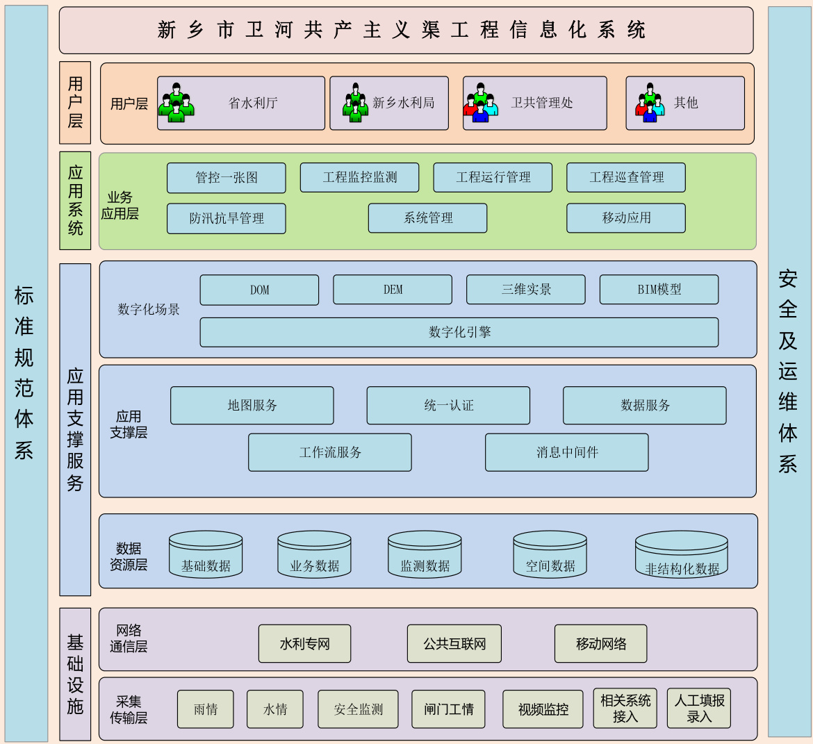  
图 15.3.1-1 总体架构图  

# 15.3.2 数据流向  

东孟姜女河河道治理工程信息化系统数据包含基础数据、监测数据、业务数据、空间数据和非结构化数据。  

其中,前端监测数据、监控数据等通过数据交换服务从前端监测设施、视频监控设施、和已建系统中获取。  

本次新建数字高程数据(DEM)、高清正射影像(DOM)和工程、机电设备设施BIM 模型通过可视化模型服务处理导入进相应数据库;  

基于数据服务共享交换平台,通过水利信息网,实现与所属管理单位、相关市县水利局、省水利厅等相关部门进行数据交换共享,实现与其他相关系统的互联互通,通过政务外网实现与其他部门的数据共享。  

系统数据流向如图 15.3.2-1 所示。  

  
图 15.3.2-1 数据流向图  

# 15.3.3 网络架构  

东孟姜女河河道治理工程信息化系统网络架构采用新乡市卫河共产主义渠工程信息化系统的网络及架构。  

新乡市卫河共产主义渠综合治理工程信息化系统通过水利信息网实现与相关县市水利局、省水利厅等相关部门的互联互通与访问应用;通过电子政务外网与外部单位互联互通;通过 4G 网络实现前端监测感知数据的传输。  

本次网络依托有线公网、水利信息网、4G 网络进行通信与数据传输。网络架构如图15.3.3-1 所示。  

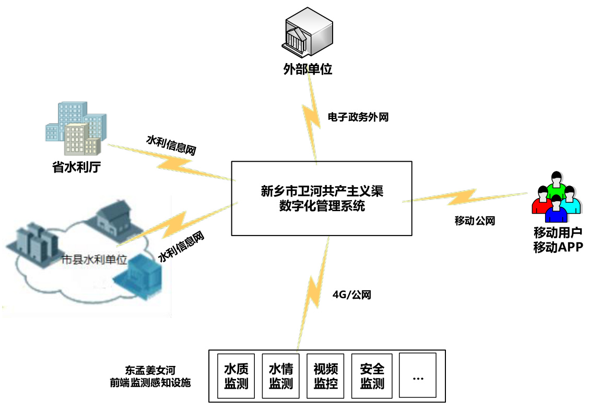  
图 15.3.3-1 网络架构图  

# 15.3.4 技术架构  

综合考虑工程管理需要、本项目建设内容特点、未来业务发展需求等因素,在技术路线的选择上,采用了面向对象编程技术思想及当前业界主流的开发技术,系统采用 B/S的框架结构,满足跨平台、多终端的要求。  

系统技术路线详见图 15.3.4-1。  

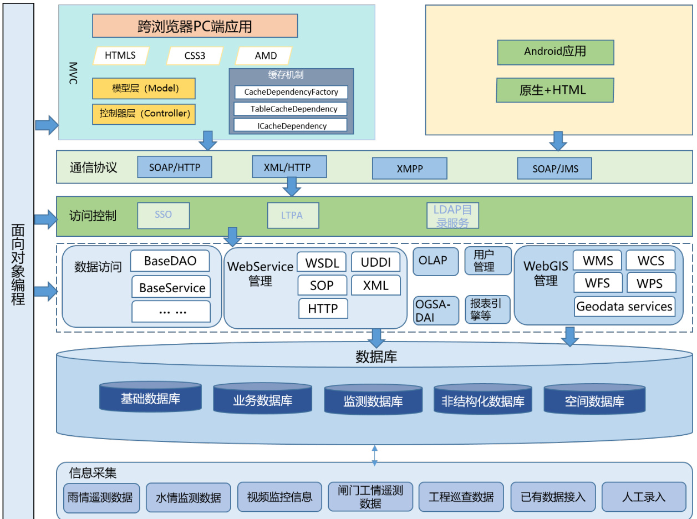  
图 15.3.4-1 系统技术路线图  

# 15.3.5 系统部署  

新乡市卫河共产主义渠信息化系统采用集中部署的方式,系统基于 B/S 模式,统一部署在新乡市水利局,不同层级单位根据自身不同等级的权限可进行分级操作使用,获得平台提供的服务与业务应用。  

# 15.4 分项设计  

# 15.4.1 信息化基础设施建设  

信息化基础设施建设为工程信息化系统安全稳定运行提供硬件环境,本项目主要建设工程范围内的前端监测设施。  

新乡市卫河共渠综合治理工程已在新乡市水利局设计了中控室和设备间,包括服务器、交换机、防火墙等设备,本项目不再单独建设运行实体环境,只将前端监测感知数据传输至设备间进行信息化应用。  

# 15.4.1.1 前端监测设施  

# 15.4.1.1.1 建设内容  

前端监测设施包括水情监测站、视频监控站、水质监测站等。  

在东孟姜女河上、下游河道和关键建筑物,布设水质监测站 2 处、水情监测站 10 处和视频监控站 34 处。  

站点布置原则是主要对河道重要水工建筑物、河道汇流入口、险工段、交界处和重要河段等重要位置进行监控。  

# 1、水情监测站  

水情监测通过监测设备获得河道主要断面的实时水位、流速、流量数据,可通过流量数据直观了解整个河道的水量情况。  

结东孟姜女河的特点进行分析,水情监测的重点在河道入口、交界处和险工险段。通过监测重点部位的流量和水位,便于了解河道的状况,为防汛提供支撑。  

监测站点依托于跨河桥梁进行建设,在监测站点对相关河道进行清淤和平整,保持测量断面形态规则,确保监测数据的准确。  

# 2、视频监控站  

视频监控站主要对利用河道沿线铁塔的高点位置,安装高点监控摄像机,实现高点大场景全覆盖,配合 AI 视频监控系统后台对河道重要部位进行监控。  

# 3、水质监测站  

为确保水源安全,在河道关键位置设自动水质监测站。水质监测站能够自动准确、及时地获得、传输和存储水质数据,并能对获得的监测数据进行分析和评估,提出分析、评估结果,为预防和及时发现污染事故提供辅助决策功能。  

# 15.4.1.1.2 主要功能  

本次前段监测设施主要功能如下:  

(1)现地监测站按照设定的工作方式和采样模式自动采集传感器的信息,并分析处理、存储,定时向中心站发送最新遥测数据。  

(2)现地监测站具有一定的智能功能,支持一定范围的软、硬件故障自检测,自保护,自排除功能;支持操作人员在遥测现场,对遥测设备进行基于控制指令的智能测量和测试功能。  

(3)现地监测站自动检测自身的设备和电路单元故障,并以设定的时间间隔,定时向中心站遥信告警。  

(4)数据采集后,数据包采用 CRC 校验方法,对数据进行加密发送,接收时进行解密解析,如校验码不匹配,表示数据包出错,确保数据准确性。通过 CRC校验后,进行合理性分析,记录入库。  

(5)信息查询:能够通过短信方式进行远程数据的查询。  

(6)召测功能:现地监测站能响应中心站远程资料召测命令,上传固态存储数据。  

(7)用户登录要完成的功能如下:用户输入用户名、密码,一般用户可查询数据,校验用户权限。操作员的权限有修改和查询数据的功能,管理员可对各表进行维护,包括对各表数据的增加、修改、删除。  

# 15.4.1.1.3 系统架构  

前段监测设施由中心站、遥测站组成。中心站设在管理中心,负责接收由现场监测站上传的实时数据,并能够对这些数据进行存储、分析、传输。遥测站为各现地自监测站,主要实现对水位、流速、流量、视频、水质等数据的自动化采集、存储和上传。  

系统结构如 15.4.1.1-1 所示。  

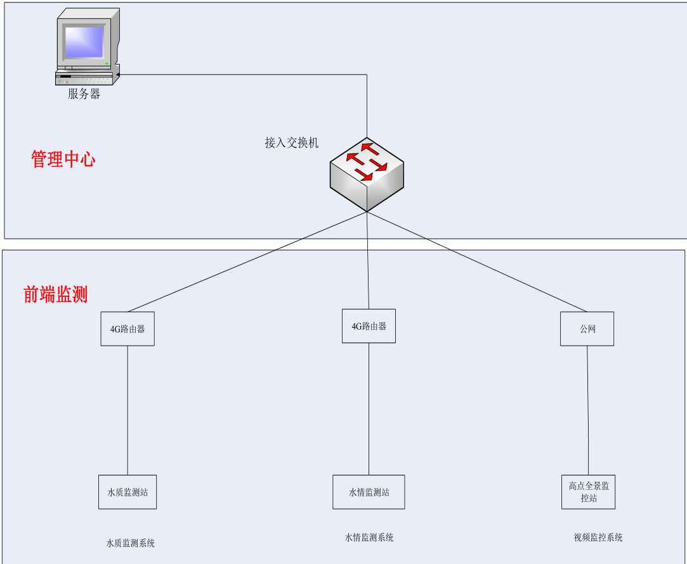  
图 15.4.1.1-1 前端监测系统结构图  

# 15.4.1.1.4 站点设计  

1、水情监测站(1)选型原则  

1)流速仪量水  

流速仪量水即将量测水断面通过几条垂线分割为几个小断面,通过人工的方式使用转自流速仪测量各垂线多个高程的流速计算垂线平均流速,分别计算几个小断面的流量,相加即得到量测水断面的流量。  

目前由该方法衍生出的缆道测流、自动测流车测流、ADCP 测流、阵列式雷达测流都具有较高的精度。缆道测流具有稳定的机械结构,可以测量泥位修正断面淤积带来的影响,但自动化程度较低,测量耗时也很大,更适合大型断面测流。自动测流车的测量过程和缆道测流相似,自动化程度较高,测量速度较缆道测流有很大提高,但是需要结合桥梁建设或建设测桥,对于大型断面建设成本过高,比较适合中小型断面。ADCP 测流速度精度都很高,实现了单垂线平均流速的快速测量,自动化程度高,需要水下安装运行,对于水质好,淤积少,单组安装适合小型断面。阵列式雷达测流应用于大断面、流态复杂的位置测流。  

# 2)标准断面量水  

标准断面量水前期应用流速仪量水的方法率定获得水位流量关系曲线,通过测量水位,根据水位流量关系曲线得到流量数据。该方法操作简单,水文上广泛应用,适合标准断面测量,测量的精度依赖于断面的标准程度,是间接地拟合曲线,在综合性能上不及测速类仪器,但造价较低。  

# 3)量水堰槽量水  

量水堰槽量水通过测量标准堰槽结构的水位值,再对应查表计算可得出通过堰槽的流量。堰一般有薄壁堰、矩形堰、三角堰等。槽一般有巴歇尔槽、矩形槽等。使用该方法测流会收窄断面,明显影响河道过流能力,不适合河道的流量测量。  

# 4)比选结论  

结合此次治理工程河道水质好,淤积少,流速快,河道宽的特点,采用阵列式雷达测流方式进行流量测量。  

# 5)测量仪表选型  

流速测量仪表采用阵列式雷达流量计,引入多个流速传感器,同时获取多条测速垂线的流速数据,进而实现水位,流速,流量等信息的准确监测。与传统的流量计相比,阵列式雷达流量计具有多项优势。首先,它具备非接触式测量的特点,不会与流体接触,不受流体性质、温度和压力的影响,从根本上消除了传统射流流量计易堵塞、易腐蚀等问题。其次,阵列式雷达流量计采用了先进的数字信号处理技术,具有高精度、高稳定性和广阔的测量范围,可适应各种复杂的工作环境和流体条件。  

# (2)站点设计  

结合河道桥梁,建设阵列式雷达测流站。  

阵列式雷达测流站由雷达流量计主机、雷达流量计分机、雷达流速仪分机、太阳能供电系统及通信传输系统等组成。  

雷达流量计主机、雷达流量计分机、雷达流速仪分机选择桥上安装,具体的安装支架及固定或焊接方式需根据现场情况确定。安装示意图如图 15.4.1.1-2 所示。  

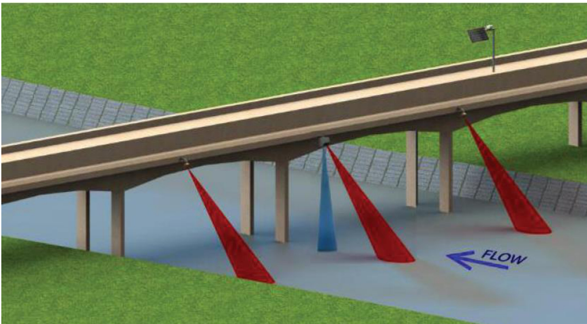  
图 15.4.1.1-2  阵列式雷达测流站安装示意图  

桥边安装太阳能供电设备和遥测终端。太阳能供电设备包括 1 块 200W 单晶硅太阳能电池板、1 块 200Ah 免维护蓄电池和 1 套太阳能充电控制器。遥测终端由遥测终端机、通讯模块、设备保护箱、隔离保护装置等组成,实现流量的自动采集和现场存储。  

测流站为保证流态一般选址与建筑物有一定距离,同时为避免长距离低压供电线路造成的雷电隐患,供电采用太阳能供电方式,通信采用 4G 无线传输方式。  

遥测终端配套隔离保护装置,包含电源防雷器、信号防雷器、天线防雷器;各仪器仪表接口均应具备隔离保护功能。  

# (3)安装环境要求  

水情监测站应安装在河道水质好,淤积少,流速快,在骨干河道易形成稳定的标准测流断面的位置。  

流量计安装时需尽量使设备上盖平面与水面处于平行状态,从而保证设备底面与水面垂直,即横滚角在 $\pm3^{\circ}$ 内;测流速雷达波束与水面间的夹角(即俯仰角)控制在 $50^{\circ}~-60^{\circ}$ 之间, $55^{\circ}$ 最佳,以保证测量的精度。  

流速仪安装时需尽量确保发射的雷达波与水面间的夹角(即配置软件上显示的“俯仰角”)在 $50^{\circ}~-60^{\circ}$ 之间,建议 $55^{\circ}$ 左右,以保证测量的精度,横滚角在$\pm2^{\circ}$ 以内。最后确保为迎水安装,以便滤除雨雪干扰。  

# 2、视频监控站  

(1)选型原则  

由于视频监控站主要在河道周边,环境较为恶劣,摄像机应可在大风情况下正常工作,在大风情况下不出现明显的晃动,不影响视频的观看效果。充分考虑水域周围湿度较高,所选用的设备应考虑防盐雾、防腐蚀、防锈蚀、防变形等问题。  

由于视频监控站安装位置较高,所选设备的像素要求比较高,能够清晰记录河道及周边建筑物运行情况。  

(2)站点设计  

视频监控站主要依托于河道附近的铁塔建设。  

视频监控站摄像机采用双目热成像云台摄像机和可见光球形高清摄像机,具备水平、垂直角度旋转和夜视功能,可全视角、全天候从高点监控建筑物和上下游河道,监控整个建筑物管理区域。  

根据本次项目河道情况,在河道沿线关键位置设置双目热成像云台摄像机 10台,可见光球形高清摄像机 24 台,确保河道运行安全。  

# 2)供电设备  

摄像头安装在铁塔上,供电采用铁塔的供电线路供电。本次设计包含 3 年的铁塔租赁费和供电费。  

# 3)通信网络  

由于全景摄像机数据传输量大,处理量大,4G 通信方式满足不了传输要求,铁塔布设有通信网络,租用铁塔的通信网络进行数据的传输。本次设计包含 3 年的通信和数据存储费。  

# (3)设备技术参数  

1)双目热成像云台摄像机  

热成像焦距 $\geq75\mathrm{mm}$ ;响应波段: $8{\sim}14~\upmu\ensuremath{\mathrm{~m~}}$ ;  
传感器类型:氧化钒非制冷红外焦平面探测器;  
热成像分辨率: ${\geqslant}384\times288$ (即横向 384 像素,纵向 288 像素);  
火点探测距离要求: $2\mathrm{m}\times2\mathrm{m}$ 火源探测距离 $\geq3\mathrm{KM}$ ;  
可见光焦距 $\geq300\mathrm{mm}$ ;  
传感器像面尺寸: $\geq1/3"$ ;  
分辨率:有效像素 $\geqslant200$ 万;  
低照度(F1.2,AGC ON):彩色: $\leqslant0.002\mathrm{lux}$ ,黑白:≤0.0002lux;  
视频压缩:同时支持 H.265/H.264/MJPEG;  

摄像头接入协议:ONVIF Profile S/G/T、GB/T 28181,对于私有协议需提供 SDK或 Restful API,支持第三方管理平台接入。  

2)可见光球形高清摄像机 可见光镜头焦距 $\geq300\mathrm{mm}$ ;光学变倍 $\geq45$ ;  

传感器像面尺寸≥1/1.8inch;分辨率 $\geqslant4$ ;彩色最低照度 $\leqslant0.0005\mathrm{{lux}}$ ;黑白最 低照度 $\leqslant0.0001$ ;  

最大码流分辨率不应低于 1080P( $1920\times1080)$ );  

红外补光灯最大照射距离 $\geq100\mathrm{m}$ 。  

3、水质监测站 (1)选型原则  

水质在线分析仪能够实时在线监测常规五参数(PH、温度、溶氧、电导率、浊度),具有足够高的灵敏度,能够快速响应,能够准确测量,能够在恶劣环境下可靠运行。  

水质监测站采水管道应具备防冻与保温功能,采水管道配置防冻保温装置,以减少坏境温度等因素对水样造成的影响。  

水质监测站采水管道材质应有足够的强度,可以承受内压,且使用年限长、性能可靠、具有极好的化学稳定性,不与水样中被测物产生物理和化学反应,避免污染水样。  

水质监测站采水管道应有除藻和反清洗设备,可以通入清洗水进行自动反冲洗。通过自动阀门切换可以将清洗水和高压振荡空气送至采样头,以消除采样头单向输水运行形成的淤积,以防藻类生长、聚集和泥沙沉积。  

(2)站点设计  

自动水质监测站监测项目为五参数,具体参数为常规五参数(PH、水温、浊度、电导率、溶解氧)。  

常规五参数自动水质监测站由采水单元、水质分析单元、电气控制单元、数据采集与传输单元、户外柜及配套设备、安全保障系统等设备组成,水质自动监测站结构图见图 15.4.1.1-3,典型布置方案见图 15.4.1.1-4。  

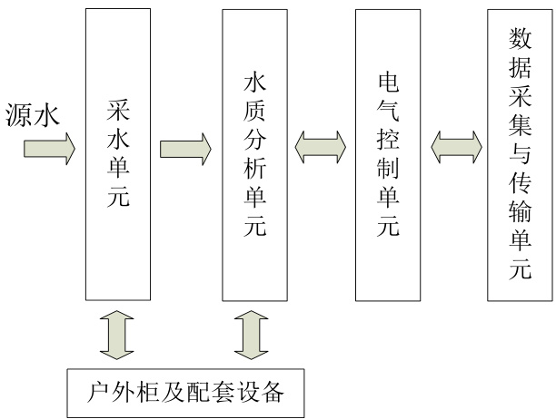  
图 15.4.1.1-3  常规五参数自动水质监测站结构图  

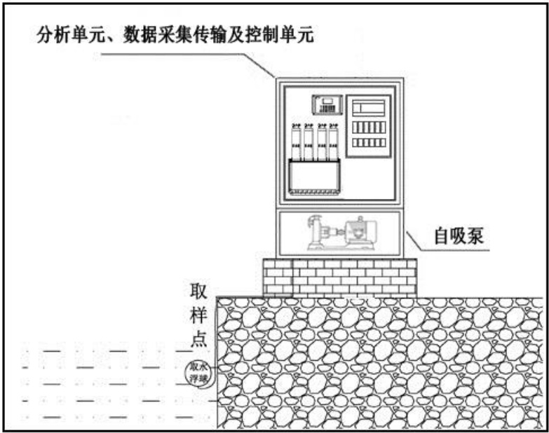  
图 15.4.1.1-4  常规五参数自动水质监测站典型布置图  

# 1)采水单元  

从监测的水体采集所需的水样,供测试单元分析使用。采水单元包括水泵、取水浮筒、取水管、管道保温棉等。  

# 2)水质分析单元  

监测项目为常规 5 参数(PH、水温、浊度、电导率、溶解氧)。常规五参数检测单元选用常规五参数在线分析仪,包含多参数变送器、水温监测仪、pH 监测仪、电导率监测仪、浊度监测仪、溶解氧监测仪。  

常规五参数监测设施在源水进入流通池后可直接进行检测。  

# 3)电气控制单元  

电气控制单元主要控制监测仪器的数据采集、存储、处理与传输等工作。电气控制单元由 PLC 及配套模块、触摸屏、电气成套设备、电缆等组成。  

# 4)数据采集与传输单元  

通过交换机和现场数据采集软件将监测数据和运行参数实时或定期采集并传输到中心站。  

# 5)户外柜及配套设备  

建设户外柜,安装温湿度模块、机柜空调、加热器、配电箱、供电电缆、柜内照明、防雷接地系统等设施为现场操作提供安装和运行环境。  

# 6)安全保障系统  

常规五参数水质自动监测站各建设 1 个视频监控站,安装在户外柜附近,选用红外高清网络枪机,可清晰监控取水点、户外柜和周边,确保监测站安全运行,户外柜内设置硬盘录像机和 6T 硬盘进行数据存储,图像数据通过数据传输单元进行传输。  

# (3)安装环境要求  

水质监测站采水单元的采样装置的吸水口应设在水下 $0.5{\sim}1\mathrm{m}$ 范围内,并能够随水位变化适时调整位置,同时与水体底部保持足够的距离,防止底质淤泥对采样水质的影响。做到既能保证采集到具有代表性的水样,又能保证采样单元能连续正常运行。  

水质监测站不能明显影响样品监测项目的测试结果。排水点须设在样品水的采水点下游 $20\mathrm{m}$ 以上的位置。  

# 15.4.2 业务应用系统建设  

业务应用系统是治理工程运行管理的关键,通过多源数据的融合,实现河道安全运行监视、工程巡查管理等功能,最终实现工程的数字化、信息化和智能化管理。  

本项目按照“统一技术标准、统一运行环境、统一安全保障、统一数据中心、统一业务应用”的原则,将前端监测感知信息等各类数据传输至新乡市卫河共渠综合治理工程信息化系统进行相关业务应用。  

本次建设内容为项目范围建设数字化场景,实现项目范围内的数字化展示和洪水管理;并在信息化系统中增加四乱治理和水土保持功能模块。  

# 15.4.2.1 数字化场景搭建  

三维数字化场景是工程信息化管理系统的基础,是智慧水利建设的“算据”,通过高清正射影像(DOM)、高精度数字高程模型(DEM)、高精度三维实景模型和重要工程 BIM 模型构建东孟姜女河治理范围内的时空多尺度数据映射,同时叠  

加前端感知数据,最终形成基础数据统一、监测数据汇集、二三维一体化、跨层级、跨业务的东孟姜女河三维数字化场景。实现三维展示、数据融合、分析计算等功能。  

# 15.4.2.1.1 河道高清正射影像  

结合东孟姜女河运行管理实际建设需求,进行本次高清正射影像的航测。  

# 1、测量要求  

本次航测影像数据格式为 tif,构建金字塔,根据文件大小适当分区分块。坐标系采用 2000 国家坐标系高斯克吕格 3 度带投影坐标(带区 114E),高程系采用1985 国家黄海高程。  

正射影像(DOM)通过数字微分纠正技术,改正原始影像的几何变形,进一步考虑对建筑物等地物的改正,对整个测区进行影像重采样后,得到完全垂直投影下的影像图。  

表 15.4.2.1-1 正射影像精度及要求  

<html><body><table><tr><td>序号</td><td>项目</td><td>技术要求</td><td>备注</td></tr><tr><td>1</td><td>河道等区域</td><td>分辨率优于1m</td><td>建议3年更新一次</td></tr><tr><td>2</td><td>河道冲刷风险区</td><td>分辨率优于0.2m</td><td>建议1年更新一次</td></tr><tr><td>3</td><td>坐标系</td><td>采用CGCS2000坐标系</td><td></td></tr><tr><td>4</td><td>高程系</td><td>85 高程系</td><td></td></tr><tr><td>5</td><td>投影坐标系</td><td>高斯克吕格3度带，114E</td><td></td></tr><tr><td rowspan="2">6</td><td rowspan="2">平面位置中误差</td><td>0.6mm（图上)</td><td>平原、丘陵地</td></tr><tr><td>0.8mm（图上)</td><td>山地、高山地</td></tr></table></body></html>  

# 3、影像范围  

根据项目的实际情况和要求,本次无人机倾斜摄影的范围为东孟姜女河治理工程治理范围内河道、重要低洼易涝区域、主要河流交汇处、滞洪区等区域。  

# 15.4.2.1.2 数字高程地形制作  

为保证地形数据的准确性,本次采用无人机激光雷达航测,生产数字高程地形(DEM)数据。  

# 1、技术要求  

DEM 精度满足 1:2000 地形图精度要求。数据格式为 tif,坐标系采用 2000 国家坐标系高斯克吕格 3 度带投影坐标(带区 114E),高程系采用 1985 国家黄海高程。DEM 需要抹平水面、房屋、树木、悬空桥梁等,范围内不得出现无数据区域。具体技术参数要求见表 15.4.2.1-2 所示。  

表 15.4.2.1-2 数字高程(DEM)精度及技术要求  

<html><body><table><tr><td>序号</td><td>项目</td><td>技术要求</td><td>备注</td></tr><tr><td>1</td><td>数字高程网格大小</td><td>网格大小优于2.5m</td><td rowspan="4">需要抹平水面、房屋、 树木、悬空桥梁等，范 围内不得出现无数据区 域。</td></tr><tr><td>2</td><td>坐标系</td><td>采用CGCS2000坐标系</td></tr><tr><td>3</td><td>高程系</td><td>85高程系</td></tr><tr><td>4</td><td>投影坐标系</td><td>高斯克吕格3度带，114E</td></tr><tr><td rowspan="5">5</td><td rowspan="5">高程中误差</td><td>0.4m</td><td>平地</td></tr><tr><td>0.5m</td><td>丘陵地</td></tr><tr><td>1.2m</td><td>山地</td></tr><tr><td>1.5m</td><td></td></tr><tr><td></td><td>高山地</td></tr></table></body></html>  

# 2、制作范围  

根据项目的实际情况和要求,本次数字高程地形(DEM)的制作范围为东孟姜女河治理工程治理范围内河道、重要低洼易涝区域、主要河流交汇处、滞洪区等区域,与无人机倾斜摄影获取正射影像(DOM)的范围相同。  

# 15.4.2.1.3 三维实景模型创建  

高清正射影像能够满足大范围、大场景的展示,不能满足局部重要河段及部位的展示需要,因此根据工程三维数字化场景的建设实际需要,对重点部位进行高精度三维实景建模。  

# (1)获取方法  

基于无人机倾斜摄影像片成果,采用专业三维实景模型制作软件,获取三维实景模型。  

# (2)制作过程  

以无人机倾斜摄影像片、像控成果为基础数据,结合已有空三加密成果,利用实景建模软件,经创建工程、数据预处理、控制点处理、多视匹配模型架构、纹理映射等过程,最终输出实景三维模型成果。  

# (3)建模范围  

针对东孟姜女河的主要河道、重点堤防、险工险段、行洪滩区及重要建筑物进行高精度三维实景建模。  

# 15.4.2.1.4 工程 BIM 模型构建  

尽管无人机航测获得的三维实景模型能够满足工程场景的展示与呈现,但是对于工程重要建筑物无法数字化还原与交互,因此对于本项目重要的控制性建筑物进行三维工程建模。  

(1)建模方法  

采用工程 BIM 模型专业构建软件创建工程建筑及设施设备的 BIM 模型。  

(2)创建过程  

工程 BIM 模型构建包括模型分类编码、模型构建、模型轻量化和属性信息关联。BIM 模型构建首先要对模型的分类与编码进行系统的规定,保证每一个最小模型单元的有效和唯一,还要实现模型轻量化后与本次业务系统的有效集成,保证系统快速浏览、查询模型的需求。  

# (3)建模范围  

根据工程三维数字化场景的建设实际需要,对本次治理工程重要的控制性建设物构建三维工程 BIM 建模。  

# 15.4.2.1.5 数字化场景搭建  

通过开发标准的数据交换接口,实现基于信息化场景的前端监测数据汇聚,与高清正射影像、高精度 DEM、三维实景模型以及工程三维信息模型构建起东孟姜女河的数字化场景,为东孟姜女河信息化管理提供坚实的“数据底板”。  

# 15.4.2.2 业务应用系统  

新乡市卫河共渠综合治理工程信息化系统中的业务用系统涵盖河道一张图、工程监测监控、工程运行管理、工程巡查管理、防汛管理、系统管理和移动应用等功能模块。本项目将建设的前端监测感知数据传输至新乡市卫河共产主义渠综合治理工程信息化系统,实现对东孟姜女河河道治理工程范围内的视频监控、安全监测、工情监测等信息在线统一管理、统一应用。  

本次新建四乱治理和水土保持功能模块,提高河道运行管理水平。  

# 15.4.2.2.2 四乱治理  

依托于视频监控系统对河道的实时监控,对非法采砂、垃圾倾倒、水面漂浮物、违章建设等违法违规行为和河道问题自动抓拍取证,推送告警信息。中心值班人员接到告警信息后,实时调取现场监控画面分析研判,通过工作微信群或联络电话等方式,通知相关人员到现场处理,并同步建立告警信息电子台账。主要包括实时监测、实时报警和信息管理。  

# 15.4.2.2.3 水土保持  

河道在运行过程中,时常通过地表剥离、塌陷一级压占等多种方式对河道及河道周边环境地表植被和原地貌进行破坏,从而引发土壤蓄水能力不断下降,导致水  

土流失情况。  

河道水土保持管理主要通过河道视频监控系统和遥感卫星图片不同时段图像对比分析,得出水土流失状况发生的地点,核查人员根据系统指示位置,对相关地点进行现场复核,录入项目基础信息、拍摄现场图片、上传文件,对现场发现的问题进行认真核对,在最短的时间内完成了水土保持现场复核工作。  

# 15.5 信息资源共享  

工程信息化系统建成后,将主要形成数据库、应用支撑平台、业务应用系统,在符合数据保密安全管理要求的前提下,遵循水利部、流域机构和省水利厅统一规定的接口规范,通过数据交换接口、服务调用的方式,实现信息化系统与省水利厅、市县水利局、流域机构等相关信息化系统的数据和应用互联互通、数据共享。  

# 15.5.1 资源共享原则  

1、顶层设计、标准统一  

工程信息化系统在建设过程中,要坚持顶层设计、标准统一的原则,在开展水利信息化资源整合共享时,应首先遵循国家信息化和水利行业信息化有关标准,确保经整合后的水利信息化资源能够切实共享,为系统能够实现互联互通打下坚实的基础。  

# 2、健全机制,明确责任  

在开展信息化资源整合共享时,应根据数据资源、业务应用和基础设施等相关工作特点,建立健全部门之间协作机制,明确各部门在资源整合中的责任,切实做好整体工作计划、资源梳理、整合实施和运行维护等各阶段部门责任与机制建设,明确共建、共享各方的责任与义务。  

# 3、加强领导,统筹规划  

从水利信息化发展的全局出发,统一规划各类信息化资源,编制资源整合共享方案,保障整合共享的技术实现。同时,资源的共享不只是技术方面的问题,更存在着理念问题、管理问题和利益问题,因此,必须解放思想,加强对整合共享的组织领导。  

# 15.5.2 资源共享方案  

1、建立标准规范的数据资源目录  

基于现有水利相关数据资源,深入开展数据资源的调查和梳理,获取水利数据资源的源数据,补充完善水利数据资源目录,实现各业务领域数据资源的全覆盖。数据资源来源主要涵盖水利行业、政府机关、相关行业等,通过梳理,在数据资源要素语义协调一致基础上,建立水利数据资源目录。  

数据目录基于树形结构,按照不同组织形态的元数据项进行分类组织,数据目录基于水利数据内容特征进行分类,层级不宜超过 5 级,第一层级应按业务、政务、综合和其他分为 4 类,其下各级分类的定义及扩展方法如下:  

1)业务:按照 SL701 中的水利业务分类确定目录;2)政务:按照 SL701 中的水利政务分类确定目录;3)综合:按照该单位跨不同水利业务和政务的综合数据内容确定目录;4)其他:按照该单位从其他单位交换而来的其他数据内容确定目录。水利数据实体名称根据该数据实体所含内容确定,便于通过名称直接了解该数据实体所包含的数据内容和形式。  

2、建立标准统一的数据交换共享服务  

数据交换共享服务是各业务系统及第三方应用之间进行数据交换和共享的重要途径,通过建设数据交换共享服务,可以实现系统间对数据资源的透明访问,获得适应多种业务场景的共享交换功能服务;可以有效整合分散异构系统的信息资源,消除“信息孤岛”;灵活实现不同系统间的信息交换、信息共享与业务协同,加强信息资源管理,开展数据和应用整合,进一步发挥信息资源和应用系统的效能,提升信息化建设对业务和管理的支撑作用。  

水利数据资源的数据来源包括行业内部和行业外部两部分,内部信息主要包括历史数据文献、技术档案、实时或定期监测数据、各类业务管理信息以及各种层次的再生信息(如各种综合数据资料和分析成果),包括业务部门依法采集的信息资源,履职过程中产生的信息资源,投资建设的信息资源和依法授权管理的信息资源等。外部信息主要包括社会经济统计数据、基础空间地理信息数据和国土资源信息、其他非水利部门与水利行业有关的信息资源。无论内部信息还是外部信息,均可在条件具备的前提下通过数据交换共享平台来实现数据双向联结。  

建设水利数据交换共享服务,规范交换流程和方法,形成统一数据交换机制,实现水利厅、市、县以及流域机构等不同水利业务节点间的纵向数据交换和政务外网相关业务部门之间的横向跨域数据交换。建设以标准服务、标准封装数据形式的数据交换共享服务,支持 WebService 协议、FTP 协议和数据库等各类接口,提供跨系统、跨单位、跨区域的数据集成、交换、分发、共享机制和平台能力,支持结构化、半结构化、非结构化数据以及大文件的多级交换。通过数据交换共享服务进行数据交换共享。  

# 15.5.3 资源共享对象  

工程信息化系统的数据资源共享对象有:  

(1)上级管理单位,包括县市水利局、水利厅、政府等单位之间的数据资源共享。(2)业务相关单位,包括气象、水文、国土、应急等业务部门间的数据资源共享。  

(3)单位内部:各科室以及各业务系统之间的数据资源共享。  

# 15.6 网络信息安全  

本工程信息化系统将监测数据传输至新乡市卫河共渠综合治理工程信息化系统进行应用,网络信息安全依托于新乡市卫河共渠综合治理工程信息化系统的网络信息安全建设,确保各类数据安全。  

依据《信息安全技术网络安全等级保护定级指南》中对相应客体侵害程度分类标准,综合考虑业务信息等级和系统服务等级,新乡市卫河共渠综合治理工程信息化系统的安全保护等级应是由业务信息安全等级和系统服务安全等级的较高者决定,安全保护等级建议为第二级。  

# 15.7 系统集成与运行维护  

# 15.7.1 系统集成  

系统集成是运用计算机网络技术、通信技术将分布在各个监测站的数据采集终端的采集信息以及外部单位的系统数据集成到工程管理系统,并实现运行环境的设备、系统之间的集成,使数据资源达到充分共享,实现工程管理单位与相关管理单位业务互通和数据共享,打造一体化的信息化系统。  

# 15.7.1.1 系统集成策略  

# 1、资源共享集成  

系统整合与集成本着硬件、系统软件、产品软件、应用软件模块、数据资源的充分共享的原则,节省工程投资,提高系统性能。  

# 2、松耦合集成  

松耦合程序结构具有易维护、易测试、易扩展、适应变化的需求等优点,是该系统进行集成所遵循的重要原则,这一原则对于应用系统集成尤为重要。  

# 3、分层集成  

表现层、业务层、数据层多层软件体系结构的采用,系统集成将遵循这一架构体系分层进行集成,主要包括:门户集成、数据集成和应用集成。  

# 4、技术导向集成思想  

合适的系统架构和集成技术方案,将有效地提高系统性能,软件技术导向是整个系统集成实现有效协调的基础,系统各部分的集成将根据各自技术特点采用不同的集成技术方案。  

# 5、应用导向集成思想  

该系统是一个综合类业务应用系统,对于这样一个庞大的业务系统来讲,在确定合适的集成技术方案的同时,业务导向是实现系统开发建设目标的保障。  

# 15.7.1.2 系统集成边界  

系统集成包括系统内部的集成,以及与外部系统的集成。系统内部集成主要是对本次建设内容的软、硬件部分进行集成;系统外部集成主要包括与外部单位相关系统的集成。  

# 1、内部集成  

(1)基础硬件设施:数据采集设备和中控硬件设备的安装、调试和集成等。(2)软件部分:商用系统软件的安装、调试与集成,开发业务应用系统的安装、部署、测试与集成。  

# 2、外部集成  

(1)与相关单位,如省水利厅、市水利局及流域机构等单位进行数据交换。  
(2)信息化系统通过应用集成,与外部单位相关系统进行系统对接。  

# 15.7.2 运行维护  

系统运行维护主要对东孟姜女河河道治理工程信息化系统的软硬件设施进行运行维护,保障系统安全稳定可靠运行,可从运维架构、组织建设、运维服务等几个方面考虑。  

# 15.7.2.1 运维架构  

系统的运行维护是对平台运行过程中所涉及的组织机构、制度规范、IT 资产(平台涉及的硬件系统、软件系统、IT 业务流程,以及建立在这些系统和流程之上的、建设单位内部业务流程与知识资源的总和)、安全、运行维护资金等进行管理,有效的融合组织、制度、流程和技术,制定和完善相应的管理制度,实施规范和专业化管理,落实运行维护费用,使运行维护管理体系成为日常工作的重要组成部分,并通过持续改进运维工作,完善运维过程中各个流程管理来确保平台健康运行,达到平台建设的预期目标。  

平台运维服务管理要按照计划(Plan)、执行(Do)、检查(Check)和处理(Action)的循环过程进行,其中运维服务是指 IT 运维服务供应商或 IT 运维部门综合利用各种 IT 运维支撑工具提供的确保 IT 基础设施和应用系统正常、安全、高效、经济运行的服务。IT 运维服务支撑系统是指参与 IT 运维的各方为支持 IT 运维服务目标所使用的信息化工具,是支撑 IT 运维服务实施的平台。  

# 15.7.2.2 组织建设  

组织建设要求确定和规范平台运维体系的管理方式、与之相配套的人员岗位、职责安排、机构设置,将平台运维体系相关的全部活动进行统一决策与规划,形成集中统一的平台运维管理机制。在集中统一的平台运维管理模式下,按照平台运维管理任务科学设置或调整组织机构,划分任务、角色、岗位,合理配置平台运维管理资源,达到人、工具、流程的有机融合。  

# 15.7.2.3 运维服务  

平台运维服务包括平台基础设施运维服务、平台应用系统运维服务、安全管理服务、网络接入服务、内容信息服务以及综合管理服务。  

1、平台基础设施运维服务  

平台基础设施运维服务是对平台基础设施进行监视、日常维护和维修保障。服务涉及的基础设施包括网络系统、主机系统、存储/备份系统、终端系统、安全系统、动力及环境等。服务内容主要包括:  

(1)监控类服务:异常报告及时率、异常漏报率。(2)日常维护类服务:维护作业计划的及时完成率、故障隐患发现率、异常主动发现率、故障服务请求及时满足率、业务服务请求及时满足率、问题解决率等。(3)维修保障类服务:服务响应及时率、到达现场及时率、故障修复及时率。  

# 2、平台应用系统运维服务  

平台系统运维服务对平台中所包含的应用系统进行设计、集成、维护及改进。  

# 3、安全管理服务  

安全管理服务对 IT 环境涉及的网络、应用系统、终端、内容信息的安全进行管理,包括安全评估、安全保护、安全监控、安全响应及安全预警等服务。主要服务内容有:漏洞扫描覆盖率、安全报告呈报及时率、安全漏洞遗漏数量、安全漏洞遗漏率、加固设备覆盖率、安全补丁安装及时率、安全事件次数等。  

# 4、网络接入服务  

网络接入服务提供网络规划和接入,包括互联网接入服务、专网接入服务等。主要服务内容有:平均响应时间、问题解决比率等。  

# 5、内容信息服务  

内容信息服务对内容信息进行采集、发布、巡检、统计、编辑、信息挖掘以及汇报,为内容信息的获取和进一步处理提供支持。主要服务内容有:检索成功率、响应及时率等。  

# 6、综合管理服务  

综合管理服务包括咨询与培训服务、技术支持服务、综合系统服务等。主要服务内容有:平均响应时间、问题解决比率等。  

# 15.8 工程量清单  

表 15.8-1 信息化系统工程量清单  

<html><body><table><tr><td>序号</td><td>名称</td><td>单位</td><td>数量</td></tr><tr><td></td><td>工程信息化</td><td></td><td></td></tr><tr><td>二</td><td>前端监测设施</td><td></td><td></td></tr><tr><td>(-)</td><td>视频监控站</td><td></td><td></td></tr><tr><td>1</td><td>双目热成像摄像机</td><td>台</td><td>10</td></tr><tr><td>2</td><td>可见光球形高清摄像机</td><td>台</td><td>24</td></tr><tr><td>3</td><td>供电及通信系统</td><td>套</td><td>34</td></tr><tr><td>(二)</td><td>水情监测站</td><td></td><td></td></tr><tr><td>1</td><td>雷达流量计主机</td><td>台</td><td>10</td></tr><tr><td>2</td><td>雷达流量计分机</td><td>台</td><td>10</td></tr><tr><td>3</td><td>雷达流速仪分机</td><td>台</td><td>10</td></tr><tr><td>4</td><td>太阳能供电系统（200W，200AH)</td><td>套</td><td>10</td></tr><tr><td>5</td><td>遥测终端</td><td>台</td><td>10</td></tr><tr><td>6</td><td>4G 传输系统</td><td>项</td><td>10</td></tr></table></body></html>  

<html><body><table><tr><td>序号</td><td>名称</td><td>单位</td><td>数量</td></tr><tr><td>（三)</td><td>水质监测站</td><td></td><td></td></tr><tr><td>1</td><td>采水单元</td><td>套</td><td>2</td></tr><tr><td>2</td><td>五参数水质分析单元</td><td>套</td><td>2</td></tr><tr><td>3</td><td>电气控制单元</td><td>套</td><td>2</td></tr><tr><td>4</td><td>数据采集及传输单元</td><td>套</td><td>2</td></tr><tr><td>5</td><td>户外柜及配套设备</td><td>套</td><td>2</td></tr><tr><td>6</td><td>安全保障系统</td><td>套</td><td>2</td></tr><tr><td>三</td><td>信息化管理系统</td><td></td><td></td></tr><tr><td>(一)</td><td>数字化场景开发</td><td></td><td></td></tr><tr><td>1</td><td>高清正射影像获取</td><td>项</td><td>1</td></tr><tr><td>2</td><td>数字高程地形制作</td><td>项</td><td>1</td></tr><tr><td>3</td><td>三维实景模型创建</td><td>项</td><td>1</td></tr><tr><td>4</td><td>工程 BIM 模型的构建</td><td>项</td><td>1</td></tr><tr><td>5</td><td>数据汇聚</td><td>项</td><td>1</td></tr><tr><td>(二)</td><td>业务应用</td><td></td><td></td></tr><tr><td>1</td><td>四乱治理</td><td>项</td><td>1</td></tr><tr><td>2</td><td>水土保持</td><td>项</td><td>1</td></tr></table></body></html>  

# 16 投资估算  

# 16.1 概述  

# 16.1.1 工程概况  

本次方案治理工程范围涉及获嘉县、新乡县和新乡市城区,治理段为冯庄镇张槐树村(桩号 $60{+}113$ )\~东孟高铁改线段起点(桩号 $22\substack{+085}$ )段及上焦庄生产桥(桩号$18{+}020$ )\~菏宝高速(桩号 $15{+}991$ )段,治理河段总长 $40.06\mathrm{km}$ 。  

工程建设内容:河道清淤疏浚长 $40.06\mathrm{km}$ ,堤防整治(左、右岸) $38.86\mathrm{km}$ ;新建堤顶道路 $15.18\mathrm{km}$ ;河道弯道防护 25 处 $4.74\mathrm{km}$ ;桥基防护 44 处,护砌长度 $2.64\mathrm{km}$ ;排水涵闸重建 33 座、新建 8 座;新建提排站 3 座、重建提灌站 5 座,拆除提灌站 3座;重建路涵 27 座、重建桥梁 3 座。  

主体工程主要完成工程量 289.74 万 $\mathrm{m}^{3}$ ,其中,土方开挖 156.7 万 $\mathrm{m}^{3}$ ,土方填筑116.59 万 $\mathrm{m}^{3}$ ,混凝土及钢筋混凝土 4.6 万 $\mathrm{m}^{3}$ ,砌石及砂石垫层 8.11 万 $\mathrm{m}^{3}$ ,钢筋及钢绞线 2948.67t,格宾石笼及雷诺护垫 3.74 万 $\mathrm{m}^{3}$ 。路面 19.05 万 $\mathrm{m}^{2}$ 。  

# 16.1.2 投资主要指标  

本工程静态总投资 77248 万元。其中工程部分静态总投资 31592.85 万元,移民环境部分静态总投资 45655.15 万元。  

工程部分静态总投资 31592.85 万元,其中建筑工程 22101.93 万元,机电设备及安装工程 1245.90 万元,金属结构及安装工程 263.06 万元,临时工程 1754.20 万元,独立费用 3279.70 万元,预备费 2864.48 万元。水文巡测站工程 83.58 万元。  

工程移民环境部分静态总投资 45655.15 万元,其中征地移民工程 44045.94 万元,环保 805.8 万元,水保 803.41 万元。  

# 16.2 工程部分投资估算编制  

# 16.2.1 编制原则和依据  

(1)估算编制价格水平年为 2023 年 10 月;(2)办水总函(2023)38 号《水利部办公厅关于调整水利工程计价依据安全生产措施费计算标准的通知》;(3)办财务函(2019)448 号 《水利部办公厅关于调整水利工程计价依据增值税计算标准的通知》;  

(4)河南省水利厅、河南省发展和改革委员会颁发的豫水建(2017)第 1 号文《河南省水利水电工程设计概(估)算编制规定》;  

(5)河南省水利厅颁发的豫水建(2006)第 52 号文,第二、三册《建筑工程概  
算定额》;(6)河南省水利厅颁发的豫水建(2006)第 52 号文,第六册《设备安装工程概  
(预)算补充定额》;(7)河南省水利厅颁发的豫水建(2006)第 52 号文,第七册《施工机械台时费  
概(预)算定额》;(8)设计文件及图纸。  

# 16.2.2 基础单价计算依据  

(1)人工预算单价  

按照豫水建(2017)第 1 号文计算,人工预算单价见表 16.2-1。  

# 表16.2-1 人工预算单价表  

<html><body><table><tr><td>序号</td><td>名称</td><td>单位</td><td>河道工程</td></tr><tr><td>1</td><td>工长</td><td>元/工时</td><td>9.27</td></tr><tr><td>2</td><td>高级工</td><td>元/工时</td><td>8.57</td></tr><tr><td>3</td><td>中级工</td><td>元/工时</td><td>6.62</td></tr><tr><td>4</td><td>初级工</td><td>元/工时</td><td>4.64</td></tr><tr><td>5</td><td>机械工</td><td>元/工时</td><td>6.62</td></tr></table></body></html>  

# (2) 主要材料预算价格  

主要材料钢筋、水泥、木材、汽油、柴油等,其原价采用 2023 年 10 月市场价格,另计沿渠线到工地各段的运杂费计算。主材价格按照水泥 255 元/t,汽油 3075 元/t,柴油 2990 元/t,钢筋 2560 元/t,砂石料 60 元 $/\mathrm{m}^{3}$ ,限价进入单价,超出部分计入税金后乘以相应材料用量计入工程单价中。主要材料预算价格见表 16.2-2。  

# (3)次要材料价格  

次要材料价格参照有关造价信息中发布的预算价格,并结合当地建筑工程材料预算价格和已完工程实际价格等有关资料分析取定。  

# (4) 电、风、水预算价格  

依据施工组织设计确定的施工方法和当地的实际情况综合计算确定,电网供电比例为 $90\%$ ,自发电供电比例为 $10\%$ 。电价为 0.74 元/kwh;水价为 0.98 元 $/\mathrm{m}^{3}$ ;风价为0.14 元 $/\mathrm{m}^{3}$ 。  

表 16.2-2 主要材料预算价格表  

<html><body><table><tr><td>编号</td><td>名称及规格</td><td>单位</td><td>不含税预算价 （元）</td><td>限价 (元)</td><td>差价 (元)</td></tr><tr><td>(1)</td><td>(2)</td><td>(3)</td><td>(4)</td><td>(5)</td><td>(6)</td></tr><tr><td>1</td><td>钢筋</td><td>t</td><td>3646</td><td>2560</td><td>1086</td></tr><tr><td>2</td><td>水泥42.5#</td><td>t</td><td>398</td><td>255</td><td>143</td></tr><tr><td>3</td><td>原木</td><td>m3</td><td>1927.00</td><td></td><td></td></tr><tr><td>4</td><td>板枋材</td><td>m3</td><td>2858.82</td><td></td><td></td></tr><tr><td>5</td><td>汽油</td><td>t</td><td>8300.88</td><td>3075</td><td>5225.88</td></tr><tr><td>6</td><td>柴油</td><td>t</td><td>7393.81</td><td>2990</td><td>4403.81</td></tr><tr><td>7</td><td>砂</td><td>m3</td><td>174.00</td><td>60</td><td>114.00</td></tr><tr><td>8</td><td>石子</td><td>m²</td><td>107.00</td><td>60</td><td>47.00</td></tr><tr><td>9</td><td>块石</td><td>m3</td><td>113.42</td><td>60</td><td>53.42</td></tr><tr><td>10</td><td>C15商混</td><td>m3</td><td>345.00</td><td>200</td><td>145.00</td></tr><tr><td>11</td><td>C20商混</td><td>m3</td><td>395.00</td><td>200</td><td>195.00</td></tr><tr><td>12</td><td>C25商混</td><td>m3</td><td>405.00</td><td>200</td><td>205.00</td></tr><tr><td>13</td><td>C30商混</td><td>m3</td><td>415.00</td><td>200</td><td>215.00</td></tr><tr><td>14</td><td>C35商混</td><td>m3</td><td>430.00</td><td>200</td><td>230.00</td></tr><tr><td>15</td><td>C40 商混</td><td>m3</td><td>445.00</td><td>200</td><td>245.00</td></tr><tr><td>16</td><td>C50商混</td><td>m3</td><td>485.00</td><td>200</td><td>285.00</td></tr></table></body></html>  

# (5)施工机械台时费  

按照办财务函(2019)448 号 《水利部办公厅关于调整水利工程计价依据增值税计算标准的通知》和河南省水利厅颁发的豫水建(2006)第 52 号文,第七册《施工机械台时费概(预)算定额》计算。施工机械台时费定额的折旧费除以 1.13 调整系数,修理及替换设备费除以 1.09 调整系数。  

# 16.2.3 取费标准  

(1)工程单价编制依据河南省水利厅、河南省发展和改革委员会颁发的豫水建(2017)第 1 号文《河南省水利水电工程设计概(估)算编制规定》和河南省水利厅颁发的豫水建(2006)第 52 号文,第二、三册《建筑工程概算定额》,考虑投资估算工程深度和精度乘以单价扩大系数,建筑、安装工程单价扩大系数见表 16.2-3。  

# 表16.2-3 建筑、安装工程单价扩大系数表  

<html><body><table><tr><td>序号</td><td>工程类别</td><td>单价扩大系数(%)</td></tr><tr><td>1</td><td>土方工程</td><td>10</td></tr><tr><td>2</td><td>石方工程</td><td>10</td></tr><tr><td>3</td><td>混凝土浇筑工程</td><td>10</td></tr><tr><td>4</td><td>钢筋制安工程</td><td>5</td></tr><tr><td>5</td><td>模板工程</td><td>5</td></tr><tr><td>6</td><td>钻孔灌浆及锚固工程</td><td>10</td></tr><tr><td>7</td><td>其他工程</td><td>10</td></tr><tr><td>8</td><td>机电、金属结构设备安装工程</td><td>10</td></tr></table></body></html>  

(2)其他直接费  

依据办水总函(2023)38 号《水利部办公厅关于调整水利工程计价依据安全生产措施费计算标准的通知》、河南省水利厅、河南省发展和改革委员会颁发的豫水建(2017)第 1 号文《河南省水利水电工程设计概(估)算编制规定》,其他直接费包括冬雨季施工增加费、夜间施工增加费、临时设施费、安全生产措施费和其他费用,按基本直接费的百分数计算,其他直接费费率见表 16.2-4 。  

表16.2-4 其他直接费费率表  

<html><body><table><tr><td rowspan="2">序号</td><td rowspan="2">工程类别</td><td rowspan="2">计算基础</td><td colspan="2">其他直接费费率%</td></tr><tr><td>建筑工程 (河道工程)</td><td>安装工程 （河道工程）</td></tr><tr><td>1</td><td>冬雨季施工增加费</td><td>基本直接费</td><td>1.0%</td><td>1.0%</td></tr><tr><td>2</td><td>夜间施工增加费</td><td>基本直接费</td><td>0.3%</td><td>0.5%</td></tr><tr><td>3</td><td>临时设施费</td><td>基本直接费</td><td>1.7%</td><td>1.7%</td></tr><tr><td>4</td><td>安全生产措施费</td><td>基本直接费</td><td>2.5%</td><td>2.5%</td></tr><tr><td>5</td><td>其他</td><td>基本直接费</td><td>0.5%</td><td>1.0%</td></tr><tr><td>6</td><td>合计</td><td></td><td>6.0%</td><td>6.7%</td></tr></table></body></html>  

(3)间接费  

依据河南省水利厅、河南省发展和改革委员会颁发的豫水建(2017)第 1 号文《河南省水利水电工程设计概(估)算编制规定》,间接费费率见表 16.2-5。  

# 表16.2-5 间接费费率表  

<html><body><table><tr><td rowspan="2">序 号</td><td rowspan="2">工程类别</td><td rowspan="2">计算 基础</td><td>间接费费率%</td></tr><tr><td>河道工程</td></tr><tr><td>1</td><td>土方工程</td><td>直接费</td><td>5</td></tr><tr><td>2</td><td>石方工程</td><td>直接费</td><td>9.5</td></tr><tr><td>3</td><td>混凝土浇筑工程</td><td>直接费</td><td>8.5</td></tr><tr><td>4</td><td>钢筋制安工程</td><td>直接费</td><td>5</td></tr><tr><td>5</td><td>模板工程</td><td>直接费</td><td>7</td></tr><tr><td>6</td><td>钻孔灌浆及锚固工程</td><td>直接费</td><td>9.25</td></tr><tr><td>7</td><td>其他工程</td><td>直接费</td><td>7.25</td></tr><tr><td>8</td><td>机电、金属结构设备安装工程</td><td>人工费</td><td>70</td></tr></table></body></html>  

(4)利润  
按直接费和间接费之和的 $7\%$ 计算。  
(5)税金  
按直接费、间接费、利润和材料价差四项之和的 $9\%$ 计算。  

# 16.2.4 建筑工程投资计算  

(1)主体建筑工程:采用工程量乘以工程单价计算。  
(2)供电线路工程:根据设计的电压等级、线路长度计算投资。  
(3)其他建筑工程:其他建筑工程按主体建筑工程投资的 $0.2\%$ 计列。  

# 16.2.5 设备制作安装工程估算编制  

(1)机电设备及金属结构设备原价根据在生产或制造厂家的报价或询价的基础上确定,运杂综合费率按 $4.73\%$ 计算。(2)设备安装费按河南省水利厅、河南省发展和改革委员会颁发的豫水建(2017)第 1 号文《河南省水利水电工程设计概(估)算编制规定》及水利部水建管[1999]523 号文颁发的《水利水电设备安装工程概算定额》计算,无法套用定额的设备按设备费的 $15\%$ 计算。  

# 16.2.6 施工临时工程估算编制  

(1)施工导流工程:采用工程量乘以工程单价计算。(2)施工交通工程:场内外施工道路根据施工组织设计提供的长度及标准计算;(3)施工场外供电工程:根据设计的电压等级( $10\mathrm{kv}$ )、线路架设长度及所需配备的变配电设施,按 12 万元/km 计算。  

(4)施工房屋建筑工程  

a) 施工仓库按施工组织设计提供的面积和单位造价指标 300 元 $/\mathrm{m}^{2}$ 计算。  

b) 办公、生活及文化福利建筑:按一至四部分建安工作量的 $1.5\%$ 计算。  

(5)其他施工临时工程:按工程一至四部分建安工作量(不包括其他施工临时工程)之和的 $1.0\%$ 计算。  

# 16.2.7 独立费用投资计算  

(1)建设管理费  

按河南省水利厅、河南省发展和改革委员会颁发的豫水建(2017)第 1 号文《河南省水利水电工程设计概(估)算编制规定》,按一至四部分建安工作量为计算基数,按费率,以超额累进方法计算。  

(2)工程建设监理费:参照国家发改委、建设部  发改价格[2007] 670 号文《建设工程监理与相关服务收费管理规定》计算。  

(3)联合试运转费:无 (4)生产准备费  

a) 生产及管理单位提前进场费:不计此项费用。  

b) 生产职工培训费:不计此项费用。  

c) 管理用具购置费:不计此项费用。  

d) 备品备件购置费:按设备费的 $0.5\%$ 计算。  

e) 工器具及生产家具购置费:按设备费的 $0.15\%$ 计算。  

(5)科研勘测设计费  

a) 工程科学研究试验费:按建安工作量的 $0.3\%$ 计算。  

b) 工程勘测设计费:前期勘测设计费参照计价格[1999]1283 号文国家计委关于印发建设项目前期工作咨询收费暂行规定的通知和发改价格[2006]1352 号文水利、水电、电力建设项目前期工作工程勘察收费暂行规定计算。工程勘测设计费参照国家计委、建设部计价格[2002]10 号文件规定计算。  

(6) 其他  

a) 工程保险费:按工程一至四部分投资合计的 $0.45\%$ 计算。  

# 16.2.8 预备费  

基本预备费按工程一至五部分合计的 $10\%$ 计算。不计价差预备费。  

# 16.2.9 资金筹措  

本项目资金来源采用国家财政和地方配套资金共同解决。  

# 16.3 投资估算表  

# 表 16.3-1  工程估算总表  

单位:万元  

<html><body><table><tr><td></td><td></td><td></td><td></td><td></td><td></td></tr><tr><td>序号</td><td>工程或费用名称</td><td>建安工程费</td><td>设备购置费</td><td>独立费用</td><td>合计</td></tr><tr><td>(1)</td><td>(2)</td><td>(3)</td><td>(4)</td><td>(5)</td><td>(6)</td></tr><tr><td>I</td><td>工程部分投资</td><td></td><td></td><td></td><td></td></tr><tr><td>一</td><td>第一部分：建筑工程</td><td>22101.93</td><td></td><td></td><td>22101.93</td></tr><tr><td>二</td><td>第二部分：机电设备及安装工程</td><td>580.44</td><td>665.46</td><td></td><td>1245.90</td></tr><tr><td>三</td><td>第三部分：金属结构设备及安装工程</td><td>36.78</td><td>226.28</td><td></td><td>263.06</td></tr><tr><td>四</td><td>第四部分：施工临时工程</td><td>1754.20</td><td></td><td></td><td>1754.20</td></tr><tr><td>五</td><td>第五部分：独立费用</td><td></td><td></td><td>3279.70</td><td>3279.70</td></tr><tr><td></td><td>一至五部分投资合计</td><td>24473.35</td><td>891.74</td><td>3279.70</td><td>28644.79</td></tr><tr><td>六</td><td>预备费</td><td></td><td></td><td></td><td>2864.48</td></tr><tr><td></td><td>其中：基本预备费</td><td></td><td></td><td></td><td>2864.48</td></tr><tr><td>七</td><td>水文巡测站工程投资</td><td></td><td></td><td></td><td>83.58</td></tr><tr><td></td><td>工程部分静态总投资</td><td></td><td></td><td></td><td>31592.85</td></tr><tr><td>II</td><td>建设征地移民补偿部分</td><td></td><td></td><td></td><td></td></tr><tr><td></td><td>建设征地移民补偿部分总投资</td><td></td><td></td><td></td><td>44045.94</td></tr><tr><td>ⅢI</td><td>水土保持部分</td><td></td><td></td><td></td><td></td></tr><tr><td></td><td>水土保持部分总投资</td><td></td><td></td><td></td><td>803.41</td></tr><tr><td>IV</td><td>环境保护部分</td><td></td><td></td><td></td><td></td></tr><tr><td></td><td>环境保护部分总投资</td><td></td><td></td><td></td><td>805.80</td></tr><tr><td>V</td><td>工程总投资合计</td><td></td><td></td><td></td><td></td></tr><tr><td></td><td>静态总投资</td><td></td><td></td><td></td><td>77248.00</td></tr><tr><td></td><td>建设期利息</td><td></td><td></td><td></td><td></td></tr><tr><td></td><td>总投资</td><td></td><td></td><td></td><td>77248.00</td></tr></table></body></html>  

# 表 16.3-2  工程部分总估算表  

单位:万元  

<html><body><table><tr><td>编号</td><td>工程或费用名称</td><td>建安费</td><td>设备费</td><td>年位：万元 独立费用</td><td>合计</td></tr><tr><td>(1)</td><td>(2)</td><td>(3)</td><td>(4)</td><td>(5)</td><td>(6)</td></tr><tr><td>壹</td><td>第一部分建筑工程</td><td>22101.93</td><td></td><td></td><td>22101.93</td></tr><tr><td>二</td><td>主体建筑工程</td><td>21950.03</td><td></td><td></td><td>21950.03</td></tr><tr><td>(一)</td><td>牧野区</td><td>3189.67</td><td></td><td></td><td>3189.67</td></tr><tr><td>（二)</td><td>红旗区</td><td>5799.03</td><td></td><td></td><td>5799.03</td></tr><tr><td>（三)</td><td>高新区</td><td>2951.16</td><td></td><td></td><td>2951.16</td></tr><tr><td>（四）</td><td>卫滨区</td><td>1122.79</td><td></td><td></td><td>1122.79</td></tr><tr><td>（五）</td><td>新乡县</td><td>6226.05</td><td></td><td></td><td>6226.05</td></tr><tr><td>(六)</td><td>获嘉县</td><td>2661.33</td><td></td><td></td><td>2661.33</td></tr><tr><td>二.</td><td>交通工程</td><td></td><td></td><td></td><td></td></tr><tr><td>三.</td><td>房屋建筑工程</td><td></td><td></td><td></td><td></td></tr><tr><td>四.</td><td>供电工程</td><td>108.00</td><td></td><td></td><td>108.00</td></tr><tr><td>五.</td><td>其他建筑工程</td><td>43.90</td><td></td><td></td><td>43.90</td></tr><tr><td>贰</td><td>第二部分机电设备及安装</td><td>580.44</td><td>665.46</td><td></td><td>1245.90</td></tr><tr><td>二</td><td>水力机械设备</td><td>49.37</td><td>238.74</td><td></td><td>288.11</td></tr><tr><td>二</td><td>供电设备及安装</td><td>274.56</td><td>154.32</td><td></td><td>428.88</td></tr><tr><td>三.</td><td>管理工程</td><td>256.51</td><td>272.40</td><td></td><td>528.91</td></tr><tr><td>叁</td><td>第三部分金属结构及安装</td><td>36.78</td><td>226.28</td><td></td><td>263.06</td></tr><tr><td>肆</td><td>第四部分临时工程</td><td>1754.20</td><td></td><td></td><td>1754.20</td></tr><tr><td>二</td><td>导流工程</td><td>747.20</td><td></td><td></td><td>747.20</td></tr><tr><td>二</td><td>施工交通工程</td><td>352.68</td><td></td><td></td><td>352.68</td></tr><tr><td>三.</td><td>施工场外供电工程</td><td>36.00</td><td></td><td></td><td>36.00</td></tr><tr><td>四.</td><td>施工房屋建筑工程</td><td>376.05</td><td></td><td></td><td>376.05</td></tr><tr><td>五.</td><td>其他施工临时工程</td><td>242.27</td><td></td><td></td><td>242.27</td></tr><tr><td>伍</td><td>第五部分独立费用</td><td></td><td></td><td>3279.70</td><td>3279.70</td></tr><tr><td>二</td><td>建设管理费</td><td></td><td></td><td>697.36</td><td>697.36</td></tr><tr><td>二</td><td>工程建设监理费</td><td></td><td></td><td>462.32</td><td>462.32</td></tr><tr><td>三.</td><td>生产准备费</td><td></td><td></td><td>5.80</td><td>5.80</td></tr><tr><td>四.</td><td>科研勘测设计费</td><td></td><td></td><td>2000.08</td><td>2000.08</td></tr><tr><td>1</td><td>科学研究试验费</td><td></td><td></td><td>73.42</td><td>73.42</td></tr><tr><td>2</td><td>工程勘测设计费</td><td></td><td></td><td>1926.66</td><td>1926.66</td></tr><tr><td>(1)</td><td>勘测费</td><td></td><td></td><td>930.07</td><td>930.07</td></tr><tr><td>(2)</td><td>设计费</td><td></td><td></td><td>996.59</td><td>996.59</td></tr><tr><td>五. 其他</td><td></td><td></td><td></td><td>114.14</td><td>114.14</td></tr><tr><td>一至五部分合计</td><td></td><td>24473.35</td><td>891.74</td><td>3279.70</td><td>28644.79</td></tr><tr><td>预备费</td><td></td><td></td><td></td><td></td><td>2864.48</td></tr></table></body></html>  

# 表 16.3-2  工程部分总估算表  

单位:万元  

<html><body><table><tr><td>编号</td><td>工程或费用名称</td><td>建安费</td><td>设备费</td><td>独立费用</td><td>合计</td></tr><tr><td>(1)</td><td>(2)</td><td>(3)</td><td>(4)</td><td>(5)</td><td>(6)</td></tr><tr><td></td><td>基本预备费</td><td></td><td></td><td></td><td>2864.48</td></tr><tr><td></td><td>水文巡测站工程投资</td><td></td><td></td><td></td><td>83.58</td></tr><tr><td></td><td>静态总投资合计</td><td></td><td></td><td></td><td>31592.85</td></tr></table></body></html>  

# 17 经济评价  

本工程在现有河道基础上,通过河槽整治、涵闸改造、堤防加固等措施,保证东孟姜女河沿线防洪安全,通过工程管理、智慧云平台建设,提高东孟姜女河流域综合管理能力和水利信息化水平。工程主要效益为防洪效益、生态环境效益和景观旅游效益。  

# 17.1 评价依据及评价内容  

# 17.1.1 评价依据  

国家发展改革委和建设部 2006 年 7 月颁布的《建设项目经济评价方法与参数(第三版)》(以下简称《方法与参数》)、水利部 2013 年发布的《水利建设项目经济评价规范(SL72-2013)》(以下简称《评价规范》)、水利部《水利工程维修养护定额标准》(2010 年修订稿)(以下简称《定额标准》)以及国家现行有关财税制度。  

# 17.1.2 评价方法  

国民经济评价是从国家整体角度考察项目的效益和费用,采用影子价格、影子工资和社会折现率等经济参数,计算分析项目给国民经济带来的净效益,评价项目在经济上的合理性。  

# 17.1.3 基本参数  

(1)社会折现率  

社会折现率是工程项目经济评价的通用参数,在经济评价中作为计算经济净现值的折现率和经济内部收益率的基准值,是工程项目经济可行性的重要判断依据。根据《方法与参数》和《评价规范》的有关规定:社会折现率取 $8\%$ ,对于受益期长的建设项目,如果远期效益较大,效益实现的风险较小,社会折现率可适当降低,但不应低于 $6\%$ 。本次工程社会折现率取 $6\%$ 。  

(2)影子工资和影子价格  

影子工资是指项目使用劳动力,国家和社会为此付出的代价,它的确定可以将名义工资乘以工资换算系数。本次影子工资换算系数采用 1.0。  

国民经济评价中项目投入物和产出物均应采用影子价格计算。根据目前国内市场情况,财务价格和影子价格换算系数采用 1.0。  

(3)计算期  

计算期为计算总费用和效益所指定的时间范围,包括建设期和正常运行期。根据施工进度安排,建设期 2 年,运行期 50 年,工程计算期为 52 年。  

(4)基准年  

基准年为工程开工的第一年,基准点为开工第一年初。  

# 17.2 费用分析  

项目费用主要包括工程固定资产投资、流动资金和年运行费。  

# 17.2.1 固定资产投资  

根据项目投资概算结果,工程总投资为 77248.00 万元,其中工程部分投资 31592.85万元。  

资金来源:财政资金、一般债、企业自筹等。  

国民经济评价主要对估算成果进行如下调整: $\textcircled{1}$ 将投资估算的材料价格由市场价格换算成影子价格; $\textcircled{2}$ 扣除投资估算中属于国民经济内部转移支付的企业利润和税金。调整后,国民经济评价投资为 70869.72 万元。  

# 17.2.2 年运行费  

年运行费指运行期每年所需支出的全部运行管理费用,本次工程共计 458.56 万元。  

本项目年运行费主要包括工程维修费、职工薪酬、管理费、园林绿化常规养护费及其他经常性费用。  

(1)工程维护费  

维修养护费用参照《水利建设项目经济评价规范》维修养护定额,工程维护费取固定资产的 $1.4\%$ ,则工程维护费为 426.45 万元。  

(2)职工薪酬  

本次无新增管理人员,不计费用。  

(3)管理费主要包括水利工程管理机构的管理费用,本次无新增管理人员,无新增管理费。  

(4)其他费用其他费用:取(1)、(2)、(3)项的 $10\%$ ,为 42.64 万元。  

# 17.2.3 流动资金  

流动资金按年运行费的 $10\%$ 估列,为 46.91 万元,年初一次投入,计算期末回收。  

# 17.2.3 更新改造费  

工程运行期为 50 年,金属结构、机电设备及信息化工程寿命按 30 年,运行期间需要进行一次设备更新改造,更新改造费用按工程建成运用 30 年后一次性投入考虑,更新改造费暂列为 1509 万元。  

# 17.3 效益分析  

本次工程属社会公益性项目,其效益主要考虑防洪效益、生态环境效益、景观旅游效益。  

# 17.3.1 防洪效益  

防洪效益主要体现为受益地区国民经济各部门和人民生命财产减免损失程度及增加的其它效益。  

(1)直接效益  

新乡市是郑州都市圈重要组成部分、豫北地区首批国家公路运输枢纽城市,京广高铁、京广、新月、新菏等铁路,京港澳、大广、济东等高速和 107 国道等交通大动脉贯穿新乡。本防洪工程重点保护区为东孟姜女沿线流域。此外,东孟姜女河汇入卫河,而京广高铁、京广等铁路、京港澳、大广、济东高速等重要基础设施均从卫河保护区内穿过。  

本工程考虑潜在洪灾损失,指某一地区一次洪水可能蒙受的最大损失。它与该区的经济情况、财产价值各类财产的洪灾损失率有关。本次考虑的直接效益主要是居民生命安全、基础设施安全、住宅及居民消费品的洪灾损失、农作物的洪灾损失等。  

# (2)间接效益  

间接效益考虑洪灾期间对交通的影响以及对群众生产生活的影响,本次暂按直接效益的 $5\%$ 计入。  

# (3)洪灾损失增长率  

随着国民经济的发展,在防洪保护区内的财产是逐年递增的,一旦遭受淹没,其单位面积的损失值也是逐年递增的。因此,防洪效益的计算应考虑洪灾损失增长率。  

洪灾损失增长率是指发生同一标准的洪水时,洪灾损失随时间的变化程度。它与防护区内各类财产增长率、洪灾损失率的变化率、洪灾损失中各单项损失的组成比重变化情况有关。由于影响洪灾损失增长率的各项因素是变化的,在分析期内,洪灾损失增长率在年际之间一般也是变化的,可近似以多年平均值表示。  

综合以上防洪效益在建成后第一年为 4851 万元。  

# 17.3.2 景观生态环境效益  

本工程建设完成后,将提高沿线的生态环境质量,调节局部小气候、缓解城区热岛效应,通过水量调节,增强水体自净能力,改善河流水质,优化沿线居民的生产、生活环境。  

本次工程参照中国相关中国陆地生态系统单位面积生态服务价值有关研究,结合本工程实际情况,本工程在建设完成第一年生态效益为 799 万元。  

# 17.4 国民经济评价  

# 17.4.1 国民经济评价指标  

1)经济净收益现值(ENPV)用下式计算:  

$$
E N P V=\sum_{t=1}^{n}(B-C)_{t}(1+r_{s})^{-t}
$$  

式中: ENPV—经济净现值,万元;$r_{S}$ —社会折现率,采用 $6\%$ ;B—年效益,万元;C—年费用,万元;$n$ —计算期,取 $n{=}50$ 年;$t$ —计算期各年的序号,基准点的序号为 0;(B-C)t—第 $t$ 年的净效益,万元。  

2)经济内部收益率(EIRR),即经济净收益现值 $E N P V{=}0$ 时的收益率,用下式计算:  

$$
\sum_{t=1}^{n}(B-C)_{t}\times(1+E I R R)^{-t}=0
$$  

式中:EIRR—经济内部收益率;  

3)经济效益费用比(EBCR),即项目效益现值与费用现值之比表,按下式计算:  

$$
E B C R=\frac{\displaystyle\sum_{t=1}^{n}B_{t}(1+i_{s})^{-t}}{\displaystyle\sum_{t=1}^{n}C_{t}(1+i_{s})^{-t}}
$$  

式中:EBRC—经济效益费用比;$B_{t}$ —第 $t$ 年的效益,万元;$C_{t}$ —第 $t$ 年的效益,万元。  

在以上各项经济效益和费用计算分析基础上,编制本项目经济效益费用流量表,详见附表 1,计算经济内部收益率、经济净现值和效益费用比。根据《规范》,当经济内部收益率大于社会折现率、经济净现值大于零,效益费用比大于 1 时,该项目在经济上是合理的。  

经计算,本项目经济内部收益率(EIRR) $=6.13\%>6\%$ (社会折现率),经济效益费用比( $(\mathtt{P_{E C}})=1.18{>}1.0$ ,经济净现值(NPV)为 1397 万元。因此,该工程在经济上是可行的。  

本项目的国民经济评价以经济内部收益率(EIRR)、经济净现值(ENPV)和经济效益费用比(EBCR)等经济指标表示,以此评价工程的经济合理性。项目国民经济效益费用流量计算见表 17.4-1。  

表 17.4-1 国民经济效益费用流量表  

<html><body><table><tr><td rowspan="2">序号</td><td rowspan="2">项目</td><td colspan="12">年份</td><td rowspan="2">合计</td></tr><tr><td>建设期</td><td></td><td></td><td></td><td></td><td></td><td></td><td>运行期</td><td></td><td></td><td></td><td></td><td></td></tr><tr><td></td><td>年份</td><td>1</td><td>2</td><td>1</td><td>2</td><td>3</td><td>4</td><td>5~29</td><td>30 31</td><td>32~46</td><td></td><td>47</td><td>48</td><td>49 50</td><td></td></tr><tr><td>1</td><td>效益流量</td><td></td><td></td><td>5650</td><td>5650</td><td>5650</td><td>5650</td><td>5650×25</td><td>5650 5650</td><td>5650X</td><td></td><td>5650 5650</td><td>5650</td><td>5650</td><td>28407</td></tr><tr><td>1.1</td><td>直接效益</td><td></td><td></td><td>5650</td><td>5650</td><td>5650</td><td>5650</td><td>5650X25</td><td>5650 5650</td><td>5650×</td><td>5650</td><td>5650</td><td>5650</td><td>5650</td><td>28250</td></tr><tr><td>1.1.1 1.2</td><td>防洪除涝效益 生态环境效益</td><td></td><td></td><td>4851</td><td>4851 799</td><td>4851 799</td><td>4851 799</td><td>4851×25</td><td>4851 4851</td><td>4851X</td><td>4851</td><td>4851 799</td><td>4851 799</td><td>4851 799</td><td>24255</td></tr><tr><td>1.2</td><td>回收固定资产余</td><td></td><td></td><td>799</td><td></td><td></td><td></td><td>799×25</td><td>799 799</td><td>799×15</td><td></td><td>799</td><td></td><td></td><td>39950 1523</td></tr><tr><td>1.3</td><td>回收流动资金</td><td></td><td></td><td></td><td></td><td></td><td></td><td></td><td></td><td></td><td></td><td></td><td></td><td></td><td>47</td></tr><tr><td>2</td><td>费用流量 固定资产投资</td><td>44804</td><td>32444</td><td>516</td><td>469</td><td>469</td><td>469</td><td>469 ×25</td><td>1978 469</td><td>469 × 15</td><td>469</td><td>469</td><td>469</td><td>469</td><td>10225</td></tr><tr><td>2.1</td><td>(含更新改造投</td><td></td><td></td><td></td><td></td><td></td><td></td><td></td><td>1509</td><td></td><td></td><td></td><td></td><td></td><td>1509</td></tr><tr><td>2.2</td><td>流动资金</td><td></td><td></td><td>47</td><td></td><td></td><td></td><td></td><td></td><td></td><td></td><td></td><td></td><td></td><td>47</td></tr><tr><td>2.3</td><td>年运行费</td><td></td><td></td><td>469</td><td>469</td><td>469</td><td>469</td><td>469 × 25</td><td>469 469</td><td>469 × 15</td><td>469</td><td>469</td><td>469</td><td>469</td><td>23455</td></tr><tr><td>2.3.1</td><td>工程维护费</td><td></td><td></td><td>426</td><td>426</td><td>426</td><td>426</td><td>426×25</td><td>426 426</td><td>426×15</td><td>426</td><td>426</td><td>426</td><td>426</td><td>21322</td></tr><tr><td>2.3.2</td><td>其他费用</td><td></td><td></td><td>43</td><td>43</td><td>43</td><td>43</td><td>43×25</td><td>43 43</td><td>43×15</td><td>43</td><td>43</td><td>43</td><td>43</td><td>2132</td></tr><tr><td>3</td><td>净效益流量</td><td>-44804</td><td>-32444</td><td>5134</td><td>5181</td><td>5181</td><td>5181</td><td>5181X25</td><td>3672 5181</td><td>5181X 15</td><td>5181</td><td>5181</td><td>5181</td><td>5181</td><td>18181 1</td></tr><tr><td>4</td><td>累积净效益流量</td><td>-44804</td><td>-77248</td><td>-72114</td><td>-66933</td><td>-61752</td><td>-56571</td><td>...</td><td>8180 76623 4</td><td>...</td><td>166269</td><td>171450</td><td>176630</td><td>181811</td><td></td></tr><tr><td rowspan="2">评价 指标</td><td>经济内部收益率</td><td rowspan="2">6.13%</td><td rowspan="2">经济效益费用比</td><td rowspan="2">1.18</td><td rowspan="2"></td><td rowspan="2"></td><td rowspan="2"></td><td rowspan="2"></td><td rowspan="2"></td><td rowspan="2"></td><td rowspan="2"></td><td rowspan="2"></td><td rowspan="2"></td><td rowspan="2"></td><td rowspan="2"></td></tr><tr><td>经济净现值 ￥1,397 (is=6%)</td></tr></table></body></html>  

# 17.4.2 敏感性分析  

敏感性分析主要研究当项目主要敏感因素发生变化时,项目经济效果发生的相应变化,考虑工程投资、工程完建时间及工程效益受多种因素影响,在经济评价计算过程中均难以准确定计量,都含有一定的误差,这势必也影响到国民经济评价指标的准确性,为考察经济指标的稳定性,判断这些因素对项目经济目标的影响程度,本报告选定以下敏感因素进行敏感性分析:  

1)工程投资增加 $10\%$ ,效益不变;  
2)工程投资增加 $15\%$ ,效益不变;  
3)工程投资减少 $10\%$ ,效益不变;  
4)工程投资减少 $15\%$ ,效益不变;  
5)工程投资不变,效益减少 $10\%$ ;  
6)工程投资不变,效益减少 $15\%$ ;  
7)工程投资不变,效益增加 $10\%$ ;  
8)工程投资不变,效益增加 $15\%$ ;  

敏感性分析成果见表 17.4-2。根据计算结果,可以看出该项目经济指标较为稳定,有较强的抗风险能力。  

表 17.4-2 敏感性分析成果表  

<html><body><table><tr><td rowspan="2">影响因素</td><td colspan="5">经济内部收益率（EIRR)</td></tr><tr><td>-15%</td><td>-10%</td><td>基本方案</td><td>10%</td><td>15%</td></tr><tr><td>效益变幅</td><td>4.94%</td><td>5.34%</td><td>6.13%</td><td>6.87%</td><td>7.24%</td></tr><tr><td>投资变幅</td><td>7.43%</td><td>6.96%</td><td>6.13%</td><td>5.41%</td><td>5.10%</td></tr></table></body></html>  

# 17.5 经济评价结论  

本项目经济内部收益率(EIRR) $=6.13\%>6\%$ (社会折现率),经济效益费用比 $(\mathtt{P_{E C}})=1.18{>}1.0$ ,经济净现值(NPV)为 1397 万元。因此,该工程在经济上是可行的。  

# 18 社会稳定风险分析  

# 18.1 编制依据  

# 18.1.1 法律法规、行政规章及规范性文件  

(1)《中华人民共和国民法典》(2021 年 1 月 1 日起施行);(2)《中华人民共和国土地管理法》(2019 年 8 月修正);(3)《中华人民共和国水法》(2016 年 7 月修正);(4)《中华人民共和国防洪法》(2016 年 7 月修正);(5)《中华人民共和国环境保护法》(2014 年 4 月修订);(6)《中华人民共和国水污染防治法》(2017 年 6 月修正);(7)《中华人民共和国大气污染防治法》(2018 年 10 月修正);(8)《中华人民共和国噪声污染防治法》(2022 年 6 月 5 日起施行);(9)《中华人民共和国固体废物污染环境防治法》(2020 年 9 月 1 日起施  
行);(10)《中华人民共和国土壤污染防治法》(2019 年 1 月 1 日起施行);(11)《中华人民共和国水土保持法》(2011 年 3 月 1 日起施行);(12)《中华人民共和国森林法》(2019 年 12 月修订);(13)《中华人民共和国安全生产法》(2021 年 6 月修正);(14)《中华人民共和国突发事件应对法》(2007 年 11 月 1 日起施行);(15)《中华人民共和国土地管理法实施条例》(国务院令第 743 号);(16)《建设项目环境保护管理条例》(2017 年 7 月修订);(17)《突发事件应急预案管理办法》(国办发〔2013〕101 号);(18)《生产安全事故应急预案管理办法》(2019 年 7 月修正);(19)《大中型水利水电工程建设征地补偿和移民安置条例》(国务院令第  
679 号);(20)《河南省〈大中型水利水电工程建设征地补偿和移民安置条例〉实施  
办法》(河南省人民政府令第 189 号);(21)《基本农田保护条例》(国务院令第 257 号);(22)《中华人民共和国土地复垦条例》(国务院令第 592 号);(23)《中华人民共和国河道管理条例》(2018 年 3 月修订);  

(24)《中共中央办公厅、国务院办公厅印发 $<$ 关于加强新形势下重大决策社会稳定风险评估机制建设的意见 $>$ 的通知》(中办发〔2021〕11 号);  

(25)国家发展和改革委员会《国家发展改革委关于印发国家发展改革委重  
大固定资产投资项目社会稳定风险评估暂行办法的通知》(发改投资(2012)2492  
号);(26)水利部关于印发《重大水利建设项目社会稳定风险评估暂行办法》(水  
规计〔2012〕474 号);(27)国家发展和改革委员会《国家发展改革委办公厅关于印发重大固定资  
产投资项目社会稳定风险分析篇章和评估报告编制大纲(试行)的通知》(发改  
办投资〔2013〕428 号);(28)中共河南省委办公厅、河南省人民政府办公厅印发 $<$ 关于加强新形势  
下重大决策社会稳定风险评估机制建设的实施意见 $>$ 的通知》(豫办〔2022〕13  
号);(29)河南省人民政府关于实施“三线一单”生态环境分区管控的意见》(豫  
政〔2020〕37 号)(30)《自然资源部等 7 部门关于加强用地审批前期工作积极推进基础设施  
项目建设的通知》(自然资发〔2022〕130 号);(31)《自然资源部关于规范临时用地管理的通知》(自然资规〔2021〕2  
号);(32)《自然资源部办公厅关于以“三调”成果为基础做好建设用地审查报  
批地类认定的通知》(自然资办函〔2022〕411 号);(33)自然资源部办公厅《关于依据“三区三线”划定成果报批建设项目用  
地用海有关事宜的函》(自然资办函〔2022〕2072 号);(34)其他相关法律法规及规范性文件。  

# 18.1.2 相关规划及技术资料  

(1)《海河流域防洪规划》(水利部海河水利委员会,2008 年 2 月);(2)《海河流域综合规划(2012-2030 年)》(水利部海河水利委员会,2013年 3 月);(3)《海河流域漳卫河系防洪规划报告》(中水北方勘测设计研究有限责任公司,2008 年 2 月);  

(4)《水利部 国家发展改革委关于印发漳卫河“21.7”洪水灾后治理实施方  
案的通知》(水规计〔2022〕168 号);(5)《河南省国民经济和社会发展第十四个五年规划和二〇三五年远景目  
标纲要》(豫政〔2021〕13 号);(6)《河南省“十四五”水安全保障和水生态环境保护规划》;(7)《河南省卫河共产主义渠流域防洪除涝系统治理方案报告》(河南省  
水利勘测设计研究有限公司,2021 年 9 月);(8)《河南省隋唐大运河永济渠(卫河、共产主义渠)防洪除涝规划报告》(河南省水利勘测设计研究有限公司,2018 年 9 月);(9)《卫河干流(淇门\~徐万仓)治理工程可行性研究报告》(中水北方  
勘测设计研究有限责任公司,2018 年 3 月);(10)本项目相关技术报告及环评、水保、移民安置等各项专题报告;(11)外业调查收集的座谈、访谈及问卷调查等基础资料;(12)有关风险分析评估的其他技术资料。  

# 18.2 任务来由  

按照国家发展和改革委员会《关于印发国家发展改革委重大固定资产投资项目社会稳定风险评估暂行办法的通知》(发改投资〔2012〕2492 号)、水利部《关于印发 $<$ 重大水利建设项目社会稳定风险评估暂行办法 $\cdot>$ 的通知》(水规计(2012)474 号)等文件精神,编制本工程社会稳定风险分析报告。  

# 18.3 风险调查  

# 18.3.1 调查的内容和范围  

# 18.3.1.1 调查内容  

根据本工程实际情况,调查内容主要包括:拟建项目公众参与情况;拟建项目所在地周边的自然环境现状和社会环境情况;项目实施可能对当地经济社会的影响;群众、利益相关者对拟建项目建设实施的意见和诉求;拟建项目所在地政府及其有关部门、基层政府和组织、社会团体的态度;媒体对拟建项目建设实施的态度;拟建项目的合法性、合理性、可行性和可控性等内容。  

# 18.3.1.2 调查范围  

调查范围主要包括工程永久征地区、临时用地区,调查范围覆盖本项目工程建设永久征收用地和临时用地区,主要涉及新乡市的高新区、红旗区、卫滨区、牧野区、新乡县和获嘉县 6 个县(区)。  

# 18.3.2 调查方式  

风险调查主要采取资料收集、现场查勘、召开座谈会、问卷调查等方法。调查人员发放公众调查表,并介绍本工程建设各方面情况,对群众提出的问题进行解答,收集群众和相关团体公共参与意愿。  

# 18.3.3 项目建设的合法性  

本项目属《产业结构调整指导目录(2019 年本)》(中华人民共和国国家发展和改革委员会令 2019 年第 29 号)第一类鼓励类“二、水利 1.江河湖海堤防建设及河道治理工程”,符合国家产业政策。  

本项目已列入河南省和新乡市国民经济和社会发展“十四五”规划及《海河流域综合规划(2012-2030 年)》《海河流域防洪规划》《漳卫河系“21.7”洪水灾后治理实施方案》等相关行业规划,基本建设程序以及环境保护、水土保持、移民安置规划等决策程序符合《土地管理法》《水法》《防洪法》《环境保护法》《水土保持法》《民法典》及《大中型水利水电工程建设征地补偿和移民安置条例》等法律法规相关条款规定,符合《河南省人民政府关于实施“三线一单”生态环境分区管控的意见》和国家及省自然资源部门相关要求。  

# 18.3.4 项目建设的合理性  

东孟姜女河是卫河上游的一条支流,起源于获嘉县冯庄镇张槐树村,自西南流向东北,至卫辉市司湾村入卫河,河道全长 $60.11\mathrm{km}$ ,其中下段从入卫河口到新乡县小河长 $39.49\mathrm{km}$ ,上段从小河至获嘉县张槐树村 $20.62\mathrm{km}$ ,流域面积$468.5\mathrm{km}^{2}$ ,沿途有多条支流汇入,是新乡县、新乡市区东部(卫滨区、高新技术开发区、红旗区、牧野区)、延津县西北部、卫辉市西南部及获嘉县东南部排水的主要河道。该流域属黄河冲积平原,地势自西南向东北倾斜,自然地势西高东低,南高北低。流域内计有耕地 50 余万亩,其中低洼易涝地约 27.3 万亩,人口 51万。  

东孟姜女河作为人民胜利渠引黄灌区的退水河道,由于引黄退水退沙,淤积严重,河床逐年淤积,涝水排泄不畅,盐碱地面积扩大,除涝标准不足 5 年一遇,同时给新乡市区和卫辉市区的防洪安全构成巨大威胁。该河还存在着水资源过度无序开发以及污染物排放量的不断增加等问题。以致河流生态环境遭到破坏,河流基本功能衰退,健康生命遭到严重威胁。东孟姜女河流域在 1956 年、1963 年、1970 年、1996 年、2000 年及 2021 年等多次出现大面积洪涝灾害,损失严重。1996 年 8 月洪水新乡县 10 个乡镇受灾,面积 17.56 万亩,直接经济损失达 9945万元;2000 年 7 月 4\~7 日,卫辉市普降暴雨,全市 10 乡镇 28 万人、31 万亩农作物成灾,其中绝收面积 20 万亩,106 个村庄进水,倒塌房屋 2230 间,损坏房屋 4300 间损坏机井 1500 眼,冲毁桥涵 373 座,直接经济损失 2.73 亿元。东孟姜女河的防洪除涝问题不仅直接影响卫辉市、新乡县、牧野区、红旗区、卫滨区及延津县全面建设小康社会和社会主义和谐社会建设的进程,并且严重影响当地经济社会的可持续发展,对该河道进行治理十分必要。  

根据现状调查,东孟姜女河治理段主要存在以下问题:  

河道断面窄小,除涝标准不足 5 年一遇;防洪除涝基础设施薄弱,防洪标准低;S227 省道至菏宝高速段现状堤防极不完整,大部分河段无堤防,现状有堤防的河段,堤身填筑土类都是就地取材,河道清淤土、挖掘堤内土层填筑而成,局部河堤为弃土堆积形成,未经碾压夯实,填筑质量差,有被破坏和雨水冲蚀现象。治理段河道防洪标准低,不满足防洪要求。河道淤积;投入严重不足,问题日益突出。  

新乡市东孟姜女河河道治理工程是整个海河流域规划治理的重要组成部分,工程任务为通过修筑堤防、疏浚河道、配套建筑物等措施解决东孟姜女河防洪标准低等问题,使东孟姜女河本次治理段达到 50 年一遇防洪标准、5 年一遇除涝标准,真正改变东孟姜女河洪涝频发的现状,形成安全有效的防洪体系保障。  

# 18.3.5 项目建设的可行性  

经国民经济评价和财务评价分析,本项目在经济上是合理的。  

# 18.3.6 项目建设的环境影响  

工程主要环境影响因素分施工期和运行期两方面,施工期环境影响包括大气环境影响、水环境影响、声环境影响、生态环境影响、施工固体废弃物的影响、对人群健康的影响;运行期环境影响包括水环境影响、大气环境影响、主要工程地质问题。项目区涉及的环境敏感保护目标主要为城市饮用水源地。  

# 18.3.7 项目建设的水土流失影响  

本工程预测项目施工期是造成水土流失最为严重的时段。根据主体工程设计和工程建设所造成水土流失的特点,水土保持措施主要包括工程措施、植物措施和临时工程措施,同时做好预防保护工作。  

# 18.3.8 公众对本项目实施的意见和诉求  

# 18.3.8.1 核心公众情况  

本工程主要涉及新乡市的高新区、红旗区、卫滨区、牧野区、新乡县和获嘉县 6 个县(区)。调查对象为工程占地及周边的群众、利益相关者、基层政府组织、学校等。  

# 18.3.8.2 公众参与过程  

在本工程开展公众参与调查期间,周边群众都热切盼望早日批准本工程开工建设,确保防洪效益发挥,部分群众比较关心本工程的征地补偿、环境影响处理问题。  

# 18.3.9 政府对本工程的态度  

为充分发挥本综合效益,全面促进地区经济社会高质量发展,各级政府都希望尽快建设本工程建设。  

# 18.3.10 媒体对本工程的态度  

媒体普遍认为,本工程的实施可有效防治洪涝灾害,保护流域内广大人民群众生命财产安全,提升区域防洪能力,媒体普遍持支持态度。  

# 18.3.11 同类项目的社会风险  

同类项目主要有贾鲁河综合治理工程。  

贾鲁河综合治理工程是以防洪为主,兼顾水资源利用的工程,工程等别为Ⅰ等工程,工程规模为大(1)型。工程治理范围包括贾鲁河干流 $148.57\mathrm{km}$ 、双洎河干流 $153.84\mathrm{km}$ ,涉及 4 个省辖市的 10 个县(市、区),分别为郑州市的中牟县、新密市、新郑市,开封市的祥符区、尉氏县,许昌市的鄢陵县、长葛市,周口市的扶沟县、西华县、川汇区。该工程建设任务是以防洪为主,兼顾水资源利用,通过修筑堤防、疏浚河道、配套建筑物等措施,统筹解决贾鲁河防洪标准低;  

河道泄洪排涝能力严重不足;工程隐患多;大部分支流入河口缺乏控制性工程,倒灌严重等问题。工程实施后可使贾鲁河干流全段防洪能力满足流域综合规划和现行规范确定的防洪标准,配合郑州市排涝设施建设,可保护流域内人民群众生命财产,保护郑州国家中心城市和重要基础设施防洪安全,保护国家粮食核心区防洪安全。  

贾鲁河综合治理工程在规划、建设期间均未发生较大的社会矛盾,目前项目建设顺利。  

# 18.4 主要风险因素  

通过风险因素分析可知,本项目在政策规划和审批程序、项目管理、经济社会影响、安全卫生、媒体舆情等方面不存在社会稳定风险因素,本项目的主要风险因素在土地补偿、信息公开与公众参与、施工影响、水土流失和环境影响方面。  

# 18.5 风险估计及初始风险等级判断  

# 18.5.1 单因素风险估计  

# 18.5.1.1 实物调查问题  

本工程实物主要涉及土地、人口、房屋,调查工作由工程涉及的各县(区)政府组织,对工程用地范围内的各项实物进行现场调查,对项目区社会经济资料进行收集,设计单位负责技术归口,并对调查成果进行汇总。实物调查主要内容为各项实物数量、质量和权属的确认,是征地补偿计算和移民安置规划的重要基础,牵涉到征地移民的切身利益,在调查过程中若不能实事求是的调查、保证调查精度,调查结果不能得到取得权属人和当地政府的认可,极易在工程实施过程中发生上访事件,是不稳定因素。  

# 18.5.1.2 土地及房屋附属物补偿标准问题  

本工程永久用地补偿标准采用《河南省人民政府关于征收农用地区片综合地价有关问题的通知》(豫政〔2020〕16 号)和《河南省人力资源和社会保障厅关于公布 2021 年被征地农民社会保障费用最低标准的通知》(豫人社〔2021〕49号),青苗及附属物补偿标准采用工程涉及的新乡市关于调整国家建设征地上青苗和附着物补偿标准文件规定。可见本工程均按照国家、河南省及新乡市相关政策确定的标准进行补偿,但本工程涉及面各区域区片地价不一,特别是涉及永久占用基本农田与一般耕地补偿标准差异,农民可能有不平衡心理,也会与其他工程相类比,在实施过程中,如果处理不当,易引发群众的不满和不稳定。  

# 18.5.1.3 移民安置方案问题  

本工程建设用地数量大、涉及范围广,需进行移民生产安置及搬迁安置,由于涉及群众切身利益及当地经济社会发展,大部分群众都很关心生产安置和搬迁安置方案,担心失去原有耕地后,没有土地进行耕种,基本生活失去保障,生产恢复和发展措施不落实,害怕陷入“种田无地、就业无岗、保障无份、创业无钱”的生产生活困境,以及搬迁安置方式及安置区选择是否满意等。因此,该工程建设中如不能妥善解决被征地农民的生产安置及搬迁居民安置问题,极易造成群众集体上访,引发社会不稳定。  

# 18.5.1.4 临时用地复垦问题  

本工程涉及部分临时用地,工程结束后对涉及的耕地、园地、林地需全部复垦。在实施过程中,若不能根据复垦规划保质保量及时复耕完毕,会使当地农民的生产受到影响。复垦退还过程中出现问题如处理不及时或不妥当,易引发群众的不满和不稳定。  

# 18.5.1.5 被征地农民生活水平恢复问题  

由于永久征收集体所有的农用地数量多、涉及范围广,被征地农民生产安置后原有的生活环境和生产条件、生产方式等都会有新的变化,需要一定的适应周期和恢复过程,生产生活也会受到不同程度的影响。从公众参与调查情况来看,部分群众担心搬迁后能否适应新的生活环境、生产条件及收入水平短期内会有所下降等,如果出现不能适应等情况,还会与搬迁前情况进行对比,易引起群众思想波动和不稳定。  

# 18.5.1.6 水土流失问题  

由于工程建设开挖土方量较大,挖损、堆垫面积较广,现状植被将遭到破坏,并形成的裸露地表,使部分地区的水土保持功能降低,工程施工期间将造成大量水土流失。同时,工程建设的再塑作用改变了地貌地形,破坏了原有的水土保持功能,为水土流失的发生、发展创造了条件。在水力和重力复合作用下,使项目区内水土流失强度增加,若不采取有效的防治措施,可能对主体工程建设和安全运行产生危害,对自然景观、河道水质、土地资源等生态环境产生一定的不利影  

响。  

# 18.5.1.7 生态环境影响  

工程建设对环境的影响贯穿整个工程的建设期,建设期的环境影响主要是施工影响,包括大气污染、水污染、噪声和振动污染等。这些影响会引起周边居民的反感,如果处置不力,会引起阻工等影响社会稳定的行为。  

# 18.5.1.8 施工扰民影响  

工程建设期间,由于工程建设周期长,施工过程会对周边居民生产生活造成一定影响。这些影响会引起周边居民的反感,如果处置不力,会引起阻工等影响社会稳定的行为。  

# 18.5.1.9 信息公开与公众参与  

该风险发生于项目的决策期、准备期、实施期、运行期,主要是公众对该工程建设意义、工程影响范围、安置政策、补偿标准、工程影响等方面的了解程度、参与程度,是否能够有效表达自己的意愿等,是群众对该工程是否赞成和支持的重要影响因素,也是群众稳定的因素之一,如果处理不当,极易产生群众阻工等情况。  

# 18.5.1.10 宣传、舆论导向及其影响  

工程建设期的宣传、舆论导向会对工程建设和拆迁安置工作造成影响,这些影响如不及时处置和控制,会引起居民群众的误解和反感,如果处置不力,会引起阻工等影响社会稳定的行为。  

# 18.5.2 项目初始风险等级判断  

按照国家发展和改革委员会《关于印发国家发展改革委重大固定资产投资项目社会稳定风险评估暂行办法的通知》(发改投资〔2012〕2492 号)和水利部《关于印发重大水利建设项目社会稳定风险评估暂行办法》(水规计〔2012〕474号)的要求,根据本工程特点并结合专家讨论、打分确定各单因素风险在拟建项目整体风险中的比重,对本工程的社会稳定风险作出客观、公正的评判,确定高、中、低等级。  

根据综合风险指数评判标准,本工程初始风险等级应为低风险。  

# 18.6 风险防范措施及应急预案  

# 18.6.1 风险防范和化解措施  

# 18.6.1.1 实物调查问题风险化解措施  

本工程实物调查由项目主管部门会同工程所在地的县(区)人民政府实施。调查工作开展前分别成立实物调查领导小组、实物调查工作组等工作组织,严格依据国家有关法律法规及行业规范规程开展工作。由各级政府及相关单位均全程参与实物调查工作,设计单位技术总负责。实物调查结果经调查者和被调查者签字确认,并由各县(区)政府组织公示并复核,最后分别由各县(区)政府以书面文件出具实物认定意见,确保调查工作组织健全、程序合法、精度可控。后期在初步设计阶段、实施规划阶段,设计单位也会根据各个阶段设计深度的不同,按要求组织对有问题的项目再次复核,对确实有问题的实物指标据实登记。从总体上看,实物指标调查问题影响不大。  

# 18.6.1.2 土地及房屋附属物补偿标准问题风险化解措施  

本工程建设征地补偿标准严格按照国家法律法规执行,房屋及地面附属物主要采用新乡市人民政府《关于调整新乡市国家建设征收集体土地地上(地下)附着物补偿标准的通知》(新政文〔2017〕97 号)文件中相应标准并经审查批准。实施过程中应广泛宣传贯彻国家有关移民政策,统一政策、统一实物补偿标准,做好宣传、公开、公正,加强风险预警和补偿资金监管、预防腐败,征地补偿资金及时、足额发放到位,做到补偿程序公开化、程序化,对移民提出的问题及时耐心解释和引导工作,保持移民反映和申诉渠道的畅通,做到“和谐征迁,平安征迁”。  

# 18.6.1.3 移民安置方案问题风险化解措施  

本工程移民安置规划严格按照《大中型水利水电工程建设征地补偿和移民安置条例》(国务院令第 679 号)和《河南省〈大中型水利水电工程建设征地补偿和移民安置条例〉实施办法》(河南省人民政府令第 189 号)规定执行,在全面进行生产安置和搬迁安置意愿调查的基础上,根据安置规划原则、环境容量分析成果和结论,结合工程影响各村耕园地情况及地方政府意见进行。移民生产安置及搬迁安置方式的确定充分尊重居民群众意愿,结合当地社会资源和发展规划等综合条件,由各方共同研究确定,安置标准以达到或超过原有生活水平为原则确定。移民安置规划大纲应当征求移民区和移民安置区县级以上人民政府的意见,并按照审批权限报省人民政府审批。移民安置规划由省级移民管理机构审核批准,涉及县(市、区)人民政府负责组织实施,因此该风险是基本可控的。  

# 18.6.1.4 临时用地复垦问题风险化解措施  

本工程根据《土地复垦条例》(国务院 592 号令),确定复垦原则为根据当地实际情况,明确本工程生产建设单位、土地复垦目标、任务、措施和计划等内容,为土地复垦的实施管理、监督检查以及土地复垦费征收等提供依据。复垦目标为:  

(1)土地复垦范围:包括生产生活区、场地道路、临时堆料场、弃渣场、取土场、土料翻晒场、建筑物开挖等所有临时用地中的耕地、园地、林地。(2)生态效益指标:场地道路、生产生活区、临时堆料场、土料翻晒场、施工临时用地复垦后恢复到原地面高程;弃渣场根据工程设计要求弃渣到一定高程,与周边地面以边坡进行连接,顶面复垦;取土场若有足够的弃料回填则复垦后恢复到原地面高程,否则与周边地面以边坡进行连接,底面复垦。临时用地灌溉、排水、道路等设施均按原标准并结合周边布局合理恢复,耕作条件有效地改善,地力至少恢复到使用前水平。  

在实施过程中,应严格按照复垦规划组织进行复垦,确保达到复垦目标,保证群众的农业生产不受影响。  

# 18.5.1.5 被征地农民生活水平恢复问题风险化解措施  

本工程主要根据地方政府意见,在移民安置环境容量分析的基础上,本阶段初步拟定对工程建设征地范围内生产安置人口采用一次性补偿安置方式。实施阶段要严格根据批准的移民安置规划组织实施,落实工程永久征地补偿安置资金及社会保障费,依法维护被征地农民社会保障,保障其长远生计,确保先保后征,促进社会和谐稳定。选择一次性补偿的村,征地补偿安置费按照《河南省人民政府关于征收农用地区片综合地价有关问题的通知》((豫政文〔2023〕28 号)规定的标准执行,补偿费用支付给农村集体经济组织。按照《中华人民共和国村民委员会组织法》规定,农村集体经济组织确定补偿费用的分配方式。被征地农户可利用征地补偿费,结合自身实际情况,将征地补偿费用于剩余土地生产开发、改变种植结构等方面;当地政府积极推广农业新技术,引导农村劳动力向二、三产业转移,同时加强劳动就业技能培训,提高居民劳动技能水平,扩大移民就业渠道,弥补因土地减少带来的收入损失,使移民搬迁后生活环境得到改善和提高,人均收入达到或者超过当地农民平均收入水平。  

# 18.6.1.6 水土流失风险化解措施  

按照水土保持设计方案来确定水保措施,主要治理措施分为工程措施、植物措施和临时措施,具体包括表土剥离与回覆、土地平整、排水、挡护等工程措施,直播种草、生态袋、乔/灌木栽植等植物措施,临时排水、沉沙、拦挡等临时措施。实施过程中严格按照批准的水土保持方案组织实施,并由业主委托监测单位加强动态监测。实施过程中严格按照批准的水土保持方案组织实施,并由业主委托监测单位加强动态监测。  

# 18.6.1.7 生态环境影响因素防范和化解措施  

按照环境保护设计方案来确定环保措施,包括大气环境保护措施,水环境保护措施,噪声防治措施,固体废弃物处理措施,人群健康保护措施,水土流失防治措施等。  

实施过程中加强环境监测和环境监理。  

# 18.6.1.8 施工扰民影响因素防范和化解措施  

设计过程中由工程施工充分结合对周边交通、居民区及现状道路等影响,由工程设计进一步优化施工布置方案,细化场外施工交通道路等设计。实施过程中建设单位加强与地方交通、公路及公安部门结合,合理规划工程建设期间当地交通方案,保障当地居民群众的交通出行等正常生活需求,并对可能突发的临时停水、停电等其他影响,及时组织妥善处理。施工单位严格按照批复的施工组织设计制定施工方案,强化现场管理,配合公安部门维护现场秩序安全。  

# 18.6.1.9 信息公开与公众参与风险化解措施  

在项目决策过程中,加强项目建设信息及实物调查工作安排等政策宣传,强化受影响群众的全过程参与,做到信息公开、透明;在工程建设用地征收过程中,严格依法依规履行征地公告及听证等程序;在拆迁安置过程中,加强各类补偿标准及补偿资金兑付程序等政策宣传,强化受影响群众的参与程度;在生产生活恢复过程中,加强受影响群众的公众参与,保证被征地农民有充分的知情权、参与权、话语权,自身利益得到保障。  

# 18.6.1.10 宣传、舆论导向及其影响风险防范及化解措施  

在工程建设和移民安置工作中,地方政府和移民实施管理机构要制定宣传工作方案,严格宣传工作纪律,加大征地拆迁和安置补偿等各项移民政策的宣传和解释工作力度,深入工程影响区和居民安置区开展多种形式的广泛宣传和深入动员,力争做到家喻户晓、人人皆知。同时进一步加强各方沟通和部门协作,强化社会舆论的正确引导和各种媒体舆论监督,营造良好的社会舆论环境,保障工程建设顺利进行,有效维护社会稳定大局。  

# 18.6.2 应急预案  

# 18.6.2.1 社会风险事件应急预案  

结合出该工程实际情况,制定本工程维护社会稳定总体预案和风险应急预案。  

(1)成立县级社会稳定风险评估领导小组  

为切实做好本工程建设中的各项工作,推进当地的经济发展和社会稳定,成立涉及各县(区)社会稳定风险评估领导小组。  

# (2)维护社会稳定工作方案  

做好本工程建设过程中的社会稳定工作,大力做好平安工程建设,有利于工程建设区和周边地区社会的稳定和持续发展,为认真贯彻和落实国家、省、市和县(区)关于大中型水利水电工程移民政策及有关社会稳定的文件精神,结合该工程实际情况,成立涉及各县(区)社会稳定工作领导小组,并制订相应的工作方案。坚持以习近平新时代中国特色社会主义思想为指导,按照构建“和谐社会”和“以人为本”的总体要求,对工程建设可能引发的社会风险,强化源头防范、过程把控、应急防控,形成全链条风险管控闭环,全力保障社会稳定,促进地方经济发展。  

(3)处置该工程建设项目突发群体性事件预案  

为了预防和有效处置本工程建设中的群体事件,维护社会稳定,促进经济社会和谐发展,结合该工程建设的实际情况,特制定本预案。  

# 18.6.2.2 环境风险事故应急预案  

施工期风险应急计划区包括整个施工区,主要包括施工作业区、油库、污废水处理区等。  

成立工程施工期环境安全风险应急领导小组,由本工程建设管理单位的正职领导为小组组长,下设应急处置小组,包括油库安全应急组、污废水事故排放及油料运输风险应急组和森林火灾应急组,每组都设有通讯、监测、警戒、安全保护处置、设备保障等人员和设施,当发生某种风险事故时,各处置小组可互相协助。  

应急终止的程序:现场应急处置指挥部组织专家咨询论证调查,确认突发事件已具备应急终止条件后,向上级突发环境事件应急处置指挥部报告;接到上级突发环境事件应急处理指挥部应急终止通知后,现场应急处置指挥部负责应急人员及设备有序撤离;组织专家进行应急行动后的评估,编制应急评估报告,存档备案,并上报有关部门。  

# 18.7 落实措施后的预期风险等级  

落实措施后,对本项目单因素风险估计重新进行分析。  
根据综合风险指数评判标准,落实防范措施后本工程风险等级应为低风险。  

# 18.8 风险分析结论  

# 18.8.1 合法性、合理性、可行性和可控性分析结论  

# 18.8.1.1 合法性  

本项目符合国家产业政策和区域国民经济和社会发展规划及《海河流域综合规划(2012-2030 年)》《海河流域防洪规划》《漳卫河系“21.7”洪水灾后治理实施方案》《河南省卫河共产主义渠流域防洪除涝系统治理方案》等相关行业规划,工程建设用地预审及规划选址、环境影响、移民安置规划等决策程序符合国家法律法规和相关政策规定,符合《河南省人民政府关于实施“三线一单”生态环境分区管控的意见》和国家及省自然资源部门相关要求。  

因此,本项目是合法的。  

# 18.8.1.2 合理性  

新乡市东孟姜女河河道治理工程是整个海河流域规划治理的重要组成部分,主要任务为通过修筑堤防、疏浚河道、配套建筑物等措施解决东孟姜女河防洪标准低等问题,使东孟姜女河本次治理段达到 50 年一遇防洪标准、5 年一遇除涝标准。工程实施后可改变东孟姜女河洪涝频发的现状,有效保障沿岸地区的防洪排涝安全,保护流域内广大人民群众的生命财产安全,增强流域和区域防洪减灾能力,保障京广铁路、京港澳高速等国家重要基础设施的防洪安全,为加快地方经济社会高质量发展提供坚实保障,本工程是合理的。  

# 18.8.1.3 可行性  

本工程与河南省及新乡市经济社会发展水平相适应,通过国民经济评价等,对该工程进行了经济效益综合评价,亦在经济上是可行的;通过对当地经济社会影响分析,得出对当地的有利影响大于不利影响。  

# 18.8.1.4 可控性  

该项目初始风险等级判断为低风险,在进一步制定、落实风险防范和化解措施后,可以确保本工程预期风险等级仍为低风险。  

# 18.8.2 本项目风险等级  

本工程初始风险等级判断为低风险,在进一步制定、落实风险防范和化解措施后,本工程预期风险等级仍为低风险,满足合法性、合理性、可行性和可控性的要求。  

# 19 结论与建议  

# 19.1 结论  

东孟姜女河是漳卫河系一条重要的行洪与排涝河道,东孟运行多年未进行统一规划治理,随着经济社会的发展,东孟姜女河原设计标准已经不能满足当前设计标准的要求。S227 省道至菏宝高速段现状堤防极不完整,大部分河段无堤防,现状有堤防的河段,堤身填筑土类都是就地取材,河道清淤土、挖掘堤内土层填筑而成,局部河堤为弃土堆积形成,未经碾压夯实,填筑质量差,有被破坏和雨水冲蚀现象。治理段河道防洪标准低,不满足防洪要求,危及两岸广大地区的人民生命财产安全。因此,尽快实施东孟姜女河防洪除涝治理是本地区经济社会发展的迫切需要,技术、经济上也是切实可行的。  

东孟姜女河本次治理范围涉及获嘉县、新乡县和新乡市城区,治理段为冯庄镇张槐树村(桩号 $60\substack{+113}.$ )\~东孟高铁改线段起点(桩号 $22\substack{+085}$ )段及上焦庄生产桥(桩号 $18\mathrm{+}020\$ )\~菏宝高速桥(桩号 $15{+}991\$ )段,治理河段总长 $40.06\mathrm{km}$ 。工程建设内容:河道清淤疏浚长 $40.06\mathrm{km}$ ,堤防整治(左、右岸) $35.67\mathrm{km}$ ;河道弯道防护 25 处 $4.74\mathrm{km}$ ;桥基防护 44 处,护砌长度 $2.64\mathrm{km}$ ;排水涵闸重建 33座、新建 8 座;新建提排站 3 座、重建提灌站 5 座,拆除提灌站 3 座;重建路涵27 座、重建桥梁 3 座。  

东孟姜女河是本地区重要的骨干防洪河道,本项目对保护东孟姜女河两岸防洪安全、减免洪水威胁、减轻河道污染,都将起到积极的作用。工程措施对环境产生的不利影响较小,工程建设符合环境保护要求。本项目在经济上合理可行。  

# 19.2 建议  

(1)已实施完成或目前正在实施的东孟姜女河各类治理和提升项目,应在本项目开工前全部完成竣工验收,如不具备竣工验收条件,应在本项目开工前完成阶段性验收,避免造成重复投资、重复建设问题。  

(2)东孟姜女河综合治理项目实施后,如果市政府对河道及堤防进行生态环境绿化,不能缩窄河道断面及排涝防洪的能力,不能降低堤防的高程及边坡。  

(3)本项目东孟姜女河综合治理后的河道防洪除涝水位是以河道整修后的断面进行的设计,工程完工后,运行期应加强河道清淤疏浚,避免阻水建筑物及高杆农作物进入河道行洪断面内。  

(4)本次东孟姜女河综合治理工程实施后,河道及堤防总体上能够满足防御设计标准洪水要求,但部分跨河交通桥梁高程仍不满足设计洪水要求,桥梁与堤防交叉处形成局部缺口。受工程投资限制,本次暂不对这些桥梁进行处理,堤防缺口在河道洪水期采用砂袋临时封堵措施保证安全,后期交通部门应尽快完成阻水桥梁的拆除重建工作,保障河道防洪安全。  

(5)建议东孟姜女河高铁改道段未实施段尽快实施,以提高整条河道防洪能力,保障河道两岸防洪安全。  