# 卫河干流(淇门\~徐万仓)治理工程初步设计报告(上册)  

档案号:106C-A1  

# 卫河干流(淇门\~徐万仓)治理工程初步设计报告(下册)  

档案号:106C-A1  

# 目 录  

# 第一章 综合说明  

1.1 绪言 . .1-1  
1.2 水文 .1-3  
1.3 工程地质 ..1-6  
1.4 工程任务与规模 .1-10  
1.5 工程布置及建筑物 .1-13  
1.6 机电及金属结构 .1-22  
1.7 消防设计 .1-23  
1.8 施工组织设计 ..1-24  
1.9 建设征地与移民安置 .1-29  
1.10 环境保护设计 . .1-30  
1.11 水土保持设计. .1-30  
1.12 劳动安全与工业卫生 .1-31  
1.13 节能设计 .1-31  
1.14 工程管理设计 .1-31  
1.15 设计概算 .1-32  
1.16 经济评价 .1-32  
1.17 工程特性表 .1-32  

# 第二章 水文气象  

2.1 河系概况 .2-1  
2.2 气象 .2-1  
2.3 水文基本资料 .2-2  
2.4 洪水 .2-3  
2.5 泥沙 .2-23  
2.6 卫河水文遥测系统 .2-23  

# 第三章 工程地质  

3.1 勘察概况 .3-1  
3.2 区域地质 .3-5  
3.3 已建堤防堤基工程地质 .3-5  
3.4 已建堤防堤身工程地质 ..3-30  
3.5 新建堤防工程地质 .3-53  
3.6 加固堤防工程地质 .3-59  
3.7 险工段工程地质 .3-80  
3.8 拆除重建穿堤建筑物工程地质 .3-105  
3.9 新建水闸和分洪口门(进洪堰)工程地质 .3-131  
3.10 桥基工程地质 .3-154  
3.11 管理所和仓库工程地质 .3-164  
3.12 河道清淤工程地质 .3-173  
3.13 堤顶防汛道路 .3-176  
3.14 天然建筑材料 .3-176  
3.15 结论及建议 .3-184  

# 第四章 工程任务与规模  

#  

4.1 基本情况 .4-1  
4.2 漳卫河系洪水安排 .4-35  
4.3 河道现状行洪与排涝能力复核及存在问题 .4-35  
4.4 工程建设的必要性 .4-89  
4.5 工程任务和规模 .4-90  

# 第五章 工程布置及建筑物  

5.1 设计依据 .5-1  
5.2 工程等别及治理标准 .5-12  
5.3 河道清淤工程 .5-16  
5.4 堤防工程 .5-27  
5.5 险工整治 .5-80  
5.6 新建水闸 .5-124  
5.7 穿堤建筑物 .5-176  
5.8 工程安全监测设计 .5-258  
5.9 桥梁设计 .5-267  
5.10 永久房屋建筑 .5-286  

# 第六章 机电及金属结构  

6.1 电气一次 ..6-1  
6.2 电气二次及通信 .6-10  
6.3 信息化建设 .6-21  
6.4 金属结构 ..6-26  
6.5 供暖、通风及空调设计 ..6-72  

# 第七章 消防设计  

# 7.1 概述  

# 第一章 综合说明  

# 1.1 绪言  

# 1.1.1 工程概况  

漳卫河流域是海河流域南部的防洪骨干水系,由漳河、卫河、卫运河、南运河及漳卫新河组成。卫河是漳卫河系上游两支中的南支,源于太行山南麓,先后纳左岸的淇河、汤河、安阳河等十余条梳齿状支流,于徐万仓与漳河交汇。卫河自合河镇起筑有堤防,干流全长 $275\mathrm{km}$ ,流域面积 $16578\mathrm{km}^{2}$ 。1958 年为引黄而修建的共产主义渠,1962 年停止引黄后用于行洪。卫河两侧有良相坡、白寺坡、柳围坡、长虹渠、小滩坡、任固坡等坡洼和共产主义渠以西行洪滞洪区。  

1978 年浚内沟口以下河道按照排涝流量 $700{\sim}1000\mathrm{m}^{3}/\mathrm{s}$ 、行洪流量 $2000\sim$ $2500\mathrm{m}^{3}/\mathrm{s}$ 、堤防超高 $1.5\mathrm{m}$ 的规模进行了扩大治理。1982 年对卫河西孟姜女河入卫口至老观嘴段进行了清淤治理,其中淇门至老观嘴段河道清淤规模为设计排涝标准 3 年一遇,设计排涝流量 $130{\sim}150~\mathrm{m}^{3}/\mathrm{s}$ 。1985 年河南省对老观嘴至浚内沟口段河道进行了清淤。  

现状河道由于主槽局部淤积、堤防超高不足、滩地上高秆作物和林木阻水等原因,河道行洪与排涝水位普遍抬高,行洪与排涝能力降低。淇门以下卫河干流河道安全行洪能力仅能达到原设计的 $70\%$ 左右,局部仅有 $40\%$ ,排涝能力仅为原设计的 $60\%$ 左右,淇门以下共产主义渠的安全行洪能力是原设计的 $62.5\%$ 。而且堤防还存在较多险工险段、大部分穿堤建筑物存在安全隐患,一旦发生大洪水,将直接威胁河道两岸人民的生命财产安全。  

淇门以下卫河防洪体系是由盘石头水库、沿卫坡洼和河道组成,是漳卫河防洪体系的重要组成部分。目前淇门以下卫河和共产主义渠的河道泄量和坡洼的控制运用与滞蓄能力还不能满足漳卫河流域防洪规划的防洪要求。随着经济社会的发展,卫河干流河道工程现状标准与其所承担的区域防洪和排涝任务是不相称的,迫切需要对其进行治理,有效控制卫河洪水,完善漳卫河防洪体系,保障两岸地区的防洪与排涝安全。  

# 1.1.2 前期工作与成果  

2008 年 12 月水利部海河水利委员会委托我公司开展卫河干流(淇门至徐万仓)治理工程可行性研究阶段的勘测设计工作,2009 年 7 月中旬完成了可研阶段的河道与堤防横断面图、堤防带状图、新建水闸工程地形图、典型穿堤建筑物和险工地形图等勘察测量工作,2010 年 01 月完成《卫河干流(淇门至徐万仓)  

治理工程可行性研究报告》(讨论稿)。海河水利委员会于 2010 年 5 月和 8 月先后组织河道主管部门和河南省水利厅针对报告讨论稿进行交流与讨论,结合讨论意见进一步完善报告,于 2010 年 9 月完成报告送审稿。  

2011 年 5 月 $14\sim16$ 日,水利部水利水电规划设计总院在北京召开会议,对《卫河干流(淇门\~徐万仓)治理工程可行性研究报告》(送审稿)进行审查。依据审查意见,2011 年 6 月、9 月先后编制完成《卫河干流(淇门\~徐万仓)治理工程河道糙率率定及设计糙率的选取说明》(以下简称《糙率选取说明》)、《卫河干流(淇门\~徐万仓)治理工程河道及坡洼控制性工程布局与规模论证专题报告》(以下简称《专题报告》),水规总院于 2011 年 9 月、10 月先后对《糙率选取说明》、《专题报告》进行了咨询讨论。  

结合水规总院对《糙率选取说明》、《专题报告》的讨论意见及对可研报告的审查意见,进而对可研报告进行修改完善,2011 年 11 月上旬编制完成《卫河干流(淇门\~徐万仓)治理工程可行性研究报告》(审后修改稿)。水规总院于2011年 11 月 $19{\sim}21\$ 日对《卫河干流(淇门\~徐万仓)治理工程可行性研究报告》(审后修改稿)进行了复审。依据审查意见,进一步对可研报告进行修改完善,2012年 5 月编制完成《卫河干流(淇门\~徐万仓)治理工程可行性研究报告》(报批稿)。  

根据国家发展和改革委员会文件《国家发展改革委关于印发国家发展改革委重大固定资产投资项目社会稳定风险评估暂行办法的通知》发改投资[2012]2492号规定,我公司开展卫河干流(淇门\~徐万仓)治理工程的社会稳定风险分析,进一步完善可研报告,2013 年 3 月编制完成《卫河干流(淇门\~徐万仓)治理工程可行性研究报告》(报批稿)。  

2014 年 1 月,水利部以水规计〔2014〕46 号文件《水利部关于报送卫河干流(淇门\~徐万仓)治理工程可行性研究报告及其审查意见的函》,上报国家发展与改革委员会。  

受国家发展和改革委员会委托(发改办投资〔2014〕2633 号),中国水电工程顾问集团有限公司(以下简称“中国水电集团”)于 2014 年 11 月 14 日在北京召开了该项目的预评估会议。根据会议要求,我公司于 2014 年 12 月完成《卫河干流(淇门\~徐万仓)治理工程可行性研究报告评估补充材料说明》,对报告中主要章节内容进行了补充说明。2014 年 12 月 8 日至 11 日,中国水电集团在河南省濮阳市召开了该项目评估会议。根据评估专家组意见,2015 年 1 月我公司提出本项目的评估补充报告。  

2017 年 $2\sim10$ 月,漳卫南运河管理局在办理规划选址、土地预审等前置件时,河南内黄、南乐和河北大名、魏县境内工程占用的基本农田的难以调整,浚县套闸附近有一地震监测塔,水闸的启闭对监测信号将会产生干扰,拟对套闸拟调整为埋涵。为顺利推进规划选址和土地预审许可的办理,2017 年 11 月,海委、漳卫南局要求,对河南内黄、南乐和河北魏县、大名段堤防加高培厚治理方案进行设计调整,对河南浚县套闸拟调整为埋涵进行相关设计内容的修改,同时结合2015 年 1 月发改委评估意见,对可研报告进行了修改完善,2018 年 3 月编制完成可研报告。  

中国国际工程咨询有限公司受国家发展和改革委员会委托,对《卫河干流(淇门\~徐万仓)治理工程可行性研究报告》(简称《可研报告》)进行评估。2019年 4 月 $11\sim15$ 日中咨公司组织专家到工程现场进行调研并在河南濮阳召开评估会议,对《可研报告》进行认真分析和讨论,并提出补充修改建议;6 月 $27\sim29$ 日,专家组在北京再次进行评估,2019 年 7 月编制完成《卫河干流(淇门\~徐万仓)治理工程可行性研究报告》(报批稿)。2019年8月26日国家发展和改革委员会以发改农经[2019]1398 号《国家发展改革委关于卫河干流(淇门\~徐万仓)治理工程可行性研究报告的批复》对《可研报告》进行了批复。  

2019 年 10 月,受水利部海河水利委员会漳卫南运河管理局委托,我公司承担了卫河干流(淇门\~徐万仓)治理工程初步设计阶段的勘测设计工作。依据《可研报告》的批复及评估意见,优化了工程布置和施工方案,确定了本次工程河道治理长度为 $227\mathrm{km}$ ,治理范围包括:卫河干流淇门\~徐万仓段河道长度 $183\mathrm{km}$ 、共产主义渠淇门以下段长度 $44\mathrm{km}$ 。于 2019 年 11 月完成初步设计初稿。  

本报告高程系统除特别注明外,为 85 国家高程系统。  

# 1.2 水文  

# 1.2.1 流域概况  

漳卫河流域是海河流域南部的防洪骨干水系,由漳河、卫河、卫运河、南运河及漳卫新河组成。卫河是漳卫河系上游两支中的南支,卫河干流淇门至徐万仓段河道地处太行山以东,黄河与徒骇、马颊河以北,流经河南省鹤壁市浚县、安阳市滑县、汤阴和内黄县、濮阳市清丰和南乐县、河北省魏县和大名县、山东省冠县等三省市的 9 个县。卫河干流全长 $275\mathrm{km}$ ,流域面积 $16578\mathrm{km}^{2}$ ,其中淇门以下卫河干流河道长约 $183\mathrm{km}$ 。  

1958 年为引黄修建的共产主义渠,自合河起傍卫河左岸至老观嘴汇入卫河,1962 年停止引黄后用于行洪。淇门以下共产主义渠长约 $44\mathrm{km}$ 。  

卫河水系示意图见附图 106C-A1-H-01。  

# 1.2.2 气象  

卫河流域处于东亚温带季风气候区,多年平均风速为 $2.8\mathrm{m}/\mathrm{s}$ ,历年最大风速为 $14\mathrm{m/s}$ ,发生在 3 月份;多年平均气温 $13.4^{\circ}\mathrm{C}$ ,极端最高气温 $42.8^{\circ}\mathrm{C}$ ,极端最低气温- ${\cdot}21.3^{\circ}\mathrm{C}$ 。  

卫河洪水主要来自淇门以上,淇门以上洪水主要来自淇河或共产主义渠淇门以上山区的支流。多年平均降水量 $515\mathrm{mm}$ ,7、8 月份最为集中,占全年降水量的 $46\%$ ;多年平均蒸发量 $1527\mathrm{mm}$ 。  

# 1.2.3 设计洪水  

卫河流域各水文站的设计洪水成果历经多次系列延长复核,目前各主要站点采用的设计洪水成果是经国务院批复使用的海河流域防洪规划阶段成果。在海河流域水文成果修订期间,将各主要站点的洪水系列延长至了 2012 年,各站主要频率设计洪水成果较批复的防洪规划成果减少幅度在 $15\%$ 以内。可研评估阶段对治理段内的安阳河站、元村集站、淇门站的洪水系列延长至 2016 年,延长后 50年一遇设计洪水成果较 2012 年系列成果减小幅度在 $2\%$ 以内。  

经综合分析认为,虽然近年来未发生全流域的大洪水,但是局部洪水的风险仍然很大,考虑到洪水存在较大的不确定性,且防洪规划设计洪水成果国务院已经批复,为保持成果的稳定性并为工程安全留有一定余地,可研阶段卫河流域河道治理沿用防洪规划设计洪水成果。  

初设阶段中,考虑到卫河各控制站洪水系列延长至 2016 年后设计洪水成果较 2012 年系列减少幅度在 $2\%$ 以内,系列延长 4 年对设计洪水成果的影响很小,故本阶段不再对合河、新村、共渠淇门等站洪水系列进行延长。  

通过对治理河段内主要控制站附近河段开展补充查勘及调查了解,结果显示2017\~2018 年期间无全流域大范围及局部大洪水发生,且考虑到各控制站洪水系列长度均达到 60 年以上,部分站点考虑了历史大洪水的影响,系列均值、Cv 等参数已经稳定下来,分析认为延长 2017\~2018 年对以往年份洪水系列的经验频率、均值、Cv 等参数影响很小。  

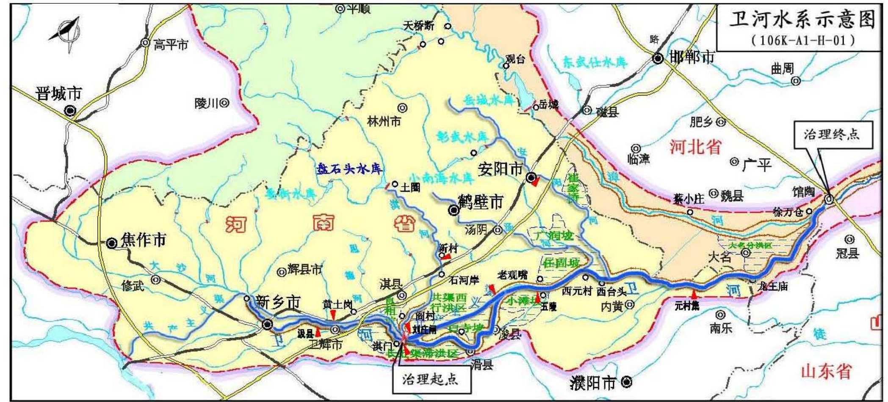  

综上所述,在综合考虑系列延长对洪水的影响和河道防洪安全的情况下,初设阶段卫河治理的设计洪水成果维持可研阶段最终成果不变,即初设阶段卫河流域河道治理推荐沿用防洪规划设计洪水成果。  

# 1.2.4 分期洪水  

可研阶段根据卫河治理段内的卫河淇门水文站 1953\~2003 年、共产主义渠刘庄水文站 1963\~2003 年及元村集(楚旺)水文站 1953\~2005 年实测流量资料,分别按照上述分期进行了分期洪水分析计算。初设阶段在可研阶段实测流量资料基础上,将三个水文站流量资料均延长至 2016 年,进行分期洪水计算。  

卫河淇门\~老观嘴段和共产主义渠淇门\~老观嘴段分别采用卫河淇门、共产主义渠刘庄站分期洪水成果。  

卫河老观嘴至徐万仓段有五陵水文站、元村集水文站,两站有 $1983\sim1991$ 年同期实测流量资料。比较两站同期各分期实测流量均值基本为 1:1 的关系,经分析采用元村集水文站分期设计洪水成果。  

# 1.2.5 卫河水文遥测系统  

现状卫河尚无水文遥测系统,无法有效掌握卫河流域来水情况,需建设卫河流域水文遥测系统。初设阶段卫河治理段的水文遥测系统包含两部分,一是治理段的水文基础设施建设,二是治理段的水位遥测系统建设。经测算,本次卫河治理段相关范围内的水文遥测系统投资合计为 262.98 万元,其中水文基础设施建设部分投资合计为 145.03 万元,占比总投资的 $56\%$ ,水位遥测系统建设总投资为 117.95 万元,占总投资的 $45\%$ 。  

# 1.3 工程地质  

# 1.3.1 区域地质  

工程区地处海河流域平原区之冲积平原上。钻孔深度范围内揭露的地层岩性除人工填土( $\mathbf{Q4}^{\mathrm{r}},$ )外,均为第四系全新统冲积层( ${\mathrm{\nabla}}Q4^{{\mathrm{al}}}$ ),主要岩性类型有粉质壤土、粉质粘土,夹粉质砂壤土、粉细砂等。  

根据《中国地震动参数区划图》(GB18306-2015),共产主义渠、卫河左堤桩号 $0{+}000{-}66{+}800$ 、卫河右堤桩号 $0{+}000{-}68{+}700$ 堤段地震动峰值加速度为$0.20\mathrm{g}$ ,相应地震基本烈度Ⅷ度;卫河左堤桩号 $66+800{\sim}179{+}000$ 、右堤桩号$68+700{\sim}182{+}000$ 堤段地震动峰值加速度为 $0.15\mathrm{g}$ ,相应地震基本烈度Ⅶ度;卫河左堤桩号 $179{+}000$ 及右堤桩号 $182{+}000$ 以下堤段地震动峰值加速度为 $0.10\mathrm{g}$ ,相应地震基本烈度Ⅶ度。地震动加速度反应谱特征周期均为 0.40s。  

综合分析场地动峰值加速度及相应地震基本烈度、断裂活动性及地震活动情况,区域构造稳定性较差。  

# 1.3.2 新建堤防工程地质  

(1)浚内沟口段  

桩号 $77+810{\sim}78{+}330$ 段堤基土主要以第四系全新统冲积( $\mathrm{\Delta{Q4}^{a l}}$ )粉砂为主,局部为粉质壤土、粉质砂壤土,堤基存在渗漏及渗透等工程地质问题,堤基工程地质条件总体为 C 类;桩号 $78+330{\sim}78{+}590$ 段堤基土以第四系全新统冲积层( $\mathrm{\Delta}Q4^{\mathrm{al}}$ )粉质粘土为主,堤基工程地质条件总体为 B 类。  

(2)马头村围村堤埝  

卫河左侧防浪墙地基土为第四系全新统冲积粉质粘土及砾砂,多为中等压缩性,存在不均匀沉降、渗漏及渗透变形等工程地质问题,建议设计采取相应措施。  

南侧挡土墙地基为人工填土或第四系全新统冲积粉质壤土,局部为粉质粘土,地基土工程性状较好,能满足地基承载力要求,存在的主要工程地质问题是地基不均匀沉降变形问题。  

新筑围村堤埝段堤基土主要为第四系全新统冲积粉质粘土,局部为人工填土,堤基发生渗漏及渗透破坏的可能性不大,堤基工程地质条件总体为 B 类。共产主义渠加高段堤基土为堤防人工填土,堤基工程地质条件总体为 B 类。  

# 1.3.3 加固堤防工程地质  

(1)堤防加戗工程  

左堤浚县么村、新镇、烧酒营及右堤浚县甘草庄加戗段堤基主要为粉质壤土、粉质粘土,堤基工程地质条件总体为 B 类。其它加戗段堤基主要为粉质壤土夹粉质砂壤土,可能存在的主要工程地质问题为渗漏及渗透破坏,堤基工程地质条件总体为 C 类。  

两岸堤身加戗应注意新老接触面的稳定问题。  

# (2)堤防防渗  

勘探揭露多处堤身填筑土中分布有粉质砂壤土、粉细砂,多呈透镜体状分布,无明显规律,粉质砂壤土多呈弱至中等透水性,粉细砂多呈中等透水性,存在渗漏及渗透稳定问题。建议设计根据渗透稳定计算选择适宜的处理措施。  

# 1.3.4 险工段工程地质  

险工段岸坡或堤坡岩性以粉质壤土、粉质粘土、砂壤土为主,局部为粉砂,抗冲能力差,且险工段主要处于不利地形部位,即堤防多位于河流急弯处,河流主槽不断向堤防偏移,严重的冲蚀岸坡、堤坡。建议对险工处堤坡或岸坡进行治理。  

# 1.3.5 拆除重建穿堤建筑物工程地质  

(1) 拆除重建穿堤涵闸  

拆除重建穿堤涵闸闸室均位于现状共产主义渠或卫河两侧堤防临河侧,主要附属建筑物有穿堤涵洞、挡墙或翼墙以及上游护底或下游消能防冲设施。地基为第四系全新统冲积相的粉质壤土、粉质粘土、粉质砂壤土层,局部夹粉细砂等,多呈中等压缩性;粉质壤土、粉质粘土多呈弱至微透水,粉质砂壤土、粉细砂多呈弱至中等透水性。闸室均采用浅基础,闸基存在沉降及不均匀沉降问题,部分闸基存在渗漏及渗透变形、地震液化等工程地质问题,建议设计采取相应措施。  

挡墙或翼墙主要存在地基不均匀沉降变形、部分引水渠存在渗漏及渗透变形、下游渠基抗冲性能较差等工程地质问题,建议设计采取相应措施。部分基坑开挖需考虑降排水措施,部分基坑边坡稳定性较差,需做好防护措施。  

# (2) 拆除重建穿堤涵管(洞)  

穿堤涵管(洞)地基持力层及边坡土体主要为堤身填筑土或冲洪积成因的粉质壤土、粉质粘土,部分为粉质砂壤土及粉砂,工程性状较好,能满足管基要求;地基土层中的粉质砂壤土及粉砂为液化土;均为水上开挖,开挖边坡稳定性较好。此外,应注意管壁与土体的接触冲刷问题。  

# 1.3.6 新建水闸和分洪口(进洪堰)工程地质  

地基为第四系全新统冲积相的粉质壤土、粉质粘土、粉质砂壤土层,局部夹粉细砂等;多呈中等压缩性,粉质壤土、粉质粘土多呈弱至微透水,粉质砂壤土、粉细砂多呈弱至中等透水性。  

新建水闸除小河口节制闸、长虹渠退水闸、盐土庄节制闸采用整体筏式底板,地基采用振冲碎石桩复合地基外,其它均采用天然地基浅基础。闸基存在沉降及不均匀沉降,部分闸基存在渗漏及渗透变形、地震液化等工程地质问题,建议设计采取相应措施。  

两岸控制楼地基主要存在沉降及不均匀沉降,部分存在地震液化等工程地质问题,建议设计采取相应措施。挡墙或翼墙主要存在地基不均匀沉降变形,部分闸室上游河渠地基存在渗漏及渗透变形、下游河渠地基抗冲性能较差等工程地质问题,建议设计采取相应措施。部分基坑开挖需考虑降排水措施,部分基坑边坡稳定性较差,需做好防护措施。  

分洪堰地基土体性状较好,满足复堤堤基强度及变形要求;存在的主要工程地质问题是堰后地基土体坑冲性能较差,需做好防护措施。  

# 1.3.7 桥基工程地质  

生产桥基础均采用桩基,桩周及桩端持力层均为第四系全新统冲积相的粉质壤土、粉质粘土、粉质砂壤土及粉砂、细砂,多属中等压缩性土;存在的主要工程地质问题是不均匀沉降、地震液化、基坑降排水等工程地质问题,建议设计根据需要采取适宜措施。  

# 1.3.8 管理所和仓库工程地质  

盐土庄管理所、刘庄闸仓库场区设计基本地震动峰值加速度为 $0.20\mathrm{g}$ ,相应地震烈度为Ⅷ度。建筑场地类别为Ⅲ类,属对建筑抗震一般地段。其中盐土庄管理所地基持力层为粉土,下卧淤泥质粘土、粉质粘土(夹粘土);刘庄闸仓库地基持力层为粉土,下卧粉质粘土、粉细砂。存在的主要工程地质问题均为地基沉降与不均匀沉降问题。  

金滩镇仓库工程区场地设计基本地震加速度值为 $0.15\mathrm{g}$ ,相应抗震设防烈度为Ⅶ度。建筑场地类别为Ⅲ类,属对建筑抗震一般地段。地基持力层为粉土,下部夹淤泥质粘土层,存在的主要工程地质问题为地基沉降与不均匀沉降问题。  

# 1.3.9 河道清淤工程地质  

主槽部位设计采深内主要为淤泥质壤土,下部采深内为粉质壤土、粉质砂壤土,局部含生活垃圾或建筑垃圾,疏浚土分级主要为 1\~2 级。主槽两侧滩地主要为粉质壤土、粉质砂壤土,局部为粉质粘土、粉砂,疏浚土分级主要为 3\~4 级,局部为 5 级。存在的主要工程地质问题是施工期的边坡稳定问题,施工期需注意机械人员安全。  

# 1.3.10 堤顶防汛道路  

堤顶新增防汛道路地基为已建堤身填土,岩性主要为粉质壤土,地基承载力满足要求。堤防加培段及附近地段应注意路基不均匀沉降问题。  

# 1.3.11 天然建筑材料  

(1)设计土料场  

本次初步设计阶段完成的20个设计土料场,设计采深内主要岩性为粉质壤土、粉质粘土,局部为粉质砂壤土、粉细砂、粘土。粉质壤土、粉质粘土和粉质砂壤土为有用层,混合后使用,总体而言各料场储量丰富,质量基本满足规范要求,开采、运输条件良好。  

建议在储量丰富的前提进行选择性开采:对岩性单一的粉质壤土可直接开采;对岩性复杂的地层进行混合开采,并充分混合搅拌。避免诸如粘土、粉质粘土、粉质砂壤土等单一土料集中上堤,必要时可适当提高压实度。应根据各料场击实试验成果,严格控制含水率及压实度。  

# (2)备用土料场  

卫河右堤TL-Y8号土料场、浚内口门土料场,作为设计土料场之外的备用土料场。设计采深内主要岩性为粉质壤土、粉质粘土、粉质砂壤土,局部分布有粉细砂。土料质量基本满足规范要求,开采、运输条件良好。  

# (3)卫河清淤土料  

主槽表层开挖料多为淤泥质壤土,塑性指数、天然含水率偏高,且局部含生活垃圾或建筑垃圾,不符合现行建材勘察规程要求。主槽两侧滩地开挖料岩性主要为粉质壤土、粉质粘土,局部为粉质砂壤土、粉细砂或粘土,可将粉质壤土、粉质砂壤土、粉质粘土混合后筑堤,但其含水率偏高,需充分翻晒后使用。  

# 1.4 工程任务与规模  

# 1.4.1 卫河河系基本情况  

1958 年为引黄修建的共产主义渠,自合河与卫河相交后,大沙河就改入共产主义渠。共产主义渠自合河起傍卫河左岸至老观嘴汇入卫河,1962 年停止引黄后用于行洪,卫河则在淇门以上基本用于排涝,淇门以下卫河洪涝合排。  

卫河两侧有良相坡、柳围坡、长虹渠、共产主义渠以西地区、白寺坡、小滩坡、任固坡等行洪、蓄滞洪区。  

河南省于 1982 年对卫河西孟姜女河入卫口至老观嘴段按排涝流量 $130\sim$ $150\mathrm{m}^{3}/\mathrm{s}$ 进行过清淤,1985 年对老观嘴至浚内沟口段按排涝流量 $700\mathrm{m}^{3}/\mathrm{s}$ 进行过清淤;1978 年对浚内沟口至徐万仓段河道按照排涝流量 $700{\sim}1000\mathrm{m}^{3}/\mathrm{s}$ 、行洪流量 $2000{\sim}2500\mathrm{m}^{3}/\mathrm{s}$ 、堤防超高 $1.5\mathrm{m}$ 的规模进行了扩大治理。  

# 1.4.2 漳卫河系洪水安排  

根据 2008 年国务院批复的《海河流域防洪规划》,漳卫河防洪标准为 50 年一遇。漳河洪水由岳城水库控制下泄,30 年一遇以下洪水控泄 $1500\mathrm{m}^{3}/\mathrm{s}$ ,遇 $30\sim$ 50 年一遇洪水时控泄流量为 $3000\mathrm{m}^{3}/\mathrm{s}$ ,超过 50 年一遇洪水不限泄。岳城水库至东王村段河道设计行洪流量 $3000\mathrm{m}^{3}/\mathrm{s}$ ,东王村以下河道设计行洪流量 $1500\mathrm{m}^{3}/\mathrm{s}$ 。当岳城水库泄量大于 $1500\mathrm{m}^{3}/\mathrm{s}$ 时,利用大名滞洪区滞洪。  

卫河洪水经上游盘石头、小南海、彰武等水库控制及中游坡洼滞洪后下泄,淇门至老观嘴设计行洪流量 $2000\mathrm{m}^{3}/\mathrm{s}$ ,其中卫河设计行洪流量 $400\mathrm{m}^{3}/\mathrm{s}$ ,共产主义渠及共西行洪区由盐土庄节制闸控制下泄,盐土庄以下设计行洪流量$1600\mathrm{m}^{3}/\mathrm{s}$ ,老观嘴至安阳河口设计行洪流量 $2000\mathrm{m}^{3}/\mathrm{s}$ ,安阳河口至徐万仓设计行洪流量 $2500\mathrm{m}^{3}/\mathrm{s}$ 。  

漳、卫两河 50 年一遇洪水至徐万仓汇合后设计流量 $4000\mathrm{m}^{3}/\mathrm{s}$ ,由卫运河承泄,至四女寺枢纽,由漳卫新河承泄 $3650\mathrm{m}^{3}/\mathrm{s}$ ,南运河承泄 $150\mathrm{m}^{3}/\mathrm{s}$ 。其余 $200\mathrm{m}^{3}/\mathrm{s}$ 由漳卫新河强迫行洪,如发生险情,向恩县洼分洪。  

# 1.4.3 河道现状行洪排涝能力复核及存在问题  

本次采用天然河道恒定非均匀流水面线计算方法分别对卫河和共产主义渠现状河道进行水面线计算,复核河道现状行洪与排涝能力。  

经分析,卫河淇门以下干流河道行洪能力仅有 $52\mathrm{km}$ 长河道基本满足原设计行洪能力,其余河段均不同程度有所降低。其原因为上游河道主槽有局部淤积、河槽边壁及滩地上种植有林木和高秆作物等,减小河道行洪断面,加大河道的糙率,且堤防超高不足,从而降低河道行洪能力。  

# 1.4.4 工程任务与规模  

# 1.4.4.1 治理范围  

(1)卫河干流河道  

卫河干流河道治理起始点为淇河与共产主义渠交汇口,起始桩号为 $0{+}000$ ,包括淇共交汇口以下约 $1.19\mathrm{km}$ 淇河及淇门以下卫河干流(统称为淇门以下卫河干流),治理终点为徐万仓,河道桩号 $182{+}950$ ,治理河道长约 $183\mathrm{km}$ ,左堤长$186\mathrm{km}$ ,右堤长 $191\mathrm{km}$ 。  

# (2)共产主义渠  

共产主义渠治理起始点为淇河与共产主义渠交汇口,河道桩号 $0{+}000$ ,治理终点为共产主义渠汇入卫河处,即治理终点为老观嘴,河道桩号 $44+200$ ,治理河道长约 $44.2\mathrm{km}$ 。  

本次治理内容包括淇门以下卫河干流河道清淤扩挖、卫河干流和共产主义渠堤防加高培厚与加固、沿河穿堤建筑物与险工险段等除险加固、刘庄闸改建为桥梁工程,同时新建或改建河道及堤防上的控制性工程,包括盐土庄节制闸、小河口节制闸、浚县箱涵(浚县上口箱涵和下口箱涵)、白寺坡分洪堰、长虹渠分洪堰和长虹渠退水闸,以及浚内沟排涝涵闸,民丰沟排涝闸(上口闸、下口闸)。  

# 1.4.4.2 治理标准  

(1)防洪标准  

根据《可研报告》批复成果,本次卫河干流(淇门至徐万仓)河道治理的防洪标准为 50 年一遇,其中:  

卫河设计行洪流量淇门至老观嘴段 $400\mathrm{m}^{3}/\mathrm{s}$ 、老观嘴至安阳河口段 2000$\mathrm{m}^{3}/\mathrm{s}$ 、安阳河口至徐万仓段 $2500\mathrm{m}^{3}/\mathrm{s}$ ;  

共产主义渠淇门至盐土庄节制闸段河道与共产主义渠以西行洪区共同行洪,分泄上游共产主义渠和淇河发生的 50 年一遇洪水,盐土庄节制闸以下河道设计行洪流量为 $1600\mathrm{m}^{3}/\mathrm{s}$ ;  

新建水闸(堰)及穿堤建筑物工程、刘庄闸改桥工程等的设计防洪标准与所在河道堤防的防洪标准相同。  

# (2)排涝标准  

本次排涝治理以恢复原排涝规模为准,即恢复原设计排涝能力:淇门至老观嘴段为 $130{\sim}150\ensuremath{\mathrm{m}}^{3}/\mathrm{s}$ 、老观嘴至徐万仓段为 $700{\sim}1000\mathrm{m}^{3}/\mathrm{s}.$ 。  

共产主义渠排涝标准以恢复共产主义渠 20 年一遇麦涝标准,即共产主义渠设计麦涝流量 $250\mathrm{m}^{3}/\mathrm{s}$ 。  

# 1.4.4.3 治理任务  

《可研报告》批复的主要任务为对卫河干流淇门\~徐万仓段和共产主义渠进行防洪治理,恢复河道设计行洪与排涝能力,完善流域防洪工程体系,保障卫河两岸防洪安全。主要建设内容包括:卫河主槽清淤、堤防加高加固、险工险段整治、穿堤建筑物除险加固、河道及坡洼控制工程的建设、堤顶防汛道路和管理设施建设等,使淇门以下卫河干流河道和共产主义渠恢复河道行洪与排涝能力,达到设计防洪与排涝标准,从而提高漳卫河系防洪标准。  

# 1.4.4.4 建设内容与规模  

河道清淤 60.64 公里,其中老观嘴以上 51.53 公里,老观嘴以下 9.11 公里;修建卫河干流和共渠堤防 100.9 公里,其中加培堤防 100.12 公里,新筑堤防 0.78公里;加固堤防 7.06 公里(其中堤防临背水侧加戗 $2.43\mathrm{km}$ ,布置水泥搅拌桩$4.63\mathrm{km}$ );新建马头村围村埝 2.9 公里;治理险工 68 处,总长 17.57 公里;新建水闸(堰)10 座,包括河道节制闸 2 座,蓄滞洪区分洪堰 2 座、退水闸 1 座,箱涵 2 座,排涝涵闸 3 座;修建穿堤建筑物 445 座,其中拆除重建 61 座,维修加固 307 座,拆除封堵 77 座;修建桥梁 6 座,其中新建 1 座,拆除重建 5 座;修建堤顶道路沥青混凝土路面291.37 公里,其中新建279.68 公里、拆除重建11.69公里,新建上堤坡道 430 条、总长 21.5 公里。  

# 1.5 工程布置及建筑物  

# 1.5.1 河道主槽清淤  

本次治理对淇门以下卫河干流河道按基本恢复原排涝水位进行清淤,基本沿现状河槽中心线布置,局部紧邻险工险段处向河岸滩地较宽方向适当调整,并与卫运河平顺连接。根据现状排涝水位计算结果,现状河道排涝水位比原设计排涝水位壅高 $0.17{\sim}1.25\mathrm{m}$ ,其中十里铺裁湾下口以上段河道、老观嘴至浚内沟口段排涝水位壅高值较大,为提高河道排涝能力,需对以上河段进行清淤。河道主槽清淤长度 $60.64\mathrm{km}$ ,其中淇门至十里铺裁湾下口段河道主槽清淤长度 $51.53\mathrm{km}$ ,老观嘴至浚内沟口段河道主槽清淤长度 $9.11\mathrm{km}$ ,其余河段主槽断面维持现状。共产主义渠维持现状河槽不清淤。  

淇门至十里铺裁湾下口段主槽(主槽桩号 $0{+}140{-}52{+}730)$ )河道主槽清淤长度为 $51.53\mathrm{km}$ ,清淤边坡 1:3,设计清淤底宽:淇共汇合口以下(主槽桩号$0{+}140{\sim}0{+}730$ 段)底宽为 $60\mathrm{m}$ ;其下至东郭村(主槽桩号 $0{+}730{-}8{+}890;$ )底宽为$17\mathrm{m}$ ;东郭村至宗湾下口段(主槽桩号 $8+890{\sim}29{+}290;$ )底宽为 $12\mathrm{m}$ ;宗湾下口至苑刘庄段(主槽桩号 $29+290{\sim}42{+}020;$ )底宽为 $22\mathrm{m}$ ;苑刘庄至浚县分岔口上口段(主槽桩号 $42+020{\sim}47{+}250;$ )底宽为 $10\mathrm{m}$ ;浚县分岔口上口至十里铺裁湾下口段(主槽桩号 $47+250{\sim}52{+}730;$ )底宽为 $10\mathrm{m}$ 。  

老观嘴至浚内沟口段(主槽桩号 $69{+}870{-}72{+}240.$ 、 $72+450{\sim}79{+}190$ )河道主槽清淤长度为 $9.11\mathrm{km}$ ,设计清淤底宽为 $20\mathrm{m}$ ,清淤边坡 1:3。老观嘴处卫河河道清淤底高程为 $46.98\mathrm{m}$ ,浚内沟口清淤底高程为 $45.21\mathrm{m}$ (现状河道高程),河道设计纵坡为 $0.2\text{\textperthousand}$ 。  

# 1.5.2 堤防加培  

# 1、卫河堤防加培工程  

卫河自盐土庄村附近与共产主义渠共同行洪,本次治理对卫河淇门至共卫合流(盐土庄)段在设计流量下两岸堤顶超高不足 $1.0\mathrm{m}$ 堤段按堤防超高 $1.2\mathrm{m}$ 、堤顶宽 $5.0\mathrm{m}$ 进行加培,共卫合流以下至徐万仓段在设计流量下两岸堤顶超高不足$1.5\mathrm{m}$ 堤段按堤防超高 $1.8{\sim}2.0\mathrm{m}$ 、堤顶宽度为 $5.0{\sim}6.0\mathrm{m}$ (共卫合流至老观嘴段堤顶宽度为 $5.0\mathrm{m}$ ,老观嘴至徐万仓段堤顶宽度为 $6.0\mathrm{m}$ )进行加培治理,治理长$68.67\mathrm{km}$ ,其中左堤加培治理长 $35.27\mathrm{km}$ ,右堤加培治理长 $33.4\mathrm{km}$ 。  

左堤加培段长 $35.27\mathrm{km}$ ,其中加墙段长 $11.73\mathrm{km}$ ,其余采用土堤型式。  

右堤加培段 $33.4\mathrm{km}$ ,其中加墙段长 $2.05\mathrm{km}$ ,其余采用土堤型式。  

# 2、共产主义渠堤防加培工程  

共产主义渠淇门(刘庄闸) $\sim$ 拟建盐土庄节制闸段右堤,按照堤防超高 $1.3\mathrm{m}$ 、堤顶宽 $5.0\mathrm{m}$ 进行加培治理,加培长度 $27.675\mathrm{km}$ ;拟建的盐土庄节制闸至老观嘴段左堤,由于共产主义渠与卫河合流,按照堤防超高为 $2.0\mathrm{m}$ 、堤顶宽 $5.0\mathrm{m}$ 进行加培治理,治理长度 $3.775\mathrm{km}$ 。  

# 1.5.3 新筑堤防  

卫河右堤在浚内沟口段现状有 $0.78\mathrm{km}$ 无堤,为防止卫河设计标准及其以下频率的洪水倒灌小滩坡,本次治理对此无堤段新筑堤防,治理长 $0.78\mathrm{km}$ 。设计超高 $1.8\mathrm{m}$ ,堤顶宽 $6\mathrm{m}$ 、迎水侧边坡 1:3、背水侧边坡 1:2.5。  

# 1.5.4 马头村围村埝  

盐土庄节制闸控泄的共产主义渠洪水与卫河洪水合流,共卫合流的洪水直冲闸下共卫滩区间的马头村,为保证马头村的防洪安全,拟建马头村围村埝工程,设计防洪标准为 10 年一遇。其中位于卫河主槽侧修建防浪墙,位于共产主义渠侧对共产主义渠右堤进行防护加培,位于上下游(南北侧)侧新筑围村堤埝与挡土墙,围村埝总长 $2.9\mathrm{km}$ 。  

马头村东侧紧邻卫河主河槽左岸,采用新建土堤加防浪墙的结构形式,长$0.55\mathrm{km}$ ,设计墙顶高程 $59.1\mathrm{m}$ 。  

西侧紧邻共产主义渠右岸,经复核该段结合共产主义渠右岸现状高程满足设计要求,但由于共渠是主要行洪通道,流速约为 $1.4\mathrm{m}/\mathrm{s}$ ,因此对现状共渠右堤进行护坡,长度 $1.0\mathrm{km}$ 。  

南侧围村埝紧邻马头村村内道路及民房,另一侧为排涝渠道,渠底宽约 $2\mathrm{m}$ ,为减少占地及不影响道路通行,采用新建防洪墙的结构形式,长约 $0.73\mathrm{km}$ 。  

北侧新筑堤埝,背水侧为民房,临水侧为耕地,围村埝长约 $0.62\mathrm{km}$ 。  

# 1.5.5 堤防加固  

# 1、新堤穿老河段堤防加戗工程  

卫河在 1978 年扩大治理时对部分河道实施了裁弯取直工程,由于工程实施时未对河槽淤泥进行清除处理,裁弯处新建堤防直接坐落在淤泥层面上。由于老河槽的存在,在“96.8”洪水期间堤身出现渗水现象,堤防存在安全隐患。结合区域地形条件及依据堤防地质勘察资料,对卫河左堤 $725+280{\sim}Z25{+}380$ 、 $Z27{+}870$ ${\sim}\mathbf{Z}28{+}400$ 、 $Z114+130{\sim}Z114{+}400$ 、 $_{\mathrm{Z1}76+670-\mathrm{Z1}76+770}$ 、 $\scriptstyle\mathrm{Z177+370-Z177+470}$ 段长 $1.10\mathrm{km}$ 、卫河右堤 $\mathrm{Y}10{+}430{-}\mathrm{Y}10{+}630$ 、 $\Upsilon25{+}950{-}\Upsilon26{+}200$ 、 $\mathrm{Y}26{+}700$ \~Y26$+800$ 、 $\mathrm{Y}50\substack{+580\sim}\mathrm{Y}50\substack{+730}$ 、 $\mathrm{Y}51+600{\sim}\mathrm{Y}51+700$ 、 $\mathrm{Y}174+760{\sim}\mathrm{Y}175{+}090.$ 、 $\mathrm{Y}177+$ $290{\sim}\mathrm{Y}177{+}490$ 段长 $1.33\mathrm{km}$ 共计 $2.43\mathrm{km}$ 长的新堤穿老河堤防在迎水侧加筑戗台。  

# 2、堤防防渗工程  

卫河左堤长度约 $2.41\mathrm{km}$ 、右堤长度约 $2.22\mathrm{km}$ 的堤段,在堤身下部及堤基处分布有不同厚度的粉细砂层,透水性强,经对堤基部位有粉细砂层的典型断面进行渗流稳定计算成果可知,部分堤段渗流稳定不满足要求。在设计水位以下的堤身部位存在粉细砂层的堤段,考虑到土质结构疏松,堤身土体在长时间浸水状态下可能出现塌坡、散浸、渗透变形等问题,从而造成险情,防渗处理总长 $4.63\mathrm{km}$ 。采用水泥搅拌桩防渗墙进行防渗设计,防渗墙厚度 $0.161\mathrm{m}$ ,底部深入粉细砂层以下 $0.5\mathrm{m}$ 。  

水泥搅拌桩防渗墙成墙面积 2.13 万 $\mathrm{m}^{2}$ 。  

# 1.5.6 堤顶防汛道路  

本次治理对卫河左右岸堤顶现状土路进行硬化,同时对部分现状破损路面进行拆除重建;共产主义渠左堤自拟建盐土庄节制闸至屯子桥、右堤自淇门(刘庄闸)至屯子桥布设堤顶硬化路面。堤防堤顶硬化路面设计为沥青混凝土路面,总治理长度为 $291.37\mathrm{km}$ 。  

(1)卫河左堤  

卫河左堤总长 $186\mathrm{km}$ ,其中侯胡寨村至屯子桥段(左堤桩号 $Z54+290\sim$ $Z57\substack{+290}$ )为省道 S219,屯子桥至老观嘴段( $\scriptstyle757+290\sim\mathbf{Z6}6+850$ )利用共渠左堤。左堤现有硬化路面 $63.87\mathrm{km}$ ,本次新铺沥青路面 $109.34\mathrm{km}$ ,拆除重建破损路面 $1.05\mathrm{km}$ 。  

(2)卫河右堤  

卫河右堤路面总长 $191\mathrm{km}$ ,现有硬化路面 $51.55\mathrm{km}$ ,本次路面治理总长$143.88\mathrm{km}$ ,其中新铺沥青混凝土路面 $139.44\mathrm{km}$ ,拆除重建现有破损路面 $4.44\mathrm{km}$ 。  

(3)共产主义渠堤防防汛道路  

共渠左堤长 $44.2\mathrm{km}$ ,新铺沥青混凝土路面 $2.41\mathrm{km}$ ,其余维持现状。右堤长$44.2\mathrm{km}$ ,治理路面总长 $34.69\mathrm{km}$ ,其中新铺沥青混凝土路面 $28.49\mathrm{km}$ ,拆除重建现有破损路面 $6.2\mathrm{km}$ 。  

# (4)上下堤坡道  

本次治理工程扰动段上下堤坡道共计 430 处,长度为 $21.5\mathrm{km}$ ,按照沥青混凝土路面进行设计,其中卫河左堤 136 处,卫河右堤 167 处,共渠 127 处。  

# 1.5.7 险工整治工程  

卫河沿线现有险工 130 座,依据险工现状情况和现状河道走向、河流流势以及“96.8”洪水出险情况,结合河道冲淤规律分析成果,本次对 68 处险工安排治理,其它 62 处险工维持现状,其中现状无防护工程险工 14 处,现有防护工程长度不足或破损严重险工 15 处,现有防护工程局部破损的险工 4 处,存在基础悬吊问题险工 35 处。险工分类如下:  

(1)河道弯道顶冲处,现状无防护工程,“96.8”洪水河槽冲刷严重,且紧邻堤防边坡,此类险工 14 处,其中左岸 7 处,右岸 7 处。  

(2)现有防护工程护砌长度不足的险工,安排向上下游延长,此类险工 15处,其中左岸 9 处,右岸 6 处。  

(3)现有防护工程局部破损严重的险工,对局部破损段进行翻修治理,此类险工 4 处,其中左岸 1 处,右岸 3 处。  

(4)现有防护工程位置较高,结构较完好,但河槽弯道顶冲部位,存在不同程度基础悬吊,此类险工 35 处,其中左岸 17 处,右岸 18 处。  

(5)现有防护工程且结构完好,或现状处于弯道险工,但滩地相对较宽,险工所在位置险情不严重,此类险工 62 处,本次治理不安排防护工程,维持现状。  

对于现状无防护工程险工,若现状滩地较窄或无滩地,新建防护工程从主槽位置护砌至堤顶,若滩地较宽,则对主槽进行护砌;对于现状防护工程不足或破损严重险工,进行接长或翻修;对于现有防护工程局部破损的险工,对破损位置进行局部修补;对于基础悬吊险工,对主槽进行防护。  

采用格宾石笼与土工固袋两种护砌形式,对河槽及滩地险工护至现状滩面高程,对单堤险工护砌至设计堤顶高程。压顶宽 $1\mathrm{m}$ ,材质及厚度与护坡结构相同。坡脚采用混凝土基座,宽 $0.8\mathrm{m}$ ,厚 $1.2\mathrm{m}$ 。对冲刷较严重险工,当设计垂直护脚深度不能满足冲刷要求时,在基座前端增设水平格宾石笼护脚,厚度为 $0.3\mathrm{m}$ 。  

# 1.5.8 新建水闸工程设计  

依据规范要求及流域防洪规划、流域综合规划的安排,卫河和共产主义渠在共卫合流以下的河道堤防级别为 2 级;在共卫合流以上共产主义渠右堤、卫河左右堤堤防级别均为3级。根据《堤防工程设计规范》(GB50286-2013)中有关规定,重建涵闸的设计标准与卫河及共产主义渠的堤防标准一致,即穿堤建筑物按 $2\sim3$ 级建筑物进行设计,根据《水利水电工程合理使用年限及耐久性设计规范》(SL 654-2014)规定, $2\sim3$ 级灌排建筑物合理使用年限均为 50 年。  

除马头村围村埝处民丰沟上、下口挡洪排涝闸挡洪时设计洪水位为 10 年一遇标准外,其余新建水闸堰设计洪水位按 50 年一遇设计。设计排涝标准为 3 年一遇。盐土庄节制闸、浚内沟排涝涵闸为 2 级建筑物,合理使用年限为 100 年;小河口节制闸、白寺坡分洪堰、长虹渠分洪堰、长虹渠退水闸、浚县挡水箱涵为3 级建筑物,合理使用年限为 50 年。民丰沟排涝闸为 5 级建筑物,合理使用年限为 30 年。  

依据各水闸的运用功能,确定各闸均采用整体式底板(浚内沟排涝涵闸除外),胸墙式闸室(浚内沟排涝涵闸采用涵闸形式)、平板直升门。  

(1)盐土庄节制闸  

盐土庄节制闸位于盐土庄村西侧,共产主义渠河道桩号为 $32+280$ 。盐土庄节制闸控泄流量 $1600\mathrm{m}^{3}/\mathrm{s}$ ,7 孔,每孔净宽 $11.0\mathrm{m}$ 。中墩及边墩厚均为 $1.5\mathrm{m}$ ,缝墩厚 $1.0\mathrm{m}$ ,闸室总宽度 $90.0\mathrm{m}$ 。底板高程 $53.0\mathrm{m}$ ,闸顶高程为 $62.8\mathrm{m}$ ,闸室长 $15.0\mathrm{m}$ 。  

闸室上游侧设护坦,下游侧设消力池、海漫及防冲槽。  

平面钢闸门, $2\mathrm{x}400\mathrm{kN}$ 固定卷扬启闭机启闭,一门一机。不设检修闸门及启闭设备。闸室下游侧设交通桥,上游侧布置人行便桥,机架桥布置在闸室偏上游侧,机架桥上设启闭机房。闸左右岸分别设有控制楼。  

在闸室下游侧设工作桥,按公路-Ⅱ级汽车荷载等级设计,采用预制空心板结构,桥面总宽 $5.0\mathrm{m}$ ,桥面高程为 $62.8\mathrm{m}$ 。闸室上游侧布置人行便桥,桥面宽度 $2.70\mathrm{m}$ ,桥面高程 $62.8\mathrm{m}$ 。机架桥布置在闸室偏上游侧,桥面高程为 $70.8\mathrm{m}$ ,机架桥上设启闭机房,启闭机房宽为 $7.5\mathrm{m}$ ,启闭机房采用框架结构。  

(2)小河口节制闸  

小河口节制闸在淇共汇合口以下约 $300\mathrm{m}$ ,河道桩号 $0{+}300$ 。设计流量 700$\mathrm{m}^{3}/\mathrm{s}$ ,5 孔,每孔净宽 $10.0\mathrm{m}$ 。中间 1 孔一联,两侧 2 孔一联。中墩及边墩厚均为 $1.5\mathrm{m}$ ,缝墩厚 $1.0\mathrm{m}$ ,闸室总宽度 $60.0\mathrm{m}$ 。底板高程为共产主义渠主河槽地面高程 $58.0\mathrm{m}$ 。闸顶高程为 $68.1\mathrm{m}$ 。闸室长 $18.0\mathrm{m}$ 。  

闸室上游侧设护坦,下游侧设消力池、海漫及防冲槽。  

平面钢闸门, $2\mathrm{x}400\mathrm{kN}$ 固定卷扬启闭机启闭,一门一机;工作闸门上游侧设有钢叠梁门检修闸门, $2\mathrm{x}100\mathrm{kN}$ 电动葫芦启闭,工作闸门下游侧预留检修门槽,不设闸门及启闭设备。在闸室下游侧设交通桥,上游侧布置人行便桥,桥面上设启闭机房,闸左右岸分别设有控制楼。  

# (3)长虹渠分洪堰  

长虹渠分洪堰在卫河右堤桩号 $2+030$ 附近,设计分洪流量 $900\mathrm{m}^{3}/\mathrm{s}$ ,堰形为折坡式宽顶堰,混凝土底板,为日常生产、交通和避免低标准洪水下分洪考虑,分洪堰混凝土底板上填筑均质土堤,堤顶高程 $66.8\mathrm{m}$ (同两边堤防),堤顶宽度$4.0\mathrm{m}$ ;堰顶高程 $63.2\mathrm{m}$ ,分洪堰底板总长 $33.0\mathrm{m}$ ,总宽 $500.0\mathrm{m}$ 。堰体上游接格宾护底,下游布设格宾护底,抛石防冲槽。采用重力式混凝土挡墙对堰口进行防护,采用格宾护坡对分洪堰两侧堤坡进行防护。  

分洪堰采用人工分洪方式。  

(4)白寺坡分洪堰  

白寺坡分洪堰选定在白寺村附近的共产主义渠 $24+400$ 位置的右堤上,设计流量 $1600\mathrm{m}^{3}/\mathrm{s}$ ,堰形为折坡式宽顶堰,混凝土底板,为日常生产、交通和避免低标准洪水下分洪考虑,分洪堰混凝土底板上填筑均质土堤,堤顶高程 $63.0\mathrm{m}$ (同两边堤防),堤顶宽度 $6.0\mathrm{m}$ ;堰顶高程 $57.0\mathrm{m}$ ,分洪堰底板总长 $48.0\mathrm{m}$ ,总宽$350.0\mathrm{m}$ ,预留 50 米宽度修建裹头。堰体上游接格宾护底,下游为格宾护底、抛石防冲槽。采用重力式混凝土挡墙对堰口进行防护,采用格宾护坡对分洪堰两侧堤坡进行防护。  

分洪堰采用人工分洪方式。  

(5)长虹渠退水闸  

长虹渠退水闸在卫河右堤 $29\mathrm{+}950$ 位置,设计流量 $400~\mathrm{m}^{3}/\mathrm{s}$ ,共 5 孔,每孔净宽 $7.0\mathrm{m}$ 。中墩厚 $1.5\mathrm{m}$ ,边墩厚 $1.2\mathrm{m}$ ,缝墩厚 $1.0\mathrm{m}$ ,闸室总宽度 $44.4\mathrm{m}$ 。底板高程为 $57.20\mathrm{m}$ ,闸顶高程为 $64.20\mathrm{m}$ ,闸室长 $15.0\mathrm{m}$ 。闸室结构为胸墙式,底板为采用整体筏式。  

闸室上游侧设护坦,下游侧设消力池、海漫和防冲槽。  

平面钢闸门,采用 $2\mathrm{x}250\mathrm{kN}$ 固定卷扬启闭机启闭,一门一机。在闸室下游侧设交通桥,闸室上游侧布置人行便桥,机架桥布置在闸室偏上游侧,桥面上设启闭机房,闸左右岸分别设有控制楼。  

# (6)浚内沟排涝涵闸  

浚内沟排涝涵闸在卫河右堤 $27+310$ ,设计流量 $31.3\mathrm{m}^{3}/\mathrm{s}$ ,2 孔,每孔净宽$3.0\mathrm{m}$ 。中墩厚 $1.5\mathrm{m}$ ,边墩厚 $1.0\mathrm{m}$ ,闸室总宽度 $9.50\mathrm{m}$ 。底板高程为 $50.0\mathrm{m}$ ,闸顶高程为 $56.15\mathrm{m}$ ,闸室长 $10.0\mathrm{m}$ 。  

闸室上游侧设护底和护坦,下游设消力池,海漫和防冲槽。  

平面钢闸门,采用 $2\mathrm{x}160\mathrm{kN}$ 固定卷扬启闭机启闭,采用一门一机,不设检修门。机架桥桥面上设启闭机房。  

# (7)浚县箱涵  

卫河在浚县县城有左右两个河槽,右侧河槽紧邻县城老城区,浚县挡水箱涵上口闸位于卫河河道桩号 $42+850$ 处的右侧河槽处,下口闸位于卫河河道桩号$44+590$ 处的右侧河槽处。设计流量均为 $20\mathrm{m}^{3}/\mathrm{s}$ ,共 1 联 4 孔,每孔净宽 $2.50\mathrm{m}$ ,净高 $2.5\mathrm{m}$ 。中墩厚 $1.20\mathrm{m}$ ,边墩厚 $1.0\mathrm{m}$ ,埋涵总宽度 $15.60\mathrm{m}$ 。上口闸底板高程$54.0\mathrm{m}$ 。上覆土堤顶高程为 $61.2\mathrm{m}$ 。埋涵总长 $30.0\mathrm{m}$ 。下口闸底板高程 $53.5\mathrm{m}$ 。上覆土堤顶高程为 $61.0\mathrm{m}$ 。埋涵总长 $30.0\mathrm{m}$ 。  

# (8)民丰沟排涝闸  

民丰沟排涝闸位于民丰沟与马头村围村埝交叉口处,分为上口闸和下口闸。挡洪时设计洪水位为卫河与共产主义渠合流后 10 年一遇标准。  

民丰沟上、下口闸闸室结构均为胸墙式,底板均为整体筏式底板,共 1 联 3孔,每孔净宽 $3.0\mathrm{m}$ 。上口闸底板高程 $53.40\mathrm{m}$ ,下口闸底板高程 $51.40\mathrm{m}$ ,分别与各闸址处沟底高程一致。  

上口闸底板厚 $1.0\mathrm{m}$ 。中墩厚 $1.2\mathrm{m}$ ,缝墩厚 $1.0\mathrm{m}$ ,闸室总宽度 $13.4\mathrm{m}$ 。闸顶高程为 $59.70\mathrm{m}$ 。闸室长 $12.0\mathrm{m}$ 。闸室上游侧设 $10.0\mathrm{m}$ 长格宾护底和 $15.0\mathrm{m}$ 混凝土护坦;闸室下游侧设长 $15.0\mathrm{m}$ 混凝土海漫和 $10.0\mathrm{m}$ 长格宾海漫。闸室上下游各设 $15.00\mathrm{m}$ 长半重力式翼墙,墙顶高程 $59.70\mathrm{m}$ 。翼墙两侧接 1:2.0 格宾护坡。  

下口闸底板厚 $1.0\mathrm{m}$ 。中墩厚 $1.2\mathrm{m}$ ,缝墩厚 $1.0\mathrm{m}$ ,闸室总宽度 $13.4\mathrm{m}$ 。闸顶高程为 $59.70\mathrm{m}$ 。闸室长 $12.0\mathrm{m}$ 。闸室上游侧设 $15.0\mathrm{m}$ 混凝土护坦;闸室下游侧设长 $26.6\mathrm{m}$ 混凝土消力池和 $12.00\mathrm{m}$ 长抛石防冲段。闸室上游设 $15.00\mathrm{m}$ 长半重力式翼墙,墙顶高程 $59.70\mathrm{m}$ ,下游设长度分别为 $12.0\mathrm{m}$ 和 $14.6\mathrm{m}$ 的半重力式翼墙。墙背与马头村围埝相接。  

工作闸门采用铸铁闸门,共3 扇,闸门尺寸为 $3.0\mathrm{x}3.0\mathrm{m}$ (宽 $\mathbf{X}$ 高),采用 250kN手电两用螺杆启闭机启闭,一门一机。  

机架桥布置在闸室偏上游侧,桥面高程为 $64.00\mathrm{m}$ ,为预制混凝土 T 形梁,下部采用排架柱支承在闸墩上。上口闸在闸室下游侧设交通桥,按公路-Ⅱ级汽车荷载等级设计,采用预制空心板结构,桥总宽 $5\mathrm{m}$ ,桥面高程为 $59.70\mathrm{m}$ 。  

# 1.5.9 穿堤建筑物加固设计  

经历了四、五十年的运用,大部分穿堤建筑物有不同程度的损坏,存在安全隐患和不能正常使用等问题,本次对穿堤建筑物主要采用以下 4 种方案进行治理改造设计:  

(1)拆除重建;主要针对损坏严重或存在安全隐患,部分维修加固已不能  
满足长期使用要求的建筑物;(2)维修加固;主要针对基本完好只是部分损坏、维修加固后可继续使用  
的穿堤建筑物,或因为堤防加宽、加高,需要接长和重建进出口的穿堤建筑物。(3)拆除封堵;主要针对废弃不再使用的建筑物,或已损坏有其他建筑物  
可替代的穿堤建筑物。(4)维持现状;主要针对现状基本完好,不受堤防加固影响的穿堤建筑物。  

根据《堤防工程设计规范》(GB50286-2013)中有关规定,重建涵闸的设计标准与卫河及共产主义渠的堤防标准一致,即穿堤建筑物按 $2\sim3$ 级建筑物进行设计,根据《水利水电工程合理使用年限及耐久性设计规范》(SL654-2014)规定, $2\sim3$ 级灌排建筑物合理使用年限均为 50 年;穿堤建筑物闸门设计使用寿命可根据闸门更换维修难易程度,采用不同使用寿命设计。根据核查情况统计,卫河及共产主义渠两岸现有穿堤建筑物中存在问题的有 445 座涵闸、涵管(洞)需要进行治理,其中卫河有 404 座,共产主义渠有 41 座,其余维持现状。其中:  

(1)淇门以下卫河干流  

淇门以下卫河干流沿线堤防穿堤涵闸(洞)共有 533 座,本次治理 404 座,包括穿堤涵闸 81 座、涵管(洞)323 座,其中:  

81 座穿堤涵闸需拆除重建 7 座,维修加固 69 座,拆除封堵 5 座。  

323 座穿堤涵管(洞)需拆除重建 49 座,维修加固 202 座,封堵 72 座。  

(2)淇门(刘庄)以下共产主义渠  

淇门(刘庄)以下共产主义渠堤防穿堤涵闸(洞)共有 96 座,本次治理 41座,包括穿堤涵闸 6 座、涵管(洞)35 座。  

6 座穿堤涵闸需拆除重建 1 座,维修加固 5 座,无拆除封堵。  

35 座穿堤涵管(洞)需拆除重建 4 座,维修加固 31 座,无拆除封堵。  

# 1.5.10 工程安全监测  

本工程主要对各类新建闸、堰,堤防以及穿堤涵闸进行安全监测布置,根据不同建筑物的级别、结构特点和规模进行布置。新建闸、堰的监测项目包括垂直位移、水平位移、扬压力、绕闸渗流和水位监测;堤防监测与穿堤涵闸的监测结合布置,监测项目主要为垂直位移和渗透压力监测。  

# 1.5.11 桥梁设计  

共产主义渠现有刘庄闸,桥下游侧设有交通桥,设计流量为 $400\mathrm{m}^{3}/\mathrm{s}$ ,阻碍行洪,为满足河道行洪,需将其拆除;另为防汛交通需要,在刘庄闸上游 $70\mathrm{m}$ 新建一座刘庄桥,该桥为预应力混凝土空心板桥,每跨 $16\mathrm{m}$ ,共 6 跨,双车道桥面宽度为净- $7+2\mathrm{x}1.0$ 米(含栏杆),总宽 $9.0\mathrm{m}$ 。设计桥孔过流流量为 $1210\mathrm{m}^{3}/\mathrm{s}$ 。  

淇门以下卫河和共产主义渠上跨越河道主槽的生产桥、漫水桥及吊桥等共61 座,本次仅对受河道主槽清淤扩挖工程影响的 4 座桥梁进行拆除重建,同时对扩大治理时未安排恢复建设的阎庙生产桥进行建设。5 座生产桥分别为牛庄生产桥( $5\mathrm{x}10\mathrm{m}$ 跨)、西王渡生产桥( $7\mathrm{x}10\mathrm{m}$ 跨)、大刘村生产桥( $5\mathrm{x}10\mathrm{m}$ 跨)、柴湾生产桥( $7\mathrm{x10m}$ 跨)以及阎庙生产桥( $5\mathrm{x}10\mathrm{m}$ 跨)。  

新建生产桥的桥面宽度、荷载标准按照《灌溉与排水渠系建筑物设计规范》SL482-2011 中农桥标准来确定,桥梁汽车荷载标准采用公路—II 级,除柴湾生产桥按照原桥面高程(堤顶)重建可满足行洪水位外,其余生产桥均按漫水桥设计。 漫水桥两侧设置护栏,单车道桥面总宽 $5\mathrm{m}$ (行车道宽度 $3.5\mathrm{m}$ ,人行道宽度 $2\mathrm{x0.5m}$ ,栏杆宽度 $2\mathrm{x}0.25\mathrm{m}\$ );柴湾生产桥两侧设置防撞墙,单车道桥面总宽  

$5.5\mathrm{m}$ (行车道宽度 $3.5\mathrm{m}$ ,人行道宽度 $2\mathrm{x0.5m}$ ,防撞墙宽度 $2\mathrm{x}0.25\mathrm{m}.$ )。  

# 1.6 机电及金属结构  

# 1.6.1 电气一次  

卫河干流(淇门\~徐万仓)治理工程包含:盐土庄节制闸、小河口节制闸、长虹渠退水闸、浚内沟排涝涵闸、民丰沟排涝闸以及穿堤涵闸等。其中新建具有防洪功能的按二级负荷供电,包括:盐土庄节制闸、小河口节制闸、长虹渠退水闸、民丰沟排涝闸, 从邻近的变电站引接 $10\mathrm{kV}$ 线路供电, 均配备柴油发电机组作为备用电源。浚内沟排涝涵闸按三级负荷供电, 从邻近的变电站引接 10kV 线路为其供电, 除险加固穿堤涵闸按三级负荷供电,配置移动式柴油发电机组作为工作电源。  

闸供电接线 $10\mathrm{kV}$ 侧分别采用变压器线路的接线方式,低压侧采用单母线接线。当 $10\mathrm{kV}$ 电源消失或故障时,手动投入备用柴油发电机,保证闸门的可靠运行。  

# 1.6.2 电气二次及通信  

在盐土庄节制闸、小河口节制闸、长虹渠退水闸及浚内沟排涝涵闸等新建水闸启闭机室内设闸门现地 PLC 控制柜,在盘内设用于闸门控制的 PLC、网络交换机、触摸屏、接触器、闸门开度显示仪表、荷重指示仪表、接触器等设备。闸站设水位综合测量装置。除浚内沟排涝涵闸外,在盐土庄节制闸、小河口节制闸及长虹渠退水闸集中控制室内设集中控制用的操作员工作站和网络设备,满足闸门的集中控制功能。  

盐土庄节制闸、小河口节制闸及长虹渠退水闸设闸门视频监视系统一套进行图象监控,运行人员可以及时了解闸门运行状态、启闭机房设备及控制室设备情况,配合闸门监控系统进行现场作业的指挥,可对重要操作录象,并兼有安全保卫功能,视频信息可传输至各闸站相应的管理所。  

为满足闸站通信传输要求,结合节制闸周边地理位置及通信网络情况,确定建设刘庄闸-盐土庄闸微波电路,解决盐土庄闸的信息传输问题。选定由刘庄闸所原址至小河口闸管理房(闸室)敷设光缆,并配置光复接设备,解决小河口闸信息传输问题。长虹渠退水闸及浚内沟排涝涵闸均设对外电话接入公网,用于闸门的对外联络。  

# 1.6.3 信息化建设  

从卫河管理者角度出发,依靠物联网、移动互联网等现代化手段,在统一标准模式下,以减少运行管理人员、提高工程管理效率、节约设备维修费、规范工程管理流程、保证安全技术措施为目标,完善网络安全体系、建设移动巡检业务应用。  

# 1.6.4 金属结构  

卫河干流治理工程金属结构设备主要分布在新建水闸、穿堤涵闸及穿堤涵管(洞)的拆除重建和除险加固处,金属结构工程量为 2148.9t。其中:  

# 1、新建水闸  

新建水闸包括盐土庄节制闸、小河口节制闸、长虹渠退水闸、浚内沟排涝涵闸及民丰沟排涝闸,共设各类闸门 27 套,埋设件 51 套,启闭设备 27 台,新建水闸金属结构工程量为 1218.2t。  

# 2、穿堤涵闸工程  

穿堤涵闸拆除重建 8 座,共设闸门 16 套,启闭设备 16 套;穿堤涵闸除险加固 74 座,除险加固涵闸仅更换闸门和启闭设备,更换闸门 152 套,启闭设备 152台,穿堤涵闸金属结构工程量为 755.4t。  

# 3、穿堤涵管(洞)工程  

穿堤涵管(洞)拆除重建 53 座,共设机闸一体闸门 65 套;除险加固 233座,其中 228 座全部更换为机闸一体闸门,共 252 套;其余 5 座更换为拍门,共5 套。新建 2 座,设 2 套拍门。穿堤涵管(洞)金属结构工程量为 175.3 t。  

# 1.6.5 供暖通风及空调  

办公室、机修间及电器维修间等冬季有供暖需求的房间设置了电暖气供暖。配电盘室、柴油发电机房根据设备的发热量计算房间通风量,机修间、仓库等根据换气次数确定房间通风量,外墙安装轴流风机并利用门窗自然补风,将室内热空气排出室外,并将室外新鲜空气引入室内。对空气温湿度要求比较高的办公用房间设置分体式热泵空调,夏季为房间制冷,过渡季可为房间供暖。  

# 1.7 消防设计  

卫河干流治理工程建筑设计内容主要包括:盐土庄管理区(含办公用房和辅助生产用房);五处水闸建筑物,包括启闭机房及控制楼、柴油机房等(小河口节制闸启闭机房及控制楼、盐土庄节制闸启闭机房及控制楼、长虹渠退水闸启闭机房及控制楼、浚内沟排涝涵闸启闭机房、浚内沟柴油机房、民丰沟排涝闸启闭机房、民丰沟柴油机房);卫河河务局刘庄闸管理所仓库和大名河务局金滩镇仓库等。  

本工程消防设计遵照我国基本建设的政策和“预防为主,防消结合”的方针,确保重点、兼顾一般、便利管理、经济适用的原则。设计中采用“一防、二断、三灭、四排”的综合消防技术措施。  

在工程总体布置中消防车道、防火间距、安全出口均满足规范要求。设计选用的消防设备均安全可靠、使用方便、技术先进、经济合理,并满足本工程要求。所选用的产品均为经国家有关产品质量监督检测部门检验合格的产品。  

# 1.8 施工组织设计  

# 1.8.1 施工条件  

工程区内分布有多条高速、国道、省道、县道和乡道可供利用,卫河两岸堤顶道路也可作为本工程对外交通。卫河沿线两岸分布许多村庄,沿岸分布许多村庄,建有许多跨河桥和生产桥,可作为两岸联系交通。本工程对外交通便利。  

本工程位于平原区域,除少数位于县城的施工点施工布置条件较差外,其余各工点附近地势平坦开阔,便于施工布置。  

本工程所需天然建筑材料主要为筑堤土料、块石料、碎石和砂料。筑堤土料除利用部分清淤土料和其它建筑物开挖料外,主要来自土料场。块石料从新乡卫辉市附近商品石料场购买;砂石料和混凝土骨料优先从沿线商品料场购买,不足部门从卫辉市的商品料场外购解决。  

本工程主要外来建筑材料主要为水泥、钢筋、钢材、木材、汽柴油等,均从沿线附近县城外购解决。沿线附近各县城距最近的施工点公路里程 $20{\sim}35\mathrm{km}$ 。  

本工程施工战线长,施工点分散,沿线分布有众多村庄,施工用水、用电条件比较方便。施工生产用水可租用农用机井,或取至堤外村庄,有偿使用;生活用水可利用居民生活用水。本工程各施工点主要采用网电,离村庄较远没有网电条件的施工点采用移动式柴油发电机组供电,网电比例为 $85\%$ ,柴油机发电比例占 $15\%$ 。  

# 1.8.2 料场选择与开采  

本工程主要天然建筑材料为块石、砂石料和土料。其设计需要量分别为:  

块石 12.81 万 $\mathrm{m}^{3}$ ,砂 17.5 万 $\mathrm{m}^{3}$ ,碎石 18.41 万 $\mathrm{m}^{3}$ ,土料 137.71 万 $\mathrm{m}^{3}$ 。  

本工程所需块石料从新乡卫辉市附近商品石料场购买;砂石料和混凝土骨料优先从沿线商品料场购买,不足部门从卫辉市的商品料场外购解决。石料场距本工程起点淇门约 $100\mathrm{km}$ ,距本工程终点徐万仓约 $200\mathrm{km}$ 。  

本工程填筑土料除充分利用清淤和开挖土料外,其余从土料场开采。根据卫河左右堤沿线对应堤段的土方填筑工程量,在堤防迎水侧滩地合适的位置共设置 14 个土料场。共产主义渠复堤工程主要分布在右岸,由于共渠沿线河道迎水侧无滩地,在共渠堤防背水侧合适位置设土料场 8 个,其中 7 个布置在右岸,1个布置在左岸。自土料场土料中 $20\%$ 土料需经充分翻晒使含水率满足要求后才能上堤。  

# 1.8.3 施工导截流  

本工程占线长,施工点多,尽量选择在非汛期施工。  

(1)河道清淤  

根据清淤工程分布情况,卫河河道清淤工程分为 3 部分施工:小河口村\~淇门段、淇门\~十里铺段、老观嘴\~浚内沟口段。  

小河口村\~淇门段清淤:在该段首尾各填筑一道拦河围堰,此期间淇河和共产主义渠上游来水由共产主义渠下泄,卫河上游来水由卫河原河道下泄。  

淇门\~十里铺段清淤:在该段首部各修筑一道拦河围堰,此期间卫河、共产主义渠和淇河上游来水由共产主义渠下泄。  

老观嘴\~浚内沟口清淤:老观嘴\~浚内沟口段清淤施工采用原河床过流,长臂挖掘机在两岸对挖的施工方式,施工期间无需填筑围堰。  

围堰施工采用挖掘机挖装,自卸汽车运输方案。  

(2)堤防加高加戗  

堤防加高加戗堤内侧填筑部位均位于滩地以上,安排在枯水期施工,不需修筑围堰。  

# (3)险工护坡  

险工护坡坡脚均伸入河槽内,施工期间需进行施工导流。本工程共有 68 处险工护坡坡脚伸入河槽,其中 49 处分布在老观嘴以上清淤段河道内,坡脚处施  

工可安排与此段清淤同时进行,不需单独修建围堰,有 19 处险工位于老观嘴以下河道,险工护坡坡脚伸入主河槽,坡脚施工时拟采用半包形围堰围护坡脚,另一侧河道过流。  

(4)新建水闸(堰)  

长虹渠分洪堰位于淇门上游卫河右岸滩地上,施工期洪水由卫河河道下泄,不上滩,无需填筑施工围堰。  

小河口节制闸位于淇河与共产主义渠交汇口下游约 $300\mathrm{m}$ 淇河上,位于施工时在节制闸上下游各填筑一道横向围堰拦断河床挡水,淇河和共产主义渠上游来水由共产主义渠下泄,卫河来水由卫河河道下泄。  

长虹渠退水闸、浚县套闸和民丰沟排涝涵闸位于卫河清淤段内,安排与清淤同时施工,不再单独填筑施工围堰。  

浚内沟排涝涵闸位于浚内沟口无堤段新筑堤防与浚内沟口相交处的浚内沟上,高程较高,不受河水影响,无需填筑施工围堰。  

白寺坡分洪堰和盐土庄节制闸位于共产主义渠上,这 2 处工程施工期间共产主义渠上游来水利用卫河导流。  

# (5)穿堤建筑物  

穿堤建筑物拆除重建、维修加固、拆除封堵共 445 座,从施工导流角度,穿堤建筑物可分为滩地涵洞和深槽涵闸两类:滩地涵洞涵底高程较高,与滩地高程接近;深槽涵闸底板高程与河道主槽高程接近,涵闸通过滩地引渠与主河槽相连。  

第一类滩地涵洞在滩地以上施工,不需修筑围堰。  

第二类深槽涵闸的用途多为排涝,位于滩地深槽,枯水期管口部位也有水,需要在滩地深槽的出口处修筑挡水围堰,拦挡主河槽枯水期滞水。  

上述第二类穿堤涵闸共 88 座,其中 82 座在卫河上,6 座在共产主义渠上。其中拆除重建的穿堤涵闸均需填筑围堰,在围堰围护下施工;采取废弃封堵的穿堤涵闸中拆除复堤的需填筑围堰,在围堰围护下施工;采取进出口混凝土封堵,中间灌注粘土浆处理方式的不需要填筑围堰;维修加固的穿堤涵闸中仅需维修更换闸门及启闭机、增加拍门和进出口结构简单修复的不需要填筑围堰,需要加固接长进出口八字墙、维修进出口底板和消能防冲设施的穿堤涵闸需施工导流。  

在需要施工导流的穿堤涵闸中位于清淤段内的穿堤建筑物可与清淤同时施工,不再单独填筑围堰;位于清淤段以外的该类涵闸共 32 座,需在围堰围护下施工,施工围堰为 5 级建筑物。  

共产主义渠需要施工导流的穿堤建筑物安排与白寺坡分洪堰、盐土庄节制闸导流期间施工,不再单独填筑围堰。  

# (6)新建桥梁  

刘庄桥位于共产主义渠上,刘庄桥可与白寺坡分洪堰、盐土庄节制闸施工同时进行,施工期间共产主义渠上游来水利用卫河导流,无需单独填筑围堰。  

牛村生产桥、西王渡生产桥、柴湾生产桥和魏湾生产桥位于老观嘴以前清淤段河道主槽上,可与清淤段同时施工,无需单独填筑围堰。  

大刘村生产桥和阎庙生产桥位于卫河老观嘴以下河道主槽,施工时需施工导流。阎庙生产桥施工导流采用分期导流的方式,下部结构分两期施工。  

# 1.8.4 主体工程施工方法  

(1)河道清淤  

小河口\~十里铺段河道清淤工程采用 $2\mathrm{m}^{3}$ 履带式挖掘机与 15t 自卸汽车联合作业的挖运方式;老观嘴\~浚内沟口采用加长臂长 $24\mathrm{m}$ 的长臂挖掘机在两岸对向施工,8t 自卸汽车联合作业的挖运方式。清淤土方全部弃置弃土场,弃土场位于堤外,堆高不超过 $2.5\mathrm{m}$ 。  

卫河沿岸共设 13 个弃土场,其中左岸 7 个,右岸 6 个。本次清淤超标底泥共 3.3 万 $\mathrm{m}^{3}$ ,位于卫河右岸烧酒营村下游。根据超标底泥的分布,将其铺填于QT-Y3 弃土场。  

# (2)堤防加高培厚、加戗  

根据卫河左右堤沿线对应堤段的土方填筑工程量,在堤防迎水侧滩地合适的位置共设置 7 个土料场。左堤 $Z90\substack{+000}$ 以前的填筑利用清淤土, $Z90\substack{+000}$ 以后在左岸堤外布置 3 个土料场;右堤 $\mathrm{Y90}\substack{+500}$ 以前的填筑利用清淤土, $\mathrm{Y90+500}$ 以后在右岸堤外布置 4 个土料场。共产主义渠复堤工程主要分布在右岸,由于共渠沿线河道迎水侧无滩地,在共渠堤防背水侧合适位置设土料场 5 个,其中 4个布置在右岸,1 个布置在左岸。  

施工采用 $2\mathrm{m}^{3}$ 挖掘机装 15t 自卸汽车运输,118kw 推土机铺料,拖拉机压实。  

边、角等局部压实采用小型平板震动碾或蛙夯。  

# (3) 堤防防渗  

水泥搅拌桩防渗墙采用灰浆搅拌机拌制浆液,灰浆泵注浆,多头搅拌桩机掘进搅拌成墙。  

# (4)险工治理  

治理险工 68 处,每一处险工点的土方回填可利用开挖料。先将开挖土方就近堆放,待护坡完成后再将其回填。剩余部分可就近堆存堤脚。清基采用 74kW推土机推运,土方开挖采用 $1\mathrm{m}^{3}$ 挖掘机开挖,就近堆放以备土方回填之用。待砌筑等工程完工后,用推土机将该部分土方推回,并用拖拉机压实。  

(5)新建水闸(堰)  

土方开挖采用 $2\mathrm{m}^{3}$ 挖掘机开挖就近堆存;土方回填充分利用开挖土料,74kW推土机推运 $50\mathrm{m}$ ,打夯机夯实;混凝土采用 JF1500 型拌和机拌制,底板混凝土浇筑采用 10t 自卸汽车运输入仓, $2.2\mathrm{kW}$ 插入式振捣器振捣,包括混凝土闸墩在内的上部混凝土采用 10t 塔机吊 $1\mathrm{m}^{3}$ 罐入仓,自卸翻斗车进行混凝土运输,运距$0.5{\sim}1\mathrm{km}$ ,振捣器振捣,闸墩部位混凝土采用滑升模板浇筑;浆砌石和抛石采用人工施工。考虑安排在非冬季施工,但避开洪水的影响。  

(6)穿堤建筑物拆除、重建及加固维修  

采用 $0.5~\mathrm{m}^{3}$ 反铲开挖就近堆存;钢筋混凝土及浆砌石拆除采用风镐拆除,钢筋混凝土管拆除采用拖拉机运至弃碴场,土方回填利用开挖料, $74\mathrm{kW}$ 推土机推运,打夯机夯实;混凝土管周的粘土利用人工回填,蛙夯夯实;混凝土浇筑采用 $0.4\mathrm{m}^{3}$ 拌和机拌制,人工手推车入仓,2.2kW 插入式振捣器振捣;钢筋混凝土管从构件厂购置,汽车运至工地,吊车吊装;浆砌石和抛石采用人工施工。考虑安排在非冬季施工。  

# 1.8.5 施工总布置  

(1)对外交通道路  

施工对外交通可利用两岸大堤堤顶路、跨河桥梁和河两岸村庄道路,对外交通方便,不需要新修道路和桥梁。  

# (2)场内交通道路  

清淤工程共布置施工临时道路 59 条,总长 $31.82\mathrm{km}$ 。  

堤防加高培厚与加戗从土料场取土,每个土料场布置一条临时上堤道路,  

共计 7 条,每条长 $50\mathrm{m}$ ,总长 $0.35\mathrm{km}$ 。共产主义渠土料场临时上堤道路 5 条,每条长 $50\mathrm{m}$ ,总长 $0.25\mathrm{km}_{\circ}$ 。。  

防渗墙施工可利用堤顶路作为施工交通道路,不需要新修道路。  

险工治理共 68 处,全部在卫河上,56 处需布置临时上堤道路,共 $4.68\mathrm{km}$ 。  

新建水闸(堰)每处单独进行施工布置,施工临时道路总长 $2.54\mathrm{km}$ 。  

穿堤建筑物临时施工道路共计 156 条,其中卫河上 151 条,共产主义渠上 5条,总长 $8.88\mathrm{km}$ 。  

(3)施工场区布置规划  

本工程项目多,分布在线性河道上,难以集中布置施工设施,施工时可根据实际情况分散布置,基本上每个施工点均布置一个施工场地。  

(4)施工临时占地  

本工程施工临时占地为 2703.78 亩,其中 15.82 亩施工临时道路占地在永久占地范围内。  

# 1.8.6 施工总进度  

工程施工总工期为 36 个月,其中施工准备期 6 个月,主体工程施工期 29个月,完建期 1 个月。工程开工时间为第一年的 9 月初,工程完工时间为第四年的 8 月底。  

# 1.9 建设征地与移民安置  

卫河治理工程建设征地涉及河南、河北、山东 3 省 6 市 10 个县(市);工程建设征地面积 3568.98 亩,其中永久征收土地面积 863.85 亩,临时征用土地面积 2705.13 亩;拆迁各类房屋 $1524.44\mathrm{m}^{2}$ ;各类零星林木 55.70 万株;影响文物 5 处;征地范围内未发现有用矿藏。此外,还影响部分乡村道路、电力、通讯、小型水利等专项设施。  

工程区基准年生产安置人口 444 人(全部位于河南省),至规划水平年需生产安置 487 人,本工程占地移民全部采用一次性补偿方式进行生产安置。本工程搬迁安置任务涉及河南省的 2 个县(市)2 个镇 2 个村,规划设计水平年总搬迁安置 4 户 8 人,所有搬迁居民均在本村居民区范围内后靠分散安置。  

卫河干流(淇门\~徐万仓)治理工程建设征地移民安置补偿投资共计20839.98 万元(河南省部分 19658.28 万元、河北省部分 1149.73 万元、山东省部分31.97 万元),其中农村移民补偿费10790.86 万元,专项设施迁建补偿费3510.42万元,其他费用 1802.60 万元,基本预备费 1469.97 万元,有关税费 3266.13 万元。与可研批复相比,投资减少 346.11 万元,减幅 $1.63\%$ 。  

# 1.10 环境保护设计  

本项目与海河流域水污染防治规划以及周边县市的生态建设规划和发展规划协调一致。  

本项目建设目的是确保河道防洪安全,同时对两岸农业灌溉和生态环境建设以及水环境改善具有积极作用,对流域的社会发展与进步具有巨大的促进作用。在项目施工过程中,恶臭、扬尘、噪声和底泥会对周边环境产生不利影响,但不利影响是短期的。  

针对上述工程建设对环境的不利影响,提出相应的保护措施,包括:水污染的防治措施、大气污染的防治措施、噪声污染的防治措施、固废防治措施、人群健康保护措施、工程占地影响防治措施以及生态保护措施等。  

同时对环境管理、环境监理和环境监测提出要求。  

根据初设阶段复核和优化,卫河治理工程环境保护投资概算为1454.27 万元,其中环境监测费用 114.38 万元,环保仪器设备及安装 181.48 万元,施工期环境保护措施 437.27 万元,独立费用 651.89 万元,基本预备费 69.25 万元。与可研批复相比,投资减少 95.80 万元,减幅 $6\%$ 。  

# 1.11 水土保持设计  

依据《生产建设项目水土保持技术标准》(GB50433-2018)中水土流失防治责任范围划分原则和初设阶段占地调整情况,确定本项目水土流失防治责任范围面积 $788.65\mathrm{hm}^{2}$ ,其中永久占地 $608.31\mathrm{hm}^{2}$ (工程组成中涉及水下疏浚部分,不计入防治责任范围),临时占地 $180.34\mathrm{hm}^{2}$ 。建设过程中扰动地表总面积为$805.47\mathrm{hm}^{2}$ (护闸地不计列为扰动面积)。  

初设阶段工程弃土弃渣量 175.92 万 $\mathrm{m}^{3}$ (松方,下同),初设阶段设置 25 个弃渣场,其中 12 个弃渣场与土料场结合,另外卫河沿岸设 13 个弃渣场。  

根据《全国水土保持规划(2015-2030 年)》以及山东省、河北省和河南省人民政府关于划分水土流失重点预防区和重点治理区的公告,项目区涉及黄泛平原风沙国家级水土流失重点预防区。根据《生产建设项目水土流失防治标准》(GB50434-2018)有关规定,水土流失防治标准执行北方土石山区一级防治标准。  

水土保持专业在分析与评价主体工程具有水土保持功能的工程基础上,对本工程主体工程区、永久办公生活区、弃渣场区、施工道路区、施工生产生活区和土料场区分别采取了相应的水土保持工程措施、植物措施和临时防护措施。  

本工程水土保持总投资 1159.77 万元,其中:工程措施 220.08 万元,植物措施 318.01 万元,监测措施 103.58 万元,临时工程 175.36 万元,独立费用 241.44万元,基本预备费 52.92 万元,水土保持补偿费 48.38 万元。与可研批复相比,投资减少 277.69 万元。  

# 1.12 劳动安全与工业卫生  

卫河干流(淇门\~徐万仓)治理工程工程从安全生产角度检查符合国家的有关法律法规、行政规章、标准、规范的要求;本符合区域经济发展规划的要求,在设计、施工、运行中充分落实国家有关的安全法律、法规和标准、规范及本报告提出的安全对策措施,该工程的主要危险、有害因素在技术上能得到有效控制,工程风险较小。本工程从劳动安全与工业卫生角度符合国家有关安全生产法律、法规、标准、规章、规范的要求。  

# 1.13 节能设计  

卫河防洪标准 50 年一遇是通过卫河、共产主义渠及上中游坡洼联合运用实现的。本次治理工程的任务主要为确保卫河干流和共产主义渠在防洪中的作用,恢复排涝能力,提高河道安全度汛能力及新建坡洼与河道控制性工程。本工程治理范围为卫河干流淇门至徐万仓段,途经河南、河北、山东三省市。治理河道长度 $183\mathrm{km}$ ;共产主义渠淇门至老观嘴段,治理长度为 $44.2\mathrm{km}$ 。  

本次治理项目主要包括河道清淤工程、堤防加高培厚工程、新建水闸工程、险工加固工程、穿堤建筑物拆除重建、维修加固、拆除封堵等工程。  

# 1.14 工程管理  

卫河及共产主义渠的河道堤防和闸坝枢纽工程实行三级管理,卫河坡洼的分洪及退水工程由河南省负责管理。本次设计新增盐土庄节制闸管理所,将刘庄闸管理所改为小河口闸管理所。  

卫河治理现状管理人员为 116 人,本次对新建的小河口闸、盐土庄闸、卫河坡洼上长虹渠退水闸考虑新增管理人员,共计新增人员 14 人,其中漳卫南运河管理局新增人员 9 人,河南省卫河坡洼新增人员 5 人。  

根据各段管理范围标准征用护堤地,扣除已征用部分,尚有 4800.04 亩未征用。考虑到护堤地确权划界的难度较大,本次设计未考虑护堤地征用费用;根据各新建水闸等别确定水闸工程管理范围为 13.7 亩。  

新建盐土庄节制闸管理所需征地 2.0 亩。  

结合实际管理需要,需建各类管理用房面积 $258\mathrm{m}^{2}$ ,翻修重建仓库 $542\mathrm{m}^{2}$ 。  

漳卫南运河管理局堤防工程年运行管理费为 2679.94 万元,其中工程维护费1744.94 万元,管理成本 935 万元;河南省负责管理的卫河坡洼新增工程年运行管理费为 68.93 万元,其中管理人员 5 人,管理经费为 37.4 万元,水闸维护费31.53 万元。  

# 1.15 设计概算  

卫河淇门以下干流河道至徐万仓段长 $183\mathrm{km}$ ,途经河南、河北、山东三省的10 个县,堤防等级为 2\~3 级。  

本次治理项目主要包括河道清淤、堤防加高加固、险工除险加固、穿堤建筑物加固、河道及坡洼控制性工程设计、修建堤防道路等,工程施工总工期 36 个月。  

按 2020 年第三季度价格水平计算,工程总投资 107528 万元,其中工程部分投资 84074 万元,建设征地移民补偿投资 20840 万元,环境保护工程投资 1454万元,水土保持工程投资 1160 万元。  

# 1.16 经济评价  

卫河干流治理工程总投资为 107528 万元。治理工程主要效益为防洪效益,多年平均防洪效益为 12474 万元。  

工程施工期 3 年,运行期 40 年。社会折现率 $8\%$ ,效益费用比为 1.41,经济净现值为 44651 万元,经济内部收益率为 $9.3\%$ 。  

国民经济评价结果表明,卫河干流治理工程防洪效益明显,国民经济评价可行,本工程除防洪效益外,还具有显著的社会和环境效益。  

# 1.17 工程特性表  

# 表 1.17-1 工程特性指标表  

<html><body><table><tr><td>序号</td><td>名称</td><td>单位</td><td>数量</td><td>备注</td></tr><tr><td>一</td><td>水文气象</td><td></td><td></td><td></td></tr><tr><td>1</td><td>流域面积</td><td>km²</td><td>16578</td><td>卫河全流域</td></tr><tr><td>2</td><td>多年平均降水量</td><td>mm </td><td>515</td><td></td></tr><tr><td>3</td><td>多年平均蒸发量</td><td>mm</td><td>1527</td><td></td></tr><tr><td>4</td><td>全年多年平均最大风速</td><td>m/ s</td><td>14</td><td></td></tr><tr><td>5</td><td>汛期多年平均最大风速</td><td>m/s</td><td>10</td><td></td></tr><tr><td>二</td><td>河道技术指标</td><td></td><td></td><td></td></tr><tr><td>1</td><td>河道长度</td><td></td><td></td><td></td></tr><tr><td></td><td>卫河干流</td><td>km</td><td>183</td><td></td></tr><tr><td></td><td>共产主义渠</td><td>km</td><td>44.2</td><td></td></tr><tr><td>2</td><td>现状堤防长度</td><td></td><td></td><td></td></tr><tr><td></td><td>卫河左堤</td><td>km</td><td>186</td><td></td></tr><tr><td></td><td>卫河右堤</td><td>km</td><td>191</td><td></td></tr><tr><td></td><td>共渠左堤</td><td>km</td><td>15. 57</td><td></td></tr><tr><td></td><td>共渠右堤</td><td>km</td><td>44. 2</td><td></td></tr><tr><td>3</td><td>设计洪水标准</td><td>P(%)</td><td>2</td><td></td></tr><tr><td>4</td><td>设计洪水流量</td><td></td><td></td><td></td></tr><tr><td></td><td>淇门～老观嘴</td><td>m² / s</td><td>400</td><td></td></tr><tr><td></td><td>老观嘴～安阳河口</td><td>m² / s</td><td>2000</td><td>卫河干流</td></tr><tr><td></td><td>安阳河口～徐万仓</td><td>m² /s</td><td>2500</td><td></td></tr><tr><td>5</td><td>设计排涝标准</td><td></td><td></td><td></td></tr><tr><td></td><td>卫河干流</td><td>P(%)</td><td>33.33</td><td></td></tr><tr><td></td><td>共产主义渠</td><td>P(%)</td><td>5</td><td></td></tr><tr><td>6</td><td>设计排涝流量</td><td></td><td></td><td></td></tr><tr><td></td><td>卫河干流淇门～老观嘴</td><td>m² /s</td><td>130~150</td><td></td></tr><tr><td></td><td>卫河干流老观嘴～徐万仓</td><td>m² / s</td><td>700~1000</td><td></td></tr><tr><td></td><td>共产主义渠</td><td>m² / s</td><td>250</td><td>麦涝流量</td></tr><tr><td>7</td><td>堤防等级</td><td></td><td></td><td></td></tr><tr><td></td><td>共卫合流以上</td><td>级</td><td>3</td><td></td></tr><tr><td></td><td>共卫合流以下</td><td>级</td><td>2</td><td></td></tr><tr><td>8</td><td>堤顶宽度</td><td></td><td></td><td></td></tr><tr><td></td><td>淇门～老观嘴</td><td>m</td><td>5</td><td></td></tr><tr><td></td><td>老观嘴～徐万仓</td><td>m</td><td>6</td><td></td></tr></table></body></html>  

<html><body><table><tr><td>序号</td><td>名称</td><td>单位</td><td>数量</td><td>备注</td></tr><tr><td>6</td><td>新建水闸（堰）级别</td><td></td><td></td><td></td></tr><tr><td rowspan="3"></td><td>盐土庄节制闸、浚内沟排涝涵闸</td><td>级</td><td>2</td><td></td></tr><tr><td>小河口节制闸、长虹渠退水闸、白寺坡分洪堰、</td><td>级</td><td>3</td><td></td></tr><tr><td>长虹渠分洪堰、浚县箱涵 民丰沟排涝闸</td><td>级</td><td>5</td><td></td></tr><tr><td>三</td><td>主要设计指标</td><td></td><td></td><td></td></tr><tr><td>1</td><td>河道清淤长度</td><td>km</td><td>60. 64</td><td></td></tr><tr><td>2</td><td>堤防加高培厚长度</td><td>km</td><td>100.12</td><td></td></tr><tr><td></td><td>卫河干流左堤</td><td>km</td><td>35.27</td><td></td></tr><tr><td></td><td>卫河干流右堤</td><td>km</td><td>33. 4</td><td></td></tr><tr><td></td><td>共渠左堤</td><td>km</td><td>3.775</td><td></td></tr><tr><td></td><td>共渠右堤</td><td>km</td><td>27. 675</td><td></td></tr><tr><td>3</td><td>新筑堤防长度</td><td>km</td><td>0. 78</td><td>浚内沟口</td></tr><tr><td>4</td><td>马头村围村</td><td>km</td><td>2.9</td><td></td></tr><tr><td>5</td><td>堤防加固</td><td></td><td></td><td></td></tr><tr><td></td><td>加战工程</td><td>km</td><td>2.43</td><td></td></tr><tr><td></td><td>防渗工程</td><td>km</td><td>4.63</td><td></td></tr><tr><td>6</td><td>堤顶防汛道路</td><td>km</td><td>291. 37</td><td></td></tr><tr><td></td><td>卫河干流左堤</td><td>km</td><td>110. 39</td><td></td></tr><tr><td></td><td>卫河干流右堤</td><td>km</td><td>143. 88</td><td></td></tr><tr><td></td><td>共渠左堤</td><td>km</td><td>2.41</td><td></td></tr><tr><td></td><td>共渠右堤</td><td>km</td><td>34. 69</td><td></td></tr><tr><td>7</td><td>险工治理</td><td>处</td><td>68</td><td></td></tr><tr><td>8</td><td>新建水闸</td><td></td><td></td><td></td></tr><tr><td></td><td>盐土庄节制闸（控泄行洪流量1600m²／s)</td><td></td><td>7孔×11m</td><td>孔数×净宽</td></tr><tr><td></td><td>长虹渠退水闸（设计流量400m²／s）</td><td></td><td>5孔×7m</td><td></td></tr><tr><td></td><td>小河口节制闸（设计流量700m²／s)</td><td></td><td>5孔×10m</td><td></td></tr><tr><td></td><td>浚内沟排涝涵闸（3年一遇排涝流量31.3m²／s)</td><td></td><td>2孔×3m</td><td></td></tr><tr><td></td><td>民丰沟排涝闸（3年一遇排涝流量47.7㎡²／s)</td><td></td><td>3孔× 3m</td><td></td></tr><tr><td></td><td>浚县箱涵（2座，1联4孔，设计流量 20m²／s)</td><td></td><td>2. 5m X 2. 5m</td><td>净宽×净高</td></tr><tr><td></td><td>长虹渠分洪堰（设计分洪流量900m²／s)</td><td>m </td><td>500</td><td></td></tr><tr><td></td><td>白寺坡分洪堰（设计流量1600m²/s)</td><td>m</td><td>350</td><td></td></tr><tr><td>9</td><td>穿堤建筑物</td><td>座</td><td>445</td><td></td></tr><tr><td>1)</td><td>卫河</td><td>座</td><td>404</td><td></td></tr><tr><td></td><td>拆除重建涵闸</td><td>座</td><td>7</td><td></td></tr></table></body></html>  

<html><body><table><tr><td>序号</td><td>名称</td><td>单位</td><td>数量</td><td>备注</td></tr><tr><td></td><td>拆除重建涵管 (洞)</td><td>座</td><td>49</td><td></td></tr><tr><td></td><td>维修加固涵闸</td><td>座</td><td>69</td><td></td></tr><tr><td></td><td>维修加固涵管 (洞)</td><td>座</td><td>202</td><td></td></tr><tr><td></td><td>拆除封堵涵闸</td><td>座</td><td>5</td><td></td></tr><tr><td></td><td>拆除封堵涵管 (洞)</td><td>座</td><td>72</td><td></td></tr><tr><td>2)</td><td>共渠</td><td></td><td>41</td><td></td></tr><tr><td></td><td>拆除重建涵闸</td><td>座</td><td>1</td><td></td></tr><tr><td></td><td>拆除重建涵管 (洞)</td><td>座</td><td>4</td><td></td></tr><tr><td></td><td>维修加固涵闸</td><td>座</td><td>5</td><td></td></tr><tr><td></td><td>维修加固涵管 (洞)</td><td>座</td><td>31</td><td></td></tr><tr><td>10</td><td>桥梁</td><td>座</td><td>9</td><td></td></tr><tr><td>四</td><td>主体建筑工程量</td><td></td><td></td><td></td></tr><tr><td>1</td><td>清淤</td><td>万m3</td><td>149. 45</td><td></td></tr><tr><td>2</td><td>土方开挖、清基</td><td>万m²</td><td>187.17</td><td></td></tr><tr><td>3</td><td>土方填筑</td><td>万m²</td><td>238. 51</td><td></td></tr><tr><td>4</td><td>混凝土浇筑</td><td>万m²</td><td>17.94</td><td></td></tr><tr><td>5</td><td>钢筋制安</td><td>万t</td><td>0.92</td><td></td></tr><tr><td>6</td><td>格宾石笼</td><td>万m3</td><td>11. 08</td><td></td></tr><tr><td>7</td><td>浆砌石</td><td>万m3</td><td>8. 38</td><td></td></tr><tr><td>8</td><td>抛石</td><td>万m²</td><td>5. 42</td><td></td></tr><tr><td></td><td>水泥搅拌桩防渗墙</td><td>万m²</td><td>2.21</td><td></td></tr><tr><td></td><td>碎石桩</td><td>万m</td><td>2.93</td><td></td></tr><tr><td></td><td>CFG 桩</td><td>万m</td><td>1. 51</td><td></td></tr><tr><td></td><td>土工布</td><td>万m²</td><td>45. 93</td><td></td></tr><tr><td>五</td><td>施工临时工程</td><td></td><td></td><td></td></tr><tr><td>1</td><td>导流建筑物填筑量</td><td>万m3</td><td>41. 86</td><td></td></tr><tr><td>2</td><td>施工道路</td><td>km</td><td>50. 79</td><td></td></tr><tr><td>3</td><td>施工主要材料</td><td></td><td></td><td></td></tr><tr><td></td><td>水泥 钢筋、钢材</td><td>万t</td><td>7.54</td><td></td></tr><tr><td></td><td>块石</td><td>万t</td><td>0.95</td><td></td></tr><tr><td></td><td></td><td>万m²</td><td>12.81</td><td></td></tr><tr><td></td><td>碎石</td><td>万m²</td><td>65.56</td><td></td></tr><tr><td></td><td>砂</td><td>万m²</td><td>21.32</td><td></td></tr><tr><td></td><td>汽油</td><td>万t</td><td>0.01</td><td></td></tr><tr><td></td><td>柴油</td><td>万t</td><td>0.49</td><td></td></tr></table></body></html>  

<html><body><table><tr><td>序号</td><td>名称</td><td>单位</td><td>数量</td><td>备注</td></tr><tr><td>六</td><td>施工总工期</td><td>月</td><td>36</td><td></td></tr><tr><td>七</td><td>工程占地</td><td></td><td></td><td></td></tr><tr><td>1</td><td>永久占地</td><td>亩</td><td>863. 85</td><td></td></tr><tr><td>2</td><td>临时占地</td><td>亩</td><td>2705.13</td><td></td></tr><tr><td>八</td><td>工程投资</td><td></td><td></td><td></td></tr><tr><td>1</td><td>总投资</td><td>万元</td><td>107528</td><td></td></tr><tr><td></td><td>工程部分投资</td><td>万元</td><td>84074</td><td></td></tr><tr><td></td><td>征地移民补偿投资</td><td>万元</td><td>20840</td><td></td></tr><tr><td></td><td>环境保护工程投资</td><td>万元</td><td>1454</td><td></td></tr><tr><td></td><td>水土保持工程投资</td><td>万元</td><td>1160</td><td></td></tr><tr><td>九</td><td>经济评价指标</td><td></td><td></td><td></td></tr><tr><td>1</td><td>经济内部收益率</td><td>% </td><td>9. 3</td><td></td></tr><tr><td>2</td><td>经济效益费用比</td><td></td><td>1. 41</td><td></td></tr></table></body></html>  

# 第二章 水文气象  

审定:李有起  

审查:汪学全  

校核:孙天青  

编写:齐  桐  朱思瑾  高  迪  

# 第二章 水文气象  

# 2.1 河系概况  

淇门以下卫河干流治理工程,位于河南省浚县、滑县、汤阴县、内黄县、清丰县、南乐县、河北省魏县和大名以及山东冠县境内。  

卫河为海河流域漳卫河的南支,源于太行山南麓山西省陵川县夺火镇南岭,大沙河为卫河上游的干流。卫河先后纳左岸的淇河、汤河、安阳河等十余条梳齿状支流,于徐万仓与漳河交汇,进入卫运河。1958 年为引黄修建的共产主义渠,自合河起傍卫河左岸至老观嘴汇入卫河,1962 年停止引黄后用于行洪。淇门以上卫河基本用于排涝,淇门以下卫河洪涝合排。卫河两侧有良相坡、柳围坡、长虹渠、共产主义渠以西行洪区、白寺坡、小滩坡、任固坡等行洪、蓄滞洪区。卫河干流全长 $275\mathrm{km}$ ,流域面积 $16578\mathrm{km}^{2}$ ,其中山区约占 $60\%$ 。项目所在区域河流水系图见图 2.1-1 所示。  

卫河流域已建成小南海、盘石头、群英、石门、弓上、要街、彰武等大中型水库。  

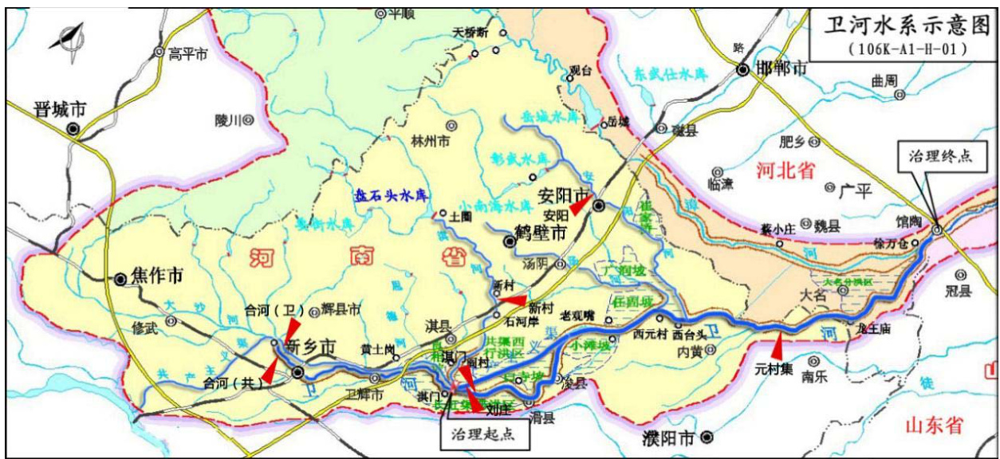  
图 2.1-1 项目所在区域河流水系及测站分布图  

# 2.2 气象  

卫河流域处于东亚温带季风气候区,冬季为极地大陆气团所控制,多西北风,干冷少雨;夏季因太平洋副热带高压加强北上,盛行偏南风。  

初设阶段选取河道治理段中游的内黄县气象站作为工程设计依据的气象站。内黄县气象站于 1957 年 2 月建站,观测项目有能见度、天气现象、气压、气温、相对湿度、风向风速、降水、雪深、日照、蒸发、浅层地温等。  

依据内黄县气象站近 30 年气象资料统计,多年平均风速为 $2.8\mathrm{m}/\mathrm{s}$ ,全年多年平均最大风速为 $14\mathrm{m/s}$ ,汛期多年平均最大风速为 $10\mathrm{m/s}$ ;多年平均气温 $13.4\bigtriangledown$ ,极端最高气温 $42.8\square$ ,极端最低气温- $-21.3\bigtriangledown$ ;多年平均降水量 $515\mathrm{mm}$ ,7、8 月份最为集中,占全年降水量的 $46\%$ ;多年平均蒸发量 $1527\mathrm{mm}$ 、相对湿度 $68.0\%$ 、日照时数 2332 小时、雷暴日数 19 天。  

气象要素特征值见表 2.2-1。  

表 2.2-1 内黄县气象站气象要素  

<html><body><table><tr><td colspan="2">月份</td><td>1月</td><td>2月</td><td>3月</td><td>4月</td><td>5月</td><td>6月</td><td>7月</td><td>8月</td><td>9月</td><td>10月</td><td>11月</td><td>12月</td><td>全年</td></tr><tr><td colspan="2">风速</td><td>平均风速</td><td>2.7</td><td>2.9</td><td>3.5</td><td>3.9</td><td>3.3</td><td>3.0</td><td>2.3</td><td>2.1</td><td>2.3</td><td>2.5</td><td>2.5</td><td>2.5</td><td>2.8</td></tr><tr><td colspan="2">m/s</td><td>最大风速</td><td>12</td><td>12</td><td>14</td><td>13</td><td>13</td><td>10</td><td>10</td><td>9</td><td>10</td><td>11</td><td>10</td><td>10</td><td>14</td></tr><tr><td rowspan="3">气温 (°℃)</td><td>平均气温</td><td>-1.7</td><td>1.0</td><td>7.1</td><td>14.8</td><td></td><td>20.3</td><td>25.5</td><td>26.6</td><td>25.4</td><td>20.6</td><td>14.7</td><td>6.6</td><td>0.1</td><td>13.4</td></tr><tr><td>极端最高</td><td>17.6</td><td>23.5</td><td>29.1</td><td>34.</td><td>38.1</td><td>41.6</td><td>42.8</td><td></td><td>38.2</td><td>37.4</td><td>34</td><td>25.5</td><td>21.8</td><td>42.8</td></tr><tr><td>极端最低</td><td>-20.8</td><td>-16.0</td><td>11.6</td><td>-2.5</td><td>3.5</td><td>10.5</td><td>15.7</td><td></td><td>13.3</td><td>3.2</td><td>-1.6</td><td>-16.2</td><td>-21.3</td><td>-21.3</td></tr><tr><td colspan="2">降水量（mm）</td><td>5.3</td><td>6.1</td><td>19</td><td>20</td><td>57</td><td></td><td>58</td><td>117</td><td>122</td><td>56</td><td>35</td><td>13</td><td>5.6</td><td>515</td></tr><tr><td colspan="2">蒸发量（mm)</td><td>42</td><td>59</td><td>120</td><td>181</td><td>207</td><td>249</td><td>179</td><td></td><td>148</td><td>131</td><td>108</td><td>61</td><td>42</td><td>1527</td></tr><tr><td colspan="2">相对湿度 (%)</td><td>62.0</td><td>61.7</td><td>60.8</td><td>61.1</td><td>64.0</td><td>62.0</td><td></td><td>78.6</td><td>81.9</td><td>75.7</td><td>71.9</td><td>69.7</td><td>66.0</td><td>68.0</td></tr><tr><td colspan="2">日照时数(h)</td><td>156</td><td>149</td><td>185</td><td>226</td><td>252</td><td>234</td><td></td><td>204</td><td>217</td><td>199</td><td>192</td><td>163</td><td>155</td><td>2332</td></tr><tr><td colspan="2">雷暴日数 (天)</td><td>0</td><td>0</td><td>0</td><td>1</td><td>2</td><td>4</td><td></td><td>6</td><td>4</td><td>1</td><td>0</td><td>0</td><td>0</td><td>19</td></tr></table></body></html>  

# 2.3 水文基本资料  

自二十世纪五十年代以来,卫河流域内先后设立了卫河合河、汲县、淇门、老观嘴、五陵、元村集等水文站,以及共产主义渠上的合河、黄土岗、刘庄水文站进行流量观测;设立了土圈、西元村水位站进行水位观测。  

本次治理的卫河干流淇门至徐万仓河段内有卫河淇门、老观嘴、五陵、元村集水文站,共产主义渠上的刘庄水文站,以及卫河西元村水位站。  

在最初的可研阶段,将主要站点水文系列延长至 2003 年,在 2012 年开展的海河流域水文成果修订阶段,将卫河流域主要站点的洪水系列延长至 2012 年,在 2019 年可研报告评估期间,补充收集了主要控制站 $2013{\sim}2016$ 年的有关水文资料。初设阶段对治理河段内主要控制站附近河段开展补充查勘和洪水调研,结果显示在 2017\~2018 年期间无大洪水发生。各水文站基本情况及资料年限见表2.3-1,水文站位置示意见图 2.1-1 所示。  

表 2.3-1 卫河流域主要水文站基本情况表  

<html><body><table><tr><td>河流</td><td>测站</td><td>控制面积（km²)</td><td>资料年份</td></tr><tr><td>卫河</td><td>合河</td><td>4203</td><td>1934～1936、1953～2016</td></tr><tr><td>共产主义渠</td><td>合河</td><td>4203</td><td>1934～1936、1953～2012</td></tr><tr><td>卫河</td><td>淇门</td><td>7671*</td><td>1934～1936、1952～2016</td></tr><tr><td>共产主义渠</td><td>刘庄</td><td>7671*</td><td>1934～1936、1952～2012</td></tr><tr><td>卫河</td><td>元村集</td><td>9800*</td><td>1950~2016</td></tr><tr><td>石门河</td><td>石门水库</td><td>132</td><td>1975～2012</td></tr><tr><td>浙河</td><td>弓上水库</td><td>605</td><td>1960~2012</td></tr><tr><td>安阳河</td><td>小南海水库</td><td>850</td><td>1960~2012</td></tr></table></body></html>

备注:加“\*”流域面积为山区面积。  

# 2.4 洪水  

# 2.4.1 暴雨洪水特性  

(1)暴雨特性  

卫河流域山区地处太行山迎风坡,暴雨主要由天气系统与地形条件结合所致。夏季太平洋副热带高压加强北上,易在太行山区迎风坡形成大暴雨。暴雨频次多、量级大,暴雨中心多出现在淇河上游的土圈、要街附近,多集中在 7、8 两月。暴雨历时一般 3 天左右,强度较大的暴雨常集中在 1 天甚至数小时内,历时较长的暴雨通常由两个或两个以上的天气系统组合而成。实测最大一日雨量 $440\mathrm{mm}$ (土圈 1996 年 8 月 4 日),调查最大 24 小时雨量 $556~\mathrm{mm}$ (林县 1963 年 8 月 8日),最大三日雨量 $693\mathrm{mm}$ (官山 1982 年 8 月 $1\sim3$ 日)。  

# (2)洪水特性  

卫河山区支流均处于太行山迎风坡,受暴雨特性及流域下垫面综合影响,洪水频次多、量级大,且源短流急,洪水迅猛,是卫河洪水的主要发源地。各支流洪水多为同一场暴雨所形成,因此支流洪水常常遭遇。卫河洪水主要来自淇门以上,淇门以上洪水主要来自淇河或共产主义渠淇门以上山区的支流。  

# 2.4.2 设计洪水  

(1)历次设计洪水成果  

1984 年漳卫河流域设计洪水复核工作中采用 $1953\sim1979$ 年共 27 年的峰、量连续系列,对上游有刊印资料的石门、弓上和小南海水库蓄水进行还原。  

2008 年国务院批复的《海河流域防洪规划》中复核了卫河的合河、新村、盘石头\~新村区间、淇门、共产主义渠淇门、安阳、楚旺(元村集)7 个站和称钩湾的设计洪水。历史洪水采用“75.8”洪水后全国统一整编的洪水调查资料成果,洪水系列延长至 1991 年,并考虑了 1996 年大洪水影响。《海河流域防洪规划》推荐采用延长至 1991 年的长系列成果(考虑 1996 年大洪水),见表 2.4-1。  

《海河流域防洪规划》中,卫河楚旺以上洪水地区组成为:考虑淇门以上来水为主,采用淇门、楚旺同频率,安汤区间相应这一较为危险的组合情况。淇门以上又分为如下两种组合方式: $\textcircled{1}$ 新村与淇门同频率,共产主义渠淇门相应; $\textcircled{2}$ 共产主义渠淇门与淇门同频率,新村以上相应。新村以上组合考虑到淇河上游已有弓上水库,且将要修建盘石头水库(现已建成),盘石头以上洪水可通过这些水库调蓄滞洪,因此只考虑盘石头水库\~新村区间与新村站同频率,盘石头水库以上相应的组合情况。两种组合情况下的设计洪水采用成果见表 2.4-2。  

表 2.4-1  卫河流域设计洪水(2008 年《海河流域防洪规划》)  
洪峰流量: $\mathrm{m}^{3}/\mathbf{s}$ ;洪量:亿 $\mathrm{m}^{3}$   

<html><body><table><tr><td rowspan="2">站名</td><td rowspan="2">项目</td><td colspan="3">特征值</td><td colspan="6">P(%)</td></tr><tr><td>均值</td><td>Cv</td><td>Cs/Cv</td><td>1</td><td>2</td><td>3.33</td><td>5</td><td>10</td><td>20</td></tr><tr><td rowspan="4">新村</td><td>Qm</td><td>810</td><td>1.8</td><td>2.5</td><td>7350</td><td>5620</td><td>4410</td><td>3510</td><td>2120</td><td>1010</td></tr><tr><td>Wsd</td><td>0.80</td><td>1.6</td><td>2.5</td><td>6.39</td><td>4.99</td><td>4.00</td><td>3.26</td><td>2.08</td><td>1.09</td></tr><tr><td>W15d</td><td>1.30</td><td>1.5</td><td>2.5</td><td>9.68</td><td>7.64</td><td>6.20</td><td>5.10</td><td>3.35</td><td>1.83</td></tr><tr><td>W30d</td><td>1.80</td><td>1.4</td><td>2.5</td><td>12.45</td><td>9.93</td><td>8.14</td><td>6.77</td><td>4.56</td><td>2.61</td></tr><tr><td rowspan="4">盘新区间</td><td>Qm</td><td>330</td><td>1.90</td><td>2.5</td><td>3170</td><td>2400</td><td>1870</td><td>1470</td><td>861</td><td>390</td></tr><tr><td>Wsd</td><td>0.13</td><td>1.55</td><td>2.5</td><td>1.00</td><td>0.79</td><td>0.64</td><td>0.52</td><td>0.34</td><td>0.18</td></tr><tr><td>W15d</td><td>0.21</td><td>1.50</td><td>2.5</td><td>1.56</td><td>1.23</td><td>1.00</td><td>0.82</td><td>0.54</td><td>0.30</td></tr><tr><td>W30d</td><td>0.27</td><td>1.42</td><td>2.5</td><td>1.90</td><td>1.51</td><td>1.23</td><td>1.02</td><td>0.69</td><td>0.39</td></tr><tr><td rowspan="3">淇门</td><td>Wsd</td><td>2.15</td><td>1.50</td><td>2.5</td><td>16.02</td><td>12.64</td><td>10.25</td><td>8.43</td><td>5.53</td><td>3.03</td></tr><tr><td>W15d</td><td>3.45</td><td>1.40</td><td>2.5</td><td>23.86</td><td>19.03</td><td>15.60</td><td>12.97</td><td>8.74</td><td>5.00</td></tr><tr><td>W30d</td><td>4.60</td><td>1.30</td><td>2.5</td><td>29.37</td><td>23.69</td><td>19.63</td><td>16.50</td><td>11.41</td><td>6.82</td></tr><tr><td rowspan="3">共产主义 渠淇门</td><td>W5d</td><td>1.55</td><td>1.50</td><td>2.5</td><td>11.55</td><td>9.11</td><td>7.39</td><td>6.08</td><td>3.99</td><td>2.19</td></tr><tr><td>W15d</td><td>2.40</td><td>1.40</td><td>2.5</td><td>16.59</td><td>13.24</td><td>10.85</td><td>9.02</td><td>6.08</td><td>3.48</td></tr><tr><td>W30d</td><td>3.10</td><td>1.30</td><td>2.5</td><td>19.79</td><td>15.97</td><td>13.23</td><td>11.12</td><td>7.69</td><td>4.59</td></tr><tr><td rowspan="4">安阳</td><td>Qm</td><td>450</td><td>1.9</td><td>2.5</td><td>4320</td><td>3270</td><td>2540</td><td>2000</td><td>1170</td><td>532</td></tr><tr><td>W5d</td><td>0.32</td><td>1.7</td><td>2.5</td><td>2.73</td><td>2.11</td><td>1.67</td><td>1.35</td><td>0.84</td><td>0.42</td></tr><tr><td>W15d</td><td>0.50</td><td>1.5</td><td>2.5</td><td>3.72</td><td>2.94</td><td>2.38</td><td>1.96</td><td>1.29</td><td>0.71</td></tr><tr><td>W30d</td><td>0.75</td><td>1.3</td><td>2.5</td><td>4.79</td><td>3.86</td><td>3.20</td><td>2.69</td><td>1.86</td><td>1.11</td></tr><tr><td rowspan="3">楚旺</td><td>Wsd</td><td>2.55</td><td>1.45</td><td>2.5</td><td>18.31</td><td>14.53</td><td>11.85</td><td>9.80</td><td>6.52</td><td>3.65</td></tr><tr><td>W15d</td><td>4.20</td><td>1.35</td><td>2.5</td><td>27.92</td><td>22.40</td><td>18.46</td><td>15.43</td><td>10.54</td><td>6.16</td></tr><tr><td>W30d</td><td>5.50</td><td>1.25</td><td>2.5</td><td>33.67</td><td>27.32</td><td>22.75</td><td>19.23</td><td>13.48</td><td>8.22</td></tr></table></body></html>  

表 2.4-2  卫河楚旺站以上洪水频率组合表(2008 年《海河流域防洪规划》)  
单位:亿 $\mathrm{m}^{3}$   

<html><body><table><tr><td colspan="3" rowspan="2">项目</td><td colspan="6"></td></tr><tr><td>1</td><td>2</td><td>P (%) 3.33</td><td>5</td><td>10</td><td>20</td></tr><tr><td colspan="3">楚旺 淇门</td><td>18.31</td><td>14.53</td><td>11.85</td><td>9.80</td><td>6.52</td><td>3.65</td></tr><tr><td colspan="3">Wsd</td><td>16.02</td><td>12.64</td><td>10.25</td><td>8.43</td><td>5.53</td><td>3.03</td></tr><tr><td colspan="3" rowspan="3">淇门、共产主义渠 淇门同频率，新村</td><td>共产主义渠淇门</td><td>11.55</td><td>9.11 7.39</td><td>6.08</td><td>3.99</td><td>2.19</td></tr><tr><td></td><td>4.47</td><td>3.53</td><td>2.86</td><td>2.35</td><td>1.54</td><td>0.84</td></tr><tr><td>新村 盘新(与新村同频)</td><td>0.71</td><td>0.56</td><td>0.46</td><td>0.38</td><td>0.25</td><td>0.14</td></tr><tr><td colspan="3">相应</td><td>3.76</td><td>2.97</td><td>2.40</td><td>1.97</td><td>1.29</td><td>0.70</td></tr><tr><td colspan="2"></td><td>盘石头水库以上相应 新村</td><td>6.39</td><td>4.99</td><td>4.00</td><td>3.26</td><td>2.08</td><td>1.09</td></tr><tr><td colspan="2" rowspan="3">淇新同频率，共产 主义渠淇门相应</td><td>产盘新(与新村同频)</td><td>1.00</td><td>0.79</td><td>0.64</td><td>0.52</td><td>0.34</td><td>0.18</td></tr><tr><td>盘石头水库以上相应</td><td>5.39</td><td>4.20</td><td>3.36</td><td>2.74</td><td>1.74</td><td>0.91</td></tr><tr><td>共产主义渠洪门</td><td>9.63</td><td>7.65</td><td>6.25</td><td>5.17</td><td>3.45</td><td>1.94</td></tr><tr><td colspan="3">安汤区间</td><td>2.29</td><td>1.89 1.60</td><td></td><td>1.37</td><td>0.99 0.62</td></tr><tr><td colspan="3">楚旺 淇门</td><td>27.92</td><td>22.40</td><td>18.46</td><td>15.43</td><td>10.54</td><td>6.16</td></tr><tr><td rowspan="15">淇门同频率，新村 相应 W15d</td><td rowspan="4">淇门、共产主义渠</td><td></td><td>23.86</td><td>19.03</td><td>15.60</td><td>12.97</td><td>8.74</td><td>5.00</td></tr><tr><td>共产主义渠淇门</td><td>16.59</td><td>13.24</td><td>10.85</td><td>9.02</td><td>6.08</td><td>3.48</td></tr><tr><td>新村</td><td>7.27</td><td>5.79</td><td>4.75</td><td>3.95</td><td>2.66</td><td>1.52</td></tr><tr><td>盘新(与新村同频)</td><td>1.17</td><td>0.93</td><td>0.76</td><td>0.64</td><td>0.43</td><td>0.25</td></tr><tr><td></td><td>盘石头水库以上相应</td><td>6.10</td><td></td><td></td><td></td><td>2.23</td><td>1.27</td></tr><tr><td rowspan="4">淇新同频率，共产盘新(与新村同频) 主义渠淇门相应</td><td>新村</td><td>9.68</td><td>4.86 7.64</td><td>3.99 6.20</td><td>3.31 5.10</td><td>3.35</td><td>1.83</td></tr><tr><td></td><td>1.56</td><td>1.23</td><td>1.00</td><td>0.82</td><td>0.54</td><td>0.30</td></tr><tr><td>盘石头水库以上相应</td><td>8.12</td><td>6.41</td><td>5.20</td><td>4.28</td><td>2.81</td><td>1.53</td></tr><tr><td>共产主义渠洪门</td><td>14.18</td><td>11.39</td><td>9.40</td><td>7.87</td><td>5.39</td><td>3.17</td></tr><tr><td colspan="3">安汤区间</td><td>4.06 3.37</td><td>2.86</td><td>2.46</td><td>1.80</td><td>1.16</td></tr><tr><td colspan="3">楚旺 淇门</td><td>33.67</td><td>27.32</td><td>22.75</td><td>19.23</td><td>13.48</td><td>8.22</td></tr><tr><td rowspan="15">淇门同频率，新村 W30d</td><td rowspan="4">淇门、共产主义渠</td><td></td><td>29.37</td><td>23.69</td><td>19.63</td><td>16.50</td><td>11.41</td><td>6.82</td></tr><tr><td>共产主义渠淇门</td><td>19.79</td><td>15.97</td><td>13.23</td><td>11.12</td><td>7.69</td><td>4.59</td></tr><tr><td>新村</td><td>9.58</td><td>7.72</td><td></td><td></td><td></td><td>2.23</td></tr><tr><td>盘新(与新村同频)</td><td>1.46</td><td>1.19</td><td>6.40 0.96</td><td>5.38 0.81</td><td>3.72</td><td>0.33</td></tr><tr><td>相应</td><td>盘石头水库以上相应</td><td>8.12</td><td></td><td></td><td></td><td>0.56 3.16</td><td>1.90</td></tr><tr><td rowspan="4">淇新同频率，共产 主义渠淇门相应</td><td>新村</td><td>12.45</td><td>6.53 9.93</td><td>5.44</td><td>4.57</td><td></td><td>2.61</td></tr><tr><td>盘新(与新村同频)</td><td>1.90</td><td></td><td>8.14</td><td>6.77</td><td>4.56 0.69</td><td>0.39</td></tr><tr><td>盘石头水库以上相应</td><td>10.55</td><td>1.51</td><td>1.23</td><td>1.02</td><td></td><td></td></tr><tr><td>共产主义渠淇门</td><td>16.92</td><td>8.42 13.76</td><td>6.91 11.49</td><td>5.75 9.73</td><td>3.87 6.85</td><td>2.22</td></tr><tr><td colspan="2">安汤区间</td><td>4.30</td><td>3.63</td><td>3.12</td><td>2.73</td><td>2.07</td><td>4.21 1.40</td></tr></table></body></html>  

盘新区间、盘石头水库以上采用的典型过程线采用新村“63.8”实测洪水过程,共产主义渠淇门典型过程线采用黄土岗“63.8”实测洪水过程,安汤区间典型过程线采用安阳“63.8”实测洪水过程。  

# (2)可研前期阶段设计洪水复核  

在本工程的可研前期阶段,卫河治理河段选取元村集(楚旺)水文站作为代表站进行了设计洪水复核,以说明防洪规划之后卫河流域洪水的变化趋势。  

2008 年《海河流域防洪规划》中元村集(楚旺)水文站设计洪水计算依据系列为 $1954\sim1991$ 年,并考虑 1996 年大洪水。可研前期阶段将洪水系列延长到2003 年进行设计洪水复核。  

元村集(楚旺)水文站设计洪水复核成果及比较见表 2.4-3,频率曲线见图$2.4\ –1\sim2.4\AA{-3}$ 。  

从表 2.4-3 可以看出,与 2008 年批复的海河流域防洪规划成果相比,本次元村集(楚旺)水文站洪水成果有所减小,频率 $1\%\sim5\%$ 设计洪水减小幅度均在$5\%$ 以内。洪水减少的主要原因是本次延长的 $1992\sim2003$ 年系列偏枯。  

从卫河合河、汲县、淇门、新村、元村集(楚旺)等站,共产主义渠合河、黄土岗、刘庄站资料来看,1992 年 ${\sim}2003$ 年系列流量偏枯。依据元村集(楚旺)设计洪水复核成果判断,延长洪水系列后卫河流域各主要控制断面设计洪水会有所减小,但由于延长年份不长,减小幅度不大。  

综上所述,防洪规划设计洪水成果已经国务院批复,为保持成果的稳定性并为工程安全留有一定余地,可研前期阶段卫河流域河道治理沿用防洪规划设计洪水成果,见表 $2.4{-}1{\sim}2.4{-}2$ 。  

表 2.4-3  元村集(楚旺)站设计洪水成果及比较表单位:亿 $\mathrm{m}^{3}$   

<html><body><table><tr><td rowspan="2">站 名</td><td rowspan="2">阶段</td><td rowspan="2">洪水 要素</td><td colspan="3">统计参数</td><td colspan="3">不同频率设计值</td><td rowspan="2">备注</td></tr><tr><td>均值</td><td>Cv</td><td>Cs/Cv</td><td>1%</td><td>2%</td><td>5%</td></tr><tr><td rowspan="13">淇 门 共 渠 淇 门</td><td rowspan="2">①原设计</td><td>W5d</td><td>2.50</td><td>1.30</td><td>2.5</td><td>16.00</td><td>12.90</td><td>9.00</td><td rowspan="2"></td></tr><tr><td>W15d</td><td>3.90</td><td>1.20</td><td>2.5</td><td>22.90</td><td>18.60</td><td>13.30</td></tr><tr><td rowspan="2">②防洪规划</td><td>W30d</td><td>5.20</td><td>1.10</td><td>2.5</td><td>28.80</td><td>22.90</td><td>16.70</td><td rowspan="2">采用</td></tr><tr><td>W5d</td><td>2.15</td><td>1.50</td><td>2.5</td><td>16.02</td><td>12.64</td><td>8.43</td></tr><tr><td rowspan="2">(2008)</td><td>W15d</td><td>3.45</td><td>1.40</td><td>2.5</td><td>23.86</td><td>19.03</td><td>12.97</td><td rowspan="2">成果</td></tr><tr><td>W30d</td><td>4.60</td><td>1.30</td><td>2.5</td><td>29.37</td><td>23.69</td><td>16.50</td></tr><tr><td rowspan="4">(②-①)① (%)</td><td>W5d W15d</td><td>-14</td><td></td><td></td><td>0</td><td>-2</td><td>-6</td><td rowspan="6"></td></tr><tr><td></td><td>-12</td><td></td><td></td><td>4</td><td>2</td><td>-2</td></tr><tr><td>W30d W5d</td><td>-12</td><td></td><td></td><td>6</td><td>3</td><td>-1</td></tr><tr><td>①原设计</td><td>1.70</td><td>1.45</td><td>2.5 2.5</td><td>12.19</td><td>9.69</td><td>6.51</td></tr><tr><td rowspan="2"></td><td>W15d</td><td>2.80</td><td>1.35</td><td></td><td>18.59</td><td>14.95 10.30</td><td></td></tr><tr><td>W30d W5d</td><td>3.60</td><td>1.25</td><td>2.5</td><td>22.03</td><td>17.90</td><td>12.60</td></tr><tr><td rowspan="3">②防洪规划 (2008)</td><td>W15d</td><td>1.55</td><td>1.50 1.40</td><td>2.5</td><td>11.55</td><td>9.11</td><td>6.08</td><td rowspan="3">采用 成果</td></tr><tr><td></td><td>2.40 3.10</td><td></td><td>2.5</td><td>16.59</td><td>13.24</td><td>9.02</td></tr><tr><td>W30d</td><td></td><td>1.30</td><td>2.5</td><td>19.79</td><td>15.97</td><td>11.12</td></tr><tr><td rowspan="3"></td><td rowspan="3">(②-①)/① (%)</td><td>W5d</td><td>-9</td><td></td><td></td><td>-5 -6</td><td>-7</td><td rowspan="6"></td></tr><tr><td>W15d</td><td>-14</td><td></td><td></td><td>-11 -11</td><td>-12 -12</td></tr><tr><td>W30d</td><td>-14</td><td></td><td></td><td>-10</td><td>-11</td></tr><tr><td rowspan="4">元 村</td><td rowspan="3">①原设计</td><td>W5d</td><td>2.90</td><td>1.20</td><td>2.5</td><td>17.00 13.90</td><td>9.86</td></tr><tr><td>W15d</td><td>4.70</td><td>1.10</td><td>2.5 25.20</td><td>20.70</td><td>15.10</td></tr><tr><td>W30d</td><td>6.30</td><td>1.00 2.5</td><td>30.60</td><td>25.40</td><td>19.00 9.80</td></tr><tr><td rowspan="3">②防洪规划 (2008)</td><td>W5d W15d</td><td>2.55</td><td>1.45</td><td>2.50</td><td>18.31</td><td>14.53</td><td>采用 15.43 成果</td></tr><tr><td></td><td>4.20</td><td>1.35</td><td>2.50</td><td>27.92</td><td>22.40</td><td>19.23</td></tr><tr><td rowspan="3">③可研前期</td><td>W30d W5d</td><td>5.50</td><td>1.25</td><td>2.50</td><td>33.67</td><td>27.32</td><td>9.41</td></tr><tr><td></td><td>2.40 4.10</td><td>1.50 1.35</td><td>2.50 2.50</td><td>17.88 27.26</td><td>14.11 21.87</td><td>15.07</td></tr><tr><td rowspan="3">阶段</td><td>W15d W30d</td><td>5.20</td><td>1.30</td><td>2.50</td><td>33.20</td><td>26.78</td><td>18.65</td></tr><tr><td></td><td>-5.9</td><td></td><td>/</td><td>-2.3</td><td>-2.9</td><td>-4.0</td></tr><tr><td rowspan="3">(③-②) ② (%)</td><td>W5d W15d</td><td>-2.4</td><td>/</td><td>/</td><td>-2.4</td><td>-2.4</td><td>-2.3</td></tr><tr><td>W30d</td><td></td><td></td><td></td><td></td><td></td><td></td></tr><tr><td></td><td>-5.5</td><td>/</td><td>/</td><td>-1.4</td><td>-2.0</td><td>-3.0</td></tr></table></body></html>  

  
图 2.4-1 元村集(楚旺)年最大 5 日洪量频率曲线(1953-2003)  

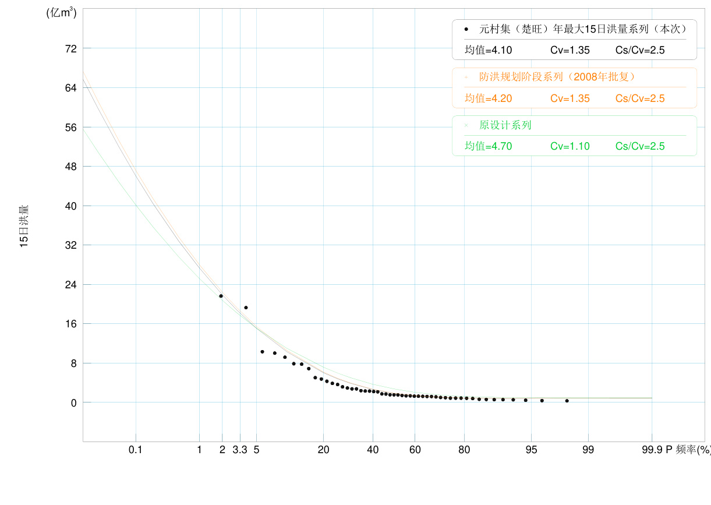  
图 2.4-2 元村集(楚旺)年最大 15 日洪量频率曲线(1953-2003)  

  
图 2.4-3 元村集(楚旺)年最大 30 日洪量频率曲线(1953-2003)  

(3)海河流域水文成果修订中卫河有关站点设计洪水成果  

2008 年《海河流域防洪规划》中卫河设计洪水复核,洪水系列至 1991 年;“海河流域水文设计成果修订”项目对卫河流域合河、新村、盘石头水库、盘石头\~新村区间、淇门、共渠淇门、安阳、元村集,共计 8 个主要控制站和区间进行设计洪水复核,洪水系列至 2012 年。  

本工程卫河治理河段选取元村集(楚旺)水文站作为代表站进行设计洪水对比分析,以说明防洪规划之后卫河流域洪水的变化趋势。2008 年《海河流域防洪规划》中元村集(楚旺)水文站设计洪水计算依据系列为 $1954\sim1991$ 年,并考虑 1996 年大洪水。“海河流域水文设计成果修订”将洪水系列延长到 2012 年进行设计洪水复核。元村集(楚旺)水文站设计洪水复核成果及比较见表 2.4-4,频率曲线见图 $2.4{-}4{\sim}2.4{-}6$ 。从表 2.4-4 可以看出,与 2008 年批复的海河流域防洪规划成果相比,元村集(楚旺)水文站洪水成果有所减小,频率 $1\%\sim2\%$ 设计洪水减小幅度均在 $15\%$ 以内。洪水减少的主要原因是本次延长的 $1992\sim2012$ 年系列偏枯。  

从卫河合河、淇门、新村、元村集(楚旺)等站资料来看,1992 年 ${\sim}2012$ 年系列流量偏枯。“海河流域水文设计成果修订”项目洪水系列延长 21 年后,频率计算成果与原设计成果相比,各站基本都是均值减小、变差系数增大。两次成果对比分析,盘石头水库校核和设计洪水减小幅度小于 $10\%$ ,安阳、新村 50 年一遇设计洪水减少幅度也小于 $10\%$ ,合河、淇门、共渠淇门、元村集设计洪水计算时没有远年历史洪水资料,主要控制时段的频率设计洪水减少幅度在 $15\%$ 以内。“海河流域水文设计成果修订”项目与 2008 年《海河流域防洪规划》设计洪水对比综合分析后,卫河流域设计洪水推荐维持防洪规划设计洪水成果。  

综上所述,为保持成果的稳定性并为工程安全留有一定余地,防洪规划设计洪水成果已经国务院批复,可研阶段卫河流域河道治理沿用防洪规划设计洪水成果,见表 $2.4{-}1{\sim}2.4{-}2$ 。  

表 2.4-4  元村集(楚旺)站设计洪水成果及比较表  

<html><body><table><tr><td>设计 阶段</td><td>项目</td><td>均值</td><td>Cv</td><td>Cs/Cv</td><td>1%</td><td>2%</td></tr><tr><td rowspan="3">海河流域防洪 规划成果</td><td>Wsa(亿 m3)</td><td>2.55</td><td>1.45</td><td>2.5</td><td>18.31</td><td>14.53</td></tr><tr><td>W15d(亿 m3)</td><td>4.2</td><td>1.35</td><td>2.5</td><td>27.92</td><td>22.4</td></tr><tr><td>W30d(亿 m3)</td><td>5.5</td><td>1.25</td><td>2.5</td><td>33.67</td><td>27.32</td></tr><tr><td rowspan="3">海河流域水文 成果修订阶段</td><td>Wsd(亿 m3)</td><td>1.9</td><td>1.7</td><td>2.5</td><td>16.28</td><td>12.55</td></tr><tr><td>W15d(亿 m3)</td><td>3.22</td><td>1.7</td><td>2.5</td><td>27.55</td><td>21.25</td></tr><tr><td>W30d(亿 m3)</td><td>4.32</td><td>1.5</td><td>2.5</td><td>32.21</td><td>25.42</td></tr><tr><td rowspan="3">成果对比相对 比值(%)</td><td>Wsd</td><td>-25%</td><td></td><td></td><td>-11%</td><td>-14%</td></tr><tr><td>W15d</td><td>-23%</td><td></td><td></td><td>-1%</td><td>-5%</td></tr><tr><td>W30d</td><td>-21%</td><td></td><td></td><td>-4%</td><td>-7%</td></tr></table></body></html>  

表 2.4-5  淇门站设计洪水成果对比表  

<html><body><table><tr><td>设计 阶段</td><td>项目</td><td>均值</td><td>Cv</td><td>Cs/Cv</td><td>1%</td><td>2%</td></tr><tr><td rowspan="3">海河流域防洪 规划成果</td><td>Wsa(亿 m3)</td><td>2.15</td><td>1.5</td><td>2.5</td><td>16.02</td><td>12.64</td></tr><tr><td>W15d(亿 m3)</td><td>3.45</td><td>1.4</td><td>2.5</td><td>23.86</td><td>19.03</td></tr><tr><td>W30d(亿 m3)</td><td>4.6</td><td>1.3</td><td>2.5</td><td>29.37</td><td>23.69</td></tr><tr><td rowspan="3">海河流域水文 成果修订阶段</td><td>Wsd(亿 m3)</td><td>1.58</td><td>1.8</td><td>2.5</td><td>14.33</td><td>10.96</td></tr><tr><td>W15d(亿 m3)</td><td>2.5</td><td>1.7</td><td>2.5</td><td>21.32</td><td>16.48</td></tr><tr><td>W30d(亿 m3)</td><td>3.3</td><td>1.55</td><td>2.5</td><td>25.47</td><td>20</td></tr><tr><td rowspan="3">成果对比相对 比值（%)</td><td>Wsd</td><td>-27%</td><td></td><td></td><td>-11%</td><td>-13%</td></tr><tr><td>W15d</td><td>-28%</td><td></td><td></td><td>-11%</td><td>-13%</td></tr><tr><td>W30d</td><td>-28%</td><td></td><td></td><td>-13%</td><td>-16%</td></tr></table></body></html>  

表 2.4-6  共渠淇门站设计洪水成果对比表  

<html><body><table><tr><td>设计 阶段</td><td>项目</td><td>均值</td><td>Cv</td><td>Cs/Cv</td><td>1%</td><td>2%</td></tr><tr><td rowspan="3">海河流域防洪 规划成果</td><td>Wsa(亿 m3)</td><td>1.55</td><td>1.5</td><td>2.5</td><td>11.55</td><td>9.11</td></tr><tr><td>W15d(亿 m3)</td><td>2.4</td><td>1.4</td><td>2.5</td><td>16.59</td><td>13.24</td></tr><tr><td>W30d(亿 m3)</td><td>3.1</td><td>1.3</td><td>2.5</td><td>19.79</td><td>15.97</td></tr><tr><td rowspan="3">本次 复核</td><td>Wsa(亿 m3)</td><td>1.15</td><td>1.8</td><td>2.5</td><td>10.43</td><td>7.98</td></tr><tr><td>W15d(亿 m3)</td><td>1.65</td><td>1.6</td><td>2.5</td><td>14.79</td><td>11.33</td></tr><tr><td>W30d(亿 m3)</td><td>2.13</td><td>1.35</td><td>2.5</td><td>17.02</td><td>13.29</td></tr><tr><td rowspan="3">成果对比相对 比值(%)</td><td>Wsd</td><td>-26%</td><td></td><td></td><td>-10%</td><td>-12%</td></tr><tr><td>W15d</td><td>-31%</td><td></td><td></td><td>-11%</td><td>-14%</td></tr><tr><td>W30d</td><td>-31%</td><td></td><td></td><td>-14%</td><td>-17%</td></tr></table></body></html>  

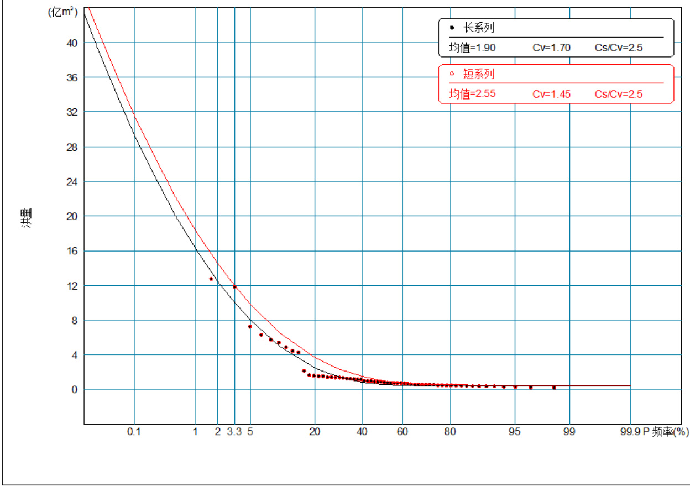  
图 2.4-4 元村集站年最大 5 天洪量频率曲线  

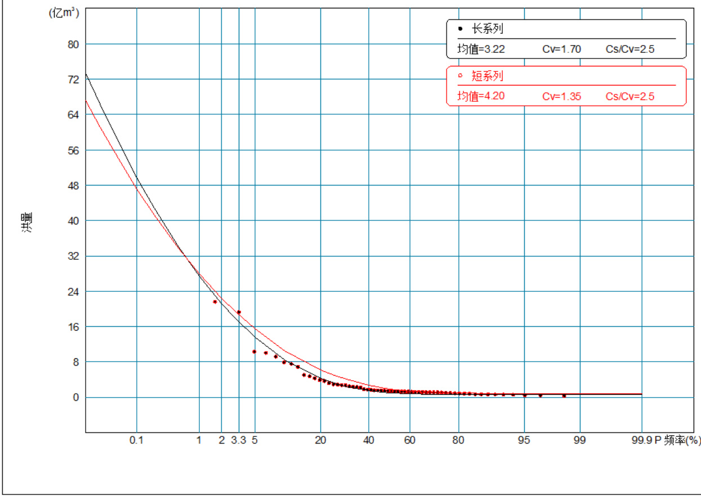  
图 2.4-5 元村集站年最大 15 天洪量频率曲线  

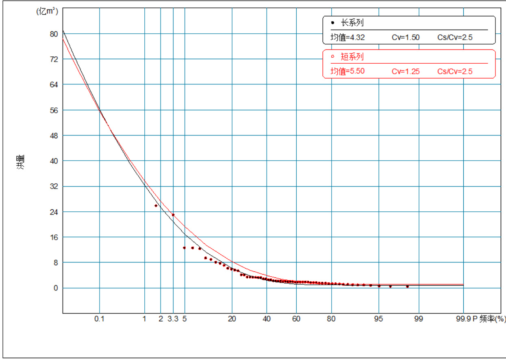  
图 2.4-6 元村集站年最大 30 天洪量频率曲线  

# (4)2013\~2016 年洪水系列延长复核情况  

$\textcircled{1}2016$ 年系列较 2012 年系列减小幅度在 $2\%$ 以内  

2017 年 6 月编制出版的《海河流域常规设计洪水修订报告》中的设计洪水成果,将卫河流域各站点洪水系列延长至 2012 年,是截止目前卫河流域各水文站点最新的权威设计洪水复核成果。  

在中国国际工程咨询有限公司评估期间,选取卫河流域内的主要控制站安阳站、元村集站、淇门站进行了洪水系列延长,将各站洪水系列从 2012 年延长至2016 年。从延长后各站的设计洪水成果来看,延长至 2016 年系列后,安阳站设计洪水成果维持与 2012 年系列成果相同,元村集站 50 年一遇年最大 5 日设计洪量较 2012 年系列成果减少 $1.5\%$ ,淇门站 50 年一遇年最大 5 日设计洪量较 2012年系列成果减少 $0.5\%$ 。因此,可以看出卫河各控制站洪水系列延长至 2016 年后设计洪水成果较 2012 年系列减少幅度在 $2\%$ 以内,系列延长 4 年对设计洪水成果的影响很小。各主要控制站延长前后设计洪水对比情况见表 2.4-7。  

表 2.4-7  卫河主要控制站设计洪水延长复核成果对比  

<html><body><table><tr><td rowspan="2">站名</td><td rowspan="2">系列长度</td><td rowspan="2">项目</td><td colspan="3">特征值</td><td colspan="2">频率(%)</td></tr><tr><td>均值</td><td>Cv</td><td>Cs/Cv</td><td>1</td><td>2</td></tr><tr><td rowspan="4">安阳站</td><td>至2012年（考虑</td><td>Qm</td><td>425</td><td>2</td><td>2.5</td><td>4310</td><td>3230</td></tr><tr><td>了2016 年洪水)</td><td></td><td></td><td></td><td></td><td></td><td></td></tr><tr><td>至2016年</td><td>Qm</td><td>425</td><td>2</td><td>2.5</td><td>4310</td><td>3230</td></tr><tr><td>变化幅度</td><td></td><td></td><td></td><td></td><td>0%</td><td>0%</td></tr><tr><td rowspan="3">元村集</td><td>至2012年</td><td>W5d</td><td>1.9</td><td>1.7</td><td>2.5</td><td>16.28</td><td>12.55</td></tr><tr><td>至2016年</td><td>W5d</td><td>1.7</td><td>1.9</td><td>2.5</td><td>16.34</td><td>12.36</td></tr><tr><td>变化幅度</td><td>w5d</td><td></td><td></td><td></td><td>0.34%</td><td>-1.5%</td></tr><tr><td rowspan="3">淇门</td><td>至2012年</td><td>W5d</td><td>1.58</td><td>1.8</td><td>2.5</td><td>14.33</td><td>10.96</td></tr><tr><td>至2016年</td><td>W5d</td><td>1.5</td><td>1.9</td><td>2.5</td><td>14.41</td><td>10.91</td></tr><tr><td>变化幅度</td><td>W5d</td><td></td><td></td><td></td><td>0.58%</td><td>-0.48%</td></tr></table></body></html>

备注:在 2017 年 6 月编制出版的《海河流域常规设计洪水修订报告》中,对于安阳站 2016 年发生的局部大洪水已经予以了考虑,并做了特大值处理,认为是 1892 年以来发生的第 5 大洪水,经验频率采用 $4.1\%$ ,据此进行了安阳站的洪水频率分析。  

分析本次延长系列后变化幅度很小的原因,主要有三个方面:  

一是洪水系列延长至 2012 年后,卫河流域的大多数水文站点的洪水系列长度达到 60 年及以上,系列均值、Cv 等参数已经稳定下来,本次延长 $2013{\sim}2016$ 年洪水系列长度仅增加 4 年,对以往年份洪水系列的经验频率、均值、Cv 等参数影响很小,因此设计洪水成果也变化很小。  

二是卫河流域各站洪水系列均包含了“63.8”大洪水,由于“63.8”大洪水是卫河流域大范围的大洪水,该场洪水中淇门、元村集、安阳站等的洪水量级均达到了 50\~60 年一遇;实测系列中的大洪水对于稳定设计洪水成果起到了重要作用。  

三是部分站点考虑了历史大洪水,如新村站(淇河)1892、1917、1929 年三年历史调查洪水,安阳站(安阳河)考虑了 1892 年、1894 年、1929 年三年历调查洪水,对于各水文站的设计洪水成果稳定起到了重要作用。  

$\textcircled{2}$ 受极端气候等条件影响卫河流域局部洪水风险加大  

经查阅近年的水文统计年鉴等资料数据和有关文件,2012 年之后卫河流域内未发生过全流域或较大范围内的大洪水。但是在 2016 年 7 月 19\~21 日期间,卫河流域的安阳河上发生了“16.7”局部大洪水,造成了较大的损失,安阳河下游的郭家桥蓄滞洪区也开启使用,对蓄滞洪水起到了有效的作用;经查阅同期有关水文站点洪水观测数据,“16.7”安阳河大洪水期间,卫河流域其他河流的洪水量级很小,在该场洪水过程中各主要测站实测的最大洪峰流量分别为:安阳站(安阳河) $1990\mathrm{m}^{3}/\mathrm{s}$ (经还原后 $2720\mathrm{m}^{3}/\mathrm{s}$ ,做特大值处理后认为排 1892 年以来的第 5为,重现期约 25 年)、合河(卫)站 $6.59\mathrm{m}^{3}/\mathrm{s}$ 、淇门(卫河)站 $123~\mathrm{m}^{3}/\mathrm{s}$ 、新村(淇河)站 $152~\mathrm{m}^{3}/\mathrm{s}$ 、元村集站 $480\mathrm{m}^{3}/\mathrm{s}$ (约 5 年一遇)。“16.7”安阳河大洪水期间有关站点洪峰情况见表 2.4-8,安阳河设计洪水成果见表 2.4-9。  

表 2.4-8  安阳河大洪水期间相关测站最大洪峰( $\left(\mathrm{m}^{3}/\mathrm{s}\right)$   

<html><body><table><tr><td>站名</td><td>安阳站 (安阳河)</td><td>合河（卫）站</td><td>淇门（卫河）站</td><td>新村（淇河）站</td><td>元村集站</td></tr><tr><td>洪峰</td><td>2720</td><td>6.59</td><td>123</td><td>152</td><td>480</td></tr><tr><td>重现期</td><td>约25年一遇</td><td>量级很小</td><td>量级很小</td><td>量级很小</td><td>约5年一遇</td></tr></table></body></html>  

表 2.4-9  安阳站设计洪水成果( $(1953{\sim}2012$ ,考虑历史洪水和 2016 年洪水)  

<html><body><table><tr><td>设计频率(%)</td><td>1</td><td>2</td><td>3.33</td><td>5</td></tr><tr><td>设计值（m?/s)</td><td>4310</td><td>3230</td><td>2520</td><td>1930</td></tr></table></body></html>  

(5)可研阶段设计洪水成果推荐  

在历经多次洪水系列延长之后,随着系列长度的不断增加,卫河流域各站点的洪水成果总体呈现一定的减少趋势。当系列延长至 2012 年以后,卫河流域各水文站的洪水系列均达到了 60 年以上,既包含了大洪水年(如“63.8”卫河全流域发生大洪水,且有实测流量资料),也包括了不少的中洪水、小洪水年份,且新村站(淇河)、安阳站(安阳河)等考虑了历史大洪水,对于各水文站的设计洪水成果稳定起到了重要作用。  

在可研评估阶段,对卫河流域的安阳站、元村集站、淇门站洪水延长了$2013{\sim}2016$ 年共 4 年系列,延长到 2016 年后各主要控制站的 50 年一遇设计洪水成果较 2012 年系列减小幅度在 $2\%$ 以内,与已经批复的海河流域防洪规划成果相比减小幅度均在 $17\%$ 以内。虽然全流域的大洪水在一定程度内减少,但是受气候剧烈变化的影响,局部大洪水的威胁依然存在,甚至更加难以预测。因此,综合考虑洪水发生的不确定性、局部洪水危害加剧的实际情况,也为了保持成果的稳定性并为工程安全留有一定余地,可研阶段卫河流域河道治理推荐沿用防洪规划设计洪水成果,见表 $2.4{-}1{\sim}2.4{-}2$ 。  

# (6)初设阶段设计洪水成果推荐  

根据以上分析,可研阶段中将卫河主要控制站安阳站、元村集站、淇门站洪水系列延长至 2016,通过对延长后的各控制站设计洪水成果进行对比分析,可以看出卫河各控制站洪水系列延长至2016年后设计洪水成果较2012年系列减少幅度在 $2\%$ 以内,系列延长 4 年对设计洪水成果的影响很小,故本阶段不再对合河、新村、共渠淇门等站洪水系列进行延长。  

初设阶段对治理河段内主要控制站附近河段开展补充查勘及调查了解,结果显示 2017\~2018 年期间无全流域大范围及局部大洪水发生,且考虑到各控制站洪水系列长度均达到 60 年以上,部分站点考虑了历史大洪水的影响,系列均值、Cv 等参数已经稳定下来,分析认为延长 2017\~2018 年对以往年份洪水系列的经验频率、均值、Cv 等参数影响很小。  

综上所述,在综合考虑系列延长对洪水的影响和河道防洪安全的情况下,初设阶段卫河治理的设计洪水成果维持可研阶段最终成果不变,即初设阶段卫河流域河道治理推荐沿用防洪规划设计洪水成果,见表 $2.4{-}1{\sim}2.4{-}2$ 。  

# 2.4.3 分期洪水  

# (1)分期洪水分析计算  

海河流域汛期一般为 $6\sim9$ 月,另据卫河流域流量观测资料统计,其 10 月份最大流量亦较大。因此洪水分期分两种情况进行划分: $\textcircled{1}6\sim9$ 月、 $10\sim5$ 月; $\textcircled{2}$ $6\sim10$ 月、 $11\sim5$ 月。  

可研阶段根据卫河治理段内的卫河淇门水文站 $1953{\sim}2003$ 年、共产主义渠刘庄水文站 $1963{\sim}2003$ 年及元村集(楚旺)水文站 $1953{\sim}2005$ 年实测流量资料,分别按照上述分期进行了分期洪水分析计算。初设阶段在可研阶段实测流量资料基  

础上,将三个水文站流量资料均延长至 2016 年,主推分期 $\textcircled{2}$ 分期洪水计算成果见表 2.4-10,频率曲线见图 $2.4{-}7{\sim}2.4{-}12$ 。  

由表 2.4-10 可知,初设阶段各站分期洪水成果均较可研阶段减小,且减小幅度均在 $15\%$ 以内,与 21 世纪以来卫河流域河川流量整体变化趋势相吻合。  

表 2.4-10  卫河各站分期设计洪水成果 单位: $\mathrm{m}^{3}/\mathrm{s}$   

<html><body><table><tr><td rowspan="2">阶段</td><td rowspan="2">频率</td><td colspan="2">卫河淇门</td><td colspan="2">共产主义渠刘庄</td><td colspan="2">卫河元村集 (楚旺)</td></tr><tr><td>11～5月</td><td>6～10月</td><td>11～5月</td><td>6～10月</td><td>11～5月</td><td>6～10月</td></tr><tr><td rowspan="3">初设阶段</td><td>5%</td><td>196</td><td>553</td><td>69.9</td><td>610</td><td>250</td><td>995</td></tr><tr><td>10%</td><td>144</td><td>429</td><td>44.5</td><td>412</td><td>187</td><td>723</td></tr><tr><td>20%</td><td>95.6</td><td>304</td><td>22.7</td><td>233</td><td>126</td><td>467</td></tr><tr><td rowspan="3">可研阶段</td><td>5%</td><td>208</td><td>586</td><td>76.6</td><td>657</td><td>262</td><td>1045</td></tr><tr><td>10%</td><td>156</td><td>460</td><td>49.6</td><td>454</td><td>198</td><td>771</td></tr><tr><td>20%</td><td>106</td><td>332</td><td>26.1</td><td>267</td><td>136</td><td>510</td></tr><tr><td rowspan="3">和可研成果 相比 (%)</td><td>5%</td><td>-5.71</td><td>-5.58</td><td>-8.70</td><td>-7.12</td><td>-4.55</td><td>-4.72</td></tr><tr><td>10%</td><td>-7.37</td><td>-6.82</td><td>-10.3</td><td>-9.26</td><td>-5.76</td><td>-6.18</td></tr><tr><td>20%</td><td>-9.77</td><td>-8.61</td><td>-13.1</td><td>-12.8</td><td>-7.57</td><td>-8.38</td></tr></table></body></html>  

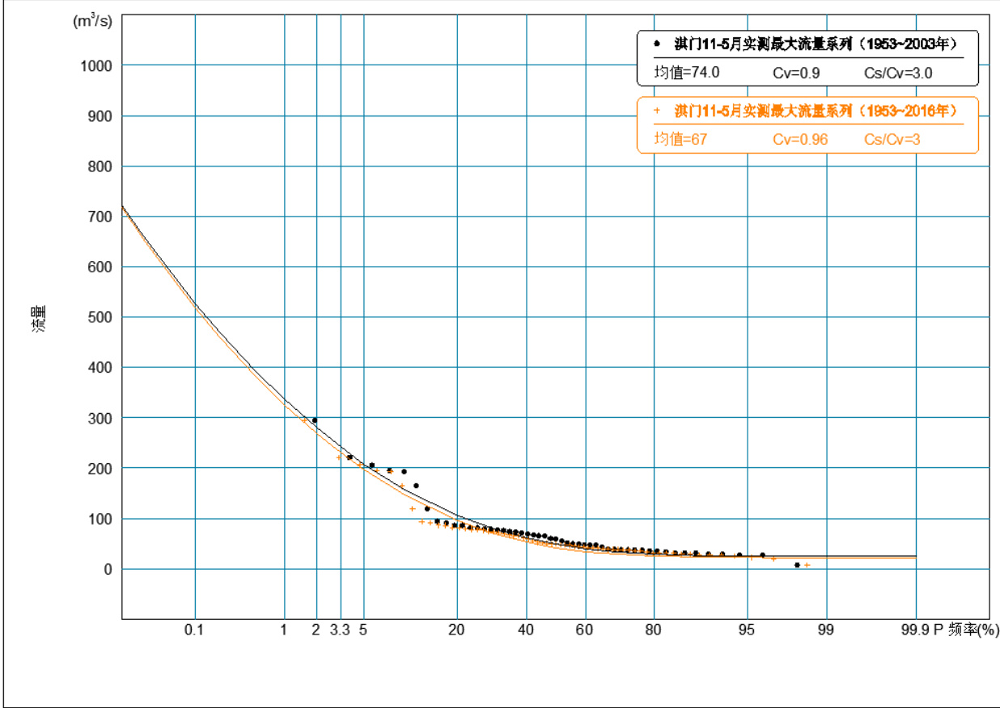  
图 2.4-7 淇门实测最大流量 P-III 频率曲线(11\~5 月)  

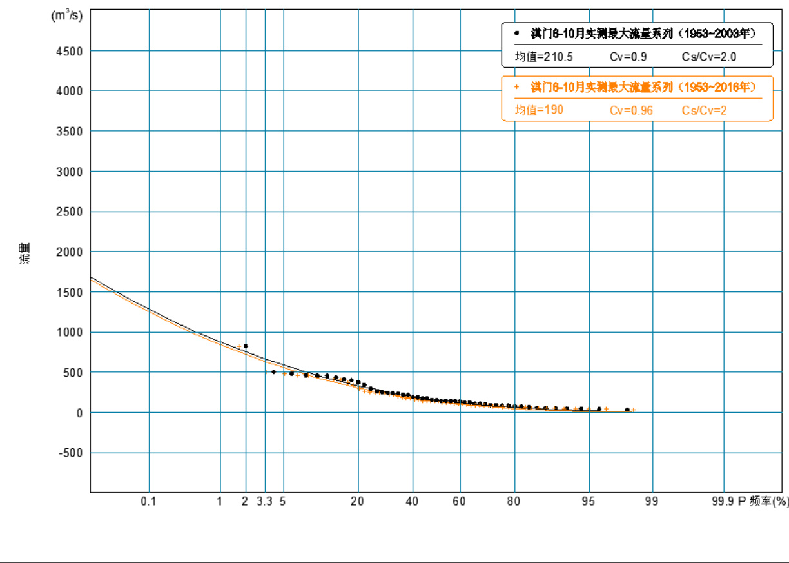  
图 2.4-8 淇门实测最大流量 P-III 频率曲线( $\phantom{0}.6{\sim}10$ 月)  

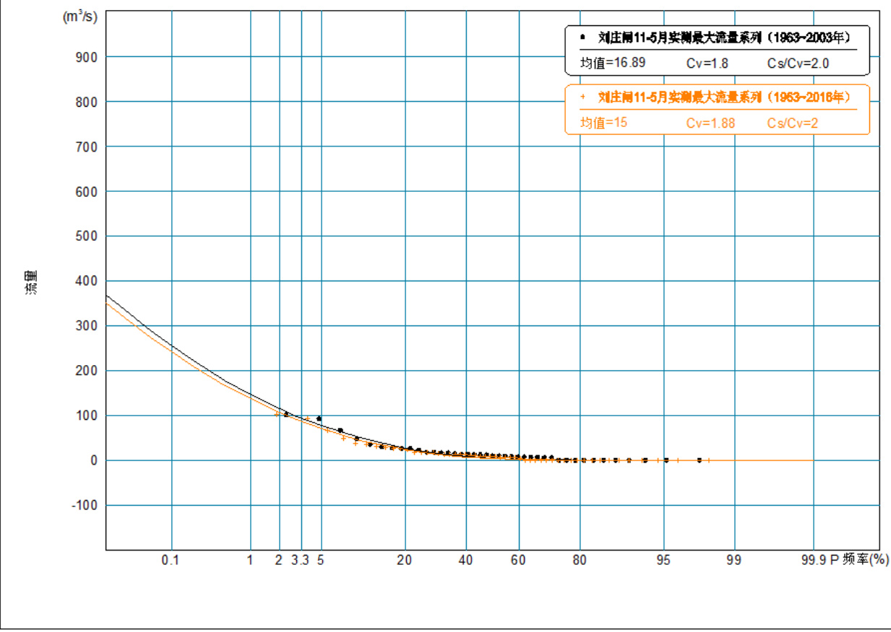  
图 2.4-9 刘庄实测最大流量 P-III 频率曲线(11\~5 月)  

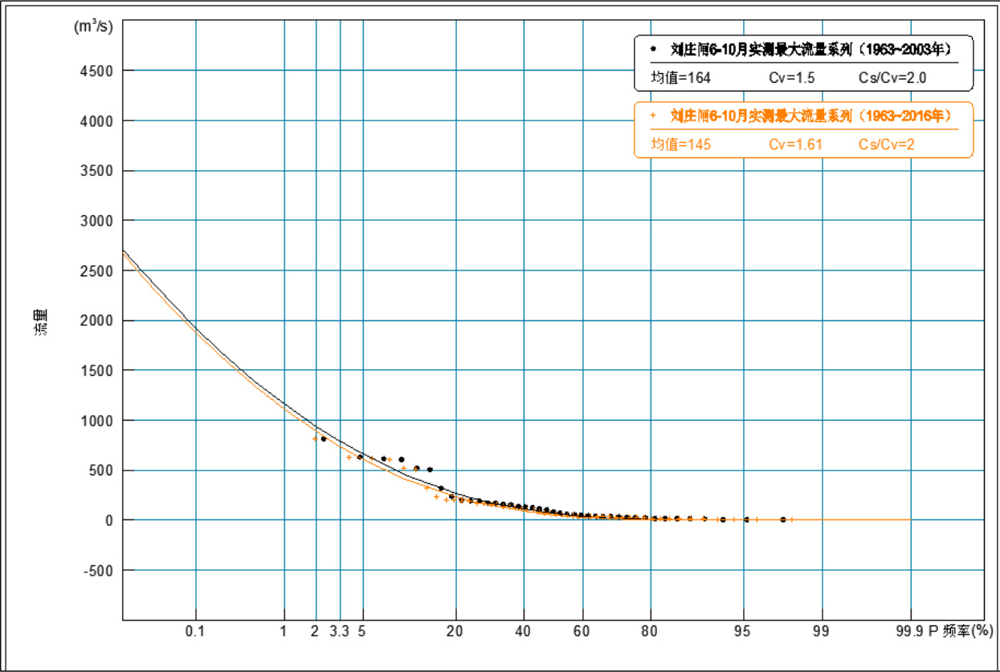  
图 2.4-10 刘庄实测最大流量 P-III 频率曲线( $6{\sim}10$ 月)  

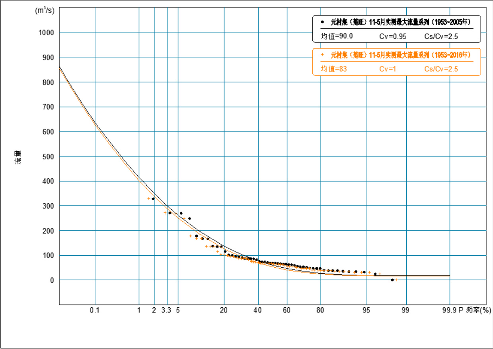  
图 2.4-11 元村集实测最大流量 P-III 频率曲线(11\~5 月)  

  
图 2.4-12 元村集实测最大流量 P-III 频率曲线( $(6{\sim}10$ 月)  

# (2)各治理段分期洪水采用  

卫河淇门\~老观嘴段和共产主义渠淇门\~老观嘴段将分别进行治理。因卫河流域洪水主要来自于淇门以上,且区间无较大支流汇入,因此两叉河道分别采用卫河淇门、共产主义渠刘庄站分期洪水成果。  

卫河老观嘴至徐万仓段有安阳河、汤河汇入,汇入之前有五陵水文站,汇入之后有元村集水文站,两站有 $1983\sim1991$ 年同期实测流量资料。比较两站同期各分期实测流量均值基本为 1:1 的关系,分析认为虽然五陵水文站与元村集水文站区间有安阳河、汤河汇入,但区间亦有不少用水需求,导致两站同期各分期实测流量基本一致。因此,本段采用元村集水文站分期设计洪水成果。  

# 2.4.4 平原坡洼涝水  

卫河流域平原区排涝属于洪涝合排,因此需要研究分析设计洪水条件下的涝水成果。1984 年漳卫河流域设计洪水复核成果和国务院批复的防洪规划成果在漳卫河流域设计洪水复核过程中均进行了涝水估算,分别计算了白寺坡、任固坡、小滩坡、柳围坡、长虹渠、共产主义渠以西行洪区及大名泛区设计涝水,计算方法为借用邻近山区站设计洪水三十天洪量与该站典型年(1963 年)的放大倍比将坡洼的典型年(1963 年)涝水量予以缩放,作为同频率条件下与山区洪水相应的涝水成果。各分区典型涝水过程线均借用已初步治理后的卫南平原汲县站1963 年 8 月份的实测过程。各坡洼分区 1963 年典型涝水量采用 1984 年复核报告数据,即“海河流域 1963 年 8 月洪水调查报告”中水利部水文局的调查成果。  

初设阶段卫河治理,仍沿用上述方法计算各坡洼分区涝水。由于初设阶段复核后各站设计洪水沿用已批复的防洪规划成果,因此相应涝水成果亦维持防洪规划阶段成果不变。  

各坡洼分区采用的放大倍数及设计涝水成果见表 $2.4{-}5{\sim}2.4{-}6$ 。  

表 2.4-5  平原坡洼典型年(1963 年)涝水量及放大倍数采用  

<html><body><table><tr><td>坡洼名称</td><td>采用面积（km²）</td><td>1963年典型水量 (亿m²)</td><td>放大倍数采用</td></tr><tr><td>白寺坡</td><td>512</td><td>1.30</td><td>安、汤区间放大倍数</td></tr><tr><td>大名泛区</td><td>1270</td><td>1.96</td><td>安、汤区间放大倍数</td></tr><tr><td>任固坡</td><td>228</td><td>0.57</td><td>安、汤区间放大倍数</td></tr><tr><td>小滩坡</td><td>222</td><td>0.52</td><td>安、汤区间放大倍数</td></tr><tr><td>共产主义渠以西 行洪区</td><td>314</td><td>0.80</td><td>安、汤区间放大倍数</td></tr><tr><td>柳围坡</td><td>210</td><td>0.38</td><td>卫河淇门放大倍数</td></tr><tr><td>长虹渠</td><td>140</td><td>0.25</td><td>卫河淇门放大倍数</td></tr></table></body></html>  

表 2.4-6  平原坡洼设计涝水最大流量成果  单位: $\mathrm{m}^{3}/\mathrm{s}$   

<html><body><table><tr><td rowspan="2">坡洼名称</td><td colspan="7">不同频率设计涝水最大流量</td></tr><tr><td>1%</td><td>2%</td><td>3.33%</td><td>5%</td><td>10%</td><td>20%</td><td>33.33%</td></tr><tr><td>白寺坡</td><td>174.9</td><td>147.6</td><td>126.9</td><td>111.0</td><td>84.2</td><td>56.9</td><td>26.0</td></tr><tr><td>大名泛区</td><td>263.7</td><td>222.6</td><td>191.3</td><td>167.4</td><td>126.9</td><td>85.9</td><td>39.2</td></tr><tr><td>任固坡</td><td>76.7</td><td>64.7</td><td>55.7</td><td>48.7</td><td>36.9</td><td>25.0</td><td>11.4</td></tr><tr><td>小滩坡</td><td>70.0</td><td>59.1</td><td>50.8</td><td>44.4</td><td>33.7</td><td>22.8</td><td>10.4</td></tr><tr><td>共产主义渠以西 行洪区</td><td>107.3</td><td>90.5</td><td>77.8</td><td>68.1</td><td>51.6</td><td>34.9</td><td>16.0</td></tr><tr><td>柳围坡</td><td>69.6</td><td>56.1</td><td>46.5</td><td>39.1</td><td>27.0</td><td>16.2</td><td>9.4</td></tr><tr><td>长虹渠</td><td>45.8</td><td>36.9</td><td>30.6</td><td>25.7</td><td>17.8</td><td>10.6</td><td>6.2</td></tr></table></body></html>  

# 2.4.5 降雨径流和下垫面变化对涝水影响分析  

# (1)排涝标准及排涝流量  

依据 2008 年国务院批复的《海河流域防洪规划》,卫河干流淇门至老观嘴主槽排涝标准采用 3 年一遇排涝流量 $130{\sim}150\mathrm{m}^{3}/\mathrm{s}$ (涝区面积合计 $800\mathrm{km}^{2}.$ ),老观嘴至徐万仓段主槽排涝标准采用 3 年一遇排涝流量 $700{\sim}1000\mathrm{m}^{3}/\mathrm{s}$ (涝区面积合计  

$6200\mathrm{km}^{2}$ )。海河流域防洪规划排涝成果系沿用以往规划成果,主要依据 1973 年《河南省水利工程水文计算常用图》提供的平原地区排涝模数计算方法推算,公式形式为 $\scriptstyle Q_{\mathrm{m}}=\mathrm{KRF}^{0.25}$ ,暴雨采用 24 小时暴雨,依据图集查算。  

# (2)设计暴雨变化对排涝流量影响分析  

依据各手册及图集分别查算本次卫河治理区域 24 小时暴雨,见表 2.4-7。由表可见不同长度暴雨系列的设计暴雨成果变化不大,因此设计暴雨变化对排涝流量影响不大。  

表 2.4-7  不同手册 24 小时设计点暴雨成果  单位:mm  

<html><body><table><tr><td>手册</td><td>P=33.3%</td><td>P=20%</td><td>P=10%</td><td>P=5%</td></tr><tr><td>2005年《河南省暴雨参数图集》</td><td>104</td><td>136</td><td>183</td><td>231</td></tr><tr><td>1999年《河北省平原地区中小面积除涝水文修 订报告》</td><td>117</td><td>148</td><td>189</td><td>231</td></tr><tr><td>1984年 《河南省中小流域设计暴雨洪水图集》</td><td>111</td><td>142</td><td>187</td><td>231</td></tr><tr><td>1973《河南省水利工程水文计算常用图》</td><td>105</td><td>132</td><td>169</td><td>205</td></tr></table></body></html>  

# (3)下垫面变化对排涝流量影响分析  

由于采用的排涝成果的计算方法和参数系依据 1973 年《河南省水利工程水文计算常用图》计算,近年来未进行相应研究分析,且从实际情况来看,自二十世纪七十年代以来,卫河排涝区下垫面条件已发生较大变化,因此在暴雨相同情况下下垫面条件对排涝流量会产生一定影响。  

依据 1999 年《河北省平原地区中小面积除涝水文修订报告》,排涝模数计算方法公式采用形式为 $\scriptstyle{\mathrm{Qm}}{=}{\mathrm{KR}}^{\mathrm{m}}{\mathrm{F}}^{\mathrm{n}+1}$ ,且报告对采用的参数进行了研究分析。本次卫河排涝区,按《河北省平原地区中小面积除涝水文修订报告》邻近的 I2-6 区估算排涝流量。依据 1999 年《河北省平原地区中小面积除涝水文修订报告》的排涝模数,3 年一遇 24 小时暴雨采用 $104\mathrm{mm}$ ,计算得到卫河淇门至老观嘴主槽3 年一遇排涝流量为 $100\mathrm{m}^{3}/\mathrm{s}$ ,老观嘴至徐万仓段 3 年一遇排涝流量为 $510\mathrm{m}^{3}/\mathrm{s}$ 。从可研阶段复核涝水成果与防洪规划涝水成果对比情况可以看出,卫河淇门至老观嘴排涝流量 $130{\sim}150\mathrm{m}^{3}/\mathrm{s}$ 约相当于现状下垫面条件下的 5 年一遇标准,老观嘴至徐万仓段主槽排涝流量 $700{\sim}1000\mathrm{m}^{3}/\mathrm{s}$ 约相当于现状下垫面条件下的 $5{\sim}10$ 年一遇标准。  

表 2.4-8 可研阶段复核涝水成果与防洪规划涝水成果对比表  

<html><body><table><tr><td rowspan="2">计算方法及 产汇流参数</td><td rowspan="2">排涝河段</td><td rowspan="2">涝区面积 (km²)</td><td colspan="3">排涝流量（m?/s)</td></tr><tr><td>P=10%</td><td>P=20%</td><td>P=33.3%</td></tr><tr><td rowspan="2">1999年河北手册代表 的下垫面参数</td><td>淇门至老观嘴</td><td>800</td><td>209</td><td>141</td><td>100</td></tr><tr><td>老观嘴至徐万仓</td><td>6200</td><td>1077</td><td>727</td><td>510</td></tr><tr><td rowspan="2">1973年河南手册代表 的下垫面参数</td><td>洪门至老观嘴</td><td>800</td><td></td><td></td><td>130~150</td></tr><tr><td>老观嘴至徐万仓</td><td>6200</td><td></td><td></td><td>700~1000</td></tr></table></body></html>  

# (4)排涝河段相关水文站实测流量分析  

可研评估阶段统计了合河(卫河)站(代表淇门至老观嘴段)、五陵水文站(代表老观嘴至浚内沟段)实测的流量系列资料,作如下具体分析:  

$\textcircled{1}$ 合河(卫河)站(代表淇门至老观嘴段)  

该站位于淇门上游的卫河上,依据 $1953{\sim}2012$ 年 60 年的洪水系列,实测流量大于 $130\mathrm{m}^{3}/\mathrm{s}$ 的年份有 26 年,其中 1998 年\~2012 年的 15 年中最大 4 年实测流量分别为 124、125、126、 $163\mathrm{m}^{3}/\mathrm{s}$ 。  

$\textcircled{2}$ 五陵水文站(代表老观嘴至浚内沟段)  

该站位于老观嘴以下安阳河、汤河汇入前,依据 $1962{\sim}2012$ 年 51 年的实测逐日流量系列统计,有 6 年最大日平均流量超过 $700\mathrm{m}^{3}/\mathrm{s}$ , $700\mathrm{m}^{3}/\mathrm{s}$ 对应重现期约8 年一遇。  

# (5)治理段排涝流量成果推荐  

从上述分析可以看出:一方面,若排涝流量采用已经批复的海河流域防洪规划成果,相当于将本次治理段的排涝标准提升至约 5\~10 年一遇的标准;另一方面,从治理段的排涝需求来看,3 年一遇的排涝标准显然偏低,有进一步提高标准的需求,按照《治涝标准 SL723-2016》中有关农田排涝标准取值(见表 2.4-9),将标准提高至 5\~10 年一遇是可以接受的。  

表 2.4-9 《治涝标准 SL723-2016》的农田排涝标准  

<html><body><table><tr><td>耕地面积 (万亩)</td><td>作物</td><td>设计暴雨重现期</td></tr><tr><td rowspan="3">≥50</td><td>经济作物</td><td>20~10</td></tr><tr><td>旱作区</td><td>10~5</td></tr><tr><td>水稻区</td><td>10</td></tr><tr><td rowspan="3"><50</td><td>经济作物</td><td>10</td></tr><tr><td>旱作区</td><td>10~3</td></tr><tr><td>水稻区</td><td>10~5</td></tr></table></body></html>  

综上所述,考虑洪涝风险的不确定性和治理段排涝标准的提升需求,为维持涝水成果的延续性,并为治理段排涝留有一定的安全余度,初设阶段继续沿用可研阶段成果,即推荐卫河淇门至老观嘴段排涝流量采用 $130{\sim}150\mathrm{m}^{3}/\mathrm{s}$ ,老观嘴至徐万仓段主槽排涝流量采用 $700{\sim}1000\mathrm{m}^{3}/.$ 。  

# 2.5 泥沙  

依据卫河元村集水文站 $1956{\sim}2016$ 年悬移质泥沙观测数据统计,多年平均含沙量为 $1.43\mathrm{~kg}/\mathrm{m}^{3}$ ,多年平均输沙量为 219.5 万 $\mathrm{t}$ ;其中, $1956{\sim}1979$ 年多年平均输沙量 503.2 万 t,对应含沙量 $1.98\mathrm{~kg}/\mathrm{m}^{3}$ , $1980{\sim}2016$ 年多年平均输沙量仅 35万 t,对应含沙量 $0.43\mathrm{~kg}/\mathrm{m}^{3}$ 。 $1980{\sim}2016$ 年系列与 $1956\sim1979$ 年系列相比,多年平均含沙量和输沙量明显减少,主要与早年引黄济卫工程引入含沙量大的黄河水有关,亦与水库建设、近年来水量偏少和水土保持及生态建设等密切相关。  

# 2.6 卫河水文遥测系统  

# 2.6.1 建设必要性  

卫河流域干流全长 $275\mathrm{km}$ ,流域面积为 1.66 万 $\mathrm{km}^{2}$ 。卫河上游是暴雨中心,且支流源短、流急,历史上以洪水来的快,来的猛著称,是防洪的重点区域。卫河上段尚未经治理,遇 $5{\sim}10$ 年一遇洪水就需要使用沿河坡洼,视洪水大小将分别启用良相坡、共产主义渠西、长虹渠、白寺坡,柳卫坡,小滩坡,任固坡、广润坡等蓄滞洪区。1963 年启用了全部,1996 年又使用了良相坡、共产主义渠西。在 1996 年 8 月的洪水期间流域内直接经济损失达 23800 万元,而间接损失则难以估量。  

目前漳卫河流域的大型控制性水利枢纽岳城水库的漳河上游已建有水文自动测报系统,该系统对岳城水库及漳河的洪水预报提供了必要的雨情、水情信息基础。而作为漳卫河上游主要支流的卫河,尚无水文自动测报系统,无法及时有效掌握卫河流域来水情况。岳城水库的洪水调度也必须了解卫河的水情资料,以便与卫河洪水错峰,减轻下游河道压力。因此卫河流域水文自动测报系统提供的水文信息对漳卫河流域的防汛调度工作非常重要。可以依托建成的卫河通信网工程,在卫河流域建设一套完善的水文自动测报系统,将为漳卫河流域的洪水预报、水资源合理调配及防汛调度自动化提供可靠的保障。  

# 2.6.2 建设内容与投资  

本次卫河治理段的水文遥测系统包含两部分,一是治理段的水文基础设施建设,二是治理段的水位遥测系统建设,对两部分的建设方案和内容分别介绍如下:  

# 一、水文基础设施建设  

为满足当前及今后一个时期卫河治理段的防洪减灾、日常巡查与管理、以及突发水灾害事件的应急处置需求,拟在本次治理段的相关范围内完善建设相关的水文遥测基础设施。  

# (一)主要建设任务  

1、在卫河及共产主义渠代表性河段、主要险工、主要排水河道入卫河口、蓄滞洪区分洪口门附近建设水文基础设施,布设水尺断面,设置标志杆,修建观测道路,建设水位自动测报系统。  

2、对汤河口、安阳河口 2 处测验断面进行整理,改善观测条件。  

# (二)建设内容及投资  

1.建设水文基础设施 28 处,每处布设直立式水尺 1 组,共 184 根,设置标志杆 2 个,共 56 个。其中 23 处水位观测断面各建设观测道路 1 处,道路宽 $1\mathrm{m}$ ,共 $3450\mathrm{m}^{2}$ 。  

2.汤河口、安阳河口测验断面上游、下游各 $10\mathrm{m}$ 进行断面整理,共 $600\mathrm{m}^{3}$ 。  

经测算,水文基础设施建设部分的投资合计为 129.39 万元。卫河水文监测体基础设施投资概算见表 2.6-1,卫河及共渠需要建设水文基础设施的测验断面基本信息见表 2.6-2。  

表 2.6-1  卫河水文监测体基础设施投资概算表  

<html><body><table><tr><td>序号</td><td>内容</td><td>单位</td><td>数量</td><td>单价 (元)</td><td>合价 (万元)</td></tr><tr><td>1</td><td>水准点设置</td><td>个</td><td>28</td><td>7000</td><td>19.60</td></tr><tr><td>2</td><td>水尺</td><td>根</td><td>184</td><td>650</td><td>11.96</td></tr><tr><td>3</td><td>标志杆</td><td>根</td><td>56</td><td>1800</td><td>10.08</td></tr><tr><td>4</td><td>观测道路</td><td>平方米</td><td>3450</td><td>150</td><td>51.75</td></tr><tr><td>5</td><td>断面整理</td><td>立方米</td><td>600</td><td>600</td><td>36.00</td></tr><tr><td>6</td><td colspan="4">合计</td><td>129.39</td></tr></table></body></html>  

表 2.6-2  卫河及共渠测验断面基本信息表  

<html><body><table><tr><td>序号</td><td>断面名称</td><td>河道</td><td>岸别</td><td>堤防桩号</td><td>地理位置</td><td>布设 水尺数</td><td>观测道路长 度(m)</td></tr><tr><td>1</td><td>刘庄村</td><td>淇河</td><td></td><td></td><td>鹤壁市浚县刘庄村</td><td>6</td><td>50</td></tr><tr><td>2</td><td>小河口村</td><td>共渠</td><td></td><td></td><td>新乡卫辉市小河口村</td><td>6</td><td>50</td></tr><tr><td>3</td><td>刘庄闸上游</td><td>共渠</td><td>右</td><td>0+000</td><td>鹤壁浚县新镇刘庄</td><td>6</td><td>50</td></tr><tr><td>4</td><td>大碾桥</td><td>共渠</td><td>右</td><td>13+000</td><td>鹤壁浚县小河镇大碾村</td><td>7</td><td>50</td></tr><tr><td>5</td><td>屯子桥</td><td>共渠</td><td>右</td><td>34+250</td><td>鹤壁浚县屯子乡</td><td>6</td><td>50</td></tr><tr><td>6</td><td>老观嘴共渠</td><td>共渠</td><td>左</td><td>43+000</td><td>鹤壁市浚县老观嘴村</td><td>6</td><td>50</td></tr></table></body></html>  

<html><body><table><tr><td>序号</td><td>断面名称</td><td>河道</td><td>岸别</td><td>堤防桩号</td><td>地理位置</td><td>布设 水尺数</td><td>观测道路长 度(m)</td></tr><tr><td>7</td><td>新镇桥</td><td>卫河</td><td>右</td><td>9+100</td><td>鹤壁浚县新镇码头</td><td>6</td><td>90</td></tr><tr><td>8</td><td>小河桥</td><td>卫河</td><td>右</td><td>23+900</td><td>鹤壁浚县小河镇西张庄</td><td>6</td><td>40</td></tr><tr><td>9</td><td>道口桥</td><td>卫河</td><td>左</td><td>32+550</td><td>安阳滑县道口河西村</td><td>5</td><td>30</td></tr><tr><td>10</td><td>杨庄桥</td><td>卫河</td><td>右</td><td>45+800</td><td>鹤壁浚县城关镇杨庄</td><td>5</td><td>30</td></tr><tr><td>11</td><td>十里铺桥</td><td>卫河</td><td>右</td><td>49+100</td><td>鹤壁浚县城关镇十里铺</td><td>6</td><td>90</td></tr><tr><td>12</td><td>老观嘴卫河</td><td>卫河</td><td>右</td><td>67+000</td><td>鹤壁市浚县老观嘴村</td><td>6</td><td>50</td></tr><tr><td>13</td><td>浚内沟入卫口</td><td>卫河</td><td>右</td><td>78+280</td><td>安阳市内黄县大刘村</td><td>5</td><td>30</td></tr><tr><td>14</td><td>大刘村</td><td>卫河</td><td>右</td><td>80+050</td><td>安阳市内黄县大刘村</td><td>8</td><td>50</td></tr><tr><td>15</td><td>祝庄桥</td><td>卫河</td><td>右</td><td>89+300</td><td>安阳内黄县高堤乡祝庄</td><td>8</td><td>50</td></tr><tr><td>16</td><td>汤河入卫河口 下游</td><td>卫河</td><td>右</td><td>91+900</td><td>安阳内黄县高堤乡西元村</td><td>6</td><td>50</td></tr><tr><td>17</td><td>马固桥</td><td>卫河</td><td>右</td><td>101+275</td><td>安阳内黄县东庄乡马固</td><td>7</td><td>50</td></tr><tr><td>18</td><td>安阳河入卫河口下游</td><td>卫河</td><td>右</td><td>103+050</td><td>安阳内黄县张龙乡范阳</td><td>6</td><td>50</td></tr><tr><td>19</td><td>王庄桥</td><td>卫河</td><td>左</td><td>112+880</td><td>安阳内黄县楚王乡王庄</td><td>9</td><td>50</td></tr><tr><td>20</td><td>硝河入卫口</td><td>卫河</td><td>右</td><td>124+150</td><td>濮阳清丰县阳邵乡苏村</td><td>4</td><td>30</td></tr><tr><td>21</td><td>苏堤桥</td><td>卫河</td><td>右</td><td>125+050</td><td>濮阳市清丰县邵乡苏堤村</td><td>9</td><td>50</td></tr><tr><td>22</td><td>张扶丘桥</td><td>卫河</td><td>左</td><td>141+050</td><td>濮阳市南乐县寺庄乡 张扶丘村</td><td>¥6</td><td>50</td></tr><tr><td>23</td><td>柴湾险工</td><td>卫河</td><td>左</td><td>034+040</td><td>浚县小河镇</td><td>5</td><td></td></tr><tr><td>24</td><td>浚县寨墙险工</td><td>卫河</td><td>右</td><td>047+200</td><td>浚县城镇</td><td>5</td><td></td></tr><tr><td>25</td><td>东王桥 (上) 险工</td><td>卫河</td><td>右</td><td>049+400</td><td>浚县城关</td><td>6</td><td></td></tr><tr><td>26</td><td>道口寨墙险工</td><td>卫河</td><td>右</td><td>031+000</td><td>滑县道口镇</td><td>5</td><td></td></tr><tr><td>27</td><td>后翟村险工</td><td>卫河</td><td>左</td><td>142+350</td><td>南乐县寺庄乡</td><td>7</td><td></td></tr><tr><td>28</td><td>漳河卫河 汇合口</td><td>卫运河</td><td>左</td><td>0+000</td><td>馆陶县</td><td>¥8</td><td>60</td></tr><tr><td></td><td></td><td></td><td>合计</td><td></td><td></td><td>184</td><td>1150</td></tr></table></body></html>  

# 二、水文巡测能力及水位遥测系统建设  

# (一)建设内容  

淇门至徐万仓段共建设水位自计系统 9 套,分别设置在道口桥、杨庄桥、浚内沟入卫河口、汤河入卫河口下游、安阳河口入卫河口下游、漳河卫河汇合口、良相坡城关墙附近、白寺坡中坡农场、长虹渠东双鹅头村附近等 9 处位置,每套由信号采集装置(雷达水位计)、信号传输、处理系统(DTU/RTU、物联网卡等)、电源系统(蓄电池、太阳能板及充电保护器等)、基础设施(机箱、支架及基础、接地系统等)等组成,本工程不单独建设中心站,新增水位测站接入漳卫南局水文自动测报系统。  

漳卫南局现状已有在线运行的水文测报系统,卫河治理新增遥测水位站可利用移动 4G 信道,通过公网通信将遥测站水情数据信息经过通信基站转发至漳卫南局原水文测报系统中心站。经前期查勘和实地调研,本次卫河治理段沿线居民点较多,公网通信信号可满足遥测水位站数据传输要求。中心站现有系统可实现与遥测水位站之间的双向通信,但需要配套开发数据接收处理软件,以实现新建测站数据的接收和入库,同时遥测站的参数也可通过中心站进行远程修改。  

# (二)投资概算  

经测算,水位遥测系统建设总投资为 119.69 万元,其中设备价格合计 109.69万元,安装费用合计 10 万元,相关设备数量及投资估算见表 2.6-3。  

综上所述,本次卫河治理段相关范围内的水文遥测系统投资合计为 249.08万元,其中水文基础设施建设部分投资合计为 129.39 万元,占比总投资的 $52\%$ ,水位遥测系统建设总投资为 119.69 万元,占总投资的 $48\%$ 。  

表 2.6-3  水位遥测系统建设投资概算  

<html><body><table><tr><td rowspan="2">编号</td><td rowspan="2">工程或费用名称</td><td rowspan="2">单位</td><td rowspan="2">数量</td><td colspan="2">单价 (元)</td><td colspan="2">合计 (万元)</td></tr><tr><td>设备</td><td>安装</td><td>设备</td><td>安装</td></tr><tr><td></td><td>总计</td><td></td><td></td><td></td><td></td><td>109.69</td><td>10.00</td></tr><tr><td>二</td><td>水文遥测系统</td><td></td><td></td><td></td><td></td><td>103.74</td><td>10.00</td></tr><tr><td>1</td><td>雷达式水位计</td><td>套</td><td>6</td><td>40000</td><td></td><td>36.00</td><td></td></tr><tr><td>2</td><td>数据采集器</td><td>套</td><td>9</td><td>3000</td><td></td><td>2.70</td><td></td></tr><tr><td>3</td><td>RTU</td><td>台</td><td>12</td><td>28000</td><td></td><td>33.60</td><td></td></tr><tr><td>4</td><td>前置机</td><td>台</td><td>1</td><td>10500</td><td></td><td>1.05</td><td></td></tr><tr><td>5</td><td>后台机</td><td>台</td><td>1</td><td>25000</td><td></td><td>2.50</td><td></td></tr><tr><td>6</td><td>蓄电池</td><td></td><td>12</td><td>1300</td><td></td><td>1.56</td><td></td></tr><tr><td>7</td><td>移动终端</td><td>台</td><td>1</td><td>5000</td><td></td><td>0.50</td><td></td></tr><tr><td>8</td><td>太阳能电池板</td><td>套</td><td>6</td><td>8500</td><td></td><td>7.65</td><td></td></tr><tr><td>9</td><td>充电保护器</td><td>个</td><td>6</td><td>600</td><td></td><td>0.54</td><td></td></tr><tr><td>10</td><td>机箱</td><td>个</td><td>6</td><td>800</td><td></td><td>0.72</td><td></td></tr><tr><td>11</td><td>DC 转换器</td><td>台</td><td>6</td><td>1500</td><td></td><td>1.35</td><td></td></tr><tr><td>12</td><td>支架</td><td>套</td><td>9</td><td>1500</td><td></td><td>1.35</td><td></td></tr><tr><td>13</td><td>接地系统</td><td>套</td><td>6</td><td>800</td><td></td><td>0.72</td><td></td></tr><tr><td>14</td><td>工控软件（500点）</td><td>套</td><td>1</td><td>35000</td><td></td><td>3.50</td><td></td></tr><tr><td>15</td><td>水情基础软件</td><td>套</td><td>1</td><td>20000</td><td></td><td>2.00</td><td></td></tr><tr><td>16</td><td>水情应用软件</td><td>套</td><td>1</td><td>20000</td><td></td><td>2.00</td><td></td></tr><tr><td>17</td><td>漳卫南局中心站接入系统 软件改造</td><td>项</td><td>1</td><td>60000</td><td></td><td>6.00</td><td></td></tr><tr><td>18</td><td>安装</td><td>项</td><td>1</td><td></td><td>100000</td><td></td><td>10.00</td></tr><tr><td>二</td><td>综合运杂费用</td><td></td><td></td><td></td><td></td><td>5.95</td><td></td></tr></table></body></html>  

# 第四章 工程任务与规模  

审定:李有起审查:刘英泉校核:李东海 吕勋博编写:梁学玉 吴广昊 何  勇  杨浩淼贾帅静 杨丽萍 王海阳 王宏伟乔世娇 李怀森 裴杰峰 曹  磊刘跃辉 马元杰 吕笑婧 陈  哲陈  扬 白俊良 李  红  

# 第四章 工程任务与规模  

# 4.1 基本情况  

# 4.1.1 卫河河系基本情况  

卫河是漳卫河系的一条主要河流。卫河原发源于河南省辉县苏门山之百泉,50 年代曾视运粮河为卫河上游干流,以后又改以大沙河为卫河上游的干流。大沙河源于太行山南麓山西省陵川县夺火镇南岭。卫河先后纳左岸的淇河、汤河、安阳河等十余条梳齿状支流,于徐万仓与漳河交汇。卫河干流全长 $275\mathrm{km}$ ,流域面积$16578\mathrm{km}^{2}$ ,其中山区面积占流域面积的 $60\%$ 。卫河干流在徐万仓与漳河汇合,以下称卫运河。  

1958 年为引黄修建的共产主义渠,自合河与卫河相交后,大沙河就改入共产主义渠。共产主义渠自合河起傍卫河左岸至老观嘴汇入卫河,1962 年停止引黄后用于行洪,卫河则在淇门以上基本用于排涝,淇门以下卫河洪涝合排。  

卫河两侧有良相坡、柳围坡、长虹渠、共产主义渠以西地区、白寺坡、小滩坡、任固坡等行洪、蓄滞洪区。  

卫河水系示意图见附图 106C-A1-H-01。  

河南省于 1982 年对卫河西孟姜女河入卫口至老观嘴段按排涝流量 $130\sim$ $150\mathrm{m}^{3}/\mathrm{s}$ 进行过清淤,1985 年对老观嘴至浚内沟口段按排涝流量 $700\mathrm{m}^{3}/\mathrm{s}$ 进行过清淤;1978 年对浚内沟口至徐万仓段河道按照排涝流量 $700{\sim}1000\mathrm{m}^{3}/\mathrm{s}$ 、行洪流量$2000{\sim}2500\mathrm{m}^{3}/\mathrm{s}$ 、堤防超高 $1.5\mathrm{m}$ 的规模进行了扩大治理。  

# 4.1.2 卫河坡洼现状基本情况  

# 4.1.2.1 坡洼现状基本情况及防洪运用  

(1)良相坡:良相坡滞洪区处在太行山洪积和黄河冲积平原的过渡区,地面高程一般 $65.5\mathrm{m}$ ,最低 $64.5\mathrm{m}$ 。良相坡南以卫河右堤为界,东靠西岗堤、淇河右堤,北倚淇县城关防洪堤,西北接自然高地,担负着淇河、卫河洪水滞蓄任务,历史上就是一个自然滞洪区。良相坡围堤包括西岗堤、淇县城关防洪堤、卫河右堤(黄土岗\~淇门)三部分,现状堤顶高程 $67.0{\sim}69.70\mathrm{m}$ 。  

良相坡原设计滞洪水位 $67.34\mathrm{m}$ ,滞洪水量 1.42 亿 $\mathrm{m}^{3}$ ,淹没面积 $74.6\mathrm{km}^{2}$ 。  

据 2018 年统计资料分析(下同),良相坡坡洼内人口约 5.46 万人,耕地面积6.71 万亩,GDP13.64 亿元。  

(2)柳围坡、长虹渠:柳围坡、长虹渠滞洪区位于卫河右岸淇门附近,是太行山洪积和黄河冲积平原过渡的封闭洼地,地势西高东低,历史上是自然滞沥缓洪的蓄滞洪区。南以古阳堤为界,北靠卫河右堤,东至滑县城关,西至倪湾一带接自然高地。东西向狭长呈条带状。50 年代中期,为防卫河超标准洪水,在淇门分洪口以上修筑了申店隔堤,将其分为柳围、长虹上下两片,申店隔堤以西为柳围坡,申店隔堤以东为长虹渠。目前申店隔堤名存实无,柳围坡、长虹渠连成一片。长虹渠围堤包括卫河右堤(上马营\~道口)、古阳堤(刘堤\~道口)两部分,现状堤顶高程 $63.3{\sim}70.9\mathrm{m}$ 。  

现状情况下良相坡滞蓄水位超过 $67.0\mathrm{m}$ 、卫河小李庄滞蓄水位超过 $65.41\mathrm{m}$ ,预报上游共产主义渠来大水时,在卫河右堤淇门扒口分洪入长虹渠。当长虹渠牛寨水位达到 $62.61\mathrm{m}$ 且继续上涨时,破曹湾口门,扒开卫河左堤王湾口门泄洪入白寺坡。  

长虹渠原设计滞洪水位为 $62.49\mathrm{m}$ ,滞蓄水量 1.19 亿 $\mathrm{m}^{3}$ ,淹没面积 $78.2\mathrm{km}^{2}$ 。  

柳围坡区内人口约 5.96 万人,耕地面积 7.33 万亩,GDP14.90 亿元。  

长虹渠区内人口约 7.78 万人,耕地面积 11.64 万亩,GDP23.31 亿元。  

(3)白寺坡:白寺坡位于淇门以下卫河与共产主义渠之间,是太行山冲积扇和黄河故道冲积区的过渡带,是自然洼地。西界共产主义渠右堤,南界小河至卫贤公路,东界卫河左堤、傅庄堤,地势自西南向东北倾斜。白寺坡围堤包括傅庄堤(周口\~侯胡寨),卫河左堤(宗湾 $\sim$ 周口)和共产主义渠右堤(大碾\~盐土庄)三部分,现状堤顶高程 $60.74\sim65.5\mathrm{m}$ 。  

白寺坡是卫河蓄滞洪区中容积较大的一个,能有效地控制老观嘴超量洪水下泄。现状情况下长虹渠滞洪后,牛寨水位达到 $62.61\mathrm{m}$ 且继续上涨时,破曹湾、王湾分洪口门分洪入白寺坡。若淇河洪水经枋城扒口分洪入共产主义渠以西行洪区后,当行洪区内李桥滞蓄水位达到 $63.5\mathrm{m}$ ,于邢固附近扒共产主义渠右堤分洪入白寺坡。  

白寺坡原设计滞洪水位 $61.40\mathrm{m}$ ,滞蓄水量 3.1 亿 $\mathrm{m}^{3}$ ,淹没面积 $115.2\mathrm{km}^{2}$ 。  

白寺坡内人口约 7.76 万人,耕地面积 11.62 万亩,GDP23.27 亿元。  

(4)共产主义渠以西行洪区:该行洪区分为上下两片,上片西南以淇河左堤为界,东南靠共产主义渠,西北接自然高地,主要滞蓄淇河洪水;共产主义渠以西行洪区上片的围堤由淇河左堤(后交卸\~刘庄闸)和共产主义渠左堤(刘庄闸\~邢固)二部分组成,现状堤顶高程 $64.53\sim74.06\mathrm{m}$ 。下片东南靠共产主义渠,现状堤顶高程 $62.20{\sim}62.80\mathrm{m}$ ,西北接自然高地,地形西北高,东南低,主要滞蓄共产主义渠洪水。  

现状情况下良相坡滞蓄水位超过 $67.0\mathrm{m}$ 、卫河小李庄滞蓄水位超过 $65.41\mathrm{m}$ 预报上游淇河来大水时,在淇河左岸枋城扒口分洪入共产主义渠以西行洪区上片区域;当共产主义渠刘庄闸下泄流量超过 $400\mathrm{m}^{3}/\mathrm{s}$ 时,在同山村东北共产主义渠左堤豁口分洪入共产主义渠以西行洪区下片。  

共产主义渠以西行洪区,区内人口约8.81万人,耕地面积13.19万亩,GDP26.42亿元。  

(5)小滩坡:小滩坡位于卫河中游,东以防洪堤为界,北、西靠卫河右堤,南界自然高地。区内地势西南高,东北低,地面高程一般为 $55.0{\sim}57.3\mathrm{m}$ ,连接卫河的浚内沟口处地势最低。区内自然高地和苏滑、汤濮铁路将其分为若干小区。小滩坡围堤由卫河右堤(于村\~浚内沟口)和东防洪堤二部分组成,现状堤顶高程$58.30{\sim}60.80\mathrm{m}$ 。  

现状情况下白寺坡中心农场滞蓄水位达到 $60.0\mathrm{m}$ ,老观嘴流量超过 $2000\mathrm{m}^{3}/\mathrm{s}$ 时,在圈里村南扒卫河右堤分洪入小滩坡,小滩坡滞洪水位为 $58\mathrm{m}$ 时,滞蓄水量为 1.39 亿 $\mathrm{m}^{3}$ ,淹没面积 $95.4\mathrm{km}^{2}$ 。  

小滩坡区内现有人口约 10.14 万人,耕地面积 15.18 万亩,GDP30.40 亿元。  

(6)任固坡:任固坡位于卫河老观嘴以下左岸,北以汤河右堤为界,东、南靠卫河左堤,西界自然高地。地势西南高,东北低,地势由西南向东北倾斜。任固坡围堤由卫河左堤(五陵\~西元村)和汤河右堤二部分组成,现状堤顶高程 $56.50\sim$ $60.96\mathrm{m}$ 。  

现状情况下卫河浚内沟口流量超过 $2000\mathrm{m}^{3}/\mathrm{s}$ 或安阳河口流量超过 $2500\mathrm{m}^{3}/\mathrm{s}$ 时,在北五陵以北扒开卫河左堤分洪入任固坡。任固坡滞洪水位 $56.50\mathrm{m}$ 时,滞洪量1.96 亿 $\mathrm{m}^{3}$ ,淹没面积 $160.0\mathrm{km}^{2}$ 。  

任固坡区内人口约 13.79 万人,耕地面积 27.58 万亩,GDP61.78 亿元。  

# 4.1.2.2 坡洼历史洪水运用情况  

卫河支流分散,山区洪水控制不足。卫河较大洪水漫淹卫河沿岸坡洼及平原区。新中国成立后卫河发生较大的洪水为 1956、1963 和 1996 年洪水。  

1956 年 7 月 29 日至 8 月 4 日,受台风影响,全流域普降大雨,主要雨区在清漳河的松沿镇、涉县及浊漳河石梁以及石城、寺头、观台三角地带和卫河的淇门以上,雨量 $200{\sim}340\mathrm{mm}$ 。漳河观台站 8 月 4 日出现洪峰 $9200\mathrm{m}^{3}/\mathrm{s}$ ,卫河流域淇河新村站 8 月 4 日洪峰流量 $3380\mathrm{m}^{3}/\mathrm{s}$ ,合河洪峰流量 $1030\mathrm{m}^{3}/\mathrm{s}$ ,支流安阳河 8 月 3 日洪峰流量 $1030\mathrm{m}^{3}/\mathrm{s}$ ,沿岸各坡洼行洪滞洪,干流楚旺以上左右岸决口22 处,漫溢29 段。  

1963 年 8 月上旬,受西南涡影响,流域普降特大暴雨,漳河流域暴雨主要分布在整个清漳河流域及浊漳河石梁以下,岳城水库以上,平均旬降雨量 $372.99\mathrm{mm}$ 。卫河流域 8 月上旬接连普降 3 次暴雨,雨量为 $471\mathrm{mm}$ ,卫河新村站 8 月 8 日出现洪峰流量 $5590\mathrm{m}^{3}/\mathrm{s}$ ,合河洪峰流量 $1350\mathrm{m}^{3}/\mathrm{s}$ ,各蓄滞洪区先后启用滞洪。  

1996 年 8 月 2 日夜间至 5 日凌晨漳、卫河流域突降特大暴雨,漳河降雨中心在清漳河下游,雨量多在 $200\mathrm{mm}$ 以上,最大为郝赵站 $424\mathrm{mm}$ ;卫河降雨中心在淇河、安阳河的上游,2 日至 4 日中心区的雨量大多在 $300\mathrm{mm}$ 以上,部分站超过$400\mathrm{mm}$ ,淇河土圈站达 $612\mathrm{mm}$ ;卫河的险情主要由淇河洪水造成,新村站4 日出现洪峰流量 $2790\mathrm{m}^{3}/\mathrm{s}$ ,良相坡、共西滞洪区自然滞洪,长虹渠曹湾退水口处河水位高出堤顶0.20 米,发生漫溢,造成决口,洪水向长虹渠倒灌。  

# 4.1.3 河道工程  

# 4.1.3.1 卫河干流河道历次治理情况  

卫河淇门至老观嘴段干流河道曾于1982 年进行清淤与裁弯治理,老观嘴至浚内沟口段河道曾于 1985 年进行主槽清淤治理,浚内沟口至徐万仓段河道曾于 1978年进行扩大治理。  

# (1)淇门至老观嘴段河道  

该段河道曾于 1982 年进行了主槽清淤,但未进行全面治理。1982 年清淤治理时,主槽清淤标准为 3 年一遇排涝流量 $130{\sim}150\mathrm{m}^{3}/\mathrm{s}$ ,河道设计横断面为复式断面,主槽底宽淇门至长虹渠退水闸段为 $17\mathrm{m}$ 、长虹渠退水闸至浚县段为 $16\mathrm{m}$ 、浚县至老观嘴段为 $10\mathrm{m}$ ,主槽边坡 1:3,河底纵坡 1/8000,主槽河底高程 $54.72\sim$ $47.89\mathrm{m}$ 。  

# (2)老观嘴至徐万仓段河道  

老观嘴至浚内沟口段曾于 1985 年按照排涝流量 $700\mathrm{m}^{3}/\mathrm{s}$ 进行了主槽清淤;浚内沟口至徐万仓段河道曾于1978年按照排涝流量 $700{\sim}1000\mathrm{m}^{3}/\mathrm{s}.$ 、行洪流量 $2000\sim$ $2500\mathrm{m}^{3}/\mathrm{s}$ 、堤防超高 $1.5\mathrm{m}$ 的规模进行了扩大治理。治理后河道横断面采用窄深式复式梯形断面,主槽断面底宽 $60{\sim}90\mathrm{m}$ ,边坡为1:3,子槽底宽 $20\sim25\mathrm{m}$ ,边坡1:4.0;河底纵坡 $1/7325\sim1/10543$ ,堤防高度 $4{\sim}5\mathrm{m}$ ,堤顶宽 $8.0\mathrm{m}$ ,堤防内外边坡1:3。子槽底高程比主槽底高程低 $1.5\mathrm{m}$ 。  

卫河淇门至徐万仓段河道原设计指标见表 4.1-1。  

# 4.1.3.2 卫河干流河道现状工程  

卫河淇门至徐万仓段干流河道全长约 $182.95\mathrm{km}$ ,河道主槽长 $196.94\mathrm{km}$ ,左堤  

长 $186\mathrm{km}$ ,右堤长 $191\mathrm{km}$ 。其中:  

(1)淇门至老观嘴段河道  

该段河道长 $64.59\mathrm{km}$ ,河道主槽长 $69.87\mathrm{km}$ 。淇门至宗湾段河道现状深泓点高程 $58.60{\sim}54.83\mathrm{m}$ ,河底宽约 $4{\sim}15\mathrm{m}$ ,河道上口宽约 $90{\sim}380\mathrm{m}$ ;宗湾至老观嘴段河道深泓点高程 $54.83{\sim}47.12\mathrm{m}$ ,主槽河底宽约 $3{\sim}8\mathrm{m}$ ,河道上口宽约 $100{\sim}1100\mathrm{m}$ ,其中浚县县城段主河道上口宽约 $70{\sim}80\mathrm{m}$ 。  

# (2)老观嘴至徐万仓段河道  

老观嘴至徐万仓段河道长约 $118.36\mathrm{km}$ ,河道主槽长 $127.07\mathrm{km}$ 。该段河道现状主槽河底高程 $47.79{\sim}32.61\mathrm{m}$ ,子槽平均底高程 $46.23\substack{\sim30.81\mathrm{m}}$ ,深泓点高程 $45.63\sim$ $30.81\mathrm{m}$ ,主槽底宽 $44\sim33\mathrm{m}$ ,子槽宽约 $19\mathrm{\sim}5\mathrm{m}$ 。河槽深泓点下切约 $0.36{\sim}1.1\mathrm{m}$ ,而徐万仓处下切比较严重,下切约 $1.6\mathrm{m}$ ,主槽断面由 $60{\sim}90\mathrm{m}$ 缩窄至 $33{\sim}44\mathrm{m}$ ,子槽断面由 $20{\sim}25\mathrm{m}$ 缩窄至 $5{\sim}19\mathrm{m}$ ,河道上口宽约 $400{\sim}1200\mathrm{m}$ ,部分河段上口宽约 $1500\mathrm{m}$ 。  

卫河淇门至徐万仓段河道现状指标见表 4.1-2。  

# 4.1.3.3 共产主义渠现状工程  

共产主义渠于 1958 年为引黄修建,自合河起傍卫河左岸至老观嘴汇入卫河,为贯穿河南、河北、山东三省的大型引黄工程,负担下游城市、航运用水及农田灌溉任务,1962 年停止引黄后用于行洪。共产主义渠淇门(刘庄闸)至老观嘴段长$44.2\mathrm{km}$ ,该段河道自开挖至今,未进行过全面治理。共产主义渠淇门(刘庄闸)以下现状河道深泓点高程 $59.12\sim48.2\mathrm{m}$ ,河道上口宽 $80{\sim}100\mathrm{m}$ ,基本为单式断面。  

共产主义渠刘庄至老观嘴段河道基本情况见表 4.1-3。  

表 4.1-1 卫河淇门至徐万仓段河道原设计指标表  
单位:流量 $\mathrm{m}^{3}/\mathrm{s}$ ,其余为 m  

<html><body><table><tr><td rowspan="3">河道桩号</td><td rowspan="3">地点</td><td colspan="3">原设计断面指标</td><td colspan="3">原设计行洪指标</td><td colspan="2">原设计排涝指标</td><td rowspan="3">治理情况</td></tr><tr><td>河底高程</td><td>底宽</td><td>河底比降</td><td>流量</td><td>水位</td><td>堤顶高程</td><td>流量 水位</td><td></td></tr><tr><td>淇共交汇口</td><td>58.44</td><td rowspan="7"></td><td rowspan="7"></td><td rowspan="7"></td><td></td><td></td><td rowspan="7"></td><td>62.32</td></tr><tr><td>0+000 1+190</td><td>淇门</td><td>58.25</td><td></td><td></td><td>62.17</td></tr><tr><td>23+900</td><td>宗湾 (裁弯上口)</td><td>54.75</td><td></td><td></td><td>130 59</td></tr><tr><td>26+360</td><td>宗湾 (裁弯下口)</td><td>54.42</td><td></td><td></td><td>58.66</td></tr><tr><td>27+680</td><td>长虹渠退水入卫河口</td><td>54.18/53.78</td><td></td><td></td><td>58.42 1982年主槽</td></tr><tr><td>42+850</td><td>浚县 (分岔口上口)</td><td>51.77/51.30</td><td>400</td><td></td><td>清淤与裁弯 56.82</td></tr><tr><td>46+660</td><td>十里铺 (裁弯上口)</td><td>50.75</td><td></td><td></td><td>56.37</td></tr><tr><td>48+120</td><td>十里铺(裁弯下口)</td><td>50.57</td><td rowspan="3">10</td><td></td><td></td><td>150</td><td rowspan="2">56.21</td></tr><tr><td>55+070</td><td>民丰沟退水入卫河口</td><td>49.65/49.29</td><td></td><td></td><td>55.52</td></tr><tr><td>64+590</td><td>老观嘴</td><td>47.89</td><td></td><td></td><td></td><td>54.39</td><td>1985 主槽清</td></tr><tr><td>73+520</td><td>浚内沟口</td><td>47.59 (47.28)</td><td rowspan="2">60(20)</td><td rowspan="2">1/7970</td><td rowspan="2">2000</td><td>57.3</td><td>58.82</td><td rowspan="2">700</td><td>53.94</td><td rowspan="2">淤</td></tr><tr><td>97+730</td><td>安阳河入卫河口</td><td>44.40 (42.90)</td><td></td><td></td><td>1978 年清淤 50.75</td></tr><tr><td></td><td></td><td></td><td rowspan="4">80(25)</td><td rowspan="4">1/7973 1/7325</td><td rowspan="2">2500</td><td rowspan="2"></td><td>53.96</td><td>55.46 52.53</td><td rowspan="2">47.93</td><td rowspan="2">与加堤扩大 治理</td></tr><tr><td>119+320</td><td>硝河入卫河口下游</td><td>41.58 (40.08)</td><td>51.03</td><td>1000</td></tr><tr><td>142+980</td><td>大北张</td><td>38.14 (36.69)</td><td>1/8475</td><td rowspan="2"></td><td>47.7 47.47</td><td>49.2 48.97</td><td rowspan="2">1000 40.04</td><td rowspan="2">44.49 44.15 1978年清淤 与加堤扩大</td></tr><tr><td>144+910</td><td>岔河咀</td><td>37.80 (36.30)</td><td>2500</td><td></td><td></td></tr><tr><td>158+370</td><td>窑厂</td><td>36.23 (34.73)</td><td rowspan="2">90(25)</td><td rowspan="2">1/10543</td><td rowspan="2"></td><td>46.18</td><td>47.68</td><td rowspan="2"></td><td>42.58</td><td rowspan="2">治理</td></tr><tr><td>182+950</td><td>徐万仓</td><td>33.69 (32.19)</td><td>43.69</td><td>45.19</td><td></td></tr></table></body></html>

注:1、表中括号内数据为河道子槽指标值。  

表 4.1-2卫河淇门至徐万仓段河道现状指标表 单位:流量 $\mathrm{m}^{3}/\mathrm{s}$ ,其余为m  

<html><body><table><tr><td rowspan="2">河道桩号</td><td rowspan="2">地点</td><td colspan="3">原设计断面指标</td><td rowspan="2">原设计行洪流量</td><td rowspan="2">原设计排涝流量</td><td colspan="2">现状河道指标</td></tr><tr><td>河底高程</td><td>底宽 河底比降</td><td></td><td>河底高程</td><td>主槽宽</td></tr><tr><td>0+000</td><td>淇共交汇口</td><td>58.44</td><td rowspan="6">17</td><td rowspan="6"></td><td rowspan="6">400</td><td rowspan="6">58.6</td><td>8</td></tr><tr><td>1+190</td><td>淇门</td><td>58.25</td><td>58</td><td>5</td></tr><tr><td>23+900</td><td>宗湾（裁弯上口）</td><td>54.75</td><td>54.83</td><td>3</td></tr><tr><td>26+360</td><td>宗湾 (裁弯下口)</td><td>54.42</td><td>53.82</td><td>3</td></tr><tr><td>27+680</td><td>长虹渠退水入卫河口</td><td>54.18/53.78</td><td>53.2</td><td>4</td></tr><tr><td rowspan="2">42+850</td><td rowspan="2">浚县 (分岔口上口)</td><td rowspan="2">51.77/51.30</td><td></td><td rowspan="2">150</td><td>51.67</td><td>4</td></tr><tr><td></td><td>51.17</td><td>7</td></tr><tr><td>46+660 48+120</td><td>十里铺 (裁弯上口) 十里铺 (裁弯下口)</td><td>50.75 50.57</td><td rowspan="5">10 60(20)</td><td rowspan="5"></td><td rowspan="5"></td><td>50.75</td><td>8</td></tr><tr><td>55+070</td><td>民丰沟退水入卫河口</td><td>49.65/49.29</td><td>49.59</td><td>4</td></tr><tr><td></td><td>老观嘴</td><td>47.89</td><td>47.29</td><td>6</td></tr><tr><td rowspan="2">64+590 73+520</td><td rowspan="2">浚内沟口</td><td rowspan="2">47.59 ）(47.28)</td><td rowspan="2">1/7970 2000</td><td rowspan="2">48.57 (46.23)</td></tr><tr><td>700</td><td>44 (19)</td></tr><tr><td></td><td>安阳河入卫河口</td><td>44.40 (42.90)</td><td rowspan="5">80 (25)</td><td rowspan="5">1/7973 1/7325</td><td rowspan="5">2500</td><td rowspan="5"></td><td>44.19 (41.6)</td><td>41 (18)</td></tr><tr><td>97+730 119+320</td><td>硝河入卫河口下游</td><td></td><td>1000</td><td></td><td></td></tr><tr><td>142+980</td><td></td><td>41.58 (40.08)</td><td></td><td>41.82 (40.01) 39.17 (36.71)</td><td>38 (25)</td></tr><tr><td>144+910</td><td>大北张 岔河咀</td><td>38.14 (36.69) 37.80 (36.30)</td><td>2500</td><td>38.86 (36.09)</td><td>38 (28) 57 (29)</td></tr><tr><td></td><td></td><td></td><td>1/8475</td><td></td><td></td></tr><tr><td>158+370</td><td>窑厂</td><td>36.23 (34.73)</td><td rowspan="2">90 (25)</td><td rowspan="2">1/10543</td><td rowspan="2"></td><td rowspan="2"></td><td rowspan="2">37.7 (34.34) 32.61 (30.81)</td><td rowspan="2">56 (18) 33 (18)</td></tr><tr><td>182+950</td><td>徐万仓</td><td>33.69 (32.19)</td></tr></table></body></html>

注:1、表中括号内数据为河道子槽指标值。  

表4.1-3共产主义渠(刘庄闸至老观嘴)河道现状指标表  
单位:流量 $\mathrm{m}^{3}/\mathrm{s}$ ,其余为 m  

<html><body><table><tr><td rowspan="3">河道桩 号</td><td rowspan="3">地点</td><td colspan="2">河道现状指标</td><td colspan="2">原设计流量</td><td colspan="2">现状堤外地面高程</td><td colspan="4">现状堤防指标</td></tr><tr><td colspan="2">河底 河底宽 高程</td><td rowspan="10">行洪 流量 400</td><td rowspan="10">麦涝 流量</td><td>左堤外地面</td><td>右堤外地面</td><td>堤顶宽度 左堤</td><td>右堤</td><td>堤顶高程</td><td></td></tr><tr><td>淇共交汇口 (刘庄闸上)</td><td></td><td>高程 64.26</td><td>高程</td><td></td><td>32.2</td><td>左堤</td><td>右堤</td></tr><tr><td>0+000 刘庄水文站</td><td>58.82</td><td>9.20</td><td></td><td>63.90</td><td>8.2</td><td></td><td>68.01</td><td>67.77</td></tr><tr><td>0+580</td><td></td><td>59.12</td><td>45.40</td><td>64.44</td><td>64.00</td><td>5.8</td><td>4.8</td><td>67.13</td><td>67.05</td></tr><tr><td>7+500</td><td>牛四马湖村</td><td>57.31</td><td>40.60</td><td>61.03 60.82</td><td>61.20 60.00</td><td>3.6 37.6</td><td>5.1 8.8</td><td>64.98</td><td>64.74</td></tr><tr><td>9+620 13+010</td><td>邢固村</td><td>57.4 56.46</td><td>44.70 18.80</td><td>61.87</td><td>63.30</td><td>34.2</td><td>59.7</td><td>64.3 65.48</td><td>63.4</td></tr><tr><td>15+570</td><td>大碾村 同山村</td><td>54.62</td><td>24.40</td><td>59.35</td><td>58.60</td><td>30.8</td><td>5.6</td><td>61.29</td><td>65.66 62.41</td></tr><tr><td>18+560</td><td></td><td>54.42</td><td>31.90</td><td></td><td>58.39 57.60</td><td></td><td>29.8</td><td>6.2 59.39</td><td>61.97</td></tr><tr><td>22+110</td><td>王庄村</td><td>53.94</td><td>40.20</td><td>250</td><td>58.40</td><td>14.3</td><td>4.8</td><td>60.27</td><td></td></tr><tr><td>24+580</td><td>白寺村</td><td>52.9</td><td>32.70</td><td>57.52 57.35</td><td>57.20</td><td>23.1</td><td>13.1</td><td>59.35</td><td>62.15</td></tr><tr><td>24+840</td><td></td><td>53.60</td><td>35.40</td><td>57.58</td><td>57.10</td><td>6.0</td><td>8.4</td><td>58.08</td><td>61.84</td></tr><tr><td>27+540</td><td>东许庄村</td><td>52.95</td><td>36.20</td><td>57.62</td><td>57.00</td><td>39.4</td><td>10.1</td><td>58.56</td><td>60.63</td></tr><tr><td>29+030</td><td></td><td>53.33</td><td>30.30</td><td></td><td>57.51</td><td>57.50</td><td>28.6</td><td>4.3</td><td></td><td>60.92</td></tr><tr><td>32+050</td><td>拟建盐土庄节制闸</td><td>52.5</td><td>42.70</td><td></td><td>57.35</td><td>57.50</td><td>11.4</td><td>7.8</td><td>59.36 59.43</td><td>62.58</td></tr><tr><td>33+540</td><td>长丰渠入共产主义渠口</td><td>52.63</td><td>47.80</td><td></td><td>56.89</td><td>57.10</td><td>19.8</td><td>5.9</td><td>56.89</td><td>62.44</td></tr><tr><td>33+740</td><td></td><td>52.61</td><td>31.00</td><td></td><td>57.00</td><td>57.40</td><td>14.7</td><td>3.9</td><td>60.53</td><td>61.04 61.37</td></tr><tr><td colspan="2" rowspan="2">34+690 屯子桥</td><td>52.88</td><td></td><td></td><td></td><td></td><td></td><td></td><td></td><td></td></tr><tr><td></td><td>44.50</td><td></td><td>58.00</td><td>59.15（村庄）</td><td>15.0</td><td>7.0</td><td>60.41</td><td>62.27</td></tr><tr><td>38+980</td><td></td><td>51.42</td><td>18.10</td><td></td><td>57.50</td><td>57.35</td><td>2.9</td><td>3.0</td><td>60.28</td><td>59.61</td></tr><tr><td rowspan="2">40+490 44+200</td><td rowspan="2">入卫河口</td><td>50.43</td><td>4.5</td><td></td><td>57.30</td><td>57.2</td><td>4.7</td><td>6.2</td><td>60.36</td><td>57.73</td></tr><tr><td>48.20</td><td>6.0</td><td></td><td>57.00</td><td>56.30</td><td>8.2</td><td>9.0</td><td>60.4</td><td>60.1</td></tr></table></body></html>

注:共渠左堤包括不连续弃土形成的堤防。  

# 4.1.4 堤防工程  

# 4.1.4.1 卫河干流(淇门至徐万仓)堤防工程  

卫河左堤总长 $186\mathrm{km}$ ,老观嘴(左堤堤防桩号 $Z66\substack{+850},$ )以上卫河左堤现状堤顶高程 $68.89\substack{\sim60.08\mathrm{m}}$ ,堤顶宽约 $7\mathrm{m}$ 左右,局部堤段宽达 $12\mathrm{m}$ ,最窄处 $4\mathrm{m}$ 左右,堤防高度约 $3\mathrm{\sim}5.5\mathrm{m}$ 。老观嘴以下( $_{\textrm{Z66+850-Z185+770)}}$ )段堤防长 $118.69\mathrm{km}$ ,堤顶高程 $60.8{\sim}45.1\mathrm{m}$ ,堤顶宽约 $6{\sim}8\mathrm{m}$ ,部分堤段宽达 $34\mathrm{m}$ ,堤身高约 $2.5{\sim}5.0\mathrm{m}$  

卫河右堤总长 $191\mathrm{km}$ ,老观嘴(右堤堤防桩号 $\mathrm{Y}68{+}600$ )以上卫河右堤现状堤顶高程 $68{\sim}60.4\mathrm{m}$ ,堤顶宽 $6.5\mathrm{m}$ 左右,局部堤段宽达 $14\mathrm{m}$ ,最窄处 $4.3\mathrm{m}$ ,堤防高度约 $3\mathrm{\sim}4.5\mathrm{m}$ 。老观嘴以下( $\scriptstyle\mathrm{Y}68+600\scriptstyle\mathrm{-Y}190+970)$ )段堤防长 $122.37\mathrm{km}$ ,堤顶高程 $60.2{\sim}45.3\mathrm{m}$ ,堤顶宽约 $7{\sim}9\mathrm{m}$ ,部分堤段窄至 $5.5\mathrm{m}$ ,宽达 $27\mathrm{m}$ ,堤身高约 $2\sim$ $4.5\mathrm{m}$ 。  

卫河干流淇门至徐万仓段河道堤防工程基本情况见表4.1-4。  

# 4.1.4.2 共产主义渠堤防工程  

左堤只到同山,同山至老观嘴段为弃土,老观嘴以下接卫河左堤,左堤(包括不连续弃土形成的堤防)堤顶高程 $68.01\substack{\sim58.08\mathrm{m}}$ ,堤顶宽窄不一,个别段宽达 $39\mathrm{m}$ 。右堤较完整,由当年开挖时的弃土堆成,仅牛四马湖至邢固段堤身单薄,堤顶高程$67.77\sim57.73\mathrm{m}$ ,堤顶宽度多为 $5\sim7\mathrm{m}$ ,局部段宽达 $59\mathrm{m}$ ,堤高 $3\mathrm{\sim}4.5\mathrm{m}$ 。  

共产主义渠淇门(刘庄)至老观嘴段堤防基本情况见表4.1-3。  

表 4.1-4 卫河堤防现状情况统计表  

<html><body><table><tr><td rowspan="2">河道桩 号</td><td rowspan="2">位置</td><td colspan="3">左堤</td><td colspan="3">右堤</td></tr><tr><td>左堤桩 号</td><td>现状堤顶高 程(m)</td><td>现状堤顶宽 度(m)</td><td>右堤桩</td><td>现状堤顶高</td><td>现状堤顶宽</td></tr><tr><td></td><td>淇共汇合口</td><td>0+167</td><td>68.39</td><td>5.70</td><td>号 /</td><td>程(m) /</td><td>度 (m)</td></tr><tr><td>0+000 1+190</td><td>淇门</td><td>1+043</td><td>68.31</td><td>6.40</td><td>2+643</td><td>68.05</td><td>/ 7.8</td></tr><tr><td>4+100</td><td></td><td>3+880</td><td>67.37</td><td>7.20</td><td>5+824</td><td>67.43</td><td>6.1</td></tr><tr><td>7+010</td><td></td><td>7+033</td><td>67.48</td><td>16.50</td><td>8+719</td><td>66.90</td><td>7.2</td></tr><tr><td></td><td></td><td>10+407</td><td>66.53</td><td>7.90</td><td>12+336</td><td>66.70</td><td></td></tr><tr><td>10+430 13+230</td><td></td><td>13+258</td><td>65.81</td><td>8.00</td><td>15+245</td><td></td><td>5.3 6.2</td></tr><tr><td></td><td></td><td>16+255</td><td>65.65</td><td>4.60</td><td>18+326</td><td>66.00</td><td></td></tr><tr><td>16+170 19+360</td><td></td><td>19+471</td><td>65.33</td><td>5.80</td><td>21+622</td><td>65.89</td><td>8.4</td></tr><tr><td>22+380</td><td></td><td>22+933</td><td>64.78</td><td>9.40</td><td>24+375</td><td>65.09 65.20</td><td>7.3 7.8</td></tr><tr><td>23+900</td><td>宗湾上</td><td>24+846</td><td>64.31</td><td>6.20</td><td>26+264</td><td>64.60</td><td>7</td></tr><tr><td>26+350</td><td>宗湾下</td><td>27+242</td><td>64.47</td><td>8.60</td><td>28+644</td><td>62.90</td><td>6.5</td></tr><tr><td>27+680</td><td>长虹渠入卫河口</td><td>28+964</td><td>63.54</td><td>5.10</td><td>29+875</td><td>63.52</td><td>7.2</td></tr><tr><td>30+040</td><td></td><td>31+204</td><td>63.75</td><td>14.30</td><td>33+353</td><td>62.90</td><td>4.6</td></tr><tr><td>33+410</td><td></td><td>34+577</td><td>62.50</td><td>7.00</td><td>36+707</td><td>62.50</td><td>9.4</td></tr><tr><td>36+430</td><td></td><td>37+445</td><td>62.55</td><td>7.70</td><td>39+991</td><td>62.44</td><td>4.7</td></tr><tr><td>39+290</td><td></td><td>40+454</td><td>62.10</td><td>5.80</td><td>42+991</td><td>61.85</td><td>5.4</td></tr><tr><td>42+850</td><td>浚县上</td><td>44+054</td><td>61.30</td><td>6.50</td><td>45+957</td><td>62.14</td><td>7.8</td></tr><tr><td>44+380</td><td>浚县下</td><td>45+559</td><td>61.73</td><td>5.70</td><td>47+572</td><td>61.63</td><td>5.47</td></tr><tr><td>46+660</td><td>十里铺上</td><td>47+918</td><td>62.30</td><td>6.80</td><td>50+049</td><td>62.10</td><td></td></tr><tr><td>48+120</td><td>十里铺下</td><td>49+317</td><td>61.32</td><td></td><td></td><td></td><td>6.5</td></tr><tr><td>51+070</td><td></td><td></td><td></td><td>6.90</td><td>51+616</td><td>61.25</td><td>5.1</td></tr><tr><td>52+870</td><td></td><td>52+575</td><td>60.20</td><td>7.80</td><td>54+727</td><td>60.40</td><td>13.5</td></tr><tr><td>53+830</td><td></td><td>54+451</td><td>/</td><td>/</td><td>56+634</td><td>60.67</td><td>6.5</td></tr><tr><td>56+180</td><td>共卫合流</td><td>55+431</td><td>/</td><td>/</td><td>57+574</td><td>60.91</td><td>7.4</td></tr><tr><td>59+070</td><td></td><td>58+308</td><td>/</td><td>/</td><td>59+613</td><td>60.33</td><td>7.2</td></tr><tr><td>62+310</td><td></td><td>61+318</td><td>/</td><td>/</td><td>62+533</td><td>60.14</td><td>6.5</td></tr><tr><td>64+590</td><td>老观嘴</td><td>64+251 66+797</td><td>/</td><td>/</td><td>66+256</td><td>60.08</td><td>5.2 9</td></tr><tr><td>67+120</td><td></td><td></td><td>60.80</td><td>6.50</td><td>68+596</td><td>60.20</td><td>9.3</td></tr><tr><td>70+140</td><td></td><td>69+650 73+802</td><td>59.83</td><td>8.28</td><td>71+096</td><td>60.00</td><td>7.6</td></tr><tr><td>73+520</td><td>浚内沟口</td><td>77+378</td><td>59.11</td><td>7.56</td><td>74+539</td><td>59.30</td><td>/</td></tr><tr><td></td><td></td><td></td><td>58.70</td><td>6.77</td><td>78+295</td><td>54.00</td><td></td></tr><tr><td>76+570</td><td></td><td>80+244</td><td>58.47</td><td>7.90</td><td>81+843</td><td>58.06</td><td>8</td></tr><tr><td>79+410</td><td></td><td>82+954</td><td>58.19</td><td>6.05</td><td>85+035</td><td>57.74</td><td>7.1</td></tr><tr><td>82+440</td><td></td><td>85+082</td><td>57.46</td><td>7.10</td><td>86+894</td><td>58.00</td><td>9</td></tr><tr><td>85+450</td><td></td><td>88+077</td><td>57.28</td><td>6.16</td><td>89+893</td><td>57.47</td><td>8.17</td></tr><tr><td>87+300</td><td>汤河</td><td>90+153</td><td>56.99</td><td>6.03</td><td>91+765</td><td>56.66</td><td>8.6</td></tr><tr><td>90+430</td><td></td><td>94+219</td><td>56.42</td><td>9.70</td><td>94+410</td><td>56.19</td><td>8.7</td></tr></table></body></html>  

<html><body><table><tr><td rowspan="3">河道桩 号</td><td rowspan="3">位置</td><td colspan="3">左堤</td><td colspan="3">右堤</td></tr><tr><td>左堤桩</td><td>现状堤顶高</td><td>现状堤顶宽</td><td>右堤桩</td><td>现状堤顶高</td><td>现状堤顶宽</td></tr><tr><td>号</td><td>程(m)</td><td>度 (m)</td><td>号</td><td>程(m)</td><td>度 (m)</td></tr><tr><td>93+200</td><td></td><td>97+221</td><td>56.32</td><td>9.00</td><td>97+232</td><td>56.19</td><td>9.9</td></tr><tr><td>95+660</td><td></td><td>99+712</td><td>56.04</td><td>8.80</td><td>100+481</td><td>56.07</td><td>9.4</td></tr><tr><td>97+730</td><td>安阳河</td><td>101+873</td><td>54.94</td><td>11.50</td><td>102+664</td><td>55.47</td><td>6.8</td></tr><tr><td>100+340</td><td></td><td>104+265</td><td>55.15</td><td>8.40</td><td>105+536</td><td>55.42</td><td>9.8</td></tr><tr><td>103+280</td><td></td><td>107+187</td><td>54.84</td><td>9.40</td><td>108+548</td><td>54.83</td><td>9.1</td></tr><tr><td>106+250</td><td></td><td>110+501</td><td>53.98</td><td>8.30</td><td>111+285</td><td>54.13</td><td>8.7</td></tr><tr><td>109+300</td><td></td><td>113+599</td><td>54.16</td><td>5.70</td><td>114+523</td><td>54.13</td><td>7.2</td></tr><tr><td>112+360</td><td></td><td>116+893</td><td>53.05</td><td>7.60</td><td>117+435</td><td>53.58</td><td>7.6</td></tr><tr><td>115+430</td><td></td><td>119+504</td><td>53.21</td><td>6.10</td><td>121+124</td><td>52.76</td><td>6.2</td></tr><tr><td>119+320</td><td>硝河</td><td>123+786</td><td>52.65</td><td>6.10</td><td>124+708</td><td>52.39</td><td>9.3</td></tr><tr><td>122+070</td><td></td><td>126+253</td><td>52.35</td><td>7.90</td><td>127+877</td><td>52.56</td><td>8.7</td></tr><tr><td>125+100</td><td></td><td>129+400</td><td>52.05</td><td>7.80</td><td>131+068</td><td>51.92</td><td>9.6</td></tr><tr><td>128+370</td><td></td><td>133+144</td><td>51.80</td><td>10.70</td><td>134+160</td><td>50.94</td><td>8.7</td></tr><tr><td>131+310</td><td></td><td>136+178</td><td>51.30</td><td>10.00</td><td>137+148</td><td>51.22</td><td>8.7</td></tr><tr><td>134+040</td><td></td><td>138+557</td><td>50.53</td><td>6.60</td><td>140+258</td><td>49.80</td><td>7.4</td></tr><tr><td>137+090</td><td></td><td>141+568</td><td>50.12</td><td>6.20</td><td>143+365</td><td>49.78</td><td>9</td></tr><tr><td>140+070</td><td></td><td>144+686</td><td>48.95</td><td>8.70</td><td>146+263</td><td>49.42</td><td>9.7</td></tr><tr><td>142+980</td><td>大北张</td><td>147+798</td><td>48.69</td><td>8.30</td><td>148+997</td><td>48.93</td><td>10</td></tr><tr><td>145+330</td><td></td><td>150+235</td><td>48.87</td><td>5.50</td><td>151+346</td><td>48.63</td><td>9.2</td></tr><tr><td>148+290</td><td></td><td>153+315</td><td>48.40</td><td>10.20</td><td>154+223</td><td>48.49</td><td>9.3</td></tr><tr><td>151+190</td><td></td><td>156+075</td><td>48.21</td><td>9.00</td><td>157+317</td><td>48.43</td><td>8.4</td></tr><tr><td>153+680</td><td>窑厂</td><td>158+477</td><td>47.95</td><td>5.50</td><td>159+926</td><td>48.27</td><td>8.7</td></tr><tr><td>157+380</td><td></td><td>162+012</td><td>47.41</td><td>6.60</td><td>163+896</td><td>47.19</td><td>7.9</td></tr><tr><td>160+210</td><td></td><td>165+364</td><td>47.47</td><td>7.80</td><td>166+282</td><td>47.45</td><td>8.64</td></tr><tr><td>163+400</td><td></td><td>168+628</td><td>46.82</td><td>7.09</td><td>169+837</td><td>47.47</td><td>7.05</td></tr><tr><td>166+170</td><td></td><td>170+995</td><td>46.41</td><td>9.02</td><td>173+668</td><td>46.46</td><td>6.8</td></tr><tr><td>169+020</td><td></td><td>173+613</td><td>45.97</td><td>8.05</td><td>176+800</td><td>46.10</td><td>9.5</td></tr><tr><td>172+220</td><td></td><td>176+964</td><td>45.77</td><td>7.10</td><td>179+857</td><td>45.81</td><td>9.5</td></tr><tr><td>175+090</td><td></td><td>179+863</td><td>45.78</td><td>7.88</td><td>182+822</td><td>45.80</td><td>9.9</td></tr><tr><td>178+310</td><td></td><td>182+856</td><td>45.45</td><td>7.56</td><td>186+249</td><td>45.52</td><td>10.5</td></tr><tr><td>180+170</td><td></td><td>184+569</td><td>45.10</td><td>12.86</td><td>188+353</td><td>45.57</td><td>10.25</td></tr><tr><td>182+950</td><td>徐万仓</td><td>/</td><td>/</td><td>/</td><td>190+970</td><td>46.07</td><td>7.7</td></tr></table></body></html>  

# 4.1.4.3 堤顶硬化路面工程  

卫河左堤现状有长约 $63.87\mathrm{km}$ 的硬化路面,其中混凝土路面长 $52.9\mathrm{km}$ ,沥青路面长为 $10.97\mathrm{km}$ ,其余路面均为土路面,土路面长 $109.34\mathrm{km}$ ,卫河左堤现有硬化路面宽约 $4\mathrm{m}$ 。卫河右堤现状有长约 $51.55\mathrm{km}$ 的硬化路面,其中混凝土路面长$38.89\mathrm{km}$ ,沥青路面长为 $12.66\mathrm{km}$ ,右堤其余路面均为土路面,土路面长 $139.44\mathrm{km}$ ,卫河右堤堤现有硬化路面宽约 $4\mathrm{m}$ 。卫河现状路面情况统计见表 4.1-5。  

共产主义渠堤顶路面现状有 $6.2\mathrm{km}$ 混凝土路面,位于共渠右堤 $18{+}600{-}24{+}800$ ,为当地村委乡政府组织修建,现状混凝土路面破损严重,其余路面均为土路面。  

表 4.1-5卫河左右堤现状堤顶路面情况表  

<html><body><table><tr><td colspan="4">卫河左堤</td><td colspan="4">卫河右堤</td></tr><tr><td rowspan="2">桩号范围</td><td rowspan="2">路面结构</td><td rowspan="2">路面情况</td><td>长度</td><td rowspan="2">桩号范围</td><td rowspan="2">路面结构</td><td rowspan="2">路面情况</td><td>长度</td></tr><tr><td>(m)</td><td></td><td>(m)</td></tr><tr><td>Z0+000~Z1+780</td><td>混凝土</td><td>现状路面较为完整</td><td>1780</td><td>Y1+960~Y3+820</td><td>混凝土</td><td>路面破损严重</td><td>1860</td></tr><tr><td>Z9+140~Z9+520</td><td>混凝土</td><td>局部破损</td><td>380</td><td>Y11+110~Y14+430</td><td>混凝土</td><td>局部破损</td><td>3320</td></tr><tr><td>Z19+590~Z22+950</td><td>混凝土</td><td>现状路面较为完整</td><td>3360</td><td>Y22+860~Y24+820</td><td>混凝土</td><td>现状路面较为完整</td><td>1960</td></tr><tr><td>Z28+380~Z33+720</td><td>混凝土</td><td>现状路面较为完整</td><td>5340</td><td>Y25+430~Y27+340</td><td>混凝土</td><td>现状路面较为完整</td><td>1910</td></tr><tr><td>Z43+600~Z46+750</td><td>混凝土</td><td>现状路面较为完整</td><td>3150</td><td>Y29+250~Y35+650</td><td>混凝土</td><td>现状路面较为完整</td><td>6400</td></tr><tr><td>Z49+300~Z49+580</td><td>混凝土</td><td>现状路面较为完整</td><td>280</td><td>Y48+170~Y50+130</td><td>混凝土</td><td>现状路面较为完整</td><td>1960</td></tr><tr><td>Z67+530~Z70+850</td><td>沥青</td><td>现状路面较为完整</td><td>3320</td><td>Y75+420~Y75+720</td><td>混凝土</td><td>现状路面较为完整</td><td>300</td></tr><tr><td>Z72+980~Z76+380</td><td>混凝土</td><td>现状路面较为完整</td><td>3400</td><td>Y89+550~Y92+110</td><td>混凝土</td><td>2018年铺设，现状路面情况良好</td><td>2560</td></tr><tr><td>Z86+220~Z89+090</td><td>混凝土</td><td>现状路面较为完整</td><td>2870</td><td>Y95+050~Y95+830</td><td>混凝土</td><td>2018年铺设，现状路面情况良好</td><td>780</td></tr><tr><td>Z94+760~Z100+450</td><td>混凝土</td><td>2018年铺设，现状路面情况良好</td><td>5690</td><td>Y101+280~Y101+580</td><td>混凝土</td><td>2017年铺设，现状路面情况良好</td><td>300</td></tr><tr><td>Z100+450~Z101+270</td><td>沥青</td><td>2018年铺设，现状路面情况良好</td><td>820</td><td>Y108+170~Y110+270</td><td>混凝土</td><td>2017年铺设，现状路面情况良好</td><td>2100</td></tr><tr><td>Z101+270~Z103+630</td><td>混凝土</td><td>2018年铺设，现状路面情况良好</td><td>2360</td><td>Y114+160~Y114+550</td><td>混凝土</td><td>现状路面较为完整</td><td>390</td></tr><tr><td>Z104+860~Z106+730</td><td>混凝土</td><td>2018年铺设，现状路面情况良好</td><td>1870</td><td>Y120+040~Y125+590</td><td>混凝土</td><td>现状路面较为完整</td><td>5550</td></tr><tr><td>Z106+840~Z108+580</td><td>混凝土</td><td>现状路面较为完整</td><td>1740</td><td>Y134+410~Y137+270</td><td>混凝土</td><td>现状路面较为完整</td><td>2860</td></tr><tr><td>Z108+710~Z110+370</td><td>混凝土</td><td>现状路面较为完整</td><td>1660</td><td>Y148+950~Y150+670</td><td>混凝土</td><td>2017年铺设，现状路面情况良好</td><td>1720</td></tr><tr><td>Z113+160~Z115+750</td><td>混凝土</td><td>现状路面较为完整</td><td>2590</td><td>Y150+670~Y156+690</td><td>沥青</td><td>2019年铺设，现状路面情况良好</td><td>6020</td></tr><tr><td>Z122+950~Z127+230</td><td>混凝土</td><td>部分路面为2019年铺设，现状路面较为完整</td><td>4280</td><td>Y163+010~Y164+430</td><td>沥青</td><td>2019年铺设，现状路面情况良好</td><td>1420</td></tr><tr><td>Z132+540~Z136+780</td><td>混凝土</td><td>现状路面较为完整</td><td>4240</td><td>Y164+430~Y169+050</td><td>混凝土</td><td>2016年铺设，现状路面情况良好</td><td>4620</td></tr><tr><td>Z138+740~Z139+760</td><td>沥青</td><td>现状路面较为完整</td><td>1020</td><td>Y174+240~Y177+450</td><td>沥青</td><td>2016年铺设，现状路面情况良好</td><td>3210</td></tr><tr><td>Z141+760~Z143+470</td><td>混凝土</td><td>局部破损</td><td>1710</td><td>Y182+070~Y183+730</td><td>沥青</td><td>2006年以前铺设，现状破损严重</td><td>1660</td></tr><tr><td>Z159+160~Z164+160</td><td>混凝土</td><td>2013年铺设，现状路面较为完整</td><td>5000</td><td>Y186+580~Y186+880</td><td>混凝土</td><td>2006年以前铺设，现状破损严重</td><td>300</td></tr><tr><td>Z164+160~Z167+060</td><td>沥青</td><td>2008年铺设，现状路面较为完整</td><td>2900</td><td>Y188+280~Y188+630</td><td>混凝土</td><td>2006年以前铺设，现状破损严重</td><td>350</td></tr><tr><td>Z170+360~Z171+560</td><td>混凝土</td><td>2019年铺设，现状路面情况良好</td><td>1200</td><td>合计</td><td></td><td></td><td>51550</td></tr><tr><td>Z182+860~Z185+769</td><td>沥青</td><td>2018年铺设，现状路面情况良好</td><td>2909</td><td></td><td></td><td></td><td></td></tr><tr><td>合计</td><td></td><td></td><td>63869</td><td></td><td></td><td></td><td></td></tr></table></body></html>  

# 4.1.5 险工工程  

卫河淇门至徐万仓段干流河道蜿蜒曲折,堤距在 $100\mathrm{m}{\sim}1200\mathrm{m}$ 左右,河道设计行洪水深 $10\mathrm{m}$ 左右,设计行洪下的最大流速 $1.42\mathrm{m}/\mathrm{s}$ ,加之堤身、堤基多为粉质砂壤土,土质较差,行洪时极易对河道及堤防冲刷而酿成险情,增加河道防洪难度。卫河老观嘴以上河道虽经局部裁弯治理,但河道主槽仍蜿蜒曲折,贴近堤身,形成险工 130 处,其中左岸 64 处,右岸 66 处,险工统计见表 4.1-6、表 4.1-7。其中“96.8”洪水时有 48 处险工不同程度出现险情,“96.8”洪水过后先后对其中的 30处险工进行了不同程度的治理,“96.8”洪水时险工出险情况及治理情况见统计表4.1-8。  

卫河淇门以下干流河道险工大致可以分为两种形式,一种形式为“滩地险工”,该类险工处于弯道,迎流顶冲,滩地不断受到淘刷,滩地是河道行洪的第一道防线,滩存则堤固,滩失则堤险。另一种形式为“堤防险工”,该类险工堤防位于弯道凹岸,洪水上滩后,座弯迎流,直接淘刷堤防的坡脚和坡面,造成大堤坍塌,威胁大堤安全。  

表 4.1-6 卫河淇门至徐万仓段干流河道左岸险工现状统计表单位:m  

<html><body><table><tr><td>序号</td><td>险工名称</td><td>起点桩号</td><td>长度</td><td>序号</td><td>险工名称</td><td>起点桩号</td><td>长度</td></tr><tr><td>1</td><td>何庄</td><td>Z184+650</td><td>515</td><td>33</td><td>柴湾</td><td>Z34+260</td><td>250</td></tr><tr><td>2</td><td>营镇</td><td>Z182+880</td><td>400</td><td>34</td><td>柴湾 (上)</td><td>Z33+345</td><td>350</td></tr><tr><td>3</td><td>和庄</td><td>Z177+745</td><td>240</td><td>35</td><td>军庄</td><td>Z32+170</td><td>670</td></tr><tr><td>4</td><td>新苑湾</td><td>Z161+635</td><td>200</td><td>36</td><td>白庄</td><td>Z31+560</td><td>210</td></tr><tr><td>5</td><td>花儿庄</td><td>Z158+010</td><td>200</td><td>37</td><td>河西</td><td>Z30+120</td><td>400</td></tr><tr><td>6</td><td>翟村铺</td><td>Z142+300</td><td>230</td><td>38</td><td>王湾</td><td>Z28+140</td><td>300</td></tr><tr><td>7</td><td>梁村</td><td>Z137+700</td><td>400</td><td>39</td><td>康庄</td><td>Z27+500</td><td>150</td></tr><tr><td>8</td><td>军寨下</td><td>Z120+965</td><td>240</td><td>40</td><td>下滩 (下)</td><td>Z23+820</td><td>400</td></tr><tr><td>６</td><td>军寨险工</td><td>Z118+470</td><td>950</td><td>41</td><td>下滩 (上)</td><td>Z23+090</td><td>200</td></tr><tr><td>10</td><td>北渡村</td><td>Z94+825</td><td>100</td><td>42</td><td>小河</td><td>Z22+545</td><td>250</td></tr><tr><td>11</td><td>北五陵险工</td><td>Z76+765</td><td>100</td><td>43</td><td>婦头</td><td>Z21+610</td><td>300</td></tr><tr><td>12</td><td>五陵镇防洪墙</td><td>Z72+360</td><td>1000</td><td>44</td><td>婦头 (上)</td><td>Z20+900</td><td>500</td></tr><tr><td>13</td><td>五陵镇防洪墙</td><td>Z71+200</td><td>800</td><td>45</td><td>杜庄</td><td>Z20+555</td><td>270</td></tr><tr><td>14</td><td>南小章险工</td><td>Z70+560</td><td>350</td><td>46</td><td>王湾 (上)</td><td>Z19+950</td><td>300</td></tr><tr><td>15</td><td>瓦查险工</td><td>Z67+670</td><td>400</td><td>47</td><td>石羊</td><td>Z19+245</td><td>300</td></tr><tr><td>16</td><td>卫共交汇处</td><td>Z66+440</td><td>200</td><td>48</td><td>权庄</td><td>Z17+525</td><td>200</td></tr><tr><td>17</td><td>大榆柳险工</td><td>Z52+800</td><td>230</td><td>49</td><td>雷村</td><td>Z17+200</td><td>560</td></tr><tr><td>18</td><td>小榆柳险工 （下）</td><td>Z51+150</td><td>350</td><td>50</td><td>雷村 (上)</td><td>Z16+340</td><td>500</td></tr><tr><td>19</td><td>小榆柳险工 (上)</td><td>Z50+460</td><td>200</td><td>51</td><td>郝村 (下)</td><td>Z16+085</td><td>300</td></tr><tr><td>20</td><td>十里铺险工</td><td>Z50+195</td><td>200</td><td>52</td><td>郝村 (上)</td><td>Z15+200</td><td>310</td></tr><tr><td>21</td><td>十里铺村东险工</td><td>Z49+260</td><td>50</td><td>53</td><td>牛村</td><td>Z13+600</td><td>200</td></tr><tr><td>22</td><td>西王桥险工</td><td>Z46+955</td><td>380</td><td>54</td><td>赵村</td><td>Z12+350</td><td>160</td></tr><tr><td>23</td><td>杨庄</td><td>Z43+145</td><td>400</td><td>55</td><td>侯村</td><td>Z11+780</td><td>600</td></tr><tr><td>24</td><td>禹庄</td><td>Z42+450</td><td>200</td><td>56</td><td>彭村</td><td>Z10+980</td><td>100</td></tr><tr><td>25</td><td>高庄</td><td>Z40+850</td><td>300</td><td>57</td><td>东郭村</td><td>Z7+510</td><td>200</td></tr><tr><td>26</td><td>高庄 (上)</td><td>Z40+250</td><td>150</td><td>58</td><td>东郭村 (上)</td><td>Z6+430</td><td>200</td></tr><tr><td>27</td><td>晏庄</td><td>Z39+800</td><td>400</td><td>59</td><td>西郭村 (下)</td><td>Z6+050</td><td>170</td></tr><tr><td>28</td><td>傅庄</td><td>Z39+045</td><td>300</td><td>60</td><td>西郭 (上)</td><td>Z5+390</td><td>150</td></tr><tr><td>29</td><td>西周口</td><td>Z38+400</td><td>370</td><td>61</td><td>于庄</td><td>Z3+200</td><td>230</td></tr><tr><td>30</td><td>中周口</td><td>Z37+595</td><td>120</td><td>62</td><td>小李庄</td><td>Z1+680</td><td>220</td></tr><tr><td>31</td><td>东周口</td><td>Z37+110</td><td>150</td><td>63</td><td>孟庄</td><td>Z0+900</td><td>600</td></tr><tr><td>32</td><td>柴湾 (下)</td><td>Z37+750</td><td>300</td><td>64</td><td>刘庄闸</td><td>ZO+000</td><td>110</td></tr></table></body></html>

注:起始桩号为上游侧桩号。  

表 4.1-7 卫河淇门至徐万仓段干流河道右岸险工现状统计表单位:m  

<html><body><table><tr><td>序号</td><td>险工名称</td><td>起点桩号</td><td>长度</td><td>序号</td><td>险工名称</td><td>起点桩号</td><td>长度</td></tr><tr><td>1</td><td>王安堤</td><td>Y191+070</td><td>300</td><td>34</td><td>罗庄险工</td><td>Y43+920</td><td>450</td></tr><tr><td>2</td><td>郭安堤</td><td>Y190+085</td><td>600</td><td>35</td><td>王寺庄险工</td><td>Y42+185</td><td>250</td></tr><tr><td>3</td><td>也村</td><td>Y188+400</td><td>770</td><td>36</td><td>苑刘庄险工</td><td>Y41+190</td><td>500</td></tr><tr><td>4</td><td>东营镇</td><td>Y184+575</td><td>1490</td><td>37</td><td>郭庄险工 （下)</td><td>Y39+960</td><td>450</td></tr><tr><td>5</td><td>班庄</td><td>Y183+400</td><td>515</td><td>38</td><td>郭庄险工</td><td>Y39+470</td><td>370</td></tr><tr><td>6</td><td>班庄闸 (下)</td><td>Y182+240</td><td>150</td><td>39</td><td>八里井险工</td><td>Y38+565</td><td>220</td></tr><tr><td>7</td><td>娘娘庙</td><td>Y171+290</td><td>900</td><td>40</td><td>杨堤险工</td><td>Y37+940</td><td>350</td></tr><tr><td>8</td><td>顺道店</td><td>Y166+070</td><td>560</td><td>41</td><td>薛村险工</td><td>Y36+770</td><td>500</td></tr><tr><td>６</td><td>西苑湾</td><td>Y162+670</td><td>200</td><td>42</td><td>大吕庄险工</td><td>Y35+500</td><td>490</td></tr><tr><td>10</td><td>北王庄</td><td>Y161+615</td><td>200</td><td>43</td><td>化肥厂险工</td><td>Y35+020</td><td>350</td></tr><tr><td>11</td><td>花二庄</td><td>Y160+120</td><td>300</td><td>44</td><td>滑县寨墙险工</td><td>Y33+080</td><td>2750</td></tr><tr><td>12</td><td>南王庄</td><td>Y158+295</td><td>340</td><td>45</td><td>申湾险工</td><td>Y25+300</td><td>170</td></tr><tr><td>13</td><td>龙王庙</td><td>Y154+760</td><td>1400</td><td>46</td><td>梨园险工</td><td>Y24+720</td><td>150</td></tr><tr><td>14</td><td>西范堤</td><td>Y150+425</td><td>320</td><td>47</td><td>西张庄险工 (上)</td><td>Y23+095</td><td>150</td></tr><tr><td>15</td><td>留固</td><td>Y122+220</td><td>350</td><td>48</td><td>万庄险工 (下)</td><td>Y22+795</td><td>200</td></tr><tr><td>16</td><td>善仪阁</td><td>Y117+970</td><td>600</td><td>49</td><td>万庄险工</td><td>Y21+895</td><td>330</td></tr><tr><td>17</td><td>北羊坞</td><td>Y110+105</td><td>200</td><td>50</td><td>卢庄险工 (上)</td><td>Y21+600</td><td>200</td></tr><tr><td>18</td><td>范羊</td><td>Y103+465</td><td>300</td><td>51</td><td>西王渡险工 (下)</td><td>Y20+800</td><td>210</td></tr><tr><td>19</td><td>马固</td><td>Y101+000</td><td>240</td><td>52</td><td>西王渡上险工</td><td>Y19+950</td><td>400</td></tr><tr><td>20</td><td>旧县</td><td>Y98+160</td><td>650</td><td>53</td><td>郭渡险工</td><td>Y19+255</td><td>515</td></tr><tr><td>21</td><td>郑庄</td><td>Y84+670</td><td>350</td><td>54</td><td>郭渡险工 (上)</td><td>Y17+900</td><td>340</td></tr><tr><td>22</td><td>草坡</td><td>Y80+440</td><td>600</td><td>55</td><td>范店险工</td><td>Y16+280</td><td>400</td></tr><tr><td>23</td><td>大刘</td><td>Y78+950</td><td>500</td><td>56</td><td>纸坊险工 (下)</td><td>Y15+765</td><td>560</td></tr><tr><td>24</td><td>魏湾</td><td>Y75+080</td><td>700</td><td>57</td><td>纸坊险工 (上)</td><td>Y14+900</td><td>430</td></tr><tr><td>25</td><td>苏村险工</td><td>Y69+490</td><td>270</td><td>58</td><td>兰庄北险工</td><td>Y13+430</td><td>390</td></tr><tr><td>26</td><td>老观嘴险工</td><td>Y68+130</td><td>250</td><td>59</td><td>兰庄险工</td><td>Y12+695</td><td>280</td></tr><tr><td>27</td><td>南老观嘴险工</td><td>Y67+430</td><td>300</td><td>60</td><td>新镇西险工</td><td>Y10+200</td><td>290</td></tr><tr><td>28</td><td>刘石井险工</td><td>Y63+350</td><td>350</td><td>61</td><td>新镇险工</td><td>Y9+740</td><td>500</td></tr><tr><td>29</td><td>圈里险工</td><td>Y59+070</td><td>280</td><td>62</td><td>耿湾险工 (下)</td><td>Y8+150</td><td>300</td></tr><tr><td>30</td><td>北王湾险工</td><td>Y54+750</td><td>300</td><td>63</td><td>耿湾西险工</td><td>Y7+690</td><td>600</td></tr><tr><td>31</td><td>孙庄险工</td><td>Y53+925</td><td>1000</td><td>64</td><td>西高宋险工</td><td>Y4+140</td><td>215</td></tr><tr><td>32</td><td>东王桥东险工</td><td>Y49+580</td><td>500</td><td>65</td><td>淇门北险工</td><td>Y2+920</td><td>400</td></tr><tr><td>33</td><td>东王桥险工</td><td>Y48+945</td><td>200</td><td>66</td><td>淇门险工</td><td>Y2+020</td><td>690</td></tr></table></body></html>

注:起始桩号为上游侧桩号。  

表 4.1-8 卫河“96.8”洪水险工出险及除险情况统计表  

<html><body><table><tr><td>编号</td><td>名称</td><td>岸别</td><td>起始 桩号</td><td>长度 (m)</td><td>结构形式</td><td>“96.8"洪水 出险情况</td><td>“96.8"洪水后 除险加固情况</td></tr><tr><td>1</td><td>孟庄</td><td>左</td><td>Z0+900</td><td>600</td><td>干砌石</td><td>部分坡面坍塌</td><td>未处理</td></tr><tr><td>2</td><td>西郭村(下)</td><td>左</td><td>Z6+050</td><td>170</td><td>干砌石</td><td>部分坡面塌陷</td><td>2006 年对损坏部分进行了 维修</td></tr><tr><td>3</td><td>东郭村</td><td>左</td><td>Z7+510</td><td>40</td><td>浆砌石</td><td>部分坡面塌陷</td><td>2007年对损坏部分进行了 维修</td></tr><tr><td>4</td><td>雷村 (上)</td><td>左</td><td>Z16+340</td><td>500</td><td>干砌石</td><td>坡面坍塌严重</td><td>未处理</td></tr><tr><td>5</td><td>权庄</td><td>左</td><td>Z17+525</td><td>200</td><td>黄泥浆砌石</td><td>坡面坍塌严重</td><td>未处理</td></tr><tr><td>6</td><td>小河</td><td>左</td><td>Z22+545</td><td>250</td><td>干砌石</td><td>坡面坍塌严重</td><td>未处理</td></tr><tr><td>7</td><td>夏滩 (下)</td><td>左</td><td>Z23+090</td><td>154</td><td>黄泥浆砌石</td><td>部分坡面坍塌， 基础悬吊</td><td>2007年对破损坡面进行了 修补</td></tr><tr><td>8</td><td>康庄</td><td>左</td><td>Z27+500</td><td>150</td><td>黄泥浆砌石</td><td>部分坡面坍塌</td><td>2001年对破损坡面进行了 修补</td></tr><tr><td>9</td><td>王湾</td><td>左</td><td>Z28+140</td><td>150</td><td>黄泥浆砌石</td><td>部分坡面坍塌</td><td>2003 年对破损坡面进行了 修补</td></tr><tr><td>10</td><td>白庄</td><td>左</td><td>Z31+560</td><td>210</td><td>干砌石</td><td>部分坡面毁坏</td><td>未处理</td></tr><tr><td>11</td><td>军庄</td><td>左</td><td>Z32+170</td><td>670</td><td>浆砌石</td><td>大部分坡面坍塌 弯道上提</td><td>2000 年进行翻修接长</td></tr><tr><td>12</td><td>柴湾</td><td>左</td><td>Z34+260</td><td>600</td><td>浆砌石</td><td>坡面坍塌,基础悬 吊</td><td>1999 年进行翻修</td></tr><tr><td>13</td><td>柴湾险工(下)</td><td>左</td><td>Z37+750</td><td>300</td><td>干砌石</td><td>坡面坍塌严重</td><td>主槽弯道顶冲部位现状为铅 丝石笼护脚，结构完好</td></tr><tr><td>14</td><td>傅庄</td><td>左</td><td>Z39+045</td><td>300</td><td>黄泥浆砌石</td><td>部分坡面坍塌</td><td>2008年对破损坡面进行了 修补</td></tr><tr><td>15</td><td>高庄</td><td>左</td><td>Z40+850</td><td>330</td><td>浆砌石</td><td>坡面坍塌，基础 淘空。</td><td>2002年进行翻修</td></tr><tr><td>16</td><td>禹庄</td><td>左</td><td>Z42+450</td><td>200</td><td>干砌石</td><td>部分坡面坍塌， 基础冲刷严重</td><td>2008年对破损坡面进行了 维修</td></tr><tr><td>17</td><td>杨庄</td><td>左</td><td>Z43+145</td><td>100</td><td>干砌石</td><td>部分坡面坍塌， 基础冲刷严重</td><td>2007年对破损坡面进行了 修补</td></tr><tr><td>18</td><td>西王桥</td><td>左</td><td>Z46+955</td><td>200</td><td>干砌石</td><td>部分坡面坍塌, 险段下延</td><td>2005 年对破损坡面进行了 修补</td></tr><tr><td>19</td><td>十里铺</td><td>左</td><td>Z50+195</td><td>300</td><td>干砌石</td><td>部分坡面坍塌</td><td>未处理</td></tr><tr><td>20</td><td>南小章</td><td>左</td><td>Z70+560</td><td>350</td><td>干砌石</td><td>堤防冲刷严重</td><td>1999 年采用干砌石防护 现状有干砌石护砌及直立挡</td></tr><tr><td>21</td><td>五陵</td><td>左</td><td>Z71+200</td><td>500</td><td>浆砌石</td><td>部分毁坏</td><td>墙，现状完好</td></tr><tr><td>22</td><td>北渡村</td><td>左</td><td>Z94+825</td><td>100</td><td>干砌石</td><td>坡面坍塌 座弯顶冲，洪水</td><td>未处理</td></tr><tr><td>23</td><td>梁村</td><td>左</td><td>Z137+700</td><td>400</td><td>植柳</td><td>上滩直冲堤脚</td><td>2004 年进行植柳防护</td></tr><tr><td>24</td><td>翟村铺</td><td>左</td><td>Z142+300</td><td></td><td></td><td>座弯顶冲，洪水 上滩冲刷堤脚</td><td>未处理 (滩地较宽)</td></tr></table></body></html>  

续表 4.1-8 卫河“96.8”洪水险工出险及除险情况统计表  

<html><body><table><tr><td>编号</td><td>名称</td><td>岸别</td><td>起始 桩号</td><td>长度 (m)</td><td>结构形式</td><td>“96.8"洪水 出险情况</td><td>“96.8"洪水后 除险加固情况</td></tr><tr><td>25</td><td>淇门</td><td>右</td><td>Y2+020</td><td>290</td><td>黄泥浆砌石</td><td>大部分坡面坍 塌，基础淘空</td><td>2004年进行翻修加固处 理</td></tr><tr><td>26</td><td>淇门北</td><td>右</td><td>YZ2+920</td><td>550</td><td>黄泥浆砌石</td><td>部分坡面坍塌</td><td>2002年对破损部分进行 修复</td></tr><tr><td>27</td><td>耿湾西</td><td>右</td><td>Y7+690</td><td>274</td><td>黄泥浆砌石</td><td>坡面坍塌，基础 淘空</td><td>2002 年进行翻修加固</td></tr><tr><td>28</td><td>耿湾 (下)</td><td>右</td><td>Y8+150</td><td>300</td><td>浆砌石</td><td>局部坡面损坏严 重</td><td>未处理</td></tr><tr><td>29</td><td>纸坊 (上)</td><td>右</td><td>Y14+900</td><td>430</td><td></td><td>坡面损坏严重</td><td>1999 年进行翻修接长</td></tr><tr><td>30</td><td>兰庄北险工</td><td>右</td><td>Y13+430</td><td>390</td><td>干砌石</td><td>坡面坍塌严重</td><td>未处理</td></tr><tr><td>31</td><td>郭渡</td><td>右</td><td>Y19+255</td><td>300</td><td>干砌石</td><td>部分坡面坍塌， 工程上下游崩岸</td><td>1997年进行翻修加固</td></tr><tr><td>32</td><td>卢庄</td><td>右</td><td>Y22+525</td><td>0</td><td></td><td>岸坡坍塌</td><td>未处理</td></tr><tr><td>33</td><td>梨园</td><td>右</td><td>Y24+720</td><td>150</td><td>浆砌石</td><td>部分坡面坍塌</td><td>未处理</td></tr><tr><td>34</td><td>申湾西</td><td>右</td><td>Y25+300</td><td>170</td><td>干砌石</td><td>局部坍塌</td><td>现状完好，坡脚有抛石 护砌</td></tr><tr><td>35</td><td>曹湾溢洪堰</td><td>右</td><td>Y28+520</td><td>700</td><td></td><td>漫溢决口</td><td>97年对堤防进行了修复 分别在 97、98 年对损坏</td></tr><tr><td>36</td><td>道口寨墙</td><td>右</td><td>Y33+080</td><td>2750</td><td>砌砖、砌石</td><td>部分墙体破损、 裂缝、倾斜</td><td>严重的墙体进行加固， 长350m。</td></tr><tr><td>37 38</td><td>化肥厂</td><td>右</td><td>Y35+020</td><td>200</td><td>浆砌石</td><td>大部坡面坍塌</td><td>2008 年对损坏部分进行 了修补，并重新勾缝。</td></tr><tr><td>39</td><td>大吕庄</td><td>右</td><td>Y35+500</td><td>290</td><td>干砌石</td><td>局部坡面坍塌</td><td>现状完好</td></tr><tr><td>40</td><td>薛村</td><td>右</td><td>Y36+770</td><td>500</td><td>干砌石</td><td>大部分坡面坡损</td><td>未处理</td></tr><tr><td></td><td>郭庄</td><td>右</td><td>Y39+740</td><td>370</td><td>干砌石</td><td>部分坡面坍塌 部分坡面坍塌，</td><td>未处理</td></tr><tr><td>41</td><td>罗庄</td><td>右</td><td>Y43+920</td><td>105</td><td>浆砌石</td><td>基础淘刷</td><td>2009年对损坏部分进行 了修补。</td></tr><tr><td>42</td><td>东王桥</td><td>右</td><td>Y48+945</td><td>300</td><td>干砌石</td><td>局部坡面坍塌</td><td>未处理</td></tr><tr><td>43</td><td>圈里</td><td>右</td><td>Y59+070</td><td>150</td><td>黄泥浆砌石</td><td>坡面损坏严重</td><td>未处理</td></tr><tr><td>44</td><td>草坡</td><td>右</td><td>Y80+440</td><td>433</td><td>干砌石</td><td>部分坡面坍塌</td><td>2006 年对损坏部分进行 了修补</td></tr><tr><td>45</td><td>郑庄</td><td>右</td><td>Y84+670</td><td>500</td><td></td><td>主流顶冲，滩岸 崩塌。</td><td>未处理</td></tr><tr><td>46</td><td>旧县</td><td>右</td><td>Y98+160</td><td>650</td><td>干砌石</td><td>部分护坡损坏</td><td>未处理</td></tr><tr><td>47</td><td>善仪阁</td><td>右</td><td>Y117+97 0</td><td>600</td><td>干砌石</td><td>弯道主流顶冲, 河岸坍塌。</td><td>1998年采用干砌石加固</td></tr><tr><td>48</td><td>留固</td><td>右</td><td>Y122+22 0</td><td>350</td><td>浆砌石框格 植草</td><td>原为干砌石，坡 面坍塌严重</td><td>2008 年翻修险工 270m，为浆砌石框格植 草</td></tr></table></body></html>  

# 4.1.6 穿堤建筑物  

卫河干流(淇门至徐万仓)长 $182.95\mathrm{km}$ 的河道两岸,分布有 629 座涵闸、涵管(洞)等穿堤建筑物,其中穿堤涵闸 90 座,分别位于山东境内5 座、河北境内14 座、河南境内 62 座;穿堤涵管(洞)539 座,分别位于山东境内 12 座、河北境内 120 座、河南境内 426 座。  

共产主义渠淇门至老观嘴段长约 $44\mathrm{km}$ 的河道两岸,分布有 96 座涵闸、涵管等穿堤建筑物,其中穿堤涵闸13 座,穿堤涵管(洞)83 座,全部位于河南浚县境内。  

穿堤建筑物统计见表 4.1-9。  

穿堤建筑物主要承担两岸排涝和灌溉任务,主要结构形式为单孔或多孔圆管涵、箱涵;圆管涵为管径在 $0.5{\sim}1.0\mathrm{m}$ 之间的混凝土管;箱涵尺寸 $0.3\mathrm{x}0.3\mathrm{\sim}4\mathrm{x}5\mathrm{m}$ 不等,为浆砌石、钢筋混凝土、砖砌结构等;穿堤涵闸闸门有预制混凝土门、木闸门等,穿堤涵管(洞)没有闸门和启闭设备或原有闸门和启闭设备已丢失。  

表 4.1-9 卫河和共产主义渠穿堤建筑物统计表 单位:座  

<html><body><table><tr><td>建筑物名称</td><td>河道名称</td><td>山东</td><td>河北</td><td>河南</td><td>合计</td></tr><tr><td rowspan="3">穿堤涵闸</td><td>卫河</td><td>5</td><td>14</td><td>58</td><td>77</td></tr><tr><td>共产主义渠</td><td></td><td></td><td>13</td><td>13</td></tr><tr><td>小计</td><td>5</td><td>14</td><td>71</td><td>90</td></tr><tr><td rowspan="3">穿堤涵管 （洞）</td><td>卫河</td><td>7</td><td>106</td><td>343</td><td>456</td></tr><tr><td>共产主义渠</td><td></td><td></td><td>83</td><td>83</td></tr><tr><td>小计</td><td>7</td><td>106</td><td>426</td><td>539</td></tr><tr><td colspan="2">合计</td><td>12</td><td>120</td><td>497</td><td>629</td></tr></table></body></html>  

这些建筑物大多始建于上个世纪六七十年代,建设标准低,缺少必要的维护管理,再加上已运行多年,老化失修,因此各穿堤建筑物均出现不同程度的损坏,既降低了灌溉和排涝能力,又严重影响着河道行洪和堤防的安全。特别是“96.8”洪水期间,许多穿堤建筑物发生险情,给防洪抢险造成极大困难。  

经现场查勘并与当地水利部门确认,在现有的 629 座穿堤建筑物中,有 445 座穿堤建筑物需要进行治理,需要治理的涵闸 87 座,其中卫河 81 座,共渠 6 座。需要治理的涵管(洞)358 座,其中卫河 323 座,共渠 35 座。  

卫河穿堤涵闸的现状情况见表 4.1-10,共渠穿堤涵闸的现状情况见表 4.1-11。卫河穿堤涵洞(管)的现状情况见表 4.1-12,共渠穿堤涵洞(管)的现状情况表见表 4.1-13  

表 4.1-10 卫河穿堤涵闸现状情况统计表  

<html><body><table><tr><td>省份</td><td>区县</td><td>序号</td><td>名称</td><td>桩号</td><td>类型</td><td>孔数</td><td>孔口尺寸</td></tr><tr><td>河南</td><td>浚县</td><td>1</td><td>烧酒营排涝涵闸</td><td>Y26+800</td><td>钢筋砼</td><td>1</td><td>Φ0.8</td></tr><tr><td>河南</td><td>浚县</td><td>2</td><td>道口西街排灌闸</td><td>Y29+984</td><td>砌石</td><td>1</td><td>2x2.3</td></tr><tr><td>河南</td><td>浚县</td><td>3</td><td>道口西街深孔闸</td><td>Y30+252</td><td>浆砌石</td><td>1</td><td>3×3</td></tr><tr><td>河南</td><td>浚县</td><td>4</td><td>毛村闸</td><td>Y39+010</td><td>浆砌石</td><td>1</td><td>1.5x2.0</td></tr><tr><td>河南</td><td>浚县</td><td>5</td><td>菜园闸</td><td>Y45+150</td><td>浆砌石</td><td>1</td><td>2.0x1.5</td></tr><tr><td>河南</td><td>浚县</td><td>6</td><td>西关闸</td><td>Y45+500</td><td>浆砌石</td><td>1</td><td>1.1x1.3</td></tr><tr><td>河南</td><td>浚县</td><td>7</td><td>北关闸</td><td>Y48+100</td><td>浆砌石</td><td>1</td><td>1.1x1.3</td></tr><tr><td>河南</td><td>浚县</td><td>8</td><td>十里铺排涝涵闸</td><td>Y51+600</td><td>浆砌石</td><td>1</td><td>Φ1.0</td></tr><tr><td>河南</td><td>浚县</td><td>6</td><td>圈里排涝涵闸</td><td>Y59+200</td><td>浆砌石</td><td>1</td><td>1.5x2.5</td></tr><tr><td>河南</td><td>浚县</td><td>10</td><td>苏村排涝涵闸</td><td>Y69+250</td><td>浆砌石</td><td>3</td><td>3.0x2.5</td></tr><tr><td>河南</td><td>内黄</td><td>11</td><td>码头排涝涵闸</td><td>Y73+520</td><td>浆砌石</td><td>1</td><td>1.2x1.6</td></tr><tr><td>河南</td><td>内黄</td><td>12</td><td>大刘排涝涵闸</td><td>Y78+820</td><td>浆砌石</td><td>1</td><td>1.0x2.5</td></tr><tr><td>河南</td><td>内黄</td><td>13</td><td>草坡排涝涵闸</td><td>Y80+200</td><td>浆砌石</td><td>1</td><td>1.0x2.5</td></tr><tr><td>河南</td><td>内黄</td><td>14</td><td>嘴头排涝涵闸</td><td>Y82+245</td><td>浆砌石</td><td>1</td><td>1.6x1.6</td></tr><tr><td>河南</td><td>内黄</td><td>15</td><td>西元村排涝涵闸</td><td>Y93+004</td><td>浆砌石</td><td>1</td><td>1.5x1.6</td></tr><tr><td>河南</td><td>内黄</td><td>16</td><td>东渡村排涝</td><td>Y97+100</td><td>浆砌石</td><td>1</td><td>1.5x1.5</td></tr><tr><td>河南</td><td>内黄</td><td>17</td><td>台头排涝涵闸</td><td>Y99+400</td><td>浆砌石</td><td>3</td><td>2.5x2.5</td></tr><tr><td>河南</td><td>内黄</td><td>18</td><td>范阳涵闸</td><td>Y104+250</td><td>浆砌石</td><td>1</td><td>1.5x1.5</td></tr><tr><td>河南</td><td>内黄</td><td>19</td><td>西石盘涵闸</td><td>Y108+490</td><td>砌砖</td><td>1</td><td>1.5×1.5</td></tr><tr><td>河南</td><td>内黄</td><td>20</td><td>杏园排涝涵闸</td><td>Y112+180</td><td>浆砌石</td><td>3</td><td>3.0x4.0</td></tr><tr><td>河南</td><td>内黄</td><td>21</td><td>善仪阁涵闸</td><td>Y116+464</td><td>浆砌石</td><td>1</td><td>1.0x1.5</td></tr><tr><td>河南</td><td>清丰</td><td>22</td><td>硝河排涝涵闸</td><td>Y124+430</td><td>钢筋砼</td><td>8</td><td>2.0×2.5</td></tr><tr><td>河南</td><td>清丰</td><td>23</td><td>志节排涝涵闸</td><td>Y127+020</td><td>钢筋砼</td><td>6</td><td>1.8×2.4</td></tr><tr><td>河南</td><td>南乐</td><td>24</td><td>潮旺1涵闸</td><td>Y127+850</td><td>砌砖</td><td>1</td><td>1.2x1.5</td></tr><tr><td>河南</td><td>南乐</td><td>25</td><td>涨汪涵排涝闸</td><td>Y128+250</td><td>钢筋砼</td><td>1</td><td>2×1.5</td></tr><tr><td>河南</td><td>南乐</td><td>26</td><td>涨旺涵闸</td><td>Y129+250</td><td>砌砖</td><td>1</td><td>3.0x2.0</td></tr><tr><td>河南</td><td>南乐</td><td>27</td><td>百尺涵闸</td><td>Y132+480</td><td>钢筋砼</td><td>1</td><td>1.6x1.2</td></tr><tr><td>河南</td><td>南乐</td><td>28</td><td>元村涵闸</td><td>Y134+700</td><td>钢筋砼</td><td>1</td><td>1.5×2.0</td></tr><tr><td>河南</td><td>南乐</td><td>29</td><td>什固涵闸</td><td>Y137+450</td><td>钢筋砼</td><td>1</td><td>1.5×1.3</td></tr><tr><td>河南</td><td>南乐</td><td>30</td><td>大北张涵闸</td><td>Y148+900</td><td>钢筋砼</td><td>1</td><td>2×2</td></tr><tr><td>河北</td><td>大名</td><td>31</td><td>龙王庙扬排涵闸</td><td>Y154+396</td><td>砼</td><td>2</td><td>2.0x2.0</td></tr><tr><td>河北</td><td>大名</td><td>32</td><td>龙王庙排涝涵闸</td><td>Y154+411</td><td>砼</td><td>2</td><td>2.7x3.4</td></tr><tr><td>河北</td><td>大名</td><td>33</td><td>窑场新排灌闸</td><td>Y164+450</td><td>钢砼</td><td>2</td><td>2.5x1.8</td></tr><tr><td>河北</td><td>大名</td><td>34</td><td>窑场排水涵闸</td><td>Y164+500</td><td>浆砌石</td><td>2</td><td>2.0×2.0</td></tr><tr><td>河北</td><td>大名</td><td>35</td><td>窑场老排涝涵闸</td><td>Y164+568</td><td>浆砌石</td><td>1</td><td>2.0x3.0</td></tr><tr><td>河北</td><td>大名</td><td>36</td><td>班庄老排灌闸</td><td>Y181+730</td><td>钢砼</td><td>13</td><td>3.0x4.0</td></tr><tr><td>山东</td><td>冠县</td><td>37</td><td>班庄新排灌闸</td><td>Y182+194</td><td>砼</td><td>6</td><td>2.0x2.5</td></tr><tr><td>山东</td><td>冠县</td><td>38</td><td>梁北涵闸</td><td>Y186+150</td><td>钢砼</td><td>1</td><td>p0.8</td></tr><tr><td>山东</td><td>冠县</td><td>39</td><td>也村闸</td><td>Y188+231</td><td>钢砼</td><td>1</td><td>2.0x2.5</td></tr><tr><td>山东</td><td>冠县</td><td>40</td><td>也村排灌闸</td><td>Y188+751</td><td>砼</td><td>4</td><td>3.0x3.0</td></tr><tr><td>河南</td><td>浚县</td><td>41</td><td>曹湾闸</td><td>Z25+400</td><td>钢筋砼</td><td>1</td><td>Φ1.2</td></tr><tr><td>河南</td><td>浚县</td><td>42</td><td>左洼闸</td><td></td><td>砖砌</td><td>1</td><td>1.5x2.0</td></tr><tr><td>河南</td><td>浚县</td><td>43</td><td>码头西闸</td><td>Z033+620 Z34+230</td><td>浆砌石</td><td>5</td><td>1.5x2.0</td></tr><tr><td>河南</td><td>浚县</td><td>44</td><td>周口闸</td><td>Z37+550</td><td>浆砌石</td><td>3</td><td>2.0x3.0</td></tr><tr><td>河南</td><td>汤阴</td><td>45</td><td>大于柳闸</td><td>Z53+530</td><td>浆砌石</td><td>1</td><td>1.5x2.0</td></tr></table></body></html>  

表 4.1-10 卫河穿堤涵闸现状情况统计表  

<html><body><table><tr><td>省份</td><td>区县</td><td>序号</td><td>名称</td><td>桩号</td><td>类型</td><td>孔数</td><td>孔口尺寸</td></tr><tr><td>河南</td><td>汤阴</td><td>46</td><td>瓦岗涵闸</td><td>Z67+880</td><td>浆砌石</td><td>1</td><td>3x2</td></tr><tr><td>河南</td><td>汤阴</td><td>47</td><td>翟庄排涝涵闸</td><td>Z68+510</td><td>浆砌石</td><td>2</td><td>2×3</td></tr><tr><td>河南</td><td>汤阴</td><td>48</td><td>五四街排涝闸</td><td>Z70+400</td><td>浆砌石</td><td>1</td><td>0.8x0.8</td></tr><tr><td>河南</td><td>汤阴</td><td>49</td><td>五陵东门闸</td><td>Z70+800</td><td>浆砌石</td><td>1</td><td>4X2.0</td></tr><tr><td>河南</td><td>汤阴</td><td>50</td><td>五陵镇涵闸</td><td>Z70+900</td><td>浆砌石</td><td>1</td><td>3×2.5</td></tr><tr><td>河南</td><td>汤阴</td><td>51</td><td>五陵东北门闸</td><td>Z71+480</td><td>浆砌石</td><td>1</td><td>4.0x3.0</td></tr><tr><td>河南</td><td>汤阴</td><td>52</td><td>五陵排涝涵闸</td><td>Z72+700</td><td>浆砌石</td><td>1</td><td>2.3×2.3</td></tr><tr><td>河南</td><td>河南</td><td>53</td><td>北五陵排涝涵闸</td><td>Z74+516</td><td>浆砌石</td><td>1</td><td>1.7x1.8</td></tr><tr><td>河南</td><td>内黄</td><td>54</td><td>红卫沟排涝涵闸</td><td>Z83+220</td><td>浆砌石</td><td>4</td><td>3.0×2.5</td></tr><tr><td>河南</td><td>内黄</td><td>55</td><td>赵王沟闸</td><td>Z84+520</td><td>浆砌石</td><td>3</td><td>2.8x3.0</td></tr><tr><td>河南</td><td>内黄</td><td>56</td><td>八里沟闸</td><td>Z88+500</td><td>钢筋砼</td><td>3</td><td>2.6×3.0</td></tr><tr><td>河南</td><td>内黄</td><td>57</td><td>北故城排涝闸</td><td>Z90+410</td><td>钢筋砼</td><td>2</td><td>2.5×3.0</td></tr><tr><td>河南</td><td>内黄</td><td>58</td><td>田大晁排涝涵闸</td><td>Z98+850</td><td>浆砌石</td><td>1</td><td>3.0x3.0</td></tr><tr><td>河南</td><td>内黄</td><td>59</td><td>南杨村排涝涵闸</td><td>Z103+580</td><td>浆砌石</td><td>2</td><td>2.0x2.5</td></tr><tr><td>河南</td><td>内黄</td><td>60</td><td>桑庄闸</td><td>Z106+300</td><td>浆砌石</td><td>2</td><td>2.0x2.5</td></tr><tr><td>河南</td><td>内黄</td><td>61</td><td>宰庄1涵闸</td><td>Z106+680</td><td>砖砌</td><td>1</td><td>1.5x2.0</td></tr><tr><td>河南</td><td>内黄</td><td>62</td><td>宰庄排涝涵闸</td><td>Z107+50</td><td>浆砌石</td><td>2</td><td>2.0x2.5</td></tr><tr><td>河南</td><td>内黄</td><td>63</td><td>麒麟排涝涵闸</td><td>Z109+330</td><td>浆砌石</td><td>1</td><td>1.5x1.5</td></tr><tr><td>河南</td><td>内黄</td><td>64</td><td>南洞排涝涵闸</td><td>Z111+330</td><td>浆砌石</td><td>3</td><td>3.0x4.0</td></tr><tr><td>河南</td><td>内黄</td><td>65</td><td>王庄排涝涵闸</td><td>Z113+085</td><td>浆砌石</td><td>4</td><td>3.0x4.0</td></tr><tr><td>河南</td><td>河南</td><td>66</td><td>鱼场排涝涵闸</td><td>Z114+134</td><td>浆砌石</td><td>1</td><td>1.3x1.4</td></tr><tr><td>河北</td><td>魏县</td><td>67</td><td>东风渠首引水闸</td><td>Z116+900</td><td>钢砼</td><td>7</td><td>2.0x2.5</td></tr><tr><td>河北</td><td>魏县</td><td>68</td><td>留固排涝涵闸</td><td>Z122+550</td><td>钢混</td><td>3</td><td>2.7×3.5</td></tr><tr><td>河北</td><td>魏县</td><td>69</td><td>南英封排涝涵闸</td><td>Z126+910</td><td>钢混</td><td>3</td><td>2.0x2.5</td></tr><tr><td>河南</td><td>南乐</td><td>70</td><td>千佛闸</td><td>Z132+430</td><td>砖砌</td><td>1</td><td>3.0x2.0</td></tr><tr><td>河南</td><td>南乐</td><td>71</td><td>东郭闸</td><td>Z134+418</td><td>浆砌石</td><td>1</td><td>1.2x2.0</td></tr><tr><td>河南</td><td>南乐</td><td>72</td><td>宋庄排涝涵闸</td><td>Z136+200</td><td>钢筋砼</td><td>1</td><td>1.6x1.2</td></tr><tr><td>河南</td><td>南乐</td><td>73</td><td>邵庄涵闸</td><td>Z141+130</td><td>钢筋砼</td><td>4</td><td>3×2.6</td></tr><tr><td>河南</td><td>南乐</td><td>74</td><td>后翟1闸</td><td>Z142+260</td><td>砖砌</td><td>1</td><td>3.0x2.0</td></tr><tr><td>河南</td><td>南乐</td><td>75</td><td>后翟2</td><td>Z143+750</td><td>砼管</td><td>1</td><td>p1.4</td></tr><tr><td>河南</td><td>南乐</td><td>76</td><td>袁庄涵闸</td><td>Z144+142</td><td>钢筋砼</td><td>1</td><td>1.6x1.2</td></tr><tr><td>河南</td><td>南乐</td><td>77</td><td>孙村涵闸</td><td>Z144+625</td><td>砖砌</td><td>1</td><td>3.0x2.0</td></tr><tr><td>河南</td><td>南乐</td><td>78</td><td>西崇町涵闸</td><td>Z145+218</td><td>钢筋砼</td><td>1</td><td>2×2</td></tr><tr><td>河北</td><td>大名</td><td>79</td><td>岔河嘴旧排水闸</td><td>Z150+160</td><td>钢砼</td><td>2</td><td>2.0×3.5</td></tr><tr><td>河北</td><td>大名</td><td>80</td><td>岔河嘴扬排闸</td><td>Z150+180</td><td>钢砼</td><td>1</td><td>2.5×2.5</td></tr><tr><td>河北</td><td>大名</td><td>81</td><td>岔河嘴新排水闸</td><td>Z150+200</td><td>钢砼</td><td>2</td><td>2.8×2.7</td></tr><tr><td>河北</td><td>大名</td><td>82 表41</td><td>岔河嘴东排水闸</td><td>Z150+220</td><td>钢砼</td><td>2</td><td>3.0×3.0</td></tr></table></body></html>  

表 4.1-11 共渠穿堤涵闸现状情况统计表  

<html><body><table><tr><td>省份</td><td>区县</td><td>序号</td><td>名称</td><td>桩号</td><td>类型</td><td>孔数</td><td>孔口尺寸</td></tr><tr><td>河南</td><td>浚县</td><td>1</td><td>耿潭灌溉排水涵闸</td><td>共 Y16+611</td><td>浆砌石</td><td>5</td><td>1.8x2.5</td></tr><tr><td>河南</td><td>浚县</td><td>2</td><td>李庄灌溉排水闸</td><td>共Y21+293</td><td>浆砌石</td><td>1</td><td>1.0x1.5</td></tr><tr><td>河南</td><td>浚县</td><td>3</td><td>白寺闸</td><td>共Y25+131</td><td>浆砌石</td><td>2</td><td>1.6x2</td></tr><tr><td>河南</td><td>浚县</td><td>4</td><td>农场闸</td><td>共Y26+943</td><td>浆砌石</td><td>2</td><td>2.5x3.0</td></tr><tr><td>河南</td><td>浚县</td><td>5</td><td>农场排涝闸</td><td>共Y29+224</td><td>浆砌石</td><td>5</td><td>1.5x1.8</td></tr><tr><td>河南</td><td>浚县</td><td>6</td><td>长丰渠退水排涝闸</td><td>共 Z34+266</td><td>砌石</td><td>4</td><td>2.0x2.5</td></tr></table></body></html>  

表 4.1-12 卫河穿堤涵洞(管)现状情况统计表  

<html><body><table><tr><td>省份</td><td>区县</td><td>序号</td><td>名称</td><td>桩号</td><td>岸别</td><td>孔口尺寸</td></tr><tr><td>河南</td><td>浚县</td><td>1</td><td>孟庄</td><td>000+886</td><td>左</td><td>0.5x0.6</td></tr><tr><td>河南</td><td>浚县</td><td>2</td><td>李庄1</td><td>001+010</td><td>左</td><td>0.5x0.6</td></tr><tr><td>河南</td><td>浚县</td><td>3</td><td>李庄2</td><td>001+900</td><td>左</td><td>0.5x0.6</td></tr><tr><td>河南</td><td>浚县</td><td>4</td><td>于庄</td><td>003+700</td><td>左</td><td>0.5x0.6</td></tr><tr><td>河南</td><td>浚县</td><td>5</td><td>西郭</td><td>004+700</td><td>左</td><td>0.5x0.6</td></tr><tr><td>河南</td><td>浚县</td><td>6</td><td>东郭村</td><td>006+950</td><td>左</td><td>0.5x0.6</td></tr><tr><td>河南</td><td>浚县</td><td>7</td><td>码头</td><td>008+200</td><td>左</td><td>0.5x0.6</td></tr><tr><td>河南</td><td>浚县</td><td>8</td><td>码头东</td><td>011+100</td><td>左</td><td>0.5x0.6</td></tr><tr><td>河南</td><td>浚县</td><td>9</td><td>彭村</td><td>011+400</td><td>左</td><td>0.5x0.6</td></tr><tr><td>河南</td><td>浚县</td><td>10</td><td>候村</td><td>012+280</td><td>左</td><td>0.8x0.8</td></tr><tr><td>河南</td><td>浚县</td><td>11</td><td>牛村</td><td>013+500</td><td>左</td><td>0.5x0.6</td></tr><tr><td>河南</td><td>浚县</td><td>12</td><td>蒋村</td><td>014+700</td><td>左</td><td>0.5x0.5</td></tr><tr><td>河南</td><td>浚县</td><td>13</td><td>郝村</td><td>015+150</td><td>左</td><td>0.5x0.6</td></tr><tr><td>河南</td><td>浚县</td><td>14</td><td>西雷村</td><td>016+280</td><td>左</td><td>p0.4</td></tr><tr><td>河南</td><td>浚县</td><td>15</td><td>权庄</td><td>017+810</td><td>左</td><td>p0.6</td></tr><tr><td>河南</td><td>浚县</td><td>16</td><td>石羊1</td><td>018+700</td><td>左</td><td>0.5x0.5</td></tr><tr><td>河南</td><td>浚县</td><td>17</td><td>石羊2</td><td>019+750</td><td>左</td><td>0.7x0.8</td></tr><tr><td>河南</td><td>浚县</td><td>18</td><td>王湾</td><td>020+700</td><td>左</td><td>0.5x0.6</td></tr><tr><td>河南</td><td>浚县</td><td>19</td><td>杜庄</td><td>021+010</td><td>左</td><td>0.5x0.6</td></tr><tr><td>河南</td><td>浚县</td><td>20</td><td>帚头</td><td>021+800</td><td>左</td><td>0.5x0.6</td></tr><tr><td>河南</td><td>浚县</td><td>21</td><td>小河镇</td><td>022+350</td><td>左</td><td>1.2x1.2</td></tr><tr><td>河南</td><td>浚县</td><td>22</td><td>宗湾1</td><td>023+800</td><td>左</td><td>p0.6</td></tr><tr><td>河南</td><td>浚县</td><td>23</td><td>宗湾2</td><td>026+100</td><td>左</td><td>p0.6</td></tr><tr><td>河南</td><td>浚县</td><td>24</td><td>曹湾</td><td>026+600</td><td>左</td><td>p0.6</td></tr><tr><td>河南</td><td>浚县</td><td>25</td><td>王湾</td><td>027+400</td><td>左</td><td>0.5x0.6</td></tr><tr><td>河南</td><td>滑县</td><td>26</td><td>程文庄</td><td>030+340</td><td>左</td><td>0.3x0.5</td></tr><tr><td>河南</td><td>滑县</td><td>27</td><td>顺北新村</td><td>030+560</td><td>左</td><td>0.4x0.6</td></tr><tr><td>河南</td><td>滑县</td><td>28</td><td>白庄</td><td>031+340</td><td>左</td><td>0.3x0.3</td></tr><tr><td>河南</td><td>滑县</td><td>29</td><td>军庄</td><td>032+440</td><td>左</td><td>0.3x0.3</td></tr><tr><td>河南</td><td>浚县</td><td>30</td><td>柴湾1</td><td>033+700</td><td>左</td><td>0.5x0.6</td></tr><tr><td>河南</td><td>浚县</td><td>31</td><td>柴湾2</td><td>035+020</td><td>左</td><td>0.5x0.6</td></tr><tr><td>河南</td><td>浚县</td><td>32</td><td>东周口</td><td>036+380</td><td>左</td><td>0.5x0.6</td></tr><tr><td>河南</td><td>浚县</td><td>33</td><td>中周口</td><td>037+400</td><td>左</td><td>0.5x0.6</td></tr><tr><td>河南</td><td>浚县</td><td>34</td><td>西周口</td><td>038+020</td><td>左</td><td>0.5x0.6</td></tr><tr><td>河南</td><td>浚县</td><td>35</td><td>晏庄</td><td>040+300</td><td>左</td><td>0.5x0.6</td></tr><tr><td>河南</td><td>浚县</td><td>36</td><td>西宋庄</td><td>040+920</td><td>左</td><td>0.5x0.6</td></tr><tr><td>河南</td><td>浚县</td><td>37</td><td>秦于庄</td><td>042+500</td><td>左</td><td>0.5x0.6</td></tr><tr><td>河南</td><td>浚县</td><td>38</td><td>杨庄1</td><td>042+950</td><td>左</td><td>0.5x0.6</td></tr><tr><td>河南</td><td>浚县</td><td>39</td><td>杨庄2</td><td>043+500</td><td>左</td><td>0.5x0.6</td></tr><tr><td>河南</td><td>浚县</td><td>40</td><td>杨庄3</td><td>044+030</td><td>左</td><td>0.5x0.6</td></tr><tr><td>河南</td><td>浚县</td><td>41</td><td>桥西1</td><td>044+400</td><td>左</td><td>0.5x0.6</td></tr><tr><td>河南</td><td>浚县</td><td>42</td><td>桥西2</td><td>045+200</td><td>左</td><td>0.5x0.6</td></tr><tr><td>河南</td><td>浚县</td><td>43</td><td>西王桥</td><td>047+500</td><td>左</td><td>0.5x0.6</td></tr><tr><td>河南</td><td>浚县</td><td>44</td><td>小榆柳1</td><td>050+100</td><td>左</td><td>0.5x0.6</td></tr><tr><td>河南</td><td>浚县</td><td>45</td><td>小榆柳2</td><td>050+500</td><td>左</td><td>0.5x0.6</td></tr></table></body></html>  

<html><body><table><tr><td></td><td></td><td></td><td></td><td></td><td></td><td></td></tr><tr><td>省份</td><td>区县</td><td>序号</td><td>名称</td><td>桩号</td><td>岸别</td><td>孔口尺寸</td></tr><tr><td>河南</td><td>汤阴</td><td>46</td><td>瓦查</td><td>068+120</td><td>左</td><td>0.3x0.5</td></tr><tr><td>河南</td><td>汤阴</td><td>47</td><td>南小章1</td><td>068+990</td><td>左</td><td>p0.9</td></tr><tr><td>河南</td><td>汤阴</td><td>48</td><td>南小章2</td><td>069+990</td><td>左</td><td>p0.5</td></tr><tr><td>河南</td><td>内黄</td><td>49</td><td>草坡1</td><td>079+160</td><td>左</td><td>p0.5</td></tr><tr><td>河南</td><td>内黄</td><td>50</td><td>草坡2</td><td>079+980</td><td>左</td><td>p0.5</td></tr><tr><td>河南</td><td>内黄</td><td>51</td><td>南高堤1 南高堤2</td><td>080+820</td><td>左</td><td>p1.0</td></tr><tr><td>河南</td><td>内黄 内黄</td><td>52</td><td>南高堤3</td><td>081+480</td><td>左 左</td><td>0.5x0.5 0.5x0.7</td></tr><tr><td>河南</td><td></td><td>53</td><td></td><td>082+710</td><td></td><td></td></tr><tr><td>河南</td><td>内黄</td><td>54</td><td>任固赵庄涵管</td><td>084+560</td><td>左</td><td>0.3x0.8</td></tr><tr><td>河南</td><td>内黄</td><td>55</td><td>任固孟庄涵管</td><td>087+030</td><td>左</td><td>p0.4</td></tr><tr><td>河南</td><td>内黄</td><td>56</td><td>任固电灌站</td><td>088+340</td><td>左</td><td>2.7x1.3</td></tr><tr><td>河南</td><td>内黄</td><td>57</td><td>任固三街涵管</td><td>088+640</td><td>左</td><td>p0.8</td></tr><tr><td>河南</td><td>内黄</td><td>58</td><td>任固一街涵管</td><td>089+150</td><td>左</td><td>0.5x0.4</td></tr><tr><td>河南</td><td>内黄</td><td>59</td><td>任固沟</td><td>090+090</td><td>左</td><td>0.8x1.2</td></tr><tr><td>河南</td><td>内黄</td><td>60</td><td>任固沟北涵管1 任固沟北涵管2</td><td>091+700</td><td>左</td><td>p0.8</td></tr><tr><td>河南</td><td>内黄 内黄</td><td>61</td><td>杜故城</td><td>092+200</td><td>左</td><td>0.5x0.5</td></tr><tr><td>河南</td><td></td><td>62</td><td>北元村1</td><td>092+290</td><td>左</td><td>0.5x0.7</td></tr><tr><td>河南</td><td>内黄</td><td>63</td><td>北元村2</td><td>093+280</td><td>左</td><td>p0.5</td></tr><tr><td>河南</td><td>内黄</td><td>64</td><td>北元村3</td><td>093+990</td><td>左</td><td>p0.5</td></tr><tr><td>河南</td><td>内黄 内黄</td><td>65</td><td>北渡村1</td><td>094+640</td><td>左</td><td>p0.5</td></tr><tr><td>河南</td><td>内黄</td><td>66</td><td>北渡村2</td><td>095+000</td><td>左</td><td>1x0.5</td></tr><tr><td>河南</td><td></td><td>67</td><td>北渡村3</td><td>095+700</td><td>左</td><td>p0.5</td></tr><tr><td>河南</td><td>内黄</td><td>68</td><td>北渡村4</td><td>096+780</td><td>左</td><td>p0.5</td></tr><tr><td>河南</td><td>内黄</td><td>69</td><td></td><td>097+700</td><td>左</td><td>p0.5</td></tr><tr><td>河南</td><td>内黄</td><td>70</td><td>北渡村5</td><td>098+470</td><td>左</td><td>p0.5</td></tr><tr><td>河南</td><td>内黄</td><td>71</td><td>崔大晁 李大晁</td><td>099+470</td><td>左</td><td>p0.5</td></tr><tr><td>河南</td><td>内黄</td><td>72</td><td></td><td>100+980</td><td>左</td><td>p0.5</td></tr><tr><td>河南</td><td>内黄 内黄</td><td>73</td><td>南扬庄1</td><td>103+560</td><td>左</td><td>0.7x1</td></tr><tr><td>河南</td><td></td><td>74</td><td>南扬庄2</td><td>104+200</td><td>左</td><td>p0.6</td></tr><tr><td>河南</td><td>内黄</td><td>75</td><td>桑庄1</td><td>104+660</td><td>左</td><td>0.6x0.8</td></tr><tr><td>河南 河南</td><td>内黄</td><td>76</td><td>桑庄2 麒麟扬水站</td><td>105+050</td><td>左</td><td>p1.0</td></tr><tr><td>河南</td><td>内黄 内黄</td><td>77</td><td>西坞</td><td>108+310</td><td>左</td><td>p0.8</td></tr><tr><td>河南</td><td>内黄</td><td>78</td><td>南洞扬水站</td><td>110+050</td><td>左</td><td>0.8x1</td></tr><tr><td>河南</td><td>内黄</td><td>79</td><td>王庄1</td><td>111+050</td><td>左 左</td><td>p0.8 0.5x0.8</td></tr><tr><td>河南</td><td>内黄</td><td>80</td><td>王庄2</td><td>112+600</td><td>左</td><td></td></tr><tr><td>河南</td><td>内黄</td><td>81</td><td>王庄3</td><td>113+070</td><td>左</td><td>p0.8 p1.0</td></tr><tr><td>河南</td><td>内黄</td><td>82</td><td>王庄4</td><td>114+550</td><td>左</td><td>p0.6</td></tr><tr><td>河南</td><td>内黄</td><td>83</td><td>北蔡1</td><td>114+990</td><td>左</td><td></td></tr><tr><td>河南</td><td>内黄</td><td>84</td><td></td><td>115+280</td><td>左</td><td>p0.6</td></tr><tr><td>河南</td><td>内黄</td><td>85</td><td>北蔡2</td><td>115+720</td><td>左</td><td>p0.6</td></tr><tr><td>河北</td><td></td><td>86</td><td>南蔡</td><td>116+100</td><td></td><td>p0.6</td></tr><tr><td></td><td>魏县</td><td>87</td><td>北善村引水涵洞</td><td>118+850</td><td>左</td><td>p0.8</td></tr><tr><td>河北</td><td>魏县</td><td>88</td><td>第六店</td><td>123+200</td><td>左</td><td>p0.6</td></tr><tr><td>河北 河北</td><td>魏县 魏县</td><td>89</td><td>北英封东北</td><td>128+500</td><td>左</td><td>p0.6</td></tr><tr><td></td><td></td><td>90</td><td>南辛庄南</td><td>130+000</td><td>左</td><td>p0.6</td></tr><tr><td>河北</td><td>魏县</td><td>91</td><td>北辛庄东</td><td>130+500</td><td>左</td><td>p0.6</td></tr></table></body></html>  

<html><body><table><tr><td>省份</td><td>区县</td><td>序号</td><td>名称</td><td>桩号</td><td>岸别</td><td>孔口尺寸</td></tr><tr><td>河北</td><td>魏县</td><td>92</td><td>北辛庄东</td><td>131+200</td><td>左</td><td>p0.6</td></tr><tr><td>河北</td><td>魏县</td><td>93</td><td>北辛庄东北</td><td>131+800</td><td>左</td><td>p0.6</td></tr><tr><td>河南</td><td>南乐</td><td>94</td><td>大郭村涵管</td><td>132+900</td><td>左</td><td>p0.7</td></tr><tr><td>河南</td><td>南乐</td><td>95</td><td>宋庄涵管</td><td>136+100</td><td>左</td><td>p0.7</td></tr><tr><td>河南</td><td>南乐</td><td>96</td><td>梁村1</td><td>137+450</td><td>左</td><td>p0.8</td></tr><tr><td>河南</td><td>南乐</td><td>97</td><td>梁村涵管</td><td>137+750</td><td>左</td><td>p0.7</td></tr><tr><td>河南</td><td>南乐</td><td>98</td><td>梁村涵管</td><td>137+950</td><td>左</td><td>p0.7</td></tr><tr><td>河南</td><td>南乐</td><td>99</td><td>梁村2</td><td>138+050</td><td>左</td><td>p0.7</td></tr><tr><td>河南</td><td>南乐</td><td>100</td><td>梁村涵管</td><td>138+500</td><td>左</td><td>p0.7</td></tr><tr><td>河南</td><td>南乐</td><td>101</td><td>邵庄涵管</td><td>139+450</td><td>左</td><td>p0.5</td></tr><tr><td>河南</td><td>南乐</td><td>102</td><td>邵庄1</td><td>139+880</td><td>左</td><td>p1.2</td></tr><tr><td>河南</td><td>南乐</td><td>103</td><td>邵庄2</td><td>140+030</td><td>左</td><td>p0.7</td></tr><tr><td>河南</td><td>南乐</td><td>104</td><td>后翟涵管</td><td>141+650</td><td>左</td><td>p0.7</td></tr><tr><td>河南</td><td>南乐</td><td>105</td><td>孙村涵管</td><td>144+480</td><td>左</td><td>p0.7</td></tr><tr><td>河南</td><td>南乐</td><td>106</td><td>西崇町涵管</td><td>145+400</td><td>左</td><td>p0.7</td></tr><tr><td>河南</td><td>南乐</td><td>107</td><td>西崇町</td><td>146+700</td><td>左</td><td>p0.7</td></tr><tr><td>河北</td><td>大名</td><td>108</td><td>北张</td><td>147+800</td><td>左</td><td>p0.6</td></tr><tr><td>河北</td><td>大名</td><td>109</td><td>未店</td><td>148+200</td><td>左</td><td>p0.6</td></tr><tr><td>河北</td><td>大名</td><td>110</td><td>西范堤</td><td>148+400</td><td>左</td><td>p0.6</td></tr><tr><td>河南</td><td>南乐</td><td>111</td><td>军寨西南</td><td>148+800</td><td>左</td><td>p0.6</td></tr><tr><td>河南</td><td>南乐</td><td>112</td><td>宋曲</td><td>149+500</td><td>左</td><td>p0.6</td></tr><tr><td>河南</td><td>南乐</td><td>113</td><td>逻堤南</td><td>150+500</td><td>左</td><td>p0.6</td></tr><tr><td>河北</td><td>大名</td><td>114</td><td>中范堤</td><td>150+800</td><td>左</td><td>p0.6</td></tr><tr><td>河北</td><td>大名</td><td>115</td><td>东范堤</td><td>151+500</td><td>左</td><td>p0.6</td></tr><tr><td>河南</td><td>南乐</td><td>116</td><td>六七排</td><td>152+700</td><td>左</td><td>p0.6</td></tr><tr><td>河南</td><td>南乐</td><td>117</td><td>八九排</td><td>153+030</td><td>左</td><td>p0.6</td></tr><tr><td>河北</td><td>大名</td><td>118</td><td>甘庄</td><td>153+200</td><td>左</td><td>p0.6</td></tr><tr><td>河北</td><td>魏县</td><td>119</td><td>甘庄</td><td>154+800</td><td>左</td><td>p0.6</td></tr><tr><td>河北</td><td>大名</td><td>120</td><td>东木堤</td><td>155+300</td><td>左</td><td>p0.6</td></tr><tr><td>河北</td><td>大名</td><td>121</td><td>东槽口</td><td>156+500</td><td>左</td><td>p0.6</td></tr><tr><td>河北</td><td>大名</td><td>122</td><td>西槽口</td><td>156+700</td><td>左</td><td>p0.6</td></tr><tr><td>河北</td><td>大名</td><td>123</td><td>花二庄</td><td>157+650</td><td>左</td><td>p0.6</td></tr><tr><td>河北</td><td>大名</td><td>124</td><td>于颊河</td><td>157+895</td><td>左</td><td>p0.7</td></tr><tr><td>河北</td><td>大名</td><td>125</td><td>寨里</td><td>158+700</td><td>左</td><td>p0.6</td></tr><tr><td>河北</td><td>大名</td><td>126</td><td>北王庄</td><td>159+500</td><td>左</td><td>p0.6</td></tr><tr><td>河北</td><td>大名</td><td>127</td><td>新苑湾</td><td>160+300</td><td>左</td><td>p0.6</td></tr><tr><td>河北</td><td>大名</td><td>128</td><td>李庄</td><td>161+050</td><td>左</td><td>4-p0.7</td></tr><tr><td>河北</td><td>大名</td><td>129</td><td>蒋庄1</td><td>162+050</td><td>左</td><td>p0.6</td></tr><tr><td>河北</td><td>大名</td><td>130</td><td>蒋庄2</td><td>162+900</td><td>左</td><td>p0.6</td></tr><tr><td>河北</td><td>大名</td><td>131</td><td>前东门口</td><td>163+150</td><td>左</td><td>p0.6</td></tr><tr><td>河北</td><td>大名</td><td>132</td><td>后东门口</td><td>164+300</td><td>左</td><td>p0.6</td></tr><tr><td>河北</td><td>大名</td><td>133</td><td>范王庄</td><td>165+400</td><td>左</td><td>p0.6</td></tr><tr><td>河北</td><td>大名</td><td>134</td><td>朱庄</td><td>167+950</td><td>左</td><td>p0.6</td></tr><tr><td>河北</td><td>大名</td><td>135</td><td>郭庄</td><td>169+190</td><td>左</td><td>p0.6</td></tr><tr><td>河北</td><td>大名</td><td>136</td><td>任庄</td><td>169+900</td><td>左</td><td>p0.6</td></tr><tr><td>河北</td><td>大名</td><td>137</td><td>任庄</td><td>170+300</td><td>左</td><td>p0.6</td></tr></table></body></html>  

<html><body><table><tr><td>有份</td><td>区县</td><td>序亏</td><td>名标</td><td>桩亏</td><td>库别</td><td>托口穴</td></tr><tr><td>河北</td><td>大名</td><td>138</td><td>东红庙</td><td>171+000</td><td>左</td><td>p0.6</td></tr><tr><td>河北</td><td>大名</td><td>139</td><td>西红庙</td><td>171+300</td><td>左</td><td>p0.6</td></tr><tr><td>河北</td><td>大名</td><td>140</td><td>北红庙</td><td>172+000</td><td>左</td><td>p0.6</td></tr><tr><td>河北</td><td>大名</td><td>141</td><td>西桥口</td><td>172+700</td><td>左</td><td>p0.6</td></tr><tr><td>河北</td><td>大名</td><td>142</td><td>西房庄</td><td>173+100</td><td>左</td><td>p0.6</td></tr><tr><td>河北</td><td>大名</td><td>143</td><td>东横堤</td><td>173+700</td><td>左</td><td>p0.6</td></tr><tr><td>河北</td><td>大名</td><td>144</td><td>西横堤</td><td>174+080</td><td>左</td><td>p0.6</td></tr><tr><td>河北</td><td>大名</td><td>145</td><td>店上</td><td>174+400</td><td>左</td><td>p0.6</td></tr><tr><td>河北</td><td>大名</td><td>146</td><td>徐杨庄</td><td>174+950</td><td>左</td><td>p0.6</td></tr><tr><td>河北</td><td>大名</td><td>147</td><td>马庄</td><td>175+500</td><td>左</td><td>p0.6</td></tr><tr><td>河北</td><td>大名</td><td>148</td><td>徐杨庄</td><td>175+700</td><td>左</td><td>p0.6</td></tr><tr><td>河北</td><td>大名</td><td>149</td><td>闫庙1</td><td>176+200</td><td>左</td><td>p0.6</td></tr><tr><td>河北</td><td>大名</td><td>150</td><td>闫庙2</td><td>176+850</td><td>左</td><td>p0.6</td></tr><tr><td>河北</td><td>大名</td><td>151</td><td>和庄1</td><td>177+500</td><td>左</td><td>p0.6</td></tr><tr><td>河北</td><td>大名</td><td>152</td><td>和庄2</td><td>177+800</td><td>左</td><td>p0.6</td></tr><tr><td>河北</td><td>大名</td><td>153</td><td>黄庄1</td><td>177+850</td><td>左</td><td>p0.6</td></tr><tr><td>河北</td><td>大名</td><td>154</td><td>黄庄1</td><td>177+850</td><td>左</td><td>p0.6</td></tr><tr><td>河北</td><td>大名</td><td>155</td><td>黄庄2</td><td>178+500</td><td>左</td><td>p0.6</td></tr><tr><td>河北</td><td>大名</td><td>156</td><td>金庄</td><td>178+900</td><td>左</td><td>p0.6</td></tr><tr><td>河北</td><td>大名</td><td>157</td><td>赵庄1</td><td>179+800</td><td>左</td><td>p0.6</td></tr><tr><td>河北</td><td>大名</td><td>158</td><td>赵庄2</td><td>180+150</td><td>左</td><td>p0.6</td></tr><tr><td>河北</td><td>大名</td><td>159</td><td>前常庄</td><td>180+700</td><td>左</td><td>p0.6</td></tr><tr><td>河北</td><td>大名</td><td>160</td><td>后常庄</td><td>181+100</td><td>左</td><td>p0.6</td></tr><tr><td>河北</td><td>大名</td><td>161</td><td>西营1</td><td>181+900</td><td>左</td><td>p0.6</td></tr><tr><td>河北</td><td>大名</td><td>162</td><td>西营</td><td>182+200</td><td>左</td><td>p0.6</td></tr><tr><td>河北</td><td>大名</td><td>163</td><td>西营2</td><td>182+400</td><td>左</td><td>p0.6</td></tr><tr><td>河北</td><td>大名</td><td>164</td><td>西营排水闸</td><td>183+100</td><td>左</td><td>Φ0.8</td></tr><tr><td>河北</td><td>大名</td><td>165</td><td>西营</td><td>183+100</td><td>左</td><td>p0.6</td></tr><tr><td>河北</td><td>大名</td><td>166</td><td>张金庄</td><td>183+800</td><td>左</td><td>p0.6</td></tr><tr><td>河北</td><td>大名</td><td>167</td><td>何庄</td><td>184+800</td><td>左</td><td>p0.6</td></tr><tr><td>河南</td><td>浚县</td><td>168</td><td>西双头</td><td>000+500</td><td>右</td><td>0.5x0.6</td></tr><tr><td>河南</td><td>浚县</td><td>169</td><td>东双头</td><td>001+500</td><td>右</td><td>0.5x0.6</td></tr><tr><td>河南</td><td>浚县</td><td>170</td><td>西街</td><td>002+600</td><td>右</td><td>0.5x0.6</td></tr><tr><td>河南</td><td>浚县</td><td>171</td><td>东街</td><td>003+200</td><td>右</td><td>0.5x0.6</td></tr><tr><td>河南</td><td>浚县</td><td>172</td><td>西高宋1</td><td>004+600</td><td>右</td><td>2-p0.6</td></tr><tr><td>河南</td><td>浚县</td><td>173</td><td>西高宋2</td><td>006+000</td><td>右</td><td>p0.6</td></tr><tr><td>河南</td><td>浚县</td><td>174</td><td>东高宋1</td><td>006+800</td><td>右</td><td>0.5x0.7</td></tr><tr><td>河南</td><td>浚县</td><td>175</td><td>东高宋2</td><td>007+300</td><td>右</td><td>0.5x0.7</td></tr><tr><td>河南</td><td>浚县</td><td>176</td><td>耿湾村1</td><td>007+990</td><td>右</td><td>0.5x0.7</td></tr><tr><td>河南</td><td>浚县</td><td>177</td><td>耿湾村2</td><td>008+800</td><td>右</td><td>p0.6</td></tr><tr><td>河南</td><td>浚县</td><td>178</td><td>耿湾村3</td><td>009+600</td><td>右</td><td>0.5x0.7</td></tr><tr><td>河南</td><td>浚县</td><td>179</td><td>新镇村</td><td>010+650</td><td>右</td><td>p0.6</td></tr><tr><td>河南</td><td>浚县</td><td>180</td><td>码头</td><td>011+100</td><td>右</td><td>0.5x0.6</td></tr><tr><td>河南</td><td>浚县</td><td>181</td><td>兰庄1</td><td>012+200</td><td>右</td><td>0.5x0.6</td></tr><tr><td>河南</td><td>浚县</td><td>182</td><td>兰庄2</td><td>013+300</td><td>右</td><td>0.5x0.6</td></tr><tr><td>河南</td><td>浚县</td><td>183</td><td>赵摆村</td><td>014+400</td><td>右</td><td>0.5x0.7</td></tr></table></body></html>  

<html><body><table><tr><td>省份</td><td>区县</td><td>序号</td><td>名称</td><td>桩号</td><td>岸别</td><td>孔口尺寸</td></tr><tr><td>河南</td><td>浚县</td><td>184</td><td>侯庄</td><td>015+300</td><td>右</td><td>0.5x0.7</td></tr><tr><td>河南</td><td>浚县</td><td>185</td><td>纸坊</td><td>016+010</td><td>右</td><td>0.5x0.6</td></tr><tr><td>河南</td><td>浚县</td><td>186</td><td>范店1</td><td>016+800</td><td>右</td><td>0.5x0.6</td></tr><tr><td>河南</td><td>浚县</td><td>187</td><td>范店2</td><td>017+700</td><td>右</td><td>0.5x0.7</td></tr><tr><td>河南</td><td>浚县</td><td>188</td><td>前郭渡村</td><td>017+800</td><td>右</td><td>0.5x0.7</td></tr><tr><td>河南</td><td>浚县</td><td>189</td><td>后郭渡1</td><td>019+300</td><td>右</td><td>0.5x0.6</td></tr><tr><td>河南</td><td>浚县</td><td>190</td><td>后郭渡2</td><td>020+200</td><td>右</td><td>0.5x0.7</td></tr><tr><td>河南</td><td>浚县</td><td>191</td><td>西王渡1</td><td>020+500</td><td>右</td><td>0.3x0.3</td></tr><tr><td>河南</td><td>浚县</td><td>192</td><td>西王渡3</td><td>021+450</td><td>右</td><td>0.3x0.5</td></tr><tr><td>河南</td><td>浚县</td><td>193</td><td>万庄村</td><td>022+600</td><td>右</td><td>0.5x0.6</td></tr><tr><td>河南</td><td>浚县</td><td>194</td><td>西张庄1</td><td>023+500</td><td>右</td><td>0.5x0.8</td></tr><tr><td>河南</td><td>浚县</td><td>195</td><td>西张庄2</td><td>024+070</td><td>右</td><td>0.5x0.6</td></tr><tr><td>河南</td><td>浚县</td><td>196</td><td>东张庄</td><td>024+350</td><td>右</td><td>0.5x0.6</td></tr><tr><td>河南</td><td>浚县</td><td>197</td><td>梨园村1</td><td>024+900</td><td>右</td><td>0.5x0.8</td></tr><tr><td>河南</td><td>浚县</td><td>198</td><td>梨园村2</td><td>025+600</td><td>右</td><td>p0.6</td></tr><tr><td>河南</td><td>浚县</td><td>199</td><td>申湾村</td><td>025+800</td><td>右</td><td>0.5x0.6</td></tr><tr><td>河南</td><td>浚县</td><td>200</td><td>宗湾村</td><td>026+400</td><td>右</td><td>0.5x0.6</td></tr><tr><td>河南</td><td>浚县</td><td>201</td><td>下滩村</td><td>026+600</td><td>右</td><td>0.5x0.6</td></tr><tr><td>河南</td><td>浚县</td><td>202</td><td>曹湾</td><td>028+100</td><td>右</td><td>0.5x0.8</td></tr><tr><td>河南</td><td>浚县</td><td>203</td><td>贸易货站</td><td>033+600</td><td>右</td><td>p0.8</td></tr><tr><td>河南</td><td>浚县</td><td>204</td><td>八里井村</td><td>038+700</td><td>右</td><td>0.5x0.6</td></tr><tr><td>河南</td><td>浚县</td><td>205</td><td>苑刘庄村</td><td>040+700</td><td>右</td><td>0.5x0.6</td></tr><tr><td>河南</td><td>浚县</td><td>206</td><td>罗庄村</td><td>042+300</td><td>右</td><td>0.5x0.6</td></tr><tr><td>河南</td><td>浚县</td><td>207</td><td>顺河街2</td><td>044+040</td><td>右</td><td>p0.8</td></tr><tr><td>河南</td><td>浚县</td><td>208</td><td>菜园街</td><td>045+100</td><td>右</td><td>p0.8</td></tr><tr><td>河南</td><td>浚县</td><td>209</td><td>顺河街1</td><td>047+800</td><td>右</td><td>p0.8</td></tr><tr><td>河南</td><td>浚县</td><td>210</td><td>北街</td><td>048+800</td><td>右</td><td>p0.8</td></tr><tr><td>河南</td><td>浚县</td><td>211</td><td>东王桥</td><td>049+700</td><td>右</td><td>0.5x0.6</td></tr><tr><td>河南</td><td>浚县</td><td>212</td><td>王湾</td><td>054+350</td><td>右</td><td>0.5x0.6</td></tr><tr><td>河南</td><td>浚县</td><td>213</td><td>新寨</td><td>056+350</td><td>右</td><td>0.9x0.7</td></tr><tr><td>河南</td><td>浚县</td><td>214</td><td>圈里南</td><td>058+700</td><td>右</td><td>0.5x0.6</td></tr><tr><td>河南</td><td>浚县</td><td>215</td><td>葛庄1</td><td>059+030</td><td>右</td><td>0.5x0.6</td></tr><tr><td>河南</td><td>浚县</td><td>216</td><td>葛庄2</td><td>060+400</td><td>右</td><td>p0.6</td></tr><tr><td>河南</td><td>浚县</td><td>217</td><td>葛庄3</td><td>061+750</td><td>右</td><td>p0.6</td></tr><tr><td>河南</td><td>浚县</td><td>218</td><td>刘石井1</td><td>062+200</td><td>右</td><td>2-p0.6</td></tr><tr><td>河南</td><td>浚县</td><td>219</td><td>刘石井2</td><td>063+090</td><td>右</td><td>0.5x0.6</td></tr><tr><td>河南</td><td>浚县</td><td>220</td><td>孙石井1</td><td>063+700</td><td>右</td><td>0.5x0.6</td></tr><tr><td>河南</td><td>浚县</td><td>221</td><td>孙石井2</td><td>064+400</td><td>右</td><td>0.5x0.6</td></tr><tr><td>河南</td><td>浚县</td><td>222</td><td>李石井1</td><td>065+000</td><td>右</td><td>p0.6</td></tr><tr><td>河南</td><td>浚县</td><td>223</td><td>李石井2</td><td>065+600</td><td>右</td><td>0.5x0.6</td></tr><tr><td>河南</td><td>浚县</td><td>224</td><td>南老观咀1</td><td>066+050</td><td>右</td><td>p0.6</td></tr><tr><td>河南</td><td>浚县</td><td>225</td><td>南老观咀2</td><td>068+030</td><td>右</td><td>0.5x0.6</td></tr><tr><td>河南</td><td>浚县</td><td>226</td><td>南苏</td><td>069+010</td><td>右</td><td>p0.6</td></tr><tr><td>河南</td><td>内黄</td><td>227</td><td>魏湾1</td><td>075+800</td><td>右</td><td>p0.6</td></tr><tr><td>河南</td><td>内黄</td><td>228</td><td>魏湾2</td><td>076+810</td><td>右</td><td>p0.6</td></tr><tr><td>河南</td><td>内黄</td><td>229</td><td>草坡涵管</td><td>080+290</td><td>右</td><td>p0.6</td></tr></table></body></html>  

<html><body><table><tr><td>有份</td><td>区会</td><td>序亏</td><td>石标</td><td>桩弓</td><td>序别</td><td>北口穴寸</td></tr><tr><td>河南</td><td>内黄</td><td>230</td><td>咀头1</td><td>081+130</td><td>右</td><td>p0.8</td></tr><tr><td>河南</td><td>内黄</td><td>231</td><td>咀头2</td><td>081+870</td><td>右</td><td>p0.5</td></tr><tr><td>河南</td><td>内黄</td><td>232</td><td>咀头3</td><td>082+650</td><td>右</td><td>p0.6</td></tr><tr><td>河南</td><td>内黄</td><td>233</td><td>郑庄1</td><td>082+980</td><td>右</td><td>p0.8</td></tr><tr><td>河南</td><td>内黄</td><td>234</td><td>郑庄2</td><td>083+780</td><td>右</td><td>p0.5</td></tr><tr><td>河南</td><td>内黄</td><td>235</td><td>南寨</td><td>085+510</td><td>右</td><td>p0.5</td></tr><tr><td>河南</td><td>内黄</td><td>236</td><td>北寨1</td><td>086+180</td><td>右</td><td>p0.5</td></tr><tr><td>河南</td><td>内黄</td><td>237</td><td>北寨2</td><td>087+030</td><td>右</td><td>p0.8</td></tr><tr><td>河南</td><td>内黄</td><td>238</td><td>北寨3</td><td>087+870</td><td>右</td><td>p0.6</td></tr><tr><td>河南</td><td>内黄</td><td>239</td><td>祝庄1</td><td>090+020</td><td>右</td><td>p0.5</td></tr><tr><td>河南</td><td>内黄</td><td>240</td><td>祝庄2</td><td>090+500</td><td>右</td><td>p0.6</td></tr><tr><td>河南</td><td>内黄</td><td>241</td><td>西元1</td><td>090+880</td><td>右</td><td>p0.5</td></tr><tr><td>河南</td><td>内黄</td><td>242</td><td>西元2</td><td>092+820</td><td>右</td><td>p0.6</td></tr><tr><td>河南</td><td>内黄</td><td>243</td><td>王营1</td><td>093+780</td><td>右</td><td>p0.5</td></tr><tr><td>河南</td><td>内黄</td><td>244</td><td>王营2</td><td>094+310</td><td>右</td><td>p0.5</td></tr><tr><td>河南</td><td>内黄</td><td>245</td><td>渡村1</td><td>095+790</td><td>右</td><td>p0.4</td></tr><tr><td>河南</td><td>内黄</td><td>246</td><td>渡村2</td><td>096+370</td><td>右</td><td>p0.6</td></tr><tr><td>河南</td><td>内黄</td><td>247</td><td>渡村3</td><td>097+030</td><td>右</td><td>p0.4</td></tr><tr><td>河南</td><td>内黄</td><td>248</td><td>旧县1</td><td>097+450</td><td>右</td><td>p0.4</td></tr><tr><td>河南</td><td>内黄</td><td>249</td><td>旧县2</td><td>098+240</td><td>右</td><td>p0.5</td></tr><tr><td>河南</td><td>内黄</td><td>250</td><td>合头</td><td>098+930</td><td>右</td><td>p0.5</td></tr><tr><td>河南</td><td>内黄</td><td>251</td><td>马固1</td><td>100+970</td><td>右</td><td>p0.5</td></tr><tr><td>河南</td><td>内黄</td><td>252</td><td>马固2</td><td>101+700</td><td>右</td><td>1.0x1.2</td></tr><tr><td>河南</td><td>内黄</td><td>253</td><td>范阳1</td><td>102+560</td><td>右</td><td>p0.6</td></tr><tr><td>河南</td><td>内黄</td><td>254</td><td>范阳2</td><td>103+240</td><td>右</td><td>p0.5</td></tr><tr><td>河南</td><td>内黄</td><td>255</td><td>西沈村1</td><td>104+470</td><td>右</td><td>p0.8</td></tr><tr><td>河南</td><td>内黄</td><td>256</td><td>西沈村2</td><td>105+940</td><td>右</td><td>0.4x0.6</td></tr><tr><td>河南</td><td>内黄</td><td>257</td><td>石盘村</td><td>106+860</td><td>右</td><td>s'00</td></tr><tr><td>河南</td><td>内黄</td><td>258</td><td>南羊坞</td><td>108+220</td><td>右</td><td>p0.5</td></tr><tr><td>河南</td><td>内黄</td><td>259</td><td>北羊坞</td><td>109+490</td><td>右</td><td>p0.5</td></tr><tr><td>河南</td><td>内黄</td><td>260</td><td>杏园</td><td>110+070</td><td>右</td><td>p0.5</td></tr><tr><td>河南</td><td>内黄</td><td>261</td><td>田达</td><td>113+170</td><td>右</td><td>p0.6</td></tr><tr><td>河南</td><td>内黄</td><td>262</td><td>王庄</td><td>113+760</td><td>右</td><td>0.6x0.6</td></tr><tr><td>河南</td><td>内黄</td><td>263</td><td>张固</td><td>114+520</td><td>右</td><td>0.7x1.0</td></tr><tr><td>河南</td><td>内黄</td><td>264</td><td>蔡村</td><td>116+300</td><td>右</td><td>p0.6</td></tr><tr><td>河南</td><td>清丰</td><td>265</td><td>滩上1</td><td>119+800</td><td>右</td><td>p0.6</td></tr><tr><td>河南</td><td>清丰</td><td>266</td><td>滩上2</td><td>121+000</td><td>右</td><td>p0.5</td></tr><tr><td>河南</td><td>清丰</td><td>267</td><td>留固1</td><td>121+850</td><td>右</td><td>1.0x1.2</td></tr><tr><td>河南</td><td>清丰</td><td>268</td><td>留固2</td><td>122+100</td><td>右</td><td>p0.6</td></tr><tr><td>河南</td><td>清丰</td><td>269</td><td>苏堤</td><td>124+650</td><td>右</td><td>p0.6</td></tr><tr><td>河南</td><td>南乐</td><td>270</td><td>潮旺2</td><td>128+000</td><td>右</td><td>1.0x1.3</td></tr><tr><td>河南</td><td>南乐</td><td>271</td><td>元村</td><td>134+450</td><td>右</td><td>p1.2</td></tr><tr><td>河北</td><td>大名</td><td>272</td><td>元村涵管</td><td>135+440</td><td>右</td><td></td></tr><tr><td>河南</td><td>南乐</td><td>273</td><td>谷村</td><td>138+450</td><td>右</td><td>p0.7 p0.7</td></tr><tr><td>河南</td><td>南乐</td><td>274</td><td>南渠头</td><td>143+000</td><td>右</td><td></td></tr><tr><td>河北</td><td>大名</td><td>275</td><td>吴家拐涵管</td><td>144+777</td><td>右</td><td>p0.7 p0.5</td></tr></table></body></html>  

<html><body><table><tr><td>省份</td><td>区县</td><td>序号</td><td>名称</td><td>桩号</td><td>岸别</td><td>孔口尺寸</td></tr><tr><td>河南</td><td>南乐</td><td>276</td><td>北渠头1</td><td>144+880</td><td>右</td><td>p0.7</td></tr><tr><td>河南</td><td>南乐</td><td>277</td><td>北渠头2</td><td>145+680</td><td>右</td><td>p0.7</td></tr><tr><td>河北</td><td>大名</td><td>278</td><td>小翟村涵管</td><td>146+170</td><td>右</td><td>p0.7</td></tr><tr><td>河南</td><td>南乐</td><td>279</td><td>小翟村</td><td>146+660</td><td>右</td><td>p0.7</td></tr><tr><td>河南</td><td>南乐</td><td>280</td><td>小北涨</td><td>147+300</td><td>右</td><td>p0.7</td></tr><tr><td>河北</td><td>大名</td><td>281</td><td>大北涨涵管</td><td>148+225</td><td>右</td><td>p0.7</td></tr><tr><td>河北</td><td>大名</td><td>282</td><td>北张</td><td>149+200</td><td>右</td><td>p0.6</td></tr><tr><td>河北</td><td>大名</td><td>283</td><td>西范堤</td><td>150+200</td><td>右</td><td>p0.6</td></tr><tr><td>河北</td><td>大名</td><td>284</td><td>东范堤</td><td>151+500</td><td>右</td><td>p0.6</td></tr><tr><td>河北</td><td>大名</td><td>285</td><td>东高村1</td><td>152+850</td><td>右</td><td>0.6x1.3</td></tr><tr><td>河北</td><td>大名</td><td>286</td><td>东高村2</td><td>153+900</td><td>右</td><td>p0.6</td></tr><tr><td>河北</td><td>大名</td><td>287</td><td>一大队</td><td>154+200</td><td>右</td><td>p0.6</td></tr><tr><td>河北</td><td>大名</td><td>288</td><td>三大队</td><td>155+400</td><td>右</td><td>p0.6</td></tr><tr><td>河北</td><td>大名</td><td>289</td><td>四大队</td><td>155+600</td><td>右</td><td>p0.6</td></tr><tr><td>河北</td><td>大名</td><td>290</td><td>东木堤</td><td>156+300</td><td>右</td><td>0.4x0.5</td></tr><tr><td>河北</td><td>大名</td><td>291</td><td>西木堤</td><td>156+400</td><td>右</td><td>p0.6</td></tr><tr><td>河北</td><td>大名</td><td>292</td><td>西槽口</td><td>157+800</td><td>右</td><td>p0.6</td></tr><tr><td>河北</td><td>大名</td><td>293</td><td>东槽口</td><td>158+750</td><td>右</td><td>p0.6</td></tr><tr><td>河北</td><td>大名</td><td>294</td><td>花二庄</td><td>159+200</td><td>右</td><td>p0.6</td></tr><tr><td>河北</td><td>大名</td><td>295</td><td>前街</td><td>159+650</td><td>右</td><td>p0.6</td></tr><tr><td>河北</td><td>大名</td><td>296</td><td>北王庄</td><td>160+600</td><td>右</td><td>p0.6</td></tr><tr><td>河北</td><td>大名</td><td>297</td><td>寨里</td><td>160+800</td><td>右</td><td>p0.6</td></tr><tr><td>河北</td><td>大名</td><td>298</td><td>东苑湾</td><td>162+700</td><td>右</td><td>p0.6</td></tr><tr><td>河北</td><td>大名</td><td>299</td><td>西苑湾</td><td>163+700</td><td>右</td><td>p0.6</td></tr><tr><td>河北</td><td>大名</td><td>300</td><td>窑厂</td><td>165+020</td><td>右</td><td>p0.6</td></tr><tr><td>河北</td><td>大名</td><td>301</td><td>窑厂</td><td>166+080</td><td>右</td><td>p0.6</td></tr><tr><td>河北</td><td>大名</td><td>302</td><td>顺道店</td><td>168+300</td><td>右</td><td>p0.6</td></tr><tr><td>河北</td><td>大名</td><td>303</td><td>金南</td><td>172+700</td><td>右</td><td>p0.6</td></tr><tr><td>河北</td><td>大名</td><td>304</td><td>金南</td><td>173+600</td><td>右</td><td>p0.6</td></tr><tr><td>河北</td><td>大名</td><td>305</td><td>金东</td><td>173+800</td><td>右</td><td>p0.6</td></tr><tr><td>河北</td><td>大名</td><td>306</td><td>金中</td><td>174+300</td><td>右</td><td>p0.6</td></tr><tr><td>河北</td><td>大名</td><td>307</td><td>东桥口</td><td>175+500</td><td>右</td><td>p0.6</td></tr><tr><td>河北</td><td>大名</td><td>308</td><td>厂门</td><td>175+900</td><td>右</td><td>p0.6</td></tr><tr><td>河北</td><td>大名</td><td>309</td><td>胡家湾</td><td>176+100</td><td>右</td><td>p0.6</td></tr><tr><td>河北</td><td>大名</td><td>310</td><td>胡家湾</td><td>176+400</td><td>右</td><td>p0.6</td></tr><tr><td>河北</td><td>大名</td><td>311</td><td>东房庄</td><td>176+600</td><td>右</td><td>p0.6</td></tr><tr><td>河北</td><td>大名</td><td>312</td><td>沈庄</td><td>177+050</td><td>右</td><td>p0.6</td></tr><tr><td>河北</td><td>大名</td><td>313</td><td>南堤</td><td>177+050</td><td>右</td><td>p0.6</td></tr><tr><td>河北</td><td>大名</td><td>314</td><td>陶庄</td><td>178+500</td><td>右</td><td>p0.6</td></tr><tr><td>河北</td><td>大名</td><td>315</td><td>北堤</td><td>179+050</td><td>右</td><td>p0.6</td></tr><tr><td>山东</td><td>冠县</td><td>316</td><td>班庄南</td><td>181+681</td><td>右</td><td>p1.5</td></tr><tr><td>河北</td><td>大名</td><td>317</td><td>西宋庄</td><td>182+200</td><td>右</td><td>p0.6</td></tr><tr><td>山东</td><td>冠县</td><td>318</td><td>班庄北</td><td>183+030</td><td>右</td><td>p0.8</td></tr><tr><td>河北</td><td>大名</td><td>319</td><td>东宋庄</td><td>183+850</td><td>右</td><td>p0.6</td></tr><tr><td>山东</td><td>冠县</td><td>320</td><td>辛庄</td><td>184+181</td><td>右</td><td>p0.8</td></tr><tr><td>河北</td><td>大名</td><td>321</td><td>营镇南</td><td>185+731</td><td>右</td><td>p0.8</td></tr></table></body></html>  

<html><body><table><tr><td>省份</td><td>区县</td><td>序号</td><td>名称</td><td>桩号</td><td>岸别</td><td>孔口尺寸</td></tr><tr><td>河北</td><td>大名</td><td>322</td><td>营镇北</td><td>186+780</td><td>右</td><td>p0.8</td></tr><tr><td>河北</td><td>冠县</td><td>323</td><td>也村南</td><td>187+661</td><td>右</td><td>p0.8</td></tr></table></body></html>  

表 4.1-13 共渠穿堤涵洞(管)现状情况统计表  

<html><body><table><tr><td></td><td>认T.1-15</td><td></td><td></td><td></td><td></td><td></td></tr><tr><td>省份</td><td>区县</td><td>序号</td><td>名称</td><td>桩号</td><td>岸别</td><td>孔口尺寸</td></tr><tr><td>河南</td><td>浚县</td><td>1</td><td>刘庄</td><td>00+230</td><td>右</td><td>0.5x0.60</td></tr><tr><td>河南</td><td>浚县</td><td>2</td><td>于庄</td><td>02+300</td><td>右</td><td>0.5x0.8</td></tr><tr><td>河南</td><td>浚县</td><td>3</td><td>西郭村1</td><td>03+490</td><td>右</td><td>p0.6</td></tr><tr><td>河南</td><td>浚县</td><td>4</td><td>西郭村2</td><td>04+590</td><td>右</td><td>p0.6</td></tr><tr><td>河南</td><td>浚县</td><td>5</td><td>西郭村3</td><td>05+540</td><td>右</td><td>p0.6</td></tr><tr><td>河南</td><td>浚县</td><td>6</td><td>邢固</td><td>06+120</td><td>右</td><td>p0.6</td></tr><tr><td>河南</td><td>浚县</td><td>7</td><td>张寿南1</td><td>06+570</td><td>右</td><td>p0.6</td></tr><tr><td>河南</td><td>浚县</td><td>8</td><td>张寿南2</td><td>07+120</td><td>右</td><td>p0.6</td></tr><tr><td>河南</td><td>浚县</td><td>6</td><td>马湖1</td><td>07+840</td><td>右</td><td>0.5x0.60</td></tr><tr><td>河南</td><td>浚县</td><td>10</td><td>马湖2</td><td>08+540</td><td>右</td><td>p0.6</td></tr><tr><td>河南</td><td>浚县</td><td>11</td><td>邢固1</td><td>09+570</td><td>右</td><td>0.5x0.60</td></tr><tr><td>河南</td><td>浚县</td><td>12</td><td>邢固2</td><td>11+430</td><td>右</td><td>p0.6</td></tr><tr><td>河南</td><td>浚县</td><td>13</td><td>余村</td><td>12+060</td><td>右</td><td>p0.6</td></tr><tr><td>河南</td><td>浚县</td><td>14</td><td>大碾1</td><td>13+020</td><td>右</td><td>p0.6</td></tr><tr><td>河南</td><td>浚县</td><td>15</td><td>大碾2</td><td>13+970</td><td>右</td><td>p0.6</td></tr><tr><td>河南</td><td>浚县</td><td>16</td><td>佰了</td><td>14+740</td><td>右</td><td>0.5x0.60</td></tr><tr><td>河南</td><td>浚县</td><td>17</td><td>耿潭1</td><td>15+680</td><td>右</td><td>0.5x0.60</td></tr><tr><td>河南</td><td>浚县</td><td>18</td><td>耿潭2</td><td>16+020</td><td>右</td><td>0.5x0.60</td></tr><tr><td>河南</td><td>浚县</td><td>19</td><td>张贾店</td><td>16+900</td><td>右</td><td>p0.6</td></tr><tr><td>河南</td><td>浚县</td><td>20</td><td>姜营</td><td>18+590</td><td>右</td><td>0.5x0.60</td></tr><tr><td>河南</td><td>浚县</td><td>21</td><td>胡庄</td><td>20+020</td><td>右</td><td>0.5x0.60</td></tr><tr><td>河南</td><td>浚县</td><td>22</td><td>李庄</td><td>21+150</td><td>右</td><td>0.5x0.60</td></tr><tr><td>河南</td><td>浚县</td><td>23</td><td>王庄村</td><td>22+080</td><td>右</td><td>0.5x0.8</td></tr><tr><td>河南</td><td>浚县</td><td>24</td><td>军家场1</td><td>22+940</td><td>右</td><td>0.5x0.60</td></tr><tr><td>河南</td><td>浚县</td><td>25</td><td>白寺1</td><td>24+710</td><td>右</td><td>p0.6</td></tr><tr><td>河南</td><td>浚县</td><td>26</td><td>白寺2</td><td>25+770</td><td>右</td><td>p0.6</td></tr><tr><td>河南</td><td>浚县</td><td>27</td><td>白寺3</td><td>26+580</td><td>右</td><td>0.5x0.60</td></tr><tr><td>河南</td><td>浚县</td><td>28</td><td>军家场2</td><td>26+880</td><td>右</td><td>0.5x0.6</td></tr><tr><td>河南</td><td>浚县</td><td>29</td><td>姬庄1</td><td>28+530</td><td>右</td><td>0.5x0.6</td></tr><tr><td>河南</td><td>浚县</td><td>30</td><td>姬庄2</td><td>28+860</td><td>右</td><td>p0.6</td></tr><tr><td>河南</td><td>浚县</td><td>31</td><td>苏村</td><td>29+100</td><td>右</td><td>p0.6</td></tr><tr><td>河南</td><td>浚县</td><td>32</td><td>七股路1</td><td>29+320</td><td>右</td><td>p0.6</td></tr><tr><td>河南</td><td>浚县</td><td>33</td><td>七股路2</td><td>30+530</td><td>右</td><td>p0.6</td></tr><tr><td>河南</td><td>浚县</td><td>34</td><td>榆柳村</td><td>31+380</td><td>右</td><td>2-p0.6</td></tr><tr><td>河南</td><td>浚县</td><td>35</td><td>盐土庄</td><td>31+840</td><td>右</td><td>p0.6</td></tr></table></body></html>  

# 4.1.7 拦河建筑物  

共产主义渠上拦河、蓄水闸工程为刘庄闸和胡庄蓄水闸,卫河干流淇门以下河道上未建有拦河、蓄水闸工程。  

# 1、刘庄闸  

刘庄闸位于河南省浚县刘庄附近,在共产主义渠和淇河交汇处的共产主义渠上,河道断面桩号 $0{+}300$ ,原是引黄输水节制闸,现用于控制和调节共产主义渠下泄的洪水。刘庄闸建于 1960 年,1963 年大水后改造成 7 孔,设计流量为 $400\mathrm{m}^{3}/\mathrm{s}$ 。其中左侧6 孔闸门为钢木结构弧形闸门,每孔净跨 $5\mathrm{m}$ ,右侧1 孔木迭梁平板闸门,孔口净跨 $10\mathrm{m}$ (后改造为3 孔,每孔净宽 $3.3\mathrm{m}$ )。  

依据地质勘查结果,刘庄闸基础存在液化现象。刘庄闸原设计未进行液化处理,存在安全隐患。  

现状刘庄闸设计流量 $400\mathrm{m}^{3}/\mathrm{s}$ ,依据防洪规划总体安排,共产主义渠发生设计标准洪水,刘庄闸阻水严重,需拆除后改建刘庄桥。  

# 2、胡庄闸拦河闸  

胡庄拦河闸位于共产主义渠的河道断面 $20{+}100$ 处,始建于 1979 年,20 孔,每孔净宽 $3\mathrm{m}$ ,因年久失修,闸门尽废,已失去原有蓄水功能。为引淇河水蓄灌补源,浚县于2006 年对该闸进行维修加固,新建消力池、闸前铺盖、截水墙、闸房、管理房等设施,并安装木制闸门及手电两用启闭设备16 套。  

胡庄闸为共产主义渠上的拦河蓄水闸,已于2006 年进行了维修加固,河道行洪时需全部开启闸门泄洪,以保证河道的过流和闸的安全。  

# 4.1.8 其他工程  

根据现状调查统计,治理范围内卫河干流共有桥梁51座(包含本次治理桥梁),其中交通桥 33 座,主槽桥 2 座,漫水桥 15 座,浮桥 1 座。大部分桥梁结构型式为钢混平板桥,此外还有3座拱桥,1座浮桥。卫河干流桥梁信息统计见表4.1-14。共产主义渠淇门以下河道上共有10 座桥梁,其中6 座为交通桥共产主义渠桥梁信息统计见表 4.1-15。  

卫河干流现有15 座漫水桥,根据河道现状情况可分为两种,其中共卫合流以上段,河道滩地较窄,发生设计洪水时主要为主槽行洪,该段漫水桥桥梁阻水严重;共卫合流以下段河道滩地较宽,漫水桥一般为跨主槽桥,发生设计洪水时,桥面以上水深较大,桥梁阻水作为不明显。  

卫河干流现有33 座交通桥(含高速桥),其中大部分桥梁净空在 $0.5\mathrm{m}$ 以上,仅小榆柳村2 桥(河道桩号 $50{+}130)$ )、东榆柳村桥(河道桩号 $52\substack{+070}$ )、马头村1 桥(河道桩号 $54\substack{+790}$ )、内宝线卫河大桥(河道桩号 $96+450$ )净空不足 $0.5\mathrm{m}$ ,尤其是内宝线卫河大桥,净空不足 $0.1\mathrm{m}$ ,存在安全隐患。建议交通部门对上述桥梁净空较小的交通桥进行安全复核,尽早采取必要的改建措施。  

牛村生产原桥为人行索道桥,主槽上口宽约 $41\mathrm{m}$ ,桥长约 $50\mathrm{m}$ ,桥宽 $2.0\mathrm{m}$ ,上部结构由于破损严重现已拆除,仅剩两岸桥台;西王渡生产桥原桥为人行混凝土板梁桥,桥长 35 米,共 5 跨,桥面宽 $1.4\mathrm{m}$ ,栏杆为简易钢筋栏杆,下部结构为混凝土排架柱结构,桥梁宽度较窄,不易通行,现已拆除。本次工程考虑对以上两座桥重建。  

发生较大洪水时,盐土庄闸上共渠与共西行洪区共同行洪,此时共渠盐土庄闸以上桥梁壅水作用很小。屯子旧桥与屯子新桥位于盐土庄闸下游约 $2.5\mathrm{km}$ 处,两座桥梁相距约 $100\mathrm{m}$ ,其中屯子老桥为七、八十年代修建的拱桥,现状已基本废弃,仅供人行通过,经测算该桥过流能力仅为 $580\mathrm{m}^{3}/\mathrm{s}$ ,阻水严重,建议对其进行拆除;屯子新桥为 S219 省道跨共渠桥梁,经测算该桥现状过流能力为 $800\mathrm{m}^{3}/\mathrm{s}$ 。屯子以下为共卫合流大断面行洪,共渠上桥梁为跨共渠主槽桥,壅水作用较小。  

# 4.1.9 河道沿岸社会经济概况  

卫河治理工程涉及河南省新乡市的卫辉,鹤壁市的浚县,省管县滑县、安阳市的汤阴县、内黄县,濮阳市的清丰县、南乐县,河北省邯郸市的魏县、大名县以及山东省聊城市的冠县。据2018 年统计资料分析,沿河两岸土地面积 $8582\mathrm{km}^{2}$ ,人口 671 万人,耕地面积 906 万亩,GDP693 亿元。主要粮食作物有小麦、玉米等,经济作物有棉花、大豆、花生等,粮食总产量501 万吨。河道两岸村镇密集,交通便利,有京广、京九铁路,京珠、濮鹤高速公路,107 国道等重要交通线横贯南北,与地方公路、铁路交织成网,四通八达,经济比较发达,分布有工厂、农田等。  

表 4.1-14卫河现有交通桥统计表(单位:m)  

<html><body><table><tr><td rowspan="2">序号</td><td rowspan="2">河道桩号</td><td rowspan="2">名称</td><td colspan="8">主要指标</td><td rowspan="2">类型</td><td rowspan="2">建设 年份</td></tr><tr><td>桥面高程</td><td>梁底高程</td><td>桥长</td><td>桥宽</td><td>孔数</td><td>单孔净宽</td><td>墩型</td><td>墩径 (宽度)</td></tr><tr><td>1</td><td>2+070</td><td>李庄桥</td><td>67.7</td><td>66.5</td><td>140</td><td>9</td><td>10</td><td>13</td><td>圆形</td><td>1.1</td><td>交通桥</td><td>2000</td></tr><tr><td>2</td><td>9+240</td><td>新镇桥</td><td>67.59</td><td>66.29</td><td>109</td><td>5.5</td><td>3</td><td>35</td><td>圆形</td><td>1.3</td><td>交通桥 (拱桥)</td><td>1965</td></tr><tr><td>3</td><td>9+550</td><td>新马头村桥</td><td>69.25</td><td>67.25</td><td>182</td><td>15</td><td>5</td><td>32</td><td>圆形</td><td>1.5</td><td>交通桥</td><td>1998</td></tr><tr><td>4</td><td>12+810</td><td>牛村生产桥</td><td colspan="7">此桥已拆除</td><td></td><td></td></tr><tr><td>5</td><td>15+520</td><td>南雷村桥</td><td>67.48</td><td>66.58</td><td>105</td><td>7.5</td><td>7 14</td><td>圆形</td><td></td><td>1.4</td><td>交通桥</td><td>2012</td></tr><tr><td>6</td><td>18+700</td><td>西王渡生产桥</td><td></td><td></td><td></td><td></td><td></td><td>此桥已拆除</td><td></td><td></td><td></td><td></td></tr><tr><td>7</td><td>19+360</td><td>王湾桥</td><td>68.06</td><td>65.96</td><td>280</td><td>30</td><td>14</td><td>20</td><td>圆形</td><td>1.7</td><td>交通桥</td><td>2018</td></tr><tr><td>8</td><td>21+680</td><td>小河镇桥</td><td>66.93</td><td>65.93</td><td>90</td><td>5.5</td><td>5</td><td>17</td><td>圆形</td><td>1.1</td><td>交通桥</td><td>2015</td></tr><tr><td>9</td><td>23+910</td><td>宗湾桥</td><td>64.79</td><td>63.69</td><td>147</td><td>5.5</td><td>8</td><td>17.5</td><td>圆形</td><td>1.1</td><td>交通桥</td><td>1982</td></tr><tr><td>10</td><td>24+790</td><td>烧酒营桥</td><td>67.48</td><td>63</td><td>152</td><td>7.5</td><td>8</td><td>18</td><td>圆形</td><td>1.1</td><td>交通桥</td><td>1982</td></tr><tr><td>11</td><td>27+040</td><td>东王湾村桥</td><td>63.83</td><td>62.53</td><td>390</td><td>23</td><td>20</td><td>20</td><td>圆形</td><td>1.6</td><td>交通桥</td><td>2016</td></tr><tr><td>12</td><td>29+110</td><td>河西村桥</td><td>64.43</td><td>63.42</td><td>93</td><td>23</td><td>5</td><td>18</td><td>圆形</td><td>1.2</td><td>交通桥</td><td>2003</td></tr><tr><td>13</td><td>31+930</td><td>大运河桥</td><td>65.33</td><td>63.63</td><td>240</td><td>25</td><td>12</td><td>20</td><td>圆形</td><td>1.5</td><td>交通桥</td><td>2010</td></tr><tr><td>14</td><td>33+450</td><td>柴湾生产桥</td><td>62.4</td><td>61.9</td><td>76.5</td><td>5.5</td><td>7</td><td>9</td><td>圆形</td><td>1</td><td>交通桥</td><td>2008</td></tr><tr><td>15</td><td>42+310</td><td>南杨庄村桥</td><td>62.16</td><td>61.96</td><td>82</td><td>14.5</td><td>5</td><td>16</td><td>圆形</td><td>1.2</td><td>交通桥</td><td>2000</td></tr><tr><td>16</td><td>42+900</td><td>浮丘山村桥</td><td>61.21</td><td>60.95</td><td>54</td><td>3.5</td><td>7</td><td>7</td><td>圆形</td><td>0.7</td><td>交通桥</td><td>2015</td></tr><tr><td>17</td><td>44+040</td><td>菜园桥</td><td>65.12</td><td>64.84</td><td>50</td><td>9</td><td>3</td><td>16</td><td>方形</td><td>1.8</td><td>交通桥</td><td>1900</td></tr><tr><td>18</td><td>44+750</td><td>黎阳旁边桥</td><td>62.59</td><td>62.03</td><td>80</td><td>9.5</td><td>5</td><td>15</td><td>/</td><td>/</td><td>交通桥 (拱桥)</td><td>1958</td></tr><tr><td>19</td><td>44+830</td><td>黎阳桥</td><td>61.94</td><td>61.74</td><td>132</td><td>24.5</td><td>5</td><td>25</td><td>圆形</td><td>1.2</td><td>交通桥</td><td>2002</td></tr><tr><td>20</td><td>46+730</td><td>浚州桥</td><td>62.9</td><td>62.58</td><td>190</td><td>40</td><td>16</td><td>12</td><td>圆形</td><td>1.4</td><td>交通桥</td><td>2013</td></tr><tr><td>21</td><td>47+940</td><td>马庄桥</td><td>61.5</td><td>61.28</td><td>160</td><td>7.5</td><td>11</td><td>14</td><td>圆形</td><td>1.1</td><td>交通桥</td><td>1982</td></tr><tr><td>22</td><td>50+130</td><td>小榆柳村桥2</td><td>60.51</td><td>60.3</td><td>64</td><td>4</td><td>4</td><td>12</td><td>圆形</td><td>0.7</td><td>交通桥</td><td>2017</td></tr><tr><td>23</td><td>50+230</td><td>小榆柳村桥</td><td>63.1</td><td>62.62</td><td>65</td><td>20</td><td>5</td><td>12</td><td>圆形</td><td>1.4</td><td>交通桥</td><td>1982</td></tr><tr><td>24</td><td>52+070</td><td>东榆柳村桥</td><td>60.51</td><td>60.3</td><td>60</td><td>4</td><td>6</td><td>6</td><td>圆形</td><td>0.8</td><td>交通桥</td><td>2000</td></tr><tr><td>25</td><td>54+790</td><td>码头村1桥</td><td>60.85</td><td>60.15</td><td>58</td><td>8</td><td>3</td><td>18</td><td>/</td><td>/</td><td>交通桥 (拱桥)</td><td>1958</td></tr></table></body></html>  

<html><body><table><tr><td rowspan="2">序号</td><td rowspan="2">河道桩号</td><td rowspan="2">名称</td><td colspan="8">主要指标</td><td rowspan="2">类型</td><td rowspan="2">建设 年份</td></tr><tr><td>桥面高程</td><td>梁底高程</td><td>桥长</td><td>桥宽</td><td>孔数</td><td>单孔净宽</td><td>墩型</td><td>墩径 (宽度)</td></tr><tr><td>26</td><td>58+050</td><td>葛庄村桥</td><td>53.16</td><td>52.99</td><td>15</td><td>3.5</td><td>6</td><td>4</td><td>圆形</td><td>0.6</td><td>漫水桥</td><td>2009</td></tr><tr><td>27</td><td>60+320</td><td>孙石井村桥</td><td>53.51</td><td>53.15</td><td>22</td><td>4</td><td>3</td><td>7</td><td>方形</td><td>0.5</td><td>漫水桥</td><td>2008</td></tr><tr><td>28</td><td>63+550</td><td>老观嘴村桥</td><td>51.62</td><td>51.31</td><td>22</td><td>4</td><td>1</td><td>22</td><td>/</td><td>/</td><td>漫水桥</td><td>2008</td></tr><tr><td>29</td><td>68+170</td><td>五陵镇桥</td><td>61.04</td><td>60.5</td><td>105</td><td>4.5</td><td>3</td><td>34</td><td>方形</td><td>2</td><td>主槽桥</td><td>1958</td></tr><tr><td>30</td><td>68+250</td><td>五陵镇铁路桥</td><td>61.4</td><td>59.8</td><td>940</td><td>10</td><td>28</td><td>30</td><td>圆形</td><td>1.3</td><td>交通桥</td><td>1985</td></tr><tr><td>31</td><td>70+140</td><td>韩莆村浮桥</td><td>48.56</td><td>/</td><td>52</td><td>10</td><td>/</td><td></td><td>/</td><td></td><td>浮桥</td><td>2019</td></tr><tr><td>32</td><td>71+100</td><td>魏湾桥</td><td>59.66</td><td>59.34</td><td>120</td><td>7.5</td><td>7</td><td>16</td><td>圆形</td><td>1.1</td><td>主槽桥</td><td>1982</td></tr><tr><td>33</td><td>73+520</td><td>大刘村桥</td><td>50.63</td><td>50.13</td><td>77.5</td><td>5</td><td>7</td><td>9</td><td>圆形</td><td>1</td><td>漫水桥</td><td>1982</td></tr><tr><td>34</td><td>73+750</td><td>后王村1桥</td><td>54.1</td><td>53.93</td><td>42</td><td>5.5</td><td>7</td><td>6</td><td>圆形</td><td>0.5</td><td>漫水桥</td><td>1982</td></tr><tr><td>35</td><td>74+140</td><td>后王村桥</td><td>49.75</td><td>49.45</td><td>50</td><td>3</td><td>9</td><td>5</td><td>圆形</td><td>0.7</td><td>漫水桥</td><td>1982</td></tr><tr><td>36</td><td>74+140</td><td>小刘桥</td><td>54.8</td><td>54.52</td><td>35</td><td>5.5</td><td>6</td><td>5.5</td><td>圆形</td><td>0.5</td><td>漫水桥</td><td>1982</td></tr><tr><td>37</td><td>75+010</td><td>草坡村桥</td><td>48.29</td><td>48.03</td><td>43</td><td>4</td><td>8</td><td>5</td><td>圆形</td><td>0.6</td><td>漫水桥</td><td>1982</td></tr><tr><td>38</td><td>85+120</td><td>高堤卫河大桥</td><td>58.4</td><td>57.4</td><td>640</td><td>16.5</td><td>20</td><td>30</td><td>圆形</td><td>1.2</td><td>漫水桥</td><td>2015</td></tr><tr><td>39</td><td>87+870</td><td>西元村桥</td><td>48.2</td><td>47.8</td><td>40</td><td>3.5</td><td>7</td><td>5.5</td><td>圆形</td><td>0.6</td><td>漫水桥</td><td>1982</td></tr><tr><td>40</td><td>91+390</td><td>渡村桥</td><td>47</td><td>46.7</td><td>40</td><td>4</td><td>8</td><td>5</td><td>圆形</td><td>0.6</td><td>漫水桥</td><td>2014</td></tr><tr><td>41</td><td>96+450</td><td>内宝线卫河大桥</td><td>55.5</td><td>54.2</td><td>440</td><td>8</td><td>26</td><td>17</td><td>圆形</td><td>1.1</td><td>交通桥</td><td>2020</td></tr><tr><td>42</td><td>104+120</td><td>南林高速卫河大桥</td><td>59.4</td><td>57.4</td><td>540</td><td>25</td><td>17</td><td>32</td><td>圆形</td><td>1.5</td><td>交通桥</td><td>2010</td></tr><tr><td>43</td><td>108+830</td><td>王庄大桥</td><td>56.2</td><td>55.2</td><td>530</td><td>16</td><td>25</td><td>20</td><td>圆形</td><td>1.3</td><td>交通桥</td><td>2009</td></tr><tr><td>44</td><td>129+160</td><td>元村卫河大桥</td><td>52.4</td><td>51</td><td>508</td><td>15</td><td>16</td><td>30</td><td>圆形</td><td>1.5</td><td>交通桥</td><td>2005</td></tr><tr><td>45</td><td>135+080</td><td>张浮丘村桥</td><td>51.4</td><td>50</td><td>510</td><td>7</td><td>32</td><td>15</td><td>圆形</td><td>1.1</td><td>交通桥</td><td>2012</td></tr><tr><td>46</td><td>148+700</td><td>S215卫河桥</td><td>50</td><td>48.5</td><td>660</td><td>11.5</td><td>22</td><td>30</td><td>圆形</td><td>1.5</td><td>交通桥</td><td>1998</td></tr><tr><td>47</td><td>150+190</td><td>龙王庙桥</td><td>49.7</td><td>48.2</td><td>500</td><td>11.5</td><td>19</td><td>25</td><td>圆形</td><td>1.1</td><td>交通桥</td><td>2005</td></tr><tr><td>48</td><td>154+320</td><td>前街村桥</td><td>45.6</td><td>44.8</td><td>155</td><td>6</td><td>10</td><td>15</td><td>圆形</td><td>1.1</td><td>漫水桥</td><td>1988</td></tr><tr><td>49</td><td>167+010</td><td>金滩镇桥</td><td>47.6</td><td>47.1</td><td>500</td><td>8</td><td>35</td><td>14</td><td>圆形</td><td>1</td><td>交通桥</td><td>1979</td></tr><tr><td>50</td><td>172+720</td><td>阎庙生产桥</td><td>36.7</td><td>36</td><td>48</td><td>2</td><td>5</td><td>9</td><td>圆形</td><td>0.5</td><td>漫水桥</td><td>1978</td></tr><tr><td>51</td><td>178+690</td><td>营镇桥</td><td>46.5</td><td>45.5</td><td>490</td><td>7</td><td>30</td><td>16</td><td>圆形</td><td>1</td><td>交通桥</td><td>1985</td></tr></table></body></html>  

表 4.1-15共产主义渠现有交通桥统计表  

<html><body><table><tr><td rowspan="2"></td><td rowspan="2">序号河道桩号</td><td rowspan="2">名称</td><td colspan="3">主要指标</td><td colspan="5"></td><td rowspan="2">类型</td><td rowspan="2">建设 年份</td></tr><tr><td>桥面高程（m)</td><td>梁底高程（m)</td><td>桥长（m)</td><td>桥宽（m)</td><td>孔数单孔净宽（m)</td><td></td><td>墩型</td><td>墩径（宽 度）(m)</td></tr><tr><td>1</td><td>4+090</td><td>西郭村桥</td><td>65.18</td><td>64.48</td><td>74</td><td>5.5</td><td>7</td><td>11</td><td>圆形</td><td>1.2</td><td>漫水桥</td><td>2005</td></tr><tr><td>2</td><td>6+340</td><td>004县道共渠桥</td><td>66.34</td><td>65.48</td><td>94</td><td>8</td><td>7</td><td>15</td><td>圆形</td><td>1.8</td><td>交通桥</td><td>2018</td></tr><tr><td>3</td><td>13+220</td><td>222省道共渠桥</td><td>64.42</td><td>63.62</td><td>99</td><td>15</td><td>6</td><td>18</td><td>圆形</td><td>1.5</td><td>交通桥</td><td>2016</td></tr><tr><td>4</td><td>24+880</td><td>白寺村桥</td><td>63.91</td><td>62.11</td><td>68</td><td>8.6</td><td>4</td><td>15</td><td>圆形</td><td>1.1</td><td>交通桥</td><td>1958</td></tr><tr><td>5</td><td>25+280</td><td>G342共渠大桥</td><td>61.9</td><td>61</td><td>200</td><td>16</td><td>7</td><td>30</td><td>圆形</td><td>1.5</td><td>交通桥</td><td>1998</td></tr><tr><td>6</td><td>34+690</td><td>屯子旧桥</td><td>63.31</td><td>61.8</td><td>66</td><td>9</td><td>3</td><td>17.4</td><td>圆形</td><td>2.5</td><td>交通桥 (拱桥)</td><td>2018</td></tr><tr><td>7</td><td>34+790</td><td>屯子新桥</td><td>63.61</td><td>61.64</td><td>106</td><td>23</td><td>4</td><td>30</td><td>圆形</td><td>1.5</td><td>交通桥</td><td>2000</td></tr><tr><td>8</td><td>37+570</td><td>王村桥</td><td>59.34</td><td>58.54</td><td>82</td><td>7</td><td>6</td><td>15</td><td>圆形</td><td>1</td><td>主槽桥</td><td>1958</td></tr><tr><td>6</td><td>38+220</td><td>周村桥</td><td>58.27</td><td>57.47</td><td>71</td><td>5</td><td>4</td><td>15</td><td>圆形</td><td>1</td><td>主槽桥</td><td>1995</td></tr><tr><td>10</td><td>43+280</td><td>老观嘴村共渠桥</td><td>58.03</td><td>57.63</td><td>56</td><td>5</td><td>6</td><td>10</td><td>圆形</td><td>0.8</td><td>主槽桥</td><td>1995</td></tr></table></body></html>  

# 4.2 漳卫河系洪水安排  

根据 2008 年国务院批复的《海河流域防洪规划》,漳卫河防洪标准为 50 年一遇。漳河洪水由岳城水库控制下泄,30年一遇以下洪水控泄 $1500\mathrm{m}^{3}/\mathrm{s}$ ,遇 $30\sim50$ 年一遇洪水时控泄流量为 $3000\mathrm{m}^{3}/\mathrm{s}$ ,超过 50 年一遇洪水不限泄。岳城水库至东王村段河道设计行洪流量 $3000\mathrm{m}^{3}/\mathrm{s}$ ,东王村以下河道设计行洪流量 $1500\mathrm{m}^{3}/\mathrm{s}$ 。当岳城水库泄量大于 $1500\mathrm{m}^{3}/\mathrm{s}$ 时,利用大名滞洪区滞洪。  

卫河洪水经上游盘石头、小南海、彰武等水库控制及中游坡洼滞洪后下泄,淇门至老观嘴设计行洪流量 $2000\mathrm{m}^{3}/\mathrm{s}$ ,其中卫河设计行洪流量 $400\mathrm{m}^{3}/\mathrm{s}$ ,共产主义渠及共西行洪区由盐土庄节制闸控制下泄,盐土庄以下设计行洪流量 $1600\mathrm{m}^{3}/\mathrm{s}$ ,老观嘴至安阳河口设计行洪流量 $2000\mathrm{m}^{3}/\mathrm{s}$ ,安阳河口至徐万仓设计行洪流量 $2500\mathrm{m}^{3}/\mathrm{s}$ 。  

漳、卫两河 50 年一遇洪水至徐万仓汇合后设计流量 $4000\mathrm{m}^{3}/\mathrm{s}$ ,由卫运河承泄,至四女寺枢纽,由漳卫新河承泄 $3650\mathrm{m}^{3}/\mathrm{s}$ ,南运河承泄 $150\mathrm{m}^{3}/\mathrm{s}$ 。其余 $200\mathrm{m}^{3}/\mathrm{s}$ 由漳卫新河强迫行洪,如发生险情,向恩县洼分洪。  

# 4.3 河道现状行洪排涝能力复核及存在问题  

# 4.3.1 河道冲淤分析  

卫河为冲积平原河流,从一般演变规律分析,冲积平原河流总体发展趋势是以堆积抬高为主,河流自山区进入平原后,横向的约束不复存在(天然情况下),水流开始横向扩散,加之坡度迅速变缓,导致流速减小,泥沙大量淤积,在河谷中形成深厚的淤积层,在河口地区则淤积成广阔的三角洲。随着河流的淤积抬升,河床高于两岸地面,当河岸不能约束河流时,洪流漫溢,河道改道,随着洪流的横溢和河流的变迁,使广大平原不断向外海推进。随着海岸线的外移和侵蚀基面的抬高,又促使上游河道的进一步淤积。由于组成河床边界的物质不同以及上游水沙条件的差异,使得河流形成各种不同的河型,具有不同的演变特性。  

# (1)从来水来沙条件分析  

根据楚旺站 $1956\sim2008$ 年资料分析,多年平均实测径流量 16.03 亿 $\mathrm{m}^{3}$ 。图4.3-1 为楚旺站 $1956\sim2008$ 年实测径流量变化趋势图,由图 4.3-1 可见,前 10 年( $1956\sim1965$ 年)径流量最大,均值为 37.65 亿 $\mathrm{m}^{3}$ ;第 11 至 22 年( $1966{\sim}1977$ 年)次之,均值为 18.49 亿 $\mathrm{m}^{3}$ ;第 22 至 53 年( $1978\{\sim2008$ 年)偏枯,均值为8.11 亿 $\mathrm{m}^{3}$ 。其中,2003 年以来径流量一直稳定在 10 亿 $\mathrm{m}^{3}$ 左右,均值达 11.06 亿$\mathrm{m}^{3}$ 。卫河水系分散,从径流空间分布看,卫河楚旺站实测径流 $80\%$ 以上来自淇门以上地区。  

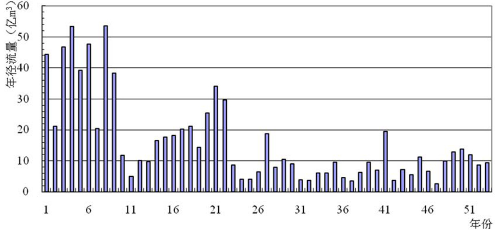  
图4.3-1  卫河楚旺站1956\~2008年实测年径流变化趋势  

卫河为少沙河流,泥沙主要来自山前平原,山区来沙较少。根据 $1964\sim1991$ 年资料分析,卫河各站水沙分析见表 4.3-1。由表 4.3-1 成果可见,卫河泥沙主要来自淇门以上,淇门站多年平均输沙量 80.86 万 t;多年平均含沙量 $0.96\mathrm{kg}/\mathrm{m}^{3}$ 。楚旺站多年平均输沙量 116.11 万 t;多年平均含沙量 $0.87\mathrm{kg}/\mathrm{m}^{3}$ 。从上下游断面平均含沙量对比分析,下游含沙量略有减小,表明河道总体处于微淤状态。此外,选取有同步水沙观测的 $1974{\sim}1991$ 年资料进行分析(见表 4.3-2),若忽略淇门至楚旺区间来沙(区间有汤河、安阳河等支流汇入),则淇门 $+$ 刘庄-楚旺可大致表示区间河道淤积情况,由表 4.3-2 资料可见,河道总体处于微淤状态,与上下游断面平均含沙量对比分析的冲淤趋势是一致的。  

表 4.3-1 卫河各站水沙分析表  

<html><body><table><tr><td>项 目</td><td>卫河汲县</td><td>卫河淇门</td><td>淇河新村</td><td>安阳河安阳</td><td>卫河楚旺</td></tr><tr><td>平均输沙量(万 t)</td><td>98.17</td><td>80.86</td><td>28.49</td><td>19.48</td><td>116.11</td></tr><tr><td>平均含沙量(kg/m3)</td><td>2.89</td><td>0.96</td><td>0.97</td><td>0.63</td><td>0.87</td></tr><tr><td>最大含沙量(kg/m²)</td><td>46.8</td><td>56.9</td><td>104</td><td></td><td>31.7</td></tr><tr><td>平均径流量(亿 m²)</td><td>3.40</td><td>8.42</td><td>2.95</td><td>3.10</td><td>13.40</td></tr></table></body></html>  

表 4.3-2  卫河各站输沙量统计表  
单位:万 t  

<html><body><table><tr><td>年份</td><td>卫河淇门</td><td>共产主义渠刘庄</td><td>淇门+刘庄</td><td>卫河楚旺</td><td>淇门+刘庄-楚旺</td></tr><tr><td>1974</td><td>59.7</td><td>4.63</td><td>64.33</td><td>102</td><td>-37.67</td></tr><tr><td>1975</td><td>188</td><td>237</td><td>425.00</td><td>227</td><td>198.00</td></tr><tr><td>1976</td><td>86.1</td><td>44.7</td><td>130.80</td><td>237</td><td>-106.20</td></tr><tr><td>1977</td><td>97</td><td>18.7</td><td>115.70</td><td>191</td><td>-75.30</td></tr><tr><td>1978</td><td>106</td><td>4.01</td><td>110.01</td><td>62.1</td><td>47.91</td></tr><tr><td>1979</td><td>36.6</td><td>1.03</td><td>37.63</td><td>7.99</td><td>29.64</td></tr></table></body></html>  

<html><body><table><tr><td>年份</td><td>卫河淇门</td><td>共产主义渠刘庄</td><td>淇门+刘庄</td><td>卫河楚旺</td><td>淇门+刘庄-楚旺</td></tr><tr><td>1980</td><td>105</td><td>0.71</td><td>105.71</td><td>68</td><td>37.71</td></tr><tr><td>1981</td><td>242</td><td>4.7</td><td>246.70</td><td>138</td><td>108.70</td></tr><tr><td>1982</td><td>163</td><td>135</td><td>298.00</td><td>542</td><td>-244.00</td></tr><tr><td>1983</td><td>10.5</td><td>2.11</td><td>12.61</td><td>21.2</td><td>-8.59</td></tr><tr><td>1984</td><td>51.7</td><td>0.183</td><td>51.88</td><td>52.8</td><td>-0.92</td></tr><tr><td>1985</td><td>60.9</td><td>0.73</td><td>61.63</td><td>46</td><td>15.63</td></tr><tr><td>1986</td><td>38.5</td><td>0.45</td><td>38.95</td><td>17.7</td><td>21.25</td></tr><tr><td>1987</td><td>67</td><td>0.0418</td><td>67.04</td><td>24.6</td><td>42.44</td></tr><tr><td>1988</td><td>84.9</td><td>3.81</td><td>88.71</td><td>32</td><td>56.71</td></tr><tr><td>1989</td><td>63.6</td><td>7.9</td><td>71.50</td><td>29.2</td><td>42.30</td></tr><tr><td>1990</td><td>51</td><td>0.04</td><td>51.04</td><td>45.4</td><td>5.64</td></tr><tr><td>1991</td><td>51.8</td><td>0</td><td>51.80</td><td>40.3</td><td>11.50</td></tr><tr><td>合计</td><td>1563.30</td><td>465.74</td><td>2029.04</td><td>1884.29</td><td>144.75</td></tr></table></body></html>  

# (2)从地理位置分析  

卫河淇门至徐万仓地处平原,位于南运河水系的中游偏上,是由左岸十余条梳齿状支流和右岸的平原排水支流在平原地区汇流而成,距其左岸十余条支流的出山口有一定距离(一般超过 $30\mathrm{km}.$ )。与出山口附近的河段相比,地处中游的河段冲淤变化幅度相对较小,因此,从卫河所处的地理位置分析,其冲淤变化幅度相对较小。  

# (3)从河道形态分析  

卫河为复式断面半地上蜿蜒性河流,其演变规律与蜿蜒性河流一般规律是一致的。蜿蜒性河流演变的一般规律是,河道中存在水面横比降和横向环流,由此产生泥沙的横向输移作用,使凹岸遭受侵蚀、凸岸边滩不断淤长,整个河弯不断向侧方和下游方向蠕移,弯曲系数不断增大。以致发生裁弯取直,原有弯道被废弃为牛轭湖,从而完成河湾发育的一个周期,此后继续按此循环。一般认为,弯曲型河道较稳定。  

# (4)从河道输沙特性分析  

卫河为复式断面河道,河道冲淤主要发生在主槽,漫滩行洪时通常主槽冲刷,滩地淤积。选取平滩流量和中小流量情况计算河道水流挟沙力以分析河道输沙能力和冲淤特性。  

采用韩其为水流挟沙力计算公式计算卫河水流挟沙力,泥沙颗粒级配采用楚旺站悬移质泥沙颗粒级配资料,见表 4.3-3,计算卫河水流挟沙力成果见图 4.3-2、表 4.3-4。计算成果表明,现状情况下,卫河平滩流量从上游至下游逐渐增大,上游平滩流量为 $130{\sim}150\mathrm{m}^{3}/\mathrm{s}$ ,中段为 $700\mathrm{m}^{3}/\mathrm{s}$ ,下游为 $1000\mathrm{m}^{3}/\mathrm{s}$ ,河道设计排涝流量基本与平滩流量相一致。由于平滩流量沿程递增,断面平均流速和水流挟沙力均呈沿程递增的趋势,其中 $0{+}000{-}27{+}700$ 段河道平均流速约 $0.72\mathrm{m}/\mathrm{s}$ ,水流挟沙力约 $2.78\mathrm{kg}/\mathrm{m}^{3}$ ; $27+700{\sim}64{+}600$ 段河道平均流速约 $0.8\mathrm{m/s}$ ,水流挟沙力约$3.58\mathrm{kg}/\mathrm{m}^{3}$ ; $64{+}600{-}97{+}700$ 段河道平均流速约 $1.15\mathrm{m}/\mathrm{s}$ ,水流挟沙力约 $6.35\mathrm{kg}/\mathrm{m}^{3}$ ;$97\substack{+700}$ 以下段河道平均流速约 $1.31\mathrm{m}/\mathrm{s}$ ,水流挟沙力约 $7.93\mathrm{kg}/\mathrm{m}^{3}$ 。现状与治理后对比断面平均流速和水流挟沙力变化较小。  

中等流量(枯水期 5 年一遇,下同)和常遇流量(枯水期 2 年一遇,下同)情况下的水流挟沙力计算成果表明,中等流量时平均流速约 $0.8\mathrm{m}/\mathrm{s}$ ,水流挟沙力约 $4.32\mathrm{kg}/\mathrm{m}^{3}$ ;常遇流量时平均流速约 $0.67\mathrm{m}/\mathrm{s}$ ,水流挟沙力约 $3.82\mathrm{kg}/\mathrm{m}^{3}$ 。  

表 4.3-3 楚旺站悬移质泥沙颗粒级配  

<html><body><table><tr><td>粒径（mm）</td><td><0.0</td><td>0.</td><td>0.0</td><td>0.</td><td>0.</td><td>0.</td></tr><tr><td>小于某粒径泥沙重量</td><td>8</td><td>10</td><td>32.</td><td>87</td><td>99</td><td>10</td></tr></table></body></html>  

上述水流挟沙力计算成果与上游来沙相比,挟沙力大于多年平均含沙量,但小于实测最大含沙量,这说明,一般情况下河道处于次饱和输沙状态,略冲;上游含沙量较大时,河道处于超饱和输沙状态,略淤。总体上呈微冲微淤的冲淤交替变化状态。  

# (5)从河床抗冲性分析  

卫河河床主要由粉土、粉质壤土组成,平滩流量情况下水力半径 $3\mathrm{\sim}5\mathrm{m}$ ,中 等流量下水力半径约 $2.4\mathrm{m}$ ,常遇流量下水力半径约 $2\mathrm{m}$ 。在上述条件下河道抗冲 流速为 $0.7{\sim}1.0\mathrm{m/s}$ 。对比河道流速情况分析,卫河河道冲刷时速度缓慢,基本不 会出现大冲大淤情况。  

表 4.3-4卫河河道水流挟沙力计算成果统计表  

<html><body><table><tr><td rowspan="2">桩号</td><td rowspan="2">位置</td><td colspan="3">平滩情况 (排涝流量)</td><td colspan="3">枯水期（11～5月）5年一遇</td><td colspan="2">枯水期（11～5月）2年一遇</td></tr><tr><td>流量 m²/s</td><td>水流挟沙力kg/m?</td><td></td><td>流量 m3/s</td><td>水流挟沙力 kg/m?</td><td></td><td>流量</td><td>水流挟沙力kg/m²</td></tr><tr><td>0+000～27+700</td><td>小河口～长虹渠入 卫口</td><td>130</td><td>现状 2.78</td><td>治理 3.25</td><td>106</td><td>现状 3.14</td><td>治理 3.6</td><td>m²/s 49</td><td>现状 治理 2.33 2.44</td></tr><tr><td>27+700～64+600</td><td>长虹渠入卫口～老 观嘴</td><td>150</td><td>3.58</td><td>3.02</td><td>106</td><td>6.01</td><td>5.43</td><td>49</td><td>5.30 3.72</td></tr><tr><td>64+600~97+700</td><td>老观嘴～安阳河入 卫口</td><td>700</td><td>6.35</td><td>5.69</td><td>132</td><td>4.55</td><td>4.23</td><td>53</td><td>4.25 2.91</td></tr><tr><td>97+700～182+950</td><td>安阳河入卫口～徐 万仓</td><td>1000</td><td>7.93</td><td>7.88</td><td>136</td><td>3.88</td><td>3.66</td><td>60</td><td>3.51 3.38</td></tr></table></body></html>  

  
图 4.3-2卫河现状平滩流量携沙力沿程变化图  

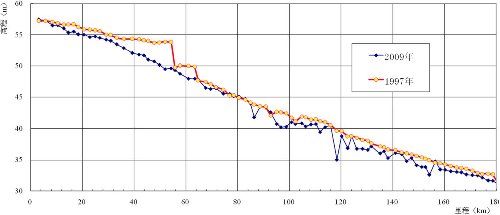  
图4.3-3 卫河纵断面套绘图  

(6)从近期实测地形资料分析  

1)1996\~2009 年间  

根据 1997 年和 2009 年实测断面资料套绘河道纵断面(深泓高程)见图 4.3-3,由图可见卫河河道深泓普遍发生冲刷,深泓冲深的均值为 $1.1\mathrm{m}$ 。  

根据元村集水文站实测大断面资料,套绘 $1997\sim2009$ 年横断面见图 4.3-4,由图可见“96.8”洪水前后断面变化不大,略有冲刷,1996 年 10 月至 2009 年 4 月断面基本没有变化。  

根据 1997 年和 2009 年实测横断面资料,选取断面位置基本重合的几个断面进行套绘,由图可见断面变化较小,主要是深泓有所下切,这说明弯道蠕动缓慢。  

同时,从图 4.3-4 可以看出,虽然主槽深泓点不同程度有所下切,主槽深泓点高程低于原设计河底高程,但主槽河底宽度均小于原设计主槽底宽,导致主槽断面不同程度有所减小。  

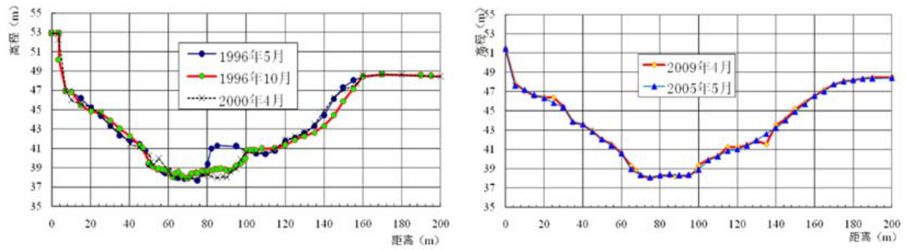  
元村集站  

元村集站  

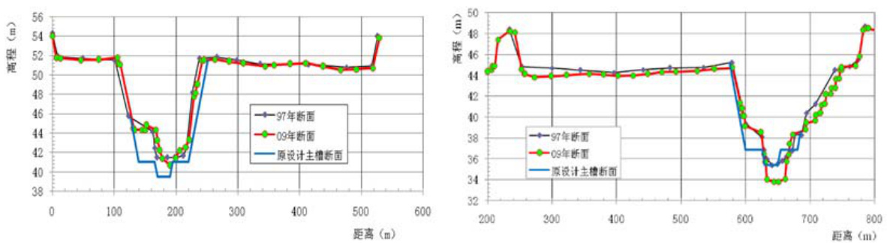  
$108{+}370$ 断面  

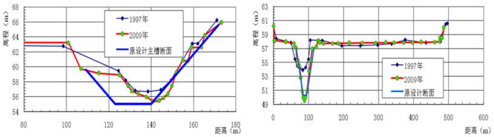  
$151{+}190$ 断面  

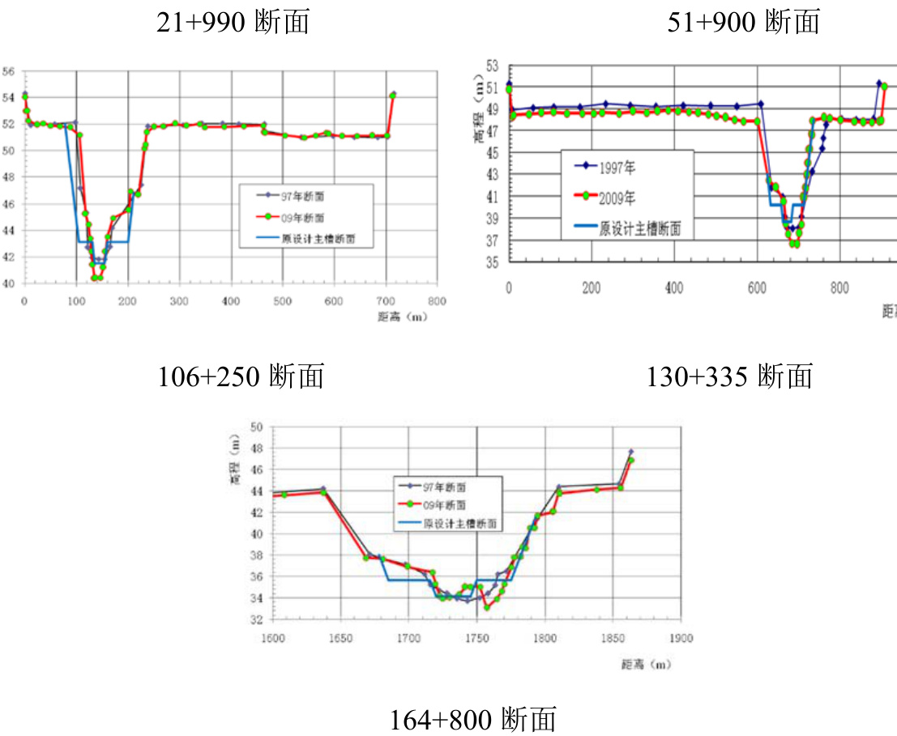  
图 4.3-4 横断面套汇图  

2)2009\~2019 年间  

将卫河 WD001\~WD164 河段 2009 年和 2019 年实测断面资料套绘河道纵断面(深泓高程)见图 4.3-5,由图可见卫河以 WD001 号断面为起点, $0{\sim}24\mathrm{km}$ 范围内河道主要呈现出淤积态势,河段深泓平均淤积厚度为 $0.34\mathrm{m}$ ; $24{\sim}35\mathrm{km}$ 范围内河道主要表现为冲淤交替,河段深泓冲淤交替在- $.1.2\mathrm{m}{\sim}0.9\mathrm{m}$ 之间(-为冲刷、 $^+$ 为淤积); $35{\sim}47\mathrm{km}$ 范围内河道仍然以淤积为主,河段深泓平均淤积厚度 $0.36\mathrm{m}$ ;$47{\sim}70\mathrm{km}$ 范围内河道深泓基本稳定; $70{\sim}75\mathrm{km}$ 范围内河道主要以冲刷为主,河道深泓平均冲刷深度为 $0.51\mathrm{m}$ 。  

根据上述河道冲淤变化特性和 2009 年和 2019 年实测横断面资料,选取能代表各个河段特性的几个典型断面进行套绘,如图 4.3-6,由图可见断面变化较小,主要是深泓和滩地有冲淤变化,整体河势较稳定、弯道蠕动缓慢。  

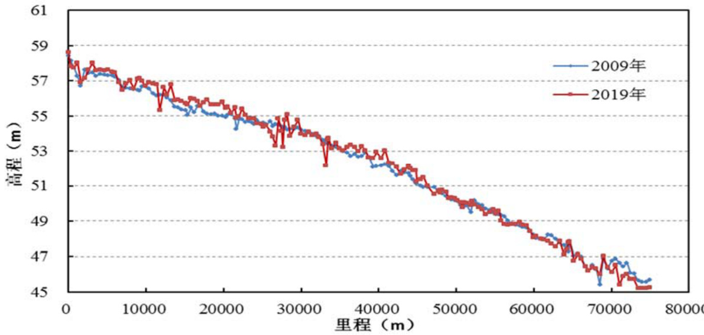  
图 4.3-5  卫河纵断面深泓套绘图(2009&2019)  

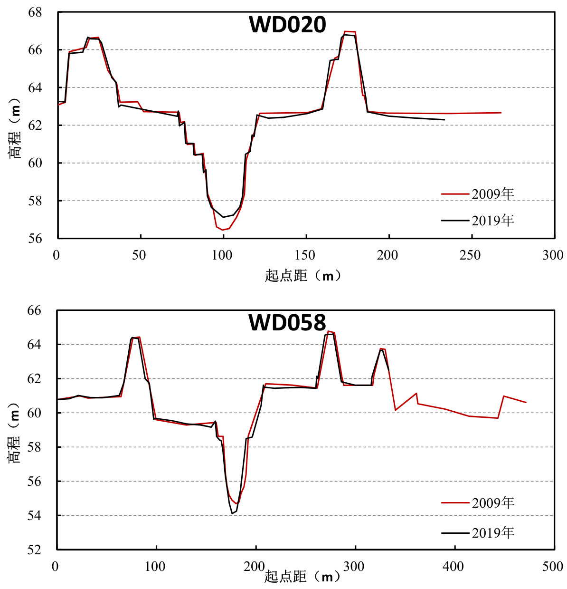  

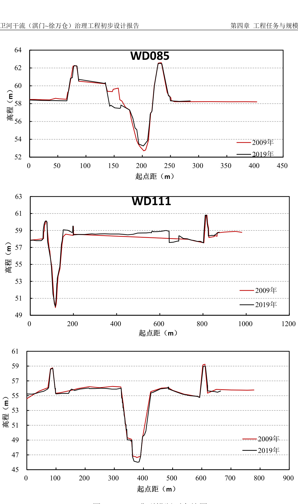  

图 4.3-6 典型横断面套绘图  

(7)综合分析结论  

卫河为少沙河流,泥沙主要来自淇门以上的大沙河、淇河;径流也主要来自淇门以上。产沙区域主要在山前平原地区,山区来沙量很小。  

卫河为蜿蜒型河流,较为稳定,综合多方面因素分析,近期内,由于上游来水来沙条件和下游侵蚀基面基本没有发生大的变化,河道基本处于微冲微淤,冲淤交替变化的相对平衡状态,弯道蠕动速度缓慢,自然状态下,河道基本上不会发生大的冲淤变化,就长期总体演变趋势而言,河道略呈微淤。  

从来沙地区组成和挟沙力计算成果对比分析,泥沙主要来自淇门以上的大沙河,卫河汲县站多年平均含沙量 $2.89\mathrm{kg}/\mathrm{m}^{3}$ ,远大于下游站的含沙量,而淇门附近河道挟沙力较小,因而在本次治理河段内上段易淤积,此外,老观嘴以上局部河段由于受共产主义渠入卫河水流的顶托,也易发生淤积。  

# 4.3.2 河道现状行洪排涝能力复核  

# 4.3.2.1 基本资料  

# 1、河道设计流量  

(1)卫河干流河道  

卫河干流淇门至老观嘴段河道行洪流量为 $400\mathrm{m}^{3}/\mathrm{s}$ ,排涝流量为 $130{\sim}150\mathrm{m}^{3}/\mathrm{s}$ ;老观嘴至徐万仓段河道行洪流量为 $2000{\sim}2500\mathrm{m}^{3}/\mathrm{s}$ ,排涝流量为 $700{\sim}1000\mathrm{m}^{3}/\mathrm{s}_{\circ}$ 。  

# (2)共产主义渠  

共产主义渠淇门至老观嘴段 20 年一遇麦涝流量 $250\mathrm{m}^{3}/\mathrm{s}$ ;该段河道设计行洪标准为50 年一遇,其中盐土庄以下河道设计流量 $1600\mathrm{m}^{3}/\mathrm{s}$ ,盐土庄以上共产主义渠和共产主义渠以西行洪区共同行洪宣泄上游共产主义渠与淇河洪水。  

# 2、起始水位  

卫河干流淇门至徐万仓段河道全长 $182.95\mathrm{km}$ ,河道在 1978 年扩大治理时徐万仓(卫河与漳河交汇处)设计行洪水位为 $43.76\mathrm{m}$ (黄海 56 高程),设计排涝水位为 $40.11\mathrm{m}$ (黄海 56 高程)。本次现状行洪与排涝能力复核仍以徐万仓处 1978年扩大治理时的行洪和排涝水位作为水面线计算的起始水位,换算为1985 国家高程,行洪和排涝的起始水位分别为 $43.69\mathrm{m}$ 和 $40.04\mathrm{m}$ 。  

共产主义渠入卫河口位置起始水位采用卫河该位置处现状行洪、排涝水位的计算值。  

# 3、河道断面资料  

河道横断面资料:淇门以下共产主义渠采用 2009 年测量资料(断面间距为  

$500\mathrm{m}$ )、淇门\~浚内沟口约 $75\mathrm{km}$ 范围采用 2019 年 10 月新测断面(断面间距为$100\mathrm{m}$ ),浚内沟口\~徐万仓段采用采用 2009 年测量资料。  

# 4、河道糙率  

河道现状行洪排涝能力复核采用的糙率为可研阶段糙率率定的成果。可研阶段卫河干流采用 1997 年实测的河道横断面资料和“96.8”洪水实测资料,采用恒定非均匀流推水面线的计算方法进行糙率率定,选用不同的主槽和滩地糙率进行水面线计算,最终选取与“96.8”实测断面水位值相近时的糙率值作为河道现状的糙率值。通过分析卫河干流淇门至烧酒营段现状河道主槽糙率 0.027、老观嘴至张浮庄桥段现状河道主槽糙率 $0.027{\sim}0.023$ ,滩地糙率为 0.06,与“96.8”实测洪水水位最接近。共产主义渠河道糙率仍维持原设计糙率值,即主槽糙率为 0.0225、滩地糙率为 0.035。  

河道现状糙率取值见表 4.3-5。  

表 4.3-5 河道糙率取值表  

<html><body><table><tr><td>河道名称</td><td>河段</td><td>河道大断面桩号</td><td>主槽糙率</td><td>滩地糙率</td></tr><tr><td rowspan="2">卫河</td><td>淇门～王庄</td><td>0+000~113+520</td><td>0.027</td><td rowspan="2">0.060</td></tr><tr><td>王庄～徐万仓</td><td>113+520~182+950</td><td>0.023</td></tr><tr><td>共产主义渠</td><td>刘庄～老观嘴</td><td>0+000～44+200</td><td>0.0225</td><td>0.035</td></tr></table></body></html>  

按上述计算条件,采用天然河道恒定非均匀流水面线计算方法分别对卫河和共产主义渠现状河道进行水面线计算,复核河道现状行洪与排涝能力。  

# 4.3.2.2 卫河河道现状行洪和排涝能力复核  

# 1、卫河河道现状排涝能力  

根据 2009、2019 年实测断面资料对比分析,卫河淇门至浚内沟口段呈现冲淤交替分布情况。卫河淇门至宗湾裁湾上口段河道总体有所淤积,河道深泓点高程平均上升 $35\mathrm{cm}$ ;宗湾裁湾上口至长虹退水闸段河道存在下切情况,河道深泓点高程平均下降约 $20\mathrm{cm}$ ;浚县分洪道上口至民丰渠入口段河道存在一定淤积,河道深泓点高程平均上升约 $13\mathrm{cm}$ ;老观嘴至浚内沟口段河道存在下切情况,河道深泓点高程平均下降约 $19\mathrm{cm}$ 。  

经计算分析,卫河河道现状排涝能力为:  

在现状糙率、原设计排涝流量情况下,现状河道排涝水位比原设计排涝水位壅高 $0.17{\sim}1.25\mathrm{m}$ ,其中淇门至十里铺段河道排涝水位壅高 $0.76{\sim}1.25\mathrm{m}$ ,十里铺至大北张段河道排涝水位壅高 $0.17{\sim}0.66\mathrm{m}$ ,大北张以下河道排涝水位壅高了 $0.17\sim$ $0.28\mathrm{m}$ 。在设计糙率、设计排涝流量情况下,现状河道淇门至十里铺段河道排涝水位壅高 $0.27{\sim}1.07\mathrm{m}$ ,老观嘴处壅高 $0.64\mathrm{m}$ ,浚内沟口以下河道排涝水位变化比较小,仅在大北张至窑厂段河道排涝水位有所壅高,最大壅高值为 $0.26\mathrm{m}$ 。通过与现状糙率、设计排涝流量水位对比,通过恢复河道设计糙率可以使水位得到部分降低,但降低有限,部分河道较原设计排涝水位仍有所壅高,壅高段主要集中在淇门至十里铺下口段。  

按原排涝水位控制,现状河道在十里铺裁湾下口以上排涝能力由 $130\sim$ $150\mathrm{m}^{3}/\mathrm{s}$ 降为 $60{\sim}100\mathrm{m}^{3}/\mathrm{s}$ ,最大降低了 $53.8\%$ ,十里铺裁湾下口至老观嘴段河道排涝能力满足3 年一遇排涝流量 $150\mathrm{m}^{3}/\mathrm{s}$ ,老观嘴至浚内沟口段河道河道排涝能力由 $700\mathrm{m}^{3}/\mathrm{s}$ 下降至 $650\mathrm{m}^{3}/\mathrm{s}$ ,浚内沟口以下段河道排涝能力降低较小,均能达到设计的 $95\%$ 以上。卫河河道现状排涝能力成果见表 4.3-6。  

表 4.3-6卫河干流河道现状排涝能力计算成果表  

<html><body><table><tr><td rowspan="2">位置</td><td rowspan="2">河道主槽 桩号</td><td rowspan="2">设计 排涝流量 (m/s)</td><td rowspan="2">原设计 排涝水位 ()</td><td colspan="4">原设计排涝流量情况下现状河道排涝水位 (m)</td><td rowspan="2">河道现状 排涝流量 (m3/s)</td><td rowspan="2">河道现状 排涝能力</td></tr><tr><td>现状 (率定糙率)</td><td>差值</td><td>现状 (原设计糙率)</td><td>差值</td></tr><tr><td>宗湾 (原裁湾上口)</td><td>25+880</td><td rowspan="4">130</td><td>59.00</td><td>60.25</td><td>1.25</td><td>60.07</td><td>1.07</td><td rowspan="2">60</td><td rowspan="2">46.2%</td></tr><tr><td>宗湾 (原裁湾下口)</td><td>28+330</td><td>58.66</td><td>59.82</td><td>1.16</td><td>59.61 0.95</td></tr><tr><td>长虹渠入卫河口</td><td>30+170</td><td>58.42</td><td>59.66</td><td>1.24</td><td>59.46</td><td>1.04</td><td>70 46.7%</td></tr><tr><td>浚县分叉上口</td><td>46+040</td><td>56.82</td><td>57.73</td><td>0.91</td><td>57.27</td><td>0.45</td><td rowspan="3">100</td><td rowspan="3">66.7%</td></tr><tr><td>十里铺 (原裁湾上口)</td><td>50+070</td><td>56.37</td><td>57.13</td><td>0.76</td><td>56.77</td><td>0.4</td></tr><tr><td>十里铺 (原裁湾下口)</td><td>51+530</td><td>56.21</td><td>56.85</td><td>0.64</td><td>56.45</td><td>0.24</td></tr><tr><td>民丰沟退水入卫河口</td><td>58+930</td><td></td><td>55.52</td><td>55.89</td><td>0.37</td><td>55.79</td><td>0.27 150</td><td>100%</td></tr><tr><td>老观嘴</td><td>69+870</td><td rowspan="2">700</td><td>54.39</td><td>54.76</td><td>0.37</td><td>55.03</td><td rowspan="2">0.64</td><td rowspan="2">92.9%</td></tr><tr><td>浚内沟</td><td>78+980</td><td></td><td>54.6</td><td>0.66</td><td>53.51</td></tr><tr><td>安阳河入卫河口</td><td>104+130</td><td rowspan="6">1000</td><td>50.75</td><td>51.16</td><td>0.41</td><td>50.78</td><td>0.03</td><td rowspan="6">950</td><td rowspan="6">95 %</td></tr><tr><td>大北张</td><td>152+220</td><td>44.49</td><td>44.66</td><td>0.17</td><td></td><td>0.16</td></tr><tr><td>岔河咀</td><td>154+410</td><td>44.15</td><td>44.42</td><td>0.27</td><td>44.65 44.33</td><td>0.18</td></tr><tr><td>窑厂</td><td>168+690</td><td>42.58</td><td>42.86</td><td>0.28 42.84</td><td></td><td>0.26</td></tr><tr><td>徐万仓</td><td>196+930</td><td>40.04</td><td>40.4</td><td>0</td><td></td><td></td></tr><tr><td></td><td></td><td></td><td></td><td></td><td>40.04</td><td>0</td></tr></table></body></html>  

# 2、卫河河道现状行洪能力  

在现状糙率、原设计行洪流量情况下,淇门以下河道长约 $26\mathrm{km}$ ( $0{+}000{\sim}$ $26\substack{+070}$ )、 $113{+}360$ 以下长约 $14\mathrm{km}$ ( $113\substack{+360}{\sim}127\substack{+040}$ )共计 $40\mathrm{km}$ 河道堤防超高基本大于 $1.5\mathrm{m},26{+}070$ 以下河道长约 $87\mathrm{km}$ 河道( $26{+}070{\sim}113{+}360)$ )、 $127{+}040$ 以下长约 $56\mathrm{km}$ ,共计 $143\mathrm{km}$ 长河道堤防超高不足,堤防超高为 $0.7{\sim}1.5\mathrm{m}$ 。  

在原设计糙率、原设计行洪流量情况下,卫河现状河道在 $0{+}000{\sim}26{+}060$ 段长约 $26\mathrm{km}$ 、 $33{+}570{\sim}41{+}310$ 段长约 $7.7\mathrm{km}$ 、 $64{+}590{\sim}73{+}520$ 段长约 $8.9\mathrm{km}$ 、$108{+}830{\sim}133{+}080$ 段长约 $24\mathrm{km}$ (共计 $66.6\mathrm{km}$ )河道堤防超高基本大于 $1.5\mathrm{m}$ ,其余长约 $116\mathrm{km}$ 河道堤防超高不足,堤防超高为 $1.0{\sim}1.5\mathrm{m}$ 。  

按原设计水位控制,仅有淇门以下约 $26\mathrm{km}$ 长河道满足行洪流量 $400\mathrm{m}^{3}/\mathrm{s}$ 、王庄桥至邵庄闸段长约 $26\mathrm{km}$ 河道基本满足行洪流量 $2500\mathrm{m}^{3}/\mathrm{s}$ ,其余河段行洪能力均有所降低,其中徐万仓以上约 $6.5\mathrm{km}$ 河道行洪能力降低最大,行洪能力仅为原设计的 $40\%$ ,行洪能力降低了 $60\%$ 。卫河淇门以下干流河道行洪能力仅有 $52\mathrm{km}$ 长河道基本满足原设计行洪能力,其余河段均不同程度有所降低。其原因为上游河道主槽有局部淤积等,减小河道行洪断面,加大河道的糙率,且堤防超高不足,从而降低河道行洪能力。  

卫河干流(淇门\~徐万仓)河道现状行洪能力见表 4.3-7。  

表 4.3-7 卫河河道现状行洪能力计算成果表  

<html><body><table><tr><td rowspan="2">具体位置</td><td rowspan="2">大断面桩号</td><td rowspan="2">设计流量 (m²/s)</td><td rowspan="2">现状行洪流量</td><td rowspan="2">现状行洪能力</td></tr><tr><td>(m/s)</td></tr><tr><td>淇门</td><td>0+000</td><td rowspan="6">400</td><td rowspan="2">400</td><td rowspan="2">100%</td></tr><tr><td>康庄</td><td>26+060</td></tr><tr><td rowspan="2">大榆柳</td><td>26+360</td><td>300</td><td rowspan="2">75%</td></tr><tr><td>52+040</td><td></td></tr><tr><td rowspan="2">老观嘴</td><td>52+380</td><td rowspan="2">250</td><td rowspan="2">62.50%</td></tr><tr><td>64+300</td></tr><tr><td rowspan="2">赵王沟</td><td>64+590</td><td rowspan="4">2000</td><td>1650</td><td>82.50%</td></tr><tr><td>81+870 82+440</td><td rowspan="2">1800</td><td rowspan="2">90%</td></tr><tr><td></td></tr><tr><td rowspan="2">安阳河入卫河口</td><td>97+160</td><td rowspan="3"></td><td rowspan="2">60%</td></tr><tr><td>97+730 108+830</td></tr><tr><td>王庄 109+300</td><td>2500</td><td></td><td></td></tr><tr><td>邵庄闸</td><td>135+550</td><td></td><td>2500</td><td>100%</td></tr></table></body></html>  

<html><body><table><tr><td>具体位置</td><td>大断面桩号</td><td>设计流量 (m3/s)</td><td>现状行洪流量 (m3/s)</td><td>现状行洪能力</td></tr><tr><td></td><td>136+080</td><td rowspan="6"></td><td rowspan="2">2200</td><td rowspan="2">88%</td></tr><tr><td rowspan="3">西红庙</td></tr><tr><td>167+540</td><td></td></tr><tr><td>168+070 175+950</td><td>1800</td></tr><tr><td>176+500</td><td rowspan="2">1000</td><td rowspan="2">40%</td></tr><tr><td>徐万仓</td><td>182+950</td></tr></table></body></html>  

# 4.3.2.3 共产主义渠现状行洪和排涝能力复核  

经 2009、2019 年实测资料分析,共产主义渠现状河道有所淤积,白寺村以上河道淤积高度平均在 $1.0\mathrm{m}$ 左右,白寺村以下河道淤积高度在 $1.0{\sim}2.5\mathrm{m}$ 之间。遇20 年一遇麦涝流量 $250\mathrm{m}^{3}/\mathrm{s}$ 时左侧堤埝在白寺附近已基本与水位齐平,超高仅有$0.05\mathrm{m}$ ,在同山村以上、马头村以下堤防超高均大于 $2.0\mathrm{m}$ ,同山村至马头村段河道左堤埝超高在 $1.0\mathrm{m}$ 左右,此时右堤超高均大于 $2.00\mathrm{m}$ 。过流能力基本满足 20 年一遇麦涝流量 $250\mathrm{m}^{3}/\mathrm{s}$ 。  

设计标准下,盐土庄闸以上河段,共产主义渠与共产主义渠以西行洪区共同承泄上游共产主义渠和淇河洪水洪峰流量 $3100\mathrm{m}^{3}/\mathrm{s}$ ,通过复核在原设计糙率、设计行洪流量情况下,盐土庄闸至刘庄闸约 $28\mathrm{km}$ 河道右堤堤防超高均不足 $1.0\mathrm{m}$ ,;盐土庄闸至入卫河口,左堤约 $3.8\mathrm{km}$ 超高低于 $1.5\mathrm{m}$ 。  

共产主义渠现状河道行洪排涝能力成果见表 4.3-8。  

表 4.3-8共产主义渠河道现状行洪排涝能力计算成果表  

<html><body><table><tr><td rowspan="3">位置</td><td rowspan="3">断面桩 号</td><td rowspan="3">左堤高 程 (m)</td><td rowspan="3">右堤高程 (m)</td><td colspan="4">现状排涝能力复核</td><td colspan="4">现状行洪能力复核</td></tr><tr><td>现状排涝</td><td>麦涝流量</td><td>左堤超</td><td>右堤超高</td><td>行洪水位</td><td>行洪流量</td><td>左堤超</td><td>右堤超高</td></tr><tr><td>水位 (m)</td><td>(m3/s)</td><td>高 (m)</td><td>(m)</td><td>(m)</td><td>(m3/s)</td><td>高 (m)</td><td>(m)</td></tr><tr><td>刘庄闸上</td><td>0+000</td><td>68.01</td><td>67.77</td><td>63.19</td><td rowspan="9"></td><td>4.82</td><td>4.58</td><td>66.52</td><td rowspan="9"></td><td>1.49</td><td>1.25</td></tr><tr><td>刘庄水文站</td><td>0+580</td><td>67.13</td><td>67.05</td><td>63.03</td><td>4.1</td><td>4.02</td><td>66.26</td><td>0.87</td><td>0.79</td></tr><tr><td>于新庄</td><td>2+580</td><td>66.9</td><td>65.92</td><td>62.61</td><td>4.29</td><td>3.31</td><td>65.73</td><td>1.17</td><td>0.19</td></tr><tr><td>东枋城</td><td>3+100</td><td>66.76</td><td>66.51</td><td>62.47</td><td>4.29</td><td>4.04</td><td>65.58</td><td>1.18</td><td>0.93</td></tr><tr><td rowspan="3">牛四马湖</td><td>5+080</td><td>65.43</td><td>65.59</td><td>62.06</td><td>3.37</td><td>3.53</td><td>65.14</td><td></td><td>0.29</td><td>0.45</td></tr><tr><td>7+500</td><td>64.98</td><td>64.74</td><td>61.56</td><td>3.42</td><td>3.18</td><td>64.7</td><td></td><td>0.28</td><td>0.04</td></tr><tr><td>9+620</td><td>64.3</td><td>63.4</td><td>61.09</td><td>3.21</td><td>2.31</td><td>64.26</td><td></td><td>0.04</td><td>-0.86</td></tr><tr><td rowspan="2">大碾</td><td>11+330</td><td>63.32</td><td>63.69</td><td>60.37</td><td>2.95</td><td>3.32</td><td>63.83</td><td>与共产主</td><td>-0.51</td><td>-0.14</td></tr><tr><td>13+010</td><td>65.48</td><td>65.66</td><td>59.83</td><td>5.65</td><td>5.83</td><td>63.29</td><td>义渠以西</td><td>2.19</td><td>2.37</td></tr><tr><td>同山</td><td>14+990</td><td>62.13</td><td>62.76</td><td>59.34</td><td>2.79</td><td>3.42</td><td>62.61</td><td>行洪区共</td><td>-0.48</td><td></td><td>0.15</td></tr><tr><td></td><td>16+050</td><td>61.29</td><td>62.32</td><td>59.22</td><td></td><td>2.07</td><td>3.1</td><td>62.36</td><td>同承泄上</td><td>-1.07</td><td>-0.04</td></tr><tr><td></td><td>17+620</td><td>59.41</td><td>61.36</td><td>59.04</td><td>250</td><td>0.37</td><td>2.32</td><td>61.8</td><td>游共产主</td><td>-2.39</td><td>-0.44</td></tr><tr><td></td><td>18+030</td><td>60.12</td><td>61.58</td><td>58.97</td><td></td><td>1.15</td><td>2.61</td><td>61.73</td><td>义渠和淇</td><td>-1.61</td><td>-0.15</td></tr><tr><td></td><td>18+560</td><td>59.39</td><td>61.97</td><td>58.9</td><td></td><td>0.49</td><td>3.07</td><td>61.69</td><td>河洪水洪</td><td>-2.30</td><td>0.28</td></tr><tr><td></td><td>20+130</td><td>59.93</td><td>61.95</td><td>58.76</td><td></td><td>1.17</td><td>3.19</td><td>61.65</td><td>峰流量</td><td>-1.72</td><td>0.30</td></tr><tr><td>王庄</td><td>22+110</td><td>60.27</td><td>62.15</td><td>58.42</td><td></td><td>1.85</td><td>3.73</td><td>61.59</td><td>3100</td><td>-1.32</td><td>0.56</td></tr><tr><td></td><td>23+050</td><td>60.01</td><td>61.43</td><td>58.26</td><td></td><td>1.75</td><td>3.17</td><td>61.56</td><td></td><td>-1.55</td><td>-0.13</td></tr><tr><td>白寺</td><td>24+580</td><td>59.35</td><td>61.84</td><td>58.04</td><td></td><td>1.31</td><td>3.8</td><td>61.52</td><td></td><td>-2.17</td><td>0.32</td></tr><tr><td></td><td>24+840</td><td>58.08</td><td>60.63</td><td>58.03</td><td></td><td>0.05</td><td>2.6</td><td>61.51</td><td></td><td>-3.43</td><td>-0.88</td></tr><tr><td></td><td>25+030</td><td>58.36</td><td>61.65</td><td>58</td><td></td><td>0.36</td><td>3.65</td><td>61.5</td><td></td><td>-3.14</td><td>0.15</td></tr><tr><td></td><td>27+020</td><td>59.24</td><td>60.9</td><td>57.64</td><td></td><td>1.6</td><td>3.26</td><td>61.43</td><td></td><td>-2.19</td><td>-0.53</td></tr><tr><td>东许庄</td><td>27+540</td><td>58.56</td><td>60.92</td><td>57.54</td><td></td><td>1.02</td><td>3.38</td><td>61.44</td><td></td><td>-2.88</td><td>-0.52</td></tr><tr><td></td><td>28+530</td><td>59.21</td><td>62.39</td><td>57.37</td><td></td><td>1.84</td><td>5.02</td><td>61.34</td><td></td><td>-2.13</td><td>1.05</td></tr></table></body></html>  

<html><body><table><tr><td rowspan="2">位置</td><td rowspan="2">断面桩 号</td><td rowspan="2">左堤高 程 (m)</td><td rowspan="2">右堤高程 (m)</td><td colspan="4">现状排涝能力复核</td><td colspan="4">现状行洪能力复核</td></tr><tr><td>现状排涝</td><td>麦涝流量 (m3/s)</td><td>左堤超 高 (m)</td><td>右堤超高</td><td>行洪水位</td><td>行洪流量</td><td>左堤超</td><td>右堤超高</td></tr><tr><td>盐土庄</td><td></td><td></td><td></td><td>水位 (m)</td><td colspan="3"></td><td>(m) 5.55</td><td>(m) (m3/s)</td><td>高 (m)</td><td>(m)</td></tr><tr><td></td><td>32+040</td><td>59.43</td><td>62.44</td><td>56.89</td><td colspan="3"></td><td>61.14</td><td></td><td>-1.71 -2.98</td><td>1.30</td></tr><tr><td>马头</td><td>33+540</td><td>56.89</td><td>61.04</td><td>56.69</td><td colspan="3"></td><td>59.87</td><td></td><td></td><td>1.17</td></tr><tr><td></td><td>34+040</td><td>60.53</td><td>61.37</td><td>56.64</td><td></td><td>3.89</td><td>4.73</td><td>59.83</td><td>0.70</td><td></td><td>1.54</td></tr><tr><td>李厂</td><td>34+490</td><td>60.87</td><td>60.82</td><td>56.58</td><td></td><td>4.29</td><td>4.24</td><td>59.76</td><td>2000（共</td><td>1.11</td><td>1.06</td></tr><tr><td>屯子</td><td>34+690</td><td>62.41</td><td>62.27</td><td>56.51</td><td></td><td>5.9 4.43</td><td>5.76</td><td>59.75</td><td>卫合流)</td><td>2.66</td><td>2.52</td></tr><tr><td></td><td>36+020</td><td>60.62 60.98</td><td>60.98 59.54</td><td>56.19</td><td colspan="3"></td><td>4.79 4.37</td><td>59.56</td><td>1.06</td><td>1.42</td></tr><tr><td></td><td>40+000</td><td></td><td></td><td>55.17</td><td></td><td>5.81</td><td></td><td>58.87</td><td></td><td>2.11</td><td>0.67</td></tr><tr><td>入卫口</td><td>44+200</td><td>60.28</td><td>60.08</td><td>53.75</td><td></td><td>6.53</td><td>6.33</td><td>58.12</td><td></td><td>2.16</td><td>1.96</td></tr></table></body></html>  

# 4.3.3 存在问题  

卫河淇门以下干流河道自 1978 年治理、共产主义渠自 1962 年停止引黄用于行洪以来,经过近四十年的运用,上游河道主槽存在不同程度淤积,排涝水位抬高,中下游河道堤防超高不足,致使河道行洪能力下降,险工险段等问题急亟待处置,穿堤建筑物年久失修,严重影响河道行洪安全。  

# 4.3.3.1 行洪与排涝能力不足  

卫河现状河道主槽局部有不同程度的淤积、堤防超高不足、河道糙率加大,共产主义渠河道淤积严重,导致河道行洪与排涝能力有不同程度的下降。根据实测断面资料,宗湾上至长虹渠入卫河口段原设计底宽 $17\mathrm{m}$ ,现状底宽仅为 $5{\sim}6\ensuremath{\mathrm{m}}$ ,河底束窄严重,长虹渠入卫河口至浚县县城段原设计底宽 $16\mathrm{m}$ ,现状底宽为 $7{\sim}12\mathrm{m}$ ,浚县县城至十里铺裁湾下口段原设计底宽 $10\mathrm{m}$ ,现状底宽为 $5{\sim}8\mathrm{m}$ 。  

根据河道现状行洪与排涝能力的复核成果,卫河现状河道排涝水位比原设计排涝水位壅高 $0.17{\sim}1.25\mathrm{m}$ ,其中淇门至十里铺段河道排涝水位壅高 $0.76{\sim}1.25\mathrm{m}$ ,十里铺至大北张段河道排涝水位壅高 $0.17{\sim}0.66\mathrm{m}$ ,大北张以下河道排涝水位壅高了 $0.17{\sim}0.28\mathrm{m}$ ,排涝能力最大下降 $53.8\%$ 。按原设计水位控制,仅有淇门以下约$26\mathrm{km}$ 长河道满足行洪流量 $400\mathrm{m}^{3}/\mathrm{s}$ 、王庄桥至邵庄闸段长约 $26\mathrm{km}$ 河道基本满足行洪流量 $2500\mathrm{m}^{3}/\mathrm{s}$ ,其余河段行洪能力均有所降低,其中徐万仓以上约 $6.5\mathrm{km}$ 河道行洪能力降低最大,行洪能力仅为原设计的 $40\%$ ,行洪能力降低了 $60\%$ 。  

# 4.3.3.2 堤防超高不足  

卫河堤防是历史上就地挖土逐渐填筑而成,经多年运用,自然剥蚀、堤身高度不足,部分堤段设计洪水位以上超高不足 $1.0\mathrm{m}$ ,而卫河干流共卫合流以上堤防基本为 3 级,超高应在设计洪水以上 $1.2\mathrm{m}$ ,共卫合流以下堤防级别为 2 级,超高应在设计洪水位以上 $1.8{\sim}2\mathrm{m}$ ,目前现状与堤防的重要性不相称。  

经统计,卫河左堤在共卫合流以上段共有 $9.64\mathrm{km}$ 堤防超高不足 $1.2\mathrm{m}$ ,其中$8.34\mathrm{km}$ 超高不足 $1\mathrm{m}$ ,亟需进行加高治理;有 $1.85\mathrm{km}$ 堤顶宽度不足 $5\mathrm{m}$ ,其中 $0.7\mathrm{km}$ 属于现状堤顶超高不足 $1\mathrm{m}$ 段,其余 $1.15\mathrm{km}$ 堤顶宽度在 $4.5{\sim}5.0\mathrm{m}$ 之间。共卫合流以下段卫河左堤共有 $52.24\mathrm{km}$ 堤防超高不足 $1.8\mathrm{m}$ ,其中 $26.93\mathrm{km}$ 超高不足 $1.5\mathrm{m}$ ,亟需进行加高治理;有 $7.25\mathrm{km}$ 堤顶宽度不足 $6\mathrm{m}$ ,其中 $2.25\mathrm{km}$ 属于现状堤顶超高不足 $1.5\mathrm{m}$ 段,可结合堤防加高进行培厚,其余 $5\mathrm{km}$ 堤顶宽度在 $5.0{\sim}6.0\mathrm{m}$ 之间。  

卫河右堤在共卫合流以上段共有 $5\mathrm{km}$ 堤防超高不足 $1.2\mathrm{m}$ ,其中 $4.1\mathrm{km}$ 超高不足 $1\mathrm{m}$ ,亟需进行加高治理;有 $7.55\mathrm{km}$ 堤顶宽度不足,堤顶宽度均在 $4.5\mathrm{m}{\sim}5.0\mathrm{m}$ 之间。共卫合流以下段卫河右堤共有 $58.46\mathrm{km}$ 堤防超高不足 $1.8\mathrm{m}$ ,其中 $29.3\mathrm{km}$ 超高不足 $1.5\mathrm{m}$ ,亟需进行加高治理;有 $2.6\mathrm{km}$ 堤顶宽度不足 $6\mathrm{m}$ ,堤顶宽度在$5.5\mathrm{m}{\sim}6.0\mathrm{m}$ 之间。  

卫河浚内沟口处,约 $780\mathrm{m}$ 无右堤,卫河平滩流量约 $800\mathrm{m}^{3}/\mathrm{s}$ ,超过此流量将倒灌小滩坡。  

共产主义渠自1962 年停止引黄用于行洪后,运行至今基本未进行过治理,河道淤积严重,河道堤防均为当年开挖时的弃土堆成,断面宽窄不一,高低不平,影响河道行洪能力。盐土庄闸至刘庄闸约 $28\mathrm{km}$ 河道右堤堤防超高均不足 $1.0\mathrm{m}$ ;盐土庄闸至入卫河口,左堤约 $3.8\mathrm{km}$ 超高低于 $1.5\mathrm{m}$ 。  

表 4.3-9堤防现状超高及堤顶宽度统计表  

<html><body><table><tr><td rowspan="2">河道 桩号</td><td rowspan="2">位置</td><td rowspan="2">设计洪水位 (u)</td><td colspan="4">左堤</td><td colspan="4">右堤</td></tr><tr><td>左堤桩号</td><td>现状堤顶高程 (u)</td><td>现状堤顶超高 (u)</td><td>现状堤顶宽度 (u)</td><td>右堤桩号</td><td>现状堤顶高程 (W)</td><td>现状堤顶超高 (u)</td><td>现状堤顶宽度 (U)</td></tr><tr><td>0+000</td><td>淇共汇合口</td><td>64.97</td><td>0+167</td><td>68.39</td><td>3.42</td><td>5.70</td><td></td><td></td><td></td><td></td></tr><tr><td>1+190</td><td>淇门</td><td>64.93</td><td>1+043</td><td>68.31</td><td>3.38</td><td>6.40</td><td>2+643</td><td>68.05</td><td>3.12</td><td>7.8</td></tr><tr><td>4+100</td><td></td><td>64.6</td><td>3+880</td><td>67.37</td><td>2.77</td><td>7.20</td><td>5+824</td><td>67.43</td><td>2.83</td><td>6.1</td></tr><tr><td>7+010</td><td></td><td>64.32</td><td>7+033</td><td>67.48</td><td>3.16</td><td>16.50</td><td>8+719</td><td>66.90</td><td>2.58</td><td>7.2</td></tr><tr><td>10+430</td><td></td><td>63.95</td><td>10+407</td><td>66.53</td><td>2.58</td><td>7.90</td><td>12+336</td><td>66.70</td><td>2.75</td><td>5.3</td></tr><tr><td>13+230</td><td></td><td>63.44</td><td>13+258</td><td>65.81</td><td>2.37</td><td>8.00</td><td>15+245</td><td>66.00</td><td>2.56</td><td>6.2</td></tr><tr><td>16+170</td><td></td><td>63.1</td><td>16+255</td><td>65.65</td><td>2.55</td><td>4.60</td><td>18+326</td><td>65.89</td><td>2.79</td><td>8.4</td></tr><tr><td>19+360</td><td></td><td>62.77</td><td>19+471</td><td>65.33</td><td>2.56</td><td>5.80</td><td>21+622</td><td>65.09</td><td>2.32</td><td>7.3</td></tr><tr><td>22+380</td><td></td><td>62.28</td><td>22+933</td><td>64.78</td><td>2.50</td><td>9.40</td><td>24+375</td><td>65.20</td><td>2.71</td><td>7.8</td></tr><tr><td>23+900</td><td>宗湾上</td><td>62.07</td><td>24+846</td><td>64.31</td><td>2.24</td><td>6.20</td><td>26+264</td><td>64.60</td><td>2.11</td><td>7</td></tr><tr><td>26+350</td><td>宗湾下</td><td>61.77</td><td>27+242</td><td>64.47</td><td>2.70</td><td>8.60</td><td>28+644</td><td>62.90</td><td>0.41</td><td>6.5</td></tr><tr><td>27+680</td><td>长虹渠入卫河口</td><td>61.68</td><td>28+964</td><td>63.54</td><td>1.86</td><td>5.10</td><td>29+875</td><td>63.52</td><td>1.03</td><td>7.2</td></tr><tr><td>30+040</td><td></td><td>61.47</td><td>31+204</td><td>63.75</td><td>2.28</td><td>14.30</td><td>33+353</td><td>62.90</td><td>0.41</td><td>4.6</td></tr><tr><td>33+410</td><td></td><td>61.2</td><td>34+577</td><td>62.50</td><td>1.10</td><td>7.00</td><td>36+707</td><td>62.50</td><td>1.30</td><td>9.4</td></tr><tr><td>36+430</td><td></td><td>60.98</td><td>37+445</td><td>62.55</td><td>1.15</td><td>7.70</td><td>39+991</td><td>62.44</td><td>1.46</td><td>4.7</td></tr><tr><td>39+290</td><td></td><td>60.75</td><td>40+454</td><td>62.10</td><td>1.35</td><td>5.80</td><td>42+991</td><td>61.85</td><td>1.10</td><td>5.4</td></tr><tr><td>42+850</td><td>浚县上</td><td>60.45</td><td>44+054</td><td>61.30</td><td>0.85</td><td>6.50</td><td>45+957</td><td>62.14</td><td>1.69</td><td>7.8</td></tr><tr><td>44+380</td><td>浚县下</td><td>60.26</td><td>45+559</td><td>61.73</td><td>1.47</td><td>5.70</td><td>47+572</td><td>61.63</td><td>1.37</td><td>5.5</td></tr><tr><td>46+660</td><td>十里铺上</td><td>60.1</td><td>47+918</td><td>62.30</td><td>2.20</td><td>6.80</td><td>50+049</td><td>62.10</td><td>2.00</td><td>6.5</td></tr><tr><td>48+120</td><td>十里铺下</td><td>60.02</td><td>49+317</td><td>61.32</td><td>1.30</td><td>6.90</td><td>51+616</td><td>61.25</td><td>1.23</td><td>5.1</td></tr><tr><td>51+070</td><td></td><td>59.96</td><td>52+575</td><td>60.20</td><td>0.24</td><td>7.80</td><td>54+727</td><td>60.40</td><td>0.44</td><td>13.5</td></tr></table></body></html>  

<html><body><table><tr><td>河道</td><td rowspan="2"></td><td rowspan="2">设计洪水位</td><td colspan="4">左堤</td><td colspan="4">右堤</td></tr><tr><td>位置</td><td>左堤桩号</td><td>现状堤顶高程</td><td>现状堤顶超高</td><td>现状堤顶宽度</td><td>右堤桩号</td><td>现状堤顶高程</td><td>现状堤顶超高</td><td>现状堤顶宽度</td></tr><tr><td>桩号</td><td></td><td>(u)</td><td></td><td>(u)</td><td>(u)</td><td>(W)</td><td></td><td>(u)</td><td>(m)</td><td>(m)</td></tr><tr><td>52+870</td><td></td><td>59.91</td><td>54+451</td><td></td><td>/</td><td>/</td><td>56+634</td><td>60.67</td><td>0.76</td><td>6.5</td></tr><tr><td>53+830</td><td>共卫合流</td><td>59.9</td><td>55+431</td><td>/</td><td>/</td><td>/</td><td>57+574</td><td>60.91</td><td>1.01</td><td>7.4</td></tr><tr><td>56+180</td><td></td><td>59.57</td><td>58+308</td><td>/</td><td>/</td><td>/</td><td>59+613</td><td>60.33</td><td>0.76</td><td>7.2</td></tr><tr><td>59+070</td><td></td><td>59.21</td><td>61+318</td><td>/</td><td>/</td><td>/</td><td>62+533</td><td>60.14</td><td>0.93</td><td>6.5</td></tr><tr><td>62+310</td><td></td><td>58.54</td><td>64+251</td><td>/</td><td>/</td><td>/</td><td>66+256</td><td>60.08</td><td>1.54</td><td>5.2</td></tr><tr><td>64+590</td><td>老观嘴</td><td>58.15</td><td>66+797</td><td>60.80</td><td>2.65</td><td>6.50</td><td>68+596</td><td>60.20</td><td>2.05</td><td>9</td></tr><tr><td>67+120</td><td></td><td>57.71</td><td>69+650</td><td>59.83</td><td>2.12</td><td>8.28</td><td>71+096</td><td>60.00</td><td>2.29</td><td>9.3</td></tr><tr><td>70+140</td><td>浚内沟口</td><td>57.35</td><td>73+802</td><td>59.11</td><td>1.76</td><td>7.56</td><td>74+539</td><td>59.30</td><td>1.95</td><td>7.6</td></tr><tr><td>73+520</td><td></td><td>56.96</td><td>77+378</td><td>58.70</td><td>1.74</td><td>6.77</td><td>78+295</td><td>/</td><td>/</td><td>/</td></tr><tr><td>76+570</td><td></td><td>56.43</td><td>80+244</td><td>58.47</td><td>2.04</td><td>7.90</td><td>81+843</td><td>58.06</td><td>1.63</td><td>8</td></tr><tr><td>79+410</td><td></td><td>56.18</td><td>82+954</td><td>58.19</td><td>2.01</td><td>6.05</td><td>85+035</td><td>57.74</td><td>1.56</td><td>7.1</td></tr><tr><td>82+440</td><td></td><td>55.74</td><td>85+082</td><td>57.46</td><td>1.72</td><td>7.10</td><td>86+894</td><td>58.00</td><td>2.26</td><td>9</td></tr><tr><td>85+450 87+300</td><td></td><td>55.42</td><td>88+077</td><td>57.28</td><td>1.86</td><td>6.16</td><td>89+893</td><td>57.47</td><td>2.05</td><td>8.17</td></tr><tr><td></td><td>汤河</td><td>55.27</td><td>90+153</td><td>56.99</td><td>1.72</td><td>6.03</td><td>91+765</td><td>56.66</td><td>1.39</td><td>8.6</td></tr><tr><td>90+430</td><td></td><td>55.06</td><td>94+219</td><td>56.42</td><td>1.36</td><td>9.70</td><td>94+410</td><td>56.19</td><td>1.13</td><td>8.7</td></tr><tr><td>93+200 95+660</td><td></td><td>54.73</td><td>97+221</td><td>56.32</td><td>1.59</td><td>9.00</td><td>97+232</td><td>56.19</td><td>1.46</td><td>9.9</td></tr><tr><td></td><td></td><td>54.39</td><td>99+712</td><td>56.04</td><td>1.65</td><td>8.80</td><td>100+481</td><td>56.07</td><td>1.68</td><td>9.4</td></tr><tr><td>97+730</td><td>安阳河</td><td>54.19</td><td>101+873</td><td>54.94</td><td>0.75</td><td>11.50</td><td>102+664</td><td>55.47</td><td>1.28</td><td>6.8</td></tr><tr><td>100+340</td><td></td><td>53.79</td><td>104+265</td><td>55.15</td><td>1.36</td><td>8.40</td><td>105+536</td><td>55.42</td><td>1.63</td><td>9.8</td></tr><tr><td>103+280</td><td></td><td>53.34</td><td>107+187</td><td>54.84</td><td>1.50</td><td>9.40</td><td>108+548</td><td>54.83</td><td>1.49</td><td>9.1</td></tr><tr><td>106+250 109+300</td><td></td><td>52.82 52.16</td><td>110+501 113+599</td><td>53.98 54.16</td><td>1.16 2.00</td><td>8.30 5.70</td><td>111+285 114+523</td><td>54.13 54.13</td><td>1.31 1.97</td><td>8.7 7.2</td></tr></table></body></html>  

<html><body><table><tr><td rowspan="3">河道 桩号</td><td rowspan="3">位置</td><td rowspan="3">设计洪水位 (m)</td><td colspan="4">左堤</td><td colspan="4">右堤</td></tr><tr><td>现状堤顶高程</td><td></td><td>现状堤顶超高</td><td>现状堤顶宽度</td><td></td><td>现状堤顶高程</td><td>现状堤顶超高</td><td>现状堤顶宽度</td></tr><tr><td>左堤桩号</td><td>(u)</td><td>(u)</td><td>(u)</td><td>右堤桩号</td><td>(u)</td><td>(u)</td><td>(W)</td></tr><tr><td>112+360</td><td rowspan="4"></td><td>51.5</td><td>116+893</td><td>53.05</td><td>1.55</td><td>7.60</td><td>117+435</td><td>53.58</td><td>2.08</td><td>7.6</td></tr><tr><td>115+430</td><td>51.03</td><td>119+504</td><td>53.21</td><td>2.18</td><td>6.10</td><td>121+124</td><td>52.76</td><td>1.73</td><td>6.2</td></tr><tr><td>119+320</td><td>50.41</td><td>123+786</td><td>52.65</td><td>2.24</td><td>6.10</td><td>124+708</td><td>52.39</td><td>1.98</td><td>9.3</td></tr><tr><td>122+070</td><td>49.93</td><td>126+253</td><td>52.35</td><td>2.42</td><td>7.90</td><td>127+877</td><td>52.56</td><td>2.63</td><td>8.7</td></tr><tr><td>125+100</td><td></td><td>49.64</td><td>129+400</td><td>52.05</td><td>2.41</td><td>7.80</td><td>131+068</td><td>51.92</td><td>2.28</td><td>9.6</td></tr><tr><td>128+370</td><td></td><td>49.32</td><td>133+144</td><td>51.80</td><td>2.48</td><td>10.70</td><td>134+160</td><td>50.94</td><td>1.62</td><td>8.7</td></tr><tr><td>131+310</td><td></td><td>48.89</td><td>136+178</td><td>51.30</td><td>2.41</td><td>10.00</td><td>137+148</td><td>51.22</td><td>2.33</td><td>8.7</td></tr><tr><td>134+040</td><td></td><td>48.56</td><td>138+557</td><td>50.53</td><td>1.97</td><td>6.60</td><td>140+258</td><td>49.80</td><td>1.24</td><td>7.4</td></tr><tr><td>137+090</td><td></td><td>48.13</td><td>141+568</td><td>50.12</td><td>1.99</td><td>6.20</td><td>143+365</td><td>49.78</td><td>1.65</td><td>9</td></tr><tr><td>140+070</td><td></td><td>47.9</td><td>144+686</td><td>48.95</td><td>1.05</td><td>8.70</td><td>146+263</td><td>49.42</td><td>1.52</td><td></td></tr><tr><td>142+980</td><td>大北张</td><td>47.5</td><td>147+798</td><td>48.69</td><td>1.19</td><td>8.30</td><td>148+997</td><td>48.93</td><td>1.43</td><td>9.7</td></tr><tr><td>145+330</td><td></td><td>47.28</td><td>150+235</td><td>48.87</td><td>1.59</td><td>5.50</td><td>151+346</td><td>48.63</td><td></td><td>10</td></tr><tr><td>148+290</td><td></td><td>46.93</td><td>153+315</td><td>48.40</td><td>1.47</td><td>10.20</td><td>154+223</td><td>48.49</td><td>1.35</td><td>9.2</td></tr><tr><td>151+190</td><td></td><td>46.58</td><td>156+075</td><td>48.21</td><td>1.63</td><td>9.00</td><td>157+317</td><td>48.43</td><td>1.56</td><td>9.3</td></tr><tr><td>153+680</td><td>窑厂</td><td>46.35</td><td>158+477</td><td>47.95</td><td>1.60</td><td></td><td>159+926</td><td>48.27</td><td>1.85</td><td>8.4</td></tr><tr><td>157+380</td><td></td><td>45.79</td><td>162+012</td><td>47.41</td><td></td><td>5.50</td><td></td><td>47.19</td><td>1.92</td><td>8.7</td></tr><tr><td>160+210</td><td></td><td>45.39</td><td>165+364</td><td>47.47</td><td>1.62</td><td>6.60</td><td>163+896</td><td></td><td>1.40</td><td>7.9</td></tr><tr><td>163+400</td><td></td><td>45.08</td><td>168+628</td><td></td><td>2.08</td><td>7.80</td><td>166+282</td><td>47.45</td><td>2.06</td><td>8.64</td></tr><tr><td>166+170</td><td></td><td></td><td>170+995</td><td>46.82</td><td>1.74</td><td>7.09</td><td>169+837</td><td>47.47</td><td>2.39</td><td>7.05</td></tr><tr><td>169+020</td><td></td><td>44.9 44.6</td><td>173+613</td><td>46.41</td><td>1.51</td><td>9.02</td><td>173+668</td><td>46.46</td><td>1.56</td><td>6.8</td></tr><tr><td>172+220</td><td></td><td>44.31</td><td>176+964</td><td>45.97</td><td>1.37</td><td>8.05</td><td>176+800</td><td>46.10</td><td>1.50</td><td>9.5</td></tr><tr><td>175+090</td><td></td><td>44.06</td><td>179+863</td><td>45.77 45.78</td><td>1.46 1.72</td><td>7.10 7.88</td><td>179+857 182+822</td><td>45.81 45.80</td><td>1.50 1.74</td><td>9.5 9.9</td></tr></table></body></html>  

<html><body><table><tr><td rowspan="2">河道 桩号</td><td rowspan="2">位置</td><td rowspan="2">设计洪水位 (u)</td><td colspan="4">左堤</td><td colspan="4">右堤</td></tr><tr><td>左堤桩号</td><td>现状堤顶高程</td><td>现状堤顶超高</td><td>现状堤顶宽度</td><td>右堤桩号</td><td>现状堤顶高程</td><td>现状堤顶超高</td><td>现状堤顶宽度</td></tr><tr><td></td><td></td><td></td><td></td><td>(U)</td><td>(m)</td><td>(m)</td><td></td><td>(u)</td><td>(u)</td><td>(W)</td></tr><tr><td>178+310</td><td></td><td>43.86</td><td>182+856</td><td>45.45</td><td>1.59</td><td>7.56</td><td>186+249</td><td>45.52</td><td>1.66</td><td>10.5</td></tr><tr><td>180+170</td><td></td><td>43.75</td><td>184+569</td><td>45.10</td><td>1.35</td><td>12.86</td><td>188+353</td><td>45.57</td><td>1.82</td><td>10.25</td></tr><tr><td>182+950</td><td>徐万仓</td><td>43.69</td><td>/</td><td>/</td><td>/</td><td>/</td><td>190+970</td><td>46.07</td><td>2.38</td><td>7.7</td></tr></table></body></html>  

# 4.3.2.3 河道堤防险工险段多  

卫河河道蜿蜒曲折,险工多达 130 处,护险工程经过多年运用已老化损坏严重。“96.8”洪水,洪水淘刷滩脚,使滩坡坍塌、护坡冲毁,部分多年前已经脱险的工程重新出险,部分险工段随着水流淘刷上移下错,如左岸杜庄险工、中周口险工、付庄险工和高庄上险工,右岸梁村险工、纸坊上险工、西王渡上险工、万庄上险工、西张庄险工(上)、刘石井险工、老观嘴险工和郭安堤险工等。其它险工也普遍遭到不同程度的毁坏,严重危及堤防安全。“96.8”洪水过后陆续对部分险工进行了治理,但目前仍还有部分险工尚未治理,共有68 处险工存在现状无防护、防护长度不足、局部破损、基础悬吊等问题。  

表 4.3-10 险工存在问题统计表 单位:m  

<html><body><table><tr><td>序号</td><td>险工名称</td><td>岸别</td><td>起始桩号</td><td>险工长度</td><td>存在问题</td></tr><tr><td>1</td><td>孟庄险工</td><td>左</td><td>Z0+900</td><td>600</td><td>局部破损</td></tr><tr><td>2</td><td>东郭村（上）险工</td><td>左</td><td>Z6+430</td><td>200</td><td>现状无防护工程</td></tr><tr><td>3</td><td>东郭村（下）险工</td><td>左</td><td>Z7+510</td><td>360</td><td>现状无防护工程</td></tr><tr><td>4</td><td>侯村险工</td><td>左</td><td>Z11+865</td><td>600</td><td>基础悬吊</td></tr><tr><td>5</td><td>牛村险工</td><td>左</td><td>Z13+600</td><td>240</td><td>现状无防护工程</td></tr><tr><td>6</td><td>郝村险工 (上)</td><td>左</td><td>Z15+200</td><td>310</td><td>护砌长度不足</td></tr><tr><td>7</td><td>郝村险工 (下)</td><td>左</td><td>Z16+085</td><td>300</td><td>现状无防护工程</td></tr><tr><td>8</td><td>雷村险工 (上)</td><td>左</td><td>Z16+340</td><td>500</td><td>现有防护工程破损严重</td></tr><tr><td>6</td><td>雷村险工</td><td>左</td><td>Z17+200</td><td>560</td><td>基础悬吊</td></tr><tr><td>10</td><td>权庄险工</td><td>左</td><td>Z17+525</td><td>200</td><td>现有防护工程破损严重</td></tr><tr><td>11</td><td>石羊险工</td><td>左</td><td>Z19+245</td><td>500</td><td>基础悬吊</td></tr><tr><td>12</td><td>王湾险工</td><td>左</td><td>Z19+950</td><td>280</td><td>基础悬吊</td></tr><tr><td>13</td><td>杜庄险工</td><td>左</td><td>Z20+555</td><td>270</td><td>基础悬吊</td></tr><tr><td>14</td><td>头险工 (上)</td><td>左</td><td>Z20+900</td><td>300</td><td>基础悬吊</td></tr><tr><td>15</td><td>头险工</td><td>左</td><td>Z21+610</td><td>500</td><td>基础悬吊</td></tr><tr><td>16</td><td>小河险工</td><td>左</td><td>Z22+545</td><td>250</td><td>现有防护工程破损严重</td></tr><tr><td>17</td><td>下滩险工 (上)</td><td>左</td><td>Z23+090</td><td>300</td><td>基础悬吊</td></tr><tr><td>18</td><td>下滩险工 （下)</td><td>左</td><td>Z23+820</td><td>400</td><td>基础悬吊</td></tr><tr><td>19</td><td>康庄险工</td><td>左</td><td>Z27+500</td><td>300</td><td>基础悬吊</td></tr><tr><td>20</td><td>河西险工</td><td>左</td><td>Z30+120</td><td>400</td><td>基础悬吊</td></tr><tr><td>21</td><td>白庄险工</td><td>左</td><td></td><td></td><td></td></tr><tr><td></td><td></td><td></td><td>Z31+560</td><td>210</td><td>基础悬吊</td></tr><tr><td>22</td><td>柴湾险工</td><td>左</td><td>Z34+260</td><td>250</td><td>基础悬吊</td></tr><tr><td>23</td><td>东周口险工</td><td>左</td><td>Z37+110</td><td>200</td><td>现有防护工程破损严重</td></tr><tr><td>24</td><td>中周口险工</td><td>左</td><td>Z37+595</td><td>170</td><td>基础悬吊</td></tr><tr><td>25</td><td>西周口险工</td><td>左</td><td>Z38+400</td><td>150</td><td>基础悬吊</td></tr><tr><td>26</td><td>晏庄险工 西王桥险工</td><td>左 左</td><td>Z39+800</td><td>400</td><td>基础悬吊</td></tr><tr><td>27</td><td></td><td></td><td>Z46+955</td><td>380</td><td>护砌长度不足</td></tr><tr><td>28</td><td>十里铺险工</td><td>左</td><td>Z50+195</td><td>300</td><td>现有防护工程破损严重</td></tr></table></body></html>  

<html><body><table><tr><td>序号</td><td>险工名称</td><td>岸别</td><td>起始桩号</td><td>险工长度</td><td>存在问题</td></tr><tr><td>29</td><td>小榆柳险工 (下)</td><td>左</td><td>Z51+150</td><td>350</td><td>基础悬吊</td></tr><tr><td>30</td><td>瓦查险工</td><td>左</td><td>Z67+670</td><td>400</td><td>护砌长度不足</td></tr><tr><td>31</td><td>北渡村险工</td><td>左</td><td>Z94+825</td><td>200</td><td>现状无防护工程</td></tr><tr><td>32</td><td>梁村险工</td><td>左</td><td>Z137+700</td><td>400</td><td>现状无防护工程</td></tr><tr><td>33</td><td>新苑湾险工</td><td>左</td><td>Z161+635</td><td>300</td><td>现状无防护工程</td></tr><tr><td>34</td><td>营镇险工</td><td>左</td><td>Z182+880</td><td>680</td><td>护砌长度不足</td></tr><tr><td>35</td><td>耿湾险工 (下)</td><td>右</td><td>Y8+150</td><td>300</td><td>局部破损</td></tr><tr><td>36</td><td>兰庄险工</td><td>右</td><td>Y12+695</td><td>280</td><td>基础悬吊</td></tr><tr><td>37</td><td>兰庄北险工</td><td>右</td><td>Y13+430</td><td>390</td><td>基础悬吊</td></tr><tr><td>38</td><td>范店险工</td><td>右</td><td>Z16+280</td><td>500</td><td>基础悬吊</td></tr><tr><td>39</td><td>郭渡险工</td><td>右</td><td>Y19+255</td><td>515</td><td>护砌长度不足</td></tr><tr><td>40</td><td>西王渡险工 (上)</td><td>右</td><td>Y19+950</td><td>400</td><td>现状无防护工程</td></tr><tr><td>41</td><td>卢庄险工</td><td>右</td><td>Y22+525</td><td>150</td><td>现状无防护工程</td></tr><tr><td>42</td><td>梨园险工</td><td>右</td><td>Y24+720</td><td>150</td><td>基础悬吊</td></tr><tr><td>43</td><td>滑县寨墙险工</td><td>右</td><td>Y33+080</td><td>2750</td><td>基础悬吊</td></tr><tr><td>44</td><td>薛村险工</td><td>右</td><td>Y36+770</td><td>500</td><td>基础悬吊</td></tr><tr><td>45</td><td>杨堤险工</td><td>右</td><td>Y37+940</td><td>350</td><td>基础悬吊</td></tr><tr><td>46</td><td>八里井险工</td><td>右</td><td>Y38+565</td><td>220</td><td>基础悬吊</td></tr><tr><td>47</td><td>郭庄险工</td><td>右</td><td>Y39+470</td><td>370</td><td>基础悬吊</td></tr><tr><td>48</td><td>郭庄险工 (下)</td><td>右</td><td>Y39+960</td><td>450</td><td>基础悬吊</td></tr><tr><td>49</td><td>苑刘庄险工</td><td>右</td><td>Y41+190</td><td>500</td><td>基础悬吊</td></tr><tr><td>50</td><td>王寺庄险工</td><td>右</td><td>Y42+185</td><td>250</td><td>基础悬吊</td></tr><tr><td>51</td><td>东王桥险工</td><td>右</td><td>Y48+945</td><td>300</td><td>基础悬吊</td></tr><tr><td>52</td><td>东王桥东险工</td><td>右</td><td>Y49+580</td><td>500</td><td>基础悬吊</td></tr><tr><td>53</td><td>圈里险工</td><td>右</td><td>Y59+070</td><td>280</td><td>基础悬吊</td></tr><tr><td>54</td><td>刘石井险工</td><td>右</td><td>Y63+350</td><td>350</td><td>基础悬吊</td></tr><tr><td>55</td><td>苏村险工</td><td>右</td><td>Y69+490</td><td>370</td><td>护砌长度不足</td></tr><tr><td>56</td><td>郑庄险工</td><td>右</td><td>Y84+670</td><td>500</td><td>现状无防护工程</td></tr><tr><td>57</td><td>旧县险工</td><td>右</td><td>Y98+160</td><td>650</td><td>局部破损</td></tr><tr><td>58</td><td>马固险工</td><td>右</td><td>Y101+000</td><td>250</td><td>现状无防护工程</td></tr><tr><td>59</td><td>范羊险工</td><td>右</td><td>Y103+465</td><td>300</td><td>现状无防护工程</td></tr><tr><td>60</td><td>西范堤险工</td><td>右</td><td>Y150+425</td><td>320</td><td>基础悬吊</td></tr><tr><td>61</td><td>龙王庙险工</td><td>右</td><td>Y155+860</td><td>1400</td><td>局部破损</td></tr><tr><td>62</td><td>南王庄险工</td><td>右</td><td>Y158+295</td><td>340</td><td>现状无防护工程</td></tr><tr><td>63</td><td>北王庄险工</td><td>右</td><td>Y161+615</td><td>200</td><td>基础悬吊</td></tr><tr><td>64</td><td>班庄闸险工 (下)</td><td>右</td><td>Y182+220</td><td>150</td><td>现有防护工程破损严重</td></tr><tr><td>65</td><td>班庄险工</td><td>右</td><td>Y183+400</td><td>515</td><td>护砌长度不足</td></tr><tr><td>66</td><td>东营镇险工</td><td>右</td><td>Y184+575</td><td>1490</td><td>护砌长度不足</td></tr><tr><td>67</td><td>也村险工</td><td>右</td><td>Y188+400</td><td>770</td><td>护砌长度不足</td></tr><tr><td>68</td><td>郭安堤险工</td><td>右</td><td>Y190+085</td><td>600</td><td>现状无防护工程</td></tr><tr><td>合计</td><td></td><td></td><td></td><td>29120</td><td></td></tr></table></body></html>  

# 4.3.2.4 穿堤建筑物隐患多  

根据河道管理部门统计,卫河和共产主义渠现有穿堤涵闸90 座,其中卫河堤防上有 77 座,共产主义渠堤防上有 13 座;现有穿堤涵管(洞)539 座,其中卫河堤防上 456 座,共产主义渠堤防上 83 座。  

这些穿堤建筑物建设年代久,设计标准偏低;穿堤建筑物大部分为混凝土预制管,管的接头和涵的分缝没有止水结构或止水过于简单,密闭性差;进出口护砌短,抗冲能力低;闸门简陋,止水结构简单或未设止水,难以正常运行。部分启闭机没有维修,导致失灵而失去启闭能力,有的启闭机已丢失。有些穿堤建筑物洞身短,长度不够,且年久失修,损坏严重,存在安全隐患。主要表现在:  

(1)设计标准低  

多数涵闸和涵管设计标准偏低;穿堤埋涵结构单薄,浆砌石或混凝土强度低、质量差;砌砖结构涵管多处出现塌陷、裂缝、错位;混凝土管涵接头没有止水或止水结构过于简单,有不同程度的渗水现象;进出口护砌短,抗冲能力低。  

# (2)施工质量差  

大部分涵闸、涵管(洞)是两岸村民自力更生修建的,施工质量无法保证,导致浆砌石、混凝土、砌砖体及土方填筑都不同程度地存在缺陷。部分穿堤建筑物洞身短,渗径不足,在此处形成险工。  

# (3)建筑物损坏  

穿堤建筑物工程各部位存在不同程度的损坏:涵管接头错位,洞内墙体开裂、脱落,漏水严重;进出口挡墙和引渠护砌断裂、坍塌,局部块石松动或冲毁;闸室和机架桥混凝土碳化、剥蚀露筋甚至倒塌;木闸门腐烂,混凝土闸门剥蚀,部分后期更换的钢闸门存在锈蚀,止水老化;部分启闭机锈蚀无法启闭,有的启闭机已丢失。  

(4)淤积严重  

由于近年卫河上游干旱少雨,河道水位下降明显,农田灌溉较多采用深井提水,穿堤涵闸缺少维护,穿堤建筑物的引渠及部分洞身淤积严重,使其失去了引排能力。  

# (5)砖砌涵洞抗震不满足要求存在隐患  

根据现场查看情况,沿线有一些涵洞现已改造为混凝土管涵,但仍遗留大量砖砌涵洞。这些砖涵引水灌溉时常有塌陷发生,如现场查看时兰庄村 2 砖拱涵洞在引水过程中突然坍塌。这些砖砌涵洞年久失修,除影响灌溉外,对大堤安全也存在严重隐患,建议全部拆除改换为混凝土涵管。  

(6)穿堤闸涵进、出口段长度和挡土墙高度存在不足  

随着卫河及共渠防洪标准提高,为保证大堤稳定,需要对大堤加高、加宽,导致部分穿堤闸涵进口段长度和出口挡土墙高度存在不足,需要接长涵洞和改造闸室段。  

随着国家限制对地下水超采,卫河沿线越来越重视对卫河的保护和利用,穿堤建筑物的作用凸现,在保证堤防及河道行洪安全的前提下,为更好地满足两岸人民工农业、养殖业用水需求,急需对存在问题的涵闸、涵管(洞)进行重建或加固,对已经失去原功能或有其他替代方案的涵闸进行拆除封堵,以排除隐患。  

原灌排闸绝大多数为混凝土闸门,由于年代久远,多数出现破损且止水已失效;大多数启闭机已损坏或丢失,闸门启闭困难。为保证有效抵挡洪水,需要更换闸门并增设启闭机设备。设计将不能正常开启的混凝土闸门更换为更为耐久的平板铸铁闸门或钢闸门,并对破损的闸室段进行改建,使得新建启闭机排架、机架桥以及闸室更好地满足现行标准要求;为更好的保护启闭设备,在新的闸室顶重建或新建启闭机房;对进出口渠道、边坡等存在缺陷部位进行修补。  

另外部分涵闸(如乜村闸、龙王庙排涝涵闸等)存在洞身开裂、漏水、塌陷等缺项,采用加固措施已不能彻底解决问题,需要拆除重建。  

根据现场查看情况,沿线多座灌排涵闸涵洞存在不同程度破损,见图 $4.3\ –7\sim$ 图 4.3-9。  

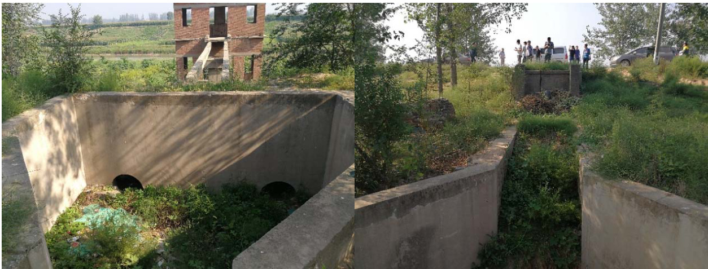  

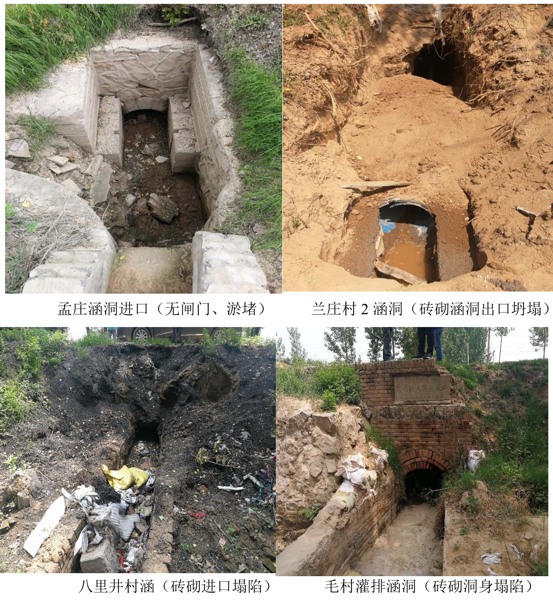  
图 4.3-7 新增北善村引水涵洞改造(进口集水井较低)  
图 4.3-8 现状损坏涵洞  

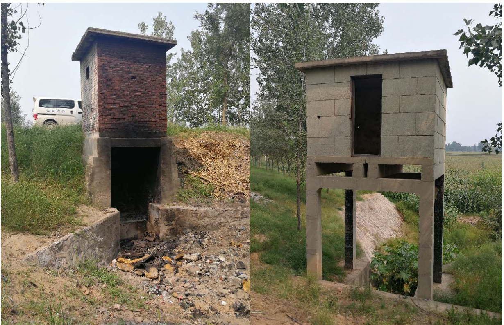  
宋庄排涝闸(无闸门启闭机)  

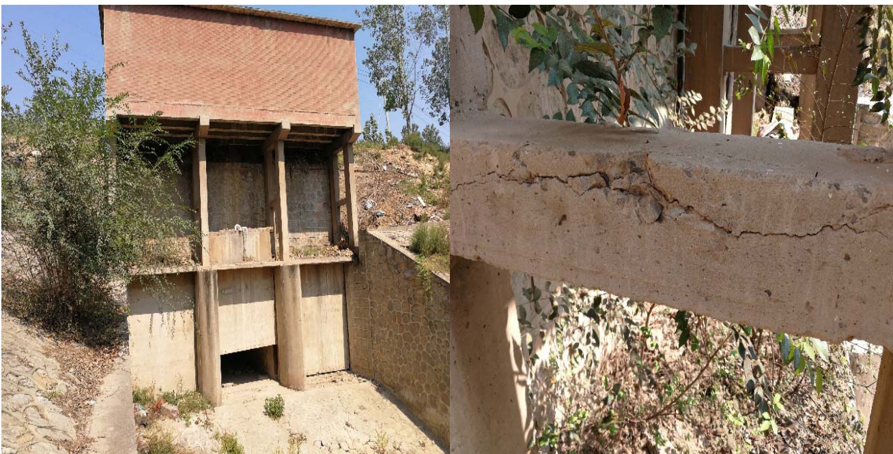  
袁庄排涝闸(无启闭机,闸门破损)   
图 4.3-9 排涝涵闸现状  

南洞排涝闸(缺启闭机,混凝土闸门破损,排架开裂)  

卫河及共渠穿堤涵闸现状情况及存在问题见表 4.3-11、4.3-12,卫河及共渠穿堤涵洞(管)现状及存在问题见表 4.3-13、4.3-14。  

# 4.3.2.5 大部分坡洼无控制性工程  

卫河中游坡洼除长虹渠出口有一座设计流量 $117\mathrm{m}^{3}/\mathrm{s}$ 的退水闸外,其他坡洼均无控制工程,一坡倒一坡的自然倒坡滞洪方式,造成一水多淹、小水大淹,加大了滞洪区的淹没损失。  

由于没有控制工程,坡洼进洪和退水全靠临时扒口,对坡洼的进洪流量和水量不易调度和控制,也很难把握分洪时机和有效的控制险情。因此只有通过工程措施,才能实现坡洼有计划的控制运用,才能保证卫河干流河道的行洪安全。  

# 4.3.2.5 管理设施老化,防汛手段落后  

卫河和共产主义渠管理设施老化,影响工程正常管理,不能适应河道正常管理的需要。堤顶仅有约1/3 硬化路面,堤顶路况差,特别是雨天,道路泥泞,通行困难,影响日常管理和防汛抢险工作。  

# 4.4 工程建设的必要性  

# 4.4.1 工程建设是完善防洪体系的需要  

卫河洪水主要来源于左岸山区各支流,卫河淇门处洪水主要来源于淇河和共产主义渠。淇门以下卫河干流和共产主义渠,在盘石头水库控制淇河洪水情况下,仍需结合沿卫坡洼的滞蓄,使其达到设计50 年一遇防洪标准。共产主义渠建盐土庄节制闸,中游各蓄滞洪区修建固定的分、退洪控制工程,洪水经蓄滞洪区滞蓄后控制下泄,保证淇门以下卫河河道下泄 $400\mathrm{m}^{3}/\mathrm{s}$ ,共产主义渠盐土庄节制闸以下最大下泄流量 $1600\mathrm{m}^{3}/\mathrm{s}$ ;老观嘴至安阳河口设计行洪流量 $2000\mathrm{m}^{3}/\mathrm{s}$ ,安阳河、汤河汇入卫河,安阳河口至徐万仓设计行洪流量 $2500\mathrm{m}^{3}/\mathrm{s}$ 。  

故淇门以下卫河防洪体系是由盘石头水库、沿卫坡洼和河道组成,是漳卫河防洪体系的重要组成部分。目前淇门以下卫河和共产主义渠的河道泄量和坡洼的控制运用与滞蓄能力还不能满足漳卫河流域防洪规划的防洪要求。卫河干流河道的治理是有效控制卫河洪水,完善漳卫河防洪体系的需要。  

# 4.4.2 工程建设是两岸经济发展的需要  

卫河干流河道是漳卫河流域的一条主要河流,在海河流域防洪体系中占有重要地位。目前卫河安全行洪能力仅能达到原设计的 $70\%$ 左右,局部仅有 $40\%$ ,排涝能力仅为原设计的 $60\%$ 左右,共产主义渠的安全行洪能力是原设计的 $62.5\%$ 。而且堤防还存在很多险工险段、穿堤建筑物存在的隐患还很多,一旦发生大洪水,将直接威胁河道两岸人民生命财产的安全。  

卫河两岸为河南省的浚县、滑县、汤阴、清丰、南乐、内黄,河北省的大名、魏县,以及山东省的冠县。据2018 年统计资料分析,沿河两岸土地面积 $8582\mathrm{km}^{2}$ ,人口 671 万人,耕地面积 906 万亩,GDP693 亿元。主要粮食作物有小麦、玉米等,经济作物有棉花、大豆、花生等,粮食总产量 501 万吨。河系内交通运输发达,有京广、京九铁路,京珠、濮鹤高速公路,107 国道等重要交通线横贯南北,与地方公路、铁路交织成网,四通八达。  

随着经济社会的发展,卫河干流河道工程现状标准与其所承担的区域防洪与排涝任务是不相称的,迫切需要对其进行治理。  

# 4.5 工程任务和规模  

# 4.5.1《可研报告》主要审查及批复意见  

(1)水利部水利水电规划设计总院主要审查意见  

2012 年 9 月水利部水利水电规划设计总院文件水总规【2012】985 号《关于报送卫河干流(淇门\~徐万仓)治理工程可行性研究报告审查意见的报告》,主要审查意见如下:  

1)治理范围:基本同意治理范围为卫河干流淇门至徐万仓段,治理河道长度为 183 公里;共产主义渠淇门至老观嘴段,治理长度为 44.2 公里。  

2)治理标准:根据国务院近期批准的《海河流域防洪规划》,卫河和共产主义渠防洪标准为50 年一遇,相应河道设计行洪流量为:卫河干流淇门至老观嘴段$400\mathrm{m}^{3}/\mathrm{s}$ 、老观嘴至安阳河口段 $2000\mathrm{m}^{3}/\mathrm{s}$ 、安阳河口至徐万仓段 $2500\mathrm{m}^{3}/\mathrm{s}$ ;共产主义渠盐土庄节制闸以下段为 $1600~\mathrm{m}^{3}/\mathrm{s}$ ;基本同意卫河干流淇门至徐万仓段排涝标准为3 年一遇,相应排涝流量淇门至老观嘴段 $130{\sim}150~\mathrm{m}^{3}/\mathrm{s}$ 、老观嘴至徐万仓段为 $700{\sim}1000{\mathrm{m}}^{3}/{\mathrm{s}}$ ;共产主义渠的排涝标准仍采用 20 年一遇麦涝流量为 $250~\mathrm{m}^{3}/\mathrm{s}$ 进行设计。  

3)基本同意本工程的建设任务为通过对卫河干流(淇门\~徐万仓)进行河道清淤疏挖、加固堤防、整治险工险段和加固穿堤建筑物等综合治理措施,使卫河干流淇门以下和共产主义渠恢复行洪与排涝能力,达到设计防洪与排涝标准。  

4)基本同意本次治理采用的河道糙率。  

5)原则同意《可研报告》提出的卫河干流 50 年一遇设计行洪水位和有关蓄滞洪区水位成果。下阶段应进一步分析卫河河道行洪与沿河各蓄滞洪区控制运用的关系,在研究优化蓄滞洪区控制运用条件的基础上,分析复核河道及有关蓄滞洪区进退洪控制工程的设计水位。  

6)基本同意河道清淤中心线基本沿现状主槽中心线布置,局部主槽靠近险工险段部位适当向另一侧偏移;堤防沿原有堤线加高加固,局部新建堤防段在满足河道行洪要求的条件下,沿上下游堤线平顺连接。  

7)《可研报告》对盐土庄节制闸在盐土庄村西闸址布置和马头村西闸址布置方案进行了比选,推荐布置在盐土庄村西共产主义渠主槽上。下阶段应根据卫河防洪要求和蓄滞洪区控制运用条件,进一步分析盐土庄闸对白寺坡分洪和老观嘴、安阳河口行洪流量的控制作用,结合地形地质条件、工程布置和工程量、河势影响等因素,复核优化工程布置。  

8)基本同意《可研报告》提出的小河口节制闸工程布置在小河口村附近的淇河主槽上,距淇河与共产主义渠交汇口下游约 300 米,闸左右两侧以引堤与淇河左堤和小河口村围堤连接;白寺坡分洪堰布置于共产主义渠右堤 $24{+}400$ 桩号处;长虹渠分洪堰布置于卫河右堤桩号 $2{+}030$ 处,长虹渠退水闸布置在卫河右堤桩号$29\substack{+950}$ 处。下阶段应进一步分析分洪条件和效果,优化工程选址和工程布置。  

9)原则同意《可研报告》提出的工程建设内容和规模,下阶段进一步复核工程建设内容、数量和规模。  

# (2)国家发展和改革委员会批复意见  

1)原则同意所报卫河干流(淇门\~徐万仓)治理工程可行性研究报告。工程任务是对卫河干流淇门\~徐万仓段和共产主义渠进行防洪治理,恢复河道设计行洪与排涝能力,完善流域防洪工程体系,保障卫河两岸防洪安全。  

2)该工程治理范围为卫河干流淇门\~徐万仓段,包括卫河干流 183 公里、共产主义渠 44 公里。主要建设内容包括:卫河主槽清淤 60.64 公里;堤防加高培厚92.88 公里(卫河 62.06 公里,共产主义渠 30.82 公里);新筑卫河右堤 0.78 公里,新筑马头村围村堤埝 2.73 公里;险工整治 67 处;新建盐土庄、小河口等节制闸(涵)6 座及卫河坡洼控制性分洪与退水工程,治理穿堤建筑物453 座,拆除重建生产桥 5 座,刘庄闸改桥 1 座;新建堤顶沥青混凝土防汛道路 209.3 公里(卫河173.5 公里,共产主义渠 35.8 公里)。工程总工期 36 个月。  

# 4.5.2 治理的任务和目标  

# 4.5.2.1 治理范围  

《卫河可研》确定的卫河治理范围为卫河淇门至徐万仓段,其中:  

(1)卫河干流河道  

卫河干流河道治理起始点为淇河与共产主义渠交汇口,起始桩号为 $0{+}000$ ,包括淇共交汇口以下约 $1.19\mathrm{km}$ 淇河及淇门以下卫河干流(统称为淇门以下卫河干流),治理终点为徐万仓,河道桩号 $182\substack{+950}$ ,治理河道长约 $183\mathrm{km}$ ,左堤长 $186\mathrm{km}$ ,右堤长 191km。  

(2)共产主义渠  

共产主义渠治理起始点为淇河与共产主义渠交汇口,河道桩号 $0{+}000$ ,治理终点为共产主义渠汇入卫河处,即治理终点为老观嘴,河道桩号 $44{+}200$ ,治理河道长约 $44.2\mathrm{km}$ 。  

本次治理内容包括淇门以下卫河干流河道清淤扩挖、卫河干流和共产主义渠堤防加培与加固、沿河穿堤建筑物与险工险段等除险加固、刘庄闸改建为桥梁工程,同时新建或改建河道及堤防上的控制性工程,包括盐土庄节制闸、小河口节制闸、浚县挡水箱涵(浚县上口涵洞和下口涵洞)、白寺坡分洪堰、长虹渠分洪堰和长虹渠退水闸,以及浚内沟排涝涵闸,民丰沟排涝闸(上口闸、下口闸)。  

# 4.5.2.2 治理标准  

# 1、防洪标准  

卫河干流淇门至老观嘴段流经浚县与滑县,穿两县县城而过,左右堤堤防对于保护两岸耕地、县城、交通设施等具有重要作用。浚县现有人口75.08 万人,耕地 108 万亩,京广铁路、京港澳高速、107 国道等重要交通线横穿全境,2019 年全县 GDP204.4 亿元;滑县现有人口 139.05 万人,耕地面积 195.21 万亩,为中原经济区粮食生产核心区、河南第一产粮大县,2019 年全县 GDP263.6 亿元。  

卫河干流老观嘴至徐万仓段流经河南省汤阴、内黄、清丰、南乐县、河北省魏县和大名县、山东省冠县等县境,其中汤阴、魏县、大名县城位于左岸保护区内,保护区内现有人口约 205 万人,耕地面积 277 万亩,GDP535 亿元;内黄、清丰、南乐、冠县县城位于右岸保护区内,保护区内现有人口约289 万人,耕地面积 321万亩,GDP837 亿元。保护区内有京港澳高速、京广铁路、京广高铁、107 国道等重要交通线。  

根据《防洪标准》(GB50201-2014)的规定,综合考虑《海河流域综合规划》、《海河流域防洪规划》、《海河流域漳卫河系防洪规划》等,本次确定卫河干流(淇门至徐万仓)河道治理的防洪标准为50 年一遇。其中:  

卫河设计行洪流量淇门至老观嘴段 $400\mathrm{m}^{3}/\mathrm{s}$ 、老观嘴至安阳河口段 $2000\mathrm{m}^{3}/\mathrm{s}$ 、安阳河口至徐万仓段 $2500\mathrm{m}^{3}/\mathrm{s}$ ;  

共产主义渠淇门至盐土庄节制闸段河道与共产主义渠以西行洪区共同行洪,分泄上游共产主义渠和淇河发生的50 年一遇洪水,盐土庄节制闸以下河道设计行洪流量为 $1600\mathrm{m}^{3}/\mathrm{s}$ ;  

新建水闸(堰)及穿堤建筑物工程、刘庄闸改桥工程等的设计防洪标准与所在河道堤防的防洪标准相同。  

# 2、排涝标准  

卫河在 1982 年对老观嘴以上河道主槽清淤治理、1978 年对老观嘴以下的扩大治理,以及《海河流域综合规划》、《海河流域防洪规划》、《海河流域漳卫河系防洪规划》,均确定卫河排涝治理标准为 3 年一遇,设计排涝流量为淇门至老观嘴段为 $130{\sim}150\mathrm{m}^{3}/\mathrm{s}.$ 、老观嘴至徐万仓段为 $700{\sim}1000{\mathrm{m}}^{3}/{\mathrm{s}}$ ;共产主义渠的排涝标准为20 年一遇麦涝标准,设计麦涝流量为 $250\mathrm{m}^{3}/\mathrm{s}$ 。  

根据流域防洪总体安排,本次排涝治理以恢复原排涝规模为准,即恢复原设计排涝能力:淇门至老观嘴段为 $130\{\sim150\mathrm{m}^{3}/\mathrm{s}$ 、老观嘴至徐万仓段为 $700\sim$ $1000\mathrm{m}^{3}/\mathrm{s}$ 。  

共产主义渠排涝标准以恢复共产主义渠20 年一遇麦涝标准,即共产主义渠设计麦涝流量 $250\mathrm{m}^{3}/\mathrm{s}$ 。  

# 4.5.2.3 治理任务  

《卫河可研》批复的主要任务为对卫河干流淇门\~徐万仓段和共产主义渠进行防洪治理,提高河道设计行洪与排涝能力,完善流域防洪工程体系,保障卫河两岸防洪安全。工程建设任务包括:卫河主槽清淤、堤防加培加固、险工险段整治、穿堤建筑物除险加固、河道及坡洼控制工程的建设、堤顶防汛道路和管理设施建设等,使淇门以下卫河干流河道和共产主义渠恢复河道行洪与排涝能力,达到设计防洪与排涝标准,从而提高漳卫河系防洪标准。  

# 4.5.2.4 工程总体布局  

卫河淇门\~徐万仓段的防洪工程主要由卫河干流和共产主义渠堤防及诸多的卫河坡洼组成。在淇河口处将原刘庄闸改为刘庄桥,配合淇河左堤修建的刘庄口门将淇河上游下泄的洪水导入共产主义渠及其以西夹道地区进行滞蓄,并在白寺村附近共产主义渠右堤新建白寺坡分洪堰、共产主义渠修建盐土庄节制闸,控制盐土庄闸下的共产主义渠下泄流量不超过1600 立方米每秒;在淇河入卫河口处修建小河口节制闸,控制下泄流量 700 立方米每秒,新建长虹渠分洪堰分洪入长虹渠,与小河口闸配合保障淇门以下卫河干流泄洪流量不超过 400 立方米每秒。通过盐土庄闸控制调度,使卫河干流老观嘴\~安阳河口段的泄洪流量不超过2000 立方米每秒,安阳河口\~徐万仓段的泄洪流量不超过2500 立方米每秒。需对卫河淇门至十里铺裁湾下口段、老观嘴至浚内沟口段河道清淤,恢复行洪排涝能力;浚内沟口建闸挡洪排涝;干流两岸堤防超高、顶宽不足段加高培厚,修筑堤顶道路,以满足河道行洪、防汛抢险要求。  

# 4.5.2.5 治理原则  

(1)河道清淤  

河道清淤基本沿现状河槽中心线布置,局部紧邻险工险段处向河岸滩地较宽方向适当调整;河道设计纵坡基本维持原设计。  

# (2)堤防加培  

卫河淇门至共卫合流段堤防设计超高 $1.2\mathrm{m}$ ,设计堤顶宽度 $5\mathrm{m}$ ,对两岸堤顶超高不足 $1.0\mathrm{m}$ 堤段按堤防设计超高与堤顶宽度进行加高培厚治理,对堤顶超高在$1.0{\sim}1.2\mathrm{m}$ 堤段,局部结合路面硬化进行治理,不再专门进行加培;共卫合流以下至徐万仓段设计超高 $1.8{\sim}2.0\mathrm{m}$ ,设计堤顶宽度为 $5.0{\sim}6.0\mathrm{m}$ (共卫合流至老观嘴段堤顶宽度为 $5.0\mathrm{m}$ ,老观嘴至徐万仓段堤顶宽度为 $6.0\mathrm{m}$ ),对两岸堤顶超高不足$1.5\mathrm{m}$ 堤段按堤防设计超高堤顶宽度进行加高培厚治理,对堤顶超高在 $1.5\mathrm{m}$ 至设计超高之间的堤段,局部结合硬化路面进行治理。  

共产主义渠淇门(刘庄闸)\~拟建盐土庄节制闸段右堤设计超高 $1.3\mathrm{m}$ ,设计堤顶宽度 $5\mathrm{m}$ ,对现状堤防超高不足 $1.0\mathrm{m}$ 段,按照设计超高与堤顶宽度进行加高培厚治理;拟建的盐土庄节制闸至老观嘴段左堤,设计超高 $2.0\mathrm{m}$ ,设计堤顶宽度$5\mathrm{m}$ ,对现状堤防超高不足 $1.5\mathrm{m}$ 段,按照设计超高与堤顶宽度进行加高培厚治理。  

对堤顶高程满足设计要求、但堤顶宽度不足的堤段进行培厚,其中对卫河老观嘴以上堤顶宽度不足 $4.5\mathrm{m}$ 的堤段按设计堤顶宽度 $5.0\mathrm{m}$ 、迎水侧边坡 1:3、背水侧边坡 1:2.5 对堤防进行培厚;对卫河老观嘴以下堤顶宽度不足 $5.5\mathrm{m}$ 的堤段按设计堤顶宽度 $6.0\mathrm{m}$ 、迎水侧边坡 1:3、背水侧边坡 1:2.5 对堤防进行培厚。  

现状无堤段新建堤防,保证堤防连续。  

# (3)险工整治  

对于现状无防护工程险工,若现状滩地较窄或无滩地,新建防护工程从主槽位置护砌至堤顶,若滩地较宽,则对主槽进行护砌;对于现状防护工程不足或破损严重险工,进行接长或翻修;对于现有防护工程局部破损的险工,对破损位置进行局部修补;对于基础悬吊险工,对主槽进行防护。  

(4)新建水闸(堰)  

按照卫河坡洼洪水安排,新建白寺坡分洪堰、盐土庄节制闸、小河口节制闸等控制性工程,新建水闸(堰)工程应保证坡洼正常运用,控制河道流量不超设计标准。  

# (5)穿堤建筑物  

对于涵闸、涵管(洞)严重损坏、洞身漏水等将危及堤防安全,又确系灌溉或排涝必须的工程,按照原址原规模进行拆除重建,设计标准与所在堤防标准一致;对各涵闸、涵管洞身短,上下游挡墙、护坡、护底损坏损坏,闸门及启闭机房破损或丢失等进行维修加固,加固后应满足所在堤防防洪标准;已废弃多年,成为工程隐患,严重威胁着大堤的安全,经征得地方同意予以封堵。  

# 4.5.3 卫河河道及坡洼控制性工程布局及规模论证  

卫河干流河道达到50 年一遇防洪标准是通过卫河、共产主义渠及其两侧的良相坡、柳围坡、长虹渠、共产主义渠以西地区、白寺坡等行洪、蓄滞洪区共同行洪、蓄滞洪完成的。为了灵活控制洪水,协调坡洼与河道的滞排关系,有控制的分区、分期滞洪,尽量减少坡洼淹没损失,拟采用控制运用方式代替现状的自然倒坡行洪,即修建各滞洪区的分洪、退水建筑物。  

# 4.5.3.1 可研阶段调度运用原则  

(1)盐土庄节制闸  

盐土庄节制闸是保证卫河防洪安全的控制性工程,设计流量为 $1600\mathrm{m}^{3}/\mathrm{s}$ 。其主要功能是控制共产主义渠和共西行洪区来水,保证盐土庄节制闸下共渠河道行洪流量不超 $1600\mathrm{m}^{3}/\mathrm{s}$ ,从而保证卫河老观嘴至安阳河口行洪流量不超 $2000\mathrm{m}^{3}/\mathrm{s}$ ,安阳河口至徐万仓流量不超 $2500\mathrm{m}^{3}/\mathrm{s}$ 。为保证共西行洪区和共渠河道行洪安全,当盐土庄节制闸需控泄时,打开白寺坡分洪堰,启用白寺坡滞洪。白寺坡滞洪区下游民丰沟上建有白寺坡退水闸,视共渠流量相机退水,最大退水流量 $150\mathrm{m}^{3}/\mathrm{s}$ 。  

(2)小河口节制闸  

新建小河口节制闸位于淇河淇门小河口村附近,其主要功能是拦截淇河和共产主义渠洪水,使洪水主要经共产主义渠下泄,当发生较大洪水时,根据共渠、共西、白寺坡和卫河、长虹渠的防洪压力,确定小河口闸的开启和关闭时间。具体运用条件为:当白寺坡已经启用且蓄滞水位达到 $60.5\mathrm{m}$ 时,开启小河口节制闸,当长虹渠蓄滞水位达到 $61.4\mathrm{m}$ 时,关闭小河口节制闸,过闸流量为 $700\mathrm{m}^{3}/\mathrm{s}$ 。  

(3)良相坡  

当共渠洪水超过 5 年一遇时,洪水漫入良相坡,良相坡开始滞洪。50 年一遇洪水时,为使洪水顺利下泄且良相坡最高行洪水位不超过 $67.34\mathrm{m}$ ,共渠右堤西沿村建 $400\mathrm{m}$ 长、底高程 $66.5\mathrm{m}$ 的分洪堰,向柳围坡分洪,最大分洪流量 $1100\mathrm{m}^{3}/\mathrm{s}$ 。  

(4)共产主义渠以西行洪区  

共产主义渠以西行洪区与共产主义渠共同分泄上游共产主义渠和淇河来水。拟修建刘庄口门,当淇河刘庄附近水位超过 $64.1\mathrm{m}$ 时,淇河洪水经刘庄口门自由漫溢入共产主义渠以西行洪区。  

# (5)柳围坡  

西沿村分洪口门分洪以后,启用宋村分洪堰向柳围坡分洪。  

柳围坡和良相坡隔卫河相对,为保证淇县县城的安全,良相坡水位接近$67.34\mathrm{m}$ 时,扒开共渠右堤西沿村口门、卫河右堤宋村口门,向柳围坡分洪。柳围坡分洪运用后,其滞蓄洪水经柳围坡退水闸相机退水入长虹渠,由长虹渠相机退水入卫河,最大退水流量 $150\mathrm{m}^{3}/\mathrm{s}$ 。  

(6)长虹渠  

西沿村分洪口门分泄的洪水,一部分经宋村分洪堰分洪入柳围坡,一部分由卫河下泄,为确保卫河河道行洪安全,在淇门附近的卫河右堤上新建长虹渠分洪堰,当淇门以上卫河来流大于 $400\mathrm{m}^{3}/\mathrm{s}$ 或白寺坡滞蓄水位达到 $60.5\mathrm{m}$ 小河口闸开启时,扒开长虹渠分洪堰向长虹渠分洪。长虹渠分洪运用后,长虹渠滞蓄洪水经长虹渠退水闸由长虹渠相机退入卫河,退水闸最大限泄 $400\mathrm{m}^{3}/\mathrm{s}$ 。  

# (7)白寺坡  

在保证卫河老观嘴至安阳河口不超过 $2000\mathrm{m}^{3}/\mathrm{s}$ 、安阳河口以下不超过$2500\mathrm{m}^{3}/\mathrm{s}$ 的行洪规模情况下,当盐土庄节制闸下泄流量超过 $1500\mathrm{m}^{3}/\mathrm{s}$ 时,打开白寺分洪堰,启用白寺坡。白寺坡滞蓄洪水一部分由白寺坡分洪堰退入共渠,一部分由白寺坡退水闸经民丰渠相机退水入卫河,白寺坡退水闸最大退水流量$150\mathrm{m}^{3}/\mathrm{s}$ 。  

# (8)小滩坡  

当白寺坡中坡农场水位大于 $60.0\mathrm{m}$ ,并且老观嘴流量大于 $2000\mathrm{m}^{3}/\mathrm{s}$ 时在卫河右堤圈里扒口分洪入小滩坡。  

(9)任固坡  

当老观嘴流量大于 $2000\mathrm{m}^{3}/\mathrm{s}$ 、安阳汇入后卫河流量大于 $2500\mathrm{m}^{3}/\mathrm{s}$ 、上游坡洼充分运用时开启北五陵分洪口门分洪入任固坡。  

表 4.5-1 卫河坡洼及控制性工程调度运行原则  

<html><body><table><tr><td>坡洼名 称</td><td>设计滞洪 水位 (m)</td><td>原设计滞 洪水量 (亿m²）</td><td>控制运用</td></tr><tr><td>良相坡</td><td>67.34</td><td>1.42</td><td>阎村固定分洪堰；共渠上段左侧与良相坡自由漫溢。</td></tr><tr><td>柳围坡</td><td>65.05</td><td>0.95</td><td>当良相坡水位接近67.34m扒开共渠右堤西沿村口门、卫河右堤宋 村口门，向柳围坡分洪。长虹渠开始退水后柳围坡逐渐退水，经 长虹渠退入卫河。</td></tr><tr><td>长虹渠</td><td>62.49</td><td>1.19</td><td>当白寺坡水位超过60.5m时，开启小河口节制闸，或西沿村、宋村 分洪后，卫河河道流量大于4003/s,由长虹渠分洪堰向长虹渠分洪， 当长虹渠水位达到61.4m 时关闭小河口闸；长虹渠洪水相机退入 卫河。</td></tr><tr><td>白寺坡</td><td>61.4</td><td>3.1</td><td>当盐土庄节制闸下泄流量超过1500m?/s时，打开白寺分洪堰，启 用白寺坡。白寺坡退水视共渠、卫河流量而定。</td></tr><tr><td>共西</td><td></td><td></td><td>拟修建刘庄口门，当淇河刘庄附近水位超过64.1m时，淇河洪水 经刘庄口门自由漫溢入共产主义渠以西行洪区。</td></tr><tr><td>小滩坡</td><td>58</td><td>1.39</td><td>当白寺坡中坡农场水位大于60.0m并且老观嘴流量大于2000m3/s 时在卫河右堤圈里扒口分洪。</td></tr><tr><td>任固坡</td><td>56.5</td><td>1.96</td><td>当老观嘴流量大于2000m3/s、安阳河汇入后卫河流量大于 2500m2/s、上游坡洼充分运用时开启北五陵分洪口门。</td></tr></table></body></html>  

# 4.5.3.2 河道及坡洼控制性工程布局及规模论证  

依据洪水安排,在可研阶段基础上,对提出的分退洪工程、节制闸工程等规模进行重新复核,通过对控制性工程指标及运用时机进行不同方案组合,经洪水演进计算与论证分析,确定本次河道及坡洼控制性工程的布局与规模。  

共产主义渠的洪水峰高量大,淇河的洪水峰高量小,故淇楚共同频洪水决定了卫河河道及坡洼控制性工程的规模,本次主要针对淇楚共同频洪水进行演进计算,对卫河河道坡洼控制性工程布局及规模进行论证分析。  

本次采用 MIKE FLOOD 数学模型进行洪水演进计算,模型为丹麦水力研究所(DHI)开发的用于河流、湖泊、海洋水动力、水质、泥沙等模拟分析的专业软件,可以灵活地将各类复杂的一维河网模型与二维浅水模型进行耦合。该模型曾经在丹麦、埃及、澳洲、泰国及中国香港、台湾等国家和地区得到成功应用。目前在国内诸多大型工程中得到广泛应用,如:长江口综合治理工程、南水北调工程、天津子牙新河口和独流碱河口防洪影响论证、杭州湾数值模拟、重庆市城市排污评价等。  

# 1、模型的构建  

(1)模型研究的范围淇河:石河岸\~淇门段河道长约 $21.3\mathrm{km}$ ;  

共产主义渠:合河\~老观嘴段河道长约 $66.86\mathrm{km}$ ,其中淇门以下共渠 $44\mathrm{km}$ ;  

卫河:淇门以上卫河长约 $21.93\mathrm{km}$ ,淇门\~徐万仓段卫河长约 $183\mathrm{km}$ ;  

卫运河:徐万仓\~四女寺枢纽段卫运河长约 $157\mathrm{km}$ ;  

漳河:岳城水库以下至徐万仓段漳河,长约 $114\mathrm{km}$ ;  

二维行蓄洪区包括:良相坡、柳围坡、长虹渠、白寺坡、共产主义以西行洪区、小滩坡、任固坡以及大名泛区。  

(2)模型基础资料  

河道横断面资料:淇门以下共产主义渠采用 2009 年测量资料(断面间距为$500\mathrm{m}$ )、淇门\~浚内沟口约 $75\mathrm{km}$ 范围采用 2019 年 10 月新测断面(断面间距为$100\mathrm{m}$ ),浚内沟口\~徐万仓段采用采用2009 年测量资料,其余河道均为防洪规划时采用的规划设计断面。  

坡洼地形图资料:将 2016 年地形资料与可研时所用坡洼地形进行对比分析,白寺坡和共西的滞蓄能力较可研时略有减少,其他坡洼略有增加,相同水位下各坡洼库容变化较小。本次模型计算中各坡洼的地形资料采用2016年最新地形资料。地形图剖分为边长 $300\mathrm{m}$ 的三角形网格。可研与本次坡洼地形变化情况指标对比说明见表 4.5-2。  

表 4.5-2  可研与本次坡洼地形变化情况指标对比说明  

<html><body><table><tr><td rowspan="2">坡洼名称</td><td rowspan="2">水位 (m)</td><td colspan="3">库容（亿m²)</td></tr><tr><td>可研</td><td>本次</td><td>本次-可研</td></tr><tr><td rowspan="3">良相坡</td><td>66</td><td>0.22</td><td>0.23</td><td>0.01</td></tr><tr><td>67</td><td>0.61</td><td>0.62</td><td>0.01</td></tr><tr><td>67.34</td><td>0.79</td><td>0.8</td><td>0.01</td></tr><tr><td rowspan="3">柳围坡</td><td>64</td><td>0.26</td><td>0.25</td><td>0</td></tr><tr><td>64.5</td><td>0.49</td><td>0.49</td><td>0</td></tr><tr><td>65.05</td><td>0.84</td><td>0.85</td><td>0.01</td></tr><tr><td rowspan="3">长虹渠</td><td>61</td><td>0.32</td><td>0.33</td><td>0.01</td></tr><tr><td>62</td><td>0.8</td><td>0.8</td><td>0</td></tr><tr><td>62.49</td><td>1.09</td><td>1.1</td><td>0</td></tr><tr><td rowspan="3">白寺坡</td><td>59.5</td><td>1.03</td><td>1.01</td><td>-0.02</td></tr><tr><td>60.5</td><td>1.92</td><td>1.89</td><td>-0.03</td></tr><tr><td>61.4</td><td>2.91</td><td>2.88</td><td>-0.03</td></tr></table></body></html>  

<html><body><table><tr><td rowspan="2">坡洼名称</td><td rowspan="2">水位（m)</td><td colspan="3">库容（亿m²)</td></tr><tr><td>可研</td><td>本次</td><td>本次-可研</td></tr><tr><td rowspan="3">共西</td><td>58</td><td>0.07</td><td>0.07</td><td>0</td></tr><tr><td>60</td><td>0.51</td><td>0.5</td><td>-0.01</td></tr><tr><td>62</td><td>1.22</td><td>1.2</td><td>-0.02</td></tr></table></body></html>  

# (3)河道设计糙率  

淇门\~徐万仓段卫河主槽糙率为 $0.023\substack{\sim}0.025$ ,滩地糙率 0.05,卫运河主槽糙率 0.0225,滩地 0.04,其余与防洪规划同。模型计算采用糙率见表 4.5 -3。  

表 4.5-3 模型计算采用糙率  

<html><body><table><tr><td>河道名称</td><td>河段</td><td>主槽糙率</td><td>滩地糙率</td><td>备注</td></tr><tr><td>淇河</td><td>石河岸～淇门</td><td>0.0225</td><td>0.033</td><td>防洪规划成果</td></tr><tr><td>共产主义渠</td><td>合河～老观嘴</td><td>0.0225</td><td>0.035</td><td>防洪规划成果</td></tr><tr><td>卫河</td><td>淇门~徐万仓</td><td>0.0225</td><td>0.05</td><td>可研成果</td></tr><tr><td rowspan="3">漳河</td><td>邺镇以上</td><td>0.03</td><td rowspan="3">0.05</td><td rowspan="3">防洪规划成果</td></tr><tr><td>邺镇～南尚村</td><td>0.025</td></tr><tr><td>南尚村～徐万仓</td><td>0.02</td></tr><tr><td>卫运河</td><td>徐万仓～四女寺</td><td>0.0225</td><td>0.04</td><td>卫运河可研设计</td></tr></table></body></html>  

区内有村庄、田间作物等,根据各种地物特征选择不同的糙率,即堤、路、埝取值 0.045,果林取值 0.065,房屋取值 0.10,鱼塘取值 0.035,水田取值 0.04,滩地、河槽、渠底取值 0.035,台田、条田取值 0.065,草地取值 0.04,菜地取值 0.035等。  

# (4)模型边界条件  

上边界条件均同于防洪规划成果,即采用 2008 年 2 月国务院批复的《海河流域漳卫河系防洪规划》中水文分析计算成果。  

卫河流域设计洪水地区组成:楚旺以上采用淇门与楚旺同频率,淇门至楚旺区间相应;淇门以上采用两种组合,(1)为淇门与淇河新村同频率,共产主义渠淇门相应;(2)为淇门与共渠淇门同频率,淇河新村相应。新村以上组合,考虑盘石头水库已建成,只考虑盘石头\~新村区间与新村同频率,盘石头相应的组合。  

盘石头水库控制运用分三级:重现期 $\mathrm{P}{\le}5$ 年,控泄 $100\mathrm{m}^{3}/\mathrm{s}$ ;5 年 ${<}\mathrm{P}{\leq}10$ 年,控泄 $400\mathrm{m}^{3}/\mathrm{s}$ ;10 年 ${<}\mathrm{P}{\leq}50$ 年,控泄 $800\mathrm{m}^{3}/\mathrm{s}$ ;  

安阳河、汤河入卫河 $\mathrm{P}{\geq}20$ 年,分别限泄 $600\mathrm{m}^{3}/\mathrm{s}$ 和 $300\mathrm{m}^{3}/\mathrm{s}$ 。  

涝水作为点源汇入到坡洼中,包括共西、柳围坡、长虹渠、白寺坡、小滩坡、任固坡。涝水总量分别为:共西 0.67 亿 $\mathrm{m}^{3}$ 、柳围坡 0.42 亿 $\mathrm{m}^{3}$ 、长虹渠 0.27 亿 $\mathrm{m}^{3}$ 、白寺坡 1.10 亿 $\mathrm{m}^{3}$ 、小滩坡 0.44 亿 $\mathrm{m}^{3}$ 、任固坡 0.48 亿 $\mathrm{m}^{3}$ 。  

下边界条件:卫运河末端四女寺枢纽处河道设计水位值 $25.2\mathrm{m}$ 。  

计算范围内卫河、共产主义渠、淇河发生50 年一遇洪水及坡洼涝水统计表见表 4.5-4。  

表 4.5-4  50 年一遇洪水及坡洼涝水统计表  

<html><body><table><tr><td rowspan="2">洪水组合</td><td rowspan="2">项目</td><td colspan="3">洪水</td><td colspan="4">涝水</td></tr><tr><td>卫河</td><td>共渠</td><td>淇河</td><td>柳围坡</td><td>长虹渠</td><td>白寺坡</td><td>共西</td></tr><tr><td rowspan="2">淇楚共 同频</td><td>最大流量（m2/s)</td><td>186</td><td>2890</td><td>2400</td><td>56.1</td><td>36.9</td><td>147.6</td><td>90.5</td></tr><tr><td>总水量（亿m²)</td><td>1.39</td><td>15.97</td><td>7.72</td><td>0.42</td><td>0.27</td><td>1.10</td><td>0.67</td></tr></table></body></html>  

# 2、方案选取及成果分析  

模型构建时治理段应用最新测量断面资料和治理段设计糙率,非本次治理段仍采用原防洪规划成果。为进一步分析各建筑物规模对区域防洪的影响,以可研阶段确定的控制性工程规模和调度运用方式为基本方案,在此基础上通过改变小河口闸的设计流量和运用方式、长虹渠分洪堰的宽度及白寺坡分洪堰的启用时间和宽度,  

进一步论证不同控制性工程规模以及调度运用方式的改变对各进退洪工程的流量、蓄滞洪区最高蓄滞水位和分蓄水量及下游防洪的影响,根据分析结果,确定各进退洪工程的调度运用方式及工程规模。本次选取 8 个计算方案进行分析,其中小河口节制闸与长虹渠分洪堰联合运用的工况包含 5 个方案,白寺坡分洪堰启用时机和宽度改变的工况包含 3 个方案。  

(1)小河口节制闸与长虹渠分洪堰联合运用的影响分析  

拟建小河口节制闸的作用为拦截共渠洪水入卫河,同时当白寺坡滞蓄压力大于长虹渠时,可下泄适量洪水入长虹渠,缓解白寺坡的滞蓄压力。拟建长虹渠分洪堰位于淇门以下卫河右堤,其主要作用是分泄淇河和卫河上游来流,保证卫河行洪流量不超防洪规划安排的 $400\mathrm{m}^{3}/\mathrm{s}$ 。  

根据水量平衡,卫河上游下泄水量以及小河口闸下泄水量之和应与长虹渠分洪堰分洪水量以及卫河河道下泄水量之和保持一致,在保证卫河下泄流量$400\mathrm{m}^{3}/\mathrm{s}$ 的前提下,小河口闸的规模、调度运用方式与长虹渠分洪堰的规模相关联。  

# $\textcircled{1}$ 计算方案  

为研究小河口闸和长虹渠分洪堰联合运用对区域整体防洪的影响,在保证卫河淇门-老观嘴河道不超设计行洪流量 $400\mathrm{m}^{3}/\mathrm{s}$ 的前提下,本次以可研方案为基础方案,拟定五个计算方案:  

方案一:维持可研阶段各控制性工程的规模指标及调度运行方式,对各控制性工程的规模等进行重新复核。  

方案二:在方案一的基础上,为保证卫河淇门 $\sim$ 老观嘴河道不超设计行洪流量 $400\mathrm{m}^{3}/\mathrm{s}$ ,通过试算,改变小河口闸的分洪流量为 $250\mathrm{m}^{3}/\mathrm{s}$ ,其它各控制性工程规模与可研保持一致,分析小河口闸分洪流量的变化对各蓄滞洪区的水位、水量等的影响。  

方案三:在方案一的基础上,为保证卫河淇门\~老观嘴河道不超设计行洪流量 $400\mathrm{m}^{3}/\mathrm{s}$ ,通过试算,改变长虹渠分洪堰的宽度为 $480\mathrm{m}$ ,其它各控制性工程规模与可研保持一致,分析长虹渠分洪堰堰宽的变化对各蓄滞洪区的水位、水量等的影响。  

方案四:在方案一的基础上,为保证卫河淇门 $\sim$ 老观嘴河道不超设计行洪流量 $400\mathrm{m}^{3}/\mathrm{s}$ ,通过试算,改变小河口闸的运行方式和长虹渠分洪堰宽度,维持小河口节制闸最大泄洪流量 $700\mathrm{m}^{3}/\mathrm{s}$ ,长虹渠分洪堰宽度为 $380\mathrm{m}$ ,其它各控制性工程规模与可研保持一致,分析小河口闸的调度运行方式的改变以及长虹渠分洪堰堰宽的变化对各蓄滞洪区的水位、水量等的影响。  

方案五:在方案四的基础上,减小小河口闸的最大分洪流量为 $650\mathrm{m}^{3}/\mathrm{s}$ ,其它各控制性工程规模与方案四保持一致,分析小河口闸的分洪流量的改变对各蓄滞洪区的水位、水量等的影响。  

$\textcircled{2}$ 计算结果  

为了对水位、流量、水量等关键参数进行对比分析,给出各方案关键节点计算结果。各坡洼及关键节点水位特征值见表 4.5-5。  

表 4.5-5  各方案关键节点水位、流量、水量统计表  单位:m、 $\mathrm{m}^{3}/\mathrm{s}$ 、亿 $\mathrm{m}^{3}$   

<html><body><table><tr><td rowspan="5">名称 良相坡</td><td colspan="2">项目</td><td>防洪规 划成果</td><td>方案一</td><td>方案二</td><td>方案三</td><td>方案四</td><td>方案五</td></tr><tr><td colspan="2">最高滞蓄水位</td><td>67.34</td><td>67.39</td><td>67.39</td><td>67.39</td><td>67.39</td><td>67.39</td></tr><tr><td colspan="2">最大滞蓄水量</td><td></td><td>1.34</td><td>1.34</td><td>1.34</td><td>1.34</td><td>1.34</td></tr><tr><td rowspan="3">西沿村</td><td>分洪堰宽度</td><td></td><td>400</td><td>400</td><td>400</td><td>400</td><td>400</td></tr><tr><td>分洪流量</td><td>1170</td><td>1100</td><td>1100</td><td>1100</td><td>1100</td><td>1100</td></tr><tr><td>分洪水量</td><td></td><td>2.32</td><td>2.32</td><td>2.32</td><td>2.32</td><td>2.32</td></tr><tr><td rowspan="8">柳围坡</td><td colspan="2">最高滞蓄水位</td><td>65.05</td><td>65.21</td><td>65.2</td><td>65.23</td><td>65.22</td><td>65.22</td></tr><tr><td colspan="2">最大滞蓄水量</td><td>0.95</td><td>1</td><td>0.99</td><td>1.01</td><td>1.01</td><td>1.01</td></tr><tr><td rowspan="3">宋村</td><td>分洪堰宽度</td><td></td><td>400</td><td>400</td><td>400</td><td>400</td><td>400</td></tr><tr><td>分洪流量</td><td>450</td><td>430</td><td>430</td><td>430</td><td>430</td><td>430</td></tr><tr><td>分洪水量</td><td></td><td>0.8</td><td>0.8</td><td>0.8</td><td>0.8</td><td>0.8</td></tr><tr><td rowspan="2">退水闸</td><td>流量</td><td>150</td><td>150</td><td>150</td><td>150</td><td>150</td><td rowspan="2">150</td></tr><tr><td>退水总水量</td><td></td><td>1.15</td><td>1.15</td><td>1.15</td><td>1.15</td></tr><tr><td>共西行</td><td colspan="2">李桥最高水位</td><td></td><td>64.64</td><td>64.64</td><td>64.64</td><td>64.64</td><td>1.15 64.64</td></tr><tr><td colspan="3">洪区 最高滞蓄水位</td><td>61.4</td><td>61.51</td><td>61.59</td><td>61.53</td><td>61.48</td><td>61.52</td></tr><tr><td rowspan="8">白寺坡 分洪堰</td><td colspan="2">最大滞蓄水量</td><td>3.1</td><td>3.25</td><td>3.34</td><td>3.27</td><td>3.22</td><td>3.26</td></tr><tr><td rowspan="5">白寺坡</td><td></td><td></td><td></td><td></td><td></td><td></td><td>500</td></tr><tr><td>宽度</td><td></td><td>500</td><td>500</td><td>500</td><td>500</td><td>1450</td></tr><tr><td>分洪流量</td><td>1100</td><td>1450</td><td>1450</td><td>1450</td><td>1450</td><td></td></tr><tr><td>进洪水量</td><td></td><td>2.73</td><td>2.82</td><td>2.75</td><td>2.7</td><td>2.74</td></tr><tr><td>退洪水量</td><td></td><td>2.42</td><td>2.49</td><td>2.44</td><td>2.4</td><td>2.44</td></tr><tr><td>流量 退水闸 退水总水量</td><td>700</td><td>150</td><td>150</td><td>150</td><td></td><td>150 150</td></tr><tr><td></td><td>最高滞蓄水位</td><td></td><td></td><td>1.33</td><td>1.33</td><td>1.33</td><td>1.29</td><td>1.28</td></tr><tr><td rowspan="8">长虹渠</td><td colspan="2">最大滞蓄水量</td><td>62.49</td><td>62.57</td><td>62.44</td><td>62.67</td><td>62.6</td><td>62.58</td></tr><tr><td rowspan="5">长虹渠</td><td></td><td>1.19</td><td>1.18</td><td>1.09</td><td>1.26</td><td>1.2</td><td>1.19</td></tr><tr><td>宽度</td><td></td><td>250</td><td>250</td><td>480</td><td>380</td><td>380</td></tr><tr><td>分洪流量 分洪堰 进洪水量</td><td>860</td><td>900</td><td>600</td><td>1080</td><td>900</td><td>900</td></tr><tr><td>流量 退水闸</td><td></td><td>1.06</td><td>0.96</td><td>1.16</td><td>1.08</td><td>1.07</td></tr><tr><td></td><td>400</td><td>360</td><td>360</td><td>360</td><td>360</td><td>360</td></tr><tr><td>退水总水量</td><td></td><td>2.35</td><td>2.28</td><td>2.44</td><td>2.42</td><td>2.39</td></tr><tr><td>最大下泄流量</td><td>卫河淇门下泄流量</td><td></td><td>520</td><td>490 700</td><td>400 250</td><td>400 700</td><td>400 700</td><td>400 650</td></tr><tr><td colspan="2">小河口节制闸</td><td>最大分洪水量</td><td>700</td><td>0.31 0.16</td><td></td><td>0.27</td><td>0.35</td><td>0.29</td></tr><tr><td colspan="2"></td><td>控泄流量</td><td>1600</td><td></td><td>1600</td><td>1600</td><td>1600</td><td>1600</td></tr><tr><td rowspan="2">盐土庄节制闸</td><td></td><td></td><td>1600 20.5</td><td>20.6</td><td></td><td></td><td></td><td></td></tr><tr><td>最大分洪水量</td><td></td><td></td><td></td><td></td><td>20.52</td><td>20.43</td><td>20.51</td></tr><tr><td colspan="3">老观嘴流量</td><td>1980</td><td>2000</td><td>2000</td><td>2000</td><td>2000</td><td>2000</td></tr><tr><td colspan="3">安阳河口流量</td><td>2500</td><td>2500</td><td>2500</td><td>2500</td><td>2500</td><td>2500</td></tr></table></body></html>  

# $\textcircled{3}$ 结果分析  

通过不同方案对比分析,方案一 $\sim$ 方案五,老观嘴以及安阳河口流量基本达到设计规模,淇门下卫河流量仅方案一超过设计规模 $400\mathrm{m}^{3}/\mathrm{s}$ 。  

方案二改变小河口闸规模,其它各控制性工程的规模及调度运行条件均不变,为保证卫河淇门-老观嘴段行洪流量不超 $400\mathrm{m}^{3}/\mathrm{s}$ ,小河口闸开启时的最大泄洪流量为 $250\mathrm{m}^{3}/\mathrm{s}$ 。与方案一相比,小河口闸规模变小,小河口闸下泄水量减少0.15 亿$\mathrm{m}^{3}$ 。白寺坡分洪堰进洪量增加 0.09 亿 $\mathrm{m}^{3}$ ,白寺坡最高蓄滞水位抬升 $8\mathrm{cm}$ 。长虹渠分洪堰进洪量减少 0.1 亿 $\mathrm{m}^{3}$ ,长虹渠最高蓄滞水位降低 $13\mathrm{cm}$ ,柳围坡最高蓄滞水位降低 $2\mathrm{cm}$ 。  

方案三改变长虹渠分洪堰宽度,其它建筑物规模和调度运行条件不变。为保证卫河淇门-徐万仓行洪流量不超 $400\mathrm{m}^{3}/\mathrm{s}$ ,长虹渠分洪堰宽度为 $480\mathrm{m}$ 。与方案一相比,长虹渠分洪堰规模加大,最大分洪流量增加 $180\mathrm{m}^{3}/\mathrm{s}$ ,进洪水量增加 0.1亿 $\mathrm{m}^{3}$ ,长虹渠最高蓄滞水位抬升 $10\mathrm{cm}$ ,小河口闸下泄水量减少 0.04 亿 $\mathrm{m}^{3}$ ,白寺坡分洪堰进洪水量增加 0.02 亿 $\mathrm{m}^{3}$ ,白寺坡最高蓄滞水位抬升 $2\mathrm{cm}$ ,柳围坡最高蓄滞水位升高 $2\mathrm{cm}$ 。  

方案四将长虹渠分洪堰宽度扩大至 $380\mathrm{m}$ ,为保证淇门下卫河流量不超设计流量 $400\mathrm{m}^{3}/\mathrm{s}$ ,小河口节制闸视卫河上游来流控制下泄。当白寺坡水位达到 $60.5\mathrm{m}$ 时,卫河上游来流流量为 $800\mathrm{m}^{3}/\mathrm{s}$ ,此时小河口闸控泄 $500\mathrm{m}^{3}/\mathrm{s}$ ,长虹渠分洪堰分洪流量 $900\mathrm{m}^{3}/\mathrm{s}$ ,卫河河道流量 $400\mathrm{m}^{3}/\mathrm{s}$ ,当上游洪峰值过后,控制小河口闸过流量为$700\mathrm{m}^{3}/\mathrm{s}$ 。与方案一相比,该方案的小河口闸泄洪量增加 0.04 亿 $\mathrm{m}^{3}$ ,长虹渠分洪堰进洪量增加 0.02 亿 $\mathrm{m}^{3}$ ,长虹渠最高蓄滞水位抬升 $3\mathrm{cm}$ 。白寺坡分洪堰进洪量减少0.03 亿 $\mathrm{m}^{3}$ ,最高蓄滞水位降低 $3\mathrm{cm}$ 。此方案可以在保证长虹渠滞蓄水位抬升不大的情况下,有效降低白寺坡蓄滞水位,同时由于保证了卫河河道流量不超 $400\mathrm{m}^{3}/\mathrm{s}$ ,卫河河道水位较方案一可降低 $0.08{\sim}0.52\mathrm{m}$ 。  

方案五小河口节制闸最大泄洪流量 $650\mathrm{m}^{3}/\mathrm{s}$ ,其它各工程规模与调度运用条件与方案四相同。与方案一相比,该方案小河口节制闸分洪水量减少0.02 亿 $\mathrm{m}^{3}$ ,长虹渠分洪堰进洪水量增加 0.01 亿 $\mathrm{m}^{3}$ ,长虹渠最高蓄滞水位增加1cm。白寺坡分洪堰进洪水量增加 0.01 亿 $\mathrm{m}^{3}$ ,白寺坡最高蓄滞水位抬升1cm。  

通过分析,在保证卫河淇门以下河道流量不超 $400\mathrm{m}^{3}/\mathrm{s}$ 的前提下,小河口节制闸的规模和调度运行方式,直接决定了长虹渠分洪堰的规模,并影响卫河、长虹渠和共渠、白寺坡的水量分配,进而影响白寺坡和长虹渠的蓄滞水位,间接影响长虹渠退水闸和柳围坡退水闸的退水过程,从而影响柳围坡最高蓄滞水位。小河口闸根据卫河上游来流控制下泄,以保证卫河不超 $400\mathrm{m}^{3}/\mathrm{s}$ 的调度方式可以有效降低白寺坡最高蓄滞水位和卫河河道水位,故本次推荐方案四和方案五中小河口节制闸的调度方式。  

$\textcircled{4}$ 小河口节制闸和长虹渠分洪堰规模的确定  

方案四小河口闸最大限泄 $700\mathrm{m}^{3}/\mathrm{s}$ ,方案五小河口闸最大限泄 $650\mathrm{m}^{3}/\mathrm{s}$ ,且两方案对卫河各坡洼最高蓄滞水位的影响均在 $1{-}3\mathrm{cm}$ ,从防洪安全上考虑,控制性工程应留有一定的安全余度,以便当发生大洪水时,进行灵活调度。因此通过二维模型演算后,本次推荐方案四中小河口闸的规模和调度运用方式,即小河口节制闸泄流视卫河上游来流控制下泄,最大泄洪流量 $700\mathrm{m}^{3}/\mathrm{s}$ ,长虹渠分洪堰宽度为 $380\mathrm{m}$ 。  

长虹渠分洪堰布置在卫河右堤桩号 $2{+}030$ 附近,淇门村西上游约 $80\mathrm{m}$ 处, 此处位于卫河与淇河小河口闸分泄洪水的汇合口,流态复杂,由于近些年未发生标准洪水,也没有物理模型试验对本次理论计算进行验证,而此处在模型中概化为一维河道的水位节点,难以反映真实的复杂流态,同时考虑分洪堰为侧向堰,分洪效果难以保证,且分洪堰下游没有控制性工程,一旦不能按模型计算结果进行分洪,卫河河道将不能保证设计流量 $400\mathrm{m}^{3}/\mathrm{s}$ 。从防洪安全考虑,适当增大长虹渠分洪堰的规模,既可保证卫河干流淇门以下流量不大于 $400\mathrm{m}^{3}/\mathrm{s}$ ,减轻共渠、白寺坡的防洪压力,也可为未来实际的防洪调度留有一定的余度,充分保证卫河河系的防洪安全。因此本次可适度加大长虹渠分洪堰规模。  

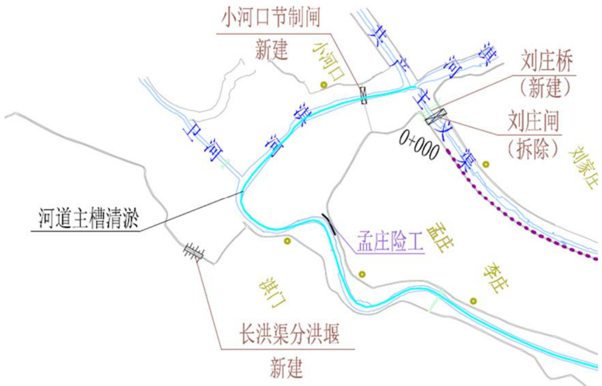  
图 4.5-1 新建长虹渠分洪堰位置示意图  

参考水闸设计规范,水闸的过闸水位差根据上游淹没影响、允许的过闸单宽流量和水闸工程造价等因素综合比较确定,平原区水闸的过闸水位差可采用$0.1{\sim}0.3\mathrm{m}$ ,为保证分洪效果,通过综合分析,本次设计堰上堰下水位差选取 $0.25\mathrm{m}$ ,长虹渠分洪堰宽度加大至 $500\mathrm{m}$ 。  

通过模型演算以及实际调度运用的分析,从分洪效果以及调度的灵活性上等多方面的综合考虑,本次推荐小河口闸泄流视卫河上游来流控制下泄,最大泄洪流量 $700\mathrm{m}^{3}/\mathrm{s}$ ,长虹渠分洪堰宽度为 $500\mathrm{m}$ 。  

# (2)白寺坡分洪堰分洪时机和规模的影响分析  

拟建白寺坡分洪堰位于白寺村附近的共产主义渠 $24{+}400$ 位置的右堤上,下游共渠上拟建盐土庄节制闸,以控制共渠水量下泄过程,保证卫河老观嘴不超$2000\mathrm{m}^{3}/\mathrm{s}$ ,安阳河口不超 $2500\mathrm{m}^{3}/\mathrm{s}$ 。由于白寺坡分洪堰下游有控制性工程,在保证共渠水位和白寺坡最高蓄滞水位变化不大的前提下,可适当调整可研阶段确定的白寺坡分洪堰启用时机,进而可有效减小白寺坡分洪堰的宽度,在保证防洪安全的前提下,降低工程投资。为分析白寺坡分洪堰分洪时机和白寺坡分洪堰宽度对整体防洪的影响,本次在方案四的基础上拟定三个方案。  

$\textcircled{1}$ 计算方案  

方案六:以方案四为基础方案,改变白寺坡分洪堰的分洪时机和宽度,在盐土庄节制闸开始控泄 $1600\mathrm{m}^{3}/\mathrm{s}$ 后,再延迟 1 小时启用白寺坡分洪堰,白寺坡分洪堰宽度 $300\mathrm{m}$ 。  

方案七:以方案四为基础方案,改变白寺坡分洪堰的分洪时机和宽度,当盐土庄节制闸下泄流量达到 $1600\mathrm{m}^{3}/\mathrm{s}$ 时启用白寺坡分洪堰,白寺坡分洪堰宽度$350\mathrm{m}$ 。  

方案八:以方案四为基础方案,改变白寺坡分洪堰的启用时机和宽度,当盐土庄节制闸下泄流量达到 $1550\mathrm{m}^{3}/\mathrm{s}$ 时启用白寺坡分洪堰,白寺坡分洪堰宽度$400\mathrm{m}$ 。  

$\textcircled{2}$ 计算结果  

为了将各方案进行水位、流量、水量等关键参数进行对比分析,以表格的形式提出各方案的关键节点计算结果,见表 4.5-6。  

表 4.5-6  各方案关键节点水位、流量、水量统计表  单位:m、 $\mathrm{m}^{3}/\mathrm{s}$ 、亿 $\mathrm{m}^{3}$  

<html><body><table><tr><td>名称</td><td colspan="2">项目</td><td>方案四</td><td>方案六</td><td>方案七</td><td>方案八</td></tr><tr><td rowspan="5">良相坡</td><td colspan="2">最高滞蓄水位</td><td>67.39</td><td>67.39</td><td>67.39</td><td>67.39</td></tr><tr><td colspan="2">最大滞蓄水量</td><td>1.34</td><td>1.34</td><td>1.34</td><td>1.34</td></tr><tr><td rowspan="3">西沿村</td><td>分洪堰宽度</td><td>400</td><td>400</td><td>400</td><td>400</td></tr><tr><td>分洪流量</td><td>1100</td><td>1100</td><td>1100</td><td>1100</td></tr><tr><td>分洪水量</td><td>2.32</td><td>2.32</td><td>2.32</td><td>2.31</td></tr><tr><td rowspan="6">柳围坡</td><td colspan="2">最高滞蓄水位</td><td>65.22</td><td>65.21</td><td>65.21</td><td>65.22</td></tr><tr><td colspan="2">最大滞蓄水量</td><td>1.01</td><td>1.01</td><td>1.01</td><td>1.01</td></tr><tr><td rowspan="3">宋村</td><td>分洪堰宽度</td><td>400</td><td>400</td><td>400</td><td>400</td></tr><tr><td>分洪流量</td><td>430</td><td>430</td><td>430</td><td>430</td></tr><tr><td>分洪水量</td><td>0.8</td><td>0.8</td><td>0.8</td><td>0.8</td></tr><tr><td rowspan="2">退水闸</td><td>流量</td><td>150</td><td>150</td><td>150</td><td>150</td></tr><tr><td>退水总水量</td><td>1.15</td><td>1.15</td><td>1.15</td><td>1.15</td></tr><tr><td>共西行洪 区</td><td colspan="2">李桥最高水位</td><td>64.64</td><td>64.67</td><td>64.66</td><td>64.65</td></tr><tr><td rowspan="8">白寺坡</td><td colspan="2">最高滞蓄水位</td><td>61.48</td><td>61.42</td><td>61.44</td><td>61.46</td></tr><tr><td colspan="2">最大滞蓄水量</td><td>3.22</td><td>3.16</td><td>3.18</td><td>3.2</td></tr><tr><td rowspan="4">白寺坡分洪堰</td><td>宽度</td><td>500</td><td>300</td><td>350</td><td>400</td></tr><tr><td>分洪流量</td><td>1450</td><td>1450</td><td>1450</td><td>1450</td></tr><tr><td>进洪水量</td><td>2.7</td><td>2.63</td><td>2.65</td><td>2.68</td></tr><tr><td>退洪水量</td><td>2.4</td><td>2.31</td><td>2.34</td><td>2.38</td></tr><tr><td rowspan="2">退水闸</td><td>流量</td><td>150</td><td>150</td><td>150</td><td>150</td></tr><tr><td>退水总水量</td><td>1.29</td><td>1.3</td><td>1.3</td><td>1.29</td></tr><tr><td rowspan="2">长虹渠</td><td colspan="2">最高滞蓄水位</td><td>62.6</td><td>62.57</td><td>62.58</td><td>62.59</td></tr><tr><td colspan="2">最大滞蓄水量</td><td>1.2</td><td>1.18</td><td>1.19</td><td>1.19</td></tr></table></body></html>  

表 4.5-6  各方案关键节点水位、流量、水量统计表  单位:m、 $\mathrm{m}^{3}/\mathrm{s}$ 、亿 $\mathrm{m}^{3}$   

<html><body><table><tr><td>名称</td><td colspan="4">项目</td><td>方案四</td><td>方案六</td><td>方案七</td><td>方案八</td></tr><tr><td rowspan="5"></td><td colspan="2" rowspan="3">长虹渠分洪堰</td><td>宽度</td><td>380</td><td>380</td><td>380</td><td>380</td></tr><tr><td>分洪流量</td><td>900</td><td>900</td><td>900</td><td>900</td></tr><tr><td>进洪水量</td><td>1.08</td><td>1.06</td><td>1.07</td><td>1.07</td></tr><tr><td rowspan="2">退水闸</td><td>流量</td><td>360</td><td>360</td><td>360</td><td>360</td></tr><tr><td>退水总水量</td><td>2.42</td><td>2.4</td><td>2.4</td><td>2.41</td></tr><tr><td colspan="3">卫河淇门下泄流量</td><td>400</td><td>400</td><td></td><td>400</td><td></td></tr><tr><td colspan="2" rowspan="2">小河口节制闸</td><td colspan="2">最大下泄流量</td><td>700</td><td>700</td><td>700</td><td>400</td></tr><tr><td colspan="2">最大分洪水量</td><td>0.35</td><td>0.31</td><td>0.32</td><td>700</td></tr><tr><td rowspan="2" colspan="2">盐土庄节制闸</td><td>控泄流量</td><td>1600</td><td>1600</td><td>1600</td><td>0.34</td></tr><tr><td colspan="2">最大分洪水量</td><td>20.43</td><td>20.48</td><td>20.47</td><td>1600 20.44</td></tr><tr><td colspan="3">老观嘴流量</td><td>2000</td><td>2000</td><td>2000</td><td></td><td>2000</td></tr><tr><td colspan="3">安阳河口流量</td><td>2500</td><td>2500</td><td></td><td>2500</td><td>2500</td></tr></table></body></html>  

# $\textcircled{3}$ 结果分析  

通过不同方案对比分析,方案六 $\sim$ 方案八,老观嘴以及安阳河口流量基本达到设计规模,老观嘴流量不超 $2000\mathrm{m}^{3}/\mathrm{s}$ ,安阳河口流量不超 $2500\mathrm{m}^{3}/\mathrm{s}$ 。淇门下卫河流量不超设计规模 $400\mathrm{m}^{3}/\mathrm{s}$ 。  

方案六白寺坡分洪堰宽度减小 $200\mathrm{m}$ ,白寺坡分洪堰启用时间延迟5 小时,共西李桥水位升高 $3\mathrm{cm}$ ,白寺坡分洪堰进洪量减少 0.07 亿 $\mathrm{m}^{3}$ ,白寺坡最高蓄滞水位降低 6cm,小河口闸开启时间较方案四延迟 3h,过洪量减少 0.04 亿 $\mathrm{m}^{3}$ ,长虹渠分洪堰分洪水量减少 0.02 亿 $\mathrm{m}^{3}$ ,长虹渠最高蓄滞水位降低 $3\mathrm{cm}$ 。  

方案七白寺坡分洪堰宽度减小 $150\mathrm{m}$ ,白寺坡分洪堰启用时间延迟4 小时,共西李桥水位升高 $2\mathrm{cm}$ ,白寺坡分洪堰进洪量减少 0.05 亿 $\mathrm{m}^{3}$ ,白寺坡最高蓄滞水位降低 6cm,小河口闸开启时间较方案四延迟 2h,过洪量减少 0.03 亿 $\mathrm{m}^{3}$ ,长虹渠分洪堰分洪水量减少 0.01 亿 $\mathrm{m}^{3}$ ,长虹渠最高蓄滞水位降低 $2\mathrm{cm}$ 。  

方案八白寺坡分洪堰宽度减小 $100\mathrm{m}$ ,白寺坡分洪堰启用时间延迟2 小时,共西李桥水位升高 1cm,白寺坡分洪堰进洪量减少 0.02 亿 $\mathrm{m}^{3}$ ,白寺坡最高蓄滞水位降低 2cm,小河口闸开启时间较方案四延迟 1h,过洪量减少 0.01 亿 $\mathrm{m}^{3}$ ,长虹渠分洪堰分洪水量减少 0.01 亿 $\mathrm{m}^{3}$ ,长虹渠最高蓄滞水位降低1cm。  

通过分析,白寺坡分洪堰启用时机和宽度直接影响白寺坡和共西水位变化过程,间接影响小河口节制闸开启时间,继而影响长虹渠蓄滞水量及卫河下泄水量。在一定范围内,白寺坡分洪堰启用时间越晚,白寺坡分洪堰宽度越小,白寺坡和长虹渠水位最高蓄滞水位越低,共西李桥最高蓄滞水位越高。  

$\textcircled{4}$ 白寺坡分洪堰启用时机和宽度的确定  

通过分析,在保证下游防洪安全的情况下,延迟开启白寺坡分洪堰,可有效减小白寺坡分洪堰的宽度,降低工程投资。卫河山区支流均处于太行山迎风坡,源短流急,洪水陡涨陡落,洪峰高、历时短、洪量集中,极易造成特大洪水,当盐土庄节制闸过闸流量达到 $1600\mathrm{m}^{3}/\mathrm{s}$ 时,共渠共西来流已达到 $2500\mathrm{m}^{3}/\mathrm{s}$ ,下泄流量小于上游来流,共西和共渠水位迅速上涨,虽然经模型计算,方案六白寺坡分洪堰 $300\mathrm{m}$ 宽时白寺坡和长虹渠蓄滞水位最低,对其他滞洪区也无其它影响,工程投资最小,但是考虑卫河洪水特性和实际爆破白寺坡分洪堰时的不确定性,以及共西李桥水位,白寺坡分洪堰的宽度需留有一定的余度,综合考虑坡洼水位和河道防洪安全,本次选定白寺坡分洪堰的宽度为 $350\mathrm{m}$ ,当盐土庄闸流量达到 $1550\mathrm{m}^{3}/\mathrm{s}$ 时,爆破白寺坡分洪堰,启用白寺坡。因此通过综合分析后,本次推荐方案七为最优方案,白寺坡分洪堰堰宽为 $350\mathrm{m}$ 。  

# (3)结论  

(1)方案一\~方案八,老观嘴以及安阳河口流量基本达到设计规模,方案卫河淇门以下河道洪峰流量达 $490\mathrm{m}^{3}/\mathrm{s}$ ,超过设计指标。  

(2)在保证卫河淇门 $\sim$ 老观嘴河道行洪流量不超设计流量的前提下,小河口闸视卫河上游来流控制下泄的调度方式可以有效降低白寺坡最高蓄滞水位。(3)在一定时间范围内,白寺坡分洪堰启用时间越晚,达到设计流量所需白寺坡分洪堰宽度越小,白寺坡和长虹渠蓄滞水位越低,但共西李桥水位越高。(4)考虑防洪安全,本次选取小河口节制闸设计流量 $700\mathrm{m}^{3}/\mathrm{s}$ ;考虑长虹渠分洪堰位于淇河卫河交汇口,流态复杂且无控制性工程,本次选取长虹渠分洪堰宽度为 $500\mathrm{m}$ ;考虑白寺坡分洪堰下游有盐土庄节制闸控制,白寺坡分洪堰启用时间可适当延迟,同时考虑淇河共渠洪水特性,需对堰宽和分洪时间留有一定的余度,本次选择白寺坡分洪堰宽度 $350\mathrm{m}$ ,当盐土庄闸流量达到 $1550\mathrm{m}^{3}/\mathrm{s}$ 时启用白寺分洪堰分洪,考虑数学模型分洪计算的局限性、分洪堰爆破及实际洪水的不确定性等因素,为安全计,白寺坡分洪堰在设计宽度 350 米的基础上宜适当留有余地,预留 50 米宽度修建裹头。  

推荐方案白寺坡、长虹渠相关水位流量过程和关键节点流量过程如图 $4.5{\sim}2\sim$ 图 4.5-4。  

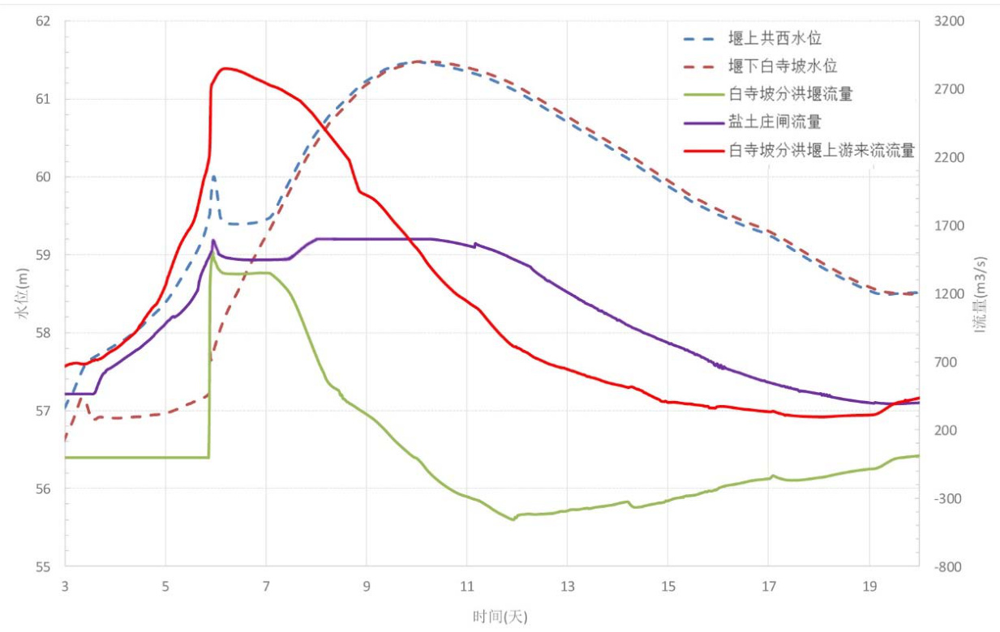  
图 4.5-2  推荐方案白寺坡分洪堰相关水位流量过程  

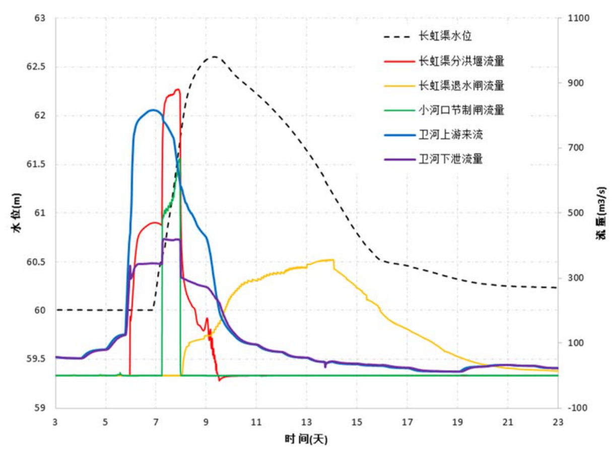  
图 4.5-3 推荐方案长虹渠水位及相关口门流量过程  

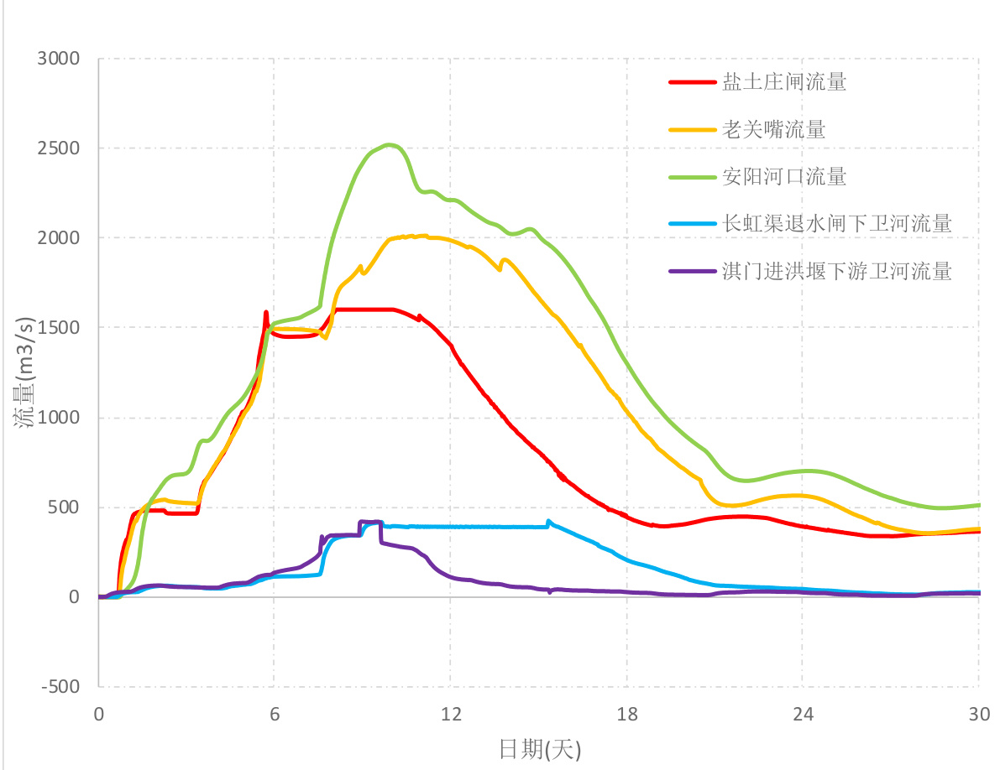  
图 4.5-4 推荐方案关键节点流量过程  

# 4.5.3.3 控制性工程布局及规模  

经过工程布局及规模论证,本次改变了可研时确定的长虹渠分洪堰的宽度、小河口节制闸的调度运用方式、白寺坡分洪堰的启用时机和白寺坡分洪堰的宽度。本次小河口节制闸的调度由可研时的控泄 $700\mathrm{m}^{3}/\mathrm{s}$ ,调整为视卫河来流控制下泄,最大泄流 $700\mathrm{m}^{3}/\mathrm{s}$ 。长虹渠分洪堰的宽度增加至 $500\mathrm{m}$ ,白寺坡分洪堰的宽度减小至 $350\mathrm{m}$ ,经分析论证后的各控制性工程布局及规模如下:  

# (1)共产主义渠盐土庄节制闸  

盐土庄节制闸的布设以保证向白寺坡分洪并有效控制共产主义渠以西行洪区的山区洪水,确保老观嘴以下卫河河道泄洪 $2000~\mathrm{m}^{3}/\mathrm{s}$ 、安阳河口以下河道行洪规模 $2500\mathrm{m}^{3}/\mathrm{s}$ 为原则,依据防洪规划总体安排,拟在盐土庄村附近的共产主义渠上建节制闸一座。  

盐土庄节制闸下泄流量视汤河、安阳河来水情况,发生五十年一遇洪水,闸上水位达到 $60.29\mathrm{m}$ 时,盐土庄节制闸开始控泄,盐土庄节制闸最大控泄 $1600\mathrm{m}^{3}/\mathrm{s}$ ,本次治理盐土庄节制闸设计流量为 $1600\mathrm{m}^{3}/\mathrm{s}$ 。  

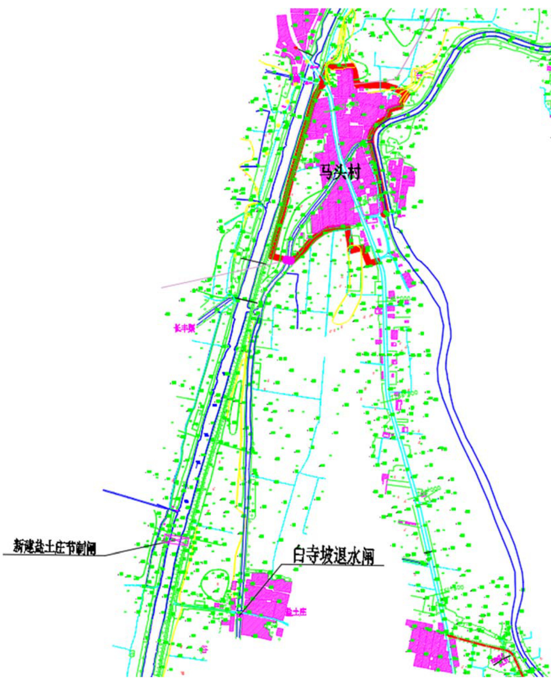  
图 4.5-5 盐土庄节制闸位置示意图  

(2)淇共汇合口小河口节制闸  

小河口节制闸的布设以使共产主义渠淇门以上洪水和淇河洪水主要经共产主义渠宣泄,有效控制卫河行洪 $400~\mathrm{m}^{3}/\mathrm{s}$ 流量并合理安排长虹渠滞洪为原则,依据防洪规划总体安排,结合区域地形条件,拟在小河口村附近淇共汇合口以下的淇河上新建一座节制闸。  

当白寺坡水位达到 $60.5\mathrm{m}$ 时开启小河口节制闸,当长虹渠水位达到 $61.8\mathrm{m}$ 时关闭小河口节制闸,在保证卫河淇门至老观嘴不超 $400\mathrm{m}^{3}/\mathrm{s}$ 的前提下,过闸流量视卫河上游来流进行调整。小河口节制闸最大控泄流量为 $700\mathrm{m}^{3}/\mathrm{s}$ ,故确定小河口节  

制闸设计流量为 $700~\mathrm{m}^{3}/\mathrm{s}$ 。  

# (3)卫河浚县挡水箱涵  

卫河在浚县县城有左右两个河槽,右侧河槽穿越老县城,由于老县城紧邻右侧河槽,基本无堤,且河槽深仅有 $3.0\mathrm{m}$ 左右,行洪断面窄小,过流能力仅有约20$\mathrm{m}^{3}/\mathrm{s}$ ,防洪规划安排洪水全部由左侧河槽行洪,故浚县挡水箱涵的布设以控制卫河洪水由左侧河槽行洪、右侧河槽仅满足河道水景观要求为原则,拟在右侧河槽上下口各新建一挡水箱涵,保证浚县老城区的防洪安全和水景观要求。  

# (4)良相坡  

为方便分洪运用,依据区域地形条件,西沿村分洪堰拟建在西沿村附近共产主义渠右堤上,当良相坡城关墙附近滞蓄水位接近 $67.34\mathrm{m}$ 时启用分洪堰向柳围坡分洪,此时良相坡最高滞蓄水位 $67.34\mathrm{m}$ 。  

西沿村分洪堰堰宽 $400\mathrm{m}$ ,堰顶高程 $66.5\mathrm{m}$ 。  

# (5)柳围坡  

西沿村分洪堰运用后,宋村分洪堰随之向柳围坡分洪,为方便分洪运用,依据区域地形条件,拟在宋村附近的卫河右堤上修建宋村分洪堰。  

柳围坡分洪运用后,其滞蓄洪水经柳围坡退水闸相机退水入长虹渠,由长虹渠相机退水入卫河。  

柳围坡最高滞蓄水位 $65.05\mathrm{m}$ ,滞蓄水量 0.95 亿 $\mathrm{m}^{3}$ 。  

宋村分洪堰堰宽 $400\mathrm{m}$ ,堰顶高程 $65.4\mathrm{m}$ ;新建柳围坡退水闸,退水规模依据长虹渠渠道的排涝规模,设计流量为 $150\mathrm{m}^{3}/\mathrm{s}$ 。  

# (6)长虹渠  

为便于分洪运用并保证卫河河道设计行洪规模,依据区域地形条件,拟在淇门附近的卫河右堤上新建长虹渠分洪堰。长虹渠分洪运用后,滞蓄洪水经长虹渠相机向卫河退水,需修建长虹渠退水闸。长虹渠分洪堰宽 $500\mathrm{m}$ ,堰顶高程 $63.2\mathrm{m}$ ;长虹渠退水闸设计退水流量 $400~\mathrm{m}^{3}/\mathrm{s}$ 。  

当卫河淇门处流量大于 $400~\mathrm{m}^{3}/\mathrm{s}$ ,小李庄水位达到 $64.80\mathrm{m}$ ,扒开长虹渠分洪堰,开始启用长虹渠滞洪。长虹渠退水闸退水流量视卫河来流相机退水。最大退水流量 $400\mathrm{m}^{3}/\mathrm{s}$  

长虹渠最高滞蓄水位 $62.49\mathrm{m}$ ,滞蓄水量 1.19 亿 $\mathrm{m}^{3}$ 。  

# (7)共产主义渠以西行洪区  

共产主义渠以西行洪区与共产主义渠共同分泄上游共产主义渠和淇河来水。当淇河刘庄附近水位超过 $64.1\mathrm{m}$ 时,淇河洪水经刘庄口门自由漫溢入共产主义渠以西行洪区。为便于分洪运用,拟在刘庄村附近淇河左堤上建刘庄口门。  

刘庄分洪口门宽 $400\mathrm{m}$ ,堰顶高程 $64.10\mathrm{m}$ 。  

(8)白寺坡  

在保证卫河老观嘴不超过 $2000\mathrm{m}^{3}/\mathrm{s}$ 、安阳河口以下不超过 $2500\mathrm{m}^{3}/\mathrm{s}$ 的行洪规模情况下,盐土庄节制闸最大控泄 $1600~\mathrm{m}^{3}/\mathrm{s}$ ,其余洪水向白寺坡分洪,拟在白寺村附近的共产主义渠右堤上新建白寺坡分洪堰。白寺坡滞蓄洪水主要经民丰沟相机退水入卫河,拟在盐土庄村附近的民丰沟上修建白寺坡退水闸。白寺坡分洪堰设计流量 $1600\mathrm{m}^{3}/\mathrm{s}$ ,白寺坡退水闸设计流量 $150\mathrm{m}^{3}/\mathrm{s}$ 。  

白寺坡分洪堰的布设,以保证盐土庄节制闸以下河道与卫河合流后设计行洪流量不大于 $2000\mathrm{m}^{3}/\mathrm{s}.$ 、有效向白寺坡分洪并保证盐土庄节制闸的行洪安全为原则。当盐土庄闸上水位达到 $59.73\mathrm{m}$ ,盐土庄闸过闸流量超过 $1550\mathrm{m}^{3}/\mathrm{s}$ 时,扒开白寺坡分洪堰,启用白寺坡滞洪。  

白寺坡退水闸的布设以使白寺坡滞蓄的洪水相机退水入卫河、共卫合流后行洪不大于 $2000\mathrm{m}^{3}/\mathrm{s}$ 、并结合民丰沟的渠道排涝规模,经调洪演算确定。  

白寺坡最高滞蓄水位 $61.40\mathrm{m}$ ,滞蓄水量 3.10 亿 $\mathrm{m}^{3}$ 。  

(9)浚内沟排涝涵闸  

卫河右堤在浚内沟口处有 $780\mathrm{m}$ 无堤段,在卫河河道流量大于 $800\mathrm{m}^{3}/\mathrm{s}$ (河道洪水上滩后)时将会倒灌小滩坡。由于小滩坡为超标准洪水运用的坡洼,设计标准的洪水不启用,本次治理设计需将该无堤段新筑堤防。  

新筑堤防后,为便于小滩坡区域排涝与退水,在新筑堤防与浚内沟口交汇处,新建浚内沟排涝涵闸。  

浚内沟干流长 $29.2\mathrm{km}$ ,流域面积 $271.75\mathrm{km}^{2}$ ,依据 1973 年《河南省水利工程水文计算常用图》提供的平原地区排涝模数计算方法推算,公式形式为 $\scriptstyle Q_{\mathrm{m}}=\mathrm{KRF}^{0.25}$ ,暴雨采用 24 小时暴雨,依据图集查算,排涝标准 3 年一遇,设计流量 $31.3~\mathrm{m}^{3}/\mathrm{s}$ ,5 年一遇,设计流量 $56.3~\mathrm{m}^{3}/\mathrm{s}$ 。  

依据《海河流域综合规划》中治涝规划安排,漳卫河平原排涝区排涝标准为$_{3\sim5}$ 年一遇,参考卫河排涝标准,本次浚内沟设计排涝标准采用 3 年一遇,浚内沟排涝涵闸设计排涝标准以满足浚内沟 3 年一遇的排涝流量 $31.3\mathrm{m}^{3}/\mathrm{s}$ 为准,即新建浚内沟排涝涵闸的设计流量 $31.3\mathrm{m}^{3}/\mathrm{s}$ 。  

# 4.5.3.4 共卫合流位置对比论证  

拟建盐土庄闸( $32\substack{+280})$ )至马头村( $34\substack{+790}$ )段河道长 $2.5\mathrm{km}$ ,该段河道为左、右两个河槽,左侧为共产主义渠,现状河底高程约为 $52.7\mathrm{m}$ ,共渠右堤高程为 $61.09\mathrm{m}$ ;右侧为卫河干流,滩地高程为 $57.8\mathrm{m}$ ,主槽深泓点高程为 $49.8\mathrm{m}$ ,主槽深度约 $8\mathrm{m}$ ,省道 S219 路面高程为 $59.6\mathrm{m}$ ,现状卫河右堤堤顶高程为 $61.0\mathrm{m}$ 。  

根据洪水调度安排,盐土庄闸控泄 $1600\mathrm{m}^{3}/\mathrm{s}$ 以确保老观嘴处流量不超过$2000\mathrm{m}^{3}/\mathrm{s}$ 。受马头村附近屯子旧桥影响,现状共渠过流能力不足 $600\mathrm{m}^{3}/\mathrm{s}$ ,鉴于屯子旧桥已基本废弃,建议对屯子旧桥进行拆除,拆除后现状共渠过流能力可提高至 $1100\mathrm{m}^{3}/\mathrm{s}$ ,但仍小于盐土庄闸下泄流量。  

可研阶段设计共卫合流位置在屯子新桥下游,盐土庄闸与屯子桥之间利用共渠行洪,设计流量 $1600\mathrm{m}^{3}/\mathrm{s}$ ,屯子新桥下游实现共卫合流后,利用共渠左堤和卫河右堤大断面共同行洪,设计流量为 $2000\mathrm{m}^{3}/\mathrm{s}$ 。按照该方案,需对盐土庄闸与屯子桥之间共渠堤防进行加高或向两岸展堤,以满足行洪要求。  

本阶段考虑将合流点提前至盐土庄闸下游约 $600\mathrm{m}$ 处,合流后利用共渠左堤和卫河右堤大断面共同行洪,设计流量为 $2000\mathrm{m}^{3}/\mathrm{s}$ 。并与屯子桥下游合流进行对比。  

方案一:共卫合流点位于屯子新桥下游(可研方案)  

盐土庄闸与屯子桥之间利用共渠行洪,设计流量 $1600\mathrm{m}^{3}/\mathrm{s}$ ,通过堤防加高或展堤实现。卫河干流设计洪峰流量 $400\mathrm{m}^{3}/\mathrm{s}$ ,在屯子新桥下游实现共卫合流,利用共渠左堤和卫河右堤大断面共同行洪,设计流量为 $2000\mathrm{m}^{3}/\mathrm{s}$ ,合流情况见图4.5-6。  

方案二:共卫合流点位于拟建盐土庄闸下游约 $600\mathrm{m}$ (本阶段方案)  

盐土庄闸建成后控泄流量 $1600\mathrm{m}^{3}/\mathrm{s}$ ,卫河干流设计洪峰流量 $400\mathrm{m}^{3}/\mathrm{s}$ ,在盐土庄闸下 $600\mathrm{m}$ 处共卫合流,利用共渠左堤和卫河右堤大断面共同行洪,设计流量为 $2000\mathrm{m}^{3}/\mathrm{s}$ ,合流情况见图 4.5-6。  

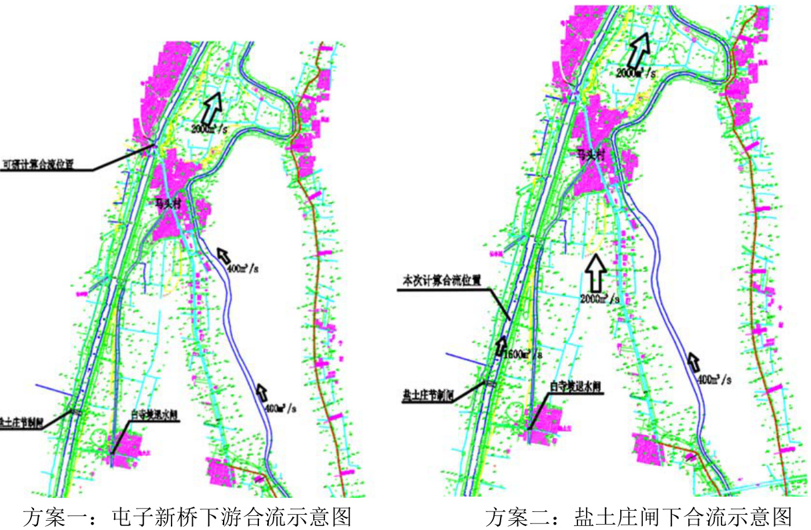  
图 4.5-6 共卫合流方案示意图  

通过水面线计算,当河道发生设计标准的洪水时,方案二盐土庄闸下水位为$59.94\mathrm{m}$ ,盐土庄闸下 $600\mathrm{m}$ 处共卫合流断面水位为 $59.9\mathrm{m}$ 。共卫合流位置行洪断面如图 4.5-7 所示。  

  
图 4.5-7 方案二共卫合流行洪断面示意图  

方案一通过堤防加高实现共渠单槽过流 $1600\mathrm{m}^{3}/\mathrm{s}$ ,盐土庄闸下水位为 $62.02\mathrm{m}$ ,该水位要高于闸上白寺坡蓄滞洪取设计滞洪水位 $61.4\mathrm{m}$ ,对盐土庄闸、白寺坡分洪堰等两岸河道及坡洼控导工程的调度运行影响较大,同时共渠左堤堤防需加高$3.8\mathrm{m}$ 左右,右堤堤防需加高 $2.8\mathrm{m}$ 左右,堤防加高后堤高较大,工程可行性较差,因此对方案一拟采用展堤方案。由于盐土庄闸至马头村之间段共渠右岸堤防背水侧紧邻基本农田和马头村民房,征地拆迁难度较大,因此,拟向左侧展堤,按照与方案一相同的闸下水位进行控制,考虑扩挖深槽。共渠现状河底宽约 $50\mathrm{m}$ ,向左侧扩挖宽度约 $40\mathrm{m}$ ,扩挖后河底宽度为 $90\mathrm{m}$ ,平均水深约 $7.6\mathrm{m}$ ,流速为 $1.8\mathrm{m}/\mathrm{s}$ 。该段扩挖占地类型为一般耕地及零星民房,需新增占地 251 亩,拆迁各类房屋面积约 $2660\mathrm{m}^{2}$ ,同时需对屯子新桥进行拆除重建。根据冲刷计算结果,本次设计对该段河道两岸岸坡及坡脚进行护砌,坡顶 C25 混凝土压顶,宽 $0.5\mathrm{m}$ ,高 $0.5\mathrm{m}$ ;护坡采用 $0.3\mathrm{m}$ 厚格宾石笼结构,坡脚设 C25 混凝土基座,宽 $1\mathrm{m}$ ,厚 $1.5\mathrm{m}$ ,在基座前端增设水平格宾石笼护脚进行补强设计,采用 $0.5\mathrm{m}$ 厚格宾石笼水平护底,宽 $5\mathrm{m}$ ,格宾石笼下均设土工布一层 $400\mathrm{g}/\mathrm{m}^{2}$ 。该方案对应盐土庄闸下 $600\mathrm{m}$ 河道行洪断面如图 4.5-8。  

  
图 4.5-8 盐土庄闸下 $600\mathrm{m}$ 位置行洪断面示意图  

经分析,采用方案一,马头村南侧围村埝可取消,北侧和东侧考虑合流后回水的影响需护砌,西侧结合共渠右堤进行护砌,同时屯子新桥需拆除重建。采用方案二,马头村南侧需做围村埝,同时卫河干流水位抬升 $0.45\mathrm{m}$ ,受此影响卫河上游需增加约 $6.5\mathrm{km}$ 堤防加培范围, $5.95\mathrm{km}$ 堤防加高高度增加。  

通过对比,采用方案一较方案二土建工程投资多约 1840 万元,主要是由于共渠扩挖的土方弃运增加约 1000 万元,共渠堤防边坡护砌增加约 400 万元,屯子桥拆除重建投资约 1100 万元,取消马头村南侧围村埝减少投资约 450 万元,卫河干流堤防加培减少投资约 210 万元。同时,采用方案一项目区范围内设计到8 处民房和工厂,总拆迁面积 $2660\mathrm{m}^{2}$ ,征地拆迁矛盾较大、后期干扰因素较多;屯子新球为省道 S219 公路桥,拆除重建需征得交通部门意见。综上,本次推荐采用方案二,即共卫合流点位于盐土庄闸下游约 $600\mathrm{m}$ 方案。  

表 4.5-7 工程规模及投资对比表  

<html><body><table><tr><td>方案</td><td>建设规模</td><td>占地面 积(亩)</td><td>土建工程投资 (万元)</td></tr><tr><td>方案一：屯 子新桥下游 合流</td><td>河道扩挖50m，加培共渠两岸堤防5km，两岸 边坡护砌长度5km，拆除重建屯子新桥，马头 村围村2.2km，卫河干流堤防加培5.95km</td><td>199</td><td>3863</td></tr><tr><td>方案二：盐 土庄闸下 600m合流</td><td>加培共渠左堤1.9km，两岸边坡护砌长度 1.63km，马头村围村2.9km，卫河干流堤防 加培12.45km</td><td>56</td><td>2023</td></tr></table></body></html>  

# 4.5.4 建设内容与规模  

卫河干流(淇门\~徐万仓)河道长 $182.95\mathrm{km}$ ,本次治理任务提高河道设计行洪与排涝能力,完善流域防洪工程体系,在设计流量情况下保障卫河两岸防洪排涝安全,即卫河淇门至老观嘴段设计排涝流量 $130{\sim}150\mathrm{m}^{3}/\mathrm{s},$ 、行洪流量 $400\mathrm{m}^{3}/\mathrm{s}$ ;老观嘴至徐万仓段设计排涝流量 $700{\sim}1000~\mathrm{m}^{3}/\mathrm{s}$ 、行洪流量 $2000{\sim}2500~\mathrm{m}^{3}/\mathrm{s}~$ 。  

共产主义渠淇门以下河道按设计 20 年一遇麦涝流量 $250\mathrm{m}^{3}/\mathrm{s}$ ,淇门(刘庄)至盐土庄段河道与共产主义渠以西行洪区共同行洪达到 50 年一遇标准、拟建的盐土庄节制闸以下河道设计行洪 $1600\mathrm{m}^{3}/\mathrm{s}$ 进行治理。  

为此,本次对淇门以下卫河干流进行河道主槽清淤、对卫河和共产主义渠的堤防加高培厚及加固治理,对控制河道行洪规模的节制闸工程和位于治理河道堤防上的坡洼分洪、退水控制性运用工程进行设计,同时对沿线险工、穿堤建筑物除险加固,对刘庄闸进行闸改桥建设及对受河道清淤扩挖影响的生产桥改建等,使该段河道治理后达到规划安排的防洪标准。  

本次治理的主要建设内容,包括河道清淤 60.64 公里,其中老观嘴以上 51.53公里,老观嘴以下 9.11 公里;修建卫河干流和共渠堤防 100.9 公里,其中加培堤防 100.12 公里,新筑堤防 0.78 公里;加固堤防 7.06 公里;新建马头村围村埝 2.9公里;治理险工 68 处,总长 17.57 公里;新建水闸(堰)10 座,包括河道节制闸 2 座,蓄滞洪区分洪堰 2 座、退水闸 1 座,箱涵 2 座,排涝涵闸 3 座;修建穿堤建筑物 445 座,其中拆除重建 61 座,维修加固 307 座,拆除封堵 77 座;修建桥梁 6 座,其中新建 1 座,拆除重建 5 座;修建堤顶道路沥青混凝土路面 291.37公里,其中新建 279.68 公里、拆除重建 11.69 公里,新建上堤坡道 430 条、总长21.5 公里。主要工程建内容与规模见表 4.5-8,卫河初设与可研主要设计指标比较表见表 4.5-9。  

表 4.5-8主要工程建设内容与规模统计表  

<html><body><table><tr><td rowspan="4">河道名称位置</td><td rowspan="4"></td><td rowspan="2">河道清淤</td><td colspan="10">堤防工程（km)</td><td rowspan="2"></td><td colspan="4">险工治理</td><td rowspan="2">新建闸</td><td colspan="4">穿堤建筑物 (座）</td><td rowspan="2">生产桥</td></tr><tr><td>堤防长度</td><td></td><td>堤防加培</td><td></td><td></td><td></td><td></td><td></td><td>新筑堤防加战工程防渗工程堤顶防汛路</td><td></td><td>马头村围个数 (处)</td><td></td><td>长度</td><td>（km）</td><td>(堰)</td><td>拆除重建维修加固拆除封堵</td><td></td><td></td><td></td></tr><tr><td>工程 (km)</td><td></td><td></td><td>左岸右岸 左岸右岸</td><td></td><td></td><td></td><td></td><td>左岸右岸左岸右岸左岸右岸</td><td>左岸</td><td>右岸</td><td>村</td><td>左岸</td><td>右岸</td><td>左岸 右岸</td><td>（座）</td><td></td><td>左岸右岸左岸右岸左岸右岸</td><td></td><td></td><td></td><td></td><td>（座）</td></tr><tr><td>浚县</td><td></td><td>60.64</td><td>61.8964.92 8.34</td><td></td><td>13.4</td><td></td><td></td><td></td><td></td><td>0.630.81.50.0740.38</td><td>56.04</td><td>(km) 2.90</td><td>27</td><td>20</td><td>6.07</td><td>4.63</td><td>6</td><td>9</td><td>22</td><td>37</td><td>45</td><td></td><td>4</td></tr><tr><td rowspan="10"></td><td>滑县</td><td></td><td>4.97</td><td>8.13</td><td>0.85</td><td></td><td></td><td></td><td></td><td></td><td></td><td>1.73</td><td></td><td>2 1</td><td>0.35</td><td>0.61</td><td>1</td><td>4</td><td></td><td>1</td><td>1</td><td></td><td></td><td></td></tr><tr><td>汤阴县</td><td></td><td>19.43</td><td></td><td></td><td></td><td></td><td></td><td></td><td></td><td>9.84</td><td></td><td></td><td>1</td><td></td><td>0.2</td><td></td><td>1</td><td></td><td>14</td><td></td><td></td><td></td><td></td></tr><tr><td>内黄县</td><td></td><td>30.9346.5911.8510.35</td><td></td><td></td><td></td><td></td><td>0.780.27</td><td></td><td>0.550.65</td><td>14.21</td><td>40.16</td><td></td><td>1</td><td>4</td><td>0.2 1.15</td><td>1</td><td></td><td>11</td><td>4 29</td><td>43</td><td>8</td><td>2</td><td>1</td></tr><tr><td>清丰县</td><td></td><td></td><td>9.22</td><td></td><td></td><td></td><td></td><td></td><td>0.08</td><td></td><td>3.67</td><td></td><td></td><td></td><td></td><td></td><td></td><td></td><td></td><td></td><td>7</td><td></td><td></td></tr><tr><td>南乐县</td><td></td><td>14.9720.063.9535.22</td><td></td><td></td><td></td><td></td><td></td><td></td><td>0.231.08</td><td>8.66</td><td>17.23</td><td></td><td>1</td><td></td><td>0.4</td><td></td><td></td><td></td><td></td><td>14</td><td>15 14</td><td></td><td></td></tr><tr><td>魏县</td><td></td><td>15.32</td><td></td><td></td><td></td><td></td><td></td><td></td><td></td><td>11.04</td><td></td><td></td><td></td><td></td><td></td><td></td><td></td><td></td><td></td><td>3</td><td>7</td><td></td><td></td></tr><tr><td>大名县</td><td></td><td>38.2732.9411.13</td><td>9.17</td><td></td><td>3.58</td><td></td><td>0.2</td><td></td><td>0.530.130.34</td><td>26.26</td><td>15.92 9.13</td><td></td><td>2</td><td>4 5</td><td>0.6</td><td>1.22</td><td></td><td></td><td>3 1</td><td>39</td><td>22</td><td>19 23</td><td>1</td></tr><tr><td>冠县</td><td></td><td>186</td><td>191</td><td>35.27</td><td>33.4</td><td>0.78</td><td>1.1</td><td></td><td>1.332.412.22110.39</td><td></td><td>143.88</td><td></td><td>34</td><td>34</td><td>7.82</td><td>2.14 9.75</td><td></td><td>25</td><td>31</td><td>136</td><td>2 135</td><td>4 48 29</td><td></td></tr><tr><td>小计</td><td>60.64</td><td>377</td><td></td><td>68.67</td><td></td><td>0.78</td><td>2.43</td><td></td><td>4.63</td><td>254.27</td><td></td><td>2.9</td><td>68</td><td></td><td>17.57</td><td></td><td>8</td><td>56</td><td></td><td>271</td><td>77</td><td></td><td>6</td></tr><tr><td rowspan="2">共渠</td><td>浚县</td><td></td><td></td><td></td><td>17.6244.2 3.77527.675</td><td></td><td></td><td></td><td></td><td></td><td>2.41</td><td>34.69</td><td></td><td></td><td></td><td></td><td>2</td><td></td><td>1</td><td>4</td><td>36</td><td></td><td></td><td></td></tr><tr><td>小计</td><td></td><td></td><td>61.82</td><td>31.45</td><td></td><td></td><td></td><td></td><td></td><td></td><td>37.1</td><td></td><td></td><td></td><td></td><td></td><td>2</td><td>5</td><td></td><td>36</td><td></td><td></td><td></td></tr><tr><td colspan="2">合计</td><td>60.64</td><td></td><td>439</td><td>100.12</td><td></td><td>0.78</td><td></td><td>2.43</td><td>4.63</td><td></td><td>291.37</td><td>2.9</td><td>68</td><td></td><td>17.57</td><td></td><td>10</td><td>61</td><td></td><td>307</td><td></td><td>77</td><td>6</td></tr></table></body></html>  

表 4.5-9卫河可研与初设主要设计指标比较表  

<html><body><table><tr><td rowspan="2">序号</td><td rowspan="2" colspan="2">工程项目</td><td rowspan="2">单位</td><td rowspan="2"></td><td colspan="2">设计指标</td><td rowspan="2">变化原因</td></tr><tr><td>本次 可研</td><td>本次-可研</td></tr><tr><td colspan="3">1 河道主槽清淤</td><td>km</td><td>60.64</td><td>60.64</td><td>0</td><td rowspan="6">本次测量断面间距为100m，原可研断面间距为500m，按照新测 断面重新复核，同时在卫河左右堤需加陪范围内，有13.78km堤 顶为混凝土路面或沥青路面，为保证路面的完整，本次复核针对 此段采用加防浪墙的型式。</td></tr><tr><td rowspan="7">堤防加 2 培工程</td><td rowspan="4">卫河</td><td>左堤加培段</td><td>km</td><td>23.54</td><td>26.15</td><td>-2.61</td></tr><tr><td>右堤加培段</td><td>km</td><td>31.35</td><td>29.47</td><td>1.88</td></tr><tr><td>左堤加防浪墙段</td><td>km</td><td></td><td>11.73 3.37</td><td>8.36</td></tr><tr><td>右堤加防浪墙段</td><td>km</td><td>2.05</td><td>3.07</td><td>-1.02</td></tr><tr><td>共产主 左堤加培段</td><td></td><td>km</td><td>3.775 2.1</td><td>1.675</td></tr><tr><td>义渠 右堤加培段</td><td></td><td>km</td><td>27.675 28.72</td><td>-1.045</td></tr><tr><td>新筑堤防</td><td></td><td>km</td><td></td><td>0.78 0.78</td><td>0</td></tr><tr><td>4 马头村围村</td><td colspan="2"></td><td>km</td><td>2.90</td><td>2.73</td><td>马头村附近近些年村庄密布，为保证马头村的防洪安全，新建堤 0.17</td></tr><tr><td></td><td colspan="2">堤防加固 新堤穿老堤加战工程</td><td>km</td><td>2.43</td><td>2.43</td><td>防向上游延伸，至地面高程与设计水位一致为止。 0</td></tr><tr><td rowspan="2">5 工程</td><td rowspan="2">卫河 堤顶防汛</td><td>堤防防渗工程</td><td>km</td><td>4.63</td><td>3.65</td><td>0.98</td></tr><tr><td></td><td>km</td><td>254.27</td><td>173.51</td><td>80.76</td></tr><tr><td rowspan="2">6 道路</td><td rowspan="2">险工整治工程</td><td>共产主义渠</td><td>km</td><td>37.10</td><td>35.8</td><td>1.3</td><td rowspan="2">面；同时结合地方需求，对现状路面破损严重以及土路面进行硬 化。</td></tr><tr><td></td><td></td><td></td><td>67</td><td></td></tr><tr><td>7 8</td><td colspan="2">新建水闸 (堰)</td><td>处 处</td><td>68 10</td><td>10</td><td>1 0</td><td>重新统计后对比可研阶段卫河沿线减少8座涵闸，其中也村西闸 统计失误现场不存在；同山排涝涵闸原统计在卫河左堤实际在共</td></tr><tr><td>9</td><td rowspan="2">穿堤建筑物除险加固</td><td rowspan="2"></td><td rowspan="2">处</td><td rowspan="2">445</td><td rowspan="2">453</td><td rowspan="2">8</td><td rowspan="2">渠左堤L15+200处（共西行洪区），目前已加固不再处理；另 在卫河沿线城镇化改造中有6座涵闸目前已拆除重建或封堵，本 次不再列入治理范围；原统计时遗漏了魏县L117+500处北善村</td></tr><tr><td></td></tr><tr><td>10 11</td><td>刘庄闸改桥工程</td><td></td><td>处</td><td>1</td><td>1</td><td>0</td><td>引水涵洞，需要新增1座涵洞。</td></tr><tr><td></td><td>生产桥改建工程</td><td></td><td>处</td><td>5</td><td>5</td><td>0</td><td></td></tr></table></body></html>  

# 4.5.4.1 河道主槽清淤  

根据现状排涝水位计算结果,现状河道排涝水位比原设计排涝水位壅高$0.17{\sim}1..25\mathrm{m}$ ,在考虑降糙至设计值情况下,河道排涝水位仍有所壅高,其中十里铺裁湾下口以上段河道、老观嘴至浚内沟口段排涝水位壅高值较大,为提高河道排涝能力,需对以上河段进行清淤,清淤总长 $60.64\mathrm{km}$ 。其中,淇门至十里铺裁湾下口段主槽桩号范围为 $0{+}140{-}52{+}730$ ,总长 $52.59\mathrm{km}$ ,其中 $8{+}890{\sim}9{+}900$ 段长 $1.06\mathrm{km}$ 河道现状断面满足设计要求,无需进行清淤,清淤长 $51.53\mathrm{km}$ ;老观嘴至浚内沟口段主槽桩号范围为 $69\substack{+870\sim79+190}$ ,总长 $9.32\mathrm{km}$ ,其中 $72+240{\sim}72{+}450$ 段长 $0.21\mathrm{km}$ 河道现状断面满足设计要求,无需进行清淤,清淤长 $9.11\mathrm{km}$ 。  

河道清淤基本沿现状河槽中心线布置,局部紧邻险工险段处向河岸滩地较宽方向适当调整。本次在可研的基础上,对清淤方案进行优化。  

(1)老观嘴至浚内沟口段  

可研阶段结合 1978、1982 年卫河治理时的河道主槽底高程、底宽及河底纵坡等指标,进行河道主槽扩挖治理,确定老观嘴至浚内沟段清淤底宽为 $60\mathrm{m}$ 。但由于现状河道子槽滩地上多为耕地,采用可研方案会出现占地较多、实施难度大等问题,现对不同方案进行对比,确定清淤方案。  

方案一:降糙方案  

河道基本维持现状,通过整治降低河道主槽及滩地糙率至设计糙率,即主槽糙率 0.0225,滩地糙率 0.05。  

方案二:可研方案  

可研阶段清淤底宽为 $60\mathrm{m}$ ,清淤边坡1:3,老观嘴处河道清淤底高程为 $47.96\mathrm{m}$ ,浚内沟口清淤底高程为 $47.03\mathrm{m}$ ,河道设计纵坡为 $0.1\text{\textperthousand}$ ,典型清淤断面见图 4.5-9。  

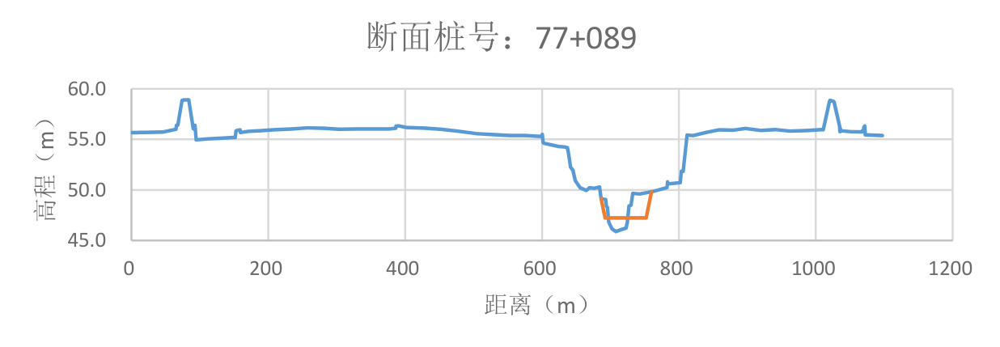  
图 4.5-9 可研方案典型清淤断面示意图  

# 方案三: $20\mathrm{m}$ 方案  

根据河道子槽现状断面,考虑河道向下挖深,设计清淤底宽为 $20\mathrm{m}$ ,清淤边坡 1:3,老观嘴处卫河河道清淤底高程为 $46.98\mathrm{m}$ ,浚内沟口清淤底高程为 $45.21\mathrm{m}$ (现状河底高程),河道设计纵坡为 $0.2\text{\textperthousand}$ ,典型清淤断面见图 4.5-10。  

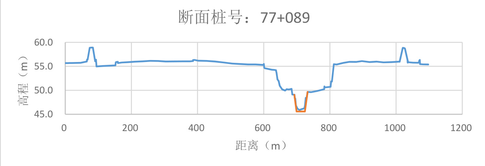  
图 4.5-10 底宽 $20\mathrm{m}$ 方案典型清淤断面示意图  

老观嘴至浚内沟口段河道断面为复式断面,子槽平均深度 $3.5\mathrm{m}$ ,子槽滩地与主槽滩地高差平均为 $6.6\mathrm{m}$ ,堤外地面与主槽滩地高程接近。各方案排涝水位与现状滩地及地面高程对比情况见图4.6-11。通过对比可以看出,三种方案排涝水位均超出子槽,但均未漫上主槽滩地,同时排涝水位要低于堤外地面,对于两岸排涝没有大的影响。  

  
图 4.5-11  各方案排涝水位与现状滩地及两岸地面高程对比情况  

对于行洪水位,方案一在老观嘴处较方案二抬升 $0.36\mathrm{m}$ ,受此影响共卫合流位置水位抬升 $0.1\mathrm{m}$ ,盐土庄闸下水位发生变化,卫河干流增加 $1.5\mathrm{km}$ 堤防加培范围;方案三较方案二老观嘴处水位抬升 $0.23\mathrm{m}$ ,影响范围至马头村附近,盐土庄闸下水位与方案二一致,卫河干流增加 $0.9\mathrm{km}$ 堤防加培范围。 方案一浚内沟口以上需加培段堤防长 $23.19\mathrm{km}$ ,堤防加培土方填筑量为 39.28 万 $\mathrm{m}^{3}$ (较方案二增加 3.8 万$\mathrm{m}^{3}$ ),堤防加培占地 260 亩(较可研增加 13 亩),清淤及筑堤工程总投资约 7016万元;方案二老观嘴至浚内沟口段清淤土方量为118 万 $\mathrm{m}^{3}$ ,扰动河道滩地面积 668亩,浚内沟口以上需加培段堤防 $21.69\mathrm{km}$ ,堤防加培土方填筑量为 35.08 万 $\mathrm{m}^{3}$ ,堤防加培占地 247 亩,清淤及筑堤工程总投资约 7852 万元;方案三老观嘴至浚内沟口段清淤土方量为 25 万 $\mathrm{m}^{3}$ (较可研方案减少 93 万 $\mathrm{m}^{3}$ ),扰动河道滩地面积 88亩,浚内沟口以上需加培堤防长 $22.59\mathrm{km}$ ,堤防加培土方填筑量为 37.58 万 $\mathrm{m}^{3}$ (较方案二增加 2.5 万 $\mathrm{m}^{3}$ ),堤防加培占地 256 亩(较可研增加 9 亩),清淤及筑堤工程总投资约 7058 万元。  

表 4.5-10  各方案特性指标及投资对比表  

<html><body><table><tr><td rowspan="2"></td><td colspan="2">主槽清淤</td><td colspan="3">堤防加培</td><td rowspan="2">建筑工程投资 (不含占地） （万元）</td></tr><tr><td>土方开挖 （万m²）</td><td>扰动滩地 （亩)</td><td>长度 (km)</td><td>土方填筑 （万m²)</td><td>占地 （亩)</td></tr><tr><td>方案一</td><td>3.2</td><td>0</td><td>23.19</td><td>39.28</td><td>260</td><td>7016</td></tr><tr><td>方案二</td><td>117.7</td><td>668</td><td>21.69</td><td>35.08</td><td>247</td><td>7852</td></tr><tr><td>方案三</td><td>25.2</td><td>88</td><td>22.59</td><td>37.58</td><td>256</td><td>7058</td></tr></table></body></html>  

综合考虑分析,方案一与方案三投资相近且相对较低,而方案二有着投资大、征地矛盾多、实施难度大等问题,考虑占地后方案一总投资约 11366 万元,方案三约 11250 万元。本次推荐采用方案三,即底宽 $20\mathrm{m}$ 清淤方案,尽管设计排涝水位会有所抬升,但对排涝影响有限,可以大幅度减少对河道的扰动;从行洪角度分析,对盐土庄闸及共卫合流以上防洪工程无影响,受影响堤防加培工程规模有限,堤防加培增加永久占地较小,同时清淤土料可以做筑堤使用,有利于工程土方平衡,减少工程投资。  

(2)淇门至十里铺段  

根据 2019 年实测断面资料,与 1982 年清淤治理指标对比,卫河干流淇门至十里铺段河道深泓点较原设计河底高程整体有所抬高,总体变化情况不大,但河道底宽有所束窄,宗湾上至长虹渠入卫河口段原设计底宽 $17\mathrm{m}$ ,现状底宽仅为$5{\sim}6\ensuremath{\mathrm{m}}$ ,河底束窄严重,长虹渠入卫河口至浚县县城段原设计底宽 $16\mathrm{m}$ ,现状底宽为 $7{\sim}12\mathrm{m}$ ,浚县县城至十里铺裁湾下口段原设计底宽 $10\mathrm{m}$ ,现状底宽为 $5{\sim}8\mathrm{m}$ 。  

根据现状河道行洪排涝能力复核结果,在现状糙率情况下,现状排涝水位最大抬升 $1.21\mathrm{m}$ ;在原设计糙率情况下,老观嘴至十里铺裁湾下口段排涝能力基本与原设计一致,淇门至十里铺裁湾下口段现状河道排涝水位抬升较大,最大抬升$0.83\mathrm{m}$ 。为提高河道行洪排涝能力,需对淇门至十里铺段进行清淤扩挖治理。  

可研阶段结合1982 年卫河治理时的河道主槽底高程、河道主槽宽度及河底纵坡指标,进行河道主槽扩挖治理,但由于清淤方案开挖量大,弃土较多,从土方平衡方面来说可进一步对方案进行优化,现对不同方案进行对比分析。  

方案一:降糙方案  

河道断面维持现状,通过整治降低河道主槽及滩地糙率至设计糙率,即主槽糙率 0.0225,滩地糙率 0.05。  

方案二:可研方案  

淇共汇合口以下 $500\mathrm{m}$ 结合小河口节制闸工程布设,河槽底宽扩挖至 $70\mathrm{m}$ ,其下至宗湾裁湾下口段河槽底宽为 $17\mathrm{m}$ ,宗湾裁湾下口\~浚县分岔口上口段河槽底宽为 $22\mathrm{m}$ ,浚县分岔口上口至十里铺裁湾下口段为 $10\mathrm{m}$ 。具体设计指标见表 4.5-10。  

方案三:清淤规模减小方案  

根据现状河道主槽宽度,在可研方案基础上对设计河宽局部进行缩窄,设计河底高程基本维持原设计指标。具体设计指标见表 4.5-11。  

表 4.5-11 清淤方案指标表  

<html><body><table><tr><td rowspan="3"></td><td rowspan="3">序号河道桩号主槽桩号</td><td rowspan="3"></td><td rowspan="3">地点</td><td colspan="3">方案二</td><td colspan="3">方案三</td></tr><tr><td colspan="3">设计断面</td><td colspan="3">设计断面</td></tr><tr><td>河底高程</td><td></td><td></td><td>底宽 河道比降 河底高程底宽河道比降</td><td></td><td></td></tr><tr><td>1</td><td>0+000</td><td>0+140</td><td>淇共汇合口</td><td>58.48</td><td rowspan="6">70</td><td></td><td>58.48</td><td rowspan="6">60</td><td rowspan="6"></td></tr><tr><td>2</td><td>0+300</td><td>0+490</td><td>小河口节制闸</td><td>58</td><td></td><td>58</td></tr><tr><td>3</td><td>0+500</td><td>0+730</td><td></td><td>57.95</td><td></td><td>57.95</td></tr><tr><td>4</td><td>1+190</td><td>2+040</td><td>淇门</td><td>57.73</td><td>57.73</td><td></td></tr><tr><td>5</td><td>6+020</td><td>6+970</td><td>耿湾村</td><td>57.14</td><td>57.14</td><td>17</td></tr><tr><td>6</td><td>7+850</td><td>8+890</td><td>东郭村</td><td>56.91</td><td>56.91 1/8230</td><td rowspan="7">12</td></tr><tr><td>7</td><td>14+200</td><td>15+580</td><td>纸坊村</td><td>56.13</td><td></td><td>56.13</td><td rowspan="6">22 1/7665</td></tr><tr><td>8</td><td>16+400</td><td>17+190</td><td>雷村</td><td>55.82</td><td>17</td><td>55.82</td></tr><tr><td>9</td><td>20+560</td><td>22+790</td><td>王湾村</td><td>55.27</td><td></td><td>55.27</td></tr><tr><td>10</td><td>23+900</td><td>26+920</td><td>宗湾上</td><td>54.82</td><td rowspan="2">1/7427</td><td rowspan="2">54.82</td><td rowspan="2">1/7427</td></tr><tr><td>11</td><td>26+350</td><td>29+290</td><td>宗湾下</td><td>54.49 22</td></tr></table></body></html>  

<html><body><table><tr><td rowspan="3"></td><td rowspan="3"></td><td rowspan="3">序号河道桩号主槽桩号</td><td rowspan="3">地点</td><td colspan="3">方案二</td><td colspan="3">方案三</td></tr><tr><td colspan="3">设计断面</td><td colspan="3">设计断面</td></tr><tr><td>河底高程</td><td></td><td></td><td>底宽 河道比降 河底高程底宽 河道比降</td><td></td><td></td></tr><tr><td>12</td><td>27+680</td><td>31+150</td><td>长虹渠入卫河口</td><td>54.25/53.85</td><td rowspan="6"></td><td rowspan="4">1/7893</td><td colspan="2">54.25</td><td rowspan="6">1/5860 10</td><td></td></tr><tr><td>13</td><td>33+920</td><td>38+240</td><td>柴湾村</td><td>53.06</td><td>53.06</td><td></td></tr><tr><td>14</td><td>37+700</td><td>42+020</td><td>苑刘庄</td><td>52.44</td><td></td><td>52.44</td></tr><tr><td>15</td><td>42+850</td><td>47+250</td><td>浚县上</td><td>51.84/51.37</td><td></td><td>51.55</td></tr><tr><td>16</td><td>44+380</td><td>48+760</td><td>浚县下</td><td>51.16</td><td rowspan="3">10</td><td>1/7336 51.3</td></tr><tr><td>17</td><td>46+660</td><td>51+260</td><td>十里铺上</td><td>50.82</td><td rowspan="2">1/8128</td><td>50.89</td></tr><tr><td>18</td><td>48+120</td><td>52+730</td><td>十里铺下</td><td>50.64</td></tr></table></body></html>  

三种方案排涝、行洪水位见表4.5-12。对于排涝水位,方案一较方案二最大抬高 $0.9\mathrm{m}$ (宗湾上口),其中淇门至长虹渠入卫河口段变幅在 $0.8\mathrm{m}$ 左右,长虹渠入卫河口至十里铺裁湾下口变幅在 $0.2\mathrm{m}$ 左右;方案三对比方案二最大抬高 $0.34\mathrm{m}$ (宗湾上口),其中淇门至宗湾下口段变幅在 $0.2{\sim}0.3\mathrm{m}$ 之间,长虹渠入卫河口至十里铺裁湾下口基本不变,三种方案排涝水位均未上滩。对于行洪水位,方案一较方案二最大抬高 $0.75\mathrm{m}$ (长虹渠入卫河口);方案三较方案二最大抬高 $0.13\mathrm{m}$ (宗湾下口),宗湾下口以下段行洪水位变化不大。  

表 4.5-12 各方案行洪排涝水位对比表  

<html><body><table><tr><td rowspan="2">位置</td><td rowspan="2">河道桩 号</td><td rowspan="2">主槽桩 号</td><td rowspan="2">滩地高程 (m)</td><td colspan="3">排涝水位 (m)</td><td colspan="3">行洪水位</td></tr><tr><td>方案一方案</td><td>二</td><td>方案三方案</td><td></td><td>方案二方案三</td><td></td></tr><tr><td>淇门</td><td>1+190</td><td>2+040</td><td>63.58</td><td>62.43</td><td>62.02</td><td>62.12</td><td>65.22</td><td>64.85</td><td>64.9</td></tr><tr><td>宗湾上</td><td>23+900</td><td>26+920</td><td>61.38</td><td>59.85</td><td>58.95</td><td>59.29</td><td>62.56</td><td>61.82</td><td>61.95</td></tr><tr><td>宗湾下</td><td>26+350</td><td>29+290</td><td>60.83</td><td>59.37</td><td>58.58</td><td>58.77</td><td>62.31</td><td>61.57</td><td>61.61</td></tr><tr><td>长虹渠入卫</td><td>27+680</td><td>31+150</td><td>60.99</td><td>59.23</td><td>58.41</td><td>58.48</td><td>62.25</td><td>61.5</td><td>61.53</td></tr><tr><td>浚县上</td><td>42+850</td><td>47+250</td><td>/</td><td>57.27</td><td>57.06</td><td>57.02</td><td>60.5</td><td>60.4</td><td>60.45</td></tr><tr><td>浚县下</td><td>44+380</td><td>48+760</td><td></td><td>56.95</td><td>56.82</td><td>56.82</td><td>60.27</td><td>60.24</td><td>60.26</td></tr><tr><td>十里铺上</td><td>46+660</td><td>51+260</td><td>59.84</td><td>56.62</td><td>56.55</td><td>56.63</td><td>60.14</td><td>60.08</td><td>60.11</td></tr><tr><td>十里铺裁湾下口</td><td>48+120</td><td>52+730</td><td>57.28</td><td>56.4</td><td>56.4</td><td>56.4</td><td>60.01</td><td>60.01</td><td>60.01</td></tr><tr><td>老观嘴</td><td>64+590</td><td>69+870</td><td>56.32</td><td>54.84</td><td>54.84</td><td>54.84</td><td>58.15</td><td>58.15</td><td>58.15</td></tr></table></body></html>  

方案二(可研方案)淇门至老观嘴段清淤土方量为 188 万 $\mathrm{m}^{3}$ ,需加培段堤防$21.4\mathrm{km}$ ,堤防填筑量 32.5 万 $\mathrm{m}^{3}$ ;方案一(不清淤方案)淇门至老观嘴段需加培段堤防长 $27.05\mathrm{km}$ ,堤防加培土方填筑量为 42.7 万 $\mathrm{m}^{3}$ (较可研方案增加 10.2 万 $\mathrm{m}^{3}$ );  

方案三(清淤规模减小方案)淇门至老观嘴段清淤土方量为124 万 $\mathrm{m}^{3}$ (较可研方案减少 64 万 $\mathrm{m}^{3}$ ),老观嘴以上需加培堤防长 $21.89\mathrm{km}$ ,堤防加培土方填筑量为35.7 万 $\mathrm{m}^{3}$ (较可研方案增加 3.2 万 $\mathrm{m}^{3}$ )。  

表 4.5-13 各方案土方工程量对比  

<html><body><table><tr><td rowspan="2"></td><td rowspan="2">堤防加培长度 (km)</td><td colspan="3">土方工程（万m²)</td></tr><tr><td>主槽清淤</td><td>堤防填筑</td><td>其他工程填筑量</td></tr><tr><td>方案一</td><td>27.05</td><td>0</td><td>42.7</td><td rowspan="3">14</td></tr><tr><td>方案二</td><td>21.4</td><td>188</td><td>32.5</td></tr><tr><td>方案三</td><td>21.89</td><td>124</td><td>35.7</td></tr></table></body></html>  

注:根据地质勘察报告,主槽清淤土方剥离层和可利用层比例约为1:1,剥离层包括淤泥和表层种植土,不宜筑堤。  

综合考虑分析,不清淤方案涝水与洪水位抬高均较多,堤防、险工等其他工程填筑土料均需外运,投资较大;可研方案弃土较多,为尽量达到土方平衡,对可研方案的设计河底宽度进行优化,该方案可以减少清淤土料64 万 $\mathrm{m}^{3}$ ,提高土料利用率,同时对行洪排涝影响有限,因此本次推荐采用方案三,即在可研方案基础上对局部底宽进行束窄。  

# 4.5.4.2 堤防加培  

(1)卫河堤防加培工程  

卫河自盐土庄村附近与共产主义渠共同行洪,本次治理根据可研阶段发改委评估意见,对卫河淇门至共卫合流(盐土庄)段在设计流量下两岸堤顶超高不足$1.0\mathrm{m}$ 堤段按堤防超高 $1.2\mathrm{m}$ 、堤顶宽 $5.0\mathrm{m}$ 进行加培培厚,共卫合流以下至徐万仓段在设计流量下两岸堤顶超高不足 $1.5\mathrm{m}$ 堤段按堤防超高 $1.8{\sim}2.0\mathrm{m}$ 、堤顶宽度为$5.0{\sim}6.0\mathrm{m}$ (共卫合流至老观嘴段堤顶宽度为 $5.0\mathrm{m}$ ,老观嘴至徐万仓段堤顶宽度为$6.0\mathrm{m})$ )进行加培治理,经复核,本次治理长 $68.67\mathrm{km}$ ,其中左堤加培治理长 $35.27\mathrm{km}$ ,右堤加培治理长 $33.4\mathrm{km}$ 。卫河堤防加培段统计见表 4.5-14。  

表 4.5-14  卫河堤防加培段统计表  

<html><body><table><tr><td colspan="4">卫河左堤</td><td colspan="4">卫河右堤</td></tr><tr><td>序号</td><td>桩号范围</td><td>长度 (W)</td><td>欠高 (W)</td><td>序号</td><td>桩号范围</td><td>长度 (m)</td><td>欠高 (W)</td></tr><tr><td>1</td><td>Z37+500~Z38+550</td><td>1050</td><td>0.3~0.4</td><td>1</td><td>Y28+400~Y29+250</td><td>850</td><td>0.3~0.9</td></tr><tr><td>2</td><td>Z43+200~Z43+850</td><td>650</td><td>0.6</td><td>2</td><td>Y53+250~Y65+950</td><td>12700</td><td>0.2~1.3</td></tr><tr><td>3</td><td>Z44+800~Z45+150</td><td>350</td><td>0.3</td><td>3</td><td>Y67+600~Y68+300</td><td>700</td><td>0.7~0.9</td></tr></table></body></html>  

<html><body><table><tr><td colspan="4">卫河左堤</td><td colspan="4">卫河右堤</td></tr><tr><td>序号</td><td>桩号范围</td><td>长度 (m)</td><td>欠高 (m)</td><td>序号</td><td>桩号范围</td><td>长度 (u)</td><td>欠高 (W)</td></tr><tr><td>4</td><td>Z46+100~Z47+700</td><td>1600</td><td>0.5~0.6</td><td>4</td><td>Y78+590~Y81+040</td><td>2450</td><td>0.4~0.8</td></tr><tr><td>5</td><td>Z49+600~Z54+290</td><td>4690</td><td>0.3~1.0</td><td>5</td><td>Y84+000~Y84+450</td><td>450</td><td>0.4~0.5</td></tr><tr><td>６</td><td>Z93+870~Z94+950</td><td>1080</td><td>0.5~0.7</td><td>６</td><td>Y88+100~Y88+250</td><td>150</td><td>0.4~0.6</td></tr><tr><td>7</td><td>Z95+400~Z95+650</td><td>250</td><td>0.4~0.5</td><td>7</td><td>Y92+400~Y94+850</td><td>2450</td><td>0.4~0.6</td></tr><tr><td>8</td><td>Z95+970~Z96+170</td><td>200</td><td>0.4~0.6</td><td>8</td><td>Y101+950~Y103+200</td><td>1250</td><td>0.4~0.6</td></tr><tr><td>６</td><td>Z101+850~Z106+450</td><td>4600</td><td>0.5~0.9</td><td>６</td><td>Y105+750~Y107+800</td><td>2050</td><td>0.5~0.9</td></tr><tr><td>10</td><td>Z107+700~Z113+100</td><td>5400</td><td>0.3~0.9</td><td>10</td><td>Y112+450~Y114+000</td><td>1550</td><td>0.3~0.5</td></tr><tr><td>11</td><td>Z115+780~Z116+100</td><td>320</td><td>0.4~0.5</td><td>11</td><td>Y140+050~Y140+300</td><td>250</td><td>0.7</td></tr><tr><td>12</td><td>Z140+250~Z140+550</td><td>300</td><td>0.4·0.6</td><td>12</td><td>Y143+950~Y149+200</td><td>5250</td><td>0.4~1.1</td></tr><tr><td>13</td><td>Z141+850~Z142+650</td><td>800</td><td>0.5~0.6</td><td>13</td><td>Y150+850~Y151+800</td><td>950</td><td>0.6~1.6</td></tr><tr><td>14</td><td>Z143+550~Z146+050</td><td>2500</td><td>0.5~0.8</td><td>14</td><td>Y160+500~Y160+750</td><td>250</td><td>0.7~1.1</td></tr><tr><td>15</td><td>Z147+150~Z148+850</td><td>1700</td><td>0.4~0.6</td><td>15</td><td>Y175+650~Y176+600</td><td>950</td><td>0.4</td></tr><tr><td>16</td><td>Z149+150~Z151+450</td><td>2300</td><td>0.3~0.6</td><td>16</td><td>Y176+950~Y177+100</td><td>150</td><td>0.4~0.5</td></tr><tr><td>17</td><td>Z151+850~Z153+550</td><td>1700</td><td>0.5</td><td>17</td><td>Y178+550~Y178+700</td><td>150</td><td>0.5~0.6</td></tr><tr><td>18</td><td>Z153+850~Z154+150</td><td>300</td><td>0.5</td><td>18</td><td>Y179+320~Y180+220</td><td>850</td><td>0.4~0.5</td></tr><tr><td>19</td><td>Z158+800~Z159+150</td><td>350</td><td>0.6</td><td>合计</td><td></td><td>33400</td><td></td></tr><tr><td>20</td><td>Z160+800~Z161+050</td><td>250</td><td>0.4~0.6</td><td></td><td></td><td></td><td></td></tr><tr><td>21</td><td>Z169+500~Z170+250</td><td>750</td><td>0.3</td><td></td><td></td><td></td><td></td></tr><tr><td>22</td><td>Z172+300~Z173+750</td><td>1450</td><td>0.3~0.5</td><td></td><td></td><td></td><td></td></tr><tr><td>23</td><td>Z174+300~Z176+030</td><td>1730</td><td>0.3~0.5</td><td></td><td></td><td></td><td></td></tr><tr><td>24</td><td>Z177+700~Z177+950</td><td>250</td><td>0.3~0.4</td><td></td><td></td><td></td><td></td></tr><tr><td>25</td><td>Z180+000~Z180+150</td><td>150</td><td>0.3</td><td></td><td></td><td></td><td></td></tr><tr><td>26</td><td>Z181+600~Z182+150</td><td>550</td><td>0.3~0.5</td><td></td><td></td><td></td><td></td></tr><tr><td>合计</td><td></td><td>35270</td><td></td><td></td><td></td><td></td><td></td></tr><tr><td></td><td></td><td></td><td></td><td></td><td></td><td></td><td></td></tr></table></body></html>  

# (2)共产主义渠堤防加培工程  

共产主义渠淇门(刘庄闸) $\sim$ 拟建盐土庄节制闸段右堤,现状堤防超高不足$1.0\mathrm{m}$ 段,按照堤防超高 $1.3\mathrm{m}$ 、堤顶宽 $5.0\mathrm{m}$ 进行加培治理,经复核,本次治理长度 $27.675\mathrm{km}$ ;拟建的盐土庄节制闸至老观嘴段左堤,由于共产主义渠与卫河合流,现状堤防超高不足 $1.5\mathrm{m}$ 段,按照堤防超高为 $2.0\mathrm{m}$ 、堤顶宽 $5.0\mathrm{m}$ 进行加培治理,治理长度 $3.775\mathrm{km}$ 。共渠堤防加培段统计见表 4.5-15。  

表 4.5-15  共产主义渠堤防加培段统计表  

<html><body><table><tr><td colspan="4">共渠左堤</td><td colspan="4">共渠右堤</td></tr><tr><td>序号</td><td>桩号范围</td><td>长度（m)</td><td>欠高（m)</td><td>序号</td><td>桩号范围</td><td>长度</td><td>欠高 (m)</td></tr><tr><td>1</td><td>32+365~34+280</td><td>1915</td><td>1.1~2.3</td><td>1</td><td>0+000~12+250</td><td>12250</td><td>0.3~1.3</td></tr><tr><td>2</td><td>36+450~37+050</td><td>600</td><td>0.9~1.1</td><td>2</td><td>13+750~22+450</td><td>8700</td><td>0.3~1.7</td></tr><tr><td>3</td><td>38+150~38+420</td><td>270</td><td>1.4~2.0</td><td>3</td><td>22+850~28+850</td><td>6000</td><td>0.4~2.9</td></tr><tr><td>4</td><td>42+450~42+930</td><td>480</td><td>0.8~1.9</td><td>4</td><td>31+500~32+225</td><td>725</td><td>0.4~1.0</td></tr><tr><td>5</td><td>43+600~44+110</td><td>510</td><td>1.0~6.7</td><td>合计</td><td></td><td>27675</td><td></td></tr><tr><td>合计</td><td></td><td>3775</td><td></td><td></td><td></td><td></td><td></td></tr></table></body></html>  

# 4.5.4.3 堤防培厚  

本次治理对堤顶高程满足设计要求、但堤顶宽度不足的堤段进行培厚,其中对卫河老观嘴以上堤顶宽度不足 $4.5\mathrm{m}$ 的堤段按设计堤顶宽度 $5.0\mathrm{m}$ 、迎水侧边坡1:3、背水侧边坡 1:2.5 对堤防进行培厚;对卫河老观嘴以下堤顶宽度不足 $5.5\mathrm{m}$ 的堤段按设计堤顶宽度 $6.0\mathrm{m}$ 、迎水侧边坡 1:3、背水侧边坡 1:2.5 对堤防进行培厚。  

经复核,不存在现状堤防堤顶高程满足设计要求但堤顶宽度不足的堤段,部分不满足堤顶宽度要求段可结合堤防加培进行治理。  

表 4.5-16卫河左堤堤顶高程及堤顶宽度统计表  

<html><body><table><tr><td rowspan="2">范围</td><td rowspan="2">典型断面</td><td rowspan="2">设计水位 (U)</td><td rowspan="2">现状堤顶高 程(m)</td><td rowspan="2">现状超高</td><td rowspan="2">设计超高值 堤防欠高值</td><td rowspan="2"></td><td rowspan="2">加培情况</td><td rowspan="2">现状堤顶宽度 (u)</td><td rowspan="2">堤顶欠宽 (U)</td><td rowspan="2">备注</td></tr><tr><td>(U)</td></tr><tr><td rowspan="8">Z0+000~Z 37+500</td><td>Z0+000</td><td>65.53</td><td>68.39</td><td>(U) 2.86</td><td>(U) 1.2</td><td></td><td rowspan="9">满足超高要求， 无需加培</td><td rowspan="9"></td><td></td><td></td><td></td></tr><tr><td>Z4+910</td><td>64.52</td><td>67.12</td><td>2.6</td><td>1.2</td><td></td><td>5.7 7.5</td><td></td></tr><tr><td>Z10+410</td><td>63.95</td><td>66.53</td><td>2.58</td><td>1.2</td><td></td><td>7.9</td><td></td></tr><tr><td>Z15+280</td><td>63.21</td><td>65.77</td><td>2.56</td><td>1.2</td><td></td><td>4.6</td><td>0.4 大于4.5m无需单独培厚</td></tr><tr><td>Z20+150</td><td>62.67</td><td>65.31</td><td>2.64</td><td>1.2</td><td></td><td>8.2</td><td></td></tr><tr><td>Z25+260</td><td>61.99</td><td>64.96</td><td>2.97</td><td>1.2</td><td></td><td>6.6</td><td></td></tr><tr><td>Z30+260</td><td>61.54</td><td>64</td><td>2.46</td><td>1.2</td><td></td><td>13.9</td><td></td></tr><tr><td>Z36+980</td><td>61.02/61.4</td><td>62.8</td><td>1.4</td><td>1.2</td><td></td><td>7.7</td><td></td></tr><tr><td rowspan="3">Z37+500~</td><td>Z37+544</td><td>60.97/61.4</td><td>62.31</td><td>0.91</td><td>1.2</td><td>0.29</td><td>6</td><td></td><td></td></tr><tr><td>Z37+955</td><td>60.94/61.4</td><td>62.19</td><td>0.79</td><td>1.2</td><td>0.41</td><td rowspan="2">堤防超高不足， 需进行加培</td><td>13.4</td><td></td><td></td></tr><tr><td>Z38+550 Z38+540</td><td>60.92/61.4</td><td>62.33</td><td>0.93</td><td>1.2</td><td>0.27</td><td>6.1</td><td></td><td></td></tr><tr><td rowspan="2">Z38+550~ Z43+200</td><td>Z39+030</td><td>60.88</td><td>62.24</td><td>1.36</td><td>1.2</td><td></td><td rowspan="2">满足超高要求， 无需加培</td><td>6.5</td><td></td><td></td></tr><tr><td>Z41+520</td><td>60.69</td><td>61.8</td><td>1.11</td><td>1.2</td><td>0.09</td><td>6.7</td><td></td><td></td></tr><tr><td rowspan="3">Z43+200~</td><td>Z43+338</td><td>60.54</td><td>61.12</td><td>0.58</td><td>1.2</td><td>0.62</td><td rowspan="3"></td><td>4.3</td><td>0.7</td><td>结合堤防加培进行培厚</td></tr><tr><td>Z43+850</td><td>Z43+635 60.51</td><td>61.15</td><td>0.64</td><td>1.2</td><td>0.56</td><td>需加培段</td><td>15.9</td><td></td></tr><tr><td>Z43+830</td><td>60.48</td><td>61.09</td><td>0.61</td><td>1.2</td><td>0.59</td><td>6.1</td><td></td><td></td></tr><tr><td rowspan="2">Z43+850~</td><td>Z44+050</td><td>60.45</td><td>61.45</td><td></td><td>1.2</td><td>0.2</td><td>满足超高要求，</td><td></td><td></td><td></td></tr><tr><td></td><td></td><td></td><td>1</td><td>1.2</td><td>0.07</td><td>无需加培</td><td>6.5</td><td></td><td></td></tr><tr><td>Z44+800</td><td>Z44+550</td><td>60.37</td><td>61.5</td><td>1.13</td><td>1.2</td><td>0.33</td><td>堤防超高不足,</td><td>4.7</td><td></td><td></td></tr><tr><td>Z44+800~ Z45+150</td><td>Z44+835</td><td>60.35</td><td>61.22</td><td>0.87</td><td></td><td>0.34</td><td>需进行加培</td><td>7.4</td><td></td><td></td></tr><tr><td></td><td>Z45+120</td><td>60.33</td><td>61.19</td><td>0.86</td><td>1.2</td><td></td><td></td><td>9.1</td><td></td><td></td></tr><tr><td></td><td>Z45+250</td><td>60.32</td><td>61.73</td><td>1.41</td><td>1.2</td><td></td><td></td><td>10</td><td></td><td></td></tr></table></body></html>  

<html><body><table><tr><td>范围</td><td>典型断面</td><td>设计水位 (U)</td><td>现状堤顶高 程(m)</td><td>现状超高 (m)</td><td>(u)</td><td>设计超高值 堤防欠高值 (U)</td><td>加培情况</td><td>现状堤顶宽度 (u)</td><td>堤顶欠宽 (u)</td><td>备注</td></tr><tr><td>Z45+150~ Z46+100</td><td>Z46+040</td><td>60.18</td><td>61.6</td><td>1.42</td><td>1.2</td><td></td><td>满足超高要求， 无需加培</td><td>5.5</td><td></td><td></td></tr><tr><td rowspan="4">Z46+100~ Z47+700</td><td>Z46+117</td><td>60.18</td><td>60.74</td><td>0.56</td><td>1.2</td><td>0.64</td><td rowspan="4">堤防超高不足, 需进行加培</td><td>10</td><td></td><td></td></tr><tr><td>Z46+609</td><td>60.15</td><td>60.76</td><td>0.61</td><td>1.2</td><td>0.59</td><td>7</td><td></td><td></td></tr><tr><td>Z47+240</td><td>60.11</td><td>60.76</td><td>0.65</td><td>1.2</td><td>0.55</td><td>7.7</td><td></td><td></td></tr><tr><td>Z47+672</td><td>60.11</td><td>60.78</td><td>0.67</td><td>1.2</td><td>0.53</td><td>7.4</td><td></td><td></td></tr><tr><td rowspan="3">Z47+700~ Z49+600</td><td>Z47+920</td><td>60.1</td><td>62.3</td><td>2.2</td><td>1.2</td><td></td><td rowspan="3">满足超高要求， 无需加培</td><td>6.8</td><td></td><td></td></tr><tr><td>Z48+930</td><td>60.04</td><td>61.5</td><td>1.46</td><td>1.2</td><td></td><td>9.6</td><td></td><td></td></tr><tr><td>Z49+320</td><td>60.02</td><td>61.32</td><td>1.3</td><td>1.2</td><td></td><td>6.9</td><td></td><td></td></tr><tr><td rowspan="11">Z49+600~ Z54+290</td><td>Z49+663</td><td>60.01</td><td>60.85</td><td>0.84</td><td>1.2</td><td>0.36</td><td></td><td>9.2 6.7</td><td></td><td></td></tr><tr><td>Z50+291</td><td>60</td><td>60.32</td><td>0.32</td><td>1.2</td><td>0.88</td><td></td><td></td><td></td><td></td></tr><tr><td>Z50+909</td><td>59.99</td><td>60.49</td><td>0.5</td><td>1.2</td><td>0.7</td><td></td><td>9.4</td><td></td><td></td></tr><tr><td>Z51+505</td><td>59.99</td><td>60.21</td><td>0.22</td><td>1.2</td><td>0.98</td><td></td><td></td><td></td><td></td></tr><tr><td>Z52+005</td><td>59.98</td><td>60.16</td><td>0.18</td><td>1.2</td><td>1.02</td><td>堤防超高不足，</td><td>12 13</td><td></td><td></td></tr><tr><td>Z52+505</td><td>59.96</td><td>60.4</td><td>0.44</td><td>1.2</td><td>0.76</td><td>需进行加培</td><td>15.34</td><td></td><td></td></tr><tr><td>Z53+005</td><td>59.95</td><td>60.1</td><td>0.15</td><td>1.2</td><td></td><td>1.05</td><td>12</td><td></td><td></td></tr><tr><td>Z53+407</td><td>59.93</td><td>60.22</td><td>0.29</td><td></td><td>1.2</td><td>0.91</td><td>6.9</td><td></td><td></td></tr><tr><td>Z53+932</td><td>59.91</td><td>60.21</td><td>0.3</td><td></td><td>1.2</td><td>0.9</td><td>9.2</td><td></td><td></td></tr><tr><td>Z54+206</td><td>59.91</td><td>60.77</td><td>0.86</td><td>1.2</td><td></td><td>0.34</td><td>5.3</td><td></td><td></td></tr><tr><td>Z66+840</td><td>58.14</td><td>60.82</td><td>2.68</td><td>2</td><td></td><td></td><td>9.4</td><td></td><td></td></tr><tr><td rowspan="4">Z66+840~ Z93+870</td><td>Z70+230</td><td>57.49</td><td>59.88</td><td>2.39</td><td>2</td><td></td><td rowspan="4">满足超高要求， 无需加培</td><td>7.4</td><td></td><td></td></tr><tr><td>Z75+410</td><td>57.25</td><td>58.98</td><td>1.73</td><td>1.8</td><td>0.07</td><td>8.6</td><td></td><td></td></tr><tr><td>Z80+240</td><td>56.43</td><td>58.47</td><td>2.04</td><td>1.8</td><td></td><td>7.9</td><td></td><td></td></tr><tr><td></td><td></td><td></td><td></td><td></td><td></td><td></td><td></td><td></td></tr></table></body></html>  

<html><body><table><tr><td rowspan="2">范围</td><td rowspan="2">典型断面</td><td rowspan="2">设计水位 (U)</td><td rowspan="2">现状堤顶高 程(m)</td><td rowspan="2">现状超高</td><td rowspan="2">设计超高值 堤防欠高值</td><td rowspan="2">(U)</td><td rowspan="2">加培情况</td><td rowspan="2">现状堤顶宽度</td><td rowspan="2">堤顶欠宽 (W)</td><td rowspan="2">备注</td></tr><tr><td>(u)</td></tr><tr><td rowspan="3"></td><td>Z85+080</td><td>55.74</td><td>57.46</td><td>(u) 1.72</td><td>(u) 1.8</td><td>0.08</td><td rowspan="3"></td><td>7.1</td><td></td><td></td></tr><tr><td>Z90+150</td><td>55.27</td><td>56.99</td><td>1.72</td><td>1.8</td><td>0.08</td><td>6.1</td><td></td><td></td></tr><tr><td>Z93+570</td><td>55.15</td><td>56.65</td><td>1.5</td><td>1.8</td><td>0.3</td><td>9</td><td></td><td></td></tr><tr><td rowspan="4">Z93+870~ Z94+950</td><td>Z93+921</td><td>55.1</td><td>56.39</td><td>1.29</td><td>1.8</td><td>0.51</td><td rowspan="4">堤防超高不足, 需进行加培</td><td>10.6</td><td></td><td></td></tr><tr><td>Z94+317</td><td>55.05</td><td></td><td>1.23</td><td></td><td></td><td></td><td></td><td></td></tr><tr><td>Z94+620</td><td>55.02</td><td>56.28</td><td>1.14</td><td>1.8 1.8</td><td>0.57</td><td>7.4</td><td></td><td></td></tr><tr><td>Z94+920</td><td>55</td><td>56.16 56.2</td><td>1.2</td><td>1.8</td><td>0.66 0.6</td><td>8.2 9.3</td><td></td><td></td></tr><tr><td>Z94+950~</td><td>Z95+170</td><td>54.98</td><td>56.57</td><td>1.59</td><td>1.8</td><td>0.21</td><td>满足超高要求， 无需加培</td><td>¥8</td><td></td><td></td></tr><tr><td>Z95+400 Z95+400~</td><td>Z95+423</td><td>54.93</td><td>56.25</td><td>1.32</td><td>1.8</td><td>0.48</td><td>堤防超高不足，</td><td>11.1</td><td></td><td></td></tr><tr><td>Z95+650</td><td>Z95+626</td><td>54.88</td><td>56.27</td><td>1.39</td><td>1.8</td><td>0.41</td><td>需进行加培 满足超高要求，</td><td>5.6</td><td>0.4</td><td>大于5.5m，无需单独培厚</td></tr><tr><td>Z95+650~ Z95+970</td><td>Z95+720</td><td>54.86</td><td>56.33</td><td>1.47</td><td>1.8</td><td>0.33</td><td>无需加培</td><td>7.4</td><td></td><td></td></tr><tr><td>Z95+970~</td><td>Z96+025</td><td>54.85</td><td>56.1</td><td>1.25</td><td>1.8</td><td>0.55</td><td>堤防超高不足， 需进行加培</td><td>9.1</td><td></td><td></td></tr><tr><td>Z96+170</td><td>Z96+108</td><td>54.84</td><td>56.23</td><td>1.39</td><td>1.8</td><td>0.41</td><td rowspan="4">满足超高要求， 无需加培</td><td>9.4</td><td></td><td></td></tr><tr><td rowspan="3">Z96+170~ Z101+850</td><td>Z96+880</td><td>54.76</td><td>56.69</td><td>1.93</td><td>1.8</td><td></td><td>7.8</td><td></td><td></td></tr><tr><td>Z98+130</td><td>54.69</td><td>58.5</td><td>3.81</td><td>1.8</td><td></td><td>8.5</td><td></td><td></td></tr><tr><td>Z100+250</td><td>54.34</td><td>56.32</td><td>1.98</td><td>1.8</td><td></td><td>6.8</td><td></td><td></td></tr><tr><td rowspan="5">Z101+850 Z106+450</td><td>Z102+411</td><td>54.12</td><td>55.44</td><td>1.32</td><td>1.8</td><td>0.48</td><td rowspan="5">堤防超高不足， 需进行加培</td><td>14.6</td><td></td><td></td></tr><tr><td>Z102+911</td><td>54.07</td><td>55.1</td><td>1.03</td><td>1.8</td><td>0.77</td><td>10.8</td><td></td><td></td></tr><tr><td>Z103+514</td><td>53.98</td><td>55.07</td><td>1.09</td><td>1.8</td><td>0.71</td><td>9.4</td><td></td><td></td></tr><tr><td>Z104+014</td><td>53.87</td><td>54.99</td><td>1.12</td><td>1.8</td><td>0.68</td><td>15.1</td><td></td><td></td></tr><tr><td>Z104+514</td><td>53.77</td><td>54.8</td><td>1.03</td><td>1.8</td><td>0.77</td><td>21.9</td><td></td><td></td></tr></table></body></html>  

<html><body><table><tr><td rowspan="2">范围</td><td rowspan="2">典型断面</td><td rowspan="2">设计水位 (W)</td><td rowspan="2">现状堤顶高</td><td rowspan="2">现状超高</td><td colspan="2">设计超高值 堤防欠高值</td><td rowspan="2">加培情况 (U)</td><td rowspan="2">现状堤顶宽度 (u)</td><td colspan="2" rowspan="2">堤顶欠宽 (W)</td><td rowspan="2">备注</td></tr><tr><td>(m)</td><td>(u)</td></tr><tr><td rowspan="4"></td><td>Z105+011</td><td>53.73</td><td>程(m) 54.8</td><td>1.07</td><td>1.8</td><td>0.73</td><td rowspan="4"></td><td>5.1</td><td>0.9</td><td>结合堤防加高进行培厚</td><td></td></tr><tr><td>Z105+413</td><td>53.66</td><td>54.7</td><td>1.04</td><td>1.8</td><td>0.76</td><td>6.8</td><td></td><td></td><td></td></tr><tr><td>Z105+914</td><td>53.53</td><td>54.4</td><td>0.87</td><td>1.8</td><td>0.93</td><td>20.2</td><td></td><td></td><td></td></tr><tr><td>Z106+414</td><td>53.45</td><td>54.48</td><td>1.03</td><td>1.8</td><td>0.77</td><td></td><td></td><td></td><td></td></tr><tr><td>Z106+450~</td><td>Z106+730</td><td>53.38</td><td>54.91</td><td>1.53</td><td>1.8</td><td>0.27</td><td>满足超高要求， 无需加培</td><td>22.5 10</td><td></td><td></td><td></td></tr><tr><td>Z107+700</td><td>Z107+190</td><td>53.34</td><td>54.83</td><td>1.49</td><td>1.8</td><td></td><td></td><td></td><td></td><td></td><td></td></tr><tr><td rowspan="10">Z107+700~ Z113+100</td><td>Z107+729</td><td>53.29</td><td>54.42</td><td>1.13</td><td>1.8</td><td>0.31 0.67</td><td rowspan="17">需进行加培</td><td>9.4 20.3</td><td></td><td></td><td></td></tr><tr><td>Z108+230</td><td>53.14</td><td>54.12</td><td>0.98</td><td>1.8</td><td>0.82</td><td>9.4</td><td></td><td></td><td></td></tr><tr><td>Z108+730</td><td>53.06</td><td>54.25</td><td>1.19</td><td>1.8</td><td>0.61</td><td>12.9</td><td></td><td></td><td></td></tr><tr><td>Z109+230</td><td>53</td><td>54.24</td><td>1.24</td><td>1.8</td><td>0.56</td><td>10.3</td><td></td><td></td><td></td></tr><tr><td>Z109+730</td><td>52.94</td><td>53.96</td><td>1.02</td><td>1.8</td><td>0.78</td><td>8.9</td><td></td><td></td><td></td></tr><tr><td>Z110+229</td><td>52.87</td><td>53.75</td><td>0.88</td><td>1.8</td><td>0.92</td><td>9.4</td><td></td><td></td><td></td></tr><tr><td>Z110+327</td><td>52.85</td><td>53.89</td><td>1.04</td><td>1.8</td><td>0.76</td><td>堤防超高不足，</td><td></td><td></td><td></td></tr><tr><td>Z110+428</td><td>52.83</td><td>53.87</td><td>1.04</td><td>1.8</td><td>0.76</td><td>9.8 12.8</td><td></td><td></td><td></td></tr><tr><td>Z110+728</td><td>52.79</td><td>53.84</td><td>1.05</td><td>1.8</td><td>0.75</td><td>13.8</td><td></td><td></td><td></td></tr><tr><td>Z111+228</td><td>52.67</td><td>54.13</td><td>1.46</td><td>1.8</td><td>0.34</td><td></td><td>14.5</td><td></td><td></td></tr><tr><td>Z111+768</td><td>52.54</td><td>53.85</td><td>1.31</td><td>1.8</td><td></td><td>0.49</td><td>20.4</td><td></td><td></td></tr><tr><td>Z112+270</td><td>52.45</td><td>53.86</td><td>1.41</td><td>1.8</td><td>0.39</td><td></td><td>10.1</td><td></td><td></td></tr><tr><td>Z112+769</td><td>52.41</td><td>53.88</td><td>1.47</td><td>1.8</td><td>0.33</td><td></td><td>7</td><td></td><td></td></tr><tr><td>Z113+063</td><td>52.39</td><td>53.9</td><td>1.51</td><td>1.8</td><td>0.29</td><td></td><td></td><td></td><td></td></tr><tr><td>Z113+600 Z113+100-</td><td>52.16</td><td>54.16</td><td>2</td><td></td><td>1.8</td><td>满足超高要求，</td><td>9.1 5.7</td><td>0.3</td><td>大于5.5m，无需单独培厚</td><td></td></tr><tr><td rowspan="3">Z115+780</td><td>Z114+720</td><td>51.93</td><td>54.14</td><td>2.21</td><td>1.8</td><td></td><td>无需加培</td><td>7.4</td><td></td><td></td><td></td></tr><tr><td>Z115+210</td><td>51.84</td><td>54.02</td><td>2.18</td><td>1.8</td><td></td><td></td><td>6.2</td><td></td><td></td><td></td></tr><tr><td></td><td></td><td></td><td></td><td></td><td></td><td></td><td></td><td></td><td></td><td></td></tr></table></body></html>  

<html><body><table><tr><td rowspan="2">范围</td><td rowspan="2">典型断面</td><td rowspan="2">设计水位 (U)</td><td rowspan="2">现状堤顶高</td><td rowspan="2">现状超高</td><td colspan="2">设计超高值 堤防欠高值</td><td rowspan="2">加培情况</td><td rowspan="2">现状堤顶宽度</td><td rowspan="2">堤顶欠宽 (u)</td><td rowspan="2">备注</td><td rowspan="2"></td></tr><tr><td>(W)</td><td>(u)</td></tr><tr><td>Z115+780~</td><td>Z115+859</td><td>51.76</td><td>程(m) 53.17</td><td>1.41</td><td>1.8</td><td>(W) 0.39</td><td>堤防超高不足,</td><td>(u) 9.4</td><td></td><td></td><td></td></tr><tr><td>Z116+100</td><td>Z116+060</td><td>51.68</td><td>53</td><td>1.32</td><td>1.8</td><td>0.48</td><td>需进行加培</td><td>9.8</td><td></td><td></td><td></td></tr><tr><td rowspan="6">Z116+100~ Z140+250</td><td>Z116+380</td><td>51.54</td><td>53.21</td><td>1.67</td><td>1.8</td><td>0.13</td><td rowspan="6">满足超高要求，</td><td>9.6</td><td></td><td></td><td></td></tr><tr><td>Z120+610</td><td>50.97</td><td>52.91</td><td>1.94</td><td>1.8</td><td></td><td>8.4</td><td></td><td></td><td></td></tr><tr><td>Z125+460</td><td>49.97</td><td>52.2</td><td>2.23</td><td>2</td><td></td><td>6.5</td><td></td><td></td><td></td></tr><tr><td>Z130+010</td><td>49.6</td><td>52.1</td><td>2.5</td><td>2</td><td></td><td>5.7</td><td></td><td></td><td></td></tr><tr><td>Z135+260</td><td>48.89</td><td>50.73</td><td>1.84</td><td>2</td><td>0.16</td><td>7.7</td><td></td><td></td><td></td></tr><tr><td>Z139+990</td><td>48.29</td><td>49.98</td><td>1.69</td><td>2</td><td>0.31</td><td>7.8</td><td></td><td></td><td></td></tr><tr><td>Z140+250~</td><td>Z140+302</td><td>48.27</td><td>49.68</td><td>1.41</td><td>2</td><td>0.59</td><td>堤防超高不足，</td><td>8.5</td><td></td><td></td><td></td></tr><tr><td>Z140+550</td><td>Z140+507</td><td>48.26</td><td>49.82</td><td>1.56</td><td>2</td><td>0.44</td><td>需进行加培</td><td>9.4</td><td></td><td></td><td></td></tr><tr><td>Z140+550</td><td>Z141+050</td><td>48.23</td><td>49.83</td><td>1.6</td><td>2</td><td>0.4</td><td>满足超高要求， 无需加培</td><td>8.5</td><td></td><td></td><td></td></tr><tr><td>141+850</td><td>Z141+570</td><td>48.13</td><td>50.12</td><td>1.99</td><td>2</td><td>0.01</td><td></td><td>6.2</td><td></td><td></td><td></td></tr><tr><td rowspan="4">Z141+850~ Z142+650</td><td>Z141+903</td><td>48.12</td><td>49.57</td><td>1.45</td><td>2</td><td>0.55</td><td rowspan="4">堤防超高不足，</td><td>11.7</td><td></td><td></td><td></td></tr><tr><td>Z142+204</td><td>48.11</td><td>49.54</td><td>1.43</td><td>2</td><td>0.57</td><td></td><td>5.8</td><td>0.2 大于5.5m，无需单独培厚</td><td></td></tr><tr><td>Z142+402</td><td>48.11</td><td>49.6</td><td>1.49</td><td>2</td><td>0.51</td><td>需进行加培</td><td>8.7</td><td></td><td></td></tr><tr><td>Z142+602</td><td>48.1</td><td>49.61</td><td>1.51</td><td>2</td><td>0.49</td><td>6</td><td></td><td></td><td></td></tr><tr><td>Z142+650~</td><td>Z142+800</td><td>48.09</td><td>49.9</td><td>1.81</td><td>2</td><td>0.19</td><td>满足超高要求，</td><td>11.1</td><td></td><td></td><td></td></tr><tr><td>Z143+550</td><td>Z143+410</td><td>48.04</td><td>49.89</td><td>1.85</td><td>2</td><td>0.15</td><td>无需加培</td><td>7.6</td><td></td><td></td><td></td></tr><tr><td rowspan="5">Z143+550- Z146+050</td><td>Z143+607</td><td>48.02</td><td>49.48</td><td>1.46</td><td>2</td><td>0.54</td><td rowspan="5">需进行加培</td><td>8</td><td></td><td></td><td></td></tr><tr><td>Z144+104</td><td>47.94</td><td>49.31</td><td>1.37</td><td>2</td><td>0.63</td><td>堤防超高不足，</td><td>9</td><td></td><td></td></tr><tr><td>Z144+605</td><td>47.91</td><td>49.13</td><td>1.22</td><td>2</td><td>0.78</td><td>9.6</td><td></td><td></td><td></td></tr><tr><td>Z145+103</td><td>47.81</td><td>49.12</td><td>1.31</td><td>2</td><td>0.69</td><td>9.6</td><td></td><td></td><td></td></tr><tr><td>Z145+603</td><td>47.78</td><td>49.14</td><td>1.36</td><td>2</td><td>0.64</td><td>9.2</td><td></td><td></td><td></td></tr></table></body></html>  

<html><body><table><tr><td>范围</td><td>典型断面</td><td>设计水位 (U)</td><td>现状堤顶高 程(m)</td><td>现状超高</td><td>设计超高值 堤防欠高值</td><td></td><td>加培情况</td><td>现状堤顶宽度</td><td>堤顶欠宽</td><td>备注</td></tr><tr><td></td><td>Z146+003</td><td>47.72</td><td>49.25</td><td>(W) 1.53</td><td>(u) 2</td><td>(W) 0.47</td><td></td><td>(W) 9.2</td><td>(W)</td><td></td></tr><tr><td>Z146+050~</td><td>Z146+100</td><td>47.68</td><td>49.5</td><td>1.82</td><td>2</td><td>0.18</td><td>满足超高要求，</td><td>6.2</td><td></td><td></td></tr><tr><td>Z147+150</td><td>Z147+100</td><td>47.56</td><td>49.49</td><td>1.93</td><td>2</td><td>0.07</td><td>无需加培</td><td>7.9</td><td></td><td></td></tr><tr><td rowspan="5">Z147+150 Z148+850</td><td>Z147+203</td><td>47.56</td><td>48.95</td><td>1.39</td><td>2</td><td>0.61</td><td></td><td>8.8</td><td></td><td></td></tr><tr><td>Z147+403</td><td>47.55</td><td>48.93</td><td>1.38</td><td>2</td><td>0.62</td><td></td><td>6.9</td><td></td><td></td></tr><tr><td>Z147+803</td><td>47.5</td><td>48.99</td><td>1.49</td><td>2</td><td>0.51</td><td>堤防超高不足,</td><td>7.9</td><td></td><td></td></tr><tr><td>Z148+303</td><td>47.48</td><td>49.02</td><td>1.54</td><td>2</td><td>0.46</td><td>需进行加培</td><td>9.5</td><td></td><td></td></tr><tr><td>Z148+802</td><td>47.42</td><td>49.03</td><td>1.61</td><td>2</td><td>0.39</td><td>8</td><td></td><td></td><td></td></tr><tr><td>Z148+850~</td><td>Z148+900</td><td>47.4</td><td>49.02</td><td>1.62</td><td>2</td><td>0.38</td><td>满足超高要求，</td><td>7.1</td><td></td><td></td></tr><tr><td>Z149+150</td><td>Z149+100</td><td>47.31</td><td>49.04</td><td>1.73</td><td>2</td><td>0.27</td><td>无需加培</td><td>6.7</td><td></td><td></td></tr><tr><td rowspan="6">Z149+150~ Z151+450</td><td>Z149+204</td><td>47.3</td><td>48.83</td><td>1.53</td><td>2</td><td>0.47</td><td></td><td>7.2</td><td></td><td></td></tr><tr><td>Z149+704</td><td>47.28</td><td>48.94</td><td>1.66</td><td>2</td><td>0.34</td><td>堤防超高不足,</td><td>8.4</td><td></td><td></td></tr><tr><td>Z150+202</td><td>47.28</td><td>48.82</td><td>1.54</td><td>2</td><td>0.46</td><td>10</td><td></td><td></td><td></td></tr><tr><td>Z150+703</td><td>47.23</td><td>48.68</td><td>1.45</td><td>2</td><td>0.55</td><td>需进行加培</td><td>21.2</td><td></td><td></td></tr><tr><td>Z151+203</td><td>47.14</td><td>48.6</td><td>1.46</td><td>2</td><td>0.54</td><td></td><td>13.7</td><td></td><td></td></tr><tr><td>Z151+403</td><td>47.11</td><td>48.56</td><td>1.45</td><td>2</td><td>0.55</td><td></td><td>11.4</td><td></td><td></td></tr><tr><td>Z151+450~</td><td>Z151+500</td><td>47.1</td><td>48.71</td><td>1.61</td><td>2</td><td>0.39</td><td>满足超高要求</td><td>7.9</td><td></td><td></td></tr><tr><td>Z151+850</td><td>Z151+800</td><td>47.07</td><td>48.8</td><td>1.73</td><td>2</td><td>0.27</td><td></td><td>7.7</td><td></td><td></td></tr><tr><td rowspan="5">Z151+850- Z153+550</td><td>Z151+903</td><td>47.06</td><td>48.58</td><td>1.52</td><td>2</td><td>0.48</td><td></td><td>10.8</td><td></td><td></td></tr><tr><td>Z152+403</td><td>47</td><td>48.54</td><td>1.54</td><td>2</td><td>0.46</td><td rowspan="5">堤防超高不足， 需进行加培</td><td>42.5</td><td></td><td></td></tr><tr><td>Z152+903</td><td>46.95</td><td>48.41</td><td>1.46</td><td>2</td><td>0.54</td><td>7.8</td><td></td><td></td></tr><tr><td>Z153+403</td><td>46.92</td><td>48.39</td><td>1.47</td><td>2</td><td>0.53</td><td>12.3</td><td></td><td></td></tr><tr><td>Z153+504</td><td>46.91</td><td>48.46</td><td>1.55</td><td>2</td><td>0.45</td><td>24.7</td><td></td><td></td></tr><tr><td></td><td></td><td></td><td></td><td></td><td></td><td></td><td></td><td></td></tr></table></body></html>  

<html><body><table><tr><td>范围</td><td>典型断面</td><td>设计水位 (u)</td><td>现状堤顶高 程(m)</td><td>现状超高 (m)</td><td>(u)</td><td>设计超高值 堤防欠高值 (W)</td><td>加培情况</td><td>现状堤顶宽度 (m)</td><td>堤顶欠宽 (W)</td><td>备注</td></tr><tr><td>Z153+550- Z153+850</td><td>Z153+700</td><td>46.89</td><td>49.35</td><td>2.46</td><td>2</td><td></td><td>满足超高要求， 无需加培</td><td>11.5</td><td></td><td></td></tr><tr><td rowspan="3">Z153+850- Z154+150</td><td>Z153+903</td><td>46.86</td><td>48.38</td><td>1.52</td><td>2</td><td>0.48</td><td rowspan="3">堤防超高不足, 需进行加培</td><td>27.3</td><td></td><td></td></tr><tr><td>Z154+003</td><td>46.84</td><td>48.31</td><td>1.47</td><td>2</td><td>0.53</td><td>26.6</td><td></td><td></td></tr><tr><td>Z154+102</td><td>46.82</td><td>48.36</td><td>1.54</td><td>2</td><td>0.46</td><td>18.2</td><td></td><td></td></tr><tr><td rowspan="5">Z154+150-</td><td>Z154+180</td><td>46.81</td><td>48.47</td><td>1.66</td><td>2</td><td>0.34</td><td rowspan="5">满足超高要求， 无需加培</td><td>7.3</td><td></td><td></td></tr><tr><td>Z155+070</td><td>46.68</td><td>48.25</td><td>1.57</td><td>2</td><td>0.43</td><td>7.7</td><td></td><td></td></tr><tr><td>Z156+080</td><td>46.58</td><td>48.21</td><td>1.63</td><td>2</td><td>0.37</td><td>9</td><td></td><td></td></tr><tr><td>Z157+040</td><td>46.44</td><td>48.09</td><td>1.65</td><td>2</td><td>0.35</td><td>7.4</td><td></td><td></td></tr><tr><td>Z158+480</td><td>46.35</td><td>47.95</td><td>1.6</td><td>2</td><td>0.4</td><td>5.5</td><td>0.5</td><td>大于5.5m，无需单独培厚</td></tr><tr><td>Z158+800~</td><td>Z158+829</td><td>46.26</td><td>47.66</td><td>1.4</td><td>2</td><td>0.6</td><td>堤防超高不足,</td><td>10.3</td><td></td><td></td></tr><tr><td>Z159+150</td><td>Z159+127</td><td>46.2</td><td>47.58</td><td>1.38</td><td>2</td><td>0.62</td><td>需进行加培</td><td>22.7</td><td></td><td></td></tr><tr><td rowspan="3">Z159+150</td><td>Z159+230</td><td>46.18</td><td>47.9</td><td>1.72</td><td>2</td><td>0.28</td><td rowspan="3">满足超高要求， 无需加培</td><td>6.6</td><td></td><td></td></tr><tr><td>Z160+030 Z160+800</td><td>46.06</td><td>47.8</td><td>1.74</td><td>2</td><td>0.26</td><td>12.9</td><td></td><td></td></tr><tr><td>Z160+730</td><td>45.94</td><td>47.56</td><td>1.62</td><td>2</td><td>0.38</td><td>7.6</td><td></td><td></td></tr><tr><td rowspan="3">Z160+800-</td><td>Z160+830</td><td>45.92</td><td>47.41</td><td>1.49</td><td>2</td><td>0.51</td><td rowspan="3">堤防超高不足, 需进行加培</td><td>14.4</td><td></td><td></td></tr><tr><td>Z160+933 Z161+050</td><td>45.9</td><td>47.47</td><td>1.57</td><td>2</td><td>0.43</td><td>21.7</td><td></td><td></td></tr><tr><td>Z161+035</td><td>45.88</td><td>47.33</td><td>1.45</td><td>2</td><td>0.55</td><td>11</td><td></td><td></td></tr><tr><td rowspan="5">Z161+050 Z169+500</td><td>Z161+130</td><td>45.86</td><td>47.48</td><td>1.62</td><td>2</td><td>0.38</td><td></td><td></td><td></td><td></td></tr><tr><td>Z162+010</td><td>45.79</td><td>47.41</td><td>1.62</td><td>2</td><td>0.38</td><td>满足超高要求，</td><td></td><td></td><td></td></tr><tr><td>Z163+050</td><td>45.62</td><td>47.47</td><td>1.85</td><td>1.8</td><td></td><td></td><td></td><td></td><td></td></tr><tr><td>Z164+090</td><td>45.5</td><td>47.7</td><td>2.2</td><td>1.8</td><td></td><td></td><td></td><td></td><td></td></tr><tr><td>Z165+360</td><td>45.39</td><td>47.47</td><td>2.08</td><td>1.8</td><td></td><td>9.2 7.8</td><td></td><td></td><td></td></tr></table></body></html>  

<html><body><table><tr><td rowspan="2">范围</td><td rowspan="2">典型断面</td><td rowspan="2">设计水位 (u)</td><td rowspan="2">现状堤顶高 程(m)</td><td rowspan="2">现状超高</td><td colspan="2">设计超高值 堤防欠高值</td><td rowspan="2">加培情况 (W)</td><td rowspan="2">现状堤顶宽度 (u)</td><td rowspan="2">堤顶欠宽 (u)</td><td rowspan="2">备注</td><td rowspan="2"></td></tr><tr><td>(m)</td><td>(u)</td></tr><tr><td rowspan="4"></td><td>Z166+340</td><td>45.31</td><td>47.23</td><td>1.92</td><td>1.8</td><td></td><td rowspan="4"></td><td>6.6</td><td></td><td></td><td></td></tr><tr><td>Z167+060</td><td>45.18</td><td>47.12</td><td>1.94</td><td>1.8</td><td></td><td>8.7</td><td></td><td></td><td></td></tr><tr><td>Z168+130</td><td>45.09</td><td>46.77</td><td>1.68</td><td>1.8</td><td>0.12</td><td>7.9</td><td></td><td></td><td></td></tr><tr><td>Z169+350</td><td>45.04</td><td>47.16</td><td>2.12</td><td>1.8</td><td></td><td>9.2</td><td></td><td></td><td></td></tr><tr><td rowspan="3">Z169+500</td><td>Z169+539</td><td></td><td></td><td></td><td></td><td>0.24</td><td rowspan="3">需进行加培</td><td>8.6</td><td></td><td></td><td></td></tr><tr><td>Z170+250</td><td>45.03 45.01</td><td>46.59</td><td>1.56</td><td>1.8</td><td>0.33</td><td>堤防超高不足，</td><td>9.2</td><td></td><td></td></tr><tr><td>Z169+735</td><td></td><td>46.48</td><td>1.47</td><td>1.8</td><td>0.31</td><td></td><td></td><td></td><td></td></tr><tr><td>Z170+250~</td><td>Z169+935 Z171+140</td><td>44.99 44.97</td><td>46.48 46.59</td><td>1.49</td><td>1.8</td><td></td><td>0.18 满足超高要求，</td><td>8.9 8.8</td><td></td><td></td><td></td></tr><tr><td>Z172+300</td><td>Z172+240</td><td>44.96</td><td>46.29</td><td>1.62 1.33</td><td>1.8 1.8</td><td>0.47</td><td>无需加培</td><td>9.8</td><td></td><td></td><td></td></tr><tr><td rowspan="5">Z172+300~ Z173+750</td><td>Z172+338</td><td>44.69</td><td>46.25</td><td>1.56</td><td>1.8</td><td>0.24</td><td>堤防超高不足,</td><td>9.7</td><td></td><td></td><td></td></tr><tr><td>Z172+837</td><td>44.65</td><td>46</td><td>1.35</td><td>1.8</td><td></td><td>0.45</td><td>需进行加培</td><td>10.2</td><td></td><td></td></tr><tr><td>Z173+337</td><td>44.62</td><td>46.11</td><td>1.49</td><td>1.8</td><td></td><td>0.31</td><td>12.9</td><td></td><td></td><td></td></tr><tr><td>Z173+737</td><td>44.59</td><td></td><td></td><td></td><td></td><td>0.39</td><td></td><td></td><td></td><td></td></tr><tr><td>Z173+840</td><td></td><td>46</td><td>1.41</td><td>1.8</td><td></td><td>0.19</td><td>8.5</td><td></td><td></td><td></td></tr><tr><td>Z173+750 Z174+300</td><td>Z174+240</td><td>44.59 44.55</td><td>46.2 46.16</td><td>1.61 1.61</td><td>1.8 1.8</td><td>0.19</td><td>满足超高要求， 无需加培</td><td>8.2 8.2</td><td></td><td></td><td></td></tr><tr><td></td><td>Z174+336</td><td>44.54</td><td>46.07</td><td>1.53</td><td></td><td>1.8</td><td>0.27</td><td>堤防超高不足， 需进行加培</td><td>7.8</td><td></td><td></td><td></td></tr><tr><td rowspan="6">Z174+300~ Z176+030</td><td>Z174+435</td><td>44.53</td><td>45.98</td><td>1.45</td><td>1.8</td><td></td><td>0.35</td><td>8.1</td><td></td><td></td><td></td></tr><tr><td>Z174+836</td><td>44.51</td><td>46.23</td><td>1.72</td><td></td><td>1.8</td><td>0.08</td><td>8.7</td><td></td><td></td><td></td></tr><tr><td>Z175+334</td><td>44.48</td><td>45.82</td><td></td><td></td><td>1.8</td><td>0.46</td><td>7.9</td><td></td><td></td><td></td></tr><tr><td></td><td>44.43</td><td></td><td>1.34</td><td></td><td>1.8</td><td>0.41</td><td>7.4</td><td></td><td></td><td></td></tr><tr><td>Z175+834</td><td>44.42</td><td>45.82 45.89</td><td>1.39 1.47</td><td>1.8</td><td></td><td>0.33</td><td>10.7</td><td></td><td></td><td></td></tr><tr><td>Z175+935</td><td>44.41</td><td>46.05</td><td>1.64</td><td>1.8</td><td></td><td>0.16</td><td></td><td></td><td></td><td></td></tr><tr><td>Z176+030- Z177+700</td><td>Z176+030 Z176+930</td><td>44.31</td><td>45.96</td><td>1.65</td><td></td><td>1.8</td><td>0.15</td><td>满足超高要求， 无需加培</td><td>7 9</td><td></td><td></td><td></td></tr></table></body></html>  

<html><body><table><tr><td>范围</td><td>典型断面</td><td>设计水位 (u)</td><td>现状堤顶高 程(m)</td><td>现状超高</td><td></td><td>设计超高值 堤防欠高值</td><td>加培情况</td><td>现状堤顶宽度</td><td>堤顶欠宽 (W)</td><td>备注</td></tr><tr><td></td><td>Z177+530</td><td>44.27</td><td>46.2</td><td>(m) 1.93</td><td>(u) 1.8</td><td>(U)</td><td></td><td>(m) 7.2</td><td></td><td></td></tr><tr><td rowspan="4">Z177+700-</td><td>Z177+734</td><td>44.26</td><td>45.81</td><td>1.55</td><td>1.8</td><td>0.25</td><td rowspan="4">堤防超高不足，</td><td>10.2</td><td></td><td></td></tr><tr><td></td><td></td><td></td><td></td><td></td><td></td><td></td><td></td><td></td></tr><tr><td>Z177+834 Z177+950</td><td>44.26</td><td>45.7</td><td>1.44</td><td>1.8</td><td>0.36</td><td>9.5</td><td></td><td></td></tr><tr><td>Z177+934</td><td>44.26</td><td>45.73</td><td>1.47</td><td>1.8</td><td>0.33</td><td>9.3</td><td></td><td></td></tr><tr><td rowspan="3">Z177+950- Z180+000</td><td>Z178+030</td><td>44.25</td><td>45.84</td><td>1.59</td><td>1.8</td><td>0.21</td><td rowspan="3">满足超高要求， 无需加培</td><td>8.6</td><td></td><td></td></tr><tr><td>Z179+030</td><td>44.15</td><td>45.87</td><td>1.72</td><td>1.8</td><td>0.08</td><td>15.9</td><td></td><td></td></tr><tr><td>Z179+930</td><td>44.06</td><td>45.73</td><td>1.67</td><td>1.8</td><td>0.13</td><td>7.6</td><td></td><td></td></tr><tr><td>Z180+000~</td><td>Z180+030</td><td>44.06</td><td>45.54</td><td>1.48</td><td>1.8</td><td>0.32</td><td>堤防超高不足， 需进行加培</td><td>9.6</td><td></td><td></td><td></td></tr><tr><td>Z180+150</td><td>Z180+130</td><td>44.06</td><td>45.54</td><td>1.48</td><td>1.8</td><td>0.32</td><td>满足超高要求，</td><td>10.4</td><td></td><td></td><td></td></tr><tr><td>Z180+150~</td><td>Z180+230</td><td>44.06</td><td>45.62</td><td>1.56</td><td>1.8</td><td>0.24</td><td>无需加培</td><td>8.3</td><td></td><td></td><td></td></tr><tr><td rowspan="2">Z181+600</td><td>Z181+530</td><td>43.98</td><td>45.63</td><td>1.65</td><td>1.8</td><td>0.15</td><td rowspan="2">堤防超高不足,</td><td>7.8</td><td></td><td></td><td></td></tr><tr><td>Z181+631</td><td>43.97</td><td>45.3</td><td>1.33</td><td>1.8</td><td>0.47</td><td>7.7</td><td></td><td></td><td></td></tr><tr><td rowspan="2">Z181+600- Z182+150</td><td>Z181+931</td><td>43.92</td><td>45.42</td><td>1.5</td><td>1.8</td><td>0.3</td><td rowspan="2">需进行加培</td><td>8.3</td><td></td><td></td><td></td></tr><tr><td>Z182+132</td><td>43.89</td><td>45.2</td><td>1.31</td><td>1.8</td><td>0.49</td><td>10.2</td><td></td><td></td><td></td></tr><tr><td rowspan="4">Z182+150~ Z185+870</td><td>Z182+380</td><td>43.88</td><td>45.4</td><td>1.32</td><td>1.8</td><td>0.28</td><td rowspan="4"></td><td>7.2 34.1</td><td></td><td></td><td></td></tr><tr><td>Z183+350</td><td>43.81</td><td>45.46</td><td>1.65</td><td>1.8</td><td>0.15</td><td>满足超高要求，</td><td></td><td></td><td></td></tr><tr><td>Z184+190</td><td>43.75</td><td>45.47</td><td>1.72</td><td>1.8</td><td>0.08</td><td>无需加培</td><td>8.4</td><td></td><td></td></tr><tr><td>Z185+870</td><td>43.75</td><td>45.69</td><td>1.94</td><td>1.8</td><td></td><td>7.8</td><td></td><td></td><td></td></tr></table></body></html>

注:表中""上下数据为卫河河道设计水位与白寺坡设计滞蓄水位。  

表 4.5-17卫河右堤堤顶高程及堤顶宽度统计表  

<html><body><table><tr><td rowspan="2">范围</td><td rowspan="2">典型断面</td><td>设计水位</td><td colspan="3">现状堤顶高 现状超高设计超高值 堤防欠高值</td><td rowspan="2"></td><td rowspan="2">加培情况</td><td rowspan="2">现状堤顶宽度 (m)</td><td rowspan="2">堤顶欠宽 (W)</td><td rowspan="2"></td><td rowspan="2">备注</td></tr><tr><td>(u)</td><td>程(m)</td><td>(u)</td><td>(U)</td></tr><tr><td rowspan="6">Y0+000~Y2 8+400</td><td>Y2+640</td><td>64.9</td><td>68.05</td><td>3.15</td><td>(W) 1.20</td><td></td><td rowspan="7">无需加培</td><td></td><td></td><td></td><td></td></tr><tr><td>Y5+820</td><td>64.58</td><td>67.43</td><td>2.85</td><td>1.20</td><td></td><td>6.1</td><td></td><td></td></tr><tr><td>Y10+260</td><td>64.10</td><td>66.54</td><td>2.44</td><td>1.20</td><td>满足超高要求，</td><td>6.3</td><td></td><td></td></tr><tr><td>Y15+250</td><td>63.39</td><td>66</td><td>2.61</td><td>1.20</td><td></td><td>6.2</td><td></td><td></td></tr><tr><td>Y20+170</td><td>62.90</td><td>65.36</td><td>2.46</td><td>1.20</td><td></td><td>6.9</td><td></td><td></td></tr><tr><td>Y28+220</td><td>61.64/62.49</td><td>64.59</td><td>2.10</td><td>1.20</td><td></td><td>6.3</td><td></td><td></td></tr><tr><td rowspan="4">Y28+400~Y 29+250</td><td>Y28+413</td><td>61.63/62.49</td><td>63.07</td><td>0.58</td><td>1.20</td><td>0.62</td><td></td><td>20.7</td><td></td><td></td></tr><tr><td>Y28+639</td><td>61.61/62.49</td><td>62.78</td><td>0.29</td><td>1.20</td><td>0.91</td><td rowspan="3">堤防超高不足， 需进行加培</td><td>5.0</td><td></td><td></td></tr><tr><td>Y28+913</td><td>61.58/62.49</td><td>62.9</td><td>0.41</td><td>1.20</td><td>0.79</td><td>4.9</td><td>0.1</td><td>大于4.5m无需单独培厚</td></tr><tr><td>Y29+231</td><td>61.57/62.49</td><td>63.4</td><td>0.91</td><td>1.20</td><td>0.29</td><td>7.5</td><td></td><td></td></tr><tr><td rowspan="5">Y29+250~Y 53+250</td><td>Y29+880</td><td>61.53</td><td>63.52</td><td>1.99</td><td>1.20</td><td></td><td rowspan="5">满足超高要求， 无需加培</td><td>7.2</td><td></td><td></td></tr><tr><td>Y35+650</td><td>61.21</td><td>62.9</td><td>1.69</td><td>1.20</td><td></td><td>8.1</td><td></td><td></td></tr><tr><td>Y40+450</td><td>60.94</td><td>62.68</td><td>1.74</td><td>1.20</td><td></td><td>11.8</td><td></td><td></td></tr><tr><td>Y44+800</td><td>60.56</td><td>62.13</td><td>1.57</td><td>1.20</td><td></td><td>5.7</td><td></td><td></td></tr><tr><td>Y49+670</td><td>60.11</td><td>61.4</td><td>1.29</td><td>1.20</td><td></td><td>6.3</td><td></td><td></td></tr><tr><td rowspan="7">Y53+250~Y 65+950</td><td>Y52+830</td><td>59.99</td><td>61.24</td><td>1.25</td><td>1.20</td><td></td><td rowspan="7">堤防超高不足, 需进行加培</td><td>5.1</td><td></td><td></td></tr><tr><td>Y53+297</td><td>59.99</td><td>60.82</td><td>0.83</td><td>1.20</td><td>0.37</td><td>6.8</td><td></td><td></td></tr><tr><td>Y53+887</td><td>59.99</td><td>60.6</td><td>0.61</td><td>1.20</td><td>0.59</td><td>7.7</td><td></td><td></td></tr><tr><td>Y54+365</td><td>59.98</td><td>60.79</td><td>0.81</td><td>1.20</td><td>0.39</td><td>5.3</td><td></td><td></td></tr><tr><td>Y54+405</td><td>59.98</td><td>60.6</td><td>0.62</td><td>1.20</td><td>0.58</td><td>6.7</td><td></td><td></td></tr><tr><td>Y54+889</td><td>59.95</td><td>60.95</td><td>1.00</td><td>1.20</td><td>0.20</td><td>13.5</td><td></td><td></td></tr><tr><td>Y55+378</td><td>59.94</td><td>60.67</td><td>0.73</td><td>1.20</td><td>0.47</td><td>5.9</td><td></td><td></td></tr></table></body></html>  

<html><body><table><tr><td rowspan="2">范围</td><td rowspan="2">典型断面</td><td>设计水位</td><td colspan="4">现状堤顶高 现状超高设计超高值 堤防欠高值</td><td rowspan="2">加培情况</td><td colspan="2">现状堤顶宽度 堤顶欠宽 (W)</td><td rowspan="2">备注</td></tr><tr><td>(U)</td><td>程(m)</td><td>(u)</td><td>(W)</td><td>(u)</td><td>(m)</td></tr><tr><td rowspan="20"></td><td>Y55+897</td><td>59.92</td><td>60.75</td><td>0.83</td><td>1.20</td><td>0.37</td><td>5.8</td><td></td><td></td><td></td></tr><tr><td>Y56+417</td><td>59.91</td><td>60.56</td><td>0.65</td><td>2.00</td><td>1.35</td><td></td><td>5.8</td><td></td><td></td></tr><tr><td>Y56+878</td><td>59.90</td><td>60.65</td><td>0.75</td><td>2.00</td><td>1.25</td><td>8.1</td><td></td><td></td><td></td></tr><tr><td>Y57+372</td><td>59.90</td><td>60.7</td><td>0.80</td><td>2.00</td><td>1.20</td><td></td><td>8.3</td><td></td><td></td></tr><tr><td>Y57+872</td><td>59.89</td><td>60.7</td><td>0.81</td><td>2.00</td><td>1.19</td><td></td><td>7.8</td><td></td><td></td></tr><tr><td>Y58+358</td><td>59.85</td><td>60.6</td><td>0.75</td><td>2.00</td><td>1.25</td><td></td><td>6.4</td><td></td><td></td></tr><tr><td>Y58+870</td><td>59.72</td><td>60.7</td><td>0.98</td><td>2.00</td><td>1.02</td><td></td><td>7.9</td><td></td><td></td></tr><tr><td>Y59+371</td><td>59.64</td><td>60.47</td><td>0.83</td><td>2.00</td><td>1.17</td><td></td><td>8.1</td><td></td><td></td></tr><tr><td>Y59+878</td><td>59.52</td><td>60.5</td><td>0.98</td><td>2.00</td><td>1.02</td><td></td><td>8.0</td><td></td><td></td></tr><tr><td>Y60+383</td><td></td><td>59.45</td><td>60.2</td><td>0.75</td><td>2.00</td><td>1.25</td><td>8.9</td><td></td><td></td></tr><tr><td>Y60+833</td><td>59.39</td><td></td><td>60.35</td><td>0.96 2.00</td><td></td><td>1.04</td><td>4.4</td><td>0.6</td><td>结合堤防加高进行培厚</td></tr><tr><td>Y61+311</td><td>59.36</td><td>60.25</td><td>0.89</td><td>2.00</td><td>1.11</td><td></td><td>6.7</td><td></td><td></td></tr><tr><td>Y61+785</td><td>59.32</td><td>60.33</td><td>1.01</td><td>2.00</td><td>0.99</td><td></td><td>5.9</td><td></td><td></td></tr><tr><td>Y62+288</td><td>59.26</td><td>60.18</td><td>0.92</td><td>2.00</td><td>1.08</td><td></td><td>5.7</td><td></td><td></td></tr><tr><td>Y62+784</td><td>59.15</td><td></td><td>60.56</td><td>1.41</td><td>2.00</td><td>0.59</td><td>6.4</td><td></td><td></td></tr><tr><td></td><td>Y63+288</td><td>59.07</td><td>60.61</td><td>1.54</td><td>2.00</td><td>0.46</td><td>5.1</td><td></td><td></td></tr><tr><td>Y63+769</td><td></td><td>59.02</td><td>60.06</td><td>1.04</td><td>2.00</td><td>0.96</td><td>4.6</td><td>0.4</td><td>结合堤防加高进行培厚</td></tr><tr><td>Y64+293</td><td></td><td>58.93</td><td>60.12</td><td>1.19</td><td>2.00</td><td>0.81</td><td>4.3</td><td>0.7</td><td>结合堤防加高进行培厚</td></tr><tr><td>Y64+764</td><td>58.82</td><td></td><td>59.94 1.12</td><td>2.00</td><td></td><td>0.88</td><td>4.9</td><td>0.1</td><td>结合堤防加高进行培厚</td></tr><tr><td>Y65+295</td><td>58.67</td><td></td><td>60.08</td><td>1.41</td><td>2.00</td><td>0.59</td><td>4.9</td><td>0.1</td><td>结合堤防加高进行培厚</td></tr><tr><td>Y65+950~Y</td><td>Y65+704</td><td>58.60</td><td>59.99</td><td>1.39</td><td>2.00</td><td>0.61</td><td>4.3</td><td>0.7</td><td>结合堤防加高进行培厚</td></tr><tr><td rowspan="2">67+600</td><td>Y66+260</td><td>58.54</td><td>60.12</td><td>1.58</td><td>2.00</td><td>0.42</td><td>满足超高要求， 5.2</td><td></td><td></td></tr><tr><td>Y66+830</td><td>58.50</td><td>60.12</td><td>1.62</td><td>2.00</td><td>0.38</td><td>无需加培 6.8</td><td></td><td></td></tr></table></body></html>  

<html><body><table><tr><td rowspan="2">范围</td><td rowspan="2">典型断面</td><td rowspan="2">设计水位</td><td colspan="4">现状堤顶高现状超高设计超高值 堤防欠高值</td><td rowspan="2"></td><td rowspan="2">现状堤顶宽度 (U)</td><td rowspan="2">堤顶欠宽 (W)</td><td rowspan="2">备注</td></tr><tr><td>(U)</td><td>程(m) (u)</td><td>(U)</td><td>加培情况</td></tr><tr><td rowspan="4">Y67+600~Y 68+300</td><td>Y67+600</td><td>58.40</td><td>59.7</td><td>1.30</td><td>2.00</td><td>0.70</td><td rowspan="4">堤防超高不足, 需进行加培</td><td>9.1</td><td></td><td></td></tr><tr><td>Y67+800</td><td>58.38</td><td>59.51</td><td>1.13</td><td>2.00</td><td>0.87</td><td>5.6</td><td></td><td></td></tr><tr><td>Y68+002</td><td>58.36</td><td>59.42</td><td>1.06</td><td>2.00</td><td>0.94</td><td>5.0</td><td></td><td></td></tr><tr><td>Y68+300</td><td>58.33</td><td>59.63</td><td>1.30</td><td>2.00 0.70</td><td></td><td>7.8</td><td></td><td></td></tr><tr><td rowspan="5">Y68+300~Y 77+810</td><td>Y68+750</td><td>58.14</td><td>60.12</td><td>1.98</td><td>2.00</td><td>0.02</td><td rowspan="5">满足超高要求， 无需加培</td><td>8.4</td><td></td><td></td></tr><tr><td>Y70+670</td><td>57.72</td><td>60.22</td><td>2.50</td><td>2.00</td><td></td><td>9.2</td><td></td><td></td></tr><tr><td>Y72+860</td><td>57.41</td><td>59.9</td><td>2.49</td><td></td><td></td><td></td><td></td><td></td></tr><tr><td>Y75+630</td><td>57.32</td><td>58.95</td><td>1.63</td><td>1.80 1.80</td><td>0.17</td><td>9.4 7.3</td><td></td><td></td></tr><tr><td>Y77+570</td><td>57.03</td><td>58.6</td><td>1.57</td><td>1.80</td><td>0.23</td><td>9.1</td><td></td><td></td></tr><tr><td>Y77+810~Y 78+590</td><td></td><td>无堤段</td><td></td><td></td><td>1.80</td><td></td><td>新建堤防</td><td></td><td></td><td></td></tr><tr><td rowspan="5">Y78+590~Y 81+040</td><td>Y78+585</td><td>56.95</td><td>57.95</td><td>1.00</td><td>1.80</td><td>0.80</td><td rowspan="5">堤防超高不足， 需进行加培</td><td>8.4</td><td></td><td></td></tr><tr><td>Y79+084</td><td>56.92</td><td>58.16</td><td>1.22</td><td>1.80</td><td>0.58</td><td>6.9</td><td></td><td></td></tr><tr><td>Y79+585</td><td>56.86</td><td>58.31</td><td>1.45</td><td>1.80</td><td>0.35</td><td></td><td></td><td></td></tr><tr><td>Y80+087</td><td>56.82</td><td>58.11</td><td>1.30</td><td>1.80</td><td>0.50</td><td>9.7 9.4</td><td></td><td></td></tr><tr><td>Y80+488</td><td>56.77</td><td>58.03</td><td>1.28</td><td>1.80</td><td>0.52</td><td>13.4</td><td></td><td></td></tr><tr><td rowspan="4">Y81+040~Y 84+000</td><td>Y82+260</td><td>56.36</td><td>57.94</td><td>1.59</td><td></td><td>0.21</td><td>满足超高要求，</td><td>8.4</td><td></td><td></td></tr><tr><td>Y83+450</td><td>56.31</td><td>57.87</td><td>1.65</td><td>1.80 1.80</td><td>0.15</td><td></td><td>10.0</td><td></td><td></td></tr><tr><td>Y83+837</td><td>56.26</td><td>57.87</td><td>1.65</td><td>1.80</td><td>0.15</td><td>无需加培</td><td>6.6</td><td></td><td></td></tr><tr><td>Y84+038</td><td>56.24</td><td>57.67</td><td>1.44</td><td>1.80</td><td>0.36</td><td></td><td>7.7</td><td></td><td></td></tr><tr><td rowspan="2">Y84+000~Y 84+450</td><td>Y84+240</td><td>56.21</td><td>57.5</td><td>1.30</td><td>1.80</td><td>0.50</td><td>堤防超高不足， 需进行加培</td><td>7.5</td><td></td><td></td></tr><tr><td>Y84+440</td><td>56.19</td><td>57.7</td><td>1.32</td><td>1.80</td><td>0.48</td><td></td><td>8.7</td><td></td><td></td></tr><tr><td rowspan="2"></td><td>Y85+040</td><td></td><td>57.74</td><td>1.57</td><td>1.80</td><td>0.23</td><td></td><td>7.1</td><td></td><td></td></tr><tr><td></td><td>56.18</td><td></td><td></td><td></td><td></td><td></td><td></td><td></td><td></td></tr></table></body></html>  

<html><body><table><tr><td rowspan="2">范围</td><td rowspan="2">典型断面</td><td rowspan="2">设计水位</td><td colspan="4">现状堤顶高现状超高设计超高值 堤防欠高值</td><td rowspan="2">加培情况</td><td rowspan="2">现状堤顶宽度</td><td rowspan="2">堤顶欠宽 (W)</td><td rowspan="2">备注</td></tr><tr><td>(U)</td><td>程(m) (W)</td><td>(u)</td><td>(W)</td></tr><tr><td>Y84+450~Y</td><td>Y86+160</td><td>56.03</td><td>57.61</td><td>1.59</td><td>1.80</td><td>0.21</td><td>满足超高要求，</td><td>(W) 8.1</td><td></td><td></td></tr><tr><td>88+100</td><td>Y87+900</td><td>55.66</td><td>57.61</td><td>2.04</td><td>1.80</td><td></td><td>无需加培</td><td>7.4</td><td></td><td></td></tr><tr><td>Y88+100~Y</td><td>Y88+137</td><td>55.64</td><td>57.02</td><td>1.39</td><td>1.80</td><td>0.41</td><td>堤防超高不足，</td><td>6.3</td><td></td><td></td></tr><tr><td>88+250</td><td>Y88+237</td><td>55.64</td><td>56.88</td><td>1.25</td><td>1.80</td><td>0.55</td><td>需进行加培</td><td>5.3</td><td>0.7</td><td>结合堤防加高进行培厚</td></tr><tr><td rowspan="3">Y88+250~Y</td><td>Y88+670</td><td>55.60</td><td>57.08</td><td>1.53</td><td>1.80</td><td>0.27</td><td rowspan="3">满足超高要求,</td><td></td><td></td><td></td></tr><tr><td>Y90+420 92+400</td><td>55.36</td><td>57.34</td><td>2.06</td><td>1.80</td><td></td><td>6.7 6.0</td><td></td><td></td></tr><tr><td>Y92+170</td><td>55.25</td><td>56.81</td><td>1.61</td><td>1.80</td><td>0.19</td><td>无需加培 12.7</td><td></td><td></td></tr><tr><td rowspan="6">Y92+400~Y 94+850</td><td>Y92+440</td><td>55.23</td><td>56.49</td><td>1.36</td><td>1.80</td><td>0.44</td><td></td><td>6.7</td><td></td><td></td></tr><tr><td>Y92+939</td><td>55.20</td><td>56.29</td><td>1.19</td><td>1.80</td><td>0.61</td><td rowspan="5">堤防超高不足, 需进行加培</td><td>8.7</td><td></td><td></td></tr><tr><td>Y93+440</td><td>55.18</td><td>56.3</td><td>1.12</td><td>1.80</td><td>0.58</td><td>9.2</td><td></td><td></td></tr><tr><td>Y93+940</td><td>55.14</td><td>56.38</td><td>1.37</td><td>1.80</td><td>0.43</td><td></td><td></td><td></td></tr><tr><td>Y94+439</td><td>55.06</td><td>56.34</td><td>1.38</td><td>1.80</td><td>0.42</td><td>10.0</td><td></td><td></td></tr><tr><td></td><td>55.01</td><td>56.47</td><td>1.56</td><td>1.80</td><td>0.24</td><td>8.7</td><td></td><td></td></tr><tr><td rowspan="5">Y94+850~Y 101+950</td><td>Y94+870 Y96+690</td><td>54.76</td><td>56.38</td><td>1.72</td><td>1.80</td><td>0.08</td><td>满足超高要求，</td><td>11.1 6.8</td><td></td><td></td></tr><tr><td>Y99+320</td><td>54.57</td><td></td><td></td><td></td><td></td><td rowspan="4">无需加培</td><td></td><td></td><td></td></tr><tr><td>Y101+700</td><td>54.28</td><td>56.37 55.72</td><td>1.90 1.54</td><td>1.80</td><td></td><td>7.7</td><td></td><td></td></tr><tr><td>Y101+957</td><td>54.26</td><td>55.42</td><td>1.25</td><td>1.80 1.80</td><td>0.26 0.55</td><td>8.7</td><td></td><td></td></tr><tr><td>Y101+950~ Y102+457</td><td></td><td>55.51</td><td>1.36</td><td>1.80</td><td></td><td>10.1</td><td></td><td></td></tr><tr><td rowspan="3">Y103+200</td><td>Y102+957</td><td>54.21</td><td></td><td></td><td></td><td>0.44</td><td rowspan="3">堤防超高不足， 需进行加培</td><td>13.2</td><td></td><td></td></tr><tr><td>Y103+158</td><td>54.16 54.13</td><td>55.25 55.39</td><td>1.18 1.36</td><td>1.80 1.80</td><td>0.62 0.44</td><td>15.8 8.2</td><td></td><td></td></tr><tr><td></td><td></td><td></td><td></td><td></td><td></td><td></td><td></td><td></td></tr><tr><td rowspan="3">Y103+200~ Y105+750</td><td>Y103+890 Y105+060</td><td>54.11</td><td>56.06</td><td>2.06</td><td>1.80</td><td></td><td rowspan="3">满足超高要求，</td><td>8.6</td><td></td><td></td></tr><tr><td></td><td>53.98</td><td>55.44</td><td>1.58</td><td>1.80</td><td>0.22</td><td>无需加培</td><td>7.9</td><td></td></tr><tr><td>Y105+536</td><td>53.79</td><td>55.42</td><td>1.76</td><td>1.80</td><td>0.04</td><td>9.8</td><td></td><td></td></tr></table></body></html>  

<html><body><table><tr><td rowspan="2">范围</td><td rowspan="2">典型断面</td><td rowspan="2">设计水位 (m)</td><td></td><td></td><td>现状堤顶高现状超高设计超高值 堤防欠高值</td><td rowspan="2"></td><td rowspan="2">加培情况</td><td colspan="2">现状堤顶宽度 堤顶欠宽 (W)</td><td rowspan="2">备注</td></tr><tr><td>程(m)</td><td>(u)</td><td>(W) (u)</td><td>(m)</td></tr><tr><td rowspan="5">Y105+750~ Y107+800</td><td>Y105+752</td><td>53.77</td><td>54.8</td><td>1.16</td><td>1.80 0.64</td><td rowspan="5">堤防超高不足,</td><td>需进行加培</td><td>7.6</td><td></td><td></td></tr><tr><td>Y106+251</td><td>53.70</td><td>54.47</td><td>0.90</td><td>1.80 0.90</td><td>17.1</td><td></td><td></td></tr><tr><td>Y106+753</td><td>53.60</td><td>54.48</td><td>1.03</td><td>1.80 0.77</td><td>12.5</td><td></td><td></td></tr><tr><td>Y107+252</td><td>53.51</td><td>54.63</td><td>1.28</td><td>1.80 0.52</td><td>18.8</td><td></td><td></td></tr><tr><td>Y107+756</td><td>53.45</td><td>54.5</td><td>1.21</td><td>1.80 0.59</td><td>11.3</td><td></td><td></td></tr><tr><td rowspan="5">Y107+800~ Y112+450</td><td>Y108+200</td><td>53.38</td><td>54.91</td><td>1.71</td><td>1.80</td><td>0.09 满足超高要求，</td><td>9.8</td><td></td><td></td><td></td></tr><tr><td>Y109+960</td><td>53.05</td><td>54.67</td><td>1.77</td><td>1.80</td><td>0.03</td><td>7.7</td><td></td><td></td><td></td></tr><tr><td>Y110+980</td><td>52.92</td><td>54.27</td><td>1.52</td><td>1.80</td><td>0.28 无需加培</td><td>9.5</td><td></td><td></td><td></td></tr><tr><td>Y111+830</td><td>52.74</td><td>54.3</td><td>1.57</td><td>1.80</td><td>0.23</td><td>11.3</td><td></td><td></td><td></td></tr><tr><td>Y112+476</td><td>52.63</td><td>54.07</td><td>1.55</td><td>1.80</td><td>0.25</td><td>4.9</td><td></td><td>1.1结合堤防加高进行培厚</td><td></td></tr><tr><td rowspan="5">Y112+450~ Y114+000</td><td>Y112+574</td><td>52.61</td><td>53.97</td><td>1.45</td><td>1.80</td><td>0.35 堤防超高不足，</td><td>8.9</td><td></td><td></td><td></td></tr><tr><td>Y113+076</td><td>52.53</td><td>53.79</td><td>1.32</td><td>1.80</td><td>0.48</td><td>7.8 需进行加培</td><td></td><td></td><td></td></tr><tr><td>Y113+575</td><td>52.45</td><td>53.73</td><td>1.32</td><td>1.80</td><td>0.48</td><td>7.5</td><td></td><td></td><td></td></tr><tr><td>Y113+875</td><td>52.42</td><td>53.71</td><td>1.36</td><td>1.80</td><td>0.44</td><td>10.2</td><td></td><td></td><td></td></tr><tr><td>Y114+160</td><td>52.41</td><td>54.09</td><td>1.65</td><td>1.80</td><td>0.15</td><td>8.1</td><td></td><td></td><td></td></tr><tr><td rowspan="5">Y114+000~ Y140+050</td><td>Y120+440</td><td>51.17</td><td>52.92</td><td>1.81</td><td>1.80</td><td></td><td></td><td>8.0</td><td></td><td></td></tr><tr><td>Y125+150</td><td>50.20</td><td>52.39</td><td>2.19</td><td>1.80</td><td></td><td>满足超高要求， 无需加培</td><td>8.4</td><td></td><td></td></tr><tr><td>Y130+140</td><td>49.70</td><td>51.98</td><td>2.26</td><td>2.00</td><td></td><td></td><td>11.4</td><td></td><td></td></tr><tr><td>Y135+510</td><td>49.14</td><td>51.52</td><td>2.39</td><td>2.00</td><td></td><td>8.0</td><td></td><td></td><td></td></tr><tr><td>Y139+890</td><td>48.72</td><td>50.48</td><td>1.75</td><td>2.00</td><td>0.25</td><td>7.4</td><td></td><td></td><td></td></tr><tr><td>Y140+050~</td><td>Y140+065</td><td>48.64</td><td>50.04</td><td>1.35</td><td>2.00</td><td>0.65</td><td>堤防超高不足， 8.4</td><td></td><td></td><td></td></tr><tr><td>Y140+300</td><td>Y140+265</td><td>48.56</td><td>49.96</td><td>1.29</td><td>2.00</td><td>0.71</td><td>需进行加培</td><td>10.6</td><td></td><td></td></tr><tr><td></td><td>Y140+920</td><td>48.44</td><td>50.13</td><td>1.56</td><td>2.00</td><td>0.44</td><td></td><td>7.7</td><td></td><td></td></tr></table></body></html>  

<html><body><table><tr><td rowspan="2">范围</td><td rowspan="2">典型断面</td><td>设计水位</td><td>现状堤顶高现状超高设计超高值 堤防欠高值</td><td></td><td></td><td rowspan="2">加培情况</td><td rowspan="2"></td><td rowspan="2">现状堤顶宽度 堤顶欠宽 (m) (u)</td><td rowspan="2">备注</td><td rowspan="2"></td></tr><tr><td>(u)</td><td>程(m)</td><td>(u)</td><td>(W) (W)</td></tr><tr><td></td><td>Y141+860</td><td>48.29</td><td>50.23</td><td>1.88</td><td>2.00</td><td>0.12</td><td>满足超高要求，</td><td>8.9</td><td></td><td></td></tr><tr><td>Y140+300~</td><td>Y142+870</td><td>48.23</td><td>49.9</td><td>1.58</td><td>2.00</td><td>0.42 无需加培</td><td>9.3</td><td></td><td></td><td></td></tr><tr><td>Y143+950</td><td>Y143+370</td><td>48.13</td><td>49.78</td><td>1.55</td><td>2.00</td><td>0.45 0.77</td><td></td><td>9.0</td><td></td><td></td></tr><tr><td rowspan="10">Y143+950~ Y149+200</td><td>Y143+965</td><td>48.12</td><td>49.45</td><td>1.23</td><td>2.00</td><td></td><td>9.7</td><td></td><td></td><td></td></tr><tr><td>Y144+465</td><td>48.10</td><td>49.28</td><td>1.06</td><td>2.00</td><td>0.94</td><td>8.6</td><td></td><td></td><td></td></tr><tr><td>Y144+966</td><td>48.07</td><td>49.33</td><td>1.15</td><td>2.00</td><td>0.85</td><td>8.5</td><td></td><td></td><td></td></tr><tr><td>Y145+465</td><td>48.01</td><td>49.18</td><td>1.05</td><td>2.00</td><td>0.95</td><td>7.5</td><td></td><td></td><td></td></tr><tr><td>Y145+965</td><td>47.93</td><td>49</td><td>0.91</td><td>2.00</td><td>1.09</td><td>7.7</td><td></td><td></td><td></td></tr><tr><td>Y146+466</td><td>47.84</td><td>49.1</td><td>1.12</td><td>2.00</td><td>0.88 堤防超高不足，</td><td>9.9</td><td></td><td></td><td></td></tr><tr><td>Y146+966</td><td>47.77</td><td>49.06</td><td>1.16</td><td>2.00</td><td>0.84 需进行加培</td><td>8.5</td><td></td><td></td><td></td></tr><tr><td>Y147+467</td><td>47.60</td><td>49.33</td><td>1.58</td><td>2.00</td><td>0.42</td><td>9.6</td><td></td><td></td><td></td></tr><tr><td>Y147+967</td><td>47.56</td><td>48.94</td><td>1.20</td><td>2.00</td><td>0.80</td><td>6.7</td><td></td><td></td><td></td></tr><tr><td>Y148+466</td><td>47.56</td><td>48.99</td><td>1.28</td><td>2.00</td><td>0.72</td><td>8.4</td><td></td><td></td><td></td></tr><tr><td></td><td>Y148+966</td><td>47.50</td><td>49.05</td><td>1.42</td><td>2.00</td><td>0.58</td><td>8.1</td><td></td><td></td><td></td></tr><tr><td></td><td>Y149+166</td><td>47.49</td><td>48.92</td><td>1.31</td><td>2.00</td><td>0.69</td><td>9.0</td><td></td><td></td><td></td></tr><tr><td>Y149+200~</td><td>Y149+490</td><td>47.48</td><td>49.14</td><td>1.54</td><td>2.00</td><td>0.46</td><td>满足超高要求， 7.7</td><td></td><td></td><td></td></tr><tr><td>Y150+850</td><td>Y150+540</td><td>47.30</td><td>49.06</td><td>1.65</td><td>2.00</td><td>0.35</td><td>无需加培 11.7</td><td></td><td></td><td></td></tr><tr><td></td><td>Y150+866</td><td>47.29</td><td>47.76</td><td>0.36</td><td>2.00</td><td>1.64</td><td>7.3</td><td></td><td></td><td></td></tr><tr><td>Y150+850~</td><td>Y151+166</td><td>47.28</td><td>48.62</td><td>1.23</td><td>2.00</td><td>0.77</td><td>堤防超高不足，</td><td>9.7</td><td></td><td></td></tr><tr><td rowspan="2">Y151+800</td><td>Y151+667</td><td>47.24</td><td>48.76</td><td>1.42</td><td>2.00</td><td>0.58</td><td>需进行加培</td><td>10.4</td><td></td><td></td></tr><tr><td>Y151+767</td><td>47.22</td><td>48.64</td><td>1.32</td><td>2.00</td><td>0.68</td><td></td><td>5.9 0.1</td><td>结合堤防加高进行培厚</td><td></td></tr><tr><td>Y151+800~</td><td>Y152+170</td><td>47.13</td><td>48.74</td><td>1.52</td><td>2.00</td><td>0.48</td><td>满足超高要求，</td><td>8.0</td><td></td><td></td></tr><tr><td>Y160+500</td><td>Y154+270</td><td>46.93</td><td>48.76</td><td>1.77</td><td>2.00</td><td>0.23</td><td>无需加培</td><td>9.3</td><td></td><td></td></tr></table></body></html>  

<html><body><table><tr><td rowspan="2">范围</td><td rowspan="2">典型断面</td><td>设计水位</td><td>现状堤顶高现状超高设计超高值 堤防欠高值</td><td></td><td></td><td></td><td rowspan="2">加培情况</td><td>现状堤顶宽度</td><td>堤顶欠宽</td><td rowspan="2">备注</td></tr><tr><td>(W)</td><td>程(m)</td><td>(u)</td><td>(u)</td><td>(W)</td><td>(m)</td><td>(W)</td></tr><tr><td></td><td>Y156+380</td><td>46.68</td><td>48.45</td><td>1.71</td><td>2.00</td><td>0.29</td><td></td><td>9.6</td><td></td><td></td></tr><tr><td></td><td>Y158+410</td><td>46.44</td><td>48.49</td><td>1.97</td><td>2.00</td><td>0.03</td><td></td><td>7.8</td><td></td><td></td></tr><tr><td></td><td>Y159+400</td><td>46.36</td><td>48.15</td><td>1.84</td><td>2.00</td><td>0.16</td><td></td><td>7.2</td><td></td><td></td></tr><tr><td>Y160+500~</td><td>Y160+515</td><td>46.21</td><td>47.5</td><td>1.25</td><td>2.00</td><td>0.75</td><td></td><td>15.3</td><td></td><td></td></tr><tr><td></td><td>Y160+615</td><td>46.20</td><td>47.18</td><td>0.94</td><td>2.00</td><td>1.06</td><td>堤防超高不足， 需进行加培</td><td>11.4</td><td></td><td></td></tr><tr><td>Y160+750</td><td>Y160+716</td><td>46.18</td><td>47.49</td><td>1.27</td><td>2.00</td><td>0.73</td><td></td><td>11.8</td><td></td><td></td></tr><tr><td></td><td>Y161+440</td><td>46.10</td><td>48.04</td><td>1.89</td><td>2.00</td><td>0.11</td><td>满足超高要求，</td><td>6.2</td><td></td><td></td></tr><tr><td>Y160+750~</td><td>Y165+690</td><td>45.50</td><td>47.4</td><td>1.83</td><td>1.80</td><td></td><td>无需加培</td><td>6.6</td><td></td><td></td></tr><tr><td>Y175+650</td><td>Y170+600</td><td>45.08</td><td>47.05</td><td>1.87</td><td>1.80</td><td></td><td></td><td>7.6</td><td></td><td></td></tr><tr><td rowspan="4">Y175+650~</td><td>Y174+860</td><td>44.75</td><td>46.53</td><td>1.71</td><td>1.80</td><td>0.09</td><td></td><td>8.3</td><td></td><td></td></tr><tr><td>Y175+670</td><td>44.67</td><td>46.21</td><td>1.45</td><td>1.80</td><td>0.35</td><td></td><td>10.3</td><td></td><td></td></tr><tr><td>Y175+870</td><td>44.65</td><td>46.17</td><td>1.43</td><td>1.80</td><td>0.37</td><td>堤防超高不足,</td><td>19.8</td><td></td><td></td></tr><tr><td>Y176+170</td><td>44.64</td><td>46.12</td><td>1.40</td><td>1.80</td><td>0.40</td><td>需进行加培</td><td>27.9</td><td></td><td></td></tr><tr><td></td><td>Y176+570</td><td>44.62</td><td>46.13</td><td>1.45</td><td>1.80</td><td>0.35</td><td></td><td>17.3</td><td></td><td></td></tr><tr><td>Y176+600~ Y176+950</td><td>Y176+770</td><td>44.60</td><td>46.22</td><td>1.56</td><td>1.80</td><td>0.24</td><td>满足超高要求， 无需加培</td><td>9.5</td><td></td><td></td></tr><tr><td>Y176+950~</td><td>Y176+970</td><td>44.59</td><td>45.98</td><td>1.32</td><td>1.80</td><td>0.48</td><td>堤防超高不足，</td><td>14.9</td><td></td><td></td></tr><tr><td>Y177+100</td><td>Y177+070</td><td>44.59</td><td>46.05</td><td>1.39</td><td>1.80</td><td>0.41</td><td>需进行加培</td><td>13.6</td><td></td><td></td></tr><tr><td>Y177+100~</td><td>Y177+370</td><td>44.57</td><td>46.24</td><td>1.59</td><td>1.80</td><td>0.21</td><td>满足超高要求，</td><td>9.3</td><td></td><td></td></tr><tr><td>Y178+550</td><td>Y178+270</td><td>44.48</td><td>46.15</td><td>1.61</td><td>1.80</td><td>0.19</td><td>无需加培</td><td>8.6</td><td></td><td></td></tr><tr><td>Y178+550~</td><td>Y178+573</td><td>44.43</td><td>45.72</td><td>1.23</td><td>1.80</td><td>0.57</td><td>堤防超高不足,</td><td>10.4</td><td></td><td></td></tr><tr><td>Y178+700</td><td>Y178+674</td><td>44.42</td><td>45.83</td><td>1.35</td><td>1.80</td><td>0.45</td><td>需进行加培</td><td>8.8</td><td></td><td></td></tr><tr><td></td><td>Y178+870</td><td>44.40</td><td>46</td><td>1.54</td><td>1.80</td><td>0.26</td><td></td><td>8.1</td><td></td><td></td></tr></table></body></html>  

<html><body><table><tr><td rowspan="2">范围</td><td rowspan="2">典型断面</td><td rowspan="2">设计水位 (m)</td><td colspan="4">现状堤顶高现状超高设计超高值 堤防欠高值</td><td rowspan="2"></td><td rowspan="2">现状堤顶宽度 (m)</td><td rowspan="2">堤顶欠宽 (m)</td><td rowspan="2">备注</td></tr><tr><td>程(m)</td><td>(m)</td><td>(u)</td><td>加培情况 (U)</td></tr><tr><td>Y178+700~</td><td>Y179+070</td><td></td><td>45.96</td><td>1.53</td><td>1.80</td><td>0.27</td><td>满足超高要求， 无需加培</td><td>7.2</td><td></td><td></td></tr><tr><td rowspan="5">Y179+350</td><td>Y179+374</td><td>44.37</td><td>45.7</td><td>1.32</td><td>1.80</td><td>0.48</td><td rowspan="5">堤防超高不足, 需进行加培</td><td>6.6</td><td></td><td></td></tr><tr><td>Y179+574</td><td>44.33 44.32</td><td>45.82</td><td>1.45</td><td>1.80</td><td>0.35</td><td>7.3</td><td></td><td></td></tr><tr><td>Y179+320~</td><td></td><td></td><td></td><td></td><td></td><td></td><td></td><td></td></tr><tr><td>Y179+876</td><td>44.31</td><td>45.79</td><td>1.44</td><td>1.80</td><td>0.36</td><td>7.7</td><td></td><td></td></tr><tr><td>Y180+075</td><td>44.29</td><td>45.77</td><td>1.43</td><td>1.80</td><td>0.37</td><td>7.6</td><td></td><td></td></tr><tr><td rowspan="6">Y180+220~ Y190+040</td><td>Y180+176 Y181+500</td><td>44.29 44.20</td><td>45.73 45.94</td><td>1.39 1.68</td><td>1.80 1.80</td><td>0.41 0.12</td><td></td><td>7.5 7.3</td><td></td><td></td></tr><tr><td>Y183+210</td><td></td><td></td><td>1.74</td><td>1.80</td><td></td><td rowspan="5">满足超高要求， 无需加培</td><td></td><td></td><td></td></tr><tr><td>Y185+580</td><td>44.06</td><td>45.85 45.65</td><td>1.77</td><td></td><td>0.06 0.03</td><td>9.1</td><td></td><td></td></tr><tr><td></td><td>43.88</td><td>45.57</td><td>1.80</td><td>1.80 1.80</td><td></td><td>9.1</td><td></td><td></td></tr><tr><td>Y188+350</td><td>43.75</td><td>45.33</td><td>1.57</td><td>1.80</td><td>0.23</td><td>10.3</td><td></td><td></td></tr><tr><td>Y190+040</td><td>43.75</td><td></td><td></td><td></td><td></td><td>8.1</td><td></td><td></td></tr></table></body></html>

注:表中“/"上下数据为卫河河道设计水位与长虹渠设计滞蓄水位。  

表 4.5-18  共产主义渠堤顶高程统计表  

<html><body><table><tr><td rowspan="2">共渠桩号</td><td rowspan="2">设计水位 (u)</td><td colspan="2">现状堤顶高程（m)</td><td rowspan="2">现状超高（m)</td><td rowspan="2">堤防欠高 值 (m)</td><td rowspan="2">备注</td></tr><tr><td>右堤</td><td>左堤</td></tr><tr><td>0+000</td><td>66.53</td><td>67.68</td><td></td><td>1.15</td><td>0.15</td><td rowspan="11">堤防超高不 足，需进行加 培</td></tr><tr><td>0+487</td><td>66.29</td><td>66.91</td><td></td><td>0.62</td><td>0.68</td></tr><tr><td>0+967</td><td>66.1</td><td>66.53</td><td></td><td>0.43</td><td>0.87</td></tr><tr><td>1+451</td><td>65.97</td><td>66.83</td><td></td><td>0.86</td><td>0.44</td></tr><tr><td>1+949</td><td>65.83</td><td>66.97</td><td></td><td>1.14</td><td>0.16</td></tr><tr><td>2+448</td><td>65.74</td><td>65.89</td><td></td><td>0.15</td><td>1.15</td></tr><tr><td>2+949</td><td>65.6</td><td>66.59</td><td></td><td>0.99</td><td>0.31</td></tr><tr><td>3+449</td><td>65.47</td><td>65.58</td><td></td><td>0.11</td><td>1.19</td></tr><tr><td>3+949</td><td>65.36</td><td>65.58</td><td></td><td>0.22</td><td>1.08</td></tr><tr><td>4+450</td><td>65.27</td><td>65.71</td><td></td><td>0.44</td><td>0.86</td></tr><tr><td>4+950</td><td>65.16</td><td>65.59</td><td></td><td>0.43</td><td>0.87</td></tr><tr><td>5+450</td><td>65.07</td><td>65.83</td><td></td><td>0.76</td><td>0.54</td></tr><tr><td>5+950</td><td>64.95</td><td>65.55</td><td></td><td>0.6</td><td>0.7</td></tr><tr><td>6+450</td><td>64.84</td><td>65.17</td><td></td><td>0.33</td><td>0.97</td></tr><tr><td>6+950</td><td>64.76</td><td>65.04</td><td></td><td>0.28</td><td>1.02</td></tr><tr><td>7+449</td><td>64.7</td><td>64.75</td><td></td><td>0.05</td><td>1.25</td></tr><tr><td>7+949</td><td>64.58</td><td>64.88</td><td></td><td>0.3</td><td>1</td></tr><tr><td>8+449</td><td>64.48</td><td>65.17</td><td></td><td>0.69</td><td>0.61</td></tr><tr><td>8+948</td><td>64.39</td><td>64.77</td><td></td><td>0.38</td><td>0.92</td></tr><tr><td>9+449</td><td>64.28</td><td>65.06</td><td></td><td>0.78</td><td>0.52</td></tr><tr><td>9+951</td><td>64.18</td><td>64.26</td><td></td><td>0.08</td><td>1.22</td></tr><tr><td>10+450</td><td>64.09</td><td>64.24</td><td></td><td>0.15</td><td>1.15</td></tr><tr><td>10+950</td><td>63.88</td><td>64.32</td><td></td><td>0.44</td><td>0.86</td></tr><tr><td>11+449</td><td>63.79</td><td>63.82</td><td></td><td>0.03</td><td>1.27</td></tr><tr><td>11+950</td><td>63.68</td><td>63.84</td><td></td><td>0.16</td><td>1.14</td></tr><tr><td>12+250</td><td>63.55</td><td>64.34</td><td></td><td>0.79</td><td>0.51</td></tr><tr><td>12+350</td><td>63.51</td><td>65.12</td><td></td><td>1.61</td><td></td></tr><tr><td>12+451</td><td>63.46</td><td>66</td><td></td><td>2.54</td><td></td></tr><tr><td>12+950</td><td>63.31</td><td>65.77</td><td></td><td>2.46</td><td></td></tr><tr><td>13+450</td><td>63.17</td><td>64.16</td><td></td><td>0.99</td><td>0.31</td></tr><tr><td>13+650</td><td>63.07</td><td>64.25</td><td></td><td>1.18</td><td>0.12</td><td rowspan="7">堤防超高不 足，需进行加</td></tr><tr><td>13+750</td><td>63.03</td><td>63.58</td><td></td><td>0.55</td><td>0.75</td></tr><tr><td>13+951</td><td>62.95</td><td>63.09</td><td></td><td>0.14</td><td>1.16</td></tr><tr><td>14+451</td><td>62.7</td><td>62.48</td><td></td><td>-0.22</td><td>1.52</td></tr><tr><td>14+951</td><td>62.6</td><td>62.65</td><td></td><td>0.05</td><td>1.25</td></tr><tr><td>15+451</td><td>62.47</td><td>62.6</td><td></td><td>0.13</td><td>1.17</td></tr><tr><td>15+951</td><td>62.37</td><td>62</td><td></td><td>-0.37</td><td>1.67</td></tr><tr><td>16+451</td><td>62.18</td><td>61.98</td><td></td><td>-0.2</td><td>1.5</td></tr></table></body></html>  

<html><body><table><tr><td rowspan="2">共渠桩号</td><td rowspan="2">设计水位 (W)</td><td colspan="2">现状堤顶高程（m)</td><td rowspan="2">现状超高 (m)</td><td rowspan="2">堤防欠高 值(m)</td><td colspan="2" rowspan="2">备注 培</td></tr><tr><td>右堤</td><td>左堤</td></tr><tr><td>16+951</td><td>61.96</td><td>61.58</td><td></td><td>-0.38</td><td>1.68</td><td></td></tr><tr><td>17+451</td><td>61.82</td><td>61.67</td><td></td><td>-0.15</td><td>1.45</td><td></td></tr><tr><td>17+951</td><td>61.73</td><td>61.54</td><td></td><td>-0.19</td><td>1.49</td><td></td></tr><tr><td>18+451</td><td>61.69</td><td>61.57</td><td></td><td>-0.12</td><td>1.42</td><td></td></tr><tr><td>18+951</td><td>61.68</td><td>62.32</td><td></td><td>0.64</td><td>0.66</td><td></td></tr><tr><td>19+451</td><td>61.65</td><td>62.41</td><td></td><td>0.76</td><td>0.54</td><td></td></tr><tr><td>19+951</td><td>61.65</td><td>62.18</td><td></td><td>0.53</td><td>0.77</td><td></td></tr><tr><td>20+450</td><td>61.63</td><td>61.81</td><td></td><td>0.18</td><td>1.12</td><td></td></tr><tr><td>20+951</td><td>61.61</td><td>61.63</td><td></td><td>0.02</td><td>1.28</td><td></td></tr><tr><td>21+451</td><td>61.6</td><td>62.06</td><td></td><td>0.46</td><td>0.84</td><td></td></tr><tr><td>21+951</td><td>61.59</td><td>62.57</td><td></td><td>0.98</td><td>0.32</td><td></td></tr><tr><td>22+452</td><td>61.58</td><td>62.52</td><td></td><td>0.94</td><td>0.36</td><td></td></tr><tr><td>22+550</td><td>61.58</td><td>62.8</td><td></td><td>1.22</td><td>0.08</td><td>满足超高要 求，无需加培</td></tr><tr><td>22+750</td><td>61.57</td><td>62.81</td><td></td><td>1.24</td><td>0.06</td><td></td></tr><tr><td>22+850</td><td>61.56</td><td>62.21 61.46</td><td></td><td>0.65 -0.1</td><td>0.65 1.4</td><td rowspan="9">堤防超高不 足，需进行加</td></tr><tr><td>22+952 23+450</td><td>61.56</td><td></td><td></td><td>0.31</td><td></td></tr><tr><td>23+950</td><td>61.54</td><td>61.85</td><td></td><td></td><td>0.99</td></tr><tr><td></td><td>61.53</td><td>62.31</td><td></td><td>0.78 0.37</td><td>0.52</td></tr><tr><td>24+448</td><td>61.52</td><td>61.89</td><td></td><td></td><td>0.93</td></tr><tr><td>24+947</td><td>61.51</td><td>61.35</td><td></td><td>-0.16</td><td>1.46</td></tr><tr><td>25+447</td><td>61.48</td><td>60.74</td><td></td><td>-0.74</td><td>2.04</td></tr><tr><td>25+947</td><td>61.48</td><td>60.95</td><td></td><td>-0.53</td><td>1.83</td></tr><tr><td>26+447</td><td>61.46</td><td>60.34</td><td></td><td>-1.12</td><td>2.42</td></tr><tr><td>26+947</td><td>61.43</td><td>60.16</td><td></td><td>-1.27</td><td>2.57</td></tr><tr><td>27+447</td><td>61.44</td><td>59.87</td><td></td><td>-1.57</td><td>2.87</td></tr><tr><td>27+947</td><td>61.37/61.4</td><td>61.41</td><td></td><td>0.01</td><td>1.29</td></tr><tr><td>28+446</td><td>61.34/61.4</td><td>62.3</td><td></td><td>0.9</td><td>0.4</td></tr><tr><td>28+834</td><td>61.32/61.4</td><td>61.84</td><td></td><td>0.44</td><td>0.86</td></tr><tr><td>28+935</td><td>61.31/61.4</td><td>62.39</td><td></td><td>0.99</td><td>0.31</td></tr><tr><td>29+431</td><td>61.31/61.4</td><td>63.13</td><td></td><td>1.73</td><td></td></tr><tr><td>29+932</td><td>61.27/61.4</td><td>63.67</td><td></td><td>2.27</td><td></td></tr><tr><td>30+431</td><td>61.24/61.4</td><td>63.16</td><td></td><td>1.76</td><td></td></tr><tr><td>30+931</td><td>61.22/61.4</td><td>62.4</td><td></td><td>1</td><td>0.3</td></tr><tr><td>31+431</td><td>61.18/61.4</td><td>62.28</td><td></td><td>0.88</td><td>0.42</td></tr><tr><td>31+532</td><td>61.17/61.4</td><td>61.91</td><td></td><td>0.51</td><td>0.79</td></tr><tr><td>31+831</td><td>61.15/61.4</td><td>62.18</td><td></td><td>0.78</td><td>0.52</td></tr><tr><td>32+133</td><td>61.14/61.4</td><td>61.71</td><td></td><td>0.31</td><td>0.99</td></tr><tr><td>32+225 32+365</td><td></td><td></td><td></td><td>盐土庄闸</td><td></td></tr><tr><td>32+550</td><td>59.94</td><td></td><td>59.69</td><td>-0.25</td><td>2.25</td></tr></table></body></html>  

<html><body><table><tr><td rowspan="2">共渠桩号</td><td rowspan="2">设计水位 (U)</td><td colspan="2">现状堤顶高程(m)</td><td rowspan="2">现状超高 (m)</td><td rowspan="2">堤防欠高 值(m)</td><td rowspan="5">备注 堤防超高不 足，需进行加 培</td></tr><tr><td>右堤</td><td>左堤</td></tr><tr><td>33+030</td><td>59.90</td><td></td><td>59.62</td><td>-0.28</td><td>2.28</td></tr><tr><td>33+506</td><td>59.89</td><td></td><td>59.55</td><td>-0.34</td><td>2.34</td></tr><tr><td>34+018</td><td>59.84</td><td></td><td>60.75</td><td>0.91</td><td>1.09</td></tr><tr><td>34+206</td><td>59.81</td><td></td><td>60.43</td><td>0.62</td><td>1.38</td></tr><tr><td>34+307</td><td>59.80</td><td></td><td>61.31</td><td>1.51</td><td>0.49</td><td rowspan="4">满足超高要 求，无需加培</td></tr><tr><td>34+807</td><td>59.75</td><td></td><td>63.75</td><td>4.00</td><td></td></tr><tr><td>35+304</td><td>59.69</td><td></td><td>61.5</td><td>1.81</td><td>0.19</td></tr><tr><td>35+899</td><td>59.59</td><td></td><td>60.8</td><td>1.21</td><td>0.79</td></tr><tr><td>36+400</td><td>59.50</td><td></td><td>61.02</td><td>1.52</td><td>0.48</td><td>堤防超高不</td></tr><tr><td>36+500</td><td>59.48</td><td></td><td>60.4</td><td>0.92</td><td>1.08</td><td rowspan="2">足，需进行加 培</td></tr><tr><td>37+000</td><td>59.41</td><td></td><td>60.56</td><td>1.15</td><td>0.85</td></tr><tr><td>37+100</td><td>59.39</td><td></td><td>61.06</td><td>1.67</td><td>0.33</td><td>满足超高要 求，无需加培</td></tr><tr><td>38+082</td><td>59.26</td><td></td><td>61</td><td>1.74</td><td>0.26</td><td rowspan="2">堤防超高不 足，需进行加</td></tr><tr><td>38+202</td><td>59.25</td><td></td><td>59.29</td><td>0.04</td><td>1.96</td></tr><tr><td>38+391</td><td>59.22</td><td></td><td>59.84</td><td>0.62</td><td>1.38</td><td>培</td></tr><tr><td>38+499</td><td>59.19</td><td></td><td>61.44</td><td>2.25</td><td></td><td rowspan="9">满足超高要 求，无需加培</td></tr><tr><td>39+001</td><td>59.09</td><td></td><td>61.2</td><td>2.11</td><td></td></tr><tr><td>39+502</td><td>59.02</td><td></td><td>61.1</td><td>2.08</td><td></td></tr><tr><td>40+002</td><td>58.89</td><td></td><td>61.23</td><td>2.34</td><td></td></tr><tr><td>40+503</td><td>58.79</td><td></td><td>60.74</td><td>1.95</td><td>0.05</td></tr><tr><td>40+997</td><td>58.70</td><td></td><td>60.51</td><td>1.81</td><td>0.19</td></tr><tr><td>41+504</td><td>58.60</td><td></td><td>61.91</td><td>3.31</td><td></td></tr><tr><td>42+003</td><td>58.54</td><td></td><td>61.27</td><td>2.73</td><td></td></tr><tr><td>42+409</td><td>58.51</td><td></td><td>60.2</td><td>1.69</td><td>0.31</td></tr><tr><td>42+489</td><td>58.50</td><td></td><td>59.75</td><td>1.25</td><td>0.75</td><td rowspan="2">堤防超高不 足，需进行加 培</td></tr><tr><td>42+893</td><td>58.44</td><td></td><td>58.53</td><td>0.09</td><td>1.91</td></tr><tr><td>42+981</td><td>58.43</td><td></td><td>60.1</td><td>1.67</td><td>0.33</td><td>满足超高要 求，无需加培</td></tr><tr><td>43+579</td><td>58.35</td><td></td><td>60.22</td><td>1.87</td><td>0.13</td><td rowspan="3">堤防超高不 足，需进行加</td></tr><tr><td>43+679</td><td>58.34</td><td></td><td>59.37</td><td>1.03</td><td>0.97</td></tr><tr><td>44+110</td><td>58.21</td><td></td><td>53.5</td><td>-4.71</td><td>6.71</td></tr><tr><td>44+200</td><td></td><td></td><td></td><td>共渠入卫河口</td><td></td><td>培</td></tr></table></body></html>  

# 4.5.4.4 新筑堤防  

卫河右堤在浚内沟口段现状有 $0.78\mathrm{km}$ 无堤,为防止卫河设计标准及其以下频  

率的洪水倒灌小滩坡,本次治理对此无堤段新筑堤防,治理长 $0.78\mathrm{km}$ ,堤防桩号范围为 $\mathrm{Y}77\substack{+}810\substack{-}\mathrm{Y}78\substack{+}590.$ 。  

# 4.5.4.5 马头村围村埝  

马头村位于盐土庄下游约 $1.7\mathrm{km}$ 的共卫夹道间,村庄西傍共渠右堤,东侧紧靠卫河主槽,民丰沟穿村而过,位置见图 4.5-12。马头村现有 580 户 2650 人。根据 2019 年 7 月国家发改委对可研报告的批复,考虑防洪保护对象的重要程度,同时由于村庄紧邻河道堤防便于撤离,确定马头村防护标准为10 年一遇。  

本次设计共卫合流点在盐土庄闸下游约 $500\mathrm{m}$ 处,根据卫河坡洼洪水演进结果,当发生10 年一遇洪水时,共渠盐土庄闸下泄流量为 $1300\mathrm{m}^{3}/\mathrm{s}$ ,卫河下泄流量为 $100\mathrm{m}^{3}/\mathrm{s}$ 。此时,洪水已漫过共渠右堤,利用共渠左堤、卫河右堤间行洪通道泄洪,共卫合流后洪水将直冲马头村。现状共渠右堤堤后地面高程基本在 $57.5\mathrm{m}$ 左右,马头村地面高程在 $57{\sim}58\mathrm{m}$ 之间,共卫合流后马头村附近10 年一遇洪水位为$58.5\mathrm{m}$ ,高于马头村地面高程,村民的生命安全受到严重威胁。为保证马头村的防洪安全,拟建马头村围村埝工程。马头村围村埝总长 $2.9\mathrm{km}$ ,桩号范围为$0{+}000{-}2{+}905$ 。  

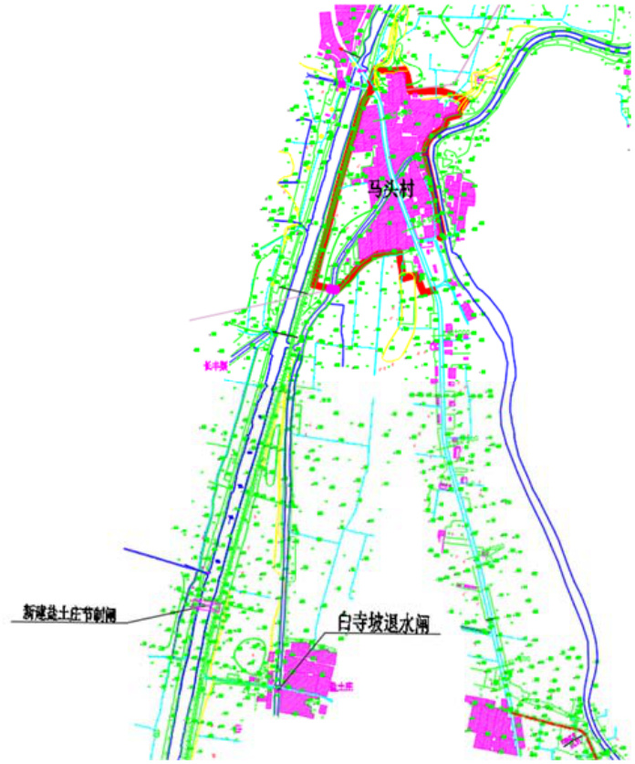  
图 4.5-12 马头村位置示意图  

# 4.5.4.6 堤防加固  

(1)新堤穿老河段堤防加戗工程  

卫河在1978 年扩大治理时对部分河道实施了裁弯取直工程,由于工程实施时未对河槽淤泥进行清除处理,裁弯处新建堤防直接坐落在淤泥层面上。由于老河槽的存在,在“96.8”洪水期间堤身出现渗水现象,堤防存在安全隐患。结合区域地形条件及依据堤防地质勘察资料,卫河左堤 $\begin{array}{r}{Z25+280\sim Z25+380,Z27+870\sim Z28+400}\end{array}$ 段堤基主要为第四系全新统冲积粉质壤土、粉质粘土,堤基工程地质条件总体为B 类, $Z114+130{\sim}Z114{+}400$ 、 $Z176+670{\sim}Z176+770$ 段堤基主要为主要为第四系全新统冲积粉质壤土、粉质砂壤土、粉质粘土,存在的主要工程地质问题为渗漏及渗透破坏,堤基工程地质条件总体为 C 类, $\scriptstyle Z177+370\scriptstyle{\sim}Z177+470$ 段堤基主要为粉质壤土、粉质粘土堤基工程地质条件总体为 B 类;卫河右堤 $\mathrm{Y}25{+}950{-}\mathrm{Y}26{+}200.$ 、$\scriptstyle\mathrm{Y}26+700\scriptstyle\sim\mathrm{Y}26+800$ 段堤基主要为第四系全新统冲积粉质壤土、粉质粘土,堤基工程 地 质 条 件 总 体 为 B 类 , $\mathrm{Y}10{+}430{-}\mathrm{Y}10{+}630$ 、 $\mathrm{Y}50\substack{+580\sim}\mathrm{Y}50\substack{+730}$ 、$\mathrm{Y}51+600\sim\mathrm{Y}51+700,\mathrm{Y}174+760\sim\mathrm{Y}175+090,\mathrm{Y}177+290\sim\mathrm{Y}177+490$ 段堤基主要为粉质壤土、粉质砂壤土、粉质粘土,存在的主要工程地质问题为渗漏及渗透破坏,堤基工程地质条件总体为 C 类,对以上段进行加戗治理。  

表 4.5-19  加戗工程范围统计表  

<html><body><table><tr><td>序号</td><td>位置</td><td>岸别</td><td>起止桩号</td><td>长度(m)</td><td>存在问题</td><td>处理措施</td></tr><tr><td>1</td><td>浚县么村</td><td rowspan="6">左</td><td>Z25+280~Z25+380</td><td>100</td><td rowspan="9">堤前为老河 槽，堤基没 有处理， “96.8"出现 渗水情况</td><td rowspan="9"></td></tr><tr><td>2</td><td>浚县王湾</td><td>Z27+870~Z28+400</td><td>530</td></tr><tr><td>3</td><td>内黄王庄</td><td>Z114+130~Z114+400</td><td>270</td></tr><tr><td>4</td><td>大名马庄</td><td>Z176+670~Z176+770</td><td>100</td></tr><tr><td>5</td><td>大名阎庙</td><td>Z177+370~Z177+470</td><td>100</td></tr><tr><td>小计</td><td></td><td></td><td>1100</td></tr><tr><td>6</td><td>浚县新镇</td><td>Y10+430~Y10+630</td><td>200</td></tr><tr><td>7</td><td>浚县申湾</td><td>Y25+950~Y26+200</td><td>250</td></tr><tr><td>8</td><td>浚县烧酒营</td><td>Y26+700~Y26+800</td><td>100</td></tr><tr><td>9</td><td>浚县陈庄</td><td>Y50+580~Y50+730</td><td>150</td></tr><tr><td>10</td><td>浚县甘草庄</td><td>右 Y51+600~Y51+700</td><td>100</td></tr><tr><td>11</td><td>大名金滩镇</td><td>Y174+760~Y175+090</td><td>330</td></tr><tr><td>12</td><td>大名沈庄</td><td>Y177+290~Y177+490</td><td>200</td></tr><tr><td>小计</td><td></td><td></td><td>1330</td></tr><tr><td>合计</td><td></td><td></td><td></td><td>2430</td></tr></table></body></html>  

# (2)堤防防渗工程  

根据地质勘察资料,堤身填筑土中分布有粉质砂壤土、粉细砂,多呈透镜体状分布,无明显规律,粉质砂壤土多呈弱至中等透水性,粉细砂多呈中等透水性,存在渗漏及渗透稳定问题,需进行防渗处理,防渗处理总长 $4.63\mathrm{km}$ ,防渗段见表4.5-20。  

表 4.5-20  卫河防渗段堤防现状情况统计表  

<html><body><table><tr><td>桩号</td><td>长度 (W)</td><td>粉细砂厚 (u)</td><td>粉细砂层距现状堤顶的深度 (m)</td></tr><tr><td>卫河左堤</td><td></td><td></td><td></td></tr><tr><td>Z1+000~Z1+050</td><td>50</td><td>1.5</td><td>3.5</td></tr><tr><td>Z3+700~Z4+200</td><td>500</td><td>3.5</td><td>2</td></tr><tr><td>Z42+650~Z43+600</td><td>950</td><td>2</td><td>1</td></tr><tr><td>Z93+210~Z93+760</td><td>550</td><td>5.5</td><td>4.5</td></tr><tr><td>Z140+310~Z140+540</td><td>230</td><td>2</td><td>1</td></tr><tr><td>Z154+380~Z154+450</td><td>70</td><td>1</td><td>2.5</td></tr><tr><td>Z155+530~Z155+590</td><td>60</td><td>1</td><td>3</td></tr><tr><td>小计</td><td>2410</td><td></td><td></td></tr><tr><td>卫河右堤</td><td></td><td></td><td></td></tr><tr><td>Y5+790~Y5+860</td><td>70</td><td>4</td><td>0.5</td></tr><tr><td>Y87+180~Y87+300</td><td>120</td><td>3.5</td><td>1</td></tr><tr><td>Y89+190~Y89+720</td><td>530</td><td>3</td><td>0</td></tr><tr><td>Y126+970~Y127+050</td><td>80</td><td>2.5</td><td>2</td></tr><tr><td>Y131+180~Y131+560</td><td>380</td><td>4</td><td>0</td></tr><tr><td>Y135+110~Y135+810</td><td>700</td><td>3</td><td>1</td></tr><tr><td>Y169+280~Y169+420</td><td>140</td><td>1</td><td>3.5</td></tr><tr><td>Y175+000~Y175+200</td><td>200</td><td>2</td><td>3</td></tr><tr><td>小计</td><td>2220</td><td></td><td></td></tr><tr><td>合计</td><td>4630</td><td></td><td></td></tr></table></body></html>  

# 4.5.4.7 堤顶防汛道路  

本次治理卫河堤顶防汛道路左、右堤防分段交错布设硬化路面;共产主义渠左堤自拟建盐土庄节制闸至老观嘴段、右堤自淇门(刘庄闸)至拟建盐土庄节制闸段布设堤顶硬化路面。堤防堤顶硬化路面设计为沥青混凝土路面。根据现场调查,2013\~2018 年间,部分路段已经修筑混凝土路面;同时结合地方需求,对现状路面破损严重路面进行拆除重建( $11.69\mathrm{km}$ ),对现状土路面进行硬化( $279.68\mathrm{km}$ ),治理总长度为 $291.37\mathrm{km}$ 。  

表 4.5-21  堤顶防汛道路及上堤坡道治理统计表  

<html><body><table><tr><td rowspan="2">河道名称</td><td rowspan="2">岸别</td><td colspan="3">堤顶防汛道路治理</td><td colspan="2">上堤坡道治理</td></tr><tr><td>拆除重建（km)</td><td>新建（km)</td><td>小计</td><td>个数</td><td>长度（km)</td></tr><tr><td rowspan="2">卫河</td><td>左</td><td>1.05</td><td>109.34</td><td>110.39</td><td>136</td><td>6.8</td></tr><tr><td>右</td><td>4.44</td><td>139.44</td><td>143.88</td><td>167</td><td>8.35</td></tr><tr><td rowspan="2">共渠</td><td>左</td><td></td><td>2.41</td><td>2.41</td><td>35</td><td>1.75</td></tr><tr><td>右</td><td>6.2</td><td>28.49</td><td>34.69</td><td>92</td><td>4.6</td></tr><tr><td colspan="2">合计</td><td>11.69</td><td>279.68</td><td>291.37</td><td>430</td><td>21.5</td></tr></table></body></html>  

# (1)卫河左堤  

卫河左堤总长 $186\mathrm{km}$ ,其中 $\scriptstyle{\mathrm{Z}54+290\scriptstyle{\sim}{\mathrm{Z}57+290}}$ 段 为 S219 省 道 ,$Z57+290{\sim}Z66{+}850$ 段接共渠左堤,本次不考虑堤顶路面治理。本次新建沥青混凝土路面 $109.34\mathrm{km}$ ,拆除重建 $1.05\mathrm{km}$ ,总计治理长度 $110.39\mathrm{km}$ ,其余维持现状。  

表 4.5-22  卫河左堤堤顶防汛道路处理方案统计表  

<html><body><table><tr><td>桩号范围</td><td>路面结构</td><td>路面情况</td><td>长度(m)</td><td>处理方案</td></tr><tr><td>Z0+000~Z1+780</td><td>混凝土</td><td>现状路面较为完整</td><td>1780</td><td>维持现状</td></tr><tr><td>Z1+780~Z9+140</td><td>土路</td><td></td><td>7360</td><td>新建沥青混凝土路面</td></tr><tr><td>Z9+140~Z9+520</td><td>混凝土</td><td>局部破损</td><td>380</td><td>拆除重建沥青混凝土 路面</td></tr><tr><td>Z9+520~Z19+590</td><td>土路</td><td></td><td>10070</td><td>新建沥青混凝土路面</td></tr><tr><td>Z19+590~Z22+950</td><td>混凝土</td><td>现状路面较为完整</td><td>3360</td><td>维持现状</td></tr><tr><td>Z22+950~Z28+380</td><td>土路</td><td></td><td>5430</td><td>新建沥青混凝土路面</td></tr><tr><td>Z28+380~Z33+720</td><td>混凝土</td><td>现状路面较为完整</td><td>5340</td><td>维持现状</td></tr><tr><td>Z33+720~Z43+600</td><td>土路</td><td></td><td>9880</td><td>新建沥青混凝土路面</td></tr><tr><td>Z43+600~Z46+750</td><td>混凝土</td><td>现状路面较为完整</td><td>3150</td><td>维持现状</td></tr><tr><td>Z46+750~Z49+300</td><td>土路</td><td></td><td>2550</td><td>新建沥青混凝土路面</td></tr><tr><td>Z49+300~Z49+580</td><td>混凝土</td><td>现状路面较为完整</td><td>280</td><td>维持现状</td></tr><tr><td>Z49+580~Z54+290</td><td>土路</td><td></td><td>4710</td><td>新建沥青混凝土路面</td></tr><tr><td>Z66+850~Z67+530</td><td>土路</td><td></td><td>680</td><td>新建沥青混凝土路面</td></tr><tr><td>Z67+530~Z70+850</td><td>沥青</td><td>现状路面较为完整</td><td>3320</td><td>维持现状</td></tr><tr><td>Z70+850~Z72+980</td><td>土路</td><td></td><td>2130</td><td>新建沥青混凝土路面</td></tr><tr><td>Z72+980~Z76+380</td><td>混凝土</td><td>现状路面较为完整</td><td>3400</td><td>维持现状</td></tr><tr><td>Z76+380~Z86+220</td><td>土路</td><td></td><td>9840</td><td>新建沥青混凝土路面</td></tr><tr><td>Z86+220~Z89+090</td><td>混凝土</td><td>现状路面较为完整</td><td>2870</td><td>维持现状</td></tr><tr><td>Z89+090~Z94+760</td><td>土路</td><td></td><td>5670</td><td>新建沥青混凝土路面</td></tr><tr><td>Z94+760~Z100+450</td><td>混凝土</td><td>2018年铺设，现状路 面情况良好</td><td>5690</td><td>维持现状</td></tr><tr><td>Z100+450~Z101+270</td><td>沥青</td><td>2018年铺设，现状路 面情况良好</td><td>820</td><td>维持现状</td></tr><tr><td>Z101+270~Z103+630</td><td>混凝土</td><td>2018年铺设，现状路 面情况良好</td><td>2360</td><td>维持现状</td></tr><tr><td>Z103+630~Z104+860</td><td>土路</td><td></td><td>1230</td><td>新建沥青混凝土路面</td></tr><tr><td>Z104+860~Z106+730</td><td>混凝土</td><td>2018年铺设，现状路 面情况良好</td><td>1870</td><td>维持现状</td></tr><tr><td>Z106+730~Z106+840</td><td>土路</td><td></td><td>110</td><td>新建沥青混凝土路面</td></tr><tr><td>Z106+840~Z108+580</td><td>混凝土</td><td>现状路面较为完整</td><td>1740</td><td>维持现状</td></tr><tr><td>Z108+580~Z108+710</td><td>土路</td><td></td><td>130</td><td>新建沥青混凝土路面</td></tr><tr><td>Z108+710~Z110+370</td><td>混凝土</td><td>现状路面较为完整</td><td>1660</td><td>维持现状</td></tr><tr><td>Z110+370~Z113+160</td><td>土路</td><td></td><td>2790</td><td>新建沥青混凝土路面</td></tr></table></body></html>  

<html><body><table><tr><td>桩号范围</td><td>路面结构</td><td>路面情况</td><td>长度（m)</td><td>处理方案</td></tr><tr><td>Z113+160~Z115+750</td><td>混凝土</td><td>现状路面较为完整</td><td>2590</td><td>维持现状</td></tr><tr><td>Z115+750~Z122+950</td><td>土路</td><td></td><td>7200</td><td>新建沥青混凝土路面</td></tr><tr><td>Z122+950~Z127+230</td><td>混凝土</td><td>部分路面为2019年铺 设，现状路面较为完 整</td><td>4280</td><td>维持现状</td></tr><tr><td>Z127+230~Z132+540</td><td>土路</td><td></td><td>5310</td><td>新建沥青混凝土路面</td></tr><tr><td>Z132+540~Z136+780</td><td>混凝土</td><td>现状路面较为完整</td><td>4240</td><td>维持现状</td></tr><tr><td>Z136+780~Z138+740</td><td>土路</td><td></td><td>1960</td><td>新建沥青混凝土路面</td></tr><tr><td>Z138+740~Z139+760</td><td>沥青</td><td>局部破损</td><td>1020</td><td>拆除重建50m破损段</td></tr><tr><td>Z139+760~Z141+760</td><td>土路</td><td></td><td>2000</td><td>新建沥青混凝土路面</td></tr><tr><td>Z141+760~Z143+470</td><td>混凝土</td><td>局部破损</td><td>1710</td><td>拆除重建620m 破损 段</td></tr><tr><td>Z143+470~Z159+160</td><td>土路</td><td></td><td>15690</td><td>新建沥青混凝土路面</td></tr><tr><td>Z159+160~Z164+160</td><td>混凝土</td><td>2013 年铺设，现状路 面较为完整</td><td>5000</td><td>维持现状</td></tr><tr><td>Z164+160~Z167+060</td><td>沥青</td><td>2008年铺设，现状路 面较为完整</td><td>2900</td><td>维持现状</td></tr><tr><td>Z167+060~Z170+360</td><td>土路</td><td></td><td>3300</td><td>新建沥青混凝土路面</td></tr><tr><td>Z170+360~Z171+560</td><td>混凝土</td><td>2019年铺设，现状路 面情况良好</td><td>1200</td><td>维持现状</td></tr><tr><td>Z171+560~Z182+860</td><td>土路</td><td></td><td>11300</td><td>新建沥青混凝土路面</td></tr><tr><td>Z182+860~Z185+769</td><td>沥青</td><td>2018年铺设，现状路</td><td>2909</td><td>维持现状</td></tr><tr><td>合计</td><td></td><td>面情况良好</td><td>173209</td><td></td></tr><tr><td colspan="4"></td></tr></table></body></html>  

# (2)卫河右堤  

卫河右堤路面总长 $191\mathrm{km}$ ,本次新铺沥青混凝土路面 $139.44\mathrm{km}$ ,拆除重建$4.44\mathrm{km}$ ,总计治理长度 $143.88\mathrm{km}$ ,其余维持现状。  

表 4.5-23  卫河右堤堤顶防汛道路处理方案统计表  

<html><body><table><tr><td>桩号范围</td><td>路面结构</td><td>路面情况</td><td>长度 (m)</td><td>处理方案</td></tr><tr><td>Y0+000~Y1+960</td><td>土路</td><td></td><td>1960</td><td>新建沥青混凝土路面</td></tr><tr><td>Y1+960~Y3+820</td><td>混凝土</td><td>路面破损严重</td><td>1860</td><td>拆除重建</td></tr><tr><td>Y3+820~Y11+110</td><td>土路</td><td></td><td>7290</td><td>新建沥青混凝土路面</td></tr><tr><td>Y11+110~Y14+430</td><td>混凝土</td><td>局部破损</td><td>3320</td><td>拆除重建270m破损段</td></tr><tr><td>Y14+430~Y22+860</td><td>土路</td><td></td><td>8430</td><td>新建沥青混凝土路面</td></tr><tr><td>Y22+860~Y24+820</td><td>混凝土</td><td>现状路面较为完整</td><td>1960</td><td>维持现状</td></tr><tr><td>Y24+820~Y25+430</td><td>土路</td><td></td><td>610</td><td>新建沥青混凝土路面</td></tr><tr><td>Y25+430~Y27+340</td><td>混凝土</td><td>现状路面较为完整</td><td>1910</td><td>维持现状</td></tr><tr><td>Y27+340~Y29+250</td><td>土路</td><td></td><td>1910</td><td>新建沥青混凝土路面</td></tr><tr><td>Y29+250~Y35+650</td><td>混凝土</td><td>现状路面较为完整</td><td>6400</td><td>维持现状</td></tr></table></body></html>  

<html><body><table><tr><td>桩号范围</td><td>路面结构</td><td>路面情况</td><td>长度 (m)</td><td>处理方案</td></tr><tr><td>Y35+650~Y48+170</td><td>土路</td><td></td><td>12520</td><td>新建沥青混凝土路面</td></tr><tr><td>Y48+170~Y50+130</td><td>混凝土</td><td>现状路面较为完整</td><td>1960</td><td>维持现状</td></tr><tr><td>Y50+130~Y75+420</td><td>土路</td><td></td><td>25290</td><td>新建沥青混凝土路面</td></tr><tr><td>Y75+420~Y75+720</td><td>混凝土</td><td>现状路面较为完整</td><td>300</td><td>维持现状</td></tr><tr><td>Y75+720~Y89+550</td><td>土路</td><td></td><td>13830</td><td>新建沥青混凝土路面</td></tr><tr><td>Y89+550~Y92+110</td><td>混凝土</td><td>2018年铺设，现状路 面情况良好</td><td>2560</td><td>维持现状</td></tr><tr><td>Y92+110~Y95+050</td><td>土路</td><td></td><td>2940</td><td>新建沥青混凝土路面</td></tr><tr><td>Y95+050~Y95+830</td><td>混凝土</td><td>2018年铺设，现状路 面情况良好</td><td>780</td><td>维持现状</td></tr><tr><td>Y95+830~Y101+280</td><td>土路</td><td></td><td>5450</td><td>新建沥青混凝土路面</td></tr><tr><td>Y101+280~Y101+580</td><td>混凝土</td><td>2017年铺设，现状路 面情况良好</td><td>300</td><td>维持现状</td></tr><tr><td>Y101+580~Y108+170</td><td>土路</td><td>2017年铺设，现状路</td><td>6590</td><td>新建沥青混凝土路面</td></tr><tr><td>Y108+170~Y110+270</td><td>混凝土</td><td>面情况良好</td><td>2100</td><td>维持现状</td></tr><tr><td>Y110+270~Y114+160</td><td>土路</td><td></td><td>3890</td><td>新建沥青混凝土路面</td></tr><tr><td>Y114+160~Y114+550</td><td>混凝土</td><td>现状路面较为完整</td><td>390</td><td>维持现状</td></tr><tr><td>Y114+550~Y120+040</td><td>土路</td><td></td><td>5490</td><td>新建沥青混凝土路面</td></tr><tr><td>Y120+040~Y125+590</td><td>混凝土</td><td>现状路面较为完整</td><td>5550</td><td>维持现状</td></tr><tr><td>Y125+590~Y134+410</td><td>土路</td><td></td><td>8820</td><td>新建沥青混凝土路面</td></tr><tr><td>Y134+410~Y137+270</td><td>混凝土</td><td>现状路面较为完整</td><td>2860</td><td>维持现状</td></tr><tr><td>Y137+270~Y148+950</td><td>土路</td><td></td><td>11680</td><td>新建沥青混凝土路面</td></tr><tr><td>Y148+950~Y150+670</td><td>混凝土</td><td>2017年铺设，现状路 面情况良好</td><td>1720</td><td>维持现状</td></tr><tr><td>Y150+670~Y156+690</td><td>沥青</td><td>2019年铺设，现状路 面情况良好</td><td>6020</td><td>维持现状</td></tr><tr><td>Y156+690~Y163+010</td><td>土路</td><td></td><td>6320</td><td>新建沥青混凝土路面</td></tr><tr><td>Y163+010~Y164+430</td><td>沥青</td><td>2019 年铺设，现状路 面情况良好</td><td>1420</td><td>维持现状</td></tr><tr><td>Y164+430~Y169+050</td><td>混凝土</td><td>2016年铺设，现状路 面情况良好</td><td>4620</td><td>维持现状</td></tr><tr><td>Y169+050~Y174+240</td><td>土路</td><td></td><td>5190</td><td>新建沥青混凝土路面</td></tr><tr><td>Y174+240~Y177+450</td><td>沥青</td><td>2016年铺设，现状路 面情况良好</td><td>3210</td><td>维持现状</td></tr><tr><td>Y177+450~Y182+070</td><td>土路</td><td></td><td>4620</td><td>新建沥青混凝土路面</td></tr><tr><td>Y182+070~Y183+730</td><td>沥青</td><td>2006年以前铺设，现 状破损严重</td><td>1660</td><td>拆除重建</td></tr><tr><td>Y183+730~Y186+580</td><td>土路</td><td></td><td>2850</td><td>新建沥青混凝土路面</td></tr><tr><td>Y186+580~Y186+880</td><td>混凝土</td><td>2006年以前铺设，现 状破损严重</td><td>300</td><td>拆除重建</td></tr><tr><td>Y186+880~Y188+280</td><td>土路</td><td></td><td>1400</td><td>新建沥青混凝土路面</td></tr></table></body></html>  

<html><body><table><tr><td>桩号范围</td><td>路面结构</td><td>路面情况</td><td>长度 (m)</td><td>处理方案</td></tr><tr><td>Y188+280~Y188+630</td><td>混凝土</td><td>2006年以前铺设，现 状破损严重</td><td>350</td><td>拆除重建</td></tr><tr><td>Y188+630~Y190+990</td><td>土路</td><td></td><td>2360</td><td>新建沥青混凝土路面</td></tr><tr><td>合计</td><td></td><td></td><td>190990</td><td></td></tr></table></body></html>  

# (3)共产主义渠堤防防汛道路  

共渠左堤长 $44.2\mathrm{km}$ ,新铺沥青混凝土路面 $2.41\mathrm{km}$ (盐土庄闸至屯子),其余维持现状。右堤长 $44.2\mathrm{km}$ ,新铺沥青混凝土路面 $28.49\mathrm{km}$ (淇门至屯子),拆除重建 $6.2\mathrm{km}$ ,总计治理长度 $34.69\mathrm{km}$ (淇门至屯子),其余维持现状。  

本次治理工程扰动段上下堤坡道共计 430 处,长度为 $21.5\mathrm{km}$ ,按照沥青混凝土路面进行设计。其中卫河左堤 136 处,卫河右堤 167 处,共渠 127 处。  

# 4.5.4.8 险工整治工程  

卫河沿线现有险工 130 座,依据险工现状情况和现状河道走向、河流流势以及“96.8”洪水出险情况,结合河道冲淤规律分析成果,可研阶段确定了 67 处险工进行治理。初设阶段,根据现场查勘调查情况,取消了其中 6 处进行过修补处理或河道顶冲作用不明显的险工,并增加了 7 处河道顶冲冲刷严重或现有护砌破损的险工,最终确定治理险工 68 处,其它 62 处险工维持现状。初设阶段由于实测地形图精度提高,并结合现场查勘情况,对部分险工治理长度进行适当调整,险工位置及各段长度见表 4.5-24。  

表 4.5-24险工统计情况表  

<html><body><table><tr><td>序号</td><td>险工名称</td><td>岸 别</td><td>起始桩号</td><td>长度 (m)</td><td>可研批复治理长度 (u)</td><td>初设治理长度 (u)</td><td>备注</td></tr><tr><td>1</td><td>孟庄险工</td><td>左</td><td>Z0+900</td><td>600</td><td>100</td><td>100</td><td></td></tr><tr><td>2</td><td>侯村险工</td><td>左</td><td>Z11+865</td><td>600</td><td>300</td><td>240</td><td></td></tr><tr><td>3</td><td>郝村险工 (上)</td><td>左</td><td>Z15+200</td><td>310</td><td>100</td><td>280</td><td></td></tr><tr><td>4</td><td>郝村险工 (下)</td><td>左</td><td>Z16+085</td><td>300</td><td>200</td><td>200</td><td></td></tr><tr><td>5</td><td>雷村险工 (上)</td><td>左</td><td>Z16+340</td><td>500</td><td>500</td><td>400</td><td></td></tr><tr><td>6</td><td>雷村险工</td><td>左</td><td>Z17+200</td><td>560</td><td>300</td><td>300</td><td></td></tr><tr><td>7</td><td>权庄险工</td><td>左</td><td>Z17+525</td><td>200</td><td>200</td><td>200</td><td></td></tr><tr><td>8</td><td>石羊险工</td><td>左</td><td>Z19+245</td><td>500</td><td>300</td><td>300</td><td></td></tr><tr><td>6</td><td>杜庄险工</td><td>左</td><td>Z20+555</td><td>270</td><td>270</td><td>270</td><td></td></tr><tr><td>10</td><td>婦头险工 (上)</td><td>左</td><td>Z20+900</td><td>300</td><td>200</td><td>200</td><td></td></tr><tr><td>11</td><td>头险工</td><td>左</td><td>Z21+610</td><td>500</td><td>300</td><td>450</td><td></td></tr><tr><td>12</td><td>小河险工</td><td>左</td><td>Z22+545</td><td>250</td><td>250</td><td>220</td><td></td></tr><tr><td>13</td><td>下滩险工 (上)</td><td>左</td><td>Z23+090</td><td>300</td><td>200</td><td>200</td><td></td></tr><tr><td>14</td><td>下滩险工 (下)</td><td>左</td><td>Z23+820</td><td>400</td><td>200</td><td>200</td><td></td></tr><tr><td>15</td><td>康庄险工</td><td>左</td><td>Z27+500</td><td>300</td><td>150</td><td>150</td><td></td></tr><tr><td>16</td><td>河西险工</td><td>左</td><td>Z30+120</td><td>400</td><td>200</td><td>200</td><td></td></tr><tr><td>17</td><td>白庄险工</td><td>左</td><td>Z31+560</td><td>210</td><td>150</td><td>150</td><td></td></tr><tr><td>18</td><td>柴湾险工</td><td>左</td><td>Z34+260</td><td>250</td><td>150</td><td>60</td><td></td></tr><tr><td>19</td><td>中周口险工</td><td>左</td><td>Z37+595</td><td>170</td><td>120</td><td>120</td><td></td></tr><tr><td>20</td><td>东周口险工</td><td>左</td><td>Z37+110</td><td>200</td><td>150</td><td>150</td><td></td></tr><tr><td>21</td><td>晏庄险工</td><td>左</td><td>Z39+800</td><td>400</td><td>150</td><td>150</td><td></td></tr><tr><td>22</td><td>西王桥险工</td><td>左</td><td>Z46+955</td><td>380</td><td>200</td><td>200</td><td></td></tr><tr><td>23</td><td>十里铺险工</td><td>左</td><td>Z50+195</td><td>300</td><td>200</td><td>200</td><td></td></tr></table></body></html>  

<html><body><table><tr><td>序号</td><td>险工名称</td><td>岸 别</td><td>起始桩号</td><td>长度 (m)</td><td>可研批复治理长度 (m)</td><td>初设治理长度 (m)</td><td>备注</td></tr><tr><td>24</td><td>小榆柳险工</td><td>左</td><td>Z51+150</td><td>350</td><td>250</td><td>250</td><td></td></tr><tr><td>25</td><td>(下) 瓦查险工</td><td>左</td><td>Z67+670</td><td>400</td><td>200</td><td>200</td><td></td></tr><tr><td>26</td><td>北渡村险工</td><td>左</td><td>Z94+825</td><td>200</td><td>200</td><td>200</td><td></td></tr><tr><td>27</td><td>新苑湾险工</td><td>左</td><td>Z161+635</td><td>300</td><td>200</td><td>200</td><td></td></tr><tr><td>28</td><td>营镇险工</td><td>左</td><td>Z182+880</td><td>680</td><td>400</td><td>400</td><td></td></tr><tr><td>29</td><td>耿湾险工 （下)</td><td>右</td><td>Y8+150</td><td>300</td><td>200</td><td>200</td><td></td></tr><tr><td>30</td><td>兰庄险工</td><td>右</td><td>Y12+695</td><td>280</td><td>200</td><td>200</td><td></td></tr><tr><td>31</td><td>兰庄北险工</td><td>右</td><td>Y13+430</td><td>390</td><td>390</td><td>260</td><td></td></tr><tr><td>32</td><td>范店险工</td><td>右</td><td>Y16+280</td><td>500</td><td>400</td><td>400</td><td></td></tr><tr><td>33</td><td>郭渡险工</td><td>右</td><td>Y19+255</td><td>515</td><td>100</td><td>100</td><td></td></tr><tr><td>34</td><td>西王渡险工 (上)</td><td>右</td><td>Y19+950</td><td>400</td><td>400</td><td>340</td><td></td></tr><tr><td>35</td><td>卢庄险工</td><td>右</td><td>Y22+525</td><td>150</td><td>150</td><td>150</td><td></td></tr><tr><td>36</td><td>梨园险工</td><td>右</td><td>Y24+720</td><td>150</td><td>100</td><td>150</td><td></td></tr><tr><td>37</td><td>滑县寨墙险工</td><td>右</td><td>Y33+080</td><td>2750</td><td>1500</td><td>610</td><td></td></tr><tr><td>38</td><td>薛村险工</td><td>右</td><td>Y36+770</td><td>500</td><td>500</td><td>380</td><td></td></tr><tr><td>39</td><td>杨堤险工</td><td>右</td><td>Y37+940</td><td>350</td><td>100</td><td>100</td><td></td></tr><tr><td>40</td><td>八里井险工</td><td>右</td><td>Y38+565</td><td>220</td><td>200</td><td>200</td><td></td></tr><tr><td>41</td><td>郭庄险工</td><td>右</td><td>Y39+470</td><td>370</td><td>250</td><td>250</td><td></td></tr><tr><td>42</td><td>郭庄险工 (下)</td><td>右</td><td>Y39+960</td><td>450</td><td>50</td><td>50</td><td></td></tr><tr><td>43</td><td>苑刘庄险工</td><td>右</td><td>Y41+190</td><td>500</td><td>200</td><td>200</td><td></td></tr><tr><td>44</td><td>王寺庄险工</td><td>右</td><td>Y42+185</td><td>250</td><td>250</td><td>250</td><td></td></tr><tr><td>45</td><td>东王桥险工</td><td>右</td><td>Y48+945</td><td>300</td><td>200</td><td>200</td><td></td></tr><tr><td>46</td><td>东王桥东险工</td><td>右</td><td>Y49+580</td><td>500</td><td>400</td><td>400</td><td></td></tr><tr><td>47</td><td>圈里险工</td><td>右</td><td>Y59+070</td><td>280</td><td>280</td><td>280</td><td></td></tr><tr><td>48</td><td>刘石井险工</td><td>右</td><td>Y63+350</td><td>350</td><td>250</td><td>250</td><td></td></tr></table></body></html>  

<html><body><table><tr><td>序号</td><td>险工名称</td><td>岸 别</td><td>起始桩号</td><td>长度 (m)</td><td>可研批复治理长度 (m)</td><td>初设治理长度 (m)</td><td>备注</td></tr><tr><td>49</td><td>苏村险工</td><td>右</td><td>Y69+490</td><td>370</td><td>270</td><td>270</td><td></td></tr><tr><td>50</td><td>郑庄险工</td><td>右</td><td>Y84+670</td><td>500</td><td>350</td><td>350</td><td></td></tr><tr><td>51</td><td>旧县险工</td><td>右</td><td>Y98+160</td><td>650</td><td>300</td><td>300</td><td></td></tr><tr><td>52</td><td>马固险工</td><td>右</td><td>Y101+000</td><td>250</td><td>200</td><td>200</td><td></td></tr><tr><td>53</td><td>范羊险工</td><td>右</td><td>Y103+465</td><td>300</td><td>300</td><td>300</td><td></td></tr><tr><td>54</td><td>西范堤险工</td><td>右</td><td>Y150+425</td><td>320</td><td>320</td><td>320</td><td></td></tr><tr><td>55</td><td>南王庄险工</td><td>右</td><td>Y158+295</td><td>340</td><td>100</td><td>300</td><td></td></tr><tr><td>56</td><td>北王庄险工</td><td>右</td><td>Y161+615</td><td>200</td><td>200</td><td>200</td><td></td></tr><tr><td>57</td><td>班庄闸险工 (下)</td><td>右</td><td>Y182+220</td><td>150</td><td>150</td><td>150</td><td></td></tr><tr><td>58</td><td>班庄险工</td><td>右</td><td>Y183+400</td><td>515</td><td>215</td><td>200</td><td></td></tr><tr><td>59</td><td>东营镇险工</td><td>右</td><td>Y184+575</td><td>1490</td><td>1290</td><td>990</td><td></td></tr><tr><td>60</td><td>也村险工</td><td>右</td><td>Y188+400</td><td>770</td><td>400</td><td>400</td><td></td></tr><tr><td>61</td><td>郭安堤险工</td><td>右</td><td>Y190+085</td><td>600</td><td>400</td><td>400</td><td></td></tr><tr><td>62</td><td>东郭村（上）险工</td><td>左</td><td>Z6+430</td><td>200</td><td>初设新增</td><td>200</td><td>弯道顶冲，现状无防护</td></tr><tr><td>63</td><td>东郭村（下）险工</td><td>左</td><td>Z7+510</td><td>360</td><td>初设新增</td><td>360</td><td>弯道顶冲，边坡较陡，现状无防护</td></tr><tr><td>64</td><td>牛村险工</td><td>左</td><td>Z13+600</td><td>240</td><td>初设新增</td><td>240</td><td>河道顶冲，现状无防护，边坡较陡</td></tr><tr><td>65</td><td>王湾险工</td><td>左</td><td>Z19+950</td><td>280</td><td>初设新增</td><td>280</td><td>弯道顶冲，边坡较陡，基础悬吊</td></tr><tr><td>66</td><td>西周口险工</td><td>左</td><td>Z38+400</td><td>150</td><td>初设新增</td><td>150</td><td>主槽冲刷严重，基础悬吊</td></tr><tr><td>67</td><td>梁村险工</td><td>左</td><td>Z137+700</td><td>400</td><td>初设新增</td><td>400</td><td>弯道顶冲，现状无防护</td></tr><tr><td>68</td><td>龙王庙险工</td><td>右</td><td>Y155+860</td><td>1400</td><td>初设新增</td><td>400</td><td>局部存在破损、空洞、基础悬吊</td></tr><tr><td colspan="2">合计</td><td></td><td></td><td>31400</td><td>17805</td><td>17570</td><td></td></tr></table></body></html>  

# 4.5.4.9 新建水闸(堰、挡水箱涵)  

本次治理新建盐土庄节制闸、小河口节制闸、浚县挡水箱涵(两个)、民丰沟排涝闸(两个)以及位于治理河道堤防上的卫河坡洼控制性分洪与退水工程,即白寺坡分洪堰、长虹渠分洪堰、长虹渠退水闸、浚内沟排涝涵闸,共 2 座河道节制闸、1 座坡洼退水闸、2 座坡洼分洪堰、3 座排涝涵闸和 2 座挡水箱涵。  

(1)盐土庄节制闸  

为保证向白寺坡分洪并有效控制共产主义渠及其以西行洪区洪水,确保老观嘴以下卫河河道和安阳河入卫河口以下卫河河道洪水安全下泄,在共产主义渠上建节制闸一座,设计流量 $1600\mathrm{m}^{3}/\mathrm{s}$ ,设计闸底板高程 $53.00\mathrm{m}$ ,发生 50 年一遇洪水时,由于盐土庄闸控泄,闸前产生雍水,且盐土庄闸与白寺滞洪区相距较近,因此本次选择白寺坡设计蓄滞水位 $61.40\mathrm{m}$ 作为闸上最高挡水位,相应闸下水位取共产主义渠河道设计水位 $59.94\mathrm{m}$ 。发生百年一遇校核洪水时,盐土庄闸控泄 $1680\mathrm{m}^{3}/\mathrm{s}$ ,闸上水位取百年一遇洪水时白寺坡最高蓄滞水位 $62.07\mathrm{m}$ ,闸下水位取流量 $1680\mathrm{m}^{3}/\mathrm{s}$ 时闸下共产主义渠河道水位 $60.01\mathrm{m}$ ,盐土庄闸下水位流量关系见表 4.5-25,不同工况闸上闸下特征水位见表 4.5-26。  

表 4.5-25 盐土庄闸下水位流量关系  

<html><body><table><tr><td>流量（m3/s)</td><td>1680</td><td>1600</td><td>1500</td><td>1400</td><td>1300</td><td>1200</td><td>1100</td><td>1000</td></tr><tr><td>水位（m)</td><td>60.01</td><td>59.94</td><td>59.80</td><td>59.65</td><td>59.53</td><td>59.44</td><td>59.29</td><td>59.15</td></tr><tr><td>流量（m3/s)</td><td>900</td><td>800</td><td>700</td><td>600</td><td>500</td><td>400</td><td>300</td><td>200</td></tr><tr><td>水位（m)</td><td>59.00</td><td>58.83</td><td>58.63</td><td>58.41</td><td>58.15</td><td>57.83</td><td>57.17</td><td>56.38</td></tr></table></body></html>  

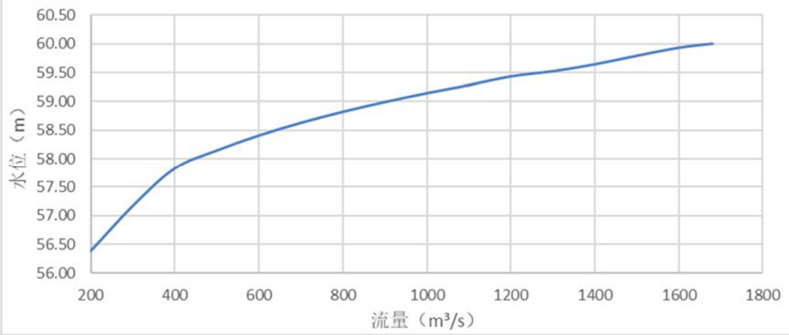  
图 4.5-13 盐土庄闸下水位流量关系  

表 4.5-26 盐土庄闸特征指标表  

<html><body><table><tr><td rowspan="2">功能</td><td rowspan="2">标准</td><td rowspan="2">设计流量（m3/s)</td><td rowspan="2">闸门工况</td><td colspan="2">水位（m)</td><td rowspan="2">备注</td></tr><tr><td>闸下闸上</td><td></td></tr><tr><td rowspan="4">防洪</td><td rowspan="2">设计标准50年一遇</td><td>1600</td><td rowspan="2">泄</td><td>59.9460.29</td><td></td><td rowspan="2"></td></tr><tr><td>1600</td><td>59.94 61.4</td><td></td></tr><tr><td></td><td>1400</td><td>控泄</td><td>59.65 61.4</td><td></td><td>与安阳河口错峰</td></tr><tr><td>校核标准100年一遇</td><td>1680</td><td>控泄</td><td>60.0162.07</td><td></td><td></td></tr><tr><td>排涝</td><td>20年一遇麦涝流量</td><td>250</td><td>泄</td><td>56.9656.98</td><td></td><td></td></tr></table></body></html>  

# (2)小河口节制闸  

在发生50 年一遇洪水、淇楚共同频洪水情况下,西沿村先分洪,长虹渠启用几率及滞蓄洪水的压力加大,在保证河道设计行洪规模情况下,各坡洼充分运用,并保证长虹渠不超蓄,经洪水调算,小河口节制闸控泄流量为 $700\mathrm{m}^{3}/\mathrm{s}$ 。  

小河口节制闸设计流量为 $700\mathrm{m}^{3}/\mathrm{s}$ ,闸底板高程 $58.0\mathrm{m}$ ,发生 50 年一遇洪水,闸上最高挡水位为 $66.53\mathrm{m}$ 相应的闸下水位为 $61.85\mathrm{m}$ ,小河口闸控泄时,闸上水位从 $66.22\mathrm{m}$ 降到 $65.59\mathrm{m}$ ,相应的闸下水位从 $64.81\mathrm{m}$ 升高到 $64.87\mathrm{m}$ 。发生百年校核洪水时,闸上最高挡水位为 $66.89\mathrm{m}$ ,相应的下游水位 $64.37\mathrm{m}$ 。控泄 $700\mathrm{m}^{3}/\mathrm{s}$ 时的闸上最高水位 $66.68\mathrm{m}$ ,闸下水位为 $65.10\mathrm{m}$ 。根据小河口闸闸下河道断面推得小河口闸下水位流量关系见表 4.5-27,闸上闸下特征水位见表 4.5-28  

表 4.5-27  小河口闸下水位流量关系  

<html><body><table><tr><td>流量(m²/s)</td><td>700</td><td>600</td><td>500</td><td>400</td><td>300</td><td>200</td><td>130</td><td>100</td></tr><tr><td>水位(m)</td><td>64.92</td><td>64.55</td><td>64.01</td><td>63.48</td><td>62.94</td><td>62.4</td><td>62.02</td><td>61.45</td></tr></table></body></html>  

表 4.5-28  小河口闸特征指标表  

<html><body><table><tr><td rowspan="2">功能</td><td rowspan="2">标准</td><td rowspan="2">设计流量</td><td rowspan="2">闸门工况</td><td colspan="2">水位</td><td>备注</td></tr><tr><td>闸下水位</td><td>闸上水位</td><td></td></tr><tr><td rowspan="4">防洪</td><td rowspan="2">设计标准50年一遇</td><td>0</td><td>挡水</td><td>61.85</td><td>66.53</td><td></td></tr><tr><td>700</td><td>控泄</td><td>64.85-64.92</td><td>66.22-65.59</td><td></td></tr><tr><td rowspan="2">校核标准100 年一遇</td><td>0</td><td>挡水</td><td>64.37</td><td>66.89</td><td></td></tr><tr><td>700</td><td>控泄</td><td>65.10-65.20</td><td>66.68-66.29</td><td></td></tr></table></body></html>  

# (3)浚县挡水箱涵  

卫河在浚县县城有左右两个河槽,右侧河槽紧邻县城老城区,右侧河槽的右堤局部堤身矮小,河槽深 $3.0\mathrm{m}$ 左右,堤顶宽仅有 $2{\sim}3\mathrm{m}$ ,且紧邻房屋,无条件修建堤防。该段河槽过流能力仅有 $20~\mathrm{m}^{3}/\mathrm{s}$ ,为保证浚县老城区的安全,保证卫河洪水全部由左侧河槽行洪,在右侧河槽上口及下口各新建一座挡水箱涵,控制卫河洪水由左侧河槽行洪。当卫河发生大洪水时,关闭箱涵,箱涵起挡洪作用;正常情况下箱涵处于打开状态,保留右侧部分排涝功能,设计流量为 $20\mathrm{m}^{3}/\mathrm{s}$ 。  

挡洪工况下,浚县上口挡水箱涵为正向挡水,闸上最高挡水水位取相应位置处卫河 50 年一遇洪水位为 $60.45\mathrm{m}$ ;浚县下口挡水箱涵为反向挡水,闸下最高挡水水位取相应位置处卫河50 年一遇洪水位为 $60.26\mathrm{m}$ 。  

当右侧河槽按照设计流量 $20\mathrm{m}^{3}/\mathrm{s}$ 过水时,浚县上口箱涵设计闸下水位为$56.83\mathrm{m}$ ;浚县下口箱涵设计闸上水位 $56.75\mathrm{m}$ 。当上口闸闸下水位高于 $56.85\mathrm{m}$ 时,关闭箱涵。  

(4)民丰沟排涝闸(上口闸和下口闸)  

民丰沟排涝渠由西南向东北方向纵穿马头村,将白寺坡及下游区域涝水排入卫河,为满足民丰沟的排涝要求,在围村埝跨越民丰沟的位置各修建一个排涝闸。每个排涝闸的设计标准同民丰沟的排涝标准。  

依据《海河流域综合规划》中治涝规划安排,漳卫河平原排涝区排涝标准为$_{3\sim5}$ 年一遇,结合《河南省海河流域蓄滞洪区建设一期工程可行性研究报告》成果,参考卫河排涝标准,本次民丰沟设计排涝标准为 3 年一遇。民丰沟流域面积$149\mathrm{km}^{2}$ ,排涝模数 $0.32((\mathrm{m}^{3}/\mathrm{s})/\mathrm{km}^{2})$ ,依据 1973 年《河南省水利工程水文计算常用图》提供的平原地区排涝模数计算方法推算,民丰沟3 年一遇,设计流量 $47.7\mathrm{m}^{3}/\mathrm{s}$ 。即修建在围村埝上的民丰沟的两个排涝闸设计标准为3 年一遇,设计流量均为47.7$\mathrm{m}^{3}/\mathrm{s}$ 。  

挡洪工况下,民丰沟上口闸为正向挡水,闸上最高挡水位取马头村十年一遇洪水位 $58.5\mathrm{m}$ ;民丰沟下口闸为反向挡水,闸下最高挡水位取马头村十年一遇洪水位位 $58.5\mathrm{m}$ 。  

当民丰沟按照设计流量 $47.7\mathrm{m}^{3}/\mathrm{s}$ 过水时,上口闸闸下设计水位为 $55.99\mathrm{m}$ ,下口闸闸上设计水位为 $55.98\mathrm{m}$ 。  

(5)卫河坡洼控制性分洪、退水工程  

为灵活控制洪水,协调坡洼滞蓄关系,有控制的分区、分期启用滞洪区,尽量减少坡洼淹没损失,需要修建坡洼的分洪、退水建筑物,本次仅对位于治理河道堤防上的分洪、退水建筑物工程进行设计。  

# 1)白寺坡分洪堰  

白寺坡分洪堰分洪运用是在保证盐土庄节制闸流量不超过允许流量条件下,与盐土庄节制闸联合调度,整个分洪调度运用过程,白寺坡最大分洪流量 $1450\mathrm{m}^{3}/\mathrm{s}$ 。考虑到盐土庄节制闸的重要性及安全性,可适当加大白寺坡分洪堰规模,确保盐土庄节制闸安全控泄 $1600~\mathrm{m}^{3}/\mathrm{s}$ ,本次设计白寺坡分洪堰设计流量与防洪规划确定的规模相同,即为 $1600\mathrm{m}^{3}/\mathrm{s}$ 。  

白寺坡分洪堰设计流量 $1600\mathrm{m}^{3}/\mathrm{s}$ ,发生 50 年一遇洪水,堰上最高挡水水位取白寺分洪堰起始分洪水位为 $60.03\mathrm{m}$ ,堰下水位为设计分洪流量 $1600\mathrm{m}^{3}/\mathrm{s}$ 时对应的水位为 $59.34\mathrm{m}$ 。白寺分洪堰堰下水位流量关系见表 4.5-29。  

表 4.5-29 白寺分洪堰堰下水位流量关系 单位:m $\mathrm{m}^{3}/\mathrm{s}$   

<html><body><table><tr><td>堰下水位</td><td>堰上水位</td><td>流量</td><td>堰下水位</td><td>堰上水位</td><td>流量</td></tr><tr><td rowspan="5">58.5</td><td>58.5</td><td>0</td><td rowspan="5">59</td><td>59</td><td>0</td></tr><tr><td>58.6</td><td>863</td><td>59.05</td><td>894</td></tr><tr><td>58.7</td><td>1146</td><td>59.1</td><td>1182</td></tr><tr><td>58.8</td><td>1355</td><td>59.15</td><td>1394</td></tr><tr><td>58.9</td><td>1529</td><td>59.2</td><td>1567</td></tr><tr><td rowspan="5">59.5</td><td>59.5</td><td>0</td><td rowspan="5">60</td><td>60</td><td>0</td></tr><tr><td>59.55</td><td>1142</td><td>60.03</td><td>1137</td></tr><tr><td>59.58</td><td>1380</td><td>60.05</td><td>1395</td></tr><tr><td>59.6</td><td>1510</td><td>60.06</td><td>1501</td></tr><tr><td>59.63</td><td>1679</td><td>60.07</td><td>1597</td></tr><tr><td rowspan="5">60.5</td><td>60.5</td><td>0</td><td rowspan="5">61</td><td>61</td><td>0</td></tr><tr><td>60.51</td><td>867</td><td>61.01</td><td>1004</td></tr><tr><td>60.52</td><td>1145</td><td>61.02</td><td>1326</td></tr><tr><td>60.53</td><td>1346</td><td>61.03</td><td>1559</td></tr><tr><td>60.55</td><td>1653</td><td>61.04</td><td>1750</td></tr></table></body></html>  

2)长虹渠分洪、退水工程$\textcircled{1}$ 长虹渠分洪堰  

西沿村分洪堰分泄的洪水,一部分经宋村分洪堰分洪入柳围坡,一部分由上游卫河下泄,当卫河淇门处流量大于 $400\mathrm{m}^{3}/\mathrm{s}$ ,或在白寺坡滞蓄水位达到 $60.8\mathrm{m}$ 开启小河口节制闸分泄共产主义渠洪水时,卫河淇门处流量大于 $400\mathrm{m}^{3}/\mathrm{s}$ ,都将启用长虹渠分洪堰向长虹渠分洪。长虹渠分洪堰宽 $380\mathrm{m}$ ,堰顶高程 $63.2\mathrm{m}$ ,设计流量$900~\mathrm{m}^{3}/\mathrm{s}$ 。发生 50 年一遇洪水,堰上最高挡水水位取长虹渠分洪堰起始分洪水位为 $64.19\mathrm{m}$ ,堰下水位为设计分洪流量 $900\mathrm{m}^{3}/\mathrm{s}$ 时对应的水位为 $63.94\mathrm{{m}}$ 。长虹渠分洪堰堰下水位流量关系见表 4.5-30。  

表 4.5-30  长虹渠分洪堰堰下水位流量关系 单位:m $\mathrm{m}^{3}/\mathrm{s}$  

<html><body><table><tr><td>下游水位</td><td>63.2</td><td>63.4</td><td>63.6</td><td>63.8</td><td>64</td></tr><tr><td>上游水位 63.2</td><td>0</td><td></td><td></td><td></td><td></td></tr><tr><td>63.3</td><td>27</td><td></td><td></td><td></td><td></td></tr><tr><td>63.4</td><td>76</td><td>0</td><td></td><td></td><td></td></tr><tr><td>63.5</td><td>140</td><td>140</td><td></td><td></td><td></td></tr><tr><td>63.6</td><td>216</td><td>216</td><td>0</td><td></td><td></td></tr><tr><td>63.7</td><td>301</td><td>301</td><td>293</td><td></td><td></td></tr><tr><td>63.8</td><td>396</td><td>396</td><td>396</td><td>0</td><td></td></tr><tr><td>63.9</td><td>499</td><td>499</td><td>499</td><td>454</td><td></td></tr><tr><td>64</td><td>610</td><td>610</td><td>610</td><td>607</td><td>0</td></tr><tr><td>64.1</td><td>728</td><td>728</td><td>728</td><td>728</td><td>621</td></tr><tr><td>64.2</td><td>853</td><td>853</td><td>853</td><td>853</td><td>828</td></tr><tr><td>64.3</td><td>984</td><td>984</td><td>984</td><td>984</td><td>983</td></tr></table></body></html>

$\textcircled{2}$ 长虹渠退水闸  

当发生50 年一遇设计洪水时,长虹渠最高蓄滞水位 $62.49\mathrm{m}$ ,为满足长虹渠退水需求,拟建长虹渠退水闸,长虹渠蓄滞水量视卫河流量经长虹渠退水闸相机退入卫河,经洪水演进计算,最大退水流量 $360\mathrm{m}^{3}/\mathrm{s}$ 。考虑卫河最大行洪流量,本次长虹渠退水闸设计退水流量取卫河最大行洪流量 $400\mathrm{m}^{3}/\mathrm{s}$ 。  

长虹渠退水闸在长虹渠未启用时为反向挡水,此时闸下水位最高为闸下卫河断面 $400\mathrm{m}^{3}/\mathrm{s}$ 对应的水位 $61.53\mathrm{m}$ ,闸上水长虹渠仅有涝水,考虑不利情况,闸上按无水考虑。退水前的闸上最高挡水位取长虹渠最高蓄滞水位 $62.49\mathrm{m}$ ,相应的闸下水位为闸下卫河断面行洪 $400\mathrm{m}^{3}/\mathrm{s}$ 时的水位 $61.53\mathrm{m}$ 。长虹渠退水闸退水时,一开始需视卫河流量控泄,控泄流量从0 增加到 $360\mathrm{m}^{3}/\mathrm{s}$ ,相应的闸上水位从 $62.49\mathrm{m}$ 降低到闸上设计水位 $61.8\mathrm{m}$ 。此时闸下水位仍为 $61.53\mathrm{m}$ ,当闸上水位小于 $61.8\mathrm{m}$ 时,闸门逐渐提高,过流由孔流变为堰流。退水结束时,闸上无水,卫河来流 $10\mathrm{m}^{3}/\mathrm{s}.$ ,对应的闸下水位为 $55\mathrm{m}$ ,长虹渠退水闸不同工况特征水位见表 4.5-31。根据长虹渠退水闸闸下卫河河道断面,推得长虹渠退水闸闸下水位流量关系见表4.5-32。  

表 4.5-31  长虹渠退水闸特征指标表 流量: $\mathrm{m}^{3}/\mathrm{s}$ 水位:m  

<html><body><table><tr><td colspan="2">标准</td><td colspan="2">工况</td><td>流量</td><td>闸下水位</td><td>闸上水位</td><td>备注</td></tr><tr><td rowspan="4">设计 工况</td><td rowspan="4">50年 一遇</td><td>分洪前</td><td>正向挡水</td><td>0</td><td>61.53</td><td>62.49</td><td rowspan="4">57.2为 闸底板 高程。</td></tr><tr><td rowspan="2">退水期</td><td>控泄</td><td>0-360</td><td>61.53</td><td>62.49-61.8</td></tr><tr><td rowspan="2">泄</td><td>360-0</td><td>61.53-55</td><td>61.8-57.2</td></tr><tr><td>分洪后 反向挡水</td><td>0</td><td>61.53</td><td>57.2</td></tr></table></body></html>  

表 4.5-32  长虹渠退水闸闸下水位流量关系  

<html><body><table><tr><td>流量（m²/s)</td><td>400</td><td>347</td><td>250</td><td>206</td><td>167</td><td>130</td><td>100</td><td>73</td><td>53</td><td>25</td></tr><tr><td>水位(m)</td><td>61.53</td><td>61</td><td>60</td><td>59.5</td><td>59</td><td>58.48</td><td>58</td><td>57.5</td><td>57</td><td>56</td></tr></table></body></html>  

长虹渠退水闸闸下水位流量关系  

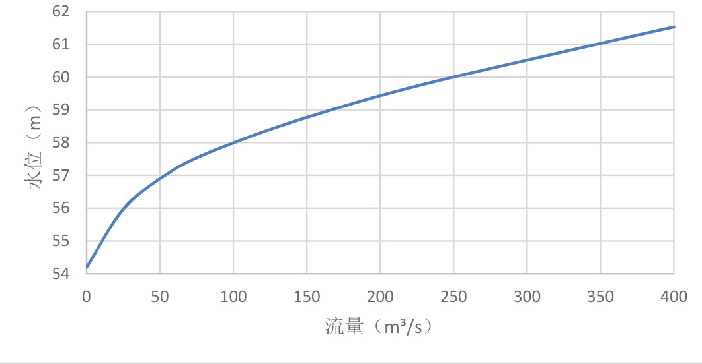  
图 4.5-14 长虹渠退水闸闸下水位流量关系  

# 3)浚内沟排涝涵闸  

卫河右堤浚内沟口段新筑堤防长 $780\mathrm{m}$ ,为满足小滩坡内浚内沟的排水要求,在新筑堤防与浚内沟口交汇处,新建浚内沟排涝涵闸。  

依据《海河流域综合规划》中治涝规划安排,漳卫河平原排涝区排涝标准为$_{3\sim5}$ 年一遇。浚内沟长 $29.2\mathrm{km}$ ,流域面积 $165\mathrm{km}^{2}$ ,原设计 3 年一遇设计流量为$31.3\mathrm{m}^{3}/\mathrm{s}$ ,本次浚内沟设计排涝标准采用原设计值,即为 3 年一遇,设计流量为$31.3\mathrm{m}^{3}/\mathrm{s}$ 。  

浚内沟排涝涵闸除排涝功能外,还兼具挡洪作用,防止卫河洪水倒灌小滩坡。挡洪工况下,浚内沟排涝涵闸为反向挡水,闸下最高挡洪水位取卫河50 年一遇洪水位为 $56.96\mathrm{m}$ ;闸上最高挡水位取小滩坡设计滞洪水位 $57.21\mathrm{m}$ ;浚内沟入卫河口位置设计排涝水位为 $53.39\mathrm{m}$ ,受此顶托,浚内沟排涝涵闸闸下设计水位为 $53.44\mathrm{{m}}$ 。  

# 4.5.4.10 穿堤建筑物除险加固  

卫河干流沿线堤防共有穿堤建筑物 629 座,其中穿堤涵闸 90 座、穿堤涵管(洞)539 座;共产主义渠淇门以下河道沿线堤防共有穿堤建筑物 96 座,其中穿堤涵闸 13 座,穿堤涵管(洞)83 座。  

根据各穿堤建筑物现状情况及其功能与使用情况,在现场查勘和征求地方意见的基础上,对卫河及共产主义渠两岸存在安全隐患的 445 座穿堤建筑物采取拆除重建、维修加固和封堵等工程措施进行除险加固治理,其余 183 座穿堤建筑物维持现状。其中对于涵闸、涵管(洞)严重损坏、洞身漏水等将危及堤防安全,又确系灌溉或排涝必须的工程,予以拆除重建;对各涵闸、涵管洞身短,上下游挡墙、护坡、护底损坏损坏,闸门及启闭机房破损或丢失等进行维修加固;已废弃多年,成为工程隐患,严重威胁着大堤的安全,经征得地方同意予以封堵。  

对穿堤建筑物主要采用以下 4 种方案进行治理改造:  

(1)拆除重建;主要针对损坏严重或存在安全隐患,部分维修加固已不能  
满足长期使用要求的建筑物;(2)维修加固;主要针对基本完好只是部分损坏、维修加固后可继续使用  
的穿堤建筑物,或因为堤防加宽、加高,需要接长和重建进出口的穿堤建筑物。(3)拆除封堵;主要针对废弃不再使用的建筑物,或已损坏有其他建筑物  
可替代的穿堤建筑物。(4)维持现状;主要针对现状基本完好,不受堤防加固影响的穿堤建筑物。本次治理穿堤建筑物共445 座,具安排如下:  

(1)淇门以下卫河干流  

淇门以下卫河干流沿线堤防穿堤涵闸(洞)共有 533 座,本次治理 404 座,包括穿堤涵闸 81 座、涵管(洞)323 座,其中:  

81 座穿堤涵闸需拆除重建 7 座,维修加固 69 座,拆除封堵 5 座。  

323 座穿堤涵管(洞)需拆除重建 49 座,维修加固 202 座,封堵 72 座。  

(2)淇门(刘庄)以下共产主义渠  

淇门(刘庄)以下共产主义渠堤防穿堤涵闸(洞)共有 96 座,本次治理 41座,包括穿堤涵闸 6 座、涵管(洞)35 座。  

6 座穿堤涵闸需拆除重建 1 座,维修加固 5 座,无拆除封堵。  

35 座穿堤涵管(洞)需拆除重建 4 座,维修加固 31 座,无拆除封堵。  

# 4.5.4.11 刘庄闸改桥工程  

当发生50 年一遇洪水时,淇共汇合口处共产主义渠及刘庄口门行洪 $3080\mathrm{m}^{3}/\mathrm{s}$ ,其中 $1870\mathrm{m}^{3}/\mathrm{s}$ 经刘庄口门入共西行洪区,另 $1210\mathrm{m}^{3}/\mathrm{s}$ 经共产主义渠下泄,共产主义渠现有刘庄闸,设计流量为 $400~\mathrm{m}^{3}/\mathrm{s}$ ,最大过流能力 $600\mathrm{m}^{3}/\mathrm{s}$ ,阻碍行洪。结合现场查勘,现状刘庄闸位置处左右岸有大面积的农田,同时分布有小刘庄村、北刘庄村、和庄村、孟庄村等较多村庄,日常主要依靠刘庄闸后交通桥来满足附近两岸人们的生产生活需求,本次结合防洪规划安排将刘庄闸改建为桥梁,来满足河道行洪与交通等要求。  

桥梁设计过流能力 $1200\mathrm{m}^{3}/\mathrm{s}$ ,防洪标准为50 年一遇。本次治理维持可研设计方案,闸改桥方案对共产主义渠的行洪水位、行洪规模以及各坡洼的控制运用基本没有影响。  

拟将原闸拆除新建桥梁,桥梁布置为预应力混凝土空心板桥,每跨 $16\mathrm{m}$ ,共 6跨,含桥两端全长为 $104.5\mathrm{m}$ 。下部结构为双柱式混凝土排架,基础为钢筋混凝土灌注桩,排架柱柱径为 $1.0\mathrm{m}$ ,桩径为 $1.2\mathrm{m}$ ;上部结构每跨由六块预制预应力钢筋混凝土空心板组成,桥面宽度为净- $7+2\mathbf{x}1.0$ 米,桥面设置 $1.5\%$ 的双向横坡,16 米跨预应力钢筋混凝土空心板板高为0.8 米。桥面两侧各设净 $0.75\mathrm{m}$ 宽人行道,栏杆采用混凝土柱与钢结构混合栏杆。该方案为跨河道两岸堤防的新建桥梁,不涉及占地。  

# 4.5.4.12 生产桥改建工程  

卫河清淤河段共有 4 座跨越河道主槽的生产桥,受河道主槽清淤与扩挖的影响,需进行拆除重建。  

另有阎庙生产桥,1978 年卫河扩大治理时由于河道裁弯取直将原位于河西岸的 500 亩耕地改为河东岸。在当地群众的强烈要求下国家补助少量资金在主河槽的子槽上修建了一座简易的漫水便桥,见图4.5-15,桥面窄小低矮,无任何防护措施,生产车辆通行只能绕道 $5\mathrm{km}$ 外向北过营镇桥或向南过金滩镇桥,该桥严重影响两岸人民的生产生活。阎庙生产桥是前期卫河治理的遗留问题,本次治理拟安排恢复建设一座生产桥。  

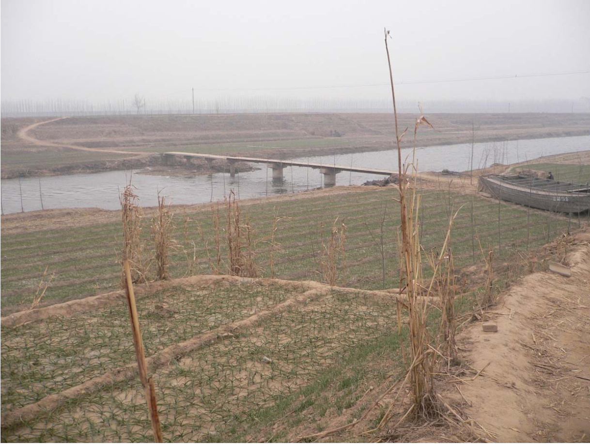  
图 4.5-15 阎庙桥现状照片  

卫河干流(淇门\~徐万仓)段治理工程布置见附图 106C-A1-H-02,共产主义渠淇门(刘庄闸)\~老观嘴段治理工程布置见附图 106C-A1-H-03。  

# 4.5.5 河道设计水面线  

# 4.5.5.1 卫河河道设计水面线  

采用天然河道恒定非均匀流计算方法,推算河道设计行洪与排涝水位,河道水面线计算时计入了沿河建筑物的壅水影响。本阶段对河道水面线进行复核。结合现状地形,经分析,在共产主义渠拟建盐土庄节制闸下游主槽过流能力仅为$1100\mathrm{m}^{3}/\mathrm{s}$ ,流速约 $2\mathrm{m/s}$ ,为保证主槽稳定,结合防洪规划总体布局,共卫合流位置调整至拟建盐土庄节制闸下游约 $500\mathrm{m}$ 位置处,河道设计水位较可研阶段抬高$0.01{\sim}0.5\mathrm{m}$ 。  

(1)断面资料  

在 2019 年 10 月实测成果的基础上,采用河道治理后的设计断面。  

(2)河道糙率  

根据河道现状糙率率定结果及历次治理设计采用的糙率值,卫河干流可研阶段设计用的糙率值为主槽 0.0225,滩地 0.05。根据《中华人民共和国防洪法》第二十二条“禁止在行洪河道内种植阻碍行洪的林木和高杆作物”,同时结合卫河滩地内一水一麦要求,汛期滩地应禁止玉米等高杆作物种植。本次设计滩面糙率根据滩上水深情况及滩地管理要求,差别化取值,结合1978 年卫河扩大治理时卫河糙率取值(主槽 0.0225,滩地 0.035),对滩地水深大于 $2\mathrm{m}$ 处滩地设计糙率取 0.035,其他滩地仍取 0.05。  

(3)计算起始水位  

为与卫运河治理相协调,本次卫河治理徐万仓处起始计算水位,采用卫运河治理可行性研究设计成果,即徐万仓处设计行洪水位为 $43.69\mathrm{m}$ ,排涝水位为 $40.04\mathrm{m}$ 。  

# (4)桥梁壅高计算  

交通桥对洪水的影响,主要表现为河道渲泄洪水时受桥墩阻挡而产生的水位壅高。由于卫河水流流态均为缓流,采用采用水利动能设计手册《防洪分册》中式(5-9)计算各交通桥桥梁壅水,对于某座桥梁首次运用该式做计算时,先以 $\Delta h_{_{3}}$ $=0$ 带入该式,然后迭代出 $\Delta h_{_{3}}$ 的数值。各桥梁壅高见表 4.5-33。  

$$
\Delta h_{3}=\frac{\alpha V_{3}^{2}}{2g}[(\frac{B}{\varepsilon{\sum}b})^{2}-(\frac{h_{3}}{h_{3}+\Delta h_{3}})^{2}]
$$  

式中:Δh3— 桥前最大壅水高度( $(\mathrm{m})$ );  

$\alpha$ 动能修正系数,一般取值为 1.1;  
— 过水断面收缩艺术,取 0.85\~0.95V3— 桥下游断面平均流速;  
h3— 桥墩下游正常水深(m);  
B— 无桥墩时的截面宽度(m);  
b— 两墩间的净宽(m)。  

根据水利动能设计手册《防洪分册》,漫水桥壅水计算应按堰流加孔流计算。卫河上的漫水桥分为两种:1.本次需拆除重建的牛村生产桥与西王渡生产桥,位于共卫合流以上段,河道滩地较窄,主要为河道主槽行洪,跨主槽的漫水桥阻水作用明显,需按照堰流加孔流计算其壅水值,计算过程中桥梁底以下部分按照无底坎闸孔出流计算,桥面板以上按照有底坎堰流计算;2.老观嘴下游段河道滩地较宽,桥梁为跨主槽桥,当发生设计洪水时,桥面以上水深较大,阻水比很小,壅水作用不明显,因此,在计算中忽略不计。  

表4.5-33 卫河干流桥梁壅水高度计算表  

<html><body><table><tr><td>序号</td><td>河道桩号</td><td>名称</td><td>长度 (u)</td><td>桥面高程 梁底高程 (u)</td><td>(U)</td><td>桥梁类型</td><td>设计流量 (m2/s)</td><td>桥下水位 (u)</td><td>过水断面 面积</td><td>断面平均流速 (m/s)</td><td>净过水断 面面积</td><td>桥下平均 流速</td><td>(%)</td><td>(U)</td><td>(u)</td><td>阻水比水面宽度水面净宽桥梁壅水 值(m)</td></tr><tr><td></td><td>2+070</td><td>李庄桥</td><td>140</td><td>67.7</td><td>66.5</td><td>交通桥</td><td>400</td><td>64.77</td><td>(m²) 331.57</td><td>1.21</td><td>(m²) 308.12</td><td>(m/s) 1.3</td><td>7.1</td><td>69.68</td><td>64.75</td><td>0.04</td></tr><tr><td>1 2</td><td>9+220</td><td>新镇桥</td><td>109</td><td>67.59</td><td>66.29</td><td>交通桥</td><td>400</td><td>64.01</td><td>378.6</td><td>1.06</td><td>368.35</td><td>1.09</td><td>2.7</td><td>96.11</td><td>93.51</td><td>0.02</td></tr><tr><td>3</td><td>9+550</td><td>新马头村桥</td><td>182</td><td>69.25</td><td>67.25</td><td>交通桥</td><td>400</td><td>63.99</td><td>524.64</td><td>0.76</td><td>501.78</td><td>0.8</td><td>4.4</td><td>137.72</td><td>131.72</td><td>0.01</td></tr><tr><td>4</td><td>12+810</td><td>牛村生产桥</td><td>56.5</td><td>62.1</td><td>61.6</td><td>漫水桥</td><td>400</td><td>63.41</td><td>289</td><td>1.38</td><td>236.75</td><td>1.69</td><td>18.1</td><td>72.4</td><td>72.4</td><td>0.17</td></tr><tr><td>5</td><td>15+520</td><td>南雷村桥</td><td>105</td><td>67.48</td><td>66.58</td><td>交通桥</td><td>400</td><td>63.12</td><td>442.59</td><td>0.9</td><td>408.21</td><td>0.98</td><td>7.8</td><td>108.13</td><td>99.73</td><td>0.02</td></tr><tr><td>6</td><td>18+700</td><td>西王渡生产桥</td><td>76.5</td><td>61.07</td><td>60.41</td><td>漫水桥</td><td>400</td><td>62.73</td><td>470.77</td><td>0.85</td><td>391.82</td><td>1.02</td><td>16.8</td><td>112.63</td><td>112.63</td><td>0.1</td></tr><tr><td>7</td><td>19+610</td><td>王湾桥</td><td>280</td><td>68.06</td><td>65.96</td><td>交通桥</td><td>400</td><td>64.64</td><td>436.95</td><td>0.92</td><td>402.46</td><td>0.99</td><td>7.9</td><td>105.42</td><td>97.09</td><td>0.02</td></tr><tr><td>8</td><td>21+680</td><td>小河镇桥</td><td>06</td><td>66.93</td><td>65.93</td><td>交通桥</td><td>400</td><td>62.21</td><td>343.18</td><td>1.17</td><td>322.2</td><td>1.24</td><td>6.1</td><td>71.96</td><td>67.56</td><td>0.03</td></tr><tr><td>9</td><td>23+890</td><td>宗湾桥</td><td>147</td><td>64.79</td><td>63.69</td><td>交通桥</td><td>400</td><td>61.91</td><td>315.12</td><td>1.27</td><td>294.28</td><td>1.36</td><td>6.6</td><td>116.41</td><td>108.71</td><td>0.04</td></tr><tr><td>10</td><td>24+790</td><td>烧酒营桥</td><td>152</td><td>67.48</td><td>63</td><td>交通桥</td><td>400</td><td>61.75</td><td>367.21</td><td>1.09</td><td>348.16</td><td>1.15</td><td>5.2</td><td>148.4</td><td>140.7</td><td>0.03</td></tr><tr><td>11</td><td>27+040</td><td>东王湾村桥</td><td>390</td><td>63.83</td><td>62.53</td><td>交通桥</td><td>400</td><td>61.56</td><td>873.92</td><td>0.46</td><td>801.28</td><td>0.5</td><td>8.3</td><td>365.75</td><td>335.35</td><td>0.01</td></tr><tr><td>12</td><td>29+110</td><td>河西村桥</td><td>93</td><td>64.43</td><td>63.42</td><td>交通桥</td><td>400</td><td>61.4</td><td>404.06</td><td>0.99</td><td>381.87</td><td>1.05</td><td>5.5</td><td>87.42</td><td>82.62</td><td>0.02</td></tr><tr><td>13</td><td>31+950</td><td>大运河桥</td><td>240</td><td>65.33</td><td>63.63</td><td>交通桥</td><td>400</td><td>61.22</td><td>437.21</td><td>0.91</td><td>403.19</td><td>0.99</td><td>7.8</td><td>212.06</td><td>195.56</td><td>0.02</td></tr><tr><td>14</td><td>33+450</td><td>柴湾生产桥</td><td>76.5</td><td>62.4</td><td>61.9</td><td>交通桥</td><td>400</td><td>61.11</td><td>374.01</td><td>1.07</td><td>350.05</td><td>1.14</td><td>6.4</td><td>93.66</td><td>87.66</td><td>0.03</td></tr><tr><td>15</td><td>42+310</td><td>南杨庄村桥</td><td>82</td><td>62.16</td><td>61.96</td><td>交通桥</td><td>400</td><td>60.5</td><td>344.68</td><td>1.16</td><td>322.3</td><td>1.24</td><td>6.5</td><td>73.91</td><td>69.11</td><td>0.03</td></tr><tr><td>16</td><td>42+900</td><td>浮丘山村桥</td><td>54</td><td>61.21</td><td>60.95</td><td>交通桥</td><td>400</td><td>60.41</td><td>336.41</td><td>1.19</td><td>310.66</td><td>1.29</td><td>7.7</td><td>54.87</td><td>50.67</td><td>0.04</td></tr><tr><td>17</td><td>44+040</td><td>菜园桥</td><td>50</td><td>65.12</td><td>64.84</td><td>交通桥</td><td>400</td><td>60.28</td><td>330.87</td><td>1.21</td><td>306.81</td><td>1.3</td><td>7.3</td><td>49.51</td><td>45.91</td><td>0.04</td></tr><tr><td>18</td><td>44+750</td><td>黎阳旁边桥</td><td>80</td><td>62.59</td><td>62.03</td><td>交通桥</td><td>400</td><td>60.2</td><td>366.32</td><td>1.09</td><td>328.53</td><td>1.22</td><td>10.3</td><td>75.49</td><td>65.29</td><td>0.04</td></tr><tr><td>19</td><td>44+830</td><td>黎阳桥</td><td>130</td><td>61.94</td><td>61.74</td><td>交通桥</td><td>400</td><td>60.18</td><td>423.3</td><td>0.94</td><td>401.84</td><td>1</td><td>5.1</td><td>94.68</td><td>89.88</td><td>0.02</td></tr><tr><td>20</td><td>46+730</td><td>浚州桥</td><td>190</td><td>62.9</td><td>62.58</td><td>交通桥</td><td>400</td><td>60.09</td><td>780.52</td><td>0.51</td><td>685.92</td><td>0.58</td><td>12.1</td><td>173.27</td><td>152.27</td><td>0.01</td></tr><tr><td>21</td><td>47+940</td><td>马庄桥</td><td>160</td><td>61.5</td><td>61.28</td><td>交通桥</td><td>400</td><td>60.03</td><td>720.35</td><td>0.56</td><td>691.38</td><td>0.58</td><td>4</td><td>273.49</td><td>262.49</td><td>0.01</td></tr><tr><td>22</td><td>50+130</td><td>小榆柳村2桥</td><td>64</td><td>60.51</td><td>60.3</td><td>交通桥</td><td>400</td><td>59.99</td><td>2412.89</td><td>0.17</td><td>2380.69</td><td>0.17</td><td>1.3</td><td>866.38</td><td>862.88</td><td>0</td></tr><tr><td>23</td><td>51+070</td><td>小榆柳村桥</td><td>65</td><td>63.1</td><td>62.62</td><td>交通桥</td><td>400</td><td>59.95</td><td>1246.36</td><td>0.32</td><td>1232.38</td><td>0.32</td><td>1.1</td><td>499.32</td><td>493.72</td><td>0.01</td></tr></table></body></html>  

<html><body><table><tr><td>序号</td><td>河道桩号</td><td>名称</td><td>长度 (U)</td><td>桥面高程 (m)</td><td>梁底高程 (m)</td><td>桥梁类型</td><td>设计流量 (m3/s)</td><td>桥下水位 (m)</td><td>过水断面 面积</td><td>断面平均流速 (m/s)</td><td>净过水断 面面积</td><td>桥下平均 流速</td><td>(%)</td><td>阻水比水面宽度水面净宽 (u)</td><td>(W)</td><td>桥梁壅水 值(m)</td></tr><tr><td>24</td><td>52+070</td><td>东榆柳村桥</td><td>540</td><td>60.51</td><td>60.3</td><td>交通桥</td><td>400</td><td>59.91</td><td>(m²） 603.58</td><td>0.66</td><td>(m²） 570.97</td><td>(m/s) 0.7</td><td>5.4</td><td>518.17</td><td>490.17</td><td>0.01</td></tr><tr><td>25</td><td>54+790</td><td>码头村1桥</td><td>58</td><td>60.85</td><td>60.15</td><td>交通桥</td><td>2000</td><td>59.83</td><td>3143.55</td><td>0.64</td><td>2968.43</td><td>0.67</td><td>5.6</td><td>1631.22</td><td>1583.84</td><td>0.01</td></tr><tr><td>26</td><td>58+050</td><td>葛庄村桥</td><td>15</td><td>53.16</td><td>52.99</td><td>漫水桥</td><td>2000</td><td>59.35</td><td>2335.69</td><td>0.86</td><td>2325.16</td><td>0.86</td><td>0.5</td><td>880.22</td><td>880.22</td><td>0</td></tr><tr><td>27</td><td>60+320</td><td>孙石井村桥</td><td>22</td><td>53.51</td><td>53.15</td><td>漫水桥</td><td>2000</td><td>58.89</td><td>1562.92</td><td>1.28</td><td>1549.3</td><td>1.29</td><td>0.9</td><td>525.24</td><td>525.24</td><td>0</td></tr><tr><td>28</td><td>63+550</td><td>老观嘴村桥</td><td>22</td><td>51.62</td><td>51.31</td><td>漫水桥</td><td>2000</td><td>58.47</td><td>1971.03</td><td>1.01</td><td>1946.46</td><td>1.03</td><td>1.2</td><td>539.13</td><td>539.13</td><td>0</td></tr><tr><td>29</td><td>68+170</td><td>五陵镇桥</td><td>105</td><td>61.04</td><td>60.5</td><td>主槽桥</td><td>2000</td><td>57.46</td><td>1283.7</td><td>1.56</td><td>1273.43</td><td>1.57</td><td>0.8</td><td>499.98</td><td>495.98</td><td>0.01</td></tr><tr><td>30</td><td>68+250</td><td>五陵镇铁路桥</td><td>940</td><td>61.4</td><td>59.8</td><td>交通桥</td><td>2000</td><td>57.44</td><td>3065.15</td><td>0.65</td><td>2947.4</td><td>0.68</td><td>3.8</td><td>913.68</td><td>878.58</td><td>0.01</td></tr><tr><td>31</td><td>70+140</td><td>韩莆村浮桥</td><td>52</td><td>48.56</td><td>/</td><td>浮桥</td><td>2000</td><td>57.32</td><td>2958.14</td><td>0.68</td><td>2958.14</td><td>0.68</td><td>0</td><td>1373.63</td><td>1373.63</td><td>/</td></tr><tr><td>32</td><td>71+100</td><td>魏湾桥</td><td>120</td><td>59.66</td><td>59.34</td><td>主槽桥</td><td>2000</td><td>57.32</td><td>3624.96</td><td>0.55</td><td>3575.41</td><td>0.56</td><td>1.4</td><td>1416</td><td>1409.4</td><td>0</td></tr><tr><td>33</td><td>73+520</td><td>大刘村桥</td><td>77.5</td><td>50.63</td><td>50.13</td><td>漫水桥</td><td>2000</td><td>56.95</td><td>3035.31</td><td>0.66</td><td>2964.04</td><td>0.67</td><td>2.3</td><td>915.54</td><td>915.54</td><td>0.01</td></tr><tr><td>34</td><td>73+750</td><td>后王村1桥</td><td>42</td><td>54.1</td><td>53.93</td><td>漫水桥</td><td>2000</td><td>56.94</td><td>3249.49</td><td>0.62</td><td>3228.6</td><td>0.62</td><td>0.6</td><td>954.02</td><td>954.02</td><td>0.01</td></tr><tr><td>35</td><td>74+140</td><td>后王村桥</td><td>50</td><td>49.75</td><td>49.45</td><td>漫水桥</td><td>2000</td><td>56.88</td><td>1793.47</td><td>1.12</td><td>1737.28</td><td></td><td></td><td></td><td></td><td></td></tr><tr><td>36</td><td>74+140</td><td>小刘桥</td><td>35</td><td>54.8</td><td>54.52</td><td>漫水桥</td><td>2000</td><td>56.88</td><td></td><td></td><td></td><td>1.15</td><td>3.1</td><td>504.14</td><td>504.14</td><td>0.02</td></tr><tr><td>37</td><td>75+010</td><td>草坡村桥</td><td>43</td><td>48.29</td><td>48.03</td><td>漫水桥</td><td>2000</td><td>56.82</td><td>2119.22</td><td>0.94</td><td>2099.85</td><td>0.95</td><td>0.9</td><td>518.86</td><td>518.86</td><td>0.01</td></tr><tr><td>38</td><td>85+120</td><td>高堤卫河大桥</td><td>640</td><td>58.4</td><td>57.4</td><td>交通桥</td><td>2000</td><td>55.46</td><td>1929.6</td><td>1.04</td><td>1859.75</td><td>1.08</td><td>3.6</td><td>629.85</td><td>607.05</td><td>0.02</td></tr><tr><td>39</td><td>87+870</td><td>西元村桥</td><td>40</td><td>48.2</td><td>47.8</td><td>漫水桥</td><td>2000</td><td>55.24</td><td>2308.02</td><td>0.87</td><td>2274.74</td><td>0.88</td><td>1.4</td><td>910.31</td><td>910.31</td><td>0.01</td></tr><tr><td>40</td><td>91+390</td><td>渡村桥</td><td>40</td><td>47</td><td>46.7</td><td>漫水桥</td><td>2000</td><td>54.96</td><td>1729.66</td><td>1.16</td><td>1704.22</td><td>1.17</td><td>1.5</td><td>468.25</td><td>468.25</td><td>0.02</td></tr><tr><td>41</td><td>96+450</td><td>内宝线卫河大桥</td><td>440</td><td>55.5</td><td>54.2</td><td>交通桥</td><td>2000</td><td>54.3</td><td>1655.45</td><td>1.21</td><td>1548.1</td><td>1.29</td><td>6.5</td><td>424.06</td><td>396.56</td><td>0.03</td></tr><tr><td>42</td><td>104+120</td><td>南林高速卫河大 桥</td><td>540</td><td>59.4</td><td>57.4</td><td>交通桥</td><td>2500</td><td>53.16</td><td>1678.48</td><td>1.49</td><td>1574.78</td><td>1.59</td><td>6.2</td><td>517.86</td><td>493.86</td><td>0.05</td></tr><tr><td>43</td><td>108+830</td><td>王庄大桥</td><td>530</td><td>56.2</td><td>55.2</td><td>交通桥</td><td>2500</td><td>52.34</td><td>1495.95</td><td>1.67</td><td>1406.02</td><td>1.78</td><td>6</td><td>519</td><td>487.8</td><td>0.07</td></tr><tr><td>44</td><td>129+160</td><td>元村卫河大桥</td><td>508</td><td>52.4</td><td>51</td><td>交通桥</td><td>2500</td><td>49.22</td><td>2401.2</td><td>1.04</td><td>2294.85</td><td>1.09</td><td>4.4</td><td>508</td><td>485.5</td><td>0.02</td></tr><tr><td>45</td><td>135+080</td><td>张浮丘村桥</td><td>510</td><td>51.4</td><td>50</td><td>交通桥</td><td>2500</td><td>48.36</td><td>1940.31</td><td>1.29</td><td>1809.03</td><td>1.38</td><td>6.8</td><td>504</td><td>469.9</td><td>0.04</td></tr><tr><td>46</td><td>148+700</td><td>S215卫河桥</td><td>660</td><td>50</td><td>48.5</td><td>交通桥</td><td>2500</td><td>46.88</td><td>2338.53</td><td>1.07</td><td>2218.97</td><td>1.13</td><td>5.1</td><td>616.14</td><td>584.64</td><td>0.02</td></tr></table></body></html>  

<html><body><table><tr><td rowspan="2">序号</td><td rowspan="2">河道桩号</td><td rowspan="2">名称</td><td rowspan="2">长度 (m)</td><td rowspan="2">桥面高程 (m)</td><td rowspan="2">梁底高程 (m)</td><td rowspan="2">桥梁类型</td><td rowspan="2">设计流量 (m/s)</td><td rowspan="2">桥下水位 (m)</td><td rowspan="2">过水断面 面积</td><td rowspan="2">断面平均流速 (m/s)</td><td rowspan="2">净过水断</td><td colspan="2">桥下平均</td><td rowspan="2">阻水比水面宽度水面净宽桥梁壅水</td><td rowspan="2">(m)</td><td rowspan="2">(m) 值(m)</td></tr><tr><td>面面积</td><td>流速</td></tr><tr><td rowspan="2">47</td><td>150+190</td><td></td><td></td><td>49.7</td><td>48.2</td><td>交通桥</td><td>2500</td><td></td><td>(m²)</td><td></td><td>(z)</td><td>(m/s)</td><td>(%)</td><td></td><td></td><td></td></tr><tr><td>154+320</td><td>龙王庙桥 前街村桥</td><td>500 155</td><td>45.6</td><td>44.8</td><td>漫水桥</td><td>2500</td><td>46.68 46.19</td><td>2020.39 2192.18</td><td>1.24 1.14</td><td>1939.25 1979.08</td><td>1.29</td><td>4</td><td>493.04 619.38</td><td>473.24 609.48</td><td>0.03 0.02</td></tr><tr><td>48 49</td><td>167+010</td><td>金滩镇桥</td><td>500</td><td>47.6</td><td>47.1</td><td>交通桥</td><td>2500</td><td>44.75</td><td>2705.03</td><td>0.92</td><td>2518.48</td><td>1.26 0.99</td><td>9.7 6.9</td><td>493</td><td>459</td><td>0.02</td></tr><tr><td>50</td><td>172+720</td><td>阎庙生产桥</td><td>48</td><td>36.7</td><td>36</td><td>漫水桥</td><td>2500</td><td>44.27</td><td>2546.74</td><td>0.98</td><td>2503.14</td><td></td><td>1.7</td><td>665.77</td><td>665.77</td><td>0.01</td></tr><tr><td>51</td><td>178+690</td><td>营镇桥</td><td>490</td><td>46.5</td><td>45.5</td><td>交通桥</td><td>2500</td><td>43.81</td><td>2450.25</td><td>1.02</td><td>2304.75</td><td>1.08</td><td>5.9</td><td>488.35</td><td>459.35</td><td></td></tr><tr><td></td><td></td><td></td><td></td><td></td><td></td><td></td><td></td><td></td><td></td><td></td><td></td><td></td><td></td><td></td><td></td><td>0.02</td></tr></table></body></html>  

卫河河道设计水位见表4.5-34,由表中水位得知,卫河干流设计行洪水位在共卫合流位置变化较大,主要原因是可研阶段水位计算合流位置在屯子,初设阶段水位计算合流位置在盐土庄闸下 $500\mathrm{m}$ 位置,两者合流位置相差约 $2\mathrm{km}$ ,可研阶段屯子至共卫合流位置卫河设计水位按照卫河单断面 $400\mathrm{m}^{3}/\mathrm{s}$ 计算,导致合流位置上游水位偏低,初设阶段将合流位置向上游调整,屯子至合流位置按照卫河与共渠大断面行洪,共同承担河道下泄 $2000\mathrm{m}^{3}/\mathrm{s}$ 的任务。共卫合流位置河道行洪断面可研与初设阶段对比如图 4.5-16 所示。共卫合流以上断面流速、过水断面等指标见表 4.5-35。  

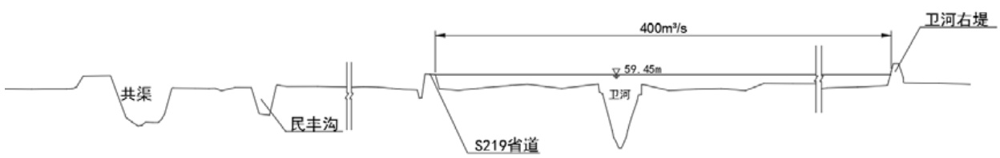  
可研阶段断面行洪示意图  

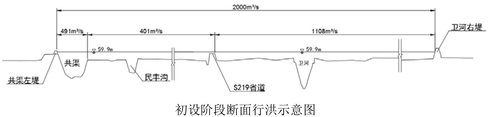  
图 4.5-16 共卫合流断面行洪对比示意图  

其中北老观嘴村位于行洪滩地上,该位置河道设计水位 $58.36\mathrm{m}$ ,河道滩地高程 $56.5{\sim}57.0\mathrm{m}$ ,滩地水深约 $1.34{\sim}1.84\mathrm{m}$ ,村庄村基高程基本高于 $58.5\mathrm{m}$ ,依据防洪规划总体安排,本次治理不考虑村庄搬迁,如发生洪水,村民应根据水情及时撤出,减轻洪灾损失。  

表 4.5-34卫河河道设计水位表 单位:流量 $\mathrm{m}^{3}/\mathrm{s}$ ,其余为 m  

<html><body><table><tr><td rowspan="2">河道桩号</td><td rowspan="2">主槽桩号</td><td rowspan="2">地点</td><td rowspan="2">排涝流量</td><td colspan="2">行洪流量</td><td colspan="2">原设计水位</td><td colspan="2">可研治理设计水位</td><td colspan="2">初设设计水位</td><td>行洪水位差值</td></tr><tr><td>可研</td><td>初设 排涝</td><td>行洪</td><td>排涝</td><td>行洪</td><td>排涝</td><td>行洪</td><td>初设-可研</td><td></td></tr><tr><td>0+000</td><td>0+000</td><td>淇共汇合口</td><td rowspan="12">130 150</td><td rowspan="6">700</td><td rowspan="3">700</td><td>62.34</td><td></td><td>62.18</td><td>66.53</td><td>62.15</td><td>66.53</td><td>0</td></tr><tr><td>0+300</td><td>0+320</td><td>小河口节制闸</td><td></td><td></td><td></td><td>62.15 66.50/65.08</td><td>62.15</td><td>66.50/64.92</td><td>-0.16</td></tr><tr><td>0+500</td><td>0+500</td><td></td><td></td><td></td><td>62.1</td><td>65.05</td><td>62.14</td><td>64.92</td><td>-0.13</td></tr><tr><td>1+190</td><td>1+870</td><td>淇门</td><td rowspan="2"></td><td rowspan="2"></td><td></td><td>62</td><td>64.75</td><td>62.12</td><td>64.9</td><td>0.15</td></tr><tr><td>23+900</td><td>25+880</td><td>宗湾上</td><td>59</td><td>58.99</td><td>61.69</td><td>59.29</td><td>61.95</td></tr><tr><td>26+360</td><td>28+330</td><td>宗湾下</td><td colspan="3">400</td><td>58.66</td><td>58.64</td><td>61.39</td><td>58.77</td><td>61.61</td><td>0.26 0.22</td></tr><tr><td rowspan="2">27+680</td><td rowspan="2">30+170</td><td rowspan="2">长虹渠 入卫河口</td><td></td><td rowspan="6"></td><td rowspan="6">58.42</td><td></td><td>58.44</td><td>61.29</td><td>58.48</td><td>61.53</td><td rowspan="2">0.24</td></tr><tr><td></td><td></td><td></td><td>59.98</td><td>57.02</td><td></td><td></td></tr><tr><td>42+850</td><td>46+040</td><td>浚县上</td><td>400</td><td>56.82</td><td></td><td>56.94 56.69</td><td>59.8</td><td>56.82</td><td>60.45 60.26</td><td>0.47 0.4</td></tr><tr><td>44+380 46+660</td><td>47+560 50+070</td><td>浚县下</td><td rowspan="2"></td><td>56.37</td><td></td><td>56.48</td><td>59.69</td><td>56.63</td><td>60.11</td><td>0.42</td></tr><tr><td>48+120</td><td>50+540</td><td>十里铺上 十里铺下</td><td>56.21</td><td></td><td>56.27</td><td>59.51</td><td>56.42</td><td>60.02</td><td>0.51</td></tr><tr><td>53+830</td><td></td><td>共卫合流</td><td rowspan="6"></td><td></td><td></td><td>55.62</td><td>59.45</td><td>55.79</td><td>59.9</td><td>0.45</td></tr><tr><td>55+070</td><td>57+530 58+930</td><td>民丰沟入卫河口</td><td rowspan="6">2000</td><td rowspan="6"></td><td rowspan="6"></td><td>55.52</td><td></td><td>55.38</td><td>59.15</td><td>55.69</td><td>59.77</td><td>0.62</td></tr><tr><td>55+490</td><td>59+480</td><td>屯子</td><td rowspan="2"></td><td></td><td>55.34</td><td>59.14</td><td>55.65</td><td>59.72</td><td>0.58</td></tr><tr><td>63+980</td><td>69+150</td><td>北老观嘴</td><td>2000</td><td></td><td>54.5</td><td>58.15 54.97</td><td>58.36</td><td>0.21</td></tr><tr><td rowspan="2">64+590</td><td rowspan="2">69+870</td><td>老观嘴</td><td rowspan="2"></td><td rowspan="2">54.39</td><td rowspan="2"></td><td rowspan="2">54.4</td><td rowspan="2">57.92 54.84</td><td rowspan="2">58.15</td><td rowspan="2">0.23</td></tr><tr><td>700</td><td></td></tr></table></body></html>  

<html><body><table><tr><td>河道桩号</td><td rowspan="2">主槽桩号</td><td rowspan="2"></td><td rowspan="4">排涝流量</td><td colspan="2">行洪流量</td><td colspan="2">原设计水位</td><td colspan="2">可研治理设计水位</td><td colspan="2">初设设计水位</td><td>行洪水位差值</td></tr><tr><td>地点</td><td>可研</td><td>初设</td><td>排涝</td><td>行洪</td><td>排涝</td><td>行洪</td><td>排涝</td><td>行洪</td><td>初设-可研</td></tr><tr><td>73+520</td><td>78+980</td><td>浚内沟口 安阳河</td><td></td><td></td><td>53.94</td><td>57.3</td><td>53.5</td><td>56.96</td><td>53.5</td><td>56.96</td><td>0</td></tr><tr><td>97+730</td><td>104+130</td><td>入卫河口</td><td rowspan="6">1000</td><td rowspan="6">2500</td><td rowspan="6"></td><td>50.75</td><td>53.96</td><td>50.75</td><td>54.14</td><td>50.75</td><td>54.14</td><td>0</td></tr><tr><td>119+320</td><td>127+210 硝河入卫河口</td><td></td><td></td><td>44.49</td><td>51.03</td><td>47.43</td><td>50.41</td><td>47.43 50.41</td><td>0</td></tr><tr><td>142+980</td><td>152+220</td><td>大北张</td><td>2500</td><td>47.7</td><td>44.58</td><td>47.62</td><td>44.58</td><td>47.5</td><td>-0.12</td></tr><tr><td>144+910</td><td>154+410</td><td>岔河口</td><td>44.15</td><td>47.47</td><td>44.33</td><td>47.39</td><td>44.33</td><td>47.28</td><td>-0.11</td></tr><tr><td>158+370</td><td>168+690</td><td>窑厂</td><td>42.58</td><td>46.18</td><td>42.78</td><td>45.69</td><td>42.78</td><td>45.62</td><td>-0.07 0</td></tr><tr><td>182+950</td><td>196+930</td><td>徐万仓</td><td></td><td>40.04</td><td>43.69</td><td>40.04</td><td>43.69</td><td>40.04</td><td>43.69</td></tr></table></body></html>  

表 4.5-35 共卫合流以上段河道水位及水力要素表  

<html><body><table><tr><td>序号</td><td>位置</td><td>桩号</td><td>水位（m）</td><td>桥梁壅水</td><td>流速</td><td>过水断面面积</td><td>水面宽 (u)</td></tr><tr><td>1</td><td>淇门东街村</td><td>1+630</td><td>64.88</td><td></td><td>(m/s) 0.84</td><td>(m²) 477.13</td><td>103.49</td></tr><tr><td>2</td><td>李庄桥</td><td>2+070</td><td>64.81/64.77</td><td>0.04</td><td>1.21</td><td>331.57</td><td>69.68</td></tr><tr><td>3</td><td></td><td>2+600</td><td>64.71</td><td></td><td>1.22</td><td>327.39</td><td>91.22</td></tr><tr><td>4</td><td></td><td>3+090</td><td>64.68</td><td></td><td>1.07</td><td>374.71</td><td>130.27</td></tr><tr><td>5</td><td></td><td>3+590</td><td>64.61</td><td></td><td>1.27</td><td>315.93</td><td>102.56</td></tr><tr><td>6</td><td></td><td>4+100</td><td>64.58</td><td></td><td>1.1</td><td>362.21</td><td>127.43</td></tr><tr><td>7</td><td></td><td>4+610</td><td>64.53</td><td></td><td>1.07</td><td>374.58</td><td>89.36</td></tr><tr><td>8</td><td></td><td>5+090</td><td>64.49</td><td></td><td>1.09</td><td>366.88</td><td>137.54</td></tr><tr><td>9</td><td></td><td>5+620</td><td>64.44</td><td></td><td>1.07</td><td>374.07</td><td>184.07</td></tr><tr><td>10</td><td></td><td>6+020</td><td>64.39</td><td></td><td>1.13</td><td>352.97</td><td>68.68</td></tr><tr><td>11</td><td></td><td>6+520</td><td>64.37</td><td></td><td></td><td>418.38</td><td>98.2</td></tr><tr><td>12</td><td></td><td>7+010</td><td>64.29</td><td></td><td>0.96</td><td>323.67</td><td>91.4</td></tr><tr><td>13</td><td></td><td>7+470</td><td>64.21</td><td></td><td>1.24 1.43</td><td>278.89</td><td>57.55</td></tr><tr><td>14</td><td></td><td>7+950</td><td>64.18</td><td></td><td>1.27</td><td>314.53</td><td>88</td></tr><tr><td>15</td><td></td><td>8+460</td><td>64.1</td><td></td><td>1.35</td><td>296.9</td><td>94.32</td></tr><tr><td>16</td><td></td><td>8+910</td><td>64.06</td><td></td><td>1.17</td><td>341.23</td><td>126.8</td></tr><tr><td>17</td><td>新镇桥</td><td>9+220</td><td>64.03/64.01</td><td>0.02</td><td></td><td>378.6</td><td>96.11</td></tr><tr><td>18</td><td>新马头村桥</td><td>9+550</td><td>64.00/63.99</td><td>0.01</td><td>1.06 0.76</td><td>524.67</td><td>137.72</td></tr><tr><td>19</td><td></td><td>9+940</td><td>63.92</td><td></td><td></td><td>332.48</td><td>140</td></tr><tr><td>20</td><td></td><td>10+430</td><td>63.91</td><td></td><td>1.2</td><td>493.96</td><td>149.87</td></tr><tr><td>21</td><td></td><td>10+940</td><td>63.82</td><td></td><td>0.81</td><td>332.61</td><td>85.86</td></tr><tr><td>22</td><td></td><td>11+380</td><td>63.76</td><td></td><td>1.2</td><td>333.15</td><td>115.76</td></tr><tr><td>23</td><td>牛村生产桥</td><td></td><td>12+81063.58/63.41</td><td>0.17</td><td>1.2</td><td>289</td><td>72.4</td></tr><tr><td>24</td><td></td><td>13+230</td><td>63.39</td><td></td><td>1.38</td><td>397.56</td><td>143.28</td></tr><tr><td>25</td><td></td><td>13+740</td><td>63.34</td><td></td><td>1.01</td><td>451.98</td><td>136.16</td></tr><tr><td>26</td><td></td><td>14+150</td><td>63.22</td><td></td><td>0.88</td><td>266.44</td><td>114.46</td></tr><tr><td>27</td><td></td><td></td><td></td><td></td><td>1.5</td><td>305.26</td><td>63.24</td></tr><tr><td>28</td><td></td><td>14+570</td><td>63.19</td><td></td><td>1.31</td><td></td><td>92.55</td></tr><tr><td>29</td><td>南雷村桥</td><td>15+390</td><td>63.15</td><td></td><td>1</td><td>400.8</td><td>108.13</td></tr><tr><td>30</td><td></td><td>15+790</td><td>15+52063.14/63.13</td><td>0.02</td><td>0.9</td><td>408.21 441.5</td><td>150.65</td></tr><tr><td>31</td><td></td><td>16+170</td><td>63.1 63.04</td><td></td><td>0.91 1.13</td><td>352.84</td><td>85.03</td></tr><tr><td>32</td><td></td><td>16+630</td><td>63.01</td><td></td><td>1.01</td><td>396.57</td><td>136.71</td></tr><tr><td>33</td><td></td><td>17+000</td><td>62.97</td><td></td><td>1.46</td><td>274.85</td><td>86.3</td></tr><tr><td>34</td><td></td><td>17+920</td><td>62.9</td><td></td><td>1.04</td><td>384.28</td><td>122.12</td></tr><tr><td>35</td><td>西王渡村生产桥18+70062.83/62.73</td><td></td><td></td><td>0.1</td><td>0.85</td><td>391.82</td><td>112.63</td></tr><tr><td>36</td><td></td><td>18+910</td><td>62.72</td><td></td><td>0.89</td><td>450.01</td><td>110.73</td></tr><tr><td>37</td><td></td><td>19+360</td><td>62.7</td><td></td><td>0.81</td><td>495.43</td><td>123.34</td></tr><tr><td>38</td><td>王湾桥</td><td></td><td>19+61062.66/64.64</td><td>0.02</td><td>0.92</td><td>402.46</td><td>105.42</td></tr><tr><td>39</td><td></td><td>19+860</td><td>62.59</td><td></td><td>1.18</td><td>337.56</td><td>88.99</td></tr></table></body></html>  

<html><body><table><tr><td>序号</td><td>位置</td><td>桩号</td><td>水位（m）</td><td>桥梁壅水</td><td>流速 (m/s)</td><td>过水断面面积 (m²)</td><td>水面宽 (W)</td></tr><tr><td>40</td><td></td><td>20+280</td><td>62.52</td><td></td><td>1.32</td><td>303</td><td>137.8</td></tr><tr><td>41</td><td></td><td>20+550</td><td>62.52</td><td></td><td>1.01</td><td>397.4</td><td>276.76</td></tr><tr><td>42</td><td></td><td>20+980</td><td>62.45</td><td></td><td>1.22</td><td>327.4</td><td>83.62</td></tr><tr><td>43</td><td></td><td>21+470</td><td>62.33</td><td></td><td>1.01</td><td>397.24</td><td>110.93</td></tr><tr><td>44</td><td>小河镇桥</td><td></td><td>21+68092.24/62.21</td><td>0.03</td><td>1.17</td><td>322.2</td><td>71.96</td></tr><tr><td>45</td><td></td><td>21+970</td><td>62.21</td><td></td><td>1.21</td><td>331.47</td><td>117</td></tr><tr><td>46</td><td></td><td>23+220</td><td>62.08</td><td></td><td>1.18</td><td>340.25</td><td>90.23</td></tr><tr><td>47</td><td></td><td>23+710</td><td>61.99</td><td></td><td>1.31</td><td>304.31</td><td>82.2</td></tr><tr><td>48</td><td>宗湾桥</td><td></td><td>23+89061.95/61.91</td><td>0.04</td><td>1.27</td><td>294.28</td><td>116.41</td></tr><tr><td>49</td><td></td><td>24+320</td><td>61.86</td><td></td><td>1.24</td><td>323.82</td><td>151.74</td></tr><tr><td>50</td><td>烧酒营桥</td><td></td><td>24+79061.78/91.75</td><td>0.03</td><td>1.09</td><td>348.16</td><td>148.4</td></tr><tr><td>51</td><td></td><td>25+120</td><td>61.73</td><td></td><td>0.93</td><td>431.99</td><td>160.75</td></tr><tr><td>52</td><td></td><td>25+520</td><td>61.67</td><td></td><td>1.02</td><td>392.86</td><td>158.05</td></tr><tr><td>53</td><td></td><td>26+060</td><td>61.64</td><td></td><td>1.09</td><td>367.48</td><td>136.67</td></tr><tr><td>54</td><td></td><td>26+690</td><td>61.59</td><td></td><td>0.54</td><td>736.97</td><td>529.11</td></tr><tr><td>55</td><td>东王湾村桥</td><td></td><td>27+04061.57/61.56</td><td>0.01</td><td>0.46</td><td>801.28</td><td>365.75</td></tr><tr><td>56</td><td></td><td>27+480</td><td>61.53</td><td></td><td>0.58</td><td>690.04</td><td>458.66</td></tr><tr><td>57</td><td>长虹渠入卫</td><td>27+680</td><td>61.53</td><td></td><td>0.46</td><td>871.87</td><td>401.75</td></tr><tr><td>58</td><td></td><td>27+880</td><td>61.52</td><td></td><td>0.45</td><td>884.84</td><td>440.16</td></tr><tr><td>59</td><td></td><td>28+210</td><td>61.48</td><td></td><td>0.96</td><td>417.01</td><td>213.41</td></tr><tr><td>60</td><td></td><td>28+580</td><td>61.48</td><td></td><td>0.74</td><td>540.38</td><td>145.35</td></tr><tr><td>61</td><td>河西村桥</td><td>29+110</td><td>61.42/61.4</td><td>0.02</td><td>0.99</td><td>381.87</td><td>87.42</td></tr><tr><td>62</td><td></td><td>29+590</td><td>61.37</td><td></td><td>0.9</td><td>446.4</td><td>138.33</td></tr><tr><td>63</td><td></td><td>30+040</td><td>61.36</td><td></td><td>0.72</td><td>553.41</td><td>138.87</td></tr><tr><td>64</td><td></td><td>30+510</td><td>61.31</td><td></td><td>1.05</td><td>382.22</td><td>84.87</td></tr><tr><td>65</td><td></td><td>30+970</td><td>61.31</td><td></td><td>0.72</td><td>552.58</td><td>128.49</td></tr><tr><td>66</td><td></td><td>31+470</td><td>61.28</td><td></td><td>0.75</td><td>529.84</td><td>300.92</td></tr><tr><td>67</td><td>大运河桥</td><td></td><td>31+95061.24/61.22</td><td>0.02</td><td>0.91</td><td>403.19</td><td>212.06</td></tr><tr><td>68</td><td></td><td>32+350</td><td>61.21</td><td></td><td>1.06</td><td>376.68</td><td>103.6</td></tr><tr><td>69</td><td></td><td>32+820</td><td>61.2</td><td></td><td>0.6</td><td>661.61</td><td>288.56</td></tr><tr><td>70</td><td></td><td>33+200</td><td>61.16</td><td></td><td>0.86</td><td>466.18</td><td>134.76</td></tr><tr><td>71</td><td>柴湾生产桥</td><td></td><td>33+45061.14/61.11</td><td>0.03</td><td>1.07</td><td>350.05</td><td>93.66</td></tr><tr><td>72</td><td></td><td>33+920</td><td>61.1</td><td></td><td>0.92</td><td>434.09</td><td>149.52</td></tr><tr><td>73</td><td></td><td>34+480</td><td>61.05</td><td></td><td>1.04</td><td>383.41</td><td>115.69</td></tr><tr><td>74</td><td></td><td>34+950</td><td>61.04</td><td></td><td>0.96</td><td>415.73</td><td>161.85</td></tr><tr><td>75</td><td></td><td>35+420</td><td>61.03</td><td></td><td>1.23</td><td>324.83</td><td>77</td></tr><tr><td>76</td><td></td><td>36+430</td><td>60.96</td><td></td><td>1.04</td><td>383.02</td><td>73.85</td></tr><tr><td>77</td><td></td><td>36+910</td><td>60.94</td><td></td><td>1</td><td>400.42</td><td>87.07</td></tr><tr><td>78</td><td></td><td>37+560</td><td>60.92</td><td></td><td>0.93</td><td>430.61</td><td>123.78</td></tr><tr><td>79</td><td></td><td>37+830</td><td>60.88</td><td></td><td>1</td><td>399.96</td><td>137.02</td></tr><tr><td>80</td><td></td><td>38+310</td><td>60.82</td><td></td><td>1.25</td><td>319.05</td><td>65.22</td></tr></table></body></html>  

<html><body><table><tr><td>序号</td><td>位置</td><td>桩号 水位（m）</td><td>桥梁壅水</td><td>流速</td><td>过水断面面积</td><td>水面宽</td></tr><tr><td>81</td><td></td><td>39+290 60.73</td><td></td><td>(m/s) 1.17</td><td>(m²) 342.88</td><td>(W) 74.63</td></tr><tr><td>82</td><td></td><td>40+330 60.69</td><td></td><td>0.99</td><td>405.21</td><td>144.61</td></tr><tr><td>83</td><td></td><td>40+830 60.63</td><td></td><td>1.19</td><td>335.39</td><td>68.29</td></tr><tr><td>84</td><td></td><td>41+310 60.61</td><td></td><td>1.06</td><td>375.88</td><td>88.47</td></tr><tr><td>85</td><td></td><td>41+800 60.56</td><td></td><td>1.18</td><td>339.07</td><td>81.2</td></tr><tr><td>86</td><td>南杨庄村桥</td><td>42+310 60.53/60.5</td><td>0.03</td><td>1.16</td><td>322.3</td><td>73.91</td></tr><tr><td>87</td><td>浮丘山村桥</td><td>42+90060.45/60.41</td><td>0.04</td><td>1.19</td><td>310.66</td><td>54.87</td></tr><tr><td>88</td><td></td><td>43+360 60.37</td><td></td><td>1.21</td><td>329.93</td><td>66.61</td></tr><tr><td>89</td><td></td><td>43+830 60.34</td><td></td><td>1.17</td><td>342.26</td><td></td></tr><tr><td></td><td>菜园桥</td><td>44+04060.32/60.28</td><td>0.04</td><td>1.21</td><td>306.81</td><td>73.5</td></tr><tr><td>90 91</td><td>浚县下</td><td>44+380 60.26</td><td></td><td>1.17</td><td>340.48</td><td>49.51</td></tr><tr><td>92</td><td>黎阳旁桥</td><td>44+750 60.24/60.2</td><td>0.04</td><td>1.09</td><td>628.53</td><td>65.16</td></tr><tr><td>93</td><td>黎阳桥</td><td>44+830 60.2/60.18</td><td>0.02</td><td>0.94</td><td>401.84</td><td>75.49</td></tr><tr><td>94</td><td></td><td>45+370 60.16</td><td></td><td>0.93</td><td>430.95</td><td>94.68</td></tr><tr><td>95</td><td></td><td>45+780 60.12</td><td></td><td>1.07</td><td>373.37</td><td>172.51</td></tr><tr><td>96</td><td></td><td>46+260 60.11</td><td></td><td>0.83</td><td>481.82</td><td>68.44</td></tr><tr><td>97</td><td>浚州桥</td><td>46+730 60.1/60.09</td><td>0.01</td><td>0.51</td><td>685.92</td><td>174.06</td></tr><tr><td>98</td><td></td><td>47+120 60.06</td><td></td><td></td><td></td><td>173.27</td></tr><tr><td>99</td><td></td><td>47+680 60.04</td><td></td><td>0.9</td><td>446.18</td><td>172.22</td></tr><tr><td></td><td>马庄桥</td><td>47+94060.04/60.03</td><td></td><td>0.75</td><td>535.65</td><td>205.03</td></tr><tr><td>100</td><td>十里铺裁湾下口48+120</td><td></td><td>0.01</td><td>0.56</td><td>691.38</td><td>273.49</td></tr><tr><td>101</td><td></td><td>60.02</td><td></td><td>0.5</td><td>807.92</td><td>281.95</td></tr><tr><td>102</td><td></td><td>48+670 60</td><td></td><td>0.36</td><td>1123.83</td><td>415.93</td></tr><tr><td>103</td><td></td><td>49+030 60</td><td></td><td>0.22</td><td>1808.49</td><td>567.95</td></tr><tr><td>104</td><td></td><td>49+400 59.99</td><td></td><td>0.22</td><td>1802.75</td><td>772.91</td></tr><tr><td>105</td><td></td><td>49+840 59.99</td><td></td><td>0.2</td><td>2042.94</td><td>955.11</td></tr><tr><td>106</td><td>小榆柳村桥2</td><td>50+13059.99/59.99</td><td>0</td><td>0.17</td><td>2380.69</td><td>866.38</td></tr><tr><td>107</td><td></td><td>50+560 59.98</td><td></td><td>0.26</td><td>1568.03</td><td>734.92</td></tr><tr><td>108</td><td>小榆柳村桥</td><td>50+860 59.97</td><td></td><td>0.34</td><td>1194</td><td>514.68</td></tr><tr><td>109</td><td></td><td>51+07059.96/56.95</td><td>0.01</td><td>0.32</td><td>1232.38</td><td>499.32</td></tr><tr><td>110</td><td></td><td>51+900 59.94</td><td></td><td>0.34</td><td>1170.76</td><td>450.35</td></tr><tr><td>111</td><td>东榆柳村桥</td><td>52+070|59.92/59.91</td><td>0.01</td><td>0.66</td><td>570.97</td><td>518.17</td></tr><tr><td>112</td><td></td><td>52+380 59.92</td><td></td><td>0.32</td><td>1246.42</td><td>641.89</td></tr><tr><td>113</td><td></td><td>52+870 59.91</td><td></td><td>0.22</td><td>1850.94</td><td>954.5</td></tr><tr><td>114</td><td>共卫合流以上</td><td>53+340 59.9</td><td></td><td>0.17</td><td>2288.43</td><td>953.09</td></tr></table></body></html>  

# 4.5.5.2 共产主义渠河道设计水面线  

由于共产主义渠与共产主义渠以西行洪区共同行洪,共产主义渠河道设计行洪水位通过4.5.3 节“卫河河道及坡洼控制性工程布局”建立的二维河网数学模型进行洪水演算计算得到。共产主义渠设计行洪水位取淇楚新同频和淇楚共同频时的河道水位外包线。  

河道设计排涝水位,在 2009 年 7 月实测断面资料基础上,按照天然河道恒定非均匀流推算河道排涝水位,河道设计主槽糙率 0.0225,滩地糙率 0.035,起始水位为本次卫河老观嘴处的排涝水位 $54.84\mathrm{m}$ 。  

通过本次分析计算,将共卫合流位置调整至拟建盐土庄节制闸下游约 $500\mathrm{m}$ 位置处,河道设计水位较可研阶段抬高 $0.05{\sim}0.56\mathrm{m}$ ,其中拟建盐土庄节制闸下游水位抬高 $0.49\mathrm{m}$ 。  

共产主义渠河道设计行洪与排涝水位计算成果见表 4.5-36。共产主义渠盐土庄闸以上为共渠与共西行洪区共同行洪,桥梁对于水位壅高作用很小,在推求水面线时忽略不计,盐土庄闸以下桥梁壅水计算结果见表 4.5-37。  

由表中水位得知,共产主义渠发生麦涝20 年一遇洪水,麦涝水位仅局部与共产主义渠左堤埝平,其余均低于左堤埝高程。但在 $6{+}000{\sim}10{+}500,16{+}500{-}28{+}000$ 范围内渠道麦涝水位都要比共西行洪区地面高程高,其中 $6{+}000{\sim}10{+}500$ 范围内高出地面高程 $0.15{\sim}0.5\mathrm{m}$ ,影响耕地面积 $4\mathrm{km}^{2}$ ; $16+500{\sim}28{+}000$ 范围内高出地面高程$0.5{\sim}1.0\mathrm{m}$ ,影响耕地面积 $17\mathrm{km}^{2}$ ,共计影响耕地面积 $21\mathrm{km}^{2}$ (约 3.2 万亩),将会加重该范围内土地的浸没,但浸没影响是暂时的。河道发生设计标准洪水,经对堤防加培治理,可以满足设计行洪要求。  

表4.5-36共产主义渠河道设计水位表单位:流量 $\mathrm{m}^{3}/\mathrm{s}$ ,其余为m  

<html><body><table><tr><td rowspan="2">河道桩号</td><td rowspan="2">地点</td><td rowspan="2">行洪流量</td><td rowspan="2">麦涝流量</td><td colspan="2">可研治理设计水位</td><td colspan="2">初设设计水位</td><td>行洪水位差值</td></tr><tr><td>行洪</td><td>排涝</td><td>行洪</td><td>排涝</td><td>初设-可研</td></tr><tr><td>0+000</td><td>淇共汇合口</td><td rowspan="10">义渠以西 行洪区共 同承泄上 游共产主 义渠和淇 河洪水洪 峰流量 3100</td><td rowspan="10"></td><td>66.53</td><td>63.19</td><td>66.53</td><td>63.19</td><td>0</td></tr><tr><td>3+100</td><td></td><td>65.59</td><td>62.47</td><td>65.59</td><td>62.47</td><td>0</td></tr><tr><td>7+500</td><td>与共产主 牛四马湖</td><td>64.7</td><td>61.56</td><td>64.7</td><td>61.56</td><td>0</td></tr><tr><td>9+620</td><td>邢固</td><td>64.26</td><td>61.09</td><td>64.26</td><td>61.09</td><td>0</td></tr><tr><td>13+010</td><td>大碾</td><td>63.29</td><td>59.83</td><td>63.29</td><td>59.83</td><td>0</td></tr><tr><td>15+570</td><td>同山</td><td>62.46</td><td>59.28</td><td>62.46</td><td>59.28</td><td>0</td></tr><tr><td>19+080</td><td></td><td>61.68</td><td>58.86</td><td>61.68</td><td>58.86</td><td>0</td></tr><tr><td>22+110</td><td>王庄</td><td>61.59</td><td>58.43</td><td>61.59</td><td>58.43</td><td>0</td></tr><tr><td>24+400</td><td>白寺分洪堰</td><td>61.52</td><td>58.05</td><td>61.52</td><td>58.05</td><td>0</td></tr><tr><td>27+540</td><td>东许庄</td><td>61.44</td><td>57.56</td><td>61.44</td><td>57.58</td><td>0</td></tr><tr><td>30+060</td><td colspan="3" rowspan="8">拟建盐土庄节制</td><td>61.27</td><td>57.17</td><td>61.27</td><td>57.1</td><td>0</td></tr><tr><td>32+280 闸</td><td>61.14/59.45</td><td>56.92</td><td>61.14/59.94</td><td>56.96</td><td>0/0.49</td></tr><tr><td>33+030</td><td></td><td>59.35</td><td>56.77</td><td>59.9</td><td>56.82</td><td>0.55</td></tr><tr><td>33+540</td><td>长丰渠</td><td>59.3</td><td>56.72</td><td>59.89</td><td>56.77</td><td>0.59</td></tr><tr><td>34+690</td><td>屯子桥</td><td>59.14</td><td>56.55</td><td>59.76</td><td>56.61</td><td>0.62</td></tr><tr><td>38+220</td><td></td><td>58.75</td><td>55.69</td><td>59.25</td><td>55.83</td><td>0.5</td></tr><tr><td>42+000</td><td></td><td>58.31</td><td>54.67</td><td>58.54</td><td>55.03</td><td>0.23</td></tr><tr><td>44+200</td><td>入卫河口</td><td></td><td>57.92</td><td>54.4</td><td>58.15</td><td>54.84</td><td>0.23</td></tr></table></body></html>  

表 4.5-37共渠桥梁壅水高度计算表  

<html><body><table><tr><td rowspan="2">序号</td><td rowspan="2">河道桩号</td><td rowspan="2">名称</td><td rowspan="2">长度 (m)</td><td rowspan="2">桥面高程/梁 底高程（m)</td><td rowspan="2">桥梁类型</td><td rowspan="2">桥下流量 (m3/s)</td><td rowspan="2">桥下水位 (u)</td><td rowspan="2">过水断面 面积 (m²)</td><td rowspan="2">断面平均流速 (m/s)</td><td rowspan="2">净过水断</td><td rowspan="2">桥下平均 流速 (m/s)</td><td rowspan="2"></td><td rowspan="2">阻水比水面宽度水面净宽桥梁壅水 (%) (m)</td><td rowspan="2">(m)</td><td rowspan="2">值（m)</td></tr><tr><td>面面积 (m²)</td></tr><tr><td>一</td><td>34+690</td><td>屯子旧桥</td><td>73</td><td>63.38/62.18</td><td></td><td></td><td></td><td></td><td></td><td>拆除</td><td></td><td></td><td></td><td></td><td></td></tr><tr><td>2</td><td>34+790</td><td>屯子新桥</td><td>119</td><td>62.96/61.46</td><td>超洪桥</td><td>350</td><td>59.72</td><td>384</td><td>0.91</td><td>355</td><td>0.99</td><td>7.6</td><td>66</td><td>61.5</td><td>0.02</td></tr><tr><td>3</td><td>37+570</td><td>王村桥</td><td>82</td><td>59.34/58.54</td><td>主槽桥</td><td>2000</td><td>59.35</td><td>2335.69</td><td>0.86</td><td>2234.34</td><td>0.9</td><td>4.34</td><td>880.22</td><td>798.22</td><td>0.01</td></tr><tr><td>4</td><td>38+220</td><td>周村桥</td><td>71</td><td>58.27/57.47</td><td>主槽桥</td><td>2000</td><td>59.25</td><td>2537.2</td><td>0.79</td><td>2457.9</td><td>0.81</td><td>3.13</td><td>988.23</td><td>988.23</td><td>0</td></tr><tr><td>5</td><td>43+280</td><td>老观嘴村共渠桥</td><td>56</td><td>58.03/57.63</td><td>主槽桥</td><td>2000</td><td>58.41</td><td>2194.28</td><td>0.91</td><td>2138.24</td><td>0.94</td><td>2.55</td><td>655.77</td><td>655.77</td><td>0</td></tr></table></body></html>  

# 第五章 工程布置及建筑物  

审定:李有起 池建军审查:郭亚梅 陈宝中 刘英泉 田玉梅郭春雷  朱  琳  李善岩 杨  晨张金洲 赵光明 王宏伟  

校核:梁学玉 任  杰  张  宁 王彩艳李  鹏  张建坤 李东昱  刘  路史忠伟 张  猛  

编写:李东海 吴广昊 何  勇 杨浩淼郭春雷 吴培霖  訾  娟 聂晓东郑宏扬 张雨新 刘  晗  王  京陈  航  戴  玉  朱  琳  阮  胜王秀丽 郝浩东 朱思瑾 杜敦萌乔世娇 李星辰 刘  进 王佳辉  

# 第五章  工程布置及建筑物  

# 5.1 设计依据  

# 5.1.1 可行性研究报告审查审批意见  

2008 年 12 月海河水利委员会委托中水北方勘测设计研究有限责任公司(以下简称“中水北方公司”)开展卫河干流(淇门\~徐万仓)治理工程可行性研究阶段的勘测设计工作,中水北方公司于 2010 年 9 月完成报告送审稿。2011 年 5 月、9 月、10 月水规总院对报告送审稿意见及相关专题报告进行了审查,根据审查意见,中水北方公司于 2011 年 11 月编制完成《卫河干流(淇门\~徐万仓)治理工程可行性研究报告》(审后修改稿),并由水规总院进行了复审。根据复审意见,中水北方公司于 2012 年 5 月编制完成了《卫河干流(淇门\~徐万仓)治理工程可行性研究报告》(批报稿)。  

水规总院审查认为,本工程技术上可行,征地范围明确,环境方面不存在制约因素。经审查,基本同意《卫河干流(淇门\~徐万仓)治理工程可行性研究报告》。相关审查意见如下:  

# (一)治理范围  

基本同意《可研报告》提出的卫河治理范围为卫河干流淇门至徐万仓段,治理河道长度为 $183\mathrm{km}$ ;共产主义渠淇门至老观嘴段,治理长度为 $44.2\mathrm{km}$ 。  

# (二)治理标准  

根据国务院批准的《海河流域防洪规划》,卫河淇门\~徐万仓段防洪标准为 50年一遇,相应河道设计行洪流量为:卫河干流淇门至老观嘴 $400\mathrm{m}^{3}/\mathrm{s}$ ,老观嘴至安阳河口段 $2000\mathrm{m}^{3}/\mathrm{s}$ ,安阳河口至徐万仓段 $2500\mathrm{m}^{3}/\mathrm{s}$ ;共产主义渠盐土庄节制闸以下段 $1600\mathrm{m}^{3}/\mathrm{s}$ 。  

基本同意卫河干流淇门至徐万仓段排涝标准为 3 年一遇,相应排涝流量淇门至老观嘴段为 $130{\sim}150\mathrm{m}^{3}/\mathrm{s}$ ,老观嘴至徐万仓段为 $700{\sim}1000\mathrm{m}^{3}/\mathrm{s}$ ;共产主义渠排涝标准仍采用 20 年一遇麦涝流量 $250\mathrm{m}^{3}/\mathrm{s}$ 进行设计。  

# (三)建设内容和规模  

原则同意《可研报告》提出的工程建设内容和规模:河道清淤总长 $62.84\mathrm{km}$ ,其中卫河干流清淤 $60.64\mathrm{km}$ ,浚县县城段右侧河槽清淤 $2.2\mathrm{km}$ ;加高堤防 $96.11\mathrm{km}$ ,培厚堤防 $23.65\mathrm{km}$ ,加固堤防 $15.33\mathrm{km}$ (其中堤防临背水侧加戗 $2.43\mathrm{km}$ ,布置水泥搅拌桩 $12.9\mathrm{km}$ ),新筑堤防 $0.78\mathrm{km}$ ;新筑马头村围村埝 $2.73\mathrm{km}$ ;治理险工 67处,共 $17.8\mathrm{km}$ ;新建水闸(堰)10 座,其中 4 座河道节制闸、1 座坡洼退水闸、  

2 座坡洼分洪堰和 3 座排涝涵闸;治理穿堤涵闸(洞)453 座,其中拆除重建 16座、维修加固 365 座、拆除封堵 72 座;修建桥梁 7 座,其中新建桥梁 1 座,拆除重建生产桥 5 座,恢复生产桥 1 座;新建沥青混凝土路面 $47.74\mathrm{km}$ 、泥结石路面 $207.503\mathrm{km}$ ,维修泥结石路面 $3.08\mathrm{km}$ ;布设泥结石上堤坡道 370 条,共 $18.5\mathrm{km}$ 。下阶段应进一步复核工程建设内容、数量和规模。  

# (四)工程设计标准  

1、基本同意共卫合流以下的卫河干流河道堤防级别为 2 级,共卫合流以上的卫河干流左右堤防及共产主义渠右堤堤防级别为 3 级,穿堤建筑物级别与所在堤防级别相同。  

2、基本同意盐土庄节制闸、浚内沟排涝涵闸及浚县套闸为 2 级建筑物,小河口节制闸、长虹渠及白寺坡分洪堰、长虹渠退水闸为 3 级建筑物。  

3、工程区地震基本烈度为 7 度及 8 度,基本同意建筑物抗震设防烈度与基本烈度相同,相应地震动峰值加速度为 $0.15\mathrm{g}$ 及 $0.2\mathrm{g}$ 。  

# (五)堤防加固及护岸工程  

1、基本同意共卫河流以上的卫河干流河道堤防及共产主义渠堤防堤顶工程为设计洪水位加 $1.5\mathrm{m}$ 超高;共卫河流以下的卫河干流河道堤防堤顶高程为设计洪水位加 $2.0\mathrm{m}$ 超高。  

2、基本同意堤防加高加固主要采用土堤结构型式,局部采用堤顶防浪墙或堤坡挡水墙;卫河干流在共卫合流以下的河道堤防堤顶宽度为 $8.0\mathrm{m}$ ,在共卫合流以上的河道堤防及共产主义渠堤防的堤顶宽度为 $6.0\mathrm{m}$ ;堤防内、外坡坡比均为1:3。  

3、基本同意堤防填筑设计标准及质量要求。  

4、基本同意对新堤穿老河堤段迎水侧采用加筑戗台的加固处理方案;对堤身及堤基渗透稳定不满足要求的堤段采用水泥土搅拌桩防渗墙处理措施。  

5、基本同意对治理范围内的位于河槽及低滩的险工段采用雷诺护垫防护方案。  

6、下阶段应进一步分析防浪墙、坡面排水沟、护岸封顶及护脚结构型式的合理性。  

受国家发改委委托,中国国际工程咨询有限公司于 2019 年 4 月、6 月对《卫河干流(淇门\~徐万仓)治理工程可行性研究报告》进行评估。评估期间,根据专家评估意见,中水北方公司对报告进行了调整,评估认为,复核调整后的设计成  

果基本合适。  

评估期间,根据专家评估意见,相关调整内容如下:  

(一)卫河淇门 $\sim$ 老观嘴段堤防加高值由 $1.5\mathrm{m}$ 调整为 $1.2\mathrm{m}$ ,老观嘴\~徐万仓段堤防加高值由 $2.0\mathrm{m}$ 调整为 $1.8{\sim}2.0\mathrm{m}$ ;共渠淇门 $\sim$ 盐土庄节制闸段堤防加高值由 $1.5\mathrm{m}$ 调整为 $1.3\mathrm{m}$ ,盐土庄节制闸 $\sim$ 老观嘴段堤防加高值仍为 $2.0\mathrm{m}$ ;老观嘴以上段堤顶宽度由 $6\mathrm{m}$ 调整为 $5\mathrm{m}$ ,老观嘴以下堤顶宽度由 $8\mathrm{m}$ 调整为 $6\mathrm{m}$ ;堤防背水侧边坡坡比由 1:3 调整为 1:2.5。  

(二)核减了堤基存在粉细砂层堤段的治理范围,长度由 $12.9\mathrm{km}$ 调整为$3.65\mathrm{km}$ 。卫河左堤 $39+500{\sim}40{+}500$ 粉细砂厚度增加,处理深度由 $4.5\mathrm{m}$ 增加到$10.5\mathrm{m}$ 。  

(三)对于紧邻村庄的整治堤段,结合堤顶宽度、坡比优化以及块石料来源,进一步研究比选了背水侧挡墙的结构型式及断面设计,将浆砌石挡墙调整为混凝土挡墙。  

(四)结合工程运行管理维护实际要求,进一步比较分析了堤顶道路采用泥结石路面的适用范围,调整了沥青路面的宽度及长度。调整后,新建堤顶沥青混凝土道路 $209.3\mathrm{km}$ ,其中卫河 $173.5\mathrm{km}$ ,共产主义渠 $35.8\mathrm{km}$ ;共渠及老观嘴以上卫河堤顶路路面宽 $4.0\mathrm{m}$ ,老观嘴以下卫河堤顶路路面宽 $5.0\mathrm{m}$ 。  

(五)结合水文复核成果,调整了马头村围埝的布置及结构设计。  

2019 年 8 月 26 日国家发展和改革委员会以发改农经[2019]1398 号《国家发展改革委关于卫河干流(淇门\~徐万仓)治理工程可行性研究报告的批复》对《可研报告》进行了批复。原则同意卫河干流(淇门\~徐万仓)治理工程可行性研究报告。  

# 5.1.2 设计依据文件  

(1)《海河流域综合规划修编》(2010);(2)《海河流域防洪规划》(2008);(3)《海河流域漳卫河系防洪规划报告》(2008);(4)《卫河干流(淇门\~徐万仓)治理工程可行性研究报告》(2019);(5)《关于报送卫河干流(淇门\~徐万仓)治理工程可行性研究报告审查意的报告》(水总规[2012]985 号);  

(6)《中国国际工程咨询有限公司关于卫河干流(淇门\~徐万仓)治理工程可行性研究报告的评估报告》(2019);  

(7)《国家发展改革委关于卫河干流(淇门\~徐万仓)治理工程可行性研究报告的批复》(2019)。  

5.1.3 主要设计规范、标准  

(1)《水利水电工程等级划分及洪水标准》(SL252-2017);  
(2)《水利水电工程初步设计报告编制规程》(SL619-2013);  
(3)《防洪标准》(GB50201-2014);  
(4)《水闸设计规范》(SL265-2016);  
(5)《堤防工程设计规范》(GB50286-2013);  
(6)《河道整治设计规范》(GB50407-2011);  
(7)《水利水电工程边坡设计规范》(SL386-2007);  
(8)《水工混凝土结构设计规范》(SL191-2008);  
(9)《水工挡土墙设计规范》(SL379-2007);  
(10)《生态格网结构技术规程》(CECS353:2013);  
(11)《水工柔性生态防护结构设计规范》(DB13/T2700-2018);  
(12)《水利水电工程土工合成材料应用技术规范》(SL/T225-98);  
(13)《水利水电工程安全监测设计规范》(SL725-2016);  
(14)《水利水电工程设计工程量计算规定》(SL328-2005);  
(15)《水利水电工程合理使用年限及耐久性设计规范》(SL654-2014);  
(16)《水工建筑物荷载设计规范》(SL744-2016);  
(17)《水工建筑物抗震设计标准》(GB51247-2018);  
(18)《建筑抗震设计规范》(GB 50011-2010)(19)《水工建筑物抗冰冻设计规范》(GB/T 50662-2011);  
(20)《建筑地基基础设计规范》(GB50007-2011);  
(21)《建筑地基处理技术规范》(JGJ79-2012);  
(22)《公路桥涵设计通用规范》(JTG D60-2015);  
(23)《公路钢筋混凝土及预应力混凝土桥涵设计规范》(JTG 3362-201  

(24)《公路桥涵地基与基础设计规范》(JTG 3363-2019);  

(25)《工程建设标准强制性条文》水利工程部分;  

(26)《工程建设标准强制性条文》城市建设部分;  

其他有关的规程、规范等。  

# 5.1.4 设计基本资料  

# 1、气象资料  

卫河流域处于东亚温带季风气候区,多年平均风速为 $2.8\mathrm{m}/\mathrm{s}$ ,历年最大风速为 $14\mathrm{m/s}$ ,发生在 3 月份;多年平均气温 $13.4^{\circ}\mathrm{C}$ ,极端最高气温 $42.8^{\circ}\mathrm{C}$ ,极端最低气温- ${\it21.3^{\circ}C}$ 。  

卫河洪水主要来自淇门以上,淇门以上洪水主要来自淇河或共产主义渠淇门以上山区的支流。多年平均降水量 $515\mathrm{mm}$ ,7、8 月份最为集中,占全年降水量的 $46\%$ ;多年平均蒸发量 $1527\mathrm{mm}$ 。  

# 2、水文资料  

卫河和共产主义渠防洪标准为 50 年一遇,卫河设计行洪流量淇门至老观嘴段 $400~\mathrm{m}^{3}/\mathrm{s}$ 、老观嘴至安阳河口段 $2000\mathrm{m}^{3}/\mathrm{s}$ 、安阳河口至徐万仓段 $2500\mathrm{m}^{3}/\mathrm{s}$ 。  

共产主义渠淇门至盐土庄节制闸段河道与共产主义渠以西行洪区共同行洪,分泄上游共产主义渠和淇河发生的 50 年一遇洪水,盐土庄节制闸以下河道设计行洪流量为 $1600\mathrm{m}^{3}/\mathrm{s}$ 。  

卫河排涝标准为 3 年一遇,设计排涝流量淇门至老观嘴段 $130{\sim}150\mathrm{m}^{3}/\mathrm{s}.$ 、老观嘴至徐万仓段 $700{\sim}1000\mathrm{m}^{3}/\mathrm{s}$ ;共产主义渠排涝标准按 20 年一遇麦涝标准确定,设计流量 $250\mathrm{m}^{3}/\mathrm{s}$ 。  

新建各闸(堰)设计洪水重现期均为 50 年,而浚内沟排涝涵闸、浚县箱涵和民丰沟两个排涝涵闸设计排涝标准为 3 年一遇,各闸(堰)设计过闸流量见表5.1-1。  

表 5.1-1 新建各闸(堰)设计流量表 流量单位: $\mathrm{m}^{3}/\mathrm{s}$   

<html><body><table><tr><td>水闸(堰) 名称</td><td>盐土庄 节制闸</td><td>小河口 节制闸</td><td>长虹渠 分洪堰</td><td>白寺坡 分洪堰</td><td>长虹渠 退水闸</td><td>浚内沟 排涝涵闸</td><td>浚县 箱涵</td><td>民丰沟 排涝闸</td></tr><tr><td>设计流量</td><td>1600</td><td>700</td><td>900</td><td>1600</td><td>400</td><td>31.30</td><td>20</td><td>47.7</td></tr></table></body></html>  

注:表中浚县箱涵为上下口各 1 座;民丰沟排涝闸为上下口各 1 座。  

# 3、特征水位  

新建各闸(堰)特征水位见表 5.1-2。  

表 5.1-2 新建各闸(堰)特征水位表  

<html><body><table><tr><td>建筑物名</td><td></td><td>项目 单位</td><td>指标</td><td>备注</td></tr><tr><td rowspan="3">盐土庄 节制闸</td><td>1</td><td>设计流量 m3/s</td><td>1600</td><td>控泄</td></tr><tr><td>2</td><td>设计闸下水位 m</td><td>59.94</td><td></td></tr><tr><td>3</td><td>设计闸上水位 m</td><td>60.29</td><td></td></tr><tr><td rowspan="5">小河口 节制闸</td><td>4</td><td>闸上最高挡水位 m</td><td>61.40</td><td>共产主义渠50年一遇设计洪水位</td></tr><tr><td>1</td><td>设计流量 m3/s</td><td>700</td><td>控泄</td></tr><tr><td>2</td><td>设计闸下水位 m</td><td>64.92</td><td></td></tr><tr><td>3</td><td>设计闸上水位 m</td><td>65.07</td><td>共产主义渠3年一遇设计排涝水位</td></tr><tr><td>4</td><td>闸上正常挡水位 m</td><td>63.19</td><td></td></tr><tr><td rowspan="8">长虹渠 分洪堰</td><td>5</td><td>闸上最高挡水位 m</td><td>66.53</td><td>共产主义渠50年一遇设计洪水位</td></tr><tr><td>6</td><td>检修水位 m</td><td>60.86</td><td>卫河枯水期3年一遇水位</td></tr><tr><td>1</td><td>设计流量 m3/s</td><td>900</td><td>分洪</td></tr><tr><td>2</td><td>设计堰下水位 m</td><td>63.94</td><td></td></tr><tr><td>3</td><td>设计堰上水位 m</td><td>64.19</td><td></td></tr><tr><td>4</td><td>堰上正常挡水位 m</td><td>62.12</td><td>卫河3年一遇设计排涝水位</td></tr><tr><td>5</td><td>堰上最高挡水位 m</td><td>64.19</td><td>卫河50年一遇设计洪水位</td></tr><tr><td>1</td><td>设计流量 m3/s</td><td>1600</td><td>分洪</td></tr><tr><td rowspan="5">白寺坡 分洪堰</td><td>2</td><td>设计堰下水位 m</td><td>59.34</td><td></td></tr><tr><td>3</td><td>设计堰上水位 m</td><td>59.49</td><td></td></tr><tr><td>4</td><td>堰上正常挡水位 m</td><td>58.05</td><td>共产主义渠3年一遇设计排涝水位</td></tr><tr><td>5</td><td>堰上最高挡水位 m</td><td>60.03</td><td>共产主义渠50年一遇设计洪水位</td></tr><tr><td>1</td><td>设计流量 m3/s</td><td>400</td><td>退水</td></tr><tr><td rowspan="4">长虹渠 退水闸</td><td>2</td><td>设计闸下水位 m</td><td>61.53</td><td></td></tr><tr><td>3</td><td>设计闸上水位 m</td><td>61.83</td><td></td></tr><tr><td>4</td><td>闸上最高挡水位 m</td><td>62.49</td><td></td></tr><tr><td>1</td><td>设计流量</td><td>31.30</td><td>长虹渠滞洪区设计滞洪水位</td></tr><tr><td rowspan="5">浚内沟 排涝涵闸 浚县箱涵</td><td>2</td><td>m3/s 设计闸下水位 m</td><td>56.96</td><td>排泄涝水及超标准坡洼运用后退水</td></tr><tr><td>3</td><td>设计闸上水位 m</td><td>57.11</td><td></td></tr><tr><td>4</td><td>闸上最高挡水位 m</td><td>57.21</td><td>小滩坡滞洪区滞洪水位</td></tr><tr><td>1</td><td>设计流量 m3/s</td><td>20</td><td>引水</td></tr><tr><td>2</td><td>设计闸下水位 m</td><td>56.83</td><td></td></tr><tr><td rowspan="3">(上口涵)</td><td>3</td><td>设计闸上水位 m</td><td>56.98</td><td></td></tr><tr><td>4</td><td>闸上最高挡水位 m</td><td>60.45</td><td>卫河50 年一遇设计洪水位</td></tr><tr><td>1</td><td>设计流量 m²/s</td><td>20</td><td>引水</td></tr><tr><td rowspan="4">浚县箱涵 (下口涵)</td><td>2</td><td>设计闸下水位 m</td><td>56.60</td><td></td></tr><tr><td>3</td><td>设计闸上水位 m</td><td>56.75</td><td></td></tr><tr><td>4</td><td>闸下最高挡水位 m</td><td>60.24</td><td>卫河50 年一遇设计洪水位</td></tr><tr><td>1</td><td>设计流量 m3/s</td><td>47.70</td><td></td></tr><tr><td rowspan="4">民丰沟 排涝闸 (上口闸)</td><td>2</td><td>闸上最高档水位 m</td><td>58.50</td><td>卫河10年一遇设计洪水位</td></tr><tr><td>3</td><td>设计闸上水位 m</td><td>56.14</td><td></td></tr><tr><td>4</td><td>设计闸下水位 m</td><td>55.99</td><td></td></tr><tr><td>1</td><td>设计流量 m²/s</td><td>47.70</td><td></td></tr><tr><td rowspan="4">民丰沟 排涝闸 (下口闸)</td><td>2</td><td>闸下最高档水位 m</td><td>58.50</td><td>卫河10 年一遇设计洪水位</td></tr><tr><td>3</td><td></td><td></td><td></td></tr><tr><td></td><td>设计闸上水位 m</td><td>55.98</td><td></td></tr><tr><td>4</td><td>设计闸下水位 m</td><td>55.83</td><td></td></tr></table></body></html>  

# 4、测量资料  

本次设计采用 1985 国家高程基准、2000 国家大地坐标系。采用测量资料如下:  

(1)清淤段河道横断面资料采用中水北方勘测设计研究有限责任公司 2019年 10 月实测成果,断面间距 $100\mathrm{m}$ 。  

(2)卫河左右堤、共产主义渠左右堤横断面采用中水北方勘测设计研究有限责任公司 2019 年 7 月实测成果,断面间距 $100\mathrm{m}$ 。  

(3)卫河和共产主义渠堤防 1:2000 地形测量资料采用中水北方勘测设计研究有限责任公司 2019 年 7 月实测成果。  

(4)卫河典型险工 1:2000 地形测量资料采用中水北方勘测设计研究有限责任公司 2019 年 7 月实测成果。  

(5)卫河和共产主义渠新建水闸(堰)、穿堤建筑物工程 1:500 地形图采用中水北方勘测设计研究有限责任公司 2019 年 7 月实测成果。  

# 5、工程地质  

(1)堤防工程地质  

堤基土属第四系全新统冲积相堆积物。主要岩性为粉质壤土、粉质粘土,夹砂壤土、粉土及粉细沙,部分段含结核。多呈层状连续分布,对堤基稳定起着决定性作用。堤基土地质结构以粘性土单一结构(Ⅰ)为主,部分属双层结构(Ⅱ)和多层结构(Ⅲ)类,现状堤高堤身荷载作用下不会产生较大的沉降量;堤基土虽存在岩性差异,但多以中等压缩性为主,产生不均匀沉降的可能性不大;堤基以粘性土为主,渗透变形问题不突出;堤基局部分布有粉细砂及粉土等少粘性土,据标准贯入锤击数法复判,均不易发生液化。  

堤身填筑土以粉质壤土为主,局部分布有粉质粘土、粉质砂壤土及粉土,堤身土质基本满足规范对上堤土料的要求;堤身土体室内渗透试验及现场注水试验的渗透系数值多高于规范要求;各堤段堤身土体压实度抽样合格率多低于 $30\%$ ,平均压实度也均小于规范要求,说明堤身土体碾压质量普遍差;另外堤身土压实度的变化幅度较大,也表明堤身土均一性不好。调查显示,堤身局部出现塌坑、冲沟。  

堤身填筑质量差(包括压实、透水性、均匀性等),为填筑质量控制不严所致。碾压不实的堤身土体可能出现塌陷、裂缝等;尤其在水位骤降的工况下产生塌坡,在长时间行洪状态下,出现散浸及渗透破坏等问题,从而造成险情。建议在综合分析的基础上,对填土密度低、堤身单薄的堤段,采取必要的工程处理措施;堤身加培时,应对接触面进行清基处理以使堤身与堤基接触良好。  

(2)险工段工程地质  

险工段岸坡或堤坡岩性以粉质壤土、粉质粘土、砂壤土为主,局部为粉砂,抗冲能力差,且险工段主要处于不利地形部位,即堤防多位于河流急弯处,河流主槽不断向堤防偏移,严重的冲蚀岸坡、堤坡。建议对险工处堤坡或岸坡进行治理。  

(3)新建水闸(堰)工程地质 $\textcircled{1}$ 盐土庄节制闸  

盐土庄节制闸位于共产主义渠河道桩号 $32\substack{+280\mathrm{m}}$ 处,勘探深度 $40\mathrm{m}$ 范围内,地层除堤身土为人工填土( $(Q4^{\mathrm{r}})$ )外,其余均为第四系全新统冲积地层 $(Q4^{\mathrm{al}})$ 。闸址区地基岩性主要为粉质壤土、粉质粘土,夹粉质砂壤土、粉砂透镜体,多为中等压缩性土。地基土体工程性状较好,能满足浅基础要求。  

闸址区地下水对混凝土无腐蚀、对混凝土中钢筋具弱腐蚀,对钢结构具弱腐蚀。  

盐土庄节制闸的地基特性及主要设计参数见表 5.1-3。  

表 5.1-3  盐土庄节制闸闸基土物理、力学指标建议值表  

<html><body><table><tr><td rowspan="3">地层 编号</td><td rowspan="3">岩性</td><td rowspan="3">湿密度</td><td colspan="2">抗剪强度 (饱固快)</td><td rowspan="2">压缩 模量</td><td colspan="2" rowspan="2">渗透 系数</td></tr><tr><td>C</td><td></td></tr><tr><td></td><td>Φ</td><td>Es1~2</td><td>K</td><td>[R]</td></tr><tr><td></td><td>人工填土</td><td>g/cm3</td><td>kPa</td><td>度</td><td>MPa</td><td>cm/s</td><td>kPa</td></tr><tr><td>①</td><td></td><td>1.83</td><td>12.4</td><td>24</td><td>5.8</td><td>6×10-5</td><td>130</td></tr><tr><td>②</td><td>粉质壤土</td><td>1.96</td><td>11</td><td>22.4</td><td>5.3</td><td>4.7×10-5</td><td>135</td></tr><tr><td></td><td>粉质粘土 粉质壤土</td><td>2.02</td><td>14.6</td><td>18.3</td><td>5.1</td><td>2.0×10-6</td><td>130</td></tr><tr><td>④</td><td>粉质粘土</td><td>2.05 1.92</td><td>15 20</td><td>20 20</td><td>5.2 6.0</td><td></td><td>150 170</td></tr></table></body></html>  

依据 1/400 万《中国地震烈度区划图》,闸址位于Ⅷ度烈度区内,地震峰值加速度为 $0.20\mathrm{g}$ 。按照《水利水电工程地质勘察规范》(GB50487-2008)复判结果表明,当地面水平地震加速度达到峰值时,上游护坦部位地基 $\textcircled{4}$ 层粉砂夹层发生液化,液化等级轻微,对闸基影响较小。  

$\textcircled{2}$ 小河口节制闸  

小河口节制闸位于淇河与共产主义渠交汇口下游约 $300\mathrm{m}$ 淇河上,该位置现状河槽底高程 $58.13{\sim}53.80\mathrm{m}$ ,主槽宽度为 $15{\sim}20\mathrm{m}$ ;两岸滩地高程 $65.0{\sim}66.0\mathrm{m}$ ,附近卫河大堤堤项高程为 $68.21{\sim}68.51\mathrm{m}$ 。  

勘探深度 $30\mathrm{m}$ 范围内,地层除堤身表部及河道护坡处为人工填土( $(Q4^{\mathrm{r}})$ 外,其余均为第四系全新统冲积地层 $(Q4^{\mathrm{al}})$ ,岩性以粉质粘土、粉质壤土、粉质砂壤土、细砂为主。  

闸址区地表水对混凝土无腐蚀、对混凝土中钢筋具弱腐蚀,对钢结构具弱腐蚀;闸址区地下水对混凝土具硫酸型中等腐蚀、对混凝土中钢筋具弱腐蚀,对钢结构具中等腐蚀。  

小河口节制闸的地基特性及主要设计参数见表 5.1-4。  

表 5.1-4  小河口节制闸闸基土物理、力学指标建议值表  

<html><body><table><tr><td rowspan="3">地层 编号</td><td rowspan="3">岩性</td><td rowspan="2">湿密 度</td><td colspan="2">抗剪强度 (饱固快)</td><td rowspan="2">压缩 模量</td><td rowspan="2">渗透 系数</td><td rowspan="2">允许 承载力</td></tr><tr><td>C</td><td>Φ</td></tr><tr><td>g/cm3</td><td></td><td>度</td><td></td><td>Es1~2</td><td>K cm/s</td><td>[R] kPa</td></tr><tr><td rowspan="2">①</td><td>粉质壤土</td><td>1.89</td><td>kPa 6.2</td><td>27.2</td><td>MPa 5.1</td><td>5.3×10-6</td><td>125</td></tr><tr><td>粉质砂壤土夹层</td><td>1.98</td><td>10</td><td>22</td><td>6.0</td><td>4.0×10-4</td><td>135</td></tr><tr><td rowspan="3">②</td><td>粉质粘土</td><td>1.92</td><td>12</td><td>23</td><td>3.8</td><td>1.0×10-6</td><td>125</td></tr><tr><td>粉质砂壤土夹层</td><td>1.96</td><td>10</td><td>28</td><td>6.0</td><td>4.0×10-4</td><td>135</td></tr><tr><td>粉砂夹层</td><td>1.84</td><td>0</td><td>30</td><td>7.0</td><td>8.0×10-4</td><td>140</td></tr><tr><td></td><td>粉细砂</td><td></td><td>0</td><td>32</td><td>15</td><td>1.0×10-3</td><td>220</td></tr></table></body></html>  

依据《中国地震烈度区划图》,闸址位于Ⅷ度烈度区内,地震峰值加速度为$0.20\mathrm{g}$ 。根据《水利水电工程地质勘察规范》(GB50487-2008),按照标准贯入锤击数法对粉质砂壤土、粉细砂液化情况进行复判,复判结果表明 $\textcircled{2}$ 层粉质砂壤土夹层、 $\textcircled{3}$ 层细砂部分点位发生液化,为液化土层。根据地基液化判别成果,闸室启闭机房地基中的 $\textcircled{2}$ 层粉质砂壤土夹层在主槽偏左岸部位液化等级为中等,主槽部位液化等级为轻微。启闭机房地基中的 $\textcircled{3}$ 层细砂在主槽偏左岸部位液化等级为中等,主槽及偏右岸部位液化等级为轻微。控制楼左侧控制楼部位 $\textcircled{2}$ 层粉质砂壤土夹层液化等级为中等, $\textcircled{3}$ 层细砂液化等级为中等。右侧控制楼部位 $\textcircled{1}$ 层粉砂夹层液化等级为中等, $\textcircled{3}$ 层细砂不液化。翼墙左岸挡墙上游侧部位 $\textcircled{3}$ 层细砂液化等级为中等,下游侧液化等级为严重。右岸挡墙上游侧部位 $\textcircled{3}$ 层细砂液化等级为轻微,下游侧液化等级为中等。建议设计考虑相应措施。  

$\textcircled{3}$ 长虹渠分洪堰  

长虹渠分洪堰位于卫河右堤桩号 $2{+}030$ 附近,堤顶高程约 $68.00\mathrm{m}$ ;堤两侧滩地高程 $62.91{\sim}65.50\mathrm{m}$ 。勘探深度 $18\mathrm{m}$ 范围内,堤层除堤身土为人工填土 $\left(Q4^{\mathrm{r}}\right)$ 外,其余均为第四系全新统冲积地层 $(Q4^{\mathrm{al}})$ ,岩性以粉质壤土、粉质粘土、粉质砂壤土及细砂为主。  

堰址区地表水对混凝土无腐蚀、对混凝土中钢筋具弱腐蚀,对钢结构具弱腐蚀。  

长虹渠分洪堰的地基特性及主要设计参数见表 5.1-5。  

表 5.1-5  长虹渠分洪堰闸基土物理、力学指标建议值表  

<html><body><table><tr><td rowspan="3">地层 编号</td><td rowspan="3">岩性</td><td rowspan="2">湿密度</td><td colspan="2">抗剪强度 (饱固快)</td><td rowspan="2">压缩 模量</td><td rowspan="2">渗透 系数</td><td rowspan="2">允许 承载力</td></tr><tr><td>C</td><td>Φ</td></tr><tr><td>g/cm3</td><td>kPa</td><td>度</td><td>Es1~2</td><td>K</td><td>[R]</td></tr><tr><td></td><td>人工填土</td><td>1.81</td><td>8.5</td><td>24</td><td>MPa 5.5</td><td>cm/s 5×10-5</td><td>kPa 130</td></tr><tr><td>②</td><td>粉质壤土</td><td>1.92</td><td>9.2</td><td>25.6</td><td>6</td><td>2.5×10-5</td><td>150</td></tr><tr><td>?</td><td>粉砂</td><td></td><td>0</td><td>26</td><td>6.0</td><td>8.0×10-4</td><td>135</td></tr><tr><td>④</td><td>粉质粘土</td><td>1.95</td><td>18</td><td>20</td><td>4.5</td><td>2.0×10-6</td><td>130</td></tr></table></body></html>  

依据 1/400 万《中国地震烈度区划图》,闸址位于Ⅷ度烈度区内,地震峰值加速度为 $0.20\mathrm{g}$ 。按照《水利水电工程地质勘察规范》(GB50487-2008)中的规定进行复判。复判结果表明,地基 $\textcircled{3}$ 层粉砂、 $\textcircled{5}$ 层粉砂为液化土层,液化等级为中等至严重,主要分布于分洪堰左段及左岸挡墙及堤基,建议设计根据需要考虑相应措施。  

# $\textcircled{4}$ 白寺坡分洪堰  

白寺坡分洪堰位于共产主义渠右堤 $24{+}400$ 处。现状堤顶高程 $60.73{\sim}62.51\mathrm{m}$ ,河槽底高程 $55.10{\sim}55.20\mathrm{m}$ ;堤背水侧滩地高程 $57.30{\sim}57.70\mathrm{m}$ 。  

勘探深度 $30\mathrm{m}$ 范围内,地层除堤身土为人工填土( $\mathbf{Q4^{r}})$ )外,其余均为第四系全新统冲积地层 $(Q4^{\mathrm{al}})$ ,岩性以粉质粘土、粉质壤土、粉质砂壤土、粘土、粉砂、细砂为主。  

地下水对混凝土无腐蚀、对混凝土中钢筋具弱腐蚀,对钢结构具弱腐蚀。  

白寺坡分洪堰的地基特性及主要设计参数见表 5.1-6。  

表 5.1-6  白寺坡分洪堰闸基土物理、力学指标建议值表  

<html><body><table><tr><td rowspan="3">层号</td><td rowspan="3">岩性</td><td rowspan="2">湿密度</td><td colspan="2">抗剪强度 (饱固快)</td><td rowspan="2">压缩 模量</td><td>渗透 系数</td><td>允许 承载力</td></tr><tr><td>C</td><td>Φ</td><td>K</td><td></td></tr><tr><td>g/cm3</td><td>kPa</td><td>度</td><td>Es1~2 MPa</td><td>cm/s</td><td>[R] kPa</td></tr><tr><td></td><td>人工填土</td><td>1.82</td><td>18.4</td><td>15.8</td><td>3.5</td><td>1.2×10-6</td><td>125</td></tr><tr><td>②</td><td>粉质粘土</td><td>1.93</td><td>14.7</td><td>16.2</td><td>5.2</td><td>7.4×10-6</td><td>130</td></tr><tr><td></td><td>粉质壤土</td><td>2.02</td><td>11.8</td><td>20.8</td><td>6.6</td><td>5.0×10-5</td><td>140</td></tr><tr><td>④</td><td>粉砂</td><td></td><td>0</td><td>28</td><td>8</td><td></td><td>200</td></tr><tr><td></td><td>细砂</td><td></td><td>0</td><td>30</td><td>8</td><td></td><td>200</td></tr><tr><td>?</td><td>粉质粘土</td><td>1.93</td><td>20</td><td>15</td><td>3.9</td><td></td><td>140</td></tr></table></body></html>  

依据 1/400 万《中国地震烈度区划图》,闸址位于Ⅷ度烈度区内,地震峰值加速度为 $0.20\mathrm{g}$ 。按照《水利水电工程地质勘察规范》(GB50487-2008)进行复判,复判结果表明,当地面水平地震加速度达到峰值时, $\textcircled{3}$ 层粉质砂壤土夹层、 $\textcircled{4}$ 层粉砂、 $\textcircled{5}$ 层细砂发生液化,为液化土层,其中两岸挡墙部位 $\textcircled{3}$ 层粉质砂壤土夹层液化等级为中等,右侧挡墙部位 $\textcircled{4}$ 层粉砂液化等级为中等,建议设计根据需要考虑相应措施。  

$\textcircled{5}$ 长虹渠退水闸  

长虹渠退水闸位于卫河右堤桩号 $29\substack{+950}$ 滑县西侧。现状堤顶高程$63.19{\sim}63.44\mathrm{m}$ ,河槽底高程 $57.43{\sim}57.50\mathrm{m}$ ;堤两侧滩地高程 $60.1{\sim}61.2\mathrm{m}$ 。现状闸室顶高程 $63.07\mathrm{m}$ ,闸室底高程 $57.07\mathrm{m}$ 。勘探深度 $32\mathrm{m}$ 范围内,地层除堤身为人工填土 $\left(Q4^{\mathrm{r}}\right)$ )外,其余均为第四系全新统冲积地层 $(Q4^{\mathrm{al}})$ ,岩性以粘土、粉质粘土、粉质壤土、粉质砂壤土、粉砂、细砂为主。  

闸址区地表水对混凝土无腐蚀、对混凝土中钢筋具弱腐蚀,对钢结构具弱腐蚀;闸址区附近地下水对混凝土具硫酸型中等腐蚀、对混凝土中钢筋具弱腐蚀,对钢结构具中等腐蚀。长虹渠退水闸的地基特性及主要设计参数见表 5.1-7。  

表 5.1-7  长虹渠退水闸闸基土物理、力学指标建议值表  

<html><body><table><tr><td rowspan="3">层号</td><td rowspan="3">岩性</td><td rowspan="2">湿密度</td><td colspan="2">抗剪强度</td><td rowspan="2">压缩 模量</td><td rowspan="2">渗透系数</td><td rowspan="2">允许 承载力</td></tr><tr><td>（饱固快） C</td><td></td></tr><tr><td></td><td>g/cm3</td><td>kPa</td><td>Φ 度</td><td>Es1~2 MPa</td><td>K cm/s</td><td>[R]</td></tr><tr><td></td><td>人工填土</td><td></td><td>5.2</td><td>26</td><td>7</td><td>1.3×10-4</td><td>kPa 140</td></tr><tr><td>②</td><td>粉质粘土</td><td>1.81 1.89</td><td>8.0</td><td>20.6</td><td>4.7</td><td>3.7×10-6</td><td>125</td></tr><tr><td>?</td><td>粉质壤土</td><td>1.89</td><td>12.3</td><td>20.6</td><td>5.3</td><td>4.7×10-5</td><td>150</td></tr><tr><td>④</td><td>粘土</td><td>1.90</td><td>22.7</td><td>13.2</td><td>5.0</td><td></td><td>130</td></tr><tr><td>5</td><td>粉质壤土</td><td>1.97</td><td>13.8</td><td>19.7</td><td>5.6</td><td></td><td>160</td></tr><tr><td>?</td><td>粉质砂壤土</td><td>1.96</td><td>5</td><td>22</td><td>10</td><td></td><td>160</td></tr><tr><td></td><td>粉砂</td><td>1.81</td><td>0</td><td>28</td><td>9</td><td></td><td>180</td></tr><tr><td>⑧</td><td>细砂</td><td></td><td>0</td><td>30</td><td>15</td><td></td><td>220</td></tr></table></body></html>  

依据 1/400 万《中国地震烈度区划图》,闸址位于Ⅷ度烈度区内,地震峰值加速度为 $0.20\mathrm{g}$ 。按照《水利水电工程地质勘察规范》(GB50487-2008)进行复判,复判结果表明,当地面水平地震加速度达到峰值时,闸基 $\textcircled{6}$ 层粉质砂壤土、 $\textcircled{7}$ 层粉砂部分点位发生液化,为液化土层。其中启闭机房部位 $\textcircled{6}$ 层粉质砂壤土液化等级为轻微,左、右岸控制楼部位地基不液化,消力池及两侧挡墙部位 $\textcircled{7}$ 层粉砂液化等级为轻微,下游护底部位 $\textcircled{7}$ 层粉砂液化等级为中等,建议设计根据需要考虑相应措施。  

$\textcircled{6}$ 浚内沟排涝涵闸  

浚内沟排涝涵闸位于浚内沟与卫河老河槽交汇口上游 $200\mathrm{m}$ 处的浚内沟上。浚内沟排涝涵闸底高程 $49.54{\sim}49.87\mathrm{m}$ ,渠道两侧滩地高程 $54.83{\sim}54.98\mathrm{m}$ 。勘探深度 $35\mathrm{m}$ 范围内,地层均为第四系全新统冲积地层 $(Q4^{\mathrm{al}})$ ,岩性以粉质粘土、粘土、粉质壤土、粉砂为主,局部夹有粉质砂壤土。  

闸址区地表水对混凝土具硫酸型弱腐蚀、对混凝土中钢筋具弱腐蚀,对钢结构具弱腐蚀;闸址区地下水对混凝土具硫酸型弱腐蚀、对混凝土中钢筋具弱腐蚀,对钢结构具中等腐蚀。  

浚内沟排涝涵闸的地基特性及主要设计参数见表 5.1-8。  

表 5.1-8  浚内沟排涝涵闸闸基土物理、力学指标建议值表  

<html><body><table><tr><td rowspan="3">层号</td><td rowspan="3">岩性</td><td rowspan="2">湿密度</td><td colspan="2">抗剪强度 (饱固快)</td><td rowspan="2">压缩模量</td><td>渗透系数</td><td>允许 承载力</td></tr><tr><td>C</td><td>Φ</td><td>K</td><td>[R]</td></tr><tr><td>g/cm3</td><td>kPa</td><td>度</td><td>Es1~2 MPa</td><td>cm/s</td><td>kPa</td></tr><tr><td></td><td>粉质粘土</td><td>1.87</td><td>31</td><td>11</td><td>4</td><td>3×10-6</td><td>130</td></tr><tr><td>②</td><td>粉质砂壤土</td><td>1.87</td><td>9</td><td>21</td><td>6</td><td>2×10-4</td><td>145</td></tr><tr><td>?</td><td>粉质粘土</td><td>1.93</td><td>11.0</td><td>12.9</td><td>4.9</td><td>2×10-6</td><td>125</td></tr><tr><td>④</td><td>粉质壤土</td><td>1.97</td><td>12</td><td>20</td><td>6.5</td><td>5×10-5</td><td>160</td></tr><tr><td></td><td>粉砂(夹粉质砂壤土)</td><td>1.91</td><td>25</td><td>32</td><td>12</td><td>4×10-4</td><td>180</td></tr><tr><td>?</td><td>粉质壤土</td><td>2.00</td><td>12</td><td>20</td><td>9</td><td>5×10-6</td><td>160</td></tr><tr><td></td><td>粘土和粉质粘土</td><td>2.04</td><td>20</td><td>17</td><td>6.6</td><td></td><td>150</td></tr></table></body></html>  

依据 1/400 万《中国地震烈度区划图》,闸址位于Ⅷ度烈度区内,地震峰值加速度为 $0.20\mathrm{g}$ 。按照《水利水电工程地质勘察规范》(GB50487-2008)进行复判,复判结果表明,当地面水平地震加速度达到峰值时,闸基 $\textcircled{5}$ 层粉砂及粉质砂壤土夹层发生液化,为液化土层,液化等级为轻微至中等,建议设计考虑相应措施。  

# 5.2 工程等别及治理标准  

# 1、防洪标准  

根据《海河流域综合规划》、《海河流域防洪规划》、《海河流域漳卫河系防洪规划》总体安排,卫河和共产主义渠防洪标准为 50 年一遇,其中:  

卫河设计行洪流量淇门至老观嘴段 $400\mathrm{m}^{3}/\mathrm{s}.$ 、老观嘴至安阳河口段 $2000\mathrm{m}^{3}/\mathrm{s}$ 、安阳河口至徐万仓段 $2500\mathrm{m}^{3}/\mathrm{s}$ 。  

共产主义渠淇门至盐土庄节制闸段河道与共产主义渠以西行洪区共同行洪,分泄上游共产主义渠和淇河发生的 50 年一遇洪水,盐土庄节制闸以下河道设计行洪流量为 $1600\mathrm{m}^{3}/\mathrm{s}$ 。  

新建水闸(堰)及穿堤建筑物工程、刘庄闸改桥工程等设计防洪标准与所在河道的防洪标准相同。  

新建马头村围村埝工程防洪标准为 10 年一遇  

# 2、排涝标准  

卫河排涝标准为 3 年一遇,设计排涝流量淇门至老观嘴段 $130{\sim}150\mathrm{m}^{3}/\mathrm{s}.$ 、老观嘴至徐万仓段 $700{\sim}1000\mathrm{m}^{3}/\mathrm{s}$ ;  

共产主义渠排涝标准按 20 年一遇麦涝标准确定,设计流量 $250\mathrm{m}^{3}/\mathrm{s}$ 。  

# 3、堤防级别  

堤防级别依据工程的防洪标准确定,工程的防洪标准依据防洪保护区内防洪标准较高的防洪保护对象的防洪标准确定。本次卫河干流治理防洪标准为 50 年一遇,依据规范要求及流域防洪规划、流域综合规划的安排,确定卫河和共产主义渠在共卫合流以下的河道堤防级别为 2 级。  

共卫合流以上卫河和共产主义渠的级别,依据其保护对象的重要性和历次治理时确定的堤防级别综合分析确定。其中:  

拟建盐土庄节制闸以上(共卫合流以上)共产主义渠右堤,主要保护对象是白寺坡内村庄、耕地及交通、电力等基础设施。  

共卫合流以上的卫河左堤,主要保护与共产主义渠之间的区域(包含白寺坡),保护对象主要村庄、耕地及交通、电力等基础设施;共卫合流以上卫河右堤主要保护与长虹渠南界古阳堤和南部自然高地之间区域,保护对象主要村庄、耕地及交通、电力等基础设施。  

经统计分析,保护区内人口均小于 30 万人,耕地小于 50 万亩,且主要为乡村,综合分析确定,共卫合流以上共产主义渠右堤、卫河左、右岸堤防级别均为3 级。  

新建水闸(堰)及穿堤建筑物工程级别与所在堤防级别相同。  

# 4、新建水闸(堰)各建筑物级别  

共卫合流以上共产主义渠和卫河堤防级别均为 3 级,共卫合流以下堤防级别为2级。根据《水闸设计规范》(SL265-2016)规定:“位于防洪(挡潮)堤上的水闸,其级别不得低于防洪(挡潮)堤的级别”,位于共产主义渠右堤的白寺坡分洪堰、位于卫河右堤的长虹渠分洪堰、长虹渠退水闸均为 3 级建筑物。  

共产主义渠的洪水经拟建的盐土庄节制闸控泄后与卫河合流,盐土庄节制闸设计流量 $1600\mathrm{m}^{3}/\mathrm{s}$ ,根据《水闸设计规范》(SL265-2016)相关规定,确定盐土庄节制闸为 2 级建筑物。  

小河口节制闸位于淇共汇合口下游侧,设计过闸流量 $700\mathrm{m}^{3}/\mathrm{s}$ ,小河口节制闸的主要功能是发生较大洪水时和两岸堤防一起构成防洪屏障,使共产主义渠淇门以上洪水主要经共产主义渠下泄,以减轻卫河防洪压力,建筑物级别同共产主义渠右堤级别,确定为 3 级建筑物。  

浚县箱涵设计流量 $20~\mathrm{m}^{3}/\mathrm{s}$ ,分上口箱涵和下口箱涵各 1 座,主要功能为洪水期控制卫河洪水由左侧河槽行洪,保证浚县老城区的防洪安全,因此,确定浚县箱涵与卫河堤防级别一致,为 3 级建筑物。  

浚内沟排涝涵闸设计流量 $31.3\mathrm{m}^{3}/\mathrm{s}$ ,主要功能是排泄小滩坡内区域涝水,在洪水期防止卫河洪水倒灌进入小滩坡,该闸位于老观嘴以下卫河右堤,为 2 级堤防,因此,确定浚内沟排涝涵闸为 2 级建筑物。  

民丰沟排涝闸设计流量 $47.7\mathrm{m}^{3}/\mathrm{s}$ ,主要功能是将白寺坡及下游区域涝水排入卫河,民丰沟排涝闸分上口闸和下口闸各 1 座,均与马头村围埝相连,因此确定建筑物级别与马头村围埝一致,为 5 级建筑物。  

# 5、地震基本烈度  

根据《中国地震动参数区划图》(GB18306-2015),共产主义渠、卫河左堤$\scriptstyle{\mathrm{Z}0+000-\mathrm{Z}66+800}$ (堤防桩号)、卫河右堤 $\mathrm{Y0+000{\sim}Y68{+}700}$ (堤防桩号)堤段动峰值加速度为 $0.20\mathrm{g}$ ,相应地震基本烈度Ⅷ度;卫河左堤 $\scriptstyle\mathrm{Z66+800-Z179+000}$ 、右堤 $\mathrm{Y68+700{\sim}Y182{+}000}$ (堤防桩号)堤段动峰值加速度为 $0.15\mathrm{g}$ ,相应地震基本烈度Ⅶ度;卫河左堤 $Z179\substack{+000}$ 及右堤 $\mathrm{Y}182{+}000$ (堤防桩号)以下堤段动峰值加速度为 $0.10\mathrm{g}$ ,相应地震基本烈度Ⅶ度。地震动加速度反应谱特征周期为 $0.40\mathrm{s}$ 。  

新建各水闸(堰)相关地震指标见表 5.2-1。  

表 5.2-1 新建各闸(堰)地震特征指标表  

<html><body><table><tr><td>水闸 (堰) 名称</td><td>盐土庄 节制闸</td><td>小河口 节制闸</td><td>长虹渠 分洪堰</td><td>白寺坡 分洪堰</td><td>长虹渠 退水闸</td><td>浚县 箱涵</td><td>浚内沟排 涝涵闸</td></tr><tr><td>地震动峰 值加速度</td><td>0.2g</td><td>0.2g</td><td>0.2g</td><td>0.2g</td><td>0.2g</td><td>0.2g</td><td>0.15g</td></tr><tr><td>基本烈度</td><td>VII</td><td>VII</td><td>VII</td><td>VII</td><td>VII</td><td>VII</td><td>VII</td></tr><tr><td>设计烈度</td><td>VII</td><td>VII</td><td>VII</td><td>VII</td><td>VII</td><td>VII</td><td>VII</td></tr></table></body></html>  

6、国家、行业现行的技术标准的主要设计允许值  

根据《堤防工程设计规范》GB50286-2013 中 3.2.3 条规定,土堤边坡抗滑稳定安全系数:2 级堤防正常运用条件 1.25,非正常运用条件Ⅰ为 1.15,非常运用条件Ⅱ为 1.05;3 级堤防正常运用条件为 1.20,非正常运用条件Ⅰ为 1.10,非常运用条件Ⅱ为 1.05。  

根据《堤防工程设计规范》GB50256-2013 中 3.2.6 条规定,中等坚实土基上防洪墙基底应力的最大值与最小值之比基本组合允许值 2.00,特殊组合 2.50。  

根据《堤防工程设计规范》(GB50286-2013)要求,2级堤防和堤身高度不低于 6m 的 3 级堤防压实度不小于 0.93, 堤身高度低于 $6\mathrm{m}$ 的 3 级及 3 级以下堤防压实度不小于 0.91,土料粘粒含量应为 $15\%{\sim}30\%$ ,塑性指数应为 $7\mathrm{\sim}20$ 且不得含植物根茎、砖瓦垃圾等杂质,填筑土料含水率与最优含水率的允许偏差为 $\pm3\%$ 。  

根据《水利水电工程等级划分及洪水标准》(SL252-2017)要求,盐土庄节制闸、浚内沟排涝涵闸主要建筑物等级为 2 级,设计洪水标准为 50 年一遇。小河口节制闸、白寺坡分洪堰、长虹渠分洪堰、长虹渠退水闸和浚县箱涵主要建筑物等级为 3 级,设计洪水标准为 50 年一遇。民丰沟排涝闸主要建筑物等级为 5 级,设计洪水标准为 10 年一遇。  

根据《水闸设计规范》(SL265-2016)、《水工挡土墙设计规范》(SL379-2007)等要求,水闸、翼墙等建筑物相关设计允许值见表 5.2-2\~表 5.2-4。  

表 5.2-2  水闸及翼墙安全加高下限值  

<html><body><table><tr><td colspan="2">运用情况</td><td colspan="3">建筑物级别</td></tr><tr><td rowspan="2"></td><td></td><td>2级</td><td>3级</td><td>4、5级</td></tr><tr><td>正常蓄水位</td><td>0.5</td><td>0.4</td><td>0.3</td></tr><tr><td rowspan="2">挡水时</td><td>最高蓄水位</td><td>0.4</td><td>0.3</td><td>0.2</td></tr><tr><td>设计洪水位</td><td>1.0</td><td>0.7</td><td>0.5</td></tr><tr><td>泄水时</td><td>校核洪水位</td><td>0.7</td><td>0.5</td><td>0.4</td></tr></table></body></html>  

表 5.2-3  闸室及翼墙基底应力最大值与最小值之比的允许值  

<html><body><table><tr><td rowspan="2">地基土质</td><td colspan="2">荷载组合</td></tr><tr><td>基本组合</td><td>特殊组合</td></tr><tr><td>中等坚实</td><td>2.00</td><td>2.50</td></tr></table></body></html>  

表 5.2-4  闸室及翼墙稳定安全系数允许值  

<html><body><table><tr><td rowspan="3" colspan="2">荷载组合</td><td colspan="4">安全系数允许值</td></tr><tr><td colspan="3">抗滑</td><td rowspan="2">抗浮</td></tr><tr><td>2级</td><td>3级</td><td>4、5级</td></tr><tr><td colspan="2">基本组合</td><td>1.30</td><td>1.25</td><td>1.20</td><td>1.10</td></tr><tr><td rowspan="2">特殊组合</td><td>I</td><td>1.15</td><td>1.10</td><td>1.05</td><td rowspan="2">1.05</td></tr><tr><td>Ⅱ</td><td>1.05</td><td>1.05</td><td>1.00</td></tr></table></body></html>

注:特殊组合Ⅰ适用于施工情况,检修情况和非常运用情况;特殊组合Ⅱ适用于地震情况。  

# 7、工程合理使用年限及耐久性  

根据《水利水电工程合理使用年限及耐久性设计规范》(SL654-2014)3.0.2、3.03 条规定,本工程合理使用年限为 100 年。其中盐土庄节制闸、浚内沟排涝涵闸等建筑物级别为 2 级,合理使用年限为 100 年;小河口节制闸、白寺坡分洪堰、长虹渠分洪堰、长虹渠退水闸和浚县箱涵等建筑物级别为 3 级,合理使用年限为50 年;民丰沟排涝闸建筑物级别为 5 级,合理使用年限为 30 年。  

# 5.3 河道清淤工程  

# 5.3.1 河道治理方案  

# 5.3.1.1 卫河河道治理方案  

由河道现状资料统计分析,对比 1978 年、1982 年卫河治理的设计行洪与排涝能力,卫河淇门至老观嘴段河道行洪能力最大降低了 $62.5\%$ ,排涝能力最大降低 $53.8\%$ ;老观嘴至徐万仓段河道行洪能力最大降低了 $60\%$ ,排涝能力最大降低$7\%$ 。河道行洪与排涝能力均不同程度有所下降。  

本次对卫河治理采取扩挖河槽与加高两岸堤防相结合方案,提高河道行洪与排涝能力。通过河道主槽扩挖治理,提高河道原设计排涝能力,而防洪能力的不足通过堤防加高实现。可行性研究阶段确定卫河河道主槽清淤扩挖治理总长度$60.64\mathrm{km}$ ,其中,淇门\~老观嘴段清淤长度 $51.53\mathrm{km}$ ,老观嘴\~徐万仓段清淤长度$9.11\mathrm{km}$ 。  

# 5.3.1.2 共产主义渠治理方案  

共产主义渠是 1958 年为引黄修建的,1962 年停止引黄后用于行洪。近年来由于共产主义渠来水较少,共产主义渠刘庄闸以下现状渠道河槽有所淤积。现状情况下渠道过流 $250\mathrm{m}^{3}/\mathrm{s}$ 时,白寺附近局部水位已平左侧堤埝,过流 $400\mathrm{m}^{3}/\mathrm{s}$ 时在同山至盐土庄之间洪水已漫过左侧堤埝进入共西行洪区,现状渠道过流能力不足 $400\mathrm{m}^{3}/\mathrm{s}$ 。  

可行性研究阶段对共产主义渠进行清淤和加培堤防相结合的方案与单纯加培堤防两个方案进行比较,经分析,共产主义渠加堤方案从工程投资角度分析比清淤方案优,可以减免因河道清淤对沿河建筑物的不利影响,对卫河坡洼的淹没影响不同程度有所增加,但增加的幅度较小(滞洪水位壅高 $2{\sim}9\mathrm{cm})$ );同时在小麦生长期会加重对共西的浸没影响,但影响是暂时的。因此,本次对共产主义渠的治理采取单纯堤防加培方案,不对河道进行清淤。  

依据防洪规划总体安排,发生 50 年一遇洪水时,共产主义渠及共渠以西行洪区共同行洪,在共产主义渠河道桩号 $32+280$ 处新建盐土庄闸,控制下泄流量不超过 $1600\mathrm{m}^{3}/\mathrm{s}$ ,在盐土庄闸以下共卫合流。因此,本次对共产主义渠盐土庄闸以上左堤不进行加培,仅对右堤进行加培设计;盐土庄闸以下右堤不进行加培,仅对左堤进行加培设计。  

共产主义渠河道设计指标见表 5.3-1。共产主义渠河道纵断面见附图 106C-A1-H-05。  

表 5.3-1共产主义渠河道设计指标表 单位:流量 $\mathrm{m}^{3}/\mathrm{s}$ ,其余为 m  

<html><body><table><tr><td rowspan="2">序号</td><td rowspan="2">河道里程</td><td rowspan="2">地点</td><td colspan="4">行洪</td><td colspan="2">排涝</td></tr><tr><td>设计流量</td><td>水位</td><td>左堤设计堤顶高程</td><td>右堤设计堤顶高程</td><td>流量</td><td>水位</td></tr><tr><td>1</td><td>0+000</td><td>淇共汇合口</td><td rowspan="19">与共产主义 渠以西行洪</td><td>66.53</td><td></td><td>67.83</td><td></td><td>63.19</td></tr><tr><td>2</td><td>0+490</td><td></td><td>66.29</td><td></td><td>67.59</td><td>63.08</td></tr><tr><td>3</td><td>0+970</td><td></td><td>66.10</td><td>67.40</td><td></td><td>62.96</td></tr><tr><td>4</td><td>1+450</td><td></td><td>65.97</td><td></td><td>67.27</td><td>62.85</td></tr><tr><td>5</td><td>1+950</td><td></td><td>65.83</td><td>67.13</td><td></td><td>62.74</td></tr><tr><td>6</td><td>2+450</td><td></td><td>65.74</td><td>67.04</td><td></td><td>62.62</td></tr><tr><td>7</td><td>2+950</td><td></td><td>65.60</td><td>66.90</td><td></td><td>62.50</td></tr><tr><td>8</td><td>3+450</td><td></td><td>65.47</td><td>66.77</td><td></td><td>62.40</td></tr><tr><td>6</td><td>3+950</td><td></td><td>65.36</td><td>66.66</td><td></td><td>62.29</td></tr><tr><td>10</td><td>4+450</td><td></td><td>65.27</td><td>66.57</td><td></td><td>62.19</td></tr><tr><td>11</td><td>4+950</td><td></td><td>65.16</td><td>66.46</td><td>250</td><td>62.09</td></tr><tr><td>12</td><td>5+450</td><td></td><td>65.07</td><td>66.37</td><td></td><td>61.98</td></tr><tr><td>13</td><td>5+950</td><td></td><td>64.95 取共同承泄</td><td>66.25</td><td></td><td>61.88</td></tr><tr><td>14</td><td>6+450</td><td></td><td>上游共产主 64.84</td><td></td><td>66.14</td><td>61.78</td></tr><tr><td>15</td><td>6+950</td><td></td><td>义渠和淇河 64.76</td><td></td><td>66.06</td><td>61.67</td></tr><tr><td>16</td><td>7+450</td><td>牛四马湖</td><td>洪水，洪峰 64.70</td><td>66.00</td><td></td><td>61.56</td></tr><tr><td>17</td><td>7+950</td><td></td><td>流量3100 64.58</td><td>65.88</td><td></td><td>61.46</td></tr><tr><td>18</td><td>8+450</td><td></td><td>64.48</td><td>65.78</td><td></td><td>61.35</td></tr><tr><td>19</td><td>8+950</td><td></td><td>64.39</td><td>65.69</td><td></td><td>61.24</td></tr><tr><td>20</td><td>9+450</td><td></td><td>64.28</td><td>65.58</td><td></td><td>61.13</td></tr><tr><td>21</td><td>9+950</td><td></td><td>64.18</td><td>65.48</td><td></td><td>60.95</td></tr><tr><td>22</td><td>10+450</td><td></td><td>64.09</td><td>65.39</td><td></td><td>60.75</td></tr><tr><td>23</td><td>10+950</td><td></td><td>63.88</td><td>65.18</td><td></td><td>60.54</td></tr><tr><td>24</td><td>11+450</td><td></td><td>63.79</td><td>65.09</td><td></td><td>60.34</td></tr><tr><td>25</td><td>11+950</td><td></td><td>63.68</td><td>64.98</td><td></td><td>60.18</td></tr><tr><td>26</td><td>12+450</td><td></td><td>63.46</td><td></td><td>64.76</td><td>60.01</td></tr></table></body></html>  

表 5.3-1共产主义渠河道设计指标表 单位:流量 $\mathrm{m}^{3}/\mathrm{s}$ ,其余为 m  

<html><body><table><tr><td rowspan="2">序号</td><td rowspan="2">河道里程</td><td rowspan="2">地点</td><td colspan="4">行洪</td><td colspan="2">排涝</td></tr><tr><td>设计流量</td><td>水位</td><td>左堤设计堤顶高程</td><td>右堤设计堤顶高程</td><td>流量</td><td>水位</td></tr><tr><td>27</td><td>12+950</td><td></td><td></td><td>62.82</td><td></td><td>64.12</td><td></td><td>59.85</td></tr><tr><td>28</td><td>13+450</td><td></td><td></td><td>60.29</td><td></td><td>61.59</td><td></td><td>59.74</td></tr><tr><td>29</td><td>13+950</td><td></td><td></td><td>62.95</td><td></td><td>64.25</td><td></td><td>59.59</td></tr><tr><td>30</td><td>14+450</td><td></td><td></td><td>62.70</td><td></td><td>64.00</td><td></td><td>59.42</td></tr><tr><td>31</td><td>14+950</td><td></td><td></td><td>62.60</td><td></td><td>63.90</td><td></td><td>59.35</td></tr><tr><td>32</td><td>15+450</td><td></td><td></td><td>62.47</td><td></td><td>63.77</td><td></td><td>59.29</td></tr><tr><td>33</td><td>15+950</td><td></td><td></td><td>62.37</td><td></td><td>63.67</td><td></td><td>59.24</td></tr><tr><td>34</td><td>16+450</td><td></td><td></td><td>62.18</td><td></td><td>63.48</td><td></td><td>59.19</td></tr><tr><td>35</td><td>16+950</td><td></td><td></td><td>61.96</td><td></td><td>63.26</td><td></td><td>59.14</td></tr><tr><td>36</td><td>17+450</td><td></td><td></td><td>61.82</td><td></td><td>63.12</td><td></td><td>59.07</td></tr><tr><td>37</td><td>17+950</td><td></td><td></td><td>61.73</td><td></td><td>63.03</td><td></td><td>58.99</td></tr><tr><td>38</td><td>18+450</td><td></td><td></td><td>61.69</td><td></td><td>62.99</td><td></td><td>58.92</td></tr><tr><td>39</td><td>18+950</td><td></td><td></td><td>61.68</td><td></td><td>62.98</td><td></td><td>58.87</td></tr><tr><td>40</td><td>19+450</td><td></td><td></td><td>61.65</td><td></td><td>62.95</td><td></td><td>58.82</td></tr><tr><td>41</td><td>19+950</td><td></td><td></td><td>61.65</td><td></td><td>62.95</td><td></td><td>58.78</td></tr><tr><td>42</td><td>20+450</td><td></td><td></td><td>61.63</td><td></td><td>62.93</td><td></td><td>58.70</td></tr><tr><td>43</td><td>20+950</td><td></td><td></td><td>61.61</td><td></td><td>62.91</td><td></td><td>58.62</td></tr><tr><td>44</td><td>21+450</td><td></td><td></td><td>61.60</td><td></td><td>62.90</td><td></td><td>58.55</td></tr><tr><td>45</td><td>21+950</td><td></td><td></td><td>61.59</td><td></td><td>62.89</td><td></td><td>58.47</td></tr><tr><td>46</td><td>22+450</td><td></td><td></td><td>61.58</td><td></td><td>62.88</td><td></td><td>58.40</td></tr><tr><td>47</td><td>22+950</td><td></td><td></td><td>61.56</td><td></td><td>62.86</td><td></td><td>58.30</td></tr><tr><td>48</td><td>23+450</td><td></td><td></td><td>61.54</td><td></td><td>62.84</td><td></td><td>58.21</td></tr><tr><td>49</td><td>23+950</td><td></td><td></td><td>61.53</td><td></td><td>62.83</td><td></td><td>58.13</td></tr><tr><td>50</td><td>24+450</td><td></td><td></td><td>61.52</td><td></td><td>62.82</td><td></td><td>58.07</td></tr><tr><td>51</td><td>24+950</td><td></td><td></td><td>61.51</td><td></td><td>62.81</td><td></td><td>58.04</td></tr><tr><td>52</td><td>25+450</td><td></td><td></td><td>61.48</td><td></td><td>62.78</td><td></td><td>57.96</td></tr></table></body></html>  

表 5.3-1共产主义渠河道设计指标表 单位:流量 $\mathrm{m}^{3}/\mathrm{s}$ ,其余为 m  

<html><body><table><tr><td rowspan="2">序号</td><td rowspan="2">河道里程</td><td rowspan="2">地点</td><td colspan="4">行洪</td><td colspan="2">排涝</td></tr><tr><td>设计流量</td><td>水位</td><td>左堤设计堤顶高程</td><td>右堤设计堤顶高程</td><td>流量</td><td>水位</td></tr><tr><td>53</td><td>25+950</td><td></td><td></td><td>61.48</td><td></td><td>62.78</td><td></td><td></td><td>57.88</td></tr><tr><td>54</td><td>26+450</td><td></td><td></td><td>61.46</td><td>62.76</td><td></td><td>57.80</td></tr><tr><td>55</td><td>26+950</td><td></td><td>61.43</td><td></td><td>62.73</td><td></td><td>57.69</td></tr><tr><td>56</td><td>27+450</td><td></td><td></td><td>61.44</td><td>62.74</td><td></td><td>57.50</td></tr><tr><td>57</td><td>27+950</td><td></td><td></td><td>61.37/61.4</td><td>62.70</td><td></td><td>57.52</td></tr><tr><td>58</td><td>28+450</td><td></td><td>61.34/61.4</td><td></td><td>62.70</td><td></td><td>57.43</td></tr><tr><td>59</td><td>28+940</td><td></td><td>61.31/61.4</td><td></td><td>62.70</td><td></td><td>57.34</td></tr><tr><td>60</td><td>29+430</td><td></td><td>61.31/61.4</td><td></td><td>62.70</td><td></td><td>57.30</td></tr><tr><td>61</td><td>29+960</td><td></td><td>61.27/61.4</td><td></td><td>62.70</td><td></td><td>57.22</td></tr><tr><td>62</td><td>30+430</td><td></td><td>61.24/61.4</td><td></td><td>62.70</td><td></td><td>57.16</td></tr><tr><td>63</td><td>30+930</td><td></td><td>61.22/61.4</td><td></td><td>62.70</td><td></td><td>57.10</td></tr><tr><td>64</td><td>31+430</td><td></td><td>61.18/61.4</td><td></td><td>62.70</td><td></td><td>57.04</td></tr><tr><td>65</td><td>31+930</td><td></td><td>61.14/61.4</td><td></td><td>62.70</td><td></td><td>56.97</td></tr><tr><td>66</td><td>32+280</td><td>盐土庄节制闸</td><td>61.14/61.4 59.94</td><td></td><td>62.70</td><td></td><td>56.96</td></tr><tr><td>67</td><td>33+030</td><td></td><td></td><td>59.9</td><td>61.94 61.9</td><td></td><td></td><td>56.82</td></tr><tr><td>68</td><td>33+540</td><td></td><td></td><td>59.87</td><td>61.87</td><td></td><td></td><td>56.77</td></tr><tr><td>69</td><td>34+040</td><td></td><td></td><td>59.84</td><td>61.84</td><td></td><td></td><td>56.73</td></tr><tr><td>70</td><td>34+490</td><td></td><td></td><td>59.77</td><td>61.77</td><td></td><td></td><td>56.67</td></tr><tr><td>71</td><td>34+690</td><td></td><td></td><td>59.76</td><td>61.76</td><td></td><td></td><td>56.61</td></tr><tr><td>72</td><td>35+030</td><td></td><td></td><td>59.72</td><td>61.72</td><td></td><td></td><td>56.55</td></tr><tr><td>73</td><td>35+550</td><td></td><td></td><td>59.67</td><td>61.67</td><td></td><td></td><td>56.41</td></tr><tr><td>74</td><td>36+020</td><td></td><td></td><td>59.57</td><td>61.57</td><td></td><td></td><td>56.33</td></tr><tr><td>75</td><td>36+510</td><td></td><td></td><td>59.48</td><td>61.48</td><td></td><td></td><td>56.25</td></tr><tr><td>76</td><td>36+970</td><td></td><td></td><td>59.41</td><td>61.41</td><td></td><td></td><td>56.14</td></tr><tr><td>77</td><td>37+570</td><td></td><td></td><td>59.34</td><td>61.34</td><td>维持现状堤顶高程</td><td></td><td>55.99</td></tr></table></body></html>  

表 5.3-1共产主义渠河道设计指标表 单位:流量 $\mathrm{m}^{3}/\mathrm{s}$ ,其余为 m  

<html><body><table><tr><td rowspan="2">序号</td><td rowspan="2">河道里程</td><td rowspan="2">地点</td><td colspan="4">行洪</td><td colspan="2">排涝</td></tr><tr><td>设计流量</td><td>水位</td><td></td><td>左堤设计堤顶高程 右堤设计堤顶高程</td><td>流量</td><td>水位</td></tr><tr><td>78</td><td>38+010</td><td></td><td rowspan="19">2000（共卫 合流)</td><td>59.27</td><td>61.27</td><td rowspan="12"></td><td></td><td>55.9</td></tr><tr><td>79</td><td>38+220</td><td></td><td>59.25</td><td>61.25</td><td>55.83</td></tr><tr><td>80</td><td>38+420</td><td></td><td>59.21</td><td>61.21</td><td>55.81</td></tr><tr><td>81</td><td>38+980</td><td></td><td>59.09</td><td>61.09</td><td>55.67</td></tr><tr><td>82</td><td>39+510</td><td></td><td>59.02</td><td>61.02</td><td>55.61</td></tr><tr><td>83</td><td>40+000</td><td></td><td>58.89</td><td>60.89</td><td>55.53</td></tr><tr><td>84</td><td>40+490</td><td></td><td>58.79</td><td>60.79</td><td>55.45</td></tr><tr><td>85</td><td>41+000</td><td></td><td>58.7</td><td>60.7</td><td>55.33</td></tr><tr><td>86</td><td>41+510</td><td></td><td>58.6</td><td>60.6</td><td>55.06</td></tr><tr><td>87</td><td>42+000</td><td></td><td>58.54</td><td>60.54</td><td>55.03</td></tr><tr><td>88</td><td>42+500</td><td></td><td>58.5</td><td>60.5</td><td></td></tr><tr><td>89</td><td>43+040</td><td></td><td>58.42</td><td>60.42</td><td>54.94</td></tr><tr><td>90</td><td>43+280</td><td></td><td>58.41</td><td>60.41</td><td>54.88</td></tr><tr><td>91</td><td>43+510</td><td></td><td>58.36</td><td>60.36</td><td>54.86</td></tr><tr><td></td><td>43+930</td><td></td><td>58.31</td><td></td><td>54.85 54.84</td></tr><tr><td>92</td><td></td><td></td><td></td><td>60.31</td><td></td></tr><tr><td>93</td><td>44+200</td><td>入卫河口</td><td>58.15</td><td>60.12</td><td>54.84</td></tr></table></body></html>

注:1、共产主义渠河道断面桩号与河槽里程桩号、堤防桩号均一致。2、盐土庄闸以上右堤堤顶高程为河道设计水位加 $1.3\mathrm{m}$ 堤防超高与白寺坡设计滞蓄水位加 $1.3\mathrm{m}$ 堤防超高的外包线,表中“"上下数据分别为共渠河道设计水位与白寺坡设计滞蓄水位。3、盐土庄闸以下左堤堤顶高程为河道设计水位加 $2.0\mathrm{m}$ 的堤防超高。  

# 5.3.2 卫河河道清淤扩挖工程设计  

# 5.3.2.1 清淤扩挖标准  

本次治理河道主槽设计清淤扩挖目的为提高河道排涝能力,满足原排涝标准,即卫河淇门 $\sim$ 长虹渠退水入卫河口段河道排涝流量 $130\mathrm{m}^{3}/\mathrm{s}$ 、长虹渠退水入卫河口\~老观嘴段河道排涝流量为 $150\mathrm{m}^{3}/\mathrm{s}$ 、老观嘴\~安阳河汇入卫河口段河道排涝流量为 $700~\mathrm{m}^{3}/\mathrm{s}$ 、安阳河汇入卫河口\~徐万仓段河道排涝流量为 $1000\mathrm{m}^{3}/\mathrm{s}$ 。  

# 5.3.2.2 清淤扩挖中心线  

卫河主槽河道蜿蜒曲折,为保持水流的自然流态,保证上下游水流平顺,河道清淤基本沿现状主槽中心线布设,局部主河槽紧依险工险段处,为保证堤身安全,尽量向另一侧偏移。  

# 5.3.2.3 卫河主槽清淤扩挖工程设计  

(1)老观嘴至浚内沟段  

可行性研究阶段结合 1978、1982 年卫河治理时的河道主槽底高程、河道主槽宽度及河底纵坡指标,进行河道主槽扩挖治理,清淤底宽为 $60\mathrm{m}$ ,清淤边坡 1:3,老观嘴位置河道清淤底高程为 $47.96\mathrm{m}$ ,浚内沟口清淤底高程为 $47.03\mathrm{m}$ ,河道设计纵坡为 $0.1\text{\textperthousand}$ ,典型清淤断面见图 5.3-1。  

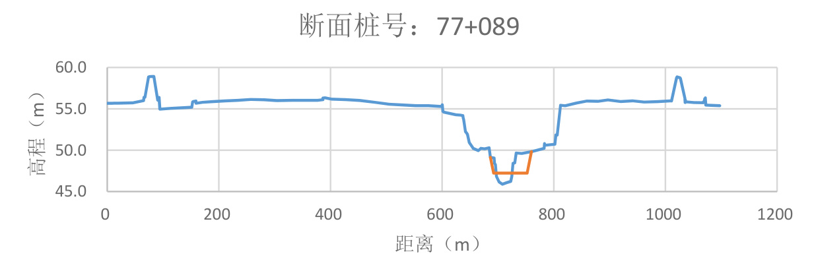  
图 5.3-1 可研方案典型清淤断面示意图  

由于现状子槽滩地多为耕地,采用可研方案会出现占地较多、实施难度大、土方开挖量较大等问题,本次对主槽降糙方案、主槽底宽 $60\mathrm{m}$ 方案(可研方案)和主槽底宽 $20\mathrm{m}$ 方案进行了比较,经过综合分析, $20\mathrm{m}$ 方案尽管设计排涝水位会有所抬升,但对排涝影响有限,可以大幅度减少对河道的扰动;从行洪角度分析,对盐土庄闸及共卫合流以上防洪工程无影响,受影响堤防加培工程规模有限,堤防加培导致的增加永久占地面积较小,同时清淤土料通过翻晒可以作为筑堤土料使用,有利于工程土方平衡,减少工程投资。  

本次设计根据河道主槽现状断面,考虑降低排涝水位并结合土方平衡,对老观嘴至浚内沟口段主槽桩号 $69\substack{+870\sim}72\substack{+240}$ 、 $72\substack{+450\sim79+190}$ 段河道主槽清淤,清淤长度为 $9.11\mathrm{km}$ ,设计清淤底宽为 $20\mathrm{m}$ ,清淤边坡 1:3。老观嘴处卫河河道清淤底高程为 $46.98\mathrm{m}$ ,浚内沟口清淤底高程为 $45.21\mathrm{m}$ (现状河道高程),河道设计纵坡为 $0.2\text{\textperthousand}$ ,典型清淤断面见图 5.3-2。  

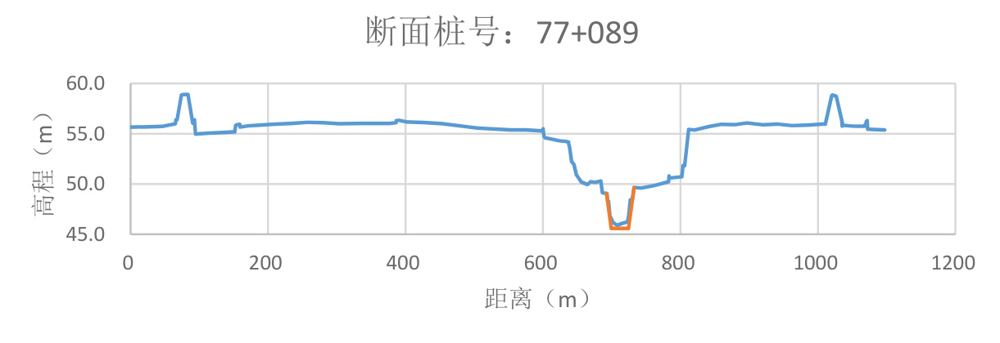  
图 5.3-2  底宽 $20\mathrm{m}$ 方案典型清淤断面示意图  

# 2、淇门至十里铺下口段清淤方案  

淇门至十里铺裁湾下口段现状河道宽度不一,除浚县县城段外均存在一定宽度的滩地,滩地宽窄差别较大,局部河段滩地宽度可达 $500{\sim}600\mathrm{m}$ 宽。根据 2019年实测断面资料,与 1978 年清淤治理指标对比,卫河干流淇门至十里铺段河道深泓点较原设计河底高程整体有所抬高,总体变化情况不大,但河道底宽有所束窄,宗湾上至长虹渠入卫河口段原设计底宽 $17\mathrm{m}$ ,现状底宽仅为 $5{\sim}6\ensuremath{\mathrm{m}}$ ,河底束窄严重;长虹渠入卫河口至浚县县城段原设计底宽 $16\mathrm{m}$ ,现状底宽为 $7{\sim}12\mathrm{m}$ ;浚县县城至十里铺裁湾下口段原设计底宽 $10\mathrm{m}$ ,现状底宽为 $5{\sim}8\mathrm{m}$ 。按照率定糙率推求水面线,现状河道排涝水位比原设计排涝水位壅高 $0.54{\sim}1.42\mathrm{m}$ ,其中长虹渠入卫河口以上段排涝水位壅高在 $1.3{\sim}1.4\mathrm{m}$ 之间,排涝水位壅高较多;按照原设计糙率,排涝水位比原设计排涝水位壅高 $0.24{\sim}1.07\mathrm{m}$ ,其中长虹渠入卫河口以上段排涝水位壅高 $0.95{\sim}1.03\mathrm{m}$ 之间。因此,淇门至十里铺下口段需进行清淤扩挖提高河道排涝能力。  

可研阶段结合 1982 年卫河治理时的河道主槽底高程、河道主槽宽度及河底纵坡指标,淇共汇合口以下 $500\mathrm{m}$ 结合小河口节制闸工程布设,河槽底宽扩挖至$70\mathrm{m}$ ,其下至宗湾裁湾下口段河槽底宽为 $17\mathrm{m}$ ,宗湾裁湾下口\~浚县分岔口上口段河槽底宽为 $22\mathrm{m}$ ,浚县分岔口上口至十里铺裁湾下口段为 $10\mathrm{m}$ 。该清淤方案可基本恢复原设计排涝水位,但由于清淤土方开挖量大,弃土较多,本阶段从降低排涝水位和土方平衡等方面进一步对方案进行优化,对淇门至十里铺裁湾下口段主槽桩号 $0{+}140{\sim}8{+}890.$ 、 $9\substack{+900\sim52+730}$ 段主槽清淤,清淤长度为 $51.53\mathrm{km}$ 。  

根据现状河道主槽宽度,在可研方案基础上对设计河宽局部进行缩窄,淇共汇合口以下(主槽桩号 $0{+}140{\sim}0{+}730$ 段)主槽底宽由 $70\mathrm{m}$ 调整为 $60\mathrm{m}$ ;其下至东郭村(主槽桩号 $0{+}730{\sim}8{+}890;$ )维持 $17\mathrm{m}$ ;东郭村至宗湾下口段(主槽桩号$8\substack{+890-29+290}$ )底宽由 $17\mathrm{m}$ 调整为 $12\mathrm{m}$ ;宗湾下口至苑刘庄段(主槽桩号$29+290{\sim}42{+}020;$ )维持 $22\mathrm{m}$ ;苑刘庄至浚县分岔口上口段(主槽桩号$42\substack{+020\sim47+250})$ )由 $22\mathrm{m}$ 调整为 $10\mathrm{m}$ ;浚县分岔口上口至十里铺裁湾下口段(主槽桩号 $47+250{\sim}52{+}730;$ )维持 $10\mathrm{m}$ 。  

本阶段与可研阶段河道清淤设计指标对比见表 5.3-2。  

表 5.3-2  清淤设计指标对比表  

<html><body><table><tr><td rowspan="5">序号 河道桩号」主槽桩号</td><td rowspan="5"></td><td rowspan="5"></td><td rowspan="5">地点</td><td colspan="3">可研方案</td><td colspan="3">本次设计方案</td></tr><tr><td colspan="3">设计断面</td><td colspan="3">设计断面</td></tr><tr><td>河底高程</td><td>底宽</td><td>河道比降</td><td>河底高程</td><td>底宽</td><td>河道比降</td></tr><tr><td></td><td>(m)</td><td>(m)</td><td></td><td>(m)</td><td>(m)</td><td></td></tr><tr><td>1 0+000</td><td>0+140 0+490</td><td>淇共汇合口 小河口节制闸</td><td>58.48 58</td><td>70</td><td rowspan="6">1/8230</td><td>58.48 58</td><td>60</td><td></td></tr><tr><td>2</td><td>0+300 0+500</td><td></td><td></td><td>57.95</td><td rowspan="6"></td><td></td><td></td><td rowspan="6">17</td></tr><tr><td>3 4</td><td>1+190</td><td>0+730 2+040</td><td>淇门</td><td>57.73</td><td>57.95</td></tr><tr><td>5</td><td>6+020</td><td>6+970</td><td>耿湾村</td><td>57.14</td><td>57.73 57.14</td></tr><tr><td>6</td><td>7+850</td><td>8+890</td><td>东郭村</td><td>56.91</td><td></td></tr><tr><td></td><td></td><td></td><td>纸坊村</td><td>56.13</td><td>56.91 56.13</td></tr><tr><td>7</td><td>14+200</td><td>15+580</td><td></td><td></td><td>17</td><td></td><td rowspan="5">12</td></tr><tr><td>8</td><td>16+400</td><td>17+190</td><td>雷村</td><td>55.82</td><td></td><td>55.82</td></tr><tr><td>6</td><td>20+560</td><td>22+790</td><td>王湾村</td><td>55.27</td><td></td><td>55.27</td></tr><tr><td>10</td><td>23+900</td><td>26+920</td><td>宗湾上</td><td>54.82</td><td>1/7427</td><td>54.82</td></tr><tr><td>11</td><td>26+360</td><td>29+290</td><td>宗湾下</td><td>54.49</td><td rowspan="5">22</td><td rowspan="5">1/7665 1/7893</td><td rowspan="5">54.49</td><td>1/7665 22 1/5860</td></tr><tr><td>12</td><td>27+680</td><td>31+150</td><td>长虹渠入卫河口54.25/53.85</td><td></td><td>54.25</td></tr><tr><td>13</td><td>33+920</td><td>38+240</td><td>柴湾村</td><td>53.06</td><td>53.06</td></tr><tr><td>14</td><td>37+700</td><td>42+020</td><td>苑刘庄</td><td>52.44</td><td>52.44</td></tr><tr><td></td><td></td><td></td><td></td><td></td><td></td></tr></table></body></html>  

<html><body><table><tr><td rowspan="3"></td><td rowspan="3">序号 河道桩号主槽桩号</td><td rowspan="3"></td><td rowspan="3">地点</td><td colspan="3">可研方案</td><td colspan="3">本次设计方案</td></tr><tr><td colspan="3">设计断面</td><td colspan="3">设计断面</td></tr><tr><td>河底高程 (m)</td><td>底宽 (m)</td><td>河道比降</td><td>河底高程 (m)</td><td>底宽 (m)</td><td>河道比降</td></tr><tr><td>15</td><td>42+850</td><td>47+250</td><td>浚县上</td><td>51.84/51.37 51.16</td><td rowspan="4"></td><td rowspan="2"></td><td rowspan="2"></td><td>51.55</td><td rowspan="4"></td></tr><tr><td>16</td><td>44+380</td><td>48+760</td><td>浚县下</td><td>1/7336 10</td><td>51.3</td></tr><tr><td rowspan="2">17</td><td rowspan="2">46+660</td><td rowspan="2">51+260</td><td rowspan="2">十里铺上</td><td rowspan="2">50.82</td><td rowspan="2">1/8128</td><td>50.89</td></tr><tr><td rowspan="2">50.64</td><td rowspan="2"></td><td rowspan="2"></td></tr><tr><td rowspan="2">18</td><td rowspan="2">48+120</td><td rowspan="2">52+730</td><td rowspan="2">十里铺下</td><td rowspan="2">50.64</td><td rowspan="2">维持 现状</td><td rowspan="2">维持现状</td><td rowspan="2">维持</td><td rowspan="2">维持现状</td></tr><tr><td>现状</td></tr><tr><td>19</td><td>64+590</td><td>69+870</td><td>老观嘴</td><td>47.96</td><td></td><td rowspan="2"></td><td rowspan="2">1/9815</td><td rowspan="2">46.98 45.21</td><td rowspan="2">20</td><td rowspan="2">1/5266</td></tr><tr><td>20</td><td>73+520</td><td>79+190</td><td>浚内沟口</td><td>47.03</td><td>60</td></tr></table></body></html>  

# 5.3.2.4 清淤边坡稳定分析  

本次分别对老观嘴至浚内沟口段、淇门至十里铺裁湾下口段选取不利断面进行边坡稳定计算。  

# 一、老观嘴至浚内沟口段  

根据工程地质勘察资料,该段清淤工程开挖边坡主要为粘性土,边坡坡比建议值为 $1{:}1.75{\sim}1{:}2.0$ 。本次选取主槽桩号 $78+520$ 断面作为典型断面,复核推荐清淤方案主槽设计边坡稳定性。  

对清淤边坡在施工期无水工况和河道行洪之后水位骤降 $1.0\mathrm{m}$ 工况下的抗滑稳定进行验算。采用瑞典圆弧滑动法进行计算,其计算公式为:  

施工期抗滑稳定计算(总应力法)  

$$
K={\frac{\sum{\left(C_{u}b\sec{\boldsymbol{\beta}}+W\cos{\boldsymbol{\beta}}\times t g\varphi_{u}\right)}}{\sum W\sin{\boldsymbol{\beta}}}}
$$  

水位骤降时迎水坡抗滑稳定计算(总应力法)  

$$
K~=~{\frac{\sum~[C_{~c u}b{\mathrm{~sec~}}~\beta~+~(W~\cos~\beta~-u_{i}b{\mathrm{~sec~}}~\beta)t g~\varphi_{~c u}~]}{\sum~W~\sin~\beta}}
$$  

式中: $b$ ─条块宽度( $\left(\mathrm{m}\right)$ );W─条块重力, $W{=}W_{1}{+}W_{2}{+}\uprho_{\mathrm{w}}Z\mathrm{b}(\mathrm{kN})$ ;W1─在堤外水位以上的条块重力 $(\mathrm{kN})$ ;  

$W_{2}$ ─在堤外水位以下的条块重力 $(\mathrm{kN})$ ;  

ui─水位降落前堤身的孔隙压力(kPa); $\beta\mathrm{\hbar}$ ─条块的重力线与通过此条 块底面中点的半径之间的夹角(度);  

γw─水的重度( $\mathbf{kN}/\mathbf{m}^{3}$ );$C_{\mathrm{u}}$ ,fu, $C_{\mathrm{cu}}$ ,fcu,─土的抗剪强度指标(kPa,度)。计算结果见图 $5.3{-}3{\sim}5.3{-}4$ 。  

(1)施工期无水工况  

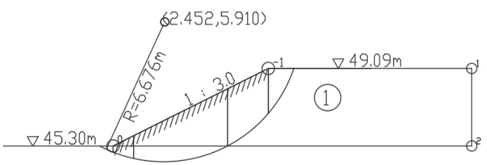  
图 5.3-3 $78+520$ 断面施工期无水情况下清淤边坡稳定计算结果计算稳定安全系数为1.48,大于允许安全系数1.15。  

(2)水位骤降 $1.0\mathrm{m}$ 工况  

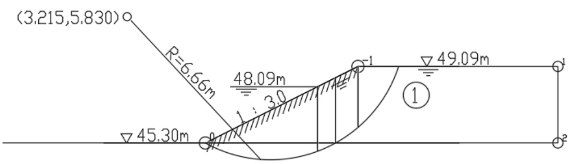  
图 5.3-4 $78+520$ 断面水位骤降情况下清淤边坡稳定计算结果  

计算安全系数为1.42,大于允许值1.25。  

由计算结果可知,清淤后两侧边坡是稳定和安全的。  

# 5.3.3 河道清淤扩挖治理工程量  

按照本次设计清淤扩挖主槽宽度、设计河底高程及开挖边坡等设计指标,计算卫河河道清淤扩挖工程总量为 149.5 万 $\mathrm{m}^{3}$ ,河道清淤扩挖治理工程量见表 5.3-3。较可研阶段减少 212 万 $\mathrm{m}^{3}$ ,其中淇门至十里铺裁湾下口段减少 115 万 $\mathrm{m}^{3}$ ,老观嘴至浚内沟口段减少 97 万 $\mathrm{m}^{3}$ 。主要原因是从工程占地、土方平衡、工程投资、排涝水位变化等多方面因素综合分析,对部分河段主槽清淤扩挖底宽进行调整。  

表 5.3-3 卫河河道清淤扩挖工程量表  

<html><body><table><tr><td>编号</td><td>工程名称</td><td>单位</td><td>数量</td></tr><tr><td>1</td><td>淇门至十里铺裁湾上口段（长度51.53km)</td><td></td><td></td></tr><tr><td></td><td>清淤土方开挖</td><td>m3</td><td>1242429</td></tr><tr><td>2</td><td>老观嘴至浚内沟口段(9.11km)</td><td></td><td></td></tr><tr><td></td><td>清淤土方开挖</td><td>m3</td><td>252104</td></tr></table></body></html>  

# 5.4 堤防工程  

# 5.4.1 堤防工程现状  

# 5.4.1.1 卫河堤防工程现状  

本次治理段卫河堤防总长度 $377\mathrm{km}$ ,其中左堤 $186\mathrm{km}$ ,右堤 $191\mathrm{km}$ 。据 2019年 10 月实测资料统计,左堤欠高长度为 $35.27\mathrm{km}$ ,右堤欠高长度为 $33.4\mathrm{km}$ ,其余段落堤防基本满足设计超高及堤顶宽度要求。  

现状堤顶防汛路土质路面居多,硬化路面占比约为三分之一。卫河左堤现状硬化路面长度约 $63.87\mathrm{km}$ ,其中混凝土路面 $52.9\mathrm{km}$ ,沥青路面 $10.97\mathrm{km}$ ,其余堤顶为土路;卫河右堤现状硬化路面约 $51.55\mathrm{km}$ ,其中混凝土路面 $38.89\mathrm{km}$ ,沥青路面 $12.66\mathrm{km}$ ,其余堤顶为土路。  

局部堤身质地松散,饱水后易产生塌陷、强度降低、渗透变形等破坏现象,需要进行防渗加固治理; 1978 年扩大治理时对部分裁湾取直的新堤穿老河段进行了加戗处理。  

# 5.4.1.2 共产主义渠堤防工程现状  

共产主义渠左堤长约 $17.62\mathrm{km}$ ,始于刘庄终至同山,同山至老观嘴段左岸长约 $26.38\mathrm{km}$ ,由工程主义渠开挖的弃土堆积形成,堤顶宽窄不一。右堤较完整,利用当年开挖的弃土填筑,断面较大,但堤身高度不足,局部堤段堤身土体密实度较差。  

共产主义渠左岸以西为行洪区,右岸以东为白寺坡滞洪区。共产主义渠在盐土庄节制闸以上和共产主义渠以西行洪区共同行洪,盐土庄节制闸以下和卫河合流后共同行洪。为保证河道行洪安全,需对拟建盐土庄节制闸以上的共渠右堤、盐土庄节制闸以下共渠左堤进行加培治理。盐土庄节制闸以上共渠右堤长$32.28\mathrm{km}$ ,其中欠高段堤防长度为 $27.675\mathrm{km}$ ;盐土庄闸以下共渠左堤长 $12.15\mathrm{km}$ ,其中欠高段堤防长度为 $3.775\mathrm{km}$ 。盐土庄闸以下共渠左堤堤顶为土质路面,右堤仅在局部有 $6.2\mathrm{km}$ 的混凝土路面,为当地村镇修建,经过多年运行,现状残破不堪,加之后期缺乏养护,现状基本无法正常使用。  

# 5.4.2 堤线布置  

# 5.4.2.1 卫河堤防堤线布置  

卫河堤防除浚内沟口现状无堤外,其余堤防相对完整,堤线较为连续,本次堤防加培沿现状堤线布置,对浚内沟口无堤段新筑堤防,与上下游堤防平顺连接。  

可研阶段浚内沟口段堤防沿现有右堤向下游延伸,经过浚内沟后转向下游堤防,并与下游堤防平顺连接,堤防长度 $0.78\mathrm{km}$ ,桩号范围为 $\mathrm{Y}77\substack{+}810{\sim}\mathrm{Y}78\substack{+}590$ ,本次对该段堤线布置进行了方案对比,如图 5.4-1 所示。  

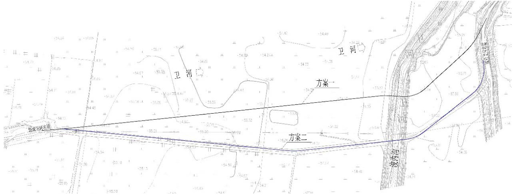  
图 5.4-1 浚内沟新筑堤防堤线对比示意图  

方案一:优点:堤线与现状堤防走向一致,适应河势,线路短,占用耕地面积较小,投资相对较小,后期仍可利用现状土路和桥梁通行,便于后期运行管理。缺点:将现状生产路左侧整块耕地分割为两部分,征地难度相对较大。  

方案二:优点:可利用现状生产路筑堤,便于施工,工程实施后耕地地块可尽量保持完整,占地矛盾相对较小;缺点是沿路两侧分布有多眼机井,且在道路左侧有一路高压线,拆改难度较大。  

本次从工程占地、主体工程量和投资对比等三方面进行对比分析,具体见表5.4-1。  

表 5.4-1 浚内沟口新筑堤防方案指标对比表  

<html><body><table><tr><td></td><td>占地 (亩)</td><td>土方填筑量（万m²)</td><td>投资 (万元)</td></tr><tr><td>方案一</td><td>35</td><td>8.5</td><td>577</td></tr><tr><td>方案二</td><td>39</td><td>8.9</td><td>643</td></tr></table></body></html>  

通过对比可以看出:方案一线路较短、占地面积和工程量均小于方案二,同时可以避开现状路两侧机井与供电线路,可以减少投资约 66 万元。综合考虑河道水流条件、征地类型、实施的难易程度、施工条件、工程管理及工程投资等因素,最终选择方案一作为推荐方案,该方案有着堤线平顺、与上下游衔接自然、水流条件好、施工条件和后期社会矛盾较小等优势。推荐堤线控导线坐标见表5.4-2。  

表 5.4-2  卫河浚内沟口新筑堤防堤顶中心线控制点坐标表  

<html><body><table><tr><td rowspan="2">序号</td><td colspan="2">坐标</td><td rowspan="2">备注</td></tr><tr><td>X</td><td>Y</td></tr><tr><td>1</td><td>3970072.07</td><td>556622.93</td><td>与上游现状堤防交接点</td></tr><tr><td>2</td><td>3970082.30</td><td>556660.22</td><td></td></tr><tr><td>3</td><td>3970085.86</td><td>556687.29</td><td></td></tr><tr><td>4</td><td>3970084.35</td><td>556933.37</td><td></td></tr><tr><td>5</td><td>3970086.19</td><td>556979.34</td><td></td></tr><tr><td>6</td><td>3970108.36</td><td>557236.85</td><td></td></tr><tr><td>7</td><td>3970130.30</td><td>557274.06</td><td></td></tr><tr><td>8</td><td>3970228.96</td><td>557340.34</td><td>与下游现状堤防交接点</td></tr></table></body></html>  

# 5.4.2.2 共产主义渠堤线布置  

现状共产主义渠右堤堤线相对顺直,本次堤防加培工程均已现状堤线进行布置。  

# 5.4.3 堤型选择  

依据《堤防工程设计规范》GB50286-2013,堤防工程的型式应根据堤段所在的地理位置、重要程度、堤址地质、筑堤材料、水流及风浪特性、施工条件、运用和管理要求、工程造价等因素,经过技术经济比较综合确定。  

卫河现状堤防大部分为土堤,局部堤段为土堤加防浪墙、浆砌石或浆砌石加砌砖的直立防洪墙的型式。本次堤防欠高部分考虑采用土堤加高和堤顶迎水侧新建防浪墙两种型式。  

方案一:土堤加培,清基后沿现状土堤向背水侧进行加培。  

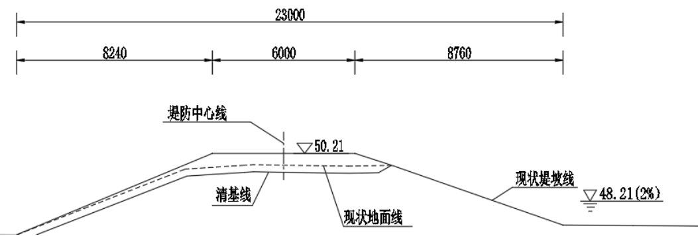  
图 5.4-2 土堤加培示意图  

优点:结构安全、施工简便、投资较低,后期运行维护简单。  

缺点:现状堤顶有混凝土路面或沥青路面堤段,需拆除重建现状路面;堤身断面较大,部分堤段涉及占地问题。  

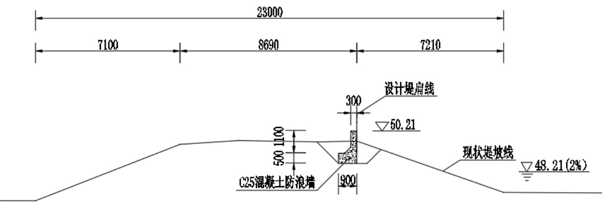  
方案二:堤顶迎水侧加防浪墙  
图 5.4-3 堤顶迎水侧加防浪墙示意图  

优点:施工简单,施工扰动面积较小,不存在新增占地,能结合现状硬化路面进行布置。  

缺点:景观性较差,适宜高度低,通行效果较差。  

从结构安全、施工及后期运行维护等方面来看,应首先选择土堤加培的型式,对位于堤外紧邻村庄、堤内滩地较窄或无滩地等不具备土堤加培条件的堤段,选择堤顶迎水侧加防浪墙的型式解决欠高问题。  

考虑到卫河左右堤堤顶欠高段有 $10.75\mathrm{km}$ 为混凝土路面或沥青路面,采用土堤加培型式需拆除现状路面。因此,以卫河左堤 $Z142{+}100$ (现状堤顶为混凝土路面)为典型断面,对土堤加培和堤顶加防浪墙两种堤型进行比较,具体如下:  

方案一(土堤加培):加高高度 $0.53\mathrm{m}$ ,堤顶宽 $6\mathrm{m}$ ,迎水侧边坡 1:3,背水侧边坡 1:2.5,清基厚度 $0.3\mathrm{m}$ 。  

方案二(堤顶迎水侧加防浪墙):采用 C25 混凝土直立式挡墙,墙顶宽 $0.3\mathrm{m}$ ,墙高 $1.6\mathrm{m}$ ,基础尺寸 $0.5{\times}0.9\mathrm{m}$ (高 $\times$ 宽),基础埋深 $1.1\mathrm{m}$ 。  

两种方案主要工程量及投资对比见表 5.4-3。  

# 表 5.4-3  主要工程量及投资对比表(每延米)  

<html><body><table><tr><td>方案名称</td><td>序号</td><td>项目名称</td><td>单位</td><td>工程量</td><td>单价 (元)</td><td>投资 (元)</td></tr><tr><td rowspan="5">方案一： 土堤加高</td><td>1</td><td>土方开挖</td><td>m3</td><td>4.8</td><td>11.07</td><td>53</td></tr><tr><td>2</td><td>土方回填</td><td>m3</td><td>9.4</td><td>24.46</td><td>230</td></tr><tr><td>3</td><td>路面拆除</td><td>m²</td><td>5</td><td>22.47</td><td>112</td></tr><tr><td>4</td><td>路面重建</td><td>m²</td><td>5</td><td>192.4</td><td>962</td></tr><tr><td>合计</td><td></td><td></td><td></td><td></td><td>1357</td></tr><tr><td rowspan="4">方案二： 加防浪墙</td><td>1</td><td>土方开挖</td><td>m3</td><td>3.75</td><td>11.07</td><td>42</td></tr><tr><td>2</td><td>土方回填</td><td>m3</td><td>2.57</td><td>24.46</td><td>63</td></tr><tr><td>3</td><td>防浪墙</td><td>m3</td><td>1.45</td><td>749.79</td><td>1087</td></tr><tr><td>合计</td><td></td><td></td><td></td><td></td><td>1192</td></tr></table></body></html>  

经过计算,采用土堤加培每延米工程造价为 1357 元,采用堤顶加防浪墙每延米工程造价为 1192 元。从经济比较来看土堤加培费用要高于加防浪墙,主要是堤顶混凝土路面拆除重建造成的,若现状堤顶无混凝土路面,加土堤方式每延米工程造价仅为 283 元,要明显优于堤顶加防浪墙。因此,本次堤防加培设计对于现状堤顶无硬化路面的优先考虑土堤加培型式,对于堤顶为混凝土路面或沥青路面的堤段,采用堤顶加防浪墙的形式。  

部分欠高堤段现状堤顶为土路,但堤防内外均为基本农田,若采取土堤加培会占压基本农田,征地、审批难度较大。因此,本次考虑对堤身断面型式进行优化,在背水侧堤脚新建挡土墙、墙后填土筑堤。对本方案与堤顶加防浪墙型式进行比较,选择 $Z144{+}605$ 断面为典型断面。  

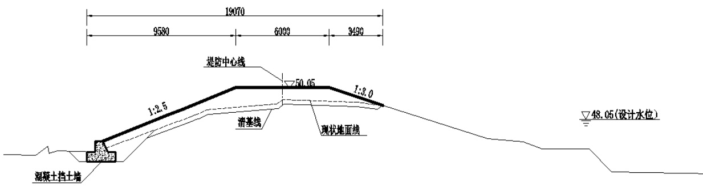  
方案一:土堤加培,背水侧堤脚设挡土墙  
图 5.4-4 挡土墙断面示意图  

加高高度 $0.86\mathrm{m}$ ,堤顶宽 $6\mathrm{m}$ ,迎水侧边坡 1:3,背水侧边坡 1:2.5,清基厚度 $0.3\mathrm{m}$ ,堤脚采用 C25 混凝土挡土墙,墙顶宽 $0.5\mathrm{m}$ ,墙高 $1.3\mathrm{m}$ ,靠堤防侧边坡为 1:0.5,另一侧为直墙,基础底宽 $1.85\mathrm{m}$ 。  

方案二:堤顶加防浪墙  

采用 C25 混凝土重力式挡墙,墙顶宽 $0.3\mathrm{m}$ ,墙高 $1.8\mathrm{m}$ ,基础底宽 $0.9\mathrm{m}$ ,基  

础埋深 $1.0\mathrm{m}$ 。结构型式同图 5.4-3。  

两种方案主要工程量及投资对比见表 5.4-4。  

表 5.4-4 主要工程量及投资对比表(每延米)  

<html><body><table><tr><td>方案名称</td><td>序号</td><td>项目名称</td><td>单位</td><td>工程量</td><td>单价 （元）</td><td>投资 （元）</td></tr><tr><td rowspan="5">方案一： 土堤加 培，堤脚 设挡土墙</td><td>1</td><td>土方开挖 (清基)</td><td>m3</td><td>4.7</td><td>11.07</td><td>52</td></tr><tr><td>2</td><td>土方开挖 (挡土墙)</td><td>m3</td><td>3.82</td><td>3.34</td><td>13</td></tr><tr><td>3</td><td>土方回填</td><td>m3</td><td>13.12</td><td>24.46</td><td>321</td></tr><tr><td>4</td><td>C25 混凝土挡土墙</td><td>m3</td><td>1.56</td><td>749.49</td><td>1169</td></tr><tr><td>合计</td><td></td><td></td><td></td><td></td><td>1555</td></tr><tr><td rowspan="4">方案二： 堤顶加防 浪墙</td><td>1</td><td>土方开挖</td><td>m3</td><td>2.66</td><td>11.07</td><td>29</td></tr><tr><td>2</td><td>土方回填</td><td>m3</td><td>1.64</td><td>24.46</td><td>40</td></tr><tr><td>3</td><td>C25混凝土防浪墙</td><td>m3</td><td>1.5</td><td>749.79</td><td>1125</td></tr><tr><td>合计</td><td></td><td></td><td></td><td></td><td>1194</td></tr></table></body></html>  

经计算,方案一每延米工程投资为 1555 元,方案二每延米工程投资为 1194元,从经济比较来看方案二要优于方案一。但方案二防浪墙要高出堤顶将近 $1\mathrm{m}$ ,景观性较差,同时堤顶为附近村民生产生活的重要通道,堤顶路面需做硬化处理,采用方案二会影响出行效果,不利于错车通行。经综合考虑分析,此种情况采用方案一较为适宜,即堤防背水侧坡脚设挡土墙方案。  

# 5.4.4 堤身设计  

# 5.4.3.1 堤防横断面设计  

# 1、土堤堤身断面设计  

(1)堤顶宽度  

共卫合流以上卫河和共产主义渠的堤防级别为 3 级,共卫合流以下的卫河和共产主义渠的堤防级别为 2 级,考虑防汛抢险和河道堤防管理的要求,结合现有堤防宽度和区域地形条件,确定卫河老观嘴以上河道堤防堤顶宽度为 $5\mathrm{m}$ ,老观嘴以下河道堤防堤顶宽度为 $6\mathrm{m}$ ,共产主义渠堤防堤顶宽度为 $5\mathrm{m}$ 。  

# (2)堤坡设计  

根据堤身土料及现状堤防的运行情况,卫河和共产主义渠堤防的迎水坡设计边坡为 1:3,背水坡设计边坡为 1:2.5。  

# 2、防浪墙堤身断面设计  

依据堤防现状情况及需治理堤段统计分析,对堤外紧邻村庄、堤内滩地较窄或无滩地或堤顶为混凝土路面或沥青路面的堤段,采用迎水侧加防浪墙的断面型  

式。防浪墙采用 C25 混凝土 L 型直立式挡墙,墙顶宽 $0.3\mathrm{m}$ ,当墙高大于 $1.5\mathrm{m}$ 时,底宽 $0.9\mathrm{m}$ ,墙高小于 $1.5\mathrm{m}$ 时,底宽 $0.6\mathrm{m}$ 。防浪墙每隔 $3\mathrm{m}$ 设一个 $10\mathrm{cm}\times5\mathrm{cm}$ 排水孔,每隔 $10\mathrm{m}$ 设一道变形缝,缝宽 $2\mathrm{cm}$ ,缝内采用聚乙烯闭孔泡沫板填缝。  

# 3、挡土墙断面设计  

挡土墙采用 C25 混凝土重力式结构,墙顶宽 $0.5\mathrm{m}$ ,墙高 $1.2{\sim}2.2\mathrm{m}$ ,临堤防侧边坡坡比为 1:0.4,临水侧为直墙,基础埋深 $0.6\mathrm{m}$ 。每隔 $10\mathrm{m}$ 设一道变形缝,缝宽 $2\mathrm{cm}$ ,缝内采用聚乙烯闭孔泡沫板填缝。  

# 5.4.3.2 堤顶高程  

根据《堤防工程设计规范》,堤顶超高按下式计算:  

$$
Y=R_{p}+e+A
$$  

式中:Y-堤顶超高(m);${\tt R p}$ -设计波浪爬高(m);e-风壅水面高度(m);A-安全加高值(m)。  

$\textcircled{1}$ 波浪要素公式根据现有的水文气象资料,代入以下莆田试验站公式:  

$$
\frac{g\overline{{{H}}}}{{V^{\mathrm{~2~}}}}=\mathrm{~0~.13~}t h[\mathrm{~0~.7~}(\frac{g d}{V^{\mathrm{~2~}}})^{\mathrm{~0~.7~}}]t h\{\frac{\mathrm{~0~.0018~}\mathrm{~}(\frac{g F}{V^{\mathrm{~2~}}})^{\mathrm{~0~.45~}}}{\mathrm{~0~.13~}t h[[\mathrm{~0~.7~}(\frac{g d}{V^{\mathrm{~2~}}})^{\mathrm{~0~.7~}}]}\}
$$  

$$
\frac{g\overline{{{T}}}}{V}=13.9(\frac{g\overline{{{H}}}}{V^{2}})^{0.5}
$$  

$$
L=\frac{g\overline{{{H}}}^{2}}{2\pi}t h\frac{2\pi d}{L}
$$  

式中: $\overline{{H}}-$ 平均波高 $\left(\mathrm{m}\right)$ ;  

$\overrightharpoon{T}$ - 平均波周期(s);  
V - 计算风速 $\mathrm{(m/s)}$ );为历年汛期最大风速平均的1.5倍,取值 $15\mathrm{m}/\mathrm{s}$ ;  
F - 风区长度(m);  
d - 水域的平均水深( $\mathrm{(m)}$ );g - 重力加速度(m/s2);  
L - 计算波长(m)。  

$\textcircled{2}$ 风壅水面高度 在有限风区情况下,风壅水面高度按下式计算;  

$$
e=\frac{K V^{2}F}{2g d}\cos\beta
$$  

式中:e - 计算点的风壅水面高度( $\mathrm{(m)}$ );  

K - 综合摩阻系数;取 $\mathrm{K}{=}3.6\mathrm{x}10^{-6}$ ;  
V -计算风速( $\mathrm{(m/s)}$ );为历年汛期最大风速平均的1.5倍,取值 $15\mathrm{m/s}$ ;  
F - 由计算点逆风向量到对岸的距离 $\left(\mathrm{m}\right)$ ;  
d - 水域的平均水深( $\mathbf{\rho},\mathbf{m})$ )$\upbeta-$ 风向与垂直于堤轴的法线的夹角(度)。  

$\textcircled{3}$ 波浪爬高波浪爬高按不允许越浪堤防工程的公式计算。  

$$
R_{p}={\frac{K_{\Delta}K_{\nu}K_{p}}{\sqrt{1+m^{2}}}}\sqrt{\overline{{H}}L}
$$  

式中: $R_{p}-$ 累积频率为 $\mathfrak{p}$ 的设计波浪爬高( $\left(\mathrm{m}\right)$ ;K  -斜坡糙率及渗透系数;$K_{\nu}$ - 经验系数;Kp  - 爬高累积频率换算系数;m -斜坡斜率;$\overrightharpoon{H}$ - 堤前波浪的平均波高(m);L - 堤前波浪波长(m)。  

卫河左、右堤防各选取 4 个典型断面,共产主义渠右堤选取 2 个典型断面,各断面堤顶超高计算参数见表 5.4-5,计算结果见表 5.4-6。  

表 5.4-5 堤顶超高计算参数表  

<html><body><table><tr><td>河道 名称</td><td>堤防 岸别</td><td>桩号（河 道桩号)</td><td>g (m/s²)</td><td>d (U)</td><td>V (m/s)</td><td>F (m)</td><td>β (°)</td><td>K</td><td>Kv</td><td>Kp</td><td>m</td></tr><tr><td rowspan="8">卫河</td><td rowspan="4">左岸</td><td>7+470</td><td>9.80</td><td>5.10</td><td>15.00</td><td>330</td><td>0</td><td>0.80</td><td>1.10</td><td>2.07</td><td>3</td></tr><tr><td>26+780</td><td>9.80</td><td>3.93</td><td>15.00</td><td>307</td><td>54.0</td><td>0.85</td><td>1.15</td><td>2.07</td><td>3</td></tr><tr><td>46+910</td><td>9.80</td><td>4.97</td><td>15.00</td><td>254</td><td>32.0</td><td>0.80</td><td>1.10</td><td>2.07</td><td>3</td></tr><tr><td>55+070</td><td>9.80</td><td>5.49</td><td>15.00</td><td>2620</td><td>26.0</td><td>0.80</td><td>1.09</td><td>2.07</td><td>3</td></tr><tr><td rowspan="4">右岸</td><td>84+990</td><td>9.80</td><td>5.20</td><td>15.00</td><td>2168</td><td>66.0</td><td>0.80</td><td>1.10</td><td>2.07</td><td>3</td></tr><tr><td>104+300</td><td>9.80</td><td>5.00</td><td>15.00</td><td>2076</td><td>85.0</td><td>0.80</td><td>1.10</td><td>2.07</td><td>3</td></tr><tr><td>140+070</td><td>9.80</td><td>5.60</td><td>15.00</td><td>2925</td><td>79.0</td><td>0.85</td><td>1.08</td><td>2.07</td><td>3</td></tr><tr><td>176+940</td><td>9.80</td><td>5.50</td><td>15.00</td><td>2148</td><td>69.0</td><td>0.80</td><td>1.09</td><td>2.07</td><td>3</td></tr><tr><td rowspan="2">共产主 义渠</td><td rowspan="2">右岸</td><td>10+000</td><td>9.80</td><td>5.50</td><td>15.00</td><td>570</td><td>83.0</td><td>0.80</td><td>1.09</td><td>2.07</td><td>3</td></tr><tr><td>20+000</td><td>9.80</td><td>6.00</td><td>15.00</td><td>580</td><td>85.0</td><td>0.80</td><td>1.07</td><td>2.07</td><td>3</td></tr></table></body></html>  

表 5.4-6  堤顶超高计算结果表  

<html><body><table><tr><td>河道 名称</td><td>堤防 岸别</td><td>桩号（河道桩</td><td>设计波浪爬高 Rp (m)</td><td>风壅水面高度 e (m)</td><td>安全加高</td><td>堤顶超高</td></tr><tr><td rowspan="7">卫河</td><td rowspan="4">左岸</td><td>号) 7+470</td><td>0.42</td><td>0.00</td><td>A (m) 0.70</td><td>Y (m) 1.14</td></tr><tr><td>26+780</td><td>0.46</td><td>0.00</td><td>0.70</td><td>1.16</td></tr><tr><td>46+910</td><td>0.39</td><td>0.00</td><td>0.70</td><td>1.09</td></tr><tr><td>55+070</td><td>1.03</td><td>0.02</td><td>0.80</td><td>1.94</td></tr><tr><td rowspan="4">右岸</td><td></td><td>0.96</td><td>0.01</td><td>0.80</td><td>1.76</td></tr><tr><td>84+990 104+300</td><td>0.94</td><td>0.00</td><td>0.80</td><td>1.74</td></tr><tr><td>140+070</td><td>1.14</td><td>0.00</td><td>0.80</td><td>1.94</td></tr><tr><td>176+940</td><td>0.95</td><td>0.01</td><td>0.80</td><td>1.75</td></tr><tr><td rowspan="2">共产主义 渠</td><td>右岸</td><td>10+000</td><td>0.53</td><td>0.00</td><td>0.70</td><td>1.24</td></tr><tr><td>20+000</td><td>0.53</td><td></td><td>0.00</td><td>0.70</td><td>1.24</td></tr></table></body></html>  

经计算,共卫合流以上的卫河左右堤计算超高值为 $1.09\sim1.14\mathrm{m}$ ,共卫合流以下的卫河左堤(含共渠左堤)、卫河右堤计算超高值为 $1.74\sim1.94\mathrm{m}$ ,共渠右堤计算超高值为 $1.24\mathrm{m}$ 。本次设计超高取值如下:  

卫河干流:河道桩号 $52\substack{+880}$ (共卫合流)以上段设计超高值取 $1.2\mathrm{m}$ ;河道桩号 $52\substack{+880\sim68+080}$ 段设计超高值取 $2.0\mathrm{m}$ ;河道桩号 $68{+}080{\sim}120{+}690$ 段设计超高值取 $1.8\mathrm{m}$ ;河道桩号 $120\substack{+690\sim157+860}$ 段设计超高值取 $2.0\mathrm{m}$ ;河道桩号$157{+}860$ 以下段设计超高取值 $1.8\mathrm{m}$ 。  

共渠:盐土庄节制闸以上段右堤设计超高值取 $1.3\mathrm{m}$ ,盐土庄以下(共卫合流)左堤设计超高值取 $2.0\mathrm{m}$ 。  

在 2019 年 4 月中咨公司对可研报告的评估过程中,对堤顶设计超高取值进行了调整,本次根据调整后的设计超高值对加培范围进行了复核。本次设计超高值与可研阶段设计超高对比情况见表 5.4-7。  

表 5.4-7  堤顶超高取值对比表 单位:m  

<html><body><table><tr><td rowspan="2">河道名称</td><td rowspan="2">桩号 (河道桩号)</td><td colspan="2">可研阶段</td><td rowspan="2">初设</td></tr><tr><td>2012年水规总 院审查</td><td>2019年中咨公司评估 （发改委批复）</td></tr><tr><td rowspan="6">卫河</td><td>0+000</td><td>1.5</td><td>1.2</td><td>1.2</td></tr><tr><td>52+880（共卫合流） 64+590（老观嘴）</td><td rowspan="5">2.0</td><td>2.0</td><td>2.0</td></tr><tr><td>68+080</td><td>1.8</td><td>1.8</td></tr><tr><td>120+690</td><td>2.0</td><td>2.0</td></tr><tr><td>157+860</td><td></td><td></td></tr><tr><td>182+950</td><td>1.8</td><td>1.8</td></tr><tr><td rowspan="3"></td><td>0+000 共产主义渠|32+280（盐土庄节制闸）</td><td>1.5</td><td>1.3</td><td>1.3</td></tr><tr><td></td><td>2.0</td><td>2.0</td><td>2.0</td></tr><tr><td>44+200</td><td></td><td></td><td></td></tr></table></body></html>  

# 5.4.5 堤防稳定计算  

根据地质勘察成果,部分堤段堤身以粉质砂壤土、粉细砂为主,且堤身较单薄,局部堤段堤基亦存在粉质砂壤土、粉细砂等,导致堤身土体渗透差异性较大,存在松散、裂缝及不均质体较多,本次主要对上述堤段选取典型断面进行抗滑及渗流稳定复核。  

# 5.4.5.1 抗滑稳定复核计算  

根据《堤防工程设计规范》GB50286-2013),采用瑞典圆弧滑动法进行计算,分为正常工况和非常工况。  

(1)正常工况  

根据河道行洪特点,卫河河道在行洪时基本不存在设计水位骤降情况,本次仅计算设计水位下的稳定渗流期的背水侧堤坡。  

# (2)非常工况  

非常工况复核施工期的临水侧、背水侧堤坡。各工况下抗滑稳定计算公式如下:  

施工期抗滑稳定计算(总应力法)  

$$
K={\frac{\sum{\left(C_{u}b\sec{\boldsymbol{\beta}}+W\cos{\boldsymbol{\beta}}\times t g\varphi_{u}\right)}}{\sum W\sin{\boldsymbol{\beta}}}}
$$  

水位骤降时迎水坡抗滑稳定计算(总应力法)  

$$
K=\frac{\sum\left[C_{c u}b\sec\beta+(W\cos\beta-u_{i}b\sec\beta)t g\varphi_{c u}\right]}{\sum W\sin\beta}
$$  

设计洪水位稳定渗流期抗滑稳定计算(有效应力法)  

$$
K=\frac{\sum\left\{C^{'}b\sec\beta+[(W_{\mathrm{1}}+W_{\mathrm{2}})\cos\beta-(u-Z\gamma_{\mathrm{{\scriptsize~w}}})b\sec\beta]t g\varphi\right\}}{\sum(W_{\mathrm{1}}+W_{\mathrm{2}})\sin\beta}
$$  

式中: $b$ ─条块宽度( $\left(\mathrm{m}\right)$ );W─条块重力, $W{=}W_{1}{+}W_{2}{+}\gamma_{\mathrm{w}}Z\mathrm{b}(\mathrm{kN});$ ;W1─在堤外水位以上的条块重力 $(\mathrm{kN})$ ;$W_{2}$ ─在堤外水位以下的条块重力 $(\mathrm{kN})$ ;Z─堤坡外水位高出条块底面中点的距离(m);u─稳定渗流期堤身或堤基中的孔隙压力(kPa);ui─水位降落前堤身的孔隙压力(kPa);$\beta$ ─条块的重力线与通过此条块底面中点的半径之间的夹角(度);γw─水的重度( $\mathrm{kN}/\mathrm{m}^{3}$ );$C_{\mathrm{u}}$ ,fu, $C_{\mathrm{cu}}$ ,fcu, $C^{\prime}$ , $f^{\prime}$ ─土的抗剪强度指标(kPa,度)。  

堤身抗滑稳定计算参数见表 5.4-8;稳定安全系数计算结果见表 5.4-9。  

表 5.4-8  堤身抗滑稳定安全计算参数表  

<html><body><table><tr><td colspan="2"></td><td colspan="6">土的抗剪强度指标</td></tr><tr><td rowspan="3">断面位置</td><td></td><td>Ccu fou</td><td></td><td>C'</td><td>f</td><td>Cu</td><td>fu</td></tr><tr><td></td><td>kPa</td><td>度</td><td>kPa</td><td>度</td><td>kPa</td><td>度</td></tr><tr><td>93+700</td><td>23</td><td>22</td><td>20</td><td>15</td><td>17</td><td>7</td></tr><tr><td rowspan="2">卫河左堤 共产主义渠左堤</td><td>138+000</td><td>2</td><td>30</td><td>2</td><td>30</td><td>2</td><td>30</td></tr><tr><td>35+000</td><td>12</td><td>25</td><td>10</td><td>17</td><td>8</td><td>9</td></tr><tr><td>共产主义渠右堤</td><td>28+000</td><td>13</td><td>26</td><td>11</td><td>18</td><td>9</td><td>10</td></tr></table></body></html>  

表 5.4-9 抗滑稳定安全系数计算成果表  

<html><body><table><tr><td colspan="2">安全系数 断面</td><td>正常工况</td><td colspan="2">非常工况</td></tr><tr><td colspan="2"></td><td rowspan="2">设计洪水位稳定渗流期 (背水坡)</td><td colspan="2">施工期</td></tr><tr><td></td><td></td><td>背水坡</td><td>迎水坡</td></tr><tr><td rowspan="2">卫河左堤</td><td>93+700</td><td>1.42</td><td>1.31</td><td>1.24</td></tr><tr><td>138+000</td><td>1.37</td><td>1.26</td><td>1.18</td></tr><tr><td>共产主义渠左堤</td><td>35+000</td><td>1.56</td><td>1.25</td><td>1.18</td></tr><tr><td colspan="2">共产主义渠右堤 28+000 稳定安全系数</td><td>1.28 1.25 (1.20)</td><td>1.19 1.15</td><td>1.19 1.15</td></tr></table></body></html>

注:表中括号内数据为 3 级堤防稳定安全系数值。  

经计算,卫河和共产主义渠选取的典型断面在稳定渗流期和施工期基本满足抗滑稳定要求。抗滑稳定计算结果图见图 $5.4\mathrm{-}5\mathrm{\sim}5.4\mathrm{-}7$ 。  

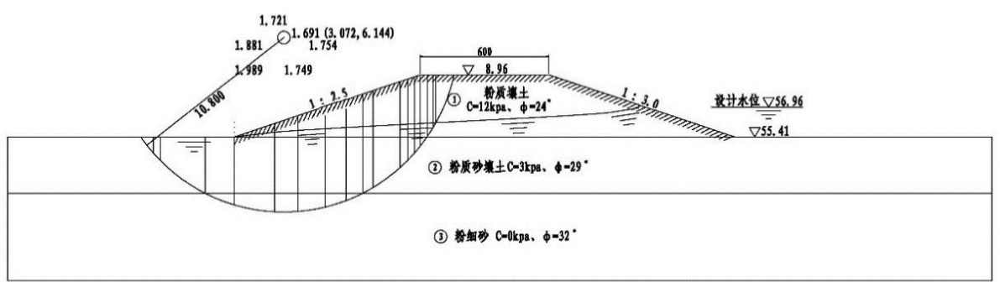  
图 5.4-5  设计水位下稳定渗流期背水坡边坡稳定计算图(计算断面为卫河右堤新筑堤段 $77\mathrm{+}460$ 计算安全系数:1.691)  

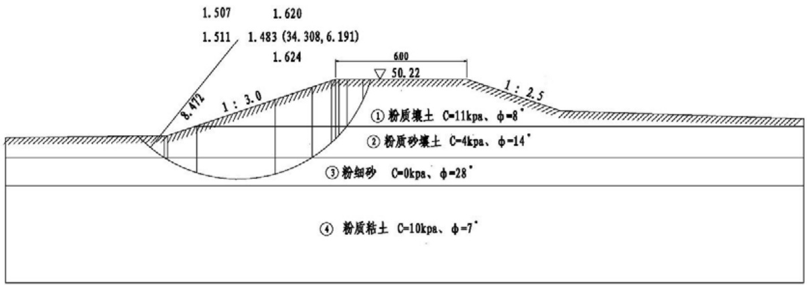  
图 5.4-6  施工期迎水坡边坡稳定计算图  

(计算断面为卫河左堤 $138{+}000$ 计算安全系数1.483)  

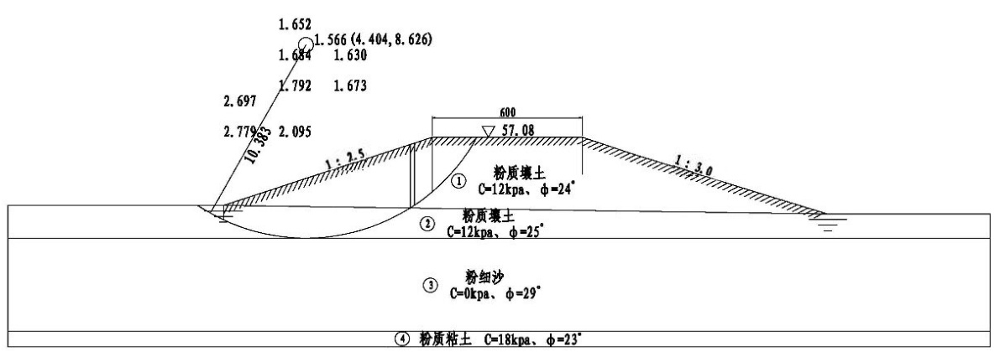  
图 5.4-7 施工期背水坡边坡稳定计算图  

(计算断面为卫河右堤 $93+700$ 计算安全系数:1.566)  

# 5.4.5.2 渗流稳定计算  

堤防渗流稳定计算采用有限元法,根据堤防地质资料选取典型断面进行渗流稳定计算。渗流稳定计算结果见表 5.4-10。  

表 5.4-10 渗流稳定计算成果表  

<html><body><table><tr><td colspan="2">渗流比降</td><td>计算渗流比降</td><td>允许渗流比降</td></tr><tr><td colspan="2">断面</td><td>下游坡脚</td><td>下游坡脚</td></tr><tr><td rowspan="10">卫河左堤</td><td>Z3+850</td><td>0.42</td><td>0.35~0.40</td></tr><tr><td>Z28+500</td><td>0.20</td><td>0.35~0.40</td></tr><tr><td>Z43+000</td><td>0.25</td><td>0.45~0.50</td></tr><tr><td>Z50+200</td><td>0.40</td><td>0.45~0.50</td></tr><tr><td>Z93+500</td><td>0.52</td><td>0.40~0.50</td></tr><tr><td>Z125+000</td><td>0.25</td><td>0.40~0.50</td></tr><tr><td>Z148+000</td><td>0.04</td><td>0.35~0.40</td></tr><tr><td>Z155+800</td><td>0.50</td><td>0.45~0.50</td></tr><tr><td>Z181+000</td><td>0.35</td><td>0.45~0.50</td></tr><tr><td>Y5+800</td><td>0.38</td><td>0.15~0.25</td></tr><tr><td rowspan="7">卫河右堤</td><td>Y56+000</td><td>0.27</td><td>0.60~0.65</td></tr><tr><td>Y89+500</td><td>0.30</td><td>0.20~0.25</td></tr><tr><td>Y129+500</td><td>0.25</td><td>0.40~0.45</td></tr><tr><td>Y130+850</td><td>0.18</td><td>0.45~0.45</td></tr><tr><td>Y135+950</td><td>0.48</td><td>0.25~0.45</td></tr><tr><td>Y141+000</td><td>0.04</td><td>0.40~0.45</td></tr><tr><td>Y169+000</td><td>0.52</td><td>0.4~0.45</td></tr><tr><td>卫河右堤新筑堤段</td><td>Y77+460</td><td>0.20</td><td>0.45~0.50</td></tr><tr><td>共产主义渠左堤</td><td>Y34+500</td><td>0.30</td><td>0.35~0.40</td></tr><tr><td>共产主义渠右堤</td><td>Y28+000</td><td>0.34</td><td>0.35~0.40</td></tr></table></body></html>  

选取左堤、右堤堤身下部及堤基顶部为粉细砂或为粉质砂壤土的典型断面,进行渗流稳定计算。经计算分析,在堤基部存在粉细砂的堤段,如卫河左堤$Z3^{+}850,Z93^{+}500,Z155^{+}800$ 和卫河右堤 $\mathrm{Y}5+800,\mathrm{Y}89+500,\mathrm{Y}135+950,\mathrm{Y}169+000$ 处均不满足渗流稳定要求,其余位置计算渗流比降均小于允许渗流比降,满足渗流稳定要求。为了减少占地,本次设计对堤身或堤基存在粉细砂层的堤段进行防渗处理。  

渗流稳定计算结果见图 $5.4\substack{-8}\sim5.4\substack{-9}$ 。  

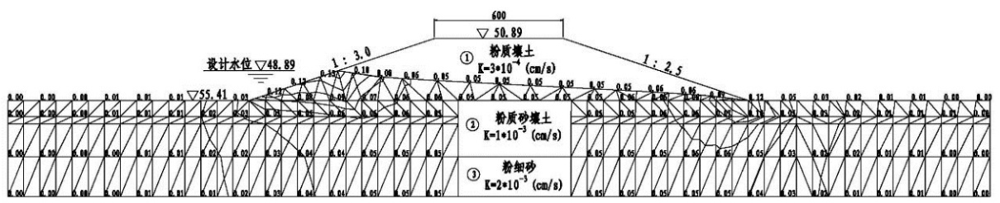  
图5.4-8  卫河右堤渗流稳定计算图(计算断面 $135{+}950\$ )  

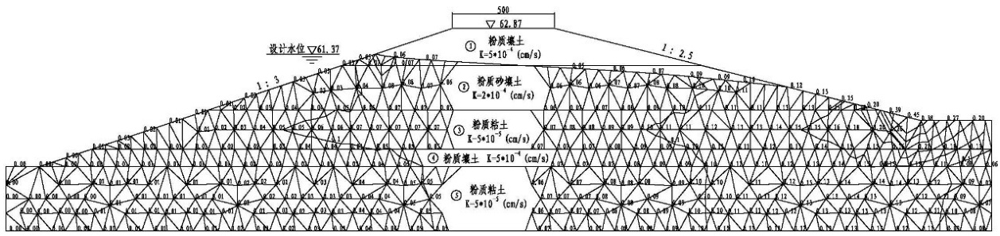  
图5.4-9  共产主义渠右堤渗流稳定计算图(计算断面 $28{+}000)$ )  

# 5.4.6 堤防加培设计  

本次堤防加培总长度 $100.12\mathrm{km}$ ,其中卫河干流加培堤防长度为 $68.67\mathrm{km}$ (左堤 $35.27\mathrm{km}$ 、右堤 $33.4\mathrm{km}\$ );共产主义渠加培堤防长度为 $31.45\mathrm{km}$ (左堤 $3.775\mathrm{km}$ 、右堤 $27.675\mathrm{km})$ )。需加培段见表 5.4-11。  

表 5.4-11 需加培段统计表  

<html><body><table><tr><td>河道名称</td><td>岸别</td><td>加培范围</td><td>长度 (m)</td></tr><tr><td></td><td></td><td>Z37+500~Z38+550</td><td>1050</td></tr><tr><td></td><td></td><td>Z43+200~Z43+850</td><td>650</td></tr><tr><td></td><td></td><td>Z44+800~Z45+150</td><td>350</td></tr><tr><td></td><td></td><td>Z46+100~Z47+700</td><td>1600</td></tr><tr><td></td><td></td><td>Z49+600~Z54+290</td><td>4690</td></tr><tr><td></td><td></td><td>Z93+870~Z94+950</td><td>1080</td></tr><tr><td></td><td></td><td>Z95+400~Z95+650</td><td>250</td></tr><tr><td></td><td></td><td>Z95+970~Z96+170</td><td>200</td></tr><tr><td>卫河</td><td></td><td>Z101+850~Z106+450</td><td>4600</td></tr><tr><td></td><td></td><td>Z107+700~Z113+100</td><td>5400</td></tr><tr><td></td><td></td><td>Z115+780~Z116+100</td><td>320</td></tr><tr><td></td><td>左岸</td><td>Z140+250~Z140+550</td><td>300</td></tr><tr><td></td><td></td><td>Z141+850~Z142+650</td><td>800</td></tr><tr><td></td><td></td><td>Z143+550~Z146+050</td><td>2500</td></tr><tr><td></td><td></td><td>Z147+150~Z148+850</td><td>1700</td></tr><tr><td></td><td></td><td>Z149+150~Z151+450</td><td>2300</td></tr><tr><td></td><td></td><td>Z151+850~Z153+550</td><td>1700</td></tr><tr><td></td><td></td><td>Z153+850~Z154+150</td><td>300</td></tr><tr><td></td><td></td><td>Z158+800~Z159+150</td><td>350</td></tr><tr><td></td><td></td><td>Z160+800~Z161+050</td><td>250</td></tr><tr><td></td><td></td><td>Z169+500~Z170+250</td><td>750</td></tr><tr><td></td><td></td><td>Z172+300~Z173+750</td><td>1450</td></tr><tr><td></td><td></td><td>Z174+300~Z176+030 Z177+700~Z177+950</td><td>1730</td></tr><tr><td></td><td></td><td>Z180+000~Z180+150</td><td>250 150</td></tr></table></body></html>  

<html><body><table><tr><td>河道名称</td><td>岸别</td><td>加培范围</td><td>长度 (m)</td></tr><tr><td></td><td rowspan="11"></td><td>Z181+600~Z182+150</td><td>550</td></tr><tr><td></td><td>小计</td><td>35270</td></tr><tr><td></td><td>Y28+400~Y29+250</td><td>850</td></tr><tr><td></td><td>Y53+250~Y65+950</td><td>12700</td></tr><tr><td rowspan="11"></td><td>Y67+600~Y68+300</td><td>700</td></tr><tr><td>Y78+590~Y81+040</td><td>2450</td></tr><tr><td>Y84+000~Y84+450</td><td>450</td></tr><tr><td>Y88+100~Y88+250</td><td>150</td></tr><tr><td>Y92+400~Y94+850</td><td>2450</td></tr><tr><td>Y101+950~Y103+200</td><td>1250</td></tr><tr><td rowspan="8">右岸</td><td>Y105+750~Y107+800</td><td>2050</td></tr><tr><td>Y112+450~Y114+000</td><td>1550</td></tr><tr><td>Y140+050~Y140+300</td><td>250</td></tr><tr><td>Y143+950~Y149+200</td><td>5250</td></tr><tr><td>Y150+850~Y151+800</td><td>950</td></tr><tr><td>Y160+500~Y160+750</td><td>250</td></tr><tr><td>Y175+650~Y176+600</td><td>950</td></tr><tr><td>Y176+950~Y177+100</td><td>150</td></tr><tr><td rowspan="4"></td><td>Y178+550~Y178+700</td><td>150</td></tr><tr><td>Y179+350~Y180+200</td><td>850</td></tr><tr><td>小计</td><td>33400</td></tr><tr><td>合计</td><td>68670</td></tr><tr><td rowspan="9">共渠</td><td rowspan="9">左岸</td><td>32+365~34+280</td><td>1915</td></tr><tr><td>36+450~37+050</td><td>600</td></tr><tr><td>38+150~38+420</td><td>270</td></tr><tr><td>42+450~42+930</td><td>480</td></tr><tr><td>43+600~44+110</td><td>510</td></tr><tr><td>小计</td><td>3775</td></tr><tr><td>0+000~12+250</td><td>12250</td></tr><tr><td>13+750~22+450</td><td>8700</td></tr><tr><td>22+850~28+850</td><td>6000</td></tr><tr><td rowspan="4"></td><td>31+500~32+225</td><td>725</td></tr><tr><td>小计</td><td></td></tr><tr><td></td><td>27675</td></tr><tr><td colspan="2">合计</td><td>31450</td></tr></table></body></html>  

# 5.4.6.1 设计原则  

# 1、堤防加培  

本次治理卫河及共产主义渠堤防设计堤顶超高,在共卫合流以上卫河干流取值为 $1.2\mathrm{m}$ ,共渠取值 $1.3\mathrm{m}$ ,共卫合流以下取值为 $1.8{\sim}2.0\mathrm{m}$ 。卫河左堤$_{Z0+860\sim Z38+540}$ 段设计堤顶高程为河道设计洪水位与白寺坡设计蓄滞水位的外包线加堤顶超高,卫河右堤 $_{Z2+640-Z29+880}$ 段设计堤顶高程为河道设计洪水位与长虹渠设计蓄滞水位的外包线加堤顶超高。  

加培原则:当现状堤防堤顶高程欠高小于 0.5 米时,加培施工困难,应与路基一并考虑,路基顶高即为设计堤顶高程。因此本次设计对堤防设计超高为 $1.2\mathrm{m}$ 、$1.3\mathrm{m}$ 的堤段,若现状堤防的超高小于 $1.0\mathrm{m}$ ,按设计堤顶高程、堤顶宽度 $5\mathrm{m}$ 加培治理;对堤防设计超高为 $1.8\mathrm{m}$ 、 $2.0\mathrm{m}$ 的堤段,若现状堤防超高小于 $1.5\mathrm{m}$ ,按设计堤顶高程、堤宽 $5\mathrm{m}$ 或 $6\mathrm{m}$ (老观嘴以上堤宽 $5\mathrm{m}$ ,以下 $6\mathrm{m}$ 进行加培治理。  

# 2、堤防培厚  

现状堤防堤顶高程满足设计要求但堤顶宽度不足的堤段进行培厚治理,其中老观嘴以上卫河和共产主义渠对堤防堤顶宽度小于等于 $4.5\mathrm{m}$ 、老观嘴以下卫河对堤防堤顶宽度小于等于 $5.5\mathrm{m}$ 的堤段进行培厚治理,经复核,现状堤防基本满足要求,无需单独进行培厚治理。  

# 3、加培型式  

堤防加培以土堤加高为主,原则向背水侧布设,对背水侧距村庄较近、堤内滩地较宽处可局部向迎水侧加堤,对加堤会产生新增占地,且无法避免占压基本农田,征地难以实施段,在堤脚修筑挡土墙;对背水侧紧邻村庄、迎水侧滩地较窄或基本无滩地、堤顶为混凝土路面或沥青路面段,在堤顶迎水侧修筑防浪墙。  

# 5.4.6.2 堤料选取  

(1)筑堤土料  

根据《堤防工程设计规范》(GB50286-2013)要求,2级堤防和堤身高度不低于6m的3级堤防压实度不小于0.93,堤身高度低于 $6\mathrm{m}$ 的3级及3级以下堤防压实度不小于0.91,土料粘粒含量应为 $15\%{\sim}35\%$ ,塑性指数应为 $7\mathrm{\sim}20$ 且不得含植物根茎、砖瓦垃圾等杂质,填筑土料含水率与最优含水率的允许偏差为 $\pm3\%$ 。  

依据地质勘察成果,本次筑堤土料选用地质勘察提供的22个土料场,土料场多沿堤防顺河向呈带状展布,宽度一般 $100\mathrm{m}$ ,长 $100{\sim}750\mathrm{m}$ 。土料场设计采深为$3.5\mathrm{m}$ 。共产主义渠土料场均位于堤防背水侧,其中左岸背水侧分布有1个设计土地场,右岸背水侧分布有7个设计土地场。卫河土料场均位于堤防迎水侧滩地,其中左岸迎水侧分布有5个设计土地场,右岸迎水侧分布有9个设计土地场。  

各土料场主要岩性为粉质壤土、粉质粘土,局部为粉质砂壤土及粉细砂夹层,多数土料场地层分布稳定,粉质壤土、粉质粘土等有用层土质较均匀。  

# (2)石料  

选用石料需抗风化性能好,冻融损失率小于 $1\%$ 。  

# 5.4.6.3 卫河左堤加培设计  

卫河左堤需加培治理总长 $35.27\mathrm{km}$ ,其余堤防超高满足要求或欠高较小,无需进行加培治理。其中,在卫河河道桩号 $52\substack{+880\sim64+590}$ 段为共卫合流段,利用共渠左堤与卫河右堤之间河道及滩地共同行洪,因此该段卫河左岸不进行治理。  

一、左堤桩号 $\scriptstyle\mathrm{Z0+000-Z54+290}$ (河道桩号 $0{+}000{-}52{+}880)$ )  

该段位于共卫合流以上,堤防设计超高 $1.2\mathrm{m}$ ,堤顶设计宽度 $5\mathrm{m}$ 。对现状超高小于 $1.0\mathrm{m}$ 堤防,按设计堤顶高程进行加培。其中 $_{Z0+860\sim Z38+540}$ 段设计堤顶高程为河道设计洪水位和白寺坡设计滞蓄水位外包线加 $1.2\mathrm{m}$ 超高。需进行加培治理情况如下:  

$Z37+500{\sim}Z38{+}550$ 段堤防欠高 $0.3{\sim}0.4\mathrm{m}$ ,堤顶欠高值较小,且堤顶为土路,需对堤顶巡视道路进行硬化,对该段结合巡视道路建设加高堤顶至设计堤顶高程。  

$Z43+200{\sim}Z43{+}850$ 、 $Z44+800{\sim}Z45+150$ 、 $Z46+100{\sim}Z47{+}700$ 段堤防欠高$0.3{\sim}0.6\mathrm{m}$ ,该段位于浚县县城,背水侧紧邻房屋,迎水侧基本无滩地,且堤顶基本为混凝土路,本段采用堤顶迎水侧加防浪墙型式。  

$\scriptstyle{\mathrm{Z49+600-Z54+290}}$ 段堤防欠高 $0.3{\sim}1.0\mathrm{m}$ ,现状堤顶为土路,采用土堤加培型式,向背水侧加培,局部背水侧靠近房屋处向迎水侧加培。  

二、左堤 $Z66{+}800{-}Z70{+}730$ (河道桩号 $64+590{\sim}68{+}080)$ )  

该段位于老观嘴以下,堤防设计超高 $2.0\mathrm{m}$ ,堤顶设计宽度 $6\mathrm{m}$ 。对现状超高小于 $1.5\mathrm{m}$ 堤防,按设计堤顶高程进行加培。经复核,该段堤防满足要求,无需进行加培治理。  

三、左堤 $Z70+730{\sim}Z124{+}980$ (河道桩号 $68{+}080{-}120{+}690)$  

该段堤防设计超高 $1.8\mathrm{m}$ ,堤顶设计宽度 $6\mathrm{m}$ ,对现状超高小于 $1.5\mathrm{m}$ 堤防,按设计堤顶高程进行加培。该段需进行加培治理情况如下:  

$Z93^{+}870{\sim}Z94{+}950$ 段,堤防欠高 $0.5{\sim}0.7\mathrm{m}$ ,堤顶现状主要为土路,采用土堤加培型式。  

$\scriptstyle{\mathrm{Z95+400-Z95+650}}$ 、 $Z95{+}970{-}Z96{+}170$ 段,堤防欠高 $0.4{\sim}0.6\mathrm{m}$ ,堤顶为2018年铺设混凝土路面,采用迎水侧加防浪墙型式。  

$Z101+850{\sim}Z106{+}450$ 段,堤防欠高 $0.5{\sim}0.9\mathrm{m}$ ,堤顶除 $\mathrm{Z}103\substack{+630{-}Z104+860}$ 为土路外,其他均为混凝土路面,对该段采用迎水侧加防浪墙型式。  

$Z107+700{\sim}Z113{+}100$ 段,堤防欠高 $0.3{\sim}0.9\mathrm{m}$ ,其中 $Z107+700{\sim}Z110{+}730$ 之间堤顶以混凝土路面为主,中间有 $130\mathrm{m}$ 土路,对该范围内堤防采用迎水侧加防浪墙型式; $Z110{+}730{-}Z113{+}100$ 段堤顶欠高 $0.3{\sim}0.5\mathrm{m}$ ,堤顶欠高值较小,堤顶现状为土路,该段结合堤顶巡视道路建设加高至设计堤顶高程。  

$Z115+780{\sim}Z116+100$ 段,堤防欠高约 $0.4{\sim}0.5\mathrm{m}$ ,堤顶欠高值较小,堤顶现状为土路,该段结合堤顶巡视道路建设加高至设计堤顶高程。  

四、左堤 $Z124+980{\sim}Z162+530$ (河道桩号 $120\substack{+690\sim157+860})$  

该段堤防设计超高 $2.0\mathrm{m}$ ,堤顶设计宽度6m,对现状超高小于 $1.5\mathrm{m}$ 堤防,按设计堤顶高程进行加培。该段需进行加培治理情况如下:  

$\begin{array}{r}{Z141+850-Z142+650,Z160+800{\sim}Z161+050.}\end{array}$ 段,堤防欠高 $0.4{\sim}0.6\mathrm{m}$ ,堤顶为混凝土路面,采用迎水侧加防浪墙型式。  

$Z140+250{\sim}Z140+550$ 段,堤防欠高约 $0.4\mathrm{m}$ ,堤顶欠高值较小,堤顶现状为土路,该段结合堤顶巡视道路建设加高至设计堤顶高程。  

Z143+550\~Z146+050、Z147+150\~Z148+850、 $Z149+150{\sim}Z151{+}450.$ 、 Z151$+850{\sim}Z153{+}550$ 、 $\angle153+850\sim\angle154+150,\:\:\mathrm{Z}158+800{\sim}\mathrm{Z}159+150.$ 段,堤防超高不满足设计要求,堤顶为土路,采用土堤加培型式,向背水侧加培。其中, $Z144+35$ $0{\sim}Z145{+}050$ 段需在背水侧堤脚修筑挡土墙。  

五、左堤 $Z162+530{\sim}Z185+769$ (河道桩号 $157{+}860$ 以下)  

该段堤防设计超高 $1.8\mathrm{m}$ ,堤顶设计宽度 $6\mathrm{m}$ ,对现状超高小于 $1.5\mathrm{m}$ 堤防,按设计堤顶高程进行加培。该段需进行加培治理情况如下:  

$Z169+500{\sim}Z170{+}000$ 、 $Z172+300{\sim}Z173{+}750.$ 、Z174+300\~Z175+950、Z177+700\~Z177+950、 $Z180+000{\sim}Z180+150,Z181+600{\sim}Z182+150.$ 段,堤防欠高0.3\~0.7m,现状堤顶为土路,采用土堤加培型式,向背水侧加培。  

表 5.4-12  卫河干流左堤堤防加培治理措施统计表  

<html><body><table><tr><td>治理范围</td><td>堤防桩号</td><td>设计水位 (W)</td><td>(m)</td><td>设计堤顶高程现状堤顶高程 (W)</td><td>欠高 (W)</td><td>治理措施</td></tr><tr><td rowspan="3">Z37+500~ Z38+550</td><td>Z37+544</td><td>60.97/61.4</td><td>62.6</td><td>62.31</td><td>0.29</td><td rowspan="3">结合堤顶巡视 道路建设加高 至设计顶高程</td></tr><tr><td>Z37+955</td><td>60.94/61.4</td><td>62.6</td><td>62.19</td><td>0.41</td></tr><tr><td>Z38+540</td><td>60.62/61.4</td><td>62.6</td><td>62.33</td><td>0.27</td></tr><tr><td>Z43+200~</td><td>Z43+233</td><td>60.55</td><td>61.75</td><td>61.11</td><td>0.64</td><td></td></tr></table></body></html>  

<html><body><table><tr><td>治理范围</td><td>堤防桩号</td><td>设计水位 (W)</td><td>设计堤顶高程现状堤顶高程</td><td></td><td>欠高</td><td colspan="2">治理措施</td></tr><tr><td rowspan="2">Z43+850</td><td>Z43+635</td><td>60.51</td><td>(u) 61.71</td><td>(W) 61.15</td><td>(m) 0.56</td><td rowspan="8"></td></tr><tr><td>Z43+830</td><td>60.48</td><td>61.68</td><td>61.09</td><td>0.59</td></tr><tr><td rowspan="2">Z44+800~</td><td>Z44+835</td><td>60.35</td><td>61.55</td><td>61.22</td><td></td></tr><tr><td>Z45+120</td><td>60.33</td><td>61.53</td><td></td><td>0.33 迎水侧加防浪</td></tr><tr><td rowspan="4">Z45+150 Z46+100~ Z47+700</td><td>Z46+117</td><td>60.20</td><td></td><td>61.19 60.74</td><td>0.34 墙（位于浚县</td></tr><tr><td></td><td></td><td>61.40</td><td>0.66</td><td>县城，堤顶为 混凝土路面)</td></tr><tr><td>Z46+609</td><td>60.15</td><td>61.35</td><td>60.76</td><td>0.59</td></tr><tr><td>Z47+240</td><td>60.11</td><td>61.31</td><td>60.76</td><td>0.55</td></tr><tr><td rowspan="11">Z49+600~ Z54+290</td><td>Z47+672 Z49+663</td><td>60.11 60.01</td><td>61.31 61.21</td><td>60.78</td><td>0.53 0.36</td><td rowspan="11"></td></tr><tr><td>Z50+291</td><td>60.00</td><td>61.20</td><td>60.85</td><td>0.88</td></tr><tr><td>Z50+909</td><td></td><td></td><td>60.32</td><td>0.70</td></tr><tr><td></td><td>59.99</td><td>61.19</td><td>60.49</td><td></td></tr><tr><td>Z51+505 Z52+005</td><td>59.99 59.98</td><td>61.19 61.18</td><td>60.21</td><td>0.98</td></tr><tr><td>Z52+505</td><td>59.96</td><td>61.16</td><td>60.16</td><td>1.02 土堤加培 0.76</td></tr><tr><td>Z53+005</td><td>59.95</td><td>61.15</td><td>60.4</td><td>1.05</td></tr><tr><td></td><td>59.93</td><td>61.13</td><td>60.1 60.22</td><td>0.91</td></tr><tr><td>Z53+407 Z53+932</td><td>59.92</td><td>61.12</td><td></td><td>0.91</td></tr><tr><td></td><td>59.91</td><td>61.11</td><td>60.21 60.77</td><td>0.34</td></tr><tr><td>Z54+206</td><td></td><td></td><td></td><td></td></tr><tr><td rowspan="4">Z93+870~ Z94+950</td><td>Z93+921</td><td>55.10</td><td>56.90</td><td>56.39</td><td>0.51</td><td rowspan="4">土堤加培</td></tr><tr><td>Z94+317</td><td>55.05</td><td>56.85</td><td>56.28</td><td>0.57</td></tr><tr><td>Z94+620</td><td>55.02</td><td>56.82</td><td>56.16</td><td>0.66</td></tr><tr><td>Z94+920</td><td>55.00</td><td>56.80</td><td>56.2</td><td>0.60</td></tr><tr><td rowspan="2">Z95+400~ Z95+650</td><td>Z95+423 Z95+626</td><td>54.93 54.88</td><td>56.73</td><td>56.25</td><td>0.48 迎水侧加防浪 0.41</td><td rowspan="4">墙（堤顶为 2018年铺设</td></tr><tr><td>Z96+025</td><td>54.85</td><td>56.68</td><td>56.27</td><td>0.55</td></tr><tr><td rowspan="2">Z95+970~ Z96+170</td><td></td><td></td><td>56.65</td><td>56.1</td><td>混凝土路面)</td></tr><tr><td>Z96+108</td><td>54.84</td><td>56.64</td><td>56.23 0.41</td><td></td></tr><tr><td rowspan="11">Z101+850~ Z106+450</td><td>Z101+909</td><td>54.18</td><td>55.98</td><td>55.4</td><td>0.58</td><td rowspan="11">凝土路面)</td></tr><tr><td>Z102+411 Z102+911</td><td>54.12</td><td>55.92</td><td>55.44</td><td>0.48</td></tr><tr><td>Z103+514</td><td>54.07</td><td>55.87</td><td>55.1</td><td>0.77 0.71</td></tr><tr><td>Z104+014</td><td>53.98</td><td>55.78</td><td>55.07</td><td>迎水侧加防浪</td></tr><tr><td>Z104+514</td><td>53.87</td><td>55.67</td><td>54.99</td><td>0.68 墙（堤顶为混 0.77</td></tr><tr><td>Z105+011</td><td>53.77</td><td>55.57</td><td>54.8</td><td>0.73</td></tr><tr><td></td><td>53.73</td><td>55.53</td><td>54.8</td><td>0.76</td></tr><tr><td>Z105+413</td><td>53.66</td><td>55.46</td><td>54.7</td><td></td></tr><tr><td>Z105+914</td><td>53.53</td><td>55.33</td><td>54.4</td><td>0.93</td></tr><tr><td>Z106+414</td><td>53.45</td><td>55.25</td><td>54.48</td><td>0.77</td></tr><tr><td>Z107+700~</td><td>Z107+729</td><td>53.25</td><td>55.05</td><td>54.42</td><td>0.63</td></tr></table></body></html>  

<html><body><table><tr><td>治理范围</td><td>堤防桩号</td><td>设计水位 (m)</td><td>设计堤顶高程现状堤顶高程 (u)</td><td>(W)</td><td>欠高 (m)</td><td>治理措施</td></tr><tr><td rowspan="7">Z110+730</td><td>Z108+230</td><td>53.14</td><td>54.94</td><td>54.12</td><td>0.82</td><td rowspan="7"></td></tr><tr><td>Z108+730</td><td>53.06</td><td>54.86</td><td>54.25</td><td>0.61</td></tr><tr><td>Z109+230</td><td>53.00</td><td>54.80</td><td>54.24</td><td>0.56 迎水侧加防浪</td></tr><tr><td>Z109+730</td><td>52.94</td><td>54.74</td><td>53.96</td><td>0.78 墙（堤顶为混</td></tr><tr><td>Z110+229</td><td>52.87</td><td>54.67</td><td>53.75</td><td>凝土路面) 0.92</td></tr><tr><td>Z110+327</td><td>52.85</td><td>54.65</td><td>53.89</td><td>0.76</td></tr><tr><td>Z110+428</td><td>52.83</td><td>54.63</td><td>53.87</td><td>0.76</td></tr><tr><td rowspan="5">Z110+730~ Z113+100</td><td>Z111+228</td><td>52.69</td><td>54.49</td><td>54.13</td><td>0.36</td><td rowspan="7">至设计顶高程</td></tr><tr><td>Z111+768</td><td>52.56</td><td>54.36</td><td>53.85</td><td>0.51</td></tr><tr><td>Z112+270</td><td>52.45</td><td>54.25</td><td>53.86</td><td>0.39</td></tr><tr><td>Z112+769</td><td>52.41</td><td>54.21</td><td>53.88</td><td>0.33 结合堤顶巡视</td></tr><tr><td>Z113+063</td><td>52.39</td><td>54.19</td><td>53.9</td><td>0.29 道路建设加高</td></tr><tr><td>Z115+780~</td><td>Z115+859</td><td>51.76</td><td>53.56</td><td>53.17 0.39</td></tr><tr><td>Z116+100</td><td>Z116+060</td><td>51.67</td><td>53.47</td><td>53</td><td>0.47</td></tr><tr><td>Z140+250~</td><td>Z140+302</td><td>48.27</td><td>50.27</td><td>49.88</td><td>0.39</td></tr><tr><td>Z140+550</td><td>Z140+507</td><td>48.26</td><td>50.26</td><td>49.82</td><td>0.44</td></tr><tr><td rowspan="4">Z141+850~ Z142+650</td><td>Z141+903</td><td>48.12</td><td>50.12</td><td>49.67</td><td rowspan="4">0.45 迎水侧加防浪 墙（堤顶为混</td></tr><tr><td>Z142+204</td><td>48.11</td><td>50.11</td><td>49.64 0.47</td></tr><tr><td>Z142+402</td><td>48.11</td><td>50.11</td><td>49.7 0.41</td></tr><tr><td>Z142+602</td><td>48.10</td><td>50.10</td><td>49.71 0.39</td></tr><tr><td rowspan="6">Z143+550~ Z146+050</td><td>Z143+607</td><td>48.02</td><td>50.02</td><td>49.48</td><td>0.54</td><td rowspan="6">土堤加培 (Z144+350~ Z145+050段</td></tr><tr><td>Z144+104</td><td>47.94</td><td>49.94</td><td>49.31</td><td>0.63</td></tr><tr><td>Z144+605</td><td>47.91</td><td>49.91</td><td>49.13</td><td>0.78</td></tr><tr><td>Z145+103</td><td>47.81</td><td>49.81</td><td>49.12</td><td>0.69 在背水侧堤脚</td></tr><tr><td>Z145+603</td><td>47.78</td><td>49.78</td><td>49.14</td><td>0.64 修筑挡土墙)</td></tr><tr><td>Z146+003</td><td>47.72</td><td>49.72</td><td>49.25</td><td>0.47</td></tr><tr><td rowspan="5">Z147+150~ Z148+850</td><td>Z147+203</td><td>47.56</td><td>49.56</td><td>48.95</td><td>0.61</td><td rowspan="5">土堤加培</td></tr><tr><td>Z147+403</td><td>47.55</td><td>49.55</td><td>48.93</td><td>0.62</td></tr><tr><td>Z147+803</td><td>47.50</td><td>49.50</td><td>48.99</td><td>0.51</td></tr><tr><td>Z148+303</td><td>47.48</td><td>49.48</td><td>49.02</td><td>0.46</td></tr><tr><td>Z148+802</td><td>47.42</td><td>49.42</td><td>49.03</td><td>0.39</td></tr><tr><td rowspan="6">Z149+150~ Z151+450</td><td>Z149+204</td><td>47.30</td><td>49.30</td><td>48.83</td><td>0.47</td><td rowspan="5"></td></tr><tr><td>Z149+704</td><td>47.28</td><td>49.28</td><td>48.94</td><td>0.34</td></tr><tr><td>Z150+202</td><td>47.28</td><td>49.28</td><td>48.82</td><td>0.46 土堤加培</td></tr><tr><td>Z150+703</td><td>47.23</td><td>49.23</td><td>48.68</td><td>0.55</td></tr><tr><td>Z151+203</td><td>47.14</td><td>49.14</td><td>48.6</td><td>0.54</td></tr><tr><td>Z151+403</td><td>47.11</td><td>49.11</td><td>48.56</td><td>0.55</td><td></td></tr></table></body></html>  

<html><body><table><tr><td>治理范围</td><td>堤防桩号</td><td>设计水位 (u)</td><td>设计堤顶高程现状堤顶高程 (m)</td><td>(m)</td><td>欠高 (m)</td><td>治理措施</td></tr><tr><td rowspan="5">Z151+850~ Z153+550</td><td>Z151+903</td><td>47.06</td><td>49.06</td><td>48.58</td><td>0.48</td><td rowspan="5">土堤加培</td></tr><tr><td>Z152+403</td><td>47.00</td><td>49.00</td><td>48.54</td><td>0.46</td></tr><tr><td>Z152+903</td><td>46.95</td><td>48.95</td><td>48.41</td><td>0.54</td></tr><tr><td>Z153+403</td><td>46.92</td><td>48.92</td><td>48.39</td><td>0.53</td></tr><tr><td>Z153+504</td><td>46.91</td><td>48.91</td><td>48.46</td><td>0.45</td></tr><tr><td rowspan="3">Z153+850~ Z154+150</td><td>Z153+903</td><td>46.86</td><td>48.86</td><td>48.38</td><td>0.48</td><td rowspan="3">土堤加培</td></tr><tr><td>Z154+003</td><td>46.84</td><td>48.84</td><td>48.31</td><td>0.53</td></tr><tr><td>Z154+102</td><td>46.82</td><td>48.82</td><td>48.36</td><td>0.46</td></tr><tr><td rowspan="2">Z158+800~ Z159+150</td><td>Z158+829</td><td>46.26</td><td>48.26</td><td>47.66</td><td>0.60</td><td rowspan="2">土堤加培</td></tr><tr><td>Z159+127</td><td>46.20</td><td>48.20</td><td>47.58</td><td>0.62</td></tr><tr><td rowspan="3">Z160+800~ Z161+050</td><td>Z160+830</td><td>45.92</td><td>47.92</td><td>47.41</td><td>0.51</td><td rowspan="3">迎水侧加防浪 墙（堤顶为混</td></tr><tr><td>Z160+933</td><td>45.90</td><td>47.90</td><td>47.47</td><td>0.43</td></tr><tr><td>Z161+035</td><td>45.88</td><td>47.88</td><td>47.33</td><td>0.55</td></tr><tr><td rowspan="3">Z169+500~ Z170+250</td><td>Z169+539</td><td>45.03</td><td>47.03</td><td>46.59</td><td>0.44</td><td rowspan="3">土堤加培</td></tr><tr><td>Z169+735</td><td>45.01</td><td>47.01</td><td>46.48</td><td>0.53</td></tr><tr><td>Z169+935</td><td>44.99</td><td>46.99</td><td>46.48</td><td>0.51</td></tr><tr><td rowspan="4">Z172+300~ Z173+750</td><td>Z172+338</td><td>44.68</td><td>46.68</td><td>46.25</td><td>0.43</td><td rowspan="5">土堤加培</td></tr><tr><td>Z172+837</td><td>44.65</td><td>46.65</td><td>46</td><td>0.65</td></tr><tr><td>Z173+337</td><td>44.62</td><td>46.62</td><td>46.11</td><td>0.51</td></tr><tr><td>Z173+737</td><td>44.59</td><td>46.59</td><td>46</td><td>0.59</td></tr><tr><td></td><td>44.54</td><td>46.54</td><td></td><td>0.47</td><td rowspan="6"></td></tr><tr><td rowspan="6">Z174+300~ Z176+030</td><td>Z174+336</td><td>44.53</td><td></td><td>46.07</td><td></td><td rowspan="6">土堤加培</td></tr><tr><td>Z174+435</td><td>44.51</td><td>46.53 46.51</td><td>45.98</td><td>0.55</td></tr><tr><td>Z174+836</td><td>44.48</td><td>46.48</td><td>46.23</td><td>0.28</td></tr><tr><td>Z175+334</td><td></td><td>46.43</td><td>45.82</td><td>0.66</td></tr><tr><td>Z175+834</td><td>44.43</td><td></td><td>45.82</td><td>0.61</td></tr><tr><td>Z175+935</td><td>44.42</td><td>46.42</td><td>45.89</td><td>0.53</td></tr><tr><td rowspan="3">Z177+700~ Z177+950</td><td>Z177+734</td><td>44.26</td><td>46.26</td><td>45.81</td><td>0.45</td><td rowspan="3">土堤加培</td></tr><tr><td>Z177+834 Z177+934</td><td>44.26</td><td>46.26</td><td>45.7</td><td>0.56</td></tr><tr><td></td><td>44.26</td><td>46.26</td><td>45.83</td><td>0.43</td></tr><tr><td>Z180+000~ Z180+150</td><td>Z180+030 Z180+130</td><td>44.06 44.06</td><td>46.06</td><td>45.54</td><td>0.52 0.52</td><td rowspan="3">土堤加培</td></tr><tr><td rowspan="3">Z181+600~</td><td>Z181+631</td><td></td><td>46.06</td><td>45.54 45.3</td><td>0.67</td></tr><tr><td>Z181+931</td><td>43.97 43.92</td><td>45.97 45.92</td><td>45.42</td><td>0.50</td></tr><tr><td>Z182+132</td><td>43.89</td><td>45.89</td><td>45.2</td><td>0.69</td></tr></table></body></html>

注:表中“/”上下数据为卫河河道设计洪水位与白寺坡设计滞蓄水位。  

# 5.4.6.4 卫河右堤加培设计  

卫河右堤需加培治理总长 $33.4\mathrm{km}$ ,其余堤防超高满足要求或欠高较小,无需 进行加培治理。各段治理情况如下:  

一、右堤 $\mathrm{Y}0{+}000{-}\mathrm{Y}68{+}600$ (河道桩号 $0{+}000{-}64{+}590)$  

该段位于老观嘴以上,共卫合流(河道桩号 $52+880)$ )以上堤防设计超高 $1.2\mathrm{m}$ ,共卫合流以下至老观嘴堤防设计超高 $2.0\mathrm{m}$ ,堤顶设计宽度 $5\mathrm{m}$ 。对共卫合流以上现状超高小于 $1.0\mathrm{m}$ 、共卫合流至老观嘴现状超高小于 $1.5\mathrm{m}$ 堤防,按设计堤顶高程进行加培。其中 $\scriptstyle\mathrm{Y}2+640\sim\mathrm{Y}29+880$ 段设计堤顶高程为河道设计洪水位和长虹渠设计滞洪水位外包线加 $1.2\mathrm{m}$ 超高。  

$\mathrm{Y}28\substack{+}400{\sim}\mathrm{Y}29\substack{+}250$ 段,堤防欠高 $0.3{\sim}0.9\mathrm{m}$ (该段设计堤顶高程为长虹渠设计滞蓄水位加 $1.2\mathrm{m}$ 超高),堤顶现状为土路,采用土堤加培型式,堤防背水侧存在基本农田,迎水侧滩地较宽,适当向迎水侧进行加培。  

$\mathrm{Y}53\substack{+250}{\sim}\mathrm{Y}65\substack{+950}$ 段,堤防欠高 $0.2{\sim}1.3\mathrm{m}$ ,堤顶现状为土路,采用土堤加培型式,以背水侧加培为主,遇背水侧紧邻房屋、堤脚有水渠等堤段适当向迎水侧加培。  

$\mathrm{Y}67\substack{+600}{\sim}\mathrm{Y}68\substack{+300}$ 段,堤防欠高 $0.7{\sim}0.9\mathrm{m}$ ,堤顶现状为土路,采用土堤加培型式,向背水侧加培。  

二、右堤 $\scriptstyle\mathrm{Y}68+600\scriptstyle\sim\mathrm{Y}72+090$ (河道桩号 $64+590{\sim}68{+}080)$  

该段设计超高 $2.0\mathrm{m}$ ,堤顶设计宽度 $6\mathrm{m}$ ,对现状堤顶超高小于 $1.5\mathrm{m}$ 堤防,按照设计堤顶高程进行加培。经复核,该段堤顶超高均大于 $1.5\mathrm{m}$ ,无需进行加培。  

三、右堤 $\mathrm{Y}72\substack{+090\sim}\mathrm{Y}126\substack{+351}$ (河道桩号 $68\substack{+080\sim}120\substack{+690};$ )  

该段设计超高 $1.8\mathrm{m}$ ,设计堤顶宽度 $6\mathrm{m}$ ,对现状堤顶超高小于 $1.5\mathrm{m}$ 堤防,按照设计堤顶高程进行加培。需进行加培治理情况如下:  

$\mathrm{Y}78+590{\sim}\mathrm{Y}81{+}040$ 、 $\mathrm{Y}84\substack{+000\sim}\mathrm{Y}84\substack{+500}$ 、Y88+100\~Y88+250、Y92+400\~Y9$4{+}850$ 、 $,\mathrm{Y}101{+}950{-}\mathrm{Y}103{+}200$ 、Y105+750\~Y107+800、Y112+450\~Y114+000段堤防欠高 $0.4{\sim}0.9\mathrm{m}$ ,堤顶现状均为土路,采用土堤加培型式,向背水侧加培。  

四、右堤 $\mathrm{Y}126+350{\sim}\mathrm{Y}164{+}360$ (河道桩号 $120\substack{+690-157+860})$  

该段设计超高 $2.0\mathrm{m}$ ,设计堤顶宽度 $6\mathrm{m}$ ,对现状堤顶超高小于 $1.5\mathrm{m}$ 堤防,按照设计堤顶高程进行加培。需进行加培治理情况如下:  

$\mathrm{Y}140\substack{+050\sim}\mathrm{Y}140\substack{+300}$ 、Y143+950\~Y149+200、 $\mathrm{Y}160\substack{+500}{\sim}\mathrm{Y}160\substack{+750}$ 段堤防欠高 $0.4{\sim}1.1\mathrm{m}$ ,堤顶现状为土路,采用土堤加培型式,向背水侧加培。  

$\mathrm{Y}150\substack{+}850{-}\mathrm{Y}151\substack{+}800$ 段堤防欠高 $0.6{\sim}1.6\mathrm{m}$ ,堤顶为2019年铺设沥青路面,堤顶宽度 $10\mathrm{m}$ 左右,采用迎水侧加防浪墙型式。  

五、右堤 $\mathrm{Y}164+360{\sim}\mathrm{Y}190{+}990$ (河道桩号 $157{+}860$ 以下)  

该段设计超高 $1.8\mathrm{m}$ ,设计堤顶宽度 $6\mathrm{m}$ ,对现状堤顶超高小于 $1.5\mathrm{m}$ 堤防,按照设计堤顶高程进行加培。需进行加培治理情况如下:  

$\mathrm{Y}175\substack{+650}{-}\mathrm{Y}176\substack{+600}$ 、 $\mathrm{Y}176{+}950{-}\mathrm{Y}177{+}100$ 段堤防欠高 $0.4{\sim}0.5\mathrm{m}$ ,堤顶为2016 年铺设沥青路面,堤顶宽 $10\mathrm{m}$ 左右,采用迎水侧加防浪墙型式。  

$\mathrm{Y}178\substack{+550}{\sim}\mathrm{Y}178\substack{+700}$ 段堤防欠高 $0.4{\sim}0.6\mathrm{m}$ ,堤顶为土路,采用土堤加培型式,向背水侧加培。  

$\mathrm{Y}179\substack{+350}{\sim}\mathrm{Y}180\substack{+200}$ 段堤防欠高 $0.3{\sim}0.4\mathrm{m}$ ,堤顶欠高值较小,堤顶现状为土路,该段结合堤顶巡视道路建设加高至设计堤顶高程。  

表 5.4-13  卫河干流右堤堤防加培治理措施统计表  

<html><body><table><tr><td>治理范围</td><td>典型断面</td><td>设计水位 (m)</td><td>设计堤顶高程 现状堤顶高程 (W)</td><td>(u)</td><td>欠高 (u)</td><td>治理措施</td></tr><tr><td rowspan="4">Y28+400~ Y29+250</td><td>Y28+413</td><td>61.78/62.49</td><td>63.69</td><td>63.07</td><td>0.62</td><td rowspan="4">土堤加培</td></tr><tr><td>Y28+639</td><td>61.77/62.49</td><td>63.69</td><td>62.78</td><td>0.91</td></tr><tr><td>Y28+913</td><td>61.74/62.49</td><td>63.69</td><td>62.9</td><td>0.79</td></tr><tr><td>Y29+231</td><td>61.72/62.49</td><td>63.69</td><td>63.4</td><td>0.29</td></tr><tr><td rowspan="20">Y53+250~</td><td>Y53+297</td><td>59.99</td><td>61.19</td><td>60.82</td><td>0.37</td><td rowspan="11"></td></tr><tr><td>Y53+887</td><td>59.99</td><td>61.19</td><td>60.6</td><td>0.59</td></tr><tr><td>Y54+365</td><td>59.98</td><td>61.18</td><td>60.79</td><td>0.39</td></tr><tr><td>Y54+405</td><td>59.98</td><td>61.18</td><td>60.6</td><td>0.58</td></tr><tr><td>Y54+889</td><td>59.95</td><td>61.15</td><td>60.95</td><td>0.20</td></tr><tr><td>Y55+378</td><td>59.94</td><td>61.14</td><td>60.67</td><td>0.47</td></tr><tr><td>Y55+897</td><td>59.92</td><td>61.12</td><td>60.75</td><td>0.37</td></tr><tr><td>Y56+417</td><td>59.91</td><td>61.71</td><td>60.56</td><td>1.15</td></tr><tr><td>Y56+878</td><td>59.90</td><td>61.90</td><td>60.65</td><td>1.25</td></tr><tr><td>Y65+950 Y57+372</td><td>59.90</td><td>61.90</td><td>60.7</td><td>1.20</td><td rowspan="8"></td></tr><tr><td>Y57+872</td><td>59.89</td><td>61.89</td><td>60.7</td><td>1.19</td></tr><tr><td>Y58+358</td><td>59.85</td><td>61.85</td><td>60.6</td><td>1.25</td></tr><tr><td>Y58+870</td><td>59.72</td><td>61.72</td><td>60.7</td><td>1.02</td></tr><tr><td>Y59+371</td><td>59.64</td><td>61.64</td><td>60.47</td><td>1.17</td></tr><tr><td>Y59+878</td><td>59.52</td><td>61.52</td><td>60.5</td><td>1.02</td></tr><tr><td>Y60+383</td><td>59.45</td><td>61.45</td><td>60.2</td><td>1.25</td></tr><tr><td>Y60+833</td><td>59.39</td><td>61.39</td><td>60.35</td><td>1.04</td></tr></table></body></html>  

<html><body><table><tr><td>治理范围</td><td>典型断面</td><td>设计水位 (m)</td><td>设计堤顶高程 现状堤顶高程 (u)</td><td>(m)</td><td>欠高 (m)</td><td>治理措施</td></tr><tr><td rowspan="8"></td><td>Y61+311</td><td>59.36</td><td>61.36</td><td>60.25</td><td>1.11</td><td rowspan="9"></td></tr><tr><td>Y61+785</td><td>59.32</td><td>61.32</td><td>60.33</td><td>0.99</td></tr><tr><td>Y62+288</td><td>59.26</td><td>61.26</td><td>60.18</td><td>1.08</td></tr><tr><td>Y62+784</td><td>59.15</td><td>61.15</td><td>60.56</td><td>0.59</td></tr><tr><td>Y63+288</td><td>59.07</td><td>61.07</td><td>60.61</td><td>0.46</td></tr><tr><td>Y63+769</td><td>59.02</td><td>61.02</td><td>60.06</td><td>0.96</td></tr><tr><td>Y64+293</td><td>58.93</td><td>60.93</td><td>60.12</td><td>0.81</td></tr><tr><td>Y64+764</td><td>58.82</td><td>60.82</td><td>59.94</td><td>0.88</td></tr><tr><td>Y65+295</td><td>58.67</td><td>60.67</td><td>60.08</td><td>0.59</td></tr><tr><td rowspan="4">Y67+600~ Y68+300</td><td>Y65+704</td><td>58.60</td><td>60.60</td><td>59.99</td><td>0.61</td><td rowspan="4">土堤加培</td></tr><tr><td>Y67+600</td><td>58.40</td><td>60.40</td><td>59.7</td><td>0.70</td></tr><tr><td>Y67+800</td><td>58.38</td><td>60.38</td><td>59.51</td><td>0.87</td></tr><tr><td>Y68+002</td><td>58.36</td><td>60.36</td><td>59.42</td><td>0.94</td></tr><tr><td rowspan="5">Y78+590~ Y81+040</td><td>Y68+300</td><td>58.33</td><td>60.33</td><td>59.63</td><td>0.70</td><td rowspan="5">土堤加培</td></tr><tr><td>Y78+590</td><td>56.95</td><td>58.75</td><td>57.95</td><td>0.80</td></tr><tr><td>Y79+084</td><td>56.92</td><td>58.72</td><td>58.16</td><td>0.56</td></tr><tr><td>Y79+585</td><td>56.86</td><td>58.66</td><td>58.31</td><td>0.35</td></tr><tr><td>Y80+087</td><td>56.82</td><td>58.62</td><td>58.11</td><td>0.51</td></tr><tr><td rowspan="3">Y84+000~ Y84+500</td><td>Y80+488</td><td>56.77</td><td>58.57</td><td>58.03</td><td>0.54</td><td rowspan="3">土堤加培</td></tr><tr><td>Y84+038</td><td>56.24</td><td>58.04</td><td>57.67</td><td>0.37</td></tr><tr><td>Y84+240</td><td>56.21</td><td>58.01</td><td>57.5</td><td>0.51</td></tr><tr><td></td><td>Y84+440</td><td>56.19</td><td>57.99</td><td>57.5</td><td>0.49</td><td rowspan="2">土堤加培</td></tr><tr><td>Y88+100~ Y88+250</td><td>Y88+137</td><td>55.64</td><td>57.44</td><td>57.02</td><td>0.42</td></tr><tr><td rowspan="5">Y92+400~ Y94+850</td><td>Y88+237</td><td>55.64</td><td>57.44</td><td>56.88</td><td>0.56</td><td rowspan="5">土堤加培</td></tr><tr><td>Y92+440</td><td>55.23</td><td>57.03</td><td>56.49</td><td>0.54</td></tr><tr><td>Y92+939</td><td>55.20</td><td>57.00</td><td>56.29</td><td>0.71</td></tr><tr><td>Y93+440</td><td>55.18</td><td>56.98</td><td>56.3</td><td>0.68</td></tr><tr><td>Y93+940</td><td>55.14</td><td>56.94</td><td>56.38</td><td>0.56</td></tr><tr><td rowspan="5">Y101+950~ Y103+200</td><td>Y94+439 Y101+957</td><td>55.06</td><td>56.86</td><td>56.34</td><td>0.52 0.64</td><td rowspan="5">土堤加培</td></tr><tr><td>Y102+457</td><td>54.26 54.21</td><td>56.06 56.01</td><td>55.42 55.51</td><td>0.50</td></tr><tr><td>Y102+957</td><td>54.16</td><td>55.96</td><td>55.25</td><td>0.71</td></tr><tr><td>Y103+158</td><td>54.13</td><td>55.93</td><td>55.39</td><td>0.54</td></tr><tr><td>Y105+752</td><td>53.77</td><td>55.57</td><td>54.8</td><td>0.77</td><td rowspan="5"></td></tr><tr><td rowspan="5">Y105+750~Y 107+800</td><td>Y106+251</td><td>53.70</td><td>55.50</td><td>54.47</td><td>1.03</td><td rowspan="4">土堤加培</td></tr><tr><td>Y106+753</td><td>53.60</td><td>55.40</td><td>54.48</td><td>0.92</td></tr><tr><td>Y107+252</td><td>53.51</td><td>55.31</td><td>54.63</td><td>0.68</td></tr><tr><td></td><td></td><td></td><td></td><td></td></tr><tr><td>Y107+756</td><td>53.45</td><td>55.25</td><td>54.5</td><td>0.75</td><td></td></tr></table></body></html>  

<html><body><table><tr><td>治理范围</td><td>典型断面</td><td>设计水位 (m)</td><td>设计堤顶高程 现状堤顶高程 (m)</td><td>(m)</td><td>欠高 (m)</td><td>治理措施</td></tr><tr><td rowspan="5">Y112+450~ Y114+000</td><td>Y112+476</td><td>52.63</td><td>54.43</td><td>54.07</td><td>0.36</td><td rowspan="5">土堤加培</td></tr><tr><td>Y112+574</td><td>52.61</td><td>54.41</td><td>53.97</td><td>0.44</td></tr><tr><td>Y113+076</td><td>52.53</td><td>54.33</td><td>53.79</td><td>0.54</td></tr><tr><td>Y113+575</td><td>52.45</td><td>54.25</td><td>53.73</td><td>0.52</td></tr><tr><td>Y113+875</td><td>52.42</td><td>54.22</td><td>53.71</td><td>0.51</td></tr><tr><td>Y140+050~</td><td>Y140+065</td><td>48.64</td><td>50.64</td><td>50.04</td><td>0.60</td></tr><tr><td>Y140+300</td><td>Y140+265</td><td>48.56</td><td>50.56</td><td>49.96</td><td>0.60</td><td rowspan="9">土堤加培</td></tr><tr><td rowspan="8">Y143+950~ Y149+200</td><td>Y143+965</td><td>48.12</td><td>50.12</td><td>49.45</td><td>0.67</td></tr><tr><td>Y144+465</td><td>48.10</td><td>50.10</td><td>49.28</td><td>0.82</td></tr><tr><td>Y144+966</td><td>48.07 48.01</td><td>50.07</td><td>49.33 49.18</td><td>0.74</td></tr><tr><td>Y145+465</td><td></td><td>50.01</td><td></td><td>0.83</td></tr><tr><td>Y145+965</td><td>47.93</td><td>49.93</td><td>49</td><td>0.93</td></tr><tr><td>Y146+466</td><td>47.84</td><td>49.84</td><td>49.1</td><td>0.74</td></tr><tr><td>Y146+966</td><td>47.77</td><td>49.77</td><td>49.06</td><td>0.71</td></tr><tr><td>Y147+467</td><td>47.60</td><td>49.60</td><td>49.33</td><td>0.27</td></tr><tr><td>Y147+967</td><td>47.56</td><td>49.56</td><td></td><td>48.94 0.62</td><td></td></tr><tr><td rowspan="3"></td><td>Y148+466</td><td>47.56</td><td>49.56</td><td>48.99</td><td>0.57</td><td rowspan="3"></td></tr><tr><td>Y148+966</td><td>47.50</td><td>49.50</td><td>49.05</td><td>0.45</td></tr><tr><td>Y149+166</td><td>47.49</td><td>49.49</td><td>48.92</td><td>0.57</td></tr><tr><td rowspan="4">Y150+850~ Y151+800</td><td>Y150+866</td><td>47.29</td><td>49.29</td><td>47.76</td><td>1.53</td><td rowspan="4">迎水侧加防浪墙 （堤顶为2019年 铺设沥青路面)</td></tr><tr><td>Y151+166</td><td>47.28</td><td>49.28</td><td>48.62</td><td>0.66</td></tr><tr><td>Y151+667</td><td>47.24</td><td>49.24</td><td>48.76</td><td>0.48</td></tr><tr><td>Y151+767</td><td>47.22</td><td>49.22</td><td>48.64</td><td>0.58</td></tr><tr><td rowspan="3">Y160+500~ Y160+750</td><td>Y160+515</td><td>46.21</td><td>48.21</td><td>47.5</td><td>0.71</td><td rowspan="3">土堤加培</td></tr><tr><td>Y160+615</td><td>46.20</td><td>48.20</td><td>47.18</td><td>1.02</td></tr><tr><td>Y160+716</td><td>46.18</td><td>48.18</td><td>47.49</td><td>0.69</td></tr><tr><td rowspan="4">Y175+650~ Y176+600</td><td>Y175+670</td><td>44.67</td><td>46.47</td><td>46.21</td><td>0.26</td><td rowspan="4">迎水侧加防浪墙 （堤顶为2016年 铺设沥青路面) 迎水侧加防浪墙</td></tr><tr><td>Y175+870</td><td>44.65</td><td>46.45</td><td>46.17</td><td>0.28</td></tr><tr><td>Y176+170</td><td>44.64</td><td>46.44</td><td>46.12</td><td>0.32</td></tr><tr><td>Y176+570</td><td>44.62</td><td>46.42</td><td>46.13</td><td>0.29</td></tr><tr><td rowspan="2">Y176+950~ Y177+100</td><td>Y176+970</td><td>44.59</td><td>46.39</td><td>45.98</td><td>0.41</td><td rowspan="2">（堤顶为2016年 铺设沥青路面)</td></tr><tr><td>Y177+070</td><td>44.59</td><td>46.39</td><td>46.05</td><td>0.34</td></tr><tr><td>Y178+550~ Y178+700</td><td>Y178+573</td><td>44.43</td><td>46.23</td><td>45.72</td><td>0.51</td><td rowspan="2">土堤加培 结合堤顶巡视道</td></tr><tr><td rowspan="3">Y179+350~</td><td>Y178+674 Y179+374</td><td>44.42</td><td>46.22</td><td>45.83 45.7</td><td>0.39 0.43</td></tr><tr><td>Y179+574</td><td>44.33 44.32</td><td>46.13 46.12</td><td>45.82</td><td>0.30</td><td rowspan="2">路建设加高至设 计顶高程</td></tr><tr><td>Y179+876</td><td>44.31</td><td>46.11</td><td>45.79</td><td>0.32</td></tr></table></body></html>  

<html><body><table><tr><td>治理范围</td><td>典型断面</td><td>设计水位 ()</td><td>设计堤顶高程 (W)</td><td>现状堤顶高程 (m)</td><td>欠高 (m)</td><td>治理措施</td></tr><tr><td rowspan="2"></td><td>Y180+075</td><td>44.29</td><td>46.09</td><td>45.77</td><td>0.32</td><td rowspan="2"></td></tr><tr><td>Y180+176</td><td>44.29</td><td>46.09</td><td>45.73</td><td>0.36</td></tr></table></body></html>

注:表中“/”上下数据为卫河河道设计水位与长虹渠设计滞蓄水位。  

# 5.4.6.5 共产主义渠堤防加培设计  

依据防洪规划总体安排,发生 50 年一遇洪水时,共产主义渠与其以西行洪区共同行洪,在共产主义渠河道桩号 $32+280$ 处新建盐土庄闸,控制下泄流量不超过 $1600\mathrm{m}^{3}/\mathrm{s}$ ,在盐土庄闸以下共卫合流。因此,本次对共产主义渠盐土庄闸以上左堤不进行加培,仅对右堤进行加培设计;盐土庄闸以下右堤不进行加培,仅对左堤进行加培设计。  

盐土庄闸以上共产主义渠右堤设计超高 $1.3\mathrm{m}$ ,设计堤顶高程为共渠设计水位与白寺坡设计滞蓄水位外包线加设计超高,堤顶设计宽度 $5\mathrm{m}$ 。对现状堤顶超高小于 $1.0\mathrm{m}$ 堤防,按照设计堤顶高程进行加培。  

盐土庄闸以下共卫合流,共产主义渠左堤设计超高 $2.0\mathrm{m}$ ,设计堤顶宽度 $5\mathrm{m}$ 。对现状堤顶超高小于 $1.5\mathrm{m}$ 堤防,按照设计堤顶高程进行加培。  

经复核,共产主义渠需加培治理总长 $31.45\mathrm{km}$ ,其中左堤加培治理长 $3.775\mathrm{km}$ , 右堤加培治理长 $27.675\mathrm{km}$ ,采用土堤加培的型式。  

共产主义渠堤防加培治理范围见表 5.4-14。  

表 5.4-14  共产主义渠堤防加培治理措施统计表  

<html><body><table><tr><td rowspan="2">共渠桩号</td><td rowspan="2">设计水位 (m)</td><td rowspan="2">设计堤顶高程 (u)</td><td colspan="2">现状堤顶高程（m)</td><td rowspan="2">现状超高 (m)</td><td rowspan="2">治理措施</td></tr><tr><td>右堤</td><td>左堤</td></tr><tr><td>0+000</td><td>66.53</td><td>67.83</td><td>67.68</td><td></td><td>1.15</td><td rowspan="9">土堤加培</td></tr><tr><td>0+487</td><td>66.29</td><td>67.59</td><td>66.91</td><td></td><td>0.62</td></tr><tr><td>0+967</td><td>66.10</td><td>67.40</td><td>66.53</td><td></td><td>0.43</td></tr><tr><td>1+451</td><td>65.97</td><td>67.27</td><td>66.83</td><td></td><td>0.86</td></tr><tr><td>1+949</td><td>65.83</td><td>67.13</td><td>66.97</td><td></td><td>1.14</td></tr><tr><td>2+448</td><td>65.74</td><td>67.04</td><td>65.89</td><td></td><td>0.15</td></tr><tr><td>2+949</td><td>65.60</td><td>66.90</td><td>66.59</td><td></td><td>0.99</td></tr><tr><td>3+449</td><td>65.47</td><td>66.77</td><td>65.58</td><td></td><td>0.11</td></tr><tr><td>3+949</td><td>65.36</td><td>66.66</td><td>65.58</td><td></td><td>0.22</td></tr><tr><td>4+450</td><td>65.27</td><td>66.57</td><td>65.71</td><td></td><td>0.44</td></tr><tr><td>4+950</td><td>65.16</td><td>66.46</td><td>65.59</td><td></td><td>0.43</td></tr><tr><td>5+450</td><td>65.07</td><td>66.37</td><td>65.83</td><td></td><td>0.76</td></tr><tr><td>5+950</td><td>64.95</td><td>66.25</td><td>65.55</td><td></td><td>0.60</td></tr></table></body></html>  

<html><body><table><tr><td rowspan="2">共渠桩号</td><td rowspan="2">设计水位 (u)</td><td rowspan="2">设计堤顶高程 (m)</td><td colspan="2">现状堤顶高程（m)</td><td colspan="2">治理措施</td></tr><tr><td>右堤</td><td>左堤</td><td>现状超高 (m)</td></tr><tr><td>6+450</td><td>64.84</td><td>66.14</td><td>65.17</td><td></td><td>0.33</td></tr><tr><td>6+950</td><td>64.76</td><td>66.06</td><td>65.04</td><td></td><td>0.28</td></tr><tr><td>7+449</td><td>64.70</td><td>66.00</td><td>64.75</td><td></td><td>0.05</td></tr><tr><td>7+949</td><td>64.58</td><td>65.88</td><td>64.88</td><td></td><td>0.30</td></tr><tr><td>8+449</td><td>64.48</td><td>65.78</td><td>65.17</td><td></td><td>0.69</td></tr><tr><td>8+948</td><td>64.39</td><td>65.69</td><td>64.77</td><td>0.38</td><td></td></tr><tr><td>9+449</td><td>64.28</td><td>65.58</td><td>65.06</td><td>0.78</td><td></td></tr><tr><td>9+951</td><td>64.18</td><td>65.48</td><td>64.26</td><td></td><td>0.08</td></tr><tr><td>10+450</td><td>64.09</td><td>65.39</td><td>64.24</td><td></td><td>0.15</td></tr><tr><td>10+950</td><td>63.88</td><td>65.18</td><td>64.32</td><td></td><td>0.44</td></tr><tr><td>11+449</td><td>63.79</td><td>65.09</td><td>63.82</td><td>0.03</td><td></td></tr><tr><td>11+950</td><td>63.68</td><td>64.98</td><td>63.84</td><td>0.16</td><td></td></tr><tr><td>12+250</td><td>63.55</td><td>64.85</td><td>64.34</td><td>0.79</td><td></td></tr><tr><td>12+350</td><td>63.51</td><td>64.81</td><td>65.12</td><td></td><td>1.61</td></tr><tr><td>12+451</td><td>63.46</td><td>64.76</td><td>66.00</td><td></td><td>2.54 现状堤防超高满足</td></tr><tr><td>12+950</td><td>63.31</td><td>64.61</td><td>65.77</td><td></td><td>2.46 要求，维持现状</td></tr><tr><td>13+450</td><td>63.17</td><td>64.47</td><td>64.16</td><td></td><td>0.99</td></tr><tr><td>13+650</td><td>63.07</td><td>64.37</td><td>64.25</td><td>1.18</td><td></td></tr><tr><td>13+750</td><td>63.03</td><td>64.33</td><td>63.58</td><td>0.55</td><td rowspan="9">土堤加培</td></tr><tr><td>13+951</td><td>62.95</td><td>64.25</td><td>63.09</td><td>0.14</td></tr><tr><td>14+451</td><td>62.70</td><td>64.00</td><td>62.48</td><td>-0.22</td></tr><tr><td>14+951</td><td>62.60</td><td>63.90</td><td>62.65</td><td>0.05</td></tr><tr><td>15+451</td><td>62.47</td><td>63.77</td><td>62.60</td><td>0.13</td></tr><tr><td>15+951</td><td>62.37</td><td>63.67</td><td>62.00</td><td>-0.37</td></tr><tr><td>16+451</td><td>62.18</td><td>63.48</td><td>61.98</td><td>-0.20</td></tr><tr><td>16+951</td><td>61.96</td><td>63.26</td><td>61.58</td><td>-0.38</td></tr><tr><td>17+451</td><td>61.82</td><td>63.12</td><td>61.67</td><td>-0.15</td></tr><tr><td>17+951</td><td>61.73</td><td>63.03</td><td>61.54</td><td>-0.19</td></tr><tr><td>18+451</td><td>61.69</td><td>62.99</td><td>61.57</td><td>-0.12</td></tr><tr><td>18+951</td><td>61.68</td><td>62.98</td><td>62.32</td><td>0.64</td></tr><tr><td>19+451</td><td>61.65</td><td>62.95</td><td>62.41</td><td>0.76</td></tr><tr><td>19+951</td><td>61.65</td><td>62.95</td><td>62.18</td><td>0.53</td></tr><tr><td>20+450</td><td>61.63</td><td>62.93</td><td>61.81</td><td>0.18</td></tr><tr><td>20+951</td><td>61.61</td><td>62.91</td><td>61.63</td><td>0.02</td></tr><tr><td>21+451</td><td>61.60</td><td>62.90</td><td>62.06</td><td>0.46</td></tr><tr><td>21+951</td><td>61.59</td><td>62.89</td><td>62.57</td><td>0.98</td></tr><tr><td>22+450</td><td>61.58</td><td>62.88</td><td>62.52</td><td>0.94</td></tr><tr><td>22+550</td><td>61.58</td><td>62.88</td><td>62.80</td><td>1.22</td></tr></table></body></html>  

<html><body><table><tr><td rowspan="2">共渠桩号</td><td rowspan="2">设计水位 (m)</td><td rowspan="2">设计堤顶高程 (m)</td><td colspan="2">现状堤顶高程（m)</td><td rowspan="2">现状超高 (u)</td><td rowspan="2">治理措施</td></tr><tr><td>右堤</td><td>左堤</td></tr><tr><td>22+750</td><td>61.57</td><td>62.87</td><td>62.81</td><td></td><td>1.24</td><td>要求，维持现状</td></tr><tr><td>22+850</td><td>61.56</td><td>62.86</td><td>62.21</td><td></td><td>0.65</td><td rowspan="9">土堤加培</td></tr><tr><td>22+952</td><td>61.56</td><td>62.86</td><td>61.46</td><td></td><td>-0.10</td></tr><tr><td>23+450</td><td>61.54</td><td>62.84</td><td>61.85</td><td></td><td>0.31</td></tr><tr><td>23+950</td><td>61.53</td><td>62.83</td><td>62.31</td><td></td><td>0.78</td></tr><tr><td>24+448</td><td>61.52</td><td>62.82</td><td>61.89</td><td></td><td>0.37</td></tr><tr><td>24+947</td><td>61.51</td><td>62.81</td><td>61.35</td><td></td><td>-0.16</td></tr><tr><td>25+447</td><td>61.48</td><td>62.78</td><td>60.74</td><td></td><td>-0.74</td></tr><tr><td>25+947</td><td>61.48</td><td>62.78</td><td>60.95</td><td></td><td>-0.53</td></tr><tr><td>26+447</td><td>61.46</td><td>62.76</td><td>60.34</td><td></td><td>-1.12</td></tr><tr><td>26+947</td><td>61.43</td><td>62.73</td><td>60.16</td><td></td><td>-1.27</td></tr><tr><td>27+447</td><td>61.44</td><td>62.74</td><td>59.87</td><td></td><td>-1.57</td></tr><tr><td>27+947</td><td>61.37/61.4</td><td>62.7</td><td>61.41</td><td></td><td>0.01</td></tr><tr><td>28+446</td><td>61.34/61.4</td><td>62.7</td><td>62.30</td><td></td><td>0.9</td></tr><tr><td>28+834</td><td>61.32/61.4</td><td>62.7</td><td>61.84</td><td></td><td>0.44</td></tr><tr><td>28+935</td><td>61.31/61.4</td><td>62.7</td><td>62.39</td><td></td><td>0.99</td></tr><tr><td>29+431</td><td>61.31/61.4</td><td>62.7</td><td>63.13</td><td></td><td>1.73</td></tr><tr><td>29+932</td><td>61.27/61.4</td><td>62.7</td><td>63.67</td><td></td><td>2.27 现状堤防超高满足</td></tr><tr><td>30+431</td><td>61.24/61.4</td><td>62.7</td><td>63.16</td><td></td><td>1.76</td></tr><tr><td>30+931</td><td>61.22/61.4</td><td>62.7</td><td>62.40</td><td></td><td>1.00</td></tr><tr><td>31+431</td><td>61.18/61.4</td><td>62.7</td><td>62.38</td><td></td><td>0.98</td></tr><tr><td>31+532</td><td>61.17/61.4</td><td>62.7</td><td>61.91</td><td></td><td>0.51</td></tr><tr><td>31+831</td><td>61.15/61.4</td><td>62.7</td><td>62.18</td><td></td><td>0.78</td></tr><tr><td>32+133</td><td>61.14/61.4</td><td>62.7</td><td>61.71</td><td></td><td>0.31</td></tr><tr><td>32+225</td><td colspan="5"></td></tr><tr><td>32+365</td><td></td><td></td><td></td><td>盐土庄闸</td><td></td><td rowspan="5">土堤加培</td></tr><tr><td>32+550</td><td>59.94</td><td>61.94</td><td></td><td>59.69</td><td>-0.25</td></tr><tr><td>33+030</td><td>59.9</td><td>61.9</td><td></td><td>59.62</td><td>-0.28</td></tr><tr><td>33+506</td><td>59.89</td><td>61.89</td><td></td><td>59.55</td><td>-0.34</td></tr><tr><td>34+018</td><td>59.84</td><td>61.84</td><td></td><td>60.75</td><td>0.91</td></tr><tr><td>34+206</td><td>59.81</td><td>61.81</td><td></td><td>60.43</td><td>0.62</td><td rowspan="4">现状堤顶超高满足 要求，维持现状</td></tr><tr><td>34+307</td><td>59.8</td><td>61.8</td><td></td><td>61.21</td><td>1.41</td></tr><tr><td>34+807</td><td>59.75</td><td>61.75</td><td></td><td>63.75</td><td>4</td></tr><tr><td>35+304</td><td>59.69</td><td>61.69</td><td></td><td>61.5</td><td>1.81</td></tr><tr><td>35+899</td><td>59.59</td><td>61.59</td><td></td><td>60.8</td><td>1.21</td><td></td></tr><tr><td>36+400 36+500</td><td>59.5 59.48</td><td>61.5 61.48</td><td></td><td>61.02 60.4</td><td>1.52 0.92</td><td></td></tr><tr><td>37+000</td><td>59.41</td><td>61.41</td><td></td><td>60.56</td><td>1.15</td><td>土堤加培</td></tr></table></body></html>  

<html><body><table><tr><td rowspan="2">共渠桩号</td><td rowspan="2">设计水位 (u)</td><td rowspan="2">设计堤顶高程 (u)</td><td colspan="2">现状堤顶高程（m)</td><td rowspan="2">现状超高 (U)</td><td rowspan="2">治理措施</td></tr><tr><td>右堤</td><td>左堤</td></tr><tr><td>37+100</td><td>59.39</td><td>61.39</td><td></td><td>61.06</td><td>1.67</td><td rowspan="2">现状堤顶超高满足 要求，维持现状</td></tr><tr><td>38+082</td><td>59.26</td><td>61.26</td><td></td><td>61</td><td>1.74</td></tr><tr><td>38+202</td><td>59.25</td><td>61.25</td><td></td><td>59.29</td><td>0.04</td><td rowspan="2">土堤加培</td></tr><tr><td>38+391</td><td>59.22</td><td>61.22</td><td></td><td>59.84</td><td>0.62</td></tr><tr><td>38+499</td><td>59.19</td><td>61.19</td><td></td><td>61.44</td><td>2.25</td><td rowspan="9">现状堤顶超高满足 要求，维持现状</td></tr><tr><td>39+001</td><td>59.09</td><td>61.09</td><td></td><td>61.2</td><td>2.11</td></tr><tr><td>39+502</td><td>59.02</td><td>61.02</td><td></td><td>61.1</td><td>2.08</td></tr><tr><td>40+002</td><td>58.89</td><td>60.89</td><td></td><td>61.23</td><td>2.34</td></tr><tr><td>40+503</td><td>58.79</td><td>60.79</td><td></td><td>60.74</td><td>1.95</td></tr><tr><td>40+997</td><td>58.7</td><td>60.7</td><td></td><td>60.51</td><td>1.81</td></tr><tr><td>41+504</td><td>58.6</td><td>60.6</td><td></td><td>61.91</td><td>3.31</td></tr><tr><td>42+003</td><td>58.54</td><td>60.54</td><td></td><td>61.27</td><td>2.73</td></tr><tr><td>42+409</td><td>58.51</td><td>60.51</td><td></td><td>60.2</td><td>1.69</td></tr><tr><td>42+489</td><td>58.5</td><td>60.5</td><td></td><td>59.75</td><td>1.25</td><td rowspan="2">土堤加培</td></tr><tr><td>42+893</td><td>58.44</td><td>60.44</td><td></td><td>58.53</td><td>0.09</td></tr><tr><td>42+981</td><td>58.43</td><td>60.43</td><td></td><td>60.1</td><td>1.67</td><td rowspan="2">现状堤顶超高满足 要求，维持现状</td></tr><tr><td>43+579</td><td>58.35</td><td>60.35</td><td></td><td>60.22</td><td>1.87</td></tr><tr><td>43+679</td><td>58.34</td><td>60.34</td><td></td><td>59.37</td><td>1.03</td><td rowspan="2">土堤加培</td></tr><tr><td>44+110</td><td>58.21</td><td>60.21</td><td></td><td>53.5</td><td>-4.71</td></tr><tr><td>44+200</td><td colspan="5">共渠入卫河口</td><td></td></tr></table></body></html>

注:盐土庄闸以上只对右堤进行加培设计,设计顶高程为共渠设计水位与白寺坡设计滞蓄水位外包线加 $1.3\mathrm{m}$ 设计超高;盐土庄闸以下只对左堤进行加培设计。  

# 5.4.6.6 堤防护砌设计  

# 1、防护范围  

根据防洪安排,为控制共卫合流流量不超过 $2000\mathrm{m}^{3}/\mathrm{s}$ ,在共渠盐土庄位置新建盐土庄节制闸,控制上游共渠、共西行洪区最大下泄 $1600\mathrm{m}^{3}/\mathrm{s}$ ,盐土庄节制闸控制下泄 $1600\mathrm{m}^{3}/\mathrm{s}$ 的洪水漫过共渠右堤与卫河汇合,利用共渠左堤、卫河右堤间行洪通道泄洪。  

经复核,共渠右堤盐土庄闸下至共渠桩号 $33\substack{+030}$ 段,现状堤顶高程高于设计水位,盐土庄闸下泄流量在共渠桩号 $33\substack{+030}$ 断面以下才能漫过共渠右堤。盐土庄闸至共渠 $33\substack{+030}$ 段,共渠河道内平均流速 $3.07{\sim}3.26\mathrm{m}/\mathrm{s}$ ,为确保堤防安全,需对共渠堤防进行防护,共渠左堤防护范围为 $32+365{\sim}33{+}230$ ,右堤防护范围为$32+365{\sim}33{+}030$ 。  

# 2、护砌型式选择  

考虑工程防护与生态保护相结合的原则,借鉴上下游类似工程的经验,采用格宾石笼护坡。  

# 3、冲刷深度计算  

按《堤防工程设计规范》(GB50286-2013)附录D公式(D2.2)计算冲刷深度,计算公式为:  

$$
h_{s}=H_{0}\Bigg[\Bigg(\frac{U_{c p}}{U_{c}}\Bigg)^{n}-1\Bigg]
$$  

$$
{{U}_{_{c p}}}=U\frac{2\eta}{1+\eta}
$$  

$$
U_{c}=1.08\sqrt{g d_{50}\frac{\gamma_{s}-\gamma}{\gamma}}\Bigg(\frac{H_{0}}{d_{50}}\Bigg)^{\frac{1}{7}}
$$  

: $h_{s}$ —局部冲刷深度( $\left(\mathrm{m}\right)$ ;$H o$ —冲刷处的水深(m);$U_{c p}$ —近岸垂线平均流速( $\mathrm{(m/s)}$ ;$U_{c}$ —泥沙启动流速( $\mathrm{(m/s)}$ ;U—行近流速( $\mathrm{(m/s)}$ );$n$ —与防护岸坡在平面上的形状有关,取 $n{=}1/4{\sim}1/6$ ;$\eta$ —水流流速不均匀系数,根据水流流向与安排交角查表采用;rs、r—泥沙与水的容重( $\mathrm{kN}/\mathrm{m}^{3})$ );d50—床沙的中值粒径。  

防护工程范围内冲刷深度计算结果见表 5.4-15。  

表 5.4-15 冲刷深度计算参数及结果表  

<html><body><table><tr><td>位置</td><td>局部冲刷深 度hs(m)</td><td>冲刷处水深 Ho(m)</td><td>行近流速U (m/s)</td><td>n</td><td>水流流速不 均匀系数n</td><td>d50 (mm)</td></tr><tr><td>32+550</td><td>2.4</td><td>6.84</td><td>3.26</td><td>0.25</td><td>1</td><td>0.023</td></tr></table></body></html>  

# 4、护坡厚度计算  

根据《堤防工程设计规范》(GB50286-2013)中推荐的计算块石护坡面层厚度,计算公式如下:  

$$
\begin{array}{l}{{Q=0.1\displaystyle\frac{\gamma_{b}H^{3}}{K_{_{D}}\left(\displaystyle\frac{\gamma_{b}}{\gamma}-1\right)^{3}m}}}\ {{\phantom{\frac{1}{2}}t=n c\displaystyle\left(\frac{Q}{0.1\gamma_{_{b}}}\right)^{\frac{1}{3}}}}\end{array}
$$  

式中: $\boldsymbol{\mathcal{Q}}$ —主要护面层的护面块体、块石个体质量(t);$r_{b}$ —人工块体或块石的容重( $\mathrm{{kN}}/\mathrm{{m}}^{3})$ ;$r$ —水的容重( $\mathrm{kN}/\mathrm{m}^{3})$ ;H—计算波高( $(\mathrm{m})$ ;KD—稳定系数,查表确定;t—块体或块石护面层厚度(m);n—护面体块体或块石的层数;c—系数,查表确定。  

护坡厚度计算参数及结果见表 5.4-16。  

表 5.4-16  护坡厚度计算参数及结果表  

<html><body><table><tr><td>位置</td><td>设计波高H (m)</td><td>斜坡斜率</td><td>波长 (W)</td><td>护坡厚度</td></tr><tr><td>(共渠桩号) 32+550</td><td>0.33</td><td>m 3</td><td>10</td><td>(W) 0.11</td></tr></table></body></html>  

通过冲刷深度及护坡厚度计算,护坡面层厚度不应小于 $0.11\mathrm{m}$ 。由于该河段冲刷较严重,设计垂直护脚深度不能满足冲刷要求,在基座前端增设水平格宾石笼护脚进行补强设计,水平防护长度按差值的 3 倍设计。  

本次设计格宾石笼护坡厚 $0.3\mathrm{m}$ ,下设砂垫层厚 $0.15\mathrm{m}$ ,土工布一层,坡顶采用 C25 混凝土压顶,宽 $0.5\mathrm{m}$ ,高 $0.5\mathrm{m}$ ,每 $10\mathrm{m}$ 设置一道变形缝,缝宽 $2\mathrm{cm}$ ,采用聚乙烯闭孔泡沫板填缝;在坡脚设 C25 混凝土基座,宽 $1\mathrm{m}$ ,高 $1.5\mathrm{m}$ ,每 $10\mathrm{m}$ 设置一道变形缝,缝宽 $2\mathrm{cm}$ ,采用聚乙烯闭孔泡沫板填缝;水平护底采用格宾石笼结构,宽 $3\mathrm{m}$ ,厚 $0.3\mathrm{m}$ ,下设砂垫层厚 $0.15\mathrm{m}$ ,土工布一层。以上土工布规格均为 $300\mathrm{g/m}^{2}$ 。  

# 5.4.7 新筑堤防设计  

卫 河 右 堤 现 状 在 浚 内 沟 口 段 有 $0.78\mathrm{km}$ 无 堤 段 , 桩 号 范 围 为$\mathrm{Y}77\substack{+}810{\sim}\mathrm{Y}78\substack{+}590$ 。为防止设计标准内卫河干流洪水倒灌小滩坡,本次新建$0.78\mathrm{km}$ 的堤防,堤线比选设计详见 5.4.2 节。设计超高 $1.8\mathrm{m}$ ,堤顶宽 $6\mathrm{m}$ 、迎水侧边坡 1:3、背水侧边坡 1:2.5。典型横断面见图 5.4-10。  

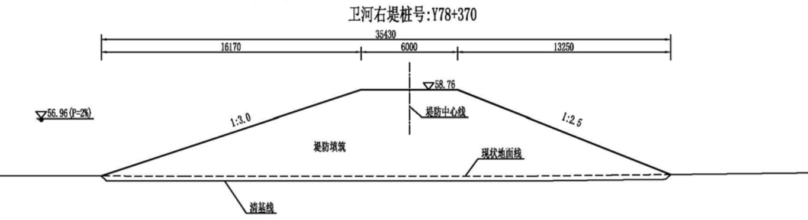  
图 5.4-10  浚内沟口新筑堤防典型横断面图  

# 5.4.8 马头村围村埝工程设计  

# 1、围村埝建设的必要性  

卫河、共渠按 50 年一遇防洪标准进行治理后,为有效控制盐土庄以下共渠、卫河汇合行洪 $2000\mathrm{m}^{3}/\mathrm{s}$ ,需在盐土庄位置建盐土庄节制闸,控制上游共渠、共西行洪区共同行洪时,最大下泄 $1600~\mathrm{m^{3}/s}$ 。盐土庄节制闸控制下泄 $1600\mathrm{m}^{3}/\mathrm{s}$ 的洪水漫过共渠右堤与卫河汇合,利用共渠左堤、卫河右堤间行洪通道泄洪,见示意图 $5.4\AA-11\sim5.4\AA-12\sim$ 。  

马头村位于盐土庄下游约 $1.7\mathrm{km}$ 的共卫夹道间,村庄西傍共渠右堤,东侧紧靠卫河主槽,民丰沟穿村而过,位置见图 5.4-12。村庄地面高程基本在 $57{\sim}58\mathrm{m}$ 之间。  

根据防洪工程安排,盐土庄闸以下共渠右堤不进行治理,大洪水时利用共渠左堤与卫河右堤间行洪通道泄洪。盐土庄闸至马头村之间现状共渠右堤堤顶高程在 $60.82{\sim}61.75\mathrm{m}$ 之间,经复核,盐土庄闸至马头村之间右堤现状过流能力为$1100\mathrm{m}^{3}/\mathrm{s}$ ,即当盐土庄闸下泄流量超过 $1100\mathrm{m}^{3}/\mathrm{s}$ 时,洪水会漫过盐土庄闸与马头村之间共渠右堤,利用共渠左堤与卫河右堤间行洪通道泄洪。  

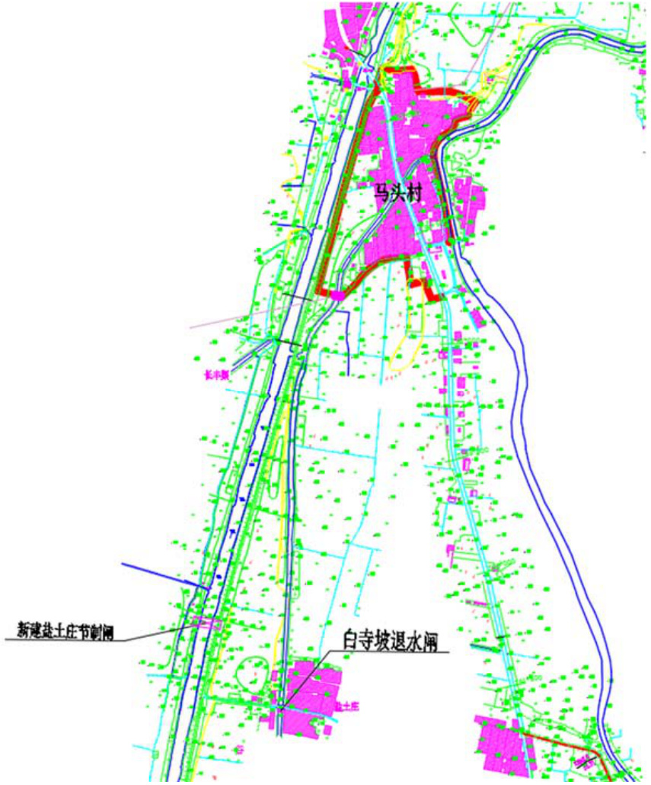  
图 5.4-11 马头村位置示意图  

表 5.4-17 盐土庄闸至马头村之间现状右堤与共渠行洪水位关系  

<html><body><table><tr><td rowspan="2">位置</td><td rowspan="2">共渠桩号</td><td rowspan="2">现状右堤高 程（m)</td><td colspan="2">盐土庄闸下泄1100m3/s</td><td colspan="2">盐土庄闸下泄1300m3/s</td></tr><tr><td>水位(m)</td><td>右堤超高 (m)</td><td>水位(m)</td><td>右堤超高 (W)</td></tr><tr><td>盐土庄闸</td><td>32+280</td><td>62.44</td><td>60.97</td><td>1.47</td><td>61.61</td><td>0.83</td></tr><tr><td></td><td>32+552</td><td>61.75</td><td>60.89</td><td>0.86</td><td>61.52</td><td>0.23</td></tr><tr><td></td><td>33+034</td><td>61.09</td><td>60.79</td><td>0.3</td><td>61.43</td><td>-0.34</td></tr><tr><td></td><td>33+541</td><td>61.04</td><td>60.71</td><td>0.33</td><td>61.34</td><td>-0.3</td></tr><tr><td>马头</td><td>34+044</td><td>61.37</td><td>60.63</td><td>0.74</td><td>61.26</td><td>0.11</td></tr><tr><td>李厂</td><td>34+491</td><td>60.82</td><td>60.54</td><td>0.28</td><td>61.17</td><td>-0.35</td></tr><tr><td>屯子</td><td>34+689</td><td>62.27</td><td>60.34</td><td>1.93</td><td>60.93</td><td>1.34</td></tr></table></body></html>  

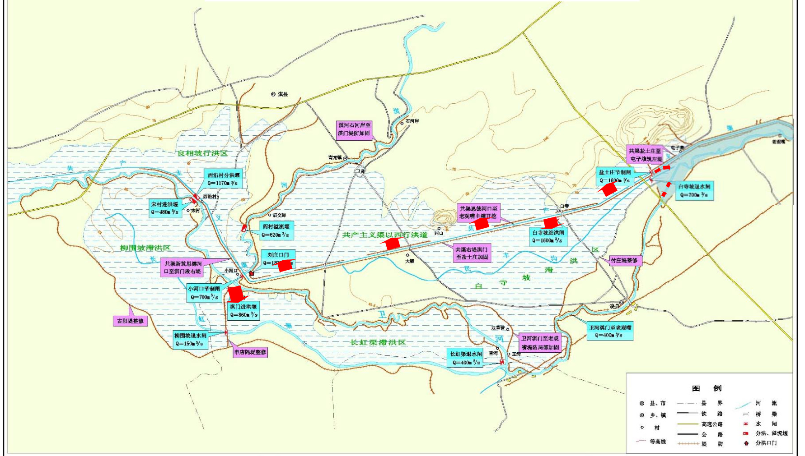  
图 5.4-12控制运用工况下发生 50 年一遇洪水流路示意图  

根据卫河坡洼洪水演进结果,当发生 10 年一遇洪水时,共渠盐土庄闸下泄流量为 $1300\mathrm{m}^{3}/\mathrm{s}$ ,卫河下泄流量为 $100\mathrm{m}^{3}/\mathrm{s}$ 。此时,洪水已漫过共渠右堤,利用共渠左堤、卫河右堤间行洪通道泄洪,共卫合流后洪水将直冲马头村。现状共渠右堤堤后地面高程基本在 $57.5\mathrm{m}$ 左右,马头村地面高程在 $57{\sim}58\mathrm{m}$ 之间,共卫合流后马头村附近 10 年一遇洪水位为 $58.5\mathrm{m}$ ,高于马头村地面高程,村民的生命安全受到严重威胁。  

综上,当发生 10 年一遇洪水时马头村将直接迎流顶冲,防洪形势严峻,为保证村民的生命财产安全,需对该村进行防护。  

# 2、防护标准  

马头村是浚县屯子镇的一个行政村,村庄 580 户,人口约 2650 人,依据《防洪标准》,考虑防洪保护对象的重要性,同时村庄近邻河道堤防便于撤离,该村庄的防护标准按10年一遇进行设防。马头村所在河道10年一遇设计水位为 $58.5\mathrm{m}$ 。  

# 3、设计超高计算  

堤顶超高计算公式同 5.4.4.2 节,分别选取卫河主槽紧邻马头村处、村南、村北围村埝处选取典型断面,堤顶超高计算参数见表 5.4-18,计算结果见表 5.4-19。根据计算结果,村西共渠侧及村北围村埝按不允许越浪考虑,堤顶设计超高取$1.0\mathrm{m}$ ,村东卫河侧和村南围村埝按照允许越浪考虑,堤顶设计超高取 $0.6\mathrm{m}$ 。  

表 5.4-18 堤顶超高计算参数表  

<html><body><table><tr><td>堤防岸别</td><td>桩号</td><td>g (m/s²)</td><td>d (m)</td><td>V (m/s)</td><td>F (W)</td><td>β (°)</td><td>K</td><td>Kv</td><td>Kp</td><td>m</td></tr><tr><td>卫河左岸</td><td>0+200</td><td>9.8</td><td>7.00</td><td>15.00</td><td>300</td><td>45.0</td><td>1.00</td><td>1.06</td><td>1.54</td><td>0</td></tr><tr><td>村北</td><td>0+900</td><td>9.8</td><td>0.9</td><td>15.00</td><td>500</td><td>45.0</td><td>0.90</td><td>1.30</td><td>1.48</td><td>3</td></tr><tr><td>村南</td><td>2+400</td><td>9.8</td><td>1.8</td><td>15.00</td><td>300</td><td>45.0</td><td>0.80</td><td>1.05</td><td>2.07</td><td>0</td></tr></table></body></html>  

表 5.4-19 堤顶超高计算结果表  

<html><body><table><tr><td>堤防岸别</td><td>桩号</td><td>设计波浪爬高 Rp (m)</td><td>风壅水面高度é (m)</td><td>安全加高 A (m)</td><td>堤顶超高 Y (m)</td></tr><tr><td>卫河左岸</td><td>0+200</td><td>0.27</td><td>0.0009</td><td>0.3</td><td>0.57</td></tr><tr><td>村北</td><td>0+900</td><td>0.41</td><td>0.012</td><td>0.5</td><td>0.92</td></tr><tr><td>村南</td><td>2+400</td><td>0.30</td><td>0.0036</td><td>0.3</td><td>0.60</td></tr></table></body></html>  

# 4、围村埝布置  

马头村东侧紧邻卫河主河槽左岸,为了减少拆迁及占地,该位置结合卫河左岸新建土堤加防浪墙的结构形式,长 $0.55\mathrm{km}$ ,设计墙顶高程 $59.1\mathrm{m}$ 。  

西侧紧邻共产主义渠右岸,经复核该段结合共产主义渠右岸现状高程满足设计要求,由于共渠是主要行洪通道,流速约为 $1.4\mathrm{m/s}$ ,因此对现状共渠右堤进行护  

坡,长度 $1.0\mathrm{km}$ 。  

南侧围村埝紧邻马头村村内道路及民房,另一侧为排涝渠道,渠底宽约 $2\mathrm{m}$ ,为减少占地及不影响道路通行,采用新建防洪墙的结构形式,长约 $0.73\mathrm{km}$ 。  

北侧新筑堤埝,背水侧为民房,临水侧为耕地,围村埝长约 $0.62\mathrm{km}$ 。  

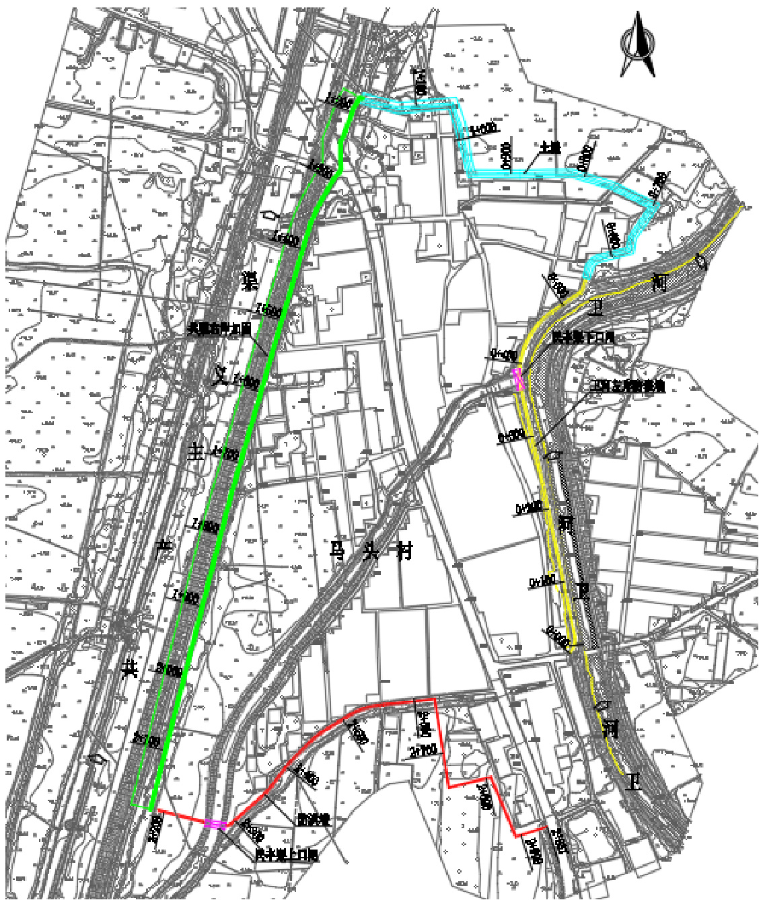  
图 5.4-13 马头村平面布置图  

# 4、冲刷深度、护坡厚度计算  

马头村围村埝卫河侧、共渠侧紧邻河道主流,冲刷深度及护坡厚度计算公式见 5.4.6.6 节,马头村东侧卫河左岸及村西侧共产主义渠右堤冲刷深度、护坡厚度计算参数及结果见表 $5.4{-}20{\sim}5.4{-}21$ 。  

经计算,卫河侧护坡厚度不小于 $0.12\mathrm{m}$ ,共渠侧护坡厚度不小于 $0.11\mathrm{m}$ ,护坡厚度根据结构不同取 $0.3{\sim}0.5\mathrm{m}$ ,卫河侧冲刷深度为 $1.07\mathrm{m}$ ,共渠侧冲刷深度  

为 $1.02\mathrm{m}$ ,护坡坡脚基座埋深取 $1.6\mathrm{m}$ 。  

表 5.4-20  冲刷深度计算参数及结果表  

<html><body><table><tr><td>位置</td><td>局部冲刷深 度hs(m)</td><td>冲刷处水 深H0(m)</td><td>行近流速 U (m/s)</td><td>n</td><td>水流流速不 均匀系数 n</td><td>d50 (mm)</td></tr><tr><td>卫河左岸0+200</td><td>1.07</td><td>7.00</td><td>1.41</td><td>0.25</td><td>1</td><td>0.028</td></tr><tr><td>共渠右岸1+400</td><td>1.02</td><td>6.40</td><td>1.41</td><td>0.25</td><td>1</td><td>0.028</td></tr></table></body></html>  

表 5.4-21  护坡厚度计算参数及结果表  

<html><body><table><tr><td>位置</td><td>设计波高 H (m)</td><td>斜坡斜率 m</td><td>波长 (m)</td><td>护坡厚度 (m)</td></tr><tr><td>卫河左岸0+200</td><td>0.34</td><td>2.5</td><td>10.37</td><td>0.12</td></tr><tr><td>共渠右岸 1+400</td><td>0.33</td><td>3</td><td>10.16</td><td>0.11</td></tr></table></body></html>  

# 5、围村埝形式选择  

马头村村南围埝将受到上游洪水直冲,对于保护村庄安全至关重要,考虑对采用土堤与防洪墙两种型式进行对比。由于村南主要为村民耕地,从减少用地矛盾方面考虑,围村埝布置不宜破坏村民耕地完整性,因此本次考虑村南围村埝紧邻村南道路、现状排水沟内侧布置(排水沟南侧零星存在民房,堤线布置受限)。两方案优缺点对比如下:  

方案一:土堤优点:结构安全、施工简便、工程投资较低。缺点:工程占地较多,会侵占现状现状排水沟与道路。  

方案二:防洪墙  

优点:施工简单,施工扰动面积较小,占地较少,不影响道路通行。  

缺点:部分墙体较高,景观性较差。  

从工程实施可行性考虑,由于该工程靠近村庄,宜减少施工扰动面积;从投资上来看,采用土堤形式占地较多,工程投资较高;从工程影响来看,采用防洪墙能较少对道路通行的影响。因此,本次推荐采用防洪墙形式。  

# 6、横断面设计  

马头村东侧卫河左岸采用新建土堤加防浪墙的结构形式,设计墙顶高程$59.1\mathrm{m}$ ,防浪墙墙高 $3.1\mathrm{m}$ ,墙顶宽 $0.4\mathrm{m}$ ,底宽 $2.24\mathrm{m}$ ,迎水侧为直墙,背水侧边坡 1:0.4,下设 C15 混凝土垫层厚 $0.1\mathrm{m}$ ,防浪墙后填土筑堤,填土高程 $58.0\mathrm{m}$ ,挡土墙基础采用水泥土处理,水泥参量 $8\mathrm{{\sim}}10\%$ 。迎水侧采用格宾石笼护坡,厚度为 $0.3\mathrm{m}$ ,下设土工布与 $15\mathrm{cm}$ 厚砂垫层,坡脚设置 C25 混凝土基座,基座尺寸为$1.0{\times}1.6\mathrm{m}$ (宽 $\times$ 高)。  

马头村北侧采用土堤形式,堤顶高程 $59.5\mathrm{m}$ ,堤高 $1{\sim}2\mathrm{m}$ ,堤顶宽度 $3.0\mathrm{m}$ 。迎水侧边坡1:3,背水侧边坡1:2.5。迎水侧采用铅丝笼土工固袋护坡,护坡厚 $0.5\mathrm{m}$ ,下设 $300\mathrm{g}/\mathrm{m}^{2}$ 土工布,上覆植物纤维毯,坡脚采用铅石笼土工固袋护脚,厚 $1.0\mathrm{m}$ ,宽 $1.0\mathrm{m}$ 。  

马头村西侧共渠右堤采用铅丝笼土工固袋护坡,护坡厚 $50\mathrm{cm}$ ,下设土工布,规格为 $300\mathrm{g}/\mathrm{m}^{2}$ ,上覆植物纤维毯,坡顶采用 C25 混凝土压顶,厚 $0.5\mathrm{m}$ ,宽 $0.5\mathrm{m}$ ,坡脚采用 C25 混凝土基座,宽 $1.0\mathrm{m}$ ,高 $1.6\mathrm{m}$ 。当护坡高度 $>6\mathrm{m}$ 时设马道,采用M10 浆砌石结构,宽 $2\mathrm{m}$ 。  

马头村南侧采用防洪墙,墙顶高程 $59.1\mathrm{m}$ ,墙高 $1.78\substack{\sim}4.88\mathrm{m}$ ,墙顶宽 $0.5\mathrm{m}$ ,迎水侧边坡 1:0.1,背水侧边坡 1:0.4,基座厚 $0.6{\sim}1.0\mathrm{m}$ ,宽 $1.95{\sim}3.74\mathrm{m}$ ,下设C15 混凝土垫层厚 $0.1\mathrm{m}$ 。  

马头村围村埝工程横断面见图 $5.4–14\sim5.4–17。$ 。  

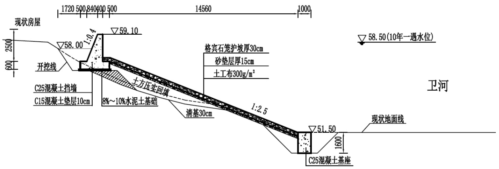  
图 5.4-14  马头村卫河侧围村埝横断面图( $0{+}400\$ )  

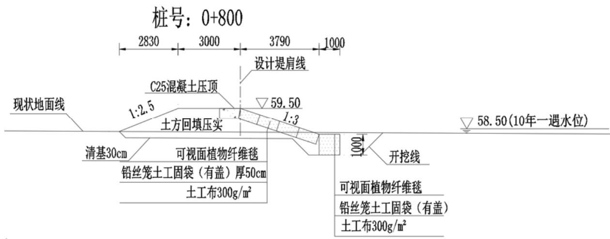  
图 5.4-15 马头村北侧新筑土堤横断面图  

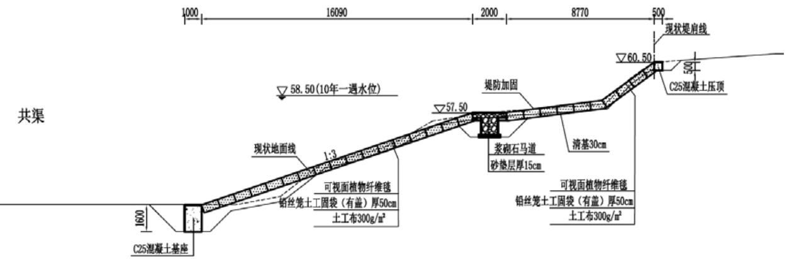  
图 5.4-16  共渠右岸治理工程横断面图( $1+200$ )  

  
图 5.4-17 马头村南侧新筑挡土墙横断面图  

# 7、挡墙稳定计算  

# 一、安全系数  

根据《堤防工程设计规范》GB50286-2013 中 3.2.5 条规定,防洪墙沿基底面的抗滑稳定安全系数:地基性质为土基时,2 级堤防正常运用条件不小于 1.30,非常运用条件不小于 1.15;  

根据《堤防工程设计规范》GB50286-2013 中 3.2.6 条规定坚实土基上防洪墙基底应力的最大值与最小值之比基本组合允许值 2.50,特殊组合 3.00。  

# 二、典型断面  

本次计算选取马头村围村埝工程桩号 $2{+}400$ 的挡土墙作为标准断面进行稳定计算,如图 5.4-14 所示。墙顶宽 $0.50\mathrm{m}$ ,墙身高 $4.88\mathrm{m}$ ,基础埋深 $1.00\mathrm{m}$ ,迎水侧为 1:0.1、背水侧坡比为 1:0.4,背水侧填土低于堤顶 $1.5\mathrm{m}$ 。  

# 三、土体物理力学指标  

堤基土体地质结构主要为粘性土、中部为粗粒土(粉质砂壤土)、下部为粘性土多层结构亚类,大部分为粘性土单一结构。天然密度平均值 $1.96\mathrm{g}/\mathrm{cm}^{3}$ ,内摩擦角平均值为 $30^{\circ}$ ,粘聚力 $5\mathrm{kPa}$ ,地基承载力 $150\mathrm{kpa}$ 。  

# 四、计算工况  

分为三种情况计算挡土墙稳定:  

正常运用工况 $\textcircled{2}$ :迎水侧水位由 10 年一遇设计水位骤降至基础顶。墙后按单层填土,水位于岸顶齐平;墙前土质被冲刷至基础底,地基为浸水地基。  

非常运用工况 $\textcircled{1}$ :刚建成期。迎背水侧均无水,墙后按单层填土,填土均正常,地基为正常地基。  

表 5.4-22 挡土墙稳定计算成果表  

<html><body><table><tr><td>工况</td><td>计算抗滑 安全系数</td><td>允许抗滑 安全系数</td><td>基底应力</td><td>基底应力 比值</td><td>允许基底 应力比值</td></tr><tr><td>正常工况②</td><td>1.58</td><td>1.30</td><td>78.46/68.86</td><td>1.14</td><td>2.50</td></tr><tr><td>非正常工况①</td><td>1.34</td><td>1.15</td><td>65.87/38.08</td><td>1.73</td><td>3.00</td></tr></table></body></html>  

通过计算可知,所求得的安全系数均大于允许值,满足抗滑稳定及基底应力比值要求。  

# 5.4.9 堤防加戗设计  

# 5.4.9.1 加戗堤段  

卫河扩大治理时对局部河道进行了裁湾取直,形成新堤穿老河堤段,新堤防施工时没有清除老河槽内淤泥,筑堤土料直接铺在淤泥上。“96.8”洪水期间堤身出现渗水现象。为保证堤防安全,本次治理对新堤穿老河堤段进行加前戗治理。  

卫河堤防加戗范围见表 5.4-23。  

表 5.4-23 卫河堤防加戗范围表  

<html><body><table><tr><td>序号</td><td>位置</td><td>岸别</td><td>起止桩号</td><td>长度（m)</td><td></td><td>存在问题 处理措施</td><td>河道设战台填 计水位筑高程 (m)</td><td>(m)</td></tr><tr><td>1</td><td>浚县么村</td><td rowspan="6">左</td><td>Z25+280~Z25+380</td><td>100</td><td rowspan="6">堤前为老 河槽，堤 基没有处 理，</td><td>61.77</td><td></td><td>62.11</td></tr><tr><td>2</td><td>浚县王湾</td><td>Z27+870~Z28+400</td><td>530</td><td>61.53</td><td>62.03</td></tr><tr><td>3</td><td>内黄王庄</td><td>Z114+130~Z114+400</td><td>270</td><td>52.07</td><td>52.57</td></tr><tr><td>4</td><td>大名马庄</td><td>Z176+670~Z176+770</td><td>100</td><td>44.36</td><td>44.86</td></tr><tr><td>5</td><td>大名阎庙</td><td>Z177+370~Z177+470</td><td>100</td><td>44.34</td><td>44.84</td></tr><tr><td>小计</td><td></td><td></td><td>1100</td><td></td><td></td></tr><tr><td>6</td><td>浚县新镇</td><td rowspan="6">右</td><td>Y10+430~Y10+630</td><td>200</td><td>“96.8"出 现渗水情 况</td><td>加筑前战 63.71</td><td>64.21</td></tr><tr><td>7</td><td>浚县申湾</td><td rowspan="5"></td><td>Y25+950~Y26+200</td><td>250</td><td>61.85</td><td>62.35</td></tr><tr><td>8</td><td>浚县烧酒营</td><td>Y26+700~Y26+800</td><td>100</td><td>61.78</td><td>62.28</td></tr><tr><td>9</td><td>浚县陈庄</td><td>Y50+580~Y50+730</td><td></td><td></td><td>60.60</td></tr><tr><td></td><td></td><td></td><td>150</td><td>60.10</td><td></td></tr><tr><td>10</td><td>浚县甘草庄</td><td>Y51+600~Y51+700</td><td>100</td><td>60.02</td><td>60.52</td></tr></table></body></html>  

<html><body><table><tr><td>序号</td><td>位置</td><td>岸别</td><td>起止桩号</td><td>长度（m)</td><td>存在问题</td><td>处理措施计水位筑高程</td><td>(W)</td><td>河道设战台填 (m)</td></tr><tr><td>11</td><td>大名金滩镇</td><td></td><td>Y174+760~Y175+090</td><td>330</td><td rowspan="4"></td><td></td><td>44.78</td><td>45.28</td></tr><tr><td>12</td><td>大名沈庄</td><td></td><td>Y177+290~Y177+490</td><td>200</td><td></td><td>44.59</td><td>45.09</td></tr><tr><td>小计</td><td></td><td></td><td></td><td>1330</td><td></td><td></td><td></td></tr><tr><td>合计</td><td></td><td></td><td></td><td>2430</td><td></td><td></td><td></td></tr></table></body></html>  

# 5.4.9.2 加戗结构设计  

结合卫河堤防现有戗台的结构尺寸,以及借鉴卫运河等类似工程堤防加筑戗台的经验,本次卫河新堤穿老河段加筑戗台的戗台宽度 $5.0\mathrm{m}$ ,边坡 1:3,戗台填筑至所在河道的设计水位以上 $0.5\mathrm{m}$ 。  

# 5.4.9.3 堤防加戗结果验算  

本次选取卫河右堤浚县段堤防(右堤桩号 $50\substack{+600)}$ )作为典型断面进行复核,加戗前后典型断面渗流情况如图 5.4-18 和图 5.4-19。  

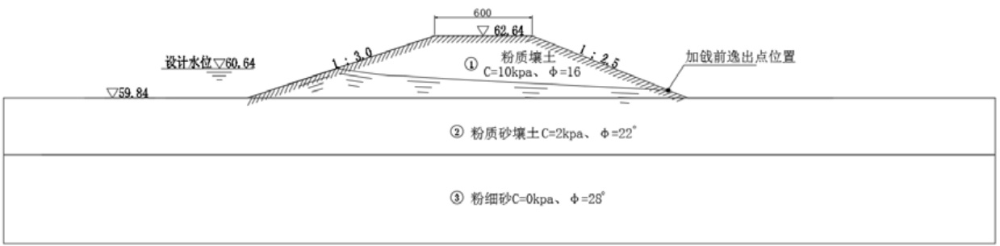  
图 5.4-18 $\mathrm{Y}50\substack{+600}$ 堤防断面加戗前渗流断面图  

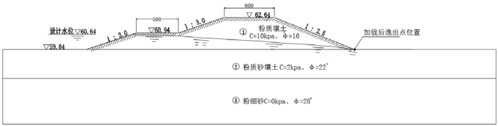  
图 5.4-19 $\mathrm{Y}50\substack{+600}$ 堤防断面加戗后渗流断面图  

加戗以后,选取典型断面的出逸点、渗透比降都有所降低,且在允许范围内。结果如表 5.4-24。  

表 5.4-24  加戗断面的渗透出逸点高度及比降统计表  

<html><body><table><tr><td>桩号</td><td>加战前出逸 点高度 (m)</td><td>加战前出逸 点渗透比降</td><td>加战后出逸 点高度(m)</td><td>加战后出逸 点渗透比降</td><td>允许渗透坡降</td></tr><tr><td>Y50+600</td><td>0.34</td><td>0.4</td><td>0.05</td><td>0.21</td><td>0.45～0.50</td></tr></table></body></html>  

# 5.4.9.4 堤防加戗方式与土方压实要求  

加戗土料采用地质勘察料场,土料质量要求同堤防筑堤土料。加戗前,应先清除底部淤积及堤坡的表土再填筑。  

加戗前对堤基和坡面清基。堤身土料宜选用粘粒含量为 $15\%{\sim}30\%$ 的壤土、粉质壤土、砂质和粉质粘土。填筑标准按共卫合流以上段压实度不应小于 0.91;共卫合流以上段压实度不应小于 0.93。新老堤相接区域,垂直堤轴线方向的各种接缝应以斜面相接,坡度采用 1:3.0,并应做好接合层面的处理和搭接碾压。  

# 5.4.9.5 加戗工程量  

加戗工程土方清基 1.09 万 $\mathrm{m}^{3}$ ,土方填筑 8.54 万 $\mathrm{m}^{3}$ 。  

# 5.4.10 堤防防渗设计  

根据地质勘查报告,局部堤段粉细砂层位于设计洪水位以上,如卫河左堤$\scriptstyle26+560\sim Z6+800$ 、 $Z78+580\sim Z78+660$ 、 $Z125+830\sim Z126+380$ 、卫河右堤$\mathrm{Y}18{+}800{\sim}\mathrm{Y}18{+}840.$ 、 $\mathrm{Y}21+700{\sim}\mathrm{Y}22+100$ 等。卫河左堤长度约 $2.41\mathrm{km}$ 、右堤长度约 $2.22\mathrm{km}$ 的堤段,在堤身下部及堤基处分布有不同厚度的粉细砂层,透水性强,经对堤基部位有粉细砂层的典型断面进行渗流稳定计算成果可知,部分堤段渗流稳定不满足要求。在设计水位以下的堤身部位存在粉细砂层的堤段,考虑到土质结构疏松,堤身土体在长时间浸水状态下可能出现塌坡、散浸、渗透变形等问题,从而造成险情。因此,结合渗流稳定计算结果及堤防现状情况,对存在问题的堤段进行处理,具体段落见下表。  

表 5.4-25 卫河堤防堤身下部及堤基粉细砂现状情况统计表  

<html><body><table><tr><td>桩号</td><td>长度 (m)</td><td>粉细砂厚 (m)</td><td>粉细砂层距现状堤顶的深度(m)</td></tr><tr><td>卫河左堤</td><td></td><td></td><td></td></tr><tr><td>Z1+000~Z1+050</td><td>50</td><td>1.5</td><td>3.5</td></tr><tr><td>Z3+700~Z4+200</td><td>500</td><td>3.5</td><td>2</td></tr><tr><td>Z42+650~Z43+600</td><td>950</td><td>2</td><td>1</td></tr><tr><td>Z93+210~Z93+760</td><td>550</td><td>5.5</td><td>4.5</td></tr><tr><td>Z140+310~Z140+540</td><td>230</td><td>2</td><td>1</td></tr><tr><td>Z154+380~Z154+450</td><td>70</td><td>1</td><td>2.5</td></tr><tr><td>Z155+530~Z155+590</td><td>60</td><td>1</td><td>3</td></tr><tr><td>小计</td><td>2410</td><td></td><td></td></tr><tr><td>卫河右堤</td><td></td><td></td><td></td></tr><tr><td>Y5+790~Y5+860</td><td>70</td><td>4</td><td>0.5</td></tr></table></body></html>  

<html><body><table><tr><td>桩号</td><td>长度 (m)</td><td>粉细砂厚 (m)</td><td>粉细砂层距现状堤顶的深度（m)</td></tr><tr><td>Y87+180~Y87+300</td><td>120</td><td>3.5</td><td>1</td></tr><tr><td>Y89+190~Y89+720</td><td>530</td><td>3</td><td>0</td></tr><tr><td>Y126+970~Y127+050</td><td>80</td><td>2.5</td><td>2</td></tr><tr><td>Y131+180~Y131+560</td><td>380</td><td>4</td><td>0</td></tr><tr><td>Y135+110~Y135+810</td><td>700</td><td>3</td><td>1</td></tr><tr><td>Y169+280~Y169+420</td><td>140</td><td>1</td><td>3.5</td></tr><tr><td>Y175+000~Y175+200</td><td>200</td><td>2</td><td>3</td></tr><tr><td>小计</td><td>2220</td><td></td><td></td></tr><tr><td>合计</td><td>4630</td><td></td><td></td></tr></table></body></html>  

可研阶段对采用复合土工膜防渗、垂直铺塑、多头小直径水泥搅拌桩防渗墙3 种型式进行了比较,通过综合分析确定采用水泥搅拌桩防渗墙方案。该型式在海河流域内卫运河、漳卫新河及永定新河等治理工程中多有采用,本阶段仍采用该型式进行防渗处理。  

堤防渗流稳定计算采用有限元法,根据堤防地质资料,本次对堤身或堤基存在粉细砂层段的堤防进行典型断面复核,采取水泥搅拌桩防渗墙前后渗流比降变化情况见表 5.4-26。  

表 5.4-26  渗流稳定计算成果表  

<html><body><table><tr><td colspan="2">渗流比降</td><td>处理前渗流比降</td><td>处理后渗流比降</td><td>允许渗流比降</td></tr><tr><td colspan="2">断面</td><td>下游坡脚</td><td>下游坡脚</td><td>下游坡脚</td></tr><tr><td>卫河左堤</td><td>Z3+850</td><td>0.42</td><td>0.07</td><td>0.35~0.40</td></tr><tr><td>卫河右堤</td><td>Y135+950</td><td>0.48</td><td>0.09</td><td>0.25~0.45</td></tr></table></body></html>  

采用多头小直径搅拌桩成墙,水泥掺入比 $13\%$ ;成墙位置距内堤肩 $2.5{\sim}3.0\mathrm{m}$ 处;防渗墙的设计厚度为 $161\mathrm{mm}$ ;为避免后期不均匀沉降或堤顶道路碾压等影响,防渗墙顶高程为现状堤顶高程减 $0.5\mathrm{m}$ ,底高程为粉细砂层以下 $0.5\mathrm{m}$ ,深度约 $3.0{\sim}10\mathrm{m}$ 。防渗墙设计指标见表 5.4-27。  

表 5.4-27  卫河堤防防渗墙设计指标表  

<html><body><table><tr><td>桩号</td><td>长度 (W)</td><td>粉细 砂厚 (m)</td><td>粉细砂层距 现状堤顶的 深度 (m)</td><td>处理深度 (W)</td><td>水泥搅拌桩成 墙面积 (m²)</td></tr><tr><td>卫河左堤</td><td></td><td></td><td></td><td></td><td></td></tr><tr><td>Z1+000~Z1+050</td><td>50</td><td>1.5</td><td>3.5</td><td>5</td><td>250</td></tr><tr><td>Z3+700~Z4+200</td><td>500</td><td>3.5</td><td>2</td><td>5.5</td><td>2750</td></tr><tr><td>Z42+650~Z43+600</td><td>950</td><td>2</td><td>1</td><td>3</td><td>2850</td></tr></table></body></html>  

<html><body><table><tr><td>桩号</td><td>长度 (U)</td><td>粉细 砂厚 (m)</td><td>粉细砂层距 现状堤顶的 深度 (m)</td><td>处理深度 (U)</td><td>水泥搅拌桩成 墙面积 (zu)</td></tr><tr><td>Z93+210～Z93+760</td><td>550</td><td>5.5</td><td>4.5</td><td>10</td><td>5500</td></tr><tr><td>Z140+310~Z140+540</td><td>230</td><td>2</td><td>1</td><td>3</td><td>690</td></tr><tr><td>Z154+380~Z154+450</td><td>70</td><td>1</td><td>2.5</td><td>3.5</td><td>245</td></tr><tr><td>Z155+530~Z155+590</td><td>60</td><td>1</td><td>3</td><td>4</td><td>240</td></tr><tr><td>小计</td><td>2410</td><td></td><td></td><td></td><td>12525</td></tr><tr><td>卫河右堤</td><td></td><td></td><td></td><td></td><td></td></tr><tr><td>Y5+790~Y5+860</td><td>70</td><td>4</td><td>0.5</td><td>4.5</td><td>315</td></tr><tr><td>Y87+180~Y87+300</td><td>120</td><td>3.5</td><td>1</td><td>4.5</td><td>540</td></tr><tr><td>Y89+190~Y89+720</td><td>530</td><td>3</td><td>0</td><td>3</td><td>1590</td></tr><tr><td>Y126+970~Y127+050</td><td>80</td><td>2.5</td><td>2</td><td>4.5</td><td>360</td></tr><tr><td>Y131+180~Y131+560</td><td>380</td><td>4</td><td>0</td><td>4</td><td>1520</td></tr><tr><td>Y135+110~Y135+810</td><td>700</td><td>3</td><td>1</td><td>4 </td><td>2800</td></tr><tr><td>Y169+280～Y169+420</td><td>140</td><td>1</td><td>3.5</td><td>4.5</td><td>630</td></tr><tr><td>Y175+000~Y175+200</td><td>200</td><td>2</td><td>3</td><td>5</td><td>1000</td></tr><tr><td>小计</td><td>2220</td><td></td><td></td><td></td><td>8755</td></tr><tr><td>合计</td><td>4630</td><td></td><td></td><td></td><td>21280</td></tr></table></body></html>  

防渗墙成桩设计平面图见图 5.4-20。  

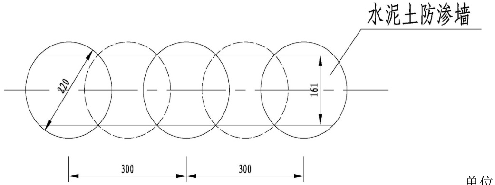  
图 5.4-20  水泥搅拌桩防渗墙成桩设计平面图  

单位: mm  

# 5.4.11 堤顶防汛道路工程  

# 5.4.11.1 现状堤顶路面情况  

现状堤顶防汛路土质路面居多,硬化路面占比约为三分之一。卫河左堤现状硬化路面长度约 $63.87\mathrm{km}$ ,其中混凝土路面 $52.9\mathrm{km}$ ,沥青路面 $10.97\mathrm{km}$ ,其余堤顶为土路;卫河右堤现状硬化路面约 $51.55\mathrm{km}$ ,其中混凝土路面 $38.89\mathrm{km}$ ,沥青路面 $12.66\mathrm{km}$ ,其余堤顶为土路。硬化路面范围见表 5.4-28。  

共产主义渠右堤 $18{+}600{-}24{+}800$ 段现有 $6.2\mathrm{km}$ 混凝土路面,为当地乡政府组织修建,年久失修,现状损毁严重。  

表 5.4-28 卫河左右堤现有硬化路面范围  

<html><body><table><tr><td colspan="4">卫河左堤</td><td colspan="4">卫河右堤</td></tr><tr><td>桩号范围</td><td>路面 结构</td><td>路面情况</td><td>长度</td><td>桩号范围</td><td>路面 结构</td><td>路面情况</td><td>长度</td></tr><tr><td>Z0+000~Z1+780</td><td>混凝土</td><td>现状路面较为完整</td><td>1780</td><td>Y1+960~Y3+820</td><td>混凝土</td><td>路面破损严重</td><td>1860</td></tr><tr><td>Z9+140~Z9+520</td><td>混凝土</td><td>局部破损</td><td>380</td><td>Y11+110~Y14+430</td><td>混凝土</td><td>局部破损</td><td>3320</td></tr><tr><td>Z19+590~Z22+950</td><td>混凝土</td><td>现状路面较为完整</td><td>3360</td><td>Y22+860~Y24+820</td><td>混凝土</td><td>现状路面较为完整</td><td>1960</td></tr><tr><td>Z28+380~Z33+720</td><td>混凝土</td><td>现状路面较为完整</td><td>5340</td><td>Y25+430~Y27+340</td><td>混凝土</td><td>现状路面较为完整</td><td>1910</td></tr><tr><td>Z43+600~Z46+750</td><td>混凝土</td><td>现状路面较为完整</td><td>3150</td><td>Y29+250~Y35+650</td><td>混凝土</td><td>现状路面较为完整</td><td>6400</td></tr><tr><td>Z49+300~Z49+580</td><td>混凝土</td><td>现状路面较为完整</td><td>280</td><td>Y48+170~Y50+130</td><td>混凝土</td><td>现状路面较为完整</td><td>1960</td></tr><tr><td>Z67+530~Z70+850</td><td>沥青</td><td>现状路面较为完整</td><td>3320</td><td>Y75+420~Y75+720</td><td>混凝土</td><td>现状路面较为完整</td><td>300</td></tr><tr><td>Z72+980~Z76+380</td><td>混凝土</td><td>现状路面较为完整</td><td>3400</td><td>Y89+550~Y92+110</td><td>混凝土</td><td>2018年铺设，现状 路面情况良好</td><td>2560</td></tr><tr><td>Z86+220~Z89+090</td><td>混凝土</td><td>现状路面较为完整</td><td>2870</td><td>Y95+050~Y95+830</td><td>混凝土</td><td>2018年铺设，现状 路面情况良好</td><td>780</td></tr><tr><td>Z94+760~Z100+450</td><td>混凝土</td><td>2018年铺设，现状路面 情况良好</td><td></td><td>5690Y101+280~Y101+580|混凝土</td><td></td><td>2017年铺设，现状 路面情况良好</td><td>300</td></tr><tr><td>Z100+450~Z101+270</td><td>沥青</td><td>2018年铺设，现状路面 情况良好</td><td>820</td><td>Y108+170~Y110+270|混凝土</td><td></td><td>2017年铺设，现状 路面情况良好</td><td>2100</td></tr><tr><td>Z101+270~Z103+630</td><td>混凝土</td><td>2018年铺设，现状路面 情况良好</td><td></td><td>2360|Y114+160~Y114+550</td><td>混凝土</td><td>现状路面较为完整</td><td>390</td></tr><tr><td>Z104+860~Z106+730</td><td>混凝土</td><td>2018年铺设，现状路面 情况良好</td><td></td><td>1870Y120+040~Y125+590</td><td>混凝土</td><td>现状路面较为完整</td><td>5550</td></tr><tr><td>Z106+840~Z108+580</td><td>混凝土</td><td>现状路面较为完整</td><td>1740</td><td>Y134+410~Y137+270</td><td>混凝土</td><td>现状路面较为完整</td><td>2860</td></tr><tr><td>Z108+710~Z110+370</td><td>混凝土</td><td>现状路面较为完整</td><td>1660</td><td>0Y148+950~Y150+670</td><td>混凝土</td><td>2017年铺设，现状 路面情况良好</td><td>1720</td></tr><tr><td>Z113+160~Z115+750</td><td>混凝土</td><td>现状路面较为完整</td><td></td><td>2590|Y150+670~Y156+690</td><td>沥青</td><td>2019年铺设，现状 路面情况良好</td><td>6020</td></tr><tr><td>Z122+950~Z127+230</td><td>混凝土</td><td>部分路面为2019 年铺 设，现状路面较为完整</td><td></td><td>4280Y163+010~Y164+430</td><td>沥青</td><td>2019年铺设，现状 路面情况良好</td><td>1420</td></tr><tr><td>Z132+540~Z136+780</td><td>混凝土</td><td>现状路面较为完整</td><td></td><td>4240Y164+430~Y169+050|混凝土</td><td></td><td>2016年铺设，现状 路面情况良好</td><td>4620</td></tr><tr><td>Z138+740~Z139+760</td><td>沥青</td><td>现状路面较为完整</td><td></td><td>1020Y174+240~Y177+450</td><td>沥青</td><td>2016年铺设，现状 路面情况良好</td><td>3210</td></tr><tr><td>Z141+760~Z143+470</td><td>混凝土</td><td>局部破损</td><td></td><td>1710Y182+070~Y183+730</td><td>沥青</td><td>2006年以前铺设， 现状破损严重</td><td>1660</td></tr><tr><td>Z159+160~Z164+160</td><td>混凝土</td><td>2013年铺设，现状路面 较为完整</td><td></td><td>5000Y186+580~Y186+880|混凝土</td><td></td><td>2006年以前铺设, 现状破损严重</td><td>300</td></tr><tr><td>Z164+160~Z167+060</td><td>沥青</td><td>2008年铺设，现状路面 较为完整</td><td></td><td>2900Y188+280~Y188+630|混凝土</td><td></td><td>2006年以前铺设， 现状破损严重</td><td>350</td></tr><tr><td>Z170+360~Z171+560</td><td>混凝土</td><td>2019年铺设，现状路面 情况良好</td><td>1200</td><td>合计</td><td></td><td></td><td>51550</td></tr></table></body></html>  

<html><body><table><tr><td colspan="4">卫河左堤</td><td colspan="4">卫河右堤</td></tr><tr><td>桩号范围</td><td>路面 结构</td><td>路面情况</td><td>长度</td><td>桩号范围</td><td>路面 结构</td><td>路面情况</td><td>长度</td></tr><tr><td>Z182+860~Z185+769</td><td>沥青</td><td>2018年铺设，现状路面 情况良好</td><td>2909</td><td></td><td></td><td></td><td></td></tr><tr><td>合计</td><td></td><td></td><td>63869</td><td></td><td></td><td></td><td></td></tr></table></body></html>  

# 5.4.11.2 堤顶防汛道路设计  

本次堤顶防汛道路治理长度 $291.37\mathrm{km}$ ,包括新铺沥青混凝土路面 $279.68\mathrm{km}$ ,拆除重建 $11.69\mathrm{km}$ 。上堤坡道治理 430 处,长度 $21.5\mathrm{km}$ 。  

表 5.4-29 堤顶防汛道路及上堤坡道治理统计表  

<html><body><table><tr><td rowspan="2">河道名称</td><td rowspan="2">岸别</td><td colspan="3">堤顶防汛道路治理</td><td colspan="2">上堤坡道治理</td></tr><tr><td>拆除重建（km)</td><td>新建（km)</td><td>小计</td><td>个数</td><td>长度（km)</td></tr><tr><td rowspan="3">卫河</td><td>左</td><td>1.05</td><td>109.34</td><td>110.39</td><td>136</td><td>6.8</td></tr><tr><td>右</td><td>4.44</td><td>139.44</td><td>143.88</td><td>167</td><td>8.35</td></tr><tr><td>小计</td><td>5.49</td><td>248.78</td><td>254.27</td><td>303</td><td>15.15</td></tr><tr><td rowspan="3">共渠</td><td>左</td><td></td><td>2.41</td><td>2.41</td><td>35</td><td>1.75</td></tr><tr><td>右</td><td>6.2</td><td>28.49</td><td>34.69</td><td>92</td><td>4.6</td></tr><tr><td>小计</td><td>6.2</td><td>30.9</td><td>37.1</td><td>127</td><td>6.35</td></tr><tr><td>合计</td><td></td><td>11.69</td><td>279.68</td><td>291.37</td><td>430</td><td>21.5</td></tr></table></body></html>  

# (1)卫河堤顶防汛道路  

为了满足堤防管理及防汛抢险需要,依据现有硬化路面情况、堤防加高加固治理情况及当地需求,对卫河部分堤顶路面进行硬化,采用沥青混凝土路面,路面治理总长度为 $254.27\mathrm{km}$ 。对比可研阶段,增加了 $80.76\mathrm{km}$ ,变化原因是在2013\~2019 年间,部分路段已经修筑混凝土路面,同时结合地方政府需求,加之筑堤土料多为粉土、粘土,每遇降雨堤顶路泥泞不堪、难以通行,后期堤顶平整、维修养护费用较高,给运行管理单位的防汛抢险和维修养护带来极大的困难,因此,本次对现状堤顶土路面进行硬化,卫河堤顶现有硬化路面范围见表 5.4-30、5.4-31。  

# 1、卫河左堤  

卫河左堤总长 $186\mathrm{km}$ ,其中侯胡寨村至屯子桥段(左堤桩号 $Z54+290\sim$ $Z57\substack{+290)}$ )为省道 S219,屯子桥至老观嘴段( $(Z57+290{\sim}Z66{+}850)$ )利用共渠左堤。左堤现有硬化路面 $63.87\mathrm{km}$ ,本次新铺沥青路面 $109.34\mathrm{km}$ ,拆除重建破损路面$1.05\mathrm{km}$ ,治理总长 $110.39\mathrm{km}$ 。  

表 5.4-30 卫河左堤堤顶防汛道路处理方案  

<html><body><table><tr><td>左堤桩号范围</td><td>现状路面 结构</td><td>路面情况</td><td>长度 (m)</td><td>处理方案</td></tr><tr><td>Z0+000~Z1+780</td><td>混凝土</td><td>现状路面较为完整</td><td>1780</td><td>维持现状</td></tr><tr><td>Z1+780~Z9+140</td><td>土路</td><td></td><td>7360</td><td>新建沥青混凝土路面</td></tr><tr><td>Z9+140~Z9+520</td><td>混凝土</td><td>局部破损</td><td>380</td><td>拆除重建沥青混凝土路面</td></tr><tr><td>Z9+520~Z19+590</td><td>土路</td><td></td><td>10070</td><td>新建沥青混凝土路面</td></tr><tr><td>Z19+590~Z22+950</td><td>混凝土</td><td>现状路面较为完整</td><td>3360</td><td>维持现状</td></tr><tr><td>Z22+950~Z28+380</td><td>土路</td><td></td><td>5430</td><td>新建沥青混凝土路面</td></tr><tr><td>Z28+380~Z33+720</td><td>混凝土</td><td>现状路面较为完整</td><td>5340</td><td>维持现状</td></tr><tr><td>Z33+720~Z43+600</td><td>土路</td><td></td><td>9880</td><td>新建沥青混凝土路面</td></tr><tr><td>Z43+600~Z46+750</td><td>混凝土</td><td>现状路面较为完整</td><td>3150</td><td>维持现状</td></tr><tr><td>Z46+750~Z49+300</td><td>土路</td><td></td><td>2550</td><td>新建沥青混凝土路面</td></tr><tr><td>Z49+300~Z49+580</td><td>混凝土</td><td>现状路面较为完整</td><td>280</td><td>维持现状</td></tr><tr><td>Z49+580~Z54+290</td><td>土路</td><td></td><td>4710</td><td>新建沥青混凝土路面</td></tr><tr><td>Z66+850~Z67+530</td><td>土路</td><td></td><td>680</td><td>新建沥青混凝土路面</td></tr><tr><td>Z67+530~Z70+850</td><td>沥青</td><td>现状路面较为完整</td><td>3320</td><td>维持现状</td></tr><tr><td>Z70+850~Z72+980</td><td>土路</td><td></td><td>2130</td><td>新建沥青混凝土路面</td></tr><tr><td>Z72+980~Z76+380</td><td>混凝土</td><td>现状路面较为完整</td><td>3400</td><td>维持现状</td></tr><tr><td>Z76+380~Z86+220</td><td>土路</td><td></td><td>9840</td><td>新建沥青混凝土路面</td></tr><tr><td>Z86+220~Z89+090</td><td>混凝土</td><td>现状路面较为完整</td><td>2870</td><td>维持现状</td></tr><tr><td>Z89+090~Z94+760</td><td>土路</td><td></td><td>5670</td><td>新建沥青混凝土路面</td></tr><tr><td>Z94+760~Z100+450</td><td>混凝土</td><td>2018年铺设，现状路面 情况良好</td><td>5690</td><td>维持现状</td></tr><tr><td>Z100+450~Z101+270</td><td>沥青</td><td>2018年铺设，现状路面 情况良好</td><td>820</td><td>维持现状</td></tr><tr><td>Z101+270~Z103+630</td><td>混凝土</td><td>2018 年铺设，现状路面 情况良好</td><td>2360</td><td>维持现状</td></tr><tr><td>Z103+630~Z104+860</td><td>土路</td><td>2018 年铺设，现状路面</td><td>1230</td><td>新建沥青混凝土路面</td></tr><tr><td>Z104+860~Z106+730</td><td>混凝土</td><td>情况良好</td><td>1870</td><td>维持现状</td></tr><tr><td>Z106+730~Z106+840 Z106+840~Z108+580</td><td>土路</td><td>现状路面较为完整</td><td>110 1740</td><td>新建沥青混凝土路面</td></tr><tr><td></td><td>混凝土</td><td></td><td></td><td>维持现状</td></tr><tr><td>Z108+580~Z108+710</td><td>土路</td><td></td><td>130</td><td>新建沥青混凝土路面</td></tr><tr><td>Z108+710~Z110+370</td><td>混凝土</td><td>现状路面较为完整</td><td>1660</td><td>维持现状</td></tr><tr><td>Z110+370~Z113+160</td><td>土路</td><td></td><td>2790</td><td>新建沥青混凝土路面</td></tr><tr><td>Z113+160~Z115+750</td><td>混凝土</td><td>现状路面较为完整</td><td>2590</td><td>维持现状</td></tr><tr><td>Z115+750~Z122+950</td><td>土路</td><td>部分路面为2019 年铺</td><td>7200</td><td>新建沥青混凝土路面</td></tr><tr><td>Z122+950~Z127+230</td><td>混凝土</td><td>设，现状路面较为完整</td><td>4280</td><td>维持现状</td></tr><tr><td>Z127+230~Z132+540 Z132+540~Z136+780</td><td>土路</td><td>现状路面较为完整</td><td>5310</td><td>新建沥青混凝土路面 维持现状</td></tr><tr><td>Z136+780~Z138+740</td><td>混凝土 土路</td><td></td><td>4240 1960</td><td>新建沥青混凝土路面</td></tr><tr><td></td><td></td><td>局部破损</td><td></td><td></td></tr><tr><td>Z138+740~Z139+760</td><td>沥青</td><td></td><td>1020</td><td>拆除重建50m破损段</td></tr><tr><td>Z139+760~Z141+760</td><td>土路</td><td></td><td>2000</td><td>新建沥青混凝土路面</td></tr><tr><td>Z141+760~Z143+470</td><td>混凝土</td><td>局部破损</td><td>1710</td><td>拆除重建620m破损段</td></tr><tr><td>Z143+470~Z159+160</td><td>土路</td><td></td><td>15690</td><td>新建沥青混凝土路面</td></tr></table></body></html>  

<html><body><table><tr><td>左堤桩号范围</td><td>现状路面 结构</td><td>路面情况</td><td>长度 (m)</td><td>处理方案</td></tr><tr><td>Z159+160~Z164+160</td><td>混凝土</td><td>2013年铺设，现状路面 较为完整</td><td>5000</td><td>维持现状</td></tr><tr><td>Z164+160~Z167+060</td><td>沥青</td><td>2008年铺设，现状路面 较为完整</td><td>2900</td><td>维持现状</td></tr><tr><td>Z167+060~Z170+360</td><td>土路</td><td></td><td>3300</td><td>新建沥青混凝土路面</td></tr><tr><td>Z170+360~Z171+560</td><td>混凝土</td><td>2019年铺设，现状路面 情况良好</td><td>1200</td><td>维持现状</td></tr><tr><td>Z171+560~Z182+860</td><td>土路</td><td></td><td>11300</td><td>新建沥青混凝土路面</td></tr><tr><td>Z182+860~Z185+769</td><td>沥青</td><td>2018年铺设，现状路面 情况良好</td><td>2909</td><td>维持现状</td></tr><tr><td>合计</td><td></td><td></td><td>173209</td><td></td></tr></table></body></html>  

# 2、卫河右堤  

卫河右堤路面总长 $191\mathrm{km}$ ,现有硬化路面 $51.55\mathrm{km}$ ,本次新铺沥青混凝土 $139.44\mathrm{km}$ ,拆除重建现有破损路面 $4.44\mathrm{km}$ ,治理总长 $143.88\mathrm{km}$ 。  

表 5.4-31 卫河右堤堤顶防汛道路处理方案  

<html><body><table><tr><td>桩号范围</td><td>现状路面 结构</td><td>路面情况</td><td>长度 (m)</td><td>处理方案</td></tr><tr><td>Y0+000~Y1+960</td><td>土路</td><td></td><td>1960</td><td>新建沥青混凝土路面</td></tr><tr><td>Y1+960~Y3+820</td><td>混凝土</td><td>路面破损严重</td><td>1860</td><td>拆除重建</td></tr><tr><td>Y3+820~Y11+110</td><td>土路</td><td></td><td>7290</td><td>新建沥青混凝土路面</td></tr><tr><td>Y11+110~Y14+430</td><td>混凝土</td><td>局部破损</td><td>3320</td><td>拆除重建270m破损段</td></tr><tr><td>Y14+430~Y22+860</td><td>土路</td><td></td><td>8430</td><td>新建沥青混凝土路面</td></tr><tr><td>Y22+860~Y24+820</td><td>混凝土</td><td>现状路面较为完整</td><td>1960</td><td>维持现状</td></tr><tr><td>Y24+820~Y25+430</td><td>土路</td><td></td><td>610</td><td>新建沥青混凝土路面</td></tr><tr><td>Y25+430~Y27+340</td><td>混凝土</td><td>现状路面较为完整</td><td>1910</td><td>维持现状</td></tr><tr><td>Y27+340~Y29+250</td><td>土路</td><td></td><td>1910</td><td>新建沥青混凝土路面</td></tr><tr><td>Y29+250~Y35+650</td><td>混凝土</td><td>现状路面较为完整</td><td>6400</td><td>维持现状</td></tr><tr><td>Y35+650~Y48+170</td><td>土路</td><td></td><td>12520</td><td>新建沥青混凝土路面</td></tr><tr><td>Y48+170~Y50+130</td><td>混凝土</td><td>现状路面较为完整</td><td>1960</td><td>维持现状</td></tr><tr><td>Y50+130~Y75+420</td><td>土路</td><td></td><td>25290</td><td>新建沥青混凝土路面</td></tr><tr><td>Y75+420~Y75+720</td><td>混凝土</td><td>现状路面较为完整</td><td>300</td><td>维持现状</td></tr><tr><td>Y75+720~Y89+550</td><td>土路</td><td></td><td>13830</td><td>新建沥青混凝土路面</td></tr><tr><td>Y89+550~Y92+110</td><td>混凝土</td><td>2018年铺设，现状 路面情况良好</td><td>2560</td><td>维持现状</td></tr><tr><td>Y92+110~Y95+050</td><td>土路</td><td></td><td>2940</td><td>新建沥青混凝土路面</td></tr><tr><td>Y95+050~Y95+830</td><td>混凝土</td><td>2018年铺设，现状 路面情况良好</td><td>780</td><td>维持现状</td></tr><tr><td>Y95+830~Y101+280</td><td>土路</td><td></td><td>5450</td><td>新建沥青混凝土路面</td></tr><tr><td>Y101+280~Y101+580</td><td>混凝土</td><td>2017年铺设，现状 路面情况良好</td><td>300</td><td>维持现状</td></tr><tr><td>Y101+580~Y108+170</td><td>土路</td><td></td><td>6590</td><td>新建沥青混凝土路面</td></tr><tr><td>Y108+170~Y110+270</td><td>混凝土</td><td>2017年铺设，现状 路面情况良好</td><td>2100</td><td>维持现状</td></tr><tr><td>Y110+270~Y114+160</td><td>土路</td><td></td><td>3890</td><td>新建沥青混凝土路面</td></tr></table></body></html>  

<html><body><table><tr><td>桩号范围</td><td>现状路面 结构</td><td>路面情况</td><td>长度 (m)</td><td>处理方案</td></tr><tr><td>Y114+160~Y114+550</td><td>混凝土</td><td>现状路面较为完整</td><td>390</td><td>维持现状</td></tr><tr><td>Y114+550~Y120+040</td><td>土路</td><td></td><td>5490</td><td>新建沥青混凝土路面</td></tr><tr><td>Y120+040~Y125+590</td><td>混凝土</td><td>现状路面较为完整</td><td>5550</td><td>维持现状</td></tr><tr><td>Y125+590~Y134+410</td><td>土路</td><td></td><td>8820</td><td>新建沥青混凝土路面</td></tr><tr><td>Y134+410~Y137+270</td><td>混凝土</td><td>现状路面较为完整</td><td>2860</td><td>维持现状</td></tr><tr><td>Y137+270~Y148+950</td><td>土路</td><td></td><td>11680</td><td>新建沥青混凝土路面</td></tr><tr><td>Y148+950~Y150+670</td><td>混凝土</td><td>2017年铺设，现状 路面情况良好</td><td>1720</td><td>维持现状</td></tr><tr><td>Y150+670~Y156+690</td><td>沥青</td><td>2019 年铺设，现状 路面情况良好</td><td>6020</td><td>维持现状</td></tr><tr><td>Y156+690~Y163+010</td><td>土路</td><td></td><td>6320</td><td>新建沥青混凝土路面</td></tr><tr><td>Y163+010~Y164+430</td><td>沥青</td><td>2019年铺设，现状 路面情况良好</td><td>1420</td><td>维持现状</td></tr><tr><td>Y164+430~Y169+050</td><td>混凝土</td><td>2016年铺设，现状 路面情况良好</td><td>4620</td><td>维持现状</td></tr><tr><td>Y169+050~Y174+240</td><td>土路</td><td></td><td>5190</td><td>新建沥青混凝土路面</td></tr><tr><td>Y174+240~Y177+450</td><td>沥青</td><td>2016年铺设，现状 路面情况良好</td><td>3210</td><td>维持现状</td></tr><tr><td>Y177+450~Y182+070</td><td>土路</td><td></td><td>4620</td><td>新建沥青混凝土路面</td></tr><tr><td>Y182+070~Y183+730</td><td>沥青</td><td>2006年以前铺设， 现状破损严重</td><td>1660</td><td>拆除重建</td></tr><tr><td>Y183+730~Y186+580</td><td>土路</td><td></td><td>2850</td><td>新建沥青混凝土路面</td></tr><tr><td>Y186+580~Y186+880</td><td>混凝土</td><td>2006年以前铺设, 现状破损严重</td><td>300</td><td>拆除重建</td></tr><tr><td>Y186+880~Y188+280</td><td>土路</td><td></td><td>1400</td><td>新建沥青混凝土路面</td></tr><tr><td>Y188+280~Y188+630</td><td>混凝土</td><td>2006年以前铺设， 现状破损严重</td><td>350</td><td>拆除重建</td></tr><tr><td>Y188+630~Y190+990</td><td>土路</td><td></td><td>2360</td><td>新建沥青混凝土路面</td></tr><tr><td>合计</td><td></td><td></td><td>190990</td><td></td></tr></table></body></html>  

# (2)共产主义渠堤顶防汛道路  

共渠淇门至老观嘴段左右岸长度均为 $44.2\mathrm{km}$ ,本次治理对桩号$32+280{\sim}34{+}690$ 段左堤堤顶新铺沥青混凝土路面,长度 $2.41\mathrm{km}$ ;对拟建盐土庄节制闸以上右堤堤顶新铺沥青混凝土路面,长 $32.28\mathrm{km}$ (现有 $6.2\mathrm{km}$ 路面拆除重建),盐土庄闸以下新铺混凝土路面至屯子桥,长 $2.41\mathrm{km}$ 。 共渠堤顶新铺沥青混凝土路面总长 $37.1\mathrm{km}$  

共产主义渠堤顶防汛道路布设情况见表 5.4-32。  

表 5.4-32  共产主义渠堤顶防汛道路布设情况表  

<html><body><table><tr><td></td><td colspan="2">桩号范围</td><td>长度（m)</td><td>备注</td></tr><tr><td>右堤</td><td>0+000</td><td>34+690</td><td>34690</td><td>屯子桥以上</td></tr><tr><td>左堤</td><td>32+280</td><td>34+690</td><td>2410</td><td>盐土庄闸至屯子桥</td></tr><tr><td>合计</td><td></td><td></td><td>37100</td><td></td></tr></table></body></html>  

同时卫河两岸分布很多上下堤坡道,为防止上下堤坡道损坏堤身及堤顶路面,结合防汛管理,对工程扰动段上堤坡道治理共计 430 处,长度为 $21.5\mathrm{km}$ ,均按沥青混凝土路面结构设计,其中卫河左堤 136 处,卫河右堤 167 处,共渠 127 处。  

# 5.4.11.3 堤顶路面结构设计  

参照《公路工程技术标准》(JTGB01-2014)的有关规定,确定堤顶道路等级为 4 级,不作为当地主要交通干道,堤顶路面结构要易于维修养护。卫河老观嘴以前和共产主义渠堤顶路面宽均为 $4.0\mathrm{m}$ ,卫河老观嘴以后堤顶路面宽 $5.0\mathrm{m}$ ,路面横坡为 $1.5\%$ ,以设计堤顶中心线作为路面的设计中心线,两侧设 $50\mathrm{x}20\mathrm{x}10\mathrm{cm}$ 的混凝土路缘石。  

沥青混凝土路面宽度为 $4.0\mathrm{m}/5.0\mathrm{m}$ ,路面横坡为 $1.5\%$ (双向坡),以现状堤顶中心线作为路面的设计中心线,两侧设 $50{\times}20{\times}10\mathrm{cm}$ 的混凝土路缘石。底基层采用 $20\mathrm{cm}$ 的二八石灰稳定土,基层采用 $15\mathrm{cm}$ 的水泥稳定碎石,底基层和基层的设计宽度分别为:老观嘴以上为 $4.5\mathrm{m}$ 和 $4.0\mathrm{m}$ 。  

沥青混凝土路面面层采用 $2.5\mathrm{cm}$ 细粒式沥青混凝土(AC-13 型)加 $3\mathrm{cm}$ 粗粒式沥青混凝土(AC-16 型),之间设 $0.5\mathrm{cm}$ 的沥青石屑下封层。  

路口布设钢筋混凝土障碍桩,以防大型车辆通行。  

上堤坡道路面总宽 $5\mathrm{m}$ ,沥青路面宽 $4\mathrm{m}$ ,平均每条上堤坡道长 $50\mathrm{m}$ ,纵坡1:12.5,两侧边坡 1:2。  

# 5.4.12 堤防治理工程量  

卫河左堤加培长度为 $35.27\mathrm{km}$ ,堤防加戗长度为 $1.1\mathrm{km}$ ,堤身防渗治理长度为 $2.41\mathrm{km}$ ;右堤加培长度为 $33.4\mathrm{km}$ ,堤防加戗长度为 $1.33\mathrm{km}$ ,堤身防渗治理长度为 $2.22\mathrm{km}$ 。  

共产主义渠左堤加培长度为 $3.775\mathrm{km}$ ,右堤加培长度为 $27.675\mathrm{km}$ 。  

浚内沟口段新筑堤防长 $0.78\mathrm{km}$ ,新筑马头村围村埝长 $2.9\mathrm{km}$ 。  

本次治理各堤段工程量见表 5.4-33。其中土方开挖 61.47 万 $\mathrm{m}^{3}$ ,土方填筑148.68 万 $\mathrm{m}^{3}$ ,混凝土 2.54 万 $\mathrm{m}^{3}$ ,格宾石笼 1.86 万 $\mathrm{m}^{3}$ ,浆砌石 0.3 万 $\mathrm{m}^{3}$ ,铅丝笼土工固袋 1.68 万 $\mathrm{m}^{3}$ ,土工布 9.71 万 $\mathrm{m}^{2}$ ,砂垫层 1.01 万 $\mathrm{m}^{3}$ 。  

表 5.4-33  卫河及共产主义渠堤防工程量统计表  

<html><body><table><tr><td>编号</td><td>工程项目或部位</td><td>单位</td><td>数量</td></tr><tr><td>二</td><td>筑堤工程</td><td></td><td></td></tr><tr><td>1</td><td>共渠</td><td></td><td></td></tr><tr><td></td><td>土方开挖 (清基)</td><td>m3</td><td>146053</td></tr><tr><td></td><td>土方填筑 (堤防加培)</td><td>m3</td><td>649933</td></tr><tr><td></td><td>土方开挖</td><td>m3</td><td>174838</td></tr><tr><td></td><td>土方填筑</td><td>m3</td><td>12818</td></tr><tr><td></td><td>格宾石笼护坡</td><td>m3</td><td>14372</td></tr><tr><td></td><td>C25混凝土压顶</td><td>m3</td><td>502</td></tr><tr><td></td><td>C25 混凝土基座</td><td>m3</td><td>2162</td></tr><tr><td></td><td>格宾石笼护底</td><td>m3</td><td>1437</td></tr><tr><td></td><td>土工布（300g/m²)</td><td>m²</td><td>53191</td></tr><tr><td></td><td>M10浆砌石马道</td><td>m3</td><td>1314</td></tr><tr><td></td><td>砂垫层</td><td>m3</td><td>8476</td></tr><tr><td>模板</td><td></td><td>m2</td><td>5930</td></tr><tr><td></td><td>聚乙烯闭孔泡沫板</td><td>m3</td><td>5</td></tr><tr><td>2</td><td>卫河干流淇门至徐万仓段</td><td></td><td>0</td></tr><tr><td></td><td>土方开挖 (清基)</td><td>m3</td><td>211576</td></tr><tr><td></td><td>土方开挖 (防浪墙+挡土墙)</td><td>m3</td><td>26367</td></tr><tr><td></td><td>土方填筑 (堤防加培)</td><td>m3</td><td>652242</td></tr><tr><td></td><td>土方填筑 (防浪墙+挡土墙)</td><td>m3</td><td>17278</td></tr><tr><td></td><td>C25混凝土防浪墙</td><td>m3</td><td>10830</td></tr><tr><td></td><td>C25 混凝土挡土墙</td><td>m3</td><td>2576</td></tr><tr><td></td><td>C15混凝土垫层</td><td>m3</td><td>247</td></tr><tr><td>模板</td><td></td><td>m²</td><td>68008</td></tr><tr><td></td><td>聚乙烯闭孔泡沫板</td><td>m3</td><td>23</td></tr><tr><td></td><td>PVC 排水管</td><td>m</td><td>12266</td></tr><tr><td>3</td><td>马头村围村工程</td><td></td><td></td></tr><tr><td></td><td>土方开挖 (清基)</td><td>m3</td><td>7316</td></tr><tr><td></td><td>土方开挖</td><td>m3</td><td>30980</td></tr><tr><td></td><td>土方填筑</td><td>m3</td><td>30193</td></tr><tr><td></td><td>C25 混凝土挡土墙</td><td>m3</td><td>6309</td></tr><tr><td></td><td>C25 混凝土压顶</td><td>m3</td><td>262</td></tr><tr><td></td><td>C25混凝土基座</td><td>m3</td><td>2120</td></tr><tr><td>C15 混凝土垫层</td><td></td><td>m3</td><td>371</td></tr><tr><td></td><td>8%~10%水泥土基础</td><td>m3</td><td>3232</td></tr><tr><td></td><td>格宾石笼护坡（厚30cm）</td><td>m3</td><td>2831</td></tr><tr><td>M10浆砌石马道</td><td></td><td>m3</td><td>1707</td></tr></table></body></html>  

<html><body><table><tr><td>编号</td><td>工程项目或部位</td><td>单位</td><td>数量</td></tr><tr><td></td><td>砂垫层</td><td>m3</td><td>1658</td></tr><tr><td></td><td>模板</td><td>m²</td><td>16964</td></tr><tr><td></td><td>土工布（300g/m2)</td><td>m²</td><td>43904</td></tr><tr><td></td><td>聚乙烯闭孔泡沫板</td><td>m3</td><td>17</td></tr><tr><td></td><td>植物纤维毯</td><td>m²</td><td>33611</td></tr><tr><td></td><td>铅丝笼土工固袋护坡（1m×1mx0.5m)</td><td>m3</td><td>16157</td></tr><tr><td></td><td>铅丝笼土工固袋护脚（1m×1m×1m)</td><td>m3</td><td>649</td></tr><tr><td>4</td><td>DN50PVC排水管</td><td>m</td><td>429</td></tr><tr><td></td><td>新筑堤防工程 (浚内沟口)</td><td></td><td></td></tr><tr><td></td><td>土方开挖 (清基) 土方填筑</td><td>m3</td><td>6720</td></tr><tr><td>二</td><td>堤防加战工程</td><td>m3</td><td>85408</td></tr><tr><td></td><td>土方开挖 (清基)</td><td>m3</td><td>10866</td></tr><tr><td></td><td>土方填筑</td><td>m3</td><td>39235</td></tr><tr><td>三</td><td>防渗墙工程</td><td></td><td></td></tr><tr><td></td><td>水泥搅拌桩防渗墙</td><td>m²</td><td>22131</td></tr><tr><td>四</td><td>交通工程</td><td></td><td></td></tr><tr><td>(一)</td><td>卫河干流堤顶防汛道路工程</td><td></td><td></td></tr><tr><td>1</td><td>老观嘴上游右堤堤顶防汛道路（49.33km）</td><td></td><td></td></tr><tr><td></td><td>沥青混凝土路面6cm（宽4m)</td><td>m²</td><td>197320</td></tr><tr><td></td><td>水泥稳定碎石基层15cm</td><td>m²</td><td>197320</td></tr><tr><td></td><td>石灰稳定土基层20cm</td><td>m²</td><td>221985</td></tr><tr><td></td><td>预制砌筑混凝路缘石</td><td>m3</td><td>1973</td></tr><tr><td>2</td><td>老观嘴下游右堤堤顶防汛道路（94.55km）</td><td></td><td></td></tr><tr><td></td><td>沥青混凝土路面6cm（宽5m)</td><td></td><td></td></tr><tr><td></td><td>水泥稳定碎石基层15cm</td><td>m²</td><td>472750</td></tr><tr><td></td><td></td><td>m²</td><td>472750</td></tr><tr><td></td><td>石灰稳定土基层20cm</td><td>m²</td><td>520025</td></tr><tr><td>3</td><td>预制砌筑混凝路缘石</td><td>m3</td><td>3782</td></tr><tr><td></td><td>老观嘴上游左堤堤顶防汛道路（40.38km）</td><td></td><td></td></tr><tr><td></td><td>沥青混凝土路面6cm（宽4m)</td><td>m² m²</td><td>161520 161520</td></tr><tr><td></td><td>水泥稳定碎石基层15cm</td><td>m²</td><td></td></tr><tr><td></td><td>石灰稳定土基层20cm</td><td></td><td>181710</td></tr><tr><td></td><td>预制砌筑混凝路缘石</td><td>m3</td><td>1615</td></tr><tr><td>4</td><td>老观嘴下游左堤堤顶防汛道路（70.01km）</td><td></td><td></td></tr><tr><td></td><td>沥青混凝土路面6cm（宽5m）</td><td>m²</td><td>350050</td></tr><tr><td></td><td>水泥稳定碎石基层15cm</td><td>m²</td><td>350050</td></tr><tr><td></td><td>石灰稳定土基层20cm</td><td>m²</td><td>385055</td></tr><tr><td></td><td>预制砌筑混凝路缘石</td><td>m3</td><td>2800</td></tr></table></body></html>  

<html><body><table><tr><td>编号</td><td>工程项目或部位</td><td>单位</td><td>数量</td></tr><tr><td>5</td><td>上堤坡道（15.15km，303处)</td><td></td><td></td></tr><tr><td></td><td>土方开挖（清基）弃土1km</td><td>m3</td><td>11344</td></tr><tr><td></td><td>土方填筑</td><td>m3</td><td>50734</td></tr><tr><td></td><td>沥青混凝土路面6cm（宽4m)</td><td>m²</td><td>56000</td></tr><tr><td></td><td>水泥稳定碎石基层15cm</td><td>m²</td><td>56000</td></tr><tr><td></td><td>石灰稳定土基层20cm</td><td>m²</td><td>56500</td></tr><tr><td></td><td>预制砌筑混凝路缘石</td><td>m3</td><td>560</td></tr><tr><td>7</td><td>防汛道路修整</td><td></td><td></td></tr><tr><td></td><td>混凝土路面拆除（5.49km)</td><td>m²</td><td>21960</td></tr><tr><td>(三)</td><td>共渠堤顶防汛道路工程</td><td></td><td></td></tr><tr><td>1</td><td>右堤堤顶防汛道路（34.69km）</td><td></td><td></td></tr><tr><td></td><td>沥青混凝土路面6cm（宽4m)</td><td>m²</td><td>138760</td></tr><tr><td></td><td>水泥稳定碎石基层15cm</td><td>m²</td><td>138760</td></tr><tr><td></td><td>石灰稳定土基层20cm</td><td>m²</td><td>156105</td></tr><tr><td></td><td>预制砌筑混凝路缘石</td><td>m3</td><td>1388</td></tr><tr><td>2</td><td>左堤堤顶防汛道路工程（2.41km)</td><td></td><td></td></tr><tr><td></td><td>沥青混凝土路面6cm（宽4m)</td><td>m²</td><td>9640</td></tr><tr><td></td><td>水泥稳定碎石基层15cm</td><td>m²</td><td>9640</td></tr><tr><td></td><td>石灰稳定土基层20cm</td><td>m²</td><td>10845</td></tr><tr><td></td><td>预制砌筑混凝路缘石</td><td>m3</td><td>96</td></tr><tr><td>3</td><td>上堤坡道（6.35km127处）</td><td></td><td></td></tr><tr><td></td><td>土料场清表</td><td>m3</td><td>5104</td></tr><tr><td></td><td>土方开挖（清基）弃土1km</td><td>m3</td><td>4755</td></tr><tr><td></td><td>土方填筑(土料场土料 3km)</td><td>m3</td><td>21265</td></tr><tr><td></td><td>沥青混凝土路面6cm（宽4m）</td><td>m²</td><td>26416</td></tr><tr><td></td><td>水泥稳定碎石基层15cm</td><td>m²</td><td>26416</td></tr><tr><td></td><td>石灰稳定土基层20cm</td><td>m²</td><td>26416</td></tr><tr><td></td><td>预制砌筑混凝路缘石</td><td>m3</td><td>264</td></tr><tr><td>4</td><td>防汛道路修整</td><td></td><td></td></tr><tr><td></td><td>混凝土路面拆除（6.2km)</td><td>m²</td><td>24800</td></tr></table></body></html>  

# 5.5 险工整治  

# 5.5.1 险工现状  

# 5.5.1.1 可研批复治理险工情况  

卫河河道主槽弯曲,险工多达 130 处。“96.8”洪水时有 48 处险工不同程度的出现了险情,“96.8”洪水过后对 26 处险工进行了治理。可研阶段对现状险工进行了查勘,依据险工现状情况,结合河道冲淤发展趋势分析成果,确定了 67 处险工进行治理,其中左岸治理 31 处,右岸治理 36 处,其余险工一部分虽紧邻堤防但岸坡平缓、无明显淘刷破坏,另一部分由于所在滩地较宽(滩地宽度基本大于$30\mathrm{m}$ )或洪水冲刷滩坡后距离堤防较远,洪水上滩后流速减小、对堤防冲刷影响较小,未安排治理。  

表 5.5-1 可研批复治理险工及治理长度  

<html><body><table><tr><td>序号</td><td>险工名称</td><td>岸别</td><td>起始桩号</td><td>长度(m)</td><td>治理长度 (m)</td></tr><tr><td>1</td><td>孟庄险工</td><td>左</td><td>Z0+900</td><td>600</td><td>100</td></tr><tr><td>2</td><td>侯村险工</td><td>左</td><td>Z11+865</td><td>600</td><td>300</td></tr><tr><td>3</td><td>郝村险工 (上)</td><td>左</td><td>Z15+200</td><td>310</td><td>100</td></tr><tr><td>4</td><td>郝村险工 (下)</td><td>左</td><td>Z16+085</td><td>300</td><td>200</td></tr><tr><td>5</td><td>雷村险工 (上)</td><td>左</td><td>Z16+340</td><td>500</td><td>500</td></tr><tr><td>6</td><td>雷村险工</td><td>左</td><td>Z17+200</td><td>560</td><td>300</td></tr><tr><td>7</td><td>权庄险工</td><td>左</td><td>Z17+525</td><td>200</td><td>200</td></tr><tr><td>8</td><td>石羊险工</td><td>左</td><td>Z19+245</td><td>500</td><td>300</td></tr><tr><td>9</td><td>杜庄险工</td><td>左</td><td>Z20+555</td><td>270</td><td>270</td></tr><tr><td>10</td><td>婦头险工 (上)</td><td>左</td><td>Z20+900</td><td>300</td><td>200</td></tr><tr><td>11</td><td>婦头险工</td><td>左</td><td>Z21+610</td><td>500</td><td>300</td></tr><tr><td>12</td><td>小河险工</td><td>左</td><td>Z22+545</td><td>250</td><td>250</td></tr><tr><td>13</td><td>下滩险工 (上)</td><td>左</td><td>Z23+090</td><td>300</td><td>200</td></tr><tr><td>14</td><td>下滩险工 (下)</td><td>左</td><td>Z23+820</td><td>400</td><td>200</td></tr><tr><td>15</td><td>康庄险工</td><td>左</td><td>Z27+500</td><td>300</td><td>150</td></tr><tr><td>16</td><td>河西险工</td><td>左</td><td>Z30+120</td><td>400</td><td>200</td></tr><tr><td>17</td><td>白庄险工</td><td>左</td><td>Z31+560</td><td>210</td><td>150</td></tr><tr><td>18</td><td>柴湾险工</td><td>左</td><td>Z34+260</td><td>250</td><td>150</td></tr><tr><td>19</td><td>柴湾险工 （下)</td><td>左</td><td>Z37+750</td><td>300</td><td>300</td></tr><tr><td>20</td><td>中周口险工</td><td>左</td><td>Z37+595</td><td>170</td><td>120</td></tr><tr><td>21</td><td>东周口险工</td><td>左</td><td>Z37+110</td><td>200</td><td>150</td></tr><tr><td>22</td><td>晏庄险工</td><td>左</td><td>Z39+800</td><td>400</td><td>150</td></tr><tr><td>23</td><td>西王桥险工</td><td>左</td><td>Z46+955</td><td>380</td><td>200</td></tr><tr><td>24</td><td>十里铺险工</td><td>左</td><td>Z50+195</td><td>300</td><td>200</td></tr><tr><td>25</td><td>小榆柳险工 （下)</td><td>左</td><td>Z51+150</td><td>350</td><td>250</td></tr><tr><td>26</td><td>大榆柳险工</td><td>左</td><td>Z52+800</td><td>230</td><td>100</td></tr><tr><td>27</td><td>瓦查险工</td><td>左</td><td>Z67+670</td><td>400</td><td>200</td></tr><tr><td>28</td><td>五陵镇险工</td><td>左</td><td>Z71+200</td><td>800</td><td>100</td></tr></table></body></html>  

<html><body><table><tr><td>序号</td><td>险工名称</td><td>岸别</td><td>起始桩号</td><td>长度(m)</td><td>治理长度 (m)</td></tr><tr><td>29</td><td>北渡村险工</td><td>左</td><td>Z94+825</td><td>200</td><td>200</td></tr><tr><td>30</td><td>新苑湾险工</td><td>左</td><td>Z161+635</td><td>300</td><td>200</td></tr><tr><td>31</td><td>营镇险工</td><td>左</td><td>Z182+880</td><td>680</td><td>400</td></tr><tr><td>32</td><td>耿湾险工 (下)</td><td>右</td><td>Y8+150</td><td>300</td><td>200</td></tr><tr><td>33</td><td>新镇西险工</td><td>右</td><td>Y10+200</td><td>290</td><td>200</td></tr><tr><td>34</td><td>兰庄险工</td><td>右</td><td>Y12+695</td><td>280</td><td>200</td></tr><tr><td>35</td><td>兰庄北险工</td><td>右</td><td>Y13+430</td><td>390</td><td>390</td></tr><tr><td>36</td><td>范店险工</td><td>右</td><td>Y16+280</td><td>500</td><td>400</td></tr><tr><td>37</td><td>郭渡险工</td><td>右</td><td>Y19+255</td><td>515</td><td>100</td></tr><tr><td>38</td><td>西王渡险工 (上)</td><td>右</td><td>Y19+950</td><td>400</td><td>400</td></tr><tr><td>39</td><td>卢庄险工</td><td>右</td><td>Y22+525</td><td>150</td><td>150</td></tr><tr><td>40</td><td>梨园险工</td><td>右</td><td>Y24+720</td><td>150</td><td>100</td></tr><tr><td>41</td><td>申湾险工</td><td>右</td><td>Y25+300</td><td>170</td><td>50</td></tr><tr><td>42</td><td>滑县寨墙险工</td><td>右</td><td>Y31+000</td><td>2750</td><td>1500</td></tr><tr><td>43</td><td>大吕庄险工</td><td>右</td><td>Y35+500</td><td>490</td><td>300</td></tr><tr><td>44</td><td>薛村险工</td><td>右</td><td>Y36+770</td><td>500</td><td>500</td></tr><tr><td>45</td><td>杨堤险工</td><td>右</td><td>Y37+940</td><td>350</td><td>100</td></tr><tr><td>46</td><td>八里井险工</td><td>右</td><td>Y38+565</td><td>220</td><td>200</td></tr><tr><td>47</td><td>郭庄险工</td><td>右</td><td>Y39+470</td><td>370</td><td>250</td></tr><tr><td>48</td><td>郭庄险工 （下)</td><td>右</td><td>Y39+960</td><td>450</td><td>50</td></tr><tr><td>49</td><td>苑刘庄险工</td><td>右</td><td>Y41+190</td><td>500</td><td>200</td></tr><tr><td>50</td><td>王寺庄险工</td><td>右</td><td>Y42+185</td><td>250</td><td>250</td></tr><tr><td>51</td><td>东王桥险工</td><td>右</td><td>Y48+945</td><td>300</td><td>200</td></tr><tr><td>52</td><td>东王桥东险工</td><td>右</td><td>Y49+580</td><td>500</td><td>400</td></tr><tr><td>53</td><td>圈里险工</td><td>右</td><td>Y59+070</td><td>280</td><td>280</td></tr><tr><td>54</td><td>刘石井险工</td><td>右</td><td>Y63+350</td><td>350</td><td>250</td></tr><tr><td>55</td><td>苏村险工</td><td>右</td><td>Y69+490</td><td>370</td><td>270</td></tr><tr><td>56</td><td>郑庄险工</td><td>右</td><td>Y84+670</td><td>500</td><td>350</td></tr><tr><td>57</td><td>旧县险工</td><td>右</td><td>Y98+160</td><td>650</td><td>300</td></tr><tr><td>58</td><td>马固险工</td><td>右</td><td>Y101+000</td><td>250</td><td>200</td></tr><tr><td>59</td><td>范羊险工</td><td>右</td><td>Y103+465</td><td>300</td><td>300</td></tr><tr><td>60</td><td>西范堤险工</td><td>右</td><td>Y150+425</td><td>320</td><td>320</td></tr><tr><td>61</td><td>南王庄险工</td><td>右</td><td>Y158+295</td><td>340</td><td>100</td></tr><tr><td>62</td><td>北王庄险工</td><td>右</td><td>Y161+615</td><td>200</td><td>200</td></tr></table></body></html>  

<html><body><table><tr><td>序号</td><td>险工名称</td><td>岸别</td><td>起始桩号</td><td>长度(m)</td><td>治理长度（m)</td></tr><tr><td>63</td><td>班庄闸险工 (下)</td><td>右</td><td>Y182+220</td><td>150</td><td>150</td></tr><tr><td>64</td><td>班庄险工</td><td>右</td><td>Y183+400</td><td>515</td><td>215</td></tr><tr><td>65</td><td>东营镇险工</td><td>右</td><td>Y184+575</td><td>1490</td><td>1290</td></tr><tr><td>66</td><td>也村险工</td><td>右</td><td>Y188+400</td><td>770</td><td>400</td></tr><tr><td>67</td><td>郭安堤险工</td><td>右</td><td>Y190+085</td><td>600</td><td>400</td></tr><tr><td colspan="2">合计</td><td></td><td></td><td>28370</td><td>17805</td></tr></table></body></html>  

# 5.5.1.2 本次设计治理险工  

本次设计过程中,项目组与当地河务局、水利局对卫河干流险工进行了现场查勘,经复核,可研批复 67 处险工中有 6 处险工进行过修补处理或河道顶冲作用不明显,分别为柴湾险工(下)、大榆柳险工、五陵镇险工、新镇西险工、申湾险工、大吕庄险工。经与地方河务局沟通确认,拟取消该 6 处险工的治理。具体情况见表 5.5-2。  

表 5.5-2  拟取消险工情况表  

<html><body><table><tr><td>序号</td><td>险工名称</td><td>岸别</td><td>管理 单位</td><td>桩号</td><td>可研批复 长度 (m)</td><td>可研阶段治 理措施</td><td>现状情况</td></tr><tr><td>1</td><td>柴湾险工 （下)</td><td rowspan="3">左</td><td>浚县河务 局</td><td>Z35+750</td><td>300</td><td>拆除重建</td><td>现状护砌情况良好</td></tr><tr><td>2</td><td>大榆柳险工</td><td>浚县河务 局</td><td>Z52+800</td><td>100</td><td>局部抛石护 基</td><td>河道顺直，顶冲不 明显</td></tr><tr><td>3</td><td>五陵镇险工</td><td>汤阴县河 务局</td><td>Z71+200</td><td>100</td><td>局部加固， 抛石护脚</td><td>河道顶冲不明显</td></tr><tr><td>4</td><td>新镇西险工</td><td rowspan="3">右</td><td>浚县河务 局</td><td>Y10+200</td><td>200</td><td>局部顶冲处 抛石护基</td><td>河道顶冲不明显， 滩地较宽</td></tr><tr><td>5</td><td>申湾险工</td><td>浚县河务 局</td><td>Y25+300</td><td>50</td><td>局部加固， 抛石护脚</td><td>已做抛石护脚</td></tr><tr><td>6</td><td>大吕庄险工</td><td>滑县河务 局</td><td>Y35+500</td><td>300</td><td>局部加固， 抛石护脚</td><td>现状护砌情况良好</td></tr><tr><td>合计</td><td></td><td></td><td></td><td></td><td>1050</td><td></td><td></td></tr></table></body></html>  

柴湾险工(下)位于卫河左岸 $Z35\mathrm{+}750$ 处,险工全长 $300\mathrm{m}$ ,可研阶段险工存在破损严重问题,拟采取拆除重建措施。根据 2019 年查勘情况,该险工已进行整修,采用格宾石笼进行护砌,现状护砌情况较好,因此本次不再对其进行治理。柴湾险工(下)现状情况见图 5.5-1。  

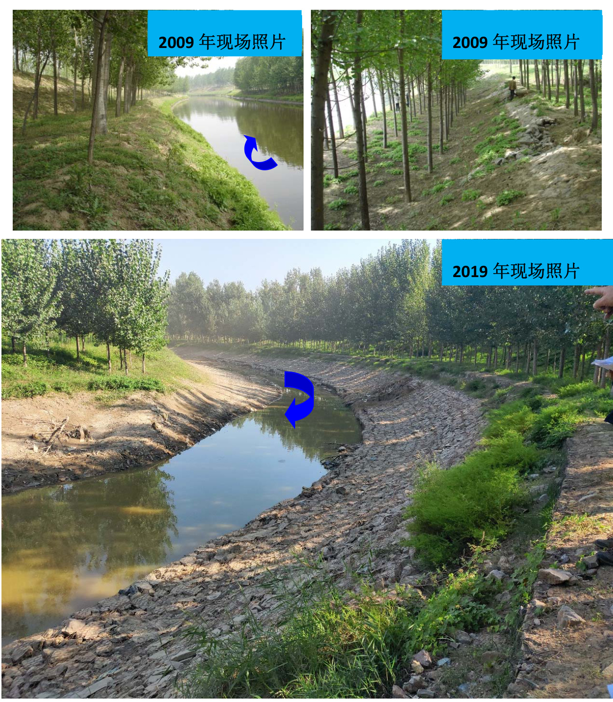  
图 5.5-1 柴弯险工(下)现状  

大榆柳险工位于卫河左岸 $Z52\substack{+800}$ 处,险工全长 $230\mathrm{m}$ ,可研阶段对主槽冲刷严重位置采取抛石护基措施。根据 2019 年查勘情况,该段现状主槽较为顺直,顶冲作用不明显,且现状滩地上植被树木茂盛,可起固滩护坡作用,本次不再对其安排治理。大榆柳险工现状情况见图 5.5-2。  

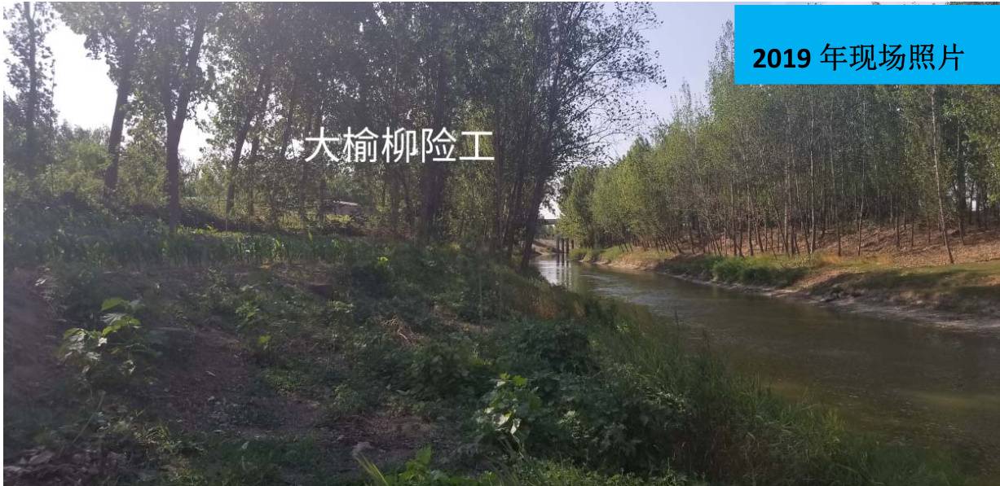  
图 5.5-2  大榆柳险工现状  

五陵镇险工位于卫河左岸 $Z71{+}200$ 位置,全长 $800\mathrm{m}$ ,现状为干砌石护坡与浆砌石挡墙相结合。可研阶段根据现场干砌石局部有破损情况,对其破损处进行加固处理。根据初设阶段现场查勘情况来看,该险工目前已进行过翻修护砌,现状坡脚浆砌石基座完好,且河道该段河道较为顺直,主槽淘刷作用较小,本次不再安排治理。五陵镇险工现状情况见图 5.5-3。  

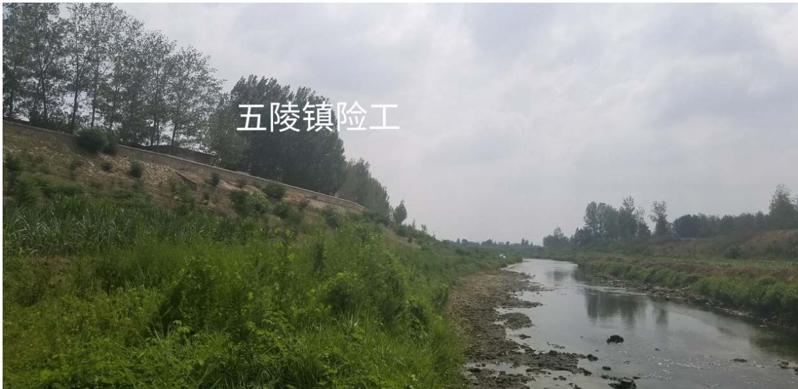  
图 5.5-3 五陵镇险工现状  

新镇西险工位于卫河右岸 $\mathrm{Y}10{+}200$ 位置,险工全长 $290\mathrm{m}$ ,现有浆砌石护砌$290\mathrm{m}$ ,可研阶段为防止护砌基础悬吊,对其主槽坡脚采取抛石治理措施。根据初设阶段现场查勘情况来看,该处滩地较宽,近年来滩地上植被覆盖较好,河道主槽顺直,不存在弯道迎流顶冲问题,本次不再安排治理。新镇西险工现状情况见图 5.5-4。  

  
图 5.5-4 新镇西险工现状  

申湾险工位于卫河右岸 $\mathrm{Y}25\substack{+300}$ 处,险工全长 $170\mathrm{m}$ ,可研阶段对其中存在破损情况的 $50\mathrm{m}$ 采取局部加固、抛石护脚的治理措施,根据初设阶段现场查勘情况,该处险工已经进行抛石护脚,且抛石现状情况良好,本次不再安排治理。申湾险工现状情况见图 5.5-5。  

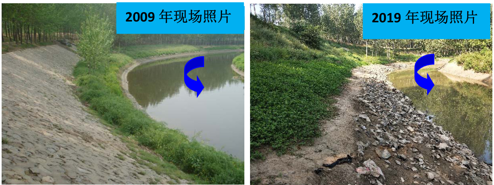  
图 5.5-5 申湾险工现状  

大吕庄险工位于卫河右岸 $\mathrm{Y}35\substack{+500}$ 处,险工全长 $490\mathrm{m}$ ,可研阶段对其中$300\mathrm{m}$ 采取局部加固、抛石护脚的治理措施。根据初设阶段现场查勘情况,该处险工护砌已得到加固,现状运行情况较好,坡脚已进行抛石处理,本次不再安排治理。  

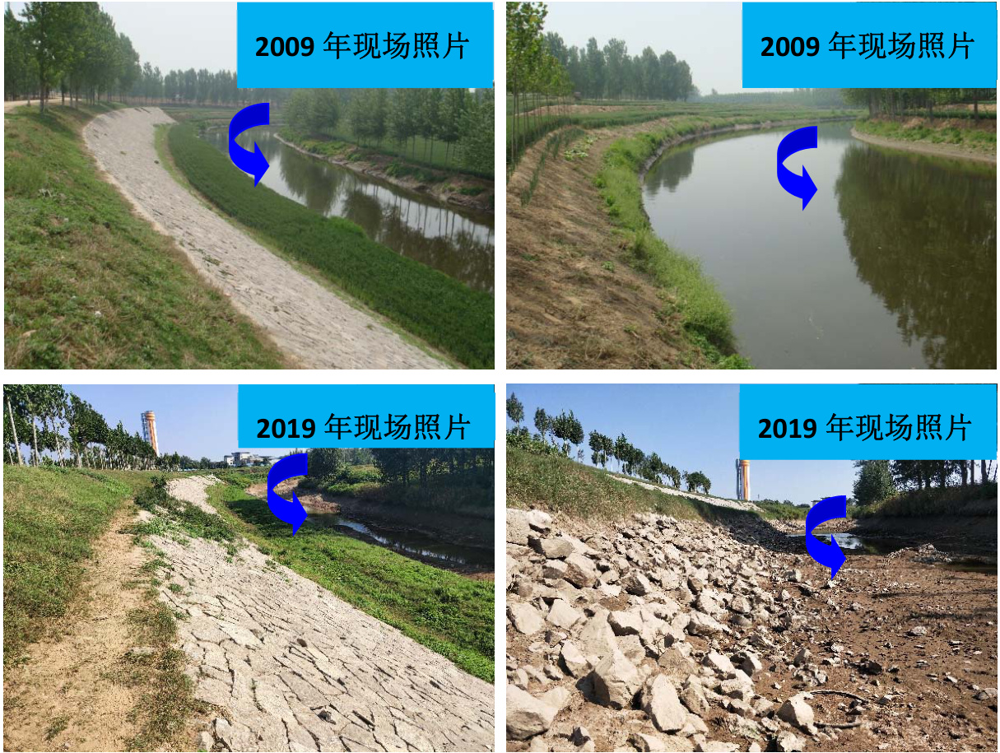  
图 5.5-6  大吕庄险工现状  

此外,根据现场情况,另有 7 处险工处于河道顶冲处,冲刷较严重,或现有护砌存在破损情况,包括东郭村(上)险工、东郭村(下)险工、牛村险工、王湾险工、西周口险工、梁村险工、龙王庙险工。本次将此 7 处险工列入治理范围内,险工现状情况如下:  

# 1、东郭村(上)险工  

东郭村(上)险工位于卫河左岸 $Z6{+}430$ 处,通过现场查勘,该处座弯顶冲,弯道滩窄坡陡,现状无防护工程。根据 2009 年与 2019 年实测断面对比情况,河道主槽存在向两边淘刷的情况,现状岸坡较陡,为保护堤防安全,需对主槽进行防护,需防护长度为 $200\mathrm{m}$ 。河道断面对比及险工现状情况见图 5.5-7。  

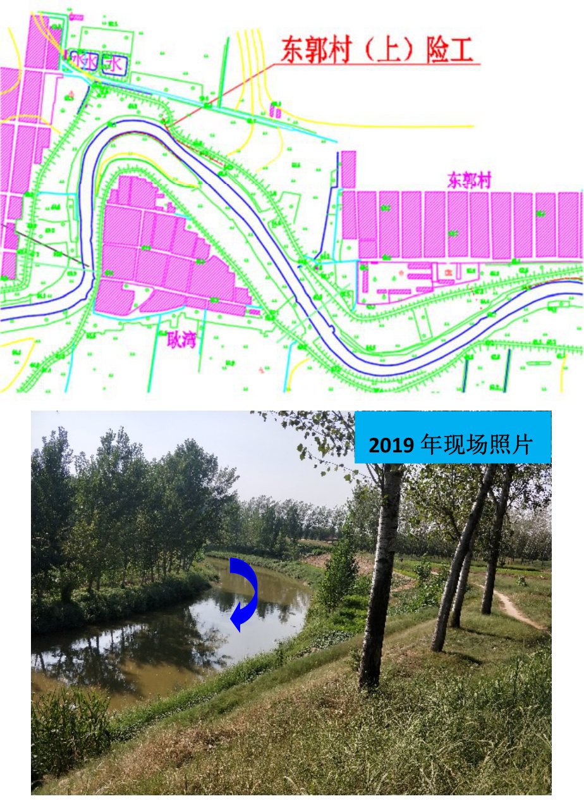  

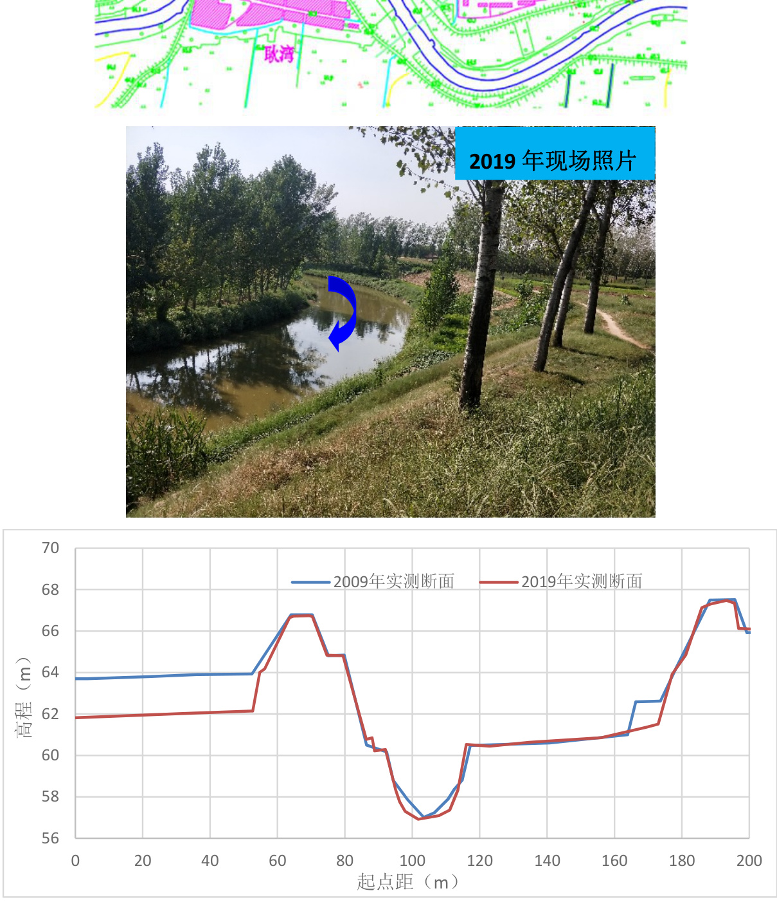  
图 5.5-7  东郭村(上)险工现状及河道断面图  

# 2、东郭村(下)险工  

东郭村(下)险工位于卫河左岸 $Z7\mathrm{+}510$ 处,险工长 $360\mathrm{m}$ ,座弯顶冲,主槽边坡较陡,且紧邻堤防,现状岸坡无防护工程,水流冲刷河道主槽将直接威胁堤防安全,亟须对主槽进行防护。险工现状见图 5.5-8。  

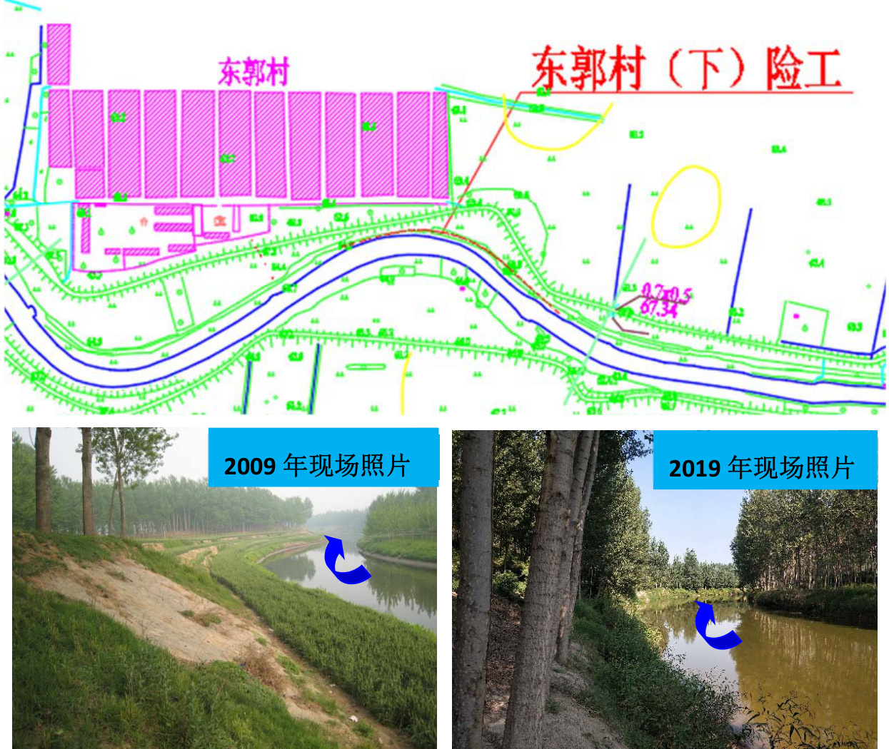  
图 5.5-8  东郭村(下)险工现状图  

# 3、牛村险工  

牛村险工位于卫河左堤 $Z13\substack{+600}$ ,通过现场查勘,该处卫河主槽为 U 型弯道,现状无防护工程,主槽边坡较陡,不利于边坡稳定,需对主槽进行防护,需防护长度 $240\mathrm{m}$ 。险工现状见图 5.5-9。  

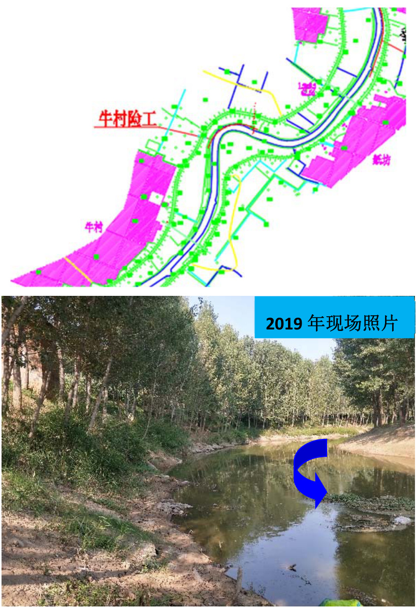  
图 5.5-9 牛村险工现状图  

# 4、王湾险工  

王湾险工位于卫河左堤 $Z19\substack{+950}$ 处,险工长 $280\mathrm{m}$ ,现状浆砌石护坡较完整,但主槽处弯道顶冲部位,边坡较陡,存在基础悬吊问题。局部主槽紧靠堤防,需对主槽进行防护。险工现状见图 5.5-10。  

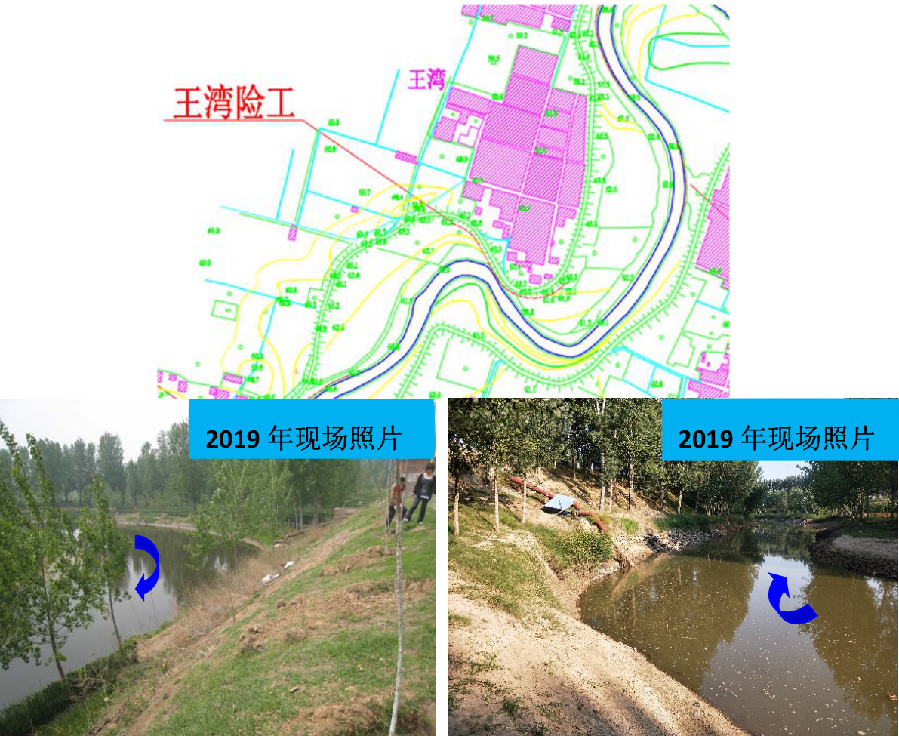  
图 5.5-10 王湾险工现状图  

# 5、西周口险工  

西周口险工位于卫河左堤 $Z38\substack{+400}$ 处,险工长度 $150\mathrm{m}$ ,现状有浆砌石护砌,主槽弯道顶冲位置冲刷较严重,存在基础悬吊问题,需对主槽进行防护。险工现状见图 5.5-11。  

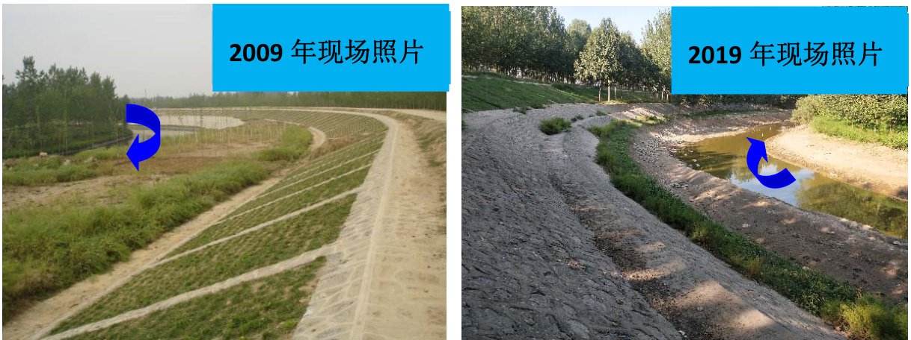  
图 5.5-11 西周口险工现状图  

# 6、梁村险工  

梁村险工位于卫河左堤 $Z137\substack{+700}$ 处,险工长度 $400\mathrm{m}$ ,位于卫河弯道处,座弯顶冲,现状无防护工程,堤后紧邻梁村乡政府所在地,重要程度较高,多年来一直未进行治理,亟需进行防护。险工现状见图 5.5-12。  

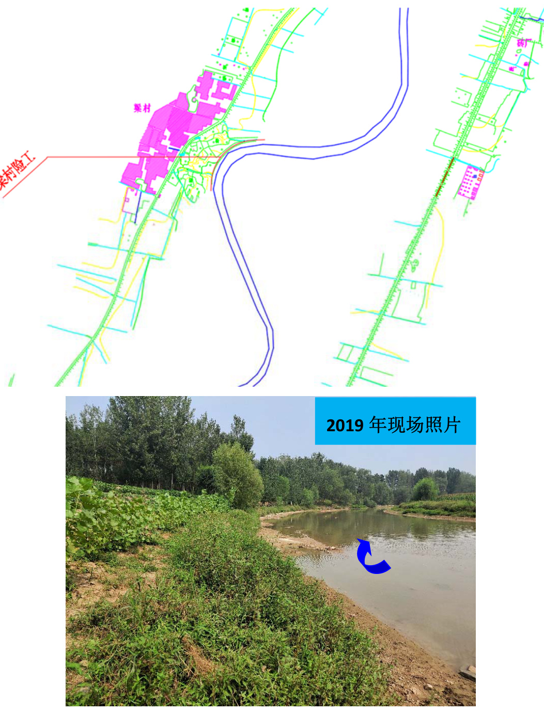  
图 5.5-12 梁村险工现状图  

# 7、龙王庙险工  

龙王庙险工位于卫河右堤 $\mathrm{Y}155{+}860$ ,险工总长度 $1400\mathrm{m}$ ,该险工地处卫河右堤弯道,迎流顶冲,滩地较窄,现有护坡长度 $1400\mathrm{m}$ ,但护坡存在局部出现破损、空洞、部分基础悬吊等问题。险工现状见图 5.5-13。  

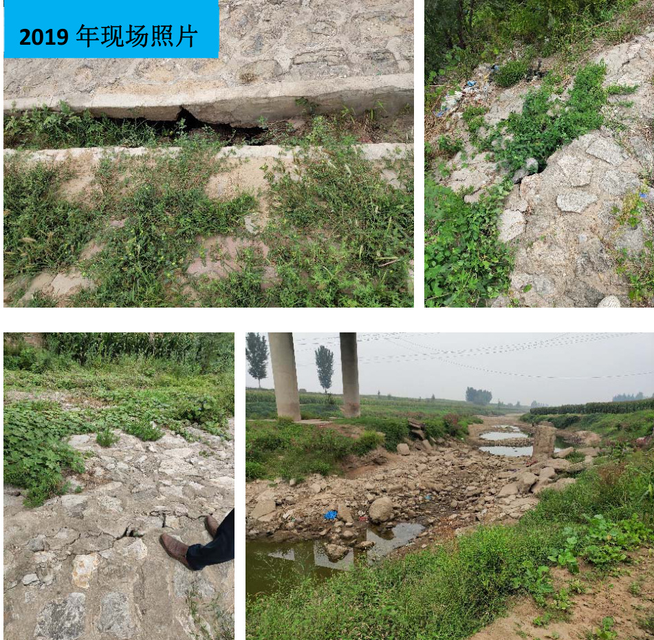  
图 5.5-13  龙王庙险工现状图  

综上所述,本次治理对比可研阶段,取消原批复 6 处险工、新增 7 处险工,共治理 68 处险工。其中 14 处险工处于弯道迎流顶冲,滩窄坡陡危及堤防安全,现状缺乏防护,15 处险工现有防护工程护砌范围不足或破损严重,4 处险工现有防护工程局部破损严重,其它 35 处险工虽然现有防护工程结构较为完整、但由于河道主槽的下切,导致现状防护位置较高,存在不同程度基础悬吊现象。治理险工现状情况见表 5.5-3。  

表 5.5-3 本次治理险工现状情况统计表  

<html><body><table><tr><td>序号</td><td>险工名称</td><td>岸别</td><td>起始桩号 （堤防桩</td><td>险工长度 (W)</td><td>存在问题 备注</td></tr><tr><td>1</td><td>孟庄险工</td><td>左</td><td>号) Z0+900</td><td>600</td><td>现状有干砌石（砂浆勾缝）护砌600m，“96.8"洪水时部分坡面坍塌，长100m</td></tr><tr><td>2</td><td>东郭村（上）险工</td><td>左</td><td>Z6+430</td><td>200</td><td>现状无防护、新增护砌、结合主槽清淤边坡 新增</td></tr><tr><td>3</td><td>东郭村（下）险工</td><td>左</td><td>Z7+510</td><td>360</td><td>现状无防护、新增护砌、结合主槽清淤边坡 新增</td></tr><tr><td>4</td><td>侯村险工</td><td>左</td><td>Z11+865</td><td>600</td><td>现状有干砌石护砌 80m，主槽弯道顶冲部位冲刷较严重</td></tr><tr><td>5</td><td>牛村险工</td><td>左</td><td>Z13+600</td><td>240</td><td>现状无防护、新增护砌、结合主槽清淤边坡 新增</td></tr><tr><td>6</td><td>郝村险工 (上)</td><td>左</td><td>Z15+200</td><td>310</td><td>现状有浆砌石护砌210m，下游护砌长度不够，浆砌石护坡局部坍塌破损</td></tr><tr><td>7</td><td>郝村险工 (下)</td><td>左</td><td>Z16+085</td><td>300</td><td>现状无护砌，主槽弯道处冲刷较严重</td></tr><tr><td>8</td><td>雷村险工 (上)</td><td>左</td><td>Z16+340</td><td>500</td><td>现状有干砌石护坡，“96.8"洪水时坡面坍塌破损严重</td></tr><tr><td>６</td><td>雷村险工</td><td>左</td><td>Z17+200</td><td>560 现状为U型弯道，干砌石护砌190m，结构完好，主槽弯道顶冲部位冲刷较严重</td><td></td></tr><tr><td>10</td><td>权庄险工</td><td>左</td><td>Z17+525</td><td>200 现状有黄泥浆砌石护砌200m，“96.8"洪水时坡面坍塌破损严重</td><td></td></tr><tr><td>11</td><td>石羊险工</td><td>左</td><td>Z19+245</td><td>500 现状有U型弯道，干砌石护砌105m，结构完好，主槽弯道顶冲部位冲刷较严重</td><td></td></tr><tr><td>12</td><td>王湾险工</td><td>左</td><td>Z19+950</td><td>280 现状浆砌石护砌完好，主槽弯道顶冲部位冲刷较严重</td><td>新增</td></tr><tr><td>13</td><td>杜庄险工</td><td>左</td><td>Z20+555</td><td>270 U型弯道，座弯迎流，主槽冲刷严重</td><td></td></tr><tr><td>14</td><td>头险工 (上)</td><td>左</td><td>Z20+900 300</td><td>U型弯道，现状有干砌石护砌150m，主槽弯道顶冲部位冲刷较严重</td><td></td></tr><tr><td>15</td><td>婦头险工</td><td>左</td><td>Z21+610 500</td><td>现状护砌170m，主槽弯道处冲刷较严重</td><td></td></tr><tr><td>16</td><td>小河险工</td><td>左</td><td>Z22+545 250</td><td>现状有干砌石护砌150m，“96.8"洪水时坡面局部塌破损严重</td><td></td></tr><tr><td>17</td><td>下滩险工 (上)</td><td>左</td><td>Z23+090 300</td><td>现状有干砌石护砌85m，主槽弯道顶冲部位冲刷较严重</td><td></td></tr><tr><td>18</td><td>下滩险工 （下)</td><td>左</td><td>Z23+820</td><td>U型弯道，现状浆砌石护砌160m，“96.8"洪水时坡面坍塌破损严重，2007年对破 400 损部分进行了维修，但主槽弯道顶冲部位，基础悬吊严重</td><td></td></tr></table></body></html>  

表 5.5-3 本次治理险工现状情况统计表  

<html><body><table><tr><td>序号</td><td>险工名称</td><td>岸别</td><td>起始桩号 （堤防桩 号)</td><td>险工长度 (m)</td><td>存在问题</td><td>备注</td></tr><tr><td>19</td><td>康庄险工</td><td>左</td><td>Z27+500</td><td>300</td><td>分进行了维修，但主槽弯道顶冲部位，基础悬吊严重</td><td></td></tr><tr><td>20</td><td>河西险工</td><td>左</td><td>Z30+120</td><td>400</td><td>险工长400m，现有桥梁上下游处冲刷较严重</td><td></td></tr><tr><td>21</td><td>白庄险工</td><td>左</td><td>Z31+560</td><td>210</td><td>现有干砌护砌210m，“96.8"洪水时150m有破损，主槽弯道顶冲部位冲刷较严重</td><td></td></tr><tr><td>22</td><td>柴湾险工</td><td>左</td><td>Z34+260</td><td>250</td><td>U型弯道，干砌石护砌，结构完好，主槽弯道顶冲部位冲刷较严重</td><td></td></tr><tr><td>23</td><td>东周口险工</td><td>左</td><td>Z37+110</td><td>200</td><td>现状有干砌石护滩坡150m，岸坡损毁严重，需重建，主槽冲刷严重</td><td></td></tr><tr><td>24</td><td>中周口险工</td><td>左</td><td>Z37+595</td><td>170</td><td>U型弯道，现状已护砌50m，护砌长度不够，主槽弯道顶冲部位冲刷较严重</td><td></td></tr><tr><td>25</td><td>西周口险工</td><td>左</td><td>Z38+400</td><td>150</td><td>现状有浆砌石护砌，主槽弯道顶冲部位冲刷较严重</td><td>新增</td></tr><tr><td>26</td><td>晏庄险工</td><td>左</td><td>Z39+800</td><td>400</td><td>现状有浆砌石护砌，结构完好，主槽弯道顶冲部位冲刷较严重</td><td></td></tr><tr><td>27</td><td>西王桥险工</td><td>左</td><td>Z46+955</td><td>380</td><td>条石护砌直立的防洪墙，局部为边坡防护，护砌长度不够</td><td></td></tr><tr><td>28</td><td>十里铺险工</td><td>左</td><td>Z50+195</td><td>300</td><td>现有干砌石护砌300m，“96.8"洪水时200m有破损，主槽弯道顶冲部位冲刷较严 重</td><td></td></tr><tr><td>29</td><td>小榆柳险工（下）</td><td>左</td><td>Z51+150</td><td>350</td><td>现状护坡结构完好，主槽弯道顶冲部位冲刷较严重</td><td></td></tr><tr><td>30</td><td>瓦查险工</td><td>左</td><td>Z67+670</td><td>400</td><td>现状有干砌石护砌，上游护砌长度不够</td><td></td></tr><tr><td>31</td><td>北渡村险工</td><td>左</td><td>Z94+825</td><td>200</td><td>干砌石护砌，座弯迎流，主槽冲刷，“96.8"时洪水上滩形成冲坑</td><td></td></tr><tr><td>32</td><td>梁村险工</td><td>左</td><td>Z137+700</td><td>400</td><td>座弯顶冲，现状无防护工程</td><td>新增</td></tr><tr><td>33</td><td>新苑湾险工</td><td>左</td><td>Z161+635</td><td>300</td><td>主槽弯道顶冲部位冲刷较严重</td><td></td></tr><tr><td>34</td><td>营镇险工</td><td>左</td><td>Z182+880</td><td>680</td><td>现状有浆砌石护砌，局部有破损，上游护砌长度不够</td><td></td></tr><tr><td>35</td><td>耿湾险工 （下)</td><td>右</td><td>Y8+150</td><td>300</td><td>现有干砌石护砌200m、浆砌石护砌100m，“96.8"洪水时干砌石护砌破损较严重</td><td></td></tr><tr><td>36</td><td>兰庄险工</td><td>右</td><td>Y12+695</td><td>280</td><td>现有浆砌石护砌80m完好，主槽弯道顶冲护砌</td><td></td></tr></table></body></html>  

表 5.5-3 本次治理险工现状情况统计表  

<html><body><table><tr><td>序号</td><td>险工名称</td><td>岸别</td><td>起始桩号 （堤防桩</td><td>险工长度 (m)</td><td>存在问题</td><td>备注</td></tr><tr><td>37</td><td>兰庄北险工</td><td>右</td><td>号) Y13+430</td><td>390</td><td>现状有浆砌石护砌390m，主槽弯道冲刷严重</td><td></td></tr><tr><td>38</td><td>范店险工</td><td>右</td><td>Z16+280</td><td>500</td><td>现状有浆砌石护砌140m，U型弯道，两个弯道处主槽冲刷较严重</td><td></td></tr><tr><td>39</td><td>郭渡险工</td><td>右</td><td>Y19+255</td><td>515</td><td>现状有干砌石护砌300m，险工下延</td><td></td></tr><tr><td>40</td><td>西王渡险工 (上)</td><td>右</td><td>Y19+950</td><td>400</td><td>座弯迎流，主槽冲刷</td><td></td></tr><tr><td>41</td><td>卢庄险工</td><td>右</td><td>Y22+525</td><td>150</td><td>座弯迎流，主槽冲刷，“96.8"洪水时岸坡坍塌</td><td></td></tr><tr><td>42</td><td>梨园险工</td><td>右</td><td>Y24+720</td><td>150</td><td>现状有浆砌石护砌150m，“96.8"洪水时局部100m有破损，2006年修复，坡脚弯 道顶冲部位冲刷较严重</td><td></td></tr><tr><td>43</td><td>滑县寨墙险工</td><td>右</td><td>Y33+080</td><td>2750</td><td>现状有砌砖和砌石防洪墙，“96.8"洪水时部分墙体破损、裂缝、倾斜，1997、1998 年仅对损坏严重的350m进行除险加固，尚有1.50km墙体存在安全隐患</td><td></td></tr><tr><td>44</td><td>薛村险工</td><td>右</td><td>Y36+770</td><td>500</td><td>现状有干砌石护砌500m，现状完好</td><td></td></tr><tr><td>45</td><td>杨堤险工</td><td>右</td><td>Y37+940</td><td>350</td><td>现状有浆砌石护砌90m，护砌位置较高，主槽弯道顶冲部位冲刷较严重</td><td></td></tr><tr><td>46</td><td>八里井险工</td><td>右</td><td>Y38+565</td><td>220</td><td>现状有干浆砌石护砌220m，护砌位置较高，主槽弯道顶冲部位冲刷较严重</td><td></td></tr><tr><td>47</td><td>郭庄险工</td><td>右</td><td>Y39+470</td><td>370</td><td></td><td></td></tr><tr><td>48</td><td>郭庄险工 (下)</td><td>右</td><td>Y39+960</td><td>450</td><td>现状无工程，主槽弯道顶冲部位冲刷严重，基础悬吊</td><td></td></tr><tr><td>49</td><td>苑刘庄险工</td><td>右</td><td>Y41+190</td><td>500</td><td>现状有干砌石护砌340m，位置较高，主槽弯道顶冲部位冲刷较严重</td><td></td></tr><tr><td>50</td><td>王寺庄险工</td><td>右</td><td>Y42+185</td><td>250</td><td>U型弯道，座弯迎流，基础悬吊</td><td></td></tr><tr><td>51</td><td>东王桥险工</td><td>右</td><td>Y48+945</td><td>300</td><td>现状有干砌石及浆砌石护砌，“96.8"洪水时干砌局部200m有破损，主槽弯道顶冲 部位冲刷较严重</td><td></td></tr><tr><td>52</td><td>东王桥东险工</td><td>右</td><td>Y49+580</td><td>500</td><td>弯道顶冲，主槽弯道顶冲部位冲刷严重</td><td></td></tr><tr><td>53</td><td>圈里险工</td><td>右</td><td>Y59+070</td><td>280</td><td>现状护砌150m，“96.8"洪水时破损较严重，主槽弯道顶冲部位冲刷较严重</td><td></td></tr></table></body></html>  

表 5.5-3 本次治理险工现状情况统计表  

<html><body><table><tr><td>序号</td><td>险工名称</td><td>岸别</td><td>起始桩号 （堤防桩</td><td>险工长度 (W)</td><td>存在问题</td><td>备注</td></tr><tr><td>54</td><td>刘石井险工</td><td>右</td><td>号) Y63+350</td><td>350</td><td>现状无护砌，座弯迎流，主槽冲刷</td><td></td></tr><tr><td>55</td><td>苏村险工</td><td>右</td><td>Y69+490</td><td>370</td><td>现状已有护砌150m，主槽弯道顶冲部位冲刷较严重</td><td></td></tr><tr><td>56</td><td>郑庄险工</td><td>右</td><td>Y84+670</td><td>500</td><td>座弯迎流，主槽冲刷，“96.8"时洪水上滩，滩岸崩塌</td><td></td></tr><tr><td>57</td><td>旧县险工</td><td>右</td><td>Y98+160</td><td>650</td><td>96.8洪水后加固浆砌石护坡50m，其余为干砌石护砌600m，现状完好</td><td></td></tr><tr><td>58</td><td>马固险工</td><td>右</td><td>Y101+000</td><td>250</td><td>座弯迎流，主槽冲刷</td><td></td></tr><tr><td>59</td><td>范羊险工</td><td>右</td><td>Y103+465</td><td>300</td><td>上游为安阳河汇入处，现状为植柳护坡，该段土质较差，为粉砂，水流冲刷会产 生塌陷。</td><td></td></tr><tr><td>60</td><td>西范堤险工</td><td>右</td><td>Y150+425</td><td>320</td><td>现状有干砌石护砌320m，破损较严重，</td><td></td></tr><tr><td>61</td><td>龙王庙险工</td><td>右</td><td>Y154+760</td><td>1400</td><td>局部护砌有破损</td><td>新增</td></tr><tr><td>62</td><td>南王庄险工</td><td>右</td><td>Y158+295</td><td>340</td><td>现状浆砌石护砌，主槽弯道顶冲部位冲刷较严重</td><td></td></tr><tr><td>63</td><td>北王庄险工</td><td>右</td><td>Y161+615</td><td>200</td><td>护砌未至主槽底部，由于河道下切，下游形成新险地段，主流直冲滩地，现状为 抛石护脚。</td><td></td></tr><tr><td>64</td><td>班庄闸险工 (下)</td><td>右</td><td>Y182+220</td><td>150</td><td>现状有黄泥浆砌石护砌150m，破损较要重</td><td></td></tr><tr><td>65</td><td>班庄险工</td><td>右</td><td>Y183+400</td><td>515</td><td>现状已护砌300m，护砌长度不够</td><td></td></tr><tr><td>66</td><td>东营镇险工</td><td>右</td><td>Y184+575</td><td>1490</td><td>现有护砌段有破损，局部新浆砌石护砌200m，护砌长度不够，主槽弯道顶冲部位 冲刷严重</td><td></td></tr><tr><td>67</td><td>也村险工</td><td>右</td><td>Y188+400</td><td>770</td><td>该段险工黄泥浆砌石护砌，局部护坡有破损。主槽内弯道较大，有顶冲，冲刷较 严重。</td><td></td></tr><tr><td>68</td><td>郭安堤险工</td><td>右</td><td>Y190+085</td><td>600</td><td>座弯迎流，主槽冲刷严重，基础悬吊</td><td></td></tr><tr><td></td><td>合计</td><td></td><td></td><td>29120</td><td></td><td></td></tr></table></body></html>  

# 5.5.1.3 左岸治理险工现状  

本次卫河左岸共安排治理险工 34 处,其中现状无防护工程的险工 7 处,现有防护工程长度不足或破损严重险工 9 处,现有防护工程局部破损险工 1 处,存在基础悬吊问题险工 17 处。  

1、现状无防护工程护砌的险工  

该类型险工包括东郭村(上)险工、东郭村(下)险工、牛村险工、郝村(下)险工、北渡村险工、梁村险工、新苑湾险工,其中东郭村(上)险工、东郭村(下)险工、牛村险工、梁村险工为本次新增险工,险工现状见 5.5.1.2 节,其他险工现状如下:  

(1)郝村险工(下)  

险工起始桩号 $16{+}085$ ,长度为 $300\mathrm{m}$ ,位于 U 型弯道入湾处,河道主槽紧邻堤防,堤后为村庄,现状主槽无护砌,岸坡受水流冲刷严重,边坡坡比约 1:1。险工现状见图 5.5-14。  

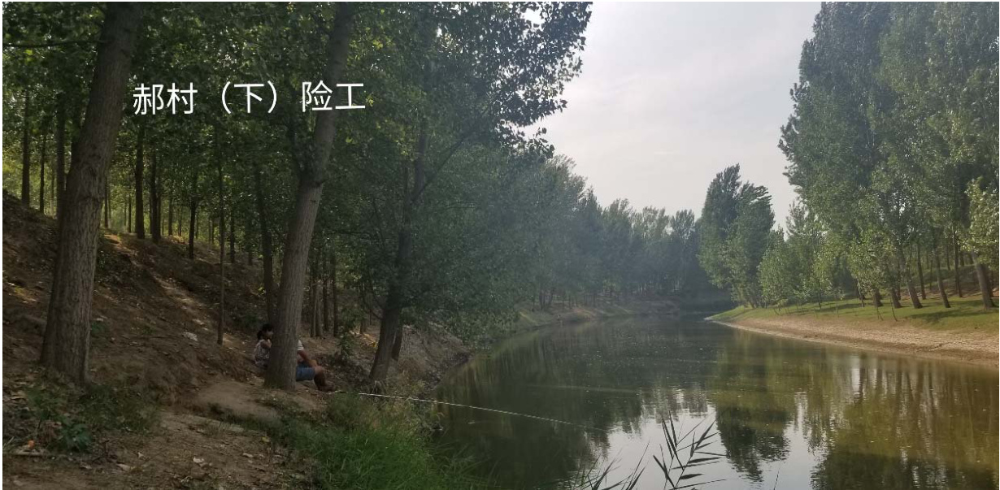  
图 5.5-14 郝村(下)险工现状图  

(2)北渡村险工  

起始桩号 $94\substack{+825}$ ,险工长度 $200\mathrm{m}$ ,96.8 洪水上滩后局部冲成塌坑,主槽岸坡无护砌,持续冲刷对现有岸坡防护工程的稳定极为不利,需对河道主槽进行护砌。险工情势见图 5.5-15。  

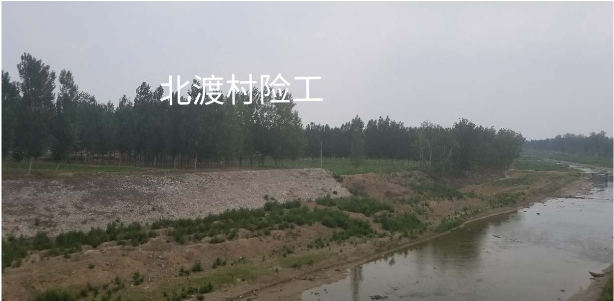  
图 5.5-15 北渡村险工现状图  

(3)新苑湾险工  

起始桩号 $161{+}635$ ,险工长度 $300\mathrm{m}$ ,现状无护砌,河槽弯道顶冲部位岸坡较陡、冲刷严重。险工情势见图 5.5-16。  

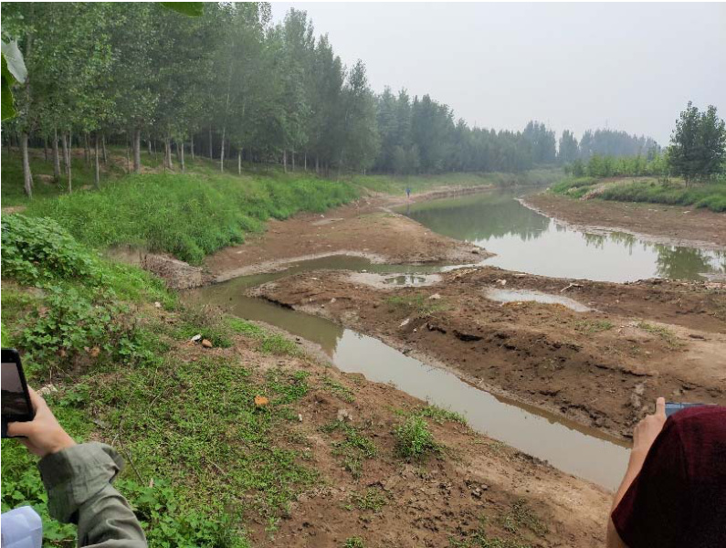  
图 5.5-16 新苑湾险工现状图  

2、现有防护工程护砌长度不足或破损严重的险工  

该类型险工共有 9 处,包括雷村险工(上)、权庄险工、小河险工、东周口险工、十里铺险工、郝村险工(上)、西王桥险工、瓦查险工、营镇险工,需对现状险工进行接长或翻修。  

(1)现有防护工程破损严重  

雷村险工(上)、权庄险工、小河险工、东周口险工、十里铺险工现状存在防护工程,但均出现破损严重问题,亟须进行翻修或拆除重建。  

# (2)现状已防护但护砌长度不足  

郝村险工(上)、西王桥险工、瓦查险工、营镇险工等险工,现有防护工程长度不足,很难满足防护需求,需分别向上游或下游延长护砌。  

# 3、现状已防护,但局部破损的险工  

孟庄险工现状为干砌石(砂浆勾缝)护砌,“96.8”洪水时部分坡面坍塌,块石脱落,长度 $100\mathrm{m}$ ,需对坍塌位置进行修补。  

4、现有防护工程结构较完好,但护砌位置较高,河槽冲刷存在不同程度基础悬吊现象的险工  

该类型险工共有 17 处,包括侯村险工、雷村险工、石羊险工、埽头险工(上)、埽头险工、下滩险工(上)、白庄险工、柴湾险工、王湾险工、下滩险工(下)、康庄险工、西周口险工、晏庄险工、小榆柳险工(下)、中周口险工、杜庄险工、河西险工。上述险工均需对主槽进行防护。  

(1)现状滩坡均有较完好的干砌石护砌,但主槽弯道有冲刷,存在不同程度的基础悬吊现象,此类险工 8 处,分别为侯村险工、雷村险工、石羊险工、埽头险工(上)、埽头险工、下滩险工(上)、白庄险工、柴湾险工。  

(2)险工现状滩坡有较完好的浆砌石护砌,主槽弯道有冲刷,存在不同程度的基础悬吊现象,此类险工 7 处,分别为王湾险工、下滩险工(下)、康庄险工、西周口险工、晏庄险工、小榆柳险工(下)、中周口险工。  

(3)险工段现状滩地较宽,但河槽弯道顶冲部位冲刷严重,此类险工 2 处, 分别为杜庄险工和河西险工。  

# 5.5.1.4 右岸治理险工现状  

本次卫河左岸共安排治理 34 处,其中现状无防护工程险工 7 处,现有防护工程长度不足险工 6 处,现有防护工程局部破损严重的险工 3 处,存在基础悬吊问题险工 18 处。  

# 1、现状无防护工程的险工  

该类型险工共有 7 处,包括西王渡险工(上)、卢庄险工、郑庄险工、马固险工、范羊险工、南王庄险工、郭安堤险工。各险工现状如下:  

# (1)西王渡险工(上)  

起始桩号 $\mathrm{Y}19\substack{+950}$ ,险工长 $400\mathrm{m}$ ,座弯迎流顶冲,滩窄坡陡,弯道顶冲河槽及堤身冲刷严重,险工情势见图 5.5-17。  

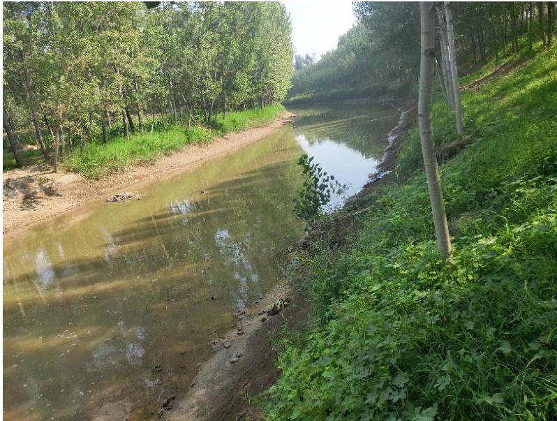  
图 5.5-17 西王渡险工(上)现状图  

(2)卢庄险工  

起始桩号 $\mathrm{Y}22\substack{+525}$ ,险工长 $150\mathrm{m}$ ,座弯迎流顶冲,滩窄坡陡,弯道顶冲河槽及堤身冲刷严重,危及堤防安全。险工情势见图 5.5-18。  

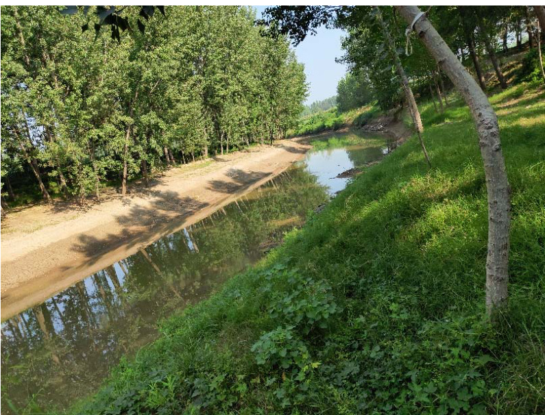  
图 5.5-18  卢庄险工现状图  

(3)郑庄险工  

起始桩号 $\mathrm{Y}84{+}670$ ,险工长度 $500\mathrm{m}$ ,座弯迎流顶冲,现状无护砌,发生大洪水时会直冲堤防,危及堤防安全。险工情势见图 5.5-19。  

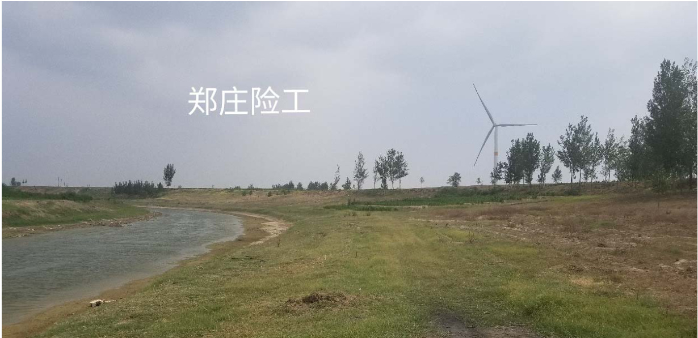  
图 5.5-19 郑庄险工现状图  

(4)马固险工  

起始桩号 $\mathrm{Y}101{+}000$ ,险工长度 $250\mathrm{m}$ ,座弯迎流顶冲,现状无护砌,主槽冲刷严重。险工情势见图 5.5-20。  

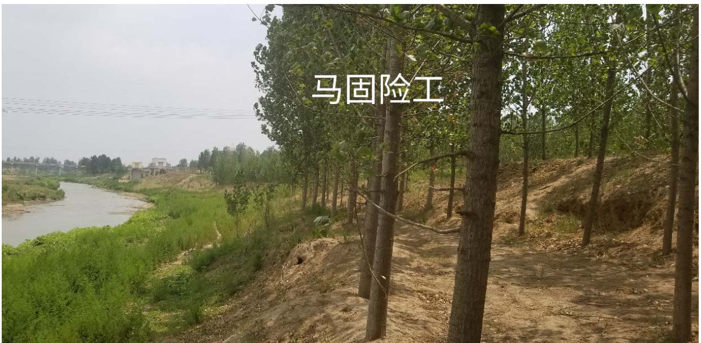  
图 5.5-20 马固险工现状图  

(5)范羊险工  

起始桩号 $\mathrm{Y}103\substack{+465}$ ,险工长 $300\mathrm{m}$ ,上游为安阳河汇入处,现状无护砌,该段土质较差,水流冲刷会产生塌陷。险工情势见图 5.5-21。  

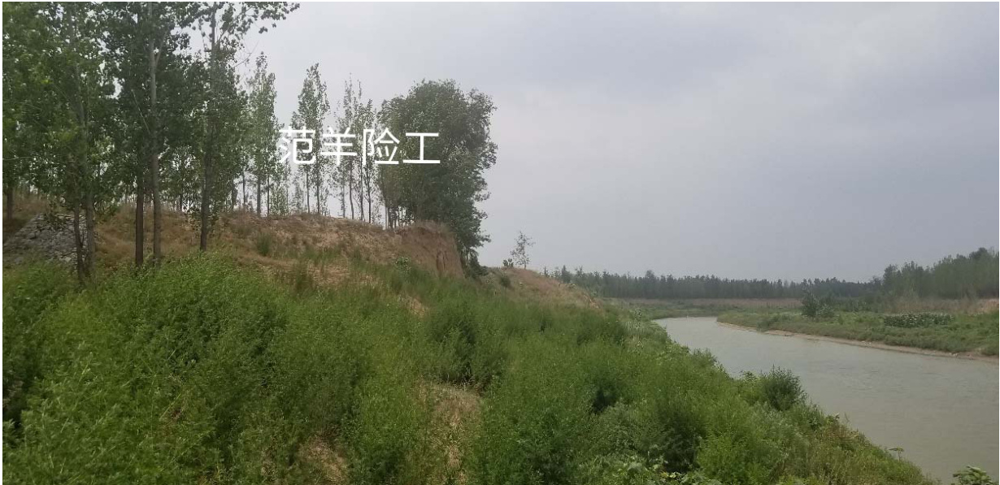  
图 5.5-21 范羊险工现状图  

(6)南王庄险工  

起始桩号 $\mathrm{Y}158{+}295$ ,险工长度 $340\mathrm{m}$ ,座弯迎流顶冲,现状无护砌,发生大洪水时会直冲堤防,危及堤防安全。险工情势见图 5.5-22。  

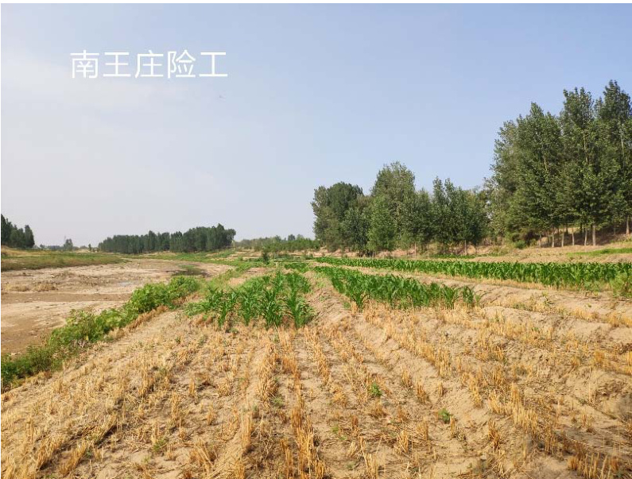  
图 5.5-22 南王庄险工现状图  

(7)郭安堤险工  

起始桩号 $\mathrm{Y}190{+}085$ ,险工长度 $600\mathrm{m}$ ,座弯迎流顶冲,岸坡较陡,现状无护砌,主槽冲刷严重。险工情势见图 5.5-23。  

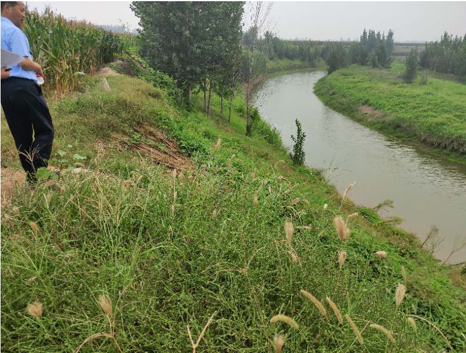  
图 5.5-23 郭安堤险工现状图  

2、现有防护工程护砌长度不足或破损严重的险工  

该类型险工共有 6 处,包括郭渡险工、苏村险工、班庄险工、东营镇险工、乜村险工、班庄闸下险工,需对现状险工进行接长或翻修。  

(1)现有防护工程破损严重  

班庄闸下险工长 $150\mathrm{m}$ ,现状为浆砌石护砌,破损严重,需进行翻修。  

(2)现有防护工程护砌长度不足  

郭渡险工、苏村险工、班庄险工、东营镇险工、乜村险工,现状均有长度不等的干砌石或浆砌石防护,依据主流流势和现状河槽冲刷情况,现有防护长度不足,需向上游或下游延长防护。  

3、现有防护工程局部破损的险工  

该类型险工有 3 处,为耿湾险工(下)、旧县险工和龙王庙险工,现状为干砌石或浆砌石护坡,局部护砌有破损情况,需进行修补。 其中耿湾险工(下)位于主槽凸岸,现有干砌石护砌 $200\mathrm{m}$ 、浆砌石护砌 $100\mathrm{m}$ ,“96.8”洪水时干砌石护砌破损较严重,一直未进行治理,鉴于该段主槽较窄,对岸为本次治理的东郭村(上)险工,由于两岸耕地属于不同村庄,为避免社会矛盾,本次对耿湾险工(下)进行修复治理。  

4、现有防护工程结构较完好,但护砌位置较高,存在不同程度基础悬吊的险工,或主槽冲刷严重,但滩地相对较宽的险工  

该类型险工有 18 处,其中兰庄险工、兰庄北险工、范店险工、梨园险工、滑县寨墙险工、薛村险工、杨堤险工、八里井险工、郭庄险工、苑刘庄险工、东王桥险工、东王桥东险工、圈里险工、西范堤险工、北王庄险工,现均有结构较好的护砌工程,但护砌位置较高,主槽有下切且处于弯道迎流顶冲,存在不同程度基础悬吊现象,需对主槽进行防护;郭庄险工(下)、王寺庄险工、刘石井险工主槽冲刷严重,但滩地相对较宽,为防止坡脚淘刷,需在主槽坡脚处进行防护。  

# 5.5.2 险工治理方案  

本次卫河共安排治理 68 处,其中现状无防护工程险工 14 处,现有防护工程长度不足或破损严重险工 15 处,现有防护工程局部破损的险工 4 处,存在基础悬吊问题险工 35 处。  

对于现状无防护工程险工,若现状滩地较窄或无滩地,新建防护工程从主槽位置护砌至堤顶,若滩地较宽,则对主槽进行护砌;对于现状防护工程不足或破损严重险工,进行接长或翻修;对于现有防护工程局部破损的险工,对破损位置进行局部修补;对于基础悬吊险工,对主槽进行防护。各险工治理长度及措施见表 5.5-4。  

表 5.5-4 险工治理长度及措施表  

<html><body><table><tr><td>序号</td><td>险工名称</td><td>岸 别</td><td>起始桩号</td><td>险工长 度(m)</td><td>治理长 度(m)</td><td>治理措施</td></tr><tr><td>1</td><td>孟庄险工</td><td>左</td><td>Z0+900</td><td>600</td><td>100</td><td>局部修补，护主槽</td></tr><tr><td>2</td><td>东郭村（上）险工</td><td>左</td><td>Z6+430</td><td>200</td><td>200</td><td>护主槽</td></tr><tr><td>3</td><td>东郭村（下）险工</td><td>左</td><td>Z7+510</td><td>360</td><td>360</td><td>护主槽</td></tr><tr><td>4</td><td>侯村险工</td><td>左</td><td>Z11+865</td><td>600</td><td>240</td><td>护主槽</td></tr><tr><td>5</td><td>牛村险工</td><td>左</td><td>Z13+600</td><td>240</td><td>240</td><td>护主槽</td></tr><tr><td>6</td><td>郝村险工 (上)</td><td>左</td><td>Z15+200</td><td>310</td><td>280</td><td>护主槽280、局部修补30m</td></tr><tr><td>7</td><td>郝村险工 (下)</td><td>左</td><td>Z16+085</td><td>300</td><td>200</td><td>护主槽</td></tr><tr><td>8</td><td>雷村险工 (上)</td><td>左</td><td>Z16+340</td><td>500</td><td>400</td><td>护主槽400、局部修补150m</td></tr><tr><td>9</td><td>雷村险工</td><td>左</td><td>Z17+200</td><td>560</td><td>300</td><td>护主槽</td></tr><tr><td>10</td><td>权庄险工</td><td>左</td><td>Z17+525</td><td>200</td><td>200</td><td>翻修200m</td></tr><tr><td>11</td><td>石羊险工</td><td>左</td><td>Z19+245</td><td>500</td><td>300</td><td>护主槽</td></tr><tr><td>12</td><td>王湾险工</td><td>左</td><td>Z19+950</td><td>280</td><td>280</td><td>护主槽</td></tr><tr><td>13</td><td>杜庄险工</td><td>左</td><td>Z20+555</td><td>270</td><td>270</td><td>护主槽</td></tr><tr><td>14</td><td>头险工 (上)</td><td>左</td><td>Z20+900</td><td>300</td><td>200</td><td>护主槽</td></tr><tr><td>15</td><td>头险工</td><td>左</td><td>Z21+610</td><td>500</td><td>450</td><td>护主槽</td></tr><tr><td>16</td><td>小河险工</td><td>左</td><td>Z22+545</td><td>250</td><td>220</td><td>局部修补50m，护主槽220m</td></tr><tr><td>17</td><td>下滩险工 (上)</td><td>左</td><td>Z23+090</td><td>300</td><td>200</td><td>护主槽</td></tr><tr><td>18</td><td>下滩险工 （下)</td><td>左</td><td>Z23+820</td><td>400</td><td>200</td><td>护主槽</td></tr><tr><td>19</td><td>康庄险工</td><td>左</td><td>Z27+500</td><td>300</td><td>150</td><td>护主槽</td></tr><tr><td>20</td><td>河西险工</td><td>左</td><td>Z30+120</td><td>400</td><td>200</td><td>护主槽200m</td></tr><tr><td>21</td><td>白庄险工</td><td>左</td><td>Z31+560</td><td>210</td><td>150</td><td>护主槽</td></tr><tr><td>22</td><td>柴湾险工</td><td>左</td><td>Z34+260</td><td>250</td><td>60</td><td>向上游护主槽</td></tr><tr><td>23</td><td>东周口险工</td><td>左</td><td>Z37+110</td><td>200</td><td>150</td><td>翻修</td></tr><tr><td>24</td><td>中周口险工</td><td>左</td><td>Z37+595</td><td>170</td><td>120</td><td>护主槽</td></tr><tr><td>25</td><td>西周口险工</td><td>左</td><td>Z38+400</td><td>150</td><td>150</td><td>护主槽</td></tr></table></body></html>  

<html><body><table><tr><td>序号</td><td>险工名称</td><td>岸 别</td><td>起始桩号</td><td>险工长 度(m)</td><td>治理长 度(m)</td><td>治理措施</td></tr><tr><td>26</td><td>晏庄险工</td><td>左</td><td>Z39+800</td><td>400</td><td>150</td><td>护主槽</td></tr><tr><td>27</td><td>西王桥险工</td><td>左</td><td>Z46+955</td><td>380</td><td>200</td><td>接长护砌</td></tr><tr><td>28</td><td>十里铺险工</td><td>左</td><td>Z50+195</td><td>300</td><td>200</td><td>局部修补50m，护主槽200m</td></tr><tr><td>29</td><td>小榆柳险工 （下)</td><td>左</td><td>Z51+150</td><td>350</td><td>250</td><td>护主槽</td></tr><tr><td>30</td><td>瓦查险工</td><td>左</td><td>Z67+670</td><td>400</td><td>200</td><td>护主槽</td></tr><tr><td>31</td><td>北渡村险工</td><td>左</td><td>Z94+825</td><td>200</td><td>200</td><td>护主槽</td></tr><tr><td>32</td><td>梁村险工</td><td>左</td><td>Z137+700</td><td>400</td><td>400</td><td>护主槽</td></tr><tr><td>33</td><td>新苑湾险工</td><td>左</td><td>Z161+635</td><td>300</td><td>200</td><td>护主槽</td></tr><tr><td>34</td><td>营镇险工</td><td>左</td><td>Z182+880</td><td>680</td><td>400</td><td>向上游接长</td></tr><tr><td>35</td><td>耿湾险工 （下）</td><td>右</td><td>Y8+150</td><td>300</td><td>200</td><td>护主槽200m、局部修补50m</td></tr><tr><td>36</td><td>兰庄险工</td><td>右</td><td>Y12+695</td><td>280</td><td>200</td><td>护主槽</td></tr><tr><td>37</td><td>兰庄北险工</td><td>右</td><td>Y13+430</td><td>390</td><td>260</td><td>护主槽</td></tr><tr><td>38</td><td>范店险工</td><td>右</td><td>Z16+280</td><td>500</td><td>400</td><td>护主槽</td></tr><tr><td>39</td><td>郭渡险工</td><td>右</td><td>Y19+255</td><td>515</td><td>100</td><td>下游接长</td></tr><tr><td>40</td><td>西王渡险工 (上)</td><td>右</td><td>Y19+950</td><td>400</td><td>340</td><td>护主槽</td></tr><tr><td>41</td><td>卢庄险工</td><td>右</td><td>Y22+525</td><td>150</td><td>150</td><td>护主槽</td></tr><tr><td>42</td><td>梨园险工</td><td>右</td><td>Y24+720</td><td>150</td><td>150</td><td>向上游护主槽</td></tr><tr><td>43</td><td>滑县寨墙险工</td><td>右</td><td>Y33+080</td><td>2750</td><td>610</td><td>护主槽</td></tr><tr><td>44</td><td>薛村险工</td><td>右</td><td>Y36+770</td><td>500</td><td>380</td><td>护主槽</td></tr><tr><td>45</td><td>杨堤险工</td><td>右</td><td>Y37+940</td><td>350</td><td>100</td><td>护主槽</td></tr><tr><td>46</td><td>八里井险工</td><td>右</td><td>Y38+565</td><td>220</td><td>200</td><td>护主槽</td></tr><tr><td>47</td><td>郭庄险工</td><td>右</td><td>Y39+470</td><td>370</td><td>250</td><td>护主槽</td></tr><tr><td>48</td><td>郭庄险工 （下)</td><td>右</td><td>Y39+960</td><td>450</td><td>50</td><td>护主槽</td></tr><tr><td>49</td><td>苑刘庄险工</td><td>右</td><td>Y41+190</td><td>500</td><td>200</td><td>护主槽</td></tr><tr><td>50</td><td>王寺庄险工</td><td>右</td><td>Y42+185</td><td>250</td><td>250</td><td>护主槽</td></tr><tr><td>51</td><td>东王桥险工</td><td>右</td><td>Y48+945</td><td>300</td><td>200</td><td>护主槽</td></tr><tr><td>52</td><td>东王桥东险工</td><td>右</td><td>Y49+580</td><td>500</td><td>400</td><td>护主槽</td></tr><tr><td>53</td><td>圈里险工</td><td>右</td><td>Y59+070</td><td>280</td><td>280</td><td>护主槽</td></tr><tr><td>54</td><td>刘石井险工</td><td>右</td><td>Y63+350</td><td>350</td><td>250</td><td>护主槽</td></tr><tr><td>55</td><td>苏村险工</td><td>右</td><td>Y69+490</td><td>370</td><td>270</td><td>护主槽</td></tr><tr><td>56</td><td>郑庄险工</td><td>右</td><td>Y84+670</td><td>500</td><td>350</td><td>护主槽</td></tr><tr><td>57</td><td>旧县险工</td><td>右</td><td>Y98+160</td><td>650</td><td>300</td><td>维修加固护砌</td></tr><tr><td>58</td><td>马固险工</td><td>右</td><td>Y101+000</td><td>250</td><td>200</td><td>护主槽</td></tr><tr><td>59</td><td>范羊险工</td><td>右</td><td>Y103+465</td><td>300</td><td>300</td><td>护主槽</td></tr><tr><td>60</td><td>西范堤险工</td><td>右</td><td>Y150+425</td><td>320</td><td>320</td><td>护主槽</td></tr><tr><td>61</td><td>龙王庙险工</td><td>右</td><td>Y155+860</td><td>1400</td><td>400</td><td>翻修400m</td></tr><tr><td>62</td><td>南王庄险工</td><td>右</td><td>Y158+295</td><td>340</td><td>300</td><td>护主槽</td></tr><tr><td>63</td><td>北王庄险工</td><td>右</td><td>Y161+615</td><td>200</td><td>200</td><td>护主槽</td></tr><tr><td>64</td><td>班庄闸险工 (下)</td><td>右</td><td>Y182+220</td><td>150</td><td>150</td><td>翻修</td></tr><tr><td>65</td><td>班庄险工</td><td>右</td><td>Y183+400</td><td>515</td><td>200</td><td>下游接200m</td></tr><tr><td>66</td><td>东营镇险工</td><td>右</td><td>Y184+575</td><td>1490</td><td>990</td><td>向上接长200m、翻修790m</td></tr><tr><td>67</td><td>也村险工</td><td>右</td><td>Y188+400</td><td>770</td><td>400</td><td>翻修400m</td></tr><tr><td>68</td><td>郭安堤险工</td><td>右</td><td>Y190+085</td><td>600</td><td>400</td><td>护主槽</td></tr><tr><td>合计</td><td></td><td></td><td></td><td>29120</td><td>17570</td><td></td></tr></table></body></html>  

# 5.5.3 险工防护形式比选  

结合险工现状情况,本次治理的险工主要位于河槽、低滩地上的险工,河道主槽防护为治理重点,防护形式应根据岸坡地形地质情况、水流条件和材料来源,经技术经济比选选定。对采用预制混凝土块、现浇混凝土板、浆砌石、格宾石笼、土工固袋等形式进行比选。  

# 1、预制混凝土块  

该护坡典型型式为每边长 $0.3\ –0.4\mathrm{m}$ ,厚度 $0.12\mathrm{m}$ ,。该护坡具有较好的整体性和耐久性,外表整齐美观,具有很好的抗风浪水流冲刷的性能。但预制需要时间场地,施工中耗费人力较多,施工进度慢,需要起吊设备配合安装。  

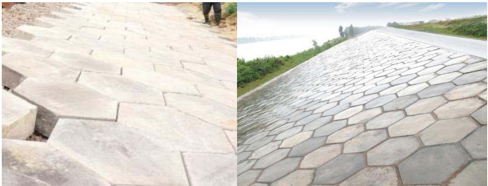  

# 2、现浇混凝土板  

现浇混凝土板与预制混凝土板相比,其平面尺寸较大,典型尺寸为 $5\mathrm{m}^{*}5\mathrm{m}$ ,板厚度 $0.15\mathrm{m}{\cdot}0.2\mathrm{m}$ ,单块质量重达 10t 左右。具有更强的整体性、耐久性、抗风浪水流冲刷,防渗效果好,且施工简单方便,应用广泛,施工经验丰富,施工质量容易保证。缺点是露出水面部分景观效果较差。  

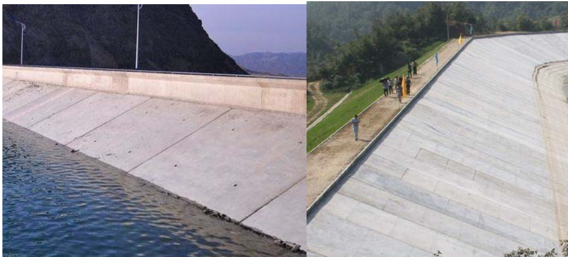  

# 3、浆砌石  

浆砌石护坡具有很好的抗风浪和抗冰层推力的性能,整体美观。缺点是柔韧性差,不能适应河床变形,在水位变动区,水泥砂浆容易被掏空,造成块石脱落,影响护坡整体稳定,且施工中需要的人力多,施工速度慢。  

# 4、格宾石笼  

格宾石笼通过网面的约束形成整体,既可以适应河床的变形,又可以适应地基的不均匀冻胀,有较强的抗冲性能,能有效的达到防护效果。施工简单方便,耐久性、稳定性较好。缺点是需石料较多,工程范围内石料厂欠缺,石料外购价格较高。  

# 5、土工固袋  

土工固袋主要成分为聚酯纤维,采用特殊的拉丝和编制工艺制成,与铅丝笼配套使用。施工过程中可就地取材填放泥土、砂砾石,快速形成稳定的护坡结构体。土工固袋除具有一定的抗冲刷能力外,还具备柔性生态护岸材料的特点,可以抗沉降变形,完工后直接覆土可绿化植生。施工快捷、结构稳定、自然生态。  

对以上几种型式进行方案设计和投资比较,护砌高度按 $3\mathrm{m}$ 考虑。  

方案一: $120\mathrm{mm}$ 厚预制六边形混凝土块、下设 $50\mathrm{mm}$ 厚M5 水泥砂浆、 $300\mathrm{g}/\mathrm{m}^{2}$ 土工布;方案二: $150\mathrm{mm}$ 厚现浇混凝土护坡、下设 $50\mathrm{mm}$ 厚 M5 水泥砂浆、 $300\mathrm{g}/\mathrm{m}^{2}$ 土工布;方案三: $300\mathrm{mm}$ 厚浆砌石,下设 $200\mathrm{mm}$ 砂卵石垫层;方案四: $300\mathrm{mm}$ 厚格宾石笼护坡,下设 $150\mathrm{mm}$ 砂卵石垫层、 $300\mathrm{g}/\mathrm{m}^{2}$ 土工布;方案五: $500\mathrm{mm}$ 厚土工固袋,外裹铅丝笼,上铺植物纤维毯,下设 $300\mathrm{g/m}^{2}$ 土工布。  

表 5.5-5  护砌型式方案比较表  

<html><body><table><tr><td rowspan="2">方案</td><td rowspan="2">护砌形式</td><td rowspan="2">单位</td><td rowspan="2">工程量</td><td>单价</td><td>合计</td></tr><tr><td>（元）</td><td>(元/延m）</td></tr><tr><td rowspan="3">方案一</td><td>C30六边形预制混凝土块(120mm厚)</td><td>m3</td><td>0.36</td><td>931.8</td><td>335</td></tr><tr><td>M5水泥砂浆（50mm厚）</td><td>m3</td><td>0.15</td><td>670.4</td><td>101</td></tr><tr><td>300g/m²土工布</td><td>m²</td><td>3</td><td>8.15</td><td>24.5</td></tr><tr><td>合计</td><td></td><td></td><td></td><td></td><td>461</td></tr><tr><td rowspan="4">方案二</td><td>C25现浇混凝土板（150mm厚）</td><td>m3</td><td>0.45</td><td>718.23</td><td>323</td></tr><tr><td>M5水泥砂浆（50mm厚）</td><td>m3</td><td>0.15</td><td>670.4</td><td>101</td></tr><tr><td>300g/m²土工布</td><td>m²</td><td>3</td><td>8.15</td><td>24.5</td></tr><tr><td>钢筋</td><td>t</td><td>0.013</td><td>7000</td><td>91</td></tr><tr><td>合计</td><td></td><td></td><td></td><td></td><td>539</td></tr><tr><td rowspan="2">方案三</td><td>浆砌石护坡（400mm厚）</td><td>m3</td><td>1.2</td><td>569.09</td><td>683</td></tr><tr><td>砂卵石垫层（200mm厚）</td><td>m3</td><td>0.6</td><td>355.16</td><td>213</td></tr><tr><td>合计</td><td></td><td></td><td></td><td></td><td>896</td></tr></table></body></html>  

<html><body><table><tr><td>方案</td><td>护砌形式</td><td>单位</td><td>工程量</td><td>单价</td><td>合计</td></tr><tr><td rowspan="3">方案四</td><td>格宾石笼（300mm厚）</td><td>m3</td><td></td><td>（元）</td><td>（元/延m）</td></tr><tr><td>砂卵石（150mm厚）</td><td>m3</td><td>0.9</td><td>482.53</td><td>434</td></tr><tr><td>土工布（300g/m²）</td><td>m²</td><td>0.45 3</td><td>355.16</td><td>159</td></tr><tr><td>合计</td><td></td><td></td><td></td><td>8.15</td><td>24.5 619</td></tr><tr><td rowspan="3">方案五</td><td>植物纤维毯</td><td>m²</td><td>3</td><td>6</td><td>18</td></tr><tr><td>土工固袋护坡</td><td>m3</td><td>1.5</td><td>292.64</td><td></td></tr><tr><td>土工布（300g/m²）</td><td>m²</td><td>3</td><td>8.15</td><td>439 24.5</td></tr><tr><td>合计</td><td></td><td></td><td></td><td></td><td>481</td></tr></table></body></html>  

工程造价方面,浆砌石造价最高,土工固袋、格宾石笼与现浇混凝土板次之,预制混凝土块单价较低,但预制混凝土块施工中耗费人力较多,施工进度慢,后期管理较困难。土工固袋、格宾石笼与现浇混凝土板整体造价接近,现浇混凝土板景观较差,格宾石笼施工方便,受气候干扰小,可以进行水下施工,抗腐蚀性强,使用寿命较长,土工固袋施工快捷,结构稳定,生态景观方面优于格宾石笼,但抗冲性及耐久性略差于格宾石笼。  

本次治理的险工主要位于河槽、低滩地上的险工,河道主槽防护为治理重点,在保证结构安全的基础上,考虑生态结构措施。综合比较分析,推荐采用格宾石笼与土工固袋两种护砌形式,其中土工固袋用于河道主槽冲刷相对较小、边坡较缓处险工。  

对于现状已有防护工程,但存在局部破损,需采取局部修补险工,采用原防护形式进行修补。  

# 5.5.4 险工底部及顶部结构设计  

(1)冲刷深度  

各险工所在河槽及滩地的土质主要为砂壤土、壤土、粉土,其允许不冲流速一般小于 $0.8\mathrm{m/s}$ ,根据《堤防工程设计规范》(GB50286-2013)中推荐的计算公式计算堤岸冲刷深度,计算公式见 5.4.6.6 节。  

险工计算冲刷深度见表 5.5-6。  

表 5.5-6  险工冲刷深度计算表  

<html><body><table><tr><td>序号</td><td>险工名称</td><td>岸 别</td><td>起始桩号</td><td>冲刷深度 (U)</td><td>冲刷处水 深 (m)</td><td>行进流速 (m/s)</td><td>中值粒径 (mm)</td></tr><tr><td>1</td><td>孟庄险工</td><td>左</td><td>Z0+900</td><td>0.00</td><td>6.92</td><td>0.82</td><td>0.008</td></tr><tr><td>2</td><td>东郭村（上）险工</td><td>左</td><td>Z6+430</td><td>0.13</td><td>6.98</td><td>1.42</td><td>0.008</td></tr><tr><td>3</td><td>东郭村（下）险工</td><td>左</td><td>Z7+510</td><td>0.15</td><td>6.87</td><td>1.44</td><td>0.008</td></tr><tr><td>4</td><td>侯村险工</td><td>左</td><td>Z11+865</td><td>0.41</td><td>6.83</td><td>1.5</td><td>0.008</td></tr><tr><td>5</td><td>牛村险工</td><td>左</td><td>Z13+600</td><td>0.26</td><td>7.20</td><td>1.36</td><td>0.008</td></tr></table></body></html>  

<html><body><table><tr><td>序号</td><td>险工名称</td><td>岸 别</td><td>起始桩号</td><td>冲刷深度 (m)</td><td>冲刷处水 深 (m)</td><td>行进流速 (m/s)</td><td>中值粒径 (mm)</td></tr><tr><td>6</td><td>郝村险工 (上)</td><td>左</td><td>Z15+200</td><td>0.00</td><td>6.85</td><td>1.02</td><td>0.008</td></tr><tr><td>7</td><td>郝村险工 (下)</td><td>左</td><td>Z16+085</td><td>1.39</td><td>7.59</td><td>1.54</td><td>0.023</td></tr><tr><td>8</td><td>雷村险工 (上)</td><td>左</td><td>Z16+340</td><td>1.41</td><td>6.82</td><td>1.52</td><td>0.023</td></tr><tr><td>9</td><td>雷村险工</td><td>左</td><td>Z17+200</td><td>0.26</td><td>6.85</td><td>1.47</td><td>0.008</td></tr><tr><td>10</td><td>权庄险工</td><td>左</td><td>Z17+525</td><td>0.09</td><td>6.86</td><td>1.39</td><td>0.008</td></tr><tr><td>11</td><td>石羊险工</td><td>左</td><td>Z19+245</td><td>0.03</td><td>6.87</td><td>1.2</td><td>0.008</td></tr><tr><td>12</td><td>王湾险工</td><td>左</td><td>Z19+950</td><td>0.74</td><td>6.86</td><td>1.64</td><td>0.008</td></tr><tr><td>13</td><td>杜庄险工</td><td>左</td><td>Z20+555</td><td>0.31</td><td>6.84</td><td>1.69</td><td>0.008</td></tr><tr><td>14</td><td>婦头险工 (上)</td><td>左</td><td>Z20+900</td><td>0.55</td><td>6.84</td><td>1.65</td><td>0.008</td></tr><tr><td>15</td><td>头险工</td><td>左</td><td>Z21+610</td><td>0.30</td><td>6.89</td><td>1.53</td><td>0.008</td></tr><tr><td>16</td><td>小河险工</td><td>左</td><td>Z22+545</td><td>0.06</td><td>6.81</td><td>1.29</td><td>0.008</td></tr><tr><td>17</td><td>下滩险工 (上)</td><td>左</td><td>Z23+090</td><td>0.00</td><td>6.94</td><td>0.65</td><td>0.008</td></tr><tr><td>18</td><td>下滩险工 (下)</td><td>左</td><td>Z23+820</td><td>0.49</td><td>6.89</td><td>1.65</td><td>0.008</td></tr><tr><td>19</td><td>康庄险工</td><td>左</td><td>Z27+500</td><td>0.00</td><td>7.95</td><td>1.06</td><td>0.008</td></tr><tr><td>20</td><td>河西险工</td><td>左</td><td>Z30+120</td><td>0.00</td><td>7.48</td><td>1.28</td><td>0.008</td></tr><tr><td>21</td><td>白庄险工</td><td>左</td><td>Z31+560</td><td>0.00</td><td>7.50</td><td>1.28</td><td>0.008</td></tr><tr><td>22</td><td>柴湾险工</td><td>左</td><td>Z34+260</td><td>0.05</td><td>8.47</td><td>1.19</td><td>0.008</td></tr><tr><td>23</td><td>东周口险工</td><td>左</td><td>Z37+110</td><td>0.00</td><td>7.81</td><td>1.16</td><td>0.008</td></tr><tr><td>24</td><td>中周口险工</td><td>左</td><td>Z37+595</td><td>0.00</td><td>7.82</td><td>1.23</td><td>0.008</td></tr><tr><td>25</td><td>西周口险工</td><td>左</td><td>Z38+400</td><td>0.00</td><td>7.86</td><td>1.17</td><td>0.008</td></tr><tr><td>26</td><td>晏庄险工</td><td>左</td><td>Z39+800</td><td>0.00</td><td>7.93</td><td>1.13</td><td>0.008</td></tr><tr><td>27</td><td>西王桥险工</td><td>左</td><td>Z46+955</td><td>0.00</td><td>8.74</td><td>1.22</td><td>0.008</td></tr><tr><td>28</td><td>十里铺险工</td><td>左</td><td>Z50+195</td><td>0.00</td><td>8.83</td><td>0.5</td><td>0.008</td></tr><tr><td>29</td><td>小榆柳险工 （下)</td><td>左</td><td>Z51+150</td><td>0.00</td><td>9.13</td><td>0.55</td><td>0.008</td></tr><tr><td>30</td><td>瓦查险工</td><td>左</td><td>Z67+670</td><td>1.45</td><td>10.62</td><td>2.06</td><td>0.008</td></tr><tr><td>31</td><td>北渡村险工</td><td>左</td><td>Z94+825</td><td>1.86</td><td>10.74</td><td>1.53</td><td>0.028</td></tr><tr><td>32</td><td>梁村险工</td><td>左</td><td>Z137+700</td><td>1.22</td><td>12.3</td><td>1.05</td><td>0.028</td></tr><tr><td>33</td><td>新苑湾险工</td><td>左</td><td>Z161+635</td><td>3.01</td><td>12.60</td><td>1.79</td><td>0.028</td></tr><tr><td>34</td><td>营镇险工</td><td>左</td><td>Z182+880</td><td>0.00</td><td>10.95</td><td>1.51</td><td>0.005</td></tr><tr><td>35</td><td>耿湾险工 （下)</td><td>右</td><td>Y8+150</td><td>0.00</td><td>6.95</td><td>1.42</td><td>0.006</td></tr><tr><td>36</td><td>兰庄险工</td><td>右</td><td>Y12+695</td><td>1.45</td><td>6.76</td><td>1.62</td><td>0.025</td></tr><tr><td>37</td><td>兰庄北险工</td><td>右</td><td>Y13+430</td><td>0.00</td><td>6.84</td><td>1.45</td><td>0.006</td></tr><tr><td>38</td><td>范店险工</td><td>右</td><td>Z16+280</td><td>0.00</td><td>7.95</td><td>1.57</td><td>0.006</td></tr><tr><td>39</td><td>郭渡险工</td><td>右</td><td>Y19+255</td><td>0.00</td><td>6.80</td><td>1.62</td><td>0.006</td></tr><tr><td>40</td><td>西王渡险工 (上)</td><td>右</td><td>Y19+950</td><td>1.18</td><td>6.87</td><td>1.4</td><td>0.025</td></tr><tr><td>41</td><td>卢庄险工</td><td>右</td><td>Y22+525</td><td>0.24</td><td>6.80</td><td>1.64</td><td>0.006</td></tr><tr><td>42</td><td>梨园险工</td><td>右</td><td>Y24+720</td><td>0.00</td><td>6.95</td><td>0.58</td><td>0.006</td></tr><tr><td>43</td><td>滑县寨墙险工</td><td>右</td><td>Y33+080</td><td>0.00</td><td>7.47</td><td>1.22</td><td>0.006</td></tr><tr><td>44</td><td>薛村险工</td><td>右</td><td>Y36+770</td><td>0.00</td><td>7.69</td><td>1.21</td><td>0.009</td></tr><tr><td>45</td><td>杨堤险工</td><td>右</td><td>Y37+940</td><td>0.81</td><td>7.73</td><td>1.22</td><td>0.029</td></tr></table></body></html>  

<html><body><table><tr><td>序号</td><td>险工名称</td><td>岸 别</td><td>起始桩号</td><td>冲刷深度 (m)</td><td>冲刷处水 深 (m)</td><td>行进流速 (m/s)</td><td>中值粒径 (mm)</td></tr><tr><td>46</td><td>八里井险工</td><td>右</td><td>Y38+565</td><td>0.35</td><td>7.74</td><td>1.28</td><td>0.009</td></tr><tr><td>47</td><td>郭庄险工</td><td>右</td><td>Y39+470</td><td>0.74</td><td>7.83</td><td>1.02</td><td>0.029</td></tr><tr><td>48</td><td>郭庄险工 (下)</td><td>右</td><td>Y39+960</td><td>0.17</td><td>7.79</td><td>1.29</td><td>0.009</td></tr><tr><td>49</td><td>苑刘庄险工</td><td>右</td><td>Y41+190</td><td>0.00</td><td>7.88</td><td>1.15</td><td>0.009</td></tr><tr><td>50</td><td>王寺庄险工</td><td>右</td><td>Y42+185</td><td>0.00</td><td>7.94</td><td>1.13</td><td>0.009</td></tr><tr><td>51</td><td>东王桥险工</td><td>右</td><td>Y48+945</td><td>0.00</td><td>8.74</td><td>1.21</td><td>0.009</td></tr><tr><td>52</td><td>东王桥东险工</td><td>右</td><td>Y49+580</td><td>0.00</td><td>8.81</td><td>1.23</td><td>0.009</td></tr><tr><td>53</td><td>圈里险工</td><td>右</td><td>Y59+070</td><td>1.05</td><td>9.62</td><td>1.12</td><td>0.029</td></tr><tr><td>54</td><td>刘石井险工</td><td>右</td><td>Y63+350</td><td>0.00</td><td>10.47</td><td>1.34</td><td>0.009</td></tr><tr><td>55</td><td>苏村险工</td><td>右</td><td>Y69+490</td><td>2.74</td><td>10.53</td><td>2.02</td><td>0.029</td></tr><tr><td>56</td><td>郑庄险工</td><td>右</td><td>Y84+670</td><td>0.00</td><td>9.67</td><td>1.28</td><td>0.009</td></tr><tr><td>57</td><td>旧县险工</td><td>右</td><td>Y98+160</td><td>1.45</td><td>13.86</td><td>1.23</td><td>0.029</td></tr><tr><td>58</td><td>马固险工</td><td>右</td><td>Y101+000</td><td>2.69</td><td>13.69</td><td>1.81</td><td>0.029</td></tr><tr><td>59</td><td>范羊险工</td><td>右</td><td>Y103+465</td><td>2.10</td><td>12.63</td><td>1.53</td><td>0.024</td></tr><tr><td>60</td><td>西范堤险工</td><td>右</td><td>Y150+425</td><td>2.48</td><td>11.08</td><td>2.04</td><td>0.028</td></tr><tr><td>61</td><td>龙王庙险工</td><td>右</td><td>Y155+860</td><td>2.06</td><td>11.84</td><td>1.86</td><td>0.028</td></tr><tr><td>62</td><td>南王庄险工</td><td>右</td><td>Y158+295</td><td>2.37</td><td>12.38</td><td>1.88</td><td>0.028</td></tr><tr><td>63</td><td>北王庄险工</td><td>右</td><td>Y161+615</td><td>2.67</td><td>11.53</td><td>1.87</td><td>0.028</td></tr><tr><td>64</td><td>班庄闸险工 (下)</td><td>右</td><td>Y182+220</td><td>2.69</td><td>11.99</td><td>1.87</td><td>0.028</td></tr><tr><td>65</td><td>班庄险工</td><td>右</td><td>Y183+400</td><td>1.48</td><td>11.62</td><td>1.57</td><td>0.028</td></tr><tr><td>66</td><td>东营镇险工</td><td>右</td><td>Y184+575</td><td>2.04</td><td>12.51</td><td>1.57</td><td>0.028</td></tr><tr><td>67</td><td>也村险工</td><td>右</td><td>Y188+400</td><td>0.89</td><td>11.92</td><td>1.04</td><td>0.028</td></tr><tr><td>68</td><td>郭安堤险工</td><td>右</td><td>Y190+085</td><td>0.29</td><td>12.13</td><td>0.85</td><td>0.028</td></tr></table></body></html>  

由上述典型险工冲刷计算分析,河道主槽迎流顶冲,最大冲刷深为 $3.01\mathrm{m}$ 。  

# (2)底部护砌结构型式  

根据计算的局部冲刷深度,考虑本地的最大冻土深度 $0.50\mathrm{m}$ 左右,同时结合已建类似护坡工程,坡脚采用混凝土基座,宽 $0.8\mathrm{m}$ ,厚 $1.2\mathrm{m}$ 。冲刷较严重险工,当设计垂直护脚深度不能满足冲刷要求时,在基座前端增设水平格宾石笼护脚,厚度为 $0.3\mathrm{m}$ 。  

# (3)顶部高程及结构型式  

本次对河槽及滩地险工护至现状滩面高程,对单堤险工护砌至设计堤顶高程。压顶宽 $1\mathrm{m}$ ,材质及厚度与护坡结构相同。  

# 5.5.5 左岸险工结构设计  

# 5.5.5.1 现状无防护工程险工结构设计  

(1)东郭村(上)险工  

东郭村(上)险工为大 U 型弯道,现状无防护,结合主槽清淤边坡及现状地势,在转弯下游处、堤岸外凸段布置 $200\mathrm{m}$ 护砌,采用防护形式为格宾石笼。  

# (2)东郭村(下)险工  

东郭村(下)险工位于弯道急流顶冲处,主槽冲刷严重,堤前滩地窄小,但高程相对较高,96.8 洪水冲刷明显。依据主流流势,本次治理对弯道主槽边坡布置 $360\mathrm{m}$ 防护,以减小对滩坡的冲刷,达到固滩保堤作用,设计护砌顶高程为$60.55\mathrm{m}$ ,护砌边坡 1:2,防护形式为格宾石笼。  

(3)郝村(下)、牛村、北渡村、梁村、新苑湾险工  

郝村(下)、牛村、北渡村、梁村、新苑湾 5 处险工位于弯道急流顶冲处,主槽冲刷严重,堤前滩地较宽,且高程较高,96.8 洪水冲刷明显。依据主流流势,对该弯道主槽及低滩地边坡进行防护,以减小对滩坡的冲刷,达到固滩保堤作用。  

对郝村(下)、牛村险工边坡采用格宾石笼防护,护坡顶部布置 1m 宽格宾石笼压顶,石笼厚 $0.3\mathrm{m}$ ,坡脚布置 $0.8\mathrm{m}$ 宽、 $1.2\mathrm{m}$ 厚 C25 混凝土基座,郝村(下)险工坡脚基座外设 $3\mathrm{m}$ 宽护脚,护脚为 $0.3\mathrm{m}$ 厚格宾石笼。格宾石笼护脚下铺设$15\mathrm{cm}$ 厚砂垫层,砂垫层及浆砌石基座下铺设一层土工布,土工布规格为 $300\mathrm{g/m}^{2}$ 。各险工结构指标见表 5.5-7。  

北渡村、梁村、新苑湾险工采用土工固袋防护,护砌厚度 $0.5\mathrm{m}$ ,护坡顶部布置 1m 宽土工固袋压顶,坡脚布置 1m 宽、1m 厚土工固袋基座,土工固袋外设铅丝笼,铅丝笼上铺设一层植物纤维毯,下铺设一层土工布,土工布规格为 $300\mathrm{g/m}^{2}$ 。  

5.5.5.2 现状防护长度不足或护砌严重破损险工结构设计  

(1)郝村险工(上)  

郝村险工(上)现状已局部防护,但依据主流流势,郝村险工(上)需向上游延长对主槽进行护砌,护砌形式为格宾石笼,厚 $0.3\mathrm{m}$ ,设计护砌顶高程 $63.39\mathrm{m}$ ,护砌底高程 $56.01\mathrm{m}$ ,中间设置一级马道,宽 $2.0\mathrm{m}$ ,高程 $60.99\mathrm{m}$ ,设计护砌边坡1:2.5。护坡顶部布置 $1\mathrm{m}$ 宽格宾石笼压顶,石笼厚 $0.3\mathrm{m}$ ,坡脚布置 $0.8\mathrm{m}$ 宽、$1.2\mathrm{m}$ 厚 C25 混凝土基座。格宾石笼压顶、护坡下铺设 $15\mathrm{cm}$ 厚砂垫层,砂垫层及混凝土基座下铺设一层土工布,土工布规格为 $300\mathrm{g/m}^{2}$ 。同时对局部破损位置进行修补,修补长度 $30\mathrm{m}$ 。  

# (2)营镇险工  

营镇险工上游护砌长度不足需延长 $400\mathrm{m}$ 。根据主流流势及现状地形条件,对上游延长段进行护滩治理,护砌形式为格宾石笼,厚 $0.3\mathrm{m}$ 。护砌顶高程 $41.56\mathrm{m}$ ,底高程 $32.91\mathrm{m}$ ,护砌边坡 1:3.0,中间设一级马道,宽 $2.0\mathrm{m}$ ,高程 $36.56\mathrm{m}$ 。护坡顶部布置 $1\mathrm{m}$ 宽格宾石笼压顶,坡脚布置 $0.8\mathrm{m}$ 宽、 $1.2\mathrm{m}$ 厚 C25 混凝土基座,坡脚基座外设 $3\mathrm{m}$ 宽护脚,护脚为 $0.3\mathrm{m}$ 厚格宾石笼。格宾石笼压顶、护坡、护脚下铺设 $15\mathrm{cm}$ 厚砂垫层,砂垫层及浆砌石基座下铺设一层土工布,土工布规格为$300\mathrm{g/m}^{2}$ 。  

(3)西王桥、瓦查  

西王桥和瓦查险工,现状已局部防护,但依据主流流势,需向上游各延长$200\mathrm{m}$ ,与治理段平顺连接,采用格宾石笼护砌。其中:  

西王桥险工防护 $200\mathrm{m}$ ,设计护砌顶高程为 $56.11\mathrm{m}$ ,护砌底高程为 $50.94\mathrm{m}$ ,护砌边坡 1:2.5。护坡顶部布置 1m 宽格宾石笼压顶,石笼厚 $0.3\mathrm{m}$ ,坡脚布置$0.8\mathrm{m}$ 宽、 $1.2\mathrm{m}$ 厚 C25 混凝土基座。格宾石笼压顶、护坡下铺设 $15\mathrm{cm}$ 厚砂垫层,砂垫层及混凝土基座下铺设一层土工布,土工布规格为 $300\mathrm{g/m}^{2}$ 。  

瓦查险工防护 $200\mathrm{m}$ ,设计护砌顶高程为 $52.12\mathrm{m}$ ,护砌底高程为 $46.73\mathrm{m}$ , 护砌边坡 1:2.5。护坡顶部布置 $1\mathrm{m}$ 宽格宾石笼压顶,石笼厚 $0.3\mathrm{m}$ ,坡脚布置 $0.8\mathrm{m}$ 宽、 $1.2\mathrm{m}$ 厚 C25 混凝土基座,坡脚基座外设 $3\mathrm{m}$ 宽护脚,护脚为 $0.3\mathrm{m}$ 厚格宾石笼。格宾石笼压顶、护坡下铺设 $15\mathrm{cm}$ 厚砂垫层,砂垫层及混凝土基座下铺设一层土工布,土工布规格为 $300\mathrm{g/m}^{2}$ 。  

(4)雷村(上)、权庄、小河、东周口险工  

雷村上、权庄、小河、东周口 4 处险工现状已有防护工程,但破损严重,险工位置均为座弯迎流顶冲,险情明显,本次治理需进行拆除或部分拆除进行重新防护,治理范围及结构尺寸与现状护砌基本相同。  

雷村险工(上)治理长度 $300\mathrm{m}$ ,采用格宾石笼防护,护砌顶高程为 $60.12\mathrm{m}$ ,护砌底高程为 $55.34\mathrm{m}$ ,护砌边坡 1:2.5。护坡顶部布置 $1\mathrm{m}$ 宽格宾石笼压顶,石笼厚 $0.3\mathrm{m}$ ,坡脚布置 $0.8\mathrm{m}$ 宽、 $1.2\mathrm{m}$ 厚 C25 混凝土基座,坡脚基座外设 $3\mathrm{m}$ 宽护脚,护脚为 $0.3\mathrm{m}$ 厚格宾石笼。格宾石笼压顶、护坡、护脚下铺设 $15\mathrm{cm}$ 厚砂垫层,砂垫层及浆砌石基座下铺设一层土工布,土工布规格为 $300\mathrm{g/m}^{2}$ 。  

权庄险工治理长度 $200\mathrm{m}$ ,采用土工固袋防护,护砌顶高程为 $65.39\mathrm{m}$ ,护砌底高程为 $61.91\mathrm{m}$ ,护砌边坡 1:2.0,护砌厚度 $0.5\mathrm{m}$ ,护坡顶部布置 $1\mathrm{m}$ 宽土工固袋压顶,坡脚布置 $1\mathrm{m}$ 宽、 $1\mathrm{m}$ 厚土工固袋基座,土工固袋外设铅丝笼,铅丝笼上铺设一层植物纤维毯,下铺设一层土工布,土工布规格为 $300\mathrm{g/m}^{2}$ 。  

小河险工治理长度 $220\mathrm{m}$ ,采用格宾石笼防护,护砌顶高程为 $58.96\mathrm{m}$ ,护砌底高程为 $54.60\mathrm{m}$ ,护砌边坡 1:2.5。护坡顶部布置 1m 宽格宾石笼压顶,石笼厚$0.3\mathrm{m}$ ,坡脚布置 $0.8\mathrm{m}$ 宽、 $1.2\mathrm{m}$ 厚 C25 混凝土基座。格宾石笼压顶、护坡、护脚下铺设 $15\mathrm{cm}$ 厚砂垫层,砂垫层及浆砌石基座下铺设一层土工布,土工布规格为$300\mathrm{g/m}^{2}$ 。  

东周口险工治理长度 $150\mathrm{m}$ ,现状干砌石护坡损坏严重,对现状损坏护坡进行拆除重建,护砌顶高程为 $62.34\mathrm{m}$ ,护砌底高程为 $57.00\mathrm{m}$ ,护砌边坡 1:3.0,护坡坡脚布置 $0.8\mathrm{m}$ 宽、 $1.2\mathrm{m}$ 厚 C25 混凝土基座。  

单位:m  

表 5.5-7左岸现状无防护工程险工结构设计表  

<html><body><table><tr><td>序号</td><td>险工名称</td><td>岸别</td><td>起始 桩号</td><td>治理 长度</td><td>堤顶 高程</td><td>设计 水位</td><td>护砌 顶高程</td><td>护砌 底高程</td><td>平台 高程</td><td>平台 宽度</td><td>水平防 护宽度</td><td>坡比</td><td>备注</td></tr><tr><td>1</td><td>东郭村 (上)</td><td>左</td><td>Z6+430</td><td>200</td><td>67.68</td><td>64.22</td><td>60.86</td><td>56.58</td><td></td><td></td><td></td><td>1:3</td><td>格宾石笼，护砌至滩地高程</td></tr><tr><td>2</td><td>东郭村 (下)</td><td>左</td><td>Z7+510</td><td>360</td><td>67.17</td><td>64.07</td><td>60.55</td><td>56.45</td><td></td><td></td><td></td><td>1:2.0</td><td>格宾石笼，护砌至滩地高程</td></tr><tr><td>3</td><td>牛村</td><td>左</td><td>Z13+600</td><td>240</td><td>65.83</td><td>63.21</td><td>63.41</td><td>55.70</td><td></td><td></td><td></td><td>1: 2.0</td><td>格宾石笼，护砌至滩地高程</td></tr><tr><td>4</td><td>郝村 (下)</td><td>左</td><td>Z16+085</td><td>200</td><td>65.79</td><td>62.84</td><td>63.02</td><td>55.36</td><td></td><td></td><td>3</td><td>1: 2.0</td><td>格宾石笼，护砌至滩地高程</td></tr><tr><td>5</td><td>北渡村</td><td>左</td><td>Z94+825</td><td>200</td><td>56.70</td><td>54.90</td><td>45.84</td><td>44.16</td><td></td><td></td><td>6</td><td>1:3</td><td>土工固袋，护砌至滩地高程</td></tr><tr><td>6</td><td>梁村</td><td>左</td><td>Z137+700</td><td>400</td><td>50.40</td><td>48.74</td><td>42.51</td><td>37.45</td><td></td><td></td><td>6</td><td>1:3</td><td>土工固袋，护砌至滩地高程</td></tr><tr><td>7</td><td>新苑湾</td><td>左</td><td>Z161+635</td><td>200</td><td>47.42</td><td>45.87</td><td>40.34</td><td>33.27</td><td></td><td></td><td>10</td><td>1:3</td><td>土工固袋，护砌至滩地高程</td></tr></table></body></html>  

表5.5-8左岸现状防护工程长度不足或破损严重险工结构设计表 单位:m  

<html><body><table><tr><td>序号</td><td>险工名称</td><td>岸别</td><td>起始 桩号</td><td>治理 长度</td><td>堤顶</td><td>设计</td><td>护砌</td><td>护砌</td><td>平台</td><td>平台</td><td>水平防</td><td>坡比</td><td>备注</td></tr><tr><td>1</td><td>郝村 (上)</td><td>左</td><td>Z15+200</td><td>280</td><td>高程 65.83</td><td>水位 63.02</td><td>顶高程 63.39</td><td>底高程 55.50</td><td>高程 60.48</td><td>宽度 2</td><td>护宽度</td><td></td><td>格宾石笼，护砌至滩地高程</td></tr><tr><td>2</td><td>雷村 (上)</td><td>左</td><td>Z16+340</td><td>400</td><td>65.49</td><td>62.83</td><td>60.12</td><td>55.34</td><td></td><td></td><td>3</td><td>1:2.0 1:2.5</td><td>格宾石笼，护砌至滩地高程</td></tr><tr><td>3</td><td>权庄</td><td>左</td><td>Z17+525</td><td>200</td><td>65.19</td><td>62.67</td><td>65.39</td><td>61.91</td><td></td><td></td><td></td><td>1:2</td><td>土工固袋，翻修现状护砌</td></tr><tr><td>4</td><td>小河</td><td>左</td><td>Z22+545</td><td>220</td><td>65.09</td><td>62.03</td><td>58.96</td><td>54.60</td><td></td><td></td><td></td><td>1:2.5</td><td>格宾石笼，护砌至滩地高程</td></tr><tr><td>5</td><td>东周口</td><td>左</td><td>Z37+110</td><td>150</td><td>62.73</td><td>60.82</td><td>62.34</td><td>57.00</td><td></td><td></td><td></td><td></td><td>浆砌石，翻修现状护砌</td></tr><tr><td>6</td><td>西王桥</td><td>左</td><td>Z46+955</td><td>200</td><td>60.85</td><td>60.15</td><td>56.11</td><td>50.94</td><td></td><td></td><td></td><td>1:3</td><td>格宾石笼，接长现状护砌</td></tr><tr><td>7</td><td>十里铺</td><td>左</td><td>Z50+195</td><td>200</td><td>60.69</td><td>60.02</td><td>54.07</td><td>51.00</td><td></td><td></td><td></td><td>1:2.5</td><td>格宾石笼，护砌至滩地高程</td></tr><tr><td>8</td><td>瓦查</td><td>左</td><td>Z67+670</td><td>200</td><td>59.93</td><td>57.79</td><td>52.12</td><td>46.73</td><td></td><td></td><td></td><td>1:2.5 1:2.5</td><td>格宾石笼，护砌至滩地高程</td></tr><tr><td>9</td><td>营镇</td><td>左</td><td>Z182+880</td><td>400</td><td>45.66</td><td>43.86</td><td>41.56</td><td>32.91</td><td>36.56</td><td>2</td><td>3</td><td>1:3</td><td>格宾石笼，接长现状护砌，护砌至堤</td></tr></table></body></html>  

# 5.5.5.3 现状防护工程局部破损险工治理方案  

孟庄险工现状已有防护工程,但存在局部不同程度的破损,本次治理对部分坡面坍塌进行修补,长度 $100\mathrm{m}$ ,修补方式为格宾石笼护砌,设计护砌顶高程为$61.51\mathrm{m}$ ,护砌底高程为 $57.84\mathrm{m}$ ,护砌边坡 1:3。边坡采用格宾石笼防护,护坡顶部布置 $1\mathrm{m}$ 宽格宾石笼压顶,石笼厚 $0.3\mathrm{m}$ ,坡脚布置 $0.8\mathrm{m}$ 宽、 $1.2\mathrm{m}$ 厚 C25 混凝土基座。格宾石笼压顶、护坡、护脚下铺设 $15\mathrm{cm}$ 厚砂垫层,砂垫层及浆砌石基座下铺设一层土工布,土工布规格为 $300\mathrm{g/m}^{2}$ 。  

表 5.5-9 孟庄险工结构设计表 单位:m  

<html><body><table><tr><td>工程名称</td><td>孟庄</td></tr><tr><td>岸别</td><td>左</td></tr><tr><td>起始桩号</td><td>Z0+900</td></tr><tr><td>批复长度</td><td>100</td></tr><tr><td>治理长度</td><td>100</td></tr><tr><td>堤顶高程</td><td>68.17</td></tr><tr><td>设计水位</td><td>64.86</td></tr><tr><td>护砌顶高程</td><td>61.51</td></tr><tr><td>护砌底高程</td><td>57.84</td></tr><tr><td>坡比</td><td>1:3</td></tr></table></body></html>  

# 5.5.5.4 现状防护工程基础悬调现象的险工治理方案  

侯村、雷村、石羊、王湾、杜庄、埽头(上)、埽头、下滩(上)、下滩(下)、康庄、河西、白庄、柴湾、中周口、西周口、晏庄、小榆柳(下)等 17 处险工,现状边坡已有防护工程,但主槽弯道迎流顶冲,有冲刷,存在不同程度的基础悬吊问题,为保持河槽流势稳定,保滩固堤,本次治理对各险工主槽进行防护,其中康庄、河西、白庄险工防护形式为土工固袋,其余险工防护形式为格宾石笼护砌,各险工结构指标见表 5.5-10。  

格宾石笼防护石笼厚 $0.3\mathrm{m}$ ,护坡顶部布置 $1\mathrm{m}$ 宽压顶,坡脚布置 $0.8\mathrm{m}$ 宽、$1.2\mathrm{m}$ 厚 C25 混凝土基座,基座外根据需要设置护脚,护脚为 $0.3\mathrm{m}$ 厚格宾石笼,格宾石笼压顶、护坡、护脚下铺设 $15\mathrm{cm}$ 厚砂垫层,砂垫层及浆砌石基座下铺设一层土工布,土工布规格为 $300\mathrm{g/m}^{2}$ 。  

土工固袋防护厚 $0.5\mathrm{m}$ ,护坡顶部布置 $1\mathrm{m}$ 宽土工固袋压顶,坡脚布置 $1\mathrm{m}$ 宽、1m 厚土工固袋基座。土工固袋外设铅丝笼,铅丝笼上铺设一层植物纤维毯,下铺设一层土工布,土工布规格为 $300\mathrm{g/m}^{2}$ 。  

表 5.5-10左岸现状防护工程基础悬吊险工结构设计表  
单位:m  

<html><body><table><tr><td>序号</td><td>险工名称</td><td>岸别</td><td>起始 桩号</td><td>治理 长度</td><td>堤顶 高程</td><td>设计 水位</td><td>护砌 顶高程</td><td>护砌 底高程</td><td>平台 高程</td><td>平台 宽度</td><td>水平防 护宽度</td><td>坡比</td><td>备注</td></tr><tr><td>1</td><td>侯村</td><td>左</td><td>Z11+865</td><td>240</td><td>66.25</td><td>63.40</td><td>61.35</td><td>55.90</td><td></td><td></td><td></td><td>1:2</td><td>格宾石笼，护砌至滩地高程</td></tr><tr><td>2</td><td>雷村</td><td>左</td><td>Z17+200</td><td>300</td><td>65.49</td><td>62.67</td><td>61.28</td><td>55.21</td><td></td><td></td><td></td><td>1:2</td><td>格宾石笼，护砌至滩地高程</td></tr><tr><td>3</td><td>石羊</td><td>左</td><td>Z19+245</td><td>300</td><td>65.26</td><td>62.47</td><td>59.87</td><td>55.95</td><td></td><td></td><td></td><td>1:2</td><td>格宾石笼，护砌至滩地高程</td></tr><tr><td>4</td><td>王湾</td><td>左</td><td>Z19+950</td><td>280</td><td>64.05</td><td>62.34</td><td>59.96</td><td>54.87</td><td></td><td></td><td></td><td>1:2</td><td>格宾石笼，护砌至滩地高程</td></tr><tr><td>5</td><td>杜庄</td><td>左</td><td>Z20+555</td><td>270</td><td>65.02</td><td>62.20</td><td>57.86</td><td>55.80</td><td></td><td></td><td></td><td>1:2</td><td>格宾石笼，护砌至滩地高程</td></tr><tr><td>6</td><td>婦头 (上)</td><td>左</td><td>Z20+900</td><td>200</td><td>65.03</td><td>62.19</td><td>61.66</td><td>54.75</td><td></td><td></td><td>3</td><td>1:2.5</td><td>格宾石笼，护砌至滩地高程</td></tr><tr><td>7</td><td>婦头</td><td>左</td><td>Z21+610</td><td>450</td><td>65.11</td><td>62.15</td><td>58.43</td><td>54.69</td><td></td><td></td><td></td><td>1:2.5</td><td>格宾石笼，护砌至滩地高程</td></tr><tr><td>8</td><td>下滩 (上)</td><td>左</td><td>Z23+090</td><td>200</td><td>64.97</td><td>62.05</td><td>59.80</td><td>54.55</td><td></td><td></td><td></td><td>1:2.5</td><td>格宾石笼，护砌至滩地高程</td></tr><tr><td>9</td><td>下滩 (下)</td><td>左</td><td>Z23+820</td><td>200</td><td>64.51</td><td>61.92</td><td>58.71</td><td>54.50</td><td></td><td></td><td></td><td>1:2.5</td><td>格宾石笼，护砌至滩地高程</td></tr><tr><td>10</td><td>康庄</td><td>左</td><td>Z27+500</td><td>150</td><td>63.22</td><td>61.58</td><td>59.57</td><td>54.18</td><td></td><td></td><td></td><td>1:2</td><td>土工固袋，护砌至滩地高程</td></tr><tr><td>11</td><td>河西</td><td>左</td><td>Z30+120</td><td>200</td><td>63.65</td><td>61.37</td><td>58.72</td><td>53.75</td><td></td><td></td><td></td><td>1:2</td><td>土工固袋，护砌至滩地高程</td></tr><tr><td>12</td><td>白庄</td><td>左</td><td>Z31+560</td><td>150</td><td>63.42</td><td>61.17</td><td>58.28</td><td>53.51</td><td></td><td></td><td></td><td>1:2</td><td>土工固袋，护砌至滩地高程</td></tr><tr><td>13</td><td>柴湾</td><td>左</td><td>Z34+260</td><td>60</td><td>62.93</td><td>60.94</td><td>56.65</td><td>53.00</td><td></td><td></td><td></td><td>1:2</td><td>格宾石笼，护砌至滩地高程</td></tr><tr><td>14</td><td>中周口</td><td>左</td><td>Z37+595</td><td>120</td><td>62.60</td><td>60.73</td><td>58.25</td><td>52.42</td><td></td><td></td><td></td><td>1:2.5</td><td>格宾石笼，护砌至滩地高程</td></tr><tr><td>15</td><td>西周口</td><td>左</td><td>Z38+400</td><td>150</td><td>62.60</td><td>60.69</td><td>55.95</td><td>52.30</td><td></td><td></td><td></td><td>1:2.5</td><td>格宾石笼，护砌至滩地高程</td></tr><tr><td>16</td><td>晏庄</td><td>左</td><td>Z39+800</td><td>150</td><td>62.08</td><td>60.62</td><td>53.74</td><td>52.07</td><td></td><td></td><td></td><td>1:3</td><td>格宾石笼，护砌至滩地高程</td></tr><tr><td>17</td><td>小榆柳 （下)</td><td>左</td><td>Z51+150</td><td>250</td><td>60.78</td><td></td><td>54.84</td><td>50.37</td><td></td><td></td><td></td><td>1:3</td><td>格宾石笼，护砌至滩地高程</td></tr></table></body></html>  

# 5.5.6 右岸险工结构设计  

# 5.5.6.1 现状无防护工程险工结构设计  

(1)西王渡险工(上)位于弯道急流顶冲处,主槽冲刷严重,堤前滩地较窄,高程相对较高,结合主流流势,在现有扬水站上游布设 $340\mathrm{m}$ 护砌段。  

(2)范羊险工上游为安阳河汇入处,安阳河发生洪水直冲该位置滩地,危及该段堤防安全,现状为植柳护坡,土质较差,水流冲刷会产生塌陷,需在安阳河顶冲位置附近向下游延长滩坡防护,护砌长度险工长 $300\mathrm{m}$ 。  

(3)郑庄险工为大 U 型弯道,现状无防护,结合主槽清淤边坡及现状地势,在弯道顶冲处进行护砌,长度为 $350\mathrm{m}$ 。  

(4)卢庄、马固、南王庄、郭安堤 4 个险工位于弯道急流顶冲处,主槽冲刷严重,堤前滩地宽窄不一,但高程相对较高,96.8 洪水冲刷明显。依据主流流势,对该弯道主槽边坡进行防护,以减小对滩坡的冲刷,达到固滩保堤作用。  

对西王渡(上)、范羊、郑庄、卢庄、郭安堤险工边坡采用格宾石笼防护,护坡顶部布置 $1\mathrm{m}$ 宽格宾石笼压顶,石笼厚 $0.3\mathrm{m}$ ,坡脚布置 $0.8\mathrm{m}$ 宽、 $1.2\mathrm{m}$ 厚 C25混凝土基座,基座根据需要设置水平护脚与马道,护脚为 $0.3\mathrm{m}$ 厚格宾石笼,马道采用 C25 混凝土砌筑,宽 $2\mathrm{m}$ ,厚 $1\mathrm{m}$ ,格宾石笼压顶、护坡、护脚、浆砌石马道下铺设 $15\mathrm{cm}$ 厚砂垫层,砂垫层及浆砌石基座下铺设一层土工布,土工布规格为 $300\mathrm{g/m}^{2}$ 。马固险工结构基本与上述险工一致,但考虑到马固险工主槽较深,为方便施工,坡脚不设置混凝土基座,通过加长格宾石笼护脚以满足防冲刷要求,格宾石笼护脚宽 $9\mathrm{m}$ 。上述各险工结构指标见表 5.5-11。  

对范羊、郑庄、南王庄险工采用土工固袋防护,土工固袋防护厚 $0.5\mathrm{m}$ ,护坡顶部布置 $1\mathrm{m}$ 宽土工固袋压顶,坡脚布置 1m 宽、1m 厚土工固袋基座。土工固袋外设铅丝笼,铅丝笼上铺设一层植物纤维毯,下铺设一层土工布,土工布规格为$300\mathrm{g/m}^{2}$ 。上述各险工结构指标见表 5.5-11。  

5.5.6.2 现状防护长度不足或护砌严重破损险工结构设计  

(1)郭渡、班庄险工  

郭渡、班庄 2 处险工现状已有防护工程,但护砌长度不足,郭渡需向下游延长护砌100,班庄需向下游延长护砌 $210\mathrm{m}_{\circ}2$ 处险工接长后与现状护砌平顺连接。  

(2)苏村、班庄闸下、乜村、东营镇险工  

苏村、班庄闸下、乜村、东营镇险工 4 处险工均为现状已有防护工程,但破损严重,险工位置均为座弯迎流顶冲,险情明显,本次治理需进行格宾石笼加固  

治理。  

对郭渡、苏村、班庄闸(下)险工采用格宾石笼防护,护坡顶部布置 $1\mathrm{m}$ 宽格宾石笼压顶,石笼厚 $0.3\mathrm{m}$ ,坡脚布置 $0.8\mathrm{m}$ 宽、 $1.2\mathrm{m}$ 厚 C25 混凝土基座,基座根据需要设置水平护脚与马道,护脚为 $0.3\mathrm{m}$ 厚格宾石笼,马道采用 C25 混凝土砌筑,宽 $2\mathrm{m}$ ,厚 $1\mathrm{m}$ ,格宾石笼压顶、护坡、护脚、浆砌石马道下铺设 $15\mathrm{cm}$ 厚砂垫层,砂垫层及浆砌石基座下铺设一层土工布,土工布规格为 $300\mathrm{g/m}^{2}$ 。对班庄、乜村、东营镇险工按照现状护砌形式进行防护。上述各险工结构指标见表 5.5-12  

单位:m  

表 5.5-11右岸现状无防护工程险工结构设计表  

<html><body><table><tr><td>序号</td><td>险工名称</td><td>岸别</td><td>起始 桩号</td><td>治理 长度</td><td>堤顶 高程</td><td>设计 水位</td><td>护砌 顶高程</td><td>护砌 底高程</td><td>平台 高程</td><td>平台 宽度</td><td>水平护底宽度</td><td>坡比</td><td>备注</td></tr><tr><td>1</td><td>西王渡 (上)</td><td>右</td><td>Y19+950</td><td>340</td><td>65.50</td><td>62.59</td><td>61.87</td><td>55.11</td><td></td><td></td><td>3</td><td>1:2</td><td>格宾石笼，护砌至滩地高程</td></tr><tr><td>2</td><td>卢庄</td><td>右</td><td>Y22+525</td><td>150</td><td>64.88</td><td>62.21</td><td>59.95</td><td>54.82</td><td></td><td></td><td></td><td>1:2</td><td>格宾石笼，护砌至滩地高程</td></tr><tr><td>3</td><td>郑庄</td><td>右</td><td>Y84+670</td><td>350</td><td>57.98</td><td>56.18</td><td>48.72</td><td>46.51</td><td></td><td></td><td></td><td>1:3.0</td><td>土工固袋，护砌至滩地高程</td></tr><tr><td>4</td><td>马固</td><td>右</td><td>Y101+000</td><td>200</td><td>56.06</td><td>54.26</td><td>52.62</td><td>40.57</td><td>45.36</td><td>2</td><td>9</td><td>1:3.0</td><td>格宾石笼，护砌至滩地高程</td></tr><tr><td>5</td><td>范羊</td><td>右</td><td>Y103+465</td><td>300</td><td>52.96</td><td>54.01</td><td>45.17</td><td>41.38</td><td></td><td></td><td>6</td><td>1:3.0</td><td>土工固袋，护砌至滩地高程</td></tr><tr><td>6</td><td>南王庄</td><td>右</td><td>Y158+295</td><td>300</td><td>48.48</td><td>46.53</td><td>38.26</td><td>34.15</td><td></td><td></td><td>8</td><td>1: 3.0</td><td>土工固袋，护砌至滩地高程</td></tr><tr><td>7</td><td>郭安堤</td><td>右</td><td>Y190+085</td><td>400</td><td>45.52</td><td>43.76</td><td>34.08</td><td>31.63</td><td></td><td></td><td></td><td>1:3.0</td><td>格宾石笼，护砌至滩地高程</td></tr></table></body></html>  

表5.5-12右岸现状防护工程长度不足或破损严重险工结构设计表 单位:m  

<html><body><table><tr><td>序号</td><td>工程名称</td><td>岸别</td><td>起始 桩号</td><td>治理 长度</td><td>堤顶 高程</td><td>设计 水位</td><td>护砌 顶高程</td><td>护砌 底高程</td><td>平台 高程</td><td>平台 宽度护底宽度</td><td>水平</td><td>坡比</td><td>备注</td></tr><tr><td>1</td><td>郭渡险工</td><td>右</td><td>Y19+255</td><td>100</td><td>65.39</td><td>62.66</td><td>58.34</td><td>55.23</td><td></td><td></td><td></td><td>1:2</td><td>格宾石笼，下游接长</td></tr><tr><td>2</td><td>苏村险工</td><td>右</td><td>Y69+490</td><td>270</td><td>59.98</td><td>58.03</td><td>51.96</td><td>46.83</td><td></td><td></td><td>3</td><td>1:3.0</td><td>格宾石笼，翻修270m</td></tr><tr><td>3</td><td>班庄闸下险 工</td><td>右</td><td>Y182+220</td><td>150</td><td>46.16</td><td>44.14</td><td>34.75</td><td>32.15</td><td></td><td></td><td>3</td><td>1:3.0</td><td>格宾石笼，翻修150m</td></tr><tr><td>4</td><td>班庄险工</td><td>右</td><td>Y183+400</td><td>200</td><td>45.84</td><td>44.08</td><td>41.78</td><td>35.70</td><td></td><td></td><td>3</td><td>1:3.0</td><td>浆砌石，护砌至滩地高程</td></tr><tr><td>5</td><td>东营镇险工</td><td>右</td><td>Y184+575</td><td>990</td><td>45.54</td><td>43.97</td><td>41.00</td><td>36.82/ 33.56</td><td></td><td></td><td></td><td>1:3.0</td><td>浆砌石，上游翻修200m，下游翻修790m</td></tr><tr><td>6</td><td>也村险工</td><td>右</td><td>Y188+400</td><td>400</td><td>45.57</td><td>43.77</td><td>41.66</td><td>34.96</td><td></td><td></td><td></td><td>1:3.0</td><td>浆砌石，翻修400m</td></tr></table></body></html>  

# 5.5.6.3 现状防护工程局部破损险工治理方案  

耿湾(下)、旧县、龙王庙等 3 处险工现状均已有防护工程,但局部存在不同程度的破损,结合现状防护型式,本次治理对各险工局部破损处进行翻修加固。其中耿湾(下)险工修补同时需对主槽进行防护,采用格宾石笼防护;龙王庙险工采用格宾石笼进行翻修加固。上述各险工结构指标见表 5.5-13。  

# 5.5.6.4 现状防护工程基础悬调现象的险工治理方案  

兰庄、兰庄北工、范店、梨园、滑县寨墙、薛村、杨堤、八里井、郭庄、郭庄(下)、苑刘庄、王寺庄、东王桥、东王桥东、圈里、刘石井、西范堤险工等 18处险工,现状边坡已有防护工程,且结构相对完好,但主槽迎流顶冲,有冲刷,存在不同程度的基础悬吊问题,本次治理对各险工进行护砌加固处理。对滑县寨墙、刘石井、西范堤险工采用土工固袋防护,其他采用格宾石笼。  

格宾石笼防护石笼厚 $0.30\mathrm{m}$ ,护坡顶部布置 $1\mathrm{m}$ 宽压顶,坡脚布置 $0.8\mathrm{m}$ 宽、$1.2\mathrm{m}$ 厚 C25 混凝土基座,基座根据需要设置水平护脚,护脚为 $0.3\mathrm{m}$ 厚格宾石笼,格宾石笼压顶、护坡、护脚下铺设 $15\mathrm{cm}$ 厚砂垫层,砂垫层及浆砌石基座下铺设一层土工布,土工布规格为 $300\mathrm{g/m}^{2}$ 。  

土工固袋防护厚 $0.5\mathrm{m}$ ,护坡顶部布置 $1\mathrm{m}$ 宽土工固袋压顶,坡脚布置 $1\mathrm{m}$ 宽、1m 厚土工固袋基座。土工固袋外设铅丝笼,铅丝笼上铺设一层植物纤维毯,下铺设一层土工布,土工布规格为 $300\mathrm{g/m}^{2}$ 。  

上述各险工结构指标见表 5.5-14。  

单位:m  

表 5.5-13右岸现状防护工程局部破损险工结构设计表  

<html><body><table><tr><td rowspan="2">序号</td><td rowspan="2">险工名称</td><td rowspan="2">岸 别</td><td rowspan="2">起始桩号</td><td rowspan="2">治理 长度</td><td rowspan="2">堤顶 高程</td><td rowspan="2">设计 水位</td><td rowspan="2">护砌 顶高程</td><td rowspan="2">护砌 底高程</td><td rowspan="2">平台 高程</td><td rowspan="2">平台 宽度</td><td rowspan="2">水平防 护宽度</td><td rowspan="2">坡比</td><td rowspan="2">备注</td></tr><tr><td>耿湾 (下)</td></tr><tr><td>1 2</td><td>旧县</td><td>右 右</td><td>Y8+150</td><td>200</td><td>67.42</td><td>64.22</td><td>59.96</td><td>56.58</td><td></td><td></td><td></td><td>1:2</td><td>土工固袋，护砌至滩地高程 浆砌石，护砌至滩地高程，</td></tr><tr><td></td><td></td><td></td><td>Y98+160</td><td>300</td><td>56.08</td><td>54.60</td><td>48.7</td><td>40.74</td><td>45.4</td><td>2</td><td>8</td><td>1:2.5 1:3/1:</td><td>护脚格宾石笼 格宾石笼，下游翻修</td></tr><tr><td>3</td><td>龙王庙</td><td>右</td><td>Y155+860</td><td>400</td><td>48.94</td><td>46.94</td><td>48.34/38.05</td><td>45.1/35.37</td><td></td><td></td><td></td><td>3.5</td><td>400m，两级防护</td></tr></table></body></html>  

表 5.5-14右岸现状防护工程基础悬吊险工结构设计表 单位:m  

<html><body><table><tr><td></td><td>序号险工名称岸别</td><td></td><td>起始桩号</td><td>治理 长度</td><td>堤顶 高程</td><td>设计 水位</td><td>护砌 顶高程</td><td>护砌 底高程</td><td>平台 高程</td><td>平台 宽度</td><td>水平防护 宽度</td><td>坡比</td><td>备注</td></tr><tr><td>1</td><td>兰庄</td><td>右</td><td>Y12+695</td><td>200</td><td>66.53</td><td>63.53</td><td>60.69</td><td>56.04</td><td></td><td></td><td>3</td><td>1:2</td><td>格宾石笼，护砌至滩地高程</td></tr><tr><td>2</td><td>兰庄北</td><td>右</td><td>Y13+430</td><td>260</td><td>66.62</td><td>63.47</td><td>60.13</td><td>55.97</td><td></td><td></td><td></td><td>1:2</td><td>格宾石笼，护砌至滩地高程</td></tr><tr><td>3</td><td>范店</td><td>右</td><td>Y16+280</td><td>400</td><td>65.75</td><td>63.00</td><td>59.71</td><td>55.57</td><td></td><td></td><td></td><td>1:2</td><td>格宾石笼，护砌至滩地高程</td></tr><tr><td>4</td><td>梨园</td><td>右</td><td>Y24+720</td><td>150</td><td>65.12</td><td>62.04</td><td>59.24</td><td>54.54</td><td></td><td></td><td></td><td>1:2</td><td>格宾石笼，护砌至滩地高程</td></tr><tr><td>5</td><td>滑县寨墙</td><td>右</td><td>Y33+080</td><td>610</td><td>62.80</td><td>61.23</td><td>55.81/ 58.49</td><td>53.59/ 53.59</td><td></td><td></td><td></td><td>1:2</td><td>土工固袋，护砌至滩地高程</td></tr><tr><td>6</td><td>薛村</td><td>右</td><td>Y36+770</td><td>380</td><td>62.97</td><td>60.90</td><td>57.34</td><td>52.98</td><td></td><td></td><td></td><td>1:2</td><td>格宾石笼，护砌至滩地高程</td></tr><tr><td>7</td><td>杨堤</td><td>右</td><td>Y37+940</td><td>100</td><td>62.77</td><td>60.85</td><td>57.56</td><td>52.77</td><td></td><td></td><td>3</td><td>1:2.5</td><td>格宾石笼，护砌至滩地高程</td></tr><tr><td>8</td><td>八里井</td><td>右</td><td>Y38+565</td><td>200</td><td>62.63</td><td>60.81</td><td>57.21</td><td>52.63</td><td></td><td></td><td></td><td>1:2.5</td><td>格宾石笼，护砌至滩地高程</td></tr><tr><td>9</td><td>郭庄</td><td>右</td><td>Y39+470</td><td>250</td><td>62.68</td><td>60.79</td><td>57.23</td><td>52.52</td><td></td><td></td><td>3</td><td>1:2.5</td><td>格宾石笼，护砌至滩地高程</td></tr><tr><td>10</td><td>郭庄 （下）</td><td>右</td><td>Y39+960</td><td>50</td><td>60.24</td><td>60.73</td><td>57.28</td><td>52.44</td><td></td><td></td><td></td><td>1:2</td><td>格宾石笼，护砌至滩地高程</td></tr><tr><td>11</td><td>苑刘庄</td><td>右</td><td>Y41+190</td><td>200</td><td>62.42</td><td>60.67</td><td>57.15</td><td>52.20</td><td></td><td></td><td></td><td>1:3</td><td>格宾石笼，护砌至滩地高程</td></tr></table></body></html>  

<html><body><table><tr><td></td><td>序号险工名称岸别</td><td></td><td>起始桩号</td><td>治理 长度</td><td>堤顶 高程</td><td>设计 水位</td><td>护砌 顶高程</td><td>护砌 底高程</td><td>平台 高程</td><td>平台 宽度</td><td>水平防护 宽度</td><td>坡比</td><td>备注</td></tr><tr><td>12</td><td>王寺庄</td><td>右</td><td>Y42+185</td><td>250</td><td>61.88</td><td>60.62</td><td>56.85</td><td>52.04</td><td></td><td></td><td></td><td>1:2.5</td><td>格宾石笼，护砌至滩地高程</td></tr><tr><td>13</td><td>东王桥</td><td>右</td><td>Y48+945</td><td>200</td><td>61.25</td><td>60.17</td><td>52.99</td><td>50.97</td><td></td><td></td><td></td><td>1:2.5</td><td>格宾石笼，护砌至滩地高程</td></tr><tr><td>14</td><td>东王桥东</td><td>右</td><td>Y49+580</td><td>400</td><td>61.19</td><td>60.14</td><td>58.72</td><td>50.90</td><td>53.71</td><td>2</td><td></td><td>1:3</td><td>格宾石笼，护砌至滩地高程</td></tr><tr><td>15</td><td>圈里</td><td>右</td><td>Y59+070</td><td>280</td><td>60.68</td><td>59.67</td><td>52.97</td><td>49.53</td><td></td><td></td><td></td><td>1:2.5</td><td>格宾石笼，护砌至滩地高程</td></tr><tr><td>16</td><td>刘石井</td><td>右</td><td>Y63+350</td><td>250</td><td>60.20</td><td>59.04</td><td>54.45</td><td>48.14</td><td></td><td></td><td></td><td>1:3</td><td>土工固袋，护砌至滩地高程</td></tr><tr><td>17</td><td>西范堤</td><td>右</td><td>Y150+425</td><td>320</td><td>49.08</td><td>47.44</td><td>39.52</td><td>36.36</td><td></td><td></td><td>8</td><td>1:3</td><td>土工固袋，护砌至滩地高程</td></tr><tr><td>18</td><td>北王庄</td><td>右</td><td>Y161+615</td><td>200</td><td>48.02</td><td>46.13</td><td>37.76</td><td>34.60</td><td></td><td></td><td>9</td><td>1:3</td><td>土工固袋，护砌至滩地高程</td></tr></table></body></html>  

# 5.5.7 险工工程量  

险工护砌工程主要工程量,土方开挖 21.63 万 $\mathrm{m}^{3}$ ,土方回填 10.01 万 $\mathrm{m}^{3}$ ,格宾石笼 4.93 万 $\mathrm{m}^{3}$ ,砂垫层 3.36 万 $\mathrm{m}^{3}$ ,土工布 30.36 万 $\mathrm{m}^{2}$ ,浆砌石 2.97 万 $\mathrm{m}^{3}$ ,现状护坡拆除 2.34 万 $\mathrm{m}^{3}$ ,植物纤维毯 5.83 万 $\mathrm{m}^{2}$ ,铅丝笼土工固袋 4.19 万 $\mathrm{m}^{3}$ 。工程量见表 5.5-15。  

表 5.5-15 险工工程量表  

<html><body><table><tr><td>编号</td><td>工程项目或部位</td><td>单位</td><td>数量</td></tr><tr><td>(一)</td><td>险工治理工程</td><td></td><td></td></tr><tr><td></td><td>土方开挖</td><td>m3</td><td>216250</td></tr><tr><td></td><td>土方回填</td><td>m3</td><td>100110</td></tr><tr><td></td><td>C25 混凝土基座</td><td>m3</td><td>13418</td></tr><tr><td></td><td>格宾石笼护坡</td><td>m3</td><td>49269</td></tr><tr><td></td><td>格宾石笼护脚</td><td>m3</td><td>4746</td></tr><tr><td></td><td>砂垫层</td><td>m3</td><td>33570</td></tr><tr><td></td><td>土工布（300g/m2)</td><td>m²</td><td>303568</td></tr><tr><td></td><td>M10浆砌石马道</td><td>m3</td><td>2832</td></tr><tr><td></td><td>M10浆砌石护坡翻修</td><td>m3</td><td>26912</td></tr><tr><td></td><td>现状浆砌石护坡拆除</td><td>m3</td><td>23434</td></tr><tr><td></td><td>植物纤维毯</td><td>m²</td><td>58343</td></tr><tr><td></td><td>铅丝笼土工固袋护坡（1m×1mx0.5m)</td><td>m3</td><td>24980</td></tr><tr><td></td><td>铅丝笼土工固袋护脚（1m×1m×1m）</td><td>m3</td><td>16921</td></tr></table></body></html>  

# 5.6 新建水闸  

# 5.6.1 闸(堰)轴线选择  

本工程可研阶段已对各闸(堰)址进行比选,基本确定了各闸(堰)址,根据可研批复意见:“本阶段提出的各节制闸、退水闸和分洪堰的闸(堰)址选择、布置及结构形式基本可行”,初步设计阶段在已确定的各闸(堰)址的基础之上,结合各闸(堰)所在地形以及卫河堤防走向确定各闸(堰)的轴线。  

# 5.6.1.1 盐土庄节制闸  

为保证向白寺坡分洪并有效控制共产主义渠及其以西行洪区洪水,确保老观嘴以下卫河河道和安阳河入卫河口以下卫河河道洪水安全下泄,在共产主义渠上建节制闸一座,设计流量 $1600\mathrm{m}^{3}/\mathrm{s}$ 。  

盐土庄节制闸闸下共产主义渠与卫河合流,共卫合流后共产主义渠与卫河共同承泄设计行洪流量 $2000\mathrm{m}^{3}/\mathrm{s}$ (盐土庄节制控泄的行洪流量 $1600\mathrm{m}^{3}/\mathrm{s}$ 和卫河下泄的行洪流量 $400\mathrm{m}^{3}/\mathrm{s},$ )。  

可研阶段选择比较了两个闸址方案,一是在盐土庄村西共产主义渠上,河道桩号为 $32\substack{+050}$ ;二是在其下游 $1.69\mathrm{km}$ 处,马头村西的共产主义渠上,河道桩号$33+740$ 。两闸址相比:  

(1)共西内工程:盐土庄村西闸址将比马头村西闸址增加共西隔堤长 $700\mathrm{m}$ 、增加隔堤占地面积 110 亩;(2)闸下共产主义渠工程:马头村西闸址需对闸下共产主义渠扩挖和新筑左堤,扩建屯子桥;盐土庄村西闸址对闸下河槽不进行扩挖、不需要新筑左堤,只需在现状堤埝基础上进行加培治理,堤防占压地减小了 245 亩,但共西退水渠—长丰渠入共产主义渠左堤位置需建一排涝涵闸,设计排涝标准为 3 年一遇,设计排涝流量为 $74\mathrm{m}^{3}/\mathrm{s}$ ,不需对屯子桥进行改建。  

(3)闸下卫河工程:马头村西的闸址需对盐土庄村至马头村段长 $2150\mathrm{m}$ 的卫河左堤进行加培治理,盐土庄村西闸址无需对该段卫河的左堤进行加培治理,但增加对马头村围村埝的建设。  

(4)闸下马头村的防护工程:马头村西闸址只需对北侧(下游侧)新筑围村埝,而盐土庄村西闸址需对马头村四周建围村埝,故增加马头村的围村埝长度$2.15\mathrm{km}$ ,增加占地 33 亩,增加围村埝跨越白寺坡退水渠即民丰沟的一个排涝闸,排涝闸的设计排涝标准为 3 年一遇,设计流量为 $47.7\mathrm{m}^{3}/\mathrm{s}$ 。  

(5)工程主体投资:估算主体工程投资,盐土庄村西闸址将比马头村西闸址减少工程永久占地约 102 亩,减少主体工程投资 885 万元。  

(6)行洪与分洪运用影响分析:从调洪演算成果分析,两个闸址对共产主义渠的行洪、白寺坡的分洪运用基本没有影响,共产主义渠上游来水,经盐土庄节制闸的控泄,均能有效保证老观嘴位置河道流量不超过 $2000\mathrm{m}^{3}/\mathrm{s}$ 、安阳河汇入后 $2500~\mathrm{m^{3}/s}$ 的行洪规模。  

可研阶段结合防洪规划总体安排综合分析后推荐采用盐土庄村西的闸址。  

初设阶段因共产主义渠河道桩号重新排列,原可研阶段推荐的闸址河道桩号$32\substack{+050}$ 修正为 $32+280$ ,并在可研阶段推荐闸址上、下游各选定一条比较轴线进行水闸轴线比选。其桩号分别为 $32+250$ 和 $32+320$ 。  

分析三条轴线地勘资料,其地质土层分布,各土层物理力学指标等地质参数基本接近,盐土庄节制闸是在现有共产主义渠上修建节制闸,设计控制流量  

$1600\mathrm{m}^{3}/\mathrm{s}$ ,故在闸上、下游水位一定的条件下,闸室宽度即可确定。  

盐土庄节制闸上游为共西行洪区,下游为共卫河流行洪区,行洪时水面宽度很大,因此水闸位置微调对共渠行洪时的影响微乎其微。  

综上,盐土庄节制闸闸线确定主要受共渠两侧堤防影响,三个比较方案中闸线位置对工程影响不大,所以初设阶段仍按照可研批复的闸轴线作为推荐闸线。初设阶段闸轴线河道桩号为 $32+280$ 。  

盐土庄节制闸轴线位置见图 5.6-1。  

# 5.6.1.2 民丰沟排涝闸(套闸)  

由于共卫合流后洪水直冲共卫夹道中的马头村,为保证马头村的防洪安全,需对马头村修筑围村埝,并在围村埝跨越民丰沟位置的上口和下口分别修建挡洪排涝闸,每个挡洪排涝闸的设计流量为民丰沟 3 年一遇排涝标准的设计流量 47.7$\mathrm{m}^{3}/\mathrm{s}$ ,挡洪时设计洪水位为 10 年一遇标准。  

民丰沟上口挡洪排涝闸和下口挡洪排涝闸轴线位置见图 5.6-1。  

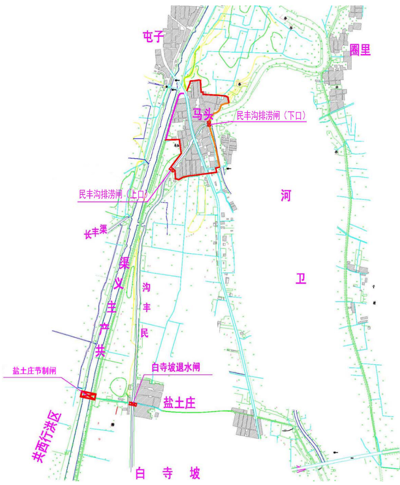  
图 5.6-1 盐土庄节制闸及民丰沟排涝闸位置示意图  

# 5.6.1.3 小河口节制闸  

为有效控制卫河行洪流量及合理安排长虹渠滞洪,拟在淇河小河口村附近新建一座节制闸,设计流量 $700\mathrm{m}^{3}/\mathrm{s}$ 。小河口闸的建设,使共产主义渠淇门以上洪水和淇河洪水主要经共产主义渠宣泄,一般年份洪水小河口闸不开启。  

为实现上述功能,保持闸前水流流态的稳定,尽量减少闸两侧引堤工程量,结合区域地形条件,小河口节制闸闸址拟建于共产主义渠和淇河交汇口下游,即选在淇共汇合口以下约 $300\mathrm{m}$ ,淇河河道桩号 $0{+}300$ 。  

小河口节制闸位置示意图见图 5.6-2。  

由图 5.6-2 可知,淇河主河槽位于河道右岸,初拟桩号 $0{+}300$ 处淇河左侧滩地宽度最小。根据水力学计算成果,小河口节制闸闸室净宽为 $50\mathrm{m}$ ,远小于现状河道宽度,因此闸址选择在河道最窄处,即淇河桩号 $0{+}300$ 处。  

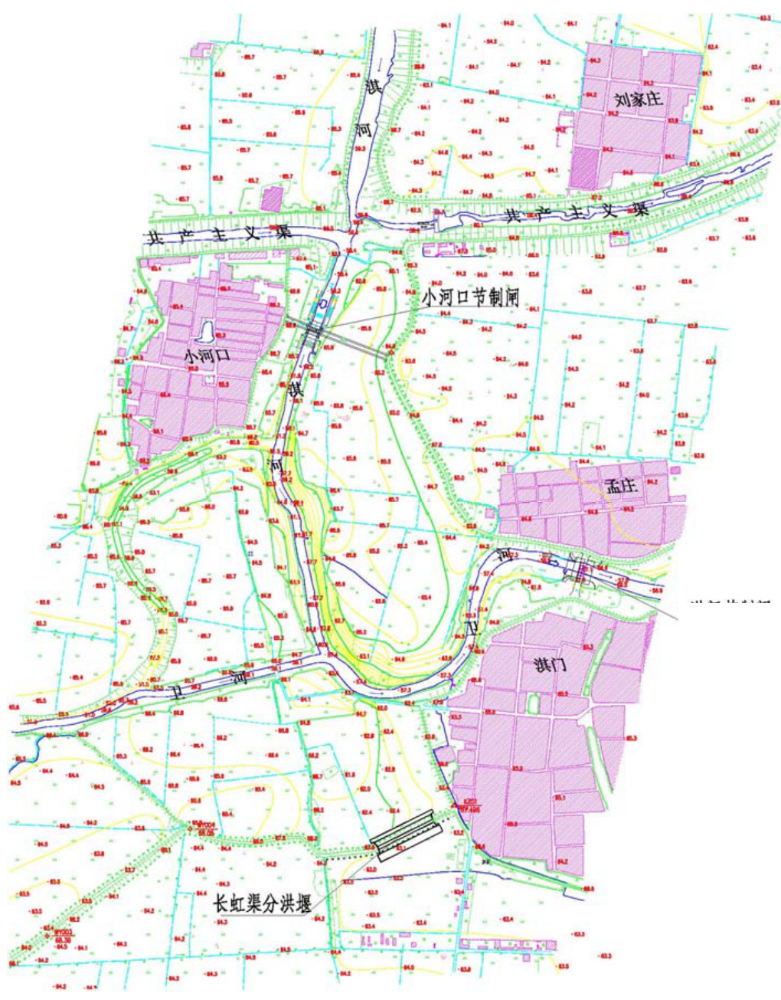  
图 5.6-2  小河口节制闸、长虹渠分洪堰位置示意图  

# 5.6.1.4 长虹渠分洪堰  

新建长虹渠分洪堰,设计分洪流量 $900\mathrm{m}^{3}/\mathrm{s}$ ,分洪堰选定在卫河右堤 $2{+}030$ 位置,该位置堰前及堰下地形比较开阔、堰下没有村庄,便于分洪运用。  

长虹渠分洪堰位置见图 5.6-2,  

# 5.6.1.5 长虹渠退水闸  

长虹渠退水闸,设计流量 $400\mathrm{m}^{3}/\mathrm{s}$ ,为满足退水规模的要求,拟在原闸址进行拆除重建。故本阶段未进行建筑物轴线比选。  

长虹渠退水闸位置见图 5.6-3。  

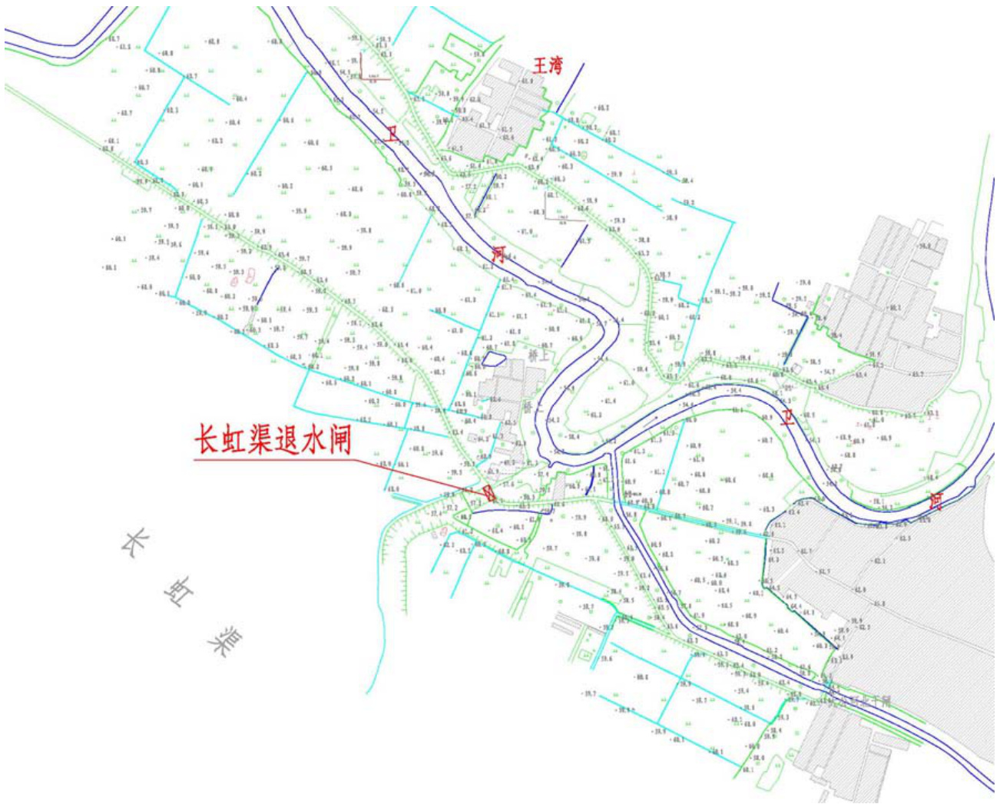  
图 5.6-3  长虹渠退水闸位置示意图  

# 5.6.1.6 浚县箱涵  

卫河在浚县县城有左右两个河槽,右侧河槽紧邻县城老城区,右侧河槽的右堤局部堤身矮小,河槽深 $3.0\mathrm{m}$ 左右,堤顶宽仅有 $2\mathrm{\sim}3\mathrm{m}$ ,且紧邻房屋,无条件修建堤防。该段河槽过流能力仅有 $20\mathrm{m}^{3}/\mathrm{s}$ ,为与区域发展相协调,保证浚县老城区的安全,使卫河洪水全部由左侧河槽行洪,在右侧河槽上口及下口各新建一座埋涵,设计流量均为 $20~\mathrm{m}^{3}/\mathrm{s}$ 。  

结合区域地形条件,上口闸位于卫河河道桩号 $42\substack{+850}$ 处的右侧河槽处,下口闸位于卫河河道桩号 $44\substack{+590}$ 处的右侧河槽处。  

该闸位置见图 5.6-4。  

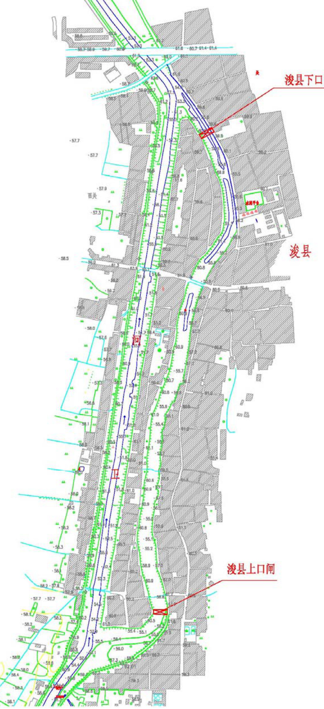  
图 5.6-4  浚县箱涵位置示意图  

# 5.6.1.7 白寺坡分洪堰  

新建白寺坡分洪堰,设计流量 $1600\mathrm{m}^{3}/\mathrm{s}$ ,结合区域地形条件,分洪堰选定在  

白寺村附近的共产主义渠 $24{+}400$ 位置的右堤上,该位置白寺坡内地面高程相对较低,地势平缓,地形开阔,村庄稀少,便于分洪运用。  

白寺坡分洪堰位置见图 5.6-5。  

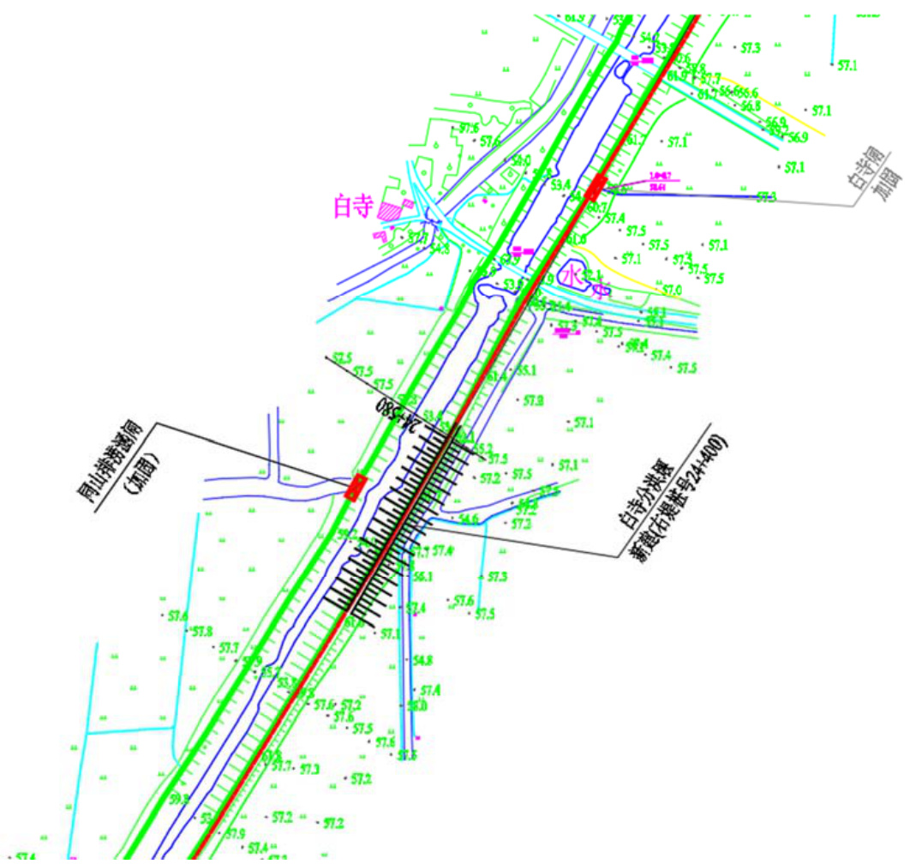  
图 5.6-5  白寺坡分洪堰位置示意图  

# 5.6.1.8 浚内沟排涝涵闸  

卫河右堤浚内沟口段新筑堤防长 $780\mathrm{m}$ ,为防止卫河洪水倒灌又便于小滩坡排涝退水,新建浚内沟排涝涵闸,设计排涝标准为 3 年一遇,设计排涝流量$31.30\mathrm{m}^{3}/\mathrm{s}$ 。结合新筑堤防,在堤防与浚内沟交界位置修建浚内沟穿堤排涝涵闸。  

浚内沟排涝涵闸位置由卫河堤防走向确定,本阶段闸址处地勘资料显示,闸址处地质条件比较简单,变化不大。因此本阶段根据卫河堤防确定建筑物闸线位置。浚内沟排涝涵闸位置见图 5.6-6。  

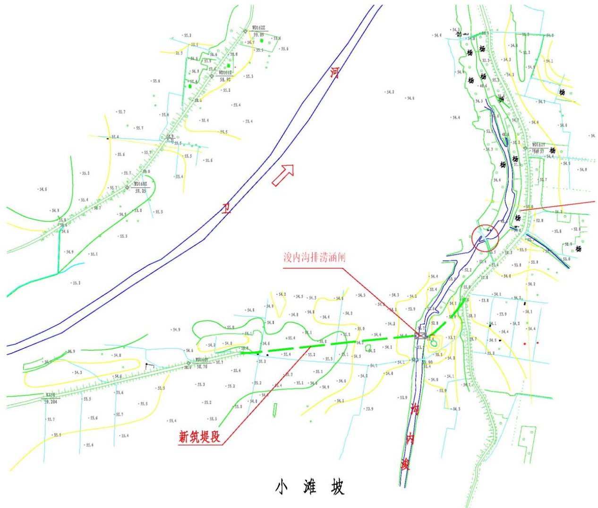  
图 5.6-6  浚内沟排涝涵闸位置示意图  

# 5.6.2 闸(堰)结构型式  

# 5.6.2.1 闸结构型式确定  

常用水闸底板形式一般有整体式和分离式两种,整体式底板整体性好,对地基不均匀的沉降适应性强,闸门止水效果好,抗震性能好,但工程量较大;分离式底板,底板接缝多,对不均匀沉降适应性差,抗震性和整体性不强,施工不便,但工程量较小。由于新建各闸均直接坐落于土基上,闸基土属中等压缩性,水闸建成存在沉降和不均匀沉降的可能;且本工程各水闸设防烈度均较高(除浚内沟排涝涵闸为Ⅶ度设防外,其余各闸均为Ⅷ度设防)。综上,为提高各闸抗震、抗不均匀沉降能力,各闸均采用整体式底板(浚内沟排涝涵闸除外)。  

本工程新建各水闸功能均为拦蓄部分洪水、控制下泄流量,各退水闸功能均为挡滞洪区滞蓄洪水和河道洪水,相机退水。各节制闸、退水闸均存在挡水高度较高,泄流需要孔口高度较低的特点,具备设置胸墙的条件。另外,设置胸墙还能有效的降低闸门高度和排架柱高度,节省投资的同时还能大幅提高水闸的抗震性能。因此各节制闸、退水闸均采用胸墙式闸室(浚内沟排涝涵闸采用涵闸形式)。  

各闸在闸门形式选择上比较了平板直升门、弧形门两种形式。从布置上看,采用平板直升门,工作闸门与检修闸门布置所需闸室长度较短,所需空间位置较小,布置紧凑,采用弧形门,由于受支臂布置要求,所需闸墩较长;从维护检修条件来看,弧形闸门维护费用高于平板闸门;从启闭设备看,平板门所需的启闭力大于弧形门,相应用电负荷较大;从制造安装看,平板门结构简单,其制作、安装、运输相对比较方便,优于弧形门;从投资看,弧形门单价高于平板门,投资相对较多。通过上述布置、维护、制造安装、投资等多方面综合分析比较,又考虑本工程各闸主要功能为防洪,使用频率很低,各闸均采用平板直升门。  

# 5.6.2.2 堰结构型式确定  

常用堰形式一般有宽顶堰和实用堰等型式,为方便施工,本工程分洪堰采用折坡型宽顶堰型式,采用混凝土结构。  

宽顶堰上部填筑均质土堤,用于平时挡水,分洪时采用人工分洪方式:分洪 时,埋设炸药,爆破炸除堰上覆堤。  

均质土堤布置断面采用土堤挡水结构与交通道路综合考虑布置方案:土堤堤顶顶宽 $4.0\mathrm{m}$ ,与两侧堤防连接,中间设置混凝土挡墙,两侧堤防顶宽 $6.0\mathrm{m}$ ,回填土堤上下游边坡均取 1:3,土堤顶部设置沥青道路。  

# 5.6.2.3 水工模型试验  

根据本工程可研报告评估意见中“建议下阶段对盐土庄节制闸、小河口节制闸、长虹渠退水闸等闸开展水工模型试验,为工程安全运行提供支撑”的要求,初步设计阶段,选取盐土庄节制闸进行水工模型试验。  

# (1)试验目的  

为确保建筑物工程的安全运行,通过枢纽泄洪闸水工模型试验,对原设计方案进行验证和完善,并为设计部门进一步优化枢纽布置、消能设施和制定闸门运用方式提供科学依据。  

# (2)试验内容  

根据《中国国际工程咨询有限公司关于卫河干流(淇门\~徐万仓)治理工程可行性研究报告的评估报告》的要求,卫河干流(淇门\~徐万仓)治理工程盐土庄节制闸水工模型试验计划安排泄洪闸整体水工模型试验,对枢纽的泄流能力、消能效果等情况等进行验证,并根据验证结果对枢纽布置及结构进行修改完善。  

$\textcircled{1}$ 观测水闸全部闸门敞泄时不同上游水位条件下的泄流能力。  
$\textcircled{2}$ 观测水闸不同工况时的闸前流态,从而判断闸前闸墩体型的合理性。  
$\textcircled{3}$ 观测水闸闸不同工况时的沿程流态、流速分布及水面线。  
$\textcircled{4}$ 观测消力池的消能情况,并提出优化消能措施的建议。  
$\textcircled{5}$ 提出水闸闸门合理运用方式。  

# (3)模型比尺  

结合试验供水条件及场地条件,确定模型为正态模型,几何比尺为 $\alpha_{l}{=}\alpha_{h}{=}40$ 。根据重力相似准则,相应的流量比尺、流速比尺、糙率比尺和时间比尺如下:  

流量比尺: $\alpha_{Q}=\alpha_{l}^{5/2}{=}10119.29$ 流速比尺: $\alpha_{\nu}=\alpha_{l}^{1/2}{=}6.32$ 糙率比尺: $\alpha_{n}=\alpha_{l}^{1/6}{=}1.85$ 时间比尺: $\alpha_{t}=\alpha_{l}^{1/2}{=}6.32$  

(4)模型范围  

模型模拟范围:考虑上、下游的水流相似,模型试验范围包括闸室段上游$260\mathrm{m}$ 内的地形;下游 $320\mathrm{m}$ 内的地形。上游水位测点闸上 $20\mathrm{m}$ ;下游水位测点闸下 $40\mathrm{m}$ 。  

(5)主要结论  

$\textcircled{1}$ 当上游来流 $1600\mathrm{m}^{3}/\mathrm{s}$ 时,闸门敞泄,闸上水位为 $60.16\mathrm{m}$ ,此时闸上左堤堤防被淹。水流经闸孔泄向下游,闸后为淹没出流,闸室上下游水头差为 $0.22\mathrm{m}$ 。消力池内未形成水跃,下游河床流速较大。  

$\textcircled{2}$ 由于闸室段宽度大于河床宽度,上下游地形衔接不理想造成了在小流量时闸室右侧有狭长的回流区, 8#孔也是回流,在大流量时左右两边孔过流量较小。为了解决这些问题,试验提出缩短闸室坝段取消 8#孔,即为优化方案。  

$\textcircled{3}$ 7 孔方案中,当上游来流 $1600\mathrm{m}^{3}/\mathrm{s}$ 时,闸门敞泄,闸上水位为 $60.24\mathrm{m}$ ,此时闸上左堤堤防被淹。水流经闸孔泄向下游,闸后为淹没出流,闸室上下游水头差为 $0.3\mathrm{m}$ 。消力池内未形成水跃,下游河床流速较大,右堤的边坡流速在 1.88$\mathrm{m}/\mathrm{s}\sim2.59\mathrm{m}/\mathrm{s}$ ,建议加强对堤防边坡的防护。  

$\textcircled{4}$ 当上游来流继续增大时,为了保证下游村庄及田地的安全,在蓄滞水位$61.14\mathrm{m}$ 时闸室的泄流量不能超过 $1600\mathrm{m}^{3}/\mathrm{s}$ ,此时闸门需要控泄。经对多种方案进行比较最终推荐 1#、7#孔全关, 2#、6#孔局开,闸门开度约为 $3.7\mathrm{m}$ ,其它孔敞泄。此方案调度运行相对简单,中间 3 孔可不设闸门长期敞泄降低成本。由于边孔关闭使堤防边坡处流速减小,增加了堤防的安全性。  

# 5.6.2.4 闸室尺寸复核  

由于本阶段盐土庄节制闸和长虹渠退水闸两座水闸的设计水位发生变化,结合前述水工模型试验成果,初设阶段对工程中规模较大的盐土庄节制闸、小河口节制闸和长虹渠退水闸三座水闸进行过流能力以及闸室尺寸复核计算。  

(1)盐土庄节制闸  

盐土庄节制闸位于盐土庄村西,共渠桩号 $32+280$ 。闸室结构形式为胸墙式,闸底板为整体筏式底板,可研阶段设计闸室 2 孔一联,共 4 联 8 孔,每孔净宽$11.0\mathrm{m}$ 。中墩厚 $2.0\mathrm{m}$ ,缝墩厚 $1.5\mathrm{m}$ ,闸室总宽度 $108.0\mathrm{m}$ 。对应闸上、下游水位分别为 $60.95\mathrm{m}/60.80\mathrm{m}$ 。  

根据前述各蓄滞洪区调度原则,本阶段盐土庄节制闸上、下游水位修正为$60.29\mathrm{m}/59.94\mathrm{m}$ ,同时盐土庄节制闸控制下泄流量仍为 $1600\mathrm{m}^{3}/\mathrm{s}$ ,按照《水闸设计规范》(SL265-2016)中有关规定进行计算闸室总净宽为 $75.74\mathrm{{m}}$ 。  

对比盐土庄节制闸水工模型试验结果分析,盐土庄节制闸按照原可研阶段 8孔每孔净宽 $11\mathrm{m}$ 的规模在下泄 $1600\mathrm{m}^{3}/\mathrm{s}$ 流量时,可将最右侧的 8#闸孔优化,按照 7 孔每孔净宽 $11\mathrm{m}$ 的规模下泄 $1600\mathrm{m}^{3}/\mathrm{s}$ 流量时,上游水面壅高约 $40\mathrm{cm}$ 。模型试验结论与计算结果基本一致。  

因此本次设计将盐土庄节制闸优化为 7 孔,每孔净宽 $11\mathrm{m}$ ,闸室共设 3 联,中间 3 孔一联,两侧 2 孔一联。  

按照《水闸设计规范》(SL265-2016)中过流能力计算公式复核,优化后的盐土庄节制闸,对应闸上、下游水位为 $60.29\mathrm{m}/59.94\mathrm{m}$ 时的计算下泄流量为$1626.5\mathrm{m}^{3}/\mathrm{s}$ 。  

# (2)长虹渠退水闸  

长虹渠退水闸位于滑县西侧,卫河右堤桩号 $29\substack{+950}$ 附近。闸室结构为胸墙式,底板为采用整体筏式,两孔一联,可研阶段设计共四联 8 孔,每孔净宽 $7.0\mathrm{m}$ 。中墩厚 $1.8\mathrm{m}$ ,缝墩厚 $1.3\mathrm{m}$ ,闸室总宽度 $73.6\mathrm{m}$ 。对应闸上、下游水位分别为$61.20\mathrm{m}/61.05\mathrm{m}$ 。  

本阶段长虹渠退水闸上、下游水位修正为 $61.83\mathrm{m}/61.53\mathrm{m}$ ,最大退水流量仍为 $400\mathrm{m}^{3}/\mathrm{s}$ ,按照《水闸设计规范》(SL265-2016)中有关规定进行计算闸室总净宽为 $33.71\mathrm{m}$ 。  

根据《水闸设计规范》(SL265-2016)中第 4.2.9 条“闸孔孔数少于 8 孔时,宜采用单数孔”的要求,本次设计将长虹渠退水闸优化为 5 孔,每孔净宽 $7.0\mathrm{m}$ ,闸室共设 3 联,中间 1 孔一联,两侧 2 孔一联。  

按照《水闸设计规范》(SL265-2016)中过流能力计算公式复核,优化后的长虹渠退水闸,对应闸上、下游水位为 $61.83\mathrm{m}/61.53\mathrm{m}$ 时的计算下泄流量为$415.3\mathrm{m}^{3}/\mathrm{s}$ 。  

(3)小河口节制闸  

小河口节制闸位于共产主义渠和淇河交汇口下游约 $300\mathrm{m}$ ,闸室结构为胸墙式,闸底板为整体筏式底板,2 孔一联,共 3 联 6 孔,每孔净宽 $8.0\mathrm{m}$ 。中墩厚$1.8\mathrm{m}$ ,缝墩厚 $1.3\mathrm{m}$ ,闸室总宽度 $61.2\mathrm{m}$ 。  

本阶段小河口节制闸上、下游水位均为发生变化,根据《水闸设计规范》(SL265-2016)中第 4.2.9 条“闸孔孔数少于 8 孔时,宜采用单数孔”的要求,本次设计将小河口节制闸优化为 5 孔,每孔净宽 $10.0\mathrm{m}$ ,闸室共设 3 联,中间 1 孔一联,两侧 2 孔一联。  

按照《水闸设计规范》(SL265-2016)中过流能力计算公式复核,优化后的小河口节制闸,对应闸上、下游水位为 $65.07\mathrm{m}/64.92\mathrm{m}$ 时的计算下泄流量为$747.3\mathrm{m}^{3}/\mathrm{s}$ 。满足下泄流量 $700~\mathrm{m}^{3}/\mathrm{s}$ 要求。  

# 5.6.2.5 堰顶高程及堰宽复核  

根据宽顶堰过流能力计算公式 $Q=B_{0}\sigma\varepsilon m\sqrt{2g}H_{0}^{3/2}$ 可知,宽顶堰过流能力一定的情况下,堰顶宽度与堰上水头成反比,即过流能力一定的情况下,增加堰顶宽度可提高堰顶高程。  

白寺坡分洪堰和长虹渠分洪堰规模比选内容详见本初设报告第 4.5.3 节,在维持防洪体系不变的前提下,保证分洪流量不变,白寺坡分洪堰和长虹渠分洪堰堰顶高程和宽度的变化,可能会对坡洼最高蓄滞水位和河道水位产生变化,同时白寺坡分洪堰兼具退水功能,白寺坡分洪堰的底高程和宽度的变化可能还会影响到白寺坡的淹没历时等指标。为分析白寺坡分洪堰和长虹渠分洪堰的规模对其它坡洼以及河道的影响,分别将长虹渠分洪堰和白寺坡分洪堰堰宽加宽,与原可研方案进行比较分析,形成三个设计方案,进行综合比较。  

经综合比较分析,三种不同设计方案对各滞洪区的最高水位以及水量基本无影响,对共产主义渠以及卫河河道水位基本无影响,最高水位对应的各坡洼的淹没面积基本一致,但工程投资较可研阶段设计方案分别增加 590 万元和 1020 万元。故本次各控制性工程设计指标、设计规模均可维持可研成果。  

# 5.6.3 闸(堰)布置  

# 5.6.3.1 盐土庄节制闸  

盐土庄节制闸位于盐土庄村西,河道桩号 $32+280$ 。闸室结构形式为胸墙式,闸底板为整体筏式底板,闸底板高程为 $53.0\mathrm{m}$ ,与共产主义渠天然底高程一致,闸底板厚度 $1.5\mathrm{m}$ ;闸室共 7 孔,每孔净宽 $11\mathrm{m}$ ,中间 3 孔一联,两侧 2 孔一联,中墩及边墩厚均为 $1.5\mathrm{m}$ ,缝墩厚 $1.0\mathrm{m}$ ,闸室总宽度 $90.0\mathrm{m}$ 。闸顶高程为 $62.8\mathrm{m}$ ,闸室长 $15.0\mathrm{m}$ 。  

闸室上游设一段 $20.0\mathrm{m}$ 长格宾石笼护坦和 $10.0\mathrm{m}$ 长混凝土铺盖。闸室下游侧设 $20.0\mathrm{m}$ 长消力池,消力池池底高程为 $52.0\mathrm{m}$ ,池深 $1.0\mathrm{m}$ 。消力池的后半段设排水孔,间排距为 $2.5\mathrm{m}$ 。消力池后接 $20.0\mathrm{m}$ 长混凝土海漫、 $20.0\mathrm{m}$ 长格宾石笼海漫,海漫末端抛石防冲槽长 $15.0\mathrm{m}$ 。闸室上下游翼墙高度较大,为减轻基底应力,采用扶壁式翼墙结构,翼墙顶高程 $62.8\mathrm{m}$ 。上游翼墙顺水流向长 $20\mathrm{m}$ ,下游翼墙分三段,顺水流向长共计 $40\mathrm{m}$ 。墙后回填素填土,回填土内铺筑单项土工格栅以减小水平土压力,土工格栅分层铺设,层间距 $0.5\mathrm{m}$ 。翼墙上下游接 1:3 格宾石笼护坡。  

在闸室下游侧设工作桥,按公路-Ⅱ级汽车荷载等级设计,采用预制空心板结构,桥面总宽 $5.0\mathrm{m}$ ,桥面高程为 $62.80\mathrm{m}$ 。闸室上游侧布置人行便桥,桥面宽度 $2.7\mathrm{m}$ ,桥面高程 $62.80\mathrm{m}$ 。机架桥布置在闸室偏上游侧,桥面高程为 $70.8\mathrm{m}$ ,由2 跟混凝土 $\pi$ 形梁和 2 根混凝土 T 形梁拼接而成,下部采用排架柱支承在闸墩上。机架桥上设启闭机房,启闭机房宽为 $7.5\mathrm{m}$ ,启闭机房采用框架结构。  

工作闸门采用平面钢闸门,共 7 扇,闸门尺寸为 $11.0{\times}5.5\mathrm{m}$ (宽 $\times$ 高),采用$2{\times}400\mathrm{kN}$ 固定卷扬启闭机启闭,一门一机。工作门上下游各设一检修门槽,由于闸上检修水位较低( $;53.77\mathrm{m})$ ),水深仅为 $0.77\mathrm{m}$ ,故不设检修闸门及启闭设备,检修时采用临时措施封堵。  

闸左右岸分别设有控制楼,为三层框架结构,建筑面积为 $1075~\mathrm{m}^{2}$ ,层高为$4.0\mathrm{m}$ 。控制楼内主要有二次盘柜室、柴油机房、集中控制室、机修间、仓库、观测室等房间。火灾危险性类别为丁类,柴油机房为丙类,建筑耐火等级为二级;设计使用年限为 50 年;屋面防水等级为一级。  

闸室、上下游翼墙及两岸控制楼基础采用 CFG 水泥粉煤灰碎石桩进行地基加固处理以提高基础承载力并降低建筑物永久沉降量。CFG 桩桩径 $0.4\mathrm{m}$ ,中心距 $1.5\mathrm{m}$ ,桩长 $10.0\mathrm{m}$ ,梅花形布置。  

# 5.6.3.2 小河口节制闸  

小河口节制闸位于共产主义渠和淇河交汇口下游约 $300\mathrm{m}$ ,闸室结构为胸墙式,闸底板为整体筏式底板,闸底板高程为 $58.0\mathrm{m}$ ,与共产主义渠河底高程一致,闸底板厚度 $1.5\mathrm{m}$ 。闸室共 5 孔,每孔净宽 $10.0\mathrm{m}$ ,中间 1 孔一联,两侧 2 孔一联。中墩及边墩厚均为 $1.5\mathrm{m}$ ,缝墩厚 $1.0\mathrm{m}$ ,闸室总宽度 $60.0\mathrm{m}$ 。闸顶高程为 $68.1\mathrm{m}$ 。闸室长 $18.0\mathrm{m}$ 。  

闸室上游侧设一段格宾护坦和一段混凝土护坦,格宾护坦长 $20.0\mathrm{m}$ ,混凝土护坦长度为 $10.0\mathrm{m}$ 。闸室下游侧设长 $20.0\mathrm{m}$ 、深 $1.0\mathrm{m}$ 的消力池,消力池池底高程为 $57.0\mathrm{m}$ 。消力池的后半段设排水孔,间排距为 $2.5\mathrm{m}$ 。消力池后设 $20.0\mathrm{m}$ 长混凝土海漫和 $20.0\mathrm{m}$ 长格宾海漫,海漫末端设有 $15.0\mathrm{m}$ 长抛石防冲槽。闸室上下游翼墙均采用扶壁式挡墙结构,由直线段加圆弧段组成。上游直段翼墙长 $10.0\mathrm{m}$ ,直段翼墙顶高程 $68.1\mathrm{m}$ ,圆弧段长 $31.42\mathrm{m}$ ,圆弧半径 $20.0\mathrm{m}$ ,圆心角 $90^{\mathrm{o}}$ ,弧段翼墙顶高程 $66.0\mathrm{m}$ 。下游直段挡墙分为 2 段,长度均为 $10.0\mathrm{m}$ ,翼墙顶高程分别为$68.1\mathrm{m}$ 和 $66.0\mathrm{m}$ ,圆弧段长 $31.42\mathrm{m}$ ,圆弧半径 $20.0\mathrm{m}$ ,圆心角 $90^{\mathrm{\mathrm{o}}}$ ,弧段翼墙顶高程 $66.0\mathrm{m}$ 。翼墙后采用素填土回填,回填土内铺筑单向土工格栅以减小水平土压力,土工格栅分层铺设,层间距 $0.5\mathrm{m}$ 。翼墙上下游接 1:3 格宾护坡。  

在闸室下游侧设工作桥,按公路-Ⅱ级汽车荷载等级设计,采用预制空心板结构,桥总宽 $7.7\mathrm{m}$ ,桥面高程为 $68.3\mathrm{m}$ 。闸室上游侧布置人行便桥,桥面宽度$1.70\mathrm{m}$ ,高程 $68.1\mathrm{m}$ 。机架桥布置在闸室偏上游侧,桥面高程为 $78.3\mathrm{m}$ ,由 4 榀混凝土 T 形梁拼接而成,下部采用排架柱支承在闸墩上。桥面上设启闭机房,启闭机房宽为 $7.5\mathrm{m}$ ,启闭机房采用框架结构。  

工作闸门采用平面钢闸门,共 5 扇,闸门尺寸为 $10.0\mathrm{x}6.5\mathrm{m}$ (宽 $\mathbf{X}$ 高),采用$2\mathrm{x}400\mathrm{kN}$ 固定卷扬启闭机启闭,一门一机;工作闸门上游侧设有检修闸门,检修闸门为钢叠梁门,闸门尺寸为 $10.0\mathrm{x}3.2\mathrm{m}$ (宽 $\mathbf{X}$ 高),采用 $2\mathrm{x}100\mathrm{kN}$ 电动葫芦启闭;工作闸门下游侧预留检修门槽,采用 $2\mathrm{x}100\mathrm{kN}$ 电动葫芦启闭,不设检修闸门。  

闸左右岸分别设有控制楼,为三层框架结构。建筑面积为 $723~\mathrm{~m~}^{2}$ ,层高为$4.95\mathrm{m}$ 。控制楼内主要有二次盘柜室、柴油机房、集中控制室、机修间、仓库、观测室等房间。火灾危险性类别为丁类,柴油机房为丙类;建筑耐火等级为二级;设计使用年限为 50 年;屋面防水等级为一级。  

闸室、上下游翼墙及两岸控制楼基础采用振冲碎石桩进行地基加固处理以提高基础承载力并降低建筑物永久沉降量。碎石桩桩径 $0.8\mathrm{m}$ ,闸室段碎石桩中心距$2.0\mathrm{m}$ ,桩长 $15.0\mathrm{m}$ ,正三角形布置。  

# 5.6.3.3 长虹渠分洪堰  

长虹渠分洪堰位于卫河右堤桩号 $2{+}030$ 附近,淇门村西上游约 $80\mathrm{m}$ 处。为混凝土宽顶堰,为日常生产、交通和避免低标准洪水下分洪考虑,在分洪堰混凝土底板上填筑均质土堤,堤顶高程 $66.8\mathrm{m}$ ,同两边堤防。堤顶宽度 $4.0\mathrm{m}$ ,上下游坡比均为 1:3。堰顶高程 $63.2\mathrm{m}$ ,分洪堰底板总长 $33.0\mathrm{m}$ ,总宽 $500.0\mathrm{m}$ 。堰体上游接 $10.0\mathrm{m}$ 的格宾护底;其下游为 $25.0\mathrm{m}$ 长格宾护底,后接 $15.0\mathrm{m}$ 长抛石防冲槽,槽深 $2.0\mathrm{m}$ 。采用重力式混凝土挡墙对堰口进行防护。采用格宾护坡对分洪堰两侧堤坡进行防护,上游堤坡左右两侧防护长度均为 $110.0\mathrm{m}$ ;下游堤坡左右两侧防护长度均为 $50.0\mathrm{m}$ 。  

分洪堰采用人工分洪方式,分洪时,埋设炸药,爆破炸除堰上覆堤,严格控制爆破部位和方式,避免破坏分洪堰底板和两侧挡墙。  

# 5.6.3.4 白寺坡分洪堰  

白寺坡分洪堰位于共产主义渠右堤 $24{+}400$ 处。为混凝土宽顶堰,为日常生产、交通和避免低标准洪水下分洪考虑,在分洪堰混凝土底板上填筑均质土堤,堤顶高程 $63.0\mathrm{m}$ ,同两边堤防。堤顶宽度 $6.0\mathrm{m}$ ,上下游坡比均为 1:3。堰顶高程$57.0\mathrm{m}$ ,分洪堰底板总长 $48.0\mathrm{m}$ ,总宽 $350.0\mathrm{m}$ ,考虑分洪堰爆破及实际洪水的不确定性等因素,预留 50 米宽度修建裹头。堰体上游接 $10.0\mathrm{m}$ 的格宾护底;其下游为 $25.0\mathrm{m}$ 长格宾护底,后接 $15.0\mathrm{m}$ 长抛石防冲槽,槽深 $2.0\mathrm{m}$ 。采用重力式混凝土挡墙对堰口进行防护。采用格宾护坡对分洪堰两侧堤坡进行防护,上游堤坡左右两侧防护长度均为 $100.0\mathrm{m}$ ;下游堤坡左右两侧防护长度均为 $50.0\mathrm{m}$ 。  

分洪堰采用人工分洪方式,分洪时,埋设炸药,爆破炸除堰上覆堤,严格控制爆破部位和方式,避免破坏分洪堰底板和两侧挡墙。  

# 5.6.3.5 长虹渠退水闸  

长虹渠退水闸位于滑县西侧,卫河右堤桩号 $29\substack{+950}$ 附近。闸室结构为胸墙式,底板为采用整体筏式底板,闸底板高程为 $57.20\mathrm{m}$ ,与长虹渠河底高程一致,闸底板厚度 $1.2\mathrm{m}$ 。闸室共 5 孔,每孔净宽 $7.0\mathrm{m}$ ,闸室共设 3 联,中间 1 孔一联,两侧 2 孔一联,中墩厚 $1.5\mathrm{m}$ ,边墩厚 $1.2\mathrm{m}$ ,缝墩厚 $1.0\mathrm{m}$ ,闸室总宽度 $44.4\mathrm{m}$ 。闸室长 $15.0\mathrm{m}$ 。闸顶高程为 $64.20\mathrm{m}$ 。  

闸室上游设一段 $15.0\mathrm{m}$ 长格宾石笼护底和一段 $10.0\mathrm{m}$ 长混凝土铺盖。闸室下游侧设长 $20.0\mathrm{m}$ 、深 $1.0\mathrm{m}$ 的消力池,消力池池底高程为 $56.20\mathrm{m}$ ,消力池的后半段设排水孔,间排距为 $2.5\mathrm{m}$ 。消力池后接 $15.0\mathrm{m}$ 长混凝土海漫和 $15.0\mathrm{m}$ 长格宾石笼海漫,海漫末端设有 $13.5\mathrm{m}$ 长抛石防冲槽。闸室的上游翼墙采用扶臂式,墙高 $7.8\mathrm{m}$ ,由圆弧段和直线段组成,圆弧段长 $15.7\mathrm{m}$ ,圆弧半径 $10.0\mathrm{m}$ ,圆心角 $90^{\mathrm{o}}$ ,直线段长 $4.2\mathrm{m}$ ,墙顶高程为 $64.2\mathrm{m}$ ;下游第一段翼墙采用扶臂式,挡墙长 $10.0\mathrm{m}$ ,高度为 $7.8{\sim}6.8\mathrm{m}$ ,墙顶高程由 $64.20\mathrm{m}$ 渐变至 $62.2\mathrm{m}$ ;下游第二段挡墙采用悬臂式,长 $10.0\mathrm{m}$ ,高度为 $6.8\mathrm{m}$ ,墙顶高程为 $62.2\mathrm{m}$ ;下游第三段挡墙为悬臂式,为圆弧型式,圆弧长 $23.6\mathrm{m}$ ,圆弧半径 $15.0\mathrm{m}$ ,圆心角 $90^{\mathrm{o}}$ ,墙顶高程为 $62.2\mathrm{m}$ 。翼墙后采用素填土回填,回填土内铺筑单向土工格栅以减小水平土压力,土工格栅分层铺设,层间距 $0.4\mathrm{m}$ 。翼墙上下游接 1:3 混凝土护坡。  

在闸室下游侧设交通桥,考虑到施工期吊装上部设备、构件及运行管理交通的需要,按公路-Ⅱ级汽车荷载等级设计,采用预制空心板结构,桥总宽 $7.7\mathrm{m}$ ,桥面高程为 $64.20\mathrm{m}$ 。闸室上游侧布置人行便桥,桥面宽度 $1.70\mathrm{m}$ ,高程 $64.20\mathrm{m}$ 。机架桥布置在闸室偏上游侧,桥面高程为 $71.5\mathrm{m}$ ,由 2 榀混凝土 T 形梁拼接而成,下部用排架柱支承在闸墩上。桥面上设启闭机房,启闭机房宽为 $5.5\mathrm{m}$ ,启闭机房采用框架结构。  

闸门采用平面钢闸门,共 5 扇,闸门尺寸为 $7.0{\times}4.3\mathrm{m}$ (宽 $\times$ 高),采用 $2{\times}250\mathrm{kN}$ 固定卷扬启闭机启闭,一门一机。  

闸左右岸分别设有控制楼,为三层框架结构。建筑面积为 $637~\mathrm{~m}^{2}$ ,层高为$3.65\mathrm{m}$ 。控制楼内主要有二次盘柜室、集中控制室、机修间、仓库、观测室等房间。火灾危险性类别为丁类,建筑耐火等级为二级;设计使用年限为 50 年;屋面防水等级为一级。  

闸室、上下游翼墙及两岸控制楼基础采用振冲碎石桩进行地基加固处理以提高基础承载力并降低建筑物永久沉降量。碎石桩桩径 $0.8\mathrm{m}$ ,闸室段碎石桩中心距$2.5\mathrm{m}$ ,翼墙及控制楼基础碎石桩中心距 $1.5\mathrm{m}$ ,桩长 $7.0\mathrm{m}$ ,正三角形布置。  

# 5.6.3.6 浚内沟排涝涵闸  

浚内沟排涝涵闸位于卫河右堤浚内沟口上。浚内沟排涝涵闸为涵洞式闸室,底板为整体式筏式底板,共一联2 孔,每孔净宽 $3.0\mathrm{m}$ 。中墩厚 $1.5\mathrm{m}$ ,边墩厚 $1.0\mathrm{m}$ ,闸室总宽度 $9.50\mathrm{m}$ 。闸室长 $10.0\mathrm{m}$ ,涵洞长 $30\mathrm{m}$ 。闸底板高程 $50.0\mathrm{m}$ ,闸顶回填堤顶高程 $56.15\mathrm{m}$ 。  

闸室上游侧设 1 段格宾护底和 1 段混凝土护坦,格宾护底与混凝土护坦各长$10.0\mathrm{m}$ 。闸室下游接钢筋混凝土消力池,池长 $14.0\mathrm{m}$ ,池深 $0.5\mathrm{m}$ 。消力池后为 $12.0\mathrm{m}$ 格宾海漫,海漫后接 $13.5\mathrm{m}$ 长的抛石防冲槽,抛石防冲槽深度 $1.5\mathrm{m}$ 。  

工作闸门采用平面钢闸门,共 2 扇,闸门尺寸 $3.0{\bf x}4.4\mathrm{m}$ (宽 $\mathbf{X}$ 高),采用2x160kN 固定卷扬启闭机启闭,采用一门一机;工作门上、下游侧不设检修门,检修时采用临时措施封堵。  

机架桥桥面高程为 $63.15\mathrm{m}$ ,由 T 形梁拼接而成,下部用排架柱支承在闸墩上。桥面上设启闭机房,机房宽为 $4.0\mathrm{m}$ ,启闭机房采用框架结构。  

# 5.6.3.7 浚县箱涵  

浚县箱涵位于浚县县城卫河右侧河槽上,分为上口箱涵和下口箱涵,上口箱涵位于卫河河道桩号 $42\substack{+850}$ 处的右侧河槽处,下口箱涵位于卫河河道桩号$44\substack{+590}$ 处的右侧河槽处。  

由于在浚县上口箱涵及下口箱涵之间新建一座地震观测站,要求减少金属结构设施。本阶段将不再设置闸门设施,将上下口闸设置为埋涵建筑物,保证平常过水要求,洪水时采用混凝土叠梁门,对埋涵进行临时封堵,保证洪水由左侧河道通过,不进入右侧河道。  

浚县上口闸埋涵结构为钢筋混凝土箱涵,共 1 联 4 孔,每孔净宽 $2.5\mathrm{m}$ ,净高$2.5\mathrm{m}$ 。中墩厚 $1.2\mathrm{m}$ ,边墩厚 $1.0\mathrm{m}$ ,埋涵总宽度 $15.60\mathrm{m}$ 。底板高程 $54.0\mathrm{m}$ 。上覆土堤顶高程为 $61.20\mathrm{m}$ 。埋涵总长 $30\mathrm{m}$ 。  

浚县上口闸埋涵上游侧设长 $10\mathrm{m}$ 混凝土护底,护底底高程为 $54.0\mathrm{m}$ ;埋涵下游侧设长 $10\mathrm{m}$ 混凝土护坦,护坦下游设长 6m 抛石防冲槽,防冲槽最大深度为$1.5\mathrm{m}$ 。埋涵上下游各设 $16\mathrm{m}$ 长悬臂式翼墙,最大墙顶高程 $57.10\mathrm{m}$ 。  

上口闸涵闸左右两侧填筑土堤连接两岸,回填至 $61.2\mathrm{m}$ 高程,上下游边坡均取 1:2.5,进行格宾石笼护砌,格宾石笼厚度取 $0.50\mathrm{m}$ ,下设 $0.10\mathrm{m}$ 碎石垫层。回填土压实度取 0.95。堤顶设置 $6.0\mathrm{m}$ 宽沥青混凝土道路。  

浚县下口闸埋涵结构为钢筋混凝土箱涵,共 1 联 4 孔,每孔净宽 $2.5\mathrm{m}$ ,净高$2.5\mathrm{m}$ 。中墩厚 $1.2\mathrm{m}$ ,边墩厚 $1.0\mathrm{m}$ ,埋涵总宽度 $15.60\mathrm{m}$ 。底板高程 $53.50\mathrm{m}$ 。上覆土堤顶高程为 $61.00\mathrm{m}$ 。埋涵总长 $30\mathrm{m}$ 。  

浚县下口闸埋涵上游侧设长 $10.0\mathrm{m}$ 混凝土护底,护底底高程为 $53.50\mathrm{m}$ ;埋涵下游侧设长 $10\mathrm{m}$ 混凝土护坦,护坦下游设长 6m 抛石防冲槽,防冲槽最大深度为 $1.5\mathrm{m}$ 。埋涵下游均设悬臂式翼墙,最大墙顶高程 $56.60\mathrm{m}$ 。  

下口闸涵闸左右两侧采用回填土连接两岸,回填至 $61.0\mathrm{m}$ 高程,堤顶设置$6.0\mathrm{m}$ 宽沥青混凝土道路。  

# 5.6.3.8 民丰沟排涝闸  

民丰沟排涝闸位于民丰沟与马头村围村埝交叉口处,分为上口闸和下口闸。挡洪时设计洪水位为卫河与共产主义渠合流后 10 年一遇标准。  

民丰沟上、下口闸闸室结构均为胸墙式,底板均为整体筏式底板,共 1 联 3孔,每孔净宽 $3.0\mathrm{m}$ 。上口闸底板高程 $53.40\mathrm{m}$ ,下口闸底板高程 $51.40\mathrm{m}$ ,分别与各闸址处沟底高程一致。  

上口闸底板厚 $1.0\mathrm{m}$ 。中墩厚 $1.2\mathrm{m}$ ,缝墩厚 $1.0\mathrm{m}$ ,闸室总宽度 $13.4\mathrm{m}$ 。闸顶高程为 $59.70\mathrm{m}$ 。闸室长 $12.0\mathrm{m}$ 。闸室上游侧设 $10.0\mathrm{m}$ 长格宾护底和 $15.0\mathrm{m}$ 混凝土护坦;闸室下游侧设长 $15.0\mathrm{m}$ 混凝土海漫和 $10.0\mathrm{m}$ 长格宾海漫。闸室上下游各设$15.00\mathrm{m}$ 长半重力式翼墙,墙顶高程 $59.70\mathrm{m}$ 。翼墙两侧接 1:2.0 格宾护坡。  

下口闸底板厚 $1.0\mathrm{m}$ 。中墩厚 $1.2\mathrm{m}$ ,缝墩厚 $1.0\mathrm{m}$ ,闸室总宽度 $13.4\mathrm{m}$ 。闸顶高程为 $59.70\mathrm{m}$ 。闸室长 $12.0\mathrm{m}$ 。闸室上游侧设 $15.0\mathrm{m}$ 混凝土护坦;闸室下游侧设长 $26.6\mathrm{m}$ 混凝土消力池和 $12.00\mathrm{m}$ 长抛石防冲段。闸室上游设 $15.00\mathrm{m}$ 长半重力式翼墙,墙顶高程 $59.70\mathrm{m}$ ,下游设长度分别为 $12.0\mathrm{m}$ 和 $14.6\mathrm{m}$ 的半重力式翼墙。墙背与马头村围埝相接。  

上、下口闸机架桥布置在闸室偏上游侧,桥面高程为 $64.00\mathrm{m}$ ,为预制混凝土T 形梁,下部采用排架柱支承在闸墩上。  

上口闸在闸室下游侧设检修桥,按公路-Ⅱ级汽车荷载等级设计,采用预制空心板结构,桥总宽 $5\mathrm{m}$ ,桥面宽度 $4.0\mathrm{m}$ ,高程为 $59.70\mathrm{m}$ 。  

工作闸门采用铸铁闸门,共 3 扇,闸门尺寸为 $3.0\mathrm{x}3.0\mathrm{m}$ (宽 $\mathbf{X}$ 高),采用 $250\mathrm{kN}$ 手电两用螺杆启闭机启闭,一门一机。  

# 5.6.4 闸(堰)设计计算  

# 5.6.4.1 过流能力计算  

根据本阶段对各闸(堰)设计水位,复核不同建筑物的过流能力。除浚内沟排涝涵闸属于有压流外,其余各节制闸、退水闸虽设有胸墙,但设计水位下泄流时仍属于堰流( $\mathrm{~e/~H0{\geq}0.65~)~}$ )。  

(1)平底闸堰流计算公式  

根据《水闸设计规范》(SL265-2016)附录 A,对于平底闸(堰),堰流时的闸孔总净宽按下列公式进行计算:  

$$
B_{0}=\frac{Q}{\sigma\varepsilon m\sqrt{2g}H_{0}^{3/2}}
$$  

多孔闸,闸墩墩头为圆弧形时  

其中  

式中 $\mathrm{B}_{0}$ — 闸孔总净宽( $\mathrm{(m)}$ ;Q 过闸流量( $(\mathrm{m}^{3}/\mathrm{s})$ );μ0 淹没堰流的综合流量系数;H0 计入行进流速水头的堰上水深(m);g 重力加速度,采用 9.81( $\mathrm{(m/s^{2})}$ );hs 由堰顶算起的下游水深(m)。  

(2)平底闸孔流计算公式  

对于平底闸(堰),当为孔流时,闸孔总净宽按下列公式进行计算:  

$$
\varepsilon_{b}=1-0.171\left(1-\frac{b_{0}}{b_{0}+\frac{d_{z}}{2}+b_{b}}\right)^{4}\sqrt{\frac{b_{0}}{b_{0}+\frac{d_{z}}{2}+b_{b}}}
$$  

$$
B_{0}=\frac{Q}{\sigma^{'}\mu h_{e}\sqrt{2g H_{0}}}
$$  

其中  

$$
\mu=\varphi\varepsilon^{\prime}\sqrt{1-\frac{\varepsilon^{\prime}h_{e}}{H}}
$$  

$$
\varepsilon^{\prime}=\frac{1}{1+\sqrt{\lambda\left[1-\left(\frac{h_{e}}{H}\right)^{2}\right]}}
$$  

$$
\lambda=\frac{0.4}{2.718^{16\frac{r}{h_{e}}}}
$$  

中 he 孔口高度( $\mathrm{(m)}$ );μ 孔流流量系数;φ 孔流流速系数,可采用 $0.95{\sim}1.0 $ ;ε 孔流垂直收缩系数;λ 计算系数,适用于 $0<\frac{r}{h_{e}}<0.25$ 范围;胸墙底圆弧半径 $\left(\mathrm{m}\right)$ ;孔流淹没系数。  

(3)平底闸有压埋管计算公式对于有压隧洞(涵闸),其泄流能力按下列公式进行计算:  

$$
Q=\mu\omega\sqrt{2g\left(T_{0}-h_{p}\right)}
$$  

$$
\mu=\frac{1}{\sqrt{1+\sum\zeta_{i}\biggl(\frac{\omega}{\omega_{i}}\biggr)^{2}+\sum\frac{2g l_{i}}{C_{i}^{2}R_{I}}\biggl(\frac{\omega}{\omega_{I}}\biggr)^{2}}}
$$  

式中 ω —— 隧洞出口断面面积( $(\mathrm{m})$ ;  

过闸流量( $\mathrm{(m^{3}/s)}$ );m 流量系数;T0 计入行进流速水头的上游水深( $\mathbf{\tau}.\mathbf{m})$ );g 重力加速度,采用 9.81( $\mathrm{m}/\mathrm{s}^{2},$ );hp 隧洞出口断面水流的平均单位势能( $(\mathbf{m})$ 。隧洞第 i 段上的局部能量损失系数。li 隧洞第 i 段长度( $(\mathrm{m})$ )。  

(4)计算结果各闸(堰)泄流能力计算结果见表 5.6-1。  

表 5.6-1 各闸(堰)泄流能力计算成果表  

<html><body><table><tr><td rowspan="2">闸（堰）名称</td><td rowspan="2">功能</td><td rowspan="2">闸上水位 (U)</td><td rowspan="2">闸下水位 (W)</td><td rowspan="2">设计净宽 (u)</td><td colspan="2">流量（m²/s)</td></tr><tr><td>设计值</td><td>实际泄能</td></tr><tr><td>盐土庄节制闸</td><td>控泄</td><td>60.29</td><td>59.94</td><td>77.0</td><td>1600</td><td>1627</td></tr><tr><td>小河口节制闸</td><td>控泄</td><td>65.07</td><td>64.92</td><td>50.0</td><td>700</td><td>747</td></tr><tr><td>长虹渠分洪堰</td><td>分洪</td><td>64.19</td><td>63.94</td><td>500.0</td><td>900</td><td>906</td></tr><tr><td>白寺坡分洪堰</td><td>分洪</td><td>59.49</td><td>59.34</td><td>350.0</td><td>1600</td><td>1634</td></tr><tr><td>长虹渠退水闸</td><td>挡洪/退水</td><td>61.83</td><td>61.53</td><td>35.0</td><td>400</td><td>415</td></tr><tr><td>浚内沟排涝涵闸</td><td>挡洪/排涝</td><td>57.11</td><td>56.96</td><td>6.0</td><td>31.30</td><td>35.8</td></tr><tr><td>浚县箱涵(上口)</td><td>挡洪/引水</td><td>56.98</td><td>56.83</td><td>9.0</td><td>20</td><td>21.2</td></tr><tr><td>浚县箱涵(下口)</td><td>挡洪/引水</td><td>56.75</td><td>56.60</td><td>9.0</td><td>20</td><td>21.1</td></tr><tr><td>民丰沟排涝闸(上口)</td><td>挡洪/排涝</td><td>56.14</td><td>55.99</td><td>9.0</td><td>47.70</td><td>48.4</td></tr><tr><td>民丰沟排涝闸(下口)</td><td>挡洪/排涝</td><td>55.98</td><td>55.83</td><td>9.0</td><td>47.70</td><td>48.3</td></tr></table></body></html>  

# (6)控泄计算  

根据工程治理要求,盐土庄节制闸设计控泄流量不超过 $1600\mathrm{m}^{3}/\mathrm{s}$ ,小河口节制闸设计控泄流量不超过 $700\mathrm{m}^{3}/\mathrm{s}$ ,长虹渠退水闸设计控泄流量不超过 $400\mathrm{m}^{3}/\mathrm{s}$ ,按照前述水闸过流能力计算公式,复核三座水闸在最不利工况下,为满足控泄要求的闸门开度计算结果,计算结果见表 5.6-2。  

表 5.6-2 各闸控泄工况下闸门开度计算成果表  

<html><body><table><tr><td>闸（堰）名称</td><td>功能</td><td>闸上水位 (m)</td><td>闸下水位 (m)</td><td>设计净宽 (m)</td><td>计算闸门开度 (m)</td></tr><tr><td>盐土庄节制闸 11mx5.5m （宽×高） 共7孔</td><td>控泄</td><td>61.4</td><td>59.94</td><td>77.0</td><td>方案1:7孔开度4.30m; 方案2:1#、7#闸门关闭， 2#~6#闸门开度2.16m; 方案3:1#、7#闸门关闭， 2#、6#闸门开度3.78m， 3#~5#闸门全开。</td></tr><tr><td>小河口节制闸 10mx6.5m （宽×高） 共5孔</td><td>控泄</td><td>66.53</td><td>64.92</td><td>50.0</td><td>方案1:5孔开度3.13m; 方案2:1#、5#闸门关闭，2#~4# 闸门开度4.4m。</td></tr><tr><td>长虹渠退水 7mx4.3m （宽×高） 共5孔</td><td>挡洪/退水</td><td>62.49</td><td>61.53</td><td>35.0</td><td>方案1:5孔开度2.83m; 方案2:1#、5#闸门关闭，2#~4# 闸门全开。</td></tr></table></body></html>  

# (7)成果分析及结论  

由表 5.6-1 和表 5.6-2 可知,各闸(堰)在设计上下游水位下,泄流能力均大于设计值,说明各闸泄流能力满足设计要求。各节制闸闸上设计 50 年一遇洪水位均高于泄流计算闸上设计水位,配合闸门运用各节制闸能够实现控泄设计流量及控制下游河道行洪规模的目的;各分洪闸(堰)、退水闸同样也具备设计的分洪和退水能力。  

# 5.6.4.2 闸(堰)顶高程计算  

(1)波浪要素计算条件  

盐土庄节制闸主要作用是控制下泄流量,其闸顶计算高程由闸前 50 年一遇洪水位加安全超高确定;小河口节制闸闸前 50 年一遇洪水位时闭闸,其闸顶计算高程由闸前 50 年一遇洪水位加浪高和安全超高确定;长虹渠分洪堰、白寺破分洪堰堰顶填土高程与相连堤顶高程同(河道 50 年一遇洪水位 $+1.5\mathrm{m}$ );退水闸闸顶计算高程由闸前滞洪区设计滞洪水位加浪高和安全超高确定。平均波高和平均波周期按莆田试验站公式计算。根据气象资料统计分析,工程区多年平均最大风速 $14\mathrm{m/s}$ ,最大风速取多年平均最大风速的 1.5 倍 $21\mathrm{m/s}$ ,风区长度取闸前水面宽的 5 倍。安全超高值按规范 SL265-2016 中表 4.2.4 的规定确定。  

# (2)计算公式  

平均波高和平均波周期采用《水闸设计规范》(SL 265-2016)附录 E 莆田试验站公式计算:  

$$
\frac{\mathrm{gh}_{\mathrm{m}}}{\mathrm{v}_{\mathrm{0}}^{2}}=0.13\operatorname{tanh}\left[{0.7\left(\frac{\mathrm{gH}_{\mathrm{m}}}{\mathrm{v}_{\mathrm{0}}^{2}}\right)^{0.7}}\right]\operatorname{tanh}\left\{\frac{0.0018\left(\frac{\mathrm{gD}}{\mathrm{v}_{\mathrm{0}}^{2}}\right)^{0.45}}{0.13\operatorname{tanh}\left[{0.7\left(\frac{\mathrm{gH}_{\mathrm{m}}}{\mathrm{v}_{\mathrm{0}}^{2}}\right)^{0.7}}\right]}\right\}
$$  

$$
h_{_{z}}=\frac{\pi{h_{p}}^{2}}{L_{m}}c t h\frac{2\pi H}{L_{m}}
$$  

$$
L_{m}=\frac{g{T_{m}}^{2}}{2\pi}t h\frac{2\pi H}{L_{m}}
$$  

$$
\frac{g T_{m}}{\nu_{o}}=13.9\Big(\frac{g h_{m}}{\nu_{o}^{2}}\Big)^{0.9}
$$  

$$
Z=h_{\scriptscriptstyle0}+h_{\scriptscriptstyle p}+h_{\scriptscriptstyle z}+A
$$  

式中  Z— 闸顶高程, $\mathrm{m}$ ;h0— 计算水位, $\mathrm{m}$ ;A--安全超高,m;  

$h_{m}$ --平均波高,m;  
v0--计算风速;  
D--风区长度,m;  
$H_{m}$ --风区内的平均水深,m;  
$T_{m}$ --平均波周期,s;  
$L_{m}$ --平均波长,m;  
H--闸前水深, $\mathrm{m}$ ;  
$h_{p}$ --相应于波列累积频率 $p$ 的波高,m;  
$h_{z}$ --波浪中心线超出计算水位的高度, $\mathrm{m}$ 。  
g--重力加速度,取 $9.81\mathrm{m}/\mathrm{s}^{2}$ 。  

(3)计算结果及设计闸顶高程  

根据上述公式对各闸(堰)顶高程计算,计算结果见表 5.6-3,综合考虑建筑物沉降及与相邻堤防的衔接等因素,最终确定闸顶设计高程。  

表 5.6-3 闸顶高程计算成果表  

<html><body><table><tr><td>闸 (堰) 名称</td><td>闸前水位 (m)</td><td>波高 hp (m)</td><td>波浪中 心线高 hz (m)</td><td>安全 超高 (m)</td><td>计算闸 顶高程 (m)</td><td>相邻堤 防高程 (m)</td><td>设计闸 顶高程 (m)</td></tr><tr><td rowspan="2">盐土庄 节制闸</td><td>60.29 设计行洪水位</td><td></td><td>/</td><td>1.0</td><td>61.29</td><td rowspan="2">62.55</td><td rowspan="2">62.80</td></tr><tr><td>61.40 最高行洪水位</td><td>0.303</td><td>0.068</td><td>0.4</td><td>62.17</td></tr><tr><td>小河口 节制闸</td><td>66.53 最高挡水水位</td><td>0.42</td><td>0.09</td><td>0.4</td><td>67.44</td><td>67.92</td><td>68.10</td></tr><tr><td>长虹渠 分洪堰</td><td>64.19 最高挡水水位</td><td>/</td><td>/</td><td>/</td><td>/</td><td>66.80</td><td>66.80</td></tr><tr><td>白寺坡 分洪堰</td><td>60.03 最高挡水水位</td><td>/</td><td>/</td><td>/</td><td>/</td><td>63.00</td><td>63.00</td></tr><tr><td>长虹渠 退水闸</td><td>62.49 最高挡水水位</td><td>0.26</td><td>0.04</td><td>0.30</td><td>63.09</td><td>63.99</td><td>64.20</td></tr><tr><td>民丰沟 排涝闸</td><td>58.50 最高挡水水位</td><td>0.18</td><td>0.03</td><td>0.30</td><td>59.01</td><td>59.50</td><td>59.50</td></tr></table></body></html>  

# 5.6.4.3 消能防冲计算  

新建闸(堰)闸下消能防冲均拟采用底流消能形式,消能计算时节制闸和分洪闸(堰)闸(堰)上水位采用闸前河道 50 年一遇设计洪水位;退水闸闸上水  

位采用相应滞洪区设计滞洪水位。  

# (1)计算公式  

消力池深度、消力池长度、海漫长度、河床冲刷深度计算采用《水闸设计规范》附录 B 及《水力计算手册》中的相关公式,计算公式如下:  

$\textcircled{1}$ 消力池深度计算  

消力池深度按下列公式进行计算:  

$$
d=\sigma_{0}{h_{c}}^{\prime\prime}-{h_{s}}^{\prime}-\Delta Z
$$  

$$
{h_{c}}^{\prime\prime}=\frac{h_{c}}{2}\Biggl(\sqrt{1+\frac{8\alpha q^{2}}{g h_{c}^{3}}}-1\Biggr)\Biggl(\frac{b_{1}}{b_{2}}\Biggr)^{0.25}
$$  

$$
h_{c}^{3}-T_{0}h_{c}^{2}+\frac{\alpha q^{2}}{2g\varphi^{2}}=0
$$  

$$
\Delta Z=\frac{{\alpha}q^{2}}{2g{\varphi^{2}{h_{s}}^{\prime}}^{2}}-\frac{{\alpha}q^{2}}{2g{h_{c}}^{\prime\prime}}
$$  

式中  d -消力池深度 $\left(\mathrm{m}\right)$ ;  

σ0-水跃淹没系数,采用 1.10;  
α-水流动能校正系数,采用 1.05;  
q -过闸单宽流量( $\mathrm{m}^{2}/\mathrm{s})$ );  
b1-消力池首端宽度( $(\mathrm{m})$ ;  
b2-消力池末端宽度( $\mathbf{\rho},\mathbf{m})$ ,取 $\mathbf{b}_{1}{=}\mathbf{b}_{2}$ ;  
T0-由消力池底板顶面算起的总势能( $(\mathrm{m})$ );  
ΔZ -出池落差( $\mathbf{\theta},\mathbf{m})$ ;  
$\mathrm{h.}$ -出池河床水深( $\mathrm{(m)}$ )。  
$\mathrm{h.}^{\prime\prime}$ -跃后水深(m);  
hc-收缩水深( $(\mathrm{m})$ );  
g -重力加速度,采用 $9.81(\mathrm{m}/\mathrm{s}^{2})$ ;  
$\boldsymbol{\Phi}$ -孔流流速系数,取 0.95;  

$\textcircled{2}$ 消力池长度计算消力池长度按下列公式进行计算:  

$$
L_{s j}=L_{s}+\beta L_{j}
$$  

$$
L_{j}=6.9{\left(\begin{array}{l l}{h_{c}^{'\prime}}&{-h_{c}}\end{array}\right)}
$$  

式中  Lsj -消力池长度 $\left(\mathrm{m}\right)$ ;  
Ls -消力池斜坡段水平投影长度( $(\mathrm{m})$ ;  
$\upbeta$ -水跃长度校正系数,采用 0.8;  
Lj -水跃长度( $\left(\mathrm{m}\right)$ )。  

$\textcircled{3}$ 海漫长度计算当 $\sqrt{q_{s}\sqrt{\Delta H^{'}}}=1\sim9$ ,且消能扩散良好时,海漫长度按下列公式进行计算:  

$$
L_{p}=K_{s}\sqrt{q_{s}\sqrt{\Delta H^{\prime}}}
$$  

式中 $\mathrm{L}_{\mathrm{p}}$ -海漫长度 $\left(\mathrm{m}\right)$ );  

qs-消力池末端单宽流量( $\mathrm{{m}}^{2}/\mathrm{{s})}$ );  
Ks -海漫长度计算系数,取 12。  
$\Delta\mathrm{H^{\prime}}$ -闸孔泄水时的上、下游水位差 $\left(\mathrm{m}\right)$ ;  

$\textcircled{4}$ 河床冲刷深度计算  

海漫末端的河床冲刷深度按下列公式进行计算:  

$$
d_{m}=1.1\frac{q_{m}}{[\nu_{0}]}-h_{m}
$$  

式中 $\mathrm{d}_{\mathrm{m}}$ -海漫末端河床冲刷深度( $\left(\mathrm{m}\right)$ ;  

${\bf q}_{\mathrm{m}}$ -海漫末端单宽流量( $\mathrm{(m}^{2}/\mathrm{s})$ ;[v0] -河床土质允许不冲流速;$\mathrm{h}_{\mathrm{m}}$ -海漫末端河床水深(m)  

# (2)计算结果  

根据上述公式分别进行消能、防冲计算,各闸(堰)计算结果见表 5.6-4。  

表 5.6-4 新建各闸(堰)消能防冲计算成果表  

<html><body><table><tr><td>闸（堰）名称</td><td>消力池深 (m)</td><td>消力池长（m）</td><td>海漫长(m)</td><td>冲坑深度（m)</td></tr><tr><td>盐土庄节制闸</td><td>0.51</td><td>18</td><td>39.0</td><td>2.4</td></tr><tr><td>小河口节制闸</td><td>0.55</td><td>24.2</td><td>39.6</td><td>2.9</td></tr><tr><td>长虹渠分洪堰</td><td>0.9</td><td>7.0</td><td>14.4</td><td>1.8</td></tr><tr><td>白寺坡分洪堰</td><td>1.0</td><td>10</td><td>15.0</td><td>1.9</td></tr><tr><td>长虹渠退水闸</td><td>0.5</td><td>15.2</td><td>27.5</td><td>2.13</td></tr><tr><td>浚内沟排涝涵闸</td><td>0.5</td><td>13.4</td><td>13.1</td><td>1.18</td></tr><tr><td>浚县箱涵</td><td colspan="4">上、下口箱涵无泄洪任务，仅用于枯水期小流量引水，可通过合理调 度、联合运用的方式避免河道冲刷，故未进行消能防冲计算，消能防 冲设施依常规设置。</td></tr><tr><td>民丰沟排涝闸</td><td colspan="4">根据计算，无需设置消能防冲设施，但考虑到下口闸可能出现下游无 水的极端情况，设置约10.00m长，0.50m深的消力坎。</td></tr></table></body></html>  

# (3)结果分析及消能防冲设计  

消能防冲计算结果表明,长虹渠分洪堰、白寺坡分洪堰需设置消力池,但考虑到若修建消力池,分洪堰分洪时堰上土堤破决将大量淤积于消力池中,消力池难以发挥其应有的功能,因此长虹渠分洪堰、白寺坡分洪堰下游消能防冲设计采用设格宾海漫,海漫末端设抛石防冲槽形式。  

根据计算结果并综合分析对各闸(堰)消能防冲进行设计,各闸(堰)消能防冲设施设计特征尺寸见表 5.6-5。  

表 5.6-5  新建各闸(堰)消能防冲设施设计尺寸表  

<html><body><table><tr><td>闸（堰）名称</td><td>消力池深</td><td>消力池长(m)</td><td>海漫长（m)</td><td>防冲槽深度</td></tr><tr><td>盐土庄节制闸</td><td>1.0</td><td>20.0</td><td>40.0</td><td>2.5</td></tr><tr><td>小河口节制闸</td><td>1.0</td><td>25.0</td><td>40.0</td><td>3.0</td></tr><tr><td>长虹渠分洪堰</td><td></td><td></td><td>25.0</td><td>2.0</td></tr><tr><td>白寺坡分洪堰</td><td>/</td><td></td><td>25.0</td><td>2.0</td></tr><tr><td>长虹渠退水闸</td><td>1.0</td><td>20.0</td><td>30.0</td><td>2.5</td></tr><tr><td>浚内沟排涝涵闸</td><td>/</td><td>14.0</td><td>13.5</td><td>1.5</td></tr><tr><td>浚县箱涵</td><td>/</td><td></td><td>10.0</td><td></td></tr><tr><td>民丰沟排涝闸</td><td>0.5</td><td>10.0</td><td>25.0</td><td></td></tr></table></body></html>  

# 5.6.4.4 闸基(堰)渗流稳定计算  

闸基计算目的在于了解渗透水流的运动规律,确定渗透压力、渗透坡降,验证防渗排水设计的正确性。计算采用改进阻力系数法。堰上土堤渗流稳定计算是了解设计工况下堤身及堤基土的渗透稳定性。  

(1)各闸(堰)渗流计算工况  

选取各闸水头差最大的工况(包括正反两向)进行闸基渗流稳定进行计算。  
长虹渠分洪堰、白寺坡分洪堰取最高挡水工况对堰上土堤进行渗流计算。  

1)闸基渗流稳定计算按《水闸设计规范》(SL265-2016)附录C推荐公式,采用改进阻力系数法,具体公式如下:  

$\textcircled{1}$ 地基有效深度计算:  

$$
T_{e}=0.5L_{0}
$$  

$$
\begin{array}{l}{{T_{\mathit{e}}=\displaystyle\frac{5L_{\mathit{0}}}{1.6\displaystyle\frac{L_{\mathit{0}}}{S_{\mathit{0}}}+2}}}\end{array}
$$  

上式中 $\mathrm{T_{e}}$ -地基有效深度(m)  

L0-基础地下轮廓的水平投影长度(m)  

$\mathrm{{\bfS}}_{0}$ -基础地下轮廓的垂直投影长度(m)  

$\textcircled{2}$ 进、出口段的阻力系数:  

$$
\xi_{\mathrm{~0~}}=\mathrm{~1~.~5~}(\frac{S}{T})^{3\check{\check{\iota}}_{2}}+\mathrm{~0~.~}441
$$  

式中 $\xi_{0}$ -进、出口段的阻力系数  

S-板桩或齿墙的入土深度(m) T-地基的透水层深度(米)  

$\textcircled{3}$ 内部垂直段的阻力系数  

$$
\xi_{\mathrm{~\scriptsize~{~y~}~}}=\frac{2}{\pi}\ln c t g\frac{\pi}{4}(1-\frac{S}{T})
$$  

$\textcircled{4}$ 内部水平段的阻力系数  

式中 ${\bf S}_{1}$ 、 ${\bf S}_{1}$ -进、出口段的板桩或齿墙的入土深度(m)  

$$
\xi_{\mathrm{~\cal{X}~}}=\frac{L-0.7(S_{\mathrm{~1~}}+S_{\mathrm{~2~}})}{T}
$$  

$\textcircled{5}$ 各分段水头损失值的计算:  

$$
h_{i}=\xi_{i}\frac{\Delta H}{\displaystyle\sum_{i=1}^{n}\xi_{i}}\qquad
$$  

式中 $\mathrm{hi}$ -各分段水头损失( $\mathrm{~m})$ ); $\triangle\mathrm{H-}$ 上下游水位差(m)。  

$\textcircled{6}$ 进、出口水头损失修正值:  

$$
\begin{array}{c}{{\mathrm{h_{0}'=\vec{\beta}^{\prime}h_{0}}}}\ {{\beta^{\prime}=1.21-\frac{1}{[12(\frac{T^{\prime}}{T})^{2}+2](\frac{S^{\prime}}{T}+0.059)}}}\end{array}
$$  

式中: $\upbeta^{\prime}$ -修正系数;$\upbeta\ {\geq}1.0$ 时,采用 $\upbeta^{\prime}{=}1.0$ ,ho-依公式计算的进、出口水头损失。  

$\textcircled{7}$ 水平段、出口段渗流坡降值:  

$$
\textbf{\textit{J}}=\frac{\textbf{\textit{h}}_{o}\frac{\mathrm{pf}}{\mathrm{pf}}\textbf{\textit{(}}h_{o}\mathrm{~\ensuremath{'~}~})}{l\vec{\textbf{\textit{g}}}(\textbf{\textit{S}})}<\textbf{[}J\textbf{\textit{]}}
$$  

2)长虹渠分洪堰、白寺坡分洪堰堰上土堤渗流计算采用有限元法,使用“理正岩土计算软件 5.5 版”进行计算。  

(2)各闸(堰)渗流稳定计算结果各闸(堰)渗流稳定计算结果见表 5.6-6。  

表 5.6-6 闸(堰)基渗流稳定计算成果表  

<html><body><table><tr><td rowspan="2">水闸名称</td><td rowspan="2">工况</td><td rowspan="2">闸上 水位 (W)</td><td rowspan="2">闸下 水位 (W)</td><td colspan="2">水平段渗透坡降</td><td colspan="2">出口段渗透坡降</td></tr><tr><td>计算值</td><td>允许值</td><td>计算值</td><td>允许值</td></tr><tr><td rowspan="2">盐土庄节制闸</td><td>正常挡水</td><td>56.92</td><td>56.90</td><td>0.001</td><td>0.17</td><td>0.001</td><td>0.45</td></tr><tr><td>最高挡水</td><td>61.40</td><td>59.94</td><td>0.083</td><td>0.17</td><td>0.082</td><td>0.45</td></tr><tr><td>小河口节制闸</td><td>最高挡水</td><td>66.53</td><td>60.86</td><td>0.15</td><td>0.17</td><td>0.39</td><td>0.45</td></tr><tr><td>长虹渠分洪堰</td><td>最高挡水</td><td>64.19</td><td>无</td><td>/</td><td>/</td><td>0.21</td><td>0.3</td></tr><tr><td>白寺坡分洪堰</td><td>最高挡水</td><td>60.03</td><td>无</td><td>/</td><td>/</td><td>0.23</td><td>0.3</td></tr><tr><td rowspan="2">长虹渠退水闸</td><td>正常挡水 （反向）</td><td>无</td><td>61.53</td><td>0.12</td><td rowspan="2">0.17</td><td>0.40</td><td rowspan="2">0.45</td></tr><tr><td>最高挡水 (正向)</td><td>62.49</td><td>61.50</td><td>0.03</td><td>0.07</td></tr></table></body></html>  

<html><body><table><tr><td rowspan="2">水闸名称</td><td rowspan="2">工况</td><td rowspan="2">闸上 水位 (m)</td><td rowspan="2">闸下 水位 (m)</td><td colspan="2">水平段渗透坡降</td><td colspan="2">出口段渗透坡降</td></tr><tr><td>计算值</td><td>允许值</td><td>计算值</td><td>允许值</td></tr><tr><td rowspan="2">浚内沟 排涝涵闸</td><td>正常挡水 (正向)</td><td>52.0</td><td>无</td><td>0.06</td><td rowspan="2">0.17</td><td>0.19</td><td rowspan="2">0.45</td></tr><tr><td>最高挡水 （反向）</td><td>无</td><td>56.96</td><td>0.15</td><td>0.43</td></tr><tr><td>民丰沟排涝闸</td><td>最高挡水</td><td>58.5</td><td>55.99</td><td>0.13</td><td>0.25</td><td>0.36</td><td>0.5</td></tr></table></body></html>

注:根据《堤防设计规范》,长虹渠分洪堰渗流稳定安全系数取 1.5。  

由表 5.6-6 结果可知,新建各闸在各计算工况下水平段渗透坡降均小于地质推荐的水平段允许坡降值,出口段坡降值亦均小于出口段允许坡降值,闸基渗透稳定满足要求。长虹渠分洪堰、白寺坡分洪堰堰上土堤渗流稳定亦满足要求。  

# 5.6.4.5 闸室(堰)稳定计算  

(1)计算工况及荷载组合  

新建各闸(堰)稳定计算工况及荷载组合见表 5.6-7。  

表 5.6-7 闸室稳定计算工况及荷载组合表  

<html><body><table><tr><td rowspan="2">水闸 名称</td><td rowspan="2">荷载 组合</td><td rowspan="2">计算工况</td><td rowspan="2">上游 水位 (m)</td><td rowspan="2">下游 水位 (m)</td><td colspan="6">荷载</td></tr><tr><td>结 构 自 重</td><td>静水 压力 （含水 重）</td><td>扬 压 力</td><td>浪 压 力</td><td>风 压 力</td><td>地 震 力</td></tr><tr><td rowspan="4">盐土 庄节 制闸</td><td rowspan="2">基本 组合</td><td>完建</td><td>无</td><td>无</td><td><</td><td></td><td></td><td></td><td><</td><td></td></tr><tr><td>正常运行</td><td>56.92</td><td>56.90</td><td>√</td><td><</td><td>√</td><td></td><td>√</td><td></td></tr><tr><td></td><td>最高挡水</td><td>61.40</td><td>59.94</td><td><</td><td><</td><td></td><td><</td><td></td><td></td></tr><tr><td>特殊 组合ⅡI</td><td>正常挡水 +VI度地震</td><td>56.92</td><td>56.90</td><td></td><td><</td><td></td><td><</td><td></td><td></td></tr><tr><td rowspan="4">长虹 渠分 洪堰</td><td rowspan="3">正常运 用条件</td><td>完建</td><td>无</td><td>无</td><td>√</td><td></td><td></td><td></td><td></td><td></td></tr><tr><td>正常挡水</td><td>62.12</td><td>无</td><td></td><td><</td><td><</td><td></td><td></td><td></td></tr><tr><td>最高挡水</td><td>64.19</td><td>无</td><td></td><td><</td><td><</td><td></td><td></td><td></td></tr><tr><td>非常运 用条件</td><td>正常挡水 +VⅢI度地震</td><td>62.12</td><td>无</td><td></td><td><</td><td><</td><td></td><td></td><td>√</td></tr><tr><td rowspan="4">小河 口节 制闸</td><td rowspan="2">基本 组合</td><td>完建</td><td>无</td><td>无</td><td>√</td><td></td><td></td><td></td><td></td><td></td></tr><tr><td>正常挡水</td><td>63.19</td><td>无</td><td></td><td><</td><td></td><td></td><td>√</td><td></td></tr><tr><td rowspan="2">特殊</td><td>最高挡水</td><td>66.53</td><td>60.86</td><td><</td><td><</td><td><</td><td></td><td><</td><td></td></tr><tr><td>正常挡水 组合ⅡI +VⅢI度地震</td><td>63.19</td><td>无</td><td><</td><td><</td><td>√</td><td></td><td>7</td><td></td></tr></table></body></html>  

<html><body><table><tr><td rowspan="3">水闸 名称</td><td rowspan="3">荷载 组合</td><td rowspan="3">计算工况</td><td rowspan="3">上游 水位</td><td rowspan="3">下游 结 水位 构</td><td colspan="5">荷载</td></tr><tr><td></td><td>静水 压力</td><td>扬 浪 压 压</td><td>风 压</td><td>地 震</td></tr><tr><td>(m) (m)</td><td>自 重</td><td>（含水 重)</td><td>力 力</td><td>力</td><td>力</td></tr><tr><td rowspan="4">白寺 坡分 洪堰</td><td rowspan="3">正常运 用条件</td><td>完建</td><td>无</td><td>无</td><td></td><td></td><td></td><td></td><td></td></tr><tr><td>正常挡水</td><td>58.05</td><td>无</td><td></td><td></td><td>√</td><td></td><td></td></tr><tr><td>最高挡水 正常挡水</td><td>60.03</td><td>无</td><td></td><td></td><td></td><td></td><td></td></tr><tr><td>正常运 用条件</td><td>+VⅢ度地震</td><td>58.05</td><td>无</td><td>√</td><td>√</td><td>√</td><td></td><td></td></tr><tr><td rowspan="4">长虹 渠退 水闸</td><td rowspan="2">基本 组合</td><td>完建 正常挡水（反</td><td>无 无</td><td>无 61.53</td><td>√</td><td>√</td><td>></td><td></td><td></td></tr><tr><td>向) 最高挡水（正</td><td>62.49</td><td>61.53</td><td>√</td><td>√</td><td>√ √</td><td>√</td><td></td></tr><tr><td>特殊 组合</td><td>向) 正常挡水（反 向)</td><td>无</td><td>无</td><td>√</td><td>√</td><td>√</td><td>√</td><td></td></tr><tr><td>IⅡ 基本</td><td>+VⅢ度地震</td><td>无</td><td></td><td></td><td></td><td></td><td></td><td></td></tr><tr><td rowspan="5">浚内 沟排 涝涵 闸</td><td rowspan="4">组合</td><td>完建 正常挡水（正</td><td>52.00</td><td>无</td><td><</td><td></td><td></td><td></td><td></td></tr><tr><td>向) 最高挡水（正</td><td></td><td>无</td><td>√</td><td></td><td>√ ></td><td></td><td></td></tr><tr><td>向)</td><td>57.21</td><td>56.96</td><td></td><td><</td><td>< <</td><td></td><td></td></tr><tr><td>最高挡水（反 向) 正常挡水（正</td><td>无</td><td>56.96</td><td></td><td>√</td><td>√</td><td></td><td></td></tr><tr><td>特殊 组合ⅡI</td><td>向) +VI度地震</td><td>52.00</td><td>无</td><td></td><td>√</td><td></td><td></td><td></td></tr><tr><td rowspan="4">民丰 沟排 涝闸</td><td rowspan="3">基本 组合</td><td>完建</td><td>无</td><td>无</td><td>7</td><td></td><td></td><td>√</td><td></td></tr><tr><td>正常运行</td><td>56.14</td><td>55.99</td><td></td><td>√</td><td>√</td><td></td><td></td></tr><tr><td>最高挡水 正常运行</td><td>58.50</td><td>55.99</td><td><</td><td></td><td>√ <</td><td>√</td><td></td></tr><tr><td>特殊 组合IⅡ</td><td>+VI度地震</td><td>56.14</td><td>55.99</td><td></td><td><</td><td>√ √</td><td></td><td></td></tr></table></body></html>

注:长虹渠分洪堰、白寺坡分洪堰堰上土堤计算针对下游坡进行。  

(2)计算公式  

$\textcircled{1}$ 天然地基闸室稳定计算包括闸室基底应力、基底应力不均匀系数和沿基础底面的抗滑稳定计算。  

采用《水闸设计规范》(SL265-2016)第7.3.4-1条公式进行闸室基底应力计算:  

$$
P_{\stackrel{\operatorname*{max}}{\operatorname*{min}}}=\frac{\sum G}{A}\pm\frac{\sum M_{x}}{W_{x}}\pm\frac{\sum M_{y}}{W_{y}}
$$  

式中 $P_{\mathrm{max}}$ 闸室基底应力的最大值或最小值(kPa);min$\scriptstyle\sum G-$ 作用在闸室上的全部竖向荷载(包括闸室基础底面上的扬  
压力在内, $\mathbf{kN})$ );$A$ 闸室基底面的面积( $\mathrm{\tilde{m}}^{2}$ );  

$\textstyle\sum M_{x}\setminus\sum M_{y}$ —— 作用在闸室上的全部竖向和水平向荷载对于基础底面形心轴 $x\cdot~y$ 的力矩( $\mathrm{kN}{\cdot}\mathrm{m})$ );  

$W_{x}$ 、 $W_{y}$ —— 闸室基底面对于该底面形心轴 $x\cdot y$ 的截面矩( $\mathrm{~m}^{3}$ )。平均基底应力  

$$
\begin{array}{r}{\overline{{P}}=\frac{1}{2}(P_{\operatorname*{max}}+P_{\operatorname*{min}})}\end{array}
$$  

基底应力不均匀系数:  

$$
\upeta{=}\mathrm{P{max}/\mathrm{P{min}}}
$$  

采用《水闸设计规范》(SL265-2016)第7.3.6-2条公式进行闸室沿基础底面的抗滑稳定计算:  

$$
K_{c}=\frac{t g\phi_{o}\sum G+C_{o}A}{\sum H}
$$  

式中: $\mathrm{k}_{\mathrm{c}}$ -抗滑稳定安全系数;$\Phi\mathrm{o}$ -基础底面与地基土的摩擦角(°);  
$\mathrm{C}_{\mathrm{o}}$ -基础底面与地基土之间的粘结力(kPa);∑H-作用在闸室上的全部水平向荷载(kN);$\scriptstyle\Phi_{0}=0.85\Phi$ , $\mathrm{C}_{\mathrm{o}}{=}0.2\mathrm{C}$ , $\Phi$ 、C 为闸基土室内饱和固结快剪指标。  

$\textcircled{2}$ 采用瑞典圆弧滑动法对长虹渠分洪堰、白寺坡分洪堰堰上土堤进行稳定,计算借助“理正岩土计算软件 5.5 版”进行,正常运用条件下各工况安全系数取1.20,非常运用条件下各工况安全系数取 1.10。  

(3)计算结果  

新建各闸(堰)稳定计算结果见表 5.6-8。  

表 5.6-8 各闸(堰)稳定计算成果表  

<html><body><table><tr><td rowspan="2">水闸 名称</td><td rowspan="2">荷载 组合</td><td rowspan="2">计算工况</td><td colspan="3">基地应力</td><td rowspan="2">抗滑稳定 安全系数 Kc</td></tr><tr><td>Pmax</td><td>P</td><td>地基允许 n 承载力[P]</td></tr><tr><td rowspan="4">盐土庄 节制闸 边2孔</td><td rowspan="3">基本 组合</td><td>完建</td><td>127.59</td><td>119.92 1.14</td><td rowspan="4">1.17 1.16 125</td><td>2.26</td></tr><tr><td>正常挡水</td><td>102.50</td><td>94.89</td><td>1.76</td></tr><tr><td>最高挡水</td><td>93.53</td><td>87.11</td><td>1.28</td></tr><tr><td>特殊 组合ⅡI</td><td>正常挡水 118.64 +VⅢ度地震</td><td>94.89</td><td>1.67</td><td>1.31</td></tr><tr><td rowspan="5">盐土庄 节制闸 中3孔</td><td rowspan="4">基本 组合</td><td>完建</td><td>122.81</td><td>115.01</td><td>1.15 1.19</td><td rowspan="4">2.35 1.32</td></tr><tr><td>正常挡水</td><td>98.59</td><td>90.86</td><td>1.78</td></tr><tr><td>最高挡水</td><td>89.94</td><td>77.69</td><td>125</td></tr><tr><td>正常挡水</td><td>113.41</td><td>1.16 90.86</td><td></td></tr><tr><td rowspan="4">组合IⅡI 基本 小河口</td><td rowspan="2"></td><td>+VI度地震</td><td>115.60</td><td>1.66</td><td></td></tr><tr><td>完建</td><td>127.10</td><td>1.23 1.09</td><td>/</td></tr><tr><td rowspan="3">组合 特殊</td><td>正常挡水</td><td>139.50</td><td>111.05</td><td>145.00</td><td>3.64</td></tr><tr><td>最高挡水 正常挡水</td><td>126.90</td><td>117.50</td><td>1.18</td><td>1.32</td></tr><tr><td>组合ⅡI +VI度地震</td><td>111.80</td><td>111.05</td><td>1.02</td><td>1.20</td></tr><tr><td rowspan="5">小河口 节制闸 中1孔</td><td rowspan="4">基本 组合 特殊</td><td>完建</td><td>127.10</td><td>115.60</td><td>1.23</td><td rowspan="4">145.00</td><td>/</td></tr><tr><td>正常挡水</td><td>139.50</td><td>111.05</td><td>1.09</td><td>3.64</td></tr><tr><td>最高挡水</td><td>126.90</td><td>117.50</td><td>1.18</td><td>1.32</td></tr><tr><td>正常挡水 组合IⅡI +VI度地震</td><td>111.80</td><td>111.05</td><td>1.02</td><td>1.20</td></tr><tr><td rowspan="4">长虹渠 分洪堰</td><td rowspan="4">正常运用 条件 非常运用</td><td>完建</td><td>/</td><td>/</td><td>/</td><td>/</td><td>2.21</td></tr><tr><td>正常挡水</td><td>/</td><td>/</td><td>/</td><td>/</td><td>1.99</td></tr><tr><td>最高挡水</td><td>/</td><td>/</td><td>/</td><td>/</td><td>1.52</td></tr><tr><td>正常挡水 条件 +VI度地震</td><td>/</td><td>/</td><td>/</td><td>/</td><td>1.62</td></tr><tr><td rowspan="4">白寺坡 分洪堰</td><td rowspan="2">基本 组合</td><td>完建</td><td>/</td><td>/</td><td>/</td><td>/</td><td>2.12</td></tr><tr><td>正常挡水</td><td>/</td><td>/</td><td>/</td><td>/</td><td>1.86</td></tr><tr><td rowspan="2">特殊</td><td>最高挡水</td><td>/</td><td>/</td><td>/</td><td>/</td><td>1.51</td></tr><tr><td>正常挡水 组合ⅡI +VI度地震</td><td>/</td><td>/</td><td></td><td>/</td><td>1.68</td></tr></table></body></html>  

<html><body><table><tr><td rowspan="2">水闸 名称</td><td rowspan="2">荷载 组合</td><td rowspan="2">计算工况</td><td colspan="4">基地应力</td><td rowspan="2">抗滑稳定 安全系数 Kc</td></tr><tr><td>Pmax</td><td>P</td><td>n</td><td>地基允许 承载力[P]</td></tr><tr><td rowspan="4">长虹渠 退水闸 边2孔</td><td rowspan="4">基本 组合</td><td>完建</td><td>114.25</td><td>93.33</td><td>1.58</td><td rowspan="4">130</td><td>2.88</td></tr><tr><td>正常挡水 （反向）</td><td>124.26</td><td>93.72</td><td>1.97</td><td>1.81</td></tr><tr><td>最高挡水 （正向）</td><td>102.11</td><td>79.40</td><td>1.80</td><td>1.34</td></tr><tr><td>特殊 组合ⅡI</td><td>正常挡水 +VⅢ度地震</td><td>120.81 96.39</td><td>2.15</td><td>1.84</td></tr><tr><td rowspan="4">长虹渠 退水闸 中1孔</td><td rowspan="4">基本 组合</td><td>完建</td><td>117.08</td><td>94.31</td><td>1.64</td><td rowspan="4">130</td><td></td></tr><tr><td>正常挡水 （反向）</td><td>125.34</td><td>89.55</td><td>2.33</td><td>2.01</td></tr><tr><td>最高挡水 （正向）</td><td>88.36</td><td>70.27</td><td>1.69</td><td>3.91</td></tr><tr><td>特殊 正常挡水 组合ⅡI +VI度地震</td><td>129.43</td><td>94.31</td><td>2.19</td><td>2.59</td></tr><tr><td rowspan="4">浚内沟 排涝 涵闸</td><td rowspan="4">基本 组合</td><td>完建</td><td>121.50</td><td>115.22</td><td>1.11</td><td rowspan="4">130</td><td>/</td></tr><tr><td>正常挡水 (正向)</td><td>103.90</td><td>98.91</td><td>1.10</td><td>2.54</td></tr><tr><td>最高挡水 (正向)</td><td>83.29</td><td>80.46</td><td>1.05</td><td>1.90</td></tr><tr><td>最高挡水 (反向)</td><td>122.20</td><td>99.55</td><td>1.60</td><td>2.50</td></tr><tr><td rowspan="4">民丰沟</td><td>特殊 组合ⅡI</td><td>正常挡水 (正向) +VI度地震</td><td>122.63</td><td>98.91</td><td>1.63</td><td rowspan="4"></td><td>1.35</td></tr><tr><td rowspan="3">基本 组合 排涝闸</td><td>完建</td><td>106.25</td><td>98.29</td><td>1.18 1.15</td><td>49.79</td></tr><tr><td>正常挡水 最高挡水</td><td>86.23 85.87</td><td>80.70 70.37</td><td>1.56</td><td>1.84</td></tr><tr><td>特殊 正常挡水 组合IⅡI +VI度地震</td><td>91.59</td><td>80.70</td><td>1.31</td><td>1.45</td></tr></table></body></html>  

由表 5.6-8 可知:新建各闸闸基稳定安全系数、基底应力不均匀系数均满足规范要求,各闸基底应力均小于相应地基土的允许承载力,最大基底应力亦小于相应地基土允许承载力的 1.2 倍。长虹渠分洪堰、白寺坡分洪堰堰上覆堤堤坡各工况下稳定安全系数亦满足规范要求。  

浚县箱涵为埋涵结构,基底应力为 $105.37\mathrm{kPa}$ ,埋涵基底应力均小于相应地基土的允许承载力。  

# 5.6.4.6 闸室沉降计算  

根据《建筑地基基础设计规范》(GB50007-2011)计算地基变形,地基内的  

应力分布,可采用各向同性均质线性变形体理论。其最终变形量可按下式进行计算:  

$$
s={\psi_{_{s}}s^{\prime}}=\psi_{_{s}}\sum_{i=1}^{n}{\frac{p_{_{0}}}{E_{_{s i}}}}(\mathrm{z}_{\mathrm{i}}\overline{{\alpha}}_{_{i}}-\mathrm{z}_{_{\mathrm{i}-1}}\overline{{\alpha}}_{_{i-1}})
$$  

式中:s——地基最终变形量( $\mathrm{.mm}$ );s 按分层总和法计算出的地基变形量( $\mathrm{.mm}$ )沉降计算经验系数n— 地基变形计算深度范围内所划分的土层数p0— 相应于作用的准永久组合时基础底面出的附加应力(kPa)  

Esi——基础底面下第 i 层土的压缩模量(MPa),应取土的自重压力至 土的自重压力与附加压力之和的压力段计算;  

# 计算结果见表 5.6-9  

表 5.6-9  各闸沉降计算结果表  

<html><body><table><tr><td>闸（堰）名称</td><td>中孔 (mm)</td><td>边孔 (mm)</td><td>控制楼基础 (mm)</td><td>允许值</td></tr><tr><td>盐土庄节制闸</td><td>258</td><td>246</td><td>173</td><td rowspan="4">单个建筑物沉 降不大于 150mm 相邻建筑物沉</td></tr><tr><td>小河口节制闸</td><td>250</td><td>268</td><td>303</td></tr><tr><td>长虹渠退水闸</td><td>107</td><td>85</td><td>229</td></tr><tr><td>浚内沟排涝涵</td><td></td><td>87</td><td>/</td></tr><tr><td>浚县箱涵</td><td>/</td><td>103</td><td>/</td><td rowspan="2">降差不大于 50mm</td></tr><tr><td>民丰沟排涝闸</td><td>/</td><td>73</td><td>/</td></tr></table></body></html>  

根据计算结果可知,除浚内沟排涝涵闸、浚县箱涵、民丰沟排涝闸等几座规模相对较小的水闸外,盐土庄节制闸、小河口节制闸、长虹渠退水闸等各部位沉降计算结果均不满足规范要求,需要进行基础处理,提高基础承载力,降低建筑物沉降量。  

# 5.6.4.7 闸室结构计算  

(1)闸室下部结构计算  

依据《水闸设计规范》(SL265-2016)7.5节规定,闸室内力计算按照弹性地基上的整体框架结构进行计算。  

# (2)闸室上部结构计算  

闸室上部排架按照平面框架结构计算,柱脚与闸室顶部固结。  

排架上部机架桥按照预支混凝土简支梁计算内力,并将简支梁支座反力加载至下部平面排架顶梁相应位置上。  

胸墙采用两端固端梁计算;地基反力假定均匀分布。  

混凝土受拉钢筋面积计算按照《水工混凝土结构设计规范》(SL 191-2008)中相关规定计算。  

(3)闸室结构计算结果  

$\textcircled{1}$ 盐土庄节制闸控制工况内力及配筋计算结果见表 5.6-10。控制工况内力图见图 5.6-7\~图 5.6-11。  

表 5.6-10 盐土庄节制闸闸室结构计算结果  

<html><body><table><tr><td colspan="2">部位</td><td>单位</td><td>结果</td></tr><tr><td rowspan="6">胸墙</td><td>弯矩设计值 (单宽)</td><td>kN·m</td><td>399.30</td></tr><tr><td>计算钢筋面积</td><td>mm²</td><td>3055</td></tr><tr><td>选配钢筋</td><td>mm</td><td>5p28</td></tr><tr><td>实配钢筋面积</td><td>mm²</td><td>3079</td></tr><tr><td>配筋率</td><td>% </td><td>0.62</td></tr><tr><td>裂缝宽度</td><td>mm</td><td>0.284</td></tr><tr><td rowspan="6">底板</td><td>弯矩设计值 (单宽)</td><td>kN·m</td><td>786.50</td></tr><tr><td>计算钢筋面积</td><td>mm²</td><td>2670</td></tr><tr><td>选配钢筋</td><td>mm</td><td>5p28</td></tr><tr><td>实配钢筋面积</td><td>mm2</td><td>3079</td></tr><tr><td>配筋率</td><td>% </td><td>0.17</td></tr><tr><td>裂缝宽度</td><td>mm</td><td>0.093</td></tr><tr><td rowspan="6">机架桥T 形梁</td><td>弯矩设计值</td><td>kN·m</td><td>1305.09</td></tr><tr><td>计算钢筋面积</td><td>mm²</td><td>4272</td></tr><tr><td>选配钢筋</td><td>mm</td><td>8p28</td></tr><tr><td>实配钢筋面积</td><td>mm²</td><td>4926</td></tr><tr><td>配筋率</td><td>% </td><td>0.9</td></tr><tr><td>裂缝宽度</td><td>mm</td><td>0.264</td></tr><tr><td rowspan="4">机架桥π 形梁</td><td>弯矩设计值</td><td>kN·m</td><td>2517.80</td></tr><tr><td>计算钢筋面积</td><td>mm²</td><td>8795</td></tr><tr><td>选配钢筋</td><td>mm</td><td>16(p28</td></tr><tr><td>实配钢筋面积</td><td>mm²</td><td>9845</td></tr></table></body></html>  

<html><body><table><tr><td colspan="2">部位</td><td>单位</td><td>结果</td></tr><tr><td rowspan="2"></td><td>配筋率</td><td>%</td><td>0.98</td></tr><tr><td>裂缝宽度</td><td>mm</td><td>0.212</td></tr><tr><td rowspan="5">排架柱</td><td>轴力设计值</td><td>kN</td><td>2383.72</td></tr><tr><td>计算钢筋面积</td><td>mm²</td><td>5120</td></tr><tr><td>选配钢筋</td><td>mm</td><td>20p20</td></tr><tr><td>实配钢筋面积</td><td>mm²</td><td>6284</td></tr><tr><td>配筋率</td><td>%</td><td>0.98</td></tr></table></body></html>  

  
图 5.6-7 胸墙弯矩与剪力包络图  

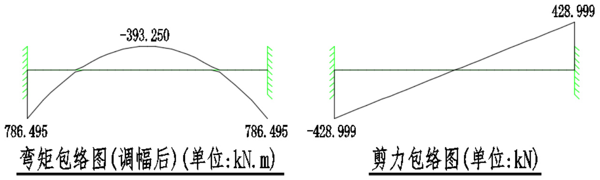  
图 5.6-8 闸底板弯矩与剪力包络图  

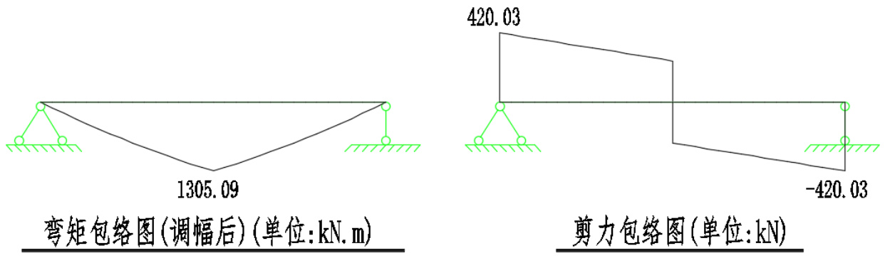  
图 5.6-9  机架桥 T 形梁弯矩与剪力包络图  

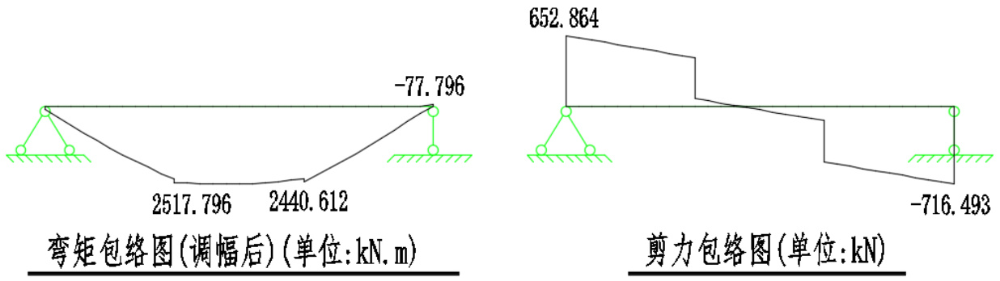  
图 5.6-10  机架桥 $\pi$ 形梁弯矩与剪力包络图  

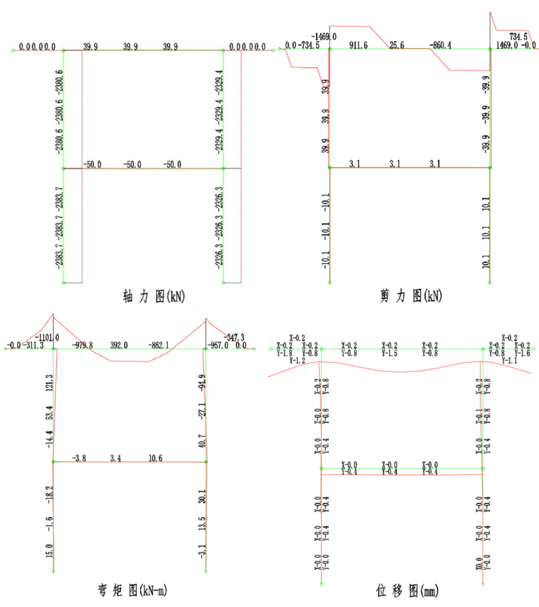  
图 5.6-11 排架柱内力及位移图  

$\textcircled{2}$ 长虹渠退水闸下部结构内力见表 5.6-11、表 5.6-12,配筋计算结果见表5.6-13。  

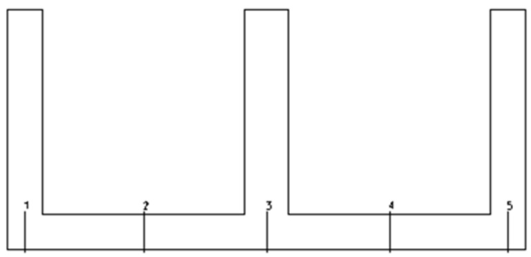  
图 5.6-12 闸室底板计算截面示意图  

# a)上游段各截面的弯矩  

表 5.6-11  长虹渠退水闸闸室各截面弯矩(单位: $\mathrm{kN/m},$ )  

<html><body><table><tr><td>设计值</td><td>完建情况</td><td>设计洪水位情况</td><td>校核洪水位情况</td><td>地震作用情况</td></tr><tr><td>截面1</td><td>689. 25</td><td>682.74</td><td>672.99</td><td>684.98</td></tr><tr><td>截面2</td><td>-156.65</td><td>-377.82</td><td>-254.55</td><td>-154.19</td></tr><tr><td>截面3</td><td>-13. 69</td><td>-185.26</td><td>-190.46</td><td>-44.50</td></tr><tr><td>截面4</td><td>-401.30</td><td>-623.35</td><td>-498.28</td><td>-398.41</td></tr><tr><td>截面5</td><td>29.58</td><td>22.47</td><td>12.42</td><td>25.11</td></tr></table></body></html>  

b)下游段各截面的弯矩:(单位: $\mathrm{kN/m}$ )  

表 5.6-12  长虹渠退水闸闸室各截面弯矩(单位: $\mathrm{kN/m}$ )  

<html><body><table><tr><td>设计值</td><td>完建情况</td><td>设计洪水位情况</td><td>校核洪水位情况</td><td>地震作用情况</td></tr><tr><td>截面1</td><td>685.56</td><td>672.59</td><td>672.29</td><td>683.94</td></tr><tr><td>截面2</td><td>-92.62</td><td>-146. 65</td><td>-250.95</td><td>-129.00</td></tr><tr><td>截面3</td><td>8.43</td><td>-119.27</td><td>-179.31</td><td>-23.93</td></tr><tr><td>截面4</td><td>-336.55</td><td>-389.67</td><td>-494.66</td><td>-373.01</td></tr><tr><td>截面5</td><td>25.80</td><td>12.14</td><td>11.69</td><td>24.06</td></tr></table></body></html>  

c)配筋  

表 5.6-13  长虹渠退水闸闸室各截面配筋结果(选筋方案/配筋率)  

<html><body><table><tr><td></td><td>上侧</td><td>下侧</td></tr><tr><td>截面1</td><td>E28@200/0.26%</td><td>E28@200/0.26%</td></tr><tr><td>截面2</td><td>E28@200/0.26%</td><td>E28@200/0.26%</td></tr><tr><td>截面3</td><td>E28@200/0.26%</td><td>E28@200/0.26%</td></tr><tr><td>截面4</td><td>E28@200/0.26%</td><td>E28@200/0.26%</td></tr><tr><td>截面5</td><td>E28@200/0.26%</td><td>E28@200/0.26%</td></tr></table></body></html>  

$\textcircled{3}$ 长虹渠退水闸上部结构控制工况内力及配筋计算结果见表 5.6-14。控制工况内力图见图 5.6-13\~图 5.6-16。  

表 5.6-14  长虹渠退水闸闸室结构计算结果  

<html><body><table><tr><td colspan="2">长虹渠退水闸</td><td>单位</td><td>结果</td><td>备注</td></tr><tr><td rowspan="7">边 跨 梁</td><td>弯矩设计值</td><td>kN·m</td><td>1318.32</td><td></td></tr><tr><td>计算钢筋面积</td><td>mm²</td><td>4572</td><td></td></tr><tr><td>选配钢筋</td><td>mm</td><td>8p28</td><td></td></tr><tr><td>实配钢筋面积</td><td>mm²</td><td>4825</td><td></td></tr><tr><td>配筋率</td><td>%</td><td>2.3</td><td></td></tr><tr><td>裂缝宽度</td><td>mm</td><td>0.299</td><td></td></tr><tr><td>弯矩设计值 (单宽)</td><td>kN·m</td><td>1084.25</td><td></td></tr><tr><td rowspan="6">中 间 跨 梁</td><td>计算钢筋面积</td><td>mm²</td><td></td><td></td></tr><tr><td>选配钢筋</td><td></td><td>3962</td><td></td></tr><tr><td>实配钢筋面积</td><td>mm mm²</td><td>8p28</td><td></td></tr><tr><td>配筋率</td><td></td><td>4825</td><td></td></tr><tr><td>裂缝宽度</td><td>%</td><td>2.3 0.382</td><td></td></tr><tr><td>轴力设计值</td><td>mm kN</td><td></td><td></td></tr><tr><td rowspan="5">排 架 柱</td><td>计算钢筋面积</td><td>mm²</td><td>454.44</td><td></td></tr><tr><td>选配钢筋</td><td></td><td>720</td><td></td></tr><tr><td>实配钢筋面积</td><td>mm</td><td>12p18</td><td></td></tr><tr><td>配筋率</td><td>mm²</td><td>3054</td><td></td></tr><tr><td></td><td>% </td><td>0.85</td><td></td></tr><tr><td rowspan="7">胸 墙</td><td>弯矩设计值 (单宽)</td><td>kN·m</td><td>53.59</td><td></td></tr><tr><td>计算钢筋面积</td><td>mm²</td><td>1000</td><td></td></tr><tr><td>选配钢筋</td><td>mm</td><td>4p20</td><td></td></tr><tr><td>实配钢筋面积</td><td>mm²</td><td>1257</td><td></td></tr><tr><td>配筋率</td><td>% </td><td>0.5</td><td></td></tr><tr><td>裂缝宽度</td><td>mm</td><td>0.019</td><td></td></tr></table></body></html>  

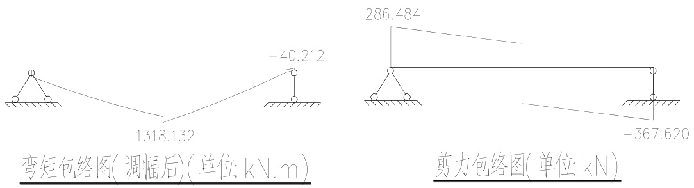  
图 5.6-13 边跨 $\pi$ 型梁弯矩与剪力包络图  

  
图 5.6-14 中跨 $\pi$ 型梁弯矩与剪力包络图  

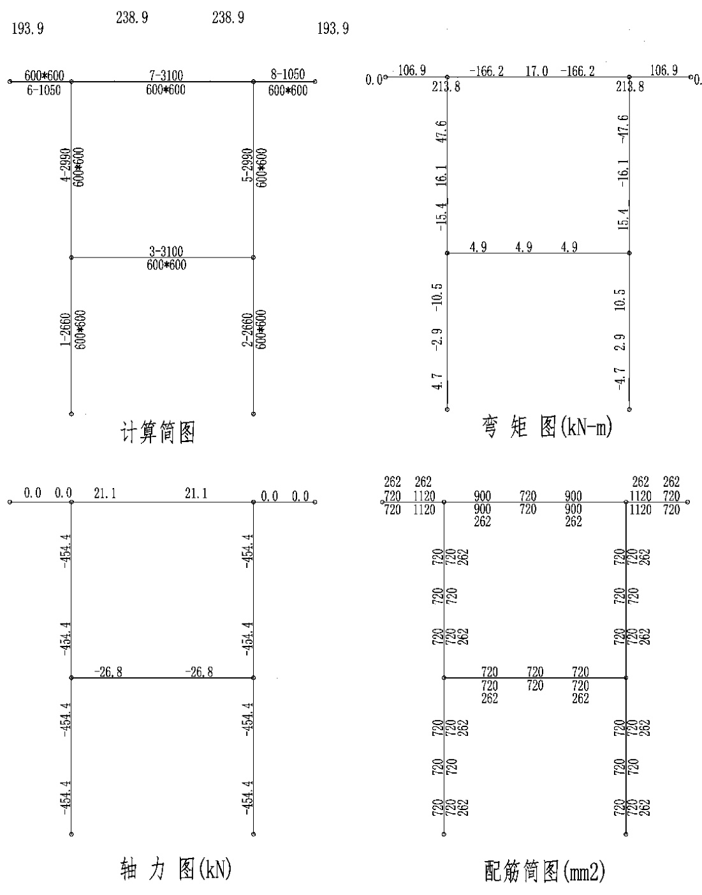  
图 5.6-15 排架计算图  

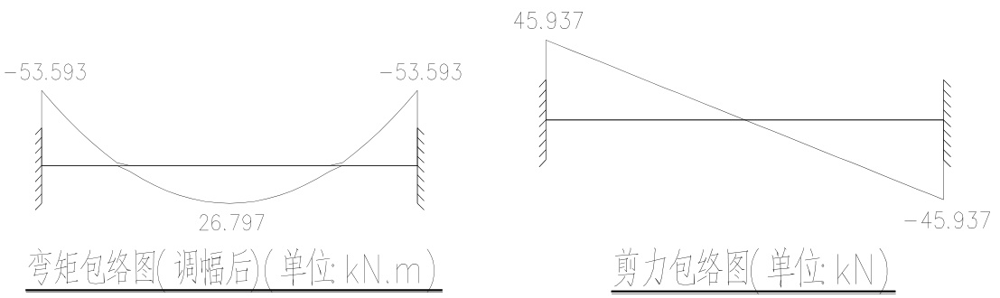  
图 5.6-16 胸墙弯矩与剪力包络图  

# 5.6.5 闸室上下游翼墙设计  

# 5.6.5.1 翼墙结构布置  

$\textcircled{1}$ 盐土庄节制闸上下游翼墙布置  

为保证水流平顺,两岸上、下游翼墙由直线段加圆弧段组成。  

上游翼墙圆弧段总长 $31.4\mathrm{m}$ ,圆弧半径 $20\mathrm{m}$ ,圆心角 $90^{\mathrm{\mathrm{o}}}$ ,墙高 $10.8\mathrm{m}$ ,底板宽 $9.5\mathrm{m}$ 。  

下游翼墙圆弧段总长 $31.4\mathrm{m}$ ,圆弧半径 $20\mathrm{m}$ ,圆心角 $90^{\mathrm{\mathrm{o}}}$ ,墙高 $10.8\mathrm{m}$ ,底板宽 $9.5\mathrm{m}$ ;直线段翼墙总长 $20\mathrm{m}$ ,墙高 $11.8\mathrm{m}$ ,底板宽 $10.5\mathrm{m}$ 。  

翼墙结构形式为钢筋混凝土扶臂式挡土墙,挡墙分缝缝内设橡胶止水 1 道,内嵌闭孔塑料板;翼墙底板下设 $10\mathrm{cm}$ 素混凝土垫层。  

$\textcircled{2}$ 长虹渠退水闸上下游翼墙布置  

为保证水流平顺,两岸上游翼墙由圆弧段和直线段组成,采用扶臂式挡墙,下游第一段翼墙采用扶臂式挡墙,第二段和第三段翼墙为悬臂式。  

上游翼墙圆弧段长 $15.7\mathrm{m}$ ,圆弧半径 $10\mathrm{m}$ ,圆心角 $90^{\mathrm{\mathrm{o}}}$ ,直线段长 $4.2\mathrm{m}$ ,墙高 $7.8\mathrm{m}$ ,底板宽 $6.8\mathrm{m}$ 。  

下游第一段翼墙长 $10\mathrm{m}$ ,墙高 $7.8{\sim}6.8\mathrm{m}$ ,底板宽 $6.8\mathrm{m}$ 。下游第二段翼墙长$10\mathrm{m}$ ,墙高 $6.8\mathrm{m}$ ,底板宽 $6.0\mathrm{m}$ 。下游第三段翼墙圆弧段长 $23.6\mathrm{m}$ ,圆弧半径 $15\mathrm{m}$ ,圆心角 $90^{\mathrm{\mathrm{o}}}$ ,墙高 $5.8\mathrm{m}$ ,底板宽 $5.1\mathrm{m}$ 。  

挡墙分缝缝内设橡胶止水 1 道,内嵌闭孔塑料板;翼墙底板下设 $10\mathrm{cm}$ 素混凝土垫层。  

# 5.6.5.2 翼墙稳定计算  

(1)计算参数及断面选取  

$\textcircled{1}$ 盐土庄节制闸选取最高段翼墙进行计算。  

翼墙基础坐落在粉质粘土地基上,地基允许承载力特征值为 $125\mathrm{kPa}$ 。  

本工程回填土料采用开挖料,开挖回填土物理力学指标取值为:湿容重$20.2\mathrm{kN}/\mathrm{m}^{3}$ ,粘聚力为 $16.0\mathrm{kPa}$ ,等效内摩擦角为 $18.9^{\circ}$ 。  

$\textcircled{2}$ 长虹渠退水闸选取上游翼墙、下游平直段翼墙和下游圆弧段翼墙分别进行计算。  

翼墙基础坐落在粘土地基上,地基允许承载力特征值为 $130\mathrm{kPa}$ 。  

# (2)计算公式  

翼墙稳定计算包括基底应力及不均匀系数计算、抗滑稳定计算和抗浮稳定计算,计算依据《水工挡土墙设计规范》(SL379-2007)6.1.6条中的规定执行。取顺水流向相邻永久缝之间的挡土区段作为稳定计算单元。  

基底应力和抗滑稳定安全系数计算公式同闸室稳定计算公式。抗浮稳定安全系数计算公式:  

$$
K_{_{f}}=\frac{\sum V}{\sum U}
$$  

式中  Kf——翼墙抗浮稳定安全系数;∑V— 作用在翼墙基础上全部向下的铅直力之和 $(\mathrm{kN})$ ;∑U— 作用在翼墙基底面上的扬压力 $(\mathrm{kN})$ 。  

(3)计算工况及水位组合  

翼墙墙前水位越高,对翼墙稳定越有利,本次计算选取工况见表 5.6-15\~表5.6-16。  

表 5.6-15 盐土庄节制闸上、下游翼墙稳定计算工况表  

<html><body><table><tr><td rowspan="2">工况</td><td colspan="2">水位组合（m）</td><td rowspan="2">备注</td></tr><tr><td>墙前水位</td><td>墙后水位</td></tr><tr><td>完建工况</td><td>无水</td><td>无水</td><td>墙前、墙后均无水</td></tr><tr><td>正常挡水位工况</td><td>56.92</td><td>56.92</td><td>墙前墙后水位均为正常挡水位</td></tr><tr><td>最高挡水位工况</td><td>59.94</td><td>59.94</td><td>墙前墙后水位均为最高挡水位</td></tr><tr><td>地震工况</td><td>56.92</td><td>56.92</td><td>正常挡水位工况+VⅢ地震</td></tr></table></body></html>  

# 表 5.6-16  长虹渠退水闸上、下游翼墙稳定计算工况表  

<html><body><table><tr><td rowspan="2">挡墙位置</td><td rowspan="2">工况</td><td colspan="2">水位组合（m)</td><td rowspan="2">备注</td></tr><tr><td>墙前 水位</td><td>墙后 水位</td></tr><tr><td rowspan="4">上游翼墙</td><td>完建工况</td><td>无水</td><td>无水</td><td>墙前、墙后均无水</td></tr><tr><td>最高挡水位 工况</td><td>62.49</td><td>61.99</td><td>墙前水位为最高挡水位；墙后水位为比墙 前水位低0.5m</td></tr><tr><td>地震工况</td><td>56.40</td><td>56.40</td><td>正常蓄水位工况+VⅢ地震；墙前水位为正 常挡水位；墙后水位为地下水位</td></tr><tr><td>水位骤降</td><td>61.99</td><td>62.49</td><td>墙前水位为最高挡水位；左岸墙后水位为 地下水位，右岸墙后水位为最高挡水位</td></tr><tr><td rowspan="4">下游第一段 翼墙</td><td>完建工况</td><td>无水</td><td>无水</td><td>墙前、墙后均无水</td></tr><tr><td>最高挡水位 工况</td><td>61.53</td><td>61.03</td><td>墙前水位为最高挡水位；墙后水位为比墙 前水位低0.5m</td></tr><tr><td>地震工况</td><td>55.40</td><td>55.40</td><td>正常蓄水位工况+VⅢ地震；墙前水位为正 常挡水位；墙后水位为地下水位</td></tr><tr><td>水位骤降</td><td>61.03</td><td>61.53</td><td>墙前水位为最高挡水位；左岸墙后水位为 地下水位，右岸墙后水位为最高挡水位</td></tr><tr><td rowspan="4">下游第二段 翼墙</td><td>完建工况</td><td>无水</td><td>无水</td><td>墙前、墙后均无水</td></tr><tr><td>最高挡水位 工况</td><td>61.53</td><td>61.03</td><td>墙前水位为最高挡水位；墙后水位为比墙 前水位低0.5m</td></tr><tr><td>地震工况</td><td>56.20</td><td>56.20</td><td>正常蓄水位工况+VⅢ地震；墙前水位为正 常挡水位；墙后水位为地下水位</td></tr><tr><td>水位骤降</td><td>61.03</td><td>61.53</td><td>墙前水位为最高挡水位；左岸墙后水位为 地下水位，右岸墙后水位为最高挡水位</td></tr></table></body></html>  

(4)主要荷载组合  

各工况主要荷载组合详见表 5.6-17。  

# 表 5.6-17  各计算工况主要荷载组合表  

<html><body><table><tr><td rowspan="3">荷 载 组 合</td><td rowspan="3">工况</td><td colspan="11">荷载</td></tr><tr><td rowspan="2">自 重</td><td>水 重</td><td>土压 力</td><td>静 水 压</td><td>扬 压 力</td><td>淤 沙 压</td><td>浪 压 力</td><td>风 压</td><td>附 加 荷</td><td></td><td>地 震 荷</td><td>其 他</td></tr><tr><td></td><td></td><td></td><td>力</td><td></td><td>力</td><td></td><td>力</td><td>载</td><td>载</td><td></td></tr><tr><td>本 组 合</td><td>完建工况 正常挡水 位工况</td><td></td><td></td><td></td><td></td><td></td><td></td><td></td><td></td><td></td><td></td><td></td><td></td></tr><tr><td rowspan="2">特 殊 组 合</td><td>最高挡水 位工况</td><td></td><td></td><td></td><td></td><td></td><td></td><td></td><td></td><td></td><td></td><td></td><td></td></tr><tr><td>地震工况</td><td></td><td></td><td></td><td></td><td></td><td></td><td></td><td></td><td></td><td></td><td></td><td></td></tr></table></body></html>  

# (5)稳定计算结果  

稳定计算结果见表 5.6-18\~表 5.6-19。  

表 5.6-18  盐土庄节制闸上、下游翼墙稳定计算结果  

<html><body><table><tr><td rowspan="2">计算内容</td><td rowspan="2"></td><td colspan="2">基本组合</td><td colspan="2">特殊组合</td></tr><tr><td>完建 工况</td><td>正常挡水 位工况</td><td>最高挡水 位工况</td><td>地震 工况</td></tr><tr><td rowspan="2">水位组合</td><td>闸上 (m)</td><td>无水</td><td>56.92</td><td>59.94</td><td>56.92</td></tr><tr><td>闸下 (m)</td><td>无水</td><td>56.92</td><td>59.94</td><td>56.92</td></tr><tr><td rowspan="2">抗滑稳定安全系数</td><td>计算值Kc</td><td>1.51</td><td>1.51</td><td>1.52</td><td>1.19</td></tr><tr><td>允许值[K]</td><td>1.25</td><td>1.25</td><td>1.10</td><td>1.05</td></tr><tr><td rowspan="2">抗倾覆稳定安全系数</td><td>计算值 Ko</td><td>8.92</td><td>2.62</td><td>1.92</td><td>2.56</td></tr><tr><td>允许值[K]</td><td>1.1</td><td>1.1</td><td>1.05</td><td>1.05</td></tr><tr><td rowspan="3">基底应力（kPa)</td><td>最大值Pmax</td><td>222.78</td><td>183.77</td><td>153.78</td><td>159.23</td></tr><tr><td>最小值 Pmin</td><td>202.18</td><td>127.55</td><td>104.07</td><td>122.09</td></tr><tr><td>平均值 P平均</td><td>212.48</td><td>155.66</td><td>128.93</td><td>155.66</td></tr><tr><td rowspan="2">基底应力不均匀系数</td><td>计算值n</td><td>1.10</td><td>1.44</td><td>1.48</td><td>1.55</td></tr><tr><td>允许值[n]</td><td>2.0</td><td>2.0</td><td>2.5</td><td>2.5</td></tr></table></body></html>  

表 5.6-19  长虹渠退水闸上、下游翼墙稳定计算结果  

<html><body><table><tr><td rowspan="2">挡墙 位置</td><td rowspan="2">荷载 组合</td><td rowspan="2">计算工况</td><td colspan="4">基地应力</td><td rowspan="2">抗滑稳 定安全 系数 Kc</td><td rowspan="2">抗倾覆稳定 安全系数</td></tr><tr><td>Pmax</td><td>P</td><td>n</td><td>地基允 许承载 力[P]</td></tr><tr><td rowspan="4">上游 翼墙</td><td rowspan="2">基本 组合</td><td>完建</td><td>146.81</td><td>137.15</td><td>1.15</td><td rowspan="4">130</td><td>1.79</td><td>8.60</td></tr><tr><td>最高挡水</td><td>94.39</td><td>90.19</td><td>1.10</td><td>2.06</td><td>2.05</td></tr><tr><td rowspan="2">特殊 组合</td><td>正常挡水 +地震</td><td>193.48</td><td>137.15</td><td>2.39</td><td>1.05</td><td>4.57</td></tr><tr><td>水位骤降</td><td>116.32</td><td>89.84</td><td>1.84</td><td>2.95</td><td>1.85</td></tr><tr><td rowspan="4">下游 第一 段翼 墙</td><td>基本 组合</td><td>完建</td><td>122.19</td><td>118.60</td><td>1.06</td><td rowspan="4">130</td><td>1.79</td><td>8.83</td></tr><tr><td rowspan="2">特殊</td><td>最高挡水</td><td>78.26</td><td>72.45</td><td>1.17</td><td>2.53</td><td>1.88</td></tr><tr><td>正常挡水 +VⅢ度地 震</td><td>161.47</td><td>118.60</td><td>2.13</td><td>1.06</td><td>4.71</td></tr><tr><td rowspan="2">基本 组合</td><td>水位骤降</td><td>93.86</td><td>71.99</td><td>1.87</td><td></td><td>1.26</td><td>1.72</td></tr><tr><td></td><td>完建</td><td>129.09</td><td>121.94 1.12</td><td rowspan="4"></td><td>1.86</td><td>6.40</td></tr><tr><td rowspan="4">下游 第二 段翼 墙</td><td>特殊</td><td>最高挡水</td><td>77.97</td><td>73.48</td><td>1.13</td><td rowspan="3">130</td><td>2.59</td><td>1.88</td></tr><tr><td rowspan="2">组合</td><td>正常挡水 +VI度地</td><td>152.89</td><td>112.10</td><td>2.14</td><td>1.06</td><td>3.83</td></tr><tr><td>震 水位骤降</td><td>96.46</td><td>73.01</td><td>1.95</td><td>1.28</td><td>1.72</td></tr></table></body></html>  

由上表可知:翼墙的抗滑稳定、抗倾覆稳定及基底不均匀系数均满足规范要求,但部分翼墙平均基底应力大于地基允许承载力,最大基底应力大于地基允许承载力的 1.2 倍,不满足规范要求,需进行地基处理。  

# 5.6.6 基础处理  

(1)各闸基础处理  

由前述地质条件,小河口节制闸、长虹渠退水闸、浚内沟排涝涵闸基础均存在可液化土层,需要进行防液化处理。  

同时根据前述闸室稳定、沉降计算结果可知:新建各闸底板下天然土层允许承载力均大于上部结构产生的基底应力,各闸均可直接座落于天然地基上,但几座规模较大的水闸(盐土庄节制闸、小河口节制闸、长虹渠退水闸)闸室沉降量均不满足规范要求,几座规模较小的水闸(浚内沟排涝涵闸、浚县箱涵、民丰沟排涝闸)闸室沉降量满足规范要求,鉴于部分水闸闸基下第一土层较单薄,经较小深度的换填后就能将水闸座落于密实性、抗渗性、承载能力、均一性更好的下一土层,在增加投资不大的情况下能显著提高闸室抗滑、抗渗稳定性,有效减小水闸的沉降。  

因此,将浚县箱涵、民丰沟排涝涵闸基础进行重壤土换填,换填深度 $1.2\mathrm{m}$ 。  

盐土庄节制闸基础沉降量大于《水闸设计规范》(SL265-2016)中规定的但各建筑物沉降量不大于 $15\mathrm{cm}$ 的要求,另外三座水闸(小河口节制闸、长虹渠退水闸、浚内沟排涝涵闸)由于基础均存在可液化土层,所以采用复合地基。  

# (2)基础处理方案比选  

根据前述地质条件,小河口节制闸、长虹渠退水闸以及浚内沟排涝涵闸的基础均属于可震动液化土,需要对基础进行防液化处理。  

对于埋深较浅的液化土层,可以采用挖除置换法,对于深层液化土常采用围封、加密(如振动水冲法、振动沉管挤密法、砂井排水法、深层爆破法等)、灌浆胶结、水泥土搅拌桩加固等方法处理。  

小河口节制闸、长虹渠退水闸及浚内沟排涝涵闸液化土层埋深较大(长虹渠震动液化土层最大埋深达到 $16\mathrm{m}.$ ),全部置换工程量大,不经济,不宜采用;可研阶段批复采用围封法对水闸地基进行处理较为经济可行。但围封法尚不能解决各闸室沉降量偏大的问题。  

目前软土地基处理方法很多,一般有置换法、砂井预压法、强夯法及桩基法,结合本工程部分水闸基础存在可液化土层,考虑到节省投资、施工工期等各方面因素,推荐采用振冲碎石桩复合地基方案。利用振冲加固地基,施工机具简单、操作方便、施工速度较快、加固质量容易控制;加固时不需要钢材、水泥,仅用碎石卵石、角砾等当地硬质粗粒径材料,因而地基加固造价较低,具有明显的经济效益;在软弱地基中,经振冲填以碎石或卵石等粗粒材料,成桩后改变了地基的排水条件,可加速地震时超静孔隙水压力的消散,有利于地基抗震并防止液化,同时能加速桩间土的固结,提高其强度。  

对于盐土庄节制闸的地基处理,主要解决地基沉降量较大的问题。结合类似工程经验,拟采用水泥粉煤灰碎石桩(CFG 桩)复合地基。CFG 桩形成的复合地基最大限度地利用了原土,桩体凝固后其物理力学性质较天然土有较大变化,形成整体性强、且有足够强度的复合地基,既提高了地基承载力,又减少了沉降量。  

(3)复合地基设计  

$\textcircled{1}$ 根据《建筑地基处理技术规范(JGJ 79-2012),对散体材料增强体复合地基应按下式计算:  

$$
f_{s p k}=[1+m(n-1)]f_{s k}
$$  

式中 fspk——复合地基承载力特征值(kPa)fsk——处理后桩间土承载力特征值( $\mathrm{(kPa)}$ ),可按地区经验确定;n 复合地基桩土应力比,可按地区经验确定;m— 面积置换率。  

对有粘结强度增强体复合地基,按下式进行估算:  

$$
f_{s p k}=\lambda m\frac{R_{a}}{A_{p}}+\beta(1-m)f_{s k}
$$  

式中  fspk——复合地基承载力特征值,kPa;  

ߣ——单桩承载力发挥系数;  
m— —面积置换率;  
$R_{d}$ ——单桩竖向承载力特征值,kN;  
$A_{\boldsymbol{p}}$ —桩的截面积, $\mathsf{m}^{2}$ ;  
$\beta$ ——桩间土承载力发挥系数;  
$f_{s k}$ ——处理后桩间土承载力特征值,kPa。  

单桩竖向特征值的取值,当无单桩荷载试验资料时,可按下式的最小值进行估算:  

$$
R_{a}=u_{p}\sum_{i=1}^{n}q_{s i}l_{p i}+\alpha_{p}q_{p}A_{p}
$$  

$$
R_{a}\le\frac{f_{c u}A_{p}}{4\lambda}
$$  

式中 $u_{P}$ — 桩的周长, $\mathsf{m}$ ;$q_{s i}$ — 桩周第 i 层土的侧阻力特征值,kPa;Ipi 桩长范围内第 i 层土的厚度, $\mathsf{m}$ ;$\alpha_{p}$ 桩端端阻力发挥系数。  

$q_{p}$ ——桩端端阻力特征值,kPa;  

$f_{c u}$ ——桩体试块(边长 150mm 立方体)标准养护 28d 的立方体抗压强度平均值,kPa。  

$\textcircled{2}$ 复合地基变形计算应符合现行国家标准《建筑地基基础设计规范)) GB50007 的有关规定,地基变形计算深度应大于复合土层的深度。复合土层的分层与天然地基相同,各复合土层的压缩模量等于该层天然地基压缩模量的倍, $\zeta$ 值可按下式确定:  

$$
\zeta=\frac{f_{s p k}}{f_{a k}}
$$  

式中: fspk——复合地基承载力特征值(kPa);fak— 基础底面下天然地基承载力特征(kPa)  

根据上述公式,结合各闸室地质条件,各闸基础处理结果见表 5.6-20  

表 5.6-20  各水闸基础处理计算结果  

<html><body><table><tr><td colspan="3">部位</td><td>桩径 (m)</td><td>中心 距 (m)</td><td>桩长 (m)</td><td>天然地 基 沉降量 (cm)</td><td>地基处理 后承载力 特征值 (kPa)</td><td>地基处理后沉 降量（cm）</td></tr><tr><td rowspan="4">盐 土 庄 节 制 闸</td><td>闸室</td><td>中三孔 段</td><td>0.4</td><td>1.5</td><td>10</td><td>25.8</td><td>245.84</td><td>12.8</td></tr><tr><td>闸室</td><td>边两孔 段</td><td>0.4</td><td>1.5</td><td>10</td><td>24.6</td><td>245.84</td><td>11.2</td></tr><tr><td>控制 楼</td><td>基础筏 板</td><td>0.4</td><td>1.5</td><td>10</td><td>17.3</td><td>261.15</td><td>9.3</td></tr><tr><td colspan="2">扶壁式翼墙</td><td>0.4</td><td>1.5</td><td>10</td><td>29.6</td><td>245.84</td><td>10.1</td></tr><tr><td rowspan="4">小 河 口 节 制 闸</td><td>闸室</td><td>中一孔 段</td><td>0.8</td><td>2</td><td>15</td><td>25.0</td><td>182.58</td><td>10.81</td></tr><tr><td>闸室</td><td>边两孔 段</td><td>0.8</td><td>2</td><td>15</td><td>26.8</td><td>182.58</td><td>10.37</td></tr><tr><td>控制 楼</td><td>基础筏 板</td><td>0.8</td><td>1.5</td><td>15</td><td>30.3</td><td>225.62</td><td>11.51</td></tr><tr><td colspan="2">扶壁式翼墙</td><td>0.8</td><td>2</td><td>15</td><td>10.8</td><td>182.58</td><td>7.35</td></tr><tr><td rowspan="4">长 虹 渠 退 水 闸</td><td>闸室</td><td>中一孔 段</td><td>0.8</td><td>2</td><td>18</td><td>8.5</td><td>192.68</td><td>6.26</td></tr><tr><td>闸室</td><td>边两孔 段</td><td>0.8</td><td>2</td><td>18</td><td>10.7</td><td>192.68</td><td>8.08</td></tr><tr><td>控制 楼</td><td>基础筏 板</td><td>0.8</td><td>1.5</td><td>18</td><td>22.9</td><td>232.15</td><td>7.28</td></tr><tr><td colspan="2">扶壁式翼墙</td><td>0.8</td><td>2</td><td>18</td><td>15.1</td><td>192.68</td><td>6.22</td></tr></table></body></html>  

# 5.6.7 混凝土防硫酸盐侵蚀设计  

由各闸水文地质情况描述可知,浚内沟排涝涵闸地表水和地下水均对普通水泥混凝土呈硫酸盐型弱腐蚀性,小河口节制闸、长虹渠退水闸、浚县箱涵及民丰沟排涝涵闸地下水对普通水泥混凝土呈硫酸盐型中等腐蚀性,盐土庄节制闸闸址处河水和地下水均对混凝土无腐蚀性,对除盐土庄节制闸外的各闸闸室混凝土进行防硫酸盐腐蚀设计。  

选用抗硫酸盐性能良好的水泥、提高混凝土自身的密实性,选用防腐能力强的活性矿物材料替代部分水泥或掺入防腐剂均能达到混凝土抗硫酸盐侵蚀的效果。采用抗硫酸盐水泥配置的混凝土除盐土庄节制闸外各闸的闸墩、底板、翼墙等水下结构。  

各闸址地下水对混凝土结构中的钢筋具弱腐蚀,对钢结构有中等腐蚀性。地下混凝土中可根据需要掺入防腐阻锈剂,设计采用复合型混凝土 CS 防腐阻锈剂,主要由防腐组分、阻锈组分、高分子聚合物组分组成,产品性能应满足《钢筋阻锈剂应用技术规程》YB/T9231-2009 中的规定。  

# 5.6.8 主要工程量  

新建闸(堰)工程量见表5.6-21。  

表5.6-21 新建闸(堰)工程量清单   

<html><body><table><tr><td rowspan="2">序 号</td><td rowspan="2">项目</td><td rowspan="2">单位</td><td colspan="8">数量</td><td rowspan="2"></td><td rowspan="2">备注</td></tr><tr><td>小河口 节制闸</td><td>盐土庄 节制闸</td><td>长虹渠 退水闸</td><td>长虹渠 分洪堰</td><td>白寺坡 分洪堰</td><td>浚内沟 排涝涵闸</td><td>浚县 套闸</td><td>民丰沟 套闸 汇总</td><td></td></tr><tr><td></td><td>土方开挖</td><td>m3</td><td>700(m²/s) 139730</td><td>1600(m2/s) 103190</td><td>400(m²/s) 47020</td><td>900(m²/s) 177140</td><td>1600(m²/s) 102190</td><td>31.3(m2/s) 10710</td><td>20(m2/s) 5700</td><td>47.7(m/s) 11000</td><td>596680</td><td></td></tr><tr><td>1 2</td><td>土方回填</td><td>m3</td><td>122060</td><td>40010</td><td>11627</td><td>53940</td><td>38250</td><td>10660</td><td>17840</td><td>7915</td><td>302302</td><td></td></tr><tr><td>3</td><td>碎石</td><td>m3</td><td>1450</td><td>1980</td><td>1282</td><td></td><td></td><td>380</td><td>456</td><td>250</td><td>5798</td><td></td></tr><tr><td>4</td><td>格宾石笼</td><td>m3</td><td>3630</td><td>5180</td><td>1196</td><td>14290</td><td>10440</td><td>900</td><td>1342</td><td>1113</td><td>38091</td><td></td></tr><tr><td>5</td><td>C25F150W4混凝土</td><td>m3</td><td>4250</td><td>7540</td><td>1264</td><td>16360</td><td>17080</td><td>120</td><td></td><td>490</td><td>47104</td><td>护底、护坡</td></tr><tr><td>6</td><td>C25F150W4混凝土</td><td>m3</td><td>2850</td><td>3940</td><td>1740</td><td></td><td></td><td>295</td><td>600</td><td>1016</td><td>10441</td><td>翼墙</td></tr><tr><td>7</td><td>C25F150W4混凝土</td><td>m3</td><td>1730</td><td>2650</td><td>892</td><td></td><td></td><td>560</td><td>1285</td><td>300</td><td>7417</td><td>闸底板</td></tr><tr><td>8</td><td>C25F150W4混凝土</td><td>m3</td><td>2020</td><td>2660</td><td>1066</td><td>—</td><td></td><td>635</td><td>1185</td><td>570</td><td>8136</td><td>闸墩</td></tr><tr><td>9</td><td>C30F100混凝土</td><td>m3</td><td>560</td><td>860</td><td>906</td><td></td><td></td><td>60</td><td></td><td>112</td><td>2498</td><td>预制混凝土</td></tr><tr><td>10</td><td>C30F100混凝土</td><td>m3</td><td>150</td><td>240</td><td>128</td><td></td><td></td><td>22</td><td></td><td></td><td>540</td><td></td></tr><tr><td>11</td><td>C15素混凝土</td><td>m3</td><td>600</td><td>1110</td><td>340</td><td>6370</td><td>5330</td><td>80</td><td>126</td><td>83</td><td>14039</td><td></td></tr><tr><td>12</td><td>钢材</td><td>t</td><td>30</td><td>60</td><td>16</td><td></td><td></td><td>5</td><td>6</td><td>6</td><td>123</td><td></td></tr><tr><td>13</td><td>抛石</td><td>m3</td><td>2100</td><td>4480</td><td>1075</td><td>19900</td><td>14540</td><td>320</td><td></td><td></td><td>42415</td><td></td></tr><tr><td>14</td><td>交通道路</td><td>m</td><td>630</td><td>550</td><td>90</td><td>810</td><td>630</td><td>80</td><td>130</td><td>420</td><td>3340</td><td>沥青路面</td></tr><tr><td>15</td><td>钢栏杆</td><td>m</td><td>310</td><td>580</td><td>326</td><td></td><td></td><td>110</td><td>30</td><td>118</td><td>1474</td><td></td></tr><tr><td>16</td><td>土工格栅</td><td>m²</td><td>62640</td><td>77900</td><td>14300</td><td></td><td>一</td><td></td><td>13230</td><td></td><td>168070</td><td></td></tr><tr><td>17</td><td>反滤土工布</td><td>m²</td><td>1470</td><td>1740</td><td>882</td><td>9460</td><td>6920</td><td>260</td><td></td><td>260</td><td>20992</td><td></td></tr><tr><td>18</td><td>橡胶止水带</td><td>m</td><td>950</td><td>1570</td><td>582</td><td></td><td></td><td>250</td><td>190</td><td>100</td><td>3642</td><td></td></tr></table></body></html>  

<html><body><table><tr><td rowspan="2">序 号</td><td rowspan="2">项目</td><td rowspan="2">单位</td><td colspan="8">数量</td><td rowspan="2">备注</td></tr><tr><td>小河口 节制闸</td><td>盐土庄 节制闸</td><td>长虹渠 长虹渠 退水闸 分洪堰</td><td>白寺坡 分洪堰</td><td>浚内沟 排涝涵闸</td><td>浚县 套闸</td><td>民丰沟 套闸</td><td>汇总</td></tr><tr><td>19</td><td>填缝材料</td><td>m²</td><td>700(m3/s) 3870</td><td>1600(m2/s) 5920</td><td>400(m²/s) 521</td><td>900(m3/s) 3730</td><td>1600(m2/s) 3040</td><td>31.3(m2/s) 240</td><td>20(m3/s) 100</td><td>47.7(m2/s) 290 17711</td><td></td></tr><tr><td>20</td><td>钢筋</td><td>t</td><td>1070</td><td>1500</td><td>670</td><td>687</td><td>717</td><td>140 260</td><td>246</td><td>5290</td><td></td></tr><tr><td>21</td><td>振冲碎石桩</td><td>m</td><td>18080</td><td></td><td>6200</td><td></td><td></td><td>5000</td><td></td><td>29280</td><td></td></tr><tr><td>22</td><td>CFG 桩</td><td>m</td><td></td><td>15050</td><td></td><td>—</td><td></td><td></td><td></td><td>15050</td><td></td></tr><tr><td>23</td><td>桩顶水泥土褥垫层</td><td>m3</td><td>1404</td><td>980</td><td>780</td><td></td><td>—</td><td>400 —</td><td></td><td>3564</td><td></td></tr><tr><td>24</td><td>混凝土拆除</td><td>m3</td><td>—</td><td></td><td>2879</td><td>一</td><td>一</td><td></td><td></td><td>2879</td><td></td></tr><tr><td>25</td><td>浆砌石拆除</td><td>m3</td><td></td><td></td><td>1375</td><td></td><td></td><td></td><td></td><td>1375</td><td></td></tr><tr><td>26</td><td>粗砂垫层</td><td>m3</td><td></td><td>—</td><td></td><td>1210</td><td>1660</td><td>—</td><td>—</td><td>2870</td><td></td></tr><tr><td>27</td><td>重壤土换填</td><td>m3</td><td></td><td></td><td></td><td>—</td><td></td><td>400</td><td>520</td><td>920</td><td></td></tr><tr><td>28</td><td>混凝土闸门混凝 土量</td><td>m3</td><td></td><td></td><td></td><td></td><td></td><td>34</td><td>二</td><td></td><td></td></tr><tr><td>29</td><td>等边角钢 (140x10)</td><td>t</td><td></td><td></td><td></td><td></td><td></td><td>4</td><td>—</td><td>4</td><td></td></tr><tr><td>30</td><td>1cm厚钢板</td><td>t</td><td></td><td></td><td></td><td></td><td></td><td>2</td><td></td><td>2</td><td></td></tr></table></body></html>

注:浚内沟排涝涵闸和浚县套闸采用抗硫酸盐水泥。  

# 5.7 穿堤建筑物  

# 5.7.1 穿堤建筑物设计方案  

根据可研审查意见及初设报告编制规程,初设阶段对穿堤建筑物做了进一步核查落实,根据实际情况,并结合当地政府和水利主管单位意见,对部分涵闸改造设计方案重新进行了调整和细化。  

对穿堤建筑物主要采用以下 4 种方案进行治理改造设计:  

(1)拆除重建;主要针对损坏严重或存在安全隐患,部分维修加固已不能  
满足长期使用要求的建筑物;(2)维修加固;主要针对基本完好只是部分损坏、维修加固后可继续使用  
的穿堤建筑物,或因为堤防加宽、加高,需要接长和重建进出口的穿堤建筑物。(3)拆除封堵;主要针对废弃不再使用的建筑物,或已损坏有其他建筑物  
可替代的穿堤建筑物。(4)维持现状;主要针对现状基本完好,不受堤防加固影响的穿堤建筑物。  

# 5.7.2 穿堤建筑物概况  

卫河自淇门至徐万仓河道长 $183\mathrm{km}$ ,共产主义渠自淇门刘庄至老观嘴段河道长 $44\mathrm{km}$ ,河道除宣泄上游洪水外,还承担两岸部分排涝和灌溉的任务。目前,两岸人民为了排涝和引水灌溉陆续修建了六百多座涵闸、涵管等穿堤建筑物。  

根据核查情况统计,卫河及共产主义渠两岸现有穿堤建筑物中存在问题的有445 座涵闸、涵管(洞)需要进行治理,其中卫河有 404 座,共产主义渠有 41 座,其余维持现状。其中卫河 404 座穿堤建筑物中需拆除重建的涵闸 7 座、涵管(洞)49 座;需维修加固的涵闸有 69 座、涵管(洞)202 座,需拆除封堵的涵闸 5 座、涵管(洞)72 座。共产主义渠 41 座穿堤建筑物中需拆除重建的涵闸 1 座、涵管(洞)4 座,需维修加固的涵闸有 5 座、涵管(洞)31 座。  

本次设计穿堤建筑物治理统计见表 $5.7{-}1{\sim}5.7{-}2 $ 。  

表 5.7-1  卫河及共产主义渠穿堤涵闸治理统计表  

<html><body><table><tr><td rowspan="2">河道名 称</td><td rowspan="2">治理措施</td><td rowspan="2">岸别</td><td colspan="3">省段</td><td>小计</td><td>合计</td></tr><tr><td>河北段</td><td>山东段</td><td>河南段</td><td></td><td></td></tr><tr><td rowspan="7">卫河</td><td rowspan="2">拆除重建 (座)</td><td>左堤</td><td></td><td></td><td>2</td><td>2</td><td rowspan="2">7</td></tr><tr><td>右堤</td><td>3</td><td>1</td><td>1</td><td>6</td></tr><tr><td rowspan="2">维修加固 (座)</td><td>左堤</td><td>6</td><td></td><td>33</td><td>39</td><td rowspan="2">69</td></tr><tr><td>右堤</td><td>2</td><td>1</td><td>27</td><td>30</td></tr><tr><td rowspan="2">拆除封堵 (座)</td><td>左堤</td><td>1</td><td></td><td></td><td>1</td><td rowspan="2">5</td></tr><tr><td>右堤</td><td>2</td><td>2</td><td></td><td>4</td></tr><tr><td rowspan="2">共产 主义渠</td><td>拆除重建 (座)</td><td>左堤</td><td></td><td></td><td>1</td><td>1</td></tr><tr><td>左堤 维修加固 (座)</td><td></td><td></td><td></td><td>0</td><td rowspan="2">1 5</td></tr><tr><td colspan="3">右堤</td><td></td><td>5</td><td>5</td><td></td></tr><tr><td colspan="3">合计</td><td>14</td><td>4</td><td>69</td><td>87</td><td>87</td></tr></table></body></html>  

表 5.7-2 卫河及共产主义渠穿堤涵管(洞)治理统计表  

<html><body><table><tr><td rowspan="2">河道名称</td><td rowspan="2">治理措施</td><td rowspan="2">岸别</td><td colspan="3">省段</td><td rowspan="2">小计</td><td rowspan="2">合计</td></tr><tr><td>河北段</td><td>山东段</td><td>河南段</td></tr><tr><td rowspan="6">卫河</td><td rowspan="2">拆除重建 (座)</td><td>左堤</td><td></td><td></td><td>23</td><td>23</td><td rowspan="2">49</td></tr><tr><td>右堤</td><td></td><td></td><td>26</td><td>26</td></tr><tr><td rowspan="2">维修加固 (座)</td><td>左堤</td><td>36</td><td></td><td>61</td><td>97</td><td rowspan="2">202</td></tr><tr><td>右堤</td><td>20</td><td>1</td><td>84</td><td>105</td></tr><tr><td rowspan="2">拆除封堵 (座)</td><td>左堤</td><td>30</td><td></td><td>17</td><td>47</td><td rowspan="2">72</td></tr><tr><td>右堤</td><td>18</td><td>3</td><td>4</td><td>25</td></tr><tr><td rowspan="3">共产主义渠</td><td>拆除重建 (座)</td><td>右堤</td><td></td><td></td><td>4</td><td>4</td><td>4</td></tr><tr><td rowspan="2">维修加固 (座)</td><td>左堤</td><td></td><td></td><td></td><td>0</td><td rowspan="2">31</td></tr><tr><td>右堤</td><td></td><td></td><td>31</td><td>31</td></tr><tr><td colspan="3">合计</td><td>104</td><td>4</td><td>250</td><td>358</td><td>358</td></tr></table></body></html>  

# 5.7.3 主要问题解决方案  

大部分穿堤建筑物在建国后的 50 年代中期至 70 年代修建,经历了四十至六十年的运用,均存在不同程度的损坏,存在安全隐患和不能正常使用等问题,主要表现在:  

(1)设计标准低  

针对多数涵闸和涵管设计标准偏低;穿堤埋涵结构单薄,浆砌石或混凝土强度低、质量差;砌砖结构涵管多处出现塌陷、裂缝、错位;混凝土管涵接头没有止水或止水结构过于简单,有不同程度的渗水现象;进出口护砌短,抗冲能力低等缺陷,设计采用新规范标准进行重建或加固。  

# (2)施工质量差  

针对两岸村民自力更生修建的部分涵闸、涵管(洞),因施工质量无法保证,浆砌石、混凝土、砌砖体及土方填筑不同程度地存在缺陷、穿堤建筑物洞身短,渗径不足,在此处形成险工的缺陷,设计将采用拆除重建或重新回填、接长洞身、  

新建进出口等措施解决。  

# (3)建筑物损坏  

对穿堤建筑物工程各部位存在不同程度的损坏,如涵管接头错位,洞内墙体开裂、脱落,漏水严重;进出口挡墙和引渠护砌断裂、坍塌,局部块石松动或冲毁;闸室和机架桥混凝土碳化、剥蚀露筋甚至倒塌等缺陷;将采取维修加固、重建换损坏构建等。对于木闸门腐烂,混凝土闸门剥蚀,部分后期更换的钢闸门存在锈蚀,止水老化;部分启闭机锈蚀无法启闭,有的启闭机已丢失等问题,将采取更换更耐久较好的闸门和启闭设备。  

# (4)淤积严重  

对于穿堤涵闸缺少维护,穿堤建筑物的引渠及部分洞身淤积严重,使其失去了引排能力的问题,设计将进行疏通和改建进出口结构。  

(5)砖砌涵洞抗震不满足要求存在安全隐患  

对于沿线仍在使用的老旧砖砌涵洞、涵管,为避免使用过程中发生塌陷,影响行洪安全,设计将拆除砖砌结构,砖砌涵管改换为钢筋混凝土涵管,砖砌拱顶改为钢筋混凝土盖板。  

(6)穿堤闸涵进、出口段长度和挡土墙高度存在不足  

对于随着卫河及共渠防洪标准提高,为保证大堤稳定,需要对大堤加高、加宽,导致部分穿堤闸涵进口段长度和出口挡土墙高度存在不足的问题,设计将接长涵洞并改造涵洞进出口、闸室段及挡土墙。  

原灌排闸绝大多数为混凝土闸门,由于年代久远,多数出现破损且止水已失效;大多数启闭机已损坏或丢失,闸门启闭困难。为保证有效抵挡洪水,需要更换闸门并增设启闭机设备。设计将不能正常开启或丢失的混凝土闸门更换为更为耐久的平板铸铁闸门或钢闸门,并对破损的闸室段进行改建,使得新建启闭机排架、机架桥以及闸室更好地满足现行标准要求;为更好的保护启闭设备,在新的闸室顶重建或新建启闭机房;对进出口渠道、边坡等存在缺陷部位进行修补。对存在洞身开裂、漏水、塌陷等严重缺项,采用加固措施已不能彻底解决问题的涵闸将进行拆除重建。  

# 5.7.4 工程加固设计  

堤防是防洪工程的生命线,而穿堤建筑物是堤防中较薄弱的部位,其挡水的可靠性及自身的稳定、结构的安全直接关系到堤防的安危,关系到两岸人民群众生命财产的安全,以及经济发展和生活水平的提高。为了消除堤防隐患,保障河道的行洪安全,根据各穿堤建筑物存在问题的不同程度,将采取拆除重建、维修加固和拆除封堵等工程措施。  

结合地方提供的闸涵统计资料以及现场查勘情况,在与地方主管单位充分沟通的基础上,重新对沿线涵闸及涵洞进行了梳理,卫河及共产主义渠两岸现有629座穿堤建筑物,对其中存在问题的 445 座进行治理,其中卫河有 404 座,共产主义渠有 41 座,其余维持现状。  

由于现状闸室闸门类型多,孔口尺寸不规范,维修维护不方便。故本次维修加固,涵闸统一采用与原闸门尺寸相近、工厂定型的标准尺寸平面拱形铸铁闸门(当最高挡水水头较大时可采用钢闸门),并对闸室段进行改造;在无引水功能的排涝涵管(洞)出口设置拍门,拍门采用 $\varphi0.8\mathrm{m}$ 和 $\mathbb{\Theta}^{1.0\mathrm{m}}$ 两种规格,并在排水涵洞出口统一采用钢筋混凝土拍门基础进行加固。对需要引水灌溉的涵管(洞),在进水口设置与原涵洞相近尺寸的机闸一体闸门,平面拱形铸铁闸门单向挡水,孔口尺寸不大于 $1.2\mathrm{x}1.2\mathrm{m}$ ,当引水出水口位于蓄滞洪区内时,涵洞两侧均设置机闸一体闸门,以实现双向挡水。  

为此,按照实际情况和使用功能对沿线涵管(洞)、涵闸采取以下几种措施:  

(1) 对损坏严重、加固存在困难的涵闸以及易塌陷的砖砌涵洞进行拆除重建;  

(2) 对主体结构仍完整只是存在部分缺项的涵闸、涵洞进行维修加固。包括采用砖砌拱顶的部分闸涵,在保留底板及侧墙基础上用钢筋混凝土结构代替砖砌拱顶;为保证闸室安全,方便铸铁闸门更换,对需要加高启闭机房、加固闸顶挡土墙以及闸墩存在缺陷的涵闸闸室段进行改建。  

(3) 对不再继续使用的涵闸、涵洞进行拆除封堵。  

(4) 近期已重建或已完成加固,基本完好的涵闸、涵洞维持现状。  

卫河 404 座需要治理的穿堤建筑物中需拆除重建的涵闸 7 座、涵管(洞)49座;需维修加固的涵闸有 69 座、涵管(洞)202 座;需拆除封堵的涵闸 5 座、涵管(洞)72 座。  

共产主义渠41 座需要治理的穿堤建筑物中需拆除重建的涵闸1 座、涵管(洞)4 座;需维修加固的涵闸有 5 座、涵管(洞)31 座。  

另外在马头村南侧新建挡土墙围村埝截断了村南排水沟,需要在横跨排水沟挡墙上和排水沟卫河出口挡墙上新增两处涵洞,分别在围村埝外侧涵洞口设置一道 $0.8\mathrm{m}$ 拍门,阻挡共卫合流后的洪水入围村埝内。  

# 5.7.5 拆除重建工程  

# 5.7.5.1 涵闸拆除重建标准  

(1)拆除重建涵闸概况  

本次治理拆除重建涵闸 8 座,其中位于卫河左岸堤防上 2 座、卫河右岸堤防上 5 座,共产主义渠左堤上 1 座。  

卫河及共产主义渠拆除重建穿堤涵闸工程现状见第四章表 4.1-14,根据卫河干流(淇门\~徐万仓)治理工程河道治理方案推算的各涵闸设计水位见表 5.7-3,主要用途和位置坐标也列于此表中,各涵闸设计流量维持原规模。  

(2)设计原则及标准本次拆除重建涵闸的设计原则为:  

1)拆除现有建筑物,在原址按原设计规模进行重建;  

2)为了统一设计标准和方便施工,在满足涵闸运用功能的条件下,对洞径尺寸按与相接近的标准闸门尺寸进行设当调整;  

3)重建涵闸的设计标准与所在大堤标准一致,卫河和共产主义渠在共卫合流以下(马头村北侧)的河道堤防左、右堤按 2 级建筑物进行设计,在共卫合流以上共产主义渠右堤(盐土庄节制闸上游)、左堤(盐土庄节制闸下游)、卫河左、右堤按 3 级建筑物进行设计。  

4)穿堤建筑物的设计防洪标准与所在堤防标准相同;  

5)尽可能采用原闸净宽及原闸室底板高程进行拆除重建的水闸设计,以保证顺接原有建筑物。  

表 5.7-3卫河及共产主义渠沿线拆除重建穿堤水闸设计指标表  

<html><body><table><tr><td rowspan="2">省份</td><td rowspan="2">序 号</td><td rowspan="2">名称</td><td rowspan="2">桩号</td><td colspan="2">中心坐标坐标（m)</td><td rowspan="2">用途</td><td rowspan="2">底板高 程 (m)</td><td rowspan="2">孔口尺寸 （孔数×宽×高）</td><td rowspan="2">设计洪水 位（m)</td><td rowspan="2">设计排涝水 位（m)</td></tr><tr><td>X</td><td>Y</td></tr><tr><td rowspan="2">山东</td><td>1</td><td>也村排灌闸</td><td>Y188+751</td><td>4037970.73</td><td>616432.57</td><td>引水/ 排水</td><td>35.00</td><td>4x3.0×3.0</td><td>43.75</td><td>40.26</td></tr><tr><td>2</td><td>窑场老排涝涵闸</td><td>Y164+568</td><td>4018522.48</td><td>611961.91</td><td>引水/ 排水</td><td>42.60</td><td>1x2.0x2.0</td><td>45.82</td><td>42.87</td></tr><tr><td rowspan="5">河北</td><td>3</td><td>龙王庙排涝涵闸</td><td>Y154+411</td><td>4010059.93</td><td>608784.22</td><td>引水/ 排水</td><td>38.90</td><td>2×3.0x3.5</td><td>46.91</td><td>44.04</td></tr><tr><td>4</td><td>龙王庙扬排涵闸</td><td>Y154+396</td><td>4010096.86</td><td>608923.28</td><td>引水/ 排水</td><td>41.50</td><td>2×2.0x2.0</td><td>46.91</td><td>44.04</td></tr><tr><td>5</td><td>道口西街排灌闸</td><td>Y29+984</td><td>3938770.48</td><td>544825.23</td><td>引水/ 排水</td><td>60.00</td><td>1×2.0×2.5</td><td>61.35/62.49</td><td>58.47</td></tr><tr><td>6</td><td>北五陵排涝涵闸</td><td>Z74+516</td><td>3970249.59</td><td>553986.17</td><td>排水</td><td>53.70</td><td>1x2.0×2.0</td><td>57.33</td><td>53.84</td></tr><tr><td>7</td><td>鱼场排涝涵闸</td><td>Z114+134</td><td>3992224.10</td><td>579765.96</td><td>排水</td><td>48.90</td><td>1x1.5×1.5</td><td>52.11</td><td>48.94</td></tr><tr><td>8</td><td></td><td>长丰渠退水排涝闸</td><td>共 Z34+266</td><td>3943175.73</td><td>535922.17</td><td>排水</td><td>53.10</td><td>4x2.0x2.5</td><td>59.75</td><td>56.68</td></tr></table></body></html>

注:a.道口西街排灌闸进口对应卫河洪水位 $61.35\mathrm{m}$ 、出口对应长虹渠蓄滞洪区最高蓄水位 $62.49\mathrm{m}$ b.启门水位按照卫河和共产主义渠3年一遇排涝水位考虑,行洪时闸门关闭。  

# (3)设计基本资料  

# 1)建筑物级别和地震设防烈度  

本次初步设计拆除重建穿堤涵闸工程级别及地震设防烈度见表 5.7-4。  

表 5.7-4  穿堤涵闸重建工程级别表  

<html><body><table><tr><td>省份</td><td>序号</td><td>名称</td><td>桩号</td><td>工程等别</td><td>地震设防</td><td>主体结构 使用寿命</td></tr><tr><td>山东</td><td>1</td><td>也村排灌闸</td><td>Y188+751</td><td>2级</td><td>0.10g，7度</td><td>50年</td></tr><tr><td rowspan="3">河北</td><td>2</td><td>窑场老排涝涵闸</td><td>Y164+568</td><td>2级</td><td>0.15g，7度</td><td>50年</td></tr><tr><td>3</td><td>龙王庙排涝涵闸</td><td>Y154+411</td><td>2级</td><td>0.15g，7度</td><td>50年</td></tr><tr><td>4</td><td>龙王庙扬排涵闸</td><td>Y154+396</td><td>2级</td><td>0.15g，7度</td><td>50年</td></tr><tr><td rowspan="4">河南</td><td>5</td><td>道口西街排灌闸</td><td>Y29+984</td><td>3级</td><td>0.20g，8度</td><td>50年</td></tr><tr><td>6</td><td>北五陵排涝涵闸</td><td>Z74+516</td><td>2级</td><td>0.10g，7度</td><td>50年</td></tr><tr><td>7</td><td>鱼场排涝涵闸</td><td>Z114+134</td><td>2级</td><td>0.10g，7度</td><td>50年</td></tr><tr><td>8</td><td>长丰渠退水排涝 闸</td><td>共 Z34+266</td><td>3级</td><td>0.20g，8度</td><td>50年</td></tr></table></body></html>  

根据《水利水电工程等级划分及洪水标准》(SL252-2017)中 4.1.6 款规定,重建涵闸的设计标准与卫河及共产主义渠的堤防标准一致,即穿堤建筑物按 $2\sim$ 3级建筑物进行设计,根据《水利水电工程合理使用年限及耐久性设计规范》(SL654-2014)规定, $2\sim3$ 级灌排建筑物主体结构合理使用年限均为 50 年,3 级灌排建筑物中的闸门合理使用年限为 30 年,2 级灌排建筑物中的闸门合理使用年限为 50 年。  

# 2)地质参数  

本阶段对 8 座拆除重建穿堤涵闸进行了工程地质勘察,相应各涵闸基础地质参数建议值详见第三章。  

3)建筑材料容重  

混凝土 $24~\mathrm{kN/m}^{3}$ ;   
钢筋混凝土 $25\mathrm{kN}/\mathrm{m}^{3}$ ;   
堤身填土容重 $18\mathrm{kN}/\mathrm{m}^{3}$ ;   
水 $10\mathrm{kN}/\mathrm{m}^{3}$ ;   
钢材 $78.5\mathrm{kN}/\mathrm{m}^{3}$ ;   
浆砌石 $23~\mathrm{kN/m^{3}}$ 。  

4)安全系数  

按照《水闸设计规范》的规定,各级别的主要建筑物安全系数应满足表 5.7-5 中的规定要求。  

表 5.7-5  水工建筑物设计安全系数表  

<html><body><table><tr><td>类别</td><td>荷载组合</td><td>2 级建筑物</td><td>3 级建筑物</td></tr><tr><td rowspan="3">抗滑稳定安全系数</td><td>基本组合</td><td>1.30</td><td>1.25</td></tr><tr><td>特殊组合I</td><td>1.15</td><td>1.10</td></tr><tr><td>特殊组合ⅡI</td><td>1.05</td><td>1.05</td></tr><tr><td rowspan="2">基底不均匀系数</td><td>基本组合</td><td>2.00</td><td>2.00</td></tr><tr><td>特殊组合</td><td>2.50</td><td>2.50</td></tr></table></body></html>  

# 5.7.5.2 拆除重建涵闸布置  

(1)结构尺寸和进出口位置  

结构尺寸和进出口位置根据各建筑物的地基条件、堤防加高加宽后的断面尺寸做相应调整;除涵闸后为渠道时涵洞与渠道直接连接外,在进、出口两侧一定长度范围内渠道边坡采用 1:1.5 浆砌石护坡,渠底采用浆砌石或混凝土进行防护,1:1.5 浆砌石护坡与 1:2 土边坡之间设置一定长度变坡段,采用浆砌石防护。当有淤积时土渠段边坡按 1:2 开挖至设计河底。涵闸基础由于漏水等原因存在淤泥等不良土层时,可采用换填水泥土处理。  

# (2)进、出口引渠布置  

采用等宽直线布置的梯形断面引渠型式,其结构简单,水流条件好,施工方便。引渠两侧边坡为 1:2.0。涵闸引排水时,单宽流量不大于 $0.6~\mathrm{m}^{3}/\mathrm{s}{\cdot}\mathrm{m}$ 。当涵闸低水位过流时,流速大于土质(粘土、壤土)引渠的允许不冲流速。为防止水流对进、出口引渠造成冲刷,引渠两侧堤岸及引渠底部采用浆砌石护砌,进、出口护砌长度为 $10{\sim}20\mathrm{m}$ ,护坡高度为 $3{\sim}4\mathrm{m}$ ,与堤内外滩地顶高程一致。根据浆砌石护面的允许流速要求,单层浆砌石衬砌的允许流速为 $2.5{\sim}4.5\mathrm{m/s}$ ,引渠采用单层浆砌石衬砌即可满足要求。浆砌石衬砌厚度为 $0.3{\sim}0.5\mathrm{m}$ ,采用 M10 水泥砂浆砌筑、M10 水泥砂浆勾缝。  

(3)闸室布置  

闸室布置在临河侧,采用钢筋混凝土结构型式。考虑防洪安全、控制水流和便于管理运用,均设置闸门及启闭设备。除部分深孔闸由于挡水水头较大,采用钢闸门外,其余闸门采用铸铁闸门型式。所有孔口尺寸均采用系列标准尺寸,启闭机为手电两用螺杆式启闭机。  

根据在原址按原设计规模和功能重建涵闸的设计原则,重建涵闸底板高程与原涵闸基本相同,以不改变涵闸的运用条件和要求。闸室高度高于涵洞顶部 $1.0\sim$ $2.0\mathrm{m}$ ,闸室两侧挡墙顶高程高于堤内滩地顶高程 $0.5\mathrm{m}$ 。机架桥梁底高程高于设计行洪水位 $1.0\mathrm{m}$ ,以满足行洪要求。  

(4)拆除重建涵闸详细布置  

# 1) 乜村排灌闸  

乜村排灌闸位于卫河右堤桩号 $\mathrm{Y}188{+}751$ 处。主要功能为引水及排水。设计流量 $21.6\mathrm{m}^{3}/\mathrm{s}$ ,原涵闸底板高程 $35.00\mathrm{m}$ 。  

涵闸对应卫河设计洪水位 $43.75\mathrm{m}$ ,卫河设计涝水位 $40.26\mathrm{m}$ 。  

乜村排灌闸特征水位见表 5.7-6。  

表 5.7-6  乜村闸特征水位表  

<html><body><table><tr><td>工况</td><td>位置</td><td>设计水位(m)</td><td>最高水位(m)</td><td>最低水位(m)</td></tr><tr><td rowspan="2">排水/防洪</td><td>闸前卫河</td><td>40.26</td><td>43.75</td><td>33.00</td></tr><tr><td>闸后河道</td><td>40.46</td><td>41.10</td><td>35.00</td></tr><tr><td rowspan="2">引水</td><td>闸前引水渠</td><td>38.00</td><td>38.30</td><td>35.00</td></tr><tr><td>闸后河道</td><td>38.00</td><td>38.30</td><td>35.00</td></tr></table></body></html>  

乜村闸运行工况:平时下游侧两孔关闭,上游侧两孔开启连接提灌站引水渠,进行引水。当卫河水位超过 $40.26\mathrm{m}$ 时下闸挡洪水,当卫河水位降至 $40.21\mathrm{m}$ 以下时开闸排内涝。  

大堤背水侧渠道布置:在进口处设置 $2.5{\sim}6.5\mathrm{m}$ 高钢筋混凝土悬臂挡土墙,与河道浆砌石边坡、护底(梯形断面)衔接,河道护砌长度 $20.0\mathrm{m}$ ,其结构简单,水流条件较好,施工方便。前 $10\mathrm{m}$ 河道边坡 1:1.5,后 $10\mathrm{m}$ 边坡坡度由 1:1.5 渐变至土边坡 1:2.0,河底浆砌石护砌厚度为 $0.5\mathrm{m}$ ,边坡浆砌石护坡由下至上厚度由 $0.5\mathrm{m}$ 渐变至 $0.3\mathrm{m}$ 。浆砌石护砌下设 $0.1\mathrm{m}$ 厚碎石垫层及反滤土工布,防止水流对进出口造成冲刷。  

洞身设计:洞身采用多孔钢筋混凝土箱涵结构,箱涵最大埋深在 $7.2\mathrm{m}$ 左右。涵洞尺寸为 $4\times3.5{\times}3.0\mathrm{m}$ (孔数 $\times$ 宽 $\times$ 高),采用现浇钢筋混凝土结构,涵洞底板厚$0.6\mathrm{m}$ ,边墙、中墙厚度为 $0.5\mathrm{m}$ ,顶板厚度为 $0.5\mathrm{m}$ ,洞身纵向分缝长度 $8.8\mathrm{m}$ ,箱涵共长 $26.40\mathrm{m}$ ,缝间设置橡胶止水带及填充高压闭孔塑料板。  

闸室布置:闸室布置在堤内侧(临河侧),采用钢筋混凝土结构型式。为控制水流和便于管理运用,均设置闸门及启闭设备。闸门采用铸铁闸门,启闭机为手电两用螺杆式启闭机。  

闸室设计为筏式平底板,共 4 孔,净宽 $3.0\mathrm{m}$ 。中墩厚 $1.0\mathrm{m}$ ,边墩厚 $0.8\mathrm{m}$ 闸室总宽 $16.6\mathrm{m}$ 。闸室顺水流向长 $10\mathrm{m}$ ,底板高程为 $35.00\mathrm{m}$ ,闸室顶高程为 $43.90\mathrm{m}$ 。底板厚 $1.0\mathrm{m}$ ,底板下设 $0.1\mathrm{m}$ 厚 C15 素混凝土垫层。  

闸室前段设检修闸门槽 1 道,其后设工作闸门。工作闸门槽顶部设闸门启闭机排架柱,排架柱高度为 $3.4\mathrm{m}$ ,断面尺寸为 $0.5{\times}0.5\mathrm{m}$ 。排架柱上设机架桥,宽$2.5\mathrm{m}$ ,顶面高程为 $45.70\mathrm{m}$ 。桥上布置启闭机房。启闭机房背水侧设交通桥与堤顶连接,以满足交通要求。  

大堤迎水侧渠道布置:迎水侧渠道分为两部分,上游侧 2 孔为提灌站引水渠,下游侧2 孔为排涝渠道,引水渠采用混凝土“U”型槽结构形式,拆除重建长度 $5.0\mathrm{m}$ ,与原引水渠道顺接;排涝渠道一侧依靠引水渠“U”型槽,一侧为浆砌石边坡护砌长度 $17.6\mathrm{m}$ ,后 $6.5\mathrm{m}$ 长边坡坡度由1:1.5 渐变至1:2,出口渠道外侧底板设置 $11.2\mathrm{m}$ 长 C30 钢筋混凝土消力池及 $6.5\mathrm{m}$ 长浆砌石护坦,并在与卫河河槽交汇处设置 6m长抛石防冲槽。水闸下游侧采用 $2.2{\sim}6.5\mathrm{m}$ 高钢筋混凝土悬臂挡土墙与浆砌石边坡对接,出口受引水需要结构相对复杂,施工时应注意保护和与引水渠道衔接。渠道底部及边坡底部采用厚度为 $0.5\mathrm{m}$ 的浆砌石护砌,护坡顶部渐变至 $0.3\mathrm{m}$ 厚浆砌石护砌。下设 $0.1\mathrm{m}$ 厚碎石垫层及反滤土工布,防止水流对进出口造成冲刷。  

具体布置见初设报告附图 106C-A1-G2-01\~04。  

# 2)窑场老排涝涵闸  

窑场老排涝涵闸位于卫河右堤桩号 $\mathrm{Y}164\substack{+568}$ 处。主要功能为引水及排水。设计流量 $3.0\mathrm{m}^{3}/\mathrm{s}$ ,原涵闸底板高程 $42.60\mathrm{m}$ 。  

涵闸对应卫河设计水位 $45.82\mathrm{m}$ ,卫河设计涝水位 $42.87\mathrm{m}$ 。  

窑场老排涝涵闸特征水位见表 5.7-7。  

表 5.7-7  窑场老排涝涵闸特征水位表  

<html><body><table><tr><td>工况</td><td>位置</td><td>设计水位(m)</td><td>最高水位(m)</td><td>最低水位(m)</td></tr><tr><td rowspan="2">排水/防洪</td><td>闸前卫河</td><td>42.87</td><td>45.82</td><td>34.80</td></tr><tr><td>闸后进水池</td><td>43.07</td><td>44.50</td><td>41.50</td></tr><tr><td rowspan="2">引水</td><td>闸后引水渠</td><td>44.70</td><td>44.70</td><td>42.60</td></tr><tr><td>闸后进水池</td><td>44.00</td><td>44.50</td><td>43.30</td></tr></table></body></html>  

窑场老排涝涵闸运行工况:平时闸门关闭,挡闸后渠道内引水(提灌站引水渠接入闸后涵洞,向闸后进水池引水)。当卫河水位超过窑场区河道排涝水位,上游窑场排水涵闸(底高程 $38.5\mathrm{m}$ ,闸孔高度 $2\mathrm{m}$ )无法自流排涝时,需要开启窑场老排涝涵闸,配合排涝泵站向卫河排涝。当卫河行洪时关闭窑场老排涝涵闸和场区进水池出水闸以挡洪水。进水池池壁高程 $46.00\mathrm{m}$ ,高于设计洪水位。  

大堤背水侧渠道布置:涵闸进口处为进水池,涵闸两侧设置 $4.50\mathrm{m}$ 高钢筋混凝土悬臂挡土墙,左右与进水池围墙连接。  

洞身设计:洞身采用钢筋混凝土箱涵结构,箱涵最大埋深在 $2.60\mathrm{m}$ 左右。涵洞尺寸为 $1\times2.0{\times}2.0{\mathrm{m}}$ (孔数 $\times$ 宽 $\times$ 高),采用现浇钢筋混凝土结构,涵洞底板厚$0.50\mathrm{m}$ ,边墙厚度为 $0.5\mathrm{m}$ ,顶板厚度为 $0.5\mathrm{m}$ ,洞身纵向分缝长度 $8\mathrm{m}$ ,箱涵共长$16.0\mathrm{m}$ ,缝间设置橡胶止水带及填充高压闭孔塑料板。  

闸室布置:闸室布置在堤内侧(临河侧),采用钢筋混凝土结构型式。为控制水流和便于管理运用,均设置闸门及启闭设备。闸门采用铸铁闸门双向挡水,启闭机为手电两用螺杆式启闭机。在闸室后为提灌站引水渠道,引水渠道与闸室段立交,渠道内水流可以通过低孔进入涵闸箱涵内,再进入进水池中。引水时需要关闭闸门。  

闸室设计为筏式平底板,共 1 孔,净宽 $2.0\mathrm{m}$ ,边墩厚 $0.8\mathrm{m}$ ,闸室总宽 $3.6\mathrm{m}$ 。闸室顺水流向长 $10\mathrm{m}$ ,底板高程为 $42.6\mathrm{m}$ ,闸室顶高程为 $47.60\mathrm{m}$ 。底板厚 $0.8\mathrm{m}$ ,底板下设 $0.1\mathrm{m}$ 厚 C15 素混凝土垫层。  

闸室前段设检修闸门槽 1 道,其后设工作闸门。工作闸门槽顶部设闸门启闭平台,宽 $2.5\mathrm{m}$ 长 $3.6\mathrm{m}$ ,顶面高程为 $45.27\mathrm{m}$ 。桥上布置启闭机房。启闭机房背水侧台阶踏步与堤顶以满足交通要求。  

大堤迎水侧渠道布置:迎水侧渠道采用浆砌石八字墙与排涝渠道连接,排涝渠道顺堤坡按 1:4 底坡伸入卫河槽底,排涝渠道采用浆砌石护底、护坡边坡,防护水平长度 $19.3\mathrm{m}$ ,渠底卫河主槽设 $10\mathrm{m}$ 长格宾石龙防护。排涝闸闸室段受引水渠影响,结构相对复杂,施工时应注意保护和与引水渠道衔接。渠道底部采用厚度为 $0.5\mathrm{m}$ 的浆砌石护砌,护坡浆砌石厚度采用 $0.3\mathrm{m}$ ,浆砌石下设 $0.1\mathrm{m}$ 厚碎石垫层及反滤土工布,防止水流对进出口造成冲刷。  

具体布置见初设报告附图 106C-A1-G2-05\~07。  

# 3)龙王庙排涝涵闸  

龙王庙排涝涵闸位于卫河右堤桩号 $\mathrm{Y}154{+}411$ 处。主要功能为引水及排水。设计流量 $24.0\mathrm{m}^{3}/\mathrm{s}$ ,原涵闸底板高程 $38.90\mathrm{m}$ 。作用为龙王庙泵站的自流排涝出水闸和引水进水闸。  

涵闸对应卫河设计水位 $46.91\mathrm{m}$ ;卫河设计涝水位 $44.04\mathrm{m}$ 。  

龙王庙排涝涵闸特征水位见表 5.7-8。  

表 5.7-8  龙王庙排涝涵闸特征水位表  

<html><body><table><tr><td>工况</td><td>位置</td><td>设计水位(m)</td><td>最高水位(m)</td><td>最低水位(m)</td></tr><tr><td rowspan="2">排水/防洪</td><td>闸前卫河</td><td>43.30</td><td>46.91</td><td>36.60</td></tr><tr><td>闸后进水池</td><td>43.50</td><td>44.00</td><td>38.90</td></tr><tr><td rowspan="2">引水</td><td>闸前卫河</td><td>39.40~42.40</td><td>44.04</td><td>38.90</td></tr><tr><td>闸后进水池</td><td>39.40~42.30</td><td>44.23</td><td>38.90</td></tr></table></body></html>  

龙王庙排涝涵闸运行工况:平时闸门关闭,当需要从卫河引水或向卫河排涝时开启闸门。当卫河水位在 $39.40\mathrm{m}{\sim}42.00\mathrm{m}$ 之间时,可开启闸门引水至闸后进水池,利用泵站提水,送入出水池及灌溉渠道。当卫河水位在 $42.00{\sim}44.04\mathrm{m}$ 时,关闭排涝涵闸闸门,可利用上游侧龙王庙杨排涵闸自流引水。排涝时开启排涝涵闸闸门,当卫河水位高于闸后涝水位时关闭排涝涵闸闸门,利用泵站提水至出水渠,利用上游侧龙王庙杨排涵闸排水。卫河行洪时关闭闸门挡水。  

大堤背水侧渠道布置:涵闸进口接泵站前池,进口与前池挡墙及底板相连,其结构简单,施工时主要保护前池结构。  

洞身设计:洞身采用两孔钢筋混凝土箱涵结构,箱涵最大埋深在 $6.1\mathrm{m}$ 左右。涵洞尺寸为 $2\times3.55\times3.5\mathrm{m}$ (孔数 $\times$ 宽 $\times$ 高),采用现浇钢筋混凝土结构,涵洞底板厚$0.5\mathrm{m}$ ,边墙及中墙厚度为 $0.5\mathrm{m}$ ,顶板厚度为 $0.5\mathrm{m}$ ,洞身纵向分缝长度 $12.1\mathrm{m}$ ,箱涵共长 $24.2\mathrm{m}$ ,缝间设置橡胶止水带及填充高压闭孔塑料板。  

闸室布置:闸室布置在堤内侧(临河侧),采用钢筋混凝土结构型式。为控制水流和便于管理运用,均设置闸门及启闭设备。闸门采用铸铁闸门,启闭机为手电两用螺杆式启闭机。  

闸室设计为筏式平底板,共 2 孔,净宽 $3.0\mathrm{m}$ 。中墩厚 $1.0\mathrm{m}$ ,边墩厚 $0.8\mathrm{m}$ 闸室总宽 $10.6\mathrm{m}$ 。闸室顺水流向长 $10\mathrm{m}$ ,底板高程为 $38.90\mathrm{m}$ ,闸室顶高程为 $46.30\mathrm{m}$ 。  

底板厚 $1.0\mathrm{m}$ ,底板下设 $0.1\mathrm{m}$ 厚 C15 素混凝土垫层。  

闸室前段设检修闸门槽 1 道,其后设工作闸门。工作闸门槽顶部设闸门启闭机排架柱,排架柱高度为 $2.3\mathrm{m}$ ,断面尺寸为 $0.5{\times}0.5\mathrm{m}$ 。排架柱上设机架桥,宽$2.5\mathrm{m}$ ,顶面高程为 $49.00\mathrm{m}$ 。桥上布置启闭机房。启闭机房背水侧设交通桥与堤顶连接,以满足交通要求。  

大堤迎水侧渠道布置:在出口处设置 $2.5{\sim}6.0\mathrm{m}$ 高钢筋混凝土悬臂挡土墙,与河道浆砌石边坡、护底(梯形断面)衔接,河道护砌长度 $20.0\mathrm{m}$ 。前 $14\mathrm{m}$ 河道边坡 1:1.5,后 6m 边坡坡度由 1:1.5 渐变至土边坡 1:2.0,河底浆砌石护砌厚度为$0.5\mathrm{m}$ ,出口 $2\mathrm{m}$ 后设置 $12\mathrm{m}$ 长消力池,边坡浆砌石护坡由下至上厚度由 $0.5\mathrm{m}$ 渐变至 $0.3\mathrm{m}$ 。浆砌石护砌下设 $0.1\mathrm{m}$ 厚碎石垫层及反滤土工布,防止水流对进出口造成冲刷。  

具体布置见初设报告附图 106C-A1-G2-08\~12。  

# 4)龙王庙扬排涵闸  

龙王庙杨排涵闸位于卫河右堤桩号 $\mathrm{Y}154{+}395$ 处。主要功能为排水。设计流量 $15.0\mathrm{m}^{3}/\mathrm{s}$ ,原涵闸底板高程 $41.50\mathrm{m}$ 。作用为龙王庙泵站的扬排出水闸。  

涵闸对应卫河设计水位 $46.91\mathrm{m}$ 。卫河设计涝水位 $44.04\mathrm{m}$ 。  

龙王庙扬排涵闸特征水位见表 5.7-9。  

表 5.7-9  龙王庙扬排涵闸特征水位表  

<html><body><table><tr><td>工况</td><td>位置</td><td>设计水位(m)</td><td>最高水位(m)</td><td>最低水位(m)</td></tr><tr><td rowspan="2">排水/防洪</td><td>闸前卫河</td><td>44.04</td><td>46.91</td><td>36.60</td></tr><tr><td>闸后出水池</td><td>44.24</td><td>44.50</td><td>41.50</td></tr><tr><td rowspan="2">引水</td><td>闸前卫河</td><td>42.00~44.04</td><td>44.04</td><td>41.50</td></tr><tr><td>闸后出水池</td><td>42.00~44.04</td><td>44.50</td><td>41.50</td></tr></table></body></html>  

龙王庙扬排涵闸运行工况:平时闸门关闭,当卫河水位在 $42.00{\sim}44.04\mathrm{m}$ 时,可开启闸门引水至闸后出水池及灌溉渠道。排涝时与下游侧龙王庙排涝涵闸联合调度,闸后涝水低于卫河水位时,利用泵站将进水池涝水提升至出水池,通过扬排涵闸向卫河排涝。当卫河行洪时关闭闸门挡水。  

大堤背水侧渠道布置:涵闸进口接泵站出水池,进口与出水池挡墙及底板相连,其结构简单,施工时主要保护出水池结构。  

洞身设计:洞身采用钢筋混凝土箱涵结构,箱涵最大埋深在 $4.10\mathrm{m}$ 左右。涵洞尺寸为 $2{\times}2.55{\times}2.0\mathrm{m}$ (孔数 $\left.\begin{array}{l l}{\mathbf{\sigma}}\ {.}\end{array}\right.\times$ 宽 $\times$ 高),采用现浇钢筋混凝土结构,涵洞底板厚$0.50\mathrm{m}$ ,边墙、中墙厚度为 $0.5\mathrm{m}$ ,顶板厚度为 $0.5\mathrm{m}$ ,洞身纵向分缝长度 $9.6\mathrm{m}$ ,箱涵共长 $19.2\mathrm{m}$ ,缝间设置橡胶止水带及填充高压闭孔塑料板。  

闸室布置:闸室布置在堤内侧(临河侧),采用钢筋混凝土结构型式。为控制水流和便于管理运用,均设置闸门及启闭设备。闸门采用铸铁闸门,启闭机为手电两用螺杆式启闭机。闸室设计为筏式平底板,共 2 孔,净宽 $2.0\mathrm{m}$ 。中墩厚 $1.0\mathrm{m}$ ,边墩厚 $0.8\mathrm{m}$ 闸室总宽 $6.6\mathrm{m}$ 。闸室顺水流向长 $10\mathrm{m}$ ,底板高程为 $41.5\mathrm{m}$ ,闸室顶高程为 $46.30\mathrm{m}$ 。底板厚 $1.0\mathrm{m}$ ,底板下设 $0.1\mathrm{m}$ 厚 C15 素混凝土垫层。  

闸室前段设检修闸门槽 1 道,其后设工作闸门。工作闸门槽顶部设闸门启闭机排架柱,排架柱高度为 $2.3\mathrm{m}$ ,断面尺寸为 $0.5{\times}0.5\mathrm{m}$ 。排架柱上设机架桥,宽$2.5\mathrm{m}$ ,顶面高程为 $49.00\mathrm{m}$ 。桥上布置启闭机房。启闭机房背水侧设交通桥与堤顶连接,以满足交通要求。  

大堤迎水侧渠道布置:与龙王庙排涝涵闸共用出口渠道,出口采用 1:4 浆砌石底坡下至排涝涵闸消力池,河道护砌长度 $20.0\mathrm{m}$ 。两排涝闸之前设置挡墙连接。  

具体布置见初设报告附图 106C-A1-G2-08\~12。  

# 5)道口西街排灌闸  

道口西街排灌闸位于卫河右堤桩号 $\mathrm{Y}29\substack{+984}$ 处。主要功能为引水和排水。设计流量 $2.70\mathrm{m}^{3}/\mathrm{s}$ ,原涵闸底板高程 $60.00\mathrm{m}$ 。作用为道口西街提灌站的引水出水闸和排涝进水闸,承担闸后涝水排除和农田引水任务。  

涵闸对应卫河设计水位 $61.35\mathrm{m}$ ,对应闸后长虹渠蓄洪区最高蓄洪水位$62.49\mathrm{m}$ ,为双向挡水闸。对应卫河设计涝水位 $58.47\mathrm{m}$ 。  

道口西街排灌闸特征水位见表 5.7-10。  

表 5.7-10  道口西街排灌闸特征水位表  

<html><body><table><tr><td>工况</td><td>位置</td><td>设计水位(m)</td><td>最高水位(m)</td><td>最低水位(m)</td></tr><tr><td rowspan="3">排水/防洪</td><td>闸前出水池</td><td>61.60</td><td>61.60</td><td>60.00</td></tr><tr><td>（卫河) 闸后引水渠</td><td>(58.47)</td><td>(61.35)</td><td>(51.00)</td></tr><tr><td>闸前出水池</td><td>61.80</td><td>62.49</td><td>60.00</td></tr><tr><td rowspan="2">引水</td><td>闸后引水渠</td><td>62.00</td><td>62.50</td><td>60.00</td></tr><tr><td></td><td>61.80</td><td>62.00</td><td>60.00</td></tr></table></body></html>  

道口西街排灌闸运行工况:平时闸门关闭,当需要从卫河引水时开启闸门,泵站提水至出水池,通过道口西街排灌闸引水至闸后引水渠道。当农田需要排涝时也需要开启闸门,引水渠兼做排涝渠,将涝水送入通过闸门送至出水池,自流入卫河。卫河行洪和滞洪区蓄水时关闭闸门挡水。  

大堤背水侧渠道布置:涵闸进口接引水渠道,引水渠道为 C30 钢筋混凝土“U”型槽结构形式。  

洞身设计:洞身采用钢筋混凝土箱涵结构,箱涵底板最大埋深在 $3.70\mathrm{m}$ 左右。涵洞尺寸为 $1\times2\times2.5\mathrm{m}$ (孔数 $\left.\begin{array}{l l}{\mathbf{\sigma}}\ {.}\end{array}\right.\times$ 宽 $\times$ 高),采用现浇钢筋混凝土结构,涵洞底板厚$0.50\mathrm{m}$ ,边墙、中墙厚度为 $0.5\mathrm{m}$ ,顶板厚度为 $0.5\mathrm{m}$ ,洞身长度 $6\mathrm{m}$ ,与闸室段箱涵缝间设置橡胶止水带及填充高压闭孔塑料板。  

闸室布置:闸室布置在堤内侧(临卫河侧),采用钢筋混凝土结构型式。为控制水流和便于管理运用,均设置闸门及启闭设备。闸门采用铸铁闸门,启闭机为手电两用螺杆式启闭机。闸室设计为筏式平底板,共 1 孔,净宽 $2.0\mathrm{m}$ 。边墩厚$0.8\mathrm{m}$ ,闸室总宽 $3.6\mathrm{m}$ 。闸室顺水流向长 $8\mathrm{m}$ ,底板高程为 $60.0\mathrm{m}$ ,闸室顶高程为$63.70\mathrm{m}$ 。底板厚 $1.0\mathrm{m}$ ,底板下设 $0.1\mathrm{m}$ 厚 C15 素混凝土垫层。  

闸室前段设检修闸门槽 1 道,其后设工作闸门。工作闸门槽顶部设闸门启闭机平台,宽 $2.5\mathrm{m}$ ,顶面高程为 $63.70\mathrm{m}$ 。桥上布置启闭机房。启闭机房紧靠大堤堤顶,交通方便。  

大堤迎水侧渠道布置:涵闸出口与道口西街泵站前池通过埋涵连接,施工时注意保护埋涵并与埋涵之间设置橡胶止水带及填充高压闭孔塑料板。  

具体布置见初设报告附图 106C-A1-G2-13\~14。  

6)北五陵排涝涵闸  

北五陵排涝涵闸位于卫河左堤桩号 $Z74{+}516$ 处。主要功能为排水。设计流量$5.24\mathrm{m}^{3}/\mathrm{s}$ ,原涵闸底板高程 $53.70\mathrm{m}$ 。  

涵闸对应卫河设计水位 $57.33\mathrm{m}$ ,对应卫河设计涝水位 $53.84\mathrm{m}$ 。  

北五陵排涝涵闸特征水位见表 5.7-11。  

表 5.7-11 北五陵排涝涵闸特征水位表  

<html><body><table><tr><td>工况</td><td>位置</td><td>设计水位(m)</td><td>最高水位(m)</td><td>最低水位(m)</td></tr><tr><td rowspan="2">排水/防洪</td><td>闸前卫河 (河滩)</td><td>53.84 (54.00)</td><td>57.33</td><td>53.70</td></tr><tr><td>闸后排涝渠</td><td>55.00</td><td>57.00</td><td>53.70</td></tr></table></body></html>  

北五陵排涝涵闸运行工况:平时闸门开启,当需要挡卫河洪水时关闭闸门。  

大堤背水侧渠道布置:涵闸进口接排涝渠道,在进口两侧设置 $2.5{\sim}4.0\mathrm{m}$ 高钢筋混凝土悬臂挡土墙,与河道浆砌石边坡、护底(梯形断面)衔接,河道护砌长度 $20.0\mathrm{m}$ 。前 $10\mathrm{m}$ 河道边坡 1:1.5,后 $10\mathrm{m}$ 边坡坡度由 1:1.5 渐变至土边坡 1:2.0,河底浆砌石护砌厚度为 $0.5\mathrm{m}$ ,边坡浆砌石护坡由下至上厚度由 $0.5\mathrm{m}$ 渐变至 $0.3\mathrm{m}$ 。浆砌石护砌下设 $0.1\mathrm{m}$ 厚碎石垫层及反滤土工布,防止水流对进出口造成冲刷。  

洞身设计:洞身采用钢筋混凝土箱涵结构,箱涵最大埋深在 $2.9\mathrm{m}$ 左右。涵洞尺寸为 $1\times2.6{\times}2\mathrm{m}$ (孔数 $x$ 宽 $\times$ 高),采用现浇钢筋混凝土结构,涵洞底板厚 $0.5\mathrm{m}$ ,边墙厚度为 $0.5\mathrm{m}$ ,顶板厚度为 $0.5\mathrm{m}$ ,洞身纵向分缝长度 $9.1\mathrm{m}$ ,箱涵共长 $18.20\mathrm{m}$ ,缝间设置橡胶止水带及填充高压闭孔塑料板。  

闸室布置:闸室布置在堤内侧(临河侧),采用钢筋混凝土结构型式。为控制水流和便于管理运用,均设置闸门及启闭设备。闸门采用铸铁闸门,启闭机为手电两用螺杆式启闭机。闸室设计为筏式平底板,共 1 孔,净宽 $2.0\mathrm{m}$ 。边墩厚 $0.8\mathrm{m}$ 闸室总宽 $3.6\mathrm{m}$ 。闸室顺水流向长 $10\mathrm{m}$ ,底板高程为 $53.70\mathrm{m}$ ,闸室顶高程为 $59.00\mathrm{m}$ 。底板厚 $0.8\mathrm{m}$ ,底板下设 $0.1\mathrm{m}$ 厚 C15 素混凝土垫层。  

闸室前段设检修闸门槽 1 道,其后设工作闸门。工作闸门槽顶部设闸门启闭机平台,宽 $2.5\mathrm{m}$ ,顶面高程为 $49.00\mathrm{m}$ 。闸上布置启闭机房。启闭机房背水侧设台阶或钢爬梯与堤顶道路连接,以满足交通要求。  

大堤迎水侧渠道布置:在出口处设置 $2.0\mathrm{m}$ 高钢筋混凝土悬臂挡土墙,与河道浆砌石边坡、护底(梯形断面)衔接,河道护砌长度 $20.0\mathrm{m}$ 。前 $14\mathrm{m}$ 河道边坡1:1.5,并在底板上设置 $12\mathrm{m}$ 长消力池,消力池后 $6\mathrm{m}$ 长边坡坡度由 1:1.5 渐变至土边坡 1:2.0,河底浆砌石护砌厚度为 $0.5\mathrm{m}$ ,边坡浆砌石护坡厚度 $0.3\mathrm{m}$ 。浆砌石护砌下设 $0.1\mathrm{m}$ 厚碎石垫层及反滤土工布,防止水流对进出口造成冲刷。  

具体布置见初设报告附图 106C-A1-G2-15\~17。  

# 7)鱼场排涝涵闸  

鱼场排涝涵闸位于卫河左堤桩号 $Z114{+}134$ 处。主要功能为排水。设计流量$1.5\mathrm{m}^{3}/\mathrm{s}$ ,原涵闸底板高程 $48.90\mathrm{m}$ 。  

涵闸对应卫河设计水位 $52.11\mathrm{m}$ ,对应卫河设计涝水位 $48.94\mathrm{m}$ 。  

鱼场排涝涵闸特征水位见表 5.7-12。  

表 5.7-12  鱼场排涝涵闸特征水位表  

<html><body><table><tr><td>工况</td><td>位置</td><td>设计水位(m)</td><td>最高水位(m)</td><td>最低水位(m)</td></tr><tr><td rowspan="2">排水/防洪</td><td>闸前卫河</td><td>48.94</td><td>52.11</td><td>48.90</td></tr><tr><td>闸后排涝渠</td><td>49.14</td><td>49.80</td><td>48.90</td></tr></table></body></html>  

鱼场排涝涵闸运行工况:平时闸门开启,当需要挡卫河洪水时关闭闸门。  

大堤背水侧渠道布置:涵闸进口接排涝渠道,在进口两侧设置 $2.0\mathrm{m}$ 高钢筋混凝土悬臂挡土墙,与河道浆砌石边坡、护底(梯形断面)衔接,河道护砌长度$20.0\mathrm{m}$ 。前 $10\mathrm{m}$ 河道边坡 1:1.5,后 $10\mathrm{m}$ 边坡坡度由 1:1.5 渐变至土边坡 1:2.0,浆砌石护砌厚度为 $0.3\mathrm{m}$ ,下设 $0.1\mathrm{m}$ 厚碎石垫层及反滤土工布,防止水流对进出口造成冲刷。  

洞身设计:洞身采用 $\mathrm{DN}1500\mathrm{mm}$ 钢筋混凝土涵管结构,最大埋深在 $3.0\mathrm{m}$ 左右。涵洞尺寸为 $1\times\mathbb{\upphi}1.5\mathrm{m}$ (孔数 $\left.\begin{array}{l l}{\mathbf{\sigma}}\ {.}\end{array}\right.\times$ 内径),涵管壁厚 $0.15\mathrm{m}$ ,基础采用 C20 混凝土底座,最小厚度为 $0.25\mathrm{m}$ ,单节涵管长度 $3\mathrm{m}$ ,采用柔性承插口管。箱涵共长 $21.0\mathrm{m}$ ,缝间设置橡胶止水条及填充水泥砂浆封缝。  

闸室布置:闸室布置在堤内侧(临河侧),采用钢筋混凝土结构型式。为控制水流和便于管理运用,均设置闸门及启闭设备。闸门采用铸铁闸门,启闭机为手电两用螺杆式启闭机。闸室设计为筏式平底板,共 1 孔,净宽 $1.5\mathrm{m}$ 。边墩厚 $0.8\mathrm{m}$ 闸室总宽 $3.1\mathrm{m}$ 。闸室顺水流向长 $6\mathrm{m}$ ,底板高程为 $48.90\mathrm{m}$ ,闸室顶高程为 $53.20\mathrm{m}$ 。底板厚 $0.8\mathrm{m}$ ,底板下设 $0.1\mathrm{m}$ 厚 C15 素混凝土垫层。  

闸室前段设检修闸门槽 1 道,其后设工作闸门。工作闸门槽顶部设闸门启闭机平台,宽 $3.5\mathrm{m}$ ,顶面高程为 $53.40\mathrm{m}$ 。闸上布置启闭机房。启闭机房背水侧设台阶或钢爬梯与堤顶道路连接,以满足启闭闸门交通要求。  

大堤迎水侧渠道布置:在出口处设置 $2.0\mathrm{m}$ 高钢筋混凝土悬臂挡土墙,与河道浆砌石边坡、护底(梯形断面)衔接,河道护砌长度 $20.0\mathrm{m}$ 。前 $14\mathrm{m}$ 河道边坡  

1:1.5,并在底板上设置 $12\mathrm{m}$ 长消力池,消力池后 6m 长边坡坡度由 1:1.5 渐变至土边坡 1:2.0,河底浆砌石护砌厚度为 $0.5\mathrm{m}$ ,边坡浆砌石护坡厚度 $0.3\mathrm{m}$ 。浆砌石护砌下设 $0.1\mathrm{m}$ 厚碎石垫层及反滤土工布,防止水流对进出口造成冲刷。  

具体布置见初设报告附图 106C-A1-G2-18\~19。  

8)长丰渠退水排涝闸  

长丰渠退水排涝闸位于共产主义渠左堤桩号 $Z34\substack{+266}$ 处,主要功能为排水。设计流量 $27.3\mathrm{m}^{3}/\mathrm{s}$ ,原涵闸底板高程 $53.10\mathrm{m}$ 。  

涵闸对应卫河设计水位 $59.75\mathrm{m}$ 。对应卫河设计涝水位 $56.68\mathrm{m}$ 。  

长丰渠退水排涝闸特征水位见表 5.7-13。  

表 5.7-13  长丰渠退水排涝闸特征水位表  

<html><body><table><tr><td>工况</td><td>位置</td><td>设计水位(m)</td><td>最高水位(m)</td><td>最低水位(m)</td></tr><tr><td rowspan="2">排水/防洪</td><td>闸前卫河</td><td>56.68</td><td>59.75</td><td>52.60</td></tr><tr><td>闸后排涝渠</td><td>56.88</td><td>57.00</td><td>53.10</td></tr></table></body></html>  

长丰渠退水排涝闸运行工况:平时闸门开启,当需要挡卫河洪水时关闭闸门。  

大堤背水侧渠道布置:在进口处设置 $2.5{\sim}4.5\mathrm{m}$ 高钢筋混凝土悬臂挡土墙,与河道浆砌石边坡、护底(梯形断面)衔接,河道为转弯段,河道外侧护砌长度$40.0\mathrm{m}$ 。河道内侧护砌长度 $25.0\mathrm{m}$ ,近邻进口河道边坡 1:1.5,后 $10\mathrm{m}$ 边坡坡度由1:1.5 渐变至土边坡 1:2.0,河底浆砌石护砌厚度为 $0.5\mathrm{m}$ ,边坡浆砌石护坡由下至上厚度由 $0.5\mathrm{m}$ 渐变至 $0.3\mathrm{m}$ 。浆砌石护砌下设 $0.1\mathrm{m}$ 厚碎石垫层及反滤土工布,防止水流对进出口造成冲刷。  

洞身设计:洞身采用多孔钢筋混凝土箱涵结构,箱涵最大埋深在 $4.5\mathrm{m}$ 左右。涵洞尺寸为 $4\times2.5\times2.5\mathrm{m}$ (孔数 $\times$ 宽 $\times$ 高),采用现浇钢筋混凝土结构,涵洞底板厚$0.5\mathrm{m}$ ,边墙厚度为 $0.5\mathrm{m}$ ,中墙厚度 $0.5\mathrm{m}$ ,顶板厚度为 $0.5\mathrm{m}$ ,洞身纵向分缝长度$7.6\mathrm{m}$ ,箱涵共长 $15.20\mathrm{m}$ ,缝间设置橡胶止水带及填充高压闭孔塑料板。  

闸室布置:闸室布置在堤内侧(临河侧),采用钢筋混凝土结构型式。为控制水流和便于管理运用,均设置闸门及启闭设备。闸门采用铸铁闸门,启闭机为手电两用螺杆式启闭机。闸室设计为筏式平底板,共 4 孔,净宽 $2.0\mathrm{m}$ 。中墩厚 $1.0\mathrm{m}$ ,边墩厚 $0.8\mathrm{m}$ 闸室总宽 $12.6\mathrm{m}$ 。闸室顺水流向长 $10\mathrm{m}$ ,底板高程为 $53.10\mathrm{m}$ ,闸室顶高程为 $60.30\mathrm{m}$ 。底板厚 $1.0\mathrm{m}$ ,底板下设 $0.1\mathrm{m}$ 厚 C15 素混凝土垫层。  

闸室前段设检修闸门槽 1 道,其后设工作闸门。工作闸门槽顶部启闭机平台,宽 $3.0\mathrm{m}$ ,顶面高程为 $60.3\mathrm{m}$ 。桥上布置启闭机房。启闭机房背水侧设交通桥与堤顶连接,以满足交通要求。  

大堤迎水侧渠道布置:迎水侧出口与卫河平交,两侧设置直立混凝土八字墙与闸室边墩连接,八字墙顺共产主义渠边坡伸入河槽边。出口渠道底板设置 $11.2\mathrm{m}$ 长 C30 钢筋混凝土消力池及 $6.5\mathrm{m}$ 长混凝土护坦,护坦外进入河槽内设置 6m 长抛石防冲。  

具体布置见初设报告附图 106C-A1-G2-20\~22。  

# 5.7.5.3 涵管(洞)拆除重建  

(1)拆除重建涵管(洞)概况  

对于涵管(洞)严重损坏、洞身漏水等将危及堤防安全,又确系灌溉或排涝必须的工程,予以拆除重建。相对可研阶段,根据现场实际查勘情况,增加了对易塌陷的砖砌涵洞进行拆除重建处理。  

现场查勘存在一处多管的涵洞,由于各涵管作用不同,相邻涵管引水服务对象也不相同,如果合并会破坏涵闸原有功能,排水、灌溉等需求得不到满足,也可能会带来一系列社会问题,操作起来比较困难,因此相邻涵闸采取不合并分别修建闸门设计,为此一处多管涵洞需要设置多个闸门。  

除仅用做排涝的涵洞在进口设置拍门外,其余涵管在涵洞进水口处根据孔口尺寸设置相应的机闸一体闸门,平时关闭,引水时开启。在卫河右堤$(\mathrm{Y}11+380{\sim}\mathrm{Y}30+700)$ 背水侧处在长虹渠滞洪区内,该段右堤还需要挡滞洪区洪水(设计洪水位 $62.49\mathrm{m}$ )不进入卫河;共渠右堤( $\mathrm{K}8{+}0{5}0$ 至 $\mathrm{K}32{+}0{5}0$ 盐土庄节制闸)、卫河左堤( $227+500{\sim}Z38{+}500;$ )后为白寺坡滞洪区(设计洪水位 $61.4\mathrm{m}\times$ ),这两段堤防也需要挡滞洪区洪水;对处在滞洪区内的涵洞在进、出口均需设置机闸一体单向闸门来挡来自两个方向的洪水。  

本次治理拆除重建涵管(洞)53 座,其中位于卫河左岸堤防上 23 座、卫河右岸堤防上 26 座;共产主义渠右堤上 4 座。其中在进、出口均设置闸门的涵洞共 15 座。  

本阶段选取孟庄( $\mathrm{^{/}D N}0.6\mathrm{m}$ )、王庄 $\mathrm{(DN0.8m)}$ 、桑庄 $2(\mathrm{DN1.0m})$ 、小河镇 $\mathrm{(DN1.2m)}$ 和梨园村 $\mathrm{(DN0.8m}$ ,双闸门)五个穿堤涵洞作为拆除重建涵洞的典型设计。设计图  

纸详见 106C1-A1-G2-25\~29。  

(2)设计原则及标准本次拆除重建涵管(洞)的设计原则为:  

1)拆除现有涵管(洞),在原址按原设计规模(设计流量、底板高程等)进行重建;  

2)为了统一设计标准和方便施工,在满足涵闸运用功能的条件下,对洞径尺寸相接近的涵闸适当进行调整;  

3)拆除重建涵管(洞)前后与灌溉渠道或引水管相连,进出口分别设置混凝土集水井与涵管、渠道连接,集水井兼做闸室,涵管外侧设机闸一体闸门挡水;  

当有淤积时土渠段边坡按 1:1.5 开挖至堤后灌排渠道。  

4)重建涵管(洞)的设计标准与所在河道大堤标准一致,卫河和共产主义渠在共卫合流以下(马头村北侧)的河道堤防左、右堤按 2 级建筑物进行设计,在共卫合流以上共产主义渠右堤(盐土庄节制闸上游)、左堤(盐土庄节制闸下游)、卫河左、右堤按 3 级建筑物进行设计。  

5)穿堤建筑物的设计防洪标准与所在堤防标准相同;  

6)尽可能采用原涵洞净宽及原涵洞底高程进行拆除重建的涵管(洞)设计,以保证顺接原有建筑物。  

7)涵管(洞)背水侧为蓄滞洪区,同时需要考虑挡滞洪区洪水时按进出口均设机闸一体闸门考虑,不考虑单侧闸门双向挡水。  

(3)拆除重建涵管(洞)设计  

1)各涵闸所在断面设计水位  

根据卫河干流治理工程河道治理方案推算的各涵管(洞)设计水位见表 5.7-14 和表 5.7-15。各涵洞底高程、涵管直径、主要用途也列于此表中。  

表 5.7-14卫河拆除重建穿堤涵管(洞)工程设计指标统计表  

<html><body><table><tr><td rowspan="2">省 份</td><td rowspan="2">区县</td><td rowspan="2">序 号</td><td rowspan="2">名称</td><td rowspan="2">桩号</td><td rowspan="2">岸别</td><td rowspan="2">孔口尺寸 (m)</td><td rowspan="2">作用</td><td colspan="2">进口坐标（m)</td><td rowspan="2">进口涵底 高程（m)</td><td rowspan="2">设计洪水位 (u)</td><td rowspan="2">备注</td></tr><tr><td>X</td><td>Y</td></tr><tr><td></td><td>浚县</td><td>1</td><td>孟庄</td><td>000+850</td><td>左</td><td>p0.8</td><td>引水</td><td>3929523.12</td><td>526085.36</td><td>64.2</td><td>64.90</td><td></td></tr><tr><td rowspan="10">河 南</td><td>浚县</td><td>2</td><td>李庄1</td><td>001+827</td><td>左</td><td>p0.8</td><td>引水</td><td>3929820.923</td><td>526851.603</td><td>63.07</td><td>64.74</td><td></td></tr><tr><td>浚县</td><td>3</td><td>于庄</td><td>003+649</td><td>左</td><td>p0.8</td><td>引水</td><td>3930927.42</td><td>528285.83</td><td>64.89</td><td>64.41</td><td></td></tr><tr><td>浚县</td><td>4 候村</td><td></td><td>012+101</td><td>左</td><td>Φ1.0</td><td>引水</td><td>3933710.432</td><td>534565.759 62.51</td><td></td><td>63.23</td><td></td></tr><tr><td>浚县</td><td>5</td><td>石羊1</td><td>018+695</td><td>左</td><td>p0.8</td><td>引水</td><td>3937816.227</td><td>537504.625 60.9</td><td></td><td>62.48</td><td></td></tr><tr><td>浚县</td><td>6</td><td>王湾</td><td>019+769</td><td>左</td><td>p0.8</td><td>引水</td><td>3938804.182</td><td>537808.386</td><td>61.88</td><td>62.42</td><td></td></tr><tr><td>浚县</td><td>7</td><td>杜庄</td><td>020+702</td><td>左</td><td>p0.8</td><td>引水</td><td>3939184.993</td><td>538224.086</td><td>61.81</td><td>62.22</td><td></td></tr><tr><td>浚县</td><td>8</td><td>帚头</td><td>021+030</td><td>左</td><td>p0.8</td><td>引水</td><td>3939298.96</td><td>538462.263</td><td>61.81</td><td>62.21</td><td></td></tr><tr><td>浚县</td><td>9</td><td>小河镇</td><td>022+386</td><td>左</td><td>Φ1.2</td><td>引水</td><td>3939985.015</td><td>539370.828</td><td>60.40</td><td>62.21</td><td></td></tr><tr><td>滑县</td><td>10</td><td>程文庄</td><td>029+287</td><td>左</td><td>p0.6</td><td>引水</td><td>3939046.347</td><td>545293.5077</td><td>59.65</td><td>61.42</td><td></td></tr><tr><td>滑县</td><td>11</td><td>顺北新村</td><td>030+773</td><td>左</td><td>p0.6</td><td>引水</td><td>3939879.366</td><td>546087.5651</td><td>60.20</td><td>61.27/61.40</td><td>双侧闸门</td></tr><tr><td rowspan="7">河 南</td><td>滑县</td><td>12</td><td>白庄</td><td>031+414</td><td>左</td><td>p0.6</td><td>引水</td><td>3940041.42</td><td>546656.687</td><td>59.87</td><td>61.23/61.40</td><td>双侧闸门</td></tr><tr><td>滑县</td><td>13 军庄</td><td></td><td>032+649</td><td>左</td><td>p0.6</td><td>引水</td><td>3940935.485</td><td>547019.086</td><td>59.45</td><td>61.20/61.40</td><td>双侧闸门</td></tr><tr><td>内黄</td><td>14</td><td>南高堤1</td><td>080+744</td><td>左</td><td>Φ1.0</td><td>引水</td><td>3973714.084</td><td>558333.1309</td><td>54.84</td><td>56.35</td><td></td></tr><tr><td>内黄</td><td>15</td><td>南高堤2</td><td>081+423</td><td>左</td><td>p0.8</td><td>引水</td><td>3974354.886</td><td>558528.9687</td><td>55.04</td><td>56.22</td><td></td></tr><tr><td>内黄</td><td>16</td><td>南高堤3</td><td>082+645</td><td>左</td><td>p0.8</td><td>引水</td><td>3975485.187</td><td>558916.6589</td><td>54.84</td><td>56.17</td><td></td></tr><tr><td>内黄</td><td>17</td><td>杜故城</td><td>091+667</td><td>左</td><td>p0.8</td><td>引水</td><td>3982977.336</td><td>562385.811</td><td>53.82</td><td>55.20</td><td></td></tr><tr><td></td><td></td><td></td><td></td><td></td><td></td><td></td><td></td><td></td><td></td><td></td><td></td></tr></table></body></html>  

<html><body><table><tr><td></td><td>内黄</td><td>18</td><td>北渡村1</td><td>095+617</td><td>左</td><td> p0.8</td><td>引水</td><td>3982717.756</td><td>565596.96</td><td>53.69</td><td>54.86</td><td rowspan="5"></td></tr><tr><td></td><td>内黄</td><td>19 南扬庄 1</td><td></td><td>103+901 左</td><td></td><td>Φ1.0</td><td>引水 3985868.249</td><td></td><td>572181.342 52.25</td><td></td><td>53.98</td></tr><tr><td></td><td>内黄</td><td>20 桑庄1</td><td></td><td>105+377 左</td><td></td><td>p0.8 引水</td><td>3987138.697</td><td>572901.038</td><td>51.89</td><td>53.67</td><td></td></tr><tr><td></td><td>内黄</td><td>21 桑庄2</td><td></td><td>106+729 左</td><td></td><td>Φ1.0 引水</td><td>3988305.644</td><td>573562.545</td><td>51.46</td><td>53.38</td><td></td></tr><tr><td></td><td>内黄 22</td><td>西坞</td><td>110+390</td><td>左</td><td>Φ1.0</td><td>引水</td><td>3991028.538</td><td>575868.074</td><td>51.50</td><td>52.85</td><td></td></tr><tr><td></td><td>内黄</td><td>23</td><td>王庄1</td><td>114+920</td><td>左</td><td>p0.8</td><td>引水</td><td>3992187.958</td><td>579954.811</td><td>51.30</td><td>51.92</td><td></td></tr><tr><td></td><td>浚县</td><td>24</td><td>西双头</td><td>000+616</td><td>右</td><td> p0.8</td><td>引水</td><td>3928367.339</td><td>524832.7664</td><td>64.40</td><td>64.92</td><td></td></tr><tr><td></td><td>浚县</td><td>25</td><td>东双头</td><td>001+620</td><td>右</td><td>p0.8</td><td>引水</td><td>3928665.622</td><td>525695.6276</td><td>63.60</td><td>64.91</td><td></td></tr><tr><td></td><td>浚县</td><td>26 西街</td><td></td><td>002+377</td><td>右</td><td>p0.8</td><td>引水</td><td>3929102.14</td><td>526035.3</td><td>65.20</td><td>64.90</td><td></td></tr><tr><td></td><td>浚县</td><td>27 东街</td><td></td><td>003+134</td><td>右</td><td> p0.8</td><td>引水</td><td>3929322.923</td><td>526657.624</td><td>65.60</td><td>64.89</td><td></td></tr><tr><td></td><td>浚县</td><td>28 东高宋1</td><td></td><td>005+814 右</td><td></td><td> p0.8</td><td>引水</td><td>3930995.211</td><td>528510.836</td><td>63.40</td><td>64.58</td><td></td></tr><tr><td>河</td><td>浚县</td><td>29 东高宋 2</td><td></td><td>006+364 右</td><td></td><td> p0.8</td><td>引水</td><td>3931313.013</td><td>528916.806</td><td>62.40</td><td>64.53</td><td></td></tr><tr><td>南</td><td>浚县</td><td>30 耿湾村1</td><td></td><td>007+524 右</td><td></td><td>p0.8</td><td>引水</td><td>3931922.81</td><td>529764.55</td><td>63.90</td><td>64.42</td><td></td></tr><tr><td></td><td>浚县</td><td>31 耿湾村3</td><td></td><td>009+313 右</td><td></td><td> p0.8</td><td>引水</td><td>3932064.751</td><td>530939.840</td><td>63.20</td><td>64.21</td><td></td></tr><tr><td></td><td>浚县</td><td>32 侯庄</td><td></td><td>014+198 右</td><td></td><td> p0.8</td><td>引水</td><td>3933761.887</td><td>534704.247</td><td>62.40</td><td>63.66</td><td></td></tr><tr><td></td><td>浚县</td><td>33 赵摆村</td><td></td><td>015+086 右</td><td></td><td> p0.8</td><td>引水</td><td>3934217.144</td><td>535447.366</td><td>62.50</td><td>63.45</td><td></td></tr><tr><td></td><td>浚县</td><td>34 前郭渡村</td><td></td><td>017+656</td><td>右</td><td>p0.8</td><td>引水</td><td>3935710.4</td><td>536592.82</td><td>61.70</td><td>63.10/62.49</td><td>双侧闸门</td></tr><tr><td></td><td>浚县</td><td>35</td><td>后郭渡2</td><td>019+394</td><td>右</td><td>p0.8</td><td>引水</td><td>3936582.58</td><td>537008.01</td><td>61.90</td><td>62.96/62.49</td><td>双侧闸门</td></tr><tr><td>河</td><td>浚县</td><td>36</td><td>西王渡1</td><td>020+305</td><td>右</td><td> p0.6</td><td>引水</td><td>3937223.63</td><td>537453.49</td><td>61.80</td><td>62.85/62.49</td><td>双侧闸门</td></tr><tr><td>南</td><td>浚县</td><td>37</td><td>西王渡3</td><td>021+282</td><td>右</td><td> p0.6</td><td>引水</td><td>3938161.25</td><td>537667.613</td><td>62.50</td><td>62.74/62.49</td><td>双侧闸门</td></tr></table></body></html>  

<html><body><table><tr><td>浚县</td><td>38</td><td>西张庄1</td><td></td><td>023+270 右</td><td>p0.8</td><td>引水</td><td>3939415.935</td><td>538871.559</td><td>61.50</td><td>62.40/62.49</td><td>双侧闸门</td></tr><tr><td>浚县</td><td>39</td><td>梨园村1</td><td>024+762</td><td>右</td><td>p0.8</td><td>引水</td><td>3939501.970</td><td>540133.3170</td><td>62.40</td><td>62.17/62.49</td><td>双侧闸门</td></tr><tr><td>浚县</td><td>40</td><td>下滩村</td><td>026+260</td><td>右</td><td>p0.8</td><td>引水</td><td>3939398.159</td><td>541486.434</td><td>62.50</td><td>61.95/62.49</td><td>双侧闸门</td></tr><tr><td>浚县</td><td>41</td><td>曹湾</td><td>028+425</td><td>右</td><td>p0.8</td><td>引水</td><td>3939687.302</td><td>543623.351</td><td>60.40</td><td>61.62</td><td></td></tr><tr><td>浚县</td><td>42</td><td>八里井村</td><td>038+668</td><td>右</td><td>p0.8</td><td>引水</td><td>3943758.44</td><td>547307.31</td><td>59.40</td><td>61.04</td><td></td></tr><tr><td>浚县</td><td>43</td><td>罗庄村</td><td>040+875</td><td>右</td><td>p0.8</td><td>引水</td><td>3944178.477</td><td>545468.9486</td><td>59.60</td><td>60.92</td><td></td></tr><tr><td>浚县</td><td>44</td><td>孙石井1</td><td>063+909</td><td>右</td><td>p0.8</td><td>引水</td><td>3963325.787</td><td>547085.647</td><td>58.80</td><td>58.98</td><td></td></tr><tr><td>浚县</td><td>45</td><td>孙石井2</td><td>065+041</td><td>右</td><td>p0.8</td><td>引水</td><td>3964135.301</td><td>547117.854</td><td>57.50</td><td>58.76</td><td></td></tr><tr><td>内黄</td><td>46</td><td>西元1</td><td>092+609</td><td>右</td><td>p0.6</td><td>引水</td><td>3982027.057</td><td>562520.13</td><td>53.50</td><td>55.22</td><td></td></tr><tr><td>内黄</td><td>47</td><td>西沈村2</td><td>104+856</td><td>右</td><td>p0.6</td><td>引水</td><td>3985293.641</td><td>572556.3373</td><td>52.20</td><td>53.99</td><td></td></tr><tr><td>河</td><td>内黄 48</td><td>王庄</td><td>113+408</td><td>右</td><td>p0.8</td><td>引水</td><td>3991088.167</td><td>577743.9529</td><td>50.34</td><td>52.48</td><td></td></tr><tr><td>南</td><td>内黄 49</td><td>张固</td><td>114+983</td><td>右</td><td>p0.8</td><td>引水</td><td>3991713.41</td><td>579083.095</td><td>50.70</td><td>52.12</td><td></td></tr></table></body></html>

注:表中双侧闸门的设计洪水位"/"后为蓄滞洪区最高蓄水位。  

表5.7-15共产主义渠拆除重建穿堤涵管(洞)工程设计指标统计表  

<html><body><table><tr><td rowspan="2">省 份</td><td rowspan="2">区县</td><td rowspan="2">序 号</td><td rowspan="2">名称</td><td rowspan="2">桩号</td><td rowspan="2">岸 别</td><td rowspan="2">孔口尺寸 (m)</td><td rowspan="2">作用</td><td colspan="2">进口坐标 (m)</td><td rowspan="2">进口涵底高 程(m)</td><td rowspan="2">设计洪水位 (u)</td><td rowspan="2">备注</td></tr><tr><td>X</td><td>Y</td></tr><tr><td rowspan="4">河 南</td><td>浚县</td><td>1</td><td>于庄</td><td>02+300</td><td>右</td><td>p0.8</td><td>引水</td><td>3931504.38</td><td>527728.53</td><td>63.14</td><td>65.82</td><td></td></tr><tr><td>浚县</td><td>2</td><td>马湖1</td><td>07+840</td><td>右</td><td>p0.8</td><td>引水</td><td>3936048.39</td><td>530897.68</td><td>61.31</td><td>64.57</td><td></td></tr><tr><td>浚县</td><td>3</td><td>邢固1</td><td>09+570</td><td>右</td><td>p0.8</td><td>引水</td><td>3937377.26</td><td>531807.90</td><td>59.58</td><td>64.26/61.40</td><td>双侧闸门</td></tr><tr><td>浚县</td><td>4</td><td>王庄村</td><td>22+080</td><td>右</td><td>p0.8</td><td>引水</td><td>3947757.88</td><td>539179.13</td><td>57.55</td><td>61.59/61.40</td><td>双侧闸门</td></tr></table></body></html>

注:表中双侧闸门的设计洪水位"后为蓄滞洪区最高蓄水位。  

# 2)建筑物级别和地震设防烈度  

本次初步设计拆除重建穿堤涵管(洞)工程级别及地震设防烈度可根据涵闸所在堤防分段位置查表 5.7-16 来确定。  

表 5.7-16  穿堤涵管(洞)重建工程所在堤防级别表  

<html><body><table><tr><td>分段</td><td>分 段</td><td>起点桩号</td><td>终点桩号</td><td>工程等别</td><td>地震设防</td><td>主体结构 使用寿命</td></tr><tr><td rowspan="2">共产主 义渠右 堤</td><td>1</td><td>共Y0+000</td><td>共Y32+370</td><td>3级</td><td>0.20g，8度</td><td>50年</td></tr><tr><td>２</td><td>共Y32+390</td><td>共Y34+813</td><td></td><td></td><td></td></tr><tr><td rowspan="2">共产主 义渠左 堤</td><td>3</td><td>共 ZO+000</td><td>共Z33+015</td><td></td><td></td><td></td></tr><tr><td>4</td><td>共 Z33+035</td><td>共Z35+524</td><td>3级</td><td>0.20g，8度</td><td>50年</td></tr><tr><td rowspan="4">卫河左 堤</td><td>5</td><td>ZO+000</td><td>Z57+300 （合流处）</td><td>3级</td><td>0.20g，8度</td><td>50年</td></tr><tr><td>6</td><td>Z57+300 （合流处)</td><td>Z67+700</td><td>2级</td><td>0.20g，8度</td><td>50年</td></tr><tr><td>7</td><td>Z67+700</td><td>Z176+400</td><td>2级</td><td>0.15g，7度</td><td>50年</td></tr><tr><td>8</td><td>Z176+400</td><td>Z185+914 (治理终点)</td><td>2级</td><td>0.10g，7度</td><td>50年</td></tr><tr><td rowspan="4">卫河右 堤</td><td>6</td><td>Y0+000</td><td>Y59+000（合 流处)</td><td>3级</td><td>0.20g，8度</td><td>50年</td></tr><tr><td>10</td><td>Y59+000 (合流处)</td><td>Y72+567</td><td>2级</td><td>0.20g，8度</td><td>50年</td></tr><tr><td>11</td><td>Y72+567</td><td>Y187+714</td><td>2级</td><td>0.15g，7度</td><td>50年</td></tr><tr><td>12</td><td>Y187+714</td><td>Y190+332 (治理终点)</td><td>2级</td><td>0.10g，7度</td><td>50年</td></tr></table></body></html>

注:涵管(洞)闸门具备维修改造条件,闸门使用寿命均可以采用 30 年。  

# 3)地质参数  

本阶段对典型的拆除重建穿堤涵管(洞)进行了工程地质勘察,相应各涵闸基础地质参数建议值详见第三章。  

孟庄、杜庄涵洞天然地基埋深 $3.0{\sim}8.0\mathrm{m}$ 内主要为粉质壤土,局部为粉质粘土,可不考虑地震液化、渗透破坏等工程地质问题。于庄涵洞基础为粉砂,非液化土,潜在渗透破坏形式为过渡型,允许水力比降可取 0.25。  

其余穿堤涵管(洞)基础地质参数建议值参见相邻大堤和建筑物钻孔资料。大堤堤身最差为粉质砂壤土,潜在的渗透变形类型为流土型,最小允许水力比降:0.15\~0.35。  

设计取粉质砂壤土堤身段涵洞水平渗透坡降:0.15。  

# 4)安全系数  

按照《水闸设计规范》的规定,各级别的主要建筑物安全系数应满足表 5.7-5 中的规定要求。  

# 5)涵管(洞)布置  

为便于日后工程维护和设备维修,本次拆除重建涵管均调整为相应规模的钢筋混凝土管涵,能满足耐久性要求,使用寿命较长,不易损坏。对洞径接近的建筑物做了规整,分别采用 $\mathrm{DN0.6m,DN0.8m,DN1.0m}$ 和 $\mathrm{DN}1.2\mathrm{m}$ 五个规格的 C30混凝土排水管,设计采用柔性接口承插口型标准Ⅱ级管,基础采用 C20 混凝土现浇。  

# 6)管周防渗  

为防止管周外壁与堤身土体结合处产生集中渗流,沿管长方向每隔 $15\mathrm{m}$ 左右布置一道现浇钢筋混凝土截渗环。同时,为满足涵闸洞身与土堤结合部位的渗流稳定要求,沿管周设一圈厚度为 $0.5{\sim}1.0\mathrm{m}$ 的防渗粘土。  

# 7)基础  

将现有涵管(洞)拆除和清基后,开挖或回填至设计基础高程,要求平整压实,干密度不小于 $1.60\mathrm{g}/\mathrm{cm}^{3}$ 。当基底存在淤泥等软弱土层时,需要换填水泥土。对预制钢筋混凝土涵管,在管底沿管长设置现浇钢筋混凝土底座,底座厚度(最小处)不小于 $0.2\mathrm{m}$ 。涵管与底座之间涂刷沥青,以减小现浇钢筋混凝土底座对预制混凝土管的约束力。对现浇混凝土结构,在基础底部铺设 C15 素混凝土垫层,厚 $100\mathrm{mm}$ 。  

# 8)进出口集水井及渠道  

进出口位置根据各建筑物的地基条件、堤防加高加宽后的堤防断面尺寸做相应调整;涵管(洞)进出口与灌溉渠道相连时,进出口分别设置净空 $1.5\mathrm{xl.}5$ 混凝土集水井,集水井井底低于涵管底 $0.2\mathrm{m}$ ,大堤下新埋设混凝土管插入集水井侧壁内 $0.2\mathrm{m}$ ,与原灌溉渠道连接时可在集水井侧壁埋管,伸出后与渠道连接;或者在集水井侧壁开口与混凝土 U 型渠道对接,接缝处设置止水。当涵管(洞)前后与土渠相接时,涵管(洞)进、出口两侧 3\~5 长度范围内渠道边坡及渠底采用浆砌石防护,当有淤积时土渠段边坡按 1:1.5 开挖边坡疏通。涵管进出口集水井基础由于漏水等原因存在淤泥等不良土层时,采用水泥土换填处理。  

集水井尺寸与护砌长度见表 5.7-17。  

表 5.7-17  穿堤涵管(洞)集水井与渠道护砌长度对应表  

<html><body><table><tr><td>涵洞直径</td><td>无闸集水井平面 外型尺寸（m)</td><td>带闸集水井平 面外形尺寸(m)</td><td>集水井最小高 度(m)</td><td>渠道护砌长度 (m)</td></tr><tr><td>DN0.6m</td><td>2.1x2.2</td><td>2.1x2.4</td><td>1.15</td><td>3.0</td></tr><tr><td>DN0.8m</td><td>2.1x2.2</td><td>2.1x2.6</td><td>1.40</td><td>3.5</td></tr><tr><td>DN1.0m</td><td>2.3x2.2</td><td>2.3x2.75</td><td>1.65</td><td>4.0</td></tr><tr><td>DN1.2m</td><td>2.5x2.2</td><td>2.5x2.9</td><td>1.80</td><td>5.0</td></tr></table></body></html>  

# 5.7.6 维修加固工程  

此次安排进行维修加固的涵闸共 74 座、涵管共 233 座,其中卫河左堤涵闸39 座、涵管 98 座,卫河右堤涵闸 30 座、涵管 104 座。共产主义渠右堤涵闸 5座、涵洞 31 座,共产主义渠左堤没有加固闸涵。  

各涵闸、涵管目前存在的问题是大堤背水侧涵洞过短,上、下游挡墙过低,闸室闸门破损、启闭机房安全超高不足,穿堤涵洞迎水侧无闸门,砖砌集水井破损、洞脸塌陷等。因此本次维修加固主要是接长涵洞、处理洞身存在的隐患;重建上、下游挡墙及护坡护底;对浆砌石挡土墙、护坡、护底损坏的部位进行翻修;改造闸室、重建启闭机房。  

由于现状闸室闸门类型多,孔口尺寸不标准,维修维护不方便。故本次维修加固,涵闸闸门统一采用工厂定型的标准尺寸平面拱形铸铁闸门,孔口采用与原尺寸相近的定型尺寸,并对闸室相应部位进行改造;当最高挡水水头较大时可采用钢闸门。  

5.7.6.1 涵闸加固  

# (1)设计原则  

维修加固穿堤涵闸的设计原则为:  

1)维修完善现有涵闸或涵洞,恢复原涵闸、涵洞的设计功能。  

2)加固后的涵闸满足所在大堤防洪标准。  

# (2)涵闸维修加固设计  

针对各涵闸存在的问题,分别进行维修加固设计。  

1)机架桥、排架、闸墩损坏的拆旧更新;  

2)对启闭机平台低于安全超高的闸室进行改造,拆除重建启闭机房。  

3)洞身及进出口渠道清淤;  

4)涵管洞身短、堤坡不足的将接长涵管,填筑堤坡,满足设计堤坡要求;  

5)挡土墙、护坡、护底损坏的将进行翻修;护砌范围不足的将加大保护范围,防止水流冲刷破坏,以确保堤防安全;  

6)临河一侧无闸室或闸室已损坏或无启闭设备的,为保证汛期的行洪安全,在临河一侧均设置闸室,配备闸门和启闭设备;  

7)将原灌、排涵闸的混凝土门更换为铸铁闸门或钢闸门,并相应对闸门槽或闸墩进行改造。按照新的标准配置启闭设备,并新建启闭机房。  

8)对现已改造为铸铁闸门或钢闸门的涵闸,当闸门和启闭机损坏或丢失的将更换闸门和启闭机,并相应对闸门槽进行改造。  

9)对于五陵东门闸和五陵东北门闸,为交通涵洞,行洪时关闭,设计采用混凝土叠梁门代替原木闸门,利用汽车吊进行闸门启闭。  

10)对于存在塌陷、开裂、漏水的砖砌拱涵,拆除砖砌拱顶部分,改用钢筋混凝土拱代替。对砌石和混凝土洞身开裂、渗漏的涵洞,将洞身清淤后,对洞身外壁进行接触灌浆;浆砌石结构的洞身裂缝采用挂网喷混凝土;对混凝土洞身裂缝采用环氧砂浆进行修补;管间开裂者将缝间清理干净后用 GB 止水条封堵,并用砂浆勾缝。  

(3)典型加固涵闸设计  

1)一般涵闸加固方案(缺陷处理)  

以窑场排水涵闸(卫河右堤桩号 $\mathrm{Y}164\substack{+500}$ )为例,主要功能为排水。设计流量 $6.40\mathrm{m}^{3}/\mathrm{s}$ ,原涵闸底板高程 $38.50\mathrm{m}$ ,孔口尺寸 $2\mathrm{x}3\mathrm{m}$ (宽 $\mathbf{X}$ 高),共 2 孔。  

涵闸对应卫河设计洪水位 $45.63\mathrm{m}$ ,设计涝水位 $42.88\mathrm{m}$ 。  

窑场排水涵闸所在卫河右堤原堤顶高程 $47.60\mathrm{m}$ ,满足设计堤顶超高 $1.8\mathrm{m}$ 要求,不需要加高。设计堤顶宽度 $6\mathrm{m}$ ,现状堤顶宽度 $5.50{\sim}6.00\mathrm{m}$ ,局部需要培厚。迎水侧设计边坡 1:3,背水侧设计边坡 1:2.5,大堤加固控导线以原河道临水侧上口线为准。窑场排水涵闸现状照片见下图。  

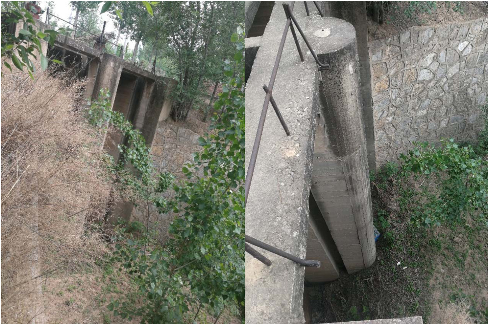  
图 5.7-1 窑场排水涵闸现状  

# a. 进、出口引渠加固方案  

涵闸所在大堤堤身超高基本满足行洪要求,堤身不需要加高,部分堤身断面较窄,需要按设计边坡进行培厚,大堤加宽后对涵闸进、出口变化影响较小。另外由于闸室靠近大堤,堤身单薄,需要在迎水侧设置混凝土护坡进行防渗。其他加固涵闸若堤身高度、宽度不能满足行洪要求,需要加高加宽对进出口影响较大时,可向背水侧接长涵洞,将排涝进口向堤后平移。  

原闸门漏水严重,96.8 洪水时曾在闸前填土堵漏,为使水流顺畅,需要对河滩地上淤堵的出口渠道进行开挖和清淤,对进出口出现开裂等缺陷的浆砌石挡土墙、护坡、消力池等进行灌浆修补,检查与卫河河槽交汇处的防冲槽设置,如有缺失或冲刷严重部分需要重新抛石防护。  

# b.闸室段加固方案  

闸室布置在临河侧,采用钢筋混凝土结构型式,闸墩顶浇至启闭机平台,高程基本满足行洪要求。原设计混凝土闸门出现破损、密封不严,尤其外露钢构件锈蚀严重。考虑防洪安全、控制水流和便于管理运用,均设置闸门及启闭设备。根据加固设计原则将闸门改为标准尺寸的 $2\mathrm{x}3\mathrm{m}$ 平面拱形铸铁闸门。为此需要对闸门槽及启闭平台进行改造。启闭机采用手电两用螺杆式启闭机,可采用移动电源供电。闸后有扬排泵站引水渠,需要设置一块盖板,与大堤堤顶道路连通。  

# c. 涵洞段加固方案  

原涵闸后涵洞为拱涵结构,底板及侧墙采用浆砌石砌筑,拱顶采用砖砌砂浆抹面。设计考虑按原涵洞断面型式,采用钢筋混凝土平顶拱替换原砖砌拱;对原涵洞内浆砌石部分出现的裂缝等缺陷,采用灌浆等措施进行修补加固。洞身开挖边坡按照 1:3 进行。  

洞身设计:洞身采用多孔钢筋混凝土平顶拱涵结构,涵顶最大埋深在 $5.5\mathrm{m}$ 左右。涵洞尺寸为 $2\times2\times3\mathrm{m}$ (孔数 $\times$ 宽 $\times$ 高),采用现浇钢筋混凝土结构,拱顶处板厚$0.5\mathrm{m}$ ,边墙处板厚 $1.5\mathrm{m}$ ,拱圈直径 $2.0\mathrm{m}$ ,洞身纵向分缝长度 $10.0\mathrm{m}$ ,拱涵共长$20.0\mathrm{m}$ ,缝间设置橡胶止水带及填充高压闭孔塑料板。  

一般加固涵闸具体布置见初设报告附图 106C-A1-G2-21。  

2)耿谭灌排闸加固方案(堤防加高原因)  

耿谭灌排闸位于共产主义渠右堤桩号 $\mathrm{Y}16{+}610$ 处。主要功能为引水及排水。设计流量 $18.0\mathrm{m}^{3}/\mathrm{s}$ ,原涵闸底板高程 $56.50\mathrm{m}$ 。  

涵闸对应共产主义渠设计洪水位 $62.15\mathrm{m}$ ,闸后对应白寺坡蓄滞洪区最高蓄水位 $61.40\mathrm{m}$ ,设计涝水位 $59.17\mathrm{m}$ 。  

耿谭灌排闸所在共产主义渠右堤原顶堤高程 $61.40\mathrm{m}$ ,设计堤顶高程 $63.45\mathrm{m}$ ,堤顶需要加高 $2.05\mathrm{m}$ ,设计堤顶宽度 $5.0\mathrm{m}$ 。迎水侧设计边坡 1:3,背水侧设计边坡 1:2.5,大堤加固控导线以原河道临水侧上口线为准,加固后的堤顶中心线向堤后偏移。耿谭灌排闸现状照片见图 5.7-2。在共产主义渠右堤上的其他涵闸基本与耿谭灌排闸类似。  

# a. 进、出口引渠布置  

涵闸两侧原堤身边坡较缓,堤身加培对涵闸两侧大堤坡脚线影响较小,可在原边坡上按新设计边坡回填加高大堤。加高大堤后对涵闸进、出口变化影响较大,排涝出口侧闸室背墙、启闭机房、出口两侧翼墙等都需要加高;排涝进口侧涵洞需要接长,进口翼墙、底板防护等均需要后移。  

为使水流条件好,施工方便,排涝出口翼墙采用八字翼墙布置,墙顶高程随迎水侧边坡降低至河床;根据渗流稳定和消能计算,在涵闸出口需要设置混凝土消力池,出口消力池维持原设计 6m 长,消力池后接 $6.6\mathrm{m}$ 长混凝土护坦,并在与共产主义渠河槽交汇处设置 6m 长抛石防冲槽。  

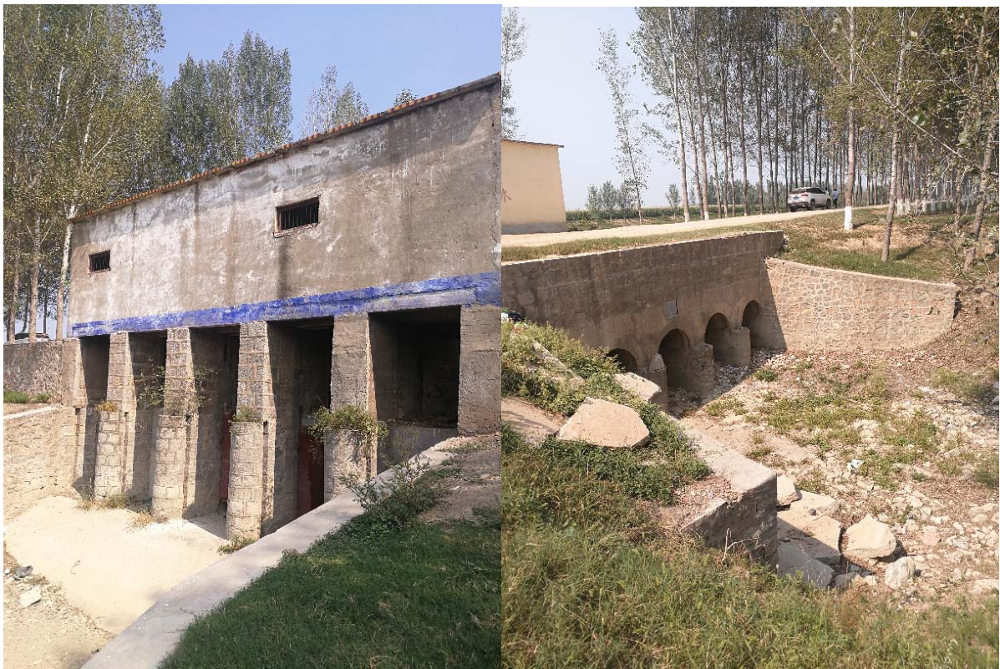  
图 5.7-2 耿谭灌排闸  

为施工方便,排涝进口两侧新接一字挡土墙,并与排涝引渠(梯形断面)对接,引渠两侧边坡为 1:2.0。根据渗流稳定计算,进口引渠前 $7\mathrm{m}$ 长需要设置混凝土护坡、护底,护坡高度为 $3.4{\sim}2.4\ensuremath{\mathrm{m}}$ 。涵闸引排水时,渠道单宽流量不大于 0.6$\mathrm{m}^{3}/\mathrm{s}\cdot\mathrm{m}$ 。当涵闸低水位过流时,流速大于土质(粘土、壤土)引渠的允许不冲流速。为防止水流对进口引渠造成冲刷,引渠两侧堤岸及引渠底部采用浆砌石护砌,护砌长度为 $10\mathrm{m}$ ,护坡高度为 $2.4\mathrm{m}$ ,渠顶与堤外地面高程一致。根据浆砌石护面的允许流速要求,单层浆砌石衬砌的允许流速为 $2.5{\sim}4.5\mathrm{m/s}$ ,引渠采用单层浆砌石衬砌即可满足要求。浆砌石衬砌厚度为 $0.3\mathrm{m}$ ,采用 M10 水泥砂浆砌筑、M10水泥砂浆勾缝。浆砌石护砌下设 $0.1\mathrm{m}$ 厚碎石垫层及反滤土工布,防止水流对进出口造成冲刷。  

# b.闸室布置  

随着设计水位提高,原涵闸启闭机房已漫水,堤防加高后启闭机房需要一同加高才能满足使用要求。原设计混凝土闸门尺寸为 5 孔 $1.8\mathrm{x}2.5\mathrm{m}$ ,为统一闸门标准改为 5 孔 $2\mathrm{x}2.5\mathrm{m}$ 平面拱形铸铁闸门。原浆砌石闸墩改造困难,且随着水位提升、堤身加高、抗震设防变化,涵闸结构受力有较大改变,原设计闸室已不能满足新的使用要求,设计拟采用钢筋混凝土材料对闸室段进行改造。  

闸室布置在临河侧,原位采用钢筋混凝土结构型式改建。考虑防洪安全、控制水流和便于管理运用,均设置闸门及启闭设备。闸门采用铸铁闸门型式。启闭机为手电两用螺杆式启闭机。根据在原址按原设计规模和功能重建涵闸的设计原则,重建涵闸底板高程与原涵闸相同,以不改变涵闸的运用条件和要求。闸室高度高于涵洞顶部 $1.0{\sim}2.0\mathrm{m}$ ,闸室两侧八字翼墙顶最高处高程 $62.20\mathrm{m}$ ,并顺边坡向下伸入河床。启闭机房室内地坪高程与大堤堤顶齐平,不设机架桥,启闭机房后回填土,与大堤堤顶采用道路连接。  

闸室设计为筏式平底板,共 5 孔,净宽 $2.0\mathrm{m}$ 。中墩厚 $1.0\mathrm{m}$ ,边墩厚 $0.8\mathrm{m}$ 闸室总宽 $15.6\mathrm{m}$ 。闸室顺水流向长 $6.0\mathrm{m}$ ,底板高程为 $56.60\mathrm{m}$ ,闸室顶高程为 $59.60\mathrm{m}$ 。底板厚 $1.0\mathrm{m}$ ,底板下设 $0.1\mathrm{m}$ 厚 C15 素混凝土垫层。  

闸室前段设检修闸门槽 1 道,其后设工作闸门。工作闸门槽顶部闸墩及闸室挡土墙延伸至启闭机房下,高度为 $3.5\mathrm{m}$ 。闸墩及挡土墙顶布置启闭机房。  

# c. 涵洞加固接长  

随着大堤加高,涵洞长度明显不足,需要向背水侧接长,设计考虑按原涵洞断面型式,采用钢筋混凝土拱涵现浇接长,新接长度 $7.0\mathrm{m}$ 。新老涵洞接缝处设置V 型橡皮止水,缝内填充闭孔塑料板,接缝外再采用水泥加固土包裹一圈。对原涵洞内出现的裂缝等缺陷,采用灌浆、环氧砂浆修补等措施进行加固。  

洞身设计:洞身采用多孔钢筋混凝土拱涵结构,拱涵最大埋深在 $2.9\mathrm{m}$ 左右。涵洞尺寸为 $5{\times}2{\times}2.5{\mathrm{m}}$ (孔数 $\left.\begin{array}{l l}{\mathbf{\sigma}}\ {.}\end{array}\right.\times$ 宽 $\times$ 高),采用现浇钢筋混凝土结构,涵洞底板厚 $1.0\mathrm{m}$ ,边墙厚度为 $0.6{\sim}0.5\mathrm{m}$ ,拱圈厚度为 $0.5\mathrm{m}$ ,洞身纵向分缝长度 $7.0\mathrm{m}$ ,拱涵共长 $14.0\mathrm{m}$ ,缝间设置橡胶止水带及填充高压闭孔塑料板。  

加固涵闸具体布置见初设报告附图 106C-A1-G2-22。  

# (3)设计基本资料  

根据卫河干流治理工程河道治理方案推算的各涵闸设计水位见表 5.7-18。各涵闸底高程、主要加固措施也列于此表中。  

表 5.7-18卫河及共渠加固治理穿堤涵闸水位及加固设计  

<html><body><table><tr><td rowspan="11"></td><td rowspan="2">河流区县序号</td><td rowspan="2">名称</td><td rowspan="2">桩号</td><td rowspan="2">孔数</td><td colspan="3">改建后孔 底板高</td><td rowspan="2">设计洪水设计涝水</td><td rowspan="2">用途</td><td rowspan="2">加固措施</td><td rowspan="2">备注</td></tr><tr><td>口尺寸</td><td>程</td><td>位（m)</td><td>位（m)</td></tr><tr><td>滑县 I</td><td>道口西街深孔闸</td><td>Y30+252</td><td>1</td><td>(m) 3.0x3.0</td><td>(m) 55</td><td>61.52 (62.49)</td><td>58.46</td><td>排水</td><td>维修损坏结构，清除淤积，新增启闭机及双向 挡水闸门、启闭机房重建等</td><td>背水侧为 蓄洪区</td></tr><tr><td>2</td><td>烧酒营排涝涵闸</td><td>Y26+800</td><td>1</td><td>Φ1.0</td><td>55</td><td>61.72 (62.49)</td><td>59.12</td><td>排水</td><td>维修加固出口消能防冲，新增启闭机及双向挡 水闸门1.0x1.0m、启闭机房重建等</td><td>背水侧为 蓄洪区</td></tr><tr><td>3</td><td>毛村闸</td><td>Y39+010</td><td>1</td><td>5x2.0</td><td>55</td><td>61.03</td><td>57.75</td><td>排水</td><td>出口结构及启闭机房拆除重建，配置闸门启闭 机</td><td></td></tr><tr><td>4</td><td>菜园闸</td><td>Y45+150</td><td>1</td><td>2. .0x 1.5</td><td>53</td><td>60. .54</td><td>57. .10</td><td>排水</td><td>已改造，出口在墙上，修复消能防冲设施等</td><td></td></tr><tr><td>5 浚县</td><td>西关闸</td><td>Y45+500</td><td>1</td><td>.0x 1.5</td><td>54</td><td>60.60</td><td>57. 7.10</td><td>排水</td><td>修复消能防冲设施等</td><td></td></tr><tr><td>6</td><td>北关闸</td><td>Y48+100</td><td>1</td><td>1.0x1.5</td><td>53</td><td>60.29</td><td>56.89</td><td>排水</td><td>修复消能防冲设施等</td><td></td></tr><tr><td>7</td><td>十里铺排涝涵闸</td><td>Y51+600</td><td>1</td><td>Φ1.0</td><td>53</td><td>59.99</td><td>56.24</td><td>排水</td><td>出口结构及启闭机房拆除重建，出口设闸门 1.0x1.0m，出口清淤</td><td></td></tr><tr><td>8</td><td>圈里排涝涵闸</td><td>Y59+200</td><td></td><td>1.5x2.5</td><td>53</td><td>59.60</td><td>55.55</td><td>排水</td><td>修复出口翼墙及消能防冲设施，等更换启闭 机、闸门</td><td></td></tr><tr><td>9</td><td>苏村排涝涵闸</td><td>Y69+250</td><td>3</td><td>3.0x2.5</td><td>52.3</td><td>58.26</td><td>54.90</td><td>排水</td><td>修复消能防冲设施、更换启闭机、闸门，修 启闭机房</td><td></td></tr><tr><td>10</td><td>码头排涝涵闸</td><td>Y73+520</td><td>1</td><td>.5x1.5</td><td>51</td><td>57.37</td><td>54.09</td><td>排水</td><td>修复破损结构，配置闸门及启闭机</td><td></td></tr><tr><td>11</td><td>大刘排涝涵闸</td><td>Y78+820</td><td>1</td><td>.0x2.5</td><td>51.8</td><td>57.22</td><td>53.66</td><td>排水</td><td>修复破损结构，更换启闭机架，配置闸门及启 闭机</td><td></td></tr><tr><td>12 内黄</td><td>草坡排涝涵闸</td><td>Y80+2 200</td><td>1</td><td>2.5</td><td>52.5</td><td>56. .78</td><td>53.38</td><td>排水</td><td>修复破损结构，配置闸门及启闭机</td><td></td></tr><tr><td>13</td><td>西元村排涝涵闸</td><td>Y93+1 100</td><td>1</td><td>x2.0</td><td>49</td><td>55 .20</td><td>51.52</td><td>排水</td><td>修复破损结构，配置闸门及启闭机</td><td></td></tr><tr><td>14</td><td>台头排涝涵闸</td><td>Y99+400</td><td>3</td><td>2.5x2.5</td><td>49.8</td><td>54.55</td><td>51.02</td><td>排水</td><td>修启闭机房，修复破损结构，配置闸门及启 闭机</td><td></td></tr><tr><td></td><td>15 杏园排涝涵闸</td><td>Y112+180</td><td>3</td><td>3.0x4.0</td><td>46.6</td><td>52.68</td><td>49.42</td><td>排水</td><td>修启闭机房，修复破损结构，配置闸门及启 闭机</td><td></td></tr></table></body></html>  

表 5.7-18卫河及共渠加固治理穿堤涵闸水位及加固设计  

<html><body><table><tr><td rowspan="16"></td><td>河流区县序号</td><td></td><td>名称</td><td>桩号 孔数</td><td>改建后孔 口尺寸</td><td>底板高</td><td></td><td>设计洪水设计涝水</td><td></td><td>加固措施</td><td></td><td>备注</td></tr><tr><td></td><td></td><td></td><td></td><td></td><td>(m)</td><td>程 (m)</td><td>位（m）</td><td>位（m）</td><td>用途</td><td></td><td></td></tr><tr><td>清丰</td><td>16</td><td>硝河排涝涵闸</td><td>Y124+430</td><td>8</td><td>2.0x2.5</td><td>43.8</td><td>50.48</td><td>47.46</td><td>排水</td><td>修复出口消能防冲设施，闸门启闭机已更换 拟增加浆砌石跌水、护坡防护；修启闭机房</td><td></td></tr><tr><td></td><td>17</td><td>志节排涝涵闸</td><td>Y127+020 6</td><td>2.0x2.5</td><td></td><td>43</td><td>49.97</td><td>47.17</td><td>排水</td><td>及桥面，破损结构补强；配置闸门及启闭机， 闸门</td><td></td></tr><tr><td></td><td>18</td><td>涨汪涵排涝闸</td><td>Y128+250 1 1</td><td>2.0×1.5</td><td></td><td>43</td><td>49.87</td><td>47.08</td><td>排水</td><td>配置闸门及启闭设备，砖拱改砼结构</td><td></td></tr><tr><td>南乐</td><td>19 20</td><td>百尺涵闸 元村涵闸</td><td>Y132+480 Y134+700 1</td><td></td><td>p1.5 1.5x2.0</td><td>42.5 42.5</td><td>49.50 49.26</td><td>46.53 46.28</td><td>排水 排水</td><td>配置闸门及启闭设备，砖拱改砼管埋涵p1.5m 配置闸门及启闭设备</td><td></td></tr><tr><td></td><td>21</td><td>什固涵闸</td><td>Y137+450 1</td><td></td><td>1.5x1.5</td><td>42</td><td>48.88</td><td>45.96</td><td>排水</td><td>进出口加固清淤，配置启闭设备及闸门</td><td></td></tr><tr><td></td><td>22</td><td>大北张涵闸</td><td>Y148+900</td><td>1</td><td>2.0×2.0</td><td>40.82</td><td>47.51</td><td>44.66</td><td>排水</td><td>配置闸门及启闭设备</td><td></td></tr><tr><td></td><td>23</td><td>窑场新排灌闸</td><td>Y164+450</td><td>2 2.</td><td>.5x2.0</td><td>39</td><td>45.66</td><td>42.89</td><td>排水/引水</td><td>维修闸体、改建启闭设备，进出口清淤</td><td></td></tr><tr><td>大名</td><td>24</td><td>窑场排水涵闸</td><td>Y164+500</td><td>2</td><td>2.0x3.0</td><td>38.5</td><td>45.63</td><td>42.88</td><td>排水</td><td>加固进出口、改建启闭设备，进出口清淤，改 砖拱为混凝土拱。</td><td></td></tr><tr><td>冠县</td><td>25</td><td>梁北涵闸</td><td>Y186+150</td><td>1</td><td>p0.8</td><td>41.7</td><td>43.86</td><td>40.49</td><td>排水</td><td>加固接长进出口八字墙，出口设闸门0.8x0.8m 及启闭设备</td><td></td></tr><tr><td></td><td>26</td><td>曹湾闸</td><td>Z25+400</td><td>1</td><td>Φ1.2</td><td>55</td><td>61.81</td><td>59.15</td><td>排水</td><td>维修加固出口消能防冲，新增启闭机及双向挡 水闸门1.2x1.2m、启闭机房重建等</td><td>背水侧为</td></tr><tr><td></td><td>27</td><td>左洼闸</td><td>Z33+620</td><td>1</td><td>1.5x2.0</td><td>53.8</td><td>(61.40) 61.21</td><td>57.99</td><td>排水</td><td>修复消能防冲设施、砖砌拱改砼结构，新增启 闭机及双向挡水闸门，启闭机房修</td><td>蓄洪区 背水侧为</td></tr><tr><td>浚县</td><td>28</td><td>码头西闸</td><td>Z34+230</td><td>5</td><td>1.5x2.0</td><td>53.5</td><td>(61.40) 61.16</td><td>57.94</td><td>排水</td><td>修复消能防冲设施、更换启闭机及双向挡水闸</td><td>蓄洪区 背水侧为</td></tr><tr><td></td><td>29</td><td>周口闸</td><td>Z37+550</td><td>3</td><td>2.0x3.0</td><td>54</td><td>(61.40) 60.96</td><td>57.70</td><td>排水</td><td>门，启闭机房修 接长、维修加固出口消能防冲，新增启闭机及</td><td>蓄洪区 背水侧为</td></tr><tr><td></td><td>30</td><td>大于柳闸</td><td>Z53+530</td><td></td><td>1.5x2.0</td><td>53</td><td>(61.40) 59.92</td><td>56.00</td><td>排水</td><td>双向挡水闸门，启闭机房修 修复防冲设施、更换启闭机、闸门、机房等</td><td>蓄洪区</td></tr></table></body></html>  

表 5.7-18卫河及共渠加固治理穿堤涵闸水位及加固设计  

<html><body><table><tr><td rowspan="11"></td><td>河流区县序号</td><td>名称</td><td>桩号</td><td>孔数</td><td>改建后孔 口尺寸</td><td>底板高 程</td><td>位（m）</td><td>设计洪水设计涝水 位（m)</td><td>用途</td><td>加固措施</td><td>备注</td></tr><tr><td colspan="2">31</td><td>Z68+510</td><td>2</td><td>(m) 2.0x3.0</td><td>(m) 53.2</td><td>57.80</td><td>54.53</td><td>排水</td><td>接长、维修加固出口消能防冲，进口扩底修</td><td rowspan="6">汽车吊启 闭 汽车吊启</td></tr><tr><td>32</td><td>五四街排涝闸</td><td>Z70+400</td><td>1</td><td>1.0x1.0</td><td>51</td><td>57.42</td><td>54.27</td><td>排水</td><td>复，闸门启闭机重建等 出口结构拆除重建，出口设闸门</td></tr><tr><td>33</td><td>五陵东门闸</td><td>Z70+800</td><td>1</td><td>4.0x2.0</td><td>51</td><td>57.48</td><td>54.21</td><td>交通涵洞</td><td>维修加固浆砌石闸墙，配置混凝土叠梁门</td></tr><tr><td>34</td><td>五陵东北门闸</td><td>Z71+480</td><td>1</td><td>4.0x3.0</td><td>50.5</td><td>57.40</td><td>54.11</td><td>交通涵洞</td><td>维修加固浆砌石闸墙，重建涵洞顶部交通桥，</td></tr><tr><td>汤阴 35</td><td>五陵排涝涵闸</td><td>Z72+700</td><td>1 2.</td><td>.5x2.5</td><td>50.5</td><td>57. .37</td><td>54.05</td><td>排水</td><td>配置混凝土叠梁门 闭 启闭机房修，配置闸门及启闭机</td></tr><tr><td>36</td><td>红卫沟排涝涵闸</td><td>Z83+220</td><td>4</td><td>3.0×2.5</td><td>50</td><td>56.10</td><td>52.75</td><td>排水</td><td>洞身加长，修复破损结构，启闭机房修。配</td></tr><tr><td colspan="2">37 赵王沟闸</td><td>Z84+520</td><td>3</td><td>3.0x3.0</td><td>49</td><td>55.96</td><td>52.50</td><td>排水</td><td>置闸门及启闭机 洞身加长，修复破损结构，启闭机房修。配</td><td></td></tr><tr><td rowspan="2">38</td><td>八里沟闸</td><td>Z88+500</td><td>3</td><td>3.0x3.0</td><td>49</td><td>55.36</td><td>51.86</td><td>排水</td><td>置闸门及启闭机等 洞身加长，修复破损结构，启闭机房修。配</td><td></td></tr><tr><td>39 北故城排涝闸</td><td></td><td>Z90+410 2</td><td>2.5x3.0</td><td>50</td><td>55.28</td><td>51.76</td><td>排水</td><td>置闸门及启闭机等 根据复堤设计考虑洞身加长，修复破损结构，</td><td></td></tr><tr><td>40</td><td>田大晁排涝涵闸</td><td>Z98+850</td><td>1</td><td>3.0x3.0</td><td>48</td><td>54.55</td><td>51.04</td><td>排水</td><td>启闭机房修。配置闸门及启闭机等 修启闭机房，修复破损结构，配置闸门及启</td><td></td></tr><tr><td>41</td><td>南杨村排涝涵闸</td><td>Z103+580</td><td>2</td><td>2.0x2.5</td><td>49</td><td>53.98</td><td>50.56</td><td>排水</td><td>闭机等 修启闭机房，修复破损结构，配置闸门及启</td><td></td></tr><tr><td>内黄 42</td><td>桑庄闸</td><td>Z106+300</td><td>2</td><td>2.0x2.5</td><td>47</td><td>53.48</td><td>50.14</td><td>排水</td><td>闭机等 修启闭机房，修复破损结构，配置闸门及启</td><td></td></tr><tr><td>43</td><td>宰庄排涝涵闸</td><td>Z107+50</td><td>2</td><td>2.0x2.5</td><td>47</td><td>53.35</td><td>50.01</td><td>排水</td><td>闭机等 修启闭机房，修复破损结构，配置闸门及启</td><td></td></tr><tr><td>44</td><td>麒麟排涝涵闸</td><td>Z109+330</td><td>1</td><td>1.5x1.5</td><td>46</td><td>52.98</td><td>49.68</td><td>排水</td><td>闭机等 修启闭机房，修复破损结构，配置闸门、启</td><td></td></tr><tr><td></td><td></td><td></td><td></td><td></td><td></td><td></td><td></td><td></td><td></td><td>闭机等</td></tr></table></body></html>  

表 5.7-18卫河及共渠加固治理穿堤涵闸水位及加固设计  

<html><body><table><tr><td></td><td>河流区县序号</td><td>名称</td><td>桩号</td><td>孔数</td><td>改建后孔 口尺寸 (m)</td><td>底板高 程 (m)</td><td>位（m）</td><td>设计洪水设计涝水 位（m)</td><td>用途</td><td>加固措施</td><td>备注</td></tr><tr><td rowspan="8"></td><td rowspan="8">45 内黄 46</td><td>南洞排涝涵闸</td><td>Z111+330</td><td>3</td><td>3.0x4.0</td><td>46</td><td>52.67</td><td>49.40</td><td>排水</td><td>修启闭机房，修复破损结构，配置闸门、启 闭机等</td><td></td></tr><tr><td>王庄排涝涵闸</td><td>Z113+085</td><td>4</td><td>3.0x4.0</td><td>46</td><td>52.38</td><td>49.16</td><td>排水/引水</td><td>修启闭机房，修复破损结构，配置闸门及启 闭机等</td><td></td></tr><tr><td>47 留固排涝涵闸</td><td>Z122+550</td><td>3</td><td>3.0x3.5</td><td>44</td><td>50.61</td><td>47.67</td><td>排水</td><td>配置启闭机，混凝土闸门更换为钢闸门，破损 结构修复</td><td></td></tr><tr><td>48 南英封排涝涵闸</td><td>Z126+910</td><td>3</td><td>2.0x2.5</td><td>43</td><td>49.84</td><td>46.99</td><td>排水</td><td>出口排架、启闭机房拆除重建，进出口翼墙修 复，配置闸门、启闭机等</td><td></td></tr><tr><td>49 宋庄排涝涵闸</td><td>Z136+200</td><td>1</td><td>1.5x1.5</td><td>42</td><td>48.89</td><td>45.98</td><td>排水</td><td>配置闸门、启闭机，修复护坡</td><td></td></tr><tr><td>50 邵庄涵闸</td><td>Z141+130</td><td>4</td><td>3.0×2.5</td><td>41</td><td>48.21</td><td>45.29</td><td>排水/引水</td><td>延长混凝土护底至引黄渠交界处，改建下游溢 流堰及桥闸（1孔2×2m）</td><td></td></tr><tr><td>51 袁庄涵闸</td><td>Z144+142</td><td>1</td><td>1.5x1.5</td><td>41</td><td>47.94</td><td>45.04</td><td>排水</td><td>更换闸门，配置启闭机，进出口翼墙修复</td><td></td></tr><tr><td>52 西崇町涵闸</td><td>Z145+218</td><td>1</td><td>2.0x2.0</td><td>41</td><td>47.79</td><td>44.93</td><td>排水</td><td>接长洞身，对进出口翼墙及护底进行重建。对 涵洞洞内及进出口清淤，闸门除锈防腐，配置 启闭设备。</td><td></td></tr><tr><td>53</td><td>岔河嘴东排水闸</td><td>Z150+220</td><td></td><td>3.0×3.0</td><td>40.42</td><td>47.28</td><td>44.41</td><td>排水</td><td>进口、出口护坡、护底修复，进出口清淤。配 置闸门及启闭设备</td><td></td></tr><tr><td>54 大名</td><td>岔河嘴新排水闸</td><td>Z150+200</td><td>2</td><td>3.0x3.0</td><td>34.55</td><td>47.28</td><td>44.41</td><td>排水/引水</td><td>对进口结构拆除重建，配置闸门及启闭设备</td><td>提灌站进 水口</td></tr><tr><td>55</td><td>岔河嘴扬排闸</td><td>Z150+180</td><td>1</td><td>2.5×2.5</td><td>41</td><td>47.28</td><td>44.41</td><td>排水</td><td>对进口翼墙修复，启闭机房修，闸门做防腐 措施</td><td>闸后接引 水渠</td></tr><tr><td>56</td><td>岔河嘴旧排水闸</td><td>Z150+160</td><td>2</td><td>2.0x3.5</td><td>40</td><td>47.28</td><td>44.41</td><td>排水/引水</td><td>加固接长进出口及八字墙，配置钢闸门及启闭 设备</td><td></td></tr><tr><td rowspan="2">共渠浚县</td><td>耿潭灌溉排水涵 57 闸</td><td>共 Y16+611</td><td>5</td><td>2.0×2.5</td><td>56.5</td><td>62.14 (61.40)</td><td></td><td>59.17 排水/引水</td><td></td><td>修复消能防冲设施、更换启闭机、双向挡水闸 门，改造闸室、启闭机房。</td><td>背水侧为 蓄洪区</td></tr><tr><td>58 李庄灌溉排水闸</td><td>共</td><td>Y21+293</td><td>1.0x1.5</td><td></td><td>56.25</td><td>61.61 (61.40)</td><td>58.57</td><td>排水/引水</td><td>修复消能防冲设施、出口拆除重建，更换启闭 机、双向挡水闸门，改造闸室、启闭机房。</td><td>背水侧为 蓄洪区</td></tr></table></body></html>  

表 5.7-18卫河及共渠加固治理穿堤涵闸水位及加固设计  

<html><body><table><tr><td rowspan="5"></td><td rowspan="4">河流区县序号</td><td>名称</td><td></td><td>桩号</td><td>孔数</td><td>改建后孔 口尺寸</td><td>底板高 程</td><td>设计洪水设计涝水</td><td></td><td>用途</td><td>加固措施</td><td>备注</td></tr><tr><td></td><td>白寺闸</td><td>共</td><td></td><td>(m)</td><td>(m)</td><td>位（m) 61.53</td><td>位（m）</td><td></td><td>修复消能防冲设施等，更换启闭机、双向挡水</td><td>背水侧为</td></tr><tr><td>59</td><td></td><td>Y25+131 共</td><td>2</td><td>1.5x2.0</td><td>55.16</td><td>(61.40) 61.43</td><td>58.01</td><td>排水</td><td>闸门，改造闸室、启闭机房。 已加固，进出口翼墙护坡修补，更换启闭机、</td><td>蓄洪区 背水侧为</td></tr><tr><td>共渠浚县60</td><td>农场闸</td><td>Y26+943 共</td><td>2</td><td>2.5x3.0</td><td>54.54</td><td>(61.40)</td><td>57.68</td><td>排水</td><td>双向挡水闸门，改造闸室、启闭机房。</td><td>蓄洪区 背水侧为</td></tr><tr><td></td><td>61</td><td>农场排涝闸</td><td>Y29+224</td><td>5</td><td>1.5x2.0</td><td>56.68</td><td>61.31 (61.40)</td><td>57.30</td><td>排水</td><td>更换启闭机、双向挡水闸门，改造闸室、启闭 机房。 接长并新建进出口及八字墙、进口设铸铁闸门</td><td>蓄洪区</td></tr><tr><td rowspan="8">卫河</td><td>内黄62</td><td>范阳涵闸</td><td>Y104+250</td><td>1</td><td>1.5x1.5</td><td>50.5</td><td>54.30</td><td>50.74</td><td>排水</td><td>及启闭机等。</td><td></td></tr><tr><td>内黄</td><td>63</td><td>西石盘涵闸 Y108+490</td><td>1</td><td>1.5×1.5</td><td>50</td><td>53.41</td><td>50.02</td><td>排水</td><td>接长并新建进出口及八字墙、进口设铸铁闸门 及启闭机</td><td></td></tr><tr><td></td><td>64 善仪阁涵闸</td><td>Y116+464</td><td>1</td><td>1.0x1.5</td><td>48</td><td>51.58</td><td>48.66</td><td>排水</td><td>改建进出口八字墙、进口设铸铁闸门及启闭机 砌砖结构拆除重建，接长并新建进出口及八字</td><td></td></tr><tr><td>南乐</td><td>65 潮旺涵闸</td><td>Y127+850</td><td>1</td><td>1.5x1.5</td><td>46</td><td>49.80</td><td>47.18</td><td>排水</td><td>墙、进口设铸铁闸门及启闭机等 结合堤防加固接长洞身并改建进出口八字墙、</td><td></td></tr><tr><td>66</td><td>涨旺涵闸</td><td>Y129+250</td><td>1</td><td>3.0x2.0</td><td>45</td><td>49.72</td><td>46.85</td><td>排水</td><td>进口设铸铁闸门及启闭机 接长并新建进出口八字墙、进口设铸铁闸门及</td><td></td></tr><tr><td>67 汤阴</td><td>瓦岗涵闸</td><td>Z67+880</td><td>1</td><td>3.0x2.0</td><td>53</td><td>57.93</td><td>54.63</td><td>排水</td><td>启闭机 结合堤防加固接长洞身并改建进出口八字墙、</td><td></td></tr><tr><td>68 内黄 69</td><td>五陵镇涵闸</td><td>Z70+900</td><td>1</td><td>3.0×2.5</td><td>53</td><td>57.45</td><td>54.19</td><td>排水</td><td>进口设铸铁闸门及启闭机 砌砖结构拆除，接长并新建进出口八字墙、进</td><td></td></tr><tr><td>70</td><td>宰庄1涵闸 千佛闸</td><td>Z106+680</td><td>1 1</td><td>1.5×2.0</td><td>50</td><td>53.39</td><td>50.05</td><td>排水</td><td>口设铸铁闸门及启闭机 砖砌结构拆除，用钢筋混凝土重建，改建进出</td><td></td></tr><tr><td></td><td>南乐</td><td></td><td>Z132+430</td><td></td><td>3.0x2.0</td><td>45</td><td>49.42</td><td>46.41</td><td>排水</td><td>口八字墙、进口设铸铁闸门及启闭机 结合堤防加固接长洞身并改建进出口八字墙、</td><td></td></tr><tr><td></td><td>71</td><td>东郭闸</td><td>Z134+418</td><td>1</td><td>1.5x2.0</td><td>45</td><td>49.16</td><td>46.19</td><td>排水</td><td>进口设铸铁闸门及启闭机</td><td></td></tr></table></body></html>  

表 5.7-18卫河及共渠加固治理穿堤涵闸水位及加固设计  

<html><body><table><tr><td></td><td>河流区县序号</td><td></td><td>名称</td><td>桩号</td><td>孔数</td><td>改建后孔 口尺寸 (m)</td><td>底板高 程 (m)</td><td>设计洪水设计涝水 位（m)</td><td>位（m)</td><td>用途</td><td>加固措施 备注</td></tr><tr><td rowspan="5"></td><td></td><td>72</td><td>后翟1闸</td><td>Z142+260</td><td>1</td><td>3.0x2.0</td><td>44</td><td>48.16</td><td>45.12</td><td>排水</td><td>砌砖结构拆除，用钢筋混凝土重建，结合堤防 加固接长洞身并改建进出口八字墙、进口设铸 铁闸门及启闭机</td></tr><tr><td>卫河南乐73</td><td></td><td>后翟2</td><td>Z143+750</td><td>1 p1.5</td><td></td><td>42.8</td><td>48.09</td><td>45.17</td><td>接长涵洞洞身，对进出口翼墙及护底进行重 排水 建，进口设闸门1.5x1.5m及启闭机</td><td></td></tr><tr><td>74</td><td>孙村涵闸</td><td>Z144+625</td><td>1</td><td>3.0x2.0</td><td>44</td><td></td><td>47.90</td><td>45.01</td><td>砖砌结构拆除，用钢筋混凝土重建，结合堤防 排水 加固接长洞身并改建进出口八字墙、进口设铸</td><td></td></tr><tr><td></td><td></td><td></td><td></td><td></td><td></td><td></td><td></td><td></td><td>铁闸门及启闭机</td><td></td></tr></table></body></html>

注:括号内数值为蓄滞洪区最高蓄水位。  

# 5.7.6.2 涵管(洞)加固  

# (1)加固设计说明  

由于现状涵管(洞)孔口尺寸不标准,维修维护不方便。故本次维修加固,闸门统一采用工厂定型的标准尺寸平面拱形铸铁闸门或拍门,孔口采用与原尺寸相近的定型尺寸,并对闸室相应部位进行改造。为方便使用和维护,有引水功能的涵管均采用机闸一体闸门,孔口尺寸取用 $0.6{\times}0.6\mathrm{~m~}$ 、 $0.8{\times}0.8\mathrm{m}$ 、 $1.0{\times}1.0\mathrm{~m~}$ 和$1.2{\times}1.2{\mathrm{m}}$ 四种,并只单向挡水;仅排涝功能的涵洞出口设置拍门,采用 $\varphi0.8\mathrm{m}$ 和$\boldsymbol{\Phi}^{1.0\mathrm{m}}$ 两种规格,并在排水涵洞出口统一采用钢筋混凝土拍门基础进行加固。  

现场查勘存在一处多管的涵洞,由于各涵管作用不同,相邻涵管引水服务对象也不相同,如果合并会破坏涵闸原有功能,排水、灌溉等需求得不到满足,也可能会带来一系列社会问题,操作起来比较困难,因此相邻涵闸采取不合并分别修建闸门设计。为此多管的涵洞处需要将进口集水井设置为多闸门形式,出口集水井需要隔离开并接入不同渠道。  

另外卫河右堤 $(\mathrm{Y}11+380{\sim}\mathrm{Y}30+700)$ 背水侧处在长虹渠滞洪区内,该段右堤还需要挡滞洪区洪水(设计洪水位 $62.49\mathrm{m}$ )不进入卫河;共渠右堤( $\mathrm{K}8{+}0{5}0$ 至$\mathrm{K}32{+}0{5}0$ 盐土庄节制闸)、卫河左堤( $(Z27+500{\sim}Z38{+}500)$ )后为白寺坡滞洪区(设计洪水位 $61.4\mathrm{m})$ ),这两段堤防也需要挡滞洪区洪水;为此,设计对处在滞洪区内加固的涵洞需在进、出口均设置机闸一体闸门来挡来自两个方向的洪水,以避免涵洞长时间浸泡在水中。  

本次治理维修加固穿堤涵管(洞)233 座,其中位于卫河左岸堤防上 98 座、右岸堤防上 104 座,位于共产主义渠右岸堤防上 31 座,其中在进、出口均需要设置闸门的涵洞共 24 座。  

# (2)设计原则  

维修加固穿堤涵管(洞)的设计原则为:  

1)维修完善现有涵管(洞),恢复原涵管(洞)的设计功能。  

2)加固后的涵洞满足所在大堤防洪标准。  

# (3)设计基本资料  

1)各涵闸所在断面设计水位  

根据卫河干流治理工程河道治理方案推算的各涵管(洞)设计水位见表 5.7-19 和表 5.7-20。各涵闸底高程、主要用途也列于此表中。  

# (4)涵管(洞)维修加固设计  

针对各涵管(洞)存在的问题,分别进行维修加固设计。1)灌溉用引水涵管(洞)在进、出口改建破损集水井,并与两侧灌溉渠道或引水管连接。2)堤防加高加宽后,对涵管(洞)洞身短的按原规模接长涵管(洞),做好进、出水口护砌。4)对浆砌石挡土墙、护坡、护底损坏的将进行翻修;护砌范围不足的将加大保护范围,防止水流冲刷破坏,以确保堤防的安全。5)临河一侧无闸门或闸门已损坏丢失的灌溉涵管(洞),为保证洪水期的行洪安全,在临河侧设置机闸一体闸门;当背水侧为蓄滞洪区,水位较高时在背水侧也设置机闸一体闸门,以阻挡滞洪区洪水。6)对现有浚县、滑县县城城墙上等上无灌溉功能的排水涵管,在大堤迎水侧出水口增置或改造拍门;7)在新建马头村村南挡土墙围村埝与村南排水沟交汇处新增加两处排水涵洞,洞口外侧各设置一道拍门。  

# (5)典型维修加固涵管(洞)设计  

设计以西郭、北寨 2、王庄 3 三个不同直径涵管作为典型涵管(洞)维修加固设计,分别位于卫河桩号 $Z4\substack{+700}$ 、 $\mathrm{Y}087{+}030$ 和 $Z114{+}550$ 处,主要功能为引水。西郭涵洞对应卫河设计洪水位 $64.49\mathrm{m}$ ,设计堤顶超高 $1.2\mathrm{m}$ ,所在卫河左堤现状堤顶高程 67.00,高出设计洪水位 $2.51\mathrm{m}$ ,不需加高。在卫河上的其他涵洞基本与西郭涵洞类似,部分处在需要加高堤段的涵洞回填断面按照设计堤顶高程及断面回填。涵管(洞)加固回填迎水侧设计边坡 1:3,背水侧设计边坡 1:2.5,大堤加固控导线以原河道临水侧上口线为准,  

加固涵洞拟拆除进、出口破损挡墙或集水井,拆除砖砌集水井,在进、出口两侧新建钢筋混凝土集水井。为满足涵洞引水功能,将进出口集水井与原有两侧灌溉渠道或引水管连接。进口集水井在临河侧,考虑防洪安全、控制水流和便于涵洞引水运用,在进口以及滞洪区出口一侧设置机闸一体集水井闸门,闸门采用铸铁闸门型式。集水井闸室高度高于涵洞顶部 $0.5\mathrm{m}$ ,兼做洞脸挡土墙。为沉沙消能需要,集水井涵洞出口设置 $0.2\mathrm{m}$ 深沉沙池。  

部分涵洞随着堤身加培、进出口集水井改建,涵洞涵管需要接长,设计考虑按原涵洞断面型式,采用承插口钢筋混凝土管接长,以西郭涵洞为例,在出口新接长度 $5.0\mathrm{m}$ ,并对原堤防塌陷部位重新进行回填。新老涵洞承插接缝处设置一圈橡皮进行止水,接缝外采用水泥加固土包裹一圈。检查原涵洞内是否出现的裂缝等缺陷,可采用灌浆、环氧砂浆修补等措施进行加固或者用新管替换掉。新接长管基础采用 $20\mathrm{cm}$ 厚 C20 混凝土现浇。  

本阶段选取典型涵闸进行典型设计。设计图纸详见 106C1-A1-G2-30\~32。  

表5.7-19卫河加固治理穿堤涵管(洞)位置及水位特性表  

<html><body><table><tr><td rowspan="2">省份</td><td rowspan="2">区县</td><td rowspan="2">序 号</td><td rowspan="2">名称</td><td rowspan="2">桩号</td><td rowspan="2">岸别</td><td rowspan="2">加固孔 口尺寸</td><td rowspan="2">作用</td><td colspan="2">进口坐标（m)</td><td rowspan="2">进口涵底 高程(m)</td><td rowspan="2">设计洪水位 (m)</td><td rowspan="2">备注</td></tr><tr><td>X</td><td>Y</td></tr><tr><td rowspan="12">河南</td><td>浚县</td><td>1</td><td>李庄2</td><td>001+900</td><td>左</td><td>p0.8</td><td>引水</td><td>3929820.92</td><td>526851.60</td><td>62.99</td><td>64.81</td><td></td></tr><tr><td>浚县</td><td>2</td><td>西郭</td><td>004+700</td><td>左</td><td>p0.8</td><td>引水</td><td>3930626.69</td><td>527932.00</td><td>62.93</td><td>64.68</td><td></td></tr><tr><td>浚县</td><td>3</td><td>东郭村</td><td>006- 5+950</td><td>左</td><td>p0.8</td><td>引水</td><td>3930808.27</td><td>528138.73</td><td>62.83</td><td>64.30</td><td></td></tr><tr><td>浚县</td><td>4</td><td>码头</td><td>008+200</td><td>左</td><td>p0.8</td><td>引水</td><td>3930935.92</td><td>528278.51</td><td>62.68</td><td>64.14</td><td></td></tr><tr><td>浚县</td><td>5</td><td>码头东</td><td>011+100</td><td>左</td><td>pO.8</td><td>引水</td><td>3931987.31</td><td>531976.01</td><td>62.68</td><td>63.80</td><td></td></tr><tr><td>浚县</td><td>６</td><td>彭村</td><td>011+400</td><td>左</td><td>p0.8</td><td>引水</td><td>3932083.64</td><td>531365.76</td><td>62.53</td><td>63.76</td><td></td></tr><tr><td>浚县</td><td>7</td><td>牛村</td><td>013+500</td><td>左</td><td>p0.8</td><td>引水</td><td>3932 32225.71</td><td>530459.41</td><td>62.38</td><td>63.37</td><td></td></tr><tr><td>浚县</td><td>8</td><td>蒋村</td><td>014+700</td><td>左</td><td>p0.8</td><td>引水</td><td>3932227.64</td><td>531156.80</td><td>62.29</td><td>63.18</td><td></td></tr><tr><td>浚县</td><td>9</td><td>郝村</td><td>015+150</td><td>左</td><td>pO.8</td><td>引水</td><td>3932518.17</td><td>533219.90</td><td>62.21</td><td>63.16</td><td></td></tr><tr><td>浚县</td><td>10</td><td>西雷村</td><td>016- 280</td><td>左</td><td>p0.6</td><td>引水</td><td>3932731.02</td><td>533883.64</td><td>62.14</td><td>63.04</td><td></td></tr><tr><td>浚县</td><td>11</td><td>权庄</td><td>017+810</td><td>左</td><td>p0.6</td><td>引水</td><td>3933179.69</td><td>534400.63</td><td>62.12</td><td>62.92</td><td></td></tr><tr><td>浚县</td><td>12</td><td>石羊2</td><td>019+750</td><td>左</td><td>p0.8</td><td>引水</td><td>3934027.23</td><td>534894.05</td><td>61.93</td><td>62.64</td><td></td></tr><tr><td>浚县</td><td>13</td><td>宗湾1</td><td>023+8 800</td><td>左</td><td>p0.6</td><td>引水</td><td>3935885.21</td><td>535888.01</td><td>61.65</td><td>62.08</td><td></td></tr><tr><td>浚县</td><td>14</td><td>宗湾 2</td><td>026-</td><td>100 +</td><td>左 p0.6</td><td></td><td>引水</td><td>3936714.05 536836.43</td><td>60.49</td><td>61.70</td><td></td></tr><tr><td>浚县</td><td>15</td><td>曹湾</td><td>026+600</td><td>左</td><td>p0.6</td><td>引水</td><td>3936815.80</td><td>536811.98</td><td>59.99</td><td>61.66</td><td></td></tr><tr><td>浚县</td><td>16</td><td>王湾</td><td></td><td>027+400 左</td><td>p0.8</td><td>引水</td><td></td><td>3934754.17 535567.78</td><td>60.27</td><td>61.60</td><td></td></tr><tr><td>浚县</td><td></td><td>17</td><td>柴湾1</td><td>033+700</td><td>左</td><td>p0.8</td><td>引水</td><td>3939298.96 538462.26</td><td>59.64</td><td>61.20/61.4</td><td>双侧闸门</td></tr></table></body></html>  

表5.7-19卫河加固治理穿堤涵管(洞)位置及水位特性表  

<html><body><table><tr><td rowspan="2">省份</td><td rowspan="2">区县</td><td rowspan="2">序 号</td><td rowspan="2">名称</td><td rowspan="2">桩号</td><td rowspan="2">岸别</td><td rowspan="2">加固孔 口尺寸</td><td rowspan="2">作用</td><td colspan="2">进口坐标（m)</td><td rowspan="2">进口涵底 高程(m)</td><td rowspan="2">设计洪水位 (m)</td><td rowspan="2">备注</td></tr><tr><td>X</td><td>Y</td></tr><tr><td rowspan="10">河南</td><td>浚县</td><td>18</td><td>柴湾2</td><td>035+020</td><td>左</td><td>p0.8</td><td>引水</td><td>3939679.18</td><td>540635.28</td><td>59.97</td><td>61.08/61.4</td><td>双侧闸门</td></tr><tr><td>浚县</td><td>19</td><td>东周口</td><td>036+380</td><td>左</td><td>pO.8</td><td>引水</td><td>3939985.02</td><td>539370.83</td><td>59.12</td><td>61.03/61.4</td><td>双侧闸门</td></tr><tr><td>浚县</td><td>20</td><td>中周口</td><td>037- +400</td><td>左</td><td>p0.8</td><td>引水</td><td>3940935.49</td><td>547019.09</td><td>59.40</td><td>60.94/61.4</td><td>双侧闸门</td></tr><tr><td>浚县</td><td>21</td><td>西周口</td><td>038+020</td><td>左</td><td>p0.8</td><td>引水</td><td>3941620.85</td><td>547416.41</td><td>58.96</td><td>60.93/61.4</td><td>双侧闸门</td></tr><tr><td>浚县</td><td>22</td><td>晏庄</td><td>040+300</td><td>左</td><td>p0.8</td><td>引水</td><td>3941868.13</td><td>547519.58</td><td>59.65</td><td>60.73</td><td></td></tr><tr><td>浚县</td><td>23</td><td>西宋庄</td><td>040- 920</td><td>左</td><td>p0.8</td><td>引水</td><td>3942141.28</td><td>547479.22</td><td>59.20</td><td>60.71</td><td></td></tr><tr><td>浚县</td><td>24</td><td>秦于庄</td><td>042- 2+500</td><td>左</td><td>p0.8</td><td>引水</td><td>3942203.49</td><td>547467.44</td><td>58.71</td><td>60.61</td><td></td></tr><tr><td>浚县</td><td>25</td><td>杨庄1</td><td>042+950</td><td>左</td><td>p0.8</td><td>引水</td><td>3942767.73</td><td>547755.01</td><td>59.17</td><td>60.58</td><td></td></tr><tr><td>浚县</td><td>26</td><td>杨庄2</td><td>043+500</td><td>左</td><td>p0.8</td><td>引水</td><td>3943636.83</td><td>546002.16</td><td>59.32</td><td>60.53</td><td></td></tr><tr><td>浚县</td><td>27</td><td>杨庄3</td><td>044+030</td><td>左</td><td>p0.8</td><td>引水</td><td>3943760.09</td><td>546981.05</td><td>59.16</td><td>60.40</td><td></td></tr><tr><td></td><td>浚县 28</td><td>桥西1</td><td>044+400</td><td>左</td><td>p0.8</td><td>引水</td><td>3943940.17</td><td>545504.24</td><td>58.97</td><td>60.38</td><td></td></tr><tr><td>浚县</td><td>29</td><td>桥西2</td><td>045+200</td><td>左</td><td>p0.8</td><td>引水</td><td>3943940.17</td><td>545504.24</td><td>58.86</td><td>60.27</td><td></td></tr><tr><td>浚县</td><td>30</td><td>西王桥</td><td>047+500</td><td>左</td><td>pO.8</td><td>引水</td><td>3950716.36</td><td>547409.19</td><td>57.90</td><td>60.13</td><td></td></tr><tr><td>浚县</td><td>31</td><td>小榆柳1</td><td>050+ 100</td><td>左</td><td>pO.8</td><td>引水</td><td>3945280.97</td><td>545900.02</td><td>58.06</td><td>60.02</td><td></td></tr><tr><td>浚县</td><td>32</td><td>小榆柳2</td><td>050+500</td><td>左</td><td>pO.8</td><td>引水</td><td>3945747.07</td><td>546045.83</td><td>58.63</td><td>60.02</td><td></td></tr><tr><td>汤阴</td><td>33</td><td>瓦查</td><td>068+120</td><td>左</td><td>p0.6</td><td>引水</td><td>3946283.89</td><td>546165.09</td><td>56.68</td><td>57.82</td><td></td></tr><tr><td></td><td>汤阴</td><td>34</td><td>南小章1</td><td>068+990</td><td>左</td><td>p1.0</td><td>引水</td><td>3946758.45</td><td>547517.69</td><td>56.56</td><td>57.71</td><td></td></tr></table></body></html>  

表5.7-19卫河加固治理穿堤涵管(洞)位置及水位特性表  

<html><body><table><tr><td rowspan="2">省份</td><td rowspan="2">区县</td><td rowspan="2">序 号</td><td rowspan="2">名称</td><td rowspan="2">桩号</td><td rowspan="2">岸别</td><td rowspan="2">加固孔 口尺寸</td><td rowspan="2">作用</td><td colspan="2">进口坐标(m)</td><td rowspan="2">进口涵底 高程（m)</td><td rowspan="2">设计洪水位 (m)</td><td rowspan="2">备注</td></tr><tr><td>X</td><td>Y</td></tr><tr><td rowspan="10"></td><td>汤阴</td><td>35</td><td>南小章2</td><td>069+990</td><td>左</td><td>p0.6</td><td>引水</td><td>3947073.63</td><td>547806.21</td><td>56.42</td><td>57.55</td><td></td></tr><tr><td>内黄</td><td>36</td><td>草坡1</td><td>079+160</td><td>左</td><td>p0.6</td><td>引水</td><td>3952866.01</td><td>546102.93</td><td>55.19</td><td>56.66</td><td></td></tr><tr><td>内黄</td><td>37</td><td>草坡2</td><td>079- 9+980</td><td>左</td><td>p0.6</td><td>引水</td><td>3953474.15</td><td>545815.99</td><td>55.27</td><td>56.53</td><td></td></tr><tr><td>内黄</td><td>38</td><td>任固沟</td><td>090- 090</td><td>左</td><td>p1.2</td><td>引水</td><td>3956714.53</td><td>544592.70</td><td>54.08</td><td>55.16</td><td></td></tr><tr><td>内黄</td><td>39</td><td>北元村1</td><td>093- 280</td><td>左</td><td>p0.6</td><td>引水</td><td>3964751.66</td><td>546913.36</td><td>53.62</td><td>55.06</td><td></td></tr><tr><td>内黄</td><td>40</td><td>北元村2</td><td>093 990</td><td>左</td><td> p0.6</td><td>引水</td><td>3965359.82</td><td>547234.07</td><td>53.96</td><td>55.08</td><td></td></tr><tr><td>内黄</td><td>41</td><td>北元村3</td><td>094 640</td><td>左</td><td>p0.6</td><td>引水</td><td>39668 5864.24</td><td>549617.64</td><td>53.59</td><td>54.91</td><td></td></tr><tr><td>内黄</td><td>42</td><td>北渡村2</td><td>095- 700</td><td>左</td><td>p0.6</td><td>引水</td><td>3967698.39</td><td>549991.52</td><td>53.98</td><td>54.77</td><td></td></tr><tr><td>内黄</td><td>43</td><td>北渡村3</td><td>096+780</td><td>左</td><td>p0.6</td><td>引水</td><td>3968030.20</td><td>550771.91</td><td>53.98</td><td>54.66</td><td></td></tr><tr><td>内黄</td><td>44</td><td>北渡村4</td><td>097- 700</td><td>左</td><td>p0.6</td><td>引水</td><td>39680 8089.99</td><td>550989.36</td><td>53.49</td><td>54.61</td><td></td></tr><tr><td></td><td>内黄 45</td><td>北渡村5</td><td>098</td><td>-470</td><td>左</td><td>p0.6</td><td>引水</td><td>3972 6 71.73</td><td>557538.89 53.11</td><td>54.59</td><td></td><td></td></tr><tr><td></td><td>内黄</td><td>46</td><td>崔大晁</td><td>099 470</td><td>左</td><td>p0.6</td><td>引水</td><td>8 7.76</td><td>557 634.82</td><td>53.58</td><td>54.37</td><td></td></tr><tr><td></td><td>内黄</td><td>47</td><td>李大显</td><td>100+980</td><td>左</td><td>p0.6</td><td>引水</td><td>3982138.66</td><td>561132.14</td><td>53.29</td><td>54.18</td><td></td></tr><tr><td>内黄</td><td>48</td><td></td><td>南扬庄2</td><td>104+200</td><td>左</td><td>p0.6</td><td>引水</td><td>3982717.76</td><td>565596.96</td><td>52.78</td><td>53.62</td><td></td></tr><tr><td>内黄</td><td>49</td><td>麒麟扬水 站</td><td></td><td>108+310</td><td>左</td><td>p0.8</td><td>引水</td><td>3985868.25</td><td>572181.34</td><td>51.60</td><td>52.99</td><td></td></tr><tr><td>内黄</td><td></td><td>50</td><td>南洞扬水 站</td><td>111+050</td><td>左</td><td>p0.8</td><td>引水</td><td>3987138.70</td><td>572901.04</td><td>52.06</td><td>52.73</td><td></td></tr><tr><td></td><td>内黄</td><td>51</td><td>王庄2</td><td>113+070</td><td>左</td><td>p0.8</td><td>引水</td><td>3989048.40</td><td>574061.83</td><td>51.73</td><td>52.44</td><td></td></tr></table></body></html>  

表5.7-19卫河加固治理穿堤涵管(洞)位置及水位特性表  

<html><body><table><tr><td rowspan="2">省份</td><td rowspan="2">区县</td><td rowspan="2">序 号</td><td rowspan="2">名称</td><td rowspan="2">桩号</td><td rowspan="2">岸别</td><td rowspan="2">加固孔 口尺寸</td><td rowspan="2">作用</td><td colspan="2">进口坐标（m)</td><td rowspan="2">进口涵底 高程（m)</td><td rowspan="2">设计洪水位 (m)</td><td rowspan="2">备注</td></tr><tr><td>X</td><td>Y</td></tr><tr><td rowspan="5">河南</td><td>内黄</td><td>52</td><td>王庄3</td><td>114+550</td><td>左</td><td>p1.0</td><td>引水</td><td>3989914.43</td><td>574587.79</td><td>51.15</td><td>52.00</td><td></td></tr><tr><td>内黄</td><td>53</td><td>王庄4</td><td>114+990</td><td>左</td><td>p0.6</td><td>引水</td><td>3991028.54</td><td>575868.07</td><td>50.93</td><td>51.90</td><td></td></tr><tr><td>内黄</td><td>54</td><td>北蔡1</td><td>115+280</td><td>左</td><td>p0.6</td><td>引水</td><td>399118 188.41</td><td>576839.88</td><td>50.83</td><td>51.81</td><td></td></tr><tr><td>内黄</td><td>55</td><td>北蔡2</td><td>115+720</td><td>左</td><td>p0.6</td><td>引水</td><td>3991 1558.45</td><td>582299.85</td><td>50.98</td><td>51.74</td><td></td></tr><tr><td>内黄</td><td>56</td><td>南蔡</td><td>116+100</td><td>左</td><td>p0.6</td><td>引水</td><td>3991589.88</td><td>582446.81</td><td>50.67</td><td>51.50</td><td></td></tr><tr><td>河北</td><td>魏县</td><td>57</td><td>北善村引 水涵洞</td><td>118+850</td><td>左</td><td>p0.8</td><td>引水</td><td>39921 119.75</td><td>583520.95</td><td>49.40</td><td>51.28</td><td></td></tr><tr><td rowspan="8">河南 河北</td><td>南乐</td><td>58</td><td>梁村1</td><td>137+450</td><td>左</td><td>p0.8</td><td>引水</td><td>3991862.46</td><td>581338.96</td><td>47.42</td><td>48.74</td><td></td></tr><tr><td>南乐</td><td>59</td><td>梁村2</td><td>138 050</td><td>左</td><td>p0.8</td><td>引水</td><td>3991 1950.32</td><td>583307.77</td><td>47.86</td><td>48.73</td><td></td></tr><tr><td>南乐</td><td>60</td><td>邵庄1</td><td>139+8 880</td><td>左</td><td>p1.2</td><td>引水</td><td>3991975.07</td><td>581034.80</td><td>46.98</td><td>48.35</td><td></td></tr><tr><td>南乐</td><td>61</td><td>邵庄2</td><td>140+030</td><td>左</td><td>p0.8</td><td>引水</td><td>3992101.37</td><td>580749.33</td><td>47.13</td><td>48.35</td><td></td></tr><tr><td>南乐</td><td>62</td><td>西崇町</td><td>146+700</td><td>左</td><td>pO.8</td><td>引水</td><td>3994274.43</td><td>589491.17</td><td>46.29</td><td>47.71</td><td></td></tr><tr><td>大名</td><td>63</td><td>北张</td><td>147+8 800</td><td>左</td><td>p0.6</td><td>引水</td><td>3997 97824.41</td><td>592523.99</td><td>46.82</td><td>47.62</td><td></td></tr><tr><td>大名</td><td>64</td><td>未店</td><td>148- 200 +</td><td>左</td><td>p0.6</td><td>引水</td><td>3995301.65</td><td>58992 921.78</td><td>46.92</td><td>47.60</td><td></td></tr><tr><td>大名</td><td>65</td><td>西范堤</td><td>148+400</td><td>左</td><td>p0.6</td><td>引水</td><td>3998376.88</td><td>593013.63</td><td>46.70</td><td>47.60</td><td></td></tr><tr><td>大名</td><td>66</td><td>中范堤</td><td></td><td>150+800</td><td>左</td><td>p0.6</td><td>引水</td><td>3998598.46</td><td>593489.72 46.65</td><td>47.32</td><td></td><td></td></tr><tr><td></td><td>大名</td><td>67</td><td>东范堤</td><td>151+500</td><td>左</td><td>p0.6</td><td>引水</td><td>3998725.82</td><td>593722.02</td><td>46.57</td><td>47.16</td><td></td></tr><tr><td></td><td>大名</td><td>68</td><td>甘庄</td><td>153+200</td><td>左</td><td>p0.6</td><td>引水</td><td>3999049.87</td><td>594589.07</td><td>46.52</td><td>46.99</td><td></td></tr></table></body></html>  

表5.7-19卫河加固治理穿堤涵管(洞)位置及水位特性表  

<html><body><table><tr><td rowspan="2">省份</td><td rowspan="2">区县</td><td rowspan="2">序 号</td><td rowspan="2">名称</td><td rowspan="2">桩号</td><td rowspan="2">岸别</td><td rowspan="2">加固孔 口尺寸</td><td rowspan="2">作用</td><td colspan="2">进口坐标（m)</td><td rowspan="2">进口涵底 高程(m)</td><td rowspan="2">设计洪水位 (m)</td><td rowspan="2">备注</td></tr><tr><td>X</td><td>Y</td></tr><tr><td rowspan="10">河北</td><td>大名</td><td>69</td><td>东木堤</td><td>155+300</td><td>左</td><td>p0.6</td><td>引水</td><td>3999059.90</td><td>596149.62</td><td>46.36</td><td>46.70</td><td></td></tr><tr><td>大名</td><td>70</td><td>东槽口</td><td>156+500</td><td>左</td><td>p0.6</td><td>引水</td><td>3999594.24</td><td>597558.68</td><td>46.37</td><td>46.56</td><td></td></tr><tr><td>大名</td><td>71</td><td>花二庄</td><td>157+6 650</td><td>左</td><td>p0.6</td><td>引水</td><td>4000769.76</td><td>598212.76</td><td>46.20</td><td>46.31</td><td></td></tr><tr><td>大名</td><td>72</td><td>北王庄</td><td>159+500</td><td>左</td><td>p0.6</td><td>引水</td><td>4000924.87</td><td>598403.08</td><td>46.15</td><td>46.15</td><td></td></tr><tr><td>大名</td><td>73</td><td>新苑湾</td><td>160+300</td><td>左</td><td>p0.6</td><td>引水</td><td>4001171.64</td><td>598528.81</td><td>45.22</td><td>46.02</td><td></td></tr><tr><td>大名</td><td>74</td><td>李庄</td><td>161+050</td><td>左</td><td>4-p0.8</td><td>引水</td><td>4004578.35</td><td>60015 153.11</td><td>46.05</td><td>61.61</td><td></td></tr><tr><td>大名</td><td>75</td><td>蒋庄1</td><td>162+050</td><td>左</td><td>p0.6</td><td>引水</td><td>4004683.52</td><td>600171.86</td><td>44.63</td><td>45.85</td><td></td></tr><tr><td>大名</td><td>76</td><td>蒋庄2</td><td>162+900</td><td>左</td><td>2-p0.6</td><td>引水</td><td>4005756.58</td><td>600714.38</td><td>44.62</td><td>45.69</td><td></td></tr><tr><td>大名</td><td>77</td><td>后东门口</td><td>164+300</td><td>左</td><td>2-p0.6</td><td>引水</td><td>4007081.87</td><td>601537.33</td><td>44.74</td><td>45.52</td><td></td></tr><tr><td>大名</td><td>78</td><td>范王庄</td><td>165+400</td><td>左</td><td>p0.6</td><td>引水</td><td>4008038.27</td><td>603259.02</td><td>44.84</td><td>45.47</td><td></td></tr><tr><td>大名</td><td>79</td><td>朱庄</td><td>167+950</td><td>左</td><td>p0.6</td><td>引水</td><td></td><td>4008828.89</td><td>604614.62</td><td>44.45 45.19</td><td></td><td></td></tr><tr><td></td><td>大名</td><td>80</td><td>郭庄</td><td>169+190</td><td>左</td><td>p0.6</td><td>引水</td><td>4008944.76</td><td>604919.18</td><td>44.35</td><td>45.17</td><td></td></tr><tr><td>大名</td><td>81</td><td>任庄</td><td></td><td>170+300</td><td>左</td><td>p0.6</td><td>引水</td><td>4009891.66</td><td>605444.78</td><td>43.99</td><td>45.00</td><td></td></tr><tr><td>大名</td><td>82</td><td>西红庙</td><td>171+3</td><td>300</td><td>左</td><td>p0.6</td><td>引水</td><td>4009931.77</td><td>605519.39</td><td>43.44</td><td>44.84</td><td></td></tr><tr><td>大名</td><td>83</td><td>北红庙</td><td>172+000</td><td>左</td><td></td><td>p0.6</td><td>引水</td><td>4016563.25</td><td>611767.68</td><td>43.29</td><td>44.78</td><td></td></tr><tr><td>大名</td><td>84</td><td>西桥口</td><td></td><td>172+700</td><td>左</td><td>p0.6</td><td>引水</td><td>4017424.16</td><td>611612.54</td><td>43.18</td><td>44.66</td><td></td></tr><tr><td></td><td>大名</td><td>85</td><td>西房庄</td><td>173+100</td><td>左</td><td>p0.6</td><td>引水</td><td>4018414.05</td><td>611442.33</td><td>43.25</td><td>44.71</td><td></td></tr></table></body></html>  

表5.7-19卫河加固治理穿堤涵管(洞)位置及水位特性表  

<html><body><table><tr><td rowspan="2">省份</td><td rowspan="2">区县</td><td rowspan="2">序 号</td><td rowspan="2">名称</td><td rowspan="2">桩号</td><td rowspan="2">岸别</td><td rowspan="2">加固孔 口尺寸</td><td rowspan="2">作用</td><td colspan="2">进口坐标(m)</td><td rowspan="2">进口涵底 高程（m)</td><td rowspan="2">设计洪水位 (m)</td><td rowspan="2">备注</td></tr><tr><td>X</td><td>Y</td></tr><tr><td rowspan="10">河北</td><td>大名</td><td>86</td><td>西横堤</td><td>174+080</td><td>左</td><td>p0.6</td><td>引水</td><td>4019104.57</td><td>611321.88</td><td>43.70</td><td>44.65</td><td></td></tr><tr><td>大名</td><td>87</td><td>马庄</td><td>175+500</td><td>左</td><td>p0.6</td><td>引水</td><td>4019452.30</td><td>611168.73</td><td>43.07</td><td>44.51</td><td></td></tr><tr><td>大名</td><td>88</td><td>徐杨庄</td><td>175- 700</td><td>左</td><td>p0.6</td><td>引水</td><td>4020414.27</td><td>611560.72</td><td>43.87</td><td>44.48</td><td></td></tr><tr><td>大名</td><td>89</td><td>闫庙2</td><td>176- 850</td><td>左</td><td>p0.6</td><td>引水</td><td>4020440.50</td><td>611549.50</td><td>43.59</td><td>44.35</td><td></td></tr><tr><td>大名</td><td>90</td><td>和庄1</td><td>177- 500</td><td>左</td><td>p0.6</td><td>引水</td><td>4021601.45</td><td>613364.02</td><td>43.26</td><td>44.33</td><td></td></tr><tr><td>大名</td><td>91</td><td>黄庄2</td><td>178+5 500</td><td>左</td><td>p0.6</td><td>引水</td><td>4021828.22</td><td>613718.64</td><td>42.92</td><td>44.26</td><td></td></tr><tr><td>大名</td><td>92</td><td>金庄</td><td>178- 900 +</td><td>左</td><td>p0.6</td><td>引水</td><td>4022572.55</td><td>614520.19</td><td>43.00</td><td>44.21</td><td></td></tr><tr><td>大名</td><td>93</td><td>赵庄2</td><td>180- 150</td><td>左</td><td>p0.6</td><td>引水</td><td>40235 13.26</td><td>6151 01.21</td><td>42.79</td><td>44.11</td><td></td></tr><tr><td>大名</td><td>94</td><td>后常庄</td><td>181+1 100</td><td>左</td><td>p0.6</td><td>引水</td><td>4023901.01</td><td>615621.35</td><td>43.34</td><td>44.03</td><td></td></tr><tr><td>大名</td><td>95</td><td>西营1</td><td>181+900</td><td>左</td><td>p0.6</td><td>引水</td><td>4025261.87</td><td>615782.35</td><td>42.88</td><td>43.96</td><td></td></tr><tr><td></td><td>大名</td><td>96 西营2</td><td></td><td>182+400</td><td>左</td><td> p0.6</td><td>引水</td><td>4025964.38</td><td>615508.60</td><td>42.95</td><td>43.88</td><td></td></tr><tr><td></td><td>大名</td><td>97</td><td>西营排水 闸</td><td>183+100</td><td>左</td><td>pO.8</td><td>排水</td><td>4035812.61</td><td>616414.65</td><td>39.80</td><td>43.86</td><td></td></tr><tr><td></td><td>大名</td><td>98</td><td>营镇南</td><td>185+731</td><td>右</td><td>p0.8</td><td>引水</td><td>4035320.52</td><td>616534.58</td><td>42.54</td><td>43.77</td><td></td></tr><tr><td rowspan="4">河南</td><td>浚县</td><td>99</td><td>西高宋1</td><td>004+600</td><td>右</td><td>2-p0.6</td><td>引水</td><td>3930113.67</td><td>527513.46</td><td>55.64</td><td>64.70</td><td></td></tr><tr><td>浚县</td><td>100</td><td>西高宋2</td><td>006+000</td><td>右</td><td>p0.6</td><td>引水</td><td>3930548.71</td><td>527981.59</td><td>55.65</td><td>64.55</td><td></td></tr><tr><td>浚县</td><td>101</td><td>耿湾村2</td><td>008+800</td><td>右</td><td>p0.6</td><td>引水</td><td>3931923.73</td><td>532394.28</td><td>55.25</td><td>64.30</td><td></td></tr><tr><td>浚县</td><td>102</td><td>新镇村</td><td>010+650</td><td>右</td><td>p0.6</td><td>引水</td><td>3932221.78</td><td>532930.97</td><td>55.16</td><td>64.08</td><td></td></tr></table></body></html>  

表5.7-19卫河加固治理穿堤涵管(洞)位置及水位特性表  

<html><body><table><tr><td rowspan="2">省份</td><td rowspan="2">区县</td><td rowspan="2">序 号</td><td rowspan="2">名称</td><td rowspan="2">桩号</td><td rowspan="2">岸别</td><td rowspan="2">加固孔 口尺寸</td><td rowspan="2">作用</td><td colspan="2">进口坐标（m)</td><td rowspan="2">进口涵底 高程（m)</td><td rowspan="2">设计洪水位 (m)</td><td rowspan="2">备注</td></tr><tr><td>X</td><td>Y</td></tr><tr><td rowspan="10">河南</td><td>浚县</td><td>103</td><td>码头</td><td>011+100</td><td>右</td><td>p0.8</td><td>引水</td><td>3930935.92</td><td>528278.51</td><td>62.68</td><td>64.03</td><td></td></tr><tr><td>浚县</td><td>104</td><td>兰庄1</td><td>012+200</td><td>右</td><td>p0.8</td><td>引水</td><td>3932657.54</td><td>533956.56</td><td>55.01</td><td>63.93</td><td></td></tr><tr><td>浚县</td><td>105</td><td>兰庄2</td><td>013+300</td><td>右</td><td>p0.8</td><td>引水</td><td>3933000.32</td><td>534481.97</td><td>54.86</td><td>63.76</td><td></td></tr><tr><td>浚县</td><td>106</td><td>纸坊</td><td>016+010</td><td>右</td><td>p0.8</td><td>引水</td><td>3934701.67</td><td>535924.75</td><td>54.61</td><td>63.25</td><td></td></tr><tr><td>浚县</td><td>107</td><td>范店1</td><td>016+800</td><td>右</td><td>pO.8</td><td>引水</td><td>3935251.08</td><td>536269.06</td><td>54.54</td><td>63.17</td><td></td></tr><tr><td>浚县</td><td>108</td><td>范店2</td><td>017+700</td><td>右</td><td>p0.8</td><td>引水</td><td>3935658.73</td><td>536516.99</td><td>54.46</td><td>63.10</td><td></td></tr><tr><td>浚县</td><td>109</td><td>后郭渡1</td><td>019+300</td><td>右</td><td>p0.8</td><td>引水</td><td>3935859.83</td><td>536677.34</td><td>54.34</td><td>62.97/62.49</td><td>双侧闸门</td></tr><tr><td>浚县</td><td>110</td><td>万庄村</td><td>022+600</td><td>右</td><td>p0.8</td><td>引水</td><td>3937465.73</td><td>537495.51</td><td>54.02</td><td>62.52/62.49</td><td>双侧闸门</td></tr><tr><td>浚县</td><td>111</td><td>西张庄2</td><td>024+070</td><td>右</td><td>p0.8</td><td>引水</td><td>3939415.94</td><td>538871.56</td><td>53.88</td><td>62.22/62.49</td><td>双侧闸门</td></tr><tr><td>浚县</td><td>112</td><td>东张庄</td><td>024+350</td><td>右</td><td>p0.8</td><td>引水</td><td>3939501.97</td><td>540133.32</td><td>53.78</td><td>62.18/62.49</td><td>双侧闸门</td></tr><tr><td>浚县</td><td>113</td><td>梨园村2</td><td>025+600</td><td>右</td><td>p0.8</td><td>引水</td><td>3939345.41</td><td>540905.88</td><td>53.57</td><td>62.01/62.49</td><td>双侧闸门</td></tr><tr><td>浚县</td><td>114</td><td>申湾村</td><td>025+800</td><td>右</td><td>p0.8</td><td>引水</td><td>3939398.16</td><td>541486.43</td><td>53.48</td><td>61.98/62.49</td><td>双侧闸门</td></tr><tr><td>浚县</td><td>115</td><td>宗湾村</td><td>026+400</td><td>右</td><td>p0.8</td><td>引水</td><td>3939687.30</td><td>543623.35</td><td>53.41</td><td>61.93/62.49</td><td>双侧闸门</td></tr><tr><td>浚县</td><td>116</td><td>贸易货站</td><td>033+600</td><td>右</td><td>p0.8</td><td>排涝</td><td>3940410.80</td><td>547223.63</td><td>59.10</td><td>61.34</td><td>出口拍门</td></tr><tr><td>浚县</td><td>117</td><td>苑刘庄村</td><td>040+700</td><td>右</td><td>p0.8</td><td>引水</td><td>3943872.62</td><td>546971.69</td><td>53.18</td><td>60.94</td><td></td></tr><tr><td>浚县</td><td>118</td><td>顺河街2</td><td>044+040</td><td>右</td><td>p0.8</td><td>排涝</td><td>3944208.41</td><td>545494.88</td><td>52.98</td><td>60.60</td><td>出口拍门</td></tr><tr><td></td><td>浚县</td><td>119</td><td>菜园街</td><td>045+100</td><td>右</td><td>p0.8</td><td>排涝</td><td>3944566.02</td><td>545754.13</td><td>52.84</td><td>60.55</td><td>出口拍门</td></tr></table></body></html>  

表5.7-19卫河加固治理穿堤涵管(洞)位置及水位特性表  

<html><body><table><tr><td rowspan="2">省份</td><td rowspan="2">区县</td><td rowspan="2">序 号</td><td rowspan="2">名称</td><td rowspan="2">桩号</td><td rowspan="2">岸别</td><td rowspan="2">加固孔 口尺寸</td><td rowspan="2">作用</td><td colspan="2">进口坐标（m)</td><td rowspan="2">进口涵底 高程（m)</td><td rowspan="2">设计洪水位 (m)</td><td rowspan="2">备注</td></tr><tr><td>X</td><td>Y</td></tr><tr><td rowspan="10"></td><td>浚县</td><td>120</td><td>顺河街1</td><td>047+800</td><td>右</td><td>p0.8</td><td>排涝</td><td>3945655.54</td><td>546505.61</td><td>52.81</td><td>60.20</td><td>出口拍门</td></tr><tr><td>浚县</td><td>121</td><td>北街</td><td>048+800</td><td>右</td><td>p0.8</td><td>排涝</td><td>3946459.64</td><td>547406.81</td><td>52.78</td><td>60.05</td><td>出口拍门</td></tr><tr><td>浚县</td><td>122</td><td>东王桥</td><td>049- 700</td><td>右</td><td>p0.8</td><td>引水</td><td>3946690.90</td><td>547541.79</td><td>52.68</td><td>59.90</td><td></td></tr><tr><td>浚县</td><td>123</td><td>王湾</td><td>054+350</td><td>右</td><td>pO.8</td><td>引水</td><td>3934754.17</td><td>535567.78</td><td>59.96</td><td>60.00</td><td></td></tr><tr><td>浚县</td><td>124</td><td>新寨</td><td>056+350</td><td>右</td><td>p1.0</td><td>引水</td><td>3951253.94</td><td>547350.78</td><td>52.50</td><td>59.92</td><td></td></tr><tr><td>浚县</td><td>125</td><td>圈里南</td><td>058- 700</td><td>右</td><td>pO.8</td><td>引水</td><td>3955940.85</td><td>545706.28</td><td>52.37</td><td>59.69</td><td></td></tr><tr><td>浚县</td><td>126</td><td>葛庄1</td><td>059 030</td><td>右</td><td>pO.8</td><td>引水</td><td>3956710.38</td><td>545570.65</td><td>52.36</td><td>59.62</td><td></td></tr><tr><td>浚县</td><td>127</td><td>葛庄2</td><td>060- 0+400</td><td>右</td><td>p0.6</td><td>引水</td><td>3959409.96</td><td>545292.18</td><td>52.29</td><td>59.41</td><td></td></tr><tr><td>浚县</td><td>128</td><td>葛庄3</td><td>061+750</td><td>右</td><td>p0.6</td><td>引水</td><td>3959921.10</td><td>545458.42</td><td>52.18</td><td>59.27</td><td></td></tr><tr><td>浚县</td><td>129</td><td>刘石井1</td><td>062 200 +</td><td>右</td><td>2-p0.6</td><td>引水</td><td>3960610.30</td><td>545675.68</td><td>52.07</td><td>59.22</td><td></td></tr><tr><td>浚县</td><td>130</td><td>刘石井2</td><td>063</td><td>090</td><td>右</td><td>p0.8</td><td>引水</td><td>3960899.42</td><td>545745.42</td><td>52.01</td><td>59.04</td><td></td></tr><tr><td></td><td>浚县</td><td>131</td><td>李石井1</td><td>065- 5+000</td><td>右</td><td>p0.6</td><td>引水</td><td>3961794.38</td><td>546370.00</td><td>51.73</td><td>58.78</td><td></td></tr><tr><td>浚县</td><td></td><td>132</td><td>李石井2</td><td>065+600</td><td>右</td><td>pO.8</td><td>引水</td><td>3962085.23</td><td>546625.79</td><td>51.71</td><td>58.67</td><td></td></tr><tr><td>浚县</td><td></td><td>133</td><td>南老观咀 1</td><td>066+050</td><td>右</td><td>p0.6</td><td>引水</td><td>39628 15.55</td><td>546814.36</td><td>51.62</td><td>58.60</td><td></td></tr><tr><td>浚县</td><td></td><td>134</td><td>南老观咀 2</td><td>068+030</td><td>右</td><td>p0.8</td><td>引水</td><td>3963038.56</td><td>547003.75</td><td>51.50</td><td>58.34</td><td></td></tr><tr><td></td><td>浚县</td><td>135</td><td>南苏</td><td>069+010</td><td>右</td><td>p0.6</td><td>引水</td><td>3963325.79</td><td>547085.65</td><td>51.41</td><td>58.07</td><td></td></tr><tr><td></td><td>内黄</td><td>136</td><td>魏湾1</td><td>075+800</td><td>右</td><td>p0.6</td><td>引水</td><td>3964717.53</td><td>547458.09</td><td>51.41</td><td>57.31</td><td></td></tr></table></body></html>  

表5.7-19卫河加固治理穿堤涵管(洞)位置及水位特性表  

<html><body><table><tr><td rowspan="2">省份</td><td rowspan="2">区县</td><td rowspan="2">序 号</td><td rowspan="2">名称</td><td rowspan="2">桩号</td><td rowspan="2">岸别</td><td rowspan="2">加固孔 口尺寸</td><td rowspan="2">作用</td><td colspan="2">进口坐标（m)</td><td rowspan="2">进口涵底 高程(m)</td><td rowspan="2">设计洪水位 (m)</td><td rowspan="2">备注</td></tr><tr><td>X</td><td>Y</td></tr><tr><td rowspan="10">河南</td><td>内黄</td><td>137</td><td>魏湾2</td><td>076+810</td><td>右</td><td>p0.6</td><td>引水</td><td>3965097.17</td><td>547821.53</td><td>51.29</td><td>57.17</td><td></td></tr><tr><td>内黄</td><td>138</td><td>草坡涵管</td><td>080+2 290</td><td>右</td><td>p0.6</td><td>引水</td><td>3965503.84</td><td>547943.44</td><td>51.25</td><td>56.80</td><td></td></tr><tr><td>内黄</td><td>139</td><td>咀头1</td><td>081 130</td><td>右</td><td>pO.8</td><td>引水</td><td>3965922.84</td><td>549121.60</td><td>51.09</td><td>56.53</td><td></td></tr><tr><td>内黄</td><td>140</td><td>咀头2</td><td>081+870</td><td>右</td><td>p0.6</td><td>引水</td><td>3966799.90</td><td>550069.43</td><td>51.08</td><td>56.35</td><td></td></tr><tr><td>内黄</td><td>141</td><td>咀头3</td><td>082+650</td><td>右</td><td>p0.6</td><td>引水</td><td>3966800.84</td><td>550070.53</td><td>50.95</td><td>56.35</td><td></td></tr><tr><td>内黄</td><td>142</td><td>郑庄1</td><td>082- 980</td><td>右</td><td>p0.8</td><td>引水</td><td>3967223.09</td><td>550297.81</td><td>50.85</td><td>56.35</td><td></td></tr><tr><td>内黄</td><td>143</td><td>郑庄2</td><td>083- 780</td><td>右</td><td>p0.6</td><td>引水</td><td>39692 9202.83</td><td>555046.86</td><td>50.84</td><td>56.24</td><td></td></tr><tr><td>内黄</td><td>144</td><td>南寨</td><td>085+510</td><td>右</td><td>p0.6</td><td>引水</td><td>3969865.16</td><td>555655.65</td><td>50.68</td><td>56.04</td><td></td></tr><tr><td>内黄</td><td>145</td><td>北寨1</td><td>086+180</td><td>右</td><td>p0.6</td><td>引水</td><td>3972705.31</td><td>558110.12</td><td>50.68</td><td>56.02</td><td></td></tr><tr><td>内黄</td><td>146</td><td>北寨2</td><td>087- 030</td><td>右</td><td>p0.8</td><td>引水</td><td>3973228.34</td><td>558648.90</td><td>50.59</td><td>55.74</td><td></td></tr><tr><td>内黄</td><td>147</td><td>北寨3</td><td>087-</td><td>870</td><td>右</td><td>p0.6</td><td>引水</td><td>3973783.58</td><td>559091.99</td><td>50.47</td><td>55.57</td><td></td></tr><tr><td></td><td>内黄</td><td>148</td><td>祝庄1</td><td>090+020</td><td>右</td><td>p0.6</td><td>引水</td><td>3974082.47</td><td>558998.95</td><td>50.38</td><td>55.44</td><td></td></tr><tr><td></td><td>内黄</td><td>149</td><td>祝庄2</td><td>090+5 -500</td><td>右</td><td>p0.6</td><td>引水</td><td>3977003.32</td><td>559832.68</td><td>50.38</td><td>55.28</td><td></td></tr><tr><td></td><td>内黄</td><td>150</td><td>西元2</td><td>092 820</td><td>右</td><td>p0.6</td><td>引水</td><td>3978 3542.45 8</td><td>560523.32</td><td>50.20</td><td>55.12</td><td></td></tr><tr><td>内黄</td><td></td><td>151</td><td>王营1</td><td>093+780</td><td>右</td><td>p0.6</td><td>引水</td><td>3979057.76</td><td>560756.49</td><td>50.08</td><td>55.08</td><td></td></tr><tr><td></td><td>内黄</td><td>152</td><td>王营2</td><td>094+310</td><td>右</td><td>p0.6</td><td>引水</td><td>3980936.01</td><td>561640.13</td><td>50.04</td><td>54.96</td><td></td></tr><tr><td></td><td>内黄</td><td>153</td><td>渡村1</td><td>095+790</td><td>右</td><td>p0.6</td><td>引水</td><td>3981258.77</td><td>561796.91</td><td>49.96</td><td>54.77</td><td></td></tr></table></body></html>  

表5.7-19卫河加固治理穿堤涵管(洞)位置及水位特性表  

<html><body><table><tr><td rowspan="2">省份</td><td rowspan="2">区县</td><td rowspan="2">序 号</td><td rowspan="2">名称</td><td rowspan="2">桩号</td><td rowspan="2">岸别</td><td rowspan="2">加固孔 口尺寸</td><td rowspan="2">作用</td><td colspan="2">进口坐标（m)</td><td rowspan="2">进口涵底 高程（m)</td><td rowspan="2">设计洪水位 (m)</td><td rowspan="2">备注</td></tr><tr><td>X</td><td>Y</td></tr><tr><td rowspan="10"></td><td>内黄</td><td>154</td><td>渡村2</td><td>096+370</td><td>右</td><td>p0.6</td><td>引水</td><td>3982027.06</td><td>562520.13</td><td>49.90</td><td>54.76</td><td></td></tr><tr><td>内黄</td><td>155</td><td>渡村3</td><td>097+030</td><td>右</td><td>p0.6</td><td>引水</td><td>3982208.70</td><td>567096.81</td><td>49.79</td><td>54.66</td><td></td></tr><tr><td>内黄</td><td>156</td><td>旧县1</td><td>097- 450</td><td>右</td><td>p0.6</td><td>引水</td><td>3983075.72</td><td>569896.26</td><td>49.69</td><td>54.61</td><td></td></tr><tr><td>内黄</td><td>157</td><td>旧县2</td><td>098 240</td><td>右</td><td>p0.6</td><td>引水</td><td>39845 1.20</td><td>5720 2000.78</td><td>49.63</td><td>54.59</td><td></td></tr><tr><td>内黄</td><td>158</td><td>合头</td><td>098- 8+930</td><td>右</td><td>p0.6</td><td>引水</td><td>3986663.11</td><td>5731 50.36</td><td>49.51</td><td>54.59</td><td></td></tr><tr><td>内黄</td><td>159</td><td>马固1</td><td>100+970</td><td>右</td><td>p0.6</td><td>引水</td><td>3988007.01</td><td>573990.46</td><td>49.44</td><td>54.37</td><td></td></tr><tr><td>内黄</td><td>160</td><td>马固2</td><td>101 1+700</td><td>右</td><td>p1.2</td><td>引水</td><td>3987 37995.44</td><td>573988.86</td><td>49.38</td><td>54.18</td><td></td></tr><tr><td>内黄</td><td>161</td><td>范阳</td><td>102 560</td><td>右</td><td>p0.6</td><td>引水</td><td>3988401.78</td><td>574264.67</td><td>49.29</td><td>54.14</td><td></td></tr><tr><td>内黄</td><td>162</td><td>范阳 2</td><td>103 240</td><td>右</td><td>p0.6</td><td>引水</td><td>39894 9465.50</td><td>574907.26</td><td>49.24</td><td>54.02</td><td></td></tr><tr><td>内黄</td><td>163</td><td>西沈村1</td><td>104+470</td><td>右</td><td>p0.8</td><td>引水</td><td>3991070.37</td><td>577717.76</td><td>49.06</td><td>53.87</td><td></td></tr><tr><td rowspan="7">河南</td><td>内黄</td><td>164</td><td>石盘村</td><td>106+8 860</td><td>右</td><td>p0.6</td><td>引水</td><td>399 1444.68</td><td>580612.70</td><td>48.84</td><td>53.38</td><td></td></tr><tr><td>内黄</td><td>165</td><td>南羊坞</td><td>108+220</td><td>右</td><td>p0.6</td><td>引水</td><td>3991274.98</td><td>583861.53</td><td>48.68</td><td>53.20</td><td></td></tr><tr><td>内黄</td><td>166</td><td>北羊坞</td><td>109 -490</td><td>右</td><td>p0.6</td><td>引水</td><td>3992 2722.49</td><td>585091.86</td><td>48.63</td><td>52.99</td><td></td></tr><tr><td>内黄</td><td>167</td><td>杏园</td><td>110+070</td><td>右</td><td>p0.6</td><td>引水</td><td>3992817.56</td><td>585360.38</td><td>48.55</td><td>52.90</td><td></td></tr><tr><td>内黄</td><td>168</td><td>田达</td><td>113+170</td><td>右</td><td>p0.6</td><td>引水</td><td>3992912.63</td><td>585628.91</td><td>48.50</td><td>52.46</td><td></td></tr><tr><td>内黄</td><td>169</td><td>蔡村</td><td>116+300</td><td>右</td><td>p0.6</td><td>引水</td><td>3993197.83</td><td>586434.47</td><td>48.21</td><td>51.74</td><td></td></tr><tr><td>清丰</td><td>170</td><td>滩上1</td><td>119+800</td><td>右</td><td>p0.6</td><td>引水</td><td>3993387.96</td><td>586971.52</td><td>48.07</td><td>51.28</td><td></td></tr></table></body></html>  

表5.7-19卫河加固治理穿堤涵管(洞)位置及水位特性表  

<html><body><table><tr><td rowspan="2">省份</td><td rowspan="2">区县</td><td rowspan="2">序 号</td><td rowspan="2">名称</td><td rowspan="2">桩号</td><td rowspan="2">岸别</td><td rowspan="2">加固孔 口尺寸</td><td rowspan="2">作用</td><td colspan="2">进口坐标(m)</td><td rowspan="2">进口涵底 高程(m)</td><td rowspan="2">设计洪水位 (m)</td><td rowspan="2">备注</td></tr><tr><td>X</td><td>Y</td></tr><tr><td rowspan="10">河南</td><td>清丰</td><td>171</td><td>滩上2</td><td>121+000</td><td>右</td><td>p0.6</td><td>引水</td><td>3993483.03</td><td>587240.04</td><td>48.02</td><td>50.97</td><td></td></tr><tr><td>清丰</td><td>172</td><td>留固</td><td>121+850</td><td>右</td><td>p1.2</td><td>引水</td><td>3993578.09</td><td>587508.56</td><td>47.94</td><td>50.91</td><td></td></tr><tr><td>清丰</td><td>173</td><td>留固2</td><td>122 100</td><td>右</td><td>p0.6</td><td>引水</td><td>3993673.16</td><td>587777.08</td><td>47.81</td><td>50.71</td><td></td></tr><tr><td>清丰</td><td>174</td><td>苏堤</td><td>124+650</td><td>右</td><td> p0.6</td><td>引水</td><td>3993768.23</td><td>588045.60</td><td>47.81</td><td>50.41</td><td></td></tr><tr><td>南乐</td><td>175</td><td>潮旺2</td><td>128+000</td><td>右</td><td>p1.2</td><td>引水</td><td>3993958.36</td><td>588582.65</td><td>47.64</td><td>49.97</td><td></td></tr><tr><td>南乐</td><td>176</td><td>元村</td><td>134+450</td><td>右</td><td>p1.2</td><td>引水</td><td>3994148.50</td><td>5891 119.69</td><td>47.43</td><td>49.30</td><td></td></tr><tr><td>南乐</td><td>177</td><td>谷村</td><td>138+450</td><td>右</td><td>p0.8</td><td>引水</td><td>39942 4243.56</td><td>58938 388.21</td><td>47.38</td><td>48.81</td><td></td></tr><tr><td>南乐</td><td>178</td><td>南渠头</td><td>143+000</td><td>右</td><td>p0.8</td><td>引水</td><td>3994338.63</td><td>589656.74</td><td>47.27</td><td>48.32</td><td></td></tr><tr><td>南乐</td><td>179</td><td>北渠头1</td><td>144+880</td><td>右</td><td>p0.8</td><td>引水</td><td>3994433.70</td><td>589925.26</td><td>47.22</td><td>48.19</td><td></td></tr><tr><td>南乐</td><td>180</td><td>北渠头2</td><td>145+6 680</td><td>右</td><td>p0.8</td><td>引水</td><td>3994528.76</td><td>59019 193.78</td><td>47.11</td><td>48.02</td><td></td></tr><tr><td>南乐</td><td></td><td>181</td><td>小翟村</td><td>146+660</td><td>右</td><td>p0.8</td><td>引水</td><td>3994623.83</td><td>590462.30</td><td>47.10</td><td>47.92</td><td></td></tr><tr><td></td><td>南乐</td><td>182</td><td>小北涨</td><td>147+300</td><td>右</td><td>p0.8</td><td>引水</td><td>3994718.90</td><td>590730.82</td><td>46.98</td><td>47.75</td><td></td></tr><tr><td rowspan="5">河北</td><td>大名</td><td>183</td><td>东范堤</td><td>151+500</td><td>右</td><td>p0.6</td><td>引水</td><td>3998725.82</td><td>593722.02</td><td>46.57</td><td>47.16</td><td></td></tr><tr><td>大名</td><td>184</td><td>东高村1</td><td>152</td><td>850 右</td><td>p1.2</td><td>引水</td><td>3999348.38</td><td>5988 318.71</td><td>44.02</td><td>47.16</td><td></td></tr><tr><td>大名</td><td>185</td><td>东高村2</td><td>153+900</td><td>右</td><td>p0.6</td><td>引水</td><td>4007390.20</td><td>603772.74</td><td>43.97</td><td>47.03</td><td></td></tr><tr><td>大名</td><td>186</td><td>一大队</td><td>154+200</td><td>右</td><td>p0.6</td><td>引水</td><td>4007971.90</td><td>604592.41</td><td>43.84</td><td>46.99</td><td></td></tr><tr><td>大名</td><td>187</td><td>东木堤</td><td>156+300</td><td>右</td><td>p0.6</td><td>引水</td><td>3999059.90</td><td>596149.62</td><td>46.36</td><td>46.70</td><td></td></tr></table></body></html>  

表5.7-19卫河加固治理穿堤涵管(洞)位置及水位特性表  

<html><body><table><tr><td>省份</td><td>区县</td><td>序 号</td><td>名称</td><td>桩号</td><td>岸别</td><td>加固孔 口尺寸</td><td>作用</td><td>X</td><td>进口坐标（m) Y</td><td>进口涵底 高程（m)</td><td>设计洪水位 (W)</td><td>备注</td></tr><tr><td rowspan="10"></td><td>大名</td><td>188</td><td>西槽口</td><td>157+800</td><td>右</td><td>p0.6</td><td>引水</td><td>4021088.96</td><td>613983.33</td><td>43.69</td><td>46.56</td><td></td></tr><tr><td>大名</td><td>189</td><td>东槽口</td><td>158+750</td><td>右</td><td>p0.6</td><td>引水</td><td>3999594.24</td><td>597558.68</td><td>46.37</td><td>46.56</td><td></td></tr><tr><td>大名</td><td>190</td><td>东苑湾</td><td>162+ 700</td><td>右</td><td>p0.6</td><td>引水</td><td>4003795.06</td><td>600928.41</td><td>43.58</td><td>45.91</td><td></td></tr><tr><td>大名</td><td>191</td><td>窑厂</td><td>166+ 080</td><td>右</td><td>p0.6</td><td>引水</td><td>40067 727.69</td><td>6023 72.13</td><td>43.41</td><td>45.47</td><td></td></tr><tr><td>大名</td><td>192</td><td>顺道店</td><td>168 300</td><td>右</td><td>p0.6</td><td>引水</td><td>4008</td><td>.18 6052 275.55</td><td>43.36</td><td>45.28</td><td></td></tr><tr><td>大名</td><td>193</td><td>金南</td><td>172+ 700</td><td>右</td><td>p0.6</td><td>引水</td><td>4009882.09</td><td>607534.15</td><td>43.32</td><td>45.07</td><td></td></tr><tr><td>大名</td><td>194</td><td>厂门</td><td>175+900</td><td>右</td><td>p0.6</td><td>引水</td><td>4011374.52</td><td>610571.57</td><td>43.19</td><td>44.74</td><td></td></tr><tr><td>大名</td><td>195</td><td>胡家湾</td><td>176+100</td><td>右</td><td>p0.6</td><td>引水</td><td>4010799.67</td><td>610081.95</td><td>43.17</td><td>44.71</td><td></td></tr><tr><td>大名</td><td>196</td><td>东房庄</td><td>176+6 600</td><td>右</td><td>p0.6</td><td>引水</td><td>4012456.09</td><td>611444.60</td><td>43.00</td><td>44.66</td><td></td></tr><tr><td>大名</td><td>197</td><td>沈庄</td><td>177+( 050</td><td>右</td><td>p0.6</td><td>引水</td><td>402418</td><td>85.65 616663.66</td><td>42.99</td><td>44.65</td><td></td></tr><tr><td></td><td>大名</td><td>198</td><td>陶庄</td><td>178 500</td><td>右</td><td>p0.6</td><td>引水</td><td>4029 7.73</td><td>6156 5635.49</td><td>42.87</td><td>44.51</td><td></td></tr><tr><td></td><td>大名</td><td>199</td><td>北堤</td><td>179+0 050</td><td>右</td><td>p0.6</td><td>引水</td><td>4028381.18</td><td>615402.96</td><td>42.81</td><td>44.38</td><td></td></tr><tr><td></td><td>大名</td><td>200</td><td>西宋庄</td><td>182+200</td><td>右</td><td>p0.6</td><td>引水</td><td>3942141.28</td><td>547479.22</td><td>58.84</td><td>60.26</td><td></td></tr><tr><td></td><td>冠县</td><td>201</td><td>班庄北</td><td>183+030</td><td>右</td><td>p0.8</td><td>引水</td><td>4032081.34</td><td>615974.14</td><td>42.49</td><td>44.11</td><td></td></tr><tr><td></td><td>大名</td><td>202</td><td>东宋庄</td><td>183+850</td><td>右</td><td>p0.6</td><td>引水</td><td>4026831.50</td><td>615977.87</td><td>42.61</td><td>44.04</td><td></td></tr></table></body></html>

注:设计洪水位/后为滞洪区最高蓄水位。  

表5.7-20共产主义渠加固治理穿堤涵管(洞)位置及水位特性表  

<html><body><table><tr><td rowspan="8"></td><td rowspan="2"></td><td rowspan="2">省份 区县序号</td><td rowspan="2">名称</td><td rowspan="2">桩号</td><td rowspan="2">岸别</td><td rowspan="2">加固孔口 尺寸</td><td rowspan="2">作用</td><td rowspan="2"></td><td>进口坐标(m)</td><td rowspan="2">进口涵底高程 (m)</td><td rowspan="2">设计洪水位 (m)</td><td rowspan="2">备注</td></tr><tr><td>X</td><td>Y</td></tr><tr><td>浚县</td><td>1</td><td>刘庄</td><td>00+230</td><td>右</td><td>p0.8</td><td>引水</td><td>3930361.12</td><td>526478.55</td><td>63.28</td><td>66.52</td><td></td></tr><tr><td>浚县</td><td>2</td><td>西郭村1</td><td>03+490</td><td>右</td><td>p0.6</td><td>引水</td><td>3932524.68</td><td>528432.81</td><td>62.14</td><td>65.46</td><td></td></tr><tr><td>浚县</td><td>3</td><td>西郭村2</td><td>04+590</td><td>右</td><td>p0.6</td><td>引水</td><td>3933410.30</td><td>529057.79</td><td>62.36</td><td>65.25</td><td></td></tr><tr><td>浚县</td><td>4</td><td>西郭村3</td><td>05+540</td><td>右</td><td>p0.6</td><td>引水</td><td>3934117.88</td><td>52955 552.72</td><td>62.08</td><td>65.06</td><td></td></tr><tr><td>浚县</td><td>5</td><td>邢固</td><td>06+120</td><td>右</td><td>p0.6</td><td>引水</td><td>3934610.24</td><td>529894.74</td><td>61.95</td><td>64.94</td><td></td></tr><tr><td>浚县</td><td>6</td><td>张寿南1</td><td>06+570</td><td>右</td><td>p0.6</td><td>引水</td><td>3935006.71</td><td>5301 71.18</td><td>61.80</td><td>64.85</td><td></td></tr><tr><td></td><td>浚县</td><td>7 张寿南2</td><td></td><td>07+120</td><td>右</td><td>p0.6</td><td>引水</td><td>3935 7.84</td><td>53048 85.80</td><td>61.25</td><td>64.75</td><td></td></tr><tr><td>河南</td><td>浚县</td><td>8</td><td>马湖2</td><td>08+540</td><td>右</td><td>p0.6</td><td>引水</td><td>3936 20.55 6</td><td>5313 358.21</td><td>60.44</td><td>64.47</td><td></td></tr><tr><td></td><td>浚县</td><td>9</td><td>邢固 2</td><td>11+430</td><td>右</td><td>p0.6</td><td>引水</td><td>3939 31.88</td><td>532909.18</td><td>59.73</td><td>63.79</td><td></td></tr><tr><td></td><td>浚县</td><td>10</td><td>余村</td><td>12+060</td><td>右</td><td>p0.6</td><td>引水</td><td>3939 9 51.67</td><td>533416.35</td><td>61.24</td><td></td><td></td></tr><tr><td></td><td>浚县</td><td>11</td><td>大碾1</td><td>13+0</td><td></td><td></td><td>引水</td><td>3940 45.07</td><td>533764.56</td><td>62.82</td><td>63.69</td><td></td></tr><tr><td></td><td>浚县</td><td>12</td><td></td><td>020</td><td>右</td><td>p0.6</td><td></td><td>3941 46.80</td><td>534427.00</td><td>59.01</td><td>63.29</td><td></td></tr><tr><td></td><td>浚县</td><td>13</td><td>大碾2</td><td>13+970</td><td>右</td><td>p0.6</td><td>引水</td><td></td><td></td><td></td><td>62.94</td><td></td></tr><tr><td>浚县</td><td></td><td></td><td>佰 了</td><td>14+ 740</td><td>右</td><td>p0.8</td><td>引水</td><td>3941 5.79</td><td>534841.94</td><td>58.83</td><td>62.68</td><td></td></tr><tr><td></td><td>浚县</td><td>14</td><td>耿潭</td><td>15+6 680</td><td>右</td><td>p0.8</td><td>引水</td><td>3942478.92</td><td>535382.54</td><td>58.25</td><td>62.46</td><td></td></tr><tr><td></td><td>浚县</td><td>15</td><td>耿潭2</td><td>16+020</td><td>右</td><td>p0.8</td><td>引水 引水</td><td>3942793.43 3943554.53</td><td>535615.03</td><td>57.37</td><td>62.36</td><td></td></tr><tr><td></td><td></td><td>16</td><td>张贾店</td><td>16+900</td><td>右</td><td>p0.6</td><td></td><td></td><td></td><td>536177.40</td><td>56.22</td><td>61.93</td></tr></table></body></html>  

表5.7-20共产主义渠加固治理穿堤涵管(洞)位置及水位特性表  

<html><body><table><tr><td></td><td>省份区县序号</td><td></td><td>名称</td><td>桩号</td><td>岸别</td><td>加固孔口 尺寸</td><td>作用</td><td></td><td colspan="2">进口坐标(m)</td><td>进口涵底高程 (m)</td><td>设计洪水位 (m)</td><td>备注</td></tr><tr><td></td><td>浚县</td><td>17</td><td>姜营</td><td>18+590</td><td>右</td><td>p0.8</td><td></td><td></td><td>X 3944916.48</td><td>Y 537144.48</td><td></td><td></td></tr><tr><td></td><td>浚县</td><td>18</td><td>胡庄</td><td>20+020</td><td>右</td><td>p0.8</td><td>引水 引水</td><td>3946303.67</td><td>538144.93</td><td>57.24 55.83</td><td>61.69 61.65</td><td></td></tr><tr><td></td><td>浚县</td><td>19</td><td>李庄</td><td>21+150</td><td>右</td><td>p0.8</td><td>引水</td><td>3946998.94</td><td>538646.80</td><td>57.27</td><td>61.61</td><td></td></tr><tr><td></td><td>浚县</td><td>20</td><td>军家场1</td><td>22+940</td><td>右</td><td>p0.8</td><td>引水</td><td>3948230.48</td><td>539529.97</td><td>57.42</td><td>61.56</td><td></td></tr><tr><td></td><td>浚县</td><td>21</td><td>白寺1</td><td>24+710</td><td>右</td><td>p0.6</td><td>引水</td><td>3950018.04</td><td>540654.86</td><td>55.08</td><td>61.52</td><td></td></tr><tr><td></td><td>浚县</td><td>22</td><td>白寺2</td><td>25+770</td><td>右</td><td>p0.6</td><td>引水</td><td>39507 154.41</td><td>541095.80</td><td>57.00</td><td>61.48</td><td></td></tr><tr><td>河南</td><td>浚县</td><td>23</td><td>白寺3</td><td>26+580</td><td>右</td><td>p0.8</td><td>引水</td><td>3951398.31</td><td>5414 456.65</td><td>57.17</td><td>61.46</td><td></td></tr><tr><td></td><td>浚县</td><td>24</td><td>军家场2</td><td>26+880</td><td>右</td><td>p0.8</td><td>引水</td><td>39517 1770.73</td><td>5416 691.69</td><td>57.16</td><td>61.43</td><td></td></tr><tr><td></td><td>浚县</td><td>25</td><td>姬庄1</td><td>28+530</td><td>右</td><td>p0.8</td><td>引水</td><td>3953044.49</td><td>542439.51</td><td>57.17</td><td>61.34/61.40</td><td>双侧闸门</td></tr><tr><td></td><td>浚县</td><td>26</td><td>姬庄2</td><td>28+860</td><td>右</td><td>p0.6</td><td>引水</td><td>3953403.23</td><td>542621.63</td><td>57.50</td><td>61.31/61.40</td><td>双侧闸门</td></tr><tr><td></td><td>浚县</td><td>27</td><td>苏村</td><td>29+100</td><td>右</td><td>p0.6</td><td>引水</td><td>3953691.63</td><td>542682.97</td><td>57.58</td><td>61.31/61.40</td><td>双侧闸门</td></tr><tr><td></td><td>浚县</td><td>28</td><td>七股路</td><td>29+320</td><td>右</td><td>p0.6</td><td>引水</td><td>3954024.25</td><td>542755.02</td><td>57.54</td><td>61.31/61.40</td><td>双侧闸门</td></tr><tr><td></td><td>浚县</td><td>29</td><td>七股路2</td><td>30+530</td><td>右</td><td>p0.6</td><td>引水</td><td>3955180.42</td><td>542991.70</td><td>57.59</td><td></td><td>双侧闸门</td></tr><tr><td></td><td>浚县</td><td>30</td><td>榆柳村</td><td>31+380</td><td>右</td><td>2-p0.6</td><td>引水</td><td>3956296.31</td><td>543210.32</td><td>57.52</td><td>61.24/61.40</td><td></td></tr><tr><td></td><td></td><td></td><td></td><td></td><td></td><td></td><td></td><td></td><td>543378.22</td><td></td><td>61.18/61.40</td><td>双侧闸门</td></tr><tr><td></td><td>浚县</td><td>31</td><td>盐土庄</td><td>31+840</td><td>右</td><td>p0.6</td><td>引水</td><td>3956946.35</td><td></td><td>57.40</td><td>61.14/61.40</td><td>双侧闸门</td></tr></table></body></html>

注:设计洪水位/后为滞洪区最高蓄水位。  

# 5.7.7 拆除封堵工程  

部分穿堤建筑物修建时间早,损坏严重,根据灌排系统的调整,已废弃多年,成为工程隐患,严重威胁着大堤的安全,经征得地方同意,对已废弃的穿堤涵闸、涵管将予以拆除复堤,具体处理措施如下:  

(1)拆除水闸混凝土结构,包括闸墩、闸底板、排架和启闭设备等,并予以清理;  

(2)拆除进、出水口两侧护坡、护底、翼墙,并予以清理;  

(3)按堤防加固原则对废弃涵闸部位重新回填土堤进行加固;  

(4)复堤处堤顶道路,按原道路复建,若该段堤顶有新建巡堤路,按堤防加固标准统一新建。  

根据其他河道治理经验,对废弃的穿堤涵管(洞)进行灌填封堵效果较差,且费时费力,为保证大堤安全,彻底消除废弃涵洞处隐患,本次设计不再对废弃穿堤涵管(洞)进行灌填封堵。  

班庄老排灌闸作为聊城市文物,虽不再使用但需要保留,因此对闸室及洞身浇筑灌混凝土塞和灌填粘土浆进行封堵处理,以不影响外观及保证行洪安全为原则。具体处理措施如下:  

(1) 对涵闸闸室及涵洞进行清淤,对混凝土封堵段进行凿毛处理;(2)对闸室段和背水侧涵洞进口段浇筑混凝土塞,厚度不小于 $2\mathrm{m}$ ,并预留灌浆孔;(3)在涵洞内充填粘土和粘土浆进行封堵。  

本次治理需拆除复堤的穿堤水闸 4 座,卫河左岸上 1 座,右岸上 3 座;需拆除复堤的穿堤涵管(洞)72 座,位于卫河左岸堤防上 48 座、右岸堤防上 24 座;共产主义渠上没有废弃涵闸及涵洞。需要封堵的水闸 1 座,位于卫河右堤。  

卫河拆除复堤的穿堤建筑物工程现状及处理措施见表 5.7-21 和 5.7-22。  

表 5.7-21 卫河穿堤涵闸封堵统计表  

<html><body><table><tr><td rowspan="2">序 号</td><td rowspan="2">名称</td><td rowspan="2">桩号</td><td rowspan="2">类型</td><td rowspan="2">建设 时间</td><td colspan="3">建设标准</td><td rowspan="2">运用 情况</td><td rowspan="2">处理措施</td></tr><tr><td>孔数</td><td>宽X高 (m)</td><td>设计 流量(m²/s)</td></tr><tr><td>1</td><td>也村闸</td><td>Y188+231</td><td>钢砼</td><td></td><td>1</td><td>2.0x2.5</td><td>2</td><td>已废弃</td><td>拆后复堤</td></tr><tr><td>2</td><td>班庄老排灌闸</td><td>Y181+730</td><td>钢砼</td><td>1958</td><td>13</td><td>1.5x2.0</td><td>26.0</td><td>不再使 用，需 保留</td><td>封堵</td></tr><tr><td>3</td><td>东渡村排涝 涵闸</td><td>Y97+100</td><td>浆砌石</td><td></td><td>1</td><td>1.5x1.5</td><td>1.2</td><td rowspan="4"></td><td rowspan="4">已废弃 拆后复堤</td></tr><tr><td>4</td><td>嘴头排涝 涵闸</td><td>Y82+245</td><td>浆砌石</td><td></td><td>1</td><td>1.6x1.6</td><td>2</td></tr><tr><td>5</td><td>东风渠首 引水闸</td><td>Z116+900</td><td>钢砼</td><td>1958</td><td>7</td><td>2.0x2.5</td><td>60</td></tr></table></body></html>  

注:东风渠首引水闸现已部分封堵,施工时应将水闸及涵洞全部挖除后再复堤。  

表 5.7-22  卫河穿堤涵管(洞)拆除复堤设计表  

<html><body><table><tr><td>省 份</td><td>区县</td><td>序 号</td><td>名称</td><td>桩号</td><td>岸 别</td><td>孔口 尺寸</td><td>结构</td><td>处理措施</td></tr><tr><td rowspan="7">河 南</td><td>内黄</td><td>1</td><td>任固赵庄涵管</td><td>084+560</td><td>左</td><td>0.3x0.8</td><td>砖拱</td><td>拆除复堤</td></tr><tr><td>内黄</td><td>2</td><td>任固孟庄涵管</td><td>087+030</td><td>左</td><td>p0.4</td><td>砼管</td><td>拆除复堤</td></tr><tr><td>内黄</td><td>3</td><td>任固电灌站</td><td>088+340</td><td>左</td><td>2.7x1.3</td><td>砌石拱</td><td>拆除复堤</td></tr><tr><td>内黄</td><td>4</td><td>任固三街涵管</td><td>088+640</td><td>左</td><td>p0.8</td><td>砼管</td><td>拆除复堤</td></tr><tr><td>内黄</td><td>5</td><td>任固一街涵管</td><td>089+150</td><td>左</td><td>0.5x0.4</td><td>砌砖拱</td><td>拆除复堤</td></tr><tr><td>内黄</td><td>6</td><td>任固沟北涵管1</td><td>091+700</td><td>左</td><td>p0.8</td><td>砼管</td><td>拆除复堤</td></tr><tr><td>内黄</td><td>7</td><td>任固沟北涵管2</td><td>092+200</td><td>左</td><td>0.5x0.5</td><td>砌砖拱</td><td>拆除复堤</td></tr><tr><td rowspan="6">河 北</td><td>魏县</td><td>8</td><td>第六店</td><td>123+200</td><td>左</td><td>p0.6</td><td>砼涵管</td><td>拆除复堤</td></tr><tr><td>魏县</td><td>６</td><td>北英封东北</td><td>128+500</td><td>左</td><td>p0.6</td><td>砼涵管</td><td>拆除复堤</td></tr><tr><td>魏县</td><td>10</td><td>南辛庄南</td><td>130+000</td><td>左</td><td>p0.6</td><td>砼涵管</td><td>拆除复堤</td></tr><tr><td>魏县</td><td>11</td><td>北辛庄东</td><td>130+500</td><td>左</td><td>p0.6</td><td>砼涵管</td><td>拆除复堤</td></tr><tr><td>魏县</td><td>12</td><td>北辛庄东</td><td>131+200</td><td>左</td><td>p0.6</td><td>砼涵管</td><td>拆除复堤</td></tr><tr><td>魏县</td><td>13</td><td>北辛庄东北</td><td>131+800</td><td>左</td><td>p0.6</td><td>砼涵管</td><td>拆除复堤</td></tr><tr><td rowspan="11">河 南</td><td>南乐</td><td>14</td><td>大郭村涵管</td><td>132+900</td><td>左</td><td>p0.7</td><td>砼结构</td><td>拆除复堤</td></tr><tr><td>南乐</td><td>15</td><td>宋庄涵管</td><td>136+100</td><td>左</td><td>p0.7</td><td>砼结构</td><td>拆除复堤</td></tr><tr><td>南乐</td><td>16</td><td>梁村涵管</td><td>137+750</td><td>左</td><td>po.7</td><td>砼结构</td><td>拆除复堤</td></tr><tr><td>南乐</td><td>17</td><td>梁村涵管</td><td>137+950</td><td>左</td><td>p0.7</td><td>砼结构</td><td>拆除复堤</td></tr><tr><td>南乐</td><td>18</td><td>梁村涵管</td><td>138+500</td><td>左</td><td>p0.7</td><td>砼结构</td><td>拆除复堤</td></tr><tr><td>南乐</td><td>19</td><td>邵庄涵管</td><td>139+450</td><td>左</td><td>p0.5</td><td>砼结构</td><td>拆除复堤</td></tr><tr><td>南乐</td><td>20</td><td>后翟涵管</td><td>141+650</td><td>左</td><td>p0.7</td><td>砼结构</td><td>拆除复堤</td></tr><tr><td>南乐</td><td>21</td><td>孙村涵管</td><td>144+480</td><td>左</td><td>po.7</td><td>砼结构</td><td>拆除复堤</td></tr><tr><td></td><td></td><td></td><td></td><td></td><td></td><td></td><td></td></tr><tr><td>南乐</td><td>22</td><td>西崇町涵管</td><td>145+400</td><td>左</td><td>p0.7</td><td>砼结构</td><td>拆除复堤</td></tr></table></body></html>  

<html><body><table><tr><td rowspan="5">省 份</td><td>区县</td><td>序 号</td><td>名称</td><td>桩号</td><td>岸 别</td><td>扎口 尺寸</td><td>结构</td><td>处理措施</td></tr><tr><td>南乐</td><td>23</td><td>军寨西南</td><td>148+800</td><td>左</td><td>p0.6</td><td>砼涵管</td><td>拆除复堤</td></tr><tr><td>南乐</td><td>24</td><td>宋曲</td><td>149+500</td><td>左</td><td>p0.6</td><td>砼涵管</td><td>拆除复堤</td></tr><tr><td>南乐</td><td>25</td><td>逻堤南</td><td>150+500</td><td>左</td><td>p0.6</td><td>砼涵管</td><td>拆除复堤</td></tr><tr><td>南乐</td><td>26</td><td>六七排</td><td>152+700</td><td>左</td><td>p0.6</td><td>砼涵管</td><td>拆除复堤</td></tr><tr><td rowspan="13">河 北</td><td>南乐</td><td>27</td><td>八九排</td><td>153+030 左</td><td></td><td> p0.6</td><td>砼涵管</td><td>拆除复堤</td></tr><tr><td>魏县</td><td>28</td><td>甘庄</td><td>154+800</td><td>左</td><td>p0.6</td><td>砼涵管</td><td>拆除复堤</td></tr><tr><td>大名</td><td>29</td><td>西槽口</td><td>156+700</td><td>左</td><td>p0.6</td><td>砼涵管</td><td>拆除复堤</td></tr><tr><td>大名</td><td>30</td><td>于颊河</td><td>157+895</td><td>左</td><td>p0.7</td><td>砼涵管</td><td>拆除复堤</td></tr><tr><td>大名</td><td>31</td><td>寨里</td><td>158+700</td><td>左</td><td>p0.6</td><td>砼涵管</td><td>拆除复堤</td></tr><tr><td>大名</td><td>32</td><td>前东门口</td><td>163+150</td><td>左</td><td>p0.6</td><td>砼管</td><td>拆除复堤</td></tr><tr><td>大名</td><td>33</td><td>任庄</td><td>169+900</td><td>左</td><td>p0.6</td><td>砼涵管</td><td>拆除复堤</td></tr><tr><td></td><td>大名 34</td><td>东红庙</td><td>171+000</td><td>左</td><td>p0.6</td><td>砼涵管</td><td>拆除复堤</td></tr><tr><td></td><td>大名 35</td><td>东横堤</td><td>173+700</td><td>左</td><td>p0.6</td><td>砼涵管</td><td>拆除复堤</td></tr><tr><td>大名</td><td>大名 36</td><td>店上</td><td>174+400</td><td>左</td><td>p0.6</td><td>砼涵管</td><td>拆除复堤</td></tr><tr><td></td><td>37</td><td>徐杨庄</td><td>174+950</td><td>左</td><td>p0.6</td><td>砼涵管</td><td>拆除复堤</td></tr><tr><td rowspan="14"></td><td>大名</td><td>38</td><td>闫庙1</td><td>176+200</td><td>左</td><td>p0.6</td><td>砼涵管</td><td>拆除复堤</td></tr><tr><td>大名</td><td>39</td><td>和庄2</td><td>177+800</td><td>左</td><td>p0.6</td><td>砼涵管</td><td>拆除复堤</td></tr><tr><td>大名</td><td>40</td><td>黄庄1</td><td>177+850 左</td><td></td><td>p0.6</td><td>砼涵管</td><td>拆除复堤</td></tr><tr><td>大名</td><td>41</td><td>黄庄1</td><td>177+850</td><td>左</td><td> p0.6</td><td>砼涵管</td><td>拆除复堤</td></tr><tr><td>大名</td><td>42</td><td>赵庄1</td><td>179+800</td><td>左</td><td>p0.6</td><td>砼涵管</td><td>拆除复堤</td></tr><tr><td>大名</td><td>43</td><td>前常庄</td><td>180+700</td><td>左</td><td>p0.6</td><td>砼涵管</td><td>拆除复堤</td></tr><tr><td>大名</td><td>44</td><td>西营</td><td>182+200</td><td>左</td><td>p0.6</td><td>砼涵管</td><td>拆除复堤</td></tr><tr><td>大名</td><td>45</td><td>西营</td><td>183+100</td><td>左</td><td>p0.6</td><td>砼涵管</td><td>拆除复堤</td></tr><tr><td>大名 大名</td><td>46</td><td>张金庄</td><td>183+800</td><td>左</td><td>p0.6</td><td>砼涵管</td><td>拆除复堤</td></tr><tr><td>河 北</td><td>47</td><td>何庄</td><td>184+800</td><td>左</td><td>p0.6</td><td>砼涵管</td><td>拆除复堤</td></tr><tr><td>大名</td><td>48</td><td>营镇北</td><td>186+780</td><td>右</td><td>p0.8</td><td>砼管</td><td>拆除复堤</td></tr><tr><td>大名</td><td>49</td><td>元村涵管</td><td>135+440</td><td>右</td><td>p0.7</td><td>砼结构</td><td>拆除复堤</td></tr><tr><td>大名</td><td>50</td><td>吴家拐涵管</td><td>144+777</td><td>右</td><td>p0.5</td><td>砼结构</td><td>拆除复堤</td></tr><tr><td></td><td>大名 51</td><td>小翟村涵管</td><td>146+170</td><td>右</td><td>p0.7</td><td>砼结构</td><td>拆除复堤</td></tr><tr><td></td><td>大名 52</td><td>大北涨涵管</td><td>148+225</td><td>右</td><td>po.7</td><td>砼结构</td><td>拆除复堤</td></tr><tr><td></td><td>大名</td><td>53 北张</td><td>149+200</td><td>右</td><td>p0.6</td><td>砼涵管</td><td>拆除复堤</td></tr><tr><td></td><td>大名 54</td><td>西范堤</td><td>150+200</td><td>右</td><td>p0.6</td><td>砼涵管</td><td>拆除复堤</td></tr><tr><td></td><td>大名 55</td><td>三大队</td><td>155+400</td><td>右</td><td>p0.6</td><td>砼涵管</td><td>拆除复堤</td></tr><tr><td></td><td>大名</td><td>56 四大队</td><td>155+600</td><td>右</td><td>p0.6</td><td>砼涵管</td><td>拆除复堤</td></tr><tr><td></td><td>大名</td><td>57 西木堤</td><td>156+400</td><td>右</td><td>p0.6</td><td>砼涵管</td><td>拆除复堤</td></tr><tr><td></td><td>大名</td><td>58 花二庄</td><td>159+200</td><td>右</td><td>p0.6</td><td>砼涵管</td><td>拆除复堤</td></tr><tr><td></td><td>大名</td><td>59 前街</td><td>159+650</td><td>右</td><td>p0.6</td><td>砼涵管</td><td>拆除复堤</td></tr><tr><td></td><td>大名</td><td>60 北王庄</td><td>160+600</td><td>右</td><td>p0.6</td><td>砼涵管</td><td>拆除复堤</td></tr></table></body></html>  

<html><body><table><tr><td>省 份</td><td>区县</td><td>序 号</td><td>名称</td><td>桩号</td><td>岸 别</td><td>孔口 尺寸</td><td>结构</td><td>处理措施</td></tr><tr><td rowspan="11"></td><td>大名</td><td>61</td><td>寨里</td><td>160+800</td><td>右</td><td>p0.6</td><td>砼涵管</td><td>拆除复堤</td></tr><tr><td>大名</td><td>62</td><td>西苑湾</td><td>163+700</td><td>右</td><td>p0.6</td><td>砼涵管</td><td>拆除复堤</td></tr><tr><td>大名</td><td>63</td><td>窑厂</td><td>165+020</td><td>右</td><td>p0.6</td><td>砼涵管</td><td>拆除复堤</td></tr><tr><td>大名</td><td>64</td><td>金南</td><td>173+600</td><td>右</td><td>p0.6</td><td>砼涵管</td><td>拆除复堤</td></tr><tr><td>大名</td><td>65</td><td>金东</td><td>173+800</td><td>右</td><td>p0.6</td><td>砼涵管</td><td>拆除复堤</td></tr><tr><td>大名</td><td>66</td><td>金中</td><td>174+300</td><td>右</td><td>p0.6</td><td>砼涵管</td><td>拆除复堤</td></tr><tr><td>大名</td><td>67</td><td>东桥口</td><td>175+500</td><td>右</td><td>p0.6</td><td>砼涵管</td><td>拆除复堤</td></tr><tr><td>大名</td><td>68</td><td>胡家湾</td><td>176+400</td><td>右</td><td>p0.6</td><td>砼涵管</td><td>拆除复堤</td></tr><tr><td>大名</td><td>69</td><td>南堤</td><td>177+050</td><td>右</td><td>p0.6</td><td>砼涵管</td><td>拆除复堤</td></tr><tr><td rowspan="3">山 东</td><td>冠县</td><td>70</td><td>班庄南</td><td>181+681</td><td>右</td><td>p1.5</td><td>钢筋砼管</td><td>拆除复堤</td></tr><tr><td>冠县</td><td>71</td><td>辛庄</td><td>184+181</td><td>右</td><td>p0.8</td><td>砼管</td><td>拆除复堤</td></tr><tr><td>冠县</td><td>72</td><td>也村南</td><td>187+661</td><td>右</td><td>p0.8</td><td>砼管</td><td>拆除复堤</td></tr></table></body></html>  

# 5.7.8 涵闸设计  

# 5.7.8.1 闸室顶高程设计  

由于涵闸均坐落在卫河及共产主义渠大堤上,堤防顶高程确定见前面章节。  

涵闸闸室顶高程确定原则:改造后闸室启闭机平台顶高程比设计洪水位超高$100\mathrm{cm}$ ,与加固后的大堤迎水坡堤坡相交后适当调整确定。  

# 5.7.8.2 闸室过流能力计算  

由于穿堤涵闸拆除重建原则为:尽可能采用原闸净宽及原闸室底板高程进行拆除重建的水闸设计,以保证顺接原有建筑物。  

本次拆除重建涵闸底板高程均采用原设计高程,涵闸净空均大于等于原设计净空,固不再对涵闸进行过流能力计算。  

# 5.7.8.3 闸室及箱涵稳定计算  

(1)计算位置  
选取计算单元:进口闸室段与最大埋深洞身箱涵段。(2)计算工况  
闸室稳定计算上下游水位见表 5.7-23。  

表 5.7-23 闸室上下游水位情况表  

<html><body><table><tr><td rowspan="2">荷载组合</td><td rowspan="2">计算情况</td><td colspan="2">闸室上下游水位</td></tr><tr><td>闸前水位</td><td>闸后水位</td></tr><tr><td rowspan="2">基本组合</td><td>完建工况 （引水工况）</td><td>无水</td><td>无水（引水位）</td></tr><tr><td>设计水位</td><td>对应桩号设计洪水位</td><td>无水</td></tr><tr><td>特殊组合</td><td>设计水位+地震</td><td>对应桩号设计水位</td><td>无水</td></tr></table></body></html>  

荷载组合见表 5.7-24。  

表 5.7-24 闸室稳定计算荷载组合表  

<html><body><table><tr><td rowspan="2">荷载组 合</td><td rowspan="2">计算情况</td><td colspan="6">荷载</td></tr><tr><td>自重</td><td>洞顶 土重</td><td>静水 压力</td><td>扬压力</td><td>土压力</td><td>地震力</td></tr><tr><td rowspan="2">基本组 合</td><td>完建情况(引水工况)</td><td>?</td><td>></td><td>(<)</td><td>(<)</td><td>?</td><td></td></tr><tr><td>设计水位</td><td>></td><td>?</td><td></td><td>></td><td></td><td></td></tr><tr><td>特殊组 合</td><td>设计水位+地震</td><td></td><td></td><td></td><td></td><td></td><td></td></tr></table></body></html>  

洞身箱涵段仅进行地基应力计算。  

另外部分涵闸还需要引水,如乜村排灌闸和班庄排灌闸等,部分闸孔开启引水,部分闸孔需要关闭挡水,此时闸前无水、闸后为设计引水水位,较完建工况不利。  

(3)计算公式  

1)抗滑稳定计算公式  

$$
K_{c}=\frac{f^{*}\Sigma G}{\sum H}
$$  

式中:Kc-沿基底面的抗滑稳定安全系数;f-基底面与地基土之间的摩擦系数, $\mathrm{f}{=}0.25$ ;ΣG-作用在翼墙计算单元上的全部竖向荷载(kN);ΣH-作用在翼墙计算单元上的全部水平向荷载(kN)。  

2)基底应力计算公式  

$$
P_{\operatorname*{max}}=\frac{\Sigma G}{A}\pm\frac{\Sigma M}{W}
$$  

式中:P-计算段基底应力的最大值和最小值(kPa);  

A-基底面的面积( $\mathrm{m}^{2}$ );  

ΣM-作用在计算段上全部竖向和水平向荷载对基底面垂直水流方向的 形心轴的力矩( $\mathrm{kN}{\cdot}\mathrm{m})$ );  

W-基底面对于该底面垂直水流方向的形心轴的截面矩( $\mathrm{m}^{3}$ );  

3)基底应力不均匀系数计算公式  

$$
\eta=\frac{p_{\mathrm{max}}}{P_{\operatorname*{min}}}
$$  

式中: $\boldsymbol{\mathrm{\"I}}$ -基底应力不均匀系数。  

4)规范允许值  

根据《水闸设计规范》2 级、3 级建筑物闸室稳定计算指标允许值见表 5.7-25:  

表 5.7-25 闸室稳定计算指标允合表  

<html><body><table><tr><td rowspan="2">荷载组合</td><td colspan="2">2 级水闸</td><td colspan="2">3 级水闸</td></tr><tr><td>Kc</td><td>m</td><td>Kc</td><td>m</td></tr><tr><td>基本组合</td><td>1.3</td><td>2.0</td><td>1.25</td><td>2.5</td></tr><tr><td>特殊组合</td><td>1.05</td><td>2.5</td><td>1.05</td><td>2.5</td></tr></table></body></html>  

地基土按中等坚实考虑,地震时 $\boldsymbol{\mathrm{\"I}}$ 允许值可适当增大。  

(4)计算结果涵闸稳定计算结果见表 5.7-26。  

表5.7-26 涵闸闸室稳定计算结果  

<html><body><table><tr><td>序 号</td><td>工程名称</td><td>桩号(m)</td><td>设计水位 (u)</td><td>计算工况</td><td>抗滑稳定系数</td><td>最大基础应力 (kPa)</td><td>最小基础应 力(kPa)</td><td>平均基础应 力(kPa)</td><td>不均匀系数</td><td>备注</td></tr><tr><td rowspan="6">1</td><td rowspan="6">也村排灌 闸</td><td rowspan="6">Y188+751 窑场老排 Y164+568</td><td rowspan="6">43.75 45.82</td><td>完建工况</td><td>1.96</td><td>132.24</td><td>122.19</td><td>127.21</td><td>1.08</td><td></td></tr><tr><td>引水工况</td><td>1.78</td><td>137.21</td><td>119.34</td><td>128.28</td><td>1.15</td><td></td></tr><tr><td>设计水位</td><td>4.69</td><td>140.38</td><td>94.05</td><td>117.21</td><td>1.49</td><td></td></tr><tr><td>地震工况</td><td>1.59</td><td>156.56</td><td>77.87</td><td>117.21</td><td>2.01</td><td></td></tr><tr><td>完建工况</td><td>10.60</td><td>103.25</td><td>92.98</td><td>98.11</td><td>1.11</td><td></td></tr><tr><td>设计水位</td><td>6.37</td><td>88.59</td><td>87.63</td><td>88.11</td><td>1.01</td><td></td></tr><tr><td rowspan="4">3</td><td rowspan="4">龙王庙排 涝涵闸</td><td rowspan="3">Y154+411</td><td rowspan="3">46.91</td><td>地震工况</td><td>1.74</td><td>97.50</td><td>78.72</td><td>88.11</td><td>1.24</td><td></td></tr><tr><td>完建工况</td><td>1.94</td><td>130.03</td><td>122.05</td><td>126.04</td><td>1.07</td><td></td></tr><tr><td>设计水位</td><td>6.63</td><td>128.68</td><td>103.40</td><td>116.04</td><td>1.24</td><td></td></tr><tr><td rowspan="3">龙王庙扬</td><td rowspan="3">Y154+396</td><td>地震工况</td><td>1.76</td><td>147.02</td><td>85.06</td><td>116.04</td><td>1.73</td><td></td></tr><tr><td rowspan="2">46.91</td><td>完建工况</td><td>1.60</td><td>114.82</td><td>93.44</td><td>104.13</td><td>1.23</td><td></td></tr><tr><td>设计水位</td><td>3.42</td><td>97.26</td><td>91.00</td><td>94.13</td><td>1.07</td><td></td></tr><tr><td rowspan="3">5</td><td rowspan="3">北五陵排 涝涵闸</td><td rowspan="3">Z74+516</td><td rowspan="3">57.33</td><td>地震工况</td><td>8.03</td><td>100.98</td><td>87.28</td><td>94.13</td><td>1.16</td><td></td></tr><tr><td>完建工况</td><td>9.30 6.17</td><td>95.96</td><td>76.27 70.62</td><td>86.11 76.11</td><td>1.26 1.16</td><td></td></tr><tr><td>设计水位 地震工况</td><td>1.73</td><td>81.61</td><td>62.55</td><td>76.11</td><td></td><td></td></tr><tr><td></td><td></td><td></td><td></td><td></td><td></td><td>89.67</td><td></td><td></td><td>1.43</td><td></td></tr></table></body></html>  

表5.7-26 涵闸闸室稳定计算结果  

<html><body><table><tr><td>序 号</td><td>工程名称</td><td>桩号(m)</td><td>设计水位 (m)</td><td>计算工况</td><td>抗滑稳定系数</td><td>最大基础应力 (kPa)</td><td>最小基础应 力(kPa)</td><td>平均基础应 力(kPa)</td><td>不均匀系数</td><td>备注</td></tr><tr><td rowspan="3">6</td><td rowspan="3">鱼场排涝 涵闸</td><td rowspan="3">Z114+696</td><td rowspan="3">52.11</td><td>完建工况</td><td>1.87</td><td>123.93</td><td>119.16</td><td>121.55</td><td>1.04</td><td></td></tr><tr><td>设计水位</td><td>4.20</td><td>121.68</td><td>101.42</td><td>111.55</td><td>1.20</td><td></td></tr><tr><td>地震工况</td><td>5.60</td><td>130.60</td><td>92.49</td><td>111.55</td><td>1.41</td><td></td></tr><tr><td rowspan="3">7</td><td rowspan="3">长丰渠退 水排涝闸</td><td rowspan="3">共 Z33+534</td><td rowspan="3">59.75</td><td>完建工况</td><td>1.77</td><td>121.13</td><td>109.43</td><td>115.28</td><td>1.11</td><td></td></tr><tr><td>设计水位</td><td>4.86</td><td>108.16</td><td>102.39</td><td>105.28</td><td>1.06</td><td></td></tr><tr><td>地震工况</td><td>4.74</td><td>123.96</td><td>86.60</td><td>105.28</td><td>1.43</td><td></td></tr><tr><td rowspan="3">8</td><td rowspan="3">道口西街 排灌闸</td><td rowspan="3">Y29+984</td><td rowspan="3">62.49</td><td>完建工况</td><td>2.02</td><td>135.70</td><td>126.36</td><td>131.08</td><td>1.07</td><td></td></tr><tr><td>设计水位</td><td>9.28</td><td>126.83</td><td>115.33</td><td>121.08</td><td>1.10</td><td></td></tr><tr><td>地震工况</td><td>3.24</td><td>147.58</td><td>94.57</td><td>121.08</td><td>1.56</td><td></td></tr></table></body></html>  

箱涵基础应力计算结果见表 5.7-27。  

表 5.7-27 箱涵基础应力计算结果  

<html><body><table><tr><td>序号</td><td>工程名称</td><td>桩号(m)</td><td>最大埋深 (m)</td><td>基础应力 (kPa)</td><td>修正后的地基 承载力(kPa)</td><td>备注</td></tr><tr><td>1</td><td>也村排灌闸</td><td>Y188+751 卫河</td><td>11.3</td><td>195.8</td><td>250.3</td><td></td></tr><tr><td>2</td><td>窑场老排灌 闸</td><td>Y164+568 卫河右堤</td><td>6.2</td><td>119.3</td><td>207.0</td><td></td></tr><tr><td>3</td><td>龙王庙排涝 涵闸</td><td>Y154+411 卫河右堤</td><td>10.7</td><td>184.0</td><td>245.4</td><td></td></tr><tr><td>4</td><td>龙王庙扬排 涵闸</td><td>Y154+396 卫河右堤</td><td>8.1</td><td>152.3</td><td>224.3</td><td></td></tr><tr><td>5</td><td>北五陵排涝 涵闸</td><td>Z74+516 卫河左堤</td><td>5.9</td><td>119.2</td><td>203.4</td><td></td></tr><tr><td>6</td><td>鱼场排涝涵 闸</td><td>Z114+696 卫河左堤</td><td>9.5</td><td>185.9</td><td>235.7</td><td></td></tr><tr><td>7</td><td>长丰渠退水 排涝闸</td><td>共 Z33+534 共渠左堤</td><td>8.1</td><td>143.3</td><td>217.7</td><td></td></tr><tr><td>8</td><td>道口西街排 灌闸</td><td>Y29+984 卫河右堤</td><td>9.2</td><td>180.0</td><td>233.0</td><td></td></tr></table></body></html>  

# (5)计算结果分析  

穿堤建筑物拆除重建工程基础承载力为 $120{\sim}150\mathrm{kPa}$ ,最大埋深处涵洞箱涵考虑深度修正后承载力可到 $200{\sim}260\mathrm{KPa}$ 。  

涵闸稳定及箱涵基础应力计算结果分析见表 5.7-28。  

表 5.7-28  涵闸稳定及箱涵应力计算结果分析表  

<html><body><table><tr><td rowspan="3">序号</td><td rowspan="3">工程名称</td><td colspan="2">涵闸闸室</td><td>箱涵</td><td rowspan="3">备注</td></tr><tr><td>抗滑稳定</td><td>基础应力</td><td>基础应力</td></tr><tr><td></td><td></td><td></td></tr><tr><td>1</td><td>也村排灌闸</td><td>满足</td><td>不满足</td><td>满足</td><td></td></tr><tr><td>2</td><td>窑场老排涝涵闸</td><td>满足</td><td>满足</td><td>满足</td><td></td></tr><tr><td>3</td><td>龙王庙排涝涵闸</td><td>满足</td><td>满足</td><td>满足</td><td></td></tr><tr><td>4</td><td>龙王庙扬排涵闸</td><td>满足</td><td>满足</td><td>满足</td><td></td></tr><tr><td>5</td><td>道口西街排灌闸</td><td>满足</td><td>不满足</td><td>满足</td><td></td></tr><tr><td>6</td><td>北五陵排涝涵闸</td><td>满足</td><td>满足</td><td>满足</td><td></td></tr><tr><td>7</td><td>鱼场排涝涵闸</td><td>满足</td><td>满足</td><td>满足</td><td></td></tr><tr><td>8</td><td>长丰渠退水排涝闸</td><td>满足</td><td>满足</td><td>满足</td><td></td></tr></table></body></html>  

从上表可知:窑场老排涝涵闸、龙王庙排涝涵闸、龙王庙扬排涵闸、北五陵排涝涵闸、鱼场排涝涵闸、长丰渠退水排涝闸 6 座涵闸计算均满足地基承载力允许值要求,不需进行基础处理。其他如乜村排灌闸及道口西街排灌闸需进行基础处理。  

# 5.7.8.4 渗流计算  

(1)计算公式  

选取各闸水头差最大的工况进行闸基渗流稳定计算。  

闸基渗流稳定计算按《水闸设计规范》(SL265-2001)附录 C 推荐公式,采用改进阻力系数法,具体公式如下:  

1)地基有效深度计算:  

$$
T_{e}=0.5L_{0}
$$  

$$
\begin{array}{l}{{T_{\mathit{e}}=\displaystyle\frac{5L_{\mathit{0}}}{1.6\displaystyle\frac{L_{\mathit{0}}}{S_{\mathit{0}}}+2}}}\end{array}
$$  

上式中:  

Te-地基有效深度(m)  

L0-基础地下轮廓的水平投影长度(m)  

S0-基础地下轮廓的垂直投影长度(m)  

2)进、出口段的阻力系数:  

$$
\xi_{\mathrm{~0~}}=\mathrm{~1~.~5~}(\frac{S}{T})^{3\mathord{\left/{\vphantom{32}}\right.\kern-\nulldelimiterspace}2}+\mathrm{~0~.~}441
$$  

式中  

$\xi0$ -进、出口段的阻力系数  

S-板桩或齿墙的入土深度(m) T-地基的透水层深度(米)  

3)内部垂直段的阻力系数  

$$
\begin{array}{l}{{\displaystyle\xi_{~\scriptscriptstyle~y}~=~\frac{2}{\pi}\ln~c t g~\frac{\pi}{4}(1~-~\frac{S}{T})}}\ {{\displaystyle\xi_{~\scriptscriptstyle X}~=~\frac{\bar{L}^{\tau}-~0.7(S_{_1}^{4}+~S_{_2}^{~})}{T}}}\end{array}
$$  

4)内部水平段的阻力系数  

式中:S1 、S1-进、出口段的板桩或齿墙的入土深度(m)  

5)各分段水头损失值的计算:  

$$
h_{i}=\xi_{i}\frac{\Delta H}{\displaystyle\sum_{i=1}^{n}\xi_{i}} 
$$  

式中:hi-各分段水头损失( $(\mathrm{m})$ ;  

$\triangle\mathrm{H-}$ 上下游水位差 $\left(\mathrm{m}\right)$ 。  

6)进、出口水头损失修正值:  

$$
\mathsf{h_{o}}{}^{\prime=}\mathsf{{\beta}}^{\prime}\mathsf{h_{o}}
$$  

式中: $\upbeta^{\prime}$ -修正系数;  

$\upbeta\ {\geq}1.0$ 时,采用 $\upbeta^{\prime}{=}1.0$ ,ho-依公式计算的进、出口水头损失。  

7)水平段、出口段渗流坡降值:  

$$
\textbf{\textit{J}}=\frac{h_{o}\frac{\vert\mathbf{\hat{x}}\vert}{\vert\mathbf{\hat{x}}\vert}(h_{o}^{'})}{l\vert\mathbf{\overrightarrow{x}}\vert(S)}<[\textbf{\textit{J}}]
$$  

(2)计算结果  

各闸渗流稳定计算结果见表 5.7-29。  

表 5.7-29 闸基渗流稳定计算成果表  

<html><body><table><tr><td>序 号</td><td>水闸名称</td><td>最高设 计洪水 位 (m)</td><td>排涝渠 水位 (m)</td><td>水头 差 (m)</td><td>水平段 渗透坡 降</td><td>出口段 渗透坡 降</td><td>土体渗透破坏允 许水力比降的范 围值</td></tr><tr><td>1</td><td>也村排灌闸</td><td>43.75</td><td>37.00</td><td>6.75</td><td>0.187</td><td>0.421</td><td>0.45~0.50</td></tr><tr><td>2</td><td>窑场老排涝涵闸</td><td>45.82</td><td>43.60</td><td>2.22</td><td>0.056</td><td>0.114</td><td>0.50~0.80</td></tr><tr><td>3</td><td>龙王庙排涝涵闸</td><td>46.91</td><td>40.90</td><td>6.01</td><td>0.269</td><td>0.480</td><td>0.50~0.80</td></tr><tr><td>4</td><td>龙王庙扬排涵闸</td><td>46.91</td><td>42.20</td><td>4.71</td><td>0.195</td><td>0.439</td><td>0.50~0.80</td></tr><tr><td>5</td><td>道口西街排灌闸</td><td>62.49</td><td>59.10</td><td>3.39</td><td>0.239</td><td>0.387</td><td>0.50~0.80</td></tr><tr><td>6</td><td>北五陵排涝涵闸</td><td>57.33</td><td>55.20</td><td>2.13</td><td>0.093</td><td>0.180</td><td>0.50~0.80</td></tr><tr><td>7</td><td>鱼场排涝涵闸</td><td>52.11</td><td>47.64</td><td>4.47</td><td>0.139</td><td>0.347</td><td>0.50~0.60</td></tr><tr><td>8</td><td>长丰渠退水排涝闸</td><td>59.75</td><td>54.60</td><td>5.15</td><td>0.242</td><td>0.400</td><td>0.50~0.80</td></tr><tr><td>６</td><td>耿谭灌排闸</td><td>62.15</td><td>57.60</td><td>4.55</td><td>0.264</td><td>0.400</td><td>0.50~0.80</td></tr></table></body></html>  

通过计算可知:拆除重建和典型加固各涵闸水平渗透坡降及出口段渗透坡降均小于地质提供允许渗透坡降,满足规范要求。  

# 5.7.8.5 翼墙稳定计算  

拆除重建涵闸进出口设置钢筋混凝土悬臂式挡墙,墙高由 $2.0\mathrm{m}$ 至 $6.0\mathrm{m}$ 不等,高差 $0.5\mathrm{m}$ 。为保证挡土墙抗滑稳定,在墙底设置钢筋混凝土抗滑齿墙。  

(1)荷载组合荷载组合见表 5.7-30。  

表 5.7-30 翼墙稳定计算荷载组合表  

<html><body><table><tr><td rowspan="2">荷载组合</td><td rowspan="2">计算情况</td><td colspan="5">荷载</td></tr><tr><td>自重</td><td>土压力</td><td>静水压力</td><td>扬压力</td><td>地震力</td></tr><tr><td rowspan="2">基本组合</td><td>完建情况</td><td>V</td><td>V</td><td></td><td></td><td></td></tr><tr><td>正常挡水</td><td>></td><td>√</td><td></td><td>?</td><td></td></tr><tr><td>特殊组合</td><td>正常挡水+地震</td><td></td><td></td><td></td><td>√</td><td></td></tr></table></body></html>  

(2)计算公式  
计算公式同第 5.7.8.3 节。  
f-基底面与地基土之间的摩擦系数, $\mathrm{f}{=}0.24$ 。  

(3)计算结果计算结果见表 5.7-31。  

墙高(净高) $2.0\mathrm{m}$ , $2.50\mathrm{m}$ , $3.00\mathrm{m}$ , $3.50\mathrm{m}$ , $4.00\mathrm{m}$ , $4.50\mathrm{m}$ , $5.0\mathrm{m}$ , $5.50\mathrm{m}$ , $6.0\mathrm{m}$ 的翼墙在各种计算情况下,通过加长加厚底板和设置抗滑齿墙,翼墙抗滑稳定安全系数和地基应力不均匀系数均可以满足规范允许值,墙基承载力均满足各闸基允许值要求,可不进行地基处理。  

表 5.7-31 翼墙稳定计算成果表  

<html><body><table><tr><td rowspan="2">墙高 (m)</td><td rowspan="2">荷载 组合</td><td rowspan="2">计算情况</td><td colspan="2">抗滑稳定安全系数</td><td colspan="3">基底应力 (kPa)</td><td colspan="2">不均匀系数n</td></tr><tr><td>计算值</td><td>允许值</td><td>最大值</td><td>最小值</td><td>地基允许 承载力</td><td>计算 值</td><td>允许 值</td></tr><tr><td rowspan="3">2</td><td>基本</td><td>完建情况</td><td>1.35</td><td>1.3</td><td>64.62</td><td>54.31</td><td>120</td><td>1.19</td><td>2</td></tr><tr><td>组合</td><td>正常挡水</td><td>2.63</td><td>1.3</td><td>48.15</td><td>42.34</td><td>120</td><td>1.14</td><td>2</td></tr><tr><td>特殊 组合</td><td>正常挡水 +地震</td><td>1.96</td><td>1.05</td><td>47.75</td><td>43.15</td><td>120</td><td>1.11</td><td>2.5</td></tr><tr><td rowspan="3">2.5</td><td>基本 组合</td><td>完建情况</td><td>1.42</td><td>1.3</td><td>68.67</td><td>51.33</td><td>120</td><td>1.34</td><td>2</td></tr><tr><td></td><td>正常挡水</td><td>2.55</td><td>1.3</td><td>58.15</td><td>52.36</td><td>120</td><td>1.11</td><td>2</td></tr><tr><td>特殊 组合</td><td>正常挡水 +地震</td><td>1.97</td><td>1.05</td><td>54.75</td><td>51.81</td><td>120</td><td>1.06</td><td>2.5</td></tr></table></body></html>  

表 5.7-31 翼墙稳定计算成果表  

<html><body><table><tr><td rowspan="2">墙高 (u)</td><td rowspan="2">荷载 组合</td><td rowspan="2">计算情况</td><td colspan="2">抗滑稳定安全系数</td><td colspan="3">基底应力（kPa)</td><td colspan="2">不均匀系数</td></tr><tr><td>计算值</td><td>允许值</td><td>最大值</td><td>最小值</td><td>地基允许 承载力</td><td>计算 值</td><td>允许 值</td></tr><tr><td rowspan="3">3</td><td>基本</td><td>完建情况</td><td>1.63</td><td>1.3</td><td>80</td><td>61.27</td><td>120</td><td>1.31</td><td>2</td></tr><tr><td>组合</td><td>正常挡水</td><td>2.43</td><td>1.3</td><td>52</td><td>47.66</td><td>120</td><td>1.09</td><td>2</td></tr><tr><td>特殊 组合</td><td>正常挡水 +地震</td><td>1.84</td><td>1.05</td><td>50.92</td><td>50.33</td><td>120</td><td>1.01</td><td>2.5</td></tr><tr><td rowspan="3">3.5</td><td>基本</td><td>完建情况</td><td>1.41</td><td>1.3</td><td>92.53</td><td>78.19</td><td>120</td><td>1.18</td><td>2</td></tr><tr><td>组合</td><td>正常挡水</td><td>2.24</td><td>1.3</td><td>54.1</td><td>52.21</td><td>120</td><td>1.04</td><td>2</td></tr><tr><td>特殊 组合</td><td>正常挡水 +地震</td><td>1.74</td><td>1.05</td><td>55.93</td><td>52.22</td><td>120</td><td>1.07</td><td>2.5</td></tr><tr><td rowspan="3">4</td><td>基本</td><td>完建情况</td><td>1.39</td><td>1.3</td><td>105.07</td><td>85.56</td><td>120</td><td>1.23</td><td>2</td></tr><tr><td>组合</td><td>正常挡水</td><td>2.26</td><td>1.3</td><td>61.04</td><td>60.09</td><td>120</td><td>1.02</td><td>2</td></tr><tr><td>特殊 组合</td><td>正常挡水 +地震</td><td>1.75</td><td>1.05</td><td>65.53</td><td>57.67</td><td>120</td><td>1.14</td><td>2.5</td></tr><tr><td rowspan="3">4.5</td><td>基本</td><td>完建情况</td><td>1.38</td><td>1.3</td><td>115.15</td><td>94.76</td><td>120</td><td>1.22</td><td>2</td></tr><tr><td>组合</td><td>正常挡水</td><td>2.04</td><td>1.3</td><td>69.57</td><td>62.79</td><td>120</td><td>1.11</td><td>2</td></tr><tr><td>特殊 组合</td><td>正常挡水 +地震</td><td>1.62</td><td>1.05</td><td>104.96</td><td>89.91</td><td>120</td><td>1.17</td><td>2.5</td></tr><tr><td rowspan="3">5</td><td>基本</td><td>完建情况</td><td>1.36</td><td>1.3</td><td>123.36</td><td>98.82</td><td>130</td><td>1.25</td><td>2</td></tr><tr><td>组合</td><td>正常挡水</td><td>2.24</td><td>1.3</td><td>86.02</td><td>75.41</td><td>130</td><td>1.14</td><td>2</td></tr><tr><td>特殊 组合</td><td>正常挡水 +地震</td><td>1.74</td><td>1.05</td><td>118.58</td><td>94.36</td><td>130</td><td>1.26</td><td>2.5</td></tr><tr><td rowspan="3">5.5</td><td>基本</td><td>完建情况</td><td>1.32</td><td>1.3</td><td>126.19</td><td>103.63</td><td>140</td><td>1.22</td><td>2</td></tr><tr><td>组合 特殊</td><td>正常挡水</td><td>2.21</td><td>1.3</td><td>101.85</td><td>88.09</td><td>140</td><td>1.16</td><td>2</td></tr><tr><td>组合</td><td>正常挡水 +地震</td><td>1.73</td><td>1.05</td><td>128.58</td><td>118.92</td><td>140</td><td>1.08</td><td>2.5</td></tr><tr><td rowspan="3">6</td><td>基本 组合</td><td>完建情况 正常挡水</td><td>1.35 2.16</td><td>1.3 1.3</td><td>136.44 94.32</td><td>109.57</td><td>140 140</td><td>1.25 1.08</td><td>2 2</td></tr><tr><td>特殊</td><td>正常挡水</td><td></td><td></td><td></td><td>87.23</td><td></td><td></td><td></td></tr><tr><td>组合</td><td>+地震</td><td>1.69</td><td>1.05</td><td>131.23</td><td>124.67</td><td>140</td><td>1.05</td><td>2.5</td></tr></table></body></html>  

# 5.7.8.6 消能防冲设计  

大堤迎水侧闸室前部设置长 $20.0\mathrm{m}$ 防护段,背水坡侧闸室出口设置长 $20.0\mathrm{m}$ 防护段。  

考虑涵闸不同运用工况,总净宽小于等于 $3.0\mathrm{m}$ 涵闸不设置消力池,总净宽大于$3.0\mathrm{m}$ 的涵闸设置消力池,消力池池长 $10.0\mathrm{m}$ ,池深 $0.8\mathrm{m}$ ,消力池底板厚取 $0.50\mathrm{m}$ 。  

# 5.7.8.7 涵闸基础处理  

将现有涵闸拆除和清基后,开挖或回填至设计基础高程,基床要求平整压实。当受底板渗漏,基底存在淤泥等软弱土层时,需要换填水泥土(水泥含量 $5\%{\sim}8\%$ )。对预制钢筋混凝土涵管,在管底沿管长设置现浇钢筋混凝土底座,底座厚度(最小处)不小于$0.2\mathrm{m}$ 。涵管与底座之间涂刷沥青,以减小现浇钢筋混凝土底座对预制混凝土管的约束力。对现浇混凝土结构,在基础底部铺设 C15 素混凝土垫层,厚 $100\mathrm{mm}$ 。  

拆除重建乜村排灌闸、班庄新排灌闸及道口西街排灌闸底板下天然土层允许承载力小于上部结构产生的基底应力,需进行处理。  

对不满足规范要求的拆除重建水闸进行基础处理设计,各闸基础处理方式如下:  

涵闸闸室下换填水泥土 $1.50\mathrm{m}$ ,压实度不小于 0.93。  

基础换填后,建筑物基础承载力进行修正后,相应各闸基础应力满足规范要求。  

# 5.7.8.8 穿堤建筑物混凝土耐久性设计  

依据《水利水电工程地质勘察规范》GB50487-2008,对各建筑物环境水(地下水及地表水)水质进行分析可知,水化学类型较复杂,有重碳酸钠钙型水、重碳酸硫酸钠镁型水、重碳酸硫酸氯钙镁型水和重碳酸氯钠镁型水。  

本次初步设计勘察期间浚县县城段,地下水对混凝土结构具碳酸型、硫酸型中等腐蚀性,卫河起点桩号附近地下水对混凝土结构具硫酸型中等腐蚀性,对混凝土中钢筋具弱腐蚀,对混凝土结构中的钢结构具中等腐蚀性。其它部位地表水、地下水对混凝土结构具硫酸型中等腐蚀性,对混凝土结构中的钢筋多具弱腐蚀性,对钢结构多具弱腐蚀性。  

穿堤建筑物环境水对混凝土具有硫酸盐型中等腐蚀,腐蚀介质为 $\mathrm{SO}_{4}{}^{2-}$ ;环境水对钢筋混凝土结构中的钢筋具弱腐蚀,腐蚀介质为 Cl-;环境水对钢结构具弱腐蚀性,腐蚀介质为 Cl-、 $\mathrm{SO}_{4}{}^{2.}$ 。  

对穿堤建筑物混凝土进行防硫酸盐腐蚀设计。选用防腐能力强的活性矿物材料替代部分水泥或掺入防腐剂均能达到混凝土抗硫酸盐侵蚀的效果。设计在浇筑腐蚀环境中穿堤建筑物的闸墩、底板、翼墙及箱涵等结构混凝土中掺入胶凝材料重量 $5\%$ 的防腐阻锈剂,以达到防腐效果。  

为了增加混凝土防腐防碳化能力和外观效果,对闸墩、排架及机架桥外露表面喷涂TB 防碳化涂料进行保护。  

# 5.7.9 拆除后复堤  

涵闸拆除或重建完成后,按堤防设计堤顶高程和加固断面复堤。管周防渗体宜选用粘性较大的粘土,粘粒含量 $40\%\sim50\%$ 。其它部位的堤身土料宜选用粘粒含量为 $15\%\sim$ $30\%$ 的壤土、粉质壤土、砂质和粉质粘土。共卫合流以后的 2 级堤防黏性土土堤的填筑标准按照压实度不小于 0.93 控制,共卫合流之前穿堤涵闸黏性土土堤的填筑标准按照压实度不小于 0.92 控制。土堤与涵闸等刚性建筑物相接区域,应回填黏性土,确保施工质量,防止沿接触面发生渗漏。建筑物两侧填土,应保持均衡上升,贴边填筑宜用夯具夯实,并且要求涵闸两侧填土的干密度大于涵闸顶部的干密度,以减小涵闸两侧填土与涵顶填土之间的沉降差。新老堤相接区域,垂直堤轴线方向的各种接缝应以斜面相接,坡度采用 1:3.0,并应做好接合层面的处理和搭接碾压。  

复堤断面详见相邻桩号河道堤防断面加固设计图。  

# 5.7.10 主要工程量  

穿堤涵闸、涵管(洞)主要工程量汇总见表 $5.7{-}32\sim$ 表 5.7-33,维修加固及封堵复堤水闸、涵管(洞)工程量分县计列见表 $5.7{-}34{\sim}5.7{-}38.$ 。  

# 5.8 工程安全监测设计  

# 5.8.1 监测设计目的及原则  

根据工程规模和特点,通过对建筑物在施工期及运行期进行监测,采集建筑物变形、渗流、水位等效应量的监测数据,并进行分析处理,对建筑物的稳定性、安全性作出评价,达到监控工程安全的目的,同时指导工程施工并反馈设计。监测布置原则为:  

(1)在能较全面反映建筑物实际工作状况的前提上,监测项目有针对性,突出重点;(2)仪器性能结构简单、精密可靠、长期稳定性好,并易于埋设,维护简便;在满足观测精度的前提下,观测方便、直观;(3)施工期与运行期能连续进行观测,及时了解并掌握建筑物在施工期及运行期的工作状况。  

# 5.8.2 监测建筑物与监测项目  

本工程主要对各类新建闸、堰,堤防以及穿堤涵闸进行安全监测布置。监测项目主要包括变形监测、渗流监测和水位监测,根据不同建筑物的级别、结构特点和规模进行布置。  

新建闸、堰包括盐土庄节制闸、小河口节制闸、长虹渠分洪堰、白寺坡分洪堰、长虹渠退水闸、浚内沟排涝涵闸、浚县套闸、民丰沟排涝套闸,监测项目包括垂直位移、水平位移、扬压力、绕闸渗流和水位监测;堤防监测与穿堤涵闸的监测结合布置,监测项目主要为垂直位移和渗透压力监测。  

# 5.8.3 监测布置  

5.8.3.1 盐土庄节制闸 (1)变形监测  

变形监测包括垂直位移监测、水平位移监测和接缝变形监测。  

在闸室底板施工完毕后,在每孔闸室底板上、下游侧各埋设 1 个沉降标点,在施工期进行观测。在每个缝墩和边墩顶部上、下游侧各埋设 1 个沉降标点,用来监测水闸的垂直位移和不均匀沉降。在左右岸每段边墙和翼墙各布置 2 个沉降标点。  

水平位移采用视准线监测,每个缝墩和边墩的墩顶各布置 1 个视准线观测墩,墩顶安装对中基座。在边墩(墙)与上下游翼墙接缝位置布置三向测缝标点,监  

测接缝开合度及错动变形。  

左右岸各布置 1 个工作基点墩和 1 个校核基点墩,底部埋设沉降标点,墩顶安装对中基座,基础采用直径 $250\mathrm{mm}$ 钢管桩。  

# (2)渗流监测  

渗流监测包括扬压力监测和绕闸渗流监测。  

扬压力监测设 4 个监测断面,分别位于闸底板中墩位置,每个监测断面沿水流方向在中墩上下游布置 3 根测压管,管内安装渗压计;此外每个监测断面在上游护坦和下游消力池底板下各安装 1 支渗压计,所有仪器电缆引至控制楼监测站内。  

在水闸两岸顺水流方向各布置 3 根测压管,监测绕闸渗流情况,测压管中安装渗压计,将电缆引至控制楼监测站内。  

# (3)水位监测  

在两岸边墙的上、下游各安装 1 副不锈钢水尺,观测上、下游水位情况,在右岸上下游各安装 1 支水位计,将电缆引至控制楼监测站。  

# (4)堤防监测  

在上下游堤防各布置 1 个监测断面,每个监测断面在左右岸堤顶各布置 2 个垂直位移观测墩和 2 根测压管,对堤防变形和渗流进行监测。  

# 5.8.3.2 小河口节制闸  

(1)变形监测  

变形监测包括垂直位移监测、水平位移监测和接缝变形监测。  

在闸室底板施工完毕后,在每孔闸室底板上、下游侧各埋设 1 个沉降标点,在施工期进行观测。在每个缝墩和边墩顶部上、下游侧各埋设 1 个沉降标点,用来监测水闸的垂直位移和不均匀沉降。在左右岸每段边墙和翼墙各布置 2 个沉降标点。  

水平位移采用视准线监测,每个缝墩和边墩的墩顶各布置 1 个视准线观测墩,墩顶安装对中基座。在边墩(墙)与上下游翼墙接缝位置布置三向测缝标点,监测接缝开合度及错动变形。  

左右岸各布置 1 个工作基点墩和 1 个校核基点墩,底部埋设沉降标点,墩顶安装对中基座,基础采用直径 $250\mathrm{mm}$ 钢管桩。  

(2)渗流监测  

渗流监测包括扬压力监测和绕闸渗流监测。  

扬压力监测设 3 个监测断面,分别位于闸底板中墩和第 3 孔闸底板中心位置,中墩所在监测断面沿水流方向在上下游各布置 3 根测压管,管内安装渗压计,第 3 孔闸底板中心监测断面在底板下埋设渗压计;此外每个监测断面在上游护坦和下游消力池底板下各安装 1 支渗压计,所有仪器电缆引至控制楼监测站内。  

在水闸两岸顺水流方向各布置 3 根测压管,监测绕闸渗流情况。测压管中安装渗压计,将电缆引至控制楼监测站内。  

# (3)水位监测  

在两岸边墙的上、下游各安装 1 副不锈钢水尺,观测上、下游水位情况。在左岸上下游各安装 1 支水位计,将电缆引至控制楼监测站。  

# (4)堤防监测  

在水闸右岸引堤布置 1 个视准线观测墩,在左岸引堤布置 3 个视准线观测墩,底部埋设沉降标点,墩顶安装对中基座,与水闸视准线观测墩位于同一条直线上。同时在引堤另一侧布置垂直位移观测墩,在观测墩附近布置测压管;在上下游堤防各布置 1 个监测断面,每个监测断面在左右岸堤顶各布置 2 个垂直位移观测墩和 2 根测压管,对堤防变形和渗流进行监测。  

# 5.8.3.3 长虹渠分洪堰  

(1)变形监测  

在分洪堰左右岸每段边墙和翼墙各布置 2 个沉降标点,用来监测垂直位移和不均匀沉降。  

垂直位移工作基点布置在建筑物附近稳定的原状基础上或采用直径 $250\mathrm{mm}$ 钢管桩作为基础。  

(2)水位监测  

在两岸边墙的上、下游各安装 1 副不锈钢水尺,观测水位情况。  

(3)堤防监测  

在两侧堤防各布置 2 个监测断面,每个监测断面在堤顶各布置 2 个垂直位移观测墩和 2 根测压管,对堤防变形和渗流进行监测。  

# 5.8.3.4 白寺坡分洪堰  

(1)变形监测  

在分洪堰左右岸每段边墙和翼墙各布置 2 个沉降标点,用来监测垂直位移和不均匀沉降。  

垂直位移工作基点布置在建筑物附近稳定的原状基础上或采用直径 $250\mathrm{mm}$ 钢管桩作为基础。  

(2)水位监测  

在两岸边墙的上、下游各安装 1 副不锈钢水尺,观测水位情况。  

(3)堤防监测  

在两侧堤防各布置 2 个监测断面,每个监测断面在堤顶各布置 2 个垂直位移观测墩和 2 根测压管,对堤防变形和渗流进行监测。  

# 5.8.3.5 长虹渠退水闸  

(1)变形监测  

变形监测包括垂直位移监测、水平位移监测和接缝变形监测。  

在闸室底板施工完毕后,在每孔闸室底板上、下游侧各埋设 1 个沉降标点,在施工期进行观测。在每个缝墩和边墩顶部上、下游侧各埋设 1 个沉降标点,用来监测水闸的垂直位移和不均匀沉降。在左右岸每段边墙和翼墙各布置 2 个沉降标点。  

水平位移采用视准线监测,每个缝墩和边墩的墩顶各布置 1 个视准线观测墩,墩顶安装对中基座。在边墩(墙)与上下游翼墙接缝位置布置三向测缝标点,监测接缝开合度及错动变形。  

左右两侧各布置 1 个工作基点墩和 1 个校核基点墩,底部埋设沉降标点,墩顶安装对中基座,基础采用直径 $250\mathrm{mm}$ 钢管桩。  

# (2)渗流监测  

渗流监测包括扬压力监测和绕闸渗流监测。  

扬压力监测设 3 个监测断面,分别位于闸底板中墩和第 3 孔闸底板中心位置,中墩所在监测断面沿水流方向在上下游各布置 3 根测压管,管内安装渗压计,第 3 孔闸底板中心监测断面在底板下埋设渗压计;此外每个监测断面在上游护坦和下游消力池底板下各安装 1 支渗压计,所有仪器电缆引至控制楼监测站内。  

在水闸两岸顺水流方向各布置 3 根测压管,监测绕闸渗流情况。测压管中安装渗压计,将电缆引至控制楼监测站。  

(3)水位监测  

在两岸边墙的上、下游各安装 1 副不锈钢水尺,观测上、下游水位情况。在右岸上下游各安装 1 支水位计,将电缆引至控制楼监测站。  

(4)堤防监测  

在水闸两侧堤防各布置 1 个监测断面,每个监测断面在堤顶各布置 2 个垂直位移观测墩和 2 根测压管,对堤防变形和渗流进行监测。  

# 5.8.3.6 浚内沟排涝涵闸  

(1)变形监测  

变形监测包括垂直位移监测和接缝变形监测。  

在闸室底板施工完毕后,在闸室底板上、下游侧各埋设 1 个沉降标点,在施工期进行观测。在每个闸墩顶部上、下游侧各埋设 1 个沉降标点,用来监测水闸的垂直位移和不均匀沉降。在左右岸每段边墙和翼墙各布置 2 个沉降标点,在箱涵上方堤顶布置 2 个垂直位移观测墩。在边墩(墙)与上下游翼墙接缝位置布置三向测缝标点,监测接缝开合度及错动变形。  

垂直位移工作基点布置在建筑物附近稳定的原状基础上或采用直径 $250\mathrm{mm}$ 钢管桩作为基础。  

(2)渗流监测  

渗流监测包括扬压力监测和绕渗监测。  

扬压力监测设 1 个监测断面,位于闸底板中心位置,沿水流方向在上游箱涵底板分缝、闸底板上下游侧分别布置 1 支渗压计。将仪器电缆引至启闭机房内。  

在涵闸两侧顺水流方向各布置 3 根测压管,监测绕渗情况。  

(3)水位监测  

在两岸边墙的上、下游各安装 1 副不锈钢水尺,观测上、下游水位情况。  

(4)堤防监测  

在水闸两侧堤防各布置 1 个监测断面,每个监测断面在堤顶各布置 2 个垂直位移观测墩对堤防变形进行监测。  

# 5.8.3.7 浚县套闸  

(1)变形监测  

上口闸与下口闸监测布置相同,在埋涵顶部上、下游侧各埋设 1 个沉降标点,用来监测垂直位移和不均匀沉降。在左右岸每段边墙和翼墙各布置 2 个沉降标点。  

垂直位移工作基点布置在建筑物附近稳定的原状基础上或采用直径 $250\mathrm{mm}$ 钢管桩作为基础。  

(2)渗流监测  

在两侧顺水流方向各布置 2 根测压管,监测绕渗情况。  

(3)水位监测  

在两岸边墙的上、下游各安装 1 副不锈钢水尺,观测上、下游水位情况。  

(4)堤防监测  

在两岸引堤各布置 2 个垂直位移测点墩;在上下游堤防各布置 1 个监测断面。每个监测断面在堤顶临水侧各布置 1 个垂直位移观测墩和 1 根测压管,对堤防变形和渗流进行监测。  

# 5.8.3.8 民丰沟排涝套闸  

(1)变形监测  

上口闸与下口闸监测布置相同,每座闸在闸墩顶部上、下游侧各埋设 1 个沉降标点,用来监测水闸的垂直位移和不均匀沉降。在左右岸每段边墙和翼墙各布置 2 个沉降标点,在两侧防洪墙分缝处布置沉降标点。  

垂直位移工作基点布置在建筑物附近稳定的原状基础上或采用直径 $250\mathrm{mm}$ 钢管桩作为基础。  

(2)渗流监测  

在水闸两侧顺水流方向各布置 2 根测压管,监测绕闸渗流情况。  

# (3)水位监测  

在两岸边墙的上、下游各安装 1 副不锈钢水尺,观测上、下游水位情况。  

# 5.8.3.9 堤防监测  

本工程堤防监测结合需要拆除重建和维修加固的穿堤涵闸布置,在涵闸的闸墩、边墙上埋设一定数量的沉降标点,在埋涵上部堤顶布置 2 个垂直位移观测墩,用来监测垂直位移和不均匀沉降。在建筑物附近稳定的原状基础上布置 1 个工作基点墩,相距 1km 内的多座建筑物工作基点可以共用。在涵闸一侧堤顶顺水流方向布置 2 根测压管,监测渗流情况。  

# 5.8.4 现场巡视检查  

本工程穿堤建筑物多且分散,但建筑规模相对较小,且原穿堤建筑物基本没有设置安全监测项目。除使用以上监测仪器设备进行监测外,施工期及运行期还必须进行人工巡视检查。  

巡视检查的方法主要有目视、耳听、手摸、鼻嗅等直观方法,可辅以锤、钎、量尺、放大镜、望远镜、照相机、摄像机等工器具进行;如有必要,可采用坑(槽)探挖、钻孔取样、水下检查、材质化验或强度检测等特殊方法进行检查。  

堤防巡视检查内容包括裂缝、滑坡、塌陷、隆起、渗透变形、防护破坏、河道冲淤变化,重点检查与穿堤建筑物结合部;水闸等建筑物主要针对混凝土结构是否存在表面裂缝、变形、破损、塌滑以及结构缝有无张开、错动等现象;检查监测设施是否完好、标识是否清晰。  

# 5.8.5 观测方法  

盐土庄节制闸、小河口节制闸、长虹渠退水闸的监测站分别设置在左右岸控制楼内,浚内沟排涝涵闸监测站设置在启闭机房内。各监测仪器电缆就近引至监测站集线箱,使用便携式读数仪进行人工观测,施工期测压管使用电测水位计人工观测,运行期定期人工校测。三向测缝标点使用数字游标卡尺人工观测;垂直位移使用电子水准仪按照二等水准测量要求观测,工作基点按照一等水准测量要求校测;水平位移使用全站仪进行观测,利用校核基点对工作基点进行校测。其他建筑物没有布置监测传感器,不设监测站,人工现场观测。  

# 5.8.6 主要监测仪器设备技术指标  

本工程所选仪器设备应达到或不低于以下技术指标,内观仪器能监测温度,并且具有一定的耐水压力。  

(1)电子水准仪  

用于测量建筑物上各测点的垂直位移。其主要参数为:每 $\mathrm{km}$ 往返高差标准差优于 $\pm0.5\mathrm{mm}$ ,配一对 $2\mathrm{m}$ 铟钢条码尺,包括尺垫、三脚架等配件。  

# (2)全站仪  

用于水平位移观测。其主要参数为:测角精度 $1^{\prime\prime}$ ,测距精度 $1\mathrm{mm}{+}1\mathrm{ppm}$ ,配固定觇标和活动觇标等配件。  

(3)沉降标点  

不锈钢材质,包括标芯和保护盖。  

(4)对中基座  

不锈钢材质,最大对中误差 $0.05\mathrm{mm}$ ,含保护盖。  

(5)渗压计  

振弦式仪器,主要技术指标为:精度 $0.1\%\mathrm{F}.\mathrm{S}$ ,分辨率 $0.025\%\mathrm{F}.\mathrm{S}$ ,量程 $0\mathrm{kPa}\sim$ 170kPa,耐水压力不小于仪器量程,零漂 ${<}0.02\%\mathrm{F}.\mathrm{S}$ 。  

(6)水位计  

水位计采用通气型振弦式渗压计,技术指标与上述渗压计相同。  

(7)测压管  

采用 $\Phi50\mathrm{mm}$ 的镀锌钢管,孔径 $\Phi4{\sim}6\mathrm{mm}$ ,开孔率 $20\%$ ,钻孔直径 $\varphi90\sim$ $\boldsymbol{\Phi}^{110\mathrm{mm}}$ ,管口设保护装置。  

(8)水尺  

为不锈钢水尺。  

(9)振弦式读数仪  

振弦式读数仪为人工测读仪表,带有充电器接口、RS-232 或 RS485 接口、通讯软件和数据存储功能。频率分辨力: $0.1\mathrm{Hz}$ ,温度分辨力: $0.1^{\circ}\mathrm{C}$ 。激励范围$400\mathrm{Hz}{\sim}6000\mathrm{Hz}$ ,温度范围- ${\cdot}10^{\circ}\mathrm{C}\sim{+}50^{\circ}\mathrm{C}$ 。  

(10)电测水位计  

测量范围不小于 $20\mathrm{m}$ ,分辨率 $\pm1\mathrm{mm}$ ,工作温度- $\cdot10^{\circ}\mathrm{C}\sim60^{\circ}\mathrm{C}$ ;用于测量测压管内的水位。仪器由内置导线的钢带尺、探头、声光指示电路及平尺卷轴等组成。  

(11)三向测缝标点、数字游标卡尺  

三向测缝标点为不锈钢材质;数字游标卡尺用来观测三向测缝标点,量程不小于 $150\mathrm{mm}$ ,精度 $0.02\mathrm{mm}$ 。  

(12)四芯屏蔽电缆  

所用电缆应为耐酸、耐碱、防水、质地柔软的专用四芯屏蔽电缆,其承受水压为 $1.0\mathrm{MPa}$ 时,绝缘电阻应 ${\geq}100\mathbf{M}\Omega/\mathrm{km}$ 。  

# (13)集线箱  

本装置用于将各仪器电缆集中接在它的接线插座上,通过转换开关接向读数仪,以便对各仪器进行人工观测的装置。要求与仪器电缆配套并能防潮湿,能够接入相对应的所有监测仪器。  

# 5.8.7 主要工程量  

本工程监测仪器设施工程量参见表 5.8-1,监测实施过程中具体数量可根据  

工程实际情况进行适当调整。  

表 5.8-1 安全监测主要工程量表  

<html><body><table><tr><td>序号</td><td>项目名称</td><td>单位</td><td>数量</td><td>备注</td></tr><tr><td>1</td><td>监测仪器设备</td><td></td><td></td><td></td></tr><tr><td>1.1</td><td>沉降标点</td><td>个</td><td>1100</td><td>含保护盖</td></tr><tr><td>1.2</td><td>对中基座</td><td>个</td><td>34</td><td>含保护盖</td></tr><tr><td>1.3</td><td>渗压计</td><td>支</td><td>73</td><td></td></tr><tr><td>1.4</td><td>水位计</td><td>支</td><td>6</td><td></td></tr><tr><td>1.5</td><td>测压管</td><td>m</td><td>2400</td><td></td></tr><tr><td>1.6</td><td>水尺</td><td>m</td><td>280</td><td></td></tr><tr><td>1.7</td><td>三向测缝标点</td><td>个</td><td>16</td><td></td></tr><tr><td>1.8</td><td>数字游标卡尺</td><td>把</td><td>4</td><td></td></tr><tr><td>1.9</td><td>四芯屏蔽电缆</td><td>m</td><td>4000</td><td></td></tr><tr><td>1.10</td><td>电缆保护管</td><td>m</td><td>1200</td><td>镀锌钢管</td></tr><tr><td>1.11</td><td>集线箱</td><td>台</td><td>7</td><td></td></tr><tr><td>1.12</td><td>振弦式读数仪</td><td>台</td><td>4</td><td></td></tr><tr><td>1.13</td><td>电测水位计</td><td>台</td><td>6</td><td></td></tr><tr><td>1.14</td><td>电子水准仪</td><td>台</td><td>6</td><td>含三脚架</td></tr><tr><td>1.15</td><td>铟钢尺</td><td>对</td><td>6</td><td>2m，含尺垫</td></tr><tr><td>1.16</td><td>全站仪</td><td>台</td><td>3</td><td>含固定标、活动战标</td></tr><tr><td>2</td><td>土建工程</td><td></td><td></td><td></td></tr><tr><td>2.1</td><td>垂直位移观测墩</td><td>座</td><td>202</td><td></td></tr><tr><td>2.2</td><td>水平位移观测墩</td><td>座</td><td>22</td><td></td></tr><tr><td>2.3</td><td>垂直位移工作基点墩</td><td>座</td><td>74</td><td></td></tr><tr><td>2.4</td><td>水平位移工作基点墩</td><td>座</td><td>6</td><td></td></tr><tr><td>2.5</td><td>水平位移校核基点墩</td><td>座</td><td>6</td><td></td></tr><tr><td>2.6</td><td>钢管桩</td><td>m</td><td>800</td><td>Φ250mm</td></tr><tr><td>2.7</td><td>测压管孔口保护墩</td><td>座</td><td>230</td><td></td></tr><tr><td>3</td><td>施工期观测及巡视检查</td><td>项</td><td>1</td><td></td></tr><tr><td>4</td><td>资料整编及分析</td><td>项</td><td>1</td><td></td></tr></table></body></html>  

# 5.9 桥梁设计  

# 5.9.1 刘庄桥设计  

# 5.9.1.1 工程概况  

拟新建的刘庄桥位于淇河与共产主义渠交汇处附近的共产主义渠 $\mathrm{K}0{+}149$ 河道桩号处,在原刘庄闸上游约 $60\mathrm{m}$ 的位置。刘庄闸及其上桥梁拆除后两岸交通由新建刘庄桥承担。  

桥址处的共产主义渠河槽宽约 $54.0\mathrm{m}$ ,河道上口宽约 $100.8\mathrm{m}$ ,现状渠底高程约 $58.2\substack{\sim}60.49\mathrm{m}$ ,两岸堤顶高程 $67.8{\sim}67.9\mathrm{m}$ 。治理后右堤设计堤顶高程 $68.03\mathrm{m}$ ,主槽清淤边坡及堤防迎水侧设计边坡 1:3,背水侧边坡 1:2.5。全桥长约 $104.5\mathrm{m}$ 。  

工程洪水标准为 50 年一遇,共产主义渠道设计与其西侧行洪区共同承泄洪水流量 $3100\mathrm{m}^{3}/\mathrm{s}$ ,其中共产主义渠下泄流量 $1210\mathrm{m}^{3}/\mathrm{s}$ ,相应水位为 $66.52\mathrm{m}$ 。  

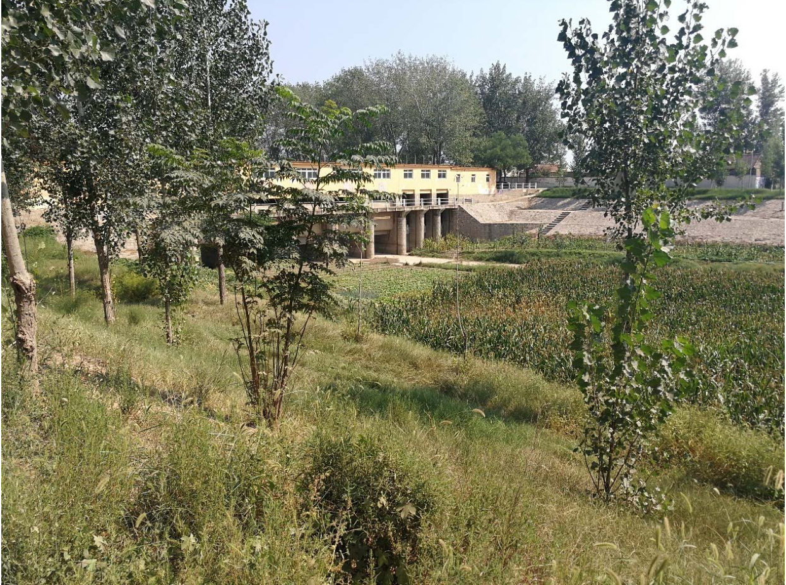  
图 5.9-1 刘庄闸及刘庄桥桥位  

# 5.9.1.2 工程地质  

勘探深度 $35\mathrm{m}$ 范围内,地层除堤身土为人工填土( $\mathbf{Q4}^{\mathrm{r}}.$ )外,其余均为第四系全新统冲积地层 $(Q4^{\mathrm{al}})$ ,岩性以粉土、粉质粘土、粉砂、细砂为主。根据岩性特征,自上而下可划分为 $\textcircled{1}$ 层,其主要特征分述如下:  

$\textcircled{1}$ 人工填土:岩性以粉土为主,褐黄色,稍湿,多呈稍密至中密,土质较均匀,具微透水性。分布于两岸堤身,层厚 $3.5{\sim}4.0\mathrm{m}$ 。  

$\textcircled{2}$ 粉土夹粉砂:褐黄色,湿,松散,土质不均匀,局部夹粉砂、粉质粘土薄层。多具中等压缩性和微 $\sim$ 极微透水性。层厚 $5.8{\sim}10.0\mathrm{m}$ ,两岸层顶高程为$63.51{\sim}64.46\mathrm{m}$ 。  

该层夹有粉砂及粉质粘土透镜体:其中粉砂呈褐黄色,土质不均,局部夹薄层粉土,平均厚 $0.5\mathrm{m}$ ,层顶高程 $58.84{\sim}59.96\mathrm{m}$ ;粉质粘土呈灰\~深灰色,湿,可塑,土质不均匀,层顶高程为 $57.51\mathrm{m}$ ,分布有河床及右岸。  

$\textcircled{3}$ 细砂:灰色,饱和,多呈密实状,局部中密,砂质不均。含砾石,局部含贝壳碎屑。层厚 $17.0{\sim}17.2\mathrm{m}$ ,层顶高程为 $52.20{\sim}55.14\mathrm{m}$ 。该层夹有粉质粘土透镜体:黄褐色,稍湿,可塑,土质较均匀,厚 $0.4{\sim}2.5\mathrm{m}$ 。  

$\textcircled{4}$ 粉质粘土:黄褐色,多呈可塑状,局部坚硬,土质较均匀,多具中等压缩性和极微透水性。层厚 $10.6\mathrm{m}$ 左右(部分钻孔未穿透),层顶高程为 $34.51{\sim}37.94\mathrm{m}$ 。  

$\textcircled{5}$ 细砂:灰色,饱和,密实,砂质不均,层厚大于 $1.40\mathrm{m}$ (未穿透),层顶高程为 $27.34\mathrm{m}$ 。  

根据对各土层物性指标的成果分析,依据相关规范,给出本场区各土层不同桩型的桩基参数,见表 5.9-1。  

表 5.9-1  刘庄桥桥基参数(极限标准值)建议值表  

<html><body><table><tr><td rowspan="2">层号及岩性</td><td rowspan="2">层顶高程 (m)</td><td colspan="2">钻孔灌注桩 （泥浆护壁）</td></tr><tr><td>桩侧摩阻力标准值qik (kPa)</td><td>桩端承载力基本容许 值[fao](kPa)</td></tr><tr><td>①人工填土</td><td></td><td></td><td></td></tr><tr><td>②粉土夹粉砂</td><td>63.51~64.46</td><td>45~50</td><td>130~140</td></tr><tr><td>③细砂</td><td>52.20~55.14</td><td>55~60</td><td>300~320</td></tr><tr><td>④粉质粘土</td><td>34.51~37.94</td><td>50~60</td><td>250~260</td></tr></table></body></html>  

依据《中国地震动参数区划图》(GB18306-2015),闸址位于Ⅷ度烈度区内,地震峰值加速度为 $0.2\mathrm{g}$ 。由于桥基下伏砂性土为水位埋深以下,当地面水平地震加速度达到峰值时 $\textcircled{2}$ 层粉土夹粉砂、 $\textcircled{3}$ 细砂均存在部分液化点,其中 $\textcircled{2}$ 层粉土夹粉砂液化等级严重, $\textcircled{3}$ 细砂液化等级轻微。其余土层不易液化。  

工程区内地下水类型为孔隙潜水,勘探期间水位埋深 $2.7{\sim}8.7\mathrm{m}$ ,水位高程为$57.79{\sim}62.80\mathrm{m}$ ,主要接受河水和大气降水补给。桥址区地表水对混凝土无腐蚀、对钢筋具弱腐蚀,对钢结构具弱腐蚀;桥址区地下水对混凝土具硫酸型弱腐蚀、对钢筋具弱腐蚀,对钢结构具弱腐蚀。  

# 5.9.1.3 设计标准及依据  

(1)设计标准  

根据原刘庄闸上桥的规模以及防汛交通的要求,桥梁设计荷载标准定为公路-Ⅱ级,人行荷载为 $3\mathrm{KN}/\mathrm{m}^{2}$ ,洪水流量按 50 年一遇设计,桥面按宽度为净-$7+2\mathrm{x}1.0$ 米(含栏杆),设计考虑非汛期流冰的影响,冰层水位为枯水期 3 年一遇水位 $59.28\mathrm{m}$ 。根据《公路桥梁抗震设计细则》(JTG/TB02-01-2008),该桥两端连接道路为四级公路,桥梁跨径总长 $6\mathrm{x}16\mathrm{m}$ ,属中桥,抗震设防烈度为 8 度,抗震设防类别为 D 类,仅需验算 E1 地震作用。  

(2)设计依据  

$\textcircled{1}$ 《公路桥涵设计通用规范》(JTG D60-2015);  
$\textcircled{2}$ 《公路钢筋混凝土及预应力混凝土桥涵设计规范》(JTG 3362-2018);  
$\textcircled{3}$ 《公路圬工桥涵设计规范》(JTG D61-2005);  
$\textcircled{4}$ 《公路桥涵地基与基础设计规范》(JTGD 63-2007);  
$\textcircled{5}$ 《公路钢结构桥梁设计规范》(JTG D64-2015);  
$\textcircled{6}$ 《公路工程技术标准》(JTG B01-2014);  
$\textcircled{7}$ 《公路桥梁抗震设计细则》(JTG/TB02-01-2008);  
$\textcircled{8}$ 《公路工程抗震设计规范》(JTG B02-2013);  
$\textcircled{9}$ 其它相关的规程规范及技术标准。  

# 5.9.1.4 桥梁布置和结构设计  

(1)桥梁布置  

该桥为预应力混凝土空心板桥,每跨 $16\mathrm{m}$ ,共 6 跨,含桥两端全长为 $104.5\mathrm{m}$ 。16m 跨预应力混凝土空心板的厚度为 $80\mathrm{cm}$ ,混凝土标号为 C40。下部结构为双柱式混凝土排架,基础为混凝土灌注桩,排架柱柱径为 $1.0\mathrm{m}$ ,桩径为 $1.2\mathrm{m}$ ,下部结构混凝土标号为 C30,基础桩端持力层为 $\textcircled{4}$ 层粉质粘土,桥面高程根据计算水位并加入安全超高确定为 $68.230\mathrm{m}$ 。  

# (2)桥梁上部结构  

上部结构每跨由六块预制预应力钢筋混凝土空心板组成,桥面宽度为净-  

$7+2\mathrm{x}1.0$ 米,桥面设置 $1.5\%$ 的双向横坡,16 米跨预应力钢筋混凝土空心板板高为0.8 米。桥面两侧各设净 $0.75\mathrm{m}$ 宽人行道,栏杆采用混凝土柱与钢结构混合栏杆。  

# (3)桥梁下部结构  

桥墩选择了排架式桥墩,根据地质条件,基础设计为钢筋混凝土钻孔灌注桩,桥墩及钻孔灌注桩混凝土标号均为 C30F200,在流冰设计高水位以上 $0.7\mathrm{m}$ 到渠底对桥墩采取了防护措施,来减少流冰对桥墩的撞击力;桥台为桩柱式桥台,混凝土标号为 C30F200。桥址区地下水对混凝土具硫酸型弱腐蚀、对钢筋具弱腐蚀,对钢结构具弱腐蚀,下部结构混凝土可中掺入防腐阻锈剂进行防腐蚀设计。  

刘庄桥治理工程布置图见附图 106C -A1-Q6-01\~06。  

# (4)结构计算  

新建桥梁汽车荷载等级按公路—Ⅱ级,人行荷载按 $3\mathrm{KN}/\mathrm{m}^{2}$ 进行结构设计。桥梁的车行道为双车道,净宽 $7\mathrm{m}$ ,两侧各设 $1\mathrm{m}$ 宽人行道,桥面总宽度为 $9\mathrm{m}$ 。公路桥的上部结构是在国家交通行业装配式预应力混凝土简支空心板标准图集基础上做了核算加强,下部结构采用钢筋混凝土排架柱接钻孔灌注桩基础,桩基按摩擦桩进行设计。  

# 1)荷载组合  

承载能力极限状态基本组合(配筋和计算结构承载能力):  

$\textcircled{1}$ 组合 1:自重 $+$ 汽车荷载 $+.$ 人群荷载 $+$ 温度荷载(上部结构);  
$\textcircled{2}$ 组合 2:自重 $^+$ 温度荷载 $^+$ 汽车荷载 $+$ 汽车制动力 $+$ 人群荷载(下部结构);  
$\textcircled{3}$ 组合 3:自重 $+$ 冰压力 $^+$ 汽车荷载 $+.$ 人群荷载 $+$ 温度荷载(下部结构);  

$\textcircled{4}$ 组合 4:自重 $+$ 流水压力 $^+$ 汽车荷载 $^+$ 人群荷载 $^+$ 温度荷载(下部结构);  

正常使用极限状态——作用的频遇组合和准永久组合(验算结构应力、裂缝、挠度):  

组合 1:自重 $+\mathrm{.}$ 汽车荷载 $+.$ 人群荷载 $^{+}$ 温度梯度作用荷载(上部结构);  

$\textcircled{2}$ 组合 2:自重 $+$ 汽车荷载 $+_{.}$ 人群荷载 $^+$ 温度荷载 $^+$ 汽车制动力(下部结构);  

组合 3:自重 $+$ 冰压力 $^+$ 汽车荷载 $+.$ 人群荷载 $^+$ 温度荷载(下部结构);  

地震组合(验算抗震承载能力,地震时不考虑与汽车荷载组合)  

组合 1:永久作用 $+.$ 地震荷载;  

各作用组合时需按规范要求考虑其分项系数与组合系数,或者频遇值系数与准永久值系数。  

桥梁构件根据承载能力极限状态计算结果进行了配筋设计,按照正常使用极限状态进行了裂缝与挠度验算,均能满足规范要求。  

# 2)河床冲刷计算  

该桥位处河床主要为 $\textcircled{2}$ 层粉土夹粉细砂,局部夹粉细砂、粉质粘土薄层。河床冲刷可按粘性土河床计算,该处共产主义渠泄洪时基本没有河滩,可按照全河槽断面计算,根据《公路工程水文勘测设计规范》,采用粘性土河床冲刷计算公式 8.3.2-1 计算桥下一般冲刷:  

$$
h_{\mathrm{p}}=\left[\frac{A_{\mathrm{d}}\frac{Q_{2}}{\mu B_{\mathrm{cj}}}\Big(\frac{h_{\mathrm{cm}}}{h_{\mathrm{cq}}}\Big)^{\frac{5}{3}}}{0.33\Big(\frac{1}{I_{\mathrm{L}}}\Big)}\right]^{\frac{5}{8}}
$$  

式中:Hp——桥下一般冲刷后的最大水深( $\mathbf{\rho},\mathbf{m})$ ;Ad——单宽流量集中系数 $\begin{array}{r l r}{\mathrm{\Gamma}}&{{}}&{\mathrm{Ad}{=}\left(\frac{\sqrt{\mathrm{B_{z}}}}{\mathrm{H_{z}}}\right)^{0.15}=}1.08}\end{array}$ $\mathrm{Q}_{2}.$ ——桥下河槽部分通过的设计流量 $(\mathrm{m}^{3}/\mathrm{s})$ ),当河槽能扩宽至全桥时取用河道设计流量 $\mathrm{Q}\mathrm{p}{=}1210\mathrm{m}^{3}/\mathrm{s}$ ;Bcj——河槽部分桥孔过水净宽(m);μ—— 桥墩水流侧向压缩系数取 0.95;hcm—— 河槽最大水深(m);hcq——桥下河槽平均水深(m);IL——冲刷坑范围内粘性土液性指数取平均值 0.29;  

计算得桥下一般冲刷后的最大水深 $\mathrm{H}_{\mathrm{p}}{=}7.82\mathrm{m}$ ,现状河槽最大水深 $7.34\mathrm{m}$ ,一般冲刷度 $0.48\mathrm{m}$ 。  

一般冲刷后墩前行进流速 $\begin{array}{r}{\mathrm{v}=\frac{0.33}{\mathrm{I_{L}}}\mathrm{h}_{\mathrm{p}}^{1/3}=2.26\mathrm{m}/\mathrm{s}_{\ast}}\end{array}$ 。  

粘性土河床局部冲刷深度按《公路工程水文勘测设计规范》8.4.2-2公式计算:  

$$
h_{\mathrm{b}}=0.55K_{\mathrm{\xi}}B_{\mathrm{\|}}^{\mathrm{0.6}}h_{\mathrm{p}}^{\mathrm{0.1}}I_{\mathrm{L}}^{\mathrm{1.0}}v
$$  

式中:B1— 桥墩计算宽度( $(\mathrm{m})$ ),按桩基直径 $1.2\mathrm{m}$ 取用;  

$\mathrm{K}\varsigma$ 墩形系数,取 1.0;  

计算得桥墩位置局部最大冲刷深度 $\mathrm{hb}{=}0.47\mathrm{m}$ 。  

考虑一定安全埋深,桥墩周围总冲刷深度按 $2\mathrm{m}$ 考虑。  

# 3)桩基承载力计算  

根据《公路桥涵地基与基础设计规范》(JTGD63-2007)第 5.3.3 条:摩擦桩单桩轴向受压容许承载力: $[R a]=\frac{1}{2}U\sum_{i=1}^{n}q_{i k}l_{i}+A_{p}q_{r}$   
上述公式中各符号意义:  
$[\mathrm{R_{a}}].$ —单桩轴向受压容许值 (KN);  
U—桩的周长 $(\mathrm{m})$ ;  
Ap—桩端截面面积 $(\mathrm m^{2})$ ;  
n—土的层数;  
li—承台底面或局部冲刷线以下各土层的厚度 $(\mathrm{m})$ ;  
qik—与 li 对应的各土层与桩侧的摩阻力标准值 $(\mathrm{kPa})$ ;  
qr—桩端处土的承载力容许值(kPa), $\scriptstyle{\mathrm{qr}}={\mathrm{mo}}\lambda\{[{\mathrm{fr}}_{0}]+{\mathrm{k}}_{2}\gamma_{2}({\mathrm{h}}-3)\};$ ;[fa0]—桩端处土的承载力基本容许值 $(\mathrm{kPa})$ ;  

h—桩端的埋置深度 $(\mathrm{m})$ ,对于有冲刷的基础, 埋深由一般冲刷线起算;对于无冲刷的桩基,埋深由天然地面线或实际开挖后的地面线起算; h 的计算值不大于$40~\mathrm{m}$ , 当大于 $40~\mathrm{m}$ 时, 按 $40~\mathrm{m}$ 计算;  

k2—容许承载力随深度的修正系数;  

γ2—桩端以上各土层的加权平均容重 $\left(\mathrm{kN}/\mathrm{m}3\right)$ ;  

λ—修正系数;  

m0—清底系数。  

桥墩采用单排两根混凝土钻孔灌注桩接排架柱式结构,桩径采用 $\Phi^{1.2\mathrm{m}}$ ,柱径采用 $\mathbb{\Theta}^{1.0\mathrm{m}}$ ,计算桥墩单桩顶恒载 1889KN,根据桥址处地质钻孔资料,地震时不考虑 $\textcircled{2}$ 层粉土夹粉细砂的侧摩阻力, $\textcircled{3}$ 层细砂地面以下 $20\mathrm{m}$ 按 2/3 折减侧摩阻力计算,计算得桥墩桩长为 $29.0\mathrm{m}$ ;正常使用阶段不考虑液化,单桩顶组合荷载 2599KN,按摩擦桩计算得 $29.0\mathrm{m}$ 长桩顶承载力特征值为 2759KN,满足承载力要求。  

桥台采用单排两根混凝土钻孔灌注桩接盖梁的结构型式,桩径采用 $\Phi^{1.2\mathrm{m}}$ ,计算桥台单桩顶设计恒载 995KN,与活载组合后 1618KN,根据桥址处地质钻孔资料计算,计算地震作用下桥台桩长需要 $22\mathrm{m}$ ,正常使用时 $22\mathrm{m}$ 长桩顶承载力特征值为 1772KN,可满足承载力要求。  

# 5.9.1.5 刘庄桥主要工程量  

# 刘庄桥主要工程量见表 5.9-2  

表 5.9-2  刘庄桥主要工程量表  

<html><body><table><tr><td>序号</td><td>项目</td><td>单位</td><td>数量</td><td>备注</td></tr><tr><td>1 桥面面积</td><td></td><td>m²</td><td>864</td><td>6x16m跨</td></tr><tr><td>(1)</td><td>下部结构</td><td></td><td></td><td></td></tr><tr><td></td><td>C30F200混凝土墩柱D=1.0m</td><td>m3</td><td>42.72</td><td rowspan="3">掺防腐阻锈 剂</td></tr><tr><td></td><td>C30F200 混凝土桩 D=1.2m</td><td>m3</td><td>543.53</td></tr><tr><td></td><td>C40支座垫石</td><td>m3</td><td>3.50</td></tr><tr><td></td><td>C30 混凝土盖梁</td><td>m3</td><td>76.69</td><td></td></tr><tr><td></td><td>C30 F200系梁</td><td>m3</td><td>84.39</td><td></td></tr><tr><td></td><td>C30F200混凝土桥台</td><td>m3</td><td>54.33</td><td rowspan="3">掺防腐阻锈 剂</td></tr><tr><td></td><td>C30F200混凝土搭板</td><td>m3</td><td>28.35</td></tr><tr><td>钢筋 (t)</td><td></td><td>t</td><td>98.23</td></tr><tr><td>(2) 上部结构</td><td></td><td></td><td></td><td></td></tr><tr><td>C40混凝土板梁</td><td></td><td>m3</td><td>371.70</td><td></td></tr><tr><td></td><td>桥面C40混凝土（含绞缝)</td><td>m²</td><td>132.55</td><td></td></tr><tr><td></td><td>沥青混凝土桥面铺装</td><td>m3</td><td>74.42</td><td></td></tr><tr><td>C30预制混凝土栏杆</td><td></td><td>m3</td><td>9.92</td><td></td></tr><tr><td>预制人行道板C30</td><td></td><td>m3</td><td>40.32</td><td></td></tr><tr><td>现浇路缘石C30</td><td></td><td>m²</td><td>6.45</td><td></td></tr><tr><td>栏杆钢材</td><td></td><td>t</td><td>6.05</td><td></td></tr><tr><td>钢筋 (t)</td><td></td><td>t</td><td>93.46</td><td></td></tr><tr><td>015.2钢铰线</td><td></td><td>t</td><td>13.01</td><td></td></tr><tr><td>(3) 附属结构</td><td></td><td></td><td></td><td></td></tr><tr><td>CQ50桥面伸缩缝</td><td></td><td>m</td><td>28.0</td><td></td></tr><tr><td>板式橡胶支座150x200x42mm</td><td></td><td>块</td><td>144</td><td></td></tr><tr><td>2cm厚橡胶条</td><td></td><td>m²</td><td>5.36</td><td></td></tr><tr><td>土石方开挖</td><td></td><td>m²</td><td>888.73</td><td></td></tr><tr><td>碎石土回填</td><td></td><td>m3</td><td>752.62</td><td></td></tr><tr><td>M7.5浆砌石护坡</td><td></td><td>m3</td><td>140.80</td><td></td></tr><tr><td>碎石土垫层</td><td></td><td>m3</td><td>35.20</td><td></td></tr><tr><td>2 引道长度</td><td></td><td></td><td></td><td>路基宽8m</td></tr><tr><td>C30混凝土路面（厚度20cm)</td><td></td><td>m m²</td><td>168</td><td></td></tr><tr><td>水泥稳定碎石基层（厚度25cm）</td><td></td><td>m²</td><td>109</td><td></td></tr><tr><td>二灰土垫层（厚度25cm)</td><td></td><td>m²</td><td>117</td><td></td></tr><tr><td>土方开挖</td><td></td><td>m3</td><td>49</td><td></td></tr></table></body></html>  

# 5.9.2 生产桥设计  

# 5.9.2.1 工程概况  

淇门以下卫河和共产主义渠上跨越河道主槽的生产桥、漫水桥及吊桥等共41座,本次仅对受河道主槽清淤扩挖工程影响的 4 座桥梁进行拆除重建,对扩大治理时未安排恢复建设的阎庙生产桥进行建设。  

本工程需要改建的 5 座桥梁均为七、八十年代村民自建,标准低,质量差,阻水严重,且存在安全隐患,本次结合河道清淤扩挖治理,对原桥进行拆除重建。  

# 5.9.2.2 设计标准及依据  

(1)设计标准  

生产桥的桥面宽度、荷载标准按照《灌溉与排水渠系建筑物设计规范》SL482-2011 中农桥标准来确定,单车道桥面总宽 $5\mathrm{m}$ (行车道宽度 $3.5\mathrm{m}$ ,人行道宽度$2\mathrm{x}0.5\mathrm{m}$ ,栏杆宽度 $2\mathrm{x}0.25\mathrm{m})$ ),当桥面两侧采用防撞墙设计时单车道桥面总宽 $5.5\mathrm{m}$ (行车道宽度 $3.5\mathrm{m}$ ,人行道宽度 $2\mathrm{x0.5m}$ ,防撞墙宽度 $2\mathrm{x}0.5\mathrm{m}$ ),采用 10 跨空心板梁桥,标准板宽 $1.0\mathrm{m}$ ,一跨共 5 块板;桥梁长度均不大于 $100\mathrm{m}$ ,不需要按双车道设计桥面。  

农桥荷载标准按照《公路桥涵设计通用规范》执行,交通部根据现状调查和统计分析,汽车变异性较过去增加很多,对小跨径桥梁影响较大,出现重载车辆压垮中小跨径桥梁的事故较多,现行公路规范(JTGD60-2015)中取消了公路—II 级再折减的汽车荷载标准,对于四级公路或参照四级公路设计桥梁的汽车荷载均没有提及可再折减。故各生产桥汽车荷载等级统一采用公路—II 级标准,人群荷载为 $3\mathrm{kN}/\mathrm{m}^{2}$ 。  

除柴湾生产桥外其他改建生产桥原桥面高程较低,均按漫水桥设计,桥面可通过铺设在河滩上的引道与堤顶道路连接,当发生洪水时,生产桥可漫水。柴湾生产桥桥址处河道上口较窄,原桥面与两岸大堤堤顶基本持平,基本满足 50 年一遇洪水标准,改建后的柴湾生产桥采用 50 年一遇洪水标准设计,不考虑漫水。  

根据桥梁是否考虑漫水划分为两类桥:  

A1 类桥:共 4 座,分别为牛庄生产桥、西王渡生产桥、大刘村生产桥和闫庙生产桥,按漫水桥设计,桥跨长均小于 $100\mathrm{m}$ ,属中桥,桥面宽度按设置护栏的单车道 $5\mathrm{m}$ 宽设计,上部采用 C30 钢筋混凝土空心板梁结构,桥梁两边板外侧设圆弧形,减少水流阻力。单跨跨度为 $10\mathrm{m}$ ,基础为直径 $1.0\mathrm{m}$ 钻孔灌注桩,上接钢筋混凝土排架柱及帽梁;  

A2 类桥:共 1 座为柴湾生产桥,桥址处河道较窄,桥梁两端与大堤连接,桥面与大堤堤顶平接,按通过 50 年一遇洪水设计,不考虑漫水,桥跨长 $70\mathrm{m}$ ,属中桥,桥面宽度按设置防撞墙的单车道 $5.5\mathrm{m}$ 宽设计,上部采用 C30 钢筋混凝土空心板梁结构,单跨跨度为 $10\mathrm{m}$ ,基础为直径 $1.0\mathrm{m}$ 钻孔灌注桩,上接钢筋混凝土排架柱及帽梁。  

(2)设计依据  

$\textcircled{1}$ 《公路桥涵设计通用规范》(JTG D60-2015);  
$\textcircled{2}$ 《公路钢筋混凝土及预应力混凝土桥涵设计规范》(JTG D62-2018);  
$\textcircled{3}$ 《公路桥涵地基与基础设计规范》(JTG 3363-2019);  
$\textcircled{4}$ 《公路工程水文勘测设计规范》(JTG C30-2016);  
$\textcircled{5}$ 《灌溉与排水渠系建筑物设计规范》SL482-2011;  
$\textcircled{6}$ 《公路工程技术标准》(JTG B01-2014);  
$\textcircled{7}$ 《公路桥梁抗震设计细则》(JTG/TB02-01-2008);  
$\textcircled{8}$ 《公路工程抗震设计规范》(JTG B02-2013);  
$\textcircled{9}$ 其它相关的规程规范及技术标准。  

(3)工程地质  

生产桥地质详见地质勘察报告,其中:牛村生产桥 $\textcircled{2}$ 层细砂存在部分液化点,可能液化点位较少,液化等级轻微, $\textcircled{4}$ 层粉土、 $\textcircled{5}$ 粉砂、 $\textcircled{7}$ 细砂为非液化土;西王渡生产桥 $\textcircled{3}$ 层粉砂、 $\textcircled{7}$ 层细砂个别点位可能发生液化,液化等轻微, $\textcircled{2}$ 层粉土、$\textcircled{5}$ 层粉土为非液化土;柴湾生产桥各层土体地震不液化;大刘村生产桥各层土体地震不液化;闫庙生产桥各层土体地震不液化。  

牛村生产桥、西王渡生产桥、柴湾生产桥桥址区卫河地表水对混凝土无腐蚀、对钢筋具弱腐蚀,对钢结构具弱腐蚀;桥址区地下水对混凝土具硫酸型中等腐蚀、对钢筋具弱腐蚀,对钢结构具中等腐蚀。  

大刘村生产桥、闫庙生产桥桥址区地表水对混凝土具硫酸型弱腐蚀、对钢筋具弱腐蚀,对钢结构具弱腐蚀;桥址区地下水对混凝土具硫酸型弱腐蚀、对钢筋具弱腐蚀,对钢结构具中等腐蚀。  

# 5.9.2.3 桥梁布置和结构设计  

(1)牛村生产桥(河道桩号 $12\substack{+810})$  

原桥为人行索道桥,主槽上口宽约 $41\mathrm{m}$ ,桥长约 $50\mathrm{m}$ ,桥宽 $2.0\mathrm{m}$ ,上部结构由于破损严重现已拆除,仅剩两岸桥台。见图 5.9-2。  

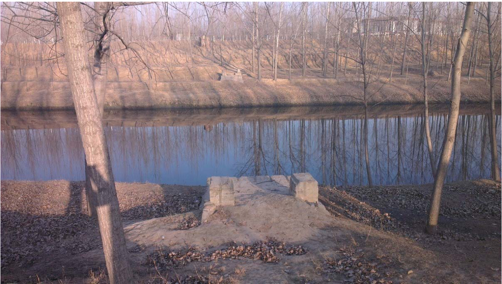  
图 5.9-2  牛村生产桥现状位置图  

重建牛庄生产桥设计荷载标准为公路-Ⅱ级,人群荷载为 $3\mathrm{kN}/\mathrm{m}^{2}$ 。桥面宽度按单车道 $5\mathrm{m}$ 宽设计,排涝水位 $60.43\mathrm{m}$ 。新建桥梁为钢筋混凝土结构,上部采用预制钢筋混凝土空心板结构,跨度为 $10\mathrm{m}$ ,共 5 跨,基本维持原桥长 $50\mathrm{m}$ 不变,下部采用钢筋混凝土排架柱结构,基础为钻孔灌注桩。改建后的结构形式如下:  

# 1)桥梁布置  

该桥为普通混凝土空心板桥,每跨 $10\mathrm{m}$ ,共 5 跨,含桥两端全长为 $56.5\mathrm{m}$ 。预制混凝土空心板的厚度为 $50\mathrm{cm}$ ,混凝土标号为 C30。下部结构为双柱式混凝土排架,基础为混凝土灌注桩,排架柱柱径为 $0.8\mathrm{m}$ ,桩径为 $1.0\mathrm{m}$ ,下部结构混凝土标号为 C30F200,桥面高程根据排涝水位加入安全超高并结合两岸滩地引道路面高程确定为 $62.10\mathrm{m}$ 。  

# 2)桥梁上部结构  

上部结构每跨由 5 块标准宽度为 $1.0\mathrm{m}$ 的预制钢筋混凝土空心板组成,桥梁两侧边板外缘设置圆弧形以减少行洪漫水时的水流阻力,桥面宽度为净-$4.5\substack{+2\mathrm{x}0.25}$ 米,总宽 $5\mathrm{m}$ ,桥面设置 $1.5\%$ 的双向横坡,10 米跨预制钢筋混凝土空心板板高为 0.5 米。桥面两侧各设 $0.25\mathrm{m}$ 宽栏杆,栏杆采用混凝土柱与钢管混合栏杆,行洪时按漫水桥设计。  

# 3)桥梁下部结构  

桥墩选择了排架式桥墩,根据地质条件,基础设计为钢筋混凝土钻孔灌注桩,桥墩及钻孔灌注桩混凝土标号均为 C30F200,桥台为桩柱式桥台,混凝土标号为C30F200。桥址区地下水对混凝土具硫酸型中等腐蚀、对钢筋具弱腐蚀,下部结构混凝土中可掺入防腐阻锈剂进行防腐蚀设计。  

该桥位河床属于粘性土河床,根据《公路工程水文勘测设计规范》,采用粘性土河床冲刷公式计算,考虑一定安全埋深,计算桥墩位置最大冲刷深度 $2.61\mathrm{m}$ ,桥台位置最大冲刷深度 $1.38\mathrm{m}$ 。桥墩单桩顶荷载合计 958KN,采用钻孔灌注桩直径 $1.0\mathrm{m}$ ,计算桩长 $18\mathrm{m}$ ,桥台单桩顶荷载合计 837KN,采用钻孔灌注桩直径 $1.0\mathrm{m}$ ,计算桩长 $18\mathrm{m}$ 。  

据《中国地震动参数区划图》(GB18306-2015),牛村桥附近地区的地震动峰值加速度为 $0.20\mathrm{g}$ ,地震动反应谱特征周期为 0.40s。根据《公路桥梁抗震设计细则》(JTG/T B02-01-2008),对应的地震基本烈度值为 8 度,抗震设防类别为 D类,需要进行 E1 地震作用下的抗震设计,抗震重要性系数 $\mathrm{C}_{1}{=}0.23$ 。  

(2)西王渡生产桥(河道桩号 $18{+}700\$ )  

原桥为人行混凝土板梁桥,桥长 35 米,共 5 跨,桥面宽 $1.4\mathrm{m}$ ,栏杆为简易钢筋栏杆,下部结构为混凝土排架柱结构,见图 5.9-3。  

重建西王渡生产桥设计荷载标准为公路-Ⅱ级,人群荷载为 $3\mathrm{kN}/\mathrm{m}^{2}$ 。桥面宽度按单车道 $5\mathrm{m}$ 宽设计,设计排涝水位 $59.67\mathrm{m}$ 。桥面高程根据排涝水位加入安全超高并结合两岸滩地引道路面高度确定为 $61.07\mathrm{m}$ 。桥面位置河槽上口宽约 $75\mathrm{m}$ ,新建桥梁采用钢筋混凝土空心板梁结构,单跨跨度为 $10\mathrm{m}$ ,共 7 跨,桥跨长 $70\mathrm{m}$ ,包括两岸桥台后耳墙长度,全桥长 $76.5\mathrm{m}$ ,下部采用钢筋混凝土排架式柱结构,下接 C30F200 钻孔灌注桩基础,桥墩计算桩长 $18\mathrm{m}$ ,桥台桩基计算长度 $18\mathrm{m}$ 。改建后的结构形式与牛村生产桥相同。  

据《中国地震动参数区划图》(GB18306-2015),西王渡生产桥附近地区的地震动峰值加速度为 $0.20\mathrm{g}$ ,地震动反应谱特征周期为 0.40s。根据《公路桥梁抗震设计细则》(JTG/TB02-01-2008),对应的地震基本烈度值为8度,抗震设防类别为 D 类,需要进行 E1 地震作用下的抗震设计,抗震重要性系数 $\mathrm{C}_{1}{=}0.23$ 。  

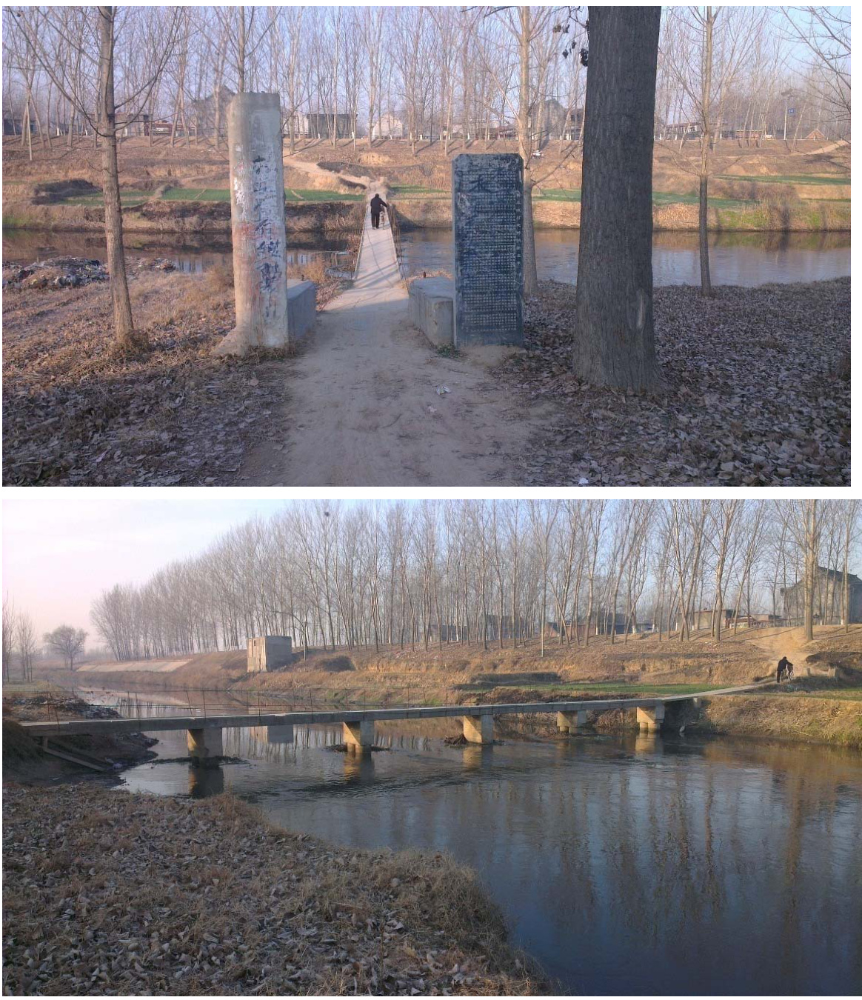  
图 5.9-3 西王渡生产桥现状位置图  

(3)柴湾生产桥(河道桩号 $33\substack{+410}\$ )  

原桥为人行索道桥,桥长约 $80\mathrm{m}$ ,桥面宽 $2.0\mathrm{m}$ ,桥面板为木板结构,桥面高程与两侧大堤堤顶高程相差不大,现状左堤顶高程 $62.49\mathrm{m}$ ,右堤顶高程 $62.44\mathrm{{m}}$ 。见图 5.9-4。  

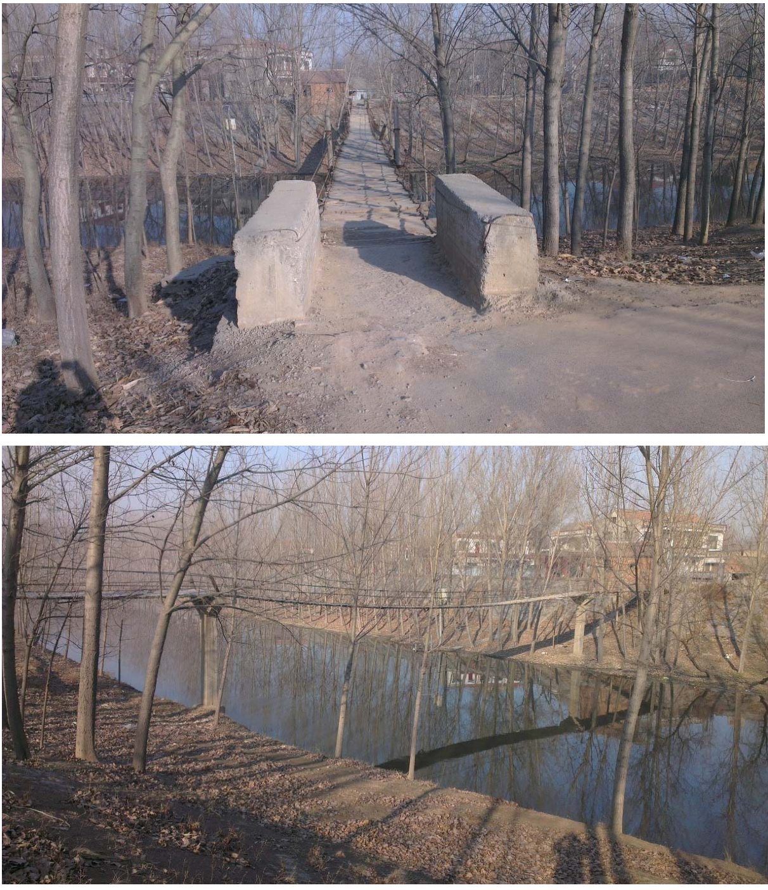  
图 5.9-4 柴湾生产桥现状位置图  

重建柴湾生产桥设计荷载标准为公路-Ⅱ级,人群荷载为 $3\mathrm{kN}/\mathrm{m}^{2}$ 。桥面宽度按单车道 $5.5\mathrm{m}$ 宽设计,桥位处设计排涝水位 $57.71\mathrm{m}$ ,设计洪水位 $60.07\mathrm{m}$ ,设计堤顶高程不小于 $62.21\mathrm{m}$ 。桥面高程根据设计洪水位加入安全超高并结合两岸堤顶路面高度确定为 $62.40\mathrm{m}$ 。上部采用预制钢筋混凝土空心板结构,跨度为 $10\mathrm{m}$ ,共 7 跨,桥跨长 $70\mathrm{m}$ ,包括耳墙长度桥梁长 $76.5\mathrm{m}$ ,下部采用钢筋混凝土排架式桩柱结构。改建后的结构形式详见柴湾生产桥布置图。  

# 1)桥梁布置  

该桥为普通混凝土空心板桥,每跨 $10\mathrm{m}$ ,共 7 跨,含桥两端全长为 $76.5\mathrm{m}$ 。预制混凝土空心板的厚度为 $50\mathrm{cm}$ ,混凝土标号为 C30。下部结构为双柱式混凝  

土排架,基础为混凝土灌注桩,排架柱柱径为 $0.8\mathrm{m}$ ,桩径为 $1.0\mathrm{m}$ ,下部结构混凝土标号为 C30F200。桥梁两端连接卫河左右岸大堤,为交通平顺,桥面高程结合两岸大堤上路面高程确定为 $62.40\mathrm{m}$ 。  

# 2)桥梁上部结构  

上部结构每跨由 5 块预制钢筋混凝土空心板组成,桥面宽度为净-$4.5\substack{+2\mathrm{x}0.5\mathrm{m}}$ ,桥面设置 $1.5\%$ 的双向横坡,10 米跨预制钢筋混凝土空心板板高为0.5 米。桥面两侧各设道 $0.5\mathrm{m}$ 宽防撞墙,墙顶设置钢管护栏,桥梁下通过 50 年一遇洪水位时的净空不小于 $0.5\mathrm{m}$ 。  

# 3)桥梁下部结构  

桥墩选择了排架式桥墩,根据地质条件,基础设计为钢筋混凝土钻孔灌注桩,桥墩及钻孔灌注桩混凝土标号均为 C30F200,桥台为桩柱式桥台,混凝土标号为C30F200,并掺入一定量的防腐阻锈剂。桥位河床属于粘性土河床,根据《公路工程水文勘测设计规范》,采用粘性土河床冲刷计算公式,考虑一定安全埋深,计算得桥墩位置最大冲刷深度 $2.38\mathrm{m}$ 。桥位处地层土体地震时不液化,桥墩单桩顶荷载合计 1065KN,采用钻孔灌注桩直径 $1.0\mathrm{m}$ ,计算桩长 $18\mathrm{m}$ ,桥台单桩顶荷载合计 892KN,采用钻孔灌注桩直径 $1.0\mathrm{m}$ ,计算桩长 $16\mathrm{m}$ 。  

据《中国地震动参数区划图》(GB18306-2015),柴湾生产桥附近地区的地震动峰值加速度为 $0.20\mathrm{g}$ ,地震动反应谱特征周期为 0.40s。根据《公路桥梁抗震设计细则》(JTG/TB02-01-2008),对应的地震基本烈度值为8度,抗震设防类别为D 类,需要进行 E1 地震作用下的抗震设计,抗震重要性系数 $C_{\mathrm{i}}{=}0.23$ 。  

# (4)大刘村生产桥(河道桩号 $73+520~.$ )  

原桥上部为 7 跨混凝土板梁桥结构,桥长 $42\mathrm{m}$ ,每孔跨径 $6\mathrm{m}$ ,桥面宽 $2.8\mathrm{m}$ ,两侧无栏杆,下部为混凝土排架柱结构,桩基础,见图 5.9-5。  

重建大刘村生产桥设计荷载标准为公路-Ⅱ级,人群荷载为 $3\mathrm{kN}/\mathrm{m}^{2}$ 。桥址处卫河主槽槽底(设计高程 $47.66\mathrm{m}$ )设计 $20\mathrm{m}$ 宽,两岸边坡 1:3,两岸滩地高程$49.12{\sim}50.63\mathrm{m}$ ,考虑桥梁与两岸河滩引道平顺连接,桥面高程确定为 $50.63\mathrm{m}$ ,设计洪水位 $56.96\ensuremath{\mathrm{m}}$ ,桥梁按漫水桥设计。桥址处河槽上口宽约 $52\mathrm{m}$ ,河底宽约 $40\mathrm{m}$ ,不需要扩挖。上部采用 $10\mathrm{m}$ 跨钢筋混凝土空心板梁结构,共 5 跨,含耳墙桥长$57.5\mathrm{m}$ ,桥面宽度按单车道净宽 $4.5\mathrm{m}$ 设计,总宽 $5\mathrm{m}$ ,新建桥梁下部采用钢筋混凝土排架柱结构,基础采用钻孔灌注桩,桥墩桩长 $18\mathrm{m}$ ,桥台桩长 $10\mathrm{m}$ 均可满足承载力要求。桥下主槽边坡采用浆砌石边坡防护,上下游各 $10\mathrm{m}$ 。改建后的结构形式同牛村生产桥。  

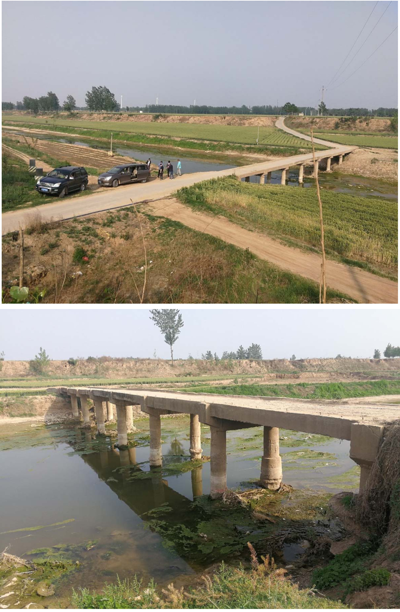  
图 5.9-5  大刘村生产桥现状位置图  

据《中国地震动参数区划图》(GB18306-2015),大刘村生产桥附近地区的地震动峰值加速度为 $0.15\mathrm{g}$ ,地震动反应谱特征周期为 0.40s。根据《公路桥梁抗震设计细则》(JTG/TB02-01-2008),对应的地震基本烈度值为7度,抗震设防类别为 D 类,需要进行 E1 地震作用下的抗震设计,抗震重要性系数 $\mathrm{C}_{1}{=}0.23$ 。  

(5)阎庙生产桥(河道桩号 $172\substack{+750}$ )  

原桥上部为钢混组合梁结构,桥长约 $48\mathrm{m}$ ,桥面净宽 $2.0\mathrm{m}$ ,无桥栏杆,下部为混凝土独柱结构,见图 5.9-6。现状阎庙生产桥为卫河柴湾取直后右岸村民集资修建,建设标准较低。  

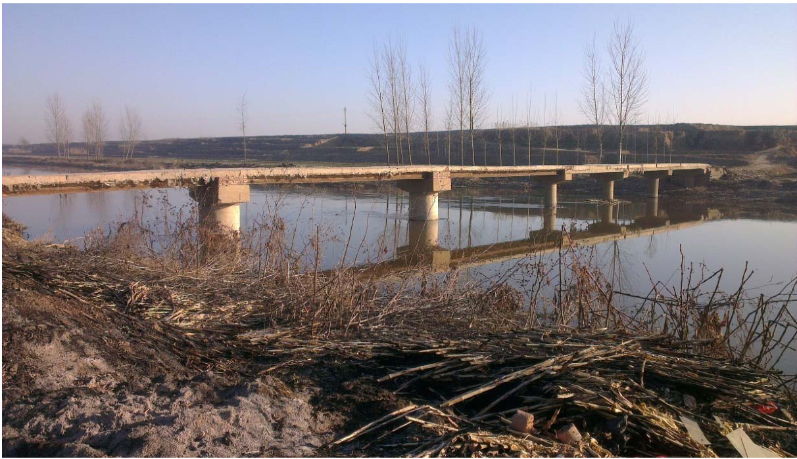  
图 5.9-6 阎庙生产桥现状位置图  

重建阎庙生产桥设计荷载标准为公路-Ⅱ级,人群荷载为 $3\mathrm{kN}/\mathrm{m}^{2}$ 。桥址处卫河设计排涝水位 $41.07\mathrm{m}$ ,桥面高程 $36.70\mathrm{m}$ ,按漫水桥设计,与河滩地面基本持平顺连接。桥址处河槽上口宽约 $50\mathrm{m}$ 。上部采用 $10\mathrm{m}$ 跨钢筋混凝土空心板梁结构,共 5 跨,桥长 $56.5\mathrm{m}$ ,桥面宽度按单车道 $5\mathrm{m}$ 宽设计,新建桥梁下部采用钢筋混凝土排架式桩柱结构。基础采用钻孔灌注桩,桥墩桩长 $18\mathrm{m}$ ,桥台桩长 $10\mathrm{m}$ 均可满足承载力要求。改建后的结构形式与牛村生产桥相同。  

据《中国地震动参数区划图》(GB18306-2015),阎庙生产桥附近地区的地震动峰值加速度为 $0.15\mathrm{g}$ ,地震动反应谱特征周期为 0.40s。根据《公路桥梁抗震设计细则》(JTG/TB02-01-2008),对应的地震基本烈度值为7度,抗震设防类别为D 类,需要进行 E1 地震作用下的抗震设计,抗震重要性系数 $\mathrm{C}_{1}{=}0.23$ 。  

# 5.9.2.4 生产桥主要工程量  

各生产桥主要工程量合计见表 5.9-3。  

# 表 5.9-3 生产桥主要工程量表  

<html><body><table><tr><td>序号</td><td>项目</td><td>单位</td><td>数量合计</td><td>备注</td></tr><tr><td>1</td><td>桥梁面积</td><td>m²</td><td>1458</td><td>5座生产桥</td></tr><tr><td>(1)</td><td>下部结构</td><td></td><td></td><td></td></tr><tr><td></td><td>C30F200混凝土墩柱D=0.8m</td><td>m²</td><td>92.56</td><td>掺防腐阻锈剂</td></tr><tr><td></td><td>C30F200混凝土桩D=1.0m</td><td>m</td><td>1174</td><td></td></tr><tr><td></td><td>C40支座垫石</td><td>m3</td><td>12.72</td><td></td></tr><tr><td></td><td>C30混凝土盖梁</td><td>m3</td><td>140.34</td><td></td></tr><tr><td></td><td>C30系梁</td><td>m3</td><td>42.24</td><td>掺防腐阻锈剂</td></tr><tr><td></td><td>C30F200混凝土桥台</td><td>m3</td><td>150.67</td><td></td></tr><tr><td></td><td>C30F200混凝土搭板</td><td>m3</td><td>82.50</td><td></td></tr><tr><td></td><td>C15混凝土垫层</td><td></td><td>12.50</td><td></td></tr><tr><td></td><td>钢筋 (t)</td><td>t</td><td>198.0</td><td></td></tr><tr><td>(2)</td><td>上部结构</td><td></td><td></td><td></td></tr><tr><td></td><td>C30预制混凝土空心板</td><td>m²</td><td>612.48</td><td></td></tr><tr><td></td><td>C40 混凝土铰缝</td><td>m3</td><td>22.33</td><td></td></tr><tr><td></td><td>桥面现浇层C40混凝土</td><td>m²</td><td>172.26</td><td></td></tr><tr><td></td><td>沥青混凝土桥面铺装</td><td>m3</td><td>114.84</td><td></td></tr><tr><td></td><td>C30预制混凝土栏杆</td><td>m3</td><td>27.91</td><td></td></tr><tr><td></td><td>栏杆钢管</td><td>t</td><td>47.34</td><td></td></tr><tr><td></td><td>钢筋 (t)</td><td>t</td><td>143.45</td><td></td></tr><tr><td>(3)</td><td>附属结构</td><td></td><td></td><td></td></tr><tr><td></td><td>CQ50桥面伸缩缝</td><td>m</td><td>93.50</td><td></td></tr><tr><td></td><td>板式橡胶支座150x150x42mm</td><td>块</td><td>580.00</td><td></td></tr><tr><td></td><td>2cm厚橡胶条</td><td>m²</td><td>16.50</td><td></td></tr><tr><td></td><td>土方开挖</td><td>m3</td><td>4605.70</td><td></td></tr><tr><td></td><td>碎石土回填</td><td>m²</td><td>4469.4</td><td></td></tr><tr><td></td><td>M7.5浆砌石护坡</td><td>m²</td><td>768.00</td><td></td></tr><tr><td></td><td>碎石土垫层</td><td>m²</td><td>192.00</td><td></td></tr><tr><td>2</td><td>引道长度</td><td>m</td><td></td><td>5座生产桥</td></tr><tr><td></td><td>C30混凝土路面（厚度20cm)</td><td>m²</td><td>1536.60</td><td></td></tr><tr><td></td><td>水泥稳定碎石基层（厚度25cm)</td><td>m²</td><td>2365.63</td><td></td></tr><tr><td></td><td>二灰土垫层（厚度25cm）</td><td>m²</td><td>1874.65</td><td></td></tr><tr><td></td><td>土方开挖</td><td>m²</td><td>799.03</td><td></td></tr><tr><td>3</td><td>旧桥拆除</td><td></td><td></td><td>5座旧桥</td></tr><tr><td></td><td>C30混凝土</td><td>m²</td><td>875.60</td><td></td></tr></table></body></html>  

# 5.9.3桥梁设计指标  

各新建桥梁主要设计指标见表5.9-4 和表 5.9-5。  

表 5.9-4交通桥设计指标表  

<html><body><table><tr><td rowspan="2">序 号</td><td rowspan="2">河流 名称</td><td rowspan="2">桥梁名称</td><td colspan="2">位置桩号</td><td colspan="2">现状指标</td><td colspan="5">设计指标</td><td rowspan="2">桥梁 类型</td></tr><tr><td>河道桩号</td><td>主槽桩 号</td><td>桥梁 长度 (m) (W)</td><td>桥面 排涝水 宽度 位 (m)</td><td>行洪 水位 (m)</td><td></td><td>桥面高程 (m)</td><td>桥面 桥梁长 度 宽度 (W) (W)</td></tr><tr><td>1</td><td>共产主 义渠</td><td>刘庄桥</td><td>0+149</td><td>0+149</td><td>48</td><td>6.0</td><td>63.19</td><td>66.52</td><td>68.23</td><td>6x16=96</td><td>9.0</td><td>交通桥</td></tr></table></body></html>  

表5.9-5 生产桥设计指标表  

<html><body><table><tr><td rowspan="3">序 号</td><td rowspan="3">河 流 名 称</td><td rowspan="3">桥梁名称</td><td colspan="2">位置桩号</td><td colspan="2">现状指标</td><td colspan="5">设计指标</td><td rowspan="3">桥梁 类型</td></tr><tr><td>河道桩号</td><td>主槽桩号</td><td>桥梁 长度</td><td>桥面 排涝 宽度 水位</td><td>行洪 水位</td><td></td><td>桥面高程</td><td>桥梁长 度</td><td>桥面 宽度</td></tr><tr><td>12+800</td><td>13+700</td><td>(m) 50</td><td>(m) 2</td><td>(m) 60.76</td><td>(m) 63.58</td><td>() 62.10</td><td>(m)</td><td>(m) 5.0</td></tr><tr><td>2</td><td rowspan="3"></td><td>已拆除) 西王渡生产桥</td><td>18+700</td><td>20+100</td><td>35</td><td>1.4</td><td></td><td></td><td></td><td>5x10=50</td><td></td><td>漫水桥 A1 漫水桥A1</td></tr><tr><td>卫</td><td>(简易人行桥) 柴湾生产桥</td><td></td><td></td><td></td><td></td><td>60.09</td><td>62.84</td><td>61.47</td><td>7x10=70</td><td>5.0</td><td></td></tr><tr><td>3 河</td><td>(索道桥)</td><td>33+410</td><td>36+490</td><td>80</td><td>2</td><td>57.92</td><td>61.14</td><td>62.8</td><td>7x10=70</td><td>5.5</td><td>不漫水 A2</td></tr><tr><td>4</td><td></td><td>大刘村生产桥</td><td>73+520</td><td>78+980</td><td>40</td><td>2.8</td><td>53.51</td><td>56.96</td><td>49.86~50.36</td><td>5x10=50</td><td>5.0</td><td>漫水桥A1</td></tr><tr><td>5</td><td></td><td>阎庙生产桥 (简易人行桥)</td><td>172+750</td><td>184+000</td><td>48</td><td>2.0</td><td>41.19</td><td>44.31</td><td>36.70</td><td>5x10=50</td><td>5.0</td><td>漫水桥 A1</td></tr></table></body></html>

交通桥及生产桥桥梁汽车荷载等级统一采用公路一ⅡI级标准,人群荷载为 $3\mathrm{kN}/\mathrm{m}^{2}$  

# 5.9.4 桥梁通航设计  

根据京杭大运河规划方案,至 2025 年,卫河(浚县-滑县-卫辉段)实现旅游通航。至 2035 年,卫河、卫运河(徐万仓-临清)航道等级为Ⅳ级。  

根据《内河通航标准》GB50139-2014 规定,按照Ⅳ级航道等级设计,航道宽度最低 $30\mathrm{m}$ (单线) ${\sim}50\mathrm{m}$ (双线),航道水深 $1.6{\sim}1.9\mathrm{m}$ 。过河建筑物通航净宽 $45\mathrm{m}$ (单向) ${\sim}90\mathrm{m}$ (双向),净高要求 $8.0\mathrm{m}$ ,洪水重现期按 10 年一遇考虑。若如此,桥梁单跨跨度需要加大到至少 $45\mathrm{m}$ 净空,桥面高程即使按照现状堤顶高度来设计都无法满足通航要求,桥梁跨度及长度将大大增加,投资将会增加较多,不宜按生产桥标准来设计,应根据卫河沿线桥梁实际情况并结合道路交通规划统一考虑和专门论证,固本次设计不再考虑远景通航需要。  

# 5.9.5 新加培堤防对沿线桥梁的影响  

主要在共产主义渠上,存在一些跨渠桥梁桥面与现状堤顶高程接近,当堤防需要加培时,会对跨河桥梁两端引道连接产生不利影响,设计建议本次治理只对引道采用斜坡上堤后再斜坡下堤绕回原道路的处理措施,坡度宜控制在 $7\%$ 之内。桥梁改造应结合当地交通规划,另作处理。  

以共渠河道桩号 $30\substack{+069}$ 处七股路桥为例(原桥已另有改造计划),桥面高程$58.07\mathrm{m}$ ,右堤加培后堤顶高程 $62.90\mathrm{m}$ ,高差 $4.83\mathrm{m}$ ,按照 $7\%$ 的纵坡设计,一侧引道坡长至少需要 $70\mathrm{m}$ 。  

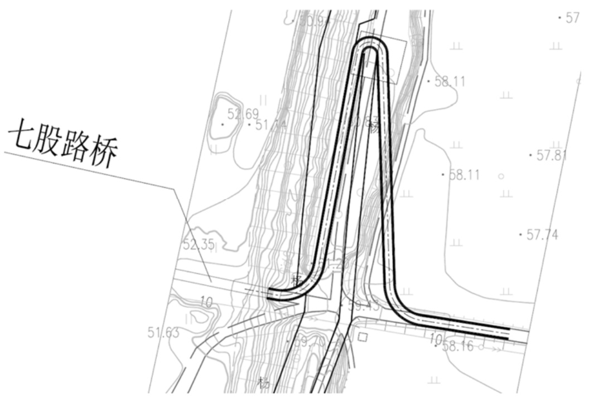  
图 5.9-7 跨渠桥梁上堤平面示意图  

右岸桥台距离堤顶内边线只有 $14.90\mathrm{m}$ ,需要先向下游转弯爬坡上堤后,在堤顶宽阔处掉头,向上游方向下坡,再绕回原路上,需要增加 $150\mathrm{m}$ 引道。  

# 5.10 永久房屋建筑  

卫河干流治理工程建筑设计内容主要包括:盐土庄管理区(含办公用房和辅助生产用房);五处水闸建筑物,包括启闭机房及控制楼、柴油机房等(小河口节制闸启闭机房及控制楼、盐土庄节制闸启闭机房及控制楼、长虹渠退水闸启闭机房及控制楼、浚内沟排涝涵闸启闭机房、民丰沟排涝闸启闭机房);卫河河务局刘庄闸管理所仓库和大名河务局金滩镇仓库等。  

5.10.1 设计采用的主要规范及标准  

(1)《水利水电工程初步设计报告编制规程》(SL 619-2013)  
(2)《建筑工程设计文件编制深度规定》(2016 年)  
(3)《民用建筑设计统一标准》(GB 50352-2019)  
(4)《建筑设计防火规范(2018 年版)》(GB 50016-2014)  
(5)《水利工程设计防火规范》(GB 50987-2014)  
(6)《公共建筑节能设计标准》(GB 50189-2015)  
(7)《屋面工程技术规范》(GB 50345-2012)  
(8)《建筑内部装修设计防火规范》(GB 50222-2017)  
(9)《园林绿化木本苗》(CJ/T 24-2018)  
(10)《建筑结构可靠性设计统一标准》(GB 50068-2018)  
(11)《工程结构可靠性设计统一标准》(GB 50153-2008)  
(12)《建筑工程抗震设防分类标准》(GB 50223-2008)  
(13)《建筑结构荷载规范》(GB 50009-2012)  
(14)《建筑抗震设计规范(2016 年版)》(GB 50011-2010)  
(15)《混凝土结构设计规范(2015 年版)》(GB 50010-2010)  
(16)《砌体结构设计规范》(GB 50003-2011)  
(17)《钢结构设计标准》(GB 50017-2017)  
(18)《建筑地基基础设计规范》(GB 50007-2011)  
(19)《建筑地基处理技术规范》(JGJ 79-2012)  

(20)《工业建筑防腐蚀设计标准》(GB/T 50046-2018)  

(21)《建筑给水排水设计规范(2009 年版)》(GB 50015-2003)  
(22)《室外给水设计标准》(GB 50013-2018)  
(23)《室外排水设计规范(2016 年版)》(GB 50014-2006)  
(24)《供配电系统设计规范》(GB 50052-2009)  
(25)《建筑物防雷设计规范》(GB 50057-2010)  
(26)《建筑物电子信息系统防雷技术规范》(GB 50343-2012)  
(27)《民用建筑电气设计规范》(JGJ 16-2008)  
(28)《电力工程电缆设计规范》(GB 50217-2007)  
(29)《低压配电设计规范》(GB 50054-2011)  
(30)《建筑照明设计标准》(GB 50034-2013)  
(31)《火灾自动报警系统设计规范》(GB 50116-2013)  

# 5.10.2 建筑设计  

# 5.10.2.1 设计原则  

(1)充分考虑当地自然环境和社会环境,体现当地的发展水平,地域风貌、文化特色和历史轨迹。  

(2)尊重功能,强调水工建筑物的固有特征和力度,尽量体现建筑物的结构美、整体美、简洁美。各单体建筑应体现各自功能特征,内容与形式相统一,艺术与技术相结合。  

(3)整体布局与环境统一考虑,建筑风格协调统一。  

(4)因地制宜,经济美观。根据场地特点和植物的生态学特性进行植物材料的选择和科学配置,以生态效益为主,兼顾环境效益和社会效益。  

# 5.10.2.2 盐土庄管理区  

盐土庄管理区位于盐土庄节制闸右岸上游侧,选址地势平缓,场平高程约$57.50\mathrm{m}$ 。编制人员为 9 人,管理区建设规模依据《水库工程管理设计规范》(SL106-2017),办公用房人均建筑不大于面积 $15\mathrm{m}^{2}$ ,职工住宅及文化福利用房人均建筑面积不大于 $35\mathrm{m}^{2}$ 。  

管理区内建筑包括办公用房和辅助生产用房。室外工程包含有场地平整、围墙、场内道路、大门、铺装、绿化、水暖电外网等。技术经济指标如下表:  

# 表 5.10-1 技术经济指标表  

<html><body><table><tr><td colspan="2">项目</td><td>层数</td><td>单体数量</td><td>面积</td><td>单位</td><td>备注</td></tr><tr><td colspan="2">规划用地面积</td><td>/</td><td>/</td><td>1334</td><td>m²</td><td></td></tr><tr><td colspan="2">总建筑面积</td><td>/</td><td></td><td>258</td><td>m²</td><td></td></tr><tr><td rowspan="2">拟建</td><td>办公用房</td><td>1</td><td>1</td><td>198</td><td>m²</td><td></td></tr><tr><td>辅助生产用房</td><td>1</td><td>1</td><td>60</td><td>m²</td><td></td></tr><tr><td colspan="2">建筑基底面积</td><td colspan="3">258</td><td>m²</td><td></td></tr><tr><td colspan="2">绿地面积</td><td colspan="3">554</td><td>m²</td><td></td></tr><tr><td colspan="2">容积率</td><td colspan="3">0.19</td><td>/</td><td></td></tr><tr><td colspan="2">建筑密度</td><td colspan="3">19.3%</td><td>/</td><td></td></tr><tr><td colspan="2">绿地率</td><td colspan="3">41.5%</td><td></td><td></td></tr></table></body></html>  

# (1)总图及室外工程设计  

管理区设置在右岸,距离堤顶路 66 米处,管理区通过一条 8 米宽道路连接至堤顶路,道路坡度不大于 $8\%$ 。管理区内设置 4 米宽车行道路,建筑沿道路布置,道路尽头设置不小于 $15{\times}15\mathrm{m}$ 回车场。道路采用混凝土路面,两侧考虑绿化植被。在管理区西北侧设置主入口,宽度为 $8\mathrm{m}$ ,入口处设置 $2.0\mathrm{m}$ 高铁艺大门一座。  

(2)管理区内主要单体建筑设计  

$\textcircled{1}$ 办公用房  

新建办公用房为单层建筑,层高 $3.3\mathrm{m}$ ,建筑面积为 $198\mathrm{m}^{2}$ ,其中办公室人均建筑面积按 $12\mathrm{m}^{2}$ 计算,建筑面积为 $108\mathrm{m}^{2}$ ;专业办公用房(门卫室、会议室、资料室、微波通讯机房) $90\mathrm{m}^{2}$ 。建筑耐火等级为二级,设计使用年限为 50 年,屋面防水等级为一级。  

$\textcircled{2}$ 辅助生产用房  

新建辅助生产用房为单层建筑,层高 $3.3\mathrm{m}$ ,建筑面积为 $60\mathrm{m}^{2}$ ,其中车库 40$\mathrm{m}^{2}$ ,机修车间和电器维修间 $20\mathrm{m}^{2}$ 。建筑耐火等级为二级,设计使用年限为 50 年,屋面防水等级为一级。  

# (3)建筑装修设计  

工程各区域建筑立面基本保持风格统一,同一区域的不同单体的立面处理手法一致。管理区建筑物采用坡屋顶形式,灰、白墙体,同时跟周边原生态的自然景观相协调。外墙采用防水外墙涂料,外门窗除特殊部位以外采用断桥铝合金中空玻璃门窗。  

建筑内部根据各类房间使用用途的不同及技术要求,重点部位重点突出的原则,采用不同的装修标准。  

办公用房卫生间采用防水防滑玻化砖地面,其他房间采用玻化砖地面;卫生间内墙采用面砖材质,其它房间采用白乳胶漆涂料;卫生间顶棚采用铝合金方形吊顶,门厅和走廊采用石膏板吊顶,其他房间采用矿棉板吊顶。  

辅助生产用房采用细石混凝土地面,白色乳胶漆内墙面,防水涂料外墙面,乳胶漆顶棚。  

# 5.10.2.3 水闸建筑物  

本工程共有五处需设置建筑物,具体位置及面积指标详见下表:  

表 5.10-2  各单体建筑面积指标表  

<html><body><table><tr><td>建筑位置</td><td>单体名称</td><td>数量</td><td>面积</td><td>单位</td><td>备注</td></tr><tr><td>小河口节制闸</td><td>启闭机房及控制楼</td><td>1</td><td>723</td><td>m²</td><td>单层，局部三层</td></tr><tr><td>盐土庄节制闸</td><td>启闭机房及控制楼</td><td>1</td><td>1075</td><td>m²</td><td>单层，局部三层</td></tr><tr><td>长洪渠退水闸</td><td>启闭机房及控制楼</td><td>1</td><td>637</td><td>m²</td><td>单层，局部三层</td></tr><tr><td>浚内沟排涝涵闸</td><td>启闭机房</td><td>1</td><td>46</td><td>m²</td><td>单层</td></tr><tr><td>民丰沟排涝闸</td><td>启闭机房</td><td>2</td><td>52×2</td><td>m²</td><td>单层，上、下闸口各一座</td></tr></table></body></html>  

(1)单体建筑设计  

$\textcircled{1}$ 小河口节制闸启闭机房及控制楼为单层建筑、局部三层,其中启闭机房部分为单层、控制楼部分为三层,建筑面积为 $723\mathrm{m}^{2}$ ,层高为 $4.95\mathrm{m}$ 。控制楼内主要有二次盘柜室、柴油机房、集中控制室、机修间、仓库、观测室等房间。火灾危险性类别为丁类,柴油机房为丙类;建筑耐火等级为二级;设计使用年限为 50年;屋面防水等级为一级。  

$\textcircled{2}$ 盐土庄节制闸启闭机房及控制楼为单层建筑、局部三层,其中启闭机房部分为单层、控制楼部分为三层,建筑面积为 $1075\mathrm{m}^{2}$ ,层高为 $4.0\mathrm{m}$ 。控制楼内主要有二次盘柜室、柴油机房、集中控制室、机修间、仓库、观测室等房间。火灾危险性类别为丁类,柴油机房为丙类,建筑耐火等级为二级;设计使用年限为 50年;屋面防水等级为一级。  

$\textcircled{3}$ 长洪渠退水闸启闭机房及控制楼为单层建筑、局部三层,其中启闭机房部分为单层、控制楼部分为三层,建筑面积为 $637\mathrm{~m~}^{2}$ ,层高为 $3,65\mathrm{m}$ 。控制楼内主要有二次盘柜室、集中控制室、机修间、仓库、观测室等房间。火灾危险性类别为丁类,建筑耐火等级为二级;设计使用年限为 50 年;屋面防水等级为一级。  

$\textcircled{4}$ 浚内沟排涝涵闸设启闭机房一座,为单层建筑,建筑面积为 $46~\mathrm{m}^{2}$ ,层高为 $4.2\mathrm{m}$ 。启闭机房火灾危险性类别为丁类,建筑耐火等级为二级;设计使用年限为 50 年;屋面防水等级为一级。  

$\textcircled{5}$ 民丰沟排涝闸分为上闸口和下闸口,两处各设启闭机房一座。启闭机房为单层建筑,启闭机房建筑面积为 $52\mathrm{m}^{2}/$ 座,层高均为 $4.2\mathrm{m}$ 。启闭机房火灾危险性类别为丁类;建筑耐火等级均为二级;设计使用年限均为 50 年;屋面防水等级均为一级。  

# (2)建筑装修设计  

建筑风格与管理区建筑物保持一致,采用坡屋顶形式,灰、白墙体,同时跟周边原生态的自然景观相协调。外墙采用防水外墙涂料,外窗除特殊部位以外采用断桥铝合金中空玻璃窗,外门采用钢质大门。  

二次盘柜室采用架空防静电底板,其余房间均采用细石混凝土地面;墙面采用乳胶漆墙面;顶棚均为乳胶漆顶棚。  

其中,长洪渠退水闸启闭机房立面采用左右岸对称设置,外墙以白色水波纹理水泥纤维外墙装饰板为主,点缀暗红色线脚。屋顶采用金色筒瓦歇山样式坡屋顶,屋脊装饰有脊兽。启闭机房采用传统硬山及歇山屋顶的交错及高低错落,体现出层次变化,外窗采用断桥铝合金中空玻璃窗,均使整个闸体突出体现清代官式建筑的风格。  

# 5.10.2.4 仓库  

卫河河务局刘庄闸管理所原有仓库和大名河务局金滩镇原有仓库均无法正常使用,需翻修重建。刘庄闸管理所仓库建筑面积 $342\mathrm{m}^{2}$ ,金滩镇仓库建筑面积为 $200\mathrm{m}^{2}$ 。仓库层高均为 $4.5\mathrm{m}$ 。仓库的火灾危险性类别为丁类;建筑耐火等级为二级;设计使用年限为 50 年;屋面防水等级均一级。  

建筑风格与管理区建筑物保持一致,采用坡屋顶形式,灰、白墙体,同时跟周边原生态的自然景观相协调。外墙采用防水外墙涂料,外窗除特殊部位以外采用断桥铝合金中空玻璃窗,外门采用钢质大门。地面采用细石混凝土地面;墙面采用乳胶漆墙面;顶棚均为乳胶漆顶棚。  

# 5.10.3 结构设计  

# 5.10.3.1 设计范围  

卫河干流治理工程结构设计内容主要包括:盐土庄管理区(含办公用房和辅助生产用房);五处水闸建筑物,包括启闭机房及控制楼、柴油机房等(小河口节制闸启闭机房及控制楼、盐土庄节制闸启闭机房及控制楼、长虹渠退水闸启闭机房及控制楼、浚内沟排涝涵闸启闭机房、民丰沟排涝闸启闭机房);卫河河务局刘庄闸管理所仓库和大名河务局金滩镇仓库等。  

# 5.10.3.2 设计条件  

(1)风压、雪压(50 年一遇)  

基本风压 $\scriptstyle{\mathfrak{o}}_{0}=0.45\mathrm{kN}/\mathrm{m}^{2}$ ,地面粗糙度类别为 B 类,风荷载体型系数和风压高度变化系数按《建筑结构荷载规范》采用。  

基本雪压 $\scriptstyle\mathrm{s}_{0}=0.4\mathrm{kN}/\mathrm{m}^{2}$ 。  

(2)地震作用及工程地质  

小河口节制闸启闭机房及控制楼:拟建的小河口节制闸位于淇县与浚县交界处,淇河与共产主义渠交汇口下游约 $340\mathrm{m}$ 淇河上(小河口村东)。依据《中国地震烈度区划图》,闸址位于 50 年超越概率 $10\%$ 的地震动峰值加速度为Ⅷ度烈度区内,地震峰值加速度系数为 $0.20\mathrm{g}$ 。地震分组:第二组(河南省新乡卫辉市)。地震动加速度反应谱特征周期为 0.45s。  

闸址区地下水、地表水对混凝土无腐蚀性,对混凝土中的钢筋无腐蚀性,对钢结构具弱腐蚀性。  

盐土庄节制闸启闭机房及控制楼、盐土庄管理区:拟建的盐土庄节制闸位于共渠 $32{+}00$ 附近。盐土庄闸管理所办公地点选在盐土庄闸附近。依据《中国地震烈度区划图》,闸址位于 50 年超越概率 $10\%$ 的地震动峰值加速度为Ⅷ度烈度区内,地震峰值加速度系数为 $0.20\mathrm{g}$ 。地震分组:第二组(河南省鹤壁浚县)地震动加速度反应谱特征周期为 0.55s。场地类别为Ⅲ类。  

试验结果表明,地下水水化学类型以 $\mathrm{HCO_{3}S O_{4}{-K N a}}$ 为主,对混凝土无腐蚀性,对混凝土结构中的钢筋具弱腐蚀,对钢结构具弱腐蚀性。  

长虹渠退水闸启闭机房及控制楼:拟建的长虹渠退水闸位于滑县西侧,卫河右堤桩号 $30\substack{+000}$ 附近现状水闸位置。依据《中国地震烈度区划图》,闸址位于 50年超越概率 $10\%$ 的地震动峰值加速度为Ⅷ度烈度区内,地震峰值加速度系数为$0.20\mathrm{g}$ 。地震分组:第二组(河南省安阳市内黄县)。地震动加速度反应谱特征周期为 $0.55\mathrm{s}$ 。  

试验结果表明,地下水水化学类型以 HCO3﹒SO4-Mg Ca 和 Cl﹒HCO3﹒$\mathrm{SO_{4}{-}K N a C a}$ 为主,对混凝土结构及钢筋具弱腐蚀性,对钢结构具弱腐蚀性。  

浚内沟排涝涵闸启闭机房、浚内沟柴油机房:浚内沟排涝闸拟建在浚内沟口内的退水渠上,位于浚内沟与卫河老河槽交汇口上游 $200\mathrm{m}$ 处。依据《中国地震烈度区划图》,闸址位于 50 年超越概率 $10\%$ 的地震动峰值加速度为Ⅶ度烈度区内,地震峰值加速度系数为 $0.15\mathrm{g}$ 。地震分组:第二组(河南省安阳市滑县)地震动加速度反应谱特征周期为 0.55s。  

试验结果表明,地下水对混凝土结构具强腐蚀性,对混凝土中的钢筋具弱腐蚀性,对钢结构具中等腐蚀性。  

民丰沟排涝闸启闭机房、民丰沟柴油机房:民丰沟排涝闸(上口闸)位于马头村西南的民丰沟之上,为新建排涝闸;民丰沟排涝闸(下口闸)位于马头村东北的民丰沟上的旧闸址处。依据《中国地震烈度区划图》,闸址位于 50 年超越概率 $10\%$ 的地震动峰值加速度为Ⅷ度烈度区内,地震峰值加速度系数为 $0.20\mathrm{g}$ 。地震分组:第二组(河南省鹤壁浚县)地震动加速度反应谱特征周期为 0.55s。  

刘庄闸管理所仓库:根据《建筑抗震设计规范》GB 50011-2010(2016 年版),本工程区场地抗震设防烈度Ⅶ度,设计基本地震加速度值为 $0.15\mathrm{g}$ ,设计地震分组为第二组。地震动加速度反应谱特征周期为 0.55s。场地类别为Ⅲ类。  

金滩镇仓库:依据《建筑抗震设计规范》(GB 18306-2015 版),本工程区场地抗震设防烈度Ⅶ度,设计基本地震加速度值为 $0.15\mathrm{g}$ ,设计地震分组为第二组。地震动加速度反应谱特征周期为 0.55s。场地类别为Ⅲ类。  

# 5.10.3.3 安全标准  

(1)建筑结构的安全等级为二级,设计使用年限为 50 年。(2)抗震设防类别为丙类(标准设防类)。(3)地基基础设计等级为丙级。(4)建筑物地下部分及基础混凝土结构的环境类别为二 b 类,建筑物地上部分混凝土结构的环境类别为一类(卫生间混凝土结构的环境类别为二 a 类)。  

# 5.10.3.4 材料选用  

(1)混凝土   
基础垫层:C20   
建筑物室内地坪以下腐蚀环境为强腐蚀时:C40   
建筑物室内地坪以下腐蚀环境为弱腐蚀时:C30   
建筑物室内地坪以上:C30  

(2)钢筋及钢材:  

主受力钢筋:HRB400 级  
箍筋:HPB400 级  
钢构件:Q235·B  
焊条:E43XX 型、 E55XX 型  

(3)砌体填充墙:建筑物室内地坪以下:MU20 烧结页岩实心砖、M10 水泥砂浆建筑物室内地坪以上:A5 加气混凝土砌块、Mb5 混合砂浆  

(4)防腐材料  

建筑物室内地坪以下的混凝土结构和砌体结构的表面防护:强腐蚀时采用${\geq}500\upmu\mathrm{m}$ 的环氧沥青或聚氨酯沥青涂层;弱腐蚀时采用 ${\geq}300\upmu\mathrm{m}$ 的环氧沥青或聚氨酯沥青涂层,砌体结构表面应先用 1:2 水泥砂浆抹面找平。  

# 5.10.3.5 计算软件  

分析计算采用中国建筑科学研究院 北京构力科技有限公司的 PKPM 系列软件(2010 版 V4.3)。  

# 5.10.3.6 设计分析  

(1)盐土庄管理区办公用房  

办公用房地上为 1 层,建筑高度为 $3.3\mathrm{m}$ ,室内外高差为 $0.45\mathrm{m}$ ,最大开间为$6000\mathrm{mm}$ ,最大进深为 $6200\mathrm{mm}$ ,采用现浇钢筋混凝土框架结构,现浇钢筋混凝土屋盖,坡屋面,基础为现浇钢筋混凝土独立基础,基础之间设置拉梁。主要结构构件截面尺寸:框架柱为 $500\mathrm{mm}{\times}500\mathrm{mm}$ ,框架梁为 $300\mathrm{mm}{\times}700\mathrm{mm}$ ,屋面板厚度为 $120\mathrm{mm}$ 。  

(2)盐土庄管理区辅助生产用房  

辅助生产用房地上为 1 层,建筑高度为 $3.3\mathrm{m}$ ,室内外高差为 $0.30\mathrm{m}$ ,最大开间为 $6000\mathrm{mm}$ ,最大进深为 $5700\mathrm{mm}$ ,采用现浇钢筋混凝土框架结构,现浇钢筋混凝土屋盖,坡屋面,基础为现浇钢筋混凝土独立基础,基础之间设置拉梁。主要结构构件截面尺寸:框架柱为 $500\mathrm{mm}{\times}500\mathrm{mm}$ ,框架梁为 $300\mathrm{mm}{\times}700\mathrm{mm}$ ,屋面板厚度为 $120\mathrm{mm}$ 。  

(3)启闭机房及控制楼  

启闭机房及控制楼均为框架结构,采用现浇钢筋混凝土框架结构,现浇钢筋混凝土屋盖,基础坐落在水工建筑上。主要结构构件截面尺寸:框架柱为$600\mathrm{x}600\mathrm{mm},500\mathrm{x}500,400\mathrm{mm}{\times}400\mathrm{mm}$ ,框架梁为 $300\mathrm{mm}{\times}800\mathrm{mm}{\cdot}300\mathrm{mm}{\times}600\mathrm{mm}$ ,楼、屋面板厚度为 $120\mathrm{mm}$ 、 $130\mathrm{mm}$ 。  

# (4)仓库  

仓库为框架结构,采用现浇钢筋混凝土框架结构,现浇钢筋混凝土屋盖,坡屋面,基础为现浇钢筋混凝土独立基础,基础之间设置拉梁。主要结构构件截面尺寸:框架柱为 $500\mathrm{mm}{\times}500\mathrm{mm}$ ,框架梁为 $300\mathrm{mm}{\times}800\mathrm{mm}$ ,屋面板厚度为 $120\mathrm{mm}$ 。  

5.10.4 给排水设计  

(1)给水系统  

# 1)水源:  

盐土庄管理区采用井水作为生活给水水源。  

2)用水量:  

高日生活用水定额按 200L/(d·人)计。盐土庄管理区按 9 人计算用水人数,高日生活用水量为 $1.8\mathrm m^{3}$ 。  

# 3)生活给水系统设计:  

盐土庄管理区从深井取水后进入给水泵房内的生活水箱,水箱水经变频调速供水设备加压及消毒装置处理达标后,经给水管道供盐土庄管理区各建筑单体生活用水使用。  

室外给水管采用 PE 给水管,室内给水管采用衬塑钢管及 PP-R 给水管。  

(2)排水系统  

1)排水量:  

高日排水按高日生活用水量的 $90\%$ 计,高日生活排水量为 $1.62\mathrm{m}^{3}$ 。  

2)排水系统设计:  

本工程排水系统采用污废合流制;生活污废水经室内排水管排至室外污水检查井,由室外污水管统一收集后,经化粪池后排入一体化污水处理设备,处理达标后排放。  

(3)给排水系统主要设备:  

# 表 5.10-3  给排水系统主要设备汇总表  

<html><body><table><tr><td>序号</td><td>名称</td><td>主要参数</td><td>单位</td><td>数量</td><td>备注</td></tr><tr><td>1</td><td>深井</td><td>Q=10m²/h，井径250mm</td><td>座</td><td>1</td><td></td></tr><tr><td>2</td><td>井用潜水泵</td><td>Q=10m?/h,H=50m,N=5kw</td><td>套</td><td>1</td><td>扬程暂定</td></tr><tr><td>3</td><td>生活水箱</td><td>有效容积2m3</td><td>座</td><td>1</td><td>不锈钢制</td></tr><tr><td>4</td><td>生活供水处 理设备</td><td>包含生活供水恒压变频泵组（两台泵，一 用一备。单泵：Q=2L/s，H=40m, N=4kW，含50L 配套气压罐一个，含控制 柜，含臭氧消毒器）</td><td>套</td><td>1</td><td></td></tr><tr><td>5</td><td>钢筋混凝土 化粪池</td><td>有效容积2m3</td><td>座</td><td>1</td><td></td></tr><tr><td>6</td><td>隔油池</td><td>尺寸2.3m×1.0m</td><td>座</td><td>1</td><td></td></tr><tr><td>7</td><td>一体化污水 处理设备</td><td>处理量0.5m2/h，N=5kW</td><td>套</td><td>1</td><td></td></tr></table></body></html>  

# 5.10.5 电气设计  

# 5.10.5.1 设计范围  

(1)盐土庄闸管理所  

盐土庄闸管理所拟设置的电气系统包括:所内变配电系统、室外安全防范系统、室外照明及室外电缆敷设,以及办公用房与辅助生产用房的配电系统、照明系统、防雷系统、接地系统、通讯系统、语音交换系统、机房电源系统及安防系统。  

# (2)仓库  

仓库的配电、照明、防雷、接地与室外电缆布设。  

(3)小河口闸管理所  

小河口闸管理所内综合布线系统。  

# 5.10.5.2 供电设计  

(1)盐土庄闸管理所  

本工程拟在所内设置箱式变电站,电源由盐土庄节制闸箱式变电站高压侧$10\mathrm{kV}$ 线路 T 接而来。办公用房内微波通讯机房为二级负荷,总负荷约为 10kW,由双电源供电,两路电源分别引自所内箱式变电站与室外柴油发电机组。电源电  

压: $380/220\mathrm{V}$ 。配电箱为暗装,底距地 1.5 米。其它用电负荷为三级负荷,总负荷约为 $30\mathrm{kW}$ ,电源引自所内箱式变电站。电源电压: $380/220\mathrm{V}$ 。配电箱均为暗装,底距地 1.5 米。  

在盐土庄闸管所内定一间房作为信息系统设备机房,在机房内安装空调、机柜等。  

# (2)仓库  

金滩镇仓库总负荷约为 3kW,三级负荷,电源接自邻近变电站。电源电压:$380/220\mathrm{V}$ 。配电箱均为暗装,底距地 1.5 米。  

刘庄闸管理所仓库总负荷约为 6kW,三级负荷,电源接自邻近变电站。电源电压: $380/220\mathrm{V}$ 。配电箱均为暗装,底距地 1.5 米。  

# 5.10.5.3 照明设计  

(1)盐土庄闸管理所  

办公室、门卫室、会议室及资料室照明均采用节能型荧光灯,其中办公室、门卫室及会议室设计照度为 $300\mathrm{Lx}$ ,资料室设计照度为 200Lx。  

室外照明灯具采用庭院灯,电源引自箱式变电站。道路照明设计照度:10Lx。室外照明控制箱设于门卫室内。  

# (2)仓库  

仓库照明均采用节能型荧光灯,设计照度为 $100\mathrm{Lx}$ 。  

# 5.10.5.4 弱电设计  

盐土庄闸管理所通讯系统引自附近通讯线路,办公室、门卫室及会议室内设网络、电话插座。网络、电话插座均为暗装,底距地 0.3 米。  

在盐土庄闸管所安装与卫河局机关匹配的直流语音 IAD 设备、配线设备及其它附属设施,安装模拟电话 20 部。盐土庄与小河口闸两个管理所管理用房都需配备综合布线系统,需 2 套布线系统。  

# 5.10.5.5 防雷、接地设计  

(1)盐土庄闸管理所  

本工程在屋顶设接闪网保护,利用结构柱内钢筋做引下线,采用 TN-S 接地系统,利用结构基础钢筋做接地体,采用联合接地方式。电源进户处做重复接地,接地电阻不大于 1 欧姆,实测不满足要求时,增设人工接地极。本工程采用总等电位联结,进出建筑物的金属管道均做等电位联结。建筑物电源进线处及弱电系  

统引入端均安装过电压保护器(SPD)。  

# (2)仓库  

本工程在屋顶设接闪网保护,利用结构柱内钢筋做引下线,采用 TN-S 接地系统,利用结构基础钢筋做接地体,采用联合接地方式。电源进户处做重复接地,接地电阻不大于 1 欧姆,实测不满足要求时,增设人工接地极。本工程采用总等电位联结,进出建筑物的金属管道均做等电位联结。建筑物电源进线处及弱电系统引入端均安装过电压保护器(SPD)。  

# 5.10.5.6 安防设计  

盐土庄闸管理所安全防范系统主要包括视频安防监控系统,监控室设置在门卫室内。主要出入口、道路交叉口以及办公用房及辅助生产用房出入口处设监控摄像机。  

# 第六章 机电与金属结构  

审定:龚长年  

审查:王顺义 梁帅成 张左强 李端阳张金岳  

校核:孙传军 李伟博  张  顺  田杏丽李修浩  

编写:胡国智 崔东浩 宋连壮 乔亚奇吕涟漪 易  伟 闵祥科 高  卓  

# 第六章  机电及金属结构  

# 6.1 电气一次  

6.1.1 可行性研究报告审查意见及评估报告意见  

可行性研究报告审查意见:(卫河可研水规总院审查意见 2012[985]号):  

1、基本同意具有防洪功能的新建水闸供电按二级负荷设计;盐土庄节制闸、小河口节制闸及长虹渠退水闸、浚内沟排涝涵闸等就近引接 10 千伏线路供电,浚县套闸为 0.4 千伏供电,并设置柴油发电机组作为备用电源。  

2、基本同意各除险加固穿堤涵闸用电仍按三级负荷考虑,供电线路就近引接。  

3、基本同意采用 10 千伏供电的各新建水闸均设一台供电变压器。同意各新建水闸柴油发电机组、变配电及监控设备等采用室内安装布置,  

中咨公司关于卫河干流治理评估报告(2019-7)意见:  

《可研报告》提出,新建水闸供电负荷为二级,供电从邻近的 10kV 变电站引接,其中民丰沟等排涝闸负荷较小,从邻近 $400\mathrm{V}$ 电网供电。新建水闸配有柴油发电机作为备用电源。穿堤涵闸按三级负荷供电,维持现有供电方式不变。  

评估认为,电气设计基本合适。  

# 6.1.2 电源的引接  

卫河干流(淇门\~徐万仓)治理工程包含:盐土庄节制闸、小河口节制闸、长虹渠退水闸、浚内沟排涝涵闸、民丰沟排涝闸以及穿堤涵闸等。其中新建具有防洪功能的按二级负荷供电,包括:盐土庄节制闸、小河口节制闸、长虹渠退水闸。民丰沟排涝闸、浚内沟排涝涵闸及除险加固穿堤涵闸及涵洞按三级负荷供电。  

盐土庄节制闸位盐土庄村附近,距离屯子镇较近,电源采用 10kV 架空线路引接自引接自屯子镇变电站,长度约为 4 公里;小河口节制闸位于小河口村附近,电源采用 $10\mathrm{kV}$ 架空线路引接自西岗镇变电站,长度约为 10 公里;长虹渠退水闸位于滑县县城附近,电源采用 10kV 架空线路引接自滑县变电站,长度约为 5 公里;浚内沟排涝涵闸位于大刘庄村附近,距离五菱镇较近较近,电源采用10kV 架空线路引接自引接五菱镇变电站,长度约为 5 公里;民丰沟排涝闸在民丰沟穿越马头村围埝处,距离圈里村较近,负荷较小,电源采用 400V 电缆线路引自圈里村的变压器 400V 网络,距离约为 1 公里。具体电源引接方案以电力主管部门批复为准。新建具有防洪功能的水闸,均配备柴油发电机组作为备用电源。  

除险加固穿堤涵闸及涵洞配置移动式柴油发电机组作为工作电源。  

# 6.1.3 负荷统计  

# 6.1.3.1 盐土庄节制闸  

盐土庄节制闸有 7 孔闸门,每台工作闸门启闭电动机容量为 $2{\times}15\mathrm{kW}$ 。闸门的运行方式为同时最多启闭 2 孔闸门。  

本阶段用电负荷有:闸门启闭机、管理房用电等,符合统计表如下:  

<html><body><table><tr><td rowspan="2">序 号</td><td rowspan="2"></td><td rowspan="2">单台用电设备负荷 (kW)</td><td rowspan="2">数量</td><td rowspan="2">计入最大负荷</td></tr><tr><td>用电设备名称</td></tr><tr><td>1</td><td>2x400kN固定卷扬机启闭机</td><td>2×15</td><td>7</td><td>60</td></tr><tr><td>2</td><td>照明</td><td>5</td><td>1</td><td>5</td></tr><tr><td>3</td><td>控制及通讯负荷</td><td>3</td><td>1</td><td>3</td></tr><tr><td>4</td><td>检修动力负荷</td><td>20</td><td>1</td><td>0</td></tr><tr><td>5</td><td>负荷小计</td><td></td><td></td><td>68</td></tr></table></body></html>  

根据闸门运行方式,启闭机 2 孔同时启动,满足功能情况下,计算所需变压器容量为 $200\mathrm{kVA}$ 。柴油发电机组容量为 $200\mathrm{kW}$ 。  

# 6.1.3.2 小河口节制闸  

小河口节制闸有 5 孔闸门,每台工作闸门启闭电动机容量为 $2{\times}15\mathrm{kW}$ 。检修闸门 1 口,电动葫芦电动机容量为 $2{\times}15\mathrm{kW}$ 。闸门的运行方式为同时最多启闭 2孔闸门。  

本阶段用电负荷有:闸门启闭机、管理房用电等,符合统计表如下:  

<html><body><table><tr><td>序 号</td><td>用电设备名称</td><td>单台用电设备负荷 (kW)</td><td>数量</td><td>计入最大负荷</td></tr><tr><td>1</td><td>2x400kN固定卷扬机启闭机</td><td>2×15</td><td>5</td><td>60</td></tr><tr><td>2</td><td>2×160kN电动葫芦</td><td>2×15</td><td>2</td><td>0</td></tr><tr><td>3</td><td>照明</td><td>5</td><td>1</td><td>5</td></tr><tr><td>4</td><td>控制及通讯负荷</td><td>3</td><td>1</td><td>3</td></tr><tr><td>5</td><td>检修动力负荷</td><td>20</td><td>1</td><td>0</td></tr><tr><td>6</td><td>负荷小计</td><td></td><td></td><td>68</td></tr></table></body></html>  

根据闸门运行方式,启闭机 2 孔同时启动,满足功能情况下,计算所需变压器容量为 $200\mathrm{kVA}$ 。柴油发电机组容量为 $200\mathrm{kW}$ 。  

# 6.1.3.3 长虹渠退水闸  

长虹渠退水闸有 5 孔闸门,每台工作闸门启闭电动机容量为 $2{\times}13{\mathrm{kW}}$ 。闸门的运行方式为同时最多启闭 2 孔闸门。  

本阶段用电负荷有:闸门启闭机、管理房用电等,符合统计表如下:  

<html><body><table><tr><td>序 号</td><td>用电设备名称</td><td>单台用电设备负荷 (kW)</td><td>数量</td><td>计入最大负荷</td></tr><tr><td>1</td><td>2×250kN固定卷扬机启闭机</td><td>2×13</td><td>5</td><td>52</td></tr><tr><td>2</td><td>照明</td><td>5</td><td>1</td><td>5</td></tr><tr><td>3</td><td>控制及通讯负荷</td><td>3</td><td>1</td><td>3</td></tr><tr><td>4</td><td>检修动力负荷</td><td>20</td><td>1</td><td>0</td></tr><tr><td>5</td><td>负荷小计</td><td></td><td></td><td>60</td></tr></table></body></html>  

根据闸门运行方式,启闭机 1 孔启动,1 孔运行,满足功能情况下,计算所需变压器容量为 100kVA。柴油发电机组容量为 $100\mathrm{kW}$ 。  

# 6.1.3.4 浚内沟排涝涵闸  

浚内沟排涝涵闸有 2 孔闸门,每台工作闸门启闭电动机容量为 13kW。闸门的运行方式为同时最多启闭 1 孔闸门。  

本阶段用电负荷有:闸门启闭机、管理房用电等,符合统计表如下:  

<html><body><table><tr><td>序 号</td><td>用电设备名称</td><td>单台用电设备负荷 (kW)</td><td>数量</td><td>计入最大负荷</td></tr><tr><td>1</td><td>320kN固定卷扬机启闭机</td><td>13</td><td>2</td><td>13</td></tr><tr><td>2</td><td>照明</td><td>5</td><td>1</td><td>5</td></tr><tr><td>3</td><td>控制及通讯负荷</td><td>3</td><td>1</td><td>3</td></tr><tr><td>4</td><td>检修动力负荷</td><td>10</td><td>1</td><td>0</td></tr><tr><td>5</td><td>负荷小计</td><td></td><td></td><td>23</td></tr></table></body></html>  

根据运行管理要求,闸门正常洪水位内运行不需要启动闸门,在超标洪水来临前,预先启动闸门。根据闸门运行方式,启闭机 1 孔同时启动,满足功能情况下,计算所需变压器容量为 ${50}\mathrm{kV}\mathrm{A}$ 。不设置备用电源。  

# 6.1.3.5 民丰沟排涝闸  

民丰沟排涝闸(上口闸)工作闸门 3 套闸门,每套闸门电机为 4kW,1 孔启动,1 孔同时运行;民丰沟排涝闸(下口闸)工作闸门 3 套闸门,每套闸门电机  

为 4kW,1 孔启动,1 孔同时运行。  

本阶段用电负荷有:闸门启闭机、管理房用电等,符合统计表如下:  

<html><body><table><tr><td>序号</td><td>用电设备名称</td><td>单台用电设备负荷 (kW)</td><td>数量</td><td>计入最大负荷</td></tr><tr><td>1</td><td>250kN螺杆启闭机（上口闸）</td><td>4</td><td>3</td><td>4</td></tr><tr><td>2</td><td>250kN螺杆启闭机（下口闸）</td><td>4</td><td>3</td><td>4</td></tr><tr><td>3</td><td>照明</td><td>5</td><td>1</td><td>5</td></tr><tr><td>4</td><td>控制及通讯负荷</td><td>3</td><td>1</td><td>3</td></tr><tr><td>5</td><td>检修动力负荷</td><td>10</td><td>1</td><td>0</td></tr><tr><td>6</td><td>负荷小计</td><td></td><td></td><td>16</td></tr></table></body></html>  

根据闸门运行方式,一台启闭机启动。满足功能情况下,计算柴油发电机组容量为 $50\mathrm{kW}$ 。  

# 6.1.3.6 除险加固穿堤涵闸  

卫河干流除险加固穿堤涵闸及涵洞共配置 400V 移动柴油发电机 13 套,单台容量 20kW,闸门需要闭合时,利用柴油机作为启动电源。  

除险加固穿堤涵闸(含拆除重建)位置、负荷统计、现场可供使用柴油机数量及需要配备移动柴油机数量见下表:  

<html><body><table><tr><td>地名</td><td>序号</td><td>建筑物名称</td><td>闸门 台数</td><td>单台电机功 率（kW)</td><td>配备柴油机 数量 (套)</td><td>现场可用柴 油机数量 （套）</td></tr><tr><td rowspan="2">滑县</td><td>1</td><td>道口西街深孔闸</td><td>1</td><td>7.5</td><td rowspan="2">1</td><td rowspan="2">0</td></tr><tr><td>2</td><td>道口西西街排灌闸 (拆除重建)</td><td>1</td><td>3</td></tr><tr><td rowspan="9">浚县</td><td>1</td><td>耿潭灌溉排水涵闸</td><td>5</td><td>2.2</td><td rowspan="9">2</td><td rowspan="9">0</td></tr><tr><td>2</td><td>李庄灌溉排水闸</td><td>1</td><td>1.5</td></tr><tr><td>3</td><td>白寺闸</td><td>2</td><td>3</td></tr><tr><td>4</td><td>农场闸</td><td>2</td><td>5.5</td></tr><tr><td>5</td><td>农场排涝闸</td><td>5</td><td>2.2</td></tr><tr><td>9</td><td>烧酒营排涝涵闸</td><td>1</td><td>3</td></tr><tr><td>7</td><td>毛村闸</td><td>1</td><td>2.2</td></tr><tr><td>8</td><td>菜园闸</td><td>1</td><td>3</td></tr></table></body></html>  

<html><body><table><tr><td rowspan="2">地名</td><td rowspan="2">序号建筑物名称</td><td rowspan="2"></td><td rowspan="2">闸门 台数</td><td rowspan="2">率（kW)</td><td rowspan="2">单台电机功 配备柴油机 现场可用柴 数量 (套)</td><td></td></tr><tr><td>油机数量</td></tr><tr><td rowspan="15"></td><td></td><td>西关闸</td><td>1</td><td></td><td rowspan="10"></td><td rowspan="10">（套）</td></tr><tr><td>9</td><td>北关闸</td><td></td><td>1.5</td></tr><tr><td>10 11</td><td>十里铺排涝涵闸</td><td>1 1</td><td>1.5</td></tr><tr><td>12</td><td>圈里排涝涵闸</td><td>1</td><td>1.5 2.2</td></tr><tr><td>13</td><td>苏村排涝涵闸</td><td>3</td><td>4</td></tr><tr><td>14</td><td>曹湾闸</td><td>1</td><td>1.5</td></tr><tr><td>15</td><td>左洼闸</td><td>1</td><td>4</td></tr><tr><td>16</td><td>码头西闸</td><td>5</td><td>4</td></tr><tr><td>17</td><td>周口闸</td><td>3</td><td>4</td></tr><tr><td>18</td><td>大于柳闸</td><td>1</td><td>3</td></tr><tr><td></td><td>19</td><td>长丰渠退水排涝闸 (拆除重建)</td><td>1</td><td>5.5</td></tr><tr><td rowspan="10">内黄</td><td>1</td><td>码头排涝涵闸</td><td>1</td><td></td><td rowspan="9">2</td><td rowspan="9">0</td></tr><tr><td>2</td><td>大刘排涝涵闸</td><td></td><td>1.5</td></tr><tr><td></td><td></td><td>1</td><td>1.5</td></tr><tr><td>3</td><td>草坡排涝涵闸</td><td>1</td><td>1.5</td></tr><tr><td>4</td><td>西元村排涝涵闸</td><td>1</td><td>1.5</td></tr><tr><td>5</td><td>台头排涝涵闸 杏园排涝涵闸</td><td>3 3</td><td>2.2</td></tr><tr><td>6 7</td><td>范阳涵闸</td><td>1</td><td>5.5 1.5</td></tr><tr><td>8</td><td>西石盘涵闸</td><td>1</td><td>1.5</td></tr><tr><td>9</td><td>宰庄1涵闸</td><td>1</td><td>1.5</td></tr><tr><td>10</td><td>善仪阁涵闸</td><td>1</td><td>1.1</td><td></td></tr><tr><td></td><td>11</td><td>田大晁排涝涵闸</td><td>2</td><td>7.5</td><td rowspan="8"></td></tr><tr><td></td><td></td><td>南杨村排涝涵闸</td><td>4</td><td>2.2</td></tr><tr><td></td><td>12 13</td><td>桑庄闸</td><td>4</td><td>3</td></tr><tr><td></td><td>14</td><td>宰庄排涝涵闸</td><td>4</td><td>3</td></tr><tr><td></td><td></td><td>麒麟排涝涵闸</td><td>2</td><td>3</td></tr><tr><td></td><td>15</td><td></td><td>9</td><td>7.5</td></tr><tr><td></td><td>16</td><td>南洞排涝涵闸</td><td></td><td></td></tr><tr><td>17 18</td><td></td><td>王庄排涝涵闸 鱼场排涝涵闸 (拆除重建)</td><td>8 1</td><td>7.5 1.5</td></tr></table></body></html>  

<html><body><table><tr><td rowspan="2">地名</td><td rowspan="2">序号建筑物名称</td><td rowspan="2"></td><td rowspan="2">闸门 台数</td><td>单台电机功</td><td>配备柴油机</td><td>现场可用柴</td></tr><tr><td>率(kW)</td><td>数量 (套)</td><td>油机数量</td></tr><tr><td rowspan="2">清丰</td><td>1</td><td>硝河排涝涵闸</td><td>8</td><td></td><td rowspan="2">1</td><td rowspan="2">（套）</td></tr><tr><td>2</td><td>志节排涝涵闸</td><td>6</td><td>4 5.5</td></tr><tr><td rowspan="11">南乐</td><td>1</td><td>涨汪涵排涝闸</td><td>1</td><td>4</td><td rowspan="11">2</td><td>0</td></tr><tr><td>2</td><td>百尺涵闸</td><td>1</td><td>2.2</td><td></td></tr><tr><td>3</td><td>元村涵闸</td><td>1</td><td>2.2</td><td></td></tr><tr><td>4</td><td>什固涵闸</td><td>1</td><td>2.2</td><td></td></tr><tr><td>5</td><td>大北张涵闸</td><td>1</td><td>4</td><td></td></tr><tr><td>6</td><td>千佛闸</td><td>1</td><td>1.5</td><td></td></tr><tr><td>7</td><td>东郭闸</td><td>1</td><td>1.5</td><td></td></tr><tr><td>8</td><td>后翟1闸</td><td>1</td><td>1.5</td><td></td></tr><tr><td>６</td><td>后翟2</td><td>1</td><td>3</td><td></td></tr><tr><td>10</td><td>孙村涵闸</td><td>1</td><td>1.5</td><td></td></tr><tr><td>11</td><td>潮旺涵闸</td><td>1</td><td>1.1</td><td></td></tr><tr><td>12</td><td>涨旺涵闸</td><td>1</td><td>3</td><td></td></tr><tr><td>13</td><td>宋庄排涝涵闸</td><td></td><td>1</td><td>3</td></tr><tr><td>14</td><td>邵庄涵闸</td><td>4</td><td>5.5</td><td></td></tr><tr><td>15</td><td>袁庄涵闸</td><td>1</td><td>3.3</td><td></td></tr><tr><td>16</td><td>西崇町涵闸</td><td>1</td><td>4</td><td></td></tr><tr><td></td><td></td><td></td><td></td><td></td><td>1</td></tr><tr><td rowspan="7">大名</td><td>1</td><td>岔河嘴东排水闸</td><td>2</td><td>7.5</td><td rowspan="9"></td><td rowspan="9">0</td></tr><tr><td>2</td><td>岔河嘴新排水闸</td><td>2</td><td>7.5</td></tr><tr><td>3</td><td>岔河嘴扬排闸</td><td>1</td><td>4</td></tr><tr><td>4</td><td>岔河嘴旧排水闸</td><td>2</td><td>5.5</td></tr><tr><td>5</td><td>窑场新排灌闸</td><td>2</td><td>5.5</td></tr><tr><td>6</td><td>窑场排水涵闸</td><td>2</td><td>7.5</td></tr><tr><td>7</td><td>窑场排涝涵闸 (拆除重建)</td><td>1</td><td>3</td></tr><tr><td>8</td><td>龙王庙排涝涵闸 (拆除重建)</td><td>2</td><td>7.5</td></tr><tr><td>６</td><td>龙王庙扬排灌闸 (拆除重建)</td><td>2</td><td>3</td><td></td></tr><tr><td rowspan="2">冠县</td><td>1</td><td>梁北涵闸</td><td>1</td><td>1.1</td><td rowspan="2">1</td><td rowspan="2">0</td></tr><tr><td>2</td><td>也村排灌闸 (拆除重建)</td><td>4</td><td>7.5</td></tr></table></body></html>  

<html><body><table><tr><td>地名</td><td>序号</td><td>建筑物名称</td><td>闸门 台数</td><td>单台电机功 率（kW)</td><td>配备柴油机 数量 (套)</td><td>现场可用柴 油机数量 （套）</td></tr><tr><td>汤阴</td><td>1</td><td>翟庄排涝涵闸</td><td>2</td><td>1.5</td><td rowspan="9">2</td></tr><tr><td>2</td><td>五四街排涝闸</td><td>1</td><td>1.1</td></tr><tr><td>3</td><td>五陵东门闸</td><td>1</td><td>7.7</td></tr><tr><td>4</td><td>五陵东北门闸</td><td>1</td><td>5.5</td></tr><tr><td>5</td><td>五陵排涝涵闸</td><td>1</td><td>4</td></tr><tr><td>9</td><td>瓦岗涵闸</td><td>1</td><td>2.2</td></tr><tr><td>7</td><td>红卫沟排涝涵闸</td><td>4</td><td>4</td></tr><tr><td>8</td><td>赵王沟闸</td><td>3</td><td>7.5</td></tr><tr><td>６</td><td>八里沟闸</td><td>3</td><td>4</td></tr><tr><td>10</td><td>北故城排涝闸</td><td>2</td><td>2.2</td></tr><tr><td>11</td><td>五陵镇涵闸</td><td>1</td><td>3</td></tr><tr><td>12</td><td>北武陵排涝涵闸 (拆除重建)</td><td>1</td><td>2.2</td></tr><tr><td rowspan="2">魏县</td><td>1</td><td>留固排涝涵闸</td><td>3</td><td>7.5</td></tr><tr><td>2</td><td>南英封排涝涵闸</td><td>3</td><td>5.5</td></tr><tr><td>小计</td><td></td><td></td><td>160</td><td></td><td>13</td></tr></table></body></html>  

# 6.1.4 电气主接线  

根据前述新建各闸从当地电网引接 $10\mathrm{kV}$ 电源,设置 1 台 $10\mathrm{kV}$ 箱式变压器,各闸门设置一套柴油发电机作为备用电源。闸供电接线 $10\mathrm{kV}$ 侧分别采用变压器线路的接线方式,低压侧采用单母线接线。当 $10\mathrm{kV}$ 电源消失或故障时,手动投入备用柴油发电机,保证闸门的可靠运行。  

民丰沟排涝闸位于村庄附近,电源接于村镇变压器的 $0.4\mathrm{kV}$ 侧。  

各套闸电气主接线图见图 106C- -K1-01\~05。  

# 6.1.5 主要电气设备的选择及布置  

盐土庄节制闸、小河口节制闸、长虹渠退水闸采用箱式变电站供电,备用电源采用柴油发电机组供电;浚内沟采用箱式变电站供电。10kV 侧短路电流按照25kA 选择。  

民丰沟排涝闸位于村庄附近,电源接于村镇变压器的 $0.4\mathrm{kV}$ 侧。  

(1)变压器选择  

盐土庄节制闸:根据运行方式,考虑最大启闭机启动负荷 60kW;设置 1 台变压器,额定容量为 $200\mathrm{kVA}$ 箱式变电站。内含变压器 S11-M-200/10,$10{\pm}2{\times}2.5\%/0.4\mathrm{kV}$ ,阻抗电压 $4\%$ ,D,yn11,配置相应低压开关柜及无功补偿装置。详见主接线图。  

小河口节制闸:根据运行方式,考虑最大启闭机启动负荷 60kW,设置 1 台变压器,额定容量为 $200\mathrm{kVA}$ 箱式变电站。内含变压器 S11-M-200/10,$10{\pm}2{\times}2.5\%/0.4\mathrm{kV}$ ,阻抗电压 $4\%$ ,D,yn11,配置相应低压开关柜及无功补偿装置。详见主接线图。  

长虹渠退水闸:根据运行方式,考虑最大启闭机启动负荷 26kW;设置 1 台变压器,额定容量 $100\mathrm{kVA}$ 箱 式 变 电 站 。 内 含 变 压 器 S11-M-100/10 ,$10{\pm}2{\times}2.5\%/0.4\mathrm{kV}$ ,阻抗电压 $4\%$ ,D,yn11,配置相应低压开关柜及无功补偿装置。详见主接线图。  

浚内沟排涝涵闸:根据运行方式,考虑最大启闭机启动负荷 13kW;设置 1台变压器,额定容量为 $50\mathrm{kV}\mathrm{A}$ 箱式变电站。内含变压器 S11-M-50/10,$10{\pm}2{\times}2.5\%/0.4\mathrm{kV};$ ,阻抗电压 $4\%$ ,D,yn11,配置相应低压开关柜及无功补偿装置。详见主接线图。  

# (3)主要电气设备布置  

箱式变电站布置在户外,柴油发电机布置在新建闸柴油机房内。  

# 6.1.6 过电压保护及接地  

过电压保护及接地装置按《交流电气装置的过电压保护和绝缘配合》GBT50064、《交流电气装置的接地设计规范》GB50065 的有关规定设置。  

# 1)过电压保护  

为防止架空进线与配电装置遭受雷电侵袭,在架空进线变压器高压侧装设氧化锌避雷器,作为 $10\mathrm{kV}$ 配电装置防侵入雷电波的保护。  

在管理房屋等建筑物顶做避雷带,并与人工接地网相连,作为防止直击雷保护装置。  

# 2)接地  

为保护人身及设备安全,接地装置按有关规范进行设置。  

水库大坝管理房主接地网敷设在当地冻土层以下。为确保运行安全、可靠,箱式变压器等所有的电气设备均需与主接地网进行良好连接,要求接地电阻不大  

于 $4\Omega$ 。以现场实测为准。若不满足要求,应采取降阻措施。  

# 6.1.7 照明  

闸站设正常工作照明和应急照明,正常工作照明系统由 $0.4\mathrm{kV}$ 母线引接电源,应急照明系统电源引自正常工作照明系统并在灯具内配备蓄电池供电。  

电站工程各区域按照功能要求设置照明灯具,各区域照度满足相关规范要求。  

# 6.1.8 电气一次设备、材料  

工程所需电气一次设备及材料见表 6.1-1。  

表 6.1-1 电气一次设备及材料表  

<html><body><table><tr><td>序号</td><td>项目</td><td>规格及型号</td><td>单 位</td><td>数量</td><td>备注</td></tr><tr><td>1</td><td>10KV架空线</td><td>LGJ-50</td><td>km</td><td>24</td><td>以电力批准为准</td></tr><tr><td>2</td><td>0.4kV电缆</td><td>ZR-VV22-3×150+1×75</td><td>km</td><td>1</td><td>直埋</td></tr><tr><td>3</td><td>10kV避雷器</td><td>Y5WS1-17/50</td><td>套</td><td>4</td><td>每套3相</td></tr><tr><td>4</td><td>跌落熔断器</td><td>RW7-10/50</td><td>套</td><td>4</td><td>每套3相</td></tr><tr><td>5</td><td>箱式变压器</td><td>内含 S11-M-200，10/0.4</td><td>座</td><td>2</td><td></td></tr><tr><td>6</td><td>箱式变压器</td><td>内含S11-M-100， 10/0.4</td><td>座</td><td>1</td><td></td></tr><tr><td>6</td><td>箱式变压器</td><td>内含 S11-M-50, 10/0.4</td><td>座</td><td>1</td><td></td></tr><tr><td>7</td><td>柴油发电机组</td><td>200kW</td><td>套</td><td>2</td><td></td></tr><tr><td>8</td><td>柴油发电机组</td><td>100kW</td><td>套</td><td>1</td><td></td></tr><tr><td>6</td><td>柴油发电机组</td><td>50KW</td><td>套</td><td>1</td><td></td></tr><tr><td>10</td><td>0.4kV开关柜</td><td>MNS 0.4kV</td><td>面</td><td>4</td><td></td></tr><tr><td>11</td><td>0.4kV动力箱</td><td>0.4kV</td><td>面</td><td>15</td><td></td></tr><tr><td>12</td><td>移动式柴油发电机</td><td>20KW 0.4kV</td><td>套</td><td>13</td><td></td></tr><tr><td>13</td><td>高压电缆</td><td>ZR-YJV22-10kV-3x70</td><td>m</td><td>500</td><td></td></tr><tr><td>14</td><td>10kV 高压电缆头</td><td>ZR-YJV22-10 kV-3x70户内/外</td><td>套</td><td>8</td><td>每套3相</td></tr><tr><td>15</td><td>1kV电力电缆</td><td>ZR-YJV22-3×95</td><td>m</td><td>2000</td><td></td></tr><tr><td>16</td><td>1kV电力电缆</td><td>ZR-YJV22-3×70</td><td>m</td><td>200</td><td></td></tr><tr><td>17</td><td>1kV电力电缆</td><td>ZR-VV22-4×16</td><td>m</td><td>3000</td><td></td></tr><tr><td>18</td><td colspan="3">照明系统</td><td></td><td></td></tr><tr><td>18.1</td><td>照明配电箱</td><td>KV90系列</td><td>套</td><td>8</td><td></td></tr><tr><td>18.2</td><td>户内荧光灯</td><td>各型</td><td>套</td><td>100</td><td></td></tr><tr><td>18.3</td><td>各类开关插座</td><td>10A/16A,250V</td><td>套</td><td>50</td><td></td></tr><tr><td>18.4</td><td>阻燃电线</td><td>BV-1*1.5~6</td><td>km</td><td>8</td><td></td></tr><tr><td>18.3</td><td>照明管</td><td>PVC 02、0 25</td><td>km</td><td>6</td><td></td></tr><tr><td>19</td><td colspan="3">接地系统</td><td></td><td></td></tr><tr><td>19.1</td><td>接地扁钢</td><td>50x5</td><td>t</td><td>6</td><td></td></tr></table></body></html>  

<html><body><table><tr><td>序号</td><td>项目</td><td>规格及型号</td><td>单 位</td><td>数量</td><td>备注</td></tr><tr><td>19.2</td><td>垂直接地极</td><td>L80*80*8</td><td>t</td><td>3</td><td></td></tr><tr><td>20</td><td colspan="5">防火封堵</td></tr><tr><td>20.1</td><td>防火堵料</td><td>有机/无机</td><td>t</td><td>2</td><td></td></tr><tr><td>20.2</td><td>防火包</td><td></td><td>m3</td><td>1</td><td></td></tr><tr><td>20.3</td><td>防火板</td><td></td><td>m2</td><td>10</td><td></td></tr><tr><td>21</td><td>型钢</td><td>槽钢，角钢，钢板等</td><td>t</td><td>2</td><td></td></tr><tr><td>22</td><td>其他</td><td></td><td>项</td><td>1</td><td></td></tr></table></body></html>  

# 6.2 电气二次及通信  

6.2.1 可行性研究报告审查意见及评估报告意见 可行性研究报告审查意见:(卫河可研水规总院审查意见 2012[985]号)  

4、基本同意各闸门监控(监视)系统配置方案。同意卫河水文遥测拟采用公用(GPRS)系统通信组网。  

5、大名局通信系统改造、内黄局-濮阳黄河河务局微波联网、南乐局迁建微波通信、卫河计算机网络系统改造及卫河异地会商系统改造工程暂不列入本工程建设。有关管理部门应根据需要,结合水利部海委水利通信网络现状及规划统筹考虑建设方案。  

中咨公司关于卫河干流治理评估报告(2019-7)意见:  

# (一)电气  

《可研报告》提出,新建水闸供电负荷为二级,供电从邻近的 10kV 变电站引接,其中民丰沟排涝闸负荷较小,从邻近 400V 电网供电。新建水闸配有柴油发电机作为备用电源。穿堤涵闸按三级负荷供电,维持现有供电方式不变。  

评估认为,电气设计基本合适。  

# 6.2.2 盐土庄节制闸  

# 6.2.2.1 工程概述  

为保证向白寺坡分洪并有效控制共产主义渠及其以西行洪区洪水,在共产主义渠盐土庄附近建节制闸一座,盐土庄节制闸设有 7 孔工作闸门,工作闸门平时处于开启状态,当洪水来临时局部开启闸门,控制下泄流量。闸门设固定卷扬启闭机。每台工作闸门启闭机电动机容量 $2{\times}15\mathrm{kW}$ 。  

# 6.2.2.2 计算机监控系统  

根据闸门的调控要求和工程实际需要,确定本闸站闸门计算机监控系统为全分布、全开放系统,系统硬件和软件设计为模块化、结构化,以适应不同运行期间功能调整和扩充的需要。闸站计算机监控系统分两级控制:集中控制级及现地控制级。计算机监控系统网络采用工业以太网连接,具体配置见附图。  

集中控制级设一套闸门监控操作员站,配置 27 吋彩色液晶显示器,安装在集中控制室控制台上。现地控制层级设 7 个闸门现地 PLC 控制柜,柜内设置有PLC、网络交换机、触摸屏、接触器、闸门开度仪、荷重指示仪等设备,每个现地控制柜监控 1 孔闸门,闸门现地控制设备安装于启闭机房内。  

为满足运行人员监视闸门开度的要求,设置有数字式闸门开度、负荷限制测量装置及水位测量装置。闸门安装有开度传感器,机械上、下限位闭锁,电气上、下限位和开度预置;在每个启闭机上均装有过负荷限制器,当发生过负荷时自动切断启闭机的操作电源,使启闭机停止运行,实现过负荷保护。  

在上、下游侧各设一套水位计,用于测量闸前闸后水位及水位差,可根据闸门运行原则设定上下限报警水位,当水位越限时水位测量控制器自动启动越限报警打印,提示值班人员进行闸门操作。超声波综合测量装置,布置于闸门集中控制室。  

集中控制室设置 1 套 UPS 电源系统,UPS 容量为 5kVA,自带蓄电池。UPS电源为监控系统上位机及视频监控系统工作站提供可靠稳定的工作电源。  

盐土庄节制闸计量点设置在箱式变电站内用于闸站电能计量。  

# 6.2.2.3 视频监视系统  

为保障闸门运行安全,并改善值班运行条件,盐土庄节制闸设置一套视频监控系统进行图象监控,运行人员可以及时了解节制闸运行状态、启闭机房设备及控制室设备情况,配合闸门监控系统进行现场作业的指挥,可对重要操作录象,并兼有安全保卫功能。视频监控工作站布置在启闭机房集中控制室内,视频信息可通过光缆传输至盐土庄闸管所内。  

根据闸门运行要求,考虑经济实用的原则,暂定 14 个视频监控点,视频监控中心布置在集中控制室内,视频采集站点的布置情况如下:  

表 6.2-1 视频采集点布置  

<html><body><table><tr><td>序号</td><td>安装地点</td><td>摄像机型式</td><td>观察范围</td><td>点数</td><td>备注</td></tr><tr><td>1</td><td>第一孔闸下</td><td>室外球机</td><td>第一孔闸门情况</td><td>1</td><td></td></tr><tr><td>2</td><td>第二孔闸下</td><td>室外球机</td><td>第二孔闸门情况</td><td>1</td><td></td></tr><tr><td>3</td><td>第三孔闸下</td><td>室外球机</td><td>第三孔闸门情况</td><td>1</td><td></td></tr><tr><td>4</td><td>第四孔闸下</td><td>室外球机</td><td>第四孔闸门情况</td><td>1</td><td></td></tr><tr><td>5</td><td>第五孔闸下</td><td>室外球机</td><td>第五孔闸门情况</td><td>1</td><td></td></tr><tr><td>6</td><td>第六孔闸下</td><td>室外球机</td><td>第六孔闸门情况</td><td>1</td><td></td></tr><tr><td>7</td><td>第七孔闸下</td><td>室外球机</td><td>第七孔闸门情况</td><td>1</td><td></td></tr><tr><td>8</td><td>启闭机房</td><td>室内球机</td><td>启闭机及控制柜运行 状态监视</td><td>2</td><td></td></tr><tr><td>６</td><td>上游</td><td>室外球机</td><td>上游情况</td><td>2</td><td></td></tr><tr><td>10</td><td>下游</td><td>室外球机</td><td>下游情况</td><td>2</td><td></td></tr><tr><td>11</td><td>集中控制室</td><td>室内球机</td><td>节制闸整体情况</td><td>1</td><td></td></tr></table></body></html>  

# 6.2.2.4 通信系统  

# (1)通信传输系统  

在卫河管理单位中,已经形成了以漳卫南局为中心的树形专网,保证各级管理单位之间的信息共享和数据传输,但是本治理工程中新建盐土庄闸办公地点并没有接入专网当中,需建设盐土庄闸与已有系统间通信传输系统。初定盐土庄闸经刘庄闸所已有通信系统接入已有卫河干流通信网,盐土庄闸距刘庄闸所相距约32 公里。结合盐土庄闸周边地理位置及通信网络情况,解决盐土庄闸管理所的通信传输问题共有 3 套可选方案,即租用公网电路、自建光纤通信系统和自建微波通信系统。目前漳卫南局防汛专网主要由微波通信和光纤通信组成,其中绝大部分是微波通信。根据目前运行的经验,租用的市内光纤通信保障率较高,跨市和乡村区域(一部分三级局地处乡村)光纤通信保障率不高,时有中断现象,而且一旦中断,其修复时限不受控,无法掌握通信恢复时间,因此租用公网电路的方案不可行。自建光纤通信和自建微波,最佳路由都是小河口闸(原刘庄闸所)至盐土庄闸,光纤通信需沿共渠堤防埋设约 30 公里光缆,将来沿线故障点较多(线维护),难于维护;自建微波,将来只需对小河口闸(原刘庄闸所)和盐土庄闸进行维护(点维护),维护方便,另外漳卫南局已有二十几年微波系统维护经验,新建微波可采用漳卫南局现有微波系统同类产品,更有利于日后的维护,大大提高新建微波的运行可靠性。自建微波,将来只需对小河口闸(原刘庄闸所)和盐土庄闸进行维护(点维护),维护方便,另外漳卫南局已有二十几年微波系统维护经验,新建微波可采用漳卫南局现有微波系统同类产品,更有利于日后的维护,大大提高新建微波的运行可靠性。基于以上因素,确定采用微波通信传输方式实现信息传输,在刘庄闸所原址、盐土庄闸分别新建微波铁塔,配置微波设备及天馈线等附属设备、设施,建设刘庄闸-盐土庄闸微波电路,解决盐土庄闸的信息传输问题。  

站间具体位置及通信链路示意见下图。  

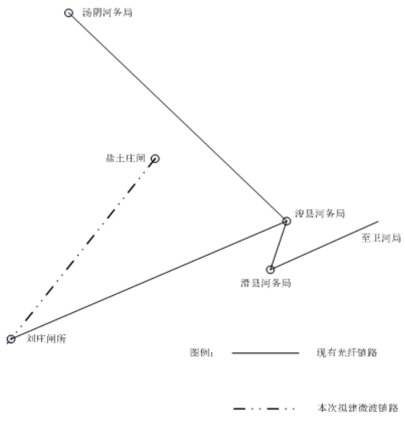  
图 6.2-1 盐土庄闸相对位置及通信链路示意图  

(2)综合通信网络  

为满足盐土庄闸与闸管所间通信通道需求,从盐土庄控制室至闸管所间敷设 1 根 24 芯单模光缆,两端分别连接各自网络交换机,节制闸侧由视频监控系统内网络交换机完成相应的传输功能。盐土庄配置交换机 1 台,布置在管理房,用于与盐土庄闸室间的通信。盐土庄闸管所对上级单位接口处配置 1 台防火墙。  

在节制闸集中控制室设两部 SIP 电话接入盐土庄闸管所新建语音交换系统内,注册到卫河局华为统一网关用于闸门的对外联络。在盐土庄闸管所安装与卫河局机关匹配的网络交换机及防火墙设备各1 套。  

为保证盐土庄闸管所内通信设备的可靠工作电源,在闸管所机房内配置直流供电系统1 套、UPS 电源系统1 套等,供电须从闸管所总配电敷设机房专线。  

表 6.2-2  盐土庄节制闸工程量表  

<html><body><table><tr><td>序号</td><td>名称</td><td>型号规格</td><td>单位</td><td>数量</td><td>备注</td></tr><tr><td>1</td><td>集中控制台</td><td></td><td>套</td><td>1</td><td></td></tr><tr><td>2</td><td>操作员工作站</td><td></td><td>台</td><td>1</td><td></td></tr><tr><td>3</td><td>网络设备</td><td></td><td>套</td><td>1</td><td></td></tr><tr><td>4</td><td>现地 PLC 控制柜</td><td></td><td>面</td><td>7</td><td>落地式</td></tr><tr><td>5</td><td>闸门开度显示仪表</td><td>码盘式</td><td>个</td><td>7</td><td>双输出</td></tr><tr><td>6</td><td>闸门荷重显示仪表</td><td></td><td>个</td><td>7</td><td>双输出</td></tr><tr><td>7</td><td>水位测量装置</td><td>超声波式</td><td>套</td><td>2</td><td>测量上下游水位</td></tr><tr><td>8</td><td>视频监控系统</td><td>含1套视频工作站、 网络交换机、视频存 储设备、14个摄像头 等</td><td>套</td><td>1</td><td>包括电缆、网线、摄 像头支架等</td></tr><tr><td>６</td><td>UPS 电源</td><td>5KVA</td><td>套</td><td>1</td><td></td></tr><tr><td>10</td><td>微波通信传输</td><td></td><td></td><td></td><td></td></tr><tr><td>10.1</td><td>微波铁塔 70 米</td><td></td><td>座</td><td>1</td><td></td></tr><tr><td>10.2</td><td>微波铁塔57米</td><td></td><td>座</td><td>1</td><td></td></tr><tr><td>10.3</td><td>微波设备1+0, 200M</td><td></td><td>跳</td><td>1</td><td></td></tr><tr><td>10.4</td><td>天馈线（2.4米)</td><td></td><td>套</td><td></td><td></td></tr><tr><td>10.5</td><td>光复接器</td><td></td><td>套</td><td>2</td><td></td></tr><tr><td>10.6</td><td>技术服务及安装调试 费</td><td></td><td>项</td><td>1</td><td></td></tr><tr><td>11</td><td>24 口接入交换机 (闸管所)</td><td></td><td>台</td><td>1</td><td></td></tr><tr><td>12</td><td>防火墙 (闸管所)</td><td></td><td>台</td><td>2</td><td></td></tr><tr><td>13</td><td>网络交换机（闸管 所)</td><td></td><td>台</td><td>1</td><td></td></tr><tr><td>14</td><td>UPS供电系统（闸管 所)</td><td></td><td>套</td><td>1</td><td></td></tr><tr><td>15</td><td>设备机柜 (闸管所)</td><td></td><td>套</td><td>1</td><td></td></tr><tr><td>16</td><td>直流系统 (闸管所)</td><td></td><td>套</td><td>1</td><td></td></tr><tr><td>17</td><td>SIP 电话</td><td></td><td>部</td><td>2</td><td></td></tr></table></body></html>  

<html><body><table><tr><td>18</td><td>控制电缆</td><td></td><td>m</td><td>1800</td><td></td></tr><tr><td>19</td><td>信号电缆</td><td></td><td>m</td><td>1600</td><td></td></tr><tr><td>20</td><td>单模光缆</td><td></td><td>m</td><td>500</td><td>含光缆敷设</td></tr><tr><td>21</td><td>型钢</td><td></td><td>t</td><td>1</td><td></td></tr></table></body></html>  

# 6.2.3 小河口节制闸  

# 6.2.3.1 工程概述  

为使共产主义渠洪水主要经共产主义渠下泄,有效控制卫河行洪流量及合理安排长虹渠滞洪,在小河口村淇河上新建节制闸一座。小河口节制闸设有 5 孔工作闸门,工作闸门平时处于关闭状态。闸门设固定卷扬启闭机。每台工作闸门启闭机电动机容量 $2{\times}15\mathrm{kW}$ 。  

# 6.2.3.2 计算机监控系统  

根据闸门的调控要求和工程实际需要,确定本闸站闸门计算机监控系统为全分布、全开放系统,系统硬件和软件设计模块化、结构化,以适应不同运行期间功能调整和扩充的需要。闸站计算机监控系统分两级控制:集中控制级及现地控制级。计算机监控系统网络采用工业以太网连接,具体配置见附图。  

集中控制级设一套闸门监控操作员站,配置 27 吋彩色液晶显示器,安装在集中控制室控制台上。现地控制层级设 5 个闸门现地 PLC 控制柜,柜内内设置有 PLC、网络交换机、触摸屏、接触器、闸门开度仪、荷重指示仪等设备,每个现地控制柜监控 1 孔闸门,闸门现地控制设备安装于启闭机房内。  

为满足运行人员监视闸门开度的要求,设置有数字式闸门开度、负荷限制测量装置及水位测量装置。闸门安装有开度传感器,机械上、下限位闭锁,电气上、下限位和开度预置;在每个启闭机上均装有过负荷限制器,当发生过负荷时自动切断启闭机的操作电源,使启闭机停止运行,实现过负荷保护。  

在上、下游侧各设一套水位计,用于测量闸前闸后水位及水位差,可根据闸门运行要求设定上下限报警水位,当水位越限时水位测量控制器自动启动越限报警打印,提示值班人员进行闸门操作。超声波综合测量装置,布置于闸门集中控制室。  

集中控制室设置 1 套 UPS 电源系统,UPS 容量为 5kVA,自带蓄电池。UPS电源为监控系统上位机及视频监控系统工作站提供可靠稳定的工作电源。  

小河口节制闸计量点设置在箱式变电站内用于闸站电能计量。  

# 6.2.3.3 视频监视系统  

为保障闸门运行安全,并改善值班运行条件,小河口节制闸设置一套视频监控系统进行图象监控,运行人员可以及时了解节制闸运行状态、启闭机房设备及控制室设备情况,配合闸门监控系统进行现场作业的指挥,可对重要操作录象,并兼有安全保卫功能。视频监控工作站布置在启闭机房集中控制室内,视频信息可通过光缆传输至小河口闸管所(原刘庄闸管所)内。  

根据闸门运行要求,考虑经济实用的原则,暂定 12 个视频监控点,视频监控中心布置在集中控制室内,视频采集站点的布置情况如下:  

表 6.2-3 视频采集点布置  

<html><body><table><tr><td>序号</td><td>安装地点</td><td>摄像机型式</td><td>观察范围</td><td>点数</td><td>备注</td></tr><tr><td>1</td><td>第一孔闸下</td><td>室外球机</td><td>第一孔闸门情况</td><td>1</td><td></td></tr><tr><td>2</td><td>第二孔闸下</td><td>室外球机</td><td>第二孔闸门情况</td><td>1</td><td></td></tr><tr><td>3</td><td>第三孔闸下</td><td>室外球机</td><td>第三孔闸门情况</td><td>1</td><td></td></tr><tr><td>4</td><td>第四孔闸下</td><td>室外球机</td><td>第四孔闸门情况</td><td>1</td><td></td></tr><tr><td>5</td><td>第五孔闸下</td><td>室外球机</td><td>第五孔闸门情况</td><td>1</td><td></td></tr><tr><td>6</td><td>启闭机房</td><td>室内球机</td><td>启闭机及控制柜运行 状态监视</td><td>2</td><td></td></tr><tr><td>7</td><td>上游</td><td>室外球机</td><td>上游情况</td><td>2</td><td></td></tr><tr><td>8</td><td>下游</td><td>室外球机</td><td>下游情况</td><td>2</td><td></td></tr><tr><td>６</td><td>集中控制室</td><td>室内球机</td><td>节制闸整体情况</td><td>1</td><td></td></tr></table></body></html>  

# 6.2.3.4 通信系统  

# (1)通信传输系统  

在卫河管理单位中,已经形成了以漳卫南局为中心的树形专网,保证各级管理单位之间的信息共享和数据传输,但是本治理工程中新建小河口闸办公地点并没有接入专网当中,需建设小河口闸与已有系统间通信传输系统。小河口闸管理所在刘庄闸原址重建,原址已有接入卫河管理单位的通信系统,新建小河口闸距刘庄闸所原址不足 1 公里,选定由刘庄闸所原址至小河口闸管理房(闸室)敷设光缆,并配置光复接设备,解决小河口闸信息传输问题。  

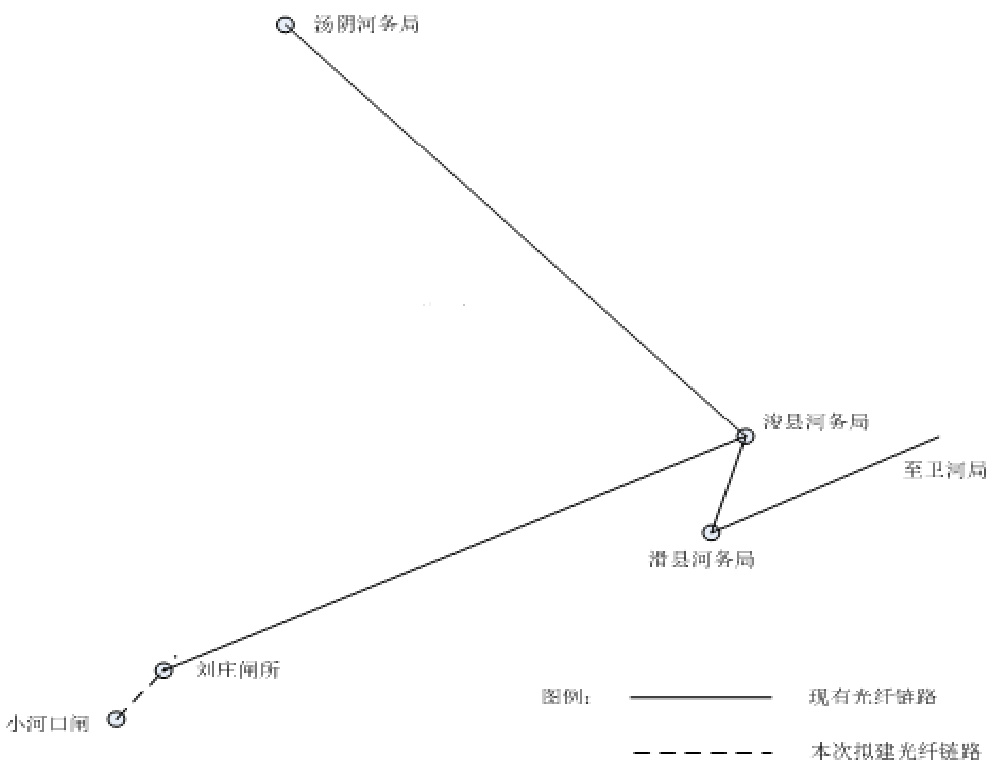  
图 6.2-2  小河口闸相对位置及通信链路示意图  

(2)综合通信网络  

为满足小河口闸与闸管所间网络通道需求,两端分别连接各自网络交换机,节制闸侧由视频监控系统内网络交换机完成相应的传输功能。闸管所侧配置交换机 1 台,布置在管理房,用于与小河口闸室间的通信。闸管所对上级单位接口处配置 1 台防火墙。  

在节制闸集中控制室设两部 SIP 电话接入闸管所已有语音交换系统内,注册到卫河局华为统一网关用于闸门的对外联络。在闸管所安装与卫河局机关匹配的网络交换机及防火墙设备各1 套。  

为保证闸管所内通信设备的可靠工作电源,在闸管所机房内配置UPS 电源系统 1 套。  

表 6.2-4  小河口节制闸工程量表  

<html><body><table><tr><td>序号</td><td>名称</td><td>型号规格</td><td>单位</td><td>数量</td><td>备注</td></tr><tr><td>1</td><td>集中控制台</td><td>3 座席</td><td>套</td><td>1</td><td>含椅子</td></tr><tr><td>2</td><td>操作员工作站</td><td></td><td>台</td><td>1</td><td></td></tr><tr><td>3</td><td>网络设备</td><td></td><td>套</td><td>1</td><td></td></tr><tr><td>4</td><td>现地 PLC 控制柜</td><td></td><td>面</td><td>5</td><td>落地式</td></tr><tr><td>5</td><td>闸门开度显示仪表</td><td>码盘式</td><td>个</td><td>5</td><td>双输出</td></tr></table></body></html>  

<html><body><table><tr><td>序号</td><td>名称</td><td>型号规格</td><td>单位</td><td>数量</td><td>备注</td></tr><tr><td>6</td><td>闸门荷重显示仪表</td><td></td><td>个</td><td>5</td><td>双输出</td></tr><tr><td>7</td><td>水位测量装置</td><td>超声波式</td><td>套</td><td>2</td><td>测量上下游水位</td></tr><tr><td>8</td><td>视频系统</td><td>含1套视频工作站、网络 交换机、视频存储设备、 13个摄像头等</td><td>套</td><td>1</td><td>包括电缆、网线、摄 像头支架等</td></tr><tr><td>６</td><td>通信传输</td><td></td><td></td><td></td><td></td></tr><tr><td>9.1</td><td>光缆敷设（1.5公里)</td><td></td><td>套</td><td>1</td><td></td></tr><tr><td>10</td><td>UPS 电源</td><td>5KVA</td><td>套</td><td>1</td><td></td></tr><tr><td>11</td><td>SIP 电话</td><td></td><td>部</td><td>2</td><td></td></tr><tr><td>12</td><td>24口接入交换机（闸 管所)</td><td></td><td>台</td><td>1</td><td></td></tr><tr><td>13</td><td>防火墙 (闸管所)</td><td></td><td>台</td><td>2</td><td></td></tr><tr><td>14</td><td>网络交换机（闸管 所)</td><td></td><td>台</td><td>1</td><td></td></tr><tr><td>15</td><td>UPS供电系统（闸管 所)</td><td></td><td>套</td><td>1</td><td></td></tr><tr><td>16</td><td>设备机柜 (闸管所)</td><td></td><td>套</td><td>1</td><td></td></tr><tr><td>17</td><td>控制电缆</td><td></td><td>m</td><td>1000</td><td></td></tr><tr><td>18</td><td>信号电缆</td><td></td><td>m</td><td>1500</td><td></td></tr><tr><td>19</td><td>型钢</td><td></td><td>t</td><td>0.8</td><td></td></tr></table></body></html>  

# 6.2.4 长虹渠退水闸  

# 6.2.4.1 工程概述  

为了保证长虹渠滞蓄水位不超过设计滞洪水位,由长虹渠退水闸向卫河退水,长虹渠退水闸共设 5 孔,闸门平时处于关闭状态。闸门设固定卷扬启闭机。每台工作闸门启闭机电动机容量 $2{\times}13\mathrm{kW}$ 。  

# 6.2.4.2 计算机监控系统  

根据闸门的调控要求和工程实际需要,确定本闸站闸门计算机监控系统为全分布、全开放系统,系统硬件和软件设计模块化、结构化,以适应不同运行期间功能调整和扩充的需要。闸站计算机监控系统分两级控制:集中控制级及现地控制级。计算机监控系统网络采用工业以太网连接,具体配置见附图。  

集中控制级设一套闸门监控操作员站,配置 27 吋彩色液晶显示器,安装在集中控制室控制台上。现地控制层级设 5 个闸门现地 PLC 控制柜,柜内内设置有 PLC、网络交换机、触摸屏、接触器、闸门开度仪、荷重指示仪等设备,每个现地控制柜监控 1 孔闸门,闸门现地控制设备安装于启闭机房内。  

为满足运行人员监视闸门开度的要求,设置有数字式闸门开度、负荷限制测量装置及水位测量装置。闸门安装有开度传感器,机械上、下限位闭锁,电气上、下限位和开度预置;在每个启闭机上均装有过负荷限制器,当发生过负荷时自动切断启闭机的操作电源,使启闭机停止运行,实现过负荷保护。  

在上、下游侧各设一套水位计,用于测量闸前闸后水位及水位差,运行人员可根据闸门运行方式设定上下限报警水位,当水位越限时水位测量控制器自动启动越限报警打印,提示值班人员进行闸门操作。超声波综合测量装置,布置于闸门集中控制室。  

集中控制室设置 1 套 UPS 电源系统,UPS 容量为 5kVA,自带蓄电池。UPS电源为监控系统上位机及视频监控系统工作站提供可靠稳定的工作电源。  

退水闸计量点设置在箱式变电站内用于闸站电能计量。  

# 6.2.4.3 视频监视系统  

为保障闸门运行安全,并改善值班运行条件,长虹渠退水闸设置一套视频监控系统进行图象监控,运行人员可以及时了解闸门运行状态、启闭机房设备及控制室设备情况,配合闸门监控系统进行现场作业的指挥,可对重要操作录象,并兼有安全保卫功能。  

根据闸门运行要求,考虑经济实用的原则,暂定 10 个视频监控点,视频监控中心布置在集中控制室内,视频采集站点的布置情况如下:  

表 6.2-5 视频采集点布置  

<html><body><table><tr><td>序号</td><td>安装地点</td><td>摄像机型式</td><td>观察范围</td><td>点数</td><td>备注</td></tr><tr><td>1</td><td>第一孔闸下</td><td>室外球机</td><td>第一孔闸门情况</td><td>1</td><td></td></tr><tr><td>2</td><td>第二孔闸下</td><td>室外球机</td><td>第二孔闸门情况</td><td>1</td><td></td></tr><tr><td>3</td><td>第三孔闸下</td><td>室外球机</td><td>第三孔闸门情况</td><td>1</td><td></td></tr><tr><td>4</td><td>第四孔闸下</td><td>室外球机</td><td>第四孔闸门情况</td><td>1</td><td></td></tr><tr><td>5</td><td>第五孔闸下</td><td>室外球机</td><td>第五孔闸门情况</td><td>1</td><td></td></tr><tr><td>6</td><td>启闭机房</td><td>室内球机</td><td>启闭机及控制柜运行 状态监视</td><td>2</td><td></td></tr></table></body></html>  

<html><body><table><tr><td>序号</td><td>安装地点</td><td>摄像机型式</td><td>观察范围</td><td>点数</td><td>备注</td></tr><tr><td>7</td><td>上游</td><td>室外球机</td><td>上游情况</td><td>2</td><td></td></tr><tr><td>8</td><td>下游</td><td>室外球机</td><td>下游情况</td><td>2</td><td></td></tr><tr><td>9</td><td>集中控制室</td><td>室内球机</td><td>节制闸整体情况</td><td>1</td><td></td></tr></table></body></html>  

# 6.2.4.4 通信系统  

根据长虹退水闸管理划分,长虹渠退水闸为坡洼的进退洪工程,其运行管理由河南省有关部门负责,归属地管理,闸门控制以现地集中控制为主,不再考虑接入已有工程通信网。为满足退水闸通信传输要求,在闸门集中控制室设两部对外电话接入公网,用于闸门的对外联络。  

表 6.2-6  长虹渠退水闸工程量表  

<html><body><table><tr><td>序号</td><td>名称</td><td>型号规格</td><td>单位</td><td>数量</td><td>备注</td></tr><tr><td>1</td><td>集中控制台</td><td></td><td>面</td><td>1</td><td></td></tr><tr><td>2</td><td>操作员工作站</td><td></td><td>台</td><td>1</td><td></td></tr><tr><td>3</td><td>网络设备</td><td></td><td>套</td><td>1</td><td></td></tr><tr><td>4</td><td>现地控制柜</td><td></td><td>面</td><td>5</td><td>落地式</td></tr><tr><td>5</td><td>网络打印机</td><td></td><td>台</td><td>1</td><td></td></tr><tr><td>6</td><td>对时装置</td><td></td><td>套</td><td>1</td><td></td></tr><tr><td>7</td><td>闸门开度显示仪表</td><td>码盘式</td><td>个</td><td>5</td><td>双输出</td></tr><tr><td>8</td><td>闸门荷重显示仪表</td><td></td><td>个</td><td>5</td><td>双输出</td></tr><tr><td>9</td><td>水位测量装置</td><td>超声波式</td><td>套</td><td>2</td><td>测量上下游水位</td></tr><tr><td>10</td><td>视频系统</td><td>含1套视频工作 站、网络交换机、 视频存储设备、10 个摄像头等</td><td>套</td><td>1</td><td>包括电缆、网线、 摄像头支架等</td></tr><tr><td>11</td><td>UPS 电源</td><td>5KVA</td><td>套</td><td>1</td><td></td></tr><tr><td>12</td><td>对外电话</td><td></td><td>部</td><td>2</td><td></td></tr><tr><td>13</td><td>控制电缆</td><td></td><td>m</td><td>900</td><td></td></tr><tr><td>14</td><td>信号电缆</td><td></td><td>m</td><td>1300</td><td></td></tr><tr><td>15</td><td>型钢</td><td></td><td>t</td><td>0.7</td><td></td></tr></table></body></html>  

# 6.2.5 浚内沟排涝涵闸  

# 6.2.5.1 工程概述  

为便于浚内沟排涝退水,新建浚内沟排涝涵闸。浚内沟排涝涵闸设有 2 孔闸门,闸门平时处于开启状态。闸门设固定卷扬启闭机。每台闸门启闭机电动机容  

量为 13kW。  

# 6.2.5.2 闸门控制  

根据闸门的设置原则及工程实际情况,确定本闸站闸门采用现地控制操作,闸门启闭机房内设 2 个闸门现地 PLC 控制柜,柜内设置有 PLC、触摸屏、接触器、闸门开度仪、荷重指示仪等设备,每个现地控制柜监控 1 孔闸门,闸门现地控制设备安装于启闭机房内。  

为满足运行人员监视闸门开度的要求,设置有数字式闸门开度、负荷限制测量装置及水位测量装置。闸门安装有开度传感器,机械上、下限位闭锁,电气上、下限位和开度预置;在每个启闭机上均装有过负荷限制器,当发生过负荷时自动切断启闭机的操作电源,使启闭机停止运行,实现过负荷保护。  

在上、下游侧各设一套水位计,用于测量闸前闸后水位,运行人员可根据水位操作闸门,水位综合测量装置,布置于闸门启闭机房。  

# 6.2.5.3 通信系统  

为满足闸站通信传输要求,在闸门启闭机房设一部对外电话接入公网,用于闸门的对外联络。  

表 6.2-7  浚内沟排涝涵闸工程量表  

<html><body><table><tr><td>序号</td><td>名称</td><td>型号规格</td><td>单位</td><td>数量</td><td>备注</td></tr><tr><td>1</td><td>现地控制柜</td><td></td><td>面</td><td>2</td><td>落地式</td></tr><tr><td>2</td><td>闸门开度显示仪表</td><td></td><td>个</td><td>2</td><td>双输出</td></tr><tr><td>3</td><td>闸门荷重显示仪表</td><td></td><td>个</td><td>2</td><td>双输出</td></tr><tr><td>4</td><td>水位测量装置</td><td>超声波式</td><td>套</td><td>2</td><td>测量上下游水位</td></tr><tr><td>5</td><td>对外电话</td><td></td><td>部</td><td>1</td><td></td></tr><tr><td>6</td><td>控制电缆</td><td></td><td>m</td><td>300</td><td></td></tr><tr><td>7</td><td>信号电缆</td><td></td><td>m</td><td>500</td><td></td></tr><tr><td>8</td><td>型钢</td><td></td><td>t</td><td>0.4</td><td></td></tr></table></body></html>  

# 6.3 信息化建设  

# 6.3.1 概况  

本次卫河治理范围为淇门到徐万仓段,包括卫河干流河道和共产主义渠,主要治理任务为卫河主槽清淤、堤防加高加固、险工险段整治、穿堤建筑物除险加固、河道及坡洼控制工程的建设、堤防防汛道路和管理设施建设等。  

治理河段的管理实行三级管理,漳卫南运河管理局作为河道管理的一级单位  

进行统一管理,二级单位共有 3 个市级河务局,即卫河河务局、邯郸河务局和聊城河务局。三级管理单位共 10 个,本次治理中将刘庄闸改为小河口闸管理所,新建盐土庄闸管理所。  

# 6.3.2 信息化现状  

卫河治理信息化建设早,已建成以局机关为中心的树形传输专网,并依托该传输专网建设了覆盖所有管理单位的语音交换系统和覆盖所有二级单位及部分三级单位的计算机网络系统,共同组成漳卫南局信息专网。计算机网络系统承载漳卫南局的综合办公、视频会商、水文、防汛、工程管理等应用系统的信息传输、交换任务,但是也有如下问题:  

各二级局接入互联网都是通过漳卫南局机关实现的,所以各二级局在网络安全方面是空白的,任何网络安全设备都没有。  

# 6.3.3 建设目标  

卫河信息化建设是一项设计面广的系统工程,以规范工程管理流程、保证安全技术措施为目标,完善工程网络安全体系建设。  

# 6.3.4 建设必要性  

2017 年 6 月,《中华人民共和国网络安全法》正式实施,根据该法 31,33条规定,水利等关键信息基础设施在等级保护基础上实行重点保护,并进一步要求要保证安全技术措施同步规划、同步建设、同步使用。根据以上要求及上级网络部门指导意见,建设网络安全体系。  

# 6.3.5 网络安全体系建设  

本次河道治理中,卫河局作为治理河段的主要管理单位,是卫河计算机网的运行管理中心,但缺少网络安全体系系统,拟购置相关网络安全设备并进行部署,提高网络管理及安全防护能力。  

本项目卫河局网络安全管理的主要内容包括:  

(1)配置抗拒绝服务系统,有效识别并检测出网络中的异常流量,并及时清洗,保障业务可用性和稳定性。  

配置参数:  

源规格:冗余电源;机箱规格:2U;接口配置:6 个千兆电口,4 个千兆光口,含 HA 口、管理口;接口数量:10;扩展槽位:2。  

性能:清洗性能:6Gbps,小包防御能力(64 字节/pps):592 万 pps,最大保护服务器数量:200 台,最大 flow 数据处理能力:300,000Flow/秒。  

(2)配置网络安全审计系统,对网络事件和行为进行综合分析,对网络的入侵行为和异常行为进行监测,及时发现、阻断并告警。  

配置参数:  

源规格:2U 机架式结构,默认包含 2 个可扩展槽位;5 个 10/100/1000BASE-TX 电口,4 个千兆 SFP 插槽;1 个 10/100/1000BASE-TX 管理口,1 个 Console口,自带液晶屏;2T 存储空间;标配冗余电源;默认含 1 年的 URL 库、规则库和应用安全规则库。  

性能:吞吐率:4Gbps。  

(3)配置入侵检测系统,监控异常网络行为访问。  

配置参数:  

源规格:2U 机架式结构, 最大配置为 26 个接口,默认包括 2 个扩展槽位;1 个管理口,5 个 10/100/1000BASE-T 接口(支持 1 组 Bypass),4 个 SFP 插槽;1 个 CONSOLE,2 个 USB,1TB 硬盘;标配冗余电源;默认含:3 年 IDP 攻击规则库升级。  

性能:整机吞吐率:8Gbps 最大并发连接数:130 万 IPS 吞吐率:3Gbps。  

(4)配置漏洞扫描系统,通过扫描等手段对计算机系统的安全脆弱性进行检测,发现可利用漏洞。  

配置参数:  

源规格:2U 机架式结构;6 电 4 光,含 I5-7400CPU, $2^{*}8\mathrm{G}$ 内存,1TB 硬盘,双电源,2 个扩展位,自带液晶屏,双电源,含 3 年系统漏扫规则库升级许可。  

性能:任务不限制 IP 数量;并发扫描 160 个 IP 地址;并发扫描 15 个扫描任务;支持分布式部署;支持 5 个域名扫描;  

(5)配置存储系统和备份系统,存储、备份监测数据,为工程安全分析提供数据支撑。  

存储系统配置参数:  

源规格:标准机架式 2U 服务器,Intel Gold 5117 处理器 $^{*2}$ 颗, 标配 DDR4内存 512GB, 系统盘 256GB 的 SSD,6 个千兆电口, 2 个万兆光口,集成 IPMI管理模块,前置 12 个热插拔盘位,冗余电池 1 块 2048GB 的 SSD 硬盘,10 块3.5 寸 4TB 的 SATA 硬盘。  

备份系统配置参数:  

电源规格:冗余电源;机箱规格:2U;接口配置:2 个千兆电口;接口数量:  

5;扩展槽位:4。  

性能:2U 机架式机箱(含滑轨、电源线、网线等),单路 64 位六核 CPU(Intel Xeon 3204,1.90GHz),内置 2 块 240G 高速 SSD 系统盘,32GB DDR4内存(最高可扩展至 1TB),550W 冗余电源,2 个千兆网口(最多可扩展 4 块PCI-E 板卡),64bit 企业级 Linux 内核,基于 WEB 界面的集中管理备份服务端授权包含 8 块 4T 6Gb/s SAS 硬盘。  

(6)配置日志审计系统,全面收集系统常见安全设备、网络设备、数据库、服务器、应用系统、主机等设备产生的日志并进行存储、监控、设计、分析、报警、相应和报告。  

配置参数:1U 机架式设备,1 个 console 口,6 千兆电口,存储容量 6T,标配 Raid5。最大支持 100 日志源授权。包含日志收集、存储、查询、统计分析等功能。  

(7)配置堡垒机,事先防范、事中控制、事后溯源。  

配置参数:  

源规格:1U 机型,1 个 console 口,2 个 USB 口;6 个千兆电口,2 个 SFP 插槽,2 个可扩展插槽;2T 存储空间,单电源;默认自带 200 个资源授权和一年 软件升级。  

性能:200 资源授权,用户数不限制;授权后续扩展,建议总数 $\leqslant300$ 。  

(8)配置链路负载均衡,解决分布式存储。  

配置参数:  

源规格:2U 机架式架构;标配 6 个千兆电口;2 个千兆接口 SFP 插槽;2 个扩展插槽;双电源。  

性能:四层新建:26;七层新建:28W;整机吞吐量: ${>}10\mathrm{G}$ ;最大并发连接数: ${>}650\mathrm{W}$ 。  

(9)配置用户准入及行为监控系统,提供来访者网络接入管理,通过划分  

不同 VLAN 来管理终端设备。  

配置参数:  

电源规格:冗余电源;机箱规格:2U;接口配置:6 个千兆电口,2 个千兆光口,1 组 BYPASS 接口(2 口和 3 口);最大接口数量:24;扩展槽位:2。  

性能:最大同时在线数 2000。  

(10)WEB 应用安全网关,保护局域网出口安全。  

配置参数:  

源规格:2U 机架式结构;最大配置为 26 个接口;默认包括 2 个可插拨的扩展槽和 4 个 10/100/1000BASE-T 接口(默认支持两组电口 Bypass 功能)和 4 个SFP 插槽,2 个 10/100/1000BASE-T 接口(作为 HA 口和管理口);双电源;含3 年特征库升级服务。内含 SQL 注入、XSS、CSRF 等 WEB 攻击防护功能、URL访问控制功能、防盗链功能、WEB 漏洞扫描功能、DDOS 攻击防护功能、网页防篡改功能、服务器负载均衡功能、报表分析及告警功能。  

性能:并发连接 140 万;网络层吞吐率 6Gbps,应用层吞吐率 2Gbps。  

(11)配置防火墙,保护内部网络安全。  

为了提高漳卫南网络的整体安全性,且聊城局、邯郸局在本次治理工程中涉及的三级局和治理河段较少,因此只配置防火墙,并且在一级管理单位配置高性能防火墙,保证专网内部网络安全性。  

高性能防火墙参数:1U 设备,1 个 console 口,1 个 USB 接口 1 个带外接口、12 个千兆电口、4 个千兆光口、4 个万兆光口、HA 接口 1 个;16G 内存;最大并发 200 万,新建会话 5 万,吞吐量 10Gbps。  

中性能防火墙参数:1U 设备,1 个 console 口,1 个 USB 接口 1 个带外接口、6 个千兆电口、4 个千兆光口、4 个万兆光口、HA 接口 1 个;最大并发 150万,新建会话 4 万,吞吐量 8Gbps。  

# 6.3.6 工程量清单  

表 6.3-1 信息化工程量清单  

<html><body><table><tr><td>序号</td><td>内容</td><td>单位</td><td>数量</td></tr><tr><td>1</td><td>网络安全体系建设</td><td></td><td></td></tr><tr><td>1. 1</td><td>抗拒绝服务</td><td>套</td><td>1</td></tr><tr><td>1. 2</td><td>网络审计系统</td><td>套</td><td>1</td></tr><tr><td>1. 3</td><td>入侵检测系统</td><td>套</td><td>1</td></tr><tr><td>1. 4</td><td>漏洞扫描系统</td><td>套</td><td>1</td></tr><tr><td>1.5</td><td>存储系统</td><td>套</td><td>1</td></tr><tr><td>1.6</td><td>备份系统</td><td>套</td><td>1</td></tr><tr><td>1. 7</td><td>WEB 应用安全网关</td><td>套</td><td>1</td></tr><tr><td>1. 8</td><td>日志审计系统</td><td>套</td><td>1</td></tr><tr><td>1. 9</td><td>堡垒机</td><td>套</td><td>1</td></tr><tr><td>1. 10</td><td>链路负载均衡</td><td>套</td><td>1</td></tr><tr><td>1. 11</td><td>用户准入及行为监控系统</td><td>套</td><td>1</td></tr><tr><td>1. 12</td><td>防火墙A(高性能)</td><td>套</td><td>1</td></tr><tr><td>1. 13</td><td>防火墙B（中低性能)</td><td>套</td><td>3</td></tr></table></body></html>  

# 6.4 金属结构  

6.4.1 可行性研究报告审查意见及评估报告意见可行性研究报告审查意见:  

1 、基本同意小河口节制闸的工作闸门采用平面定轮闸门、启闭机采用固定卷扬式启间机,检修闸门采用叠梁闸门、启闭设备采用移动式电动葫芦,以及闸门和启闭设备主要设计参数、布置方案。  

2 、基本同意盐土庄节制闸、长虹渠退水闸及浚内沟排涝闸的工作闸门采用平面定轮闸门、启闭机采用固定卷扬式启闭机,以及闸门和启闭机主要设计参数、布置方案。  

3 、基本同意浚县套闸的工作闸门采用铸铁闸门、启闭机采用螺杆式启闭机,以及闸门和启闭机主要设计参数、布置型式。鉴于孔口尺寸较大,下阶段应优化工作闸门型式。  

4 、基本同意各拆除重建穿堤涵闸的工作闸门采用铸铁闸门、启闭机采用螺杆式启闭机,各维修加固涵闸的工作闸门更换为铸铁闸门、启闭机更换为螺杆式启闭机。"下阶段应优化孔口较大的涵闸工作闸门型式,采用平面定轮闸门。  

5 、基本同意各穿堤方涵管(洞)的工作闸门采用铸铁闸门、启闭机采用螺杆式启闭机,圆涵管(洞)工作阀门采用拍门。  

6 、基本同意钢闸门防腐蚀采用喷锌加封闭漆的设计方案。  

评估报告意见:  

《可研报告》提出,工程金属结构包括新建水闸、穿堤涵闸及穿堤涵管三部分,金属结构设备工程量约为 1862.53t。其中新建水闸金属结构约为 1140.6t,设有 31 扇闸门,24 台卷扬式启闭机、1 台电动葫芦启闭机和 6 台螺杆启闭机。穿堤涵闸金属结构约为 637.7t,设有 160 扇铸铁闸门和 160 台手电两用螺杆式启闭机。穿堤涵管(洞)工程除险加固 300 座,金属结构约为 84.23t。  

评估期间,设计单位根据专家组建议补充完善了各类闸门金属结构典型设计。  

评估认为,补充完善后的金属结构设计基本合适。建议下阶段根据新建水闸功能要求和运行特点,结合水工结构设计,研究不设永久闸门及启闭设备、分洪时采用叠梁门临时挡水的方案。  

# 6.4.2 概述  

卫河干流淇门至徐万仓段河道地处太行山以东,黄河与徒骇、马颊河以北,流经河南省鹤壁市浚县、安阳市滑县、汤阴和内黄县、濮阳市清丰和南乐县、河北省魏县和大名县、山东省冠县等三省市的 9 个县。卫河两侧有良相坡、柳围坡、长虹渠、共产主义渠以西行洪区、白寺坡、小滩坡、任固坡等行洪、蓄滞洪区。卫河干流全长 $275\mathrm{km}$ ,流域面积 $16578\mathrm{km}2$ ,其中淇门以下卫河干流河道长约$183\mathrm{km}$ 。淇门以上卫河主要用于排涝,淇门以下卫河洪涝合排。  

1958 年为引黄修建的共产主义渠,自合河起傍卫河左岸至老观嘴汇入卫河,1962 年停止引黄后用于行洪,成为行洪与排涝骨干河道。淇门以下共产主义渠长约 $44\mathrm{km}$ 。  

卫河防洪标准 50 年一遇是通过卫河、共产主义渠及上中游坡洼联合运用实现的。本次治理工程的任务主要为确保卫河干流和共产主义渠在防洪中的作用,恢复排涝能力,提高河道安全度汛能力及新建坡洼与河道控制性工程。  

结合本工程任务,金属结构设备主要分布在新建水闸、穿堤涵闸及穿堤涵管(洞)的拆除重建和除险加固处,金属结构工程量为 2148.9t。  

新建水闸包括盐土庄节制闸、小河口节制闸、长虹渠退水闸、浚内沟排涝涵闸及民丰沟排涝闸,共设各类闸门 27 套,埋设件 51 套,启闭设备 27 台,新建水闸金属结构工程量为 1218.2t。新建水闸闸后设计水位较高,布置弧形闸门支铰位置偏高,弧门半径较大,造成土建工程量加大,工程布置不协调,因此,本工程新建水闸除民丰沟排涝闸外,均采用平面钢闸门,启闭设备采用固定卷扬机。民丰沟排涝闸孔口尺寸与水头较小,采用铸铁闸门,启闭设备采用螺杆启闭机。  

穿堤涵闸拆除重建 8 座,共设闸门 16 套,启闭设备 16 套;穿堤涵闸除险加固 74 座,除险加固涵闸仅更换闸门和启闭设备,更换闸门 152 套,启闭设备 152台,穿堤涵闸金属结构工程量为 755.4 t。涵闸工作闸门除大名县的岔河嘴新、旧排水闸采用潜孔式平面定轮钢闸门外,均采用潜孔式平面铸铁闸门,启闭设备采用螺杆启闭机。对于仅在进口设闸门的涵闸,工作闸门采用双向止水,止水选用硬止水。闸门正向设计挡水位为河道行洪水位,反向挡水水位为设计排涝水位(有滞洪工况的涵闸为设计滞洪水位)。启闭水位为设计排涝水位。对于在进出口均设闸门的涵闸,工作闸门采用单向止水,止水选用硬止水。进口处闸门设计挡水水位为河道行洪水位,出口处闸门设计挡水水位为设计排涝水位,启闭水位均为设计排涝水位。涵闸工作闸门为常开闸门,当卫河水位超过排涝水位时关闭。  

穿堤涵管(洞)拆除重建 53 座,共设机闸一体闸门 65 套;除险加固 233 座,其中 228 座全部更换为机闸一体闸门,共 252 套;其余 5 座更换为拍门,共 5 套。新建 2 座,设 2 套拍门。穿堤涵管(洞)金属结构工程量为 175.3 t。机闸一体闸门主要为农田灌溉用,设置在涵管(洞)进口或出口。机闸一体闸门将闸门与启闭机联为一体,安装维护方便,不需要设置启闭机平台,节省土建工程量,适用于渠道安装。对于仅在进口设闸门的涵管(洞),工作闸门设计挡水水位为河道行洪水位,对于在进出口均设闸门的涵管(洞),进口工作闸门设计挡水水位为河道行洪水位,出口工作闸门设计挡水水位为设计滞洪水位。工作闸门平时常闭,灌溉时开启,灌溉结束关闭,闸门操作方式为无水闭门,动水启门,启门考虑集水井最高水位。拍门为城区或村庄排涝用,设置在涵管(洞)出口, 设计挡水水位为河道行洪水位。  

6.4.3 设计依据的主要技术标准  

(1)《水利水电工程钢闸门设计规范》SL74-2019;  
(2)《水利水电工程钢闸门制造安装及验收规范》(GB/T14173-2008);  
(3)《水利水电工程启闭机设计规范》SL41-2011;  

(4)《水利水电工程启闭机制造安装及验收规范》SL381-2007;(5)《铸铁闸门技术条件》SL545-2011(6)《水工金属结构防腐蚀规范》SL105-2007;(7)《水利水电工程初步设计报告编制规程》SL619-2013。  

# 6.4.4 新建水闸  

本工程新建水闸包括盐土庄节制闸、小河口节制闸、长虹渠退水闸、浚内沟排涝涵闸及民丰沟排涝闸。卫河和共产主义渠洪水由盐土庄节制闸、小河口节制闸控制河道下泄流量和坡洼分洪运用进行联合调度。新建水闸闸后设计水位较高,布置弧形闸门支铰位置偏高,弧门半径较大,造成土建工程量加大,工程布置不协调,因此,本工程新建水闸均采用平面闸门,对于需要控泄的水闸,闸门运行时应避开振动区。  

# 6.4.4.1 盐土庄节制闸  

盐土庄节制闸位于盐土庄村西共产主义渠上,运行工况为:a.平时及过中小洪水时,盐土庄节制闸全部开启。b.当老观嘴处卫河流量接近 $2000~\mathrm{m^{3}/s}$ 或楚旺处流量接近 $2500\mathrm{m}^{3}/\mathrm{s}$ ,需启用盐土庄节制闸控制共渠下泄 $1600\mathrm{m}^{3}/\mathrm{s}$ ,保证下游防洪体系的设计行洪规模。  

由于节制闸工作闸门需要控制共渠下泄洪水,比较重要,若采用叠梁闸门,用临时设备起吊,安全可靠性较差,叠梁闸门动水启闭会造成门顶门底同时过流,不满足《水利水电工程钢闸门设计规范》要求。因此,考虑到闸门的重要性,盐土庄节制闸采用一门一机布置。  

节制闸共设 7 孔,每孔设 1 套潜孔式工作闸门用于控制洪水下泄流量。工作闸门操作方式为动水启闭。运行方式为先开启中间一孔,再依次左、右两孔对称开启, 最后开启两侧边孔。闸门底槛高程为 $53.00\mathrm{m}$ ,因共产主义渠枯水期 3 年一遇水位仅为 $53.77\mathrm{m}$ ,在上、下游各设一道混凝土门槽,门槽上下游侧设型钢进行保护,当工作闸门门槽需要检修时,可采用临时措施在上、下游混凝土门槽内封堵即可,节制闸不另设检修闸门。  

# (1)盐土庄节制闸工作闸门主要设计参数及结构设计  

盐土庄节制闸共 7 孔,每孔各设一扇 $11\times5.5–8.40\mathrm{m}$ (孔口宽度 $\times$ 孔口高度-设计水头,单位:m,下同)潜孔式平面定轮钢闸门,闸门上游设计挡水位和启闭水位为共渠 50 年一遇设计洪水位 $61.40\mathrm{~m~}$ ,对应设计闸下水位 $59.94\mathrm{m}$ ,闸门底槛高程为 $53.00\mathrm{m}$ 。闸门门叶主要材料采用 Q235C。闸门采用多主梁结构,主梁采用焊接实腹式变截面工字型梁。面板与止水布置在上游侧,顶、侧止水采用“P”型水封,底止水采用“I”型水封。闸门采用定轮支承,定轮材料选用 ZG310-570,轴承采用自润滑滑动轴承。闸门非汛期锁定在高程为 $62.80\mathrm{m}$ 的闸顶平台上,并在此平台上检修维护。  

工作闸门门槽埋件由主轨、反轨、门楣、底槛组成,埋件均为钢板与型钢组合焊接结构。埋件主要材料采用 Q235B,水封座板采用不锈钢 12Cr18Ni9Si3 材料,与主轮接触部分采用不锈钢 022Cr22Ni5Mo3N 材料。  

工作闸门门叶结构尺寸根据道路运输条件在工厂分节制作,整体预拼装后分节运至现场进行组装焊接,埋件采用分节制作现场拼接。  

(2)盐土庄节制闸工作闸门主要构件应力计算分析  

工作闸门设计计算采用平面体系假定进行分析计算。闸门面板按四边支撑弹性薄板进行计算,并考虑 $2\mathrm{mm}$ 锈蚀厚度。承重构件的验算方法采用许用应力法进行计算,主梁按均布荷载简支梁计算,定轮支承采用线接触进行分析计算。其他零部件均按《水利水电工程钢闸门设计规范》SL74-2019 有关规定验计算其强度、刚度及稳定。  

本阶段盐土庄节制闸工作闸门主要计算成果见下表:  

表 6.4-1 $11\times5.5–8.40\mathrm{m}$ 盐土庄节制闸工作闸门主要构件设计计算成果表  

<html><body><table><tr><td>序号</td><td>项目</td><td>设计值</td><td>许用值</td></tr><tr><td>1</td><td>面板</td><td>面板折算应力ozh=185N/mm²</td><td>1.1α [o］=247.5N/mm²</td></tr><tr><td rowspan="3">2</td><td rowspan="3">主梁</td><td>弯曲应力o=105N/mm²</td><td>0.9 [o] =144 N/mm²</td></tr><tr><td>剪应力=65 N/mm²</td><td>0.9 [t] =85.5N/mm²</td></tr><tr><td>主梁刚度f=0.4mm</td><td>[f]=1/750=4mm</td></tr><tr><td>3</td><td>主轮</td><td>接触应力o=840N/mm²</td><td>3os =1020N/ mm²</td></tr><tr><td rowspan="4">4</td><td rowspan="4">主轨</td><td>底板混凝土承压应力 oh=5N/mm²</td><td>[oh］=11N/mm²</td></tr><tr><td>轨道底板弯曲应力 o=105N/mm²</td><td>[o］=150N/mm²</td></tr><tr><td>颈部局部承压应力</td><td></td></tr><tr><td>ocd=126N/mm²</td><td>[ocd]=225N/mm²</td></tr></table></body></html>  

(3)盐土庄节制闸工作闸门启闭设备  

工作闸门采用容量为 $2{\times}400\mathrm{kN}$ 固定卷扬式启闭机操作。启闭机采用闭式传动机构(即无开式齿轮)。卷扬式启闭机扬程为 $12\mathrm{m}$ ,安装在高程为 $70.80\mathrm{m}$ 的启闭机房内。启闭机设有高度传感显示器、上、下限位装置及负荷显示及超负荷保护等保护装置。除在现地操作启闭机外,还应实现在集中控制室中操作。  

# 6.4.4.2 小河口节制闸  

小河口节制闸位于淇河与共产主义渠汇合口下游侧,运行工况为:a.平时及一般中小洪水时,小河口闸关闭,洪水主要经共产主义渠下泄或经白寺坡滞蓄后下泄。b.当白寺坡水位超过 $60.5\mathrm{m}$ 时,打开小河口节制闸和长虹渠分洪堰,启用长虹渠滞洪。c.为控制长虹渠的蓄水量,长虹渠水位达 $61.4\mathrm{m}$ 时,关闭小河口闸。小河口闸设计流量 $700\mathrm{m}^{3}/\mathrm{s}$ 。  

节制闸共设 5 孔,底槛高程为 $58.00\mathrm{m}$ ,每孔设 1 套潜孔式工作闸门,采用一门一机布置。工作闸门操作方式为动水启闭。运行方式为先开启中间一孔,再依次左、右两孔对称开启,最后开启两侧边孔。由于节制闸上、下游最低水位为卫河枯水期 3 年一遇水位 $60.86\mathrm{~m~}$ ,为了工作闸门及门槽进行检修和维护,在其上、下游侧均设置检修门槽,并各设 1 套检修闸门。检修闸门的运行方式为静水闭门,小开度提门充水平压启门,现地操作。  

(1)小河口节制闸工作闸门及启闭设备  

1)小河口节制闸工作闸门主要设计参数及结构设计  

节制闸共 5 孔,每孔各设一扇 $10{\times}6.5{-}8.53\mathrm{m}$ 潜孔式平面定轮钢闸门,闸门上游设计挡水位和启闭水位为共渠 50 年一遇设计洪水位 $66.53\mathrm{m}$ ,对应设计闸下水位 $64.92\mathrm{m}$ ,闸门底槛高程为 $58.00\mathrm{m}$ 。闸门门叶主要材料采用 Q235C。闸门采用多主梁结构,主梁采用焊接实腹式变截面工字型梁。面板与止水布置在上游侧,顶、侧止水采用“P”型水封,底止水采用“I”型水封。闸门采用定轮支承,定轮材料选用 ZG310-570,轴承采用自润滑滑动轴承。闸门平时关闭,在高程为 $68.10\mathrm{m}$ 的闸顶平台上检修维护。  

工作闸门门槽埋件由主轨、反轨、门楣、底槛组成,埋件均为钢板与型钢组合焊接结构。埋件主要材料采用 Q235B,水封座板采用不锈钢 12Cr18Ni9Si3 材料,与主轮接触部分采用不锈钢 022Cr22Ni5Mo3N 材料。  

工作闸门门叶结构尺寸根据道路运输条件在工厂分节制作,整体预拼装后分节运至现场进行组装焊接,埋件采用分节制作现场拼接。  

2)小河口节制闸工作闸门主要构件应力计算分析  

工作闸门设计计算采用平面体系假定进行分析计算。闸门面板按四边支撑弹性薄板进行计算,并考虑 2mm 锈蚀厚度。承重构件的验算方法采用许用应力法进行计算,主梁按均布荷载简支梁计算,定轮支承采用点接触进行分析计算。其他零部件均按《水利水电工程钢闸门设计规范》SL74-2019 有关规定验计算其强度、刚度及稳定。  

本阶段小河口节制闸工作闸门主要计算成果见下表:  

表 6.4-2 $10{\times}6.5{-}8.53\mathrm{m}$ 小河口节制闸工作闸门主要构件设计计算成果表  

<html><body><table><tr><td>序号</td><td>项目</td><td>设计值</td><td>许用值</td></tr><tr><td>1</td><td>面板</td><td>面板折算应力ozh=161N/mm²</td><td>1.1α [o] =247.5N/mm²</td></tr><tr><td rowspan="3">2</td><td rowspan="3">主梁</td><td>弯曲应力o=78N/mm²</td><td>0.9 [o］ =144N/mm²</td></tr><tr><td>剪应力=58N/mm²</td><td>0.9 [t] =85.5N/mm²</td></tr><tr><td>主梁刚度f=0.9mm</td><td>[f]=1/750=4mm</td></tr><tr><td>3</td><td>主轮</td><td>接触应力=768N/mm²</td><td>3os =1020N/ mm2</td></tr><tr><td rowspan="4">4</td><td rowspan="4">主轨</td><td>底板混凝土承压应力 oh=6.3N/mm2</td><td>[oh］=11N/mm²</td></tr><tr><td>轨道底板弯曲应力 α=52N/mm²</td><td>[o］=150N/mm²</td></tr><tr><td>颈部局部承压应力</td><td></td></tr><tr><td>ocd=154N/mm²</td><td>[ocd]=225N/mm²</td></tr></table></body></html>  

# 3)小河口节制闸工作闸门启闭设备  

工作闸门采用容量为 $2{\times}400\mathrm{kN}$ 固定卷扬式启闭机操作。启闭机采用闭式传动机构(即无开式齿轮)。卷扬式启闭机扬程为 $12\mathrm{m}$ ,安装在高程为 $77.50\mathrm{m}$ 的启闭机房内。启闭机设有高度传感显示器、上、下限位装置及负荷显示及超负荷保护等保护装置。除在现地操作启闭机外,还应实现在集中控制室中操作。  

(2)小河口节制闸检修闸门及启闭设备  

1)小河口节制闸检修闸门主要设计参数及结构设计  

节制闸 5 孔,上下游各设 1 套 $10{\times}3.3{-}2.86\mathrm{m}$ 露顶式平面滑动叠梁检修闸门,闸门上、下游设计挡水位和启闭水位为卫河枯水期 3 年一遇检修水位 $60.86\mathrm{~m~}$ ,闸门底槛高程为 $58.00\mathrm{m}$ 。闸门门叶主要材料采用 Q235B。闸门采用双主梁结构,主梁采用焊接实腹式变截面工字型梁。次梁为型钢。面板与止水布置在上游侧,侧止水采用“P”型水封,底止水采用“I”型水封。闸门采用自润滑复合材料滑块支  

承。闸门平时分节锁定在闸墩顶部。  

# 2)小河口节制闸检修闸门主要构件应力计算分析  

检修闸门设计计算采用平面体系假定进行分析计算。闸门面板按四边支撑弹性薄板进行计算,并考虑 $2\mathrm{mm}$ 锈蚀厚度。承重构件的验算方法采用许用应力法进行计算,主梁按均布荷载简支梁计算,滑块支承采用线荷载进行分析计算。其他零部件均按《水利水电工程钢闸门设计规范》SL74-2019 有关规定验计算其强度、刚度及稳定。  

本阶段检修闸门主要计算成果见下表:  

表 6.4-3 $10{\times}3.3{-}2.86\mathrm{m}$ 小河口检修闸门主要构件设计计算成果表  

<html><body><table><tr><td>序号</td><td>项目</td><td>设计值</td><td>许用值</td></tr><tr><td>1</td><td>面板</td><td>面板折算应力ozh=159N/mm²</td><td>1.1α [o] =264N/mm²</td></tr><tr><td rowspan="3">2</td><td rowspan="3">主梁</td><td>弯曲应力o=109N/mm²</td><td>[o］=160 N/mm²</td></tr><tr><td>剪应力t=42N/mm²</td><td>[t］=95N/mm²</td></tr><tr><td>主梁刚度 f=9.6mm</td><td>[f]=1/500=19mm</td></tr><tr><td>3</td><td>主滑块</td><td>线荷载10.5kN/cm</td><td>许用线荷载=40kN/cm</td></tr><tr><td rowspan="3">4</td><td rowspan="3">主轨</td><td>底板混凝土承压应力 oh=3.9 N/mm2</td><td>[oh]=11N/mm²</td></tr><tr><td>轨道底板弯曲应力 o=114N/mm2</td><td>[o］=160N/mm²</td></tr><tr><td>轨道颈部局部承压应力 ocd=56 N/mm²</td><td>[cd]=225 N/mm²</td></tr></table></body></html>  

# 3) 小河口节制闸检修闸门启闭设备  

检修闸门采用容量为 $2{\times}100\mathrm{kN}$ 移动式电动葫芦通过自动抓梁操作,电动葫芦扬程 $15\mathrm{m}$ ,采用单电机同轴驱动,具备起升和行走同步装置,起升速度为双速,启闭过程中吊点距不变,吊钩不偏移。电动葫芦的供电采用户外安全滑触线,停放处设遮光防雨罩。  

# 6.4.4.3 长虹渠退水闸  

长虹渠退水闸位于滑县西侧卫河右堤附近,运行工况为:a.滞洪区启用时,长虹渠滞蓄的洪水经长虹渠退水闸根据卫河流量相机退入卫河,卫河淇门至老观嘴流量限制在 $400\mathrm{m}^{3}/\mathrm{s}$ ,因此,当卫河流量小于 $400~\mathrm{m}^{3}/\mathrm{s}$ 时,闸门开启向卫河退水,退水闸最大限泄 $400\mathrm{m}^{3}/\mathrm{s}$ 。b.当滞洪区未启用时,需关闭挡卫河侧水不能进入  

滞洪区。  

退水闸共设 5 孔,每孔设 1 套潜孔式工作闸门用于控制洪水下泄流量,采用一门一机布置。工作闸门为双向挡水、双向支承。工作闸门操作方式为动水启闭。运行方式为先开启中间一孔,再依次左、右两孔对称开启。  

因长虹渠退水闸有枯水检修期,能够满足闸门及门槽的检修,故不设检修闸门及门槽。  

(1)长虹渠退水闸工作闸门主要设计参数及结构设计  

长虹渠退水闸共 5 孔,每孔各设一扇 $7{\times}4.3{-}5.29\mathrm{m}$ 潜孔式平面定轮钢闸门,闸门上游设计挡水位和启闭水位为滞洪区设计滞洪水位 $62.49\mathrm{~m~}$ ,闸门下游设计挡水位和启闭水位为卫河50年一遇设计洪水位 $61.53\mathrm{m}$ ,闸门底槛高程为 $57.20\mathrm{m}$ 。闸门门叶主要材料采用 Q235B。闸门采用多主梁结构,主梁采用焊接实腹式变截面工字型梁。闸门为双向挡水,双向支承。面板与止水布置在上游侧,顶、侧止水采用双“P”型水封,底止水采用“I”型水封。闸门采用定轮支承,定轮材料选用ZG310-570,轴承采用自润滑滑动轴承。闸门平时关闭,在高程为 $64.20\mathrm{m}$ 的闸顶平台上检修维护。  

工作闸门门槽埋件由主轨、反轨、门楣、底槛组成,埋件均为钢板与型钢组合焊接结构。埋件主要材料采用 Q235B,水封座板采用不锈钢 12Cr18Ni9Si3 材料,与主轮接触部分采用不锈钢 022Cr22Ni5Mo3N 材料。  

工作闸门门叶结构尺寸根据道路运输条件在工厂分节制作,整体预拼装后分节运至现场进行组装焊接,埋件采用分节制作现场拼接。  

(2)长虹渠退水闸工作闸门主要构件应力计算分析  

工作闸门设计计算采用平面体系假定进行分析计算。闸门面板按四边支撑弹性薄板进行计算,并考虑 $2\mathrm{mm}$ 锈蚀厚度。承重构件的验算方法采用许用应力法进行计算,主梁按均布荷载简支梁计算,定轮支承采用点接触进行分析计算。其他零部件均按《水利水电工程钢闸门设计规范》SL74-2019 有关规定验计算其强度、刚度及稳定。  

本阶段长虹渠退水闸工作闸门主要计算成果见下表:  

表 6.4-4 $7{\times}4.3{-}5.29\mathrm{m}$ 长虹渠退水闸工作闸门主要构件设计计算成果表  

<html><body><table><tr><td>序号</td><td>项目</td><td>设计值</td><td>许用值</td></tr><tr><td>1</td><td>面板</td><td>面板折算应力ozh=149N/mm²</td><td>1.1α [o］ =247.5N/mm²</td></tr><tr><td rowspan="3">2</td><td rowspan="3">主梁</td><td>弯曲应力o=40N/mm²</td><td>0.9 [o］ =144 N/mm²</td></tr><tr><td>剪应力=47N/mm²</td><td>0.9 [t] =85.5N/mm²</td></tr><tr><td>主梁刚度f=0.4mm</td><td>[f]=1/750=4mm</td></tr><tr><td>3</td><td>主轮</td><td>接触应力o=812N/mm²</td><td>3os =1020N/ mm²</td></tr><tr><td rowspan="3">4</td><td rowspan="3">主轨</td><td>底板混凝土承压应力 oh=3.9N/mm²</td><td>[oh］=11N/mm²</td></tr><tr><td>轨道底板弯曲应力 α=41N/mm2</td><td>[o]=150N/mm²</td></tr><tr><td>颈部局部承压应力 ocd=114N/mm2</td><td>[ocd] =225N/mm²</td></tr></table></body></html>  

# (3)长虹渠退水闸工作闸门启闭设备  

工作闸门采用容量为 $2{\times}320\mathrm{kN}$ 固定卷扬式启闭机操作。启闭机采用闭式传动机构(即无开式齿轮)。卷扬式启闭机扬程为 $10\mathrm{m}$ ,安装在高程为 $71.50\mathrm{m}$ 的启闭机房内。启闭机设有高度传感显示器、上、下限位装置及负荷显示及超负荷保护等保护装置。除在现地操作启闭机外,还应实现在集中控制室中操作。  

# 6.4.4.4 浚内沟排涝涵闸  

浚内沟为超标准洪水运用的小滩坡滞洪区内的一条排涝沟渠,由于卫河右堤在浚内沟口处有 $780\mathrm{m}$ 无堤段,在卫河河道流量大于 $800\mathrm{m}^{3}/\mathrm{s}$ (河道洪水上滩后)时将会倒灌小滩坡。本次治理设计需将该无堤段新筑堤防。新筑堤防后,为便于小滩坡区域排涝与退水,在新筑堤防与浚内沟口交汇处,新建浚内沟排涝涵闸。当卫河来水大于 $800\mathrm{m}^{3}/\mathrm{s}$ 时关闭涵闸挡水,视卫河洪水情况相机向卫河退水。浚内沟排涝涵闸设计排涝流量 $31.3\mathrm{m}^{3}/\mathrm{s}$ 。  

浚内沟排涝涵闸共设 2 孔,每孔设 1 套潜孔式工作闸门,工作闸门为双向挡水、双向支承。工作闸门操作方式为动水启闭。运行方式为逐孔开启。因浚内沟排涝涵闸上游有枯水检修期,能够满足闸门及门槽的检修,故不设检修闸门及门槽。下游预留一道混凝土门槽,门槽上下游侧设型钢进行保护,需要时采用临时措施封堵。  

(1)浚内沟排涝涵闸工作闸门主要设计参数及结构设计  

浚内沟排涝涵闸共2 孔,每孔各设一扇 $3{\times}4.4{-}7.21\mathrm{m}$ 潜孔式平面定轮钢闸门,闸门上游设计挡水位和启闭水位为滞洪区设计滞洪水位 $57.21\textrm{m}$ ,闸门下游设计挡水位和启闭水位为卫河50年一遇设计洪水位 $56.96\ensuremath{\mathrm{m}}$ ,闸门底槛高程为 $50.00\mathrm{m}$ 。闸门门叶主要材料采用 Q235B。闸门采用多主梁结构,主梁采用焊接实腹式等截面工字型梁。闸门为双向挡水,双向支承。面板与止水布置在上游侧,顶、侧止水采用双“P”型水封,底止水采用“I”型水封。闸门采用定轮支承,定轮材料选用ZG310-570,轴承采用自润滑滑动轴承。闸门平时关闭,在高程为 $56.15\mathrm{m}$ 的闸顶平台上检修维护。  

工作闸门门槽埋件由主轨、反轨、门楣、底槛组成,埋件均为钢板与型钢组合焊接结构。埋件主要材料采用 Q235B,水封座板采用不锈钢 12Cr18Ni9Si3 材料,与主轮接触部分采用不锈钢 022Cr22Ni5Mo3N 材料。  

工作闸门门叶结构尺寸根据道路运输条件在工厂分节制作,整体预拼装后分节运至现场进行组装焊接,埋件采用分节制作现场拼接。  

(2)浚内沟排涝涵闸工作闸门主要构件应力计算分析  

工作闸门设计计算采用平面体系假定进行分析计算。闸门面板按四边支撑弹性薄板进行计算,并考虑 $2\mathrm{mm}$ 锈蚀厚度。承重构件的验算方法采用许用应力法进行计算,主梁按均布荷载简支梁计算,定轮支承采用点接触进行分析计算。其他零部件均按《水利水电工程钢闸门设计规范》SL74-2019 有关规定验计算其强度、刚度及稳定。  

本阶段浚内沟排涝涵闸工作闸门主要计算成果见下表:  

表 6.4-5 $3{\times}4.4{-}7.21\mathrm{m}$ 浚内沟排涝涵闸工作闸门主要构件设计计算成果表  

<html><body><table><tr><td>序号</td><td>项目</td><td>设计值</td><td>许用值</td></tr><tr><td>1</td><td>面板</td><td>面板折算应力ozh=137N/mm²</td><td>1.1α [o] =247.5N/mm²</td></tr><tr><td rowspan="3">2</td><td rowspan="3">主梁</td><td>弯曲应力o=118N/mm²</td><td>0.9 [o] =144N/mm²</td></tr><tr><td>剪应力=56N/mm²</td><td>0.9 [t］=85.5N/mm²</td></tr><tr><td>主梁刚度f=1.2mm</td><td>[f] =1/750=4mm</td></tr><tr><td>3</td><td>主轮</td><td>接触应力o=638N/mm²</td><td>3os=1020N/mm²</td></tr><tr><td rowspan="4">4</td><td rowspan="4">主轨</td><td>底板混凝土承压应力 oh=4.5N/mm2</td><td>[oh]=11N/mm²</td></tr><tr><td>轨道底板弯曲应力 0=63N/mm²</td><td>[o]=150N/mm²</td></tr><tr><td>颈部局部承压应力</td><td></td></tr><tr><td>ocd=143N/mm2</td><td>[ocd] =225N/mm²</td></tr></table></body></html>  

# (3)浚内沟排涝涵闸工作闸门启闭设备  

工作闸门采用容量为 $320\mathrm{kN}$ 固定卷扬式启闭机操作。启闭机采用闭式传动机构(即无开式齿轮)。卷扬式启闭机扬程为 $8\mathrm{m}$ ,安装在高程为 $63.15\mathrm{m}$ 的启闭机房内。启闭机设有高度传感显示器、上、下限位装置及负荷显示及超负荷保护等保护装置,采用现地控制。  

# 6.4.4.5 民丰沟排涝闸  

民丰沟排涝闸位于民丰沟与马头村围村埝交叉口处,分为上口闸和下口闸。主要功能是当盐土庄节制闸下泄的流量经闸下共渠右堤漫溢时关闭上下口闸挡水,当白寺坡退水闸开始相机退水时,开启民丰沟排涝闸上、下口闸将白寺坡及下游区域涝水排入卫河。民丰沟排涝闸设计流量 $47.7\mathrm{m}^{3}/\mathrm{s}$ 。上、下口闸各设 3 孔,每孔设 1 套潜孔式工作闸门,工作闸门操作方式为动水启闭。运行方式为逐孔开启。因民丰沟排涝涵闸有枯水检修期,能够满足闸门及门槽的检修,故不设检修闸门及门槽。  

(1)民丰沟排涝闸上口闸工作闸门及启闭设备  

# 1)上口闸主要设计参数  

上口闸共设 3 孔,每孔各设一扇 $3{\times}3{-}5.1\mathrm{m}$ 潜孔式平面铸铁闸门,闸门设计挡水位和启闭水位为 $58.50\mathrm{m}$ ,闸门底槛高程为 $53.40\mathrm{m}$ 。闸门单向挡水,止水选用硬止水。闸门平时锁定在孔口上方,并在高程为 59.70 平台上检修维护。  

# 2)上口闸工作闸门启闭设备  

上口闸工作闸门采用容量为 $250\mathrm{kN}/125\mathrm{kN}$ (启门力/闭门力,下同)手电两用直联式螺杆启闭机操作,启闭机安装在高程为 $64.00\mathrm{m}$ 的启闭机房内。螺杆启闭机装设安全把手,并均配荷载限制装置、开度显示装置及上下极限限位装置,采用现地控制。  

(2)民丰沟排涝闸下口闸工作闸门及启闭设备  

# 1)下口闸主要设计参数  

下口闸共设 3 孔,每孔各设一扇 $3{\times}3{-}7.1\mathrm{m}$ 潜孔式平面铸铁闸门,闸门设计挡水位和启闭水位为 $58.50\mathrm{m}$ ,闸门底槛高程为 $51.40\mathrm{m}$ 。闸门单向挡水,止水选用硬止水。闸门平时锁定在孔口上方,并在高程为 59.70 平台上检修维护。  

# 2)下口闸工作闸门启闭设备  

下口闸工作闸门采用容量为 $250\mathrm{kN}/125\mathrm{kN}$ (启门力/闭门力,下同)手电两用直联式螺杆启闭机操作,启闭机安装在高程为 $64.00\mathrm{m}$ 的启闭机房内。螺杆启闭机装设安全把手,并均配荷载限制装置、开度显示装置及上下极限限位装置,采用现地控制。  

# 6.4.5 穿堤涵闸及涵管(洞)  

# 6.4.5.1 穿堤涵闸及涵管(洞)存在的问题  

卫河自淇门至徐万仓河道长 $183\mathrm{km}$ ,共产主义渠自淇门刘庄至老观嘴段河道长 $44\mathrm{km}$ ,河道除宣泄上游洪水外,还承担两岸部分排涝和灌溉的任务。目前,两岸为了排涝和引水灌溉陆续修建了六百多座涵闸、涵管等穿堤建筑物。这些建筑物大多始建于上个世纪六七十年代,建设标准低,施工质量差,缺少必要的维护管理,经历了三、四十年的运用,大部分穿堤涵闸及涵管(洞)有不同程度的损坏,存在安全隐患和不能正常使用等问题,既降低了灌溉和排涝能力,又严重影响着河道行洪和堤防的安全。多数涵闸木闸门腐烂,混凝土闸门剥蚀,钢闸门锈蚀,止水老化;部分启闭机锈蚀无法启闭,有的启闭机甚至已丢失。涵管(洞)基本没有固定闸门启闭设备,大部分闸门采用简易混凝土闸板或木板结合沙袋等防洪方式,存在较大安全隐患。  

为了消除堤防隐患,保障河道的行洪安全,根据各穿堤建筑物存在问题的不同程度,采取了拆除重建、维修加固和拆除封堵等工程措施。  

根据《水利水电工程金属结构报废标准》的基本规定,中小型闸、阀、启闭设备的折旧年限为 20 年,并且根据涵闸涵管(洞)闸门漏水、损坏;启闭机锈蚀、损坏、缺失的实际情况,对拆除重建的穿堤建筑物根据功能要求设置相应的闸门和启闭设备,对维修加固的穿堤建筑物将闸门和启闭设备全部更换。  

# 6.4.5.2 穿堤涵闸  

穿堤涵闸主用功能为防洪和排涝。  

本次治理共拆除重建 8 座涵闸,其中山东 1 座,河北 3 座,河南 4 座。共设闸门 16 扇,启闭设备 16 台。拆除重建涵闸名称、位置、孔数、闸门及启闭设备主要设计参数详见拆除重建涵闸工程量表 6.3-12;  

除险加固 74 座涵闸,其中滑县 1 座,浚县 18 座,内黄县 17 座,清丰县 2座,南乐县 16 座,大名县 6 座,冠县 1 座,汤阴县 11 座,魏县 2 座。共更换闸门 152 扇,启闭设备 152 台。除险加固涵闸名称、位置、孔数、闸门及启闭设备主要设计参数详见除险加固涵闸工程量表 6.3-13;  

涵闸工作闸门除大名县的岔河嘴新、旧排水闸采用潜孔式平面定轮钢闸门外,均采用潜孔式平面铸铁闸门。对于仅在进口设闸门的涵闸,工作闸门采用双向止水,止水选用硬止水。闸门正向设计挡水位为河道行洪水位,反向挡水水位为设计排涝水位(有滞洪工况的涵闸为设计滞洪水位)。启闭水位为设计排涝水位。对于在进出口均设闸门的涵闸,工作闸门采用单向止水,止水选用硬止水。进口处闸门设计挡水水位为河道行洪水位,出口处闸门设计挡水水位为设计排涝水位,启闭水位均为设计排涝水位。涵闸工作闸门为常开闸门,当卫河水位超过排涝水位时关闭。  

位于大名县境内的岔河嘴新排水闸,为除险加固类涵闸,共 2 孔,每孔各设一扇 $2.8{\times}2.7\mathrm{m}$ 潜孔式平面定轮钢闸门,闸门卫河侧设计挡水水头为 $12.66\mathrm{m}$ ,沟涵侧设计挡水水头为 $9.65\mathrm{m}$ 。闸门门叶主要材料及结构布置与浚内沟排涝涵闸工作闸门相同。  

位于大名县境内的岔河嘴旧排水闸,为除险加固类涵闸,共 2 孔,每孔各设一扇 $2.5{\times}4.0\mathrm{m}$ 潜孔式平面定轮钢闸门,闸门卫河侧设计挡水水头为 $9.72\mathrm{m}$ ,沟涵侧设计挡水水头为 $6.71\mathrm{m}$ ,闸门门叶主要材料及结构布置与浚内沟排涝涵闸工作闸门相同。  

涵闸工作闸门均采用手电两用螺杆启闭机操作,螺杆启闭机装设安全把手,并均配荷载限制装置、开度显示装置及上下极限限位装置,采用现地控制。供电电源采用原有电源,若原闸没有电源,则不再引接,采用移动式柴油机供电。工作闸门操作方式为动水启闭。运行方式为逐孔开启。  

# 6.4.5.3 穿堤涵管(洞)  

穿堤涵管(洞)主用功能为防洪和灌溉。  

本次治理共拆除重建涵管(洞)53 座,其中浚县 35 座,滑县 4 座,内黄县14 座。共设机闸一体闸门 65 套,拆除重建涵管(洞)名称、位置、孔数、闸门及启闭设备主要设计参数详见拆除重建涵管(洞)工程量表 6.3-14。  

除险加固涵管(洞)233 座,其中 228 座更换为机闸一体闸门,大名县 55座,冠县 1 座,浚县 95 座,南乐县 13 座,内黄县 55 座,清丰县 5 座,汤阴县3 座,魏县 1 座,共更换闸门 252 扇,启闭设备 252 台。其余 5 座更换为拍门,均在浚县,共更换拍门 5 扇。除险加固涵管(洞)名称、位置、孔数、闸门及启闭设备主要设计参数详见除险加固涵管(洞)工程量表 $6.3\ –15\sim16$ 。  

新建涵管(洞)2 座,位于浚县马头村,每座设一扇拍门,共 2 扇。涵管(洞)  

名称、位置、孔数、闸门及启闭设备主要设计参数详见除险加固涵管(洞)工程量表 6.3-16。  

机闸一体闸门主要为农田灌溉用,设置在涵管(洞)进口或出口。对于仅在进口设闸门的涵管(洞),工作闸门设计挡水水位为河道行洪水位;对于在进出口均设闸门的涵管(洞),进口工作闸门设计挡水水位为河道行洪水位,出口工作闸门设计挡水水位为设计滞洪水位。当工作闸门底槛高程高于河道行洪水位时,闸门设计挡水水位为集水井最高水位。工作闸门平时常闭,灌溉时开启,灌溉结束关闭,闸门操作方式为无水闭门,动水启门,启门考虑集水井最高水位。  

涵管(洞)机闸一体平面铸铁工作闸门均采用 QLC-A 手摇(侧摇)螺杆启闭机操作。  

拍门为城区或村庄排涝用,设置在涵管(洞)出口, 设计挡水水位为河道行洪水位。拍门平时常开排涝,汛期关闭挡洪水。拍门采用重力式,依靠自重可以自动关闭,材质采用球墨铸铁,止水为橡胶水封,止水效果好,并能进一步提高拍门的抗冲击性能。拍门底座通过螺栓与预埋法兰连接或通过地脚螺栓连接。  

# 6.4.6 金属结构防腐蚀  

为使工程建成后增加金属结构设备的使用寿命,减少运行维护工作量,本工程全部金属结构设备(闸门、埋件、及启闭机等)均应进行防腐处理。  

金属结构设备在进行防腐前,先仔细清除金属表面的焊渣、飞溅等附着物,并清洗基体金属表面可见的油脂及其它污物,后再进行金属表面进行喷砂除锈,要求基体金属表面的表面清洁度等级不低于 GB/T 8923.1-2011 《涂覆涂料前钢材表面处理表面清洁度的目视评定第 1 部分:未涂覆过的钢材表面和全面清除原有涂层后的钢材表面的锈蚀等级和处理等级》中规定的 Sa2.5 级,表面粗糙度应在 $\mathtt{R z40-150u m}$ 之间。预埋件与混凝土接触面清洁度等级宜不小于 Sa2 级,然后刷涂水泥胶浆 1 道。  

本工程钢闸门、埋件外露表面及附属设备(不锈钢面除外)防腐蚀均采用喷锌处理,喷锌最小局部厚度为 $160\upmu\mathrm{m}$ ,中间层采用环氧云铁中间漆,漆膜厚度约$80\upmu\mathrm{m}$ ,面层采用环氧面漆,漆膜厚度约 $80\upmu\mathrm{m}$ 。  

埋入混凝土部分涂苛性钠水泥沙浆进行临时防护。  

铸铁闸门采用涂料防腐,底漆 1 道,面漆 1 道,漆膜总厚度大于 $100\upmu\mathrm{m}$ 。  

启闭机采用涂料重防腐,漆膜干膜厚度大于 $200\upmu\mathrm{m}$ 。防腐要求按相关规范执  

行。  

防腐施工过程应满足《水工金属结构防腐蚀规范》(SL105-2007)规范中的各项规定。  

# 6.4.7 金属结构防冰冻  

所有工作闸门均无冬季运行要求,根据规范要求,闸门不得承受冰的静压力,根据内黄县气象站气象要素,最冷月为一月,平均气温- $\cdot1.5^{\circ}$ ,冬季根据冰情采用人工破冰方式防冰压。  

# 6.5 供暖、通风及空调设计  

# 6.5.1 依据及原则  

6.5.1.1 参考资料及设计规范  

(1)《水利水电工程采暖通风与空气调节设计规范》SL490-2010 ;  
(2)业主及其他专业提供的设计资料。  

# 6.5.1.2 室外气象参数  

参考水文专业,在本阶段选取河道治理中游的内黄县气象参数作为工程设计依据,内黄县隶属于河南安阳县,当地室外气象参数如下:  

夏季通风室外计算温度: $31\mathrm{^\circC}$ 夏季通风室外计算相对湿度 $63\%$ 夏季空调室外计算干球温度: $34.7^{\circ}\mathrm{C}$ 冬季供暖室外计算温度: $-4.7^{\circ}\mathrm{C}$  

# 6.5.1.3 室内设计参数  

办公用房间冬季室内设计温度为: $18\mathrm{^\circC}$ ;  
机修间、电器维修间冬季室内设计温度为 $14\mathrm{{}^{\circ}C}$ ;  
配电盘室冬季室内设计温度不低于 $5\mathrm{^\circC}$ ;  
办公用房夏季室内设计温度: $26\mathrm{^\circC}$ ;  
机修间、电器维修间、仓库取设计换气次数为 3 次/h;  

# 6.5.2 系统设计  

(1)供暖系统  

办公用房间、机修间、电器维修间冬季采用可调温型电暖气供暖,当室内有人员工作时,保证室温达到设计要求。  

配电盘室采用密闭式可调温型电暖气,保证设备正常使用及运行。  

# (2)通风系统  

机修间及电器维修间、仓库设置机械排风系统,设计换气次数为 3 次/h。外墙设置轴流风机作为机械排风使用,外窗安装进风百叶做补风使用,从而保证室内空气品质。  

配电盘室设置机械排风系统,机械排风量根据设备发热确定。外墙设置轴流风机作为机械排风使用,外窗安装进风百叶做补风使用,从而保证室内空气品质。储油间外墙设防爆轴流风机负担事故通风兼正常排风,外墙下部设进风口,换气次数取 10 次/h。  

# (3)空调系统  

办公用房间设置分体式空调,保证夏季室内工作温度适宜。  

# 6.5-1 管理区主要设备材料表  

<html><body><table><tr><td>序号</td><td>设备名称</td><td>规格</td><td>单位</td><td>数量</td></tr><tr><td>1</td><td>分体式空调</td><td>制冷量3.5kW，功率1.22kW</td><td>台</td><td>6</td></tr><tr><td>2</td><td>密闭式可调温型 电暖气</td><td>制热量2kW</td><td>台</td><td>12</td></tr><tr><td>3</td><td>轴流风机</td><td>T35-11.No.2.8 型，Q=2778m2/h，P=186Pa，N=0.37kW</td><td>台</td><td>2</td></tr><tr><td>4</td><td>轴流风机</td><td>T35-11.No.2.8型，Q=1224m2/h，P=128Pa，N=0.12kW</td><td>台</td><td>1</td></tr></table></body></html>  

# 6.5-2  启闭机房及控制楼主要设备材料表  

<html><body><table><tr><td>序号</td><td>设备名称</td><td>规格</td><td>单位</td><td>数量</td></tr><tr><td>1</td><td>轴流风机</td><td>T35-11.No.2.8 型，Q=2560m?/h，P=143Pa，N=0.18kW</td><td>台</td><td>5</td></tr><tr><td>2</td><td>轴流风机</td><td>T35-11.No.2.8型，Q=1224m2/h，P=128Pa，N=0.12kW</td><td>台</td><td>5</td></tr><tr><td>3</td><td>防爆轴流风机</td><td>T35-11.No.2.8 型，Q=550m2/h，P=96Pa，N=0.12kW</td><td>台</td><td>5</td></tr><tr><td>4</td><td>密闭式温型电暖 气</td><td>制热量2kW</td><td>台</td><td>10</td></tr></table></body></html>  

# 6.5-3  仓库主要设备材料表  

<html><body><table><tr><td>序号</td><td>设备名称</td><td>规格</td><td>单位</td><td>数量</td></tr><tr><td>一</td><td>轴流风机</td><td>T35-11.No.2.8 型，Q=2560m3/h，P=143Pa，N=0.18kW</td><td>台</td><td>4</td></tr></table></body></html>  