# 河南省卫共流域防洪“四预"能力提升项目  

系统功能介绍  

河南省水利勘测设计研究有限公司与黄河水利委员会黄河水利科学研究院联合体二〇二五年十一月  

# 1系统概况  

根据水利部数字李生及河南省智慧水利总体建设目标,按照“需求牵引、应用至上、数字赋能、提升能力"要求,进行河南省卫共流域防洪“四预"能力提升建设,以卫共流域防洪管理精细化、决策科学化、调度协同化为出发点,在充分整合、挖掘现有流域信息资源的基础上,通过建设卫共流域数字李生平台、信息化基础设施、防洪业务应用和网络安全系统,实现卫共流域范围内的防洪预报、预警、预演和预案“四预"功能,为卫共流域水利高质量发展提供基础支撑。  

通过卫共流域防洪"四预"能力提升建设,覆盖流域“降水-产流-汇流-演进"全过程,提高卫共流域主要干流控制断面、支流交叉断面、大型水库、控制性水闸的防洪调度能力,为流域内蓄滞洪区启用时机提供决策依据,辅助支撑城市防洪预报预警,实现流域内洪水预报覆盖面扩展至 $50\mathrm{km}^{2}$ 以上的河流,主要防洪河道洪水平均预报合格率提升至 $75\%$ ,主要防洪河道有效预警预见期提升至72小时,支撑卫共流域防洪统一管理与调度,提升卫共流域防洪管理现代化水平。  

(1)数据底板  

数据底板服务开发包含数据资源和数据引擎,在共享L1、L2 级流域数据底板的基础上,结合防洪调度模型构建需求,整合包2采集的地理空间数据,与前端监测感知数据、业务管理数据等融合构建卫共流域数据底板。  

# (2)模型库  

在卫共流域数据底板的基础上,基于省级数字孪生平台模型框架体系,构建卫共流域水利专业模型、智能模型和可视化模型,基于模拟仿真引擎搭建流域模型管理平台,实现在数字空间对流域防洪预报调度的智慧化模拟。  

水利专业模型包含洪水预报、水库调度、河道一维水动力模型、蓄滞洪区二维淹没演进模型、南水北调交叉河道洪水二维演进模型、水库河道蓄滞洪区耦合模型、洪水预警模型、水库溃坝洪水风险分析模型、河道漫堤/溃堤洪水风险分析模型、闸门故障风险分析模型、洪灾损失评估模型等;智能模型包含遥感智能分析和视频智能分析模型;可视化模型包含自然背景、流场动态、水利工程、“四预”过程、多要素动态组合、时序驱动仿真等可视化模型。  

# (3)知识库  

知识库主要内容包括预报方案库、调度方案库、预警规则库、调度业务规则库、专家经验库、历史经验库和水利知识引擎等,其中卫共流域水利知识引擎需要复用省级水利数字李生平台水利知识引擎能力,知识库建设完成后汇交至省级数字李生平台,实现资源共享。  

(4)防洪“四预"系统  

基于数字李生平台构建卫共流域防洪业务系统,并考虑未来卫共流域水资源、水生态等调度管理功能的可扩展性进行搭建,系统支持IPV6通信协议访问,实现保障安全度汛的预报、预判、预警、预演和预案功能,提供监测感知-预报预警-调度模拟--决策预案生成一防汛会商--应急调度的全过程服务,提升卫共流域整体水工程联合调度能力。  

系统由流域概况、监测告警、洪水预报、防洪预判、风险预警、情景预演、防洪预案、应急调度、防汛会商、灾情评估、避险转移等功能模块组成。  

# (5)应用支撑服务  

建立统一的卫共流域防洪“四预"能力提升系统应用支撑服务,为防洪调度决策系统提供可靠、稳定的支撑环境,提供基于统一技术架构的业务开发与运行支撑环境,为上层应用建设提供基础框架和底层通用服务,为数据存取和数据集成提供运行平台,实现数据资源共享。  

# (6)系统集成  

系统集成任务主要包括与河南省卫共流域防洪“四预"能力提升项目其他标段的软硬件集成(包2 采集的地理空间数据、包3建设的103个三合一视频站点、无人机管理平台),与既有业务应用系统数据的集成(包含流域内现有水雨情数据等),并考虑为未来新建业务系统预留接口。  

# 2.1系统主要功能  

# 2.1.1 数据底板  

数据底板服务开发包含数据资源、数据引擎,在共享L1、L2级流域数据底板的基础上,结合防洪调度模型构建需求,整合河南省卫共流域防洪“四预"能力提升项目包2采集(包含协调海委于2022年7月\~9月航测完成卫共流域内卫河、安阳河、汤永河等主要河道的DOM、DEM水下地形和断面测量数据,其中DOM分辨率为 $0.2\mathrm{m}$ ,DEM数据分辨率为 $2\mathrm{m}$ )的地理空间数据,与前端监测感知数据、业务管理数据等融合构建卫共流域数据底板。包2采集的地理空间数据主要包含流域内 $1440.00\mathrm{km^{2}D O M}$ 数据, $1440.00\mathrm{km^{2}D E M}$ 数据, $196\mathrm{km}^{2}$ 三维实景数据,28处BIM模型数据和41条河道断面测量数据。采集空间数据坐标系均为CGCS2000国家大地坐标系,高程基准采用1985国家高程基准。  

# 2.1.1.1数据资源  

数据资源主要包含基础数据(公共基础数据、水利工程数据)、监测数据(水文站监测数据、雨量站监测数据、蒸发站监测数据、水位站监测数据、流量站监测数据、谪情站监测数据、视频站监测数据、地下水站监测数据、气象站监测数据、工程安全监测数据)、业务管理数据(洪水业务管理数据、灾情业务管理数据、实时工情业务管理数据、预案管理数据、应急管理业务数据)、地理空间数据(L1 级数据、L2 级数据、L3 级数据)、跨行业共享数据(社会经济类数据、气象数据)等类型数据。  

数据资源建设依托河南省水利“一张图”充分利用各相关厅局部门现有已建的基础信息数据库,通过对现有水库信息、河道信息、水利工程信息、水雨情信息、视频监控信息以及其他信息等进行收集、整合与完善,建设实用、可靠、先进的数据库,满足卫共流域防洪“四预"能力提升系统建设信息数据要求。数据库逻辑上包括基础数据、业务数据、监测数据、地理空间数据以及跨行业共享数据。  

基础数据:包含流域行政区划信息、工程管理机构信息、组织机构信息、河道工程及设施信息等,省级层面数据通过与河南省水利一张图数据交换共享进行相关信息获取,流域级层面数据需要收集、整编获取。  

监测数据:包含雨水情监测数据、安全监测数据,已建监测站点通过河南省水利一张图接口获取相关监测数据信息,对于本次新建103个三合一视频监控站点,每个监测站点监测到的视频、雨量和水位数据,通过 4G/5G 等通信方式传输,经整编入库。  

业务数据:主要为防洪业务系统产生的业务数据,通过已有系统自动生成或人工整编处理入库。  

地理空间数据:包含卫星影像、DEM数据、BIM模型、三维实景数据、专题空间数据等。省级基础底图主要通过共享河南省水利一张图、省级数字孪生平台接入流域L1 级和L2 级地理空间数据,L3 级地理空间数据通过整合河南省卫共流域防洪“四预"能力提升项目包2采集的DOM、DEM、三维实景、BIM模型和河道断面测量数据构建,专题数据主要通过整编处理入库。  

跨行业共享数据:包括气象数据、社会经济数据等数据信息,从水利部、海委、气象等部门共享过来,通过系统或人工导入。  

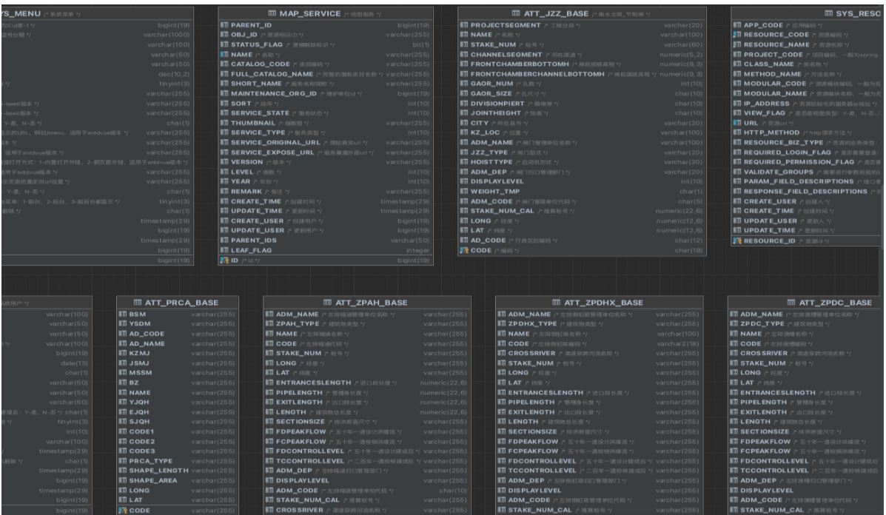  
图 2.1.1.1-1 数据库表  

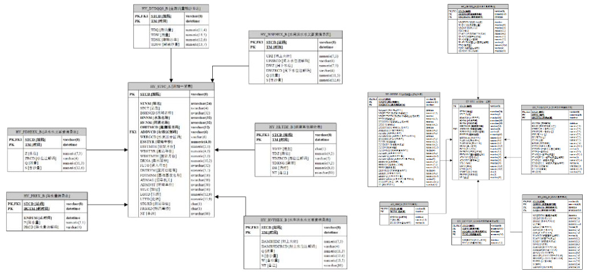  

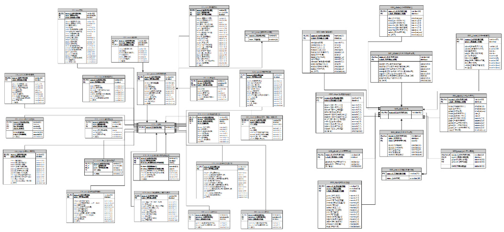  
图 2.1.1.1-2 数据库实体关系图  

# 2.1.1.2 数据汇聚  

(1)监测感知数据汇聚  

前期卫共流域已建设的前端监测感知数据,主要包括雨量站、水文站(水库、河道)、水位站和视频监控点等,通过河南省水利一张图和水利数据治理平台实现已建设的监测感知数据汇聚共享。  

对于本次新建103 个三合一视频监控站点,每个监测站点监测到的视频、雨量和水位数据,通过4G/5G等通信方式传输,经整编入库。  

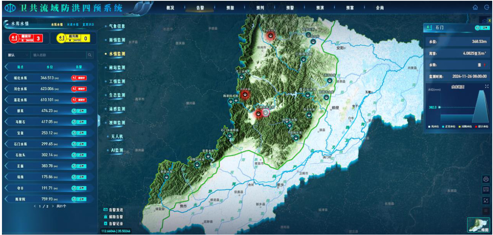  
图 2.1.1.2-1 监测数据接入  

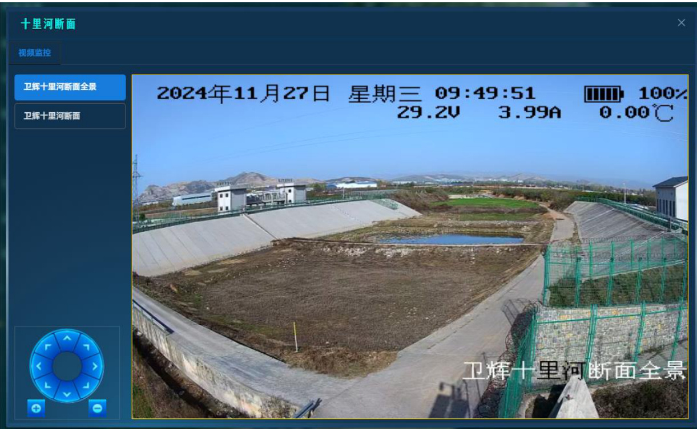  
图2.1.1.2-2新建103三合一站点数据接入  

(2)业务数据汇聚  

卫共流域防洪“四预"能力提升系统建设所需水旱灾害防御等业务数据可通过现有水利数据治理平台获取。  

通过监测感知数据、业务数据、视频数据、遥感数据的汇聚,叠加航测的高清正射影像、高精度DEM、三维实景模型以及工程BIM模型构建起卫共流域多维数字化场景,为河南省卫共流域防洪“四预"能力提升系统建设提供坚实的数据底板。  

对于包2构建的BIM模型,从模型显示和模型文件转换两个方面进行轻量化工作。  

图元合并:对于单体模型结构比较复杂,顶点、面数据比较大,通过算法根据权重剔除相应的顶点、面,从而到达轻量化模型效果。  

几何对象构件对象化:相同形状的几何对象不做多次拷贝,大模型相同几何体只做一个加载,只做相同模型构件移动、旋转、缩放。这样做模型文件和浏览器内存的大小可得到明显减少。  

场景八叉树划分:快速剔除不可见图元,减少进入渲染区域的绘制对象。  

Lod:模型可以设备Lod,根据距离、级别加载不同复杂度结构模型。  

模型文件压缩:对三维模型 stl、obj、3ds、obj、json 等文件格式算法压缩。  

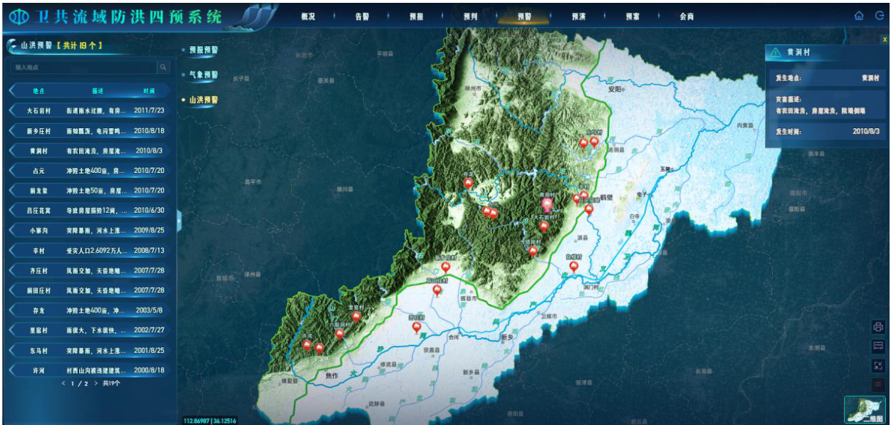  
图2.1.1.2-3山洪预警业务数据接入  

  
图2.1.1.2-4BIM模型数据处理接入  

(3)L1/L2级底板数据接入  

通过服务或拷贝的形式接入L1/L2级底板数据。  
通过服务或拷贝的形式接入L1级底板数据。  

1)L1/L2级矢量数据服务  

L1/L2 级矢量数据主要包含矢量地图服务和要素服务。  

L1/L2 级矢量地图服务:在地图中显示基础底图数据和业务数据,地图服务有静态地图服务和动态地图服务两种形式。  

L1/L2 级要素服务:要素服务通过网络提供要素,并提供显示要素时所使用的符号系统。客户端可执行查询操作以获取要素,并执行相应的编辑操作,要素服务有空间数据要素服务和非空间表数据要素服务两种形式。  

2)L1/L2 级影像数据服务  

L1/L2级影像数据主要提供影像地图服务和影像服务。  

L1/L2 级影像地图服务:在地图中显示影像数据,因影像数据一般较大,影像数据地图服务主要以静态服务形式提供。  

L1/L2级影像服务:影像服务通过网络提供影像和影像处理功能。影像服务提供以WEB方式访问栅格数据的同时还包括查询、动态处理、查看影像轮廓线、预览各栅格、下载和添加等功能服务,提高了影像在WEB的应用功能和价值。  

3)L1/L2级其他类型服务  

其他地图服务包括KML服务、全景数据服务和与平台对接系统的相关专题服务,支持这些服务与常规地图服务的叠加一体化显示。  

4)L1/L2级图层目录服务  

L1/L2 级图层目录与数据管理系统的目录对应,目录按行业、专题、地理空间信息分类,按照编码体系、关键词、用户定义等多种方式展现。通过调用图层目录接口实现,包含定位和展示功能。  

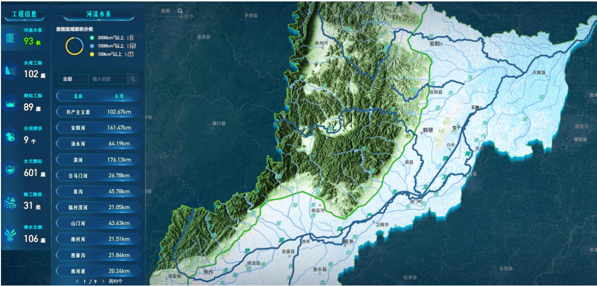  
图 2.1.1.2-5L1/L2 级数据接入  

# 2.1.1.3数据资源目录  

基于现有水利厅数据资源的数据资源目录构建卫共流域防洪“四预"能力提升系统的数据资源目录,将卫共流域防洪“四预"能力提升系统中形形色色不同类型的数据资源有效组织起来,按照统一的标准为不同的用户提供资源检索、资源访问、数据获取服务。  

防汛业务数据资源目录是针对防汛相关信息资源,依据规范的元数据描述和资源目录体系标准,按照一定的分类方法进行排序和编码的一组索引描述信息,用以描述各个信息资源的特征,以便于对信息资源的检索、定位与获取。同时,将基于数据构建的各类数据服务纳入资源目录,通过资源目录进行有效管理和使用,为卫共流域防洪“四预"能力提升系统提供相应的服务,进一步提升数据及服务的共享效果。  

# 2.1.1.4 数据共享  

卫共流域防洪“四预"能力提升系统数据共享服务是在用户具备的数据权限前提下,通过多种手段,精准的满足用户数据需求以及数据获取方法需求的服务。  

数据共享的要通过数据服务找到需要共享的数据范围或数据内容,其次是选择合适的数据共享获取途径,如缺少数据访问权限,还要遵循平台的资源申请流程,最后在系统的共享服务支撑下,实现数据的共享,让用户获取对应的数据,并记录用户共享的日志过程,为监控和统计数据共享业务提供数据支撑,也可以通过对日志的分析,逐步完善数据共享的手段以及性能。  

数据共享服务提供个性化定制数据共享需求的标准服务接口的形式,提供数据共享;提供通过消息订阅机制快速实时获取数据的手段。提供多种格式的文件下载方式的数据共享方式。  

# 2.1.2 模型库  

# 2.1.2.1水利专业模型  

# 2.1.2.1.1洪水预报模型  

洪水预报模型是用于预测和评估洪水发生及其影响的一种工具,其主要目的是通过对降雨量、河道流量、气象条件等因素的综合分析,预测重要节点控制断面的洪峰流量(水位)、峰现时间、洪量(径流量)和洪水过程等洪水要素,从而为防洪应急调度提供科学依据。  

卫共流域的洪水预报模型对流域内的洪水调度决策的准确性和可靠性起到至关重要的作用,根据卫共流域特点及相关水库洪水预报经验,采用新安江、API 等多种水文模型进行产汇流计算,找出最适合卫共流域下垫面特点的产汇流模型,提升重点河道洪水预见期至72小时。  

构建洪水预报模型的基础和前提条件是划分准确的子流域范围,子流域划分越精细,往往洪水预报越准确,划分的各子流域均需构建单独的产汇流模型,所计算的洪水结果通过河道一维水动力学耦合演进或马斯京根法河道演进,可得到卫共流域干流各控制断面的水位流量过程。  

洪水预报模型实现卫共流域内重要节点断面的洪水预报,包含各断面的水位、流量、水量等预报要素,预报节点断面包括合河、刘庄、淇门、修武、黄土岗、五陵、新村、元村集、安阳等水文站,盐土庄闸、合河闸、小河口闸等拦河闸,盘石头水库、小南海水库、彰武水库等大中型水库以及南水北调总干渠河道交叉断面处。  

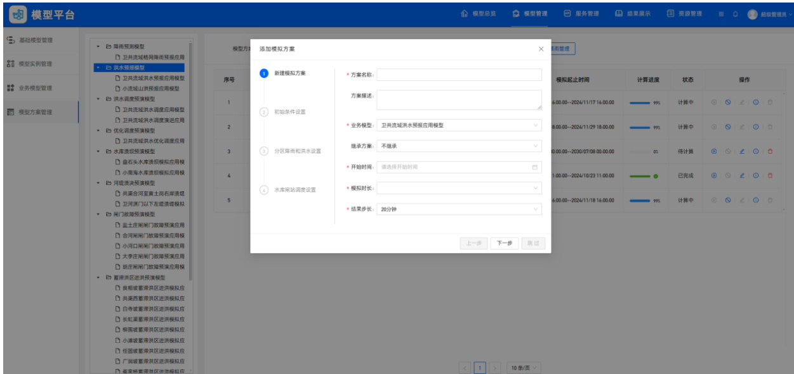  
图2.1.2.1.1-1 洪水预报模型  

# 2.1.2.1.2水库调度模型  

水库调度模型构建总体结构包括调度目标、约束条件、模型调度运用方式和与其他模型的关系。模型以入库来水预测、区间来水预测以及河道控制流量、水位为计算边界条件,通过非工程措施水库调度,为卫共流域防洪减灾,防洪调度决策提供决策支撑。  

卫共流域内有2 座大型水库,16 座中型水库,共计18 座。大中型水库在削峰拦蓄洪水以及防汛调度中起到重要作用,因此需要构建卫共流域盘石头水库、小南海水库、彰武水库、汤河水库、琵琶寺水库、宝泉水库等18座大中型水库的防洪调度模型。  

模型以入库来水预测、区间来水预测以及河道控制流量、水位为计算边界条件,通过非工程措施水库调度,为卫共流域防洪减灾,防洪调度决策提供决策支撑。  

综合考虑各水库在防洪调蓄中的重要性、库容、建模工作量、必要性等因素,调度模型以入库洪水预报、区间洪水预报以及下游河道实测水位为计算边界条件,以水库泄洪洞、溢洪道、泄洪闸等泄水建筑物为调度对象,通过科学运用流域内各水库的防洪库容,在保证水库、河道防洪安全前提下,尽量满足合河闸、盐土庄闸、小河口闸、四伏厂闸、郭盆闸、双石桥闸等重要节点的防洪要求,保证下游防护对象的防洪安全。  

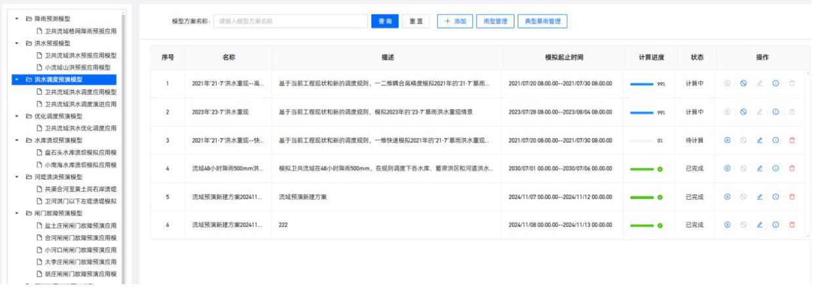  
图 2.1.2.1.2-1水库调度模型  

# 2.1.2.1.3河道一维水动力模型  

卫河作为暴雨洪水的最终出口通道,其过流能力的大小直接决定了流域内整体的防洪排涝能力,在发生超标准洪水时甚至因河道过流能力不足导致河道洪水漫溢,淹没河道周围的大片低洼区域。如果仅采用二维网格剖分来反映河道,由于网格受数量限制不能过小,从而使得以二维网格描绘的河道断面大小严重失真,以此为依据计算的河道行洪能力也是不准确的。  

通过补充勘测河道断面数据结合已治理段的河道断面数据,构建卫共干流及重要支流河道的一维水动力学模型,并通过与水库调度模型、洪水预报模型以及洪水演进二维模型的耦合,精准模拟从暴雨产生到产流到形成洪水的过程,得到河道各断面处准确可靠的水位、流量等洪水要素过程。一方面能真实反映河道的排水能力,实现河道一维与二维模型的交互,另一方面其计算结果作为蓄滞洪区入流条件,能够确保各蓄滞洪区分洪水位和流量过程的准确。  

河道一维水动力模型主要涵盖卫共流域49条重要干支流,与洪水预报模型和水库调度模型联合构成整个卫共流域的一维洪水演进模型,将洪水预报模型计算的子流域重要出口断面的径流量过程作为河道一维水动力模型的入流边界,将水库调度模型耦合入河道一维水动力模型中,用来进行水库调度规则的设置。  

考虑到重要支流洪水过程也是支流本身经过水库调度、河道闸站调度以后得到的结果,无法直接通过产汇流模型计算,因此,为准确模拟干支流洪水过程,有水库调度或闸站调度的重要支流也必须加入模型范围,最终考虑本次需要构建卫河、共产主义渠、大沙河3条干流以及淇河、思德河、安阳河、汤永河、峪河、石门河等46条重要支流,形成河网进行联合调度模拟,模型要素包括河道本身、河道上的节制闸、翻板闸、橡胶坝、桥墩阻水桥梁、防洪闸、退水闸等。  

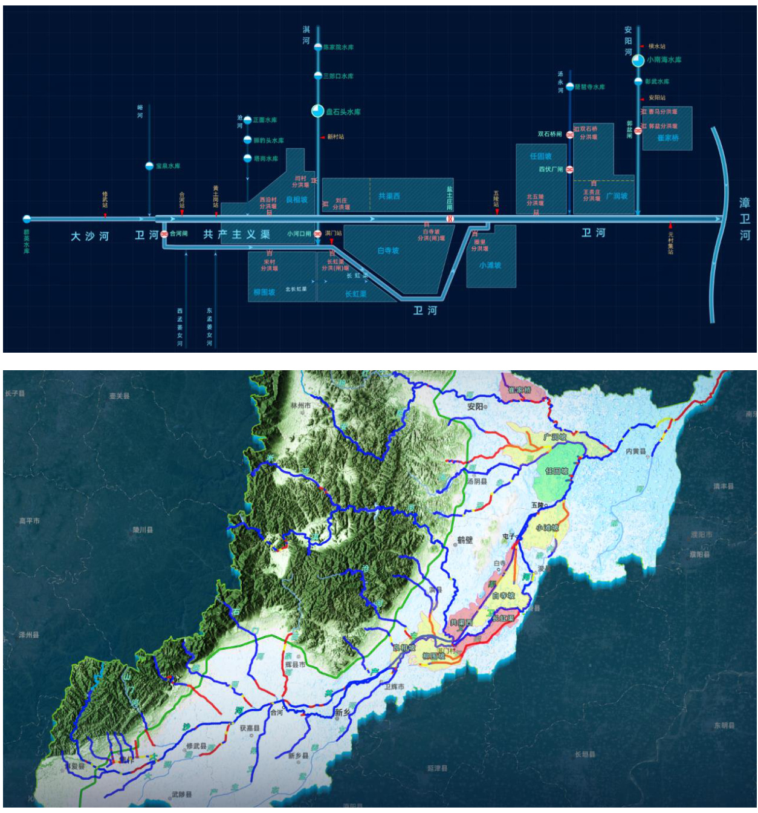  
图 2.1.2.1.3-1 河道一维水动力模型  

# 2.1.2.1.4二维洪水淹没演进模型  

(1)蓄滞洪区二维淹没演进模型  

在《海河流域防洪规划》上蓄、中疏、下排,适当地滞"的防洪除涝体系中,河南省承担着拦蓄、分滞洪水的重要任务,由于河南省卫共流域流域防洪的特点,9座蓄滞洪区启用频次高,为提高蓄滞洪区运用管理水平,精准模拟滞洪区蓄洪滞洪过程以及蓄滞洪区联合调度过程,获得蓄滞洪区启用时间、滞洪量、淹没面积、淹没水深、淹没历时等关键数据,需要构建卫共流域的良相坡、共渠西、白寺坡、长虹渠、柳围坡、崔家桥、广润坡、小滩坡、任固坡共9座蓄滞洪区二维洪水淹没演进模型。  

蓄滞洪区二维淹没演进模型的构建主要包括基础资料收集与整理、确定模型范围、控制线绘制、分区划分、网格剖分、地形高程插值、边界条件设置、构筑物设置、参数设置、模型计算以及模型参数率定与验证等步骤。  

(2)南水北调交叉河道二维洪水演进模型  

南水北调中线工程是实现我国水资源优化配置、促进经济社会可持续发展、保障和改善民生的重大战略性基础设施。中线总干渠沿线布置有上千座立体交叉建筑物,其中输水建筑物159座,包括输水渡槽27座、渠道倒虹吸102 座、暗渠17座、隧洞12座、泵站1座;左岸排水建筑物458座,包括排水涵洞56座、排水渡槽75座、排水倒虹吸 327座。交叉河道建筑物担负中线总干渠左岸洪水的行洪任务,输水建筑物承担着中线总干渠输水功能,对保障中线工程总干渠安全稳定运行具有重要意义。  

本次卫共流域范围内南水北调中线工程起点为沁河倒虹吸出口,终点为漳河倒虹吸进口,总长度为 $227\mathrm{km}$ ,其中渠道倒虹吸32座,暗渠4座,输水渡槽2座,左排建筑物66 座。本次选取大沙河、十里河、淤泥河以及王村河共4条与南水北调交叉的河流进行河道二维洪水淹没演进模型构建。  

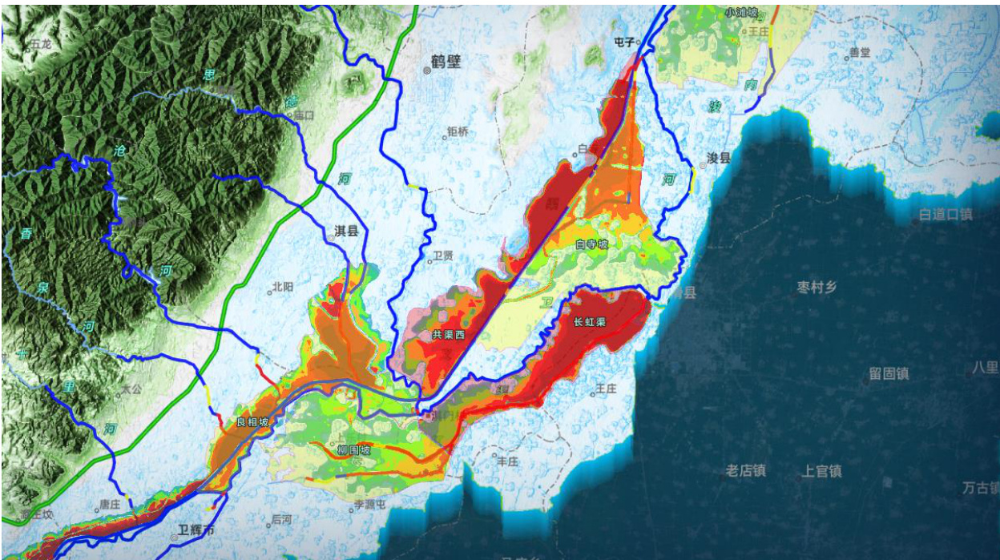  
图 2.1.2.1.3-1 河道二维淹没演进模型  

# 2.1.2.1.5水库河道蓄滞洪区耦合模型  

根据卫共流域防洪预报调度的实际需求,需要将全流域河道一维水动力学模型、蓄滞洪区二维淹没演进模型、水库调度模型等进行耦合。通过河道一维水动力学模型和二维水动力学模型的耦合计算,一方面能真实反映河道的排水能力,实现河道与周围二维地面径流的交互,另一方面出流过程也可作为蓄滞洪区的入流边界条件使用,需建立耦合模型。  

水库河道蓄滞洪区耦合模型主要是基于洪水预报模型、河道一维水动力模型、二维洪水淹没演进模型、水库调度模型以及河道溃堤漫堤风险分析模型等,采用侧向连接和标准连接两种方式将以上几种模型进行紧耦合,构建卫共流域的一二维耦合计算模型。  

对于需要进行耦合计算的卫共干流及主要支流河道一维水动力模型、蓄滞洪区二维演进模型、水库调度模型,其耦合方式为标准连接与侧向连接。  

  
图2.1.2.1.5-1水库河道蓄滞洪区耦合模型  

# 2.1.2.1.6洪水预警模型  

通过构建水库、河道、蓄滞洪区等洪水预警模型,结合洪水预报模型、河道一维水力模型、水库调度模型、蓄滞洪区二维淹没演进模型、南水北调交叉河道洪水二维演进模型、水库河道蓄滞洪区耦合模型等预演模型模拟结果数据和实测洪水数据,对水库、河道、蓄滞洪区、堤防险工险段等进行风险预警,实时监测河道的洪水位、洪峰流量,蓄滞洪区进洪时间、进洪水位、进洪量以及南水北调交叉河道洪水实时信息。  

洪水预警对象包含 2 座大型水库、16 座中型水库,预警指标为是否超汛限水位、超设计水位、超校核水位;包含49条河流,预警指标为是否超警戒水位、超保证水位;包含9座蓄滞洪区,预警指标为是否启用及分红。  

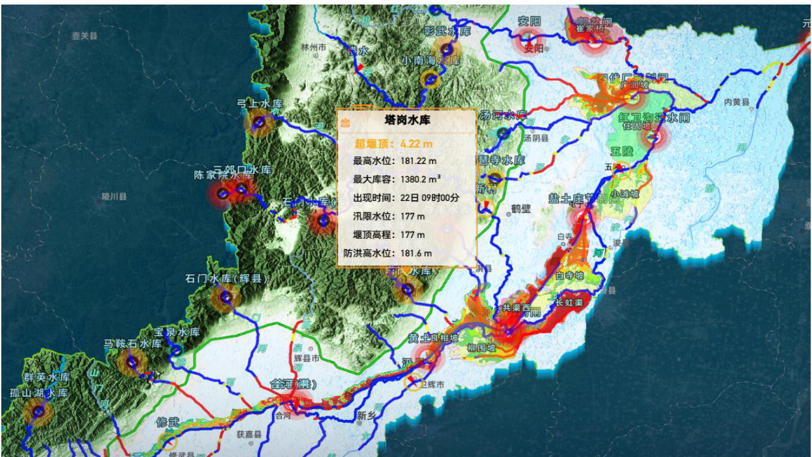  
图2.1.2.1.6-1 洪水预警模型  

# 2.1.2.1.7水库溃坝洪水风险分析模型  

大中型水库一旦溃坝将对下游带来极大损失,因此预演水库溃坝情景,分析溃坝洪水给下游带来的风险极为重要,溃坝预判及洪水风险分析模型包括盘石头水库、小南海水库2座大型水库。  

水库溃坝洪水风险分析模型的构建主要涵盖基础数据收集与整理、模型范围粗定、控制线绘制、分区划分、网格剖分、地形高程插值、边界条件设置、构筑物设置、参数设置以及模型计算与率定等方面。  

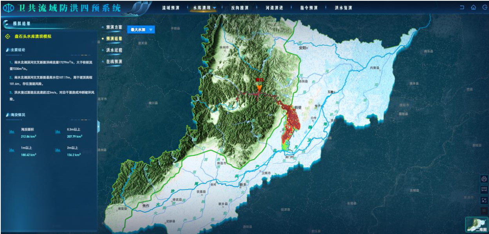  
图2.1.2.1.7-1水库溃坝洪水风险分析模型  

# 2.1.2.1.8河道漫堤及溃堤洪水风险分析模型  

河道漫堤及溃堤洪水风险分析模型主要有溃堤预判模型、风险分析模型和风险分析模型结果。功能主要是预判和分析河道堤坝可能发生溃堤的危险性,从而为防洪减灾工作提供科学依据。  

对于卫河、共产主义渠存在多处高填方堤防的河段,尤其是确定为险工险段的河段,选取重点险工险段、填方高、堤防存在安全隐患、一旦溃堤或漫堤对下游城镇存在较大淹没风险的典型区域构建二维漫堤或溃堤风险分析模型,因此本次初步对共产主义渠右堤和卫河左堤构建二维漫堤或溃堤风险分析模型。  

# 1)共产主义渠右堤  

河道范围为共产主义渠右堤从合河闸至黄土岗水文站,全长 $35.2\mathrm{km}$ ,该段河道右岸堤坊填方高,河南“21.7"洪水期间,共产主义渠右堤李士屯村发生过溃堤险情,且右岸有新乡市和卫辉市主城区,一旦发生溃堤或漫堤风险,将对下游城市造成巨大洪灾损失,因此该段纳入二维模型范围。  

# 2)卫河左堤  

河道范围为卫河左堤从淇门水文站至长虹渠退水闸,全长 $27.3\mathrm{km}$ ,该段河道左岸堤防填方较高,在河南发生“21.7"洪水时,卫河左岸堤防彭村段发生过决口险情,因此该段河道左堤存在漫堤或溃堤风险,并且左岸存在多个密集居民地,一旦发生溃堤或漫堤风险,将对下游居民地造成重大损失,因此该段纳入二维模型范围。  

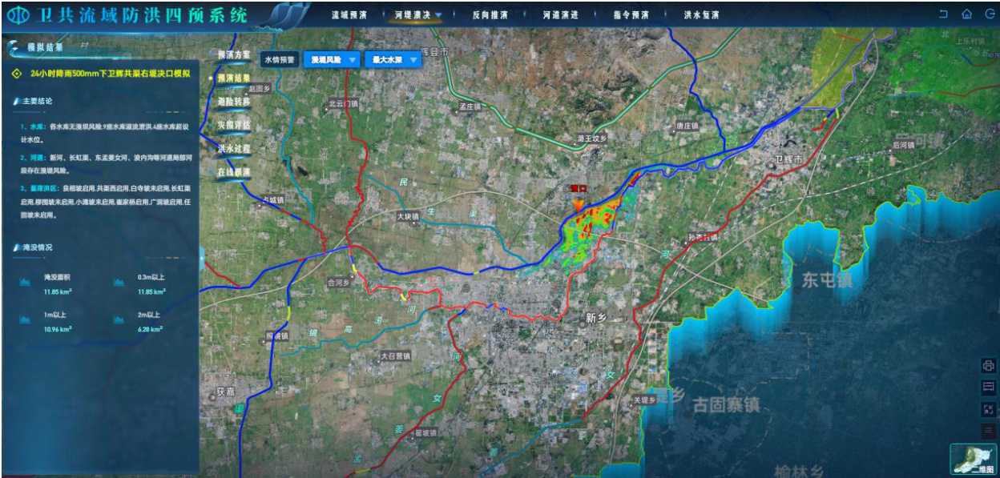  
图2.1.2.1.8-1河道漫堤及溃堤洪水风险分析模型  

# 2.1.2.1.9闸门故障风险分析模型  

河道水闸或蓄滞洪区分洪闸在漫长的使用过程中,不可避免的会出现各种故障,为模拟河道拦河闸发生故障对河道行洪造成的影响以及由此带来的洪水淹没风险,需要构建闸门故障风险分析模型,选取本次河道一维模型添加的水工建筑物中的重要拦河闸为模型研究对象,模拟当这些拦河闸在洪水过程中无法开启或无法关闭时,所造成的洪水风险,包括漫堤及对河道两岸的淹没风险、河道壅水风险等。  

模型应用对象包括合河闸、大李庄闸、胡庄闸、小河口闸、盐土庄闸共5座水闸。  

  
图 2.1.2.1.9-1 闸门故障风险分析模型  

# 2.1.2.1.10洪灾损失评估模型  

通过构建洪灾损失评估模型,评估实际发生的洪水淹没和模拟洪水淹没洪灾损失,其过程分为确定洪水影响指标、确定损失率、指标展布与叠加分析计算几部分。  

洪灾损失评估模型主要应用对象为洪水影响范围内区域。  

  
图 2.1.2.1.10-1 洪灾损失评估析模型  

# 2.1.2.2智能识别模型  

# 2.1.2.2.1遥感智能分析  

接入省级数字李生平台遥感智能分析模型,实现卫共流域遥感智能解译和智能识别。融合多源遥感影像数据,通过遥感解译和人工智能识别技术,实现基于多源遥感影像的地物分类、变化检测与目标识别,提取卫共流域内的水体生产建设项目等信息,动态监测变化,为实现“四预"监测预警提供支撑。  

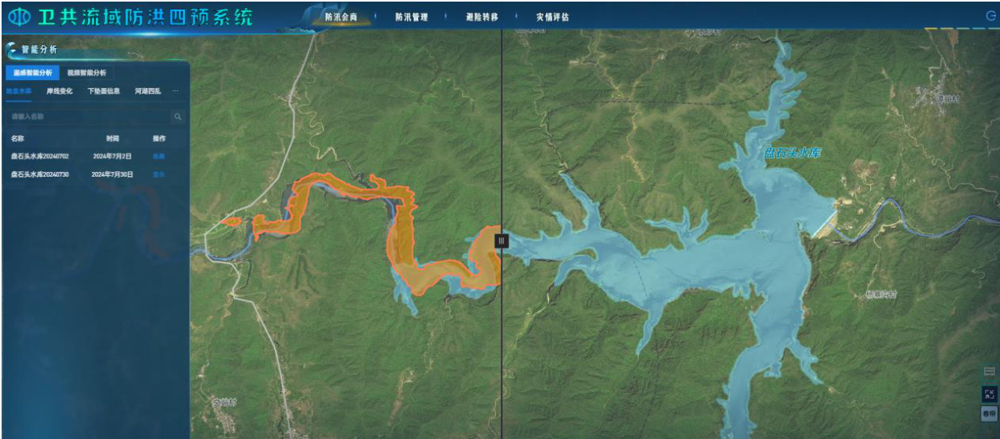  
图2.1.2.2.2-1接入遥感智能分析模型  

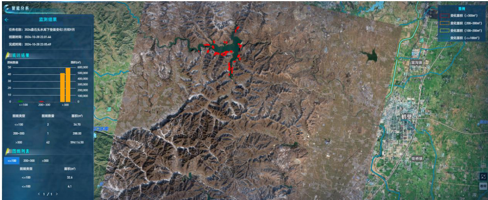  
图2.1.2.2.2-2接入视频智能分析模型  

# 2.1.2.2.2视频智能分析  

接入省级数字李生平台视频智能分析模型,实现卫共流域视频智能识别。  

构建基于人工智能技术的视频监控AI识别模型,利用已经建成的视频监控网络,通过对视频监控中出现的特定场景、行为进行自动提取、定位和分析,可以实现水域漂浮物检测、河岸工程车识别、堤岸损毁识别、采砂机械识别、水尺识别等功能,为水利工作提供技术和数据支持,与现有的工作业务流无缝对接,改进传统的人工巡查模式。  

  
图2.1.2.2.2-1接入视频智能分析模型  

# 2.1.2.3模拟仿真引擎  

数据底板搭建完成后,要实现流域物理实体与虚拟实体的实时交互和深度融合,通过汇聚流域多源、多维、多时相、多专业连续监测数据,分类分段整理成时序数据,研究基于时序事件驱动的全空间、多过程、多情景实时动态展示技术  

和历史事件回放技术,支撑面向流域运维管理的动态仿真。本次利用省级水利数字李生平台的模拟仿真引擎能力进行卫共流域相关场景的模拟仿真。  

  
图2.1.2.3 -1 模拟仿真引擎支撑  

# 2.1.2.4模型管理平台  

在省级数字李生平台建设框架下,搭建卫共流域模型管理平台,实现对卫共流域模型的管理。  

模型管理平台基本功能包括模型的分类编码、模型信息的全局预览、模型原理的查看、模型参数的修改、模型方案的增删改查、模型方案的计算暂停和停止控制、模型方案结果的查询、模型服务接口的管理等。  

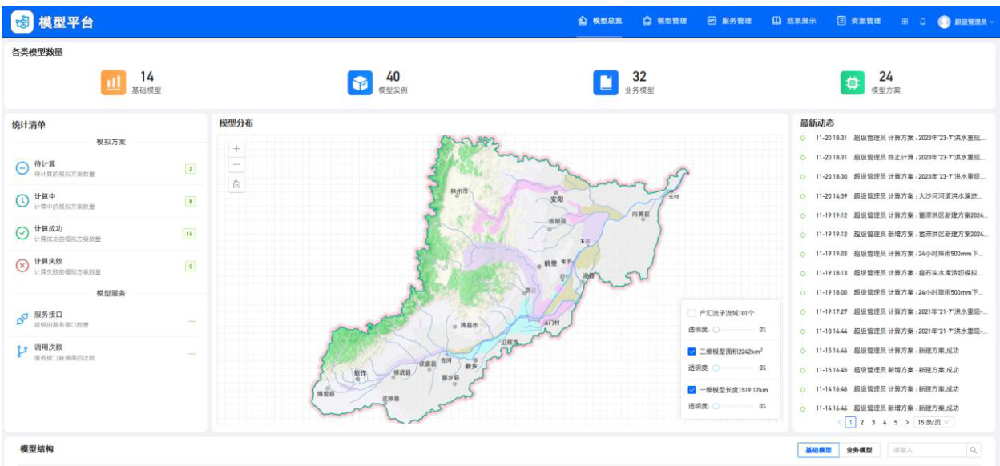  
图2.1.2.4 -1 模型管理平台1  

  
图2.1.2.4-2模型管理平台2  

  
图2.1.2.4 -3 模型管理平台3  

# 2.1.3 知识库  

# 2.1.3.1知识库管理  

知识库管理模块包括业务规则库、历史场景库、专家经验库、预报调度方案库。  

(1)业务规则库  

包括大中型水库调度规则、蓄滞洪区运用规则、重要水闸枢纽调度运用计划等业务规则。  

(2)历史场景库  

包括流域历年重大水事件、重要调度专题事件相关资料。  

(3)专家经验库包括水文预报、防汛调度等研究报告、专题研究成果资料、关键指标数据。  

(4)预报调度方案库  

包括参与防洪调度或者应急水量调度的水库、河道、水闸等的洪水或枯水预报方案、洪水调度方案、应急水量调度方案。  

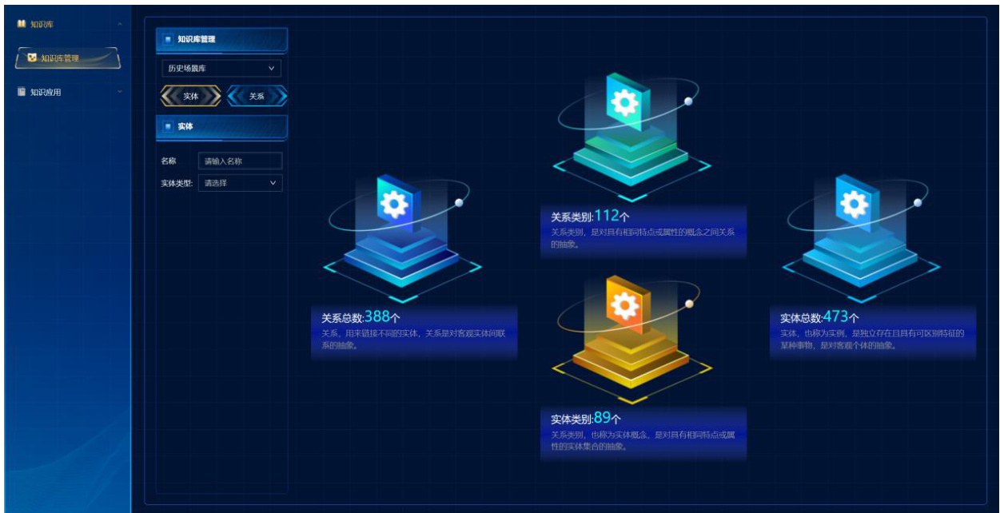  
图2.1.3.1 -1 实体关系  

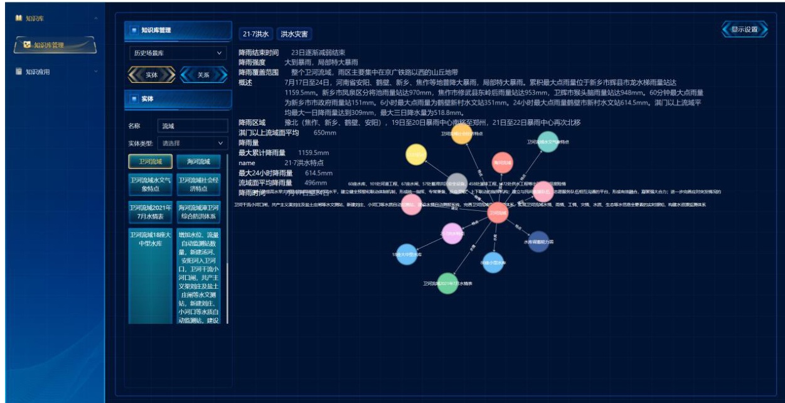  
图2.1.3.1-2 实体信息  

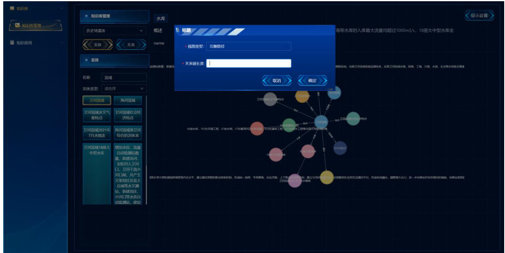  
图2.1.3.1-3知识库管理(显示设置)  

# 2.1.3.2知识应用  

知识应用包括水利知识问答。复用省级数字李生平台知识引擎建设具有水利知识表示、水利知识抽取、水利知识融合、水利知识推理、水利知识存储功能的卫共流域防洪知识引擎,结合水利对象关联关系分类,提供防洪知识智能搜索服务、知识解释与溯源服务、精准推荐服务等。  

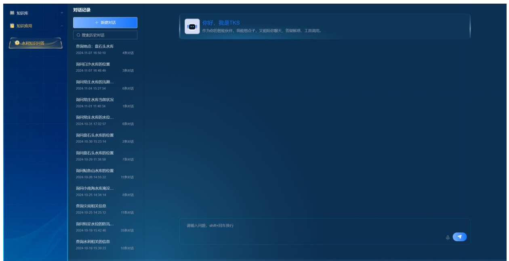  
图2.1.3.2-4知识应用  

# 2.1.4防洪"四预"系统  

# 2.1.4.1概况  

概况功能模块用于流域范围内基础地理、水利工程、监测闸站、行政区划等各种基础信息的展示和查询,并提供身临其境的高保真数字李生场景交互和漫游,为防洪业务提供基础信息支撑。  

概况功能模块包括流域概况、基础地理信息查询、水利工程信息查询、行政区划信息查询、监测站点信息查询、三维场景交互式漫游、数字李生场景虚实交互等功能项。  

(1)流域概况  

通过流域信息查询功能点,可获取流域主要信息描述,包括流域面积、主要河道特性、主要水利工程、大中型水库分布、蓄滞洪区分布等,对于主要水利工程的工程等级、防洪规模也在流域信息呈现。  

# (2)基础地理信息查询  

用于查询流域的基础地理信息,包括河流水系、地形地貌、子流域划分等。在该功能项里,通过选择相应的基础地理要素,如河流,系统列出流域范围所有河流基础信息,通过在地图中点击拾取该河流,可获得河流的详细属性列表。  

# (3)水利工程信息查询  

用于查询流域内各水利工程信息,通过地图交互和列表获取不同类型水利工程基础信息,包括大型水库、中型水库、小型水库、拦河闸、分洪堰、分洪口、分洪闸、防洪闸、排涝闸、内河闸、翻板闸、橡胶坝、河道堤防、险工险段、南水北调工程等,支持列表和地图联动,可以互相选择,支持一键模糊搜素功能。  

(4)行政区划信息查询  

该功能项用于查询流域内行政区划信息,通过地图交互和列表获方式取相关信息,包括省辖市、区县、乡镇、村庄等行政区划信息,以及高速路、铁路、国道、省道、县道、城市道路、跨河桥梁等交通信息,支持列表和地图联动,可以互相选择,支持一键模糊搜素功能。  

(5)监测站点信息查询  

该功能项用于查询流域内防洪相关监测站点信息,包括河道水文站、河道水位站、水库水文站、雨量站、情站、视频监控站、取水口流量监测站等,通过地图交互和列表两种方式,获取各监测站点基础属性信息,包括站点名称、站点编号、站点位置、建设时期、所在县市等属性,支持列表和地图联动,可以互相选择,支持一键模糊搜素功能。  

(6)三维场景交互式漫游  

该功能项用于实现身临其境的高保真场景交互式漫游,直观获取地形地貌、水工建筑及周边环境信息。  

  
图 2.1.4.1 -1 流域工程概况  

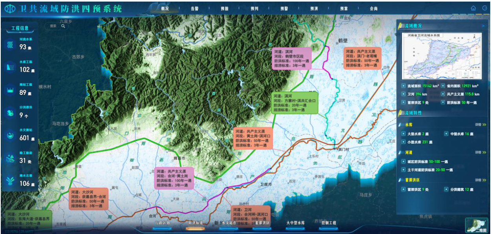  
图 2.1.4.1-2流域防洪标准  

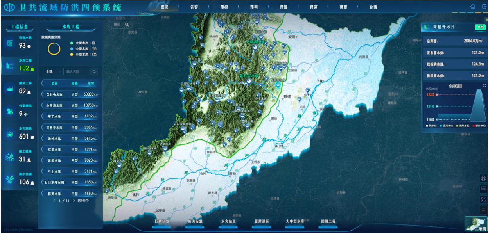  
图2.1.4.1 -3 流域河流水系  

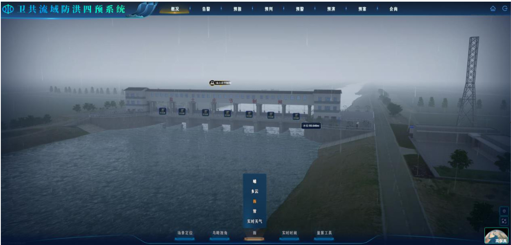  
图 2.1.4.1-4三维场景交互  

# 2.1.4.2告警  

告警功能模块用于对流域范围内气象信息、实时雨情、水库和河道水情、闸站工情、工程安全、视频监测、遥感监测、AI监测等实时信息的展示查询,当实时监测数据超过安全阈值时系统自动发出告警,并将告警信息一键推送至相关防汛管理人员手机,辅助防洪决策。  

(1)气象信息  

通过接入中国气象局的天气信息,可对预报历时卫星雷达云图、格网降雨数据进行直观动态展示。  

(2)雨情监测及告警  

基于GIS地图,提供各雨量站实时雨量信息查询,雨量监测站点的查询方式分时段累积降雨量和降雨过程,为防洪调度提供实时、准确的雨情信息服务。  

(3)水情监测及告警  

系统接入全流域实时水情数据,包括河道水文站、水库水位站、河道水位站、AI水位监测、闸站水位流量监测等。  

(4)闸站监测及告警  

系统通过接入主要控制闸闸站状态数据,在地图中实时展示各水闸闸门状态,包括开孔数、开度等,通过点击水闸,可查询该闸历史时段开关闸过程。  

(5)取水口流量监测及告警  

系统通过接入流域内重点取水口流量监测数据,在地图中实时展示各取水口流量状态数据,通过点击取水口,可查询该取水口历史时段取水流量过程数据。  

(6)河道生态流量监测及告警  

系统通过接入流域内河道重点断面生态流量监测数据,在地图中实时展示各断面生态流量状态数据。  

(7)安全监测及告警  

系统通过接入重点河堤段、重点建筑物工程安全监测数据,包括位移、沉降、渗流、渗压、应力、应变等监测数据,可在场景中直观展示和查询各安全监测点的实时和历史监测数据。  

# (8)视频监测  

视频监控设备接入管理、实时监控、录像存储、检索回放、解码上墙控制等  

功能。  

(9)遥感监测  

系统接入卫星遥感监测数据,通过对遥感影像分析,实时提取重点淹没区水面范围。  

(10)AI监测及告警  

系统接入AI监测站点数据,主要对水雨情、漂浮物、人员入侵等情况进行实时监测,并自动发出告警。  

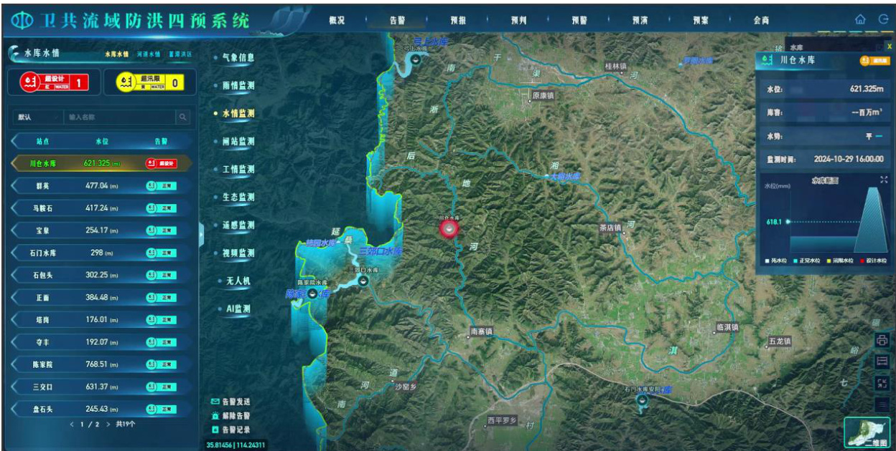  
图 2.1.4.2-1水情监测告警  

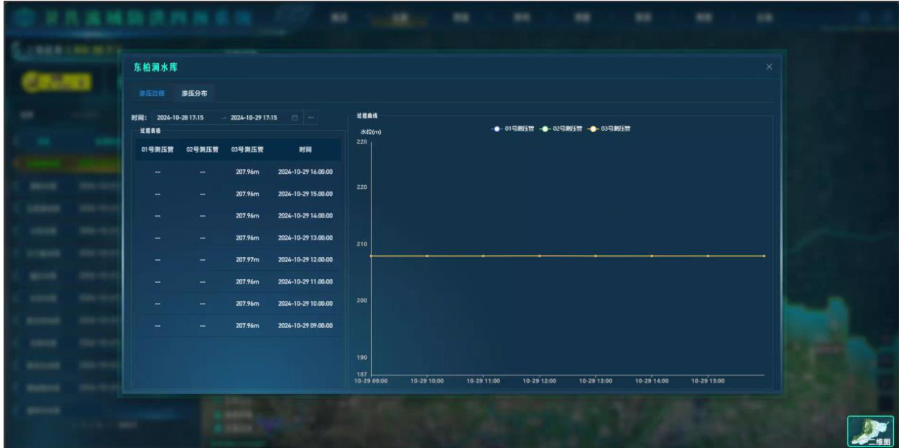  
图 2.1.4.2-2安全监测告警  

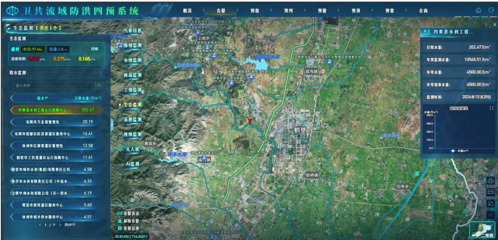  
图2.1.4.2-3生态流量监测告警  

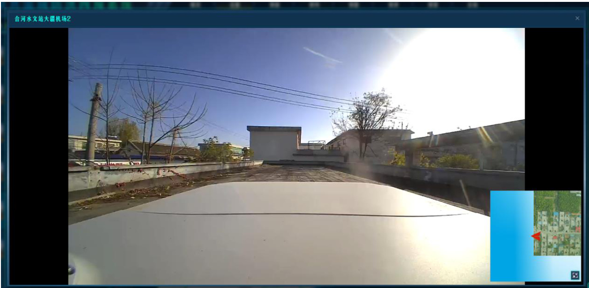  
图2.1.4.2-4无人机监测  

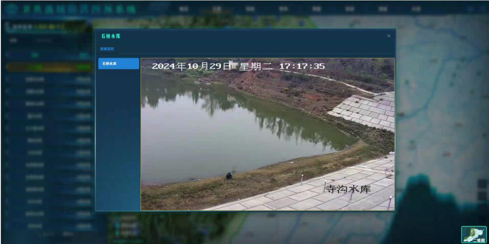  
图2.1.4.2 -5 视频 AI监测  

# 2.1.4.3预报  

预报模块包括降雨预测、水库洪水预报、河道洪水预报、蓄滞洪区进洪预报、 小流域山洪预报、河道洪水实时追踪、预报洪水实时校正、预报评估、预报成果 管理等功能项。  

(1)降雨预测  

系统通过接入气象中心3-7天的中短期格网预测降雨数据,实现卫共全流域未来1小时、24小时、48小时、72小时的格网预测降雨。  

# (2)水库洪水预报  

水库洪水预报可通过全流域统一的自动或人工干预的洪水预报获得,也可单独计算获取,获得水库预报最高水位、最高水位出现时间以及水库整个洪水过程,包括入库洪水过程、出库洪水过程、库水位变化过程、库容变化过程等信息。  

(3)河道洪水预报  

河道洪水预报可实现人工干预的洪水预报和洪水自动预报,预报结果数据包括断面洪峰流量、最高水位、洪峰出现时间、流量过程线、水位过程线。  

(4)蓄滞洪区进洪预报  

基于蓄滞洪区洪水预报模型,以预测降雨过程为边界条件,预报各蓄滞洪区进洪洪水情况。  

(5)典型小流域山洪预报  

通过构建山洪预报模型,以预测降雨过程为边界条件,预报各小流域山洪,可进行定时自动预报,也可进行人工干预预报。  

# (6)洪水实时追踪  

洪水发生后,通过卫共沿线各监测站点实时洪水水位、流量监测,根据水动力学演变规律,分析内插河道沿线水情,并绘制卫共沿线实时水情图,从而对洪水进行实时追踪。  

(7)洪水预报实时校正  

通过系统6小时(1小时、0.5小时)一次自动洪水预报,预报时长为未来72小时,每次均以已发生降雨 $^+$ 最新预报降雨、最新监测水情、闸站工情对模型进行动态实时校正,模型以修正后的边界条件首先还原现状水情,再进行未来洪水预报,从而确保洪水预报准确性,提高洪水预报精度,避免累积误差。  

(8)预报评估  

洪水预报成果评估开展洪水预报精度评估分析,统计误差的概率,结合《水文情报预报规范》(GB/T22482-2008)对预报方案进行合格率进行计算,并基于精度评估进行滚动预测,为会商决策提供依据。  

# (9)预报成果管理  

预报成果管理主要包括降雨预测成果管理、洪水预报成果管理等。  

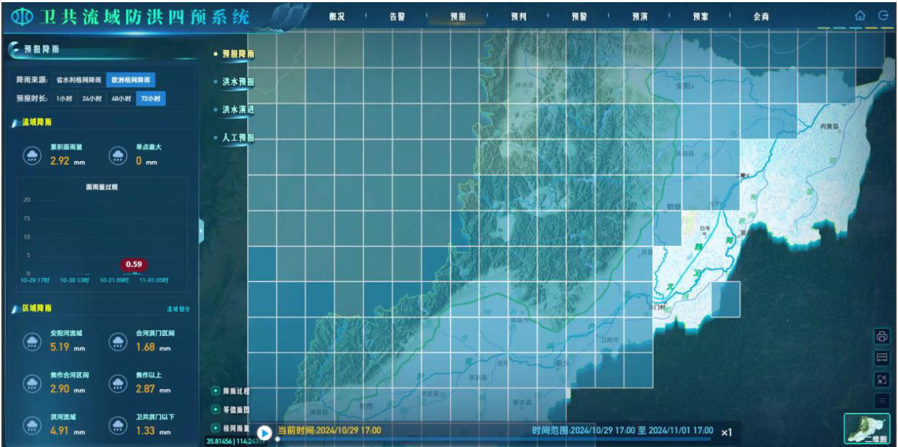  
图2.1.4.3 -1 预报降雨管理  

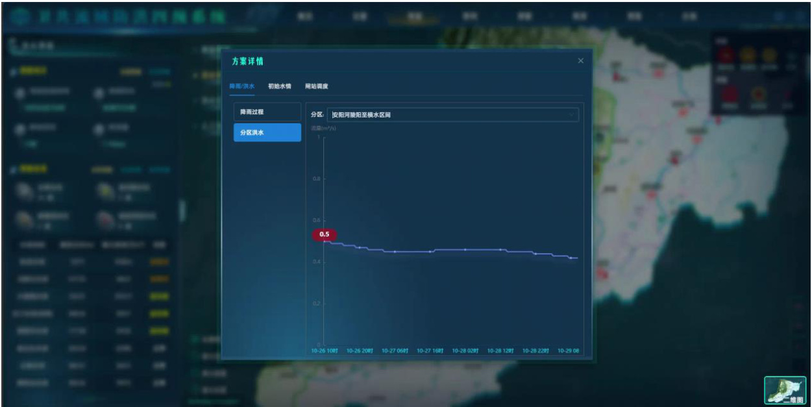  
图2.1.4.3-2预报方案管理  

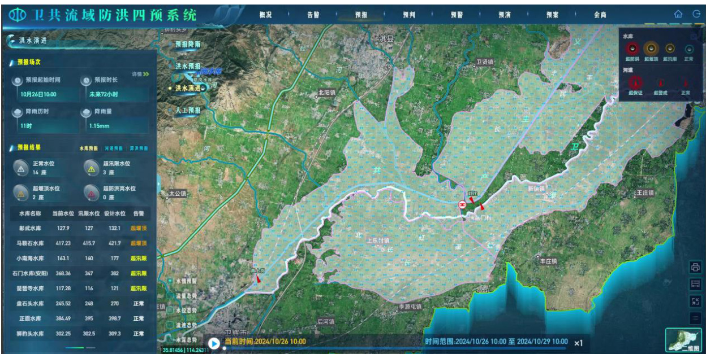  
图2.1.4.3 -3 预报过程演进  

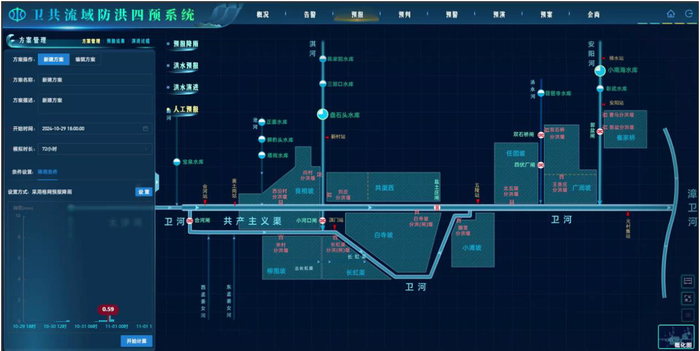  
图 2.1.4.3-4人工预报过程  

# 2.1.4.4预判  

预判功能基于水库、河道、蓄滞洪区的雨水情态势进行纳雨能力分析,根据短中期降雨预报和水情预报,预判洪水来源和组成情况,分析重要河段的潜在防洪风险以及工程实时防洪能力,通过参数调配评估当前水库、河道、蓄滞洪区未来可容纳降雨量,提供预报及联合会商研判的数据层面支撑。  

(1)防洪形势分析  

基于控制站点拓扑关系,根据各控制站点实时及预报水情过程,通过计算各控制站洪峰、洪量等指标,分析提出重要防洪对象(控制站点)的洪水来源河段及各来源河段的洪峰、洪量组成情况。  

(2)水库防洪预判  

通过水库不同时间区间的水库水情监测信息、当前水位、讯限水位、设计水位及当前降雨及未来降雨情况,再根据水库特征信息及库容曲线变化情况,判断水库超过汛限水位区间,实现防洪自动预判。  

(3)河道防洪预判  

系统以列表形式获取查看断面信息、不同时间区间的河道水情站监测信息、当前水位、警戒水位,通过上游实时雨情信息计算显示河道断面上游面雨量结果,判断当前河道流量信息。  

(4)蓄滞洪区防洪预判  

系统以列表形式列取蓄滞洪区,获取查看断面信息、不同时间区间的蓄滞洪区水情站监测信息、当前水位、警戒水位,通过实时雨情信息计算显示蓄滞洪区面雨量结果,判断当前蓄滞洪区流量信息。  

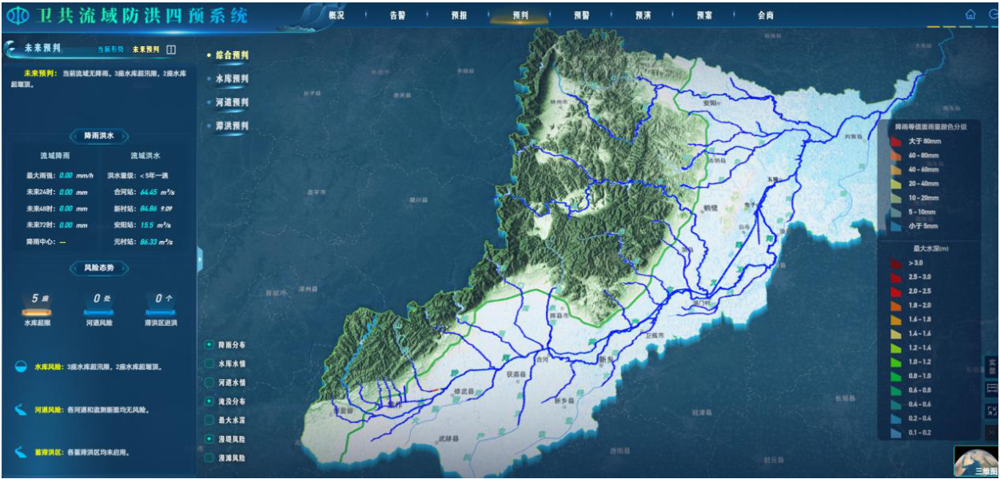  
图2.1.4.4 -1 综合预判  

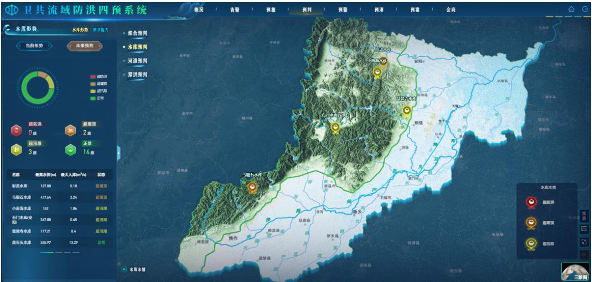  
图2.1.4.4-2水库预判1  

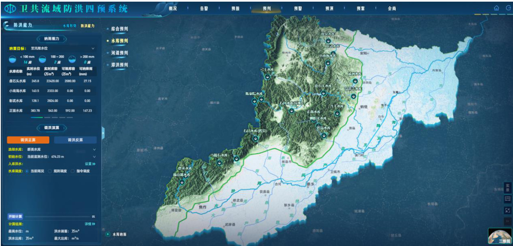  
图2.1.4.4-3水库预判2  

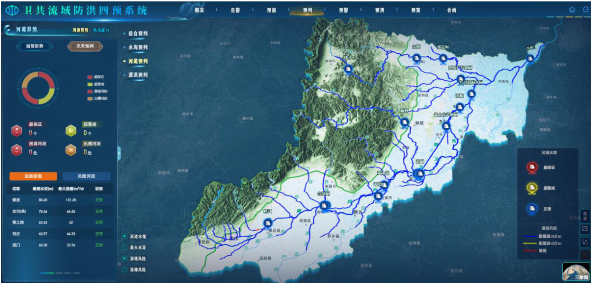  
图 2.1.4.4-4河道预判1  

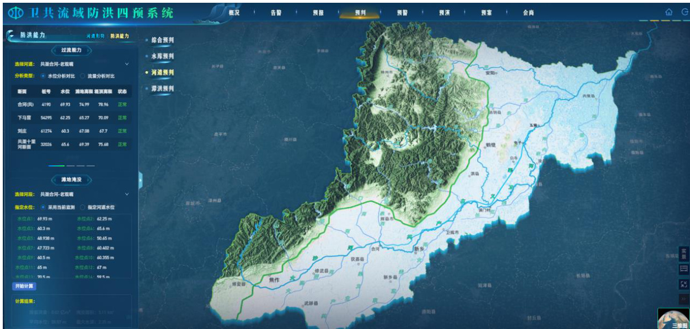  
图 2.1.4.4 -5河道预判 2  

# 2.1.4.5预警  

预警模块包括水库洪水预警、河道洪水预警、蓄滞洪区进洪预警、典型山洪灾害预警、南水北调风险预警、预警信息推送等功能项。  

(1)水库洪水预警  

利用自动预报、人工干预预报的水库洪水预报结果,通过与水库汛限水位、防洪高水位、设计水位、校核水位等特征值进行对比,对流域内各中大型水库洪水进行分级预警。  

# (2)河道洪水预警  

利用自动预报、人工干预预报的河道洪水预报结果,结合河道洪水预警机制,通过河道沿线预报水位与其防洪特征水位对比,发出不同级别的洪水预警。对于预报水位超警戒水位的河道特征断面,发出黄色预警;对于预报水位超保证水位的河道特征断面,发出红色预警。  

(3)蓄滞洪区进洪预警  

利用自动预报、人工干预预报的蓄滞洪区进洪预报结果,对于预报水情接近蓄滞洪区启用条件,或已经达到启用条件的蓄滞洪区,包括能自动漫溢进洪和需要人工扒口进洪的蓄滞洪区,分别发出黄色预警和红色预警。  

(4)典型小流域山洪灾害预警  

根据自动预报、人工干预预报的小流域山洪预报结果,结合现有具体流域山洪预警机制,对典型小流域山洪灾害进行预警。  

# (5)南水北调风险预警  

利用自动预报、人工干预预报的南水北调交叉断面河道洪水预报结果,对存在风险的河道交叉断面发出预警。  

(6)预警信息推送  

将判定的预警信息通过系统平台向值班人员及相关部门进行预警信息发布,随着险情的加大加重实时更新发布预警信息。  

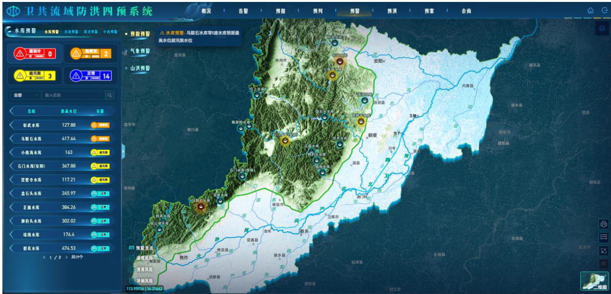  
图2.1.4.5 -1 预报预警  

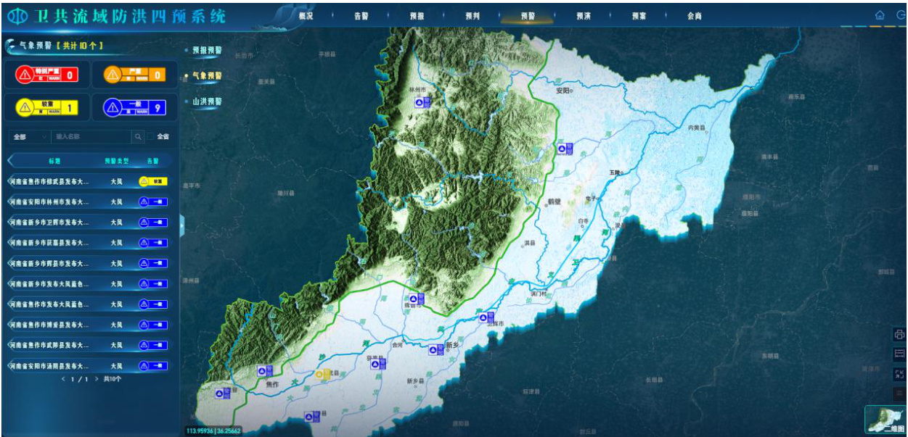  
图2.1.4.52气象预警  

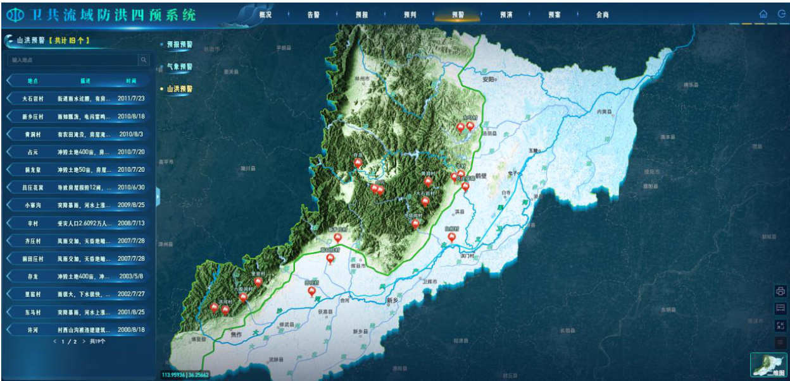  
图2.1.4.5 -3 山洪预警  

# 2.1.4.6预演  

预演功能模块包括洪水调度预演、水库溃坝预演、河堤溃决预演、闸门故障预演、蓄滞洪区进洪预演、河道洪水演进预演、实时交互预演、预演情景风险分析、预演方案对比等功能项。  

(1)预演情景设置  

降雨情景设置,针对流域实时降雨情景,接入流域实时雨量、水位、流量及遇见期降雨等信息,以当前或者用户所选择时段的降雨强度为基准,设置各项参数,具体包括预演对象、预演时间、当前时间段、雨量调整比例等。  

# (2)洪水调度预演  

基于拟定的降雨洪水情景,对全流域洪水调度进行模拟预演,为洪水调度提供决策支持。  

(3)水库溃坝预演  

可在线构建各中型水库在不同量级洪水下,从洪水入库、水位上涨、溢洪道溢流泄洪到水库溃坝、溃坝洪水向下游演进的全过程,通过模型设置可实现单一水库溃坝、多水库同时溃坝、上下游水库联决溃坝等各种情景。  

# (4)河堤溃决预演  

对主要高填方河堤段或历史发生过溃决的河堤段、险工险段,通过与河道闸站联合调度模型耦合,在线定制计算方案,如设置溃口位置、溃口宽度、溃决时机、溃决历时等,实现河堤溃决预演。  

# (5)闸门故障预演  

可精确模拟主要拦河闸在1个或多个闸门发生故障情况下,根据不同闸门类型和闸门故障类型,模拟河道内的洪水演进情况。  

(6)蓄滞洪区进洪预演  

结合蓄滞洪区二维洪水淹没演进模型,模拟洪水在蓄滞洪区内的淹没演进过程,并统计相关淹没风险。  

(7)河道洪水演进预演  

对典型河段洪水演进过程进行模拟预演,包括模拟方案信息(方案名称、方案描述、方案限定条件、模拟预演等)和预演时间(预演开始时间、预演时长、预演步长等),分析河道洪水流场,分析漫滩行洪、桥梁阻水等风险。  

(8)实时交互预演  

在洪水发生过程中,进行实时交互预演。  

(9)预演情景风险分析  

对各预演情景进行洪水风险分析,为灾损评估、避险转移、应急措施制定提供支持。  

(10)逆向推演  

实现水库纳雨能力逆向推演、水库调度逆向推演和流域洪水优化调度逆向推演。  

(11)预演方案对比  

对同一预演情景的两方案进行对比,分析各方案优缺点,为防洪调度、应急处置提供决策支持。  

  
图 2.1.4.6 -1 流域概化图  

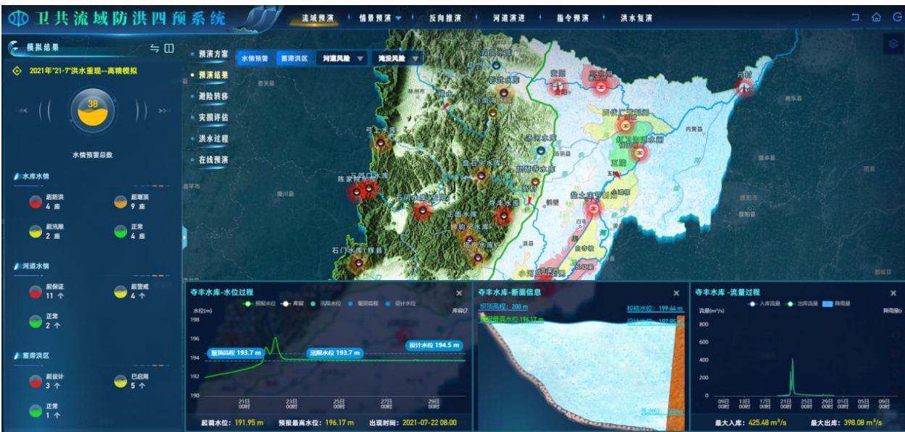  
图2.1.4.6 -2 预演结果  

  
图2.1.4.6 -3 洪灾损失  

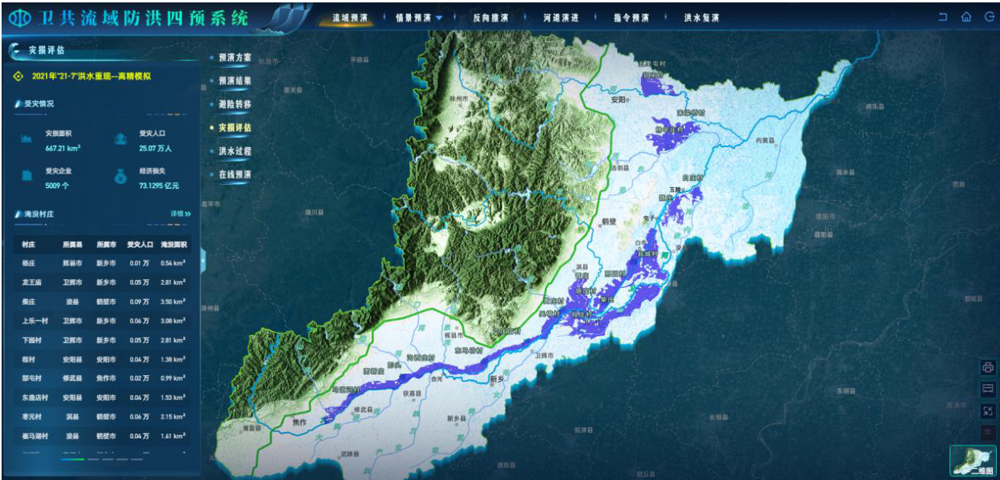  
图 2.1.4.6 -4 灾情评估  

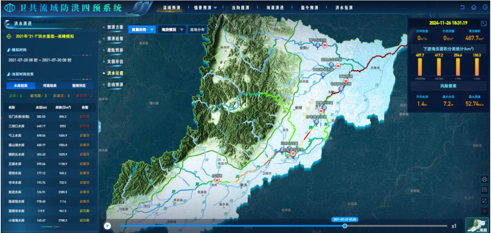  
图2.1.4.6 -5 演进过程  

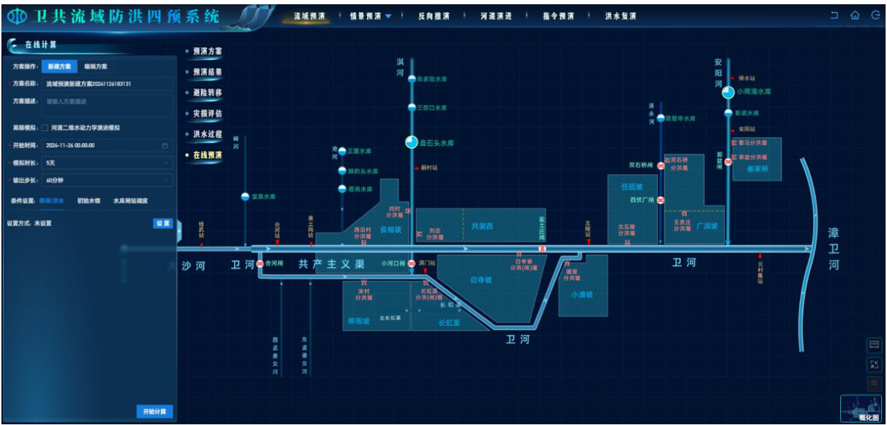  
图 2.1.4.6 -6 在线预演  

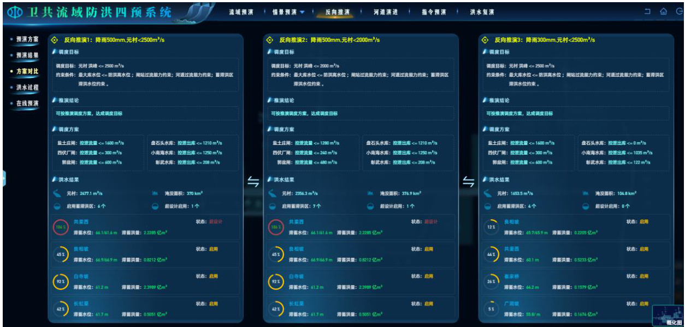  
图2.1.4.6-7方案对比  

# 2.1.4.7预案  

防洪预案功能模块包括预案自动生成、关联预案管理等功能项。  

(1)预案自动生成  

根据预演情景的各预演方案,一键自动生成洪水风险防范预案,并可在线预览和下载,为防洪决策提供依据。  

# (2)关联预案管理  

实现对卫共工程防汛预案、调度预案等的电子化及管理、查询功能,提供对多种预案内容进行分类检索、查询及浏览服务。  

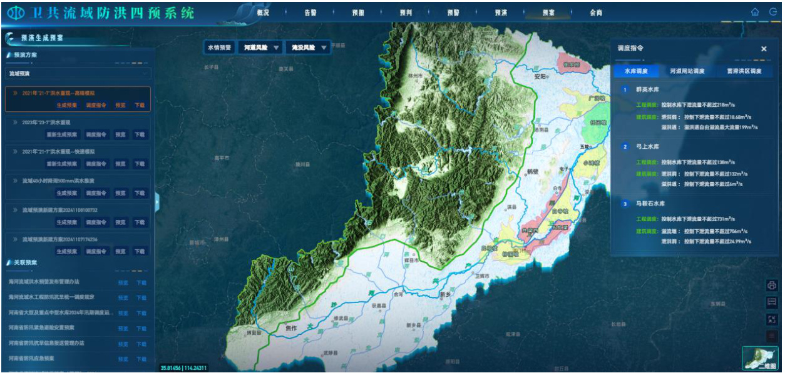  
图 2.1.4.7 -1 预案在线生成  

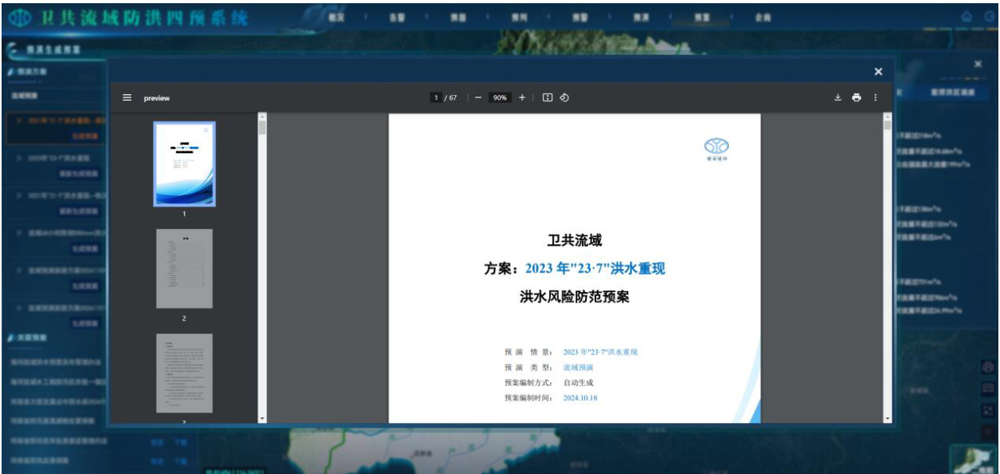  
图2.1.4.7 -2 预案浏览  

# 2.1.4.8防汛管理  

防汛管理功能模块包括调度预案管理、防汛人员管理、防汛物资管理、防汛值班管理、防汛预警响应等功能项。  

(1)调度预案管理  

调度信息管理主要针对调度基础资料、模拟调度方案、水库调度指令、模拟调度结果等数据信息的管理。  

(2)防汛人员管理  

实现对防汛组织体系、应急抢险队伍等的统一管理。  

(3)防汛物资管理  

实现对防汛抢险物资仓库存储物资的统一管理。  

(4)防汛值班管理  

提供对值班表、值班记录、防汛日报、值班电话和上报突发事件的可视化展示和搜索查看功能。  

(5)防汛预警响应  

实现对不同洪水场景下预警响应机制、相关责任人职责权限、预案和实际执行情况相关记录的管理。  

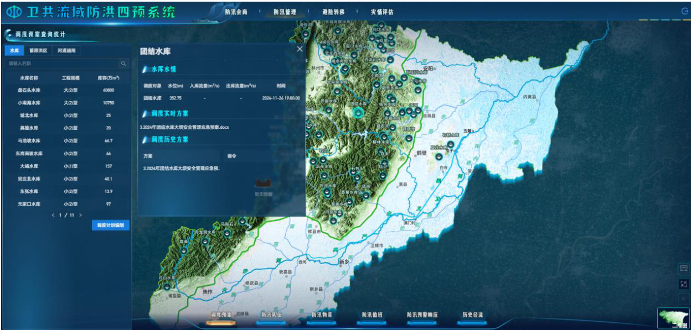  
图 2.1.4.8 -1 调度预案  

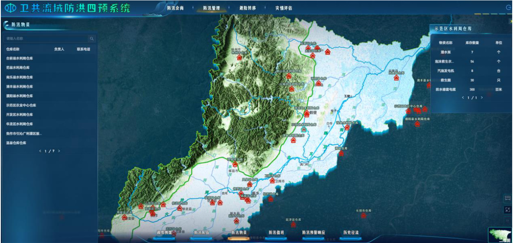  
图2.1.4.8 -2 防汛物资  

# 2.1.4.9防汛会商  

防汛会商功能模块包括灾情现场直播、防汛综合会商等功能项。  

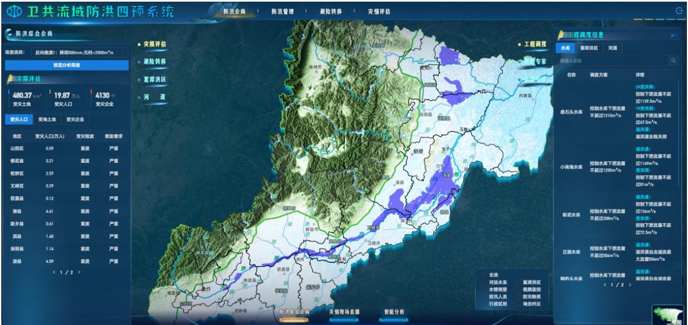  
图 2.1.4.9 -1 防汛会商  

# 2.1.4.10避险转移  

避险转移功能包括避险预案管理、风险点管理、避险路线规划、安置区管理、避险转移过程追踪、避险过程动态模拟生成等功能项。  

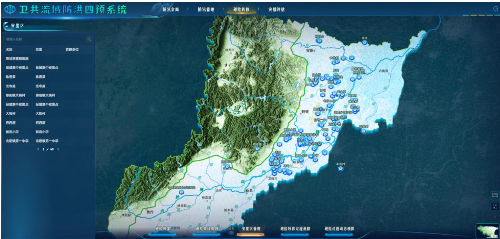  
图2.1.4.10 -1 避险转移  

# 2.1.4.11 灾情评估  

灾情评估功能包括实时淹没分析、方案淹没分析、受灾人口统计、受淹土地统计、重点企业受灾分析、灾情综合损失评估、灾情报表生成等功能项。  

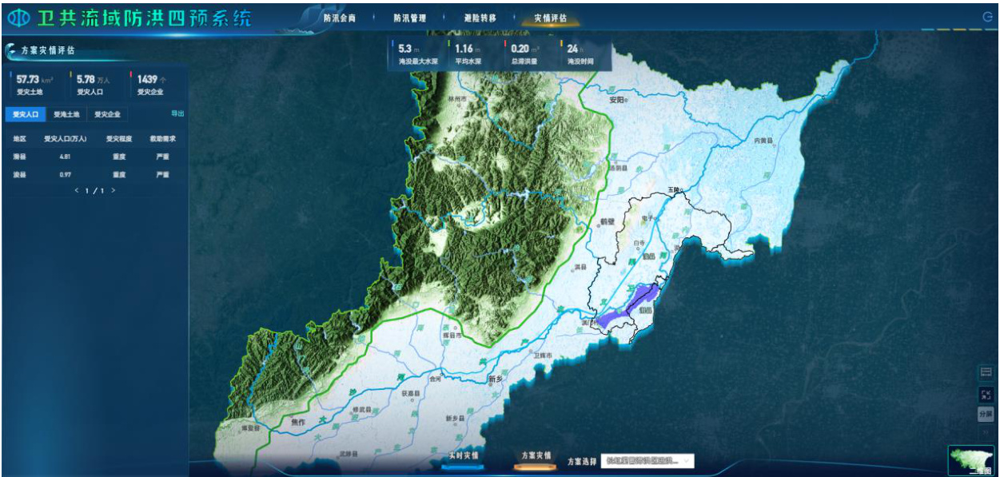  
图2.1.4.11 -1 灾情评估  